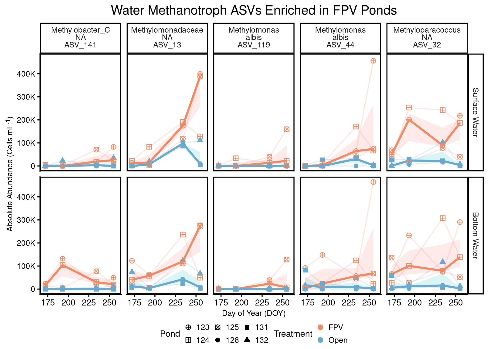
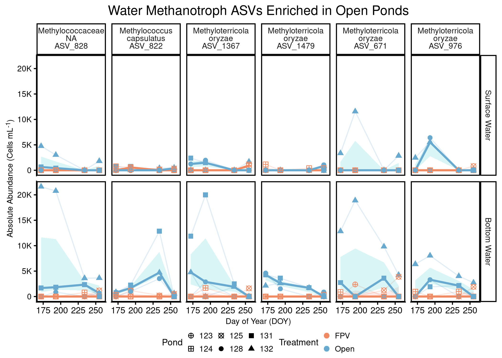
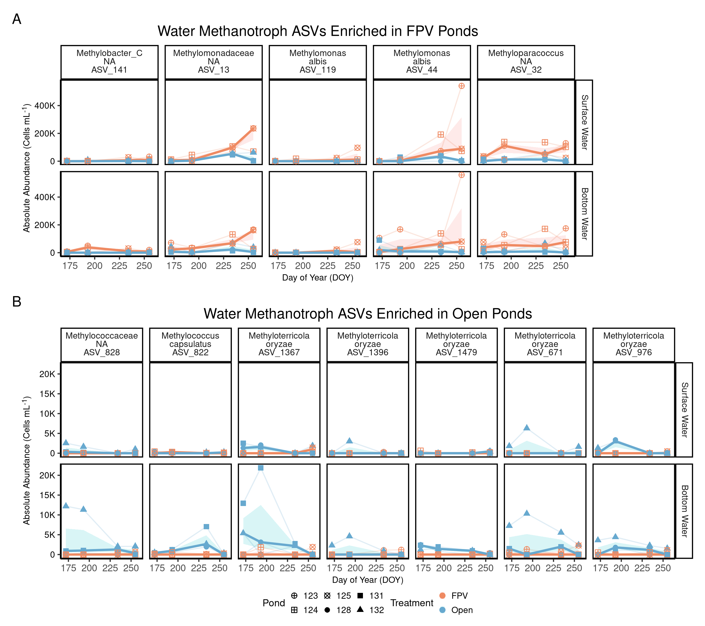
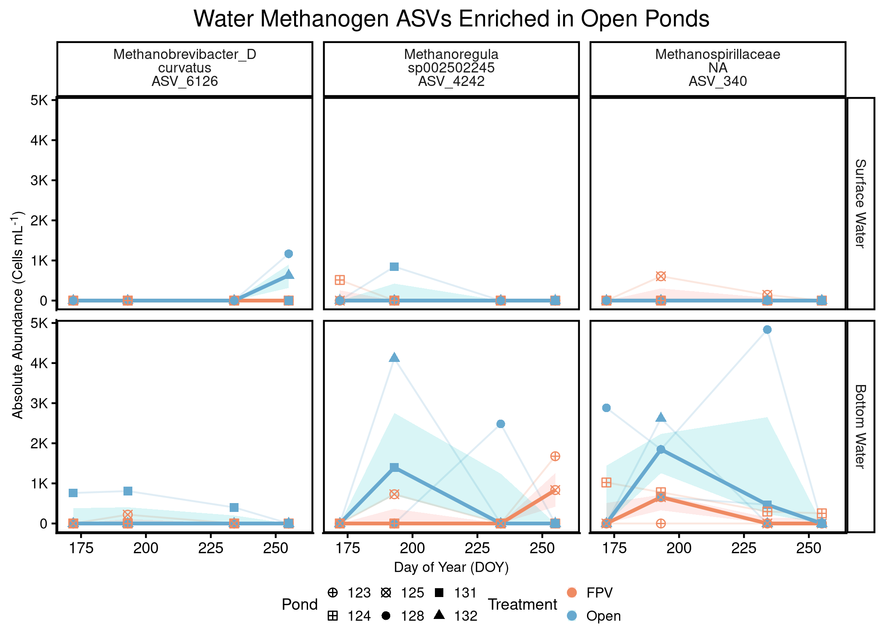
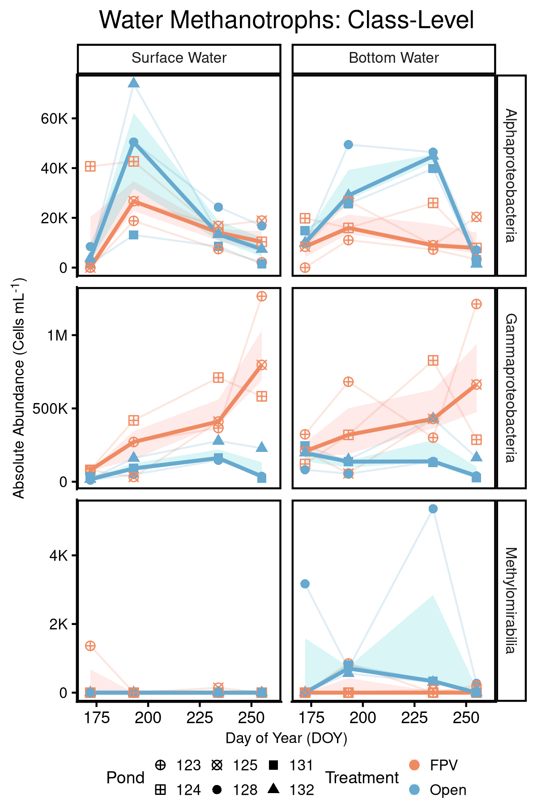
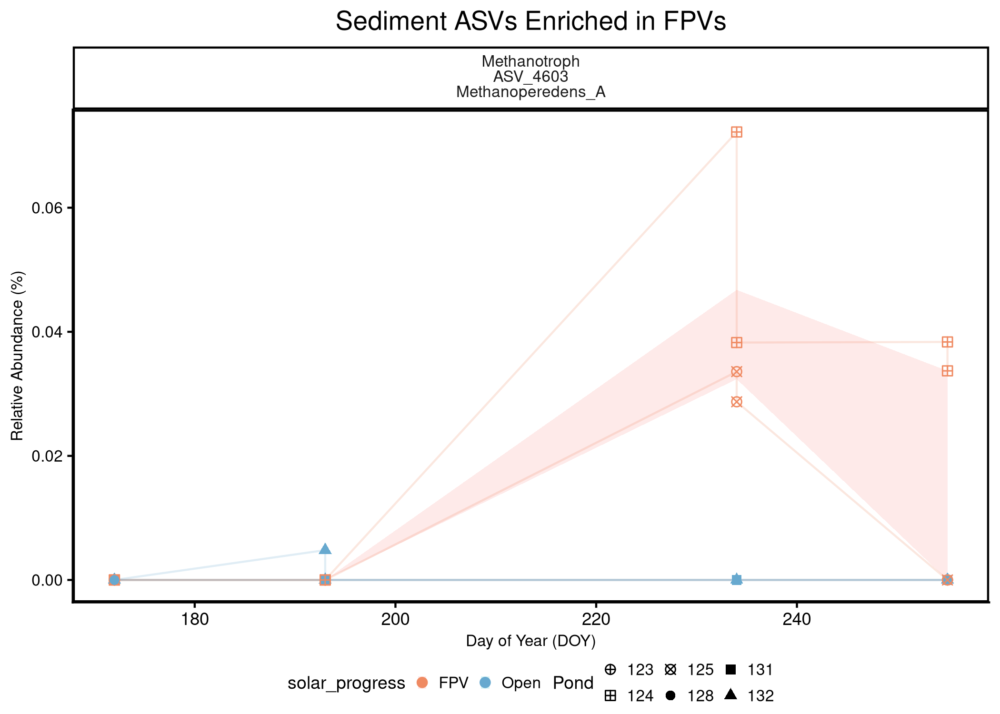
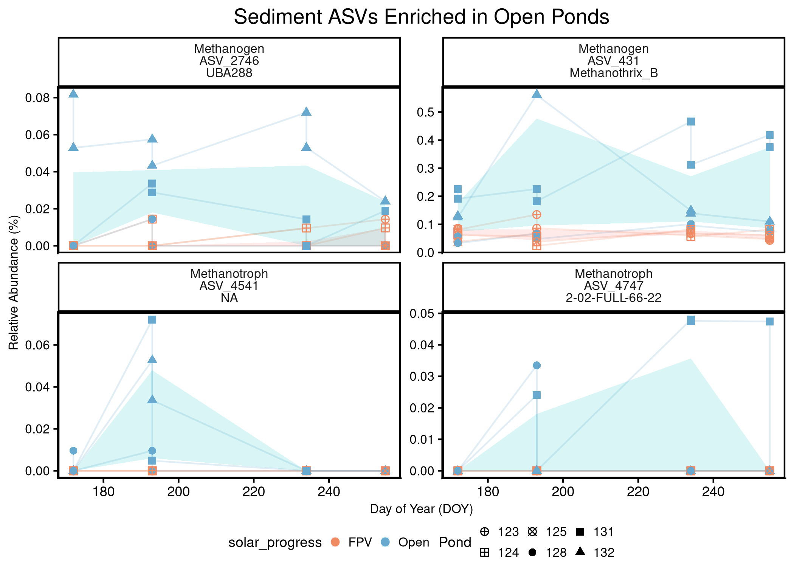
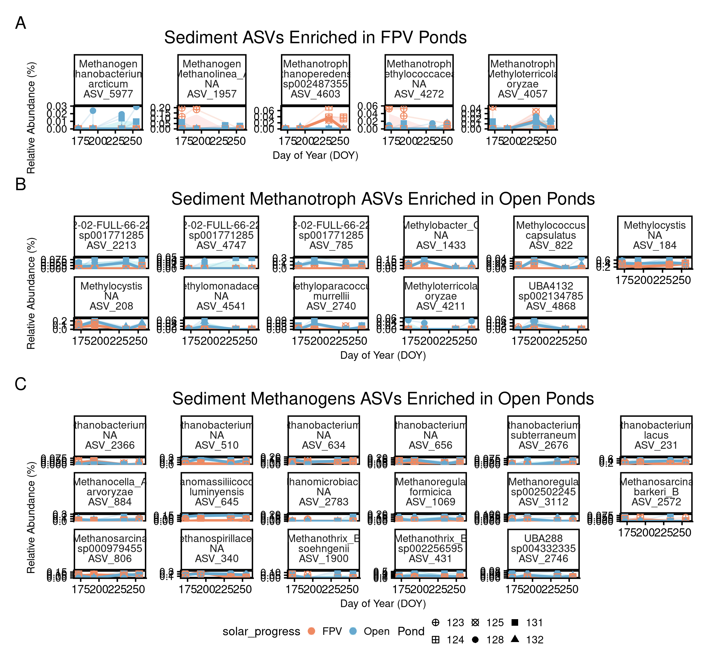
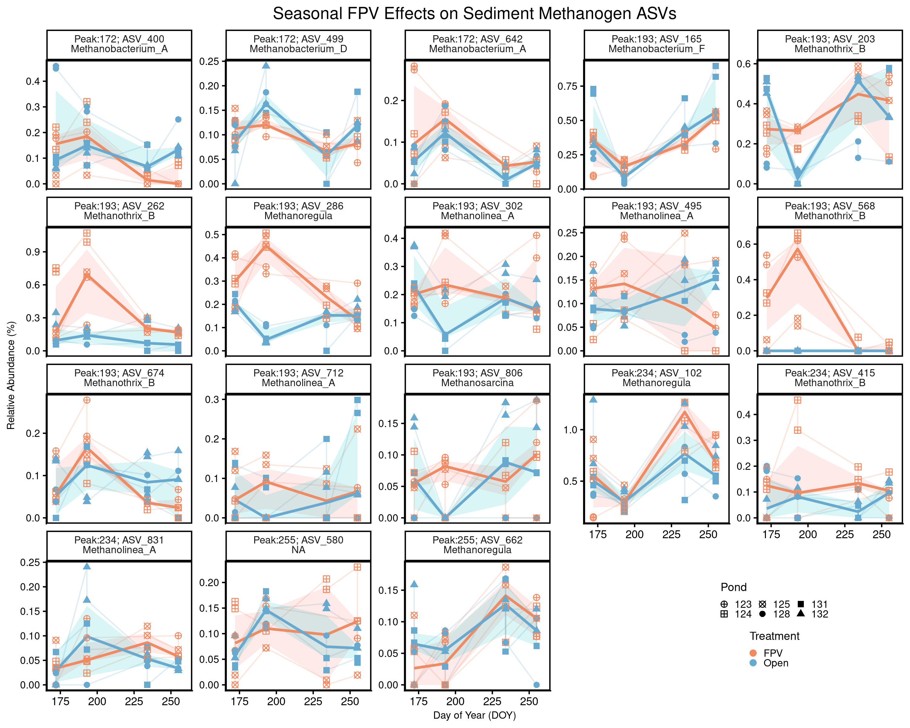
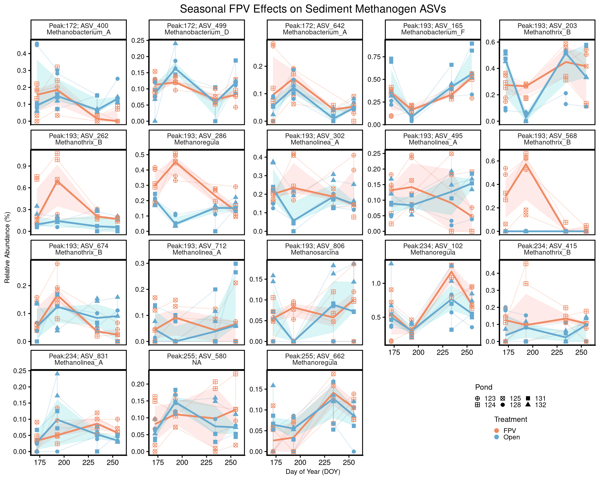

# Load packages


``` r
# Efficiently load packages 
pacman::p_load(ggplot2, phyloseq, ggpubr, tidyverse, patchwork,
               speedyseq, rstatix, dplyr, purrr, vegan, ANCOMBC, 
               microViz,cowplot, grid, scales, Biostrings, stringr, 
               DT, ggtext, install = FALSE)

source("code/functions.R") # contains scale_reads
source("code/colors_and_shapes.R")

# Set our seed for reproducibility
set.seed(09091999)
```


# Load Phyloseq Data 


``` r
# Load in the phyloseq objects
## WATER 
load("data/01_phyloseq/water_ch4_cyclers_physeq.RData")
water_ch4_cyclers_physeq
```

```
## phyloseq-class experiment-level object
## otu_table()   OTU Table:          [ 255 taxa and 48 samples ]:
## sample_data() Sample Data:        [ 48 samples by 50 sample variables ]:
## tax_table()   Taxonomy Table:     [ 255 taxa by 10 taxonomic ranks ]:
## phy_tree()    Phylogenetic Tree:  [ 255 tips and 254 internal nodes ]:
## taxa are columns
```

``` r
# We will also need a relative abundance otu_table
## What is the current form??? 
head(otu_table(water_ch4_cyclers_physeq))[, 1:6]
```

```
## OTU Table:          [ 6 taxa and 6 samples ]:
## Taxa are columns
##           ASV_677 ASV_42364 ASV_1071 ASV_2288 ASV_785 ASV_313
## 1 SA_D060       0       576        0        0       0    2594
## 2 SA_D068       0         0        0        0       0       0
## 3 SA_D076       0         0        0        0       0     561
## 4 SA_D091       0         0        0        0       0       0
## 5 SA_D053       0         0        0        0       0       0
## 6 SA_D061       0         0        0        0       0       0
```

``` r
## Create vector of water ASVs for parsing later
water_ch4_cyclers_vec <- 
  water_ch4_cyclers_physeq %>%
  taxa_names()

#check 
length(water_ch4_cyclers_vec)
```

```
## [1] 255
```

``` r
## SEDIMENT 
load("data/01_phyloseq/sed_ch4_cyclers_physeq.RData")
sed_ch4_cyclers_physeq
```

```
## phyloseq-class experiment-level object
## otu_table()   OTU Table:          [ 347 taxa and 44 samples ]:
## sample_data() Sample Data:        [ 44 samples by 47 sample variables ]:
## tax_table()   Taxonomy Table:     [ 347 taxa by 10 taxonomic ranks ]:
## phy_tree()    Phylogenetic Tree:  [ 347 tips and 346 internal nodes ]:
## taxa are rows
```

``` r
# We will also need a relative abundance otu_table
## What is the current form??? 
head(otu_table(sed_ch4_cyclers_physeq))[, 1:6] # RELATIVE! We are good! 
```

```
## OTU Table:          [ 6 taxa and 6 samples ]:
## Taxa are rows
##              SA_D005  SA_D013  SA_D021  SA_D031  SA_D038  SA_D006
## 1 ASV_37258 0        0        0        0        0        0       
## 2 ASV_2118  0.000240 0.000240 0.000144 0        0        0.000192
## 3 ASV_8411  0        0        0        0        0        0       
## 4 ASV_677   0.000288 0.00129  0.00111  0.00148  0.000714 0.000383
## 5 ASV_3924  0        0        0        0        0        0       
## 6 ASV_1375  0.000144 0.000240 0.000144 0.000861 0.000381 0.000192
```

``` r
## Create vector of sediment ASVs for parsing later
sed_ch4_cyclers_vec <- 
  sed_ch4_cyclers_physeq %>%
  taxa_names()

# Check 
length(sed_ch4_cyclers_vec)
```

```
## [1] 347
```

## Create Methanogen and Methanotroph Phyloseq Objects

For the Water samples:


``` r
# Create a water methanogen phyloseq object
water_methanogens_physeq <- 
  water_ch4_cyclers_physeq %>% 
  subset_taxa(CH4_Cycler == "Methanogen") %>% 
  prune_taxa(taxa_sums(.) > 0, .) 

# Take a look 
water_methanogens_physeq
```

```
## phyloseq-class experiment-level object
## otu_table()   OTU Table:          [ 66 taxa and 48 samples ]:
## sample_data() Sample Data:        [ 48 samples by 50 sample variables ]:
## tax_table()   Taxonomy Table:     [ 66 taxa by 10 taxonomic ranks ]:
## phy_tree()    Phylogenetic Tree:  [ 66 tips and 65 internal nodes ]:
## taxa are columns
```

``` r
# Create a Sediment Methanotroph phyloseq object
water_methanotrophs_physeq <- 
  water_ch4_cyclers_physeq %>% 
  subset_taxa(CH4_Cycler == "Methanotroph") %>% 
  prune_taxa(taxa_sums(.) > 0, .) 

# Take a look 
water_methanotrophs_physeq
```

```
## phyloseq-class experiment-level object
## otu_table()   OTU Table:          [ 189 taxa and 48 samples ]:
## sample_data() Sample Data:        [ 48 samples by 50 sample variables ]:
## tax_table()   Taxonomy Table:     [ 189 taxa by 10 taxonomic ranks ]:
## phy_tree()    Phylogenetic Tree:  [ 189 tips and 188 internal nodes ]:
## taxa are columns
```

And for the Sediments: 


``` r
# Create a Sediment methanogen phyloseq object
sed_methanogens_physeq <- 
  sed_ch4_cyclers_physeq %>% 
  subset_taxa(CH4_Cycler == "Methanogen") %>% 
  prune_taxa(taxa_sums(.) > 0, .) 

# Take a look 
sed_methanogens_physeq
```

```
## phyloseq-class experiment-level object
## otu_table()   OTU Table:          [ 150 taxa and 44 samples ]:
## sample_data() Sample Data:        [ 44 samples by 47 sample variables ]:
## tax_table()   Taxonomy Table:     [ 150 taxa by 10 taxonomic ranks ]:
## phy_tree()    Phylogenetic Tree:  [ 150 tips and 149 internal nodes ]:
## taxa are rows
```

``` r
# Create a Sediment Methanotroph phyloseq object
sed_methanotrophs_physeq <- 
  sed_ch4_cyclers_physeq %>% 
  subset_taxa(CH4_Cycler == "Methanotroph") %>% 
  prune_taxa(taxa_sums(.) > 0, .) 

# Take a look 
sed_methanotrophs_physeq
```

```
## phyloseq-class experiment-level object
## otu_table()   OTU Table:          [ 197 taxa and 44 samples ]:
## sample_data() Sample Data:        [ 44 samples by 47 sample variables ]:
## tax_table()   Taxonomy Table:     [ 197 taxa by 10 taxonomic ranks ]:
## phy_tree()    Phylogenetic Tree:  [ 197 tips and 196 internal nodes ]:
## taxa are rows
```


## Prepare Raw phyloseqs for ANCOM-BC2 Input 

The ANCOMB-BC2 input requires raw counts. So, let's bring those into the workflow. 


``` r
# physeq with water (unincorporated cell counts) + sediment samples = 188 samples total
load("data/00_load_data/new_archaea_rooted_physeq.RData")

## Add JDate to the sample_data 
sample_data(new_archaea_rooted_physeq)$JDate <-
  lubridate::yday(sample_data(new_archaea_rooted_physeq)$Date_Collected)

# Obtain only water samples
raw_water24_physeq <- 
  new_archaea_rooted_physeq %>%
  subset_samples(SampleType == "Water") %>%
  subset_samples(Year == 2024) %>%
  # Now only subset the methanogens and methanotrophs
  prune_taxa(taxa_names(.) %in% water_ch4_cyclers_vec, .) %>%
  prune_taxa(taxa_sums(.) > 0,.)

# Inspect
raw_water24_physeq
```

```
## phyloseq-class experiment-level object
## otu_table()   OTU Table:          [ 255 taxa and 48 samples ]:
## sample_data() Sample Data:        [ 48 samples by 47 sample variables ]:
## tax_table()   Taxonomy Table:     [ 255 taxa by 9 taxonomic ranks ]:
## phy_tree()    Phylogenetic Tree:  [ 255 tips and 254 internal nodes ]:
## taxa are rows
```

``` r
# Obtain only sediment samples 
raw_sediment24_physeq <- 
  new_archaea_rooted_physeq %>%
  subset_samples(SampleType == "Sediment") %>%
  subset_samples(Year == 2024) %>%
  # Now only subset the methanogens and methanotrophs
  prune_taxa(taxa_names(.) %in% sed_ch4_cyclers_vec, .) %>%
  prune_taxa(taxa_sums(.) > 0,.)

#Inspect
raw_sediment24_physeq
```

```
## phyloseq-class experiment-level object
## otu_table()   OTU Table:          [ 347 taxa and 46 samples ]:
## sample_data() Sample Data:        [ 46 samples by 47 sample variables ]:
## tax_table()   Taxonomy Table:     [ 347 taxa by 9 taxonomic ranks ]:
## phy_tree()    Phylogenetic Tree:  [ 347 tips and 346 internal nodes ]:
## taxa are rows
```

# Water 

## PERMANOVA 

Three steps: 

1. Calculate Bray Curtis Distances
2. Calculate the PERMANOVA 
3. Calculate the betadisper 


``` r
### ### ### ### ### ### ### ### ###
# FIRST, calculate Bray-Curtis PERMANOVA using phyloseq distance
## Methanotrophs 
water_methanotroph_bray <- phyloseq::distance(water_methanotrophs_physeq, method = "bray", binary = FALSE)
# pull out Methanotroph Metadata 
water_methanotroph_metadata <- 
  water_methanotrophs_physeq%>%
  sample_data() %>%
  data.frame()

## Methanogens
water_methanogen_bray <- phyloseq::distance(water_methanogens_physeq, method = "bray", binary = FALSE)

## OOH, an important warning message! 
## How many samples have NO methanogens?? 
sum(rowSums(otu_table(water_methanogens_physeq)) == 0)
```

```
## [1] 5
```

``` r
## How many DO have methanogens? 
sum(rowSums(otu_table(water_methanogens_physeq)) > 0)
```

```
## [1] 43
```

``` r
### How does this compare in total counts to methanotrophs???
methanogen_counts <- rowSums(otu_table(water_methanogens_physeq))
methanogen_counts
```

```
## SA_D060 SA_D068 SA_D076 SA_D091 SA_D053 SA_D061 SA_D069 SA_D077 SA_D084 SA_D092 SA_D054 SA_D062 SA_D070 SA_D078 SA_D085 SA_D093 SA_D055 SA_D063 SA_D071 SA_D079 SA_D086 SA_D094 SA_D056 SA_D064 SA_D072 SA_D080 SA_D087 SA_D095 SA_D057 SA_D073 SA_D081 
##   40063   14405   20949     627       0     554    8246     834  107153    4131    5024    2892   32375    2390       0       0    1413     352    1973    1170    5351    7211   15402    1786   25266    5738    1585    1167       0    1163    1525 
## SA_D088 SA_D096 SA_D058 SA_D066 SA_D074 SA_D082 SA_D089 SA_D097 SA_D059 SA_D067 SA_D075 SA_D083 SA_D090 SA_D098 SA_D099 SA_D100 SA_D065 
##    8118    3910   11599   13092   14411    4444     581     291     746    2220    1509     824   11737       0    5441    4392     486
```

``` r
sum(methanogen_counts)
```

```
## [1] 394546
```

``` r
methanotroph_counts <- rowSums(otu_table(water_methanotrophs_physeq))
methanotroph_counts
```

```
## SA_D060 SA_D068 SA_D076 SA_D091 SA_D053 SA_D061 SA_D069 SA_D077 SA_D084 SA_D092 SA_D054 SA_D062 SA_D070 SA_D078 SA_D085 SA_D093 SA_D055 SA_D063 SA_D071 SA_D079 SA_D086 SA_D094 SA_D056 SA_D064 SA_D072 SA_D080 SA_D087 SA_D095 SA_D057 SA_D073 SA_D081 
##   94536  335836  180325  592889   68197   34984   59364  373600  190392  294655  323223  261287   82976  307858  170054  815647  121503   20215   99791  724705  169701  683450  140752  206148  104644  853628  291664   53366   78768  104221  427444 
## SA_D088 SA_D096 SA_D058 SA_D066 SA_D074 SA_D082 SA_D089 SA_D097 SA_D059 SA_D067 SA_D075 SA_D083 SA_D090 SA_D098 SA_D099 SA_D100 SA_D065 
##  476040   46917  215775  693884  163476  437498 1267346   24064   19407  461046  235349  171036 1215710   28937  236323  165553  289870
```

``` r
sum(methanotroph_counts)
```

```
## [1] 14414054
```

``` r
# pull out Methanotroph Metadata 
water_methanogen_metadata <- 
  water_methanogens_physeq%>%
  sample_data() %>%
  data.frame()


### ### ### ### ### ### ### 
### SECOND, time to calculate the PERMANOVA
## Results to add to Table S7 for the water column data. 
## Methanotrophs
water_methanotroph_permanova <- adonis2(water_methanotroph_bray ~ solar_progress * Pond * JDate, 
                                        data = water_methanotroph_metadata, by = "terms"); 
# Show the results 
water_methanotroph_permanova
```

```
## Permutation test for adonis under reduced model
## Terms added sequentially (first to last)
## Permutation: free
## Number of permutations: 999
## 
## adonis2(formula = water_methanotroph_bray ~ solar_progress * Pond * JDate, data = water_methanotroph_metadata, by = "terms")
##                      Df SumOfSqs      R2      F Pr(>F)    
## solar_progress        1   1.7286 0.13228 9.9873  0.001 ***
## Pond                  4   2.0848 0.15955 3.0114  0.001 ***
## JDate                 1   1.1437 0.08752 6.6079  0.001 ***
## solar_progress:JDate  1   0.8020 0.06137 4.6337  0.001 ***
## Pond:JDate            4   1.0772 0.08244 1.5560  0.032 *  
## Residual             36   6.2308 0.47683                  
## Total                47  13.0671 1.00000                  
## ---
## Signif. codes:  0 '***' 0.001 '**' 0.01 '*' 0.05 '.' 0.1 ' ' 1
```

``` r
## Methanogens
water_methanogens_permanova <- adonis2(water_methanogen_bray ~ solar_progress * Pond * JDate, 
                                        data = water_methanogen_metadata, by = "terms"); 
```

```
## Error in if (any(lhs < -TOL)) stop("dissimilarities must be non-negative"): missing value where TRUE/FALSE needed
```

``` r
# Show the results 
water_methanogens_permanova
```

```
## Error: object 'water_methanogens_permanova' not found
```

``` r
### ### ### ### ### ### ### ### 
# THIRD, calculate the betadispersion 
## Methanotrophs
##### FPV 
betadispr_water_methanotroph_solar <- betadisper(water_methanotroph_bray, water_methanotroph_metadata$solar_progress)
permutest(betadispr_water_methanotroph_solar)
```

```
## 
## Permutation test for homogeneity of multivariate dispersions
## Permutation: free
## Number of permutations: 999
## 
## Response: Distances
##           Df  Sum Sq  Mean Sq      F N.Perm Pr(>F)   
## Groups     1 0.12236 0.122360 9.1435    999  0.004 **
## Residuals 46 0.61558 0.013382                        
## ---
## Signif. codes:  0 '***' 0.001 '**' 0.01 '*' 0.05 '.' 0.1 ' ' 1
```

``` r
##### Pond
betadispr_water_methanotroph_pond <- betadisper(water_methanotroph_bray, water_methanotroph_metadata$Pond)
permutest(betadispr_water_methanotroph_pond)
```

```
## 
## Permutation test for homogeneity of multivariate dispersions
## Permutation: free
## Number of permutations: 999
## 
## Response: Distances
##           Df  Sum Sq  Mean Sq      F N.Perm Pr(>F)
## Groups     5 0.09255 0.018511 0.9979    999  0.445
## Residuals 42 0.77906 0.018549
```

``` r
##### Depth 
betadispr_water_methanotroph_depth <- betadisper(water_methanotroph_bray, water_methanotroph_metadata$Depth_Class)
permutest(betadispr_water_methanotroph_depth)
```

```
## 
## Permutation test for homogeneity of multivariate dispersions
## Permutation: free
## Number of permutations: 999
## 
## Response: Distances
##           Df  Sum Sq  Mean Sq    F N.Perm Pr(>F)
## Groups     1 0.01116 0.011156 0.81    999  0.323
## Residuals 46 0.63353 0.013772
```

``` r
##### Day of Year: Julian Date 
betadispr_water_methanotroph_JDate <- betadisper(water_methanotroph_bray, water_methanotroph_metadata$JDate)
permutest(betadispr_water_methanotroph_JDate)
```

```
## 
## Permutation test for homogeneity of multivariate dispersions
## Permutation: free
## Number of permutations: 999
## 
## Response: Distances
##           Df  Sum Sq  Mean Sq     F N.Perm Pr(>F)    
## Groups     3 0.23694 0.078979 5.531    999  0.001 ***
## Residuals 44 0.62829 0.014279                        
## ---
## Signif. codes:  0 '***' 0.001 '**' 0.01 '*' 0.05 '.' 0.1 ' ' 1
```

``` r
## Methogens
##### FPV 
betadispr_water_methanogen_solar <- betadisper(water_methanogen_bray, water_methanotroph_metadata$solar_progress)
permutest(betadispr_water_methanogen_solar)
```

```
## 
## Permutation test for homogeneity of multivariate dispersions
## Permutation: free
## Number of permutations: 999
## 
## Response: Distances
##           Df   Sum Sq   Mean Sq     F N.Perm Pr(>F)  
## Groups     1 0.020615 0.0206149 2.943    999  0.093 .
## Residuals 42 0.294196 0.0070047                      
## ---
## Signif. codes:  0 '***' 0.001 '**' 0.01 '*' 0.05 '.' 0.1 ' ' 1
```

``` r
##### Pond
betadispr_water_methanogen_pond <- betadisper(water_methanogen_bray, water_methanotroph_metadata$Pond); 
permutest(betadispr_water_methanogen_pond)
```

```
## 
## Permutation test for homogeneity of multivariate dispersions
## Permutation: free
## Number of permutations: 999
## 
## Response: Distances
##           Df  Sum Sq  Mean Sq      F N.Perm Pr(>F)
## Groups     5 0.09006 0.018013 1.2109    999  0.322
## Residuals 38 0.56524 0.014875
```

``` r
##### Depth 
betadispr_water_methanogen_depth <- betadisper(water_methanogen_bray, water_methanotroph_metadata$Depth_Class)
permutest(betadispr_water_methanogen_depth)
```

```
## 
## Permutation test for homogeneity of multivariate dispersions
## Permutation: free
## Number of permutations: 999
## 
## Response: Distances
##           Df  Sum Sq  Mean Sq      F N.Perm Pr(>F)   
## Groups     1 0.07985 0.079846 8.6029    999  0.005 **
## Residuals 42 0.38982 0.009281                        
## ---
## Signif. codes:  0 '***' 0.001 '**' 0.01 '*' 0.05 '.' 0.1 ' ' 1
```

``` r
##### Day of Year: Julian Date 
betadispr_water_methanogen_JDate <- betadisper(water_methanogen_bray, water_methanotroph_metadata$JDate)
permutest(betadispr_water_methanogen_JDate)
```

```
## 
## Permutation test for homogeneity of multivariate dispersions
## Permutation: free
## Number of permutations: 999
## 
## Response: Distances
##           Df  Sum Sq  Mean Sq      F N.Perm Pr(>F)
## Groups     3 0.05417 0.018055 1.1876    999  0.315
## Residuals 40 0.60810 0.015203
```

## Differential Abundance with ANCOM-BC2


``` r
# Remove taxa with ZERO variances 
water_ASVs_zeroVariance_vec <- c(
  "ASV_1071", "ASV_11590", "ASV_642", "ASV_231", "ASV_4564",
  "ASV_7355", "ASV_1920", "ASV_11514", "ASV_4168", "ASV_4105",
  "ASV_3231", "ASV_2424", "ASV_2964", "ASV_2205", "ASV_7156",
  "ASV_10120", "ASV_4270", "ASV_8273", "ASV_3557", "ASV_7055",
  "ASV_2530", "ASV_4099", "ASV_1677", "ASV_10767", "ASV_1252")

# Now remove them from the phyloseq object 
water_ch4_phy_rmASV_ZeroVariance_physeq <- 
  raw_water24_physeq %>%
  subset_taxa(., !(ASV %in% water_ASVs_zeroVariance_vec)) %>% 
  prune_taxa(taxa_sums(.) > 0,.)

# Confirm the levels for solar_progress
water_ch4_phy_rmASV_ZeroVariance_physeq@sam_data$solar_progress <- 
  factor(water_ch4_phy_rmASV_ZeroVariance_physeq@sam_data$solar_progress, levels = c("No FPV", "FPV"))

# run ancombc2 for water all methane cyclers
#water_ch4_diffAbundASV_FPV_output <- 
#  ancombc2(
#    data = water_ch4_phy_rmASV_ZeroVariance_physeq,      # Phyloseq / TSE object with sample metadata
#    tax_level = "ASV",              # Test at ASV level
#    fix_formula = "solar_progress", # Tests time-averaged FPV effect only (no FPV × DOY)
#    p_adj_method = "fdr",           # FDR correction
#    pseudo_sens = TRUE,             # Check sensitivity to pseudo-count choice
#    prv_cut = 0.05,                 # Prevalence filter (≥5% of samples)
#    group = NULL,                   # No pairwise group comparisons
#    struc_zero = FALSE,             # Do not infer structural zeros
#    alpha = 0.05,                   # Significance threshold
#    n_cl = 10,                      # Parallel threads
#    verbose = FALSE,                # Suppress console output
#    s0_perc = 0.05,                 # Variance shrinkage parameter
#    global = FALSE,                 # No global (omnibus) test
#    pairwise = FALSE)               # No post-hoc pairwise tests

# Save the data 
#save(water_ch4_diffAbundASV_FPV_output, 
#     file = "data/03_diff_abund/water_ch4_diffAbundASV_FPV_output.RData")

# Load in the data 
load("data/03_diff_abund/water_ch4_diffAbundASV_FPV_output.RData")
```

### Clean up DiffAbundance data 


``` r
# plot ASV differential abundance
water_ch4_diffAbundASV_FPV_df <- 
  water_ch4_diffAbundASV_FPV_output$res %>% 
  dplyr::transmute(
    ASV = taxon,
    lfc = lfc_solar_progressFPV,
    q_value = q_solar_progressFPV,
    diff = diff_solar_progressFPV,
    passed_ss = passed_ss_solar_progressFPV,
    Comparison = "FPV vs Open") %>%
  # Filter to ASVs with ANCOM-BC2–supported differential abundance (diff == 1), 
  # FDR-adjusted q < 0.05, and |log2 fold change| > 0.5
  dplyr::filter(diff == 1, q_value < 0.05, abs(lfc) > 0.5) %>%
  dplyr::mutate(stability = if_else(passed_ss, "stable", "sensitive"))

# Show the information
water_ch4_diffAbundASV_FPV_df %>%
  DT::datatable(options = list(pageLength = nrow(.), lengthChange = FALSE))
```

```{=html}
<div class="datatables html-widget html-fill-item" id="htmlwidget-2cbecdc42115fc9ac757" style="width:100%;height:auto;"></div>
<script type="application/json" data-for="htmlwidget-2cbecdc42115fc9ac757">{"x":{"filter":"none","vertical":false,"data":[["1","2","3","4","5","6","7","8","9","10","11","12","13","14","15","16","17"],["ASV_6126","ASV_340","ASV_4242","ASV_13","ASV_2028","ASV_141","ASV_346","ASV_44","ASV_119","ASV_828","ASV_1019","ASV_1367","ASV_671","ASV_1479","ASV_32","ASV_976","ASV_822"],[-0.9662026113602171,-0.7950715985864061,-0.7009837261984228,1.394332776061662,0.8342433064053301,1.37656912370484,0.6864853689906509,1.148250684813773,1.93711271146895,-1.091773594371864,-0.8563009646945294,-1.107302284674842,-0.9778036004026425,-1.176314631878122,2.477128647783737,-1.146256601411654,-0.7994761568704331],[0.03104576095112204,0.02025604822915698,0.03412160793118135,0.007980509425469415,0.03104576095112204,0.0007838935589707286,0.0312156055594115,0.0206201378959548,8.665285197130837e-05,0.00504693926440078,0.02170616708647295,0.001664823153448618,0.004135858631283748,0.0006915201028281429,6.070849053974485e-07,0.0007838935589707286,0.0206201378959548],[true,true,true,true,true,true,true,true,true,true,true,true,true,true,true,true,true],[true,false,false,true,false,true,false,true,false,true,false,true,false,true,true,true,false],["FPV vs Open","FPV vs Open","FPV vs Open","FPV vs Open","FPV vs Open","FPV vs Open","FPV vs Open","FPV vs Open","FPV vs Open","FPV vs Open","FPV vs Open","FPV vs Open","FPV vs Open","FPV vs Open","FPV vs Open","FPV vs Open","FPV vs Open"],["stable","sensitive","sensitive","stable","sensitive","stable","sensitive","stable","sensitive","stable","sensitive","stable","sensitive","stable","stable","stable","sensitive"]],"container":"<table class=\"display\">\n  <thead>\n    <tr>\n      <th> <\/th>\n      <th>ASV<\/th>\n      <th>lfc<\/th>\n      <th>q_value<\/th>\n      <th>diff<\/th>\n      <th>passed_ss<\/th>\n      <th>Comparison<\/th>\n      <th>stability<\/th>\n    <\/tr>\n  <\/thead>\n<\/table>","options":{"pageLength":17,"lengthChange":false,"columnDefs":[{"className":"dt-right","targets":[2,3]},{"orderable":false,"targets":0},{"name":" ","targets":0},{"name":"ASV","targets":1},{"name":"lfc","targets":2},{"name":"q_value","targets":3},{"name":"diff","targets":4},{"name":"passed_ss","targets":5},{"name":"Comparison","targets":6},{"name":"stability","targets":7}],"order":[],"autoWidth":false,"orderClasses":false}},"evals":[],"jsHooks":[]}</script>
```

``` r
# join by tax table
clean_water_ch4 <- 
  water_ch4_diffAbundASV_FPV_df %>% 
  left_join(., as.data.frame(water_ch4_cyclers_physeq@tax_table), 
            by = "ASV"); 

# Show the taxonomy
clean_water_ch4 %>%
  dplyr::select(ASV, CH4_Cycler, lfc, stability, Class:Species) %>%
  arrange(lfc) %>%
  DT::datatable(options = list(pageLength = nrow(.), lengthChange = FALSE))
```

```{=html}
<div class="datatables html-widget html-fill-item" id="htmlwidget-2e2d592f723f7efa69e3" style="width:100%;height:auto;"></div>
<script type="application/json" data-for="htmlwidget-2e2d592f723f7efa69e3">{"x":{"filter":"none","vertical":false,"data":[["1","2","3","4","5","6","7","8","9","10","11","12","13","14","15","16","17"],["ASV_1479","ASV_976","ASV_1367","ASV_828","ASV_671","ASV_6126","ASV_1019","ASV_822","ASV_340","ASV_4242","ASV_346","ASV_2028","ASV_44","ASV_141","ASV_13","ASV_119","ASV_32"],["Methanotroph","Methanotroph","Methanotroph","Methanotroph","Methanotroph","Methanogen","Methanotroph","Methanotroph","Methanogen","Methanogen","Methanotroph","Methanotroph","Methanotroph","Methanotroph","Methanotroph","Methanotroph","Methanotroph"],[-1.176314631878122,-1.146256601411654,-1.107302284674842,-1.091773594371864,-0.9778036004026425,-0.9662026113602171,-0.8563009646945294,-0.7994761568704331,-0.7950715985864061,-0.7009837261984228,0.6864853689906509,0.8342433064053301,1.148250684813773,1.37656912370484,1.394332776061662,1.93711271146895,2.477128647783737],["stable","stable","stable","stable","sensitive","stable","sensitive","sensitive","sensitive","sensitive","sensitive","sensitive","stable","stable","stable","sensitive","stable"],["Gammaproteobacteria","Gammaproteobacteria","Gammaproteobacteria","Gammaproteobacteria","Gammaproteobacteria","Methanobacteria","Gammaproteobacteria","Gammaproteobacteria","Methanomicrobia","Methanomicrobia","Gammaproteobacteria","Gammaproteobacteria","Gammaproteobacteria","Gammaproteobacteria","Gammaproteobacteria","Gammaproteobacteria","Gammaproteobacteria"],["Methylococcales","Methylococcales","Methylococcales","Methylococcales","Methylococcales","Methanobacteriales","Methylococcales","Methylococcales","Methanomicrobiales","Methanomicrobiales","Methylococcales","Methylococcales","Methylococcales","Methylococcales","Methylococcales","Methylococcales","Methylococcales"],["Methylococcaceae","Methylococcaceae","Methylococcaceae","Methylococcaceae","Methylococcaceae","Methanobacteriaceae","Methylococcaceae","Methylococcaceae","Methanospirillaceae_2121","Methanospirillaceae_2121","Methylomonadaceae","Methylomonadaceae","Methylomonadaceae","Methylomonadaceae","Methylomonadaceae","Methylomonadaceae","Methylococcaceae"],["Methyloterricola","Methyloterricola","Methyloterricola",null,"Methyloterricola","Methanobrevibacter_D","Methyloterricola","Methylococcus",null,"Methanoregula",null,"Methylovulum","Methylomonas","Methylobacter_C_601751",null,"Methylomonas","Methyloparacoccus"],["oryzae","oryzae","oryzae",null,"oryzae","curvatus","oryzae","capsulatus",null,"sp002502245",null,null,"albis",null,null,"albis",null]],"container":"<table class=\"display\">\n  <thead>\n    <tr>\n      <th> <\/th>\n      <th>ASV<\/th>\n      <th>CH4_Cycler<\/th>\n      <th>lfc<\/th>\n      <th>stability<\/th>\n      <th>Class<\/th>\n      <th>Order<\/th>\n      <th>Family<\/th>\n      <th>Genus<\/th>\n      <th>Species<\/th>\n    <\/tr>\n  <\/thead>\n<\/table>","options":{"pageLength":17,"lengthChange":false,"columnDefs":[{"className":"dt-right","targets":3},{"orderable":false,"targets":0},{"name":" ","targets":0},{"name":"ASV","targets":1},{"name":"CH4_Cycler","targets":2},{"name":"lfc","targets":3},{"name":"stability","targets":4},{"name":"Class","targets":5},{"name":"Order","targets":6},{"name":"Family","targets":7},{"name":"Genus","targets":8},{"name":"Species","targets":9}],"order":[],"autoWidth":false,"orderClasses":false}},"evals":[],"jsHooks":[]}</script>
```


### Plot Diff Abund ASVs over time 

#### Enriched ASVs in the Water are All Methanotrophs 

``` r
# plot differentially abundant ASVs overtime 
#1. tax glom at ASV level
water_ch4_asv_df_glom <- 
  water_ch4_cyclers_physeq %>% 
  tax_glom(taxrank = "ASV") %>% 
  psmelt() %>% 
  mutate(
    solar_progress = recode(solar_progress, "Solar" = "FPV", "No FPV" = "Open"),
    Depth_Class = case_when(
      Depth_Class == "S" ~ "Surface Water",
      Depth_Class == "B" ~ "Bottom Water"),
    Depth_Class = factor(Depth_Class, levels = c("Surface Water", "Bottom Water")))

# Fix levels
water_ch4_asv_df_glom$solar_progress <- factor(water_ch4_asv_df_glom$solar_progress,
                                               levels = c("FPV", "Open"))

### Now, let's pull the ASVs for plotting. BUT FIRST: 
water_ch4_methanotrophs_enrichedFPV_raw <- 
  clean_water_ch4 %>%
  dplyr::filter(CH4_Cycler == "Methanotroph", lfc > 0) %>%
  pull(ASV)

# Show them 
length(water_ch4_methanotrophs_enrichedFPV_raw)
```

```
## [1] 7
```

``` r
water_ch4_methanotrophs_enrichedFPV_raw
```

```
## [1] "ASV_13"   "ASV_2028" "ASV_141"  "ASV_346"  "ASV_44"   "ASV_119"  "ASV_32"
```

``` r
### Note that ASV_2028 and ASV_346 are VERY LOWLY ABUNDANT! 
water_ch4_asv_df_glom %>% 
  dplyr::filter(ASV %in% water_ch4_methanotrophs_enrichedFPV_raw) %>%
  group_by(ASV, solar_progress) %>%
  summarize(median_abund = median(Abundance, na.rm = TRUE),
            mean_abund = mean(Abundance, na.rm = TRUE),
            max_abund = max(Abundance, na.rm = TRUE), 
            min_abund = min(Abundance, na.rm = TRUE))
```

```
## # A tibble: 14 × 6
## # Groups:   ASV [7]
##    ASV      solar_progress median_abund mean_abund max_abund min_abund
##    <chr>    <fct>                 <dbl>      <dbl>     <dbl>     <dbl>
##  1 ASV_119  FPV                    908.    19744.     159991         0
##  2 ASV_119  Open                     0       847.       4118         0
##  3 ASV_13   FPV                  97092    121642.     399786      3820
##  4 ASV_13   Open                  8948.    34309.     124371         0
##  5 ASV_141  FPV                  18886     30790.     131942         0
##  6 ASV_141  Open                     0      3892.      35504         0
##  7 ASV_2028 FPV                      0       103.       1295         0
##  8 ASV_2028 Open                     0        77.8       501         0
##  9 ASV_32   FPV                  84306    125300.     307955     15341
## 10 ASV_32   Open                 10135     20780      118057       622
## 11 ASV_346  FPV                   2856.     3766.      12638         0
## 12 ASV_346  Open                     0      2278.      14305         0
## 13 ASV_44   FPV                  41898     80853.     464549         0
## 14 ASV_44   Open                  3316.    12334.      82632         0
```

``` r
# RESULT: Remove  ASV_2028 and ASV_346 from visualization 

# create list of differentially abundanct asvs, updated results
water_ch4_methanotrophs_enrichedFPV <- 
  clean_water_ch4 %>%
  dplyr::filter(CH4_Cycler == "Methanotroph", lfc > 0) %>%
  dplyr::filter(!ASV %in% c("ASV_2028", "ASV_346")) %>%
  pull(ASV)

# Length
length(water_ch4_methanotrophs_enrichedFPV)
```

```
## [1] 5
```

``` r
water_ch4_methanotrophs_enrichedFPV
```

```
## [1] "ASV_13"  "ASV_141" "ASV_44"  "ASV_119" "ASV_32"
```

``` r
# now plot overtime: ENRICHED in FPVs
water_ch4_trophs_enriched_plot <- 
  water_ch4_asv_df_glom %>% 
  dplyr::filter(ASV %in% water_ch4_methanotrophs_enrichedFPV) %>% 
  dplyr::mutate(JDate = as.numeric(JDate), 
                Genus = ifelse(ASV == "ASV_13", Family, Genus),
                Genus = if_else(Genus == "Methylobacter_C_601751", 
                                "Methylobacter_C", Genus),
                total_abundance = Abundance,
                ASV_Genus = paste0(Genus, "<br>", Species, "<br>", ASV)) %>%
  ggplot(aes(x = JDate, y = total_abundance, color = solar_progress, shape = Pond)) +
  geom_line(aes(group = interaction(Pond, Depth_Class)), 
            alpha = 0.2) +
  stat_summary(aes(group = solar_progress, fill = solar_progress),
               fun.data = function(y) 
                 {data.frame(y = median(y, na.rm = TRUE), 
                             ymin = quantile(y, 0.25, na.rm = TRUE),
                             ymax = quantile(y, 0.75, na.rm = TRUE))},
               geom = "ribbon", alpha = 0.15, color = NA) +
  stat_summary(aes(group = solar_progress), 
               fun = median, geom = "line", linewidth = 1) +
  geom_point(aes(shape = Pond), size = 2) +
  facet_grid(Depth_Class~ASV_Genus) + 
  scale_y_continuous(labels = label_number(scale_cut = cut_short_scale(), accuracy = 1)) +
  scale_x_continuous(limits = c(170,260), breaks = seq(150, 275, by = 25)) +
  scale_color_manual(values = solar_colors) +
  scale_shape_manual(values = pond_shapes) +
  guides(color = guide_legend(ncol = 1),
         fill  = guide_legend(ncol = 1),
         shape = guide_legend(ncol = 3)) + 
  labs(x = "Day of Year (DOY)",
       y = "Absolute Abundance (Cells mL<sup>-1</sup>)",
       color = "Treatment", fill  = "Treatment",
       title = "Water Methanotroph ASVs Enriched in FPV Ponds") +
  theme_classic() +
  theme( #legend.position = c(0.75, 0.7),
    legend.position = "bottom",
        legend.spacing = unit(0, "cm"),
        plot.title = element_text(hjust = 0.5),
        panel.background =  element_rect(color = 'black', size = 1),
        panel.grid = element_blank(),
        legend.background = element_rect(fill = "transparent", color = NA), # remove legend box
        legend.key = element_rect(fill = "transparent", color = NA),
        legend.box.background = element_rect(fill='transparent', color = "transparent"), #transparent legend panel
        legend.box.just = "center",
        #strip.background = element_rect(colour = NA, fill = 'transparent'),
        plot.background = element_rect(fill = "transparent", color="transparent"),
        legend.key.size = unit(0.2, "cm"),
        legend.spacing.x = unit(0.2, "cm"),
       legend.margin = margin(t = -5, unit = "pt"),
        strip.text = element_markdown(size = 8),
       axis.title.y = element_markdown(size = 8, colour = "black"),
       axis.title.x = element_markdown(size = 8, colour = "black"),
       axis.text.y = element_text(size = 8, colour = "black"),
       legend.title = element_text(size = 9, colour = "black"),
      legend.text = element_text(size = 8, colour = "black")); 

# Show the plot 
water_ch4_trophs_enriched_plot
```

<!-- -->


**IMPORTANT NOTE:** Enriched ASVs in the Open Ponds are BOTH Methanogens AND Methanotrophs. Let's focus on methanotrophs first because they are more abundant and important for water column processes. 

#### Methanotrophs

``` r
########################### CONTROLS/OPEN: 
########################### METHANOTROPHS
# And for controls
water_ch4_methanotrophs_enrichedControls_raw <- 
  clean_water_ch4 %>%
  dplyr::filter(CH4_Cycler == "Methanotroph", lfc <0) %>%
  pull(ASV)

# How many??? 
length(water_ch4_methanotrophs_enrichedControls_raw)
```

```
## [1] 7
```

``` r
water_ch4_methanotrophs_enrichedControls_raw #who??
```

```
## [1] "ASV_828"  "ASV_1019" "ASV_1367" "ASV_671"  "ASV_1479" "ASV_976"  "ASV_822"
```

``` r
### Now, let's pull the ASVs for plotting. BUT FIRST: 
### Note that ASV_1019 doesn't look very different -- NULL RESULT
water_ch4_asv_df_glom %>% 
  dplyr::filter(ASV %in% water_ch4_methanotrophs_enrichedControls_raw) %>%
  group_by(ASV, solar_progress) %>%
  summarize(median_abund = median(Abundance, na.rm = TRUE),
            mean_abund = mean(Abundance, na.rm = TRUE),
            max_abund = max(Abundance, na.rm = TRUE), 
            min_abund = min(Abundance, na.rm = TRUE))
```

```
## # A tibble: 14 × 6
## # Groups:   ASV [7]
##    ASV      solar_progress median_abund mean_abund max_abund min_abund
##    <chr>    <fct>                 <dbl>      <dbl>     <dbl>     <dbl>
##  1 ASV_1019 FPV                       0      565.       4421         0
##  2 ASV_1019 Open                      0      299.       4082         0
##  3 ASV_1367 FPV                       0      223.       1687         0
##  4 ASV_1367 Open                      0     2194       19992         0
##  5 ASV_1479 FPV                       0       96.8      1156         0
##  6 ASV_1479 Open                      0     1040.       4612         0
##  7 ASV_671  FPV                       0      349.       3873         0
##  8 ASV_671  Open                      0     2913.      18893         0
##  9 ASV_822  FPV                       0      196.       1167         0
## 10 ASV_822  Open                    451     1298.      12843         0
## 11 ASV_828  FPV                       0       82.6      1192         0
## 12 ASV_828  Open                    660     2819.      21601         0
## 13 ASV_976  FPV                       0      195.       1907         0
## 14 ASV_976  Open                      0     1789.       8043         0
```

``` r
# RESULT: Remove ASV_1019 doesn't look very different -- NULL RESULT

# And for controls
water_ch4_methanotrophs_enrichedControls <- 
  clean_water_ch4 %>%
  dplyr::filter(CH4_Cycler == "Methanotroph", lfc <0) %>%
    dplyr::filter(ASV != "ASV_1019") %>%
  pull(ASV)

# now plot overtime: ENRICHED in CONTROLS 
water_ch4_trophs_enrichedControls_plot <- 
  water_ch4_asv_df_glom %>% 
  dplyr::filter(ASV %in% water_ch4_methanotrophs_enrichedControls) %>% 
  dplyr::mutate(Genus = ifelse(ASV == "ASV_828", Family, Genus),
                JDate = as.numeric(JDate), 
                total_abundance = Abundance,
                ASV_Genus = paste0(Genus, "<br>", Species, "<br>", ASV)) %>%
  ggplot(aes(x = JDate, y = total_abundance, 
             color = solar_progress, shape = Pond)) +
  geom_line(aes(group = interaction(Pond, Depth_Class)), 
            alpha = 0.2) +
  stat_summary(aes(group = solar_progress, fill = solar_progress),
               fun.data = function(y) 
                 {data.frame(y = median(y, na.rm = TRUE), 
                             ymin = quantile(y, 0.25, na.rm = TRUE),
                             ymax = quantile(y, 0.75, na.rm = TRUE))},
               geom = "ribbon", alpha = 0.15, color = NA) +
  stat_summary(aes(group = solar_progress), 
               fun = median, geom = "line", linewidth = 1) +
  geom_point(aes(shape = Pond), size = 2) +
  facet_grid(Depth_Class~ASV_Genus) +
  scale_y_continuous(labels = label_number(scale_cut = cut_short_scale(), accuracy = 1)) +
  scale_x_continuous(limits = c(170,260), breaks = seq(150, 275, by = 25)) +
  scale_color_manual(values = solar_colors) +
  scale_shape_manual(values = pond_shapes) +
  guides(color = guide_legend(ncol = 1),
         fill  = guide_legend(ncol = 1),
         shape = guide_legend(ncol = 3)) + 
  labs(x = "Day of Year (DOY)",
       y = "Absolute Abundance (Cells mL<sup>-1</sup>)",
       color = "Treatment", fill  = "Treatment",
       title = "Water Methanotroph ASVs Enriched in Open Ponds") +
  theme(legend.position = "bottom") +
  theme_classic() +
  theme( #legend.position = c(0.75, 0.7),
    legend.position = "bottom",
        legend.spacing = unit(0, "cm"),
        plot.title = element_text(hjust = 0.5),
        panel.background =  element_rect(color = 'black', size = 1),
        panel.grid = element_blank(),
        legend.background = element_rect(fill = "transparent", color = NA), # remove legend box
        legend.key = element_rect(fill = "transparent", color = NA),
        legend.box.background = element_rect(fill='transparent', color = "transparent"), #transparent legend panel
        legend.box.just = "center",
        #strip.background = element_rect(colour = NA, fill = 'transparent'),
        plot.background = element_rect(fill = "transparent", color="transparent"),
        legend.key.size = unit(0.2, "cm"),
        legend.spacing.x = unit(0.2, "cm"),
       legend.margin = margin(t = -5, unit = "pt"),
        strip.text = element_markdown(size = 8),
       axis.title.y = element_markdown(size = 8, colour = "black"),
       axis.title.x = element_markdown(size = 8, colour = "black"),
       axis.text.y = element_text(size = 8, colour = "black"),
       legend.title = element_text(size = 9, colour = "black"),
      legend.text = element_text(size = 8, colour = "black")); 

# Show the plot 
water_ch4_trophs_enrichedControls_plot
```

<!-- -->

## Figure 4

**Water Column: Differentially Abundant Taxa**

``` r
#devtools::install_github("thomasp85/patchwork")
library(patchwork)

fig4A_raw <- water_ch4_trophs_enriched_plot + theme(legend.position = "none")

fig4A <- fig4A_raw + 
  plot_spacer() +
  plot_layout(widths = c(0.88, 0.12))   # 50% plot, 50% empty space

fig4B <- water_ch4_trophs_enrichedControls_plot + theme(legend.position = "bottom")

figure_4 <-
  (fig4A / fig4B) +
  plot_annotation(tag_levels = "A") + 
  plot_layout(heights = c(0.9, 1))

# Save the plot   
ggsave(figure_4, 
       width = 9, height = 8, dpi = 300,
       filename = "figures/Fig_4.png")

# Show the plot
figure_4
```

<!-- -->

**Figure 4. Blooming water-column methanotroph ASVs under floating solar infrastructure** Methanotroph ASVs identified as differentially abundant between FPV and open ponds using ANCOM-BC2 are shown as absolute abundance (cells mL⁻¹) across the sampling season. (A) Methanotroph ASVs that bloom under FPV infrastructure and (B) methanotroph ASVs enriched in open ponds. Panels are faceted by ASV and water-column depth (surface vs bottom). Points represent individual pond observations, lines connect repeated measurements through time within each pond–depth combination, and thick lines and shaded ribbons indicate treatment medians and interquartile ranges (25th–75th percentiles) at each date. FPV-enriched ASVs are dominated by members of the family Methylomonadaceae, with a single FPV-enriched Methylococcaceae ASV (*Methyloparacoccus*, ASV_32), whereas ASVs enriched in open ponds belong exclusively to Methylococcaceae. Taxonomic assignments are shown at the genus and species level, except ASV_13, which is classified within Methylomonadaceae, and ASV_828, which is classified within Methylococcaceae. For visualization, two low-abundance FPV-enriched ASVs (ASV_2028, ASV_346) and one open-pond ASV with minimal separation in absolute abundance (ASV_1019) were excluded.

**Note 16S rRNA copy Number:** We considered whether variation in 16S rRNA operon copy number among methanotroph taxa could account for the high absolute abundances observed under FPV infrastructure. However, reported rrn copy numbers for dominant methanotroph lineages in our dataset (including *Methylomonas*, *Methylobacter*, *Methyloparacoccus*, *Methyloterricola*, and *Methylococcus*) typically range from one to six copies, implying at most a several-fold difference in apparent abundance. In contrast, FPV-associated methanotroph ASVs in the water column exhibit increases of one to two orders of magnitude relative to open ponds (10⁵–10⁶ vs. 10³–10⁴ cells mL⁻¹), far exceeding what could be explained by rrn copy number alone. Moreover, enrichment patterns are strongly structured at the family level, with FPV-associated blooms dominated by Methylomonadaceae, while ASVs enriched in open ponds belong exclusively to Methylococcaceae, arguing against a nonspecific copy-number artifact. Together, these observations indicate that Figure 4 reflects true population-level responses to FPV infrastructure rather than methodological inflation due to rRNA gene copy number.

**What is the taxonomy of the Water Methanotroph ASVs in Figure 4 above?? **


``` r
  water_ch4_asv_df_glom %>% 
  dplyr::filter(ASV %in% c(water_ch4_methanotrophs_enrichedFPV, water_ch4_methanotrophs_enrichedControls))  %>%
  dplyr::select(Kingdom:ASV) %>%
  unique() %>%
  arrange(Phylum, Class, Order) %>%
  dplyr::mutate(Genus = if_else(Genus == "Methylobacter_C_601751", "Methylobacter_C", Genus)) %>%
  DT::datatable(options = list(pageLength = nrow(.), lengthChange = FALSE))
```

```{=html}
<div class="datatables html-widget html-fill-item" id="htmlwidget-ea50fa3f17003b8bfed9" style="width:100%;height:auto;"></div>
<script type="application/json" data-for="htmlwidget-ea50fa3f17003b8bfed9">{"x":{"filter":"none","vertical":false,"data":[["1","2","3","4","5","6","7","8","9","10","11"],["Bacteria","Bacteria","Bacteria","Bacteria","Bacteria","Bacteria","Bacteria","Bacteria","Bacteria","Bacteria","Bacteria"],["Pseudomonadota","Pseudomonadota","Pseudomonadota","Pseudomonadota","Pseudomonadota","Pseudomonadota","Pseudomonadota","Pseudomonadota","Pseudomonadota","Pseudomonadota","Pseudomonadota"],["Gammaproteobacteria","Gammaproteobacteria","Gammaproteobacteria","Gammaproteobacteria","Gammaproteobacteria","Gammaproteobacteria","Gammaproteobacteria","Gammaproteobacteria","Gammaproteobacteria","Gammaproteobacteria","Gammaproteobacteria"],["Methylococcales","Methylococcales","Methylococcales","Methylococcales","Methylococcales","Methylococcales","Methylococcales","Methylococcales","Methylococcales","Methylococcales","Methylococcales"],["Methylomonadaceae","Methylomonadaceae","Methylococcaceae","Methylomonadaceae","Methylomonadaceae","Methylococcaceae","Methylococcaceae","Methylococcaceae","Methylococcaceae","Methylococcaceae","Methylococcaceae"],["Methylomonas",null,"Methyloparacoccus","Methylomonas","Methylobacter_C",null,"Methyloterricola","Methyloterricola","Methylococcus","Methyloterricola","Methyloterricola"],["albis",null,null,"albis",null,null,"oryzae","oryzae","capsulatus","oryzae","oryzae"],["ASV_44","ASV_13","ASV_32","ASV_119","ASV_141","ASV_828","ASV_1367","ASV_671","ASV_822","ASV_976","ASV_1479"]],"container":"<table class=\"display\">\n  <thead>\n    <tr>\n      <th> <\/th>\n      <th>Kingdom<\/th>\n      <th>Phylum<\/th>\n      <th>Class<\/th>\n      <th>Order<\/th>\n      <th>Family<\/th>\n      <th>Genus<\/th>\n      <th>Species<\/th>\n      <th>ASV<\/th>\n    <\/tr>\n  <\/thead>\n<\/table>","options":{"pageLength":11,"lengthChange":false,"columnDefs":[{"orderable":false,"targets":0},{"name":" ","targets":0},{"name":"Kingdom","targets":1},{"name":"Phylum","targets":2},{"name":"Class","targets":3},{"name":"Order","targets":4},{"name":"Family","targets":5},{"name":"Genus","targets":6},{"name":"Species","targets":7},{"name":"ASV","targets":8}],"order":[],"autoWidth":false,"orderClasses":false}},"evals":[],"jsHooks":[]}</script>
```


## Figure SX

#### Methanogens


``` r
########################### CONTROLS/OPEN: 
########################### METHANOGENS
# And for controls
water_ch4_methanogens_enrichedControls_raw <- 
  clean_water_ch4 %>%
  dplyr::filter(CH4_Cycler == "Methanogen", lfc < 0) %>%
  pull(ASV)

# How many??? 
length(water_ch4_methanogens_enrichedControls_raw)
```

```
## [1] 3
```

``` r
water_ch4_methanogens_enrichedControls_raw #who??
```

```
## [1] "ASV_6126" "ASV_340"  "ASV_4242"
```

``` r
### Now, let's pull the ASVs for plotting. BUT FIRST: 
water_ch4_asv_df_glom %>% 
  dplyr::filter(ASV %in% water_ch4_methanogens_enrichedControls_raw) %>%
  group_by(ASV, solar_progress) %>%
  summarize(median_abund = median(Abundance, na.rm = TRUE),
            mean_abund = mean(Abundance, na.rm = TRUE),
            max_abund = max(Abundance, na.rm = TRUE), 
            min_abund = min(Abundance, na.rm = TRUE))
```

```
## # A tibble: 6 × 6
## # Groups:   ASV [3]
##   ASV      solar_progress median_abund mean_abund max_abund min_abund
##   <chr>    <fct>                 <dbl>      <dbl>     <dbl>     <dbl>
## 1 ASV_340  FPV                       0     156.        1022         0
## 2 ASV_340  Open                      0     555.        4835         0
## 3 ASV_4242 FPV                       0     156.        1677         0
## 4 ASV_4242 Open                      0     368.        4115         0
## 5 ASV_6126 FPV                       0       9.12       219         0
## 6 ASV_6126 Open                      0     157.        1167         0
```

``` r
# now plot overtime: WATER METHANOGENS ENRICHED in CONTROLS 
water_ch4_methanogens_enrichedControls_plot <- 
  water_ch4_asv_df_glom %>% 
  dplyr::filter(ASV %in% water_ch4_methanogens_enrichedControls_raw) %>% 
  dplyr::mutate(Genus = ifelse(ASV == "ASV_340", Family, Genus),
                Genus = if_else(Genus == "Methanospirillaceae_2121", 
                                "Methanospirillaceae", Genus),
                JDate = as.numeric(JDate), 
                total_abundance = Abundance,
                ASV_Genus = paste0(Genus, "<br>", Species, "<br>", ASV)) %>%
  ggplot(aes(x = JDate, y = total_abundance, 
             color = solar_progress, shape = Pond)) +
  geom_line(aes(group = interaction(Pond, Depth_Class)), 
            alpha = 0.2) +
  stat_summary(aes(group = solar_progress, fill = solar_progress),
               fun.data = function(y) 
                 {data.frame(y = median(y, na.rm = TRUE), 
                             ymin = quantile(y, 0.25, na.rm = TRUE),
                             ymax = quantile(y, 0.75, na.rm = TRUE))},
               geom = "ribbon", alpha = 0.15, color = NA) +
  stat_summary(aes(group = solar_progress), 
               fun = median, geom = "line", linewidth = 1) +
  geom_point(aes(shape = Pond), size = 2) +
  facet_grid(Depth_Class~ASV_Genus) +
  scale_y_continuous(labels = label_number(scale_cut = cut_short_scale(), accuracy = 1)) +
  scale_x_continuous(limits = c(170,260), breaks = seq(150, 275, by = 25)) +
  scale_color_manual(values = solar_colors) +
  scale_shape_manual(values = pond_shapes) +
  guides(color = guide_legend(ncol = 1),
         fill  = guide_legend(ncol = 1),
         shape = guide_legend(ncol = 3)) + 
  labs(x = "Day of Year (DOY)",
       y = "Absolute Abundance (Cells mL<sup>-1</sup>)",
       color = "Treatment", fill  = "Treatment",
       title = "Water Methanogen ASVs Enriched in Open Ponds") +
  theme(legend.position = "bottom") +
  theme_classic() +
  theme( #legend.position = c(0.75, 0.7),
    legend.position = "bottom",
        legend.spacing = unit(0, "cm"),
        plot.title = element_text(hjust = 0.5),
        panel.background =  element_rect(color = 'black', size = 1),
        panel.grid = element_blank(),
        legend.background = element_rect(fill = "transparent", color = NA), # remove legend box
        legend.key = element_rect(fill = "transparent", color = NA),
        legend.box.background = element_rect(fill='transparent', color = "transparent"), #transparent legend panel
        legend.box.just = "center",
        #strip.background = element_rect(colour = NA, fill = 'transparent'),
        plot.background = element_rect(fill = "transparent", color="transparent"),
        legend.key.size = unit(0.2, "cm"),
        legend.spacing.x = unit(0.2, "cm"),
       legend.margin = margin(t = -5, unit = "pt"),
        strip.text = element_markdown(size = 8),
       axis.title.y = element_markdown(size = 8, colour = "black"),
       axis.title.x = element_markdown(size = 8, colour = "black"),
       axis.text.y = element_text(size = 8, colour = "black"),
       legend.title = element_text(size = 9, colour = "black"),
      legend.text = element_text(size = 8, colour = "black")); 

# Save the plot   
ggsave(water_ch4_methanogens_enrichedControls_plot, 
       width = 6, height = 4, dpi = 300,
       filename = "figures/bonus/water_methanogens_enrichedControls.png")

# Show the plot 
water_ch4_methanogens_enrichedControls_plot
```

<!-- -->

**Figure SX**

**What is the taxonomy of the Water Methanogen ASVs in Figure SX above?? **


``` r
water_ch4_asv_df_glom %>% 
  dplyr::filter(ASV %in% water_ch4_methanogens_enrichedControls_raw)  %>%
  dplyr::select(Kingdom:ASV) %>%
  unique() %>%
  arrange(Phylum, Class, Order) %>%
  dplyr::mutate(Family = if_else(Family == "Methanospirillaceae_2121", "Methanospirillaceae", Family)) %>%
  DT::datatable(options = list(pageLength = nrow(.), lengthChange = FALSE))
```

```{=html}
<div class="datatables html-widget html-fill-item" id="htmlwidget-24c6a91f814bca73e487" style="width:100%;height:auto;"></div>
<script type="application/json" data-for="htmlwidget-24c6a91f814bca73e487">{"x":{"filter":"none","vertical":false,"data":[["1","2","3"],["Archaea","Archaea","Archaea"],["Halobacteriota","Halobacteriota","Methanobacteriota_A_1229"],["Methanomicrobia","Methanomicrobia","Methanobacteria"],["Methanomicrobiales","Methanomicrobiales","Methanobacteriales"],["Methanospirillaceae","Methanospirillaceae","Methanobacteriaceae"],[null,"Methanoregula","Methanobrevibacter_D"],[null,"sp002502245","curvatus"],["ASV_340","ASV_4242","ASV_6126"]],"container":"<table class=\"display\">\n  <thead>\n    <tr>\n      <th> <\/th>\n      <th>Kingdom<\/th>\n      <th>Phylum<\/th>\n      <th>Class<\/th>\n      <th>Order<\/th>\n      <th>Family<\/th>\n      <th>Genus<\/th>\n      <th>Species<\/th>\n      <th>ASV<\/th>\n    <\/tr>\n  <\/thead>\n<\/table>","options":{"pageLength":3,"lengthChange":false,"columnDefs":[{"orderable":false,"targets":0},{"name":" ","targets":0},{"name":"Kingdom","targets":1},{"name":"Phylum","targets":2},{"name":"Class","targets":3},{"name":"Order","targets":4},{"name":"Family","targets":5},{"name":"Genus","targets":6},{"name":"Species","targets":7},{"name":"ASV","targets":8}],"order":[],"autoWidth":false,"orderClasses":false}},"evals":[],"jsHooks":[]}</script>
```

## Alphas versus Gammas 


``` r
# Make a dataframe that is collapsed at the Class level 
water_methanotroph_class_df_glom <- 
  water_ch4_cyclers_physeq %>% 
  subset_taxa(CH4_Cycler == "Methanotroph") %>%
  tax_glom(taxrank = "Class") %>% 
  psmelt() %>% 
  dplyr::mutate(solar_progress = recode(solar_progress, "Solar" = "FPV", "No FPV" = "Open"),
                Depth_Class = case_when(Depth_Class == "S" ~ "Surface Water",
                                        Depth_Class == "B" ~ "Bottom Water"),
                Depth_Class = factor(Depth_Class, levels = c("Surface Water", "Bottom Water"))) %>%
  dplyr::select(-c(input:Date_Collected, Deployment_ID:Freezer_Temp_NegDegrees, 
                   D_Number:Integrated_Depths_m, Max_Depth:lag, Order:CH4_Cycler))


# look
colnames(water_methanotroph_class_df_glom)
```

```
##  [1] "OTU"               "Sample"            "Abundance"         "DNA_ID"            "Pond"              "Date"              "Depth_Class"       "water_extracted"   "SampleType"        "Year"              "Sample_or_Control" "solar_progress"   
## [13] "JDate"             "avg_cells_per_ml"  "Month"             "Treatment_Depth"   "Kingdom"           "Phylum"            "Class"
```

``` r
# Plot it 
class_level_methanotroph_water_plot <- 
  water_methanotroph_class_df_glom %>% 
  ggplot(aes(x = JDate, y = Abundance, 
             color = solar_progress, shape = Pond)) +
  geom_line(aes(group = interaction(Pond, Depth_Class)), alpha = 0.2) +
  stat_summary(aes(group = solar_progress, fill = solar_progress),
               fun.data = function(y) 
                 {data.frame(y = median(y, na.rm = TRUE), 
                             ymin = quantile(y, 0.25, na.rm = TRUE),
                             ymax = quantile(y, 0.75, na.rm = TRUE))},
               geom = "ribbon", alpha = 0.15, color = NA) +
  stat_summary(aes(group = solar_progress), 
               fun = median, geom = "line", linewidth = 1) +
  geom_point(aes(shape = Pond), size = 2) +
  facet_grid(Class~Depth_Class, scales = "free_y") +
  scale_y_continuous(labels = label_number(scale_cut = cut_short_scale(), accuracy = 1)) +
  scale_x_continuous(limits = c(170,260), breaks = seq(150, 275, by = 25)) +
  scale_color_manual(values = solar_colors) +
  scale_shape_manual(values = pond_shapes) +
  guides(color = guide_legend(ncol = 1),
         fill  = guide_legend(ncol = 1),
         shape = guide_legend(ncol = 3)) + 
  labs(x = "Day of Year (DOY)",
       y = "Absolute Abundance (Cells mL<sup>-1</sup>)",
       color = "Treatment", fill  = "Treatment",
       title = "Water Methanotrophs: Class-Level") +
  theme(legend.position = "bottom") +
  theme_classic() +
  theme( #legend.position = c(0.75, 0.7),
    legend.position = "bottom",
        legend.spacing = unit(0, "cm"),
        plot.title = element_text(hjust = 0.5),
        panel.background =  element_rect(color = 'black', size = 1),
        panel.grid = element_blank(),
        legend.background = element_rect(fill = "transparent", color = NA), # remove legend box
        legend.key = element_rect(fill = "transparent", color = NA),
        legend.box.background = element_rect(fill='transparent', color = "transparent"), #transparent legend panel
        legend.box.just = "center",
        #strip.background = element_rect(colour = NA, fill = 'transparent'),
        plot.background = element_rect(fill = "transparent", color="transparent"),
        legend.key.size = unit(0.2, "cm"),
        legend.spacing.x = unit(0.2, "cm"),
       legend.margin = margin(t = -5, unit = "pt"),
        strip.text = element_markdown(size = 8),
       axis.title.y = element_markdown(size = 8, colour = "black"),
       axis.title.x = element_markdown(size = 8, colour = "black"),
       axis.text.y = element_text(size = 8, colour = "black"),
       legend.title = element_text(size = 9, colour = "black"),
      legend.text = element_text(size = 8, colour = "black")); 


# Save the plot   
ggsave(class_level_methanotroph_water_plot, 
       width = 4, height = 6, dpi = 300,
       filename = "figures/bonus/class_level_methanotroph_water.png")

class_level_methanotroph_water_plot
```

<!-- -->

# Sediment

## Differential Abundance with ANCOM-BC2 


``` r
# Confirm the levels for solar_progress
raw_sediment24_physeq@sam_data$solar_progress <- 
  factor(raw_sediment24_physeq@sam_data$solar_progress, levels = c("No FPV", "FPV"))

# run ancombc2 for all sediment methane cyclers
#sed_ch4_diffAbundASV_FPV_output <- 
#  ancombc2(data = raw_sediment24_physeq,
#           tax_level = "ASV",              # Test at ASV level
#           fix_formula = "solar_progress", # Tests time-averaged FPV effect only (no FPV × DOY)
#           p_adj_method = "fdr",           # FDR correction
#           pseudo_sens = TRUE,             # Check sensitivity to pseudo-count choice
#           prv_cut = 0.05,                 # Prevalence filter (≥5% of samples)
#           group = NULL,                   # No pairwise group comparisons
#           struc_zero = FALSE,             # Do not infer structural zeros
#           alpha = 0.05,                   # Significance threshold
#           n_cl = 10,                      # Parallel threads
#           verbose = FALSE,                # Suppress console output
#           s0_perc = 0.05,                 # Variance shrinkage parameter
#           global = FALSE,                 # No global (omnibus) test
#           pairwise = FALSE)               # No post-hoc pairwise tests

# Save the data 
#save(sed_ch4_diffAbundASV_FPV_output, 
#     file = "data/03_diff_abund/sed_ch4_diffAbundASV_FPV_output.RData")

# Load in the data 
load("data/03_diff_abund/sed_ch4_diffAbundASV_FPV_output.RData")
```

## Clean up DiffAbundance data 


``` r
# plot ASV differential abundance
sed_ch4_diffAbundASV_FPV_df <- 
  sed_ch4_diffAbundASV_FPV_output$res %>%
  select(taxon, starts_with("lfc"), starts_with("diff"), starts_with("passed_ss")) %>%
  pivot_longer(cols = !taxon, names_to = "metric", values_to = "value") %>%
  separate_wider_delim(cols = metric, delim = "_", names = c("variable", "Comparison"), too_many = "merge") %>%
  mutate(Comparison = str_remove(Comparison, "\\(Intercept\\)")) %>% 
  mutate(Comparison = str_remove(Comparison, "ss_")) %>%
  pivot_wider(id_cols = c("taxon","Comparison"), names_from = variable, values_from = value) %>%
  mutate(Comparison = str_remove(Comparison, "solar_progress"),
         Comparison = str_replace(Comparison, "_solar_progrss", ";")) %>%
  separate_wider_delim(Comparison, delim = ";", names = c("Ref1", "Ref2"), too_few = "align_start") %>%
  dplyr::filter(!is.na(Ref1) & Ref1 != "") %>%
  mutate(
    Ref2 = ifelse(is.na(Ref2), "No FPV", Ref2), # relevel with basegroup which is no solar 
    Comparison = paste0(Ref2, " : ", Ref1)) %>% 
  ## EDIT ME HERE! 
  dplyr::filter(diff == 1, abs(lfc) > 0.5) %>% # NOTE: Removed passed == 1
  select(ASV = taxon, Comparison, lfc, passed)

## Show the Q-Values for the results section 
sed_ch4_diffAbundASV_FPV_output$res %>%
  dplyr::transmute(ASV   = taxon,
                   lfc   = round(lfc_solar_progressFPV, digits = 3),
                   q_value     = round(q_solar_progressFPV, digits = 7),
                   diff  = diff_solar_progressFPV,
                   passed = passed_ss_solar_progressFPV) %>%
  dplyr::filter(passed, q_value < 0.05) %>%         # core inferential filter
  dplyr::mutate(Comparison = "FPV vs Open",
                x_fold_change = round(exp(lfc), digits = 3),
                direction = ifelse(lfc > 0, "higher in FPV", "lower in FPV"),
                q_nonSci = formatC(q_value, format = "f", digits = 7)) %>%
  dplyr::select(ASV, Comparison, lfc, x_fold_change, direction, q_value, q_nonSci) %>%
  dplyr::arrange(-lfc) %>%
  dplyr::filter(abs(lfc) > 0.5) %>% # NOTE: Removed passed == 1
  DT::datatable(options = list(pageLength = nrow(.), lengthChange = FALSE)) 
```

```{=html}
<div class="datatables html-widget html-fill-item" id="htmlwidget-e4e6697c33fd90a74e69" style="width:100%;height:auto;"></div>
<script type="application/json" data-for="htmlwidget-e4e6697c33fd90a74e69">{"x":{"filter":"none","vertical":false,"data":[["1","2","3","4","5","6","7","8","9","10","11","12","13","14","15","16","17"],["ASV_4603","ASV_4057","ASV_2740","ASV_785","ASV_2676","ASV_2213","ASV_184","ASV_1069","ASV_1433","ASV_340","ASV_231","ASV_510","ASV_645","ASV_431","ASV_2746","ASV_4747","ASV_4541"],["FPV vs Open","FPV vs Open","FPV vs Open","FPV vs Open","FPV vs Open","FPV vs Open","FPV vs Open","FPV vs Open","FPV vs Open","FPV vs Open","FPV vs Open","FPV vs Open","FPV vs Open","FPV vs Open","FPV vs Open","FPV vs Open","FPV vs Open"],[2.225,0.549,-0.538,-0.554,-0.577,-0.581,-0.608,-0.642,-0.6870000000000001,-0.6889999999999999,-0.846,-0.983,-0.987,-1.034,-1.111,-1.3,-1.569],[9.253,1.732,0.584,0.575,0.5620000000000001,0.5590000000000001,0.544,0.526,0.503,0.502,0.429,0.374,0.373,0.356,0.329,0.273,0.208],["higher in FPV","higher in FPV","lower in FPV","lower in FPV","lower in FPV","lower in FPV","lower in FPV","lower in FPV","lower in FPV","lower in FPV","lower in FPV","lower in FPV","lower in FPV","lower in FPV","lower in FPV","lower in FPV","lower in FPV"],[0.0009077,0.0336812,0.0429677,0.0245715,0.0284779,0.0245715,0.0086862,0.017479,0.017479,0.0265732,0.0028206,0.0009077,0.0002074,0.0010185,0.0006608,0.0169279,0.0056486],["0.0009077","0.0336812","0.0429677","0.0245715","0.0284779","0.0245715","0.0086862","0.0174790","0.0174790","0.0265732","0.0028206","0.0009077","0.0002074","0.0010185","0.0006608","0.0169279","0.0056486"]],"container":"<table class=\"display\">\n  <thead>\n    <tr>\n      <th> <\/th>\n      <th>ASV<\/th>\n      <th>Comparison<\/th>\n      <th>lfc<\/th>\n      <th>x_fold_change<\/th>\n      <th>direction<\/th>\n      <th>q_value<\/th>\n      <th>q_nonSci<\/th>\n    <\/tr>\n  <\/thead>\n<\/table>","options":{"pageLength":17,"lengthChange":false,"columnDefs":[{"className":"dt-right","targets":[3,4,6]},{"orderable":false,"targets":0},{"name":" ","targets":0},{"name":"ASV","targets":1},{"name":"Comparison","targets":2},{"name":"lfc","targets":3},{"name":"x_fold_change","targets":4},{"name":"direction","targets":5},{"name":"q_value","targets":6},{"name":"q_nonSci","targets":7}],"order":[],"autoWidth":false,"orderClasses":false}},"evals":[],"jsHooks":[]}</script>
```

``` r
# join by tax table
clean_sed_ch4 <- 
  sed_ch4_diffAbundASV_FPV_df %>% 
  left_join(., as.data.frame(sed_ch4_cyclers_physeq@tax_table), 
            by = "ASV"); 

# Show the taxonomy
## ALL METHANE CYCLERS 
##### Include ones that have passed = 1 OR 0
clean_sed_ch4 %>%
  dplyr::select(ASV, CH4_Cycler, lfc, Class:Species) %>%
  arrange(lfc) %>%
  DT::datatable(options = list(pageLength = nrow(.), lengthChange = FALSE))
```

```{=html}
<div class="datatables html-widget html-fill-item" id="htmlwidget-b2e1f50f1041e5874a48" style="width:100%;height:auto;"></div>
<script type="application/json" data-for="htmlwidget-b2e1f50f1041e5874a48">{"x":{"filter":"none","vertical":false,"data":[["1","2","3","4","5","6","7","8","9","10","11","12","13","14","15","16","17","18","19","20","21","22","23","24","25","26","27","28","29","30","31","32","33"],["ASV_2783","ASV_4541","ASV_4747","ASV_4868","ASV_4211","ASV_2746","ASV_431","ASV_645","ASV_510","ASV_3112","ASV_231","ASV_884","ASV_340","ASV_1433","ASV_2572","ASV_634","ASV_1069","ASV_822","ASV_184","ASV_2213","ASV_1900","ASV_2676","ASV_785","ASV_2740","ASV_656","ASV_2366","ASV_208","ASV_806","ASV_4057","ASV_4272","ASV_5977","ASV_1957","ASV_4603"],["Methanogen","Methanotroph","Methanotroph","Methanotroph","Methanotroph","Methanogen","Methanogen","Methanogen","Methanogen","Methanogen","Methanogen","Methanogen","Methanogen","Methanotroph","Methanogen","Methanogen","Methanogen","Methanotroph","Methanotroph","Methanotroph","Methanogen","Methanogen","Methanotroph","Methanotroph","Methanogen","Methanogen","Methanotroph","Methanogen","Methanotroph","Methanotroph","Methanogen","Methanogen","Methanotroph"],[-2.334647790141712,-1.569229101225373,-1.300075171599253,-1.230240955248152,-1.138396374922125,-1.11139412587768,-1.033538941190584,-0.9873642053380943,-0.9828231959390461,-0.9002446682541978,-0.8459622905928694,-0.7948844320844339,-0.6888614900382456,-0.6873240340666051,-0.6626683833175451,-0.643986329662661,-0.6415746764614706,-0.6261224570175221,-0.6081392801835361,-0.5812551705672816,-0.5795350807705089,-0.5769176408845726,-0.5541495348782733,-0.5381620497026193,-0.5361214714035706,-0.5291199121485836,-0.5212123245641445,-0.5007997304610554,0.549400275797152,0.5739375083435674,0.7697555198215578,0.8643517436725553,2.225447922544627],["Methanomicrobia","Gammaproteobacteria","Methylomirabilia","Gammaproteobacteria","Gammaproteobacteria","Methanomicrobia","Methanosarcinia","Thermoplasmata_1773","Methanobacteria","Methanomicrobia","Methanobacteria","Methanocellia","Methanomicrobia","Gammaproteobacteria","Methanosarcinia","Methanobacteria","Methanomicrobia","Gammaproteobacteria","Alphaproteobacteria","Methylomirabilia","Methanosarcinia","Methanobacteria","Methylomirabilia","Gammaproteobacteria","Methanobacteria","Methanobacteria","Alphaproteobacteria","Methanosarcinia","Gammaproteobacteria","Gammaproteobacteria","Methanobacteria","Methanomicrobia","Methanosarcinia"],["Methanomicrobiales","Methylococcales","Methylomirabilales","Methylococcales","Methylococcales","Methanomicrobiales","Methanotrichales","Methanomassiliicoccales","Methanobacteriales","Methanomicrobiales","Methanobacteriales","Methanocellales","Methanomicrobiales","Methylococcales","Methanosarcinales_A_2632","Methanobacteriales","Methanomicrobiales","Methylococcales","Rhizobiales_505101","Methylomirabilales","Methanotrichales","Methanobacteriales","Methylomirabilales","Methylococcales","Methanobacteriales","Methanobacteriales","Rhizobiales_505101","Methanosarcinales_A_2632","Methylococcales","Methylococcales","Methanobacteriales","Methanomicrobiales","Methanosarcinales_A_2632"],["Methanomicrobiaceae","Methylomonadaceae","2-02-FULL-66-22","Methylomonadaceae","Methylococcaceae","Methanospirillaceae_2121","Methanotrichaceae","Methanomassiliicoccaceae","Methanobacteriaceae","Methanospirillaceae_2121","Methanobacteriaceae","Methanocellaceae","Methanospirillaceae_2121","Methylomonadaceae","Methanosarcinaceae","Methanobacteriaceae","Methanospirillaceae_2121","Methylococcaceae","Beijerinckiaceae","2-02-FULL-66-22","Methanotrichaceae","Methanobacteriaceae","2-02-FULL-66-22","Methylococcaceae","Methanobacteriaceae","Methanobacteriaceae","Beijerinckiaceae","Methanosarcinaceae","Methylococcaceae","Methylococcaceae","Methanobacteriaceae","Methanospirillaceae_2121","Methanoperedenaceae"],[null,null,"2-02-FULL-66-22","UBA4132","Methyloterricola","UBA288","Methanothrix_B","Methanomassiliicoccus_A_1624","Methanobacterium_A","Methanoregula","Methanobacterium_B_963","Methanocella_A",null,"Methylobacter_C_601751","Methanosarcina_2619","Methanobacterium_A","Methanoregula","Methylococcus","Methylocystis","2-02-FULL-66-22","Methanothrix_B","Methanobacterium_A","2-02-FULL-66-22","Methyloparacoccus","Methanobacterium_A","Methanobacterium_A","Methylocystis","Methanosarcina_2619","Methyloterricola",null,"Methanobacterium_D_1054","Methanolinea_A","Methanoperedens_A"],[null,null,"sp001771285","sp002134785","oryzae","sp004332335","sp002256595","luminyensis",null,"sp002502245","lacus","arvoryzae",null,null,"barkeri_B",null,"formicica","capsulatus",null,"sp001771285","soehngenii","subterraneum","sp001771285","murrellii",null,null,null,"sp000979455","oryzae",null,"arcticum",null,"sp002487355"]],"container":"<table class=\"display\">\n  <thead>\n    <tr>\n      <th> <\/th>\n      <th>ASV<\/th>\n      <th>CH4_Cycler<\/th>\n      <th>lfc<\/th>\n      <th>Class<\/th>\n      <th>Order<\/th>\n      <th>Family<\/th>\n      <th>Genus<\/th>\n      <th>Species<\/th>\n    <\/tr>\n  <\/thead>\n<\/table>","options":{"pageLength":33,"lengthChange":false,"columnDefs":[{"className":"dt-right","targets":3},{"orderable":false,"targets":0},{"name":" ","targets":0},{"name":"ASV","targets":1},{"name":"CH4_Cycler","targets":2},{"name":"lfc","targets":3},{"name":"Class","targets":4},{"name":"Order","targets":5},{"name":"Family","targets":6},{"name":"Genus","targets":7},{"name":"Species","targets":8}],"order":[],"autoWidth":false,"orderClasses":false}},"evals":[],"jsHooks":[]}</script>
```

**Important Note:** Most of the sediment ASVs are more abundant in the Controls, with the exception of ASV_4603, a *Methanoperedens_A*!


### Plot Diff Abund ASVs over time 

**Sediment Methanotroph ASVs** 


``` r
# plot differentially abundant ASVs overtime 
#1. tax glom at ASV level
sed_ch4_asv_df_glom <- 
  sed_ch4_cyclers_physeq %>% 
  tax_glom(taxrank = "ASV") %>% 
  psmelt() %>% 
  mutate(solar_progress = recode(solar_progress, "Solar" = "FPV", "No FPV" = "Open"))

# Fix levels
sed_ch4_asv_df_glom$solar_progress <- factor(sed_ch4_asv_df_glom$solar_progress,
                                               levels = c("FPV", "Open"))
sed_ch4_asv_df_glom$CH4_Cycler <- factor(sed_ch4_asv_df_glom$CH4_Cycler,
                                               levels = c("Methanotroph", "Methanogen"))

# Rename by fixing the CH4 cycler column
sed_ch4_asv_df_glom <- 
  sed_ch4_asv_df_glom %>%
  dplyr::mutate(CH4_Cycler = NULL) %>%
  left_join(., dplyr::select(as.data.frame(sed_ch4_cyclers_physeq@tax_table), 
                             ASV, CH4_Cycler), by ="ASV")

# create list of differentially abundant asvs, updated results
sed_ch4_enrichedFPV <- 
  clean_sed_ch4 %>%
  dplyr::filter(lfc > 0)%>%
  pull(ASV)

# now plot overtime: ENRICHED in FPVs
sed_ch4_trophs_enriched_plot <- 
  sed_ch4_asv_df_glom %>% 
  dplyr::filter(ASV %in% sed_ch4_enrichedFPV) %>% 
  dplyr::mutate(ASV_Genus = paste0(CH4_Cycler, "<br>", ASV, "<br>", Genus)) %>%
  ggplot(aes(x = JDate, y = Abundance*100, color = solar_progress, shape = Pond)) +
  geom_line(aes(group = interaction(Pond)), alpha = 0.2) +
  stat_summary(aes(group = solar_progress, fill = solar_progress),
               fun.data = function(y) 
                 {data.frame(y = median(y, na.rm = TRUE), 
                             ymin = quantile(y, 0.25, na.rm = TRUE),
                             ymax = quantile(y, 0.75, na.rm = TRUE))},
               geom = "ribbon", alpha = 0.15, color = NA) +
  stat_summary(aes(group = solar_progress), 
               fun = median, geom = "line", linewidth = 1) +
  geom_point(aes(shape = Pond), size = 2) +
  facet_grid(~ASV_Genus) +
  scale_x_continuous(limits = c(170,260), breaks = seq(150, 275, by = 25)) +
  scale_color_manual(values = solar_colors) +
  scale_shape_manual(values = pond_shapes) +
  labs(
    x = "Day of Year (DOY)",
    y = "Relative Abundance (%)",
    title = "Sediment ASVs \n Enriched in FPV Ponds") +
  theme_classic() +
  theme( #legend.position = c(0.75, 0.7),
    legend.position = "bottom",
        legend.spacing = unit(0, "cm"),
        plot.title = element_text(hjust = 0.5),
        panel.background =  element_rect(color = 'black', size = 1),
        panel.grid = element_blank(),
        legend.background = element_rect(fill = "transparent", color = NA), # remove legend box
        legend.key = element_rect(fill = "transparent", color = NA),
        legend.box.background = element_rect(fill='transparent', color = "transparent"), #transparent legend panel
        legend.box.just = "center",
        #strip.background = element_rect(colour = NA, fill = 'transparent'),
        plot.background = element_rect(fill = "transparent", color="transparent"),
        legend.key.size = unit(0.2, "cm"),
        legend.spacing.x = unit(0.2, "cm"),
       legend.margin = margin(t = -5, unit = "pt"),
        strip.text = element_markdown(size = 8),
       axis.title.y = element_markdown(size = 8, colour = "black"),
       axis.title.x = element_markdown(size = 8, colour = "black"),
       axis.text.y = element_text(size = 8, colour = "black"),
       legend.title = element_text(size = 9, colour = "black"),
      legend.text = element_text(size = 8, colour = "black")); 

# Show the plot 
sed_ch4_trophs_enriched_plot
```

<!-- -->

``` r
## CONTROLS 
# And for controls
sed_ch4_enrichedControls <- 
  clean_sed_ch4 %>%
  dplyr::filter(lfc <0)%>%
  pull(ASV)

# now plot overtime: ENRICHED in CONTROLS 
sed_ch4_trophs_enrichedControls_plot <- 
  sed_ch4_asv_df_glom %>% 
  dplyr::filter(ASV %in% sed_ch4_enrichedControls) %>% 
  dplyr::mutate(ASV_Genus = paste0(CH4_Cycler, "<br>", ASV, "<br>", Genus)) %>%
  ggplot(aes(x = JDate, y = Abundance*100, color = solar_progress, shape = Pond)) +
  geom_line(aes(group = interaction(Pond)), alpha = 0.2) +
  stat_summary(aes(group = solar_progress, fill = solar_progress),
               fun.data = function(y) 
                 {data.frame(y = median(y, na.rm = TRUE), 
                             ymin = quantile(y, 0.25, na.rm = TRUE),
                             ymax = quantile(y, 0.75, na.rm = TRUE))},
               geom = "ribbon", alpha = 0.15, color = NA) +
  stat_summary(aes(group = solar_progress), 
               fun = median, geom = "line", linewidth = 1) +
  geom_point(aes(shape = Pond), size = 2) +
  facet_wrap(~ASV_Genus, nrow = 2, scales = "free_y") +
  scale_x_continuous(limits = c(170,260), breaks = seq(150, 275, by = 25)) +
  scale_color_manual(values = solar_colors) +
  scale_shape_manual(values = pond_shapes) +
  labs(
    x = "Day of Year (DOY)",
    y = "Relative Abundance (%)",
    title = "Sediment ASVs Enriched in Open Ponds") +
  theme_classic() +
  theme( #legend.position = c(0.75, 0.7),
    legend.position = "bottom",
        legend.spacing = unit(0, "cm"),
        plot.title = element_text(hjust = 0.5),
        panel.background =  element_rect(color = 'black', size = 1),
        panel.grid = element_blank(),
        legend.background = element_rect(fill = "transparent", color = NA), # remove legend box
        legend.key = element_rect(fill = "transparent", color = NA),
        legend.box.background = element_rect(fill='transparent', color = "transparent"), #transparent legend panel
        legend.box.just = "center",
        #strip.background = element_rect(colour = NA, fill = 'transparent'),
        plot.background = element_rect(fill = "transparent", color="transparent"),
        legend.key.size = unit(0.2, "cm"),
        legend.spacing.x = unit(0.2, "cm"),
       legend.margin = margin(t = -5, unit = "pt"),
        strip.text = element_markdown(size = 8),
       axis.title.y = element_markdown(size = 8, colour = "black"),
       axis.title.x = element_markdown(size = 8, colour = "black"),
       axis.text.y = element_text(size = 8, colour = "black"),
       legend.title = element_text(size = 9, colour = "black"),
      legend.text = element_text(size = 8, colour = "black")); 

# Show the plot 
sed_ch4_trophs_enrichedControls_plot
```

<!-- -->


``` r
# Remove legends
sed_enrichFPV_plot     <- 
  sed_ch4_trophs_enriched_plot + theme(legend.position = "none")
sed_enrichControl_plot <- sed_ch4_trophs_enrichedControls_plot + theme(legend.position = "bottom")

# Make A half-width by pairing with a spacer
plot_A_halfwidth <-
  sed_enrichFPV_plot + plot_spacer() +
  plot_layout(widths = c(0.2, 0.75))   # 50% plot, 50% empty space

# Stack A over B
sed_diffAbund_ASVs_plot <-
  (plot_A_halfwidth / sed_enrichControl_plot) +
  plot_annotation(tag_levels = "A") +
  plot_layout(heights = c(0.33, 1))

# Save the plot   
ggsave(sed_diffAbund_ASVs_plot, 
       width = 7.5, height = 7, dpi = 300,
       filename = "figures/bonus/sed_diffAbund_ASVs.png")

# Show
sed_diffAbund_ASVs_plot
```

<!-- -->

**Figure SX: Differentially abundant sediment methane-cycling ASVs under floating solar (FPV) and open-pond conditions.** (A) Sediment ASVs significantly enriched in FPV ponds and (B) sediment ASVs significantly enriched in open (no-FPV) ponds, identified using ANCOM-BC2 at the ASV level (FDR-adjusted α = 0.05) and filtered to include ASVs with absolute log₂ fold change > 0.5. For each ASV, relative abundance (%) is shown over day of year (DOY) across individual ponds. Points represent individual pond samples, with shapes indicating pond identity. Thin lines connect observations within ponds. Thick lines show the median relative abundance across ponds within each treatment, and shaded ribbons denote the interquartile range (25th–75th percentiles). Colors indicate solar treatment (FPV vs. open pond). Facet labels show methane-cycling guild (methanotroph or methanogen), ASV identifier, and lowest resolved genus. Y-axes are scaled independently to emphasize ASV-specific temporal dynamics.

**What is the taxonomy of the Methanotroph ASVs in Figure SX above? **


``` r
clean_sed_ch4 %>% 
  dplyr::select(ASV, CH4_Cycler, Kingdom:Species) %>%
  unique() %>%
  arrange(Phylum, Class, Order) %>%
#  dplyr::mutate(Genus = if_else(Genus == "Methylobacter_C_601751", "Methylobacter_C", Genus)) %>%
  DT::datatable(options = list(pageLength = nrow(.), lengthChange = FALSE))
```

```{=html}
<div class="datatables html-widget html-fill-item" id="htmlwidget-682a7ff043f3be0f8542" style="width:100%;height:auto;"></div>
<script type="application/json" data-for="htmlwidget-682a7ff043f3be0f8542">{"x":{"filter":"none","vertical":false,"data":[["1","2","3","4","5","6","7","8","9","10","11","12","13","14","15","16","17","18","19","20","21","22","23","24","25","26","27","28","29","30","31","32","33"],["ASV_884","ASV_2783","ASV_1957","ASV_340","ASV_2746","ASV_1069","ASV_3112","ASV_2572","ASV_806","ASV_4603","ASV_1900","ASV_431","ASV_656","ASV_2366","ASV_510","ASV_634","ASV_2676","ASV_5977","ASV_231","ASV_2213","ASV_785","ASV_4747","ASV_208","ASV_184","ASV_4541","ASV_4868","ASV_1433","ASV_4211","ASV_2740","ASV_4272","ASV_4057","ASV_822","ASV_645"],["Methanogen","Methanogen","Methanogen","Methanogen","Methanogen","Methanogen","Methanogen","Methanogen","Methanogen","Methanotroph","Methanogen","Methanogen","Methanogen","Methanogen","Methanogen","Methanogen","Methanogen","Methanogen","Methanogen","Methanotroph","Methanotroph","Methanotroph","Methanotroph","Methanotroph","Methanotroph","Methanotroph","Methanotroph","Methanotroph","Methanotroph","Methanotroph","Methanotroph","Methanotroph","Methanogen"],["Archaea","Archaea","Archaea","Archaea","Archaea","Archaea","Archaea","Archaea","Archaea","Archaea","Archaea","Archaea","Archaea","Archaea","Archaea","Archaea","Archaea","Archaea","Archaea","Bacteria","Bacteria","Bacteria","Bacteria","Bacteria","Bacteria","Bacteria","Bacteria","Bacteria","Bacteria","Bacteria","Bacteria","Bacteria","Archaea"],["Halobacteriota","Halobacteriota","Halobacteriota","Halobacteriota","Halobacteriota","Halobacteriota","Halobacteriota","Halobacteriota","Halobacteriota","Halobacteriota","Halobacteriota","Halobacteriota","Methanobacteriota_A_1229","Methanobacteriota_A_1229","Methanobacteriota_A_1229","Methanobacteriota_A_1229","Methanobacteriota_A_1229","Methanobacteriota_A_1229","Methanobacteriota_A_1229","Methylomirabilota","Methylomirabilota","Methylomirabilota","Pseudomonadota","Pseudomonadota","Pseudomonadota","Pseudomonadota","Pseudomonadota","Pseudomonadota","Pseudomonadota","Pseudomonadota","Pseudomonadota","Pseudomonadota","Thermoplasmatota"],["Methanocellia","Methanomicrobia","Methanomicrobia","Methanomicrobia","Methanomicrobia","Methanomicrobia","Methanomicrobia","Methanosarcinia","Methanosarcinia","Methanosarcinia","Methanosarcinia","Methanosarcinia","Methanobacteria","Methanobacteria","Methanobacteria","Methanobacteria","Methanobacteria","Methanobacteria","Methanobacteria","Methylomirabilia","Methylomirabilia","Methylomirabilia","Alphaproteobacteria","Alphaproteobacteria","Gammaproteobacteria","Gammaproteobacteria","Gammaproteobacteria","Gammaproteobacteria","Gammaproteobacteria","Gammaproteobacteria","Gammaproteobacteria","Gammaproteobacteria","Thermoplasmata_1773"],["Methanocellales","Methanomicrobiales","Methanomicrobiales","Methanomicrobiales","Methanomicrobiales","Methanomicrobiales","Methanomicrobiales","Methanosarcinales_A_2632","Methanosarcinales_A_2632","Methanosarcinales_A_2632","Methanotrichales","Methanotrichales","Methanobacteriales","Methanobacteriales","Methanobacteriales","Methanobacteriales","Methanobacteriales","Methanobacteriales","Methanobacteriales","Methylomirabilales","Methylomirabilales","Methylomirabilales","Rhizobiales_505101","Rhizobiales_505101","Methylococcales","Methylococcales","Methylococcales","Methylococcales","Methylococcales","Methylococcales","Methylococcales","Methylococcales","Methanomassiliicoccales"],["Methanocellaceae","Methanomicrobiaceae","Methanospirillaceae_2121","Methanospirillaceae_2121","Methanospirillaceae_2121","Methanospirillaceae_2121","Methanospirillaceae_2121","Methanosarcinaceae","Methanosarcinaceae","Methanoperedenaceae","Methanotrichaceae","Methanotrichaceae","Methanobacteriaceae","Methanobacteriaceae","Methanobacteriaceae","Methanobacteriaceae","Methanobacteriaceae","Methanobacteriaceae","Methanobacteriaceae","2-02-FULL-66-22","2-02-FULL-66-22","2-02-FULL-66-22","Beijerinckiaceae","Beijerinckiaceae","Methylomonadaceae","Methylomonadaceae","Methylomonadaceae","Methylococcaceae","Methylococcaceae","Methylococcaceae","Methylococcaceae","Methylococcaceae","Methanomassiliicoccaceae"],["Methanocella_A",null,"Methanolinea_A",null,"UBA288","Methanoregula","Methanoregula","Methanosarcina_2619","Methanosarcina_2619","Methanoperedens_A","Methanothrix_B","Methanothrix_B","Methanobacterium_A","Methanobacterium_A","Methanobacterium_A","Methanobacterium_A","Methanobacterium_A","Methanobacterium_D_1054","Methanobacterium_B_963","2-02-FULL-66-22","2-02-FULL-66-22","2-02-FULL-66-22","Methylocystis","Methylocystis",null,"UBA4132","Methylobacter_C_601751","Methyloterricola","Methyloparacoccus",null,"Methyloterricola","Methylococcus","Methanomassiliicoccus_A_1624"],["arvoryzae",null,null,null,"sp004332335","formicica","sp002502245","barkeri_B","sp000979455","sp002487355","soehngenii","sp002256595",null,null,null,null,"subterraneum","arcticum","lacus","sp001771285","sp001771285","sp001771285",null,null,null,"sp002134785",null,"oryzae","murrellii",null,"oryzae","capsulatus","luminyensis"]],"container":"<table class=\"display\">\n  <thead>\n    <tr>\n      <th> <\/th>\n      <th>ASV<\/th>\n      <th>CH4_Cycler<\/th>\n      <th>Kingdom<\/th>\n      <th>Phylum<\/th>\n      <th>Class<\/th>\n      <th>Order<\/th>\n      <th>Family<\/th>\n      <th>Genus<\/th>\n      <th>Species<\/th>\n    <\/tr>\n  <\/thead>\n<\/table>","options":{"pageLength":33,"lengthChange":false,"columnDefs":[{"orderable":false,"targets":0},{"name":" ","targets":0},{"name":"ASV","targets":1},{"name":"CH4_Cycler","targets":2},{"name":"Kingdom","targets":3},{"name":"Phylum","targets":4},{"name":"Class","targets":5},{"name":"Order","targets":6},{"name":"Family","targets":7},{"name":"Genus","targets":8},{"name":"Species","targets":9}],"order":[],"autoWidth":false,"orderClasses":false}},"evals":[],"jsHooks":[]}</script>
```


# Manual Calculations of ASVs Over Time 

**Because the FPV x DOY signal, there are changes that are not captured in ANCOM-BC2. Therefore, those results are too conservative. Let's take a more manual approach to pull out these differences.**

To visualize the `FPV × DOY` (seasonal) signal in sediments, I first examined ASV-level time series for the most abundant sediment methanogens. Because the FPV effect appears to operate primarily through time-dependent shifts (rather than a constant treatment offset), I focus here on identifying ASVs that show consistent FPV–Open separation at specific seasonal windows.

## Methanogen ASVs Over Time 

I begin by filtering to “abundant” methanogen ASVs (mean relative abundance > 0.05%) to avoid highlighting stochastic dynamics in rare taxa. This abundance screen defines the candidate set for subsequent, defensible identification of ASVs driving FPV-associated seasonal divergence.


``` r
# Create a dataframe 
sed_methanogens_df <- 
  sed_methanogens_physeq %>%
  speedyseq::psmelt() %>% # melt into dataframe
  dplyr::select(OTU, Sample, Abundance, DNA_ID, Date_Collected, Deployment_Depth_m, 
                Pond, solar_progress, JDate, Kingdom:CH4_Cycler) %>%
  dplyr::select(-ASVseqs) %>%
  mutate(solar_progress = recode(solar_progress, "No FPV" = "Open"))

## Summary Stats of the ASVs for some perusing 
sed_methanogen_asv_stats <- 
  sed_methanogens_df %>%
  group_by(ASV) %>%
  # Calculate the mean, median, min, and max abundances 
  summarize(mean = mean(Abundance, na.rm = TRUE), median = median(Abundance, na.rm = TRUE), 
            min = min(Abundance, na.rm = TRUE), max = max(Abundance, na.rm = TRUE)) 

# Create a vector with the ASV names 
sed_methanogen_asvs <- 
  sed_methanogen_asv_stats %>%
  # PULL ASVs with a mean of 0.0005 or 0.05% abundance or higher 
  dplyr::filter(mean > 5e-04) %>% 
  dplyr::arrange(max) %>%
  pull(ASV) 
```

Next, I quantify FPV–Open separation at each sampling date using the median relative abundance within treatment (robust to outliers). I then summarize each ASV by its maximum positive FPV–Open difference (“peak additive enrichment”), and apply a simple robustness screen to reduce the chance that a single pond or single anomalous sample drives the result.


``` r
# INITIALIZE: Set the criterion: 
min_dates_support <- 2          # criterion 1: FPV>Open on >=2 dates
min_fpv_ponds     <- 2          # criterion 2: >=2 FPV ponds support at peak date

# STEP 1: FPV–Open separation by ASV × date (median across samples)
asv_date_medians_df <-
  sed_methanogens_df %>%
  dplyr::filter(ASV %in% sed_methanogen_asvs) %>%                 # Abundance threshold 
  dplyr::mutate(JDate_bin = as.numeric(JDate)) %>%                # use actual DOY values
  dplyr::group_by(ASV, JDate_bin, solar_progress) %>%             # ASV × date × treatment
  dplyr::summarize(med = median(Abundance, na.rm = TRUE), .groups = "drop") %>%
  tidyr::pivot_wider(names_from = solar_progress,
                     values_from = med,
                     values_fill = NA_real_) %>%       # don't invent zeros
  dplyr::mutate(delta = FPV - Open)                    # + = higher in FPV

# Summarize per ASV: peak additive enrichment + how often FPV>Open
asv_effect_time_df <-
  asv_date_medians_df %>%
  dplyr::filter(!is.na(FPV) & !is.na(Open)) %>%   # keep only dates where both treatments exist
  dplyr::group_by(ASV) %>%
  dplyr::mutate(n_dates_FPV_gt_Open = sum(delta > 0,  na.rm = TRUE),
                max_pos_delta       = max(delta,  na.rm = TRUE)) %>%
  dplyr::filter(delta == max_pos_delta) %>%        # peak row (no ties assumed)
  dplyr::slice(1) %>%                              # safeguard
  dplyr::ungroup() %>%
  dplyr::transmute(ASV, max_pos_delta,
                   peak_delta_date = JDate_bin,
                   n_dates_FPV_gt_Open) %>%
  dplyr::filter(max_pos_delta > 0)

# Pond-level support at the peak delta date ----
pond_medians_df <-
  sed_methanogens_df %>%
  dplyr::filter(ASV %in% sed_methanogen_asvs) %>%
  dplyr::mutate(JDate_bin = as.numeric(JDate)) %>%
  dplyr::group_by(ASV, JDate_bin, Pond, solar_progress) %>%
  dplyr::summarize(pond_med = median(Abundance, na.rm = TRUE), .groups = "drop")

# How many ponds support the peak in abundance? 
pond_support_at_peak_df <-
  pond_medians_df %>%
  inner_join(asv_effect_time_df %>% select(ASV, peak_delta_date), by = "ASV") %>%
  filter(JDate_bin == peak_delta_date) %>%
  group_by(ASV) %>%
  summarize(
    open_median_at_peak = median(pond_med[solar_progress == "Open"], na.rm = TRUE),
    fpv_median_at_peak  = median(pond_med[solar_progress == "FPV"],  na.rm = TRUE),
    # existing support count (good)
    n_FPV_ponds_support = sum(pond_med[solar_progress == "FPV"] > open_median_at_peak, 
                              na.rm = TRUE),
    # Additive effect size at peak, across ponds (robust, bounded)
    delta_median_at_peak = fpv_median_at_peak - open_median_at_peak,
    .groups = "drop")

# Apply robustness screen: pass if ANY criterion is met
asv_effect_time_robust_methanogen_df <-
  asv_effect_time_df %>%
  left_join(pond_support_at_peak_df, by = "ASV") %>%
  mutate(
    pass_dates  = n_dates_FPV_gt_Open >= min_dates_support,
    pass_ponds  = n_FPV_ponds_support >= min_fpv_ponds,
    pass_robust = pass_dates | pass_ponds,
    tier = case_when(
      pass_dates & pass_ponds ~ "Strong",
      pass_dates | pass_ponds ~ "Moderate",
      TRUE ~ "Weak/Contextual")) %>%
  filter(pass_robust) %>%
  arrange(desc(max_pos_delta))

# show it 
datatable(asv_effect_time_robust_methanogen_df,
          options = list(pageLength = 10, autoWidth = TRUE, scrollX = TRUE),
          rownames = FALSE)
```

```{=html}
<div class="datatables html-widget html-fill-item" id="htmlwidget-e3efd17e75d35e7533f9" style="width:100%;height:auto;"></div>
<script type="application/json" data-for="htmlwidget-e3efd17e75d35e7533f9">{"x":{"filter":"none","vertical":false,"data":[["ASV_568","ASV_262","ASV_102","ASV_286","ASV_321","ASV_203","ASV_302","ASV_54","ASV_415","ASV_712","ASV_352","ASV_806","ASV_165","ASV_406","ASV_786","ASV_400","ASV_495","ASV_580","ASV_340","ASV_683","ASV_674","ASV_642","ASV_831","ASV_499","ASV_662","ASV_434","ASV_656","ASV_444","ASV_517"],[0.005725815699031163,0.005515798183228954,0.004050438039435019,0.004037589591291399,0.002698022410791751,0.002386986002827533,0.001772893958266892,0.00113902401108271,0.001101810629999988,0.000914366720337732,0.0008842538077371543,0.0008182611262996181,0.0007899294028170669,0.0007190998510160526,0.0006489551387553511,0.0006216532400210403,0.0005827673642660059,0.0005240299108241023,0.0005145069434129295,0.0005038219352054506,0.0004168456577829487,0.000408336926745982,0.0003327624554129041,0.0002657061491875936,0.0001924268213955387,0.0001909520230508664,0.0001662265095623314,0.0001301933236221647,9.709346791442045e-05],[193,193,234,193,193,193,193,193,234,193,234,193,193,255,193,172,193,255,193,172,193,172,234,172,255,172,234,193,193],[2,4,3,3,1,2,2,1,4,3,1,2,2,2,1,2,2,3,1,1,2,4,3,2,2,1,1,1,1],[0,0.001610631920948052,0.007022595318595357,0.0004807497852533149,0.0006717180891629029,0.0003351687814220733,0.0005740116266905481,0.008634052081392434,0.0003119151590767311,0,0.001668095772287855,0,0.0007451637274069167,0.001317943054419624,0.0002405465216972963,0.00093503830322395,0.0008370985728333728,0.0007726482518833301,0.00203293896753525,0,0.001243691857829521,0.0005522866682421564,0.0004328505516021233,0.0009806702128753978,0.0008376495698947013,0.0004794670337649483,0.0003806804663335713,0.001793781185136933,0.0004087106498864089],[0.005725815699031163,0.006931028238761478,0.01101357113319791,0.00476507670149737,0.003152717982877298,0.00269487485237122,0.00234690558495744,0.00962561805655605,0.001439142457532375,0.000914366720337732,0.002649180339910844,0.0007454773956771447,0.00165222113717662,0.001723312589755864,0.0004099151234567901,0.001774704014691415,0.001419865937099379,0.001075406604148432,0.002719479487360549,0.000503553467869159,0.00166053751561247,0.0009593095638772064,0.0008627685177251348,0.001150744882067858,0.001053135471517472,0.0008873520073457077,0.0004316092557843876,0.002093720409516994,0.0004572337323757028],[3,3,2,3,3,3,3,3,2,2,2,3,3,3,2,2,2,2,2,3,2,2,2,3,3,2,2,2,3],[0.005725815699031163,0.005320396317813426,0.003990975814602557,0.004284326916244055,0.002480999893714395,0.002359706070949147,0.001772893958266892,0.0009915659751636163,0.001127227298455644,0.000914366720337732,0.0009810845676229887,0.0007454773956771447,0.0009070574097697038,0.00040536953533624,0.0001693686017594938,0.0008396657114674654,0.0005827673642660059,0.000302758352265102,0.0006865405198252989,0.000503553467869159,0.0004168456577829487,0.00040702289563505,0.0004299179661230115,0.00017007466919246,0.0002154859016227711,0.0004078849735807594,5.092878945081635e-05,0.0002999392243800611,4.85230824892939e-05],[true,true,true,true,false,true,true,false,true,true,false,true,true,true,false,true,true,true,false,false,true,true,true,true,true,false,false,false,false],[true,true,true,true,true,true,true,true,true,true,true,true,true,true,true,true,true,true,true,true,true,true,true,true,true,true,true,true,true],[true,true,true,true,true,true,true,true,true,true,true,true,true,true,true,true,true,true,true,true,true,true,true,true,true,true,true,true,true],["Strong","Strong","Strong","Strong","Moderate","Strong","Strong","Moderate","Strong","Strong","Moderate","Strong","Strong","Strong","Moderate","Strong","Strong","Strong","Moderate","Moderate","Strong","Strong","Strong","Strong","Strong","Moderate","Moderate","Moderate","Moderate"]],"container":"<table class=\"display\">\n  <thead>\n    <tr>\n      <th>ASV<\/th>\n      <th>max_pos_delta<\/th>\n      <th>peak_delta_date<\/th>\n      <th>n_dates_FPV_gt_Open<\/th>\n      <th>open_median_at_peak<\/th>\n      <th>fpv_median_at_peak<\/th>\n      <th>n_FPV_ponds_support<\/th>\n      <th>delta_median_at_peak<\/th>\n      <th>pass_dates<\/th>\n      <th>pass_ponds<\/th>\n      <th>pass_robust<\/th>\n      <th>tier<\/th>\n    <\/tr>\n  <\/thead>\n<\/table>","options":{"pageLength":10,"autoWidth":true,"scrollX":true,"columnDefs":[{"className":"dt-right","targets":[1,2,3,4,5,6,7]},{"name":"ASV","targets":0},{"name":"max_pos_delta","targets":1},{"name":"peak_delta_date","targets":2},{"name":"n_dates_FPV_gt_Open","targets":3},{"name":"open_median_at_peak","targets":4},{"name":"fpv_median_at_peak","targets":5},{"name":"n_FPV_ponds_support","targets":6},{"name":"delta_median_at_peak","targets":7},{"name":"pass_dates","targets":8},{"name":"pass_ponds","targets":9},{"name":"pass_robust","targets":10},{"name":"tier","targets":11}],"order":[],"orderClasses":false}},"evals":[],"jsHooks":[]}</script>
```

The table above provides an audit trail for why each ASV was retained, including the date of peak FPV enrichment and whether that peak is supported across multiple sampling dates and/or across ponds.

This data frame shows: 

	•	`max_pos_delta`: strongest FPV enrichment (additive)
	•	`peak_delta_date`: the DOY where that peak enrichment occurs
	•	`n_dates_FPV_gt_Open`: whether it’s “one-date” vs “multi-date”
	•	`n_FPV_ponds_support`: whether peak enrichment is supported across ponds
	•	`pass_dates` / `pass_ponds`: transparent audit trail for defensibility
	
	

## Figure 5

Next, I plot only the Strong ASVs to highlight the clearest FPV-associated seasonal trajectories. Points show pond-level observations, thin lines connect repeated measures within ponds, and the thick lines/ribbons summarize treatment medians and interquartile ranges at each date. This visualization emphasizes that FPV effects in sediments are concentrated in seasonal windows and can be distributed across multiple abundant ASVs rather than manifesting as a uniform genus-level shift.


``` r
# Pull top time-divergent ASVs and remove the weak/noisy or moderate
top_asvs_time_methogen <- 
  asv_effect_time_robust_methanogen_df %>%
  dplyr::filter(tier == "Strong") %>%
  # Pull the ASVs 
  dplyr::arrange(desc(max_pos_delta)) %>%
  pull(ASV)

# How many ASVs???
length(top_asvs_time_methogen)
```

```
## [1] 19
```

``` r
# Make a new df with only these ASVs 
sed_methanogen_asvs_df <- 
  sed_methanogens_df %>%
  dplyr::filter(ASV %in% top_asvs_time_methogen) %>%
  dplyr::left_join(., asv_effect_time_robust_methanogen_df, by = "ASV") %>%
  # REMOVE FEN-33 BECAUSE IT"S ASSOCIATED with methanogenesis, it's NOT a methanogen
  dplyr::filter(ASV != "ASV_406")
  
length(unique(sed_methanogen_asvs_df$ASV))
```

```
## [1] 18
```

``` r
# What's the diff?? 
setdiff(top_asvs_time_methogen, unique(sed_methanogen_asvs_df$ASV))
```

```
## [1] "ASV_406"
```

``` r
# TIME TO PLOT 
sed_methanogen_ASV_plot <- 
  sed_methanogen_asvs_df %>%
  # REMOVE FEN-33 BECAUSE IT"S ASSOCIATED with methanogenesis, it's NOT a methanogen
  dplyr::filter(ASV != "ASV_406") %>%
  dplyr::mutate(Genus = if_else(Genus == "Methanobacterium_D_1054", "Methanobacterium_D",
                                if_else(Genus == "Methanobacterium_F_900", "Methanobacterium_F",
                                        if_else(Genus == "Methanosarcina_2619", "Methanosarcina", Genus))),
                ASV_Genus = paste0("Peak:",peak_delta_date, "; ", ASV, "<br>", Genus)) %>%
  group_by(JDate, Pond, solar_progress, ASV) %>%
  ggplot(aes(x = JDate, y = Abundance*100, color = solar_progress)) + 
  facet_wrap(~ASV_Genus, scales = "free_y", 
             #nrow = 5, ncol = 5
             ) +
  geom_line(aes(group = interaction(Pond, ASV)), alpha = 0.2) +
  stat_summary(aes(group = solar_progress, fill = solar_progress),
               fun.data = function(y) 
                 {data.frame(y = median(y, na.rm = TRUE), 
                             ymin = quantile(y, 0.25, na.rm = TRUE),
                             ymax = quantile(y, 0.75, na.rm = TRUE))},
               geom = "ribbon", alpha = 0.15, color = NA) +
  stat_summary(aes(group = solar_progress), 
               fun = median, geom = "line", linewidth = 1) +
  labs(x = "Day of Year (DOY)", y = "Relative Abundance (%)", 
       color = "Treatment", fill  = "Treatment",
       title = "Seasonal FPV Effects on Sediment Methanogen ASVs") + 
  geom_point(aes(shape = Pond), size = 2) +
  scale_x_continuous(limits = c(170,260), breaks = seq(150, 275, by = 25)) +
  scale_color_manual(values = solar_colors) +
  scale_shape_manual(values = pond_shapes) + 
  guides(color = guide_legend(ncol = 1),
         fill  = "none",
         shape = guide_legend(ncol = 3)) + 
  theme_classic() +
  theme(legend.position = c(0.85, 0.1),
        legend.box = "vertical",
        legend.spacing = unit(0.5, "cm"),
        legend.box.just = "center", 
        legend.justification = "center",
        plot.title = element_text(hjust = 0.5),
        panel.background =  element_rect(color = 'black', size = 1),
        panel.grid = element_blank(),
        legend.background = element_rect(fill = "transparent", color = NA), # remove legend box
        legend.key = element_rect(fill = "transparent", color = NA),
        legend.box.background = element_rect(fill='transparent', color = "transparent"), #transparent legend panel
        #strip.background = element_rect(colour = NA, fill = 'transparent'),
        plot.background = element_rect(fill = "transparent", color="transparent"),
        legend.key.size = unit(0.2, "cm"),
        legend.spacing.x = unit(0.2, "cm"),
        legend.margin = margin(t = -5, unit = "pt"),
        strip.text = element_markdown(size = 8),
        axis.title.y = element_markdown(size = 8, colour = "black"),
        axis.title.x = element_markdown(size = 8, colour = "black"),
        axis.text.y = element_text(size = 8, colour = "black"),
        legend.title = element_text(size = 9, colour = "black"),
        legend.text = element_text(size = 8, colour = "black")); 

# Save the plot   
ggsave(sed_methanogen_ASV_plot, 
       width = 10, height = 8, dpi = 300,
       filename = "figures/Fig_5.png")

# Show the Plot 
sed_methanogen_ASV_plot
```

<!-- -->


**Figure 5. Seasonal FPV-associated divergence of sediment methanogen ASVs.** Sediment methanogen ASVs showing strong, time-dependent divergence between FPV and open ponds are shown as relative abundance (%) across the sampling season. To identify FPV-associated seasonal patterns not captured by a constant treatment effect, methanogen ASVs were screened using a manual, seasonally explicit approach focused on abundant taxa (mean relative abundance > 0.05%). FPV–Open separation was quantified at each sampling date using median abundances, and ASVs were retained if peak FPV enrichment was supported across multiple sampling dates and/or multiple FPV ponds (see Supplemental Methods). Panels are faceted by ASV and annotated with the day of year (DOY) at which maximum FPV enrichment occurred. Points represent individual pond observations, thin lines connect repeated measurements within ponds, and thick lines and shaded ribbons indicate treatment medians and interquartile ranges (25th–75th percentiles) at each date. ASVs span multiple methanogenic phyla and classes, including genera within hydrogenotrophic (*Methanobacterium*), acetoclastic (*Methanothrix*), and methylotrophic (*Methanoregula*, *Methanosarcina*) groups.

**What is the taxonomy of the Methanogen ASVs in Figure 5?? **


``` r
sed_methanogen_asvs_df %>%
  # REMOVE FEN-33 bc it's NOT a methanogen
  dplyr::filter(ASV != "ASV_406") %>%
  dplyr::select(Kingdom:ASV) %>%
  unique() %>%
  arrange(Phylum, Class, Order) %>%
  dplyr::mutate(Genus = if_else(Genus == "Methanobacterium_D_1054", "Methanobacterium_D",
                                if_else(Genus == "Methanobacterium_F_900", "Methanobacterium_F",
                                        if_else(Genus == "Methanosarcina_2619", "Methanosarcina", Genus)))) %>%
  DT::datatable(options = list(pageLength = nrow(.), lengthChange = FALSE))
```

```{=html}
<div class="datatables html-widget html-fill-item" id="htmlwidget-b0f1e34f842b4a7d4354" style="width:100%;height:auto;"></div>
<script type="application/json" data-for="htmlwidget-b0f1e34f842b4a7d4354">{"x":{"filter":"none","vertical":false,"data":[["1","2","3","4","5","6","7","8","9","10","11","12","13","14","15","16","17","18"],["Archaea","Archaea","Archaea","Archaea","Archaea","Archaea","Archaea","Archaea","Archaea","Archaea","Archaea","Archaea","Archaea","Archaea","Archaea","Archaea","Archaea","Archaea"],["Halobacteriota","Halobacteriota","Halobacteriota","Halobacteriota","Halobacteriota","Halobacteriota","Halobacteriota","Halobacteriota","Halobacteriota","Halobacteriota","Halobacteriota","Halobacteriota","Halobacteriota","Halobacteriota","Methanobacteriota_A_1229","Methanobacteriota_A_1229","Methanobacteriota_A_1229","Methanobacteriota_A_1229"],["Methanomicrobia","Methanomicrobia","Methanomicrobia","Methanomicrobia","Methanomicrobia","Methanomicrobia","Methanomicrobia","Methanomicrobia","Methanosarcinia","Methanosarcinia","Methanosarcinia","Methanosarcinia","Methanosarcinia","Methanosarcinia","Methanobacteria","Methanobacteria","Methanobacteria","Methanobacteria"],["Methanomicrobiales","Methanomicrobiales","Methanomicrobiales","Methanomicrobiales","Methanomicrobiales","Methanomicrobiales","Methanomicrobiales","Methanomicrobiales","Methanosarcinales_A_2632","Methanotrichales","Methanotrichales","Methanotrichales","Methanotrichales","Methanotrichales","Methanobacteriales","Methanobacteriales","Methanobacteriales","Methanobacteriales"],["Methanospirillaceae_2121","Methanospirillaceae_2121","Methanospirillaceae_2121","Methanospirillaceae_2121","Methanospirillaceae_2121","Methanospirillaceae_2121","Methanomicrobiaceae","Methanospirillaceae_2121","Methanosarcinaceae","Methanotrichaceae","Methanotrichaceae","Methanotrichaceae","Methanotrichaceae","Methanotrichaceae","Methanobacteriaceae","Methanobacteriaceae","Methanobacteriaceae","Methanobacteriaceae"],["Methanoregula","Methanoregula","Methanolinea_A","Methanolinea_A","Methanolinea_A","Methanolinea_A",null,"Methanoregula","Methanosarcina","Methanothrix_B","Methanothrix_B","Methanothrix_B","Methanothrix_B","Methanothrix_B","Methanobacterium_F","Methanobacterium_A","Methanobacterium_A","Methanobacterium_D"],["formicica","formicica",null,null,null,null,null,"formicica","sp000979455","sp002256595","sp002256595","sp002256595","soehngenii","sp002256595","flexile","petrolearium",null,"sp002505765"],["ASV_102","ASV_286","ASV_302","ASV_712","ASV_495","ASV_831","ASV_580","ASV_662","ASV_806","ASV_262","ASV_568","ASV_203","ASV_415","ASV_674","ASV_165","ASV_400","ASV_642","ASV_499"]],"container":"<table class=\"display\">\n  <thead>\n    <tr>\n      <th> <\/th>\n      <th>Kingdom<\/th>\n      <th>Phylum<\/th>\n      <th>Class<\/th>\n      <th>Order<\/th>\n      <th>Family<\/th>\n      <th>Genus<\/th>\n      <th>Species<\/th>\n      <th>ASV<\/th>\n    <\/tr>\n  <\/thead>\n<\/table>","options":{"pageLength":18,"lengthChange":false,"columnDefs":[{"orderable":false,"targets":0},{"name":" ","targets":0},{"name":"Kingdom","targets":1},{"name":"Phylum","targets":2},{"name":"Class","targets":3},{"name":"Order","targets":4},{"name":"Family","targets":5},{"name":"Genus","targets":6},{"name":"Species","targets":7},{"name":"ASV","targets":8}],"order":[],"autoWidth":false,"orderClasses":false}},"evals":[],"jsHooks":[]}</script>
```


### Check moderate/fair ASVs


``` r
# Gut check on the moderate to fair ASVs for good measure. 
top_asvs_time_methogen_moderateFair <- 
  asv_effect_time_robust_methanogen_df %>%
  dplyr::filter(tier != "Strong") %>%
  # Pull the ASVs 
  dplyr::arrange(desc(max_pos_delta)) %>%
  pull(ASV)

# How many ASVs???
length(top_asvs_time_methogen)
```

```
## [1] 19
```

``` r
# Make a new df with only these ASVs 
sed_methanogen_asvs_df <- 
  sed_methanogens_df %>%
  dplyr::filter(ASV %in% top_asvs_time_methogen) %>%
  dplyr::left_join(., asv_effect_time_robust_methanogen_df, by = "ASV") %>%
  # REMOVE FEN-33 BECAUSE IT"S ASSOCIATED with methanogenesis, it's NOT a methanogen
  dplyr::filter(ASV != "ASV_406")
  
length(unique(sed_methanogen_asvs_df$ASV))
```

```
## [1] 18
```

``` r
# What's the diff?? 
setdiff(top_asvs_time_methogen, unique(sed_methanogen_asvs_df$ASV))
```

```
## [1] "ASV_406"
```

``` r
# TIME TO PLOT 
sed_methanogen_ASV_plot <- 
  sed_methanogen_asvs_df %>%
  # REMOVE FEN-33 BECAUSE IT"S ASSOCIATED with methanogenesis, it's NOT a methanogen
  dplyr::filter(ASV != "ASV_406") %>%
  dplyr::mutate(Genus = if_else(Genus == "Methanobacterium_D_1054", "Methanobacterium_D",
                                if_else(Genus == "Methanobacterium_F_900", "Methanobacterium_F",
                                        if_else(Genus == "Methanosarcina_2619", "Methanosarcina", Genus))),
                ASV_Genus = paste0("Peak:",peak_delta_date, "; ", ASV, "<br>", Genus)) %>%
  group_by(JDate, Pond, solar_progress, ASV) %>%
  ggplot(aes(x = JDate, y = Abundance*100, color = solar_progress)) + 
  facet_wrap(~ASV_Genus, scales = "free_y", 
             #nrow = 5, ncol = 5
             ) +
  geom_line(aes(group = interaction(Pond, ASV)), alpha = 0.2) +
  stat_summary(aes(group = solar_progress, fill = solar_progress),
               fun.data = function(y) 
                 {data.frame(y = median(y, na.rm = TRUE), 
                             ymin = quantile(y, 0.25, na.rm = TRUE),
                             ymax = quantile(y, 0.75, na.rm = TRUE))},
               geom = "ribbon", alpha = 0.15, color = NA) +
  stat_summary(aes(group = solar_progress), 
               fun = median, geom = "line", linewidth = 1) +
  labs(x = "Day of Year (DOY)", y = "Relative Abundance (%)", 
       color = "Treatment", fill  = "Treatment",
       title = "Seasonal FPV Effects on Sediment Methanogen ASVs") + 
  geom_point(aes(shape = Pond), size = 2) +
  scale_x_continuous(limits = c(170,260), breaks = seq(150, 275, by = 25)) +
  scale_color_manual(values = solar_colors) +
  scale_shape_manual(values = pond_shapes) + 
  guides(color = guide_legend(ncol = 1),
         fill  = "none",
         shape = guide_legend(ncol = 3)) + 
  theme_classic() +
  theme(legend.position = c(0.85, 0.1),
        legend.box = "vertical",
        legend.spacing = unit(0.5, "cm"),
        legend.box.just = "center", 
        legend.justification = "center",
        plot.title = element_text(hjust = 0.5),
        panel.background =  element_rect(color = 'black', size = 1),
        panel.grid = element_blank(),
        legend.background = element_rect(fill = "transparent", color = NA), # remove legend box
        legend.key = element_rect(fill = "transparent", color = NA),
        legend.box.background = element_rect(fill='transparent', color = "transparent"), #transparent legend panel
        #strip.background = element_rect(colour = NA, fill = 'transparent'),
        plot.background = element_rect(fill = "transparent", color="transparent"),
        legend.key.size = unit(0.2, "cm"),
        legend.spacing.x = unit(0.2, "cm"),
        legend.margin = margin(t = -5, unit = "pt"),
        strip.text = element_markdown(size = 8),
        axis.title.y = element_markdown(size = 8, colour = "black"),
        axis.title.x = element_markdown(size = 8, colour = "black"),
        axis.text.y = element_text(size = 8, colour = "black"),
        legend.title = element_text(size = 9, colour = "black"),
        legend.text = element_text(size = 8, colour = "black")); 

# Save the plot   
ggsave(sed_methanogen_ASV_plot, 
       width = 10, height = 8, dpi = 300,
       filename = "figures/Fig_5.png")

# Show the Plot 
sed_methanogen_ASV_plot
```

<!-- -->


```

## Methanotroph ASVs Over Time 


``` r
# Create a dataframe 
sed_methanotroph_df <- 
  sed_methanotrophs_physeq %>%
  speedyseq::psmelt() %>% # melt into dataframe
  dplyr::select(OTU, Sample, Abundance, DNA_ID, Date_Collected, Deployment_Depth_m, 
                Pond, solar_progress, JDate, Kingdom:CH4_Cycler) %>%
  dplyr::select(-ASVseqs) %>%
  mutate(solar_progress = recode(solar_progress, "No FPV" = "Open"))

## Summary Stats of the ASVs for some perusing 
sed_methanotroph_asv_stats <- 
  sed_methanotroph_df %>%
  group_by(ASV) %>%
  # Calculate the mean, median, min, and max abundances 
  summarize(mean = mean(Abundance, na.rm = TRUE), median = median(Abundance, na.rm = TRUE), 
            min = min(Abundance, na.rm = TRUE), max = max(Abundance, na.rm = TRUE)) 

# Create a vector with the ASV names 
sed_methanotroph_asvs <- 
  sed_methanotroph_asv_stats %>%
  # PULL ASVs with a mean of 0.0005 or 0.05% abundance or higher 
  dplyr::filter(mean > 5e-04) %>% 
  dplyr::arrange(max) %>%
  pull(ASV) 
```


``` r
# STEP 1: FPV–Open separation by ASV × date (median across samples)
asv_date_medians_methanotroph_df <-
  sed_methanotroph_df %>%
  dplyr::filter(ASV %in% sed_methanotroph_asvs) %>%                 # Abundance threshold 
  dplyr::mutate(JDate_bin = as.numeric(JDate)) %>%                # use actual DOY values
  dplyr::group_by(ASV, JDate_bin, solar_progress) %>%             # ASV × date × treatment
  dplyr::summarize(med = median(Abundance, na.rm = TRUE), .groups = "drop") %>%
  tidyr::pivot_wider(names_from = solar_progress,
                     values_from = med,
                     values_fill = NA_real_) %>%       # don't invent zeros
  dplyr::mutate(delta = FPV - Open)                    # + = higher in FPV

# Summarize per ASV: peak additive enrichment + how often FPV>Open
asv_effect_time_methanotroph_df <-
  asv_date_medians_methanotroph_df %>%
  dplyr::filter(!is.na(FPV) & !is.na(Open)) %>%   # keep only dates where both treatments exist
  dplyr::group_by(ASV) %>%
  dplyr::mutate(n_dates_FPV_gt_Open = sum(delta > 0,  na.rm = TRUE),
                max_pos_delta       = max(delta,  na.rm = TRUE)) %>%
  dplyr::filter(delta == max_pos_delta) %>%        # peak row (no ties assumed)
  dplyr::slice(1) %>%                              # safeguard
  dplyr::ungroup() %>%
  dplyr::transmute(ASV, max_pos_delta,
                   peak_delta_date = JDate_bin,
                   n_dates_FPV_gt_Open) %>%
  dplyr::filter(max_pos_delta > 0)

# Pond-level support at the peak delta date ----
pond_medians_methanotroph_df <-
  sed_methanotroph_df %>%
  dplyr::filter(ASV %in% sed_methanotroph_asvs) %>%
  dplyr::mutate(JDate_bin = as.numeric(JDate)) %>%
  dplyr::group_by(ASV, JDate_bin, Pond, solar_progress) %>%
  dplyr::summarize(pond_med = median(Abundance, na.rm = TRUE), .groups = "drop")

# How many ponds support the peak in abundance? 
pond_support_at_peak_methanotroph_df <-
  pond_medians_methanotroph_df %>%
  inner_join(asv_effect_time_methanotroph_df %>% select(ASV, peak_delta_date), by = "ASV") %>%
  filter(JDate_bin == peak_delta_date) %>%
  group_by(ASV) %>%
  summarize(
    open_median_at_peak = median(pond_med[solar_progress == "Open"], na.rm = TRUE),
    fpv_median_at_peak  = median(pond_med[solar_progress == "FPV"],  na.rm = TRUE),
    # existing support count (good)
    n_FPV_ponds_support = sum(pond_med[solar_progress == "FPV"] > open_median_at_peak, 
                              na.rm = TRUE),
    # Additive effect size at peak, across ponds (robust, bounded)
    delta_median_at_peak = fpv_median_at_peak - open_median_at_peak,
    .groups = "drop")

# Apply robustness screen: pass if ANY criterion is met
asv_effect_time_robust_methanotroph_df <-
  asv_effect_time_methanotroph_df %>%
  dplyr::left_join(pond_support_at_peak_methanotroph_df, by = "ASV") %>%
  dplyr::mutate(
    pass_dates  = n_dates_FPV_gt_Open >= min_dates_support,
    pass_ponds  = n_FPV_ponds_support >= min_fpv_ponds,
    pass_robust = pass_dates | pass_ponds,
    tier = case_when(
      pass_dates & pass_ponds ~ "Strong",
      pass_dates | pass_ponds ~ "Moderate",
      TRUE ~ "Weak/Contextual")) %>%
  dplyr::filter(pass_robust) %>%
  dplyr::arrange(desc(max_pos_delta))

# show it 
datatable(asv_effect_time_robust_methanotroph_df,
          options = list(pageLength = 10, autoWidth = TRUE, scrollX = TRUE),
          rownames = FALSE)
```

```{=html}
<div class="datatables html-widget html-fill-item" id="htmlwidget-bc467560f91b5f0c8b87" style="width:100%;height:auto;"></div>
<script type="application/json" data-for="htmlwidget-bc467560f91b5f0c8b87">{"x":{"filter":"none","vertical":false,"data":[["ASV_110","ASV_313","ASV_409","ASV_363","ASV_1005","ASV_919","ASV_453","ASV_177","ASV_677","ASV_559"],[0.003374608196225171,0.001928553443070333,0.001155795064232616,0.0008909542048271878,0.0008621225342379287,0.0007681064103575837,0.0005935271363700771,0.0002877859140323533,0.0002143353977014658,7.146453502788997e-05],[172,193,172,172,172,172,234,172,193,172],[3,2,4,1,2,4,3,2,3,1],[0.005667784969006832,0.001007145719269743,0.001028519392261971,0.0009588719976240559,0.0001441614608361365,0.0002636913510942614,0.001394650230227769,0.001342414589683094,0.0005769995992178042,0.0003121098626716604],[0.009269915603818275,0.002935699162340076,0.002304873504398891,0.00163341409816645,0.001150718447423748,0.001080207155603466,0.002085311375269465,0.00153437937871203,0.0009144797162538526,0.0003835743976995504],[3,3,3,3,2,3,2,2,3,2],[0.003602130634811443,0.001928553443070333,0.001276354112136919,0.0006745421005423945,0.001006556986587611,0.0008165158045092043,0.0006906611450416956,0.0001919647890289361,0.0003374801170360484,7.146453502788997e-05],[true,true,true,false,true,true,true,true,true,false],[true,true,true,true,true,true,true,true,true,true],[true,true,true,true,true,true,true,true,true,true],["Strong","Strong","Strong","Moderate","Strong","Strong","Strong","Strong","Strong","Moderate"]],"container":"<table class=\"display\">\n  <thead>\n    <tr>\n      <th>ASV<\/th>\n      <th>max_pos_delta<\/th>\n      <th>peak_delta_date<\/th>\n      <th>n_dates_FPV_gt_Open<\/th>\n      <th>open_median_at_peak<\/th>\n      <th>fpv_median_at_peak<\/th>\n      <th>n_FPV_ponds_support<\/th>\n      <th>delta_median_at_peak<\/th>\n      <th>pass_dates<\/th>\n      <th>pass_ponds<\/th>\n      <th>pass_robust<\/th>\n      <th>tier<\/th>\n    <\/tr>\n  <\/thead>\n<\/table>","options":{"pageLength":10,"autoWidth":true,"scrollX":true,"columnDefs":[{"className":"dt-right","targets":[1,2,3,4,5,6,7]},{"name":"ASV","targets":0},{"name":"max_pos_delta","targets":1},{"name":"peak_delta_date","targets":2},{"name":"n_dates_FPV_gt_Open","targets":3},{"name":"open_median_at_peak","targets":4},{"name":"fpv_median_at_peak","targets":5},{"name":"n_FPV_ponds_support","targets":6},{"name":"delta_median_at_peak","targets":7},{"name":"pass_dates","targets":8},{"name":"pass_ponds","targets":9},{"name":"pass_robust","targets":10},{"name":"tier","targets":11}],"order":[],"orderClasses":false}},"evals":[],"jsHooks":[]}</script>
```


``` r
# Pull top time-divergent ASVs and remove the weak/noisy or moderate
top_asvs_time_methanotroph <- 
  asv_effect_time_robust_methanotroph_df %>%
  dplyr::filter(tier == "Strong") %>%
  # Pull the ASVs by the ADDITIVE number: Total process contributions 
  dplyr::arrange(desc(max_pos_delta)) %>%
  pull(ASV)

# How many ASVs???
length(top_asvs_time_methanotroph)
```

```
## [1] 8
```

``` r
# Make a new df with only these ASVs 
sed_methanotroph_asvs_df <- 
  sed_methanotroph_df %>%
  dplyr::filter(ASV %in% top_asvs_time_methanotroph) %>%
  dplyr::left_join(., asv_effect_time_robust_methanotroph_df, by = "ASV")
  
# TIME TO PLOT 
sed_methanotroph_ASV_plot <- 
  sed_methanotroph_asvs_df %>%
  dplyr::mutate(Genus = if_else(Genus == "Methylobacter_C_601751", "Methylobacter_C", Genus),
                ASV_Genus = paste0("Peak:", peak_delta_date, "; ", ASV, "<br>", Genus)) %>%
  group_by(JDate, Pond, solar_progress, ASV) %>%
  ggplot(aes(x = JDate, y = Abundance*100, color = solar_progress)) + 
  facet_wrap(~ASV_Genus, scales = "free_y", nrow = 2) +
  geom_line(aes(group = interaction(Pond, ASV)), alpha = 0.2) +
  stat_summary(aes(group = solar_progress, fill = solar_progress),
               fun.data = function(y) 
                 {data.frame(y = median(y, na.rm = TRUE), 
                             ymin = quantile(y, 0.25, na.rm = TRUE),
                             ymax = quantile(y, 0.75, na.rm = TRUE))},
               geom = "ribbon", alpha = 0.15, color = NA) +
  stat_summary(aes(group = solar_progress), 
               fun = median, geom = "line", linewidth = 1) +
  labs(x = "Day of Year (DOY)", y = "Relative Abundance (%)", 
       color = "Treatment", fill  = "Treatment",
       title = "Seasonal FPV Effects on Sediment Methanotroph ASVs") + 
  geom_point(aes(shape = Pond), size = 2) +
  scale_x_continuous(limits = c(170,260), breaks = seq(150, 275, by = 25)) +
  scale_color_manual(values = solar_colors) +
  scale_shape_manual(values = pond_shapes) + 
  guides(color = guide_legend(ncol = 1),
         fill  = guide_legend(ncol = 1),
         shape = guide_legend(ncol = 3)) + 
  theme_classic() +
  theme(legend.position = "bottom",
        legend.spacing = unit(0, "cm"),
        plot.title = element_text(hjust = 0.5),
        panel.background =  element_rect(color = 'black', size = 1),
        panel.grid = element_blank(),
        legend.background = element_rect(fill = "transparent", color = NA), # remove legend box
        legend.key = element_rect(fill = "transparent", color = NA),
        legend.box.background = element_rect(fill='transparent', color = "transparent"), #transparent legend panel
        legend.box.just = "center",
        plot.background = element_rect(fill = "transparent", color="transparent"),
        legend.key.size = unit(0.2, "cm"),
        legend.spacing.x = unit(0.2, "cm"),
       legend.margin = margin(t = -5, unit = "pt"),
        strip.text = element_markdown(size = 8),
       axis.title.y = element_markdown(size = 8, colour = "black"),
       axis.title.x = element_markdown(size = 8, colour = "black"),
       axis.text.y = element_text(size = 8, colour = "black"),
       legend.title = element_text(size = 9, colour = "black"),
      legend.text = element_text(size = 8, colour = "black")); 

# Save the plot   
ggsave(sed_methanotroph_ASV_plot, 
       width = 8, height = 5, dpi = 300,
       filename = "figures/bonus/sed_methanotroph_ASV_time.png")

# Show the plot 
sed_methanotroph_ASV_plot
```

<!-- -->

**Figure SX. Seasonal FPV-associated variation in sediment methanotroph ASVs.** Sediment methanotroph ASVs are shown as relative abundance (%) across the sampling season. To visualize potential time-dependent FPV–Open divergence not captured by a constant treatment effect, we screened abundant methanotroph ASVs (mean relative abundance > 0.05%) and quantified FPV–Open differences at each sampling date using median abundances. ASVs shown are those exhibiting positive peak FPV enrichment supported across multiple sampling dates and/or multiple FPV ponds (see Supplemental Methods). Panels are faceted by ASV and annotated with the day of year (DOY) at which maximum FPV enrichment occurs. Points represent individual pond observations, thin lines connect repeated measures within ponds, and thick lines and shaded ribbons indicate treatment medians and interquartile ranges (25th–75th percentiles) at each date. Taxa represented include Gammaproteobacteria (Type I; genus: *Methylobacter_C*), Alphaproteobacteria (Type II; genus: *Methylocystis*), and anaerobic methanotrophs (Type III; order Methylomirabilales, family/genus 2-02-FULL-66-22), reflecting physiologically distinct methane oxidation strategies in sediments. This figure is provided for visualization; community-level tests did not detect a significant FPV × time effect for sediment methanotrophs.

**What is the taxonomy of the Methanotroph ASVs in Figure SX above? **


``` r
sed_methanotroph_asvs_df %>%
  dplyr::select(Kingdom:ASV) %>%
  unique() %>%
  arrange(Phylum, Class, Order) %>%
  dplyr::mutate(Genus = if_else(Genus == "Methylobacter_C_601751", "Methylobacter_C", Genus)) %>%
  DT::datatable(options = list(pageLength = nrow(.), lengthChange = FALSE))
```

```{=html}
<div class="datatables html-widget html-fill-item" id="htmlwidget-6053e7138579344a57cc" style="width:100%;height:auto;"></div>
<script type="application/json" data-for="htmlwidget-6053e7138579344a57cc">{"x":{"filter":"none","vertical":false,"data":[["1","2","3","4","5","6","7","8"],["Bacteria","Bacteria","Bacteria","Bacteria","Bacteria","Bacteria","Bacteria","Bacteria"],["Methylomirabilota","Methylomirabilota","Methylomirabilota","Pseudomonadota","Pseudomonadota","Pseudomonadota","Pseudomonadota","Pseudomonadota"],["Methylomirabilia","Methylomirabilia","Methylomirabilia","Alphaproteobacteria","Gammaproteobacteria","Gammaproteobacteria","Gammaproteobacteria","Gammaproteobacteria"],["Methylomirabilales","Methylomirabilales","Methylomirabilales","Rhizobiales_505101","Methylococcales","Methylococcales","Methylococcales","Methylococcales"],["2-02-FULL-66-22","2-02-FULL-66-22","2-02-FULL-66-22","Beijerinckiaceae","Methylomonadaceae","Methylomonadaceae","Methylomonadaceae","Methylomonadaceae"],["2-02-FULL-66-22","2-02-FULL-66-22","2-02-FULL-66-22","Methylocystis","Methylobacter_C","Methylobacter_C","Methylobacter_C","Methylobacter_C"],["sp001771285","sp001771285",null,null,"sp002862125","sp002862125",null,null],["ASV_313","ASV_453","ASV_677","ASV_177","ASV_110","ASV_409","ASV_1005","ASV_919"]],"container":"<table class=\"display\">\n  <thead>\n    <tr>\n      <th> <\/th>\n      <th>Kingdom<\/th>\n      <th>Phylum<\/th>\n      <th>Class<\/th>\n      <th>Order<\/th>\n      <th>Family<\/th>\n      <th>Genus<\/th>\n      <th>Species<\/th>\n      <th>ASV<\/th>\n    <\/tr>\n  <\/thead>\n<\/table>","options":{"pageLength":8,"lengthChange":false,"columnDefs":[{"orderable":false,"targets":0},{"name":" ","targets":0},{"name":"Kingdom","targets":1},{"name":"Phylum","targets":2},{"name":"Class","targets":3},{"name":"Order","targets":4},{"name":"Family","targets":5},{"name":"Genus","targets":6},{"name":"Species","targets":7},{"name":"ASV","targets":8}],"order":[],"autoWidth":false,"orderClasses":false}},"evals":[],"jsHooks":[]}</script>
```


# Reproducibility

``` r
# Reproducibility
devtools::session_info()
```

```
## ─ Session info ─────────────────────────────────────────────────────────────────────────────────────────────────────────────────────────────────────────────────────────────────────────────────────────────────────────────────────────────────────────
##  setting  value
##  version  R version 4.3.3 (2024-02-29)
##  os       Rocky Linux 9.5 (Blue Onyx)
##  system   x86_64, linux-gnu
##  ui       X11
##  language (EN)
##  collate  en_US.UTF-8
##  ctype    en_US.UTF-8
##  tz       America/New_York
##  date     2026-01-29
##  pandoc   3.1.1 @ /usr/lib/rstudio-server/bin/quarto/bin/tools/ (via rmarkdown)
## 
## ─ Packages ─────────────────────────────────────────────────────────────────────────────────────────────────────────────────────────────────────────────────────────────────────────────────────────────────────────────────────────────────────────────
##  package                  * version    date (UTC) lib source
##  abind                      1.4-8      2024-09-12 [2] CRAN (R 4.3.3)
##  ade4                       1.7-23     2025-02-14 [1] CRAN (R 4.3.3)
##  ANCOMBC                  * 2.4.0      2023-10-24 [1] Bioconductor
##  ape                        5.8-1      2024-12-16 [1] CRAN (R 4.3.3)
##  backports                  1.5.0      2024-05-23 [1] CRAN (R 4.3.3)
##  base64enc                  0.1-3      2015-07-28 [2] CRAN (R 4.3.3)
##  beachmat                   2.18.1     2024-02-14 [1] Bioconductor 3.18 (R 4.3.2)
##  beeswarm                   0.4.0      2021-06-01 [1] CRAN (R 4.3.2)
##  Biobase                    2.62.0     2023-10-24 [2] Bioconductor
##  BiocGenerics             * 0.48.1     2023-11-01 [2] Bioconductor
##  BiocNeighbors              1.20.2     2024-01-07 [1] Bioconductor 3.18 (R 4.3.2)
##  BiocParallel               1.36.0     2023-10-24 [2] Bioconductor
##  BiocSingular               1.18.0     2023-10-24 [1] Bioconductor
##  biomformat                 1.30.0     2023-10-24 [1] Bioconductor
##  Biostrings               * 2.70.3     2024-03-13 [1] Bioconductor 3.18 (R 4.3.2)
##  bit                        4.5.0      2024-09-20 [2] CRAN (R 4.3.3)
##  bit64                      4.5.2      2024-09-22 [2] CRAN (R 4.3.3)
##  bitops                     1.0-9      2024-10-03 [2] CRAN (R 4.3.3)
##  blob                       1.2.4      2023-03-17 [2] CRAN (R 4.3.3)
##  bluster                    1.12.0     2023-10-24 [1] Bioconductor
##  boot                       1.3-29     2024-02-19 [2] CRAN (R 4.3.3)
##  broom                      1.0.8      2025-03-28 [1] CRAN (R 4.3.3)
##  bslib                      0.9.0      2025-01-30 [1] CRAN (R 4.3.3)
##  cachem                     1.1.0      2024-05-16 [1] CRAN (R 4.3.2)
##  car                        3.1-3      2024-09-27 [1] CRAN (R 4.3.3)
##  carData                    3.0-5      2022-01-06 [1] CRAN (R 4.3.2)
##  cellranger                 1.1.0      2016-07-27 [1] CRAN (R 4.3.2)
##  checkmate                  2.3.2      2024-07-29 [1] CRAN (R 4.3.3)
##  class                      7.3-22     2023-05-03 [2] CRAN (R 4.3.3)
##  cli                        3.6.5      2025-04-23 [1] CRAN (R 4.3.3)
##  cluster                    2.1.6      2023-12-01 [2] CRAN (R 4.3.3)
##  codetools                  0.2-19     2023-02-01 [2] CRAN (R 4.3.3)
##  colorspace                 2.1-1      2024-07-26 [2] CRAN (R 4.3.3)
##  commonmark                 2.0.0      2025-07-07 [1] CRAN (R 4.3.3)
##  cowplot                  * 1.1.3      2024-01-22 [1] CRAN (R 4.3.2)
##  crayon                     1.5.3      2024-06-20 [1] CRAN (R 4.3.2)
##  crosstalk                  1.2.1      2023-11-23 [1] CRAN (R 4.3.2)
##  CVXR                       1.0-15     2024-11-07 [1] CRAN (R 4.3.3)
##  data.table                 1.17.4     2025-05-26 [1] CRAN (R 4.3.3)
##  DBI                        1.2.3      2024-06-02 [2] CRAN (R 4.3.3)
##  DECIPHER                   2.30.0     2023-10-24 [1] Bioconductor
##  decontam                   1.22.0     2023-10-24 [1] Bioconductor
##  DelayedArray               0.28.0     2023-10-24 [2] Bioconductor
##  DelayedMatrixStats         1.24.0     2023-10-24 [1] Bioconductor
##  DescTools                  0.99.60    2025-03-28 [1] CRAN (R 4.3.3)
##  devtools                   2.4.5      2022-10-11 [1] CRAN (R 4.3.2)
##  digest                     0.6.37     2024-08-19 [1] CRAN (R 4.3.2)
##  DirichletMultinomial       1.44.0     2023-10-24 [1] Bioconductor
##  doParallel                 1.0.17     2022-02-07 [1] CRAN (R 4.3.3)
##  doRNG                      1.8.6.2    2025-04-02 [1] CRAN (R 4.3.3)
##  dplyr                    * 1.1.4      2023-11-17 [1] CRAN (R 4.3.2)
##  DT                       * 0.33       2024-04-04 [1] CRAN (R 4.3.2)
##  e1071                      1.7-16     2024-09-16 [1] CRAN (R 4.3.3)
##  ellipsis                   0.3.2      2021-04-29 [2] CRAN (R 4.3.3)
##  energy                     1.7-12     2024-08-24 [1] CRAN (R 4.3.3)
##  evaluate                   1.0.3      2025-01-10 [1] CRAN (R 4.3.3)
##  Exact                      3.3        2024-07-21 [1] CRAN (R 4.3.3)
##  expm                       1.0-0      2024-08-19 [1] CRAN (R 4.3.3)
##  farver                     2.1.2      2024-05-13 [2] CRAN (R 4.3.3)
##  fastmap                    1.2.0      2024-05-15 [1] CRAN (R 4.3.2)
##  forcats                  * 1.0.0      2023-01-29 [1] CRAN (R 4.3.2)
##  foreach                    1.5.2      2022-02-02 [1] CRAN (R 4.3.3)
##  foreign                    0.8-86     2023-11-28 [2] CRAN (R 4.3.3)
##  Formula                    1.2-5      2023-02-24 [1] CRAN (R 4.3.2)
##  fs                         1.6.6      2025-04-12 [1] CRAN (R 4.3.3)
##  generics                   0.1.3      2022-07-05 [2] CRAN (R 4.3.3)
##  GenomeInfoDb             * 1.38.8     2024-03-15 [1] Bioconductor 3.18 (R 4.3.2)
##  GenomeInfoDbData           1.2.11     2024-11-25 [2] Bioconductor
##  GenomicRanges              1.54.1     2023-10-29 [2] Bioconductor
##  ggbeeswarm                 0.7.2      2023-04-29 [1] CRAN (R 4.3.2)
##  ggplot2                  * 4.0.1      2025-11-14 [1] CRAN (R 4.3.3)
##  ggpubr                   * 0.6.0      2023-02-10 [1] CRAN (R 4.3.2)
##  ggrepel                    0.9.6      2024-09-07 [1] CRAN (R 4.3.3)
##  ggsignif                   0.6.4      2022-10-13 [1] CRAN (R 4.3.2)
##  ggtext                   * 0.1.2      2022-09-16 [1] CRAN (R 4.3.3)
##  gld                        2.6.7      2025-01-17 [1] CRAN (R 4.3.3)
##  glue                       1.8.0      2024-09-30 [1] CRAN (R 4.3.3)
##  gmp                        0.7-5      2024-08-23 [1] CRAN (R 4.3.3)
##  gridExtra                  2.3        2017-09-09 [2] CRAN (R 4.3.3)
##  gridtext                   0.1.5      2022-09-16 [1] CRAN (R 4.3.3)
##  gsl                        2.1-8      2023-01-24 [1] CRAN (R 4.3.2)
##  gtable                     0.3.6      2024-10-25 [2] CRAN (R 4.3.3)
##  gtools                     3.9.5      2023-11-20 [2] CRAN (R 4.3.3)
##  haven                      2.5.4      2023-11-30 [1] CRAN (R 4.3.2)
##  Hmisc                      5.2-3      2025-03-16 [1] CRAN (R 4.3.3)
##  hms                        1.1.3      2023-03-21 [1] CRAN (R 4.3.2)
##  htmlTable                  2.4.3      2024-07-21 [1] CRAN (R 4.3.3)
##  htmltools                  0.5.8.1    2024-04-04 [1] CRAN (R 4.3.2)
##  htmlwidgets                1.6.4      2023-12-06 [1] CRAN (R 4.3.2)
##  httpuv                     1.6.16     2025-04-16 [1] CRAN (R 4.3.3)
##  httr                       1.4.7      2023-08-15 [2] CRAN (R 4.3.3)
##  igraph                     2.1.1      2024-10-19 [2] CRAN (R 4.3.3)
##  IRanges                  * 2.36.0     2023-10-24 [2] Bioconductor
##  irlba                      2.3.5.1    2022-10-03 [2] CRAN (R 4.3.3)
##  iterators                  1.0.14     2022-02-05 [1] CRAN (R 4.3.3)
##  jquerylib                  0.1.4      2021-04-26 [2] CRAN (R 4.3.3)
##  jsonlite                   2.0.0      2025-03-27 [1] CRAN (R 4.3.3)
##  knitr                      1.50       2025-03-16 [1] CRAN (R 4.3.3)
##  labeling                   0.4.3      2023-08-29 [2] CRAN (R 4.3.3)
##  later                      1.4.2      2025-04-08 [1] CRAN (R 4.3.3)
##  lattice                  * 0.22-5     2023-10-24 [2] CRAN (R 4.3.3)
##  lazyeval                   0.2.2      2019-03-15 [2] CRAN (R 4.3.3)
##  lifecycle                  1.0.4      2023-11-07 [1] CRAN (R 4.3.2)
##  litedown                   0.9        2025-12-18 [1] CRAN (R 4.3.3)
##  lme4                       1.1-37     2025-03-26 [1] CRAN (R 4.3.3)
##  lmerTest                   3.1-3      2020-10-23 [1] CRAN (R 4.3.3)
##  lmom                       3.2        2024-09-30 [1] CRAN (R 4.3.3)
##  lubridate                * 1.9.4      2024-12-08 [1] CRAN (R 4.3.3)
##  magrittr                   2.0.3      2022-03-30 [2] CRAN (R 4.3.3)
##  markdown                   2.0        2025-03-23 [1] CRAN (R 4.3.3)
##  MASS                       7.3-60.0.1 2024-01-13 [2] CRAN (R 4.3.3)
##  Matrix                     1.6-5      2024-01-11 [2] CRAN (R 4.3.3)
##  MatrixGenerics             1.14.0     2023-10-24 [2] Bioconductor
##  matrixStats                1.5.0      2025-01-07 [1] CRAN (R 4.3.3)
##  memoise                    2.0.1      2021-11-26 [2] CRAN (R 4.3.3)
##  mgcv                       1.9-1      2023-12-21 [2] CRAN (R 4.3.3)
##  mia                        1.10.0     2023-10-24 [1] Bioconductor
##  microViz                 * 0.12.1     2024-03-13 [1] Github (david-barnett/microViz@09abc73)
##  mime                       0.12       2021-09-28 [2] CRAN (R 4.3.3)
##  miniUI                     0.1.1.1    2018-05-18 [2] CRAN (R 4.3.3)
##  minqa                      1.2.8      2024-08-17 [1] CRAN (R 4.3.3)
##  multcomp                   1.4-28     2025-01-29 [1] CRAN (R 4.3.3)
##  MultiAssayExperiment       1.28.0     2023-10-24 [1] Bioconductor
##  multtest                   2.58.0     2023-10-24 [1] Bioconductor
##  mvtnorm                    1.3-3      2025-01-10 [1] CRAN (R 4.3.3)
##  nlme                       3.1-164    2023-11-27 [2] CRAN (R 4.3.3)
##  nloptr                     2.2.1      2025-03-17 [1] CRAN (R 4.3.3)
##  nnet                       7.3-19     2023-05-03 [2] CRAN (R 4.3.3)
##  numDeriv                   2016.8-1.1 2019-06-06 [1] CRAN (R 4.3.2)
##  pacman                     0.5.1      2019-03-11 [1] CRAN (R 4.3.2)
##  patchwork                * 1.3.2.9000 2026-01-23 [1] Github (thomasp85/patchwork@6b1d88c)
##  permute                  * 0.9-7      2022-01-27 [1] CRAN (R 4.3.2)
##  phyloseq                 * 1.46.0     2023-10-24 [1] Bioconductor
##  pillar                     1.10.2     2025-04-05 [1] CRAN (R 4.3.3)
##  pkgbuild                   1.4.8      2025-05-26 [1] CRAN (R 4.3.3)
##  pkgconfig                  2.0.3      2019-09-22 [2] CRAN (R 4.3.3)
##  pkgload                    1.4.0      2024-06-28 [1] CRAN (R 4.3.3)
##  plyr                       1.8.9      2023-10-02 [2] CRAN (R 4.3.3)
##  profvis                    0.4.0      2024-09-20 [2] CRAN (R 4.3.3)
##  promises                   1.3.2      2024-11-28 [1] CRAN (R 4.3.3)
##  proxy                      0.4-27     2022-06-09 [1] CRAN (R 4.3.2)
##  purrr                    * 1.0.2      2023-08-10 [2] CRAN (R 4.3.3)
##  R6                         2.6.1      2025-02-15 [1] CRAN (R 4.3.3)
##  ragg                       1.3.3      2024-09-11 [2] CRAN (R 4.3.3)
##  rbibutils                  2.3        2024-10-04 [1] CRAN (R 4.3.3)
##  RColorBrewer               1.1-3      2022-04-03 [2] CRAN (R 4.3.3)
##  Rcpp                       1.0.14     2025-01-12 [1] CRAN (R 4.3.3)
##  RCurl                      1.98-1.17  2025-03-22 [1] CRAN (R 4.3.3)
##  Rdpack                     2.6.4      2025-04-09 [1] CRAN (R 4.3.3)
##  readr                    * 2.1.5      2024-01-10 [1] CRAN (R 4.3.2)
##  readxl                     1.4.5      2025-03-07 [1] CRAN (R 4.3.3)
##  reformulas                 0.4.1      2025-04-30 [1] CRAN (R 4.3.3)
##  remotes                    2.5.0      2024-03-17 [2] CRAN (R 4.3.3)
##  reshape2                   1.4.4      2020-04-09 [2] CRAN (R 4.3.3)
##  rhdf5                      2.46.1     2023-11-29 [1] Bioconductor 3.18 (R 4.3.2)
##  rhdf5filters               1.14.1     2023-11-06 [1] Bioconductor
##  Rhdf5lib                   1.24.2     2024-02-07 [1] Bioconductor 3.18 (R 4.3.2)
##  rlang                      1.1.6      2025-04-11 [1] CRAN (R 4.3.3)
##  rmarkdown                  2.29       2024-11-04 [1] CRAN (R 4.3.3)
##  Rmpfr                      1.1-0      2025-05-13 [1] CRAN (R 4.3.3)
##  rngtools                   1.5.2      2021-09-20 [1] CRAN (R 4.3.2)
##  rootSolve                  1.8.2.4    2023-09-21 [1] CRAN (R 4.3.2)
##  rpart                      4.1.23     2023-12-05 [2] CRAN (R 4.3.3)
##  RSQLite                    2.3.8      2024-11-17 [2] CRAN (R 4.3.3)
##  rstatix                  * 0.7.2      2023-02-01 [1] CRAN (R 4.3.2)
##  rstudioapi                 0.17.1     2024-10-22 [2] CRAN (R 4.3.3)
##  rsvd                       1.0.5      2021-04-16 [1] CRAN (R 4.3.2)
##  S4Arrays                   1.2.1      2024-03-04 [1] Bioconductor 3.18 (R 4.3.2)
##  S4Vectors                * 0.40.2     2023-11-23 [1] Bioconductor 3.18 (R 4.3.2)
##  S7                         0.2.1      2025-11-14 [1] CRAN (R 4.3.3)
##  sandwich                   3.1-1      2024-09-15 [1] CRAN (R 4.3.3)
##  sass                       0.4.10     2025-04-11 [1] CRAN (R 4.3.3)
##  ScaledMatrix               1.10.0     2023-10-24 [1] Bioconductor
##  scales                   * 1.4.0      2025-04-24 [1] CRAN (R 4.3.3)
##  scater                     1.30.1     2023-11-16 [1] Bioconductor
##  scuttle                    1.12.0     2023-10-24 [1] Bioconductor
##  sessioninfo                1.2.2      2021-12-06 [2] CRAN (R 4.3.3)
##  shiny                      1.10.0     2024-12-14 [1] CRAN (R 4.3.3)
##  SingleCellExperiment       1.24.0     2023-10-24 [1] Bioconductor
##  SparseArray                1.2.4      2024-02-11 [1] Bioconductor 3.18 (R 4.3.2)
##  sparseMatrixStats          1.14.0     2023-10-24 [1] Bioconductor
##  speedyseq                * 0.5.3.9021 2025-05-31 [1] Github (mikemc/speedyseq@0057652)
##  stringi                    1.8.7      2025-03-27 [1] CRAN (R 4.3.3)
##  stringr                  * 1.5.1      2023-11-14 [1] CRAN (R 4.3.2)
##  SummarizedExperiment       1.32.0     2023-10-24 [2] Bioconductor
##  survival                   3.5-8      2024-02-14 [2] CRAN (R 4.3.3)
##  systemfonts                1.1.0      2024-05-15 [2] CRAN (R 4.3.3)
##  textshaping                0.4.0      2024-05-24 [2] CRAN (R 4.3.3)
##  TH.data                    1.1-3      2025-01-17 [1] CRAN (R 4.3.3)
##  tibble                   * 3.2.1      2023-03-20 [2] CRAN (R 4.3.3)
##  tidyr                    * 1.3.1      2024-01-24 [1] CRAN (R 4.3.2)
##  tidyselect                 1.2.1      2024-03-11 [1] CRAN (R 4.3.2)
##  tidytree                   0.4.6      2023-12-12 [1] CRAN (R 4.3.2)
##  tidyverse                * 2.0.0      2023-02-22 [1] CRAN (R 4.3.2)
##  timechange                 0.3.0      2024-01-18 [1] CRAN (R 4.3.2)
##  treeio                     1.26.0     2023-10-24 [1] Bioconductor
##  TreeSummarizedExperiment   2.10.0     2023-10-24 [1] Bioconductor
##  tzdb                       0.5.0      2025-03-15 [1] CRAN (R 4.3.3)
##  urlchecker                 1.0.1      2021-11-30 [2] CRAN (R 4.3.3)
##  usethis                    3.0.0      2024-07-29 [2] CRAN (R 4.3.3)
##  utf8                       1.2.4      2023-10-22 [2] CRAN (R 4.3.3)
##  vctrs                      0.6.5      2023-12-01 [1] CRAN (R 4.3.2)
##  vegan                    * 2.6-10     2025-01-29 [1] CRAN (R 4.3.3)
##  vipor                      0.4.7      2023-12-18 [1] CRAN (R 4.3.2)
##  viridis                    0.6.5      2024-01-29 [1] CRAN (R 4.3.2)
##  viridisLite                0.4.2      2023-05-02 [1] CRAN (R 4.3.3)
##  withr                      3.0.2      2024-10-28 [1] CRAN (R 4.3.3)
##  xfun                       0.56       2026-01-18 [1] CRAN (R 4.3.3)
##  xml2                       1.3.6      2023-12-04 [2] CRAN (R 4.3.3)
##  xtable                     1.8-4      2019-04-21 [2] CRAN (R 4.3.3)
##  XVector                  * 0.42.0     2023-10-24 [2] Bioconductor
##  yaml                       2.3.10     2024-07-26 [1] CRAN (R 4.3.2)
##  yulab.utils                0.2.0      2025-01-29 [1] CRAN (R 4.3.3)
##  zlibbioc                   1.48.2     2024-03-13 [2] Bioconductor 3.18 (R 4.3.3)
##  zoo                        1.8-12     2023-04-13 [2] CRAN (R 4.3.3)
## 
##  [1] /home/mls528/R/x86_64-pc-linux-gnu-library/4.3
##  [2] /programs/R-4.3.3/lib64/R/library
## 
## ────────────────────────────────────────────────────────────────────────────────────────────────────────────────────────────────────────────────────────────────────────────────────────────────────────────────────────────────────────────────────────
```

