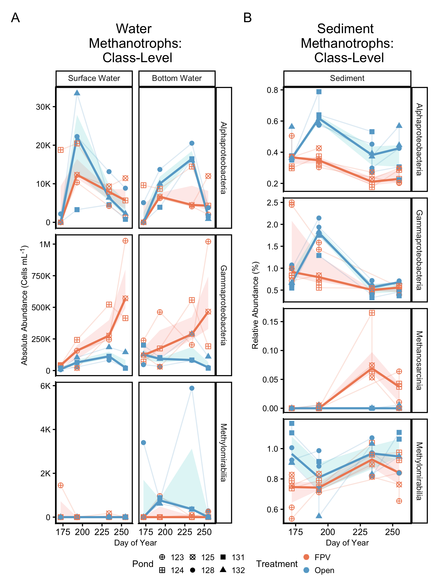
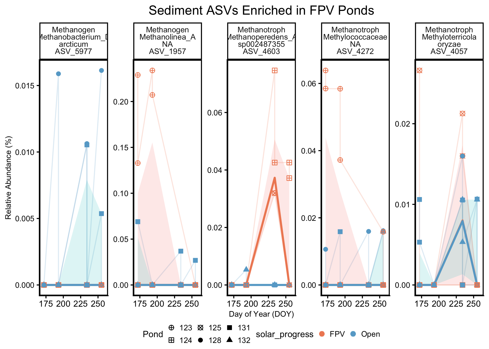
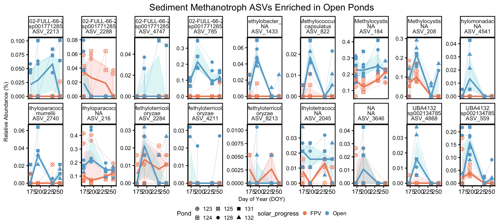
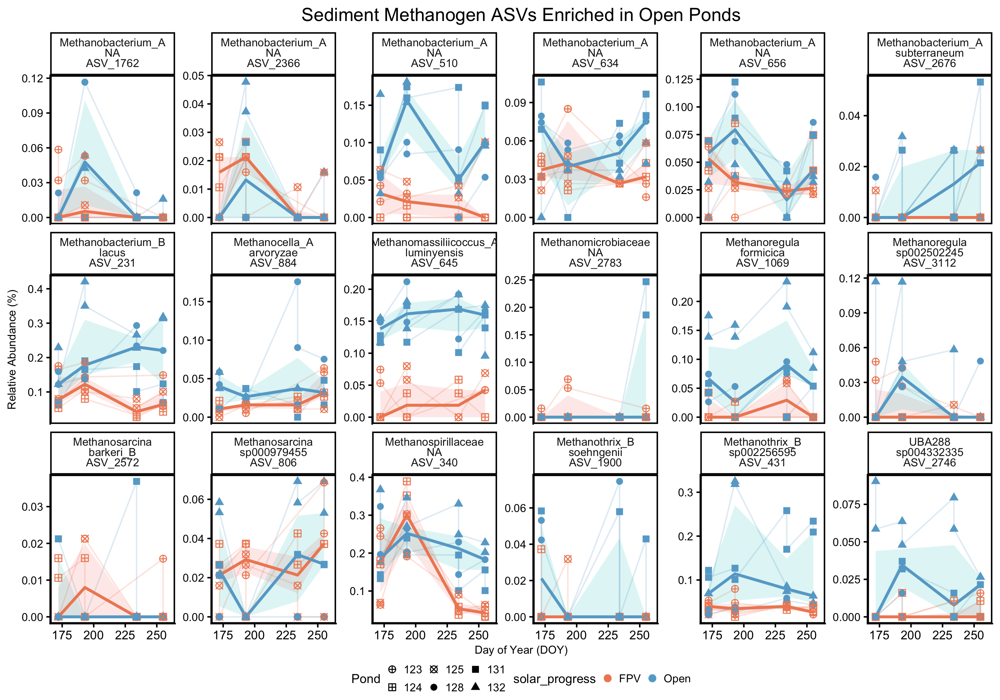
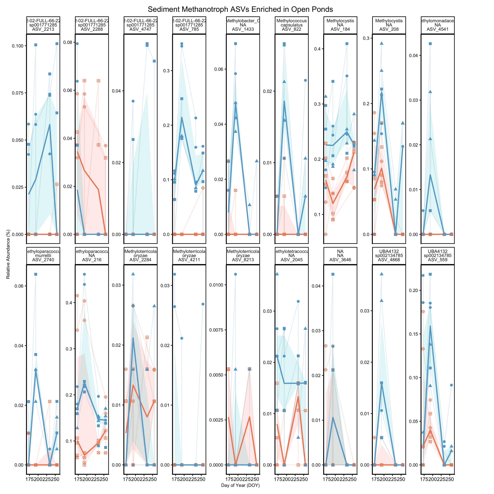
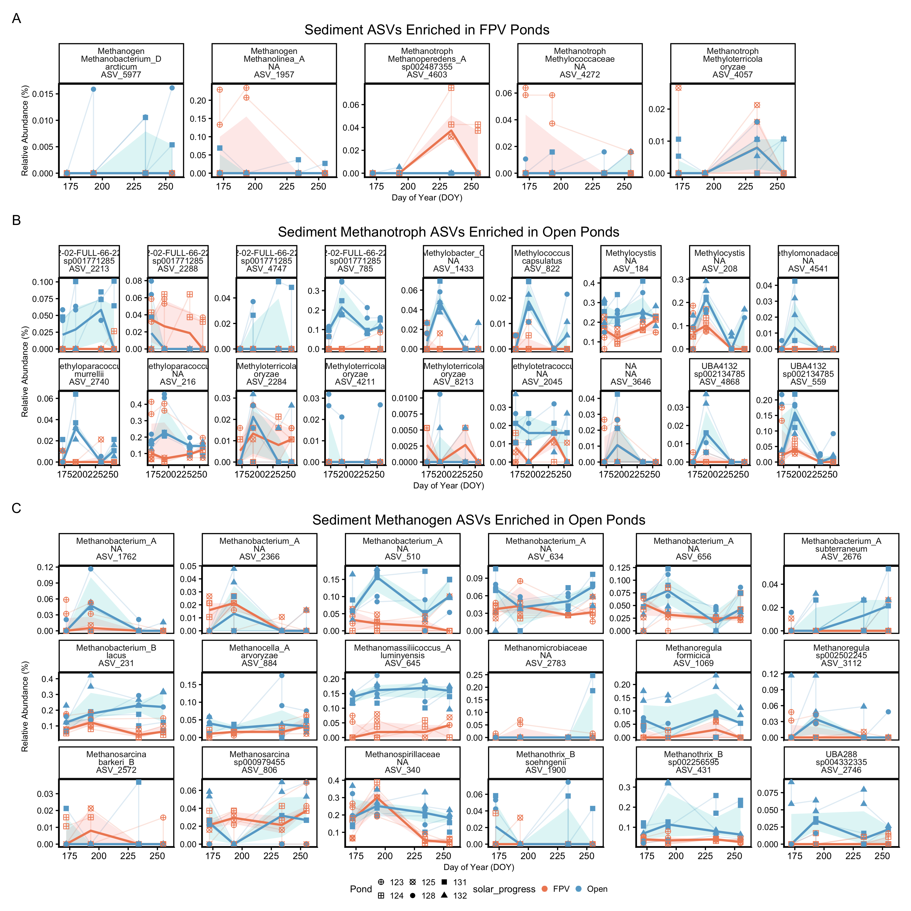
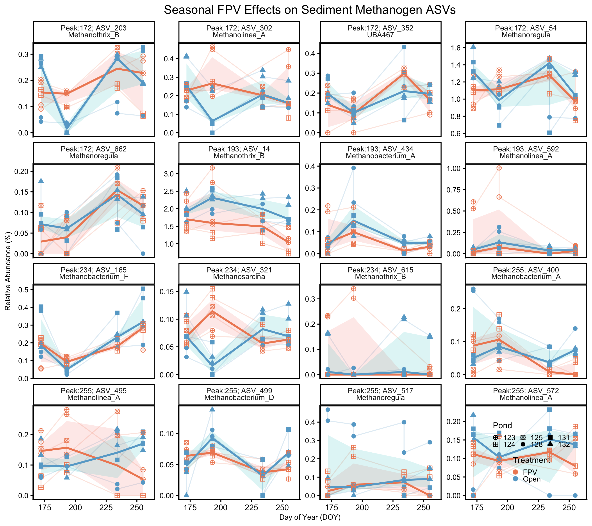
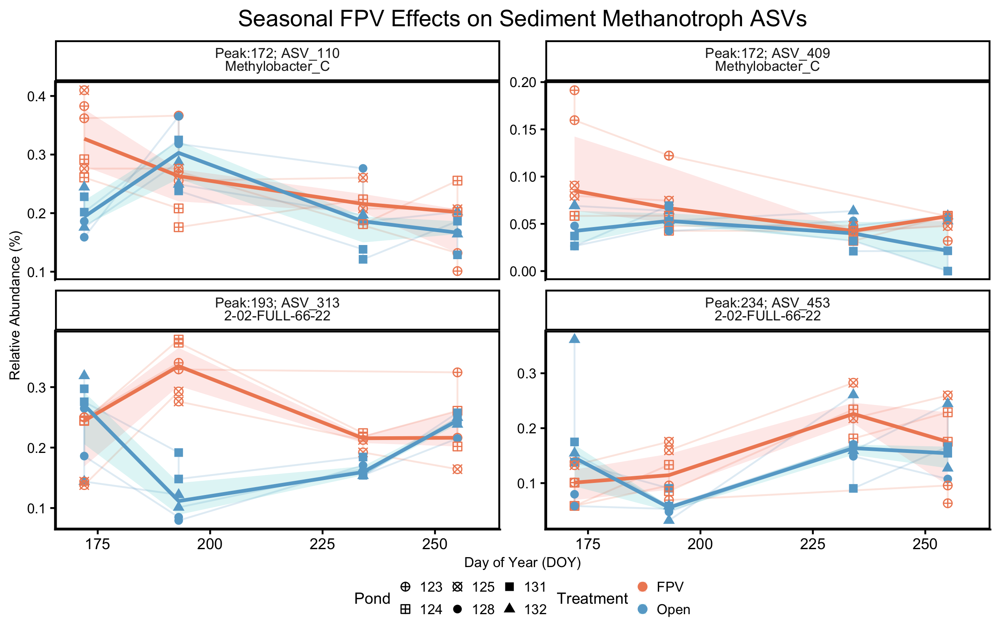

# Load packages


``` r
# Efficiently load packages 
pacman::p_load(ggplot2, phyloseq, ggpubr, tidyverse, patchwork,
               speedyseq, rstatix, dplyr, purrr, vegan, ANCOMBC, 
               microViz,cowplot, grid, scales, Biostrings, stringr, 
               DT, ggtext, install = FALSE)

source("code/functions.R") # contains scale_reads
source("code/colors_and_shapes.R")

# Set our seed for reproducibility
set.seed(09091999)
```


# Load Phyloseq Data 


``` r
# Load in the phyloseq objects
## WATER 
load("data/01_phyloseq/water_ch4_cyclers_physeq.RData")
water_ch4_cyclers_physeq
```

```
## phyloseq-class experiment-level object
## otu_table()   OTU Table:          [ 248 taxa and 48 samples ]:
## sample_data() Sample Data:        [ 48 samples by 51 sample variables ]:
## tax_table()   Taxonomy Table:     [ 248 taxa by 10 taxonomic ranks ]:
## phy_tree()    Phylogenetic Tree:  [ 248 tips and 247 internal nodes ]:
## taxa are columns
```

``` r
# We will also need a relative abundance otu_table
## What is the current form??? 
head(otu_table(water_ch4_cyclers_physeq))[, 1:6]
```

```
## OTU Table:          [ 6 taxa and 6 samples ]:
## Taxa are columns
##           ASV_677 ASV_42364 ASV_1071 ASV_2288 ASV_785 ASV_313
## 1 SA_D060       0       619        0        0       0    2783
## 2 SA_D068       0         0        0        0       0       0
## 3 SA_D076       0         0        0        0       0     613
## 4 SA_D091       0         0        0        0       0       0
## 5 SA_D053       0         0        0        0       0       0
## 6 SA_D061       0         0        0        0       0       0
```

``` r
## Create vector of water ASVs for parsing later
water_ch4_cyclers_vec <- 
  water_ch4_cyclers_physeq %>%
  taxa_names()

#check 
length(water_ch4_cyclers_vec)
```

```
## [1] 248
```

``` r
## SEDIMENT 
load("data/01_phyloseq/sed_ch4_cyclers_physeq.RData")
sed_ch4_cyclers_physeq
```

```
## phyloseq-class experiment-level object
## otu_table()   OTU Table:          [ 341 taxa and 44 samples ]:
## sample_data() Sample Data:        [ 44 samples by 48 sample variables ]:
## tax_table()   Taxonomy Table:     [ 341 taxa by 10 taxonomic ranks ]:
## phy_tree()    Phylogenetic Tree:  [ 341 tips and 340 internal nodes ]:
## taxa are rows
```

``` r
# We will also need a relative abundance otu_table
## What is the current form??? 
head(otu_table(sed_ch4_cyclers_physeq))[, 1:6] # RELATIVE! We are good! 
```

```
## OTU Table:          [ 6 taxa and 6 samples ]:
## Taxa are rows
##             SA_D005  SA_D013  SA_D021  SA_D031  SA_D038  SA_D006
## 1 ASV_2118 0.000266 0.000265 0.000159 0        0        0.000213
## 2 ASV_677  0.000319 0.00143  0.00122  0.00165  0.000790 0.000426
## 3 ASV_8411 0        0        0        0        0        0       
## 4 ASV_3924 0        0        0        0        0        0       
## 5 ASV_1375 0.000213 0.000265 0.000159 0.000958 0.000421 0.000213
## 6 ASV_2841 0        0        0        0        0        0
```

``` r
## Create vector of sediment ASVs for parsing later
sed_ch4_cyclers_vec <- 
  sed_ch4_cyclers_physeq %>%
  taxa_names()

# Check 
length(sed_ch4_cyclers_vec)
```

```
## [1] 341
```

## Create Methanogen and Methanotroph Phyloseq Objects

For the Water samples:


``` r
# Create a water methanogen phyloseq object
water_methanogens_physeq <- 
  water_ch4_cyclers_physeq %>% 
  subset_taxa(CH4_Cycler == "Methanogen") %>% 
  prune_taxa(taxa_sums(.) > 0, .) 

# Take a look 
water_methanogens_physeq
```

```
## phyloseq-class experiment-level object
## otu_table()   OTU Table:          [ 66 taxa and 48 samples ]:
## sample_data() Sample Data:        [ 48 samples by 51 sample variables ]:
## tax_table()   Taxonomy Table:     [ 66 taxa by 10 taxonomic ranks ]:
## phy_tree()    Phylogenetic Tree:  [ 66 tips and 65 internal nodes ]:
## taxa are columns
```

``` r
# Create a Sediment Methanotroph phyloseq object
water_methanotrophs_physeq <- 
  water_ch4_cyclers_physeq %>% 
  subset_taxa(CH4_Cycler == "Methanotroph") %>% 
  prune_taxa(taxa_sums(.) > 0, .) 

# Take a look 
water_methanotrophs_physeq
```

```
## phyloseq-class experiment-level object
## otu_table()   OTU Table:          [ 182 taxa and 48 samples ]:
## sample_data() Sample Data:        [ 48 samples by 51 sample variables ]:
## tax_table()   Taxonomy Table:     [ 182 taxa by 10 taxonomic ranks ]:
## phy_tree()    Phylogenetic Tree:  [ 182 tips and 181 internal nodes ]:
## taxa are columns
```

And for the Sediments: 


``` r
# Create a Sediment methanogen phyloseq object
sed_methanogens_physeq <- 
  sed_ch4_cyclers_physeq %>% 
  subset_taxa(CH4_Cycler == "Methanogen") %>% 
  prune_taxa(taxa_sums(.) > 0, .) 

# Take a look 
sed_methanogens_physeq
```

```
## phyloseq-class experiment-level object
## otu_table()   OTU Table:          [ 146 taxa and 44 samples ]:
## sample_data() Sample Data:        [ 44 samples by 48 sample variables ]:
## tax_table()   Taxonomy Table:     [ 146 taxa by 10 taxonomic ranks ]:
## phy_tree()    Phylogenetic Tree:  [ 146 tips and 145 internal nodes ]:
## taxa are rows
```

``` r
# Create a Sediment Methanotroph phyloseq object
sed_methanotrophs_physeq <- 
  sed_ch4_cyclers_physeq %>% 
  subset_taxa(CH4_Cycler == "Methanotroph") %>% 
  prune_taxa(taxa_sums(.) > 0, .) 

# Take a look 
sed_methanotrophs_physeq
```

```
## phyloseq-class experiment-level object
## otu_table()   OTU Table:          [ 195 taxa and 44 samples ]:
## sample_data() Sample Data:        [ 44 samples by 48 sample variables ]:
## tax_table()   Taxonomy Table:     [ 195 taxa by 10 taxonomic ranks ]:
## phy_tree()    Phylogenetic Tree:  [ 195 tips and 194 internal nodes ]:
## taxa are rows
```


## Prepare Raw phyloseqs for ANCOM-BC2 Input 

The ANCOMB-BC2 input requires raw counts. So, let's bring those into the workflow. 

Note that these counts have been normalized by picrust2 for 16S copy number


``` r
# physeq with water (unincorporated cell counts) + sediment samples = 188 samples total
load("data/00_load_data/normalized_water_sed_physeq.RData")

## Add JDate to the sample_data 
sample_data(normalized_water_sed_physeq)$JDate <-
  lubridate::yday(sample_data(normalized_water_sed_physeq)$Date_Collected)

# Obtain only water samples
raw_water24_physeq <- 
  normalized_water_sed_physeq %>%
  subset_samples(SampleType == "Water") %>%
  subset_samples(Year == 2024) %>%
  # Now only subset the methanogens and methanotrophs
  prune_taxa(taxa_names(.) %in% water_ch4_cyclers_vec, .) %>%
  prune_taxa(taxa_sums(.) > 0,.)

# Inspect
raw_water24_physeq
```

```
## phyloseq-class experiment-level object
## otu_table()   OTU Table:          [ 248 taxa and 48 samples ]:
## sample_data() Sample Data:        [ 48 samples by 48 sample variables ]:
## tax_table()   Taxonomy Table:     [ 248 taxa by 9 taxonomic ranks ]:
## phy_tree()    Phylogenetic Tree:  [ 248 tips and 247 internal nodes ]:
## taxa are rows
```

``` r
# Obtain only sediment samples 
raw_sediment24_physeq <- 
  normalized_water_sed_physeq %>%
  subset_samples(SampleType == "Sediment") %>%
  subset_samples(Year == 2024) %>%
  # Now only subset the methanogens and methanotrophs
  prune_taxa(taxa_names(.) %in% sed_ch4_cyclers_vec, .) %>%
  prune_taxa(taxa_sums(.) > 0,.)

#Inspect
raw_sediment24_physeq
```

```
## phyloseq-class experiment-level object
## otu_table()   OTU Table:          [ 341 taxa and 46 samples ]:
## sample_data() Sample Data:        [ 46 samples by 48 sample variables ]:
## tax_table()   Taxonomy Table:     [ 341 taxa by 9 taxonomic ranks ]:
## phy_tree()    Phylogenetic Tree:  [ 341 tips and 340 internal nodes ]:
## taxa are rows
```

# Class-Level Methanotrophs: Alphas versus Gammas  

## Figure S5

**Water**


``` r
# Make a dataframe that is collapsed at the Class level 
water_methanotroph_class_df_glom <- 
  water_ch4_cyclers_physeq %>% 
  subset_taxa(CH4_Cycler == "Methanotroph") %>%
  tax_glom(taxrank = "Class") %>% 
  psmelt() %>% 
  dplyr::mutate(solar_progress = recode(solar_progress, "Solar" = "FPV", "No FPV" = "Open"),
                Depth_Class = case_when(Depth_Class == "S" ~ "Surface Water",
                                        Depth_Class == "B" ~ "Bottom Water"),
                Depth_Class = factor(Depth_Class, levels = c("Surface Water", "Bottom Water"))) %>%
  dplyr::select(-c(input:Date_Collected, Deployment_ID:Freezer_Temp_NegDegrees, 
                   D_Number:Integrated_Depths_m, Max_Depth:lag, Order:CH4_Cycler))

# Plot it 
class_level_methanotroph_water_plot <- 
  water_methanotroph_class_df_glom %>% 
  ggplot(aes(x = JDate, y = Abundance, 
             color = solar_progress, shape = Pond)) +
  geom_line(aes(group = interaction(Pond, Depth_Class)), alpha = 0.2) +
  stat_summary(aes(group = solar_progress, fill = solar_progress),
               fun.data = function(y) 
                 {data.frame(y = median(y, na.rm = TRUE), 
                             ymin = quantile(y, 0.25, na.rm = TRUE),
                             ymax = quantile(y, 0.75, na.rm = TRUE))},
               geom = "ribbon", alpha = 0.15, color = NA) +
  stat_summary(aes(group = solar_progress), 
               fun = median, geom = "line", linewidth = 1) +
  geom_point(aes(shape = Pond), size = 2) +
  facet_grid(Class~Depth_Class, scales = "free_y") +
  scale_y_continuous(labels = label_number(scale_cut = cut_short_scale(), accuracy = 1)) +
  scale_x_continuous(limits = c(170,260), breaks = seq(150, 275, by = 25)) +
  scale_color_manual(values = solar_colors) +
  scale_shape_manual(values = pond_shapes) +
  guides(color = guide_legend(ncol = 1),
         fill  = guide_legend(ncol = 1),
         shape = guide_legend(ncol = 3)) + 
  labs(x = "Day of Year",
       y = "Absolute Abundance (Cells mL<sup>-1</sup>)",
       color = "Treatment", fill  = "Treatment",
       title = "Water \n Methanotrophs: \n Class-Level") +
  theme(legend.position = "bottom") +
  theme_classic() +
  theme( #legend.position = c(0.75, 0.7),
    legend.position = "bottom",
        legend.spacing = unit(0, "cm"),
        plot.title = element_text(hjust = 0.5),
        panel.background =  element_rect(color = 'black', size = 1),
        panel.grid = element_blank(),
        legend.background = element_rect(fill = "transparent", color = NA), # remove legend box
        legend.key = element_rect(fill = "transparent", color = NA),
        legend.box.background = element_rect(fill='transparent', color = "transparent"), #transparent legend panel
        legend.box.just = "center",
        #strip.background = element_rect(colour = NA, fill = 'transparent'),
        plot.background = element_rect(fill = "transparent", color="transparent"),
        legend.key.size = unit(0.2, "cm"),
        legend.spacing.x = unit(0.2, "cm"),
       legend.margin = margin(t = -5, unit = "pt"),
        strip.text = element_markdown(size = 8),
       axis.title.y = element_markdown(size = 8, colour = "black"),
       axis.title.x = element_markdown(size = 8, colour = "black"),
       axis.text.y = element_text(size = 8, colour = "black"),
       legend.title = element_text(size = 9, colour = "black"),
      legend.text = element_text(size = 8, colour = "black")); 
```

**Sediment**


``` r
# Make a dataframe that is collapsed at the Class level 
sed_methanotroph_class_df_glom <- 
  sed_ch4_cyclers_physeq %>% 
  subset_taxa(CH4_Cycler == "Methanotroph") %>%
  tax_glom(taxrank = "Class") %>% 
  psmelt() %>% 
  dplyr::mutate(solar_progress = recode(solar_progress, "Solar" = "FPV", "No FPV" = "Open"),
                Depth_Class = case_when(Depth_Class == "SD" ~ "Sediment")) %>% 
  dplyr::select(-c(input:Date_Collected, Deployment_ID:Freezer_Temp_NegDegrees, 
                   D_Number:Integrated_Depths_m, Max_Depth:lag, Order:CH4_Cycler))


# look
unique(sed_methanotroph_class_df_glom$Class)
```

```
## [1] "Gammaproteobacteria" "Methylomirabilia"    "Alphaproteobacteria" "Methanosarcinia"
```

``` r
# Plot it 
class_level_methanotroph_sed_plot <- 
  sed_methanotroph_class_df_glom %>% 
  ggplot(aes(x = JDate, y = Abundance*100, 
             color = solar_progress, shape = Pond)) +
  geom_line(aes(group = interaction(Pond)), alpha = 0.2) +
  stat_summary(aes(group = solar_progress, fill = solar_progress),
               fun.data = function(y) 
                 {data.frame(y = median(y, na.rm = TRUE), 
                             ymin = quantile(y, 0.25, na.rm = TRUE),
                             ymax = quantile(y, 0.75, na.rm = TRUE))},
               geom = "ribbon", alpha = 0.15, color = NA) +
  stat_summary(aes(group = solar_progress), 
               fun = median, geom = "line", linewidth = 1) +
  geom_point(aes(shape = Pond), size = 2) +
  facet_grid(Class~Depth_Class, scales = "free_y") +
  scale_x_continuous(limits = c(170,260), breaks = seq(150, 275, by = 25)) +
  scale_color_manual(values = solar_colors) +
  scale_shape_manual(values = pond_shapes) +
  guides(color = guide_legend(ncol = 1),
         fill  = guide_legend(ncol = 1),
         shape = guide_legend(ncol = 3)) + 
  labs(x = "Day of Year",
       y = "Relative Abundance (%)",
       color = "Treatment", fill  = "Treatment",
       title = "Sediment \n Methanotrophs: \n Class-Level") +
  theme(legend.position = "bottom") +
  theme_classic() +
  theme( #legend.position = c(0.75, 0.7),
    legend.position = "bottom",
        legend.spacing = unit(0, "cm"),
        plot.title = element_text(hjust = 0.5),
        panel.background =  element_rect(color = 'black', size = 1),
        panel.grid = element_blank(),
        legend.background = element_rect(fill = "transparent", color = NA), # remove legend box
        legend.key = element_rect(fill = "transparent", color = NA),
        legend.box.background = element_rect(fill='transparent', color = "transparent"), #transparent legend panel
        legend.box.just = "center",
        #strip.background = element_rect(colour = NA, fill = 'transparent'),
        plot.background = element_rect(fill = "transparent", color="transparent"),
        legend.key.size = unit(0.2, "cm"),
        legend.spacing.x = unit(0.2, "cm"),
       legend.margin = margin(t = -5, unit = "pt"),
        strip.text = element_markdown(size = 8),
        #  strip.background.x = element_blank(),
        # strip.text.x = element_blank(),
       axis.title.y = element_markdown(size = 8, colour = "black"),
       axis.title.x = element_markdown(size = 8, colour = "black"),
       axis.text.y = element_text(size = 8, colour = "black"),
       legend.title = element_text(size = 9, colour = "black"),
      legend.text = element_text(size = 8, colour = "black")); 
```

**Combined** 

``` r
final_alphas_gammas_plot <- 
  class_level_methanotroph_water_plot + 
  class_level_methanotroph_sed_plot + 
  plot_annotation(tag_levels = "A") + 
  plot_layout(guides = "collect",
              widths = c(1, 0.8)) &
  theme(legend.position = "bottom");final_alphas_gammas_plot
```

<!-- -->

``` r
# Save the plot   
ggsave(final_alphas_gammas_plot, 
       width = 6, height = 7.5, dpi = 300,
       filename = "figures/Fig_S6.png")
```

**Fig. S6: Class-level seasonal dynamics of methanotrophs in the water column and sediments.** (A) Water-column methanotroph abundance (cells mL⁻¹) aggregated at the Class level for surface and bottom waters. (B) Sediment methanotroph relative abundance (%) aggregated at the Class level. Classes shown represent physiologically distinct methanotroph groups: Gammaproteobacteria (Type I aerobic methanotrophs), Alphaproteobacteria (Type II aerobic methanotrophs), and Methylomirabilia (Type III anaerobic, nitrite-dependent bacterial methanotrophs).


# Water 

## PERMANOVA 

Three steps: 

1. Calculate Bray Curtis Distances
2. Calculate the PERMANOVA 
3. Calculate the betadisper 


``` r
# All Water column! 
water_bray <- phyloseq::distance(water_ch4_cyclers_physeq, 
                                 method = "bray", binary = FALSE)
# Metadata 
water_metadata <- 
  water_ch4_cyclers_physeq %>%
  sample_data() %>%
  data.frame()

# PERMANOVA 
water_permanova <- 
  adonis2(water_bray ~ solar_progress * Pond * JDate * Depth_Class, 
          data = water_metadata, by = "terms"); water_permanova
```

```
## Permutation test for adonis under reduced model
## Terms added sequentially (first to last)
## Permutation: free
## Number of permutations: 999
## 
## adonis2(formula = water_bray ~ solar_progress * Pond * JDate * Depth_Class, data = water_metadata, by = "terms")
##                                  Df SumOfSqs      R2      F Pr(>F)    
## solar_progress                    1   1.6055 0.11599 8.1774  0.001 ***
## Pond                              4   2.2419 0.16197 2.8547  0.001 ***
## JDate                             1   1.0658 0.07700 5.4285  0.001 ***
## Depth_Class                       1   0.3712 0.02682 1.8906  0.045 *  
## solar_progress:JDate              1   0.8822 0.06374 4.4933  0.002 ** 
## Pond:JDate                        4   1.1885 0.08586 1.5133  0.034 *  
## solar_progress:Depth_Class        1   0.1754 0.01267 0.8934  0.546    
## Pond:Depth_Class                  4   0.5270 0.03807 0.6710  0.960    
## JDate:Depth_Class                 1   0.4191 0.03028 2.1348  0.021 *  
## solar_progress:JDate:Depth_Class  1   0.1699 0.01227 0.8653  0.576    
## Pond:JDate:Depth_Class            4   0.4827 0.03487 0.6146  0.987    
## Residual                         24   4.7120 0.34044                  
## Total                            47  13.8412 1.00000                  
## ---
## Signif. codes:  0 '***' 0.001 '**' 0.01 '*' 0.05 '.' 0.1 ' ' 1
```

``` r
# Show the results 
# water_permanova2 <- 
#   adonis2(water_bray ~ solar_progress * Pond * JDate + Depth_Class, 
#           data = water_metadata, by = "terms"); water_permanova2

# Fill in the betadisper
# betadispr_water_depth <- 
#   betadisper(water_bray, water_metadata$Depth_Class)
# permutest(betadispr_water_depth)


## ### ### ### ### ### ### ### ###
# FIRST, calculate Bray-Curtis PERMANOVA using phyloseq distance
## Methanotrophs 
water_methanotroph_bray <- phyloseq::distance(water_methanotrophs_physeq, method = "bray", binary = FALSE)
#  pull out Methanotroph Metadata 
water_methanotroph_metadata <-
  water_methanotrophs_physeq %>%
  sample_data() %>%
  data.frame()

## Methanogens
water_methanogen_bray <-
  phyloseq::distance(water_methanogens_physeq, method = "bray", binary = FALSE)

## OOH, an important warning message! 
## How many samples have NO methanogens?? 
# sum(rowSums(otu_table(water_methanogens_physeq)) == 0)
# ## How many DO have methanogens? 
# sum(rowSums(otu_table(water_methanogens_physeq)) > 0)

### How does this compare in total counts to methanotrophs???
methanogen_counts <- rowSums(otu_table(water_methanogens_physeq))
#methanogen_counts
# mean(methanogen_counts) #mean
# sd(methanogen_counts) # sd
# median(methanogen_counts) #median
# sum(methanogen_counts) # total abundance

# methanotroph_counts <- rowSums(otu_table(water_methanotrophs_physeq))
# methanotroph_counts
# mean(methanotroph_counts) #mean
# sd(methanotroph_counts) # standard deviation
# median(methanotroph_counts) #median
# sum(methanotroph_counts) # total abundance 

# pull out Methanogen Metadata 
water_methanogen_metadata <- 
  water_methanogens_physeq %>%
  sample_data() %>%
  data.frame()

### ### ### ### ### ### ### 
### SECOND, time to calculate the PERMANOVA
## Results to add to Table S7 for the water column data. 
## Methanotrophs
water_methanotroph_permanova <- adonis2(water_methanotroph_bray ~ solar_progress * Pond * JDate * Depth_Class, 
                                        data = water_methanotroph_metadata, by = "terms")
# Show the results 
water_methanotroph_permanova
```

```
## Permutation test for adonis under reduced model
## Terms added sequentially (first to last)
## Permutation: free
## Number of permutations: 999
## 
## adonis2(formula = water_methanotroph_bray ~ solar_progress * Pond * JDate * Depth_Class, data = water_methanotroph_metadata, by = "terms")
##                                  Df SumOfSqs      R2      F Pr(>F)    
## solar_progress                    1   1.6370 0.12057 8.5930  0.001 ***
## Pond                              4   2.2969 0.16918 3.0143  0.001 ***
## JDate                             1   1.0580 0.07793 5.5539  0.001 ***
## Depth_Class                       1   0.2799 0.02062 1.4695  0.131    
## solar_progress:JDate              1   0.9137 0.06730 4.7964  0.001 ***
## Pond:JDate                        4   1.1621 0.08560 1.5251  0.027 *  
## solar_progress:Depth_Class        1   0.1676 0.01235 0.8799  0.533    
## Pond:Depth_Class                  4   0.4593 0.03383 0.6027  0.989    
## JDate:Depth_Class                 1   0.3904 0.02876 2.0495  0.031 *  
## solar_progress:JDate:Depth_Class  1   0.1722 0.01268 0.9040  0.511    
## Pond:JDate:Depth_Class            4   0.4674 0.03442 0.6133  0.980    
## Residual                         24   4.5720 0.33676                  
## Total                            47  13.5766 1.00000                  
## ---
## Signif. codes:  0 '***' 0.001 '**' 0.01 '*' 0.05 '.' 0.1 ' ' 1
```

``` r
# Depth added
# water_methanotroph_permanova2 <- adonis2(water_methanotroph_bray ~ solar_progress * Pond * JDate + Depth_Class, 
#                                         data = water_methanotroph_metadata, by = "terms") 
# Show the results 
# water_methanotroph_permanova2

## Methanogens
### First we must pull out the samples that do not have methanogens 
samps_no_methanogens <- names(methanogen_counts)[methanogen_counts == 0]
length(samps_no_methanogens) # how many samples? 
```

```
## [1] 5
```

``` r
# new phyloseq object 
nsamples(water_methanogens_physeq)
```

```
## [1] 48
```

``` r
samps_no_methanogens_physeq <- 
  water_methanogens_physeq %>%
  subset_samples(!DNA_ID %in% samps_no_methanogens) %>%
  prune_taxa(taxa_sums(.) > 0, .) 
nsamples(samps_no_methanogens_physeq)
```

```
## [1] 43
```

``` r
# Calculate bray-curtis 
water_methanogen_bray2 <- 
  phyloseq::distance(samps_no_methanogens_physeq, 
                     method = "bray", binary = FALSE)
# pull out metadata 
# water_methanogen_metadata2 <- 
#   samps_no_methanogens_physeq%>%
#   sample_data() %>%
#   data.frame()
# 
# water_methanogens_permanova <- 
#   adonis2(water_methanogen_bray2 ~ solar_progress * Pond * JDate * Depth_Class, 
#           data = water_methanogen_metadata2) 
# 
# # Show the results 
# water_methanogens_permanova

#### ADDitive with depth 
# water_methanogens_permanova2 <- 
#   adonis2(water_methanogen_bray2 ~ solar_progress * Pond * JDate + Depth_Class, 
#           data = water_methanogen_metadata2, by = "terms"); 
# # Show the results 
# water_methanogens_permanova2


### ### ### ### ### ### ### ### 
# THIRD, calculate the betadispersion 
## Methanotrophs
##### FPV 
betadispr_water_methanotroph_solar <- betadisper(water_methanotroph_bray, water_methanotroph_metadata$solar_progress)
permutest(betadispr_water_methanotroph_solar)
```

```
## 
## Permutation test for homogeneity of multivariate dispersions
## Permutation: free
## Number of permutations: 999
## 
## Response: Distances
##           Df  Sum Sq  Mean Sq      F N.Perm Pr(>F)  
## Groups     1 0.09387 0.093872 6.7025    999  0.017 *
## Residuals 46 0.64425 0.014006                       
## ---
## Signif. codes:  0 '***' 0.001 '**' 0.01 '*' 0.05 '.' 0.1 ' ' 1
```

``` r
##### Pond
betadispr_water_methanotroph_pond <- betadisper(water_methanotroph_bray, water_methanotroph_metadata$Pond)
permutest(betadispr_water_methanotroph_pond)
```

```
## 
## Permutation test for homogeneity of multivariate dispersions
## Permutation: free
## Number of permutations: 999
## 
## Response: Distances
##           Df  Sum Sq  Mean Sq      F N.Perm Pr(>F)
## Groups     5 0.05910 0.011819 0.5677    999  0.718
## Residuals 42 0.87446 0.020820
```

``` r
##### Depth 
betadispr_water_methanotroph_depth <- betadisper(water_methanotroph_bray, water_methanotroph_metadata$Depth_Class)
permutest(betadispr_water_methanotroph_depth)
```

```
## 
## Permutation test for homogeneity of multivariate dispersions
## Permutation: free
## Number of permutations: 999
## 
## Response: Distances
##           Df  Sum Sq  Mean Sq      F N.Perm Pr(>F)
## Groups     1 0.01602 0.016016 1.2094    999  0.284
## Residuals 46 0.60916 0.013243
```

``` r
##### Day of Year: Julian Date 
betadispr_water_methanotroph_JDate <- betadisper(water_methanotroph_bray, water_methanotroph_metadata$JDate)
permutest(betadispr_water_methanotroph_JDate)
```

```
## 
## Permutation test for homogeneity of multivariate dispersions
## Permutation: free
## Number of permutations: 999
## 
## Response: Distances
##           Df  Sum Sq  Mean Sq      F N.Perm Pr(>F)    
## Groups     3 0.25558 0.085193 6.0148    999  0.001 ***
## Residuals 44 0.62321 0.014164                         
## ---
## Signif. codes:  0 '***' 0.001 '**' 0.01 '*' 0.05 '.' 0.1 ' ' 1
```

``` r
## Methogens
##### FPV 
betadispr_water_methanogen_solar <- betadisper(water_methanogen_bray, water_methanotroph_metadata$solar_progress)
permutest(betadispr_water_methanogen_solar)
```

```
## 
## Permutation test for homogeneity of multivariate dispersions
## Permutation: free
## Number of permutations: 999
## 
## Response: Distances
##           Df  Sum Sq   Mean Sq      F N.Perm Pr(>F)
## Groups     1 0.02307 0.0230734 2.6922    999  0.131
## Residuals 42 0.35995 0.0085703
```

``` r
##### Pond
betadispr_water_methanogen_pond <- betadisper(water_methanogen_bray, water_methanotroph_metadata$Pond); 
permutest(betadispr_water_methanogen_pond)
```

```
## 
## Permutation test for homogeneity of multivariate dispersions
## Permutation: free
## Number of permutations: 999
## 
## Response: Distances
##           Df  Sum Sq  Mean Sq      F N.Perm Pr(>F)
## Groups     5 0.11502 0.023005 1.2511    999  0.308
## Residuals 38 0.69872 0.018387
```

``` r
##### Depth 
betadispr_water_methanogen_depth <- betadisper(water_methanogen_bray, water_methanotroph_metadata$Depth_Class)
permutest(betadispr_water_methanogen_depth)
```

```
## 
## Permutation test for homogeneity of multivariate dispersions
## Permutation: free
## Number of permutations: 999
## 
## Response: Distances
##           Df  Sum Sq  Mean Sq      F N.Perm Pr(>F)  
## Groups     1 0.07116 0.071157 6.8275    999  0.016 *
## Residuals 42 0.43773 0.010422                       
## ---
## Signif. codes:  0 '***' 0.001 '**' 0.01 '*' 0.05 '.' 0.1 ' ' 1
```

``` r
##### Day of Year: Julian Date 
betadispr_water_methanogen_JDate <- betadisper(water_methanogen_bray, water_methanotroph_metadata$JDate)
permutest(betadispr_water_methanogen_JDate)
```

```
## 
## Permutation test for homogeneity of multivariate dispersions
## Permutation: free
## Number of permutations: 999
## 
## Response: Distances
##           Df  Sum Sq  Mean Sq      F N.Perm Pr(>F)
## Groups     3 0.06734 0.022447 1.2636    999  0.305
## Residuals 40 0.71059 0.017765
```

## Differential Abundance with ANCOM-BC2


``` r
# Remove taxa with ZERO variances 
water_ASVs_zeroVariance_vec <- c(
  "ASV_1071", "ASV_11590", "ASV_642", "ASV_231", "ASV_4564",
  "ASV_7355", "ASV_1920", "ASV_11514", "ASV_4168", "ASV_4105",
  "ASV_3231", "ASV_2424", "ASV_2964", "ASV_2205", "ASV_7156",
  "ASV_10120", "ASV_4270", "ASV_8273", "ASV_3557", "ASV_7055",
  "ASV_2530", "ASV_4099", "ASV_1677", "ASV_10767", "ASV_1252")

# Now remove them from the phyloseq object 
water_ch4_phy_rmASV_ZeroVariance_physeq <- 
  raw_water24_physeq %>%
  subset_taxa(., !(ASV %in% water_ASVs_zeroVariance_vec)) %>% 
  prune_taxa(taxa_sums(.) > 0,.)

# Confirm the levels for solar_progress
water_ch4_phy_rmASV_ZeroVariance_physeq@sam_data$solar_progress <- 
  factor(water_ch4_phy_rmASV_ZeroVariance_physeq@sam_data$solar_progress, levels = c("No FPV", "FPV"))

# run ancombc2 for water all methane cyclers
# water_ch4_diffAbundASV_FPV_output <-
#  ancombc2(
#    data = water_ch4_phy_rmASV_ZeroVariance_physeq,      # Phyloseq / TSE object with sample metadata
#    tax_level = "ASV",              # Test at ASV level
#    fix_formula = "solar_progress", # Tests time-averaged FPV effect only (no FPV × DOY)
#    p_adj_method = "fdr",           # FDR correction
#    pseudo_sens = TRUE,             # Check sensitivity to pseudo-count choice
#    prv_cut = 0.05,                 # Prevalence filter (≥5% of samples)
#    group = NULL,                   # No pairwise group comparisons
#    struc_zero = FALSE,             # Do not infer structural zeros
#    alpha = 0.05,                   # Significance threshold
#    n_cl = 10,                      # Parallel threads
#    verbose = FALSE,                # Suppress console output
#    s0_perc = 0.05,                 # Variance shrinkage parameter
#    global = FALSE,                 # No global (omnibus) test
#    pairwise = FALSE)               # No post-hoc pairwise tests

# Save the data
# save(water_ch4_diffAbundASV_FPV_output,
#     file = "data/03_diff_abund/water_ch4_diffAbundASV_FPV_output.RData")

# Load in the data 
load("data/03_diff_abund/water_ch4_diffAbundASV_FPV_output.RData")
```

### Clean up DiffAbundance data 


``` r
# plot ASV differential abundance
water_ch4_diffAbundASV_FPV_df <- 
  water_ch4_diffAbundASV_FPV_output$res %>% 
  dplyr::transmute(
    ASV = taxon,
    lfc = lfc_solar_progressFPV,
    q_value = q_solar_progressFPV,
    diff = diff_solar_progressFPV,
    passed_ss = passed_ss_solar_progressFPV,
    Comparison = "FPV vs Open") %>%
  # Filter to ASVs with ANCOM-BC2–supported differential abundance (diff == 1), 
  # FDR-adjusted q < 0.05, and |log2 fold change| > 0.5
  dplyr::filter(diff == 1, q_value < 0.05, abs(lfc) > 0.5) %>%
  dplyr::mutate(stability = if_else(passed_ss, "stable", "sensitive"))

# join by tax table
clean_water_ch4 <- 
  water_ch4_diffAbundASV_FPV_df %>% 
  left_join(., as.data.frame(water_ch4_cyclers_physeq@tax_table), 
            by = "ASV")

# Show the taxonomy
# clean_water_ch4 %>%
#   dplyr::select(ASV, CH4_Cycler, lfc, q_value, stability, Class:Species) %>%
#   arrange(lfc) %>%
#   DT::datatable(options = list(pageLength = nrow(.), lengthChange = FALSE))
```


### Plot Diff Abund ASVs over time 

#### Enriched ASVs in the Water are All Methanotrophs 

``` r
# plot differentially abundant ASVs overtime 
#1. tax glom at ASV level
water_ch4_asv_df_glom <- 
  water_ch4_cyclers_physeq %>% 
  tax_glom(taxrank = "ASV") %>% 
  psmelt() %>% 
  mutate(
    solar_progress = recode(solar_progress, "Solar" = "FPV", "No FPV" = "Open"),
    Depth_Class = case_when(
      Depth_Class == "S" ~ "Surface Water",
      Depth_Class == "B" ~ "Bottom Water"),
    Depth_Class = factor(Depth_Class, levels = c("Surface Water", "Bottom Water")))

# Fix levels
water_ch4_asv_df_glom$solar_progress <- factor(water_ch4_asv_df_glom$solar_progress,
                                               levels = c("FPV", "Open"))

### Now, let's pull the ASVs for plotting. BUT FIRST: 
water_ch4_methanotrophs_enrichedFPV_raw <- 
  clean_water_ch4 %>%
  dplyr::filter(CH4_Cycler == "Methanotroph", lfc > 0) %>%
  pull(ASV)

# Show them 
length(water_ch4_methanotrophs_enrichedFPV_raw)
```

```
## [1] 7
```

``` r
water_ch4_methanotrophs_enrichedFPV_raw
```

```
## [1] "ASV_32"   "ASV_44"   "ASV_346"  "ASV_141"  "ASV_119"  "ASV_13"   "ASV_2028"
```

``` r
### Note that ASV_2028 and ASV_346 are VERY LOWLY ABUNDANT! 
water_ch4_asv_glom_df_filt <- water_ch4_asv_df_glom %>%
  dplyr::filter(
    ASV %in% water_ch4_methanotrophs_enrichedFPV_raw,
    !ASV %in% c("ASV_2028", "ASV_346"))%>%
  group_by(ASV, solar_progress) %>%
  summarize(median_abund = median(Abundance, na.rm = TRUE),
            mean_abund = mean(Abundance, na.rm = TRUE),
            max_abund = max(Abundance, na.rm = TRUE), 
            min_abund = min(Abundance, na.rm = TRUE))
# RESULT: Remove  ASV_2028 and ASV_346 from visualization 

# or visualize like this 
water_ch4_foldchange <- 
  water_ch4_asv_df_glom %>%
  dplyr::filter(
    ASV %in% water_ch4_methanotrophs_enrichedFPV_raw,
    !ASV %in% c("ASV_2028", "ASV_346")) %>%
  group_by(solar_progress, ASV) %>%
  summarize(
    mean_abund = mean(Abundance, na.rm = TRUE),
    .groups = "drop") %>%
  tidyr::pivot_wider(
    names_from = solar_progress,
    values_from = mean_abund) %>%
  dplyr::mutate(
    fold_change = FPV / Open);water_ch4_foldchange
```

```
## # A tibble: 5 × 4
##   ASV        FPV   Open fold_change
##   <chr>    <dbl>  <dbl>       <dbl>
## 1 ASV_119 11599.   459.       25.3 
## 2 ASV_13  70500  18964.        3.72
## 3 ASV_141 11803.  1443.        8.18
## 4 ASV_32  70789. 11427.        6.19
## 5 ASV_44  94244. 13529.        6.97
```

``` r
# to infer changes overtime use first and last date of sampling (JDate 172 and 255)
  # ASV_119 = 

# create list of differentially abundanct asvs, updated results
water_ch4_methanotrophs_enrichedFPV <- 
  clean_water_ch4 %>%
  dplyr::filter(CH4_Cycler == "Methanotroph", lfc > 0) %>%
  dplyr::filter(!ASV %in% c("ASV_2028", "ASV_346")) %>%
  pull(ASV)

# Length
length(water_ch4_methanotrophs_enrichedFPV)
```

```
## [1] 5
```

``` r
water_ch4_methanotrophs_enrichedFPV
```

```
## [1] "ASV_32"  "ASV_44"  "ASV_141" "ASV_119" "ASV_13"
```

``` r
# now plot overtime: ENRICHED in FPVs
water_ch4_trophs_enriched_plot <- 
  water_ch4_asv_df_glom %>% 
  dplyr::filter(ASV %in% water_ch4_methanotrophs_enrichedFPV) %>% 
  dplyr::mutate(JDate = as.numeric(JDate), 
                Genus = ifelse(ASV == "ASV_13", Family, Genus),
                Genus = if_else(Genus == "Methylobacter_C_601751", 
                                "Methylobacter_C", Genus),
                total_abundance = Abundance,
                ASV_Genus = paste0(Genus, "<br>", Species, "<br>", ASV)) %>%
  ggplot(aes(x = JDate, y = total_abundance, color = solar_progress, shape = Pond)) +
  geom_line(aes(group = interaction(Pond, Depth_Class)), 
            alpha = 0.2) +
  stat_summary(aes(group = solar_progress, fill = solar_progress),
               fun.data = function(y) 
                 {data.frame(y = median(y, na.rm = TRUE), 
                             ymin = quantile(y, 0.25, na.rm = TRUE),
                             ymax = quantile(y, 0.75, na.rm = TRUE))},
               geom = "ribbon", alpha = 0.15, color = NA) +
  stat_summary(aes(group = solar_progress), 
               fun = median, geom = "line", linewidth = 1) +
  geom_point(aes(shape = Pond), size = 2) +
  facet_grid(Depth_Class~ASV_Genus) + 
  scale_y_continuous(labels = label_number(scale_cut = cut_short_scale(), accuracy = 1)) +
  scale_x_continuous(limits = c(170,260), breaks = seq(150, 275, by = 25)) +
  scale_color_manual(values = solar_colors) +
  scale_shape_manual(values = pond_shapes) +
  guides(color = guide_legend(ncol = 1),
         fill  = guide_legend(ncol = 1),
         shape = guide_legend(ncol = 3)) + 
  labs(x = "Day of Year (DOY)",
       y = "Absolute Abundance (Cells mL<sup>-1</sup>)",
       color = "Treatment", fill  = "Treatment",
       title = "Water Methanotroph ASVs Enriched in FPV Ponds") +
  theme_classic() +
  theme( #legend.position = c(0.75, 0.7),
    legend.position = "bottom",
        legend.spacing = unit(0, "cm"),
        plot.title = element_text(hjust = 0.5),
        panel.background =  element_rect(color = 'black', size = 1),
        panel.grid = element_blank(),
        legend.background = element_rect(fill = "transparent", color = NA), # remove legend box
        legend.key = element_rect(fill = "transparent", color = NA),
        legend.box.background = element_rect(fill='transparent', color = "transparent"), #transparent legend panel
        legend.box.just = "center",
        #strip.background = element_rect(colour = NA, fill = 'transparent'),
        plot.background = element_rect(fill = "transparent", color="transparent"),
        legend.key.size = unit(0.2, "cm"),
        legend.spacing.x = unit(0.2, "cm"),
       legend.margin = margin(t = -5, unit = "pt"),
        strip.text = element_markdown(size = 8),
       axis.title.y = element_markdown(size = 8, colour = "black"),
       axis.title.x = element_markdown(size = 8, colour = "black"),
       axis.text.y = element_text(size = 8, colour = "black"),
       legend.title = element_text(size = 9, colour = "black"),
      legend.text = element_text(size = 8, colour = "black")); 

# Show the plot 
water_ch4_trophs_enriched_plot
```

<!-- -->


**IMPORTANT NOTE:** Enriched ASVs in the Open Ponds are BOTH Methanogens AND Methanotrophs. Let's focus on methanotrophs first because they are more abundant and important for water column processes. 

#### Methanotrophs

``` r
########################### CONTROLS/OPEN: 
########################### METHANOTROPHS
# And for controls
water_ch4_methanotrophs_enrichedControls_raw <- 
  clean_water_ch4 %>%
  dplyr::filter(CH4_Cycler == "Methanotroph", lfc <0) %>%
  pull(ASV)

# How many??? 
length(water_ch4_methanotrophs_enrichedControls_raw)
```

```
## [1] 8
```

``` r
water_ch4_methanotrophs_enrichedControls_raw #who??
```

```
## [1] "ASV_671"  "ASV_828"  "ASV_1019" "ASV_1367" "ASV_1396" "ASV_976"  "ASV_1479" "ASV_822"
```

``` r
### Now, let's pull the ASVs for plotting. BUT FIRST: 
### Note that ASV_1019 doesn't look very different -- NULL RESULT
water_ch4_asv_df_glom_ctrl <- water_ch4_asv_df_glom %>% 
  dplyr::filter(ASV %in% water_ch4_methanotrophs_enrichedControls_raw,
                ASV != "ASV_1019") %>%
  group_by(ASV, solar_progress) %>%
  summarize(median_abund = median(Abundance, na.rm = TRUE),
            mean_abund = mean(Abundance, na.rm = TRUE),
            max_abund = max(Abundance, na.rm = TRUE), 
            min_abund = min(Abundance, na.rm = TRUE))
# RESULT: Remove ASV_1019 doesn't look very different -- NULL RESULT

water_ch4_foldchange_ctrl <- 
  water_ch4_asv_df_glom %>%
  dplyr::filter(
    ASV %in% water_ch4_methanotrophs_enrichedControls_raw,
    !ASV %in% c("ASV_1019")) %>%
  group_by(solar_progress, ASV) %>%
  summarize(
    mean_abund = mean(Abundance, na.rm = TRUE),
    .groups = "drop") %>%
  tidyr::pivot_wider(
    names_from = solar_progress,
    values_from = mean_abund) %>%
  dplyr::mutate(
    fold_change = FPV / Open);water_ch4_foldchange_ctrl
```

```
## # A tibble: 7 × 4
##   ASV        FPV  Open fold_change
##   <chr>    <dbl> <dbl>       <dbl>
## 1 ASV_1367 255.  2398.      0.106 
## 2 ASV_1396 108.   451       0.240 
## 3 ASV_1479  53.7  568.      0.0945
## 4 ASV_671  202.  1613.      0.125 
## 5 ASV_822  109.   714.      0.153 
## 6 ASV_828   47.6 1560.      0.0305
## 7 ASV_976  112.   980.      0.114
```

``` r
# And for controls
water_ch4_methanotrophs_enrichedControls <- 
  clean_water_ch4 %>%
  dplyr::filter(CH4_Cycler == "Methanotroph", lfc <0) %>%
    dplyr::filter(ASV != "ASV_1019") %>%
  pull(ASV)

# now plot overtime: ENRICHED in CONTROLS 
water_ch4_trophs_enrichedControls_plot <- 
  water_ch4_asv_df_glom %>% 
  dplyr::filter(ASV %in% water_ch4_methanotrophs_enrichedControls) %>% 
  dplyr::mutate(Genus = ifelse(ASV == "ASV_828", Family, Genus),
                JDate = as.numeric(JDate), 
                total_abundance = Abundance,
                ASV_Genus = paste0(Genus, "<br>", Species, "<br>", ASV)) %>%
  ggplot(aes(x = JDate, y = total_abundance, 
             color = solar_progress, shape = Pond)) +
  geom_line(aes(group = interaction(Pond, Depth_Class)), 
            alpha = 0.2) +
  stat_summary(aes(group = solar_progress, fill = solar_progress),
               fun.data = function(y) 
                 {data.frame(y = median(y, na.rm = TRUE), 
                             ymin = quantile(y, 0.25, na.rm = TRUE),
                             ymax = quantile(y, 0.75, na.rm = TRUE))},
               geom = "ribbon", alpha = 0.15, color = NA) +
  stat_summary(aes(group = solar_progress), 
               fun = median, geom = "line", linewidth = 1) +
  geom_point(aes(shape = Pond), size = 2) +
  facet_grid(Depth_Class~ASV_Genus) +
  scale_y_continuous(labels = label_number(scale_cut = cut_short_scale(), accuracy = 1)) +
  scale_x_continuous(limits = c(170,260), breaks = seq(150, 275, by = 25)) +
  scale_color_manual(values = solar_colors) +
  scale_shape_manual(values = pond_shapes) +
  guides(color = guide_legend(ncol = 2),
         fill  = "none",
         shape = guide_legend(nrow = 2, byrow = TRUE)) +
  labs(x = "Day of Year (DOY)",
       y = "Absolute Abundance (Cells mL<sup>-1</sup>)",
       color = "Treatment", fill  = "Treatment",
       title = "Water Methanotroph ASVs Enriched in Open Ponds") +
  theme(legend.position = "bottom") +
  theme_classic() +
  theme( #legend.position = c(0.75, 0.7),
    legend.position = "bottom",
        legend.spacing = unit(0, "cm"),
        plot.title = element_text(hjust = 0.5),
        panel.background =  element_rect(color = 'black', size = 1),
        panel.grid = element_blank(),
        legend.background = element_rect(fill = "transparent", color = NA), # remove legend box
        legend.key = element_rect(fill = "transparent", color = NA),
        legend.box.background = element_rect(fill='transparent', color = "transparent"), #transparent legend panel
        legend.box.just = "center",
        #strip.background = element_rect(colour = NA, fill = 'transparent'),
        plot.background = element_rect(fill = "transparent", color="transparent"),
        legend.key.size = unit(0.2, "cm"),
        legend.spacing.x = unit(0.2, "cm"),
       legend.margin = margin(t = -5, unit = "pt"),
        strip.text = element_markdown(size = 8),
       axis.title.y = element_markdown(size = 8, colour = "black"),
       axis.title.x = element_markdown(size = 8, colour = "black"),
       axis.text.y = element_text(size = 8, colour = "black"),
       legend.title = element_text(size = 9, colour = "black"),
      legend.text = element_text(size = 8, colour = "black")); 

# Show the plot 
water_ch4_trophs_enrichedControls_plot
```

<!-- -->

## Figure 4

**Water Column: Differentially Abundant Taxa**

``` r
#devtools::install_github("thomasp85/patchwork")
library(patchwork)

fig4A_raw <- water_ch4_trophs_enriched_plot + theme(legend.position = "none")

fig4A <- fig4A_raw + 
  plot_spacer() +
  plot_layout(widths = c(0.88, 0.12))   # 50% plot, 50% empty space

fig4B <- water_ch4_trophs_enrichedControls_plot + theme(legend.position = "bottom")

figure_4 <-
  (fig4A / fig4B) +
  plot_annotation(tag_levels = "A") + 
  plot_layout(heights = c(0.9, 1))

# Save the plot   
ggsave(figure_4, 
       width = 9, height = 8, dpi = 300,
       filename = "figures/Fig_4.png")

ggsave(figure_4, 
       width = 9, height = 8, dpi = 300,
       filename = "figures/Fig_4.jpeg")


# Show the plot
figure_4
```

<!-- -->

**Figure 4. Methanotroph blooms associated with floating solar infrastructure are dominated by Methylomonadaceae.** Methanotroph ASVs identified as differentially abundant using time-averaged ANCOM-BC2 analyses are shown as absolute abundance (cells mL⁻¹) across the sampling season. (A) ASVs exhibiting bloom-like increases under FPV infrastructure and (B) ASVs enriched in open ponds. FPV-associated ASVs are dominated by Methylomonadaceae, with a single Methylococcaceae ASV (*Methyloparacoccus*, ASV_32), whereas ASVs enriched in open ponds belong exclusively to Methylococcaceae. Taxonomic assignments are shown at the lowest resolved rank. For clarity, two low-abundance FPV-enriched ASVs (ASV_2028, ASV_346) and one open-pond ASV with minimal separation (ASV_1019) were omitted.

**Note 16S rRNA copy Number:** We considered whether variation in 16S rRNA operon copy number among methanotroph taxa could account for the high absolute abundances observed under FPV infrastructure. However, reported rrn copy numbers for dominant methanotroph lineages in our dataset (including *Methylomonas*, *Methylobacter*, *Methyloparacoccus*, *Methyloterricola*, and *Methylococcus*) typically range from one to six copies, implying at most a several-fold difference in apparent abundance. In contrast, FPV-associated methanotroph ASVs in the water column exhibit increases of one to two orders of magnitude relative to open ponds (10⁵–10⁶ vs. 10³–10⁴ cells mL⁻¹), far exceeding what could be explained by rrn copy number alone. Moreover, enrichment patterns are strongly structured at the family level, with FPV-associated blooms dominated by Methylomonadaceae, while ASVs enriched in open ponds belong exclusively to Methylococcaceae, arguing against a nonspecific copy-number artifact. Together, these observations indicate that Figure 4 reflects true population-level responses to FPV infrastructure rather than methodological inflation due to rRNA gene copy number.

However, this has been fixed as we have normalized 16S rRNA copy number.

**What is the taxonomy of the Water Methanotroph ASVs in Figure 4 above?? **


``` r
  water_ch4_asv_df_glom %>% 
  dplyr::filter(ASV %in% c(water_ch4_methanotrophs_enrichedFPV, water_ch4_methanotrophs_enrichedControls))  %>%
  dplyr::select(Kingdom:ASV) %>%
  unique() %>%
  arrange(Phylum, Class, Order) %>%
  dplyr::mutate(Genus = if_else(Genus == "Methylobacter_C_601751", "Methylobacter_C", Genus)) %>%
  DT::datatable(options = list(pageLength = nrow(.), lengthChange = FALSE))
```

```{=html}
<div class="datatables html-widget html-fill-item" id="htmlwidget-e3b32edec14335dfc7d1" style="width:100%;height:auto;"></div>
<script type="application/json" data-for="htmlwidget-e3b32edec14335dfc7d1">{"x":{"filter":"none","vertical":false,"data":[["1","2","3","4","5","6","7","8","9","10","11","12"],["Bacteria","Bacteria","Bacteria","Bacteria","Bacteria","Bacteria","Bacteria","Bacteria","Bacteria","Bacteria","Bacteria","Bacteria"],["Pseudomonadota","Pseudomonadota","Pseudomonadota","Pseudomonadota","Pseudomonadota","Pseudomonadota","Pseudomonadota","Pseudomonadota","Pseudomonadota","Pseudomonadota","Pseudomonadota","Pseudomonadota"],["Gammaproteobacteria","Gammaproteobacteria","Gammaproteobacteria","Gammaproteobacteria","Gammaproteobacteria","Gammaproteobacteria","Gammaproteobacteria","Gammaproteobacteria","Gammaproteobacteria","Gammaproteobacteria","Gammaproteobacteria","Gammaproteobacteria"],["Methylococcales","Methylococcales","Methylococcales","Methylococcales","Methylococcales","Methylococcales","Methylococcales","Methylococcales","Methylococcales","Methylococcales","Methylococcales","Methylococcales"],["Methylomonadaceae","Methylomonadaceae","Methylococcaceae","Methylomonadaceae","Methylomonadaceae","Methylococcaceae","Methylococcaceae","Methylococcaceae","Methylococcaceae","Methylococcaceae","Methylococcaceae","Methylococcaceae"],["Methylomonas",null,"Methyloparacoccus","Methylomonas","Methylobacter_C","Methyloterricola",null,"Methyloterricola","Methylococcus","Methyloterricola","Methyloterricola","Methyloterricola"],["albis",null,null,"albis",null,"oryzae",null,"oryzae","capsulatus","oryzae","oryzae","oryzae"],["ASV_44","ASV_13","ASV_32","ASV_119","ASV_141","ASV_1367","ASV_828","ASV_671","ASV_822","ASV_1396","ASV_976","ASV_1479"]],"container":"<table class=\"display\">\n  <thead>\n    <tr>\n      <th> <\/th>\n      <th>Kingdom<\/th>\n      <th>Phylum<\/th>\n      <th>Class<\/th>\n      <th>Order<\/th>\n      <th>Family<\/th>\n      <th>Genus<\/th>\n      <th>Species<\/th>\n      <th>ASV<\/th>\n    <\/tr>\n  <\/thead>\n<\/table>","options":{"pageLength":12,"lengthChange":false,"columnDefs":[{"orderable":false,"targets":0},{"name":" ","targets":0},{"name":"Kingdom","targets":1},{"name":"Phylum","targets":2},{"name":"Class","targets":3},{"name":"Order","targets":4},{"name":"Family","targets":5},{"name":"Genus","targets":6},{"name":"Species","targets":7},{"name":"ASV","targets":8}],"order":[],"autoWidth":false,"orderClasses":false}},"evals":[],"jsHooks":[]}</script>
```


## Figure S6

#### Methanogens


``` r
########################### CONTROLS/OPEN: 
########################### METHANOGENS
# And for controls
water_ch4_methanogens_enrichedControls_raw <- 
  clean_water_ch4 %>%
  dplyr::filter(CH4_Cycler == "Methanogen", lfc < 0) %>%
  pull(ASV)

# How many??? 
length(water_ch4_methanogens_enrichedControls_raw)
```

```
## [1] 3
```

``` r
water_ch4_methanogens_enrichedControls_raw #who??
```

```
## [1] "ASV_6126" "ASV_340"  "ASV_4242"
```

``` r
### Now, let's pull the ASVs for plotting. BUT FIRST: 
water_ch4_asv_df_glom %>% 
  dplyr::filter(ASV %in% water_ch4_methanogens_enrichedControls_raw) %>%
  group_by(ASV, solar_progress) %>%
  summarize(median_abund = median(Abundance, na.rm = TRUE),
            mean_abund = mean(Abundance, na.rm = TRUE),
            max_abund = max(Abundance, na.rm = TRUE), 
            min_abund = min(Abundance, na.rm = TRUE))
```

```
## # A tibble: 6 × 6
## # Groups:   ASV [3]
##   ASV      solar_progress median_abund mean_abund max_abund min_abund
##   <chr>    <fct>                 <dbl>      <dbl>     <dbl>     <dbl>
## 1 ASV_340  FPV                       0     170.        1114         0
## 2 ASV_340  Open                      0     604.        5310         0
## 3 ASV_4242 FPV                       0     181.        2018         0
## 4 ASV_4242 Open                      0     402.        4495         0
## 5 ASV_6126 FPV                       0       4.79       115         0
## 6 ASV_6126 Open                      0      85.2        616         0
```

``` r
# now plot overtime: WATER METHANOGENS ENRICHED in CONTROLS 
water_ch4_methanogens_enrichedControls_plot <- 
  water_ch4_asv_df_glom %>% 
  dplyr::filter(ASV %in% water_ch4_methanogens_enrichedControls_raw) %>% 
  dplyr::mutate(Genus = ifelse(ASV == "ASV_340", Family, Genus),
                Genus = if_else(Genus == "Methanospirillaceae_2121", 
                                "Methanospirillaceae", Genus),
                JDate = as.numeric(JDate), 
                total_abundance = Abundance,
                ASV_Genus = paste0(Genus, "<br>", Species, "<br>", ASV)) %>%
  ggplot(aes(x = JDate, y = total_abundance, 
             color = solar_progress, shape = Pond)) +
  geom_line(aes(group = interaction(Pond, Depth_Class)), 
            alpha = 0.2) +
  stat_summary(aes(group = solar_progress, fill = solar_progress),
               fun.data = function(y) 
                 {data.frame(y = median(y, na.rm = TRUE), 
                             ymin = quantile(y, 0.25, na.rm = TRUE),
                             ymax = quantile(y, 0.75, na.rm = TRUE))},
               geom = "ribbon", alpha = 0.15, color = NA) +
  stat_summary(aes(group = solar_progress), 
               fun = median, geom = "line", linewidth = 1) +
  geom_point(aes(shape = Pond), size = 2) +
  facet_grid(Depth_Class~ASV_Genus) +
  scale_y_continuous(labels = label_number(scale_cut = cut_short_scale(), accuracy = 1)) +
  scale_x_continuous(limits = c(170,260), breaks = seq(150, 275, by = 25)) +
  scale_color_manual(values = solar_colors) +
  scale_shape_manual(values = pond_shapes) +
  guides(color = guide_legend(ncol = 1),
         fill  = guide_legend(ncol = 1),
         shape = guide_legend(ncol = 3)) + 
  labs(x = "Day of Year (DOY)",
       y = "Absolute Abundance (Cells mL<sup>-1</sup>)",
       color = "Treatment", fill  = "Treatment",
       title = "Water Methanogen ASVs Enriched in Open Ponds") +
  theme(legend.position = "bottom") +
  theme_classic() +
  theme( #legend.position = c(0.75, 0.7),
    legend.position = "bottom",
        legend.spacing = unit(0, "cm"),
        plot.title = element_text(hjust = 0.5),
        panel.background =  element_rect(color = 'black', size = 1),
        panel.grid = element_blank(),
        legend.background = element_rect(fill = "transparent", color = NA), # remove legend box
        legend.key = element_rect(fill = "transparent", color = NA),
        legend.box.background = element_rect(fill='transparent', color = "transparent"), #transparent legend panel
        legend.box.just = "center",
        #strip.background = element_rect(colour = NA, fill = 'transparent'),
        plot.background = element_rect(fill = "transparent", color="transparent"),
        legend.key.size = unit(0.2, "cm"),
        legend.spacing.x = unit(0.2, "cm"),
       legend.margin = margin(t = -5, unit = "pt"),
        strip.text = element_markdown(size = 8),
       axis.title.y = element_markdown(size = 8, colour = "black"),
       axis.title.x = element_markdown(size = 8, colour = "black"),
       axis.text.y = element_text(size = 8, colour = "black"),
       legend.title = element_text(size = 9, colour = "black"),
      legend.text = element_text(size = 8, colour = "black")); 

# Save the plot   
ggsave(water_ch4_methanogens_enrichedControls_plot, 
       width = 5, height = 4, dpi = 300,
       filename = "figures/Fig_S6.png")

# Show the plot 
water_ch4_methanogens_enrichedControls_plot
```

<!-- -->

**Fig. S6. Time-averaged differential abundance of water-column methanogen ASVs under open-pond conditions.** Absolute abundances (cells mL⁻¹) of water-column methanogen ASVs identified as enriched in open ponds using time-averaged ANCOM-BC2 analyses are shown across the sampling season.

**What is the taxonomy of the Water Methanogen ASVs in Figure S6 above?? **


``` r
water_ch4_asv_df_glom %>% 
  dplyr::filter(ASV %in% water_ch4_methanogens_enrichedControls_raw)  %>%
  dplyr::select(Kingdom:ASV) %>%
  unique() %>%
  arrange(Phylum, Class, Order) %>%
  dplyr::mutate(Family = if_else(Family == "Methanospirillaceae_2121", "Methanospirillaceae", Family)) %>%
  DT::datatable(options = list(pageLength = nrow(.), lengthChange = FALSE))
```

```{=html}
<div class="datatables html-widget html-fill-item" id="htmlwidget-8e85dde165fb3f3de7b4" style="width:100%;height:auto;"></div>
<script type="application/json" data-for="htmlwidget-8e85dde165fb3f3de7b4">{"x":{"filter":"none","vertical":false,"data":[["1","2","3"],["Archaea","Archaea","Archaea"],["Halobacteriota","Halobacteriota","Methanobacteriota_A_1229"],["Methanomicrobia","Methanomicrobia","Methanobacteria"],["Methanomicrobiales","Methanomicrobiales","Methanobacteriales"],["Methanospirillaceae","Methanospirillaceae","Methanobacteriaceae"],[null,"Methanoregula","Methanobrevibacter_D"],[null,"sp002502245","curvatus"],["ASV_340","ASV_4242","ASV_6126"]],"container":"<table class=\"display\">\n  <thead>\n    <tr>\n      <th> <\/th>\n      <th>Kingdom<\/th>\n      <th>Phylum<\/th>\n      <th>Class<\/th>\n      <th>Order<\/th>\n      <th>Family<\/th>\n      <th>Genus<\/th>\n      <th>Species<\/th>\n      <th>ASV<\/th>\n    <\/tr>\n  <\/thead>\n<\/table>","options":{"pageLength":3,"lengthChange":false,"columnDefs":[{"orderable":false,"targets":0},{"name":" ","targets":0},{"name":"Kingdom","targets":1},{"name":"Phylum","targets":2},{"name":"Class","targets":3},{"name":"Order","targets":4},{"name":"Family","targets":5},{"name":"Genus","targets":6},{"name":"Species","targets":7},{"name":"ASV","targets":8}],"order":[],"autoWidth":false,"orderClasses":false}},"evals":[],"jsHooks":[]}</script>
```


# Sediment

## Differential Abundance with ANCOM-BC2 


``` r
# Confirm the levels for solar_progress
raw_sediment24_physeq@sam_data$solar_progress <- 
  factor(raw_sediment24_physeq@sam_data$solar_progress, levels = c("No FPV", "FPV"))

# run ancombc2 for all sediment methane cyclers
# sed_ch4_diffAbundASV_FPV_output <-
#  ancombc2(data = raw_sediment24_physeq,
#           tax_level = "ASV",              # Test at ASV level
#           fix_formula = "solar_progress", # Tests time-averaged FPV effect only (no FPV × DOY)
#           p_adj_method = "fdr",           # FDR correction
#           pseudo_sens = TRUE,             # Check sensitivity to pseudo-count choice
#           prv_cut = 0.05,                 # Prevalence filter (≥5% of samples)
#           group = NULL,                   # No pairwise group comparisons
#           struc_zero = FALSE,             # Do not infer structural zeros
#           alpha = 0.05,                   # Significance threshold
#           n_cl = 10,                      # Parallel threads
#           verbose = FALSE,                # Suppress console output
#           s0_perc = 0.05,                 # Variance shrinkage parameter
#           global = FALSE,                 # No global (omnibus) test
#           pairwise = FALSE)               # No post-hoc pairwise tests
# 
# # Save the data 
# save(sed_ch4_diffAbundASV_FPV_output,
#     file = "data/03_diff_abund/sed_ch4_diffAbundASV_FPV_output.RData")

# Load in the data 
load("data/03_diff_abund/sed_ch4_diffAbundASV_FPV_output.RData")
```

**Clean up ANCOM-BC2 data** 


``` r
# plot ASV differential abundance
sed_ch4_diffAbundASV_FPV_df <- 
  sed_ch4_diffAbundASV_FPV_output$res %>%
  dplyr::transmute(
    ASV = taxon,
    lfc = lfc_solar_progressFPV,
    q_value = q_solar_progressFPV,
    diff = diff_solar_progressFPV,
    passed_ss = passed_ss_solar_progressFPV,
    Comparison = "FPV vs Open") %>%
  # Filter to ASVs with ANCOM-BC2–supported differential abundance (diff == 1), 
  # FDR-adjusted q < 0.05, and |log2 fold change| > 0.5
  dplyr::filter(diff == 1, q_value < 0.05, abs(lfc) > 0.5) %>%
  dplyr::mutate(stability = if_else(passed_ss, "stable", "sensitive"))

# join by tax table
clean_sed_ch4 <- 
  sed_ch4_diffAbundASV_FPV_df %>% 
  left_join(., as.data.frame(sed_ch4_cyclers_physeq@tax_table), 
            by = "ASV"); 

# Show the taxonomy
## ALL METHANE CYCLERS 
clean_sed_ch4 %>%
  dplyr::select(ASV, CH4_Cycler, lfc, q_value, stability, Class:Species) %>%
  arrange(lfc) %>%
  dplyr::filter(lfc < 0, CH4_Cycler == "Methanogen", stability =="sensitive") %>%
  DT::datatable(options = list(pageLength = nrow(.), lengthChange = FALSE))
```

```{=html}
<div class="datatables html-widget html-fill-item" id="htmlwidget-5fe2d4414d0f351ad724" style="width:100%;height:auto;"></div>
<script type="application/json" data-for="htmlwidget-5fe2d4414d0f351ad724">{"x":{"filter":"none","vertical":false,"data":[["1","2","3","4","5","6","7","8","9","10"],["ASV_2783","ASV_3112","ASV_884","ASV_2572","ASV_634","ASV_1900","ASV_656","ASV_2366","ASV_1762","ASV_806"],["Methanogen","Methanogen","Methanogen","Methanogen","Methanogen","Methanogen","Methanogen","Methanogen","Methanogen","Methanogen"],[-2.388454968933253,-0.9487290444757408,-0.8434827004043091,-0.7116322768730948,-0.6926352057146643,-0.6263339465226658,-0.5840700622788056,-0.5753066490129997,-0.5722208132498984,-0.5518174297358757],[0.002986453962971918,0.002986453962971918,0.01222415846845954,0.0131785722015788,0.003668415643312366,0.02501323645692726,0.01310890827806452,0.0157540474486594,0.0373422847202621,0.01702658267049029],["sensitive","sensitive","sensitive","sensitive","sensitive","sensitive","sensitive","sensitive","sensitive","sensitive"],["Methanomicrobia","Methanomicrobia","Methanocellia","Methanosarcinia","Methanobacteria","Methanosarcinia","Methanobacteria","Methanobacteria","Methanobacteria","Methanosarcinia"],["Methanomicrobiales","Methanomicrobiales","Methanocellales","Methanosarcinales_A_2632","Methanobacteriales","Methanotrichales","Methanobacteriales","Methanobacteriales","Methanobacteriales","Methanosarcinales_A_2632"],["Methanomicrobiaceae","Methanospirillaceae_2121","Methanocellaceae","Methanosarcinaceae","Methanobacteriaceae","Methanotrichaceae","Methanobacteriaceae","Methanobacteriaceae","Methanobacteriaceae","Methanosarcinaceae"],[null,"Methanoregula","Methanocella_A","Methanosarcina_2619","Methanobacterium_A","Methanothrix_B","Methanobacterium_A","Methanobacterium_A","Methanobacterium_A","Methanosarcina_2619"],[null,"sp002502245","arvoryzae","barkeri_B",null,"soehngenii",null,null,null,"sp000979455"]],"container":"<table class=\"display\">\n  <thead>\n    <tr>\n      <th> <\/th>\n      <th>ASV<\/th>\n      <th>CH4_Cycler<\/th>\n      <th>lfc<\/th>\n      <th>q_value<\/th>\n      <th>stability<\/th>\n      <th>Class<\/th>\n      <th>Order<\/th>\n      <th>Family<\/th>\n      <th>Genus<\/th>\n      <th>Species<\/th>\n    <\/tr>\n  <\/thead>\n<\/table>","options":{"pageLength":10,"lengthChange":false,"columnDefs":[{"className":"dt-right","targets":[3,4]},{"orderable":false,"targets":0},{"name":" ","targets":0},{"name":"ASV","targets":1},{"name":"CH4_Cycler","targets":2},{"name":"lfc","targets":3},{"name":"q_value","targets":4},{"name":"stability","targets":5},{"name":"Class","targets":6},{"name":"Order","targets":7},{"name":"Family","targets":8},{"name":"Genus","targets":9},{"name":"Species","targets":10}],"order":[],"autoWidth":false,"orderClasses":false}},"evals":[],"jsHooks":[]}</script>
```

**Important Note:** Most of the sediment ASVs are more abundant in the Controls, with the exception of ASV_4603, a *Methanoperedens_A*!


### Plot Diff Abund ASVs over time 

**Sediment Methanotroph ASVs**


``` r
# plot differentially abundant ASVs overtime 
#1. tax glom at ASV level
sed_ch4_asv_df_glom <- 
  sed_ch4_cyclers_physeq %>% 
  tax_glom(taxrank = "ASV") %>% 
  psmelt() %>% 
  mutate(solar_progress = recode(solar_progress, "Solar" = "FPV", "No FPV" = "Open"))

# Fix levels
sed_ch4_asv_df_glom$solar_progress <- factor(sed_ch4_asv_df_glom$solar_progress,
                                               levels = c("FPV", "Open"))
sed_ch4_asv_df_glom$CH4_Cycler <- factor(sed_ch4_asv_df_glom$CH4_Cycler,
                                               levels = c("Methanotroph", "Methanogen"))

# Rename by fixing the CH4 cycler column
sed_ch4_asv_df_glom <- 
  sed_ch4_asv_df_glom %>%
  dplyr::mutate(CH4_Cycler = NULL) %>%
  left_join(., dplyr::select(as.data.frame(sed_ch4_cyclers_physeq@tax_table), 
                             ASV, CH4_Cycler), by ="ASV")

# create list of differentially abundant asvs, updated results
sed_ch4_enrichedFPV <- 
  clean_sed_ch4 %>%
  dplyr::filter(lfc > 0)%>%
  pull(ASV)

# now plot overtime: ENRICHED in FPVs
sed_ch4_trophs_enriched_plot <- 
  sed_ch4_asv_df_glom %>% 
  dplyr::filter(ASV %in% sed_ch4_enrichedFPV) %>% 
  dplyr::mutate(Genus = ifelse(ASV == "ASV_4272", Family, Genus),
                Genus = if_else(Genus == "Methanobacterium_D_1054", "Methanobacterium_D", Genus),
                ASV_Genus = paste0(CH4_Cycler, "<br>", Genus, "<br>", Species, "<br>", ASV)) %>%
  ggplot(aes(x = JDate, y = Abundance*100, color = solar_progress, shape = Pond)) +
  geom_line(aes(group = interaction(Pond)), alpha = 0.2) +
  stat_summary(aes(group = solar_progress, fill = solar_progress),
               fun.data = function(y) 
                 {data.frame(y = median(y, na.rm = TRUE), 
                             ymin = quantile(y, 0.25, na.rm = TRUE),
                             ymax = quantile(y, 0.75, na.rm = TRUE))},
               geom = "ribbon", alpha = 0.15, color = NA) +
  stat_summary(aes(group = solar_progress), 
               fun = median, geom = "line", linewidth = 1) +
  geom_point(aes(shape = Pond), size = 2) +
  facet_wrap(~ASV_Genus, nrow = 1, scales = "free_y") +
  scale_x_continuous(limits = c(170,260), breaks = seq(150, 275, by = 25)) +
  scale_color_manual(values = solar_colors) +
  scale_shape_manual(values = pond_shapes) +
  labs(
    x = "Day of Year (DOY)",
    y = "Relative Abundance (%)",
    title = "Sediment ASVs Enriched in FPV Ponds") +
  theme_classic() +
  theme( #legend.position = c(0.75, 0.7),
    legend.position = "bottom",
        legend.spacing = unit(0, "cm"),
        plot.title = element_text(hjust = 0.5),
        panel.background =  element_rect(color = 'black', size = 1),
        panel.grid = element_blank(),
        legend.background = element_rect(fill = "transparent", color = NA), # remove legend box
        legend.key = element_rect(fill = "transparent", color = NA),
        legend.box.background = element_rect(fill='transparent', color = "transparent"), #transparent legend panel
        legend.box.just = "center",
        #strip.background = element_rect(colour = NA, fill = 'transparent'),
        plot.background = element_rect(fill = "transparent", color="transparent"),
        legend.key.size = unit(0.2, "cm"),
        legend.spacing.x = unit(0.2, "cm"),
       legend.margin = margin(t = -5, unit = "pt"),
        strip.text = element_markdown(size = 8),
       axis.title.y = element_markdown(size = 8, colour = "black"),
       axis.title.x = element_markdown(size = 8, colour = "black"),
       axis.text.y = element_text(size = 8, colour = "black"),
       legend.title = element_text(size = 9, colour = "black"),
      legend.text = element_text(size = 8, colour = "black")); 

# Show the plot 
sed_ch4_trophs_enriched_plot
```

<!-- -->


#### Methanotrophs

``` r
## CONTROLS 
# And for controls
sed_ch4_methanotrophs_enrichedControls <- 
  clean_sed_ch4 %>%
  dplyr::filter(CH4_Cycler == "Methanotroph", lfc < 0)%>%
  pull(ASV)

# now plot overtime: ENRICHED in CONTROLS 
sed_ch4_trophs_enrichedControls_plot <- 
  sed_ch4_asv_df_glom %>% 
  dplyr::filter(ASV %in% sed_ch4_methanotrophs_enrichedControls) %>% 
  dplyr::mutate(Genus = ifelse(ASV == "ASV_4541", Family, Genus),
                Genus = if_else(Genus == "Methylobacter_C_601751", "Methylobacter_C", Genus),
                ASV_Genus = paste0(Genus, "<br>", Species, "<br>", ASV)) %>%
  ggplot(aes(x = JDate, y = Abundance*100, color = solar_progress, shape = Pond)) +
  geom_line(aes(group = interaction(Pond)), alpha = 0.2) +
  stat_summary(aes(group = solar_progress, fill = solar_progress),
               fun.data = function(y) 
                 {data.frame(y = median(y, na.rm = TRUE), 
                             ymin = quantile(y, 0.25, na.rm = TRUE),
                             ymax = quantile(y, 0.75, na.rm = TRUE))},
               geom = "ribbon", alpha = 0.15, color = NA) +
  stat_summary(aes(group = solar_progress), 
               fun = median, geom = "line", linewidth = 1) +
  geom_point(aes(shape = Pond), size = 2) +
  facet_wrap(~ASV_Genus, nrow = 2, scales = "free_y") +
  scale_x_continuous(limits = c(170,260), breaks = seq(150, 275, by = 25)) +
  scale_color_manual(values = solar_colors) +
  scale_shape_manual(values = pond_shapes) +
  labs(x = "Day of Year (DOY)",
       y = "Relative Abundance (%)",
       title = "Sediment Methanotroph ASVs Enriched in Open Ponds") +
  theme_classic() +
  theme( #legend.position = c(0.75, 0.7),
    legend.position = "bottom",
        legend.spacing = unit(0, "cm"),
        plot.title = element_text(hjust = 0.5),
        panel.background =  element_rect(color = 'black', size = 1),
        panel.grid = element_blank(),
        legend.background = element_rect(fill = "transparent", color = NA), # remove legend box
        legend.key = element_rect(fill = "transparent", color = NA),
        legend.box.background = element_rect(fill='transparent', color = "transparent"), #transparent legend panel
        legend.box.just = "center",
        #strip.background = element_rect(colour = NA, fill = 'transparent'),
        plot.background = element_rect(fill = "transparent", color="transparent"),
        legend.key.size = unit(0.2, "cm"),
        legend.spacing.x = unit(0.2, "cm"),
       legend.margin = margin(t = -5, unit = "pt"),
        strip.text = element_markdown(size = 8),
       axis.title.y = element_markdown(size = 8, colour = "black"),
       axis.title.x = element_markdown(size = 8, colour = "black"),
       axis.text.y = element_text(size = 8, colour = "black"),
       legend.title = element_text(size = 9, colour = "black"),
      legend.text = element_text(size = 8, colour = "black")); 

# Show the plot 
sed_ch4_trophs_enrichedControls_plot
```

<!-- -->

#### Methanogens

``` r
## CONTROLS 
# And for controls
sed_ch4_methanogens_enrichedControls <- 
  clean_sed_ch4 %>%
  dplyr::filter(CH4_Cycler == "Methanogen", lfc < 0)%>%
  pull(ASV)

# now plot overtime: ENRICHED in CONTROLS 
sed_ch4_methanogens_enrichedControls_plot <- 
  sed_ch4_asv_df_glom %>% 
  dplyr::filter(ASV %in% sed_ch4_methanogens_enrichedControls) %>% 
  dplyr::mutate(Genus = ifelse(ASV %in% c("ASV_2783", "ASV_340"), Family, Genus),
                Genus = if_else(Genus == "Methanobacterium_B_963", "Methanobacterium_B", 
                                ifelse(Genus == "Methanomassiliicoccus_A_1624", "Methanomassiliicoccus_A", 
                                       ifelse(Genus == "Methanosarcina_2619", "Methanosarcina", 
                                              ifelse(Genus == "Methanospirillaceae_2121", "Methanospirillaceae",
                                                     Genus)))),
                ASV_Genus = paste0(Genus, "<br>", Species, "<br>", ASV)) %>%
  ggplot(aes(x = JDate, y = Abundance*100, color = solar_progress, shape = Pond)) +
  geom_line(aes(group = interaction(Pond)), alpha = 0.2) +
  stat_summary(aes(group = solar_progress, fill = solar_progress),
               fun.data = function(y) 
                 {data.frame(y = median(y, na.rm = TRUE), 
                             ymin = quantile(y, 0.25, na.rm = TRUE),
                             ymax = quantile(y, 0.75, na.rm = TRUE))},
               geom = "ribbon", alpha = 0.15, color = NA) +
  stat_summary(aes(group = solar_progress), 
               fun = median, geom = "line", linewidth = 1) +
  geom_point(aes(shape = Pond), size = 2) +
  facet_wrap(~ASV_Genus, nrow = 3, scales = "free_y") +
  scale_x_continuous(limits = c(170,260), breaks = seq(150, 275, by = 25)) +
  scale_color_manual(values = solar_colors) +
  scale_shape_manual(values = pond_shapes) +
  labs(
    x = "Day of Year (DOY)",
    y = "Relative Abundance (%)",
    title = "Sediment Methanogen ASVs Enriched in Open Ponds") +
  theme_classic() +
  theme( #legend.position = c(0.75, 0.7),
    legend.position = "bottom",
        legend.spacing = unit(0, "cm"),
        plot.title = element_text(hjust = 0.5),
        panel.background =  element_rect(color = 'black', size = 1),
        panel.grid = element_blank(),
        legend.background = element_rect(fill = "transparent", color = NA), # remove legend box
        legend.key = element_rect(fill = "transparent", color = NA),
        legend.box.background = element_rect(fill='transparent', color = "transparent"), #transparent legend panel
        legend.box.just = "center",
        #strip.background = element_rect(colour = NA, fill = 'transparent'),
        plot.background = element_rect(fill = "transparent", color="transparent"),
        legend.key.size = unit(0.2, "cm"),
        legend.spacing.x = unit(0.2, "cm"),
       legend.margin = margin(t = -5, unit = "pt"),
        strip.text = element_markdown(size = 8),
       axis.title.y = element_markdown(size = 8, colour = "black"),
       axis.title.x = element_markdown(size = 8, colour = "black"),
       axis.text.y = element_text(size = 8, colour = "black"),
       legend.title = element_text(size = 9, colour = "black"),
      legend.text = element_text(size = 8, colour = "black")); 

# Show the plot 
sed_ch4_methanogens_enrichedControls_plot
```

<!-- -->

## Figure S7

``` r
# Remove legends
sed_enrichFPV_plot <- 
  sed_ch4_trophs_enriched_plot + theme(legend.position = "none")
sed_methanotrophs_enrichOpen_plot <- 
  sed_ch4_trophs_enrichedControls_plot + theme(legend.position = "none")

# Make A half-width by pairing with a spacer
sed_enrichFPV_plot_halfwidth <-
  sed_enrichFPV_plot + plot_spacer() +
  plot_layout(widths = c(.8, .1))   # 50% plot, 50% empty space

sed_methanotrophs_enrichOpen_plot <-
  sed_methanotrophs_enrichOpen_plot +
  plot_spacer() +
  plot_layout(widths = c(0.8, 0.05));
sed_methanotrophs_enrichOpen_plot
```

<!-- -->

``` r
# Stack A over B
sed_diffAbund_ASVs_plot <-
  (sed_enrichFPV_plot_halfwidth / 
     sed_methanotrophs_enrichOpen_plot /
     sed_ch4_methanogens_enrichedControls_plot) +
  plot_annotation(tag_levels = "A") +
  plot_layout(heights = c(.1, 0.2, 0.3))

# Show
sed_diffAbund_ASVs_plot
```

<!-- -->

``` r
# Save the plot   
ggsave(sed_diffAbund_ASVs_plot, 
       width = 14, height = 12, dpi = 300,
       filename = "figures/Fig_S7.png")
```

**Fig. S7. Time-averaged differential abundance of sediment methane-cycling ASVs under FPV and open-pond conditions.** Sediment methane-cycling ASVs identified as differentially abundant using time-averaged ANCOM-BC2 analyses. (A) ASVs enriched in FPV ponds, (B) methanotroph ASVs enriched in open ponds, and (C) methanogen ASVs enriched in open ponds. Relative abundance (%) of each ASV is shown across day of year (DOY). ASVs lacking genus-level taxonomic resolution are labeled at the family level in facet titles (ASV_340, ASV_2783, ASV_4541, ASV_2366, ASV_634).

**What is the taxonomy of the Methanotroph ASVs in Figure S7 above? **


``` r
clean_sed_ch4 %>% 
  dplyr::select(ASV, CH4_Cycler, Kingdom:Species) %>%
  unique() %>%
  arrange(Phylum, Class, Order) %>%
#  dplyr::mutate(Genus = if_else(Genus == "Methylobacter_C_601751", "Methylobacter_C", Genus)) %>%
  DT::datatable(options = list(pageLength = nrow(.), lengthChange = FALSE))
```

```{=html}
<div class="datatables html-widget html-fill-item" id="htmlwidget-999fccd34a6889befde8" style="width:100%;height:auto;"></div>
<script type="application/json" data-for="htmlwidget-999fccd34a6889befde8">{"x":{"filter":"none","vertical":false,"data":[["1","2","3","4","5","6","7","8","9","10","11","12","13","14","15","16","17","18","19","20","21","22","23","24","25","26","27","28","29","30","31","32","33","34","35","36","37","38","39","40","41"],["ASV_884","ASV_2783","ASV_1957","ASV_340","ASV_1069","ASV_3112","ASV_2746","ASV_2572","ASV_806","ASV_4603","ASV_1900","ASV_431","ASV_2676","ASV_5977","ASV_510","ASV_656","ASV_1762","ASV_634","ASV_2366","ASV_231","ASV_2213","ASV_2288","ASV_785","ASV_4747","ASV_3646","ASV_208","ASV_184","ASV_4211","ASV_216","ASV_4272","ASV_2740","ASV_8213","ASV_2284","ASV_4057","ASV_822","ASV_2045","ASV_559","ASV_4868","ASV_1433","ASV_4541","ASV_645"],["Methanogen","Methanogen","Methanogen","Methanogen","Methanogen","Methanogen","Methanogen","Methanogen","Methanogen","Methanotroph","Methanogen","Methanogen","Methanogen","Methanogen","Methanogen","Methanogen","Methanogen","Methanogen","Methanogen","Methanogen","Methanotroph","Methanotroph","Methanotroph","Methanotroph","Methanotroph","Methanotroph","Methanotroph","Methanotroph","Methanotroph","Methanotroph","Methanotroph","Methanotroph","Methanotroph","Methanotroph","Methanotroph","Methanotroph","Methanotroph","Methanotroph","Methanotroph","Methanotroph","Methanogen"],["Archaea","Archaea","Archaea","Archaea","Archaea","Archaea","Archaea","Archaea","Archaea","Archaea","Archaea","Archaea","Archaea","Archaea","Archaea","Archaea","Archaea","Archaea","Archaea","Archaea","Bacteria","Bacteria","Bacteria","Bacteria","Bacteria","Bacteria","Bacteria","Bacteria","Bacteria","Bacteria","Bacteria","Bacteria","Bacteria","Bacteria","Bacteria","Bacteria","Bacteria","Bacteria","Bacteria","Bacteria","Archaea"],["Halobacteriota","Halobacteriota","Halobacteriota","Halobacteriota","Halobacteriota","Halobacteriota","Halobacteriota","Halobacteriota","Halobacteriota","Halobacteriota","Halobacteriota","Halobacteriota","Methanobacteriota_A_1229","Methanobacteriota_A_1229","Methanobacteriota_A_1229","Methanobacteriota_A_1229","Methanobacteriota_A_1229","Methanobacteriota_A_1229","Methanobacteriota_A_1229","Methanobacteriota_A_1229","Methylomirabilota","Methylomirabilota","Methylomirabilota","Methylomirabilota","Pseudomonadota","Pseudomonadota","Pseudomonadota","Pseudomonadota","Pseudomonadota","Pseudomonadota","Pseudomonadota","Pseudomonadota","Pseudomonadota","Pseudomonadota","Pseudomonadota","Pseudomonadota","Pseudomonadota","Pseudomonadota","Pseudomonadota","Pseudomonadota","Thermoplasmatota"],["Methanocellia","Methanomicrobia","Methanomicrobia","Methanomicrobia","Methanomicrobia","Methanomicrobia","Methanomicrobia","Methanosarcinia","Methanosarcinia","Methanosarcinia","Methanosarcinia","Methanosarcinia","Methanobacteria","Methanobacteria","Methanobacteria","Methanobacteria","Methanobacteria","Methanobacteria","Methanobacteria","Methanobacteria","Methylomirabilia","Methylomirabilia","Methylomirabilia","Methylomirabilia","Alphaproteobacteria","Alphaproteobacteria","Alphaproteobacteria","Gammaproteobacteria","Gammaproteobacteria","Gammaproteobacteria","Gammaproteobacteria","Gammaproteobacteria","Gammaproteobacteria","Gammaproteobacteria","Gammaproteobacteria","Gammaproteobacteria","Gammaproteobacteria","Gammaproteobacteria","Gammaproteobacteria","Gammaproteobacteria","Thermoplasmata_1773"],["Methanocellales","Methanomicrobiales","Methanomicrobiales","Methanomicrobiales","Methanomicrobiales","Methanomicrobiales","Methanomicrobiales","Methanosarcinales_A_2632","Methanosarcinales_A_2632","Methanosarcinales_A_2632","Methanotrichales","Methanotrichales","Methanobacteriales","Methanobacteriales","Methanobacteriales","Methanobacteriales","Methanobacteriales","Methanobacteriales","Methanobacteriales","Methanobacteriales","Methylomirabilales","Methylomirabilales","Methylomirabilales","Methylomirabilales","Rhizobiales_505101","Rhizobiales_505101","Rhizobiales_505101","Methylococcales","Methylococcales","Methylococcales","Methylococcales","Methylococcales","Methylococcales","Methylococcales","Methylococcales","Methylococcales","Methylococcales","Methylococcales","Methylococcales","Methylococcales","Methanomassiliicoccales"],["Methanocellaceae","Methanomicrobiaceae","Methanospirillaceae_2121","Methanospirillaceae_2121","Methanospirillaceae_2121","Methanospirillaceae_2121","Methanospirillaceae_2121","Methanosarcinaceae","Methanosarcinaceae","Methanoperedenaceae","Methanotrichaceae","Methanotrichaceae","Methanobacteriaceae","Methanobacteriaceae","Methanobacteriaceae","Methanobacteriaceae","Methanobacteriaceae","Methanobacteriaceae","Methanobacteriaceae","Methanobacteriaceae","2-02-FULL-66-22","2-02-FULL-66-22","2-02-FULL-66-22","2-02-FULL-66-22","Beijerinckiaceae","Beijerinckiaceae","Beijerinckiaceae","Methylococcaceae","Methylococcaceae","Methylococcaceae","Methylococcaceae","Methylococcaceae","Methylococcaceae","Methylococcaceae","Methylococcaceae","Methylococcaceae","Methylomonadaceae","Methylomonadaceae","Methylomonadaceae","Methylomonadaceae","Methanomassiliicoccaceae"],["Methanocella_A",null,"Methanolinea_A",null,"Methanoregula","Methanoregula","UBA288","Methanosarcina_2619","Methanosarcina_2619","Methanoperedens_A","Methanothrix_B","Methanothrix_B","Methanobacterium_A","Methanobacterium_D_1054","Methanobacterium_A","Methanobacterium_A","Methanobacterium_A","Methanobacterium_A","Methanobacterium_A","Methanobacterium_B_963","2-02-FULL-66-22","2-02-FULL-66-22","2-02-FULL-66-22","2-02-FULL-66-22",null,"Methylocystis","Methylocystis","Methyloterricola","Methyloparacoccus",null,"Methyloparacoccus","Methyloterricola","Methyloterricola","Methyloterricola","Methylococcus","Methylotetracoccus","UBA4132","UBA4132","Methylobacter_C_601751",null,"Methanomassiliicoccus_A_1624"],["arvoryzae",null,null,null,"formicica","sp002502245","sp004332335","barkeri_B","sp000979455","sp002487355","soehngenii","sp002256595","subterraneum","arcticum",null,null,null,null,null,"lacus","sp001771285","sp001771285","sp001771285","sp001771285",null,null,null,"oryzae",null,null,"murrellii","oryzae","oryzae","oryzae","capsulatus",null,"sp002134785","sp002134785",null,null,"luminyensis"]],"container":"<table class=\"display\">\n  <thead>\n    <tr>\n      <th> <\/th>\n      <th>ASV<\/th>\n      <th>CH4_Cycler<\/th>\n      <th>Kingdom<\/th>\n      <th>Phylum<\/th>\n      <th>Class<\/th>\n      <th>Order<\/th>\n      <th>Family<\/th>\n      <th>Genus<\/th>\n      <th>Species<\/th>\n    <\/tr>\n  <\/thead>\n<\/table>","options":{"pageLength":41,"lengthChange":false,"columnDefs":[{"orderable":false,"targets":0},{"name":" ","targets":0},{"name":"ASV","targets":1},{"name":"CH4_Cycler","targets":2},{"name":"Kingdom","targets":3},{"name":"Phylum","targets":4},{"name":"Class","targets":5},{"name":"Order","targets":6},{"name":"Family","targets":7},{"name":"Genus","targets":8},{"name":"Species","targets":9}],"order":[],"autoWidth":false,"orderClasses":false}},"evals":[],"jsHooks":[]}</script>
```


# Manual Calculations of ASVs Over Time 

**Because the FPV x DOY signal, there are changes that are not captured in ANCOM-BC2. Therefore, those results are too conservative. Let's take a more manual approach to pull out these differences.**

To visualize the `FPV × DOY` (seasonal) signal in sediments, I first examined ASV-level time series for the most abundant sediment methanogens. Because the FPV effect appears to operate primarily through time-dependent shifts (rather than a constant treatment offset), I focus here on identifying ASVs that show consistent FPV–Open separation at specific seasonal windows.

## FPV Methanogen ASVs Over Time 

I begin by filtering to “abundant” methanogen ASVs (mean relative abundance > 0.05%) to avoid highlighting stochastic dynamics in rare taxa. This abundance screen defines the candidate set for subsequent, defensible identification of ASVs driving FPV-associated seasonal divergence.


``` r
# Create a dataframe 
sed_methanogens_df <- 
  sed_methanogens_physeq %>%
  speedyseq::psmelt() %>% # melt into dataframe
  dplyr::select(OTU, Sample, Abundance, DNA_ID, Date_Collected, Deployment_Depth_m, 
                Pond, solar_progress, JDate, Kingdom:CH4_Cycler) %>%
  dplyr::select(-ASVseqs) %>%
  mutate(solar_progress = recode(solar_progress, "No FPV" = "Open"))

## Summary Stats of the ASVs for some perusing 
sed_methanogen_asv_stats <- 
  sed_methanogens_df %>%
  group_by(ASV) %>%
  # Calculate the mean, median, min, and max abundances 
  summarize(mean = mean(Abundance, na.rm = TRUE), median = median(Abundance, na.rm = TRUE), 
            min = min(Abundance, na.rm = TRUE), max = max(Abundance, na.rm = TRUE)) 

# Create a vector with the ASV names 
sed_methanogen_asvs <- 
  sed_methanogen_asv_stats %>%
  # PULL ASVs with a mean of 0.0005 or 0.05% abundance or higher 
  dplyr::filter(mean > 5e-04) %>% 
  dplyr::arrange(max) %>%
  pull(ASV) 
```

Next, I quantify FPV–Open separation at each sampling date using the median relative abundance within treatment (robust to outliers). I then summarize each ASV by its maximum positive FPV–Open difference (“peak additive enrichment”), and apply a simple robustness screen to reduce the chance that a single pond or single anomalous sample drives the result.


``` r
# INITIALIZE: Set the criterion: 
min_dates_support <- 2          # criterion 1: FPV>Open on >=2 dates
min_fpv_ponds     <- 2          # criterion 2: >=2 FPV ponds support at peak date

# STEP 1: FPV–Open separation by ASV × date (median across samples)
asv_date_medians_df <-
  sed_methanogens_df %>%
  dplyr::filter(ASV %in% sed_methanogen_asvs) %>%                 # Abundance threshold 
  dplyr::mutate(JDate_bin = as.numeric(JDate)) %>%                # use actual DOY values
  dplyr::group_by(ASV, JDate_bin, solar_progress) %>%             # ASV × date × treatment
  dplyr::summarize(med = median(Abundance, na.rm = TRUE), .groups = "drop") %>%
  tidyr::pivot_wider(names_from = solar_progress,
                     values_from = med,
                     values_fill = NA_real_) %>%       # don't invent zeros
  dplyr::mutate(delta = FPV - Open)                    # + = higher in FPV

# Summarize per ASV: peak additive enrichment + how often FPV>Open
asv_effect_time_df <-
  asv_date_medians_df %>%
  dplyr::filter(!is.na(FPV) & !is.na(Open)) %>%   # keep only dates where both treatments exist
  dplyr::group_by(ASV) %>%
  dplyr::mutate(n_dates_FPV_gt_Open = sum(delta > 0,  na.rm = TRUE),
                max_pos_delta       = max(delta,  na.rm = TRUE)) %>%
  dplyr::filter(delta == max_pos_delta) %>%        # peak row (no ties assumed)
  dplyr::slice(1) %>%                              # safeguard
  dplyr::ungroup() %>%
  dplyr::transmute(ASV, max_pos_delta,
                   peak_delta_date = JDate_bin,
                   n_dates_FPV_gt_Open) %>%
  dplyr::filter(max_pos_delta > 0)

# Pond-level support at the peak delta date
pond_medians_df <-
  sed_methanogens_df %>%
  dplyr::filter(ASV %in% sed_methanogen_asvs) %>%
  dplyr::mutate(JDate_bin = as.numeric(JDate)) %>%
  dplyr::group_by(ASV, JDate_bin, Pond, solar_progress) %>%
  dplyr::summarize(pond_med = median(Abundance, na.rm = TRUE), .groups = "drop")

# How many ponds support the peak in abundance? 
pond_support_at_peak_df <-
  pond_medians_df %>%
  inner_join(asv_effect_time_df %>% select(ASV, peak_delta_date), by = "ASV") %>%
  filter(JDate_bin == peak_delta_date) %>%
  group_by(ASV) %>%
  summarize(
    open_median_at_peak = median(pond_med[solar_progress == "Open"], na.rm = TRUE),
    fpv_median_at_peak  = median(pond_med[solar_progress == "FPV"],  na.rm = TRUE),
    # existing support count (good)
    n_FPV_ponds_support = sum(pond_med[solar_progress == "FPV"] > open_median_at_peak, 
                              na.rm = TRUE),
    # Additive effect size at peak, across ponds (robust, bounded)
    delta_median_at_peak = fpv_median_at_peak - open_median_at_peak,
    .groups = "drop")

# Apply robustness screen: pass if ANY criterion is met
asv_effect_time_robust_methanogen_df <-
  asv_effect_time_df %>%
  left_join(pond_support_at_peak_df, by = "ASV") %>%
  mutate(
    pass_dates  = n_dates_FPV_gt_Open >= min_dates_support,
    pass_ponds  = n_FPV_ponds_support >= min_fpv_ponds,
    pass_robust = pass_dates | pass_ponds,
    tier = case_when(
      pass_dates & pass_ponds ~ "Strong",
      pass_dates | pass_ponds ~ "Moderate",
      TRUE ~ "Weak/Contextual")) %>%
  filter(pass_robust) %>%
  arrange(desc(max_pos_delta))

# show it 
datatable(asv_effect_time_robust_methanogen_df,
          options = list(pageLength = 10, autoWidth = TRUE, scrollX = TRUE),
          rownames = FALSE)
```

```{=html}
<div class="datatables html-widget html-fill-item" id="htmlwidget-e54b1166e53b079b712d" style="width:100%;height:auto;"></div>
<script type="application/json" data-for="htmlwidget-e54b1166e53b079b712d">{"x":{"filter":"none","vertical":false,"data":[["ASV_286","ASV_102","ASV_568","ASV_262","ASV_302","ASV_203","ASV_54","ASV_712","ASV_321","ASV_1037","ASV_352","ASV_406","ASV_495","ASV_415","ASV_580","ASV_340","ASV_165","ASV_400","ASV_831","ASV_662","ASV_444","ASV_499","ASV_517","ASV_434"],[0.004531209254175592,0.004283832998083173,0.003267518352878488,0.003061145173142808,0.002030713471365067,0.001330236659490976,0.001269335563788315,0.001062642939618732,0.0009844177466827972,0.000933303596748448,0.0008823232549356654,0.0006956020908564853,0.0006146209248746261,0.0005874572319702902,0.0005770098585618597,0.0004823747753177282,0.0004288792963736521,0.0003732174680293445,0.0003201562635333021,0.0002122181102916334,0.000162825253239394,0.0001618846902436508,0.0001336813378577247,0.0001327621904451462],[193,234,193,193,193,193,193,193,193,193,234,255,193,234,255,193,193,172,234,255,193,172,193,172],[3,3,2,4,1,2,1,4,2,4,1,2,2,4,3,1,2,2,3,2,1,2,1,1],[0.0005309306967040037,0.007905699750239005,0,0.0009022517769421358,0.0006359137447479533,0.0001855582652953027,0.009882545148061757,0,0.0002657436862772867,0,0.00184646708170909,0.001512538815185964,0.0009538706171219301,0.0001588310038119441,0.000860446356547459,0.002331388865992407,0.0004247834288284583,0.0005040478790557323,0.0004790895384926017,0.0009073302490552813,0.002040149548212161,0.0005571223678181492,0.0004508343524816528,0.0002652661365230021],[0.005290909593543564,0.01203538773651434,0.003267518352878488,0.003855227231317514,0.00266662721611302,0.00151425630837041,0.01102504894616603,0.001062642939618732,0.001143394709074571,0.000933303596748448,0.002876268296574579,0.00190768904668539,0.001568491541996556,0.0007723231747025444,0.001164456441944167,0.003004496277191708,0.000933303596748448,0.0009837276062142155,0.0009320164429192841,0.001165809972974405,0.002339590717088242,0.0006380500708985322,0.0005313412309819322,0.00050517158549825],[3,2,3,3,3,3,3,2,3,3,2,3,2,2,2,2,3,2,2,3,2,3,3,2],[0.004759978896839561,0.004129687986275337,0.003267518352878488,0.002952975454375378,0.002030713471365067,0.001328698043075108,0.00114250379810427,0.001062642939618732,0.0008776510227972839,0.000933303596748448,0.001029801214865489,0.0003951502314994268,0.0006146209248746261,0.0006134921708906003,0.0003040100853967083,0.0006731074111993008,0.0005085201679199897,0.0004796797271584833,0.0004529269044266824,0.0002584797239191238,0.0002994411688760812,8.092770308038304e-05,8.05068785002794e-05,0.0002399054489752479],[true,true,true,true,false,true,false,true,true,true,false,true,true,true,true,false,true,true,true,true,false,true,false,false],[true,true,true,true,true,true,true,true,true,true,true,true,true,true,true,true,true,true,true,true,true,true,true,true],[true,true,true,true,true,true,true,true,true,true,true,true,true,true,true,true,true,true,true,true,true,true,true,true],["Strong","Strong","Strong","Strong","Moderate","Strong","Moderate","Strong","Strong","Strong","Moderate","Strong","Strong","Strong","Strong","Moderate","Strong","Strong","Strong","Strong","Moderate","Strong","Moderate","Moderate"]],"container":"<table class=\"display\">\n  <thead>\n    <tr>\n      <th>ASV<\/th>\n      <th>max_pos_delta<\/th>\n      <th>peak_delta_date<\/th>\n      <th>n_dates_FPV_gt_Open<\/th>\n      <th>open_median_at_peak<\/th>\n      <th>fpv_median_at_peak<\/th>\n      <th>n_FPV_ponds_support<\/th>\n      <th>delta_median_at_peak<\/th>\n      <th>pass_dates<\/th>\n      <th>pass_ponds<\/th>\n      <th>pass_robust<\/th>\n      <th>tier<\/th>\n    <\/tr>\n  <\/thead>\n<\/table>","options":{"pageLength":10,"autoWidth":true,"scrollX":true,"columnDefs":[{"className":"dt-right","targets":[1,2,3,4,5,6,7]},{"name":"ASV","targets":0},{"name":"max_pos_delta","targets":1},{"name":"peak_delta_date","targets":2},{"name":"n_dates_FPV_gt_Open","targets":3},{"name":"open_median_at_peak","targets":4},{"name":"fpv_median_at_peak","targets":5},{"name":"n_FPV_ponds_support","targets":6},{"name":"delta_median_at_peak","targets":7},{"name":"pass_dates","targets":8},{"name":"pass_ponds","targets":9},{"name":"pass_robust","targets":10},{"name":"tier","targets":11}],"order":[],"orderClasses":false}},"evals":[],"jsHooks":[]}</script>
```

The table above provides an audit trail for why each ASV was retained, including the date of peak FPV enrichment and whether that peak is supported across multiple sampling dates and/or across ponds.

This data frame shows: 

	•	`max_pos_delta`: strongest FPV enrichment (additive)
	•	`peak_delta_date`: the DOY where that peak enrichment occurs
	•	`n_dates_FPV_gt_Open`: whether it’s “one-date” vs “multi-date”
	•	`n_FPV_ponds_support`: whether peak enrichment is supported across ponds
	•	`pass_dates` / `pass_ponds`: transparent audit trail for defensibility
	
	

## Figure 5

Next, I plot only the Strong ASVs to highlight the clearest FPV-associated seasonal trajectories. Points show pond-level observations, thin lines connect repeated measures within ponds, and the thick lines/ribbons summarize treatment medians and interquartile ranges at each date. This visualization emphasizes that FPV effects in sediments are concentrated in seasonal windows and can be distributed across multiple abundant ASVs rather than manifesting as a uniform genus-level shift.


``` r
# Pull top time-divergent ASVs and remove the weak/noisy or moderate
top_asvs_time_methogen <- 
  asv_effect_time_robust_methanogen_df %>%
  dplyr::filter(tier == "Strong") %>%
  # Pull the ASVs 
  dplyr::arrange(desc(max_pos_delta)) %>%
  pull(ASV)

# How many ASVs???
length(top_asvs_time_methogen)
```

```
## [1] 17
```

``` r
# Make a new df with only these ASVs 
sed_methanogen_asvs_df <- 
  sed_methanogens_df %>%
  dplyr::filter(ASV %in% top_asvs_time_methogen) %>%
  dplyr::left_join(., asv_effect_time_robust_methanogen_df, by = "ASV") %>%
  # REMOVE FEN-33 BECAUSE IT"S ASSOCIATED with methanogenesis, it's NOT a methanogen
  dplyr::filter(ASV != "ASV_406")
  
length(unique(sed_methanogen_asvs_df$ASV))
```

```
## [1] 16
```

``` r
# What's the diff?? 
setdiff(top_asvs_time_methogen, unique(sed_methanogen_asvs_df$ASV))
```

```
## [1] "ASV_406"
```

``` r
# TIME TO PLOT 
sed_methanogen_ASV_plot <- 
  sed_methanogen_asvs_df %>%
  # REMOVE FEN-33 BECAUSE IT"S ASSOCIATED with methanogenesis, it's NOT a methanogen
  dplyr::filter(ASV != "ASV_406") %>%
  dplyr::mutate(Genus = if_else(Genus == "Methanobacterium_D_1054", "Methanobacterium_D",
                                if_else(Genus == "Methanobacterium_F_900", "Methanobacterium_F",
                                        if_else(Genus == "Methanosarcina_2619", "Methanosarcina", Genus))),
                ASV_Genus = paste0("Peak:",peak_delta_date, "; ", ASV, "<br>", Genus)) %>%
  group_by(JDate, Pond, solar_progress, ASV) %>%
  ggplot(aes(x = JDate, y = Abundance*100, color = solar_progress)) + 
  facet_wrap(~ASV_Genus, scales = "free_y", 
             #nrow = 5, ncol = 5
             ) +
  geom_line(aes(group = interaction(Pond, ASV)), alpha = 0.2) +
  stat_summary(aes(group = solar_progress, fill = solar_progress),
               fun.data = function(y) 
                 {data.frame(y = median(y, na.rm = TRUE), 
                             ymin = quantile(y, 0.25, na.rm = TRUE),
                             ymax = quantile(y, 0.75, na.rm = TRUE))},
               geom = "ribbon", alpha = 0.15, color = NA) +
  stat_summary(aes(group = solar_progress), 
               fun = median, geom = "line", linewidth = 1) +
  labs(x = "Day of Year", y = "Relative Abundance (%)", 
       color = "Treatment", fill  = "Treatment",
       title = "Seasonal FPV Effects on Sediment Methanogen ASVs") + 
  geom_point(aes(shape = Pond), size = 2) +
  scale_x_continuous(limits = c(170,260), breaks = seq(150, 275, by = 25)) +
  scale_color_manual(values = solar_colors) +
  scale_shape_manual(values = pond_shapes) + 
  guides(color = guide_legend(ncol = 2),
         fill  = "none",
         shape = guide_legend(nrow = 2, byrow = TRUE)) +
  theme_classic() +
  theme(legend.position = "bottom",
   # legend.position = c(0.85, 0.1),
        #legend.box = "vertical",
        legend.spacing = unit(0.5, "cm"),
        legend.box.just = "center", 
        legend.justification = "center",
        plot.title = element_text(hjust = 0.5),
        panel.background =  element_rect(color = 'black', size = 1),
        panel.grid = element_blank(),
        legend.background = element_rect(fill = "transparent", color = NA), # remove legend box
        legend.key = element_rect(fill = "transparent", color = NA),
        legend.box.background = element_rect(fill='transparent', color = "transparent"), #transparent legend panel
        #strip.background = element_rect(colour = NA, fill = 'transparent'),
        plot.background = element_rect(fill = "transparent", color="transparent"),
       # legend.key.size = unit(0.2, "cm"),
      #  legend.spacing.x = unit(0.2, "cm"),
        legend.margin = margin(t = -5, unit = "pt"),
        strip.text = element_markdown(size = 8),
        axis.title.y = element_markdown(size = 8, colour = "black"),
        axis.title.x = element_markdown(size = 8, colour = "black"),
        axis.text.y = element_text(size = 8, colour = "black"),
        legend.title = element_text(size = 9, colour = "black"),
        legend.text = element_text(size = 8, colour = "black")); sed_methanogen_ASV_plot
```

<!-- -->

``` r
# Save the plot   
ggsave(sed_methanogen_ASV_plot, 
       width = 10, height = 8, dpi = 300,
       filename = "figures/Fig_5.png")

ggsave(sed_methanogen_ASV_plot, 
       width = 10, height = 8, dpi = 300,
       filename = "figures/Fig_5.jpeg")
```


**Fig. 5: FPV-associated divergence of sediment methanogens reveals seasonally explicit cross-genus functional redundancy.** Sediment methanogen ASVs showing time-dependent divergence between FPV and open ponds are shown as relative abundance (%) across the sampling season. ASVs were identified using a seasonally explicit (time-resolved) screening approach targeting abundant taxa (mean relative abundance > 0.05%) and quantifying FPV–Open separation at individual sampling dates using median abundances; ASVs were retained when peak FPV enrichment was supported across multiple dates and/or FPV ponds (see Supplemental Methods). ASVs span diverse methanogenic lineages, including hydrogenotrophic (*Methanobacterium*), acetoclastic (*Methanothrix*), and methylotrophic (*Methanoregula*, *Methanosarcina*) taxa.

**What is the taxonomy of the Methanogen ASVs in Figure 5?? **


``` r
sed_methanogen_asvs_df %>%
  # REMOVE FEN-33 bc it's NOT a methanogen
  dplyr::filter(ASV != "ASV_406") %>%
  dplyr::select(Kingdom:ASV) %>%
  unique() %>%
  arrange(Phylum, Class, Order) %>%
  dplyr::mutate(Genus = if_else(Genus == "Methanobacterium_D_1054", "Methanobacterium_D",
                                if_else(Genus == "Methanobacterium_F_900", "Methanobacterium_F",
                                        if_else(Genus == "Methanosarcina_2619", "Methanosarcina", Genus)))) %>%
  DT::datatable(options = list(pageLength = nrow(.), lengthChange = FALSE))
```

```{=html}
<div class="datatables html-widget html-fill-item" id="htmlwidget-b0cea23797797858c705" style="width:100%;height:auto;"></div>
<script type="application/json" data-for="htmlwidget-b0cea23797797858c705">{"x":{"filter":"none","vertical":false,"data":[["1","2","3","4","5","6","7","8","9","10","11","12","13","14","15","16"],["Archaea","Archaea","Archaea","Archaea","Archaea","Archaea","Archaea","Archaea","Archaea","Archaea","Archaea","Archaea","Archaea","Archaea","Archaea","Archaea"],["Halobacteriota","Halobacteriota","Halobacteriota","Halobacteriota","Halobacteriota","Halobacteriota","Halobacteriota","Halobacteriota","Halobacteriota","Halobacteriota","Halobacteriota","Halobacteriota","Methanobacteriota_A_1229","Methanobacteriota_A_1229","Methanobacteriota_A_1229","Thermoplasmatota"],["Methanomicrobia","Methanomicrobia","Methanomicrobia","Methanomicrobia","Methanomicrobia","Methanomicrobia","Methanomicrobia","Methanosarcinia","Methanosarcinia","Methanosarcinia","Methanosarcinia","Methanosarcinia","Methanobacteria","Methanobacteria","Methanobacteria","Thermoplasmata_1773"],["Methanomicrobiales","Methanomicrobiales","Methanomicrobiales","Methanomicrobiales","Methanomicrobiales","Methanomicrobiales","Methanomicrobiales","Methanosarcinales_A_2632","Methanotrichales","Methanotrichales","Methanotrichales","Methanotrichales","Methanobacteriales","Methanobacteriales","Methanobacteriales","Methanomassiliicoccales"],["Methanospirillaceae_2121","Methanospirillaceae_2121","Methanospirillaceae_2121","Methanospirillaceae_2121","Methanospirillaceae_2121","Methanomicrobiaceae","Methanospirillaceae_2121","Methanosarcinaceae","Methanotrichaceae","Methanotrichaceae","Methanotrichaceae","Methanotrichaceae","Methanobacteriaceae","Methanobacteriaceae","Methanobacteriaceae","Methanomassiliicoccaceae"],["Methanoregula","Methanoregula","Methanolinea_A","Methanolinea_A","Methanolinea_A",null,"Methanoregula","Methanosarcina","Methanothrix_B","Methanothrix_B","Methanothrix_B","Methanothrix_B","Methanobacterium_F","Methanobacterium_A","Methanobacterium_D","Methanomassiliicoccus_A_1624"],["formicica","formicica",null,null,null,null,"formicica",null,"sp002256595","sp002256595","sp002256595","soehngenii","flexile","petrolearium","sp002505765","luminyensis"],["ASV_102","ASV_286","ASV_712","ASV_495","ASV_831","ASV_580","ASV_662","ASV_321","ASV_262","ASV_568","ASV_203","ASV_415","ASV_165","ASV_400","ASV_499","ASV_1037"]],"container":"<table class=\"display\">\n  <thead>\n    <tr>\n      <th> <\/th>\n      <th>Kingdom<\/th>\n      <th>Phylum<\/th>\n      <th>Class<\/th>\n      <th>Order<\/th>\n      <th>Family<\/th>\n      <th>Genus<\/th>\n      <th>Species<\/th>\n      <th>ASV<\/th>\n    <\/tr>\n  <\/thead>\n<\/table>","options":{"pageLength":16,"lengthChange":false,"columnDefs":[{"orderable":false,"targets":0},{"name":" ","targets":0},{"name":"Kingdom","targets":1},{"name":"Phylum","targets":2},{"name":"Class","targets":3},{"name":"Order","targets":4},{"name":"Family","targets":5},{"name":"Genus","targets":6},{"name":"Species","targets":7},{"name":"ASV","targets":8}],"order":[],"autoWidth":false,"orderClasses":false}},"evals":[],"jsHooks":[]}</script>
```


**Check moderate/fair ASVs**


``` r
# Gut check on the moderate to fair ASVs for good measure. 
top_asvs_time_methogen_moderateFair <- 
  asv_effect_time_robust_methanogen_df %>%
  dplyr::filter(tier != "Strong") %>%
  # Pull the ASVs 
  dplyr::arrange(desc(max_pos_delta)) %>%
  pull(ASV)

# How many ASVs???
length(top_asvs_time_methogen_moderateFair)
```

```
## [1] 7
```

``` r
# Make a new df with only these ASVs 
sed_methanogen_moderateFair_asvs_df <- 
  sed_methanogens_df %>%
  dplyr::filter(ASV %in% top_asvs_time_methogen_moderateFair) %>%
  dplyr::left_join(., asv_effect_time_robust_methanogen_df, by = "ASV") 
  
length(unique(sed_methanogen_moderateFair_asvs_df$ASV))
```

```
## [1] 7
```

``` r
# TIME TO PLOT 
sed_methanogen_moderateFairASV_plot <- 
  sed_methanogen_moderateFair_asvs_df %>%
  dplyr::mutate(Genus = if_else(Genus == "Methanobacterium_D_1054", "Methanobacterium_D",
                                if_else(Genus == "Methanobacterium_F_900", "Methanobacterium_F",
                                        if_else(Genus == "Methanosarcina_2619", "Methanosarcina", Genus))),
                ASV_Genus = paste0("Peak:",peak_delta_date, "; ", ASV, "<br>", Genus)) %>%
  group_by(JDate, Pond, solar_progress, ASV) %>%
  ggplot(aes(x = JDate, y = Abundance*100, color = solar_progress)) + 
  facet_wrap(~ASV_Genus, scales = "free_y", nrow = 2) +
  geom_line(aes(group = interaction(Pond, ASV)), alpha = 0.2) +
  stat_summary(aes(group = solar_progress, fill = solar_progress),
               fun.data = function(y) 
                 {data.frame(y = median(y, na.rm = TRUE), 
                             ymin = quantile(y, 0.25, na.rm = TRUE),
                             ymax = quantile(y, 0.75, na.rm = TRUE))},
               geom = "ribbon", alpha = 0.15, color = NA) +
  stat_summary(aes(group = solar_progress), 
               fun = median, geom = "line", linewidth = 1) +
  labs(x = "Day of Year (DOY)", y = "Relative Abundance (%)", 
       color = "Treatment", fill  = "Treatment",
       title = "Seasonal FPV Effects on Sediment Methanogen ASVs \n (Moderate to Fair)") + 
  geom_point(aes(shape = Pond), size = 2) +
  scale_x_continuous(limits = c(170,260), breaks = seq(150, 275, by = 25)) +
  scale_color_manual(values = solar_colors) +
  scale_shape_manual(values = pond_shapes) + 
  guides(color = guide_legend(ncol = 1),
         fill  = "none",
         shape = guide_legend(ncol = 3)) + 
  theme_classic() +
  theme(legend.position = "bottom",
        legend.box = "horizontal",
        legend.spacing = unit(0.5, "cm"),
        legend.box.just = "center", 
        legend.justification = "center",
        plot.title = element_text(hjust = 0.5),
        panel.background =  element_rect(color = 'black', size = 1),
        panel.grid = element_blank(),
        legend.background = element_rect(fill = "transparent", color = NA), # remove legend box
        legend.key = element_rect(fill = "transparent", color = NA),
        legend.box.background = element_rect(fill='transparent', color = "transparent"), #transparent legend panel
        #strip.background = element_rect(colour = NA, fill = 'transparent'),
        plot.background = element_rect(fill = "transparent", color="transparent"),
        legend.key.size = unit(0.2, "cm"),
        legend.spacing.x = unit(0.2, "cm"),
        legend.margin = margin(t = -5, unit = "pt"),
        strip.text = element_markdown(size = 8),
        axis.title.y = element_markdown(size = 8, colour = "black"),
        axis.title.x = element_markdown(size = 8, colour = "black"),
        axis.text.y = element_text(size = 8, colour = "black"),
        legend.title = element_text(size = 9, colour = "black"),
        legend.text = element_text(size = 8, colour = "black")); 

# Save the plot   
ggsave(sed_methanogen_moderateFairASV_plot, 
       width = 10, height = 5, dpi = 300,
       filename = "figures/bonus/sed_methanogens_moderateFairASVs.png")

# Show the Plot 
sed_methanogen_moderateFairASV_plot
```

<!-- -->


## Open Methanogens Over Time 


``` r
# INITIALIZE: Set the criterion: 
# STEP 1: OPPOSITE: Open—FPV separation by ASV × date (median across samples)
open_asv_date_medians_df <-
  sed_methanogens_df %>%
  dplyr::filter(ASV %in% sed_methanogen_asvs) %>%                 # Abundance threshold 
  dplyr::mutate(JDate_bin = as.numeric(JDate)) %>%                # use actual DOY values
  dplyr::group_by(ASV, JDate_bin, solar_progress) %>%             # ASV × date × treatment
  dplyr::summarize(med = median(Abundance, na.rm = TRUE), .groups = "drop") %>%
  tidyr::pivot_wider(names_from = solar_progress,
                     values_from = med,
                     values_fill = NA_real_) %>%       # don't invent zeros
  dplyr::mutate(delta = Open - FPV)                    # + = higher in OPEN THIS TIME! 

# Summarize per ASV: peak additive enrichment + how often Open>FPV
open_asv_effect_time_df <-
  open_asv_date_medians_df %>%
  dplyr::filter(!is.na(FPV) & !is.na(Open)) %>%   # keep only dates where both treatments exist
  dplyr::group_by(ASV) %>%
  dplyr::mutate(n_dates_Open_gt_FPV = sum(delta > 0,  na.rm = TRUE),
                max_pos_delta       = max(delta,  na.rm = TRUE)) %>%
  dplyr::filter(delta == max_pos_delta) %>%        # peak row (no ties assumed)
  dplyr::slice(1) %>%                              # safeguard
  dplyr::ungroup() %>%
  dplyr::transmute(ASV, max_pos_delta,
                   peak_delta_date = JDate_bin,
                   n_dates_Open_gt_FPV) %>%
  dplyr::filter(max_pos_delta > 0)

# How many ponds support the peak in abundance? 
open_pond_support_at_peak_df <-
  pond_medians_df %>%
  inner_join(open_asv_effect_time_df %>% select(ASV, peak_delta_date), by = "ASV") %>%
  filter(JDate_bin == peak_delta_date) %>%
  group_by(ASV) %>%
  summarize(
    open_median_at_peak = median(pond_med[solar_progress == "Open"], na.rm = TRUE),
    fpv_median_at_peak  = median(pond_med[solar_progress == "FPV"],  na.rm = TRUE),
    # existing support count (good)
    n_Open_ponds_support = sum(pond_med[solar_progress == "Open"] > fpv_median_at_peak,  na.rm = TRUE),
    # Additive effect size at peak, across ponds (robust, bounded)
    delta_median_at_peak = open_median_at_peak - fpv_median_at_peak,
    .groups = "drop")

# Apply robustness screen: pass if ANY criterion is met
open_asv_effect_time_robust_methanogen_df <-
  open_asv_effect_time_df %>%
  left_join(open_pond_support_at_peak_df, by = "ASV") %>%
  mutate(
    pass_dates  = n_dates_Open_gt_FPV >= min_dates_support,
    pass_ponds  = n_Open_ponds_support >= min_fpv_ponds,
    pass_robust = pass_dates | pass_ponds,
    tier = case_when(
      pass_dates & pass_ponds ~ "Strong",
      pass_dates | pass_ponds ~ "Moderate",
      TRUE ~ "Weak/Contextual")) %>%
  filter(pass_robust) %>%
  arrange(desc(max_pos_delta))

# show it 
datatable(open_asv_effect_time_robust_methanogen_df,
          options = list(pageLength = 10, autoWidth = TRUE, scrollX = TRUE),
          rownames = FALSE)
```

```{=html}
<div class="datatables html-widget html-fill-item" id="htmlwidget-b2ff142c2504c3a3fb0c" style="width:100%;height:auto;"></div>
<script type="application/json" data-for="htmlwidget-b2ff142c2504c3a3fb0c">{"x":{"filter":"none","vertical":false,"data":[["ASV_14","ASV_54","ASV_231","ASV_340","ASV_645","ASV_510","ASV_495","ASV_203","ASV_517","ASV_431","ASV_400","ASV_444","ASV_572","ASV_592","ASV_352","ASV_831","ASV_434","ASV_165","ASV_662","ASV_406","ASV_580","ASV_286","ASV_499","ASV_302","ASV_321","ASV_615","ASV_102"],[0.007184835404979609,0.002178172525781841,0.001882144117442323,0.001587622373274144,0.001503619827513405,0.001354981929505667,0.0011710505332552,0.001032219631841612,0.0009006145369781733,0.0007947240957089243,0.0007512744834987926,0.0007174167695041801,0.0005868816883959409,0.0005836307171312315,0.0005567985646209499,0.0005276021695600388,0.0005250471995152401,0.0005047663761815104,0.0004229140264658136,0.0004004302488313425,0.000388092130117107,0.000281334109789564,0.0002657453379074715,0.0002608923823273039,0.0002603012593533993,0.0001065927623514363,9.720373433058952e-05],[193,172,234,234,234,193,255,172,255,193,255,234,255,193,172,193,193,234,172,172,193,255,255,172,234,234,193],[4,3,4,3,4,4,2,2,3,4,2,3,4,4,3,1,3,2,2,2,1,1,2,3,2,2,1],[0.02313773325292626,0.01376701694790962,0.002468146831820945,0.001863422955350227,0.001570581804928208,0.001671527933050425,0.001697959455152058,0.002659875432578899,0.001194078187046171,0.001140597236346421,0.0007160889078803816,0.001304099899049617,0.001485677231138538,0.001328168056268817,0.002254522915694026,0.001086940530429818,0.001511723959258277,0.00246764553000208,0.0008487953439909027,0.001622949158993036,0.001831914978821403,0.001576990214310607,0.0006453347674105943,0.002546611203503525,0.0008193404027520188,0.0001065927623514363,0.003417913517707712],[0.01595289784794665,0.01078606731567215,0.0004793993789219304,0.0005856078971262284,0.0002397210343717859,0.0001593371574251115,0.0006879531011181948,0.001541681053821185,0,0.0002923951108078468,0,0.0005991951608757345,0.001329887660942743,0.0007445373391375852,0.001408228840363219,0.0005583895721461429,0.0009866767597430364,0.001850393616696985,0.0005838021441460567,0.001222518910161694,0.001253363374691002,0.001515781011272039,0.0004786051910563289,0.002178633570253042,0.0006124338349520005,0,0.003320709783377123],[3,3,3,3,3,3,2,2,3,3,3,3,2,2,3,2,3,3,3,2,3,3,3,2,2,2,2],[0.007184835404979609,0.002980949632237467,0.001988747452899015,0.001277815058223999,0.001330860770556422,0.001512190775625313,0.001010006354033863,0.001118194378757715,0.001194078187046171,0.0008482021255385743,0.0007160889078803816,0.0007049047381738828,0.0001557895701957955,0.0005836307171312315,0.0008462940753308065,0.0005285509582836752,0.0005250471995152401,0.0006172519133050948,0.000264993199844846,0.0004004302488313425,0.0005785516041304014,6.120920303856752e-05,0.0001667295763542654,0.0003679776332504822,0.0002069065678000183,0.0001065927623514363,9.720373433058952e-05],[true,true,true,true,true,true,true,true,true,true,true,true,true,true,true,false,true,true,true,true,false,false,true,true,true,true,false],[true,true,true,true,true,true,true,true,true,true,true,true,true,true,true,true,true,true,true,true,true,true,true,true,true,true,true],[true,true,true,true,true,true,true,true,true,true,true,true,true,true,true,true,true,true,true,true,true,true,true,true,true,true,true],["Strong","Strong","Strong","Strong","Strong","Strong","Strong","Strong","Strong","Strong","Strong","Strong","Strong","Strong","Strong","Moderate","Strong","Strong","Strong","Strong","Moderate","Moderate","Strong","Strong","Strong","Strong","Moderate"]],"container":"<table class=\"display\">\n  <thead>\n    <tr>\n      <th>ASV<\/th>\n      <th>max_pos_delta<\/th>\n      <th>peak_delta_date<\/th>\n      <th>n_dates_Open_gt_FPV<\/th>\n      <th>open_median_at_peak<\/th>\n      <th>fpv_median_at_peak<\/th>\n      <th>n_Open_ponds_support<\/th>\n      <th>delta_median_at_peak<\/th>\n      <th>pass_dates<\/th>\n      <th>pass_ponds<\/th>\n      <th>pass_robust<\/th>\n      <th>tier<\/th>\n    <\/tr>\n  <\/thead>\n<\/table>","options":{"pageLength":10,"autoWidth":true,"scrollX":true,"columnDefs":[{"className":"dt-right","targets":[1,2,3,4,5,6,7]},{"name":"ASV","targets":0},{"name":"max_pos_delta","targets":1},{"name":"peak_delta_date","targets":2},{"name":"n_dates_Open_gt_FPV","targets":3},{"name":"open_median_at_peak","targets":4},{"name":"fpv_median_at_peak","targets":5},{"name":"n_Open_ponds_support","targets":6},{"name":"delta_median_at_peak","targets":7},{"name":"pass_dates","targets":8},{"name":"pass_ponds","targets":9},{"name":"pass_robust","targets":10},{"name":"tier","targets":11}],"order":[],"orderClasses":false}},"evals":[],"jsHooks":[]}</script>
```


``` r
# Pull top time-divergent ASVs and remove the weak/noisy or moderate
open_top_asvs_time_methogen <- 
  open_asv_effect_time_robust_methanogen_df %>%
  dplyr::filter(tier == "Strong") %>%
  # Pull the ASVs 
  dplyr::arrange(desc(max_pos_delta)) %>%
  pull(ASV)

# How many ASVs???
length(open_top_asvs_time_methogen)
```

```
## [1] 23
```

``` r
# Make a new df with only these ASVs 
open_sed_methanogen_asvsOverTime_df <- 
  sed_methanogens_df %>%
  dplyr::filter(ASV %in% open_top_asvs_time_methogen) %>%
  dplyr::left_join(., open_asv_effect_time_robust_methanogen_df, by = "ASV") #%>%
  # REMOVE FEN-33 BECAUSE IT"S ASSOCIATED with methanogenesis, it's NOT a methanogen
  #dplyr::filter(ASV != "ASV_406")
  
length(unique(open_sed_methanogen_asvsOverTime_df$ASV))
```

```
## [1] 23
```

``` r
# What's the diff between this approach and the differential abundance by ANCOMBC2? 
## Are some of them the same????? 
#### ANCOM-BC2 Open-enriched methanogens NOT captured by the seasonal (Open) analysis
##  These are exactly the taxa ANCOM-BC2 is good at detecting and this seasonal screen is intentionally conservative about.
setdiff(sed_ch4_methanogens_enrichedControls, unique(open_sed_methanogen_asvsOverTime_df$ASV))
```

```
##  [1] "ASV_2676" "ASV_656"  "ASV_1762" "ASV_634"  "ASV_2366" "ASV_2783" "ASV_1069" "ASV_3112" "ASV_2746" "ASV_2572" "ASV_806"  "ASV_884"  "ASV_1900"
```

``` r
### Seasonal Open-enriched methanogens NOT detected by ANCOM-BC2
noDiffAbund_open_methanogens <- 
  setdiff(unique(open_sed_methanogen_asvsOverTime_df$ASV), sed_ch4_methanogens_enrichedControls)

noDiffAbund_open_methanogens_asvsOverTime_df <- 


# TIME TO PLOT 
sed_open_methanogen_ASVTime_plot <- 
  open_sed_methanogen_asvsOverTime_df %>%
  dplyr::filter(ASV %in% noDiffAbund_open_methanogens) %>%
  # REMOVE FEN-33 BECAUSE IT"S ASSOCIATED with methanogenesis, it's NOT a methanogen
  dplyr::filter(Genus != "FEN-33") %>%
  dplyr::mutate(Genus = if_else(Genus == "Methanobacterium_D_1054", "Methanobacterium_D",
                                if_else(Genus == "Methanobacterium_F_900", "Methanobacterium_F",
                                        if_else(Genus == "Methanosarcina_2619", "Methanosarcina", Genus))),
                ASV_Genus = paste0("Peak:",peak_delta_date, "; ", ASV, "<br>", Genus)) %>%
  group_by(JDate, Pond, solar_progress, ASV) %>%
  ggplot(aes(x = JDate, y = Abundance*100, color = solar_progress)) + 
  facet_wrap(~ASV_Genus, scales = "free_y", 
             #nrow = 5, ncol = 5
             ) +
  geom_line(aes(group = interaction(Pond, ASV)), alpha = 0.2) +
  stat_summary(aes(group = solar_progress, fill = solar_progress),
               fun.data = function(y) 
                 {data.frame(y = median(y, na.rm = TRUE), 
                             ymin = quantile(y, 0.25, na.rm = TRUE),
                             ymax = quantile(y, 0.75, na.rm = TRUE))},
               geom = "ribbon", alpha = 0.15, color = NA) +
  stat_summary(aes(group = solar_progress), 
               fun = median, geom = "line", linewidth = 1) +
  labs(x = "Day of Year (DOY)", y = "Relative Abundance (%)", 
       color = "Treatment", fill  = "Treatment",
       title = "Seasonal FPV Effects on Sediment Methanogen ASVs") + 
  geom_point(aes(shape = Pond), size = 2) +
  scale_x_continuous(limits = c(170,260), breaks = seq(150, 275, by = 25)) +
  scale_color_manual(values = solar_colors) +
  scale_shape_manual(values = pond_shapes) + 
  guides(color = guide_legend(ncol = 1),
         fill  = "none",
         shape = guide_legend(ncol = 3)) + 
  theme_classic() +
  theme(legend.position = c(0.9, 0.1),
        legend.box = "vertical",
        legend.spacing = unit(0.5, "cm"),
        legend.box.just = "center", 
        legend.justification = "center",
        plot.title = element_text(hjust = 0.5),
        panel.background =  element_rect(color = 'black', size = 1),
        panel.grid = element_blank(),
        legend.background = element_rect(fill = "transparent", color = NA), # remove legend box
        legend.key = element_rect(fill = "transparent", color = NA),
        legend.box.background = element_rect(fill='transparent', color = "transparent"), #transparent legend panel
        #strip.background = element_rect(colour = NA, fill = 'transparent'),
        plot.background = element_rect(fill = "transparent", color="transparent"),
        legend.key.size = unit(0.2, "cm"),
        legend.spacing.x = unit(0.2, "cm"),
        legend.margin = margin(t = -5, unit = "pt"),
        strip.text = element_markdown(size = 8),
        axis.title.y = element_markdown(size = 8, colour = "black"),
        axis.title.x = element_markdown(size = 8, colour = "black"),
        axis.text.y = element_text(size = 8, colour = "black"),
        legend.title = element_text(size = 9, colour = "black"),
        legend.text = element_text(size = 8, colour = "black")); 

# Save the plot   
ggsave(sed_open_methanogen_ASVTime_plot, 
       width = 9, height = 8, dpi = 300,
       filename = "figures/bonus/sed_open_methanogen_ASVTime_plot.png")

# Show the Plot 
sed_open_methanogen_ASVTime_plot
```

<!-- -->


## Methanotroph ASVs Over Time 


``` r
# Create a dataframe 
sed_methanotroph_df <- 
  sed_methanotrophs_physeq %>%
  speedyseq::psmelt() %>% # melt into dataframe
  dplyr::select(OTU, Sample, Abundance, DNA_ID, Date_Collected, Deployment_Depth_m, 
                Pond, solar_progress, JDate, Kingdom:CH4_Cycler) %>%
  dplyr::select(-ASVseqs) %>%
  mutate(solar_progress = recode(solar_progress, "No FPV" = "Open"))

## Summary Stats of the ASVs for some perusing 
sed_methanotroph_asv_stats <- 
  sed_methanotroph_df %>%
  group_by(ASV) %>%
  # Calculate the mean, median, min, and max abundances 
  summarize(mean = mean(Abundance, na.rm = TRUE), median = median(Abundance, na.rm = TRUE), 
            min = min(Abundance, na.rm = TRUE), max = max(Abundance, na.rm = TRUE)) 

# Create a vector with the ASV names 
sed_methanotroph_asvs <- 
  sed_methanotroph_asv_stats %>%
  # PULL ASVs with a mean of 0.0005 or 0.05% abundance or higher 
  dplyr::filter(mean > 5e-04) %>% 
  dplyr::arrange(max) %>%
  pull(ASV) 
```


``` r
# STEP 1: FPV–Open separation by ASV × date (median across samples)
asv_date_medians_methanotroph_df <-
  sed_methanotroph_df %>%
  dplyr::filter(ASV %in% sed_methanotroph_asvs) %>%                 # Abundance threshold 
  dplyr::mutate(JDate_bin = as.numeric(JDate)) %>%                # use actual DOY values
  dplyr::group_by(ASV, JDate_bin, solar_progress) %>%             # ASV × date × treatment
  dplyr::summarize(med = median(Abundance, na.rm = TRUE), .groups = "drop") %>%
  tidyr::pivot_wider(names_from = solar_progress,
                     values_from = med,
                     values_fill = NA_real_) %>%       # don't invent zeros
  dplyr::mutate(delta = FPV - Open)                    # + = higher in FPV

# Summarize per ASV: peak additive enrichment + how often FPV>Open
asv_effect_time_methanotroph_df <-
  asv_date_medians_methanotroph_df %>%
  dplyr::filter(!is.na(FPV) & !is.na(Open)) %>%   # keep only dates where both treatments exist
  dplyr::group_by(ASV) %>%
  dplyr::mutate(n_dates_FPV_gt_Open = sum(delta > 0,  na.rm = TRUE),
                max_pos_delta       = max(delta,  na.rm = TRUE)) %>%
  dplyr::filter(delta == max_pos_delta) %>%        # peak row (no ties assumed)
  dplyr::slice(1) %>%                              # safeguard
  dplyr::ungroup() %>%
  dplyr::transmute(ASV, max_pos_delta,
                   peak_delta_date = JDate_bin,
                   n_dates_FPV_gt_Open) %>%
  dplyr::filter(max_pos_delta > 0)

# Pond-level support at the peak delta date ----
pond_medians_methanotroph_df <-
  sed_methanotroph_df %>%
  dplyr::filter(ASV %in% sed_methanotroph_asvs) %>%
  dplyr::mutate(JDate_bin = as.numeric(JDate)) %>%
  dplyr::group_by(ASV, JDate_bin, Pond, solar_progress) %>%
  dplyr::summarize(pond_med = median(Abundance, na.rm = TRUE), .groups = "drop")

# How many ponds support the peak in abundance? 
pond_support_at_peak_methanotroph_df <-
  pond_medians_methanotroph_df %>%
  inner_join(asv_effect_time_methanotroph_df %>% select(ASV, peak_delta_date), by = "ASV") %>%
  filter(JDate_bin == peak_delta_date) %>%
  group_by(ASV) %>%
  summarize(
    open_median_at_peak = median(pond_med[solar_progress == "Open"], na.rm = TRUE),
    fpv_median_at_peak  = median(pond_med[solar_progress == "FPV"],  na.rm = TRUE),
    # existing support count (good)
    n_FPV_ponds_support = sum(pond_med[solar_progress == "FPV"] > open_median_at_peak, 
                              na.rm = TRUE),
    # Additive effect size at peak, across ponds (robust, bounded)
    delta_median_at_peak = fpv_median_at_peak - open_median_at_peak,
    .groups = "drop")

# Apply robustness screen: pass if ANY criterion is met
asv_effect_time_robust_methanotroph_df <-
  asv_effect_time_methanotroph_df %>%
  dplyr::left_join(pond_support_at_peak_methanotroph_df, by = "ASV") %>%
  dplyr::mutate(
    pass_dates  = n_dates_FPV_gt_Open >= min_dates_support,
    pass_ponds  = n_FPV_ponds_support >= min_fpv_ponds,
    pass_robust = pass_dates | pass_ponds,
    tier = case_when(
      pass_dates & pass_ponds ~ "Strong",
      pass_dates | pass_ponds ~ "Moderate",
      TRUE ~ "Weak/Contextual")) %>%
  dplyr::filter(pass_robust) %>%
  dplyr::arrange(desc(max_pos_delta))

# show it 
datatable(asv_effect_time_robust_methanotroph_df,
          options = list(pageLength = 10, autoWidth = TRUE, scrollX = TRUE),
          rownames = FALSE)
```

```{=html}
<div class="datatables html-widget html-fill-item" id="htmlwidget-d83dc889f7cbf4c9e9c0" style="width:100%;height:auto;"></div>
<script type="application/json" data-for="htmlwidget-d83dc889f7cbf4c9e9c0">{"x":{"filter":"none","vertical":false,"data":[["ASV_313","ASV_110","ASV_453","ASV_363","ASV_409","ASV_677","ASV_177","ASV_1077"],[0.002231904003752813,0.001331237638488853,0.0006237470318088247,0.0004799044756431801,0.0004257327861017002,0.0002188069391106901,0.000186456665347009,0.000158314497178418],[193,172,234,172,172,234,172,172],[2,3,3,1,4,3,1,1],[0.001115441017218759,0.002100636505809009,0.001596868812960529,0.0005305041266046522,0.0003714467909750207,0.0006342577381978039,0.0007161763489500776,0.0005859479039045437],[0.003347345020971572,0.003428858191016085,0.00229019421983861,0.0009038553085830297,0.0008504151974637526,0.0009452796032531179,0.0009042217557638509,0.0007442624010829617],[3,3,2,3,3,1,2,2],[0.002231904003752813,0.001328221685207076,0.000693325406878081,0.0003733511819783775,0.0004789684064887319,0.0003110218650553139,0.0001880454068137733,0.000158314497178418],[true,true,true,false,true,true,false,false],[true,true,true,true,true,false,true,true],[true,true,true,true,true,true,true,true],["Strong","Strong","Strong","Moderate","Strong","Moderate","Moderate","Moderate"]],"container":"<table class=\"display\">\n  <thead>\n    <tr>\n      <th>ASV<\/th>\n      <th>max_pos_delta<\/th>\n      <th>peak_delta_date<\/th>\n      <th>n_dates_FPV_gt_Open<\/th>\n      <th>open_median_at_peak<\/th>\n      <th>fpv_median_at_peak<\/th>\n      <th>n_FPV_ponds_support<\/th>\n      <th>delta_median_at_peak<\/th>\n      <th>pass_dates<\/th>\n      <th>pass_ponds<\/th>\n      <th>pass_robust<\/th>\n      <th>tier<\/th>\n    <\/tr>\n  <\/thead>\n<\/table>","options":{"pageLength":10,"autoWidth":true,"scrollX":true,"columnDefs":[{"className":"dt-right","targets":[1,2,3,4,5,6,7]},{"name":"ASV","targets":0},{"name":"max_pos_delta","targets":1},{"name":"peak_delta_date","targets":2},{"name":"n_dates_FPV_gt_Open","targets":3},{"name":"open_median_at_peak","targets":4},{"name":"fpv_median_at_peak","targets":5},{"name":"n_FPV_ponds_support","targets":6},{"name":"delta_median_at_peak","targets":7},{"name":"pass_dates","targets":8},{"name":"pass_ponds","targets":9},{"name":"pass_robust","targets":10},{"name":"tier","targets":11}],"order":[],"orderClasses":false}},"evals":[],"jsHooks":[]}</script>
```


### Figure S9


``` r
# Pull top time-divergent ASVs and remove the weak/noisy or moderate
top_asvs_time_methanotroph <- 
  asv_effect_time_robust_methanotroph_df %>%
  dplyr::filter(tier == "Strong") %>%
  # Pull the ASVs by the ADDITIVE number: Total process contributions 
  dplyr::arrange(desc(max_pos_delta)) %>%
  pull(ASV)

# How many ASVs???
length(top_asvs_time_methanotroph)
```

```
## [1] 4
```

``` r
# Make a new df with only these ASVs 
sed_methanotroph_asvs_df <- 
  sed_methanotroph_df %>%
  dplyr::filter(ASV %in% top_asvs_time_methanotroph) %>%
  dplyr::left_join(., asv_effect_time_robust_methanotroph_df, by = "ASV")
  
# TIME TO PLOT 
sed_methanotroph_ASV_plot <- 
  sed_methanotroph_asvs_df %>%
  dplyr::mutate(Genus = if_else(Genus == "Methylobacter_C_601751", "Methylobacter_C", Genus),
                ASV_Genus = paste0("Peak:", peak_delta_date, "; ", ASV, "<br>", Genus)) %>%
  group_by(JDate, Pond, solar_progress, ASV) %>%
  ggplot(aes(x = JDate, y = Abundance*100, color = solar_progress)) + 
  facet_wrap(~ASV_Genus, scales = "free_y", nrow = 2) +
  geom_line(aes(group = interaction(Pond, ASV)), alpha = 0.2) +
  stat_summary(aes(group = solar_progress, fill = solar_progress),
               fun.data = function(y) 
                 {data.frame(y = median(y, na.rm = TRUE), 
                             ymin = quantile(y, 0.25, na.rm = TRUE),
                             ymax = quantile(y, 0.75, na.rm = TRUE))},
               geom = "ribbon", alpha = 0.15, color = NA) +
  stat_summary(aes(group = solar_progress), 
               fun = median, geom = "line", linewidth = 1) +
  labs(x = "Day of Year (DOY)", y = "Relative Abundance (%)", 
       color = "Treatment", fill  = "Treatment",
       title = "Seasonal FPV Effects on Sediment Methanotroph ASVs") + 
  geom_point(aes(shape = Pond), size = 2) +
  scale_x_continuous(limits = c(170,260), breaks = seq(150, 275, by = 25)) +
  scale_color_manual(values = solar_colors) +
  scale_shape_manual(values = pond_shapes) + 
  guides(color = guide_legend(ncol = 1),
         fill  = guide_legend(ncol = 1),
         shape = guide_legend(ncol = 3)) + 
  theme_classic() +
  theme(legend.position = "bottom",
        legend.spacing = unit(0, "cm"),
        plot.title = element_text(hjust = 0.5),
        panel.background =  element_rect(color = 'black', size = 1),
        panel.grid = element_blank(),
        legend.background = element_rect(fill = "transparent", color = NA), # remove legend box
        legend.key = element_rect(fill = "transparent", color = NA),
        legend.box.background = element_rect(fill='transparent', color = "transparent"), #transparent legend panel
        legend.box.just = "center",
        plot.background = element_rect(fill = "transparent", color="transparent"),
        legend.key.size = unit(0.2, "cm"),
        legend.spacing.x = unit(0.2, "cm"),
       legend.margin = margin(t = -5, unit = "pt"),
        strip.text = element_markdown(size = 8),
       axis.title.y = element_markdown(size = 8, colour = "black"),
       axis.title.x = element_markdown(size = 8, colour = "black"),
       axis.text.y = element_text(size = 8, colour = "black"),
       legend.title = element_text(size = 9, colour = "black"),
      legend.text = element_text(size = 8, colour = "black")); 

# Save the plot   
ggsave(sed_methanotroph_ASV_plot, 
       width = 8, height = 5, dpi = 300,
       filename = "figures/Fig_S9.png")

# Show the plot 
sed_methanotroph_ASV_plot
```

<!-- -->

**Fig. S9. Seasonally explicit enrichment of sediment methanotroph ASVs under FPV conditions.** Relative abundance (%) of selected sediment methanotroph ASVs across the sampling season, highlighting ASVs with peak FPV-associated enrichment identified using a seasonally explicit (time-resolved) screening approach rather than time-averaged differential abundance testing. Taxa include Gammaproteobacteria (Type I; *Methylobacter_C*), Alphaproteobacteria (Type II; *Methylocystis*), and anaerobic nitrite-dependent methanotrophs (Type III; *Methylomirabilales*, 2-02-FULL-66-22). Community-level analyses did not detect a significant `FPV × time` effect for sediment methanotrophs.

**What is the taxonomy of the Methanotroph ASVs in Figure SX above? **


``` r
sed_methanotroph_asvs_df %>%
  dplyr::select(Kingdom:ASV) %>%
  unique() %>%
  arrange(Phylum, Class, Order) %>%
  dplyr::mutate(Genus = if_else(Genus == "Methylobacter_C_601751", "Methylobacter_C", Genus)) %>%
  DT::datatable(options = list(pageLength = nrow(.), lengthChange = FALSE))
```

```{=html}
<div class="datatables html-widget html-fill-item" id="htmlwidget-102455b3b75b3e097909" style="width:100%;height:auto;"></div>
<script type="application/json" data-for="htmlwidget-102455b3b75b3e097909">{"x":{"filter":"none","vertical":false,"data":[["1","2","3","4"],["Bacteria","Bacteria","Bacteria","Bacteria"],["Methylomirabilota","Methylomirabilota","Pseudomonadota","Pseudomonadota"],["Methylomirabilia","Methylomirabilia","Gammaproteobacteria","Gammaproteobacteria"],["Methylomirabilales","Methylomirabilales","Methylococcales","Methylococcales"],["2-02-FULL-66-22","2-02-FULL-66-22","Methylomonadaceae","Methylomonadaceae"],["2-02-FULL-66-22","2-02-FULL-66-22","Methylobacter_C","Methylobacter_C"],["sp001771285","sp001771285","sp002862125","sp002862125"],["ASV_313","ASV_453","ASV_110","ASV_409"]],"container":"<table class=\"display\">\n  <thead>\n    <tr>\n      <th> <\/th>\n      <th>Kingdom<\/th>\n      <th>Phylum<\/th>\n      <th>Class<\/th>\n      <th>Order<\/th>\n      <th>Family<\/th>\n      <th>Genus<\/th>\n      <th>Species<\/th>\n      <th>ASV<\/th>\n    <\/tr>\n  <\/thead>\n<\/table>","options":{"pageLength":4,"lengthChange":false,"columnDefs":[{"orderable":false,"targets":0},{"name":" ","targets":0},{"name":"Kingdom","targets":1},{"name":"Phylum","targets":2},{"name":"Class","targets":3},{"name":"Order","targets":4},{"name":"Family","targets":5},{"name":"Genus","targets":6},{"name":"Species","targets":7},{"name":"ASV","targets":8}],"order":[],"autoWidth":false,"orderClasses":false}},"evals":[],"jsHooks":[]}</script>
```


# Reproducibility

``` r
# Reproducibility
devtools::session_info()
```

```
## ─ Session info ─────────────────────────────────────────────────────────────────────────────────────────────────────────────────────────────────────────────────────────────────────────────────────────────────────────────────────────────────────────
##  setting  value
##  version  R version 4.6.1 (2026-06-24)
##  os       macOS Tahoe 26.1
##  system   aarch64, darwin23
##  ui       X11
##  language (EN)
##  collate  en_US.UTF-8
##  ctype    en_US.UTF-8
##  tz       America/New_York
##  date     2026-08-22
##  pandoc   3.8.3 @ /private/var/folders/g2/c7j07yjs5msd15j7b92hzpbh0000gn/T/AppTranslocation/2F886EC3-468F-4FCB-8142-9209EEE92A1A/d/RStudio.app/Contents/Resources/app/quarto/bin/tools/aarch64/ (via rmarkdown)
##  quarto   1.9.38 @ /private/var/folders/g2/c7j07yjs5msd15j7b92hzpbh0000gn/T/AppTranslocation/2F886EC3-468F-4FCB-8142-9209EEE92A1A/d/RStudio.app/Contents/Resources/app/quarto/bin/quarto
## 
## ─ Packages ─────────────────────────────────────────────────────────────────────────────────────────────────────────────────────────────────────────────────────────────────────────────────────────────────────────────────────────────────────────────
##  package      * version    date (UTC) lib source
##  abind          1.4-8      2024-09-12 [1] CRAN (R 4.6.0)
##  ade4           1.7-24     2026-03-21 [1] CRAN (R 4.6.0)
##  ANCOMBC      * 2.14.0     2026-04-28 [1] Bioconductor 3.23 (R 4.6.0)
##  ape            5.8-1      2024-12-16 [1] CRAN (R 4.6.0)
##  backports      1.5.1      2026-04-03 [1] CRAN (R 4.6.0)
##  base64enc      0.1-6      2026-02-02 [1] CRAN (R 4.6.0)
##  Biobase        2.72.0     2026-04-28 [1] Bioconductor 3.23 (R 4.6.0)
##  BiocGenerics * 0.58.1     2026-05-14 [1] https://bioc-release.r-universe.dev (R 4.6.0)
##  biomformat     1.40.0     2026-04-28 [1] Bioconductor 3.23 (R 4.6.0)
##  Biostrings   * 2.80.1     2026-05-22 [1] https://bioc-release.r-universe.dev (R 4.6.0)
##  boot           1.3-32     2025-08-29 [1] CRAN (R 4.6.1)
##  broom          1.0.13     2026-05-14 [1] CRAN (R 4.6.0)
##  bslib          0.12.0     2026-08-04 [1] CRAN (R 4.6.1)
##  cachem         1.1.0      2024-05-16 [1] CRAN (R 4.6.0)
##  car            3.1-5      2026-02-03 [1] CRAN (R 4.6.0)
##  carData        3.0-6      2026-01-30 [1] CRAN (R 4.6.0)
##  cellranger     1.1.0      2016-07-27 [1] CRAN (R 4.6.0)
##  checkmate      2.3.4      2026-02-03 [1] CRAN (R 4.6.0)
##  class          7.3-24     2026-08-03 [1] CRAN (R 4.6.1)
##  cli            3.6.6      2026-04-09 [1] CRAN (R 4.6.0)
##  cluster        2.1.8.3    2026-07-30 [1] CRAN (R 4.6.1)
##  codetools      0.2-20     2024-03-31 [1] CRAN (R 4.6.1)
##  colorspace     2.1-3      2026-07-12 [1] CRAN (R 4.6.1)
##  commonmark     2.0.0      2025-07-07 [1] CRAN (R 4.6.0)
##  cowplot      * 1.2.0      2025-07-07 [1] CRAN (R 4.6.0)
##  crayon         1.5.3      2024-06-20 [1] CRAN (R 4.6.0)
##  crosstalk      1.2.2      2025-08-26 [1] CRAN (R 4.6.0)
##  data.table     1.18.4     2026-05-06 [1] CRAN (R 4.6.0)
##  DescTools      0.99.60    2025-03-28 [1] CRAN (R 4.6.0)
##  devtools       2.5.2      2026-04-30 [1] CRAN (R 4.6.0)
##  digest         0.6.39     2025-11-19 [1] CRAN (R 4.6.0)
##  doParallel     1.0.17     2022-02-07 [1] CRAN (R 4.6.0)
##  doRNG          1.8.6.3    2026-02-05 [1] CRAN (R 4.6.0)
##  dplyr        * 1.2.1      2026-04-03 [1] CRAN (R 4.6.0)
##  DT           * 0.34.0     2025-09-02 [1] CRAN (R 4.6.0)
##  e1071          1.7-17     2025-12-18 [1] CRAN (R 4.6.0)
##  ellipsis       0.3.3      2026-04-04 [1] CRAN (R 4.6.0)
##  energy         1.7-12     2024-08-24 [1] CRAN (R 4.6.0)
##  evaluate       1.0.5      2025-08-27 [1] CRAN (R 4.6.0)
##  Exact          3.3        2024-07-21 [1] CRAN (R 4.6.0)
##  expm           1.0-0      2024-08-19 [1] CRAN (R 4.6.0)
##  farver         2.1.2      2024-05-13 [1] CRAN (R 4.6.0)
##  fastmap        1.2.0      2024-05-15 [1] CRAN (R 4.6.0)
##  forcats      * 1.0.1      2025-09-25 [1] CRAN (R 4.6.0)
##  foreach        1.5.2      2022-02-02 [1] CRAN (R 4.6.0)
##  foreign        0.8-91     2026-01-29 [1] CRAN (R 4.6.1)
##  Formula        1.2-6      2026-08-03 [1] CRAN (R 4.6.1)
##  fs             2.1.0      2026-04-18 [1] CRAN (R 4.6.0)
##  generics     * 0.1.4      2025-05-09 [1] CRAN (R 4.6.0)
##  ggplot2      * 4.0.3      2026-04-22 [1] CRAN (R 4.6.0)
##  ggpubr       * 1.0.0      2026-07-06 [1] CRAN (R 4.6.1)
##  ggsignif       0.6.4      2022-10-13 [1] CRAN (R 4.6.0)
##  ggtext       * 0.1.2      2022-09-16 [1] CRAN (R 4.6.0)
##  gld            2.6.8      2025-09-14 [1] CRAN (R 4.6.0)
##  glue           1.8.1      2026-04-17 [1] CRAN (R 4.6.0)
##  gridExtra      2.3.1      2026-06-25 [1] CRAN (R 4.6.1)
##  gridtext       0.1.6      2026-02-19 [1] CRAN (R 4.6.0)
##  gsl            2.1-9      2025-11-10 [1] CRAN (R 4.6.0)
##  gtable         0.3.6      2024-10-25 [1] CRAN (R 4.6.0)
##  gtools         3.9.5      2023-11-20 [1] CRAN (R 4.6.0)
##  haven          2.5.5      2025-05-30 [1] CRAN (R 4.6.0)
##  Hmisc          5.2-6      2026-06-19 [1] CRAN (R 4.6.0)
##  hms            1.1.4      2025-10-17 [1] CRAN (R 4.6.0)
##  htmlTable      2.5.0      2026-04-22 [1] CRAN (R 4.6.0)
##  htmltools      0.5.9      2025-12-04 [1] CRAN (R 4.6.0)
##  htmlwidgets    1.6.4      2023-12-06 [1] CRAN (R 4.6.0)
##  httr           1.4.8      2026-02-13 [1] CRAN (R 4.6.0)
##  igraph         2.3.3      2026-06-26 [1] CRAN (R 4.6.1)
##  IRanges      * 2.46.0     2026-04-28 [1] Bioconductor 3.23 (R 4.6.0)
##  iterators      1.0.14     2022-02-05 [1] CRAN (R 4.6.0)
##  jquerylib      0.1.4      2021-04-26 [1] CRAN (R 4.6.0)
##  jsonlite       2.0.0      2025-03-27 [1] CRAN (R 4.6.0)
##  knitr          1.51       2025-12-20 [1] CRAN (R 4.6.0)
##  labeling       0.4.3      2023-08-29 [1] CRAN (R 4.6.0)
##  lattice        0.23-1     2026-08-12 [1] CRAN (R 4.6.1)
##  lifecycle      1.0.5      2026-01-08 [1] CRAN (R 4.6.0)
##  litedown       0.10       2026-07-11 [1] CRAN (R 4.6.1)
##  lme4           2.0-6      2026-07-16 [1] CRAN (R 4.6.1)
##  lmerTest       3.2-1      2026-03-05 [1] CRAN (R 4.6.0)
##  lmom           3.3        2026-03-24 [1] CRAN (R 4.6.0)
##  lubridate    * 1.9.5      2026-02-04 [1] CRAN (R 4.6.0)
##  magrittr       2.0.5      2026-04-04 [1] CRAN (R 4.6.0)
##  markdown       2.0        2025-03-23 [1] CRAN (R 4.6.0)
##  MASS           7.3-66     2026-07-15 [1] CRAN (R 4.6.1)
##  Matrix         1.7-6      2026-07-25 [1] CRAN (R 4.6.1)
##  memoise        2.0.1      2021-11-26 [1] CRAN (R 4.6.0)
##  mgcv           1.9-4      2025-11-07 [1] CRAN (R 4.6.1)
##  minqa          1.2.8      2024-08-17 [1] CRAN (R 4.6.0)
##  multcomp       1.4-32     2026-08-21 [1] CRAN (R 4.6.1)
##  multtest       2.68.0     2026-04-28 [1] Bioconductor 3.23 (R 4.6.0)
##  mvtnorm        1.4-2      2026-07-12 [1] CRAN (R 4.6.1)
##  nlme           3.1-170    2026-07-15 [1] CRAN (R 4.6.1)
##  nloptr         2.2.1      2025-03-17 [1] CRAN (R 4.6.0)
##  nnet           7.3-21     2026-08-03 [1] CRAN (R 4.6.1)
##  numDeriv       2016.8-1.1 2019-06-06 [1] CRAN (R 4.6.0)
##  otel           0.2.0      2025-08-29 [1] CRAN (R 4.6.0)
##  pacman         0.5.1      2019-03-11 [1] CRAN (R 4.6.0)
##  patchwork    * 1.3.2      2025-08-25 [1] CRAN (R 4.6.0)
##  permute      * 0.9-10     2026-02-06 [1] CRAN (R 4.6.0)
##  phyloseq     * 1.56.0     2026-04-28 [1] Bioconductor 3.23 (R 4.6.0)
##  pillar         1.11.1     2025-09-17 [1] CRAN (R 4.6.0)
##  pkgbuild       1.4.8      2025-05-26 [1] CRAN (R 4.6.0)
##  pkgconfig      2.0.3      2019-09-22 [1] CRAN (R 4.6.0)
##  pkgload        1.5.3      2026-06-15 [1] CRAN (R 4.6.0)
##  plyr           1.8.9      2023-10-02 [1] CRAN (R 4.6.0)
##  proxy          0.4-29     2025-12-29 [1] CRAN (R 4.6.0)
##  purrr        * 1.2.2      2026-04-10 [1] CRAN (R 4.6.0)
##  quadprog       1.5-8      2019-11-20 [1] CRAN (R 4.6.0)
##  R6             2.6.1      2025-02-15 [1] CRAN (R 4.6.0)
##  ragg           1.5.2      2026-03-23 [1] CRAN (R 4.6.0)
##  rbibutils      2.4.1      2026-01-21 [1] CRAN (R 4.6.0)
##  RColorBrewer   1.1-3      2022-04-03 [1] CRAN (R 4.6.0)
##  Rcpp           1.1.2      2026-07-05 [1] CRAN (R 4.6.1)
##  Rdpack         2.6.6      2026-02-08 [1] CRAN (R 4.6.0)
##  readr        * 2.2.0      2026-02-19 [1] CRAN (R 4.6.0)
##  readxl         1.5.0      2026-05-16 [1] CRAN (R 4.6.0)
##  reformulas     0.4.4      2026-02-02 [1] CRAN (R 4.6.0)
##  reshape2       1.4.5      2025-11-12 [1] CRAN (R 4.6.0)
##  rlang          1.3.0      2026-07-05 [1] CRAN (R 4.6.1)
##  rmarkdown      2.31       2026-03-26 [1] CRAN (R 4.6.0)
##  rngtools       1.5.2      2021-09-20 [1] CRAN (R 4.6.0)
##  rootSolve      1.8.2.4    2023-09-21 [1] CRAN (R 4.6.0)
##  rpart          4.1.27     2026-03-27 [1] CRAN (R 4.6.1)
##  rstatix      * 1.1.0      2026-07-23 [1] CRAN (R 4.6.1)
##  rstudioapi     0.19.0     2026-06-11 [1] CRAN (R 4.6.0)
##  S4Vectors    * 0.50.1     2026-05-03 [1] https://bioc-release.r-universe.dev (R 4.6.0)
##  S7             0.2.2      2026-04-22 [1] CRAN (R 4.6.0)
##  sandwich       3.1-3      2026-08-03 [1] CRAN (R 4.6.1)
##  sass           0.4.10     2025-04-11 [1] CRAN (R 4.6.0)
##  scales       * 1.4.0      2025-04-24 [1] CRAN (R 4.6.0)
##  Seqinfo      * 1.2.0      2026-04-28 [1] Bioconductor 3.23 (R 4.6.0)
##  sessioninfo    1.2.4      2026-06-04 [1] CRAN (R 4.6.0)
##  speedyseq    * 0.5.3.9021 2026-08-22 [1] Github (mikemc/speedyseq@0057652)
##  stringi        1.8.9      2026-08-04 [1] CRAN (R 4.6.1)
##  stringr      * 1.6.0      2025-11-04 [1] CRAN (R 4.6.0)
##  survival       3.8-11     2026-08-21 [1] CRAN (R 4.6.1)
##  systemfonts    1.3.2      2026-03-05 [1] CRAN (R 4.6.0)
##  textshaping    1.0.5      2026-03-06 [1] CRAN (R 4.6.0)
##  TH.data        1.1-5      2025-11-17 [1] CRAN (R 4.6.0)
##  tibble       * 3.3.1      2026-01-11 [1] CRAN (R 4.6.0)
##  tidyr        * 1.3.2      2025-12-19 [1] CRAN (R 4.6.0)
##  tidyselect     1.2.1      2024-03-11 [1] CRAN (R 4.6.0)
##  tidyverse    * 2.0.0      2023-02-22 [1] CRAN (R 4.6.0)
##  timechange     0.4.0      2026-01-29 [1] CRAN (R 4.6.0)
##  tzdb           0.5.0      2025-03-15 [1] CRAN (R 4.6.0)
##  usethis        3.2.1      2025-09-06 [1] CRAN (R 4.6.0)
##  utf8           1.2.6      2025-06-08 [1] CRAN (R 4.6.0)
##  vctrs          0.7.3      2026-04-11 [1] CRAN (R 4.6.0)
##  vegan        * 2.7-5      2026-05-25 [1] CRAN (R 4.6.0)
##  withr          3.0.3      2026-06-19 [1] CRAN (R 4.6.0)
##  xfun           0.60       2026-07-09 [1] CRAN (R 4.6.1)
##  xml2           1.6.0      2026-06-22 [1] CRAN (R 4.6.1)
##  XVector      * 0.52.0     2026-04-28 [1] Bioconductor 3.23 (R 4.6.0)
##  yaml           2.3.12     2025-12-10 [1] CRAN (R 4.6.0)
##  zoo            1.9-0      2026-07-31 [1] CRAN (R 4.6.1)
## 
##  [1] /Library/Frameworks/R.framework/Versions/4.6/Resources/library
##  * ── Packages attached to the search path.
## 
## ────────────────────────────────────────────────────────────────────────────────────────────────────────────────────────────────────────────────────────────────────────────────────────────────────────────────────────────────────────────────────────
```

