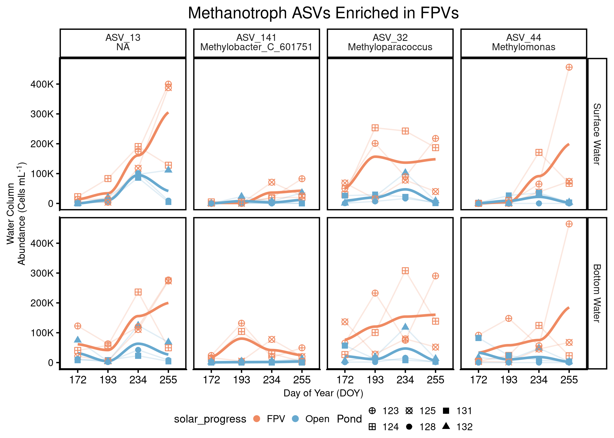
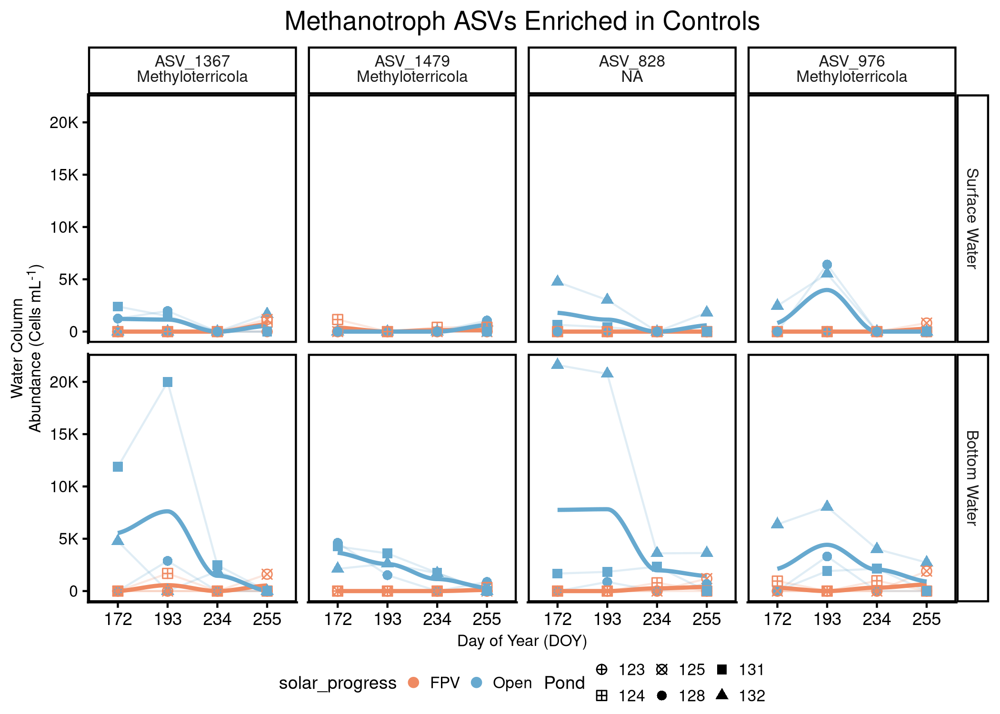
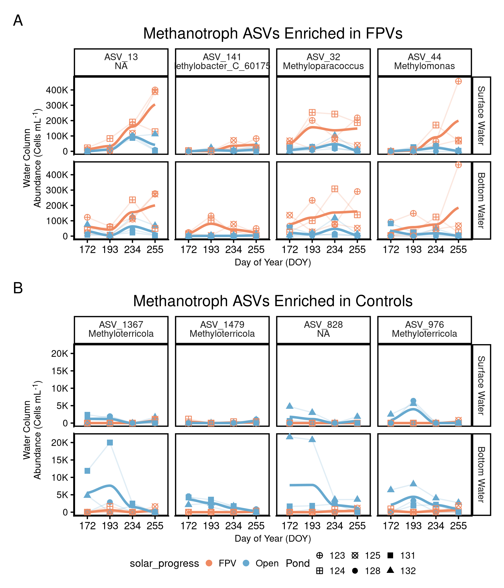
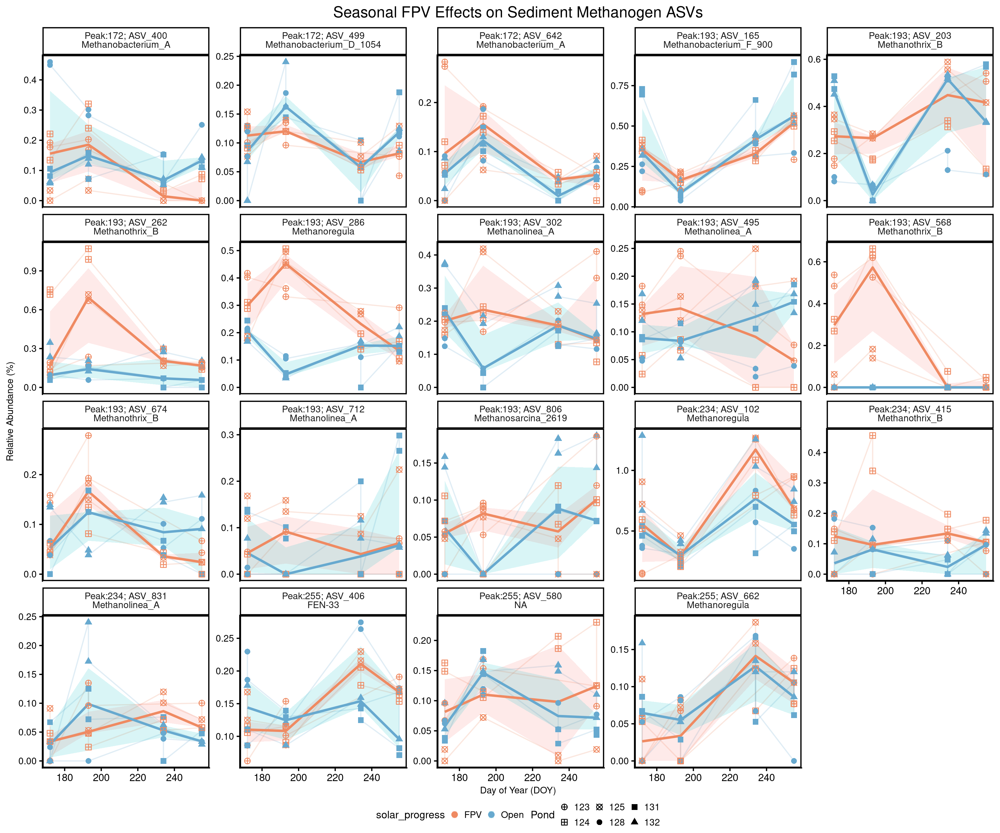
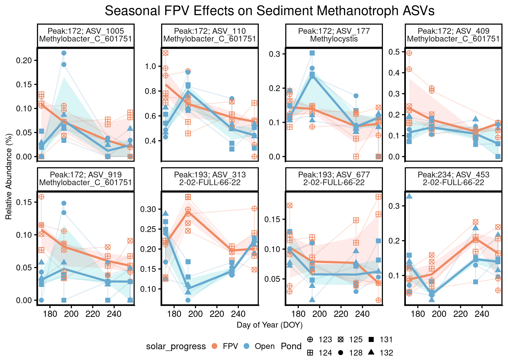

# Load packages


``` r
# Efficiently load packages 
pacman::p_load(ggplot2, phyloseq, ggpubr, tidyverse, patchwork,
               speedyseq, rstatix, dplyr, purrr, vegan, ANCOMBC, 
               microViz,cowplot, grid, scales, Biostrings, stringr, 
               DT, ggtext, install = FALSE)

source("code/functions.R") # contains scale_reads
source("code/colors_and_shapes.R")

# Set our seed for reproducibility
set.seed(09091999)
```


# Load Phyloseq Data 


``` r
# Load in the phyloseq objects
## WATER 
load("data/01_phyloseq/water_ch4_cyclers_physeq.RData")
water_ch4_cyclers_physeq
```

```
## phyloseq-class experiment-level object
## otu_table()   OTU Table:          [ 255 taxa and 48 samples ]:
## sample_data() Sample Data:        [ 48 samples by 50 sample variables ]:
## tax_table()   Taxonomy Table:     [ 255 taxa by 10 taxonomic ranks ]:
## phy_tree()    Phylogenetic Tree:  [ 255 tips and 254 internal nodes ]:
## taxa are columns
```

``` r
# We will also need a relative abundance otu_table
## What is the current form??? 
head(otu_table(water_ch4_cyclers_physeq))[, 1:6]
```

```
## OTU Table:          [ 6 taxa and 6 samples ]:
## Taxa are columns
##           ASV_677 ASV_42364 ASV_1071 ASV_2288 ASV_785 ASV_313
## 1 SA_D060       0       576        0        0       0    2594
## 2 SA_D068       0         0        0        0       0       0
## 3 SA_D076       0         0        0        0       0     561
## 4 SA_D091       0         0        0        0       0       0
## 5 SA_D053       0         0        0        0       0       0
## 6 SA_D061       0         0        0        0       0       0
```

``` r
## Create vector of water ASVs for parsing later
water_ch4_cyclers_vec <- 
  water_ch4_cyclers_physeq %>%
  taxa_names()

#check 
length(water_ch4_cyclers_vec)
```

```
## [1] 255
```

``` r
## SEDIMENT 
load("data/01_phyloseq/sed_ch4_cyclers_physeq.RData")
sed_ch4_cyclers_physeq
```

```
## phyloseq-class experiment-level object
## otu_table()   OTU Table:          [ 347 taxa and 44 samples ]:
## sample_data() Sample Data:        [ 44 samples by 47 sample variables ]:
## tax_table()   Taxonomy Table:     [ 347 taxa by 10 taxonomic ranks ]:
## phy_tree()    Phylogenetic Tree:  [ 347 tips and 346 internal nodes ]:
## taxa are rows
```

``` r
# We will also need a relative abundance otu_table
## What is the current form??? 
head(otu_table(sed_ch4_cyclers_physeq))[, 1:6] # RELATIVE! We are good! 
```

```
## OTU Table:          [ 6 taxa and 6 samples ]:
## Taxa are rows
##              SA_D005  SA_D013  SA_D021  SA_D031  SA_D038  SA_D006
## 1 ASV_37258 0        0        0        0        0        0       
## 2 ASV_2118  0.000240 0.000240 0.000144 0        0        0.000192
## 3 ASV_8411  0        0        0        0        0        0       
## 4 ASV_677   0.000288 0.00129  0.00111  0.00148  0.000714 0.000383
## 5 ASV_3924  0        0        0        0        0        0       
## 6 ASV_1375  0.000144 0.000240 0.000144 0.000861 0.000381 0.000192
```

``` r
## Create vector of sediment ASVs for parsing later
sed_ch4_cyclers_vec <- 
  sed_ch4_cyclers_physeq %>%
  taxa_names()

# Check 
length(sed_ch4_cyclers_vec)
```

```
## [1] 347
```

## Create Methanogen and Methanotroph Phyloseq Objects

### Water 


``` r
# Create a water methanogen phyloseq object
water_methanogens_physeq <- 
  water_ch4_cyclers_physeq %>% 
  subset_taxa(CH4_Cycler == "Methanogen") %>% 
  prune_taxa(taxa_sums(.) > 0, .) 

# Take a look 
water_methanogens_physeq
```

```
## phyloseq-class experiment-level object
## otu_table()   OTU Table:          [ 66 taxa and 48 samples ]:
## sample_data() Sample Data:        [ 48 samples by 50 sample variables ]:
## tax_table()   Taxonomy Table:     [ 66 taxa by 10 taxonomic ranks ]:
## phy_tree()    Phylogenetic Tree:  [ 66 tips and 65 internal nodes ]:
## taxa are columns
```

``` r
# Create a Sediment Methanotroph phyloseq object
water_methanotrophs_physeq <- 
  water_ch4_cyclers_physeq %>% 
  subset_taxa(CH4_Cycler == "Methanotroph") %>% 
  prune_taxa(taxa_sums(.) > 0, .) 

# Take a look 
water_methanotrophs_physeq
```

```
## phyloseq-class experiment-level object
## otu_table()   OTU Table:          [ 189 taxa and 48 samples ]:
## sample_data() Sample Data:        [ 48 samples by 50 sample variables ]:
## tax_table()   Taxonomy Table:     [ 189 taxa by 10 taxonomic ranks ]:
## phy_tree()    Phylogenetic Tree:  [ 189 tips and 188 internal nodes ]:
## taxa are columns
```

### Sediment 

``` r
# Create a Sediment methanogen phyloseq object
sed_methanogens_physeq <- 
  sed_ch4_cyclers_physeq %>% 
  subset_taxa(CH4_Cycler == "Methanogen") %>% 
  prune_taxa(taxa_sums(.) > 0, .) 

# Take a look 
sed_methanogens_physeq
```

```
## phyloseq-class experiment-level object
## otu_table()   OTU Table:          [ 150 taxa and 44 samples ]:
## sample_data() Sample Data:        [ 44 samples by 47 sample variables ]:
## tax_table()   Taxonomy Table:     [ 150 taxa by 10 taxonomic ranks ]:
## phy_tree()    Phylogenetic Tree:  [ 150 tips and 149 internal nodes ]:
## taxa are rows
```

``` r
# Create a Sediment Methanotroph phyloseq object
sed_methanotrophs_physeq <- 
  sed_ch4_cyclers_physeq %>% 
  subset_taxa(CH4_Cycler == "Methanotroph") %>% 
  prune_taxa(taxa_sums(.) > 0, .) 

# Take a look 
sed_methanotrophs_physeq
```

```
## phyloseq-class experiment-level object
## otu_table()   OTU Table:          [ 197 taxa and 44 samples ]:
## sample_data() Sample Data:        [ 44 samples by 47 sample variables ]:
## tax_table()   Taxonomy Table:     [ 197 taxa by 10 taxonomic ranks ]:
## phy_tree()    Phylogenetic Tree:  [ 197 tips and 196 internal nodes ]:
## taxa are rows
```

# ANCOM-BC2: Differential Abundance


``` r
# physeq with water (unincorporated cell counts) + sediment samples = 188 samples total
load("data/00_load_data/new_archaea_rooted_physeq.RData")

## Add JDate to the sample_data 
sample_data(new_archaea_rooted_physeq)$JDate <-
  lubridate::yday(sample_data(new_archaea_rooted_physeq)$Date_Collected)

# Obtain only water samples
raw_water24_physeq <- 
  new_archaea_rooted_physeq %>%
  subset_samples(SampleType == "Water") %>%
  subset_samples(Year == 2024) %>%
  # Now only subset the methanogens and methanotrophs
  prune_taxa(taxa_names(.) %in% water_ch4_cyclers_vec, .) %>%
  prune_taxa(taxa_sums(.) > 0,.)

# Inspect
raw_water24_physeq
```

```
## phyloseq-class experiment-level object
## otu_table()   OTU Table:          [ 255 taxa and 48 samples ]:
## sample_data() Sample Data:        [ 48 samples by 47 sample variables ]:
## tax_table()   Taxonomy Table:     [ 255 taxa by 9 taxonomic ranks ]:
## phy_tree()    Phylogenetic Tree:  [ 255 tips and 254 internal nodes ]:
## taxa are rows
```

``` r
# Obtain only sediment samples 
raw_sediment24_physeq <- 
  new_archaea_rooted_physeq %>%
  subset_samples(SampleType == "Sediment") %>%
  subset_samples(Year == 2024) %>%
  # Now only subset the methanogens and methanotrophs
  prune_taxa(taxa_names(.) %in% sed_ch4_cyclers_vec, .) %>%
  prune_taxa(taxa_sums(.) > 0,.)

#Inspect
raw_sediment24_physeq
```

```
## phyloseq-class experiment-level object
## otu_table()   OTU Table:          [ 347 taxa and 46 samples ]:
## sample_data() Sample Data:        [ 46 samples by 47 sample variables ]:
## tax_table()   Taxonomy Table:     [ 347 taxa by 9 taxonomic ranks ]:
## phy_tree()    Phylogenetic Tree:  [ 347 tips and 346 internal nodes ]:
## taxa are rows
```

## Water 

``` r
# Remove taxa with ZERO variances 
water_ASVs_zeroVariance_vec <- c(
  "ASV_1071", "ASV_11590", "ASV_642", "ASV_231", "ASV_4564",
  "ASV_7355", "ASV_1920", "ASV_11514", "ASV_4168", "ASV_4105",
  "ASV_3231", "ASV_2424", "ASV_2964", "ASV_2205", "ASV_7156",
  "ASV_10120", "ASV_4270", "ASV_8273", "ASV_3557", "ASV_7055",
  "ASV_2530", "ASV_4099", "ASV_1677", "ASV_10767", "ASV_1252")

# Now remove them from the phyloseq object 
water_ch4_phy_rmASV_ZeroVariance_physeq <- 
  raw_water24_physeq %>%
  subset_taxa(., !(ASV %in% water_ASVs_zeroVariance_vec)) %>% 
  prune_taxa(taxa_sums(.) > 0,.)

# Confirm the levels for solar_progress
water_ch4_phy_rmASV_ZeroVariance_physeq@sam_data$solar_progress <- 
  factor(water_ch4_phy_rmASV_ZeroVariance_physeq@sam_data$solar_progress, levels = c("No FPV", "FPV"))

# run ancombc2 for water all methane cyclers
#water_ch4_diffAbundASV_FPV_output <- 
#  ancombc2(
#    data = water_ch4_phy_rmASV_ZeroVariance_physeq,      # Phyloseq / TSE object with sample metadata
#    tax_level = "ASV",              # Test at ASV level
#    fix_formula = "solar_progress", # Tests time-averaged FPV effect only (no FPV × DOY)
#    p_adj_method = "fdr",           # FDR correction
#    pseudo_sens = TRUE,             # Check sensitivity to pseudo-count choice
#    prv_cut = 0.05,                 # Prevalence filter (≥5% of samples)
#    group = NULL,                   # No pairwise group comparisons
#    struc_zero = FALSE,             # Do not infer structural zeros
#    alpha = 0.05,                   # Significance threshold
#    n_cl = 10,                      # Parallel threads
#    verbose = FALSE,                # Suppress console output
#    s0_perc = 0.05,                 # Variance shrinkage parameter
#    global = FALSE,                 # No global (omnibus) test
#    pairwise = FALSE)               # No post-hoc pairwise tests

# Save the data 
#save(water_ch4_diffAbundASV_FPV_output, 
#     file = "data/03_diff_abund/water_ch4_diffAbundASV_FPV_output.RData")

# Load in the data 
load("data/03_diff_abund/water_ch4_diffAbundASV_FPV_output.RData")

# Check out the results 
#water_ch4_diffAbundASV_FPV_output$res

# Now run a FPV x DOY aware 
#water_ch4_diffAbundASV_FPVxDOY_output <- 
#  ancombc2(
#    data = water_ch4_phy_rmASV_ZeroVariance_physeq,
#    tax_level = "ASV",
#    fix_formula  = as.formula("solar_progress * JDate"), # Mean FPV + seasonal trend + FPV × DOY
#    #rand_formula = "(1 | Pond)",             # Repeated measures by pond
#    p_adj_method = "fdr",
#    pseudo_sens  = TRUE,
#    prv_cut      = 0.05,
#    struc_zero   = FALSE,
#    alpha        = 0.05,
#    n_cl         = 10,
#    verbose      = FALSE,
#    s0_perc      = 0.05,
#    global       = FALSE,
#    pairwise     = FALSE)


# Save the data 
#save(water_ch4_diffAbundASV_FPV_output, 
#     file = "data/03_diff_abund/water_ch4_diffAbundASV_FPV_output.RData")

# Load in the data 
load("data/03_diff_abund/water_ch4_diffAbundASV_FPV_output.RData")
```


## Clean up DiffAbundance data 


``` r
# plot ASV differential abundance
water_ch4_diffAbundASV_FPV_df <- 
  water_ch4_diffAbundASV_FPV_output$res %>%
  select(taxon, starts_with("lfc"), starts_with("diff"), starts_with("passed_ss")) %>%
  pivot_longer(cols = !taxon, names_to = "metric", values_to = "value") %>%
  separate_wider_delim(cols = metric, delim = "_", names = c("variable", "Comparison"), too_many = "merge") %>%
  mutate(Comparison = str_remove(Comparison, "\\(Intercept\\)")) %>% 
  mutate(Comparison = str_remove(Comparison, "ss_")) %>%
  pivot_wider(id_cols = c("taxon","Comparison"), names_from = variable, values_from = value) %>%
  mutate(Comparison = str_remove(Comparison, "solar_progress"),
         Comparison = str_replace(Comparison, "_solar_progrss", ";")) %>%
  separate_wider_delim(Comparison, delim = ";", names = c("Ref1", "Ref2"), too_few = "align_start") %>%
  dplyr::filter(!is.na(Ref1) & Ref1 != "") %>%
  mutate(
    Ref2 = ifelse(is.na(Ref2), "No FPV", Ref2), # relevel with basegroup which is no solar 
    Comparison = paste0(Ref2, " : ", Ref1)) %>% 
  dplyr::filter(diff == 1, passed == 1, abs(lfc) > 1) %>% # 1.2 is good cut off to see effect, below we get ASVs with super low cell counts 
  select(ASV = taxon, Comparison, lfc, passed)

## Show the Q-Values for the results section 
water_ch4_diffAbundASV_FPV_output$res %>%
  dplyr::transmute(ASV   = taxon,
                   lfc   = lfc_solar_progressFPV,
                   q_value     = q_solar_progressFPV,
                   diff  = diff_solar_progressFPV,
                   passed = passed_ss_solar_progressFPV) %>%
  dplyr::filter(passed, q_value < 0.05) %>%         # core inferential filter
  dplyr::mutate(Comparison = "FPV vs Open",
                x_fold_change = exp(lfc),
                direction = ifelse(lfc > 0, "higher in FPV", "lower in FPV"),
                q_nonSci = formatC(q_value, format = "f", digits = 7)) %>%
  dplyr::select(ASV, Comparison, lfc, x_fold_change, direction, q_value, q_nonSci) %>%
  dplyr::arrange(-lfc)
```

```
##        ASV  Comparison        lfc x_fold_change     direction      q_value  q_nonSci
## 1   ASV_32 FPV vs Open  2.4771286    11.9070260 higher in FPV 6.070849e-07 0.0000006
## 2   ASV_13 FPV vs Open  1.3943328     4.0322832 higher in FPV 7.980509e-03 0.0079805
## 3  ASV_141 FPV vs Open  1.3765691     3.9612876 higher in FPV 7.838936e-04 0.0007839
## 4   ASV_44 FPV vs Open  1.1482507     3.1526731 higher in FPV 2.062014e-02 0.0206201
## 5 ASV_6126 FPV vs Open -0.9662026     0.3805253  lower in FPV 3.104576e-02 0.0310458
## 6  ASV_828 FPV vs Open -1.0917736     0.3356207  lower in FPV 5.046939e-03 0.0050469
## 7 ASV_1367 FPV vs Open -1.1073023     0.3304492  lower in FPV 1.664823e-03 0.0016648
## 8  ASV_976 FPV vs Open -1.1462566     0.3178243  lower in FPV 7.838936e-04 0.0007839
## 9 ASV_1479 FPV vs Open -1.1763146     0.3084133  lower in FPV 6.915201e-04 0.0006915
```

``` r
# join by tax table
clean_water_ch4 <- 
  water_ch4_diffAbundASV_FPV_df %>% 
  left_join(., as.data.frame(water_ch4_cyclers_physeq@tax_table), 
            by = "ASV"); 

# Show the taxonomy
clean_water_ch4 %>%
  dplyr::select(ASV, Comparison, lfc, Class:Species)
```

```
## # A tibble: 8 × 8
##   ASV      Comparison     lfc Class               Order           Family            Genus                  Species
##   <chr>    <chr>        <dbl> <chr>               <chr>           <chr>             <chr>                  <chr>  
## 1 ASV_13   No FPV : FPV  1.39 Gammaproteobacteria Methylococcales Methylomonadaceae <NA>                   <NA>   
## 2 ASV_141  No FPV : FPV  1.38 Gammaproteobacteria Methylococcales Methylomonadaceae Methylobacter_C_601751 <NA>   
## 3 ASV_44   No FPV : FPV  1.15 Gammaproteobacteria Methylococcales Methylomonadaceae Methylomonas           albis  
## 4 ASV_828  No FPV : FPV -1.09 Gammaproteobacteria Methylococcales Methylococcaceae  <NA>                   <NA>   
## 5 ASV_1367 No FPV : FPV -1.11 Gammaproteobacteria Methylococcales Methylococcaceae  Methyloterricola       oryzae 
## 6 ASV_1479 No FPV : FPV -1.18 Gammaproteobacteria Methylococcales Methylococcaceae  Methyloterricola       oryzae 
## 7 ASV_32   No FPV : FPV  2.48 Gammaproteobacteria Methylococcales Methylococcaceae  Methyloparacoccus      <NA>   
## 8 ASV_976  No FPV : FPV -1.15 Gammaproteobacteria Methylococcales Methylococcaceae  Methyloterricola       oryzae
```


## Plot ASVs over time 

### Water Methanotroph ASVs

``` r
# plot differentially abundant ASVs overtime 
#1. tax glom at ASV level
water_ch4_asv_df_glom <- 
  water_ch4_cyclers_physeq %>% 
  tax_glom(taxrank = "ASV") %>% 
  psmelt() %>% 
  mutate(
    solar_progress = recode(solar_progress, "Solar" = "FPV", "No FPV" = "Open"),
    Depth_Class = case_when(
      Depth_Class == "S" ~ "Surface Water",
      Depth_Class == "B" ~ "Bottom Water"),
    Depth_Class = factor(Depth_Class, levels = c("Surface Water", "Bottom Water")))

# Fix levels
water_ch4_asv_df_glom$solar_progress <- factor(water_ch4_asv_df_glom$solar_progress,
                                               levels = c("FPV", "Open"))

# create list of differentially abundanct asvs, updated results
water_ch4_methanotrophs_enrichedFPV <- 
  clean_water_ch4 %>%
  dplyr::filter(lfc >0)%>%
  pull(ASV)

# now plot overtime: ENRICHED in FPVs
water_ch4_trophs_enriched_plot <- 
  water_ch4_asv_df_glom %>% 
  dplyr::filter(ASV %in% water_ch4_methanotrophs_enrichedFPV) %>% 
  dplyr::mutate(total_abundance = Abundance,
                ASV_Genus = paste0(ASV, "<br>", Genus)) %>%
  ggplot(aes(x = as.factor(JDate), y = total_abundance, color = solar_progress, shape = Pond)) +
  geom_line(aes(group = interaction(Pond, Depth_Class)), 
            alpha = 0.2) +
  geom_smooth(aes(group = solar_progress), se = FALSE) +
  geom_point(aes(shape = Pond), size = 2) +
  ggh4x::facet_grid2(Depth_Class~ASV_Genus) +
  scale_y_continuous(labels = label_number(scale_cut = cut_short_scale(), accuracy = 1)) +
  scale_color_manual(values = solar_colors) +
  scale_shape_manual(values = pond_shapes) +
  labs(
    x = "Day of Year (DOY)",
    y = "Water Column<br>Abundance (Cells mL<sup>-1</sup>)",
    title = "Methanotroph ASVs Enriched in FPVs"
  ) +
  theme_classic() +
  theme( #legend.position = c(0.75, 0.7),
    legend.position = "bottom",
        legend.spacing = unit(0, "cm"),
        plot.title = element_text(hjust = 0.5),
        panel.background =  element_rect(color = 'black', size = 1),
        panel.grid = element_blank(),
        legend.background = element_rect(fill = "transparent", color = NA), # remove legend box
        legend.key = element_rect(fill = "transparent", color = NA),
        legend.box.background = element_rect(fill='transparent', color = "transparent"), #transparent legend panel
        legend.box.just = "center",
        #strip.background = element_rect(colour = NA, fill = 'transparent'),
        plot.background = element_rect(fill = "transparent", color="transparent"),
        legend.key.size = unit(0.2, "cm"),
        legend.spacing.x = unit(0.2, "cm"),
       legend.margin = margin(t = -5, unit = "pt"),
        strip.text = element_markdown(size = 8),
       axis.title.y = element_markdown(size = 8, colour = "black"),
       axis.title.x = element_markdown(size = 8, colour = "black"),
       axis.text.y = element_text(size = 8, colour = "black"),
       legend.title = element_text(size = 9, colour = "black"),
      legend.text = element_text(size = 8, colour = "black")); 

# Show the plot 
water_ch4_trophs_enriched_plot
```

<!-- -->

``` r
## CONTROLS 
# And for controls
water_ch4_methanotrophs_enrichedControls <- 
  clean_water_ch4 %>%
  dplyr::filter(lfc <0)%>%
  pull(ASV)

# now plot overtime: ENRICHED in CONTROLS 
water_ch4_trophs_enrichedControls_plot <- 
  water_ch4_asv_df_glom %>% 
  dplyr::filter(ASV %in% water_ch4_methanotrophs_enrichedControls) %>% 
  dplyr::mutate(total_abundance = Abundance,
                ASV_Genus = paste0(ASV, "<br>", Genus)) %>%
  ggplot(aes(x = as.factor(JDate), y = total_abundance, 
             color = solar_progress, shape = Pond)) +
  geom_line(aes(group = interaction(Pond, Depth_Class)), 
            alpha = 0.2) +
  geom_smooth(aes(group = solar_progress), se = FALSE) +
  geom_point(aes(shape = Pond), size = 2) +
  ggh4x::facet_grid2(Depth_Class~ASV_Genus) +
  scale_y_continuous(labels = label_number(scale_cut = cut_short_scale(), accuracy = 1)) +
  scale_color_manual(values = solar_colors) +
  scale_shape_manual(values = pond_shapes) +
  labs(x = "Day of Year (DOY)",
       y = "Water Column<br>Abundance (Cells mL<sup>-1</sup>)",
       title = "Methanotroph ASVs Enriched in Controls") +
  theme(legend.position = "bottom") +
  theme_classic() +
  theme( #legend.position = c(0.75, 0.7),
    legend.position = "bottom",
        legend.spacing = unit(0, "cm"),
        plot.title = element_text(hjust = 0.5),
        panel.background =  element_rect(color = 'black', size = 1),
        panel.grid = element_blank(),
        legend.background = element_rect(fill = "transparent", color = NA), # remove legend box
        legend.key = element_rect(fill = "transparent", color = NA),
        legend.box.background = element_rect(fill='transparent', color = "transparent"), #transparent legend panel
        legend.box.just = "center",
        #strip.background = element_rect(colour = NA, fill = 'transparent'),
        plot.background = element_rect(fill = "transparent", color="transparent"),
        legend.key.size = unit(0.2, "cm"),
        legend.spacing.x = unit(0.2, "cm"),
       legend.margin = margin(t = -5, unit = "pt"),
        strip.text = element_markdown(size = 8),
       axis.title.y = element_markdown(size = 8, colour = "black"),
       axis.title.x = element_markdown(size = 8, colour = "black"),
       axis.text.y = element_text(size = 8, colour = "black"),
       legend.title = element_text(size = 9, colour = "black"),
      legend.text = element_text(size = 8, colour = "black")); 

# Show the plot 
water_ch4_trophs_enrichedControls_plot
```

<!-- -->


``` r
#devtools::install_github("thomasp85/patchwork")
library(patchwork)

pA <- water_ch4_trophs_enriched_plot + theme(legend.position = "none")
pB <- water_ch4_trophs_enrichedControls_plot + theme(legend.position = "bottom")

figure_S5 <-
  (pA / pB) +
  plot_annotation(tag_levels = "A") + 
  plot_layout(heights = c(0.95, 1))

# Show the plot
figure_S5
```

<!-- -->

``` r
# Save the plot   
ggsave(figure_S5, 
       width = 6, height = 7, dpi = 300,
       filename = "figures/bonus/figure_S5.png")
```


## Sediment 


``` r
# # run ancombc2 for all sediment methane cyclers
# sed_ch4_asv_output <- ancombc2(data = scaled_sed_ch4_physeq_bc,
#                                  tax_level = "ASV", # Test for each phylum
#                                  fix_formula = "solar_progress", # Use Comp_Group_Hier to estimate diff. abundance
#                                  p_adj_method = "fdr", # Adjust with Holm-Bonferroni correction; recommended by authors
#                                  pseudo_sens = TRUE, # Run sensitivity test to make sure taxa isn't sensitive to psuedo-count choice
#                                  prv_cut = 0.05, # Prevalence filter of 10%
#                                  group = NULL, # Use Comp_Group_Hier as groups when doing pairwise comparisons
#                                  struc_zero = FALSE, # Do not detect structural zeroes
#                                  alpha = 0.05, # Significance threshold of 0.05
#                                  n_cl = 5, # Use 5 threads
#                                  s0_perc = 0.05,
#                                  verbose = FALSE, # Don't print verbose output
#                                  global = FALSE, # Run a global test (sorta like an ANOVA to first find if a given ASV is sig diff)
#                                  pairwise = FALSE) # Run pairwise tests between groups (sorta like a post-hoc test like Tukey)
```

# Top Sediment ASVs

To visualize the `FPV × DOY` (seasonal) signal in sediments, I first examined ASV-level time series for the most abundant sediment methanogens. Because the FPV effect appears to operate primarily through time-dependent shifts (rather than a constant treatment offset), I focus here on identifying ASVs that show consistent FPV–Open separation at specific seasonal windows.

## Methanogen ASVs Over Time 

I begin by filtering to “abundant” methanogen ASVs (mean relative abundance > 0.05%) to avoid highlighting stochastic dynamics in rare taxa. This abundance screen defines the candidate set for subsequent, defensible identification of ASVs driving FPV-associated seasonal divergence.


``` r
# Create a dataframe 
sed_methanogens_df <- 
  sed_methanogens_physeq %>%
  speedyseq::psmelt() %>% # melt into dataframe
  dplyr::select(OTU, Sample, Abundance, DNA_ID, Date_Collected, Deployment_Depth_m, 
                Pond, solar_progress, JDate, Kingdom:CH4_Cycler) %>%
  dplyr::select(-ASVseqs) %>%
  mutate(solar_progress = recode(solar_progress, "No FPV" = "Open"))

## Summary Stats of the ASVs for some perusing 
sed_methanogen_asv_stats <- 
  sed_methanogens_df %>%
  group_by(ASV) %>%
  # Calculate the mean, median, min, and max abundances 
  summarize(mean = mean(Abundance, na.rm = TRUE), median = median(Abundance, na.rm = TRUE), 
            min = min(Abundance, na.rm = TRUE), max = max(Abundance, na.rm = TRUE)) 

# Create a vector with the ASV names 
sed_methanogen_asvs <- 
  sed_methanogen_asv_stats %>%
  # PULL ASVs with a mean of 0.0005 or 0.05% abundance or higher 
  dplyr::filter(mean > 5e-04) %>% 
  dplyr::arrange(max) %>%
  pull(ASV) 
```

Next, I quantify FPV–Open separation at each sampling date using the median relative abundance within treatment (robust to outliers). I then summarize each ASV by its maximum positive FPV–Open difference (“peak additive enrichment”), and apply a simple robustness screen to reduce the chance that a single pond or single anomalous sample drives the result.


``` r
# INITIALIZE: Set the criterion: 
min_dates_support <- 2          # criterion 1: FPV>Open on >=2 dates
min_fpv_ponds     <- 2          # criterion 2: >=2 FPV ponds support at peak date

# STEP 1: FPV–Open separation by ASV × date (median across samples)
asv_date_medians_df <-
  sed_methanogens_df %>%
  dplyr::filter(ASV %in% sed_methanogen_asvs) %>%                 # Abundance threshold 
  dplyr::mutate(JDate_bin = as.numeric(JDate)) %>%                # use actual DOY values
  dplyr::group_by(ASV, JDate_bin, solar_progress) %>%             # ASV × date × treatment
  dplyr::summarize(med = median(Abundance, na.rm = TRUE), .groups = "drop") %>%
  tidyr::pivot_wider(names_from = solar_progress,
                     values_from = med,
                     values_fill = NA_real_) %>%       # don't invent zeros
  dplyr::mutate(delta = FPV - Open)                    # + = higher in FPV

# Summarize per ASV: peak additive enrichment + how often FPV>Open
asv_effect_time_df <-
  asv_date_medians_df %>%
  dplyr::filter(!is.na(FPV) & !is.na(Open)) %>%   # keep only dates where both treatments exist
  dplyr::group_by(ASV) %>%
  dplyr::mutate(n_dates_FPV_gt_Open = sum(delta > 0,  na.rm = TRUE),
                max_pos_delta       = max(delta,  na.rm = TRUE)) %>%
  dplyr::filter(delta == max_pos_delta) %>%        # peak row (no ties assumed)
  dplyr::slice(1) %>%                              # safeguard
  dplyr::ungroup() %>%
  dplyr::transmute(ASV, max_pos_delta,
                   peak_delta_date = JDate_bin,
                   n_dates_FPV_gt_Open) %>%
  dplyr::filter(max_pos_delta > 0)

# Pond-level support at the peak delta date ----
pond_medians_df <-
  sed_methanogens_df %>%
  dplyr::filter(ASV %in% sed_methanogen_asvs) %>%
  dplyr::mutate(JDate_bin = as.numeric(JDate)) %>%
  dplyr::group_by(ASV, JDate_bin, Pond, solar_progress) %>%
  dplyr::summarize(pond_med = median(Abundance, na.rm = TRUE), .groups = "drop")

# How many ponds support the peak in abundance? 
pond_support_at_peak_df <-
  pond_medians_df %>%
  inner_join(asv_effect_time_df %>% select(ASV, peak_delta_date), by = "ASV") %>%
  filter(JDate_bin == peak_delta_date) %>%
  group_by(ASV) %>%
  summarize(
    open_median_at_peak = median(pond_med[solar_progress == "Open"], na.rm = TRUE),
    fpv_median_at_peak  = median(pond_med[solar_progress == "FPV"],  na.rm = TRUE),
    # existing support count (good)
    n_FPV_ponds_support = sum(pond_med[solar_progress == "FPV"] > open_median_at_peak, 
                              na.rm = TRUE),
    # Additive effect size at peak, across ponds (robust, bounded)
    delta_median_at_peak = fpv_median_at_peak - open_median_at_peak,
    .groups = "drop")

# Apply robustness screen: pass if ANY criterion is met
asv_effect_time_robust_methanogen_df <-
  asv_effect_time_df %>%
  left_join(pond_support_at_peak_df, by = "ASV") %>%
  mutate(
    pass_dates  = n_dates_FPV_gt_Open >= min_dates_support,
    pass_ponds  = n_FPV_ponds_support >= min_fpv_ponds,
    pass_robust = pass_dates | pass_ponds,
    tier = case_when(
      pass_dates & pass_ponds ~ "Strong",
      pass_dates | pass_ponds ~ "Moderate",
      TRUE ~ "Weak/Contextual")) %>%
  filter(pass_robust) %>%
  arrange(desc(max_pos_delta))

# show it 
datatable(asv_effect_time_robust_methanogen_df,
          options = list(pageLength = 10, autoWidth = TRUE, scrollX = TRUE),
          rownames = FALSE)
```

```{=html}
<div class="datatables html-widget html-fill-item" id="htmlwidget-8338bfcbaf18d921ac29" style="width:100%;height:auto;"></div>
<script type="application/json" data-for="htmlwidget-8338bfcbaf18d921ac29">{"x":{"filter":"none","vertical":false,"data":[["ASV_568","ASV_262","ASV_102","ASV_286","ASV_321","ASV_203","ASV_302","ASV_54","ASV_415","ASV_712","ASV_352","ASV_806","ASV_165","ASV_406","ASV_786","ASV_400","ASV_495","ASV_580","ASV_340","ASV_683","ASV_674","ASV_642","ASV_831","ASV_499","ASV_662","ASV_434","ASV_656","ASV_444","ASV_517"],[0.005725815699031163,0.005515798183228954,0.004050438039435019,0.004037589591291399,0.002698022410791751,0.002386986002827533,0.001772893958266892,0.00113902401108271,0.001101810629999988,0.000914366720337732,0.0008842538077371543,0.0008182611262996181,0.0007899294028170669,0.0007190998510160526,0.0006489551387553511,0.0006216532400210403,0.0005827673642660059,0.0005240299108241023,0.0005145069434129295,0.0005038219352054506,0.0004168456577829487,0.000408336926745982,0.0003327624554129041,0.0002657061491875936,0.0001924268213955387,0.0001909520230508664,0.0001662265095623314,0.0001301933236221647,9.709346791442045e-05],[193,193,234,193,193,193,193,193,234,193,234,193,193,255,193,172,193,255,193,172,193,172,234,172,255,172,234,193,193],[2,4,3,3,1,2,2,1,4,3,1,2,2,2,1,2,2,3,1,1,2,4,3,2,2,1,1,1,1],[0,0.001610631920948052,0.007022595318595357,0.0004807497852533149,0.0006717180891629029,0.0003351687814220733,0.0005740116266905481,0.008634052081392434,0.0003119151590767311,0,0.001668095772287855,0,0.0007451637274069167,0.001317943054419624,0.0002405465216972963,0.00093503830322395,0.0008370985728333728,0.0007726482518833301,0.00203293896753525,0,0.001243691857829521,0.0005522866682421564,0.0004328505516021233,0.0009806702128753978,0.0008376495698947013,0.0004794670337649483,0.0003806804663335713,0.001793781185136933,0.0004087106498864089],[0.005725815699031163,0.006931028238761478,0.01101357113319791,0.00476507670149737,0.003152717982877298,0.00269487485237122,0.00234690558495744,0.00962561805655605,0.001439142457532375,0.000914366720337732,0.002649180339910844,0.0007454773956771447,0.00165222113717662,0.001723312589755864,0.0004099151234567901,0.001774704014691415,0.001419865937099379,0.001075406604148432,0.002719479487360549,0.000503553467869159,0.00166053751561247,0.0009593095638772064,0.0008627685177251348,0.001150744882067858,0.001053135471517472,0.0008873520073457077,0.0004316092557843876,0.002093720409516994,0.0004572337323757028],[3,3,2,3,3,3,3,3,2,2,2,3,3,3,2,2,2,2,2,3,2,2,2,3,3,2,2,2,3],[0.005725815699031163,0.005320396317813426,0.003990975814602557,0.004284326916244055,0.002480999893714395,0.002359706070949147,0.001772893958266892,0.0009915659751636163,0.001127227298455644,0.000914366720337732,0.0009810845676229887,0.0007454773956771447,0.0009070574097697038,0.00040536953533624,0.0001693686017594938,0.0008396657114674654,0.0005827673642660059,0.000302758352265102,0.0006865405198252989,0.000503553467869159,0.0004168456577829487,0.00040702289563505,0.0004299179661230115,0.00017007466919246,0.0002154859016227711,0.0004078849735807594,5.092878945081635e-05,0.0002999392243800611,4.85230824892939e-05],[true,true,true,true,false,true,true,false,true,true,false,true,true,true,false,true,true,true,false,false,true,true,true,true,true,false,false,false,false],[true,true,true,true,true,true,true,true,true,true,true,true,true,true,true,true,true,true,true,true,true,true,true,true,true,true,true,true,true],[true,true,true,true,true,true,true,true,true,true,true,true,true,true,true,true,true,true,true,true,true,true,true,true,true,true,true,true,true],["Strong","Strong","Strong","Strong","Moderate","Strong","Strong","Moderate","Strong","Strong","Moderate","Strong","Strong","Strong","Moderate","Strong","Strong","Strong","Moderate","Moderate","Strong","Strong","Strong","Strong","Strong","Moderate","Moderate","Moderate","Moderate"]],"container":"<table class=\"display\">\n  <thead>\n    <tr>\n      <th>ASV<\/th>\n      <th>max_pos_delta<\/th>\n      <th>peak_delta_date<\/th>\n      <th>n_dates_FPV_gt_Open<\/th>\n      <th>open_median_at_peak<\/th>\n      <th>fpv_median_at_peak<\/th>\n      <th>n_FPV_ponds_support<\/th>\n      <th>delta_median_at_peak<\/th>\n      <th>pass_dates<\/th>\n      <th>pass_ponds<\/th>\n      <th>pass_robust<\/th>\n      <th>tier<\/th>\n    <\/tr>\n  <\/thead>\n<\/table>","options":{"pageLength":10,"autoWidth":true,"scrollX":true,"columnDefs":[{"className":"dt-right","targets":[1,2,3,4,5,6,7]},{"name":"ASV","targets":0},{"name":"max_pos_delta","targets":1},{"name":"peak_delta_date","targets":2},{"name":"n_dates_FPV_gt_Open","targets":3},{"name":"open_median_at_peak","targets":4},{"name":"fpv_median_at_peak","targets":5},{"name":"n_FPV_ponds_support","targets":6},{"name":"delta_median_at_peak","targets":7},{"name":"pass_dates","targets":8},{"name":"pass_ponds","targets":9},{"name":"pass_robust","targets":10},{"name":"tier","targets":11}],"order":[],"orderClasses":false}},"evals":[],"jsHooks":[]}</script>
```

The table above provides an audit trail for why each ASV was retained, including the date of peak FPV enrichment and whether that peak is supported across multiple sampling dates and/or across ponds.

This data frame shows: 

	•	`max_pos_delta`: strongest FPV enrichment (additive)
	•	`peak_delta_date`: the DOY where that peak enrichment occurs
	•	`n_dates_FPV_gt_Open`: whether it’s “one-date” vs “multi-date”
	•	`n_FPV_ponds_support`: whether peak enrichment is supported across ponds
	•	`pass_dates` / `pass_ponds`: transparent audit trail for defensibility


``` r
# Pull top time-divergent ASVs and remove the weak/noisy or moderate
top_asvs_time_methogen <- 
  asv_effect_time_robust_methanogen_df %>%
  dplyr::filter(tier == "Strong") %>%
  # Pull the ASVs by the ADDITIVE number: Total process contributions 
  dplyr::arrange(desc(max_pos_delta)) %>%
  pull(ASV)

# How many ASVs???
length(top_asvs_time_methogen)
```

```
## [1] 19
```

``` r
# Make a new df with only these ASVs 
sed_methanogen_additive_asvs_df <- 
  sed_methanogens_df %>%
  dplyr::filter(ASV %in% top_asvs_time_methogen) %>%
  dplyr::left_join(., asv_effect_time_robust_methanogen_df, by = "ASV")
  
# TIME TO PLOT 
sed_methanogen_ASV_plot <- 
  sed_methanogen_additive_asvs_df %>%
  mutate(ASV_Genus = paste0("Peak:",peak_delta_date, "; ", ASV, "<br>", Genus)) %>%
  group_by(JDate, Pond, solar_progress, ASV) %>%
  ggplot(aes(x = JDate, y = Abundance*100, color = solar_progress)) + 
  facet_wrap(~ASV_Genus, scales = "free_y", 
             #nrow = 5, ncol = 5
             ) +
  geom_line(aes(group = interaction(Pond, ASV)), alpha = 0.2) +
  #geom_smooth(aes(group = solar_progress), se = FALSE) +
  stat_summary(aes(group = solar_progress, fill = solar_progress),
               fun.data = function(y) 
                 {data.frame(y = median(y, na.rm = TRUE), 
                             ymin = quantile(y, 0.25, na.rm = TRUE),
                             ymax = quantile(y, 0.75, na.rm = TRUE))},
               geom = "ribbon", alpha = 0.15, color = NA) +
  stat_summary(aes(group = solar_progress), 
               fun = median, geom = "line", linewidth = 1) +
  labs(x = "Day of Year (DOY)", y = "Relative Abundance (%)", 
       title = "Seasonal FPV Effects on Sediment Methanogen ASVs") + 
  geom_point(aes(shape = Pond), size = 2) +
  scale_color_manual(values = solar_colors) +
  scale_shape_manual(values = pond_shapes) + 
  theme(legend.position = "bottom") +
  theme_classic() +
  theme( #legend.position = c(0.75, 0.7),
    legend.position = "bottom",
        legend.spacing = unit(0, "cm"),
        plot.title = element_text(hjust = 0.5),
        panel.background =  element_rect(color = 'black', size = 1),
        panel.grid = element_blank(),
        legend.background = element_rect(fill = "transparent", color = NA), # remove legend box
        legend.key = element_rect(fill = "transparent", color = NA),
        legend.box.background = element_rect(fill='transparent', color = "transparent"), #transparent legend panel
        legend.box.just = "center",
        #strip.background = element_rect(colour = NA, fill = 'transparent'),
        plot.background = element_rect(fill = "transparent", color="transparent"),
        legend.key.size = unit(0.2, "cm"),
        legend.spacing.x = unit(0.2, "cm"),
       legend.margin = margin(t = -5, unit = "pt"),
        strip.text = element_markdown(size = 8),
       axis.title.y = element_markdown(size = 8, colour = "black"),
       axis.title.x = element_markdown(size = 8, colour = "black"),
       axis.text.y = element_text(size = 8, colour = "black"),
       legend.title = element_text(size = 9, colour = "black"),
      legend.text = element_text(size = 8, colour = "black")); sed_methanogen_ASV_plot
```

<!-- -->

``` r
# Save the plot   
ggsave(sed_methanogen_ASV_plot, 
       width = 12, height = 10, dpi = 300,
       filename = "figures/bonus/sed_methanogen_ASV_time.png")
```

Finally, I plot only the Strong ASVs to highlight the clearest FPV-associated seasonal trajectories. Points show pond-level observations, thin lines connect repeated measures within ponds, and the thick lines/ribbons summarize treatment medians and interquartile ranges at each date. This visualization emphasizes that FPV effects in sediments are concentrated in seasonal windows and can be distributed across multiple abundant ASVs rather than manifesting as a uniform genus-level shift.


## Methanotroph ASVs Over Time 


``` r
# Create a dataframe 
sed_methanotroph_df <- 
  sed_methanotrophs_physeq %>%
  speedyseq::psmelt() %>% # melt into dataframe
  dplyr::select(OTU, Sample, Abundance, DNA_ID, Date_Collected, Deployment_Depth_m, 
                Pond, solar_progress, JDate, Kingdom:CH4_Cycler) %>%
  dplyr::select(-ASVseqs) %>%
  mutate(solar_progress = recode(solar_progress, "No FPV" = "Open"))

## Summary Stats of the ASVs for some perusing 
sed_methanotroph_asv_stats <- 
  sed_methanotroph_df %>%
  group_by(ASV) %>%
  # Calculate the mean, median, min, and max abundances 
  summarize(mean = mean(Abundance, na.rm = TRUE), median = median(Abundance, na.rm = TRUE), 
            min = min(Abundance, na.rm = TRUE), max = max(Abundance, na.rm = TRUE)) 

# Create a vector with the ASV names 
sed_methanotroph_asvs <- 
  sed_methanotroph_asv_stats %>%
  # PULL ASVs with a mean of 0.0005 or 0.05% abundance or higher 
  dplyr::filter(mean > 5e-04) %>% 
  dplyr::arrange(max) %>%
  pull(ASV) 
```


``` r
# STEP 1: FPV–Open separation by ASV × date (median across samples)
asv_date_medians_methanotroph_df <-
  sed_methanotroph_df %>%
  dplyr::filter(ASV %in% sed_methanotroph_asvs) %>%                 # Abundance threshold 
  dplyr::mutate(JDate_bin = as.numeric(JDate)) %>%                # use actual DOY values
  dplyr::group_by(ASV, JDate_bin, solar_progress) %>%             # ASV × date × treatment
  dplyr::summarize(med = median(Abundance, na.rm = TRUE), .groups = "drop") %>%
  tidyr::pivot_wider(names_from = solar_progress,
                     values_from = med,
                     values_fill = NA_real_) %>%       # don't invent zeros
  dplyr::mutate(delta = FPV - Open)                    # + = higher in FPV

# Summarize per ASV: peak additive enrichment + how often FPV>Open
asv_effect_time_methanotroph_df <-
  asv_date_medians_methanotroph_df %>%
  dplyr::filter(!is.na(FPV) & !is.na(Open)) %>%   # keep only dates where both treatments exist
  dplyr::group_by(ASV) %>%
  dplyr::mutate(n_dates_FPV_gt_Open = sum(delta > 0,  na.rm = TRUE),
                max_pos_delta       = max(delta,  na.rm = TRUE)) %>%
  dplyr::filter(delta == max_pos_delta) %>%        # peak row (no ties assumed)
  dplyr::slice(1) %>%                              # safeguard
  dplyr::ungroup() %>%
  dplyr::transmute(ASV, max_pos_delta,
                   peak_delta_date = JDate_bin,
                   n_dates_FPV_gt_Open) %>%
  dplyr::filter(max_pos_delta > 0)

# Pond-level support at the peak delta date ----
pond_medians_methanotroph_df <-
  sed_methanotroph_df %>%
  dplyr::filter(ASV %in% sed_methanotroph_asvs) %>%
  dplyr::mutate(JDate_bin = as.numeric(JDate)) %>%
  dplyr::group_by(ASV, JDate_bin, Pond, solar_progress) %>%
  dplyr::summarize(pond_med = median(Abundance, na.rm = TRUE), .groups = "drop")

# How many ponds support the peak in abundance? 
pond_support_at_peak_methanotroph_df <-
  pond_medians_methanotroph_df %>%
  inner_join(asv_effect_time_methanotroph_df %>% select(ASV, peak_delta_date), by = "ASV") %>%
  filter(JDate_bin == peak_delta_date) %>%
  group_by(ASV) %>%
  summarize(
    open_median_at_peak = median(pond_med[solar_progress == "Open"], na.rm = TRUE),
    fpv_median_at_peak  = median(pond_med[solar_progress == "FPV"],  na.rm = TRUE),
    # existing support count (good)
    n_FPV_ponds_support = sum(pond_med[solar_progress == "FPV"] > open_median_at_peak, 
                              na.rm = TRUE),
    # Additive effect size at peak, across ponds (robust, bounded)
    delta_median_at_peak = fpv_median_at_peak - open_median_at_peak,
    .groups = "drop")

# Apply robustness screen: pass if ANY criterion is met
asv_effect_time_robust_methanotroph_df <-
  asv_effect_time_methanotroph_df %>%
  dplyr::left_join(pond_support_at_peak_methanotroph_df, by = "ASV") %>%
  dplyr::mutate(
    pass_dates  = n_dates_FPV_gt_Open >= min_dates_support,
    pass_ponds  = n_FPV_ponds_support >= min_fpv_ponds,
    pass_robust = pass_dates | pass_ponds,
    tier = case_when(
      pass_dates & pass_ponds ~ "Strong",
      pass_dates | pass_ponds ~ "Moderate",
      TRUE ~ "Weak/Contextual")) %>%
  dplyr::filter(pass_robust) %>%
  dplyr::arrange(desc(max_pos_delta))

# show it 
datatable(asv_effect_time_robust_methanotroph_df,
          options = list(pageLength = 10, autoWidth = TRUE, scrollX = TRUE),
          rownames = FALSE)
```

```{=html}
<div class="datatables html-widget html-fill-item" id="htmlwidget-57820dc24c55e2b6b1b8" style="width:100%;height:auto;"></div>
<script type="application/json" data-for="htmlwidget-57820dc24c55e2b6b1b8">{"x":{"filter":"none","vertical":false,"data":[["ASV_110","ASV_313","ASV_409","ASV_363","ASV_1005","ASV_919","ASV_453","ASV_177","ASV_677","ASV_559"],[0.003374608196225171,0.001928553443070333,0.001155795064232616,0.0008909542048271878,0.0008621225342379287,0.0007681064103575837,0.0005935271363700771,0.0002877859140323533,0.0002143353977014658,7.146453502788997e-05],[172,193,172,172,172,172,234,172,193,172],[3,2,4,1,2,4,3,2,3,1],[0.005667784969006832,0.001007145719269743,0.001028519392261971,0.0009588719976240559,0.0001441614608361365,0.0002636913510942614,0.001394650230227769,0.001342414589683094,0.0005769995992178042,0.0003121098626716604],[0.009269915603818275,0.002935699162340076,0.002304873504398891,0.00163341409816645,0.001150718447423748,0.001080207155603466,0.002085311375269465,0.00153437937871203,0.0009144797162538526,0.0003835743976995504],[3,3,3,3,2,3,2,2,3,2],[0.003602130634811443,0.001928553443070333,0.001276354112136919,0.0006745421005423945,0.001006556986587611,0.0008165158045092043,0.0006906611450416956,0.0001919647890289361,0.0003374801170360484,7.146453502788997e-05],[true,true,true,false,true,true,true,true,true,false],[true,true,true,true,true,true,true,true,true,true],[true,true,true,true,true,true,true,true,true,true],["Strong","Strong","Strong","Moderate","Strong","Strong","Strong","Strong","Strong","Moderate"]],"container":"<table class=\"display\">\n  <thead>\n    <tr>\n      <th>ASV<\/th>\n      <th>max_pos_delta<\/th>\n      <th>peak_delta_date<\/th>\n      <th>n_dates_FPV_gt_Open<\/th>\n      <th>open_median_at_peak<\/th>\n      <th>fpv_median_at_peak<\/th>\n      <th>n_FPV_ponds_support<\/th>\n      <th>delta_median_at_peak<\/th>\n      <th>pass_dates<\/th>\n      <th>pass_ponds<\/th>\n      <th>pass_robust<\/th>\n      <th>tier<\/th>\n    <\/tr>\n  <\/thead>\n<\/table>","options":{"pageLength":10,"autoWidth":true,"scrollX":true,"columnDefs":[{"className":"dt-right","targets":[1,2,3,4,5,6,7]},{"name":"ASV","targets":0},{"name":"max_pos_delta","targets":1},{"name":"peak_delta_date","targets":2},{"name":"n_dates_FPV_gt_Open","targets":3},{"name":"open_median_at_peak","targets":4},{"name":"fpv_median_at_peak","targets":5},{"name":"n_FPV_ponds_support","targets":6},{"name":"delta_median_at_peak","targets":7},{"name":"pass_dates","targets":8},{"name":"pass_ponds","targets":9},{"name":"pass_robust","targets":10},{"name":"tier","targets":11}],"order":[],"orderClasses":false}},"evals":[],"jsHooks":[]}</script>
```


``` r
# Pull top time-divergent ASVs and remove the weak/noisy or moderate
top_asvs_time_methanotroph <- 
  asv_effect_time_robust_methanotroph_df %>%
  dplyr::filter(tier == "Strong") %>%
  # Pull the ASVs by the ADDITIVE number: Total process contributions 
  dplyr::arrange(desc(max_pos_delta)) %>%
  pull(ASV)

# How many ASVs???
length(top_asvs_time_methanotroph)
```

```
## [1] 8
```

``` r
# Make a new df with only these ASVs 
sed_methanotroph_asvs_df <- 
  sed_methanotroph_df %>%
  dplyr::filter(ASV %in% top_asvs_time_methanotroph) %>%
  dplyr::left_join(., asv_effect_time_robust_methanotroph_df, by = "ASV")
  
# TIME TO PLOT 
sed_methanotroph_ASV_plot <- 
  sed_methanotroph_asvs_df %>%
  mutate(ASV_Genus = paste0("Peak:", peak_delta_date, "; ", ASV, "<br>", Genus)) %>%
  group_by(JDate, Pond, solar_progress, ASV) %>%
  ggplot(aes(x = JDate, y = Abundance*100, color = solar_progress)) + 
  facet_wrap(~ASV_Genus, scales = "free_y", nrow = 2) +
  geom_line(aes(group = interaction(Pond, ASV)), alpha = 0.2) +
  stat_summary(aes(group = solar_progress, fill = solar_progress),
               fun.data = function(y) 
                 {data.frame(y = median(y, na.rm = TRUE), 
                             ymin = quantile(y, 0.25, na.rm = TRUE),
                             ymax = quantile(y, 0.75, na.rm = TRUE))},
               geom = "ribbon", alpha = 0.15, color = NA) +
  stat_summary(aes(group = solar_progress), 
               fun = median, geom = "line", linewidth = 1) +
  labs(x = "Day of Year (DOY)", y = "Relative Abundance (%)", 
       title = "Seasonal FPV Effects on Sediment Methanotroph ASVs") + 
  geom_point(aes(shape = Pond), size = 2) +
  scale_color_manual(values = solar_colors) +
  scale_shape_manual(values = pond_shapes) + 
  theme(legend.position = "bottom") +
  theme_classic() +
  theme(legend.position = "bottom",
        legend.spacing = unit(0, "cm"),
        plot.title = element_text(hjust = 0.5),
        panel.background =  element_rect(color = 'black', size = 1),
        panel.grid = element_blank(),
        legend.background = element_rect(fill = "transparent", color = NA), # remove legend box
        legend.key = element_rect(fill = "transparent", color = NA),
        legend.box.background = element_rect(fill='transparent', color = "transparent"), #transparent legend panel
        legend.box.just = "center",
        plot.background = element_rect(fill = "transparent", color="transparent"),
        legend.key.size = unit(0.2, "cm"),
        legend.spacing.x = unit(0.2, "cm"),
       legend.margin = margin(t = -5, unit = "pt"),
        strip.text = element_markdown(size = 8),
       axis.title.y = element_markdown(size = 8, colour = "black"),
       axis.title.x = element_markdown(size = 8, colour = "black"),
       axis.text.y = element_text(size = 8, colour = "black"),
       legend.title = element_text(size = 9, colour = "black"),
      legend.text = element_text(size = 8, colour = "black")); sed_methanotroph_ASV_plot
```

<!-- -->

``` r
# Save the plot   
ggsave(sed_methanotroph_ASV_plot, 
       width = 8, height = 5, dpi = 300,
       filename = "figures/bonus/sed_methanotroph_ASV_time.png")
```


# Reproducibility

``` r
# Reproducibility
devtools::session_info()
```

```
## ─ Session info ─────────────────────────────────────────────────────────────────────────────────────────────────────────────────────────────────────────────────────────────────────────────────────────────────────────────────────────────────────────
##  setting  value
##  version  R version 4.3.3 (2024-02-29)
##  os       Rocky Linux 9.5 (Blue Onyx)
##  system   x86_64, linux-gnu
##  ui       X11
##  language (EN)
##  collate  en_US.UTF-8
##  ctype    en_US.UTF-8
##  tz       America/New_York
##  date     2026-01-26
##  pandoc   3.1.1 @ /usr/lib/rstudio-server/bin/quarto/bin/tools/ (via rmarkdown)
## 
## ─ Packages ─────────────────────────────────────────────────────────────────────────────────────────────────────────────────────────────────────────────────────────────────────────────────────────────────────────────────────────────────────────────
##  package                  * version    date (UTC) lib source
##  abind                      1.4-8      2024-09-12 [2] CRAN (R 4.3.3)
##  ade4                       1.7-23     2025-02-14 [1] CRAN (R 4.3.3)
##  ANCOMBC                  * 2.4.0      2023-10-24 [1] Bioconductor
##  ape                        5.8-1      2024-12-16 [1] CRAN (R 4.3.3)
##  backports                  1.5.0      2024-05-23 [1] CRAN (R 4.3.3)
##  base64enc                  0.1-3      2015-07-28 [2] CRAN (R 4.3.3)
##  beachmat                   2.18.1     2024-02-14 [1] Bioconductor 3.18 (R 4.3.2)
##  beeswarm                   0.4.0      2021-06-01 [1] CRAN (R 4.3.2)
##  Biobase                    2.62.0     2023-10-24 [2] Bioconductor
##  BiocGenerics             * 0.48.1     2023-11-01 [2] Bioconductor
##  BiocNeighbors              1.20.2     2024-01-07 [1] Bioconductor 3.18 (R 4.3.2)
##  BiocParallel               1.36.0     2023-10-24 [2] Bioconductor
##  BiocSingular               1.18.0     2023-10-24 [1] Bioconductor
##  biomformat                 1.30.0     2023-10-24 [1] Bioconductor
##  Biostrings               * 2.70.3     2024-03-13 [1] Bioconductor 3.18 (R 4.3.2)
##  bit                        4.5.0      2024-09-20 [2] CRAN (R 4.3.3)
##  bit64                      4.5.2      2024-09-22 [2] CRAN (R 4.3.3)
##  bitops                     1.0-9      2024-10-03 [2] CRAN (R 4.3.3)
##  blob                       1.2.4      2023-03-17 [2] CRAN (R 4.3.3)
##  bluster                    1.12.0     2023-10-24 [1] Bioconductor
##  boot                       1.3-29     2024-02-19 [2] CRAN (R 4.3.3)
##  broom                      1.0.8      2025-03-28 [1] CRAN (R 4.3.3)
##  bslib                      0.9.0      2025-01-30 [1] CRAN (R 4.3.3)
##  cachem                     1.1.0      2024-05-16 [1] CRAN (R 4.3.2)
##  car                        3.1-3      2024-09-27 [1] CRAN (R 4.3.3)
##  carData                    3.0-5      2022-01-06 [1] CRAN (R 4.3.2)
##  cellranger                 1.1.0      2016-07-27 [1] CRAN (R 4.3.2)
##  checkmate                  2.3.2      2024-07-29 [1] CRAN (R 4.3.3)
##  class                      7.3-22     2023-05-03 [2] CRAN (R 4.3.3)
##  cli                        3.6.5      2025-04-23 [1] CRAN (R 4.3.3)
##  cluster                    2.1.6      2023-12-01 [2] CRAN (R 4.3.3)
##  codetools                  0.2-19     2023-02-01 [2] CRAN (R 4.3.3)
##  colorspace                 2.1-1      2024-07-26 [2] CRAN (R 4.3.3)
##  commonmark                 2.0.0      2025-07-07 [1] CRAN (R 4.3.3)
##  cowplot                  * 1.1.3      2024-01-22 [1] CRAN (R 4.3.2)
##  crayon                     1.5.3      2024-06-20 [1] CRAN (R 4.3.2)
##  crosstalk                  1.2.1      2023-11-23 [1] CRAN (R 4.3.2)
##  CVXR                       1.0-15     2024-11-07 [1] CRAN (R 4.3.3)
##  data.table                 1.17.4     2025-05-26 [1] CRAN (R 4.3.3)
##  DBI                        1.2.3      2024-06-02 [2] CRAN (R 4.3.3)
##  DECIPHER                   2.30.0     2023-10-24 [1] Bioconductor
##  decontam                   1.22.0     2023-10-24 [1] Bioconductor
##  DelayedArray               0.28.0     2023-10-24 [2] Bioconductor
##  DelayedMatrixStats         1.24.0     2023-10-24 [1] Bioconductor
##  DescTools                  0.99.60    2025-03-28 [1] CRAN (R 4.3.3)
##  devtools                   2.4.5      2022-10-11 [1] CRAN (R 4.3.2)
##  digest                     0.6.37     2024-08-19 [1] CRAN (R 4.3.2)
##  DirichletMultinomial       1.44.0     2023-10-24 [1] Bioconductor
##  doParallel                 1.0.17     2022-02-07 [1] CRAN (R 4.3.3)
##  doRNG                      1.8.6.2    2025-04-02 [1] CRAN (R 4.3.3)
##  dplyr                    * 1.1.4      2023-11-17 [1] CRAN (R 4.3.2)
##  DT                       * 0.33       2024-04-04 [1] CRAN (R 4.3.2)
##  e1071                      1.7-16     2024-09-16 [1] CRAN (R 4.3.3)
##  ellipsis                   0.3.2      2021-04-29 [2] CRAN (R 4.3.3)
##  energy                     1.7-12     2024-08-24 [1] CRAN (R 4.3.3)
##  evaluate                   1.0.3      2025-01-10 [1] CRAN (R 4.3.3)
##  Exact                      3.3        2024-07-21 [1] CRAN (R 4.3.3)
##  expm                       1.0-0      2024-08-19 [1] CRAN (R 4.3.3)
##  farver                     2.1.2      2024-05-13 [2] CRAN (R 4.3.3)
##  fastmap                    1.2.0      2024-05-15 [1] CRAN (R 4.3.2)
##  forcats                  * 1.0.0      2023-01-29 [1] CRAN (R 4.3.2)
##  foreach                    1.5.2      2022-02-02 [1] CRAN (R 4.3.3)
##  foreign                    0.8-86     2023-11-28 [2] CRAN (R 4.3.3)
##  Formula                    1.2-5      2023-02-24 [1] CRAN (R 4.3.2)
##  fs                         1.6.6      2025-04-12 [1] CRAN (R 4.3.3)
##  generics                   0.1.3      2022-07-05 [2] CRAN (R 4.3.3)
##  GenomeInfoDb             * 1.38.8     2024-03-15 [1] Bioconductor 3.18 (R 4.3.2)
##  GenomeInfoDbData           1.2.11     2024-11-25 [2] Bioconductor
##  GenomicRanges              1.54.1     2023-10-29 [2] Bioconductor
##  ggbeeswarm                 0.7.2      2023-04-29 [1] CRAN (R 4.3.2)
##  ggh4x                      0.3.1      2025-05-30 [1] CRAN (R 4.3.3)
##  ggplot2                  * 4.0.1      2025-11-14 [1] CRAN (R 4.3.3)
##  ggpubr                   * 0.6.0      2023-02-10 [1] CRAN (R 4.3.2)
##  ggrepel                    0.9.6      2024-09-07 [1] CRAN (R 4.3.3)
##  ggsignif                   0.6.4      2022-10-13 [1] CRAN (R 4.3.2)
##  ggtext                   * 0.1.2      2022-09-16 [1] CRAN (R 4.3.3)
##  gld                        2.6.7      2025-01-17 [1] CRAN (R 4.3.3)
##  glue                       1.8.0      2024-09-30 [1] CRAN (R 4.3.3)
##  gmp                        0.7-5      2024-08-23 [1] CRAN (R 4.3.3)
##  gridExtra                  2.3        2017-09-09 [2] CRAN (R 4.3.3)
##  gridtext                   0.1.5      2022-09-16 [1] CRAN (R 4.3.3)
##  gsl                        2.1-8      2023-01-24 [1] CRAN (R 4.3.2)
##  gtable                     0.3.6      2024-10-25 [2] CRAN (R 4.3.3)
##  gtools                     3.9.5      2023-11-20 [2] CRAN (R 4.3.3)
##  haven                      2.5.4      2023-11-30 [1] CRAN (R 4.3.2)
##  Hmisc                      5.2-3      2025-03-16 [1] CRAN (R 4.3.3)
##  hms                        1.1.3      2023-03-21 [1] CRAN (R 4.3.2)
##  htmlTable                  2.4.3      2024-07-21 [1] CRAN (R 4.3.3)
##  htmltools                  0.5.8.1    2024-04-04 [1] CRAN (R 4.3.2)
##  htmlwidgets                1.6.4      2023-12-06 [1] CRAN (R 4.3.2)
##  httpuv                     1.6.16     2025-04-16 [1] CRAN (R 4.3.3)
##  httr                       1.4.7      2023-08-15 [2] CRAN (R 4.3.3)
##  igraph                     2.1.1      2024-10-19 [2] CRAN (R 4.3.3)
##  IRanges                  * 2.36.0     2023-10-24 [2] Bioconductor
##  irlba                      2.3.5.1    2022-10-03 [2] CRAN (R 4.3.3)
##  iterators                  1.0.14     2022-02-05 [1] CRAN (R 4.3.3)
##  jquerylib                  0.1.4      2021-04-26 [2] CRAN (R 4.3.3)
##  jsonlite                   2.0.0      2025-03-27 [1] CRAN (R 4.3.3)
##  knitr                      1.50       2025-03-16 [1] CRAN (R 4.3.3)
##  labeling                   0.4.3      2023-08-29 [2] CRAN (R 4.3.3)
##  later                      1.4.2      2025-04-08 [1] CRAN (R 4.3.3)
##  lattice                  * 0.22-5     2023-10-24 [2] CRAN (R 4.3.3)
##  lazyeval                   0.2.2      2019-03-15 [2] CRAN (R 4.3.3)
##  lifecycle                  1.0.4      2023-11-07 [1] CRAN (R 4.3.2)
##  litedown                   0.9        2025-12-18 [1] CRAN (R 4.3.3)
##  lme4                       1.1-37     2025-03-26 [1] CRAN (R 4.3.3)
##  lmerTest                   3.1-3      2020-10-23 [1] CRAN (R 4.3.3)
##  lmom                       3.2        2024-09-30 [1] CRAN (R 4.3.3)
##  lubridate                * 1.9.4      2024-12-08 [1] CRAN (R 4.3.3)
##  magrittr                   2.0.3      2022-03-30 [2] CRAN (R 4.3.3)
##  markdown                   2.0        2025-03-23 [1] CRAN (R 4.3.3)
##  MASS                       7.3-60.0.1 2024-01-13 [2] CRAN (R 4.3.3)
##  Matrix                     1.6-5      2024-01-11 [2] CRAN (R 4.3.3)
##  MatrixGenerics             1.14.0     2023-10-24 [2] Bioconductor
##  matrixStats                1.5.0      2025-01-07 [1] CRAN (R 4.3.3)
##  memoise                    2.0.1      2021-11-26 [2] CRAN (R 4.3.3)
##  mgcv                       1.9-1      2023-12-21 [2] CRAN (R 4.3.3)
##  mia                        1.10.0     2023-10-24 [1] Bioconductor
##  microViz                 * 0.12.1     2024-03-13 [1] Github (david-barnett/microViz@09abc73)
##  mime                       0.12       2021-09-28 [2] CRAN (R 4.3.3)
##  miniUI                     0.1.1.1    2018-05-18 [2] CRAN (R 4.3.3)
##  minqa                      1.2.8      2024-08-17 [1] CRAN (R 4.3.3)
##  multcomp                   1.4-28     2025-01-29 [1] CRAN (R 4.3.3)
##  MultiAssayExperiment       1.28.0     2023-10-24 [1] Bioconductor
##  multtest                   2.58.0     2023-10-24 [1] Bioconductor
##  mvtnorm                    1.3-3      2025-01-10 [1] CRAN (R 4.3.3)
##  nlme                       3.1-164    2023-11-27 [2] CRAN (R 4.3.3)
##  nloptr                     2.2.1      2025-03-17 [1] CRAN (R 4.3.3)
##  nnet                       7.3-19     2023-05-03 [2] CRAN (R 4.3.3)
##  numDeriv                   2016.8-1.1 2019-06-06 [1] CRAN (R 4.3.2)
##  pacman                     0.5.1      2019-03-11 [1] CRAN (R 4.3.2)
##  patchwork                * 1.3.2.9000 2026-01-23 [1] Github (thomasp85/patchwork@6b1d88c)
##  permute                  * 0.9-7      2022-01-27 [1] CRAN (R 4.3.2)
##  phyloseq                 * 1.46.0     2023-10-24 [1] Bioconductor
##  pillar                     1.10.2     2025-04-05 [1] CRAN (R 4.3.3)
##  pkgbuild                   1.4.8      2025-05-26 [1] CRAN (R 4.3.3)
##  pkgconfig                  2.0.3      2019-09-22 [2] CRAN (R 4.3.3)
##  pkgload                    1.4.0      2024-06-28 [1] CRAN (R 4.3.3)
##  plyr                       1.8.9      2023-10-02 [2] CRAN (R 4.3.3)
##  profvis                    0.4.0      2024-09-20 [2] CRAN (R 4.3.3)
##  promises                   1.3.2      2024-11-28 [1] CRAN (R 4.3.3)
##  proxy                      0.4-27     2022-06-09 [1] CRAN (R 4.3.2)
##  purrr                    * 1.0.2      2023-08-10 [2] CRAN (R 4.3.3)
##  R6                         2.6.1      2025-02-15 [1] CRAN (R 4.3.3)
##  ragg                       1.3.3      2024-09-11 [2] CRAN (R 4.3.3)
##  rbibutils                  2.3        2024-10-04 [1] CRAN (R 4.3.3)
##  RColorBrewer               1.1-3      2022-04-03 [2] CRAN (R 4.3.3)
##  Rcpp                       1.0.14     2025-01-12 [1] CRAN (R 4.3.3)
##  RCurl                      1.98-1.17  2025-03-22 [1] CRAN (R 4.3.3)
##  Rdpack                     2.6.4      2025-04-09 [1] CRAN (R 4.3.3)
##  readr                    * 2.1.5      2024-01-10 [1] CRAN (R 4.3.2)
##  readxl                     1.4.5      2025-03-07 [1] CRAN (R 4.3.3)
##  reformulas                 0.4.1      2025-04-30 [1] CRAN (R 4.3.3)
##  remotes                    2.5.0      2024-03-17 [2] CRAN (R 4.3.3)
##  reshape2                   1.4.4      2020-04-09 [2] CRAN (R 4.3.3)
##  rhdf5                      2.46.1     2023-11-29 [1] Bioconductor 3.18 (R 4.3.2)
##  rhdf5filters               1.14.1     2023-11-06 [1] Bioconductor
##  Rhdf5lib                   1.24.2     2024-02-07 [1] Bioconductor 3.18 (R 4.3.2)
##  rlang                      1.1.6      2025-04-11 [1] CRAN (R 4.3.3)
##  rmarkdown                  2.29       2024-11-04 [1] CRAN (R 4.3.3)
##  Rmpfr                      1.1-0      2025-05-13 [1] CRAN (R 4.3.3)
##  rngtools                   1.5.2      2021-09-20 [1] CRAN (R 4.3.2)
##  rootSolve                  1.8.2.4    2023-09-21 [1] CRAN (R 4.3.2)
##  rpart                      4.1.23     2023-12-05 [2] CRAN (R 4.3.3)
##  RSQLite                    2.3.8      2024-11-17 [2] CRAN (R 4.3.3)
##  rstatix                  * 0.7.2      2023-02-01 [1] CRAN (R 4.3.2)
##  rstudioapi                 0.17.1     2024-10-22 [2] CRAN (R 4.3.3)
##  rsvd                       1.0.5      2021-04-16 [1] CRAN (R 4.3.2)
##  S4Arrays                   1.2.1      2024-03-04 [1] Bioconductor 3.18 (R 4.3.2)
##  S4Vectors                * 0.40.2     2023-11-23 [1] Bioconductor 3.18 (R 4.3.2)
##  S7                         0.2.1      2025-11-14 [1] CRAN (R 4.3.3)
##  sandwich                   3.1-1      2024-09-15 [1] CRAN (R 4.3.3)
##  sass                       0.4.10     2025-04-11 [1] CRAN (R 4.3.3)
##  ScaledMatrix               1.10.0     2023-10-24 [1] Bioconductor
##  scales                   * 1.4.0      2025-04-24 [1] CRAN (R 4.3.3)
##  scater                     1.30.1     2023-11-16 [1] Bioconductor
##  scuttle                    1.12.0     2023-10-24 [1] Bioconductor
##  sessioninfo                1.2.2      2021-12-06 [2] CRAN (R 4.3.3)
##  shiny                      1.10.0     2024-12-14 [1] CRAN (R 4.3.3)
##  SingleCellExperiment       1.24.0     2023-10-24 [1] Bioconductor
##  SparseArray                1.2.4      2024-02-11 [1] Bioconductor 3.18 (R 4.3.2)
##  sparseMatrixStats          1.14.0     2023-10-24 [1] Bioconductor
##  speedyseq                * 0.5.3.9021 2025-05-31 [1] Github (mikemc/speedyseq@0057652)
##  stringi                    1.8.7      2025-03-27 [1] CRAN (R 4.3.3)
##  stringr                  * 1.5.1      2023-11-14 [1] CRAN (R 4.3.2)
##  SummarizedExperiment       1.32.0     2023-10-24 [2] Bioconductor
##  survival                   3.5-8      2024-02-14 [2] CRAN (R 4.3.3)
##  systemfonts                1.1.0      2024-05-15 [2] CRAN (R 4.3.3)
##  textshaping                0.4.0      2024-05-24 [2] CRAN (R 4.3.3)
##  TH.data                    1.1-3      2025-01-17 [1] CRAN (R 4.3.3)
##  tibble                   * 3.2.1      2023-03-20 [2] CRAN (R 4.3.3)
##  tidyr                    * 1.3.1      2024-01-24 [1] CRAN (R 4.3.2)
##  tidyselect                 1.2.1      2024-03-11 [1] CRAN (R 4.3.2)
##  tidytree                   0.4.6      2023-12-12 [1] CRAN (R 4.3.2)
##  tidyverse                * 2.0.0      2023-02-22 [1] CRAN (R 4.3.2)
##  timechange                 0.3.0      2024-01-18 [1] CRAN (R 4.3.2)
##  treeio                     1.26.0     2023-10-24 [1] Bioconductor
##  TreeSummarizedExperiment   2.10.0     2023-10-24 [1] Bioconductor
##  tzdb                       0.5.0      2025-03-15 [1] CRAN (R 4.3.3)
##  urlchecker                 1.0.1      2021-11-30 [2] CRAN (R 4.3.3)
##  usethis                    3.0.0      2024-07-29 [2] CRAN (R 4.3.3)
##  utf8                       1.2.4      2023-10-22 [2] CRAN (R 4.3.3)
##  vctrs                      0.6.5      2023-12-01 [1] CRAN (R 4.3.2)
##  vegan                    * 2.6-10     2025-01-29 [1] CRAN (R 4.3.3)
##  vipor                      0.4.7      2023-12-18 [1] CRAN (R 4.3.2)
##  viridis                    0.6.5      2024-01-29 [1] CRAN (R 4.3.2)
##  viridisLite                0.4.2      2023-05-02 [1] CRAN (R 4.3.3)
##  withr                      3.0.2      2024-10-28 [1] CRAN (R 4.3.3)
##  xfun                       0.56       2026-01-18 [1] CRAN (R 4.3.3)
##  xml2                       1.3.6      2023-12-04 [2] CRAN (R 4.3.3)
##  xtable                     1.8-4      2019-04-21 [2] CRAN (R 4.3.3)
##  XVector                  * 0.42.0     2023-10-24 [2] Bioconductor
##  yaml                       2.3.10     2024-07-26 [1] CRAN (R 4.3.2)
##  yulab.utils                0.2.0      2025-01-29 [1] CRAN (R 4.3.3)
##  zlibbioc                   1.48.2     2024-03-13 [2] Bioconductor 3.18 (R 4.3.3)
##  zoo                        1.8-12     2023-04-13 [2] CRAN (R 4.3.3)
## 
##  [1] /home/mls528/R/x86_64-pc-linux-gnu-library/4.3
##  [2] /programs/R-4.3.3/lib64/R/library
## 
## ────────────────────────────────────────────────────────────────────────────────────────────────────────────────────────────────────────────────────────────────────────────────────────────────────────────────────────────────────────────────────────
```

