# Purpose

We will create a figure to show the difference in methanogens and
methanotrophs in FSP and control ponds at different depths and between
sample types. 

Additionally, I have written the methods and results in this document
which will be added to the google document.


# Load packages


``` r
# Efficiently load packages 
pacman::p_load(phyloseq, ggpubr, tidyverse, patchwork, ggh4x, speedyseq, rstatix, dplyr, purrr, vegan, ANCOMBC, cowplot, grid, install = FALSE)

source("code/functions.R") # contains scale_reads
source("code/colors_and_shapes.R")

# Set our seed for reproducibility
set.seed(999)
```

# Load in Data

Loading in our scaled phyloseq objects for each sample type. Each sample
type (water and sediment) has been scaled down to the minimum reads
separately. We scale down to the minimum number of reads to
standardize/normalize our data to allow for more accurate comparisons
between reads to account for uneven sequencing depth across samples (may
arise to do seequencing runs or library prep efficiency, etc.)

And we will add in our metadata as well!


``` r
# water physeq with absolute abundance counts
load("data/00_load_data/full_abs_physeq.RData")

# sediment scaled physeq
load("data/00_load_data/scaled_sed_physeq.RData")

# physeq with water (unincorporated cell counts) + sediment samples = 188 samples total
load("data/00_load_data/new_archaea_rooted_physeq.RData")

# load in metadata
load("data/00_load_data/metadata.RData")
```

# Prepare Phyloseq Objects
Here we will work with our two sample types (water and sediment) for the entire July 11th, 2024 year. Microbes identified as methane cyclers were determined at the Order level on taxonomic classfication.

We incorporated total cell counts from flow cytometry for water samples (full_abs_physeq.RData)
For our sediment samples, we do not have absolute abundance measures so we will need to calculate the relative abundance and rarify our samples to the minimum read depth (20822)

### Water - All time points

``` r
# filter for all time points in 2024
water_physeq_24 <- subset_samples(full_abs_physeq, Year == "2024")

# prune taxa 
water_physeq_24 <- water_physeq_24 %>% 
  prune_taxa(taxa_sums(.) > 0,.)

# melt physeq into data frame for all taxa
water_physeq_ch4 <- water_physeq_24 %>% 
  psmelt() # melt into dataframe

# melt physeq into data frame for just methane cyclers at Order level

# pull unique methane cycler taxonomic information 
methane_cyclers_distinct <- water_physeq_24 %>% 
  psmelt() %>% # melt into dataframe 
  dplyr::filter(str_detect(Order, "^Meth")) %>% # filtering for methanogens / methanotroph
  distinct(Phylum,Class, Order)
methane_cyclers_distinct
```

```
##                      Phylum               Class                    Order
## 1            Pseudomonadota Gammaproteobacteria          Methylococcales
## 2            Halobacteriota     Methanosarcinia         Methanotrichales
## 3         Verrucomicrobiota    Verrucomicrobiae      Methylacidiphilales
## 4  Methanobacteriota_A_1229     Methanobacteria       Methanobacteriales
## 5            Halobacteriota     Methanomicrobia       Methanomicrobiales
## 6         Methylomirabilota    Methylomirabilia       Methylomirabilales
## 7          Thermoplasmatota Thermoplasmata_1773  Methanomassiliicoccales
## 8            Halobacteriota       Methanocellia          Methanocellales
## 9            Halobacteriota     Methanosarcinia Methanosarcinales_A_2632
## 10      Methanobacteriota_B         Thermococci     Methanofastidiosales
```

``` r
# create a vector of our methanogens and methanotrophs at the Order level
methanogens <- c("Methanosarcinales_A_2632", "Methanomicrobiales", "Methanobacteriales", "Methanomassiliicoccales", "Methanofastidiosales", "Methanotrichales", "Methanocellales")
methanotrophs <- c("Methylococcales", "Methylacidiphilales", "Methylomirabilales")

# filter phyloseq
methane_cyclers_filt <- water_physeq_24%>% 
  psmelt() %>% # melt into dataframe 
  dplyr::filter(Order %in% c(methanogens, methanotrophs)) %>% 
  mutate(
    Methanotroph_Methanogen = case_when(
      Order %in% methanogens ~ "Methanogen",
      Order %in% methanotrophs ~ "Methanotroph",
      TRUE ~ "Other"))
methane_cyclers_filt
```

```
##            OTU  Sample Abundance  DNA_ID  input filtered denoisedF denoisedR merged nochim perc_reads_retained                   Sample_ID Concentration_ng_ul Filter_Extracted Extraction_Date Lot_Number Project_ID Location_ID Date_Collected.x Pond
## 1       ASV_13 SA_D089    656826 SA_D089 111078    77989     75718     75949  74163  72010            64.82832 AAE_EXP_20240911_123_FP_SW1                14.2              0.5        20241106       <NA>        AAE         EXP       2024-09-11  123
## 2       ASV_44 SA_D089    544978 SA_D089 111078    77989     75718     75949  74163  72010            64.82832 AAE_EXP_20240911_123_FP_SW1                14.2              0.5        20241106       <NA>        AAE         EXP       2024-09-11  123
## 3       ASV_32 SA_D092    506345 SA_D092 131341    93406     90162     90142  87423  85048            64.75358 AAE_EXP_20240911_124_FP_BW1                76.8              0.5        20241106       <NA>        AAE         EXP       2024-09-11  124
## 4       ASV_13 SA_D093    498410 SA_D093 110206    73086     70174     70485  68588  66342            60.19817 AAE_EXP_20240911_125_FP_SW1                60.4              0.5        20241104       <NA>        AAE         EXP       2024-09-11  125
## 5       ASV_13 SA_D094    438698 SA_D094 125411    90521     86788     86931  84419  80494            64.18416 AAE_EXP_20240911_125_FP_BW1                37.5              0.5        20241104       <NA>        AAE         EXP       2024-09-11  125
## 6       ASV_44 SA_D090    313642 SA_D090 124065    92691     89468     89516  87392  83715            67.47673 AAE_EXP_20240911_123_FP_BW1                60.3              0.5        20241106       <NA>        AAE         EXP       2024-09-11  123
## 7       ASV_13 SA_D079    313317 SA_D079 120881    80827     77768     77949  75629  73276            60.61829 AAE_EXP_20240821_124_FP_SW1                55.8              0.5        20241106       <NA>        AAE         EXP       2024-08-21  124
## 8       ASV_32 SA_D090    255562 SA_D090 124065    92691     89468     89516  87392  83715            67.47673 AAE_EXP_20240911_123_FP_BW1                60.3              0.5        20241106       <NA>        AAE         EXP       2024-09-11  123
## 9       ASV_13 SA_D077    253915 SA_D077 120076    87246     84738     84652  82720  81036            67.48726 AAE_EXP_20240821_123_FP_SW1                55.8              0.5        20241106       <NA>        AAE         EXP       2024-08-21  123
## 10      ASV_32 SA_D079    239843 SA_D079 120881    80827     77768     77949  75629  73276            60.61829 AAE_EXP_20240821_124_FP_SW1                55.8              0.5        20241106       <NA>        AAE         EXP       2024-08-21  124
## 11      ASV_32 SA_D091    204020 SA_D091 116888    81874     79189     79166  77044  75158            64.29916 AAE_EXP_20240911_124_FP_SW1                  45              0.5        20241104       <NA>        AAE         EXP       2024-09-11  124
## 12      ASV_32 SA_D067    195908 SA_D067 126968    91675     88674     88714  86287  83246            65.56455 AAE_EXP_20240711_124_FP_SW1                68.3              0.5        20241104       <NA>        AAE         EXP       2024-07-11  124
## 13      ASV_32 SA_D080    182582 SA_D080 122566    88864     85084     85161  82049  78171            63.77870 AAE_EXP_20240821_124_FP_BW1                  30              0.5        20241029       <NA>        AAE         EXP       2024-08-21  124
## 14      ASV_32 SA_D089    181604 SA_D089 111078    77989     75718     75949  74163  72010            64.82832 AAE_EXP_20240911_123_FP_SW1                14.2              0.5        20241106       <NA>        AAE         EXP       2024-09-11  123
## 15      ASV_13 SA_D080    180078 SA_D080 122566    88864     85084     85161  82049  78171            63.77870 AAE_EXP_20240821_124_FP_BW1                  30              0.5        20241029       <NA>        AAE         EXP       2024-08-21  124
## 16     ASV_119 SA_D093    167092 SA_D093 110206    73086     70174     70485  68588  66342            60.19817 AAE_EXP_20240911_125_FP_SW1                60.4              0.5        20241104       <NA>        AAE         EXP       2024-09-11  125
## 17      ASV_13 SA_D082    162970 SA_D082 150688   108908    104254    104288 100927  96592            64.10066 AAE_EXP_20240821_125_FP_BW1                30.9              0.5        20241104       <NA>        AAE         EXP       2024-08-21  125
## 18     ASV_119 SA_D094    146983 SA_D094 125411    90521     86788     86931  84419  80494            64.18416 AAE_EXP_20240911_125_FP_BW1                37.5              0.5        20241104       <NA>        AAE         EXP       2024-09-11  125
## 19      ASV_44 SA_D079    145028 SA_D079 120881    80827     77768     77949  75629  73276            60.61829 AAE_EXP_20240821_124_FP_SW1                55.8              0.5        20241106       <NA>        AAE         EXP       2024-08-21  124
## 20      ASV_32 SA_D065    140009 SA_D065  84973    58079     55438     55388  53791  52263            61.50542 AAE_EXP_20240711_123_FP_SW1                70.8              0.5        20241104       <NA>        AAE         EXP       2024-07-11  123
## 21      ASV_32 SA_D082    136542 SA_D082 150688   108908    104254    104288 100927  96592            64.10066 AAE_EXP_20240821_125_FP_BW1                30.9              0.5        20241104       <NA>        AAE         EXP       2024-08-21  125
## 22      ASV_44 SA_D080    132135 SA_D080 122566    88864     85084     85161  82049  78171            63.77870 AAE_EXP_20240821_124_FP_BW1                  30              0.5        20241029       <NA>        AAE         EXP       2024-08-21  124
## 23     ASV_141 SA_D066    130199 SA_D066 109696    80161     76993     77088  74543  70214            64.00780 AAE_EXP_20240711_123_FP_BW1                99.3              0.5        20241106       <NA>        AAE         EXP       2024-07-11  123
## 24      ASV_13 SA_D099    128995 SA_D099 144121   103087     99375     99338  96648  92306            64.04757 AAE_EXP_20240911_132_FP_SW1                30.8              0.5        20241029       <NA>        AAE         EXP       2024-09-11  132
## 25      ASV_13 SA_D081    127193 SA_D081 141900   102862     98755     98786  95693  92141            64.93376 AAE_EXP_20240821_125_FP_SW1                35.5              0.5        20241029       <NA>        AAE         EXP       2024-08-21  125
## 26      ASV_13 SA_D083    122328 SA_D083 101500    71149     68226     68263  66310  64719            63.76256 AAE_EXP_20240821_128_FP_SW1                66.6              0.5        20241106       <NA>        AAE         EXP       2024-08-21  128
## 27      ASV_32 SA_D088    120745 SA_D088 125947    91747     87543     87505  84468  81794            64.94319 AAE_EXP_20240821_132_FP_BW1                  55              0.5        20241106       <NA>        AAE         EXP       2024-08-21  132
## 28      ASV_13 SA_D092    115330 SA_D092 131341    93406     90162     90142  87423  85048            64.75358 AAE_EXP_20240911_124_FP_BW1                76.8              0.5        20241106       <NA>        AAE         EXP       2024-09-11  124
## 29      ASV_13 SA_D078    114625 SA_D078 115708    84204     81059     80985  78311  74364            64.26868 AAE_EXP_20240821_123_FP_BW1                54.7              0.5        20241106       <NA>        AAE         EXP       2024-08-21  123
## 30      ASV_13 SA_D091    111948 SA_D091 116888    81874     79189     79166  77044  75158            64.29916 AAE_EXP_20240911_124_FP_SW1                  45              0.5        20241104       <NA>        AAE         EXP       2024-09-11  124
## 31     ASV_141 SA_D082    109648 SA_D082 150688   108908    104254    104288 100927  96592            64.10066 AAE_EXP_20240821_125_FP_BW1                30.9              0.5        20241104       <NA>        AAE         EXP       2024-08-21  125
## 32     ASV_119 SA_D082    103340 SA_D082 150688   108908    104254    104288 100927  96592            64.10066 AAE_EXP_20240821_125_FP_BW1                30.9              0.5        20241104       <NA>        AAE         EXP       2024-08-21  125
## 33      ASV_32 SA_D087    101442 SA_D087 130719    92666     89301     89285  86892  84647            64.75493 AAE_EXP_20240821_132_FP_SW1                48.2              0.5        20241106       <NA>        AAE         EXP       2024-08-21  132
## 34      ASV_13 SA_D054     90750 SA_D054 103214    72057     69796     69887  68055  66676            64.59976 AAE_EXP_20240620_123_FP_BW1                39.4              0.5        20241106       <NA>        AAE         EXP       2024-06-20  123
## 35     ASV_141 SA_D081     87143 SA_D081 141900   102862     98755     98786  95693  92141            64.93376 AAE_EXP_20240821_125_FP_SW1                35.5              0.5        20241029       <NA>        AAE         EXP       2024-08-21  125
## 36      ASV_44 SA_D066     86829 SA_D066 109696    80161     76993     77088  74543  70214            64.00780 AAE_EXP_20240711_123_FP_BW1                99.3              0.5        20241106       <NA>        AAE         EXP       2024-07-11  123
## 37     ASV_930 SA_D091     84099 SA_D091 116888    81874     79189     79166  77044  75158            64.29916 AAE_EXP_20240911_124_FP_SW1                  45              0.5        20241104       <NA>        AAE         EXP       2024-09-11  124
## 38      ASV_44 SA_D077     83343 SA_D077 120076    87246     84738     84652  82720  81036            67.48726 AAE_EXP_20240821_123_FP_SW1                55.8              0.5        20241106       <NA>        AAE         EXP       2024-08-21  123
## 39      ASV_44 SA_D093     81713 SA_D093 110206    73086     70174     70485  68588  66342            60.19817 AAE_EXP_20240911_125_FP_SW1                60.4              0.5        20241104       <NA>        AAE         EXP       2024-09-11  125
## 40      ASV_32 SA_D078     80969 SA_D078 115708    84204     81059     80985  78311  74364            64.26868 AAE_EXP_20240821_123_FP_BW1                54.7              0.5        20241106       <NA>        AAE         EXP       2024-08-21  123
## 41      ASV_32 SA_D058     80075 SA_D058  76816    52421     49826     49732  48237  46310            60.28692 AAE_EXP_20240620_125_FP_BW1                36.7              0.5        20241029       <NA>        AAE         EXP       2024-06-20  125
## 42      ASV_13 SA_D087     76428 SA_D087 130719    92666     89301     89285  86892  84647            64.75493 AAE_EXP_20240821_132_FP_SW1                48.2              0.5        20241106       <NA>        AAE         EXP       2024-08-21  132
## 43      ASV_13 SA_D085     73083 SA_D085  43255    28501     27321     27257  26228  25217            58.29846 AAE_EXP_20240821_131_FP_SW1                54.3              0.5        20241106       <NA>        AAE         EXP       2024-08-21  131
## 44      ASV_44 SA_D082     72431 SA_D082 150688   108908    104254    104288 100927  96592            64.10066 AAE_EXP_20240821_125_FP_BW1                30.9              0.5        20241104       <NA>        AAE         EXP       2024-08-21  125
## 45     ASV_357 SA_D091     70436 SA_D091 116888    81874     79189     79166  77044  75158            64.29916 AAE_EXP_20240911_124_FP_SW1                  45              0.5        20241104       <NA>        AAE         EXP       2024-09-11  124
## 46     ASV_119 SA_D081     69681 SA_D081 141900   102862     98755     98786  95693  92141            64.93376 AAE_EXP_20240821_125_FP_SW1                35.5              0.5        20241029       <NA>        AAE         EXP       2024-08-21  125
## 47      ASV_32 SA_D081     69410 SA_D081 141900   102862     98755     98786  95693  92141            64.93376 AAE_EXP_20240821_125_FP_SW1                35.5              0.5        20241029       <NA>        AAE         EXP       2024-08-21  125
## 48      ASV_44 SA_D054     66690 SA_D054 103214    72057     69796     69887  68055  66676            64.59976 AAE_EXP_20240620_123_FP_BW1                39.4              0.5        20241106       <NA>        AAE         EXP       2024-06-20  123
## 49     ASV_141 SA_D089     65107 SA_D089 111078    77989     75718     75949  74163  72010            64.82832 AAE_EXP_20240911_123_FP_SW1                14.2              0.5        20241106       <NA>        AAE         EXP       2024-09-11  123
## 50      ASV_44 SA_D094     64789 SA_D094 125411    90521     86788     86931  84419  80494            64.18416 AAE_EXP_20240911_125_FP_BW1                37.5              0.5        20241104       <NA>        AAE         EXP       2024-09-11  125
## 51      ASV_32 SA_D053     62349 SA_D053  13085    10331      9943      9929   9707   9580            73.21360 AAE_EXP_20240620_123_FP_SW1                45.2              0.5        20241029       <NA>        AAE         EXP       2024-06-20  123
## 52      ASV_13 SA_D088     61334 SA_D088 125947    91747     87543     87505  84468  81794            64.94319 AAE_EXP_20240821_132_FP_BW1                  55              0.5        20241106       <NA>        AAE         EXP       2024-08-21  132
## 53      ASV_32 SA_D068     53902 SA_D068 145970   110583    108015    108088 105579 101291            69.39166 AAE_EXP_20240711_124_FP_BW1                85.1              0.5        20241104       <NA>        AAE         EXP       2024-07-11  124
## 54      ASV_13 SA_D100     52770 SA_D100 102801    65653     62781     62551  60470  56976            55.42359 AAE_EXP_20240911_132_FP_BW1                60.6              0.5        20241106       <NA>        AAE         EXP       2024-09-11  132
## 55      ASV_32 SA_D093     51305 SA_D093 110206    73086     70174     70485  68588  66342            60.19817 AAE_EXP_20240911_125_FP_SW1                60.4              0.5        20241104       <NA>        AAE         EXP       2024-09-11  125
## 56      ASV_44 SA_D078     51066 SA_D078 115708    84204     81059     80985  78311  74364            64.26868 AAE_EXP_20240821_123_FP_BW1                54.7              0.5        20241106       <NA>        AAE         EXP       2024-08-21  123
## 57      ASV_13 SA_D066     50196 SA_D066 109696    80161     76993     77088  74543  70214            64.00780 AAE_EXP_20240711_123_FP_BW1                99.3              0.5        20241106       <NA>        AAE         EXP       2024-07-11  123
## 58     ASV_688 SA_D089     50033 SA_D089 111078    77989     75718     75949  74163  72010            64.82832 AAE_EXP_20240911_123_FP_SW1                14.2              0.5        20241106       <NA>        AAE         EXP       2024-09-11  123
## 59     ASV_294 SA_D093     49383 SA_D093 110206    73086     70174     70485  68588  66342            60.19817 AAE_EXP_20240911_125_FP_SW1                60.4              0.5        20241104       <NA>        AAE         EXP       2024-09-11  125
## 60     ASV_141 SA_D079     49362 SA_D079 120881    80827     77768     77949  75629  73276            60.61829 AAE_EXP_20240821_124_FP_SW1                55.8              0.5        20241106       <NA>        AAE         EXP       2024-08-21  124
## 61     ASV_141 SA_D068     47920 SA_D068 145970   110583    108015    108088 105579 101291            69.39166 AAE_EXP_20240711_124_FP_BW1                85.1              0.5        20241104       <NA>        AAE         EXP       2024-07-11  124
## 62     ASV_357 SA_D080     47648 SA_D080 122566    88864     85084     85161  82049  78171            63.77870 AAE_EXP_20240821_124_FP_BW1                  30              0.5        20241029       <NA>        AAE         EXP       2024-08-21  124
## 63     ASV_357 SA_D079     46843 SA_D079 120881    80827     77768     77949  75629  73276            60.61829 AAE_EXP_20240821_124_FP_SW1                55.8              0.5        20241106       <NA>        AAE         EXP       2024-08-21  124
## 64      ASV_32 SA_D054     45914 SA_D054 103214    72057     69796     69887  68055  66676            64.59976 AAE_EXP_20240620_123_FP_BW1                39.4              0.5        20241106       <NA>        AAE         EXP       2024-06-20  123
## 65      ASV_44 SA_D062     45712 SA_D062 112580    78039     74900     75048  72664  69298            61.55445 AAE_EXP_20240620_131_FP_BW1                72.3              0.5        20241104       <NA>        AAE         EXP       2024-06-20  131
## 66      ASV_13 SA_D086     45405 SA_D086 119375    87506     82741     82658  79124  76487            64.07288 AAE_EXP_20240821_131_FP_BW1                58.3              0.5        20241029       <NA>        AAE         EXP       2024-08-21  131
## 67      ASV_44 SA_D085     45235 SA_D085  43255    28501     27321     27257  26228  25217            58.29846 AAE_EXP_20240821_131_FP_SW1                54.3              0.5        20241106       <NA>        AAE         EXP       2024-08-21  131
## 68      ASV_13 SA_D090     44899 SA_D090 124065    92691     89468     89516  87392  83715            67.47673 AAE_EXP_20240911_123_FP_BW1                60.3              0.5        20241106       <NA>        AAE         EXP       2024-09-11  123
## 69     ASV_498 SA_D093     44232 SA_D093 110206    73086     70174     70485  68588  66342            60.19817 AAE_EXP_20240911_125_FP_SW1                60.4              0.5        20241104       <NA>        AAE         EXP       2024-09-11  125
## 70     ASV_294 SA_D094     42175 SA_D094 125411    90521     86788     86931  84419  80494            64.18416 AAE_EXP_20240911_125_FP_BW1                37.5              0.5        20241104       <NA>        AAE         EXP       2024-09-11  125
## 71     ASV_294 SA_D081     41913 SA_D081 141900   102862     98755     98786  95693  92141            64.93376 AAE_EXP_20240821_125_FP_SW1                35.5              0.5        20241029       <NA>        AAE         EXP       2024-08-21  125
## 72      ASV_44 SA_D092     40777 SA_D092 131341    93406     90162     90142  87423  85048            64.75358 AAE_EXP_20240911_124_FP_BW1                76.8              0.5        20241106       <NA>        AAE         EXP       2024-09-11  124
## 73      ASV_32 SA_D062     39394 SA_D062 112580    78039     74900     75048  72664  69298            61.55445 AAE_EXP_20240620_131_FP_BW1                72.3              0.5        20241104       <NA>        AAE         EXP       2024-06-20  131
## 74     ASV_119 SA_D091     38151 SA_D091 116888    81874     79189     79166  77044  75158            64.29916 AAE_EXP_20240911_124_FP_SW1                  45              0.5        20241104       <NA>        AAE         EXP       2024-09-11  124
## 75     ASV_930 SA_D092     37842 SA_D092 131341    93406     90162     90142  87423  85048            64.75358 AAE_EXP_20240911_124_FP_BW1                76.8              0.5        20241106       <NA>        AAE         EXP       2024-09-11  124
## 76      ASV_32 SA_D094     37607 SA_D094 125411    90521     86788     86931  84419  80494            64.18416 AAE_EXP_20240911_125_FP_BW1                37.5              0.5        20241104       <NA>        AAE         EXP       2024-09-11  125
## 77      ASV_32 SA_D057     37327 SA_D057  26889    17488     16698     16720  16010  14932            55.53200 AAE_EXP_20240620_125_FP_SW1                82.5              0.5        20241106       <NA>        AAE         EXP       2024-06-20  125
## 78     ASV_688 SA_D090     35316 SA_D090 124065    92691     89468     89516  87392  83715            67.47673 AAE_EXP_20240911_123_FP_BW1                60.3              0.5        20241106       <NA>        AAE         EXP       2024-09-11  123
## 79      ASV_13 SA_D056     34303 SA_D056 163602   117383    113166    113320 110169 105958            64.76571 AAE_EXP_20240620_124_FP_BW1                46.1              0.5        20241106       <NA>        AAE         EXP       2024-06-20  124
## 80      ASV_44 SA_D088     33243 SA_D088 125947    91747     87543     87505  84468  81794            64.94319 AAE_EXP_20240821_132_FP_BW1                  55              0.5        20241106       <NA>        AAE         EXP       2024-08-21  132
## 81      ASV_32 SA_D055     31671 SA_D055  82202    55939     53217     53049  51186  49298            59.97178 AAE_EXP_20240620_124_FP_SW1                89.6              0.5        20241106       <NA>        AAE         EXP       2024-06-20  124
## 82     ASV_498 SA_D094     31451 SA_D094 125411    90521     86788     86931  84419  80494            64.18416 AAE_EXP_20240911_125_FP_BW1                37.5              0.5        20241104       <NA>        AAE         EXP       2024-09-11  125
## 83     ASV_294 SA_D099     31072 SA_D099 144121   103087     99375     99338  96648  92306            64.04757 AAE_EXP_20240911_132_FP_SW1                30.8              0.5        20241029       <NA>        AAE         EXP       2024-09-11  132
## 84     ASV_141 SA_D090     30816 SA_D090 124065    92691     89468     89516  87392  83715            67.47673 AAE_EXP_20240911_123_FP_BW1                60.3              0.5        20241106       <NA>        AAE         EXP       2024-09-11  123
## 85     ASV_141 SA_D094     30770 SA_D094 125411    90521     86788     86931  84419  80494            64.18416 AAE_EXP_20240911_125_FP_BW1                37.5              0.5        20241104       <NA>        AAE         EXP       2024-09-11  125
## 86     ASV_141 SA_D099     30757 SA_D099 144121   103087     99375     99338  96648  92306            64.04757 AAE_EXP_20240911_132_FP_SW1                30.8              0.5        20241029       <NA>        AAE         EXP       2024-09-11  132
## 87      ASV_32 SA_D083     28367 SA_D083 101500    71149     68226     68263  66310  64719            63.76256 AAE_EXP_20240821_128_FP_SW1                66.6              0.5        20241106       <NA>        AAE         EXP       2024-08-21  128
## 88     ASV_346 SA_D082     27214 SA_D082 150688   108908    104254    104288 100927  96592            64.10066 AAE_EXP_20240821_125_FP_BW1                30.9              0.5        20241104       <NA>        AAE         EXP       2024-08-21  125
## 89      ASV_32 SA_D073     26855 SA_D073 129985    92693     89589     89600  87369  84222            64.79363 AAE_EXP_20240711_131_FP_SW1                62.1              0.5        20241106       <NA>        AAE         EXP       2024-07-11  131
## 90     ASV_357 SA_D089     25070 SA_D089 111078    77989     75718     75949  74163  72010            64.82832 AAE_EXP_20240911_123_FP_SW1                14.2              0.5        20241106       <NA>        AAE         EXP       2024-09-11  123
## 91     ASV_828 SA_D064     24831 SA_D064 131886    93973     90207     90198  87249  85230            64.62399 AAE_EXP_20240620_132_FP_BW1                49.2              0.5        20241106       <NA>        AAE         EXP       2024-06-20  132
## 92      ASV_13 SA_D055     24793 SA_D055  82202    55939     53217     53049  51186  49298            59.97178 AAE_EXP_20240620_124_FP_SW1                89.6              0.5        20241106       <NA>        AAE         EXP       2024-06-20  124
## 93      ASV_32 SA_D056     24121 SA_D056 163602   117383    113166    113320 110169 105958            64.76571 AAE_EXP_20240620_124_FP_BW1                46.1              0.5        20241106       <NA>        AAE         EXP       2024-06-20  124
## 94     ASV_294 SA_D088     23503 SA_D088 125947    91747     87543     87505  84468  81794            64.94319 AAE_EXP_20240821_132_FP_BW1                  55              0.5        20241106       <NA>        AAE         EXP       2024-08-21  132
## 95     ASV_119 SA_D067     22835 SA_D067 126968    91675     88674     88714  86287  83246            65.56455 AAE_EXP_20240711_124_FP_SW1                68.3              0.5        20241104       <NA>        AAE         EXP       2024-07-11  124
## 96     ASV_141 SA_D080     22721 SA_D080 122566    88864     85084     85161  82049  78171            63.77870 AAE_EXP_20240821_124_FP_BW1                  30              0.5        20241029       <NA>        AAE         EXP       2024-08-21  124
## 97      ASV_13 SA_D084     22706 SA_D084  92514    66315     61587     61471  58056  55917            60.44166 AAE_EXP_20240821_128_FP_BW1                81.8              0.5        20241029       <NA>        AAE         EXP       2024-08-21  128
## 98      ASV_32 SA_D077     22674 SA_D077 120076    87246     84738     84652  82720  81036            67.48726 AAE_EXP_20240821_123_FP_SW1                55.8              0.5        20241106       <NA>        AAE         EXP       2024-08-21  123
## 99     ASV_119 SA_D080     22006 SA_D080 122566    88864     85084     85161  82049  78171            63.77870 AAE_EXP_20240821_124_FP_BW1                  30              0.5        20241029       <NA>        AAE         EXP       2024-08-21  124
## 100    ASV_141 SA_D091     21818 SA_D091 116888    81874     79189     79166  77044  75158            64.29916 AAE_EXP_20240911_124_FP_SW1                  45              0.5        20241104       <NA>        AAE         EXP       2024-09-11  124
## 101    ASV_346 SA_D081     21290 SA_D081 141900   102862     98755     98786  95693  92141            64.93376 AAE_EXP_20240821_125_FP_SW1                35.5              0.5        20241029       <NA>        AAE         EXP       2024-08-21  125
## 102     ASV_44 SA_D087     20247 SA_D087 130719    92666     89301     89285  86892  84647            64.75493 AAE_EXP_20240821_132_FP_SW1                48.2              0.5        20241106       <NA>        AAE         EXP       2024-08-21  132
## 103    ASV_357 SA_D090     19885 SA_D090 124065    92691     89468     89516  87392  83715            67.47673 AAE_EXP_20240911_123_FP_BW1                60.3              0.5        20241106       <NA>        AAE         EXP       2024-09-11  123
## 104    ASV_357 SA_D092     19780 SA_D092 131341    93406     90162     90142  87423  85048            64.75358 AAE_EXP_20240911_124_FP_BW1                76.8              0.5        20241106       <NA>        AAE         EXP       2024-09-11  124
## 105     ASV_14 SA_D084     19301 SA_D084  92514    66315     61587     61471  58056  55917            60.44166 AAE_EXP_20240821_128_FP_BW1                81.8              0.5        20241029       <NA>        AAE         EXP       2024-08-21  128
## 106     ASV_13 SA_D068     19273 SA_D068 145970   110583    108015    108088 105579 101291            69.39166 AAE_EXP_20240711_124_FP_BW1                85.1              0.5        20241104       <NA>        AAE         EXP       2024-07-11  124
## 107     ASV_32 SA_D066     19168 SA_D066 109696    80161     76993     77088  74543  70214            64.00780 AAE_EXP_20240711_123_FP_BW1                99.3              0.5        20241106       <NA>        AAE         EXP       2024-07-11  123
## 108    ASV_493 SA_D092     18796 SA_D092 131341    93406     90162     90142  87423  85048            64.75358 AAE_EXP_20240911_124_FP_BW1                76.8              0.5        20241106       <NA>        AAE         EXP       2024-09-11  124
## 109     ASV_44 SA_D091     18376 SA_D091 116888    81874     79189     79166  77044  75158            64.29916 AAE_EXP_20240911_124_FP_SW1                  45              0.5        20241104       <NA>        AAE         EXP       2024-09-11  124
## 110     ASV_13 SA_D067     18371 SA_D067 126968    91675     88674     88714  86287  83246            65.56455 AAE_EXP_20240711_124_FP_SW1                68.3              0.5        20241104       <NA>        AAE         EXP       2024-07-11  124
## 111     ASV_32 SA_D084     18225 SA_D084  92514    66315     61587     61471  58056  55917            60.44166 AAE_EXP_20240821_128_FP_BW1                81.8              0.5        20241029       <NA>        AAE         EXP       2024-08-21  128
## 112     ASV_44 SA_D086     18147 SA_D086 119375    87506     82741     82658  79124  76487            64.07288 AAE_EXP_20240821_131_FP_BW1                58.3              0.5        20241029       <NA>        AAE         EXP       2024-08-21  131
## 113    ASV_415 SA_D060     17947 SA_D060  53345    40929     39252     39282  38136  37413            70.13403 AAE_EXP_20240620_128_FP_BW1                33.8              0.5        20241104       <NA>        AAE         EXP       2024-06-20  128
## 114     ASV_32 SA_D070     17661 SA_D070 154972   116457    112689    112794 109346  96258            62.11316 AAE_EXP_20240711_125_FP_BW1                31.6              0.5        20241029       <NA>        AAE         EXP       2024-07-11  125
## 115     ASV_13 SA_D065     17538 SA_D065  84973    58079     55438     55388  53791  52263            61.50542 AAE_EXP_20240711_123_FP_SW1                70.8              0.5        20241104       <NA>        AAE         EXP       2024-07-11  123
## 116    ASV_141 SA_D078     17063 SA_D078 115708    84204     81059     80985  78311  74364            64.26868 AAE_EXP_20240821_123_FP_BW1                54.7              0.5        20241106       <NA>        AAE         EXP       2024-08-21  123
## 117    ASV_679 SA_D088     16709 SA_D088 125947    91747     87543     87505  84468  81794            64.94319 AAE_EXP_20240821_132_FP_BW1                  55              0.5        20241106       <NA>        AAE         EXP       2024-08-21  132
## 118     ASV_44 SA_D073     16179 SA_D073 129985    92693     89589     89600  87369  84222            64.79363 AAE_EXP_20240711_131_FP_SW1                62.1              0.5        20241106       <NA>        AAE         EXP       2024-07-11  131
## 119     ASV_13 SA_D064     16142 SA_D064 131886    93973     90207     90198  87249  85230            64.62399 AAE_EXP_20240620_132_FP_BW1                49.2              0.5        20241106       <NA>        AAE         EXP       2024-06-20  132
## 120    ASV_493 SA_D091     15299 SA_D091 116888    81874     79189     79166  77044  75158            64.29916 AAE_EXP_20240911_124_FP_SW1                  45              0.5        20241104       <NA>        AAE         EXP       2024-09-11  124
## 121    ASV_822 SA_D086     15147 SA_D086 119375    87506     82741     82658  79124  76487            64.07288 AAE_EXP_20240821_131_FP_BW1                58.3              0.5        20241029       <NA>        AAE         EXP       2024-08-21  131
## 122    ASV_679 SA_D090     14750 SA_D090 124065    92691     89468     89516  87392  83715            67.47673 AAE_EXP_20240911_123_FP_BW1                60.3              0.5        20241106       <NA>        AAE         EXP       2024-09-11  123
## 123    ASV_376 SA_D093     14678 SA_D093 110206    73086     70174     70485  68588  66342            60.19817 AAE_EXP_20240911_125_FP_SW1                60.4              0.5        20241104       <NA>        AAE         EXP       2024-09-11  125
## 124    ASV_357 SA_D062     14597 SA_D062 112580    78039     74900     75048  72664  69298            61.55445 AAE_EXP_20240620_131_FP_BW1                72.3              0.5        20241104       <NA>        AAE         EXP       2024-06-20  131
## 125    ASV_119 SA_D079     14575 SA_D079 120881    80827     77768     77949  75629  73276            60.61829 AAE_EXP_20240821_124_FP_SW1                55.8              0.5        20241106       <NA>        AAE         EXP       2024-08-21  124
## 126     ASV_44 SA_D074     14344 SA_D074 162722   118216    112632    112614 108044 102503            62.99271 AAE_EXP_20240711_131_FP_BW1                27.7              0.5        20241106       <NA>        AAE         EXP       2024-07-11  131
## 127     ASV_32 SA_D085     14279 SA_D085  43255    28501     27321     27257  26228  25217            58.29846 AAE_EXP_20240821_131_FP_SW1                54.3              0.5        20241106       <NA>        AAE         EXP       2024-08-21  131
## 128    ASV_119 SA_D092     14223 SA_D092 131341    93406     90162     90142  87423  85048            64.75358 AAE_EXP_20240911_124_FP_BW1                76.8              0.5        20241106       <NA>        AAE         EXP       2024-09-11  124
## 129     ASV_32 SA_D075     12827 SA_D075  49366    32974     31646     31721  30955  30394            61.56869 AAE_EXP_20240711_132_FP_SW1                30.3              0.5        20241029       <NA>        AAE         EXP       2024-07-11  132
## 130     ASV_44 SA_D064     12765 SA_D064 131886    93973     90207     90198  87249  85230            64.62399 AAE_EXP_20240620_132_FP_BW1                49.2              0.5        20241106       <NA>        AAE         EXP       2024-06-20  132
## 131    ASV_493 SA_D066     12634 SA_D066 109696    80161     76993     77088  74543  70214            64.00780 AAE_EXP_20240711_123_FP_BW1                99.3              0.5        20241106       <NA>        AAE         EXP       2024-07-11  123
## 132    ASV_141 SA_D075     12605 SA_D075  49366    32974     31646     31721  30955  30394            61.56869 AAE_EXP_20240711_132_FP_SW1                30.3              0.5        20241029       <NA>        AAE         EXP       2024-07-11  132
## 133    ASV_679 SA_D078     12373 SA_D078 115708    84204     81059     80985  78311  74364            64.26868 AAE_EXP_20240821_123_FP_BW1                54.7              0.5        20241106       <NA>        AAE         EXP       2024-08-21  123
## 134    ASV_679 SA_D089     11926 SA_D089 111078    77989     75718     75949  74163  72010            64.82832 AAE_EXP_20240911_123_FP_SW1                14.2              0.5        20241106       <NA>        AAE         EXP       2024-09-11  123
## 135    ASV_294 SA_D082     11810 SA_D082 150688   108908    104254    104288 100927  96592            64.10066 AAE_EXP_20240821_125_FP_BW1                30.9              0.5        20241104       <NA>        AAE         EXP       2024-08-21  125
## 136    ASV_294 SA_D100     11675 SA_D100 102801    65653     62781     62551  60470  56976            55.42359 AAE_EXP_20240911_132_FP_BW1                60.6              0.5        20241106       <NA>        AAE         EXP       2024-09-11  132
## 137     ASV_13 SA_D053     11415 SA_D053  13085    10331      9943      9929   9707   9580            73.21360 AAE_EXP_20240620_123_FP_SW1                45.2              0.5        20241029       <NA>        AAE         EXP       2024-06-20  123
## 138    ASV_346 SA_D062     11341 SA_D062 112580    78039     74900     75048  72664  69298            61.55445 AAE_EXP_20240620_131_FP_BW1                72.3              0.5        20241104       <NA>        AAE         EXP       2024-06-20  131
## 139    ASV_493 SA_D079     11101 SA_D079 120881    80827     77768     77949  75629  73276            60.61829 AAE_EXP_20240821_124_FP_SW1                55.8              0.5        20241106       <NA>        AAE         EXP       2024-08-21  124
## 140    ASV_559 SA_D060     11094 SA_D060  53345    40929     39252     39282  38136  37413            70.13403 AAE_EXP_20240620_128_FP_BW1                33.8              0.5        20241104       <NA>        AAE         EXP       2024-06-20  128
## 141    ASV_346 SA_D094     11083 SA_D094 125411    90521     86788     86931  84419  80494            64.18416 AAE_EXP_20240911_125_FP_BW1                37.5              0.5        20241104       <NA>        AAE         EXP       2024-09-11  125
## 142   ASV_3795 SA_D085     10984 SA_D085  43255    28501     27321     27257  26228  25217            58.29846 AAE_EXP_20240821_131_FP_SW1                54.3              0.5        20241106       <NA>        AAE         EXP       2024-08-21  131
## 143    ASV_376 SA_D058     10805 SA_D058  76816    52421     49826     49732  48237  46310            60.28692 AAE_EXP_20240620_125_FP_BW1                36.7              0.5        20241029       <NA>        AAE         EXP       2024-06-20  125
## 144    ASV_498 SA_D098     10782 SA_D098  49412    33056     31064     31260  30090  29391            59.48150 AAE_EXP_20240911_131_FP_BW1                34.1              0.5        20241029       <NA>        AAE         EXP       2024-09-11  131
## 145    ASV_346 SA_D091     10453 SA_D091 116888    81874     79189     79166  77044  75158            64.29916 AAE_EXP_20240911_124_FP_SW1                  45              0.5        20241104       <NA>        AAE         EXP       2024-09-11  124
## 146   ASV_1755 SA_D086     10433 SA_D086 119375    87506     82741     82658  79124  76487            64.07288 AAE_EXP_20240821_131_FP_BW1                58.3              0.5        20241029       <NA>        AAE         EXP       2024-08-21  131
## 147   ASV_1051 SA_D072     10340 SA_D072 166501   126925    121836    122218 117812 108303            65.04646 AAE_EXP_20240711_128_FP_BW1                71.5              0.5        20241106       <NA>        AAE         EXP       2024-07-11  128
## 148     ASV_32 SA_D069     10296 SA_D069 137775   100470     96724     96953  93442  90492            65.68100 AAE_EXP_20240711_125_FP_SW1                62.6              0.5        20241106       <NA>        AAE         EXP       2024-07-11  125
## 149    ASV_688 SA_D091     10261 SA_D091 116888    81874     79189     79166  77044  75158            64.29916 AAE_EXP_20240911_124_FP_SW1                  45              0.5        20241104       <NA>        AAE         EXP       2024-09-11  124
## 150   ASV_1063 SA_D070     10100 SA_D070 154972   116457    112689    112794 109346  96258            62.11316 AAE_EXP_20240711_125_FP_BW1                31.6              0.5        20241029       <NA>        AAE         EXP       2024-07-11  125
## 151    ASV_141 SA_D100      9979 SA_D100 102801    65653     62781     62551  60470  56976            55.42359 AAE_EXP_20240911_132_FP_BW1                60.6              0.5        20241106       <NA>        AAE         EXP       2024-09-11  132
## 152   ASV_1674 SA_D090      9909 SA_D090 124065    92691     89468     89516  87392  83715            67.47673 AAE_EXP_20240911_123_FP_BW1                60.3              0.5        20241106       <NA>        AAE         EXP       2024-09-11  123
## 153    ASV_951 SA_D094      9813 SA_D094 125411    90521     86788     86931  84419  80494            64.18416 AAE_EXP_20240911_125_FP_BW1                37.5              0.5        20241104       <NA>        AAE         EXP       2024-09-11  125
## 154     ASV_13 SA_D098      9778 SA_D098  49412    33056     31064     31260  30090  29391            59.48150 AAE_EXP_20240911_131_FP_BW1                34.1              0.5        20241029       <NA>        AAE         EXP       2024-09-11  131
## 155   ASV_4105 SA_D066      9548 SA_D066 109696    80161     76993     77088  74543  70214            64.00780 AAE_EXP_20240711_123_FP_BW1                99.3              0.5        20241106       <NA>        AAE         EXP       2024-07-11  123
## 156    ASV_951 SA_D080      9485 SA_D080 122566    88864     85084     85161  82049  78171            63.77870 AAE_EXP_20240821_124_FP_BW1                  30              0.5        20241029       <NA>        AAE         EXP       2024-08-21  124
## 157     ASV_13 SA_D096      9395 SA_D096 131286    95609     91832     91963  89086  87054            66.30867 AAE_EXP_20240911_128_FP_BW1                68.6              0.5        20241104       <NA>        AAE         EXP       2024-09-11  128
## 158    ASV_498 SA_D100      9375 SA_D100 102801    65653     62781     62551  60470  56976            55.42359 AAE_EXP_20240911_132_FP_BW1                60.6              0.5        20241106       <NA>        AAE         EXP       2024-09-11  132
## 159     ASV_13 SA_D095      9276 SA_D095  93882    67723     64944     65000  63174  61657            65.67500 AAE_EXP_20240911_128_FP_SW1                54.9              0.5        20241029       <NA>        AAE         EXP       2024-09-11  128
## 160     ASV_32 SA_D100      9213 SA_D100 102801    65653     62781     62551  60470  56976            55.42359 AAE_EXP_20240911_132_FP_BW1                60.6              0.5        20241106       <NA>        AAE         EXP       2024-09-11  132
## 161    ASV_357 SA_D085      9095 SA_D085  43255    28501     27321     27257  26228  25217            58.29846 AAE_EXP_20240821_131_FP_SW1                54.3              0.5        20241106       <NA>        AAE         EXP       2024-08-21  131
## 162     ASV_13 SA_D073      9078 SA_D073 129985    92693     89589     89600  87369  84222            64.79363 AAE_EXP_20240711_131_FP_SW1                62.1              0.5        20241106       <NA>        AAE         EXP       2024-07-11  131
## 163    ASV_671 SA_D064      9046 SA_D064 131886    93973     90207     90198  87249  85230            64.62399 AAE_EXP_20240620_132_FP_BW1                49.2              0.5        20241106       <NA>        AAE         EXP       2024-06-20  132
## 164     ASV_54 SA_D084      8939 SA_D084  92514    66315     61587     61471  58056  55917            60.44166 AAE_EXP_20240821_128_FP_BW1                81.8              0.5        20241029       <NA>        AAE         EXP       2024-08-21  128
## 165    ASV_346 SA_D093      8885 SA_D093 110206    73086     70174     70485  68588  66342            60.19817 AAE_EXP_20240911_125_FP_SW1                60.4              0.5        20241104       <NA>        AAE         EXP       2024-09-11  125
## 166     ASV_32 SA_D074      8791 SA_D074 162722   118216    112632    112614 108044 102503            62.99271 AAE_EXP_20240711_131_FP_BW1                27.7              0.5        20241106       <NA>        AAE         EXP       2024-07-11  131
## 167     ASV_13 SA_D075      8626 SA_D075  49366    32974     31646     31721  30955  30394            61.56869 AAE_EXP_20240711_132_FP_SW1                30.3              0.5        20241029       <NA>        AAE         EXP       2024-07-11  132
## 168    ASV_671 SA_D076      8606 SA_D076 108702    79522     75720     75767  72786  70962            65.28123 AAE_EXP_20240711_132_FP_BW1                35.4              0.5        20241104       <NA>        AAE         EXP       2024-07-11  132
## 169     ASV_44 SA_D081      8578 SA_D081 141900   102862     98755     98786  95693  92141            64.93376 AAE_EXP_20240821_125_FP_SW1                35.5              0.5        20241029       <NA>        AAE         EXP       2024-08-21  125
## 170    ASV_498 SA_D082      8539 SA_D082 150688   108908    104254    104288 100927  96592            64.10066 AAE_EXP_20240821_125_FP_BW1                30.9              0.5        20241104       <NA>        AAE         EXP       2024-08-21  125
## 171    ASV_679 SA_D099      8430 SA_D099 144121   103087     99375     99338  96648  92306            64.04757 AAE_EXP_20240911_132_FP_SW1                30.8              0.5        20241029       <NA>        AAE         EXP       2024-09-11  132
## 172    ASV_828 SA_D076      8385 SA_D076 108702    79522     75720     75767  72786  70962            65.28123 AAE_EXP_20240711_132_FP_BW1                35.4              0.5        20241104       <NA>        AAE         EXP       2024-07-11  132
## 173    ASV_376 SA_D091      8366 SA_D091 116888    81874     79189     79166  77044  75158            64.29916 AAE_EXP_20240911_124_FP_SW1                  45              0.5        20241104       <NA>        AAE         EXP       2024-09-11  124
## 174    ASV_493 SA_D056      8316 SA_D056 163602   117383    113166    113320 110169 105958            64.76571 AAE_EXP_20240620_124_FP_BW1                46.1              0.5        20241106       <NA>        AAE         EXP       2024-06-20  124
## 175    ASV_376 SA_D072      8204 SA_D072 166501   126925    121836    122218 117812 108303            65.04646 AAE_EXP_20240711_128_FP_BW1                71.5              0.5        20241106       <NA>        AAE         EXP       2024-07-11  128
## 176     ASV_32 SA_D086      8164 SA_D086 119375    87506     82741     82658  79124  76487            64.07288 AAE_EXP_20240821_131_FP_BW1                58.3              0.5        20241029       <NA>        AAE         EXP       2024-08-21  131
## 177    ASV_498 SA_D086      8115 SA_D086 119375    87506     82741     82658  79124  76487            64.07288 AAE_EXP_20240821_131_FP_BW1                58.3              0.5        20241029       <NA>        AAE         EXP       2024-08-21  131
## 178    ASV_493 SA_D098      8053 SA_D098  49412    33056     31064     31260  30090  29391            59.48150 AAE_EXP_20240911_131_FP_BW1                34.1              0.5        20241029       <NA>        AAE         EXP       2024-09-11  131
## 179    ASV_141 SA_D087      7979 SA_D087 130719    92666     89301     89285  86892  84647            64.75493 AAE_EXP_20240821_132_FP_SW1                48.2              0.5        20241106       <NA>        AAE         EXP       2024-08-21  132
## 180    ASV_357 SA_D075      7924 SA_D075  49366    32974     31646     31721  30955  30394            61.56869 AAE_EXP_20240711_132_FP_SW1                30.3              0.5        20241029       <NA>        AAE         EXP       2024-07-11  132
## 181    ASV_141 SA_D056      7671 SA_D056 163602   117383    113166    113320 110169 105958            64.76571 AAE_EXP_20240620_124_FP_BW1                46.1              0.5        20241106       <NA>        AAE         EXP       2024-06-20  124
## 182    ASV_679 SA_D076      7540 SA_D076 108702    79522     75720     75767  72786  70962            65.28123 AAE_EXP_20240711_132_FP_BW1                35.4              0.5        20241104       <NA>        AAE         EXP       2024-07-11  132
## 183    ASV_141 SA_D058      7496 SA_D058  76816    52421     49826     49732  48237  46310            60.28692 AAE_EXP_20240620_125_FP_BW1                36.7              0.5        20241029       <NA>        AAE         EXP       2024-06-20  125
## 184   ASV_1367 SA_D062      7452 SA_D062 112580    78039     74900     75048  72664  69298            61.55445 AAE_EXP_20240620_131_FP_BW1                72.3              0.5        20241104       <NA>        AAE         EXP       2024-06-20  131
## 185    ASV_493 SA_D090      7445 SA_D090 124065    92691     89468     89516  87392  83715            67.47673 AAE_EXP_20240911_123_FP_BW1                60.3              0.5        20241106       <NA>        AAE         EXP       2024-09-11  123
## 186   ASV_1008 SA_D086      7441 SA_D086 119375    87506     82741     82658  79124  76487            64.07288 AAE_EXP_20240821_131_FP_BW1                58.3              0.5        20241029       <NA>        AAE         EXP       2024-08-21  131
## 187    ASV_346 SA_D075      7387 SA_D075  49366    32974     31646     31721  30955  30394            61.56869 AAE_EXP_20240711_132_FP_SW1                30.3              0.5        20241029       <NA>        AAE         EXP       2024-07-11  132
## 188   ASV_1674 SA_D065      7385 SA_D065  84973    58079     55438     55388  53791  52263            61.50542 AAE_EXP_20240711_123_FP_SW1                70.8              0.5        20241104       <NA>        AAE         EXP       2024-07-11  123
## 189   ASV_1367 SA_D064      7369 SA_D064 131886    93973     90207     90198  87249  85230            64.62399 AAE_EXP_20240620_132_FP_BW1                49.2              0.5        20241106       <NA>        AAE         EXP       2024-06-20  132
## 190    ASV_415 SA_D056      7312 SA_D056 163602   117383    113166    113320 110169 105958            64.76571 AAE_EXP_20240620_124_FP_BW1                46.1              0.5        20241106       <NA>        AAE         EXP       2024-06-20  124
## 191     ASV_44 SA_D067      7292 SA_D067 126968    91675     88674     88714  86287  83246            65.56455 AAE_EXP_20240711_124_FP_SW1                68.3              0.5        20241104       <NA>        AAE         EXP       2024-07-11  124
## 192     ASV_13 SA_D060      7273 SA_D060  53345    40929     39252     39282  38136  37413            70.13403 AAE_EXP_20240620_128_FP_BW1                33.8              0.5        20241104       <NA>        AAE         EXP       2024-06-20  128
## 193    ASV_346 SA_D065      7192 SA_D065  84973    58079     55438     55388  53791  52263            61.50542 AAE_EXP_20240711_123_FP_SW1                70.8              0.5        20241104       <NA>        AAE         EXP       2024-07-11  123
## 194   ASV_2530 SA_D081      7144 SA_D081 141900   102862     98755     98786  95693  92141            64.93376 AAE_EXP_20240821_125_FP_SW1                35.5              0.5        20241029       <NA>        AAE         EXP       2024-08-21  125
## 195     ASV_13 SA_D057      7106 SA_D057  26889    17488     16698     16720  16010  14932            55.53200 AAE_EXP_20240620_125_FP_SW1                82.5              0.5        20241106       <NA>        AAE         EXP       2024-06-20  125
## 196   ASV_3053 SA_D074      7097 SA_D074 162722   118216    112632    112614 108044 102503            62.99271 AAE_EXP_20240711_131_FP_BW1                27.7              0.5        20241106       <NA>        AAE         EXP       2024-07-11  131
## 197   ASV_1115 SA_D094      6810 SA_D094 125411    90521     86788     86931  84419  80494            64.18416 AAE_EXP_20240911_125_FP_BW1                37.5              0.5        20241104       <NA>        AAE         EXP       2024-09-11  125
## 198   ASV_1600 SA_D066      6745 SA_D066 109696    80161     76993     77088  74543  70214            64.00780 AAE_EXP_20240711_123_FP_BW1                99.3              0.5        20241106       <NA>        AAE         EXP       2024-07-11  123
## 199    ASV_415 SA_D072      6737 SA_D072 166501   126925    121836    122218 117812 108303            65.04646 AAE_EXP_20240711_128_FP_BW1                71.5              0.5        20241106       <NA>        AAE         EXP       2024-07-11  128
## 200   ASV_2286 SA_D054      6587 SA_D054 103214    72057     69796     69887  68055  66676            64.59976 AAE_EXP_20240620_123_FP_BW1                39.4              0.5        20241106       <NA>        AAE         EXP       2024-06-20  123
## 201    ASV_376 SA_D082      6545 SA_D082 150688   108908    104254    104288 100927  96592            64.10066 AAE_EXP_20240821_125_FP_BW1                30.9              0.5        20241104       <NA>        AAE         EXP       2024-08-21  125
## 202    ASV_141 SA_D093      6515 SA_D093 110206    73086     70174     70485  68588  66342            60.19817 AAE_EXP_20240911_125_FP_SW1                60.4              0.5        20241104       <NA>        AAE         EXP       2024-09-11  125
## 203    ASV_346 SA_D074      6468 SA_D074 162722   118216    112632    112614 108044 102503            62.99271 AAE_EXP_20240711_131_FP_BW1                27.7              0.5        20241106       <NA>        AAE         EXP       2024-07-11  131
## 204   ASV_1308 SA_D070      6466 SA_D070 154972   116457    112689    112794 109346  96258            62.11316 AAE_EXP_20240711_125_FP_BW1                31.6              0.5        20241029       <NA>        AAE         EXP       2024-07-11  125
## 205    ASV_976 SA_D076      6404 SA_D076 108702    79522     75720     75767  72786  70962            65.28123 AAE_EXP_20240711_132_FP_BW1                35.4              0.5        20241104       <NA>        AAE         EXP       2024-07-11  132
## 206   ASV_3795 SA_D097      6394 SA_D097  96316    68275     65939     65936  64330  62783            65.18439 AAE_EXP_20240911_131_FP_SW1                62.2              0.5        20241104       <NA>        AAE         EXP       2024-09-11  131
## 207    ASV_294 SA_D087      6347 SA_D087 130719    92666     89301     89285  86892  84647            64.75493 AAE_EXP_20240821_132_FP_SW1                48.2              0.5        20241106       <NA>        AAE         EXP       2024-08-21  132
## 208   ASV_2021 SA_D072      6346 SA_D072 166501   126925    121836    122218 117812 108303            65.04646 AAE_EXP_20240711_128_FP_BW1                71.5              0.5        20241106       <NA>        AAE         EXP       2024-07-11  128
## 209   ASV_2200 SA_D093      6323 SA_D093 110206    73086     70174     70485  68588  66342            60.19817 AAE_EXP_20240911_125_FP_SW1                60.4              0.5        20241104       <NA>        AAE         EXP       2024-09-11  125
## 210    ASV_376 SA_D094      6279 SA_D094 125411    90521     86788     86931  84419  80494            64.18416 AAE_EXP_20240911_125_FP_BW1                37.5              0.5        20241104       <NA>        AAE         EXP       2024-09-11  125
## 211    ASV_376 SA_D092      6268 SA_D092 131341    93406     90162     90142  87423  85048            64.75358 AAE_EXP_20240911_124_FP_BW1                76.8              0.5        20241106       <NA>        AAE         EXP       2024-09-11  124
## 212     ASV_32 SA_D071      6110 SA_D071 112443    78929     76192     76156  74392  73014            64.93423 AAE_EXP_20240711_128_FP_SW1                91.9              0.5        20241106       <NA>        AAE         EXP       2024-07-11  128
## 213   ASV_4168 SA_D080      6050 SA_D080 122566    88864     85084     85161  82049  78171            63.77870 AAE_EXP_20240821_124_FP_BW1                  30              0.5        20241029       <NA>        AAE         EXP       2024-08-21  124
## 214    ASV_671 SA_D086      5953 SA_D086 119375    87506     82741     82658  79124  76487            64.07288 AAE_EXP_20240821_131_FP_BW1                58.3              0.5        20241029       <NA>        AAE         EXP       2024-08-21  131
## 215    ASV_415 SA_D084      5880 SA_D084  92514    66315     61587     61471  58056  55917            60.44166 AAE_EXP_20240821_128_FP_BW1                81.8              0.5        20241029       <NA>        AAE         EXP       2024-08-21  128
## 216    ASV_119 SA_D083      5856 SA_D083 101500    71149     68226     68263  66310  64719            63.76256 AAE_EXP_20240821_128_FP_SW1                66.6              0.5        20241106       <NA>        AAE         EXP       2024-08-21  128
## 217   ASV_3053 SA_D073      5848 SA_D073 129985    92693     89589     89600  87369  84222            64.79363 AAE_EXP_20240711_131_FP_SW1                62.1              0.5        20241106       <NA>        AAE         EXP       2024-07-11  131
## 218    ASV_493 SA_D077      5836 SA_D077 120076    87246     84738     84652  82720  81036            67.48726 AAE_EXP_20240821_123_FP_SW1                55.8              0.5        20241106       <NA>        AAE         EXP       2024-08-21  123
## 219    ASV_493 SA_D095      5835 SA_D095  93882    67723     64944     65000  63174  61657            65.67500 AAE_EXP_20240911_128_FP_SW1                54.9              0.5        20241029       <NA>        AAE         EXP       2024-09-11  128
## 220   ASV_1019 SA_D064      5711 SA_D064 131886    93973     90207     90198  87249  85230            64.62399 AAE_EXP_20240620_132_FP_BW1                49.2              0.5        20241106       <NA>        AAE         EXP       2024-06-20  132
## 221   ASV_1271 SA_D093      5710 SA_D093 110206    73086     70174     70485  68588  66342            60.19817 AAE_EXP_20240911_125_FP_SW1                60.4              0.5        20241104       <NA>        AAE         EXP       2024-09-11  125
## 222    ASV_346 SA_D092      5710 SA_D092 131341    93406     90162     90142  87423  85048            64.75358 AAE_EXP_20240911_124_FP_BW1                76.8              0.5        20241106       <NA>        AAE         EXP       2024-09-11  124
## 223   ASV_4563 SA_D070      5705 SA_D070 154972   116457    112689    112794 109346  96258            62.11316 AAE_EXP_20240711_125_FP_BW1                31.6              0.5        20241029       <NA>        AAE         EXP       2024-07-11  125
## 224     ASV_13 SA_D058      5698 SA_D058  76816    52421     49826     49732  48237  46310            60.28692 AAE_EXP_20240620_125_FP_BW1                36.7              0.5        20241029       <NA>        AAE         EXP       2024-06-20  125
## 225    ASV_498 SA_D075      5693 SA_D075  49366    32974     31646     31721  30955  30394            61.56869 AAE_EXP_20240711_132_FP_SW1                30.3              0.5        20241029       <NA>        AAE         EXP       2024-07-11  132
## 226    ASV_376 SA_D088      5615 SA_D088 125947    91747     87543     87505  84468  81794            64.94319 AAE_EXP_20240821_132_FP_BW1                  55              0.5        20241106       <NA>        AAE         EXP       2024-08-21  132
## 227    ASV_357 SA_D066      5590 SA_D066 109696    80161     76993     77088  74543  70214            64.00780 AAE_EXP_20240711_123_FP_BW1                99.3              0.5        20241106       <NA>        AAE         EXP       2024-07-11  123
## 228    ASV_688 SA_D083      5582 SA_D083 101500    71149     68226     68263  66310  64719            63.76256 AAE_EXP_20240821_128_FP_SW1                66.6              0.5        20241106       <NA>        AAE         EXP       2024-08-21  128
## 229     ASV_44 SA_D097      5533 SA_D097  96316    68275     65939     65936  64330  62783            65.18439 AAE_EXP_20240911_131_FP_SW1                62.2              0.5        20241104       <NA>        AAE         EXP       2024-09-11  131
## 230    ASV_493 SA_D084      5456 SA_D084  92514    66315     61587     61471  58056  55917            60.44166 AAE_EXP_20240821_128_FP_BW1                81.8              0.5        20241029       <NA>        AAE         EXP       2024-08-21  128
## 231    ASV_376 SA_D099      5353 SA_D099 144121   103087     99375     99338  96648  92306            64.04757 AAE_EXP_20240911_132_FP_SW1                30.8              0.5        20241029       <NA>        AAE         EXP       2024-09-11  132
## 232    ASV_346 SA_D066      5330 SA_D066 109696    80161     76993     77088  74543  70214            64.00780 AAE_EXP_20240711_123_FP_BW1                99.3              0.5        20241106       <NA>        AAE         EXP       2024-07-11  123
## 233   ASV_2424 SA_D065      5258 SA_D065  84973    58079     55438     55388  53791  52263            61.50542 AAE_EXP_20240711_123_FP_SW1                70.8              0.5        20241104       <NA>        AAE         EXP       2024-07-11  123
## 234   ASV_4723 SA_D056      5235 SA_D056 163602   117383    113166    113320 110169 105958            64.76571 AAE_EXP_20240620_124_FP_BW1                46.1              0.5        20241106       <NA>        AAE         EXP       2024-06-20  124
## 235   ASV_1008 SA_D065      5227 SA_D065  84973    58079     55438     55388  53791  52263            61.50542 AAE_EXP_20240711_123_FP_SW1                70.8              0.5        20241104       <NA>        AAE         EXP       2024-07-11  123
## 236    ASV_951 SA_D100      5223 SA_D100 102801    65653     62781     62551  60470  56976            55.42359 AAE_EXP_20240911_132_FP_BW1                60.6              0.5        20241106       <NA>        AAE         EXP       2024-09-11  132
## 237    ASV_498 SA_D099      5194 SA_D099 144121   103087     99375     99338  96648  92306            64.04757 AAE_EXP_20240911_132_FP_SW1                30.8              0.5        20241029       <NA>        AAE         EXP       2024-09-11  132
## 238    ASV_346 SA_D054      5082 SA_D054 103214    72057     69796     69887  68055  66676            64.59976 AAE_EXP_20240620_123_FP_BW1                39.4              0.5        20241106       <NA>        AAE         EXP       2024-06-20  123
## 239    ASV_656 SA_D084      5027 SA_D084  92514    66315     61587     61471  58056  55917            60.44166 AAE_EXP_20240821_128_FP_BW1                81.8              0.5        20241029       <NA>        AAE         EXP       2024-08-21  128
## 240   ASV_3557 SA_D084      5014 SA_D084  92514    66315     61587     61471  58056  55917            60.44166 AAE_EXP_20240821_128_FP_BW1                81.8              0.5        20241029       <NA>        AAE         EXP       2024-08-21  128
## 241    ASV_493 SA_D078      4934 SA_D078 115708    84204     81059     80985  78311  74364            64.26868 AAE_EXP_20240821_123_FP_BW1                54.7              0.5        20241106       <NA>        AAE         EXP       2024-08-21  123
## 242   ASV_1755 SA_D072      4916 SA_D072 166501   126925    121836    122218 117812 108303            65.04646 AAE_EXP_20240711_128_FP_BW1                71.5              0.5        20241106       <NA>        AAE         EXP       2024-07-11  128
## 243     ASV_44 SA_D065      4883 SA_D065  84973    58079     55438     55388  53791  52263            61.50542 AAE_EXP_20240711_123_FP_SW1                70.8              0.5        20241104       <NA>        AAE         EXP       2024-07-11  123
## 244   ASV_2664 SA_D091      4848 SA_D091 116888    81874     79189     79166  77044  75158            64.29916 AAE_EXP_20240911_124_FP_SW1                  45              0.5        20241104       <NA>        AAE         EXP       2024-09-11  124
## 245   ASV_1801 SA_D086      4846 SA_D086 119375    87506     82741     82658  79124  76487            64.07288 AAE_EXP_20240821_131_FP_BW1                58.3              0.5        20241029       <NA>        AAE         EXP       2024-08-21  131
## 246   ASV_1008 SA_D074      4805 SA_D074 162722   118216    112632    112614 108044 102503            62.99271 AAE_EXP_20240711_131_FP_BW1                27.7              0.5        20241106       <NA>        AAE         EXP       2024-07-11  131
## 247    ASV_376 SA_D081      4754 SA_D081 141900   102862     98755     98786  95693  92141            64.93376 AAE_EXP_20240821_125_FP_SW1                35.5              0.5        20241029       <NA>        AAE         EXP       2024-08-21  125
## 248    ASV_376 SA_D087      4747 SA_D087 130719    92666     89301     89285  86892  84647            64.75493 AAE_EXP_20240821_132_FP_SW1                48.2              0.5        20241106       <NA>        AAE         EXP       2024-08-21  132
## 249     ASV_13 SA_D097      4725 SA_D097  96316    68275     65939     65936  64330  62783            65.18439 AAE_EXP_20240911_131_FP_SW1                62.2              0.5        20241104       <NA>        AAE         EXP       2024-09-11  131
## 250    ASV_498 SA_D081      4716 SA_D081 141900   102862     98755     98786  95693  92141            64.93376 AAE_EXP_20240821_125_FP_SW1                35.5              0.5        20241029       <NA>        AAE         EXP       2024-08-21  125
## 251   ASV_1357 SA_D086      4644 SA_D086 119375    87506     82741     82658  79124  76487            64.07288 AAE_EXP_20240821_131_FP_BW1                58.3              0.5        20241029       <NA>        AAE         EXP       2024-08-21  131
## 252   ASV_4099 SA_D083      4637 SA_D083 101500    71149     68226     68263  66310  64719            63.76256 AAE_EXP_20240821_128_FP_SW1                66.6              0.5        20241106       <NA>        AAE         EXP       2024-08-21  128
## 253    ASV_141 SA_D092      4613 SA_D092 131341    93406     90162     90142  87423  85048            64.75358 AAE_EXP_20240911_124_FP_BW1                76.8              0.5        20241106       <NA>        AAE         EXP       2024-09-11  124
## 254    ASV_286 SA_D084      4596 SA_D084  92514    66315     61587     61471  58056  55917            60.44166 AAE_EXP_20240821_128_FP_BW1                81.8              0.5        20241029       <NA>        AAE         EXP       2024-08-21  128
## 255    ASV_493 SA_D080      4564 SA_D080 122566    88864     85084     85161  82049  78171            63.77870 AAE_EXP_20240821_124_FP_BW1                  30              0.5        20241029       <NA>        AAE         EXP       2024-08-21  124
## 256   ASV_4723 SA_D055      4555 SA_D055  82202    55939     53217     53049  51186  49298            59.97178 AAE_EXP_20240620_124_FP_SW1                89.6              0.5        20241106       <NA>        AAE         EXP       2024-06-20  124
## 257    ASV_951 SA_D098      4517 SA_D098  49412    33056     31064     31260  30090  29391            59.48150 AAE_EXP_20240911_131_FP_BW1                34.1              0.5        20241029       <NA>        AAE         EXP       2024-09-11  131
## 258    ASV_346 SA_D088      4512 SA_D088 125947    91747     87543     87505  84468  81794            64.94319 AAE_EXP_20240821_132_FP_BW1                  55              0.5        20241106       <NA>        AAE         EXP       2024-08-21  132
## 259    ASV_498 SA_D067      4490 SA_D067 126968    91675     88674     88714  86287  83246            65.56455 AAE_EXP_20240711_124_FP_SW1                68.3              0.5        20241104       <NA>        AAE         EXP       2024-07-11  124
## 260    ASV_499 SA_D084      4483 SA_D084  92514    66315     61587     61471  58056  55917            60.44166 AAE_EXP_20240821_128_FP_BW1                81.8              0.5        20241029       <NA>        AAE         EXP       2024-08-21  128
## 261   ASV_3795 SA_D086      4480 SA_D086 119375    87506     82741     82658  79124  76487            64.07288 AAE_EXP_20240821_131_FP_BW1                58.3              0.5        20241029       <NA>        AAE         EXP       2024-08-21  131
## 262   ASV_1384 SA_D081      4459 SA_D081 141900   102862     98755     98786  95693  92141            64.93376 AAE_EXP_20240821_125_FP_SW1                35.5              0.5        20241029       <NA>        AAE         EXP       2024-08-21  125
## 263    ASV_951 SA_D074      4406 SA_D074 162722   118216    112632    112614 108044 102503            62.99271 AAE_EXP_20240711_131_FP_BW1                27.7              0.5        20241106       <NA>        AAE         EXP       2024-07-11  131
## 264   ASV_4270 SA_D086      4390 SA_D086 119375    87506     82741     82658  79124  76487            64.07288 AAE_EXP_20240821_131_FP_BW1                58.3              0.5        20241029       <NA>        AAE         EXP       2024-08-21  131
## 265    ASV_346 SA_D078      4376 SA_D078 115708    84204     81059     80985  78311  74364            64.26868 AAE_EXP_20240821_123_FP_BW1                54.7              0.5        20241106       <NA>        AAE         EXP       2024-08-21  123
## 266    ASV_493 SA_D096      4363 SA_D096 131286    95609     91832     91963  89086  87054            66.30867 AAE_EXP_20240911_128_FP_BW1                68.6              0.5        20241104       <NA>        AAE         EXP       2024-09-11  128
## 267     ASV_14 SA_D069      4358 SA_D069 137775   100470     96724     96953  93442  90492            65.68100 AAE_EXP_20240711_125_FP_SW1                62.6              0.5        20241106       <NA>        AAE         EXP       2024-07-11  125
## 268    ASV_971 SA_D095      4341 SA_D095  93882    67723     64944     65000  63174  61657            65.67500 AAE_EXP_20240911_128_FP_SW1                54.9              0.5        20241029       <NA>        AAE         EXP       2024-09-11  128
## 269   ASV_1674 SA_D066      4325 SA_D066 109696    80161     76993     77088  74543  70214            64.00780 AAE_EXP_20240711_123_FP_BW1                99.3              0.5        20241106       <NA>        AAE         EXP       2024-07-11  123
## 270     ASV_13 SA_D062      4321 SA_D062 112580    78039     74900     75048  72664  69298            61.55445 AAE_EXP_20240620_131_FP_BW1                72.3              0.5        20241104       <NA>        AAE         EXP       2024-06-20  131
## 271   ASV_4990 SA_D091      4312 SA_D091 116888    81874     79189     79166  77044  75158            64.29916 AAE_EXP_20240911_124_FP_SW1                  45              0.5        20241104       <NA>        AAE         EXP       2024-09-11  124
## 272    ASV_493 SA_D099      4294 SA_D099 144121   103087     99375     99338  96648  92306            64.04757 AAE_EXP_20240911_132_FP_SW1                30.8              0.5        20241029       <NA>        AAE         EXP       2024-09-11  132
## 273   ASV_2205 SA_D084      4273 SA_D084  92514    66315     61587     61471  58056  55917            60.44166 AAE_EXP_20240821_128_FP_BW1                81.8              0.5        20241029       <NA>        AAE         EXP       2024-08-21  128
## 274   ASV_2530 SA_D082      4262 SA_D082 150688   108908    104254    104288 100927  96592            64.10066 AAE_EXP_20240821_125_FP_BW1                30.9              0.5        20241104       <NA>        AAE         EXP       2024-08-21  125
## 275   ASV_2664 SA_D092      4232 SA_D092 131341    93406     90162     90142  87423  85048            64.75358 AAE_EXP_20240911_124_FP_BW1                76.8              0.5        20241106       <NA>        AAE         EXP       2024-09-11  124
## 276   ASV_1367 SA_D086      4202 SA_D086 119375    87506     82741     82658  79124  76487            64.07288 AAE_EXP_20240821_131_FP_BW1                58.3              0.5        20241029       <NA>        AAE         EXP       2024-08-21  131
## 277   ASV_1271 SA_D094      4183 SA_D094 125411    90521     86788     86931  84419  80494            64.18416 AAE_EXP_20240911_125_FP_BW1                37.5              0.5        20241104       <NA>        AAE         EXP       2024-09-11  125
## 278    ASV_119 SA_D095      4177 SA_D095  93882    67723     64944     65000  63174  61657            65.67500 AAE_EXP_20240911_128_FP_SW1                54.9              0.5        20241029       <NA>        AAE         EXP       2024-09-11  128
## 279   ASV_1367 SA_D072      4135 SA_D072 166501   126925    121836    122218 117812 108303            65.04646 AAE_EXP_20240711_128_FP_BW1                71.5              0.5        20241106       <NA>        AAE         EXP       2024-07-11  128
## 280   ASV_5160 SA_D091      4129 SA_D091 116888    81874     79189     79166  77044  75158            64.29916 AAE_EXP_20240911_124_FP_SW1                  45              0.5        20241104       <NA>        AAE         EXP       2024-09-11  124
## 281    ASV_940 SA_D074      4126 SA_D074 162722   118216    112632    112614 108044 102503            62.99271 AAE_EXP_20240711_131_FP_BW1                27.7              0.5        20241106       <NA>        AAE         EXP       2024-07-11  131
## 282    ASV_976 SA_D088      4126 SA_D088 125947    91747     87543     87505  84468  81794            64.94319 AAE_EXP_20240821_132_FP_BW1                  55              0.5        20241106       <NA>        AAE         EXP       2024-08-21  132
## 283   ASV_2432 SA_D084      4123 SA_D084  92514    66315     61587     61471  58056  55917            60.44166 AAE_EXP_20240821_128_FP_BW1                81.8              0.5        20241029       <NA>        AAE         EXP       2024-08-21  128
## 284    ASV_493 SA_D068      4093 SA_D068 145970   110583    108015    108088 105579 101291            69.39166 AAE_EXP_20240711_124_FP_BW1                85.1              0.5        20241104       <NA>        AAE         EXP       2024-07-11  124
## 285     ASV_14 SA_D072      4092 SA_D072 166501   126925    121836    122218 117812 108303            65.04646 AAE_EXP_20240711_128_FP_BW1                71.5              0.5        20241106       <NA>        AAE         EXP       2024-07-11  128
## 286   ASV_2664 SA_D089      4085 SA_D089 111078    77989     75718     75949  74163  72010            64.82832 AAE_EXP_20240911_123_FP_SW1                14.2              0.5        20241106       <NA>        AAE         EXP       2024-09-11  123
## 287    ASV_400 SA_D072      4078 SA_D072 166501   126925    121836    122218 117812 108303            65.04646 AAE_EXP_20240711_128_FP_BW1                71.5              0.5        20241106       <NA>        AAE         EXP       2024-07-11  128
## 288     ASV_44 SA_D100      4062 SA_D100 102801    65653     62781     62551  60470  56976            55.42359 AAE_EXP_20240911_132_FP_BW1                60.6              0.5        20241106       <NA>        AAE         EXP       2024-09-11  132
## 289    ASV_498 SA_D084      4048 SA_D084  92514    66315     61587     61471  58056  55917            60.44166 AAE_EXP_20240821_128_FP_BW1                81.8              0.5        20241029       <NA>        AAE         EXP       2024-08-21  128
## 290   ASV_2021 SA_D094      4043 SA_D094 125411    90521     86788     86931  84419  80494            64.18416 AAE_EXP_20240911_125_FP_BW1                37.5              0.5        20241104       <NA>        AAE         EXP       2024-09-11  125
## 291    ASV_357 SA_D087      4038 SA_D087 130719    92666     89301     89285  86892  84647            64.75493 AAE_EXP_20240821_132_FP_SW1                48.2              0.5        20241106       <NA>        AAE         EXP       2024-08-21  132
## 292    ASV_671 SA_D075      4032 SA_D075  49366    32974     31646     31721  30955  30394            61.56869 AAE_EXP_20240711_132_FP_SW1                30.3              0.5        20241029       <NA>        AAE         EXP       2024-07-11  132
## 293    ASV_141 SA_D054      4021 SA_D054 103214    72057     69796     69887  68055  66676            64.59976 AAE_EXP_20240620_123_FP_BW1                39.4              0.5        20241106       <NA>        AAE         EXP       2024-06-20  123
## 294    ASV_493 SA_D100      3998 SA_D100 102801    65653     62781     62551  60470  56976            55.42359 AAE_EXP_20240911_132_FP_BW1                60.6              0.5        20241106       <NA>        AAE         EXP       2024-09-11  132
## 295     ASV_44 SA_D099      3978 SA_D099 144121   103087     99375     99338  96648  92306            64.04757 AAE_EXP_20240911_132_FP_SW1                30.8              0.5        20241029       <NA>        AAE         EXP       2024-09-11  132
## 296   ASV_2021 SA_D060      3938 SA_D060  53345    40929     39252     39282  38136  37413            70.13403 AAE_EXP_20240620_128_FP_BW1                33.8              0.5        20241104       <NA>        AAE         EXP       2024-06-20  128
## 297    ASV_357 SA_D077      3938 SA_D077 120076    87246     84738     84652  82720  81036            67.48726 AAE_EXP_20240821_123_FP_SW1                55.8              0.5        20241106       <NA>        AAE         EXP       2024-08-21  123
## 298   ASV_5881 SA_D086      3932 SA_D086 119375    87506     82741     82658  79124  76487            64.07288 AAE_EXP_20240821_131_FP_BW1                58.3              0.5        20241029       <NA>        AAE         EXP       2024-08-21  131
## 299   ASV_3231 SA_D091      3913 SA_D091 116888    81874     79189     79166  77044  75158            64.29916 AAE_EXP_20240911_124_FP_SW1                  45              0.5        20241104       <NA>        AAE         EXP       2024-09-11  124
## 300   ASV_1008 SA_D084      3871 SA_D084  92514    66315     61587     61471  58056  55917            60.44166 AAE_EXP_20240821_128_FP_BW1                81.8              0.5        20241029       <NA>        AAE         EXP       2024-08-21  128
## 301    ASV_940 SA_D080      3868 SA_D080 122566    88864     85084     85161  82049  78171            63.77870 AAE_EXP_20240821_124_FP_BW1                  30              0.5        20241029       <NA>        AAE         EXP       2024-08-21  124
## 302    ASV_951 SA_D082      3827 SA_D082 150688   108908    104254    104288 100927  96592            64.10066 AAE_EXP_20240821_125_FP_BW1                30.9              0.5        20241104       <NA>        AAE         EXP       2024-08-21  125
## 303    ASV_951 SA_D093      3824 SA_D093 110206    73086     70174     70485  68588  66342            60.19817 AAE_EXP_20240911_125_FP_SW1                60.4              0.5        20241104       <NA>        AAE         EXP       2024-09-11  125
## 304    ASV_688 SA_D084      3817 SA_D084  92514    66315     61587     61471  58056  55917            60.44166 AAE_EXP_20240821_128_FP_BW1                81.8              0.5        20241029       <NA>        AAE         EXP       2024-08-21  128
## 305     ASV_32 SA_D061      3815 SA_D061 127909    94213     91880     91886  90059  87549            68.44632 AAE_EXP_20240620_131_FP_SW1                49.1              0.5        20241106       <NA>        AAE         EXP       2024-06-20  131
## 306    ASV_822 SA_D088      3812 SA_D088 125947    91747     87543     87505  84468  81794            64.94319 AAE_EXP_20240821_132_FP_BW1                  55              0.5        20241106       <NA>        AAE         EXP       2024-08-21  132
## 307   ASV_1367 SA_D074      3802 SA_D074 162722   118216    112632    112614 108044 102503            62.99271 AAE_EXP_20240711_131_FP_BW1                27.7              0.5        20241106       <NA>        AAE         EXP       2024-07-11  131
## 308   ASV_5160 SA_D075      3794 SA_D075  49366    32974     31646     31721  30955  30394            61.56869 AAE_EXP_20240711_132_FP_SW1                30.3              0.5        20241029       <NA>        AAE         EXP       2024-07-11  132
## 309   ASV_1755 SA_D084      3778 SA_D084  92514    66315     61587     61471  58056  55917            60.44166 AAE_EXP_20240821_128_FP_BW1                81.8              0.5        20241029       <NA>        AAE         EXP       2024-08-21  128
## 310    ASV_498 SA_D096      3771 SA_D096 131286    95609     91832     91963  89086  87054            66.30867 AAE_EXP_20240911_128_FP_BW1                68.6              0.5        20241104       <NA>        AAE         EXP       2024-09-11  128
## 311   ASV_1271 SA_D080      3769 SA_D080 122566    88864     85084     85161  82049  78171            63.77870 AAE_EXP_20240821_124_FP_BW1                  30              0.5        20241029       <NA>        AAE         EXP       2024-08-21  124
## 312   ASV_1252 SA_D088      3765 SA_D088 125947    91747     87543     87505  84468  81794            64.94319 AAE_EXP_20240821_132_FP_BW1                  55              0.5        20241106       <NA>        AAE         EXP       2024-08-21  132
## 313    ASV_119 SA_D055      3758 SA_D055  82202    55939     53217     53049  51186  49298            59.97178 AAE_EXP_20240620_124_FP_SW1                89.6              0.5        20241106       <NA>        AAE         EXP       2024-06-20  124
## 314   ASV_1008 SA_D053      3711 SA_D053  13085    10331      9943      9929   9707   9580            73.21360 AAE_EXP_20240620_123_FP_SW1                45.2              0.5        20241029       <NA>        AAE         EXP       2024-06-20  123
## 315    ASV_498 SA_D088      3711 SA_D088 125947    91747     87543     87505  84468  81794            64.94319 AAE_EXP_20240821_132_FP_BW1                  55              0.5        20241106       <NA>        AAE         EXP       2024-08-21  132
## 316    ASV_357 SA_D086      3700 SA_D086 119375    87506     82741     82658  79124  76487            64.07288 AAE_EXP_20240821_131_FP_BW1                58.3              0.5        20241029       <NA>        AAE         EXP       2024-08-21  131
## 317    ASV_828 SA_D063      3690 SA_D063  65478    45630     44006     44052  43012  41431            63.27469 AAE_EXP_20240620_132_FP_SW1                52.1              0.5        20241029       <NA>        AAE         EXP       2024-06-20  132
## 318    ASV_951 SA_D058      3682 SA_D058  76816    52421     49826     49732  48237  46310            60.28692 AAE_EXP_20240620_125_FP_BW1                36.7              0.5        20241029       <NA>        AAE         EXP       2024-06-20  125
## 319   ASV_2200 SA_D065      3661 SA_D065  84973    58079     55438     55388  53791  52263            61.50542 AAE_EXP_20240711_123_FP_SW1                70.8              0.5        20241104       <NA>        AAE         EXP       2024-07-11  123
## 320   ASV_1008 SA_D064      3646 SA_D064 131886    93973     90207     90198  87249  85230            64.62399 AAE_EXP_20240620_132_FP_BW1                49.2              0.5        20241106       <NA>        AAE         EXP       2024-06-20  132
## 321   ASV_1855 SA_D062      3641 SA_D062 112580    78039     74900     75048  72664  69298            61.55445 AAE_EXP_20240620_131_FP_BW1                72.3              0.5        20241104       <NA>        AAE         EXP       2024-06-20  131
## 322     ASV_13 SA_D076      3632 SA_D076 108702    79522     75720     75767  72786  70962            65.28123 AAE_EXP_20240711_132_FP_BW1                35.4              0.5        20241104       <NA>        AAE         EXP       2024-07-11  132
## 323   ASV_4990 SA_D094      3596 SA_D094 125411    90521     86788     86931  84419  80494            64.18416 AAE_EXP_20240911_125_FP_BW1                37.5              0.5        20241104       <NA>        AAE         EXP       2024-09-11  125
## 324     ASV_32 SA_D072      3592 SA_D072 166501   126925    121836    122218 117812 108303            65.04646 AAE_EXP_20240711_128_FP_BW1                71.5              0.5        20241106       <NA>        AAE         EXP       2024-07-11  128
## 325    ASV_119 SA_D084      3588 SA_D084  92514    66315     61587     61471  58056  55917            60.44166 AAE_EXP_20240821_128_FP_BW1                81.8              0.5        20241029       <NA>        AAE         EXP       2024-08-21  128
## 326    ASV_951 SA_D071      3588 SA_D071 112443    78929     76192     76156  74392  73014            64.93423 AAE_EXP_20240711_128_FP_SW1                91.9              0.5        20241106       <NA>        AAE         EXP       2024-07-11  128
## 327   ASV_1008 SA_D072      3576 SA_D072 166501   126925    121836    122218 117812 108303            65.04646 AAE_EXP_20240711_128_FP_BW1                71.5              0.5        20241106       <NA>        AAE         EXP       2024-07-11  128
## 328    ASV_976 SA_D063      3568 SA_D063  65478    45630     44006     44052  43012  41431            63.27469 AAE_EXP_20240620_132_FP_SW1                52.1              0.5        20241029       <NA>        AAE         EXP       2024-06-20  132
## 329   ASV_3557 SA_D074      3563 SA_D074 162722   118216    112632    112614 108044 102503            62.99271 AAE_EXP_20240711_131_FP_BW1                27.7              0.5        20241106       <NA>        AAE         EXP       2024-07-11  131
## 330    ASV_976 SA_D086      3553 SA_D086 119375    87506     82741     82658  79124  76487            64.07288 AAE_EXP_20240821_131_FP_BW1                58.3              0.5        20241029       <NA>        AAE         EXP       2024-08-21  131
## 331    ASV_376 SA_D062      3544 SA_D062 112580    78039     74900     75048  72664  69298            61.55445 AAE_EXP_20240620_131_FP_BW1                72.3              0.5        20241104       <NA>        AAE         EXP       2024-06-20  131
## 332    ASV_340 SA_D084      3541 SA_D084  92514    66315     61587     61471  58056  55917            60.44166 AAE_EXP_20240821_128_FP_BW1                81.8              0.5        20241029       <NA>        AAE         EXP       2024-08-21  128
## 333     ASV_32 SA_D064      3530 SA_D064 131886    93973     90207     90198  87249  85230            64.62399 AAE_EXP_20240620_132_FP_BW1                49.2              0.5        20241106       <NA>        AAE         EXP       2024-06-20  132
## 334  ASV_10496 SA_D073      3529 SA_D073 129985    92693     89589     89600  87369  84222            64.79363 AAE_EXP_20240711_131_FP_SW1                62.1              0.5        20241106       <NA>        AAE         EXP       2024-07-11  131
## 335    ASV_976 SA_D071      3528 SA_D071 112443    78929     76192     76156  74392  73014            64.93423 AAE_EXP_20240711_128_FP_SW1                91.9              0.5        20241106       <NA>        AAE         EXP       2024-07-11  128
## 336    ASV_141 SA_D085      3500 SA_D085  43255    28501     27321     27257  26228  25217            58.29846 AAE_EXP_20240821_131_FP_SW1                54.3              0.5        20241106       <NA>        AAE         EXP       2024-08-21  131
## 337    ASV_340 SA_D060      3491 SA_D060  53345    40929     39252     39282  38136  37413            70.13403 AAE_EXP_20240620_128_FP_BW1                33.8              0.5        20241104       <NA>        AAE         EXP       2024-06-20  128
## 338     ASV_44 SA_D056      3472 SA_D056 163602   117383    113166    113320 110169 105958            64.76571 AAE_EXP_20240620_124_FP_BW1                46.1              0.5        20241106       <NA>        AAE         EXP       2024-06-20  124
## 339     ASV_44 SA_D061      3461 SA_D061 127909    94213     91880     91886  90059  87549            68.44632 AAE_EXP_20240620_131_FP_SW1                49.1              0.5        20241106       <NA>        AAE         EXP       2024-06-20  131
## 340   ASV_1801 SA_D062      3456 SA_D062 112580    78039     74900     75048  72664  69298            61.55445 AAE_EXP_20240620_131_FP_BW1                72.3              0.5        20241104       <NA>        AAE         EXP       2024-06-20  131
## 341    ASV_346 SA_D073      3453 SA_D073 129985    92693     89589     89600  87369  84222            64.79363 AAE_EXP_20240711_131_FP_SW1                62.1              0.5        20241106       <NA>        AAE         EXP       2024-07-11  131
## 342   ASV_1051 SA_D055      3443 SA_D055  82202    55939     53217     53049  51186  49298            59.97178 AAE_EXP_20240620_124_FP_SW1                89.6              0.5        20241106       <NA>        AAE         EXP       2024-06-20  124
## 343    ASV_376 SA_D074      3442 SA_D074 162722   118216    112632    112614 108044 102503            62.99271 AAE_EXP_20240711_131_FP_BW1                27.7              0.5        20241106       <NA>        AAE         EXP       2024-07-11  131
## 344   ASV_1233 SA_D056      3401 SA_D056 163602   117383    113166    113320 110169 105958            64.76571 AAE_EXP_20240620_124_FP_BW1                46.1              0.5        20241106       <NA>        AAE         EXP       2024-06-20  124
## 345   ASV_2964 SA_D086      3385 SA_D086 119375    87506     82741     82658  79124  76487            64.07288 AAE_EXP_20240821_131_FP_BW1                58.3              0.5        20241029       <NA>        AAE         EXP       2024-08-21  131
## 346   ASV_1252 SA_D062      3381 SA_D062 112580    78039     74900     75048  72664  69298            61.55445 AAE_EXP_20240620_131_FP_BW1                72.3              0.5        20241104       <NA>        AAE         EXP       2024-06-20  131
## 347   ASV_1396 SA_D076      3375 SA_D076 108702    79522     75720     75767  72786  70962            65.28123 AAE_EXP_20240711_132_FP_BW1                35.4              0.5        20241104       <NA>        AAE         EXP       2024-07-11  132
## 348    ASV_376 SA_D078      3368 SA_D078 115708    84204     81059     80985  78311  74364            64.26868 AAE_EXP_20240821_123_FP_BW1                54.7              0.5        20241106       <NA>        AAE         EXP       2024-08-21  123
## 349    ASV_559 SA_D072      3343 SA_D072 166501   126925    121836    122218 117812 108303            65.04646 AAE_EXP_20240711_128_FP_BW1                71.5              0.5        20241106       <NA>        AAE         EXP       2024-07-11  128
## 350   ASV_4211 SA_D084      3337 SA_D084  92514    66315     61587     61471  58056  55917            60.44166 AAE_EXP_20240821_128_FP_BW1                81.8              0.5        20241029       <NA>        AAE         EXP       2024-08-21  128
## 351    ASV_498 SA_D092      3333 SA_D092 131341    93406     90162     90142  87423  85048            64.75358 AAE_EXP_20240911_124_FP_BW1                76.8              0.5        20241106       <NA>        AAE         EXP       2024-09-11  124
## 352   ASV_1115 SA_D093      3305 SA_D093 110206    73086     70174     70485  68588  66342            60.19817 AAE_EXP_20240911_125_FP_SW1                60.4              0.5        20241104       <NA>        AAE         EXP       2024-09-11  125
## 353    ASV_363 SA_D069      3280 SA_D069 137775   100470     96724     96953  93442  90492            65.68100 AAE_EXP_20240711_125_FP_SW1                62.6              0.5        20241106       <NA>        AAE         EXP       2024-07-11  125
## 354   ASV_1063 SA_D058      3271 SA_D058  76816    52421     49826     49732  48237  46310            60.28692 AAE_EXP_20240620_125_FP_BW1                36.7              0.5        20241029       <NA>        AAE         EXP       2024-06-20  125
## 355    ASV_951 SA_D084      3261 SA_D084  92514    66315     61587     61471  58056  55917            60.44166 AAE_EXP_20240821_128_FP_BW1                81.8              0.5        20241029       <NA>        AAE         EXP       2024-08-21  128
## 356   ASV_1271 SA_D066      3258 SA_D066 109696    80161     76993     77088  74543  70214            64.00780 AAE_EXP_20240711_123_FP_BW1                99.3              0.5        20241106       <NA>        AAE         EXP       2024-07-11  123
## 357   ASV_5160 SA_D092      3245 SA_D092 131341    93406     90162     90142  87423  85048            64.75358 AAE_EXP_20240911_124_FP_BW1                76.8              0.5        20241106       <NA>        AAE         EXP       2024-09-11  124
## 358    ASV_376 SA_D096      3222 SA_D096 131286    95609     91832     91963  89086  87054            66.30867 AAE_EXP_20240911_128_FP_BW1                68.6              0.5        20241104       <NA>        AAE         EXP       2024-09-11  128
## 359    ASV_976 SA_D094      3221 SA_D094 125411    90521     86788     86931  84419  80494            64.18416 AAE_EXP_20240911_125_FP_BW1                37.5              0.5        20241104       <NA>        AAE         EXP       2024-09-11  125
## 360    ASV_828 SA_D086      3198 SA_D086 119375    87506     82741     82658  79124  76487            64.07288 AAE_EXP_20240821_131_FP_BW1                58.3              0.5        20241029       <NA>        AAE         EXP       2024-08-21  131
## 361    ASV_357 SA_D076      3196 SA_D076 108702    79522     75720     75767  72786  70962            65.28123 AAE_EXP_20240711_132_FP_BW1                35.4              0.5        20241104       <NA>        AAE         EXP       2024-07-11  132
## 362    ASV_679 SA_D077      3188 SA_D077 120076    87246     84738     84652  82720  81036            67.48726 AAE_EXP_20240821_123_FP_SW1                55.8              0.5        20241106       <NA>        AAE         EXP       2024-08-21  123
## 363   ASV_1396 SA_D064      3177 SA_D064 131886    93973     90207     90198  87249  85230            64.62399 AAE_EXP_20240620_132_FP_BW1                49.2              0.5        20241106       <NA>        AAE         EXP       2024-06-20  132
## 364    ASV_376 SA_D080      3163 SA_D080 122566    88864     85084     85161  82049  78171            63.77870 AAE_EXP_20240821_124_FP_BW1                  30              0.5        20241029       <NA>        AAE         EXP       2024-08-21  124
## 365    ASV_671 SA_D100      3152 SA_D100 102801    65653     62781     62551  60470  56976            55.42359 AAE_EXP_20240911_132_FP_BW1                60.6              0.5        20241106       <NA>        AAE         EXP       2024-09-11  132
## 366     ASV_32 SA_D098      3145 SA_D098  49412    33056     31064     31260  30090  29391            59.48150 AAE_EXP_20240911_131_FP_BW1                34.1              0.5        20241029       <NA>        AAE         EXP       2024-09-11  131
## 367    ASV_822 SA_D084      3133 SA_D084  92514    66315     61587     61471  58056  55917            60.44166 AAE_EXP_20240821_128_FP_BW1                81.8              0.5        20241029       <NA>        AAE         EXP       2024-08-21  128
## 368    ASV_346 SA_D076      3108 SA_D076 108702    79522     75720     75767  72786  70962            65.28123 AAE_EXP_20240711_132_FP_BW1                35.4              0.5        20241104       <NA>        AAE         EXP       2024-07-11  132
## 369    ASV_346 SA_D090      3104 SA_D090 124065    92691     89468     89516  87392  83715            67.47673 AAE_EXP_20240911_123_FP_BW1                60.3              0.5        20241106       <NA>        AAE         EXP       2024-09-11  123
## 370    ASV_688 SA_D092      3080 SA_D092 131341    93406     90162     90142  87423  85048            64.75358 AAE_EXP_20240911_124_FP_BW1                76.8              0.5        20241106       <NA>        AAE         EXP       2024-09-11  124
## 371   ASV_1674 SA_D089      3066 SA_D089 111078    77989     75718     75949  74163  72010            64.82832 AAE_EXP_20240911_123_FP_SW1                14.2              0.5        20241106       <NA>        AAE         EXP       2024-09-11  123
## 372    ASV_559 SA_D080      3066 SA_D080 122566    88864     85084     85161  82049  78171            63.77870 AAE_EXP_20240821_124_FP_BW1                  30              0.5        20241029       <NA>        AAE         EXP       2024-08-21  124
## 373    ASV_498 SA_D083      3062 SA_D083 101500    71149     68226     68263  66310  64719            63.76256 AAE_EXP_20240821_128_FP_SW1                66.6              0.5        20241106       <NA>        AAE         EXP       2024-08-21  128
## 374    ASV_376 SA_D100      3059 SA_D100 102801    65653     62781     62551  60470  56976            55.42359 AAE_EXP_20240911_132_FP_BW1                60.6              0.5        20241106       <NA>        AAE         EXP       2024-09-11  132
## 375   ASV_3231 SA_D093      3056 SA_D093 110206    73086     70174     70485  68588  66342            60.19817 AAE_EXP_20240911_125_FP_SW1                60.4              0.5        20241104       <NA>        AAE         EXP       2024-09-11  125
## 376    ASV_498 SA_D080      3055 SA_D080 122566    88864     85084     85161  82049  78171            63.77870 AAE_EXP_20240821_124_FP_BW1                  30              0.5        20241029       <NA>        AAE         EXP       2024-08-21  124
## 377     ASV_32 SA_D095      3041 SA_D095  93882    67723     64944     65000  63174  61657            65.67500 AAE_EXP_20240911_128_FP_SW1                54.9              0.5        20241029       <NA>        AAE         EXP       2024-09-11  128
## 378     ASV_13 SA_D071      3030 SA_D071 112443    78929     76192     76156  74392  73014            64.93423 AAE_EXP_20240711_128_FP_SW1                91.9              0.5        20241106       <NA>        AAE         EXP       2024-07-11  128
## 379    ASV_231 SA_D084      3017 SA_D084  92514    66315     61587     61471  58056  55917            60.44166 AAE_EXP_20240821_128_FP_BW1                81.8              0.5        20241029       <NA>        AAE         EXP       2024-08-21  128
## 380    ASV_376 SA_D086      3010 SA_D086 119375    87506     82741     82658  79124  76487            64.07288 AAE_EXP_20240821_131_FP_BW1                58.3              0.5        20241029       <NA>        AAE         EXP       2024-08-21  131
## 381   ASV_1945 SA_D086      3003 SA_D086 119375    87506     82741     82658  79124  76487            64.07288 AAE_EXP_20240821_131_FP_BW1                58.3              0.5        20241029       <NA>        AAE         EXP       2024-08-21  131
## 382   ASV_2432 SA_D070      3003 SA_D070 154972   116457    112689    112794 109346  96258            62.11316 AAE_EXP_20240711_125_FP_BW1                31.6              0.5        20241029       <NA>        AAE         EXP       2024-07-11  125
## 383     ASV_14 SA_D086      2992 SA_D086 119375    87506     82741     82658  79124  76487            64.07288 AAE_EXP_20240821_131_FP_BW1                58.3              0.5        20241029       <NA>        AAE         EXP       2024-08-21  131
## 384    ASV_971 SA_D067      2983 SA_D067 126968    91675     88674     88714  86287  83246            65.56455 AAE_EXP_20240711_124_FP_SW1                68.3              0.5        20241104       <NA>        AAE         EXP       2024-07-11  124
## 385    ASV_141 SA_D055      2982 SA_D055  82202    55939     53217     53049  51186  49298            59.97178 AAE_EXP_20240620_124_FP_SW1                89.6              0.5        20241106       <NA>        AAE         EXP       2024-06-20  124
## 386    ASV_828 SA_D100      2957 SA_D100 102801    65653     62781     62551  60470  56976            55.42359 AAE_EXP_20240911_132_FP_BW1                60.6              0.5        20241106       <NA>        AAE         EXP       2024-09-11  132
## 387   ASV_1677 SA_D086      2955 SA_D086 119375    87506     82741     82658  79124  76487            64.07288 AAE_EXP_20240821_131_FP_BW1                58.3              0.5        20241029       <NA>        AAE         EXP       2024-08-21  131
## 388  ASV_38296 SA_D057      2947 SA_D057  26889    17488     16698     16720  16010  14932            55.53200 AAE_EXP_20240620_125_FP_SW1                82.5              0.5        20241106       <NA>        AAE         EXP       2024-06-20  125
## 389    ASV_517 SA_D084      2945 SA_D084  92514    66315     61587     61471  58056  55917            60.44166 AAE_EXP_20240821_128_FP_BW1                81.8              0.5        20241029       <NA>        AAE         EXP       2024-08-21  128
## 390   ASV_4006 SA_D086      2914 SA_D086 119375    87506     82741     82658  79124  76487            64.07288 AAE_EXP_20240821_131_FP_BW1                58.3              0.5        20241029       <NA>        AAE         EXP       2024-08-21  131
## 391     ASV_13 SA_D069      2905 SA_D069 137775   100470     96724     96953  93442  90492            65.68100 AAE_EXP_20240711_125_FP_SW1                62.6              0.5        20241106       <NA>        AAE         EXP       2024-07-11  125
## 392    ASV_294 SA_D079      2899 SA_D079 120881    80827     77768     77949  75629  73276            60.61829 AAE_EXP_20240821_124_FP_SW1                55.8              0.5        20241106       <NA>        AAE         EXP       2024-08-21  124
## 393   ASV_2664 SA_D065      2897 SA_D065  84973    58079     55438     55388  53791  52263            61.50542 AAE_EXP_20240711_123_FP_SW1                70.8              0.5        20241104       <NA>        AAE         EXP       2024-07-11  123
## 394    ASV_363 SA_D060      2887 SA_D060  53345    40929     39252     39282  38136  37413            70.13403 AAE_EXP_20240620_128_FP_BW1                33.8              0.5        20241104       <NA>        AAE         EXP       2024-06-20  128
## 395   ASV_3075 SA_D091      2879 SA_D091 116888    81874     79189     79166  77044  75158            64.29916 AAE_EXP_20240911_124_FP_SW1                  45              0.5        20241104       <NA>        AAE         EXP       2024-09-11  124
## 396   ASV_2664 SA_D088      2869 SA_D088 125947    91747     87543     87505  84468  81794            64.94319 AAE_EXP_20240821_132_FP_BW1                  55              0.5        20241106       <NA>        AAE         EXP       2024-08-21  132
## 397   ASV_4099 SA_D087      2864 SA_D087 130719    92666     89301     89285  86892  84647            64.75493 AAE_EXP_20240821_132_FP_SW1                48.2              0.5        20241106       <NA>        AAE         EXP       2024-08-21  132
## 398    ASV_346 SA_D086      2857 SA_D086 119375    87506     82741     82658  79124  76487            64.07288 AAE_EXP_20240821_131_FP_BW1                58.3              0.5        20241029       <NA>        AAE         EXP       2024-08-21  131
## 399   ASV_4211 SA_D060      2855 SA_D060  53345    40929     39252     39282  38136  37413            70.13403 AAE_EXP_20240620_128_FP_BW1                33.8              0.5        20241104       <NA>        AAE         EXP       2024-06-20  128
## 400   ASV_1711 SA_D092      2832 SA_D092 131341    93406     90162     90142  87423  85048            64.75358 AAE_EXP_20240911_124_FP_BW1                76.8              0.5        20241106       <NA>        AAE         EXP       2024-09-11  124
## 401    ASV_363 SA_D072      2831 SA_D072 166501   126925    121836    122218 117812 108303            65.04646 AAE_EXP_20240711_128_FP_BW1                71.5              0.5        20241106       <NA>        AAE         EXP       2024-07-11  128
## 402     ASV_44 SA_D098      2830 SA_D098  49412    33056     31064     31260  30090  29391            59.48150 AAE_EXP_20240911_131_FP_BW1                34.1              0.5        20241029       <NA>        AAE         EXP       2024-09-11  131
## 403    ASV_828 SA_D088      2824 SA_D088 125947    91747     87543     87505  84468  81794            64.94319 AAE_EXP_20240821_132_FP_BW1                  55              0.5        20241106       <NA>        AAE         EXP       2024-08-21  132
## 404    ASV_302 SA_D084      2822 SA_D084  92514    66315     61587     61471  58056  55917            60.44166 AAE_EXP_20240821_128_FP_BW1                81.8              0.5        20241029       <NA>        AAE         EXP       2024-08-21  128
## 405    ASV_498 SA_D089      2817 SA_D089 111078    77989     75718     75949  74163  72010            64.82832 AAE_EXP_20240911_123_FP_SW1                14.2              0.5        20241106       <NA>        AAE         EXP       2024-09-11  123
## 406    ASV_141 SA_D077      2808 SA_D077 120076    87246     84738     84652  82720  81036            67.48726 AAE_EXP_20240821_123_FP_SW1                55.8              0.5        20241106       <NA>        AAE         EXP       2024-08-21  123
## 407    ASV_141 SA_D076      2804 SA_D076 108702    79522     75720     75767  72786  70962            65.28123 AAE_EXP_20240711_132_FP_BW1                35.4              0.5        20241104       <NA>        AAE         EXP       2024-07-11  132
## 408   ASV_7080 SA_D084      2783 SA_D084  92514    66315     61587     61471  58056  55917            60.44166 AAE_EXP_20240821_128_FP_BW1                81.8              0.5        20241029       <NA>        AAE         EXP       2024-08-21  128
## 409   ASV_1755 SA_D071      2751 SA_D071 112443    78929     76192     76156  74392  73014            64.93423 AAE_EXP_20240711_128_FP_SW1                91.9              0.5        20241106       <NA>        AAE         EXP       2024-07-11  128
## 410   ASV_1019 SA_D074      2747 SA_D074 162722   118216    112632    112614 108044 102503            62.99271 AAE_EXP_20240711_131_FP_BW1                27.7              0.5        20241106       <NA>        AAE         EXP       2024-07-11  131
## 411    ASV_376 SA_D067      2746 SA_D067 126968    91675     88674     88714  86287  83246            65.56455 AAE_EXP_20240711_124_FP_SW1                68.3              0.5        20241104       <NA>        AAE         EXP       2024-07-11  124
## 412   ASV_2205 SA_D086      2743 SA_D086 119375    87506     82741     82658  79124  76487            64.07288 AAE_EXP_20240821_131_FP_BW1                58.3              0.5        20241029       <NA>        AAE         EXP       2024-08-21  131
## 413    ASV_357 SA_D054      2743 SA_D054 103214    72057     69796     69887  68055  66676            64.59976 AAE_EXP_20240620_123_FP_BW1                39.4              0.5        20241106       <NA>        AAE         EXP       2024-06-20  123
## 414    ASV_415 SA_D070      2737 SA_D070 154972   116457    112689    112794 109346  96258            62.11316 AAE_EXP_20240711_125_FP_BW1                31.6              0.5        20241029       <NA>        AAE         EXP       2024-07-11  125
## 415   ASV_1115 SA_D081      2734 SA_D081 141900   102862     98755     98786  95693  92141            64.93376 AAE_EXP_20240821_125_FP_SW1                35.5              0.5        20241029       <NA>        AAE         EXP       2024-08-21  125
## 416    ASV_415 SA_D080      2708 SA_D080 122566    88864     85084     85161  82049  78171            63.77870 AAE_EXP_20240821_124_FP_BW1                  30              0.5        20241029       <NA>        AAE         EXP       2024-08-21  124
## 417   ASV_1945 SA_D094      2704 SA_D094 125411    90521     86788     86931  84419  80494            64.18416 AAE_EXP_20240911_125_FP_BW1                37.5              0.5        20241104       <NA>        AAE         EXP       2024-09-11  125
## 418    ASV_313 SA_D084      2700 SA_D084  92514    66315     61587     61471  58056  55917            60.44166 AAE_EXP_20240821_128_FP_BW1                81.8              0.5        20241029       <NA>        AAE         EXP       2024-08-21  128
## 419    ASV_822 SA_D074      2700 SA_D074 162722   118216    112632    112614 108044 102503            62.99271 AAE_EXP_20240711_131_FP_BW1                27.7              0.5        20241106       <NA>        AAE         EXP       2024-07-11  131
## 420    ASV_376 SA_D064      2698 SA_D064 131886    93973     90207     90198  87249  85230            64.62399 AAE_EXP_20240620_132_FP_BW1                49.2              0.5        20241106       <NA>        AAE         EXP       2024-06-20  132
## 421     ASV_32 SA_D076      2680 SA_D076 108702    79522     75720     75767  72786  70962            65.28123 AAE_EXP_20240711_132_FP_BW1                35.4              0.5        20241104       <NA>        AAE         EXP       2024-07-11  132
## 422   ASV_1063 SA_D090      2675 SA_D090 124065    92691     89468     89516  87392  83715            67.47673 AAE_EXP_20240911_123_FP_BW1                60.3              0.5        20241106       <NA>        AAE         EXP       2024-09-11  123
## 423   ASV_2432 SA_D072      2674 SA_D072 166501   126925    121836    122218 117812 108303            65.04646 AAE_EXP_20240711_128_FP_BW1                71.5              0.5        20241106       <NA>        AAE         EXP       2024-07-11  128
## 424     ASV_14 SA_D090      2654 SA_D090 124065    92691     89468     89516  87392  83715            67.47673 AAE_EXP_20240911_123_FP_BW1                60.3              0.5        20241106       <NA>        AAE         EXP       2024-09-11  123
## 425   ASV_1252 SA_D086      2614 SA_D086 119375    87506     82741     82658  79124  76487            64.07288 AAE_EXP_20240821_131_FP_BW1                58.3              0.5        20241029       <NA>        AAE         EXP       2024-08-21  131
## 426   ASV_1115 SA_D087      2611 SA_D087 130719    92666     89301     89285  86892  84647            64.75493 AAE_EXP_20240821_132_FP_SW1                48.2              0.5        20241106       <NA>        AAE         EXP       2024-08-21  132
## 427   ASV_1063 SA_D094      2605 SA_D094 125411    90521     86788     86931  84419  80494            64.18416 AAE_EXP_20240911_125_FP_BW1                37.5              0.5        20241104       <NA>        AAE         EXP       2024-09-11  125
## 428   ASV_1008 SA_D067      2598 SA_D067 126968    91675     88674     88714  86287  83246            65.56455 AAE_EXP_20240711_124_FP_SW1                68.3              0.5        20241104       <NA>        AAE         EXP       2024-07-11  124
## 429    ASV_671 SA_D063      2595 SA_D063  65478    45630     44006     44052  43012  41431            63.27469 AAE_EXP_20240620_132_FP_SW1                52.1              0.5        20241029       <NA>        AAE         EXP       2024-06-20  132
## 430   ASV_2551 SA_D066      2580 SA_D066 109696    80161     76993     77088  74543  70214            64.00780 AAE_EXP_20240711_123_FP_BW1                99.3              0.5        20241106       <NA>        AAE         EXP       2024-07-11  123
## 431   ASV_4242 SA_D084      2563 SA_D084  92514    66315     61587     61471  58056  55917            60.44166 AAE_EXP_20240821_128_FP_BW1                81.8              0.5        20241029       <NA>        AAE         EXP       2024-08-21  128
## 432   ASV_1051 SA_D088      2562 SA_D088 125947    91747     87543     87505  84468  81794            64.94319 AAE_EXP_20240821_132_FP_BW1                  55              0.5        20241106       <NA>        AAE         EXP       2024-08-21  132
## 433    ASV_679 SA_D065      2534 SA_D065  84973    58079     55438     55388  53791  52263            61.50542 AAE_EXP_20240711_123_FP_SW1                70.8              0.5        20241104       <NA>        AAE         EXP       2024-07-11  123
## 434   ASV_2205 SA_D062      2529 SA_D062 112580    78039     74900     75048  72664  69298            61.55445 AAE_EXP_20240620_131_FP_BW1                72.3              0.5        20241104       <NA>        AAE         EXP       2024-06-20  131
## 435    ASV_346 SA_D068      2525 SA_D068 145970   110583    108015    108088 105579 101291            69.39166 AAE_EXP_20240711_124_FP_BW1                85.1              0.5        20241104       <NA>        AAE         EXP       2024-07-11  124
## 436   ASV_1115 SA_D082      2510 SA_D082 150688   108908    104254    104288 100927  96592            64.10066 AAE_EXP_20240821_125_FP_BW1                30.9              0.5        20241104       <NA>        AAE         EXP       2024-08-21  125
## 437   ASV_1008 SA_D066      2478 SA_D066 109696    80161     76993     77088  74543  70214            64.00780 AAE_EXP_20240711_123_FP_BW1                99.3              0.5        20241106       <NA>        AAE         EXP       2024-07-11  123
## 438   ASV_1271 SA_D092      2472 SA_D092 131341    93406     90162     90142  87423  85048            64.75358 AAE_EXP_20240911_124_FP_BW1                76.8              0.5        20241106       <NA>        AAE         EXP       2024-09-11  124
## 439   ASV_1115 SA_D086      2470 SA_D086 119375    87506     82741     82658  79124  76487            64.07288 AAE_EXP_20240821_131_FP_BW1                58.3              0.5        20241029       <NA>        AAE         EXP       2024-08-21  131
## 440   ASV_6648 SA_D069      2470 SA_D069 137775   100470     96724     96953  93442  90492            65.68100 AAE_EXP_20240711_125_FP_SW1                62.6              0.5        20241106       <NA>        AAE         EXP       2024-07-11  125
## 441    ASV_679 SA_D075      2465 SA_D075  49366    32974     31646     31721  30955  30394            61.56869 AAE_EXP_20240711_132_FP_SW1                30.3              0.5        20241029       <NA>        AAE         EXP       2024-07-11  132
## 442   ASV_1051 SA_D070      2458 SA_D070 154972   116457    112689    112794 109346  96258            62.11316 AAE_EXP_20240711_125_FP_BW1                31.6              0.5        20241029       <NA>        AAE         EXP       2024-07-11  125
## 443   ASV_3075 SA_D093      2453 SA_D093 110206    73086     70174     70485  68588  66342            60.19817 AAE_EXP_20240911_125_FP_SW1                60.4              0.5        20241104       <NA>        AAE         EXP       2024-09-11  125
## 444   ASV_1271 SA_D100      2443 SA_D100 102801    65653     62781     62551  60470  56976            55.42359 AAE_EXP_20240911_132_FP_BW1                60.6              0.5        20241106       <NA>        AAE         EXP       2024-09-11  132
## 445   ASV_5236 SA_D074      2425 SA_D074 162722   118216    112632    112614 108044 102503            62.99271 AAE_EXP_20240711_131_FP_BW1                27.7              0.5        20241106       <NA>        AAE         EXP       2024-07-11  131
## 446   ASV_1271 SA_D083      2414 SA_D083 101500    71149     68226     68263  66310  64719            63.76256 AAE_EXP_20240821_128_FP_SW1                66.6              0.5        20241106       <NA>        AAE         EXP       2024-08-21  128
## 447   ASV_1308 SA_D060      2414 SA_D060  53345    40929     39252     39282  38136  37413            70.13403 AAE_EXP_20240620_128_FP_BW1                33.8              0.5        20241104       <NA>        AAE         EXP       2024-06-20  128
## 448   ASV_1308 SA_D058      2414 SA_D058  76816    52421     49826     49732  48237  46310            60.28692 AAE_EXP_20240620_125_FP_BW1                36.7              0.5        20241029       <NA>        AAE         EXP       2024-06-20  125
## 449   ASV_1600 SA_D074      2413 SA_D074 162722   118216    112632    112614 108044 102503            62.99271 AAE_EXP_20240711_131_FP_BW1                27.7              0.5        20241106       <NA>        AAE         EXP       2024-07-11  131
## 450    ASV_493 SA_D086      2410 SA_D086 119375    87506     82741     82658  79124  76487            64.07288 AAE_EXP_20240821_131_FP_BW1                58.3              0.5        20241029       <NA>        AAE         EXP       2024-08-21  131
## 451    ASV_493 SA_D054      2408 SA_D054 103214    72057     69796     69887  68055  66676            64.59976 AAE_EXP_20240620_123_FP_BW1                39.4              0.5        20241106       <NA>        AAE         EXP       2024-06-20  123
## 452   ASV_1115 SA_D091      2405 SA_D091 116888    81874     79189     79166  77044  75158            64.29916 AAE_EXP_20240911_124_FP_SW1                  45              0.5        20241104       <NA>        AAE         EXP       2024-09-11  124
## 453   ASV_1115 SA_D088      2405 SA_D088 125947    91747     87543     87505  84468  81794            64.94319 AAE_EXP_20240821_132_FP_BW1                  55              0.5        20241106       <NA>        AAE         EXP       2024-08-21  132
## 454   ASV_1271 SA_D082      2404 SA_D082 150688   108908    104254    104288 100927  96592            64.10066 AAE_EXP_20240821_125_FP_BW1                30.9              0.5        20241104       <NA>        AAE         EXP       2024-08-21  125
## 455   ASV_6732 SA_D088      2396 SA_D088 125947    91747     87543     87505  84468  81794            64.94319 AAE_EXP_20240821_132_FP_BW1                  55              0.5        20241106       <NA>        AAE         EXP       2024-08-21  132
## 456   ASV_1271 SA_D099      2394 SA_D099 144121   103087     99375     99338  96648  92306            64.04757 AAE_EXP_20240911_132_FP_SW1                30.8              0.5        20241029       <NA>        AAE         EXP       2024-09-11  132
## 457   ASV_2200 SA_D094      2393 SA_D094 125411    90521     86788     86931  84419  80494            64.18416 AAE_EXP_20240911_125_FP_BW1                37.5              0.5        20241104       <NA>        AAE         EXP       2024-09-11  125
## 458    ASV_313 SA_D060      2389 SA_D060  53345    40929     39252     39282  38136  37413            70.13403 AAE_EXP_20240620_128_FP_BW1                33.8              0.5        20241104       <NA>        AAE         EXP       2024-06-20  128
## 459    ASV_498 SA_D095      2383 SA_D095  93882    67723     64944     65000  63174  61657            65.67500 AAE_EXP_20240911_128_FP_SW1                54.9              0.5        20241029       <NA>        AAE         EXP       2024-09-11  128
## 460   ASV_4006 SA_D060      2377 SA_D060  53345    40929     39252     39282  38136  37413            70.13403 AAE_EXP_20240620_128_FP_BW1                33.8              0.5        20241104       <NA>        AAE         EXP       2024-06-20  128
## 461    ASV_559 SA_D088      2372 SA_D088 125947    91747     87543     87505  84468  81794            64.94319 AAE_EXP_20240821_132_FP_BW1                  55              0.5        20241106       <NA>        AAE         EXP       2024-08-21  132
## 462   ASV_1115 SA_D096      2369 SA_D096 131286    95609     91832     91963  89086  87054            66.30867 AAE_EXP_20240911_128_FP_BW1                68.6              0.5        20241104       <NA>        AAE         EXP       2024-09-11  128
## 463    ASV_642 SA_D084      2330 SA_D084  92514    66315     61587     61471  58056  55917            60.44166 AAE_EXP_20240821_128_FP_BW1                81.8              0.5        20241029       <NA>        AAE         EXP       2024-08-21  128
## 464   ASV_2664 SA_D090      2327 SA_D090 124065    92691     89468     89516  87392  83715            67.47673 AAE_EXP_20240911_123_FP_BW1                60.3              0.5        20241106       <NA>        AAE         EXP       2024-09-11  123
## 465    ASV_671 SA_D062      2323 SA_D062 112580    78039     74900     75048  72664  69298            61.55445 AAE_EXP_20240620_131_FP_BW1                72.3              0.5        20241104       <NA>        AAE         EXP       2024-06-20  131
## 466     ASV_14 SA_D054      2306 SA_D054 103214    72057     69796     69887  68055  66676            64.59976 AAE_EXP_20240620_123_FP_BW1                39.4              0.5        20241106       <NA>        AAE         EXP       2024-06-20  123
## 467   ASV_4242 SA_D076      2306 SA_D076 108702    79522     75720     75767  72786  70962            65.28123 AAE_EXP_20240711_132_FP_BW1                35.4              0.5        20241104       <NA>        AAE         EXP       2024-07-11  132
## 468    ASV_141 SA_D088      2298 SA_D088 125947    91747     87543     87505  84468  81794            64.94319 AAE_EXP_20240821_132_FP_BW1                  55              0.5        20241106       <NA>        AAE         EXP       2024-08-21  132
## 469    ASV_357 SA_D078      2292 SA_D078 115708    84204     81059     80985  78311  74364            64.26868 AAE_EXP_20240821_123_FP_BW1                54.7              0.5        20241106       <NA>        AAE         EXP       2024-08-21  123
## 470   ASV_1367 SA_D093      2290 SA_D093 110206    73086     70174     70485  68588  66342            60.19817 AAE_EXP_20240911_125_FP_SW1                60.4              0.5        20241104       <NA>        AAE         EXP       2024-09-11  125
## 471   ASV_4105 SA_D054      2286 SA_D054 103214    72057     69796     69887  68055  66676            64.59976 AAE_EXP_20240620_123_FP_BW1                39.4              0.5        20241106       <NA>        AAE         EXP       2024-06-20  123
## 472     ASV_44 SA_D076      2284 SA_D076 108702    79522     75720     75767  72786  70962            65.28123 AAE_EXP_20240711_132_FP_BW1                35.4              0.5        20241104       <NA>        AAE         EXP       2024-07-11  132
## 473   ASV_1008 SA_D069      2279 SA_D069 137775   100470     96724     96953  93442  90492            65.68100 AAE_EXP_20240711_125_FP_SW1                62.6              0.5        20241106       <NA>        AAE         EXP       2024-07-11  125
## 474   ASV_1252 SA_D064      2271 SA_D064 131886    93973     90207     90198  87249  85230            64.62399 AAE_EXP_20240620_132_FP_BW1                49.2              0.5        20241106       <NA>        AAE         EXP       2024-06-20  132
## 475   ASV_7017 SA_D072      2264 SA_D072 166501   126925    121836    122218 117812 108303            65.04646 AAE_EXP_20240711_128_FP_BW1                71.5              0.5        20241106       <NA>        AAE         EXP       2024-07-11  128
## 476    ASV_940 SA_D078      2264 SA_D078 115708    84204     81059     80985  78311  74364            64.26868 AAE_EXP_20240821_123_FP_BW1                54.7              0.5        20241106       <NA>        AAE         EXP       2024-08-21  123
## 477    ASV_976 SA_D100      2261 SA_D100 102801    65653     62781     62551  60470  56976            55.42359 AAE_EXP_20240911_132_FP_BW1                60.6              0.5        20241106       <NA>        AAE         EXP       2024-09-11  132
## 478   ASV_1063 SA_D066      2255 SA_D066 109696    80161     76993     77088  74543  70214            64.00780 AAE_EXP_20240711_123_FP_BW1                99.3              0.5        20241106       <NA>        AAE         EXP       2024-07-11  123
## 479   ASV_4990 SA_D081      2255 SA_D081 141900   102862     98755     98786  95693  92141            64.93376 AAE_EXP_20240821_125_FP_SW1                35.5              0.5        20241029       <NA>        AAE         EXP       2024-08-21  125
## 480    ASV_828 SA_D075      2254 SA_D075  49366    32974     31646     31721  30955  30394            61.56869 AAE_EXP_20240711_132_FP_SW1                30.3              0.5        20241029       <NA>        AAE         EXP       2024-07-11  132
## 481    ASV_688 SA_D080      2244 SA_D080 122566    88864     85084     85161  82049  78171            63.77870 AAE_EXP_20240821_124_FP_BW1                  30              0.5        20241029       <NA>        AAE         EXP       2024-08-21  124
## 482   ASV_1115 SA_D075      2241 SA_D075  49366    32974     31646     31721  30955  30394            61.56869 AAE_EXP_20240711_132_FP_SW1                30.3              0.5        20241029       <NA>        AAE         EXP       2024-07-11  132
## 483    ASV_376 SA_D079      2237 SA_D079 120881    80827     77768     77949  75629  73276            60.61829 AAE_EXP_20240821_124_FP_SW1                55.8              0.5        20241106       <NA>        AAE         EXP       2024-08-21  124
## 484    ASV_971 SA_D096      2224 SA_D096 131286    95609     91832     91963  89086  87054            66.30867 AAE_EXP_20240911_128_FP_BW1                68.6              0.5        20241104       <NA>        AAE         EXP       2024-09-11  128
## 485   ASV_2432 SA_D094      2221 SA_D094 125411    90521     86788     86931  84419  80494            64.18416 AAE_EXP_20240911_125_FP_BW1                37.5              0.5        20241104       <NA>        AAE         EXP       2024-09-11  125
## 486   ASV_2664 SA_D087      2219 SA_D087 130719    92666     89301     89285  86892  84647            64.75493 AAE_EXP_20240821_132_FP_SW1                48.2              0.5        20241106       <NA>        AAE         EXP       2024-08-21  132
## 487   ASV_1308 SA_D092      2218 SA_D092 131341    93406     90162     90142  87423  85048            64.75358 AAE_EXP_20240911_124_FP_BW1                76.8              0.5        20241106       <NA>        AAE         EXP       2024-09-11  124
## 488   ASV_7156 SA_D074      2215 SA_D074 162722   118216    112632    112614 108044 102503            62.99271 AAE_EXP_20240711_131_FP_BW1                27.7              0.5        20241106       <NA>        AAE         EXP       2024-07-11  131
## 489    ASV_493 SA_D083      2214 SA_D083 101500    71149     68226     68263  66310  64719            63.76256 AAE_EXP_20240821_128_FP_SW1                66.6              0.5        20241106       <NA>        AAE         EXP       2024-08-21  128
## 490    ASV_940 SA_D088      2200 SA_D088 125947    91747     87543     87505  84468  81794            64.94319 AAE_EXP_20240821_132_FP_BW1                  55              0.5        20241106       <NA>        AAE         EXP       2024-08-21  132
## 491     ASV_44 SA_D068      2192 SA_D068 145970   110583    108015    108088 105579 101291            69.39166 AAE_EXP_20240711_124_FP_BW1                85.1              0.5        20241104       <NA>        AAE         EXP       2024-07-11  124
## 492   ASV_1479 SA_D060      2191 SA_D060  53345    40929     39252     39282  38136  37413            70.13403 AAE_EXP_20240620_128_FP_BW1                33.8              0.5        20241104       <NA>        AAE         EXP       2024-06-20  128
## 493    ASV_951 SA_D081      2188 SA_D081 141900   102862     98755     98786  95693  92141            64.93376 AAE_EXP_20240821_125_FP_SW1                35.5              0.5        20241029       <NA>        AAE         EXP       2024-08-21  125
## 494    ASV_971 SA_D056      2186 SA_D056 163602   117383    113166    113320 110169 105958            64.76571 AAE_EXP_20240620_124_FP_BW1                46.1              0.5        20241106       <NA>        AAE         EXP       2024-06-20  124
## 495   ASV_1693 SA_D062      2180 SA_D062 112580    78039     74900     75048  72664  69298            61.55445 AAE_EXP_20240620_131_FP_BW1                72.3              0.5        20241104       <NA>        AAE         EXP       2024-06-20  131
## 496    ASV_216 SA_D072      2180 SA_D072 166501   126925    121836    122218 117812 108303            65.04646 AAE_EXP_20240711_128_FP_BW1                71.5              0.5        20241106       <NA>        AAE         EXP       2024-07-11  128
## 497     ASV_14 SA_D076      2158 SA_D076 108702    79522     75720     75767  72786  70962            65.28123 AAE_EXP_20240711_132_FP_BW1                35.4              0.5        20241104       <NA>        AAE         EXP       2024-07-11  132
## 498   ASV_5881 SA_D096      2153 SA_D096 131286    95609     91832     91963  89086  87054            66.30867 AAE_EXP_20240911_128_FP_BW1                68.6              0.5        20241104       <NA>        AAE         EXP       2024-09-11  128
## 499     ASV_54 SA_D072      2151 SA_D072 166501   126925    121836    122218 117812 108303            65.04646 AAE_EXP_20240711_128_FP_BW1                71.5              0.5        20241106       <NA>        AAE         EXP       2024-07-11  128
## 500     ASV_14 SA_D088      2126 SA_D088 125947    91747     87543     87505  84468  81794            64.94319 AAE_EXP_20240821_132_FP_BW1                  55              0.5        20241106       <NA>        AAE         EXP       2024-08-21  132
## 501   ASV_7406 SA_D070      2097 SA_D070 154972   116457    112689    112794 109346  96258            62.11316 AAE_EXP_20240711_125_FP_BW1                31.6              0.5        20241029       <NA>        AAE         EXP       2024-07-11  125
## 502    ASV_141 SA_D067      2096 SA_D067 126968    91675     88674     88714  86287  83246            65.56455 AAE_EXP_20240711_124_FP_SW1                68.3              0.5        20241104       <NA>        AAE         EXP       2024-07-11  124
## 503   ASV_4990 SA_D075      2091 SA_D075  49366    32974     31646     31721  30955  30394            61.56869 AAE_EXP_20240711_132_FP_SW1                30.3              0.5        20241029       <NA>        AAE         EXP       2024-07-11  132
## 504    ASV_406 SA_D084      2081 SA_D084  92514    66315     61587     61471  58056  55917            60.44166 AAE_EXP_20240821_128_FP_BW1                81.8              0.5        20241029       <NA>        AAE         EXP       2024-08-21  128
## 505   ASV_2200 SA_D064      2072 SA_D064 131886    93973     90207     90198  87249  85230            64.62399 AAE_EXP_20240620_132_FP_BW1                49.2              0.5        20241106       <NA>        AAE         EXP       2024-06-20  132
## 506   ASV_2664 SA_D080      2068 SA_D080 122566    88864     85084     85161  82049  78171            63.77870 AAE_EXP_20240821_124_FP_BW1                  30              0.5        20241029       <NA>        AAE         EXP       2024-08-21  124
## 507    ASV_679 SA_D100      2066 SA_D100 102801    65653     62781     62551  60470  56976            55.42359 AAE_EXP_20240911_132_FP_BW1                60.6              0.5        20241106       <NA>        AAE         EXP       2024-09-11  132
## 508    ASV_434 SA_D084      2061 SA_D084  92514    66315     61587     61471  58056  55917            60.44166 AAE_EXP_20240821_128_FP_BW1                81.8              0.5        20241029       <NA>        AAE         EXP       2024-08-21  128
## 509    ASV_688 SA_D079      2058 SA_D079 120881    80827     77768     77949  75629  73276            60.61829 AAE_EXP_20240821_124_FP_SW1                55.8              0.5        20241106       <NA>        AAE         EXP       2024-08-21  124
## 510   ASV_2664 SA_D063      2056 SA_D063  65478    45630     44006     44052  43012  41431            63.27469 AAE_EXP_20240620_132_FP_SW1                52.1              0.5        20241029       <NA>        AAE         EXP       2024-06-20  132
## 511   ASV_8513 SA_D086      2051 SA_D086 119375    87506     82741     82658  79124  76487            64.07288 AAE_EXP_20240821_131_FP_BW1                58.3              0.5        20241029       <NA>        AAE         EXP       2024-08-21  131
## 512    ASV_940 SA_D082      2050 SA_D082 150688   108908    104254    104288 100927  96592            64.10066 AAE_EXP_20240821_125_FP_BW1                30.9              0.5        20241104       <NA>        AAE         EXP       2024-08-21  125
## 513     ASV_32 SA_D099      2048 SA_D099 144121   103087     99375     99338  96648  92306            64.04757 AAE_EXP_20240911_132_FP_SW1                30.8              0.5        20241029       <NA>        AAE         EXP       2024-09-11  132
## 514    ASV_119 SA_D096      2043 SA_D096 131286    95609     91832     91963  89086  87054            66.30867 AAE_EXP_20240911_128_FP_BW1                68.6              0.5        20241104       <NA>        AAE         EXP       2024-09-11  128
## 515    ASV_656 SA_D072      2043 SA_D072 166501   126925    121836    122218 117812 108303            65.04646 AAE_EXP_20240711_128_FP_BW1                71.5              0.5        20241106       <NA>        AAE         EXP       2024-07-11  128
## 516    ASV_679 SA_D063      2040 SA_D063  65478    45630     44006     44052  43012  41431            63.27469 AAE_EXP_20240620_132_FP_SW1                52.1              0.5        20241029       <NA>        AAE         EXP       2024-06-20  132
## 517   ASV_2028 SA_D056      2038 SA_D056 163602   117383    113166    113320 110169 105958            64.76571 AAE_EXP_20240620_124_FP_BW1                46.1              0.5        20241106       <NA>        AAE         EXP       2024-06-20  124
## 518   ASV_1308 SA_D094      2033 SA_D094 125411    90521     86788     86931  84419  80494            64.18416 AAE_EXP_20240911_125_FP_BW1                37.5              0.5        20241104       <NA>        AAE         EXP       2024-09-11  125
## 519    ASV_444 SA_D084      2029 SA_D084  92514    66315     61587     61471  58056  55917            60.44166 AAE_EXP_20240821_128_FP_BW1                81.8              0.5        20241029       <NA>        AAE         EXP       2024-08-21  128
## 520    ASV_357 SA_D064      2025 SA_D064 131886    93973     90207     90198  87249  85230            64.62399 AAE_EXP_20240620_132_FP_BW1                49.2              0.5        20241106       <NA>        AAE         EXP       2024-06-20  132
## 521    ASV_493 SA_D089      2015 SA_D089 111078    77989     75718     75949  74163  72010            64.82832 AAE_EXP_20240911_123_FP_SW1                14.2              0.5        20241106       <NA>        AAE         EXP       2024-09-11  123
## 522   ASV_1357 SA_D072      2010 SA_D072 166501   126925    121836    122218 117812 108303            65.04646 AAE_EXP_20240711_128_FP_BW1                71.5              0.5        20241106       <NA>        AAE         EXP       2024-07-11  128
## 523     ASV_44 SA_D058      2005 SA_D058  76816    52421     49826     49732  48237  46310            60.28692 AAE_EXP_20240620_125_FP_BW1                36.7              0.5        20241029       <NA>        AAE         EXP       2024-06-20  125
## 524    ASV_376 SA_D084      2001 SA_D084  92514    66315     61587     61471  58056  55917            60.44166 AAE_EXP_20240821_128_FP_BW1                81.8              0.5        20241029       <NA>        AAE         EXP       2024-08-21  128
## 525   ASV_1357 SA_D084      1999 SA_D084  92514    66315     61587     61471  58056  55917            60.44166 AAE_EXP_20240821_128_FP_BW1                81.8              0.5        20241029       <NA>        AAE         EXP       2024-08-21  128
## 526    ASV_357 SA_D082      1994 SA_D082 150688   108908    104254    104288 100927  96592            64.10066 AAE_EXP_20240821_125_FP_BW1                30.9              0.5        20241104       <NA>        AAE         EXP       2024-08-21  125
## 527   ASV_1308 SA_D082      1989 SA_D082 150688   108908    104254    104288 100927  96592            64.10066 AAE_EXP_20240821_125_FP_BW1                30.9              0.5        20241104       <NA>        AAE         EXP       2024-08-21  125
## 528    ASV_951 SA_D090      1975 SA_D090 124065    92691     89468     89516  87392  83715            67.47673 AAE_EXP_20240911_123_FP_BW1                60.3              0.5        20241106       <NA>        AAE         EXP       2024-09-11  123
## 529   ASV_2286 SA_D066      1972 SA_D066 109696    80161     76993     77088  74543  70214            64.00780 AAE_EXP_20240711_123_FP_BW1                99.3              0.5        20241106       <NA>        AAE         EXP       2024-07-11  123
## 530   ASV_4861 SA_D086      1958 SA_D086 119375    87506     82741     82658  79124  76487            64.07288 AAE_EXP_20240821_131_FP_BW1                58.3              0.5        20241029       <NA>        AAE         EXP       2024-08-21  131
## 531   ASV_3053 SA_D062      1955 SA_D062 112580    78039     74900     75048  72664  69298            61.55445 AAE_EXP_20240620_131_FP_BW1                72.3              0.5        20241104       <NA>        AAE         EXP       2024-06-20  131
## 532    ASV_141 SA_D064      1953 SA_D064 131886    93973     90207     90198  87249  85230            64.62399 AAE_EXP_20240620_132_FP_BW1                49.2              0.5        20241106       <NA>        AAE         EXP       2024-06-20  132
## 533    ASV_971 SA_D074      1943 SA_D074 162722   118216    112632    112614 108044 102503            62.99271 AAE_EXP_20240711_131_FP_BW1                27.7              0.5        20241106       <NA>        AAE         EXP       2024-07-11  131
## 534   ASV_2424 SA_D054      1939 SA_D054 103214    72057     69796     69887  68055  66676            64.59976 AAE_EXP_20240620_123_FP_BW1                39.4              0.5        20241106       <NA>        AAE         EXP       2024-06-20  123
## 535    ASV_357 SA_D067      1926 SA_D067 126968    91675     88674     88714  86287  83246            65.56455 AAE_EXP_20240711_124_FP_SW1                68.3              0.5        20241104       <NA>        AAE         EXP       2024-07-11  124
## 536     ASV_13 SA_D074      1915 SA_D074 162722   118216    112632    112614 108044 102503            62.99271 AAE_EXP_20240711_131_FP_BW1                27.7              0.5        20241106       <NA>        AAE         EXP       2024-07-11  131
## 537     ASV_44 SA_D070      1912 SA_D070 154972   116457    112689    112794 109346  96258            62.11316 AAE_EXP_20240711_125_FP_BW1                31.6              0.5        20241029       <NA>        AAE         EXP       2024-07-11  125
## 538  ASV_14949 SA_D081      1904 SA_D081 141900   102862     98755     98786  95693  92141            64.93376 AAE_EXP_20240821_125_FP_SW1                35.5              0.5        20241029       <NA>        AAE         EXP       2024-08-21  125
## 539    ASV_493 SA_D097      1900 SA_D097  96316    68275     65939     65936  64330  62783            65.18439 AAE_EXP_20240911_131_FP_SW1                62.2              0.5        20241104       <NA>        AAE         EXP       2024-09-11  131
## 540   ASV_1367 SA_D094      1892 SA_D094 125411    90521     86788     86931  84419  80494            64.18416 AAE_EXP_20240911_125_FP_BW1                37.5              0.5        20241104       <NA>        AAE         EXP       2024-09-11  125
## 541   ASV_1008 SA_D073      1889 SA_D073 129985    92693     89589     89600  87369  84222            64.79363 AAE_EXP_20240711_131_FP_SW1                62.1              0.5        20241106       <NA>        AAE         EXP       2024-07-11  131
## 542   ASV_8274 SA_D084      1882 SA_D084  92514    66315     61587     61471  58056  55917            60.44166 AAE_EXP_20240821_128_FP_BW1                81.8              0.5        20241029       <NA>        AAE         EXP       2024-08-21  128
## 543    ASV_940 SA_D067      1876 SA_D067 126968    91675     88674     88714  86287  83246            65.56455 AAE_EXP_20240711_124_FP_SW1                68.3              0.5        20241104       <NA>        AAE         EXP       2024-07-11  124
## 544    ASV_940 SA_D064      1873 SA_D064 131886    93973     90207     90198  87249  85230            64.62399 AAE_EXP_20240620_132_FP_BW1                49.2              0.5        20241106       <NA>        AAE         EXP       2024-06-20  132
## 545    ASV_376 SA_D065      1860 SA_D065  84973    58079     55438     55388  53791  52263            61.50542 AAE_EXP_20240711_123_FP_SW1                70.8              0.5        20241104       <NA>        AAE         EXP       2024-07-11  123
## 546   ASV_1115 SA_D067      1854 SA_D067 126968    91675     88674     88714  86287  83246            65.56455 AAE_EXP_20240711_124_FP_SW1                68.3              0.5        20241104       <NA>        AAE         EXP       2024-07-11  124
## 547   ASV_1008 SA_D062      1852 SA_D062 112580    78039     74900     75048  72664  69298            61.55445 AAE_EXP_20240620_131_FP_BW1                72.3              0.5        20241104       <NA>        AAE         EXP       2024-06-20  131
## 548   ASV_3053 SA_D064      1843 SA_D064 131886    93973     90207     90198  87249  85230            64.62399 AAE_EXP_20240620_132_FP_BW1                49.2              0.5        20241106       <NA>        AAE         EXP       2024-06-20  132
## 549   ASV_4861 SA_D092      1838 SA_D092 131341    93406     90162     90142  87423  85048            64.75358 AAE_EXP_20240911_124_FP_BW1                76.8              0.5        20241106       <NA>        AAE         EXP       2024-09-11  124
## 550   ASV_1801 SA_D094      1834 SA_D094 125411    90521     86788     86931  84419  80494            64.18416 AAE_EXP_20240911_125_FP_BW1                37.5              0.5        20241104       <NA>        AAE         EXP       2024-09-11  125
## 551    ASV_828 SA_D099      1834 SA_D099 144121   103087     99375     99338  96648  92306            64.04757 AAE_EXP_20240911_132_FP_SW1                30.8              0.5        20241029       <NA>        AAE         EXP       2024-09-11  132
## 552   ASV_2664 SA_D078      1827 SA_D078 115708    84204     81059     80985  78311  74364            64.26868 AAE_EXP_20240821_123_FP_BW1                54.7              0.5        20241106       <NA>        AAE         EXP       2024-08-21  123
## 553   ASV_2424 SA_D079      1818 SA_D079 120881    80827     77768     77949  75629  73276            60.61829 AAE_EXP_20240821_124_FP_SW1                55.8              0.5        20241106       <NA>        AAE         EXP       2024-08-21  124
## 554    ASV_971 SA_D070      1817 SA_D070 154972   116457    112689    112794 109346  96258            62.11316 AAE_EXP_20240711_125_FP_BW1                31.6              0.5        20241029       <NA>        AAE         EXP       2024-07-11  125
## 555   ASV_1051 SA_D064      1815 SA_D064 131886    93973     90207     90198  87249  85230            64.62399 AAE_EXP_20240620_132_FP_BW1                49.2              0.5        20241106       <NA>        AAE         EXP       2024-06-20  132
## 556   ASV_1008 SA_D059      1812 SA_D059 103980    73910     71703     71763  70426  69043            66.40027 AAE_EXP_20240620_128_FP_SW1                68.8              0.5        20241106       <NA>        AAE         EXP       2024-06-20  128
## 557   ASV_1677 SA_D074      1810 SA_D074 162722   118216    112632    112614 108044 102503            62.99271 AAE_EXP_20240711_131_FP_BW1                27.7              0.5        20241106       <NA>        AAE         EXP       2024-07-11  131
## 558    ASV_951 SA_D078      1805 SA_D078 115708    84204     81059     80985  78311  74364            64.26868 AAE_EXP_20240821_123_FP_BW1                54.7              0.5        20241106       <NA>        AAE         EXP       2024-08-21  123
## 559    ASV_415 SA_D066      1803 SA_D066 109696    80161     76993     77088  74543  70214            64.00780 AAE_EXP_20240711_123_FP_BW1                99.3              0.5        20241106       <NA>        AAE         EXP       2024-07-11  123
## 560   ASV_1271 SA_D071      1788 SA_D071 112443    78929     76192     76156  74392  73014            64.93423 AAE_EXP_20240711_128_FP_SW1                91.9              0.5        20241106       <NA>        AAE         EXP       2024-07-11  128
## 561   ASV_4099 SA_D088      1786 SA_D088 125947    91747     87543     87505  84468  81794            64.94319 AAE_EXP_20240821_132_FP_BW1                  55              0.5        20241106       <NA>        AAE         EXP       2024-08-21  132
## 562   ASV_4242 SA_D074      1783 SA_D074 162722   118216    112632    112614 108044 102503            62.99271 AAE_EXP_20240711_131_FP_BW1                27.7              0.5        20241106       <NA>        AAE         EXP       2024-07-11  131
## 563   ASV_1367 SA_D071      1774 SA_D071 112443    78929     76192     76156  74392  73014            64.93423 AAE_EXP_20240711_128_FP_SW1                91.9              0.5        20241106       <NA>        AAE         EXP       2024-07-11  128
## 564   ASV_1252 SA_D074      1772 SA_D074 162722   118216    112632    112614 108044 102503            62.99271 AAE_EXP_20240711_131_FP_BW1                27.7              0.5        20241106       <NA>        AAE         EXP       2024-07-11  131
## 565    ASV_940 SA_D081      1756 SA_D081 141900   102862     98755     98786  95693  92141            64.93376 AAE_EXP_20240821_125_FP_SW1                35.5              0.5        20241029       <NA>        AAE         EXP       2024-08-21  125
## 566     ASV_54 SA_D060      1750 SA_D060  53345    40929     39252     39282  38136  37413            70.13403 AAE_EXP_20240620_128_FP_BW1                33.8              0.5        20241104       <NA>        AAE         EXP       2024-06-20  128
## 567   ASV_2432 SA_D058      1744 SA_D058  76816    52421     49826     49732  48237  46310            60.28692 AAE_EXP_20240620_125_FP_BW1                36.7              0.5        20241029       <NA>        AAE         EXP       2024-06-20  125
## 568   ASV_4099 SA_D084      1741 SA_D084  92514    66315     61587     61471  58056  55917            60.44166 AAE_EXP_20240821_128_FP_BW1                81.8              0.5        20241029       <NA>        AAE         EXP       2024-08-21  128
## 569   ASV_3557 SA_D086      1739 SA_D086 119375    87506     82741     82658  79124  76487            64.07288 AAE_EXP_20240821_131_FP_BW1                58.3              0.5        20241029       <NA>        AAE         EXP       2024-08-21  131
## 570   ASV_1384 SA_D082      1735 SA_D082 150688   108908    104254    104288 100927  96592            64.10066 AAE_EXP_20240821_125_FP_BW1                30.9              0.5        20241104       <NA>        AAE         EXP       2024-08-21  125
## 571   ASV_1479 SA_D088      1735 SA_D088 125947    91747     87543     87505  84468  81794            64.94319 AAE_EXP_20240821_132_FP_BW1                  55              0.5        20241106       <NA>        AAE         EXP       2024-08-21  132
## 572   ASV_2200 SA_D066      1733 SA_D066 109696    80161     76993     77088  74543  70214            64.00780 AAE_EXP_20240711_123_FP_BW1                99.3              0.5        20241106       <NA>        AAE         EXP       2024-07-11  123
## 573   ASV_1019 SA_D058      1731 SA_D058  76816    52421     49826     49732  48237  46310            60.28692 AAE_EXP_20240620_125_FP_BW1                36.7              0.5        20241029       <NA>        AAE         EXP       2024-06-20  125
## 574   ASV_1019 SA_D065      1729 SA_D065  84973    58079     55438     55388  53791  52263            61.50542 AAE_EXP_20240711_123_FP_SW1                70.8              0.5        20241104       <NA>        AAE         EXP       2024-07-11  123
## 575    ASV_671 SA_D088      1723 SA_D088 125947    91747     87543     87505  84468  81794            64.94319 AAE_EXP_20240821_132_FP_BW1                  55              0.5        20241106       <NA>        AAE         EXP       2024-08-21  132
## 576     ASV_13 SA_D072      1722 SA_D072 166501   126925    121836    122218 117812 108303            65.04646 AAE_EXP_20240711_128_FP_BW1                71.5              0.5        20241106       <NA>        AAE         EXP       2024-07-11  128
## 577   ASV_1801 SA_D093      1718 SA_D093 110206    73086     70174     70485  68588  66342            60.19817 AAE_EXP_20240911_125_FP_SW1                60.4              0.5        20241104       <NA>        AAE         EXP       2024-09-11  125
## 578    ASV_340 SA_D072      1715 SA_D072 166501   126925    121836    122218 117812 108303            65.04646 AAE_EXP_20240711_128_FP_BW1                71.5              0.5        20241106       <NA>        AAE         EXP       2024-07-11  128
## 579    ASV_971 SA_D080      1715 SA_D080 122566    88864     85084     85161  82049  78171            63.77870 AAE_EXP_20240821_124_FP_BW1                  30              0.5        20241029       <NA>        AAE         EXP       2024-08-21  124
## 580    ASV_346 SA_D099      1714 SA_D099 144121   103087     99375     99338  96648  92306            64.04757 AAE_EXP_20240911_132_FP_SW1                30.8              0.5        20241029       <NA>        AAE         EXP       2024-09-11  132
## 581   ASV_1151 SA_D053      1711 SA_D053  13085    10331      9943      9929   9707   9580            73.21360 AAE_EXP_20240620_123_FP_SW1                45.2              0.5        20241029       <NA>        AAE         EXP       2024-06-20  123
## 582   ASV_2677 SA_D055      1711 SA_D055  82202    55939     53217     53049  51186  49298            59.97178 AAE_EXP_20240620_124_FP_SW1                89.6              0.5        20241106       <NA>        AAE         EXP       2024-06-20  124
## 583    ASV_400 SA_D084      1709 SA_D084  92514    66315     61587     61471  58056  55917            60.44166 AAE_EXP_20240821_128_FP_BW1                81.8              0.5        20241029       <NA>        AAE         EXP       2024-08-21  128
## 584    ASV_119 SA_D056      1694 SA_D056 163602   117383    113166    113320 110169 105958            64.76571 AAE_EXP_20240620_124_FP_BW1                46.1              0.5        20241106       <NA>        AAE         EXP       2024-06-20  124
## 585    ASV_376 SA_D056      1691 SA_D056 163602   117383    113166    113320 110169 105958            64.76571 AAE_EXP_20240620_124_FP_BW1                46.1              0.5        20241106       <NA>        AAE         EXP       2024-06-20  124
## 586    ASV_822 SA_D070      1688 SA_D070 154972   116457    112689    112794 109346  96258            62.11316 AAE_EXP_20240711_125_FP_BW1                31.6              0.5        20241029       <NA>        AAE         EXP       2024-07-11  125
## 587   ASV_3467 SA_D086      1687 SA_D086 119375    87506     82741     82658  79124  76487            64.07288 AAE_EXP_20240821_131_FP_BW1                58.3              0.5        20241029       <NA>        AAE         EXP       2024-08-21  131
## 588   ASV_8447 SA_D092      1683 SA_D092 131341    93406     90162     90142  87423  85048            64.75358 AAE_EXP_20240911_124_FP_BW1                76.8              0.5        20241106       <NA>        AAE         EXP       2024-09-11  124
## 589   ASV_2424 SA_D066      1681 SA_D066 109696    80161     76993     77088  74543  70214            64.00780 AAE_EXP_20240711_123_FP_BW1                99.3              0.5        20241106       <NA>        AAE         EXP       2024-07-11  123
## 590   ASV_2200 SA_D099      1661 SA_D099 144121   103087     99375     99338  96648  92306            64.04757 AAE_EXP_20240911_132_FP_SW1                30.8              0.5        20241029       <NA>        AAE         EXP       2024-09-11  132
## 591    ASV_951 SA_D096      1661 SA_D096 131286    95609     91832     91963  89086  87054            66.30867 AAE_EXP_20240911_128_FP_BW1                68.6              0.5        20241104       <NA>        AAE         EXP       2024-09-11  128
## 592    ASV_679 SA_D064      1657 SA_D064 131886    93973     90207     90198  87249  85230            64.62399 AAE_EXP_20240620_132_FP_BW1                49.2              0.5        20241106       <NA>        AAE         EXP       2024-06-20  132
## 593   ASV_1308 SA_D056      1655 SA_D056 163602   117383    113166    113320 110169 105958            64.76571 AAE_EXP_20240620_124_FP_BW1                46.1              0.5        20241106       <NA>        AAE         EXP       2024-06-20  124
## 594   ASV_1271 SA_D077      1652 SA_D077 120076    87246     84738     84652  82720  81036            67.48726 AAE_EXP_20240821_123_FP_SW1                55.8              0.5        20241106       <NA>        AAE         EXP       2024-08-21  123
## 595   ASV_2664 SA_D067      1648 SA_D067 126968    91675     88674     88714  86287  83246            65.56455 AAE_EXP_20240711_124_FP_SW1                68.3              0.5        20241104       <NA>        AAE         EXP       2024-07-11  124
## 596    ASV_415 SA_D074      1648 SA_D074 162722   118216    112632    112614 108044 102503            62.99271 AAE_EXP_20240711_131_FP_BW1                27.7              0.5        20241106       <NA>        AAE         EXP       2024-07-11  131
## 597   ASV_1019 SA_D080      1635 SA_D080 122566    88864     85084     85161  82049  78171            63.77870 AAE_EXP_20240821_124_FP_BW1                  30              0.5        20241029       <NA>        AAE         EXP       2024-08-21  124
## 598   ASV_1252 SA_D076      1634 SA_D076 108702    79522     75720     75767  72786  70962            65.28123 AAE_EXP_20240711_132_FP_BW1                35.4              0.5        20241104       <NA>        AAE         EXP       2024-07-11  132
## 599   ASV_3053 SA_D061      1630 SA_D061 127909    94213     91880     91886  90059  87549            68.44632 AAE_EXP_20240620_131_FP_SW1                49.1              0.5        20241106       <NA>        AAE         EXP       2024-06-20  131
## 600   ASV_1801 SA_D067      1626 SA_D067 126968    91675     88674     88714  86287  83246            65.56455 AAE_EXP_20240711_124_FP_SW1                68.3              0.5        20241104       <NA>        AAE         EXP       2024-07-11  124
## 601    ASV_677 SA_D084      1626 SA_D084  92514    66315     61587     61471  58056  55917            60.44166 AAE_EXP_20240821_128_FP_BW1                81.8              0.5        20241029       <NA>        AAE         EXP       2024-08-21  128
## 602   ASV_1271 SA_D078      1625 SA_D078 115708    84204     81059     80985  78311  74364            64.26868 AAE_EXP_20240821_123_FP_BW1                54.7              0.5        20241106       <NA>        AAE         EXP       2024-08-21  123
## 603   ASV_3075 SA_D080      1624 SA_D080 122566    88864     85084     85161  82049  78171            63.77870 AAE_EXP_20240821_124_FP_BW1                  30              0.5        20241029       <NA>        AAE         EXP       2024-08-21  124
## 604   ASV_1271 SA_D065      1622 SA_D065  84973    58079     55438     55388  53791  52263            61.50542 AAE_EXP_20240711_123_FP_SW1                70.8              0.5        20241104       <NA>        AAE         EXP       2024-07-11  123
## 605    ASV_559 SA_D066      1622 SA_D066 109696    80161     76993     77088  74543  70214            64.00780 AAE_EXP_20240711_123_FP_BW1                99.3              0.5        20241106       <NA>        AAE         EXP       2024-07-11  123
## 606   ASV_1008 SA_D082      1617 SA_D082 150688   108908    104254    104288 100927  96592            64.10066 AAE_EXP_20240821_125_FP_BW1                30.9              0.5        20241104       <NA>        AAE         EXP       2024-08-21  125
## 607   ASV_1271 SA_D060      1608 SA_D060  53345    40929     39252     39282  38136  37413            70.13403 AAE_EXP_20240620_128_FP_BW1                33.8              0.5        20241104       <NA>        AAE         EXP       2024-06-20  128
## 608   ASV_1357 SA_D073      1606 SA_D073 129985    92693     89589     89600  87369  84222            64.79363 AAE_EXP_20240711_131_FP_SW1                62.1              0.5        20241106       <NA>        AAE         EXP       2024-07-11  131
## 609   ASV_1479 SA_D064      1597 SA_D064 131886    93973     90207     90198  87249  85230            64.62399 AAE_EXP_20240620_132_FP_BW1                49.2              0.5        20241106       <NA>        AAE         EXP       2024-06-20  132
## 610    ASV_110 SA_D060      1593 SA_D060  53345    40929     39252     39282  38136  37413            70.13403 AAE_EXP_20240620_128_FP_BW1                33.8              0.5        20241104       <NA>        AAE         EXP       2024-06-20  128
## 611    ASV_971 SA_D086      1593 SA_D086 119375    87506     82741     82658  79124  76487            64.07288 AAE_EXP_20240821_131_FP_BW1                58.3              0.5        20241029       <NA>        AAE         EXP       2024-08-21  131
## 612    ASV_645 SA_D084      1586 SA_D084  92514    66315     61587     61471  58056  55917            60.44166 AAE_EXP_20240821_128_FP_BW1                81.8              0.5        20241029       <NA>        AAE         EXP       2024-08-21  128
## 613   ASV_4105 SA_D069      1578 SA_D069 137775   100470     96724     96953  93442  90492            65.68100 AAE_EXP_20240711_125_FP_SW1                62.6              0.5        20241106       <NA>        AAE         EXP       2024-07-11  125
## 614   ASV_6164 SA_D091      1577 SA_D091 116888    81874     79189     79166  77044  75158            64.29916 AAE_EXP_20240911_124_FP_SW1                  45              0.5        20241104       <NA>        AAE         EXP       2024-09-11  124
## 615    ASV_498 SA_D076      1572 SA_D076 108702    79522     75720     75767  72786  70962            65.28123 AAE_EXP_20240711_132_FP_BW1                35.4              0.5        20241104       <NA>        AAE         EXP       2024-07-11  132
## 616   ASV_1801 SA_D069      1570 SA_D069 137775   100470     96724     96953  93442  90492            65.68100 AAE_EXP_20240711_125_FP_SW1                62.6              0.5        20241106       <NA>        AAE         EXP       2024-07-11  125
## 617   ASV_2205 SA_D074      1570 SA_D074 162722   118216    112632    112614 108044 102503            62.99271 AAE_EXP_20240711_131_FP_BW1                27.7              0.5        20241106       <NA>        AAE         EXP       2024-07-11  131
## 618   ASV_1711 SA_D073      1563 SA_D073 129985    92693     89589     89600  87369  84222            64.79363 AAE_EXP_20240711_131_FP_SW1                62.1              0.5        20241106       <NA>        AAE         EXP       2024-07-11  131
## 619   ASV_1677 SA_D064      1559 SA_D064 131886    93973     90207     90198  87249  85230            64.62399 AAE_EXP_20240620_132_FP_BW1                49.2              0.5        20241106       <NA>        AAE         EXP       2024-06-20  132
## 620    ASV_679 SA_D066      1554 SA_D066 109696    80161     76993     77088  74543  70214            64.00780 AAE_EXP_20240711_123_FP_BW1                99.3              0.5        20241106       <NA>        AAE         EXP       2024-07-11  123
## 621    ASV_415 SA_D076      1553 SA_D076 108702    79522     75720     75767  72786  70962            65.28123 AAE_EXP_20240711_132_FP_BW1                35.4              0.5        20241104       <NA>        AAE         EXP       2024-07-11  132
## 622  ASV_16436 SA_D089      1549 SA_D089 111078    77989     75718     75949  74163  72010            64.82832 AAE_EXP_20240911_123_FP_SW1                14.2              0.5        20241106       <NA>        AAE         EXP       2024-09-11  123
## 623   ASV_1115 SA_D070      1548 SA_D070 154972   116457    112689    112794 109346  96258            62.11316 AAE_EXP_20240711_125_FP_BW1                31.6              0.5        20241029       <NA>        AAE         EXP       2024-07-11  125
## 624   ASV_8273 SA_D080      1543 SA_D080 122566    88864     85084     85161  82049  78171            63.77870 AAE_EXP_20240821_124_FP_BW1                  30              0.5        20241029       <NA>        AAE         EXP       2024-08-21  124
## 625   ASV_1677 SA_D072      1538 SA_D072 166501   126925    121836    122218 117812 108303            65.04646 AAE_EXP_20240711_128_FP_BW1                71.5              0.5        20241106       <NA>        AAE         EXP       2024-07-11  128
## 626    ASV_376 SA_D090      1529 SA_D090 124065    92691     89468     89516  87392  83715            67.47673 AAE_EXP_20240911_123_FP_BW1                60.3              0.5        20241106       <NA>        AAE         EXP       2024-09-11  123
## 627    ASV_498 SA_D060      1526 SA_D060  53345    40929     39252     39282  38136  37413            70.13403 AAE_EXP_20240620_128_FP_BW1                33.8              0.5        20241104       <NA>        AAE         EXP       2024-06-20  128
## 628    ASV_671 SA_D099      1526 SA_D099 144121   103087     99375     99338  96648  92306            64.04757 AAE_EXP_20240911_132_FP_SW1                30.8              0.5        20241029       <NA>        AAE         EXP       2024-09-11  132
## 629   ASV_1115 SA_D098      1522 SA_D098  49412    33056     31064     31260  30090  29391            59.48150 AAE_EXP_20240911_131_FP_BW1                34.1              0.5        20241029       <NA>        AAE         EXP       2024-09-11  131
## 630   ASV_1945 SA_D076      1522 SA_D076 108702    79522     75720     75767  72786  70962            65.28123 AAE_EXP_20240711_132_FP_BW1                35.4              0.5        20241104       <NA>        AAE         EXP       2024-07-11  132
## 631    ASV_688 SA_D093      1517 SA_D093 110206    73086     70174     70485  68588  66342            60.19817 AAE_EXP_20240911_125_FP_SW1                60.4              0.5        20241104       <NA>        AAE         EXP       2024-09-11  125
## 632  ASV_12554 SA_D080      1514 SA_D080 122566    88864     85084     85161  82049  78171            63.77870 AAE_EXP_20240821_124_FP_BW1                  30              0.5        20241029       <NA>        AAE         EXP       2024-08-21  124
## 633   ASV_1479 SA_D096      1512 SA_D096 131286    95609     91832     91963  89086  87054            66.30867 AAE_EXP_20240911_128_FP_BW1                68.6              0.5        20241104       <NA>        AAE         EXP       2024-09-11  128
## 634   ASV_2205 SA_D064      1511 SA_D064 131886    93973     90207     90198  87249  85230            64.62399 AAE_EXP_20240620_132_FP_BW1                49.2              0.5        20241106       <NA>        AAE         EXP       2024-06-20  132
## 635   ASV_1396 SA_D088      1507 SA_D088 125947    91747     87543     87505  84468  81794            64.94319 AAE_EXP_20240821_132_FP_BW1                  55              0.5        20241106       <NA>        AAE         EXP       2024-08-21  132
## 636    ASV_828 SA_D072      1503 SA_D072 166501   126925    121836    122218 117812 108303            65.04646 AAE_EXP_20240711_128_FP_BW1                71.5              0.5        20241106       <NA>        AAE         EXP       2024-07-11  128
## 637    ASV_688 SA_D094      1502 SA_D094 125411    90521     86788     86931  84419  80494            64.18416 AAE_EXP_20240911_125_FP_BW1                37.5              0.5        20241104       <NA>        AAE         EXP       2024-09-11  125
## 638   ASV_1019 SA_D066      1498 SA_D066 109696    80161     76993     77088  74543  70214            64.00780 AAE_EXP_20240711_123_FP_BW1                99.3              0.5        20241106       <NA>        AAE         EXP       2024-07-11  123
## 639    ASV_352 SA_D084      1497 SA_D084  92514    66315     61587     61471  58056  55917            60.44166 AAE_EXP_20240821_128_FP_BW1                81.8              0.5        20241029       <NA>        AAE         EXP       2024-08-21  128
## 640   ASV_8513 SA_D074      1495 SA_D074 162722   118216    112632    112614 108044 102503            62.99271 AAE_EXP_20240711_131_FP_BW1                27.7              0.5        20241106       <NA>        AAE         EXP       2024-07-11  131
## 641    ASV_940 SA_D087      1494 SA_D087 130719    92666     89301     89285  86892  84647            64.75493 AAE_EXP_20240821_132_FP_SW1                48.2              0.5        20241106       <NA>        AAE         EXP       2024-08-21  132
## 642    ASV_951 SA_D054      1489 SA_D054 103214    72057     69796     69887  68055  66676            64.59976 AAE_EXP_20240620_123_FP_BW1                39.4              0.5        20241106       <NA>        AAE         EXP       2024-06-20  123
## 643   ASV_2964 SA_D074      1487 SA_D074 162722   118216    112632    112614 108044 102503            62.99271 AAE_EXP_20240711_131_FP_BW1                27.7              0.5        20241106       <NA>        AAE         EXP       2024-07-11  131
## 644    ASV_499 SA_D070      1487 SA_D070 154972   116457    112689    112794 109346  96258            62.11316 AAE_EXP_20240711_125_FP_BW1                31.6              0.5        20241029       <NA>        AAE         EXP       2024-07-11  125
## 645   ASV_1396 SA_D078      1483 SA_D078 115708    84204     81059     80985  78311  74364            64.26868 AAE_EXP_20240821_123_FP_BW1                54.7              0.5        20241106       <NA>        AAE         EXP       2024-08-21  123
## 646    ASV_119 SA_D071      1482 SA_D071 112443    78929     76192     76156  74392  73014            64.93423 AAE_EXP_20240711_128_FP_SW1                91.9              0.5        20241106       <NA>        AAE         EXP       2024-07-11  128
## 647   ASV_1674 SA_D067      1481 SA_D067 126968    91675     88674     88714  86287  83246            65.56455 AAE_EXP_20240711_124_FP_SW1                68.3              0.5        20241104       <NA>        AAE         EXP       2024-07-11  124
## 648    ASV_415 SA_D068      1478 SA_D068 145970   110583    108015    108088 105579 101291            69.39166 AAE_EXP_20240711_124_FP_BW1                85.1              0.5        20241104       <NA>        AAE         EXP       2024-07-11  124
## 649   ASV_1115 SA_D059      1475 SA_D059 103980    73910     71703     71763  70426  69043            66.40027 AAE_EXP_20240620_128_FP_SW1                68.8              0.5        20241106       <NA>        AAE         EXP       2024-06-20  128
## 650   ASV_1357 SA_D069      1474 SA_D069 137775   100470     96724     96953  93442  90492            65.68100 AAE_EXP_20240711_125_FP_SW1                62.6              0.5        20241106       <NA>        AAE         EXP       2024-07-11  125
## 651  ASV_10887 SA_D088      1469 SA_D088 125947    91747     87543     87505  84468  81794            64.94319 AAE_EXP_20240821_132_FP_BW1                  55              0.5        20241106       <NA>        AAE         EXP       2024-08-21  132
## 652    ASV_357 SA_D097      1468 SA_D097  96316    68275     65939     65936  64330  62783            65.18439 AAE_EXP_20240911_131_FP_SW1                62.2              0.5        20241104       <NA>        AAE         EXP       2024-09-11  131
## 653    ASV_346 SA_D089      1465 SA_D089 111078    77989     75718     75949  74163  72010            64.82832 AAE_EXP_20240911_123_FP_SW1                14.2              0.5        20241106       <NA>        AAE         EXP       2024-09-11  123
## 654    ASV_951 SA_D062      1463 SA_D062 112580    78039     74900     75048  72664  69298            61.55445 AAE_EXP_20240620_131_FP_BW1                72.3              0.5        20241104       <NA>        AAE         EXP       2024-06-20  131
## 655    ASV_400 SA_D070      1462 SA_D070 154972   116457    112689    112794 109346  96258            62.11316 AAE_EXP_20240711_125_FP_BW1                31.6              0.5        20241029       <NA>        AAE         EXP       2024-07-11  125
## 656   ASV_1367 SA_D061      1458 SA_D061 127909    94213     91880     91886  90059  87549            68.44632 AAE_EXP_20240620_131_FP_SW1                49.1              0.5        20241106       <NA>        AAE         EXP       2024-06-20  131
## 657   ASV_1396 SA_D075      1453 SA_D075  49366    32974     31646     31721  30955  30394            61.56869 AAE_EXP_20240711_132_FP_SW1                30.3              0.5        20241029       <NA>        AAE         EXP       2024-07-11  132
## 658    ASV_656 SA_D068      1442 SA_D068 145970   110583    108015    108088 105579 101291            69.39166 AAE_EXP_20240711_124_FP_BW1                85.1              0.5        20241104       <NA>        AAE         EXP       2024-07-11  124
## 659   ASV_2432 SA_D093      1440 SA_D093 110206    73086     70174     70485  68588  66342            60.19817 AAE_EXP_20240911_125_FP_SW1                60.4              0.5        20241104       <NA>        AAE         EXP       2024-09-11  125
## 660   ASV_8447 SA_D091      1440 SA_D091 116888    81874     79189     79166  77044  75158            64.29916 AAE_EXP_20240911_124_FP_SW1                  45              0.5        20241104       <NA>        AAE         EXP       2024-09-11  124
## 661   ASV_1271 SA_D073      1436 SA_D073 129985    92693     89589     89600  87369  84222            64.79363 AAE_EXP_20240711_131_FP_SW1                62.1              0.5        20241106       <NA>        AAE         EXP       2024-07-11  131
## 662   ASV_1051 SA_D074      1429 SA_D074 162722   118216    112632    112614 108044 102503            62.99271 AAE_EXP_20240711_131_FP_BW1                27.7              0.5        20241106       <NA>        AAE         EXP       2024-07-11  131
## 663    ASV_340 SA_D076      1428 SA_D076 108702    79522     75720     75767  72786  70962            65.28123 AAE_EXP_20240711_132_FP_BW1                35.4              0.5        20241104       <NA>        AAE         EXP       2024-07-11  132
## 664    ASV_346 SA_D064      1426 SA_D064 131886    93973     90207     90198  87249  85230            64.62399 AAE_EXP_20240620_132_FP_BW1                49.2              0.5        20241106       <NA>        AAE         EXP       2024-06-20  132
## 665   ASV_1755 SA_D083      1422 SA_D083 101500    71149     68226     68263  66310  64719            63.76256 AAE_EXP_20240821_128_FP_SW1                66.6              0.5        20241106       <NA>        AAE         EXP       2024-08-21  128
## 666   ASV_1674 SA_D084      1418 SA_D084  92514    66315     61587     61471  58056  55917            60.44166 AAE_EXP_20240821_128_FP_BW1                81.8              0.5        20241029       <NA>        AAE         EXP       2024-08-21  128
## 667    ASV_415 SA_D096      1416 SA_D096 131286    95609     91832     91963  89086  87054            66.30867 AAE_EXP_20240911_128_FP_BW1                68.6              0.5        20241104       <NA>        AAE         EXP       2024-09-11  128
## 668   ASV_1600 SA_D080      1414 SA_D080 122566    88864     85084     85161  82049  78171            63.77870 AAE_EXP_20240821_124_FP_BW1                  30              0.5        20241029       <NA>        AAE         EXP       2024-08-21  124
## 669   ASV_2200 SA_D088      1407 SA_D088 125947    91747     87543     87505  84468  81794            64.94319 AAE_EXP_20240821_132_FP_BW1                  55              0.5        20241106       <NA>        AAE         EXP       2024-08-21  132
## 670   ASV_1945 SA_D099      1405 SA_D099 144121   103087     99375     99338  96648  92306            64.04757 AAE_EXP_20240911_132_FP_SW1                30.8              0.5        20241029       <NA>        AAE         EXP       2024-09-11  132
## 671   ASV_1479 SA_D062      1404 SA_D062 112580    78039     74900     75048  72664  69298            61.55445 AAE_EXP_20240620_131_FP_BW1                72.3              0.5        20241104       <NA>        AAE         EXP       2024-06-20  131
## 672    ASV_376 SA_D069      1397 SA_D069 137775   100470     96724     96953  93442  90492            65.68100 AAE_EXP_20240711_125_FP_SW1                62.6              0.5        20241106       <NA>        AAE         EXP       2024-07-11  125
## 673   ASV_3663 SA_D094      1396 SA_D094 125411    90521     86788     86931  84419  80494            64.18416 AAE_EXP_20240911_125_FP_BW1                37.5              0.5        20241104       <NA>        AAE         EXP       2024-09-11  125
## 674    ASV_119 SA_D097      1392 SA_D097  96316    68275     65939     65936  64330  62783            65.18439 AAE_EXP_20240911_131_FP_SW1                62.2              0.5        20241104       <NA>        AAE         EXP       2024-09-11  131
## 675   ASV_2677 SA_D087      1387 SA_D087 130719    92666     89301     89285  86892  84647            64.75493 AAE_EXP_20240821_132_FP_SW1                48.2              0.5        20241106       <NA>        AAE         EXP       2024-08-21  132
## 676    ASV_415 SA_D058      1385 SA_D058  76816    52421     49826     49732  48237  46310            60.28692 AAE_EXP_20240620_125_FP_BW1                36.7              0.5        20241029       <NA>        AAE         EXP       2024-06-20  125
## 677    ASV_976 SA_D080      1381 SA_D080 122566    88864     85084     85161  82049  78171            63.77870 AAE_EXP_20240821_124_FP_BW1                  30              0.5        20241029       <NA>        AAE         EXP       2024-08-21  124
## 678    ASV_592 SA_D084      1377 SA_D084  92514    66315     61587     61471  58056  55917            60.44166 AAE_EXP_20240821_128_FP_BW1                81.8              0.5        20241029       <NA>        AAE         EXP       2024-08-21  128
## 679   ASV_8036 SA_D087      1377 SA_D087 130719    92666     89301     89285  86892  84647            64.75493 AAE_EXP_20240821_132_FP_SW1                48.2              0.5        20241106       <NA>        AAE         EXP       2024-08-21  132
## 680   ASV_1367 SA_D099      1376 SA_D099 144121   103087     99375     99338  96648  92306            64.04757 AAE_EXP_20240911_132_FP_SW1                30.8              0.5        20241029       <NA>        AAE         EXP       2024-09-11  132
## 681   ASV_1384 SA_D095      1374 SA_D095  93882    67723     64944     65000  63174  61657            65.67500 AAE_EXP_20240911_128_FP_SW1                54.9              0.5        20241029       <NA>        AAE         EXP       2024-09-11  128
## 682   ASV_9249 SA_D084      1370 SA_D084  92514    66315     61587     61471  58056  55917            60.44166 AAE_EXP_20240821_128_FP_BW1                81.8              0.5        20241029       <NA>        AAE         EXP       2024-08-21  128
## 683     ASV_32 SA_D096      1369 SA_D096 131286    95609     91832     91963  89086  87054            66.30867 AAE_EXP_20240911_128_FP_BW1                68.6              0.5        20241104       <NA>        AAE         EXP       2024-09-11  128
## 684    ASV_119 SA_D099      1367 SA_D099 144121   103087     99375     99338  96648  92306            64.04757 AAE_EXP_20240911_132_FP_SW1                30.8              0.5        20241029       <NA>        AAE         EXP       2024-09-11  132
## 685   ASV_4564 SA_D066      1366 SA_D066 109696    80161     76993     77088  74543  70214            64.00780 AAE_EXP_20240711_123_FP_BW1                99.3              0.5        20241106       <NA>        AAE         EXP       2024-07-11  123
## 686    ASV_940 SA_D099      1366 SA_D099 144121   103087     99375     99338  96648  92306            64.04757 AAE_EXP_20240911_132_FP_SW1                30.8              0.5        20241029       <NA>        AAE         EXP       2024-09-11  132
## 687    ASV_971 SA_D091      1366 SA_D091 116888    81874     79189     79166  77044  75158            64.29916 AAE_EXP_20240911_124_FP_SW1                  45              0.5        20241104       <NA>        AAE         EXP       2024-09-11  124
## 688     ASV_54 SA_D054      1357 SA_D054 103214    72057     69796     69887  68055  66676            64.59976 AAE_EXP_20240620_123_FP_BW1                39.4              0.5        20241106       <NA>        AAE         EXP       2024-06-20  123
## 689  ASV_12143 SA_D086      1354 SA_D086 119375    87506     82741     82658  79124  76487            64.07288 AAE_EXP_20240821_131_FP_BW1                58.3              0.5        20241029       <NA>        AAE         EXP       2024-08-21  131
## 690   ASV_7536 SA_D091      1354 SA_D091 116888    81874     79189     79166  77044  75158            64.29916 AAE_EXP_20240911_124_FP_SW1                  45              0.5        20241104       <NA>        AAE         EXP       2024-09-11  124
## 691    ASV_976 SA_D093      1352 SA_D093 110206    73086     70174     70485  68588  66342            60.19817 AAE_EXP_20240911_125_FP_SW1                60.4              0.5        20241104       <NA>        AAE         EXP       2024-09-11  125
## 692   ASV_1677 SA_D059      1351 SA_D059 103980    73910     71703     71763  70426  69043            66.40027 AAE_EXP_20240620_128_FP_SW1                68.8              0.5        20241106       <NA>        AAE         EXP       2024-06-20  128
## 693   ASV_1677 SA_D062      1350 SA_D062 112580    78039     74900     75048  72664  69298            61.55445 AAE_EXP_20240620_131_FP_BW1                72.3              0.5        20241104       <NA>        AAE         EXP       2024-06-20  131
## 694   ASV_2200 SA_D056      1348 SA_D056 163602   117383    113166    113320 110169 105958            64.76571 AAE_EXP_20240620_124_FP_BW1                46.1              0.5        20241106       <NA>        AAE         EXP       2024-06-20  124
## 695     ASV_32 SA_D097      1344 SA_D097  96316    68275     65939     65936  64330  62783            65.18439 AAE_EXP_20240911_131_FP_SW1                62.2              0.5        20241104       <NA>        AAE         EXP       2024-09-11  131
## 696  ASV_10767 SA_D076      1341 SA_D076 108702    79522     75720     75767  72786  70962            65.28123 AAE_EXP_20240711_132_FP_BW1                35.4              0.5        20241104       <NA>        AAE         EXP       2024-07-11  132
## 697   ASV_1384 SA_D096      1338 SA_D096 131286    95609     91832     91963  89086  87054            66.30867 AAE_EXP_20240911_128_FP_BW1                68.6              0.5        20241104       <NA>        AAE         EXP       2024-09-11  128
## 698   ASV_1367 SA_D088      1336 SA_D088 125947    91747     87543     87505  84468  81794            64.94319 AAE_EXP_20240821_132_FP_BW1                  55              0.5        20241106       <NA>        AAE         EXP       2024-08-21  132
## 699   ASV_9712 SA_D058      1336 SA_D058  76816    52421     49826     49732  48237  46310            60.28692 AAE_EXP_20240620_125_FP_BW1                36.7              0.5        20241029       <NA>        AAE         EXP       2024-06-20  125
## 700   ASV_2432 SA_D086      1335 SA_D086 119375    87506     82741     82658  79124  76487            64.07288 AAE_EXP_20240821_131_FP_BW1                58.3              0.5        20241029       <NA>        AAE         EXP       2024-08-21  131
## 701   ASV_1855 SA_D069      1332 SA_D069 137775   100470     96724     96953  93442  90492            65.68100 AAE_EXP_20240711_125_FP_SW1                62.6              0.5        20241106       <NA>        AAE         EXP       2024-07-11  125
## 702    ASV_976 SA_D075      1331 SA_D075  49366    32974     31646     31721  30955  30394            61.56869 AAE_EXP_20240711_132_FP_SW1                30.3              0.5        20241029       <NA>        AAE         EXP       2024-07-11  132
## 703    ASV_568 SA_D084      1329 SA_D084  92514    66315     61587     61471  58056  55917            60.44166 AAE_EXP_20240821_128_FP_BW1                81.8              0.5        20241029       <NA>        AAE         EXP       2024-08-21  128
## 704    ASV_971 SA_D055      1328 SA_D055  82202    55939     53217     53049  51186  49298            59.97178 AAE_EXP_20240620_124_FP_SW1                89.6              0.5        20241106       <NA>        AAE         EXP       2024-06-20  124
## 705   ASV_6701 SA_D094      1327 SA_D094 125411    90521     86788     86931  84419  80494            64.18416 AAE_EXP_20240911_125_FP_BW1                37.5              0.5        20241104       <NA>        AAE         EXP       2024-09-11  125
## 706   ASV_1479 SA_D086      1326 SA_D086 119375    87506     82741     82658  79124  76487            64.07288 AAE_EXP_20240821_131_FP_BW1                58.3              0.5        20241029       <NA>        AAE         EXP       2024-08-21  131
## 707    ASV_444 SA_D072      1326 SA_D072 166501   126925    121836    122218 117812 108303            65.04646 AAE_EXP_20240711_128_FP_BW1                71.5              0.5        20241106       <NA>        AAE         EXP       2024-07-11  128
## 708    ASV_400 SA_D066      1324 SA_D066 109696    80161     76993     77088  74543  70214            64.00780 AAE_EXP_20240711_123_FP_BW1                99.3              0.5        20241106       <NA>        AAE         EXP       2024-07-11  123
## 709   ASV_2200 SA_D096      1323 SA_D096 131286    95609     91832     91963  89086  87054            66.30867 AAE_EXP_20240911_128_FP_BW1                68.6              0.5        20241104       <NA>        AAE         EXP       2024-09-11  128
## 710   ASV_1008 SA_D081      1317 SA_D081 141900   102862     98755     98786  95693  92141            64.93376 AAE_EXP_20240821_125_FP_SW1                35.5              0.5        20241029       <NA>        AAE         EXP       2024-08-21  125
## 711   ASV_6238 SA_D064      1316 SA_D064 131886    93973     90207     90198  87249  85230            64.62399 AAE_EXP_20240620_132_FP_BW1                49.2              0.5        20241106       <NA>        AAE         EXP       2024-06-20  132
## 712    ASV_671 SA_D082      1316 SA_D082 150688   108908    104254    104288 100927  96592            64.10066 AAE_EXP_20240821_125_FP_BW1                30.9              0.5        20241104       <NA>        AAE         EXP       2024-08-21  125
## 713    ASV_141 SA_D070      1314 SA_D070 154972   116457    112689    112794 109346  96258            62.11316 AAE_EXP_20240711_125_FP_BW1                31.6              0.5        20241029       <NA>        AAE         EXP       2024-07-11  125
## 714   ASV_2432 SA_D071      1312 SA_D071 112443    78929     76192     76156  74392  73014            64.93423 AAE_EXP_20240711_128_FP_SW1                91.9              0.5        20241106       <NA>        AAE         EXP       2024-07-11  128
## 715    ASV_940 SA_D100      1310 SA_D100 102801    65653     62781     62551  60470  56976            55.42359 AAE_EXP_20240911_132_FP_BW1                60.6              0.5        20241106       <NA>        AAE         EXP       2024-09-11  132
## 716   ASV_1271 SA_D074      1306 SA_D074 162722   118216    112632    112614 108044 102503            62.99271 AAE_EXP_20240711_131_FP_BW1                27.7              0.5        20241106       <NA>        AAE         EXP       2024-07-11  131
## 717    ASV_828 SA_D062      1305 SA_D062 112580    78039     74900     75048  72664  69298            61.55445 AAE_EXP_20240620_131_FP_BW1                72.3              0.5        20241104       <NA>        AAE         EXP       2024-06-20  131
## 718   ASV_9644 SA_D074      1302 SA_D074 162722   118216    112632    112614 108044 102503            62.99271 AAE_EXP_20240711_131_FP_BW1                27.7              0.5        20241106       <NA>        AAE         EXP       2024-07-11  131
## 719     ASV_54 SA_D069      1290 SA_D069 137775   100470     96724     96953  93442  90492            65.68100 AAE_EXP_20240711_125_FP_SW1                62.6              0.5        20241106       <NA>        AAE         EXP       2024-07-11  125
## 720   ASV_3075 SA_D087      1286 SA_D087 130719    92666     89301     89285  86892  84647            64.75493 AAE_EXP_20240821_132_FP_SW1                48.2              0.5        20241106       <NA>        AAE         EXP       2024-08-21  132
## 721   ASV_4112 SA_D086      1286 SA_D086 119375    87506     82741     82658  79124  76487            64.07288 AAE_EXP_20240821_131_FP_BW1                58.3              0.5        20241029       <NA>        AAE         EXP       2024-08-21  131
## 722   ASV_1115 SA_D083      1282 SA_D083 101500    71149     68226     68263  66310  64719            63.76256 AAE_EXP_20240821_128_FP_SW1                66.6              0.5        20241106       <NA>        AAE         EXP       2024-08-21  128
## 723    ASV_376 SA_D066      1276 SA_D066 109696    80161     76993     77088  74543  70214            64.00780 AAE_EXP_20240711_123_FP_BW1                99.3              0.5        20241106       <NA>        AAE         EXP       2024-07-11  123
## 724    ASV_940 SA_D056      1276 SA_D056 163602   117383    113166    113320 110169 105958            64.76571 AAE_EXP_20240620_124_FP_BW1                46.1              0.5        20241106       <NA>        AAE         EXP       2024-06-20  124
## 725   ASV_1945 SA_D082      1275 SA_D082 150688   108908    104254    104288 100927  96592            64.10066 AAE_EXP_20240821_125_FP_BW1                30.9              0.5        20241104       <NA>        AAE         EXP       2024-08-21  125
## 726   ASV_3305 SA_D093      1274 SA_D093 110206    73086     70174     70485  68588  66342            60.19817 AAE_EXP_20240911_125_FP_SW1                60.4              0.5        20241104       <NA>        AAE         EXP       2024-09-11  125
## 727    ASV_498 SA_D077      1272 SA_D077 120076    87246     84738     84652  82720  81036            67.48726 AAE_EXP_20240821_123_FP_SW1                55.8              0.5        20241106       <NA>        AAE         EXP       2024-08-21  123
## 728    ASV_376 SA_D060      1262 SA_D060  53345    40929     39252     39282  38136  37413            70.13403 AAE_EXP_20240620_128_FP_BW1                33.8              0.5        20241104       <NA>        AAE         EXP       2024-06-20  128
## 729   ASV_5180 SA_D064      1261 SA_D064 131886    93973     90207     90198  87249  85230            64.62399 AAE_EXP_20240620_132_FP_BW1                49.2              0.5        20241106       <NA>        AAE         EXP       2024-06-20  132
## 730   ASV_7055 SA_D067      1260 SA_D067 126968    91675     88674     88714  86287  83246            65.56455 AAE_EXP_20240711_124_FP_SW1                68.3              0.5        20241104       <NA>        AAE         EXP       2024-07-11  124
## 731   ASV_1308 SA_D079      1257 SA_D079 120881    80827     77768     77949  75629  73276            60.61829 AAE_EXP_20240821_124_FP_SW1                55.8              0.5        20241106       <NA>        AAE         EXP       2024-08-21  124
## 732   ASV_8273 SA_D089      1255 SA_D089 111078    77989     75718     75949  74163  72010            64.82832 AAE_EXP_20240911_123_FP_SW1                14.2              0.5        20241106       <NA>        AAE         EXP       2024-09-11  123
## 733   ASV_8274 SA_D074      1247 SA_D074 162722   118216    112632    112614 108044 102503            62.99271 AAE_EXP_20240711_131_FP_BW1                27.7              0.5        20241106       <NA>        AAE         EXP       2024-07-11  131
## 734   ASV_4242 SA_D090      1245 SA_D090 124065    92691     89468     89516  87392  83715            67.47673 AAE_EXP_20240911_123_FP_BW1                60.3              0.5        20241106       <NA>        AAE         EXP       2024-09-11  123
## 735   ASV_4563 SA_D068      1241 SA_D068 145970   110583    108015    108088 105579 101291            69.39166 AAE_EXP_20240711_124_FP_BW1                85.1              0.5        20241104       <NA>        AAE         EXP       2024-07-11  124
## 736   ASV_1357 SA_D066      1236 SA_D066 109696    80161     76993     77088  74543  70214            64.00780 AAE_EXP_20240711_123_FP_BW1                99.3              0.5        20241106       <NA>        AAE         EXP       2024-07-11  123
## 737  ASV_16387 SA_D087      1230 SA_D087 130719    92666     89301     89285  86892  84647            64.75493 AAE_EXP_20240821_132_FP_SW1                48.2              0.5        20241106       <NA>        AAE         EXP       2024-08-21  132
## 738    ASV_971 SA_D092      1228 SA_D092 131341    93406     90162     90142  87423  85048            64.75358 AAE_EXP_20240911_124_FP_BW1                76.8              0.5        20241106       <NA>        AAE         EXP       2024-09-11  124
## 739   ASV_3305 SA_D064      1227 SA_D064 131886    93973     90207     90198  87249  85230            64.62399 AAE_EXP_20240620_132_FP_BW1                49.2              0.5        20241106       <NA>        AAE         EXP       2024-06-20  132
## 740   ASV_2677 SA_D065      1226 SA_D065  84973    58079     55438     55388  53791  52263            61.50542 AAE_EXP_20240711_123_FP_SW1                70.8              0.5        20241104       <NA>        AAE         EXP       2024-07-11  123
## 741    ASV_828 SA_D096      1224 SA_D096 131286    95609     91832     91963  89086  87054            66.30867 AAE_EXP_20240911_128_FP_BW1                68.6              0.5        20241104       <NA>        AAE         EXP       2024-09-11  128
## 742    ASV_357 SA_D074      1217 SA_D074 162722   118216    112632    112614 108044 102503            62.99271 AAE_EXP_20240711_131_FP_BW1                27.7              0.5        20241106       <NA>        AAE         EXP       2024-07-11  131
## 743  ASV_13808 SA_D074      1208 SA_D074 162722   118216    112632    112614 108044 102503            62.99271 AAE_EXP_20240711_131_FP_BW1                27.7              0.5        20241106       <NA>        AAE         EXP       2024-07-11  131
## 744   ASV_9322 SA_D074      1208 SA_D074 162722   118216    112632    112614 108044 102503            62.99271 AAE_EXP_20240711_131_FP_BW1                27.7              0.5        20241106       <NA>        AAE         EXP       2024-07-11  131
## 745   ASV_1357 SA_D088      1205 SA_D088 125947    91747     87543     87505  84468  81794            64.94319 AAE_EXP_20240821_132_FP_BW1                  55              0.5        20241106       <NA>        AAE         EXP       2024-08-21  132
## 746    ASV_165 SA_D084      1204 SA_D084  92514    66315     61587     61471  58056  55917            60.44166 AAE_EXP_20240821_128_FP_BW1                81.8              0.5        20241029       <NA>        AAE         EXP       2024-08-21  128
## 747  ASV_15902 SA_D088      1201 SA_D088 125947    91747     87543     87505  84468  81794            64.94319 AAE_EXP_20240821_132_FP_BW1                  55              0.5        20241106       <NA>        AAE         EXP       2024-08-21  132
## 748   ASV_5180 SA_D094      1191 SA_D094 125411    90521     86788     86931  84419  80494            64.18416 AAE_EXP_20240911_125_FP_BW1                37.5              0.5        20241104       <NA>        AAE         EXP       2024-09-11  125
## 749    ASV_940 SA_D094      1187 SA_D094 125411    90521     86788     86931  84419  80494            64.18416 AAE_EXP_20240911_125_FP_BW1                37.5              0.5        20241104       <NA>        AAE         EXP       2024-09-11  125
## 750   ASV_4099 SA_D096      1185 SA_D096 131286    95609     91832     91963  89086  87054            66.30867 AAE_EXP_20240911_128_FP_BW1                68.6              0.5        20241104       <NA>        AAE         EXP       2024-09-11  128
## 751    ASV_340 SA_D056      1180 SA_D056 163602   117383    113166    113320 110169 105958            64.76571 AAE_EXP_20240620_124_FP_BW1                46.1              0.5        20241106       <NA>        AAE         EXP       2024-06-20  124
## 752    ASV_498 SA_D071      1179 SA_D071 112443    78929     76192     76156  74392  73014            64.93423 AAE_EXP_20240711_128_FP_SW1                91.9              0.5        20241106       <NA>        AAE         EXP       2024-07-11  128
## 753    ASV_976 SA_D056      1178 SA_D056 163602   117383    113166    113320 110169 105958            64.76571 AAE_EXP_20240620_124_FP_BW1                46.1              0.5        20241106       <NA>        AAE         EXP       2024-06-20  124
## 754   ASV_1271 SA_D095      1177 SA_D095  93882    67723     64944     65000  63174  61657            65.67500 AAE_EXP_20240911_128_FP_SW1                54.9              0.5        20241029       <NA>        AAE         EXP       2024-09-11  128
## 755   ASV_1051 SA_D067      1170 SA_D067 126968    91675     88674     88714  86287  83246            65.56455 AAE_EXP_20240711_124_FP_SW1                68.3              0.5        20241104       <NA>        AAE         EXP       2024-07-11  124
## 756   ASV_2200 SA_D082      1169 SA_D082 150688   108908    104254    104288 100927  96592            64.10066 AAE_EXP_20240821_125_FP_BW1                30.9              0.5        20241104       <NA>        AAE         EXP       2024-08-21  125
## 757   ASV_1019 SA_D078      1168 SA_D078 115708    84204     81059     80985  78311  74364            64.26868 AAE_EXP_20240821_123_FP_BW1                54.7              0.5        20241106       <NA>        AAE         EXP       2024-08-21  123
## 758    ASV_976 SA_D064      1162 SA_D064 131886    93973     90207     90198  87249  85230            64.62399 AAE_EXP_20240620_132_FP_BW1                49.2              0.5        20241106       <NA>        AAE         EXP       2024-06-20  132
## 759   ASV_1801 SA_D084      1156 SA_D084  92514    66315     61587     61471  58056  55917            60.44166 AAE_EXP_20240821_128_FP_BW1                81.8              0.5        20241029       <NA>        AAE         EXP       2024-08-21  128
## 760    ASV_357 SA_D065      1156 SA_D065  84973    58079     55438     55388  53791  52263            61.50542 AAE_EXP_20240711_123_FP_SW1                70.8              0.5        20241104       <NA>        AAE         EXP       2024-07-11  123
## 761   ASV_4168 SA_D082      1155 SA_D082 150688   108908    104254    104288 100927  96592            64.10066 AAE_EXP_20240821_125_FP_BW1                30.9              0.5        20241104       <NA>        AAE         EXP       2024-08-21  125
## 762    ASV_498 SA_D087      1143 SA_D087 130719    92666     89301     89285  86892  84647            64.75493 AAE_EXP_20240821_132_FP_SW1                48.2              0.5        20241106       <NA>        AAE         EXP       2024-08-21  132
## 763   ASV_1367 SA_D073      1142 SA_D073 129985    92693     89589     89600  87369  84222            64.79363 AAE_EXP_20240711_131_FP_SW1                62.1              0.5        20241106       <NA>        AAE         EXP       2024-07-11  131
## 764   ASV_3231 SA_D079      1142 SA_D079 120881    80827     77768     77949  75629  73276            60.61829 AAE_EXP_20240821_124_FP_SW1                55.8              0.5        20241106       <NA>        AAE         EXP       2024-08-21  124
## 765   ASV_3329 SA_D076      1135 SA_D076 108702    79522     75720     75767  72786  70962            65.28123 AAE_EXP_20240711_132_FP_BW1                35.4              0.5        20241104       <NA>        AAE         EXP       2024-07-11  132
## 766    ASV_828 SA_D094      1133 SA_D094 125411    90521     86788     86931  84419  80494            64.18416 AAE_EXP_20240911_125_FP_BW1                37.5              0.5        20241104       <NA>        AAE         EXP       2024-09-11  125
## 767    ASV_951 SA_D072      1133 SA_D072 166501   126925    121836    122218 117812 108303            65.04646 AAE_EXP_20240711_128_FP_BW1                71.5              0.5        20241106       <NA>        AAE         EXP       2024-07-11  128
## 768   ASV_9716 SA_D066      1132 SA_D066 109696    80161     76993     77088  74543  70214            64.00780 AAE_EXP_20240711_123_FP_BW1                99.3              0.5        20241106       <NA>        AAE         EXP       2024-07-11  123
## 769   ASV_1855 SA_D070      1129 SA_D070 154972   116457    112689    112794 109346  96258            62.11316 AAE_EXP_20240711_125_FP_BW1                31.6              0.5        20241029       <NA>        AAE         EXP       2024-07-11  125
## 770    ASV_357 SA_D068      1128 SA_D068 145970   110583    108015    108088 105579 101291            69.39166 AAE_EXP_20240711_124_FP_BW1                85.1              0.5        20241104       <NA>        AAE         EXP       2024-07-11  124
## 771   ASV_3675 SA_D076      1128 SA_D076 108702    79522     75720     75767  72786  70962            65.28123 AAE_EXP_20240711_132_FP_BW1                35.4              0.5        20241104       <NA>        AAE         EXP       2024-07-11  132
## 772   ASV_3305 SA_D088      1124 SA_D088 125947    91747     87543     87505  84468  81794            64.94319 AAE_EXP_20240821_132_FP_BW1                  55              0.5        20241106       <NA>        AAE         EXP       2024-08-21  132
## 773    ASV_498 SA_D072      1124 SA_D072 166501   126925    121836    122218 117812 108303            65.04646 AAE_EXP_20240711_128_FP_BW1                71.5              0.5        20241106       <NA>        AAE         EXP       2024-07-11  128
## 774   ASV_4270 SA_D062      1122 SA_D062 112580    78039     74900     75048  72664  69298            61.55445 AAE_EXP_20240620_131_FP_BW1                72.3              0.5        20241104       <NA>        AAE         EXP       2024-06-20  131
## 775   ASV_4564 SA_D056      1119 SA_D056 163602   117383    113166    113320 110169 105958            64.76571 AAE_EXP_20240620_124_FP_BW1                46.1              0.5        20241106       <NA>        AAE         EXP       2024-06-20  124
## 776   ASV_3053 SA_D084      1118 SA_D084  92514    66315     61587     61471  58056  55917            60.44166 AAE_EXP_20240821_128_FP_BW1                81.8              0.5        20241029       <NA>        AAE         EXP       2024-08-21  128
## 777   ASV_3329 SA_D084      1117 SA_D084  92514    66315     61587     61471  58056  55917            60.44166 AAE_EXP_20240821_128_FP_BW1                81.8              0.5        20241029       <NA>        AAE         EXP       2024-08-21  128
## 778  ASV_33483 SA_D057      1114 SA_D057  26889    17488     16698     16720  16010  14932            55.53200 AAE_EXP_20240620_125_FP_SW1                82.5              0.5        20241106       <NA>        AAE         EXP       2024-06-20  125
## 779   ASV_1051 SA_D068      1111 SA_D068 145970   110583    108015    108088 105579 101291            69.39166 AAE_EXP_20240711_124_FP_BW1                85.1              0.5        20241104       <NA>        AAE         EXP       2024-07-11  124
## 780   ASV_3675 SA_D086      1108 SA_D086 119375    87506     82741     82658  79124  76487            64.07288 AAE_EXP_20240821_131_FP_BW1                58.3              0.5        20241029       <NA>        AAE         EXP       2024-08-21  131
## 781   ASV_2358 SA_D091      1105 SA_D091 116888    81874     79189     79166  77044  75158            64.29916 AAE_EXP_20240911_124_FP_SW1                  45              0.5        20241104       <NA>        AAE         EXP       2024-09-11  124
## 782   ASV_2028 SA_D081      1103 SA_D081 141900   102862     98755     98786  95693  92141            64.93376 AAE_EXP_20240821_125_FP_SW1                35.5              0.5        20241029       <NA>        AAE         EXP       2024-08-21  125
## 783   ASV_4112 SA_D064      1095 SA_D064 131886    93973     90207     90198  87249  85230            64.62399 AAE_EXP_20240620_132_FP_BW1                49.2              0.5        20241106       <NA>        AAE         EXP       2024-06-20  132
## 784   ASV_1945 SA_D078      1082 SA_D078 115708    84204     81059     80985  78311  74364            64.26868 AAE_EXP_20240821_123_FP_BW1                54.7              0.5        20241106       <NA>        AAE         EXP       2024-08-21  123
## 785   ASV_4242 SA_D073      1080 SA_D073 129985    92693     89589     89600  87369  84222            64.79363 AAE_EXP_20240711_131_FP_SW1                62.1              0.5        20241106       <NA>        AAE         EXP       2024-07-11  131
## 786    ASV_498 SA_D073      1080 SA_D073 129985    92693     89589     89600  87369  84222            64.79363 AAE_EXP_20240711_131_FP_SW1                62.1              0.5        20241106       <NA>        AAE         EXP       2024-07-11  131
## 787    ASV_822 SA_D069      1077 SA_D069 137775   100470     96724     96953  93442  90492            65.68100 AAE_EXP_20240711_125_FP_SW1                62.6              0.5        20241106       <NA>        AAE         EXP       2024-07-11  125
## 788   ASV_2241 SA_D070      1073 SA_D070 154972   116457    112689    112794 109346  96258            62.11316 AAE_EXP_20240711_125_FP_BW1                31.6              0.5        20241029       <NA>        AAE         EXP       2024-07-11  125
## 789  ASV_38299 SA_D057      1073 SA_D057  26889    17488     16698     16720  16010  14932            55.53200 AAE_EXP_20240620_125_FP_SW1                82.5              0.5        20241106       <NA>        AAE         EXP       2024-06-20  125
## 790   ASV_6300 SA_D100      1073 SA_D100 102801    65653     62781     62551  60470  56976            55.42359 AAE_EXP_20240911_132_FP_BW1                60.6              0.5        20241106       <NA>        AAE         EXP       2024-09-11  132
## 791  ASV_18287 SA_D096      1072 SA_D096 131286    95609     91832     91963  89086  87054            66.30867 AAE_EXP_20240911_128_FP_BW1                68.6              0.5        20241104       <NA>        AAE         EXP       2024-09-11  128
## 792    ASV_650 SA_D090      1072 SA_D090 124065    92691     89468     89516  87392  83715            67.47673 AAE_EXP_20240911_123_FP_BW1                60.3              0.5        20241106       <NA>        AAE         EXP       2024-09-11  123
## 793   ASV_3305 SA_D099      1069 SA_D099 144121   103087     99375     99338  96648  92306            64.04757 AAE_EXP_20240911_132_FP_SW1                30.8              0.5        20241029       <NA>        AAE         EXP       2024-09-11  132
## 794   ASV_1600 SA_D079      1064 SA_D079 120881    80827     77768     77949  75629  73276            60.61829 AAE_EXP_20240821_124_FP_SW1                55.8              0.5        20241106       <NA>        AAE         EXP       2024-08-21  124
## 795  ASV_20679 SA_D054      1062 SA_D054 103214    72057     69796     69887  68055  66676            64.59976 AAE_EXP_20240620_123_FP_BW1                39.4              0.5        20241106       <NA>        AAE         EXP       2024-06-20  123
## 796   ASV_3842 SA_D080      1059 SA_D080 122566    88864     85084     85161  82049  78171            63.77870 AAE_EXP_20240821_124_FP_BW1                  30              0.5        20241029       <NA>        AAE         EXP       2024-08-21  124
## 797  ASV_21338 SA_D084      1056 SA_D084  92514    66315     61587     61471  58056  55917            60.44166 AAE_EXP_20240821_128_FP_BW1                81.8              0.5        20241029       <NA>        AAE         EXP       2024-08-21  128
## 798    ASV_376 SA_D095      1056 SA_D095  93882    67723     64944     65000  63174  61657            65.67500 AAE_EXP_20240911_128_FP_SW1                54.9              0.5        20241029       <NA>        AAE         EXP       2024-09-11  128
## 799  ASV_10767 SA_D064      1051 SA_D064 131886    93973     90207     90198  87249  85230            64.62399 AAE_EXP_20240620_132_FP_BW1                49.2              0.5        20241106       <NA>        AAE         EXP       2024-06-20  132
## 800   ASV_1367 SA_D059      1051 SA_D059 103980    73910     71703     71763  70426  69043            66.40027 AAE_EXP_20240620_128_FP_SW1                68.8              0.5        20241106       <NA>        AAE         EXP       2024-06-20  128
## 801  ASV_20769 SA_D071      1051 SA_D071 112443    78929     76192     76156  74392  73014            64.93423 AAE_EXP_20240711_128_FP_SW1                91.9              0.5        20241106       <NA>        AAE         EXP       2024-07-11  128
## 802   ASV_7055 SA_D080      1051 SA_D080 122566    88864     85084     85161  82049  78171            63.77870 AAE_EXP_20240821_124_FP_BW1                  30              0.5        20241029       <NA>        AAE         EXP       2024-08-21  124
## 803  ASV_12500 SA_D084      1050 SA_D084  92514    66315     61587     61471  58056  55917            60.44166 AAE_EXP_20240821_128_FP_BW1                81.8              0.5        20241029       <NA>        AAE         EXP       2024-08-21  128
## 804   ASV_1479 SA_D055      1048 SA_D055  82202    55939     53217     53049  51186  49298            59.97178 AAE_EXP_20240620_124_FP_SW1                89.6              0.5        20241106       <NA>        AAE         EXP       2024-06-20  124
## 805   ASV_9644 SA_D086      1046 SA_D086 119375    87506     82741     82658  79124  76487            64.07288 AAE_EXP_20240821_131_FP_BW1                58.3              0.5        20241029       <NA>        AAE         EXP       2024-08-21  131
## 806   ASV_1051 SA_D056      1041 SA_D056 163602   117383    113166    113320 110169 105958            64.76571 AAE_EXP_20240620_124_FP_BW1                46.1              0.5        20241106       <NA>        AAE         EXP       2024-06-20  124
## 807   ASV_3671 SA_D088      1038 SA_D088 125947    91747     87543     87505  84468  81794            64.94319 AAE_EXP_20240821_132_FP_BW1                  55              0.5        20241106       <NA>        AAE         EXP       2024-08-21  132
## 808   ASV_1063 SA_D072      1035 SA_D072 166501   126925    121836    122218 117812 108303            65.04646 AAE_EXP_20240711_128_FP_BW1                71.5              0.5        20241106       <NA>        AAE         EXP       2024-07-11  128
## 809  ASV_10496 SA_D083      1034 SA_D083 101500    71149     68226     68263  66310  64719            63.76256 AAE_EXP_20240821_128_FP_SW1                66.6              0.5        20241106       <NA>        AAE         EXP       2024-08-21  128
## 810    ASV_671 SA_D066      1029 SA_D066 109696    80161     76993     77088  74543  70214            64.00780 AAE_EXP_20240711_123_FP_BW1                99.3              0.5        20241106       <NA>        AAE         EXP       2024-07-11  123
## 811    ASV_294 SA_D080      1026 SA_D080 122566    88864     85084     85161  82049  78171            63.77870 AAE_EXP_20240821_124_FP_BW1                  30              0.5        20241029       <NA>        AAE         EXP       2024-08-21  124
## 812    ASV_656 SA_D055      1026 SA_D055  82202    55939     53217     53049  51186  49298            59.97178 AAE_EXP_20240620_124_FP_SW1                89.6              0.5        20241106       <NA>        AAE         EXP       2024-06-20  124
## 813   ASV_9569 SA_D077      1025 SA_D077 120076    87246     84738     84652  82720  81036            67.48726 AAE_EXP_20240821_123_FP_SW1                55.8              0.5        20241106       <NA>        AAE         EXP       2024-08-21  123
## 814   ASV_2677 SA_D100      1022 SA_D100 102801    65653     62781     62551  60470  56976            55.42359 AAE_EXP_20240911_132_FP_BW1                60.6              0.5        20241106       <NA>        AAE         EXP       2024-09-11  132
## 815   ASV_1271 SA_D088      1016 SA_D088 125947    91747     87543     87505  84468  81794            64.94319 AAE_EXP_20240821_132_FP_BW1                  55              0.5        20241106       <NA>        AAE         EXP       2024-08-21  132
## 816    ASV_415 SA_D082      1013 SA_D082 150688   108908    104254    104288 100927  96592            64.10066 AAE_EXP_20240821_125_FP_BW1                30.9              0.5        20241104       <NA>        AAE         EXP       2024-08-21  125
## 817     ASV_54 SA_D059      1009 SA_D059 103980    73910     71703     71763  70426  69043            66.40027 AAE_EXP_20240620_128_FP_SW1                68.8              0.5        20241106       <NA>        AAE         EXP       2024-06-20  128
## 818   ASV_2436 SA_D082      1004 SA_D082 150688   108908    104254    104288 100927  96592            64.10066 AAE_EXP_20240821_125_FP_BW1                30.9              0.5        20241104       <NA>        AAE         EXP       2024-08-21  125
## 819   ASV_2358 SA_D086       996 SA_D086 119375    87506     82741     82658  79124  76487            64.07288 AAE_EXP_20240821_131_FP_BW1                58.3              0.5        20241029       <NA>        AAE         EXP       2024-08-21  131
## 820    ASV_499 SA_D072       996 SA_D072 166501   126925    121836    122218 117812 108303            65.04646 AAE_EXP_20240711_128_FP_BW1                71.5              0.5        20241106       <NA>        AAE         EXP       2024-07-11  128
## 821   ASV_5923 SA_D082       992 SA_D082 150688   108908    104254    104288 100927  96592            64.10066 AAE_EXP_20240821_125_FP_BW1                30.9              0.5        20241104       <NA>        AAE         EXP       2024-08-21  125
## 822   ASV_1801 SA_D076       989 SA_D076 108702    79522     75720     75767  72786  70962            65.28123 AAE_EXP_20240711_132_FP_BW1                35.4              0.5        20241104       <NA>        AAE         EXP       2024-07-11  132
## 823   ASV_1801 SA_D091       989 SA_D091 116888    81874     79189     79166  77044  75158            64.29916 AAE_EXP_20240911_124_FP_SW1                  45              0.5        20241104       <NA>        AAE         EXP       2024-09-11  124
## 824    ASV_493 SA_D069       989 SA_D069 137775   100470     96724     96953  93442  90492            65.68100 AAE_EXP_20240711_125_FP_SW1                62.6              0.5        20241106       <NA>        AAE         EXP       2024-07-11  125
## 825    ASV_822 SA_D076       988 SA_D076 108702    79522     75720     75767  72786  70962            65.28123 AAE_EXP_20240711_132_FP_BW1                35.4              0.5        20241104       <NA>        AAE         EXP       2024-07-11  132
## 826    ASV_828 SA_D074       982 SA_D074 162722   118216    112632    112614 108044 102503            62.99271 AAE_EXP_20240711_131_FP_BW1                27.7              0.5        20241106       <NA>        AAE         EXP       2024-07-11  131
## 827   ASV_3053 SA_D059       975 SA_D059 103980    73910     71703     71763  70426  69043            66.40027 AAE_EXP_20240620_128_FP_SW1                68.8              0.5        20241106       <NA>        AAE         EXP       2024-06-20  128
## 828    ASV_231 SA_D088       973 SA_D088 125947    91747     87543     87505  84468  81794            64.94319 AAE_EXP_20240821_132_FP_BW1                  55              0.5        20241106       <NA>        AAE         EXP       2024-08-21  132
## 829   ASV_1308 SA_D089       967 SA_D089 111078    77989     75718     75949  74163  72010            64.82832 AAE_EXP_20240911_123_FP_SW1                14.2              0.5        20241106       <NA>        AAE         EXP       2024-09-11  123
## 830    ASV_493 SA_D081       967 SA_D081 141900   102862     98755     98786  95693  92141            64.93376 AAE_EXP_20240821_125_FP_SW1                35.5              0.5        20241029       <NA>        AAE         EXP       2024-08-21  125
## 831    ASV_822 SA_D055       965 SA_D055  82202    55939     53217     53049  51186  49298            59.97178 AAE_EXP_20240620_124_FP_SW1                89.6              0.5        20241106       <NA>        AAE         EXP       2024-06-20  124
## 832   ASV_4756 SA_D099       962 SA_D099 144121   103087     99375     99338  96648  92306            64.04757 AAE_EXP_20240911_132_FP_SW1                30.8              0.5        20241029       <NA>        AAE         EXP       2024-09-11  132
## 833  ASV_21570 SA_D060       956 SA_D060  53345    40929     39252     39282  38136  37413            70.13403 AAE_EXP_20240620_128_FP_BW1                33.8              0.5        20241104       <NA>        AAE         EXP       2024-06-20  128
## 834   ASV_6126 SA_D095       956 SA_D095  93882    67723     64944     65000  63174  61657            65.67500 AAE_EXP_20240911_128_FP_SW1                54.9              0.5        20241029       <NA>        AAE         EXP       2024-09-11  128
## 835   ASV_1801 SA_D065       954 SA_D065  84973    58079     55438     55388  53791  52263            61.50542 AAE_EXP_20240711_123_FP_SW1                70.8              0.5        20241104       <NA>        AAE         EXP       2024-07-11  123
## 836   ASV_2205 SA_D088       953 SA_D088 125947    91747     87543     87505  84468  81794            64.94319 AAE_EXP_20240821_132_FP_BW1                  55              0.5        20241106       <NA>        AAE         EXP       2024-08-21  132
## 837  ASV_10120 SA_D094       951 SA_D094 125411    90521     86788     86931  84419  80494            64.18416 AAE_EXP_20240911_125_FP_BW1                37.5              0.5        20241104       <NA>        AAE         EXP       2024-09-11  125
## 838   ASV_1479 SA_D095       947 SA_D095  93882    67723     64944     65000  63174  61657            65.67500 AAE_EXP_20240911_128_FP_SW1                54.9              0.5        20241029       <NA>        AAE         EXP       2024-09-11  128
## 839   ASV_1367 SA_D091       946 SA_D091 116888    81874     79189     79166  77044  75158            64.29916 AAE_EXP_20240911_124_FP_SW1                  45              0.5        20241104       <NA>        AAE         EXP       2024-09-11  124
## 840    ASV_357 SA_D056       945 SA_D056 163602   117383    113166    113320 110169 105958            64.76571 AAE_EXP_20240620_124_FP_BW1                46.1              0.5        20241106       <NA>        AAE         EXP       2024-06-20  124
## 841  ASV_11514 SA_D091       944 SA_D091 116888    81874     79189     79166  77044  75158            64.29916 AAE_EXP_20240911_124_FP_SW1                  45              0.5        20241104       <NA>        AAE         EXP       2024-09-11  124
## 842   ASV_1449 SA_D088       943 SA_D088 125947    91747     87543     87505  84468  81794            64.94319 AAE_EXP_20240821_132_FP_BW1                  55              0.5        20241106       <NA>        AAE         EXP       2024-08-21  132
## 843  ASV_11115 SA_D087       931 SA_D087 130719    92666     89301     89285  86892  84647            64.75493 AAE_EXP_20240821_132_FP_SW1                48.2              0.5        20241106       <NA>        AAE         EXP       2024-08-21  132
## 844  ASV_11517 SA_D077       928 SA_D077 120076    87246     84738     84652  82720  81036            67.48726 AAE_EXP_20240821_123_FP_SW1                55.8              0.5        20241106       <NA>        AAE         EXP       2024-08-21  123
## 845    ASV_493 SA_D070       925 SA_D070 154972   116457    112689    112794 109346  96258            62.11316 AAE_EXP_20240711_125_FP_BW1                31.6              0.5        20241029       <NA>        AAE         EXP       2024-07-11  125
## 846  ASV_10605 SA_D080       918 SA_D080 122566    88864     85084     85161  82049  78171            63.77870 AAE_EXP_20240821_124_FP_BW1                  30              0.5        20241029       <NA>        AAE         EXP       2024-08-21  124
## 847  ASV_11111 SA_D086       918 SA_D086 119375    87506     82741     82658  79124  76487            64.07288 AAE_EXP_20240821_131_FP_BW1                58.3              0.5        20241029       <NA>        AAE         EXP       2024-08-21  131
## 848   ASV_1008 SA_D099       917 SA_D099 144121   103087     99375     99338  96648  92306            64.04757 AAE_EXP_20240911_132_FP_SW1                30.8              0.5        20241029       <NA>        AAE         EXP       2024-09-11  132
## 849   ASV_1945 SA_D072       915 SA_D072 166501   126925    121836    122218 117812 108303            65.04646 AAE_EXP_20240711_128_FP_BW1                71.5              0.5        20241106       <NA>        AAE         EXP       2024-07-11  128
## 850   ASV_2436 SA_D062       914 SA_D062 112580    78039     74900     75048  72664  69298            61.55445 AAE_EXP_20240620_131_FP_BW1                72.3              0.5        20241104       <NA>        AAE         EXP       2024-06-20  131
## 851   ASV_5235 SA_D072       914 SA_D072 166501   126925    121836    122218 117812 108303            65.04646 AAE_EXP_20240711_128_FP_BW1                71.5              0.5        20241106       <NA>        AAE         EXP       2024-07-11  128
## 852  ASV_10120 SA_D080       912 SA_D080 122566    88864     85084     85161  82049  78171            63.77870 AAE_EXP_20240821_124_FP_BW1                  30              0.5        20241029       <NA>        AAE         EXP       2024-08-21  124
## 853    ASV_822 SA_D072       910 SA_D072 166501   126925    121836    122218 117812 108303            65.04646 AAE_EXP_20240711_128_FP_BW1                71.5              0.5        20241106       <NA>        AAE         EXP       2024-07-11  128
## 854   ASV_1308 SA_D090       902 SA_D090 124065    92691     89468     89516  87392  83715            67.47673 AAE_EXP_20240911_123_FP_BW1                60.3              0.5        20241106       <NA>        AAE         EXP       2024-09-11  123
## 855   ASV_8273 SA_D092       901 SA_D092 131341    93406     90162     90142  87423  85048            64.75358 AAE_EXP_20240911_124_FP_BW1                76.8              0.5        20241106       <NA>        AAE         EXP       2024-09-11  124
## 856  ASV_10712 SA_D065       896 SA_D065  84973    58079     55438     55388  53791  52263            61.50542 AAE_EXP_20240711_123_FP_SW1                70.8              0.5        20241104       <NA>        AAE         EXP       2024-07-11  123
## 857    ASV_313 SA_D074       896 SA_D074 162722   118216    112632    112614 108044 102503            62.99271 AAE_EXP_20240711_131_FP_BW1                27.7              0.5        20241106       <NA>        AAE         EXP       2024-07-11  131
## 858   ASV_6125 SA_D072       893 SA_D072 166501   126925    121836    122218 117812 108303            65.04646 AAE_EXP_20240711_128_FP_BW1                71.5              0.5        20241106       <NA>        AAE         EXP       2024-07-11  128
## 859    ASV_642 SA_D072       890 SA_D072 166501   126925    121836    122218 117812 108303            65.04646 AAE_EXP_20240711_128_FP_BW1                71.5              0.5        20241106       <NA>        AAE         EXP       2024-07-11  128
## 860   ASV_6164 SA_D092       889 SA_D092 131341    93406     90162     90142  87423  85048            64.75358 AAE_EXP_20240911_124_FP_BW1                76.8              0.5        20241106       <NA>        AAE         EXP       2024-09-11  124
## 861   ASV_2241 SA_D092       885 SA_D092 131341    93406     90162     90142  87423  85048            64.75358 AAE_EXP_20240911_124_FP_BW1                76.8              0.5        20241106       <NA>        AAE         EXP       2024-09-11  124
## 862   ASV_3675 SA_D096       880 SA_D096 131286    95609     91832     91963  89086  87054            66.30867 AAE_EXP_20240911_128_FP_BW1                68.6              0.5        20241104       <NA>        AAE         EXP       2024-09-11  128
## 863   ASV_1801 SA_D097       877 SA_D097  96316    68275     65939     65936  64330  62783            65.18439 AAE_EXP_20240911_131_FP_SW1                62.2              0.5        20241104       <NA>        AAE         EXP       2024-09-11  131
## 864   ASV_1063 SA_D082       876 SA_D082 150688   108908    104254    104288 100927  96592            64.10066 AAE_EXP_20240821_125_FP_BW1                30.9              0.5        20241104       <NA>        AAE         EXP       2024-08-21  125
## 865   ASV_3305 SA_D094       875 SA_D094 125411    90521     86788     86931  84419  80494            64.18416 AAE_EXP_20240911_125_FP_BW1                37.5              0.5        20241104       <NA>        AAE         EXP       2024-09-11  125
## 866   ASV_2028 SA_D082       873 SA_D082 150688   108908    104254    104288 100927  96592            64.10066 AAE_EXP_20240821_125_FP_BW1                30.9              0.5        20241104       <NA>        AAE         EXP       2024-08-21  125
## 867   ASV_3053 SA_D055       867 SA_D055  82202    55939     53217     53049  51186  49298            59.97178 AAE_EXP_20240620_124_FP_SW1                89.6              0.5        20241106       <NA>        AAE         EXP       2024-06-20  124
## 868   ASV_3053 SA_D072       865 SA_D072 166501   126925    121836    122218 117812 108303            65.04646 AAE_EXP_20240711_128_FP_BW1                71.5              0.5        20241106       <NA>        AAE         EXP       2024-07-11  128
## 869    ASV_400 SA_D074       865 SA_D074 162722   118216    112632    112614 108044 102503            62.99271 AAE_EXP_20240711_131_FP_BW1                27.7              0.5        20241106       <NA>        AAE         EXP       2024-07-11  131
## 870   ASV_1271 SA_D086       863 SA_D086 119375    87506     82741     82658  79124  76487            64.07288 AAE_EXP_20240821_131_FP_BW1                58.3              0.5        20241029       <NA>        AAE         EXP       2024-08-21  131
## 871  ASV_13661 SA_D068       863 SA_D068 145970   110583    108015    108088 105579 101291            69.39166 AAE_EXP_20240711_124_FP_BW1                85.1              0.5        20241104       <NA>        AAE         EXP       2024-07-11  124
## 872   ASV_1479 SA_D076       863 SA_D076 108702    79522     75720     75767  72786  70962            65.28123 AAE_EXP_20240711_132_FP_BW1                35.4              0.5        20241104       <NA>        AAE         EXP       2024-07-11  132
## 873   ASV_2286 SA_D060       863 SA_D060  53345    40929     39252     39282  38136  37413            70.13403 AAE_EXP_20240620_128_FP_BW1                33.8              0.5        20241104       <NA>        AAE         EXP       2024-06-20  128
## 874    ASV_498 SA_D091       863 SA_D091 116888    81874     79189     79166  77044  75158            64.29916 AAE_EXP_20240911_124_FP_SW1                  45              0.5        20241104       <NA>        AAE         EXP       2024-09-11  124
## 875   ASV_5235 SA_D088       862 SA_D088 125947    91747     87543     87505  84468  81794            64.94319 AAE_EXP_20240821_132_FP_BW1                  55              0.5        20241106       <NA>        AAE         EXP       2024-08-21  132
## 876   ASV_7355 SA_D055       859 SA_D055  82202    55939     53217     53049  51186  49298            59.97178 AAE_EXP_20240620_124_FP_SW1                89.6              0.5        20241106       <NA>        AAE         EXP       2024-06-20  124
## 877   ASV_1677 SA_D063       857 SA_D063  65478    45630     44006     44052  43012  41431            63.27469 AAE_EXP_20240620_132_FP_SW1                52.1              0.5        20241029       <NA>        AAE         EXP       2024-06-20  132
## 878   ASV_1252 SA_D073       856 SA_D073 129985    92693     89589     89600  87369  84222            64.79363 AAE_EXP_20240711_131_FP_SW1                62.1              0.5        20241106       <NA>        AAE         EXP       2024-07-11  131
## 879   ASV_1693 SA_D059       855 SA_D059 103980    73910     71703     71763  70426  69043            66.40027 AAE_EXP_20240620_128_FP_SW1                68.8              0.5        20241106       <NA>        AAE         EXP       2024-06-20  128
## 880   ASV_2436 SA_D060       855 SA_D060  53345    40929     39252     39282  38136  37413            70.13403 AAE_EXP_20240620_128_FP_BW1                33.8              0.5        20241104       <NA>        AAE         EXP       2024-06-20  128
## 881    ASV_493 SA_D082       852 SA_D082 150688   108908    104254    104288 100927  96592            64.10066 AAE_EXP_20240821_125_FP_BW1                30.9              0.5        20241104       <NA>        AAE         EXP       2024-08-21  125
## 882   ASV_1801 SA_D064       849 SA_D064 131886    93973     90207     90198  87249  85230            64.62399 AAE_EXP_20240620_132_FP_BW1                49.2              0.5        20241106       <NA>        AAE         EXP       2024-06-20  132
## 883   ASV_4242 SA_D094       845 SA_D094 125411    90521     86788     86931  84419  80494            64.18416 AAE_EXP_20240911_125_FP_BW1                37.5              0.5        20241104       <NA>        AAE         EXP       2024-09-11  125
## 884    ASV_498 SA_D074       845 SA_D074 162722   118216    112632    112614 108044 102503            62.99271 AAE_EXP_20240711_131_FP_BW1                27.7              0.5        20241106       <NA>        AAE         EXP       2024-07-11  131
## 885   ASV_2028 SA_D072       842 SA_D072 166501   126925    121836    122218 117812 108303            65.04646 AAE_EXP_20240711_128_FP_BW1                71.5              0.5        20241106       <NA>        AAE         EXP       2024-07-11  128
## 886    ASV_517 SA_D072       842 SA_D072 166501   126925    121836    122218 117812 108303            65.04646 AAE_EXP_20240711_128_FP_BW1                71.5              0.5        20241106       <NA>        AAE         EXP       2024-07-11  128
## 887  ASV_11115 SA_D079       830 SA_D079 120881    80827     77768     77949  75629  73276            60.61829 AAE_EXP_20240821_124_FP_SW1                55.8              0.5        20241106       <NA>        AAE         EXP       2024-08-21  124
## 888   ASV_4563 SA_D062       830 SA_D062 112580    78039     74900     75048  72664  69298            61.55445 AAE_EXP_20240620_131_FP_BW1                72.3              0.5        20241104       <NA>        AAE         EXP       2024-06-20  131
## 889  ASV_11915 SA_D088       822 SA_D088 125947    91747     87543     87505  84468  81794            64.94319 AAE_EXP_20240821_132_FP_BW1                  55              0.5        20241106       <NA>        AAE         EXP       2024-08-21  132
## 890   ASV_2964 SA_D064       819 SA_D064 131886    93973     90207     90198  87249  85230            64.62399 AAE_EXP_20240620_132_FP_BW1                49.2              0.5        20241106       <NA>        AAE         EXP       2024-06-20  132
## 891    ASV_110 SA_D084       818 SA_D084  92514    66315     61587     61471  58056  55917            60.44166 AAE_EXP_20240821_128_FP_BW1                81.8              0.5        20241029       <NA>        AAE         EXP       2024-08-21  128
## 892   ASV_2436 SA_D080       818 SA_D080 122566    88864     85084     85161  82049  78171            63.77870 AAE_EXP_20240821_124_FP_BW1                  30              0.5        20241029       <NA>        AAE         EXP       2024-08-21  124
## 893    ASV_346 SA_D072       814 SA_D072 166501   126925    121836    122218 117812 108303            65.04646 AAE_EXP_20240711_128_FP_BW1                71.5              0.5        20241106       <NA>        AAE         EXP       2024-07-11  128
## 894  ASV_10120 SA_D082       813 SA_D082 150688   108908    104254    104288 100927  96592            64.10066 AAE_EXP_20240821_125_FP_BW1                30.9              0.5        20241104       <NA>        AAE         EXP       2024-08-21  125
## 895   ASV_1308 SA_D074       811 SA_D074 162722   118216    112632    112614 108044 102503            62.99271 AAE_EXP_20240711_131_FP_BW1                27.7              0.5        20241106       <NA>        AAE         EXP       2024-07-11  131
## 896   ASV_4503 SA_D086       811 SA_D086 119375    87506     82741     82658  79124  76487            64.07288 AAE_EXP_20240821_131_FP_BW1                58.3              0.5        20241029       <NA>        AAE         EXP       2024-08-21  131
## 897    ASV_940 SA_D091       807 SA_D091 116888    81874     79189     79166  77044  75158            64.29916 AAE_EXP_20240911_124_FP_SW1                  45              0.5        20241104       <NA>        AAE         EXP       2024-09-11  124
## 898   ASV_6164 SA_D084       802 SA_D084  92514    66315     61587     61471  58056  55917            60.44166 AAE_EXP_20240821_128_FP_BW1                81.8              0.5        20241029       <NA>        AAE         EXP       2024-08-21  128
## 899    ASV_357 SA_D073       801 SA_D073 129985    92693     89589     89600  87369  84222            64.79363 AAE_EXP_20240711_131_FP_SW1                62.1              0.5        20241106       <NA>        AAE         EXP       2024-07-11  131
## 900   ASV_5178 SA_D097       801 SA_D097  96316    68275     65939     65936  64330  62783            65.18439 AAE_EXP_20240911_131_FP_SW1                62.2              0.5        20241104       <NA>        AAE         EXP       2024-09-11  131
## 901  ASV_13575 SA_D069       800 SA_D069 137775   100470     96724     96953  93442  90492            65.68100 AAE_EXP_20240711_125_FP_SW1                62.6              0.5        20241106       <NA>        AAE         EXP       2024-07-11  125
## 902    ASV_822 SA_D093       798 SA_D093 110206    73086     70174     70485  68588  66342            60.19817 AAE_EXP_20240911_125_FP_SW1                60.4              0.5        20241104       <NA>        AAE         EXP       2024-09-11  125
## 903   ASV_3075 SA_D082       797 SA_D082 150688   108908    104254    104288 100927  96592            64.10066 AAE_EXP_20240821_125_FP_BW1                30.9              0.5        20241104       <NA>        AAE         EXP       2024-08-21  125
## 904    ASV_376 SA_D089       787 SA_D089 111078    77989     75718     75949  74163  72010            64.82832 AAE_EXP_20240911_123_FP_SW1                14.2              0.5        20241106       <NA>        AAE         EXP       2024-09-11  123
## 905   ASV_4541 SA_D088       787 SA_D088 125947    91747     87543     87505  84468  81794            64.94319 AAE_EXP_20240821_132_FP_BW1                  55              0.5        20241106       <NA>        AAE         EXP       2024-08-21  132
## 906    ASV_828 SA_D080       785 SA_D080 122566    88864     85084     85161  82049  78171            63.77870 AAE_EXP_20240821_124_FP_BW1                  30              0.5        20241029       <NA>        AAE         EXP       2024-08-21  124
## 907    ASV_102 SA_D086       784 SA_D086 119375    87506     82741     82658  79124  76487            64.07288 AAE_EXP_20240821_131_FP_BW1                58.3              0.5        20241029       <NA>        AAE         EXP       2024-08-21  131
## 908    ASV_216 SA_D086       784 SA_D086 119375    87506     82741     82658  79124  76487            64.07288 AAE_EXP_20240821_131_FP_BW1                58.3              0.5        20241029       <NA>        AAE         EXP       2024-08-21  131
## 909   ASV_2664 SA_D077       784 SA_D077 120076    87246     84738     84652  82720  81036            67.48726 AAE_EXP_20240821_123_FP_SW1                55.8              0.5        20241106       <NA>        AAE         EXP       2024-08-21  123
## 910    ASV_976 SA_D072       780 SA_D072 166501   126925    121836    122218 117812 108303            65.04646 AAE_EXP_20240711_128_FP_BW1                71.5              0.5        20241106       <NA>        AAE         EXP       2024-07-11  128
## 911   ASV_1071 SA_D084       779 SA_D084  92514    66315     61587     61471  58056  55917            60.44166 AAE_EXP_20240821_128_FP_BW1                81.8              0.5        20241029       <NA>        AAE         EXP       2024-08-21  128
## 912   ASV_2964 SA_D073       778 SA_D073 129985    92693     89589     89600  87369  84222            64.79363 AAE_EXP_20240711_131_FP_SW1                62.1              0.5        20241106       <NA>        AAE         EXP       2024-07-11  131
## 913   ASV_3842 SA_D099       778 SA_D099 144121   103087     99375     99338  96648  92306            64.04757 AAE_EXP_20240911_132_FP_SW1                30.8              0.5        20241029       <NA>        AAE         EXP       2024-09-11  132
## 914    ASV_357 SA_D083       777 SA_D083 101500    71149     68226     68263  66310  64719            63.76256 AAE_EXP_20240821_128_FP_SW1                66.6              0.5        20241106       <NA>        AAE         EXP       2024-08-21  128
## 915   ASV_1071 SA_D072       771 SA_D072 166501   126925    121836    122218 117812 108303            65.04646 AAE_EXP_20240711_128_FP_BW1                71.5              0.5        20241106       <NA>        AAE         EXP       2024-07-11  128
## 916  ASV_20873 SA_D095       770 SA_D095  93882    67723     64944     65000  63174  61657            65.67500 AAE_EXP_20240911_128_FP_SW1                54.9              0.5        20241029       <NA>        AAE         EXP       2024-09-11  128
## 917   ASV_7355 SA_D067       770 SA_D067 126968    91675     88674     88714  86287  83246            65.56455 AAE_EXP_20240711_124_FP_SW1                68.3              0.5        20241104       <NA>        AAE         EXP       2024-07-11  124
## 918   ASV_6110 SA_D086       769 SA_D086 119375    87506     82741     82658  79124  76487            64.07288 AAE_EXP_20240821_131_FP_BW1                58.3              0.5        20241029       <NA>        AAE         EXP       2024-08-21  131
## 919    ASV_951 SA_D066       769 SA_D066 109696    80161     76993     77088  74543  70214            64.00780 AAE_EXP_20240711_123_FP_BW1                99.3              0.5        20241106       <NA>        AAE         EXP       2024-07-11  123
## 920    ASV_493 SA_D076       767 SA_D076 108702    79522     75720     75767  72786  70962            65.28123 AAE_EXP_20240711_132_FP_BW1                35.4              0.5        20241104       <NA>        AAE         EXP       2024-07-11  132
## 921   ASV_9716 SA_D084       764 SA_D084  92514    66315     61587     61471  58056  55917            60.44166 AAE_EXP_20240821_128_FP_BW1                81.8              0.5        20241029       <NA>        AAE         EXP       2024-08-21  128
## 922   ASV_4112 SA_D076       763 SA_D076 108702    79522     75720     75767  72786  70962            65.28123 AAE_EXP_20240711_132_FP_BW1                35.4              0.5        20241104       <NA>        AAE         EXP       2024-07-11  132
## 923   ASV_1674 SA_D080       762 SA_D080 122566    88864     85084     85161  82049  78171            63.77870 AAE_EXP_20240821_124_FP_BW1                  30              0.5        20241029       <NA>        AAE         EXP       2024-08-21  124
## 924  ASV_10277 SA_D086       761 SA_D086 119375    87506     82741     82658  79124  76487            64.07288 AAE_EXP_20240821_131_FP_BW1                58.3              0.5        20241029       <NA>        AAE         EXP       2024-08-21  131
## 925   ASV_4861 SA_D062       760 SA_D062 112580    78039     74900     75048  72664  69298            61.55445 AAE_EXP_20240620_131_FP_BW1                72.3              0.5        20241104       <NA>        AAE         EXP       2024-06-20  131
## 926    ASV_376 SA_D077       755 SA_D077 120076    87246     84738     84652  82720  81036            67.48726 AAE_EXP_20240821_123_FP_SW1                55.8              0.5        20241106       <NA>        AAE         EXP       2024-08-21  123
## 927    ASV_340 SA_D086       753 SA_D086 119375    87506     82741     82658  79124  76487            64.07288 AAE_EXP_20240821_131_FP_BW1                58.3              0.5        20241029       <NA>        AAE         EXP       2024-08-21  131
## 928   ASV_2436 SA_D064       751 SA_D064 131886    93973     90207     90198  87249  85230            64.62399 AAE_EXP_20240620_132_FP_BW1                49.2              0.5        20241106       <NA>        AAE         EXP       2024-06-20  132
## 929    ASV_357 SA_D094       751 SA_D094 125411    90521     86788     86931  84419  80494            64.18416 AAE_EXP_20240911_125_FP_BW1                37.5              0.5        20241104       <NA>        AAE         EXP       2024-09-11  125
## 930   ASV_9712 SA_D088       751 SA_D088 125947    91747     87543     87505  84468  81794            64.94319 AAE_EXP_20240821_132_FP_BW1                  55              0.5        20241106       <NA>        AAE         EXP       2024-08-21  132
## 931   ASV_1357 SA_D074       750 SA_D074 162722   118216    112632    112614 108044 102503            62.99271 AAE_EXP_20240711_131_FP_BW1                27.7              0.5        20241106       <NA>        AAE         EXP       2024-07-11  131
## 932     ASV_54 SA_D076       750 SA_D076 108702    79522     75720     75767  72786  70962            65.28123 AAE_EXP_20240711_132_FP_BW1                35.4              0.5        20241104       <NA>        AAE         EXP       2024-07-11  132
## 933   ASV_1600 SA_D083       749 SA_D083 101500    71149     68226     68263  66310  64719            63.76256 AAE_EXP_20240821_128_FP_SW1                66.6              0.5        20241106       <NA>        AAE         EXP       2024-08-21  128
## 934    ASV_340 SA_D092       749 SA_D092 131341    93406     90162     90142  87423  85048            64.75358 AAE_EXP_20240911_124_FP_BW1                76.8              0.5        20241106       <NA>        AAE         EXP       2024-09-11  124
## 935   ASV_1479 SA_D074       748 SA_D074 162722   118216    112632    112614 108044 102503            62.99271 AAE_EXP_20240711_131_FP_BW1                27.7              0.5        20241106       <NA>        AAE         EXP       2024-07-11  131
## 936   ASV_1051 SA_D076       747 SA_D076 108702    79522     75720     75767  72786  70962            65.28123 AAE_EXP_20240711_132_FP_BW1                35.4              0.5        20241104       <NA>        AAE         EXP       2024-07-11  132
## 937     ASV_54 SA_D074       747 SA_D074 162722   118216    112632    112614 108044 102503            62.99271 AAE_EXP_20240711_131_FP_BW1                27.7              0.5        20241106       <NA>        AAE         EXP       2024-07-11  131
## 938   ASV_3075 SA_D094       746 SA_D094 125411    90521     86788     86931  84419  80494            64.18416 AAE_EXP_20240911_125_FP_BW1                37.5              0.5        20241104       <NA>        AAE         EXP       2024-09-11  125
## 939   ASV_2436 SA_D079       745 SA_D079 120881    80827     77768     77949  75629  73276            60.61829 AAE_EXP_20240821_124_FP_SW1                55.8              0.5        20241106       <NA>        AAE         EXP       2024-08-21  124
## 940   ASV_1357 SA_D070       744 SA_D070 154972   116457    112689    112794 109346  96258            62.11316 AAE_EXP_20240711_125_FP_BW1                31.6              0.5        20241029       <NA>        AAE         EXP       2024-07-11  125
## 941   ASV_4242 SA_D070       740 SA_D070 154972   116457    112689    112794 109346  96258            62.11316 AAE_EXP_20240711_125_FP_BW1                31.6              0.5        20241029       <NA>        AAE         EXP       2024-07-11  125
## 942    ASV_688 SA_D082       735 SA_D082 150688   108908    104254    104288 100927  96592            64.10066 AAE_EXP_20240821_125_FP_BW1                30.9              0.5        20241104       <NA>        AAE         EXP       2024-08-21  125
## 943   ASV_4503 SA_D054       734 SA_D054 103214    72057     69796     69887  68055  66676            64.59976 AAE_EXP_20240620_123_FP_BW1                39.4              0.5        20241106       <NA>        AAE         EXP       2024-06-20  123
## 944   ASV_1677 SA_D061       732 SA_D061 127909    94213     91880     91886  90059  87549            68.44632 AAE_EXP_20240620_131_FP_SW1                49.1              0.5        20241106       <NA>        AAE         EXP       2024-06-20  131
## 945   ASV_3601 SA_D081       731 SA_D081 141900   102862     98755     98786  95693  92141            64.93376 AAE_EXP_20240821_125_FP_SW1                35.5              0.5        20241029       <NA>        AAE         EXP       2024-08-21  125
## 946   ASV_2200 SA_D055       727 SA_D055  82202    55939     53217     53049  51186  49298            59.97178 AAE_EXP_20240620_124_FP_SW1                89.6              0.5        20241106       <NA>        AAE         EXP       2024-06-20  124
## 947  ASV_19979 SA_D067       722 SA_D067 126968    91675     88674     88714  86287  83246            65.56455 AAE_EXP_20240711_124_FP_SW1                68.3              0.5        20241104       <NA>        AAE         EXP       2024-07-11  124
## 948   ASV_5180 SA_D088       718 SA_D088 125947    91747     87543     87505  84468  81794            64.94319 AAE_EXP_20240821_132_FP_BW1                  55              0.5        20241106       <NA>        AAE         EXP       2024-08-21  132
## 949   ASV_4099 SA_D095       715 SA_D095  93882    67723     64944     65000  63174  61657            65.67500 AAE_EXP_20240911_128_FP_SW1                54.9              0.5        20241029       <NA>        AAE         EXP       2024-09-11  128
## 950  ASV_15160 SA_D086       714 SA_D086 119375    87506     82741     82658  79124  76487            64.07288 AAE_EXP_20240821_131_FP_BW1                58.3              0.5        20241029       <NA>        AAE         EXP       2024-08-21  131
## 951   ASV_2286 SA_D084       712 SA_D084  92514    66315     61587     61471  58056  55917            60.44166 AAE_EXP_20240821_128_FP_BW1                81.8              0.5        20241029       <NA>        AAE         EXP       2024-08-21  128
## 952    ASV_498 SA_D097       710 SA_D097  96316    68275     65939     65936  64330  62783            65.18439 AAE_EXP_20240911_131_FP_SW1                62.2              0.5        20241104       <NA>        AAE         EXP       2024-09-11  131
## 953   ASV_1600 SA_D092       709 SA_D092 131341    93406     90162     90142  87423  85048            64.75358 AAE_EXP_20240911_124_FP_BW1                76.8              0.5        20241106       <NA>        AAE         EXP       2024-09-11  124
## 954  ASV_23076 SA_D092       708 SA_D092 131341    93406     90162     90142  87423  85048            64.75358 AAE_EXP_20240911_124_FP_BW1                76.8              0.5        20241106       <NA>        AAE         EXP       2024-09-11  124
## 955    ASV_971 SA_D099       706 SA_D099 144121   103087     99375     99338  96648  92306            64.04757 AAE_EXP_20240911_132_FP_SW1                30.8              0.5        20241029       <NA>        AAE         EXP       2024-09-11  132
## 956   ASV_1367 SA_D068       703 SA_D068 145970   110583    108015    108088 105579 101291            69.39166 AAE_EXP_20240711_124_FP_BW1                85.1              0.5        20241104       <NA>        AAE         EXP       2024-07-11  124
## 957    ASV_216 SA_D084       703 SA_D084  92514    66315     61587     61471  58056  55917            60.44166 AAE_EXP_20240821_128_FP_BW1                81.8              0.5        20241029       <NA>        AAE         EXP       2024-08-21  128
## 958   ASV_1271 SA_D091       702 SA_D091 116888    81874     79189     79166  77044  75158            64.29916 AAE_EXP_20240911_124_FP_SW1                  45              0.5        20241104       <NA>        AAE         EXP       2024-09-11  124
## 959     ASV_13 SA_D070       702 SA_D070 154972   116457    112689    112794 109346  96258            62.11316 AAE_EXP_20240711_125_FP_BW1                31.6              0.5        20241029       <NA>        AAE         EXP       2024-07-11  125
## 960    ASV_406 SA_D069       702 SA_D069 137775   100470     96724     96953  93442  90492            65.68100 AAE_EXP_20240711_125_FP_SW1                62.6              0.5        20241106       <NA>        AAE         EXP       2024-07-11  125
## 961   ASV_2436 SA_D088       700 SA_D088 125947    91747     87543     87505  84468  81794            64.94319 AAE_EXP_20240821_132_FP_BW1                  55              0.5        20241106       <NA>        AAE         EXP       2024-08-21  132
## 962   ASV_2241 SA_D082       698 SA_D082 150688   108908    104254    104288 100927  96592            64.10066 AAE_EXP_20240821_125_FP_BW1                30.9              0.5        20241104       <NA>        AAE         EXP       2024-08-21  125
## 963   ASV_6126 SA_D074       697 SA_D074 162722   118216    112632    112614 108044 102503            62.99271 AAE_EXP_20240711_131_FP_BW1                27.7              0.5        20241106       <NA>        AAE         EXP       2024-07-11  131
## 964   ASV_8748 SA_D073       695 SA_D073 129985    92693     89589     89600  87369  84222            64.79363 AAE_EXP_20240711_131_FP_SW1                62.1              0.5        20241106       <NA>        AAE         EXP       2024-07-11  131
## 965    ASV_822 SA_D097       694 SA_D097  96316    68275     65939     65936  64330  62783            65.18439 AAE_EXP_20240911_131_FP_SW1                62.2              0.5        20241104       <NA>        AAE         EXP       2024-09-11  131
## 966   ASV_2241 SA_D068       693 SA_D068 145970   110583    108015    108088 105579 101291            69.39166 AAE_EXP_20240711_124_FP_BW1                85.1              0.5        20241104       <NA>        AAE         EXP       2024-07-11  124
## 967   ASV_2436 SA_D094       693 SA_D094 125411    90521     86788     86931  84419  80494            64.18416 AAE_EXP_20240911_125_FP_BW1                37.5              0.5        20241104       <NA>        AAE         EXP       2024-09-11  125
## 968    ASV_853 SA_D054       690 SA_D054 103214    72057     69796     69887  68055  66676            64.59976 AAE_EXP_20240620_123_FP_BW1                39.4              0.5        20241106       <NA>        AAE         EXP       2024-06-20  123
## 969   ASV_4051 SA_D087       687 SA_D087 130719    92666     89301     89285  86892  84647            64.75493 AAE_EXP_20240821_132_FP_SW1                48.2              0.5        20241106       <NA>        AAE         EXP       2024-08-21  132
## 970    ASV_671 SA_D094       685 SA_D094 125411    90521     86788     86931  84419  80494            64.18416 AAE_EXP_20240911_125_FP_BW1                37.5              0.5        20241104       <NA>        AAE         EXP       2024-09-11  125
## 971    ASV_363 SA_D084       682 SA_D084  92514    66315     61587     61471  58056  55917            60.44166 AAE_EXP_20240821_128_FP_BW1                81.8              0.5        20241029       <NA>        AAE         EXP       2024-08-21  128
## 972   ASV_2424 SA_D078       680 SA_D078 115708    84204     81059     80985  78311  74364            64.26868 AAE_EXP_20240821_123_FP_BW1                54.7              0.5        20241106       <NA>        AAE         EXP       2024-08-21  123
## 973  ASV_11700 SA_D074       676 SA_D074 162722   118216    112632    112614 108044 102503            62.99271 AAE_EXP_20240711_131_FP_BW1                27.7              0.5        20241106       <NA>        AAE         EXP       2024-07-11  131
## 974   ASV_2358 SA_D092       674 SA_D092 131341    93406     90162     90142  87423  85048            64.75358 AAE_EXP_20240911_124_FP_BW1                76.8              0.5        20241106       <NA>        AAE         EXP       2024-09-11  124
## 975   ASV_1479 SA_D079       670 SA_D079 120881    80827     77768     77949  75629  73276            60.61829 AAE_EXP_20240821_124_FP_SW1                55.8              0.5        20241106       <NA>        AAE         EXP       2024-08-21  124
## 976   ASV_1674 SA_D069       670 SA_D069 137775   100470     96724     96953  93442  90492            65.68100 AAE_EXP_20240711_125_FP_SW1                62.6              0.5        20241106       <NA>        AAE         EXP       2024-07-11  125
## 977   ASV_2530 SA_D094       668 SA_D094 125411    90521     86788     86931  84419  80494            64.18416 AAE_EXP_20240911_125_FP_BW1                37.5              0.5        20241104       <NA>        AAE         EXP       2024-09-11  125
## 978   ASV_2358 SA_D096       667 SA_D096 131286    95609     91832     91963  89086  87054            66.30867 AAE_EXP_20240911_128_FP_BW1                68.6              0.5        20241104       <NA>        AAE         EXP       2024-09-11  128
## 979    ASV_940 SA_D065       667 SA_D065  84973    58079     55438     55388  53791  52263            61.50542 AAE_EXP_20240711_123_FP_SW1                70.8              0.5        20241104       <NA>        AAE         EXP       2024-07-11  123
## 980   ASV_4270 SA_D073       665 SA_D073 129985    92693     89589     89600  87369  84222            64.79363 AAE_EXP_20240711_131_FP_SW1                62.1              0.5        20241106       <NA>        AAE         EXP       2024-07-11  131
## 981   ASV_4242 SA_D055       663 SA_D055  82202    55939     53217     53049  51186  49298            59.97178 AAE_EXP_20240620_124_FP_SW1                89.6              0.5        20241106       <NA>        AAE         EXP       2024-06-20  124
## 982   ASV_4861 SA_D091       662 SA_D091 116888    81874     79189     79166  77044  75158            64.29916 AAE_EXP_20240911_124_FP_SW1                  45              0.5        20241104       <NA>        AAE         EXP       2024-09-11  124
## 983   ASV_4168 SA_D056       661 SA_D056 163602   117383    113166    113320 110169 105958            64.76571 AAE_EXP_20240620_124_FP_BW1                46.1              0.5        20241106       <NA>        AAE         EXP       2024-06-20  124
## 984  ASV_10712 SA_D054       660 SA_D054 103214    72057     69796     69887  68055  66676            64.59976 AAE_EXP_20240620_123_FP_BW1                39.4              0.5        20241106       <NA>        AAE         EXP       2024-06-20  123
## 985    ASV_313 SA_D066       659 SA_D066 109696    80161     76993     77088  74543  70214            64.00780 AAE_EXP_20240711_123_FP_BW1                99.3              0.5        20241106       <NA>        AAE         EXP       2024-07-11  123
## 986     ASV_54 SA_D088       659 SA_D088 125947    91747     87543     87505  84468  81794            64.94319 AAE_EXP_20240821_132_FP_BW1                  55              0.5        20241106       <NA>        AAE         EXP       2024-08-21  132
## 987   ASV_1063 SA_D071       658 SA_D071 112443    78929     76192     76156  74392  73014            64.93423 AAE_EXP_20240711_128_FP_SW1                91.9              0.5        20241106       <NA>        AAE         EXP       2024-07-11  128
## 988   ASV_6125 SA_D069       655 SA_D069 137775   100470     96724     96953  93442  90492            65.68100 AAE_EXP_20240711_125_FP_SW1                62.6              0.5        20241106       <NA>        AAE         EXP       2024-07-11  125
## 989  ASV_13661 SA_D056       653 SA_D056 163602   117383    113166    113320 110169 105958            64.76571 AAE_EXP_20240620_124_FP_BW1                46.1              0.5        20241106       <NA>        AAE         EXP       2024-06-20  124
## 990   ASV_1308 SA_D069       652 SA_D069 137775   100470     96724     96953  93442  90492            65.68100 AAE_EXP_20240711_125_FP_SW1                62.6              0.5        20241106       <NA>        AAE         EXP       2024-07-11  125
## 991   ASV_4564 SA_D068       652 SA_D068 145970   110583    108015    108088 105579 101291            69.39166 AAE_EXP_20240711_124_FP_BW1                85.1              0.5        20241104       <NA>        AAE         EXP       2024-07-11  124
## 992  ASV_28739 SA_D076       648 SA_D076 108702    79522     75720     75767  72786  70962            65.28123 AAE_EXP_20240711_132_FP_BW1                35.4              0.5        20241104       <NA>        AAE         EXP       2024-07-11  132
## 993     ASV_32 SA_D063       648 SA_D063  65478    45630     44006     44052  43012  41431            63.27469 AAE_EXP_20240620_132_FP_SW1                52.1              0.5        20241029       <NA>        AAE         EXP       2024-06-20  132
## 994    ASV_400 SA_D056       647 SA_D056 163602   117383    113166    113320 110169 105958            64.76571 AAE_EXP_20240620_124_FP_BW1                46.1              0.5        20241106       <NA>        AAE         EXP       2024-06-20  124
## 995    ASV_216 SA_D068       646 SA_D068 145970   110583    108015    108088 105579 101291            69.39166 AAE_EXP_20240711_124_FP_BW1                85.1              0.5        20241104       <NA>        AAE         EXP       2024-07-11  124
## 996   ASV_4112 SA_D069       645 SA_D069 137775   100470     96724     96953  93442  90492            65.68100 AAE_EXP_20240711_125_FP_SW1                62.6              0.5        20241106       <NA>        AAE         EXP       2024-07-11  125
## 997    ASV_822 SA_D064       644 SA_D064 131886    93973     90207     90198  87249  85230            64.62399 AAE_EXP_20240620_132_FP_BW1                49.2              0.5        20241106       <NA>        AAE         EXP       2024-06-20  132
## 998    ASV_822 SA_D073       644 SA_D073 129985    92693     89589     89600  87369  84222            64.79363 AAE_EXP_20240711_131_FP_SW1                62.1              0.5        20241106       <NA>        AAE         EXP       2024-07-11  131
## 999    ASV_340 SA_D069       643 SA_D069 137775   100470     96724     96953  93442  90492            65.68100 AAE_EXP_20240711_125_FP_SW1                62.6              0.5        20241106       <NA>        AAE         EXP       2024-07-11  125
## 1000 ASV_20489 SA_D076       641 SA_D076 108702    79522     75720     75767  72786  70962            65.28123 AAE_EXP_20240711_132_FP_BW1                35.4              0.5        20241104       <NA>        AAE         EXP       2024-07-11  132
## 1001   ASV_951 SA_D069       641 SA_D069 137775   100470     96724     96953  93442  90492            65.68100 AAE_EXP_20240711_125_FP_SW1                62.6              0.5        20241106       <NA>        AAE         EXP       2024-07-11  125
## 1002   ASV_376 SA_D073       640 SA_D073 129985    92693     89589     89600  87369  84222            64.79363 AAE_EXP_20240711_131_FP_SW1                62.1              0.5        20241106       <NA>        AAE         EXP       2024-07-11  131
## 1003 ASV_16078 SA_D087       639 SA_D087 130719    92666     89301     89285  86892  84647            64.75493 AAE_EXP_20240821_132_FP_SW1                48.2              0.5        20241106       <NA>        AAE         EXP       2024-08-21  132
## 1004  ASV_9322 SA_D087       637 SA_D087 130719    92666     89301     89285  86892  84647            64.75493 AAE_EXP_20240821_132_FP_SW1                48.2              0.5        20241106       <NA>        AAE         EXP       2024-08-21  132
## 1005 ASV_25349 SA_D066       632 SA_D066 109696    80161     76993     77088  74543  70214            64.00780 AAE_EXP_20240711_123_FP_BW1                99.3              0.5        20241106       <NA>        AAE         EXP       2024-07-11  123
## 1006  ASV_1600 SA_D086       631 SA_D086 119375    87506     82741     82658  79124  76487            64.07288 AAE_EXP_20240821_131_FP_BW1                58.3              0.5        20241029       <NA>        AAE         EXP       2024-08-21  131
## 1007  ASV_2358 SA_D074       627 SA_D074 162722   118216    112632    112614 108044 102503            62.99271 AAE_EXP_20240711_131_FP_BW1                27.7              0.5        20241106       <NA>        AAE         EXP       2024-07-11  131
## 1008  ASV_2241 SA_D088       626 SA_D088 125947    91747     87543     87505  84468  81794            64.94319 AAE_EXP_20240821_132_FP_BW1                  55              0.5        20241106       <NA>        AAE         EXP       2024-08-21  132
## 1009  ASV_1271 SA_D072       624 SA_D072 166501   126925    121836    122218 117812 108303            65.04646 AAE_EXP_20240711_128_FP_BW1                71.5              0.5        20241106       <NA>        AAE         EXP       2024-07-11  128
## 1010  ASV_3601 SA_D060       624 SA_D060  53345    40929     39252     39282  38136  37413            70.13403 AAE_EXP_20240620_128_FP_BW1                33.8              0.5        20241104       <NA>        AAE         EXP       2024-06-20  128
## 1011   ASV_822 SA_D067       622 SA_D067 126968    91675     88674     88714  86287  83246            65.56455 AAE_EXP_20240711_124_FP_SW1                68.3              0.5        20241104       <NA>        AAE         EXP       2024-07-11  124
## 1012  ASV_1677 SA_D071       621 SA_D071 112443    78929     76192     76156  74392  73014            64.93423 AAE_EXP_20240711_128_FP_SW1                91.9              0.5        20241106       <NA>        AAE         EXP       2024-07-11  128
## 1013   ASV_650 SA_D082       619 SA_D082 150688   108908    104254    104288 100927  96592            64.10066 AAE_EXP_20240821_125_FP_BW1                30.9              0.5        20241104       <NA>        AAE         EXP       2024-08-21  125
## 1014   ASV_679 SA_D094       619 SA_D094 125411    90521     86788     86931  84419  80494            64.18416 AAE_EXP_20240911_125_FP_BW1                37.5              0.5        20241104       <NA>        AAE         EXP       2024-09-11  125
## 1015  ASV_1693 SA_D058       614 SA_D058  76816    52421     49826     49732  48237  46310            60.28692 AAE_EXP_20240620_125_FP_BW1                36.7              0.5        20241029       <NA>        AAE         EXP       2024-06-20  125
## 1016  ASV_4563 SA_D092       611 SA_D092 131341    93406     90162     90142  87423  85048            64.75358 AAE_EXP_20240911_124_FP_BW1                76.8              0.5        20241106       <NA>        AAE         EXP       2024-09-11  124
## 1017 ASV_24837 SA_D093       605 SA_D093 110206    73086     70174     70485  68588  66342            60.19817 AAE_EXP_20240911_125_FP_SW1                60.4              0.5        20241104       <NA>        AAE         EXP       2024-09-11  125
## 1018 ASV_30308 SA_D059       605 SA_D059 103980    73910     71703     71763  70426  69043            66.40027 AAE_EXP_20240620_128_FP_SW1                68.8              0.5        20241106       <NA>        AAE         EXP       2024-06-20  128
## 1019  ASV_5235 SA_D082       604 SA_D082 150688   108908    104254    104288 100927  96592            64.10066 AAE_EXP_20240821_125_FP_BW1                30.9              0.5        20241104       <NA>        AAE         EXP       2024-08-21  125
## 1020 ASV_13258 SA_D074       603 SA_D074 162722   118216    112632    112614 108044 102503            62.99271 AAE_EXP_20240711_131_FP_BW1                27.7              0.5        20241106       <NA>        AAE         EXP       2024-07-11  131
## 1021   ASV_688 SA_D073       601 SA_D073 129985    92693     89589     89600  87369  84222            64.79363 AAE_EXP_20240711_131_FP_SW1                62.1              0.5        20241106       <NA>        AAE         EXP       2024-07-11  131
## 1022   ASV_971 SA_D058       601 SA_D058  76816    52421     49826     49732  48237  46310            60.28692 AAE_EXP_20240620_125_FP_BW1                36.7              0.5        20241029       <NA>        AAE         EXP       2024-06-20  125
## 1023   ASV_822 SA_D094       600 SA_D094 125411    90521     86788     86931  84419  80494            64.18416 AAE_EXP_20240911_125_FP_BW1                37.5              0.5        20241104       <NA>        AAE         EXP       2024-09-11  125
## 1024   ASV_822 SA_D059       600 SA_D059 103980    73910     71703     71763  70426  69043            66.40027 AAE_EXP_20240620_128_FP_SW1                68.8              0.5        20241106       <NA>        AAE         EXP       2024-06-20  128
## 1025  ASV_2677 SA_D082       596 SA_D082 150688   108908    104254    104288 100927  96592            64.10066 AAE_EXP_20240821_125_FP_BW1                30.9              0.5        20241104       <NA>        AAE         EXP       2024-08-21  125
## 1026 ASV_10533 SA_D091       593 SA_D091 116888    81874     79189     79166  77044  75158            64.29916 AAE_EXP_20240911_124_FP_SW1                  45              0.5        20241104       <NA>        AAE         EXP       2024-09-11  124
## 1027  ASV_2424 SA_D055       591 SA_D055  82202    55939     53217     53049  51186  49298            59.97178 AAE_EXP_20240620_124_FP_SW1                89.6              0.5        20241106       <NA>        AAE         EXP       2024-06-20  124
## 1028  ASV_1945 SA_D092       590 SA_D092 131341    93406     90162     90142  87423  85048            64.75358 AAE_EXP_20240911_124_FP_BW1                76.8              0.5        20241106       <NA>        AAE         EXP       2024-09-11  124
## 1029   ASV_671 SA_D056       590 SA_D056 163602   117383    113166    113320 110169 105958            64.76571 AAE_EXP_20240620_124_FP_BW1                46.1              0.5        20241106       <NA>        AAE         EXP       2024-06-20  124
## 1030  ASV_3305 SA_D081       588 SA_D081 141900   102862     98755     98786  95693  92141            64.93376 AAE_EXP_20240821_125_FP_SW1                35.5              0.5        20241029       <NA>        AAE         EXP       2024-08-21  125
## 1031   ASV_971 SA_D059       588 SA_D059 103980    73910     71703     71763  70426  69043            66.40027 AAE_EXP_20240620_128_FP_SW1                68.8              0.5        20241106       <NA>        AAE         EXP       2024-06-20  128
## 1032  ASV_1674 SA_D068       587 SA_D068 145970   110583    108015    108088 105579 101291            69.39166 AAE_EXP_20240711_124_FP_BW1                85.1              0.5        20241104       <NA>        AAE         EXP       2024-07-11  124
## 1033  ASV_3675 SA_D080       583 SA_D080 122566    88864     85084     85161  82049  78171            63.77870 AAE_EXP_20240821_124_FP_BW1                  30              0.5        20241029       <NA>        AAE         EXP       2024-08-21  124
## 1034  ASV_4503 SA_D070       580 SA_D070 154972   116457    112689    112794 109346  96258            62.11316 AAE_EXP_20240711_125_FP_BW1                31.6              0.5        20241029       <NA>        AAE         EXP       2024-07-11  125
## 1035   ASV_376 SA_D076       577 SA_D076 108702    79522     75720     75767  72786  70962            65.28123 AAE_EXP_20240711_132_FP_BW1                35.4              0.5        20241104       <NA>        AAE         EXP       2024-07-11  132
## 1036 ASV_11517 SA_D078       576 SA_D078 115708    84204     81059     80985  78311  74364            64.26868 AAE_EXP_20240821_123_FP_BW1                54.7              0.5        20241106       <NA>        AAE         EXP       2024-08-21  123
## 1037  ASV_8955 SA_D096       575 SA_D096 131286    95609     91832     91963  89086  87054            66.30867 AAE_EXP_20240911_128_FP_BW1                68.6              0.5        20241104       <NA>        AAE         EXP       2024-09-11  128
## 1038   ASV_940 SA_D077       575 SA_D077 120076    87246     84738     84652  82720  81036            67.48726 AAE_EXP_20240821_123_FP_SW1                55.8              0.5        20241106       <NA>        AAE         EXP       2024-08-21  123
## 1039  ASV_3305 SA_D072       570 SA_D072 166501   126925    121836    122218 117812 108303            65.04646 AAE_EXP_20240711_128_FP_BW1                71.5              0.5        20241106       <NA>        AAE         EXP       2024-07-11  128
## 1040  ASV_1396 SA_D090       569 SA_D090 124065    92691     89468     89516  87392  83715            67.47673 AAE_EXP_20240911_123_FP_BW1                60.3              0.5        20241106       <NA>        AAE         EXP       2024-09-11  123
## 1041    ASV_54 SA_D086       568 SA_D086 119375    87506     82741     82658  79124  76487            64.07288 AAE_EXP_20240821_131_FP_BW1                58.3              0.5        20241029       <NA>        AAE         EXP       2024-08-21  131
## 1042  ASV_1600 SA_D078       566 SA_D078 115708    84204     81059     80985  78311  74364            64.26868 AAE_EXP_20240821_123_FP_BW1                54.7              0.5        20241106       <NA>        AAE         EXP       2024-08-21  123
## 1043 ASV_10257 SA_D086       565 SA_D086 119375    87506     82741     82658  79124  76487            64.07288 AAE_EXP_20240821_131_FP_BW1                58.3              0.5        20241029       <NA>        AAE         EXP       2024-08-21  131
## 1044  ASV_6164 SA_D073       565 SA_D073 129985    92693     89589     89600  87369  84222            64.79363 AAE_EXP_20240711_131_FP_SW1                62.1              0.5        20241106       <NA>        AAE         EXP       2024-07-11  131
## 1045  ASV_1449 SA_D086       562 SA_D086 119375    87506     82741     82658  79124  76487            64.07288 AAE_EXP_20240821_131_FP_BW1                58.3              0.5        20241029       <NA>        AAE         EXP       2024-08-21  131
## 1046  ASV_7195 SA_D062       561 SA_D062 112580    78039     74900     75048  72664  69298            61.55445 AAE_EXP_20240620_131_FP_BW1                72.3              0.5        20241104       <NA>        AAE         EXP       2024-06-20  131
## 1047 ASV_23042 SA_D069       557 SA_D069 137775   100470     96724     96953  93442  90492            65.68100 AAE_EXP_20240711_125_FP_SW1                62.6              0.5        20241106       <NA>        AAE         EXP       2024-07-11  125
## 1048  ASV_3305 SA_D060       557 SA_D060  53345    40929     39252     39282  38136  37413            70.13403 AAE_EXP_20240620_128_FP_BW1                33.8              0.5        20241104       <NA>        AAE         EXP       2024-06-20  128
## 1049  ASV_3467 SA_D082       555 SA_D082 150688   108908    104254    104288 100927  96592            64.10066 AAE_EXP_20240821_125_FP_BW1                30.9              0.5        20241104       <NA>        AAE         EXP       2024-08-21  125
## 1050  ASV_3842 SA_D096       554 SA_D096 131286    95609     91832     91963  89086  87054            66.30867 AAE_EXP_20240911_128_FP_BW1                68.6              0.5        20241104       <NA>        AAE         EXP       2024-09-11  128
## 1051   ASV_688 SA_D077       551 SA_D077 120076    87246     84738     84652  82720  81036            67.48726 AAE_EXP_20240821_123_FP_SW1                55.8              0.5        20241106       <NA>        AAE         EXP       2024-08-21  123
## 1052 ASV_12642 SA_D066       549 SA_D066 109696    80161     76993     77088  74543  70214            64.00780 AAE_EXP_20240711_123_FP_BW1                99.3              0.5        20241106       <NA>        AAE         EXP       2024-07-11  123
## 1053   ASV_444 SA_D076       549 SA_D076 108702    79522     75720     75767  72786  70962            65.28123 AAE_EXP_20240711_132_FP_BW1                35.4              0.5        20241104       <NA>        AAE         EXP       2024-07-11  132
## 1054  ASV_4112 SA_D088       548 SA_D088 125947    91747     87543     87505  84468  81794            64.94319 AAE_EXP_20240821_132_FP_BW1                  55              0.5        20241106       <NA>        AAE         EXP       2024-08-21  132
## 1055  ASV_7055 SA_D056       545 SA_D056 163602   117383    113166    113320 110169 105958            64.76571 AAE_EXP_20240620_124_FP_BW1                46.1              0.5        20241106       <NA>        AAE         EXP       2024-06-20  124
## 1056  ASV_7355 SA_D091       544 SA_D091 116888    81874     79189     79166  77044  75158            64.29916 AAE_EXP_20240911_124_FP_SW1                  45              0.5        20241104       <NA>        AAE         EXP       2024-09-11  124
## 1057 ASV_11517 SA_D088       542 SA_D088 125947    91747     87543     87505  84468  81794            64.94319 AAE_EXP_20240821_132_FP_BW1                  55              0.5        20241106       <NA>        AAE         EXP       2024-08-21  132
## 1058 ASV_12362 SA_D084       542 SA_D084  92514    66315     61587     61471  58056  55917            60.44166 AAE_EXP_20240821_128_FP_BW1                81.8              0.5        20241029       <NA>        AAE         EXP       2024-08-21  128
## 1059 ASV_27149 SA_D080       542 SA_D080 122566    88864     85084     85161  82049  78171            63.77870 AAE_EXP_20240821_124_FP_BW1                  30              0.5        20241029       <NA>        AAE         EXP       2024-08-21  124
## 1060   ASV_679 SA_D087       542 SA_D087 130719    92666     89301     89285  86892  84647            64.75493 AAE_EXP_20240821_132_FP_SW1                48.2              0.5        20241106       <NA>        AAE         EXP       2024-08-21  132
## 1061   ASV_216 SA_D066       541 SA_D066 109696    80161     76993     77088  74543  70214            64.00780 AAE_EXP_20240711_123_FP_BW1                99.3              0.5        20241106       <NA>        AAE         EXP       2024-07-11  123
## 1062  ASV_3305 SA_D086       539 SA_D086 119375    87506     82741     82658  79124  76487            64.07288 AAE_EXP_20240821_131_FP_BW1                58.3              0.5        20241029       <NA>        AAE         EXP       2024-08-21  131
## 1063  ASV_4112 SA_D082       539 SA_D082 150688   108908    104254    104288 100927  96592            64.10066 AAE_EXP_20240821_125_FP_BW1                30.9              0.5        20241104       <NA>        AAE         EXP       2024-08-21  125
## 1064 ASV_29197 SA_D054       535 SA_D054 103214    72057     69796     69887  68055  66676            64.59976 AAE_EXP_20240620_123_FP_BW1                39.4              0.5        20241106       <NA>        AAE         EXP       2024-06-20  123
## 1065   ASV_340 SA_D074       535 SA_D074 162722   118216    112632    112614 108044 102503            62.99271 AAE_EXP_20240711_131_FP_BW1                27.7              0.5        20241106       <NA>        AAE         EXP       2024-07-11  131
## 1066 ASV_39294 SA_D075       533 SA_D075  49366    32974     31646     31721  30955  30394            61.56869 AAE_EXP_20240711_132_FP_SW1                30.3              0.5        20241029       <NA>        AAE         EXP       2024-07-11  132
## 1067 ASV_15124 SA_D094       529 SA_D094 125411    90521     86788     86931  84419  80494            64.18416 AAE_EXP_20240911_125_FP_BW1                37.5              0.5        20241104       <NA>        AAE         EXP       2024-09-11  125
## 1068  ASV_3795 SA_D083       526 SA_D083 101500    71149     68226     68263  66310  64719            63.76256 AAE_EXP_20240821_128_FP_SW1                66.6              0.5        20241106       <NA>        AAE         EXP       2024-08-21  128
## 1069  ASV_2021 SA_D074       525 SA_D074 162722   118216    112632    112614 108044 102503            62.99271 AAE_EXP_20240711_131_FP_BW1                27.7              0.5        20241106       <NA>        AAE         EXP       2024-07-11  131
## 1070  ASV_2286 SA_D082       523 SA_D082 150688   108908    104254    104288 100927  96592            64.10066 AAE_EXP_20240821_125_FP_BW1                30.9              0.5        20241104       <NA>        AAE         EXP       2024-08-21  125
## 1071  ASV_6126 SA_D099       523 SA_D099 144121   103087     99375     99338  96648  92306            64.04757 AAE_EXP_20240911_132_FP_SW1                30.8              0.5        20241029       <NA>        AAE         EXP       2024-09-11  132
## 1072  ASV_2286 SA_D077       522 SA_D077 120076    87246     84738     84652  82720  81036            67.48726 AAE_EXP_20240821_123_FP_SW1                55.8              0.5        20241106       <NA>        AAE         EXP       2024-08-21  123
## 1073 ASV_11514 SA_D092       520 SA_D092 131341    93406     90162     90142  87423  85048            64.75358 AAE_EXP_20240911_124_FP_BW1                76.8              0.5        20241106       <NA>        AAE         EXP       2024-09-11  124
## 1074  ASV_1600 SA_D073       520 SA_D073 129985    92693     89589     89600  87369  84222            64.79363 AAE_EXP_20240711_131_FP_SW1                62.1              0.5        20241106       <NA>        AAE         EXP       2024-07-11  131
## 1075  ASV_3675 SA_D074       520 SA_D074 162722   118216    112632    112614 108044 102503            62.99271 AAE_EXP_20240711_131_FP_BW1                27.7              0.5        20241106       <NA>        AAE         EXP       2024-07-11  131
## 1076   ASV_415 SA_D094       520 SA_D094 125411    90521     86788     86931  84419  80494            64.18416 AAE_EXP_20240911_125_FP_BW1                37.5              0.5        20241104       <NA>        AAE         EXP       2024-09-11  125
## 1077  ASV_1115 SA_D097       517 SA_D097  96316    68275     65939     65936  64330  62783            65.18439 AAE_EXP_20240911_131_FP_SW1                62.2              0.5        20241104       <NA>        AAE         EXP       2024-09-11  131
## 1078    ASV_14 SA_D099       516 SA_D099 144121   103087     99375     99338  96648  92306            64.04757 AAE_EXP_20240911_132_FP_SW1                30.8              0.5        20241029       <NA>        AAE         EXP       2024-09-11  132
## 1079   ASV_498 SA_D064       516 SA_D064 131886    93973     90207     90198  87249  85230            64.62399 AAE_EXP_20240620_132_FP_BW1                49.2              0.5        20241106       <NA>        AAE         EXP       2024-06-20  132
## 1080   ASV_822 SA_D062       515 SA_D062 112580    78039     74900     75048  72664  69298            61.55445 AAE_EXP_20240620_131_FP_BW1                72.3              0.5        20241104       <NA>        AAE         EXP       2024-06-20  131
## 1081  ASV_1115 SA_D099       514 SA_D099 144121   103087     99375     99338  96648  92306            64.04757 AAE_EXP_20240911_132_FP_SW1                30.8              0.5        20241029       <NA>        AAE         EXP       2024-09-11  132
## 1082 ASV_31783 SA_D060       514 SA_D060  53345    40929     39252     39282  38136  37413            70.13403 AAE_EXP_20240620_128_FP_BW1                33.8              0.5        20241104       <NA>        AAE         EXP       2024-06-20  128
## 1083 ASV_20915 SA_D088       513 SA_D088 125947    91747     87543     87505  84468  81794            64.94319 AAE_EXP_20240821_132_FP_BW1                  55              0.5        20241106       <NA>        AAE         EXP       2024-08-21  132
## 1084  ASV_3305 SA_D074       513 SA_D074 162722   118216    112632    112614 108044 102503            62.99271 AAE_EXP_20240711_131_FP_BW1                27.7              0.5        20241106       <NA>        AAE         EXP       2024-07-11  131
## 1085   ASV_415 SA_D083       512 SA_D083 101500    71149     68226     68263  66310  64719            63.76256 AAE_EXP_20240821_128_FP_SW1                66.6              0.5        20241106       <NA>        AAE         EXP       2024-08-21  128
## 1086  ASV_1449 SA_D087       509 SA_D087 130719    92666     89301     89285  86892  84647            64.75493 AAE_EXP_20240821_132_FP_SW1                48.2              0.5        20241106       <NA>        AAE         EXP       2024-08-21  132
## 1087  ASV_1479 SA_D091       509 SA_D091 116888    81874     79189     79166  77044  75158            64.29916 AAE_EXP_20240911_124_FP_SW1                  45              0.5        20241104       <NA>        AAE         EXP       2024-09-11  124
## 1088  ASV_7080 SA_D081       507 SA_D081 141900   102862     98755     98786  95693  92141            64.93376 AAE_EXP_20240821_125_FP_SW1                35.5              0.5        20241029       <NA>        AAE         EXP       2024-08-21  125
## 1089  ASV_1801 SA_D054       504 SA_D054 103214    72057     69796     69887  68055  66676            64.59976 AAE_EXP_20240620_123_FP_BW1                39.4              0.5        20241106       <NA>        AAE         EXP       2024-06-20  123
## 1090 ASV_31812 SA_D076       503 SA_D076 108702    79522     75720     75767  72786  70962            65.28123 AAE_EXP_20240711_132_FP_BW1                35.4              0.5        20241104       <NA>        AAE         EXP       2024-07-11  132
## 1091 ASV_13551 SA_D074       501 SA_D074 162722   118216    112632    112614 108044 102503            62.99271 AAE_EXP_20240711_131_FP_BW1                27.7              0.5        20241106       <NA>        AAE         EXP       2024-07-11  131
## 1092  ASV_1755 SA_D058       501 SA_D058  76816    52421     49826     49732  48237  46310            60.28692 AAE_EXP_20240620_125_FP_BW1                36.7              0.5        20241029       <NA>        AAE         EXP       2024-06-20  125
## 1093  ASV_1396 SA_D077       493 SA_D077 120076    87246     84738     84652  82720  81036            67.48726 AAE_EXP_20240821_123_FP_SW1                55.8              0.5        20241106       <NA>        AAE         EXP       2024-08-21  123
## 1094   ASV_400 SA_D068       492 SA_D068 145970   110583    108015    108088 105579 101291            69.39166 AAE_EXP_20240711_124_FP_BW1                85.1              0.5        20241104       <NA>        AAE         EXP       2024-07-11  124
## 1095  ASV_6110 SA_D084       492 SA_D084  92514    66315     61587     61471  58056  55917            60.44166 AAE_EXP_20240821_128_FP_BW1                81.8              0.5        20241029       <NA>        AAE         EXP       2024-08-21  128
## 1096  ASV_1063 SA_D056       490 SA_D056 163602   117383    113166    113320 110169 105958            64.76571 AAE_EXP_20240620_124_FP_BW1                46.1              0.5        20241106       <NA>        AAE         EXP       2024-06-20  124
## 1097  ASV_1600 SA_D097       487 SA_D097  96316    68275     65939     65936  64330  62783            65.18439 AAE_EXP_20240911_131_FP_SW1                62.2              0.5        20241104       <NA>        AAE         EXP       2024-09-11  131
## 1098  ASV_1600 SA_D054       483 SA_D054 103214    72057     69796     69887  68055  66676            64.59976 AAE_EXP_20240620_123_FP_BW1                39.4              0.5        20241106       <NA>        AAE         EXP       2024-06-20  123
## 1099 ASV_25231 SA_D096       483 SA_D096 131286    95609     91832     91963  89086  87054            66.30867 AAE_EXP_20240911_128_FP_BW1                68.6              0.5        20241104       <NA>        AAE         EXP       2024-09-11  128
## 1100  ASV_2677 SA_D093       481 SA_D093 110206    73086     70174     70485  68588  66342            60.19817 AAE_EXP_20240911_125_FP_SW1                60.4              0.5        20241104       <NA>        AAE         EXP       2024-09-11  125
## 1101  ASV_3842 SA_D089       478 SA_D089 111078    77989     75718     75949  74163  72010            64.82832 AAE_EXP_20240911_123_FP_SW1                14.2              0.5        20241106       <NA>        AAE         EXP       2024-09-11  123
## 1102   ASV_415 SA_D064       477 SA_D064 131886    93973     90207     90198  87249  85230            64.62399 AAE_EXP_20240620_132_FP_BW1                49.2              0.5        20241106       <NA>        AAE         EXP       2024-06-20  132
## 1103  ASV_1674 SA_D077       473 SA_D077 120076    87246     84738     84652  82720  81036            67.48726 AAE_EXP_20240821_123_FP_SW1                55.8              0.5        20241106       <NA>        AAE         EXP       2024-08-21  123
## 1104  ASV_6125 SA_D094       472 SA_D094 125411    90521     86788     86931  84419  80494            64.18416 AAE_EXP_20240911_125_FP_BW1                37.5              0.5        20241104       <NA>        AAE         EXP       2024-09-11  125
## 1105   ASV_357 SA_D093       471 SA_D093 110206    73086     70174     70485  68588  66342            60.19817 AAE_EXP_20240911_125_FP_SW1                60.4              0.5        20241104       <NA>        AAE         EXP       2024-09-11  125
## 1106  ASV_1479 SA_D092       470 SA_D092 131341    93406     90162     90142  87423  85048            64.75358 AAE_EXP_20240911_124_FP_BW1                76.8              0.5        20241106       <NA>        AAE         EXP       2024-09-11  124
## 1107  ASV_1677 SA_D084       468 SA_D084  92514    66315     61587     61471  58056  55917            60.44166 AAE_EXP_20240821_128_FP_BW1                81.8              0.5        20241029       <NA>        AAE         EXP       2024-08-21  128
## 1108  ASV_2286 SA_D064       466 SA_D064 131886    93973     90207     90198  87249  85230            64.62399 AAE_EXP_20240620_132_FP_BW1                49.2              0.5        20241106       <NA>        AAE         EXP       2024-06-20  132
## 1109   ASV_415 SA_D092       460 SA_D092 131341    93406     90162     90142  87423  85048            64.75358 AAE_EXP_20240911_124_FP_BW1                76.8              0.5        20241106       <NA>        AAE         EXP       2024-09-11  124
## 1110   ASV_400 SA_D096       458 SA_D096 131286    95609     91832     91963  89086  87054            66.30867 AAE_EXP_20240911_128_FP_BW1                68.6              0.5        20241104       <NA>        AAE         EXP       2024-09-11  128
## 1111 ASV_21693 SA_D069       457 SA_D069 137775   100470     96724     96953  93442  90492            65.68100 AAE_EXP_20240711_125_FP_SW1                62.6              0.5        20241106       <NA>        AAE         EXP       2024-07-11  125
## 1112   ASV_822 SA_D081       457 SA_D081 141900   102862     98755     98786  95693  92141            64.93376 AAE_EXP_20240821_125_FP_SW1                35.5              0.5        20241029       <NA>        AAE         EXP       2024-08-21  125
## 1113  ASV_1357 SA_D056       456 SA_D056 163602   117383    113166    113320 110169 105958            64.76571 AAE_EXP_20240620_124_FP_BW1                46.1              0.5        20241106       <NA>        AAE         EXP       2024-06-20  124
## 1114  ASV_1920 SA_D076       453 SA_D076 108702    79522     75720     75767  72786  70962            65.28123 AAE_EXP_20240711_132_FP_BW1                35.4              0.5        20241104       <NA>        AAE         EXP       2024-07-11  132
## 1115  ASV_1115 SA_D074       451 SA_D074 162722   118216    112632    112614 108044 102503            62.99271 AAE_EXP_20240711_131_FP_BW1                27.7              0.5        20241106       <NA>        AAE         EXP       2024-07-11  131
## 1116 ASV_31849 SA_D091       450 SA_D091 116888    81874     79189     79166  77044  75158            64.29916 AAE_EXP_20240911_124_FP_SW1                  45              0.5        20241104       <NA>        AAE         EXP       2024-09-11  124
## 1117  ASV_2424 SA_D090       449 SA_D090 124065    92691     89468     89516  87392  83715            67.47673 AAE_EXP_20240911_123_FP_BW1                60.3              0.5        20241106       <NA>        AAE         EXP       2024-09-11  123
## 1118   ASV_406 SA_D054       449 SA_D054 103214    72057     69796     69887  68055  66676            64.59976 AAE_EXP_20240620_123_FP_BW1                39.4              0.5        20241106       <NA>        AAE         EXP       2024-06-20  123
## 1119  ASV_8036 SA_D088       443 SA_D088 125947    91747     87543     87505  84468  81794            64.94319 AAE_EXP_20240821_132_FP_BW1                  55              0.5        20241106       <NA>        AAE         EXP       2024-08-21  132
## 1120  ASV_2286 SA_D074       437 SA_D074 162722   118216    112632    112614 108044 102503            62.99271 AAE_EXP_20240711_131_FP_BW1                27.7              0.5        20241106       <NA>        AAE         EXP       2024-07-11  131
## 1121 ASV_36017 SA_D060       435 SA_D060  53345    40929     39252     39282  38136  37413            70.13403 AAE_EXP_20240620_128_FP_BW1                33.8              0.5        20241104       <NA>        AAE         EXP       2024-06-20  128
## 1122  ASV_1051 SA_D078       431 SA_D078 115708    84204     81059     80985  78311  74364            64.26868 AAE_EXP_20240821_123_FP_BW1                54.7              0.5        20241106       <NA>        AAE         EXP       2024-08-21  123
## 1123  ASV_3329 SA_D072       431 SA_D072 166501   126925    121836    122218 117812 108303            65.04646 AAE_EXP_20240711_128_FP_BW1                71.5              0.5        20241106       <NA>        AAE         EXP       2024-07-11  128
## 1124   ASV_822 SA_D087       430 SA_D087 130719    92666     89301     89285  86892  84647            64.75493 AAE_EXP_20240821_132_FP_SW1                48.2              0.5        20241106       <NA>        AAE         EXP       2024-08-21  132
## 1125 ASV_33250 SA_D087       423 SA_D087 130719    92666     89301     89285  86892  84647            64.75493 AAE_EXP_20240821_132_FP_SW1                48.2              0.5        20241106       <NA>        AAE         EXP       2024-08-21  132
## 1126  ASV_4990 SA_D092       421 SA_D092 131341    93406     90162     90142  87423  85048            64.75358 AAE_EXP_20240911_124_FP_BW1                76.8              0.5        20241106       <NA>        AAE         EXP       2024-09-11  124
## 1127  ASV_2436 SA_D071       420 SA_D071 112443    78929     76192     76156  74392  73014            64.93423 AAE_EXP_20240711_128_FP_SW1                91.9              0.5        20241106       <NA>        AAE         EXP       2024-07-11  128
## 1128  ASV_3795 SA_D098       420 SA_D098  49412    33056     31064     31260  30090  29391            59.48150 AAE_EXP_20240911_131_FP_BW1                34.1              0.5        20241029       <NA>        AAE         EXP       2024-09-11  131
## 1129  ASV_6300 SA_D099       420 SA_D099 144121   103087     99375     99338  96648  92306            64.04757 AAE_EXP_20240911_132_FP_SW1                30.8              0.5        20241029       <NA>        AAE         EXP       2024-09-11  132
## 1130 ASV_11115 SA_D067       415 SA_D067 126968    91675     88674     88714  86287  83246            65.56455 AAE_EXP_20240711_124_FP_SW1                68.3              0.5        20241104       <NA>        AAE         EXP       2024-07-11  124
## 1131 ASV_29697 SA_D072       414 SA_D072 166501   126925    121836    122218 117812 108303            65.04646 AAE_EXP_20240711_128_FP_BW1                71.5              0.5        20241106       <NA>        AAE         EXP       2024-07-11  128
## 1132  ASV_2286 SA_D093       413 SA_D093 110206    73086     70174     70485  68588  66342            60.19817 AAE_EXP_20240911_125_FP_SW1                60.4              0.5        20241104       <NA>        AAE         EXP       2024-09-11  125
## 1133  ASV_1600 SA_D096       412 SA_D096 131286    95609     91832     91963  89086  87054            66.30867 AAE_EXP_20240911_128_FP_BW1                68.6              0.5        20241104       <NA>        AAE         EXP       2024-09-11  128
## 1134 ASV_16078 SA_D088       412 SA_D088 125947    91747     87543     87505  84468  81794            64.94319 AAE_EXP_20240821_132_FP_BW1                  55              0.5        20241106       <NA>        AAE         EXP       2024-08-21  132
## 1135  ASV_1271 SA_D062       409 SA_D062 112580    78039     74900     75048  72664  69298            61.55445 AAE_EXP_20240620_131_FP_BW1                72.3              0.5        20241104       <NA>        AAE         EXP       2024-06-20  131
## 1136  ASV_2028 SA_D061       409 SA_D061 127909    94213     91880     91886  90059  87549            68.44632 AAE_EXP_20240620_131_FP_SW1                49.1              0.5        20241106       <NA>        AAE         EXP       2024-06-20  131
## 1137  ASV_9716 SA_D089       409 SA_D089 111078    77989     75718     75949  74163  72010            64.82832 AAE_EXP_20240911_123_FP_SW1                14.2              0.5        20241106       <NA>        AAE         EXP       2024-09-11  123
## 1138 ASV_23345 SA_D086       408 SA_D086 119375    87506     82741     82658  79124  76487            64.07288 AAE_EXP_20240821_131_FP_BW1                58.3              0.5        20241029       <NA>        AAE         EXP       2024-08-21  131
## 1139  ASV_2286 SA_D069       406 SA_D069 137775   100470     96724     96953  93442  90492            65.68100 AAE_EXP_20240711_125_FP_SW1                62.6              0.5        20241106       <NA>        AAE         EXP       2024-07-11  125
## 1140   ASV_884 SA_D100       402 SA_D100 102801    65653     62781     62551  60470  56976            55.42359 AAE_EXP_20240911_132_FP_BW1                60.6              0.5        20241106       <NA>        AAE         EXP       2024-09-11  132
## 1141  ASV_3795 SA_D084       400 SA_D084  92514    66315     61587     61471  58056  55917            60.44166 AAE_EXP_20240821_128_FP_BW1                81.8              0.5        20241029       <NA>        AAE         EXP       2024-08-21  128
## 1142  ASV_1271 SA_D084       399 SA_D084  92514    66315     61587     61471  58056  55917            60.44166 AAE_EXP_20240821_128_FP_BW1                81.8              0.5        20241029       <NA>        AAE         EXP       2024-08-21  128
## 1143  ASV_3053 SA_D100       397 SA_D100 102801    65653     62781     62551  60470  56976            55.42359 AAE_EXP_20240911_132_FP_BW1                60.6              0.5        20241106       <NA>        AAE         EXP       2024-09-11  132
## 1144   ASV_431 SA_D076       396 SA_D076 108702    79522     75720     75767  72786  70962            65.28123 AAE_EXP_20240711_132_FP_BW1                35.4              0.5        20241104       <NA>        AAE         EXP       2024-07-11  132
## 1145  ASV_3329 SA_D094       395 SA_D094 125411    90521     86788     86931  84419  80494            64.18416 AAE_EXP_20240911_125_FP_BW1                37.5              0.5        20241104       <NA>        AAE         EXP       2024-09-11  125
## 1146   ASV_688 SA_D056       394 SA_D056 163602   117383    113166    113320 110169 105958            64.76571 AAE_EXP_20240620_124_FP_BW1                46.1              0.5        20241106       <NA>        AAE         EXP       2024-06-20  124
## 1147  ASV_9716 SA_D077       394 SA_D077 120076    87246     84738     84652  82720  81036            67.48726 AAE_EXP_20240821_123_FP_SW1                55.8              0.5        20241106       <NA>        AAE         EXP       2024-08-21  123
## 1148  ASV_1693 SA_D066       392 SA_D066 109696    80161     76993     77088  74543  70214            64.00780 AAE_EXP_20240711_123_FP_BW1                99.3              0.5        20241106       <NA>        AAE         EXP       2024-07-11  123
## 1149   ASV_688 SA_D097       391 SA_D097  96316    68275     65939     65936  64330  62783            65.18439 AAE_EXP_20240911_131_FP_SW1                62.2              0.5        20241104       <NA>        AAE         EXP       2024-09-11  131
## 1150  ASV_1008 SA_D070       388 SA_D070 154972   116457    112689    112794 109346  96258            62.11316 AAE_EXP_20240711_125_FP_BW1                31.6              0.5        20241029       <NA>        AAE         EXP       2024-07-11  125
## 1151  ASV_9712 SA_D070       388 SA_D070 154972   116457    112689    112794 109346  96258            62.11316 AAE_EXP_20240711_125_FP_BW1                31.6              0.5        20241029       <NA>        AAE         EXP       2024-07-11  125
## 1152   ASV_216 SA_D070       387 SA_D070 154972   116457    112689    112794 109346  96258            62.11316 AAE_EXP_20240711_125_FP_BW1                31.6              0.5        20241029       <NA>        AAE         EXP       2024-07-11  125
## 1153  ASV_2432 SA_D074       386 SA_D074 162722   118216    112632    112614 108044 102503            62.99271 AAE_EXP_20240711_131_FP_BW1                27.7              0.5        20241106       <NA>        AAE         EXP       2024-07-11  131
## 1154  ASV_3053 SA_D086       384 SA_D086 119375    87506     82741     82658  79124  76487            64.07288 AAE_EXP_20240821_131_FP_BW1                58.3              0.5        20241029       <NA>        AAE         EXP       2024-08-21  131
## 1155 ASV_10767 SA_D088       383 SA_D088 125947    91747     87543     87505  84468  81794            64.94319 AAE_EXP_20240821_132_FP_BW1                  55              0.5        20241106       <NA>        AAE         EXP       2024-08-21  132
## 1156   ASV_357 SA_D081       382 SA_D081 141900   102862     98755     98786  95693  92141            64.93376 AAE_EXP_20240821_125_FP_SW1                35.5              0.5        20241029       <NA>        AAE         EXP       2024-08-21  125
## 1157  ASV_2288 SA_D081       379 SA_D081 141900   102862     98755     98786  95693  92141            64.93376 AAE_EXP_20240821_125_FP_SW1                35.5              0.5        20241029       <NA>        AAE         EXP       2024-08-21  125
## 1158  ASV_2286 SA_D091       378 SA_D091 116888    81874     79189     79166  77044  75158            64.29916 AAE_EXP_20240911_124_FP_SW1                  45              0.5        20241104       <NA>        AAE         EXP       2024-09-11  124
## 1159   ASV_216 SA_D074       376 SA_D074 162722   118216    112632    112614 108044 102503            62.99271 AAE_EXP_20240711_131_FP_BW1                27.7              0.5        20241106       <NA>        AAE         EXP       2024-07-11  131
## 1160   ASV_498 SA_D058       376 SA_D058  76816    52421     49826     49732  48237  46310            60.28692 AAE_EXP_20240620_125_FP_BW1                36.7              0.5        20241029       <NA>        AAE         EXP       2024-06-20  125
## 1161  ASV_2783 SA_D063       373 SA_D063  65478    45630     44006     44052  43012  41431            63.27469 AAE_EXP_20240620_132_FP_SW1                52.1              0.5        20241029       <NA>        AAE         EXP       2024-06-20  132
## 1162 ASV_21382 SA_D074       372 SA_D074 162722   118216    112632    112614 108044 102503            62.99271 AAE_EXP_20240711_131_FP_BW1                27.7              0.5        20241106       <NA>        AAE         EXP       2024-07-11  131
## 1163  ASV_2286 SA_D059       370 SA_D059 103980    73910     71703     71763  70426  69043            66.40027 AAE_EXP_20240620_128_FP_SW1                68.8              0.5        20241106       <NA>        AAE         EXP       2024-06-20  128
## 1164  ASV_3892 SA_D082       370 SA_D082 150688   108908    104254    104288 100927  96592            64.10066 AAE_EXP_20240821_125_FP_BW1                30.9              0.5        20241104       <NA>        AAE         EXP       2024-08-21  125
## 1165  ASV_1130 SA_D061       369 SA_D061 127909    94213     91880     91886  90059  87549            68.44632 AAE_EXP_20240620_131_FP_SW1                49.1              0.5        20241106       <NA>        AAE         EXP       2024-06-20  131
## 1166  ASV_1008 SA_D096       367 SA_D096 131286    95609     91832     91963  89086  87054            66.30867 AAE_EXP_20240911_128_FP_BW1                68.6              0.5        20241104       <NA>        AAE         EXP       2024-09-11  128
## 1167  ASV_2677 SA_D088       367 SA_D088 125947    91747     87543     87505  84468  81794            64.94319 AAE_EXP_20240821_132_FP_BW1                  55              0.5        20241106       <NA>        AAE         EXP       2024-08-21  132
## 1168  ASV_2241 SA_D056       366 SA_D056 163602   117383    113166    113320 110169 105958            64.76571 AAE_EXP_20240620_124_FP_BW1                46.1              0.5        20241106       <NA>        AAE         EXP       2024-06-20  124
## 1169  ASV_2677 SA_D081       365 SA_D081 141900   102862     98755     98786  95693  92141            64.93376 AAE_EXP_20240821_125_FP_SW1                35.5              0.5        20241029       <NA>        AAE         EXP       2024-08-21  125
## 1170  ASV_3053 SA_D093       363 SA_D093 110206    73086     70174     70485  68588  66342            60.19817 AAE_EXP_20240911_125_FP_SW1                60.4              0.5        20241104       <NA>        AAE         EXP       2024-09-11  125
## 1171 ASV_33519 SA_D081       363 SA_D081 141900   102862     98755     98786  95693  92141            64.93376 AAE_EXP_20240821_125_FP_SW1                35.5              0.5        20241029       <NA>        AAE         EXP       2024-08-21  125
## 1172 ASV_10605 SA_D078       362 SA_D078 115708    84204     81059     80985  78311  74364            64.26868 AAE_EXP_20240821_123_FP_BW1                54.7              0.5        20241106       <NA>        AAE         EXP       2024-08-21  123
## 1173 ASV_13575 SA_D086       361 SA_D086 119375    87506     82741     82658  79124  76487            64.07288 AAE_EXP_20240821_131_FP_BW1                58.3              0.5        20241029       <NA>        AAE         EXP       2024-08-21  131
## 1174  ASV_8748 SA_D085       361 SA_D085  43255    28501     27321     27257  26228  25217            58.29846 AAE_EXP_20240821_131_FP_SW1                54.3              0.5        20241106       <NA>        AAE         EXP       2024-08-21  131
## 1175 ASV_29492 SA_D086       359 SA_D086 119375    87506     82741     82658  79124  76487            64.07288 AAE_EXP_20240821_131_FP_BW1                58.3              0.5        20241029       <NA>        AAE         EXP       2024-08-21  131
## 1176  ASV_1252 SA_D100       358 SA_D100 102801    65653     62781     62551  60470  56976            55.42359 AAE_EXP_20240911_132_FP_BW1                60.6              0.5        20241106       <NA>        AAE         EXP       2024-09-11  132
## 1177  ASV_2286 SA_D081       353 SA_D081 141900   102862     98755     98786  95693  92141            64.93376 AAE_EXP_20240821_125_FP_SW1                35.5              0.5        20241029       <NA>        AAE         EXP       2024-08-21  125
## 1178   ASV_216 SA_D077       352 SA_D077 120076    87246     84738     84652  82720  81036            67.48726 AAE_EXP_20240821_123_FP_SW1                55.8              0.5        20241106       <NA>        AAE         EXP       2024-08-21  123
## 1179 ASV_29215 SA_D070       351 SA_D070 154972   116457    112689    112794 109346  96258            62.11316 AAE_EXP_20240711_125_FP_BW1                31.6              0.5        20241029       <NA>        AAE         EXP       2024-07-11  125
## 1180  ASV_1600 SA_D077       349 SA_D077 120076    87246     84738     84652  82720  81036            67.48726 AAE_EXP_20240821_123_FP_SW1                55.8              0.5        20241106       <NA>        AAE         EXP       2024-08-21  123
## 1181 ASV_10712 SA_D063       348 SA_D063  65478    45630     44006     44052  43012  41431            63.27469 AAE_EXP_20240620_132_FP_SW1                52.1              0.5        20241029       <NA>        AAE         EXP       2024-06-20  132
## 1182  ASV_6126 SA_D062       348 SA_D062 112580    78039     74900     75048  72664  69298            61.55445 AAE_EXP_20240620_131_FP_BW1                72.3              0.5        20241104       <NA>        AAE         EXP       2024-06-20  131
## 1183  ASV_4112 SA_D072       347 SA_D072 166501   126925    121836    122218 117812 108303            65.04646 AAE_EXP_20240711_128_FP_BW1                71.5              0.5        20241106       <NA>        AAE         EXP       2024-07-11  128
## 1184   ASV_828 SA_D061       345 SA_D061 127909    94213     91880     91886  90059  87549            68.44632 AAE_EXP_20240620_131_FP_SW1                49.1              0.5        20241106       <NA>        AAE         EXP       2024-06-20  131
## 1185   ASV_119 SA_D100       344 SA_D100 102801    65653     62781     62551  60470  56976            55.42359 AAE_EXP_20240911_132_FP_BW1                60.6              0.5        20241106       <NA>        AAE         EXP       2024-09-11  132
## 1186    ASV_14 SA_D062       341 SA_D062 112580    78039     74900     75048  72664  69298            61.55445 AAE_EXP_20240620_131_FP_BW1                72.3              0.5        20241104       <NA>        AAE         EXP       2024-06-20  131
## 1187 ASV_28456 SA_D078       340 SA_D078 115708    84204     81059     80985  78311  74364            64.26868 AAE_EXP_20240821_123_FP_BW1                54.7              0.5        20241106       <NA>        AAE         EXP       2024-08-21  123
## 1188  ASV_2200 SA_D095       339 SA_D095  93882    67723     64944     65000  63174  61657            65.67500 AAE_EXP_20240911_128_FP_SW1                54.9              0.5        20241029       <NA>        AAE         EXP       2024-09-11  128
## 1189 ASV_32172 SA_D069       339 SA_D069 137775   100470     96724     96953  93442  90492            65.68100 AAE_EXP_20240711_125_FP_SW1                62.6              0.5        20241106       <NA>        AAE         EXP       2024-07-11  125
## 1190  ASV_3675 SA_D072       338 SA_D072 166501   126925    121836    122218 117812 108303            65.04646 AAE_EXP_20240711_128_FP_BW1                71.5              0.5        20241106       <NA>        AAE         EXP       2024-07-11  128
## 1191  ASV_6125 SA_D070       337 SA_D070 154972   116457    112689    112794 109346  96258            62.11316 AAE_EXP_20240711_125_FP_BW1                31.6              0.5        20241029       <NA>        AAE         EXP       2024-07-11  125
## 1192   ASV_822 SA_D056       336 SA_D056 163602   117383    113166    113320 110169 105958            64.76571 AAE_EXP_20240620_124_FP_BW1                46.1              0.5        20241106       <NA>        AAE         EXP       2024-06-20  124
## 1193   ASV_822 SA_D100       334 SA_D100 102801    65653     62781     62551  60470  56976            55.42359 AAE_EXP_20240911_132_FP_BW1                60.6              0.5        20241106       <NA>        AAE         EXP       2024-09-11  132
## 1194  ASV_3675 SA_D062       333 SA_D062 112580    78039     74900     75048  72664  69298            61.55445 AAE_EXP_20240620_131_FP_BW1                72.3              0.5        20241104       <NA>        AAE         EXP       2024-06-20  131
## 1195    ASV_32 SA_D059       330 SA_D059 103980    73910     71703     71763  70426  69043            66.40027 AAE_EXP_20240620_128_FP_SW1                68.8              0.5        20241106       <NA>        AAE         EXP       2024-06-20  128
## 1196   ASV_313 SA_D096       325 SA_D096 131286    95609     91832     91963  89086  87054            66.30867 AAE_EXP_20240911_128_FP_BW1                68.6              0.5        20241104       <NA>        AAE         EXP       2024-09-11  128
## 1197   ASV_340 SA_D070       325 SA_D070 154972   116457    112689    112794 109346  96258            62.11316 AAE_EXP_20240711_125_FP_BW1                31.6              0.5        20241029       <NA>        AAE         EXP       2024-07-11  125
## 1198  ASV_1063 SA_D069       324 SA_D069 137775   100470     96724     96953  93442  90492            65.68100 AAE_EXP_20240711_125_FP_SW1                62.6              0.5        20241106       <NA>        AAE         EXP       2024-07-11  125
## 1199  ASV_1693 SA_D096       322 SA_D096 131286    95609     91832     91963  89086  87054            66.30867 AAE_EXP_20240911_128_FP_BW1                68.6              0.5        20241104       <NA>        AAE         EXP       2024-09-11  128
## 1200  ASV_1479 SA_D099       321 SA_D099 144121   103087     99375     99338  96648  92306            64.04757 AAE_EXP_20240911_132_FP_SW1                30.8              0.5        20241029       <NA>        AAE         EXP       2024-09-11  132
## 1201 ASV_11700 SA_D086       320 SA_D086 119375    87506     82741     82658  79124  76487            64.07288 AAE_EXP_20240821_131_FP_BW1                58.3              0.5        20241029       <NA>        AAE         EXP       2024-08-21  131
## 1202  ASV_3329 SA_D069       319 SA_D069 137775   100470     96724     96953  93442  90492            65.68100 AAE_EXP_20240711_125_FP_SW1                62.6              0.5        20241106       <NA>        AAE         EXP       2024-07-11  125
## 1203 ASV_36504 SA_D069       319 SA_D069 137775   100470     96724     96953  93442  90492            65.68100 AAE_EXP_20240711_125_FP_SW1                62.6              0.5        20241106       <NA>        AAE         EXP       2024-07-11  125
## 1204 ASV_11676 SA_D074       316 SA_D074 162722   118216    112632    112614 108044 102503            62.99271 AAE_EXP_20240711_131_FP_BW1                27.7              0.5        20241106       <NA>        AAE         EXP       2024-07-11  131
## 1205   ASV_976 SA_D074       315 SA_D074 162722   118216    112632    112614 108044 102503            62.99271 AAE_EXP_20240711_131_FP_BW1                27.7              0.5        20241106       <NA>        AAE         EXP       2024-07-11  131
## 1206  ASV_4382 SA_D070       313 SA_D070 154972   116457    112689    112794 109346  96258            62.11316 AAE_EXP_20240711_125_FP_BW1                31.6              0.5        20241029       <NA>        AAE         EXP       2024-07-11  125
## 1207  ASV_5235 SA_D092       313 SA_D092 131341    93406     90162     90142  87423  85048            64.75358 AAE_EXP_20240911_124_FP_BW1                76.8              0.5        20241106       <NA>        AAE         EXP       2024-09-11  124
## 1208   ASV_340 SA_D068       311 SA_D068 145970   110583    108015    108088 105579 101291            69.39166 AAE_EXP_20240711_124_FP_BW1                85.1              0.5        20241104       <NA>        AAE         EXP       2024-07-11  124
## 1209 ASV_20251 SA_D094       306 SA_D094 125411    90521     86788     86931  84419  80494            64.18416 AAE_EXP_20240911_125_FP_BW1                37.5              0.5        20241104       <NA>        AAE         EXP       2024-09-11  125
## 1210  ASV_3892 SA_D081       306 SA_D081 141900   102862     98755     98786  95693  92141            64.93376 AAE_EXP_20240821_125_FP_SW1                35.5              0.5        20241029       <NA>        AAE         EXP       2024-08-21  125
## 1211  ASV_3675 SA_D088       304 SA_D088 125947    91747     87543     87505  84468  81794            64.94319 AAE_EXP_20240821_132_FP_BW1                  55              0.5        20241106       <NA>        AAE         EXP       2024-08-21  132
## 1212 ASV_21570 SA_D083       302 SA_D083 101500    71149     68226     68263  66310  64719            63.76256 AAE_EXP_20240821_128_FP_SW1                66.6              0.5        20241106       <NA>        AAE         EXP       2024-08-21  128
## 1213   ASV_688 SA_D086       302 SA_D086 119375    87506     82741     82658  79124  76487            64.07288 AAE_EXP_20240821_131_FP_BW1                58.3              0.5        20241029       <NA>        AAE         EXP       2024-08-21  131
## 1214  ASV_8748 SA_D074       302 SA_D074 162722   118216    112632    112614 108044 102503            62.99271 AAE_EXP_20240711_131_FP_BW1                27.7              0.5        20241106       <NA>        AAE         EXP       2024-07-11  131
## 1215  ASV_9716 SA_D078       302 SA_D078 115708    84204     81059     80985  78311  74364            64.26868 AAE_EXP_20240821_123_FP_BW1                54.7              0.5        20241106       <NA>        AAE         EXP       2024-08-21  123
## 1216   ASV_313 SA_D076       301 SA_D076 108702    79522     75720     75767  72786  70962            65.28123 AAE_EXP_20240711_132_FP_BW1                35.4              0.5        20241104       <NA>        AAE         EXP       2024-07-11  132
## 1217 ASV_17147 SA_D076       300 SA_D076 108702    79522     75720     75767  72786  70962            65.28123 AAE_EXP_20240711_132_FP_BW1                35.4              0.5        20241104       <NA>        AAE         EXP       2024-07-11  132
## 1218 ASV_11514 SA_D078       296 SA_D078 115708    84204     81059     80985  78311  74364            64.26868 AAE_EXP_20240821_123_FP_BW1                54.7              0.5        20241106       <NA>        AAE         EXP       2024-08-21  123
## 1219  ASV_4861 SA_D067       295 SA_D067 126968    91675     88674     88714  86287  83246            65.56455 AAE_EXP_20240711_124_FP_SW1                68.3              0.5        20241104       <NA>        AAE         EXP       2024-07-11  124
## 1220  ASV_6164 SA_D097       295 SA_D097  96316    68275     65939     65936  64330  62783            65.18439 AAE_EXP_20240911_131_FP_SW1                62.2              0.5        20241104       <NA>        AAE         EXP       2024-09-11  131
## 1221  ASV_5178 SA_D095       294 SA_D095  93882    67723     64944     65000  63174  61657            65.67500 AAE_EXP_20240911_128_FP_SW1                54.9              0.5        20241029       <NA>        AAE         EXP       2024-09-11  128
## 1222   ASV_679 SA_D092       294 SA_D092 131341    93406     90162     90142  87423  85048            64.75358 AAE_EXP_20240911_124_FP_BW1                76.8              0.5        20241106       <NA>        AAE         EXP       2024-09-11  124
## 1223 ASV_11913 SA_D069       292 SA_D069 137775   100470     96724     96953  93442  90492            65.68100 AAE_EXP_20240711_125_FP_SW1                62.6              0.5        20241106       <NA>        AAE         EXP       2024-07-11  125
## 1224  ASV_2677 SA_D056       291 SA_D056 163602   117383    113166    113320 110169 105958            64.76571 AAE_EXP_20240620_124_FP_BW1                46.1              0.5        20241106       <NA>        AAE         EXP       2024-06-20  124
## 1225 ASV_30344 SA_D090       289 SA_D090 124065    92691     89468     89516  87392  83715            67.47673 AAE_EXP_20240911_123_FP_BW1                60.3              0.5        20241106       <NA>        AAE         EXP       2024-09-11  123
## 1226 ASV_44201 SA_D094       289 SA_D094 125411    90521     86788     86931  84419  80494            64.18416 AAE_EXP_20240911_125_FP_BW1                37.5              0.5        20241104       <NA>        AAE         EXP       2024-09-11  125
## 1227 ASV_45799 SA_D074       287 SA_D074 162722   118216    112632    112614 108044 102503            62.99271 AAE_EXP_20240711_131_FP_BW1                27.7              0.5        20241106       <NA>        AAE         EXP       2024-07-11  131
## 1228   ASV_352 SA_D072       283 SA_D072 166501   126925    121836    122218 117812 108303            65.04646 AAE_EXP_20240711_128_FP_BW1                71.5              0.5        20241106       <NA>        AAE         EXP       2024-07-11  128
## 1229   ASV_493 SA_D087       279 SA_D087 130719    92666     89301     89285  86892  84647            64.75493 AAE_EXP_20240821_132_FP_SW1                48.2              0.5        20241106       <NA>        AAE         EXP       2024-08-21  132
## 1230   ASV_828 SA_D073       279 SA_D073 129985    92693     89589     89600  87369  84222            64.79363 AAE_EXP_20240711_131_FP_SW1                62.1              0.5        20241106       <NA>        AAE         EXP       2024-07-11  131
## 1231  ASV_2436 SA_D091       277 SA_D091 116888    81874     79189     79166  77044  75158            64.29916 AAE_EXP_20240911_124_FP_SW1                  45              0.5        20241104       <NA>        AAE         EXP       2024-09-11  124
## 1232  ASV_1674 SA_D094       276 SA_D094 125411    90521     86788     86931  84419  80494            64.18416 AAE_EXP_20240911_125_FP_BW1                37.5              0.5        20241104       <NA>        AAE         EXP       2024-09-11  125
## 1233    ASV_14 SA_D071       275 SA_D071 112443    78929     76192     76156  74392  73014            64.93423 AAE_EXP_20240711_128_FP_SW1                91.9              0.5        20241106       <NA>        AAE         EXP       2024-07-11  128
## 1234   ASV_688 SA_D068       275 SA_D068 145970   110583    108015    108088 105579 101291            69.39166 AAE_EXP_20240711_124_FP_BW1                85.1              0.5        20241104       <NA>        AAE         EXP       2024-07-11  124
## 1235   ASV_493 SA_D088       274 SA_D088 125947    91747     87543     87505  84468  81794            64.94319 AAE_EXP_20240821_132_FP_BW1                  55              0.5        20241106       <NA>        AAE         EXP       2024-08-21  132
## 1236  ASV_9322 SA_D076       274 SA_D076 108702    79522     75720     75767  72786  70962            65.28123 AAE_EXP_20240711_132_FP_BW1                35.4              0.5        20241104       <NA>        AAE         EXP       2024-07-11  132
## 1237  ASV_2241 SA_D058       272 SA_D058  76816    52421     49826     49732  48237  46310            60.28692 AAE_EXP_20240620_125_FP_BW1                36.7              0.5        20241029       <NA>        AAE         EXP       2024-06-20  125
## 1238   ASV_940 SA_D096       271 SA_D096 131286    95609     91832     91963  89086  87054            66.30867 AAE_EXP_20240911_128_FP_BW1                68.6              0.5        20241104       <NA>        AAE         EXP       2024-09-11  128
## 1239  ASV_1600 SA_D071       270 SA_D071 112443    78929     76192     76156  74392  73014            64.93423 AAE_EXP_20240711_128_FP_SW1                91.9              0.5        20241106       <NA>        AAE         EXP       2024-07-11  128
## 1240  ASV_1019 SA_D090       268 SA_D090 124065    92691     89468     89516  87392  83715            67.47673 AAE_EXP_20240911_123_FP_BW1                60.3              0.5        20241106       <NA>        AAE         EXP       2024-09-11  123
## 1241  ASV_1809 SA_D084       264 SA_D084  92514    66315     61587     61471  58056  55917            60.44166 AAE_EXP_20240821_128_FP_BW1                81.8              0.5        20241029       <NA>        AAE         EXP       2024-08-21  128
## 1242  ASV_4270 SA_D074       263 SA_D074 162722   118216    112632    112614 108044 102503            62.99271 AAE_EXP_20240711_131_FP_BW1                27.7              0.5        20241106       <NA>        AAE         EXP       2024-07-11  131
## 1243   ASV_321 SA_D086       262 SA_D086 119375    87506     82741     82658  79124  76487            64.07288 AAE_EXP_20240821_131_FP_BW1                58.3              0.5        20241029       <NA>        AAE         EXP       2024-08-21  131
## 1244 ASV_10495 SA_D080       261 SA_D080 122566    88864     85084     85161  82049  78171            63.77870 AAE_EXP_20240821_124_FP_BW1                  30              0.5        20241029       <NA>        AAE         EXP       2024-08-21  124
## 1245   ASV_346 SA_D060       261 SA_D060  53345    40929     39252     39282  38136  37413            70.13403 AAE_EXP_20240620_128_FP_BW1                33.8              0.5        20241104       <NA>        AAE         EXP       2024-06-20  128
## 1246 ASV_37395 SA_D055       260 SA_D055  82202    55939     53217     53049  51186  49298            59.97178 AAE_EXP_20240620_124_FP_SW1                89.6              0.5        20241106       <NA>        AAE         EXP       2024-06-20  124
## 1247  ASV_6851 SA_D054       260 SA_D054 103214    72057     69796     69887  68055  66676            64.59976 AAE_EXP_20240620_123_FP_BW1                39.4              0.5        20241106       <NA>        AAE         EXP       2024-06-20  123
## 1248  ASV_1063 SA_D074       258 SA_D074 162722   118216    112632    112614 108044 102503            62.99271 AAE_EXP_20240711_131_FP_BW1                27.7              0.5        20241106       <NA>        AAE         EXP       2024-07-11  131
## 1249  ASV_2200 SA_D067       258 SA_D067 126968    91675     88674     88714  86287  83246            65.56455 AAE_EXP_20240711_124_FP_SW1                68.3              0.5        20241104       <NA>        AAE         EXP       2024-07-11  124
## 1250  ASV_1945 SA_D071       257 SA_D071 112443    78929     76192     76156  74392  73014            64.93423 AAE_EXP_20240711_128_FP_SW1                91.9              0.5        20241106       <NA>        AAE         EXP       2024-07-11  128
## 1251   ASV_642 SA_D088       255 SA_D088 125947    91747     87543     87505  84468  81794            64.94319 AAE_EXP_20240821_132_FP_BW1                  55              0.5        20241106       <NA>        AAE         EXP       2024-08-21  132
## 1252  ASV_1479 SA_D072       254 SA_D072 166501   126925    121836    122218 117812 108303            65.04646 AAE_EXP_20240711_128_FP_BW1                71.5              0.5        20241106       <NA>        AAE         EXP       2024-07-11  128
## 1253  ASV_3305 SA_D071       254 SA_D071 112443    78929     76192     76156  74392  73014            64.93423 AAE_EXP_20240711_128_FP_SW1                91.9              0.5        20241106       <NA>        AAE         EXP       2024-07-11  128
## 1254  ASV_2286 SA_D062       252 SA_D062 112580    78039     74900     75048  72664  69298            61.55445 AAE_EXP_20240620_131_FP_BW1                72.3              0.5        20241104       <NA>        AAE         EXP       2024-06-20  131
## 1255   ASV_406 SA_D094       247 SA_D094 125411    90521     86788     86931  84419  80494            64.18416 AAE_EXP_20240911_125_FP_BW1                37.5              0.5        20241104       <NA>        AAE         EXP       2024-09-11  125
## 1256 ASV_32507 SA_D070       246 SA_D070 154972   116457    112689    112794 109346  96258            62.11316 AAE_EXP_20240711_125_FP_BW1                31.6              0.5        20241029       <NA>        AAE         EXP       2024-07-11  125
## 1257  ASV_1600 SA_D061       245 SA_D061 127909    94213     91880     91886  90059  87549            68.44632 AAE_EXP_20240620_131_FP_SW1                49.1              0.5        20241106       <NA>        AAE         EXP       2024-06-20  131
## 1258  ASV_4112 SA_D094       243 SA_D094 125411    90521     86788     86931  84419  80494            64.18416 AAE_EXP_20240911_125_FP_BW1                37.5              0.5        20241104       <NA>        AAE         EXP       2024-09-11  125
## 1259  ASV_6606 SA_D062       241 SA_D062 112580    78039     74900     75048  72664  69298            61.55445 AAE_EXP_20240620_131_FP_BW1                72.3              0.5        20241104       <NA>        AAE         EXP       2024-06-20  131
## 1260 ASV_11111 SA_D072       239 SA_D072 166501   126925    121836    122218 117812 108303            65.04646 AAE_EXP_20240711_128_FP_BW1                71.5              0.5        20241106       <NA>        AAE         EXP       2024-07-11  128
## 1261  ASV_7355 SA_D079       237 SA_D079 120881    80827     77768     77949  75629  73276            60.61829 AAE_EXP_20240821_124_FP_SW1                55.8              0.5        20241106       <NA>        AAE         EXP       2024-08-21  124
## 1262 ASV_14329 SA_D069       234 SA_D069 137775   100470     96724     96953  93442  90492            65.68100 AAE_EXP_20240711_125_FP_SW1                62.6              0.5        20241106       <NA>        AAE         EXP       2024-07-11  125
## 1263  ASV_3601 SA_D059       234 SA_D059 103980    73910     71703     71763  70426  69043            66.40027 AAE_EXP_20240620_128_FP_SW1                68.8              0.5        20241106       <NA>        AAE         EXP       2024-06-20  128
## 1264 ASV_20251 SA_D100       232 SA_D100 102801    65653     62781     62551  60470  56976            55.42359 AAE_EXP_20240911_132_FP_BW1                60.6              0.5        20241106       <NA>        AAE         EXP       2024-09-11  132
## 1265 ASV_28381 SA_D099       229 SA_D099 144121   103087     99375     99338  96648  92306            64.04757 AAE_EXP_20240911_132_FP_SW1                30.8              0.5        20241029       <NA>        AAE         EXP       2024-09-11  132
## 1266  ASV_1063 SA_D068       226 SA_D068 145970   110583    108015    108088 105579 101291            69.39166 AAE_EXP_20240711_124_FP_BW1                85.1              0.5        20241104       <NA>        AAE         EXP       2024-07-11  124
## 1267   ASV_642 SA_D064       225 SA_D064 131886    93973     90207     90198  87249  85230            64.62399 AAE_EXP_20240620_132_FP_BW1                49.2              0.5        20241106       <NA>        AAE         EXP       2024-06-20  132
## 1268 ASV_34133 SA_D067       223 SA_D067 126968    91675     88674     88714  86287  83246            65.56455 AAE_EXP_20240711_124_FP_SW1                68.3              0.5        20241104       <NA>        AAE         EXP       2024-07-11  124
## 1269  ASV_3675 SA_D071       223 SA_D071 112443    78929     76192     76156  74392  73014            64.93423 AAE_EXP_20240711_128_FP_SW1                91.9              0.5        20241106       <NA>        AAE         EXP       2024-07-11  128
## 1270 ASV_42364 SA_D060       223 SA_D060  53345    40929     39252     39282  38136  37413            70.13403 AAE_EXP_20240620_128_FP_BW1                33.8              0.5        20241104       <NA>        AAE         EXP       2024-06-20  128
## 1271  ASV_5812 SA_D080       223 SA_D080 122566    88864     85084     85161  82049  78171            63.77870 AAE_EXP_20240821_124_FP_BW1                  30              0.5        20241029       <NA>        AAE         EXP       2024-08-21  124
## 1272   ASV_677 SA_D086       223 SA_D086 119375    87506     82741     82658  79124  76487            64.07288 AAE_EXP_20240821_131_FP_BW1                58.3              0.5        20241029       <NA>        AAE         EXP       2024-08-21  131
## 1273 ASV_10605 SA_D070       222 SA_D070 154972   116457    112689    112794 109346  96258            62.11316 AAE_EXP_20240711_125_FP_BW1                31.6              0.5        20241029       <NA>        AAE         EXP       2024-07-11  125
## 1274   ASV_444 SA_D090       221 SA_D090 124065    92691     89468     89516  87392  83715            67.47673 AAE_EXP_20240911_123_FP_BW1                60.3              0.5        20241106       <NA>        AAE         EXP       2024-09-11  123
## 1275  ASV_3675 SA_D056       219 SA_D056 163602   117383    113166    113320 110169 105958            64.76571 AAE_EXP_20240620_124_FP_BW1                46.1              0.5        20241106       <NA>        AAE         EXP       2024-06-20  124
## 1276  ASV_3795 SA_D073       219 SA_D073 129985    92693     89589     89600  87369  84222            64.79363 AAE_EXP_20240711_131_FP_SW1                62.1              0.5        20241106       <NA>        AAE         EXP       2024-07-11  131
## 1277  ASV_1945 SA_D064       218 SA_D064 131886    93973     90207     90198  87249  85230            64.62399 AAE_EXP_20240620_132_FP_BW1                49.2              0.5        20241106       <NA>        AAE         EXP       2024-06-20  132
## 1278   ASV_400 SA_D092       218 SA_D092 131341    93406     90162     90142  87423  85048            64.75358 AAE_EXP_20240911_124_FP_BW1                76.8              0.5        20241106       <NA>        AAE         EXP       2024-09-11  124
## 1279  ASV_1600 SA_D084       216 SA_D084  92514    66315     61587     61471  58056  55917            60.44166 AAE_EXP_20240821_128_FP_BW1                81.8              0.5        20241029       <NA>        AAE         EXP       2024-08-21  128
## 1280 ASV_21325 SA_D072       216 SA_D072 166501   126925    121836    122218 117812 108303            65.04646 AAE_EXP_20240711_128_FP_BW1                71.5              0.5        20241106       <NA>        AAE         EXP       2024-07-11  128
## 1281   ASV_363 SA_D083       213 SA_D083 101500    71149     68226     68263  66310  64719            63.76256 AAE_EXP_20240821_128_FP_SW1                66.6              0.5        20241106       <NA>        AAE         EXP       2024-08-21  128
## 1282 ASV_38964 SA_D082       212 SA_D082 150688   108908    104254    104288 100927  96592            64.10066 AAE_EXP_20240821_125_FP_BW1                30.9              0.5        20241104       <NA>        AAE         EXP       2024-08-21  125
## 1283 ASV_11495 SA_D070       211 SA_D070 154972   116457    112689    112794 109346  96258            62.11316 AAE_EXP_20240711_125_FP_BW1                31.6              0.5        20241029       <NA>        AAE         EXP       2024-07-11  125
## 1284  ASV_7156 SA_D064       210 SA_D064 131886    93973     90207     90198  87249  85230            64.62399 AAE_EXP_20240620_132_FP_BW1                49.2              0.5        20241106       <NA>        AAE         EXP       2024-06-20  132
## 1285  ASV_3795 SA_D062       206 SA_D062 112580    78039     74900     75048  72664  69298            61.55445 AAE_EXP_20240620_131_FP_BW1                72.3              0.5        20241104       <NA>        AAE         EXP       2024-06-20  131
## 1286 ASV_13258 SA_D056       205 SA_D056 163602   117383    113166    113320 110169 105958            64.76571 AAE_EXP_20240620_124_FP_BW1                46.1              0.5        20241106       <NA>        AAE         EXP       2024-06-20  124
## 1287 ASV_44685 SA_D080       205 SA_D080 122566    88864     85084     85161  82049  78171            63.77870 AAE_EXP_20240821_124_FP_BW1                  30              0.5        20241029       <NA>        AAE         EXP       2024-08-21  124
## 1288  ASV_9322 SA_D062       205 SA_D062 112580    78039     74900     75048  72664  69298            61.55445 AAE_EXP_20240620_131_FP_BW1                72.3              0.5        20241104       <NA>        AAE         EXP       2024-06-20  131
## 1289  ASV_1399 SA_D087       204 SA_D087 130719    92666     89301     89285  86892  84647            64.75493 AAE_EXP_20240821_132_FP_SW1                48.2              0.5        20241106       <NA>        AAE         EXP       2024-08-21  132
## 1290  ASV_3053 SA_D056       203 SA_D056 163602   117383    113166    113320 110169 105958            64.76571 AAE_EXP_20240620_124_FP_BW1                46.1              0.5        20241106       <NA>        AAE         EXP       2024-06-20  124
## 1291 ASV_22586 SA_D094       202 SA_D094 125411    90521     86788     86931  84419  80494            64.18416 AAE_EXP_20240911_125_FP_BW1                37.5              0.5        20241104       <NA>        AAE         EXP       2024-09-11  125
## 1292  ASV_4087 SA_D070       202 SA_D070 154972   116457    112689    112794 109346  96258            62.11316 AAE_EXP_20240711_125_FP_BW1                31.6              0.5        20241029       <NA>        AAE         EXP       2024-07-11  125
## 1293   ASV_642 SA_D097       201 SA_D097  96316    68275     65939     65936  64330  62783            65.18439 AAE_EXP_20240911_131_FP_SW1                62.2              0.5        20241104       <NA>        AAE         EXP       2024-09-11  131
## 1294  ASV_1801 SA_D074       199 SA_D074 162722   118216    112632    112614 108044 102503            62.99271 AAE_EXP_20240711_131_FP_BW1                27.7              0.5        20241106       <NA>        AAE         EXP       2024-07-11  131
## 1295  ASV_2286 SA_D096       199 SA_D096 131286    95609     91832     91963  89086  87054            66.30867 AAE_EXP_20240911_128_FP_BW1                68.6              0.5        20241104       <NA>        AAE         EXP       2024-09-11  128
## 1296 ASV_10277 SA_D090       197 SA_D090 124065    92691     89468     89516  87392  83715            67.47673 AAE_EXP_20240911_123_FP_BW1                60.3              0.5        20241106       <NA>        AAE         EXP       2024-09-11  123
## 1297 ASV_44094 SA_D079       194 SA_D079 120881    80827     77768     77949  75629  73276            60.61829 AAE_EXP_20240821_124_FP_SW1                55.8              0.5        20241106       <NA>        AAE         EXP       2024-08-21  124
## 1298 ASV_45729 SA_D074       194 SA_D074 162722   118216    112632    112614 108044 102503            62.99271 AAE_EXP_20240711_131_FP_BW1                27.7              0.5        20241106       <NA>        AAE         EXP       2024-07-11  131
## 1299  ASV_1801 SA_D072       193 SA_D072 166501   126925    121836    122218 117812 108303            65.04646 AAE_EXP_20240711_128_FP_BW1                71.5              0.5        20241106       <NA>        AAE         EXP       2024-07-11  128
## 1300  ASV_3601 SA_D084       192 SA_D084  92514    66315     61587     61471  58056  55917            60.44166 AAE_EXP_20240821_128_FP_BW1                81.8              0.5        20241029       <NA>        AAE         EXP       2024-08-21  128
## 1301   ASV_376 SA_D083       189 SA_D083 101500    71149     68226     68263  66310  64719            63.76256 AAE_EXP_20240821_128_FP_SW1                66.6              0.5        20241106       <NA>        AAE         EXP       2024-08-21  128
## 1302  ASV_6164 SA_D086       188 SA_D086 119375    87506     82741     82658  79124  76487            64.07288 AAE_EXP_20240821_131_FP_BW1                58.3              0.5        20241029       <NA>        AAE         EXP       2024-08-21  131
## 1303  ASV_7324 SA_D088       188 SA_D088 125947    91747     87543     87505  84468  81794            64.94319 AAE_EXP_20240821_132_FP_BW1                  55              0.5        20241106       <NA>        AAE         EXP       2024-08-21  132
## 1304 ASV_11074 SA_D080       187 SA_D080 122566    88864     85084     85161  82049  78171            63.77870 AAE_EXP_20240821_124_FP_BW1                  30              0.5        20241029       <NA>        AAE         EXP       2024-08-21  124
## 1305  ASV_3305 SA_D066       186 SA_D066 109696    80161     76993     77088  74543  70214            64.00780 AAE_EXP_20240711_123_FP_BW1                99.3              0.5        20241106       <NA>        AAE         EXP       2024-07-11  123
## 1306  ASV_1449 SA_D072       181 SA_D072 166501   126925    121836    122218 117812 108303            65.04646 AAE_EXP_20240711_128_FP_BW1                71.5              0.5        20241106       <NA>        AAE         EXP       2024-07-11  128
## 1307   ASV_884 SA_D088       172 SA_D088 125947    91747     87543     87505  84468  81794            64.94319 AAE_EXP_20240821_132_FP_BW1                  55              0.5        20241106       <NA>        AAE         EXP       2024-08-21  132
## 1308 ASV_11074 SA_D059       171 SA_D059 103980    73910     71703     71763  70426  69043            66.40027 AAE_EXP_20240620_128_FP_SW1                68.8              0.5        20241106       <NA>        AAE         EXP       2024-06-20  128
## 1309 ASV_42413 SA_D076       169 SA_D076 108702    79522     75720     75767  72786  70962            65.28123 AAE_EXP_20240711_132_FP_BW1                35.4              0.5        20241104       <NA>        AAE         EXP       2024-07-11  132
## 1310  ASV_1600 SA_D065       167 SA_D065  84973    58079     55438     55388  53791  52263            61.50542 AAE_EXP_20240711_123_FP_SW1                70.8              0.5        20241104       <NA>        AAE         EXP       2024-07-11  123
## 1311  ASV_2286 SA_D071       166 SA_D071 112443    78929     76192     76156  74392  73014            64.93423 AAE_EXP_20240711_128_FP_SW1                91.9              0.5        20241106       <NA>        AAE         EXP       2024-07-11  128
## 1312    ASV_32 SA_D060       166 SA_D060  53345    40929     39252     39282  38136  37413            70.13403 AAE_EXP_20240620_128_FP_BW1                33.8              0.5        20241104       <NA>        AAE         EXP       2024-06-20  128
## 1313   ASV_493 SA_D093       166 SA_D093 110206    73086     70174     70485  68588  66342            60.19817 AAE_EXP_20240911_125_FP_SW1                60.4              0.5        20241104       <NA>        AAE         EXP       2024-09-11  125
## 1314  ASV_9716 SA_D090       166 SA_D090 124065    92691     89468     89516  87392  83715            67.47673 AAE_EXP_20240911_123_FP_BW1                60.3              0.5        20241106       <NA>        AAE         EXP       2024-09-11  123
## 1315  ASV_1399 SA_D074       165 SA_D074 162722   118216    112632    112614 108044 102503            62.99271 AAE_EXP_20240711_131_FP_BW1                27.7              0.5        20241106       <NA>        AAE         EXP       2024-07-11  131
## 1316  ASV_2286 SA_D065       165 SA_D065  84973    58079     55438     55388  53791  52263            61.50542 AAE_EXP_20240711_123_FP_SW1                70.8              0.5        20241104       <NA>        AAE         EXP       2024-07-11  123
## 1317  ASV_1693 SA_D061       162 SA_D061 127909    94213     91880     91886  90059  87549            68.44632 AAE_EXP_20240620_131_FP_SW1                49.1              0.5        20241106       <NA>        AAE         EXP       2024-06-20  131
## 1318 ASV_44524 SA_D064       160 SA_D064 131886    93973     90207     90198  87249  85230            64.62399 AAE_EXP_20240620_132_FP_BW1                49.2              0.5        20241106       <NA>        AAE         EXP       2024-06-20  132
## 1319 ASV_12696 SA_D056       159 SA_D056 163602   117383    113166    113320 110169 105958            64.76571 AAE_EXP_20240620_124_FP_BW1                46.1              0.5        20241106       <NA>        AAE         EXP       2024-06-20  124
## 1320  ASV_6126 SA_D070       159 SA_D070 154972   116457    112689    112794 109346  96258            62.11316 AAE_EXP_20240711_125_FP_BW1                31.6              0.5        20241029       <NA>        AAE         EXP       2024-07-11  125
## 1321  ASV_1920 SA_D088       157 SA_D088 125947    91747     87543     87505  84468  81794            64.94319 AAE_EXP_20240821_132_FP_BW1                  55              0.5        20241106       <NA>        AAE         EXP       2024-08-21  132
## 1322   ASV_340 SA_D081       149 SA_D081 141900   102862     98755     98786  95693  92141            64.93376 AAE_EXP_20240821_125_FP_SW1                35.5              0.5        20241029       <NA>        AAE         EXP       2024-08-21  125
## 1323   ASV_493 SA_D064       149 SA_D064 131886    93973     90207     90198  87249  85230            64.62399 AAE_EXP_20240620_132_FP_BW1                49.2              0.5        20241106       <NA>        AAE         EXP       2024-06-20  132
## 1324   ASV_971 SA_D082       147 SA_D082 150688   108908    104254    104288 100927  96592            64.10066 AAE_EXP_20240821_125_FP_BW1                30.9              0.5        20241104       <NA>        AAE         EXP       2024-08-21  125
## 1325  ASV_2200 SA_D091       146 SA_D091 116888    81874     79189     79166  77044  75158            64.29916 AAE_EXP_20240911_124_FP_SW1                  45              0.5        20241104       <NA>        AAE         EXP       2024-09-11  124
## 1326  ASV_2286 SA_D078       144 SA_D078 115708    84204     81059     80985  78311  74364            64.26868 AAE_EXP_20240821_123_FP_BW1                54.7              0.5        20241106       <NA>        AAE         EXP       2024-08-21  123
## 1327 ASV_20303 SA_D072       139 SA_D072 166501   126925    121836    122218 117812 108303            65.04646 AAE_EXP_20240711_128_FP_BW1                71.5              0.5        20241106       <NA>        AAE         EXP       2024-07-11  128
## 1328  ASV_8424 SA_D077       139 SA_D077 120076    87246     84738     84652  82720  81036            67.48726 AAE_EXP_20240821_123_FP_SW1                55.8              0.5        20241106       <NA>        AAE         EXP       2024-08-21  123
## 1329  ASV_1945 SA_D069       138 SA_D069 137775   100470     96724     96953  93442  90492            65.68100 AAE_EXP_20240711_125_FP_SW1                62.6              0.5        20241106       <NA>        AAE         EXP       2024-07-11  125
## 1330  ASV_1115 SA_D071       136 SA_D071 112443    78929     76192     76156  74392  73014            64.93423 AAE_EXP_20240711_128_FP_SW1                91.9              0.5        20241106       <NA>        AAE         EXP       2024-07-11  128
## 1331 ASV_25963 SA_D085       135 SA_D085  43255    28501     27321     27257  26228  25217            58.29846 AAE_EXP_20240821_131_FP_SW1                54.3              0.5        20241106       <NA>        AAE         EXP       2024-08-21  131
## 1332 ASV_45822 SA_D082       133 SA_D082 150688   108908    104254    104288 100927  96592            64.10066 AAE_EXP_20240821_125_FP_BW1                30.9              0.5        20241104       <NA>        AAE         EXP       2024-08-21  125
## 1333  ASV_1051 SA_D060       132 SA_D060  53345    40929     39252     39282  38136  37413            70.13403 AAE_EXP_20240620_128_FP_BW1                33.8              0.5        20241104       <NA>        AAE         EXP       2024-06-20  128
## 1334 ASV_28359 SA_D054       131 SA_D054 103214    72057     69796     69887  68055  66676            64.59976 AAE_EXP_20240620_123_FP_BW1                39.4              0.5        20241106       <NA>        AAE         EXP       2024-06-20  123
## 1335 ASV_44711 SA_D087       128 SA_D087 130719    92666     89301     89285  86892  84647            64.75493 AAE_EXP_20240821_132_FP_SW1                48.2              0.5        20241106       <NA>        AAE         EXP       2024-08-21  132
## 1336  ASV_1252 SA_D099       127 SA_D099 144121   103087     99375     99338  96648  92306            64.04757 AAE_EXP_20240911_132_FP_SW1                30.8              0.5        20241029       <NA>        AAE         EXP       2024-09-11  132
## 1337   ASV_884 SA_D092       125 SA_D092 131341    93406     90162     90142  87423  85048            64.75358 AAE_EXP_20240911_124_FP_BW1                76.8              0.5        20241106       <NA>        AAE         EXP       2024-09-11  124
## 1338 ASV_10605 SA_D068       122 SA_D068 145970   110583    108015    108088 105579 101291            69.39166 AAE_EXP_20240711_124_FP_BW1                85.1              0.5        20241104       <NA>        AAE         EXP       2024-07-11  124
## 1339  ASV_4168 SA_D079       122 SA_D079 120881    80827     77768     77949  75629  73276            60.61829 AAE_EXP_20240821_124_FP_SW1                55.8              0.5        20241106       <NA>        AAE         EXP       2024-08-21  124
## 1340  ASV_9712 SA_D094       120 SA_D094 125411    90521     86788     86931  84419  80494            64.18416 AAE_EXP_20240911_125_FP_BW1                37.5              0.5        20241104       <NA>        AAE         EXP       2024-09-11  125
## 1341  ASV_6126 SA_D086       113 SA_D086 119375    87506     82741     82658  79124  76487            64.07288 AAE_EXP_20240821_131_FP_BW1                58.3              0.5        20241029       <NA>        AAE         EXP       2024-08-21  131
## 1342 ASV_26767 SA_D093       112 SA_D093 110206    73086     70174     70485  68588  66342            60.19817 AAE_EXP_20240911_125_FP_SW1                60.4              0.5        20241104       <NA>        AAE         EXP       2024-09-11  125
## 1343   ASV_400 SA_D086       112 SA_D086 119375    87506     82741     82658  79124  76487            64.07288 AAE_EXP_20240821_131_FP_BW1                58.3              0.5        20241029       <NA>        AAE         EXP       2024-08-21  131
## 1344  ASV_2286 SA_D092       111 SA_D092 131341    93406     90162     90142  87423  85048            64.75358 AAE_EXP_20240911_124_FP_BW1                76.8              0.5        20241106       <NA>        AAE         EXP       2024-09-11  124
## 1345   ASV_119 SA_D068       108 SA_D068 145970   110583    108015    108088 105579 101291            69.39166 AAE_EXP_20240711_124_FP_BW1                85.1              0.5        20241104       <NA>        AAE         EXP       2024-07-11  124
## 1346  ASV_1271 SA_D059       106 SA_D059 103980    73910     71703     71763  70426  69043            66.40027 AAE_EXP_20240620_128_FP_SW1                68.8              0.5        20241106       <NA>        AAE         EXP       2024-06-20  128
## 1347 ASV_11111 SA_D084       103 SA_D084  92514    66315     61587     61471  58056  55917            60.44166 AAE_EXP_20240821_128_FP_BW1                81.8              0.5        20241029       <NA>        AAE         EXP       2024-08-21  128
## 1348  ASV_2028 SA_D087       103 SA_D087 130719    92666     89301     89285  86892  84647            64.75493 AAE_EXP_20240821_132_FP_SW1                48.2              0.5        20241106       <NA>        AAE         EXP       2024-08-21  132
## 1349  ASV_2677 SA_D094        97 SA_D094 125411    90521     86788     86931  84419  80494            64.18416 AAE_EXP_20240911_125_FP_BW1                37.5              0.5        20241104       <NA>        AAE         EXP       2024-09-11  125
## 1350 ASV_12500 SA_D073        93 SA_D073 129985    92693     89589     89600  87369  84222            64.79363 AAE_EXP_20240711_131_FP_SW1                62.1              0.5        20241106       <NA>        AAE         EXP       2024-07-11  131
## 1351  ASV_7156 SA_D088        83 SA_D088 125947    91747     87543     87505  84468  81794            64.94319 AAE_EXP_20240821_132_FP_BW1                  55              0.5        20241106       <NA>        AAE         EXP       2024-08-21  132
## 1352  ASV_5236 SA_D073        81 SA_D073 129985    92693     89589     89600  87369  84222            64.79363 AAE_EXP_20240711_131_FP_SW1                62.1              0.5        20241106       <NA>        AAE         EXP       2024-07-11  131
## 1353  ASV_2241 SA_D074        80 SA_D074 162722   118216    112632    112614 108044 102503            62.99271 AAE_EXP_20240711_131_FP_BW1                27.7              0.5        20241106       <NA>        AAE         EXP       2024-07-11  131
## 1354  ASV_3601 SA_D072        77 SA_D072 166501   126925    121836    122218 117812 108303            65.04646 AAE_EXP_20240711_128_FP_BW1                71.5              0.5        20241106       <NA>        AAE         EXP       2024-07-11  128
## 1355 ASV_32538 SA_D078        76 SA_D078 115708    84204     81059     80985  78311  74364            64.26868 AAE_EXP_20240821_123_FP_BW1                54.7              0.5        20241106       <NA>        AAE         EXP       2024-08-21  123
## 1356   ASV_580 SA_D086        76 SA_D086 119375    87506     82741     82658  79124  76487            64.07288 AAE_EXP_20240821_131_FP_BW1                58.3              0.5        20241029       <NA>        AAE         EXP       2024-08-21  131
## 1357  ASV_2424 SA_D056        74 SA_D056 163602   117383    113166    113320 110169 105958            64.76571 AAE_EXP_20240620_124_FP_BW1                46.1              0.5        20241106       <NA>        AAE         EXP       2024-06-20  124
## 1358    ASV_54 SA_D056        74 SA_D056 163602   117383    113166    113320 110169 105958            64.76571 AAE_EXP_20240620_124_FP_BW1                46.1              0.5        20241106       <NA>        AAE         EXP       2024-06-20  124
## 1359 ASV_33533 SA_D088        70 SA_D088 125947    91747     87543     87505  84468  81794            64.94319 AAE_EXP_20240821_132_FP_BW1                  55              0.5        20241106       <NA>        AAE         EXP       2024-08-21  132
## 1360   ASV_822 SA_D082        68 SA_D082 150688   108908    104254    104288 100927  96592            64.10066 AAE_EXP_20240821_125_FP_BW1                30.9              0.5        20241104       <NA>        AAE         EXP       2024-08-21  125
## 1361 ASV_11913 SA_D086        67 SA_D086 119375    87506     82741     82658  79124  76487            64.07288 AAE_EXP_20240821_131_FP_BW1                58.3              0.5        20241029       <NA>        AAE         EXP       2024-08-21  131
## 1362   ASV_231 SA_D099        64 SA_D099 144121   103087     99375     99338  96648  92306            64.04757 AAE_EXP_20240911_132_FP_SW1                30.8              0.5        20241029       <NA>        AAE         EXP       2024-09-11  132
## 1363   ASV_822 SA_D099        64 SA_D099 144121   103087     99375     99338  96648  92306            64.04757 AAE_EXP_20240911_132_FP_SW1                30.8              0.5        20241029       <NA>        AAE         EXP       2024-09-11  132
## 1364  ASV_1071 SA_D086        62 SA_D086 119375    87506     82741     82658  79124  76487            64.07288 AAE_EXP_20240821_131_FP_BW1                58.3              0.5        20241029       <NA>        AAE         EXP       2024-08-21  131
## 1365  ASV_1920 SA_D073        59 SA_D073 129985    92693     89589     89600  87369  84222            64.79363 AAE_EXP_20240711_131_FP_SW1                62.1              0.5        20241106       <NA>        AAE         EXP       2024-07-11  131
## 1366 ASV_17520 SA_D056        52 SA_D056 163602   117383    113166    113320 110169 105958            64.76571 AAE_EXP_20240620_124_FP_BW1                46.1              0.5        20241106       <NA>        AAE         EXP       2024-06-20  124
## 1367    ASV_14 SA_D073        50 SA_D073 129985    92693     89589     89600  87369  84222            64.79363 AAE_EXP_20240711_131_FP_SW1                62.1              0.5        20241106       <NA>        AAE         EXP       2024-07-11  131
## 1368  ASV_2286 SA_D073        49 SA_D073 129985    92693     89589     89600  87369  84222            64.79363 AAE_EXP_20240711_131_FP_SW1                62.1              0.5        20241106       <NA>        AAE         EXP       2024-07-11  131
## 1369  ASV_2028 SA_D088        47 SA_D088 125947    91747     87543     87505  84468  81794            64.94319 AAE_EXP_20240821_132_FP_BW1                  55              0.5        20241106       <NA>        AAE         EXP       2024-08-21  132
## 1370   ASV_785 SA_D088        43 SA_D088 125947    91747     87543     87505  84468  81794            64.94319 AAE_EXP_20240821_132_FP_BW1                  55              0.5        20241106       <NA>        AAE         EXP       2024-08-21  132
## 1371  ASV_9322 SA_D081        43 SA_D081 141900   102862     98755     98786  95693  92141            64.93376 AAE_EXP_20240821_125_FP_SW1                35.5              0.5        20241029       <NA>        AAE         EXP       2024-08-21  125
## 1372  ASV_9712 SA_D096        43 SA_D096 131286    95609     91832     91963  89086  87054            66.30867 AAE_EXP_20240911_128_FP_BW1                68.6              0.5        20241104       <NA>        AAE         EXP       2024-09-11  128
## 1373  ASV_3601 SA_D096        39 SA_D096 131286    95609     91832     91963  89086  87054            66.30867 AAE_EXP_20240911_128_FP_BW1                68.6              0.5        20241104       <NA>        AAE         EXP       2024-09-11  128
## 1374   ASV_340 SA_D080        38 SA_D080 122566    88864     85084     85161  82049  78171            63.77870 AAE_EXP_20240821_124_FP_BW1                  30              0.5        20241029       <NA>        AAE         EXP       2024-08-21  124
## 1375 ASV_46366 SA_D090        34 SA_D090 124065    92691     89468     89516  87392  83715            67.47673 AAE_EXP_20240911_123_FP_BW1                60.3              0.5        20241106       <NA>        AAE         EXP       2024-09-11  123
## 1376 ASV_10712 SA_D061        33 SA_D061 127909    94213     91880     91886  90059  87549            68.44632 AAE_EXP_20240620_131_FP_SW1                49.1              0.5        20241106       <NA>        AAE         EXP       2024-06-20  131
## 1377  ASV_1449 SA_D076        32 SA_D076 108702    79522     75720     75767  72786  70962            65.28123 AAE_EXP_20240711_132_FP_BW1                35.4              0.5        20241104       <NA>        AAE         EXP       2024-07-11  132
## 1378  ASV_3053 SA_D067        20 SA_D067 126968    91675     88674     88714  86287  83246            65.56455 AAE_EXP_20240711_124_FP_SW1                68.3              0.5        20241104       <NA>        AAE         EXP       2024-07-11  124
## 1379  ASV_1008 SA_D060         0 SA_D060  53345    40929     39252     39282  38136  37413            70.13403 AAE_EXP_20240620_128_FP_BW1                33.8              0.5        20241104       <NA>        AAE         EXP       2024-06-20  128
## 1380  ASV_1008 SA_D068         0 SA_D068 145970   110583    108015    108088 105579 101291            69.39166 AAE_EXP_20240711_124_FP_BW1                85.1              0.5        20241104       <NA>        AAE         EXP       2024-07-11  124
## 1381  ASV_1008 SA_D076         0 SA_D076 108702    79522     75720     75767  72786  70962            65.28123 AAE_EXP_20240711_132_FP_BW1                35.4              0.5        20241104       <NA>        AAE         EXP       2024-07-11  132
## 1382  ASV_1008 SA_D091         0 SA_D091 116888    81874     79189     79166  77044  75158            64.29916 AAE_EXP_20240911_124_FP_SW1                  45              0.5        20241104       <NA>        AAE         EXP       2024-09-11  124
## 1383  ASV_1008 SA_D061         0 SA_D061 127909    94213     91880     91886  90059  87549            68.44632 AAE_EXP_20240620_131_FP_SW1                49.1              0.5        20241106       <NA>        AAE         EXP       2024-06-20  131
## 1384  ASV_1008 SA_D077         0 SA_D077 120076    87246     84738     84652  82720  81036            67.48726 AAE_EXP_20240821_123_FP_SW1                55.8              0.5        20241106       <NA>        AAE         EXP       2024-08-21  123
## 1385  ASV_1008 SA_D092         0 SA_D092 131341    93406     90162     90142  87423  85048            64.75358 AAE_EXP_20240911_124_FP_BW1                76.8              0.5        20241106       <NA>        AAE         EXP       2024-09-11  124
## 1386  ASV_1008 SA_D054         0 SA_D054 103214    72057     69796     69887  68055  66676            64.59976 AAE_EXP_20240620_123_FP_BW1                39.4              0.5        20241106       <NA>        AAE         EXP       2024-06-20  123
## 1387  ASV_1008 SA_D078         0 SA_D078 115708    84204     81059     80985  78311  74364            64.26868 AAE_EXP_20240821_123_FP_BW1                54.7              0.5        20241106       <NA>        AAE         EXP       2024-08-21  123
## 1388  ASV_1008 SA_D085         0 SA_D085  43255    28501     27321     27257  26228  25217            58.29846 AAE_EXP_20240821_131_FP_SW1                54.3              0.5        20241106       <NA>        AAE         EXP       2024-08-21  131
## 1389  ASV_1008 SA_D093         0 SA_D093 110206    73086     70174     70485  68588  66342            60.19817 AAE_EXP_20240911_125_FP_SW1                60.4              0.5        20241104       <NA>        AAE         EXP       2024-09-11  125
## 1390  ASV_1008 SA_D055         0 SA_D055  82202    55939     53217     53049  51186  49298            59.97178 AAE_EXP_20240620_124_FP_SW1                89.6              0.5        20241106       <NA>        AAE         EXP       2024-06-20  124
## 1391  ASV_1008 SA_D063         0 SA_D063  65478    45630     44006     44052  43012  41431            63.27469 AAE_EXP_20240620_132_FP_SW1                52.1              0.5        20241029       <NA>        AAE         EXP       2024-06-20  132
## 1392  ASV_1008 SA_D071         0 SA_D071 112443    78929     76192     76156  74392  73014            64.93423 AAE_EXP_20240711_128_FP_SW1                91.9              0.5        20241106       <NA>        AAE         EXP       2024-07-11  128
## 1393  ASV_1008 SA_D079         0 SA_D079 120881    80827     77768     77949  75629  73276            60.61829 AAE_EXP_20240821_124_FP_SW1                55.8              0.5        20241106       <NA>        AAE         EXP       2024-08-21  124
## 1394  ASV_1008 SA_D094         0 SA_D094 125411    90521     86788     86931  84419  80494            64.18416 AAE_EXP_20240911_125_FP_BW1                37.5              0.5        20241104       <NA>        AAE         EXP       2024-09-11  125
## 1395  ASV_1008 SA_D056         0 SA_D056 163602   117383    113166    113320 110169 105958            64.76571 AAE_EXP_20240620_124_FP_BW1                46.1              0.5        20241106       <NA>        AAE         EXP       2024-06-20  124
## 1396  ASV_1008 SA_D080         0 SA_D080 122566    88864     85084     85161  82049  78171            63.77870 AAE_EXP_20240821_124_FP_BW1                  30              0.5        20241029       <NA>        AAE         EXP       2024-08-21  124
## 1397  ASV_1008 SA_D087         0 SA_D087 130719    92666     89301     89285  86892  84647            64.75493 AAE_EXP_20240821_132_FP_SW1                48.2              0.5        20241106       <NA>        AAE         EXP       2024-08-21  132
## 1398  ASV_1008 SA_D095         0 SA_D095  93882    67723     64944     65000  63174  61657            65.67500 AAE_EXP_20240911_128_FP_SW1                54.9              0.5        20241029       <NA>        AAE         EXP       2024-09-11  128
## 1399  ASV_1008 SA_D057         0 SA_D057  26889    17488     16698     16720  16010  14932            55.53200 AAE_EXP_20240620_125_FP_SW1                82.5              0.5        20241106       <NA>        AAE         EXP       2024-06-20  125
## 1400  ASV_1008 SA_D088         0 SA_D088 125947    91747     87543     87505  84468  81794            64.94319 AAE_EXP_20240821_132_FP_BW1                  55              0.5        20241106       <NA>        AAE         EXP       2024-08-21  132
## 1401  ASV_1008 SA_D058         0 SA_D058  76816    52421     49826     49732  48237  46310            60.28692 AAE_EXP_20240620_125_FP_BW1                36.7              0.5        20241029       <NA>        AAE         EXP       2024-06-20  125
## 1402  ASV_1008 SA_D089         0 SA_D089 111078    77989     75718     75949  74163  72010            64.82832 AAE_EXP_20240911_123_FP_SW1                14.2              0.5        20241106       <NA>        AAE         EXP       2024-09-11  123
## 1403  ASV_1008 SA_D097         0 SA_D097  96316    68275     65939     65936  64330  62783            65.18439 AAE_EXP_20240911_131_FP_SW1                62.2              0.5        20241104       <NA>        AAE         EXP       2024-09-11  131
## 1404  ASV_1008 SA_D075         0 SA_D075  49366    32974     31646     31721  30955  30394            61.56869 AAE_EXP_20240711_132_FP_SW1                30.3              0.5        20241029       <NA>        AAE         EXP       2024-07-11  132
## 1405  ASV_1008 SA_D083         0 SA_D083 101500    71149     68226     68263  66310  64719            63.76256 AAE_EXP_20240821_128_FP_SW1                66.6              0.5        20241106       <NA>        AAE         EXP       2024-08-21  128
## 1406  ASV_1008 SA_D090         0 SA_D090 124065    92691     89468     89516  87392  83715            67.47673 AAE_EXP_20240911_123_FP_BW1                60.3              0.5        20241106       <NA>        AAE         EXP       2024-09-11  123
## 1407  ASV_1008 SA_D098         0 SA_D098  49412    33056     31064     31260  30090  29391            59.48150 AAE_EXP_20240911_131_FP_BW1                34.1              0.5        20241029       <NA>        AAE         EXP       2024-09-11  131
## 1408  ASV_1008 SA_D100         0 SA_D100 102801    65653     62781     62551  60470  56976            55.42359 AAE_EXP_20240911_132_FP_BW1                60.6              0.5        20241106       <NA>        AAE         EXP       2024-09-11  132
## 1409 ASV_10120 SA_D060         0 SA_D060  53345    40929     39252     39282  38136  37413            70.13403 AAE_EXP_20240620_128_FP_BW1                33.8              0.5        20241104       <NA>        AAE         EXP       2024-06-20  128
## 1410 ASV_10120 SA_D068         0 SA_D068 145970   110583    108015    108088 105579 101291            69.39166 AAE_EXP_20240711_124_FP_BW1                85.1              0.5        20241104       <NA>        AAE         EXP       2024-07-11  124
## 1411 ASV_10120 SA_D076         0 SA_D076 108702    79522     75720     75767  72786  70962            65.28123 AAE_EXP_20240711_132_FP_BW1                35.4              0.5        20241104       <NA>        AAE         EXP       2024-07-11  132
## 1412 ASV_10120 SA_D091         0 SA_D091 116888    81874     79189     79166  77044  75158            64.29916 AAE_EXP_20240911_124_FP_SW1                  45              0.5        20241104       <NA>        AAE         EXP       2024-09-11  124
## 1413 ASV_10120 SA_D053         0 SA_D053  13085    10331      9943      9929   9707   9580            73.21360 AAE_EXP_20240620_123_FP_SW1                45.2              0.5        20241029       <NA>        AAE         EXP       2024-06-20  123
## 1414 ASV_10120 SA_D061         0 SA_D061 127909    94213     91880     91886  90059  87549            68.44632 AAE_EXP_20240620_131_FP_SW1                49.1              0.5        20241106       <NA>        AAE         EXP       2024-06-20  131
## 1415 ASV_10120 SA_D069         0 SA_D069 137775   100470     96724     96953  93442  90492            65.68100 AAE_EXP_20240711_125_FP_SW1                62.6              0.5        20241106       <NA>        AAE         EXP       2024-07-11  125
## 1416 ASV_10120 SA_D077         0 SA_D077 120076    87246     84738     84652  82720  81036            67.48726 AAE_EXP_20240821_123_FP_SW1                55.8              0.5        20241106       <NA>        AAE         EXP       2024-08-21  123
## 1417 ASV_10120 SA_D084         0 SA_D084  92514    66315     61587     61471  58056  55917            60.44166 AAE_EXP_20240821_128_FP_BW1                81.8              0.5        20241029       <NA>        AAE         EXP       2024-08-21  128
## 1418 ASV_10120 SA_D092         0 SA_D092 131341    93406     90162     90142  87423  85048            64.75358 AAE_EXP_20240911_124_FP_BW1                76.8              0.5        20241106       <NA>        AAE         EXP       2024-09-11  124
## 1419 ASV_10120 SA_D054         0 SA_D054 103214    72057     69796     69887  68055  66676            64.59976 AAE_EXP_20240620_123_FP_BW1                39.4              0.5        20241106       <NA>        AAE         EXP       2024-06-20  123
## 1420 ASV_10120 SA_D062         0 SA_D062 112580    78039     74900     75048  72664  69298            61.55445 AAE_EXP_20240620_131_FP_BW1                72.3              0.5        20241104       <NA>        AAE         EXP       2024-06-20  131
## 1421 ASV_10120 SA_D070         0 SA_D070 154972   116457    112689    112794 109346  96258            62.11316 AAE_EXP_20240711_125_FP_BW1                31.6              0.5        20241029       <NA>        AAE         EXP       2024-07-11  125
## 1422 ASV_10120 SA_D078         0 SA_D078 115708    84204     81059     80985  78311  74364            64.26868 AAE_EXP_20240821_123_FP_BW1                54.7              0.5        20241106       <NA>        AAE         EXP       2024-08-21  123
## 1423 ASV_10120 SA_D085         0 SA_D085  43255    28501     27321     27257  26228  25217            58.29846 AAE_EXP_20240821_131_FP_SW1                54.3              0.5        20241106       <NA>        AAE         EXP       2024-08-21  131
## 1424 ASV_10120 SA_D093         0 SA_D093 110206    73086     70174     70485  68588  66342            60.19817 AAE_EXP_20240911_125_FP_SW1                60.4              0.5        20241104       <NA>        AAE         EXP       2024-09-11  125
## 1425 ASV_10120 SA_D055         0 SA_D055  82202    55939     53217     53049  51186  49298            59.97178 AAE_EXP_20240620_124_FP_SW1                89.6              0.5        20241106       <NA>        AAE         EXP       2024-06-20  124
## 1426 ASV_10120 SA_D063         0 SA_D063  65478    45630     44006     44052  43012  41431            63.27469 AAE_EXP_20240620_132_FP_SW1                52.1              0.5        20241029       <NA>        AAE         EXP       2024-06-20  132
## 1427 ASV_10120 SA_D071         0 SA_D071 112443    78929     76192     76156  74392  73014            64.93423 AAE_EXP_20240711_128_FP_SW1                91.9              0.5        20241106       <NA>        AAE         EXP       2024-07-11  128
## 1428 ASV_10120 SA_D079         0 SA_D079 120881    80827     77768     77949  75629  73276            60.61829 AAE_EXP_20240821_124_FP_SW1                55.8              0.5        20241106       <NA>        AAE         EXP       2024-08-21  124
## 1429 ASV_10120 SA_D086         0 SA_D086 119375    87506     82741     82658  79124  76487            64.07288 AAE_EXP_20240821_131_FP_BW1                58.3              0.5        20241029       <NA>        AAE         EXP       2024-08-21  131
## 1430 ASV_10120 SA_D056         0 SA_D056 163602   117383    113166    113320 110169 105958            64.76571 AAE_EXP_20240620_124_FP_BW1                46.1              0.5        20241106       <NA>        AAE         EXP       2024-06-20  124
## 1431 ASV_10120 SA_D064         0 SA_D064 131886    93973     90207     90198  87249  85230            64.62399 AAE_EXP_20240620_132_FP_BW1                49.2              0.5        20241106       <NA>        AAE         EXP       2024-06-20  132
## 1432 ASV_10120 SA_D072         0 SA_D072 166501   126925    121836    122218 117812 108303            65.04646 AAE_EXP_20240711_128_FP_BW1                71.5              0.5        20241106       <NA>        AAE         EXP       2024-07-11  128
## 1433 ASV_10120 SA_D087         0 SA_D087 130719    92666     89301     89285  86892  84647            64.75493 AAE_EXP_20240821_132_FP_SW1                48.2              0.5        20241106       <NA>        AAE         EXP       2024-08-21  132
## 1434 ASV_10120 SA_D095         0 SA_D095  93882    67723     64944     65000  63174  61657            65.67500 AAE_EXP_20240911_128_FP_SW1                54.9              0.5        20241029       <NA>        AAE         EXP       2024-09-11  128
## 1435 ASV_10120 SA_D057         0 SA_D057  26889    17488     16698     16720  16010  14932            55.53200 AAE_EXP_20240620_125_FP_SW1                82.5              0.5        20241106       <NA>        AAE         EXP       2024-06-20  125
## 1436 ASV_10120 SA_D073         0 SA_D073 129985    92693     89589     89600  87369  84222            64.79363 AAE_EXP_20240711_131_FP_SW1                62.1              0.5        20241106       <NA>        AAE         EXP       2024-07-11  131
## 1437 ASV_10120 SA_D081         0 SA_D081 141900   102862     98755     98786  95693  92141            64.93376 AAE_EXP_20240821_125_FP_SW1                35.5              0.5        20241029       <NA>        AAE         EXP       2024-08-21  125
## 1438 ASV_10120 SA_D088         0 SA_D088 125947    91747     87543     87505  84468  81794            64.94319 AAE_EXP_20240821_132_FP_BW1                  55              0.5        20241106       <NA>        AAE         EXP       2024-08-21  132
## 1439 ASV_10120 SA_D096         0 SA_D096 131286    95609     91832     91963  89086  87054            66.30867 AAE_EXP_20240911_128_FP_BW1                68.6              0.5        20241104       <NA>        AAE         EXP       2024-09-11  128
## 1440 ASV_10120 SA_D058         0 SA_D058  76816    52421     49826     49732  48237  46310            60.28692 AAE_EXP_20240620_125_FP_BW1                36.7              0.5        20241029       <NA>        AAE         EXP       2024-06-20  125
## 1441 ASV_10120 SA_D066         0 SA_D066 109696    80161     76993     77088  74543  70214            64.00780 AAE_EXP_20240711_123_FP_BW1                99.3              0.5        20241106       <NA>        AAE         EXP       2024-07-11  123
## 1442 ASV_10120 SA_D074         0 SA_D074 162722   118216    112632    112614 108044 102503            62.99271 AAE_EXP_20240711_131_FP_BW1                27.7              0.5        20241106       <NA>        AAE         EXP       2024-07-11  131
## 1443 ASV_10120 SA_D089         0 SA_D089 111078    77989     75718     75949  74163  72010            64.82832 AAE_EXP_20240911_123_FP_SW1                14.2              0.5        20241106       <NA>        AAE         EXP       2024-09-11  123
## 1444 ASV_10120 SA_D097         0 SA_D097  96316    68275     65939     65936  64330  62783            65.18439 AAE_EXP_20240911_131_FP_SW1                62.2              0.5        20241104       <NA>        AAE         EXP       2024-09-11  131
## 1445 ASV_10120 SA_D059         0 SA_D059 103980    73910     71703     71763  70426  69043            66.40027 AAE_EXP_20240620_128_FP_SW1                68.8              0.5        20241106       <NA>        AAE         EXP       2024-06-20  128
## 1446 ASV_10120 SA_D067         0 SA_D067 126968    91675     88674     88714  86287  83246            65.56455 AAE_EXP_20240711_124_FP_SW1                68.3              0.5        20241104       <NA>        AAE         EXP       2024-07-11  124
## 1447 ASV_10120 SA_D075         0 SA_D075  49366    32974     31646     31721  30955  30394            61.56869 AAE_EXP_20240711_132_FP_SW1                30.3              0.5        20241029       <NA>        AAE         EXP       2024-07-11  132
## 1448 ASV_10120 SA_D083         0 SA_D083 101500    71149     68226     68263  66310  64719            63.76256 AAE_EXP_20240821_128_FP_SW1                66.6              0.5        20241106       <NA>        AAE         EXP       2024-08-21  128
## 1449 ASV_10120 SA_D090         0 SA_D090 124065    92691     89468     89516  87392  83715            67.47673 AAE_EXP_20240911_123_FP_BW1                60.3              0.5        20241106       <NA>        AAE         EXP       2024-09-11  123
## 1450 ASV_10120 SA_D098         0 SA_D098  49412    33056     31064     31260  30090  29391            59.48150 AAE_EXP_20240911_131_FP_BW1                34.1              0.5        20241029       <NA>        AAE         EXP       2024-09-11  131
## 1451 ASV_10120 SA_D099         0 SA_D099 144121   103087     99375     99338  96648  92306            64.04757 AAE_EXP_20240911_132_FP_SW1                30.8              0.5        20241029       <NA>        AAE         EXP       2024-09-11  132
## 1452 ASV_10120 SA_D100         0 SA_D100 102801    65653     62781     62551  60470  56976            55.42359 AAE_EXP_20240911_132_FP_BW1                60.6              0.5        20241106       <NA>        AAE         EXP       2024-09-11  132
## 1453 ASV_10120 SA_D065         0 SA_D065  84973    58079     55438     55388  53791  52263            61.50542 AAE_EXP_20240711_123_FP_SW1                70.8              0.5        20241104       <NA>        AAE         EXP       2024-07-11  123
## 1454  ASV_1019 SA_D060         0 SA_D060  53345    40929     39252     39282  38136  37413            70.13403 AAE_EXP_20240620_128_FP_BW1                33.8              0.5        20241104       <NA>        AAE         EXP       2024-06-20  128
## 1455  ASV_1019 SA_D068         0 SA_D068 145970   110583    108015    108088 105579 101291            69.39166 AAE_EXP_20240711_124_FP_BW1                85.1              0.5        20241104       <NA>        AAE         EXP       2024-07-11  124
## 1456  ASV_1019 SA_D076         0 SA_D076 108702    79522     75720     75767  72786  70962            65.28123 AAE_EXP_20240711_132_FP_BW1                35.4              0.5        20241104       <NA>        AAE         EXP       2024-07-11  132
## 1457  ASV_1019 SA_D091         0 SA_D091 116888    81874     79189     79166  77044  75158            64.29916 AAE_EXP_20240911_124_FP_SW1                  45              0.5        20241104       <NA>        AAE         EXP       2024-09-11  124
## 1458  ASV_1019 SA_D053         0 SA_D053  13085    10331      9943      9929   9707   9580            73.21360 AAE_EXP_20240620_123_FP_SW1                45.2              0.5        20241029       <NA>        AAE         EXP       2024-06-20  123
## 1459  ASV_1019 SA_D061         0 SA_D061 127909    94213     91880     91886  90059  87549            68.44632 AAE_EXP_20240620_131_FP_SW1                49.1              0.5        20241106       <NA>        AAE         EXP       2024-06-20  131
## 1460  ASV_1019 SA_D069         0 SA_D069 137775   100470     96724     96953  93442  90492            65.68100 AAE_EXP_20240711_125_FP_SW1                62.6              0.5        20241106       <NA>        AAE         EXP       2024-07-11  125
## 1461  ASV_1019 SA_D077         0 SA_D077 120076    87246     84738     84652  82720  81036            67.48726 AAE_EXP_20240821_123_FP_SW1                55.8              0.5        20241106       <NA>        AAE         EXP       2024-08-21  123
## 1462  ASV_1019 SA_D084         0 SA_D084  92514    66315     61587     61471  58056  55917            60.44166 AAE_EXP_20240821_128_FP_BW1                81.8              0.5        20241029       <NA>        AAE         EXP       2024-08-21  128
## 1463  ASV_1019 SA_D092         0 SA_D092 131341    93406     90162     90142  87423  85048            64.75358 AAE_EXP_20240911_124_FP_BW1                76.8              0.5        20241106       <NA>        AAE         EXP       2024-09-11  124
## 1464  ASV_1019 SA_D054         0 SA_D054 103214    72057     69796     69887  68055  66676            64.59976 AAE_EXP_20240620_123_FP_BW1                39.4              0.5        20241106       <NA>        AAE         EXP       2024-06-20  123
## 1465  ASV_1019 SA_D062         0 SA_D062 112580    78039     74900     75048  72664  69298            61.55445 AAE_EXP_20240620_131_FP_BW1                72.3              0.5        20241104       <NA>        AAE         EXP       2024-06-20  131
## 1466  ASV_1019 SA_D070         0 SA_D070 154972   116457    112689    112794 109346  96258            62.11316 AAE_EXP_20240711_125_FP_BW1                31.6              0.5        20241029       <NA>        AAE         EXP       2024-07-11  125
## 1467  ASV_1019 SA_D085         0 SA_D085  43255    28501     27321     27257  26228  25217            58.29846 AAE_EXP_20240821_131_FP_SW1                54.3              0.5        20241106       <NA>        AAE         EXP       2024-08-21  131
## 1468  ASV_1019 SA_D093         0 SA_D093 110206    73086     70174     70485  68588  66342            60.19817 AAE_EXP_20240911_125_FP_SW1                60.4              0.5        20241104       <NA>        AAE         EXP       2024-09-11  125
## 1469  ASV_1019 SA_D055         0 SA_D055  82202    55939     53217     53049  51186  49298            59.97178 AAE_EXP_20240620_124_FP_SW1                89.6              0.5        20241106       <NA>        AAE         EXP       2024-06-20  124
## 1470  ASV_1019 SA_D063         0 SA_D063  65478    45630     44006     44052  43012  41431            63.27469 AAE_EXP_20240620_132_FP_SW1                52.1              0.5        20241029       <NA>        AAE         EXP       2024-06-20  132
## 1471  ASV_1019 SA_D071         0 SA_D071 112443    78929     76192     76156  74392  73014            64.93423 AAE_EXP_20240711_128_FP_SW1                91.9              0.5        20241106       <NA>        AAE         EXP       2024-07-11  128
## 1472  ASV_1019 SA_D079         0 SA_D079 120881    80827     77768     77949  75629  73276            60.61829 AAE_EXP_20240821_124_FP_SW1                55.8              0.5        20241106       <NA>        AAE         EXP       2024-08-21  124
## 1473  ASV_1019 SA_D086         0 SA_D086 119375    87506     82741     82658  79124  76487            64.07288 AAE_EXP_20240821_131_FP_BW1                58.3              0.5        20241029       <NA>        AAE         EXP       2024-08-21  131
## 1474  ASV_1019 SA_D094         0 SA_D094 125411    90521     86788     86931  84419  80494            64.18416 AAE_EXP_20240911_125_FP_BW1                37.5              0.5        20241104       <NA>        AAE         EXP       2024-09-11  125
## 1475  ASV_1019 SA_D056         0 SA_D056 163602   117383    113166    113320 110169 105958            64.76571 AAE_EXP_20240620_124_FP_BW1                46.1              0.5        20241106       <NA>        AAE         EXP       2024-06-20  124
## 1476  ASV_1019 SA_D072         0 SA_D072 166501   126925    121836    122218 117812 108303            65.04646 AAE_EXP_20240711_128_FP_BW1                71.5              0.5        20241106       <NA>        AAE         EXP       2024-07-11  128
## 1477  ASV_1019 SA_D087         0 SA_D087 130719    92666     89301     89285  86892  84647            64.75493 AAE_EXP_20240821_132_FP_SW1                48.2              0.5        20241106       <NA>        AAE         EXP       2024-08-21  132
## 1478  ASV_1019 SA_D095         0 SA_D095  93882    67723     64944     65000  63174  61657            65.67500 AAE_EXP_20240911_128_FP_SW1                54.9              0.5        20241029       <NA>        AAE         EXP       2024-09-11  128
## 1479  ASV_1019 SA_D057         0 SA_D057  26889    17488     16698     16720  16010  14932            55.53200 AAE_EXP_20240620_125_FP_SW1                82.5              0.5        20241106       <NA>        AAE         EXP       2024-06-20  125
## 1480  ASV_1019 SA_D073         0 SA_D073 129985    92693     89589     89600  87369  84222            64.79363 AAE_EXP_20240711_131_FP_SW1                62.1              0.5        20241106       <NA>        AAE         EXP       2024-07-11  131
## 1481  ASV_1019 SA_D081         0 SA_D081 141900   102862     98755     98786  95693  92141            64.93376 AAE_EXP_20240821_125_FP_SW1                35.5              0.5        20241029       <NA>        AAE         EXP       2024-08-21  125
## 1482  ASV_1019 SA_D088         0 SA_D088 125947    91747     87543     87505  84468  81794            64.94319 AAE_EXP_20240821_132_FP_BW1                  55              0.5        20241106       <NA>        AAE         EXP       2024-08-21  132
## 1483  ASV_1019 SA_D096         0 SA_D096 131286    95609     91832     91963  89086  87054            66.30867 AAE_EXP_20240911_128_FP_BW1                68.6              0.5        20241104       <NA>        AAE         EXP       2024-09-11  128
## 1484  ASV_1019 SA_D082         0 SA_D082 150688   108908    104254    104288 100927  96592            64.10066 AAE_EXP_20240821_125_FP_BW1                30.9              0.5        20241104       <NA>        AAE         EXP       2024-08-21  125
## 1485  ASV_1019 SA_D089         0 SA_D089 111078    77989     75718     75949  74163  72010            64.82832 AAE_EXP_20240911_123_FP_SW1                14.2              0.5        20241106       <NA>        AAE         EXP       2024-09-11  123
## 1486  ASV_1019 SA_D097         0 SA_D097  96316    68275     65939     65936  64330  62783            65.18439 AAE_EXP_20240911_131_FP_SW1                62.2              0.5        20241104       <NA>        AAE         EXP       2024-09-11  131
## 1487  ASV_1019 SA_D059         0 SA_D059 103980    73910     71703     71763  70426  69043            66.40027 AAE_EXP_20240620_128_FP_SW1                68.8              0.5        20241106       <NA>        AAE         EXP       2024-06-20  128
## 1488  ASV_1019 SA_D067         0 SA_D067 126968    91675     88674     88714  86287  83246            65.56455 AAE_EXP_20240711_124_FP_SW1                68.3              0.5        20241104       <NA>        AAE         EXP       2024-07-11  124
## 1489  ASV_1019 SA_D075         0 SA_D075  49366    32974     31646     31721  30955  30394            61.56869 AAE_EXP_20240711_132_FP_SW1                30.3              0.5        20241029       <NA>        AAE         EXP       2024-07-11  132
## 1490  ASV_1019 SA_D083         0 SA_D083 101500    71149     68226     68263  66310  64719            63.76256 AAE_EXP_20240821_128_FP_SW1                66.6              0.5        20241106       <NA>        AAE         EXP       2024-08-21  128
## 1491  ASV_1019 SA_D098         0 SA_D098  49412    33056     31064     31260  30090  29391            59.48150 AAE_EXP_20240911_131_FP_BW1                34.1              0.5        20241029       <NA>        AAE         EXP       2024-09-11  131
## 1492  ASV_1019 SA_D099         0 SA_D099 144121   103087     99375     99338  96648  92306            64.04757 AAE_EXP_20240911_132_FP_SW1                30.8              0.5        20241029       <NA>        AAE         EXP       2024-09-11  132
## 1493  ASV_1019 SA_D100         0 SA_D100 102801    65653     62781     62551  60470  56976            55.42359 AAE_EXP_20240911_132_FP_BW1                60.6              0.5        20241106       <NA>        AAE         EXP       2024-09-11  132
## 1494   ASV_102 SA_D060         0 SA_D060  53345    40929     39252     39282  38136  37413            70.13403 AAE_EXP_20240620_128_FP_BW1                33.8              0.5        20241104       <NA>        AAE         EXP       2024-06-20  128
## 1495   ASV_102 SA_D068         0 SA_D068 145970   110583    108015    108088 105579 101291            69.39166 AAE_EXP_20240711_124_FP_BW1                85.1              0.5        20241104       <NA>        AAE         EXP       2024-07-11  124
## 1496   ASV_102 SA_D076         0 SA_D076 108702    79522     75720     75767  72786  70962            65.28123 AAE_EXP_20240711_132_FP_BW1                35.4              0.5        20241104       <NA>        AAE         EXP       2024-07-11  132
## 1497   ASV_102 SA_D091         0 SA_D091 116888    81874     79189     79166  77044  75158            64.29916 AAE_EXP_20240911_124_FP_SW1                  45              0.5        20241104       <NA>        AAE         EXP       2024-09-11  124
## 1498   ASV_102 SA_D053         0 SA_D053  13085    10331      9943      9929   9707   9580            73.21360 AAE_EXP_20240620_123_FP_SW1                45.2              0.5        20241029       <NA>        AAE         EXP       2024-06-20  123
## 1499   ASV_102 SA_D061         0 SA_D061 127909    94213     91880     91886  90059  87549            68.44632 AAE_EXP_20240620_131_FP_SW1                49.1              0.5        20241106       <NA>        AAE         EXP       2024-06-20  131
## 1500   ASV_102 SA_D069         0 SA_D069 137775   100470     96724     96953  93442  90492            65.68100 AAE_EXP_20240711_125_FP_SW1                62.6              0.5        20241106       <NA>        AAE         EXP       2024-07-11  125
## 1501   ASV_102 SA_D077         0 SA_D077 120076    87246     84738     84652  82720  81036            67.48726 AAE_EXP_20240821_123_FP_SW1                55.8              0.5        20241106       <NA>        AAE         EXP       2024-08-21  123
## 1502   ASV_102 SA_D084         0 SA_D084  92514    66315     61587     61471  58056  55917            60.44166 AAE_EXP_20240821_128_FP_BW1                81.8              0.5        20241029       <NA>        AAE         EXP       2024-08-21  128
## 1503   ASV_102 SA_D092         0 SA_D092 131341    93406     90162     90142  87423  85048            64.75358 AAE_EXP_20240911_124_FP_BW1                76.8              0.5        20241106       <NA>        AAE         EXP       2024-09-11  124
## 1504   ASV_102 SA_D054         0 SA_D054 103214    72057     69796     69887  68055  66676            64.59976 AAE_EXP_20240620_123_FP_BW1                39.4              0.5        20241106       <NA>        AAE         EXP       2024-06-20  123
## 1505   ASV_102 SA_D062         0 SA_D062 112580    78039     74900     75048  72664  69298            61.55445 AAE_EXP_20240620_131_FP_BW1                72.3              0.5        20241104       <NA>        AAE         EXP       2024-06-20  131
## 1506   ASV_102 SA_D070         0 SA_D070 154972   116457    112689    112794 109346  96258            62.11316 AAE_EXP_20240711_125_FP_BW1                31.6              0.5        20241029       <NA>        AAE         EXP       2024-07-11  125
## 1507   ASV_102 SA_D078         0 SA_D078 115708    84204     81059     80985  78311  74364            64.26868 AAE_EXP_20240821_123_FP_BW1                54.7              0.5        20241106       <NA>        AAE         EXP       2024-08-21  123
## 1508   ASV_102 SA_D085         0 SA_D085  43255    28501     27321     27257  26228  25217            58.29846 AAE_EXP_20240821_131_FP_SW1                54.3              0.5        20241106       <NA>        AAE         EXP       2024-08-21  131
## 1509   ASV_102 SA_D093         0 SA_D093 110206    73086     70174     70485  68588  66342            60.19817 AAE_EXP_20240911_125_FP_SW1                60.4              0.5        20241104       <NA>        AAE         EXP       2024-09-11  125
## 1510   ASV_102 SA_D055         0 SA_D055  82202    55939     53217     53049  51186  49298            59.97178 AAE_EXP_20240620_124_FP_SW1                89.6              0.5        20241106       <NA>        AAE         EXP       2024-06-20  124
## 1511   ASV_102 SA_D063         0 SA_D063  65478    45630     44006     44052  43012  41431            63.27469 AAE_EXP_20240620_132_FP_SW1                52.1              0.5        20241029       <NA>        AAE         EXP       2024-06-20  132
## 1512   ASV_102 SA_D071         0 SA_D071 112443    78929     76192     76156  74392  73014            64.93423 AAE_EXP_20240711_128_FP_SW1                91.9              0.5        20241106       <NA>        AAE         EXP       2024-07-11  128
## 1513   ASV_102 SA_D079         0 SA_D079 120881    80827     77768     77949  75629  73276            60.61829 AAE_EXP_20240821_124_FP_SW1                55.8              0.5        20241106       <NA>        AAE         EXP       2024-08-21  124
## 1514   ASV_102 SA_D094         0 SA_D094 125411    90521     86788     86931  84419  80494            64.18416 AAE_EXP_20240911_125_FP_BW1                37.5              0.5        20241104       <NA>        AAE         EXP       2024-09-11  125
## 1515   ASV_102 SA_D056         0 SA_D056 163602   117383    113166    113320 110169 105958            64.76571 AAE_EXP_20240620_124_FP_BW1                46.1              0.5        20241106       <NA>        AAE         EXP       2024-06-20  124
## 1516   ASV_102 SA_D064         0 SA_D064 131886    93973     90207     90198  87249  85230            64.62399 AAE_EXP_20240620_132_FP_BW1                49.2              0.5        20241106       <NA>        AAE         EXP       2024-06-20  132
## 1517   ASV_102 SA_D072         0 SA_D072 166501   126925    121836    122218 117812 108303            65.04646 AAE_EXP_20240711_128_FP_BW1                71.5              0.5        20241106       <NA>        AAE         EXP       2024-07-11  128
## 1518   ASV_102 SA_D080         0 SA_D080 122566    88864     85084     85161  82049  78171            63.77870 AAE_EXP_20240821_124_FP_BW1                  30              0.5        20241029       <NA>        AAE         EXP       2024-08-21  124
## 1519   ASV_102 SA_D087         0 SA_D087 130719    92666     89301     89285  86892  84647            64.75493 AAE_EXP_20240821_132_FP_SW1                48.2              0.5        20241106       <NA>        AAE         EXP       2024-08-21  132
## 1520   ASV_102 SA_D095         0 SA_D095  93882    67723     64944     65000  63174  61657            65.67500 AAE_EXP_20240911_128_FP_SW1                54.9              0.5        20241029       <NA>        AAE         EXP       2024-09-11  128
## 1521   ASV_102 SA_D057         0 SA_D057  26889    17488     16698     16720  16010  14932            55.53200 AAE_EXP_20240620_125_FP_SW1                82.5              0.5        20241106       <NA>        AAE         EXP       2024-06-20  125
## 1522   ASV_102 SA_D073         0 SA_D073 129985    92693     89589     89600  87369  84222            64.79363 AAE_EXP_20240711_131_FP_SW1                62.1              0.5        20241106       <NA>        AAE         EXP       2024-07-11  131
## 1523   ASV_102 SA_D081         0 SA_D081 141900   102862     98755     98786  95693  92141            64.93376 AAE_EXP_20240821_125_FP_SW1                35.5              0.5        20241029       <NA>        AAE         EXP       2024-08-21  125
## 1524   ASV_102 SA_D088         0 SA_D088 125947    91747     87543     87505  84468  81794            64.94319 AAE_EXP_20240821_132_FP_BW1                  55              0.5        20241106       <NA>        AAE         EXP       2024-08-21  132
## 1525   ASV_102 SA_D096         0 SA_D096 131286    95609     91832     91963  89086  87054            66.30867 AAE_EXP_20240911_128_FP_BW1                68.6              0.5        20241104       <NA>        AAE         EXP       2024-09-11  128
## 1526   ASV_102 SA_D058         0 SA_D058  76816    52421     49826     49732  48237  46310            60.28692 AAE_EXP_20240620_125_FP_BW1                36.7              0.5        20241029       <NA>        AAE         EXP       2024-06-20  125
## 1527   ASV_102 SA_D066         0 SA_D066 109696    80161     76993     77088  74543  70214            64.00780 AAE_EXP_20240711_123_FP_BW1                99.3              0.5        20241106       <NA>        AAE         EXP       2024-07-11  123
## 1528   ASV_102 SA_D074         0 SA_D074 162722   118216    112632    112614 108044 102503            62.99271 AAE_EXP_20240711_131_FP_BW1                27.7              0.5        20241106       <NA>        AAE         EXP       2024-07-11  131
## 1529   ASV_102 SA_D082         0 SA_D082 150688   108908    104254    104288 100927  96592            64.10066 AAE_EXP_20240821_125_FP_BW1                30.9              0.5        20241104       <NA>        AAE         EXP       2024-08-21  125
## 1530   ASV_102 SA_D089         0 SA_D089 111078    77989     75718     75949  74163  72010            64.82832 AAE_EXP_20240911_123_FP_SW1                14.2              0.5        20241106       <NA>        AAE         EXP       2024-09-11  123
## 1531   ASV_102 SA_D097         0 SA_D097  96316    68275     65939     65936  64330  62783            65.18439 AAE_EXP_20240911_131_FP_SW1                62.2              0.5        20241104       <NA>        AAE         EXP       2024-09-11  131
## 1532   ASV_102 SA_D059         0 SA_D059 103980    73910     71703     71763  70426  69043            66.40027 AAE_EXP_20240620_128_FP_SW1                68.8              0.5        20241106       <NA>        AAE         EXP       2024-06-20  128
## 1533   ASV_102 SA_D067         0 SA_D067 126968    91675     88674     88714  86287  83246            65.56455 AAE_EXP_20240711_124_FP_SW1                68.3              0.5        20241104       <NA>        AAE         EXP       2024-07-11  124
## 1534   ASV_102 SA_D075         0 SA_D075  49366    32974     31646     31721  30955  30394            61.56869 AAE_EXP_20240711_132_FP_SW1                30.3              0.5        20241029       <NA>        AAE         EXP       2024-07-11  132
## 1535   ASV_102 SA_D083         0 SA_D083 101500    71149     68226     68263  66310  64719            63.76256 AAE_EXP_20240821_128_FP_SW1                66.6              0.5        20241106       <NA>        AAE         EXP       2024-08-21  128
## 1536   ASV_102 SA_D090         0 SA_D090 124065    92691     89468     89516  87392  83715            67.47673 AAE_EXP_20240911_123_FP_BW1                60.3              0.5        20241106       <NA>        AAE         EXP       2024-09-11  123
## 1537   ASV_102 SA_D098         0 SA_D098  49412    33056     31064     31260  30090  29391            59.48150 AAE_EXP_20240911_131_FP_BW1                34.1              0.5        20241029       <NA>        AAE         EXP       2024-09-11  131
## 1538   ASV_102 SA_D099         0 SA_D099 144121   103087     99375     99338  96648  92306            64.04757 AAE_EXP_20240911_132_FP_SW1                30.8              0.5        20241029       <NA>        AAE         EXP       2024-09-11  132
## 1539   ASV_102 SA_D100         0 SA_D100 102801    65653     62781     62551  60470  56976            55.42359 AAE_EXP_20240911_132_FP_BW1                60.6              0.5        20241106       <NA>        AAE         EXP       2024-09-11  132
## 1540   ASV_102 SA_D065         0 SA_D065  84973    58079     55438     55388  53791  52263            61.50542 AAE_EXP_20240711_123_FP_SW1                70.8              0.5        20241104       <NA>        AAE         EXP       2024-07-11  123
## 1541 ASV_10257 SA_D060         0 SA_D060  53345    40929     39252     39282  38136  37413            70.13403 AAE_EXP_20240620_128_FP_BW1                33.8              0.5        20241104       <NA>        AAE         EXP       2024-06-20  128
## 1542 ASV_10257 SA_D068         0 SA_D068 145970   110583    108015    108088 105579 101291            69.39166 AAE_EXP_20240711_124_FP_BW1                85.1              0.5        20241104       <NA>        AAE         EXP       2024-07-11  124
## 1543 ASV_10257 SA_D076         0 SA_D076 108702    79522     75720     75767  72786  70962            65.28123 AAE_EXP_20240711_132_FP_BW1                35.4              0.5        20241104       <NA>        AAE         EXP       2024-07-11  132
## 1544 ASV_10257 SA_D091         0 SA_D091 116888    81874     79189     79166  77044  75158            64.29916 AAE_EXP_20240911_124_FP_SW1                  45              0.5        20241104       <NA>        AAE         EXP       2024-09-11  124
## 1545 ASV_10257 SA_D053         0 SA_D053  13085    10331      9943      9929   9707   9580            73.21360 AAE_EXP_20240620_123_FP_SW1                45.2              0.5        20241029       <NA>        AAE         EXP       2024-06-20  123
## 1546 ASV_10257 SA_D061         0 SA_D061 127909    94213     91880     91886  90059  87549            68.44632 AAE_EXP_20240620_131_FP_SW1                49.1              0.5        20241106       <NA>        AAE         EXP       2024-06-20  131
## 1547 ASV_10257 SA_D069         0 SA_D069 137775   100470     96724     96953  93442  90492            65.68100 AAE_EXP_20240711_125_FP_SW1                62.6              0.5        20241106       <NA>        AAE         EXP       2024-07-11  125
## 1548 ASV_10257 SA_D077         0 SA_D077 120076    87246     84738     84652  82720  81036            67.48726 AAE_EXP_20240821_123_FP_SW1                55.8              0.5        20241106       <NA>        AAE         EXP       2024-08-21  123
## 1549 ASV_10257 SA_D084         0 SA_D084  92514    66315     61587     61471  58056  55917            60.44166 AAE_EXP_20240821_128_FP_BW1                81.8              0.5        20241029       <NA>        AAE         EXP       2024-08-21  128
## 1550 ASV_10257 SA_D092         0 SA_D092 131341    93406     90162     90142  87423  85048            64.75358 AAE_EXP_20240911_124_FP_BW1                76.8              0.5        20241106       <NA>        AAE         EXP       2024-09-11  124
## 1551 ASV_10257 SA_D054         0 SA_D054 103214    72057     69796     69887  68055  66676            64.59976 AAE_EXP_20240620_123_FP_BW1                39.4              0.5        20241106       <NA>        AAE         EXP       2024-06-20  123
## 1552 ASV_10257 SA_D062         0 SA_D062 112580    78039     74900     75048  72664  69298            61.55445 AAE_EXP_20240620_131_FP_BW1                72.3              0.5        20241104       <NA>        AAE         EXP       2024-06-20  131
## 1553 ASV_10257 SA_D070         0 SA_D070 154972   116457    112689    112794 109346  96258            62.11316 AAE_EXP_20240711_125_FP_BW1                31.6              0.5        20241029       <NA>        AAE         EXP       2024-07-11  125
## 1554 ASV_10257 SA_D078         0 SA_D078 115708    84204     81059     80985  78311  74364            64.26868 AAE_EXP_20240821_123_FP_BW1                54.7              0.5        20241106       <NA>        AAE         EXP       2024-08-21  123
## 1555 ASV_10257 SA_D085         0 SA_D085  43255    28501     27321     27257  26228  25217            58.29846 AAE_EXP_20240821_131_FP_SW1                54.3              0.5        20241106       <NA>        AAE         EXP       2024-08-21  131
## 1556 ASV_10257 SA_D093         0 SA_D093 110206    73086     70174     70485  68588  66342            60.19817 AAE_EXP_20240911_125_FP_SW1                60.4              0.5        20241104       <NA>        AAE         EXP       2024-09-11  125
## 1557 ASV_10257 SA_D055         0 SA_D055  82202    55939     53217     53049  51186  49298            59.97178 AAE_EXP_20240620_124_FP_SW1                89.6              0.5        20241106       <NA>        AAE         EXP       2024-06-20  124
## 1558 ASV_10257 SA_D063         0 SA_D063  65478    45630     44006     44052  43012  41431            63.27469 AAE_EXP_20240620_132_FP_SW1                52.1              0.5        20241029       <NA>        AAE         EXP       2024-06-20  132
## 1559 ASV_10257 SA_D071         0 SA_D071 112443    78929     76192     76156  74392  73014            64.93423 AAE_EXP_20240711_128_FP_SW1                91.9              0.5        20241106       <NA>        AAE         EXP       2024-07-11  128
## 1560 ASV_10257 SA_D079         0 SA_D079 120881    80827     77768     77949  75629  73276            60.61829 AAE_EXP_20240821_124_FP_SW1                55.8              0.5        20241106       <NA>        AAE         EXP       2024-08-21  124
## 1561 ASV_10257 SA_D094         0 SA_D094 125411    90521     86788     86931  84419  80494            64.18416 AAE_EXP_20240911_125_FP_BW1                37.5              0.5        20241104       <NA>        AAE         EXP       2024-09-11  125
## 1562 ASV_10257 SA_D056         0 SA_D056 163602   117383    113166    113320 110169 105958            64.76571 AAE_EXP_20240620_124_FP_BW1                46.1              0.5        20241106       <NA>        AAE         EXP       2024-06-20  124
## 1563 ASV_10257 SA_D064         0 SA_D064 131886    93973     90207     90198  87249  85230            64.62399 AAE_EXP_20240620_132_FP_BW1                49.2              0.5        20241106       <NA>        AAE         EXP       2024-06-20  132
## 1564 ASV_10257 SA_D072         0 SA_D072 166501   126925    121836    122218 117812 108303            65.04646 AAE_EXP_20240711_128_FP_BW1                71.5              0.5        20241106       <NA>        AAE         EXP       2024-07-11  128
## 1565 ASV_10257 SA_D080         0 SA_D080 122566    88864     85084     85161  82049  78171            63.77870 AAE_EXP_20240821_124_FP_BW1                  30              0.5        20241029       <NA>        AAE         EXP       2024-08-21  124
## 1566 ASV_10257 SA_D087         0 SA_D087 130719    92666     89301     89285  86892  84647            64.75493 AAE_EXP_20240821_132_FP_SW1                48.2              0.5        20241106       <NA>        AAE         EXP       2024-08-21  132
## 1567 ASV_10257 SA_D095         0 SA_D095  93882    67723     64944     65000  63174  61657            65.67500 AAE_EXP_20240911_128_FP_SW1                54.9              0.5        20241029       <NA>        AAE         EXP       2024-09-11  128
## 1568 ASV_10257 SA_D057         0 SA_D057  26889    17488     16698     16720  16010  14932            55.53200 AAE_EXP_20240620_125_FP_SW1                82.5              0.5        20241106       <NA>        AAE         EXP       2024-06-20  125
## 1569 ASV_10257 SA_D073         0 SA_D073 129985    92693     89589     89600  87369  84222            64.79363 AAE_EXP_20240711_131_FP_SW1                62.1              0.5        20241106       <NA>        AAE         EXP       2024-07-11  131
## 1570 ASV_10257 SA_D081         0 SA_D081 141900   102862     98755     98786  95693  92141            64.93376 AAE_EXP_20240821_125_FP_SW1                35.5              0.5        20241029       <NA>        AAE         EXP       2024-08-21  125
## 1571 ASV_10257 SA_D088         0 SA_D088 125947    91747     87543     87505  84468  81794            64.94319 AAE_EXP_20240821_132_FP_BW1                  55              0.5        20241106       <NA>        AAE         EXP       2024-08-21  132
## 1572 ASV_10257 SA_D096         0 SA_D096 131286    95609     91832     91963  89086  87054            66.30867 AAE_EXP_20240911_128_FP_BW1                68.6              0.5        20241104       <NA>        AAE         EXP       2024-09-11  128
## 1573 ASV_10257 SA_D058         0 SA_D058  76816    52421     49826     49732  48237  46310            60.28692 AAE_EXP_20240620_125_FP_BW1                36.7              0.5        20241029       <NA>        AAE         EXP       2024-06-20  125
## 1574 ASV_10257 SA_D066         0 SA_D066 109696    80161     76993     77088  74543  70214            64.00780 AAE_EXP_20240711_123_FP_BW1                99.3              0.5        20241106       <NA>        AAE         EXP       2024-07-11  123
## 1575 ASV_10257 SA_D074         0 SA_D074 162722   118216    112632    112614 108044 102503            62.99271 AAE_EXP_20240711_131_FP_BW1                27.7              0.5        20241106       <NA>        AAE         EXP       2024-07-11  131
## 1576 ASV_10257 SA_D082         0 SA_D082 150688   108908    104254    104288 100927  96592            64.10066 AAE_EXP_20240821_125_FP_BW1                30.9              0.5        20241104       <NA>        AAE         EXP       2024-08-21  125
## 1577 ASV_10257 SA_D089         0 SA_D089 111078    77989     75718     75949  74163  72010            64.82832 AAE_EXP_20240911_123_FP_SW1                14.2              0.5        20241106       <NA>        AAE         EXP       2024-09-11  123
## 1578 ASV_10257 SA_D097         0 SA_D097  96316    68275     65939     65936  64330  62783            65.18439 AAE_EXP_20240911_131_FP_SW1                62.2              0.5        20241104       <NA>        AAE         EXP       2024-09-11  131
## 1579 ASV_10257 SA_D059         0 SA_D059 103980    73910     71703     71763  70426  69043            66.40027 AAE_EXP_20240620_128_FP_SW1                68.8              0.5        20241106       <NA>        AAE         EXP       2024-06-20  128
## 1580 ASV_10257 SA_D067         0 SA_D067 126968    91675     88674     88714  86287  83246            65.56455 AAE_EXP_20240711_124_FP_SW1                68.3              0.5        20241104       <NA>        AAE         EXP       2024-07-11  124
## 1581 ASV_10257 SA_D075         0 SA_D075  49366    32974     31646     31721  30955  30394            61.56869 AAE_EXP_20240711_132_FP_SW1                30.3              0.5        20241029       <NA>        AAE         EXP       2024-07-11  132
## 1582 ASV_10257 SA_D083         0 SA_D083 101500    71149     68226     68263  66310  64719            63.76256 AAE_EXP_20240821_128_FP_SW1                66.6              0.5        20241106       <NA>        AAE         EXP       2024-08-21  128
## 1583 ASV_10257 SA_D090         0 SA_D090 124065    92691     89468     89516  87392  83715            67.47673 AAE_EXP_20240911_123_FP_BW1                60.3              0.5        20241106       <NA>        AAE         EXP       2024-09-11  123
## 1584 ASV_10257 SA_D098         0 SA_D098  49412    33056     31064     31260  30090  29391            59.48150 AAE_EXP_20240911_131_FP_BW1                34.1              0.5        20241029       <NA>        AAE         EXP       2024-09-11  131
## 1585 ASV_10257 SA_D099         0 SA_D099 144121   103087     99375     99338  96648  92306            64.04757 AAE_EXP_20240911_132_FP_SW1                30.8              0.5        20241029       <NA>        AAE         EXP       2024-09-11  132
## 1586 ASV_10257 SA_D100         0 SA_D100 102801    65653     62781     62551  60470  56976            55.42359 AAE_EXP_20240911_132_FP_BW1                60.6              0.5        20241106       <NA>        AAE         EXP       2024-09-11  132
## 1587 ASV_10257 SA_D065         0 SA_D065  84973    58079     55438     55388  53791  52263            61.50542 AAE_EXP_20240711_123_FP_SW1                70.8              0.5        20241104       <NA>        AAE         EXP       2024-07-11  123
##               Deployment_ID SD_remaining_est Freezer_Temp_NegDegrees     Date D_Number Deployment_Type Niskin_bottles Deployment_Depth_m Integrated_Depths_m Depth_Class Max_Depth Temp_at_Deployment  Deployment_Time Total_Filtration_Time_min
## 1    AAE_EXP_20240911_123_1             <NA>                      NA 20240911        1      Bottle Dip             NA               0.00                <NA>           S        NA                 NA 0-01-01 08:31:00                        NA
## 2    AAE_EXP_20240911_123_1             <NA>                      NA 20240911        1      Bottle Dip             NA               0.00                <NA>           S        NA                 NA 0-01-01 08:31:00                        NA
## 3    AAE_EXP_20240911_124_2             <NA>                      NA 20240911        2        Van Dorn             NA               1.50                <NA>           B        NA                 NA 0-01-01 08:42:00                        NA
## 4    AAE_EXP_20240911_125_1             <NA>                      NA 20240911        1      Bottle Dip             NA               0.00                <NA>           S        NA                 NA 0-01-01 08:52:00                        NA
## 5    AAE_EXP_20240911_125_2             <NA>                      NA 20240911        2        Van Dorn             NA               1.50                <NA>           B        NA                 NA 0-01-01 08:56:00                        NA
## 6    AAE_EXP_20240911_123_2             <NA>                      NA 20240911        2        Van Dorn             NA               1.50                <NA>           B        NA                 NA 0-01-01 08:31:00                        NA
## 7    AAE_EXP_20240821_124_1             <NA>                      NA 20240821        1      Bottle Dip             NA               0.00                <NA>           S        NA                 NA 0-01-01 09:26:00                        NA
## 8    AAE_EXP_20240911_123_2             <NA>                      NA 20240911        2        Van Dorn             NA               1.50                <NA>           B        NA                 NA 0-01-01 08:31:00                        NA
## 9    AAE_EXP_20240821_123_1             <NA>                      NA 20240821        1      Bottle Dip             NA               0.00                <NA>           S        NA                 NA 0-01-01 09:33:00                        NA
## 10   AAE_EXP_20240821_124_1             <NA>                      NA 20240821        1      Bottle Dip             NA               0.00                <NA>           S        NA                 NA 0-01-01 09:26:00                        NA
## 11   AAE_EXP_20240911_124_1             <NA>                      NA 20240911        1      Bottle Dip             NA               0.00                <NA>           S        NA                 NA 0-01-01 08:42:00                        NA
## 12   AAE_EXP_20240711_124_1             <NA>                      NA 20240711        1      Bottle Dip             NA               0.00                <NA>           S        NA                 NA             <NA>                        NA
## 13   AAE_EXP_20240821_124_2             <NA>                      NA 20240821        2        Van Dorn             NA               1.50                <NA>           B        NA                 NA 0-01-01 09:26:00                        NA
## 14   AAE_EXP_20240911_123_1             <NA>                      NA 20240911        1      Bottle Dip             NA               0.00                <NA>           S        NA                 NA 0-01-01 08:31:00                        NA
## 15   AAE_EXP_20240821_124_2             <NA>                      NA 20240821        2        Van Dorn             NA               1.50                <NA>           B        NA                 NA 0-01-01 09:26:00                        NA
## 16   AAE_EXP_20240911_125_1             <NA>                      NA 20240911        1      Bottle Dip             NA               0.00                <NA>           S        NA                 NA 0-01-01 08:52:00                        NA
## 17   AAE_EXP_20240821_125_2             <NA>                      NA 20240821        2        Van Dorn             NA               1.50                <NA>           B        NA                 NA 0-01-01 09:21:00                        NA
## 18   AAE_EXP_20240911_125_2             <NA>                      NA 20240911        2        Van Dorn             NA               1.50                <NA>           B        NA                 NA 0-01-01 08:56:00                        NA
## 19   AAE_EXP_20240821_124_1             <NA>                      NA 20240821        1      Bottle Dip             NA               0.00                <NA>           S        NA                 NA 0-01-01 09:26:00                        NA
## 20   AAE_EXP_20240711_123_1             <NA>                      NA 20240711        1      Bottle Dip             NA               0.00                <NA>           S        NA                 NA             <NA>                        NA
## 21   AAE_EXP_20240821_125_2             <NA>                      NA 20240821        2        Van Dorn             NA               1.50                <NA>           B        NA                 NA 0-01-01 09:21:00                        NA
## 22   AAE_EXP_20240821_124_2             <NA>                      NA 20240821        2        Van Dorn             NA               1.50                <NA>           B        NA                 NA 0-01-01 09:26:00                        NA
## 23   AAE_EXP_20240711_123_2             <NA>                      NA 20240711        2        Van Dorn             NA               1.50                <NA>           B        NA                 NA             <NA>                        NA
## 24   AAE_EXP_20240911_132_1             <NA>                      NA 20240911        1      Bottle Dip             NA               0.00                <NA>           S        NA                 NA 0-01-01 08:59:00                        NA
## 25   AAE_EXP_20240821_125_1             <NA>                      NA 20240821        1      Bottle Dip             NA               0.00                <NA>           S        NA                 NA 0-01-01 09:28:00                        NA
## 26   AAE_EXP_20240821_128_1             <NA>                      NA 20240821        1      Bottle Dip             NA               0.00                <NA>           S        NA                 NA 0-01-01 10:25:00                        NA
## 27   AAE_EXP_20240821_132_2             <NA>                      NA 20240821        2        Van Dorn             NA               1.50                <NA>           B        NA                 NA 0-01-01 09:50:00                        NA
## 28   AAE_EXP_20240911_124_2             <NA>                      NA 20240911        2        Van Dorn             NA               1.50                <NA>           B        NA                 NA 0-01-01 08:42:00                        NA
## 29   AAE_EXP_20240821_123_2             <NA>                      NA 20240821        2        Van Dorn             NA               1.50                <NA>           B        NA                 NA 0-01-01 09:33:00                        NA
## 30   AAE_EXP_20240911_124_1             <NA>                      NA 20240911        1      Bottle Dip             NA               0.00                <NA>           S        NA                 NA 0-01-01 08:42:00                        NA
## 31   AAE_EXP_20240821_125_2             <NA>                      NA 20240821        2        Van Dorn             NA               1.50                <NA>           B        NA                 NA 0-01-01 09:21:00                        NA
## 32   AAE_EXP_20240821_125_2             <NA>                      NA 20240821        2        Van Dorn             NA               1.50                <NA>           B        NA                 NA 0-01-01 09:21:00                        NA
## 33   AAE_EXP_20240821_132_1             <NA>                      NA 20240821        1      Bottle Dip             NA               0.00                <NA>           S        NA                 NA 0-01-01 09:49:00                        NA
## 34   AAE_EXP_20240620_123_2             <NA>                      NA 20240620        2        Van Dorn             NA               1.50                <NA>           B        NA                 NA 0-01-01 09:27:00                        NA
## 35   AAE_EXP_20240821_125_1             <NA>                      NA 20240821        1      Bottle Dip             NA               0.00                <NA>           S        NA                 NA 0-01-01 09:28:00                        NA
## 36   AAE_EXP_20240711_123_2             <NA>                      NA 20240711        2        Van Dorn             NA               1.50                <NA>           B        NA                 NA             <NA>                        NA
## 37   AAE_EXP_20240911_124_1             <NA>                      NA 20240911        1      Bottle Dip             NA               0.00                <NA>           S        NA                 NA 0-01-01 08:42:00                        NA
## 38   AAE_EXP_20240821_123_1             <NA>                      NA 20240821        1      Bottle Dip             NA               0.00                <NA>           S        NA                 NA 0-01-01 09:33:00                        NA
## 39   AAE_EXP_20240911_125_1             <NA>                      NA 20240911        1      Bottle Dip             NA               0.00                <NA>           S        NA                 NA 0-01-01 08:52:00                        NA
## 40   AAE_EXP_20240821_123_2             <NA>                      NA 20240821        2        Van Dorn             NA               1.50                <NA>           B        NA                 NA 0-01-01 09:33:00                        NA
## 41   AAE_EXP_20240620_125_2             <NA>                      NA 20240620        2        Van Dorn             NA               1.50                <NA>           B        NA                 NA 0-01-01 09:51:00                        NA
## 42   AAE_EXP_20240821_132_1             <NA>                      NA 20240821        1      Bottle Dip             NA               0.00                <NA>           S        NA                 NA 0-01-01 09:49:00                        NA
## 43   AAE_EXP_20240821_131_1             <NA>                      NA 20240821        1      Bottle Dip             NA               0.00                <NA>           S        NA                 NA 0-01-01 10:09:00                        NA
## 44   AAE_EXP_20240821_125_2             <NA>                      NA 20240821        2        Van Dorn             NA               1.50                <NA>           B        NA                 NA 0-01-01 09:21:00                        NA
## 45   AAE_EXP_20240911_124_1             <NA>                      NA 20240911        1      Bottle Dip             NA               0.00                <NA>           S        NA                 NA 0-01-01 08:42:00                        NA
## 46   AAE_EXP_20240821_125_1             <NA>                      NA 20240821        1      Bottle Dip             NA               0.00                <NA>           S        NA                 NA 0-01-01 09:28:00                        NA
## 47   AAE_EXP_20240821_125_1             <NA>                      NA 20240821        1      Bottle Dip             NA               0.00                <NA>           S        NA                 NA 0-01-01 09:28:00                        NA
## 48   AAE_EXP_20240620_123_2             <NA>                      NA 20240620        2        Van Dorn             NA               1.50                <NA>           B        NA                 NA 0-01-01 09:27:00                        NA
## 49   AAE_EXP_20240911_123_1             <NA>                      NA 20240911        1      Bottle Dip             NA               0.00                <NA>           S        NA                 NA 0-01-01 08:31:00                        NA
## 50   AAE_EXP_20240911_125_2             <NA>                      NA 20240911        2        Van Dorn             NA               1.50                <NA>           B        NA                 NA 0-01-01 08:56:00                        NA
## 51   AAE_EXP_20240620_123_1             <NA>                      NA 20240620        1      Bottle Dip             NA               0.00                <NA>           S        NA                 NA 0-01-01 09:23:00                        NA
## 52   AAE_EXP_20240821_132_2             <NA>                      NA 20240821        2        Van Dorn             NA               1.50                <NA>           B        NA                 NA 0-01-01 09:50:00                        NA
## 53   AAE_EXP_20240711_124_2             <NA>                      NA 20240711        2        Van Dorn             NA               1.50                <NA>           B        NA                 NA             <NA>                        NA
## 54   AAE_EXP_20240911_132_2             <NA>                      NA 20240911        2        Van Dorn             NA               1.00                <NA>           B        NA                 NA 0-01-01 09:09:00                        NA
## 55   AAE_EXP_20240911_125_1             <NA>                      NA 20240911        1      Bottle Dip             NA               0.00                <NA>           S        NA                 NA 0-01-01 08:52:00                        NA
## 56   AAE_EXP_20240821_123_2             <NA>                      NA 20240821        2        Van Dorn             NA               1.50                <NA>           B        NA                 NA 0-01-01 09:33:00                        NA
## 57   AAE_EXP_20240711_123_2             <NA>                      NA 20240711        2        Van Dorn             NA               1.50                <NA>           B        NA                 NA             <NA>                        NA
## 58   AAE_EXP_20240911_123_1             <NA>                      NA 20240911        1      Bottle Dip             NA               0.00                <NA>           S        NA                 NA 0-01-01 08:31:00                        NA
## 59   AAE_EXP_20240911_125_1             <NA>                      NA 20240911        1      Bottle Dip             NA               0.00                <NA>           S        NA                 NA 0-01-01 08:52:00                        NA
## 60   AAE_EXP_20240821_124_1             <NA>                      NA 20240821        1      Bottle Dip             NA               0.00                <NA>           S        NA                 NA 0-01-01 09:26:00                        NA
## 61   AAE_EXP_20240711_124_2             <NA>                      NA 20240711        2        Van Dorn             NA               1.50                <NA>           B        NA                 NA             <NA>                        NA
## 62   AAE_EXP_20240821_124_2             <NA>                      NA 20240821        2        Van Dorn             NA               1.50                <NA>           B        NA                 NA 0-01-01 09:26:00                        NA
## 63   AAE_EXP_20240821_124_1             <NA>                      NA 20240821        1      Bottle Dip             NA               0.00                <NA>           S        NA                 NA 0-01-01 09:26:00                        NA
## 64   AAE_EXP_20240620_123_2             <NA>                      NA 20240620        2        Van Dorn             NA               1.50                <NA>           B        NA                 NA 0-01-01 09:27:00                        NA
## 65   AAE_EXP_20240620_131_2             <NA>                      NA 20240620        2        Van Dorn             NA               1.50                <NA>           B        NA                 NA 0-01-01 10:36:00                        NA
## 66   AAE_EXP_20240821_131_2             <NA>                      NA 20240821        2        Van Dorn             NA               1.50                <NA>           B        NA                 NA 0-01-01 10:14:00                        NA
## 67   AAE_EXP_20240821_131_1             <NA>                      NA 20240821        1      Bottle Dip             NA               0.00                <NA>           S        NA                 NA 0-01-01 10:09:00                        NA
## 68   AAE_EXP_20240911_123_2             <NA>                      NA 20240911        2        Van Dorn             NA               1.50                <NA>           B        NA                 NA 0-01-01 08:31:00                        NA
## 69   AAE_EXP_20240911_125_1             <NA>                      NA 20240911        1      Bottle Dip             NA               0.00                <NA>           S        NA                 NA 0-01-01 08:52:00                        NA
## 70   AAE_EXP_20240911_125_2             <NA>                      NA 20240911        2        Van Dorn             NA               1.50                <NA>           B        NA                 NA 0-01-01 08:56:00                        NA
## 71   AAE_EXP_20240821_125_1             <NA>                      NA 20240821        1      Bottle Dip             NA               0.00                <NA>           S        NA                 NA 0-01-01 09:28:00                        NA
## 72   AAE_EXP_20240911_124_2             <NA>                      NA 20240911        2        Van Dorn             NA               1.50                <NA>           B        NA                 NA 0-01-01 08:42:00                        NA
## 73   AAE_EXP_20240620_131_2             <NA>                      NA 20240620        2        Van Dorn             NA               1.50                <NA>           B        NA                 NA 0-01-01 10:36:00                        NA
## 74   AAE_EXP_20240911_124_1             <NA>                      NA 20240911        1      Bottle Dip             NA               0.00                <NA>           S        NA                 NA 0-01-01 08:42:00                        NA
## 75   AAE_EXP_20240911_124_2             <NA>                      NA 20240911        2        Van Dorn             NA               1.50                <NA>           B        NA                 NA 0-01-01 08:42:00                        NA
## 76   AAE_EXP_20240911_125_2             <NA>                      NA 20240911        2        Van Dorn             NA               1.50                <NA>           B        NA                 NA 0-01-01 08:56:00                        NA
## 77   AAE_EXP_20240620_125_1             <NA>                      NA 20240620        1      Bottle Dip             NA               0.00                <NA>           S        NA                 NA 0-01-01 09:48:00                        NA
## 78   AAE_EXP_20240911_123_2             <NA>                      NA 20240911        2        Van Dorn             NA               1.50                <NA>           B        NA                 NA 0-01-01 08:31:00                        NA
## 79   AAE_EXP_20240620_124_2             <NA>                      NA 20240620        2        Van Dorn             NA               1.50                <NA>           B        NA                 NA 0-01-01 09:41:00                        NA
## 80   AAE_EXP_20240821_132_2             <NA>                      NA 20240821        2        Van Dorn             NA               1.50                <NA>           B        NA                 NA 0-01-01 09:50:00                        NA
## 81   AAE_EXP_20240620_124_1             <NA>                      NA 20240620        1      Bottle Dip             NA               0.00                <NA>           S        NA                 NA 0-01-01 09:32:00                        NA
## 82   AAE_EXP_20240911_125_2             <NA>                      NA 20240911        2        Van Dorn             NA               1.50                <NA>           B        NA                 NA 0-01-01 08:56:00                        NA
## 83   AAE_EXP_20240911_132_1             <NA>                      NA 20240911        1      Bottle Dip             NA               0.00                <NA>           S        NA                 NA 0-01-01 08:59:00                        NA
## 84   AAE_EXP_20240911_123_2             <NA>                      NA 20240911        2        Van Dorn             NA               1.50                <NA>           B        NA                 NA 0-01-01 08:31:00                        NA
## 85   AAE_EXP_20240911_125_2             <NA>                      NA 20240911        2        Van Dorn             NA               1.50                <NA>           B        NA                 NA 0-01-01 08:56:00                        NA
## 86   AAE_EXP_20240911_132_1             <NA>                      NA 20240911        1      Bottle Dip             NA               0.00                <NA>           S        NA                 NA 0-01-01 08:59:00                        NA
## 87   AAE_EXP_20240821_128_1             <NA>                      NA 20240821        1      Bottle Dip             NA               0.00                <NA>           S        NA                 NA 0-01-01 10:25:00                        NA
## 88   AAE_EXP_20240821_125_2             <NA>                      NA 20240821        2        Van Dorn             NA               1.50                <NA>           B        NA                 NA 0-01-01 09:21:00                        NA
## 89   AAE_EXP_20240711_131_1             <NA>                      NA 20240711        1      Bottle Dip             NA               0.00                <NA>           S        NA                 NA             <NA>                        NA
## 90   AAE_EXP_20240911_123_1             <NA>                      NA 20240911        1      Bottle Dip             NA               0.00                <NA>           S        NA                 NA 0-01-01 08:31:00                        NA
## 91   AAE_EXP_20240620_132_2             <NA>                      NA 20240620        2        Van Dorn             NA               1.50                <NA>           B        NA                 NA 0-01-01 10:18:00                        NA
## 92   AAE_EXP_20240620_124_1             <NA>                      NA 20240620        1      Bottle Dip             NA               0.00                <NA>           S        NA                 NA 0-01-01 09:32:00                        NA
## 93   AAE_EXP_20240620_124_2             <NA>                      NA 20240620        2        Van Dorn             NA               1.50                <NA>           B        NA                 NA 0-01-01 09:41:00                        NA
## 94   AAE_EXP_20240821_132_2             <NA>                      NA 20240821        2        Van Dorn             NA               1.50                <NA>           B        NA                 NA 0-01-01 09:50:00                        NA
## 95   AAE_EXP_20240711_124_1             <NA>                      NA 20240711        1      Bottle Dip             NA               0.00                <NA>           S        NA                 NA             <NA>                        NA
## 96   AAE_EXP_20240821_124_2             <NA>                      NA 20240821        2        Van Dorn             NA               1.50                <NA>           B        NA                 NA 0-01-01 09:26:00                        NA
## 97   AAE_EXP_20240821_128_2             <NA>                      NA 20240821        2        Van Dorn             NA               1.25                <NA>           B        NA                 NA 0-01-01 10:39:00                        NA
## 98   AAE_EXP_20240821_123_1             <NA>                      NA 20240821        1      Bottle Dip             NA               0.00                <NA>           S        NA                 NA 0-01-01 09:33:00                        NA
## 99   AAE_EXP_20240821_124_2             <NA>                      NA 20240821        2        Van Dorn             NA               1.50                <NA>           B        NA                 NA 0-01-01 09:26:00                        NA
## 100  AAE_EXP_20240911_124_1             <NA>                      NA 20240911        1      Bottle Dip             NA               0.00                <NA>           S        NA                 NA 0-01-01 08:42:00                        NA
## 101  AAE_EXP_20240821_125_1             <NA>                      NA 20240821        1      Bottle Dip             NA               0.00                <NA>           S        NA                 NA 0-01-01 09:28:00                        NA
## 102  AAE_EXP_20240821_132_1             <NA>                      NA 20240821        1      Bottle Dip             NA               0.00                <NA>           S        NA                 NA 0-01-01 09:49:00                        NA
## 103  AAE_EXP_20240911_123_2             <NA>                      NA 20240911        2        Van Dorn             NA               1.50                <NA>           B        NA                 NA 0-01-01 08:31:00                        NA
## 104  AAE_EXP_20240911_124_2             <NA>                      NA 20240911        2        Van Dorn             NA               1.50                <NA>           B        NA                 NA 0-01-01 08:42:00                        NA
## 105  AAE_EXP_20240821_128_2             <NA>                      NA 20240821        2        Van Dorn             NA               1.25                <NA>           B        NA                 NA 0-01-01 10:39:00                        NA
## 106  AAE_EXP_20240711_124_2             <NA>                      NA 20240711        2        Van Dorn             NA               1.50                <NA>           B        NA                 NA             <NA>                        NA
## 107  AAE_EXP_20240711_123_2             <NA>                      NA 20240711        2        Van Dorn             NA               1.50                <NA>           B        NA                 NA             <NA>                        NA
## 108  AAE_EXP_20240911_124_2             <NA>                      NA 20240911        2        Van Dorn             NA               1.50                <NA>           B        NA                 NA 0-01-01 08:42:00                        NA
## 109  AAE_EXP_20240911_124_1             <NA>                      NA 20240911        1      Bottle Dip             NA               0.00                <NA>           S        NA                 NA 0-01-01 08:42:00                        NA
## 110  AAE_EXP_20240711_124_1             <NA>                      NA 20240711        1      Bottle Dip             NA               0.00                <NA>           S        NA                 NA             <NA>                        NA
## 111  AAE_EXP_20240821_128_2             <NA>                      NA 20240821        2        Van Dorn             NA               1.25                <NA>           B        NA                 NA 0-01-01 10:39:00                        NA
## 112  AAE_EXP_20240821_131_2             <NA>                      NA 20240821        2        Van Dorn             NA               1.50                <NA>           B        NA                 NA 0-01-01 10:14:00                        NA
## 113  AAE_EXP_20240620_128_2             <NA>                      NA 20240620        2        Van Dorn             NA               1.50                <NA>           B        NA                 NA 0-01-01 10:51:00                        NA
## 114  AAE_EXP_20240711_125_2             <NA>                      NA 20240711        2        Van Dorn             NA               1.50                <NA>           B        NA                 NA             <NA>                        NA
## 115  AAE_EXP_20240711_123_1             <NA>                      NA 20240711        1      Bottle Dip             NA               0.00                <NA>           S        NA                 NA             <NA>                        NA
## 116  AAE_EXP_20240821_123_2             <NA>                      NA 20240821        2        Van Dorn             NA               1.50                <NA>           B        NA                 NA 0-01-01 09:33:00                        NA
## 117  AAE_EXP_20240821_132_2             <NA>                      NA 20240821        2        Van Dorn             NA               1.50                <NA>           B        NA                 NA 0-01-01 09:50:00                        NA
## 118  AAE_EXP_20240711_131_1             <NA>                      NA 20240711        1      Bottle Dip             NA               0.00                <NA>           S        NA                 NA             <NA>                        NA
## 119  AAE_EXP_20240620_132_2             <NA>                      NA 20240620        2        Van Dorn             NA               1.50                <NA>           B        NA                 NA 0-01-01 10:18:00                        NA
## 120  AAE_EXP_20240911_124_1             <NA>                      NA 20240911        1      Bottle Dip             NA               0.00                <NA>           S        NA                 NA 0-01-01 08:42:00                        NA
## 121  AAE_EXP_20240821_131_2             <NA>                      NA 20240821        2        Van Dorn             NA               1.50                <NA>           B        NA                 NA 0-01-01 10:14:00                        NA
## 122  AAE_EXP_20240911_123_2             <NA>                      NA 20240911        2        Van Dorn             NA               1.50                <NA>           B        NA                 NA 0-01-01 08:31:00                        NA
## 123  AAE_EXP_20240911_125_1             <NA>                      NA 20240911        1      Bottle Dip             NA               0.00                <NA>           S        NA                 NA 0-01-01 08:52:00                        NA
## 124  AAE_EXP_20240620_131_2             <NA>                      NA 20240620        2        Van Dorn             NA               1.50                <NA>           B        NA                 NA 0-01-01 10:36:00                        NA
## 125  AAE_EXP_20240821_124_1             <NA>                      NA 20240821        1      Bottle Dip             NA               0.00                <NA>           S        NA                 NA 0-01-01 09:26:00                        NA
## 126  AAE_EXP_20240711_131_2             <NA>                      NA 20240711        2        Van Dorn             NA               1.50                <NA>           B        NA                 NA             <NA>                        NA
## 127  AAE_EXP_20240821_131_1             <NA>                      NA 20240821        1      Bottle Dip             NA               0.00                <NA>           S        NA                 NA 0-01-01 10:09:00                        NA
## 128  AAE_EXP_20240911_124_2             <NA>                      NA 20240911        2        Van Dorn             NA               1.50                <NA>           B        NA                 NA 0-01-01 08:42:00                        NA
## 129  AAE_EXP_20240711_132_1             <NA>                      NA 20240711        1      Bottle Dip             NA               0.00                <NA>           S        NA                 NA             <NA>                        NA
## 130  AAE_EXP_20240620_132_2             <NA>                      NA 20240620        2        Van Dorn             NA               1.50                <NA>           B        NA                 NA 0-01-01 10:18:00                        NA
## 131  AAE_EXP_20240711_123_2             <NA>                      NA 20240711        2        Van Dorn             NA               1.50                <NA>           B        NA                 NA             <NA>                        NA
## 132  AAE_EXP_20240711_132_1             <NA>                      NA 20240711        1      Bottle Dip             NA               0.00                <NA>           S        NA                 NA             <NA>                        NA
## 133  AAE_EXP_20240821_123_2             <NA>                      NA 20240821        2        Van Dorn             NA               1.50                <NA>           B        NA                 NA 0-01-01 09:33:00                        NA
## 134  AAE_EXP_20240911_123_1             <NA>                      NA 20240911        1      Bottle Dip             NA               0.00                <NA>           S        NA                 NA 0-01-01 08:31:00                        NA
## 135  AAE_EXP_20240821_125_2             <NA>                      NA 20240821        2        Van Dorn             NA               1.50                <NA>           B        NA                 NA 0-01-01 09:21:00                        NA
## 136  AAE_EXP_20240911_132_2             <NA>                      NA 20240911        2        Van Dorn             NA               1.00                <NA>           B        NA                 NA 0-01-01 09:09:00                        NA
## 137  AAE_EXP_20240620_123_1             <NA>                      NA 20240620        1      Bottle Dip             NA               0.00                <NA>           S        NA                 NA 0-01-01 09:23:00                        NA
## 138  AAE_EXP_20240620_131_2             <NA>                      NA 20240620        2        Van Dorn             NA               1.50                <NA>           B        NA                 NA 0-01-01 10:36:00                        NA
## 139  AAE_EXP_20240821_124_1             <NA>                      NA 20240821        1      Bottle Dip             NA               0.00                <NA>           S        NA                 NA 0-01-01 09:26:00                        NA
## 140  AAE_EXP_20240620_128_2             <NA>                      NA 20240620        2        Van Dorn             NA               1.50                <NA>           B        NA                 NA 0-01-01 10:51:00                        NA
## 141  AAE_EXP_20240911_125_2             <NA>                      NA 20240911        2        Van Dorn             NA               1.50                <NA>           B        NA                 NA 0-01-01 08:56:00                        NA
## 142  AAE_EXP_20240821_131_1             <NA>                      NA 20240821        1      Bottle Dip             NA               0.00                <NA>           S        NA                 NA 0-01-01 10:09:00                        NA
## 143  AAE_EXP_20240620_125_2             <NA>                      NA 20240620        2        Van Dorn             NA               1.50                <NA>           B        NA                 NA 0-01-01 09:51:00                        NA
## 144  AAE_EXP_20240911_131_2             <NA>                      NA 20240911        2        Van Dorn             NA               1.25                <NA>           B        NA                 NA 0-01-01 09:29:00                        NA
## 145  AAE_EXP_20240911_124_1             <NA>                      NA 20240911        1      Bottle Dip             NA               0.00                <NA>           S        NA                 NA 0-01-01 08:42:00                        NA
## 146  AAE_EXP_20240821_131_2             <NA>                      NA 20240821        2        Van Dorn             NA               1.50                <NA>           B        NA                 NA 0-01-01 10:14:00                        NA
## 147  AAE_EXP_20240711_128_2             <NA>                      NA 20240711        2        Van Dorn             NA               1.50                <NA>           B        NA                 NA             <NA>                        NA
## 148  AAE_EXP_20240711_125_1             <NA>                      NA 20240711        1      Bottle Dip             NA               0.00                <NA>           S        NA                 NA             <NA>                        NA
## 149  AAE_EXP_20240911_124_1             <NA>                      NA 20240911        1      Bottle Dip             NA               0.00                <NA>           S        NA                 NA 0-01-01 08:42:00                        NA
## 150  AAE_EXP_20240711_125_2             <NA>                      NA 20240711        2        Van Dorn             NA               1.50                <NA>           B        NA                 NA             <NA>                        NA
## 151  AAE_EXP_20240911_132_2             <NA>                      NA 20240911        2        Van Dorn             NA               1.00                <NA>           B        NA                 NA 0-01-01 09:09:00                        NA
## 152  AAE_EXP_20240911_123_2             <NA>                      NA 20240911        2        Van Dorn             NA               1.50                <NA>           B        NA                 NA 0-01-01 08:31:00                        NA
## 153  AAE_EXP_20240911_125_2             <NA>                      NA 20240911        2        Van Dorn             NA               1.50                <NA>           B        NA                 NA 0-01-01 08:56:00                        NA
## 154  AAE_EXP_20240911_131_2             <NA>                      NA 20240911        2        Van Dorn             NA               1.25                <NA>           B        NA                 NA 0-01-01 09:29:00                        NA
## 155  AAE_EXP_20240711_123_2             <NA>                      NA 20240711        2        Van Dorn             NA               1.50                <NA>           B        NA                 NA             <NA>                        NA
## 156  AAE_EXP_20240821_124_2             <NA>                      NA 20240821        2        Van Dorn             NA               1.50                <NA>           B        NA                 NA 0-01-01 09:26:00                        NA
## 157  AAE_EXP_20240911_128_2             <NA>                      NA 20240911        2        Van Dorn             NA               1.25                <NA>           B        NA                 NA 0-01-01 09:38:00                        NA
## 158  AAE_EXP_20240911_132_2             <NA>                      NA 20240911        2        Van Dorn             NA               1.00                <NA>           B        NA                 NA 0-01-01 09:09:00                        NA
## 159  AAE_EXP_20240911_128_1             <NA>                      NA 20240911        1      Bottle Dip             NA               0.00                <NA>           S        NA                 NA 0-01-01 09:36:00                        NA
## 160  AAE_EXP_20240911_132_2             <NA>                      NA 20240911        2        Van Dorn             NA               1.00                <NA>           B        NA                 NA 0-01-01 09:09:00                        NA
## 161  AAE_EXP_20240821_131_1             <NA>                      NA 20240821        1      Bottle Dip             NA               0.00                <NA>           S        NA                 NA 0-01-01 10:09:00                        NA
## 162  AAE_EXP_20240711_131_1             <NA>                      NA 20240711        1      Bottle Dip             NA               0.00                <NA>           S        NA                 NA             <NA>                        NA
## 163  AAE_EXP_20240620_132_2             <NA>                      NA 20240620        2        Van Dorn             NA               1.50                <NA>           B        NA                 NA 0-01-01 10:18:00                        NA
## 164  AAE_EXP_20240821_128_2             <NA>                      NA 20240821        2        Van Dorn             NA               1.25                <NA>           B        NA                 NA 0-01-01 10:39:00                        NA
## 165  AAE_EXP_20240911_125_1             <NA>                      NA 20240911        1      Bottle Dip             NA               0.00                <NA>           S        NA                 NA 0-01-01 08:52:00                        NA
## 166  AAE_EXP_20240711_131_2             <NA>                      NA 20240711        2        Van Dorn             NA               1.50                <NA>           B        NA                 NA             <NA>                        NA
## 167  AAE_EXP_20240711_132_1             <NA>                      NA 20240711        1      Bottle Dip             NA               0.00                <NA>           S        NA                 NA             <NA>                        NA
## 168  AAE_EXP_20240711_132_2             <NA>                      NA 20240711        2        Van Dorn             NA               1.50                <NA>           B        NA                 NA             <NA>                        NA
## 169  AAE_EXP_20240821_125_1             <NA>                      NA 20240821        1      Bottle Dip             NA               0.00                <NA>           S        NA                 NA 0-01-01 09:28:00                        NA
## 170  AAE_EXP_20240821_125_2             <NA>                      NA 20240821        2        Van Dorn             NA               1.50                <NA>           B        NA                 NA 0-01-01 09:21:00                        NA
## 171  AAE_EXP_20240911_132_1             <NA>                      NA 20240911        1      Bottle Dip             NA               0.00                <NA>           S        NA                 NA 0-01-01 08:59:00                        NA
## 172  AAE_EXP_20240711_132_2             <NA>                      NA 20240711        2        Van Dorn             NA               1.50                <NA>           B        NA                 NA             <NA>                        NA
## 173  AAE_EXP_20240911_124_1             <NA>                      NA 20240911        1      Bottle Dip             NA               0.00                <NA>           S        NA                 NA 0-01-01 08:42:00                        NA
## 174  AAE_EXP_20240620_124_2             <NA>                      NA 20240620        2        Van Dorn             NA               1.50                <NA>           B        NA                 NA 0-01-01 09:41:00                        NA
## 175  AAE_EXP_20240711_128_2             <NA>                      NA 20240711        2        Van Dorn             NA               1.50                <NA>           B        NA                 NA             <NA>                        NA
## 176  AAE_EXP_20240821_131_2             <NA>                      NA 20240821        2        Van Dorn             NA               1.50                <NA>           B        NA                 NA 0-01-01 10:14:00                        NA
## 177  AAE_EXP_20240821_131_2             <NA>                      NA 20240821        2        Van Dorn             NA               1.50                <NA>           B        NA                 NA 0-01-01 10:14:00                        NA
## 178  AAE_EXP_20240911_131_2             <NA>                      NA 20240911        2        Van Dorn             NA               1.25                <NA>           B        NA                 NA 0-01-01 09:29:00                        NA
## 179  AAE_EXP_20240821_132_1             <NA>                      NA 20240821        1      Bottle Dip             NA               0.00                <NA>           S        NA                 NA 0-01-01 09:49:00                        NA
## 180  AAE_EXP_20240711_132_1             <NA>                      NA 20240711        1      Bottle Dip             NA               0.00                <NA>           S        NA                 NA             <NA>                        NA
## 181  AAE_EXP_20240620_124_2             <NA>                      NA 20240620        2        Van Dorn             NA               1.50                <NA>           B        NA                 NA 0-01-01 09:41:00                        NA
## 182  AAE_EXP_20240711_132_2             <NA>                      NA 20240711        2        Van Dorn             NA               1.50                <NA>           B        NA                 NA             <NA>                        NA
## 183  AAE_EXP_20240620_125_2             <NA>                      NA 20240620        2        Van Dorn             NA               1.50                <NA>           B        NA                 NA 0-01-01 09:51:00                        NA
## 184  AAE_EXP_20240620_131_2             <NA>                      NA 20240620        2        Van Dorn             NA               1.50                <NA>           B        NA                 NA 0-01-01 10:36:00                        NA
## 185  AAE_EXP_20240911_123_2             <NA>                      NA 20240911        2        Van Dorn             NA               1.50                <NA>           B        NA                 NA 0-01-01 08:31:00                        NA
## 186  AAE_EXP_20240821_131_2             <NA>                      NA 20240821        2        Van Dorn             NA               1.50                <NA>           B        NA                 NA 0-01-01 10:14:00                        NA
## 187  AAE_EXP_20240711_132_1             <NA>                      NA 20240711        1      Bottle Dip             NA               0.00                <NA>           S        NA                 NA             <NA>                        NA
## 188  AAE_EXP_20240711_123_1             <NA>                      NA 20240711        1      Bottle Dip             NA               0.00                <NA>           S        NA                 NA             <NA>                        NA
## 189  AAE_EXP_20240620_132_2             <NA>                      NA 20240620        2        Van Dorn             NA               1.50                <NA>           B        NA                 NA 0-01-01 10:18:00                        NA
## 190  AAE_EXP_20240620_124_2             <NA>                      NA 20240620        2        Van Dorn             NA               1.50                <NA>           B        NA                 NA 0-01-01 09:41:00                        NA
## 191  AAE_EXP_20240711_124_1             <NA>                      NA 20240711        1      Bottle Dip             NA               0.00                <NA>           S        NA                 NA             <NA>                        NA
## 192  AAE_EXP_20240620_128_2             <NA>                      NA 20240620        2        Van Dorn             NA               1.50                <NA>           B        NA                 NA 0-01-01 10:51:00                        NA
## 193  AAE_EXP_20240711_123_1             <NA>                      NA 20240711        1      Bottle Dip             NA               0.00                <NA>           S        NA                 NA             <NA>                        NA
## 194  AAE_EXP_20240821_125_1             <NA>                      NA 20240821        1      Bottle Dip             NA               0.00                <NA>           S        NA                 NA 0-01-01 09:28:00                        NA
## 195  AAE_EXP_20240620_125_1             <NA>                      NA 20240620        1      Bottle Dip             NA               0.00                <NA>           S        NA                 NA 0-01-01 09:48:00                        NA
## 196  AAE_EXP_20240711_131_2             <NA>                      NA 20240711        2        Van Dorn             NA               1.50                <NA>           B        NA                 NA             <NA>                        NA
## 197  AAE_EXP_20240911_125_2             <NA>                      NA 20240911        2        Van Dorn             NA               1.50                <NA>           B        NA                 NA 0-01-01 08:56:00                        NA
## 198  AAE_EXP_20240711_123_2             <NA>                      NA 20240711        2        Van Dorn             NA               1.50                <NA>           B        NA                 NA             <NA>                        NA
## 199  AAE_EXP_20240711_128_2             <NA>                      NA 20240711        2        Van Dorn             NA               1.50                <NA>           B        NA                 NA             <NA>                        NA
## 200  AAE_EXP_20240620_123_2             <NA>                      NA 20240620        2        Van Dorn             NA               1.50                <NA>           B        NA                 NA 0-01-01 09:27:00                        NA
## 201  AAE_EXP_20240821_125_2             <NA>                      NA 20240821        2        Van Dorn             NA               1.50                <NA>           B        NA                 NA 0-01-01 09:21:00                        NA
## 202  AAE_EXP_20240911_125_1             <NA>                      NA 20240911        1      Bottle Dip             NA               0.00                <NA>           S        NA                 NA 0-01-01 08:52:00                        NA
## 203  AAE_EXP_20240711_131_2             <NA>                      NA 20240711        2        Van Dorn             NA               1.50                <NA>           B        NA                 NA             <NA>                        NA
## 204  AAE_EXP_20240711_125_2             <NA>                      NA 20240711        2        Van Dorn             NA               1.50                <NA>           B        NA                 NA             <NA>                        NA
## 205  AAE_EXP_20240711_132_2             <NA>                      NA 20240711        2        Van Dorn             NA               1.50                <NA>           B        NA                 NA             <NA>                        NA
## 206  AAE_EXP_20240911_131_1             <NA>                      NA 20240911        1      Bottle Dip             NA               0.00                <NA>           S        NA                 NA 0-01-01 09:19:00                        NA
## 207  AAE_EXP_20240821_132_1             <NA>                      NA 20240821        1      Bottle Dip             NA               0.00                <NA>           S        NA                 NA 0-01-01 09:49:00                        NA
## 208  AAE_EXP_20240711_128_2             <NA>                      NA 20240711        2        Van Dorn             NA               1.50                <NA>           B        NA                 NA             <NA>                        NA
## 209  AAE_EXP_20240911_125_1             <NA>                      NA 20240911        1      Bottle Dip             NA               0.00                <NA>           S        NA                 NA 0-01-01 08:52:00                        NA
## 210  AAE_EXP_20240911_125_2             <NA>                      NA 20240911        2        Van Dorn             NA               1.50                <NA>           B        NA                 NA 0-01-01 08:56:00                        NA
## 211  AAE_EXP_20240911_124_2             <NA>                      NA 20240911        2        Van Dorn             NA               1.50                <NA>           B        NA                 NA 0-01-01 08:42:00                        NA
## 212  AAE_EXP_20240711_128_1             <NA>                      NA 20240711        1      Bottle Dip             NA               0.00                <NA>           S        NA                 NA             <NA>                        NA
## 213  AAE_EXP_20240821_124_2             <NA>                      NA 20240821        2        Van Dorn             NA               1.50                <NA>           B        NA                 NA 0-01-01 09:26:00                        NA
## 214  AAE_EXP_20240821_131_2             <NA>                      NA 20240821        2        Van Dorn             NA               1.50                <NA>           B        NA                 NA 0-01-01 10:14:00                        NA
## 215  AAE_EXP_20240821_128_2             <NA>                      NA 20240821        2        Van Dorn             NA               1.25                <NA>           B        NA                 NA 0-01-01 10:39:00                        NA
## 216  AAE_EXP_20240821_128_1             <NA>                      NA 20240821        1      Bottle Dip             NA               0.00                <NA>           S        NA                 NA 0-01-01 10:25:00                        NA
## 217  AAE_EXP_20240711_131_1             <NA>                      NA 20240711        1      Bottle Dip             NA               0.00                <NA>           S        NA                 NA             <NA>                        NA
## 218  AAE_EXP_20240821_123_1             <NA>                      NA 20240821        1      Bottle Dip             NA               0.00                <NA>           S        NA                 NA 0-01-01 09:33:00                        NA
## 219  AAE_EXP_20240911_128_1             <NA>                      NA 20240911        1      Bottle Dip             NA               0.00                <NA>           S        NA                 NA 0-01-01 09:36:00                        NA
## 220  AAE_EXP_20240620_132_2             <NA>                      NA 20240620        2        Van Dorn             NA               1.50                <NA>           B        NA                 NA 0-01-01 10:18:00                        NA
## 221  AAE_EXP_20240911_125_1             <NA>                      NA 20240911        1      Bottle Dip             NA               0.00                <NA>           S        NA                 NA 0-01-01 08:52:00                        NA
## 222  AAE_EXP_20240911_124_2             <NA>                      NA 20240911        2        Van Dorn             NA               1.50                <NA>           B        NA                 NA 0-01-01 08:42:00                        NA
## 223  AAE_EXP_20240711_125_2             <NA>                      NA 20240711        2        Van Dorn             NA               1.50                <NA>           B        NA                 NA             <NA>                        NA
## 224  AAE_EXP_20240620_125_2             <NA>                      NA 20240620        2        Van Dorn             NA               1.50                <NA>           B        NA                 NA 0-01-01 09:51:00                        NA
## 225  AAE_EXP_20240711_132_1             <NA>                      NA 20240711        1      Bottle Dip             NA               0.00                <NA>           S        NA                 NA             <NA>                        NA
## 226  AAE_EXP_20240821_132_2             <NA>                      NA 20240821        2        Van Dorn             NA               1.50                <NA>           B        NA                 NA 0-01-01 09:50:00                        NA
## 227  AAE_EXP_20240711_123_2             <NA>                      NA 20240711        2        Van Dorn             NA               1.50                <NA>           B        NA                 NA             <NA>                        NA
## 228  AAE_EXP_20240821_128_1             <NA>                      NA 20240821        1      Bottle Dip             NA               0.00                <NA>           S        NA                 NA 0-01-01 10:25:00                        NA
## 229  AAE_EXP_20240911_131_1             <NA>                      NA 20240911        1      Bottle Dip             NA               0.00                <NA>           S        NA                 NA 0-01-01 09:19:00                        NA
## 230  AAE_EXP_20240821_128_2             <NA>                      NA 20240821        2        Van Dorn             NA               1.25                <NA>           B        NA                 NA 0-01-01 10:39:00                        NA
## 231  AAE_EXP_20240911_132_1             <NA>                      NA 20240911        1      Bottle Dip             NA               0.00                <NA>           S        NA                 NA 0-01-01 08:59:00                        NA
## 232  AAE_EXP_20240711_123_2             <NA>                      NA 20240711        2        Van Dorn             NA               1.50                <NA>           B        NA                 NA             <NA>                        NA
## 233  AAE_EXP_20240711_123_1             <NA>                      NA 20240711        1      Bottle Dip             NA               0.00                <NA>           S        NA                 NA             <NA>                        NA
## 234  AAE_EXP_20240620_124_2             <NA>                      NA 20240620        2        Van Dorn             NA               1.50                <NA>           B        NA                 NA 0-01-01 09:41:00                        NA
## 235  AAE_EXP_20240711_123_1             <NA>                      NA 20240711        1      Bottle Dip             NA               0.00                <NA>           S        NA                 NA             <NA>                        NA
## 236  AAE_EXP_20240911_132_2             <NA>                      NA 20240911        2        Van Dorn             NA               1.00                <NA>           B        NA                 NA 0-01-01 09:09:00                        NA
## 237  AAE_EXP_20240911_132_1             <NA>                      NA 20240911        1      Bottle Dip             NA               0.00                <NA>           S        NA                 NA 0-01-01 08:59:00                        NA
## 238  AAE_EXP_20240620_123_2             <NA>                      NA 20240620        2        Van Dorn             NA               1.50                <NA>           B        NA                 NA 0-01-01 09:27:00                        NA
## 239  AAE_EXP_20240821_128_2             <NA>                      NA 20240821        2        Van Dorn             NA               1.25                <NA>           B        NA                 NA 0-01-01 10:39:00                        NA
## 240  AAE_EXP_20240821_128_2             <NA>                      NA 20240821        2        Van Dorn             NA               1.25                <NA>           B        NA                 NA 0-01-01 10:39:00                        NA
## 241  AAE_EXP_20240821_123_2             <NA>                      NA 20240821        2        Van Dorn             NA               1.50                <NA>           B        NA                 NA 0-01-01 09:33:00                        NA
## 242  AAE_EXP_20240711_128_2             <NA>                      NA 20240711        2        Van Dorn             NA               1.50                <NA>           B        NA                 NA             <NA>                        NA
## 243  AAE_EXP_20240711_123_1             <NA>                      NA 20240711        1      Bottle Dip             NA               0.00                <NA>           S        NA                 NA             <NA>                        NA
## 244  AAE_EXP_20240911_124_1             <NA>                      NA 20240911        1      Bottle Dip             NA               0.00                <NA>           S        NA                 NA 0-01-01 08:42:00                        NA
## 245  AAE_EXP_20240821_131_2             <NA>                      NA 20240821        2        Van Dorn             NA               1.50                <NA>           B        NA                 NA 0-01-01 10:14:00                        NA
## 246  AAE_EXP_20240711_131_2             <NA>                      NA 20240711        2        Van Dorn             NA               1.50                <NA>           B        NA                 NA             <NA>                        NA
## 247  AAE_EXP_20240821_125_1             <NA>                      NA 20240821        1      Bottle Dip             NA               0.00                <NA>           S        NA                 NA 0-01-01 09:28:00                        NA
## 248  AAE_EXP_20240821_132_1             <NA>                      NA 20240821        1      Bottle Dip             NA               0.00                <NA>           S        NA                 NA 0-01-01 09:49:00                        NA
## 249  AAE_EXP_20240911_131_1             <NA>                      NA 20240911        1      Bottle Dip             NA               0.00                <NA>           S        NA                 NA 0-01-01 09:19:00                        NA
## 250  AAE_EXP_20240821_125_1             <NA>                      NA 20240821        1      Bottle Dip             NA               0.00                <NA>           S        NA                 NA 0-01-01 09:28:00                        NA
## 251  AAE_EXP_20240821_131_2             <NA>                      NA 20240821        2        Van Dorn             NA               1.50                <NA>           B        NA                 NA 0-01-01 10:14:00                        NA
## 252  AAE_EXP_20240821_128_1             <NA>                      NA 20240821        1      Bottle Dip             NA               0.00                <NA>           S        NA                 NA 0-01-01 10:25:00                        NA
## 253  AAE_EXP_20240911_124_2             <NA>                      NA 20240911        2        Van Dorn             NA               1.50                <NA>           B        NA                 NA 0-01-01 08:42:00                        NA
## 254  AAE_EXP_20240821_128_2             <NA>                      NA 20240821        2        Van Dorn             NA               1.25                <NA>           B        NA                 NA 0-01-01 10:39:00                        NA
## 255  AAE_EXP_20240821_124_2             <NA>                      NA 20240821        2        Van Dorn             NA               1.50                <NA>           B        NA                 NA 0-01-01 09:26:00                        NA
## 256  AAE_EXP_20240620_124_1             <NA>                      NA 20240620        1      Bottle Dip             NA               0.00                <NA>           S        NA                 NA 0-01-01 09:32:00                        NA
## 257  AAE_EXP_20240911_131_2             <NA>                      NA 20240911        2        Van Dorn             NA               1.25                <NA>           B        NA                 NA 0-01-01 09:29:00                        NA
## 258  AAE_EXP_20240821_132_2             <NA>                      NA 20240821        2        Van Dorn             NA               1.50                <NA>           B        NA                 NA 0-01-01 09:50:00                        NA
## 259  AAE_EXP_20240711_124_1             <NA>                      NA 20240711        1      Bottle Dip             NA               0.00                <NA>           S        NA                 NA             <NA>                        NA
## 260  AAE_EXP_20240821_128_2             <NA>                      NA 20240821        2        Van Dorn             NA               1.25                <NA>           B        NA                 NA 0-01-01 10:39:00                        NA
## 261  AAE_EXP_20240821_131_2             <NA>                      NA 20240821        2        Van Dorn             NA               1.50                <NA>           B        NA                 NA 0-01-01 10:14:00                        NA
## 262  AAE_EXP_20240821_125_1             <NA>                      NA 20240821        1      Bottle Dip             NA               0.00                <NA>           S        NA                 NA 0-01-01 09:28:00                        NA
## 263  AAE_EXP_20240711_131_2             <NA>                      NA 20240711        2        Van Dorn             NA               1.50                <NA>           B        NA                 NA             <NA>                        NA
## 264  AAE_EXP_20240821_131_2             <NA>                      NA 20240821        2        Van Dorn             NA               1.50                <NA>           B        NA                 NA 0-01-01 10:14:00                        NA
## 265  AAE_EXP_20240821_123_2             <NA>                      NA 20240821        2        Van Dorn             NA               1.50                <NA>           B        NA                 NA 0-01-01 09:33:00                        NA
## 266  AAE_EXP_20240911_128_2             <NA>                      NA 20240911        2        Van Dorn             NA               1.25                <NA>           B        NA                 NA 0-01-01 09:38:00                        NA
## 267  AAE_EXP_20240711_125_1             <NA>                      NA 20240711        1      Bottle Dip             NA               0.00                <NA>           S        NA                 NA             <NA>                        NA
## 268  AAE_EXP_20240911_128_1             <NA>                      NA 20240911        1      Bottle Dip             NA               0.00                <NA>           S        NA                 NA 0-01-01 09:36:00                        NA
## 269  AAE_EXP_20240711_123_2             <NA>                      NA 20240711        2        Van Dorn             NA               1.50                <NA>           B        NA                 NA             <NA>                        NA
## 270  AAE_EXP_20240620_131_2             <NA>                      NA 20240620        2        Van Dorn             NA               1.50                <NA>           B        NA                 NA 0-01-01 10:36:00                        NA
## 271  AAE_EXP_20240911_124_1             <NA>                      NA 20240911        1      Bottle Dip             NA               0.00                <NA>           S        NA                 NA 0-01-01 08:42:00                        NA
## 272  AAE_EXP_20240911_132_1             <NA>                      NA 20240911        1      Bottle Dip             NA               0.00                <NA>           S        NA                 NA 0-01-01 08:59:00                        NA
## 273  AAE_EXP_20240821_128_2             <NA>                      NA 20240821        2        Van Dorn             NA               1.25                <NA>           B        NA                 NA 0-01-01 10:39:00                        NA
## 274  AAE_EXP_20240821_125_2             <NA>                      NA 20240821        2        Van Dorn             NA               1.50                <NA>           B        NA                 NA 0-01-01 09:21:00                        NA
## 275  AAE_EXP_20240911_124_2             <NA>                      NA 20240911        2        Van Dorn             NA               1.50                <NA>           B        NA                 NA 0-01-01 08:42:00                        NA
## 276  AAE_EXP_20240821_131_2             <NA>                      NA 20240821        2        Van Dorn             NA               1.50                <NA>           B        NA                 NA 0-01-01 10:14:00                        NA
## 277  AAE_EXP_20240911_125_2             <NA>                      NA 20240911        2        Van Dorn             NA               1.50                <NA>           B        NA                 NA 0-01-01 08:56:00                        NA
## 278  AAE_EXP_20240911_128_1             <NA>                      NA 20240911        1      Bottle Dip             NA               0.00                <NA>           S        NA                 NA 0-01-01 09:36:00                        NA
## 279  AAE_EXP_20240711_128_2             <NA>                      NA 20240711        2        Van Dorn             NA               1.50                <NA>           B        NA                 NA             <NA>                        NA
## 280  AAE_EXP_20240911_124_1             <NA>                      NA 20240911        1      Bottle Dip             NA               0.00                <NA>           S        NA                 NA 0-01-01 08:42:00                        NA
## 281  AAE_EXP_20240711_131_2             <NA>                      NA 20240711        2        Van Dorn             NA               1.50                <NA>           B        NA                 NA             <NA>                        NA
## 282  AAE_EXP_20240821_132_2             <NA>                      NA 20240821        2        Van Dorn             NA               1.50                <NA>           B        NA                 NA 0-01-01 09:50:00                        NA
## 283  AAE_EXP_20240821_128_2             <NA>                      NA 20240821        2        Van Dorn             NA               1.25                <NA>           B        NA                 NA 0-01-01 10:39:00                        NA
## 284  AAE_EXP_20240711_124_2             <NA>                      NA 20240711        2        Van Dorn             NA               1.50                <NA>           B        NA                 NA             <NA>                        NA
## 285  AAE_EXP_20240711_128_2             <NA>                      NA 20240711        2        Van Dorn             NA               1.50                <NA>           B        NA                 NA             <NA>                        NA
## 286  AAE_EXP_20240911_123_1             <NA>                      NA 20240911        1      Bottle Dip             NA               0.00                <NA>           S        NA                 NA 0-01-01 08:31:00                        NA
## 287  AAE_EXP_20240711_128_2             <NA>                      NA 20240711        2        Van Dorn             NA               1.50                <NA>           B        NA                 NA             <NA>                        NA
## 288  AAE_EXP_20240911_132_2             <NA>                      NA 20240911        2        Van Dorn             NA               1.00                <NA>           B        NA                 NA 0-01-01 09:09:00                        NA
## 289  AAE_EXP_20240821_128_2             <NA>                      NA 20240821        2        Van Dorn             NA               1.25                <NA>           B        NA                 NA 0-01-01 10:39:00                        NA
## 290  AAE_EXP_20240911_125_2             <NA>                      NA 20240911        2        Van Dorn             NA               1.50                <NA>           B        NA                 NA 0-01-01 08:56:00                        NA
## 291  AAE_EXP_20240821_132_1             <NA>                      NA 20240821        1      Bottle Dip             NA               0.00                <NA>           S        NA                 NA 0-01-01 09:49:00                        NA
## 292  AAE_EXP_20240711_132_1             <NA>                      NA 20240711        1      Bottle Dip             NA               0.00                <NA>           S        NA                 NA             <NA>                        NA
## 293  AAE_EXP_20240620_123_2             <NA>                      NA 20240620        2        Van Dorn             NA               1.50                <NA>           B        NA                 NA 0-01-01 09:27:00                        NA
## 294  AAE_EXP_20240911_132_2             <NA>                      NA 20240911        2        Van Dorn             NA               1.00                <NA>           B        NA                 NA 0-01-01 09:09:00                        NA
## 295  AAE_EXP_20240911_132_1             <NA>                      NA 20240911        1      Bottle Dip             NA               0.00                <NA>           S        NA                 NA 0-01-01 08:59:00                        NA
## 296  AAE_EXP_20240620_128_2             <NA>                      NA 20240620        2        Van Dorn             NA               1.50                <NA>           B        NA                 NA 0-01-01 10:51:00                        NA
## 297  AAE_EXP_20240821_123_1             <NA>                      NA 20240821        1      Bottle Dip             NA               0.00                <NA>           S        NA                 NA 0-01-01 09:33:00                        NA
## 298  AAE_EXP_20240821_131_2             <NA>                      NA 20240821        2        Van Dorn             NA               1.50                <NA>           B        NA                 NA 0-01-01 10:14:00                        NA
## 299  AAE_EXP_20240911_124_1             <NA>                      NA 20240911        1      Bottle Dip             NA               0.00                <NA>           S        NA                 NA 0-01-01 08:42:00                        NA
## 300  AAE_EXP_20240821_128_2             <NA>                      NA 20240821        2        Van Dorn             NA               1.25                <NA>           B        NA                 NA 0-01-01 10:39:00                        NA
## 301  AAE_EXP_20240821_124_2             <NA>                      NA 20240821        2        Van Dorn             NA               1.50                <NA>           B        NA                 NA 0-01-01 09:26:00                        NA
## 302  AAE_EXP_20240821_125_2             <NA>                      NA 20240821        2        Van Dorn             NA               1.50                <NA>           B        NA                 NA 0-01-01 09:21:00                        NA
## 303  AAE_EXP_20240911_125_1             <NA>                      NA 20240911        1      Bottle Dip             NA               0.00                <NA>           S        NA                 NA 0-01-01 08:52:00                        NA
## 304  AAE_EXP_20240821_128_2             <NA>                      NA 20240821        2        Van Dorn             NA               1.25                <NA>           B        NA                 NA 0-01-01 10:39:00                        NA
## 305  AAE_EXP_20240620_131_1             <NA>                      NA 20240620        1      Bottle Dip             NA               0.00                <NA>           S        NA                 NA 0-01-01 10:30:00                        NA
## 306  AAE_EXP_20240821_132_2             <NA>                      NA 20240821        2        Van Dorn             NA               1.50                <NA>           B        NA                 NA 0-01-01 09:50:00                        NA
## 307  AAE_EXP_20240711_131_2             <NA>                      NA 20240711        2        Van Dorn             NA               1.50                <NA>           B        NA                 NA             <NA>                        NA
## 308  AAE_EXP_20240711_132_1             <NA>                      NA 20240711        1      Bottle Dip             NA               0.00                <NA>           S        NA                 NA             <NA>                        NA
## 309  AAE_EXP_20240821_128_2             <NA>                      NA 20240821        2        Van Dorn             NA               1.25                <NA>           B        NA                 NA 0-01-01 10:39:00                        NA
## 310  AAE_EXP_20240911_128_2             <NA>                      NA 20240911        2        Van Dorn             NA               1.25                <NA>           B        NA                 NA 0-01-01 09:38:00                        NA
## 311  AAE_EXP_20240821_124_2             <NA>                      NA 20240821        2        Van Dorn             NA               1.50                <NA>           B        NA                 NA 0-01-01 09:26:00                        NA
## 312  AAE_EXP_20240821_132_2             <NA>                      NA 20240821        2        Van Dorn             NA               1.50                <NA>           B        NA                 NA 0-01-01 09:50:00                        NA
## 313  AAE_EXP_20240620_124_1             <NA>                      NA 20240620        1      Bottle Dip             NA               0.00                <NA>           S        NA                 NA 0-01-01 09:32:00                        NA
## 314  AAE_EXP_20240620_123_1             <NA>                      NA 20240620        1      Bottle Dip             NA               0.00                <NA>           S        NA                 NA 0-01-01 09:23:00                        NA
## 315  AAE_EXP_20240821_132_2             <NA>                      NA 20240821        2        Van Dorn             NA               1.50                <NA>           B        NA                 NA 0-01-01 09:50:00                        NA
## 316  AAE_EXP_20240821_131_2             <NA>                      NA 20240821        2        Van Dorn             NA               1.50                <NA>           B        NA                 NA 0-01-01 10:14:00                        NA
## 317  AAE_EXP_20240620_132_1             <NA>                      NA 20240620        1      Bottle Dip             NA               0.00                <NA>           S        NA                 NA 0-01-01 10:17:00                        NA
## 318  AAE_EXP_20240620_125_2             <NA>                      NA 20240620        2        Van Dorn             NA               1.50                <NA>           B        NA                 NA 0-01-01 09:51:00                        NA
## 319  AAE_EXP_20240711_123_1             <NA>                      NA 20240711        1      Bottle Dip             NA               0.00                <NA>           S        NA                 NA             <NA>                        NA
## 320  AAE_EXP_20240620_132_2             <NA>                      NA 20240620        2        Van Dorn             NA               1.50                <NA>           B        NA                 NA 0-01-01 10:18:00                        NA
## 321  AAE_EXP_20240620_131_2             <NA>                      NA 20240620        2        Van Dorn             NA               1.50                <NA>           B        NA                 NA 0-01-01 10:36:00                        NA
## 322  AAE_EXP_20240711_132_2             <NA>                      NA 20240711        2        Van Dorn             NA               1.50                <NA>           B        NA                 NA             <NA>                        NA
## 323  AAE_EXP_20240911_125_2             <NA>                      NA 20240911        2        Van Dorn             NA               1.50                <NA>           B        NA                 NA 0-01-01 08:56:00                        NA
## 324  AAE_EXP_20240711_128_2             <NA>                      NA 20240711        2        Van Dorn             NA               1.50                <NA>           B        NA                 NA             <NA>                        NA
## 325  AAE_EXP_20240821_128_2             <NA>                      NA 20240821        2        Van Dorn             NA               1.25                <NA>           B        NA                 NA 0-01-01 10:39:00                        NA
## 326  AAE_EXP_20240711_128_1             <NA>                      NA 20240711        1      Bottle Dip             NA               0.00                <NA>           S        NA                 NA             <NA>                        NA
## 327  AAE_EXP_20240711_128_2             <NA>                      NA 20240711        2        Van Dorn             NA               1.50                <NA>           B        NA                 NA             <NA>                        NA
## 328  AAE_EXP_20240620_132_1             <NA>                      NA 20240620        1      Bottle Dip             NA               0.00                <NA>           S        NA                 NA 0-01-01 10:17:00                        NA
## 329  AAE_EXP_20240711_131_2             <NA>                      NA 20240711        2        Van Dorn             NA               1.50                <NA>           B        NA                 NA             <NA>                        NA
## 330  AAE_EXP_20240821_131_2             <NA>                      NA 20240821        2        Van Dorn             NA               1.50                <NA>           B        NA                 NA 0-01-01 10:14:00                        NA
## 331  AAE_EXP_20240620_131_2             <NA>                      NA 20240620        2        Van Dorn             NA               1.50                <NA>           B        NA                 NA 0-01-01 10:36:00                        NA
## 332  AAE_EXP_20240821_128_2             <NA>                      NA 20240821        2        Van Dorn             NA               1.25                <NA>           B        NA                 NA 0-01-01 10:39:00                        NA
## 333  AAE_EXP_20240620_132_2             <NA>                      NA 20240620        2        Van Dorn             NA               1.50                <NA>           B        NA                 NA 0-01-01 10:18:00                        NA
## 334  AAE_EXP_20240711_131_1             <NA>                      NA 20240711        1      Bottle Dip             NA               0.00                <NA>           S        NA                 NA             <NA>                        NA
## 335  AAE_EXP_20240711_128_1             <NA>                      NA 20240711        1      Bottle Dip             NA               0.00                <NA>           S        NA                 NA             <NA>                        NA
## 336  AAE_EXP_20240821_131_1             <NA>                      NA 20240821        1      Bottle Dip             NA               0.00                <NA>           S        NA                 NA 0-01-01 10:09:00                        NA
## 337  AAE_EXP_20240620_128_2             <NA>                      NA 20240620        2        Van Dorn             NA               1.50                <NA>           B        NA                 NA 0-01-01 10:51:00                        NA
## 338  AAE_EXP_20240620_124_2             <NA>                      NA 20240620        2        Van Dorn             NA               1.50                <NA>           B        NA                 NA 0-01-01 09:41:00                        NA
## 339  AAE_EXP_20240620_131_1             <NA>                      NA 20240620        1      Bottle Dip             NA               0.00                <NA>           S        NA                 NA 0-01-01 10:30:00                        NA
## 340  AAE_EXP_20240620_131_2             <NA>                      NA 20240620        2        Van Dorn             NA               1.50                <NA>           B        NA                 NA 0-01-01 10:36:00                        NA
## 341  AAE_EXP_20240711_131_1             <NA>                      NA 20240711        1      Bottle Dip             NA               0.00                <NA>           S        NA                 NA             <NA>                        NA
## 342  AAE_EXP_20240620_124_1             <NA>                      NA 20240620        1      Bottle Dip             NA               0.00                <NA>           S        NA                 NA 0-01-01 09:32:00                        NA
## 343  AAE_EXP_20240711_131_2             <NA>                      NA 20240711        2        Van Dorn             NA               1.50                <NA>           B        NA                 NA             <NA>                        NA
## 344  AAE_EXP_20240620_124_2             <NA>                      NA 20240620        2        Van Dorn             NA               1.50                <NA>           B        NA                 NA 0-01-01 09:41:00                        NA
## 345  AAE_EXP_20240821_131_2             <NA>                      NA 20240821        2        Van Dorn             NA               1.50                <NA>           B        NA                 NA 0-01-01 10:14:00                        NA
## 346  AAE_EXP_20240620_131_2             <NA>                      NA 20240620        2        Van Dorn             NA               1.50                <NA>           B        NA                 NA 0-01-01 10:36:00                        NA
## 347  AAE_EXP_20240711_132_2             <NA>                      NA 20240711        2        Van Dorn             NA               1.50                <NA>           B        NA                 NA             <NA>                        NA
## 348  AAE_EXP_20240821_123_2             <NA>                      NA 20240821        2        Van Dorn             NA               1.50                <NA>           B        NA                 NA 0-01-01 09:33:00                        NA
## 349  AAE_EXP_20240711_128_2             <NA>                      NA 20240711        2        Van Dorn             NA               1.50                <NA>           B        NA                 NA             <NA>                        NA
## 350  AAE_EXP_20240821_128_2             <NA>                      NA 20240821        2        Van Dorn             NA               1.25                <NA>           B        NA                 NA 0-01-01 10:39:00                        NA
## 351  AAE_EXP_20240911_124_2             <NA>                      NA 20240911        2        Van Dorn             NA               1.50                <NA>           B        NA                 NA 0-01-01 08:42:00                        NA
## 352  AAE_EXP_20240911_125_1             <NA>                      NA 20240911        1      Bottle Dip             NA               0.00                <NA>           S        NA                 NA 0-01-01 08:52:00                        NA
## 353  AAE_EXP_20240711_125_1             <NA>                      NA 20240711        1      Bottle Dip             NA               0.00                <NA>           S        NA                 NA             <NA>                        NA
## 354  AAE_EXP_20240620_125_2             <NA>                      NA 20240620        2        Van Dorn             NA               1.50                <NA>           B        NA                 NA 0-01-01 09:51:00                        NA
## 355  AAE_EXP_20240821_128_2             <NA>                      NA 20240821        2        Van Dorn             NA               1.25                <NA>           B        NA                 NA 0-01-01 10:39:00                        NA
## 356  AAE_EXP_20240711_123_2             <NA>                      NA 20240711        2        Van Dorn             NA               1.50                <NA>           B        NA                 NA             <NA>                        NA
## 357  AAE_EXP_20240911_124_2             <NA>                      NA 20240911        2        Van Dorn             NA               1.50                <NA>           B        NA                 NA 0-01-01 08:42:00                        NA
## 358  AAE_EXP_20240911_128_2             <NA>                      NA 20240911        2        Van Dorn             NA               1.25                <NA>           B        NA                 NA 0-01-01 09:38:00                        NA
## 359  AAE_EXP_20240911_125_2             <NA>                      NA 20240911        2        Van Dorn             NA               1.50                <NA>           B        NA                 NA 0-01-01 08:56:00                        NA
## 360  AAE_EXP_20240821_131_2             <NA>                      NA 20240821        2        Van Dorn             NA               1.50                <NA>           B        NA                 NA 0-01-01 10:14:00                        NA
## 361  AAE_EXP_20240711_132_2             <NA>                      NA 20240711        2        Van Dorn             NA               1.50                <NA>           B        NA                 NA             <NA>                        NA
## 362  AAE_EXP_20240821_123_1             <NA>                      NA 20240821        1      Bottle Dip             NA               0.00                <NA>           S        NA                 NA 0-01-01 09:33:00                        NA
## 363  AAE_EXP_20240620_132_2             <NA>                      NA 20240620        2        Van Dorn             NA               1.50                <NA>           B        NA                 NA 0-01-01 10:18:00                        NA
## 364  AAE_EXP_20240821_124_2             <NA>                      NA 20240821        2        Van Dorn             NA               1.50                <NA>           B        NA                 NA 0-01-01 09:26:00                        NA
## 365  AAE_EXP_20240911_132_2             <NA>                      NA 20240911        2        Van Dorn             NA               1.00                <NA>           B        NA                 NA 0-01-01 09:09:00                        NA
## 366  AAE_EXP_20240911_131_2             <NA>                      NA 20240911        2        Van Dorn             NA               1.25                <NA>           B        NA                 NA 0-01-01 09:29:00                        NA
## 367  AAE_EXP_20240821_128_2             <NA>                      NA 20240821        2        Van Dorn             NA               1.25                <NA>           B        NA                 NA 0-01-01 10:39:00                        NA
## 368  AAE_EXP_20240711_132_2             <NA>                      NA 20240711        2        Van Dorn             NA               1.50                <NA>           B        NA                 NA             <NA>                        NA
## 369  AAE_EXP_20240911_123_2             <NA>                      NA 20240911        2        Van Dorn             NA               1.50                <NA>           B        NA                 NA 0-01-01 08:31:00                        NA
## 370  AAE_EXP_20240911_124_2             <NA>                      NA 20240911        2        Van Dorn             NA               1.50                <NA>           B        NA                 NA 0-01-01 08:42:00                        NA
## 371  AAE_EXP_20240911_123_1             <NA>                      NA 20240911        1      Bottle Dip             NA               0.00                <NA>           S        NA                 NA 0-01-01 08:31:00                        NA
## 372  AAE_EXP_20240821_124_2             <NA>                      NA 20240821        2        Van Dorn             NA               1.50                <NA>           B        NA                 NA 0-01-01 09:26:00                        NA
## 373  AAE_EXP_20240821_128_1             <NA>                      NA 20240821        1      Bottle Dip             NA               0.00                <NA>           S        NA                 NA 0-01-01 10:25:00                        NA
## 374  AAE_EXP_20240911_132_2             <NA>                      NA 20240911        2        Van Dorn             NA               1.00                <NA>           B        NA                 NA 0-01-01 09:09:00                        NA
## 375  AAE_EXP_20240911_125_1             <NA>                      NA 20240911        1      Bottle Dip             NA               0.00                <NA>           S        NA                 NA 0-01-01 08:52:00                        NA
## 376  AAE_EXP_20240821_124_2             <NA>                      NA 20240821        2        Van Dorn             NA               1.50                <NA>           B        NA                 NA 0-01-01 09:26:00                        NA
## 377  AAE_EXP_20240911_128_1             <NA>                      NA 20240911        1      Bottle Dip             NA               0.00                <NA>           S        NA                 NA 0-01-01 09:36:00                        NA
## 378  AAE_EXP_20240711_128_1             <NA>                      NA 20240711        1      Bottle Dip             NA               0.00                <NA>           S        NA                 NA             <NA>                        NA
## 379  AAE_EXP_20240821_128_2             <NA>                      NA 20240821        2        Van Dorn             NA               1.25                <NA>           B        NA                 NA 0-01-01 10:39:00                        NA
## 380  AAE_EXP_20240821_131_2             <NA>                      NA 20240821        2        Van Dorn             NA               1.50                <NA>           B        NA                 NA 0-01-01 10:14:00                        NA
## 381  AAE_EXP_20240821_131_2             <NA>                      NA 20240821        2        Van Dorn             NA               1.50                <NA>           B        NA                 NA 0-01-01 10:14:00                        NA
## 382  AAE_EXP_20240711_125_2             <NA>                      NA 20240711        2        Van Dorn             NA               1.50                <NA>           B        NA                 NA             <NA>                        NA
## 383  AAE_EXP_20240821_131_2             <NA>                      NA 20240821        2        Van Dorn             NA               1.50                <NA>           B        NA                 NA 0-01-01 10:14:00                        NA
## 384  AAE_EXP_20240711_124_1             <NA>                      NA 20240711        1      Bottle Dip             NA               0.00                <NA>           S        NA                 NA             <NA>                        NA
## 385  AAE_EXP_20240620_124_1             <NA>                      NA 20240620        1      Bottle Dip             NA               0.00                <NA>           S        NA                 NA 0-01-01 09:32:00                        NA
## 386  AAE_EXP_20240911_132_2             <NA>                      NA 20240911        2        Van Dorn             NA               1.00                <NA>           B        NA                 NA 0-01-01 09:09:00                        NA
## 387  AAE_EXP_20240821_131_2             <NA>                      NA 20240821        2        Van Dorn             NA               1.50                <NA>           B        NA                 NA 0-01-01 10:14:00                        NA
## 388  AAE_EXP_20240620_125_1             <NA>                      NA 20240620        1      Bottle Dip             NA               0.00                <NA>           S        NA                 NA 0-01-01 09:48:00                        NA
## 389  AAE_EXP_20240821_128_2             <NA>                      NA 20240821        2        Van Dorn             NA               1.25                <NA>           B        NA                 NA 0-01-01 10:39:00                        NA
## 390  AAE_EXP_20240821_131_2             <NA>                      NA 20240821        2        Van Dorn             NA               1.50                <NA>           B        NA                 NA 0-01-01 10:14:00                        NA
## 391  AAE_EXP_20240711_125_1             <NA>                      NA 20240711        1      Bottle Dip             NA               0.00                <NA>           S        NA                 NA             <NA>                        NA
## 392  AAE_EXP_20240821_124_1             <NA>                      NA 20240821        1      Bottle Dip             NA               0.00                <NA>           S        NA                 NA 0-01-01 09:26:00                        NA
## 393  AAE_EXP_20240711_123_1             <NA>                      NA 20240711        1      Bottle Dip             NA               0.00                <NA>           S        NA                 NA             <NA>                        NA
## 394  AAE_EXP_20240620_128_2             <NA>                      NA 20240620        2        Van Dorn             NA               1.50                <NA>           B        NA                 NA 0-01-01 10:51:00                        NA
## 395  AAE_EXP_20240911_124_1             <NA>                      NA 20240911        1      Bottle Dip             NA               0.00                <NA>           S        NA                 NA 0-01-01 08:42:00                        NA
## 396  AAE_EXP_20240821_132_2             <NA>                      NA 20240821        2        Van Dorn             NA               1.50                <NA>           B        NA                 NA 0-01-01 09:50:00                        NA
## 397  AAE_EXP_20240821_132_1             <NA>                      NA 20240821        1      Bottle Dip             NA               0.00                <NA>           S        NA                 NA 0-01-01 09:49:00                        NA
## 398  AAE_EXP_20240821_131_2             <NA>                      NA 20240821        2        Van Dorn             NA               1.50                <NA>           B        NA                 NA 0-01-01 10:14:00                        NA
## 399  AAE_EXP_20240620_128_2             <NA>                      NA 20240620        2        Van Dorn             NA               1.50                <NA>           B        NA                 NA 0-01-01 10:51:00                        NA
## 400  AAE_EXP_20240911_124_2             <NA>                      NA 20240911        2        Van Dorn             NA               1.50                <NA>           B        NA                 NA 0-01-01 08:42:00                        NA
## 401  AAE_EXP_20240711_128_2             <NA>                      NA 20240711        2        Van Dorn             NA               1.50                <NA>           B        NA                 NA             <NA>                        NA
## 402  AAE_EXP_20240911_131_2             <NA>                      NA 20240911        2        Van Dorn             NA               1.25                <NA>           B        NA                 NA 0-01-01 09:29:00                        NA
## 403  AAE_EXP_20240821_132_2             <NA>                      NA 20240821        2        Van Dorn             NA               1.50                <NA>           B        NA                 NA 0-01-01 09:50:00                        NA
## 404  AAE_EXP_20240821_128_2             <NA>                      NA 20240821        2        Van Dorn             NA               1.25                <NA>           B        NA                 NA 0-01-01 10:39:00                        NA
## 405  AAE_EXP_20240911_123_1             <NA>                      NA 20240911        1      Bottle Dip             NA               0.00                <NA>           S        NA                 NA 0-01-01 08:31:00                        NA
## 406  AAE_EXP_20240821_123_1             <NA>                      NA 20240821        1      Bottle Dip             NA               0.00                <NA>           S        NA                 NA 0-01-01 09:33:00                        NA
## 407  AAE_EXP_20240711_132_2             <NA>                      NA 20240711        2        Van Dorn             NA               1.50                <NA>           B        NA                 NA             <NA>                        NA
## 408  AAE_EXP_20240821_128_2             <NA>                      NA 20240821        2        Van Dorn             NA               1.25                <NA>           B        NA                 NA 0-01-01 10:39:00                        NA
## 409  AAE_EXP_20240711_128_1             <NA>                      NA 20240711        1      Bottle Dip             NA               0.00                <NA>           S        NA                 NA             <NA>                        NA
## 410  AAE_EXP_20240711_131_2             <NA>                      NA 20240711        2        Van Dorn             NA               1.50                <NA>           B        NA                 NA             <NA>                        NA
## 411  AAE_EXP_20240711_124_1             <NA>                      NA 20240711        1      Bottle Dip             NA               0.00                <NA>           S        NA                 NA             <NA>                        NA
## 412  AAE_EXP_20240821_131_2             <NA>                      NA 20240821        2        Van Dorn             NA               1.50                <NA>           B        NA                 NA 0-01-01 10:14:00                        NA
## 413  AAE_EXP_20240620_123_2             <NA>                      NA 20240620        2        Van Dorn             NA               1.50                <NA>           B        NA                 NA 0-01-01 09:27:00                        NA
## 414  AAE_EXP_20240711_125_2             <NA>                      NA 20240711        2        Van Dorn             NA               1.50                <NA>           B        NA                 NA             <NA>                        NA
## 415  AAE_EXP_20240821_125_1             <NA>                      NA 20240821        1      Bottle Dip             NA               0.00                <NA>           S        NA                 NA 0-01-01 09:28:00                        NA
## 416  AAE_EXP_20240821_124_2             <NA>                      NA 20240821        2        Van Dorn             NA               1.50                <NA>           B        NA                 NA 0-01-01 09:26:00                        NA
## 417  AAE_EXP_20240911_125_2             <NA>                      NA 20240911        2        Van Dorn             NA               1.50                <NA>           B        NA                 NA 0-01-01 08:56:00                        NA
## 418  AAE_EXP_20240821_128_2             <NA>                      NA 20240821        2        Van Dorn             NA               1.25                <NA>           B        NA                 NA 0-01-01 10:39:00                        NA
## 419  AAE_EXP_20240711_131_2             <NA>                      NA 20240711        2        Van Dorn             NA               1.50                <NA>           B        NA                 NA             <NA>                        NA
## 420  AAE_EXP_20240620_132_2             <NA>                      NA 20240620        2        Van Dorn             NA               1.50                <NA>           B        NA                 NA 0-01-01 10:18:00                        NA
## 421  AAE_EXP_20240711_132_2             <NA>                      NA 20240711        2        Van Dorn             NA               1.50                <NA>           B        NA                 NA             <NA>                        NA
## 422  AAE_EXP_20240911_123_2             <NA>                      NA 20240911        2        Van Dorn             NA               1.50                <NA>           B        NA                 NA 0-01-01 08:31:00                        NA
## 423  AAE_EXP_20240711_128_2             <NA>                      NA 20240711        2        Van Dorn             NA               1.50                <NA>           B        NA                 NA             <NA>                        NA
## 424  AAE_EXP_20240911_123_2             <NA>                      NA 20240911        2        Van Dorn             NA               1.50                <NA>           B        NA                 NA 0-01-01 08:31:00                        NA
## 425  AAE_EXP_20240821_131_2             <NA>                      NA 20240821        2        Van Dorn             NA               1.50                <NA>           B        NA                 NA 0-01-01 10:14:00                        NA
## 426  AAE_EXP_20240821_132_1             <NA>                      NA 20240821        1      Bottle Dip             NA               0.00                <NA>           S        NA                 NA 0-01-01 09:49:00                        NA
## 427  AAE_EXP_20240911_125_2             <NA>                      NA 20240911        2        Van Dorn             NA               1.50                <NA>           B        NA                 NA 0-01-01 08:56:00                        NA
## 428  AAE_EXP_20240711_124_1             <NA>                      NA 20240711        1      Bottle Dip             NA               0.00                <NA>           S        NA                 NA             <NA>                        NA
## 429  AAE_EXP_20240620_132_1             <NA>                      NA 20240620        1      Bottle Dip             NA               0.00                <NA>           S        NA                 NA 0-01-01 10:17:00                        NA
## 430  AAE_EXP_20240711_123_2             <NA>                      NA 20240711        2        Van Dorn             NA               1.50                <NA>           B        NA                 NA             <NA>                        NA
## 431  AAE_EXP_20240821_128_2             <NA>                      NA 20240821        2        Van Dorn             NA               1.25                <NA>           B        NA                 NA 0-01-01 10:39:00                        NA
## 432  AAE_EXP_20240821_132_2             <NA>                      NA 20240821        2        Van Dorn             NA               1.50                <NA>           B        NA                 NA 0-01-01 09:50:00                        NA
## 433  AAE_EXP_20240711_123_1             <NA>                      NA 20240711        1      Bottle Dip             NA               0.00                <NA>           S        NA                 NA             <NA>                        NA
## 434  AAE_EXP_20240620_131_2             <NA>                      NA 20240620        2        Van Dorn             NA               1.50                <NA>           B        NA                 NA 0-01-01 10:36:00                        NA
## 435  AAE_EXP_20240711_124_2             <NA>                      NA 20240711        2        Van Dorn             NA               1.50                <NA>           B        NA                 NA             <NA>                        NA
## 436  AAE_EXP_20240821_125_2             <NA>                      NA 20240821        2        Van Dorn             NA               1.50                <NA>           B        NA                 NA 0-01-01 09:21:00                        NA
## 437  AAE_EXP_20240711_123_2             <NA>                      NA 20240711        2        Van Dorn             NA               1.50                <NA>           B        NA                 NA             <NA>                        NA
## 438  AAE_EXP_20240911_124_2             <NA>                      NA 20240911        2        Van Dorn             NA               1.50                <NA>           B        NA                 NA 0-01-01 08:42:00                        NA
## 439  AAE_EXP_20240821_131_2             <NA>                      NA 20240821        2        Van Dorn             NA               1.50                <NA>           B        NA                 NA 0-01-01 10:14:00                        NA
## 440  AAE_EXP_20240711_125_1             <NA>                      NA 20240711        1      Bottle Dip             NA               0.00                <NA>           S        NA                 NA             <NA>                        NA
## 441  AAE_EXP_20240711_132_1             <NA>                      NA 20240711        1      Bottle Dip             NA               0.00                <NA>           S        NA                 NA             <NA>                        NA
## 442  AAE_EXP_20240711_125_2             <NA>                      NA 20240711        2        Van Dorn             NA               1.50                <NA>           B        NA                 NA             <NA>                        NA
## 443  AAE_EXP_20240911_125_1             <NA>                      NA 20240911        1      Bottle Dip             NA               0.00                <NA>           S        NA                 NA 0-01-01 08:52:00                        NA
## 444  AAE_EXP_20240911_132_2             <NA>                      NA 20240911        2        Van Dorn             NA               1.00                <NA>           B        NA                 NA 0-01-01 09:09:00                        NA
## 445  AAE_EXP_20240711_131_2             <NA>                      NA 20240711        2        Van Dorn             NA               1.50                <NA>           B        NA                 NA             <NA>                        NA
## 446  AAE_EXP_20240821_128_1             <NA>                      NA 20240821        1      Bottle Dip             NA               0.00                <NA>           S        NA                 NA 0-01-01 10:25:00                        NA
## 447  AAE_EXP_20240620_128_2             <NA>                      NA 20240620        2        Van Dorn             NA               1.50                <NA>           B        NA                 NA 0-01-01 10:51:00                        NA
## 448  AAE_EXP_20240620_125_2             <NA>                      NA 20240620        2        Van Dorn             NA               1.50                <NA>           B        NA                 NA 0-01-01 09:51:00                        NA
## 449  AAE_EXP_20240711_131_2             <NA>                      NA 20240711        2        Van Dorn             NA               1.50                <NA>           B        NA                 NA             <NA>                        NA
## 450  AAE_EXP_20240821_131_2             <NA>                      NA 20240821        2        Van Dorn             NA               1.50                <NA>           B        NA                 NA 0-01-01 10:14:00                        NA
## 451  AAE_EXP_20240620_123_2             <NA>                      NA 20240620        2        Van Dorn             NA               1.50                <NA>           B        NA                 NA 0-01-01 09:27:00                        NA
## 452  AAE_EXP_20240911_124_1             <NA>                      NA 20240911        1      Bottle Dip             NA               0.00                <NA>           S        NA                 NA 0-01-01 08:42:00                        NA
## 453  AAE_EXP_20240821_132_2             <NA>                      NA 20240821        2        Van Dorn             NA               1.50                <NA>           B        NA                 NA 0-01-01 09:50:00                        NA
## 454  AAE_EXP_20240821_125_2             <NA>                      NA 20240821        2        Van Dorn             NA               1.50                <NA>           B        NA                 NA 0-01-01 09:21:00                        NA
## 455  AAE_EXP_20240821_132_2             <NA>                      NA 20240821        2        Van Dorn             NA               1.50                <NA>           B        NA                 NA 0-01-01 09:50:00                        NA
## 456  AAE_EXP_20240911_132_1             <NA>                      NA 20240911        1      Bottle Dip             NA               0.00                <NA>           S        NA                 NA 0-01-01 08:59:00                        NA
## 457  AAE_EXP_20240911_125_2             <NA>                      NA 20240911        2        Van Dorn             NA               1.50                <NA>           B        NA                 NA 0-01-01 08:56:00                        NA
## 458  AAE_EXP_20240620_128_2             <NA>                      NA 20240620        2        Van Dorn             NA               1.50                <NA>           B        NA                 NA 0-01-01 10:51:00                        NA
## 459  AAE_EXP_20240911_128_1             <NA>                      NA 20240911        1      Bottle Dip             NA               0.00                <NA>           S        NA                 NA 0-01-01 09:36:00                        NA
## 460  AAE_EXP_20240620_128_2             <NA>                      NA 20240620        2        Van Dorn             NA               1.50                <NA>           B        NA                 NA 0-01-01 10:51:00                        NA
## 461  AAE_EXP_20240821_132_2             <NA>                      NA 20240821        2        Van Dorn             NA               1.50                <NA>           B        NA                 NA 0-01-01 09:50:00                        NA
## 462  AAE_EXP_20240911_128_2             <NA>                      NA 20240911        2        Van Dorn             NA               1.25                <NA>           B        NA                 NA 0-01-01 09:38:00                        NA
## 463  AAE_EXP_20240821_128_2             <NA>                      NA 20240821        2        Van Dorn             NA               1.25                <NA>           B        NA                 NA 0-01-01 10:39:00                        NA
## 464  AAE_EXP_20240911_123_2             <NA>                      NA 20240911        2        Van Dorn             NA               1.50                <NA>           B        NA                 NA 0-01-01 08:31:00                        NA
## 465  AAE_EXP_20240620_131_2             <NA>                      NA 20240620        2        Van Dorn             NA               1.50                <NA>           B        NA                 NA 0-01-01 10:36:00                        NA
## 466  AAE_EXP_20240620_123_2             <NA>                      NA 20240620        2        Van Dorn             NA               1.50                <NA>           B        NA                 NA 0-01-01 09:27:00                        NA
## 467  AAE_EXP_20240711_132_2             <NA>                      NA 20240711        2        Van Dorn             NA               1.50                <NA>           B        NA                 NA             <NA>                        NA
## 468  AAE_EXP_20240821_132_2             <NA>                      NA 20240821        2        Van Dorn             NA               1.50                <NA>           B        NA                 NA 0-01-01 09:50:00                        NA
## 469  AAE_EXP_20240821_123_2             <NA>                      NA 20240821        2        Van Dorn             NA               1.50                <NA>           B        NA                 NA 0-01-01 09:33:00                        NA
## 470  AAE_EXP_20240911_125_1             <NA>                      NA 20240911        1      Bottle Dip             NA               0.00                <NA>           S        NA                 NA 0-01-01 08:52:00                        NA
## 471  AAE_EXP_20240620_123_2             <NA>                      NA 20240620        2        Van Dorn             NA               1.50                <NA>           B        NA                 NA 0-01-01 09:27:00                        NA
## 472  AAE_EXP_20240711_132_2             <NA>                      NA 20240711        2        Van Dorn             NA               1.50                <NA>           B        NA                 NA             <NA>                        NA
## 473  AAE_EXP_20240711_125_1             <NA>                      NA 20240711        1      Bottle Dip             NA               0.00                <NA>           S        NA                 NA             <NA>                        NA
## 474  AAE_EXP_20240620_132_2             <NA>                      NA 20240620        2        Van Dorn             NA               1.50                <NA>           B        NA                 NA 0-01-01 10:18:00                        NA
## 475  AAE_EXP_20240711_128_2             <NA>                      NA 20240711        2        Van Dorn             NA               1.50                <NA>           B        NA                 NA             <NA>                        NA
## 476  AAE_EXP_20240821_123_2             <NA>                      NA 20240821        2        Van Dorn             NA               1.50                <NA>           B        NA                 NA 0-01-01 09:33:00                        NA
## 477  AAE_EXP_20240911_132_2             <NA>                      NA 20240911        2        Van Dorn             NA               1.00                <NA>           B        NA                 NA 0-01-01 09:09:00                        NA
## 478  AAE_EXP_20240711_123_2             <NA>                      NA 20240711        2        Van Dorn             NA               1.50                <NA>           B        NA                 NA             <NA>                        NA
## 479  AAE_EXP_20240821_125_1             <NA>                      NA 20240821        1      Bottle Dip             NA               0.00                <NA>           S        NA                 NA 0-01-01 09:28:00                        NA
## 480  AAE_EXP_20240711_132_1             <NA>                      NA 20240711        1      Bottle Dip             NA               0.00                <NA>           S        NA                 NA             <NA>                        NA
## 481  AAE_EXP_20240821_124_2             <NA>                      NA 20240821        2        Van Dorn             NA               1.50                <NA>           B        NA                 NA 0-01-01 09:26:00                        NA
## 482  AAE_EXP_20240711_132_1             <NA>                      NA 20240711        1      Bottle Dip             NA               0.00                <NA>           S        NA                 NA             <NA>                        NA
## 483  AAE_EXP_20240821_124_1             <NA>                      NA 20240821        1      Bottle Dip             NA               0.00                <NA>           S        NA                 NA 0-01-01 09:26:00                        NA
## 484  AAE_EXP_20240911_128_2             <NA>                      NA 20240911        2        Van Dorn             NA               1.25                <NA>           B        NA                 NA 0-01-01 09:38:00                        NA
## 485  AAE_EXP_20240911_125_2             <NA>                      NA 20240911        2        Van Dorn             NA               1.50                <NA>           B        NA                 NA 0-01-01 08:56:00                        NA
## 486  AAE_EXP_20240821_132_1             <NA>                      NA 20240821        1      Bottle Dip             NA               0.00                <NA>           S        NA                 NA 0-01-01 09:49:00                        NA
## 487  AAE_EXP_20240911_124_2             <NA>                      NA 20240911        2        Van Dorn             NA               1.50                <NA>           B        NA                 NA 0-01-01 08:42:00                        NA
## 488  AAE_EXP_20240711_131_2             <NA>                      NA 20240711        2        Van Dorn             NA               1.50                <NA>           B        NA                 NA             <NA>                        NA
## 489  AAE_EXP_20240821_128_1             <NA>                      NA 20240821        1      Bottle Dip             NA               0.00                <NA>           S        NA                 NA 0-01-01 10:25:00                        NA
## 490  AAE_EXP_20240821_132_2             <NA>                      NA 20240821        2        Van Dorn             NA               1.50                <NA>           B        NA                 NA 0-01-01 09:50:00                        NA
## 491  AAE_EXP_20240711_124_2             <NA>                      NA 20240711        2        Van Dorn             NA               1.50                <NA>           B        NA                 NA             <NA>                        NA
## 492  AAE_EXP_20240620_128_2             <NA>                      NA 20240620        2        Van Dorn             NA               1.50                <NA>           B        NA                 NA 0-01-01 10:51:00                        NA
## 493  AAE_EXP_20240821_125_1             <NA>                      NA 20240821        1      Bottle Dip             NA               0.00                <NA>           S        NA                 NA 0-01-01 09:28:00                        NA
## 494  AAE_EXP_20240620_124_2             <NA>                      NA 20240620        2        Van Dorn             NA               1.50                <NA>           B        NA                 NA 0-01-01 09:41:00                        NA
## 495  AAE_EXP_20240620_131_2             <NA>                      NA 20240620        2        Van Dorn             NA               1.50                <NA>           B        NA                 NA 0-01-01 10:36:00                        NA
## 496  AAE_EXP_20240711_128_2             <NA>                      NA 20240711        2        Van Dorn             NA               1.50                <NA>           B        NA                 NA             <NA>                        NA
## 497  AAE_EXP_20240711_132_2             <NA>                      NA 20240711        2        Van Dorn             NA               1.50                <NA>           B        NA                 NA             <NA>                        NA
## 498  AAE_EXP_20240911_128_2             <NA>                      NA 20240911        2        Van Dorn             NA               1.25                <NA>           B        NA                 NA 0-01-01 09:38:00                        NA
## 499  AAE_EXP_20240711_128_2             <NA>                      NA 20240711        2        Van Dorn             NA               1.50                <NA>           B        NA                 NA             <NA>                        NA
## 500  AAE_EXP_20240821_132_2             <NA>                      NA 20240821        2        Van Dorn             NA               1.50                <NA>           B        NA                 NA 0-01-01 09:50:00                        NA
## 501  AAE_EXP_20240711_125_2             <NA>                      NA 20240711        2        Van Dorn             NA               1.50                <NA>           B        NA                 NA             <NA>                        NA
## 502  AAE_EXP_20240711_124_1             <NA>                      NA 20240711        1      Bottle Dip             NA               0.00                <NA>           S        NA                 NA             <NA>                        NA
## 503  AAE_EXP_20240711_132_1             <NA>                      NA 20240711        1      Bottle Dip             NA               0.00                <NA>           S        NA                 NA             <NA>                        NA
## 504  AAE_EXP_20240821_128_2             <NA>                      NA 20240821        2        Van Dorn             NA               1.25                <NA>           B        NA                 NA 0-01-01 10:39:00                        NA
## 505  AAE_EXP_20240620_132_2             <NA>                      NA 20240620        2        Van Dorn             NA               1.50                <NA>           B        NA                 NA 0-01-01 10:18:00                        NA
## 506  AAE_EXP_20240821_124_2             <NA>                      NA 20240821        2        Van Dorn             NA               1.50                <NA>           B        NA                 NA 0-01-01 09:26:00                        NA
## 507  AAE_EXP_20240911_132_2             <NA>                      NA 20240911        2        Van Dorn             NA               1.00                <NA>           B        NA                 NA 0-01-01 09:09:00                        NA
## 508  AAE_EXP_20240821_128_2             <NA>                      NA 20240821        2        Van Dorn             NA               1.25                <NA>           B        NA                 NA 0-01-01 10:39:00                        NA
## 509  AAE_EXP_20240821_124_1             <NA>                      NA 20240821        1      Bottle Dip             NA               0.00                <NA>           S        NA                 NA 0-01-01 09:26:00                        NA
## 510  AAE_EXP_20240620_132_1             <NA>                      NA 20240620        1      Bottle Dip             NA               0.00                <NA>           S        NA                 NA 0-01-01 10:17:00                        NA
## 511  AAE_EXP_20240821_131_2             <NA>                      NA 20240821        2        Van Dorn             NA               1.50                <NA>           B        NA                 NA 0-01-01 10:14:00                        NA
## 512  AAE_EXP_20240821_125_2             <NA>                      NA 20240821        2        Van Dorn             NA               1.50                <NA>           B        NA                 NA 0-01-01 09:21:00                        NA
## 513  AAE_EXP_20240911_132_1             <NA>                      NA 20240911        1      Bottle Dip             NA               0.00                <NA>           S        NA                 NA 0-01-01 08:59:00                        NA
## 514  AAE_EXP_20240911_128_2             <NA>                      NA 20240911        2        Van Dorn             NA               1.25                <NA>           B        NA                 NA 0-01-01 09:38:00                        NA
## 515  AAE_EXP_20240711_128_2             <NA>                      NA 20240711        2        Van Dorn             NA               1.50                <NA>           B        NA                 NA             <NA>                        NA
## 516  AAE_EXP_20240620_132_1             <NA>                      NA 20240620        1      Bottle Dip             NA               0.00                <NA>           S        NA                 NA 0-01-01 10:17:00                        NA
## 517  AAE_EXP_20240620_124_2             <NA>                      NA 20240620        2        Van Dorn             NA               1.50                <NA>           B        NA                 NA 0-01-01 09:41:00                        NA
## 518  AAE_EXP_20240911_125_2             <NA>                      NA 20240911        2        Van Dorn             NA               1.50                <NA>           B        NA                 NA 0-01-01 08:56:00                        NA
## 519  AAE_EXP_20240821_128_2             <NA>                      NA 20240821        2        Van Dorn             NA               1.25                <NA>           B        NA                 NA 0-01-01 10:39:00                        NA
## 520  AAE_EXP_20240620_132_2             <NA>                      NA 20240620        2        Van Dorn             NA               1.50                <NA>           B        NA                 NA 0-01-01 10:18:00                        NA
## 521  AAE_EXP_20240911_123_1             <NA>                      NA 20240911        1      Bottle Dip             NA               0.00                <NA>           S        NA                 NA 0-01-01 08:31:00                        NA
## 522  AAE_EXP_20240711_128_2             <NA>                      NA 20240711        2        Van Dorn             NA               1.50                <NA>           B        NA                 NA             <NA>                        NA
## 523  AAE_EXP_20240620_125_2             <NA>                      NA 20240620        2        Van Dorn             NA               1.50                <NA>           B        NA                 NA 0-01-01 09:51:00                        NA
## 524  AAE_EXP_20240821_128_2             <NA>                      NA 20240821        2        Van Dorn             NA               1.25                <NA>           B        NA                 NA 0-01-01 10:39:00                        NA
## 525  AAE_EXP_20240821_128_2             <NA>                      NA 20240821        2        Van Dorn             NA               1.25                <NA>           B        NA                 NA 0-01-01 10:39:00                        NA
## 526  AAE_EXP_20240821_125_2             <NA>                      NA 20240821        2        Van Dorn             NA               1.50                <NA>           B        NA                 NA 0-01-01 09:21:00                        NA
## 527  AAE_EXP_20240821_125_2             <NA>                      NA 20240821        2        Van Dorn             NA               1.50                <NA>           B        NA                 NA 0-01-01 09:21:00                        NA
## 528  AAE_EXP_20240911_123_2             <NA>                      NA 20240911        2        Van Dorn             NA               1.50                <NA>           B        NA                 NA 0-01-01 08:31:00                        NA
## 529  AAE_EXP_20240711_123_2             <NA>                      NA 20240711        2        Van Dorn             NA               1.50                <NA>           B        NA                 NA             <NA>                        NA
## 530  AAE_EXP_20240821_131_2             <NA>                      NA 20240821        2        Van Dorn             NA               1.50                <NA>           B        NA                 NA 0-01-01 10:14:00                        NA
## 531  AAE_EXP_20240620_131_2             <NA>                      NA 20240620        2        Van Dorn             NA               1.50                <NA>           B        NA                 NA 0-01-01 10:36:00                        NA
## 532  AAE_EXP_20240620_132_2             <NA>                      NA 20240620        2        Van Dorn             NA               1.50                <NA>           B        NA                 NA 0-01-01 10:18:00                        NA
## 533  AAE_EXP_20240711_131_2             <NA>                      NA 20240711        2        Van Dorn             NA               1.50                <NA>           B        NA                 NA             <NA>                        NA
## 534  AAE_EXP_20240620_123_2             <NA>                      NA 20240620        2        Van Dorn             NA               1.50                <NA>           B        NA                 NA 0-01-01 09:27:00                        NA
## 535  AAE_EXP_20240711_124_1             <NA>                      NA 20240711        1      Bottle Dip             NA               0.00                <NA>           S        NA                 NA             <NA>                        NA
## 536  AAE_EXP_20240711_131_2             <NA>                      NA 20240711        2        Van Dorn             NA               1.50                <NA>           B        NA                 NA             <NA>                        NA
## 537  AAE_EXP_20240711_125_2             <NA>                      NA 20240711        2        Van Dorn             NA               1.50                <NA>           B        NA                 NA             <NA>                        NA
## 538  AAE_EXP_20240821_125_1             <NA>                      NA 20240821        1      Bottle Dip             NA               0.00                <NA>           S        NA                 NA 0-01-01 09:28:00                        NA
## 539  AAE_EXP_20240911_131_1             <NA>                      NA 20240911        1      Bottle Dip             NA               0.00                <NA>           S        NA                 NA 0-01-01 09:19:00                        NA
## 540  AAE_EXP_20240911_125_2             <NA>                      NA 20240911        2        Van Dorn             NA               1.50                <NA>           B        NA                 NA 0-01-01 08:56:00                        NA
## 541  AAE_EXP_20240711_131_1             <NA>                      NA 20240711        1      Bottle Dip             NA               0.00                <NA>           S        NA                 NA             <NA>                        NA
## 542  AAE_EXP_20240821_128_2             <NA>                      NA 20240821        2        Van Dorn             NA               1.25                <NA>           B        NA                 NA 0-01-01 10:39:00                        NA
## 543  AAE_EXP_20240711_124_1             <NA>                      NA 20240711        1      Bottle Dip             NA               0.00                <NA>           S        NA                 NA             <NA>                        NA
## 544  AAE_EXP_20240620_132_2             <NA>                      NA 20240620        2        Van Dorn             NA               1.50                <NA>           B        NA                 NA 0-01-01 10:18:00                        NA
## 545  AAE_EXP_20240711_123_1             <NA>                      NA 20240711        1      Bottle Dip             NA               0.00                <NA>           S        NA                 NA             <NA>                        NA
## 546  AAE_EXP_20240711_124_1             <NA>                      NA 20240711        1      Bottle Dip             NA               0.00                <NA>           S        NA                 NA             <NA>                        NA
## 547  AAE_EXP_20240620_131_2             <NA>                      NA 20240620        2        Van Dorn             NA               1.50                <NA>           B        NA                 NA 0-01-01 10:36:00                        NA
## 548  AAE_EXP_20240620_132_2             <NA>                      NA 20240620        2        Van Dorn             NA               1.50                <NA>           B        NA                 NA 0-01-01 10:18:00                        NA
## 549  AAE_EXP_20240911_124_2             <NA>                      NA 20240911        2        Van Dorn             NA               1.50                <NA>           B        NA                 NA 0-01-01 08:42:00                        NA
## 550  AAE_EXP_20240911_125_2             <NA>                      NA 20240911        2        Van Dorn             NA               1.50                <NA>           B        NA                 NA 0-01-01 08:56:00                        NA
## 551  AAE_EXP_20240911_132_1             <NA>                      NA 20240911        1      Bottle Dip             NA               0.00                <NA>           S        NA                 NA 0-01-01 08:59:00                        NA
## 552  AAE_EXP_20240821_123_2             <NA>                      NA 20240821        2        Van Dorn             NA               1.50                <NA>           B        NA                 NA 0-01-01 09:33:00                        NA
## 553  AAE_EXP_20240821_124_1             <NA>                      NA 20240821        1      Bottle Dip             NA               0.00                <NA>           S        NA                 NA 0-01-01 09:26:00                        NA
## 554  AAE_EXP_20240711_125_2             <NA>                      NA 20240711        2        Van Dorn             NA               1.50                <NA>           B        NA                 NA             <NA>                        NA
## 555  AAE_EXP_20240620_132_2             <NA>                      NA 20240620        2        Van Dorn             NA               1.50                <NA>           B        NA                 NA 0-01-01 10:18:00                        NA
## 556  AAE_EXP_20240620_128_1             <NA>                      NA 20240620        1      Bottle Dip             NA               0.00                <NA>           S        NA                 NA 0-01-01 10:50:00                        NA
## 557  AAE_EXP_20240711_131_2             <NA>                      NA 20240711        2        Van Dorn             NA               1.50                <NA>           B        NA                 NA             <NA>                        NA
## 558  AAE_EXP_20240821_123_2             <NA>                      NA 20240821        2        Van Dorn             NA               1.50                <NA>           B        NA                 NA 0-01-01 09:33:00                        NA
## 559  AAE_EXP_20240711_123_2             <NA>                      NA 20240711        2        Van Dorn             NA               1.50                <NA>           B        NA                 NA             <NA>                        NA
## 560  AAE_EXP_20240711_128_1             <NA>                      NA 20240711        1      Bottle Dip             NA               0.00                <NA>           S        NA                 NA             <NA>                        NA
## 561  AAE_EXP_20240821_132_2             <NA>                      NA 20240821        2        Van Dorn             NA               1.50                <NA>           B        NA                 NA 0-01-01 09:50:00                        NA
## 562  AAE_EXP_20240711_131_2             <NA>                      NA 20240711        2        Van Dorn             NA               1.50                <NA>           B        NA                 NA             <NA>                        NA
## 563  AAE_EXP_20240711_128_1             <NA>                      NA 20240711        1      Bottle Dip             NA               0.00                <NA>           S        NA                 NA             <NA>                        NA
## 564  AAE_EXP_20240711_131_2             <NA>                      NA 20240711        2        Van Dorn             NA               1.50                <NA>           B        NA                 NA             <NA>                        NA
## 565  AAE_EXP_20240821_125_1             <NA>                      NA 20240821        1      Bottle Dip             NA               0.00                <NA>           S        NA                 NA 0-01-01 09:28:00                        NA
## 566  AAE_EXP_20240620_128_2             <NA>                      NA 20240620        2        Van Dorn             NA               1.50                <NA>           B        NA                 NA 0-01-01 10:51:00                        NA
## 567  AAE_EXP_20240620_125_2             <NA>                      NA 20240620        2        Van Dorn             NA               1.50                <NA>           B        NA                 NA 0-01-01 09:51:00                        NA
## 568  AAE_EXP_20240821_128_2             <NA>                      NA 20240821        2        Van Dorn             NA               1.25                <NA>           B        NA                 NA 0-01-01 10:39:00                        NA
## 569  AAE_EXP_20240821_131_2             <NA>                      NA 20240821        2        Van Dorn             NA               1.50                <NA>           B        NA                 NA 0-01-01 10:14:00                        NA
## 570  AAE_EXP_20240821_125_2             <NA>                      NA 20240821        2        Van Dorn             NA               1.50                <NA>           B        NA                 NA 0-01-01 09:21:00                        NA
## 571  AAE_EXP_20240821_132_2             <NA>                      NA 20240821        2        Van Dorn             NA               1.50                <NA>           B        NA                 NA 0-01-01 09:50:00                        NA
## 572  AAE_EXP_20240711_123_2             <NA>                      NA 20240711        2        Van Dorn             NA               1.50                <NA>           B        NA                 NA             <NA>                        NA
## 573  AAE_EXP_20240620_125_2             <NA>                      NA 20240620        2        Van Dorn             NA               1.50                <NA>           B        NA                 NA 0-01-01 09:51:00                        NA
## 574  AAE_EXP_20240711_123_1             <NA>                      NA 20240711        1      Bottle Dip             NA               0.00                <NA>           S        NA                 NA             <NA>                        NA
## 575  AAE_EXP_20240821_132_2             <NA>                      NA 20240821        2        Van Dorn             NA               1.50                <NA>           B        NA                 NA 0-01-01 09:50:00                        NA
## 576  AAE_EXP_20240711_128_2             <NA>                      NA 20240711        2        Van Dorn             NA               1.50                <NA>           B        NA                 NA             <NA>                        NA
## 577  AAE_EXP_20240911_125_1             <NA>                      NA 20240911        1      Bottle Dip             NA               0.00                <NA>           S        NA                 NA 0-01-01 08:52:00                        NA
## 578  AAE_EXP_20240711_128_2             <NA>                      NA 20240711        2        Van Dorn             NA               1.50                <NA>           B        NA                 NA             <NA>                        NA
## 579  AAE_EXP_20240821_124_2             <NA>                      NA 20240821        2        Van Dorn             NA               1.50                <NA>           B        NA                 NA 0-01-01 09:26:00                        NA
## 580  AAE_EXP_20240911_132_1             <NA>                      NA 20240911        1      Bottle Dip             NA               0.00                <NA>           S        NA                 NA 0-01-01 08:59:00                        NA
## 581  AAE_EXP_20240620_123_1             <NA>                      NA 20240620        1      Bottle Dip             NA               0.00                <NA>           S        NA                 NA 0-01-01 09:23:00                        NA
## 582  AAE_EXP_20240620_124_1             <NA>                      NA 20240620        1      Bottle Dip             NA               0.00                <NA>           S        NA                 NA 0-01-01 09:32:00                        NA
## 583  AAE_EXP_20240821_128_2             <NA>                      NA 20240821        2        Van Dorn             NA               1.25                <NA>           B        NA                 NA 0-01-01 10:39:00                        NA
## 584  AAE_EXP_20240620_124_2             <NA>                      NA 20240620        2        Van Dorn             NA               1.50                <NA>           B        NA                 NA 0-01-01 09:41:00                        NA
## 585  AAE_EXP_20240620_124_2             <NA>                      NA 20240620        2        Van Dorn             NA               1.50                <NA>           B        NA                 NA 0-01-01 09:41:00                        NA
## 586  AAE_EXP_20240711_125_2             <NA>                      NA 20240711        2        Van Dorn             NA               1.50                <NA>           B        NA                 NA             <NA>                        NA
## 587  AAE_EXP_20240821_131_2             <NA>                      NA 20240821        2        Van Dorn             NA               1.50                <NA>           B        NA                 NA 0-01-01 10:14:00                        NA
## 588  AAE_EXP_20240911_124_2             <NA>                      NA 20240911        2        Van Dorn             NA               1.50                <NA>           B        NA                 NA 0-01-01 08:42:00                        NA
## 589  AAE_EXP_20240711_123_2             <NA>                      NA 20240711        2        Van Dorn             NA               1.50                <NA>           B        NA                 NA             <NA>                        NA
## 590  AAE_EXP_20240911_132_1             <NA>                      NA 20240911        1      Bottle Dip             NA               0.00                <NA>           S        NA                 NA 0-01-01 08:59:00                        NA
## 591  AAE_EXP_20240911_128_2             <NA>                      NA 20240911        2        Van Dorn             NA               1.25                <NA>           B        NA                 NA 0-01-01 09:38:00                        NA
## 592  AAE_EXP_20240620_132_2             <NA>                      NA 20240620        2        Van Dorn             NA               1.50                <NA>           B        NA                 NA 0-01-01 10:18:00                        NA
## 593  AAE_EXP_20240620_124_2             <NA>                      NA 20240620        2        Van Dorn             NA               1.50                <NA>           B        NA                 NA 0-01-01 09:41:00                        NA
## 594  AAE_EXP_20240821_123_1             <NA>                      NA 20240821        1      Bottle Dip             NA               0.00                <NA>           S        NA                 NA 0-01-01 09:33:00                        NA
## 595  AAE_EXP_20240711_124_1             <NA>                      NA 20240711        1      Bottle Dip             NA               0.00                <NA>           S        NA                 NA             <NA>                        NA
## 596  AAE_EXP_20240711_131_2             <NA>                      NA 20240711        2        Van Dorn             NA               1.50                <NA>           B        NA                 NA             <NA>                        NA
## 597  AAE_EXP_20240821_124_2             <NA>                      NA 20240821        2        Van Dorn             NA               1.50                <NA>           B        NA                 NA 0-01-01 09:26:00                        NA
## 598  AAE_EXP_20240711_132_2             <NA>                      NA 20240711        2        Van Dorn             NA               1.50                <NA>           B        NA                 NA             <NA>                        NA
## 599  AAE_EXP_20240620_131_1             <NA>                      NA 20240620        1      Bottle Dip             NA               0.00                <NA>           S        NA                 NA 0-01-01 10:30:00                        NA
## 600  AAE_EXP_20240711_124_1             <NA>                      NA 20240711        1      Bottle Dip             NA               0.00                <NA>           S        NA                 NA             <NA>                        NA
## 601  AAE_EXP_20240821_128_2             <NA>                      NA 20240821        2        Van Dorn             NA               1.25                <NA>           B        NA                 NA 0-01-01 10:39:00                        NA
## 602  AAE_EXP_20240821_123_2             <NA>                      NA 20240821        2        Van Dorn             NA               1.50                <NA>           B        NA                 NA 0-01-01 09:33:00                        NA
## 603  AAE_EXP_20240821_124_2             <NA>                      NA 20240821        2        Van Dorn             NA               1.50                <NA>           B        NA                 NA 0-01-01 09:26:00                        NA
## 604  AAE_EXP_20240711_123_1             <NA>                      NA 20240711        1      Bottle Dip             NA               0.00                <NA>           S        NA                 NA             <NA>                        NA
## 605  AAE_EXP_20240711_123_2             <NA>                      NA 20240711        2        Van Dorn             NA               1.50                <NA>           B        NA                 NA             <NA>                        NA
## 606  AAE_EXP_20240821_125_2             <NA>                      NA 20240821        2        Van Dorn             NA               1.50                <NA>           B        NA                 NA 0-01-01 09:21:00                        NA
## 607  AAE_EXP_20240620_128_2             <NA>                      NA 20240620        2        Van Dorn             NA               1.50                <NA>           B        NA                 NA 0-01-01 10:51:00                        NA
## 608  AAE_EXP_20240711_131_1             <NA>                      NA 20240711        1      Bottle Dip             NA               0.00                <NA>           S        NA                 NA             <NA>                        NA
## 609  AAE_EXP_20240620_132_2             <NA>                      NA 20240620        2        Van Dorn             NA               1.50                <NA>           B        NA                 NA 0-01-01 10:18:00                        NA
## 610  AAE_EXP_20240620_128_2             <NA>                      NA 20240620        2        Van Dorn             NA               1.50                <NA>           B        NA                 NA 0-01-01 10:51:00                        NA
## 611  AAE_EXP_20240821_131_2             <NA>                      NA 20240821        2        Van Dorn             NA               1.50                <NA>           B        NA                 NA 0-01-01 10:14:00                        NA
## 612  AAE_EXP_20240821_128_2             <NA>                      NA 20240821        2        Van Dorn             NA               1.25                <NA>           B        NA                 NA 0-01-01 10:39:00                        NA
## 613  AAE_EXP_20240711_125_1             <NA>                      NA 20240711        1      Bottle Dip             NA               0.00                <NA>           S        NA                 NA             <NA>                        NA
## 614  AAE_EXP_20240911_124_1             <NA>                      NA 20240911        1      Bottle Dip             NA               0.00                <NA>           S        NA                 NA 0-01-01 08:42:00                        NA
## 615  AAE_EXP_20240711_132_2             <NA>                      NA 20240711        2        Van Dorn             NA               1.50                <NA>           B        NA                 NA             <NA>                        NA
## 616  AAE_EXP_20240711_125_1             <NA>                      NA 20240711        1      Bottle Dip             NA               0.00                <NA>           S        NA                 NA             <NA>                        NA
## 617  AAE_EXP_20240711_131_2             <NA>                      NA 20240711        2        Van Dorn             NA               1.50                <NA>           B        NA                 NA             <NA>                        NA
## 618  AAE_EXP_20240711_131_1             <NA>                      NA 20240711        1      Bottle Dip             NA               0.00                <NA>           S        NA                 NA             <NA>                        NA
## 619  AAE_EXP_20240620_132_2             <NA>                      NA 20240620        2        Van Dorn             NA               1.50                <NA>           B        NA                 NA 0-01-01 10:18:00                        NA
## 620  AAE_EXP_20240711_123_2             <NA>                      NA 20240711        2        Van Dorn             NA               1.50                <NA>           B        NA                 NA             <NA>                        NA
## 621  AAE_EXP_20240711_132_2             <NA>                      NA 20240711        2        Van Dorn             NA               1.50                <NA>           B        NA                 NA             <NA>                        NA
## 622  AAE_EXP_20240911_123_1             <NA>                      NA 20240911        1      Bottle Dip             NA               0.00                <NA>           S        NA                 NA 0-01-01 08:31:00                        NA
## 623  AAE_EXP_20240711_125_2             <NA>                      NA 20240711        2        Van Dorn             NA               1.50                <NA>           B        NA                 NA             <NA>                        NA
## 624  AAE_EXP_20240821_124_2             <NA>                      NA 20240821        2        Van Dorn             NA               1.50                <NA>           B        NA                 NA 0-01-01 09:26:00                        NA
## 625  AAE_EXP_20240711_128_2             <NA>                      NA 20240711        2        Van Dorn             NA               1.50                <NA>           B        NA                 NA             <NA>                        NA
## 626  AAE_EXP_20240911_123_2             <NA>                      NA 20240911        2        Van Dorn             NA               1.50                <NA>           B        NA                 NA 0-01-01 08:31:00                        NA
## 627  AAE_EXP_20240620_128_2             <NA>                      NA 20240620        2        Van Dorn             NA               1.50                <NA>           B        NA                 NA 0-01-01 10:51:00                        NA
## 628  AAE_EXP_20240911_132_1             <NA>                      NA 20240911        1      Bottle Dip             NA               0.00                <NA>           S        NA                 NA 0-01-01 08:59:00                        NA
## 629  AAE_EXP_20240911_131_2             <NA>                      NA 20240911        2        Van Dorn             NA               1.25                <NA>           B        NA                 NA 0-01-01 09:29:00                        NA
## 630  AAE_EXP_20240711_132_2             <NA>                      NA 20240711        2        Van Dorn             NA               1.50                <NA>           B        NA                 NA             <NA>                        NA
## 631  AAE_EXP_20240911_125_1             <NA>                      NA 20240911        1      Bottle Dip             NA               0.00                <NA>           S        NA                 NA 0-01-01 08:52:00                        NA
## 632  AAE_EXP_20240821_124_2             <NA>                      NA 20240821        2        Van Dorn             NA               1.50                <NA>           B        NA                 NA 0-01-01 09:26:00                        NA
## 633  AAE_EXP_20240911_128_2             <NA>                      NA 20240911        2        Van Dorn             NA               1.25                <NA>           B        NA                 NA 0-01-01 09:38:00                        NA
## 634  AAE_EXP_20240620_132_2             <NA>                      NA 20240620        2        Van Dorn             NA               1.50                <NA>           B        NA                 NA 0-01-01 10:18:00                        NA
## 635  AAE_EXP_20240821_132_2             <NA>                      NA 20240821        2        Van Dorn             NA               1.50                <NA>           B        NA                 NA 0-01-01 09:50:00                        NA
## 636  AAE_EXP_20240711_128_2             <NA>                      NA 20240711        2        Van Dorn             NA               1.50                <NA>           B        NA                 NA             <NA>                        NA
## 637  AAE_EXP_20240911_125_2             <NA>                      NA 20240911        2        Van Dorn             NA               1.50                <NA>           B        NA                 NA 0-01-01 08:56:00                        NA
## 638  AAE_EXP_20240711_123_2             <NA>                      NA 20240711        2        Van Dorn             NA               1.50                <NA>           B        NA                 NA             <NA>                        NA
## 639  AAE_EXP_20240821_128_2             <NA>                      NA 20240821        2        Van Dorn             NA               1.25                <NA>           B        NA                 NA 0-01-01 10:39:00                        NA
## 640  AAE_EXP_20240711_131_2             <NA>                      NA 20240711        2        Van Dorn             NA               1.50                <NA>           B        NA                 NA             <NA>                        NA
## 641  AAE_EXP_20240821_132_1             <NA>                      NA 20240821        1      Bottle Dip             NA               0.00                <NA>           S        NA                 NA 0-01-01 09:49:00                        NA
## 642  AAE_EXP_20240620_123_2             <NA>                      NA 20240620        2        Van Dorn             NA               1.50                <NA>           B        NA                 NA 0-01-01 09:27:00                        NA
## 643  AAE_EXP_20240711_131_2             <NA>                      NA 20240711        2        Van Dorn             NA               1.50                <NA>           B        NA                 NA             <NA>                        NA
## 644  AAE_EXP_20240711_125_2             <NA>                      NA 20240711        2        Van Dorn             NA               1.50                <NA>           B        NA                 NA             <NA>                        NA
## 645  AAE_EXP_20240821_123_2             <NA>                      NA 20240821        2        Van Dorn             NA               1.50                <NA>           B        NA                 NA 0-01-01 09:33:00                        NA
## 646  AAE_EXP_20240711_128_1             <NA>                      NA 20240711        1      Bottle Dip             NA               0.00                <NA>           S        NA                 NA             <NA>                        NA
## 647  AAE_EXP_20240711_124_1             <NA>                      NA 20240711        1      Bottle Dip             NA               0.00                <NA>           S        NA                 NA             <NA>                        NA
## 648  AAE_EXP_20240711_124_2             <NA>                      NA 20240711        2        Van Dorn             NA               1.50                <NA>           B        NA                 NA             <NA>                        NA
## 649  AAE_EXP_20240620_128_1             <NA>                      NA 20240620        1      Bottle Dip             NA               0.00                <NA>           S        NA                 NA 0-01-01 10:50:00                        NA
## 650  AAE_EXP_20240711_125_1             <NA>                      NA 20240711        1      Bottle Dip             NA               0.00                <NA>           S        NA                 NA             <NA>                        NA
## 651  AAE_EXP_20240821_132_2             <NA>                      NA 20240821        2        Van Dorn             NA               1.50                <NA>           B        NA                 NA 0-01-01 09:50:00                        NA
## 652  AAE_EXP_20240911_131_1             <NA>                      NA 20240911        1      Bottle Dip             NA               0.00                <NA>           S        NA                 NA 0-01-01 09:19:00                        NA
## 653  AAE_EXP_20240911_123_1             <NA>                      NA 20240911        1      Bottle Dip             NA               0.00                <NA>           S        NA                 NA 0-01-01 08:31:00                        NA
## 654  AAE_EXP_20240620_131_2             <NA>                      NA 20240620        2        Van Dorn             NA               1.50                <NA>           B        NA                 NA 0-01-01 10:36:00                        NA
## 655  AAE_EXP_20240711_125_2             <NA>                      NA 20240711        2        Van Dorn             NA               1.50                <NA>           B        NA                 NA             <NA>                        NA
## 656  AAE_EXP_20240620_131_1             <NA>                      NA 20240620        1      Bottle Dip             NA               0.00                <NA>           S        NA                 NA 0-01-01 10:30:00                        NA
## 657  AAE_EXP_20240711_132_1             <NA>                      NA 20240711        1      Bottle Dip             NA               0.00                <NA>           S        NA                 NA             <NA>                        NA
## 658  AAE_EXP_20240711_124_2             <NA>                      NA 20240711        2        Van Dorn             NA               1.50                <NA>           B        NA                 NA             <NA>                        NA
## 659  AAE_EXP_20240911_125_1             <NA>                      NA 20240911        1      Bottle Dip             NA               0.00                <NA>           S        NA                 NA 0-01-01 08:52:00                        NA
## 660  AAE_EXP_20240911_124_1             <NA>                      NA 20240911        1      Bottle Dip             NA               0.00                <NA>           S        NA                 NA 0-01-01 08:42:00                        NA
## 661  AAE_EXP_20240711_131_1             <NA>                      NA 20240711        1      Bottle Dip             NA               0.00                <NA>           S        NA                 NA             <NA>                        NA
## 662  AAE_EXP_20240711_131_2             <NA>                      NA 20240711        2        Van Dorn             NA               1.50                <NA>           B        NA                 NA             <NA>                        NA
## 663  AAE_EXP_20240711_132_2             <NA>                      NA 20240711        2        Van Dorn             NA               1.50                <NA>           B        NA                 NA             <NA>                        NA
## 664  AAE_EXP_20240620_132_2             <NA>                      NA 20240620        2        Van Dorn             NA               1.50                <NA>           B        NA                 NA 0-01-01 10:18:00                        NA
## 665  AAE_EXP_20240821_128_1             <NA>                      NA 20240821        1      Bottle Dip             NA               0.00                <NA>           S        NA                 NA 0-01-01 10:25:00                        NA
## 666  AAE_EXP_20240821_128_2             <NA>                      NA 20240821        2        Van Dorn             NA               1.25                <NA>           B        NA                 NA 0-01-01 10:39:00                        NA
## 667  AAE_EXP_20240911_128_2             <NA>                      NA 20240911        2        Van Dorn             NA               1.25                <NA>           B        NA                 NA 0-01-01 09:38:00                        NA
## 668  AAE_EXP_20240821_124_2             <NA>                      NA 20240821        2        Van Dorn             NA               1.50                <NA>           B        NA                 NA 0-01-01 09:26:00                        NA
## 669  AAE_EXP_20240821_132_2             <NA>                      NA 20240821        2        Van Dorn             NA               1.50                <NA>           B        NA                 NA 0-01-01 09:50:00                        NA
## 670  AAE_EXP_20240911_132_1             <NA>                      NA 20240911        1      Bottle Dip             NA               0.00                <NA>           S        NA                 NA 0-01-01 08:59:00                        NA
## 671  AAE_EXP_20240620_131_2             <NA>                      NA 20240620        2        Van Dorn             NA               1.50                <NA>           B        NA                 NA 0-01-01 10:36:00                        NA
## 672  AAE_EXP_20240711_125_1             <NA>                      NA 20240711        1      Bottle Dip             NA               0.00                <NA>           S        NA                 NA             <NA>                        NA
## 673  AAE_EXP_20240911_125_2             <NA>                      NA 20240911        2        Van Dorn             NA               1.50                <NA>           B        NA                 NA 0-01-01 08:56:00                        NA
## 674  AAE_EXP_20240911_131_1             <NA>                      NA 20240911        1      Bottle Dip             NA               0.00                <NA>           S        NA                 NA 0-01-01 09:19:00                        NA
## 675  AAE_EXP_20240821_132_1             <NA>                      NA 20240821        1      Bottle Dip             NA               0.00                <NA>           S        NA                 NA 0-01-01 09:49:00                        NA
## 676  AAE_EXP_20240620_125_2             <NA>                      NA 20240620        2        Van Dorn             NA               1.50                <NA>           B        NA                 NA 0-01-01 09:51:00                        NA
## 677  AAE_EXP_20240821_124_2             <NA>                      NA 20240821        2        Van Dorn             NA               1.50                <NA>           B        NA                 NA 0-01-01 09:26:00                        NA
## 678  AAE_EXP_20240821_128_2             <NA>                      NA 20240821        2        Van Dorn             NA               1.25                <NA>           B        NA                 NA 0-01-01 10:39:00                        NA
## 679  AAE_EXP_20240821_132_1             <NA>                      NA 20240821        1      Bottle Dip             NA               0.00                <NA>           S        NA                 NA 0-01-01 09:49:00                        NA
## 680  AAE_EXP_20240911_132_1             <NA>                      NA 20240911        1      Bottle Dip             NA               0.00                <NA>           S        NA                 NA 0-01-01 08:59:00                        NA
## 681  AAE_EXP_20240911_128_1             <NA>                      NA 20240911        1      Bottle Dip             NA               0.00                <NA>           S        NA                 NA 0-01-01 09:36:00                        NA
## 682  AAE_EXP_20240821_128_2             <NA>                      NA 20240821        2        Van Dorn             NA               1.25                <NA>           B        NA                 NA 0-01-01 10:39:00                        NA
## 683  AAE_EXP_20240911_128_2             <NA>                      NA 20240911        2        Van Dorn             NA               1.25                <NA>           B        NA                 NA 0-01-01 09:38:00                        NA
## 684  AAE_EXP_20240911_132_1             <NA>                      NA 20240911        1      Bottle Dip             NA               0.00                <NA>           S        NA                 NA 0-01-01 08:59:00                        NA
## 685  AAE_EXP_20240711_123_2             <NA>                      NA 20240711        2        Van Dorn             NA               1.50                <NA>           B        NA                 NA             <NA>                        NA
## 686  AAE_EXP_20240911_132_1             <NA>                      NA 20240911        1      Bottle Dip             NA               0.00                <NA>           S        NA                 NA 0-01-01 08:59:00                        NA
## 687  AAE_EXP_20240911_124_1             <NA>                      NA 20240911        1      Bottle Dip             NA               0.00                <NA>           S        NA                 NA 0-01-01 08:42:00                        NA
## 688  AAE_EXP_20240620_123_2             <NA>                      NA 20240620        2        Van Dorn             NA               1.50                <NA>           B        NA                 NA 0-01-01 09:27:00                        NA
## 689  AAE_EXP_20240821_131_2             <NA>                      NA 20240821        2        Van Dorn             NA               1.50                <NA>           B        NA                 NA 0-01-01 10:14:00                        NA
## 690  AAE_EXP_20240911_124_1             <NA>                      NA 20240911        1      Bottle Dip             NA               0.00                <NA>           S        NA                 NA 0-01-01 08:42:00                        NA
## 691  AAE_EXP_20240911_125_1             <NA>                      NA 20240911        1      Bottle Dip             NA               0.00                <NA>           S        NA                 NA 0-01-01 08:52:00                        NA
## 692  AAE_EXP_20240620_128_1             <NA>                      NA 20240620        1      Bottle Dip             NA               0.00                <NA>           S        NA                 NA 0-01-01 10:50:00                        NA
## 693  AAE_EXP_20240620_131_2             <NA>                      NA 20240620        2        Van Dorn             NA               1.50                <NA>           B        NA                 NA 0-01-01 10:36:00                        NA
## 694  AAE_EXP_20240620_124_2             <NA>                      NA 20240620        2        Van Dorn             NA               1.50                <NA>           B        NA                 NA 0-01-01 09:41:00                        NA
## 695  AAE_EXP_20240911_131_1             <NA>                      NA 20240911        1      Bottle Dip             NA               0.00                <NA>           S        NA                 NA 0-01-01 09:19:00                        NA
## 696  AAE_EXP_20240711_132_2             <NA>                      NA 20240711        2        Van Dorn             NA               1.50                <NA>           B        NA                 NA             <NA>                        NA
## 697  AAE_EXP_20240911_128_2             <NA>                      NA 20240911        2        Van Dorn             NA               1.25                <NA>           B        NA                 NA 0-01-01 09:38:00                        NA
## 698  AAE_EXP_20240821_132_2             <NA>                      NA 20240821        2        Van Dorn             NA               1.50                <NA>           B        NA                 NA 0-01-01 09:50:00                        NA
## 699  AAE_EXP_20240620_125_2             <NA>                      NA 20240620        2        Van Dorn             NA               1.50                <NA>           B        NA                 NA 0-01-01 09:51:00                        NA
## 700  AAE_EXP_20240821_131_2             <NA>                      NA 20240821        2        Van Dorn             NA               1.50                <NA>           B        NA                 NA 0-01-01 10:14:00                        NA
## 701  AAE_EXP_20240711_125_1             <NA>                      NA 20240711        1      Bottle Dip             NA               0.00                <NA>           S        NA                 NA             <NA>                        NA
## 702  AAE_EXP_20240711_132_1             <NA>                      NA 20240711        1      Bottle Dip             NA               0.00                <NA>           S        NA                 NA             <NA>                        NA
## 703  AAE_EXP_20240821_128_2             <NA>                      NA 20240821        2        Van Dorn             NA               1.25                <NA>           B        NA                 NA 0-01-01 10:39:00                        NA
## 704  AAE_EXP_20240620_124_1             <NA>                      NA 20240620        1      Bottle Dip             NA               0.00                <NA>           S        NA                 NA 0-01-01 09:32:00                        NA
## 705  AAE_EXP_20240911_125_2             <NA>                      NA 20240911        2        Van Dorn             NA               1.50                <NA>           B        NA                 NA 0-01-01 08:56:00                        NA
## 706  AAE_EXP_20240821_131_2             <NA>                      NA 20240821        2        Van Dorn             NA               1.50                <NA>           B        NA                 NA 0-01-01 10:14:00                        NA
## 707  AAE_EXP_20240711_128_2             <NA>                      NA 20240711        2        Van Dorn             NA               1.50                <NA>           B        NA                 NA             <NA>                        NA
## 708  AAE_EXP_20240711_123_2             <NA>                      NA 20240711        2        Van Dorn             NA               1.50                <NA>           B        NA                 NA             <NA>                        NA
## 709  AAE_EXP_20240911_128_2             <NA>                      NA 20240911        2        Van Dorn             NA               1.25                <NA>           B        NA                 NA 0-01-01 09:38:00                        NA
## 710  AAE_EXP_20240821_125_1             <NA>                      NA 20240821        1      Bottle Dip             NA               0.00                <NA>           S        NA                 NA 0-01-01 09:28:00                        NA
## 711  AAE_EXP_20240620_132_2             <NA>                      NA 20240620        2        Van Dorn             NA               1.50                <NA>           B        NA                 NA 0-01-01 10:18:00                        NA
## 712  AAE_EXP_20240821_125_2             <NA>                      NA 20240821        2        Van Dorn             NA               1.50                <NA>           B        NA                 NA 0-01-01 09:21:00                        NA
## 713  AAE_EXP_20240711_125_2             <NA>                      NA 20240711        2        Van Dorn             NA               1.50                <NA>           B        NA                 NA             <NA>                        NA
## 714  AAE_EXP_20240711_128_1             <NA>                      NA 20240711        1      Bottle Dip             NA               0.00                <NA>           S        NA                 NA             <NA>                        NA
## 715  AAE_EXP_20240911_132_2             <NA>                      NA 20240911        2        Van Dorn             NA               1.00                <NA>           B        NA                 NA 0-01-01 09:09:00                        NA
## 716  AAE_EXP_20240711_131_2             <NA>                      NA 20240711        2        Van Dorn             NA               1.50                <NA>           B        NA                 NA             <NA>                        NA
## 717  AAE_EXP_20240620_131_2             <NA>                      NA 20240620        2        Van Dorn             NA               1.50                <NA>           B        NA                 NA 0-01-01 10:36:00                        NA
## 718  AAE_EXP_20240711_131_2             <NA>                      NA 20240711        2        Van Dorn             NA               1.50                <NA>           B        NA                 NA             <NA>                        NA
## 719  AAE_EXP_20240711_125_1             <NA>                      NA 20240711        1      Bottle Dip             NA               0.00                <NA>           S        NA                 NA             <NA>                        NA
## 720  AAE_EXP_20240821_132_1             <NA>                      NA 20240821        1      Bottle Dip             NA               0.00                <NA>           S        NA                 NA 0-01-01 09:49:00                        NA
## 721  AAE_EXP_20240821_131_2             <NA>                      NA 20240821        2        Van Dorn             NA               1.50                <NA>           B        NA                 NA 0-01-01 10:14:00                        NA
## 722  AAE_EXP_20240821_128_1             <NA>                      NA 20240821        1      Bottle Dip             NA               0.00                <NA>           S        NA                 NA 0-01-01 10:25:00                        NA
## 723  AAE_EXP_20240711_123_2             <NA>                      NA 20240711        2        Van Dorn             NA               1.50                <NA>           B        NA                 NA             <NA>                        NA
## 724  AAE_EXP_20240620_124_2             <NA>                      NA 20240620        2        Van Dorn             NA               1.50                <NA>           B        NA                 NA 0-01-01 09:41:00                        NA
## 725  AAE_EXP_20240821_125_2             <NA>                      NA 20240821        2        Van Dorn             NA               1.50                <NA>           B        NA                 NA 0-01-01 09:21:00                        NA
## 726  AAE_EXP_20240911_125_1             <NA>                      NA 20240911        1      Bottle Dip             NA               0.00                <NA>           S        NA                 NA 0-01-01 08:52:00                        NA
## 727  AAE_EXP_20240821_123_1             <NA>                      NA 20240821        1      Bottle Dip             NA               0.00                <NA>           S        NA                 NA 0-01-01 09:33:00                        NA
## 728  AAE_EXP_20240620_128_2             <NA>                      NA 20240620        2        Van Dorn             NA               1.50                <NA>           B        NA                 NA 0-01-01 10:51:00                        NA
## 729  AAE_EXP_20240620_132_2             <NA>                      NA 20240620        2        Van Dorn             NA               1.50                <NA>           B        NA                 NA 0-01-01 10:18:00                        NA
## 730  AAE_EXP_20240711_124_1             <NA>                      NA 20240711        1      Bottle Dip             NA               0.00                <NA>           S        NA                 NA             <NA>                        NA
## 731  AAE_EXP_20240821_124_1             <NA>                      NA 20240821        1      Bottle Dip             NA               0.00                <NA>           S        NA                 NA 0-01-01 09:26:00                        NA
## 732  AAE_EXP_20240911_123_1             <NA>                      NA 20240911        1      Bottle Dip             NA               0.00                <NA>           S        NA                 NA 0-01-01 08:31:00                        NA
## 733  AAE_EXP_20240711_131_2             <NA>                      NA 20240711        2        Van Dorn             NA               1.50                <NA>           B        NA                 NA             <NA>                        NA
## 734  AAE_EXP_20240911_123_2             <NA>                      NA 20240911        2        Van Dorn             NA               1.50                <NA>           B        NA                 NA 0-01-01 08:31:00                        NA
## 735  AAE_EXP_20240711_124_2             <NA>                      NA 20240711        2        Van Dorn             NA               1.50                <NA>           B        NA                 NA             <NA>                        NA
## 736  AAE_EXP_20240711_123_2             <NA>                      NA 20240711        2        Van Dorn             NA               1.50                <NA>           B        NA                 NA             <NA>                        NA
## 737  AAE_EXP_20240821_132_1             <NA>                      NA 20240821        1      Bottle Dip             NA               0.00                <NA>           S        NA                 NA 0-01-01 09:49:00                        NA
## 738  AAE_EXP_20240911_124_2             <NA>                      NA 20240911        2        Van Dorn             NA               1.50                <NA>           B        NA                 NA 0-01-01 08:42:00                        NA
## 739  AAE_EXP_20240620_132_2             <NA>                      NA 20240620        2        Van Dorn             NA               1.50                <NA>           B        NA                 NA 0-01-01 10:18:00                        NA
## 740  AAE_EXP_20240711_123_1             <NA>                      NA 20240711        1      Bottle Dip             NA               0.00                <NA>           S        NA                 NA             <NA>                        NA
## 741  AAE_EXP_20240911_128_2             <NA>                      NA 20240911        2        Van Dorn             NA               1.25                <NA>           B        NA                 NA 0-01-01 09:38:00                        NA
## 742  AAE_EXP_20240711_131_2             <NA>                      NA 20240711        2        Van Dorn             NA               1.50                <NA>           B        NA                 NA             <NA>                        NA
## 743  AAE_EXP_20240711_131_2             <NA>                      NA 20240711        2        Van Dorn             NA               1.50                <NA>           B        NA                 NA             <NA>                        NA
## 744  AAE_EXP_20240711_131_2             <NA>                      NA 20240711        2        Van Dorn             NA               1.50                <NA>           B        NA                 NA             <NA>                        NA
## 745  AAE_EXP_20240821_132_2             <NA>                      NA 20240821        2        Van Dorn             NA               1.50                <NA>           B        NA                 NA 0-01-01 09:50:00                        NA
## 746  AAE_EXP_20240821_128_2             <NA>                      NA 20240821        2        Van Dorn             NA               1.25                <NA>           B        NA                 NA 0-01-01 10:39:00                        NA
## 747  AAE_EXP_20240821_132_2             <NA>                      NA 20240821        2        Van Dorn             NA               1.50                <NA>           B        NA                 NA 0-01-01 09:50:00                        NA
## 748  AAE_EXP_20240911_125_2             <NA>                      NA 20240911        2        Van Dorn             NA               1.50                <NA>           B        NA                 NA 0-01-01 08:56:00                        NA
## 749  AAE_EXP_20240911_125_2             <NA>                      NA 20240911        2        Van Dorn             NA               1.50                <NA>           B        NA                 NA 0-01-01 08:56:00                        NA
## 750  AAE_EXP_20240911_128_2             <NA>                      NA 20240911        2        Van Dorn             NA               1.25                <NA>           B        NA                 NA 0-01-01 09:38:00                        NA
## 751  AAE_EXP_20240620_124_2             <NA>                      NA 20240620        2        Van Dorn             NA               1.50                <NA>           B        NA                 NA 0-01-01 09:41:00                        NA
## 752  AAE_EXP_20240711_128_1             <NA>                      NA 20240711        1      Bottle Dip             NA               0.00                <NA>           S        NA                 NA             <NA>                        NA
## 753  AAE_EXP_20240620_124_2             <NA>                      NA 20240620        2        Van Dorn             NA               1.50                <NA>           B        NA                 NA 0-01-01 09:41:00                        NA
## 754  AAE_EXP_20240911_128_1             <NA>                      NA 20240911        1      Bottle Dip             NA               0.00                <NA>           S        NA                 NA 0-01-01 09:36:00                        NA
## 755  AAE_EXP_20240711_124_1             <NA>                      NA 20240711        1      Bottle Dip             NA               0.00                <NA>           S        NA                 NA             <NA>                        NA
## 756  AAE_EXP_20240821_125_2             <NA>                      NA 20240821        2        Van Dorn             NA               1.50                <NA>           B        NA                 NA 0-01-01 09:21:00                        NA
## 757  AAE_EXP_20240821_123_2             <NA>                      NA 20240821        2        Van Dorn             NA               1.50                <NA>           B        NA                 NA 0-01-01 09:33:00                        NA
## 758  AAE_EXP_20240620_132_2             <NA>                      NA 20240620        2        Van Dorn             NA               1.50                <NA>           B        NA                 NA 0-01-01 10:18:00                        NA
## 759  AAE_EXP_20240821_128_2             <NA>                      NA 20240821        2        Van Dorn             NA               1.25                <NA>           B        NA                 NA 0-01-01 10:39:00                        NA
## 760  AAE_EXP_20240711_123_1             <NA>                      NA 20240711        1      Bottle Dip             NA               0.00                <NA>           S        NA                 NA             <NA>                        NA
## 761  AAE_EXP_20240821_125_2             <NA>                      NA 20240821        2        Van Dorn             NA               1.50                <NA>           B        NA                 NA 0-01-01 09:21:00                        NA
## 762  AAE_EXP_20240821_132_1             <NA>                      NA 20240821        1      Bottle Dip             NA               0.00                <NA>           S        NA                 NA 0-01-01 09:49:00                        NA
## 763  AAE_EXP_20240711_131_1             <NA>                      NA 20240711        1      Bottle Dip             NA               0.00                <NA>           S        NA                 NA             <NA>                        NA
## 764  AAE_EXP_20240821_124_1             <NA>                      NA 20240821        1      Bottle Dip             NA               0.00                <NA>           S        NA                 NA 0-01-01 09:26:00                        NA
## 765  AAE_EXP_20240711_132_2             <NA>                      NA 20240711        2        Van Dorn             NA               1.50                <NA>           B        NA                 NA             <NA>                        NA
## 766  AAE_EXP_20240911_125_2             <NA>                      NA 20240911        2        Van Dorn             NA               1.50                <NA>           B        NA                 NA 0-01-01 08:56:00                        NA
## 767  AAE_EXP_20240711_128_2             <NA>                      NA 20240711        2        Van Dorn             NA               1.50                <NA>           B        NA                 NA             <NA>                        NA
## 768  AAE_EXP_20240711_123_2             <NA>                      NA 20240711        2        Van Dorn             NA               1.50                <NA>           B        NA                 NA             <NA>                        NA
## 769  AAE_EXP_20240711_125_2             <NA>                      NA 20240711        2        Van Dorn             NA               1.50                <NA>           B        NA                 NA             <NA>                        NA
## 770  AAE_EXP_20240711_124_2             <NA>                      NA 20240711        2        Van Dorn             NA               1.50                <NA>           B        NA                 NA             <NA>                        NA
## 771  AAE_EXP_20240711_132_2             <NA>                      NA 20240711        2        Van Dorn             NA               1.50                <NA>           B        NA                 NA             <NA>                        NA
## 772  AAE_EXP_20240821_132_2             <NA>                      NA 20240821        2        Van Dorn             NA               1.50                <NA>           B        NA                 NA 0-01-01 09:50:00                        NA
## 773  AAE_EXP_20240711_128_2             <NA>                      NA 20240711        2        Van Dorn             NA               1.50                <NA>           B        NA                 NA             <NA>                        NA
## 774  AAE_EXP_20240620_131_2             <NA>                      NA 20240620        2        Van Dorn             NA               1.50                <NA>           B        NA                 NA 0-01-01 10:36:00                        NA
## 775  AAE_EXP_20240620_124_2             <NA>                      NA 20240620        2        Van Dorn             NA               1.50                <NA>           B        NA                 NA 0-01-01 09:41:00                        NA
## 776  AAE_EXP_20240821_128_2             <NA>                      NA 20240821        2        Van Dorn             NA               1.25                <NA>           B        NA                 NA 0-01-01 10:39:00                        NA
## 777  AAE_EXP_20240821_128_2             <NA>                      NA 20240821        2        Van Dorn             NA               1.25                <NA>           B        NA                 NA 0-01-01 10:39:00                        NA
## 778  AAE_EXP_20240620_125_1             <NA>                      NA 20240620        1      Bottle Dip             NA               0.00                <NA>           S        NA                 NA 0-01-01 09:48:00                        NA
## 779  AAE_EXP_20240711_124_2             <NA>                      NA 20240711        2        Van Dorn             NA               1.50                <NA>           B        NA                 NA             <NA>                        NA
## 780  AAE_EXP_20240821_131_2             <NA>                      NA 20240821        2        Van Dorn             NA               1.50                <NA>           B        NA                 NA 0-01-01 10:14:00                        NA
## 781  AAE_EXP_20240911_124_1             <NA>                      NA 20240911        1      Bottle Dip             NA               0.00                <NA>           S        NA                 NA 0-01-01 08:42:00                        NA
## 782  AAE_EXP_20240821_125_1             <NA>                      NA 20240821        1      Bottle Dip             NA               0.00                <NA>           S        NA                 NA 0-01-01 09:28:00                        NA
## 783  AAE_EXP_20240620_132_2             <NA>                      NA 20240620        2        Van Dorn             NA               1.50                <NA>           B        NA                 NA 0-01-01 10:18:00                        NA
## 784  AAE_EXP_20240821_123_2             <NA>                      NA 20240821        2        Van Dorn             NA               1.50                <NA>           B        NA                 NA 0-01-01 09:33:00                        NA
## 785  AAE_EXP_20240711_131_1             <NA>                      NA 20240711        1      Bottle Dip             NA               0.00                <NA>           S        NA                 NA             <NA>                        NA
## 786  AAE_EXP_20240711_131_1             <NA>                      NA 20240711        1      Bottle Dip             NA               0.00                <NA>           S        NA                 NA             <NA>                        NA
## 787  AAE_EXP_20240711_125_1             <NA>                      NA 20240711        1      Bottle Dip             NA               0.00                <NA>           S        NA                 NA             <NA>                        NA
## 788  AAE_EXP_20240711_125_2             <NA>                      NA 20240711        2        Van Dorn             NA               1.50                <NA>           B        NA                 NA             <NA>                        NA
## 789  AAE_EXP_20240620_125_1             <NA>                      NA 20240620        1      Bottle Dip             NA               0.00                <NA>           S        NA                 NA 0-01-01 09:48:00                        NA
## 790  AAE_EXP_20240911_132_2             <NA>                      NA 20240911        2        Van Dorn             NA               1.00                <NA>           B        NA                 NA 0-01-01 09:09:00                        NA
## 791  AAE_EXP_20240911_128_2             <NA>                      NA 20240911        2        Van Dorn             NA               1.25                <NA>           B        NA                 NA 0-01-01 09:38:00                        NA
## 792  AAE_EXP_20240911_123_2             <NA>                      NA 20240911        2        Van Dorn             NA               1.50                <NA>           B        NA                 NA 0-01-01 08:31:00                        NA
## 793  AAE_EXP_20240911_132_1             <NA>                      NA 20240911        1      Bottle Dip             NA               0.00                <NA>           S        NA                 NA 0-01-01 08:59:00                        NA
## 794  AAE_EXP_20240821_124_1             <NA>                      NA 20240821        1      Bottle Dip             NA               0.00                <NA>           S        NA                 NA 0-01-01 09:26:00                        NA
## 795  AAE_EXP_20240620_123_2             <NA>                      NA 20240620        2        Van Dorn             NA               1.50                <NA>           B        NA                 NA 0-01-01 09:27:00                        NA
## 796  AAE_EXP_20240821_124_2             <NA>                      NA 20240821        2        Van Dorn             NA               1.50                <NA>           B        NA                 NA 0-01-01 09:26:00                        NA
## 797  AAE_EXP_20240821_128_2             <NA>                      NA 20240821        2        Van Dorn             NA               1.25                <NA>           B        NA                 NA 0-01-01 10:39:00                        NA
## 798  AAE_EXP_20240911_128_1             <NA>                      NA 20240911        1      Bottle Dip             NA               0.00                <NA>           S        NA                 NA 0-01-01 09:36:00                        NA
## 799  AAE_EXP_20240620_132_2             <NA>                      NA 20240620        2        Van Dorn             NA               1.50                <NA>           B        NA                 NA 0-01-01 10:18:00                        NA
## 800  AAE_EXP_20240620_128_1             <NA>                      NA 20240620        1      Bottle Dip             NA               0.00                <NA>           S        NA                 NA 0-01-01 10:50:00                        NA
## 801  AAE_EXP_20240711_128_1             <NA>                      NA 20240711        1      Bottle Dip             NA               0.00                <NA>           S        NA                 NA             <NA>                        NA
## 802  AAE_EXP_20240821_124_2             <NA>                      NA 20240821        2        Van Dorn             NA               1.50                <NA>           B        NA                 NA 0-01-01 09:26:00                        NA
## 803  AAE_EXP_20240821_128_2             <NA>                      NA 20240821        2        Van Dorn             NA               1.25                <NA>           B        NA                 NA 0-01-01 10:39:00                        NA
## 804  AAE_EXP_20240620_124_1             <NA>                      NA 20240620        1      Bottle Dip             NA               0.00                <NA>           S        NA                 NA 0-01-01 09:32:00                        NA
## 805  AAE_EXP_20240821_131_2             <NA>                      NA 20240821        2        Van Dorn             NA               1.50                <NA>           B        NA                 NA 0-01-01 10:14:00                        NA
## 806  AAE_EXP_20240620_124_2             <NA>                      NA 20240620        2        Van Dorn             NA               1.50                <NA>           B        NA                 NA 0-01-01 09:41:00                        NA
## 807  AAE_EXP_20240821_132_2             <NA>                      NA 20240821        2        Van Dorn             NA               1.50                <NA>           B        NA                 NA 0-01-01 09:50:00                        NA
## 808  AAE_EXP_20240711_128_2             <NA>                      NA 20240711        2        Van Dorn             NA               1.50                <NA>           B        NA                 NA             <NA>                        NA
## 809  AAE_EXP_20240821_128_1             <NA>                      NA 20240821        1      Bottle Dip             NA               0.00                <NA>           S        NA                 NA 0-01-01 10:25:00                        NA
## 810  AAE_EXP_20240711_123_2             <NA>                      NA 20240711        2        Van Dorn             NA               1.50                <NA>           B        NA                 NA             <NA>                        NA
## 811  AAE_EXP_20240821_124_2             <NA>                      NA 20240821        2        Van Dorn             NA               1.50                <NA>           B        NA                 NA 0-01-01 09:26:00                        NA
## 812  AAE_EXP_20240620_124_1             <NA>                      NA 20240620        1      Bottle Dip             NA               0.00                <NA>           S        NA                 NA 0-01-01 09:32:00                        NA
## 813  AAE_EXP_20240821_123_1             <NA>                      NA 20240821        1      Bottle Dip             NA               0.00                <NA>           S        NA                 NA 0-01-01 09:33:00                        NA
## 814  AAE_EXP_20240911_132_2             <NA>                      NA 20240911        2        Van Dorn             NA               1.00                <NA>           B        NA                 NA 0-01-01 09:09:00                        NA
## 815  AAE_EXP_20240821_132_2             <NA>                      NA 20240821        2        Van Dorn             NA               1.50                <NA>           B        NA                 NA 0-01-01 09:50:00                        NA
## 816  AAE_EXP_20240821_125_2             <NA>                      NA 20240821        2        Van Dorn             NA               1.50                <NA>           B        NA                 NA 0-01-01 09:21:00                        NA
## 817  AAE_EXP_20240620_128_1             <NA>                      NA 20240620        1      Bottle Dip             NA               0.00                <NA>           S        NA                 NA 0-01-01 10:50:00                        NA
## 818  AAE_EXP_20240821_125_2             <NA>                      NA 20240821        2        Van Dorn             NA               1.50                <NA>           B        NA                 NA 0-01-01 09:21:00                        NA
## 819  AAE_EXP_20240821_131_2             <NA>                      NA 20240821        2        Van Dorn             NA               1.50                <NA>           B        NA                 NA 0-01-01 10:14:00                        NA
## 820  AAE_EXP_20240711_128_2             <NA>                      NA 20240711        2        Van Dorn             NA               1.50                <NA>           B        NA                 NA             <NA>                        NA
## 821  AAE_EXP_20240821_125_2             <NA>                      NA 20240821        2        Van Dorn             NA               1.50                <NA>           B        NA                 NA 0-01-01 09:21:00                        NA
## 822  AAE_EXP_20240711_132_2             <NA>                      NA 20240711        2        Van Dorn             NA               1.50                <NA>           B        NA                 NA             <NA>                        NA
## 823  AAE_EXP_20240911_124_1             <NA>                      NA 20240911        1      Bottle Dip             NA               0.00                <NA>           S        NA                 NA 0-01-01 08:42:00                        NA
## 824  AAE_EXP_20240711_125_1             <NA>                      NA 20240711        1      Bottle Dip             NA               0.00                <NA>           S        NA                 NA             <NA>                        NA
## 825  AAE_EXP_20240711_132_2             <NA>                      NA 20240711        2        Van Dorn             NA               1.50                <NA>           B        NA                 NA             <NA>                        NA
## 826  AAE_EXP_20240711_131_2             <NA>                      NA 20240711        2        Van Dorn             NA               1.50                <NA>           B        NA                 NA             <NA>                        NA
## 827  AAE_EXP_20240620_128_1             <NA>                      NA 20240620        1      Bottle Dip             NA               0.00                <NA>           S        NA                 NA 0-01-01 10:50:00                        NA
## 828  AAE_EXP_20240821_132_2             <NA>                      NA 20240821        2        Van Dorn             NA               1.50                <NA>           B        NA                 NA 0-01-01 09:50:00                        NA
## 829  AAE_EXP_20240911_123_1             <NA>                      NA 20240911        1      Bottle Dip             NA               0.00                <NA>           S        NA                 NA 0-01-01 08:31:00                        NA
## 830  AAE_EXP_20240821_125_1             <NA>                      NA 20240821        1      Bottle Dip             NA               0.00                <NA>           S        NA                 NA 0-01-01 09:28:00                        NA
## 831  AAE_EXP_20240620_124_1             <NA>                      NA 20240620        1      Bottle Dip             NA               0.00                <NA>           S        NA                 NA 0-01-01 09:32:00                        NA
## 832  AAE_EXP_20240911_132_1             <NA>                      NA 20240911        1      Bottle Dip             NA               0.00                <NA>           S        NA                 NA 0-01-01 08:59:00                        NA
## 833  AAE_EXP_20240620_128_2             <NA>                      NA 20240620        2        Van Dorn             NA               1.50                <NA>           B        NA                 NA 0-01-01 10:51:00                        NA
## 834  AAE_EXP_20240911_128_1             <NA>                      NA 20240911        1      Bottle Dip             NA               0.00                <NA>           S        NA                 NA 0-01-01 09:36:00                        NA
## 835  AAE_EXP_20240711_123_1             <NA>                      NA 20240711        1      Bottle Dip             NA               0.00                <NA>           S        NA                 NA             <NA>                        NA
## 836  AAE_EXP_20240821_132_2             <NA>                      NA 20240821        2        Van Dorn             NA               1.50                <NA>           B        NA                 NA 0-01-01 09:50:00                        NA
## 837  AAE_EXP_20240911_125_2             <NA>                      NA 20240911        2        Van Dorn             NA               1.50                <NA>           B        NA                 NA 0-01-01 08:56:00                        NA
## 838  AAE_EXP_20240911_128_1             <NA>                      NA 20240911        1      Bottle Dip             NA               0.00                <NA>           S        NA                 NA 0-01-01 09:36:00                        NA
## 839  AAE_EXP_20240911_124_1             <NA>                      NA 20240911        1      Bottle Dip             NA               0.00                <NA>           S        NA                 NA 0-01-01 08:42:00                        NA
## 840  AAE_EXP_20240620_124_2             <NA>                      NA 20240620        2        Van Dorn             NA               1.50                <NA>           B        NA                 NA 0-01-01 09:41:00                        NA
## 841  AAE_EXP_20240911_124_1             <NA>                      NA 20240911        1      Bottle Dip             NA               0.00                <NA>           S        NA                 NA 0-01-01 08:42:00                        NA
## 842  AAE_EXP_20240821_132_2             <NA>                      NA 20240821        2        Van Dorn             NA               1.50                <NA>           B        NA                 NA 0-01-01 09:50:00                        NA
## 843  AAE_EXP_20240821_132_1             <NA>                      NA 20240821        1      Bottle Dip             NA               0.00                <NA>           S        NA                 NA 0-01-01 09:49:00                        NA
## 844  AAE_EXP_20240821_123_1             <NA>                      NA 20240821        1      Bottle Dip             NA               0.00                <NA>           S        NA                 NA 0-01-01 09:33:00                        NA
## 845  AAE_EXP_20240711_125_2             <NA>                      NA 20240711        2        Van Dorn             NA               1.50                <NA>           B        NA                 NA             <NA>                        NA
## 846  AAE_EXP_20240821_124_2             <NA>                      NA 20240821        2        Van Dorn             NA               1.50                <NA>           B        NA                 NA 0-01-01 09:26:00                        NA
## 847  AAE_EXP_20240821_131_2             <NA>                      NA 20240821        2        Van Dorn             NA               1.50                <NA>           B        NA                 NA 0-01-01 10:14:00                        NA
## 848  AAE_EXP_20240911_132_1             <NA>                      NA 20240911        1      Bottle Dip             NA               0.00                <NA>           S        NA                 NA 0-01-01 08:59:00                        NA
## 849  AAE_EXP_20240711_128_2             <NA>                      NA 20240711        2        Van Dorn             NA               1.50                <NA>           B        NA                 NA             <NA>                        NA
## 850  AAE_EXP_20240620_131_2             <NA>                      NA 20240620        2        Van Dorn             NA               1.50                <NA>           B        NA                 NA 0-01-01 10:36:00                        NA
## 851  AAE_EXP_20240711_128_2             <NA>                      NA 20240711        2        Van Dorn             NA               1.50                <NA>           B        NA                 NA             <NA>                        NA
## 852  AAE_EXP_20240821_124_2             <NA>                      NA 20240821        2        Van Dorn             NA               1.50                <NA>           B        NA                 NA 0-01-01 09:26:00                        NA
## 853  AAE_EXP_20240711_128_2             <NA>                      NA 20240711        2        Van Dorn             NA               1.50                <NA>           B        NA                 NA             <NA>                        NA
## 854  AAE_EXP_20240911_123_2             <NA>                      NA 20240911        2        Van Dorn             NA               1.50                <NA>           B        NA                 NA 0-01-01 08:31:00                        NA
## 855  AAE_EXP_20240911_124_2             <NA>                      NA 20240911        2        Van Dorn             NA               1.50                <NA>           B        NA                 NA 0-01-01 08:42:00                        NA
## 856  AAE_EXP_20240711_123_1             <NA>                      NA 20240711        1      Bottle Dip             NA               0.00                <NA>           S        NA                 NA             <NA>                        NA
## 857  AAE_EXP_20240711_131_2             <NA>                      NA 20240711        2        Van Dorn             NA               1.50                <NA>           B        NA                 NA             <NA>                        NA
## 858  AAE_EXP_20240711_128_2             <NA>                      NA 20240711        2        Van Dorn             NA               1.50                <NA>           B        NA                 NA             <NA>                        NA
## 859  AAE_EXP_20240711_128_2             <NA>                      NA 20240711        2        Van Dorn             NA               1.50                <NA>           B        NA                 NA             <NA>                        NA
## 860  AAE_EXP_20240911_124_2             <NA>                      NA 20240911        2        Van Dorn             NA               1.50                <NA>           B        NA                 NA 0-01-01 08:42:00                        NA
## 861  AAE_EXP_20240911_124_2             <NA>                      NA 20240911        2        Van Dorn             NA               1.50                <NA>           B        NA                 NA 0-01-01 08:42:00                        NA
## 862  AAE_EXP_20240911_128_2             <NA>                      NA 20240911        2        Van Dorn             NA               1.25                <NA>           B        NA                 NA 0-01-01 09:38:00                        NA
## 863  AAE_EXP_20240911_131_1             <NA>                      NA 20240911        1      Bottle Dip             NA               0.00                <NA>           S        NA                 NA 0-01-01 09:19:00                        NA
## 864  AAE_EXP_20240821_125_2             <NA>                      NA 20240821        2        Van Dorn             NA               1.50                <NA>           B        NA                 NA 0-01-01 09:21:00                        NA
## 865  AAE_EXP_20240911_125_2             <NA>                      NA 20240911        2        Van Dorn             NA               1.50                <NA>           B        NA                 NA 0-01-01 08:56:00                        NA
## 866  AAE_EXP_20240821_125_2             <NA>                      NA 20240821        2        Van Dorn             NA               1.50                <NA>           B        NA                 NA 0-01-01 09:21:00                        NA
## 867  AAE_EXP_20240620_124_1             <NA>                      NA 20240620        1      Bottle Dip             NA               0.00                <NA>           S        NA                 NA 0-01-01 09:32:00                        NA
## 868  AAE_EXP_20240711_128_2             <NA>                      NA 20240711        2        Van Dorn             NA               1.50                <NA>           B        NA                 NA             <NA>                        NA
## 869  AAE_EXP_20240711_131_2             <NA>                      NA 20240711        2        Van Dorn             NA               1.50                <NA>           B        NA                 NA             <NA>                        NA
## 870  AAE_EXP_20240821_131_2             <NA>                      NA 20240821        2        Van Dorn             NA               1.50                <NA>           B        NA                 NA 0-01-01 10:14:00                        NA
## 871  AAE_EXP_20240711_124_2             <NA>                      NA 20240711        2        Van Dorn             NA               1.50                <NA>           B        NA                 NA             <NA>                        NA
## 872  AAE_EXP_20240711_132_2             <NA>                      NA 20240711        2        Van Dorn             NA               1.50                <NA>           B        NA                 NA             <NA>                        NA
## 873  AAE_EXP_20240620_128_2             <NA>                      NA 20240620        2        Van Dorn             NA               1.50                <NA>           B        NA                 NA 0-01-01 10:51:00                        NA
## 874  AAE_EXP_20240911_124_1             <NA>                      NA 20240911        1      Bottle Dip             NA               0.00                <NA>           S        NA                 NA 0-01-01 08:42:00                        NA
## 875  AAE_EXP_20240821_132_2             <NA>                      NA 20240821        2        Van Dorn             NA               1.50                <NA>           B        NA                 NA 0-01-01 09:50:00                        NA
## 876  AAE_EXP_20240620_124_1             <NA>                      NA 20240620        1      Bottle Dip             NA               0.00                <NA>           S        NA                 NA 0-01-01 09:32:00                        NA
## 877  AAE_EXP_20240620_132_1             <NA>                      NA 20240620        1      Bottle Dip             NA               0.00                <NA>           S        NA                 NA 0-01-01 10:17:00                        NA
## 878  AAE_EXP_20240711_131_1             <NA>                      NA 20240711        1      Bottle Dip             NA               0.00                <NA>           S        NA                 NA             <NA>                        NA
## 879  AAE_EXP_20240620_128_1             <NA>                      NA 20240620        1      Bottle Dip             NA               0.00                <NA>           S        NA                 NA 0-01-01 10:50:00                        NA
## 880  AAE_EXP_20240620_128_2             <NA>                      NA 20240620        2        Van Dorn             NA               1.50                <NA>           B        NA                 NA 0-01-01 10:51:00                        NA
## 881  AAE_EXP_20240821_125_2             <NA>                      NA 20240821        2        Van Dorn             NA               1.50                <NA>           B        NA                 NA 0-01-01 09:21:00                        NA
## 882  AAE_EXP_20240620_132_2             <NA>                      NA 20240620        2        Van Dorn             NA               1.50                <NA>           B        NA                 NA 0-01-01 10:18:00                        NA
## 883  AAE_EXP_20240911_125_2             <NA>                      NA 20240911        2        Van Dorn             NA               1.50                <NA>           B        NA                 NA 0-01-01 08:56:00                        NA
## 884  AAE_EXP_20240711_131_2             <NA>                      NA 20240711        2        Van Dorn             NA               1.50                <NA>           B        NA                 NA             <NA>                        NA
## 885  AAE_EXP_20240711_128_2             <NA>                      NA 20240711        2        Van Dorn             NA               1.50                <NA>           B        NA                 NA             <NA>                        NA
## 886  AAE_EXP_20240711_128_2             <NA>                      NA 20240711        2        Van Dorn             NA               1.50                <NA>           B        NA                 NA             <NA>                        NA
## 887  AAE_EXP_20240821_124_1             <NA>                      NA 20240821        1      Bottle Dip             NA               0.00                <NA>           S        NA                 NA 0-01-01 09:26:00                        NA
## 888  AAE_EXP_20240620_131_2             <NA>                      NA 20240620        2        Van Dorn             NA               1.50                <NA>           B        NA                 NA 0-01-01 10:36:00                        NA
## 889  AAE_EXP_20240821_132_2             <NA>                      NA 20240821        2        Van Dorn             NA               1.50                <NA>           B        NA                 NA 0-01-01 09:50:00                        NA
## 890  AAE_EXP_20240620_132_2             <NA>                      NA 20240620        2        Van Dorn             NA               1.50                <NA>           B        NA                 NA 0-01-01 10:18:00                        NA
## 891  AAE_EXP_20240821_128_2             <NA>                      NA 20240821        2        Van Dorn             NA               1.25                <NA>           B        NA                 NA 0-01-01 10:39:00                        NA
## 892  AAE_EXP_20240821_124_2             <NA>                      NA 20240821        2        Van Dorn             NA               1.50                <NA>           B        NA                 NA 0-01-01 09:26:00                        NA
## 893  AAE_EXP_20240711_128_2             <NA>                      NA 20240711        2        Van Dorn             NA               1.50                <NA>           B        NA                 NA             <NA>                        NA
## 894  AAE_EXP_20240821_125_2             <NA>                      NA 20240821        2        Van Dorn             NA               1.50                <NA>           B        NA                 NA 0-01-01 09:21:00                        NA
## 895  AAE_EXP_20240711_131_2             <NA>                      NA 20240711        2        Van Dorn             NA               1.50                <NA>           B        NA                 NA             <NA>                        NA
## 896  AAE_EXP_20240821_131_2             <NA>                      NA 20240821        2        Van Dorn             NA               1.50                <NA>           B        NA                 NA 0-01-01 10:14:00                        NA
## 897  AAE_EXP_20240911_124_1             <NA>                      NA 20240911        1      Bottle Dip             NA               0.00                <NA>           S        NA                 NA 0-01-01 08:42:00                        NA
## 898  AAE_EXP_20240821_128_2             <NA>                      NA 20240821        2        Van Dorn             NA               1.25                <NA>           B        NA                 NA 0-01-01 10:39:00                        NA
## 899  AAE_EXP_20240711_131_1             <NA>                      NA 20240711        1      Bottle Dip             NA               0.00                <NA>           S        NA                 NA             <NA>                        NA
## 900  AAE_EXP_20240911_131_1             <NA>                      NA 20240911        1      Bottle Dip             NA               0.00                <NA>           S        NA                 NA 0-01-01 09:19:00                        NA
## 901  AAE_EXP_20240711_125_1             <NA>                      NA 20240711        1      Bottle Dip             NA               0.00                <NA>           S        NA                 NA             <NA>                        NA
## 902  AAE_EXP_20240911_125_1             <NA>                      NA 20240911        1      Bottle Dip             NA               0.00                <NA>           S        NA                 NA 0-01-01 08:52:00                        NA
## 903  AAE_EXP_20240821_125_2             <NA>                      NA 20240821        2        Van Dorn             NA               1.50                <NA>           B        NA                 NA 0-01-01 09:21:00                        NA
## 904  AAE_EXP_20240911_123_1             <NA>                      NA 20240911        1      Bottle Dip             NA               0.00                <NA>           S        NA                 NA 0-01-01 08:31:00                        NA
## 905  AAE_EXP_20240821_132_2             <NA>                      NA 20240821        2        Van Dorn             NA               1.50                <NA>           B        NA                 NA 0-01-01 09:50:00                        NA
## 906  AAE_EXP_20240821_124_2             <NA>                      NA 20240821        2        Van Dorn             NA               1.50                <NA>           B        NA                 NA 0-01-01 09:26:00                        NA
## 907  AAE_EXP_20240821_131_2             <NA>                      NA 20240821        2        Van Dorn             NA               1.50                <NA>           B        NA                 NA 0-01-01 10:14:00                        NA
## 908  AAE_EXP_20240821_131_2             <NA>                      NA 20240821        2        Van Dorn             NA               1.50                <NA>           B        NA                 NA 0-01-01 10:14:00                        NA
## 909  AAE_EXP_20240821_123_1             <NA>                      NA 20240821        1      Bottle Dip             NA               0.00                <NA>           S        NA                 NA 0-01-01 09:33:00                        NA
## 910  AAE_EXP_20240711_128_2             <NA>                      NA 20240711        2        Van Dorn             NA               1.50                <NA>           B        NA                 NA             <NA>                        NA
## 911  AAE_EXP_20240821_128_2             <NA>                      NA 20240821        2        Van Dorn             NA               1.25                <NA>           B        NA                 NA 0-01-01 10:39:00                        NA
## 912  AAE_EXP_20240711_131_1             <NA>                      NA 20240711        1      Bottle Dip             NA               0.00                <NA>           S        NA                 NA             <NA>                        NA
## 913  AAE_EXP_20240911_132_1             <NA>                      NA 20240911        1      Bottle Dip             NA               0.00                <NA>           S        NA                 NA 0-01-01 08:59:00                        NA
## 914  AAE_EXP_20240821_128_1             <NA>                      NA 20240821        1      Bottle Dip             NA               0.00                <NA>           S        NA                 NA 0-01-01 10:25:00                        NA
## 915  AAE_EXP_20240711_128_2             <NA>                      NA 20240711        2        Van Dorn             NA               1.50                <NA>           B        NA                 NA             <NA>                        NA
## 916  AAE_EXP_20240911_128_1             <NA>                      NA 20240911        1      Bottle Dip             NA               0.00                <NA>           S        NA                 NA 0-01-01 09:36:00                        NA
## 917  AAE_EXP_20240711_124_1             <NA>                      NA 20240711        1      Bottle Dip             NA               0.00                <NA>           S        NA                 NA             <NA>                        NA
## 918  AAE_EXP_20240821_131_2             <NA>                      NA 20240821        2        Van Dorn             NA               1.50                <NA>           B        NA                 NA 0-01-01 10:14:00                        NA
## 919  AAE_EXP_20240711_123_2             <NA>                      NA 20240711        2        Van Dorn             NA               1.50                <NA>           B        NA                 NA             <NA>                        NA
## 920  AAE_EXP_20240711_132_2             <NA>                      NA 20240711        2        Van Dorn             NA               1.50                <NA>           B        NA                 NA             <NA>                        NA
## 921  AAE_EXP_20240821_128_2             <NA>                      NA 20240821        2        Van Dorn             NA               1.25                <NA>           B        NA                 NA 0-01-01 10:39:00                        NA
## 922  AAE_EXP_20240711_132_2             <NA>                      NA 20240711        2        Van Dorn             NA               1.50                <NA>           B        NA                 NA             <NA>                        NA
## 923  AAE_EXP_20240821_124_2             <NA>                      NA 20240821        2        Van Dorn             NA               1.50                <NA>           B        NA                 NA 0-01-01 09:26:00                        NA
## 924  AAE_EXP_20240821_131_2             <NA>                      NA 20240821        2        Van Dorn             NA               1.50                <NA>           B        NA                 NA 0-01-01 10:14:00                        NA
## 925  AAE_EXP_20240620_131_2             <NA>                      NA 20240620        2        Van Dorn             NA               1.50                <NA>           B        NA                 NA 0-01-01 10:36:00                        NA
## 926  AAE_EXP_20240821_123_1             <NA>                      NA 20240821        1      Bottle Dip             NA               0.00                <NA>           S        NA                 NA 0-01-01 09:33:00                        NA
## 927  AAE_EXP_20240821_131_2             <NA>                      NA 20240821        2        Van Dorn             NA               1.50                <NA>           B        NA                 NA 0-01-01 10:14:00                        NA
## 928  AAE_EXP_20240620_132_2             <NA>                      NA 20240620        2        Van Dorn             NA               1.50                <NA>           B        NA                 NA 0-01-01 10:18:00                        NA
## 929  AAE_EXP_20240911_125_2             <NA>                      NA 20240911        2        Van Dorn             NA               1.50                <NA>           B        NA                 NA 0-01-01 08:56:00                        NA
## 930  AAE_EXP_20240821_132_2             <NA>                      NA 20240821        2        Van Dorn             NA               1.50                <NA>           B        NA                 NA 0-01-01 09:50:00                        NA
## 931  AAE_EXP_20240711_131_2             <NA>                      NA 20240711        2        Van Dorn             NA               1.50                <NA>           B        NA                 NA             <NA>                        NA
## 932  AAE_EXP_20240711_132_2             <NA>                      NA 20240711        2        Van Dorn             NA               1.50                <NA>           B        NA                 NA             <NA>                        NA
## 933  AAE_EXP_20240821_128_1             <NA>                      NA 20240821        1      Bottle Dip             NA               0.00                <NA>           S        NA                 NA 0-01-01 10:25:00                        NA
## 934  AAE_EXP_20240911_124_2             <NA>                      NA 20240911        2        Van Dorn             NA               1.50                <NA>           B        NA                 NA 0-01-01 08:42:00                        NA
## 935  AAE_EXP_20240711_131_2             <NA>                      NA 20240711        2        Van Dorn             NA               1.50                <NA>           B        NA                 NA             <NA>                        NA
## 936  AAE_EXP_20240711_132_2             <NA>                      NA 20240711        2        Van Dorn             NA               1.50                <NA>           B        NA                 NA             <NA>                        NA
## 937  AAE_EXP_20240711_131_2             <NA>                      NA 20240711        2        Van Dorn             NA               1.50                <NA>           B        NA                 NA             <NA>                        NA
## 938  AAE_EXP_20240911_125_2             <NA>                      NA 20240911        2        Van Dorn             NA               1.50                <NA>           B        NA                 NA 0-01-01 08:56:00                        NA
## 939  AAE_EXP_20240821_124_1             <NA>                      NA 20240821        1      Bottle Dip             NA               0.00                <NA>           S        NA                 NA 0-01-01 09:26:00                        NA
## 940  AAE_EXP_20240711_125_2             <NA>                      NA 20240711        2        Van Dorn             NA               1.50                <NA>           B        NA                 NA             <NA>                        NA
## 941  AAE_EXP_20240711_125_2             <NA>                      NA 20240711        2        Van Dorn             NA               1.50                <NA>           B        NA                 NA             <NA>                        NA
## 942  AAE_EXP_20240821_125_2             <NA>                      NA 20240821        2        Van Dorn             NA               1.50                <NA>           B        NA                 NA 0-01-01 09:21:00                        NA
## 943  AAE_EXP_20240620_123_2             <NA>                      NA 20240620        2        Van Dorn             NA               1.50                <NA>           B        NA                 NA 0-01-01 09:27:00                        NA
## 944  AAE_EXP_20240620_131_1             <NA>                      NA 20240620        1      Bottle Dip             NA               0.00                <NA>           S        NA                 NA 0-01-01 10:30:00                        NA
## 945  AAE_EXP_20240821_125_1             <NA>                      NA 20240821        1      Bottle Dip             NA               0.00                <NA>           S        NA                 NA 0-01-01 09:28:00                        NA
## 946  AAE_EXP_20240620_124_1             <NA>                      NA 20240620        1      Bottle Dip             NA               0.00                <NA>           S        NA                 NA 0-01-01 09:32:00                        NA
## 947  AAE_EXP_20240711_124_1             <NA>                      NA 20240711        1      Bottle Dip             NA               0.00                <NA>           S        NA                 NA             <NA>                        NA
## 948  AAE_EXP_20240821_132_2             <NA>                      NA 20240821        2        Van Dorn             NA               1.50                <NA>           B        NA                 NA 0-01-01 09:50:00                        NA
## 949  AAE_EXP_20240911_128_1             <NA>                      NA 20240911        1      Bottle Dip             NA               0.00                <NA>           S        NA                 NA 0-01-01 09:36:00                        NA
## 950  AAE_EXP_20240821_131_2             <NA>                      NA 20240821        2        Van Dorn             NA               1.50                <NA>           B        NA                 NA 0-01-01 10:14:00                        NA
## 951  AAE_EXP_20240821_128_2             <NA>                      NA 20240821        2        Van Dorn             NA               1.25                <NA>           B        NA                 NA 0-01-01 10:39:00                        NA
## 952  AAE_EXP_20240911_131_1             <NA>                      NA 20240911        1      Bottle Dip             NA               0.00                <NA>           S        NA                 NA 0-01-01 09:19:00                        NA
## 953  AAE_EXP_20240911_124_2             <NA>                      NA 20240911        2        Van Dorn             NA               1.50                <NA>           B        NA                 NA 0-01-01 08:42:00                        NA
## 954  AAE_EXP_20240911_124_2             <NA>                      NA 20240911        2        Van Dorn             NA               1.50                <NA>           B        NA                 NA 0-01-01 08:42:00                        NA
## 955  AAE_EXP_20240911_132_1             <NA>                      NA 20240911        1      Bottle Dip             NA               0.00                <NA>           S        NA                 NA 0-01-01 08:59:00                        NA
## 956  AAE_EXP_20240711_124_2             <NA>                      NA 20240711        2        Van Dorn             NA               1.50                <NA>           B        NA                 NA             <NA>                        NA
## 957  AAE_EXP_20240821_128_2             <NA>                      NA 20240821        2        Van Dorn             NA               1.25                <NA>           B        NA                 NA 0-01-01 10:39:00                        NA
## 958  AAE_EXP_20240911_124_1             <NA>                      NA 20240911        1      Bottle Dip             NA               0.00                <NA>           S        NA                 NA 0-01-01 08:42:00                        NA
## 959  AAE_EXP_20240711_125_2             <NA>                      NA 20240711        2        Van Dorn             NA               1.50                <NA>           B        NA                 NA             <NA>                        NA
## 960  AAE_EXP_20240711_125_1             <NA>                      NA 20240711        1      Bottle Dip             NA               0.00                <NA>           S        NA                 NA             <NA>                        NA
## 961  AAE_EXP_20240821_132_2             <NA>                      NA 20240821        2        Van Dorn             NA               1.50                <NA>           B        NA                 NA 0-01-01 09:50:00                        NA
## 962  AAE_EXP_20240821_125_2             <NA>                      NA 20240821        2        Van Dorn             NA               1.50                <NA>           B        NA                 NA 0-01-01 09:21:00                        NA
## 963  AAE_EXP_20240711_131_2             <NA>                      NA 20240711        2        Van Dorn             NA               1.50                <NA>           B        NA                 NA             <NA>                        NA
## 964  AAE_EXP_20240711_131_1             <NA>                      NA 20240711        1      Bottle Dip             NA               0.00                <NA>           S        NA                 NA             <NA>                        NA
## 965  AAE_EXP_20240911_131_1             <NA>                      NA 20240911        1      Bottle Dip             NA               0.00                <NA>           S        NA                 NA 0-01-01 09:19:00                        NA
## 966  AAE_EXP_20240711_124_2             <NA>                      NA 20240711        2        Van Dorn             NA               1.50                <NA>           B        NA                 NA             <NA>                        NA
## 967  AAE_EXP_20240911_125_2             <NA>                      NA 20240911        2        Van Dorn             NA               1.50                <NA>           B        NA                 NA 0-01-01 08:56:00                        NA
## 968  AAE_EXP_20240620_123_2             <NA>                      NA 20240620        2        Van Dorn             NA               1.50                <NA>           B        NA                 NA 0-01-01 09:27:00                        NA
## 969  AAE_EXP_20240821_132_1             <NA>                      NA 20240821        1      Bottle Dip             NA               0.00                <NA>           S        NA                 NA 0-01-01 09:49:00                        NA
## 970  AAE_EXP_20240911_125_2             <NA>                      NA 20240911        2        Van Dorn             NA               1.50                <NA>           B        NA                 NA 0-01-01 08:56:00                        NA
## 971  AAE_EXP_20240821_128_2             <NA>                      NA 20240821        2        Van Dorn             NA               1.25                <NA>           B        NA                 NA 0-01-01 10:39:00                        NA
## 972  AAE_EXP_20240821_123_2             <NA>                      NA 20240821        2        Van Dorn             NA               1.50                <NA>           B        NA                 NA 0-01-01 09:33:00                        NA
## 973  AAE_EXP_20240711_131_2             <NA>                      NA 20240711        2        Van Dorn             NA               1.50                <NA>           B        NA                 NA             <NA>                        NA
## 974  AAE_EXP_20240911_124_2             <NA>                      NA 20240911        2        Van Dorn             NA               1.50                <NA>           B        NA                 NA 0-01-01 08:42:00                        NA
## 975  AAE_EXP_20240821_124_1             <NA>                      NA 20240821        1      Bottle Dip             NA               0.00                <NA>           S        NA                 NA 0-01-01 09:26:00                        NA
## 976  AAE_EXP_20240711_125_1             <NA>                      NA 20240711        1      Bottle Dip             NA               0.00                <NA>           S        NA                 NA             <NA>                        NA
## 977  AAE_EXP_20240911_125_2             <NA>                      NA 20240911        2        Van Dorn             NA               1.50                <NA>           B        NA                 NA 0-01-01 08:56:00                        NA
## 978  AAE_EXP_20240911_128_2             <NA>                      NA 20240911        2        Van Dorn             NA               1.25                <NA>           B        NA                 NA 0-01-01 09:38:00                        NA
## 979  AAE_EXP_20240711_123_1             <NA>                      NA 20240711        1      Bottle Dip             NA               0.00                <NA>           S        NA                 NA             <NA>                        NA
## 980  AAE_EXP_20240711_131_1             <NA>                      NA 20240711        1      Bottle Dip             NA               0.00                <NA>           S        NA                 NA             <NA>                        NA
## 981  AAE_EXP_20240620_124_1             <NA>                      NA 20240620        1      Bottle Dip             NA               0.00                <NA>           S        NA                 NA 0-01-01 09:32:00                        NA
## 982  AAE_EXP_20240911_124_1             <NA>                      NA 20240911        1      Bottle Dip             NA               0.00                <NA>           S        NA                 NA 0-01-01 08:42:00                        NA
## 983  AAE_EXP_20240620_124_2             <NA>                      NA 20240620        2        Van Dorn             NA               1.50                <NA>           B        NA                 NA 0-01-01 09:41:00                        NA
## 984  AAE_EXP_20240620_123_2             <NA>                      NA 20240620        2        Van Dorn             NA               1.50                <NA>           B        NA                 NA 0-01-01 09:27:00                        NA
## 985  AAE_EXP_20240711_123_2             <NA>                      NA 20240711        2        Van Dorn             NA               1.50                <NA>           B        NA                 NA             <NA>                        NA
## 986  AAE_EXP_20240821_132_2             <NA>                      NA 20240821        2        Van Dorn             NA               1.50                <NA>           B        NA                 NA 0-01-01 09:50:00                        NA
## 987  AAE_EXP_20240711_128_1             <NA>                      NA 20240711        1      Bottle Dip             NA               0.00                <NA>           S        NA                 NA             <NA>                        NA
## 988  AAE_EXP_20240711_125_1             <NA>                      NA 20240711        1      Bottle Dip             NA               0.00                <NA>           S        NA                 NA             <NA>                        NA
## 989  AAE_EXP_20240620_124_2             <NA>                      NA 20240620        2        Van Dorn             NA               1.50                <NA>           B        NA                 NA 0-01-01 09:41:00                        NA
## 990  AAE_EXP_20240711_125_1             <NA>                      NA 20240711        1      Bottle Dip             NA               0.00                <NA>           S        NA                 NA             <NA>                        NA
## 991  AAE_EXP_20240711_124_2             <NA>                      NA 20240711        2        Van Dorn             NA               1.50                <NA>           B        NA                 NA             <NA>                        NA
## 992  AAE_EXP_20240711_132_2             <NA>                      NA 20240711        2        Van Dorn             NA               1.50                <NA>           B        NA                 NA             <NA>                        NA
## 993  AAE_EXP_20240620_132_1             <NA>                      NA 20240620        1      Bottle Dip             NA               0.00                <NA>           S        NA                 NA 0-01-01 10:17:00                        NA
## 994  AAE_EXP_20240620_124_2             <NA>                      NA 20240620        2        Van Dorn             NA               1.50                <NA>           B        NA                 NA 0-01-01 09:41:00                        NA
## 995  AAE_EXP_20240711_124_2             <NA>                      NA 20240711        2        Van Dorn             NA               1.50                <NA>           B        NA                 NA             <NA>                        NA
## 996  AAE_EXP_20240711_125_1             <NA>                      NA 20240711        1      Bottle Dip             NA               0.00                <NA>           S        NA                 NA             <NA>                        NA
## 997  AAE_EXP_20240620_132_2             <NA>                      NA 20240620        2        Van Dorn             NA               1.50                <NA>           B        NA                 NA 0-01-01 10:18:00                        NA
## 998  AAE_EXP_20240711_131_1             <NA>                      NA 20240711        1      Bottle Dip             NA               0.00                <NA>           S        NA                 NA             <NA>                        NA
## 999  AAE_EXP_20240711_125_1             <NA>                      NA 20240711        1      Bottle Dip             NA               0.00                <NA>           S        NA                 NA             <NA>                        NA
## 1000 AAE_EXP_20240711_132_2             <NA>                      NA 20240711        2        Van Dorn             NA               1.50                <NA>           B        NA                 NA             <NA>                        NA
## 1001 AAE_EXP_20240711_125_1             <NA>                      NA 20240711        1      Bottle Dip             NA               0.00                <NA>           S        NA                 NA             <NA>                        NA
## 1002 AAE_EXP_20240711_131_1             <NA>                      NA 20240711        1      Bottle Dip             NA               0.00                <NA>           S        NA                 NA             <NA>                        NA
## 1003 AAE_EXP_20240821_132_1             <NA>                      NA 20240821        1      Bottle Dip             NA               0.00                <NA>           S        NA                 NA 0-01-01 09:49:00                        NA
## 1004 AAE_EXP_20240821_132_1             <NA>                      NA 20240821        1      Bottle Dip             NA               0.00                <NA>           S        NA                 NA 0-01-01 09:49:00                        NA
## 1005 AAE_EXP_20240711_123_2             <NA>                      NA 20240711        2        Van Dorn             NA               1.50                <NA>           B        NA                 NA             <NA>                        NA
## 1006 AAE_EXP_20240821_131_2             <NA>                      NA 20240821        2        Van Dorn             NA               1.50                <NA>           B        NA                 NA 0-01-01 10:14:00                        NA
## 1007 AAE_EXP_20240711_131_2             <NA>                      NA 20240711        2        Van Dorn             NA               1.50                <NA>           B        NA                 NA             <NA>                        NA
## 1008 AAE_EXP_20240821_132_2             <NA>                      NA 20240821        2        Van Dorn             NA               1.50                <NA>           B        NA                 NA 0-01-01 09:50:00                        NA
## 1009 AAE_EXP_20240711_128_2             <NA>                      NA 20240711        2        Van Dorn             NA               1.50                <NA>           B        NA                 NA             <NA>                        NA
## 1010 AAE_EXP_20240620_128_2             <NA>                      NA 20240620        2        Van Dorn             NA               1.50                <NA>           B        NA                 NA 0-01-01 10:51:00                        NA
## 1011 AAE_EXP_20240711_124_1             <NA>                      NA 20240711        1      Bottle Dip             NA               0.00                <NA>           S        NA                 NA             <NA>                        NA
## 1012 AAE_EXP_20240711_128_1             <NA>                      NA 20240711        1      Bottle Dip             NA               0.00                <NA>           S        NA                 NA             <NA>                        NA
## 1013 AAE_EXP_20240821_125_2             <NA>                      NA 20240821        2        Van Dorn             NA               1.50                <NA>           B        NA                 NA 0-01-01 09:21:00                        NA
## 1014 AAE_EXP_20240911_125_2             <NA>                      NA 20240911        2        Van Dorn             NA               1.50                <NA>           B        NA                 NA 0-01-01 08:56:00                        NA
## 1015 AAE_EXP_20240620_125_2             <NA>                      NA 20240620        2        Van Dorn             NA               1.50                <NA>           B        NA                 NA 0-01-01 09:51:00                        NA
## 1016 AAE_EXP_20240911_124_2             <NA>                      NA 20240911        2        Van Dorn             NA               1.50                <NA>           B        NA                 NA 0-01-01 08:42:00                        NA
## 1017 AAE_EXP_20240911_125_1             <NA>                      NA 20240911        1      Bottle Dip             NA               0.00                <NA>           S        NA                 NA 0-01-01 08:52:00                        NA
## 1018 AAE_EXP_20240620_128_1             <NA>                      NA 20240620        1      Bottle Dip             NA               0.00                <NA>           S        NA                 NA 0-01-01 10:50:00                        NA
## 1019 AAE_EXP_20240821_125_2             <NA>                      NA 20240821        2        Van Dorn             NA               1.50                <NA>           B        NA                 NA 0-01-01 09:21:00                        NA
## 1020 AAE_EXP_20240711_131_2             <NA>                      NA 20240711        2        Van Dorn             NA               1.50                <NA>           B        NA                 NA             <NA>                        NA
## 1021 AAE_EXP_20240711_131_1             <NA>                      NA 20240711        1      Bottle Dip             NA               0.00                <NA>           S        NA                 NA             <NA>                        NA
## 1022 AAE_EXP_20240620_125_2             <NA>                      NA 20240620        2        Van Dorn             NA               1.50                <NA>           B        NA                 NA 0-01-01 09:51:00                        NA
## 1023 AAE_EXP_20240911_125_2             <NA>                      NA 20240911        2        Van Dorn             NA               1.50                <NA>           B        NA                 NA 0-01-01 08:56:00                        NA
## 1024 AAE_EXP_20240620_128_1             <NA>                      NA 20240620        1      Bottle Dip             NA               0.00                <NA>           S        NA                 NA 0-01-01 10:50:00                        NA
## 1025 AAE_EXP_20240821_125_2             <NA>                      NA 20240821        2        Van Dorn             NA               1.50                <NA>           B        NA                 NA 0-01-01 09:21:00                        NA
## 1026 AAE_EXP_20240911_124_1             <NA>                      NA 20240911        1      Bottle Dip             NA               0.00                <NA>           S        NA                 NA 0-01-01 08:42:00                        NA
## 1027 AAE_EXP_20240620_124_1             <NA>                      NA 20240620        1      Bottle Dip             NA               0.00                <NA>           S        NA                 NA 0-01-01 09:32:00                        NA
## 1028 AAE_EXP_20240911_124_2             <NA>                      NA 20240911        2        Van Dorn             NA               1.50                <NA>           B        NA                 NA 0-01-01 08:42:00                        NA
## 1029 AAE_EXP_20240620_124_2             <NA>                      NA 20240620        2        Van Dorn             NA               1.50                <NA>           B        NA                 NA 0-01-01 09:41:00                        NA
## 1030 AAE_EXP_20240821_125_1             <NA>                      NA 20240821        1      Bottle Dip             NA               0.00                <NA>           S        NA                 NA 0-01-01 09:28:00                        NA
## 1031 AAE_EXP_20240620_128_1             <NA>                      NA 20240620        1      Bottle Dip             NA               0.00                <NA>           S        NA                 NA 0-01-01 10:50:00                        NA
## 1032 AAE_EXP_20240711_124_2             <NA>                      NA 20240711        2        Van Dorn             NA               1.50                <NA>           B        NA                 NA             <NA>                        NA
## 1033 AAE_EXP_20240821_124_2             <NA>                      NA 20240821        2        Van Dorn             NA               1.50                <NA>           B        NA                 NA 0-01-01 09:26:00                        NA
## 1034 AAE_EXP_20240711_125_2             <NA>                      NA 20240711        2        Van Dorn             NA               1.50                <NA>           B        NA                 NA             <NA>                        NA
## 1035 AAE_EXP_20240711_132_2             <NA>                      NA 20240711        2        Van Dorn             NA               1.50                <NA>           B        NA                 NA             <NA>                        NA
## 1036 AAE_EXP_20240821_123_2             <NA>                      NA 20240821        2        Van Dorn             NA               1.50                <NA>           B        NA                 NA 0-01-01 09:33:00                        NA
## 1037 AAE_EXP_20240911_128_2             <NA>                      NA 20240911        2        Van Dorn             NA               1.25                <NA>           B        NA                 NA 0-01-01 09:38:00                        NA
## 1038 AAE_EXP_20240821_123_1             <NA>                      NA 20240821        1      Bottle Dip             NA               0.00                <NA>           S        NA                 NA 0-01-01 09:33:00                        NA
## 1039 AAE_EXP_20240711_128_2             <NA>                      NA 20240711        2        Van Dorn             NA               1.50                <NA>           B        NA                 NA             <NA>                        NA
## 1040 AAE_EXP_20240911_123_2             <NA>                      NA 20240911        2        Van Dorn             NA               1.50                <NA>           B        NA                 NA 0-01-01 08:31:00                        NA
## 1041 AAE_EXP_20240821_131_2             <NA>                      NA 20240821        2        Van Dorn             NA               1.50                <NA>           B        NA                 NA 0-01-01 10:14:00                        NA
## 1042 AAE_EXP_20240821_123_2             <NA>                      NA 20240821        2        Van Dorn             NA               1.50                <NA>           B        NA                 NA 0-01-01 09:33:00                        NA
## 1043 AAE_EXP_20240821_131_2             <NA>                      NA 20240821        2        Van Dorn             NA               1.50                <NA>           B        NA                 NA 0-01-01 10:14:00                        NA
## 1044 AAE_EXP_20240711_131_1             <NA>                      NA 20240711        1      Bottle Dip             NA               0.00                <NA>           S        NA                 NA             <NA>                        NA
## 1045 AAE_EXP_20240821_131_2             <NA>                      NA 20240821        2        Van Dorn             NA               1.50                <NA>           B        NA                 NA 0-01-01 10:14:00                        NA
## 1046 AAE_EXP_20240620_131_2             <NA>                      NA 20240620        2        Van Dorn             NA               1.50                <NA>           B        NA                 NA 0-01-01 10:36:00                        NA
## 1047 AAE_EXP_20240711_125_1             <NA>                      NA 20240711        1      Bottle Dip             NA               0.00                <NA>           S        NA                 NA             <NA>                        NA
## 1048 AAE_EXP_20240620_128_2             <NA>                      NA 20240620        2        Van Dorn             NA               1.50                <NA>           B        NA                 NA 0-01-01 10:51:00                        NA
## 1049 AAE_EXP_20240821_125_2             <NA>                      NA 20240821        2        Van Dorn             NA               1.50                <NA>           B        NA                 NA 0-01-01 09:21:00                        NA
## 1050 AAE_EXP_20240911_128_2             <NA>                      NA 20240911        2        Van Dorn             NA               1.25                <NA>           B        NA                 NA 0-01-01 09:38:00                        NA
## 1051 AAE_EXP_20240821_123_1             <NA>                      NA 20240821        1      Bottle Dip             NA               0.00                <NA>           S        NA                 NA 0-01-01 09:33:00                        NA
## 1052 AAE_EXP_20240711_123_2             <NA>                      NA 20240711        2        Van Dorn             NA               1.50                <NA>           B        NA                 NA             <NA>                        NA
## 1053 AAE_EXP_20240711_132_2             <NA>                      NA 20240711        2        Van Dorn             NA               1.50                <NA>           B        NA                 NA             <NA>                        NA
## 1054 AAE_EXP_20240821_132_2             <NA>                      NA 20240821        2        Van Dorn             NA               1.50                <NA>           B        NA                 NA 0-01-01 09:50:00                        NA
## 1055 AAE_EXP_20240620_124_2             <NA>                      NA 20240620        2        Van Dorn             NA               1.50                <NA>           B        NA                 NA 0-01-01 09:41:00                        NA
## 1056 AAE_EXP_20240911_124_1             <NA>                      NA 20240911        1      Bottle Dip             NA               0.00                <NA>           S        NA                 NA 0-01-01 08:42:00                        NA
## 1057 AAE_EXP_20240821_132_2             <NA>                      NA 20240821        2        Van Dorn             NA               1.50                <NA>           B        NA                 NA 0-01-01 09:50:00                        NA
## 1058 AAE_EXP_20240821_128_2             <NA>                      NA 20240821        2        Van Dorn             NA               1.25                <NA>           B        NA                 NA 0-01-01 10:39:00                        NA
## 1059 AAE_EXP_20240821_124_2             <NA>                      NA 20240821        2        Van Dorn             NA               1.50                <NA>           B        NA                 NA 0-01-01 09:26:00                        NA
## 1060 AAE_EXP_20240821_132_1             <NA>                      NA 20240821        1      Bottle Dip             NA               0.00                <NA>           S        NA                 NA 0-01-01 09:49:00                        NA
## 1061 AAE_EXP_20240711_123_2             <NA>                      NA 20240711        2        Van Dorn             NA               1.50                <NA>           B        NA                 NA             <NA>                        NA
## 1062 AAE_EXP_20240821_131_2             <NA>                      NA 20240821        2        Van Dorn             NA               1.50                <NA>           B        NA                 NA 0-01-01 10:14:00                        NA
## 1063 AAE_EXP_20240821_125_2             <NA>                      NA 20240821        2        Van Dorn             NA               1.50                <NA>           B        NA                 NA 0-01-01 09:21:00                        NA
## 1064 AAE_EXP_20240620_123_2             <NA>                      NA 20240620        2        Van Dorn             NA               1.50                <NA>           B        NA                 NA 0-01-01 09:27:00                        NA
## 1065 AAE_EXP_20240711_131_2             <NA>                      NA 20240711        2        Van Dorn             NA               1.50                <NA>           B        NA                 NA             <NA>                        NA
## 1066 AAE_EXP_20240711_132_1             <NA>                      NA 20240711        1      Bottle Dip             NA               0.00                <NA>           S        NA                 NA             <NA>                        NA
## 1067 AAE_EXP_20240911_125_2             <NA>                      NA 20240911        2        Van Dorn             NA               1.50                <NA>           B        NA                 NA 0-01-01 08:56:00                        NA
## 1068 AAE_EXP_20240821_128_1             <NA>                      NA 20240821        1      Bottle Dip             NA               0.00                <NA>           S        NA                 NA 0-01-01 10:25:00                        NA
## 1069 AAE_EXP_20240711_131_2             <NA>                      NA 20240711        2        Van Dorn             NA               1.50                <NA>           B        NA                 NA             <NA>                        NA
## 1070 AAE_EXP_20240821_125_2             <NA>                      NA 20240821        2        Van Dorn             NA               1.50                <NA>           B        NA                 NA 0-01-01 09:21:00                        NA
## 1071 AAE_EXP_20240911_132_1             <NA>                      NA 20240911        1      Bottle Dip             NA               0.00                <NA>           S        NA                 NA 0-01-01 08:59:00                        NA
## 1072 AAE_EXP_20240821_123_1             <NA>                      NA 20240821        1      Bottle Dip             NA               0.00                <NA>           S        NA                 NA 0-01-01 09:33:00                        NA
## 1073 AAE_EXP_20240911_124_2             <NA>                      NA 20240911        2        Van Dorn             NA               1.50                <NA>           B        NA                 NA 0-01-01 08:42:00                        NA
## 1074 AAE_EXP_20240711_131_1             <NA>                      NA 20240711        1      Bottle Dip             NA               0.00                <NA>           S        NA                 NA             <NA>                        NA
## 1075 AAE_EXP_20240711_131_2             <NA>                      NA 20240711        2        Van Dorn             NA               1.50                <NA>           B        NA                 NA             <NA>                        NA
## 1076 AAE_EXP_20240911_125_2             <NA>                      NA 20240911        2        Van Dorn             NA               1.50                <NA>           B        NA                 NA 0-01-01 08:56:00                        NA
## 1077 AAE_EXP_20240911_131_1             <NA>                      NA 20240911        1      Bottle Dip             NA               0.00                <NA>           S        NA                 NA 0-01-01 09:19:00                        NA
## 1078 AAE_EXP_20240911_132_1             <NA>                      NA 20240911        1      Bottle Dip             NA               0.00                <NA>           S        NA                 NA 0-01-01 08:59:00                        NA
## 1079 AAE_EXP_20240620_132_2             <NA>                      NA 20240620        2        Van Dorn             NA               1.50                <NA>           B        NA                 NA 0-01-01 10:18:00                        NA
## 1080 AAE_EXP_20240620_131_2             <NA>                      NA 20240620        2        Van Dorn             NA               1.50                <NA>           B        NA                 NA 0-01-01 10:36:00                        NA
## 1081 AAE_EXP_20240911_132_1             <NA>                      NA 20240911        1      Bottle Dip             NA               0.00                <NA>           S        NA                 NA 0-01-01 08:59:00                        NA
## 1082 AAE_EXP_20240620_128_2             <NA>                      NA 20240620        2        Van Dorn             NA               1.50                <NA>           B        NA                 NA 0-01-01 10:51:00                        NA
## 1083 AAE_EXP_20240821_132_2             <NA>                      NA 20240821        2        Van Dorn             NA               1.50                <NA>           B        NA                 NA 0-01-01 09:50:00                        NA
## 1084 AAE_EXP_20240711_131_2             <NA>                      NA 20240711        2        Van Dorn             NA               1.50                <NA>           B        NA                 NA             <NA>                        NA
## 1085 AAE_EXP_20240821_128_1             <NA>                      NA 20240821        1      Bottle Dip             NA               0.00                <NA>           S        NA                 NA 0-01-01 10:25:00                        NA
## 1086 AAE_EXP_20240821_132_1             <NA>                      NA 20240821        1      Bottle Dip             NA               0.00                <NA>           S        NA                 NA 0-01-01 09:49:00                        NA
## 1087 AAE_EXP_20240911_124_1             <NA>                      NA 20240911        1      Bottle Dip             NA               0.00                <NA>           S        NA                 NA 0-01-01 08:42:00                        NA
## 1088 AAE_EXP_20240821_125_1             <NA>                      NA 20240821        1      Bottle Dip             NA               0.00                <NA>           S        NA                 NA 0-01-01 09:28:00                        NA
## 1089 AAE_EXP_20240620_123_2             <NA>                      NA 20240620        2        Van Dorn             NA               1.50                <NA>           B        NA                 NA 0-01-01 09:27:00                        NA
## 1090 AAE_EXP_20240711_132_2             <NA>                      NA 20240711        2        Van Dorn             NA               1.50                <NA>           B        NA                 NA             <NA>                        NA
## 1091 AAE_EXP_20240711_131_2             <NA>                      NA 20240711        2        Van Dorn             NA               1.50                <NA>           B        NA                 NA             <NA>                        NA
## 1092 AAE_EXP_20240620_125_2             <NA>                      NA 20240620        2        Van Dorn             NA               1.50                <NA>           B        NA                 NA 0-01-01 09:51:00                        NA
## 1093 AAE_EXP_20240821_123_1             <NA>                      NA 20240821        1      Bottle Dip             NA               0.00                <NA>           S        NA                 NA 0-01-01 09:33:00                        NA
## 1094 AAE_EXP_20240711_124_2             <NA>                      NA 20240711        2        Van Dorn             NA               1.50                <NA>           B        NA                 NA             <NA>                        NA
## 1095 AAE_EXP_20240821_128_2             <NA>                      NA 20240821        2        Van Dorn             NA               1.25                <NA>           B        NA                 NA 0-01-01 10:39:00                        NA
## 1096 AAE_EXP_20240620_124_2             <NA>                      NA 20240620        2        Van Dorn             NA               1.50                <NA>           B        NA                 NA 0-01-01 09:41:00                        NA
## 1097 AAE_EXP_20240911_131_1             <NA>                      NA 20240911        1      Bottle Dip             NA               0.00                <NA>           S        NA                 NA 0-01-01 09:19:00                        NA
## 1098 AAE_EXP_20240620_123_2             <NA>                      NA 20240620        2        Van Dorn             NA               1.50                <NA>           B        NA                 NA 0-01-01 09:27:00                        NA
## 1099 AAE_EXP_20240911_128_2             <NA>                      NA 20240911        2        Van Dorn             NA               1.25                <NA>           B        NA                 NA 0-01-01 09:38:00                        NA
## 1100 AAE_EXP_20240911_125_1             <NA>                      NA 20240911        1      Bottle Dip             NA               0.00                <NA>           S        NA                 NA 0-01-01 08:52:00                        NA
## 1101 AAE_EXP_20240911_123_1             <NA>                      NA 20240911        1      Bottle Dip             NA               0.00                <NA>           S        NA                 NA 0-01-01 08:31:00                        NA
## 1102 AAE_EXP_20240620_132_2             <NA>                      NA 20240620        2        Van Dorn             NA               1.50                <NA>           B        NA                 NA 0-01-01 10:18:00                        NA
## 1103 AAE_EXP_20240821_123_1             <NA>                      NA 20240821        1      Bottle Dip             NA               0.00                <NA>           S        NA                 NA 0-01-01 09:33:00                        NA
## 1104 AAE_EXP_20240911_125_2             <NA>                      NA 20240911        2        Van Dorn             NA               1.50                <NA>           B        NA                 NA 0-01-01 08:56:00                        NA
## 1105 AAE_EXP_20240911_125_1             <NA>                      NA 20240911        1      Bottle Dip             NA               0.00                <NA>           S        NA                 NA 0-01-01 08:52:00                        NA
## 1106 AAE_EXP_20240911_124_2             <NA>                      NA 20240911        2        Van Dorn             NA               1.50                <NA>           B        NA                 NA 0-01-01 08:42:00                        NA
## 1107 AAE_EXP_20240821_128_2             <NA>                      NA 20240821        2        Van Dorn             NA               1.25                <NA>           B        NA                 NA 0-01-01 10:39:00                        NA
## 1108 AAE_EXP_20240620_132_2             <NA>                      NA 20240620        2        Van Dorn             NA               1.50                <NA>           B        NA                 NA 0-01-01 10:18:00                        NA
## 1109 AAE_EXP_20240911_124_2             <NA>                      NA 20240911        2        Van Dorn             NA               1.50                <NA>           B        NA                 NA 0-01-01 08:42:00                        NA
## 1110 AAE_EXP_20240911_128_2             <NA>                      NA 20240911        2        Van Dorn             NA               1.25                <NA>           B        NA                 NA 0-01-01 09:38:00                        NA
## 1111 AAE_EXP_20240711_125_1             <NA>                      NA 20240711        1      Bottle Dip             NA               0.00                <NA>           S        NA                 NA             <NA>                        NA
## 1112 AAE_EXP_20240821_125_1             <NA>                      NA 20240821        1      Bottle Dip             NA               0.00                <NA>           S        NA                 NA 0-01-01 09:28:00                        NA
## 1113 AAE_EXP_20240620_124_2             <NA>                      NA 20240620        2        Van Dorn             NA               1.50                <NA>           B        NA                 NA 0-01-01 09:41:00                        NA
## 1114 AAE_EXP_20240711_132_2             <NA>                      NA 20240711        2        Van Dorn             NA               1.50                <NA>           B        NA                 NA             <NA>                        NA
## 1115 AAE_EXP_20240711_131_2             <NA>                      NA 20240711        2        Van Dorn             NA               1.50                <NA>           B        NA                 NA             <NA>                        NA
## 1116 AAE_EXP_20240911_124_1             <NA>                      NA 20240911        1      Bottle Dip             NA               0.00                <NA>           S        NA                 NA 0-01-01 08:42:00                        NA
## 1117 AAE_EXP_20240911_123_2             <NA>                      NA 20240911        2        Van Dorn             NA               1.50                <NA>           B        NA                 NA 0-01-01 08:31:00                        NA
## 1118 AAE_EXP_20240620_123_2             <NA>                      NA 20240620        2        Van Dorn             NA               1.50                <NA>           B        NA                 NA 0-01-01 09:27:00                        NA
## 1119 AAE_EXP_20240821_132_2             <NA>                      NA 20240821        2        Van Dorn             NA               1.50                <NA>           B        NA                 NA 0-01-01 09:50:00                        NA
## 1120 AAE_EXP_20240711_131_2             <NA>                      NA 20240711        2        Van Dorn             NA               1.50                <NA>           B        NA                 NA             <NA>                        NA
## 1121 AAE_EXP_20240620_128_2             <NA>                      NA 20240620        2        Van Dorn             NA               1.50                <NA>           B        NA                 NA 0-01-01 10:51:00                        NA
## 1122 AAE_EXP_20240821_123_2             <NA>                      NA 20240821        2        Van Dorn             NA               1.50                <NA>           B        NA                 NA 0-01-01 09:33:00                        NA
## 1123 AAE_EXP_20240711_128_2             <NA>                      NA 20240711        2        Van Dorn             NA               1.50                <NA>           B        NA                 NA             <NA>                        NA
## 1124 AAE_EXP_20240821_132_1             <NA>                      NA 20240821        1      Bottle Dip             NA               0.00                <NA>           S        NA                 NA 0-01-01 09:49:00                        NA
## 1125 AAE_EXP_20240821_132_1             <NA>                      NA 20240821        1      Bottle Dip             NA               0.00                <NA>           S        NA                 NA 0-01-01 09:49:00                        NA
## 1126 AAE_EXP_20240911_124_2             <NA>                      NA 20240911        2        Van Dorn             NA               1.50                <NA>           B        NA                 NA 0-01-01 08:42:00                        NA
## 1127 AAE_EXP_20240711_128_1             <NA>                      NA 20240711        1      Bottle Dip             NA               0.00                <NA>           S        NA                 NA             <NA>                        NA
## 1128 AAE_EXP_20240911_131_2             <NA>                      NA 20240911        2        Van Dorn             NA               1.25                <NA>           B        NA                 NA 0-01-01 09:29:00                        NA
## 1129 AAE_EXP_20240911_132_1             <NA>                      NA 20240911        1      Bottle Dip             NA               0.00                <NA>           S        NA                 NA 0-01-01 08:59:00                        NA
## 1130 AAE_EXP_20240711_124_1             <NA>                      NA 20240711        1      Bottle Dip             NA               0.00                <NA>           S        NA                 NA             <NA>                        NA
## 1131 AAE_EXP_20240711_128_2             <NA>                      NA 20240711        2        Van Dorn             NA               1.50                <NA>           B        NA                 NA             <NA>                        NA
## 1132 AAE_EXP_20240911_125_1             <NA>                      NA 20240911        1      Bottle Dip             NA               0.00                <NA>           S        NA                 NA 0-01-01 08:52:00                        NA
## 1133 AAE_EXP_20240911_128_2             <NA>                      NA 20240911        2        Van Dorn             NA               1.25                <NA>           B        NA                 NA 0-01-01 09:38:00                        NA
## 1134 AAE_EXP_20240821_132_2             <NA>                      NA 20240821        2        Van Dorn             NA               1.50                <NA>           B        NA                 NA 0-01-01 09:50:00                        NA
## 1135 AAE_EXP_20240620_131_2             <NA>                      NA 20240620        2        Van Dorn             NA               1.50                <NA>           B        NA                 NA 0-01-01 10:36:00                        NA
## 1136 AAE_EXP_20240620_131_1             <NA>                      NA 20240620        1      Bottle Dip             NA               0.00                <NA>           S        NA                 NA 0-01-01 10:30:00                        NA
## 1137 AAE_EXP_20240911_123_1             <NA>                      NA 20240911        1      Bottle Dip             NA               0.00                <NA>           S        NA                 NA 0-01-01 08:31:00                        NA
## 1138 AAE_EXP_20240821_131_2             <NA>                      NA 20240821        2        Van Dorn             NA               1.50                <NA>           B        NA                 NA 0-01-01 10:14:00                        NA
## 1139 AAE_EXP_20240711_125_1             <NA>                      NA 20240711        1      Bottle Dip             NA               0.00                <NA>           S        NA                 NA             <NA>                        NA
## 1140 AAE_EXP_20240911_132_2             <NA>                      NA 20240911        2        Van Dorn             NA               1.00                <NA>           B        NA                 NA 0-01-01 09:09:00                        NA
## 1141 AAE_EXP_20240821_128_2             <NA>                      NA 20240821        2        Van Dorn             NA               1.25                <NA>           B        NA                 NA 0-01-01 10:39:00                        NA
## 1142 AAE_EXP_20240821_128_2             <NA>                      NA 20240821        2        Van Dorn             NA               1.25                <NA>           B        NA                 NA 0-01-01 10:39:00                        NA
## 1143 AAE_EXP_20240911_132_2             <NA>                      NA 20240911        2        Van Dorn             NA               1.00                <NA>           B        NA                 NA 0-01-01 09:09:00                        NA
## 1144 AAE_EXP_20240711_132_2             <NA>                      NA 20240711        2        Van Dorn             NA               1.50                <NA>           B        NA                 NA             <NA>                        NA
## 1145 AAE_EXP_20240911_125_2             <NA>                      NA 20240911        2        Van Dorn             NA               1.50                <NA>           B        NA                 NA 0-01-01 08:56:00                        NA
## 1146 AAE_EXP_20240620_124_2             <NA>                      NA 20240620        2        Van Dorn             NA               1.50                <NA>           B        NA                 NA 0-01-01 09:41:00                        NA
## 1147 AAE_EXP_20240821_123_1             <NA>                      NA 20240821        1      Bottle Dip             NA               0.00                <NA>           S        NA                 NA 0-01-01 09:33:00                        NA
## 1148 AAE_EXP_20240711_123_2             <NA>                      NA 20240711        2        Van Dorn             NA               1.50                <NA>           B        NA                 NA             <NA>                        NA
## 1149 AAE_EXP_20240911_131_1             <NA>                      NA 20240911        1      Bottle Dip             NA               0.00                <NA>           S        NA                 NA 0-01-01 09:19:00                        NA
## 1150 AAE_EXP_20240711_125_2             <NA>                      NA 20240711        2        Van Dorn             NA               1.50                <NA>           B        NA                 NA             <NA>                        NA
## 1151 AAE_EXP_20240711_125_2             <NA>                      NA 20240711        2        Van Dorn             NA               1.50                <NA>           B        NA                 NA             <NA>                        NA
## 1152 AAE_EXP_20240711_125_2             <NA>                      NA 20240711        2        Van Dorn             NA               1.50                <NA>           B        NA                 NA             <NA>                        NA
## 1153 AAE_EXP_20240711_131_2             <NA>                      NA 20240711        2        Van Dorn             NA               1.50                <NA>           B        NA                 NA             <NA>                        NA
## 1154 AAE_EXP_20240821_131_2             <NA>                      NA 20240821        2        Van Dorn             NA               1.50                <NA>           B        NA                 NA 0-01-01 10:14:00                        NA
## 1155 AAE_EXP_20240821_132_2             <NA>                      NA 20240821        2        Van Dorn             NA               1.50                <NA>           B        NA                 NA 0-01-01 09:50:00                        NA
## 1156 AAE_EXP_20240821_125_1             <NA>                      NA 20240821        1      Bottle Dip             NA               0.00                <NA>           S        NA                 NA 0-01-01 09:28:00                        NA
## 1157 AAE_EXP_20240821_125_1             <NA>                      NA 20240821        1      Bottle Dip             NA               0.00                <NA>           S        NA                 NA 0-01-01 09:28:00                        NA
## 1158 AAE_EXP_20240911_124_1             <NA>                      NA 20240911        1      Bottle Dip             NA               0.00                <NA>           S        NA                 NA 0-01-01 08:42:00                        NA
## 1159 AAE_EXP_20240711_131_2             <NA>                      NA 20240711        2        Van Dorn             NA               1.50                <NA>           B        NA                 NA             <NA>                        NA
## 1160 AAE_EXP_20240620_125_2             <NA>                      NA 20240620        2        Van Dorn             NA               1.50                <NA>           B        NA                 NA 0-01-01 09:51:00                        NA
## 1161 AAE_EXP_20240620_132_1             <NA>                      NA 20240620        1      Bottle Dip             NA               0.00                <NA>           S        NA                 NA 0-01-01 10:17:00                        NA
## 1162 AAE_EXP_20240711_131_2             <NA>                      NA 20240711        2        Van Dorn             NA               1.50                <NA>           B        NA                 NA             <NA>                        NA
## 1163 AAE_EXP_20240620_128_1             <NA>                      NA 20240620        1      Bottle Dip             NA               0.00                <NA>           S        NA                 NA 0-01-01 10:50:00                        NA
## 1164 AAE_EXP_20240821_125_2             <NA>                      NA 20240821        2        Van Dorn             NA               1.50                <NA>           B        NA                 NA 0-01-01 09:21:00                        NA
## 1165 AAE_EXP_20240620_131_1             <NA>                      NA 20240620        1      Bottle Dip             NA               0.00                <NA>           S        NA                 NA 0-01-01 10:30:00                        NA
## 1166 AAE_EXP_20240911_128_2             <NA>                      NA 20240911        2        Van Dorn             NA               1.25                <NA>           B        NA                 NA 0-01-01 09:38:00                        NA
## 1167 AAE_EXP_20240821_132_2             <NA>                      NA 20240821        2        Van Dorn             NA               1.50                <NA>           B        NA                 NA 0-01-01 09:50:00                        NA
## 1168 AAE_EXP_20240620_124_2             <NA>                      NA 20240620        2        Van Dorn             NA               1.50                <NA>           B        NA                 NA 0-01-01 09:41:00                        NA
## 1169 AAE_EXP_20240821_125_1             <NA>                      NA 20240821        1      Bottle Dip             NA               0.00                <NA>           S        NA                 NA 0-01-01 09:28:00                        NA
## 1170 AAE_EXP_20240911_125_1             <NA>                      NA 20240911        1      Bottle Dip             NA               0.00                <NA>           S        NA                 NA 0-01-01 08:52:00                        NA
## 1171 AAE_EXP_20240821_125_1             <NA>                      NA 20240821        1      Bottle Dip             NA               0.00                <NA>           S        NA                 NA 0-01-01 09:28:00                        NA
## 1172 AAE_EXP_20240821_123_2             <NA>                      NA 20240821        2        Van Dorn             NA               1.50                <NA>           B        NA                 NA 0-01-01 09:33:00                        NA
## 1173 AAE_EXP_20240821_131_2             <NA>                      NA 20240821        2        Van Dorn             NA               1.50                <NA>           B        NA                 NA 0-01-01 10:14:00                        NA
## 1174 AAE_EXP_20240821_131_1             <NA>                      NA 20240821        1      Bottle Dip             NA               0.00                <NA>           S        NA                 NA 0-01-01 10:09:00                        NA
## 1175 AAE_EXP_20240821_131_2             <NA>                      NA 20240821        2        Van Dorn             NA               1.50                <NA>           B        NA                 NA 0-01-01 10:14:00                        NA
## 1176 AAE_EXP_20240911_132_2             <NA>                      NA 20240911        2        Van Dorn             NA               1.00                <NA>           B        NA                 NA 0-01-01 09:09:00                        NA
## 1177 AAE_EXP_20240821_125_1             <NA>                      NA 20240821        1      Bottle Dip             NA               0.00                <NA>           S        NA                 NA 0-01-01 09:28:00                        NA
## 1178 AAE_EXP_20240821_123_1             <NA>                      NA 20240821        1      Bottle Dip             NA               0.00                <NA>           S        NA                 NA 0-01-01 09:33:00                        NA
## 1179 AAE_EXP_20240711_125_2             <NA>                      NA 20240711        2        Van Dorn             NA               1.50                <NA>           B        NA                 NA             <NA>                        NA
## 1180 AAE_EXP_20240821_123_1             <NA>                      NA 20240821        1      Bottle Dip             NA               0.00                <NA>           S        NA                 NA 0-01-01 09:33:00                        NA
## 1181 AAE_EXP_20240620_132_1             <NA>                      NA 20240620        1      Bottle Dip             NA               0.00                <NA>           S        NA                 NA 0-01-01 10:17:00                        NA
## 1182 AAE_EXP_20240620_131_2             <NA>                      NA 20240620        2        Van Dorn             NA               1.50                <NA>           B        NA                 NA 0-01-01 10:36:00                        NA
## 1183 AAE_EXP_20240711_128_2             <NA>                      NA 20240711        2        Van Dorn             NA               1.50                <NA>           B        NA                 NA             <NA>                        NA
## 1184 AAE_EXP_20240620_131_1             <NA>                      NA 20240620        1      Bottle Dip             NA               0.00                <NA>           S        NA                 NA 0-01-01 10:30:00                        NA
## 1185 AAE_EXP_20240911_132_2             <NA>                      NA 20240911        2        Van Dorn             NA               1.00                <NA>           B        NA                 NA 0-01-01 09:09:00                        NA
## 1186 AAE_EXP_20240620_131_2             <NA>                      NA 20240620        2        Van Dorn             NA               1.50                <NA>           B        NA                 NA 0-01-01 10:36:00                        NA
## 1187 AAE_EXP_20240821_123_2             <NA>                      NA 20240821        2        Van Dorn             NA               1.50                <NA>           B        NA                 NA 0-01-01 09:33:00                        NA
## 1188 AAE_EXP_20240911_128_1             <NA>                      NA 20240911        1      Bottle Dip             NA               0.00                <NA>           S        NA                 NA 0-01-01 09:36:00                        NA
## 1189 AAE_EXP_20240711_125_1             <NA>                      NA 20240711        1      Bottle Dip             NA               0.00                <NA>           S        NA                 NA             <NA>                        NA
## 1190 AAE_EXP_20240711_128_2             <NA>                      NA 20240711        2        Van Dorn             NA               1.50                <NA>           B        NA                 NA             <NA>                        NA
## 1191 AAE_EXP_20240711_125_2             <NA>                      NA 20240711        2        Van Dorn             NA               1.50                <NA>           B        NA                 NA             <NA>                        NA
## 1192 AAE_EXP_20240620_124_2             <NA>                      NA 20240620        2        Van Dorn             NA               1.50                <NA>           B        NA                 NA 0-01-01 09:41:00                        NA
## 1193 AAE_EXP_20240911_132_2             <NA>                      NA 20240911        2        Van Dorn             NA               1.00                <NA>           B        NA                 NA 0-01-01 09:09:00                        NA
## 1194 AAE_EXP_20240620_131_2             <NA>                      NA 20240620        2        Van Dorn             NA               1.50                <NA>           B        NA                 NA 0-01-01 10:36:00                        NA
## 1195 AAE_EXP_20240620_128_1             <NA>                      NA 20240620        1      Bottle Dip             NA               0.00                <NA>           S        NA                 NA 0-01-01 10:50:00                        NA
## 1196 AAE_EXP_20240911_128_2             <NA>                      NA 20240911        2        Van Dorn             NA               1.25                <NA>           B        NA                 NA 0-01-01 09:38:00                        NA
## 1197 AAE_EXP_20240711_125_2             <NA>                      NA 20240711        2        Van Dorn             NA               1.50                <NA>           B        NA                 NA             <NA>                        NA
## 1198 AAE_EXP_20240711_125_1             <NA>                      NA 20240711        1      Bottle Dip             NA               0.00                <NA>           S        NA                 NA             <NA>                        NA
## 1199 AAE_EXP_20240911_128_2             <NA>                      NA 20240911        2        Van Dorn             NA               1.25                <NA>           B        NA                 NA 0-01-01 09:38:00                        NA
## 1200 AAE_EXP_20240911_132_1             <NA>                      NA 20240911        1      Bottle Dip             NA               0.00                <NA>           S        NA                 NA 0-01-01 08:59:00                        NA
## 1201 AAE_EXP_20240821_131_2             <NA>                      NA 20240821        2        Van Dorn             NA               1.50                <NA>           B        NA                 NA 0-01-01 10:14:00                        NA
## 1202 AAE_EXP_20240711_125_1             <NA>                      NA 20240711        1      Bottle Dip             NA               0.00                <NA>           S        NA                 NA             <NA>                        NA
## 1203 AAE_EXP_20240711_125_1             <NA>                      NA 20240711        1      Bottle Dip             NA               0.00                <NA>           S        NA                 NA             <NA>                        NA
## 1204 AAE_EXP_20240711_131_2             <NA>                      NA 20240711        2        Van Dorn             NA               1.50                <NA>           B        NA                 NA             <NA>                        NA
## 1205 AAE_EXP_20240711_131_2             <NA>                      NA 20240711        2        Van Dorn             NA               1.50                <NA>           B        NA                 NA             <NA>                        NA
## 1206 AAE_EXP_20240711_125_2             <NA>                      NA 20240711        2        Van Dorn             NA               1.50                <NA>           B        NA                 NA             <NA>                        NA
## 1207 AAE_EXP_20240911_124_2             <NA>                      NA 20240911        2        Van Dorn             NA               1.50                <NA>           B        NA                 NA 0-01-01 08:42:00                        NA
## 1208 AAE_EXP_20240711_124_2             <NA>                      NA 20240711        2        Van Dorn             NA               1.50                <NA>           B        NA                 NA             <NA>                        NA
## 1209 AAE_EXP_20240911_125_2             <NA>                      NA 20240911        2        Van Dorn             NA               1.50                <NA>           B        NA                 NA 0-01-01 08:56:00                        NA
## 1210 AAE_EXP_20240821_125_1             <NA>                      NA 20240821        1      Bottle Dip             NA               0.00                <NA>           S        NA                 NA 0-01-01 09:28:00                        NA
## 1211 AAE_EXP_20240821_132_2             <NA>                      NA 20240821        2        Van Dorn             NA               1.50                <NA>           B        NA                 NA 0-01-01 09:50:00                        NA
## 1212 AAE_EXP_20240821_128_1             <NA>                      NA 20240821        1      Bottle Dip             NA               0.00                <NA>           S        NA                 NA 0-01-01 10:25:00                        NA
## 1213 AAE_EXP_20240821_131_2             <NA>                      NA 20240821        2        Van Dorn             NA               1.50                <NA>           B        NA                 NA 0-01-01 10:14:00                        NA
## 1214 AAE_EXP_20240711_131_2             <NA>                      NA 20240711        2        Van Dorn             NA               1.50                <NA>           B        NA                 NA             <NA>                        NA
## 1215 AAE_EXP_20240821_123_2             <NA>                      NA 20240821        2        Van Dorn             NA               1.50                <NA>           B        NA                 NA 0-01-01 09:33:00                        NA
## 1216 AAE_EXP_20240711_132_2             <NA>                      NA 20240711        2        Van Dorn             NA               1.50                <NA>           B        NA                 NA             <NA>                        NA
## 1217 AAE_EXP_20240711_132_2             <NA>                      NA 20240711        2        Van Dorn             NA               1.50                <NA>           B        NA                 NA             <NA>                        NA
## 1218 AAE_EXP_20240821_123_2             <NA>                      NA 20240821        2        Van Dorn             NA               1.50                <NA>           B        NA                 NA 0-01-01 09:33:00                        NA
## 1219 AAE_EXP_20240711_124_1             <NA>                      NA 20240711        1      Bottle Dip             NA               0.00                <NA>           S        NA                 NA             <NA>                        NA
## 1220 AAE_EXP_20240911_131_1             <NA>                      NA 20240911        1      Bottle Dip             NA               0.00                <NA>           S        NA                 NA 0-01-01 09:19:00                        NA
## 1221 AAE_EXP_20240911_128_1             <NA>                      NA 20240911        1      Bottle Dip             NA               0.00                <NA>           S        NA                 NA 0-01-01 09:36:00                        NA
## 1222 AAE_EXP_20240911_124_2             <NA>                      NA 20240911        2        Van Dorn             NA               1.50                <NA>           B        NA                 NA 0-01-01 08:42:00                        NA
## 1223 AAE_EXP_20240711_125_1             <NA>                      NA 20240711        1      Bottle Dip             NA               0.00                <NA>           S        NA                 NA             <NA>                        NA
## 1224 AAE_EXP_20240620_124_2             <NA>                      NA 20240620        2        Van Dorn             NA               1.50                <NA>           B        NA                 NA 0-01-01 09:41:00                        NA
## 1225 AAE_EXP_20240911_123_2             <NA>                      NA 20240911        2        Van Dorn             NA               1.50                <NA>           B        NA                 NA 0-01-01 08:31:00                        NA
## 1226 AAE_EXP_20240911_125_2             <NA>                      NA 20240911        2        Van Dorn             NA               1.50                <NA>           B        NA                 NA 0-01-01 08:56:00                        NA
## 1227 AAE_EXP_20240711_131_2             <NA>                      NA 20240711        2        Van Dorn             NA               1.50                <NA>           B        NA                 NA             <NA>                        NA
## 1228 AAE_EXP_20240711_128_2             <NA>                      NA 20240711        2        Van Dorn             NA               1.50                <NA>           B        NA                 NA             <NA>                        NA
## 1229 AAE_EXP_20240821_132_1             <NA>                      NA 20240821        1      Bottle Dip             NA               0.00                <NA>           S        NA                 NA 0-01-01 09:49:00                        NA
## 1230 AAE_EXP_20240711_131_1             <NA>                      NA 20240711        1      Bottle Dip             NA               0.00                <NA>           S        NA                 NA             <NA>                        NA
## 1231 AAE_EXP_20240911_124_1             <NA>                      NA 20240911        1      Bottle Dip             NA               0.00                <NA>           S        NA                 NA 0-01-01 08:42:00                        NA
## 1232 AAE_EXP_20240911_125_2             <NA>                      NA 20240911        2        Van Dorn             NA               1.50                <NA>           B        NA                 NA 0-01-01 08:56:00                        NA
## 1233 AAE_EXP_20240711_128_1             <NA>                      NA 20240711        1      Bottle Dip             NA               0.00                <NA>           S        NA                 NA             <NA>                        NA
## 1234 AAE_EXP_20240711_124_2             <NA>                      NA 20240711        2        Van Dorn             NA               1.50                <NA>           B        NA                 NA             <NA>                        NA
## 1235 AAE_EXP_20240821_132_2             <NA>                      NA 20240821        2        Van Dorn             NA               1.50                <NA>           B        NA                 NA 0-01-01 09:50:00                        NA
## 1236 AAE_EXP_20240711_132_2             <NA>                      NA 20240711        2        Van Dorn             NA               1.50                <NA>           B        NA                 NA             <NA>                        NA
## 1237 AAE_EXP_20240620_125_2             <NA>                      NA 20240620        2        Van Dorn             NA               1.50                <NA>           B        NA                 NA 0-01-01 09:51:00                        NA
## 1238 AAE_EXP_20240911_128_2             <NA>                      NA 20240911        2        Van Dorn             NA               1.25                <NA>           B        NA                 NA 0-01-01 09:38:00                        NA
## 1239 AAE_EXP_20240711_128_1             <NA>                      NA 20240711        1      Bottle Dip             NA               0.00                <NA>           S        NA                 NA             <NA>                        NA
## 1240 AAE_EXP_20240911_123_2             <NA>                      NA 20240911        2        Van Dorn             NA               1.50                <NA>           B        NA                 NA 0-01-01 08:31:00                        NA
## 1241 AAE_EXP_20240821_128_2             <NA>                      NA 20240821        2        Van Dorn             NA               1.25                <NA>           B        NA                 NA 0-01-01 10:39:00                        NA
## 1242 AAE_EXP_20240711_131_2             <NA>                      NA 20240711        2        Van Dorn             NA               1.50                <NA>           B        NA                 NA             <NA>                        NA
## 1243 AAE_EXP_20240821_131_2             <NA>                      NA 20240821        2        Van Dorn             NA               1.50                <NA>           B        NA                 NA 0-01-01 10:14:00                        NA
## 1244 AAE_EXP_20240821_124_2             <NA>                      NA 20240821        2        Van Dorn             NA               1.50                <NA>           B        NA                 NA 0-01-01 09:26:00                        NA
## 1245 AAE_EXP_20240620_128_2             <NA>                      NA 20240620        2        Van Dorn             NA               1.50                <NA>           B        NA                 NA 0-01-01 10:51:00                        NA
## 1246 AAE_EXP_20240620_124_1             <NA>                      NA 20240620        1      Bottle Dip             NA               0.00                <NA>           S        NA                 NA 0-01-01 09:32:00                        NA
## 1247 AAE_EXP_20240620_123_2             <NA>                      NA 20240620        2        Van Dorn             NA               1.50                <NA>           B        NA                 NA 0-01-01 09:27:00                        NA
## 1248 AAE_EXP_20240711_131_2             <NA>                      NA 20240711        2        Van Dorn             NA               1.50                <NA>           B        NA                 NA             <NA>                        NA
## 1249 AAE_EXP_20240711_124_1             <NA>                      NA 20240711        1      Bottle Dip             NA               0.00                <NA>           S        NA                 NA             <NA>                        NA
## 1250 AAE_EXP_20240711_128_1             <NA>                      NA 20240711        1      Bottle Dip             NA               0.00                <NA>           S        NA                 NA             <NA>                        NA
## 1251 AAE_EXP_20240821_132_2             <NA>                      NA 20240821        2        Van Dorn             NA               1.50                <NA>           B        NA                 NA 0-01-01 09:50:00                        NA
## 1252 AAE_EXP_20240711_128_2             <NA>                      NA 20240711        2        Van Dorn             NA               1.50                <NA>           B        NA                 NA             <NA>                        NA
## 1253 AAE_EXP_20240711_128_1             <NA>                      NA 20240711        1      Bottle Dip             NA               0.00                <NA>           S        NA                 NA             <NA>                        NA
## 1254 AAE_EXP_20240620_131_2             <NA>                      NA 20240620        2        Van Dorn             NA               1.50                <NA>           B        NA                 NA 0-01-01 10:36:00                        NA
## 1255 AAE_EXP_20240911_125_2             <NA>                      NA 20240911        2        Van Dorn             NA               1.50                <NA>           B        NA                 NA 0-01-01 08:56:00                        NA
## 1256 AAE_EXP_20240711_125_2             <NA>                      NA 20240711        2        Van Dorn             NA               1.50                <NA>           B        NA                 NA             <NA>                        NA
## 1257 AAE_EXP_20240620_131_1             <NA>                      NA 20240620        1      Bottle Dip             NA               0.00                <NA>           S        NA                 NA 0-01-01 10:30:00                        NA
## 1258 AAE_EXP_20240911_125_2             <NA>                      NA 20240911        2        Van Dorn             NA               1.50                <NA>           B        NA                 NA 0-01-01 08:56:00                        NA
## 1259 AAE_EXP_20240620_131_2             <NA>                      NA 20240620        2        Van Dorn             NA               1.50                <NA>           B        NA                 NA 0-01-01 10:36:00                        NA
## 1260 AAE_EXP_20240711_128_2             <NA>                      NA 20240711        2        Van Dorn             NA               1.50                <NA>           B        NA                 NA             <NA>                        NA
## 1261 AAE_EXP_20240821_124_1             <NA>                      NA 20240821        1      Bottle Dip             NA               0.00                <NA>           S        NA                 NA 0-01-01 09:26:00                        NA
## 1262 AAE_EXP_20240711_125_1             <NA>                      NA 20240711        1      Bottle Dip             NA               0.00                <NA>           S        NA                 NA             <NA>                        NA
## 1263 AAE_EXP_20240620_128_1             <NA>                      NA 20240620        1      Bottle Dip             NA               0.00                <NA>           S        NA                 NA 0-01-01 10:50:00                        NA
## 1264 AAE_EXP_20240911_132_2             <NA>                      NA 20240911        2        Van Dorn             NA               1.00                <NA>           B        NA                 NA 0-01-01 09:09:00                        NA
## 1265 AAE_EXP_20240911_132_1             <NA>                      NA 20240911        1      Bottle Dip             NA               0.00                <NA>           S        NA                 NA 0-01-01 08:59:00                        NA
## 1266 AAE_EXP_20240711_124_2             <NA>                      NA 20240711        2        Van Dorn             NA               1.50                <NA>           B        NA                 NA             <NA>                        NA
## 1267 AAE_EXP_20240620_132_2             <NA>                      NA 20240620        2        Van Dorn             NA               1.50                <NA>           B        NA                 NA 0-01-01 10:18:00                        NA
## 1268 AAE_EXP_20240711_124_1             <NA>                      NA 20240711        1      Bottle Dip             NA               0.00                <NA>           S        NA                 NA             <NA>                        NA
## 1269 AAE_EXP_20240711_128_1             <NA>                      NA 20240711        1      Bottle Dip             NA               0.00                <NA>           S        NA                 NA             <NA>                        NA
## 1270 AAE_EXP_20240620_128_2             <NA>                      NA 20240620        2        Van Dorn             NA               1.50                <NA>           B        NA                 NA 0-01-01 10:51:00                        NA
## 1271 AAE_EXP_20240821_124_2             <NA>                      NA 20240821        2        Van Dorn             NA               1.50                <NA>           B        NA                 NA 0-01-01 09:26:00                        NA
## 1272 AAE_EXP_20240821_131_2             <NA>                      NA 20240821        2        Van Dorn             NA               1.50                <NA>           B        NA                 NA 0-01-01 10:14:00                        NA
## 1273 AAE_EXP_20240711_125_2             <NA>                      NA 20240711        2        Van Dorn             NA               1.50                <NA>           B        NA                 NA             <NA>                        NA
## 1274 AAE_EXP_20240911_123_2             <NA>                      NA 20240911        2        Van Dorn             NA               1.50                <NA>           B        NA                 NA 0-01-01 08:31:00                        NA
## 1275 AAE_EXP_20240620_124_2             <NA>                      NA 20240620        2        Van Dorn             NA               1.50                <NA>           B        NA                 NA 0-01-01 09:41:00                        NA
## 1276 AAE_EXP_20240711_131_1             <NA>                      NA 20240711        1      Bottle Dip             NA               0.00                <NA>           S        NA                 NA             <NA>                        NA
## 1277 AAE_EXP_20240620_132_2             <NA>                      NA 20240620        2        Van Dorn             NA               1.50                <NA>           B        NA                 NA 0-01-01 10:18:00                        NA
## 1278 AAE_EXP_20240911_124_2             <NA>                      NA 20240911        2        Van Dorn             NA               1.50                <NA>           B        NA                 NA 0-01-01 08:42:00                        NA
## 1279 AAE_EXP_20240821_128_2             <NA>                      NA 20240821        2        Van Dorn             NA               1.25                <NA>           B        NA                 NA 0-01-01 10:39:00                        NA
## 1280 AAE_EXP_20240711_128_2             <NA>                      NA 20240711        2        Van Dorn             NA               1.50                <NA>           B        NA                 NA             <NA>                        NA
## 1281 AAE_EXP_20240821_128_1             <NA>                      NA 20240821        1      Bottle Dip             NA               0.00                <NA>           S        NA                 NA 0-01-01 10:25:00                        NA
## 1282 AAE_EXP_20240821_125_2             <NA>                      NA 20240821        2        Van Dorn             NA               1.50                <NA>           B        NA                 NA 0-01-01 09:21:00                        NA
## 1283 AAE_EXP_20240711_125_2             <NA>                      NA 20240711        2        Van Dorn             NA               1.50                <NA>           B        NA                 NA             <NA>                        NA
## 1284 AAE_EXP_20240620_132_2             <NA>                      NA 20240620        2        Van Dorn             NA               1.50                <NA>           B        NA                 NA 0-01-01 10:18:00                        NA
## 1285 AAE_EXP_20240620_131_2             <NA>                      NA 20240620        2        Van Dorn             NA               1.50                <NA>           B        NA                 NA 0-01-01 10:36:00                        NA
## 1286 AAE_EXP_20240620_124_2             <NA>                      NA 20240620        2        Van Dorn             NA               1.50                <NA>           B        NA                 NA 0-01-01 09:41:00                        NA
## 1287 AAE_EXP_20240821_124_2             <NA>                      NA 20240821        2        Van Dorn             NA               1.50                <NA>           B        NA                 NA 0-01-01 09:26:00                        NA
## 1288 AAE_EXP_20240620_131_2             <NA>                      NA 20240620        2        Van Dorn             NA               1.50                <NA>           B        NA                 NA 0-01-01 10:36:00                        NA
## 1289 AAE_EXP_20240821_132_1             <NA>                      NA 20240821        1      Bottle Dip             NA               0.00                <NA>           S        NA                 NA 0-01-01 09:49:00                        NA
## 1290 AAE_EXP_20240620_124_2             <NA>                      NA 20240620        2        Van Dorn             NA               1.50                <NA>           B        NA                 NA 0-01-01 09:41:00                        NA
## 1291 AAE_EXP_20240911_125_2             <NA>                      NA 20240911        2        Van Dorn             NA               1.50                <NA>           B        NA                 NA 0-01-01 08:56:00                        NA
## 1292 AAE_EXP_20240711_125_2             <NA>                      NA 20240711        2        Van Dorn             NA               1.50                <NA>           B        NA                 NA             <NA>                        NA
## 1293 AAE_EXP_20240911_131_1             <NA>                      NA 20240911        1      Bottle Dip             NA               0.00                <NA>           S        NA                 NA 0-01-01 09:19:00                        NA
## 1294 AAE_EXP_20240711_131_2             <NA>                      NA 20240711        2        Van Dorn             NA               1.50                <NA>           B        NA                 NA             <NA>                        NA
## 1295 AAE_EXP_20240911_128_2             <NA>                      NA 20240911        2        Van Dorn             NA               1.25                <NA>           B        NA                 NA 0-01-01 09:38:00                        NA
## 1296 AAE_EXP_20240911_123_2             <NA>                      NA 20240911        2        Van Dorn             NA               1.50                <NA>           B        NA                 NA 0-01-01 08:31:00                        NA
## 1297 AAE_EXP_20240821_124_1             <NA>                      NA 20240821        1      Bottle Dip             NA               0.00                <NA>           S        NA                 NA 0-01-01 09:26:00                        NA
## 1298 AAE_EXP_20240711_131_2             <NA>                      NA 20240711        2        Van Dorn             NA               1.50                <NA>           B        NA                 NA             <NA>                        NA
## 1299 AAE_EXP_20240711_128_2             <NA>                      NA 20240711        2        Van Dorn             NA               1.50                <NA>           B        NA                 NA             <NA>                        NA
## 1300 AAE_EXP_20240821_128_2             <NA>                      NA 20240821        2        Van Dorn             NA               1.25                <NA>           B        NA                 NA 0-01-01 10:39:00                        NA
## 1301 AAE_EXP_20240821_128_1             <NA>                      NA 20240821        1      Bottle Dip             NA               0.00                <NA>           S        NA                 NA 0-01-01 10:25:00                        NA
## 1302 AAE_EXP_20240821_131_2             <NA>                      NA 20240821        2        Van Dorn             NA               1.50                <NA>           B        NA                 NA 0-01-01 10:14:00                        NA
## 1303 AAE_EXP_20240821_132_2             <NA>                      NA 20240821        2        Van Dorn             NA               1.50                <NA>           B        NA                 NA 0-01-01 09:50:00                        NA
## 1304 AAE_EXP_20240821_124_2             <NA>                      NA 20240821        2        Van Dorn             NA               1.50                <NA>           B        NA                 NA 0-01-01 09:26:00                        NA
## 1305 AAE_EXP_20240711_123_2             <NA>                      NA 20240711        2        Van Dorn             NA               1.50                <NA>           B        NA                 NA             <NA>                        NA
## 1306 AAE_EXP_20240711_128_2             <NA>                      NA 20240711        2        Van Dorn             NA               1.50                <NA>           B        NA                 NA             <NA>                        NA
## 1307 AAE_EXP_20240821_132_2             <NA>                      NA 20240821        2        Van Dorn             NA               1.50                <NA>           B        NA                 NA 0-01-01 09:50:00                        NA
## 1308 AAE_EXP_20240620_128_1             <NA>                      NA 20240620        1      Bottle Dip             NA               0.00                <NA>           S        NA                 NA 0-01-01 10:50:00                        NA
## 1309 AAE_EXP_20240711_132_2             <NA>                      NA 20240711        2        Van Dorn             NA               1.50                <NA>           B        NA                 NA             <NA>                        NA
## 1310 AAE_EXP_20240711_123_1             <NA>                      NA 20240711        1      Bottle Dip             NA               0.00                <NA>           S        NA                 NA             <NA>                        NA
## 1311 AAE_EXP_20240711_128_1             <NA>                      NA 20240711        1      Bottle Dip             NA               0.00                <NA>           S        NA                 NA             <NA>                        NA
## 1312 AAE_EXP_20240620_128_2             <NA>                      NA 20240620        2        Van Dorn             NA               1.50                <NA>           B        NA                 NA 0-01-01 10:51:00                        NA
## 1313 AAE_EXP_20240911_125_1             <NA>                      NA 20240911        1      Bottle Dip             NA               0.00                <NA>           S        NA                 NA 0-01-01 08:52:00                        NA
## 1314 AAE_EXP_20240911_123_2             <NA>                      NA 20240911        2        Van Dorn             NA               1.50                <NA>           B        NA                 NA 0-01-01 08:31:00                        NA
## 1315 AAE_EXP_20240711_131_2             <NA>                      NA 20240711        2        Van Dorn             NA               1.50                <NA>           B        NA                 NA             <NA>                        NA
## 1316 AAE_EXP_20240711_123_1             <NA>                      NA 20240711        1      Bottle Dip             NA               0.00                <NA>           S        NA                 NA             <NA>                        NA
## 1317 AAE_EXP_20240620_131_1             <NA>                      NA 20240620        1      Bottle Dip             NA               0.00                <NA>           S        NA                 NA 0-01-01 10:30:00                        NA
## 1318 AAE_EXP_20240620_132_2             <NA>                      NA 20240620        2        Van Dorn             NA               1.50                <NA>           B        NA                 NA 0-01-01 10:18:00                        NA
## 1319 AAE_EXP_20240620_124_2             <NA>                      NA 20240620        2        Van Dorn             NA               1.50                <NA>           B        NA                 NA 0-01-01 09:41:00                        NA
## 1320 AAE_EXP_20240711_125_2             <NA>                      NA 20240711        2        Van Dorn             NA               1.50                <NA>           B        NA                 NA             <NA>                        NA
## 1321 AAE_EXP_20240821_132_2             <NA>                      NA 20240821        2        Van Dorn             NA               1.50                <NA>           B        NA                 NA 0-01-01 09:50:00                        NA
## 1322 AAE_EXP_20240821_125_1             <NA>                      NA 20240821        1      Bottle Dip             NA               0.00                <NA>           S        NA                 NA 0-01-01 09:28:00                        NA
## 1323 AAE_EXP_20240620_132_2             <NA>                      NA 20240620        2        Van Dorn             NA               1.50                <NA>           B        NA                 NA 0-01-01 10:18:00                        NA
## 1324 AAE_EXP_20240821_125_2             <NA>                      NA 20240821        2        Van Dorn             NA               1.50                <NA>           B        NA                 NA 0-01-01 09:21:00                        NA
## 1325 AAE_EXP_20240911_124_1             <NA>                      NA 20240911        1      Bottle Dip             NA               0.00                <NA>           S        NA                 NA 0-01-01 08:42:00                        NA
## 1326 AAE_EXP_20240821_123_2             <NA>                      NA 20240821        2        Van Dorn             NA               1.50                <NA>           B        NA                 NA 0-01-01 09:33:00                        NA
## 1327 AAE_EXP_20240711_128_2             <NA>                      NA 20240711        2        Van Dorn             NA               1.50                <NA>           B        NA                 NA             <NA>                        NA
## 1328 AAE_EXP_20240821_123_1             <NA>                      NA 20240821        1      Bottle Dip             NA               0.00                <NA>           S        NA                 NA 0-01-01 09:33:00                        NA
## 1329 AAE_EXP_20240711_125_1             <NA>                      NA 20240711        1      Bottle Dip             NA               0.00                <NA>           S        NA                 NA             <NA>                        NA
## 1330 AAE_EXP_20240711_128_1             <NA>                      NA 20240711        1      Bottle Dip             NA               0.00                <NA>           S        NA                 NA             <NA>                        NA
## 1331 AAE_EXP_20240821_131_1             <NA>                      NA 20240821        1      Bottle Dip             NA               0.00                <NA>           S        NA                 NA 0-01-01 10:09:00                        NA
## 1332 AAE_EXP_20240821_125_2             <NA>                      NA 20240821        2        Van Dorn             NA               1.50                <NA>           B        NA                 NA 0-01-01 09:21:00                        NA
## 1333 AAE_EXP_20240620_128_2             <NA>                      NA 20240620        2        Van Dorn             NA               1.50                <NA>           B        NA                 NA 0-01-01 10:51:00                        NA
## 1334 AAE_EXP_20240620_123_2             <NA>                      NA 20240620        2        Van Dorn             NA               1.50                <NA>           B        NA                 NA 0-01-01 09:27:00                        NA
## 1335 AAE_EXP_20240821_132_1             <NA>                      NA 20240821        1      Bottle Dip             NA               0.00                <NA>           S        NA                 NA 0-01-01 09:49:00                        NA
## 1336 AAE_EXP_20240911_132_1             <NA>                      NA 20240911        1      Bottle Dip             NA               0.00                <NA>           S        NA                 NA 0-01-01 08:59:00                        NA
## 1337 AAE_EXP_20240911_124_2             <NA>                      NA 20240911        2        Van Dorn             NA               1.50                <NA>           B        NA                 NA 0-01-01 08:42:00                        NA
## 1338 AAE_EXP_20240711_124_2             <NA>                      NA 20240711        2        Van Dorn             NA               1.50                <NA>           B        NA                 NA             <NA>                        NA
## 1339 AAE_EXP_20240821_124_1             <NA>                      NA 20240821        1      Bottle Dip             NA               0.00                <NA>           S        NA                 NA 0-01-01 09:26:00                        NA
## 1340 AAE_EXP_20240911_125_2             <NA>                      NA 20240911        2        Van Dorn             NA               1.50                <NA>           B        NA                 NA 0-01-01 08:56:00                        NA
## 1341 AAE_EXP_20240821_131_2             <NA>                      NA 20240821        2        Van Dorn             NA               1.50                <NA>           B        NA                 NA 0-01-01 10:14:00                        NA
## 1342 AAE_EXP_20240911_125_1             <NA>                      NA 20240911        1      Bottle Dip             NA               0.00                <NA>           S        NA                 NA 0-01-01 08:52:00                        NA
## 1343 AAE_EXP_20240821_131_2             <NA>                      NA 20240821        2        Van Dorn             NA               1.50                <NA>           B        NA                 NA 0-01-01 10:14:00                        NA
## 1344 AAE_EXP_20240911_124_2             <NA>                      NA 20240911        2        Van Dorn             NA               1.50                <NA>           B        NA                 NA 0-01-01 08:42:00                        NA
## 1345 AAE_EXP_20240711_124_2             <NA>                      NA 20240711        2        Van Dorn             NA               1.50                <NA>           B        NA                 NA             <NA>                        NA
## 1346 AAE_EXP_20240620_128_1             <NA>                      NA 20240620        1      Bottle Dip             NA               0.00                <NA>           S        NA                 NA 0-01-01 10:50:00                        NA
## 1347 AAE_EXP_20240821_128_2             <NA>                      NA 20240821        2        Van Dorn             NA               1.25                <NA>           B        NA                 NA 0-01-01 10:39:00                        NA
## 1348 AAE_EXP_20240821_132_1             <NA>                      NA 20240821        1      Bottle Dip             NA               0.00                <NA>           S        NA                 NA 0-01-01 09:49:00                        NA
## 1349 AAE_EXP_20240911_125_2             <NA>                      NA 20240911        2        Van Dorn             NA               1.50                <NA>           B        NA                 NA 0-01-01 08:56:00                        NA
## 1350 AAE_EXP_20240711_131_1             <NA>                      NA 20240711        1      Bottle Dip             NA               0.00                <NA>           S        NA                 NA             <NA>                        NA
## 1351 AAE_EXP_20240821_132_2             <NA>                      NA 20240821        2        Van Dorn             NA               1.50                <NA>           B        NA                 NA 0-01-01 09:50:00                        NA
## 1352 AAE_EXP_20240711_131_1             <NA>                      NA 20240711        1      Bottle Dip             NA               0.00                <NA>           S        NA                 NA             <NA>                        NA
## 1353 AAE_EXP_20240711_131_2             <NA>                      NA 20240711        2        Van Dorn             NA               1.50                <NA>           B        NA                 NA             <NA>                        NA
## 1354 AAE_EXP_20240711_128_2             <NA>                      NA 20240711        2        Van Dorn             NA               1.50                <NA>           B        NA                 NA             <NA>                        NA
## 1355 AAE_EXP_20240821_123_2             <NA>                      NA 20240821        2        Van Dorn             NA               1.50                <NA>           B        NA                 NA 0-01-01 09:33:00                        NA
## 1356 AAE_EXP_20240821_131_2             <NA>                      NA 20240821        2        Van Dorn             NA               1.50                <NA>           B        NA                 NA 0-01-01 10:14:00                        NA
## 1357 AAE_EXP_20240620_124_2             <NA>                      NA 20240620        2        Van Dorn             NA               1.50                <NA>           B        NA                 NA 0-01-01 09:41:00                        NA
## 1358 AAE_EXP_20240620_124_2             <NA>                      NA 20240620        2        Van Dorn             NA               1.50                <NA>           B        NA                 NA 0-01-01 09:41:00                        NA
## 1359 AAE_EXP_20240821_132_2             <NA>                      NA 20240821        2        Van Dorn             NA               1.50                <NA>           B        NA                 NA 0-01-01 09:50:00                        NA
## 1360 AAE_EXP_20240821_125_2             <NA>                      NA 20240821        2        Van Dorn             NA               1.50                <NA>           B        NA                 NA 0-01-01 09:21:00                        NA
## 1361 AAE_EXP_20240821_131_2             <NA>                      NA 20240821        2        Van Dorn             NA               1.50                <NA>           B        NA                 NA 0-01-01 10:14:00                        NA
## 1362 AAE_EXP_20240911_132_1             <NA>                      NA 20240911        1      Bottle Dip             NA               0.00                <NA>           S        NA                 NA 0-01-01 08:59:00                        NA
## 1363 AAE_EXP_20240911_132_1             <NA>                      NA 20240911        1      Bottle Dip             NA               0.00                <NA>           S        NA                 NA 0-01-01 08:59:00                        NA
## 1364 AAE_EXP_20240821_131_2             <NA>                      NA 20240821        2        Van Dorn             NA               1.50                <NA>           B        NA                 NA 0-01-01 10:14:00                        NA
## 1365 AAE_EXP_20240711_131_1             <NA>                      NA 20240711        1      Bottle Dip             NA               0.00                <NA>           S        NA                 NA             <NA>                        NA
## 1366 AAE_EXP_20240620_124_2             <NA>                      NA 20240620        2        Van Dorn             NA               1.50                <NA>           B        NA                 NA 0-01-01 09:41:00                        NA
## 1367 AAE_EXP_20240711_131_1             <NA>                      NA 20240711        1      Bottle Dip             NA               0.00                <NA>           S        NA                 NA             <NA>                        NA
## 1368 AAE_EXP_20240711_131_1             <NA>                      NA 20240711        1      Bottle Dip             NA               0.00                <NA>           S        NA                 NA             <NA>                        NA
## 1369 AAE_EXP_20240821_132_2             <NA>                      NA 20240821        2        Van Dorn             NA               1.50                <NA>           B        NA                 NA 0-01-01 09:50:00                        NA
## 1370 AAE_EXP_20240821_132_2             <NA>                      NA 20240821        2        Van Dorn             NA               1.50                <NA>           B        NA                 NA 0-01-01 09:50:00                        NA
## 1371 AAE_EXP_20240821_125_1             <NA>                      NA 20240821        1      Bottle Dip             NA               0.00                <NA>           S        NA                 NA 0-01-01 09:28:00                        NA
## 1372 AAE_EXP_20240911_128_2             <NA>                      NA 20240911        2        Van Dorn             NA               1.25                <NA>           B        NA                 NA 0-01-01 09:38:00                        NA
## 1373 AAE_EXP_20240911_128_2             <NA>                      NA 20240911        2        Van Dorn             NA               1.25                <NA>           B        NA                 NA 0-01-01 09:38:00                        NA
## 1374 AAE_EXP_20240821_124_2             <NA>                      NA 20240821        2        Van Dorn             NA               1.50                <NA>           B        NA                 NA 0-01-01 09:26:00                        NA
## 1375 AAE_EXP_20240911_123_2             <NA>                      NA 20240911        2        Van Dorn             NA               1.50                <NA>           B        NA                 NA 0-01-01 08:31:00                        NA
## 1376 AAE_EXP_20240620_131_1             <NA>                      NA 20240620        1      Bottle Dip             NA               0.00                <NA>           S        NA                 NA 0-01-01 10:30:00                        NA
## 1377 AAE_EXP_20240711_132_2             <NA>                      NA 20240711        2        Van Dorn             NA               1.50                <NA>           B        NA                 NA             <NA>                        NA
## 1378 AAE_EXP_20240711_124_1             <NA>                      NA 20240711        1      Bottle Dip             NA               0.00                <NA>           S        NA                 NA             <NA>                        NA
## 1379 AAE_EXP_20240620_128_2             <NA>                      NA 20240620        2        Van Dorn             NA               1.50                <NA>           B        NA                 NA 0-01-01 10:51:00                        NA
## 1380 AAE_EXP_20240711_124_2             <NA>                      NA 20240711        2        Van Dorn             NA               1.50                <NA>           B        NA                 NA             <NA>                        NA
## 1381 AAE_EXP_20240711_132_2             <NA>                      NA 20240711        2        Van Dorn             NA               1.50                <NA>           B        NA                 NA             <NA>                        NA
## 1382 AAE_EXP_20240911_124_1             <NA>                      NA 20240911        1      Bottle Dip             NA               0.00                <NA>           S        NA                 NA 0-01-01 08:42:00                        NA
## 1383 AAE_EXP_20240620_131_1             <NA>                      NA 20240620        1      Bottle Dip             NA               0.00                <NA>           S        NA                 NA 0-01-01 10:30:00                        NA
## 1384 AAE_EXP_20240821_123_1             <NA>                      NA 20240821        1      Bottle Dip             NA               0.00                <NA>           S        NA                 NA 0-01-01 09:33:00                        NA
## 1385 AAE_EXP_20240911_124_2             <NA>                      NA 20240911        2        Van Dorn             NA               1.50                <NA>           B        NA                 NA 0-01-01 08:42:00                        NA
## 1386 AAE_EXP_20240620_123_2             <NA>                      NA 20240620        2        Van Dorn             NA               1.50                <NA>           B        NA                 NA 0-01-01 09:27:00                        NA
## 1387 AAE_EXP_20240821_123_2             <NA>                      NA 20240821        2        Van Dorn             NA               1.50                <NA>           B        NA                 NA 0-01-01 09:33:00                        NA
## 1388 AAE_EXP_20240821_131_1             <NA>                      NA 20240821        1      Bottle Dip             NA               0.00                <NA>           S        NA                 NA 0-01-01 10:09:00                        NA
## 1389 AAE_EXP_20240911_125_1             <NA>                      NA 20240911        1      Bottle Dip             NA               0.00                <NA>           S        NA                 NA 0-01-01 08:52:00                        NA
## 1390 AAE_EXP_20240620_124_1             <NA>                      NA 20240620        1      Bottle Dip             NA               0.00                <NA>           S        NA                 NA 0-01-01 09:32:00                        NA
## 1391 AAE_EXP_20240620_132_1             <NA>                      NA 20240620        1      Bottle Dip             NA               0.00                <NA>           S        NA                 NA 0-01-01 10:17:00                        NA
## 1392 AAE_EXP_20240711_128_1             <NA>                      NA 20240711        1      Bottle Dip             NA               0.00                <NA>           S        NA                 NA             <NA>                        NA
## 1393 AAE_EXP_20240821_124_1             <NA>                      NA 20240821        1      Bottle Dip             NA               0.00                <NA>           S        NA                 NA 0-01-01 09:26:00                        NA
## 1394 AAE_EXP_20240911_125_2             <NA>                      NA 20240911        2        Van Dorn             NA               1.50                <NA>           B        NA                 NA 0-01-01 08:56:00                        NA
## 1395 AAE_EXP_20240620_124_2             <NA>                      NA 20240620        2        Van Dorn             NA               1.50                <NA>           B        NA                 NA 0-01-01 09:41:00                        NA
## 1396 AAE_EXP_20240821_124_2             <NA>                      NA 20240821        2        Van Dorn             NA               1.50                <NA>           B        NA                 NA 0-01-01 09:26:00                        NA
## 1397 AAE_EXP_20240821_132_1             <NA>                      NA 20240821        1      Bottle Dip             NA               0.00                <NA>           S        NA                 NA 0-01-01 09:49:00                        NA
## 1398 AAE_EXP_20240911_128_1             <NA>                      NA 20240911        1      Bottle Dip             NA               0.00                <NA>           S        NA                 NA 0-01-01 09:36:00                        NA
## 1399 AAE_EXP_20240620_125_1             <NA>                      NA 20240620        1      Bottle Dip             NA               0.00                <NA>           S        NA                 NA 0-01-01 09:48:00                        NA
## 1400 AAE_EXP_20240821_132_2             <NA>                      NA 20240821        2        Van Dorn             NA               1.50                <NA>           B        NA                 NA 0-01-01 09:50:00                        NA
## 1401 AAE_EXP_20240620_125_2             <NA>                      NA 20240620        2        Van Dorn             NA               1.50                <NA>           B        NA                 NA 0-01-01 09:51:00                        NA
## 1402 AAE_EXP_20240911_123_1             <NA>                      NA 20240911        1      Bottle Dip             NA               0.00                <NA>           S        NA                 NA 0-01-01 08:31:00                        NA
## 1403 AAE_EXP_20240911_131_1             <NA>                      NA 20240911        1      Bottle Dip             NA               0.00                <NA>           S        NA                 NA 0-01-01 09:19:00                        NA
## 1404 AAE_EXP_20240711_132_1             <NA>                      NA 20240711        1      Bottle Dip             NA               0.00                <NA>           S        NA                 NA             <NA>                        NA
## 1405 AAE_EXP_20240821_128_1             <NA>                      NA 20240821        1      Bottle Dip             NA               0.00                <NA>           S        NA                 NA 0-01-01 10:25:00                        NA
## 1406 AAE_EXP_20240911_123_2             <NA>                      NA 20240911        2        Van Dorn             NA               1.50                <NA>           B        NA                 NA 0-01-01 08:31:00                        NA
## 1407 AAE_EXP_20240911_131_2             <NA>                      NA 20240911        2        Van Dorn             NA               1.25                <NA>           B        NA                 NA 0-01-01 09:29:00                        NA
## 1408 AAE_EXP_20240911_132_2             <NA>                      NA 20240911        2        Van Dorn             NA               1.00                <NA>           B        NA                 NA 0-01-01 09:09:00                        NA
## 1409 AAE_EXP_20240620_128_2             <NA>                      NA 20240620        2        Van Dorn             NA               1.50                <NA>           B        NA                 NA 0-01-01 10:51:00                        NA
## 1410 AAE_EXP_20240711_124_2             <NA>                      NA 20240711        2        Van Dorn             NA               1.50                <NA>           B        NA                 NA             <NA>                        NA
## 1411 AAE_EXP_20240711_132_2             <NA>                      NA 20240711        2        Van Dorn             NA               1.50                <NA>           B        NA                 NA             <NA>                        NA
## 1412 AAE_EXP_20240911_124_1             <NA>                      NA 20240911        1      Bottle Dip             NA               0.00                <NA>           S        NA                 NA 0-01-01 08:42:00                        NA
## 1413 AAE_EXP_20240620_123_1             <NA>                      NA 20240620        1      Bottle Dip             NA               0.00                <NA>           S        NA                 NA 0-01-01 09:23:00                        NA
## 1414 AAE_EXP_20240620_131_1             <NA>                      NA 20240620        1      Bottle Dip             NA               0.00                <NA>           S        NA                 NA 0-01-01 10:30:00                        NA
## 1415 AAE_EXP_20240711_125_1             <NA>                      NA 20240711        1      Bottle Dip             NA               0.00                <NA>           S        NA                 NA             <NA>                        NA
## 1416 AAE_EXP_20240821_123_1             <NA>                      NA 20240821        1      Bottle Dip             NA               0.00                <NA>           S        NA                 NA 0-01-01 09:33:00                        NA
## 1417 AAE_EXP_20240821_128_2             <NA>                      NA 20240821        2        Van Dorn             NA               1.25                <NA>           B        NA                 NA 0-01-01 10:39:00                        NA
## 1418 AAE_EXP_20240911_124_2             <NA>                      NA 20240911        2        Van Dorn             NA               1.50                <NA>           B        NA                 NA 0-01-01 08:42:00                        NA
## 1419 AAE_EXP_20240620_123_2             <NA>                      NA 20240620        2        Van Dorn             NA               1.50                <NA>           B        NA                 NA 0-01-01 09:27:00                        NA
## 1420 AAE_EXP_20240620_131_2             <NA>                      NA 20240620        2        Van Dorn             NA               1.50                <NA>           B        NA                 NA 0-01-01 10:36:00                        NA
## 1421 AAE_EXP_20240711_125_2             <NA>                      NA 20240711        2        Van Dorn             NA               1.50                <NA>           B        NA                 NA             <NA>                        NA
## 1422 AAE_EXP_20240821_123_2             <NA>                      NA 20240821        2        Van Dorn             NA               1.50                <NA>           B        NA                 NA 0-01-01 09:33:00                        NA
## 1423 AAE_EXP_20240821_131_1             <NA>                      NA 20240821        1      Bottle Dip             NA               0.00                <NA>           S        NA                 NA 0-01-01 10:09:00                        NA
## 1424 AAE_EXP_20240911_125_1             <NA>                      NA 20240911        1      Bottle Dip             NA               0.00                <NA>           S        NA                 NA 0-01-01 08:52:00                        NA
## 1425 AAE_EXP_20240620_124_1             <NA>                      NA 20240620        1      Bottle Dip             NA               0.00                <NA>           S        NA                 NA 0-01-01 09:32:00                        NA
## 1426 AAE_EXP_20240620_132_1             <NA>                      NA 20240620        1      Bottle Dip             NA               0.00                <NA>           S        NA                 NA 0-01-01 10:17:00                        NA
## 1427 AAE_EXP_20240711_128_1             <NA>                      NA 20240711        1      Bottle Dip             NA               0.00                <NA>           S        NA                 NA             <NA>                        NA
## 1428 AAE_EXP_20240821_124_1             <NA>                      NA 20240821        1      Bottle Dip             NA               0.00                <NA>           S        NA                 NA 0-01-01 09:26:00                        NA
## 1429 AAE_EXP_20240821_131_2             <NA>                      NA 20240821        2        Van Dorn             NA               1.50                <NA>           B        NA                 NA 0-01-01 10:14:00                        NA
## 1430 AAE_EXP_20240620_124_2             <NA>                      NA 20240620        2        Van Dorn             NA               1.50                <NA>           B        NA                 NA 0-01-01 09:41:00                        NA
## 1431 AAE_EXP_20240620_132_2             <NA>                      NA 20240620        2        Van Dorn             NA               1.50                <NA>           B        NA                 NA 0-01-01 10:18:00                        NA
## 1432 AAE_EXP_20240711_128_2             <NA>                      NA 20240711        2        Van Dorn             NA               1.50                <NA>           B        NA                 NA             <NA>                        NA
## 1433 AAE_EXP_20240821_132_1             <NA>                      NA 20240821        1      Bottle Dip             NA               0.00                <NA>           S        NA                 NA 0-01-01 09:49:00                        NA
## 1434 AAE_EXP_20240911_128_1             <NA>                      NA 20240911        1      Bottle Dip             NA               0.00                <NA>           S        NA                 NA 0-01-01 09:36:00                        NA
## 1435 AAE_EXP_20240620_125_1             <NA>                      NA 20240620        1      Bottle Dip             NA               0.00                <NA>           S        NA                 NA 0-01-01 09:48:00                        NA
## 1436 AAE_EXP_20240711_131_1             <NA>                      NA 20240711        1      Bottle Dip             NA               0.00                <NA>           S        NA                 NA             <NA>                        NA
## 1437 AAE_EXP_20240821_125_1             <NA>                      NA 20240821        1      Bottle Dip             NA               0.00                <NA>           S        NA                 NA 0-01-01 09:28:00                        NA
## 1438 AAE_EXP_20240821_132_2             <NA>                      NA 20240821        2        Van Dorn             NA               1.50                <NA>           B        NA                 NA 0-01-01 09:50:00                        NA
## 1439 AAE_EXP_20240911_128_2             <NA>                      NA 20240911        2        Van Dorn             NA               1.25                <NA>           B        NA                 NA 0-01-01 09:38:00                        NA
## 1440 AAE_EXP_20240620_125_2             <NA>                      NA 20240620        2        Van Dorn             NA               1.50                <NA>           B        NA                 NA 0-01-01 09:51:00                        NA
## 1441 AAE_EXP_20240711_123_2             <NA>                      NA 20240711        2        Van Dorn             NA               1.50                <NA>           B        NA                 NA             <NA>                        NA
## 1442 AAE_EXP_20240711_131_2             <NA>                      NA 20240711        2        Van Dorn             NA               1.50                <NA>           B        NA                 NA             <NA>                        NA
## 1443 AAE_EXP_20240911_123_1             <NA>                      NA 20240911        1      Bottle Dip             NA               0.00                <NA>           S        NA                 NA 0-01-01 08:31:00                        NA
## 1444 AAE_EXP_20240911_131_1             <NA>                      NA 20240911        1      Bottle Dip             NA               0.00                <NA>           S        NA                 NA 0-01-01 09:19:00                        NA
## 1445 AAE_EXP_20240620_128_1             <NA>                      NA 20240620        1      Bottle Dip             NA               0.00                <NA>           S        NA                 NA 0-01-01 10:50:00                        NA
## 1446 AAE_EXP_20240711_124_1             <NA>                      NA 20240711        1      Bottle Dip             NA               0.00                <NA>           S        NA                 NA             <NA>                        NA
## 1447 AAE_EXP_20240711_132_1             <NA>                      NA 20240711        1      Bottle Dip             NA               0.00                <NA>           S        NA                 NA             <NA>                        NA
## 1448 AAE_EXP_20240821_128_1             <NA>                      NA 20240821        1      Bottle Dip             NA               0.00                <NA>           S        NA                 NA 0-01-01 10:25:00                        NA
## 1449 AAE_EXP_20240911_123_2             <NA>                      NA 20240911        2        Van Dorn             NA               1.50                <NA>           B        NA                 NA 0-01-01 08:31:00                        NA
## 1450 AAE_EXP_20240911_131_2             <NA>                      NA 20240911        2        Van Dorn             NA               1.25                <NA>           B        NA                 NA 0-01-01 09:29:00                        NA
## 1451 AAE_EXP_20240911_132_1             <NA>                      NA 20240911        1      Bottle Dip             NA               0.00                <NA>           S        NA                 NA 0-01-01 08:59:00                        NA
## 1452 AAE_EXP_20240911_132_2             <NA>                      NA 20240911        2        Van Dorn             NA               1.00                <NA>           B        NA                 NA 0-01-01 09:09:00                        NA
## 1453 AAE_EXP_20240711_123_1             <NA>                      NA 20240711        1      Bottle Dip             NA               0.00                <NA>           S        NA                 NA             <NA>                        NA
## 1454 AAE_EXP_20240620_128_2             <NA>                      NA 20240620        2        Van Dorn             NA               1.50                <NA>           B        NA                 NA 0-01-01 10:51:00                        NA
## 1455 AAE_EXP_20240711_124_2             <NA>                      NA 20240711        2        Van Dorn             NA               1.50                <NA>           B        NA                 NA             <NA>                        NA
## 1456 AAE_EXP_20240711_132_2             <NA>                      NA 20240711        2        Van Dorn             NA               1.50                <NA>           B        NA                 NA             <NA>                        NA
## 1457 AAE_EXP_20240911_124_1             <NA>                      NA 20240911        1      Bottle Dip             NA               0.00                <NA>           S        NA                 NA 0-01-01 08:42:00                        NA
## 1458 AAE_EXP_20240620_123_1             <NA>                      NA 20240620        1      Bottle Dip             NA               0.00                <NA>           S        NA                 NA 0-01-01 09:23:00                        NA
## 1459 AAE_EXP_20240620_131_1             <NA>                      NA 20240620        1      Bottle Dip             NA               0.00                <NA>           S        NA                 NA 0-01-01 10:30:00                        NA
## 1460 AAE_EXP_20240711_125_1             <NA>                      NA 20240711        1      Bottle Dip             NA               0.00                <NA>           S        NA                 NA             <NA>                        NA
## 1461 AAE_EXP_20240821_123_1             <NA>                      NA 20240821        1      Bottle Dip             NA               0.00                <NA>           S        NA                 NA 0-01-01 09:33:00                        NA
## 1462 AAE_EXP_20240821_128_2             <NA>                      NA 20240821        2        Van Dorn             NA               1.25                <NA>           B        NA                 NA 0-01-01 10:39:00                        NA
## 1463 AAE_EXP_20240911_124_2             <NA>                      NA 20240911        2        Van Dorn             NA               1.50                <NA>           B        NA                 NA 0-01-01 08:42:00                        NA
## 1464 AAE_EXP_20240620_123_2             <NA>                      NA 20240620        2        Van Dorn             NA               1.50                <NA>           B        NA                 NA 0-01-01 09:27:00                        NA
## 1465 AAE_EXP_20240620_131_2             <NA>                      NA 20240620        2        Van Dorn             NA               1.50                <NA>           B        NA                 NA 0-01-01 10:36:00                        NA
## 1466 AAE_EXP_20240711_125_2             <NA>                      NA 20240711        2        Van Dorn             NA               1.50                <NA>           B        NA                 NA             <NA>                        NA
## 1467 AAE_EXP_20240821_131_1             <NA>                      NA 20240821        1      Bottle Dip             NA               0.00                <NA>           S        NA                 NA 0-01-01 10:09:00                        NA
## 1468 AAE_EXP_20240911_125_1             <NA>                      NA 20240911        1      Bottle Dip             NA               0.00                <NA>           S        NA                 NA 0-01-01 08:52:00                        NA
## 1469 AAE_EXP_20240620_124_1             <NA>                      NA 20240620        1      Bottle Dip             NA               0.00                <NA>           S        NA                 NA 0-01-01 09:32:00                        NA
## 1470 AAE_EXP_20240620_132_1             <NA>                      NA 20240620        1      Bottle Dip             NA               0.00                <NA>           S        NA                 NA 0-01-01 10:17:00                        NA
## 1471 AAE_EXP_20240711_128_1             <NA>                      NA 20240711        1      Bottle Dip             NA               0.00                <NA>           S        NA                 NA             <NA>                        NA
## 1472 AAE_EXP_20240821_124_1             <NA>                      NA 20240821        1      Bottle Dip             NA               0.00                <NA>           S        NA                 NA 0-01-01 09:26:00                        NA
## 1473 AAE_EXP_20240821_131_2             <NA>                      NA 20240821        2        Van Dorn             NA               1.50                <NA>           B        NA                 NA 0-01-01 10:14:00                        NA
## 1474 AAE_EXP_20240911_125_2             <NA>                      NA 20240911        2        Van Dorn             NA               1.50                <NA>           B        NA                 NA 0-01-01 08:56:00                        NA
## 1475 AAE_EXP_20240620_124_2             <NA>                      NA 20240620        2        Van Dorn             NA               1.50                <NA>           B        NA                 NA 0-01-01 09:41:00                        NA
## 1476 AAE_EXP_20240711_128_2             <NA>                      NA 20240711        2        Van Dorn             NA               1.50                <NA>           B        NA                 NA             <NA>                        NA
## 1477 AAE_EXP_20240821_132_1             <NA>                      NA 20240821        1      Bottle Dip             NA               0.00                <NA>           S        NA                 NA 0-01-01 09:49:00                        NA
## 1478 AAE_EXP_20240911_128_1             <NA>                      NA 20240911        1      Bottle Dip             NA               0.00                <NA>           S        NA                 NA 0-01-01 09:36:00                        NA
## 1479 AAE_EXP_20240620_125_1             <NA>                      NA 20240620        1      Bottle Dip             NA               0.00                <NA>           S        NA                 NA 0-01-01 09:48:00                        NA
## 1480 AAE_EXP_20240711_131_1             <NA>                      NA 20240711        1      Bottle Dip             NA               0.00                <NA>           S        NA                 NA             <NA>                        NA
## 1481 AAE_EXP_20240821_125_1             <NA>                      NA 20240821        1      Bottle Dip             NA               0.00                <NA>           S        NA                 NA 0-01-01 09:28:00                        NA
## 1482 AAE_EXP_20240821_132_2             <NA>                      NA 20240821        2        Van Dorn             NA               1.50                <NA>           B        NA                 NA 0-01-01 09:50:00                        NA
## 1483 AAE_EXP_20240911_128_2             <NA>                      NA 20240911        2        Van Dorn             NA               1.25                <NA>           B        NA                 NA 0-01-01 09:38:00                        NA
## 1484 AAE_EXP_20240821_125_2             <NA>                      NA 20240821        2        Van Dorn             NA               1.50                <NA>           B        NA                 NA 0-01-01 09:21:00                        NA
## 1485 AAE_EXP_20240911_123_1             <NA>                      NA 20240911        1      Bottle Dip             NA               0.00                <NA>           S        NA                 NA 0-01-01 08:31:00                        NA
## 1486 AAE_EXP_20240911_131_1             <NA>                      NA 20240911        1      Bottle Dip             NA               0.00                <NA>           S        NA                 NA 0-01-01 09:19:00                        NA
## 1487 AAE_EXP_20240620_128_1             <NA>                      NA 20240620        1      Bottle Dip             NA               0.00                <NA>           S        NA                 NA 0-01-01 10:50:00                        NA
## 1488 AAE_EXP_20240711_124_1             <NA>                      NA 20240711        1      Bottle Dip             NA               0.00                <NA>           S        NA                 NA             <NA>                        NA
## 1489 AAE_EXP_20240711_132_1             <NA>                      NA 20240711        1      Bottle Dip             NA               0.00                <NA>           S        NA                 NA             <NA>                        NA
## 1490 AAE_EXP_20240821_128_1             <NA>                      NA 20240821        1      Bottle Dip             NA               0.00                <NA>           S        NA                 NA 0-01-01 10:25:00                        NA
## 1491 AAE_EXP_20240911_131_2             <NA>                      NA 20240911        2        Van Dorn             NA               1.25                <NA>           B        NA                 NA 0-01-01 09:29:00                        NA
## 1492 AAE_EXP_20240911_132_1             <NA>                      NA 20240911        1      Bottle Dip             NA               0.00                <NA>           S        NA                 NA 0-01-01 08:59:00                        NA
## 1493 AAE_EXP_20240911_132_2             <NA>                      NA 20240911        2        Van Dorn             NA               1.00                <NA>           B        NA                 NA 0-01-01 09:09:00                        NA
## 1494 AAE_EXP_20240620_128_2             <NA>                      NA 20240620        2        Van Dorn             NA               1.50                <NA>           B        NA                 NA 0-01-01 10:51:00                        NA
## 1495 AAE_EXP_20240711_124_2             <NA>                      NA 20240711        2        Van Dorn             NA               1.50                <NA>           B        NA                 NA             <NA>                        NA
## 1496 AAE_EXP_20240711_132_2             <NA>                      NA 20240711        2        Van Dorn             NA               1.50                <NA>           B        NA                 NA             <NA>                        NA
## 1497 AAE_EXP_20240911_124_1             <NA>                      NA 20240911        1      Bottle Dip             NA               0.00                <NA>           S        NA                 NA 0-01-01 08:42:00                        NA
## 1498 AAE_EXP_20240620_123_1             <NA>                      NA 20240620        1      Bottle Dip             NA               0.00                <NA>           S        NA                 NA 0-01-01 09:23:00                        NA
## 1499 AAE_EXP_20240620_131_1             <NA>                      NA 20240620        1      Bottle Dip             NA               0.00                <NA>           S        NA                 NA 0-01-01 10:30:00                        NA
## 1500 AAE_EXP_20240711_125_1             <NA>                      NA 20240711        1      Bottle Dip             NA               0.00                <NA>           S        NA                 NA             <NA>                        NA
## 1501 AAE_EXP_20240821_123_1             <NA>                      NA 20240821        1      Bottle Dip             NA               0.00                <NA>           S        NA                 NA 0-01-01 09:33:00                        NA
## 1502 AAE_EXP_20240821_128_2             <NA>                      NA 20240821        2        Van Dorn             NA               1.25                <NA>           B        NA                 NA 0-01-01 10:39:00                        NA
## 1503 AAE_EXP_20240911_124_2             <NA>                      NA 20240911        2        Van Dorn             NA               1.50                <NA>           B        NA                 NA 0-01-01 08:42:00                        NA
## 1504 AAE_EXP_20240620_123_2             <NA>                      NA 20240620        2        Van Dorn             NA               1.50                <NA>           B        NA                 NA 0-01-01 09:27:00                        NA
## 1505 AAE_EXP_20240620_131_2             <NA>                      NA 20240620        2        Van Dorn             NA               1.50                <NA>           B        NA                 NA 0-01-01 10:36:00                        NA
## 1506 AAE_EXP_20240711_125_2             <NA>                      NA 20240711        2        Van Dorn             NA               1.50                <NA>           B        NA                 NA             <NA>                        NA
## 1507 AAE_EXP_20240821_123_2             <NA>                      NA 20240821        2        Van Dorn             NA               1.50                <NA>           B        NA                 NA 0-01-01 09:33:00                        NA
## 1508 AAE_EXP_20240821_131_1             <NA>                      NA 20240821        1      Bottle Dip             NA               0.00                <NA>           S        NA                 NA 0-01-01 10:09:00                        NA
## 1509 AAE_EXP_20240911_125_1             <NA>                      NA 20240911        1      Bottle Dip             NA               0.00                <NA>           S        NA                 NA 0-01-01 08:52:00                        NA
## 1510 AAE_EXP_20240620_124_1             <NA>                      NA 20240620        1      Bottle Dip             NA               0.00                <NA>           S        NA                 NA 0-01-01 09:32:00                        NA
## 1511 AAE_EXP_20240620_132_1             <NA>                      NA 20240620        1      Bottle Dip             NA               0.00                <NA>           S        NA                 NA 0-01-01 10:17:00                        NA
## 1512 AAE_EXP_20240711_128_1             <NA>                      NA 20240711        1      Bottle Dip             NA               0.00                <NA>           S        NA                 NA             <NA>                        NA
## 1513 AAE_EXP_20240821_124_1             <NA>                      NA 20240821        1      Bottle Dip             NA               0.00                <NA>           S        NA                 NA 0-01-01 09:26:00                        NA
## 1514 AAE_EXP_20240911_125_2             <NA>                      NA 20240911        2        Van Dorn             NA               1.50                <NA>           B        NA                 NA 0-01-01 08:56:00                        NA
## 1515 AAE_EXP_20240620_124_2             <NA>                      NA 20240620        2        Van Dorn             NA               1.50                <NA>           B        NA                 NA 0-01-01 09:41:00                        NA
## 1516 AAE_EXP_20240620_132_2             <NA>                      NA 20240620        2        Van Dorn             NA               1.50                <NA>           B        NA                 NA 0-01-01 10:18:00                        NA
## 1517 AAE_EXP_20240711_128_2             <NA>                      NA 20240711        2        Van Dorn             NA               1.50                <NA>           B        NA                 NA             <NA>                        NA
## 1518 AAE_EXP_20240821_124_2             <NA>                      NA 20240821        2        Van Dorn             NA               1.50                <NA>           B        NA                 NA 0-01-01 09:26:00                        NA
## 1519 AAE_EXP_20240821_132_1             <NA>                      NA 20240821        1      Bottle Dip             NA               0.00                <NA>           S        NA                 NA 0-01-01 09:49:00                        NA
## 1520 AAE_EXP_20240911_128_1             <NA>                      NA 20240911        1      Bottle Dip             NA               0.00                <NA>           S        NA                 NA 0-01-01 09:36:00                        NA
## 1521 AAE_EXP_20240620_125_1             <NA>                      NA 20240620        1      Bottle Dip             NA               0.00                <NA>           S        NA                 NA 0-01-01 09:48:00                        NA
## 1522 AAE_EXP_20240711_131_1             <NA>                      NA 20240711        1      Bottle Dip             NA               0.00                <NA>           S        NA                 NA             <NA>                        NA
## 1523 AAE_EXP_20240821_125_1             <NA>                      NA 20240821        1      Bottle Dip             NA               0.00                <NA>           S        NA                 NA 0-01-01 09:28:00                        NA
## 1524 AAE_EXP_20240821_132_2             <NA>                      NA 20240821        2        Van Dorn             NA               1.50                <NA>           B        NA                 NA 0-01-01 09:50:00                        NA
## 1525 AAE_EXP_20240911_128_2             <NA>                      NA 20240911        2        Van Dorn             NA               1.25                <NA>           B        NA                 NA 0-01-01 09:38:00                        NA
## 1526 AAE_EXP_20240620_125_2             <NA>                      NA 20240620        2        Van Dorn             NA               1.50                <NA>           B        NA                 NA 0-01-01 09:51:00                        NA
## 1527 AAE_EXP_20240711_123_2             <NA>                      NA 20240711        2        Van Dorn             NA               1.50                <NA>           B        NA                 NA             <NA>                        NA
## 1528 AAE_EXP_20240711_131_2             <NA>                      NA 20240711        2        Van Dorn             NA               1.50                <NA>           B        NA                 NA             <NA>                        NA
## 1529 AAE_EXP_20240821_125_2             <NA>                      NA 20240821        2        Van Dorn             NA               1.50                <NA>           B        NA                 NA 0-01-01 09:21:00                        NA
## 1530 AAE_EXP_20240911_123_1             <NA>                      NA 20240911        1      Bottle Dip             NA               0.00                <NA>           S        NA                 NA 0-01-01 08:31:00                        NA
## 1531 AAE_EXP_20240911_131_1             <NA>                      NA 20240911        1      Bottle Dip             NA               0.00                <NA>           S        NA                 NA 0-01-01 09:19:00                        NA
## 1532 AAE_EXP_20240620_128_1             <NA>                      NA 20240620        1      Bottle Dip             NA               0.00                <NA>           S        NA                 NA 0-01-01 10:50:00                        NA
## 1533 AAE_EXP_20240711_124_1             <NA>                      NA 20240711        1      Bottle Dip             NA               0.00                <NA>           S        NA                 NA             <NA>                        NA
## 1534 AAE_EXP_20240711_132_1             <NA>                      NA 20240711        1      Bottle Dip             NA               0.00                <NA>           S        NA                 NA             <NA>                        NA
## 1535 AAE_EXP_20240821_128_1             <NA>                      NA 20240821        1      Bottle Dip             NA               0.00                <NA>           S        NA                 NA 0-01-01 10:25:00                        NA
## 1536 AAE_EXP_20240911_123_2             <NA>                      NA 20240911        2        Van Dorn             NA               1.50                <NA>           B        NA                 NA 0-01-01 08:31:00                        NA
## 1537 AAE_EXP_20240911_131_2             <NA>                      NA 20240911        2        Van Dorn             NA               1.25                <NA>           B        NA                 NA 0-01-01 09:29:00                        NA
## 1538 AAE_EXP_20240911_132_1             <NA>                      NA 20240911        1      Bottle Dip             NA               0.00                <NA>           S        NA                 NA 0-01-01 08:59:00                        NA
## 1539 AAE_EXP_20240911_132_2             <NA>                      NA 20240911        2        Van Dorn             NA               1.00                <NA>           B        NA                 NA 0-01-01 09:09:00                        NA
## 1540 AAE_EXP_20240711_123_1             <NA>                      NA 20240711        1      Bottle Dip             NA               0.00                <NA>           S        NA                 NA             <NA>                        NA
## 1541 AAE_EXP_20240620_128_2             <NA>                      NA 20240620        2        Van Dorn             NA               1.50                <NA>           B        NA                 NA 0-01-01 10:51:00                        NA
## 1542 AAE_EXP_20240711_124_2             <NA>                      NA 20240711        2        Van Dorn             NA               1.50                <NA>           B        NA                 NA             <NA>                        NA
## 1543 AAE_EXP_20240711_132_2             <NA>                      NA 20240711        2        Van Dorn             NA               1.50                <NA>           B        NA                 NA             <NA>                        NA
## 1544 AAE_EXP_20240911_124_1             <NA>                      NA 20240911        1      Bottle Dip             NA               0.00                <NA>           S        NA                 NA 0-01-01 08:42:00                        NA
## 1545 AAE_EXP_20240620_123_1             <NA>                      NA 20240620        1      Bottle Dip             NA               0.00                <NA>           S        NA                 NA 0-01-01 09:23:00                        NA
## 1546 AAE_EXP_20240620_131_1             <NA>                      NA 20240620        1      Bottle Dip             NA               0.00                <NA>           S        NA                 NA 0-01-01 10:30:00                        NA
## 1547 AAE_EXP_20240711_125_1             <NA>                      NA 20240711        1      Bottle Dip             NA               0.00                <NA>           S        NA                 NA             <NA>                        NA
## 1548 AAE_EXP_20240821_123_1             <NA>                      NA 20240821        1      Bottle Dip             NA               0.00                <NA>           S        NA                 NA 0-01-01 09:33:00                        NA
## 1549 AAE_EXP_20240821_128_2             <NA>                      NA 20240821        2        Van Dorn             NA               1.25                <NA>           B        NA                 NA 0-01-01 10:39:00                        NA
## 1550 AAE_EXP_20240911_124_2             <NA>                      NA 20240911        2        Van Dorn             NA               1.50                <NA>           B        NA                 NA 0-01-01 08:42:00                        NA
## 1551 AAE_EXP_20240620_123_2             <NA>                      NA 20240620        2        Van Dorn             NA               1.50                <NA>           B        NA                 NA 0-01-01 09:27:00                        NA
## 1552 AAE_EXP_20240620_131_2             <NA>                      NA 20240620        2        Van Dorn             NA               1.50                <NA>           B        NA                 NA 0-01-01 10:36:00                        NA
## 1553 AAE_EXP_20240711_125_2             <NA>                      NA 20240711        2        Van Dorn             NA               1.50                <NA>           B        NA                 NA             <NA>                        NA
## 1554 AAE_EXP_20240821_123_2             <NA>                      NA 20240821        2        Van Dorn             NA               1.50                <NA>           B        NA                 NA 0-01-01 09:33:00                        NA
## 1555 AAE_EXP_20240821_131_1             <NA>                      NA 20240821        1      Bottle Dip             NA               0.00                <NA>           S        NA                 NA 0-01-01 10:09:00                        NA
## 1556 AAE_EXP_20240911_125_1             <NA>                      NA 20240911        1      Bottle Dip             NA               0.00                <NA>           S        NA                 NA 0-01-01 08:52:00                        NA
## 1557 AAE_EXP_20240620_124_1             <NA>                      NA 20240620        1      Bottle Dip             NA               0.00                <NA>           S        NA                 NA 0-01-01 09:32:00                        NA
## 1558 AAE_EXP_20240620_132_1             <NA>                      NA 20240620        1      Bottle Dip             NA               0.00                <NA>           S        NA                 NA 0-01-01 10:17:00                        NA
## 1559 AAE_EXP_20240711_128_1             <NA>                      NA 20240711        1      Bottle Dip             NA               0.00                <NA>           S        NA                 NA             <NA>                        NA
## 1560 AAE_EXP_20240821_124_1             <NA>                      NA 20240821        1      Bottle Dip             NA               0.00                <NA>           S        NA                 NA 0-01-01 09:26:00                        NA
## 1561 AAE_EXP_20240911_125_2             <NA>                      NA 20240911        2        Van Dorn             NA               1.50                <NA>           B        NA                 NA 0-01-01 08:56:00                        NA
## 1562 AAE_EXP_20240620_124_2             <NA>                      NA 20240620        2        Van Dorn             NA               1.50                <NA>           B        NA                 NA 0-01-01 09:41:00                        NA
## 1563 AAE_EXP_20240620_132_2             <NA>                      NA 20240620        2        Van Dorn             NA               1.50                <NA>           B        NA                 NA 0-01-01 10:18:00                        NA
## 1564 AAE_EXP_20240711_128_2             <NA>                      NA 20240711        2        Van Dorn             NA               1.50                <NA>           B        NA                 NA             <NA>                        NA
## 1565 AAE_EXP_20240821_124_2             <NA>                      NA 20240821        2        Van Dorn             NA               1.50                <NA>           B        NA                 NA 0-01-01 09:26:00                        NA
## 1566 AAE_EXP_20240821_132_1             <NA>                      NA 20240821        1      Bottle Dip             NA               0.00                <NA>           S        NA                 NA 0-01-01 09:49:00                        NA
## 1567 AAE_EXP_20240911_128_1             <NA>                      NA 20240911        1      Bottle Dip             NA               0.00                <NA>           S        NA                 NA 0-01-01 09:36:00                        NA
## 1568 AAE_EXP_20240620_125_1             <NA>                      NA 20240620        1      Bottle Dip             NA               0.00                <NA>           S        NA                 NA 0-01-01 09:48:00                        NA
## 1569 AAE_EXP_20240711_131_1             <NA>                      NA 20240711        1      Bottle Dip             NA               0.00                <NA>           S        NA                 NA             <NA>                        NA
## 1570 AAE_EXP_20240821_125_1             <NA>                      NA 20240821        1      Bottle Dip             NA               0.00                <NA>           S        NA                 NA 0-01-01 09:28:00                        NA
## 1571 AAE_EXP_20240821_132_2             <NA>                      NA 20240821        2        Van Dorn             NA               1.50                <NA>           B        NA                 NA 0-01-01 09:50:00                        NA
## 1572 AAE_EXP_20240911_128_2             <NA>                      NA 20240911        2        Van Dorn             NA               1.25                <NA>           B        NA                 NA 0-01-01 09:38:00                        NA
## 1573 AAE_EXP_20240620_125_2             <NA>                      NA 20240620        2        Van Dorn             NA               1.50                <NA>           B        NA                 NA 0-01-01 09:51:00                        NA
## 1574 AAE_EXP_20240711_123_2             <NA>                      NA 20240711        2        Van Dorn             NA               1.50                <NA>           B        NA                 NA             <NA>                        NA
## 1575 AAE_EXP_20240711_131_2             <NA>                      NA 20240711        2        Van Dorn             NA               1.50                <NA>           B        NA                 NA             <NA>                        NA
## 1576 AAE_EXP_20240821_125_2             <NA>                      NA 20240821        2        Van Dorn             NA               1.50                <NA>           B        NA                 NA 0-01-01 09:21:00                        NA
## 1577 AAE_EXP_20240911_123_1             <NA>                      NA 20240911        1      Bottle Dip             NA               0.00                <NA>           S        NA                 NA 0-01-01 08:31:00                        NA
## 1578 AAE_EXP_20240911_131_1             <NA>                      NA 20240911        1      Bottle Dip             NA               0.00                <NA>           S        NA                 NA 0-01-01 09:19:00                        NA
## 1579 AAE_EXP_20240620_128_1             <NA>                      NA 20240620        1      Bottle Dip             NA               0.00                <NA>           S        NA                 NA 0-01-01 10:50:00                        NA
## 1580 AAE_EXP_20240711_124_1             <NA>                      NA 20240711        1      Bottle Dip             NA               0.00                <NA>           S        NA                 NA             <NA>                        NA
## 1581 AAE_EXP_20240711_132_1             <NA>                      NA 20240711        1      Bottle Dip             NA               0.00                <NA>           S        NA                 NA             <NA>                        NA
## 1582 AAE_EXP_20240821_128_1             <NA>                      NA 20240821        1      Bottle Dip             NA               0.00                <NA>           S        NA                 NA 0-01-01 10:25:00                        NA
## 1583 AAE_EXP_20240911_123_2             <NA>                      NA 20240911        2        Van Dorn             NA               1.50                <NA>           B        NA                 NA 0-01-01 08:31:00                        NA
## 1584 AAE_EXP_20240911_131_2             <NA>                      NA 20240911        2        Van Dorn             NA               1.25                <NA>           B        NA                 NA 0-01-01 09:29:00                        NA
## 1585 AAE_EXP_20240911_132_1             <NA>                      NA 20240911        1      Bottle Dip             NA               0.00                <NA>           S        NA                 NA 0-01-01 08:59:00                        NA
## 1586 AAE_EXP_20240911_132_2             <NA>                      NA 20240911        2        Van Dorn             NA               1.00                <NA>           B        NA                 NA 0-01-01 09:09:00                        NA
## 1587 AAE_EXP_20240711_123_1             <NA>                      NA 20240711        1      Bottle Dip             NA               0.00                <NA>           S        NA                 NA             <NA>                        NA
##      Volume_Filtered_mL Storage_Code Fraction Replicate Upper_Size_um Lower_Size_um Notes Start_Filtration_Time End_Filtration_Time         lag water_extracted SampleType Year Sample_or_Control solar_progress JDate avg_cells_per_ml     Month
## 1                  1220           FR        W        NA            20          0.22  <NA>      0-01-01 11:10:00    0-01-01 11:34:00    3.050000           610.0      Water 2024            Sample          Solar   255          6565960 September
## 2                  1220           FR        W        NA            20          0.22  <NA>      0-01-01 11:10:00    0-01-01 11:34:00    3.050000           610.0      Water 2024            Sample          Solar   255          6565960 September
## 3                  1200           FR        W        NA            20          0.22  <NA>      0-01-01 11:21:00    0-01-01 11:38:00    2.933333           600.0      Water 2024            Sample          Solar   255          3445667 September
## 4                  1700           FR        W        NA            20          0.22  <NA>      0-01-01 11:24:00    0-01-01 11:42:00    2.833333           850.0      Water 2024            Sample          Solar   255          4262366 September
## 5                   900           FR        W        NA            20          0.22  <NA>      0-01-01 11:24:00    0-01-01 11:42:00    2.766667           450.0      Water 2024            Sample          Solar   255          4555411 September
## 6                   880           FR        W        NA            20          0.22  <NA>      0-01-01 11:10:00    0-01-01 11:34:00    3.050000           440.0      Water 2024            Sample          Solar   255          8411562 September
## 7                  1200           FR        W        NA            20          0.22  <NA>      0-01-01 13:53:00    0-01-01 14:07:00    4.683333           600.0      Water 2024            Sample          Solar   234          4851244    August
## 8                   880           FR        W        NA            20          0.22  <NA>      0-01-01 11:10:00    0-01-01 11:34:00    3.050000           440.0      Water 2024            Sample          Solar   255          8411562 September
## 9                  1400           FR        W        NA            20          0.22  <NA>      0-01-01 13:49:00    0-01-01 14:04:00    4.516667           700.0      Water 2024            Sample          Solar   234          5322509    August
## 10                 1200           FR        W        NA            20          0.22  <NA>      0-01-01 13:53:00    0-01-01 14:07:00    4.683333           600.0      Water 2024            Sample          Solar   234          4851244    August
## 11                 1765           FR        W        NA            20          0.22  <NA>      0-01-01 11:21:00    0-01-01 11:38:00    2.933333           882.5      Water 2024            Sample          Solar   255          4969276 September
## 12                 1480         <NA>    Whole         1            NA          0.22  <NA>      0-01-01 12:31:00    0-01-01 12:50:00          NA           740.0      Water 2024            Sample          Solar   193          7635539      July
## 13                 1300           FR        W        NA            20          0.22  <NA>      0-01-01 13:53:00    0-01-01 14:07:00    4.683333           650.0      Water 2024            Sample          Solar   234          7121746    August
## 14                 1220           FR        W        NA            20          0.22  <NA>      0-01-01 11:10:00    0-01-01 11:34:00    3.050000           610.0      Water 2024            Sample          Solar   255          6565960 September
## 15                 1300           FR        W        NA            20          0.22  <NA>      0-01-01 13:53:00    0-01-01 14:07:00    4.683333           650.0      Water 2024            Sample          Solar   234          7121746    August
## 16                 1700           FR        W        NA            20          0.22  <NA>      0-01-01 11:24:00    0-01-01 11:42:00    2.833333           850.0      Water 2024            Sample          Solar   255          4262366 September
## 17                  800           FR        W        NA            20          0.22  <NA>      0-01-01 13:56:00    0-01-01 14:11:00    4.833333           400.0      Water 2024            Sample          Solar   234          3863193    August
## 18                  900           FR        W        NA            20          0.22  <NA>      0-01-01 11:24:00    0-01-01 11:42:00    2.766667           450.0      Water 2024            Sample          Solar   255          4555411 September
## 19                 1200           FR        W        NA            20          0.22  <NA>      0-01-01 13:53:00    0-01-01 14:07:00    4.683333           600.0      Water 2024            Sample          Solar   234          4851244    August
## 20                 1580         <NA>    Whole         1            NA          0.22  <NA>      0-01-01 12:35:00    0-01-01 12:55:00          NA           790.0      Water 2024            Sample          Solar   193          7969724      July
## 21                  800           FR        W        NA            20          0.22  <NA>      0-01-01 13:56:00    0-01-01 14:11:00    4.833333           400.0      Water 2024            Sample          Solar   234          3863193    August
## 22                 1300           FR        W        NA            20          0.22  <NA>      0-01-01 13:53:00    0-01-01 14:07:00    4.683333           650.0      Water 2024            Sample          Solar   234          7121746    August
## 23                  860         <NA>    Whole         1            NA          0.22  <NA>      0-01-01 12:35:00    0-01-01 12:55:00          NA           430.0      Water 2024            Sample          Solar   193         10435306      July
## 24                 1240           FR        W        NA            20          0.22  <NA>      0-01-01 10:34:00    0-01-01 11:02:00    2.050000           620.0      Water 2024            Sample       No Solar   255          5400181 September
## 25                 1700           FR        W        NA            20          0.22  <NA>      0-01-01 13:56:00    0-01-01 14:11:00    4.716667           850.0      Water 2024            Sample          Solar   234          4150229    August
## 26                 1400           FR        W        NA            20          0.22  <NA>      0-01-01 13:14:00    0-01-01 13:35:00    3.166667           700.0      Water 2024            Sample       No Solar   234          5381106    August
## 27                 1020           FR        W        NA            20          0.22  <NA>      0-01-01 13:13:00    0-01-01 13:31:00    3.683333           510.0      Water 2024            Sample       No Solar   234          7711786    August
## 28                 1200           FR        W        NA            20          0.22  <NA>      0-01-01 11:21:00    0-01-01 11:38:00    2.933333           600.0      Water 2024            Sample          Solar   255          3445667 September
## 29                  880           FR        W        NA            20          0.22  <NA>      0-01-01 13:49:00    0-01-01 14:04:00    4.516667           440.0      Water 2024            Sample          Solar   234          5443013    August
## 30                 1765           FR        W        NA            20          0.22  <NA>      0-01-01 11:21:00    0-01-01 11:38:00    2.933333           882.5      Water 2024            Sample          Solar   255          4969276 September
## 31                  800           FR        W        NA            20          0.22  <NA>      0-01-01 13:56:00    0-01-01 14:11:00    4.833333           400.0      Water 2024            Sample          Solar   234          3863193    August
## 32                  800           FR        W        NA            20          0.22  <NA>      0-01-01 13:56:00    0-01-01 14:11:00    4.833333           400.0      Water 2024            Sample          Solar   234          3863193    August
## 33                 1160           FR        W        NA            20          0.22  <NA>      0-01-01 13:13:00    0-01-01 13:31:00    3.700000           580.0      Water 2024            Sample       No Solar   234          5445193    August
## 34                 1480           FR    Whole         1            20          0.22  <NA>      0-01-01 16:11:00    0-01-01 16:28:00    7.016667           740.0      Water 2024            Sample          Solar   172          7088524      June
## 35                 1700           FR        W        NA            20          0.22  <NA>      0-01-01 13:56:00    0-01-01 14:11:00    4.716667           850.0      Water 2024            Sample          Solar   234          4150229    August
## 36                  860         <NA>    Whole         1            NA          0.22  <NA>      0-01-01 12:35:00    0-01-01 12:55:00          NA           430.0      Water 2024            Sample          Solar   193         10435306      July
## 37                 1765           FR        W        NA            20          0.22  <NA>      0-01-01 11:21:00    0-01-01 11:38:00    2.933333           882.5      Water 2024            Sample          Solar   255          4969276 September
## 38                 1400           FR        W        NA            20          0.22  <NA>      0-01-01 13:49:00    0-01-01 14:04:00    4.516667           700.0      Water 2024            Sample          Solar   234          5322509    August
## 39                 1700           FR        W        NA            20          0.22  <NA>      0-01-01 11:24:00    0-01-01 11:42:00    2.833333           850.0      Water 2024            Sample          Solar   255          4262366 September
## 40                  880           FR        W        NA            20          0.22  <NA>      0-01-01 13:49:00    0-01-01 14:04:00    4.516667           440.0      Water 2024            Sample          Solar   234          5443013    August
## 41                  860           FR    Whole         1            20          0.22  <NA>      0-01-01 16:35:00    0-01-01 16:52:00    7.016667           430.0      Water 2024            Sample          Solar   172          8151560      June
## 42                 1160           FR        W        NA            20          0.22  <NA>      0-01-01 13:13:00    0-01-01 13:31:00    3.700000           580.0      Water 2024            Sample       No Solar   234          5445193    August
## 43                 1380           FR        W        NA            20          0.22  <NA>      0-01-01 13:13:00    0-01-01 13:28:00    3.316667           690.0      Water 2024            Sample       No Solar   234          7323745    August
## 44                  800           FR        W        NA            20          0.22  <NA>      0-01-01 13:56:00    0-01-01 14:11:00    4.833333           400.0      Water 2024            Sample          Solar   234          3863193    August
## 45                 1765           FR        W        NA            20          0.22  <NA>      0-01-01 11:21:00    0-01-01 11:38:00    2.933333           882.5      Water 2024            Sample          Solar   255          4969276 September
## 46                 1700           FR        W        NA            20          0.22  <NA>      0-01-01 13:56:00    0-01-01 14:11:00    4.716667           850.0      Water 2024            Sample          Solar   234          4150229    August
## 47                 1700           FR        W        NA            20          0.22  <NA>      0-01-01 13:56:00    0-01-01 14:11:00    4.716667           850.0      Water 2024            Sample          Solar   234          4150229    August
## 48                 1480           FR    Whole         1            20          0.22  <NA>      0-01-01 16:11:00    0-01-01 16:28:00    7.016667           740.0      Water 2024            Sample          Solar   172          7088524      June
## 49                 1220           FR        W        NA            20          0.22  <NA>      0-01-01 11:10:00    0-01-01 11:34:00    3.050000           610.0      Water 2024            Sample          Solar   255          6565960 September
## 50                  900           FR        W        NA            20          0.22  <NA>      0-01-01 11:24:00    0-01-01 11:42:00    2.766667           450.0      Water 2024            Sample          Solar   255          4555411 September
## 51                 1520           FR    Whole         1            20          0.22  <NA>      0-01-01 16:11:00    0-01-01 16:28:00    7.083333           760.0      Water 2024            Sample          Solar   172          5976131      June
## 52                 1020           FR        W        NA            20          0.22  <NA>      0-01-01 13:13:00    0-01-01 13:31:00    3.683333           510.0      Water 2024            Sample       No Solar   234          7711786    August
## 53                  200         <NA>    Whole         1            NA          0.22  <NA>      0-01-01 12:31:00    0-01-01 12:40:00          NA           100.0      Water 2024            Sample          Solar   193          8656264      July
## 54                 1740           FR        W        NA            20          0.22  <NA>      0-01-01 10:34:00    0-01-01 11:02:00    1.883333           870.0      Water 2024            Sample       No Solar   255          8031678 September
## 55                 1700           FR        W        NA            20          0.22  <NA>      0-01-01 11:24:00    0-01-01 11:42:00    2.833333           850.0      Water 2024            Sample          Solar   255          4262366 September
## 56                  880           FR        W        NA            20          0.22  <NA>      0-01-01 13:49:00    0-01-01 14:04:00    4.516667           440.0      Water 2024            Sample          Solar   234          5443013    August
## 57                  860         <NA>    Whole         1            NA          0.22  <NA>      0-01-01 12:35:00    0-01-01 12:55:00          NA           430.0      Water 2024            Sample          Solar   193         10435306      July
## 58                 1220           FR        W        NA            20          0.22  <NA>      0-01-01 11:10:00    0-01-01 11:34:00    3.050000           610.0      Water 2024            Sample          Solar   255          6565960 September
## 59                 1700           FR        W        NA            20          0.22  <NA>      0-01-01 11:24:00    0-01-01 11:42:00    2.833333           850.0      Water 2024            Sample          Solar   255          4262366 September
## 60                 1200           FR        W        NA            20          0.22  <NA>      0-01-01 13:53:00    0-01-01 14:07:00    4.683333           600.0      Water 2024            Sample          Solar   234          4851244    August
## 61                  200         <NA>    Whole         1            NA          0.22  <NA>      0-01-01 12:31:00    0-01-01 12:40:00          NA           100.0      Water 2024            Sample          Solar   193          8656264      July
## 62                 1300           FR        W        NA            20          0.22  <NA>      0-01-01 13:53:00    0-01-01 14:07:00    4.683333           650.0      Water 2024            Sample          Solar   234          7121746    August
## 63                 1200           FR        W        NA            20          0.22  <NA>      0-01-01 13:53:00    0-01-01 14:07:00    4.683333           600.0      Water 2024            Sample          Solar   234          4851244    August
## 64                 1480           FR    Whole         1            20          0.22  <NA>      0-01-01 16:11:00    0-01-01 16:28:00    7.016667           740.0      Water 2024            Sample          Solar   172          7088524      June
## 65                 1000           FR    Whole         1            20          0.22  <NA>      0-01-01 17:04:00    0-01-01 05:28:00 1434.866667           500.0      Water 2024            Sample       No Solar   172          9896199      June
## 66                  900           FR        W        NA            20          0.22  <NA>      0-01-01 13:13:00    0-01-01 13:28:00    3.233333           450.0      Water 2024            Sample       No Solar   234          4634093    August
## 67                 1380           FR        W        NA            20          0.22  <NA>      0-01-01 13:13:00    0-01-01 13:28:00    3.316667           690.0      Water 2024            Sample       No Solar   234          7323745    August
## 68                  880           FR        W        NA            20          0.22  <NA>      0-01-01 11:10:00    0-01-01 11:34:00    3.050000           440.0      Water 2024            Sample          Solar   255          8411562 September
## 69                 1700           FR        W        NA            20          0.22  <NA>      0-01-01 11:24:00    0-01-01 11:42:00    2.833333           850.0      Water 2024            Sample          Solar   255          4262366 September
## 70                  900           FR        W        NA            20          0.22  <NA>      0-01-01 11:24:00    0-01-01 11:42:00    2.766667           450.0      Water 2024            Sample          Solar   255          4555411 September
## 71                 1700           FR        W        NA            20          0.22  <NA>      0-01-01 13:56:00    0-01-01 14:11:00    4.716667           850.0      Water 2024            Sample          Solar   234          4150229    August
## 72                 1200           FR        W        NA            20          0.22  <NA>      0-01-01 11:21:00    0-01-01 11:38:00    2.933333           600.0      Water 2024            Sample          Solar   255          3445667 September
## 73                 1000           FR    Whole         1            20          0.22  <NA>      0-01-01 17:04:00    0-01-01 05:28:00 1434.866667           500.0      Water 2024            Sample       No Solar   172          9896199      June
## 74                 1765           FR        W        NA            20          0.22  <NA>      0-01-01 11:21:00    0-01-01 11:38:00    2.933333           882.5      Water 2024            Sample          Solar   255          4969276 September
## 75                 1200           FR        W        NA            20          0.22  <NA>      0-01-01 11:21:00    0-01-01 11:38:00    2.933333           600.0      Water 2024            Sample          Solar   255          3445667 September
## 76                  900           FR        W        NA            20          0.22  <NA>      0-01-01 11:24:00    0-01-01 11:42:00    2.766667           450.0      Water 2024            Sample          Solar   255          4555411 September
## 77                 1960           FR    Whole         1            20          0.22  <NA>      0-01-01 16:35:00    0-01-01 16:52:00    7.066667           980.0      Water 2024            Sample          Solar   172          7418019      June
## 78                  880           FR        W        NA            20          0.22  <NA>      0-01-01 11:10:00    0-01-01 11:34:00    3.050000           440.0      Water 2024            Sample          Solar   255          8411562 September
## 79                  700           FR    Whole         1            20          0.22  <NA>      0-01-01 16:14:00    0-01-01 16:35:00    6.900000           350.0      Water 2024            Sample          Solar   172          6013056      June
## 80                 1020           FR        W        NA            20          0.22  <NA>      0-01-01 13:13:00    0-01-01 13:31:00    3.683333           510.0      Water 2024            Sample       No Solar   234          7711786    August
## 81                 1410           FR    Whole         1            20          0.22  <NA>      0-01-01 16:14:00    0-01-01 16:35:00    7.050000           705.0      Water 2024            Sample          Solar   172          5411726      June
## 82                  900           FR        W        NA            20          0.22  <NA>      0-01-01 11:24:00    0-01-01 11:42:00    2.766667           450.0      Water 2024            Sample          Solar   255          4555411 September
## 83                 1240           FR        W        NA            20          0.22  <NA>      0-01-01 10:34:00    0-01-01 11:02:00    2.050000           620.0      Water 2024            Sample       No Solar   255          5400181 September
## 84                  880           FR        W        NA            20          0.22  <NA>      0-01-01 11:10:00    0-01-01 11:34:00    3.050000           440.0      Water 2024            Sample          Solar   255          8411562 September
## 85                  900           FR        W        NA            20          0.22  <NA>      0-01-01 11:24:00    0-01-01 11:42:00    2.766667           450.0      Water 2024            Sample          Solar   255          4555411 September
## 86                 1240           FR        W        NA            20          0.22  <NA>      0-01-01 10:34:00    0-01-01 11:02:00    2.050000           620.0      Water 2024            Sample       No Solar   255          5400181 September
## 87                 1400           FR        W        NA            20          0.22  <NA>      0-01-01 13:14:00    0-01-01 13:35:00    3.166667           700.0      Water 2024            Sample       No Solar   234          5381106    August
## 88                  800           FR        W        NA            20          0.22  <NA>      0-01-01 13:56:00    0-01-01 14:11:00    4.833333           400.0      Water 2024            Sample          Solar   234          3863193    August
## 89                  960         <NA>    Whole         1            NA          0.22  <NA>      0-01-01 13:19:00    0-01-01 13:36:00          NA           480.0      Water 2024            Sample       No Solar   193          8142370      July
## 90                 1220           FR        W        NA            20          0.22  <NA>      0-01-01 11:10:00    0-01-01 11:34:00    3.050000           610.0      Water 2024            Sample          Solar   255          6565960 September
## 91                  700           FR    Whole         1            20          0.22  <NA>      0-01-01 05:27:00    0-01-01 17:52:00    7.566667           350.0      Water 2024            Sample       No Solar   172          7070833      June
## 92                 1410           FR    Whole         1            20          0.22  <NA>      0-01-01 16:14:00    0-01-01 16:35:00    7.050000           705.0      Water 2024            Sample          Solar   172          5411726      June
## 93                  700           FR    Whole         1            20          0.22  <NA>      0-01-01 16:14:00    0-01-01 16:35:00    6.900000           350.0      Water 2024            Sample          Solar   172          6013056      June
## 94                 1020           FR        W        NA            20          0.22  <NA>      0-01-01 13:13:00    0-01-01 13:31:00    3.683333           510.0      Water 2024            Sample       No Solar   234          7711786    August
## 95                 1480         <NA>    Whole         1            NA          0.22  <NA>      0-01-01 12:31:00    0-01-01 12:50:00          NA           740.0      Water 2024            Sample          Solar   193          7635539      July
## 96                 1300           FR        W        NA            20          0.22  <NA>      0-01-01 13:53:00    0-01-01 14:07:00    4.683333           650.0      Water 2024            Sample          Solar   234          7121746    August
## 97                  800           FR        W        NA            20          0.22  <NA>      0-01-01 13:14:00    0-01-01 13:35:00    2.933333           400.0      Water 2024            Sample       No Solar   234          6709053    August
## 98                 1400           FR        W        NA            20          0.22  <NA>      0-01-01 13:49:00    0-01-01 14:04:00    4.516667           700.0      Water 2024            Sample          Solar   234          5322509    August
## 99                 1300           FR        W        NA            20          0.22  <NA>      0-01-01 13:53:00    0-01-01 14:07:00    4.683333           650.0      Water 2024            Sample          Solar   234          7121746    August
## 100                1765           FR        W        NA            20          0.22  <NA>      0-01-01 11:21:00    0-01-01 11:38:00    2.933333           882.5      Water 2024            Sample          Solar   255          4969276 September
## 101                1700           FR        W        NA            20          0.22  <NA>      0-01-01 13:56:00    0-01-01 14:11:00    4.716667           850.0      Water 2024            Sample          Solar   234          4150229    August
## 102                1160           FR        W        NA            20          0.22  <NA>      0-01-01 13:13:00    0-01-01 13:31:00    3.700000           580.0      Water 2024            Sample       No Solar   234          5445193    August
## 103                 880           FR        W        NA            20          0.22  <NA>      0-01-01 11:10:00    0-01-01 11:34:00    3.050000           440.0      Water 2024            Sample          Solar   255          8411562 September
## 104                1200           FR        W        NA            20          0.22  <NA>      0-01-01 11:21:00    0-01-01 11:38:00    2.933333           600.0      Water 2024            Sample          Solar   255          3445667 September
## 105                 800           FR        W        NA            20          0.22  <NA>      0-01-01 13:14:00    0-01-01 13:35:00    2.933333           400.0      Water 2024            Sample       No Solar   234          6709053    August
## 106                 200         <NA>    Whole         1            NA          0.22  <NA>      0-01-01 12:31:00    0-01-01 12:40:00          NA           100.0      Water 2024            Sample          Solar   193          8656264      July
## 107                 860         <NA>    Whole         1            NA          0.22  <NA>      0-01-01 12:35:00    0-01-01 12:55:00          NA           430.0      Water 2024            Sample          Solar   193         10435306      July
## 108                1200           FR        W        NA            20          0.22  <NA>      0-01-01 11:21:00    0-01-01 11:38:00    2.933333           600.0      Water 2024            Sample          Solar   255          3445667 September
## 109                1765           FR        W        NA            20          0.22  <NA>      0-01-01 11:21:00    0-01-01 11:38:00    2.933333           882.5      Water 2024            Sample          Solar   255          4969276 September
## 110                1480         <NA>    Whole         1            NA          0.22  <NA>      0-01-01 12:31:00    0-01-01 12:50:00          NA           740.0      Water 2024            Sample          Solar   193          7635539      July
## 111                 800           FR        W        NA            20          0.22  <NA>      0-01-01 13:14:00    0-01-01 13:35:00    2.933333           400.0      Water 2024            Sample       No Solar   234          6709053    August
## 112                 900           FR        W        NA            20          0.22  <NA>      0-01-01 13:13:00    0-01-01 13:28:00    3.233333           450.0      Water 2024            Sample       No Solar   234          4634093    August
## 113                 500           FR    Whole         1            20          0.22  <NA>      0-01-01 16:57:00    0-01-01 17:14:00    6.383333           250.0      Water 2024            Sample       No Solar   172         10557873      June
## 114                 280         <NA>    Whole         1            NA          0.22  <NA>      0-01-01 12:36:00    0-01-01 12:47:00          NA           140.0      Water 2024            Sample          Solar   193          6455039      July
## 115                1580         <NA>    Whole         1            NA          0.22  <NA>      0-01-01 12:35:00    0-01-01 12:55:00          NA           790.0      Water 2024            Sample          Solar   193          7969724      July
## 116                 880           FR        W        NA            20          0.22  <NA>      0-01-01 13:49:00    0-01-01 14:04:00    4.516667           440.0      Water 2024            Sample          Solar   234          5443013    August
## 117                1020           FR        W        NA            20          0.22  <NA>      0-01-01 13:13:00    0-01-01 13:31:00    3.683333           510.0      Water 2024            Sample       No Solar   234          7711786    August
## 118                 960         <NA>    Whole         1            NA          0.22  <NA>      0-01-01 13:19:00    0-01-01 13:36:00          NA           480.0      Water 2024            Sample       No Solar   193          8142370      July
## 119                 700           FR    Whole         1            20          0.22  <NA>      0-01-01 05:27:00    0-01-01 17:52:00    7.566667           350.0      Water 2024            Sample       No Solar   172          7070833      June
## 120                1765           FR        W        NA            20          0.22  <NA>      0-01-01 11:21:00    0-01-01 11:38:00    2.933333           882.5      Water 2024            Sample          Solar   255          4969276 September
## 121                 900           FR        W        NA            20          0.22  <NA>      0-01-01 13:13:00    0-01-01 13:28:00    3.233333           450.0      Water 2024            Sample       No Solar   234          4634093    August
## 122                 880           FR        W        NA            20          0.22  <NA>      0-01-01 11:10:00    0-01-01 11:34:00    3.050000           440.0      Water 2024            Sample          Solar   255          8411562 September
## 123                1700           FR        W        NA            20          0.22  <NA>      0-01-01 11:24:00    0-01-01 11:42:00    2.833333           850.0      Water 2024            Sample          Solar   255          4262366 September
## 124                1000           FR    Whole         1            20          0.22  <NA>      0-01-01 17:04:00    0-01-01 05:28:00 1434.866667           500.0      Water 2024            Sample       No Solar   172          9896199      June
## 125                1200           FR        W        NA            20          0.22  <NA>      0-01-01 13:53:00    0-01-01 14:07:00    4.683333           600.0      Water 2024            Sample          Solar   234          4851244    August
## 126                 240         <NA>    Whole         1            NA          0.22  <NA>      0-01-01 13:19:00    0-01-01 01:27:00          NA           120.0      Water 2024            Sample       No Solar   193          7130756      July
## 127                1380           FR        W        NA            20          0.22  <NA>      0-01-01 13:13:00    0-01-01 13:28:00    3.316667           690.0      Water 2024            Sample       No Solar   234          7323745    August
## 128                1200           FR        W        NA            20          0.22  <NA>      0-01-01 11:21:00    0-01-01 11:38:00    2.933333           600.0      Water 2024            Sample          Solar   255          3445667 September
## 129                 740         <NA>    Whole         1            NA          0.22  <NA>      0-01-01 01:18:00    0-01-01 13:34:00          NA           370.0      Water 2024            Sample       No Solar   193         14635925      July
## 130                 700           FR    Whole         1            20          0.22  <NA>      0-01-01 05:27:00    0-01-01 17:52:00    7.566667           350.0      Water 2024            Sample       No Solar   172          7070833      June
## 131                 860         <NA>    Whole         1            NA          0.22  <NA>      0-01-01 12:35:00    0-01-01 12:55:00          NA           430.0      Water 2024            Sample          Solar   193         10435306      July
## 132                 740         <NA>    Whole         1            NA          0.22  <NA>      0-01-01 01:18:00    0-01-01 13:34:00          NA           370.0      Water 2024            Sample       No Solar   193         14635925      July
## 133                 880           FR        W        NA            20          0.22  <NA>      0-01-01 13:49:00    0-01-01 14:04:00    4.516667           440.0      Water 2024            Sample          Solar   234          5443013    August
## 134                1220           FR        W        NA            20          0.22  <NA>      0-01-01 11:10:00    0-01-01 11:34:00    3.050000           610.0      Water 2024            Sample          Solar   255          6565960 September
## 135                 800           FR        W        NA            20          0.22  <NA>      0-01-01 13:56:00    0-01-01 14:11:00    4.833333           400.0      Water 2024            Sample          Solar   234          3863193    August
## 136                1740           FR        W        NA            20          0.22  <NA>      0-01-01 10:34:00    0-01-01 11:02:00    1.883333           870.0      Water 2024            Sample       No Solar   255          8031678 September
## 137                1520           FR    Whole         1            20          0.22  <NA>      0-01-01 16:11:00    0-01-01 16:28:00    7.083333           760.0      Water 2024            Sample          Solar   172          5976131      June
## 138                1000           FR    Whole         1            20          0.22  <NA>      0-01-01 17:04:00    0-01-01 05:28:00 1434.866667           500.0      Water 2024            Sample       No Solar   172          9896199      June
## 139                1200           FR        W        NA            20          0.22  <NA>      0-01-01 13:53:00    0-01-01 14:07:00    4.683333           600.0      Water 2024            Sample          Solar   234          4851244    August
## 140                 500           FR    Whole         1            20          0.22  <NA>      0-01-01 16:57:00    0-01-01 17:14:00    6.383333           250.0      Water 2024            Sample       No Solar   172         10557873      June
## 141                 900           FR        W        NA            20          0.22  <NA>      0-01-01 11:24:00    0-01-01 11:42:00    2.766667           450.0      Water 2024            Sample          Solar   255          4555411 September
## 142                1380           FR        W        NA            20          0.22  <NA>      0-01-01 13:13:00    0-01-01 13:28:00    3.316667           690.0      Water 2024            Sample       No Solar   234          7323745    August
## 143                 860           FR    Whole         1            20          0.22  <NA>      0-01-01 16:35:00    0-01-01 16:52:00    7.016667           430.0      Water 2024            Sample          Solar   172          8151560      June
## 144                1600           FR        W        NA            20          0.22  <NA>      0-01-01 10:33:00    0-01-01 10:48:00    1.316667           800.0      Water 2024            Sample       No Solar   255          4817498 September
## 145                1765           FR        W        NA            20          0.22  <NA>      0-01-01 11:21:00    0-01-01 11:38:00    2.933333           882.5      Water 2024            Sample          Solar   255          4969276 September
## 146                 900           FR        W        NA            20          0.22  <NA>      0-01-01 13:13:00    0-01-01 13:28:00    3.233333           450.0      Water 2024            Sample       No Solar   234          4634093    August
## 147                 300         <NA>    Whole         1            NA          0.22  <NA>      0-01-01 13:10:00    0-01-01 13:25:00          NA           150.0      Water 2024            Sample       No Solar   193          5719518      July
## 148                1980         <NA>    Whole         1            NA          0.22  <NA>      0-01-01 12:36:00    0-01-01 12:47:00          NA           990.0      Water 2024            Sample          Solar   193          5331288      July
## 149                1765           FR        W        NA            20          0.22  <NA>      0-01-01 11:21:00    0-01-01 11:38:00    2.933333           882.5      Water 2024            Sample          Solar   255          4969276 September
## 150                 280         <NA>    Whole         1            NA          0.22  <NA>      0-01-01 12:36:00    0-01-01 12:47:00          NA           140.0      Water 2024            Sample          Solar   193          6455039      July
## 151                1740           FR        W        NA            20          0.22  <NA>      0-01-01 10:34:00    0-01-01 11:02:00    1.883333           870.0      Water 2024            Sample       No Solar   255          8031678 September
## 152                 880           FR        W        NA            20          0.22  <NA>      0-01-01 11:10:00    0-01-01 11:34:00    3.050000           440.0      Water 2024            Sample          Solar   255          8411562 September
## 153                 900           FR        W        NA            20          0.22  <NA>      0-01-01 11:24:00    0-01-01 11:42:00    2.766667           450.0      Water 2024            Sample          Solar   255          4555411 September
## 154                1600           FR        W        NA            20          0.22  <NA>      0-01-01 10:33:00    0-01-01 10:48:00    1.316667           800.0      Water 2024            Sample       No Solar   255          4817498 September
## 155                 860         <NA>    Whole         1            NA          0.22  <NA>      0-01-01 12:35:00    0-01-01 12:55:00          NA           430.0      Water 2024            Sample          Solar   193         10435306      July
## 156                1300           FR        W        NA            20          0.22  <NA>      0-01-01 13:53:00    0-01-01 14:07:00    4.683333           650.0      Water 2024            Sample          Solar   234          7121746    August
## 157                1760           FR        W        NA            20          0.22  <NA>      0-01-01 10:36:00    0-01-01 10:51:00    1.216667           880.0      Water 2024            Sample       No Solar   255          4912325 September
## 158                1740           FR        W        NA            20          0.22  <NA>      0-01-01 10:34:00    0-01-01 11:02:00    1.883333           870.0      Water 2024            Sample       No Solar   255          8031678 September
## 159                1920           FR        W        NA            20          0.22  <NA>      0-01-01 10:36:00    0-01-01 10:51:00    1.250000           960.0      Water 2024            Sample       No Solar   255          5449621 September
## 160                1740           FR        W        NA            20          0.22  <NA>      0-01-01 10:34:00    0-01-01 11:02:00    1.883333           870.0      Water 2024            Sample       No Solar   255          8031678 September
## 161                1380           FR        W        NA            20          0.22  <NA>      0-01-01 13:13:00    0-01-01 13:28:00    3.316667           690.0      Water 2024            Sample       No Solar   234          7323745    August
## 162                 960         <NA>    Whole         1            NA          0.22  <NA>      0-01-01 13:19:00    0-01-01 13:36:00          NA           480.0      Water 2024            Sample       No Solar   193          8142370      July
## 163                 700           FR    Whole         1            20          0.22  <NA>      0-01-01 05:27:00    0-01-01 17:52:00    7.566667           350.0      Water 2024            Sample       No Solar   172          7070833      June
## 164                 800           FR        W        NA            20          0.22  <NA>      0-01-01 13:14:00    0-01-01 13:35:00    2.933333           400.0      Water 2024            Sample       No Solar   234          6709053    August
## 165                1700           FR        W        NA            20          0.22  <NA>      0-01-01 11:24:00    0-01-01 11:42:00    2.833333           850.0      Water 2024            Sample          Solar   255          4262366 September
## 166                 240         <NA>    Whole         1            NA          0.22  <NA>      0-01-01 13:19:00    0-01-01 01:27:00          NA           120.0      Water 2024            Sample       No Solar   193          7130756      July
## 167                 740         <NA>    Whole         1            NA          0.22  <NA>      0-01-01 01:18:00    0-01-01 13:34:00          NA           370.0      Water 2024            Sample       No Solar   193         14635925      July
## 168                 400         <NA>    Whole         1            NA          0.22  <NA>      0-01-01 01:18:00    0-01-01 13:34:00          NA           200.0      Water 2024            Sample       No Solar   193         12819444      July
## 169                1700           FR        W        NA            20          0.22  <NA>      0-01-01 13:56:00    0-01-01 14:11:00    4.716667           850.0      Water 2024            Sample          Solar   234          4150229    August
## 170                 800           FR        W        NA            20          0.22  <NA>      0-01-01 13:56:00    0-01-01 14:11:00    4.833333           400.0      Water 2024            Sample          Solar   234          3863193    August
## 171                1240           FR        W        NA            20          0.22  <NA>      0-01-01 10:34:00    0-01-01 11:02:00    2.050000           620.0      Water 2024            Sample       No Solar   255          5400181 September
## 172                 400         <NA>    Whole         1            NA          0.22  <NA>      0-01-01 01:18:00    0-01-01 13:34:00          NA           200.0      Water 2024            Sample       No Solar   193         12819444      July
## 173                1765           FR        W        NA            20          0.22  <NA>      0-01-01 11:21:00    0-01-01 11:38:00    2.933333           882.5      Water 2024            Sample          Solar   255          4969276 September
## 174                 700           FR    Whole         1            20          0.22  <NA>      0-01-01 16:14:00    0-01-01 16:35:00    6.900000           350.0      Water 2024            Sample          Solar   172          6013056      June
## 175                 300         <NA>    Whole         1            NA          0.22  <NA>      0-01-01 13:10:00    0-01-01 13:25:00          NA           150.0      Water 2024            Sample       No Solar   193          5719518      July
## 176                 900           FR        W        NA            20          0.22  <NA>      0-01-01 13:13:00    0-01-01 13:28:00    3.233333           450.0      Water 2024            Sample       No Solar   234          4634093    August
## 177                 900           FR        W        NA            20          0.22  <NA>      0-01-01 13:13:00    0-01-01 13:28:00    3.233333           450.0      Water 2024            Sample       No Solar   234          4634093    August
## 178                1600           FR        W        NA            20          0.22  <NA>      0-01-01 10:33:00    0-01-01 10:48:00    1.316667           800.0      Water 2024            Sample       No Solar   255          4817498 September
## 179                1160           FR        W        NA            20          0.22  <NA>      0-01-01 13:13:00    0-01-01 13:31:00    3.700000           580.0      Water 2024            Sample       No Solar   234          5445193    August
## 180                 740         <NA>    Whole         1            NA          0.22  <NA>      0-01-01 01:18:00    0-01-01 13:34:00          NA           370.0      Water 2024            Sample       No Solar   193         14635925      July
## 181                 700           FR    Whole         1            20          0.22  <NA>      0-01-01 16:14:00    0-01-01 16:35:00    6.900000           350.0      Water 2024            Sample          Solar   172          6013056      June
## 182                 400         <NA>    Whole         1            NA          0.22  <NA>      0-01-01 01:18:00    0-01-01 13:34:00          NA           200.0      Water 2024            Sample       No Solar   193         12819444      July
## 183                 860           FR    Whole         1            20          0.22  <NA>      0-01-01 16:35:00    0-01-01 16:52:00    7.016667           430.0      Water 2024            Sample          Solar   172          8151560      June
## 184                1000           FR    Whole         1            20          0.22  <NA>      0-01-01 17:04:00    0-01-01 05:28:00 1434.866667           500.0      Water 2024            Sample       No Solar   172          9896199      June
## 185                 880           FR        W        NA            20          0.22  <NA>      0-01-01 11:10:00    0-01-01 11:34:00    3.050000           440.0      Water 2024            Sample          Solar   255          8411562 September
## 186                 900           FR        W        NA            20          0.22  <NA>      0-01-01 13:13:00    0-01-01 13:28:00    3.233333           450.0      Water 2024            Sample       No Solar   234          4634093    August
## 187                 740         <NA>    Whole         1            NA          0.22  <NA>      0-01-01 01:18:00    0-01-01 13:34:00          NA           370.0      Water 2024            Sample       No Solar   193         14635925      July
## 188                1580         <NA>    Whole         1            NA          0.22  <NA>      0-01-01 12:35:00    0-01-01 12:55:00          NA           790.0      Water 2024            Sample          Solar   193          7969724      July
## 189                 700           FR    Whole         1            20          0.22  <NA>      0-01-01 05:27:00    0-01-01 17:52:00    7.566667           350.0      Water 2024            Sample       No Solar   172          7070833      June
## 190                 700           FR    Whole         1            20          0.22  <NA>      0-01-01 16:14:00    0-01-01 16:35:00    6.900000           350.0      Water 2024            Sample          Solar   172          6013056      June
## 191                1480         <NA>    Whole         1            NA          0.22  <NA>      0-01-01 12:31:00    0-01-01 12:50:00          NA           740.0      Water 2024            Sample          Solar   193          7635539      July
## 192                 500           FR    Whole         1            20          0.22  <NA>      0-01-01 16:57:00    0-01-01 17:14:00    6.383333           250.0      Water 2024            Sample       No Solar   172         10557873      June
## 193                1580         <NA>    Whole         1            NA          0.22  <NA>      0-01-01 12:35:00    0-01-01 12:55:00          NA           790.0      Water 2024            Sample          Solar   193          7969724      July
## 194                1700           FR        W        NA            20          0.22  <NA>      0-01-01 13:56:00    0-01-01 14:11:00    4.716667           850.0      Water 2024            Sample          Solar   234          4150229    August
## 195                1960           FR    Whole         1            20          0.22  <NA>      0-01-01 16:35:00    0-01-01 16:52:00    7.066667           980.0      Water 2024            Sample          Solar   172          7418019      June
## 196                 240         <NA>    Whole         1            NA          0.22  <NA>      0-01-01 13:19:00    0-01-01 01:27:00          NA           120.0      Water 2024            Sample       No Solar   193          7130756      July
## 197                 900           FR        W        NA            20          0.22  <NA>      0-01-01 11:24:00    0-01-01 11:42:00    2.766667           450.0      Water 2024            Sample          Solar   255          4555411 September
## 198                 860         <NA>    Whole         1            NA          0.22  <NA>      0-01-01 12:35:00    0-01-01 12:55:00          NA           430.0      Water 2024            Sample          Solar   193         10435306      July
## 199                 300         <NA>    Whole         1            NA          0.22  <NA>      0-01-01 13:10:00    0-01-01 13:25:00          NA           150.0      Water 2024            Sample       No Solar   193          5719518      July
## 200                1480           FR    Whole         1            20          0.22  <NA>      0-01-01 16:11:00    0-01-01 16:28:00    7.016667           740.0      Water 2024            Sample          Solar   172          7088524      June
## 201                 800           FR        W        NA            20          0.22  <NA>      0-01-01 13:56:00    0-01-01 14:11:00    4.833333           400.0      Water 2024            Sample          Solar   234          3863193    August
## 202                1700           FR        W        NA            20          0.22  <NA>      0-01-01 11:24:00    0-01-01 11:42:00    2.833333           850.0      Water 2024            Sample          Solar   255          4262366 September
## 203                 240         <NA>    Whole         1            NA          0.22  <NA>      0-01-01 13:19:00    0-01-01 01:27:00          NA           120.0      Water 2024            Sample       No Solar   193          7130756      July
## 204                 280         <NA>    Whole         1            NA          0.22  <NA>      0-01-01 12:36:00    0-01-01 12:47:00          NA           140.0      Water 2024            Sample          Solar   193          6455039      July
## 205                 400         <NA>    Whole         1            NA          0.22  <NA>      0-01-01 01:18:00    0-01-01 13:34:00          NA           200.0      Water 2024            Sample       No Solar   193         12819444      July
## 206                2020           FR        W        NA            20          0.22  <NA>      0-01-01 10:33:00    0-01-01 10:48:00    1.483333          1010.0      Water 2024            Sample       No Solar   255          5561862 September
## 207                1160           FR        W        NA            20          0.22  <NA>      0-01-01 13:13:00    0-01-01 13:31:00    3.700000           580.0      Water 2024            Sample       No Solar   234          5445193    August
## 208                 300         <NA>    Whole         1            NA          0.22  <NA>      0-01-01 13:10:00    0-01-01 13:25:00          NA           150.0      Water 2024            Sample       No Solar   193          5719518      July
## 209                1700           FR        W        NA            20          0.22  <NA>      0-01-01 11:24:00    0-01-01 11:42:00    2.833333           850.0      Water 2024            Sample          Solar   255          4262366 September
## 210                 900           FR        W        NA            20          0.22  <NA>      0-01-01 11:24:00    0-01-01 11:42:00    2.766667           450.0      Water 2024            Sample          Solar   255          4555411 September
## 211                1200           FR        W        NA            20          0.22  <NA>      0-01-01 11:21:00    0-01-01 11:38:00    2.933333           600.0      Water 2024            Sample          Solar   255          3445667 September
## 212                 720         <NA>    Whole         1            NA          0.22  <NA>      0-01-01 13:10:00    0-01-01 13:25:00          NA           360.0      Water 2024            Sample       No Solar   193         11649614      July
## 213                1300           FR        W        NA            20          0.22  <NA>      0-01-01 13:53:00    0-01-01 14:07:00    4.683333           650.0      Water 2024            Sample          Solar   234          7121746    August
## 214                 900           FR        W        NA            20          0.22  <NA>      0-01-01 13:13:00    0-01-01 13:28:00    3.233333           450.0      Water 2024            Sample       No Solar   234          4634093    August
## 215                 800           FR        W        NA            20          0.22  <NA>      0-01-01 13:14:00    0-01-01 13:35:00    2.933333           400.0      Water 2024            Sample       No Solar   234          6709053    August
## 216                1400           FR        W        NA            20          0.22  <NA>      0-01-01 13:14:00    0-01-01 13:35:00    3.166667           700.0      Water 2024            Sample       No Solar   234          5381106    August
## 217                 960         <NA>    Whole         1            NA          0.22  <NA>      0-01-01 13:19:00    0-01-01 13:36:00          NA           480.0      Water 2024            Sample       No Solar   193          8142370      July
## 218                1400           FR        W        NA            20          0.22  <NA>      0-01-01 13:49:00    0-01-01 14:04:00    4.516667           700.0      Water 2024            Sample          Solar   234          5322509    August
## 219                1920           FR        W        NA            20          0.22  <NA>      0-01-01 10:36:00    0-01-01 10:51:00    1.250000           960.0      Water 2024            Sample       No Solar   255          5449621 September
## 220                 700           FR    Whole         1            20          0.22  <NA>      0-01-01 05:27:00    0-01-01 17:52:00    7.566667           350.0      Water 2024            Sample       No Solar   172          7070833      June
## 221                1700           FR        W        NA            20          0.22  <NA>      0-01-01 11:24:00    0-01-01 11:42:00    2.833333           850.0      Water 2024            Sample          Solar   255          4262366 September
## 222                1200           FR        W        NA            20          0.22  <NA>      0-01-01 11:21:00    0-01-01 11:38:00    2.933333           600.0      Water 2024            Sample          Solar   255          3445667 September
## 223                 280         <NA>    Whole         1            NA          0.22  <NA>      0-01-01 12:36:00    0-01-01 12:47:00          NA           140.0      Water 2024            Sample          Solar   193          6455039      July
## 224                 860           FR    Whole         1            20          0.22  <NA>      0-01-01 16:35:00    0-01-01 16:52:00    7.016667           430.0      Water 2024            Sample          Solar   172          8151560      June
## 225                 740         <NA>    Whole         1            NA          0.22  <NA>      0-01-01 01:18:00    0-01-01 13:34:00          NA           370.0      Water 2024            Sample       No Solar   193         14635925      July
## 226                1020           FR        W        NA            20          0.22  <NA>      0-01-01 13:13:00    0-01-01 13:31:00    3.683333           510.0      Water 2024            Sample       No Solar   234          7711786    August
## 227                 860         <NA>    Whole         1            NA          0.22  <NA>      0-01-01 12:35:00    0-01-01 12:55:00          NA           430.0      Water 2024            Sample          Solar   193         10435306      July
## 228                1400           FR        W        NA            20          0.22  <NA>      0-01-01 13:14:00    0-01-01 13:35:00    3.166667           700.0      Water 2024            Sample       No Solar   234          5381106    August
## 229                2020           FR        W        NA            20          0.22  <NA>      0-01-01 10:33:00    0-01-01 10:48:00    1.483333          1010.0      Water 2024            Sample       No Solar   255          5561862 September
## 230                 800           FR        W        NA            20          0.22  <NA>      0-01-01 13:14:00    0-01-01 13:35:00    2.933333           400.0      Water 2024            Sample       No Solar   234          6709053    August
## 231                1240           FR        W        NA            20          0.22  <NA>      0-01-01 10:34:00    0-01-01 11:02:00    2.050000           620.0      Water 2024            Sample       No Solar   255          5400181 September
## 232                 860         <NA>    Whole         1            NA          0.22  <NA>      0-01-01 12:35:00    0-01-01 12:55:00          NA           430.0      Water 2024            Sample          Solar   193         10435306      July
## 233                1580         <NA>    Whole         1            NA          0.22  <NA>      0-01-01 12:35:00    0-01-01 12:55:00          NA           790.0      Water 2024            Sample          Solar   193          7969724      July
## 234                 700           FR    Whole         1            20          0.22  <NA>      0-01-01 16:14:00    0-01-01 16:35:00    6.900000           350.0      Water 2024            Sample          Solar   172          6013056      June
## 235                1580         <NA>    Whole         1            NA          0.22  <NA>      0-01-01 12:35:00    0-01-01 12:55:00          NA           790.0      Water 2024            Sample          Solar   193          7969724      July
## 236                1740           FR        W        NA            20          0.22  <NA>      0-01-01 10:34:00    0-01-01 11:02:00    1.883333           870.0      Water 2024            Sample       No Solar   255          8031678 September
## 237                1240           FR        W        NA            20          0.22  <NA>      0-01-01 10:34:00    0-01-01 11:02:00    2.050000           620.0      Water 2024            Sample       No Solar   255          5400181 September
## 238                1480           FR    Whole         1            20          0.22  <NA>      0-01-01 16:11:00    0-01-01 16:28:00    7.016667           740.0      Water 2024            Sample          Solar   172          7088524      June
## 239                 800           FR        W        NA            20          0.22  <NA>      0-01-01 13:14:00    0-01-01 13:35:00    2.933333           400.0      Water 2024            Sample       No Solar   234          6709053    August
## 240                 800           FR        W        NA            20          0.22  <NA>      0-01-01 13:14:00    0-01-01 13:35:00    2.933333           400.0      Water 2024            Sample       No Solar   234          6709053    August
## 241                 880           FR        W        NA            20          0.22  <NA>      0-01-01 13:49:00    0-01-01 14:04:00    4.516667           440.0      Water 2024            Sample          Solar   234          5443013    August
## 242                 300         <NA>    Whole         1            NA          0.22  <NA>      0-01-01 13:10:00    0-01-01 13:25:00          NA           150.0      Water 2024            Sample       No Solar   193          5719518      July
## 243                1580         <NA>    Whole         1            NA          0.22  <NA>      0-01-01 12:35:00    0-01-01 12:55:00          NA           790.0      Water 2024            Sample          Solar   193          7969724      July
## 244                1765           FR        W        NA            20          0.22  <NA>      0-01-01 11:21:00    0-01-01 11:38:00    2.933333           882.5      Water 2024            Sample          Solar   255          4969276 September
## 245                 900           FR        W        NA            20          0.22  <NA>      0-01-01 13:13:00    0-01-01 13:28:00    3.233333           450.0      Water 2024            Sample       No Solar   234          4634093    August
## 246                 240         <NA>    Whole         1            NA          0.22  <NA>      0-01-01 13:19:00    0-01-01 01:27:00          NA           120.0      Water 2024            Sample       No Solar   193          7130756      July
## 247                1700           FR        W        NA            20          0.22  <NA>      0-01-01 13:56:00    0-01-01 14:11:00    4.716667           850.0      Water 2024            Sample          Solar   234          4150229    August
## 248                1160           FR        W        NA            20          0.22  <NA>      0-01-01 13:13:00    0-01-01 13:31:00    3.700000           580.0      Water 2024            Sample       No Solar   234          5445193    August
## 249                2020           FR        W        NA            20          0.22  <NA>      0-01-01 10:33:00    0-01-01 10:48:00    1.483333          1010.0      Water 2024            Sample       No Solar   255          5561862 September
## 250                1700           FR        W        NA            20          0.22  <NA>      0-01-01 13:56:00    0-01-01 14:11:00    4.716667           850.0      Water 2024            Sample          Solar   234          4150229    August
## 251                 900           FR        W        NA            20          0.22  <NA>      0-01-01 13:13:00    0-01-01 13:28:00    3.233333           450.0      Water 2024            Sample       No Solar   234          4634093    August
## 252                1400           FR        W        NA            20          0.22  <NA>      0-01-01 13:14:00    0-01-01 13:35:00    3.166667           700.0      Water 2024            Sample       No Solar   234          5381106    August
## 253                1200           FR        W        NA            20          0.22  <NA>      0-01-01 11:21:00    0-01-01 11:38:00    2.933333           600.0      Water 2024            Sample          Solar   255          3445667 September
## 254                 800           FR        W        NA            20          0.22  <NA>      0-01-01 13:14:00    0-01-01 13:35:00    2.933333           400.0      Water 2024            Sample       No Solar   234          6709053    August
## 255                1300           FR        W        NA            20          0.22  <NA>      0-01-01 13:53:00    0-01-01 14:07:00    4.683333           650.0      Water 2024            Sample          Solar   234          7121746    August
## 256                1410           FR    Whole         1            20          0.22  <NA>      0-01-01 16:14:00    0-01-01 16:35:00    7.050000           705.0      Water 2024            Sample          Solar   172          5411726      June
## 257                1600           FR        W        NA            20          0.22  <NA>      0-01-01 10:33:00    0-01-01 10:48:00    1.316667           800.0      Water 2024            Sample       No Solar   255          4817498 September
## 258                1020           FR        W        NA            20          0.22  <NA>      0-01-01 13:13:00    0-01-01 13:31:00    3.683333           510.0      Water 2024            Sample       No Solar   234          7711786    August
## 259                1480         <NA>    Whole         1            NA          0.22  <NA>      0-01-01 12:31:00    0-01-01 12:50:00          NA           740.0      Water 2024            Sample          Solar   193          7635539      July
## 260                 800           FR        W        NA            20          0.22  <NA>      0-01-01 13:14:00    0-01-01 13:35:00    2.933333           400.0      Water 2024            Sample       No Solar   234          6709053    August
## 261                 900           FR        W        NA            20          0.22  <NA>      0-01-01 13:13:00    0-01-01 13:28:00    3.233333           450.0      Water 2024            Sample       No Solar   234          4634093    August
## 262                1700           FR        W        NA            20          0.22  <NA>      0-01-01 13:56:00    0-01-01 14:11:00    4.716667           850.0      Water 2024            Sample          Solar   234          4150229    August
## 263                 240         <NA>    Whole         1            NA          0.22  <NA>      0-01-01 13:19:00    0-01-01 01:27:00          NA           120.0      Water 2024            Sample       No Solar   193          7130756      July
## 264                 900           FR        W        NA            20          0.22  <NA>      0-01-01 13:13:00    0-01-01 13:28:00    3.233333           450.0      Water 2024            Sample       No Solar   234          4634093    August
## 265                 880           FR        W        NA            20          0.22  <NA>      0-01-01 13:49:00    0-01-01 14:04:00    4.516667           440.0      Water 2024            Sample          Solar   234          5443013    August
## 266                1760           FR        W        NA            20          0.22  <NA>      0-01-01 10:36:00    0-01-01 10:51:00    1.216667           880.0      Water 2024            Sample       No Solar   255          4912325 September
## 267                1980         <NA>    Whole         1            NA          0.22  <NA>      0-01-01 12:36:00    0-01-01 12:47:00          NA           990.0      Water 2024            Sample          Solar   193          5331288      July
## 268                1920           FR        W        NA            20          0.22  <NA>      0-01-01 10:36:00    0-01-01 10:51:00    1.250000           960.0      Water 2024            Sample       No Solar   255          5449621 September
## 269                 860         <NA>    Whole         1            NA          0.22  <NA>      0-01-01 12:35:00    0-01-01 12:55:00          NA           430.0      Water 2024            Sample          Solar   193         10435306      July
## 270                1000           FR    Whole         1            20          0.22  <NA>      0-01-01 17:04:00    0-01-01 05:28:00 1434.866667           500.0      Water 2024            Sample       No Solar   172          9896199      June
## 271                1765           FR        W        NA            20          0.22  <NA>      0-01-01 11:21:00    0-01-01 11:38:00    2.933333           882.5      Water 2024            Sample          Solar   255          4969276 September
## 272                1240           FR        W        NA            20          0.22  <NA>      0-01-01 10:34:00    0-01-01 11:02:00    2.050000           620.0      Water 2024            Sample       No Solar   255          5400181 September
## 273                 800           FR        W        NA            20          0.22  <NA>      0-01-01 13:14:00    0-01-01 13:35:00    2.933333           400.0      Water 2024            Sample       No Solar   234          6709053    August
## 274                 800           FR        W        NA            20          0.22  <NA>      0-01-01 13:56:00    0-01-01 14:11:00    4.833333           400.0      Water 2024            Sample          Solar   234          3863193    August
## 275                1200           FR        W        NA            20          0.22  <NA>      0-01-01 11:21:00    0-01-01 11:38:00    2.933333           600.0      Water 2024            Sample          Solar   255          3445667 September
## 276                 900           FR        W        NA            20          0.22  <NA>      0-01-01 13:13:00    0-01-01 13:28:00    3.233333           450.0      Water 2024            Sample       No Solar   234          4634093    August
## 277                 900           FR        W        NA            20          0.22  <NA>      0-01-01 11:24:00    0-01-01 11:42:00    2.766667           450.0      Water 2024            Sample          Solar   255          4555411 September
## 278                1920           FR        W        NA            20          0.22  <NA>      0-01-01 10:36:00    0-01-01 10:51:00    1.250000           960.0      Water 2024            Sample       No Solar   255          5449621 September
## 279                 300         <NA>    Whole         1            NA          0.22  <NA>      0-01-01 13:10:00    0-01-01 13:25:00          NA           150.0      Water 2024            Sample       No Solar   193          5719518      July
## 280                1765           FR        W        NA            20          0.22  <NA>      0-01-01 11:21:00    0-01-01 11:38:00    2.933333           882.5      Water 2024            Sample          Solar   255          4969276 September
## 281                 240         <NA>    Whole         1            NA          0.22  <NA>      0-01-01 13:19:00    0-01-01 01:27:00          NA           120.0      Water 2024            Sample       No Solar   193          7130756      July
## 282                1020           FR        W        NA            20          0.22  <NA>      0-01-01 13:13:00    0-01-01 13:31:00    3.683333           510.0      Water 2024            Sample       No Solar   234          7711786    August
## 283                 800           FR        W        NA            20          0.22  <NA>      0-01-01 13:14:00    0-01-01 13:35:00    2.933333           400.0      Water 2024            Sample       No Solar   234          6709053    August
## 284                 200         <NA>    Whole         1            NA          0.22  <NA>      0-01-01 12:31:00    0-01-01 12:40:00          NA           100.0      Water 2024            Sample          Solar   193          8656264      July
## 285                 300         <NA>    Whole         1            NA          0.22  <NA>      0-01-01 13:10:00    0-01-01 13:25:00          NA           150.0      Water 2024            Sample       No Solar   193          5719518      July
## 286                1220           FR        W        NA            20          0.22  <NA>      0-01-01 11:10:00    0-01-01 11:34:00    3.050000           610.0      Water 2024            Sample          Solar   255          6565960 September
## 287                 300         <NA>    Whole         1            NA          0.22  <NA>      0-01-01 13:10:00    0-01-01 13:25:00          NA           150.0      Water 2024            Sample       No Solar   193          5719518      July
## 288                1740           FR        W        NA            20          0.22  <NA>      0-01-01 10:34:00    0-01-01 11:02:00    1.883333           870.0      Water 2024            Sample       No Solar   255          8031678 September
## 289                 800           FR        W        NA            20          0.22  <NA>      0-01-01 13:14:00    0-01-01 13:35:00    2.933333           400.0      Water 2024            Sample       No Solar   234          6709053    August
## 290                 900           FR        W        NA            20          0.22  <NA>      0-01-01 11:24:00    0-01-01 11:42:00    2.766667           450.0      Water 2024            Sample          Solar   255          4555411 September
## 291                1160           FR        W        NA            20          0.22  <NA>      0-01-01 13:13:00    0-01-01 13:31:00    3.700000           580.0      Water 2024            Sample       No Solar   234          5445193    August
## 292                 740         <NA>    Whole         1            NA          0.22  <NA>      0-01-01 01:18:00    0-01-01 13:34:00          NA           370.0      Water 2024            Sample       No Solar   193         14635925      July
## 293                1480           FR    Whole         1            20          0.22  <NA>      0-01-01 16:11:00    0-01-01 16:28:00    7.016667           740.0      Water 2024            Sample          Solar   172          7088524      June
## 294                1740           FR        W        NA            20          0.22  <NA>      0-01-01 10:34:00    0-01-01 11:02:00    1.883333           870.0      Water 2024            Sample       No Solar   255          8031678 September
## 295                1240           FR        W        NA            20          0.22  <NA>      0-01-01 10:34:00    0-01-01 11:02:00    2.050000           620.0      Water 2024            Sample       No Solar   255          5400181 September
## 296                 500           FR    Whole         1            20          0.22  <NA>      0-01-01 16:57:00    0-01-01 17:14:00    6.383333           250.0      Water 2024            Sample       No Solar   172         10557873      June
## 297                1400           FR        W        NA            20          0.22  <NA>      0-01-01 13:49:00    0-01-01 14:04:00    4.516667           700.0      Water 2024            Sample          Solar   234          5322509    August
## 298                 900           FR        W        NA            20          0.22  <NA>      0-01-01 13:13:00    0-01-01 13:28:00    3.233333           450.0      Water 2024            Sample       No Solar   234          4634093    August
## 299                1765           FR        W        NA            20          0.22  <NA>      0-01-01 11:21:00    0-01-01 11:38:00    2.933333           882.5      Water 2024            Sample          Solar   255          4969276 September
## 300                 800           FR        W        NA            20          0.22  <NA>      0-01-01 13:14:00    0-01-01 13:35:00    2.933333           400.0      Water 2024            Sample       No Solar   234          6709053    August
## 301                1300           FR        W        NA            20          0.22  <NA>      0-01-01 13:53:00    0-01-01 14:07:00    4.683333           650.0      Water 2024            Sample          Solar   234          7121746    August
## 302                 800           FR        W        NA            20          0.22  <NA>      0-01-01 13:56:00    0-01-01 14:11:00    4.833333           400.0      Water 2024            Sample          Solar   234          3863193    August
## 303                1700           FR        W        NA            20          0.22  <NA>      0-01-01 11:24:00    0-01-01 11:42:00    2.833333           850.0      Water 2024            Sample          Solar   255          4262366 September
## 304                 800           FR        W        NA            20          0.22  <NA>      0-01-01 13:14:00    0-01-01 13:35:00    2.933333           400.0      Water 2024            Sample       No Solar   234          6709053    August
## 305                1040           FR    Whole         1            20          0.22  <NA>      0-01-01 17:04:00    0-01-01 05:28:00 1434.966667           520.0      Water 2024            Sample       No Solar   172          7483350      June
## 306                1020           FR        W        NA            20          0.22  <NA>      0-01-01 13:13:00    0-01-01 13:31:00    3.683333           510.0      Water 2024            Sample       No Solar   234          7711786    August
## 307                 240         <NA>    Whole         1            NA          0.22  <NA>      0-01-01 13:19:00    0-01-01 01:27:00          NA           120.0      Water 2024            Sample       No Solar   193          7130756      July
## 308                 740         <NA>    Whole         1            NA          0.22  <NA>      0-01-01 01:18:00    0-01-01 13:34:00          NA           370.0      Water 2024            Sample       No Solar   193         14635925      July
## 309                 800           FR        W        NA            20          0.22  <NA>      0-01-01 13:14:00    0-01-01 13:35:00    2.933333           400.0      Water 2024            Sample       No Solar   234          6709053    August
## 310                1760           FR        W        NA            20          0.22  <NA>      0-01-01 10:36:00    0-01-01 10:51:00    1.216667           880.0      Water 2024            Sample       No Solar   255          4912325 September
## 311                1300           FR        W        NA            20          0.22  <NA>      0-01-01 13:53:00    0-01-01 14:07:00    4.683333           650.0      Water 2024            Sample          Solar   234          7121746    August
## 312                1020           FR        W        NA            20          0.22  <NA>      0-01-01 13:13:00    0-01-01 13:31:00    3.683333           510.0      Water 2024            Sample       No Solar   234          7711786    August
## 313                1410           FR    Whole         1            20          0.22  <NA>      0-01-01 16:14:00    0-01-01 16:35:00    7.050000           705.0      Water 2024            Sample          Solar   172          5411726      June
## 314                1520           FR    Whole         1            20          0.22  <NA>      0-01-01 16:11:00    0-01-01 16:28:00    7.083333           760.0      Water 2024            Sample          Solar   172          5976131      June
## 315                1020           FR        W        NA            20          0.22  <NA>      0-01-01 13:13:00    0-01-01 13:31:00    3.683333           510.0      Water 2024            Sample       No Solar   234          7711786    August
## 316                 900           FR        W        NA            20          0.22  <NA>      0-01-01 13:13:00    0-01-01 13:28:00    3.233333           450.0      Water 2024            Sample       No Solar   234          4634093    August
## 317                1710           FR    Whole         1            20          0.22  <NA>      0-01-01 05:27:00    0-01-01 17:52:00    7.583333           855.0      Water 2024            Sample       No Solar   172          7070454      June
## 318                 860           FR    Whole         1            20          0.22  <NA>      0-01-01 16:35:00    0-01-01 16:52:00    7.016667           430.0      Water 2024            Sample          Solar   172          8151560      June
## 319                1580         <NA>    Whole         1            NA          0.22  <NA>      0-01-01 12:35:00    0-01-01 12:55:00          NA           790.0      Water 2024            Sample          Solar   193          7969724      July
## 320                 700           FR    Whole         1            20          0.22  <NA>      0-01-01 05:27:00    0-01-01 17:52:00    7.566667           350.0      Water 2024            Sample       No Solar   172          7070833      June
## 321                1000           FR    Whole         1            20          0.22  <NA>      0-01-01 17:04:00    0-01-01 05:28:00 1434.866667           500.0      Water 2024            Sample       No Solar   172          9896199      June
## 322                 400         <NA>    Whole         1            NA          0.22  <NA>      0-01-01 01:18:00    0-01-01 13:34:00          NA           200.0      Water 2024            Sample       No Solar   193         12819444      July
## 323                 900           FR        W        NA            20          0.22  <NA>      0-01-01 11:24:00    0-01-01 11:42:00    2.766667           450.0      Water 2024            Sample          Solar   255          4555411 September
## 324                 300         <NA>    Whole         1            NA          0.22  <NA>      0-01-01 13:10:00    0-01-01 13:25:00          NA           150.0      Water 2024            Sample       No Solar   193          5719518      July
## 325                 800           FR        W        NA            20          0.22  <NA>      0-01-01 13:14:00    0-01-01 13:35:00    2.933333           400.0      Water 2024            Sample       No Solar   234          6709053    August
## 326                 720         <NA>    Whole         1            NA          0.22  <NA>      0-01-01 13:10:00    0-01-01 13:25:00          NA           360.0      Water 2024            Sample       No Solar   193         11649614      July
## 327                 300         <NA>    Whole         1            NA          0.22  <NA>      0-01-01 13:10:00    0-01-01 13:25:00          NA           150.0      Water 2024            Sample       No Solar   193          5719518      July
## 328                1710           FR    Whole         1            20          0.22  <NA>      0-01-01 05:27:00    0-01-01 17:52:00    7.583333           855.0      Water 2024            Sample       No Solar   172          7070454      June
## 329                 240         <NA>    Whole         1            NA          0.22  <NA>      0-01-01 13:19:00    0-01-01 01:27:00          NA           120.0      Water 2024            Sample       No Solar   193          7130756      July
## 330                 900           FR        W        NA            20          0.22  <NA>      0-01-01 13:13:00    0-01-01 13:28:00    3.233333           450.0      Water 2024            Sample       No Solar   234          4634093    August
## 331                1000           FR    Whole         1            20          0.22  <NA>      0-01-01 17:04:00    0-01-01 05:28:00 1434.866667           500.0      Water 2024            Sample       No Solar   172          9896199      June
## 332                 800           FR        W        NA            20          0.22  <NA>      0-01-01 13:14:00    0-01-01 13:35:00    2.933333           400.0      Water 2024            Sample       No Solar   234          6709053    August
## 333                 700           FR    Whole         1            20          0.22  <NA>      0-01-01 05:27:00    0-01-01 17:52:00    7.566667           350.0      Water 2024            Sample       No Solar   172          7070833      June
## 334                 960         <NA>    Whole         1            NA          0.22  <NA>      0-01-01 13:19:00    0-01-01 13:36:00          NA           480.0      Water 2024            Sample       No Solar   193          8142370      July
## 335                 720         <NA>    Whole         1            NA          0.22  <NA>      0-01-01 13:10:00    0-01-01 13:25:00          NA           360.0      Water 2024            Sample       No Solar   193         11649614      July
## 336                1380           FR        W        NA            20          0.22  <NA>      0-01-01 13:13:00    0-01-01 13:28:00    3.316667           690.0      Water 2024            Sample       No Solar   234          7323745    August
## 337                 500           FR    Whole         1            20          0.22  <NA>      0-01-01 16:57:00    0-01-01 17:14:00    6.383333           250.0      Water 2024            Sample       No Solar   172         10557873      June
## 338                 700           FR    Whole         1            20          0.22  <NA>      0-01-01 16:14:00    0-01-01 16:35:00    6.900000           350.0      Water 2024            Sample          Solar   172          6013056      June
## 339                1040           FR    Whole         1            20          0.22  <NA>      0-01-01 17:04:00    0-01-01 05:28:00 1434.966667           520.0      Water 2024            Sample       No Solar   172          7483350      June
## 340                1000           FR    Whole         1            20          0.22  <NA>      0-01-01 17:04:00    0-01-01 05:28:00 1434.866667           500.0      Water 2024            Sample       No Solar   172          9896199      June
## 341                 960         <NA>    Whole         1            NA          0.22  <NA>      0-01-01 13:19:00    0-01-01 13:36:00          NA           480.0      Water 2024            Sample       No Solar   193          8142370      July
## 342                1410           FR    Whole         1            20          0.22  <NA>      0-01-01 16:14:00    0-01-01 16:35:00    7.050000           705.0      Water 2024            Sample          Solar   172          5411726      June
## 343                 240         <NA>    Whole         1            NA          0.22  <NA>      0-01-01 13:19:00    0-01-01 01:27:00          NA           120.0      Water 2024            Sample       No Solar   193          7130756      July
## 344                 700           FR    Whole         1            20          0.22  <NA>      0-01-01 16:14:00    0-01-01 16:35:00    6.900000           350.0      Water 2024            Sample          Solar   172          6013056      June
## 345                 900           FR        W        NA            20          0.22  <NA>      0-01-01 13:13:00    0-01-01 13:28:00    3.233333           450.0      Water 2024            Sample       No Solar   234          4634093    August
## 346                1000           FR    Whole         1            20          0.22  <NA>      0-01-01 17:04:00    0-01-01 05:28:00 1434.866667           500.0      Water 2024            Sample       No Solar   172          9896199      June
## 347                 400         <NA>    Whole         1            NA          0.22  <NA>      0-01-01 01:18:00    0-01-01 13:34:00          NA           200.0      Water 2024            Sample       No Solar   193         12819444      July
## 348                 880           FR        W        NA            20          0.22  <NA>      0-01-01 13:49:00    0-01-01 14:04:00    4.516667           440.0      Water 2024            Sample          Solar   234          5443013    August
## 349                 300         <NA>    Whole         1            NA          0.22  <NA>      0-01-01 13:10:00    0-01-01 13:25:00          NA           150.0      Water 2024            Sample       No Solar   193          5719518      July
## 350                 800           FR        W        NA            20          0.22  <NA>      0-01-01 13:14:00    0-01-01 13:35:00    2.933333           400.0      Water 2024            Sample       No Solar   234          6709053    August
## 351                1200           FR        W        NA            20          0.22  <NA>      0-01-01 11:21:00    0-01-01 11:38:00    2.933333           600.0      Water 2024            Sample          Solar   255          3445667 September
## 352                1700           FR        W        NA            20          0.22  <NA>      0-01-01 11:24:00    0-01-01 11:42:00    2.833333           850.0      Water 2024            Sample          Solar   255          4262366 September
## 353                1980         <NA>    Whole         1            NA          0.22  <NA>      0-01-01 12:36:00    0-01-01 12:47:00          NA           990.0      Water 2024            Sample          Solar   193          5331288      July
## 354                 860           FR    Whole         1            20          0.22  <NA>      0-01-01 16:35:00    0-01-01 16:52:00    7.016667           430.0      Water 2024            Sample          Solar   172          8151560      June
## 355                 800           FR        W        NA            20          0.22  <NA>      0-01-01 13:14:00    0-01-01 13:35:00    2.933333           400.0      Water 2024            Sample       No Solar   234          6709053    August
## 356                 860         <NA>    Whole         1            NA          0.22  <NA>      0-01-01 12:35:00    0-01-01 12:55:00          NA           430.0      Water 2024            Sample          Solar   193         10435306      July
## 357                1200           FR        W        NA            20          0.22  <NA>      0-01-01 11:21:00    0-01-01 11:38:00    2.933333           600.0      Water 2024            Sample          Solar   255          3445667 September
## 358                1760           FR        W        NA            20          0.22  <NA>      0-01-01 10:36:00    0-01-01 10:51:00    1.216667           880.0      Water 2024            Sample       No Solar   255          4912325 September
## 359                 900           FR        W        NA            20          0.22  <NA>      0-01-01 11:24:00    0-01-01 11:42:00    2.766667           450.0      Water 2024            Sample          Solar   255          4555411 September
## 360                 900           FR        W        NA            20          0.22  <NA>      0-01-01 13:13:00    0-01-01 13:28:00    3.233333           450.0      Water 2024            Sample       No Solar   234          4634093    August
## 361                 400         <NA>    Whole         1            NA          0.22  <NA>      0-01-01 01:18:00    0-01-01 13:34:00          NA           200.0      Water 2024            Sample       No Solar   193         12819444      July
## 362                1400           FR        W        NA            20          0.22  <NA>      0-01-01 13:49:00    0-01-01 14:04:00    4.516667           700.0      Water 2024            Sample          Solar   234          5322509    August
## 363                 700           FR    Whole         1            20          0.22  <NA>      0-01-01 05:27:00    0-01-01 17:52:00    7.566667           350.0      Water 2024            Sample       No Solar   172          7070833      June
## 364                1300           FR        W        NA            20          0.22  <NA>      0-01-01 13:53:00    0-01-01 14:07:00    4.683333           650.0      Water 2024            Sample          Solar   234          7121746    August
## 365                1740           FR        W        NA            20          0.22  <NA>      0-01-01 10:34:00    0-01-01 11:02:00    1.883333           870.0      Water 2024            Sample       No Solar   255          8031678 September
## 366                1600           FR        W        NA            20          0.22  <NA>      0-01-01 10:33:00    0-01-01 10:48:00    1.316667           800.0      Water 2024            Sample       No Solar   255          4817498 September
## 367                 800           FR        W        NA            20          0.22  <NA>      0-01-01 13:14:00    0-01-01 13:35:00    2.933333           400.0      Water 2024            Sample       No Solar   234          6709053    August
## 368                 400         <NA>    Whole         1            NA          0.22  <NA>      0-01-01 01:18:00    0-01-01 13:34:00          NA           200.0      Water 2024            Sample       No Solar   193         12819444      July
## 369                 880           FR        W        NA            20          0.22  <NA>      0-01-01 11:10:00    0-01-01 11:34:00    3.050000           440.0      Water 2024            Sample          Solar   255          8411562 September
## 370                1200           FR        W        NA            20          0.22  <NA>      0-01-01 11:21:00    0-01-01 11:38:00    2.933333           600.0      Water 2024            Sample          Solar   255          3445667 September
## 371                1220           FR        W        NA            20          0.22  <NA>      0-01-01 11:10:00    0-01-01 11:34:00    3.050000           610.0      Water 2024            Sample          Solar   255          6565960 September
## 372                1300           FR        W        NA            20          0.22  <NA>      0-01-01 13:53:00    0-01-01 14:07:00    4.683333           650.0      Water 2024            Sample          Solar   234          7121746    August
## 373                1400           FR        W        NA            20          0.22  <NA>      0-01-01 13:14:00    0-01-01 13:35:00    3.166667           700.0      Water 2024            Sample       No Solar   234          5381106    August
## 374                1740           FR        W        NA            20          0.22  <NA>      0-01-01 10:34:00    0-01-01 11:02:00    1.883333           870.0      Water 2024            Sample       No Solar   255          8031678 September
## 375                1700           FR        W        NA            20          0.22  <NA>      0-01-01 11:24:00    0-01-01 11:42:00    2.833333           850.0      Water 2024            Sample          Solar   255          4262366 September
## 376                1300           FR        W        NA            20          0.22  <NA>      0-01-01 13:53:00    0-01-01 14:07:00    4.683333           650.0      Water 2024            Sample          Solar   234          7121746    August
## 377                1920           FR        W        NA            20          0.22  <NA>      0-01-01 10:36:00    0-01-01 10:51:00    1.250000           960.0      Water 2024            Sample       No Solar   255          5449621 September
## 378                 720         <NA>    Whole         1            NA          0.22  <NA>      0-01-01 13:10:00    0-01-01 13:25:00          NA           360.0      Water 2024            Sample       No Solar   193         11649614      July
## 379                 800           FR        W        NA            20          0.22  <NA>      0-01-01 13:14:00    0-01-01 13:35:00    2.933333           400.0      Water 2024            Sample       No Solar   234          6709053    August
## 380                 900           FR        W        NA            20          0.22  <NA>      0-01-01 13:13:00    0-01-01 13:28:00    3.233333           450.0      Water 2024            Sample       No Solar   234          4634093    August
## 381                 900           FR        W        NA            20          0.22  <NA>      0-01-01 13:13:00    0-01-01 13:28:00    3.233333           450.0      Water 2024            Sample       No Solar   234          4634093    August
## 382                 280         <NA>    Whole         1            NA          0.22  <NA>      0-01-01 12:36:00    0-01-01 12:47:00          NA           140.0      Water 2024            Sample          Solar   193          6455039      July
## 383                 900           FR        W        NA            20          0.22  <NA>      0-01-01 13:13:00    0-01-01 13:28:00    3.233333           450.0      Water 2024            Sample       No Solar   234          4634093    August
## 384                1480         <NA>    Whole         1            NA          0.22  <NA>      0-01-01 12:31:00    0-01-01 12:50:00          NA           740.0      Water 2024            Sample          Solar   193          7635539      July
## 385                1410           FR    Whole         1            20          0.22  <NA>      0-01-01 16:14:00    0-01-01 16:35:00    7.050000           705.0      Water 2024            Sample          Solar   172          5411726      June
## 386                1740           FR        W        NA            20          0.22  <NA>      0-01-01 10:34:00    0-01-01 11:02:00    1.883333           870.0      Water 2024            Sample       No Solar   255          8031678 September
## 387                 900           FR        W        NA            20          0.22  <NA>      0-01-01 13:13:00    0-01-01 13:28:00    3.233333           450.0      Water 2024            Sample       No Solar   234          4634093    August
## 388                1960           FR    Whole         1            20          0.22  <NA>      0-01-01 16:35:00    0-01-01 16:52:00    7.066667           980.0      Water 2024            Sample          Solar   172          7418019      June
## 389                 800           FR        W        NA            20          0.22  <NA>      0-01-01 13:14:00    0-01-01 13:35:00    2.933333           400.0      Water 2024            Sample       No Solar   234          6709053    August
## 390                 900           FR        W        NA            20          0.22  <NA>      0-01-01 13:13:00    0-01-01 13:28:00    3.233333           450.0      Water 2024            Sample       No Solar   234          4634093    August
## 391                1980         <NA>    Whole         1            NA          0.22  <NA>      0-01-01 12:36:00    0-01-01 12:47:00          NA           990.0      Water 2024            Sample          Solar   193          5331288      July
## 392                1200           FR        W        NA            20          0.22  <NA>      0-01-01 13:53:00    0-01-01 14:07:00    4.683333           600.0      Water 2024            Sample          Solar   234          4851244    August
## 393                1580         <NA>    Whole         1            NA          0.22  <NA>      0-01-01 12:35:00    0-01-01 12:55:00          NA           790.0      Water 2024            Sample          Solar   193          7969724      July
## 394                 500           FR    Whole         1            20          0.22  <NA>      0-01-01 16:57:00    0-01-01 17:14:00    6.383333           250.0      Water 2024            Sample       No Solar   172         10557873      June
## 395                1765           FR        W        NA            20          0.22  <NA>      0-01-01 11:21:00    0-01-01 11:38:00    2.933333           882.5      Water 2024            Sample          Solar   255          4969276 September
## 396                1020           FR        W        NA            20          0.22  <NA>      0-01-01 13:13:00    0-01-01 13:31:00    3.683333           510.0      Water 2024            Sample       No Solar   234          7711786    August
## 397                1160           FR        W        NA            20          0.22  <NA>      0-01-01 13:13:00    0-01-01 13:31:00    3.700000           580.0      Water 2024            Sample       No Solar   234          5445193    August
## 398                 900           FR        W        NA            20          0.22  <NA>      0-01-01 13:13:00    0-01-01 13:28:00    3.233333           450.0      Water 2024            Sample       No Solar   234          4634093    August
## 399                 500           FR    Whole         1            20          0.22  <NA>      0-01-01 16:57:00    0-01-01 17:14:00    6.383333           250.0      Water 2024            Sample       No Solar   172         10557873      June
## 400                1200           FR        W        NA            20          0.22  <NA>      0-01-01 11:21:00    0-01-01 11:38:00    2.933333           600.0      Water 2024            Sample          Solar   255          3445667 September
## 401                 300         <NA>    Whole         1            NA          0.22  <NA>      0-01-01 13:10:00    0-01-01 13:25:00          NA           150.0      Water 2024            Sample       No Solar   193          5719518      July
## 402                1600           FR        W        NA            20          0.22  <NA>      0-01-01 10:33:00    0-01-01 10:48:00    1.316667           800.0      Water 2024            Sample       No Solar   255          4817498 September
## 403                1020           FR        W        NA            20          0.22  <NA>      0-01-01 13:13:00    0-01-01 13:31:00    3.683333           510.0      Water 2024            Sample       No Solar   234          7711786    August
## 404                 800           FR        W        NA            20          0.22  <NA>      0-01-01 13:14:00    0-01-01 13:35:00    2.933333           400.0      Water 2024            Sample       No Solar   234          6709053    August
## 405                1220           FR        W        NA            20          0.22  <NA>      0-01-01 11:10:00    0-01-01 11:34:00    3.050000           610.0      Water 2024            Sample          Solar   255          6565960 September
## 406                1400           FR        W        NA            20          0.22  <NA>      0-01-01 13:49:00    0-01-01 14:04:00    4.516667           700.0      Water 2024            Sample          Solar   234          5322509    August
## 407                 400         <NA>    Whole         1            NA          0.22  <NA>      0-01-01 01:18:00    0-01-01 13:34:00          NA           200.0      Water 2024            Sample       No Solar   193         12819444      July
## 408                 800           FR        W        NA            20          0.22  <NA>      0-01-01 13:14:00    0-01-01 13:35:00    2.933333           400.0      Water 2024            Sample       No Solar   234          6709053    August
## 409                 720         <NA>    Whole         1            NA          0.22  <NA>      0-01-01 13:10:00    0-01-01 13:25:00          NA           360.0      Water 2024            Sample       No Solar   193         11649614      July
## 410                 240         <NA>    Whole         1            NA          0.22  <NA>      0-01-01 13:19:00    0-01-01 01:27:00          NA           120.0      Water 2024            Sample       No Solar   193          7130756      July
## 411                1480         <NA>    Whole         1            NA          0.22  <NA>      0-01-01 12:31:00    0-01-01 12:50:00          NA           740.0      Water 2024            Sample          Solar   193          7635539      July
## 412                 900           FR        W        NA            20          0.22  <NA>      0-01-01 13:13:00    0-01-01 13:28:00    3.233333           450.0      Water 2024            Sample       No Solar   234          4634093    August
## 413                1480           FR    Whole         1            20          0.22  <NA>      0-01-01 16:11:00    0-01-01 16:28:00    7.016667           740.0      Water 2024            Sample          Solar   172          7088524      June
## 414                 280         <NA>    Whole         1            NA          0.22  <NA>      0-01-01 12:36:00    0-01-01 12:47:00          NA           140.0      Water 2024            Sample          Solar   193          6455039      July
## 415                1700           FR        W        NA            20          0.22  <NA>      0-01-01 13:56:00    0-01-01 14:11:00    4.716667           850.0      Water 2024            Sample          Solar   234          4150229    August
## 416                1300           FR        W        NA            20          0.22  <NA>      0-01-01 13:53:00    0-01-01 14:07:00    4.683333           650.0      Water 2024            Sample          Solar   234          7121746    August
## 417                 900           FR        W        NA            20          0.22  <NA>      0-01-01 11:24:00    0-01-01 11:42:00    2.766667           450.0      Water 2024            Sample          Solar   255          4555411 September
## 418                 800           FR        W        NA            20          0.22  <NA>      0-01-01 13:14:00    0-01-01 13:35:00    2.933333           400.0      Water 2024            Sample       No Solar   234          6709053    August
## 419                 240         <NA>    Whole         1            NA          0.22  <NA>      0-01-01 13:19:00    0-01-01 01:27:00          NA           120.0      Water 2024            Sample       No Solar   193          7130756      July
## 420                 700           FR    Whole         1            20          0.22  <NA>      0-01-01 05:27:00    0-01-01 17:52:00    7.566667           350.0      Water 2024            Sample       No Solar   172          7070833      June
## 421                 400         <NA>    Whole         1            NA          0.22  <NA>      0-01-01 01:18:00    0-01-01 13:34:00          NA           200.0      Water 2024            Sample       No Solar   193         12819444      July
## 422                 880           FR        W        NA            20          0.22  <NA>      0-01-01 11:10:00    0-01-01 11:34:00    3.050000           440.0      Water 2024            Sample          Solar   255          8411562 September
## 423                 300         <NA>    Whole         1            NA          0.22  <NA>      0-01-01 13:10:00    0-01-01 13:25:00          NA           150.0      Water 2024            Sample       No Solar   193          5719518      July
## 424                 880           FR        W        NA            20          0.22  <NA>      0-01-01 11:10:00    0-01-01 11:34:00    3.050000           440.0      Water 2024            Sample          Solar   255          8411562 September
## 425                 900           FR        W        NA            20          0.22  <NA>      0-01-01 13:13:00    0-01-01 13:28:00    3.233333           450.0      Water 2024            Sample       No Solar   234          4634093    August
## 426                1160           FR        W        NA            20          0.22  <NA>      0-01-01 13:13:00    0-01-01 13:31:00    3.700000           580.0      Water 2024            Sample       No Solar   234          5445193    August
## 427                 900           FR        W        NA            20          0.22  <NA>      0-01-01 11:24:00    0-01-01 11:42:00    2.766667           450.0      Water 2024            Sample          Solar   255          4555411 September
## 428                1480         <NA>    Whole         1            NA          0.22  <NA>      0-01-01 12:31:00    0-01-01 12:50:00          NA           740.0      Water 2024            Sample          Solar   193          7635539      July
## 429                1710           FR    Whole         1            20          0.22  <NA>      0-01-01 05:27:00    0-01-01 17:52:00    7.583333           855.0      Water 2024            Sample       No Solar   172          7070454      June
## 430                 860         <NA>    Whole         1            NA          0.22  <NA>      0-01-01 12:35:00    0-01-01 12:55:00          NA           430.0      Water 2024            Sample          Solar   193         10435306      July
## 431                 800           FR        W        NA            20          0.22  <NA>      0-01-01 13:14:00    0-01-01 13:35:00    2.933333           400.0      Water 2024            Sample       No Solar   234          6709053    August
## 432                1020           FR        W        NA            20          0.22  <NA>      0-01-01 13:13:00    0-01-01 13:31:00    3.683333           510.0      Water 2024            Sample       No Solar   234          7711786    August
## 433                1580         <NA>    Whole         1            NA          0.22  <NA>      0-01-01 12:35:00    0-01-01 12:55:00          NA           790.0      Water 2024            Sample          Solar   193          7969724      July
## 434                1000           FR    Whole         1            20          0.22  <NA>      0-01-01 17:04:00    0-01-01 05:28:00 1434.866667           500.0      Water 2024            Sample       No Solar   172          9896199      June
## 435                 200         <NA>    Whole         1            NA          0.22  <NA>      0-01-01 12:31:00    0-01-01 12:40:00          NA           100.0      Water 2024            Sample          Solar   193          8656264      July
## 436                 800           FR        W        NA            20          0.22  <NA>      0-01-01 13:56:00    0-01-01 14:11:00    4.833333           400.0      Water 2024            Sample          Solar   234          3863193    August
## 437                 860         <NA>    Whole         1            NA          0.22  <NA>      0-01-01 12:35:00    0-01-01 12:55:00          NA           430.0      Water 2024            Sample          Solar   193         10435306      July
## 438                1200           FR        W        NA            20          0.22  <NA>      0-01-01 11:21:00    0-01-01 11:38:00    2.933333           600.0      Water 2024            Sample          Solar   255          3445667 September
## 439                 900           FR        W        NA            20          0.22  <NA>      0-01-01 13:13:00    0-01-01 13:28:00    3.233333           450.0      Water 2024            Sample       No Solar   234          4634093    August
## 440                1980         <NA>    Whole         1            NA          0.22  <NA>      0-01-01 12:36:00    0-01-01 12:47:00          NA           990.0      Water 2024            Sample          Solar   193          5331288      July
## 441                 740         <NA>    Whole         1            NA          0.22  <NA>      0-01-01 01:18:00    0-01-01 13:34:00          NA           370.0      Water 2024            Sample       No Solar   193         14635925      July
## 442                 280         <NA>    Whole         1            NA          0.22  <NA>      0-01-01 12:36:00    0-01-01 12:47:00          NA           140.0      Water 2024            Sample          Solar   193          6455039      July
## 443                1700           FR        W        NA            20          0.22  <NA>      0-01-01 11:24:00    0-01-01 11:42:00    2.833333           850.0      Water 2024            Sample          Solar   255          4262366 September
## 444                1740           FR        W        NA            20          0.22  <NA>      0-01-01 10:34:00    0-01-01 11:02:00    1.883333           870.0      Water 2024            Sample       No Solar   255          8031678 September
## 445                 240         <NA>    Whole         1            NA          0.22  <NA>      0-01-01 13:19:00    0-01-01 01:27:00          NA           120.0      Water 2024            Sample       No Solar   193          7130756      July
## 446                1400           FR        W        NA            20          0.22  <NA>      0-01-01 13:14:00    0-01-01 13:35:00    3.166667           700.0      Water 2024            Sample       No Solar   234          5381106    August
## 447                 500           FR    Whole         1            20          0.22  <NA>      0-01-01 16:57:00    0-01-01 17:14:00    6.383333           250.0      Water 2024            Sample       No Solar   172         10557873      June
## 448                 860           FR    Whole         1            20          0.22  <NA>      0-01-01 16:35:00    0-01-01 16:52:00    7.016667           430.0      Water 2024            Sample          Solar   172          8151560      June
## 449                 240         <NA>    Whole         1            NA          0.22  <NA>      0-01-01 13:19:00    0-01-01 01:27:00          NA           120.0      Water 2024            Sample       No Solar   193          7130756      July
## 450                 900           FR        W        NA            20          0.22  <NA>      0-01-01 13:13:00    0-01-01 13:28:00    3.233333           450.0      Water 2024            Sample       No Solar   234          4634093    August
## 451                1480           FR    Whole         1            20          0.22  <NA>      0-01-01 16:11:00    0-01-01 16:28:00    7.016667           740.0      Water 2024            Sample          Solar   172          7088524      June
## 452                1765           FR        W        NA            20          0.22  <NA>      0-01-01 11:21:00    0-01-01 11:38:00    2.933333           882.5      Water 2024            Sample          Solar   255          4969276 September
## 453                1020           FR        W        NA            20          0.22  <NA>      0-01-01 13:13:00    0-01-01 13:31:00    3.683333           510.0      Water 2024            Sample       No Solar   234          7711786    August
## 454                 800           FR        W        NA            20          0.22  <NA>      0-01-01 13:56:00    0-01-01 14:11:00    4.833333           400.0      Water 2024            Sample          Solar   234          3863193    August
## 455                1020           FR        W        NA            20          0.22  <NA>      0-01-01 13:13:00    0-01-01 13:31:00    3.683333           510.0      Water 2024            Sample       No Solar   234          7711786    August
## 456                1240           FR        W        NA            20          0.22  <NA>      0-01-01 10:34:00    0-01-01 11:02:00    2.050000           620.0      Water 2024            Sample       No Solar   255          5400181 September
## 457                 900           FR        W        NA            20          0.22  <NA>      0-01-01 11:24:00    0-01-01 11:42:00    2.766667           450.0      Water 2024            Sample          Solar   255          4555411 September
## 458                 500           FR    Whole         1            20          0.22  <NA>      0-01-01 16:57:00    0-01-01 17:14:00    6.383333           250.0      Water 2024            Sample       No Solar   172         10557873      June
## 459                1920           FR        W        NA            20          0.22  <NA>      0-01-01 10:36:00    0-01-01 10:51:00    1.250000           960.0      Water 2024            Sample       No Solar   255          5449621 September
## 460                 500           FR    Whole         1            20          0.22  <NA>      0-01-01 16:57:00    0-01-01 17:14:00    6.383333           250.0      Water 2024            Sample       No Solar   172         10557873      June
## 461                1020           FR        W        NA            20          0.22  <NA>      0-01-01 13:13:00    0-01-01 13:31:00    3.683333           510.0      Water 2024            Sample       No Solar   234          7711786    August
## 462                1760           FR        W        NA            20          0.22  <NA>      0-01-01 10:36:00    0-01-01 10:51:00    1.216667           880.0      Water 2024            Sample       No Solar   255          4912325 September
## 463                 800           FR        W        NA            20          0.22  <NA>      0-01-01 13:14:00    0-01-01 13:35:00    2.933333           400.0      Water 2024            Sample       No Solar   234          6709053    August
## 464                 880           FR        W        NA            20          0.22  <NA>      0-01-01 11:10:00    0-01-01 11:34:00    3.050000           440.0      Water 2024            Sample          Solar   255          8411562 September
## 465                1000           FR    Whole         1            20          0.22  <NA>      0-01-01 17:04:00    0-01-01 05:28:00 1434.866667           500.0      Water 2024            Sample       No Solar   172          9896199      June
## 466                1480           FR    Whole         1            20          0.22  <NA>      0-01-01 16:11:00    0-01-01 16:28:00    7.016667           740.0      Water 2024            Sample          Solar   172          7088524      June
## 467                 400         <NA>    Whole         1            NA          0.22  <NA>      0-01-01 01:18:00    0-01-01 13:34:00          NA           200.0      Water 2024            Sample       No Solar   193         12819444      July
## 468                1020           FR        W        NA            20          0.22  <NA>      0-01-01 13:13:00    0-01-01 13:31:00    3.683333           510.0      Water 2024            Sample       No Solar   234          7711786    August
## 469                 880           FR        W        NA            20          0.22  <NA>      0-01-01 13:49:00    0-01-01 14:04:00    4.516667           440.0      Water 2024            Sample          Solar   234          5443013    August
## 470                1700           FR        W        NA            20          0.22  <NA>      0-01-01 11:24:00    0-01-01 11:42:00    2.833333           850.0      Water 2024            Sample          Solar   255          4262366 September
## 471                1480           FR    Whole         1            20          0.22  <NA>      0-01-01 16:11:00    0-01-01 16:28:00    7.016667           740.0      Water 2024            Sample          Solar   172          7088524      June
## 472                 400         <NA>    Whole         1            NA          0.22  <NA>      0-01-01 01:18:00    0-01-01 13:34:00          NA           200.0      Water 2024            Sample       No Solar   193         12819444      July
## 473                1980         <NA>    Whole         1            NA          0.22  <NA>      0-01-01 12:36:00    0-01-01 12:47:00          NA           990.0      Water 2024            Sample          Solar   193          5331288      July
## 474                 700           FR    Whole         1            20          0.22  <NA>      0-01-01 05:27:00    0-01-01 17:52:00    7.566667           350.0      Water 2024            Sample       No Solar   172          7070833      June
## 475                 300         <NA>    Whole         1            NA          0.22  <NA>      0-01-01 13:10:00    0-01-01 13:25:00          NA           150.0      Water 2024            Sample       No Solar   193          5719518      July
## 476                 880           FR        W        NA            20          0.22  <NA>      0-01-01 13:49:00    0-01-01 14:04:00    4.516667           440.0      Water 2024            Sample          Solar   234          5443013    August
## 477                1740           FR        W        NA            20          0.22  <NA>      0-01-01 10:34:00    0-01-01 11:02:00    1.883333           870.0      Water 2024            Sample       No Solar   255          8031678 September
## 478                 860         <NA>    Whole         1            NA          0.22  <NA>      0-01-01 12:35:00    0-01-01 12:55:00          NA           430.0      Water 2024            Sample          Solar   193         10435306      July
## 479                1700           FR        W        NA            20          0.22  <NA>      0-01-01 13:56:00    0-01-01 14:11:00    4.716667           850.0      Water 2024            Sample          Solar   234          4150229    August
## 480                 740         <NA>    Whole         1            NA          0.22  <NA>      0-01-01 01:18:00    0-01-01 13:34:00          NA           370.0      Water 2024            Sample       No Solar   193         14635925      July
## 481                1300           FR        W        NA            20          0.22  <NA>      0-01-01 13:53:00    0-01-01 14:07:00    4.683333           650.0      Water 2024            Sample          Solar   234          7121746    August
## 482                 740         <NA>    Whole         1            NA          0.22  <NA>      0-01-01 01:18:00    0-01-01 13:34:00          NA           370.0      Water 2024            Sample       No Solar   193         14635925      July
## 483                1200           FR        W        NA            20          0.22  <NA>      0-01-01 13:53:00    0-01-01 14:07:00    4.683333           600.0      Water 2024            Sample          Solar   234          4851244    August
## 484                1760           FR        W        NA            20          0.22  <NA>      0-01-01 10:36:00    0-01-01 10:51:00    1.216667           880.0      Water 2024            Sample       No Solar   255          4912325 September
## 485                 900           FR        W        NA            20          0.22  <NA>      0-01-01 11:24:00    0-01-01 11:42:00    2.766667           450.0      Water 2024            Sample          Solar   255          4555411 September
## 486                1160           FR        W        NA            20          0.22  <NA>      0-01-01 13:13:00    0-01-01 13:31:00    3.700000           580.0      Water 2024            Sample       No Solar   234          5445193    August
## 487                1200           FR        W        NA            20          0.22  <NA>      0-01-01 11:21:00    0-01-01 11:38:00    2.933333           600.0      Water 2024            Sample          Solar   255          3445667 September
## 488                 240         <NA>    Whole         1            NA          0.22  <NA>      0-01-01 13:19:00    0-01-01 01:27:00          NA           120.0      Water 2024            Sample       No Solar   193          7130756      July
## 489                1400           FR        W        NA            20          0.22  <NA>      0-01-01 13:14:00    0-01-01 13:35:00    3.166667           700.0      Water 2024            Sample       No Solar   234          5381106    August
## 490                1020           FR        W        NA            20          0.22  <NA>      0-01-01 13:13:00    0-01-01 13:31:00    3.683333           510.0      Water 2024            Sample       No Solar   234          7711786    August
## 491                 200         <NA>    Whole         1            NA          0.22  <NA>      0-01-01 12:31:00    0-01-01 12:40:00          NA           100.0      Water 2024            Sample          Solar   193          8656264      July
## 492                 500           FR    Whole         1            20          0.22  <NA>      0-01-01 16:57:00    0-01-01 17:14:00    6.383333           250.0      Water 2024            Sample       No Solar   172         10557873      June
## 493                1700           FR        W        NA            20          0.22  <NA>      0-01-01 13:56:00    0-01-01 14:11:00    4.716667           850.0      Water 2024            Sample          Solar   234          4150229    August
## 494                 700           FR    Whole         1            20          0.22  <NA>      0-01-01 16:14:00    0-01-01 16:35:00    6.900000           350.0      Water 2024            Sample          Solar   172          6013056      June
## 495                1000           FR    Whole         1            20          0.22  <NA>      0-01-01 17:04:00    0-01-01 05:28:00 1434.866667           500.0      Water 2024            Sample       No Solar   172          9896199      June
## 496                 300         <NA>    Whole         1            NA          0.22  <NA>      0-01-01 13:10:00    0-01-01 13:25:00          NA           150.0      Water 2024            Sample       No Solar   193          5719518      July
## 497                 400         <NA>    Whole         1            NA          0.22  <NA>      0-01-01 01:18:00    0-01-01 13:34:00          NA           200.0      Water 2024            Sample       No Solar   193         12819444      July
## 498                1760           FR        W        NA            20          0.22  <NA>      0-01-01 10:36:00    0-01-01 10:51:00    1.216667           880.0      Water 2024            Sample       No Solar   255          4912325 September
## 499                 300         <NA>    Whole         1            NA          0.22  <NA>      0-01-01 13:10:00    0-01-01 13:25:00          NA           150.0      Water 2024            Sample       No Solar   193          5719518      July
## 500                1020           FR        W        NA            20          0.22  <NA>      0-01-01 13:13:00    0-01-01 13:31:00    3.683333           510.0      Water 2024            Sample       No Solar   234          7711786    August
## 501                 280         <NA>    Whole         1            NA          0.22  <NA>      0-01-01 12:36:00    0-01-01 12:47:00          NA           140.0      Water 2024            Sample          Solar   193          6455039      July
## 502                1480         <NA>    Whole         1            NA          0.22  <NA>      0-01-01 12:31:00    0-01-01 12:50:00          NA           740.0      Water 2024            Sample          Solar   193          7635539      July
## 503                 740         <NA>    Whole         1            NA          0.22  <NA>      0-01-01 01:18:00    0-01-01 13:34:00          NA           370.0      Water 2024            Sample       No Solar   193         14635925      July
## 504                 800           FR        W        NA            20          0.22  <NA>      0-01-01 13:14:00    0-01-01 13:35:00    2.933333           400.0      Water 2024            Sample       No Solar   234          6709053    August
## 505                 700           FR    Whole         1            20          0.22  <NA>      0-01-01 05:27:00    0-01-01 17:52:00    7.566667           350.0      Water 2024            Sample       No Solar   172          7070833      June
## 506                1300           FR        W        NA            20          0.22  <NA>      0-01-01 13:53:00    0-01-01 14:07:00    4.683333           650.0      Water 2024            Sample          Solar   234          7121746    August
## 507                1740           FR        W        NA            20          0.22  <NA>      0-01-01 10:34:00    0-01-01 11:02:00    1.883333           870.0      Water 2024            Sample       No Solar   255          8031678 September
## 508                 800           FR        W        NA            20          0.22  <NA>      0-01-01 13:14:00    0-01-01 13:35:00    2.933333           400.0      Water 2024            Sample       No Solar   234          6709053    August
## 509                1200           FR        W        NA            20          0.22  <NA>      0-01-01 13:53:00    0-01-01 14:07:00    4.683333           600.0      Water 2024            Sample          Solar   234          4851244    August
## 510                1710           FR    Whole         1            20          0.22  <NA>      0-01-01 05:27:00    0-01-01 17:52:00    7.583333           855.0      Water 2024            Sample       No Solar   172          7070454      June
## 511                 900           FR        W        NA            20          0.22  <NA>      0-01-01 13:13:00    0-01-01 13:28:00    3.233333           450.0      Water 2024            Sample       No Solar   234          4634093    August
## 512                 800           FR        W        NA            20          0.22  <NA>      0-01-01 13:56:00    0-01-01 14:11:00    4.833333           400.0      Water 2024            Sample          Solar   234          3863193    August
## 513                1240           FR        W        NA            20          0.22  <NA>      0-01-01 10:34:00    0-01-01 11:02:00    2.050000           620.0      Water 2024            Sample       No Solar   255          5400181 September
## 514                1760           FR        W        NA            20          0.22  <NA>      0-01-01 10:36:00    0-01-01 10:51:00    1.216667           880.0      Water 2024            Sample       No Solar   255          4912325 September
## 515                 300         <NA>    Whole         1            NA          0.22  <NA>      0-01-01 13:10:00    0-01-01 13:25:00          NA           150.0      Water 2024            Sample       No Solar   193          5719518      July
## 516                1710           FR    Whole         1            20          0.22  <NA>      0-01-01 05:27:00    0-01-01 17:52:00    7.583333           855.0      Water 2024            Sample       No Solar   172          7070454      June
## 517                 700           FR    Whole         1            20          0.22  <NA>      0-01-01 16:14:00    0-01-01 16:35:00    6.900000           350.0      Water 2024            Sample          Solar   172          6013056      June
## 518                 900           FR        W        NA            20          0.22  <NA>      0-01-01 11:24:00    0-01-01 11:42:00    2.766667           450.0      Water 2024            Sample          Solar   255          4555411 September
## 519                 800           FR        W        NA            20          0.22  <NA>      0-01-01 13:14:00    0-01-01 13:35:00    2.933333           400.0      Water 2024            Sample       No Solar   234          6709053    August
## 520                 700           FR    Whole         1            20          0.22  <NA>      0-01-01 05:27:00    0-01-01 17:52:00    7.566667           350.0      Water 2024            Sample       No Solar   172          7070833      June
## 521                1220           FR        W        NA            20          0.22  <NA>      0-01-01 11:10:00    0-01-01 11:34:00    3.050000           610.0      Water 2024            Sample          Solar   255          6565960 September
## 522                 300         <NA>    Whole         1            NA          0.22  <NA>      0-01-01 13:10:00    0-01-01 13:25:00          NA           150.0      Water 2024            Sample       No Solar   193          5719518      July
## 523                 860           FR    Whole         1            20          0.22  <NA>      0-01-01 16:35:00    0-01-01 16:52:00    7.016667           430.0      Water 2024            Sample          Solar   172          8151560      June
## 524                 800           FR        W        NA            20          0.22  <NA>      0-01-01 13:14:00    0-01-01 13:35:00    2.933333           400.0      Water 2024            Sample       No Solar   234          6709053    August
## 525                 800           FR        W        NA            20          0.22  <NA>      0-01-01 13:14:00    0-01-01 13:35:00    2.933333           400.0      Water 2024            Sample       No Solar   234          6709053    August
## 526                 800           FR        W        NA            20          0.22  <NA>      0-01-01 13:56:00    0-01-01 14:11:00    4.833333           400.0      Water 2024            Sample          Solar   234          3863193    August
## 527                 800           FR        W        NA            20          0.22  <NA>      0-01-01 13:56:00    0-01-01 14:11:00    4.833333           400.0      Water 2024            Sample          Solar   234          3863193    August
## 528                 880           FR        W        NA            20          0.22  <NA>      0-01-01 11:10:00    0-01-01 11:34:00    3.050000           440.0      Water 2024            Sample          Solar   255          8411562 September
## 529                 860         <NA>    Whole         1            NA          0.22  <NA>      0-01-01 12:35:00    0-01-01 12:55:00          NA           430.0      Water 2024            Sample          Solar   193         10435306      July
## 530                 900           FR        W        NA            20          0.22  <NA>      0-01-01 13:13:00    0-01-01 13:28:00    3.233333           450.0      Water 2024            Sample       No Solar   234          4634093    August
## 531                1000           FR    Whole         1            20          0.22  <NA>      0-01-01 17:04:00    0-01-01 05:28:00 1434.866667           500.0      Water 2024            Sample       No Solar   172          9896199      June
## 532                 700           FR    Whole         1            20          0.22  <NA>      0-01-01 05:27:00    0-01-01 17:52:00    7.566667           350.0      Water 2024            Sample       No Solar   172          7070833      June
## 533                 240         <NA>    Whole         1            NA          0.22  <NA>      0-01-01 13:19:00    0-01-01 01:27:00          NA           120.0      Water 2024            Sample       No Solar   193          7130756      July
## 534                1480           FR    Whole         1            20          0.22  <NA>      0-01-01 16:11:00    0-01-01 16:28:00    7.016667           740.0      Water 2024            Sample          Solar   172          7088524      June
## 535                1480         <NA>    Whole         1            NA          0.22  <NA>      0-01-01 12:31:00    0-01-01 12:50:00          NA           740.0      Water 2024            Sample          Solar   193          7635539      July
## 536                 240         <NA>    Whole         1            NA          0.22  <NA>      0-01-01 13:19:00    0-01-01 01:27:00          NA           120.0      Water 2024            Sample       No Solar   193          7130756      July
## 537                 280         <NA>    Whole         1            NA          0.22  <NA>      0-01-01 12:36:00    0-01-01 12:47:00          NA           140.0      Water 2024            Sample          Solar   193          6455039      July
## 538                1700           FR        W        NA            20          0.22  <NA>      0-01-01 13:56:00    0-01-01 14:11:00    4.716667           850.0      Water 2024            Sample          Solar   234          4150229    August
## 539                2020           FR        W        NA            20          0.22  <NA>      0-01-01 10:33:00    0-01-01 10:48:00    1.483333          1010.0      Water 2024            Sample       No Solar   255          5561862 September
## 540                 900           FR        W        NA            20          0.22  <NA>      0-01-01 11:24:00    0-01-01 11:42:00    2.766667           450.0      Water 2024            Sample          Solar   255          4555411 September
## 541                 960         <NA>    Whole         1            NA          0.22  <NA>      0-01-01 13:19:00    0-01-01 13:36:00          NA           480.0      Water 2024            Sample       No Solar   193          8142370      July
## 542                 800           FR        W        NA            20          0.22  <NA>      0-01-01 13:14:00    0-01-01 13:35:00    2.933333           400.0      Water 2024            Sample       No Solar   234          6709053    August
## 543                1480         <NA>    Whole         1            NA          0.22  <NA>      0-01-01 12:31:00    0-01-01 12:50:00          NA           740.0      Water 2024            Sample          Solar   193          7635539      July
## 544                 700           FR    Whole         1            20          0.22  <NA>      0-01-01 05:27:00    0-01-01 17:52:00    7.566667           350.0      Water 2024            Sample       No Solar   172          7070833      June
## 545                1580         <NA>    Whole         1            NA          0.22  <NA>      0-01-01 12:35:00    0-01-01 12:55:00          NA           790.0      Water 2024            Sample          Solar   193          7969724      July
## 546                1480         <NA>    Whole         1            NA          0.22  <NA>      0-01-01 12:31:00    0-01-01 12:50:00          NA           740.0      Water 2024            Sample          Solar   193          7635539      July
## 547                1000           FR    Whole         1            20          0.22  <NA>      0-01-01 17:04:00    0-01-01 05:28:00 1434.866667           500.0      Water 2024            Sample       No Solar   172          9896199      June
## 548                 700           FR    Whole         1            20          0.22  <NA>      0-01-01 05:27:00    0-01-01 17:52:00    7.566667           350.0      Water 2024            Sample       No Solar   172          7070833      June
## 549                1200           FR        W        NA            20          0.22  <NA>      0-01-01 11:21:00    0-01-01 11:38:00    2.933333           600.0      Water 2024            Sample          Solar   255          3445667 September
## 550                 900           FR        W        NA            20          0.22  <NA>      0-01-01 11:24:00    0-01-01 11:42:00    2.766667           450.0      Water 2024            Sample          Solar   255          4555411 September
## 551                1240           FR        W        NA            20          0.22  <NA>      0-01-01 10:34:00    0-01-01 11:02:00    2.050000           620.0      Water 2024            Sample       No Solar   255          5400181 September
## 552                 880           FR        W        NA            20          0.22  <NA>      0-01-01 13:49:00    0-01-01 14:04:00    4.516667           440.0      Water 2024            Sample          Solar   234          5443013    August
## 553                1200           FR        W        NA            20          0.22  <NA>      0-01-01 13:53:00    0-01-01 14:07:00    4.683333           600.0      Water 2024            Sample          Solar   234          4851244    August
## 554                 280         <NA>    Whole         1            NA          0.22  <NA>      0-01-01 12:36:00    0-01-01 12:47:00          NA           140.0      Water 2024            Sample          Solar   193          6455039      July
## 555                 700           FR    Whole         1            20          0.22  <NA>      0-01-01 05:27:00    0-01-01 17:52:00    7.566667           350.0      Water 2024            Sample       No Solar   172          7070833      June
## 556                1320           FR    Whole         1            20          0.22  <NA>      0-01-01 16:57:00    0-01-01 17:14:00    6.400000           660.0      Water 2024            Sample       No Solar   172          8297679      June
## 557                 240         <NA>    Whole         1            NA          0.22  <NA>      0-01-01 13:19:00    0-01-01 01:27:00          NA           120.0      Water 2024            Sample       No Solar   193          7130756      July
## 558                 880           FR        W        NA            20          0.22  <NA>      0-01-01 13:49:00    0-01-01 14:04:00    4.516667           440.0      Water 2024            Sample          Solar   234          5443013    August
## 559                 860         <NA>    Whole         1            NA          0.22  <NA>      0-01-01 12:35:00    0-01-01 12:55:00          NA           430.0      Water 2024            Sample          Solar   193         10435306      July
## 560                 720         <NA>    Whole         1            NA          0.22  <NA>      0-01-01 13:10:00    0-01-01 13:25:00          NA           360.0      Water 2024            Sample       No Solar   193         11649614      July
## 561                1020           FR        W        NA            20          0.22  <NA>      0-01-01 13:13:00    0-01-01 13:31:00    3.683333           510.0      Water 2024            Sample       No Solar   234          7711786    August
## 562                 240         <NA>    Whole         1            NA          0.22  <NA>      0-01-01 13:19:00    0-01-01 01:27:00          NA           120.0      Water 2024            Sample       No Solar   193          7130756      July
## 563                 720         <NA>    Whole         1            NA          0.22  <NA>      0-01-01 13:10:00    0-01-01 13:25:00          NA           360.0      Water 2024            Sample       No Solar   193         11649614      July
## 564                 240         <NA>    Whole         1            NA          0.22  <NA>      0-01-01 13:19:00    0-01-01 01:27:00          NA           120.0      Water 2024            Sample       No Solar   193          7130756      July
## 565                1700           FR        W        NA            20          0.22  <NA>      0-01-01 13:56:00    0-01-01 14:11:00    4.716667           850.0      Water 2024            Sample          Solar   234          4150229    August
## 566                 500           FR    Whole         1            20          0.22  <NA>      0-01-01 16:57:00    0-01-01 17:14:00    6.383333           250.0      Water 2024            Sample       No Solar   172         10557873      June
## 567                 860           FR    Whole         1            20          0.22  <NA>      0-01-01 16:35:00    0-01-01 16:52:00    7.016667           430.0      Water 2024            Sample          Solar   172          8151560      June
## 568                 800           FR        W        NA            20          0.22  <NA>      0-01-01 13:14:00    0-01-01 13:35:00    2.933333           400.0      Water 2024            Sample       No Solar   234          6709053    August
## 569                 900           FR        W        NA            20          0.22  <NA>      0-01-01 13:13:00    0-01-01 13:28:00    3.233333           450.0      Water 2024            Sample       No Solar   234          4634093    August
## 570                 800           FR        W        NA            20          0.22  <NA>      0-01-01 13:56:00    0-01-01 14:11:00    4.833333           400.0      Water 2024            Sample          Solar   234          3863193    August
## 571                1020           FR        W        NA            20          0.22  <NA>      0-01-01 13:13:00    0-01-01 13:31:00    3.683333           510.0      Water 2024            Sample       No Solar   234          7711786    August
## 572                 860         <NA>    Whole         1            NA          0.22  <NA>      0-01-01 12:35:00    0-01-01 12:55:00          NA           430.0      Water 2024            Sample          Solar   193         10435306      July
## 573                 860           FR    Whole         1            20          0.22  <NA>      0-01-01 16:35:00    0-01-01 16:52:00    7.016667           430.0      Water 2024            Sample          Solar   172          8151560      June
## 574                1580         <NA>    Whole         1            NA          0.22  <NA>      0-01-01 12:35:00    0-01-01 12:55:00          NA           790.0      Water 2024            Sample          Solar   193          7969724      July
## 575                1020           FR        W        NA            20          0.22  <NA>      0-01-01 13:13:00    0-01-01 13:31:00    3.683333           510.0      Water 2024            Sample       No Solar   234          7711786    August
## 576                 300         <NA>    Whole         1            NA          0.22  <NA>      0-01-01 13:10:00    0-01-01 13:25:00          NA           150.0      Water 2024            Sample       No Solar   193          5719518      July
## 577                1700           FR        W        NA            20          0.22  <NA>      0-01-01 11:24:00    0-01-01 11:42:00    2.833333           850.0      Water 2024            Sample          Solar   255          4262366 September
## 578                 300         <NA>    Whole         1            NA          0.22  <NA>      0-01-01 13:10:00    0-01-01 13:25:00          NA           150.0      Water 2024            Sample       No Solar   193          5719518      July
## 579                1300           FR        W        NA            20          0.22  <NA>      0-01-01 13:53:00    0-01-01 14:07:00    4.683333           650.0      Water 2024            Sample          Solar   234          7121746    August
## 580                1240           FR        W        NA            20          0.22  <NA>      0-01-01 10:34:00    0-01-01 11:02:00    2.050000           620.0      Water 2024            Sample       No Solar   255          5400181 September
## 581                1520           FR    Whole         1            20          0.22  <NA>      0-01-01 16:11:00    0-01-01 16:28:00    7.083333           760.0      Water 2024            Sample          Solar   172          5976131      June
## 582                1410           FR    Whole         1            20          0.22  <NA>      0-01-01 16:14:00    0-01-01 16:35:00    7.050000           705.0      Water 2024            Sample          Solar   172          5411726      June
## 583                 800           FR        W        NA            20          0.22  <NA>      0-01-01 13:14:00    0-01-01 13:35:00    2.933333           400.0      Water 2024            Sample       No Solar   234          6709053    August
## 584                 700           FR    Whole         1            20          0.22  <NA>      0-01-01 16:14:00    0-01-01 16:35:00    6.900000           350.0      Water 2024            Sample          Solar   172          6013056      June
## 585                 700           FR    Whole         1            20          0.22  <NA>      0-01-01 16:14:00    0-01-01 16:35:00    6.900000           350.0      Water 2024            Sample          Solar   172          6013056      June
## 586                 280         <NA>    Whole         1            NA          0.22  <NA>      0-01-01 12:36:00    0-01-01 12:47:00          NA           140.0      Water 2024            Sample          Solar   193          6455039      July
## 587                 900           FR        W        NA            20          0.22  <NA>      0-01-01 13:13:00    0-01-01 13:28:00    3.233333           450.0      Water 2024            Sample       No Solar   234          4634093    August
## 588                1200           FR        W        NA            20          0.22  <NA>      0-01-01 11:21:00    0-01-01 11:38:00    2.933333           600.0      Water 2024            Sample          Solar   255          3445667 September
## 589                 860         <NA>    Whole         1            NA          0.22  <NA>      0-01-01 12:35:00    0-01-01 12:55:00          NA           430.0      Water 2024            Sample          Solar   193         10435306      July
## 590                1240           FR        W        NA            20          0.22  <NA>      0-01-01 10:34:00    0-01-01 11:02:00    2.050000           620.0      Water 2024            Sample       No Solar   255          5400181 September
## 591                1760           FR        W        NA            20          0.22  <NA>      0-01-01 10:36:00    0-01-01 10:51:00    1.216667           880.0      Water 2024            Sample       No Solar   255          4912325 September
## 592                 700           FR    Whole         1            20          0.22  <NA>      0-01-01 05:27:00    0-01-01 17:52:00    7.566667           350.0      Water 2024            Sample       No Solar   172          7070833      June
## 593                 700           FR    Whole         1            20          0.22  <NA>      0-01-01 16:14:00    0-01-01 16:35:00    6.900000           350.0      Water 2024            Sample          Solar   172          6013056      June
## 594                1400           FR        W        NA            20          0.22  <NA>      0-01-01 13:49:00    0-01-01 14:04:00    4.516667           700.0      Water 2024            Sample          Solar   234          5322509    August
## 595                1480         <NA>    Whole         1            NA          0.22  <NA>      0-01-01 12:31:00    0-01-01 12:50:00          NA           740.0      Water 2024            Sample          Solar   193          7635539      July
## 596                 240         <NA>    Whole         1            NA          0.22  <NA>      0-01-01 13:19:00    0-01-01 01:27:00          NA           120.0      Water 2024            Sample       No Solar   193          7130756      July
## 597                1300           FR        W        NA            20          0.22  <NA>      0-01-01 13:53:00    0-01-01 14:07:00    4.683333           650.0      Water 2024            Sample          Solar   234          7121746    August
## 598                 400         <NA>    Whole         1            NA          0.22  <NA>      0-01-01 01:18:00    0-01-01 13:34:00          NA           200.0      Water 2024            Sample       No Solar   193         12819444      July
## 599                1040           FR    Whole         1            20          0.22  <NA>      0-01-01 17:04:00    0-01-01 05:28:00 1434.966667           520.0      Water 2024            Sample       No Solar   172          7483350      June
## 600                1480         <NA>    Whole         1            NA          0.22  <NA>      0-01-01 12:31:00    0-01-01 12:50:00          NA           740.0      Water 2024            Sample          Solar   193          7635539      July
## 601                 800           FR        W        NA            20          0.22  <NA>      0-01-01 13:14:00    0-01-01 13:35:00    2.933333           400.0      Water 2024            Sample       No Solar   234          6709053    August
## 602                 880           FR        W        NA            20          0.22  <NA>      0-01-01 13:49:00    0-01-01 14:04:00    4.516667           440.0      Water 2024            Sample          Solar   234          5443013    August
## 603                1300           FR        W        NA            20          0.22  <NA>      0-01-01 13:53:00    0-01-01 14:07:00    4.683333           650.0      Water 2024            Sample          Solar   234          7121746    August
## 604                1580         <NA>    Whole         1            NA          0.22  <NA>      0-01-01 12:35:00    0-01-01 12:55:00          NA           790.0      Water 2024            Sample          Solar   193          7969724      July
## 605                 860         <NA>    Whole         1            NA          0.22  <NA>      0-01-01 12:35:00    0-01-01 12:55:00          NA           430.0      Water 2024            Sample          Solar   193         10435306      July
## 606                 800           FR        W        NA            20          0.22  <NA>      0-01-01 13:56:00    0-01-01 14:11:00    4.833333           400.0      Water 2024            Sample          Solar   234          3863193    August
## 607                 500           FR    Whole         1            20          0.22  <NA>      0-01-01 16:57:00    0-01-01 17:14:00    6.383333           250.0      Water 2024            Sample       No Solar   172         10557873      June
## 608                 960         <NA>    Whole         1            NA          0.22  <NA>      0-01-01 13:19:00    0-01-01 13:36:00          NA           480.0      Water 2024            Sample       No Solar   193          8142370      July
## 609                 700           FR    Whole         1            20          0.22  <NA>      0-01-01 05:27:00    0-01-01 17:52:00    7.566667           350.0      Water 2024            Sample       No Solar   172          7070833      June
## 610                 500           FR    Whole         1            20          0.22  <NA>      0-01-01 16:57:00    0-01-01 17:14:00    6.383333           250.0      Water 2024            Sample       No Solar   172         10557873      June
## 611                 900           FR        W        NA            20          0.22  <NA>      0-01-01 13:13:00    0-01-01 13:28:00    3.233333           450.0      Water 2024            Sample       No Solar   234          4634093    August
## 612                 800           FR        W        NA            20          0.22  <NA>      0-01-01 13:14:00    0-01-01 13:35:00    2.933333           400.0      Water 2024            Sample       No Solar   234          6709053    August
## 613                1980         <NA>    Whole         1            NA          0.22  <NA>      0-01-01 12:36:00    0-01-01 12:47:00          NA           990.0      Water 2024            Sample          Solar   193          5331288      July
## 614                1765           FR        W        NA            20          0.22  <NA>      0-01-01 11:21:00    0-01-01 11:38:00    2.933333           882.5      Water 2024            Sample          Solar   255          4969276 September
## 615                 400         <NA>    Whole         1            NA          0.22  <NA>      0-01-01 01:18:00    0-01-01 13:34:00          NA           200.0      Water 2024            Sample       No Solar   193         12819444      July
## 616                1980         <NA>    Whole         1            NA          0.22  <NA>      0-01-01 12:36:00    0-01-01 12:47:00          NA           990.0      Water 2024            Sample          Solar   193          5331288      July
## 617                 240         <NA>    Whole         1            NA          0.22  <NA>      0-01-01 13:19:00    0-01-01 01:27:00          NA           120.0      Water 2024            Sample       No Solar   193          7130756      July
## 618                 960         <NA>    Whole         1            NA          0.22  <NA>      0-01-01 13:19:00    0-01-01 13:36:00          NA           480.0      Water 2024            Sample       No Solar   193          8142370      July
## 619                 700           FR    Whole         1            20          0.22  <NA>      0-01-01 05:27:00    0-01-01 17:52:00    7.566667           350.0      Water 2024            Sample       No Solar   172          7070833      June
## 620                 860         <NA>    Whole         1            NA          0.22  <NA>      0-01-01 12:35:00    0-01-01 12:55:00          NA           430.0      Water 2024            Sample          Solar   193         10435306      July
## 621                 400         <NA>    Whole         1            NA          0.22  <NA>      0-01-01 01:18:00    0-01-01 13:34:00          NA           200.0      Water 2024            Sample       No Solar   193         12819444      July
## 622                1220           FR        W        NA            20          0.22  <NA>      0-01-01 11:10:00    0-01-01 11:34:00    3.050000           610.0      Water 2024            Sample          Solar   255          6565960 September
## 623                 280         <NA>    Whole         1            NA          0.22  <NA>      0-01-01 12:36:00    0-01-01 12:47:00          NA           140.0      Water 2024            Sample          Solar   193          6455039      July
## 624                1300           FR        W        NA            20          0.22  <NA>      0-01-01 13:53:00    0-01-01 14:07:00    4.683333           650.0      Water 2024            Sample          Solar   234          7121746    August
## 625                 300         <NA>    Whole         1            NA          0.22  <NA>      0-01-01 13:10:00    0-01-01 13:25:00          NA           150.0      Water 2024            Sample       No Solar   193          5719518      July
## 626                 880           FR        W        NA            20          0.22  <NA>      0-01-01 11:10:00    0-01-01 11:34:00    3.050000           440.0      Water 2024            Sample          Solar   255          8411562 September
## 627                 500           FR    Whole         1            20          0.22  <NA>      0-01-01 16:57:00    0-01-01 17:14:00    6.383333           250.0      Water 2024            Sample       No Solar   172         10557873      June
## 628                1240           FR        W        NA            20          0.22  <NA>      0-01-01 10:34:00    0-01-01 11:02:00    2.050000           620.0      Water 2024            Sample       No Solar   255          5400181 September
## 629                1600           FR        W        NA            20          0.22  <NA>      0-01-01 10:33:00    0-01-01 10:48:00    1.316667           800.0      Water 2024            Sample       No Solar   255          4817498 September
## 630                 400         <NA>    Whole         1            NA          0.22  <NA>      0-01-01 01:18:00    0-01-01 13:34:00          NA           200.0      Water 2024            Sample       No Solar   193         12819444      July
## 631                1700           FR        W        NA            20          0.22  <NA>      0-01-01 11:24:00    0-01-01 11:42:00    2.833333           850.0      Water 2024            Sample          Solar   255          4262366 September
## 632                1300           FR        W        NA            20          0.22  <NA>      0-01-01 13:53:00    0-01-01 14:07:00    4.683333           650.0      Water 2024            Sample          Solar   234          7121746    August
## 633                1760           FR        W        NA            20          0.22  <NA>      0-01-01 10:36:00    0-01-01 10:51:00    1.216667           880.0      Water 2024            Sample       No Solar   255          4912325 September
## 634                 700           FR    Whole         1            20          0.22  <NA>      0-01-01 05:27:00    0-01-01 17:52:00    7.566667           350.0      Water 2024            Sample       No Solar   172          7070833      June
## 635                1020           FR        W        NA            20          0.22  <NA>      0-01-01 13:13:00    0-01-01 13:31:00    3.683333           510.0      Water 2024            Sample       No Solar   234          7711786    August
## 636                 300         <NA>    Whole         1            NA          0.22  <NA>      0-01-01 13:10:00    0-01-01 13:25:00          NA           150.0      Water 2024            Sample       No Solar   193          5719518      July
## 637                 900           FR        W        NA            20          0.22  <NA>      0-01-01 11:24:00    0-01-01 11:42:00    2.766667           450.0      Water 2024            Sample          Solar   255          4555411 September
## 638                 860         <NA>    Whole         1            NA          0.22  <NA>      0-01-01 12:35:00    0-01-01 12:55:00          NA           430.0      Water 2024            Sample          Solar   193         10435306      July
## 639                 800           FR        W        NA            20          0.22  <NA>      0-01-01 13:14:00    0-01-01 13:35:00    2.933333           400.0      Water 2024            Sample       No Solar   234          6709053    August
## 640                 240         <NA>    Whole         1            NA          0.22  <NA>      0-01-01 13:19:00    0-01-01 01:27:00          NA           120.0      Water 2024            Sample       No Solar   193          7130756      July
## 641                1160           FR        W        NA            20          0.22  <NA>      0-01-01 13:13:00    0-01-01 13:31:00    3.700000           580.0      Water 2024            Sample       No Solar   234          5445193    August
## 642                1480           FR    Whole         1            20          0.22  <NA>      0-01-01 16:11:00    0-01-01 16:28:00    7.016667           740.0      Water 2024            Sample          Solar   172          7088524      June
## 643                 240         <NA>    Whole         1            NA          0.22  <NA>      0-01-01 13:19:00    0-01-01 01:27:00          NA           120.0      Water 2024            Sample       No Solar   193          7130756      July
## 644                 280         <NA>    Whole         1            NA          0.22  <NA>      0-01-01 12:36:00    0-01-01 12:47:00          NA           140.0      Water 2024            Sample          Solar   193          6455039      July
## 645                 880           FR        W        NA            20          0.22  <NA>      0-01-01 13:49:00    0-01-01 14:04:00    4.516667           440.0      Water 2024            Sample          Solar   234          5443013    August
## 646                 720         <NA>    Whole         1            NA          0.22  <NA>      0-01-01 13:10:00    0-01-01 13:25:00          NA           360.0      Water 2024            Sample       No Solar   193         11649614      July
## 647                1480         <NA>    Whole         1            NA          0.22  <NA>      0-01-01 12:31:00    0-01-01 12:50:00          NA           740.0      Water 2024            Sample          Solar   193          7635539      July
## 648                 200         <NA>    Whole         1            NA          0.22  <NA>      0-01-01 12:31:00    0-01-01 12:40:00          NA           100.0      Water 2024            Sample          Solar   193          8656264      July
## 649                1320           FR    Whole         1            20          0.22  <NA>      0-01-01 16:57:00    0-01-01 17:14:00    6.400000           660.0      Water 2024            Sample       No Solar   172          8297679      June
## 650                1980         <NA>    Whole         1            NA          0.22  <NA>      0-01-01 12:36:00    0-01-01 12:47:00          NA           990.0      Water 2024            Sample          Solar   193          5331288      July
## 651                1020           FR        W        NA            20          0.22  <NA>      0-01-01 13:13:00    0-01-01 13:31:00    3.683333           510.0      Water 2024            Sample       No Solar   234          7711786    August
## 652                2020           FR        W        NA            20          0.22  <NA>      0-01-01 10:33:00    0-01-01 10:48:00    1.483333          1010.0      Water 2024            Sample       No Solar   255          5561862 September
## 653                1220           FR        W        NA            20          0.22  <NA>      0-01-01 11:10:00    0-01-01 11:34:00    3.050000           610.0      Water 2024            Sample          Solar   255          6565960 September
## 654                1000           FR    Whole         1            20          0.22  <NA>      0-01-01 17:04:00    0-01-01 05:28:00 1434.866667           500.0      Water 2024            Sample       No Solar   172          9896199      June
## 655                 280         <NA>    Whole         1            NA          0.22  <NA>      0-01-01 12:36:00    0-01-01 12:47:00          NA           140.0      Water 2024            Sample          Solar   193          6455039      July
## 656                1040           FR    Whole         1            20          0.22  <NA>      0-01-01 17:04:00    0-01-01 05:28:00 1434.966667           520.0      Water 2024            Sample       No Solar   172          7483350      June
## 657                 740         <NA>    Whole         1            NA          0.22  <NA>      0-01-01 01:18:00    0-01-01 13:34:00          NA           370.0      Water 2024            Sample       No Solar   193         14635925      July
## 658                 200         <NA>    Whole         1            NA          0.22  <NA>      0-01-01 12:31:00    0-01-01 12:40:00          NA           100.0      Water 2024            Sample          Solar   193          8656264      July
## 659                1700           FR        W        NA            20          0.22  <NA>      0-01-01 11:24:00    0-01-01 11:42:00    2.833333           850.0      Water 2024            Sample          Solar   255          4262366 September
## 660                1765           FR        W        NA            20          0.22  <NA>      0-01-01 11:21:00    0-01-01 11:38:00    2.933333           882.5      Water 2024            Sample          Solar   255          4969276 September
## 661                 960         <NA>    Whole         1            NA          0.22  <NA>      0-01-01 13:19:00    0-01-01 13:36:00          NA           480.0      Water 2024            Sample       No Solar   193          8142370      July
## 662                 240         <NA>    Whole         1            NA          0.22  <NA>      0-01-01 13:19:00    0-01-01 01:27:00          NA           120.0      Water 2024            Sample       No Solar   193          7130756      July
## 663                 400         <NA>    Whole         1            NA          0.22  <NA>      0-01-01 01:18:00    0-01-01 13:34:00          NA           200.0      Water 2024            Sample       No Solar   193         12819444      July
## 664                 700           FR    Whole         1            20          0.22  <NA>      0-01-01 05:27:00    0-01-01 17:52:00    7.566667           350.0      Water 2024            Sample       No Solar   172          7070833      June
## 665                1400           FR        W        NA            20          0.22  <NA>      0-01-01 13:14:00    0-01-01 13:35:00    3.166667           700.0      Water 2024            Sample       No Solar   234          5381106    August
## 666                 800           FR        W        NA            20          0.22  <NA>      0-01-01 13:14:00    0-01-01 13:35:00    2.933333           400.0      Water 2024            Sample       No Solar   234          6709053    August
## 667                1760           FR        W        NA            20          0.22  <NA>      0-01-01 10:36:00    0-01-01 10:51:00    1.216667           880.0      Water 2024            Sample       No Solar   255          4912325 September
## 668                1300           FR        W        NA            20          0.22  <NA>      0-01-01 13:53:00    0-01-01 14:07:00    4.683333           650.0      Water 2024            Sample          Solar   234          7121746    August
## 669                1020           FR        W        NA            20          0.22  <NA>      0-01-01 13:13:00    0-01-01 13:31:00    3.683333           510.0      Water 2024            Sample       No Solar   234          7711786    August
## 670                1240           FR        W        NA            20          0.22  <NA>      0-01-01 10:34:00    0-01-01 11:02:00    2.050000           620.0      Water 2024            Sample       No Solar   255          5400181 September
## 671                1000           FR    Whole         1            20          0.22  <NA>      0-01-01 17:04:00    0-01-01 05:28:00 1434.866667           500.0      Water 2024            Sample       No Solar   172          9896199      June
## 672                1980         <NA>    Whole         1            NA          0.22  <NA>      0-01-01 12:36:00    0-01-01 12:47:00          NA           990.0      Water 2024            Sample          Solar   193          5331288      July
## 673                 900           FR        W        NA            20          0.22  <NA>      0-01-01 11:24:00    0-01-01 11:42:00    2.766667           450.0      Water 2024            Sample          Solar   255          4555411 September
## 674                2020           FR        W        NA            20          0.22  <NA>      0-01-01 10:33:00    0-01-01 10:48:00    1.483333          1010.0      Water 2024            Sample       No Solar   255          5561862 September
## 675                1160           FR        W        NA            20          0.22  <NA>      0-01-01 13:13:00    0-01-01 13:31:00    3.700000           580.0      Water 2024            Sample       No Solar   234          5445193    August
## 676                 860           FR    Whole         1            20          0.22  <NA>      0-01-01 16:35:00    0-01-01 16:52:00    7.016667           430.0      Water 2024            Sample          Solar   172          8151560      June
## 677                1300           FR        W        NA            20          0.22  <NA>      0-01-01 13:53:00    0-01-01 14:07:00    4.683333           650.0      Water 2024            Sample          Solar   234          7121746    August
## 678                 800           FR        W        NA            20          0.22  <NA>      0-01-01 13:14:00    0-01-01 13:35:00    2.933333           400.0      Water 2024            Sample       No Solar   234          6709053    August
## 679                1160           FR        W        NA            20          0.22  <NA>      0-01-01 13:13:00    0-01-01 13:31:00    3.700000           580.0      Water 2024            Sample       No Solar   234          5445193    August
## 680                1240           FR        W        NA            20          0.22  <NA>      0-01-01 10:34:00    0-01-01 11:02:00    2.050000           620.0      Water 2024            Sample       No Solar   255          5400181 September
## 681                1920           FR        W        NA            20          0.22  <NA>      0-01-01 10:36:00    0-01-01 10:51:00    1.250000           960.0      Water 2024            Sample       No Solar   255          5449621 September
## 682                 800           FR        W        NA            20          0.22  <NA>      0-01-01 13:14:00    0-01-01 13:35:00    2.933333           400.0      Water 2024            Sample       No Solar   234          6709053    August
## 683                1760           FR        W        NA            20          0.22  <NA>      0-01-01 10:36:00    0-01-01 10:51:00    1.216667           880.0      Water 2024            Sample       No Solar   255          4912325 September
## 684                1240           FR        W        NA            20          0.22  <NA>      0-01-01 10:34:00    0-01-01 11:02:00    2.050000           620.0      Water 2024            Sample       No Solar   255          5400181 September
## 685                 860         <NA>    Whole         1            NA          0.22  <NA>      0-01-01 12:35:00    0-01-01 12:55:00          NA           430.0      Water 2024            Sample          Solar   193         10435306      July
## 686                1240           FR        W        NA            20          0.22  <NA>      0-01-01 10:34:00    0-01-01 11:02:00    2.050000           620.0      Water 2024            Sample       No Solar   255          5400181 September
## 687                1765           FR        W        NA            20          0.22  <NA>      0-01-01 11:21:00    0-01-01 11:38:00    2.933333           882.5      Water 2024            Sample          Solar   255          4969276 September
## 688                1480           FR    Whole         1            20          0.22  <NA>      0-01-01 16:11:00    0-01-01 16:28:00    7.016667           740.0      Water 2024            Sample          Solar   172          7088524      June
## 689                 900           FR        W        NA            20          0.22  <NA>      0-01-01 13:13:00    0-01-01 13:28:00    3.233333           450.0      Water 2024            Sample       No Solar   234          4634093    August
## 690                1765           FR        W        NA            20          0.22  <NA>      0-01-01 11:21:00    0-01-01 11:38:00    2.933333           882.5      Water 2024            Sample          Solar   255          4969276 September
## 691                1700           FR        W        NA            20          0.22  <NA>      0-01-01 11:24:00    0-01-01 11:42:00    2.833333           850.0      Water 2024            Sample          Solar   255          4262366 September
## 692                1320           FR    Whole         1            20          0.22  <NA>      0-01-01 16:57:00    0-01-01 17:14:00    6.400000           660.0      Water 2024            Sample       No Solar   172          8297679      June
## 693                1000           FR    Whole         1            20          0.22  <NA>      0-01-01 17:04:00    0-01-01 05:28:00 1434.866667           500.0      Water 2024            Sample       No Solar   172          9896199      June
## 694                 700           FR    Whole         1            20          0.22  <NA>      0-01-01 16:14:00    0-01-01 16:35:00    6.900000           350.0      Water 2024            Sample          Solar   172          6013056      June
## 695                2020           FR        W        NA            20          0.22  <NA>      0-01-01 10:33:00    0-01-01 10:48:00    1.483333          1010.0      Water 2024            Sample       No Solar   255          5561862 September
## 696                 400         <NA>    Whole         1            NA          0.22  <NA>      0-01-01 01:18:00    0-01-01 13:34:00          NA           200.0      Water 2024            Sample       No Solar   193         12819444      July
## 697                1760           FR        W        NA            20          0.22  <NA>      0-01-01 10:36:00    0-01-01 10:51:00    1.216667           880.0      Water 2024            Sample       No Solar   255          4912325 September
## 698                1020           FR        W        NA            20          0.22  <NA>      0-01-01 13:13:00    0-01-01 13:31:00    3.683333           510.0      Water 2024            Sample       No Solar   234          7711786    August
## 699                 860           FR    Whole         1            20          0.22  <NA>      0-01-01 16:35:00    0-01-01 16:52:00    7.016667           430.0      Water 2024            Sample          Solar   172          8151560      June
## 700                 900           FR        W        NA            20          0.22  <NA>      0-01-01 13:13:00    0-01-01 13:28:00    3.233333           450.0      Water 2024            Sample       No Solar   234          4634093    August
## 701                1980         <NA>    Whole         1            NA          0.22  <NA>      0-01-01 12:36:00    0-01-01 12:47:00          NA           990.0      Water 2024            Sample          Solar   193          5331288      July
## 702                 740         <NA>    Whole         1            NA          0.22  <NA>      0-01-01 01:18:00    0-01-01 13:34:00          NA           370.0      Water 2024            Sample       No Solar   193         14635925      July
## 703                 800           FR        W        NA            20          0.22  <NA>      0-01-01 13:14:00    0-01-01 13:35:00    2.933333           400.0      Water 2024            Sample       No Solar   234          6709053    August
## 704                1410           FR    Whole         1            20          0.22  <NA>      0-01-01 16:14:00    0-01-01 16:35:00    7.050000           705.0      Water 2024            Sample          Solar   172          5411726      June
## 705                 900           FR        W        NA            20          0.22  <NA>      0-01-01 11:24:00    0-01-01 11:42:00    2.766667           450.0      Water 2024            Sample          Solar   255          4555411 September
## 706                 900           FR        W        NA            20          0.22  <NA>      0-01-01 13:13:00    0-01-01 13:28:00    3.233333           450.0      Water 2024            Sample       No Solar   234          4634093    August
## 707                 300         <NA>    Whole         1            NA          0.22  <NA>      0-01-01 13:10:00    0-01-01 13:25:00          NA           150.0      Water 2024            Sample       No Solar   193          5719518      July
## 708                 860         <NA>    Whole         1            NA          0.22  <NA>      0-01-01 12:35:00    0-01-01 12:55:00          NA           430.0      Water 2024            Sample          Solar   193         10435306      July
## 709                1760           FR        W        NA            20          0.22  <NA>      0-01-01 10:36:00    0-01-01 10:51:00    1.216667           880.0      Water 2024            Sample       No Solar   255          4912325 September
## 710                1700           FR        W        NA            20          0.22  <NA>      0-01-01 13:56:00    0-01-01 14:11:00    4.716667           850.0      Water 2024            Sample          Solar   234          4150229    August
## 711                 700           FR    Whole         1            20          0.22  <NA>      0-01-01 05:27:00    0-01-01 17:52:00    7.566667           350.0      Water 2024            Sample       No Solar   172          7070833      June
## 712                 800           FR        W        NA            20          0.22  <NA>      0-01-01 13:56:00    0-01-01 14:11:00    4.833333           400.0      Water 2024            Sample          Solar   234          3863193    August
## 713                 280         <NA>    Whole         1            NA          0.22  <NA>      0-01-01 12:36:00    0-01-01 12:47:00          NA           140.0      Water 2024            Sample          Solar   193          6455039      July
## 714                 720         <NA>    Whole         1            NA          0.22  <NA>      0-01-01 13:10:00    0-01-01 13:25:00          NA           360.0      Water 2024            Sample       No Solar   193         11649614      July
## 715                1740           FR        W        NA            20          0.22  <NA>      0-01-01 10:34:00    0-01-01 11:02:00    1.883333           870.0      Water 2024            Sample       No Solar   255          8031678 September
## 716                 240         <NA>    Whole         1            NA          0.22  <NA>      0-01-01 13:19:00    0-01-01 01:27:00          NA           120.0      Water 2024            Sample       No Solar   193          7130756      July
## 717                1000           FR    Whole         1            20          0.22  <NA>      0-01-01 17:04:00    0-01-01 05:28:00 1434.866667           500.0      Water 2024            Sample       No Solar   172          9896199      June
## 718                 240         <NA>    Whole         1            NA          0.22  <NA>      0-01-01 13:19:00    0-01-01 01:27:00          NA           120.0      Water 2024            Sample       No Solar   193          7130756      July
## 719                1980         <NA>    Whole         1            NA          0.22  <NA>      0-01-01 12:36:00    0-01-01 12:47:00          NA           990.0      Water 2024            Sample          Solar   193          5331288      July
## 720                1160           FR        W        NA            20          0.22  <NA>      0-01-01 13:13:00    0-01-01 13:31:00    3.700000           580.0      Water 2024            Sample       No Solar   234          5445193    August
## 721                 900           FR        W        NA            20          0.22  <NA>      0-01-01 13:13:00    0-01-01 13:28:00    3.233333           450.0      Water 2024            Sample       No Solar   234          4634093    August
## 722                1400           FR        W        NA            20          0.22  <NA>      0-01-01 13:14:00    0-01-01 13:35:00    3.166667           700.0      Water 2024            Sample       No Solar   234          5381106    August
## 723                 860         <NA>    Whole         1            NA          0.22  <NA>      0-01-01 12:35:00    0-01-01 12:55:00          NA           430.0      Water 2024            Sample          Solar   193         10435306      July
## 724                 700           FR    Whole         1            20          0.22  <NA>      0-01-01 16:14:00    0-01-01 16:35:00    6.900000           350.0      Water 2024            Sample          Solar   172          6013056      June
## 725                 800           FR        W        NA            20          0.22  <NA>      0-01-01 13:56:00    0-01-01 14:11:00    4.833333           400.0      Water 2024            Sample          Solar   234          3863193    August
## 726                1700           FR        W        NA            20          0.22  <NA>      0-01-01 11:24:00    0-01-01 11:42:00    2.833333           850.0      Water 2024            Sample          Solar   255          4262366 September
## 727                1400           FR        W        NA            20          0.22  <NA>      0-01-01 13:49:00    0-01-01 14:04:00    4.516667           700.0      Water 2024            Sample          Solar   234          5322509    August
## 728                 500           FR    Whole         1            20          0.22  <NA>      0-01-01 16:57:00    0-01-01 17:14:00    6.383333           250.0      Water 2024            Sample       No Solar   172         10557873      June
## 729                 700           FR    Whole         1            20          0.22  <NA>      0-01-01 05:27:00    0-01-01 17:52:00    7.566667           350.0      Water 2024            Sample       No Solar   172          7070833      June
## 730                1480         <NA>    Whole         1            NA          0.22  <NA>      0-01-01 12:31:00    0-01-01 12:50:00          NA           740.0      Water 2024            Sample          Solar   193          7635539      July
## 731                1200           FR        W        NA            20          0.22  <NA>      0-01-01 13:53:00    0-01-01 14:07:00    4.683333           600.0      Water 2024            Sample          Solar   234          4851244    August
## 732                1220           FR        W        NA            20          0.22  <NA>      0-01-01 11:10:00    0-01-01 11:34:00    3.050000           610.0      Water 2024            Sample          Solar   255          6565960 September
## 733                 240         <NA>    Whole         1            NA          0.22  <NA>      0-01-01 13:19:00    0-01-01 01:27:00          NA           120.0      Water 2024            Sample       No Solar   193          7130756      July
## 734                 880           FR        W        NA            20          0.22  <NA>      0-01-01 11:10:00    0-01-01 11:34:00    3.050000           440.0      Water 2024            Sample          Solar   255          8411562 September
## 735                 200         <NA>    Whole         1            NA          0.22  <NA>      0-01-01 12:31:00    0-01-01 12:40:00          NA           100.0      Water 2024            Sample          Solar   193          8656264      July
## 736                 860         <NA>    Whole         1            NA          0.22  <NA>      0-01-01 12:35:00    0-01-01 12:55:00          NA           430.0      Water 2024            Sample          Solar   193         10435306      July
## 737                1160           FR        W        NA            20          0.22  <NA>      0-01-01 13:13:00    0-01-01 13:31:00    3.700000           580.0      Water 2024            Sample       No Solar   234          5445193    August
## 738                1200           FR        W        NA            20          0.22  <NA>      0-01-01 11:21:00    0-01-01 11:38:00    2.933333           600.0      Water 2024            Sample          Solar   255          3445667 September
## 739                 700           FR    Whole         1            20          0.22  <NA>      0-01-01 05:27:00    0-01-01 17:52:00    7.566667           350.0      Water 2024            Sample       No Solar   172          7070833      June
## 740                1580         <NA>    Whole         1            NA          0.22  <NA>      0-01-01 12:35:00    0-01-01 12:55:00          NA           790.0      Water 2024            Sample          Solar   193          7969724      July
## 741                1760           FR        W        NA            20          0.22  <NA>      0-01-01 10:36:00    0-01-01 10:51:00    1.216667           880.0      Water 2024            Sample       No Solar   255          4912325 September
## 742                 240         <NA>    Whole         1            NA          0.22  <NA>      0-01-01 13:19:00    0-01-01 01:27:00          NA           120.0      Water 2024            Sample       No Solar   193          7130756      July
## 743                 240         <NA>    Whole         1            NA          0.22  <NA>      0-01-01 13:19:00    0-01-01 01:27:00          NA           120.0      Water 2024            Sample       No Solar   193          7130756      July
## 744                 240         <NA>    Whole         1            NA          0.22  <NA>      0-01-01 13:19:00    0-01-01 01:27:00          NA           120.0      Water 2024            Sample       No Solar   193          7130756      July
## 745                1020           FR        W        NA            20          0.22  <NA>      0-01-01 13:13:00    0-01-01 13:31:00    3.683333           510.0      Water 2024            Sample       No Solar   234          7711786    August
## 746                 800           FR        W        NA            20          0.22  <NA>      0-01-01 13:14:00    0-01-01 13:35:00    2.933333           400.0      Water 2024            Sample       No Solar   234          6709053    August
## 747                1020           FR        W        NA            20          0.22  <NA>      0-01-01 13:13:00    0-01-01 13:31:00    3.683333           510.0      Water 2024            Sample       No Solar   234          7711786    August
## 748                 900           FR        W        NA            20          0.22  <NA>      0-01-01 11:24:00    0-01-01 11:42:00    2.766667           450.0      Water 2024            Sample          Solar   255          4555411 September
## 749                 900           FR        W        NA            20          0.22  <NA>      0-01-01 11:24:00    0-01-01 11:42:00    2.766667           450.0      Water 2024            Sample          Solar   255          4555411 September
## 750                1760           FR        W        NA            20          0.22  <NA>      0-01-01 10:36:00    0-01-01 10:51:00    1.216667           880.0      Water 2024            Sample       No Solar   255          4912325 September
## 751                 700           FR    Whole         1            20          0.22  <NA>      0-01-01 16:14:00    0-01-01 16:35:00    6.900000           350.0      Water 2024            Sample          Solar   172          6013056      June
## 752                 720         <NA>    Whole         1            NA          0.22  <NA>      0-01-01 13:10:00    0-01-01 13:25:00          NA           360.0      Water 2024            Sample       No Solar   193         11649614      July
## 753                 700           FR    Whole         1            20          0.22  <NA>      0-01-01 16:14:00    0-01-01 16:35:00    6.900000           350.0      Water 2024            Sample          Solar   172          6013056      June
## 754                1920           FR        W        NA            20          0.22  <NA>      0-01-01 10:36:00    0-01-01 10:51:00    1.250000           960.0      Water 2024            Sample       No Solar   255          5449621 September
## 755                1480         <NA>    Whole         1            NA          0.22  <NA>      0-01-01 12:31:00    0-01-01 12:50:00          NA           740.0      Water 2024            Sample          Solar   193          7635539      July
## 756                 800           FR        W        NA            20          0.22  <NA>      0-01-01 13:56:00    0-01-01 14:11:00    4.833333           400.0      Water 2024            Sample          Solar   234          3863193    August
## 757                 880           FR        W        NA            20          0.22  <NA>      0-01-01 13:49:00    0-01-01 14:04:00    4.516667           440.0      Water 2024            Sample          Solar   234          5443013    August
## 758                 700           FR    Whole         1            20          0.22  <NA>      0-01-01 05:27:00    0-01-01 17:52:00    7.566667           350.0      Water 2024            Sample       No Solar   172          7070833      June
## 759                 800           FR        W        NA            20          0.22  <NA>      0-01-01 13:14:00    0-01-01 13:35:00    2.933333           400.0      Water 2024            Sample       No Solar   234          6709053    August
## 760                1580         <NA>    Whole         1            NA          0.22  <NA>      0-01-01 12:35:00    0-01-01 12:55:00          NA           790.0      Water 2024            Sample          Solar   193          7969724      July
## 761                 800           FR        W        NA            20          0.22  <NA>      0-01-01 13:56:00    0-01-01 14:11:00    4.833333           400.0      Water 2024            Sample          Solar   234          3863193    August
## 762                1160           FR        W        NA            20          0.22  <NA>      0-01-01 13:13:00    0-01-01 13:31:00    3.700000           580.0      Water 2024            Sample       No Solar   234          5445193    August
## 763                 960         <NA>    Whole         1            NA          0.22  <NA>      0-01-01 13:19:00    0-01-01 13:36:00          NA           480.0      Water 2024            Sample       No Solar   193          8142370      July
## 764                1200           FR        W        NA            20          0.22  <NA>      0-01-01 13:53:00    0-01-01 14:07:00    4.683333           600.0      Water 2024            Sample          Solar   234          4851244    August
## 765                 400         <NA>    Whole         1            NA          0.22  <NA>      0-01-01 01:18:00    0-01-01 13:34:00          NA           200.0      Water 2024            Sample       No Solar   193         12819444      July
## 766                 900           FR        W        NA            20          0.22  <NA>      0-01-01 11:24:00    0-01-01 11:42:00    2.766667           450.0      Water 2024            Sample          Solar   255          4555411 September
## 767                 300         <NA>    Whole         1            NA          0.22  <NA>      0-01-01 13:10:00    0-01-01 13:25:00          NA           150.0      Water 2024            Sample       No Solar   193          5719518      July
## 768                 860         <NA>    Whole         1            NA          0.22  <NA>      0-01-01 12:35:00    0-01-01 12:55:00          NA           430.0      Water 2024            Sample          Solar   193         10435306      July
## 769                 280         <NA>    Whole         1            NA          0.22  <NA>      0-01-01 12:36:00    0-01-01 12:47:00          NA           140.0      Water 2024            Sample          Solar   193          6455039      July
## 770                 200         <NA>    Whole         1            NA          0.22  <NA>      0-01-01 12:31:00    0-01-01 12:40:00          NA           100.0      Water 2024            Sample          Solar   193          8656264      July
## 771                 400         <NA>    Whole         1            NA          0.22  <NA>      0-01-01 01:18:00    0-01-01 13:34:00          NA           200.0      Water 2024            Sample       No Solar   193         12819444      July
## 772                1020           FR        W        NA            20          0.22  <NA>      0-01-01 13:13:00    0-01-01 13:31:00    3.683333           510.0      Water 2024            Sample       No Solar   234          7711786    August
## 773                 300         <NA>    Whole         1            NA          0.22  <NA>      0-01-01 13:10:00    0-01-01 13:25:00          NA           150.0      Water 2024            Sample       No Solar   193          5719518      July
## 774                1000           FR    Whole         1            20          0.22  <NA>      0-01-01 17:04:00    0-01-01 05:28:00 1434.866667           500.0      Water 2024            Sample       No Solar   172          9896199      June
## 775                 700           FR    Whole         1            20          0.22  <NA>      0-01-01 16:14:00    0-01-01 16:35:00    6.900000           350.0      Water 2024            Sample          Solar   172          6013056      June
## 776                 800           FR        W        NA            20          0.22  <NA>      0-01-01 13:14:00    0-01-01 13:35:00    2.933333           400.0      Water 2024            Sample       No Solar   234          6709053    August
## 777                 800           FR        W        NA            20          0.22  <NA>      0-01-01 13:14:00    0-01-01 13:35:00    2.933333           400.0      Water 2024            Sample       No Solar   234          6709053    August
## 778                1960           FR    Whole         1            20          0.22  <NA>      0-01-01 16:35:00    0-01-01 16:52:00    7.066667           980.0      Water 2024            Sample          Solar   172          7418019      June
## 779                 200         <NA>    Whole         1            NA          0.22  <NA>      0-01-01 12:31:00    0-01-01 12:40:00          NA           100.0      Water 2024            Sample          Solar   193          8656264      July
## 780                 900           FR        W        NA            20          0.22  <NA>      0-01-01 13:13:00    0-01-01 13:28:00    3.233333           450.0      Water 2024            Sample       No Solar   234          4634093    August
## 781                1765           FR        W        NA            20          0.22  <NA>      0-01-01 11:21:00    0-01-01 11:38:00    2.933333           882.5      Water 2024            Sample          Solar   255          4969276 September
## 782                1700           FR        W        NA            20          0.22  <NA>      0-01-01 13:56:00    0-01-01 14:11:00    4.716667           850.0      Water 2024            Sample          Solar   234          4150229    August
## 783                 700           FR    Whole         1            20          0.22  <NA>      0-01-01 05:27:00    0-01-01 17:52:00    7.566667           350.0      Water 2024            Sample       No Solar   172          7070833      June
## 784                 880           FR        W        NA            20          0.22  <NA>      0-01-01 13:49:00    0-01-01 14:04:00    4.516667           440.0      Water 2024            Sample          Solar   234          5443013    August
## 785                 960         <NA>    Whole         1            NA          0.22  <NA>      0-01-01 13:19:00    0-01-01 13:36:00          NA           480.0      Water 2024            Sample       No Solar   193          8142370      July
## 786                 960         <NA>    Whole         1            NA          0.22  <NA>      0-01-01 13:19:00    0-01-01 13:36:00          NA           480.0      Water 2024            Sample       No Solar   193          8142370      July
## 787                1980         <NA>    Whole         1            NA          0.22  <NA>      0-01-01 12:36:00    0-01-01 12:47:00          NA           990.0      Water 2024            Sample          Solar   193          5331288      July
## 788                 280         <NA>    Whole         1            NA          0.22  <NA>      0-01-01 12:36:00    0-01-01 12:47:00          NA           140.0      Water 2024            Sample          Solar   193          6455039      July
## 789                1960           FR    Whole         1            20          0.22  <NA>      0-01-01 16:35:00    0-01-01 16:52:00    7.066667           980.0      Water 2024            Sample          Solar   172          7418019      June
## 790                1740           FR        W        NA            20          0.22  <NA>      0-01-01 10:34:00    0-01-01 11:02:00    1.883333           870.0      Water 2024            Sample       No Solar   255          8031678 September
## 791                1760           FR        W        NA            20          0.22  <NA>      0-01-01 10:36:00    0-01-01 10:51:00    1.216667           880.0      Water 2024            Sample       No Solar   255          4912325 September
## 792                 880           FR        W        NA            20          0.22  <NA>      0-01-01 11:10:00    0-01-01 11:34:00    3.050000           440.0      Water 2024            Sample          Solar   255          8411562 September
## 793                1240           FR        W        NA            20          0.22  <NA>      0-01-01 10:34:00    0-01-01 11:02:00    2.050000           620.0      Water 2024            Sample       No Solar   255          5400181 September
## 794                1200           FR        W        NA            20          0.22  <NA>      0-01-01 13:53:00    0-01-01 14:07:00    4.683333           600.0      Water 2024            Sample          Solar   234          4851244    August
## 795                1480           FR    Whole         1            20          0.22  <NA>      0-01-01 16:11:00    0-01-01 16:28:00    7.016667           740.0      Water 2024            Sample          Solar   172          7088524      June
## 796                1300           FR        W        NA            20          0.22  <NA>      0-01-01 13:53:00    0-01-01 14:07:00    4.683333           650.0      Water 2024            Sample          Solar   234          7121746    August
## 797                 800           FR        W        NA            20          0.22  <NA>      0-01-01 13:14:00    0-01-01 13:35:00    2.933333           400.0      Water 2024            Sample       No Solar   234          6709053    August
## 798                1920           FR        W        NA            20          0.22  <NA>      0-01-01 10:36:00    0-01-01 10:51:00    1.250000           960.0      Water 2024            Sample       No Solar   255          5449621 September
## 799                 700           FR    Whole         1            20          0.22  <NA>      0-01-01 05:27:00    0-01-01 17:52:00    7.566667           350.0      Water 2024            Sample       No Solar   172          7070833      June
## 800                1320           FR    Whole         1            20          0.22  <NA>      0-01-01 16:57:00    0-01-01 17:14:00    6.400000           660.0      Water 2024            Sample       No Solar   172          8297679      June
## 801                 720         <NA>    Whole         1            NA          0.22  <NA>      0-01-01 13:10:00    0-01-01 13:25:00          NA           360.0      Water 2024            Sample       No Solar   193         11649614      July
## 802                1300           FR        W        NA            20          0.22  <NA>      0-01-01 13:53:00    0-01-01 14:07:00    4.683333           650.0      Water 2024            Sample          Solar   234          7121746    August
## 803                 800           FR        W        NA            20          0.22  <NA>      0-01-01 13:14:00    0-01-01 13:35:00    2.933333           400.0      Water 2024            Sample       No Solar   234          6709053    August
## 804                1410           FR    Whole         1            20          0.22  <NA>      0-01-01 16:14:00    0-01-01 16:35:00    7.050000           705.0      Water 2024            Sample          Solar   172          5411726      June
## 805                 900           FR        W        NA            20          0.22  <NA>      0-01-01 13:13:00    0-01-01 13:28:00    3.233333           450.0      Water 2024            Sample       No Solar   234          4634093    August
## 806                 700           FR    Whole         1            20          0.22  <NA>      0-01-01 16:14:00    0-01-01 16:35:00    6.900000           350.0      Water 2024            Sample          Solar   172          6013056      June
## 807                1020           FR        W        NA            20          0.22  <NA>      0-01-01 13:13:00    0-01-01 13:31:00    3.683333           510.0      Water 2024            Sample       No Solar   234          7711786    August
## 808                 300         <NA>    Whole         1            NA          0.22  <NA>      0-01-01 13:10:00    0-01-01 13:25:00          NA           150.0      Water 2024            Sample       No Solar   193          5719518      July
## 809                1400           FR        W        NA            20          0.22  <NA>      0-01-01 13:14:00    0-01-01 13:35:00    3.166667           700.0      Water 2024            Sample       No Solar   234          5381106    August
## 810                 860         <NA>    Whole         1            NA          0.22  <NA>      0-01-01 12:35:00    0-01-01 12:55:00          NA           430.0      Water 2024            Sample          Solar   193         10435306      July
## 811                1300           FR        W        NA            20          0.22  <NA>      0-01-01 13:53:00    0-01-01 14:07:00    4.683333           650.0      Water 2024            Sample          Solar   234          7121746    August
## 812                1410           FR    Whole         1            20          0.22  <NA>      0-01-01 16:14:00    0-01-01 16:35:00    7.050000           705.0      Water 2024            Sample          Solar   172          5411726      June
## 813                1400           FR        W        NA            20          0.22  <NA>      0-01-01 13:49:00    0-01-01 14:04:00    4.516667           700.0      Water 2024            Sample          Solar   234          5322509    August
## 814                1740           FR        W        NA            20          0.22  <NA>      0-01-01 10:34:00    0-01-01 11:02:00    1.883333           870.0      Water 2024            Sample       No Solar   255          8031678 September
## 815                1020           FR        W        NA            20          0.22  <NA>      0-01-01 13:13:00    0-01-01 13:31:00    3.683333           510.0      Water 2024            Sample       No Solar   234          7711786    August
## 816                 800           FR        W        NA            20          0.22  <NA>      0-01-01 13:56:00    0-01-01 14:11:00    4.833333           400.0      Water 2024            Sample          Solar   234          3863193    August
## 817                1320           FR    Whole         1            20          0.22  <NA>      0-01-01 16:57:00    0-01-01 17:14:00    6.400000           660.0      Water 2024            Sample       No Solar   172          8297679      June
## 818                 800           FR        W        NA            20          0.22  <NA>      0-01-01 13:56:00    0-01-01 14:11:00    4.833333           400.0      Water 2024            Sample          Solar   234          3863193    August
## 819                 900           FR        W        NA            20          0.22  <NA>      0-01-01 13:13:00    0-01-01 13:28:00    3.233333           450.0      Water 2024            Sample       No Solar   234          4634093    August
## 820                 300         <NA>    Whole         1            NA          0.22  <NA>      0-01-01 13:10:00    0-01-01 13:25:00          NA           150.0      Water 2024            Sample       No Solar   193          5719518      July
## 821                 800           FR        W        NA            20          0.22  <NA>      0-01-01 13:56:00    0-01-01 14:11:00    4.833333           400.0      Water 2024            Sample          Solar   234          3863193    August
## 822                 400         <NA>    Whole         1            NA          0.22  <NA>      0-01-01 01:18:00    0-01-01 13:34:00          NA           200.0      Water 2024            Sample       No Solar   193         12819444      July
## 823                1765           FR        W        NA            20          0.22  <NA>      0-01-01 11:21:00    0-01-01 11:38:00    2.933333           882.5      Water 2024            Sample          Solar   255          4969276 September
## 824                1980         <NA>    Whole         1            NA          0.22  <NA>      0-01-01 12:36:00    0-01-01 12:47:00          NA           990.0      Water 2024            Sample          Solar   193          5331288      July
## 825                 400         <NA>    Whole         1            NA          0.22  <NA>      0-01-01 01:18:00    0-01-01 13:34:00          NA           200.0      Water 2024            Sample       No Solar   193         12819444      July
## 826                 240         <NA>    Whole         1            NA          0.22  <NA>      0-01-01 13:19:00    0-01-01 01:27:00          NA           120.0      Water 2024            Sample       No Solar   193          7130756      July
## 827                1320           FR    Whole         1            20          0.22  <NA>      0-01-01 16:57:00    0-01-01 17:14:00    6.400000           660.0      Water 2024            Sample       No Solar   172          8297679      June
## 828                1020           FR        W        NA            20          0.22  <NA>      0-01-01 13:13:00    0-01-01 13:31:00    3.683333           510.0      Water 2024            Sample       No Solar   234          7711786    August
## 829                1220           FR        W        NA            20          0.22  <NA>      0-01-01 11:10:00    0-01-01 11:34:00    3.050000           610.0      Water 2024            Sample          Solar   255          6565960 September
## 830                1700           FR        W        NA            20          0.22  <NA>      0-01-01 13:56:00    0-01-01 14:11:00    4.716667           850.0      Water 2024            Sample          Solar   234          4150229    August
## 831                1410           FR    Whole         1            20          0.22  <NA>      0-01-01 16:14:00    0-01-01 16:35:00    7.050000           705.0      Water 2024            Sample          Solar   172          5411726      June
## 832                1240           FR        W        NA            20          0.22  <NA>      0-01-01 10:34:00    0-01-01 11:02:00    2.050000           620.0      Water 2024            Sample       No Solar   255          5400181 September
## 833                 500           FR    Whole         1            20          0.22  <NA>      0-01-01 16:57:00    0-01-01 17:14:00    6.383333           250.0      Water 2024            Sample       No Solar   172         10557873      June
## 834                1920           FR        W        NA            20          0.22  <NA>      0-01-01 10:36:00    0-01-01 10:51:00    1.250000           960.0      Water 2024            Sample       No Solar   255          5449621 September
## 835                1580         <NA>    Whole         1            NA          0.22  <NA>      0-01-01 12:35:00    0-01-01 12:55:00          NA           790.0      Water 2024            Sample          Solar   193          7969724      July
## 836                1020           FR        W        NA            20          0.22  <NA>      0-01-01 13:13:00    0-01-01 13:31:00    3.683333           510.0      Water 2024            Sample       No Solar   234          7711786    August
## 837                 900           FR        W        NA            20          0.22  <NA>      0-01-01 11:24:00    0-01-01 11:42:00    2.766667           450.0      Water 2024            Sample          Solar   255          4555411 September
## 838                1920           FR        W        NA            20          0.22  <NA>      0-01-01 10:36:00    0-01-01 10:51:00    1.250000           960.0      Water 2024            Sample       No Solar   255          5449621 September
## 839                1765           FR        W        NA            20          0.22  <NA>      0-01-01 11:21:00    0-01-01 11:38:00    2.933333           882.5      Water 2024            Sample          Solar   255          4969276 September
## 840                 700           FR    Whole         1            20          0.22  <NA>      0-01-01 16:14:00    0-01-01 16:35:00    6.900000           350.0      Water 2024            Sample          Solar   172          6013056      June
## 841                1765           FR        W        NA            20          0.22  <NA>      0-01-01 11:21:00    0-01-01 11:38:00    2.933333           882.5      Water 2024            Sample          Solar   255          4969276 September
## 842                1020           FR        W        NA            20          0.22  <NA>      0-01-01 13:13:00    0-01-01 13:31:00    3.683333           510.0      Water 2024            Sample       No Solar   234          7711786    August
## 843                1160           FR        W        NA            20          0.22  <NA>      0-01-01 13:13:00    0-01-01 13:31:00    3.700000           580.0      Water 2024            Sample       No Solar   234          5445193    August
## 844                1400           FR        W        NA            20          0.22  <NA>      0-01-01 13:49:00    0-01-01 14:04:00    4.516667           700.0      Water 2024            Sample          Solar   234          5322509    August
## 845                 280         <NA>    Whole         1            NA          0.22  <NA>      0-01-01 12:36:00    0-01-01 12:47:00          NA           140.0      Water 2024            Sample          Solar   193          6455039      July
## 846                1300           FR        W        NA            20          0.22  <NA>      0-01-01 13:53:00    0-01-01 14:07:00    4.683333           650.0      Water 2024            Sample          Solar   234          7121746    August
## 847                 900           FR        W        NA            20          0.22  <NA>      0-01-01 13:13:00    0-01-01 13:28:00    3.233333           450.0      Water 2024            Sample       No Solar   234          4634093    August
## 848                1240           FR        W        NA            20          0.22  <NA>      0-01-01 10:34:00    0-01-01 11:02:00    2.050000           620.0      Water 2024            Sample       No Solar   255          5400181 September
## 849                 300         <NA>    Whole         1            NA          0.22  <NA>      0-01-01 13:10:00    0-01-01 13:25:00          NA           150.0      Water 2024            Sample       No Solar   193          5719518      July
## 850                1000           FR    Whole         1            20          0.22  <NA>      0-01-01 17:04:00    0-01-01 05:28:00 1434.866667           500.0      Water 2024            Sample       No Solar   172          9896199      June
## 851                 300         <NA>    Whole         1            NA          0.22  <NA>      0-01-01 13:10:00    0-01-01 13:25:00          NA           150.0      Water 2024            Sample       No Solar   193          5719518      July
## 852                1300           FR        W        NA            20          0.22  <NA>      0-01-01 13:53:00    0-01-01 14:07:00    4.683333           650.0      Water 2024            Sample          Solar   234          7121746    August
## 853                 300         <NA>    Whole         1            NA          0.22  <NA>      0-01-01 13:10:00    0-01-01 13:25:00          NA           150.0      Water 2024            Sample       No Solar   193          5719518      July
## 854                 880           FR        W        NA            20          0.22  <NA>      0-01-01 11:10:00    0-01-01 11:34:00    3.050000           440.0      Water 2024            Sample          Solar   255          8411562 September
## 855                1200           FR        W        NA            20          0.22  <NA>      0-01-01 11:21:00    0-01-01 11:38:00    2.933333           600.0      Water 2024            Sample          Solar   255          3445667 September
## 856                1580         <NA>    Whole         1            NA          0.22  <NA>      0-01-01 12:35:00    0-01-01 12:55:00          NA           790.0      Water 2024            Sample          Solar   193          7969724      July
## 857                 240         <NA>    Whole         1            NA          0.22  <NA>      0-01-01 13:19:00    0-01-01 01:27:00          NA           120.0      Water 2024            Sample       No Solar   193          7130756      July
## 858                 300         <NA>    Whole         1            NA          0.22  <NA>      0-01-01 13:10:00    0-01-01 13:25:00          NA           150.0      Water 2024            Sample       No Solar   193          5719518      July
## 859                 300         <NA>    Whole         1            NA          0.22  <NA>      0-01-01 13:10:00    0-01-01 13:25:00          NA           150.0      Water 2024            Sample       No Solar   193          5719518      July
## 860                1200           FR        W        NA            20          0.22  <NA>      0-01-01 11:21:00    0-01-01 11:38:00    2.933333           600.0      Water 2024            Sample          Solar   255          3445667 September
## 861                1200           FR        W        NA            20          0.22  <NA>      0-01-01 11:21:00    0-01-01 11:38:00    2.933333           600.0      Water 2024            Sample          Solar   255          3445667 September
## 862                1760           FR        W        NA            20          0.22  <NA>      0-01-01 10:36:00    0-01-01 10:51:00    1.216667           880.0      Water 2024            Sample       No Solar   255          4912325 September
## 863                2020           FR        W        NA            20          0.22  <NA>      0-01-01 10:33:00    0-01-01 10:48:00    1.483333          1010.0      Water 2024            Sample       No Solar   255          5561862 September
## 864                 800           FR        W        NA            20          0.22  <NA>      0-01-01 13:56:00    0-01-01 14:11:00    4.833333           400.0      Water 2024            Sample          Solar   234          3863193    August
## 865                 900           FR        W        NA            20          0.22  <NA>      0-01-01 11:24:00    0-01-01 11:42:00    2.766667           450.0      Water 2024            Sample          Solar   255          4555411 September
## 866                 800           FR        W        NA            20          0.22  <NA>      0-01-01 13:56:00    0-01-01 14:11:00    4.833333           400.0      Water 2024            Sample          Solar   234          3863193    August
## 867                1410           FR    Whole         1            20          0.22  <NA>      0-01-01 16:14:00    0-01-01 16:35:00    7.050000           705.0      Water 2024            Sample          Solar   172          5411726      June
## 868                 300         <NA>    Whole         1            NA          0.22  <NA>      0-01-01 13:10:00    0-01-01 13:25:00          NA           150.0      Water 2024            Sample       No Solar   193          5719518      July
## 869                 240         <NA>    Whole         1            NA          0.22  <NA>      0-01-01 13:19:00    0-01-01 01:27:00          NA           120.0      Water 2024            Sample       No Solar   193          7130756      July
## 870                 900           FR        W        NA            20          0.22  <NA>      0-01-01 13:13:00    0-01-01 13:28:00    3.233333           450.0      Water 2024            Sample       No Solar   234          4634093    August
## 871                 200         <NA>    Whole         1            NA          0.22  <NA>      0-01-01 12:31:00    0-01-01 12:40:00          NA           100.0      Water 2024            Sample          Solar   193          8656264      July
## 872                 400         <NA>    Whole         1            NA          0.22  <NA>      0-01-01 01:18:00    0-01-01 13:34:00          NA           200.0      Water 2024            Sample       No Solar   193         12819444      July
## 873                 500           FR    Whole         1            20          0.22  <NA>      0-01-01 16:57:00    0-01-01 17:14:00    6.383333           250.0      Water 2024            Sample       No Solar   172         10557873      June
## 874                1765           FR        W        NA            20          0.22  <NA>      0-01-01 11:21:00    0-01-01 11:38:00    2.933333           882.5      Water 2024            Sample          Solar   255          4969276 September
## 875                1020           FR        W        NA            20          0.22  <NA>      0-01-01 13:13:00    0-01-01 13:31:00    3.683333           510.0      Water 2024            Sample       No Solar   234          7711786    August
## 876                1410           FR    Whole         1            20          0.22  <NA>      0-01-01 16:14:00    0-01-01 16:35:00    7.050000           705.0      Water 2024            Sample          Solar   172          5411726      June
## 877                1710           FR    Whole         1            20          0.22  <NA>      0-01-01 05:27:00    0-01-01 17:52:00    7.583333           855.0      Water 2024            Sample       No Solar   172          7070454      June
## 878                 960         <NA>    Whole         1            NA          0.22  <NA>      0-01-01 13:19:00    0-01-01 13:36:00          NA           480.0      Water 2024            Sample       No Solar   193          8142370      July
## 879                1320           FR    Whole         1            20          0.22  <NA>      0-01-01 16:57:00    0-01-01 17:14:00    6.400000           660.0      Water 2024            Sample       No Solar   172          8297679      June
## 880                 500           FR    Whole         1            20          0.22  <NA>      0-01-01 16:57:00    0-01-01 17:14:00    6.383333           250.0      Water 2024            Sample       No Solar   172         10557873      June
## 881                 800           FR        W        NA            20          0.22  <NA>      0-01-01 13:56:00    0-01-01 14:11:00    4.833333           400.0      Water 2024            Sample          Solar   234          3863193    August
## 882                 700           FR    Whole         1            20          0.22  <NA>      0-01-01 05:27:00    0-01-01 17:52:00    7.566667           350.0      Water 2024            Sample       No Solar   172          7070833      June
## 883                 900           FR        W        NA            20          0.22  <NA>      0-01-01 11:24:00    0-01-01 11:42:00    2.766667           450.0      Water 2024            Sample          Solar   255          4555411 September
## 884                 240         <NA>    Whole         1            NA          0.22  <NA>      0-01-01 13:19:00    0-01-01 01:27:00          NA           120.0      Water 2024            Sample       No Solar   193          7130756      July
## 885                 300         <NA>    Whole         1            NA          0.22  <NA>      0-01-01 13:10:00    0-01-01 13:25:00          NA           150.0      Water 2024            Sample       No Solar   193          5719518      July
## 886                 300         <NA>    Whole         1            NA          0.22  <NA>      0-01-01 13:10:00    0-01-01 13:25:00          NA           150.0      Water 2024            Sample       No Solar   193          5719518      July
## 887                1200           FR        W        NA            20          0.22  <NA>      0-01-01 13:53:00    0-01-01 14:07:00    4.683333           600.0      Water 2024            Sample          Solar   234          4851244    August
## 888                1000           FR    Whole         1            20          0.22  <NA>      0-01-01 17:04:00    0-01-01 05:28:00 1434.866667           500.0      Water 2024            Sample       No Solar   172          9896199      June
## 889                1020           FR        W        NA            20          0.22  <NA>      0-01-01 13:13:00    0-01-01 13:31:00    3.683333           510.0      Water 2024            Sample       No Solar   234          7711786    August
## 890                 700           FR    Whole         1            20          0.22  <NA>      0-01-01 05:27:00    0-01-01 17:52:00    7.566667           350.0      Water 2024            Sample       No Solar   172          7070833      June
## 891                 800           FR        W        NA            20          0.22  <NA>      0-01-01 13:14:00    0-01-01 13:35:00    2.933333           400.0      Water 2024            Sample       No Solar   234          6709053    August
## 892                1300           FR        W        NA            20          0.22  <NA>      0-01-01 13:53:00    0-01-01 14:07:00    4.683333           650.0      Water 2024            Sample          Solar   234          7121746    August
## 893                 300         <NA>    Whole         1            NA          0.22  <NA>      0-01-01 13:10:00    0-01-01 13:25:00          NA           150.0      Water 2024            Sample       No Solar   193          5719518      July
## 894                 800           FR        W        NA            20          0.22  <NA>      0-01-01 13:56:00    0-01-01 14:11:00    4.833333           400.0      Water 2024            Sample          Solar   234          3863193    August
## 895                 240         <NA>    Whole         1            NA          0.22  <NA>      0-01-01 13:19:00    0-01-01 01:27:00          NA           120.0      Water 2024            Sample       No Solar   193          7130756      July
## 896                 900           FR        W        NA            20          0.22  <NA>      0-01-01 13:13:00    0-01-01 13:28:00    3.233333           450.0      Water 2024            Sample       No Solar   234          4634093    August
## 897                1765           FR        W        NA            20          0.22  <NA>      0-01-01 11:21:00    0-01-01 11:38:00    2.933333           882.5      Water 2024            Sample          Solar   255          4969276 September
## 898                 800           FR        W        NA            20          0.22  <NA>      0-01-01 13:14:00    0-01-01 13:35:00    2.933333           400.0      Water 2024            Sample       No Solar   234          6709053    August
## 899                 960         <NA>    Whole         1            NA          0.22  <NA>      0-01-01 13:19:00    0-01-01 13:36:00          NA           480.0      Water 2024            Sample       No Solar   193          8142370      July
## 900                2020           FR        W        NA            20          0.22  <NA>      0-01-01 10:33:00    0-01-01 10:48:00    1.483333          1010.0      Water 2024            Sample       No Solar   255          5561862 September
## 901                1980         <NA>    Whole         1            NA          0.22  <NA>      0-01-01 12:36:00    0-01-01 12:47:00          NA           990.0      Water 2024            Sample          Solar   193          5331288      July
## 902                1700           FR        W        NA            20          0.22  <NA>      0-01-01 11:24:00    0-01-01 11:42:00    2.833333           850.0      Water 2024            Sample          Solar   255          4262366 September
## 903                 800           FR        W        NA            20          0.22  <NA>      0-01-01 13:56:00    0-01-01 14:11:00    4.833333           400.0      Water 2024            Sample          Solar   234          3863193    August
## 904                1220           FR        W        NA            20          0.22  <NA>      0-01-01 11:10:00    0-01-01 11:34:00    3.050000           610.0      Water 2024            Sample          Solar   255          6565960 September
## 905                1020           FR        W        NA            20          0.22  <NA>      0-01-01 13:13:00    0-01-01 13:31:00    3.683333           510.0      Water 2024            Sample       No Solar   234          7711786    August
## 906                1300           FR        W        NA            20          0.22  <NA>      0-01-01 13:53:00    0-01-01 14:07:00    4.683333           650.0      Water 2024            Sample          Solar   234          7121746    August
## 907                 900           FR        W        NA            20          0.22  <NA>      0-01-01 13:13:00    0-01-01 13:28:00    3.233333           450.0      Water 2024            Sample       No Solar   234          4634093    August
## 908                 900           FR        W        NA            20          0.22  <NA>      0-01-01 13:13:00    0-01-01 13:28:00    3.233333           450.0      Water 2024            Sample       No Solar   234          4634093    August
## 909                1400           FR        W        NA            20          0.22  <NA>      0-01-01 13:49:00    0-01-01 14:04:00    4.516667           700.0      Water 2024            Sample          Solar   234          5322509    August
## 910                 300         <NA>    Whole         1            NA          0.22  <NA>      0-01-01 13:10:00    0-01-01 13:25:00          NA           150.0      Water 2024            Sample       No Solar   193          5719518      July
## 911                 800           FR        W        NA            20          0.22  <NA>      0-01-01 13:14:00    0-01-01 13:35:00    2.933333           400.0      Water 2024            Sample       No Solar   234          6709053    August
## 912                 960         <NA>    Whole         1            NA          0.22  <NA>      0-01-01 13:19:00    0-01-01 13:36:00          NA           480.0      Water 2024            Sample       No Solar   193          8142370      July
## 913                1240           FR        W        NA            20          0.22  <NA>      0-01-01 10:34:00    0-01-01 11:02:00    2.050000           620.0      Water 2024            Sample       No Solar   255          5400181 September
## 914                1400           FR        W        NA            20          0.22  <NA>      0-01-01 13:14:00    0-01-01 13:35:00    3.166667           700.0      Water 2024            Sample       No Solar   234          5381106    August
## 915                 300         <NA>    Whole         1            NA          0.22  <NA>      0-01-01 13:10:00    0-01-01 13:25:00          NA           150.0      Water 2024            Sample       No Solar   193          5719518      July
## 916                1920           FR        W        NA            20          0.22  <NA>      0-01-01 10:36:00    0-01-01 10:51:00    1.250000           960.0      Water 2024            Sample       No Solar   255          5449621 September
## 917                1480         <NA>    Whole         1            NA          0.22  <NA>      0-01-01 12:31:00    0-01-01 12:50:00          NA           740.0      Water 2024            Sample          Solar   193          7635539      July
## 918                 900           FR        W        NA            20          0.22  <NA>      0-01-01 13:13:00    0-01-01 13:28:00    3.233333           450.0      Water 2024            Sample       No Solar   234          4634093    August
## 919                 860         <NA>    Whole         1            NA          0.22  <NA>      0-01-01 12:35:00    0-01-01 12:55:00          NA           430.0      Water 2024            Sample          Solar   193         10435306      July
## 920                 400         <NA>    Whole         1            NA          0.22  <NA>      0-01-01 01:18:00    0-01-01 13:34:00          NA           200.0      Water 2024            Sample       No Solar   193         12819444      July
## 921                 800           FR        W        NA            20          0.22  <NA>      0-01-01 13:14:00    0-01-01 13:35:00    2.933333           400.0      Water 2024            Sample       No Solar   234          6709053    August
## 922                 400         <NA>    Whole         1            NA          0.22  <NA>      0-01-01 01:18:00    0-01-01 13:34:00          NA           200.0      Water 2024            Sample       No Solar   193         12819444      July
## 923                1300           FR        W        NA            20          0.22  <NA>      0-01-01 13:53:00    0-01-01 14:07:00    4.683333           650.0      Water 2024            Sample          Solar   234          7121746    August
## 924                 900           FR        W        NA            20          0.22  <NA>      0-01-01 13:13:00    0-01-01 13:28:00    3.233333           450.0      Water 2024            Sample       No Solar   234          4634093    August
## 925                1000           FR    Whole         1            20          0.22  <NA>      0-01-01 17:04:00    0-01-01 05:28:00 1434.866667           500.0      Water 2024            Sample       No Solar   172          9896199      June
## 926                1400           FR        W        NA            20          0.22  <NA>      0-01-01 13:49:00    0-01-01 14:04:00    4.516667           700.0      Water 2024            Sample          Solar   234          5322509    August
## 927                 900           FR        W        NA            20          0.22  <NA>      0-01-01 13:13:00    0-01-01 13:28:00    3.233333           450.0      Water 2024            Sample       No Solar   234          4634093    August
## 928                 700           FR    Whole         1            20          0.22  <NA>      0-01-01 05:27:00    0-01-01 17:52:00    7.566667           350.0      Water 2024            Sample       No Solar   172          7070833      June
## 929                 900           FR        W        NA            20          0.22  <NA>      0-01-01 11:24:00    0-01-01 11:42:00    2.766667           450.0      Water 2024            Sample          Solar   255          4555411 September
## 930                1020           FR        W        NA            20          0.22  <NA>      0-01-01 13:13:00    0-01-01 13:31:00    3.683333           510.0      Water 2024            Sample       No Solar   234          7711786    August
## 931                 240         <NA>    Whole         1            NA          0.22  <NA>      0-01-01 13:19:00    0-01-01 01:27:00          NA           120.0      Water 2024            Sample       No Solar   193          7130756      July
## 932                 400         <NA>    Whole         1            NA          0.22  <NA>      0-01-01 01:18:00    0-01-01 13:34:00          NA           200.0      Water 2024            Sample       No Solar   193         12819444      July
## 933                1400           FR        W        NA            20          0.22  <NA>      0-01-01 13:14:00    0-01-01 13:35:00    3.166667           700.0      Water 2024            Sample       No Solar   234          5381106    August
## 934                1200           FR        W        NA            20          0.22  <NA>      0-01-01 11:21:00    0-01-01 11:38:00    2.933333           600.0      Water 2024            Sample          Solar   255          3445667 September
## 935                 240         <NA>    Whole         1            NA          0.22  <NA>      0-01-01 13:19:00    0-01-01 01:27:00          NA           120.0      Water 2024            Sample       No Solar   193          7130756      July
## 936                 400         <NA>    Whole         1            NA          0.22  <NA>      0-01-01 01:18:00    0-01-01 13:34:00          NA           200.0      Water 2024            Sample       No Solar   193         12819444      July
## 937                 240         <NA>    Whole         1            NA          0.22  <NA>      0-01-01 13:19:00    0-01-01 01:27:00          NA           120.0      Water 2024            Sample       No Solar   193          7130756      July
## 938                 900           FR        W        NA            20          0.22  <NA>      0-01-01 11:24:00    0-01-01 11:42:00    2.766667           450.0      Water 2024            Sample          Solar   255          4555411 September
## 939                1200           FR        W        NA            20          0.22  <NA>      0-01-01 13:53:00    0-01-01 14:07:00    4.683333           600.0      Water 2024            Sample          Solar   234          4851244    August
## 940                 280         <NA>    Whole         1            NA          0.22  <NA>      0-01-01 12:36:00    0-01-01 12:47:00          NA           140.0      Water 2024            Sample          Solar   193          6455039      July
## 941                 280         <NA>    Whole         1            NA          0.22  <NA>      0-01-01 12:36:00    0-01-01 12:47:00          NA           140.0      Water 2024            Sample          Solar   193          6455039      July
## 942                 800           FR        W        NA            20          0.22  <NA>      0-01-01 13:56:00    0-01-01 14:11:00    4.833333           400.0      Water 2024            Sample          Solar   234          3863193    August
## 943                1480           FR    Whole         1            20          0.22  <NA>      0-01-01 16:11:00    0-01-01 16:28:00    7.016667           740.0      Water 2024            Sample          Solar   172          7088524      June
## 944                1040           FR    Whole         1            20          0.22  <NA>      0-01-01 17:04:00    0-01-01 05:28:00 1434.966667           520.0      Water 2024            Sample       No Solar   172          7483350      June
## 945                1700           FR        W        NA            20          0.22  <NA>      0-01-01 13:56:00    0-01-01 14:11:00    4.716667           850.0      Water 2024            Sample          Solar   234          4150229    August
## 946                1410           FR    Whole         1            20          0.22  <NA>      0-01-01 16:14:00    0-01-01 16:35:00    7.050000           705.0      Water 2024            Sample          Solar   172          5411726      June
## 947                1480         <NA>    Whole         1            NA          0.22  <NA>      0-01-01 12:31:00    0-01-01 12:50:00          NA           740.0      Water 2024            Sample          Solar   193          7635539      July
## 948                1020           FR        W        NA            20          0.22  <NA>      0-01-01 13:13:00    0-01-01 13:31:00    3.683333           510.0      Water 2024            Sample       No Solar   234          7711786    August
## 949                1920           FR        W        NA            20          0.22  <NA>      0-01-01 10:36:00    0-01-01 10:51:00    1.250000           960.0      Water 2024            Sample       No Solar   255          5449621 September
## 950                 900           FR        W        NA            20          0.22  <NA>      0-01-01 13:13:00    0-01-01 13:28:00    3.233333           450.0      Water 2024            Sample       No Solar   234          4634093    August
## 951                 800           FR        W        NA            20          0.22  <NA>      0-01-01 13:14:00    0-01-01 13:35:00    2.933333           400.0      Water 2024            Sample       No Solar   234          6709053    August
## 952                2020           FR        W        NA            20          0.22  <NA>      0-01-01 10:33:00    0-01-01 10:48:00    1.483333          1010.0      Water 2024            Sample       No Solar   255          5561862 September
## 953                1200           FR        W        NA            20          0.22  <NA>      0-01-01 11:21:00    0-01-01 11:38:00    2.933333           600.0      Water 2024            Sample          Solar   255          3445667 September
## 954                1200           FR        W        NA            20          0.22  <NA>      0-01-01 11:21:00    0-01-01 11:38:00    2.933333           600.0      Water 2024            Sample          Solar   255          3445667 September
## 955                1240           FR        W        NA            20          0.22  <NA>      0-01-01 10:34:00    0-01-01 11:02:00    2.050000           620.0      Water 2024            Sample       No Solar   255          5400181 September
## 956                 200         <NA>    Whole         1            NA          0.22  <NA>      0-01-01 12:31:00    0-01-01 12:40:00          NA           100.0      Water 2024            Sample          Solar   193          8656264      July
## 957                 800           FR        W        NA            20          0.22  <NA>      0-01-01 13:14:00    0-01-01 13:35:00    2.933333           400.0      Water 2024            Sample       No Solar   234          6709053    August
## 958                1765           FR        W        NA            20          0.22  <NA>      0-01-01 11:21:00    0-01-01 11:38:00    2.933333           882.5      Water 2024            Sample          Solar   255          4969276 September
## 959                 280         <NA>    Whole         1            NA          0.22  <NA>      0-01-01 12:36:00    0-01-01 12:47:00          NA           140.0      Water 2024            Sample          Solar   193          6455039      July
## 960                1980         <NA>    Whole         1            NA          0.22  <NA>      0-01-01 12:36:00    0-01-01 12:47:00          NA           990.0      Water 2024            Sample          Solar   193          5331288      July
## 961                1020           FR        W        NA            20          0.22  <NA>      0-01-01 13:13:00    0-01-01 13:31:00    3.683333           510.0      Water 2024            Sample       No Solar   234          7711786    August
## 962                 800           FR        W        NA            20          0.22  <NA>      0-01-01 13:56:00    0-01-01 14:11:00    4.833333           400.0      Water 2024            Sample          Solar   234          3863193    August
## 963                 240         <NA>    Whole         1            NA          0.22  <NA>      0-01-01 13:19:00    0-01-01 01:27:00          NA           120.0      Water 2024            Sample       No Solar   193          7130756      July
## 964                 960         <NA>    Whole         1            NA          0.22  <NA>      0-01-01 13:19:00    0-01-01 13:36:00          NA           480.0      Water 2024            Sample       No Solar   193          8142370      July
## 965                2020           FR        W        NA            20          0.22  <NA>      0-01-01 10:33:00    0-01-01 10:48:00    1.483333          1010.0      Water 2024            Sample       No Solar   255          5561862 September
## 966                 200         <NA>    Whole         1            NA          0.22  <NA>      0-01-01 12:31:00    0-01-01 12:40:00          NA           100.0      Water 2024            Sample          Solar   193          8656264      July
## 967                 900           FR        W        NA            20          0.22  <NA>      0-01-01 11:24:00    0-01-01 11:42:00    2.766667           450.0      Water 2024            Sample          Solar   255          4555411 September
## 968                1480           FR    Whole         1            20          0.22  <NA>      0-01-01 16:11:00    0-01-01 16:28:00    7.016667           740.0      Water 2024            Sample          Solar   172          7088524      June
## 969                1160           FR        W        NA            20          0.22  <NA>      0-01-01 13:13:00    0-01-01 13:31:00    3.700000           580.0      Water 2024            Sample       No Solar   234          5445193    August
## 970                 900           FR        W        NA            20          0.22  <NA>      0-01-01 11:24:00    0-01-01 11:42:00    2.766667           450.0      Water 2024            Sample          Solar   255          4555411 September
## 971                 800           FR        W        NA            20          0.22  <NA>      0-01-01 13:14:00    0-01-01 13:35:00    2.933333           400.0      Water 2024            Sample       No Solar   234          6709053    August
## 972                 880           FR        W        NA            20          0.22  <NA>      0-01-01 13:49:00    0-01-01 14:04:00    4.516667           440.0      Water 2024            Sample          Solar   234          5443013    August
## 973                 240         <NA>    Whole         1            NA          0.22  <NA>      0-01-01 13:19:00    0-01-01 01:27:00          NA           120.0      Water 2024            Sample       No Solar   193          7130756      July
## 974                1200           FR        W        NA            20          0.22  <NA>      0-01-01 11:21:00    0-01-01 11:38:00    2.933333           600.0      Water 2024            Sample          Solar   255          3445667 September
## 975                1200           FR        W        NA            20          0.22  <NA>      0-01-01 13:53:00    0-01-01 14:07:00    4.683333           600.0      Water 2024            Sample          Solar   234          4851244    August
## 976                1980         <NA>    Whole         1            NA          0.22  <NA>      0-01-01 12:36:00    0-01-01 12:47:00          NA           990.0      Water 2024            Sample          Solar   193          5331288      July
## 977                 900           FR        W        NA            20          0.22  <NA>      0-01-01 11:24:00    0-01-01 11:42:00    2.766667           450.0      Water 2024            Sample          Solar   255          4555411 September
## 978                1760           FR        W        NA            20          0.22  <NA>      0-01-01 10:36:00    0-01-01 10:51:00    1.216667           880.0      Water 2024            Sample       No Solar   255          4912325 September
## 979                1580         <NA>    Whole         1            NA          0.22  <NA>      0-01-01 12:35:00    0-01-01 12:55:00          NA           790.0      Water 2024            Sample          Solar   193          7969724      July
## 980                 960         <NA>    Whole         1            NA          0.22  <NA>      0-01-01 13:19:00    0-01-01 13:36:00          NA           480.0      Water 2024            Sample       No Solar   193          8142370      July
## 981                1410           FR    Whole         1            20          0.22  <NA>      0-01-01 16:14:00    0-01-01 16:35:00    7.050000           705.0      Water 2024            Sample          Solar   172          5411726      June
## 982                1765           FR        W        NA            20          0.22  <NA>      0-01-01 11:21:00    0-01-01 11:38:00    2.933333           882.5      Water 2024            Sample          Solar   255          4969276 September
## 983                 700           FR    Whole         1            20          0.22  <NA>      0-01-01 16:14:00    0-01-01 16:35:00    6.900000           350.0      Water 2024            Sample          Solar   172          6013056      June
## 984                1480           FR    Whole         1            20          0.22  <NA>      0-01-01 16:11:00    0-01-01 16:28:00    7.016667           740.0      Water 2024            Sample          Solar   172          7088524      June
## 985                 860         <NA>    Whole         1            NA          0.22  <NA>      0-01-01 12:35:00    0-01-01 12:55:00          NA           430.0      Water 2024            Sample          Solar   193         10435306      July
## 986                1020           FR        W        NA            20          0.22  <NA>      0-01-01 13:13:00    0-01-01 13:31:00    3.683333           510.0      Water 2024            Sample       No Solar   234          7711786    August
## 987                 720         <NA>    Whole         1            NA          0.22  <NA>      0-01-01 13:10:00    0-01-01 13:25:00          NA           360.0      Water 2024            Sample       No Solar   193         11649614      July
## 988                1980         <NA>    Whole         1            NA          0.22  <NA>      0-01-01 12:36:00    0-01-01 12:47:00          NA           990.0      Water 2024            Sample          Solar   193          5331288      July
## 989                 700           FR    Whole         1            20          0.22  <NA>      0-01-01 16:14:00    0-01-01 16:35:00    6.900000           350.0      Water 2024            Sample          Solar   172          6013056      June
## 990                1980         <NA>    Whole         1            NA          0.22  <NA>      0-01-01 12:36:00    0-01-01 12:47:00          NA           990.0      Water 2024            Sample          Solar   193          5331288      July
## 991                 200         <NA>    Whole         1            NA          0.22  <NA>      0-01-01 12:31:00    0-01-01 12:40:00          NA           100.0      Water 2024            Sample          Solar   193          8656264      July
## 992                 400         <NA>    Whole         1            NA          0.22  <NA>      0-01-01 01:18:00    0-01-01 13:34:00          NA           200.0      Water 2024            Sample       No Solar   193         12819444      July
## 993                1710           FR    Whole         1            20          0.22  <NA>      0-01-01 05:27:00    0-01-01 17:52:00    7.583333           855.0      Water 2024            Sample       No Solar   172          7070454      June
## 994                 700           FR    Whole         1            20          0.22  <NA>      0-01-01 16:14:00    0-01-01 16:35:00    6.900000           350.0      Water 2024            Sample          Solar   172          6013056      June
## 995                 200         <NA>    Whole         1            NA          0.22  <NA>      0-01-01 12:31:00    0-01-01 12:40:00          NA           100.0      Water 2024            Sample          Solar   193          8656264      July
## 996                1980         <NA>    Whole         1            NA          0.22  <NA>      0-01-01 12:36:00    0-01-01 12:47:00          NA           990.0      Water 2024            Sample          Solar   193          5331288      July
## 997                 700           FR    Whole         1            20          0.22  <NA>      0-01-01 05:27:00    0-01-01 17:52:00    7.566667           350.0      Water 2024            Sample       No Solar   172          7070833      June
## 998                 960         <NA>    Whole         1            NA          0.22  <NA>      0-01-01 13:19:00    0-01-01 13:36:00          NA           480.0      Water 2024            Sample       No Solar   193          8142370      July
## 999                1980         <NA>    Whole         1            NA          0.22  <NA>      0-01-01 12:36:00    0-01-01 12:47:00          NA           990.0      Water 2024            Sample          Solar   193          5331288      July
## 1000                400         <NA>    Whole         1            NA          0.22  <NA>      0-01-01 01:18:00    0-01-01 13:34:00          NA           200.0      Water 2024            Sample       No Solar   193         12819444      July
## 1001               1980         <NA>    Whole         1            NA          0.22  <NA>      0-01-01 12:36:00    0-01-01 12:47:00          NA           990.0      Water 2024            Sample          Solar   193          5331288      July
## 1002                960         <NA>    Whole         1            NA          0.22  <NA>      0-01-01 13:19:00    0-01-01 13:36:00          NA           480.0      Water 2024            Sample       No Solar   193          8142370      July
## 1003               1160           FR        W        NA            20          0.22  <NA>      0-01-01 13:13:00    0-01-01 13:31:00    3.700000           580.0      Water 2024            Sample       No Solar   234          5445193    August
## 1004               1160           FR        W        NA            20          0.22  <NA>      0-01-01 13:13:00    0-01-01 13:31:00    3.700000           580.0      Water 2024            Sample       No Solar   234          5445193    August
## 1005                860         <NA>    Whole         1            NA          0.22  <NA>      0-01-01 12:35:00    0-01-01 12:55:00          NA           430.0      Water 2024            Sample          Solar   193         10435306      July
## 1006                900           FR        W        NA            20          0.22  <NA>      0-01-01 13:13:00    0-01-01 13:28:00    3.233333           450.0      Water 2024            Sample       No Solar   234          4634093    August
## 1007                240         <NA>    Whole         1            NA          0.22  <NA>      0-01-01 13:19:00    0-01-01 01:27:00          NA           120.0      Water 2024            Sample       No Solar   193          7130756      July
## 1008               1020           FR        W        NA            20          0.22  <NA>      0-01-01 13:13:00    0-01-01 13:31:00    3.683333           510.0      Water 2024            Sample       No Solar   234          7711786    August
## 1009                300         <NA>    Whole         1            NA          0.22  <NA>      0-01-01 13:10:00    0-01-01 13:25:00          NA           150.0      Water 2024            Sample       No Solar   193          5719518      July
## 1010                500           FR    Whole         1            20          0.22  <NA>      0-01-01 16:57:00    0-01-01 17:14:00    6.383333           250.0      Water 2024            Sample       No Solar   172         10557873      June
## 1011               1480         <NA>    Whole         1            NA          0.22  <NA>      0-01-01 12:31:00    0-01-01 12:50:00          NA           740.0      Water 2024            Sample          Solar   193          7635539      July
## 1012                720         <NA>    Whole         1            NA          0.22  <NA>      0-01-01 13:10:00    0-01-01 13:25:00          NA           360.0      Water 2024            Sample       No Solar   193         11649614      July
## 1013                800           FR        W        NA            20          0.22  <NA>      0-01-01 13:56:00    0-01-01 14:11:00    4.833333           400.0      Water 2024            Sample          Solar   234          3863193    August
## 1014                900           FR        W        NA            20          0.22  <NA>      0-01-01 11:24:00    0-01-01 11:42:00    2.766667           450.0      Water 2024            Sample          Solar   255          4555411 September
## 1015                860           FR    Whole         1            20          0.22  <NA>      0-01-01 16:35:00    0-01-01 16:52:00    7.016667           430.0      Water 2024            Sample          Solar   172          8151560      June
## 1016               1200           FR        W        NA            20          0.22  <NA>      0-01-01 11:21:00    0-01-01 11:38:00    2.933333           600.0      Water 2024            Sample          Solar   255          3445667 September
## 1017               1700           FR        W        NA            20          0.22  <NA>      0-01-01 11:24:00    0-01-01 11:42:00    2.833333           850.0      Water 2024            Sample          Solar   255          4262366 September
## 1018               1320           FR    Whole         1            20          0.22  <NA>      0-01-01 16:57:00    0-01-01 17:14:00    6.400000           660.0      Water 2024            Sample       No Solar   172          8297679      June
## 1019                800           FR        W        NA            20          0.22  <NA>      0-01-01 13:56:00    0-01-01 14:11:00    4.833333           400.0      Water 2024            Sample          Solar   234          3863193    August
## 1020                240         <NA>    Whole         1            NA          0.22  <NA>      0-01-01 13:19:00    0-01-01 01:27:00          NA           120.0      Water 2024            Sample       No Solar   193          7130756      July
## 1021                960         <NA>    Whole         1            NA          0.22  <NA>      0-01-01 13:19:00    0-01-01 13:36:00          NA           480.0      Water 2024            Sample       No Solar   193          8142370      July
## 1022                860           FR    Whole         1            20          0.22  <NA>      0-01-01 16:35:00    0-01-01 16:52:00    7.016667           430.0      Water 2024            Sample          Solar   172          8151560      June
## 1023                900           FR        W        NA            20          0.22  <NA>      0-01-01 11:24:00    0-01-01 11:42:00    2.766667           450.0      Water 2024            Sample          Solar   255          4555411 September
## 1024               1320           FR    Whole         1            20          0.22  <NA>      0-01-01 16:57:00    0-01-01 17:14:00    6.400000           660.0      Water 2024            Sample       No Solar   172          8297679      June
## 1025                800           FR        W        NA            20          0.22  <NA>      0-01-01 13:56:00    0-01-01 14:11:00    4.833333           400.0      Water 2024            Sample          Solar   234          3863193    August
## 1026               1765           FR        W        NA            20          0.22  <NA>      0-01-01 11:21:00    0-01-01 11:38:00    2.933333           882.5      Water 2024            Sample          Solar   255          4969276 September
## 1027               1410           FR    Whole         1            20          0.22  <NA>      0-01-01 16:14:00    0-01-01 16:35:00    7.050000           705.0      Water 2024            Sample          Solar   172          5411726      June
## 1028               1200           FR        W        NA            20          0.22  <NA>      0-01-01 11:21:00    0-01-01 11:38:00    2.933333           600.0      Water 2024            Sample          Solar   255          3445667 September
## 1029                700           FR    Whole         1            20          0.22  <NA>      0-01-01 16:14:00    0-01-01 16:35:00    6.900000           350.0      Water 2024            Sample          Solar   172          6013056      June
## 1030               1700           FR        W        NA            20          0.22  <NA>      0-01-01 13:56:00    0-01-01 14:11:00    4.716667           850.0      Water 2024            Sample          Solar   234          4150229    August
## 1031               1320           FR    Whole         1            20          0.22  <NA>      0-01-01 16:57:00    0-01-01 17:14:00    6.400000           660.0      Water 2024            Sample       No Solar   172          8297679      June
## 1032                200         <NA>    Whole         1            NA          0.22  <NA>      0-01-01 12:31:00    0-01-01 12:40:00          NA           100.0      Water 2024            Sample          Solar   193          8656264      July
## 1033               1300           FR        W        NA            20          0.22  <NA>      0-01-01 13:53:00    0-01-01 14:07:00    4.683333           650.0      Water 2024            Sample          Solar   234          7121746    August
## 1034                280         <NA>    Whole         1            NA          0.22  <NA>      0-01-01 12:36:00    0-01-01 12:47:00          NA           140.0      Water 2024            Sample          Solar   193          6455039      July
## 1035                400         <NA>    Whole         1            NA          0.22  <NA>      0-01-01 01:18:00    0-01-01 13:34:00          NA           200.0      Water 2024            Sample       No Solar   193         12819444      July
## 1036                880           FR        W        NA            20          0.22  <NA>      0-01-01 13:49:00    0-01-01 14:04:00    4.516667           440.0      Water 2024            Sample          Solar   234          5443013    August
## 1037               1760           FR        W        NA            20          0.22  <NA>      0-01-01 10:36:00    0-01-01 10:51:00    1.216667           880.0      Water 2024            Sample       No Solar   255          4912325 September
## 1038               1400           FR        W        NA            20          0.22  <NA>      0-01-01 13:49:00    0-01-01 14:04:00    4.516667           700.0      Water 2024            Sample          Solar   234          5322509    August
## 1039                300         <NA>    Whole         1            NA          0.22  <NA>      0-01-01 13:10:00    0-01-01 13:25:00          NA           150.0      Water 2024            Sample       No Solar   193          5719518      July
## 1040                880           FR        W        NA            20          0.22  <NA>      0-01-01 11:10:00    0-01-01 11:34:00    3.050000           440.0      Water 2024            Sample          Solar   255          8411562 September
## 1041                900           FR        W        NA            20          0.22  <NA>      0-01-01 13:13:00    0-01-01 13:28:00    3.233333           450.0      Water 2024            Sample       No Solar   234          4634093    August
## 1042                880           FR        W        NA            20          0.22  <NA>      0-01-01 13:49:00    0-01-01 14:04:00    4.516667           440.0      Water 2024            Sample          Solar   234          5443013    August
## 1043                900           FR        W        NA            20          0.22  <NA>      0-01-01 13:13:00    0-01-01 13:28:00    3.233333           450.0      Water 2024            Sample       No Solar   234          4634093    August
## 1044                960         <NA>    Whole         1            NA          0.22  <NA>      0-01-01 13:19:00    0-01-01 13:36:00          NA           480.0      Water 2024            Sample       No Solar   193          8142370      July
## 1045                900           FR        W        NA            20          0.22  <NA>      0-01-01 13:13:00    0-01-01 13:28:00    3.233333           450.0      Water 2024            Sample       No Solar   234          4634093    August
## 1046               1000           FR    Whole         1            20          0.22  <NA>      0-01-01 17:04:00    0-01-01 05:28:00 1434.866667           500.0      Water 2024            Sample       No Solar   172          9896199      June
## 1047               1980         <NA>    Whole         1            NA          0.22  <NA>      0-01-01 12:36:00    0-01-01 12:47:00          NA           990.0      Water 2024            Sample          Solar   193          5331288      July
## 1048                500           FR    Whole         1            20          0.22  <NA>      0-01-01 16:57:00    0-01-01 17:14:00    6.383333           250.0      Water 2024            Sample       No Solar   172         10557873      June
## 1049                800           FR        W        NA            20          0.22  <NA>      0-01-01 13:56:00    0-01-01 14:11:00    4.833333           400.0      Water 2024            Sample          Solar   234          3863193    August
## 1050               1760           FR        W        NA            20          0.22  <NA>      0-01-01 10:36:00    0-01-01 10:51:00    1.216667           880.0      Water 2024            Sample       No Solar   255          4912325 September
## 1051               1400           FR        W        NA            20          0.22  <NA>      0-01-01 13:49:00    0-01-01 14:04:00    4.516667           700.0      Water 2024            Sample          Solar   234          5322509    August
## 1052                860         <NA>    Whole         1            NA          0.22  <NA>      0-01-01 12:35:00    0-01-01 12:55:00          NA           430.0      Water 2024            Sample          Solar   193         10435306      July
## 1053                400         <NA>    Whole         1            NA          0.22  <NA>      0-01-01 01:18:00    0-01-01 13:34:00          NA           200.0      Water 2024            Sample       No Solar   193         12819444      July
## 1054               1020           FR        W        NA            20          0.22  <NA>      0-01-01 13:13:00    0-01-01 13:31:00    3.683333           510.0      Water 2024            Sample       No Solar   234          7711786    August
## 1055                700           FR    Whole         1            20          0.22  <NA>      0-01-01 16:14:00    0-01-01 16:35:00    6.900000           350.0      Water 2024            Sample          Solar   172          6013056      June
## 1056               1765           FR        W        NA            20          0.22  <NA>      0-01-01 11:21:00    0-01-01 11:38:00    2.933333           882.5      Water 2024            Sample          Solar   255          4969276 September
## 1057               1020           FR        W        NA            20          0.22  <NA>      0-01-01 13:13:00    0-01-01 13:31:00    3.683333           510.0      Water 2024            Sample       No Solar   234          7711786    August
## 1058                800           FR        W        NA            20          0.22  <NA>      0-01-01 13:14:00    0-01-01 13:35:00    2.933333           400.0      Water 2024            Sample       No Solar   234          6709053    August
## 1059               1300           FR        W        NA            20          0.22  <NA>      0-01-01 13:53:00    0-01-01 14:07:00    4.683333           650.0      Water 2024            Sample          Solar   234          7121746    August
## 1060               1160           FR        W        NA            20          0.22  <NA>      0-01-01 13:13:00    0-01-01 13:31:00    3.700000           580.0      Water 2024            Sample       No Solar   234          5445193    August
## 1061                860         <NA>    Whole         1            NA          0.22  <NA>      0-01-01 12:35:00    0-01-01 12:55:00          NA           430.0      Water 2024            Sample          Solar   193         10435306      July
## 1062                900           FR        W        NA            20          0.22  <NA>      0-01-01 13:13:00    0-01-01 13:28:00    3.233333           450.0      Water 2024            Sample       No Solar   234          4634093    August
## 1063                800           FR        W        NA            20          0.22  <NA>      0-01-01 13:56:00    0-01-01 14:11:00    4.833333           400.0      Water 2024            Sample          Solar   234          3863193    August
## 1064               1480           FR    Whole         1            20          0.22  <NA>      0-01-01 16:11:00    0-01-01 16:28:00    7.016667           740.0      Water 2024            Sample          Solar   172          7088524      June
## 1065                240         <NA>    Whole         1            NA          0.22  <NA>      0-01-01 13:19:00    0-01-01 01:27:00          NA           120.0      Water 2024            Sample       No Solar   193          7130756      July
## 1066                740         <NA>    Whole         1            NA          0.22  <NA>      0-01-01 01:18:00    0-01-01 13:34:00          NA           370.0      Water 2024            Sample       No Solar   193         14635925      July
## 1067                900           FR        W        NA            20          0.22  <NA>      0-01-01 11:24:00    0-01-01 11:42:00    2.766667           450.0      Water 2024            Sample          Solar   255          4555411 September
## 1068               1400           FR        W        NA            20          0.22  <NA>      0-01-01 13:14:00    0-01-01 13:35:00    3.166667           700.0      Water 2024            Sample       No Solar   234          5381106    August
## 1069                240         <NA>    Whole         1            NA          0.22  <NA>      0-01-01 13:19:00    0-01-01 01:27:00          NA           120.0      Water 2024            Sample       No Solar   193          7130756      July
## 1070                800           FR        W        NA            20          0.22  <NA>      0-01-01 13:56:00    0-01-01 14:11:00    4.833333           400.0      Water 2024            Sample          Solar   234          3863193    August
## 1071               1240           FR        W        NA            20          0.22  <NA>      0-01-01 10:34:00    0-01-01 11:02:00    2.050000           620.0      Water 2024            Sample       No Solar   255          5400181 September
## 1072               1400           FR        W        NA            20          0.22  <NA>      0-01-01 13:49:00    0-01-01 14:04:00    4.516667           700.0      Water 2024            Sample          Solar   234          5322509    August
## 1073               1200           FR        W        NA            20          0.22  <NA>      0-01-01 11:21:00    0-01-01 11:38:00    2.933333           600.0      Water 2024            Sample          Solar   255          3445667 September
## 1074                960         <NA>    Whole         1            NA          0.22  <NA>      0-01-01 13:19:00    0-01-01 13:36:00          NA           480.0      Water 2024            Sample       No Solar   193          8142370      July
## 1075                240         <NA>    Whole         1            NA          0.22  <NA>      0-01-01 13:19:00    0-01-01 01:27:00          NA           120.0      Water 2024            Sample       No Solar   193          7130756      July
## 1076                900           FR        W        NA            20          0.22  <NA>      0-01-01 11:24:00    0-01-01 11:42:00    2.766667           450.0      Water 2024            Sample          Solar   255          4555411 September
## 1077               2020           FR        W        NA            20          0.22  <NA>      0-01-01 10:33:00    0-01-01 10:48:00    1.483333          1010.0      Water 2024            Sample       No Solar   255          5561862 September
## 1078               1240           FR        W        NA            20          0.22  <NA>      0-01-01 10:34:00    0-01-01 11:02:00    2.050000           620.0      Water 2024            Sample       No Solar   255          5400181 September
## 1079                700           FR    Whole         1            20          0.22  <NA>      0-01-01 05:27:00    0-01-01 17:52:00    7.566667           350.0      Water 2024            Sample       No Solar   172          7070833      June
## 1080               1000           FR    Whole         1            20          0.22  <NA>      0-01-01 17:04:00    0-01-01 05:28:00 1434.866667           500.0      Water 2024            Sample       No Solar   172          9896199      June
## 1081               1240           FR        W        NA            20          0.22  <NA>      0-01-01 10:34:00    0-01-01 11:02:00    2.050000           620.0      Water 2024            Sample       No Solar   255          5400181 September
## 1082                500           FR    Whole         1            20          0.22  <NA>      0-01-01 16:57:00    0-01-01 17:14:00    6.383333           250.0      Water 2024            Sample       No Solar   172         10557873      June
## 1083               1020           FR        W        NA            20          0.22  <NA>      0-01-01 13:13:00    0-01-01 13:31:00    3.683333           510.0      Water 2024            Sample       No Solar   234          7711786    August
## 1084                240         <NA>    Whole         1            NA          0.22  <NA>      0-01-01 13:19:00    0-01-01 01:27:00          NA           120.0      Water 2024            Sample       No Solar   193          7130756      July
## 1085               1400           FR        W        NA            20          0.22  <NA>      0-01-01 13:14:00    0-01-01 13:35:00    3.166667           700.0      Water 2024            Sample       No Solar   234          5381106    August
## 1086               1160           FR        W        NA            20          0.22  <NA>      0-01-01 13:13:00    0-01-01 13:31:00    3.700000           580.0      Water 2024            Sample       No Solar   234          5445193    August
## 1087               1765           FR        W        NA            20          0.22  <NA>      0-01-01 11:21:00    0-01-01 11:38:00    2.933333           882.5      Water 2024            Sample          Solar   255          4969276 September
## 1088               1700           FR        W        NA            20          0.22  <NA>      0-01-01 13:56:00    0-01-01 14:11:00    4.716667           850.0      Water 2024            Sample          Solar   234          4150229    August
## 1089               1480           FR    Whole         1            20          0.22  <NA>      0-01-01 16:11:00    0-01-01 16:28:00    7.016667           740.0      Water 2024            Sample          Solar   172          7088524      June
## 1090                400         <NA>    Whole         1            NA          0.22  <NA>      0-01-01 01:18:00    0-01-01 13:34:00          NA           200.0      Water 2024            Sample       No Solar   193         12819444      July
## 1091                240         <NA>    Whole         1            NA          0.22  <NA>      0-01-01 13:19:00    0-01-01 01:27:00          NA           120.0      Water 2024            Sample       No Solar   193          7130756      July
## 1092                860           FR    Whole         1            20          0.22  <NA>      0-01-01 16:35:00    0-01-01 16:52:00    7.016667           430.0      Water 2024            Sample          Solar   172          8151560      June
## 1093               1400           FR        W        NA            20          0.22  <NA>      0-01-01 13:49:00    0-01-01 14:04:00    4.516667           700.0      Water 2024            Sample          Solar   234          5322509    August
## 1094                200         <NA>    Whole         1            NA          0.22  <NA>      0-01-01 12:31:00    0-01-01 12:40:00          NA           100.0      Water 2024            Sample          Solar   193          8656264      July
## 1095                800           FR        W        NA            20          0.22  <NA>      0-01-01 13:14:00    0-01-01 13:35:00    2.933333           400.0      Water 2024            Sample       No Solar   234          6709053    August
## 1096                700           FR    Whole         1            20          0.22  <NA>      0-01-01 16:14:00    0-01-01 16:35:00    6.900000           350.0      Water 2024            Sample          Solar   172          6013056      June
## 1097               2020           FR        W        NA            20          0.22  <NA>      0-01-01 10:33:00    0-01-01 10:48:00    1.483333          1010.0      Water 2024            Sample       No Solar   255          5561862 September
## 1098               1480           FR    Whole         1            20          0.22  <NA>      0-01-01 16:11:00    0-01-01 16:28:00    7.016667           740.0      Water 2024            Sample          Solar   172          7088524      June
## 1099               1760           FR        W        NA            20          0.22  <NA>      0-01-01 10:36:00    0-01-01 10:51:00    1.216667           880.0      Water 2024            Sample       No Solar   255          4912325 September
## 1100               1700           FR        W        NA            20          0.22  <NA>      0-01-01 11:24:00    0-01-01 11:42:00    2.833333           850.0      Water 2024            Sample          Solar   255          4262366 September
## 1101               1220           FR        W        NA            20          0.22  <NA>      0-01-01 11:10:00    0-01-01 11:34:00    3.050000           610.0      Water 2024            Sample          Solar   255          6565960 September
## 1102                700           FR    Whole         1            20          0.22  <NA>      0-01-01 05:27:00    0-01-01 17:52:00    7.566667           350.0      Water 2024            Sample       No Solar   172          7070833      June
## 1103               1400           FR        W        NA            20          0.22  <NA>      0-01-01 13:49:00    0-01-01 14:04:00    4.516667           700.0      Water 2024            Sample          Solar   234          5322509    August
## 1104                900           FR        W        NA            20          0.22  <NA>      0-01-01 11:24:00    0-01-01 11:42:00    2.766667           450.0      Water 2024            Sample          Solar   255          4555411 September
## 1105               1700           FR        W        NA            20          0.22  <NA>      0-01-01 11:24:00    0-01-01 11:42:00    2.833333           850.0      Water 2024            Sample          Solar   255          4262366 September
## 1106               1200           FR        W        NA            20          0.22  <NA>      0-01-01 11:21:00    0-01-01 11:38:00    2.933333           600.0      Water 2024            Sample          Solar   255          3445667 September
## 1107                800           FR        W        NA            20          0.22  <NA>      0-01-01 13:14:00    0-01-01 13:35:00    2.933333           400.0      Water 2024            Sample       No Solar   234          6709053    August
## 1108                700           FR    Whole         1            20          0.22  <NA>      0-01-01 05:27:00    0-01-01 17:52:00    7.566667           350.0      Water 2024            Sample       No Solar   172          7070833      June
## 1109               1200           FR        W        NA            20          0.22  <NA>      0-01-01 11:21:00    0-01-01 11:38:00    2.933333           600.0      Water 2024            Sample          Solar   255          3445667 September
## 1110               1760           FR        W        NA            20          0.22  <NA>      0-01-01 10:36:00    0-01-01 10:51:00    1.216667           880.0      Water 2024            Sample       No Solar   255          4912325 September
## 1111               1980         <NA>    Whole         1            NA          0.22  <NA>      0-01-01 12:36:00    0-01-01 12:47:00          NA           990.0      Water 2024            Sample          Solar   193          5331288      July
## 1112               1700           FR        W        NA            20          0.22  <NA>      0-01-01 13:56:00    0-01-01 14:11:00    4.716667           850.0      Water 2024            Sample          Solar   234          4150229    August
## 1113                700           FR    Whole         1            20          0.22  <NA>      0-01-01 16:14:00    0-01-01 16:35:00    6.900000           350.0      Water 2024            Sample          Solar   172          6013056      June
## 1114                400         <NA>    Whole         1            NA          0.22  <NA>      0-01-01 01:18:00    0-01-01 13:34:00          NA           200.0      Water 2024            Sample       No Solar   193         12819444      July
## 1115                240         <NA>    Whole         1            NA          0.22  <NA>      0-01-01 13:19:00    0-01-01 01:27:00          NA           120.0      Water 2024            Sample       No Solar   193          7130756      July
## 1116               1765           FR        W        NA            20          0.22  <NA>      0-01-01 11:21:00    0-01-01 11:38:00    2.933333           882.5      Water 2024            Sample          Solar   255          4969276 September
## 1117                880           FR        W        NA            20          0.22  <NA>      0-01-01 11:10:00    0-01-01 11:34:00    3.050000           440.0      Water 2024            Sample          Solar   255          8411562 September
## 1118               1480           FR    Whole         1            20          0.22  <NA>      0-01-01 16:11:00    0-01-01 16:28:00    7.016667           740.0      Water 2024            Sample          Solar   172          7088524      June
## 1119               1020           FR        W        NA            20          0.22  <NA>      0-01-01 13:13:00    0-01-01 13:31:00    3.683333           510.0      Water 2024            Sample       No Solar   234          7711786    August
## 1120                240         <NA>    Whole         1            NA          0.22  <NA>      0-01-01 13:19:00    0-01-01 01:27:00          NA           120.0      Water 2024            Sample       No Solar   193          7130756      July
## 1121                500           FR    Whole         1            20          0.22  <NA>      0-01-01 16:57:00    0-01-01 17:14:00    6.383333           250.0      Water 2024            Sample       No Solar   172         10557873      June
## 1122                880           FR        W        NA            20          0.22  <NA>      0-01-01 13:49:00    0-01-01 14:04:00    4.516667           440.0      Water 2024            Sample          Solar   234          5443013    August
## 1123                300         <NA>    Whole         1            NA          0.22  <NA>      0-01-01 13:10:00    0-01-01 13:25:00          NA           150.0      Water 2024            Sample       No Solar   193          5719518      July
## 1124               1160           FR        W        NA            20          0.22  <NA>      0-01-01 13:13:00    0-01-01 13:31:00    3.700000           580.0      Water 2024            Sample       No Solar   234          5445193    August
## 1125               1160           FR        W        NA            20          0.22  <NA>      0-01-01 13:13:00    0-01-01 13:31:00    3.700000           580.0      Water 2024            Sample       No Solar   234          5445193    August
## 1126               1200           FR        W        NA            20          0.22  <NA>      0-01-01 11:21:00    0-01-01 11:38:00    2.933333           600.0      Water 2024            Sample          Solar   255          3445667 September
## 1127                720         <NA>    Whole         1            NA          0.22  <NA>      0-01-01 13:10:00    0-01-01 13:25:00          NA           360.0      Water 2024            Sample       No Solar   193         11649614      July
## 1128               1600           FR        W        NA            20          0.22  <NA>      0-01-01 10:33:00    0-01-01 10:48:00    1.316667           800.0      Water 2024            Sample       No Solar   255          4817498 September
## 1129               1240           FR        W        NA            20          0.22  <NA>      0-01-01 10:34:00    0-01-01 11:02:00    2.050000           620.0      Water 2024            Sample       No Solar   255          5400181 September
## 1130               1480         <NA>    Whole         1            NA          0.22  <NA>      0-01-01 12:31:00    0-01-01 12:50:00          NA           740.0      Water 2024            Sample          Solar   193          7635539      July
## 1131                300         <NA>    Whole         1            NA          0.22  <NA>      0-01-01 13:10:00    0-01-01 13:25:00          NA           150.0      Water 2024            Sample       No Solar   193          5719518      July
## 1132               1700           FR        W        NA            20          0.22  <NA>      0-01-01 11:24:00    0-01-01 11:42:00    2.833333           850.0      Water 2024            Sample          Solar   255          4262366 September
## 1133               1760           FR        W        NA            20          0.22  <NA>      0-01-01 10:36:00    0-01-01 10:51:00    1.216667           880.0      Water 2024            Sample       No Solar   255          4912325 September
## 1134               1020           FR        W        NA            20          0.22  <NA>      0-01-01 13:13:00    0-01-01 13:31:00    3.683333           510.0      Water 2024            Sample       No Solar   234          7711786    August
## 1135               1000           FR    Whole         1            20          0.22  <NA>      0-01-01 17:04:00    0-01-01 05:28:00 1434.866667           500.0      Water 2024            Sample       No Solar   172          9896199      June
## 1136               1040           FR    Whole         1            20          0.22  <NA>      0-01-01 17:04:00    0-01-01 05:28:00 1434.966667           520.0      Water 2024            Sample       No Solar   172          7483350      June
## 1137               1220           FR        W        NA            20          0.22  <NA>      0-01-01 11:10:00    0-01-01 11:34:00    3.050000           610.0      Water 2024            Sample          Solar   255          6565960 September
## 1138                900           FR        W        NA            20          0.22  <NA>      0-01-01 13:13:00    0-01-01 13:28:00    3.233333           450.0      Water 2024            Sample       No Solar   234          4634093    August
## 1139               1980         <NA>    Whole         1            NA          0.22  <NA>      0-01-01 12:36:00    0-01-01 12:47:00          NA           990.0      Water 2024            Sample          Solar   193          5331288      July
## 1140               1740           FR        W        NA            20          0.22  <NA>      0-01-01 10:34:00    0-01-01 11:02:00    1.883333           870.0      Water 2024            Sample       No Solar   255          8031678 September
## 1141                800           FR        W        NA            20          0.22  <NA>      0-01-01 13:14:00    0-01-01 13:35:00    2.933333           400.0      Water 2024            Sample       No Solar   234          6709053    August
## 1142                800           FR        W        NA            20          0.22  <NA>      0-01-01 13:14:00    0-01-01 13:35:00    2.933333           400.0      Water 2024            Sample       No Solar   234          6709053    August
## 1143               1740           FR        W        NA            20          0.22  <NA>      0-01-01 10:34:00    0-01-01 11:02:00    1.883333           870.0      Water 2024            Sample       No Solar   255          8031678 September
## 1144                400         <NA>    Whole         1            NA          0.22  <NA>      0-01-01 01:18:00    0-01-01 13:34:00          NA           200.0      Water 2024            Sample       No Solar   193         12819444      July
## 1145                900           FR        W        NA            20          0.22  <NA>      0-01-01 11:24:00    0-01-01 11:42:00    2.766667           450.0      Water 2024            Sample          Solar   255          4555411 September
## 1146                700           FR    Whole         1            20          0.22  <NA>      0-01-01 16:14:00    0-01-01 16:35:00    6.900000           350.0      Water 2024            Sample          Solar   172          6013056      June
## 1147               1400           FR        W        NA            20          0.22  <NA>      0-01-01 13:49:00    0-01-01 14:04:00    4.516667           700.0      Water 2024            Sample          Solar   234          5322509    August
## 1148                860         <NA>    Whole         1            NA          0.22  <NA>      0-01-01 12:35:00    0-01-01 12:55:00          NA           430.0      Water 2024            Sample          Solar   193         10435306      July
## 1149               2020           FR        W        NA            20          0.22  <NA>      0-01-01 10:33:00    0-01-01 10:48:00    1.483333          1010.0      Water 2024            Sample       No Solar   255          5561862 September
## 1150                280         <NA>    Whole         1            NA          0.22  <NA>      0-01-01 12:36:00    0-01-01 12:47:00          NA           140.0      Water 2024            Sample          Solar   193          6455039      July
## 1151                280         <NA>    Whole         1            NA          0.22  <NA>      0-01-01 12:36:00    0-01-01 12:47:00          NA           140.0      Water 2024            Sample          Solar   193          6455039      July
## 1152                280         <NA>    Whole         1            NA          0.22  <NA>      0-01-01 12:36:00    0-01-01 12:47:00          NA           140.0      Water 2024            Sample          Solar   193          6455039      July
## 1153                240         <NA>    Whole         1            NA          0.22  <NA>      0-01-01 13:19:00    0-01-01 01:27:00          NA           120.0      Water 2024            Sample       No Solar   193          7130756      July
## 1154                900           FR        W        NA            20          0.22  <NA>      0-01-01 13:13:00    0-01-01 13:28:00    3.233333           450.0      Water 2024            Sample       No Solar   234          4634093    August
## 1155               1020           FR        W        NA            20          0.22  <NA>      0-01-01 13:13:00    0-01-01 13:31:00    3.683333           510.0      Water 2024            Sample       No Solar   234          7711786    August
## 1156               1700           FR        W        NA            20          0.22  <NA>      0-01-01 13:56:00    0-01-01 14:11:00    4.716667           850.0      Water 2024            Sample          Solar   234          4150229    August
## 1157               1700           FR        W        NA            20          0.22  <NA>      0-01-01 13:56:00    0-01-01 14:11:00    4.716667           850.0      Water 2024            Sample          Solar   234          4150229    August
## 1158               1765           FR        W        NA            20          0.22  <NA>      0-01-01 11:21:00    0-01-01 11:38:00    2.933333           882.5      Water 2024            Sample          Solar   255          4969276 September
## 1159                240         <NA>    Whole         1            NA          0.22  <NA>      0-01-01 13:19:00    0-01-01 01:27:00          NA           120.0      Water 2024            Sample       No Solar   193          7130756      July
## 1160                860           FR    Whole         1            20          0.22  <NA>      0-01-01 16:35:00    0-01-01 16:52:00    7.016667           430.0      Water 2024            Sample          Solar   172          8151560      June
## 1161               1710           FR    Whole         1            20          0.22  <NA>      0-01-01 05:27:00    0-01-01 17:52:00    7.583333           855.0      Water 2024            Sample       No Solar   172          7070454      June
## 1162                240         <NA>    Whole         1            NA          0.22  <NA>      0-01-01 13:19:00    0-01-01 01:27:00          NA           120.0      Water 2024            Sample       No Solar   193          7130756      July
## 1163               1320           FR    Whole         1            20          0.22  <NA>      0-01-01 16:57:00    0-01-01 17:14:00    6.400000           660.0      Water 2024            Sample       No Solar   172          8297679      June
## 1164                800           FR        W        NA            20          0.22  <NA>      0-01-01 13:56:00    0-01-01 14:11:00    4.833333           400.0      Water 2024            Sample          Solar   234          3863193    August
## 1165               1040           FR    Whole         1            20          0.22  <NA>      0-01-01 17:04:00    0-01-01 05:28:00 1434.966667           520.0      Water 2024            Sample       No Solar   172          7483350      June
## 1166               1760           FR        W        NA            20          0.22  <NA>      0-01-01 10:36:00    0-01-01 10:51:00    1.216667           880.0      Water 2024            Sample       No Solar   255          4912325 September
## 1167               1020           FR        W        NA            20          0.22  <NA>      0-01-01 13:13:00    0-01-01 13:31:00    3.683333           510.0      Water 2024            Sample       No Solar   234          7711786    August
## 1168                700           FR    Whole         1            20          0.22  <NA>      0-01-01 16:14:00    0-01-01 16:35:00    6.900000           350.0      Water 2024            Sample          Solar   172          6013056      June
## 1169               1700           FR        W        NA            20          0.22  <NA>      0-01-01 13:56:00    0-01-01 14:11:00    4.716667           850.0      Water 2024            Sample          Solar   234          4150229    August
## 1170               1700           FR        W        NA            20          0.22  <NA>      0-01-01 11:24:00    0-01-01 11:42:00    2.833333           850.0      Water 2024            Sample          Solar   255          4262366 September
## 1171               1700           FR        W        NA            20          0.22  <NA>      0-01-01 13:56:00    0-01-01 14:11:00    4.716667           850.0      Water 2024            Sample          Solar   234          4150229    August
## 1172                880           FR        W        NA            20          0.22  <NA>      0-01-01 13:49:00    0-01-01 14:04:00    4.516667           440.0      Water 2024            Sample          Solar   234          5443013    August
## 1173                900           FR        W        NA            20          0.22  <NA>      0-01-01 13:13:00    0-01-01 13:28:00    3.233333           450.0      Water 2024            Sample       No Solar   234          4634093    August
## 1174               1380           FR        W        NA            20          0.22  <NA>      0-01-01 13:13:00    0-01-01 13:28:00    3.316667           690.0      Water 2024            Sample       No Solar   234          7323745    August
## 1175                900           FR        W        NA            20          0.22  <NA>      0-01-01 13:13:00    0-01-01 13:28:00    3.233333           450.0      Water 2024            Sample       No Solar   234          4634093    August
## 1176               1740           FR        W        NA            20          0.22  <NA>      0-01-01 10:34:00    0-01-01 11:02:00    1.883333           870.0      Water 2024            Sample       No Solar   255          8031678 September
## 1177               1700           FR        W        NA            20          0.22  <NA>      0-01-01 13:56:00    0-01-01 14:11:00    4.716667           850.0      Water 2024            Sample          Solar   234          4150229    August
## 1178               1400           FR        W        NA            20          0.22  <NA>      0-01-01 13:49:00    0-01-01 14:04:00    4.516667           700.0      Water 2024            Sample          Solar   234          5322509    August
## 1179                280         <NA>    Whole         1            NA          0.22  <NA>      0-01-01 12:36:00    0-01-01 12:47:00          NA           140.0      Water 2024            Sample          Solar   193          6455039      July
## 1180               1400           FR        W        NA            20          0.22  <NA>      0-01-01 13:49:00    0-01-01 14:04:00    4.516667           700.0      Water 2024            Sample          Solar   234          5322509    August
## 1181               1710           FR    Whole         1            20          0.22  <NA>      0-01-01 05:27:00    0-01-01 17:52:00    7.583333           855.0      Water 2024            Sample       No Solar   172          7070454      June
## 1182               1000           FR    Whole         1            20          0.22  <NA>      0-01-01 17:04:00    0-01-01 05:28:00 1434.866667           500.0      Water 2024            Sample       No Solar   172          9896199      June
## 1183                300         <NA>    Whole         1            NA          0.22  <NA>      0-01-01 13:10:00    0-01-01 13:25:00          NA           150.0      Water 2024            Sample       No Solar   193          5719518      July
## 1184               1040           FR    Whole         1            20          0.22  <NA>      0-01-01 17:04:00    0-01-01 05:28:00 1434.966667           520.0      Water 2024            Sample       No Solar   172          7483350      June
## 1185               1740           FR        W        NA            20          0.22  <NA>      0-01-01 10:34:00    0-01-01 11:02:00    1.883333           870.0      Water 2024            Sample       No Solar   255          8031678 September
## 1186               1000           FR    Whole         1            20          0.22  <NA>      0-01-01 17:04:00    0-01-01 05:28:00 1434.866667           500.0      Water 2024            Sample       No Solar   172          9896199      June
## 1187                880           FR        W        NA            20          0.22  <NA>      0-01-01 13:49:00    0-01-01 14:04:00    4.516667           440.0      Water 2024            Sample          Solar   234          5443013    August
## 1188               1920           FR        W        NA            20          0.22  <NA>      0-01-01 10:36:00    0-01-01 10:51:00    1.250000           960.0      Water 2024            Sample       No Solar   255          5449621 September
## 1189               1980         <NA>    Whole         1            NA          0.22  <NA>      0-01-01 12:36:00    0-01-01 12:47:00          NA           990.0      Water 2024            Sample          Solar   193          5331288      July
## 1190                300         <NA>    Whole         1            NA          0.22  <NA>      0-01-01 13:10:00    0-01-01 13:25:00          NA           150.0      Water 2024            Sample       No Solar   193          5719518      July
## 1191                280         <NA>    Whole         1            NA          0.22  <NA>      0-01-01 12:36:00    0-01-01 12:47:00          NA           140.0      Water 2024            Sample          Solar   193          6455039      July
## 1192                700           FR    Whole         1            20          0.22  <NA>      0-01-01 16:14:00    0-01-01 16:35:00    6.900000           350.0      Water 2024            Sample          Solar   172          6013056      June
## 1193               1740           FR        W        NA            20          0.22  <NA>      0-01-01 10:34:00    0-01-01 11:02:00    1.883333           870.0      Water 2024            Sample       No Solar   255          8031678 September
## 1194               1000           FR    Whole         1            20          0.22  <NA>      0-01-01 17:04:00    0-01-01 05:28:00 1434.866667           500.0      Water 2024            Sample       No Solar   172          9896199      June
## 1195               1320           FR    Whole         1            20          0.22  <NA>      0-01-01 16:57:00    0-01-01 17:14:00    6.400000           660.0      Water 2024            Sample       No Solar   172          8297679      June
## 1196               1760           FR        W        NA            20          0.22  <NA>      0-01-01 10:36:00    0-01-01 10:51:00    1.216667           880.0      Water 2024            Sample       No Solar   255          4912325 September
## 1197                280         <NA>    Whole         1            NA          0.22  <NA>      0-01-01 12:36:00    0-01-01 12:47:00          NA           140.0      Water 2024            Sample          Solar   193          6455039      July
## 1198               1980         <NA>    Whole         1            NA          0.22  <NA>      0-01-01 12:36:00    0-01-01 12:47:00          NA           990.0      Water 2024            Sample          Solar   193          5331288      July
## 1199               1760           FR        W        NA            20          0.22  <NA>      0-01-01 10:36:00    0-01-01 10:51:00    1.216667           880.0      Water 2024            Sample       No Solar   255          4912325 September
## 1200               1240           FR        W        NA            20          0.22  <NA>      0-01-01 10:34:00    0-01-01 11:02:00    2.050000           620.0      Water 2024            Sample       No Solar   255          5400181 September
## 1201                900           FR        W        NA            20          0.22  <NA>      0-01-01 13:13:00    0-01-01 13:28:00    3.233333           450.0      Water 2024            Sample       No Solar   234          4634093    August
## 1202               1980         <NA>    Whole         1            NA          0.22  <NA>      0-01-01 12:36:00    0-01-01 12:47:00          NA           990.0      Water 2024            Sample          Solar   193          5331288      July
## 1203               1980         <NA>    Whole         1            NA          0.22  <NA>      0-01-01 12:36:00    0-01-01 12:47:00          NA           990.0      Water 2024            Sample          Solar   193          5331288      July
## 1204                240         <NA>    Whole         1            NA          0.22  <NA>      0-01-01 13:19:00    0-01-01 01:27:00          NA           120.0      Water 2024            Sample       No Solar   193          7130756      July
## 1205                240         <NA>    Whole         1            NA          0.22  <NA>      0-01-01 13:19:00    0-01-01 01:27:00          NA           120.0      Water 2024            Sample       No Solar   193          7130756      July
## 1206                280         <NA>    Whole         1            NA          0.22  <NA>      0-01-01 12:36:00    0-01-01 12:47:00          NA           140.0      Water 2024            Sample          Solar   193          6455039      July
## 1207               1200           FR        W        NA            20          0.22  <NA>      0-01-01 11:21:00    0-01-01 11:38:00    2.933333           600.0      Water 2024            Sample          Solar   255          3445667 September
## 1208                200         <NA>    Whole         1            NA          0.22  <NA>      0-01-01 12:31:00    0-01-01 12:40:00          NA           100.0      Water 2024            Sample          Solar   193          8656264      July
## 1209                900           FR        W        NA            20          0.22  <NA>      0-01-01 11:24:00    0-01-01 11:42:00    2.766667           450.0      Water 2024            Sample          Solar   255          4555411 September
## 1210               1700           FR        W        NA            20          0.22  <NA>      0-01-01 13:56:00    0-01-01 14:11:00    4.716667           850.0      Water 2024            Sample          Solar   234          4150229    August
## 1211               1020           FR        W        NA            20          0.22  <NA>      0-01-01 13:13:00    0-01-01 13:31:00    3.683333           510.0      Water 2024            Sample       No Solar   234          7711786    August
## 1212               1400           FR        W        NA            20          0.22  <NA>      0-01-01 13:14:00    0-01-01 13:35:00    3.166667           700.0      Water 2024            Sample       No Solar   234          5381106    August
## 1213                900           FR        W        NA            20          0.22  <NA>      0-01-01 13:13:00    0-01-01 13:28:00    3.233333           450.0      Water 2024            Sample       No Solar   234          4634093    August
## 1214                240         <NA>    Whole         1            NA          0.22  <NA>      0-01-01 13:19:00    0-01-01 01:27:00          NA           120.0      Water 2024            Sample       No Solar   193          7130756      July
## 1215                880           FR        W        NA            20          0.22  <NA>      0-01-01 13:49:00    0-01-01 14:04:00    4.516667           440.0      Water 2024            Sample          Solar   234          5443013    August
## 1216                400         <NA>    Whole         1            NA          0.22  <NA>      0-01-01 01:18:00    0-01-01 13:34:00          NA           200.0      Water 2024            Sample       No Solar   193         12819444      July
## 1217                400         <NA>    Whole         1            NA          0.22  <NA>      0-01-01 01:18:00    0-01-01 13:34:00          NA           200.0      Water 2024            Sample       No Solar   193         12819444      July
## 1218                880           FR        W        NA            20          0.22  <NA>      0-01-01 13:49:00    0-01-01 14:04:00    4.516667           440.0      Water 2024            Sample          Solar   234          5443013    August
## 1219               1480         <NA>    Whole         1            NA          0.22  <NA>      0-01-01 12:31:00    0-01-01 12:50:00          NA           740.0      Water 2024            Sample          Solar   193          7635539      July
## 1220               2020           FR        W        NA            20          0.22  <NA>      0-01-01 10:33:00    0-01-01 10:48:00    1.483333          1010.0      Water 2024            Sample       No Solar   255          5561862 September
## 1221               1920           FR        W        NA            20          0.22  <NA>      0-01-01 10:36:00    0-01-01 10:51:00    1.250000           960.0      Water 2024            Sample       No Solar   255          5449621 September
## 1222               1200           FR        W        NA            20          0.22  <NA>      0-01-01 11:21:00    0-01-01 11:38:00    2.933333           600.0      Water 2024            Sample          Solar   255          3445667 September
## 1223               1980         <NA>    Whole         1            NA          0.22  <NA>      0-01-01 12:36:00    0-01-01 12:47:00          NA           990.0      Water 2024            Sample          Solar   193          5331288      July
## 1224                700           FR    Whole         1            20          0.22  <NA>      0-01-01 16:14:00    0-01-01 16:35:00    6.900000           350.0      Water 2024            Sample          Solar   172          6013056      June
## 1225                880           FR        W        NA            20          0.22  <NA>      0-01-01 11:10:00    0-01-01 11:34:00    3.050000           440.0      Water 2024            Sample          Solar   255          8411562 September
## 1226                900           FR        W        NA            20          0.22  <NA>      0-01-01 11:24:00    0-01-01 11:42:00    2.766667           450.0      Water 2024            Sample          Solar   255          4555411 September
## 1227                240         <NA>    Whole         1            NA          0.22  <NA>      0-01-01 13:19:00    0-01-01 01:27:00          NA           120.0      Water 2024            Sample       No Solar   193          7130756      July
## 1228                300         <NA>    Whole         1            NA          0.22  <NA>      0-01-01 13:10:00    0-01-01 13:25:00          NA           150.0      Water 2024            Sample       No Solar   193          5719518      July
## 1229               1160           FR        W        NA            20          0.22  <NA>      0-01-01 13:13:00    0-01-01 13:31:00    3.700000           580.0      Water 2024            Sample       No Solar   234          5445193    August
## 1230                960         <NA>    Whole         1            NA          0.22  <NA>      0-01-01 13:19:00    0-01-01 13:36:00          NA           480.0      Water 2024            Sample       No Solar   193          8142370      July
## 1231               1765           FR        W        NA            20          0.22  <NA>      0-01-01 11:21:00    0-01-01 11:38:00    2.933333           882.5      Water 2024            Sample          Solar   255          4969276 September
## 1232                900           FR        W        NA            20          0.22  <NA>      0-01-01 11:24:00    0-01-01 11:42:00    2.766667           450.0      Water 2024            Sample          Solar   255          4555411 September
## 1233                720         <NA>    Whole         1            NA          0.22  <NA>      0-01-01 13:10:00    0-01-01 13:25:00          NA           360.0      Water 2024            Sample       No Solar   193         11649614      July
## 1234                200         <NA>    Whole         1            NA          0.22  <NA>      0-01-01 12:31:00    0-01-01 12:40:00          NA           100.0      Water 2024            Sample          Solar   193          8656264      July
## 1235               1020           FR        W        NA            20          0.22  <NA>      0-01-01 13:13:00    0-01-01 13:31:00    3.683333           510.0      Water 2024            Sample       No Solar   234          7711786    August
## 1236                400         <NA>    Whole         1            NA          0.22  <NA>      0-01-01 01:18:00    0-01-01 13:34:00          NA           200.0      Water 2024            Sample       No Solar   193         12819444      July
## 1237                860           FR    Whole         1            20          0.22  <NA>      0-01-01 16:35:00    0-01-01 16:52:00    7.016667           430.0      Water 2024            Sample          Solar   172          8151560      June
## 1238               1760           FR        W        NA            20          0.22  <NA>      0-01-01 10:36:00    0-01-01 10:51:00    1.216667           880.0      Water 2024            Sample       No Solar   255          4912325 September
## 1239                720         <NA>    Whole         1            NA          0.22  <NA>      0-01-01 13:10:00    0-01-01 13:25:00          NA           360.0      Water 2024            Sample       No Solar   193         11649614      July
## 1240                880           FR        W        NA            20          0.22  <NA>      0-01-01 11:10:00    0-01-01 11:34:00    3.050000           440.0      Water 2024            Sample          Solar   255          8411562 September
## 1241                800           FR        W        NA            20          0.22  <NA>      0-01-01 13:14:00    0-01-01 13:35:00    2.933333           400.0      Water 2024            Sample       No Solar   234          6709053    August
## 1242                240         <NA>    Whole         1            NA          0.22  <NA>      0-01-01 13:19:00    0-01-01 01:27:00          NA           120.0      Water 2024            Sample       No Solar   193          7130756      July
## 1243                900           FR        W        NA            20          0.22  <NA>      0-01-01 13:13:00    0-01-01 13:28:00    3.233333           450.0      Water 2024            Sample       No Solar   234          4634093    August
## 1244               1300           FR        W        NA            20          0.22  <NA>      0-01-01 13:53:00    0-01-01 14:07:00    4.683333           650.0      Water 2024            Sample          Solar   234          7121746    August
## 1245                500           FR    Whole         1            20          0.22  <NA>      0-01-01 16:57:00    0-01-01 17:14:00    6.383333           250.0      Water 2024            Sample       No Solar   172         10557873      June
## 1246               1410           FR    Whole         1            20          0.22  <NA>      0-01-01 16:14:00    0-01-01 16:35:00    7.050000           705.0      Water 2024            Sample          Solar   172          5411726      June
## 1247               1480           FR    Whole         1            20          0.22  <NA>      0-01-01 16:11:00    0-01-01 16:28:00    7.016667           740.0      Water 2024            Sample          Solar   172          7088524      June
## 1248                240         <NA>    Whole         1            NA          0.22  <NA>      0-01-01 13:19:00    0-01-01 01:27:00          NA           120.0      Water 2024            Sample       No Solar   193          7130756      July
## 1249               1480         <NA>    Whole         1            NA          0.22  <NA>      0-01-01 12:31:00    0-01-01 12:50:00          NA           740.0      Water 2024            Sample          Solar   193          7635539      July
## 1250                720         <NA>    Whole         1            NA          0.22  <NA>      0-01-01 13:10:00    0-01-01 13:25:00          NA           360.0      Water 2024            Sample       No Solar   193         11649614      July
## 1251               1020           FR        W        NA            20          0.22  <NA>      0-01-01 13:13:00    0-01-01 13:31:00    3.683333           510.0      Water 2024            Sample       No Solar   234          7711786    August
## 1252                300         <NA>    Whole         1            NA          0.22  <NA>      0-01-01 13:10:00    0-01-01 13:25:00          NA           150.0      Water 2024            Sample       No Solar   193          5719518      July
## 1253                720         <NA>    Whole         1            NA          0.22  <NA>      0-01-01 13:10:00    0-01-01 13:25:00          NA           360.0      Water 2024            Sample       No Solar   193         11649614      July
## 1254               1000           FR    Whole         1            20          0.22  <NA>      0-01-01 17:04:00    0-01-01 05:28:00 1434.866667           500.0      Water 2024            Sample       No Solar   172          9896199      June
## 1255                900           FR        W        NA            20          0.22  <NA>      0-01-01 11:24:00    0-01-01 11:42:00    2.766667           450.0      Water 2024            Sample          Solar   255          4555411 September
## 1256                280         <NA>    Whole         1            NA          0.22  <NA>      0-01-01 12:36:00    0-01-01 12:47:00          NA           140.0      Water 2024            Sample          Solar   193          6455039      July
## 1257               1040           FR    Whole         1            20          0.22  <NA>      0-01-01 17:04:00    0-01-01 05:28:00 1434.966667           520.0      Water 2024            Sample       No Solar   172          7483350      June
## 1258                900           FR        W        NA            20          0.22  <NA>      0-01-01 11:24:00    0-01-01 11:42:00    2.766667           450.0      Water 2024            Sample          Solar   255          4555411 September
## 1259               1000           FR    Whole         1            20          0.22  <NA>      0-01-01 17:04:00    0-01-01 05:28:00 1434.866667           500.0      Water 2024            Sample       No Solar   172          9896199      June
## 1260                300         <NA>    Whole         1            NA          0.22  <NA>      0-01-01 13:10:00    0-01-01 13:25:00          NA           150.0      Water 2024            Sample       No Solar   193          5719518      July
## 1261               1200           FR        W        NA            20          0.22  <NA>      0-01-01 13:53:00    0-01-01 14:07:00    4.683333           600.0      Water 2024            Sample          Solar   234          4851244    August
## 1262               1980         <NA>    Whole         1            NA          0.22  <NA>      0-01-01 12:36:00    0-01-01 12:47:00          NA           990.0      Water 2024            Sample          Solar   193          5331288      July
## 1263               1320           FR    Whole         1            20          0.22  <NA>      0-01-01 16:57:00    0-01-01 17:14:00    6.400000           660.0      Water 2024            Sample       No Solar   172          8297679      June
## 1264               1740           FR        W        NA            20          0.22  <NA>      0-01-01 10:34:00    0-01-01 11:02:00    1.883333           870.0      Water 2024            Sample       No Solar   255          8031678 September
## 1265               1240           FR        W        NA            20          0.22  <NA>      0-01-01 10:34:00    0-01-01 11:02:00    2.050000           620.0      Water 2024            Sample       No Solar   255          5400181 September
## 1266                200         <NA>    Whole         1            NA          0.22  <NA>      0-01-01 12:31:00    0-01-01 12:40:00          NA           100.0      Water 2024            Sample          Solar   193          8656264      July
## 1267                700           FR    Whole         1            20          0.22  <NA>      0-01-01 05:27:00    0-01-01 17:52:00    7.566667           350.0      Water 2024            Sample       No Solar   172          7070833      June
## 1268               1480         <NA>    Whole         1            NA          0.22  <NA>      0-01-01 12:31:00    0-01-01 12:50:00          NA           740.0      Water 2024            Sample          Solar   193          7635539      July
## 1269                720         <NA>    Whole         1            NA          0.22  <NA>      0-01-01 13:10:00    0-01-01 13:25:00          NA           360.0      Water 2024            Sample       No Solar   193         11649614      July
## 1270                500           FR    Whole         1            20          0.22  <NA>      0-01-01 16:57:00    0-01-01 17:14:00    6.383333           250.0      Water 2024            Sample       No Solar   172         10557873      June
## 1271               1300           FR        W        NA            20          0.22  <NA>      0-01-01 13:53:00    0-01-01 14:07:00    4.683333           650.0      Water 2024            Sample          Solar   234          7121746    August
## 1272                900           FR        W        NA            20          0.22  <NA>      0-01-01 13:13:00    0-01-01 13:28:00    3.233333           450.0      Water 2024            Sample       No Solar   234          4634093    August
## 1273                280         <NA>    Whole         1            NA          0.22  <NA>      0-01-01 12:36:00    0-01-01 12:47:00          NA           140.0      Water 2024            Sample          Solar   193          6455039      July
## 1274                880           FR        W        NA            20          0.22  <NA>      0-01-01 11:10:00    0-01-01 11:34:00    3.050000           440.0      Water 2024            Sample          Solar   255          8411562 September
## 1275                700           FR    Whole         1            20          0.22  <NA>      0-01-01 16:14:00    0-01-01 16:35:00    6.900000           350.0      Water 2024            Sample          Solar   172          6013056      June
## 1276                960         <NA>    Whole         1            NA          0.22  <NA>      0-01-01 13:19:00    0-01-01 13:36:00          NA           480.0      Water 2024            Sample       No Solar   193          8142370      July
## 1277                700           FR    Whole         1            20          0.22  <NA>      0-01-01 05:27:00    0-01-01 17:52:00    7.566667           350.0      Water 2024            Sample       No Solar   172          7070833      June
## 1278               1200           FR        W        NA            20          0.22  <NA>      0-01-01 11:21:00    0-01-01 11:38:00    2.933333           600.0      Water 2024            Sample          Solar   255          3445667 September
## 1279                800           FR        W        NA            20          0.22  <NA>      0-01-01 13:14:00    0-01-01 13:35:00    2.933333           400.0      Water 2024            Sample       No Solar   234          6709053    August
## 1280                300         <NA>    Whole         1            NA          0.22  <NA>      0-01-01 13:10:00    0-01-01 13:25:00          NA           150.0      Water 2024            Sample       No Solar   193          5719518      July
## 1281               1400           FR        W        NA            20          0.22  <NA>      0-01-01 13:14:00    0-01-01 13:35:00    3.166667           700.0      Water 2024            Sample       No Solar   234          5381106    August
## 1282                800           FR        W        NA            20          0.22  <NA>      0-01-01 13:56:00    0-01-01 14:11:00    4.833333           400.0      Water 2024            Sample          Solar   234          3863193    August
## 1283                280         <NA>    Whole         1            NA          0.22  <NA>      0-01-01 12:36:00    0-01-01 12:47:00          NA           140.0      Water 2024            Sample          Solar   193          6455039      July
## 1284                700           FR    Whole         1            20          0.22  <NA>      0-01-01 05:27:00    0-01-01 17:52:00    7.566667           350.0      Water 2024            Sample       No Solar   172          7070833      June
## 1285               1000           FR    Whole         1            20          0.22  <NA>      0-01-01 17:04:00    0-01-01 05:28:00 1434.866667           500.0      Water 2024            Sample       No Solar   172          9896199      June
## 1286                700           FR    Whole         1            20          0.22  <NA>      0-01-01 16:14:00    0-01-01 16:35:00    6.900000           350.0      Water 2024            Sample          Solar   172          6013056      June
## 1287               1300           FR        W        NA            20          0.22  <NA>      0-01-01 13:53:00    0-01-01 14:07:00    4.683333           650.0      Water 2024            Sample          Solar   234          7121746    August
## 1288               1000           FR    Whole         1            20          0.22  <NA>      0-01-01 17:04:00    0-01-01 05:28:00 1434.866667           500.0      Water 2024            Sample       No Solar   172          9896199      June
## 1289               1160           FR        W        NA            20          0.22  <NA>      0-01-01 13:13:00    0-01-01 13:31:00    3.700000           580.0      Water 2024            Sample       No Solar   234          5445193    August
## 1290                700           FR    Whole         1            20          0.22  <NA>      0-01-01 16:14:00    0-01-01 16:35:00    6.900000           350.0      Water 2024            Sample          Solar   172          6013056      June
## 1291                900           FR        W        NA            20          0.22  <NA>      0-01-01 11:24:00    0-01-01 11:42:00    2.766667           450.0      Water 2024            Sample          Solar   255          4555411 September
## 1292                280         <NA>    Whole         1            NA          0.22  <NA>      0-01-01 12:36:00    0-01-01 12:47:00          NA           140.0      Water 2024            Sample          Solar   193          6455039      July
## 1293               2020           FR        W        NA            20          0.22  <NA>      0-01-01 10:33:00    0-01-01 10:48:00    1.483333          1010.0      Water 2024            Sample       No Solar   255          5561862 September
## 1294                240         <NA>    Whole         1            NA          0.22  <NA>      0-01-01 13:19:00    0-01-01 01:27:00          NA           120.0      Water 2024            Sample       No Solar   193          7130756      July
## 1295               1760           FR        W        NA            20          0.22  <NA>      0-01-01 10:36:00    0-01-01 10:51:00    1.216667           880.0      Water 2024            Sample       No Solar   255          4912325 September
## 1296                880           FR        W        NA            20          0.22  <NA>      0-01-01 11:10:00    0-01-01 11:34:00    3.050000           440.0      Water 2024            Sample          Solar   255          8411562 September
## 1297               1200           FR        W        NA            20          0.22  <NA>      0-01-01 13:53:00    0-01-01 14:07:00    4.683333           600.0      Water 2024            Sample          Solar   234          4851244    August
## 1298                240         <NA>    Whole         1            NA          0.22  <NA>      0-01-01 13:19:00    0-01-01 01:27:00          NA           120.0      Water 2024            Sample       No Solar   193          7130756      July
## 1299                300         <NA>    Whole         1            NA          0.22  <NA>      0-01-01 13:10:00    0-01-01 13:25:00          NA           150.0      Water 2024            Sample       No Solar   193          5719518      July
## 1300                800           FR        W        NA            20          0.22  <NA>      0-01-01 13:14:00    0-01-01 13:35:00    2.933333           400.0      Water 2024            Sample       No Solar   234          6709053    August
## 1301               1400           FR        W        NA            20          0.22  <NA>      0-01-01 13:14:00    0-01-01 13:35:00    3.166667           700.0      Water 2024            Sample       No Solar   234          5381106    August
## 1302                900           FR        W        NA            20          0.22  <NA>      0-01-01 13:13:00    0-01-01 13:28:00    3.233333           450.0      Water 2024            Sample       No Solar   234          4634093    August
## 1303               1020           FR        W        NA            20          0.22  <NA>      0-01-01 13:13:00    0-01-01 13:31:00    3.683333           510.0      Water 2024            Sample       No Solar   234          7711786    August
## 1304               1300           FR        W        NA            20          0.22  <NA>      0-01-01 13:53:00    0-01-01 14:07:00    4.683333           650.0      Water 2024            Sample          Solar   234          7121746    August
## 1305                860         <NA>    Whole         1            NA          0.22  <NA>      0-01-01 12:35:00    0-01-01 12:55:00          NA           430.0      Water 2024            Sample          Solar   193         10435306      July
## 1306                300         <NA>    Whole         1            NA          0.22  <NA>      0-01-01 13:10:00    0-01-01 13:25:00          NA           150.0      Water 2024            Sample       No Solar   193          5719518      July
## 1307               1020           FR        W        NA            20          0.22  <NA>      0-01-01 13:13:00    0-01-01 13:31:00    3.683333           510.0      Water 2024            Sample       No Solar   234          7711786    August
## 1308               1320           FR    Whole         1            20          0.22  <NA>      0-01-01 16:57:00    0-01-01 17:14:00    6.400000           660.0      Water 2024            Sample       No Solar   172          8297679      June
## 1309                400         <NA>    Whole         1            NA          0.22  <NA>      0-01-01 01:18:00    0-01-01 13:34:00          NA           200.0      Water 2024            Sample       No Solar   193         12819444      July
## 1310               1580         <NA>    Whole         1            NA          0.22  <NA>      0-01-01 12:35:00    0-01-01 12:55:00          NA           790.0      Water 2024            Sample          Solar   193          7969724      July
## 1311                720         <NA>    Whole         1            NA          0.22  <NA>      0-01-01 13:10:00    0-01-01 13:25:00          NA           360.0      Water 2024            Sample       No Solar   193         11649614      July
## 1312                500           FR    Whole         1            20          0.22  <NA>      0-01-01 16:57:00    0-01-01 17:14:00    6.383333           250.0      Water 2024            Sample       No Solar   172         10557873      June
## 1313               1700           FR        W        NA            20          0.22  <NA>      0-01-01 11:24:00    0-01-01 11:42:00    2.833333           850.0      Water 2024            Sample          Solar   255          4262366 September
## 1314                880           FR        W        NA            20          0.22  <NA>      0-01-01 11:10:00    0-01-01 11:34:00    3.050000           440.0      Water 2024            Sample          Solar   255          8411562 September
## 1315                240         <NA>    Whole         1            NA          0.22  <NA>      0-01-01 13:19:00    0-01-01 01:27:00          NA           120.0      Water 2024            Sample       No Solar   193          7130756      July
## 1316               1580         <NA>    Whole         1            NA          0.22  <NA>      0-01-01 12:35:00    0-01-01 12:55:00          NA           790.0      Water 2024            Sample          Solar   193          7969724      July
## 1317               1040           FR    Whole         1            20          0.22  <NA>      0-01-01 17:04:00    0-01-01 05:28:00 1434.966667           520.0      Water 2024            Sample       No Solar   172          7483350      June
## 1318                700           FR    Whole         1            20          0.22  <NA>      0-01-01 05:27:00    0-01-01 17:52:00    7.566667           350.0      Water 2024            Sample       No Solar   172          7070833      June
## 1319                700           FR    Whole         1            20          0.22  <NA>      0-01-01 16:14:00    0-01-01 16:35:00    6.900000           350.0      Water 2024            Sample          Solar   172          6013056      June
## 1320                280         <NA>    Whole         1            NA          0.22  <NA>      0-01-01 12:36:00    0-01-01 12:47:00          NA           140.0      Water 2024            Sample          Solar   193          6455039      July
## 1321               1020           FR        W        NA            20          0.22  <NA>      0-01-01 13:13:00    0-01-01 13:31:00    3.683333           510.0      Water 2024            Sample       No Solar   234          7711786    August
## 1322               1700           FR        W        NA            20          0.22  <NA>      0-01-01 13:56:00    0-01-01 14:11:00    4.716667           850.0      Water 2024            Sample          Solar   234          4150229    August
## 1323                700           FR    Whole         1            20          0.22  <NA>      0-01-01 05:27:00    0-01-01 17:52:00    7.566667           350.0      Water 2024            Sample       No Solar   172          7070833      June
## 1324                800           FR        W        NA            20          0.22  <NA>      0-01-01 13:56:00    0-01-01 14:11:00    4.833333           400.0      Water 2024            Sample          Solar   234          3863193    August
## 1325               1765           FR        W        NA            20          0.22  <NA>      0-01-01 11:21:00    0-01-01 11:38:00    2.933333           882.5      Water 2024            Sample          Solar   255          4969276 September
## 1326                880           FR        W        NA            20          0.22  <NA>      0-01-01 13:49:00    0-01-01 14:04:00    4.516667           440.0      Water 2024            Sample          Solar   234          5443013    August
## 1327                300         <NA>    Whole         1            NA          0.22  <NA>      0-01-01 13:10:00    0-01-01 13:25:00          NA           150.0      Water 2024            Sample       No Solar   193          5719518      July
## 1328               1400           FR        W        NA            20          0.22  <NA>      0-01-01 13:49:00    0-01-01 14:04:00    4.516667           700.0      Water 2024            Sample          Solar   234          5322509    August
## 1329               1980         <NA>    Whole         1            NA          0.22  <NA>      0-01-01 12:36:00    0-01-01 12:47:00          NA           990.0      Water 2024            Sample          Solar   193          5331288      July
## 1330                720         <NA>    Whole         1            NA          0.22  <NA>      0-01-01 13:10:00    0-01-01 13:25:00          NA           360.0      Water 2024            Sample       No Solar   193         11649614      July
## 1331               1380           FR        W        NA            20          0.22  <NA>      0-01-01 13:13:00    0-01-01 13:28:00    3.316667           690.0      Water 2024            Sample       No Solar   234          7323745    August
## 1332                800           FR        W        NA            20          0.22  <NA>      0-01-01 13:56:00    0-01-01 14:11:00    4.833333           400.0      Water 2024            Sample          Solar   234          3863193    August
## 1333                500           FR    Whole         1            20          0.22  <NA>      0-01-01 16:57:00    0-01-01 17:14:00    6.383333           250.0      Water 2024            Sample       No Solar   172         10557873      June
## 1334               1480           FR    Whole         1            20          0.22  <NA>      0-01-01 16:11:00    0-01-01 16:28:00    7.016667           740.0      Water 2024            Sample          Solar   172          7088524      June
## 1335               1160           FR        W        NA            20          0.22  <NA>      0-01-01 13:13:00    0-01-01 13:31:00    3.700000           580.0      Water 2024            Sample       No Solar   234          5445193    August
## 1336               1240           FR        W        NA            20          0.22  <NA>      0-01-01 10:34:00    0-01-01 11:02:00    2.050000           620.0      Water 2024            Sample       No Solar   255          5400181 September
## 1337               1200           FR        W        NA            20          0.22  <NA>      0-01-01 11:21:00    0-01-01 11:38:00    2.933333           600.0      Water 2024            Sample          Solar   255          3445667 September
## 1338                200         <NA>    Whole         1            NA          0.22  <NA>      0-01-01 12:31:00    0-01-01 12:40:00          NA           100.0      Water 2024            Sample          Solar   193          8656264      July
## 1339               1200           FR        W        NA            20          0.22  <NA>      0-01-01 13:53:00    0-01-01 14:07:00    4.683333           600.0      Water 2024            Sample          Solar   234          4851244    August
## 1340                900           FR        W        NA            20          0.22  <NA>      0-01-01 11:24:00    0-01-01 11:42:00    2.766667           450.0      Water 2024            Sample          Solar   255          4555411 September
## 1341                900           FR        W        NA            20          0.22  <NA>      0-01-01 13:13:00    0-01-01 13:28:00    3.233333           450.0      Water 2024            Sample       No Solar   234          4634093    August
## 1342               1700           FR        W        NA            20          0.22  <NA>      0-01-01 11:24:00    0-01-01 11:42:00    2.833333           850.0      Water 2024            Sample          Solar   255          4262366 September
## 1343                900           FR        W        NA            20          0.22  <NA>      0-01-01 13:13:00    0-01-01 13:28:00    3.233333           450.0      Water 2024            Sample       No Solar   234          4634093    August
## 1344               1200           FR        W        NA            20          0.22  <NA>      0-01-01 11:21:00    0-01-01 11:38:00    2.933333           600.0      Water 2024            Sample          Solar   255          3445667 September
## 1345                200         <NA>    Whole         1            NA          0.22  <NA>      0-01-01 12:31:00    0-01-01 12:40:00          NA           100.0      Water 2024            Sample          Solar   193          8656264      July
## 1346               1320           FR    Whole         1            20          0.22  <NA>      0-01-01 16:57:00    0-01-01 17:14:00    6.400000           660.0      Water 2024            Sample       No Solar   172          8297679      June
## 1347                800           FR        W        NA            20          0.22  <NA>      0-01-01 13:14:00    0-01-01 13:35:00    2.933333           400.0      Water 2024            Sample       No Solar   234          6709053    August
## 1348               1160           FR        W        NA            20          0.22  <NA>      0-01-01 13:13:00    0-01-01 13:31:00    3.700000           580.0      Water 2024            Sample       No Solar   234          5445193    August
## 1349                900           FR        W        NA            20          0.22  <NA>      0-01-01 11:24:00    0-01-01 11:42:00    2.766667           450.0      Water 2024            Sample          Solar   255          4555411 September
## 1350                960         <NA>    Whole         1            NA          0.22  <NA>      0-01-01 13:19:00    0-01-01 13:36:00          NA           480.0      Water 2024            Sample       No Solar   193          8142370      July
## 1351               1020           FR        W        NA            20          0.22  <NA>      0-01-01 13:13:00    0-01-01 13:31:00    3.683333           510.0      Water 2024            Sample       No Solar   234          7711786    August
## 1352                960         <NA>    Whole         1            NA          0.22  <NA>      0-01-01 13:19:00    0-01-01 13:36:00          NA           480.0      Water 2024            Sample       No Solar   193          8142370      July
## 1353                240         <NA>    Whole         1            NA          0.22  <NA>      0-01-01 13:19:00    0-01-01 01:27:00          NA           120.0      Water 2024            Sample       No Solar   193          7130756      July
## 1354                300         <NA>    Whole         1            NA          0.22  <NA>      0-01-01 13:10:00    0-01-01 13:25:00          NA           150.0      Water 2024            Sample       No Solar   193          5719518      July
## 1355                880           FR        W        NA            20          0.22  <NA>      0-01-01 13:49:00    0-01-01 14:04:00    4.516667           440.0      Water 2024            Sample          Solar   234          5443013    August
## 1356                900           FR        W        NA            20          0.22  <NA>      0-01-01 13:13:00    0-01-01 13:28:00    3.233333           450.0      Water 2024            Sample       No Solar   234          4634093    August
## 1357                700           FR    Whole         1            20          0.22  <NA>      0-01-01 16:14:00    0-01-01 16:35:00    6.900000           350.0      Water 2024            Sample          Solar   172          6013056      June
## 1358                700           FR    Whole         1            20          0.22  <NA>      0-01-01 16:14:00    0-01-01 16:35:00    6.900000           350.0      Water 2024            Sample          Solar   172          6013056      June
## 1359               1020           FR        W        NA            20          0.22  <NA>      0-01-01 13:13:00    0-01-01 13:31:00    3.683333           510.0      Water 2024            Sample       No Solar   234          7711786    August
## 1360                800           FR        W        NA            20          0.22  <NA>      0-01-01 13:56:00    0-01-01 14:11:00    4.833333           400.0      Water 2024            Sample          Solar   234          3863193    August
## 1361                900           FR        W        NA            20          0.22  <NA>      0-01-01 13:13:00    0-01-01 13:28:00    3.233333           450.0      Water 2024            Sample       No Solar   234          4634093    August
## 1362               1240           FR        W        NA            20          0.22  <NA>      0-01-01 10:34:00    0-01-01 11:02:00    2.050000           620.0      Water 2024            Sample       No Solar   255          5400181 September
## 1363               1240           FR        W        NA            20          0.22  <NA>      0-01-01 10:34:00    0-01-01 11:02:00    2.050000           620.0      Water 2024            Sample       No Solar   255          5400181 September
## 1364                900           FR        W        NA            20          0.22  <NA>      0-01-01 13:13:00    0-01-01 13:28:00    3.233333           450.0      Water 2024            Sample       No Solar   234          4634093    August
## 1365                960         <NA>    Whole         1            NA          0.22  <NA>      0-01-01 13:19:00    0-01-01 13:36:00          NA           480.0      Water 2024            Sample       No Solar   193          8142370      July
## 1366                700           FR    Whole         1            20          0.22  <NA>      0-01-01 16:14:00    0-01-01 16:35:00    6.900000           350.0      Water 2024            Sample          Solar   172          6013056      June
## 1367                960         <NA>    Whole         1            NA          0.22  <NA>      0-01-01 13:19:00    0-01-01 13:36:00          NA           480.0      Water 2024            Sample       No Solar   193          8142370      July
## 1368                960         <NA>    Whole         1            NA          0.22  <NA>      0-01-01 13:19:00    0-01-01 13:36:00          NA           480.0      Water 2024            Sample       No Solar   193          8142370      July
## 1369               1020           FR        W        NA            20          0.22  <NA>      0-01-01 13:13:00    0-01-01 13:31:00    3.683333           510.0      Water 2024            Sample       No Solar   234          7711786    August
## 1370               1020           FR        W        NA            20          0.22  <NA>      0-01-01 13:13:00    0-01-01 13:31:00    3.683333           510.0      Water 2024            Sample       No Solar   234          7711786    August
## 1371               1700           FR        W        NA            20          0.22  <NA>      0-01-01 13:56:00    0-01-01 14:11:00    4.716667           850.0      Water 2024            Sample          Solar   234          4150229    August
## 1372               1760           FR        W        NA            20          0.22  <NA>      0-01-01 10:36:00    0-01-01 10:51:00    1.216667           880.0      Water 2024            Sample       No Solar   255          4912325 September
## 1373               1760           FR        W        NA            20          0.22  <NA>      0-01-01 10:36:00    0-01-01 10:51:00    1.216667           880.0      Water 2024            Sample       No Solar   255          4912325 September
## 1374               1300           FR        W        NA            20          0.22  <NA>      0-01-01 13:53:00    0-01-01 14:07:00    4.683333           650.0      Water 2024            Sample          Solar   234          7121746    August
## 1375                880           FR        W        NA            20          0.22  <NA>      0-01-01 11:10:00    0-01-01 11:34:00    3.050000           440.0      Water 2024            Sample          Solar   255          8411562 September
## 1376               1040           FR    Whole         1            20          0.22  <NA>      0-01-01 17:04:00    0-01-01 05:28:00 1434.966667           520.0      Water 2024            Sample       No Solar   172          7483350      June
## 1377                400         <NA>    Whole         1            NA          0.22  <NA>      0-01-01 01:18:00    0-01-01 13:34:00          NA           200.0      Water 2024            Sample       No Solar   193         12819444      July
## 1378               1480         <NA>    Whole         1            NA          0.22  <NA>      0-01-01 12:31:00    0-01-01 12:50:00          NA           740.0      Water 2024            Sample          Solar   193          7635539      July
## 1379                500           FR    Whole         1            20          0.22  <NA>      0-01-01 16:57:00    0-01-01 17:14:00    6.383333           250.0      Water 2024            Sample       No Solar   172         10557873      June
## 1380                200         <NA>    Whole         1            NA          0.22  <NA>      0-01-01 12:31:00    0-01-01 12:40:00          NA           100.0      Water 2024            Sample          Solar   193          8656264      July
## 1381                400         <NA>    Whole         1            NA          0.22  <NA>      0-01-01 01:18:00    0-01-01 13:34:00          NA           200.0      Water 2024            Sample       No Solar   193         12819444      July
## 1382               1765           FR        W        NA            20          0.22  <NA>      0-01-01 11:21:00    0-01-01 11:38:00    2.933333           882.5      Water 2024            Sample          Solar   255          4969276 September
## 1383               1040           FR    Whole         1            20          0.22  <NA>      0-01-01 17:04:00    0-01-01 05:28:00 1434.966667           520.0      Water 2024            Sample       No Solar   172          7483350      June
## 1384               1400           FR        W        NA            20          0.22  <NA>      0-01-01 13:49:00    0-01-01 14:04:00    4.516667           700.0      Water 2024            Sample          Solar   234          5322509    August
## 1385               1200           FR        W        NA            20          0.22  <NA>      0-01-01 11:21:00    0-01-01 11:38:00    2.933333           600.0      Water 2024            Sample          Solar   255          3445667 September
## 1386               1480           FR    Whole         1            20          0.22  <NA>      0-01-01 16:11:00    0-01-01 16:28:00    7.016667           740.0      Water 2024            Sample          Solar   172          7088524      June
## 1387                880           FR        W        NA            20          0.22  <NA>      0-01-01 13:49:00    0-01-01 14:04:00    4.516667           440.0      Water 2024            Sample          Solar   234          5443013    August
## 1388               1380           FR        W        NA            20          0.22  <NA>      0-01-01 13:13:00    0-01-01 13:28:00    3.316667           690.0      Water 2024            Sample       No Solar   234          7323745    August
## 1389               1700           FR        W        NA            20          0.22  <NA>      0-01-01 11:24:00    0-01-01 11:42:00    2.833333           850.0      Water 2024            Sample          Solar   255          4262366 September
## 1390               1410           FR    Whole         1            20          0.22  <NA>      0-01-01 16:14:00    0-01-01 16:35:00    7.050000           705.0      Water 2024            Sample          Solar   172          5411726      June
## 1391               1710           FR    Whole         1            20          0.22  <NA>      0-01-01 05:27:00    0-01-01 17:52:00    7.583333           855.0      Water 2024            Sample       No Solar   172          7070454      June
## 1392                720         <NA>    Whole         1            NA          0.22  <NA>      0-01-01 13:10:00    0-01-01 13:25:00          NA           360.0      Water 2024            Sample       No Solar   193         11649614      July
## 1393               1200           FR        W        NA            20          0.22  <NA>      0-01-01 13:53:00    0-01-01 14:07:00    4.683333           600.0      Water 2024            Sample          Solar   234          4851244    August
## 1394                900           FR        W        NA            20          0.22  <NA>      0-01-01 11:24:00    0-01-01 11:42:00    2.766667           450.0      Water 2024            Sample          Solar   255          4555411 September
## 1395                700           FR    Whole         1            20          0.22  <NA>      0-01-01 16:14:00    0-01-01 16:35:00    6.900000           350.0      Water 2024            Sample          Solar   172          6013056      June
## 1396               1300           FR        W        NA            20          0.22  <NA>      0-01-01 13:53:00    0-01-01 14:07:00    4.683333           650.0      Water 2024            Sample          Solar   234          7121746    August
## 1397               1160           FR        W        NA            20          0.22  <NA>      0-01-01 13:13:00    0-01-01 13:31:00    3.700000           580.0      Water 2024            Sample       No Solar   234          5445193    August
## 1398               1920           FR        W        NA            20          0.22  <NA>      0-01-01 10:36:00    0-01-01 10:51:00    1.250000           960.0      Water 2024            Sample       No Solar   255          5449621 September
## 1399               1960           FR    Whole         1            20          0.22  <NA>      0-01-01 16:35:00    0-01-01 16:52:00    7.066667           980.0      Water 2024            Sample          Solar   172          7418019      June
## 1400               1020           FR        W        NA            20          0.22  <NA>      0-01-01 13:13:00    0-01-01 13:31:00    3.683333           510.0      Water 2024            Sample       No Solar   234          7711786    August
## 1401                860           FR    Whole         1            20          0.22  <NA>      0-01-01 16:35:00    0-01-01 16:52:00    7.016667           430.0      Water 2024            Sample          Solar   172          8151560      June
## 1402               1220           FR        W        NA            20          0.22  <NA>      0-01-01 11:10:00    0-01-01 11:34:00    3.050000           610.0      Water 2024            Sample          Solar   255          6565960 September
## 1403               2020           FR        W        NA            20          0.22  <NA>      0-01-01 10:33:00    0-01-01 10:48:00    1.483333          1010.0      Water 2024            Sample       No Solar   255          5561862 September
## 1404                740         <NA>    Whole         1            NA          0.22  <NA>      0-01-01 01:18:00    0-01-01 13:34:00          NA           370.0      Water 2024            Sample       No Solar   193         14635925      July
## 1405               1400           FR        W        NA            20          0.22  <NA>      0-01-01 13:14:00    0-01-01 13:35:00    3.166667           700.0      Water 2024            Sample       No Solar   234          5381106    August
## 1406                880           FR        W        NA            20          0.22  <NA>      0-01-01 11:10:00    0-01-01 11:34:00    3.050000           440.0      Water 2024            Sample          Solar   255          8411562 September
## 1407               1600           FR        W        NA            20          0.22  <NA>      0-01-01 10:33:00    0-01-01 10:48:00    1.316667           800.0      Water 2024            Sample       No Solar   255          4817498 September
## 1408               1740           FR        W        NA            20          0.22  <NA>      0-01-01 10:34:00    0-01-01 11:02:00    1.883333           870.0      Water 2024            Sample       No Solar   255          8031678 September
## 1409                500           FR    Whole         1            20          0.22  <NA>      0-01-01 16:57:00    0-01-01 17:14:00    6.383333           250.0      Water 2024            Sample       No Solar   172         10557873      June
## 1410                200         <NA>    Whole         1            NA          0.22  <NA>      0-01-01 12:31:00    0-01-01 12:40:00          NA           100.0      Water 2024            Sample          Solar   193          8656264      July
## 1411                400         <NA>    Whole         1            NA          0.22  <NA>      0-01-01 01:18:00    0-01-01 13:34:00          NA           200.0      Water 2024            Sample       No Solar   193         12819444      July
## 1412               1765           FR        W        NA            20          0.22  <NA>      0-01-01 11:21:00    0-01-01 11:38:00    2.933333           882.5      Water 2024            Sample          Solar   255          4969276 September
## 1413               1520           FR    Whole         1            20          0.22  <NA>      0-01-01 16:11:00    0-01-01 16:28:00    7.083333           760.0      Water 2024            Sample          Solar   172          5976131      June
## 1414               1040           FR    Whole         1            20          0.22  <NA>      0-01-01 17:04:00    0-01-01 05:28:00 1434.966667           520.0      Water 2024            Sample       No Solar   172          7483350      June
## 1415               1980         <NA>    Whole         1            NA          0.22  <NA>      0-01-01 12:36:00    0-01-01 12:47:00          NA           990.0      Water 2024            Sample          Solar   193          5331288      July
## 1416               1400           FR        W        NA            20          0.22  <NA>      0-01-01 13:49:00    0-01-01 14:04:00    4.516667           700.0      Water 2024            Sample          Solar   234          5322509    August
## 1417                800           FR        W        NA            20          0.22  <NA>      0-01-01 13:14:00    0-01-01 13:35:00    2.933333           400.0      Water 2024            Sample       No Solar   234          6709053    August
## 1418               1200           FR        W        NA            20          0.22  <NA>      0-01-01 11:21:00    0-01-01 11:38:00    2.933333           600.0      Water 2024            Sample          Solar   255          3445667 September
## 1419               1480           FR    Whole         1            20          0.22  <NA>      0-01-01 16:11:00    0-01-01 16:28:00    7.016667           740.0      Water 2024            Sample          Solar   172          7088524      June
## 1420               1000           FR    Whole         1            20          0.22  <NA>      0-01-01 17:04:00    0-01-01 05:28:00 1434.866667           500.0      Water 2024            Sample       No Solar   172          9896199      June
## 1421                280         <NA>    Whole         1            NA          0.22  <NA>      0-01-01 12:36:00    0-01-01 12:47:00          NA           140.0      Water 2024            Sample          Solar   193          6455039      July
## 1422                880           FR        W        NA            20          0.22  <NA>      0-01-01 13:49:00    0-01-01 14:04:00    4.516667           440.0      Water 2024            Sample          Solar   234          5443013    August
## 1423               1380           FR        W        NA            20          0.22  <NA>      0-01-01 13:13:00    0-01-01 13:28:00    3.316667           690.0      Water 2024            Sample       No Solar   234          7323745    August
## 1424               1700           FR        W        NA            20          0.22  <NA>      0-01-01 11:24:00    0-01-01 11:42:00    2.833333           850.0      Water 2024            Sample          Solar   255          4262366 September
## 1425               1410           FR    Whole         1            20          0.22  <NA>      0-01-01 16:14:00    0-01-01 16:35:00    7.050000           705.0      Water 2024            Sample          Solar   172          5411726      June
## 1426               1710           FR    Whole         1            20          0.22  <NA>      0-01-01 05:27:00    0-01-01 17:52:00    7.583333           855.0      Water 2024            Sample       No Solar   172          7070454      June
## 1427                720         <NA>    Whole         1            NA          0.22  <NA>      0-01-01 13:10:00    0-01-01 13:25:00          NA           360.0      Water 2024            Sample       No Solar   193         11649614      July
## 1428               1200           FR        W        NA            20          0.22  <NA>      0-01-01 13:53:00    0-01-01 14:07:00    4.683333           600.0      Water 2024            Sample          Solar   234          4851244    August
## 1429                900           FR        W        NA            20          0.22  <NA>      0-01-01 13:13:00    0-01-01 13:28:00    3.233333           450.0      Water 2024            Sample       No Solar   234          4634093    August
## 1430                700           FR    Whole         1            20          0.22  <NA>      0-01-01 16:14:00    0-01-01 16:35:00    6.900000           350.0      Water 2024            Sample          Solar   172          6013056      June
## 1431                700           FR    Whole         1            20          0.22  <NA>      0-01-01 05:27:00    0-01-01 17:52:00    7.566667           350.0      Water 2024            Sample       No Solar   172          7070833      June
## 1432                300         <NA>    Whole         1            NA          0.22  <NA>      0-01-01 13:10:00    0-01-01 13:25:00          NA           150.0      Water 2024            Sample       No Solar   193          5719518      July
## 1433               1160           FR        W        NA            20          0.22  <NA>      0-01-01 13:13:00    0-01-01 13:31:00    3.700000           580.0      Water 2024            Sample       No Solar   234          5445193    August
## 1434               1920           FR        W        NA            20          0.22  <NA>      0-01-01 10:36:00    0-01-01 10:51:00    1.250000           960.0      Water 2024            Sample       No Solar   255          5449621 September
## 1435               1960           FR    Whole         1            20          0.22  <NA>      0-01-01 16:35:00    0-01-01 16:52:00    7.066667           980.0      Water 2024            Sample          Solar   172          7418019      June
## 1436                960         <NA>    Whole         1            NA          0.22  <NA>      0-01-01 13:19:00    0-01-01 13:36:00          NA           480.0      Water 2024            Sample       No Solar   193          8142370      July
## 1437               1700           FR        W        NA            20          0.22  <NA>      0-01-01 13:56:00    0-01-01 14:11:00    4.716667           850.0      Water 2024            Sample          Solar   234          4150229    August
## 1438               1020           FR        W        NA            20          0.22  <NA>      0-01-01 13:13:00    0-01-01 13:31:00    3.683333           510.0      Water 2024            Sample       No Solar   234          7711786    August
## 1439               1760           FR        W        NA            20          0.22  <NA>      0-01-01 10:36:00    0-01-01 10:51:00    1.216667           880.0      Water 2024            Sample       No Solar   255          4912325 September
## 1440                860           FR    Whole         1            20          0.22  <NA>      0-01-01 16:35:00    0-01-01 16:52:00    7.016667           430.0      Water 2024            Sample          Solar   172          8151560      June
## 1441                860         <NA>    Whole         1            NA          0.22  <NA>      0-01-01 12:35:00    0-01-01 12:55:00          NA           430.0      Water 2024            Sample          Solar   193         10435306      July
## 1442                240         <NA>    Whole         1            NA          0.22  <NA>      0-01-01 13:19:00    0-01-01 01:27:00          NA           120.0      Water 2024            Sample       No Solar   193          7130756      July
## 1443               1220           FR        W        NA            20          0.22  <NA>      0-01-01 11:10:00    0-01-01 11:34:00    3.050000           610.0      Water 2024            Sample          Solar   255          6565960 September
## 1444               2020           FR        W        NA            20          0.22  <NA>      0-01-01 10:33:00    0-01-01 10:48:00    1.483333          1010.0      Water 2024            Sample       No Solar   255          5561862 September
## 1445               1320           FR    Whole         1            20          0.22  <NA>      0-01-01 16:57:00    0-01-01 17:14:00    6.400000           660.0      Water 2024            Sample       No Solar   172          8297679      June
## 1446               1480         <NA>    Whole         1            NA          0.22  <NA>      0-01-01 12:31:00    0-01-01 12:50:00          NA           740.0      Water 2024            Sample          Solar   193          7635539      July
## 1447                740         <NA>    Whole         1            NA          0.22  <NA>      0-01-01 01:18:00    0-01-01 13:34:00          NA           370.0      Water 2024            Sample       No Solar   193         14635925      July
## 1448               1400           FR        W        NA            20          0.22  <NA>      0-01-01 13:14:00    0-01-01 13:35:00    3.166667           700.0      Water 2024            Sample       No Solar   234          5381106    August
## 1449                880           FR        W        NA            20          0.22  <NA>      0-01-01 11:10:00    0-01-01 11:34:00    3.050000           440.0      Water 2024            Sample          Solar   255          8411562 September
## 1450               1600           FR        W        NA            20          0.22  <NA>      0-01-01 10:33:00    0-01-01 10:48:00    1.316667           800.0      Water 2024            Sample       No Solar   255          4817498 September
## 1451               1240           FR        W        NA            20          0.22  <NA>      0-01-01 10:34:00    0-01-01 11:02:00    2.050000           620.0      Water 2024            Sample       No Solar   255          5400181 September
## 1452               1740           FR        W        NA            20          0.22  <NA>      0-01-01 10:34:00    0-01-01 11:02:00    1.883333           870.0      Water 2024            Sample       No Solar   255          8031678 September
## 1453               1580         <NA>    Whole         1            NA          0.22  <NA>      0-01-01 12:35:00    0-01-01 12:55:00          NA           790.0      Water 2024            Sample          Solar   193          7969724      July
## 1454                500           FR    Whole         1            20          0.22  <NA>      0-01-01 16:57:00    0-01-01 17:14:00    6.383333           250.0      Water 2024            Sample       No Solar   172         10557873      June
## 1455                200         <NA>    Whole         1            NA          0.22  <NA>      0-01-01 12:31:00    0-01-01 12:40:00          NA           100.0      Water 2024            Sample          Solar   193          8656264      July
## 1456                400         <NA>    Whole         1            NA          0.22  <NA>      0-01-01 01:18:00    0-01-01 13:34:00          NA           200.0      Water 2024            Sample       No Solar   193         12819444      July
## 1457               1765           FR        W        NA            20          0.22  <NA>      0-01-01 11:21:00    0-01-01 11:38:00    2.933333           882.5      Water 2024            Sample          Solar   255          4969276 September
## 1458               1520           FR    Whole         1            20          0.22  <NA>      0-01-01 16:11:00    0-01-01 16:28:00    7.083333           760.0      Water 2024            Sample          Solar   172          5976131      June
## 1459               1040           FR    Whole         1            20          0.22  <NA>      0-01-01 17:04:00    0-01-01 05:28:00 1434.966667           520.0      Water 2024            Sample       No Solar   172          7483350      June
## 1460               1980         <NA>    Whole         1            NA          0.22  <NA>      0-01-01 12:36:00    0-01-01 12:47:00          NA           990.0      Water 2024            Sample          Solar   193          5331288      July
## 1461               1400           FR        W        NA            20          0.22  <NA>      0-01-01 13:49:00    0-01-01 14:04:00    4.516667           700.0      Water 2024            Sample          Solar   234          5322509    August
## 1462                800           FR        W        NA            20          0.22  <NA>      0-01-01 13:14:00    0-01-01 13:35:00    2.933333           400.0      Water 2024            Sample       No Solar   234          6709053    August
## 1463               1200           FR        W        NA            20          0.22  <NA>      0-01-01 11:21:00    0-01-01 11:38:00    2.933333           600.0      Water 2024            Sample          Solar   255          3445667 September
## 1464               1480           FR    Whole         1            20          0.22  <NA>      0-01-01 16:11:00    0-01-01 16:28:00    7.016667           740.0      Water 2024            Sample          Solar   172          7088524      June
## 1465               1000           FR    Whole         1            20          0.22  <NA>      0-01-01 17:04:00    0-01-01 05:28:00 1434.866667           500.0      Water 2024            Sample       No Solar   172          9896199      June
## 1466                280         <NA>    Whole         1            NA          0.22  <NA>      0-01-01 12:36:00    0-01-01 12:47:00          NA           140.0      Water 2024            Sample          Solar   193          6455039      July
## 1467               1380           FR        W        NA            20          0.22  <NA>      0-01-01 13:13:00    0-01-01 13:28:00    3.316667           690.0      Water 2024            Sample       No Solar   234          7323745    August
## 1468               1700           FR        W        NA            20          0.22  <NA>      0-01-01 11:24:00    0-01-01 11:42:00    2.833333           850.0      Water 2024            Sample          Solar   255          4262366 September
## 1469               1410           FR    Whole         1            20          0.22  <NA>      0-01-01 16:14:00    0-01-01 16:35:00    7.050000           705.0      Water 2024            Sample          Solar   172          5411726      June
## 1470               1710           FR    Whole         1            20          0.22  <NA>      0-01-01 05:27:00    0-01-01 17:52:00    7.583333           855.0      Water 2024            Sample       No Solar   172          7070454      June
## 1471                720         <NA>    Whole         1            NA          0.22  <NA>      0-01-01 13:10:00    0-01-01 13:25:00          NA           360.0      Water 2024            Sample       No Solar   193         11649614      July
## 1472               1200           FR        W        NA            20          0.22  <NA>      0-01-01 13:53:00    0-01-01 14:07:00    4.683333           600.0      Water 2024            Sample          Solar   234          4851244    August
## 1473                900           FR        W        NA            20          0.22  <NA>      0-01-01 13:13:00    0-01-01 13:28:00    3.233333           450.0      Water 2024            Sample       No Solar   234          4634093    August
## 1474                900           FR        W        NA            20          0.22  <NA>      0-01-01 11:24:00    0-01-01 11:42:00    2.766667           450.0      Water 2024            Sample          Solar   255          4555411 September
## 1475                700           FR    Whole         1            20          0.22  <NA>      0-01-01 16:14:00    0-01-01 16:35:00    6.900000           350.0      Water 2024            Sample          Solar   172          6013056      June
## 1476                300         <NA>    Whole         1            NA          0.22  <NA>      0-01-01 13:10:00    0-01-01 13:25:00          NA           150.0      Water 2024            Sample       No Solar   193          5719518      July
## 1477               1160           FR        W        NA            20          0.22  <NA>      0-01-01 13:13:00    0-01-01 13:31:00    3.700000           580.0      Water 2024            Sample       No Solar   234          5445193    August
## 1478               1920           FR        W        NA            20          0.22  <NA>      0-01-01 10:36:00    0-01-01 10:51:00    1.250000           960.0      Water 2024            Sample       No Solar   255          5449621 September
## 1479               1960           FR    Whole         1            20          0.22  <NA>      0-01-01 16:35:00    0-01-01 16:52:00    7.066667           980.0      Water 2024            Sample          Solar   172          7418019      June
## 1480                960         <NA>    Whole         1            NA          0.22  <NA>      0-01-01 13:19:00    0-01-01 13:36:00          NA           480.0      Water 2024            Sample       No Solar   193          8142370      July
## 1481               1700           FR        W        NA            20          0.22  <NA>      0-01-01 13:56:00    0-01-01 14:11:00    4.716667           850.0      Water 2024            Sample          Solar   234          4150229    August
## 1482               1020           FR        W        NA            20          0.22  <NA>      0-01-01 13:13:00    0-01-01 13:31:00    3.683333           510.0      Water 2024            Sample       No Solar   234          7711786    August
## 1483               1760           FR        W        NA            20          0.22  <NA>      0-01-01 10:36:00    0-01-01 10:51:00    1.216667           880.0      Water 2024            Sample       No Solar   255          4912325 September
## 1484                800           FR        W        NA            20          0.22  <NA>      0-01-01 13:56:00    0-01-01 14:11:00    4.833333           400.0      Water 2024            Sample          Solar   234          3863193    August
## 1485               1220           FR        W        NA            20          0.22  <NA>      0-01-01 11:10:00    0-01-01 11:34:00    3.050000           610.0      Water 2024            Sample          Solar   255          6565960 September
## 1486               2020           FR        W        NA            20          0.22  <NA>      0-01-01 10:33:00    0-01-01 10:48:00    1.483333          1010.0      Water 2024            Sample       No Solar   255          5561862 September
## 1487               1320           FR    Whole         1            20          0.22  <NA>      0-01-01 16:57:00    0-01-01 17:14:00    6.400000           660.0      Water 2024            Sample       No Solar   172          8297679      June
## 1488               1480         <NA>    Whole         1            NA          0.22  <NA>      0-01-01 12:31:00    0-01-01 12:50:00          NA           740.0      Water 2024            Sample          Solar   193          7635539      July
## 1489                740         <NA>    Whole         1            NA          0.22  <NA>      0-01-01 01:18:00    0-01-01 13:34:00          NA           370.0      Water 2024            Sample       No Solar   193         14635925      July
## 1490               1400           FR        W        NA            20          0.22  <NA>      0-01-01 13:14:00    0-01-01 13:35:00    3.166667           700.0      Water 2024            Sample       No Solar   234          5381106    August
## 1491               1600           FR        W        NA            20          0.22  <NA>      0-01-01 10:33:00    0-01-01 10:48:00    1.316667           800.0      Water 2024            Sample       No Solar   255          4817498 September
## 1492               1240           FR        W        NA            20          0.22  <NA>      0-01-01 10:34:00    0-01-01 11:02:00    2.050000           620.0      Water 2024            Sample       No Solar   255          5400181 September
## 1493               1740           FR        W        NA            20          0.22  <NA>      0-01-01 10:34:00    0-01-01 11:02:00    1.883333           870.0      Water 2024            Sample       No Solar   255          8031678 September
## 1494                500           FR    Whole         1            20          0.22  <NA>      0-01-01 16:57:00    0-01-01 17:14:00    6.383333           250.0      Water 2024            Sample       No Solar   172         10557873      June
## 1495                200         <NA>    Whole         1            NA          0.22  <NA>      0-01-01 12:31:00    0-01-01 12:40:00          NA           100.0      Water 2024            Sample          Solar   193          8656264      July
## 1496                400         <NA>    Whole         1            NA          0.22  <NA>      0-01-01 01:18:00    0-01-01 13:34:00          NA           200.0      Water 2024            Sample       No Solar   193         12819444      July
## 1497               1765           FR        W        NA            20          0.22  <NA>      0-01-01 11:21:00    0-01-01 11:38:00    2.933333           882.5      Water 2024            Sample          Solar   255          4969276 September
## 1498               1520           FR    Whole         1            20          0.22  <NA>      0-01-01 16:11:00    0-01-01 16:28:00    7.083333           760.0      Water 2024            Sample          Solar   172          5976131      June
## 1499               1040           FR    Whole         1            20          0.22  <NA>      0-01-01 17:04:00    0-01-01 05:28:00 1434.966667           520.0      Water 2024            Sample       No Solar   172          7483350      June
## 1500               1980         <NA>    Whole         1            NA          0.22  <NA>      0-01-01 12:36:00    0-01-01 12:47:00          NA           990.0      Water 2024            Sample          Solar   193          5331288      July
## 1501               1400           FR        W        NA            20          0.22  <NA>      0-01-01 13:49:00    0-01-01 14:04:00    4.516667           700.0      Water 2024            Sample          Solar   234          5322509    August
## 1502                800           FR        W        NA            20          0.22  <NA>      0-01-01 13:14:00    0-01-01 13:35:00    2.933333           400.0      Water 2024            Sample       No Solar   234          6709053    August
## 1503               1200           FR        W        NA            20          0.22  <NA>      0-01-01 11:21:00    0-01-01 11:38:00    2.933333           600.0      Water 2024            Sample          Solar   255          3445667 September
## 1504               1480           FR    Whole         1            20          0.22  <NA>      0-01-01 16:11:00    0-01-01 16:28:00    7.016667           740.0      Water 2024            Sample          Solar   172          7088524      June
## 1505               1000           FR    Whole         1            20          0.22  <NA>      0-01-01 17:04:00    0-01-01 05:28:00 1434.866667           500.0      Water 2024            Sample       No Solar   172          9896199      June
## 1506                280         <NA>    Whole         1            NA          0.22  <NA>      0-01-01 12:36:00    0-01-01 12:47:00          NA           140.0      Water 2024            Sample          Solar   193          6455039      July
## 1507                880           FR        W        NA            20          0.22  <NA>      0-01-01 13:49:00    0-01-01 14:04:00    4.516667           440.0      Water 2024            Sample          Solar   234          5443013    August
## 1508               1380           FR        W        NA            20          0.22  <NA>      0-01-01 13:13:00    0-01-01 13:28:00    3.316667           690.0      Water 2024            Sample       No Solar   234          7323745    August
## 1509               1700           FR        W        NA            20          0.22  <NA>      0-01-01 11:24:00    0-01-01 11:42:00    2.833333           850.0      Water 2024            Sample          Solar   255          4262366 September
## 1510               1410           FR    Whole         1            20          0.22  <NA>      0-01-01 16:14:00    0-01-01 16:35:00    7.050000           705.0      Water 2024            Sample          Solar   172          5411726      June
## 1511               1710           FR    Whole         1            20          0.22  <NA>      0-01-01 05:27:00    0-01-01 17:52:00    7.583333           855.0      Water 2024            Sample       No Solar   172          7070454      June
## 1512                720         <NA>    Whole         1            NA          0.22  <NA>      0-01-01 13:10:00    0-01-01 13:25:00          NA           360.0      Water 2024            Sample       No Solar   193         11649614      July
## 1513               1200           FR        W        NA            20          0.22  <NA>      0-01-01 13:53:00    0-01-01 14:07:00    4.683333           600.0      Water 2024            Sample          Solar   234          4851244    August
## 1514                900           FR        W        NA            20          0.22  <NA>      0-01-01 11:24:00    0-01-01 11:42:00    2.766667           450.0      Water 2024            Sample          Solar   255          4555411 September
## 1515                700           FR    Whole         1            20          0.22  <NA>      0-01-01 16:14:00    0-01-01 16:35:00    6.900000           350.0      Water 2024            Sample          Solar   172          6013056      June
## 1516                700           FR    Whole         1            20          0.22  <NA>      0-01-01 05:27:00    0-01-01 17:52:00    7.566667           350.0      Water 2024            Sample       No Solar   172          7070833      June
## 1517                300         <NA>    Whole         1            NA          0.22  <NA>      0-01-01 13:10:00    0-01-01 13:25:00          NA           150.0      Water 2024            Sample       No Solar   193          5719518      July
## 1518               1300           FR        W        NA            20          0.22  <NA>      0-01-01 13:53:00    0-01-01 14:07:00    4.683333           650.0      Water 2024            Sample          Solar   234          7121746    August
## 1519               1160           FR        W        NA            20          0.22  <NA>      0-01-01 13:13:00    0-01-01 13:31:00    3.700000           580.0      Water 2024            Sample       No Solar   234          5445193    August
## 1520               1920           FR        W        NA            20          0.22  <NA>      0-01-01 10:36:00    0-01-01 10:51:00    1.250000           960.0      Water 2024            Sample       No Solar   255          5449621 September
## 1521               1960           FR    Whole         1            20          0.22  <NA>      0-01-01 16:35:00    0-01-01 16:52:00    7.066667           980.0      Water 2024            Sample          Solar   172          7418019      June
## 1522                960         <NA>    Whole         1            NA          0.22  <NA>      0-01-01 13:19:00    0-01-01 13:36:00          NA           480.0      Water 2024            Sample       No Solar   193          8142370      July
## 1523               1700           FR        W        NA            20          0.22  <NA>      0-01-01 13:56:00    0-01-01 14:11:00    4.716667           850.0      Water 2024            Sample          Solar   234          4150229    August
## 1524               1020           FR        W        NA            20          0.22  <NA>      0-01-01 13:13:00    0-01-01 13:31:00    3.683333           510.0      Water 2024            Sample       No Solar   234          7711786    August
## 1525               1760           FR        W        NA            20          0.22  <NA>      0-01-01 10:36:00    0-01-01 10:51:00    1.216667           880.0      Water 2024            Sample       No Solar   255          4912325 September
## 1526                860           FR    Whole         1            20          0.22  <NA>      0-01-01 16:35:00    0-01-01 16:52:00    7.016667           430.0      Water 2024            Sample          Solar   172          8151560      June
## 1527                860         <NA>    Whole         1            NA          0.22  <NA>      0-01-01 12:35:00    0-01-01 12:55:00          NA           430.0      Water 2024            Sample          Solar   193         10435306      July
## 1528                240         <NA>    Whole         1            NA          0.22  <NA>      0-01-01 13:19:00    0-01-01 01:27:00          NA           120.0      Water 2024            Sample       No Solar   193          7130756      July
## 1529                800           FR        W        NA            20          0.22  <NA>      0-01-01 13:56:00    0-01-01 14:11:00    4.833333           400.0      Water 2024            Sample          Solar   234          3863193    August
## 1530               1220           FR        W        NA            20          0.22  <NA>      0-01-01 11:10:00    0-01-01 11:34:00    3.050000           610.0      Water 2024            Sample          Solar   255          6565960 September
## 1531               2020           FR        W        NA            20          0.22  <NA>      0-01-01 10:33:00    0-01-01 10:48:00    1.483333          1010.0      Water 2024            Sample       No Solar   255          5561862 September
## 1532               1320           FR    Whole         1            20          0.22  <NA>      0-01-01 16:57:00    0-01-01 17:14:00    6.400000           660.0      Water 2024            Sample       No Solar   172          8297679      June
## 1533               1480         <NA>    Whole         1            NA          0.22  <NA>      0-01-01 12:31:00    0-01-01 12:50:00          NA           740.0      Water 2024            Sample          Solar   193          7635539      July
## 1534                740         <NA>    Whole         1            NA          0.22  <NA>      0-01-01 01:18:00    0-01-01 13:34:00          NA           370.0      Water 2024            Sample       No Solar   193         14635925      July
## 1535               1400           FR        W        NA            20          0.22  <NA>      0-01-01 13:14:00    0-01-01 13:35:00    3.166667           700.0      Water 2024            Sample       No Solar   234          5381106    August
## 1536                880           FR        W        NA            20          0.22  <NA>      0-01-01 11:10:00    0-01-01 11:34:00    3.050000           440.0      Water 2024            Sample          Solar   255          8411562 September
## 1537               1600           FR        W        NA            20          0.22  <NA>      0-01-01 10:33:00    0-01-01 10:48:00    1.316667           800.0      Water 2024            Sample       No Solar   255          4817498 September
## 1538               1240           FR        W        NA            20          0.22  <NA>      0-01-01 10:34:00    0-01-01 11:02:00    2.050000           620.0      Water 2024            Sample       No Solar   255          5400181 September
## 1539               1740           FR        W        NA            20          0.22  <NA>      0-01-01 10:34:00    0-01-01 11:02:00    1.883333           870.0      Water 2024            Sample       No Solar   255          8031678 September
## 1540               1580         <NA>    Whole         1            NA          0.22  <NA>      0-01-01 12:35:00    0-01-01 12:55:00          NA           790.0      Water 2024            Sample          Solar   193          7969724      July
## 1541                500           FR    Whole         1            20          0.22  <NA>      0-01-01 16:57:00    0-01-01 17:14:00    6.383333           250.0      Water 2024            Sample       No Solar   172         10557873      June
## 1542                200         <NA>    Whole         1            NA          0.22  <NA>      0-01-01 12:31:00    0-01-01 12:40:00          NA           100.0      Water 2024            Sample          Solar   193          8656264      July
## 1543                400         <NA>    Whole         1            NA          0.22  <NA>      0-01-01 01:18:00    0-01-01 13:34:00          NA           200.0      Water 2024            Sample       No Solar   193         12819444      July
## 1544               1765           FR        W        NA            20          0.22  <NA>      0-01-01 11:21:00    0-01-01 11:38:00    2.933333           882.5      Water 2024            Sample          Solar   255          4969276 September
## 1545               1520           FR    Whole         1            20          0.22  <NA>      0-01-01 16:11:00    0-01-01 16:28:00    7.083333           760.0      Water 2024            Sample          Solar   172          5976131      June
## 1546               1040           FR    Whole         1            20          0.22  <NA>      0-01-01 17:04:00    0-01-01 05:28:00 1434.966667           520.0      Water 2024            Sample       No Solar   172          7483350      June
## 1547               1980         <NA>    Whole         1            NA          0.22  <NA>      0-01-01 12:36:00    0-01-01 12:47:00          NA           990.0      Water 2024            Sample          Solar   193          5331288      July
## 1548               1400           FR        W        NA            20          0.22  <NA>      0-01-01 13:49:00    0-01-01 14:04:00    4.516667           700.0      Water 2024            Sample          Solar   234          5322509    August
## 1549                800           FR        W        NA            20          0.22  <NA>      0-01-01 13:14:00    0-01-01 13:35:00    2.933333           400.0      Water 2024            Sample       No Solar   234          6709053    August
## 1550               1200           FR        W        NA            20          0.22  <NA>      0-01-01 11:21:00    0-01-01 11:38:00    2.933333           600.0      Water 2024            Sample          Solar   255          3445667 September
## 1551               1480           FR    Whole         1            20          0.22  <NA>      0-01-01 16:11:00    0-01-01 16:28:00    7.016667           740.0      Water 2024            Sample          Solar   172          7088524      June
## 1552               1000           FR    Whole         1            20          0.22  <NA>      0-01-01 17:04:00    0-01-01 05:28:00 1434.866667           500.0      Water 2024            Sample       No Solar   172          9896199      June
## 1553                280         <NA>    Whole         1            NA          0.22  <NA>      0-01-01 12:36:00    0-01-01 12:47:00          NA           140.0      Water 2024            Sample          Solar   193          6455039      July
## 1554                880           FR        W        NA            20          0.22  <NA>      0-01-01 13:49:00    0-01-01 14:04:00    4.516667           440.0      Water 2024            Sample          Solar   234          5443013    August
## 1555               1380           FR        W        NA            20          0.22  <NA>      0-01-01 13:13:00    0-01-01 13:28:00    3.316667           690.0      Water 2024            Sample       No Solar   234          7323745    August
## 1556               1700           FR        W        NA            20          0.22  <NA>      0-01-01 11:24:00    0-01-01 11:42:00    2.833333           850.0      Water 2024            Sample          Solar   255          4262366 September
## 1557               1410           FR    Whole         1            20          0.22  <NA>      0-01-01 16:14:00    0-01-01 16:35:00    7.050000           705.0      Water 2024            Sample          Solar   172          5411726      June
## 1558               1710           FR    Whole         1            20          0.22  <NA>      0-01-01 05:27:00    0-01-01 17:52:00    7.583333           855.0      Water 2024            Sample       No Solar   172          7070454      June
## 1559                720         <NA>    Whole         1            NA          0.22  <NA>      0-01-01 13:10:00    0-01-01 13:25:00          NA           360.0      Water 2024            Sample       No Solar   193         11649614      July
## 1560               1200           FR        W        NA            20          0.22  <NA>      0-01-01 13:53:00    0-01-01 14:07:00    4.683333           600.0      Water 2024            Sample          Solar   234          4851244    August
## 1561                900           FR        W        NA            20          0.22  <NA>      0-01-01 11:24:00    0-01-01 11:42:00    2.766667           450.0      Water 2024            Sample          Solar   255          4555411 September
## 1562                700           FR    Whole         1            20          0.22  <NA>      0-01-01 16:14:00    0-01-01 16:35:00    6.900000           350.0      Water 2024            Sample          Solar   172          6013056      June
## 1563                700           FR    Whole         1            20          0.22  <NA>      0-01-01 05:27:00    0-01-01 17:52:00    7.566667           350.0      Water 2024            Sample       No Solar   172          7070833      June
## 1564                300         <NA>    Whole         1            NA          0.22  <NA>      0-01-01 13:10:00    0-01-01 13:25:00          NA           150.0      Water 2024            Sample       No Solar   193          5719518      July
## 1565               1300           FR        W        NA            20          0.22  <NA>      0-01-01 13:53:00    0-01-01 14:07:00    4.683333           650.0      Water 2024            Sample          Solar   234          7121746    August
## 1566               1160           FR        W        NA            20          0.22  <NA>      0-01-01 13:13:00    0-01-01 13:31:00    3.700000           580.0      Water 2024            Sample       No Solar   234          5445193    August
## 1567               1920           FR        W        NA            20          0.22  <NA>      0-01-01 10:36:00    0-01-01 10:51:00    1.250000           960.0      Water 2024            Sample       No Solar   255          5449621 September
## 1568               1960           FR    Whole         1            20          0.22  <NA>      0-01-01 16:35:00    0-01-01 16:52:00    7.066667           980.0      Water 2024            Sample          Solar   172          7418019      June
## 1569                960         <NA>    Whole         1            NA          0.22  <NA>      0-01-01 13:19:00    0-01-01 13:36:00          NA           480.0      Water 2024            Sample       No Solar   193          8142370      July
## 1570               1700           FR        W        NA            20          0.22  <NA>      0-01-01 13:56:00    0-01-01 14:11:00    4.716667           850.0      Water 2024            Sample          Solar   234          4150229    August
## 1571               1020           FR        W        NA            20          0.22  <NA>      0-01-01 13:13:00    0-01-01 13:31:00    3.683333           510.0      Water 2024            Sample       No Solar   234          7711786    August
## 1572               1760           FR        W        NA            20          0.22  <NA>      0-01-01 10:36:00    0-01-01 10:51:00    1.216667           880.0      Water 2024            Sample       No Solar   255          4912325 September
## 1573                860           FR    Whole         1            20          0.22  <NA>      0-01-01 16:35:00    0-01-01 16:52:00    7.016667           430.0      Water 2024            Sample          Solar   172          8151560      June
## 1574                860         <NA>    Whole         1            NA          0.22  <NA>      0-01-01 12:35:00    0-01-01 12:55:00          NA           430.0      Water 2024            Sample          Solar   193         10435306      July
## 1575                240         <NA>    Whole         1            NA          0.22  <NA>      0-01-01 13:19:00    0-01-01 01:27:00          NA           120.0      Water 2024            Sample       No Solar   193          7130756      July
## 1576                800           FR        W        NA            20          0.22  <NA>      0-01-01 13:56:00    0-01-01 14:11:00    4.833333           400.0      Water 2024            Sample          Solar   234          3863193    August
## 1577               1220           FR        W        NA            20          0.22  <NA>      0-01-01 11:10:00    0-01-01 11:34:00    3.050000           610.0      Water 2024            Sample          Solar   255          6565960 September
## 1578               2020           FR        W        NA            20          0.22  <NA>      0-01-01 10:33:00    0-01-01 10:48:00    1.483333          1010.0      Water 2024            Sample       No Solar   255          5561862 September
## 1579               1320           FR    Whole         1            20          0.22  <NA>      0-01-01 16:57:00    0-01-01 17:14:00    6.400000           660.0      Water 2024            Sample       No Solar   172          8297679      June
## 1580               1480         <NA>    Whole         1            NA          0.22  <NA>      0-01-01 12:31:00    0-01-01 12:50:00          NA           740.0      Water 2024            Sample          Solar   193          7635539      July
## 1581                740         <NA>    Whole         1            NA          0.22  <NA>      0-01-01 01:18:00    0-01-01 13:34:00          NA           370.0      Water 2024            Sample       No Solar   193         14635925      July
## 1582               1400           FR        W        NA            20          0.22  <NA>      0-01-01 13:14:00    0-01-01 13:35:00    3.166667           700.0      Water 2024            Sample       No Solar   234          5381106    August
## 1583                880           FR        W        NA            20          0.22  <NA>      0-01-01 11:10:00    0-01-01 11:34:00    3.050000           440.0      Water 2024            Sample          Solar   255          8411562 September
## 1584               1600           FR        W        NA            20          0.22  <NA>      0-01-01 10:33:00    0-01-01 10:48:00    1.316667           800.0      Water 2024            Sample       No Solar   255          4817498 September
## 1585               1240           FR        W        NA            20          0.22  <NA>      0-01-01 10:34:00    0-01-01 11:02:00    2.050000           620.0      Water 2024            Sample       No Solar   255          5400181 September
## 1586               1740           FR        W        NA            20          0.22  <NA>      0-01-01 10:34:00    0-01-01 11:02:00    1.883333           870.0      Water 2024            Sample       No Solar   255          8031678 September
## 1587               1580         <NA>    Whole         1            NA          0.22  <NA>      0-01-01 12:35:00    0-01-01 12:55:00          NA           790.0      Water 2024            Sample          Solar   193          7969724      July
##             Treatment_Depth  Kingdom                   Phylum               Class                    Order                   Family                        Genus            Species       ASV
## 1       Solar Surface Water Bacteria           Pseudomonadota Gammaproteobacteria          Methylococcales        Methylomonadaceae                         <NA>               <NA>    ASV_13
## 2       Solar Surface Water Bacteria           Pseudomonadota Gammaproteobacteria          Methylococcales        Methylomonadaceae                 Methylomonas              albis    ASV_44
## 3        Solar Bottom Water Bacteria           Pseudomonadota Gammaproteobacteria          Methylococcales         Methylococcaceae            Methyloparacoccus               <NA>    ASV_32
## 4       Solar Surface Water Bacteria           Pseudomonadota Gammaproteobacteria          Methylococcales        Methylomonadaceae                         <NA>               <NA>    ASV_13
## 5        Solar Bottom Water Bacteria           Pseudomonadota Gammaproteobacteria          Methylococcales        Methylomonadaceae                         <NA>               <NA>    ASV_13
## 6        Solar Bottom Water Bacteria           Pseudomonadota Gammaproteobacteria          Methylococcales        Methylomonadaceae                 Methylomonas              albis    ASV_44
## 7       Solar Surface Water Bacteria           Pseudomonadota Gammaproteobacteria          Methylococcales        Methylomonadaceae                         <NA>               <NA>    ASV_13
## 8        Solar Bottom Water Bacteria           Pseudomonadota Gammaproteobacteria          Methylococcales         Methylococcaceae            Methyloparacoccus               <NA>    ASV_32
## 9       Solar Surface Water Bacteria           Pseudomonadota Gammaproteobacteria          Methylococcales        Methylomonadaceae                         <NA>               <NA>    ASV_13
## 10      Solar Surface Water Bacteria           Pseudomonadota Gammaproteobacteria          Methylococcales         Methylococcaceae            Methyloparacoccus               <NA>    ASV_32
## 11      Solar Surface Water Bacteria           Pseudomonadota Gammaproteobacteria          Methylococcales         Methylococcaceae            Methyloparacoccus               <NA>    ASV_32
## 12      Solar Surface Water Bacteria           Pseudomonadota Gammaproteobacteria          Methylococcales         Methylococcaceae            Methyloparacoccus               <NA>    ASV_32
## 13       Solar Bottom Water Bacteria           Pseudomonadota Gammaproteobacteria          Methylococcales         Methylococcaceae            Methyloparacoccus               <NA>    ASV_32
## 14      Solar Surface Water Bacteria           Pseudomonadota Gammaproteobacteria          Methylococcales         Methylococcaceae            Methyloparacoccus               <NA>    ASV_32
## 15       Solar Bottom Water Bacteria           Pseudomonadota Gammaproteobacteria          Methylococcales        Methylomonadaceae                         <NA>               <NA>    ASV_13
## 16      Solar Surface Water Bacteria           Pseudomonadota Gammaproteobacteria          Methylococcales        Methylomonadaceae                 Methylomonas              albis   ASV_119
## 17       Solar Bottom Water Bacteria           Pseudomonadota Gammaproteobacteria          Methylococcales        Methylomonadaceae                         <NA>               <NA>    ASV_13
## 18       Solar Bottom Water Bacteria           Pseudomonadota Gammaproteobacteria          Methylococcales        Methylomonadaceae                 Methylomonas              albis   ASV_119
## 19      Solar Surface Water Bacteria           Pseudomonadota Gammaproteobacteria          Methylococcales        Methylomonadaceae                 Methylomonas              albis    ASV_44
## 20      Solar Surface Water Bacteria           Pseudomonadota Gammaproteobacteria          Methylococcales         Methylococcaceae            Methyloparacoccus               <NA>    ASV_32
## 21       Solar Bottom Water Bacteria           Pseudomonadota Gammaproteobacteria          Methylococcales         Methylococcaceae            Methyloparacoccus               <NA>    ASV_32
## 22       Solar Bottom Water Bacteria           Pseudomonadota Gammaproteobacteria          Methylococcales        Methylomonadaceae                 Methylomonas              albis    ASV_44
## 23       Solar Bottom Water Bacteria           Pseudomonadota Gammaproteobacteria          Methylococcales        Methylomonadaceae       Methylobacter_C_601751               <NA>   ASV_141
## 24   No Solar Surface Water Bacteria           Pseudomonadota Gammaproteobacteria          Methylococcales        Methylomonadaceae                         <NA>               <NA>    ASV_13
## 25      Solar Surface Water Bacteria           Pseudomonadota Gammaproteobacteria          Methylococcales        Methylomonadaceae                         <NA>               <NA>    ASV_13
## 26   No Solar Surface Water Bacteria           Pseudomonadota Gammaproteobacteria          Methylococcales        Methylomonadaceae                         <NA>               <NA>    ASV_13
## 27    No Solar Bottom Water Bacteria           Pseudomonadota Gammaproteobacteria          Methylococcales         Methylococcaceae            Methyloparacoccus               <NA>    ASV_32
## 28       Solar Bottom Water Bacteria           Pseudomonadota Gammaproteobacteria          Methylococcales        Methylomonadaceae                         <NA>               <NA>    ASV_13
## 29       Solar Bottom Water Bacteria           Pseudomonadota Gammaproteobacteria          Methylococcales        Methylomonadaceae                         <NA>               <NA>    ASV_13
## 30      Solar Surface Water Bacteria           Pseudomonadota Gammaproteobacteria          Methylococcales        Methylomonadaceae                         <NA>               <NA>    ASV_13
## 31       Solar Bottom Water Bacteria           Pseudomonadota Gammaproteobacteria          Methylococcales        Methylomonadaceae       Methylobacter_C_601751               <NA>   ASV_141
## 32       Solar Bottom Water Bacteria           Pseudomonadota Gammaproteobacteria          Methylococcales        Methylomonadaceae                 Methylomonas              albis   ASV_119
## 33   No Solar Surface Water Bacteria           Pseudomonadota Gammaproteobacteria          Methylococcales         Methylococcaceae            Methyloparacoccus               <NA>    ASV_32
## 34       Solar Bottom Water Bacteria           Pseudomonadota Gammaproteobacteria          Methylococcales        Methylomonadaceae                         <NA>               <NA>    ASV_13
## 35      Solar Surface Water Bacteria           Pseudomonadota Gammaproteobacteria          Methylococcales        Methylomonadaceae       Methylobacter_C_601751               <NA>   ASV_141
## 36       Solar Bottom Water Bacteria           Pseudomonadota Gammaproteobacteria          Methylococcales        Methylomonadaceae                 Methylomonas              albis    ASV_44
## 37      Solar Surface Water Bacteria           Pseudomonadota Gammaproteobacteria          Methylococcales        Methylomonadaceae                 Methylomonas              albis   ASV_930
## 38      Solar Surface Water Bacteria           Pseudomonadota Gammaproteobacteria          Methylococcales        Methylomonadaceae                 Methylomonas              albis    ASV_44
## 39      Solar Surface Water Bacteria           Pseudomonadota Gammaproteobacteria          Methylococcales        Methylomonadaceae                 Methylomonas              albis    ASV_44
## 40       Solar Bottom Water Bacteria           Pseudomonadota Gammaproteobacteria          Methylococcales         Methylococcaceae            Methyloparacoccus               <NA>    ASV_32
## 41       Solar Bottom Water Bacteria           Pseudomonadota Gammaproteobacteria          Methylococcales         Methylococcaceae            Methyloparacoccus               <NA>    ASV_32
## 42   No Solar Surface Water Bacteria           Pseudomonadota Gammaproteobacteria          Methylococcales        Methylomonadaceae                         <NA>               <NA>    ASV_13
## 43   No Solar Surface Water Bacteria           Pseudomonadota Gammaproteobacteria          Methylococcales        Methylomonadaceae                         <NA>               <NA>    ASV_13
## 44       Solar Bottom Water Bacteria           Pseudomonadota Gammaproteobacteria          Methylococcales        Methylomonadaceae                 Methylomonas              albis    ASV_44
## 45      Solar Surface Water Bacteria           Pseudomonadota Gammaproteobacteria          Methylococcales        Methylomonadaceae                 Methylomonas               <NA>   ASV_357
## 46      Solar Surface Water Bacteria           Pseudomonadota Gammaproteobacteria          Methylococcales        Methylomonadaceae                 Methylomonas              albis   ASV_119
## 47      Solar Surface Water Bacteria           Pseudomonadota Gammaproteobacteria          Methylococcales         Methylococcaceae            Methyloparacoccus               <NA>    ASV_32
## 48       Solar Bottom Water Bacteria           Pseudomonadota Gammaproteobacteria          Methylococcales        Methylomonadaceae                 Methylomonas              albis    ASV_44
## 49      Solar Surface Water Bacteria           Pseudomonadota Gammaproteobacteria          Methylococcales        Methylomonadaceae       Methylobacter_C_601751               <NA>   ASV_141
## 50       Solar Bottom Water Bacteria           Pseudomonadota Gammaproteobacteria          Methylococcales        Methylomonadaceae                 Methylomonas              albis    ASV_44
## 51      Solar Surface Water Bacteria           Pseudomonadota Gammaproteobacteria          Methylococcales         Methylococcaceae            Methyloparacoccus               <NA>    ASV_32
## 52    No Solar Bottom Water Bacteria           Pseudomonadota Gammaproteobacteria          Methylococcales        Methylomonadaceae                         <NA>               <NA>    ASV_13
## 53       Solar Bottom Water Bacteria           Pseudomonadota Gammaproteobacteria          Methylococcales         Methylococcaceae            Methyloparacoccus               <NA>    ASV_32
## 54    No Solar Bottom Water Bacteria           Pseudomonadota Gammaproteobacteria          Methylococcales        Methylomonadaceae                         <NA>               <NA>    ASV_13
## 55      Solar Surface Water Bacteria           Pseudomonadota Gammaproteobacteria          Methylococcales         Methylococcaceae            Methyloparacoccus               <NA>    ASV_32
## 56       Solar Bottom Water Bacteria           Pseudomonadota Gammaproteobacteria          Methylococcales        Methylomonadaceae                 Methylomonas              albis    ASV_44
## 57       Solar Bottom Water Bacteria           Pseudomonadota Gammaproteobacteria          Methylococcales        Methylomonadaceae                         <NA>               <NA>    ASV_13
## 58      Solar Surface Water Bacteria           Pseudomonadota Gammaproteobacteria          Methylococcales         Methylococcaceae                Methylococcus         capsulatus   ASV_688
## 59      Solar Surface Water Bacteria           Pseudomonadota Gammaproteobacteria          Methylococcales        Methylomonadaceae                 Methylomonas              albis   ASV_294
## 60      Solar Surface Water Bacteria           Pseudomonadota Gammaproteobacteria          Methylococcales        Methylomonadaceae       Methylobacter_C_601751               <NA>   ASV_141
## 61       Solar Bottom Water Bacteria           Pseudomonadota Gammaproteobacteria          Methylococcales        Methylomonadaceae       Methylobacter_C_601751               <NA>   ASV_141
## 62       Solar Bottom Water Bacteria           Pseudomonadota Gammaproteobacteria          Methylococcales        Methylomonadaceae                 Methylomonas               <NA>   ASV_357
## 63      Solar Surface Water Bacteria           Pseudomonadota Gammaproteobacteria          Methylococcales        Methylomonadaceae                 Methylomonas               <NA>   ASV_357
## 64       Solar Bottom Water Bacteria           Pseudomonadota Gammaproteobacteria          Methylococcales         Methylococcaceae            Methyloparacoccus               <NA>    ASV_32
## 65    No Solar Bottom Water Bacteria           Pseudomonadota Gammaproteobacteria          Methylococcales        Methylomonadaceae                 Methylomonas              albis    ASV_44
## 66    No Solar Bottom Water Bacteria           Pseudomonadota Gammaproteobacteria          Methylococcales        Methylomonadaceae                         <NA>               <NA>    ASV_13
## 67   No Solar Surface Water Bacteria           Pseudomonadota Gammaproteobacteria          Methylococcales        Methylomonadaceae                 Methylomonas              albis    ASV_44
## 68       Solar Bottom Water Bacteria           Pseudomonadota Gammaproteobacteria          Methylococcales        Methylomonadaceae                         <NA>               <NA>    ASV_13
## 69      Solar Surface Water Bacteria           Pseudomonadota Gammaproteobacteria          Methylococcales        Methylomonadaceae                         <NA>               <NA>   ASV_498
## 70       Solar Bottom Water Bacteria           Pseudomonadota Gammaproteobacteria          Methylococcales        Methylomonadaceae                 Methylomonas              albis   ASV_294
## 71      Solar Surface Water Bacteria           Pseudomonadota Gammaproteobacteria          Methylococcales        Methylomonadaceae                 Methylomonas              albis   ASV_294
## 72       Solar Bottom Water Bacteria           Pseudomonadota Gammaproteobacteria          Methylococcales        Methylomonadaceae                 Methylomonas              albis    ASV_44
## 73    No Solar Bottom Water Bacteria           Pseudomonadota Gammaproteobacteria          Methylococcales         Methylococcaceae            Methyloparacoccus               <NA>    ASV_32
## 74      Solar Surface Water Bacteria           Pseudomonadota Gammaproteobacteria          Methylococcales        Methylomonadaceae                 Methylomonas              albis   ASV_119
## 75       Solar Bottom Water Bacteria           Pseudomonadota Gammaproteobacteria          Methylococcales        Methylomonadaceae                 Methylomonas              albis   ASV_930
## 76       Solar Bottom Water Bacteria           Pseudomonadota Gammaproteobacteria          Methylococcales         Methylococcaceae            Methyloparacoccus               <NA>    ASV_32
## 77      Solar Surface Water Bacteria           Pseudomonadota Gammaproteobacteria          Methylococcales         Methylococcaceae            Methyloparacoccus               <NA>    ASV_32
## 78       Solar Bottom Water Bacteria           Pseudomonadota Gammaproteobacteria          Methylococcales         Methylococcaceae                Methylococcus         capsulatus   ASV_688
## 79       Solar Bottom Water Bacteria           Pseudomonadota Gammaproteobacteria          Methylococcales        Methylomonadaceae                         <NA>               <NA>    ASV_13
## 80    No Solar Bottom Water Bacteria           Pseudomonadota Gammaproteobacteria          Methylococcales        Methylomonadaceae                 Methylomonas              albis    ASV_44
## 81      Solar Surface Water Bacteria           Pseudomonadota Gammaproteobacteria          Methylococcales         Methylococcaceae            Methyloparacoccus               <NA>    ASV_32
## 82       Solar Bottom Water Bacteria           Pseudomonadota Gammaproteobacteria          Methylococcales        Methylomonadaceae                         <NA>               <NA>   ASV_498
## 83   No Solar Surface Water Bacteria           Pseudomonadota Gammaproteobacteria          Methylococcales        Methylomonadaceae                 Methylomonas              albis   ASV_294
## 84       Solar Bottom Water Bacteria           Pseudomonadota Gammaproteobacteria          Methylococcales        Methylomonadaceae       Methylobacter_C_601751               <NA>   ASV_141
## 85       Solar Bottom Water Bacteria           Pseudomonadota Gammaproteobacteria          Methylococcales        Methylomonadaceae       Methylobacter_C_601751               <NA>   ASV_141
## 86   No Solar Surface Water Bacteria           Pseudomonadota Gammaproteobacteria          Methylococcales        Methylomonadaceae       Methylobacter_C_601751               <NA>   ASV_141
## 87   No Solar Surface Water Bacteria           Pseudomonadota Gammaproteobacteria          Methylococcales         Methylococcaceae            Methyloparacoccus               <NA>    ASV_32
## 88       Solar Bottom Water Bacteria           Pseudomonadota Gammaproteobacteria          Methylococcales        Methylomonadaceae                         <NA>               <NA>   ASV_346
## 89   No Solar Surface Water Bacteria           Pseudomonadota Gammaproteobacteria          Methylococcales         Methylococcaceae            Methyloparacoccus               <NA>    ASV_32
## 90      Solar Surface Water Bacteria           Pseudomonadota Gammaproteobacteria          Methylococcales        Methylomonadaceae                 Methylomonas               <NA>   ASV_357
## 91    No Solar Bottom Water Bacteria           Pseudomonadota Gammaproteobacteria          Methylococcales         Methylococcaceae                         <NA>               <NA>   ASV_828
## 92      Solar Surface Water Bacteria           Pseudomonadota Gammaproteobacteria          Methylococcales        Methylomonadaceae                         <NA>               <NA>    ASV_13
## 93       Solar Bottom Water Bacteria           Pseudomonadota Gammaproteobacteria          Methylococcales         Methylococcaceae            Methyloparacoccus               <NA>    ASV_32
## 94    No Solar Bottom Water Bacteria           Pseudomonadota Gammaproteobacteria          Methylococcales        Methylomonadaceae                 Methylomonas              albis   ASV_294
## 95      Solar Surface Water Bacteria           Pseudomonadota Gammaproteobacteria          Methylococcales        Methylomonadaceae                 Methylomonas              albis   ASV_119
## 96       Solar Bottom Water Bacteria           Pseudomonadota Gammaproteobacteria          Methylococcales        Methylomonadaceae       Methylobacter_C_601751               <NA>   ASV_141
## 97    No Solar Bottom Water Bacteria           Pseudomonadota Gammaproteobacteria          Methylococcales        Methylomonadaceae                         <NA>               <NA>    ASV_13
## 98      Solar Surface Water Bacteria           Pseudomonadota Gammaproteobacteria          Methylococcales         Methylococcaceae            Methyloparacoccus               <NA>    ASV_32
## 99       Solar Bottom Water Bacteria           Pseudomonadota Gammaproteobacteria          Methylococcales        Methylomonadaceae                 Methylomonas              albis   ASV_119
## 100     Solar Surface Water Bacteria           Pseudomonadota Gammaproteobacteria          Methylococcales        Methylomonadaceae       Methylobacter_C_601751               <NA>   ASV_141
## 101     Solar Surface Water Bacteria           Pseudomonadota Gammaproteobacteria          Methylococcales        Methylomonadaceae                         <NA>               <NA>   ASV_346
## 102  No Solar Surface Water Bacteria           Pseudomonadota Gammaproteobacteria          Methylococcales        Methylomonadaceae                 Methylomonas              albis    ASV_44
## 103      Solar Bottom Water Bacteria           Pseudomonadota Gammaproteobacteria          Methylococcales        Methylomonadaceae                 Methylomonas               <NA>   ASV_357
## 104      Solar Bottom Water Bacteria           Pseudomonadota Gammaproteobacteria          Methylococcales        Methylomonadaceae                 Methylomonas               <NA>   ASV_357
## 105   No Solar Bottom Water  Archaea           Halobacteriota     Methanosarcinia         Methanotrichales        Methanotrichaceae               Methanothrix_B         soehngenii    ASV_14
## 106      Solar Bottom Water Bacteria           Pseudomonadota Gammaproteobacteria          Methylococcales        Methylomonadaceae                         <NA>               <NA>    ASV_13
## 107      Solar Bottom Water Bacteria           Pseudomonadota Gammaproteobacteria          Methylococcales         Methylococcaceae            Methyloparacoccus               <NA>    ASV_32
## 108      Solar Bottom Water Bacteria           Pseudomonadota Gammaproteobacteria          Methylococcales        Methylomonadaceae                      UBA4132        sp002134785   ASV_493
## 109     Solar Surface Water Bacteria           Pseudomonadota Gammaproteobacteria          Methylococcales        Methylomonadaceae                 Methylomonas              albis    ASV_44
## 110     Solar Surface Water Bacteria           Pseudomonadota Gammaproteobacteria          Methylococcales        Methylomonadaceae                         <NA>               <NA>    ASV_13
## 111   No Solar Bottom Water Bacteria           Pseudomonadota Gammaproteobacteria          Methylococcales         Methylococcaceae            Methyloparacoccus               <NA>    ASV_32
## 112   No Solar Bottom Water Bacteria           Pseudomonadota Gammaproteobacteria          Methylococcales        Methylomonadaceae                 Methylomonas              albis    ASV_44
## 113   No Solar Bottom Water  Archaea           Halobacteriota     Methanosarcinia         Methanotrichales        Methanotrichaceae               Methanothrix_B         soehngenii   ASV_415
## 114      Solar Bottom Water Bacteria           Pseudomonadota Gammaproteobacteria          Methylococcales         Methylococcaceae            Methyloparacoccus               <NA>    ASV_32
## 115     Solar Surface Water Bacteria           Pseudomonadota Gammaproteobacteria          Methylococcales        Methylomonadaceae                         <NA>               <NA>    ASV_13
## 116      Solar Bottom Water Bacteria           Pseudomonadota Gammaproteobacteria          Methylococcales        Methylomonadaceae       Methylobacter_C_601751               <NA>   ASV_141
## 117   No Solar Bottom Water Bacteria           Pseudomonadota Gammaproteobacteria          Methylococcales        Methylomonadaceae                  Methylosoma               <NA>   ASV_679
## 118  No Solar Surface Water Bacteria           Pseudomonadota Gammaproteobacteria          Methylococcales        Methylomonadaceae                 Methylomonas              albis    ASV_44
## 119   No Solar Bottom Water Bacteria           Pseudomonadota Gammaproteobacteria          Methylococcales        Methylomonadaceae                         <NA>               <NA>    ASV_13
## 120     Solar Surface Water Bacteria           Pseudomonadota Gammaproteobacteria          Methylococcales        Methylomonadaceae                      UBA4132        sp002134785   ASV_493
## 121   No Solar Bottom Water Bacteria           Pseudomonadota Gammaproteobacteria          Methylococcales         Methylococcaceae                Methylococcus         capsulatus   ASV_822
## 122      Solar Bottom Water Bacteria           Pseudomonadota Gammaproteobacteria          Methylococcales        Methylomonadaceae                  Methylosoma               <NA>   ASV_679
## 123     Solar Surface Water Bacteria           Pseudomonadota Gammaproteobacteria          Methylococcales        Methylomonadaceae                 Methylomonas methanica_B_600634   ASV_376
## 124   No Solar Bottom Water Bacteria           Pseudomonadota Gammaproteobacteria          Methylococcales        Methylomonadaceae                 Methylomonas               <NA>   ASV_357
## 125     Solar Surface Water Bacteria           Pseudomonadota Gammaproteobacteria          Methylococcales        Methylomonadaceae                 Methylomonas              albis   ASV_119
## 126   No Solar Bottom Water Bacteria           Pseudomonadota Gammaproteobacteria          Methylococcales        Methylomonadaceae                 Methylomonas              albis    ASV_44
## 127  No Solar Surface Water Bacteria           Pseudomonadota Gammaproteobacteria          Methylococcales         Methylococcaceae            Methyloparacoccus               <NA>    ASV_32
## 128      Solar Bottom Water Bacteria           Pseudomonadota Gammaproteobacteria          Methylococcales        Methylomonadaceae                 Methylomonas              albis   ASV_119
## 129  No Solar Surface Water Bacteria           Pseudomonadota Gammaproteobacteria          Methylococcales         Methylococcaceae            Methyloparacoccus               <NA>    ASV_32
## 130   No Solar Bottom Water Bacteria           Pseudomonadota Gammaproteobacteria          Methylococcales        Methylomonadaceae                 Methylomonas              albis    ASV_44
## 131      Solar Bottom Water Bacteria           Pseudomonadota Gammaproteobacteria          Methylococcales        Methylomonadaceae                      UBA4132        sp002134785   ASV_493
## 132  No Solar Surface Water Bacteria           Pseudomonadota Gammaproteobacteria          Methylococcales        Methylomonadaceae       Methylobacter_C_601751               <NA>   ASV_141
## 133      Solar Bottom Water Bacteria           Pseudomonadota Gammaproteobacteria          Methylococcales        Methylomonadaceae                  Methylosoma               <NA>   ASV_679
## 134     Solar Surface Water Bacteria           Pseudomonadota Gammaproteobacteria          Methylococcales        Methylomonadaceae                  Methylosoma               <NA>   ASV_679
## 135      Solar Bottom Water Bacteria           Pseudomonadota Gammaproteobacteria          Methylococcales        Methylomonadaceae                 Methylomonas              albis   ASV_294
## 136   No Solar Bottom Water Bacteria           Pseudomonadota Gammaproteobacteria          Methylococcales        Methylomonadaceae                 Methylomonas              albis   ASV_294
## 137     Solar Surface Water Bacteria           Pseudomonadota Gammaproteobacteria          Methylococcales        Methylomonadaceae                         <NA>               <NA>    ASV_13
## 138   No Solar Bottom Water Bacteria           Pseudomonadota Gammaproteobacteria          Methylococcales        Methylomonadaceae                         <NA>               <NA>   ASV_346
## 139     Solar Surface Water Bacteria           Pseudomonadota Gammaproteobacteria          Methylococcales        Methylomonadaceae                      UBA4132        sp002134785   ASV_493
## 140   No Solar Bottom Water Bacteria           Pseudomonadota Gammaproteobacteria          Methylococcales        Methylomonadaceae                      UBA4132        sp002134785   ASV_559
## 141      Solar Bottom Water Bacteria           Pseudomonadota Gammaproteobacteria          Methylococcales        Methylomonadaceae                         <NA>               <NA>   ASV_346
## 142  No Solar Surface Water Bacteria        Verrucomicrobiota    Verrucomicrobiae      Methylacidiphilales                  UBA3015                      UBA3015        sp001438005  ASV_3795
## 143      Solar Bottom Water Bacteria           Pseudomonadota Gammaproteobacteria          Methylococcales        Methylomonadaceae                 Methylomonas methanica_B_600634   ASV_376
## 144   No Solar Bottom Water Bacteria           Pseudomonadota Gammaproteobacteria          Methylococcales        Methylomonadaceae                         <NA>               <NA>   ASV_498
## 145     Solar Surface Water Bacteria           Pseudomonadota Gammaproteobacteria          Methylococcales        Methylomonadaceae                         <NA>               <NA>   ASV_346
## 146   No Solar Bottom Water Bacteria           Pseudomonadota Gammaproteobacteria          Methylococcales         Methylococcaceae             Methyloterricola             oryzae  ASV_1755
## 147   No Solar Bottom Water Bacteria           Pseudomonadota Gammaproteobacteria          Methylococcales         Methylococcaceae           Methylotetracoccus             oryzae  ASV_1051
## 148     Solar Surface Water Bacteria           Pseudomonadota Gammaproteobacteria          Methylococcales         Methylococcaceae            Methyloparacoccus               <NA>    ASV_32
## 149     Solar Surface Water Bacteria           Pseudomonadota Gammaproteobacteria          Methylococcales         Methylococcaceae                Methylococcus         capsulatus   ASV_688
## 150      Solar Bottom Water  Archaea Methanobacteriota_A_1229     Methanobacteria       Methanobacteriales      Methanobacteriaceae       Methanobacterium_B_963              lacus  ASV_1063
## 151   No Solar Bottom Water Bacteria           Pseudomonadota Gammaproteobacteria          Methylococcales        Methylomonadaceae       Methylobacter_C_601751               <NA>   ASV_141
## 152      Solar Bottom Water Bacteria           Pseudomonadota Gammaproteobacteria          Methylococcales         Methylococcaceae                         <NA>               <NA>  ASV_1674
## 153      Solar Bottom Water Bacteria           Pseudomonadota Gammaproteobacteria          Methylococcales        Methylomonadaceae                      UBA4132        sp002134785   ASV_951
## 154   No Solar Bottom Water Bacteria           Pseudomonadota Gammaproteobacteria          Methylococcales        Methylomonadaceae                         <NA>               <NA>    ASV_13
## 155      Solar Bottom Water Bacteria           Pseudomonadota Gammaproteobacteria          Methylococcales        Methylomonadaceae                 Methylomonas              albis  ASV_4105
## 156      Solar Bottom Water Bacteria           Pseudomonadota Gammaproteobacteria          Methylococcales        Methylomonadaceae                      UBA4132        sp002134785   ASV_951
## 157   No Solar Bottom Water Bacteria           Pseudomonadota Gammaproteobacteria          Methylococcales        Methylomonadaceae                         <NA>               <NA>    ASV_13
## 158   No Solar Bottom Water Bacteria           Pseudomonadota Gammaproteobacteria          Methylococcales        Methylomonadaceae                         <NA>               <NA>   ASV_498
## 159  No Solar Surface Water Bacteria           Pseudomonadota Gammaproteobacteria          Methylococcales        Methylomonadaceae                         <NA>               <NA>    ASV_13
## 160   No Solar Bottom Water Bacteria           Pseudomonadota Gammaproteobacteria          Methylococcales         Methylococcaceae            Methyloparacoccus               <NA>    ASV_32
## 161  No Solar Surface Water Bacteria           Pseudomonadota Gammaproteobacteria          Methylococcales        Methylomonadaceae                 Methylomonas               <NA>   ASV_357
## 162  No Solar Surface Water Bacteria           Pseudomonadota Gammaproteobacteria          Methylococcales        Methylomonadaceae                         <NA>               <NA>    ASV_13
## 163   No Solar Bottom Water Bacteria           Pseudomonadota Gammaproteobacteria          Methylococcales         Methylococcaceae             Methyloterricola             oryzae   ASV_671
## 164   No Solar Bottom Water  Archaea           Halobacteriota     Methanomicrobia       Methanomicrobiales Methanospirillaceae_2121                Methanoregula        sp002502245    ASV_54
## 165     Solar Surface Water Bacteria           Pseudomonadota Gammaproteobacteria          Methylococcales        Methylomonadaceae                         <NA>               <NA>   ASV_346
## 166   No Solar Bottom Water Bacteria           Pseudomonadota Gammaproteobacteria          Methylococcales         Methylococcaceae            Methyloparacoccus               <NA>    ASV_32
## 167  No Solar Surface Water Bacteria           Pseudomonadota Gammaproteobacteria          Methylococcales        Methylomonadaceae                         <NA>               <NA>    ASV_13
## 168   No Solar Bottom Water Bacteria           Pseudomonadota Gammaproteobacteria          Methylococcales         Methylococcaceae             Methyloterricola             oryzae   ASV_671
## 169     Solar Surface Water Bacteria           Pseudomonadota Gammaproteobacteria          Methylococcales        Methylomonadaceae                 Methylomonas              albis    ASV_44
## 170      Solar Bottom Water Bacteria           Pseudomonadota Gammaproteobacteria          Methylococcales        Methylomonadaceae                         <NA>               <NA>   ASV_498
## 171  No Solar Surface Water Bacteria           Pseudomonadota Gammaproteobacteria          Methylococcales        Methylomonadaceae                  Methylosoma               <NA>   ASV_679
## 172   No Solar Bottom Water Bacteria           Pseudomonadota Gammaproteobacteria          Methylococcales         Methylococcaceae                         <NA>               <NA>   ASV_828
## 173     Solar Surface Water Bacteria           Pseudomonadota Gammaproteobacteria          Methylococcales        Methylomonadaceae                 Methylomonas methanica_B_600634   ASV_376
## 174      Solar Bottom Water Bacteria           Pseudomonadota Gammaproteobacteria          Methylococcales        Methylomonadaceae                      UBA4132        sp002134785   ASV_493
## 175   No Solar Bottom Water Bacteria           Pseudomonadota Gammaproteobacteria          Methylococcales        Methylomonadaceae                 Methylomonas methanica_B_600634   ASV_376
## 176   No Solar Bottom Water Bacteria           Pseudomonadota Gammaproteobacteria          Methylococcales         Methylococcaceae            Methyloparacoccus               <NA>    ASV_32
## 177   No Solar Bottom Water Bacteria           Pseudomonadota Gammaproteobacteria          Methylococcales        Methylomonadaceae                         <NA>               <NA>   ASV_498
## 178   No Solar Bottom Water Bacteria           Pseudomonadota Gammaproteobacteria          Methylococcales        Methylomonadaceae                      UBA4132        sp002134785   ASV_493
## 179  No Solar Surface Water Bacteria           Pseudomonadota Gammaproteobacteria          Methylococcales        Methylomonadaceae       Methylobacter_C_601751               <NA>   ASV_141
## 180  No Solar Surface Water Bacteria           Pseudomonadota Gammaproteobacteria          Methylococcales        Methylomonadaceae                 Methylomonas               <NA>   ASV_357
## 181      Solar Bottom Water Bacteria           Pseudomonadota Gammaproteobacteria          Methylococcales        Methylomonadaceae       Methylobacter_C_601751               <NA>   ASV_141
## 182   No Solar Bottom Water Bacteria           Pseudomonadota Gammaproteobacteria          Methylococcales        Methylomonadaceae                  Methylosoma               <NA>   ASV_679
## 183      Solar Bottom Water Bacteria           Pseudomonadota Gammaproteobacteria          Methylococcales        Methylomonadaceae       Methylobacter_C_601751               <NA>   ASV_141
## 184   No Solar Bottom Water Bacteria           Pseudomonadota Gammaproteobacteria          Methylococcales         Methylococcaceae             Methyloterricola             oryzae  ASV_1367
## 185      Solar Bottom Water Bacteria           Pseudomonadota Gammaproteobacteria          Methylococcales        Methylomonadaceae                      UBA4132        sp002134785   ASV_493
## 186   No Solar Bottom Water Bacteria           Pseudomonadota Gammaproteobacteria          Methylococcales         Methylococcaceae             Methyloterricola             oryzae  ASV_1008
## 187  No Solar Surface Water Bacteria           Pseudomonadota Gammaproteobacteria          Methylococcales        Methylomonadaceae                         <NA>               <NA>   ASV_346
## 188     Solar Surface Water Bacteria           Pseudomonadota Gammaproteobacteria          Methylococcales         Methylococcaceae                         <NA>               <NA>  ASV_1674
## 189   No Solar Bottom Water Bacteria           Pseudomonadota Gammaproteobacteria          Methylococcales         Methylococcaceae             Methyloterricola             oryzae  ASV_1367
## 190      Solar Bottom Water  Archaea           Halobacteriota     Methanosarcinia         Methanotrichales        Methanotrichaceae               Methanothrix_B         soehngenii   ASV_415
## 191     Solar Surface Water Bacteria           Pseudomonadota Gammaproteobacteria          Methylococcales        Methylomonadaceae                 Methylomonas              albis    ASV_44
## 192   No Solar Bottom Water Bacteria           Pseudomonadota Gammaproteobacteria          Methylococcales        Methylomonadaceae                         <NA>               <NA>    ASV_13
## 193     Solar Surface Water Bacteria           Pseudomonadota Gammaproteobacteria          Methylococcales        Methylomonadaceae                         <NA>               <NA>   ASV_346
## 194     Solar Surface Water Bacteria           Pseudomonadota Gammaproteobacteria          Methylococcales         Methylococcaceae            Methyloparacoccus               <NA>  ASV_2530
## 195     Solar Surface Water Bacteria           Pseudomonadota Gammaproteobacteria          Methylococcales        Methylomonadaceae                         <NA>               <NA>    ASV_13
## 196   No Solar Bottom Water Bacteria        Verrucomicrobiota    Verrucomicrobiae      Methylacidiphilales                   GAS474                       GAS474               <NA>  ASV_3053
## 197      Solar Bottom Water Bacteria           Pseudomonadota Gammaproteobacteria          Methylococcales        Methylomonadaceae                 Methylomonas              albis  ASV_1115
## 198      Solar Bottom Water Bacteria        Verrucomicrobiota    Verrucomicrobiae      Methylacidiphilales                 JAAUTS01                     JAAUTS01        sp012031345  ASV_1600
## 199   No Solar Bottom Water  Archaea           Halobacteriota     Methanosarcinia         Methanotrichales        Methanotrichaceae               Methanothrix_B         soehngenii   ASV_415
## 200      Solar Bottom Water Bacteria        Verrucomicrobiota    Verrucomicrobiae      Methylacidiphilales                  UBA1321                         LW23               <NA>  ASV_2286
## 201      Solar Bottom Water Bacteria           Pseudomonadota Gammaproteobacteria          Methylococcales        Methylomonadaceae                 Methylomonas methanica_B_600634   ASV_376
## 202     Solar Surface Water Bacteria           Pseudomonadota Gammaproteobacteria          Methylococcales        Methylomonadaceae       Methylobacter_C_601751               <NA>   ASV_141
## 203   No Solar Bottom Water Bacteria           Pseudomonadota Gammaproteobacteria          Methylococcales        Methylomonadaceae                         <NA>               <NA>   ASV_346
## 204      Solar Bottom Water  Archaea           Halobacteriota     Methanomicrobia       Methanomicrobiales Methanospirillaceae_2121                Methanoregula        sp002839675  ASV_1308
## 205   No Solar Bottom Water Bacteria           Pseudomonadota Gammaproteobacteria          Methylococcales         Methylococcaceae             Methyloterricola             oryzae   ASV_976
## 206  No Solar Surface Water Bacteria        Verrucomicrobiota    Verrucomicrobiae      Methylacidiphilales                  UBA3015                      UBA3015        sp001438005  ASV_3795
## 207  No Solar Surface Water Bacteria           Pseudomonadota Gammaproteobacteria          Methylococcales        Methylomonadaceae                 Methylomonas              albis   ASV_294
## 208   No Solar Bottom Water Bacteria           Pseudomonadota Gammaproteobacteria          Methylococcales        Methylomonadaceae                      UBA4132        sp002134785  ASV_2021
## 209     Solar Surface Water Bacteria           Pseudomonadota Gammaproteobacteria          Methylococcales         Methylococcaceae                Methylomagnum        ishizawai_A  ASV_2200
## 210      Solar Bottom Water Bacteria           Pseudomonadota Gammaproteobacteria          Methylococcales        Methylomonadaceae                 Methylomonas methanica_B_600634   ASV_376
## 211      Solar Bottom Water Bacteria           Pseudomonadota Gammaproteobacteria          Methylococcales        Methylomonadaceae                 Methylomonas methanica_B_600634   ASV_376
## 212  No Solar Surface Water Bacteria           Pseudomonadota Gammaproteobacteria          Methylococcales         Methylococcaceae            Methyloparacoccus               <NA>    ASV_32
## 213      Solar Bottom Water Bacteria           Pseudomonadota Gammaproteobacteria          Methylococcales        Methylomonadaceae                  Methylosoma               <NA>  ASV_4168
## 214   No Solar Bottom Water Bacteria           Pseudomonadota Gammaproteobacteria          Methylococcales         Methylococcaceae             Methyloterricola             oryzae   ASV_671
## 215   No Solar Bottom Water  Archaea           Halobacteriota     Methanosarcinia         Methanotrichales        Methanotrichaceae               Methanothrix_B         soehngenii   ASV_415
## 216  No Solar Surface Water Bacteria           Pseudomonadota Gammaproteobacteria          Methylococcales        Methylomonadaceae                 Methylomonas              albis   ASV_119
## 217  No Solar Surface Water Bacteria        Verrucomicrobiota    Verrucomicrobiae      Methylacidiphilales                   GAS474                       GAS474               <NA>  ASV_3053
## 218     Solar Surface Water Bacteria           Pseudomonadota Gammaproteobacteria          Methylococcales        Methylomonadaceae                      UBA4132        sp002134785   ASV_493
## 219  No Solar Surface Water Bacteria           Pseudomonadota Gammaproteobacteria          Methylococcales        Methylomonadaceae                      UBA4132        sp002134785   ASV_493
## 220   No Solar Bottom Water Bacteria           Pseudomonadota Gammaproteobacteria          Methylococcales         Methylococcaceae             Methyloterricola             oryzae  ASV_1019
## 221     Solar Surface Water Bacteria           Pseudomonadota Gammaproteobacteria          Methylococcales        Methylomonadaceae                 Methylomonas            paludis  ASV_1271
## 222      Solar Bottom Water Bacteria           Pseudomonadota Gammaproteobacteria          Methylococcales        Methylomonadaceae                         <NA>               <NA>   ASV_346
## 223      Solar Bottom Water  Archaea           Halobacteriota     Methanomicrobia       Methanomicrobiales Methanospirillaceae_2125             Methanospirillum            lacunae  ASV_4563
## 224      Solar Bottom Water Bacteria           Pseudomonadota Gammaproteobacteria          Methylococcales        Methylomonadaceae                         <NA>               <NA>    ASV_13
## 225  No Solar Surface Water Bacteria           Pseudomonadota Gammaproteobacteria          Methylococcales        Methylomonadaceae                         <NA>               <NA>   ASV_498
## 226   No Solar Bottom Water Bacteria           Pseudomonadota Gammaproteobacteria          Methylococcales        Methylomonadaceae                 Methylomonas methanica_B_600634   ASV_376
## 227      Solar Bottom Water Bacteria           Pseudomonadota Gammaproteobacteria          Methylococcales        Methylomonadaceae                 Methylomonas               <NA>   ASV_357
## 228  No Solar Surface Water Bacteria           Pseudomonadota Gammaproteobacteria          Methylococcales         Methylococcaceae                Methylococcus         capsulatus   ASV_688
## 229  No Solar Surface Water Bacteria           Pseudomonadota Gammaproteobacteria          Methylococcales        Methylomonadaceae                 Methylomonas              albis    ASV_44
## 230   No Solar Bottom Water Bacteria           Pseudomonadota Gammaproteobacteria          Methylococcales        Methylomonadaceae                      UBA4132        sp002134785   ASV_493
## 231  No Solar Surface Water Bacteria           Pseudomonadota Gammaproteobacteria          Methylococcales        Methylomonadaceae                 Methylomonas methanica_B_600634   ASV_376
## 232      Solar Bottom Water Bacteria           Pseudomonadota Gammaproteobacteria          Methylococcales        Methylomonadaceae                         <NA>               <NA>   ASV_346
## 233     Solar Surface Water Bacteria           Pseudomonadota Gammaproteobacteria          Methylococcales        Methylomonadaceae                         <NA>               <NA>  ASV_2424
## 234      Solar Bottom Water Bacteria           Pseudomonadota Gammaproteobacteria          Methylococcales        Methylomonadaceae                         <NA>               <NA>  ASV_4723
## 235     Solar Surface Water Bacteria           Pseudomonadota Gammaproteobacteria          Methylococcales         Methylococcaceae             Methyloterricola             oryzae  ASV_1008
## 236   No Solar Bottom Water Bacteria           Pseudomonadota Gammaproteobacteria          Methylococcales        Methylomonadaceae                      UBA4132        sp002134785   ASV_951
## 237  No Solar Surface Water Bacteria           Pseudomonadota Gammaproteobacteria          Methylococcales        Methylomonadaceae                         <NA>               <NA>   ASV_498
## 238      Solar Bottom Water Bacteria           Pseudomonadota Gammaproteobacteria          Methylococcales        Methylomonadaceae                         <NA>               <NA>   ASV_346
## 239   No Solar Bottom Water  Archaea Methanobacteriota_A_1229     Methanobacteria       Methanobacteriales      Methanobacteriaceae           Methanobacterium_A               <NA>   ASV_656
## 240   No Solar Bottom Water Bacteria           Pseudomonadota Gammaproteobacteria          Methylococcales         Methylococcaceae             Methyloterricola             oryzae  ASV_3557
## 241      Solar Bottom Water Bacteria           Pseudomonadota Gammaproteobacteria          Methylococcales        Methylomonadaceae                      UBA4132        sp002134785   ASV_493
## 242   No Solar Bottom Water Bacteria           Pseudomonadota Gammaproteobacteria          Methylococcales         Methylococcaceae             Methyloterricola             oryzae  ASV_1755
## 243     Solar Surface Water Bacteria           Pseudomonadota Gammaproteobacteria          Methylococcales        Methylomonadaceae                 Methylomonas              albis    ASV_44
## 244     Solar Surface Water Bacteria           Pseudomonadota Gammaproteobacteria          Methylococcales        Methylomonadaceae                 Methylomonas            koyamae  ASV_2664
## 245   No Solar Bottom Water Bacteria           Pseudomonadota Gammaproteobacteria          Methylococcales         Methylococcaceae             Methyloterricola             oryzae  ASV_1801
## 246   No Solar Bottom Water Bacteria           Pseudomonadota Gammaproteobacteria          Methylococcales         Methylococcaceae             Methyloterricola             oryzae  ASV_1008
## 247     Solar Surface Water Bacteria           Pseudomonadota Gammaproteobacteria          Methylococcales        Methylomonadaceae                 Methylomonas methanica_B_600634   ASV_376
## 248  No Solar Surface Water Bacteria           Pseudomonadota Gammaproteobacteria          Methylococcales        Methylomonadaceae                 Methylomonas methanica_B_600634   ASV_376
## 249  No Solar Surface Water Bacteria           Pseudomonadota Gammaproteobacteria          Methylococcales        Methylomonadaceae                         <NA>               <NA>    ASV_13
## 250     Solar Surface Water Bacteria           Pseudomonadota Gammaproteobacteria          Methylococcales        Methylomonadaceae                         <NA>               <NA>   ASV_498
## 251   No Solar Bottom Water Bacteria           Pseudomonadota Gammaproteobacteria          Methylococcales         Methylococcaceae           Methylotetracoccus               <NA>  ASV_1357
## 252  No Solar Surface Water Bacteria           Pseudomonadota Gammaproteobacteria          Methylococcales         Methylococcaceae            Methyloparacoccus               <NA>  ASV_4099
## 253      Solar Bottom Water Bacteria           Pseudomonadota Gammaproteobacteria          Methylococcales        Methylomonadaceae       Methylobacter_C_601751               <NA>   ASV_141
## 254   No Solar Bottom Water  Archaea           Halobacteriota     Methanomicrobia       Methanomicrobiales Methanospirillaceae_2121                Methanoregula          formicica   ASV_286
## 255      Solar Bottom Water Bacteria           Pseudomonadota Gammaproteobacteria          Methylococcales        Methylomonadaceae                      UBA4132        sp002134785   ASV_493
## 256     Solar Surface Water Bacteria           Pseudomonadota Gammaproteobacteria          Methylococcales        Methylomonadaceae                         <NA>               <NA>  ASV_4723
## 257   No Solar Bottom Water Bacteria           Pseudomonadota Gammaproteobacteria          Methylococcales        Methylomonadaceae                      UBA4132        sp002134785   ASV_951
## 258   No Solar Bottom Water Bacteria           Pseudomonadota Gammaproteobacteria          Methylococcales        Methylomonadaceae                         <NA>               <NA>   ASV_346
## 259     Solar Surface Water Bacteria           Pseudomonadota Gammaproteobacteria          Methylococcales        Methylomonadaceae                         <NA>               <NA>   ASV_498
## 260   No Solar Bottom Water  Archaea Methanobacteriota_A_1229     Methanobacteria       Methanobacteriales      Methanobacteriaceae      Methanobacterium_D_1054        sp002505765   ASV_499
## 261   No Solar Bottom Water Bacteria        Verrucomicrobiota    Verrucomicrobiae      Methylacidiphilales                  UBA3015                      UBA3015        sp001438005  ASV_3795
## 262     Solar Surface Water Bacteria           Pseudomonadota Gammaproteobacteria          Methylococcales        Methylomonadaceae                 Methylomonas              albis  ASV_1384
## 263   No Solar Bottom Water Bacteria           Pseudomonadota Gammaproteobacteria          Methylococcales        Methylomonadaceae                      UBA4132        sp002134785   ASV_951
## 264   No Solar Bottom Water Bacteria           Pseudomonadota Gammaproteobacteria          Methylococcales         Methylococcaceae             Methyloterricola             oryzae  ASV_4270
## 265      Solar Bottom Water Bacteria           Pseudomonadota Gammaproteobacteria          Methylococcales        Methylomonadaceae                         <NA>               <NA>   ASV_346
## 266   No Solar Bottom Water Bacteria           Pseudomonadota Gammaproteobacteria          Methylococcales        Methylomonadaceae                      UBA4132        sp002134785   ASV_493
## 267     Solar Surface Water  Archaea           Halobacteriota     Methanosarcinia         Methanotrichales        Methanotrichaceae               Methanothrix_B         soehngenii    ASV_14
## 268  No Solar Surface Water Bacteria           Pseudomonadota Gammaproteobacteria          Methylococcales        Methylomonadaceae                      UBA4132        sp002134785   ASV_971
## 269      Solar Bottom Water Bacteria           Pseudomonadota Gammaproteobacteria          Methylococcales         Methylococcaceae                         <NA>               <NA>  ASV_1674
## 270   No Solar Bottom Water Bacteria           Pseudomonadota Gammaproteobacteria          Methylococcales        Methylomonadaceae                         <NA>               <NA>    ASV_13
## 271     Solar Surface Water Bacteria           Pseudomonadota Gammaproteobacteria          Methylococcales        Methylomonadaceae                 Methylomonas              albis  ASV_4990
## 272  No Solar Surface Water Bacteria           Pseudomonadota Gammaproteobacteria          Methylococcales        Methylomonadaceae                      UBA4132        sp002134785   ASV_493
## 273   No Solar Bottom Water Bacteria           Pseudomonadota Gammaproteobacteria          Methylococcales         Methylococcaceae                Methylomagnum        ishizawai_A  ASV_2205
## 274      Solar Bottom Water Bacteria           Pseudomonadota Gammaproteobacteria          Methylococcales         Methylococcaceae            Methyloparacoccus               <NA>  ASV_2530
## 275      Solar Bottom Water Bacteria           Pseudomonadota Gammaproteobacteria          Methylococcales        Methylomonadaceae                 Methylomonas            koyamae  ASV_2664
## 276   No Solar Bottom Water Bacteria           Pseudomonadota Gammaproteobacteria          Methylococcales         Methylococcaceae             Methyloterricola             oryzae  ASV_1367
## 277      Solar Bottom Water Bacteria           Pseudomonadota Gammaproteobacteria          Methylococcales        Methylomonadaceae                 Methylomonas            paludis  ASV_1271
## 278  No Solar Surface Water Bacteria           Pseudomonadota Gammaproteobacteria          Methylococcales        Methylomonadaceae                 Methylomonas              albis   ASV_119
## 279   No Solar Bottom Water Bacteria           Pseudomonadota Gammaproteobacteria          Methylococcales         Methylococcaceae             Methyloterricola             oryzae  ASV_1367
## 280     Solar Surface Water Bacteria           Pseudomonadota Gammaproteobacteria          Methylococcales        Methylomonadaceae                 Methylomonas              albis  ASV_5160
## 281   No Solar Bottom Water  Archaea           Halobacteriota     Methanomicrobia       Methanomicrobiales Methanospirillaceae_2121                Methanoregula          formicica   ASV_940
## 282   No Solar Bottom Water Bacteria           Pseudomonadota Gammaproteobacteria          Methylococcales         Methylococcaceae             Methyloterricola             oryzae   ASV_976
## 283   No Solar Bottom Water Bacteria           Pseudomonadota Gammaproteobacteria          Methylococcales         Methylococcaceae           Methylotetracoccus               <NA>  ASV_2432
## 284      Solar Bottom Water Bacteria           Pseudomonadota Gammaproteobacteria          Methylococcales        Methylomonadaceae                      UBA4132        sp002134785   ASV_493
## 285   No Solar Bottom Water  Archaea           Halobacteriota     Methanosarcinia         Methanotrichales        Methanotrichaceae               Methanothrix_B         soehngenii    ASV_14
## 286     Solar Surface Water Bacteria           Pseudomonadota Gammaproteobacteria          Methylococcales        Methylomonadaceae                 Methylomonas            koyamae  ASV_2664
## 287   No Solar Bottom Water  Archaea Methanobacteriota_A_1229     Methanobacteria       Methanobacteriales      Methanobacteriaceae           Methanobacterium_A       petrolearium   ASV_400
## 288   No Solar Bottom Water Bacteria           Pseudomonadota Gammaproteobacteria          Methylococcales        Methylomonadaceae                 Methylomonas              albis    ASV_44
## 289   No Solar Bottom Water Bacteria           Pseudomonadota Gammaproteobacteria          Methylococcales        Methylomonadaceae                         <NA>               <NA>   ASV_498
## 290      Solar Bottom Water Bacteria           Pseudomonadota Gammaproteobacteria          Methylococcales        Methylomonadaceae                      UBA4132        sp002134785  ASV_2021
## 291  No Solar Surface Water Bacteria           Pseudomonadota Gammaproteobacteria          Methylococcales        Methylomonadaceae                 Methylomonas               <NA>   ASV_357
## 292  No Solar Surface Water Bacteria           Pseudomonadota Gammaproteobacteria          Methylococcales         Methylococcaceae             Methyloterricola             oryzae   ASV_671
## 293      Solar Bottom Water Bacteria           Pseudomonadota Gammaproteobacteria          Methylococcales        Methylomonadaceae       Methylobacter_C_601751               <NA>   ASV_141
## 294   No Solar Bottom Water Bacteria           Pseudomonadota Gammaproteobacteria          Methylococcales        Methylomonadaceae                      UBA4132        sp002134785   ASV_493
## 295  No Solar Surface Water Bacteria           Pseudomonadota Gammaproteobacteria          Methylococcales        Methylomonadaceae                 Methylomonas              albis    ASV_44
## 296   No Solar Bottom Water Bacteria           Pseudomonadota Gammaproteobacteria          Methylococcales        Methylomonadaceae                      UBA4132        sp002134785  ASV_2021
## 297     Solar Surface Water Bacteria           Pseudomonadota Gammaproteobacteria          Methylococcales        Methylomonadaceae                 Methylomonas               <NA>   ASV_357
## 298   No Solar Bottom Water Bacteria           Pseudomonadota Gammaproteobacteria          Methylococcales         Methylococcaceae             Methyloterricola             oryzae  ASV_5881
## 299     Solar Surface Water Bacteria           Pseudomonadota Gammaproteobacteria          Methylococcales        Methylomonadaceae                 Methylomonas               <NA>  ASV_3231
## 300   No Solar Bottom Water Bacteria           Pseudomonadota Gammaproteobacteria          Methylococcales         Methylococcaceae             Methyloterricola             oryzae  ASV_1008
## 301      Solar Bottom Water  Archaea           Halobacteriota     Methanomicrobia       Methanomicrobiales Methanospirillaceae_2121                Methanoregula          formicica   ASV_940
## 302      Solar Bottom Water Bacteria           Pseudomonadota Gammaproteobacteria          Methylococcales        Methylomonadaceae                      UBA4132        sp002134785   ASV_951
## 303     Solar Surface Water Bacteria           Pseudomonadota Gammaproteobacteria          Methylococcales        Methylomonadaceae                      UBA4132        sp002134785   ASV_951
## 304   No Solar Bottom Water Bacteria           Pseudomonadota Gammaproteobacteria          Methylococcales         Methylococcaceae                Methylococcus         capsulatus   ASV_688
## 305  No Solar Surface Water Bacteria           Pseudomonadota Gammaproteobacteria          Methylococcales         Methylococcaceae            Methyloparacoccus               <NA>    ASV_32
## 306   No Solar Bottom Water Bacteria           Pseudomonadota Gammaproteobacteria          Methylococcales         Methylococcaceae                Methylococcus         capsulatus   ASV_822
## 307   No Solar Bottom Water Bacteria           Pseudomonadota Gammaproteobacteria          Methylococcales         Methylococcaceae             Methyloterricola             oryzae  ASV_1367
## 308  No Solar Surface Water Bacteria           Pseudomonadota Gammaproteobacteria          Methylococcales        Methylomonadaceae                 Methylomonas              albis  ASV_5160
## 309   No Solar Bottom Water Bacteria           Pseudomonadota Gammaproteobacteria          Methylococcales         Methylococcaceae             Methyloterricola             oryzae  ASV_1755
## 310   No Solar Bottom Water Bacteria           Pseudomonadota Gammaproteobacteria          Methylococcales        Methylomonadaceae                         <NA>               <NA>   ASV_498
## 311      Solar Bottom Water Bacteria           Pseudomonadota Gammaproteobacteria          Methylococcales        Methylomonadaceae                 Methylomonas            paludis  ASV_1271
## 312   No Solar Bottom Water Bacteria           Pseudomonadota Gammaproteobacteria          Methylococcales         Methylococcaceae            Methyloparacoccus               <NA>  ASV_1252
## 313     Solar Surface Water Bacteria           Pseudomonadota Gammaproteobacteria          Methylococcales        Methylomonadaceae                 Methylomonas              albis   ASV_119
## 314     Solar Surface Water Bacteria           Pseudomonadota Gammaproteobacteria          Methylococcales         Methylococcaceae             Methyloterricola             oryzae  ASV_1008
## 315   No Solar Bottom Water Bacteria           Pseudomonadota Gammaproteobacteria          Methylococcales        Methylomonadaceae                         <NA>               <NA>   ASV_498
## 316   No Solar Bottom Water Bacteria           Pseudomonadota Gammaproteobacteria          Methylococcales        Methylomonadaceae                 Methylomonas               <NA>   ASV_357
## 317  No Solar Surface Water Bacteria           Pseudomonadota Gammaproteobacteria          Methylococcales         Methylococcaceae                         <NA>               <NA>   ASV_828
## 318      Solar Bottom Water Bacteria           Pseudomonadota Gammaproteobacteria          Methylococcales        Methylomonadaceae                      UBA4132        sp002134785   ASV_951
## 319     Solar Surface Water Bacteria           Pseudomonadota Gammaproteobacteria          Methylococcales         Methylococcaceae                Methylomagnum        ishizawai_A  ASV_2200
## 320   No Solar Bottom Water Bacteria           Pseudomonadota Gammaproteobacteria          Methylococcales         Methylococcaceae             Methyloterricola             oryzae  ASV_1008
## 321   No Solar Bottom Water Bacteria           Pseudomonadota Gammaproteobacteria          Methylococcales         Methylococcaceae           Methylotetracoccus               <NA>  ASV_1855
## 322   No Solar Bottom Water Bacteria           Pseudomonadota Gammaproteobacteria          Methylococcales        Methylomonadaceae                         <NA>               <NA>    ASV_13
## 323      Solar Bottom Water Bacteria           Pseudomonadota Gammaproteobacteria          Methylococcales        Methylomonadaceae                 Methylomonas              albis  ASV_4990
## 324   No Solar Bottom Water Bacteria           Pseudomonadota Gammaproteobacteria          Methylococcales         Methylococcaceae            Methyloparacoccus               <NA>    ASV_32
## 325   No Solar Bottom Water Bacteria           Pseudomonadota Gammaproteobacteria          Methylococcales        Methylomonadaceae                 Methylomonas              albis   ASV_119
## 326  No Solar Surface Water Bacteria           Pseudomonadota Gammaproteobacteria          Methylococcales        Methylomonadaceae                      UBA4132        sp002134785   ASV_951
## 327   No Solar Bottom Water Bacteria           Pseudomonadota Gammaproteobacteria          Methylococcales         Methylococcaceae             Methyloterricola             oryzae  ASV_1008
## 328  No Solar Surface Water Bacteria           Pseudomonadota Gammaproteobacteria          Methylococcales         Methylococcaceae             Methyloterricola             oryzae   ASV_976
## 329   No Solar Bottom Water Bacteria           Pseudomonadota Gammaproteobacteria          Methylococcales         Methylococcaceae             Methyloterricola             oryzae  ASV_3557
## 330   No Solar Bottom Water Bacteria           Pseudomonadota Gammaproteobacteria          Methylococcales         Methylococcaceae             Methyloterricola             oryzae   ASV_976
## 331   No Solar Bottom Water Bacteria           Pseudomonadota Gammaproteobacteria          Methylococcales        Methylomonadaceae                 Methylomonas methanica_B_600634   ASV_376
## 332   No Solar Bottom Water  Archaea           Halobacteriota     Methanomicrobia       Methanomicrobiales Methanospirillaceae_2121                         <NA>               <NA>   ASV_340
## 333   No Solar Bottom Water Bacteria           Pseudomonadota Gammaproteobacteria          Methylococcales         Methylococcaceae            Methyloparacoccus               <NA>    ASV_32
## 334  No Solar Surface Water Bacteria           Pseudomonadota Gammaproteobacteria          Methylococcales         Methylococcaceae                         <NA>               <NA> ASV_10496
## 335  No Solar Surface Water Bacteria           Pseudomonadota Gammaproteobacteria          Methylococcales         Methylococcaceae             Methyloterricola             oryzae   ASV_976
## 336  No Solar Surface Water Bacteria           Pseudomonadota Gammaproteobacteria          Methylococcales        Methylomonadaceae       Methylobacter_C_601751               <NA>   ASV_141
## 337   No Solar Bottom Water  Archaea           Halobacteriota     Methanomicrobia       Methanomicrobiales Methanospirillaceae_2121                         <NA>               <NA>   ASV_340
## 338      Solar Bottom Water Bacteria           Pseudomonadota Gammaproteobacteria          Methylococcales        Methylomonadaceae                 Methylomonas              albis    ASV_44
## 339  No Solar Surface Water Bacteria           Pseudomonadota Gammaproteobacteria          Methylococcales        Methylomonadaceae                 Methylomonas              albis    ASV_44
## 340   No Solar Bottom Water Bacteria           Pseudomonadota Gammaproteobacteria          Methylococcales         Methylococcaceae             Methyloterricola             oryzae  ASV_1801
## 341  No Solar Surface Water Bacteria           Pseudomonadota Gammaproteobacteria          Methylococcales        Methylomonadaceae                         <NA>               <NA>   ASV_346
## 342     Solar Surface Water Bacteria           Pseudomonadota Gammaproteobacteria          Methylococcales         Methylococcaceae           Methylotetracoccus             oryzae  ASV_1051
## 343   No Solar Bottom Water Bacteria           Pseudomonadota Gammaproteobacteria          Methylococcales        Methylomonadaceae                 Methylomonas methanica_B_600634   ASV_376
## 344      Solar Bottom Water Bacteria           Pseudomonadota Gammaproteobacteria          Methylococcales        Methylomonadaceae       Methylobacter_C_601048      psychrophilus  ASV_1233
## 345   No Solar Bottom Water Bacteria           Pseudomonadota Gammaproteobacteria          Methylococcales         Methylococcaceae                Methylomagnum        ishizawai_A  ASV_2964
## 346   No Solar Bottom Water Bacteria           Pseudomonadota Gammaproteobacteria          Methylococcales         Methylococcaceae            Methyloparacoccus               <NA>  ASV_1252
## 347   No Solar Bottom Water Bacteria           Pseudomonadota Gammaproteobacteria          Methylococcales         Methylococcaceae             Methyloterricola             oryzae  ASV_1396
## 348      Solar Bottom Water Bacteria           Pseudomonadota Gammaproteobacteria          Methylococcales        Methylomonadaceae                 Methylomonas methanica_B_600634   ASV_376
## 349   No Solar Bottom Water Bacteria           Pseudomonadota Gammaproteobacteria          Methylococcales        Methylomonadaceae                      UBA4132        sp002134785   ASV_559
## 350   No Solar Bottom Water Bacteria           Pseudomonadota Gammaproteobacteria          Methylococcales         Methylococcaceae             Methyloterricola             oryzae  ASV_4211
## 351      Solar Bottom Water Bacteria           Pseudomonadota Gammaproteobacteria          Methylococcales        Methylomonadaceae                         <NA>               <NA>   ASV_498
## 352     Solar Surface Water Bacteria           Pseudomonadota Gammaproteobacteria          Methylococcales        Methylomonadaceae                 Methylomonas              albis  ASV_1115
## 353     Solar Surface Water Bacteria           Pseudomonadota Gammaproteobacteria          Methylococcales        Methylomonadaceae                      UBA4132        sp002134785   ASV_363
## 354      Solar Bottom Water  Archaea Methanobacteriota_A_1229     Methanobacteria       Methanobacteriales      Methanobacteriaceae       Methanobacterium_B_963              lacus  ASV_1063
## 355   No Solar Bottom Water Bacteria           Pseudomonadota Gammaproteobacteria          Methylococcales        Methylomonadaceae                      UBA4132        sp002134785   ASV_951
## 356      Solar Bottom Water Bacteria           Pseudomonadota Gammaproteobacteria          Methylococcales        Methylomonadaceae                 Methylomonas            paludis  ASV_1271
## 357      Solar Bottom Water Bacteria           Pseudomonadota Gammaproteobacteria          Methylococcales        Methylomonadaceae                 Methylomonas              albis  ASV_5160
## 358   No Solar Bottom Water Bacteria           Pseudomonadota Gammaproteobacteria          Methylococcales        Methylomonadaceae                 Methylomonas methanica_B_600634   ASV_376
## 359      Solar Bottom Water Bacteria           Pseudomonadota Gammaproteobacteria          Methylococcales         Methylococcaceae             Methyloterricola             oryzae   ASV_976
## 360   No Solar Bottom Water Bacteria           Pseudomonadota Gammaproteobacteria          Methylococcales         Methylococcaceae                         <NA>               <NA>   ASV_828
## 361   No Solar Bottom Water Bacteria           Pseudomonadota Gammaproteobacteria          Methylococcales        Methylomonadaceae                 Methylomonas               <NA>   ASV_357
## 362     Solar Surface Water Bacteria           Pseudomonadota Gammaproteobacteria          Methylococcales        Methylomonadaceae                  Methylosoma               <NA>   ASV_679
## 363   No Solar Bottom Water Bacteria           Pseudomonadota Gammaproteobacteria          Methylococcales         Methylococcaceae             Methyloterricola             oryzae  ASV_1396
## 364      Solar Bottom Water Bacteria           Pseudomonadota Gammaproteobacteria          Methylococcales        Methylomonadaceae                 Methylomonas methanica_B_600634   ASV_376
## 365   No Solar Bottom Water Bacteria           Pseudomonadota Gammaproteobacteria          Methylococcales         Methylococcaceae             Methyloterricola             oryzae   ASV_671
## 366   No Solar Bottom Water Bacteria           Pseudomonadota Gammaproteobacteria          Methylococcales         Methylococcaceae            Methyloparacoccus               <NA>    ASV_32
## 367   No Solar Bottom Water Bacteria           Pseudomonadota Gammaproteobacteria          Methylococcales         Methylococcaceae                Methylococcus         capsulatus   ASV_822
## 368   No Solar Bottom Water Bacteria           Pseudomonadota Gammaproteobacteria          Methylococcales        Methylomonadaceae                         <NA>               <NA>   ASV_346
## 369      Solar Bottom Water Bacteria           Pseudomonadota Gammaproteobacteria          Methylococcales        Methylomonadaceae                         <NA>               <NA>   ASV_346
## 370      Solar Bottom Water Bacteria           Pseudomonadota Gammaproteobacteria          Methylococcales         Methylococcaceae                Methylococcus         capsulatus   ASV_688
## 371     Solar Surface Water Bacteria           Pseudomonadota Gammaproteobacteria          Methylococcales         Methylococcaceae                         <NA>               <NA>  ASV_1674
## 372      Solar Bottom Water Bacteria           Pseudomonadota Gammaproteobacteria          Methylococcales        Methylomonadaceae                      UBA4132        sp002134785   ASV_559
## 373  No Solar Surface Water Bacteria           Pseudomonadota Gammaproteobacteria          Methylococcales        Methylomonadaceae                         <NA>               <NA>   ASV_498
## 374   No Solar Bottom Water Bacteria           Pseudomonadota Gammaproteobacteria          Methylococcales        Methylomonadaceae                 Methylomonas methanica_B_600634   ASV_376
## 375     Solar Surface Water Bacteria           Pseudomonadota Gammaproteobacteria          Methylococcales        Methylomonadaceae                 Methylomonas               <NA>  ASV_3231
## 376      Solar Bottom Water Bacteria           Pseudomonadota Gammaproteobacteria          Methylococcales        Methylomonadaceae                         <NA>               <NA>   ASV_498
## 377  No Solar Surface Water Bacteria           Pseudomonadota Gammaproteobacteria          Methylococcales         Methylococcaceae            Methyloparacoccus               <NA>    ASV_32
## 378  No Solar Surface Water Bacteria           Pseudomonadota Gammaproteobacteria          Methylococcales        Methylomonadaceae                         <NA>               <NA>    ASV_13
## 379   No Solar Bottom Water  Archaea Methanobacteriota_A_1229     Methanobacteria       Methanobacteriales      Methanobacteriaceae       Methanobacterium_B_963              lacus   ASV_231
## 380   No Solar Bottom Water Bacteria           Pseudomonadota Gammaproteobacteria          Methylococcales        Methylomonadaceae                 Methylomonas methanica_B_600634   ASV_376
## 381   No Solar Bottom Water Bacteria           Pseudomonadota Gammaproteobacteria          Methylococcales         Methylococcaceae                Methylomagnum        ishizawai_A  ASV_1945
## 382      Solar Bottom Water Bacteria           Pseudomonadota Gammaproteobacteria          Methylococcales         Methylococcaceae           Methylotetracoccus               <NA>  ASV_2432
## 383   No Solar Bottom Water  Archaea           Halobacteriota     Methanosarcinia         Methanotrichales        Methanotrichaceae               Methanothrix_B         soehngenii    ASV_14
## 384     Solar Surface Water Bacteria           Pseudomonadota Gammaproteobacteria          Methylococcales        Methylomonadaceae                      UBA4132        sp002134785   ASV_971
## 385     Solar Surface Water Bacteria           Pseudomonadota Gammaproteobacteria          Methylococcales        Methylomonadaceae       Methylobacter_C_601751               <NA>   ASV_141
## 386   No Solar Bottom Water Bacteria           Pseudomonadota Gammaproteobacteria          Methylococcales         Methylococcaceae                         <NA>               <NA>   ASV_828
## 387   No Solar Bottom Water Bacteria           Pseudomonadota Gammaproteobacteria          Methylococcales         Methylococcaceae             Methyloterricola               <NA>  ASV_1677
## 388     Solar Surface Water Bacteria           Pseudomonadota Gammaproteobacteria          Methylococcales         Methylococcaceae           Methylotetracoccus               <NA> ASV_38296
## 389   No Solar Bottom Water  Archaea           Halobacteriota     Methanomicrobia       Methanomicrobiales Methanospirillaceae_2121                Methanoregula          formicica   ASV_517
## 390   No Solar Bottom Water Bacteria           Pseudomonadota Gammaproteobacteria          Methylococcales         Methylococcaceae                Methylomagnum        ishizawai_A  ASV_4006
## 391     Solar Surface Water Bacteria           Pseudomonadota Gammaproteobacteria          Methylococcales        Methylomonadaceae                         <NA>               <NA>    ASV_13
## 392     Solar Surface Water Bacteria           Pseudomonadota Gammaproteobacteria          Methylococcales        Methylomonadaceae                 Methylomonas              albis   ASV_294
## 393     Solar Surface Water Bacteria           Pseudomonadota Gammaproteobacteria          Methylococcales        Methylomonadaceae                 Methylomonas            koyamae  ASV_2664
## 394   No Solar Bottom Water Bacteria           Pseudomonadota Gammaproteobacteria          Methylococcales        Methylomonadaceae                      UBA4132        sp002134785   ASV_363
## 395     Solar Surface Water Bacteria           Pseudomonadota Gammaproteobacteria          Methylococcales        Methylomonadaceae                 Methylomonas              albis  ASV_3075
## 396   No Solar Bottom Water Bacteria           Pseudomonadota Gammaproteobacteria          Methylococcales        Methylomonadaceae                 Methylomonas            koyamae  ASV_2664
## 397  No Solar Surface Water Bacteria           Pseudomonadota Gammaproteobacteria          Methylococcales         Methylococcaceae            Methyloparacoccus               <NA>  ASV_4099
## 398   No Solar Bottom Water Bacteria           Pseudomonadota Gammaproteobacteria          Methylococcales        Methylomonadaceae                         <NA>               <NA>   ASV_346
## 399   No Solar Bottom Water Bacteria           Pseudomonadota Gammaproteobacteria          Methylococcales         Methylococcaceae             Methyloterricola             oryzae  ASV_4211
## 400      Solar Bottom Water Bacteria           Pseudomonadota Gammaproteobacteria          Methylococcales         Methylococcaceae                Methylomagnum        ishizawai_A  ASV_1711
## 401   No Solar Bottom Water Bacteria           Pseudomonadota Gammaproteobacteria          Methylococcales        Methylomonadaceae                      UBA4132        sp002134785   ASV_363
## 402   No Solar Bottom Water Bacteria           Pseudomonadota Gammaproteobacteria          Methylococcales        Methylomonadaceae                 Methylomonas              albis    ASV_44
## 403   No Solar Bottom Water Bacteria           Pseudomonadota Gammaproteobacteria          Methylococcales         Methylococcaceae                         <NA>               <NA>   ASV_828
## 404   No Solar Bottom Water  Archaea           Halobacteriota     Methanomicrobia       Methanomicrobiales Methanospirillaceae_2121               Methanolinea_A               <NA>   ASV_302
## 405     Solar Surface Water Bacteria           Pseudomonadota Gammaproteobacteria          Methylococcales        Methylomonadaceae                         <NA>               <NA>   ASV_498
## 406     Solar Surface Water Bacteria           Pseudomonadota Gammaproteobacteria          Methylococcales        Methylomonadaceae       Methylobacter_C_601751               <NA>   ASV_141
## 407   No Solar Bottom Water Bacteria           Pseudomonadota Gammaproteobacteria          Methylococcales        Methylomonadaceae       Methylobacter_C_601751               <NA>   ASV_141
## 408   No Solar Bottom Water  Archaea Methanobacteriota_A_1229     Methanobacteria       Methanobacteriales      Methanobacteriaceae       Methanobacterium_B_963              lacus  ASV_7080
## 409  No Solar Surface Water Bacteria           Pseudomonadota Gammaproteobacteria          Methylococcales         Methylococcaceae             Methyloterricola             oryzae  ASV_1755
## 410   No Solar Bottom Water Bacteria           Pseudomonadota Gammaproteobacteria          Methylococcales         Methylococcaceae             Methyloterricola             oryzae  ASV_1019
## 411     Solar Surface Water Bacteria           Pseudomonadota Gammaproteobacteria          Methylococcales        Methylomonadaceae                 Methylomonas methanica_B_600634   ASV_376
## 412   No Solar Bottom Water Bacteria           Pseudomonadota Gammaproteobacteria          Methylococcales         Methylococcaceae                Methylomagnum        ishizawai_A  ASV_2205
## 413      Solar Bottom Water Bacteria           Pseudomonadota Gammaproteobacteria          Methylococcales        Methylomonadaceae                 Methylomonas               <NA>   ASV_357
## 414      Solar Bottom Water  Archaea           Halobacteriota     Methanosarcinia         Methanotrichales        Methanotrichaceae               Methanothrix_B         soehngenii   ASV_415
## 415     Solar Surface Water Bacteria           Pseudomonadota Gammaproteobacteria          Methylococcales        Methylomonadaceae                 Methylomonas              albis  ASV_1115
## 416      Solar Bottom Water  Archaea           Halobacteriota     Methanosarcinia         Methanotrichales        Methanotrichaceae               Methanothrix_B         soehngenii   ASV_415
## 417      Solar Bottom Water Bacteria           Pseudomonadota Gammaproteobacteria          Methylococcales         Methylococcaceae                Methylomagnum        ishizawai_A  ASV_1945
## 418   No Solar Bottom Water Bacteria        Methylomirabilota    Methylomirabilia       Methylomirabilales          2-02-FULL-66-22              2-02-FULL-66-22        sp001771285   ASV_313
## 419   No Solar Bottom Water Bacteria           Pseudomonadota Gammaproteobacteria          Methylococcales         Methylococcaceae                Methylococcus         capsulatus   ASV_822
## 420   No Solar Bottom Water Bacteria           Pseudomonadota Gammaproteobacteria          Methylococcales        Methylomonadaceae                 Methylomonas methanica_B_600634   ASV_376
## 421   No Solar Bottom Water Bacteria           Pseudomonadota Gammaproteobacteria          Methylococcales         Methylococcaceae            Methyloparacoccus               <NA>    ASV_32
## 422      Solar Bottom Water  Archaea Methanobacteriota_A_1229     Methanobacteria       Methanobacteriales      Methanobacteriaceae       Methanobacterium_B_963              lacus  ASV_1063
## 423   No Solar Bottom Water Bacteria           Pseudomonadota Gammaproteobacteria          Methylococcales         Methylococcaceae           Methylotetracoccus               <NA>  ASV_2432
## 424      Solar Bottom Water  Archaea           Halobacteriota     Methanosarcinia         Methanotrichales        Methanotrichaceae               Methanothrix_B         soehngenii    ASV_14
## 425   No Solar Bottom Water Bacteria           Pseudomonadota Gammaproteobacteria          Methylococcales         Methylococcaceae            Methyloparacoccus               <NA>  ASV_1252
## 426  No Solar Surface Water Bacteria           Pseudomonadota Gammaproteobacteria          Methylococcales        Methylomonadaceae                 Methylomonas              albis  ASV_1115
## 427      Solar Bottom Water  Archaea Methanobacteriota_A_1229     Methanobacteria       Methanobacteriales      Methanobacteriaceae       Methanobacterium_B_963              lacus  ASV_1063
## 428     Solar Surface Water Bacteria           Pseudomonadota Gammaproteobacteria          Methylococcales         Methylococcaceae             Methyloterricola             oryzae  ASV_1008
## 429  No Solar Surface Water Bacteria           Pseudomonadota Gammaproteobacteria          Methylococcales         Methylococcaceae             Methyloterricola             oryzae   ASV_671
## 430      Solar Bottom Water Bacteria           Pseudomonadota Gammaproteobacteria          Methylococcales        Methylomonadaceae       Methylobacter_C_601751               <NA>  ASV_2551
## 431   No Solar Bottom Water  Archaea           Halobacteriota     Methanomicrobia       Methanomicrobiales Methanospirillaceae_2121                Methanoregula        sp002502245  ASV_4242
## 432   No Solar Bottom Water Bacteria           Pseudomonadota Gammaproteobacteria          Methylococcales         Methylococcaceae           Methylotetracoccus             oryzae  ASV_1051
## 433     Solar Surface Water Bacteria           Pseudomonadota Gammaproteobacteria          Methylococcales        Methylomonadaceae                  Methylosoma               <NA>   ASV_679
## 434   No Solar Bottom Water Bacteria           Pseudomonadota Gammaproteobacteria          Methylococcales         Methylococcaceae                Methylomagnum        ishizawai_A  ASV_2205
## 435      Solar Bottom Water Bacteria           Pseudomonadota Gammaproteobacteria          Methylococcales        Methylomonadaceae                         <NA>               <NA>   ASV_346
## 436      Solar Bottom Water Bacteria           Pseudomonadota Gammaproteobacteria          Methylococcales        Methylomonadaceae                 Methylomonas              albis  ASV_1115
## 437      Solar Bottom Water Bacteria           Pseudomonadota Gammaproteobacteria          Methylococcales         Methylococcaceae             Methyloterricola             oryzae  ASV_1008
## 438      Solar Bottom Water Bacteria           Pseudomonadota Gammaproteobacteria          Methylococcales        Methylomonadaceae                 Methylomonas            paludis  ASV_1271
## 439   No Solar Bottom Water Bacteria           Pseudomonadota Gammaproteobacteria          Methylococcales        Methylomonadaceae                 Methylomonas              albis  ASV_1115
## 440     Solar Surface Water  Archaea Methanobacteriota_A_1229     Methanobacteria       Methanobacteriales      Methanobacteriaceae      Methanobacterium_D_1054        sp002505765  ASV_6648
## 441  No Solar Surface Water Bacteria           Pseudomonadota Gammaproteobacteria          Methylococcales        Methylomonadaceae                  Methylosoma               <NA>   ASV_679
## 442      Solar Bottom Water Bacteria           Pseudomonadota Gammaproteobacteria          Methylococcales         Methylococcaceae           Methylotetracoccus             oryzae  ASV_1051
## 443     Solar Surface Water Bacteria           Pseudomonadota Gammaproteobacteria          Methylococcales        Methylomonadaceae                 Methylomonas              albis  ASV_3075
## 444   No Solar Bottom Water Bacteria           Pseudomonadota Gammaproteobacteria          Methylococcales        Methylomonadaceae                 Methylomonas            paludis  ASV_1271
## 445   No Solar Bottom Water Bacteria           Pseudomonadota Gammaproteobacteria          Methylococcales        Methylomonadaceae                      UBA4132        sp002134785  ASV_5236
## 446  No Solar Surface Water Bacteria           Pseudomonadota Gammaproteobacteria          Methylococcales        Methylomonadaceae                 Methylomonas            paludis  ASV_1271
## 447   No Solar Bottom Water  Archaea           Halobacteriota     Methanomicrobia       Methanomicrobiales Methanospirillaceae_2121                Methanoregula        sp002839675  ASV_1308
## 448      Solar Bottom Water  Archaea           Halobacteriota     Methanomicrobia       Methanomicrobiales Methanospirillaceae_2121                Methanoregula        sp002839675  ASV_1308
## 449   No Solar Bottom Water Bacteria        Verrucomicrobiota    Verrucomicrobiae      Methylacidiphilales                 JAAUTS01                     JAAUTS01        sp012031345  ASV_1600
## 450   No Solar Bottom Water Bacteria           Pseudomonadota Gammaproteobacteria          Methylococcales        Methylomonadaceae                      UBA4132        sp002134785   ASV_493
## 451      Solar Bottom Water Bacteria           Pseudomonadota Gammaproteobacteria          Methylococcales        Methylomonadaceae                      UBA4132        sp002134785   ASV_493
## 452     Solar Surface Water Bacteria           Pseudomonadota Gammaproteobacteria          Methylococcales        Methylomonadaceae                 Methylomonas              albis  ASV_1115
## 453   No Solar Bottom Water Bacteria           Pseudomonadota Gammaproteobacteria          Methylococcales        Methylomonadaceae                 Methylomonas              albis  ASV_1115
## 454      Solar Bottom Water Bacteria           Pseudomonadota Gammaproteobacteria          Methylococcales        Methylomonadaceae                 Methylomonas            paludis  ASV_1271
## 455   No Solar Bottom Water Bacteria           Pseudomonadota Gammaproteobacteria          Methylococcales         Methylococcaceae             Methyloterricola             oryzae  ASV_6732
## 456  No Solar Surface Water Bacteria           Pseudomonadota Gammaproteobacteria          Methylococcales        Methylomonadaceae                 Methylomonas            paludis  ASV_1271
## 457      Solar Bottom Water Bacteria           Pseudomonadota Gammaproteobacteria          Methylococcales         Methylococcaceae                Methylomagnum        ishizawai_A  ASV_2200
## 458   No Solar Bottom Water Bacteria        Methylomirabilota    Methylomirabilia       Methylomirabilales          2-02-FULL-66-22              2-02-FULL-66-22        sp001771285   ASV_313
## 459  No Solar Surface Water Bacteria           Pseudomonadota Gammaproteobacteria          Methylococcales        Methylomonadaceae                         <NA>               <NA>   ASV_498
## 460   No Solar Bottom Water Bacteria           Pseudomonadota Gammaproteobacteria          Methylococcales         Methylococcaceae                Methylomagnum        ishizawai_A  ASV_4006
## 461   No Solar Bottom Water Bacteria           Pseudomonadota Gammaproteobacteria          Methylococcales        Methylomonadaceae                      UBA4132        sp002134785   ASV_559
## 462   No Solar Bottom Water Bacteria           Pseudomonadota Gammaproteobacteria          Methylococcales        Methylomonadaceae                 Methylomonas              albis  ASV_1115
## 463   No Solar Bottom Water  Archaea Methanobacteriota_A_1229     Methanobacteria       Methanobacteriales      Methanobacteriaceae           Methanobacterium_A               <NA>   ASV_642
## 464      Solar Bottom Water Bacteria           Pseudomonadota Gammaproteobacteria          Methylococcales        Methylomonadaceae                 Methylomonas            koyamae  ASV_2664
## 465   No Solar Bottom Water Bacteria           Pseudomonadota Gammaproteobacteria          Methylococcales         Methylococcaceae             Methyloterricola             oryzae   ASV_671
## 466      Solar Bottom Water  Archaea           Halobacteriota     Methanosarcinia         Methanotrichales        Methanotrichaceae               Methanothrix_B         soehngenii    ASV_14
## 467   No Solar Bottom Water  Archaea           Halobacteriota     Methanomicrobia       Methanomicrobiales Methanospirillaceae_2121                Methanoregula        sp002502245  ASV_4242
## 468   No Solar Bottom Water Bacteria           Pseudomonadota Gammaproteobacteria          Methylococcales        Methylomonadaceae       Methylobacter_C_601751               <NA>   ASV_141
## 469      Solar Bottom Water Bacteria           Pseudomonadota Gammaproteobacteria          Methylococcales        Methylomonadaceae                 Methylomonas               <NA>   ASV_357
## 470     Solar Surface Water Bacteria           Pseudomonadota Gammaproteobacteria          Methylococcales         Methylococcaceae             Methyloterricola             oryzae  ASV_1367
## 471      Solar Bottom Water Bacteria           Pseudomonadota Gammaproteobacteria          Methylococcales        Methylomonadaceae                 Methylomonas              albis  ASV_4105
## 472   No Solar Bottom Water Bacteria           Pseudomonadota Gammaproteobacteria          Methylococcales        Methylomonadaceae                 Methylomonas              albis    ASV_44
## 473     Solar Surface Water Bacteria           Pseudomonadota Gammaproteobacteria          Methylococcales         Methylococcaceae             Methyloterricola             oryzae  ASV_1008
## 474   No Solar Bottom Water Bacteria           Pseudomonadota Gammaproteobacteria          Methylococcales         Methylococcaceae            Methyloparacoccus               <NA>  ASV_1252
## 475   No Solar Bottom Water  Archaea           Halobacteriota     Methanomicrobia       Methanomicrobiales Methanospirillaceae_2125             Methanospirillum            lacunae  ASV_7017
## 476      Solar Bottom Water  Archaea           Halobacteriota     Methanomicrobia       Methanomicrobiales Methanospirillaceae_2121                Methanoregula          formicica   ASV_940
## 477   No Solar Bottom Water Bacteria           Pseudomonadota Gammaproteobacteria          Methylococcales         Methylococcaceae             Methyloterricola             oryzae   ASV_976
## 478      Solar Bottom Water  Archaea Methanobacteriota_A_1229     Methanobacteria       Methanobacteriales      Methanobacteriaceae       Methanobacterium_B_963              lacus  ASV_1063
## 479     Solar Surface Water Bacteria           Pseudomonadota Gammaproteobacteria          Methylococcales        Methylomonadaceae                 Methylomonas              albis  ASV_4990
## 480  No Solar Surface Water Bacteria           Pseudomonadota Gammaproteobacteria          Methylococcales         Methylococcaceae                         <NA>               <NA>   ASV_828
## 481      Solar Bottom Water Bacteria           Pseudomonadota Gammaproteobacteria          Methylococcales         Methylococcaceae                Methylococcus         capsulatus   ASV_688
## 482  No Solar Surface Water Bacteria           Pseudomonadota Gammaproteobacteria          Methylococcales        Methylomonadaceae                 Methylomonas              albis  ASV_1115
## 483     Solar Surface Water Bacteria           Pseudomonadota Gammaproteobacteria          Methylococcales        Methylomonadaceae                 Methylomonas methanica_B_600634   ASV_376
## 484   No Solar Bottom Water Bacteria           Pseudomonadota Gammaproteobacteria          Methylococcales        Methylomonadaceae                      UBA4132        sp002134785   ASV_971
## 485      Solar Bottom Water Bacteria           Pseudomonadota Gammaproteobacteria          Methylococcales         Methylococcaceae           Methylotetracoccus               <NA>  ASV_2432
## 486  No Solar Surface Water Bacteria           Pseudomonadota Gammaproteobacteria          Methylococcales        Methylomonadaceae                 Methylomonas            koyamae  ASV_2664
## 487      Solar Bottom Water  Archaea           Halobacteriota     Methanomicrobia       Methanomicrobiales Methanospirillaceae_2121                Methanoregula        sp002839675  ASV_1308
## 488   No Solar Bottom Water Bacteria           Pseudomonadota Gammaproteobacteria          Methylococcales         Methylococcaceae                         <NA>               <NA>  ASV_7156
## 489  No Solar Surface Water Bacteria           Pseudomonadota Gammaproteobacteria          Methylococcales        Methylomonadaceae                      UBA4132        sp002134785   ASV_493
## 490   No Solar Bottom Water  Archaea           Halobacteriota     Methanomicrobia       Methanomicrobiales Methanospirillaceae_2121                Methanoregula          formicica   ASV_940
## 491      Solar Bottom Water Bacteria           Pseudomonadota Gammaproteobacteria          Methylococcales        Methylomonadaceae                 Methylomonas              albis    ASV_44
## 492   No Solar Bottom Water Bacteria           Pseudomonadota Gammaproteobacteria          Methylococcales         Methylococcaceae             Methyloterricola             oryzae  ASV_1479
## 493     Solar Surface Water Bacteria           Pseudomonadota Gammaproteobacteria          Methylococcales        Methylomonadaceae                      UBA4132        sp002134785   ASV_951
## 494      Solar Bottom Water Bacteria           Pseudomonadota Gammaproteobacteria          Methylococcales        Methylomonadaceae                      UBA4132        sp002134785   ASV_971
## 495   No Solar Bottom Water Bacteria           Pseudomonadota Gammaproteobacteria          Methylococcales         Methylococcaceae                Methylomagnum        ishizawai_A  ASV_1693
## 496   No Solar Bottom Water Bacteria           Pseudomonadota Gammaproteobacteria          Methylococcales         Methylococcaceae            Methyloparacoccus               <NA>   ASV_216
## 497   No Solar Bottom Water  Archaea           Halobacteriota     Methanosarcinia         Methanotrichales        Methanotrichaceae               Methanothrix_B         soehngenii    ASV_14
## 498   No Solar Bottom Water Bacteria           Pseudomonadota Gammaproteobacteria          Methylococcales         Methylococcaceae             Methyloterricola             oryzae  ASV_5881
## 499   No Solar Bottom Water  Archaea           Halobacteriota     Methanomicrobia       Methanomicrobiales Methanospirillaceae_2121                Methanoregula        sp002502245    ASV_54
## 500   No Solar Bottom Water  Archaea           Halobacteriota     Methanosarcinia         Methanotrichales        Methanotrichaceae               Methanothrix_B         soehngenii    ASV_14
## 501      Solar Bottom Water  Archaea           Halobacteriota     Methanomicrobia       Methanomicrobiales Methanospirillaceae_2125             Methanospirillum               <NA>  ASV_7406
## 502     Solar Surface Water Bacteria           Pseudomonadota Gammaproteobacteria          Methylococcales        Methylomonadaceae       Methylobacter_C_601751               <NA>   ASV_141
## 503  No Solar Surface Water Bacteria           Pseudomonadota Gammaproteobacteria          Methylococcales        Methylomonadaceae                 Methylomonas              albis  ASV_4990
## 504   No Solar Bottom Water  Archaea         Thermoplasmatota Thermoplasmata_1773  Methanomassiliicoccales                   UBA472                       FEN-33        sp003135935   ASV_406
## 505   No Solar Bottom Water Bacteria           Pseudomonadota Gammaproteobacteria          Methylococcales         Methylococcaceae                Methylomagnum        ishizawai_A  ASV_2200
## 506      Solar Bottom Water Bacteria           Pseudomonadota Gammaproteobacteria          Methylococcales        Methylomonadaceae                 Methylomonas            koyamae  ASV_2664
## 507   No Solar Bottom Water Bacteria           Pseudomonadota Gammaproteobacteria          Methylococcales        Methylomonadaceae                  Methylosoma               <NA>   ASV_679
## 508   No Solar Bottom Water  Archaea Methanobacteriota_A_1229     Methanobacteria       Methanobacteriales      Methanobacteriaceae           Methanobacterium_A               <NA>   ASV_434
## 509     Solar Surface Water Bacteria           Pseudomonadota Gammaproteobacteria          Methylococcales         Methylococcaceae                Methylococcus         capsulatus   ASV_688
## 510  No Solar Surface Water Bacteria           Pseudomonadota Gammaproteobacteria          Methylococcales        Methylomonadaceae                 Methylomonas            koyamae  ASV_2664
## 511   No Solar Bottom Water Bacteria           Pseudomonadota Gammaproteobacteria          Methylococcales         Methylococcaceae                Methylomagnum        ishizawai_A  ASV_8513
## 512      Solar Bottom Water  Archaea           Halobacteriota     Methanomicrobia       Methanomicrobiales Methanospirillaceae_2121                Methanoregula          formicica   ASV_940
## 513  No Solar Surface Water Bacteria           Pseudomonadota Gammaproteobacteria          Methylococcales         Methylococcaceae            Methyloparacoccus               <NA>    ASV_32
## 514   No Solar Bottom Water Bacteria           Pseudomonadota Gammaproteobacteria          Methylococcales        Methylomonadaceae                 Methylomonas              albis   ASV_119
## 515   No Solar Bottom Water  Archaea Methanobacteriota_A_1229     Methanobacteria       Methanobacteriales      Methanobacteriaceae           Methanobacterium_A               <NA>   ASV_656
## 516  No Solar Surface Water Bacteria           Pseudomonadota Gammaproteobacteria          Methylococcales        Methylomonadaceae                  Methylosoma               <NA>   ASV_679
## 517      Solar Bottom Water Bacteria           Pseudomonadota Gammaproteobacteria          Methylococcales        Methylomonadaceae                 Methylovulum               <NA>  ASV_2028
## 518      Solar Bottom Water  Archaea           Halobacteriota     Methanomicrobia       Methanomicrobiales Methanospirillaceae_2121                Methanoregula        sp002839675  ASV_1308
## 519   No Solar Bottom Water  Archaea         Thermoplasmatota Thermoplasmata_1773  Methanomassiliicoccales                   UBA472                       FEN-33        sp003135935   ASV_444
## 520   No Solar Bottom Water Bacteria           Pseudomonadota Gammaproteobacteria          Methylococcales        Methylomonadaceae                 Methylomonas               <NA>   ASV_357
## 521     Solar Surface Water Bacteria           Pseudomonadota Gammaproteobacteria          Methylococcales        Methylomonadaceae                      UBA4132        sp002134785   ASV_493
## 522   No Solar Bottom Water Bacteria           Pseudomonadota Gammaproteobacteria          Methylococcales         Methylococcaceae           Methylotetracoccus               <NA>  ASV_1357
## 523      Solar Bottom Water Bacteria           Pseudomonadota Gammaproteobacteria          Methylococcales        Methylomonadaceae                 Methylomonas              albis    ASV_44
## 524   No Solar Bottom Water Bacteria           Pseudomonadota Gammaproteobacteria          Methylococcales        Methylomonadaceae                 Methylomonas methanica_B_600634   ASV_376
## 525   No Solar Bottom Water Bacteria           Pseudomonadota Gammaproteobacteria          Methylococcales         Methylococcaceae           Methylotetracoccus               <NA>  ASV_1357
## 526      Solar Bottom Water Bacteria           Pseudomonadota Gammaproteobacteria          Methylococcales        Methylomonadaceae                 Methylomonas               <NA>   ASV_357
## 527      Solar Bottom Water  Archaea           Halobacteriota     Methanomicrobia       Methanomicrobiales Methanospirillaceae_2121                Methanoregula        sp002839675  ASV_1308
## 528      Solar Bottom Water Bacteria           Pseudomonadota Gammaproteobacteria          Methylococcales        Methylomonadaceae                      UBA4132        sp002134785   ASV_951
## 529      Solar Bottom Water Bacteria        Verrucomicrobiota    Verrucomicrobiae      Methylacidiphilales                  UBA1321                         LW23               <NA>  ASV_2286
## 530   No Solar Bottom Water Bacteria           Pseudomonadota Gammaproteobacteria          Methylococcales        Methylomonadaceae                 Methylomonas               <NA>  ASV_4861
## 531   No Solar Bottom Water Bacteria        Verrucomicrobiota    Verrucomicrobiae      Methylacidiphilales                   GAS474                       GAS474               <NA>  ASV_3053
## 532   No Solar Bottom Water Bacteria           Pseudomonadota Gammaproteobacteria          Methylococcales        Methylomonadaceae       Methylobacter_C_601751               <NA>   ASV_141
## 533   No Solar Bottom Water Bacteria           Pseudomonadota Gammaproteobacteria          Methylococcales        Methylomonadaceae                      UBA4132        sp002134785   ASV_971
## 534      Solar Bottom Water Bacteria           Pseudomonadota Gammaproteobacteria          Methylococcales        Methylomonadaceae                         <NA>               <NA>  ASV_2424
## 535     Solar Surface Water Bacteria           Pseudomonadota Gammaproteobacteria          Methylococcales        Methylomonadaceae                 Methylomonas               <NA>   ASV_357
## 536   No Solar Bottom Water Bacteria           Pseudomonadota Gammaproteobacteria          Methylococcales        Methylomonadaceae                         <NA>               <NA>    ASV_13
## 537      Solar Bottom Water Bacteria           Pseudomonadota Gammaproteobacteria          Methylococcales        Methylomonadaceae                 Methylomonas              albis    ASV_44
## 538     Solar Surface Water Bacteria           Pseudomonadota Gammaproteobacteria          Methylococcales        Methylomonadaceae                      UBA4132        sp002134785 ASV_14949
## 539  No Solar Surface Water Bacteria           Pseudomonadota Gammaproteobacteria          Methylococcales        Methylomonadaceae                      UBA4132        sp002134785   ASV_493
## 540      Solar Bottom Water Bacteria           Pseudomonadota Gammaproteobacteria          Methylococcales         Methylococcaceae             Methyloterricola             oryzae  ASV_1367
## 541  No Solar Surface Water Bacteria           Pseudomonadota Gammaproteobacteria          Methylococcales         Methylococcaceae             Methyloterricola             oryzae  ASV_1008
## 542   No Solar Bottom Water Bacteria           Pseudomonadota Gammaproteobacteria          Methylococcales         Methylococcaceae             Methyloterricola             oryzae  ASV_8274
## 543     Solar Surface Water  Archaea           Halobacteriota     Methanomicrobia       Methanomicrobiales Methanospirillaceae_2121                Methanoregula          formicica   ASV_940
## 544   No Solar Bottom Water  Archaea           Halobacteriota     Methanomicrobia       Methanomicrobiales Methanospirillaceae_2121                Methanoregula          formicica   ASV_940
## 545     Solar Surface Water Bacteria           Pseudomonadota Gammaproteobacteria          Methylococcales        Methylomonadaceae                 Methylomonas methanica_B_600634   ASV_376
## 546     Solar Surface Water Bacteria           Pseudomonadota Gammaproteobacteria          Methylococcales        Methylomonadaceae                 Methylomonas              albis  ASV_1115
## 547   No Solar Bottom Water Bacteria           Pseudomonadota Gammaproteobacteria          Methylococcales         Methylococcaceae             Methyloterricola             oryzae  ASV_1008
## 548   No Solar Bottom Water Bacteria        Verrucomicrobiota    Verrucomicrobiae      Methylacidiphilales                   GAS474                       GAS474               <NA>  ASV_3053
## 549      Solar Bottom Water Bacteria           Pseudomonadota Gammaproteobacteria          Methylococcales        Methylomonadaceae                 Methylomonas               <NA>  ASV_4861
## 550      Solar Bottom Water Bacteria           Pseudomonadota Gammaproteobacteria          Methylococcales         Methylococcaceae             Methyloterricola             oryzae  ASV_1801
## 551  No Solar Surface Water Bacteria           Pseudomonadota Gammaproteobacteria          Methylococcales         Methylococcaceae                         <NA>               <NA>   ASV_828
## 552      Solar Bottom Water Bacteria           Pseudomonadota Gammaproteobacteria          Methylococcales        Methylomonadaceae                 Methylomonas            koyamae  ASV_2664
## 553     Solar Surface Water Bacteria           Pseudomonadota Gammaproteobacteria          Methylococcales        Methylomonadaceae                         <NA>               <NA>  ASV_2424
## 554      Solar Bottom Water Bacteria           Pseudomonadota Gammaproteobacteria          Methylococcales        Methylomonadaceae                      UBA4132        sp002134785   ASV_971
## 555   No Solar Bottom Water Bacteria           Pseudomonadota Gammaproteobacteria          Methylococcales         Methylococcaceae           Methylotetracoccus             oryzae  ASV_1051
## 556  No Solar Surface Water Bacteria           Pseudomonadota Gammaproteobacteria          Methylococcales         Methylococcaceae             Methyloterricola             oryzae  ASV_1008
## 557   No Solar Bottom Water Bacteria           Pseudomonadota Gammaproteobacteria          Methylococcales         Methylococcaceae             Methyloterricola               <NA>  ASV_1677
## 558      Solar Bottom Water Bacteria           Pseudomonadota Gammaproteobacteria          Methylococcales        Methylomonadaceae                      UBA4132        sp002134785   ASV_951
## 559      Solar Bottom Water  Archaea           Halobacteriota     Methanosarcinia         Methanotrichales        Methanotrichaceae               Methanothrix_B         soehngenii   ASV_415
## 560  No Solar Surface Water Bacteria           Pseudomonadota Gammaproteobacteria          Methylococcales        Methylomonadaceae                 Methylomonas            paludis  ASV_1271
## 561   No Solar Bottom Water Bacteria           Pseudomonadota Gammaproteobacteria          Methylococcales         Methylococcaceae            Methyloparacoccus               <NA>  ASV_4099
## 562   No Solar Bottom Water  Archaea           Halobacteriota     Methanomicrobia       Methanomicrobiales Methanospirillaceae_2121                Methanoregula        sp002502245  ASV_4242
## 563  No Solar Surface Water Bacteria           Pseudomonadota Gammaproteobacteria          Methylococcales         Methylococcaceae             Methyloterricola             oryzae  ASV_1367
## 564   No Solar Bottom Water Bacteria           Pseudomonadota Gammaproteobacteria          Methylococcales         Methylococcaceae            Methyloparacoccus               <NA>  ASV_1252
## 565     Solar Surface Water  Archaea           Halobacteriota     Methanomicrobia       Methanomicrobiales Methanospirillaceae_2121                Methanoregula          formicica   ASV_940
## 566   No Solar Bottom Water  Archaea           Halobacteriota     Methanomicrobia       Methanomicrobiales Methanospirillaceae_2121                Methanoregula        sp002502245    ASV_54
## 567      Solar Bottom Water Bacteria           Pseudomonadota Gammaproteobacteria          Methylococcales         Methylococcaceae           Methylotetracoccus               <NA>  ASV_2432
## 568   No Solar Bottom Water Bacteria           Pseudomonadota Gammaproteobacteria          Methylococcales         Methylococcaceae            Methyloparacoccus               <NA>  ASV_4099
## 569   No Solar Bottom Water Bacteria           Pseudomonadota Gammaproteobacteria          Methylococcales         Methylococcaceae             Methyloterricola             oryzae  ASV_3557
## 570      Solar Bottom Water Bacteria           Pseudomonadota Gammaproteobacteria          Methylococcales        Methylomonadaceae                 Methylomonas              albis  ASV_1384
## 571   No Solar Bottom Water Bacteria           Pseudomonadota Gammaproteobacteria          Methylococcales         Methylococcaceae             Methyloterricola             oryzae  ASV_1479
## 572      Solar Bottom Water Bacteria           Pseudomonadota Gammaproteobacteria          Methylococcales         Methylococcaceae                Methylomagnum        ishizawai_A  ASV_2200
## 573      Solar Bottom Water Bacteria           Pseudomonadota Gammaproteobacteria          Methylococcales         Methylococcaceae             Methyloterricola             oryzae  ASV_1019
## 574     Solar Surface Water Bacteria           Pseudomonadota Gammaproteobacteria          Methylococcales         Methylococcaceae             Methyloterricola             oryzae  ASV_1019
## 575   No Solar Bottom Water Bacteria           Pseudomonadota Gammaproteobacteria          Methylococcales         Methylococcaceae             Methyloterricola             oryzae   ASV_671
## 576   No Solar Bottom Water Bacteria           Pseudomonadota Gammaproteobacteria          Methylococcales        Methylomonadaceae                         <NA>               <NA>    ASV_13
## 577     Solar Surface Water Bacteria           Pseudomonadota Gammaproteobacteria          Methylococcales         Methylococcaceae             Methyloterricola             oryzae  ASV_1801
## 578   No Solar Bottom Water  Archaea           Halobacteriota     Methanomicrobia       Methanomicrobiales Methanospirillaceae_2121                         <NA>               <NA>   ASV_340
## 579      Solar Bottom Water Bacteria           Pseudomonadota Gammaproteobacteria          Methylococcales        Methylomonadaceae                      UBA4132        sp002134785   ASV_971
## 580  No Solar Surface Water Bacteria           Pseudomonadota Gammaproteobacteria          Methylococcales        Methylomonadaceae                         <NA>               <NA>   ASV_346
## 581     Solar Surface Water Bacteria        Methylomirabilota    Methylomirabilia       Methylomirabilales          2-02-FULL-66-22              2-02-FULL-66-22        sp001771285  ASV_1151
## 582     Solar Surface Water Bacteria           Pseudomonadota Gammaproteobacteria          Methylococcales        Methylomonadaceae              Methyloglobulus               <NA>  ASV_2677
## 583   No Solar Bottom Water  Archaea Methanobacteriota_A_1229     Methanobacteria       Methanobacteriales      Methanobacteriaceae           Methanobacterium_A       petrolearium   ASV_400
## 584      Solar Bottom Water Bacteria           Pseudomonadota Gammaproteobacteria          Methylococcales        Methylomonadaceae                 Methylomonas              albis   ASV_119
## 585      Solar Bottom Water Bacteria           Pseudomonadota Gammaproteobacteria          Methylococcales        Methylomonadaceae                 Methylomonas methanica_B_600634   ASV_376
## 586      Solar Bottom Water Bacteria           Pseudomonadota Gammaproteobacteria          Methylococcales         Methylococcaceae                Methylococcus         capsulatus   ASV_822
## 587   No Solar Bottom Water Bacteria           Pseudomonadota Gammaproteobacteria          Methylococcales         Methylococcaceae             Methyloterricola             oryzae  ASV_3467
## 588      Solar Bottom Water Bacteria           Pseudomonadota Gammaproteobacteria          Methylococcales        Methylomonadaceae                 Methylomonas               <NA>  ASV_8447
## 589      Solar Bottom Water Bacteria           Pseudomonadota Gammaproteobacteria          Methylococcales        Methylomonadaceae                         <NA>               <NA>  ASV_2424
## 590  No Solar Surface Water Bacteria           Pseudomonadota Gammaproteobacteria          Methylococcales         Methylococcaceae                Methylomagnum        ishizawai_A  ASV_2200
## 591   No Solar Bottom Water Bacteria           Pseudomonadota Gammaproteobacteria          Methylococcales        Methylomonadaceae                      UBA4132        sp002134785   ASV_951
## 592   No Solar Bottom Water Bacteria           Pseudomonadota Gammaproteobacteria          Methylococcales        Methylomonadaceae                  Methylosoma               <NA>   ASV_679
## 593      Solar Bottom Water  Archaea           Halobacteriota     Methanomicrobia       Methanomicrobiales Methanospirillaceae_2121                Methanoregula        sp002839675  ASV_1308
## 594     Solar Surface Water Bacteria           Pseudomonadota Gammaproteobacteria          Methylococcales        Methylomonadaceae                 Methylomonas            paludis  ASV_1271
## 595     Solar Surface Water Bacteria           Pseudomonadota Gammaproteobacteria          Methylococcales        Methylomonadaceae                 Methylomonas            koyamae  ASV_2664
## 596   No Solar Bottom Water  Archaea           Halobacteriota     Methanosarcinia         Methanotrichales        Methanotrichaceae               Methanothrix_B         soehngenii   ASV_415
## 597      Solar Bottom Water Bacteria           Pseudomonadota Gammaproteobacteria          Methylococcales         Methylococcaceae             Methyloterricola             oryzae  ASV_1019
## 598   No Solar Bottom Water Bacteria           Pseudomonadota Gammaproteobacteria          Methylococcales         Methylococcaceae            Methyloparacoccus               <NA>  ASV_1252
## 599  No Solar Surface Water Bacteria        Verrucomicrobiota    Verrucomicrobiae      Methylacidiphilales                   GAS474                       GAS474               <NA>  ASV_3053
## 600     Solar Surface Water Bacteria           Pseudomonadota Gammaproteobacteria          Methylococcales         Methylococcaceae             Methyloterricola             oryzae  ASV_1801
## 601   No Solar Bottom Water Bacteria        Methylomirabilota    Methylomirabilia       Methylomirabilales          2-02-FULL-66-22              2-02-FULL-66-22               <NA>   ASV_677
## 602      Solar Bottom Water Bacteria           Pseudomonadota Gammaproteobacteria          Methylococcales        Methylomonadaceae                 Methylomonas            paludis  ASV_1271
## 603      Solar Bottom Water Bacteria           Pseudomonadota Gammaproteobacteria          Methylococcales        Methylomonadaceae                 Methylomonas              albis  ASV_3075
## 604     Solar Surface Water Bacteria           Pseudomonadota Gammaproteobacteria          Methylococcales        Methylomonadaceae                 Methylomonas            paludis  ASV_1271
## 605      Solar Bottom Water Bacteria           Pseudomonadota Gammaproteobacteria          Methylococcales        Methylomonadaceae                      UBA4132        sp002134785   ASV_559
## 606      Solar Bottom Water Bacteria           Pseudomonadota Gammaproteobacteria          Methylococcales         Methylococcaceae             Methyloterricola             oryzae  ASV_1008
## 607   No Solar Bottom Water Bacteria           Pseudomonadota Gammaproteobacteria          Methylococcales        Methylomonadaceae                 Methylomonas            paludis  ASV_1271
## 608  No Solar Surface Water Bacteria           Pseudomonadota Gammaproteobacteria          Methylococcales         Methylococcaceae           Methylotetracoccus               <NA>  ASV_1357
## 609   No Solar Bottom Water Bacteria           Pseudomonadota Gammaproteobacteria          Methylococcales         Methylococcaceae             Methyloterricola             oryzae  ASV_1479
## 610   No Solar Bottom Water Bacteria           Pseudomonadota Gammaproteobacteria          Methylococcales        Methylomonadaceae       Methylobacter_C_601751        sp002862125   ASV_110
## 611   No Solar Bottom Water Bacteria           Pseudomonadota Gammaproteobacteria          Methylococcales        Methylomonadaceae                      UBA4132        sp002134785   ASV_971
## 612   No Solar Bottom Water  Archaea         Thermoplasmatota Thermoplasmata_1773  Methanomassiliicoccales Methanomassiliicoccaceae Methanomassiliicoccus_A_1624        luminyensis   ASV_645
## 613     Solar Surface Water Bacteria           Pseudomonadota Gammaproteobacteria          Methylococcales        Methylomonadaceae                 Methylomonas              albis  ASV_4105
## 614     Solar Surface Water Bacteria           Pseudomonadota Gammaproteobacteria          Methylococcales        Methylomonadaceae                 Methylovulum             oryzae  ASV_6164
## 615   No Solar Bottom Water Bacteria           Pseudomonadota Gammaproteobacteria          Methylococcales        Methylomonadaceae                         <NA>               <NA>   ASV_498
## 616     Solar Surface Water Bacteria           Pseudomonadota Gammaproteobacteria          Methylococcales         Methylococcaceae             Methyloterricola             oryzae  ASV_1801
## 617   No Solar Bottom Water Bacteria           Pseudomonadota Gammaproteobacteria          Methylococcales         Methylococcaceae                Methylomagnum        ishizawai_A  ASV_2205
## 618  No Solar Surface Water Bacteria           Pseudomonadota Gammaproteobacteria          Methylococcales         Methylococcaceae                Methylomagnum        ishizawai_A  ASV_1711
## 619   No Solar Bottom Water Bacteria           Pseudomonadota Gammaproteobacteria          Methylococcales         Methylococcaceae             Methyloterricola               <NA>  ASV_1677
## 620      Solar Bottom Water Bacteria           Pseudomonadota Gammaproteobacteria          Methylococcales        Methylomonadaceae                  Methylosoma               <NA>   ASV_679
## 621   No Solar Bottom Water  Archaea           Halobacteriota     Methanosarcinia         Methanotrichales        Methanotrichaceae               Methanothrix_B         soehngenii   ASV_415
## 622     Solar Surface Water Bacteria           Pseudomonadota Gammaproteobacteria          Methylococcales        Methylomonadaceae                 Methylomonas              albis ASV_16436
## 623      Solar Bottom Water Bacteria           Pseudomonadota Gammaproteobacteria          Methylococcales        Methylomonadaceae                 Methylomonas              albis  ASV_1115
## 624      Solar Bottom Water Bacteria           Pseudomonadota Gammaproteobacteria          Methylococcales         Methylococcaceae                         <NA>               <NA>  ASV_8273
## 625   No Solar Bottom Water Bacteria           Pseudomonadota Gammaproteobacteria          Methylococcales         Methylococcaceae             Methyloterricola               <NA>  ASV_1677
## 626      Solar Bottom Water Bacteria           Pseudomonadota Gammaproteobacteria          Methylococcales        Methylomonadaceae                 Methylomonas methanica_B_600634   ASV_376
## 627   No Solar Bottom Water Bacteria           Pseudomonadota Gammaproteobacteria          Methylococcales        Methylomonadaceae                         <NA>               <NA>   ASV_498
## 628  No Solar Surface Water Bacteria           Pseudomonadota Gammaproteobacteria          Methylococcales         Methylococcaceae             Methyloterricola             oryzae   ASV_671
## 629   No Solar Bottom Water Bacteria           Pseudomonadota Gammaproteobacteria          Methylococcales        Methylomonadaceae                 Methylomonas              albis  ASV_1115
## 630   No Solar Bottom Water Bacteria           Pseudomonadota Gammaproteobacteria          Methylococcales         Methylococcaceae                Methylomagnum        ishizawai_A  ASV_1945
## 631     Solar Surface Water Bacteria           Pseudomonadota Gammaproteobacteria          Methylococcales         Methylococcaceae                Methylococcus         capsulatus   ASV_688
## 632      Solar Bottom Water Bacteria           Pseudomonadota Gammaproteobacteria          Methylococcales         Methylococcaceae                         <NA>               <NA> ASV_12554
## 633   No Solar Bottom Water Bacteria           Pseudomonadota Gammaproteobacteria          Methylococcales         Methylococcaceae             Methyloterricola             oryzae  ASV_1479
## 634   No Solar Bottom Water Bacteria           Pseudomonadota Gammaproteobacteria          Methylococcales         Methylococcaceae                Methylomagnum        ishizawai_A  ASV_2205
## 635   No Solar Bottom Water Bacteria           Pseudomonadota Gammaproteobacteria          Methylococcales         Methylococcaceae             Methyloterricola             oryzae  ASV_1396
## 636   No Solar Bottom Water Bacteria           Pseudomonadota Gammaproteobacteria          Methylococcales         Methylococcaceae                         <NA>               <NA>   ASV_828
## 637      Solar Bottom Water Bacteria           Pseudomonadota Gammaproteobacteria          Methylococcales         Methylococcaceae                Methylococcus         capsulatus   ASV_688
## 638      Solar Bottom Water Bacteria           Pseudomonadota Gammaproteobacteria          Methylococcales         Methylococcaceae             Methyloterricola             oryzae  ASV_1019
## 639   No Solar Bottom Water  Archaea           Halobacteriota     Methanomicrobia       Methanomicrobiales Methanospirillaceae_2121                       UBA467        sp002503825   ASV_352
## 640   No Solar Bottom Water Bacteria           Pseudomonadota Gammaproteobacteria          Methylococcales         Methylococcaceae                Methylomagnum        ishizawai_A  ASV_8513
## 641  No Solar Surface Water  Archaea           Halobacteriota     Methanomicrobia       Methanomicrobiales Methanospirillaceae_2121                Methanoregula          formicica   ASV_940
## 642      Solar Bottom Water Bacteria           Pseudomonadota Gammaproteobacteria          Methylococcales        Methylomonadaceae                      UBA4132        sp002134785   ASV_951
## 643   No Solar Bottom Water Bacteria           Pseudomonadota Gammaproteobacteria          Methylococcales         Methylococcaceae                Methylomagnum        ishizawai_A  ASV_2964
## 644      Solar Bottom Water  Archaea Methanobacteriota_A_1229     Methanobacteria       Methanobacteriales      Methanobacteriaceae      Methanobacterium_D_1054        sp002505765   ASV_499
## 645      Solar Bottom Water Bacteria           Pseudomonadota Gammaproteobacteria          Methylococcales         Methylococcaceae             Methyloterricola             oryzae  ASV_1396
## 646  No Solar Surface Water Bacteria           Pseudomonadota Gammaproteobacteria          Methylococcales        Methylomonadaceae                 Methylomonas              albis   ASV_119
## 647     Solar Surface Water Bacteria           Pseudomonadota Gammaproteobacteria          Methylococcales         Methylococcaceae                         <NA>               <NA>  ASV_1674
## 648      Solar Bottom Water  Archaea           Halobacteriota     Methanosarcinia         Methanotrichales        Methanotrichaceae               Methanothrix_B         soehngenii   ASV_415
## 649  No Solar Surface Water Bacteria           Pseudomonadota Gammaproteobacteria          Methylococcales        Methylomonadaceae                 Methylomonas              albis  ASV_1115
## 650     Solar Surface Water Bacteria           Pseudomonadota Gammaproteobacteria          Methylococcales         Methylococcaceae           Methylotetracoccus               <NA>  ASV_1357
## 651   No Solar Bottom Water Bacteria           Pseudomonadota Gammaproteobacteria          Methylococcales         Methylococcaceae             Methyloterricola             oryzae ASV_10887
## 652  No Solar Surface Water Bacteria           Pseudomonadota Gammaproteobacteria          Methylococcales        Methylomonadaceae                 Methylomonas               <NA>   ASV_357
## 653     Solar Surface Water Bacteria           Pseudomonadota Gammaproteobacteria          Methylococcales        Methylomonadaceae                         <NA>               <NA>   ASV_346
## 654   No Solar Bottom Water Bacteria           Pseudomonadota Gammaproteobacteria          Methylococcales        Methylomonadaceae                      UBA4132        sp002134785   ASV_951
## 655      Solar Bottom Water  Archaea Methanobacteriota_A_1229     Methanobacteria       Methanobacteriales      Methanobacteriaceae           Methanobacterium_A       petrolearium   ASV_400
## 656  No Solar Surface Water Bacteria           Pseudomonadota Gammaproteobacteria          Methylococcales         Methylococcaceae             Methyloterricola             oryzae  ASV_1367
## 657  No Solar Surface Water Bacteria           Pseudomonadota Gammaproteobacteria          Methylococcales         Methylococcaceae             Methyloterricola             oryzae  ASV_1396
## 658      Solar Bottom Water  Archaea Methanobacteriota_A_1229     Methanobacteria       Methanobacteriales      Methanobacteriaceae           Methanobacterium_A               <NA>   ASV_656
## 659     Solar Surface Water Bacteria           Pseudomonadota Gammaproteobacteria          Methylococcales         Methylococcaceae           Methylotetracoccus               <NA>  ASV_2432
## 660     Solar Surface Water Bacteria           Pseudomonadota Gammaproteobacteria          Methylococcales        Methylomonadaceae                 Methylomonas               <NA>  ASV_8447
## 661  No Solar Surface Water Bacteria           Pseudomonadota Gammaproteobacteria          Methylococcales        Methylomonadaceae                 Methylomonas            paludis  ASV_1271
## 662   No Solar Bottom Water Bacteria           Pseudomonadota Gammaproteobacteria          Methylococcales         Methylococcaceae           Methylotetracoccus             oryzae  ASV_1051
## 663   No Solar Bottom Water  Archaea           Halobacteriota     Methanomicrobia       Methanomicrobiales Methanospirillaceae_2121                         <NA>               <NA>   ASV_340
## 664   No Solar Bottom Water Bacteria           Pseudomonadota Gammaproteobacteria          Methylococcales        Methylomonadaceae                         <NA>               <NA>   ASV_346
## 665  No Solar Surface Water Bacteria           Pseudomonadota Gammaproteobacteria          Methylococcales         Methylococcaceae             Methyloterricola             oryzae  ASV_1755
## 666   No Solar Bottom Water Bacteria           Pseudomonadota Gammaproteobacteria          Methylococcales         Methylococcaceae                         <NA>               <NA>  ASV_1674
## 667   No Solar Bottom Water  Archaea           Halobacteriota     Methanosarcinia         Methanotrichales        Methanotrichaceae               Methanothrix_B         soehngenii   ASV_415
## 668      Solar Bottom Water Bacteria        Verrucomicrobiota    Verrucomicrobiae      Methylacidiphilales                 JAAUTS01                     JAAUTS01        sp012031345  ASV_1600
## 669   No Solar Bottom Water Bacteria           Pseudomonadota Gammaproteobacteria          Methylococcales         Methylococcaceae                Methylomagnum        ishizawai_A  ASV_2200
## 670  No Solar Surface Water Bacteria           Pseudomonadota Gammaproteobacteria          Methylococcales         Methylococcaceae                Methylomagnum        ishizawai_A  ASV_1945
## 671   No Solar Bottom Water Bacteria           Pseudomonadota Gammaproteobacteria          Methylococcales         Methylococcaceae             Methyloterricola             oryzae  ASV_1479
## 672     Solar Surface Water Bacteria           Pseudomonadota Gammaproteobacteria          Methylococcales        Methylomonadaceae                 Methylomonas methanica_B_600634   ASV_376
## 673      Solar Bottom Water Bacteria           Pseudomonadota Gammaproteobacteria          Methylococcales        Methylomonadaceae                      UBA4132        sp002134785  ASV_3663
## 674  No Solar Surface Water Bacteria           Pseudomonadota Gammaproteobacteria          Methylococcales        Methylomonadaceae                 Methylomonas              albis   ASV_119
## 675  No Solar Surface Water Bacteria           Pseudomonadota Gammaproteobacteria          Methylococcales        Methylomonadaceae              Methyloglobulus               <NA>  ASV_2677
## 676      Solar Bottom Water  Archaea           Halobacteriota     Methanosarcinia         Methanotrichales        Methanotrichaceae               Methanothrix_B         soehngenii   ASV_415
## 677      Solar Bottom Water Bacteria           Pseudomonadota Gammaproteobacteria          Methylococcales         Methylococcaceae             Methyloterricola             oryzae   ASV_976
## 678   No Solar Bottom Water  Archaea           Halobacteriota     Methanomicrobia       Methanomicrobiales Methanospirillaceae_2121               Methanolinea_A               <NA>   ASV_592
## 679  No Solar Surface Water Bacteria           Pseudomonadota Gammaproteobacteria          Methylococcales        Methylomonadaceae                   Crenothrix               <NA>  ASV_8036
## 680  No Solar Surface Water Bacteria           Pseudomonadota Gammaproteobacteria          Methylococcales         Methylococcaceae             Methyloterricola             oryzae  ASV_1367
## 681  No Solar Surface Water Bacteria           Pseudomonadota Gammaproteobacteria          Methylococcales        Methylomonadaceae                 Methylomonas              albis  ASV_1384
## 682   No Solar Bottom Water  Archaea           Halobacteriota     Methanomicrobia       Methanomicrobiales Methanospirillaceae_2125             Methanospirillum            stamsii  ASV_9249
## 683   No Solar Bottom Water Bacteria           Pseudomonadota Gammaproteobacteria          Methylococcales         Methylococcaceae            Methyloparacoccus               <NA>    ASV_32
## 684  No Solar Surface Water Bacteria           Pseudomonadota Gammaproteobacteria          Methylococcales        Methylomonadaceae                 Methylomonas              albis   ASV_119
## 685      Solar Bottom Water  Archaea           Halobacteriota     Methanomicrobia       Methanomicrobiales Methanospirillaceae_2125             Methanospirillum       psychrodurum  ASV_4564
## 686  No Solar Surface Water  Archaea           Halobacteriota     Methanomicrobia       Methanomicrobiales Methanospirillaceae_2121                Methanoregula          formicica   ASV_940
## 687     Solar Surface Water Bacteria           Pseudomonadota Gammaproteobacteria          Methylococcales        Methylomonadaceae                      UBA4132        sp002134785   ASV_971
## 688      Solar Bottom Water  Archaea           Halobacteriota     Methanomicrobia       Methanomicrobiales Methanospirillaceae_2121                Methanoregula        sp002502245    ASV_54
## 689   No Solar Bottom Water Bacteria           Pseudomonadota Gammaproteobacteria          Methylococcales        Methylomonadaceae                 Methylomonas              albis ASV_12143
## 690     Solar Surface Water Bacteria           Pseudomonadota Gammaproteobacteria          Methylococcales         Methylococcaceae                Methylomagnum        ishizawai_A  ASV_7536
## 691     Solar Surface Water Bacteria           Pseudomonadota Gammaproteobacteria          Methylococcales         Methylococcaceae             Methyloterricola             oryzae   ASV_976
## 692  No Solar Surface Water Bacteria           Pseudomonadota Gammaproteobacteria          Methylococcales         Methylococcaceae             Methyloterricola               <NA>  ASV_1677
## 693   No Solar Bottom Water Bacteria           Pseudomonadota Gammaproteobacteria          Methylococcales         Methylococcaceae             Methyloterricola               <NA>  ASV_1677
## 694      Solar Bottom Water Bacteria           Pseudomonadota Gammaproteobacteria          Methylococcales         Methylococcaceae                Methylomagnum        ishizawai_A  ASV_2200
## 695  No Solar Surface Water Bacteria           Pseudomonadota Gammaproteobacteria          Methylococcales         Methylococcaceae            Methyloparacoccus               <NA>    ASV_32
## 696   No Solar Bottom Water Bacteria           Pseudomonadota Gammaproteobacteria          Methylococcales         Methylococcaceae                         <NA>               <NA> ASV_10767
## 697   No Solar Bottom Water Bacteria           Pseudomonadota Gammaproteobacteria          Methylococcales        Methylomonadaceae                 Methylomonas              albis  ASV_1384
## 698   No Solar Bottom Water Bacteria           Pseudomonadota Gammaproteobacteria          Methylococcales         Methylococcaceae             Methyloterricola             oryzae  ASV_1367
## 699      Solar Bottom Water Bacteria           Pseudomonadota Gammaproteobacteria          Methylococcales         Methylococcaceae                         <NA>               <NA>  ASV_9712
## 700   No Solar Bottom Water Bacteria           Pseudomonadota Gammaproteobacteria          Methylococcales         Methylococcaceae           Methylotetracoccus               <NA>  ASV_2432
## 701     Solar Surface Water Bacteria           Pseudomonadota Gammaproteobacteria          Methylococcales         Methylococcaceae           Methylotetracoccus               <NA>  ASV_1855
## 702  No Solar Surface Water Bacteria           Pseudomonadota Gammaproteobacteria          Methylococcales         Methylococcaceae             Methyloterricola             oryzae   ASV_976
## 703   No Solar Bottom Water  Archaea           Halobacteriota     Methanosarcinia         Methanotrichales        Methanotrichaceae               Methanothrix_B        sp002256595   ASV_568
## 704     Solar Surface Water Bacteria           Pseudomonadota Gammaproteobacteria          Methylococcales        Methylomonadaceae                      UBA4132        sp002134785   ASV_971
## 705      Solar Bottom Water  Archaea           Halobacteriota     Methanomicrobia       Methanomicrobiales Methanospirillaceae_2125             Methanospirillum       psychrodurum  ASV_6701
## 706   No Solar Bottom Water Bacteria           Pseudomonadota Gammaproteobacteria          Methylococcales         Methylococcaceae             Methyloterricola             oryzae  ASV_1479
## 707   No Solar Bottom Water  Archaea         Thermoplasmatota Thermoplasmata_1773  Methanomassiliicoccales                   UBA472                       FEN-33        sp003135935   ASV_444
## 708      Solar Bottom Water  Archaea Methanobacteriota_A_1229     Methanobacteria       Methanobacteriales      Methanobacteriaceae           Methanobacterium_A       petrolearium   ASV_400
## 709   No Solar Bottom Water Bacteria           Pseudomonadota Gammaproteobacteria          Methylococcales         Methylococcaceae                Methylomagnum        ishizawai_A  ASV_2200
## 710     Solar Surface Water Bacteria           Pseudomonadota Gammaproteobacteria          Methylococcales         Methylococcaceae             Methyloterricola             oryzae  ASV_1008
## 711   No Solar Bottom Water Bacteria           Pseudomonadota Gammaproteobacteria          Methylococcales        Methylomonadaceae                         <NA>               <NA>  ASV_6238
## 712      Solar Bottom Water Bacteria           Pseudomonadota Gammaproteobacteria          Methylococcales         Methylococcaceae             Methyloterricola             oryzae   ASV_671
## 713      Solar Bottom Water Bacteria           Pseudomonadota Gammaproteobacteria          Methylococcales        Methylomonadaceae       Methylobacter_C_601751               <NA>   ASV_141
## 714  No Solar Surface Water Bacteria           Pseudomonadota Gammaproteobacteria          Methylococcales         Methylococcaceae           Methylotetracoccus               <NA>  ASV_2432
## 715   No Solar Bottom Water  Archaea           Halobacteriota     Methanomicrobia       Methanomicrobiales Methanospirillaceae_2121                Methanoregula          formicica   ASV_940
## 716   No Solar Bottom Water Bacteria           Pseudomonadota Gammaproteobacteria          Methylococcales        Methylomonadaceae                 Methylomonas            paludis  ASV_1271
## 717   No Solar Bottom Water Bacteria           Pseudomonadota Gammaproteobacteria          Methylococcales         Methylococcaceae                         <NA>               <NA>   ASV_828
## 718   No Solar Bottom Water Bacteria           Pseudomonadota Gammaproteobacteria          Methylococcales         Methylococcaceae           Methylotetracoccus               <NA>  ASV_9644
## 719     Solar Surface Water  Archaea           Halobacteriota     Methanomicrobia       Methanomicrobiales Methanospirillaceae_2121                Methanoregula        sp002502245    ASV_54
## 720  No Solar Surface Water Bacteria           Pseudomonadota Gammaproteobacteria          Methylococcales        Methylomonadaceae                 Methylomonas              albis  ASV_3075
## 721   No Solar Bottom Water Bacteria        Verrucomicrobiota    Verrucomicrobiae      Methylacidiphilales                   GAS474                       GAS474               <NA>  ASV_4112
## 722  No Solar Surface Water Bacteria           Pseudomonadota Gammaproteobacteria          Methylococcales        Methylomonadaceae                 Methylomonas              albis  ASV_1115
## 723      Solar Bottom Water Bacteria           Pseudomonadota Gammaproteobacteria          Methylococcales        Methylomonadaceae                 Methylomonas methanica_B_600634   ASV_376
## 724      Solar Bottom Water  Archaea           Halobacteriota     Methanomicrobia       Methanomicrobiales Methanospirillaceae_2121                Methanoregula          formicica   ASV_940
## 725      Solar Bottom Water Bacteria           Pseudomonadota Gammaproteobacteria          Methylococcales         Methylococcaceae                Methylomagnum        ishizawai_A  ASV_1945
## 726     Solar Surface Water Bacteria           Pseudomonadota Gammaproteobacteria          Methylococcales         Methylococcaceae             Methyloterricola             oryzae  ASV_3305
## 727     Solar Surface Water Bacteria           Pseudomonadota Gammaproteobacteria          Methylococcales        Methylomonadaceae                         <NA>               <NA>   ASV_498
## 728   No Solar Bottom Water Bacteria           Pseudomonadota Gammaproteobacteria          Methylococcales        Methylomonadaceae                 Methylomonas methanica_B_600634   ASV_376
## 729   No Solar Bottom Water Bacteria           Pseudomonadota Gammaproteobacteria          Methylococcales         Methylococcaceae                Methylomagnum        ishizawai_A  ASV_5180
## 730     Solar Surface Water Bacteria           Pseudomonadota Gammaproteobacteria          Methylococcales         Methylococcaceae             Methyloterricola             oryzae  ASV_7055
## 731     Solar Surface Water  Archaea           Halobacteriota     Methanomicrobia       Methanomicrobiales Methanospirillaceae_2121                Methanoregula        sp002839675  ASV_1308
## 732     Solar Surface Water Bacteria           Pseudomonadota Gammaproteobacteria          Methylococcales         Methylococcaceae                         <NA>               <NA>  ASV_8273
## 733   No Solar Bottom Water Bacteria           Pseudomonadota Gammaproteobacteria          Methylococcales         Methylococcaceae             Methyloterricola             oryzae  ASV_8274
## 734      Solar Bottom Water  Archaea           Halobacteriota     Methanomicrobia       Methanomicrobiales Methanospirillaceae_2121                Methanoregula        sp002502245  ASV_4242
## 735      Solar Bottom Water  Archaea           Halobacteriota     Methanomicrobia       Methanomicrobiales Methanospirillaceae_2125             Methanospirillum            lacunae  ASV_4563
## 736      Solar Bottom Water Bacteria           Pseudomonadota Gammaproteobacteria          Methylococcales         Methylococcaceae           Methylotetracoccus               <NA>  ASV_1357
## 737  No Solar Surface Water Bacteria           Pseudomonadota Gammaproteobacteria          Methylococcales         Methylococcaceae                Methylomagnum        ishizawai_A ASV_16387
## 738      Solar Bottom Water Bacteria           Pseudomonadota Gammaproteobacteria          Methylococcales        Methylomonadaceae                      UBA4132        sp002134785   ASV_971
## 739   No Solar Bottom Water Bacteria           Pseudomonadota Gammaproteobacteria          Methylococcales         Methylococcaceae             Methyloterricola             oryzae  ASV_3305
## 740     Solar Surface Water Bacteria           Pseudomonadota Gammaproteobacteria          Methylococcales        Methylomonadaceae              Methyloglobulus               <NA>  ASV_2677
## 741   No Solar Bottom Water Bacteria           Pseudomonadota Gammaproteobacteria          Methylococcales         Methylococcaceae                         <NA>               <NA>   ASV_828
## 742   No Solar Bottom Water Bacteria           Pseudomonadota Gammaproteobacteria          Methylococcales        Methylomonadaceae                 Methylomonas               <NA>   ASV_357
## 743   No Solar Bottom Water Bacteria           Pseudomonadota Gammaproteobacteria          Methylococcales        Methylomonadaceae                 Methylomonas               <NA> ASV_13808
## 744   No Solar Bottom Water Bacteria        Verrucomicrobiota    Verrucomicrobiae      Methylacidiphilales                   GAS474                       GAS474        sp900105685  ASV_9322
## 745   No Solar Bottom Water Bacteria           Pseudomonadota Gammaproteobacteria          Methylococcales         Methylococcaceae           Methylotetracoccus               <NA>  ASV_1357
## 746   No Solar Bottom Water  Archaea Methanobacteriota_A_1229     Methanobacteria       Methanobacteriales      Methanobacteriaceae       Methanobacterium_F_900            flexile   ASV_165
## 747   No Solar Bottom Water Bacteria           Pseudomonadota Gammaproteobacteria          Methylococcales         Methylococcaceae                Methylomagnum        ishizawai_A ASV_15902
## 748      Solar Bottom Water Bacteria           Pseudomonadota Gammaproteobacteria          Methylococcales         Methylococcaceae                Methylomagnum        ishizawai_A  ASV_5180
## 749      Solar Bottom Water  Archaea           Halobacteriota     Methanomicrobia       Methanomicrobiales Methanospirillaceae_2121                Methanoregula          formicica   ASV_940
## 750   No Solar Bottom Water Bacteria           Pseudomonadota Gammaproteobacteria          Methylococcales         Methylococcaceae            Methyloparacoccus               <NA>  ASV_4099
## 751      Solar Bottom Water  Archaea           Halobacteriota     Methanomicrobia       Methanomicrobiales Methanospirillaceae_2121                         <NA>               <NA>   ASV_340
## 752  No Solar Surface Water Bacteria           Pseudomonadota Gammaproteobacteria          Methylococcales        Methylomonadaceae                         <NA>               <NA>   ASV_498
## 753      Solar Bottom Water Bacteria           Pseudomonadota Gammaproteobacteria          Methylococcales         Methylococcaceae             Methyloterricola             oryzae   ASV_976
## 754  No Solar Surface Water Bacteria           Pseudomonadota Gammaproteobacteria          Methylococcales        Methylomonadaceae                 Methylomonas            paludis  ASV_1271
## 755     Solar Surface Water Bacteria           Pseudomonadota Gammaproteobacteria          Methylococcales         Methylococcaceae           Methylotetracoccus             oryzae  ASV_1051
## 756      Solar Bottom Water Bacteria           Pseudomonadota Gammaproteobacteria          Methylococcales         Methylococcaceae                Methylomagnum        ishizawai_A  ASV_2200
## 757      Solar Bottom Water Bacteria           Pseudomonadota Gammaproteobacteria          Methylococcales         Methylococcaceae             Methyloterricola             oryzae  ASV_1019
## 758   No Solar Bottom Water Bacteria           Pseudomonadota Gammaproteobacteria          Methylococcales         Methylococcaceae             Methyloterricola             oryzae   ASV_976
## 759   No Solar Bottom Water Bacteria           Pseudomonadota Gammaproteobacteria          Methylococcales         Methylococcaceae             Methyloterricola             oryzae  ASV_1801
## 760     Solar Surface Water Bacteria           Pseudomonadota Gammaproteobacteria          Methylococcales        Methylomonadaceae                 Methylomonas               <NA>   ASV_357
## 761      Solar Bottom Water Bacteria           Pseudomonadota Gammaproteobacteria          Methylococcales        Methylomonadaceae                  Methylosoma               <NA>  ASV_4168
## 762  No Solar Surface Water Bacteria           Pseudomonadota Gammaproteobacteria          Methylococcales        Methylomonadaceae                         <NA>               <NA>   ASV_498
## 763  No Solar Surface Water Bacteria           Pseudomonadota Gammaproteobacteria          Methylococcales         Methylococcaceae             Methyloterricola             oryzae  ASV_1367
## 764     Solar Surface Water Bacteria           Pseudomonadota Gammaproteobacteria          Methylococcales        Methylomonadaceae                 Methylomonas               <NA>  ASV_3231
## 765   No Solar Bottom Water  Archaea           Halobacteriota     Methanosarcinia         Methanotrichales        Methanotrichaceae               Methanothrix_B               <NA>  ASV_3329
## 766      Solar Bottom Water Bacteria           Pseudomonadota Gammaproteobacteria          Methylococcales         Methylococcaceae                         <NA>               <NA>   ASV_828
## 767   No Solar Bottom Water Bacteria           Pseudomonadota Gammaproteobacteria          Methylococcales        Methylomonadaceae                      UBA4132        sp002134785   ASV_951
## 768      Solar Bottom Water Bacteria        Verrucomicrobiota    Verrucomicrobiae      Methylacidiphilales                  UBA3015                      UBA3015               <NA>  ASV_9716
## 769      Solar Bottom Water Bacteria           Pseudomonadota Gammaproteobacteria          Methylococcales         Methylococcaceae           Methylotetracoccus               <NA>  ASV_1855
## 770      Solar Bottom Water Bacteria           Pseudomonadota Gammaproteobacteria          Methylococcales        Methylomonadaceae                 Methylomonas               <NA>   ASV_357
## 771   No Solar Bottom Water Bacteria           Pseudomonadota Gammaproteobacteria          Methylococcales         Methylococcaceae                         <NA>               <NA>  ASV_3675
## 772   No Solar Bottom Water Bacteria           Pseudomonadota Gammaproteobacteria          Methylococcales         Methylococcaceae             Methyloterricola             oryzae  ASV_3305
## 773   No Solar Bottom Water Bacteria           Pseudomonadota Gammaproteobacteria          Methylococcales        Methylomonadaceae                         <NA>               <NA>   ASV_498
## 774   No Solar Bottom Water Bacteria           Pseudomonadota Gammaproteobacteria          Methylococcales         Methylococcaceae             Methyloterricola             oryzae  ASV_4270
## 775      Solar Bottom Water  Archaea           Halobacteriota     Methanomicrobia       Methanomicrobiales Methanospirillaceae_2125             Methanospirillum       psychrodurum  ASV_4564
## 776   No Solar Bottom Water Bacteria        Verrucomicrobiota    Verrucomicrobiae      Methylacidiphilales                   GAS474                       GAS474               <NA>  ASV_3053
## 777   No Solar Bottom Water  Archaea           Halobacteriota     Methanosarcinia         Methanotrichales        Methanotrichaceae               Methanothrix_B               <NA>  ASV_3329
## 778     Solar Surface Water Bacteria           Pseudomonadota Gammaproteobacteria          Methylococcales        Methylomonadaceae                 Methylomonas               <NA> ASV_33483
## 779      Solar Bottom Water Bacteria           Pseudomonadota Gammaproteobacteria          Methylococcales         Methylococcaceae           Methylotetracoccus             oryzae  ASV_1051
## 780   No Solar Bottom Water Bacteria           Pseudomonadota Gammaproteobacteria          Methylococcales         Methylococcaceae                         <NA>               <NA>  ASV_3675
## 781     Solar Surface Water Bacteria           Pseudomonadota Gammaproteobacteria          Methylococcales        Methylomonadaceae                 Methylomonas               <NA>  ASV_2358
## 782     Solar Surface Water Bacteria           Pseudomonadota Gammaproteobacteria          Methylococcales        Methylomonadaceae                 Methylovulum               <NA>  ASV_2028
## 783   No Solar Bottom Water Bacteria        Verrucomicrobiota    Verrucomicrobiae      Methylacidiphilales                   GAS474                       GAS474               <NA>  ASV_4112
## 784      Solar Bottom Water Bacteria           Pseudomonadota Gammaproteobacteria          Methylococcales         Methylococcaceae                Methylomagnum        ishizawai_A  ASV_1945
## 785  No Solar Surface Water  Archaea           Halobacteriota     Methanomicrobia       Methanomicrobiales Methanospirillaceae_2121                Methanoregula        sp002502245  ASV_4242
## 786  No Solar Surface Water Bacteria           Pseudomonadota Gammaproteobacteria          Methylococcales        Methylomonadaceae                         <NA>               <NA>   ASV_498
## 787     Solar Surface Water Bacteria           Pseudomonadota Gammaproteobacteria          Methylococcales         Methylococcaceae                Methylococcus         capsulatus   ASV_822
## 788      Solar Bottom Water  Archaea         Thermoplasmatota Thermoplasmata_1773  Methanomassiliicoccales                   UBA472                       FEN-33        sp003135935  ASV_2241
## 789     Solar Surface Water Bacteria           Pseudomonadota Gammaproteobacteria          Methylococcales         Methylococcaceae                Methylomagnum        ishizawai_A ASV_38299
## 790   No Solar Bottom Water  Archaea Methanobacteriota_A_1229     Methanobacteria       Methanobacteriales      Methanobacteriaceae               Methanosphaera               <NA>  ASV_6300
## 791   No Solar Bottom Water Bacteria           Pseudomonadota Gammaproteobacteria          Methylococcales        Methylomonadaceae       Methylobacter_C_601048      psychrophilus ASV_18287
## 792      Solar Bottom Water  Archaea Methanobacteriota_A_1229     Methanobacteria       Methanobacteriales      Methanobacteriaceae           Methanobacterium_A       subterraneum   ASV_650
## 793  No Solar Surface Water Bacteria           Pseudomonadota Gammaproteobacteria          Methylococcales         Methylococcaceae             Methyloterricola             oryzae  ASV_3305
## 794     Solar Surface Water Bacteria        Verrucomicrobiota    Verrucomicrobiae      Methylacidiphilales                 JAAUTS01                     JAAUTS01        sp012031345  ASV_1600
## 795      Solar Bottom Water Bacteria           Pseudomonadota Gammaproteobacteria          Methylococcales        Methylomonadaceae                  Methylosoma               <NA> ASV_20679
## 796      Solar Bottom Water Bacteria           Pseudomonadota Gammaproteobacteria          Methylococcales        Methylomonadaceae                  Methylosoma          difficile  ASV_3842
## 797   No Solar Bottom Water Bacteria           Pseudomonadota Gammaproteobacteria          Methylococcales        Methylomonadaceae                   Crenothrix               <NA> ASV_21338
## 798  No Solar Surface Water Bacteria           Pseudomonadota Gammaproteobacteria          Methylococcales        Methylomonadaceae                 Methylomonas methanica_B_600634   ASV_376
## 799   No Solar Bottom Water Bacteria           Pseudomonadota Gammaproteobacteria          Methylococcales         Methylococcaceae                         <NA>               <NA> ASV_10767
## 800  No Solar Surface Water Bacteria           Pseudomonadota Gammaproteobacteria          Methylococcales         Methylococcaceae             Methyloterricola             oryzae  ASV_1367
## 801  No Solar Surface Water Bacteria           Pseudomonadota Gammaproteobacteria          Methylococcales                     <NA>                         <NA>               <NA> ASV_20769
## 802      Solar Bottom Water Bacteria           Pseudomonadota Gammaproteobacteria          Methylococcales         Methylococcaceae             Methyloterricola             oryzae  ASV_7055
## 803   No Solar Bottom Water Bacteria           Pseudomonadota Gammaproteobacteria          Methylococcales         Methylococcaceae                         <NA>               <NA> ASV_12500
## 804     Solar Surface Water Bacteria           Pseudomonadota Gammaproteobacteria          Methylococcales         Methylococcaceae             Methyloterricola             oryzae  ASV_1479
## 805   No Solar Bottom Water Bacteria           Pseudomonadota Gammaproteobacteria          Methylococcales         Methylococcaceae           Methylotetracoccus               <NA>  ASV_9644
## 806      Solar Bottom Water Bacteria           Pseudomonadota Gammaproteobacteria          Methylococcales         Methylococcaceae           Methylotetracoccus             oryzae  ASV_1051
## 807   No Solar Bottom Water Bacteria           Pseudomonadota Gammaproteobacteria          Methylococcales         Methylococcaceae             Methyloterricola             oryzae  ASV_3671
## 808   No Solar Bottom Water  Archaea Methanobacteriota_A_1229     Methanobacteria       Methanobacteriales      Methanobacteriaceae       Methanobacterium_B_963              lacus  ASV_1063
## 809  No Solar Surface Water Bacteria           Pseudomonadota Gammaproteobacteria          Methylococcales         Methylococcaceae                         <NA>               <NA> ASV_10496
## 810      Solar Bottom Water Bacteria           Pseudomonadota Gammaproteobacteria          Methylococcales         Methylococcaceae             Methyloterricola             oryzae   ASV_671
## 811      Solar Bottom Water Bacteria           Pseudomonadota Gammaproteobacteria          Methylococcales        Methylomonadaceae                 Methylomonas              albis   ASV_294
## 812     Solar Surface Water  Archaea Methanobacteriota_A_1229     Methanobacteria       Methanobacteriales      Methanobacteriaceae           Methanobacterium_A               <NA>   ASV_656
## 813     Solar Surface Water Bacteria           Pseudomonadota Gammaproteobacteria          Methylococcales        Methylomonadaceae                         <NA>               <NA>  ASV_9569
## 814   No Solar Bottom Water Bacteria           Pseudomonadota Gammaproteobacteria          Methylococcales        Methylomonadaceae              Methyloglobulus               <NA>  ASV_2677
## 815   No Solar Bottom Water Bacteria           Pseudomonadota Gammaproteobacteria          Methylococcales        Methylomonadaceae                 Methylomonas            paludis  ASV_1271
## 816      Solar Bottom Water  Archaea           Halobacteriota     Methanosarcinia         Methanotrichales        Methanotrichaceae               Methanothrix_B         soehngenii   ASV_415
## 817  No Solar Surface Water  Archaea           Halobacteriota     Methanomicrobia       Methanomicrobiales Methanospirillaceae_2121                Methanoregula        sp002502245    ASV_54
## 818      Solar Bottom Water Bacteria           Pseudomonadota Gammaproteobacteria          Methylococcales        Methylomonadaceae                  Methylosoma               <NA>  ASV_2436
## 819   No Solar Bottom Water Bacteria           Pseudomonadota Gammaproteobacteria          Methylococcales        Methylomonadaceae                 Methylomonas               <NA>  ASV_2358
## 820   No Solar Bottom Water  Archaea Methanobacteriota_A_1229     Methanobacteria       Methanobacteriales      Methanobacteriaceae      Methanobacterium_D_1054        sp002505765   ASV_499
## 821      Solar Bottom Water  Archaea           Halobacteriota     Methanomicrobia       Methanomicrobiales Methanospirillaceae_2125             Methanospirillum               <NA>  ASV_5923
## 822   No Solar Bottom Water Bacteria           Pseudomonadota Gammaproteobacteria          Methylococcales         Methylococcaceae             Methyloterricola             oryzae  ASV_1801
## 823     Solar Surface Water Bacteria           Pseudomonadota Gammaproteobacteria          Methylococcales         Methylococcaceae             Methyloterricola             oryzae  ASV_1801
## 824     Solar Surface Water Bacteria           Pseudomonadota Gammaproteobacteria          Methylococcales        Methylomonadaceae                      UBA4132        sp002134785   ASV_493
## 825   No Solar Bottom Water Bacteria           Pseudomonadota Gammaproteobacteria          Methylococcales         Methylococcaceae                Methylococcus         capsulatus   ASV_822
## 826   No Solar Bottom Water Bacteria           Pseudomonadota Gammaproteobacteria          Methylococcales         Methylococcaceae                         <NA>               <NA>   ASV_828
## 827  No Solar Surface Water Bacteria        Verrucomicrobiota    Verrucomicrobiae      Methylacidiphilales                   GAS474                       GAS474               <NA>  ASV_3053
## 828   No Solar Bottom Water  Archaea Methanobacteriota_A_1229     Methanobacteria       Methanobacteriales      Methanobacteriaceae       Methanobacterium_B_963              lacus   ASV_231
## 829     Solar Surface Water  Archaea           Halobacteriota     Methanomicrobia       Methanomicrobiales Methanospirillaceae_2121                Methanoregula        sp002839675  ASV_1308
## 830     Solar Surface Water Bacteria           Pseudomonadota Gammaproteobacteria          Methylococcales        Methylomonadaceae                      UBA4132        sp002134785   ASV_493
## 831     Solar Surface Water Bacteria           Pseudomonadota Gammaproteobacteria          Methylococcales         Methylococcaceae                Methylococcus         capsulatus   ASV_822
## 832  No Solar Surface Water Bacteria           Pseudomonadota Gammaproteobacteria          Methylococcales         Methylococcaceae             Methyloterricola             oryzae  ASV_4756
## 833   No Solar Bottom Water  Archaea           Halobacteriota     Methanomicrobia       Methanomicrobiales Methanospirillaceae_2125             Methanospirillum       psychrodurum ASV_21570
## 834  No Solar Surface Water  Archaea Methanobacteriota_A_1229     Methanobacteria       Methanobacteriales      Methanobacteriaceae         Methanobrevibacter_D           curvatus  ASV_6126
## 835     Solar Surface Water Bacteria           Pseudomonadota Gammaproteobacteria          Methylococcales         Methylococcaceae             Methyloterricola             oryzae  ASV_1801
## 836   No Solar Bottom Water Bacteria           Pseudomonadota Gammaproteobacteria          Methylococcales         Methylococcaceae                Methylomagnum        ishizawai_A  ASV_2205
## 837      Solar Bottom Water Bacteria           Pseudomonadota Gammaproteobacteria          Methylococcales         Methylococcaceae                         <NA>               <NA> ASV_10120
## 838  No Solar Surface Water Bacteria           Pseudomonadota Gammaproteobacteria          Methylococcales         Methylococcaceae             Methyloterricola             oryzae  ASV_1479
## 839     Solar Surface Water Bacteria           Pseudomonadota Gammaproteobacteria          Methylococcales         Methylococcaceae             Methyloterricola             oryzae  ASV_1367
## 840      Solar Bottom Water Bacteria           Pseudomonadota Gammaproteobacteria          Methylococcales        Methylomonadaceae                 Methylomonas               <NA>   ASV_357
## 841     Solar Surface Water Bacteria           Pseudomonadota Gammaproteobacteria          Methylococcales        Methylomonadaceae                         <NA>               <NA> ASV_11514
## 842   No Solar Bottom Water Bacteria        Verrucomicrobiota    Verrucomicrobiae      Methylacidiphilales                 JAAUTS01                     JAAUTS01        sp012031345  ASV_1449
## 843  No Solar Surface Water Bacteria           Pseudomonadota Gammaproteobacteria          Methylococcales         Methylococcaceae            Methyloparacoccus               <NA> ASV_11115
## 844     Solar Surface Water Bacteria           Pseudomonadota Gammaproteobacteria          Methylococcales        Methylomonadaceae                         <NA>               <NA> ASV_11517
## 845      Solar Bottom Water Bacteria           Pseudomonadota Gammaproteobacteria          Methylococcales        Methylomonadaceae                      UBA4132        sp002134785   ASV_493
## 846      Solar Bottom Water Bacteria        Verrucomicrobiota    Verrucomicrobiae      Methylacidiphilales                   GAS474                       GAS474               <NA> ASV_10605
## 847   No Solar Bottom Water Bacteria        Verrucomicrobiota    Verrucomicrobiae      Methylacidiphilales                 JAAUTS01                     JAAUTS01        sp012031345 ASV_11111
## 848  No Solar Surface Water Bacteria           Pseudomonadota Gammaproteobacteria          Methylococcales         Methylococcaceae             Methyloterricola             oryzae  ASV_1008
## 849   No Solar Bottom Water Bacteria           Pseudomonadota Gammaproteobacteria          Methylococcales         Methylococcaceae                Methylomagnum        ishizawai_A  ASV_1945
## 850   No Solar Bottom Water Bacteria           Pseudomonadota Gammaproteobacteria          Methylococcales        Methylomonadaceae                  Methylosoma               <NA>  ASV_2436
## 851   No Solar Bottom Water Bacteria        Verrucomicrobiota    Verrucomicrobiae      Methylacidiphilales                   GAS474                       GAS474        sp900105685  ASV_5235
## 852      Solar Bottom Water Bacteria           Pseudomonadota Gammaproteobacteria          Methylococcales         Methylococcaceae                         <NA>               <NA> ASV_10120
## 853   No Solar Bottom Water Bacteria           Pseudomonadota Gammaproteobacteria          Methylococcales         Methylococcaceae                Methylococcus         capsulatus   ASV_822
## 854      Solar Bottom Water  Archaea           Halobacteriota     Methanomicrobia       Methanomicrobiales Methanospirillaceae_2121                Methanoregula        sp002839675  ASV_1308
## 855      Solar Bottom Water Bacteria           Pseudomonadota Gammaproteobacteria          Methylococcales         Methylococcaceae                         <NA>               <NA>  ASV_8273
## 856     Solar Surface Water Bacteria        Verrucomicrobiota    Verrucomicrobiae      Methylacidiphilales                     <NA>                         <NA>               <NA> ASV_10712
## 857   No Solar Bottom Water Bacteria        Methylomirabilota    Methylomirabilia       Methylomirabilales          2-02-FULL-66-22              2-02-FULL-66-22        sp001771285   ASV_313
## 858   No Solar Bottom Water Bacteria           Pseudomonadota Gammaproteobacteria          Methylococcales         Methylococcaceae             Methyloterricola             oryzae  ASV_6125
## 859   No Solar Bottom Water  Archaea Methanobacteriota_A_1229     Methanobacteria       Methanobacteriales      Methanobacteriaceae           Methanobacterium_A               <NA>   ASV_642
## 860      Solar Bottom Water Bacteria           Pseudomonadota Gammaproteobacteria          Methylococcales        Methylomonadaceae                 Methylovulum             oryzae  ASV_6164
## 861      Solar Bottom Water  Archaea         Thermoplasmatota Thermoplasmata_1773  Methanomassiliicoccales                   UBA472                       FEN-33        sp003135935  ASV_2241
## 862   No Solar Bottom Water Bacteria           Pseudomonadota Gammaproteobacteria          Methylococcales         Methylococcaceae                         <NA>               <NA>  ASV_3675
## 863  No Solar Surface Water Bacteria           Pseudomonadota Gammaproteobacteria          Methylococcales         Methylococcaceae             Methyloterricola             oryzae  ASV_1801
## 864      Solar Bottom Water  Archaea Methanobacteriota_A_1229     Methanobacteria       Methanobacteriales      Methanobacteriaceae       Methanobacterium_B_963              lacus  ASV_1063
## 865      Solar Bottom Water Bacteria           Pseudomonadota Gammaproteobacteria          Methylococcales         Methylococcaceae             Methyloterricola             oryzae  ASV_3305
## 866      Solar Bottom Water Bacteria           Pseudomonadota Gammaproteobacteria          Methylococcales        Methylomonadaceae                 Methylovulum               <NA>  ASV_2028
## 867     Solar Surface Water Bacteria        Verrucomicrobiota    Verrucomicrobiae      Methylacidiphilales                   GAS474                       GAS474               <NA>  ASV_3053
## 868   No Solar Bottom Water Bacteria        Verrucomicrobiota    Verrucomicrobiae      Methylacidiphilales                   GAS474                       GAS474               <NA>  ASV_3053
## 869   No Solar Bottom Water  Archaea Methanobacteriota_A_1229     Methanobacteria       Methanobacteriales      Methanobacteriaceae           Methanobacterium_A       petrolearium   ASV_400
## 870   No Solar Bottom Water Bacteria           Pseudomonadota Gammaproteobacteria          Methylococcales        Methylomonadaceae                 Methylomonas            paludis  ASV_1271
## 871      Solar Bottom Water  Archaea           Halobacteriota     Methanomicrobia       Methanomicrobiales Methanospirillaceae_2121                Methanoregula          formicica ASV_13661
## 872   No Solar Bottom Water Bacteria           Pseudomonadota Gammaproteobacteria          Methylococcales         Methylococcaceae             Methyloterricola             oryzae  ASV_1479
## 873   No Solar Bottom Water Bacteria        Verrucomicrobiota    Verrucomicrobiae      Methylacidiphilales                  UBA1321                         LW23               <NA>  ASV_2286
## 874     Solar Surface Water Bacteria           Pseudomonadota Gammaproteobacteria          Methylococcales        Methylomonadaceae                         <NA>               <NA>   ASV_498
## 875   No Solar Bottom Water Bacteria        Verrucomicrobiota    Verrucomicrobiae      Methylacidiphilales                   GAS474                       GAS474        sp900105685  ASV_5235
## 876     Solar Surface Water Bacteria           Pseudomonadota Gammaproteobacteria          Methylococcales        Methylomonadaceae                      UBA4132        sp002134785  ASV_7355
## 877  No Solar Surface Water Bacteria           Pseudomonadota Gammaproteobacteria          Methylococcales         Methylococcaceae             Methyloterricola               <NA>  ASV_1677
## 878  No Solar Surface Water Bacteria           Pseudomonadota Gammaproteobacteria          Methylococcales         Methylococcaceae            Methyloparacoccus               <NA>  ASV_1252
## 879  No Solar Surface Water Bacteria           Pseudomonadota Gammaproteobacteria          Methylococcales         Methylococcaceae                Methylomagnum        ishizawai_A  ASV_1693
## 880   No Solar Bottom Water Bacteria           Pseudomonadota Gammaproteobacteria          Methylococcales        Methylomonadaceae                  Methylosoma               <NA>  ASV_2436
## 881      Solar Bottom Water Bacteria           Pseudomonadota Gammaproteobacteria          Methylococcales        Methylomonadaceae                      UBA4132        sp002134785   ASV_493
## 882   No Solar Bottom Water Bacteria           Pseudomonadota Gammaproteobacteria          Methylococcales         Methylococcaceae             Methyloterricola             oryzae  ASV_1801
## 883      Solar Bottom Water  Archaea           Halobacteriota     Methanomicrobia       Methanomicrobiales Methanospirillaceae_2121                Methanoregula        sp002502245  ASV_4242
## 884   No Solar Bottom Water Bacteria           Pseudomonadota Gammaproteobacteria          Methylococcales        Methylomonadaceae                         <NA>               <NA>   ASV_498
## 885   No Solar Bottom Water Bacteria           Pseudomonadota Gammaproteobacteria          Methylococcales        Methylomonadaceae                 Methylovulum               <NA>  ASV_2028
## 886   No Solar Bottom Water  Archaea           Halobacteriota     Methanomicrobia       Methanomicrobiales Methanospirillaceae_2121                Methanoregula          formicica   ASV_517
## 887     Solar Surface Water Bacteria           Pseudomonadota Gammaproteobacteria          Methylococcales         Methylococcaceae            Methyloparacoccus               <NA> ASV_11115
## 888   No Solar Bottom Water  Archaea           Halobacteriota     Methanomicrobia       Methanomicrobiales Methanospirillaceae_2125             Methanospirillum            lacunae  ASV_4563
## 889   No Solar Bottom Water Bacteria           Pseudomonadota Gammaproteobacteria          Methylococcales        Methylomonadaceae                         <NA>               <NA> ASV_11915
## 890   No Solar Bottom Water Bacteria           Pseudomonadota Gammaproteobacteria          Methylococcales         Methylococcaceae                Methylomagnum        ishizawai_A  ASV_2964
## 891   No Solar Bottom Water Bacteria           Pseudomonadota Gammaproteobacteria          Methylococcales        Methylomonadaceae       Methylobacter_C_601751        sp002862125   ASV_110
## 892      Solar Bottom Water Bacteria           Pseudomonadota Gammaproteobacteria          Methylococcales        Methylomonadaceae                  Methylosoma               <NA>  ASV_2436
## 893   No Solar Bottom Water Bacteria           Pseudomonadota Gammaproteobacteria          Methylococcales        Methylomonadaceae                         <NA>               <NA>   ASV_346
## 894      Solar Bottom Water Bacteria           Pseudomonadota Gammaproteobacteria          Methylococcales         Methylococcaceae                         <NA>               <NA> ASV_10120
## 895   No Solar Bottom Water  Archaea           Halobacteriota     Methanomicrobia       Methanomicrobiales Methanospirillaceae_2121                Methanoregula        sp002839675  ASV_1308
## 896   No Solar Bottom Water Bacteria           Pseudomonadota Gammaproteobacteria          Methylococcales         Methylococcaceae             Methyloterricola             oryzae  ASV_4503
## 897     Solar Surface Water  Archaea           Halobacteriota     Methanomicrobia       Methanomicrobiales Methanospirillaceae_2121                Methanoregula          formicica   ASV_940
## 898   No Solar Bottom Water Bacteria           Pseudomonadota Gammaproteobacteria          Methylococcales        Methylomonadaceae                 Methylovulum             oryzae  ASV_6164
## 899  No Solar Surface Water Bacteria           Pseudomonadota Gammaproteobacteria          Methylococcales        Methylomonadaceae                 Methylomonas               <NA>   ASV_357
## 900  No Solar Surface Water Bacteria           Pseudomonadota Gammaproteobacteria          Methylococcales         Methylococcaceae                         <NA>               <NA>  ASV_5178
## 901     Solar Surface Water Bacteria           Pseudomonadota Gammaproteobacteria          Methylococcales         Methylococcaceae                      UBA6136        sp009922685 ASV_13575
## 902     Solar Surface Water Bacteria           Pseudomonadota Gammaproteobacteria          Methylococcales         Methylococcaceae                Methylococcus         capsulatus   ASV_822
## 903      Solar Bottom Water Bacteria           Pseudomonadota Gammaproteobacteria          Methylococcales        Methylomonadaceae                 Methylomonas              albis  ASV_3075
## 904     Solar Surface Water Bacteria           Pseudomonadota Gammaproteobacteria          Methylococcales        Methylomonadaceae                 Methylomonas methanica_B_600634   ASV_376
## 905   No Solar Bottom Water Bacteria           Pseudomonadota Gammaproteobacteria          Methylococcales        Methylomonadaceae                         <NA>               <NA>  ASV_4541
## 906      Solar Bottom Water Bacteria           Pseudomonadota Gammaproteobacteria          Methylococcales         Methylococcaceae                         <NA>               <NA>   ASV_828
## 907   No Solar Bottom Water  Archaea           Halobacteriota     Methanomicrobia       Methanomicrobiales Methanospirillaceae_2121                Methanoregula          formicica   ASV_102
## 908   No Solar Bottom Water Bacteria           Pseudomonadota Gammaproteobacteria          Methylococcales         Methylococcaceae            Methyloparacoccus               <NA>   ASV_216
## 909     Solar Surface Water Bacteria           Pseudomonadota Gammaproteobacteria          Methylococcales        Methylomonadaceae                 Methylomonas            koyamae  ASV_2664
## 910   No Solar Bottom Water Bacteria           Pseudomonadota Gammaproteobacteria          Methylococcales         Methylococcaceae             Methyloterricola             oryzae   ASV_976
## 911   No Solar Bottom Water Bacteria        Methylomirabilota    Methylomirabilia       Methylomirabilales          2-02-FULL-66-22              2-02-FULL-66-22        sp001771285  ASV_1071
## 912  No Solar Surface Water Bacteria           Pseudomonadota Gammaproteobacteria          Methylococcales         Methylococcaceae                Methylomagnum        ishizawai_A  ASV_2964
## 913  No Solar Surface Water Bacteria           Pseudomonadota Gammaproteobacteria          Methylococcales        Methylomonadaceae                  Methylosoma          difficile  ASV_3842
## 914  No Solar Surface Water Bacteria           Pseudomonadota Gammaproteobacteria          Methylococcales        Methylomonadaceae                 Methylomonas               <NA>   ASV_357
## 915   No Solar Bottom Water Bacteria        Methylomirabilota    Methylomirabilia       Methylomirabilales          2-02-FULL-66-22              2-02-FULL-66-22        sp001771285  ASV_1071
## 916  No Solar Surface Water Bacteria           Pseudomonadota Gammaproteobacteria          Methylococcales        Methylomonadaceae                         <NA>               <NA> ASV_20873
## 917     Solar Surface Water Bacteria           Pseudomonadota Gammaproteobacteria          Methylococcales        Methylomonadaceae                      UBA4132        sp002134785  ASV_7355
## 918   No Solar Bottom Water  Archaea Methanobacteriota_A_1229     Methanobacteria       Methanobacteriales      Methanobacteriaceae           Methanobacterium_A               <NA>  ASV_6110
## 919      Solar Bottom Water Bacteria           Pseudomonadota Gammaproteobacteria          Methylococcales        Methylomonadaceae                      UBA4132        sp002134785   ASV_951
## 920   No Solar Bottom Water Bacteria           Pseudomonadota Gammaproteobacteria          Methylococcales        Methylomonadaceae                      UBA4132        sp002134785   ASV_493
## 921   No Solar Bottom Water Bacteria        Verrucomicrobiota    Verrucomicrobiae      Methylacidiphilales                  UBA3015                      UBA3015               <NA>  ASV_9716
## 922   No Solar Bottom Water Bacteria        Verrucomicrobiota    Verrucomicrobiae      Methylacidiphilales                   GAS474                       GAS474               <NA>  ASV_4112
## 923      Solar Bottom Water Bacteria           Pseudomonadota Gammaproteobacteria          Methylococcales         Methylococcaceae                         <NA>               <NA>  ASV_1674
## 924   No Solar Bottom Water Bacteria           Pseudomonadota Gammaproteobacteria          Methylococcales         Methylococcaceae                         <NA>               <NA> ASV_10277
## 925   No Solar Bottom Water Bacteria           Pseudomonadota Gammaproteobacteria          Methylococcales        Methylomonadaceae                 Methylomonas               <NA>  ASV_4861
## 926     Solar Surface Water Bacteria           Pseudomonadota Gammaproteobacteria          Methylococcales        Methylomonadaceae                 Methylomonas methanica_B_600634   ASV_376
## 927   No Solar Bottom Water  Archaea           Halobacteriota     Methanomicrobia       Methanomicrobiales Methanospirillaceae_2121                         <NA>               <NA>   ASV_340
## 928   No Solar Bottom Water Bacteria           Pseudomonadota Gammaproteobacteria          Methylococcales        Methylomonadaceae                  Methylosoma               <NA>  ASV_2436
## 929      Solar Bottom Water Bacteria           Pseudomonadota Gammaproteobacteria          Methylococcales        Methylomonadaceae                 Methylomonas               <NA>   ASV_357
## 930   No Solar Bottom Water Bacteria           Pseudomonadota Gammaproteobacteria          Methylococcales         Methylococcaceae                         <NA>               <NA>  ASV_9712
## 931   No Solar Bottom Water Bacteria           Pseudomonadota Gammaproteobacteria          Methylococcales         Methylococcaceae           Methylotetracoccus               <NA>  ASV_1357
## 932   No Solar Bottom Water  Archaea           Halobacteriota     Methanomicrobia       Methanomicrobiales Methanospirillaceae_2121                Methanoregula        sp002502245    ASV_54
## 933  No Solar Surface Water Bacteria        Verrucomicrobiota    Verrucomicrobiae      Methylacidiphilales                 JAAUTS01                     JAAUTS01        sp012031345  ASV_1600
## 934      Solar Bottom Water  Archaea           Halobacteriota     Methanomicrobia       Methanomicrobiales Methanospirillaceae_2121                         <NA>               <NA>   ASV_340
## 935   No Solar Bottom Water Bacteria           Pseudomonadota Gammaproteobacteria          Methylococcales         Methylococcaceae             Methyloterricola             oryzae  ASV_1479
## 936   No Solar Bottom Water Bacteria           Pseudomonadota Gammaproteobacteria          Methylococcales         Methylococcaceae           Methylotetracoccus             oryzae  ASV_1051
## 937   No Solar Bottom Water  Archaea           Halobacteriota     Methanomicrobia       Methanomicrobiales Methanospirillaceae_2121                Methanoregula        sp002502245    ASV_54
## 938      Solar Bottom Water Bacteria           Pseudomonadota Gammaproteobacteria          Methylococcales        Methylomonadaceae                 Methylomonas              albis  ASV_3075
## 939     Solar Surface Water Bacteria           Pseudomonadota Gammaproteobacteria          Methylococcales        Methylomonadaceae                  Methylosoma               <NA>  ASV_2436
## 940      Solar Bottom Water Bacteria           Pseudomonadota Gammaproteobacteria          Methylococcales         Methylococcaceae           Methylotetracoccus               <NA>  ASV_1357
## 941      Solar Bottom Water  Archaea           Halobacteriota     Methanomicrobia       Methanomicrobiales Methanospirillaceae_2121                Methanoregula        sp002502245  ASV_4242
## 942      Solar Bottom Water Bacteria           Pseudomonadota Gammaproteobacteria          Methylococcales         Methylococcaceae                Methylococcus         capsulatus   ASV_688
## 943      Solar Bottom Water Bacteria           Pseudomonadota Gammaproteobacteria          Methylococcales         Methylococcaceae             Methyloterricola             oryzae  ASV_4503
## 944  No Solar Surface Water Bacteria           Pseudomonadota Gammaproteobacteria          Methylococcales         Methylococcaceae             Methyloterricola               <NA>  ASV_1677
## 945     Solar Surface Water Bacteria        Verrucomicrobiota    Verrucomicrobiae      Methylacidiphilales                     <NA>                         <NA>               <NA>  ASV_3601
## 946     Solar Surface Water Bacteria           Pseudomonadota Gammaproteobacteria          Methylococcales         Methylococcaceae                Methylomagnum        ishizawai_A  ASV_2200
## 947     Solar Surface Water Bacteria           Pseudomonadota Gammaproteobacteria          Methylococcales        Methylomonadaceae                   Crenothrix          polyspora ASV_19979
## 948   No Solar Bottom Water Bacteria           Pseudomonadota Gammaproteobacteria          Methylococcales         Methylococcaceae                Methylomagnum        ishizawai_A  ASV_5180
## 949  No Solar Surface Water Bacteria           Pseudomonadota Gammaproteobacteria          Methylococcales         Methylococcaceae            Methyloparacoccus               <NA>  ASV_4099
## 950   No Solar Bottom Water Bacteria           Pseudomonadota Gammaproteobacteria          Methylococcales        Methylomonadaceae                         <NA>               <NA> ASV_15160
## 951   No Solar Bottom Water Bacteria        Verrucomicrobiota    Verrucomicrobiae      Methylacidiphilales                  UBA1321                         LW23               <NA>  ASV_2286
## 952  No Solar Surface Water Bacteria           Pseudomonadota Gammaproteobacteria          Methylococcales        Methylomonadaceae                         <NA>               <NA>   ASV_498
## 953      Solar Bottom Water Bacteria        Verrucomicrobiota    Verrucomicrobiae      Methylacidiphilales                 JAAUTS01                     JAAUTS01        sp012031345  ASV_1600
## 954      Solar Bottom Water Bacteria           Pseudomonadota Gammaproteobacteria          Methylococcales        Methylomonadaceae                 Methylomonas               <NA> ASV_23076
## 955  No Solar Surface Water Bacteria           Pseudomonadota Gammaproteobacteria          Methylococcales        Methylomonadaceae                      UBA4132        sp002134785   ASV_971
## 956      Solar Bottom Water Bacteria           Pseudomonadota Gammaproteobacteria          Methylococcales         Methylococcaceae             Methyloterricola             oryzae  ASV_1367
## 957   No Solar Bottom Water Bacteria           Pseudomonadota Gammaproteobacteria          Methylococcales         Methylococcaceae            Methyloparacoccus               <NA>   ASV_216
## 958     Solar Surface Water Bacteria           Pseudomonadota Gammaproteobacteria          Methylococcales        Methylomonadaceae                 Methylomonas            paludis  ASV_1271
## 959      Solar Bottom Water Bacteria           Pseudomonadota Gammaproteobacteria          Methylococcales        Methylomonadaceae                         <NA>               <NA>    ASV_13
## 960     Solar Surface Water  Archaea         Thermoplasmatota Thermoplasmata_1773  Methanomassiliicoccales                   UBA472                       FEN-33        sp003135935   ASV_406
## 961   No Solar Bottom Water Bacteria           Pseudomonadota Gammaproteobacteria          Methylococcales        Methylomonadaceae                  Methylosoma               <NA>  ASV_2436
## 962      Solar Bottom Water  Archaea         Thermoplasmatota Thermoplasmata_1773  Methanomassiliicoccales                   UBA472                       FEN-33        sp003135935  ASV_2241
## 963   No Solar Bottom Water  Archaea Methanobacteriota_A_1229     Methanobacteria       Methanobacteriales      Methanobacteriaceae         Methanobrevibacter_D           curvatus  ASV_6126
## 964  No Solar Surface Water Bacteria        Verrucomicrobiota    Verrucomicrobiae      Methylacidiphilales                   GAS474                       GAS474               <NA>  ASV_8748
## 965  No Solar Surface Water Bacteria           Pseudomonadota Gammaproteobacteria          Methylococcales         Methylococcaceae                Methylococcus         capsulatus   ASV_822
## 966      Solar Bottom Water  Archaea         Thermoplasmatota Thermoplasmata_1773  Methanomassiliicoccales                   UBA472                       FEN-33        sp003135935  ASV_2241
## 967      Solar Bottom Water Bacteria           Pseudomonadota Gammaproteobacteria          Methylococcales        Methylomonadaceae                  Methylosoma               <NA>  ASV_2436
## 968      Solar Bottom Water  Archaea           Halobacteriota     Methanomicrobia       Methanomicrobiales                     <NA>                         <NA>               <NA>   ASV_853
## 969  No Solar Surface Water Bacteria           Pseudomonadota Gammaproteobacteria          Methylococcales         Methylococcaceae                         <NA>               <NA>  ASV_4051
## 970      Solar Bottom Water Bacteria           Pseudomonadota Gammaproteobacteria          Methylococcales         Methylococcaceae             Methyloterricola             oryzae   ASV_671
## 971   No Solar Bottom Water Bacteria           Pseudomonadota Gammaproteobacteria          Methylococcales        Methylomonadaceae                      UBA4132        sp002134785   ASV_363
## 972      Solar Bottom Water Bacteria           Pseudomonadota Gammaproteobacteria          Methylococcales        Methylomonadaceae                         <NA>               <NA>  ASV_2424
## 973   No Solar Bottom Water Bacteria           Pseudomonadota Gammaproteobacteria          Methylococcales         Methylococcaceae                Methylococcus               <NA> ASV_11700
## 974      Solar Bottom Water Bacteria           Pseudomonadota Gammaproteobacteria          Methylococcales        Methylomonadaceae                 Methylomonas               <NA>  ASV_2358
## 975     Solar Surface Water Bacteria           Pseudomonadota Gammaproteobacteria          Methylococcales         Methylococcaceae             Methyloterricola             oryzae  ASV_1479
## 976     Solar Surface Water Bacteria           Pseudomonadota Gammaproteobacteria          Methylococcales         Methylococcaceae                         <NA>               <NA>  ASV_1674
## 977      Solar Bottom Water Bacteria           Pseudomonadota Gammaproteobacteria          Methylococcales         Methylococcaceae            Methyloparacoccus               <NA>  ASV_2530
## 978   No Solar Bottom Water Bacteria           Pseudomonadota Gammaproteobacteria          Methylococcales        Methylomonadaceae                 Methylomonas               <NA>  ASV_2358
## 979     Solar Surface Water  Archaea           Halobacteriota     Methanomicrobia       Methanomicrobiales Methanospirillaceae_2121                Methanoregula          formicica   ASV_940
## 980  No Solar Surface Water Bacteria           Pseudomonadota Gammaproteobacteria          Methylococcales         Methylococcaceae             Methyloterricola             oryzae  ASV_4270
## 981     Solar Surface Water  Archaea           Halobacteriota     Methanomicrobia       Methanomicrobiales Methanospirillaceae_2121                Methanoregula        sp002502245  ASV_4242
## 982     Solar Surface Water Bacteria           Pseudomonadota Gammaproteobacteria          Methylococcales        Methylomonadaceae                 Methylomonas               <NA>  ASV_4861
## 983      Solar Bottom Water Bacteria           Pseudomonadota Gammaproteobacteria          Methylococcales        Methylomonadaceae                  Methylosoma               <NA>  ASV_4168
## 984      Solar Bottom Water Bacteria        Verrucomicrobiota    Verrucomicrobiae      Methylacidiphilales                     <NA>                         <NA>               <NA> ASV_10712
## 985      Solar Bottom Water Bacteria        Methylomirabilota    Methylomirabilia       Methylomirabilales          2-02-FULL-66-22              2-02-FULL-66-22        sp001771285   ASV_313
## 986   No Solar Bottom Water  Archaea           Halobacteriota     Methanomicrobia       Methanomicrobiales Methanospirillaceae_2121                Methanoregula        sp002502245    ASV_54
## 987  No Solar Surface Water  Archaea Methanobacteriota_A_1229     Methanobacteria       Methanobacteriales      Methanobacteriaceae       Methanobacterium_B_963              lacus  ASV_1063
## 988     Solar Surface Water Bacteria           Pseudomonadota Gammaproteobacteria          Methylococcales         Methylococcaceae             Methyloterricola             oryzae  ASV_6125
## 989      Solar Bottom Water  Archaea           Halobacteriota     Methanomicrobia       Methanomicrobiales Methanospirillaceae_2121                Methanoregula          formicica ASV_13661
## 990     Solar Surface Water  Archaea           Halobacteriota     Methanomicrobia       Methanomicrobiales Methanospirillaceae_2121                Methanoregula        sp002839675  ASV_1308
## 991      Solar Bottom Water  Archaea           Halobacteriota     Methanomicrobia       Methanomicrobiales Methanospirillaceae_2125             Methanospirillum       psychrodurum  ASV_4564
## 992   No Solar Bottom Water Bacteria           Pseudomonadota Gammaproteobacteria          Methylococcales        Methylomonadaceae                 Methylomonas               <NA> ASV_28739
## 993  No Solar Surface Water Bacteria           Pseudomonadota Gammaproteobacteria          Methylococcales         Methylococcaceae            Methyloparacoccus               <NA>    ASV_32
## 994      Solar Bottom Water  Archaea Methanobacteriota_A_1229     Methanobacteria       Methanobacteriales      Methanobacteriaceae           Methanobacterium_A       petrolearium   ASV_400
## 995      Solar Bottom Water Bacteria           Pseudomonadota Gammaproteobacteria          Methylococcales         Methylococcaceae            Methyloparacoccus               <NA>   ASV_216
## 996     Solar Surface Water Bacteria        Verrucomicrobiota    Verrucomicrobiae      Methylacidiphilales                   GAS474                       GAS474               <NA>  ASV_4112
## 997   No Solar Bottom Water Bacteria           Pseudomonadota Gammaproteobacteria          Methylococcales         Methylococcaceae                Methylococcus         capsulatus   ASV_822
## 998  No Solar Surface Water Bacteria           Pseudomonadota Gammaproteobacteria          Methylococcales         Methylococcaceae                Methylococcus         capsulatus   ASV_822
## 999     Solar Surface Water  Archaea           Halobacteriota     Methanomicrobia       Methanomicrobiales Methanospirillaceae_2121                         <NA>               <NA>   ASV_340
## 1000  No Solar Bottom Water Bacteria           Pseudomonadota Gammaproteobacteria          Methylococcales         Methylococcaceae                Methylococcus               <NA> ASV_20489
## 1001    Solar Surface Water Bacteria           Pseudomonadota Gammaproteobacteria          Methylococcales        Methylomonadaceae                      UBA4132        sp002134785   ASV_951
## 1002 No Solar Surface Water Bacteria           Pseudomonadota Gammaproteobacteria          Methylococcales        Methylomonadaceae                 Methylomonas methanica_B_600634   ASV_376
## 1003 No Solar Surface Water Bacteria        Verrucomicrobiota    Verrucomicrobiae      Methylacidiphilales                     <NA>                         <NA>               <NA> ASV_16078
## 1004 No Solar Surface Water Bacteria        Verrucomicrobiota    Verrucomicrobiae      Methylacidiphilales                   GAS474                       GAS474        sp900105685  ASV_9322
## 1005     Solar Bottom Water Bacteria           Pseudomonadota Gammaproteobacteria          Methylococcales        Methylomonadaceae                         <NA>               <NA> ASV_25349
## 1006  No Solar Bottom Water Bacteria        Verrucomicrobiota    Verrucomicrobiae      Methylacidiphilales                 JAAUTS01                     JAAUTS01        sp012031345  ASV_1600
## 1007  No Solar Bottom Water Bacteria           Pseudomonadota Gammaproteobacteria          Methylococcales        Methylomonadaceae                 Methylomonas               <NA>  ASV_2358
## 1008  No Solar Bottom Water  Archaea         Thermoplasmatota Thermoplasmata_1773  Methanomassiliicoccales                   UBA472                       FEN-33        sp003135935  ASV_2241
## 1009  No Solar Bottom Water Bacteria           Pseudomonadota Gammaproteobacteria          Methylococcales        Methylomonadaceae                 Methylomonas            paludis  ASV_1271
## 1010  No Solar Bottom Water Bacteria        Verrucomicrobiota    Verrucomicrobiae      Methylacidiphilales                     <NA>                         <NA>               <NA>  ASV_3601
## 1011    Solar Surface Water Bacteria           Pseudomonadota Gammaproteobacteria          Methylococcales         Methylococcaceae                Methylococcus         capsulatus   ASV_822
## 1012 No Solar Surface Water Bacteria           Pseudomonadota Gammaproteobacteria          Methylococcales         Methylococcaceae             Methyloterricola               <NA>  ASV_1677
## 1013     Solar Bottom Water  Archaea Methanobacteriota_A_1229     Methanobacteria       Methanobacteriales      Methanobacteriaceae           Methanobacterium_A       subterraneum   ASV_650
## 1014     Solar Bottom Water Bacteria           Pseudomonadota Gammaproteobacteria          Methylococcales        Methylomonadaceae                  Methylosoma               <NA>   ASV_679
## 1015     Solar Bottom Water Bacteria           Pseudomonadota Gammaproteobacteria          Methylococcales         Methylococcaceae                Methylomagnum        ishizawai_A  ASV_1693
## 1016     Solar Bottom Water  Archaea           Halobacteriota     Methanomicrobia       Methanomicrobiales Methanospirillaceae_2125             Methanospirillum            lacunae  ASV_4563
## 1017    Solar Surface Water Bacteria           Pseudomonadota Gammaproteobacteria          Methylococcales        Methylomonadaceae                         <NA>               <NA> ASV_24837
## 1018 No Solar Surface Water Bacteria           Pseudomonadota Gammaproteobacteria          Methylococcales        Methylomonadaceae                 Methylovulum    psychrotolerans ASV_30308
## 1019     Solar Bottom Water Bacteria        Verrucomicrobiota    Verrucomicrobiae      Methylacidiphilales                   GAS474                       GAS474        sp900105685  ASV_5235
## 1020  No Solar Bottom Water Bacteria           Pseudomonadota Gammaproteobacteria          Methylococcales        Methylomonadaceae                         <NA>               <NA> ASV_13258
## 1021 No Solar Surface Water Bacteria           Pseudomonadota Gammaproteobacteria          Methylococcales         Methylococcaceae                Methylococcus         capsulatus   ASV_688
## 1022     Solar Bottom Water Bacteria           Pseudomonadota Gammaproteobacteria          Methylococcales        Methylomonadaceae                      UBA4132        sp002134785   ASV_971
## 1023     Solar Bottom Water Bacteria           Pseudomonadota Gammaproteobacteria          Methylococcales         Methylococcaceae                Methylococcus         capsulatus   ASV_822
## 1024 No Solar Surface Water Bacteria           Pseudomonadota Gammaproteobacteria          Methylococcales         Methylococcaceae                Methylococcus         capsulatus   ASV_822
## 1025     Solar Bottom Water Bacteria           Pseudomonadota Gammaproteobacteria          Methylococcales        Methylomonadaceae              Methyloglobulus               <NA>  ASV_2677
## 1026    Solar Surface Water Bacteria           Pseudomonadota Gammaproteobacteria          Methylococcales         Methylococcaceae                         <NA>               <NA> ASV_10533
## 1027    Solar Surface Water Bacteria           Pseudomonadota Gammaproteobacteria          Methylococcales        Methylomonadaceae                         <NA>               <NA>  ASV_2424
## 1028     Solar Bottom Water Bacteria           Pseudomonadota Gammaproteobacteria          Methylococcales         Methylococcaceae                Methylomagnum        ishizawai_A  ASV_1945
## 1029     Solar Bottom Water Bacteria           Pseudomonadota Gammaproteobacteria          Methylococcales         Methylococcaceae             Methyloterricola             oryzae   ASV_671
## 1030    Solar Surface Water Bacteria           Pseudomonadota Gammaproteobacteria          Methylococcales         Methylococcaceae             Methyloterricola             oryzae  ASV_3305
## 1031 No Solar Surface Water Bacteria           Pseudomonadota Gammaproteobacteria          Methylococcales        Methylomonadaceae                      UBA4132        sp002134785   ASV_971
## 1032     Solar Bottom Water Bacteria           Pseudomonadota Gammaproteobacteria          Methylococcales         Methylococcaceae                         <NA>               <NA>  ASV_1674
## 1033     Solar Bottom Water Bacteria           Pseudomonadota Gammaproteobacteria          Methylococcales         Methylococcaceae                         <NA>               <NA>  ASV_3675
## 1034     Solar Bottom Water Bacteria           Pseudomonadota Gammaproteobacteria          Methylococcales         Methylococcaceae             Methyloterricola             oryzae  ASV_4503
## 1035  No Solar Bottom Water Bacteria           Pseudomonadota Gammaproteobacteria          Methylococcales        Methylomonadaceae                 Methylomonas methanica_B_600634   ASV_376
## 1036     Solar Bottom Water Bacteria           Pseudomonadota Gammaproteobacteria          Methylococcales        Methylomonadaceae                         <NA>               <NA> ASV_11517
## 1037  No Solar Bottom Water Bacteria           Pseudomonadota Gammaproteobacteria          Methylococcales        Methylomonadaceae                 Methylomonas            paludis  ASV_8955
## 1038    Solar Surface Water  Archaea           Halobacteriota     Methanomicrobia       Methanomicrobiales Methanospirillaceae_2121                Methanoregula          formicica   ASV_940
## 1039  No Solar Bottom Water Bacteria           Pseudomonadota Gammaproteobacteria          Methylococcales         Methylococcaceae             Methyloterricola             oryzae  ASV_3305
## 1040     Solar Bottom Water Bacteria           Pseudomonadota Gammaproteobacteria          Methylococcales         Methylococcaceae             Methyloterricola             oryzae  ASV_1396
## 1041  No Solar Bottom Water  Archaea           Halobacteriota     Methanomicrobia       Methanomicrobiales Methanospirillaceae_2121                Methanoregula        sp002502245    ASV_54
## 1042     Solar Bottom Water Bacteria        Verrucomicrobiota    Verrucomicrobiae      Methylacidiphilales                 JAAUTS01                     JAAUTS01        sp012031345  ASV_1600
## 1043  No Solar Bottom Water Bacteria           Pseudomonadota Gammaproteobacteria          Methylococcales         Methylococcaceae                         <NA>               <NA> ASV_10257
## 1044 No Solar Surface Water Bacteria           Pseudomonadota Gammaproteobacteria          Methylococcales        Methylomonadaceae                 Methylovulum             oryzae  ASV_6164
## 1045  No Solar Bottom Water Bacteria        Verrucomicrobiota    Verrucomicrobiae      Methylacidiphilales                 JAAUTS01                     JAAUTS01        sp012031345  ASV_1449
## 1046  No Solar Bottom Water Bacteria           Pseudomonadota Gammaproteobacteria          Methylococcales        Methylomonadaceae                 Methylovulum    psychrotolerans  ASV_7195
## 1047    Solar Surface Water  Archaea Methanobacteriota_A_1229     Methanobacteria       Methanobacteriales      Methanobacteriaceae           Methanobacterium_A       petrolearium ASV_23042
## 1048  No Solar Bottom Water Bacteria           Pseudomonadota Gammaproteobacteria          Methylococcales         Methylococcaceae             Methyloterricola             oryzae  ASV_3305
## 1049     Solar Bottom Water Bacteria           Pseudomonadota Gammaproteobacteria          Methylococcales         Methylococcaceae             Methyloterricola             oryzae  ASV_3467
## 1050  No Solar Bottom Water Bacteria           Pseudomonadota Gammaproteobacteria          Methylococcales        Methylomonadaceae                  Methylosoma          difficile  ASV_3842
## 1051    Solar Surface Water Bacteria           Pseudomonadota Gammaproteobacteria          Methylococcales         Methylococcaceae                Methylococcus         capsulatus   ASV_688
## 1052     Solar Bottom Water Bacteria           Pseudomonadota Gammaproteobacteria          Methylococcales         Methylococcaceae                         <NA>               <NA> ASV_12642
## 1053  No Solar Bottom Water  Archaea         Thermoplasmatota Thermoplasmata_1773  Methanomassiliicoccales                   UBA472                       FEN-33        sp003135935   ASV_444
## 1054  No Solar Bottom Water Bacteria        Verrucomicrobiota    Verrucomicrobiae      Methylacidiphilales                   GAS474                       GAS474               <NA>  ASV_4112
## 1055     Solar Bottom Water Bacteria           Pseudomonadota Gammaproteobacteria          Methylococcales         Methylococcaceae             Methyloterricola             oryzae  ASV_7055
## 1056    Solar Surface Water Bacteria           Pseudomonadota Gammaproteobacteria          Methylococcales        Methylomonadaceae                      UBA4132        sp002134785  ASV_7355
## 1057  No Solar Bottom Water Bacteria           Pseudomonadota Gammaproteobacteria          Methylococcales        Methylomonadaceae                         <NA>               <NA> ASV_11517
## 1058  No Solar Bottom Water Bacteria           Pseudomonadota Gammaproteobacteria          Methylococcales         Methylococcaceae             Methyloterricola             oryzae ASV_12362
## 1059     Solar Bottom Water Bacteria           Pseudomonadota Gammaproteobacteria          Methylococcales         Methylococcaceae             Methyloterricola             oryzae ASV_27149
## 1060 No Solar Surface Water Bacteria           Pseudomonadota Gammaproteobacteria          Methylococcales        Methylomonadaceae                  Methylosoma               <NA>   ASV_679
## 1061     Solar Bottom Water Bacteria           Pseudomonadota Gammaproteobacteria          Methylococcales         Methylococcaceae            Methyloparacoccus               <NA>   ASV_216
## 1062  No Solar Bottom Water Bacteria           Pseudomonadota Gammaproteobacteria          Methylococcales         Methylococcaceae             Methyloterricola             oryzae  ASV_3305
## 1063     Solar Bottom Water Bacteria        Verrucomicrobiota    Verrucomicrobiae      Methylacidiphilales                   GAS474                       GAS474               <NA>  ASV_4112
## 1064     Solar Bottom Water Bacteria           Pseudomonadota Gammaproteobacteria          Methylococcales         Methylococcaceae                         <NA>               <NA> ASV_29197
## 1065  No Solar Bottom Water  Archaea           Halobacteriota     Methanomicrobia       Methanomicrobiales Methanospirillaceae_2121                         <NA>               <NA>   ASV_340
## 1066 No Solar Surface Water  Archaea Methanobacteriota_A_1229     Methanobacteria       Methanobacteriales      Methanobacteriaceae           Methanobacterium_A               <NA> ASV_39294
## 1067     Solar Bottom Water Bacteria        Verrucomicrobiota    Verrucomicrobiae      Methylacidiphilales                 JAAUTS01                     JAAUTS01        sp012031345 ASV_15124
## 1068 No Solar Surface Water Bacteria        Verrucomicrobiota    Verrucomicrobiae      Methylacidiphilales                  UBA3015                      UBA3015        sp001438005  ASV_3795
## 1069  No Solar Bottom Water Bacteria           Pseudomonadota Gammaproteobacteria          Methylococcales        Methylomonadaceae                      UBA4132        sp002134785  ASV_2021
## 1070     Solar Bottom Water Bacteria        Verrucomicrobiota    Verrucomicrobiae      Methylacidiphilales                  UBA1321                         LW23               <NA>  ASV_2286
## 1071 No Solar Surface Water  Archaea Methanobacteriota_A_1229     Methanobacteria       Methanobacteriales      Methanobacteriaceae         Methanobrevibacter_D           curvatus  ASV_6126
## 1072    Solar Surface Water Bacteria        Verrucomicrobiota    Verrucomicrobiae      Methylacidiphilales                  UBA1321                         LW23               <NA>  ASV_2286
## 1073     Solar Bottom Water Bacteria           Pseudomonadota Gammaproteobacteria          Methylococcales        Methylomonadaceae                         <NA>               <NA> ASV_11514
## 1074 No Solar Surface Water Bacteria        Verrucomicrobiota    Verrucomicrobiae      Methylacidiphilales                 JAAUTS01                     JAAUTS01        sp012031345  ASV_1600
## 1075  No Solar Bottom Water Bacteria           Pseudomonadota Gammaproteobacteria          Methylococcales         Methylococcaceae                         <NA>               <NA>  ASV_3675
## 1076     Solar Bottom Water  Archaea           Halobacteriota     Methanosarcinia         Methanotrichales        Methanotrichaceae               Methanothrix_B         soehngenii   ASV_415
## 1077 No Solar Surface Water Bacteria           Pseudomonadota Gammaproteobacteria          Methylococcales        Methylomonadaceae                 Methylomonas              albis  ASV_1115
## 1078 No Solar Surface Water  Archaea           Halobacteriota     Methanosarcinia         Methanotrichales        Methanotrichaceae               Methanothrix_B         soehngenii    ASV_14
## 1079  No Solar Bottom Water Bacteria           Pseudomonadota Gammaproteobacteria          Methylococcales        Methylomonadaceae                         <NA>               <NA>   ASV_498
## 1080  No Solar Bottom Water Bacteria           Pseudomonadota Gammaproteobacteria          Methylococcales         Methylococcaceae                Methylococcus         capsulatus   ASV_822
## 1081 No Solar Surface Water Bacteria           Pseudomonadota Gammaproteobacteria          Methylococcales        Methylomonadaceae                 Methylomonas              albis  ASV_1115
## 1082  No Solar Bottom Water Bacteria        Verrucomicrobiota    Verrucomicrobiae      Methylacidiphilales                 JAAUTS01                     JAAUTS01        sp012031345 ASV_31783
## 1083  No Solar Bottom Water Bacteria           Pseudomonadota Gammaproteobacteria          Methylococcales        Methylomonadaceae       Methylobacter_C_601751               <NA> ASV_20915
## 1084  No Solar Bottom Water Bacteria           Pseudomonadota Gammaproteobacteria          Methylococcales         Methylococcaceae             Methyloterricola             oryzae  ASV_3305
## 1085 No Solar Surface Water  Archaea           Halobacteriota     Methanosarcinia         Methanotrichales        Methanotrichaceae               Methanothrix_B         soehngenii   ASV_415
## 1086 No Solar Surface Water Bacteria        Verrucomicrobiota    Verrucomicrobiae      Methylacidiphilales                 JAAUTS01                     JAAUTS01        sp012031345  ASV_1449
## 1087    Solar Surface Water Bacteria           Pseudomonadota Gammaproteobacteria          Methylococcales         Methylococcaceae             Methyloterricola             oryzae  ASV_1479
## 1088    Solar Surface Water  Archaea Methanobacteriota_A_1229     Methanobacteria       Methanobacteriales      Methanobacteriaceae       Methanobacterium_B_963              lacus  ASV_7080
## 1089     Solar Bottom Water Bacteria           Pseudomonadota Gammaproteobacteria          Methylococcales         Methylococcaceae             Methyloterricola             oryzae  ASV_1801
## 1090  No Solar Bottom Water Bacteria           Pseudomonadota Gammaproteobacteria          Methylococcales         Methylococcaceae            Methyloparacoccus               <NA> ASV_31812
## 1091  No Solar Bottom Water Bacteria           Pseudomonadota Gammaproteobacteria          Methylococcales         Methylococcaceae             Methyloterricola             oryzae ASV_13551
## 1092     Solar Bottom Water Bacteria           Pseudomonadota Gammaproteobacteria          Methylococcales         Methylococcaceae             Methyloterricola             oryzae  ASV_1755
## 1093    Solar Surface Water Bacteria           Pseudomonadota Gammaproteobacteria          Methylococcales         Methylococcaceae             Methyloterricola             oryzae  ASV_1396
## 1094     Solar Bottom Water  Archaea Methanobacteriota_A_1229     Methanobacteria       Methanobacteriales      Methanobacteriaceae           Methanobacterium_A       petrolearium   ASV_400
## 1095  No Solar Bottom Water  Archaea Methanobacteriota_A_1229     Methanobacteria       Methanobacteriales      Methanobacteriaceae           Methanobacterium_A               <NA>  ASV_6110
## 1096     Solar Bottom Water  Archaea Methanobacteriota_A_1229     Methanobacteria       Methanobacteriales      Methanobacteriaceae       Methanobacterium_B_963              lacus  ASV_1063
## 1097 No Solar Surface Water Bacteria        Verrucomicrobiota    Verrucomicrobiae      Methylacidiphilales                 JAAUTS01                     JAAUTS01        sp012031345  ASV_1600
## 1098     Solar Bottom Water Bacteria        Verrucomicrobiota    Verrucomicrobiae      Methylacidiphilales                 JAAUTS01                     JAAUTS01        sp012031345  ASV_1600
## 1099  No Solar Bottom Water Bacteria           Pseudomonadota Gammaproteobacteria          Methylococcales        Methylomonadaceae                  Methylosoma               <NA> ASV_25231
## 1100    Solar Surface Water Bacteria           Pseudomonadota Gammaproteobacteria          Methylococcales        Methylomonadaceae              Methyloglobulus               <NA>  ASV_2677
## 1101    Solar Surface Water Bacteria           Pseudomonadota Gammaproteobacteria          Methylococcales        Methylomonadaceae                  Methylosoma          difficile  ASV_3842
## 1102  No Solar Bottom Water  Archaea           Halobacteriota     Methanosarcinia         Methanotrichales        Methanotrichaceae               Methanothrix_B         soehngenii   ASV_415
## 1103    Solar Surface Water Bacteria           Pseudomonadota Gammaproteobacteria          Methylococcales         Methylococcaceae                         <NA>               <NA>  ASV_1674
## 1104     Solar Bottom Water Bacteria           Pseudomonadota Gammaproteobacteria          Methylococcales         Methylococcaceae             Methyloterricola             oryzae  ASV_6125
## 1105    Solar Surface Water Bacteria           Pseudomonadota Gammaproteobacteria          Methylococcales        Methylomonadaceae                 Methylomonas               <NA>   ASV_357
## 1106     Solar Bottom Water Bacteria           Pseudomonadota Gammaproteobacteria          Methylococcales         Methylococcaceae             Methyloterricola             oryzae  ASV_1479
## 1107  No Solar Bottom Water Bacteria           Pseudomonadota Gammaproteobacteria          Methylococcales         Methylococcaceae             Methyloterricola               <NA>  ASV_1677
## 1108  No Solar Bottom Water Bacteria        Verrucomicrobiota    Verrucomicrobiae      Methylacidiphilales                  UBA1321                         LW23               <NA>  ASV_2286
## 1109     Solar Bottom Water  Archaea           Halobacteriota     Methanosarcinia         Methanotrichales        Methanotrichaceae               Methanothrix_B         soehngenii   ASV_415
## 1110  No Solar Bottom Water  Archaea Methanobacteriota_A_1229     Methanobacteria       Methanobacteriales      Methanobacteriaceae           Methanobacterium_A       petrolearium   ASV_400
## 1111    Solar Surface Water Bacteria           Pseudomonadota Gammaproteobacteria          Methylococcales         Methylococcaceae                         <NA>               <NA> ASV_21693
## 1112    Solar Surface Water Bacteria           Pseudomonadota Gammaproteobacteria          Methylococcales         Methylococcaceae                Methylococcus         capsulatus   ASV_822
## 1113     Solar Bottom Water Bacteria           Pseudomonadota Gammaproteobacteria          Methylococcales         Methylococcaceae           Methylotetracoccus               <NA>  ASV_1357
## 1114  No Solar Bottom Water Bacteria           Pseudomonadota Gammaproteobacteria          Methylococcales        Methylomonadaceae                 Methylovulum    psychrotolerans  ASV_1920
## 1115  No Solar Bottom Water Bacteria           Pseudomonadota Gammaproteobacteria          Methylococcales        Methylomonadaceae                 Methylomonas              albis  ASV_1115
## 1116    Solar Surface Water Bacteria           Pseudomonadota Gammaproteobacteria          Methylococcales         Methylococcaceae                      UBA6136        sp009922685 ASV_31849
## 1117     Solar Bottom Water Bacteria           Pseudomonadota Gammaproteobacteria          Methylococcales        Methylomonadaceae                         <NA>               <NA>  ASV_2424
## 1118     Solar Bottom Water  Archaea         Thermoplasmatota Thermoplasmata_1773  Methanomassiliicoccales                   UBA472                       FEN-33        sp003135935   ASV_406
## 1119  No Solar Bottom Water Bacteria           Pseudomonadota Gammaproteobacteria          Methylococcales        Methylomonadaceae                   Crenothrix               <NA>  ASV_8036
## 1120  No Solar Bottom Water Bacteria        Verrucomicrobiota    Verrucomicrobiae      Methylacidiphilales                  UBA1321                         LW23               <NA>  ASV_2286
## 1121  No Solar Bottom Water  Archaea           Halobacteriota     Methanomicrobia       Methanomicrobiales Methanospirillaceae_2125             Methanospirillum               <NA> ASV_36017
## 1122     Solar Bottom Water Bacteria           Pseudomonadota Gammaproteobacteria          Methylococcales         Methylococcaceae           Methylotetracoccus             oryzae  ASV_1051
## 1123  No Solar Bottom Water  Archaea           Halobacteriota     Methanosarcinia         Methanotrichales        Methanotrichaceae               Methanothrix_B               <NA>  ASV_3329
## 1124 No Solar Surface Water Bacteria           Pseudomonadota Gammaproteobacteria          Methylococcales         Methylococcaceae                Methylococcus         capsulatus   ASV_822
## 1125 No Solar Surface Water Bacteria        Verrucomicrobiota    Verrucomicrobiae      Methylacidiphilales                  UBA1321                         LW23               <NA> ASV_33250
## 1126     Solar Bottom Water Bacteria           Pseudomonadota Gammaproteobacteria          Methylococcales        Methylomonadaceae                 Methylomonas              albis  ASV_4990
## 1127 No Solar Surface Water Bacteria           Pseudomonadota Gammaproteobacteria          Methylococcales        Methylomonadaceae                  Methylosoma               <NA>  ASV_2436
## 1128  No Solar Bottom Water Bacteria        Verrucomicrobiota    Verrucomicrobiae      Methylacidiphilales                  UBA3015                      UBA3015        sp001438005  ASV_3795
## 1129 No Solar Surface Water  Archaea Methanobacteriota_A_1229     Methanobacteria       Methanobacteriales      Methanobacteriaceae               Methanosphaera               <NA>  ASV_6300
## 1130    Solar Surface Water Bacteria           Pseudomonadota Gammaproteobacteria          Methylococcales         Methylococcaceae            Methyloparacoccus               <NA> ASV_11115
## 1131  No Solar Bottom Water Bacteria           Pseudomonadota Gammaproteobacteria          Methylococcales        Methylomonadaceae                 Methylomonas               <NA> ASV_29697
## 1132    Solar Surface Water Bacteria        Verrucomicrobiota    Verrucomicrobiae      Methylacidiphilales                  UBA1321                         LW23               <NA>  ASV_2286
## 1133  No Solar Bottom Water Bacteria        Verrucomicrobiota    Verrucomicrobiae      Methylacidiphilales                 JAAUTS01                     JAAUTS01        sp012031345  ASV_1600
## 1134  No Solar Bottom Water Bacteria        Verrucomicrobiota    Verrucomicrobiae      Methylacidiphilales                     <NA>                         <NA>               <NA> ASV_16078
## 1135  No Solar Bottom Water Bacteria           Pseudomonadota Gammaproteobacteria          Methylococcales        Methylomonadaceae                 Methylomonas            paludis  ASV_1271
## 1136 No Solar Surface Water Bacteria           Pseudomonadota Gammaproteobacteria          Methylococcales        Methylomonadaceae                 Methylovulum               <NA>  ASV_2028
## 1137    Solar Surface Water Bacteria        Verrucomicrobiota    Verrucomicrobiae      Methylacidiphilales                  UBA3015                      UBA3015               <NA>  ASV_9716
## 1138  No Solar Bottom Water Bacteria        Verrucomicrobiota    Verrucomicrobiae      Methylacidiphilales                   GAS474                       GAS474               <NA> ASV_23345
## 1139    Solar Surface Water Bacteria        Verrucomicrobiota    Verrucomicrobiae      Methylacidiphilales                  UBA1321                         LW23               <NA>  ASV_2286
## 1140  No Solar Bottom Water  Archaea           Halobacteriota       Methanocellia          Methanocellales         Methanocellaceae               Methanocella_A          arvoryzae   ASV_884
## 1141  No Solar Bottom Water Bacteria        Verrucomicrobiota    Verrucomicrobiae      Methylacidiphilales                  UBA3015                      UBA3015        sp001438005  ASV_3795
## 1142  No Solar Bottom Water Bacteria           Pseudomonadota Gammaproteobacteria          Methylococcales        Methylomonadaceae                 Methylomonas            paludis  ASV_1271
## 1143  No Solar Bottom Water Bacteria        Verrucomicrobiota    Verrucomicrobiae      Methylacidiphilales                   GAS474                       GAS474               <NA>  ASV_3053
## 1144  No Solar Bottom Water  Archaea           Halobacteriota     Methanosarcinia         Methanotrichales        Methanotrichaceae               Methanothrix_B        sp002256595   ASV_431
## 1145     Solar Bottom Water  Archaea           Halobacteriota     Methanosarcinia         Methanotrichales        Methanotrichaceae               Methanothrix_B               <NA>  ASV_3329
## 1146     Solar Bottom Water Bacteria           Pseudomonadota Gammaproteobacteria          Methylococcales         Methylococcaceae                Methylococcus         capsulatus   ASV_688
## 1147    Solar Surface Water Bacteria        Verrucomicrobiota    Verrucomicrobiae      Methylacidiphilales                  UBA3015                      UBA3015               <NA>  ASV_9716
## 1148     Solar Bottom Water Bacteria           Pseudomonadota Gammaproteobacteria          Methylococcales         Methylococcaceae                Methylomagnum        ishizawai_A  ASV_1693
## 1149 No Solar Surface Water Bacteria           Pseudomonadota Gammaproteobacteria          Methylococcales         Methylococcaceae                Methylococcus         capsulatus   ASV_688
## 1150     Solar Bottom Water Bacteria           Pseudomonadota Gammaproteobacteria          Methylococcales         Methylococcaceae             Methyloterricola             oryzae  ASV_1008
## 1151     Solar Bottom Water Bacteria           Pseudomonadota Gammaproteobacteria          Methylococcales         Methylococcaceae                         <NA>               <NA>  ASV_9712
## 1152     Solar Bottom Water Bacteria           Pseudomonadota Gammaproteobacteria          Methylococcales         Methylococcaceae            Methyloparacoccus               <NA>   ASV_216
## 1153  No Solar Bottom Water Bacteria           Pseudomonadota Gammaproteobacteria          Methylococcales         Methylococcaceae           Methylotetracoccus               <NA>  ASV_2432
## 1154  No Solar Bottom Water Bacteria        Verrucomicrobiota    Verrucomicrobiae      Methylacidiphilales                   GAS474                       GAS474               <NA>  ASV_3053
## 1155  No Solar Bottom Water Bacteria           Pseudomonadota Gammaproteobacteria          Methylococcales         Methylococcaceae                         <NA>               <NA> ASV_10767
## 1156    Solar Surface Water Bacteria           Pseudomonadota Gammaproteobacteria          Methylococcales        Methylomonadaceae                 Methylomonas               <NA>   ASV_357
## 1157    Solar Surface Water Bacteria        Methylomirabilota    Methylomirabilia       Methylomirabilales          2-02-FULL-66-22              2-02-FULL-66-22        sp001771285  ASV_2288
## 1158    Solar Surface Water Bacteria        Verrucomicrobiota    Verrucomicrobiae      Methylacidiphilales                  UBA1321                         LW23               <NA>  ASV_2286
## 1159  No Solar Bottom Water Bacteria           Pseudomonadota Gammaproteobacteria          Methylococcales         Methylococcaceae            Methyloparacoccus               <NA>   ASV_216
## 1160     Solar Bottom Water Bacteria           Pseudomonadota Gammaproteobacteria          Methylococcales        Methylomonadaceae                         <NA>               <NA>   ASV_498
## 1161 No Solar Surface Water  Archaea           Halobacteriota     Methanomicrobia       Methanomicrobiales      Methanomicrobiaceae                         <NA>               <NA>  ASV_2783
## 1162  No Solar Bottom Water Bacteria           Pseudomonadota Gammaproteobacteria          Methylococcales         Methylococcaceae                Methylococcus         capsulatus ASV_21382
## 1163 No Solar Surface Water Bacteria        Verrucomicrobiota    Verrucomicrobiae      Methylacidiphilales                  UBA1321                         LW23               <NA>  ASV_2286
## 1164     Solar Bottom Water Bacteria           Pseudomonadota Gammaproteobacteria          Methylococcales         Methylococcaceae             Methyloterricola             oryzae  ASV_3892
## 1165 No Solar Surface Water  Archaea           Halobacteriota     Methanomicrobia       Methanomicrobiales Methanospirillaceae_2121                Methanoregula          formicica  ASV_1130
## 1166  No Solar Bottom Water Bacteria           Pseudomonadota Gammaproteobacteria          Methylococcales         Methylococcaceae             Methyloterricola             oryzae  ASV_1008
## 1167  No Solar Bottom Water Bacteria           Pseudomonadota Gammaproteobacteria          Methylococcales        Methylomonadaceae              Methyloglobulus               <NA>  ASV_2677
## 1168     Solar Bottom Water  Archaea         Thermoplasmatota Thermoplasmata_1773  Methanomassiliicoccales                   UBA472                       FEN-33        sp003135935  ASV_2241
## 1169    Solar Surface Water Bacteria           Pseudomonadota Gammaproteobacteria          Methylococcales        Methylomonadaceae              Methyloglobulus               <NA>  ASV_2677
## 1170    Solar Surface Water Bacteria        Verrucomicrobiota    Verrucomicrobiae      Methylacidiphilales                   GAS474                       GAS474               <NA>  ASV_3053
## 1171    Solar Surface Water  Archaea           Halobacteriota     Methanomicrobia       Methanomicrobiales Methanospirillaceae_2121                         <NA>               <NA> ASV_33519
## 1172     Solar Bottom Water Bacteria        Verrucomicrobiota    Verrucomicrobiae      Methylacidiphilales                   GAS474                       GAS474               <NA> ASV_10605
## 1173  No Solar Bottom Water Bacteria           Pseudomonadota Gammaproteobacteria          Methylococcales         Methylococcaceae                      UBA6136        sp009922685 ASV_13575
## 1174 No Solar Surface Water Bacteria        Verrucomicrobiota    Verrucomicrobiae      Methylacidiphilales                   GAS474                       GAS474               <NA>  ASV_8748
## 1175  No Solar Bottom Water Bacteria           Pseudomonadota Gammaproteobacteria          Methylococcales         Methylococcaceae                Methylococcus               <NA> ASV_29492
## 1176  No Solar Bottom Water Bacteria           Pseudomonadota Gammaproteobacteria          Methylococcales         Methylococcaceae            Methyloparacoccus               <NA>  ASV_1252
## 1177    Solar Surface Water Bacteria        Verrucomicrobiota    Verrucomicrobiae      Methylacidiphilales                  UBA1321                         LW23               <NA>  ASV_2286
## 1178    Solar Surface Water Bacteria           Pseudomonadota Gammaproteobacteria          Methylococcales         Methylococcaceae            Methyloparacoccus               <NA>   ASV_216
## 1179     Solar Bottom Water Bacteria        Verrucomicrobiota    Verrucomicrobiae      Methylacidiphilales                  UBA1321                         LW23               <NA> ASV_29215
## 1180    Solar Surface Water Bacteria        Verrucomicrobiota    Verrucomicrobiae      Methylacidiphilales                 JAAUTS01                     JAAUTS01        sp012031345  ASV_1600
## 1181 No Solar Surface Water Bacteria        Verrucomicrobiota    Verrucomicrobiae      Methylacidiphilales                     <NA>                         <NA>               <NA> ASV_10712
## 1182  No Solar Bottom Water  Archaea Methanobacteriota_A_1229     Methanobacteria       Methanobacteriales      Methanobacteriaceae         Methanobrevibacter_D           curvatus  ASV_6126
## 1183  No Solar Bottom Water Bacteria        Verrucomicrobiota    Verrucomicrobiae      Methylacidiphilales                   GAS474                       GAS474               <NA>  ASV_4112
## 1184 No Solar Surface Water Bacteria           Pseudomonadota Gammaproteobacteria          Methylococcales         Methylococcaceae                         <NA>               <NA>   ASV_828
## 1185  No Solar Bottom Water Bacteria           Pseudomonadota Gammaproteobacteria          Methylococcales        Methylomonadaceae                 Methylomonas              albis   ASV_119
## 1186  No Solar Bottom Water  Archaea           Halobacteriota     Methanosarcinia         Methanotrichales        Methanotrichaceae               Methanothrix_B         soehngenii    ASV_14
## 1187     Solar Bottom Water Bacteria        Verrucomicrobiota    Verrucomicrobiae      Methylacidiphilales                     <NA>                         <NA>               <NA> ASV_28456
## 1188 No Solar Surface Water Bacteria           Pseudomonadota Gammaproteobacteria          Methylococcales         Methylococcaceae                Methylomagnum        ishizawai_A  ASV_2200
## 1189    Solar Surface Water Bacteria           Pseudomonadota Gammaproteobacteria          Methylococcales        Methylomonadaceae              Methyloglobulus               <NA> ASV_32172
## 1190  No Solar Bottom Water Bacteria           Pseudomonadota Gammaproteobacteria          Methylococcales         Methylococcaceae                         <NA>               <NA>  ASV_3675
## 1191     Solar Bottom Water Bacteria           Pseudomonadota Gammaproteobacteria          Methylococcales         Methylococcaceae             Methyloterricola             oryzae  ASV_6125
## 1192     Solar Bottom Water Bacteria           Pseudomonadota Gammaproteobacteria          Methylococcales         Methylococcaceae                Methylococcus         capsulatus   ASV_822
## 1193  No Solar Bottom Water Bacteria           Pseudomonadota Gammaproteobacteria          Methylococcales         Methylococcaceae                Methylococcus         capsulatus   ASV_822
## 1194  No Solar Bottom Water Bacteria           Pseudomonadota Gammaproteobacteria          Methylococcales         Methylococcaceae                         <NA>               <NA>  ASV_3675
## 1195 No Solar Surface Water Bacteria           Pseudomonadota Gammaproteobacteria          Methylococcales         Methylococcaceae            Methyloparacoccus               <NA>    ASV_32
## 1196  No Solar Bottom Water Bacteria        Methylomirabilota    Methylomirabilia       Methylomirabilales          2-02-FULL-66-22              2-02-FULL-66-22        sp001771285   ASV_313
## 1197     Solar Bottom Water  Archaea           Halobacteriota     Methanomicrobia       Methanomicrobiales Methanospirillaceae_2121                         <NA>               <NA>   ASV_340
## 1198    Solar Surface Water  Archaea Methanobacteriota_A_1229     Methanobacteria       Methanobacteriales      Methanobacteriaceae       Methanobacterium_B_963              lacus  ASV_1063
## 1199  No Solar Bottom Water Bacteria           Pseudomonadota Gammaproteobacteria          Methylococcales         Methylococcaceae                Methylomagnum        ishizawai_A  ASV_1693
## 1200 No Solar Surface Water Bacteria           Pseudomonadota Gammaproteobacteria          Methylococcales         Methylococcaceae             Methyloterricola             oryzae  ASV_1479
## 1201  No Solar Bottom Water Bacteria           Pseudomonadota Gammaproteobacteria          Methylococcales         Methylococcaceae                Methylococcus               <NA> ASV_11700
## 1202    Solar Surface Water  Archaea           Halobacteriota     Methanosarcinia         Methanotrichales        Methanotrichaceae               Methanothrix_B               <NA>  ASV_3329
## 1203    Solar Surface Water Bacteria        Verrucomicrobiota    Verrucomicrobiae      Methylacidiphilales                  UBA3015                      UBA3015               <NA> ASV_36504
## 1204  No Solar Bottom Water Bacteria           Pseudomonadota Gammaproteobacteria          Methylococcales        Methylomonadaceae                         <NA>               <NA> ASV_11676
## 1205  No Solar Bottom Water Bacteria           Pseudomonadota Gammaproteobacteria          Methylococcales         Methylococcaceae             Methyloterricola             oryzae   ASV_976
## 1206     Solar Bottom Water  Archaea           Halobacteriota       Methanocellia          Methanocellales         Methanocellaceae               Methanocella_A          arvoryzae  ASV_4382
## 1207     Solar Bottom Water Bacteria        Verrucomicrobiota    Verrucomicrobiae      Methylacidiphilales                   GAS474                       GAS474        sp900105685  ASV_5235
## 1208     Solar Bottom Water  Archaea           Halobacteriota     Methanomicrobia       Methanomicrobiales Methanospirillaceae_2121                         <NA>               <NA>   ASV_340
## 1209     Solar Bottom Water Bacteria        Verrucomicrobiota    Verrucomicrobiae      Methylacidiphilales                  UBA1321                         LW23               <NA> ASV_20251
## 1210    Solar Surface Water Bacteria           Pseudomonadota Gammaproteobacteria          Methylococcales         Methylococcaceae             Methyloterricola             oryzae  ASV_3892
## 1211  No Solar Bottom Water Bacteria           Pseudomonadota Gammaproteobacteria          Methylococcales         Methylococcaceae                         <NA>               <NA>  ASV_3675
## 1212 No Solar Surface Water  Archaea           Halobacteriota     Methanomicrobia       Methanomicrobiales Methanospirillaceae_2125             Methanospirillum       psychrodurum ASV_21570
## 1213  No Solar Bottom Water Bacteria           Pseudomonadota Gammaproteobacteria          Methylococcales         Methylococcaceae                Methylococcus         capsulatus   ASV_688
## 1214  No Solar Bottom Water Bacteria        Verrucomicrobiota    Verrucomicrobiae      Methylacidiphilales                   GAS474                       GAS474               <NA>  ASV_8748
## 1215     Solar Bottom Water Bacteria        Verrucomicrobiota    Verrucomicrobiae      Methylacidiphilales                  UBA3015                      UBA3015               <NA>  ASV_9716
## 1216  No Solar Bottom Water Bacteria        Methylomirabilota    Methylomirabilia       Methylomirabilales          2-02-FULL-66-22              2-02-FULL-66-22        sp001771285   ASV_313
## 1217  No Solar Bottom Water Bacteria           Pseudomonadota Gammaproteobacteria          Methylococcales        Methylomonadaceae                         <NA>               <NA> ASV_17147
## 1218     Solar Bottom Water Bacteria           Pseudomonadota Gammaproteobacteria          Methylococcales        Methylomonadaceae                         <NA>               <NA> ASV_11514
## 1219    Solar Surface Water Bacteria           Pseudomonadota Gammaproteobacteria          Methylococcales        Methylomonadaceae                 Methylomonas               <NA>  ASV_4861
## 1220 No Solar Surface Water Bacteria           Pseudomonadota Gammaproteobacteria          Methylococcales        Methylomonadaceae                 Methylovulum             oryzae  ASV_6164
## 1221 No Solar Surface Water Bacteria           Pseudomonadota Gammaproteobacteria          Methylococcales         Methylococcaceae                         <NA>               <NA>  ASV_5178
## 1222     Solar Bottom Water Bacteria           Pseudomonadota Gammaproteobacteria          Methylococcales        Methylomonadaceae                  Methylosoma               <NA>   ASV_679
## 1223    Solar Surface Water Bacteria           Pseudomonadota Gammaproteobacteria          Methylococcales        Methylomonadaceae                         <NA>               <NA> ASV_11913
## 1224     Solar Bottom Water Bacteria           Pseudomonadota Gammaproteobacteria          Methylococcales        Methylomonadaceae              Methyloglobulus               <NA>  ASV_2677
## 1225     Solar Bottom Water Bacteria        Verrucomicrobiota    Verrucomicrobiae      Methylacidiphilales                   GAS474                       GAS474               <NA> ASV_30344
## 1226     Solar Bottom Water Bacteria        Verrucomicrobiota    Verrucomicrobiae      Methylacidiphilales                  UBA3015                      UBA3015               <NA> ASV_44201
## 1227  No Solar Bottom Water Bacteria        Verrucomicrobiota    Verrucomicrobiae      Methylacidiphilales                     <NA>                         <NA>               <NA> ASV_45799
## 1228  No Solar Bottom Water  Archaea           Halobacteriota     Methanomicrobia       Methanomicrobiales Methanospirillaceae_2121                       UBA467        sp002503825   ASV_352
## 1229 No Solar Surface Water Bacteria           Pseudomonadota Gammaproteobacteria          Methylococcales        Methylomonadaceae                      UBA4132        sp002134785   ASV_493
## 1230 No Solar Surface Water Bacteria           Pseudomonadota Gammaproteobacteria          Methylococcales         Methylococcaceae                         <NA>               <NA>   ASV_828
## 1231    Solar Surface Water Bacteria           Pseudomonadota Gammaproteobacteria          Methylococcales        Methylomonadaceae                  Methylosoma               <NA>  ASV_2436
## 1232     Solar Bottom Water Bacteria           Pseudomonadota Gammaproteobacteria          Methylococcales         Methylococcaceae                         <NA>               <NA>  ASV_1674
## 1233 No Solar Surface Water  Archaea           Halobacteriota     Methanosarcinia         Methanotrichales        Methanotrichaceae               Methanothrix_B         soehngenii    ASV_14
## 1234     Solar Bottom Water Bacteria           Pseudomonadota Gammaproteobacteria          Methylococcales         Methylococcaceae                Methylococcus         capsulatus   ASV_688
## 1235  No Solar Bottom Water Bacteria           Pseudomonadota Gammaproteobacteria          Methylococcales        Methylomonadaceae                      UBA4132        sp002134785   ASV_493
## 1236  No Solar Bottom Water Bacteria        Verrucomicrobiota    Verrucomicrobiae      Methylacidiphilales                   GAS474                       GAS474        sp900105685  ASV_9322
## 1237     Solar Bottom Water  Archaea         Thermoplasmatota Thermoplasmata_1773  Methanomassiliicoccales                   UBA472                       FEN-33        sp003135935  ASV_2241
## 1238  No Solar Bottom Water  Archaea           Halobacteriota     Methanomicrobia       Methanomicrobiales Methanospirillaceae_2121                Methanoregula          formicica   ASV_940
## 1239 No Solar Surface Water Bacteria        Verrucomicrobiota    Verrucomicrobiae      Methylacidiphilales                 JAAUTS01                     JAAUTS01        sp012031345  ASV_1600
## 1240     Solar Bottom Water Bacteria           Pseudomonadota Gammaproteobacteria          Methylococcales         Methylococcaceae             Methyloterricola             oryzae  ASV_1019
## 1241  No Solar Bottom Water  Archaea           Halobacteriota     Methanosarcinia Methanosarcinales_A_2632       Methanosarcinaceae          Methanosarcina_2619               <NA>  ASV_1809
## 1242  No Solar Bottom Water Bacteria           Pseudomonadota Gammaproteobacteria          Methylococcales         Methylococcaceae             Methyloterricola             oryzae  ASV_4270
## 1243  No Solar Bottom Water  Archaea           Halobacteriota     Methanosarcinia Methanosarcinales_A_2632       Methanosarcinaceae          Methanosarcina_2619               <NA>   ASV_321
## 1244     Solar Bottom Water Bacteria           Pseudomonadota Gammaproteobacteria          Methylococcales         Methylococcaceae                         <NA>               <NA> ASV_10495
## 1245  No Solar Bottom Water Bacteria           Pseudomonadota Gammaproteobacteria          Methylococcales        Methylomonadaceae                         <NA>               <NA>   ASV_346
## 1246    Solar Surface Water Bacteria        Verrucomicrobiota    Verrucomicrobiae      Methylacidiphilales                     <NA>                         <NA>               <NA> ASV_37395
## 1247     Solar Bottom Water  Archaea           Halobacteriota       Methanocellia          Methanocellales         Methanocellaceae               Methanocella_A         paludicola  ASV_6851
## 1248  No Solar Bottom Water  Archaea Methanobacteriota_A_1229     Methanobacteria       Methanobacteriales      Methanobacteriaceae       Methanobacterium_B_963              lacus  ASV_1063
## 1249    Solar Surface Water Bacteria           Pseudomonadota Gammaproteobacteria          Methylococcales         Methylococcaceae                Methylomagnum        ishizawai_A  ASV_2200
## 1250 No Solar Surface Water Bacteria           Pseudomonadota Gammaproteobacteria          Methylococcales         Methylococcaceae                Methylomagnum        ishizawai_A  ASV_1945
## 1251  No Solar Bottom Water  Archaea Methanobacteriota_A_1229     Methanobacteria       Methanobacteriales      Methanobacteriaceae           Methanobacterium_A               <NA>   ASV_642
## 1252  No Solar Bottom Water Bacteria           Pseudomonadota Gammaproteobacteria          Methylococcales         Methylococcaceae             Methyloterricola             oryzae  ASV_1479
## 1253 No Solar Surface Water Bacteria           Pseudomonadota Gammaproteobacteria          Methylococcales         Methylococcaceae             Methyloterricola             oryzae  ASV_3305
## 1254  No Solar Bottom Water Bacteria        Verrucomicrobiota    Verrucomicrobiae      Methylacidiphilales                  UBA1321                         LW23               <NA>  ASV_2286
## 1255     Solar Bottom Water  Archaea         Thermoplasmatota Thermoplasmata_1773  Methanomassiliicoccales                   UBA472                       FEN-33        sp003135935   ASV_406
## 1256     Solar Bottom Water  Archaea           Halobacteriota     Methanomicrobia       Methanomicrobiales Methanospirillaceae_2121                         <NA>               <NA> ASV_32507
## 1257 No Solar Surface Water Bacteria        Verrucomicrobiota    Verrucomicrobiae      Methylacidiphilales                 JAAUTS01                     JAAUTS01        sp012031345  ASV_1600
## 1258     Solar Bottom Water Bacteria        Verrucomicrobiota    Verrucomicrobiae      Methylacidiphilales                   GAS474                       GAS474               <NA>  ASV_4112
## 1259  No Solar Bottom Water Bacteria        Verrucomicrobiota    Verrucomicrobiae      Methylacidiphilales                 JAAUTS01                     JAAUTS01        sp012031345  ASV_6606
## 1260  No Solar Bottom Water Bacteria        Verrucomicrobiota    Verrucomicrobiae      Methylacidiphilales                 JAAUTS01                     JAAUTS01        sp012031345 ASV_11111
## 1261    Solar Surface Water Bacteria           Pseudomonadota Gammaproteobacteria          Methylococcales        Methylomonadaceae                      UBA4132        sp002134785  ASV_7355
## 1262    Solar Surface Water Bacteria           Pseudomonadota Gammaproteobacteria          Methylococcales                     <NA>                         <NA>               <NA> ASV_14329
## 1263 No Solar Surface Water Bacteria        Verrucomicrobiota    Verrucomicrobiae      Methylacidiphilales                     <NA>                         <NA>               <NA>  ASV_3601
## 1264  No Solar Bottom Water Bacteria        Verrucomicrobiota    Verrucomicrobiae      Methylacidiphilales                  UBA1321                         LW23               <NA> ASV_20251
## 1265 No Solar Surface Water Bacteria           Pseudomonadota Gammaproteobacteria          Methylococcales         Methylococcaceae                         <NA>               <NA> ASV_28381
## 1266     Solar Bottom Water  Archaea Methanobacteriota_A_1229     Methanobacteria       Methanobacteriales      Methanobacteriaceae       Methanobacterium_B_963              lacus  ASV_1063
## 1267  No Solar Bottom Water  Archaea Methanobacteriota_A_1229     Methanobacteria       Methanobacteriales      Methanobacteriaceae           Methanobacterium_A               <NA>   ASV_642
## 1268    Solar Surface Water Bacteria           Pseudomonadota Gammaproteobacteria          Methylococcales        Methylomonadaceae                      UBA4132        sp002134785 ASV_34133
## 1269 No Solar Surface Water Bacteria           Pseudomonadota Gammaproteobacteria          Methylococcales         Methylococcaceae                         <NA>               <NA>  ASV_3675
## 1270  No Solar Bottom Water Bacteria        Methylomirabilota    Methylomirabilia       Methylomirabilales          2-02-FULL-66-22              2-02-FULL-66-22               <NA> ASV_42364
## 1271     Solar Bottom Water Bacteria           Pseudomonadota Gammaproteobacteria          Methylococcales        Methylomonadaceae                 Methylomonas               <NA>  ASV_5812
## 1272  No Solar Bottom Water Bacteria        Methylomirabilota    Methylomirabilia       Methylomirabilales          2-02-FULL-66-22              2-02-FULL-66-22               <NA>   ASV_677
## 1273     Solar Bottom Water Bacteria        Verrucomicrobiota    Verrucomicrobiae      Methylacidiphilales                   GAS474                       GAS474               <NA> ASV_10605
## 1274     Solar Bottom Water  Archaea         Thermoplasmatota Thermoplasmata_1773  Methanomassiliicoccales                   UBA472                       FEN-33        sp003135935   ASV_444
## 1275     Solar Bottom Water Bacteria           Pseudomonadota Gammaproteobacteria          Methylococcales         Methylococcaceae                         <NA>               <NA>  ASV_3675
## 1276 No Solar Surface Water Bacteria        Verrucomicrobiota    Verrucomicrobiae      Methylacidiphilales                  UBA3015                      UBA3015        sp001438005  ASV_3795
## 1277  No Solar Bottom Water Bacteria           Pseudomonadota Gammaproteobacteria          Methylococcales         Methylococcaceae                Methylomagnum        ishizawai_A  ASV_1945
## 1278     Solar Bottom Water  Archaea Methanobacteriota_A_1229     Methanobacteria       Methanobacteriales      Methanobacteriaceae           Methanobacterium_A       petrolearium   ASV_400
## 1279  No Solar Bottom Water Bacteria        Verrucomicrobiota    Verrucomicrobiae      Methylacidiphilales                 JAAUTS01                     JAAUTS01        sp012031345  ASV_1600
## 1280  No Solar Bottom Water Bacteria        Verrucomicrobiota    Verrucomicrobiae      Methylacidiphilales                  UBA3015                      UBA3015               <NA> ASV_21325
## 1281 No Solar Surface Water Bacteria           Pseudomonadota Gammaproteobacteria          Methylococcales        Methylomonadaceae                      UBA4132        sp002134785   ASV_363
## 1282     Solar Bottom Water Bacteria           Pseudomonadota Gammaproteobacteria          Methylococcales        Methylomonadaceae                   Crenothrix               <NA> ASV_38964
## 1283     Solar Bottom Water  Archaea           Halobacteriota     Methanomicrobia       Methanomicrobiales Methanospirillaceae_2125             Methanospirillum               <NA> ASV_11495
## 1284  No Solar Bottom Water Bacteria           Pseudomonadota Gammaproteobacteria          Methylococcales         Methylococcaceae                         <NA>               <NA>  ASV_7156
## 1285  No Solar Bottom Water Bacteria        Verrucomicrobiota    Verrucomicrobiae      Methylacidiphilales                  UBA3015                      UBA3015        sp001438005  ASV_3795
## 1286     Solar Bottom Water Bacteria           Pseudomonadota Gammaproteobacteria          Methylococcales        Methylomonadaceae                         <NA>               <NA> ASV_13258
## 1287     Solar Bottom Water  Archaea         Thermoplasmatota Thermoplasmata_1773  Methanomassiliicoccales Methanomassiliicoccaceae Methanomassiliicoccus_A_1624        luminyensis ASV_44685
## 1288  No Solar Bottom Water Bacteria        Verrucomicrobiota    Verrucomicrobiae      Methylacidiphilales                   GAS474                       GAS474        sp900105685  ASV_9322
## 1289 No Solar Surface Water  Archaea           Halobacteriota     Methanosarcinia Methanosarcinales_A_2632       Methanosarcinaceae          Methanosarcina_2619               <NA>  ASV_1399
## 1290     Solar Bottom Water Bacteria        Verrucomicrobiota    Verrucomicrobiae      Methylacidiphilales                   GAS474                       GAS474               <NA>  ASV_3053
## 1291     Solar Bottom Water  Archaea         Thermoplasmatota Thermoplasmata_1773  Methanomassiliicoccales  Methanomethylophilaceae                         <NA>               <NA> ASV_22586
## 1292     Solar Bottom Water  Archaea           Halobacteriota     Methanomicrobia       Methanomicrobiales Methanospirillaceae_2121                         <NA>               <NA>  ASV_4087
## 1293 No Solar Surface Water  Archaea Methanobacteriota_A_1229     Methanobacteria       Methanobacteriales      Methanobacteriaceae           Methanobacterium_A               <NA>   ASV_642
## 1294  No Solar Bottom Water Bacteria           Pseudomonadota Gammaproteobacteria          Methylococcales         Methylococcaceae             Methyloterricola             oryzae  ASV_1801
## 1295  No Solar Bottom Water Bacteria        Verrucomicrobiota    Verrucomicrobiae      Methylacidiphilales                  UBA1321                         LW23               <NA>  ASV_2286
## 1296     Solar Bottom Water Bacteria           Pseudomonadota Gammaproteobacteria          Methylococcales         Methylococcaceae                         <NA>               <NA> ASV_10277
## 1297    Solar Surface Water Bacteria           Pseudomonadota Gammaproteobacteria          Methylococcales        Methylomonadaceae                         <NA>               <NA> ASV_44094
## 1298  No Solar Bottom Water  Archaea      Methanobacteriota_B         Thermococci     Methanofastidiosales    Methanofastidiosaceae           Methanofastidiosum        sp001587715 ASV_45729
## 1299  No Solar Bottom Water Bacteria           Pseudomonadota Gammaproteobacteria          Methylococcales         Methylococcaceae             Methyloterricola             oryzae  ASV_1801
## 1300  No Solar Bottom Water Bacteria        Verrucomicrobiota    Verrucomicrobiae      Methylacidiphilales                     <NA>                         <NA>               <NA>  ASV_3601
## 1301 No Solar Surface Water Bacteria           Pseudomonadota Gammaproteobacteria          Methylococcales        Methylomonadaceae                 Methylomonas methanica_B_600634   ASV_376
## 1302  No Solar Bottom Water Bacteria           Pseudomonadota Gammaproteobacteria          Methylococcales        Methylomonadaceae                 Methylovulum             oryzae  ASV_6164
## 1303  No Solar Bottom Water Bacteria        Verrucomicrobiota    Verrucomicrobiae      Methylacidiphilales                     <NA>                         <NA>               <NA>  ASV_7324
## 1304     Solar Bottom Water Bacteria        Verrucomicrobiota    Verrucomicrobiae      Methylacidiphilales                 JAAUTS01                     JAAUTS01        sp012031345 ASV_11074
## 1305     Solar Bottom Water Bacteria           Pseudomonadota Gammaproteobacteria          Methylococcales         Methylococcaceae             Methyloterricola             oryzae  ASV_3305
## 1306  No Solar Bottom Water Bacteria        Verrucomicrobiota    Verrucomicrobiae      Methylacidiphilales                 JAAUTS01                     JAAUTS01        sp012031345  ASV_1449
## 1307  No Solar Bottom Water  Archaea           Halobacteriota       Methanocellia          Methanocellales         Methanocellaceae               Methanocella_A          arvoryzae   ASV_884
## 1308 No Solar Surface Water Bacteria        Verrucomicrobiota    Verrucomicrobiae      Methylacidiphilales                 JAAUTS01                     JAAUTS01        sp012031345 ASV_11074
## 1309  No Solar Bottom Water  Archaea           Halobacteriota       Methanocellia          Methanocellales         Methanocellaceae               Methanocella_A         paludicola ASV_42413
## 1310    Solar Surface Water Bacteria        Verrucomicrobiota    Verrucomicrobiae      Methylacidiphilales                 JAAUTS01                     JAAUTS01        sp012031345  ASV_1600
## 1311 No Solar Surface Water Bacteria        Verrucomicrobiota    Verrucomicrobiae      Methylacidiphilales                  UBA1321                         LW23               <NA>  ASV_2286
## 1312  No Solar Bottom Water Bacteria           Pseudomonadota Gammaproteobacteria          Methylococcales         Methylococcaceae            Methyloparacoccus               <NA>    ASV_32
## 1313    Solar Surface Water Bacteria           Pseudomonadota Gammaproteobacteria          Methylococcales        Methylomonadaceae                      UBA4132        sp002134785   ASV_493
## 1314     Solar Bottom Water Bacteria        Verrucomicrobiota    Verrucomicrobiae      Methylacidiphilales                  UBA3015                      UBA3015               <NA>  ASV_9716
## 1315  No Solar Bottom Water  Archaea           Halobacteriota     Methanosarcinia Methanosarcinales_A_2632       Methanosarcinaceae          Methanosarcina_2619               <NA>  ASV_1399
## 1316    Solar Surface Water Bacteria        Verrucomicrobiota    Verrucomicrobiae      Methylacidiphilales                  UBA1321                         LW23               <NA>  ASV_2286
## 1317 No Solar Surface Water Bacteria           Pseudomonadota Gammaproteobacteria          Methylococcales         Methylococcaceae                Methylomagnum        ishizawai_A  ASV_1693
## 1318  No Solar Bottom Water Bacteria        Verrucomicrobiota    Verrucomicrobiae      Methylacidiphilales                  UBA3015                      UBA3015               <NA> ASV_44524
## 1319     Solar Bottom Water Bacteria           Pseudomonadota Gammaproteobacteria          Methylococcales         Methylococcaceae                         <NA>               <NA> ASV_12696
## 1320     Solar Bottom Water  Archaea Methanobacteriota_A_1229     Methanobacteria       Methanobacteriales      Methanobacteriaceae         Methanobrevibacter_D           curvatus  ASV_6126
## 1321  No Solar Bottom Water Bacteria           Pseudomonadota Gammaproteobacteria          Methylococcales        Methylomonadaceae                 Methylovulum    psychrotolerans  ASV_1920
## 1322    Solar Surface Water  Archaea           Halobacteriota     Methanomicrobia       Methanomicrobiales Methanospirillaceae_2121                         <NA>               <NA>   ASV_340
## 1323  No Solar Bottom Water Bacteria           Pseudomonadota Gammaproteobacteria          Methylococcales        Methylomonadaceae                      UBA4132        sp002134785   ASV_493
## 1324     Solar Bottom Water Bacteria           Pseudomonadota Gammaproteobacteria          Methylococcales        Methylomonadaceae                      UBA4132        sp002134785   ASV_971
## 1325    Solar Surface Water Bacteria           Pseudomonadota Gammaproteobacteria          Methylococcales         Methylococcaceae                Methylomagnum        ishizawai_A  ASV_2200
## 1326     Solar Bottom Water Bacteria        Verrucomicrobiota    Verrucomicrobiae      Methylacidiphilales                  UBA1321                         LW23               <NA>  ASV_2286
## 1327  No Solar Bottom Water  Archaea           Halobacteriota     Methanomicrobia       Methanomicrobiales Methanospirillaceae_2125             Methanospirillum            lacunae ASV_20303
## 1328    Solar Surface Water  Archaea           Halobacteriota     Methanomicrobia       Methanomicrobiales Methanospirillaceae_2125             Methanospirillum               <NA>  ASV_8424
## 1329    Solar Surface Water Bacteria           Pseudomonadota Gammaproteobacteria          Methylococcales         Methylococcaceae                Methylomagnum        ishizawai_A  ASV_1945
## 1330 No Solar Surface Water Bacteria           Pseudomonadota Gammaproteobacteria          Methylococcales        Methylomonadaceae                 Methylomonas              albis  ASV_1115
## 1331 No Solar Surface Water Bacteria        Verrucomicrobiota    Verrucomicrobiae      Methylacidiphilales                     <NA>                         <NA>               <NA> ASV_25963
## 1332     Solar Bottom Water Bacteria        Methylomirabilota    Methylomirabilia       Methylomirabilales          2-02-FULL-66-22              2-02-FULL-66-22        sp001771285 ASV_45822
## 1333  No Solar Bottom Water Bacteria           Pseudomonadota Gammaproteobacteria          Methylococcales         Methylococcaceae           Methylotetracoccus             oryzae  ASV_1051
## 1334     Solar Bottom Water Bacteria        Verrucomicrobiota    Verrucomicrobiae      Methylacidiphilales                   GAS474                       GAS474               <NA> ASV_28359
## 1335 No Solar Surface Water Bacteria           Pseudomonadota Gammaproteobacteria          Methylococcales        Methylomonadaceae                         <NA>               <NA> ASV_44711
## 1336 No Solar Surface Water Bacteria           Pseudomonadota Gammaproteobacteria          Methylococcales         Methylococcaceae            Methyloparacoccus               <NA>  ASV_1252
## 1337     Solar Bottom Water  Archaea           Halobacteriota       Methanocellia          Methanocellales         Methanocellaceae               Methanocella_A          arvoryzae   ASV_884
## 1338     Solar Bottom Water Bacteria        Verrucomicrobiota    Verrucomicrobiae      Methylacidiphilales                   GAS474                       GAS474               <NA> ASV_10605
## 1339    Solar Surface Water Bacteria           Pseudomonadota Gammaproteobacteria          Methylococcales        Methylomonadaceae                  Methylosoma               <NA>  ASV_4168
## 1340     Solar Bottom Water Bacteria           Pseudomonadota Gammaproteobacteria          Methylococcales         Methylococcaceae                         <NA>               <NA>  ASV_9712
## 1341  No Solar Bottom Water  Archaea Methanobacteriota_A_1229     Methanobacteria       Methanobacteriales      Methanobacteriaceae         Methanobrevibacter_D           curvatus  ASV_6126
## 1342    Solar Surface Water Bacteria           Pseudomonadota Gammaproteobacteria          Methylococcales        Methylomonadaceae                      UBA4132        sp002134785 ASV_26767
## 1343  No Solar Bottom Water  Archaea Methanobacteriota_A_1229     Methanobacteria       Methanobacteriales      Methanobacteriaceae           Methanobacterium_A       petrolearium   ASV_400
## 1344     Solar Bottom Water Bacteria        Verrucomicrobiota    Verrucomicrobiae      Methylacidiphilales                  UBA1321                         LW23               <NA>  ASV_2286
## 1345     Solar Bottom Water Bacteria           Pseudomonadota Gammaproteobacteria          Methylococcales        Methylomonadaceae                 Methylomonas              albis   ASV_119
## 1346 No Solar Surface Water Bacteria           Pseudomonadota Gammaproteobacteria          Methylococcales        Methylomonadaceae                 Methylomonas            paludis  ASV_1271
## 1347  No Solar Bottom Water Bacteria        Verrucomicrobiota    Verrucomicrobiae      Methylacidiphilales                 JAAUTS01                     JAAUTS01        sp012031345 ASV_11111
## 1348 No Solar Surface Water Bacteria           Pseudomonadota Gammaproteobacteria          Methylococcales        Methylomonadaceae                 Methylovulum               <NA>  ASV_2028
## 1349     Solar Bottom Water Bacteria           Pseudomonadota Gammaproteobacteria          Methylococcales        Methylomonadaceae              Methyloglobulus               <NA>  ASV_2677
## 1350 No Solar Surface Water Bacteria           Pseudomonadota Gammaproteobacteria          Methylococcales         Methylococcaceae                         <NA>               <NA> ASV_12500
## 1351  No Solar Bottom Water Bacteria           Pseudomonadota Gammaproteobacteria          Methylococcales         Methylococcaceae                         <NA>               <NA>  ASV_7156
## 1352 No Solar Surface Water Bacteria           Pseudomonadota Gammaproteobacteria          Methylococcales        Methylomonadaceae                      UBA4132        sp002134785  ASV_5236
## 1353  No Solar Bottom Water  Archaea         Thermoplasmatota Thermoplasmata_1773  Methanomassiliicoccales                   UBA472                       FEN-33        sp003135935  ASV_2241
## 1354  No Solar Bottom Water Bacteria        Verrucomicrobiota    Verrucomicrobiae      Methylacidiphilales                     <NA>                         <NA>               <NA>  ASV_3601
## 1355     Solar Bottom Water Bacteria           Pseudomonadota Gammaproteobacteria          Methylococcales         Methylococcaceae                Methylococcus         capsulatus ASV_32538
## 1356  No Solar Bottom Water  Archaea           Halobacteriota     Methanomicrobia       Methanomicrobiales      Methanomicrobiaceae                         <NA>               <NA>   ASV_580
## 1357     Solar Bottom Water Bacteria           Pseudomonadota Gammaproteobacteria          Methylococcales        Methylomonadaceae                         <NA>               <NA>  ASV_2424
## 1358     Solar Bottom Water  Archaea           Halobacteriota     Methanomicrobia       Methanomicrobiales Methanospirillaceae_2121                Methanoregula        sp002502245    ASV_54
## 1359  No Solar Bottom Water Bacteria           Pseudomonadota Gammaproteobacteria          Methylococcales        Methylomonadaceae                         <NA>               <NA> ASV_33533
## 1360     Solar Bottom Water Bacteria           Pseudomonadota Gammaproteobacteria          Methylococcales         Methylococcaceae                Methylococcus         capsulatus   ASV_822
## 1361  No Solar Bottom Water Bacteria           Pseudomonadota Gammaproteobacteria          Methylococcales        Methylomonadaceae                         <NA>               <NA> ASV_11913
## 1362 No Solar Surface Water  Archaea Methanobacteriota_A_1229     Methanobacteria       Methanobacteriales      Methanobacteriaceae       Methanobacterium_B_963              lacus   ASV_231
## 1363 No Solar Surface Water Bacteria           Pseudomonadota Gammaproteobacteria          Methylococcales         Methylococcaceae                Methylococcus         capsulatus   ASV_822
## 1364  No Solar Bottom Water Bacteria        Methylomirabilota    Methylomirabilia       Methylomirabilales          2-02-FULL-66-22              2-02-FULL-66-22        sp001771285  ASV_1071
## 1365 No Solar Surface Water Bacteria           Pseudomonadota Gammaproteobacteria          Methylococcales        Methylomonadaceae                 Methylovulum    psychrotolerans  ASV_1920
## 1366     Solar Bottom Water  Archaea           Halobacteriota     Methanomicrobia       Methanomicrobiales Methanospirillaceae_2125             Methanospirillum               <NA> ASV_17520
## 1367 No Solar Surface Water  Archaea           Halobacteriota     Methanosarcinia         Methanotrichales        Methanotrichaceae               Methanothrix_B         soehngenii    ASV_14
## 1368 No Solar Surface Water Bacteria        Verrucomicrobiota    Verrucomicrobiae      Methylacidiphilales                  UBA1321                         LW23               <NA>  ASV_2286
## 1369  No Solar Bottom Water Bacteria           Pseudomonadota Gammaproteobacteria          Methylococcales        Methylomonadaceae                 Methylovulum               <NA>  ASV_2028
## 1370  No Solar Bottom Water Bacteria        Methylomirabilota    Methylomirabilia       Methylomirabilales          2-02-FULL-66-22              2-02-FULL-66-22        sp001771285   ASV_785
## 1371    Solar Surface Water Bacteria        Verrucomicrobiota    Verrucomicrobiae      Methylacidiphilales                   GAS474                       GAS474        sp900105685  ASV_9322
## 1372  No Solar Bottom Water Bacteria           Pseudomonadota Gammaproteobacteria          Methylococcales         Methylococcaceae                         <NA>               <NA>  ASV_9712
## 1373  No Solar Bottom Water Bacteria        Verrucomicrobiota    Verrucomicrobiae      Methylacidiphilales                     <NA>                         <NA>               <NA>  ASV_3601
## 1374     Solar Bottom Water  Archaea           Halobacteriota     Methanomicrobia       Methanomicrobiales Methanospirillaceae_2121                         <NA>               <NA>   ASV_340
## 1375     Solar Bottom Water Bacteria        Methylomirabilota    Methylomirabilia       Methylomirabilales          2-02-FULL-66-22              2-02-FULL-66-22        sp001771285 ASV_46366
## 1376 No Solar Surface Water Bacteria        Verrucomicrobiota    Verrucomicrobiae      Methylacidiphilales                     <NA>                         <NA>               <NA> ASV_10712
## 1377  No Solar Bottom Water Bacteria        Verrucomicrobiota    Verrucomicrobiae      Methylacidiphilales                 JAAUTS01                     JAAUTS01        sp012031345  ASV_1449
## 1378    Solar Surface Water Bacteria        Verrucomicrobiota    Verrucomicrobiae      Methylacidiphilales                   GAS474                       GAS474               <NA>  ASV_3053
## 1379  No Solar Bottom Water Bacteria           Pseudomonadota Gammaproteobacteria          Methylococcales         Methylococcaceae             Methyloterricola             oryzae  ASV_1008
## 1380     Solar Bottom Water Bacteria           Pseudomonadota Gammaproteobacteria          Methylococcales         Methylococcaceae             Methyloterricola             oryzae  ASV_1008
## 1381  No Solar Bottom Water Bacteria           Pseudomonadota Gammaproteobacteria          Methylococcales         Methylococcaceae             Methyloterricola             oryzae  ASV_1008
## 1382    Solar Surface Water Bacteria           Pseudomonadota Gammaproteobacteria          Methylococcales         Methylococcaceae             Methyloterricola             oryzae  ASV_1008
## 1383 No Solar Surface Water Bacteria           Pseudomonadota Gammaproteobacteria          Methylococcales         Methylococcaceae             Methyloterricola             oryzae  ASV_1008
## 1384    Solar Surface Water Bacteria           Pseudomonadota Gammaproteobacteria          Methylococcales         Methylococcaceae             Methyloterricola             oryzae  ASV_1008
## 1385     Solar Bottom Water Bacteria           Pseudomonadota Gammaproteobacteria          Methylococcales         Methylococcaceae             Methyloterricola             oryzae  ASV_1008
## 1386     Solar Bottom Water Bacteria           Pseudomonadota Gammaproteobacteria          Methylococcales         Methylococcaceae             Methyloterricola             oryzae  ASV_1008
## 1387     Solar Bottom Water Bacteria           Pseudomonadota Gammaproteobacteria          Methylococcales         Methylococcaceae             Methyloterricola             oryzae  ASV_1008
## 1388 No Solar Surface Water Bacteria           Pseudomonadota Gammaproteobacteria          Methylococcales         Methylococcaceae             Methyloterricola             oryzae  ASV_1008
## 1389    Solar Surface Water Bacteria           Pseudomonadota Gammaproteobacteria          Methylococcales         Methylococcaceae             Methyloterricola             oryzae  ASV_1008
## 1390    Solar Surface Water Bacteria           Pseudomonadota Gammaproteobacteria          Methylococcales         Methylococcaceae             Methyloterricola             oryzae  ASV_1008
## 1391 No Solar Surface Water Bacteria           Pseudomonadota Gammaproteobacteria          Methylococcales         Methylococcaceae             Methyloterricola             oryzae  ASV_1008
## 1392 No Solar Surface Water Bacteria           Pseudomonadota Gammaproteobacteria          Methylococcales         Methylococcaceae             Methyloterricola             oryzae  ASV_1008
## 1393    Solar Surface Water Bacteria           Pseudomonadota Gammaproteobacteria          Methylococcales         Methylococcaceae             Methyloterricola             oryzae  ASV_1008
## 1394     Solar Bottom Water Bacteria           Pseudomonadota Gammaproteobacteria          Methylococcales         Methylococcaceae             Methyloterricola             oryzae  ASV_1008
## 1395     Solar Bottom Water Bacteria           Pseudomonadota Gammaproteobacteria          Methylococcales         Methylococcaceae             Methyloterricola             oryzae  ASV_1008
## 1396     Solar Bottom Water Bacteria           Pseudomonadota Gammaproteobacteria          Methylococcales         Methylococcaceae             Methyloterricola             oryzae  ASV_1008
## 1397 No Solar Surface Water Bacteria           Pseudomonadota Gammaproteobacteria          Methylococcales         Methylococcaceae             Methyloterricola             oryzae  ASV_1008
## 1398 No Solar Surface Water Bacteria           Pseudomonadota Gammaproteobacteria          Methylococcales         Methylococcaceae             Methyloterricola             oryzae  ASV_1008
## 1399    Solar Surface Water Bacteria           Pseudomonadota Gammaproteobacteria          Methylococcales         Methylococcaceae             Methyloterricola             oryzae  ASV_1008
## 1400  No Solar Bottom Water Bacteria           Pseudomonadota Gammaproteobacteria          Methylococcales         Methylococcaceae             Methyloterricola             oryzae  ASV_1008
## 1401     Solar Bottom Water Bacteria           Pseudomonadota Gammaproteobacteria          Methylococcales         Methylococcaceae             Methyloterricola             oryzae  ASV_1008
## 1402    Solar Surface Water Bacteria           Pseudomonadota Gammaproteobacteria          Methylococcales         Methylococcaceae             Methyloterricola             oryzae  ASV_1008
## 1403 No Solar Surface Water Bacteria           Pseudomonadota Gammaproteobacteria          Methylococcales         Methylococcaceae             Methyloterricola             oryzae  ASV_1008
## 1404 No Solar Surface Water Bacteria           Pseudomonadota Gammaproteobacteria          Methylococcales         Methylococcaceae             Methyloterricola             oryzae  ASV_1008
## 1405 No Solar Surface Water Bacteria           Pseudomonadota Gammaproteobacteria          Methylococcales         Methylococcaceae             Methyloterricola             oryzae  ASV_1008
## 1406     Solar Bottom Water Bacteria           Pseudomonadota Gammaproteobacteria          Methylococcales         Methylococcaceae             Methyloterricola             oryzae  ASV_1008
## 1407  No Solar Bottom Water Bacteria           Pseudomonadota Gammaproteobacteria          Methylococcales         Methylococcaceae             Methyloterricola             oryzae  ASV_1008
## 1408  No Solar Bottom Water Bacteria           Pseudomonadota Gammaproteobacteria          Methylococcales         Methylococcaceae             Methyloterricola             oryzae  ASV_1008
## 1409  No Solar Bottom Water Bacteria           Pseudomonadota Gammaproteobacteria          Methylococcales         Methylococcaceae                         <NA>               <NA> ASV_10120
## 1410     Solar Bottom Water Bacteria           Pseudomonadota Gammaproteobacteria          Methylococcales         Methylococcaceae                         <NA>               <NA> ASV_10120
## 1411  No Solar Bottom Water Bacteria           Pseudomonadota Gammaproteobacteria          Methylococcales         Methylococcaceae                         <NA>               <NA> ASV_10120
## 1412    Solar Surface Water Bacteria           Pseudomonadota Gammaproteobacteria          Methylococcales         Methylococcaceae                         <NA>               <NA> ASV_10120
## 1413    Solar Surface Water Bacteria           Pseudomonadota Gammaproteobacteria          Methylococcales         Methylococcaceae                         <NA>               <NA> ASV_10120
## 1414 No Solar Surface Water Bacteria           Pseudomonadota Gammaproteobacteria          Methylococcales         Methylococcaceae                         <NA>               <NA> ASV_10120
## 1415    Solar Surface Water Bacteria           Pseudomonadota Gammaproteobacteria          Methylococcales         Methylococcaceae                         <NA>               <NA> ASV_10120
## 1416    Solar Surface Water Bacteria           Pseudomonadota Gammaproteobacteria          Methylococcales         Methylococcaceae                         <NA>               <NA> ASV_10120
## 1417  No Solar Bottom Water Bacteria           Pseudomonadota Gammaproteobacteria          Methylococcales         Methylococcaceae                         <NA>               <NA> ASV_10120
## 1418     Solar Bottom Water Bacteria           Pseudomonadota Gammaproteobacteria          Methylococcales         Methylococcaceae                         <NA>               <NA> ASV_10120
## 1419     Solar Bottom Water Bacteria           Pseudomonadota Gammaproteobacteria          Methylococcales         Methylococcaceae                         <NA>               <NA> ASV_10120
## 1420  No Solar Bottom Water Bacteria           Pseudomonadota Gammaproteobacteria          Methylococcales         Methylococcaceae                         <NA>               <NA> ASV_10120
## 1421     Solar Bottom Water Bacteria           Pseudomonadota Gammaproteobacteria          Methylococcales         Methylococcaceae                         <NA>               <NA> ASV_10120
## 1422     Solar Bottom Water Bacteria           Pseudomonadota Gammaproteobacteria          Methylococcales         Methylococcaceae                         <NA>               <NA> ASV_10120
## 1423 No Solar Surface Water Bacteria           Pseudomonadota Gammaproteobacteria          Methylococcales         Methylococcaceae                         <NA>               <NA> ASV_10120
## 1424    Solar Surface Water Bacteria           Pseudomonadota Gammaproteobacteria          Methylococcales         Methylococcaceae                         <NA>               <NA> ASV_10120
## 1425    Solar Surface Water Bacteria           Pseudomonadota Gammaproteobacteria          Methylococcales         Methylococcaceae                         <NA>               <NA> ASV_10120
## 1426 No Solar Surface Water Bacteria           Pseudomonadota Gammaproteobacteria          Methylococcales         Methylococcaceae                         <NA>               <NA> ASV_10120
## 1427 No Solar Surface Water Bacteria           Pseudomonadota Gammaproteobacteria          Methylococcales         Methylococcaceae                         <NA>               <NA> ASV_10120
## 1428    Solar Surface Water Bacteria           Pseudomonadota Gammaproteobacteria          Methylococcales         Methylococcaceae                         <NA>               <NA> ASV_10120
## 1429  No Solar Bottom Water Bacteria           Pseudomonadota Gammaproteobacteria          Methylococcales         Methylococcaceae                         <NA>               <NA> ASV_10120
## 1430     Solar Bottom Water Bacteria           Pseudomonadota Gammaproteobacteria          Methylococcales         Methylococcaceae                         <NA>               <NA> ASV_10120
## 1431  No Solar Bottom Water Bacteria           Pseudomonadota Gammaproteobacteria          Methylococcales         Methylococcaceae                         <NA>               <NA> ASV_10120
## 1432  No Solar Bottom Water Bacteria           Pseudomonadota Gammaproteobacteria          Methylococcales         Methylococcaceae                         <NA>               <NA> ASV_10120
## 1433 No Solar Surface Water Bacteria           Pseudomonadota Gammaproteobacteria          Methylococcales         Methylococcaceae                         <NA>               <NA> ASV_10120
## 1434 No Solar Surface Water Bacteria           Pseudomonadota Gammaproteobacteria          Methylococcales         Methylococcaceae                         <NA>               <NA> ASV_10120
## 1435    Solar Surface Water Bacteria           Pseudomonadota Gammaproteobacteria          Methylococcales         Methylococcaceae                         <NA>               <NA> ASV_10120
## 1436 No Solar Surface Water Bacteria           Pseudomonadota Gammaproteobacteria          Methylococcales         Methylococcaceae                         <NA>               <NA> ASV_10120
## 1437    Solar Surface Water Bacteria           Pseudomonadota Gammaproteobacteria          Methylococcales         Methylococcaceae                         <NA>               <NA> ASV_10120
## 1438  No Solar Bottom Water Bacteria           Pseudomonadota Gammaproteobacteria          Methylococcales         Methylococcaceae                         <NA>               <NA> ASV_10120
## 1439  No Solar Bottom Water Bacteria           Pseudomonadota Gammaproteobacteria          Methylococcales         Methylococcaceae                         <NA>               <NA> ASV_10120
## 1440     Solar Bottom Water Bacteria           Pseudomonadota Gammaproteobacteria          Methylococcales         Methylococcaceae                         <NA>               <NA> ASV_10120
## 1441     Solar Bottom Water Bacteria           Pseudomonadota Gammaproteobacteria          Methylococcales         Methylococcaceae                         <NA>               <NA> ASV_10120
## 1442  No Solar Bottom Water Bacteria           Pseudomonadota Gammaproteobacteria          Methylococcales         Methylococcaceae                         <NA>               <NA> ASV_10120
## 1443    Solar Surface Water Bacteria           Pseudomonadota Gammaproteobacteria          Methylococcales         Methylococcaceae                         <NA>               <NA> ASV_10120
## 1444 No Solar Surface Water Bacteria           Pseudomonadota Gammaproteobacteria          Methylococcales         Methylococcaceae                         <NA>               <NA> ASV_10120
## 1445 No Solar Surface Water Bacteria           Pseudomonadota Gammaproteobacteria          Methylococcales         Methylococcaceae                         <NA>               <NA> ASV_10120
## 1446    Solar Surface Water Bacteria           Pseudomonadota Gammaproteobacteria          Methylococcales         Methylococcaceae                         <NA>               <NA> ASV_10120
## 1447 No Solar Surface Water Bacteria           Pseudomonadota Gammaproteobacteria          Methylococcales         Methylococcaceae                         <NA>               <NA> ASV_10120
## 1448 No Solar Surface Water Bacteria           Pseudomonadota Gammaproteobacteria          Methylococcales         Methylococcaceae                         <NA>               <NA> ASV_10120
## 1449     Solar Bottom Water Bacteria           Pseudomonadota Gammaproteobacteria          Methylococcales         Methylococcaceae                         <NA>               <NA> ASV_10120
## 1450  No Solar Bottom Water Bacteria           Pseudomonadota Gammaproteobacteria          Methylococcales         Methylococcaceae                         <NA>               <NA> ASV_10120
## 1451 No Solar Surface Water Bacteria           Pseudomonadota Gammaproteobacteria          Methylococcales         Methylococcaceae                         <NA>               <NA> ASV_10120
## 1452  No Solar Bottom Water Bacteria           Pseudomonadota Gammaproteobacteria          Methylococcales         Methylococcaceae                         <NA>               <NA> ASV_10120
## 1453    Solar Surface Water Bacteria           Pseudomonadota Gammaproteobacteria          Methylococcales         Methylococcaceae                         <NA>               <NA> ASV_10120
## 1454  No Solar Bottom Water Bacteria           Pseudomonadota Gammaproteobacteria          Methylococcales         Methylococcaceae             Methyloterricola             oryzae  ASV_1019
## 1455     Solar Bottom Water Bacteria           Pseudomonadota Gammaproteobacteria          Methylococcales         Methylococcaceae             Methyloterricola             oryzae  ASV_1019
## 1456  No Solar Bottom Water Bacteria           Pseudomonadota Gammaproteobacteria          Methylococcales         Methylococcaceae             Methyloterricola             oryzae  ASV_1019
## 1457    Solar Surface Water Bacteria           Pseudomonadota Gammaproteobacteria          Methylococcales         Methylococcaceae             Methyloterricola             oryzae  ASV_1019
## 1458    Solar Surface Water Bacteria           Pseudomonadota Gammaproteobacteria          Methylococcales         Methylococcaceae             Methyloterricola             oryzae  ASV_1019
## 1459 No Solar Surface Water Bacteria           Pseudomonadota Gammaproteobacteria          Methylococcales         Methylococcaceae             Methyloterricola             oryzae  ASV_1019
## 1460    Solar Surface Water Bacteria           Pseudomonadota Gammaproteobacteria          Methylococcales         Methylococcaceae             Methyloterricola             oryzae  ASV_1019
## 1461    Solar Surface Water Bacteria           Pseudomonadota Gammaproteobacteria          Methylococcales         Methylococcaceae             Methyloterricola             oryzae  ASV_1019
## 1462  No Solar Bottom Water Bacteria           Pseudomonadota Gammaproteobacteria          Methylococcales         Methylococcaceae             Methyloterricola             oryzae  ASV_1019
## 1463     Solar Bottom Water Bacteria           Pseudomonadota Gammaproteobacteria          Methylococcales         Methylococcaceae             Methyloterricola             oryzae  ASV_1019
## 1464     Solar Bottom Water Bacteria           Pseudomonadota Gammaproteobacteria          Methylococcales         Methylococcaceae             Methyloterricola             oryzae  ASV_1019
## 1465  No Solar Bottom Water Bacteria           Pseudomonadota Gammaproteobacteria          Methylococcales         Methylococcaceae             Methyloterricola             oryzae  ASV_1019
## 1466     Solar Bottom Water Bacteria           Pseudomonadota Gammaproteobacteria          Methylococcales         Methylococcaceae             Methyloterricola             oryzae  ASV_1019
## 1467 No Solar Surface Water Bacteria           Pseudomonadota Gammaproteobacteria          Methylococcales         Methylococcaceae             Methyloterricola             oryzae  ASV_1019
## 1468    Solar Surface Water Bacteria           Pseudomonadota Gammaproteobacteria          Methylococcales         Methylococcaceae             Methyloterricola             oryzae  ASV_1019
## 1469    Solar Surface Water Bacteria           Pseudomonadota Gammaproteobacteria          Methylococcales         Methylococcaceae             Methyloterricola             oryzae  ASV_1019
## 1470 No Solar Surface Water Bacteria           Pseudomonadota Gammaproteobacteria          Methylococcales         Methylococcaceae             Methyloterricola             oryzae  ASV_1019
## 1471 No Solar Surface Water Bacteria           Pseudomonadota Gammaproteobacteria          Methylococcales         Methylococcaceae             Methyloterricola             oryzae  ASV_1019
## 1472    Solar Surface Water Bacteria           Pseudomonadota Gammaproteobacteria          Methylococcales         Methylococcaceae             Methyloterricola             oryzae  ASV_1019
## 1473  No Solar Bottom Water Bacteria           Pseudomonadota Gammaproteobacteria          Methylococcales         Methylococcaceae             Methyloterricola             oryzae  ASV_1019
## 1474     Solar Bottom Water Bacteria           Pseudomonadota Gammaproteobacteria          Methylococcales         Methylococcaceae             Methyloterricola             oryzae  ASV_1019
## 1475     Solar Bottom Water Bacteria           Pseudomonadota Gammaproteobacteria          Methylococcales         Methylococcaceae             Methyloterricola             oryzae  ASV_1019
## 1476  No Solar Bottom Water Bacteria           Pseudomonadota Gammaproteobacteria          Methylococcales         Methylococcaceae             Methyloterricola             oryzae  ASV_1019
## 1477 No Solar Surface Water Bacteria           Pseudomonadota Gammaproteobacteria          Methylococcales         Methylococcaceae             Methyloterricola             oryzae  ASV_1019
## 1478 No Solar Surface Water Bacteria           Pseudomonadota Gammaproteobacteria          Methylococcales         Methylococcaceae             Methyloterricola             oryzae  ASV_1019
## 1479    Solar Surface Water Bacteria           Pseudomonadota Gammaproteobacteria          Methylococcales         Methylococcaceae             Methyloterricola             oryzae  ASV_1019
## 1480 No Solar Surface Water Bacteria           Pseudomonadota Gammaproteobacteria          Methylococcales         Methylococcaceae             Methyloterricola             oryzae  ASV_1019
## 1481    Solar Surface Water Bacteria           Pseudomonadota Gammaproteobacteria          Methylococcales         Methylococcaceae             Methyloterricola             oryzae  ASV_1019
## 1482  No Solar Bottom Water Bacteria           Pseudomonadota Gammaproteobacteria          Methylococcales         Methylococcaceae             Methyloterricola             oryzae  ASV_1019
## 1483  No Solar Bottom Water Bacteria           Pseudomonadota Gammaproteobacteria          Methylococcales         Methylococcaceae             Methyloterricola             oryzae  ASV_1019
## 1484     Solar Bottom Water Bacteria           Pseudomonadota Gammaproteobacteria          Methylococcales         Methylococcaceae             Methyloterricola             oryzae  ASV_1019
## 1485    Solar Surface Water Bacteria           Pseudomonadota Gammaproteobacteria          Methylococcales         Methylococcaceae             Methyloterricola             oryzae  ASV_1019
## 1486 No Solar Surface Water Bacteria           Pseudomonadota Gammaproteobacteria          Methylococcales         Methylococcaceae             Methyloterricola             oryzae  ASV_1019
## 1487 No Solar Surface Water Bacteria           Pseudomonadota Gammaproteobacteria          Methylococcales         Methylococcaceae             Methyloterricola             oryzae  ASV_1019
## 1488    Solar Surface Water Bacteria           Pseudomonadota Gammaproteobacteria          Methylococcales         Methylococcaceae             Methyloterricola             oryzae  ASV_1019
## 1489 No Solar Surface Water Bacteria           Pseudomonadota Gammaproteobacteria          Methylococcales         Methylococcaceae             Methyloterricola             oryzae  ASV_1019
## 1490 No Solar Surface Water Bacteria           Pseudomonadota Gammaproteobacteria          Methylococcales         Methylococcaceae             Methyloterricola             oryzae  ASV_1019
## 1491  No Solar Bottom Water Bacteria           Pseudomonadota Gammaproteobacteria          Methylococcales         Methylococcaceae             Methyloterricola             oryzae  ASV_1019
## 1492 No Solar Surface Water Bacteria           Pseudomonadota Gammaproteobacteria          Methylococcales         Methylococcaceae             Methyloterricola             oryzae  ASV_1019
## 1493  No Solar Bottom Water Bacteria           Pseudomonadota Gammaproteobacteria          Methylococcales         Methylococcaceae             Methyloterricola             oryzae  ASV_1019
## 1494  No Solar Bottom Water  Archaea           Halobacteriota     Methanomicrobia       Methanomicrobiales Methanospirillaceae_2121                Methanoregula          formicica   ASV_102
## 1495     Solar Bottom Water  Archaea           Halobacteriota     Methanomicrobia       Methanomicrobiales Methanospirillaceae_2121                Methanoregula          formicica   ASV_102
## 1496  No Solar Bottom Water  Archaea           Halobacteriota     Methanomicrobia       Methanomicrobiales Methanospirillaceae_2121                Methanoregula          formicica   ASV_102
## 1497    Solar Surface Water  Archaea           Halobacteriota     Methanomicrobia       Methanomicrobiales Methanospirillaceae_2121                Methanoregula          formicica   ASV_102
## 1498    Solar Surface Water  Archaea           Halobacteriota     Methanomicrobia       Methanomicrobiales Methanospirillaceae_2121                Methanoregula          formicica   ASV_102
## 1499 No Solar Surface Water  Archaea           Halobacteriota     Methanomicrobia       Methanomicrobiales Methanospirillaceae_2121                Methanoregula          formicica   ASV_102
## 1500    Solar Surface Water  Archaea           Halobacteriota     Methanomicrobia       Methanomicrobiales Methanospirillaceae_2121                Methanoregula          formicica   ASV_102
## 1501    Solar Surface Water  Archaea           Halobacteriota     Methanomicrobia       Methanomicrobiales Methanospirillaceae_2121                Methanoregula          formicica   ASV_102
## 1502  No Solar Bottom Water  Archaea           Halobacteriota     Methanomicrobia       Methanomicrobiales Methanospirillaceae_2121                Methanoregula          formicica   ASV_102
## 1503     Solar Bottom Water  Archaea           Halobacteriota     Methanomicrobia       Methanomicrobiales Methanospirillaceae_2121                Methanoregula          formicica   ASV_102
## 1504     Solar Bottom Water  Archaea           Halobacteriota     Methanomicrobia       Methanomicrobiales Methanospirillaceae_2121                Methanoregula          formicica   ASV_102
## 1505  No Solar Bottom Water  Archaea           Halobacteriota     Methanomicrobia       Methanomicrobiales Methanospirillaceae_2121                Methanoregula          formicica   ASV_102
## 1506     Solar Bottom Water  Archaea           Halobacteriota     Methanomicrobia       Methanomicrobiales Methanospirillaceae_2121                Methanoregula          formicica   ASV_102
## 1507     Solar Bottom Water  Archaea           Halobacteriota     Methanomicrobia       Methanomicrobiales Methanospirillaceae_2121                Methanoregula          formicica   ASV_102
## 1508 No Solar Surface Water  Archaea           Halobacteriota     Methanomicrobia       Methanomicrobiales Methanospirillaceae_2121                Methanoregula          formicica   ASV_102
## 1509    Solar Surface Water  Archaea           Halobacteriota     Methanomicrobia       Methanomicrobiales Methanospirillaceae_2121                Methanoregula          formicica   ASV_102
## 1510    Solar Surface Water  Archaea           Halobacteriota     Methanomicrobia       Methanomicrobiales Methanospirillaceae_2121                Methanoregula          formicica   ASV_102
## 1511 No Solar Surface Water  Archaea           Halobacteriota     Methanomicrobia       Methanomicrobiales Methanospirillaceae_2121                Methanoregula          formicica   ASV_102
## 1512 No Solar Surface Water  Archaea           Halobacteriota     Methanomicrobia       Methanomicrobiales Methanospirillaceae_2121                Methanoregula          formicica   ASV_102
## 1513    Solar Surface Water  Archaea           Halobacteriota     Methanomicrobia       Methanomicrobiales Methanospirillaceae_2121                Methanoregula          formicica   ASV_102
## 1514     Solar Bottom Water  Archaea           Halobacteriota     Methanomicrobia       Methanomicrobiales Methanospirillaceae_2121                Methanoregula          formicica   ASV_102
## 1515     Solar Bottom Water  Archaea           Halobacteriota     Methanomicrobia       Methanomicrobiales Methanospirillaceae_2121                Methanoregula          formicica   ASV_102
## 1516  No Solar Bottom Water  Archaea           Halobacteriota     Methanomicrobia       Methanomicrobiales Methanospirillaceae_2121                Methanoregula          formicica   ASV_102
## 1517  No Solar Bottom Water  Archaea           Halobacteriota     Methanomicrobia       Methanomicrobiales Methanospirillaceae_2121                Methanoregula          formicica   ASV_102
## 1518     Solar Bottom Water  Archaea           Halobacteriota     Methanomicrobia       Methanomicrobiales Methanospirillaceae_2121                Methanoregula          formicica   ASV_102
## 1519 No Solar Surface Water  Archaea           Halobacteriota     Methanomicrobia       Methanomicrobiales Methanospirillaceae_2121                Methanoregula          formicica   ASV_102
## 1520 No Solar Surface Water  Archaea           Halobacteriota     Methanomicrobia       Methanomicrobiales Methanospirillaceae_2121                Methanoregula          formicica   ASV_102
## 1521    Solar Surface Water  Archaea           Halobacteriota     Methanomicrobia       Methanomicrobiales Methanospirillaceae_2121                Methanoregula          formicica   ASV_102
## 1522 No Solar Surface Water  Archaea           Halobacteriota     Methanomicrobia       Methanomicrobiales Methanospirillaceae_2121                Methanoregula          formicica   ASV_102
## 1523    Solar Surface Water  Archaea           Halobacteriota     Methanomicrobia       Methanomicrobiales Methanospirillaceae_2121                Methanoregula          formicica   ASV_102
## 1524  No Solar Bottom Water  Archaea           Halobacteriota     Methanomicrobia       Methanomicrobiales Methanospirillaceae_2121                Methanoregula          formicica   ASV_102
## 1525  No Solar Bottom Water  Archaea           Halobacteriota     Methanomicrobia       Methanomicrobiales Methanospirillaceae_2121                Methanoregula          formicica   ASV_102
## 1526     Solar Bottom Water  Archaea           Halobacteriota     Methanomicrobia       Methanomicrobiales Methanospirillaceae_2121                Methanoregula          formicica   ASV_102
## 1527     Solar Bottom Water  Archaea           Halobacteriota     Methanomicrobia       Methanomicrobiales Methanospirillaceae_2121                Methanoregula          formicica   ASV_102
## 1528  No Solar Bottom Water  Archaea           Halobacteriota     Methanomicrobia       Methanomicrobiales Methanospirillaceae_2121                Methanoregula          formicica   ASV_102
## 1529     Solar Bottom Water  Archaea           Halobacteriota     Methanomicrobia       Methanomicrobiales Methanospirillaceae_2121                Methanoregula          formicica   ASV_102
## 1530    Solar Surface Water  Archaea           Halobacteriota     Methanomicrobia       Methanomicrobiales Methanospirillaceae_2121                Methanoregula          formicica   ASV_102
## 1531 No Solar Surface Water  Archaea           Halobacteriota     Methanomicrobia       Methanomicrobiales Methanospirillaceae_2121                Methanoregula          formicica   ASV_102
## 1532 No Solar Surface Water  Archaea           Halobacteriota     Methanomicrobia       Methanomicrobiales Methanospirillaceae_2121                Methanoregula          formicica   ASV_102
## 1533    Solar Surface Water  Archaea           Halobacteriota     Methanomicrobia       Methanomicrobiales Methanospirillaceae_2121                Methanoregula          formicica   ASV_102
## 1534 No Solar Surface Water  Archaea           Halobacteriota     Methanomicrobia       Methanomicrobiales Methanospirillaceae_2121                Methanoregula          formicica   ASV_102
## 1535 No Solar Surface Water  Archaea           Halobacteriota     Methanomicrobia       Methanomicrobiales Methanospirillaceae_2121                Methanoregula          formicica   ASV_102
## 1536     Solar Bottom Water  Archaea           Halobacteriota     Methanomicrobia       Methanomicrobiales Methanospirillaceae_2121                Methanoregula          formicica   ASV_102
## 1537  No Solar Bottom Water  Archaea           Halobacteriota     Methanomicrobia       Methanomicrobiales Methanospirillaceae_2121                Methanoregula          formicica   ASV_102
## 1538 No Solar Surface Water  Archaea           Halobacteriota     Methanomicrobia       Methanomicrobiales Methanospirillaceae_2121                Methanoregula          formicica   ASV_102
## 1539  No Solar Bottom Water  Archaea           Halobacteriota     Methanomicrobia       Methanomicrobiales Methanospirillaceae_2121                Methanoregula          formicica   ASV_102
## 1540    Solar Surface Water  Archaea           Halobacteriota     Methanomicrobia       Methanomicrobiales Methanospirillaceae_2121                Methanoregula          formicica   ASV_102
## 1541  No Solar Bottom Water Bacteria           Pseudomonadota Gammaproteobacteria          Methylococcales         Methylococcaceae                         <NA>               <NA> ASV_10257
## 1542     Solar Bottom Water Bacteria           Pseudomonadota Gammaproteobacteria          Methylococcales         Methylococcaceae                         <NA>               <NA> ASV_10257
## 1543  No Solar Bottom Water Bacteria           Pseudomonadota Gammaproteobacteria          Methylococcales         Methylococcaceae                         <NA>               <NA> ASV_10257
## 1544    Solar Surface Water Bacteria           Pseudomonadota Gammaproteobacteria          Methylococcales         Methylococcaceae                         <NA>               <NA> ASV_10257
## 1545    Solar Surface Water Bacteria           Pseudomonadota Gammaproteobacteria          Methylococcales         Methylococcaceae                         <NA>               <NA> ASV_10257
## 1546 No Solar Surface Water Bacteria           Pseudomonadota Gammaproteobacteria          Methylococcales         Methylococcaceae                         <NA>               <NA> ASV_10257
## 1547    Solar Surface Water Bacteria           Pseudomonadota Gammaproteobacteria          Methylococcales         Methylococcaceae                         <NA>               <NA> ASV_10257
## 1548    Solar Surface Water Bacteria           Pseudomonadota Gammaproteobacteria          Methylococcales         Methylococcaceae                         <NA>               <NA> ASV_10257
## 1549  No Solar Bottom Water Bacteria           Pseudomonadota Gammaproteobacteria          Methylococcales         Methylococcaceae                         <NA>               <NA> ASV_10257
## 1550     Solar Bottom Water Bacteria           Pseudomonadota Gammaproteobacteria          Methylococcales         Methylococcaceae                         <NA>               <NA> ASV_10257
## 1551     Solar Bottom Water Bacteria           Pseudomonadota Gammaproteobacteria          Methylococcales         Methylococcaceae                         <NA>               <NA> ASV_10257
## 1552  No Solar Bottom Water Bacteria           Pseudomonadota Gammaproteobacteria          Methylococcales         Methylococcaceae                         <NA>               <NA> ASV_10257
## 1553     Solar Bottom Water Bacteria           Pseudomonadota Gammaproteobacteria          Methylococcales         Methylococcaceae                         <NA>               <NA> ASV_10257
## 1554     Solar Bottom Water Bacteria           Pseudomonadota Gammaproteobacteria          Methylococcales         Methylococcaceae                         <NA>               <NA> ASV_10257
## 1555 No Solar Surface Water Bacteria           Pseudomonadota Gammaproteobacteria          Methylococcales         Methylococcaceae                         <NA>               <NA> ASV_10257
## 1556    Solar Surface Water Bacteria           Pseudomonadota Gammaproteobacteria          Methylococcales         Methylococcaceae                         <NA>               <NA> ASV_10257
## 1557    Solar Surface Water Bacteria           Pseudomonadota Gammaproteobacteria          Methylococcales         Methylococcaceae                         <NA>               <NA> ASV_10257
## 1558 No Solar Surface Water Bacteria           Pseudomonadota Gammaproteobacteria          Methylococcales         Methylococcaceae                         <NA>               <NA> ASV_10257
## 1559 No Solar Surface Water Bacteria           Pseudomonadota Gammaproteobacteria          Methylococcales         Methylococcaceae                         <NA>               <NA> ASV_10257
## 1560    Solar Surface Water Bacteria           Pseudomonadota Gammaproteobacteria          Methylococcales         Methylococcaceae                         <NA>               <NA> ASV_10257
## 1561     Solar Bottom Water Bacteria           Pseudomonadota Gammaproteobacteria          Methylococcales         Methylococcaceae                         <NA>               <NA> ASV_10257
## 1562     Solar Bottom Water Bacteria           Pseudomonadota Gammaproteobacteria          Methylococcales         Methylococcaceae                         <NA>               <NA> ASV_10257
## 1563  No Solar Bottom Water Bacteria           Pseudomonadota Gammaproteobacteria          Methylococcales         Methylococcaceae                         <NA>               <NA> ASV_10257
## 1564  No Solar Bottom Water Bacteria           Pseudomonadota Gammaproteobacteria          Methylococcales         Methylococcaceae                         <NA>               <NA> ASV_10257
## 1565     Solar Bottom Water Bacteria           Pseudomonadota Gammaproteobacteria          Methylococcales         Methylococcaceae                         <NA>               <NA> ASV_10257
## 1566 No Solar Surface Water Bacteria           Pseudomonadota Gammaproteobacteria          Methylococcales         Methylococcaceae                         <NA>               <NA> ASV_10257
## 1567 No Solar Surface Water Bacteria           Pseudomonadota Gammaproteobacteria          Methylococcales         Methylococcaceae                         <NA>               <NA> ASV_10257
## 1568    Solar Surface Water Bacteria           Pseudomonadota Gammaproteobacteria          Methylococcales         Methylococcaceae                         <NA>               <NA> ASV_10257
## 1569 No Solar Surface Water Bacteria           Pseudomonadota Gammaproteobacteria          Methylococcales         Methylococcaceae                         <NA>               <NA> ASV_10257
## 1570    Solar Surface Water Bacteria           Pseudomonadota Gammaproteobacteria          Methylococcales         Methylococcaceae                         <NA>               <NA> ASV_10257
## 1571  No Solar Bottom Water Bacteria           Pseudomonadota Gammaproteobacteria          Methylococcales         Methylococcaceae                         <NA>               <NA> ASV_10257
## 1572  No Solar Bottom Water Bacteria           Pseudomonadota Gammaproteobacteria          Methylococcales         Methylococcaceae                         <NA>               <NA> ASV_10257
## 1573     Solar Bottom Water Bacteria           Pseudomonadota Gammaproteobacteria          Methylococcales         Methylococcaceae                         <NA>               <NA> ASV_10257
## 1574     Solar Bottom Water Bacteria           Pseudomonadota Gammaproteobacteria          Methylococcales         Methylococcaceae                         <NA>               <NA> ASV_10257
## 1575  No Solar Bottom Water Bacteria           Pseudomonadota Gammaproteobacteria          Methylococcales         Methylococcaceae                         <NA>               <NA> ASV_10257
## 1576     Solar Bottom Water Bacteria           Pseudomonadota Gammaproteobacteria          Methylococcales         Methylococcaceae                         <NA>               <NA> ASV_10257
## 1577    Solar Surface Water Bacteria           Pseudomonadota Gammaproteobacteria          Methylococcales         Methylococcaceae                         <NA>               <NA> ASV_10257
## 1578 No Solar Surface Water Bacteria           Pseudomonadota Gammaproteobacteria          Methylococcales         Methylococcaceae                         <NA>               <NA> ASV_10257
## 1579 No Solar Surface Water Bacteria           Pseudomonadota Gammaproteobacteria          Methylococcales         Methylococcaceae                         <NA>               <NA> ASV_10257
## 1580    Solar Surface Water Bacteria           Pseudomonadota Gammaproteobacteria          Methylococcales         Methylococcaceae                         <NA>               <NA> ASV_10257
## 1581 No Solar Surface Water Bacteria           Pseudomonadota Gammaproteobacteria          Methylococcales         Methylococcaceae                         <NA>               <NA> ASV_10257
## 1582 No Solar Surface Water Bacteria           Pseudomonadota Gammaproteobacteria          Methylococcales         Methylococcaceae                         <NA>               <NA> ASV_10257
## 1583     Solar Bottom Water Bacteria           Pseudomonadota Gammaproteobacteria          Methylococcales         Methylococcaceae                         <NA>               <NA> ASV_10257
## 1584  No Solar Bottom Water Bacteria           Pseudomonadota Gammaproteobacteria          Methylococcales         Methylococcaceae                         <NA>               <NA> ASV_10257
## 1585 No Solar Surface Water Bacteria           Pseudomonadota Gammaproteobacteria          Methylococcales         Methylococcaceae                         <NA>               <NA> ASV_10257
## 1586  No Solar Bottom Water Bacteria           Pseudomonadota Gammaproteobacteria          Methylococcales         Methylococcaceae                         <NA>               <NA> ASV_10257
## 1587    Solar Surface Water Bacteria           Pseudomonadota Gammaproteobacteria          Methylococcales         Methylococcaceae                         <NA>               <NA> ASV_10257
##                                                                                                                                                                                                                                                             ASVseqs
## 1     TACGGAGGGTGCAAGCGTTAATCGGAATTACTGGGCGTAAAGCGTGCGTAGGCGGCTCGTTAAGTCAGATGTGAAAGCCCTGGGCTCAACCTGGGAACGGCATTTGAAACTGGCGAGCTAGAGTTTAGGAGAGGAGAGTGGAATTTCAGGTGTAGCGGTGAAATGCGTAGAGATCTGAAGGAACACCAGTGGCGAAGGCGACTCTCTGGCCTAAAACTGACGCTGAGGTACGAAAGCGTGGGTAGCAAACAGG
## 2     TACGGAGGGTGCAAGCGTTAATCGGAATTACTGGGCGTAAAGCGTGCGTAGGCGGTTATTTAAGTCAGATGTGAAAGCCCTGGGCTTAACCTGGGAACTGCATTTGATACTGGATGACTAGAGTTGAGTAGAGGAGAGTGGAATTTCAGGTGTAGCGGTGAAATGCGTAGAGATCTGAAGGAACACCAGTGGCGAAGGCGGCTCTCTGGACTCAAACTGACGCTGAGGTACGAAAGCGTGGGTAGCAAACAGG
## 3     TACGGAGGGTGCGAGCGTTAATCGGAATTACTGGGCGTAAAGCGCGCGTAGGCGGTTGGCTAAGTTTGCTGTGAAAGCCCCGGGCTTAACCTGGGAACTGCAGTGAATACTGGTCAGCTAGAGTATGGTAGAGGGTAGTGGAATTTCCGGTGTAGCAGTGAAATGCGTAGAGATCGGAAGGAACACCAGTGGCGAAGGCGGCTATCTGGACCAATACTGACGCTGAGGTGCGAAAGCGTGGGGAGCAAACAGG
## 4     TACGGAGGGTGCAAGCGTTAATCGGAATTACTGGGCGTAAAGCGTGCGTAGGCGGCTCGTTAAGTCAGATGTGAAAGCCCTGGGCTCAACCTGGGAACGGCATTTGAAACTGGCGAGCTAGAGTTTAGGAGAGGAGAGTGGAATTTCAGGTGTAGCGGTGAAATGCGTAGAGATCTGAAGGAACACCAGTGGCGAAGGCGACTCTCTGGCCTAAAACTGACGCTGAGGTACGAAAGCGTGGGTAGCAAACAGG
## 5     TACGGAGGGTGCAAGCGTTAATCGGAATTACTGGGCGTAAAGCGTGCGTAGGCGGCTCGTTAAGTCAGATGTGAAAGCCCTGGGCTCAACCTGGGAACGGCATTTGAAACTGGCGAGCTAGAGTTTAGGAGAGGAGAGTGGAATTTCAGGTGTAGCGGTGAAATGCGTAGAGATCTGAAGGAACACCAGTGGCGAAGGCGACTCTCTGGCCTAAAACTGACGCTGAGGTACGAAAGCGTGGGTAGCAAACAGG
## 6     TACGGAGGGTGCAAGCGTTAATCGGAATTACTGGGCGTAAAGCGTGCGTAGGCGGTTATTTAAGTCAGATGTGAAAGCCCTGGGCTTAACCTGGGAACTGCATTTGATACTGGATGACTAGAGTTGAGTAGAGGAGAGTGGAATTTCAGGTGTAGCGGTGAAATGCGTAGAGATCTGAAGGAACACCAGTGGCGAAGGCGGCTCTCTGGACTCAAACTGACGCTGAGGTACGAAAGCGTGGGTAGCAAACAGG
## 7     TACGGAGGGTGCAAGCGTTAATCGGAATTACTGGGCGTAAAGCGTGCGTAGGCGGCTCGTTAAGTCAGATGTGAAAGCCCTGGGCTCAACCTGGGAACGGCATTTGAAACTGGCGAGCTAGAGTTTAGGAGAGGAGAGTGGAATTTCAGGTGTAGCGGTGAAATGCGTAGAGATCTGAAGGAACACCAGTGGCGAAGGCGACTCTCTGGCCTAAAACTGACGCTGAGGTACGAAAGCGTGGGTAGCAAACAGG
## 8     TACGGAGGGTGCGAGCGTTAATCGGAATTACTGGGCGTAAAGCGCGCGTAGGCGGTTGGCTAAGTTTGCTGTGAAAGCCCCGGGCTTAACCTGGGAACTGCAGTGAATACTGGTCAGCTAGAGTATGGTAGAGGGTAGTGGAATTTCCGGTGTAGCAGTGAAATGCGTAGAGATCGGAAGGAACACCAGTGGCGAAGGCGGCTATCTGGACCAATACTGACGCTGAGGTGCGAAAGCGTGGGGAGCAAACAGG
## 9     TACGGAGGGTGCAAGCGTTAATCGGAATTACTGGGCGTAAAGCGTGCGTAGGCGGCTCGTTAAGTCAGATGTGAAAGCCCTGGGCTCAACCTGGGAACGGCATTTGAAACTGGCGAGCTAGAGTTTAGGAGAGGAGAGTGGAATTTCAGGTGTAGCGGTGAAATGCGTAGAGATCTGAAGGAACACCAGTGGCGAAGGCGACTCTCTGGCCTAAAACTGACGCTGAGGTACGAAAGCGTGGGTAGCAAACAGG
## 10    TACGGAGGGTGCGAGCGTTAATCGGAATTACTGGGCGTAAAGCGCGCGTAGGCGGTTGGCTAAGTTTGCTGTGAAAGCCCCGGGCTTAACCTGGGAACTGCAGTGAATACTGGTCAGCTAGAGTATGGTAGAGGGTAGTGGAATTTCCGGTGTAGCAGTGAAATGCGTAGAGATCGGAAGGAACACCAGTGGCGAAGGCGGCTATCTGGACCAATACTGACGCTGAGGTGCGAAAGCGTGGGGAGCAAACAGG
## 11    TACGGAGGGTGCGAGCGTTAATCGGAATTACTGGGCGTAAAGCGCGCGTAGGCGGTTGGCTAAGTTTGCTGTGAAAGCCCCGGGCTTAACCTGGGAACTGCAGTGAATACTGGTCAGCTAGAGTATGGTAGAGGGTAGTGGAATTTCCGGTGTAGCAGTGAAATGCGTAGAGATCGGAAGGAACACCAGTGGCGAAGGCGGCTATCTGGACCAATACTGACGCTGAGGTGCGAAAGCGTGGGGAGCAAACAGG
## 12    TACGGAGGGTGCGAGCGTTAATCGGAATTACTGGGCGTAAAGCGCGCGTAGGCGGTTGGCTAAGTTTGCTGTGAAAGCCCCGGGCTTAACCTGGGAACTGCAGTGAATACTGGTCAGCTAGAGTATGGTAGAGGGTAGTGGAATTTCCGGTGTAGCAGTGAAATGCGTAGAGATCGGAAGGAACACCAGTGGCGAAGGCGGCTATCTGGACCAATACTGACGCTGAGGTGCGAAAGCGTGGGGAGCAAACAGG
## 13    TACGGAGGGTGCGAGCGTTAATCGGAATTACTGGGCGTAAAGCGCGCGTAGGCGGTTGGCTAAGTTTGCTGTGAAAGCCCCGGGCTTAACCTGGGAACTGCAGTGAATACTGGTCAGCTAGAGTATGGTAGAGGGTAGTGGAATTTCCGGTGTAGCAGTGAAATGCGTAGAGATCGGAAGGAACACCAGTGGCGAAGGCGGCTATCTGGACCAATACTGACGCTGAGGTGCGAAAGCGTGGGGAGCAAACAGG
## 14    TACGGAGGGTGCGAGCGTTAATCGGAATTACTGGGCGTAAAGCGCGCGTAGGCGGTTGGCTAAGTTTGCTGTGAAAGCCCCGGGCTTAACCTGGGAACTGCAGTGAATACTGGTCAGCTAGAGTATGGTAGAGGGTAGTGGAATTTCCGGTGTAGCAGTGAAATGCGTAGAGATCGGAAGGAACACCAGTGGCGAAGGCGGCTATCTGGACCAATACTGACGCTGAGGTGCGAAAGCGTGGGGAGCAAACAGG
## 15    TACGGAGGGTGCAAGCGTTAATCGGAATTACTGGGCGTAAAGCGTGCGTAGGCGGCTCGTTAAGTCAGATGTGAAAGCCCTGGGCTCAACCTGGGAACGGCATTTGAAACTGGCGAGCTAGAGTTTAGGAGAGGAGAGTGGAATTTCAGGTGTAGCGGTGAAATGCGTAGAGATCTGAAGGAACACCAGTGGCGAAGGCGACTCTCTGGCCTAAAACTGACGCTGAGGTACGAAAGCGTGGGTAGCAAACAGG
## 16    TACGGAGGGTGCAAGCGTTAATCGGAATTACTGGGCGTAAAGCGTGCGTAGGCGGTTATTTAAGTCAGATGTGAAAGCCCTGGGCTTAACCTGGGAACTGCATTTGATACTGGATAACTAGAGTTTAGTAGAGGGGAGTGGAATTTCAGGTGTAGCGGTGAAATGCGTAGAGATCTGAAGGAACACCAGTGGCGAAGGCGGCTCCCTGGACTAAAACTGACGCTGAGGTACGAAAGCGTGGGTAGCAAACAGG
## 17    TACGGAGGGTGCAAGCGTTAATCGGAATTACTGGGCGTAAAGCGTGCGTAGGCGGCTCGTTAAGTCAGATGTGAAAGCCCTGGGCTCAACCTGGGAACGGCATTTGAAACTGGCGAGCTAGAGTTTAGGAGAGGAGAGTGGAATTTCAGGTGTAGCGGTGAAATGCGTAGAGATCTGAAGGAACACCAGTGGCGAAGGCGACTCTCTGGCCTAAAACTGACGCTGAGGTACGAAAGCGTGGGTAGCAAACAGG
## 18    TACGGAGGGTGCAAGCGTTAATCGGAATTACTGGGCGTAAAGCGTGCGTAGGCGGTTATTTAAGTCAGATGTGAAAGCCCTGGGCTTAACCTGGGAACTGCATTTGATACTGGATAACTAGAGTTTAGTAGAGGGGAGTGGAATTTCAGGTGTAGCGGTGAAATGCGTAGAGATCTGAAGGAACACCAGTGGCGAAGGCGGCTCCCTGGACTAAAACTGACGCTGAGGTACGAAAGCGTGGGTAGCAAACAGG
## 19    TACGGAGGGTGCAAGCGTTAATCGGAATTACTGGGCGTAAAGCGTGCGTAGGCGGTTATTTAAGTCAGATGTGAAAGCCCTGGGCTTAACCTGGGAACTGCATTTGATACTGGATGACTAGAGTTGAGTAGAGGAGAGTGGAATTTCAGGTGTAGCGGTGAAATGCGTAGAGATCTGAAGGAACACCAGTGGCGAAGGCGGCTCTCTGGACTCAAACTGACGCTGAGGTACGAAAGCGTGGGTAGCAAACAGG
## 20    TACGGAGGGTGCGAGCGTTAATCGGAATTACTGGGCGTAAAGCGCGCGTAGGCGGTTGGCTAAGTTTGCTGTGAAAGCCCCGGGCTTAACCTGGGAACTGCAGTGAATACTGGTCAGCTAGAGTATGGTAGAGGGTAGTGGAATTTCCGGTGTAGCAGTGAAATGCGTAGAGATCGGAAGGAACACCAGTGGCGAAGGCGGCTATCTGGACCAATACTGACGCTGAGGTGCGAAAGCGTGGGGAGCAAACAGG
## 21    TACGGAGGGTGCGAGCGTTAATCGGAATTACTGGGCGTAAAGCGCGCGTAGGCGGTTGGCTAAGTTTGCTGTGAAAGCCCCGGGCTTAACCTGGGAACTGCAGTGAATACTGGTCAGCTAGAGTATGGTAGAGGGTAGTGGAATTTCCGGTGTAGCAGTGAAATGCGTAGAGATCGGAAGGAACACCAGTGGCGAAGGCGGCTATCTGGACCAATACTGACGCTGAGGTGCGAAAGCGTGGGGAGCAAACAGG
## 22    TACGGAGGGTGCAAGCGTTAATCGGAATTACTGGGCGTAAAGCGTGCGTAGGCGGTTATTTAAGTCAGATGTGAAAGCCCTGGGCTTAACCTGGGAACTGCATTTGATACTGGATGACTAGAGTTGAGTAGAGGAGAGTGGAATTTCAGGTGTAGCGGTGAAATGCGTAGAGATCTGAAGGAACACCAGTGGCGAAGGCGGCTCTCTGGACTCAAACTGACGCTGAGGTACGAAAGCGTGGGTAGCAAACAGG
## 23    TACGGAGGGTGCAAGCGTTAATCGGAATTACTGGGCGTAAAGCGTGCGTAGGCGGTTCGTTAAGTCAGATGTGAAAGCCCCGGGCTCAACCTGGGAACTGCATTTGAAACTGGCGAACTAGAGTTTAGTAGAGGGGAGTGGAATTTCAGGTGTAGCGGTGAAATGCGTAGATATCTGAAGGAACACCAGTGGCGAAGGCGACTCCCTGGACTAAAACTGACGCTGAGGTACGAAAGCGTGGGTAGCAAACAGG
## 24    TACGGAGGGTGCAAGCGTTAATCGGAATTACTGGGCGTAAAGCGTGCGTAGGCGGCTCGTTAAGTCAGATGTGAAAGCCCTGGGCTCAACCTGGGAACGGCATTTGAAACTGGCGAGCTAGAGTTTAGGAGAGGAGAGTGGAATTTCAGGTGTAGCGGTGAAATGCGTAGAGATCTGAAGGAACACCAGTGGCGAAGGCGACTCTCTGGCCTAAAACTGACGCTGAGGTACGAAAGCGTGGGTAGCAAACAGG
## 25    TACGGAGGGTGCAAGCGTTAATCGGAATTACTGGGCGTAAAGCGTGCGTAGGCGGCTCGTTAAGTCAGATGTGAAAGCCCTGGGCTCAACCTGGGAACGGCATTTGAAACTGGCGAGCTAGAGTTTAGGAGAGGAGAGTGGAATTTCAGGTGTAGCGGTGAAATGCGTAGAGATCTGAAGGAACACCAGTGGCGAAGGCGACTCTCTGGCCTAAAACTGACGCTGAGGTACGAAAGCGTGGGTAGCAAACAGG
## 26    TACGGAGGGTGCAAGCGTTAATCGGAATTACTGGGCGTAAAGCGTGCGTAGGCGGCTCGTTAAGTCAGATGTGAAAGCCCTGGGCTCAACCTGGGAACGGCATTTGAAACTGGCGAGCTAGAGTTTAGGAGAGGAGAGTGGAATTTCAGGTGTAGCGGTGAAATGCGTAGAGATCTGAAGGAACACCAGTGGCGAAGGCGACTCTCTGGCCTAAAACTGACGCTGAGGTACGAAAGCGTGGGTAGCAAACAGG
## 27    TACGGAGGGTGCGAGCGTTAATCGGAATTACTGGGCGTAAAGCGCGCGTAGGCGGTTGGCTAAGTTTGCTGTGAAAGCCCCGGGCTTAACCTGGGAACTGCAGTGAATACTGGTCAGCTAGAGTATGGTAGAGGGTAGTGGAATTTCCGGTGTAGCAGTGAAATGCGTAGAGATCGGAAGGAACACCAGTGGCGAAGGCGGCTATCTGGACCAATACTGACGCTGAGGTGCGAAAGCGTGGGGAGCAAACAGG
## 28    TACGGAGGGTGCAAGCGTTAATCGGAATTACTGGGCGTAAAGCGTGCGTAGGCGGCTCGTTAAGTCAGATGTGAAAGCCCTGGGCTCAACCTGGGAACGGCATTTGAAACTGGCGAGCTAGAGTTTAGGAGAGGAGAGTGGAATTTCAGGTGTAGCGGTGAAATGCGTAGAGATCTGAAGGAACACCAGTGGCGAAGGCGACTCTCTGGCCTAAAACTGACGCTGAGGTACGAAAGCGTGGGTAGCAAACAGG
## 29    TACGGAGGGTGCAAGCGTTAATCGGAATTACTGGGCGTAAAGCGTGCGTAGGCGGCTCGTTAAGTCAGATGTGAAAGCCCTGGGCTCAACCTGGGAACGGCATTTGAAACTGGCGAGCTAGAGTTTAGGAGAGGAGAGTGGAATTTCAGGTGTAGCGGTGAAATGCGTAGAGATCTGAAGGAACACCAGTGGCGAAGGCGACTCTCTGGCCTAAAACTGACGCTGAGGTACGAAAGCGTGGGTAGCAAACAGG
## 30    TACGGAGGGTGCAAGCGTTAATCGGAATTACTGGGCGTAAAGCGTGCGTAGGCGGCTCGTTAAGTCAGATGTGAAAGCCCTGGGCTCAACCTGGGAACGGCATTTGAAACTGGCGAGCTAGAGTTTAGGAGAGGAGAGTGGAATTTCAGGTGTAGCGGTGAAATGCGTAGAGATCTGAAGGAACACCAGTGGCGAAGGCGACTCTCTGGCCTAAAACTGACGCTGAGGTACGAAAGCGTGGGTAGCAAACAGG
## 31    TACGGAGGGTGCAAGCGTTAATCGGAATTACTGGGCGTAAAGCGTGCGTAGGCGGTTCGTTAAGTCAGATGTGAAAGCCCCGGGCTCAACCTGGGAACTGCATTTGAAACTGGCGAACTAGAGTTTAGTAGAGGGGAGTGGAATTTCAGGTGTAGCGGTGAAATGCGTAGATATCTGAAGGAACACCAGTGGCGAAGGCGACTCCCTGGACTAAAACTGACGCTGAGGTACGAAAGCGTGGGTAGCAAACAGG
## 32    TACGGAGGGTGCAAGCGTTAATCGGAATTACTGGGCGTAAAGCGTGCGTAGGCGGTTATTTAAGTCAGATGTGAAAGCCCTGGGCTTAACCTGGGAACTGCATTTGATACTGGATAACTAGAGTTTAGTAGAGGGGAGTGGAATTTCAGGTGTAGCGGTGAAATGCGTAGAGATCTGAAGGAACACCAGTGGCGAAGGCGGCTCCCTGGACTAAAACTGACGCTGAGGTACGAAAGCGTGGGTAGCAAACAGG
## 33    TACGGAGGGTGCGAGCGTTAATCGGAATTACTGGGCGTAAAGCGCGCGTAGGCGGTTGGCTAAGTTTGCTGTGAAAGCCCCGGGCTTAACCTGGGAACTGCAGTGAATACTGGTCAGCTAGAGTATGGTAGAGGGTAGTGGAATTTCCGGTGTAGCAGTGAAATGCGTAGAGATCGGAAGGAACACCAGTGGCGAAGGCGGCTATCTGGACCAATACTGACGCTGAGGTGCGAAAGCGTGGGGAGCAAACAGG
## 34    TACGGAGGGTGCAAGCGTTAATCGGAATTACTGGGCGTAAAGCGTGCGTAGGCGGCTCGTTAAGTCAGATGTGAAAGCCCTGGGCTCAACCTGGGAACGGCATTTGAAACTGGCGAGCTAGAGTTTAGGAGAGGAGAGTGGAATTTCAGGTGTAGCGGTGAAATGCGTAGAGATCTGAAGGAACACCAGTGGCGAAGGCGACTCTCTGGCCTAAAACTGACGCTGAGGTACGAAAGCGTGGGTAGCAAACAGG
## 35    TACGGAGGGTGCAAGCGTTAATCGGAATTACTGGGCGTAAAGCGTGCGTAGGCGGTTCGTTAAGTCAGATGTGAAAGCCCCGGGCTCAACCTGGGAACTGCATTTGAAACTGGCGAACTAGAGTTTAGTAGAGGGGAGTGGAATTTCAGGTGTAGCGGTGAAATGCGTAGATATCTGAAGGAACACCAGTGGCGAAGGCGACTCCCTGGACTAAAACTGACGCTGAGGTACGAAAGCGTGGGTAGCAAACAGG
## 36    TACGGAGGGTGCAAGCGTTAATCGGAATTACTGGGCGTAAAGCGTGCGTAGGCGGTTATTTAAGTCAGATGTGAAAGCCCTGGGCTTAACCTGGGAACTGCATTTGATACTGGATGACTAGAGTTGAGTAGAGGAGAGTGGAATTTCAGGTGTAGCGGTGAAATGCGTAGAGATCTGAAGGAACACCAGTGGCGAAGGCGGCTCTCTGGACTCAAACTGACGCTGAGGTACGAAAGCGTGGGTAGCAAACAGG
## 37    TACGGAGGGTGCAAGCGTTAATCGGAATTACTGGGCGTAAAGCGTGCGTAGGCGGTTATTTAAGTCAGATGTGAAAGCCCTGGGCTTAACCTGGGAACTGCATTTGATACTGGATAACTAGAGTTGAGTAGAGGAGAGTGGAATTTCAGGTGTAGCGGTGAAATGCGTAGAGATCTGAAGGAACACCAGTGGCGAAGGCGGCTCTCTGGACTCAAACTGACGCTGAGGTACGAAAGCGTGGGTAGCAAACAGG
## 38    TACGGAGGGTGCAAGCGTTAATCGGAATTACTGGGCGTAAAGCGTGCGTAGGCGGTTATTTAAGTCAGATGTGAAAGCCCTGGGCTTAACCTGGGAACTGCATTTGATACTGGATGACTAGAGTTGAGTAGAGGAGAGTGGAATTTCAGGTGTAGCGGTGAAATGCGTAGAGATCTGAAGGAACACCAGTGGCGAAGGCGGCTCTCTGGACTCAAACTGACGCTGAGGTACGAAAGCGTGGGTAGCAAACAGG
## 39    TACGGAGGGTGCAAGCGTTAATCGGAATTACTGGGCGTAAAGCGTGCGTAGGCGGTTATTTAAGTCAGATGTGAAAGCCCTGGGCTTAACCTGGGAACTGCATTTGATACTGGATGACTAGAGTTGAGTAGAGGAGAGTGGAATTTCAGGTGTAGCGGTGAAATGCGTAGAGATCTGAAGGAACACCAGTGGCGAAGGCGGCTCTCTGGACTCAAACTGACGCTGAGGTACGAAAGCGTGGGTAGCAAACAGG
## 40    TACGGAGGGTGCGAGCGTTAATCGGAATTACTGGGCGTAAAGCGCGCGTAGGCGGTTGGCTAAGTTTGCTGTGAAAGCCCCGGGCTTAACCTGGGAACTGCAGTGAATACTGGTCAGCTAGAGTATGGTAGAGGGTAGTGGAATTTCCGGTGTAGCAGTGAAATGCGTAGAGATCGGAAGGAACACCAGTGGCGAAGGCGGCTATCTGGACCAATACTGACGCTGAGGTGCGAAAGCGTGGGGAGCAAACAGG
## 41    TACGGAGGGTGCGAGCGTTAATCGGAATTACTGGGCGTAAAGCGCGCGTAGGCGGTTGGCTAAGTTTGCTGTGAAAGCCCCGGGCTTAACCTGGGAACTGCAGTGAATACTGGTCAGCTAGAGTATGGTAGAGGGTAGTGGAATTTCCGGTGTAGCAGTGAAATGCGTAGAGATCGGAAGGAACACCAGTGGCGAAGGCGGCTATCTGGACCAATACTGACGCTGAGGTGCGAAAGCGTGGGGAGCAAACAGG
## 42    TACGGAGGGTGCAAGCGTTAATCGGAATTACTGGGCGTAAAGCGTGCGTAGGCGGCTCGTTAAGTCAGATGTGAAAGCCCTGGGCTCAACCTGGGAACGGCATTTGAAACTGGCGAGCTAGAGTTTAGGAGAGGAGAGTGGAATTTCAGGTGTAGCGGTGAAATGCGTAGAGATCTGAAGGAACACCAGTGGCGAAGGCGACTCTCTGGCCTAAAACTGACGCTGAGGTACGAAAGCGTGGGTAGCAAACAGG
## 43    TACGGAGGGTGCAAGCGTTAATCGGAATTACTGGGCGTAAAGCGTGCGTAGGCGGCTCGTTAAGTCAGATGTGAAAGCCCTGGGCTCAACCTGGGAACGGCATTTGAAACTGGCGAGCTAGAGTTTAGGAGAGGAGAGTGGAATTTCAGGTGTAGCGGTGAAATGCGTAGAGATCTGAAGGAACACCAGTGGCGAAGGCGACTCTCTGGCCTAAAACTGACGCTGAGGTACGAAAGCGTGGGTAGCAAACAGG
## 44    TACGGAGGGTGCAAGCGTTAATCGGAATTACTGGGCGTAAAGCGTGCGTAGGCGGTTATTTAAGTCAGATGTGAAAGCCCTGGGCTTAACCTGGGAACTGCATTTGATACTGGATGACTAGAGTTGAGTAGAGGAGAGTGGAATTTCAGGTGTAGCGGTGAAATGCGTAGAGATCTGAAGGAACACCAGTGGCGAAGGCGGCTCTCTGGACTCAAACTGACGCTGAGGTACGAAAGCGTGGGTAGCAAACAGG
## 45    TACGGAGGGTGCAAGCGTTAATCGGAATTACTGGGCGTAAAGCGTGCGTAGGCGGTTGGCTCAGTCAGATGTGAAAGCCCCGGGCTTAACCTGGGAACTGCATTTGATACTGGCCGACTAGAGTTGAGTAGAGGAGAGTGGAATTTCAGGTGTAGCGGTGAAATGCGTAGAGATCTGAAGGAACACCAGTGGCGAAGGCGGCTCTCTGGACTCAAACTGACGCTGAGGTACGAAAGCGTGGGTAGCAAACAGG
## 46    TACGGAGGGTGCAAGCGTTAATCGGAATTACTGGGCGTAAAGCGTGCGTAGGCGGTTATTTAAGTCAGATGTGAAAGCCCTGGGCTTAACCTGGGAACTGCATTTGATACTGGATAACTAGAGTTTAGTAGAGGGGAGTGGAATTTCAGGTGTAGCGGTGAAATGCGTAGAGATCTGAAGGAACACCAGTGGCGAAGGCGGCTCCCTGGACTAAAACTGACGCTGAGGTACGAAAGCGTGGGTAGCAAACAGG
## 47    TACGGAGGGTGCGAGCGTTAATCGGAATTACTGGGCGTAAAGCGCGCGTAGGCGGTTGGCTAAGTTTGCTGTGAAAGCCCCGGGCTTAACCTGGGAACTGCAGTGAATACTGGTCAGCTAGAGTATGGTAGAGGGTAGTGGAATTTCCGGTGTAGCAGTGAAATGCGTAGAGATCGGAAGGAACACCAGTGGCGAAGGCGGCTATCTGGACCAATACTGACGCTGAGGTGCGAAAGCGTGGGGAGCAAACAGG
## 48    TACGGAGGGTGCAAGCGTTAATCGGAATTACTGGGCGTAAAGCGTGCGTAGGCGGTTATTTAAGTCAGATGTGAAAGCCCTGGGCTTAACCTGGGAACTGCATTTGATACTGGATGACTAGAGTTGAGTAGAGGAGAGTGGAATTTCAGGTGTAGCGGTGAAATGCGTAGAGATCTGAAGGAACACCAGTGGCGAAGGCGGCTCTCTGGACTCAAACTGACGCTGAGGTACGAAAGCGTGGGTAGCAAACAGG
## 49    TACGGAGGGTGCAAGCGTTAATCGGAATTACTGGGCGTAAAGCGTGCGTAGGCGGTTCGTTAAGTCAGATGTGAAAGCCCCGGGCTCAACCTGGGAACTGCATTTGAAACTGGCGAACTAGAGTTTAGTAGAGGGGAGTGGAATTTCAGGTGTAGCGGTGAAATGCGTAGATATCTGAAGGAACACCAGTGGCGAAGGCGACTCCCTGGACTAAAACTGACGCTGAGGTACGAAAGCGTGGGTAGCAAACAGG
## 50    TACGGAGGGTGCAAGCGTTAATCGGAATTACTGGGCGTAAAGCGTGCGTAGGCGGTTATTTAAGTCAGATGTGAAAGCCCTGGGCTTAACCTGGGAACTGCATTTGATACTGGATGACTAGAGTTGAGTAGAGGAGAGTGGAATTTCAGGTGTAGCGGTGAAATGCGTAGAGATCTGAAGGAACACCAGTGGCGAAGGCGGCTCTCTGGACTCAAACTGACGCTGAGGTACGAAAGCGTGGGTAGCAAACAGG
## 51    TACGGAGGGTGCGAGCGTTAATCGGAATTACTGGGCGTAAAGCGCGCGTAGGCGGTTGGCTAAGTTTGCTGTGAAAGCCCCGGGCTTAACCTGGGAACTGCAGTGAATACTGGTCAGCTAGAGTATGGTAGAGGGTAGTGGAATTTCCGGTGTAGCAGTGAAATGCGTAGAGATCGGAAGGAACACCAGTGGCGAAGGCGGCTATCTGGACCAATACTGACGCTGAGGTGCGAAAGCGTGGGGAGCAAACAGG
## 52    TACGGAGGGTGCAAGCGTTAATCGGAATTACTGGGCGTAAAGCGTGCGTAGGCGGCTCGTTAAGTCAGATGTGAAAGCCCTGGGCTCAACCTGGGAACGGCATTTGAAACTGGCGAGCTAGAGTTTAGGAGAGGAGAGTGGAATTTCAGGTGTAGCGGTGAAATGCGTAGAGATCTGAAGGAACACCAGTGGCGAAGGCGACTCTCTGGCCTAAAACTGACGCTGAGGTACGAAAGCGTGGGTAGCAAACAGG
## 53    TACGGAGGGTGCGAGCGTTAATCGGAATTACTGGGCGTAAAGCGCGCGTAGGCGGTTGGCTAAGTTTGCTGTGAAAGCCCCGGGCTTAACCTGGGAACTGCAGTGAATACTGGTCAGCTAGAGTATGGTAGAGGGTAGTGGAATTTCCGGTGTAGCAGTGAAATGCGTAGAGATCGGAAGGAACACCAGTGGCGAAGGCGGCTATCTGGACCAATACTGACGCTGAGGTGCGAAAGCGTGGGGAGCAAACAGG
## 54    TACGGAGGGTGCAAGCGTTAATCGGAATTACTGGGCGTAAAGCGTGCGTAGGCGGCTCGTTAAGTCAGATGTGAAAGCCCTGGGCTCAACCTGGGAACGGCATTTGAAACTGGCGAGCTAGAGTTTAGGAGAGGAGAGTGGAATTTCAGGTGTAGCGGTGAAATGCGTAGAGATCTGAAGGAACACCAGTGGCGAAGGCGACTCTCTGGCCTAAAACTGACGCTGAGGTACGAAAGCGTGGGTAGCAAACAGG
## 55    TACGGAGGGTGCGAGCGTTAATCGGAATTACTGGGCGTAAAGCGCGCGTAGGCGGTTGGCTAAGTTTGCTGTGAAAGCCCCGGGCTTAACCTGGGAACTGCAGTGAATACTGGTCAGCTAGAGTATGGTAGAGGGTAGTGGAATTTCCGGTGTAGCAGTGAAATGCGTAGAGATCGGAAGGAACACCAGTGGCGAAGGCGGCTATCTGGACCAATACTGACGCTGAGGTGCGAAAGCGTGGGGAGCAAACAGG
## 56    TACGGAGGGTGCAAGCGTTAATCGGAATTACTGGGCGTAAAGCGTGCGTAGGCGGTTATTTAAGTCAGATGTGAAAGCCCTGGGCTTAACCTGGGAACTGCATTTGATACTGGATGACTAGAGTTGAGTAGAGGAGAGTGGAATTTCAGGTGTAGCGGTGAAATGCGTAGAGATCTGAAGGAACACCAGTGGCGAAGGCGGCTCTCTGGACTCAAACTGACGCTGAGGTACGAAAGCGTGGGTAGCAAACAGG
## 57    TACGGAGGGTGCAAGCGTTAATCGGAATTACTGGGCGTAAAGCGTGCGTAGGCGGCTCGTTAAGTCAGATGTGAAAGCCCTGGGCTCAACCTGGGAACGGCATTTGAAACTGGCGAGCTAGAGTTTAGGAGAGGAGAGTGGAATTTCAGGTGTAGCGGTGAAATGCGTAGAGATCTGAAGGAACACCAGTGGCGAAGGCGACTCTCTGGCCTAAAACTGACGCTGAGGTACGAAAGCGTGGGTAGCAAACAGG
## 58    TACGGAGGGTGCAAGCGTTAATCGGAATTACTGGGCGTAAAGCGTACGTAGGCGGTTTGATCAGTCTGATGTGAAAGCCCCGGGCTTAACCTGGGAATGGCATTGGATACTGTCCGACTGGAGTATGGTAGAGGGTAGTGGAATTTCCGGTGTAGCAGTGAAATGCGTAGAGATCGGAAGGAACACCAGTGGCGAAGGCGGCTACCTGGACCAATACTGACGCTGAGGTACGAAAGCGTGGGGAGCAAACAGG
## 59    TACGGAGGGTGCAAGCGTTAATCGGAATTACTGGGCGTAAAGCGTGCGTAGGCGGCTTTTTAAGTCAGATGTGAAAGCCCTGGGCTTAACCTGGGAACTGCATTTGATACTGGAAGGCTAGAGTTTAGTAGAGGGGAGTGGAATTTCAGGTGTAGCGGTGAAATGCGTAGAGATCTGAAGGAACACCAGTGGCGAAGGCGGCTCCCTGGACTAAAACTGACGCTGAGGTACGAAAGCGTGGGTAGCAAACAGG
## 60    TACGGAGGGTGCAAGCGTTAATCGGAATTACTGGGCGTAAAGCGTGCGTAGGCGGTTCGTTAAGTCAGATGTGAAAGCCCCGGGCTCAACCTGGGAACTGCATTTGAAACTGGCGAACTAGAGTTTAGTAGAGGGGAGTGGAATTTCAGGTGTAGCGGTGAAATGCGTAGATATCTGAAGGAACACCAGTGGCGAAGGCGACTCCCTGGACTAAAACTGACGCTGAGGTACGAAAGCGTGGGTAGCAAACAGG
## 61    TACGGAGGGTGCAAGCGTTAATCGGAATTACTGGGCGTAAAGCGTGCGTAGGCGGTTCGTTAAGTCAGATGTGAAAGCCCCGGGCTCAACCTGGGAACTGCATTTGAAACTGGCGAACTAGAGTTTAGTAGAGGGGAGTGGAATTTCAGGTGTAGCGGTGAAATGCGTAGATATCTGAAGGAACACCAGTGGCGAAGGCGACTCCCTGGACTAAAACTGACGCTGAGGTACGAAAGCGTGGGTAGCAAACAGG
## 62    TACGGAGGGTGCAAGCGTTAATCGGAATTACTGGGCGTAAAGCGTGCGTAGGCGGTTGGCTCAGTCAGATGTGAAAGCCCCGGGCTTAACCTGGGAACTGCATTTGATACTGGCCGACTAGAGTTGAGTAGAGGAGAGTGGAATTTCAGGTGTAGCGGTGAAATGCGTAGAGATCTGAAGGAACACCAGTGGCGAAGGCGGCTCTCTGGACTCAAACTGACGCTGAGGTACGAAAGCGTGGGTAGCAAACAGG
## 63    TACGGAGGGTGCAAGCGTTAATCGGAATTACTGGGCGTAAAGCGTGCGTAGGCGGTTGGCTCAGTCAGATGTGAAAGCCCCGGGCTTAACCTGGGAACTGCATTTGATACTGGCCGACTAGAGTTGAGTAGAGGAGAGTGGAATTTCAGGTGTAGCGGTGAAATGCGTAGAGATCTGAAGGAACACCAGTGGCGAAGGCGGCTCTCTGGACTCAAACTGACGCTGAGGTACGAAAGCGTGGGTAGCAAACAGG
## 64    TACGGAGGGTGCGAGCGTTAATCGGAATTACTGGGCGTAAAGCGCGCGTAGGCGGTTGGCTAAGTTTGCTGTGAAAGCCCCGGGCTTAACCTGGGAACTGCAGTGAATACTGGTCAGCTAGAGTATGGTAGAGGGTAGTGGAATTTCCGGTGTAGCAGTGAAATGCGTAGAGATCGGAAGGAACACCAGTGGCGAAGGCGGCTATCTGGACCAATACTGACGCTGAGGTGCGAAAGCGTGGGGAGCAAACAGG
## 65    TACGGAGGGTGCAAGCGTTAATCGGAATTACTGGGCGTAAAGCGTGCGTAGGCGGTTATTTAAGTCAGATGTGAAAGCCCTGGGCTTAACCTGGGAACTGCATTTGATACTGGATGACTAGAGTTGAGTAGAGGAGAGTGGAATTTCAGGTGTAGCGGTGAAATGCGTAGAGATCTGAAGGAACACCAGTGGCGAAGGCGGCTCTCTGGACTCAAACTGACGCTGAGGTACGAAAGCGTGGGTAGCAAACAGG
## 66    TACGGAGGGTGCAAGCGTTAATCGGAATTACTGGGCGTAAAGCGTGCGTAGGCGGCTCGTTAAGTCAGATGTGAAAGCCCTGGGCTCAACCTGGGAACGGCATTTGAAACTGGCGAGCTAGAGTTTAGGAGAGGAGAGTGGAATTTCAGGTGTAGCGGTGAAATGCGTAGAGATCTGAAGGAACACCAGTGGCGAAGGCGACTCTCTGGCCTAAAACTGACGCTGAGGTACGAAAGCGTGGGTAGCAAACAGG
## 67    TACGGAGGGTGCAAGCGTTAATCGGAATTACTGGGCGTAAAGCGTGCGTAGGCGGTTATTTAAGTCAGATGTGAAAGCCCTGGGCTTAACCTGGGAACTGCATTTGATACTGGATGACTAGAGTTGAGTAGAGGAGAGTGGAATTTCAGGTGTAGCGGTGAAATGCGTAGAGATCTGAAGGAACACCAGTGGCGAAGGCGGCTCTCTGGACTCAAACTGACGCTGAGGTACGAAAGCGTGGGTAGCAAACAGG
## 68    TACGGAGGGTGCAAGCGTTAATCGGAATTACTGGGCGTAAAGCGTGCGTAGGCGGCTCGTTAAGTCAGATGTGAAAGCCCTGGGCTCAACCTGGGAACGGCATTTGAAACTGGCGAGCTAGAGTTTAGGAGAGGAGAGTGGAATTTCAGGTGTAGCGGTGAAATGCGTAGAGATCTGAAGGAACACCAGTGGCGAAGGCGACTCTCTGGCCTAAAACTGACGCTGAGGTACGAAAGCGTGGGTAGCAAACAGG
## 69    TACGGAGGGTGCAAGCGTTAATCGGAATTACTGGGCGTAAAGCGTGCGTAGGCGGTTTGTTAAGTTAGATGTGAAAGCCCTGGGCTCAACCTGGGAACGGCATTTAAAACTGGCAGACTAGAGTTTAATAGAGGGGAGTGGAATTTCAGGTGTAGCGGTGAAATGCGTAGAGATCTGAAGGAACACCAGTGGCGAAGGCGACTCCCTGGATTAAAACTGACGCTGAGGTACGAAAGCGTGGGTAGCAAACAGG
## 70    TACGGAGGGTGCAAGCGTTAATCGGAATTACTGGGCGTAAAGCGTGCGTAGGCGGCTTTTTAAGTCAGATGTGAAAGCCCTGGGCTTAACCTGGGAACTGCATTTGATACTGGAAGGCTAGAGTTTAGTAGAGGGGAGTGGAATTTCAGGTGTAGCGGTGAAATGCGTAGAGATCTGAAGGAACACCAGTGGCGAAGGCGGCTCCCTGGACTAAAACTGACGCTGAGGTACGAAAGCGTGGGTAGCAAACAGG
## 71    TACGGAGGGTGCAAGCGTTAATCGGAATTACTGGGCGTAAAGCGTGCGTAGGCGGCTTTTTAAGTCAGATGTGAAAGCCCTGGGCTTAACCTGGGAACTGCATTTGATACTGGAAGGCTAGAGTTTAGTAGAGGGGAGTGGAATTTCAGGTGTAGCGGTGAAATGCGTAGAGATCTGAAGGAACACCAGTGGCGAAGGCGGCTCCCTGGACTAAAACTGACGCTGAGGTACGAAAGCGTGGGTAGCAAACAGG
## 72    TACGGAGGGTGCAAGCGTTAATCGGAATTACTGGGCGTAAAGCGTGCGTAGGCGGTTATTTAAGTCAGATGTGAAAGCCCTGGGCTTAACCTGGGAACTGCATTTGATACTGGATGACTAGAGTTGAGTAGAGGAGAGTGGAATTTCAGGTGTAGCGGTGAAATGCGTAGAGATCTGAAGGAACACCAGTGGCGAAGGCGGCTCTCTGGACTCAAACTGACGCTGAGGTACGAAAGCGTGGGTAGCAAACAGG
## 73    TACGGAGGGTGCGAGCGTTAATCGGAATTACTGGGCGTAAAGCGCGCGTAGGCGGTTGGCTAAGTTTGCTGTGAAAGCCCCGGGCTTAACCTGGGAACTGCAGTGAATACTGGTCAGCTAGAGTATGGTAGAGGGTAGTGGAATTTCCGGTGTAGCAGTGAAATGCGTAGAGATCGGAAGGAACACCAGTGGCGAAGGCGGCTATCTGGACCAATACTGACGCTGAGGTGCGAAAGCGTGGGGAGCAAACAGG
## 74    TACGGAGGGTGCAAGCGTTAATCGGAATTACTGGGCGTAAAGCGTGCGTAGGCGGTTATTTAAGTCAGATGTGAAAGCCCTGGGCTTAACCTGGGAACTGCATTTGATACTGGATAACTAGAGTTTAGTAGAGGGGAGTGGAATTTCAGGTGTAGCGGTGAAATGCGTAGAGATCTGAAGGAACACCAGTGGCGAAGGCGGCTCCCTGGACTAAAACTGACGCTGAGGTACGAAAGCGTGGGTAGCAAACAGG
## 75    TACGGAGGGTGCAAGCGTTAATCGGAATTACTGGGCGTAAAGCGTGCGTAGGCGGTTATTTAAGTCAGATGTGAAAGCCCTGGGCTTAACCTGGGAACTGCATTTGATACTGGATAACTAGAGTTGAGTAGAGGAGAGTGGAATTTCAGGTGTAGCGGTGAAATGCGTAGAGATCTGAAGGAACACCAGTGGCGAAGGCGGCTCTCTGGACTCAAACTGACGCTGAGGTACGAAAGCGTGGGTAGCAAACAGG
## 76    TACGGAGGGTGCGAGCGTTAATCGGAATTACTGGGCGTAAAGCGCGCGTAGGCGGTTGGCTAAGTTTGCTGTGAAAGCCCCGGGCTTAACCTGGGAACTGCAGTGAATACTGGTCAGCTAGAGTATGGTAGAGGGTAGTGGAATTTCCGGTGTAGCAGTGAAATGCGTAGAGATCGGAAGGAACACCAGTGGCGAAGGCGGCTATCTGGACCAATACTGACGCTGAGGTGCGAAAGCGTGGGGAGCAAACAGG
## 77    TACGGAGGGTGCGAGCGTTAATCGGAATTACTGGGCGTAAAGCGCGCGTAGGCGGTTGGCTAAGTTTGCTGTGAAAGCCCCGGGCTTAACCTGGGAACTGCAGTGAATACTGGTCAGCTAGAGTATGGTAGAGGGTAGTGGAATTTCCGGTGTAGCAGTGAAATGCGTAGAGATCGGAAGGAACACCAGTGGCGAAGGCGGCTATCTGGACCAATACTGACGCTGAGGTGCGAAAGCGTGGGGAGCAAACAGG
## 78    TACGGAGGGTGCAAGCGTTAATCGGAATTACTGGGCGTAAAGCGTACGTAGGCGGTTTGATCAGTCTGATGTGAAAGCCCCGGGCTTAACCTGGGAATGGCATTGGATACTGTCCGACTGGAGTATGGTAGAGGGTAGTGGAATTTCCGGTGTAGCAGTGAAATGCGTAGAGATCGGAAGGAACACCAGTGGCGAAGGCGGCTACCTGGACCAATACTGACGCTGAGGTACGAAAGCGTGGGGAGCAAACAGG
## 79    TACGGAGGGTGCAAGCGTTAATCGGAATTACTGGGCGTAAAGCGTGCGTAGGCGGCTCGTTAAGTCAGATGTGAAAGCCCTGGGCTCAACCTGGGAACGGCATTTGAAACTGGCGAGCTAGAGTTTAGGAGAGGAGAGTGGAATTTCAGGTGTAGCGGTGAAATGCGTAGAGATCTGAAGGAACACCAGTGGCGAAGGCGACTCTCTGGCCTAAAACTGACGCTGAGGTACGAAAGCGTGGGTAGCAAACAGG
## 80    TACGGAGGGTGCAAGCGTTAATCGGAATTACTGGGCGTAAAGCGTGCGTAGGCGGTTATTTAAGTCAGATGTGAAAGCCCTGGGCTTAACCTGGGAACTGCATTTGATACTGGATGACTAGAGTTGAGTAGAGGAGAGTGGAATTTCAGGTGTAGCGGTGAAATGCGTAGAGATCTGAAGGAACACCAGTGGCGAAGGCGGCTCTCTGGACTCAAACTGACGCTGAGGTACGAAAGCGTGGGTAGCAAACAGG
## 81    TACGGAGGGTGCGAGCGTTAATCGGAATTACTGGGCGTAAAGCGCGCGTAGGCGGTTGGCTAAGTTTGCTGTGAAAGCCCCGGGCTTAACCTGGGAACTGCAGTGAATACTGGTCAGCTAGAGTATGGTAGAGGGTAGTGGAATTTCCGGTGTAGCAGTGAAATGCGTAGAGATCGGAAGGAACACCAGTGGCGAAGGCGGCTATCTGGACCAATACTGACGCTGAGGTGCGAAAGCGTGGGGAGCAAACAGG
## 82    TACGGAGGGTGCAAGCGTTAATCGGAATTACTGGGCGTAAAGCGTGCGTAGGCGGTTTGTTAAGTTAGATGTGAAAGCCCTGGGCTCAACCTGGGAACGGCATTTAAAACTGGCAGACTAGAGTTTAATAGAGGGGAGTGGAATTTCAGGTGTAGCGGTGAAATGCGTAGAGATCTGAAGGAACACCAGTGGCGAAGGCGACTCCCTGGATTAAAACTGACGCTGAGGTACGAAAGCGTGGGTAGCAAACAGG
## 83    TACGGAGGGTGCAAGCGTTAATCGGAATTACTGGGCGTAAAGCGTGCGTAGGCGGCTTTTTAAGTCAGATGTGAAAGCCCTGGGCTTAACCTGGGAACTGCATTTGATACTGGAAGGCTAGAGTTTAGTAGAGGGGAGTGGAATTTCAGGTGTAGCGGTGAAATGCGTAGAGATCTGAAGGAACACCAGTGGCGAAGGCGGCTCCCTGGACTAAAACTGACGCTGAGGTACGAAAGCGTGGGTAGCAAACAGG
## 84    TACGGAGGGTGCAAGCGTTAATCGGAATTACTGGGCGTAAAGCGTGCGTAGGCGGTTCGTTAAGTCAGATGTGAAAGCCCCGGGCTCAACCTGGGAACTGCATTTGAAACTGGCGAACTAGAGTTTAGTAGAGGGGAGTGGAATTTCAGGTGTAGCGGTGAAATGCGTAGATATCTGAAGGAACACCAGTGGCGAAGGCGACTCCCTGGACTAAAACTGACGCTGAGGTACGAAAGCGTGGGTAGCAAACAGG
## 85    TACGGAGGGTGCAAGCGTTAATCGGAATTACTGGGCGTAAAGCGTGCGTAGGCGGTTCGTTAAGTCAGATGTGAAAGCCCCGGGCTCAACCTGGGAACTGCATTTGAAACTGGCGAACTAGAGTTTAGTAGAGGGGAGTGGAATTTCAGGTGTAGCGGTGAAATGCGTAGATATCTGAAGGAACACCAGTGGCGAAGGCGACTCCCTGGACTAAAACTGACGCTGAGGTACGAAAGCGTGGGTAGCAAACAGG
## 86    TACGGAGGGTGCAAGCGTTAATCGGAATTACTGGGCGTAAAGCGTGCGTAGGCGGTTCGTTAAGTCAGATGTGAAAGCCCCGGGCTCAACCTGGGAACTGCATTTGAAACTGGCGAACTAGAGTTTAGTAGAGGGGAGTGGAATTTCAGGTGTAGCGGTGAAATGCGTAGATATCTGAAGGAACACCAGTGGCGAAGGCGACTCCCTGGACTAAAACTGACGCTGAGGTACGAAAGCGTGGGTAGCAAACAGG
## 87    TACGGAGGGTGCGAGCGTTAATCGGAATTACTGGGCGTAAAGCGCGCGTAGGCGGTTGGCTAAGTTTGCTGTGAAAGCCCCGGGCTTAACCTGGGAACTGCAGTGAATACTGGTCAGCTAGAGTATGGTAGAGGGTAGTGGAATTTCCGGTGTAGCAGTGAAATGCGTAGAGATCGGAAGGAACACCAGTGGCGAAGGCGGCTATCTGGACCAATACTGACGCTGAGGTGCGAAAGCGTGGGGAGCAAACAGG
## 88    TACGGAGGGTGCAAGCGTTAATCGGAATTACTGGGCGTAAAGCGTGCGTAGGCGGTTCGTTAAGTCAGATGTGAAAGCCCCGGGCTCAACCTGGGAACTGCATTTGAAACTGGCGGACTAGAGTTTAGTAGAGGGGAGTGGAATTTCAGGTGTAGCGGTGAAATGCGTAGATATCTGAAGGAACACCAGTGGCGAAGGCGACTCCCTGGACTAGAACTGACGCTGAGGTACGAAAGCGTGGGTAGCAAACAGG
## 89    TACGGAGGGTGCGAGCGTTAATCGGAATTACTGGGCGTAAAGCGCGCGTAGGCGGTTGGCTAAGTTTGCTGTGAAAGCCCCGGGCTTAACCTGGGAACTGCAGTGAATACTGGTCAGCTAGAGTATGGTAGAGGGTAGTGGAATTTCCGGTGTAGCAGTGAAATGCGTAGAGATCGGAAGGAACACCAGTGGCGAAGGCGGCTATCTGGACCAATACTGACGCTGAGGTGCGAAAGCGTGGGGAGCAAACAGG
## 90    TACGGAGGGTGCAAGCGTTAATCGGAATTACTGGGCGTAAAGCGTGCGTAGGCGGTTGGCTCAGTCAGATGTGAAAGCCCCGGGCTTAACCTGGGAACTGCATTTGATACTGGCCGACTAGAGTTGAGTAGAGGAGAGTGGAATTTCAGGTGTAGCGGTGAAATGCGTAGAGATCTGAAGGAACACCAGTGGCGAAGGCGGCTCTCTGGACTCAAACTGACGCTGAGGTACGAAAGCGTGGGTAGCAAACAGG
## 91    TACGGAGGGCGCGAGCGTTAATCGGAATTACTGGGCGTAAAGCGTGCGTAGGCGGCCCGGCCAGTCCGACGTGAAAGCCCCGGGCTCAACCTGGGAACTGCGTCGGAAACTGCCGGGCTGGAGTGTGGGAGAGGGTAGTGGAATTTCCGGTGTAGCAGTGAAATGCGTAGAGATCGGAAGGAACACCAGTGGCGAAGGCGGCTACCTGGACCAACACTGACGCTGAGGCACGAAAGCGTGGGGAGCAAACAGG
## 92    TACGGAGGGTGCAAGCGTTAATCGGAATTACTGGGCGTAAAGCGTGCGTAGGCGGCTCGTTAAGTCAGATGTGAAAGCCCTGGGCTCAACCTGGGAACGGCATTTGAAACTGGCGAGCTAGAGTTTAGGAGAGGAGAGTGGAATTTCAGGTGTAGCGGTGAAATGCGTAGAGATCTGAAGGAACACCAGTGGCGAAGGCGACTCTCTGGCCTAAAACTGACGCTGAGGTACGAAAGCGTGGGTAGCAAACAGG
## 93    TACGGAGGGTGCGAGCGTTAATCGGAATTACTGGGCGTAAAGCGCGCGTAGGCGGTTGGCTAAGTTTGCTGTGAAAGCCCCGGGCTTAACCTGGGAACTGCAGTGAATACTGGTCAGCTAGAGTATGGTAGAGGGTAGTGGAATTTCCGGTGTAGCAGTGAAATGCGTAGAGATCGGAAGGAACACCAGTGGCGAAGGCGGCTATCTGGACCAATACTGACGCTGAGGTGCGAAAGCGTGGGGAGCAAACAGG
## 94    TACGGAGGGTGCAAGCGTTAATCGGAATTACTGGGCGTAAAGCGTGCGTAGGCGGCTTTTTAAGTCAGATGTGAAAGCCCTGGGCTTAACCTGGGAACTGCATTTGATACTGGAAGGCTAGAGTTTAGTAGAGGGGAGTGGAATTTCAGGTGTAGCGGTGAAATGCGTAGAGATCTGAAGGAACACCAGTGGCGAAGGCGGCTCCCTGGACTAAAACTGACGCTGAGGTACGAAAGCGTGGGTAGCAAACAGG
## 95    TACGGAGGGTGCAAGCGTTAATCGGAATTACTGGGCGTAAAGCGTGCGTAGGCGGTTATTTAAGTCAGATGTGAAAGCCCTGGGCTTAACCTGGGAACTGCATTTGATACTGGATAACTAGAGTTTAGTAGAGGGGAGTGGAATTTCAGGTGTAGCGGTGAAATGCGTAGAGATCTGAAGGAACACCAGTGGCGAAGGCGGCTCCCTGGACTAAAACTGACGCTGAGGTACGAAAGCGTGGGTAGCAAACAGG
## 96    TACGGAGGGTGCAAGCGTTAATCGGAATTACTGGGCGTAAAGCGTGCGTAGGCGGTTCGTTAAGTCAGATGTGAAAGCCCCGGGCTCAACCTGGGAACTGCATTTGAAACTGGCGAACTAGAGTTTAGTAGAGGGGAGTGGAATTTCAGGTGTAGCGGTGAAATGCGTAGATATCTGAAGGAACACCAGTGGCGAAGGCGACTCCCTGGACTAAAACTGACGCTGAGGTACGAAAGCGTGGGTAGCAAACAGG
## 97    TACGGAGGGTGCAAGCGTTAATCGGAATTACTGGGCGTAAAGCGTGCGTAGGCGGCTCGTTAAGTCAGATGTGAAAGCCCTGGGCTCAACCTGGGAACGGCATTTGAAACTGGCGAGCTAGAGTTTAGGAGAGGAGAGTGGAATTTCAGGTGTAGCGGTGAAATGCGTAGAGATCTGAAGGAACACCAGTGGCGAAGGCGACTCTCTGGCCTAAAACTGACGCTGAGGTACGAAAGCGTGGGTAGCAAACAGG
## 98    TACGGAGGGTGCGAGCGTTAATCGGAATTACTGGGCGTAAAGCGCGCGTAGGCGGTTGGCTAAGTTTGCTGTGAAAGCCCCGGGCTTAACCTGGGAACTGCAGTGAATACTGGTCAGCTAGAGTATGGTAGAGGGTAGTGGAATTTCCGGTGTAGCAGTGAAATGCGTAGAGATCGGAAGGAACACCAGTGGCGAAGGCGGCTATCTGGACCAATACTGACGCTGAGGTGCGAAAGCGTGGGGAGCAAACAGG
## 99    TACGGAGGGTGCAAGCGTTAATCGGAATTACTGGGCGTAAAGCGTGCGTAGGCGGTTATTTAAGTCAGATGTGAAAGCCCTGGGCTTAACCTGGGAACTGCATTTGATACTGGATAACTAGAGTTTAGTAGAGGGGAGTGGAATTTCAGGTGTAGCGGTGAAATGCGTAGAGATCTGAAGGAACACCAGTGGCGAAGGCGGCTCCCTGGACTAAAACTGACGCTGAGGTACGAAAGCGTGGGTAGCAAACAGG
## 100   TACGGAGGGTGCAAGCGTTAATCGGAATTACTGGGCGTAAAGCGTGCGTAGGCGGTTCGTTAAGTCAGATGTGAAAGCCCCGGGCTCAACCTGGGAACTGCATTTGAAACTGGCGAACTAGAGTTTAGTAGAGGGGAGTGGAATTTCAGGTGTAGCGGTGAAATGCGTAGATATCTGAAGGAACACCAGTGGCGAAGGCGACTCCCTGGACTAAAACTGACGCTGAGGTACGAAAGCGTGGGTAGCAAACAGG
## 101   TACGGAGGGTGCAAGCGTTAATCGGAATTACTGGGCGTAAAGCGTGCGTAGGCGGTTCGTTAAGTCAGATGTGAAAGCCCCGGGCTCAACCTGGGAACTGCATTTGAAACTGGCGGACTAGAGTTTAGTAGAGGGGAGTGGAATTTCAGGTGTAGCGGTGAAATGCGTAGATATCTGAAGGAACACCAGTGGCGAAGGCGACTCCCTGGACTAGAACTGACGCTGAGGTACGAAAGCGTGGGTAGCAAACAGG
## 102   TACGGAGGGTGCAAGCGTTAATCGGAATTACTGGGCGTAAAGCGTGCGTAGGCGGTTATTTAAGTCAGATGTGAAAGCCCTGGGCTTAACCTGGGAACTGCATTTGATACTGGATGACTAGAGTTGAGTAGAGGAGAGTGGAATTTCAGGTGTAGCGGTGAAATGCGTAGAGATCTGAAGGAACACCAGTGGCGAAGGCGGCTCTCTGGACTCAAACTGACGCTGAGGTACGAAAGCGTGGGTAGCAAACAGG
## 103   TACGGAGGGTGCAAGCGTTAATCGGAATTACTGGGCGTAAAGCGTGCGTAGGCGGTTGGCTCAGTCAGATGTGAAAGCCCCGGGCTTAACCTGGGAACTGCATTTGATACTGGCCGACTAGAGTTGAGTAGAGGAGAGTGGAATTTCAGGTGTAGCGGTGAAATGCGTAGAGATCTGAAGGAACACCAGTGGCGAAGGCGGCTCTCTGGACTCAAACTGACGCTGAGGTACGAAAGCGTGGGTAGCAAACAGG
## 104   TACGGAGGGTGCAAGCGTTAATCGGAATTACTGGGCGTAAAGCGTGCGTAGGCGGTTGGCTCAGTCAGATGTGAAAGCCCCGGGCTTAACCTGGGAACTGCATTTGATACTGGCCGACTAGAGTTGAGTAGAGGAGAGTGGAATTTCAGGTGTAGCGGTGAAATGCGTAGAGATCTGAAGGAACACCAGTGGCGAAGGCGGCTCTCTGGACTCAAACTGACGCTGAGGTACGAAAGCGTGGGTAGCAAACAGG
## 105  CACCGGCGGCTCGAGTGGTAACCGTTATTATTGGGTCTAAAGGGTCTGTAGCCGGCCGGATAAGTCTCTTGGGAAATCTGGCAGCTTAACTGTCAGGCTTTCAGGGGATACTGTCTGGCTCGAGGCCGGGAGAGGTGAGAGGTACTTCAGGGGTAGGGGTGAAATCTTGTAATCCTTGAAGGACCACCAGTGGCGAAGGCGTCTCACCAGAACGGACCTGACGGCAAGGGACGAAAGCTAGGGGCACGAACCGG
## 106   TACGGAGGGTGCAAGCGTTAATCGGAATTACTGGGCGTAAAGCGTGCGTAGGCGGCTCGTTAAGTCAGATGTGAAAGCCCTGGGCTCAACCTGGGAACGGCATTTGAAACTGGCGAGCTAGAGTTTAGGAGAGGAGAGTGGAATTTCAGGTGTAGCGGTGAAATGCGTAGAGATCTGAAGGAACACCAGTGGCGAAGGCGACTCTCTGGCCTAAAACTGACGCTGAGGTACGAAAGCGTGGGTAGCAAACAGG
## 107   TACGGAGGGTGCGAGCGTTAATCGGAATTACTGGGCGTAAAGCGCGCGTAGGCGGTTGGCTAAGTTTGCTGTGAAAGCCCCGGGCTTAACCTGGGAACTGCAGTGAATACTGGTCAGCTAGAGTATGGTAGAGGGTAGTGGAATTTCCGGTGTAGCAGTGAAATGCGTAGAGATCGGAAGGAACACCAGTGGCGAAGGCGGCTATCTGGACCAATACTGACGCTGAGGTGCGAAAGCGTGGGGAGCAAACAGG
## 108   TACGGAGGGTGCAAGCGTTAATCGGAATTACTGGGCGTAAAGCGTGCGTAGGCGGCTCGTTAAGTCAGATGTGAAAGCCCTGGGCTCAACCTGGGAACTGCATTTGAAACTGGCGAGCTAGAGTTTGAGAGAGGTAAGTGGAATTTCAGGTGTAGCGGTGAAATGCGTAGAGATCTGAAGGAACACCAGTGGCGAAGGCGACTTACTGGCTTAAAACTGACGCTGAGGTACGAAAGCGTGGGTAGCAAACAGG
## 109   TACGGAGGGTGCAAGCGTTAATCGGAATTACTGGGCGTAAAGCGTGCGTAGGCGGTTATTTAAGTCAGATGTGAAAGCCCTGGGCTTAACCTGGGAACTGCATTTGATACTGGATGACTAGAGTTGAGTAGAGGAGAGTGGAATTTCAGGTGTAGCGGTGAAATGCGTAGAGATCTGAAGGAACACCAGTGGCGAAGGCGGCTCTCTGGACTCAAACTGACGCTGAGGTACGAAAGCGTGGGTAGCAAACAGG
## 110   TACGGAGGGTGCAAGCGTTAATCGGAATTACTGGGCGTAAAGCGTGCGTAGGCGGCTCGTTAAGTCAGATGTGAAAGCCCTGGGCTCAACCTGGGAACGGCATTTGAAACTGGCGAGCTAGAGTTTAGGAGAGGAGAGTGGAATTTCAGGTGTAGCGGTGAAATGCGTAGAGATCTGAAGGAACACCAGTGGCGAAGGCGACTCTCTGGCCTAAAACTGACGCTGAGGTACGAAAGCGTGGGTAGCAAACAGG
## 111   TACGGAGGGTGCGAGCGTTAATCGGAATTACTGGGCGTAAAGCGCGCGTAGGCGGTTGGCTAAGTTTGCTGTGAAAGCCCCGGGCTTAACCTGGGAACTGCAGTGAATACTGGTCAGCTAGAGTATGGTAGAGGGTAGTGGAATTTCCGGTGTAGCAGTGAAATGCGTAGAGATCGGAAGGAACACCAGTGGCGAAGGCGGCTATCTGGACCAATACTGACGCTGAGGTGCGAAAGCGTGGGGAGCAAACAGG
## 112   TACGGAGGGTGCAAGCGTTAATCGGAATTACTGGGCGTAAAGCGTGCGTAGGCGGTTATTTAAGTCAGATGTGAAAGCCCTGGGCTTAACCTGGGAACTGCATTTGATACTGGATGACTAGAGTTGAGTAGAGGAGAGTGGAATTTCAGGTGTAGCGGTGAAATGCGTAGAGATCTGAAGGAACACCAGTGGCGAAGGCGGCTCTCTGGACTCAAACTGACGCTGAGGTACGAAAGCGTGGGTAGCAAACAGG
## 113  CACCGGCGGCTCGAGTGGTAACCGTTATTATTGGGTCTAAAGGGTCTGTAGCCGGCCGGATAAGTCTCTTGGGAAATCTGGCAGCTTAACTGTCAGGCTTTCAGGAGATACTGTCTGGCTCGAGGCCGGGAGAGGTGAGAGGTACTTCAGGGGTAGGGGTGAAATCTTGTAATCCTTGAAGGACCACCAGTGGCGAAGGCGTCTCACCAGAACGGACCTGACGGCAAGGGACGAAAGCTAGGGGCACGAACCGG
## 114   TACGGAGGGTGCGAGCGTTAATCGGAATTACTGGGCGTAAAGCGCGCGTAGGCGGTTGGCTAAGTTTGCTGTGAAAGCCCCGGGCTTAACCTGGGAACTGCAGTGAATACTGGTCAGCTAGAGTATGGTAGAGGGTAGTGGAATTTCCGGTGTAGCAGTGAAATGCGTAGAGATCGGAAGGAACACCAGTGGCGAAGGCGGCTATCTGGACCAATACTGACGCTGAGGTGCGAAAGCGTGGGGAGCAAACAGG
## 115   TACGGAGGGTGCAAGCGTTAATCGGAATTACTGGGCGTAAAGCGTGCGTAGGCGGCTCGTTAAGTCAGATGTGAAAGCCCTGGGCTCAACCTGGGAACGGCATTTGAAACTGGCGAGCTAGAGTTTAGGAGAGGAGAGTGGAATTTCAGGTGTAGCGGTGAAATGCGTAGAGATCTGAAGGAACACCAGTGGCGAAGGCGACTCTCTGGCCTAAAACTGACGCTGAGGTACGAAAGCGTGGGTAGCAAACAGG
## 116   TACGGAGGGTGCAAGCGTTAATCGGAATTACTGGGCGTAAAGCGTGCGTAGGCGGTTCGTTAAGTCAGATGTGAAAGCCCCGGGCTCAACCTGGGAACTGCATTTGAAACTGGCGAACTAGAGTTTAGTAGAGGGGAGTGGAATTTCAGGTGTAGCGGTGAAATGCGTAGATATCTGAAGGAACACCAGTGGCGAAGGCGACTCCCTGGACTAAAACTGACGCTGAGGTACGAAAGCGTGGGTAGCAAACAGG
## 117   TACGGAGGGTGCGAGCGTTAATCGGAATTACTGGGCGTAAAGCGTGCGTAGGCGGCGCGCCAAGTCAGGTGTGAAAGCCCCGGGCTCAACCTGGGAACTGCATCTGAAACTGGCGCGCTAGAGTTGGGTAGAGGTAAGTGGAATTTCAGGTGTAGCGGTGAAATGCGTAGATATCTGAAGGAACACCAGTGGCGAAGGCGGCTTACTGGACCCAAACTGACGCTGAGGTACGAAAGCGTGGGTAGCAAACAGG
## 118   TACGGAGGGTGCAAGCGTTAATCGGAATTACTGGGCGTAAAGCGTGCGTAGGCGGTTATTTAAGTCAGATGTGAAAGCCCTGGGCTTAACCTGGGAACTGCATTTGATACTGGATGACTAGAGTTGAGTAGAGGAGAGTGGAATTTCAGGTGTAGCGGTGAAATGCGTAGAGATCTGAAGGAACACCAGTGGCGAAGGCGGCTCTCTGGACTCAAACTGACGCTGAGGTACGAAAGCGTGGGTAGCAAACAGG
## 119   TACGGAGGGTGCAAGCGTTAATCGGAATTACTGGGCGTAAAGCGTGCGTAGGCGGCTCGTTAAGTCAGATGTGAAAGCCCTGGGCTCAACCTGGGAACGGCATTTGAAACTGGCGAGCTAGAGTTTAGGAGAGGAGAGTGGAATTTCAGGTGTAGCGGTGAAATGCGTAGAGATCTGAAGGAACACCAGTGGCGAAGGCGACTCTCTGGCCTAAAACTGACGCTGAGGTACGAAAGCGTGGGTAGCAAACAGG
## 120   TACGGAGGGTGCAAGCGTTAATCGGAATTACTGGGCGTAAAGCGTGCGTAGGCGGCTCGTTAAGTCAGATGTGAAAGCCCTGGGCTCAACCTGGGAACTGCATTTGAAACTGGCGAGCTAGAGTTTGAGAGAGGTAAGTGGAATTTCAGGTGTAGCGGTGAAATGCGTAGAGATCTGAAGGAACACCAGTGGCGAAGGCGACTTACTGGCTTAAAACTGACGCTGAGGTACGAAAGCGTGGGTAGCAAACAGG
## 121   TACGGAGGGTGCGAGCGTTAATCGGAATTACTGGGCGTAAAGCGCGCGTAGGCGGCTGAATAAGTCTGCCGTGAAAGCCCTGGGCTTAACCTGGGAATTGCGGTGGATACTGTTCAGCTAGAGTGTGGTAGAGGGTAGTGGAATTTCCGGTGTAGCAGTGAAATGCGTAGAGATCGGAAGGAACACCAGTGGCGAAGGCGGCTACCTGGACCAACACTGACGCTGAGGTGCGAAAGCGTGGGGAGCAAACAGG
## 122   TACGGAGGGTGCGAGCGTTAATCGGAATTACTGGGCGTAAAGCGTGCGTAGGCGGCGCGCCAAGTCAGGTGTGAAAGCCCCGGGCTCAACCTGGGAACTGCATCTGAAACTGGCGCGCTAGAGTTGGGTAGAGGTAAGTGGAATTTCAGGTGTAGCGGTGAAATGCGTAGATATCTGAAGGAACACCAGTGGCGAAGGCGGCTTACTGGACCCAAACTGACGCTGAGGTACGAAAGCGTGGGTAGCAAACAGG
## 123   TACGGAGGGTGCAAGCGTTAATCGGAATTACTGGGCGTAAAGCGTGCGTAGGCGGTTGTTTAAGTCAGATGTGAAAGCCCTGGGCTTAACCTGGGAACTGCATTTGATACTGGGCAACTAGAGTTTAGTAGAGGGGAGTGGAATTTCAGGTGTAGCGGTGAAATGCGTAGAGATCTGAAGGAACACCAGTGGCGAAGGCGGCTCCCTGGACTAAAACTGACGCTGAGGTACGAAAGCGTGGGTAGCAAACAGG
## 124   TACGGAGGGTGCAAGCGTTAATCGGAATTACTGGGCGTAAAGCGTGCGTAGGCGGTTGGCTCAGTCAGATGTGAAAGCCCCGGGCTTAACCTGGGAACTGCATTTGATACTGGCCGACTAGAGTTGAGTAGAGGAGAGTGGAATTTCAGGTGTAGCGGTGAAATGCGTAGAGATCTGAAGGAACACCAGTGGCGAAGGCGGCTCTCTGGACTCAAACTGACGCTGAGGTACGAAAGCGTGGGTAGCAAACAGG
## 125   TACGGAGGGTGCAAGCGTTAATCGGAATTACTGGGCGTAAAGCGTGCGTAGGCGGTTATTTAAGTCAGATGTGAAAGCCCTGGGCTTAACCTGGGAACTGCATTTGATACTGGATAACTAGAGTTTAGTAGAGGGGAGTGGAATTTCAGGTGTAGCGGTGAAATGCGTAGAGATCTGAAGGAACACCAGTGGCGAAGGCGGCTCCCTGGACTAAAACTGACGCTGAGGTACGAAAGCGTGGGTAGCAAACAGG
## 126   TACGGAGGGTGCAAGCGTTAATCGGAATTACTGGGCGTAAAGCGTGCGTAGGCGGTTATTTAAGTCAGATGTGAAAGCCCTGGGCTTAACCTGGGAACTGCATTTGATACTGGATGACTAGAGTTGAGTAGAGGAGAGTGGAATTTCAGGTGTAGCGGTGAAATGCGTAGAGATCTGAAGGAACACCAGTGGCGAAGGCGGCTCTCTGGACTCAAACTGACGCTGAGGTACGAAAGCGTGGGTAGCAAACAGG
## 127   TACGGAGGGTGCGAGCGTTAATCGGAATTACTGGGCGTAAAGCGCGCGTAGGCGGTTGGCTAAGTTTGCTGTGAAAGCCCCGGGCTTAACCTGGGAACTGCAGTGAATACTGGTCAGCTAGAGTATGGTAGAGGGTAGTGGAATTTCCGGTGTAGCAGTGAAATGCGTAGAGATCGGAAGGAACACCAGTGGCGAAGGCGGCTATCTGGACCAATACTGACGCTGAGGTGCGAAAGCGTGGGGAGCAAACAGG
## 128   TACGGAGGGTGCAAGCGTTAATCGGAATTACTGGGCGTAAAGCGTGCGTAGGCGGTTATTTAAGTCAGATGTGAAAGCCCTGGGCTTAACCTGGGAACTGCATTTGATACTGGATAACTAGAGTTTAGTAGAGGGGAGTGGAATTTCAGGTGTAGCGGTGAAATGCGTAGAGATCTGAAGGAACACCAGTGGCGAAGGCGGCTCCCTGGACTAAAACTGACGCTGAGGTACGAAAGCGTGGGTAGCAAACAGG
## 129   TACGGAGGGTGCGAGCGTTAATCGGAATTACTGGGCGTAAAGCGCGCGTAGGCGGTTGGCTAAGTTTGCTGTGAAAGCCCCGGGCTTAACCTGGGAACTGCAGTGAATACTGGTCAGCTAGAGTATGGTAGAGGGTAGTGGAATTTCCGGTGTAGCAGTGAAATGCGTAGAGATCGGAAGGAACACCAGTGGCGAAGGCGGCTATCTGGACCAATACTGACGCTGAGGTGCGAAAGCGTGGGGAGCAAACAGG
## 130   TACGGAGGGTGCAAGCGTTAATCGGAATTACTGGGCGTAAAGCGTGCGTAGGCGGTTATTTAAGTCAGATGTGAAAGCCCTGGGCTTAACCTGGGAACTGCATTTGATACTGGATGACTAGAGTTGAGTAGAGGAGAGTGGAATTTCAGGTGTAGCGGTGAAATGCGTAGAGATCTGAAGGAACACCAGTGGCGAAGGCGGCTCTCTGGACTCAAACTGACGCTGAGGTACGAAAGCGTGGGTAGCAAACAGG
## 131   TACGGAGGGTGCAAGCGTTAATCGGAATTACTGGGCGTAAAGCGTGCGTAGGCGGCTCGTTAAGTCAGATGTGAAAGCCCTGGGCTCAACCTGGGAACTGCATTTGAAACTGGCGAGCTAGAGTTTGAGAGAGGTAAGTGGAATTTCAGGTGTAGCGGTGAAATGCGTAGAGATCTGAAGGAACACCAGTGGCGAAGGCGACTTACTGGCTTAAAACTGACGCTGAGGTACGAAAGCGTGGGTAGCAAACAGG
## 132   TACGGAGGGTGCAAGCGTTAATCGGAATTACTGGGCGTAAAGCGTGCGTAGGCGGTTCGTTAAGTCAGATGTGAAAGCCCCGGGCTCAACCTGGGAACTGCATTTGAAACTGGCGAACTAGAGTTTAGTAGAGGGGAGTGGAATTTCAGGTGTAGCGGTGAAATGCGTAGATATCTGAAGGAACACCAGTGGCGAAGGCGACTCCCTGGACTAAAACTGACGCTGAGGTACGAAAGCGTGGGTAGCAAACAGG
## 133   TACGGAGGGTGCGAGCGTTAATCGGAATTACTGGGCGTAAAGCGTGCGTAGGCGGCGCGCCAAGTCAGGTGTGAAAGCCCCGGGCTCAACCTGGGAACTGCATCTGAAACTGGCGCGCTAGAGTTGGGTAGAGGTAAGTGGAATTTCAGGTGTAGCGGTGAAATGCGTAGATATCTGAAGGAACACCAGTGGCGAAGGCGGCTTACTGGACCCAAACTGACGCTGAGGTACGAAAGCGTGGGTAGCAAACAGG
## 134   TACGGAGGGTGCGAGCGTTAATCGGAATTACTGGGCGTAAAGCGTGCGTAGGCGGCGCGCCAAGTCAGGTGTGAAAGCCCCGGGCTCAACCTGGGAACTGCATCTGAAACTGGCGCGCTAGAGTTGGGTAGAGGTAAGTGGAATTTCAGGTGTAGCGGTGAAATGCGTAGATATCTGAAGGAACACCAGTGGCGAAGGCGGCTTACTGGACCCAAACTGACGCTGAGGTACGAAAGCGTGGGTAGCAAACAGG
## 135   TACGGAGGGTGCAAGCGTTAATCGGAATTACTGGGCGTAAAGCGTGCGTAGGCGGCTTTTTAAGTCAGATGTGAAAGCCCTGGGCTTAACCTGGGAACTGCATTTGATACTGGAAGGCTAGAGTTTAGTAGAGGGGAGTGGAATTTCAGGTGTAGCGGTGAAATGCGTAGAGATCTGAAGGAACACCAGTGGCGAAGGCGGCTCCCTGGACTAAAACTGACGCTGAGGTACGAAAGCGTGGGTAGCAAACAGG
## 136   TACGGAGGGTGCAAGCGTTAATCGGAATTACTGGGCGTAAAGCGTGCGTAGGCGGCTTTTTAAGTCAGATGTGAAAGCCCTGGGCTTAACCTGGGAACTGCATTTGATACTGGAAGGCTAGAGTTTAGTAGAGGGGAGTGGAATTTCAGGTGTAGCGGTGAAATGCGTAGAGATCTGAAGGAACACCAGTGGCGAAGGCGGCTCCCTGGACTAAAACTGACGCTGAGGTACGAAAGCGTGGGTAGCAAACAGG
## 137   TACGGAGGGTGCAAGCGTTAATCGGAATTACTGGGCGTAAAGCGTGCGTAGGCGGCTCGTTAAGTCAGATGTGAAAGCCCTGGGCTCAACCTGGGAACGGCATTTGAAACTGGCGAGCTAGAGTTTAGGAGAGGAGAGTGGAATTTCAGGTGTAGCGGTGAAATGCGTAGAGATCTGAAGGAACACCAGTGGCGAAGGCGACTCTCTGGCCTAAAACTGACGCTGAGGTACGAAAGCGTGGGTAGCAAACAGG
## 138   TACGGAGGGTGCAAGCGTTAATCGGAATTACTGGGCGTAAAGCGTGCGTAGGCGGTTCGTTAAGTCAGATGTGAAAGCCCCGGGCTCAACCTGGGAACTGCATTTGAAACTGGCGGACTAGAGTTTAGTAGAGGGGAGTGGAATTTCAGGTGTAGCGGTGAAATGCGTAGATATCTGAAGGAACACCAGTGGCGAAGGCGACTCCCTGGACTAGAACTGACGCTGAGGTACGAAAGCGTGGGTAGCAAACAGG
## 139   TACGGAGGGTGCAAGCGTTAATCGGAATTACTGGGCGTAAAGCGTGCGTAGGCGGCTCGTTAAGTCAGATGTGAAAGCCCTGGGCTCAACCTGGGAACTGCATTTGAAACTGGCGAGCTAGAGTTTGAGAGAGGTAAGTGGAATTTCAGGTGTAGCGGTGAAATGCGTAGAGATCTGAAGGAACACCAGTGGCGAAGGCGACTTACTGGCTTAAAACTGACGCTGAGGTACGAAAGCGTGGGTAGCAAACAGG
## 140   TACGGAGGGTGCAAGCGTTAATCGGAATTACTGGGCGTAAAGAGTGCGTAGGCGGCTCGTTAAGTCAGATGTGAAAGCCCTGGGCTCAACCTGGGAACTGCATTTGAAACTGGCGAGCTAGAGTTGAGTAGAGGTAAGTGGAATTTCAGGTGTAGCGGTGAAATGCGTAGATATCTGAAGGAACACCAGTGGCGAAGGCGACTTACTGGACTCAAACTGACGCTGAGGTACGAAAGCGTGGGTAGCAAACAGG
## 141   TACGGAGGGTGCAAGCGTTAATCGGAATTACTGGGCGTAAAGCGTGCGTAGGCGGTTCGTTAAGTCAGATGTGAAAGCCCCGGGCTCAACCTGGGAACTGCATTTGAAACTGGCGGACTAGAGTTTAGTAGAGGGGAGTGGAATTTCAGGTGTAGCGGTGAAATGCGTAGATATCTGAAGGAACACCAGTGGCGAAGGCGACTCCCTGGACTAGAACTGACGCTGAGGTACGAAAGCGTGGGTAGCAAACAGG
## 142   TACAGAGGCCCCAAGCGTTGTTCGGATTTACTGGGCGTAAAGGGTGTGTAGGGGGTCGGGTAAGTTTGACGTGAAATCCCGTTGCTCAACAACGGAACTGCGTCGAATACTGCTCGGCTGGAGGTTCGGAGATGAGGGCGGAATTCTCGGTGTAGCGGTGAAATGCGTAGATATCGAGAGGAACGCCGATAGCGAAAGCAGCCCTCAAGACGAAATCTGACCCTGAAACACGAAGGCCAGGGGAGCAAACGGG
## 143   TACGGAGGGTGCAAGCGTTAATCGGAATTACTGGGCGTAAAGCGTGCGTAGGCGGTTGTTTAAGTCAGATGTGAAAGCCCTGGGCTTAACCTGGGAACTGCATTTGATACTGGGCAACTAGAGTTTAGTAGAGGGGAGTGGAATTTCAGGTGTAGCGGTGAAATGCGTAGAGATCTGAAGGAACACCAGTGGCGAAGGCGGCTCCCTGGACTAAAACTGACGCTGAGGTACGAAAGCGTGGGTAGCAAACAGG
## 144   TACGGAGGGTGCAAGCGTTAATCGGAATTACTGGGCGTAAAGCGTGCGTAGGCGGTTTGTTAAGTTAGATGTGAAAGCCCTGGGCTCAACCTGGGAACGGCATTTAAAACTGGCAGACTAGAGTTTAATAGAGGGGAGTGGAATTTCAGGTGTAGCGGTGAAATGCGTAGAGATCTGAAGGAACACCAGTGGCGAAGGCGACTCCCTGGATTAAAACTGACGCTGAGGTACGAAAGCGTGGGTAGCAAACAGG
## 145   TACGGAGGGTGCAAGCGTTAATCGGAATTACTGGGCGTAAAGCGTGCGTAGGCGGTTCGTTAAGTCAGATGTGAAAGCCCCGGGCTCAACCTGGGAACTGCATTTGAAACTGGCGGACTAGAGTTTAGTAGAGGGGAGTGGAATTTCAGGTGTAGCGGTGAAATGCGTAGATATCTGAAGGAACACCAGTGGCGAAGGCGACTCCCTGGACTAGAACTGACGCTGAGGTACGAAAGCGTGGGTAGCAAACAGG
## 146   TACGGAGGGTGCGAGCGTTAATCGGAATTACTGGGCGTAAAGCGCGCGTAGGCGGTTTGTTAAGTTTGATGTGAAAGCCCTGGGCTTAACCTGGGAACGGCATTGGATACTGGCAGACTGGAGTGTGGTAGAGGGGTGTGGAATTTCCGGTGTAGCAGTGAAATGCGTAGAGATCGGAAGGAACACCAGTGGCGAAGGCGGCACCCTGGACCAACACTGACGCTGAGGTGCGAAAGCGTGGGGAGCAAACAGG
## 147   TACGGAGGGTGCAAGCGTTAATCGGAATTACTGGGCGTAAAGCGCGCGTAGGCGGTTTGATCAGTCCGTCGTGAAAGCCCCGGGCTTAACCTGGGAACTGCGGTGGATACTGTCGGGCTAGAGTGTGGTAGAGGGGAGTGGAATTTCCGGTGTAGCAGTGAAATGCGTAGAGATCGGAAGGAACACCAGTGGCGAAGGCGGCTCCCTGGACCAACACTGACGCTGAGGTGCGAAAGCGTGGGGAGCAAACAGG
## 148   TACGGAGGGTGCGAGCGTTAATCGGAATTACTGGGCGTAAAGCGCGCGTAGGCGGTTGGCTAAGTTTGCTGTGAAAGCCCCGGGCTTAACCTGGGAACTGCAGTGAATACTGGTCAGCTAGAGTATGGTAGAGGGTAGTGGAATTTCCGGTGTAGCAGTGAAATGCGTAGAGATCGGAAGGAACACCAGTGGCGAAGGCGGCTATCTGGACCAATACTGACGCTGAGGTGCGAAAGCGTGGGGAGCAAACAGG
## 149   TACGGAGGGTGCAAGCGTTAATCGGAATTACTGGGCGTAAAGCGTACGTAGGCGGTTTGATCAGTCTGATGTGAAAGCCCCGGGCTTAACCTGGGAATGGCATTGGATACTGTCCGACTGGAGTATGGTAGAGGGTAGTGGAATTTCCGGTGTAGCAGTGAAATGCGTAGAGATCGGAAGGAACACCAGTGGCGAAGGCGGCTACCTGGACCAATACTGACGCTGAGGTACGAAAGCGTGGGGAGCAAACAGG
## 150  CACCGGCAGCTCAAGTGGTGGCCATTATTATTGGGCCTAAAGCGTTCGTAGCCGGTTTGATAAGTCTCTGGTGAAATCCCGCAGCTTAACTGTGGGACTTGCTGGAGATACTATCAGACTTGAGGTCGGGAGAGGTTAGGGGTACTCCCAGGGTAGGGGTGAAATCCTATAATCCTGGGAGGACCACCTGTGGCGAAGGCGCCTAACTGGAACGAACCTGACGGTGAGTAACGAAAGCCAGGGGCGCGAACCGG
## 151   TACGGAGGGTGCAAGCGTTAATCGGAATTACTGGGCGTAAAGCGTGCGTAGGCGGTTCGTTAAGTCAGATGTGAAAGCCCCGGGCTCAACCTGGGAACTGCATTTGAAACTGGCGAACTAGAGTTTAGTAGAGGGGAGTGGAATTTCAGGTGTAGCGGTGAAATGCGTAGATATCTGAAGGAACACCAGTGGCGAAGGCGACTCCCTGGACTAAAACTGACGCTGAGGTACGAAAGCGTGGGTAGCAAACAGG
## 152   TACGGAGGGTGCAAGCGTTAATCGGAATTACTGGGCGTAAAGCGTGCGTAGGCGGTTGATTAAGTCCGCTGTGAAAGCCCTGGGCTCAACCTGGGAACTGCAGTGGATACTGGTCGGCTAGAGTGTGGTAGAGGGTAGTGGAATTTCCGGTGTAGCAGTGAAATGCGTAGAGATCGGAAGGAACACCAGTGGCGAAGGCGACTATCTGGACCAACACTGACGCTGAGGTACGAAAGCGTGGGGAGCAAACAGG
## 153   TACGGAGGGTGCAAGCGTTAATCGGAATTACTGGGCGTAAAGCGTGCGTAGGCGGCTCGTTAAGTCAGATGTGAAAGCCCTGGGCTTAACCTGGGAACTGCATTTGAAACTGGCGAGCTAGAGTTGAGTAGAGGTAAGTGGAATTTCAGGTGTAGCGGTGAAATGCGTAGATATCTGAAGGAACACCAGTGGCGAAGGCGACTTACTGGACTCAAACTGACGCTGAGGTACGAAAGCGTGGGTAGCAAACAGG
## 154   TACGGAGGGTGCAAGCGTTAATCGGAATTACTGGGCGTAAAGCGTGCGTAGGCGGCTCGTTAAGTCAGATGTGAAAGCCCTGGGCTCAACCTGGGAACGGCATTTGAAACTGGCGAGCTAGAGTTTAGGAGAGGAGAGTGGAATTTCAGGTGTAGCGGTGAAATGCGTAGAGATCTGAAGGAACACCAGTGGCGAAGGCGACTCTCTGGCCTAAAACTGACGCTGAGGTACGAAAGCGTGGGTAGCAAACAGG
## 155   TACGGAGGGTGCAAGCGTTAATCGGAATTACTGGGCGTAAAGCGTGCGTAGGCGGTTTTTTAAGTCAGATGTGAAAGCCCTGGGCTTAACCTGGGAACTGCATTTGATACTGGAAGACTAGAGTTGAGTAGAGGAGAGTGGAATTTCAGGTGTAGCGGTGAAATGCGTAGAGATCTGAAGGAACACCAGTGGCGAAGGCGGCTCTCTGGACTCAAACTGACGCTGAGGTACGAAAGCGTGGGTAGCAAACAGG
## 156   TACGGAGGGTGCAAGCGTTAATCGGAATTACTGGGCGTAAAGCGTGCGTAGGCGGCTCGTTAAGTCAGATGTGAAAGCCCTGGGCTTAACCTGGGAACTGCATTTGAAACTGGCGAGCTAGAGTTGAGTAGAGGTAAGTGGAATTTCAGGTGTAGCGGTGAAATGCGTAGATATCTGAAGGAACACCAGTGGCGAAGGCGACTTACTGGACTCAAACTGACGCTGAGGTACGAAAGCGTGGGTAGCAAACAGG
## 157   TACGGAGGGTGCAAGCGTTAATCGGAATTACTGGGCGTAAAGCGTGCGTAGGCGGCTCGTTAAGTCAGATGTGAAAGCCCTGGGCTCAACCTGGGAACGGCATTTGAAACTGGCGAGCTAGAGTTTAGGAGAGGAGAGTGGAATTTCAGGTGTAGCGGTGAAATGCGTAGAGATCTGAAGGAACACCAGTGGCGAAGGCGACTCTCTGGCCTAAAACTGACGCTGAGGTACGAAAGCGTGGGTAGCAAACAGG
## 158   TACGGAGGGTGCAAGCGTTAATCGGAATTACTGGGCGTAAAGCGTGCGTAGGCGGTTTGTTAAGTTAGATGTGAAAGCCCTGGGCTCAACCTGGGAACGGCATTTAAAACTGGCAGACTAGAGTTTAATAGAGGGGAGTGGAATTTCAGGTGTAGCGGTGAAATGCGTAGAGATCTGAAGGAACACCAGTGGCGAAGGCGACTCCCTGGATTAAAACTGACGCTGAGGTACGAAAGCGTGGGTAGCAAACAGG
## 159   TACGGAGGGTGCAAGCGTTAATCGGAATTACTGGGCGTAAAGCGTGCGTAGGCGGCTCGTTAAGTCAGATGTGAAAGCCCTGGGCTCAACCTGGGAACGGCATTTGAAACTGGCGAGCTAGAGTTTAGGAGAGGAGAGTGGAATTTCAGGTGTAGCGGTGAAATGCGTAGAGATCTGAAGGAACACCAGTGGCGAAGGCGACTCTCTGGCCTAAAACTGACGCTGAGGTACGAAAGCGTGGGTAGCAAACAGG
## 160   TACGGAGGGTGCGAGCGTTAATCGGAATTACTGGGCGTAAAGCGCGCGTAGGCGGTTGGCTAAGTTTGCTGTGAAAGCCCCGGGCTTAACCTGGGAACTGCAGTGAATACTGGTCAGCTAGAGTATGGTAGAGGGTAGTGGAATTTCCGGTGTAGCAGTGAAATGCGTAGAGATCGGAAGGAACACCAGTGGCGAAGGCGGCTATCTGGACCAATACTGACGCTGAGGTGCGAAAGCGTGGGGAGCAAACAGG
## 161   TACGGAGGGTGCAAGCGTTAATCGGAATTACTGGGCGTAAAGCGTGCGTAGGCGGTTGGCTCAGTCAGATGTGAAAGCCCCGGGCTTAACCTGGGAACTGCATTTGATACTGGCCGACTAGAGTTGAGTAGAGGAGAGTGGAATTTCAGGTGTAGCGGTGAAATGCGTAGAGATCTGAAGGAACACCAGTGGCGAAGGCGGCTCTCTGGACTCAAACTGACGCTGAGGTACGAAAGCGTGGGTAGCAAACAGG
## 162   TACGGAGGGTGCAAGCGTTAATCGGAATTACTGGGCGTAAAGCGTGCGTAGGCGGCTCGTTAAGTCAGATGTGAAAGCCCTGGGCTCAACCTGGGAACGGCATTTGAAACTGGCGAGCTAGAGTTTAGGAGAGGAGAGTGGAATTTCAGGTGTAGCGGTGAAATGCGTAGAGATCTGAAGGAACACCAGTGGCGAAGGCGACTCTCTGGCCTAAAACTGACGCTGAGGTACGAAAGCGTGGGTAGCAAACAGG
## 163   TACGGAGGGTGCGAGCGTTAATCGGAATTACTGGGCGTAAAGCGTGCGTAGGCGGGCCGGTCAGTCTCGCGTGAAAGCCCCGGGCTCAACCTGGGAACTGCGCGGGAAACTGCCGGCCTGGAGTGCGGGAGAGGGCGGTGGAATTTCCGGTGTAGCAGTGAAATGCGTAGAGATCGGAAGGAACACCAGTGGCGAAGGCGGCCGCCTGGACCGACACTGACGCTGAGGCACGAAAGCGTGGGGAGCAAACAGG
## 164  TACCGGCGGCTCGAGTGGTGGCCACTATTACTGGGCTTAAAGCGTTCGTAGCTGGTCTGTTAAGTCTCTGGGGAAATCTACTGGCTTAACCAATAGGCGTCTCAGGGATACTGGCAGACTAGGGACCGGGAGAGGTGAGAGGTACTCCAGGGGTAGGAGTGAAATCCTGTAATCCTTGGGGGACCACCTGTGGCGAAGGCGTCTCACCAGAACGGCTCCGACAGTGAGGGACGAAAGCTGGGGGAGCAAACCGG
## 165   TACGGAGGGTGCAAGCGTTAATCGGAATTACTGGGCGTAAAGCGTGCGTAGGCGGTTCGTTAAGTCAGATGTGAAAGCCCCGGGCTCAACCTGGGAACTGCATTTGAAACTGGCGGACTAGAGTTTAGTAGAGGGGAGTGGAATTTCAGGTGTAGCGGTGAAATGCGTAGATATCTGAAGGAACACCAGTGGCGAAGGCGACTCCCTGGACTAGAACTGACGCTGAGGTACGAAAGCGTGGGTAGCAAACAGG
## 166   TACGGAGGGTGCGAGCGTTAATCGGAATTACTGGGCGTAAAGCGCGCGTAGGCGGTTGGCTAAGTTTGCTGTGAAAGCCCCGGGCTTAACCTGGGAACTGCAGTGAATACTGGTCAGCTAGAGTATGGTAGAGGGTAGTGGAATTTCCGGTGTAGCAGTGAAATGCGTAGAGATCGGAAGGAACACCAGTGGCGAAGGCGGCTATCTGGACCAATACTGACGCTGAGGTGCGAAAGCGTGGGGAGCAAACAGG
## 167   TACGGAGGGTGCAAGCGTTAATCGGAATTACTGGGCGTAAAGCGTGCGTAGGCGGCTCGTTAAGTCAGATGTGAAAGCCCTGGGCTCAACCTGGGAACGGCATTTGAAACTGGCGAGCTAGAGTTTAGGAGAGGAGAGTGGAATTTCAGGTGTAGCGGTGAAATGCGTAGAGATCTGAAGGAACACCAGTGGCGAAGGCGACTCTCTGGCCTAAAACTGACGCTGAGGTACGAAAGCGTGGGTAGCAAACAGG
## 168   TACGGAGGGTGCGAGCGTTAATCGGAATTACTGGGCGTAAAGCGTGCGTAGGCGGGCCGGTCAGTCTCGCGTGAAAGCCCCGGGCTCAACCTGGGAACTGCGCGGGAAACTGCCGGCCTGGAGTGCGGGAGAGGGCGGTGGAATTTCCGGTGTAGCAGTGAAATGCGTAGAGATCGGAAGGAACACCAGTGGCGAAGGCGGCCGCCTGGACCGACACTGACGCTGAGGCACGAAAGCGTGGGGAGCAAACAGG
## 169   TACGGAGGGTGCAAGCGTTAATCGGAATTACTGGGCGTAAAGCGTGCGTAGGCGGTTATTTAAGTCAGATGTGAAAGCCCTGGGCTTAACCTGGGAACTGCATTTGATACTGGATGACTAGAGTTGAGTAGAGGAGAGTGGAATTTCAGGTGTAGCGGTGAAATGCGTAGAGATCTGAAGGAACACCAGTGGCGAAGGCGGCTCTCTGGACTCAAACTGACGCTGAGGTACGAAAGCGTGGGTAGCAAACAGG
## 170   TACGGAGGGTGCAAGCGTTAATCGGAATTACTGGGCGTAAAGCGTGCGTAGGCGGTTTGTTAAGTTAGATGTGAAAGCCCTGGGCTCAACCTGGGAACGGCATTTAAAACTGGCAGACTAGAGTTTAATAGAGGGGAGTGGAATTTCAGGTGTAGCGGTGAAATGCGTAGAGATCTGAAGGAACACCAGTGGCGAAGGCGACTCCCTGGATTAAAACTGACGCTGAGGTACGAAAGCGTGGGTAGCAAACAGG
## 171   TACGGAGGGTGCGAGCGTTAATCGGAATTACTGGGCGTAAAGCGTGCGTAGGCGGCGCGCCAAGTCAGGTGTGAAAGCCCCGGGCTCAACCTGGGAACTGCATCTGAAACTGGCGCGCTAGAGTTGGGTAGAGGTAAGTGGAATTTCAGGTGTAGCGGTGAAATGCGTAGATATCTGAAGGAACACCAGTGGCGAAGGCGGCTTACTGGACCCAAACTGACGCTGAGGTACGAAAGCGTGGGTAGCAAACAGG
## 172   TACGGAGGGCGCGAGCGTTAATCGGAATTACTGGGCGTAAAGCGTGCGTAGGCGGCCCGGCCAGTCCGACGTGAAAGCCCCGGGCTCAACCTGGGAACTGCGTCGGAAACTGCCGGGCTGGAGTGTGGGAGAGGGTAGTGGAATTTCCGGTGTAGCAGTGAAATGCGTAGAGATCGGAAGGAACACCAGTGGCGAAGGCGGCTACCTGGACCAACACTGACGCTGAGGCACGAAAGCGTGGGGAGCAAACAGG
## 173   TACGGAGGGTGCAAGCGTTAATCGGAATTACTGGGCGTAAAGCGTGCGTAGGCGGTTGTTTAAGTCAGATGTGAAAGCCCTGGGCTTAACCTGGGAACTGCATTTGATACTGGGCAACTAGAGTTTAGTAGAGGGGAGTGGAATTTCAGGTGTAGCGGTGAAATGCGTAGAGATCTGAAGGAACACCAGTGGCGAAGGCGGCTCCCTGGACTAAAACTGACGCTGAGGTACGAAAGCGTGGGTAGCAAACAGG
## 174   TACGGAGGGTGCAAGCGTTAATCGGAATTACTGGGCGTAAAGCGTGCGTAGGCGGCTCGTTAAGTCAGATGTGAAAGCCCTGGGCTCAACCTGGGAACTGCATTTGAAACTGGCGAGCTAGAGTTTGAGAGAGGTAAGTGGAATTTCAGGTGTAGCGGTGAAATGCGTAGAGATCTGAAGGAACACCAGTGGCGAAGGCGACTTACTGGCTTAAAACTGACGCTGAGGTACGAAAGCGTGGGTAGCAAACAGG
## 175   TACGGAGGGTGCAAGCGTTAATCGGAATTACTGGGCGTAAAGCGTGCGTAGGCGGTTGTTTAAGTCAGATGTGAAAGCCCTGGGCTTAACCTGGGAACTGCATTTGATACTGGGCAACTAGAGTTTAGTAGAGGGGAGTGGAATTTCAGGTGTAGCGGTGAAATGCGTAGAGATCTGAAGGAACACCAGTGGCGAAGGCGGCTCCCTGGACTAAAACTGACGCTGAGGTACGAAAGCGTGGGTAGCAAACAGG
## 176   TACGGAGGGTGCGAGCGTTAATCGGAATTACTGGGCGTAAAGCGCGCGTAGGCGGTTGGCTAAGTTTGCTGTGAAAGCCCCGGGCTTAACCTGGGAACTGCAGTGAATACTGGTCAGCTAGAGTATGGTAGAGGGTAGTGGAATTTCCGGTGTAGCAGTGAAATGCGTAGAGATCGGAAGGAACACCAGTGGCGAAGGCGGCTATCTGGACCAATACTGACGCTGAGGTGCGAAAGCGTGGGGAGCAAACAGG
## 177   TACGGAGGGTGCAAGCGTTAATCGGAATTACTGGGCGTAAAGCGTGCGTAGGCGGTTTGTTAAGTTAGATGTGAAAGCCCTGGGCTCAACCTGGGAACGGCATTTAAAACTGGCAGACTAGAGTTTAATAGAGGGGAGTGGAATTTCAGGTGTAGCGGTGAAATGCGTAGAGATCTGAAGGAACACCAGTGGCGAAGGCGACTCCCTGGATTAAAACTGACGCTGAGGTACGAAAGCGTGGGTAGCAAACAGG
## 178   TACGGAGGGTGCAAGCGTTAATCGGAATTACTGGGCGTAAAGCGTGCGTAGGCGGCTCGTTAAGTCAGATGTGAAAGCCCTGGGCTCAACCTGGGAACTGCATTTGAAACTGGCGAGCTAGAGTTTGAGAGAGGTAAGTGGAATTTCAGGTGTAGCGGTGAAATGCGTAGAGATCTGAAGGAACACCAGTGGCGAAGGCGACTTACTGGCTTAAAACTGACGCTGAGGTACGAAAGCGTGGGTAGCAAACAGG
## 179   TACGGAGGGTGCAAGCGTTAATCGGAATTACTGGGCGTAAAGCGTGCGTAGGCGGTTCGTTAAGTCAGATGTGAAAGCCCCGGGCTCAACCTGGGAACTGCATTTGAAACTGGCGAACTAGAGTTTAGTAGAGGGGAGTGGAATTTCAGGTGTAGCGGTGAAATGCGTAGATATCTGAAGGAACACCAGTGGCGAAGGCGACTCCCTGGACTAAAACTGACGCTGAGGTACGAAAGCGTGGGTAGCAAACAGG
## 180   TACGGAGGGTGCAAGCGTTAATCGGAATTACTGGGCGTAAAGCGTGCGTAGGCGGTTGGCTCAGTCAGATGTGAAAGCCCCGGGCTTAACCTGGGAACTGCATTTGATACTGGCCGACTAGAGTTGAGTAGAGGAGAGTGGAATTTCAGGTGTAGCGGTGAAATGCGTAGAGATCTGAAGGAACACCAGTGGCGAAGGCGGCTCTCTGGACTCAAACTGACGCTGAGGTACGAAAGCGTGGGTAGCAAACAGG
## 181   TACGGAGGGTGCAAGCGTTAATCGGAATTACTGGGCGTAAAGCGTGCGTAGGCGGTTCGTTAAGTCAGATGTGAAAGCCCCGGGCTCAACCTGGGAACTGCATTTGAAACTGGCGAACTAGAGTTTAGTAGAGGGGAGTGGAATTTCAGGTGTAGCGGTGAAATGCGTAGATATCTGAAGGAACACCAGTGGCGAAGGCGACTCCCTGGACTAAAACTGACGCTGAGGTACGAAAGCGTGGGTAGCAAACAGG
## 182   TACGGAGGGTGCGAGCGTTAATCGGAATTACTGGGCGTAAAGCGTGCGTAGGCGGCGCGCCAAGTCAGGTGTGAAAGCCCCGGGCTCAACCTGGGAACTGCATCTGAAACTGGCGCGCTAGAGTTGGGTAGAGGTAAGTGGAATTTCAGGTGTAGCGGTGAAATGCGTAGATATCTGAAGGAACACCAGTGGCGAAGGCGGCTTACTGGACCCAAACTGACGCTGAGGTACGAAAGCGTGGGTAGCAAACAGG
## 183   TACGGAGGGTGCAAGCGTTAATCGGAATTACTGGGCGTAAAGCGTGCGTAGGCGGTTCGTTAAGTCAGATGTGAAAGCCCCGGGCTCAACCTGGGAACTGCATTTGAAACTGGCGAACTAGAGTTTAGTAGAGGGGAGTGGAATTTCAGGTGTAGCGGTGAAATGCGTAGATATCTGAAGGAACACCAGTGGCGAAGGCGACTCCCTGGACTAAAACTGACGCTGAGGTACGAAAGCGTGGGTAGCAAACAGG
## 184   TACGGAGGGTGCGAGCGTTAATCGGAATTACTGGGCGTAAAGCGTGCGTAGGCGGCCCGGCCAGTCCGACGTGAAAGCCCCGGGCTCAACCTGGGAACTGCGTTGGAAACTGCCGGGCTGGAGTGCGGGAGAGGGCGGTGGAATTTCCGGTGTAGCAGTGAAATGCGTAGAGATCGGAAGGAACACCAGTGGCGAAGGCGGCCGCCTGGACCGACACTGACGCTGAGGCACGAAAGCGTGGGGAGCAAACAGG
## 185   TACGGAGGGTGCAAGCGTTAATCGGAATTACTGGGCGTAAAGCGTGCGTAGGCGGCTCGTTAAGTCAGATGTGAAAGCCCTGGGCTCAACCTGGGAACTGCATTTGAAACTGGCGAGCTAGAGTTTGAGAGAGGTAAGTGGAATTTCAGGTGTAGCGGTGAAATGCGTAGAGATCTGAAGGAACACCAGTGGCGAAGGCGACTTACTGGCTTAAAACTGACGCTGAGGTACGAAAGCGTGGGTAGCAAACAGG
## 186   TACGGAGGGTGCGAGCGTTAATCGGAATTACTGGGCGTAAAGCGCGCGTAGGCGGTTTGTTAAGTTTGATGTGAAAGCCCTGGGCTTAACCTGGGAACTGCATTGGAGACTGGCAGGCTAGAGTGTGGTAGAGGGGTGTGGAATTTCCGGTGTAGCAGTGAAATGCGTAGAGATCGGAAGGAACACCAGTGGCGAAGGCGGCACCCTGGACCAACACTGACGCTGAGGTGCGAAAGCGTGGGGAGCAAACAGG
## 187   TACGGAGGGTGCAAGCGTTAATCGGAATTACTGGGCGTAAAGCGTGCGTAGGCGGTTCGTTAAGTCAGATGTGAAAGCCCCGGGCTCAACCTGGGAACTGCATTTGAAACTGGCGGACTAGAGTTTAGTAGAGGGGAGTGGAATTTCAGGTGTAGCGGTGAAATGCGTAGATATCTGAAGGAACACCAGTGGCGAAGGCGACTCCCTGGACTAGAACTGACGCTGAGGTACGAAAGCGTGGGTAGCAAACAGG
## 188   TACGGAGGGTGCAAGCGTTAATCGGAATTACTGGGCGTAAAGCGTGCGTAGGCGGTTGATTAAGTCCGCTGTGAAAGCCCTGGGCTCAACCTGGGAACTGCAGTGGATACTGGTCGGCTAGAGTGTGGTAGAGGGTAGTGGAATTTCCGGTGTAGCAGTGAAATGCGTAGAGATCGGAAGGAACACCAGTGGCGAAGGCGACTATCTGGACCAACACTGACGCTGAGGTACGAAAGCGTGGGGAGCAAACAGG
## 189   TACGGAGGGTGCGAGCGTTAATCGGAATTACTGGGCGTAAAGCGTGCGTAGGCGGCCCGGCCAGTCCGACGTGAAAGCCCCGGGCTCAACCTGGGAACTGCGTTGGAAACTGCCGGGCTGGAGTGCGGGAGAGGGCGGTGGAATTTCCGGTGTAGCAGTGAAATGCGTAGAGATCGGAAGGAACACCAGTGGCGAAGGCGGCCGCCTGGACCGACACTGACGCTGAGGCACGAAAGCGTGGGGAGCAAACAGG
## 190  CACCGGCGGCTCGAGTGGTAACCGTTATTATTGGGTCTAAAGGGTCTGTAGCCGGCCGGATAAGTCTCTTGGGAAATCTGGCAGCTTAACTGTCAGGCTTTCAGGAGATACTGTCTGGCTCGAGGCCGGGAGAGGTGAGAGGTACTTCAGGGGTAGGGGTGAAATCTTGTAATCCTTGAAGGACCACCAGTGGCGAAGGCGTCTCACCAGAACGGACCTGACGGCAAGGGACGAAAGCTAGGGGCACGAACCGG
## 191   TACGGAGGGTGCAAGCGTTAATCGGAATTACTGGGCGTAAAGCGTGCGTAGGCGGTTATTTAAGTCAGATGTGAAAGCCCTGGGCTTAACCTGGGAACTGCATTTGATACTGGATGACTAGAGTTGAGTAGAGGAGAGTGGAATTTCAGGTGTAGCGGTGAAATGCGTAGAGATCTGAAGGAACACCAGTGGCGAAGGCGGCTCTCTGGACTCAAACTGACGCTGAGGTACGAAAGCGTGGGTAGCAAACAGG
## 192   TACGGAGGGTGCAAGCGTTAATCGGAATTACTGGGCGTAAAGCGTGCGTAGGCGGCTCGTTAAGTCAGATGTGAAAGCCCTGGGCTCAACCTGGGAACGGCATTTGAAACTGGCGAGCTAGAGTTTAGGAGAGGAGAGTGGAATTTCAGGTGTAGCGGTGAAATGCGTAGAGATCTGAAGGAACACCAGTGGCGAAGGCGACTCTCTGGCCTAAAACTGACGCTGAGGTACGAAAGCGTGGGTAGCAAACAGG
## 193   TACGGAGGGTGCAAGCGTTAATCGGAATTACTGGGCGTAAAGCGTGCGTAGGCGGTTCGTTAAGTCAGATGTGAAAGCCCCGGGCTCAACCTGGGAACTGCATTTGAAACTGGCGGACTAGAGTTTAGTAGAGGGGAGTGGAATTTCAGGTGTAGCGGTGAAATGCGTAGATATCTGAAGGAACACCAGTGGCGAAGGCGACTCCCTGGACTAGAACTGACGCTGAGGTACGAAAGCGTGGGTAGCAAACAGG
## 194   TACGGAGGGTGCGAGCGTTAATCGGAATTACTGGGCGTAAAGCGCGCGTAGGCGGTTTGCTAAGTCCGCTGTGAAAGCCCTGGGCTTAACCTGGGAACTGCAGTGGATACTGGTAGGCTAGAGTATGGTAGAGGGTAGTGGAATTTCCGGTGTAGCAGTGAAATGCGTAGAGATCGGAAGGAACACCAGTGGCGAAGGCGACTATCTGGACCAATACTGACGCTGAGGTGCGAAAGCGTGGGGAGCAAACAGG
## 195   TACGGAGGGTGCAAGCGTTAATCGGAATTACTGGGCGTAAAGCGTGCGTAGGCGGCTCGTTAAGTCAGATGTGAAAGCCCTGGGCTCAACCTGGGAACGGCATTTGAAACTGGCGAGCTAGAGTTTAGGAGAGGAGAGTGGAATTTCAGGTGTAGCGGTGAAATGCGTAGAGATCTGAAGGAACACCAGTGGCGAAGGCGACTCTCTGGCCTAAAACTGACGCTGAGGTACGAAAGCGTGGGTAGCAAACAGG
## 196   TACAGAGGTCCCGAGCGTTATTCGGATTCACTGGGCGTAAAGGGTGTGTAGGAGGTATGATAAGTCTAGCGTGAAATCCCACCGCTCAACGGTGGAACTGCGTTGGATACTATTGTGCTAGAGGACTAGAGAGGTAAGCGGAATTCTTGGTGTAGCGGTGAAATGCGTAGATATCAAGAGGAACACCAGCGGCGAAGGCGGCTTACTGGATAGCTCCTGACTCTGAAACACGAAAGCCAGGGTAGCAAACGGG
## 197   TACGGAGGGTGCAAGCGTTAATCGGAATTACTGGGCGTAAAGCGTGCGTAGGCGGCTTGTTCAGTCAGATGTGAAAGCCCCGGGCTTAACCTGGGAACTGCATTTGATACTGGCAGGCTAGAGTTTAGTAGAGGGGAGTGGAATTTCAGGTGTAGCGGTGAAATGCGTAGAGATCTGAAGGAACACCAGTGGCGAAGGCGGCTCCCTGGACTAAAACTGACGCTGAGGTACGAAAGCGTGGGTAGCAAACAGG
## 198   TACAGAGGTCCCAAGCGTTGTTCGGATTCACTGGGCGTAAAGGGTGCGTAGGGGGTCTGCAAAGTCGGGTGTGAAATCCCACCGCTTAACGGTGGAATGGCACTCGATACTGGCGGGCTAGAGGATCGGAGGGGAGAGCGGAATTCCTGGTGTAGCGGTGAAATGCGTAGATATCAGGAGGAACACCAACGGCGAAAGCAGCTCTCTGGAAGATACCTGACCCTGAGGCACGAAGGCCAGGGGAGCAAACGGG
## 199  CACCGGCGGCTCGAGTGGTAACCGTTATTATTGGGTCTAAAGGGTCTGTAGCCGGCCGGATAAGTCTCTTGGGAAATCTGGCAGCTTAACTGTCAGGCTTTCAGGAGATACTGTCTGGCTCGAGGCCGGGAGAGGTGAGAGGTACTTCAGGGGTAGGGGTGAAATCTTGTAATCCTTGAAGGACCACCAGTGGCGAAGGCGTCTCACCAGAACGGACCTGACGGCAAGGGACGAAAGCTAGGGGCACGAACCGG
## 200   TACAGAGGTCCCGAGCGTTGTTCGGATTCATTGGGCGTAAAGGGTGTGTAGGAGGTTAGGTAAGTCGGGCGTGAAATCTCACCGCTTAACGGTGAAACTGCGTTCGATACTGCTTAGCTGGAGGATCGGAGGGGGTATCGGAATTCATGGTGTAGCAGTGAAATGCGTAGATATCATGAGGAACACCGGTGGCGAAAGCGGATACCTGGAAGATTCCTGACTCTGAAACACGAAAGCTAGGGGAGCAAACGGG
## 201   TACGGAGGGTGCAAGCGTTAATCGGAATTACTGGGCGTAAAGCGTGCGTAGGCGGTTGTTTAAGTCAGATGTGAAAGCCCTGGGCTTAACCTGGGAACTGCATTTGATACTGGGCAACTAGAGTTTAGTAGAGGGGAGTGGAATTTCAGGTGTAGCGGTGAAATGCGTAGAGATCTGAAGGAACACCAGTGGCGAAGGCGGCTCCCTGGACTAAAACTGACGCTGAGGTACGAAAGCGTGGGTAGCAAACAGG
## 202   TACGGAGGGTGCAAGCGTTAATCGGAATTACTGGGCGTAAAGCGTGCGTAGGCGGTTCGTTAAGTCAGATGTGAAAGCCCCGGGCTCAACCTGGGAACTGCATTTGAAACTGGCGAACTAGAGTTTAGTAGAGGGGAGTGGAATTTCAGGTGTAGCGGTGAAATGCGTAGATATCTGAAGGAACACCAGTGGCGAAGGCGACTCCCTGGACTAAAACTGACGCTGAGGTACGAAAGCGTGGGTAGCAAACAGG
## 203   TACGGAGGGTGCAAGCGTTAATCGGAATTACTGGGCGTAAAGCGTGCGTAGGCGGTTCGTTAAGTCAGATGTGAAAGCCCCGGGCTCAACCTGGGAACTGCATTTGAAACTGGCGGACTAGAGTTTAGTAGAGGGGAGTGGAATTTCAGGTGTAGCGGTGAAATGCGTAGATATCTGAAGGAACACCAGTGGCGAAGGCGACTCCCTGGACTAGAACTGACGCTGAGGTACGAAAGCGTGGGTAGCAAACAGG
## 204  TACCGGCGGCTCGAGTGGTGGCCACTATTACTGGGCTTAAAGCGTTCGTAGCTGGTTTGTTAAGTCTCTGGGGAAATCTTCCGGCTTAACCGGAAGGCGTCTCAGGGATACTGGCAGACTAGGGACCGGAAGAGGTGAGGGGTACTCCAGGGGTAGGAGTGAAATCCTGTAATCCTTGGGGGACCACCTGTGGCGAAGGCGCCTCACCAGGACGGCTCCGACAGTGAGGGACGAAAGCTGGGGGAGCAAACCGG
## 205   TACGGAGGGTGCGAGCGTTAATCGGAATTACTGGGCGTAAAGCGCGCGTAGGCGGTTTGTTAAGTTTGATGTGAAAGCCCTGGGCTTAACCTGGGAACGGCATTGGAGACTGGCAGGCTAGAGTGTGGTAGAGGGGTGTGGAATTTCCGGTGTAGCAGTGAAATGCGTAGAGATCGGAAGGAACACCAGTGGCGAAGGCGGCACCCTGGACCAACACTGACGCTGAGGTGCGAAAGCGTGGGGAGCAAACAGG
## 206   TACAGAGGCCCCAAGCGTTGTTCGGATTTACTGGGCGTAAAGGGTGTGTAGGGGGTCGGGTAAGTTTGACGTGAAATCCCGTTGCTCAACAACGGAACTGCGTCGAATACTGCTCGGCTGGAGGTTCGGAGATGAGGGCGGAATTCTCGGTGTAGCGGTGAAATGCGTAGATATCGAGAGGAACGCCGATAGCGAAAGCAGCCCTCAAGACGAAATCTGACCCTGAAACACGAAGGCCAGGGGAGCAAACGGG
## 207   TACGGAGGGTGCAAGCGTTAATCGGAATTACTGGGCGTAAAGCGTGCGTAGGCGGCTTTTTAAGTCAGATGTGAAAGCCCTGGGCTTAACCTGGGAACTGCATTTGATACTGGAAGGCTAGAGTTTAGTAGAGGGGAGTGGAATTTCAGGTGTAGCGGTGAAATGCGTAGAGATCTGAAGGAACACCAGTGGCGAAGGCGGCTCCCTGGACTAAAACTGACGCTGAGGTACGAAAGCGTGGGTAGCAAACAGG
## 208   TACGGAGGGTGCAAGCGTTAATCGGAATTACTGGGCGTAAAGCGTGCGTAGGCGGCTCGTTAAGTCAGATGTGAAAGCCCTGGGCTCAACCTGGGAACTGCATTTGAAACTGGCGAGCTAGAGTTGAGTAGAGGTAAGTGGAATTTCAGGTGTAGCGGTGAAATGCGTAGATATCTGAAGGAACACCAGTGGCGAAGGCGACTTACTGGACTCAAACTGACGCTGAGGTACGAAAGCGTGGGTAGCAAACAGG
## 209   TACGGAGGGTGCGAGCGTTAATCGGAATTACTGGGCGTAAAGCGCGCGTAGGCGGTCCGTTAAGTCAGCCGTGAAAGCCCCGGGCTTAACCTGGGAACTGCGGATGATACTGGCGGACTAGAGTGTGGCAGAGGGTGGCGGAATTTCCGGTGTAGCAGTGAAATGCGTAGAGATCGGAAGGAACACCAGTGGCGAAGGCGGCCATCTGGGTCAACACTGACGCTGAGGTGCGAAAGCGTGGGGAGCAAACAGG
## 210   TACGGAGGGTGCAAGCGTTAATCGGAATTACTGGGCGTAAAGCGTGCGTAGGCGGTTGTTTAAGTCAGATGTGAAAGCCCTGGGCTTAACCTGGGAACTGCATTTGATACTGGGCAACTAGAGTTTAGTAGAGGGGAGTGGAATTTCAGGTGTAGCGGTGAAATGCGTAGAGATCTGAAGGAACACCAGTGGCGAAGGCGGCTCCCTGGACTAAAACTGACGCTGAGGTACGAAAGCGTGGGTAGCAAACAGG
## 211   TACGGAGGGTGCAAGCGTTAATCGGAATTACTGGGCGTAAAGCGTGCGTAGGCGGTTGTTTAAGTCAGATGTGAAAGCCCTGGGCTTAACCTGGGAACTGCATTTGATACTGGGCAACTAGAGTTTAGTAGAGGGGAGTGGAATTTCAGGTGTAGCGGTGAAATGCGTAGAGATCTGAAGGAACACCAGTGGCGAAGGCGGCTCCCTGGACTAAAACTGACGCTGAGGTACGAAAGCGTGGGTAGCAAACAGG
## 212   TACGGAGGGTGCGAGCGTTAATCGGAATTACTGGGCGTAAAGCGCGCGTAGGCGGTTGGCTAAGTTTGCTGTGAAAGCCCCGGGCTTAACCTGGGAACTGCAGTGAATACTGGTCAGCTAGAGTATGGTAGAGGGTAGTGGAATTTCCGGTGTAGCAGTGAAATGCGTAGAGATCGGAAGGAACACCAGTGGCGAAGGCGGCTATCTGGACCAATACTGACGCTGAGGTGCGAAAGCGTGGGGAGCAAACAGG
## 213   TACGGAGGGTGCGAGCGTTAATCGGAATTACTGGGCGTAAAGCGTGCGTAGGCGGCGCGCCAAGTCAGGTGTGAAAGCCCCGGGCTCAACCTGGGAACTGCATCTGAAACTGGCGGGCTAGAGTTGGGTAGAGGTAAGTGGAATTTCAGGTGTAGCGGTGAAATGCGTAGATATCTGAAGGAACACCAGTGGCGAAGGCGGCTTACTGGACCCAAACTGACGCTGAGGTACGAAAGCGTGGGTAGCAAACAGG
## 214   TACGGAGGGTGCGAGCGTTAATCGGAATTACTGGGCGTAAAGCGTGCGTAGGCGGGCCGGTCAGTCTCGCGTGAAAGCCCCGGGCTCAACCTGGGAACTGCGCGGGAAACTGCCGGCCTGGAGTGCGGGAGAGGGCGGTGGAATTTCCGGTGTAGCAGTGAAATGCGTAGAGATCGGAAGGAACACCAGTGGCGAAGGCGGCCGCCTGGACCGACACTGACGCTGAGGCACGAAAGCGTGGGGAGCAAACAGG
## 215  CACCGGCGGCTCGAGTGGTAACCGTTATTATTGGGTCTAAAGGGTCTGTAGCCGGCCGGATAAGTCTCTTGGGAAATCTGGCAGCTTAACTGTCAGGCTTTCAGGAGATACTGTCTGGCTCGAGGCCGGGAGAGGTGAGAGGTACTTCAGGGGTAGGGGTGAAATCTTGTAATCCTTGAAGGACCACCAGTGGCGAAGGCGTCTCACCAGAACGGACCTGACGGCAAGGGACGAAAGCTAGGGGCACGAACCGG
## 216   TACGGAGGGTGCAAGCGTTAATCGGAATTACTGGGCGTAAAGCGTGCGTAGGCGGTTATTTAAGTCAGATGTGAAAGCCCTGGGCTTAACCTGGGAACTGCATTTGATACTGGATAACTAGAGTTTAGTAGAGGGGAGTGGAATTTCAGGTGTAGCGGTGAAATGCGTAGAGATCTGAAGGAACACCAGTGGCGAAGGCGGCTCCCTGGACTAAAACTGACGCTGAGGTACGAAAGCGTGGGTAGCAAACAGG
## 217   TACAGAGGTCCCGAGCGTTATTCGGATTCACTGGGCGTAAAGGGTGTGTAGGAGGTATGATAAGTCTAGCGTGAAATCCCACCGCTCAACGGTGGAACTGCGTTGGATACTATTGTGCTAGAGGACTAGAGAGGTAAGCGGAATTCTTGGTGTAGCGGTGAAATGCGTAGATATCAAGAGGAACACCAGCGGCGAAGGCGGCTTACTGGATAGCTCCTGACTCTGAAACACGAAAGCCAGGGTAGCAAACGGG
## 218   TACGGAGGGTGCAAGCGTTAATCGGAATTACTGGGCGTAAAGCGTGCGTAGGCGGCTCGTTAAGTCAGATGTGAAAGCCCTGGGCTCAACCTGGGAACTGCATTTGAAACTGGCGAGCTAGAGTTTGAGAGAGGTAAGTGGAATTTCAGGTGTAGCGGTGAAATGCGTAGAGATCTGAAGGAACACCAGTGGCGAAGGCGACTTACTGGCTTAAAACTGACGCTGAGGTACGAAAGCGTGGGTAGCAAACAGG
## 219   TACGGAGGGTGCAAGCGTTAATCGGAATTACTGGGCGTAAAGCGTGCGTAGGCGGCTCGTTAAGTCAGATGTGAAAGCCCTGGGCTCAACCTGGGAACTGCATTTGAAACTGGCGAGCTAGAGTTTGAGAGAGGTAAGTGGAATTTCAGGTGTAGCGGTGAAATGCGTAGAGATCTGAAGGAACACCAGTGGCGAAGGCGACTTACTGGCTTAAAACTGACGCTGAGGTACGAAAGCGTGGGTAGCAAACAGG
## 220   TACGGAGGGTGCGAGCGTTAATCGGAATTACTGGGCGTAAAGCGTGCGTAGGCGGCCCGGCCAGTCCGACGTGAAAGCCCCGGGCTCAACCTGGGAACTGCGTCGGATACTGCCGGGCTGGAGTGCGGGAGAGGGCGGTGGAATTTCCGGTGTAGCAGTGAAATGCGTAGAGATCGGAAGGAACACCAGTGGCGAAGGCGGCCGCCTGGACCGACACTGACGCTGAGGCACGAAAGCGTGGGGAGCAAACAGG
## 221   TACGGAGGGTGCAAGCGTTAATCGGAATTACTGGGCGTAAAGCGTGCGTAGGCGGTAATCTAAGTCAGATGTGAAAGCCCTGGGCTTAACCTGGGAACTGCATTTGATACTGGGTCACTAGAGTTGAGTAGAGGAGAGTGGAATTTCAGGTGTAGCGGTGAAATGCGTAGAGATCTGAAGGAACACCAGTGGCGAAGGCGGCTCTCTGGACTCAAACTGACGCTGAGGTACGAAAGCGTGGGTAGCAAACAGG
## 222   TACGGAGGGTGCAAGCGTTAATCGGAATTACTGGGCGTAAAGCGTGCGTAGGCGGTTCGTTAAGTCAGATGTGAAAGCCCCGGGCTCAACCTGGGAACTGCATTTGAAACTGGCGGACTAGAGTTTAGTAGAGGGGAGTGGAATTTCAGGTGTAGCGGTGAAATGCGTAGATATCTGAAGGAACACCAGTGGCGAAGGCGACTCCCTGGACTAGAACTGACGCTGAGGTACGAAAGCGTGGGTAGCAAACAGG
## 223  TACCGGCGGCTCGAGTGGTGGCCGCTTTTACTGGGCTTAAAGGGTCCGTAGCTGGATCCGCAAGTCCCTTGAGAAATCCATCGGCTTAACTGATGGGCGTTCAGGGGATACTGTGGTTCTAGGGACCGGGAGAGGTGAGAGGTACTGCCGGGGTAGGAGTGAAATCCTGTAATCCCGGTGGGACGACCTATGGCGAAGGCATCTCACCAGAACGGCTCCGACAGTGAGGGACGAAAGCTGGGGGAGCAAACCGG
## 224   TACGGAGGGTGCAAGCGTTAATCGGAATTACTGGGCGTAAAGCGTGCGTAGGCGGCTCGTTAAGTCAGATGTGAAAGCCCTGGGCTCAACCTGGGAACGGCATTTGAAACTGGCGAGCTAGAGTTTAGGAGAGGAGAGTGGAATTTCAGGTGTAGCGGTGAAATGCGTAGAGATCTGAAGGAACACCAGTGGCGAAGGCGACTCTCTGGCCTAAAACTGACGCTGAGGTACGAAAGCGTGGGTAGCAAACAGG
## 225   TACGGAGGGTGCAAGCGTTAATCGGAATTACTGGGCGTAAAGCGTGCGTAGGCGGTTTGTTAAGTTAGATGTGAAAGCCCTGGGCTCAACCTGGGAACGGCATTTAAAACTGGCAGACTAGAGTTTAATAGAGGGGAGTGGAATTTCAGGTGTAGCGGTGAAATGCGTAGAGATCTGAAGGAACACCAGTGGCGAAGGCGACTCCCTGGATTAAAACTGACGCTGAGGTACGAAAGCGTGGGTAGCAAACAGG
## 226   TACGGAGGGTGCAAGCGTTAATCGGAATTACTGGGCGTAAAGCGTGCGTAGGCGGTTGTTTAAGTCAGATGTGAAAGCCCTGGGCTTAACCTGGGAACTGCATTTGATACTGGGCAACTAGAGTTTAGTAGAGGGGAGTGGAATTTCAGGTGTAGCGGTGAAATGCGTAGAGATCTGAAGGAACACCAGTGGCGAAGGCGGCTCCCTGGACTAAAACTGACGCTGAGGTACGAAAGCGTGGGTAGCAAACAGG
## 227   TACGGAGGGTGCAAGCGTTAATCGGAATTACTGGGCGTAAAGCGTGCGTAGGCGGTTGGCTCAGTCAGATGTGAAAGCCCCGGGCTTAACCTGGGAACTGCATTTGATACTGGCCGACTAGAGTTGAGTAGAGGAGAGTGGAATTTCAGGTGTAGCGGTGAAATGCGTAGAGATCTGAAGGAACACCAGTGGCGAAGGCGGCTCTCTGGACTCAAACTGACGCTGAGGTACGAAAGCGTGGGTAGCAAACAGG
## 228   TACGGAGGGTGCAAGCGTTAATCGGAATTACTGGGCGTAAAGCGTACGTAGGCGGTTTGATCAGTCTGATGTGAAAGCCCCGGGCTTAACCTGGGAATGGCATTGGATACTGTCCGACTGGAGTATGGTAGAGGGTAGTGGAATTTCCGGTGTAGCAGTGAAATGCGTAGAGATCGGAAGGAACACCAGTGGCGAAGGCGGCTACCTGGACCAATACTGACGCTGAGGTACGAAAGCGTGGGGAGCAAACAGG
## 229   TACGGAGGGTGCAAGCGTTAATCGGAATTACTGGGCGTAAAGCGTGCGTAGGCGGTTATTTAAGTCAGATGTGAAAGCCCTGGGCTTAACCTGGGAACTGCATTTGATACTGGATGACTAGAGTTGAGTAGAGGAGAGTGGAATTTCAGGTGTAGCGGTGAAATGCGTAGAGATCTGAAGGAACACCAGTGGCGAAGGCGGCTCTCTGGACTCAAACTGACGCTGAGGTACGAAAGCGTGGGTAGCAAACAGG
## 230   TACGGAGGGTGCAAGCGTTAATCGGAATTACTGGGCGTAAAGCGTGCGTAGGCGGCTCGTTAAGTCAGATGTGAAAGCCCTGGGCTCAACCTGGGAACTGCATTTGAAACTGGCGAGCTAGAGTTTGAGAGAGGTAAGTGGAATTTCAGGTGTAGCGGTGAAATGCGTAGAGATCTGAAGGAACACCAGTGGCGAAGGCGACTTACTGGCTTAAAACTGACGCTGAGGTACGAAAGCGTGGGTAGCAAACAGG
## 231   TACGGAGGGTGCAAGCGTTAATCGGAATTACTGGGCGTAAAGCGTGCGTAGGCGGTTGTTTAAGTCAGATGTGAAAGCCCTGGGCTTAACCTGGGAACTGCATTTGATACTGGGCAACTAGAGTTTAGTAGAGGGGAGTGGAATTTCAGGTGTAGCGGTGAAATGCGTAGAGATCTGAAGGAACACCAGTGGCGAAGGCGGCTCCCTGGACTAAAACTGACGCTGAGGTACGAAAGCGTGGGTAGCAAACAGG
## 232   TACGGAGGGTGCAAGCGTTAATCGGAATTACTGGGCGTAAAGCGTGCGTAGGCGGTTCGTTAAGTCAGATGTGAAAGCCCCGGGCTCAACCTGGGAACTGCATTTGAAACTGGCGGACTAGAGTTTAGTAGAGGGGAGTGGAATTTCAGGTGTAGCGGTGAAATGCGTAGATATCTGAAGGAACACCAGTGGCGAAGGCGACTCCCTGGACTAGAACTGACGCTGAGGTACGAAAGCGTGGGTAGCAAACAGG
## 233   TACGGAGGGTGCAAGCGTTAATCGGAATTACTGGGCGTAAAGCGTGCGTAGGCGGTTAGTTAAGTTAGATGTGAAAGCCCTGGGCTCAACCTGGGAACGGCATTTAAAACTGGCAGACTAGAGTTTAATAGAGGGGAGTGGAATTTCAGGTGTAGCGGTGAAATGCGTAGAGATCTGAAGGAACACCAGTGGCGAAGGCGACTCCCTGGATTAAAACTGACGCTGAGGTACGAAAGCGTGGGTAGCAAACAGG
## 234   TACGGAGGGTGCGAGCGTTAATCGGAATTACTGGGCGTAAAGCGTGCGTAGGCGGCTCGTTAAGTCAGATGTGAAAGCCCTGGGCTCAACCTGGGAACGGCATTTGAAACTGGCGAGCTAGAGTTTGGGAGAGGAGAGTGGAATTTCAGGTGTAGCGGTGAAATGCGTAGAGATCTGAAGGAACACCAGTGGCGAAGGCGACTCTCTGGCCTAAAACTGACGCTGAGGTACGAAAGCGTGGGTAGCAAACAGG
## 235   TACGGAGGGTGCGAGCGTTAATCGGAATTACTGGGCGTAAAGCGCGCGTAGGCGGTTTGTTAAGTTTGATGTGAAAGCCCTGGGCTTAACCTGGGAACTGCATTGGAGACTGGCAGGCTAGAGTGTGGTAGAGGGGTGTGGAATTTCCGGTGTAGCAGTGAAATGCGTAGAGATCGGAAGGAACACCAGTGGCGAAGGCGGCACCCTGGACCAACACTGACGCTGAGGTGCGAAAGCGTGGGGAGCAAACAGG
## 236   TACGGAGGGTGCAAGCGTTAATCGGAATTACTGGGCGTAAAGCGTGCGTAGGCGGCTCGTTAAGTCAGATGTGAAAGCCCTGGGCTTAACCTGGGAACTGCATTTGAAACTGGCGAGCTAGAGTTGAGTAGAGGTAAGTGGAATTTCAGGTGTAGCGGTGAAATGCGTAGATATCTGAAGGAACACCAGTGGCGAAGGCGACTTACTGGACTCAAACTGACGCTGAGGTACGAAAGCGTGGGTAGCAAACAGG
## 237   TACGGAGGGTGCAAGCGTTAATCGGAATTACTGGGCGTAAAGCGTGCGTAGGCGGTTTGTTAAGTTAGATGTGAAAGCCCTGGGCTCAACCTGGGAACGGCATTTAAAACTGGCAGACTAGAGTTTAATAGAGGGGAGTGGAATTTCAGGTGTAGCGGTGAAATGCGTAGAGATCTGAAGGAACACCAGTGGCGAAGGCGACTCCCTGGATTAAAACTGACGCTGAGGTACGAAAGCGTGGGTAGCAAACAGG
## 238   TACGGAGGGTGCAAGCGTTAATCGGAATTACTGGGCGTAAAGCGTGCGTAGGCGGTTCGTTAAGTCAGATGTGAAAGCCCCGGGCTCAACCTGGGAACTGCATTTGAAACTGGCGGACTAGAGTTTAGTAGAGGGGAGTGGAATTTCAGGTGTAGCGGTGAAATGCGTAGATATCTGAAGGAACACCAGTGGCGAAGGCGACTCCCTGGACTAGAACTGACGCTGAGGTACGAAAGCGTGGGTAGCAAACAGG
## 239  CACCGGCAGCTCAAGTGGTGGCCGTTTTTATTGGGCCTAAAGCGTTCGTAGCCGGCCTGATAAGTCTCTGGTGAAATCCCATAGCTTAACTGTGGGAATTGCTGGAGATACTATCAGGCTTGAGGTCGGGAGAGGTTAGGGGTACTCCCAGGGTAGGGGTGAAATCCTATAATCCTGGGAGGACCACCTGTGGCGAAGGCGCCTAACTGGAACGAACCTGACGGTGAGTAACGAAAGCCAGGGGCGCGAACCGG
## 240   TACGGAGGGTGCGAGCGTTAATCGGAATTACTGGGCGTAAAGCGTGCGTAGGCGGGCGGGTCAGTCTCGCGTGAAAGCCCCGGGCTCAACCTGGGAACTGCGCGGGAAACTGCCGGCCTGGAGTGCGGGAGAGGGCGGTGGAATTTCCGGTGTAGCAGTGAAATGCGTAGAGATCGGAAGGAACACCAGTGGCGAAGGCGGCCGCCTGGACCGACACTGACGCTGAGGCACGAAAGCGTGGGGAGCAAACAGG
## 241   TACGGAGGGTGCAAGCGTTAATCGGAATTACTGGGCGTAAAGCGTGCGTAGGCGGCTCGTTAAGTCAGATGTGAAAGCCCTGGGCTCAACCTGGGAACTGCATTTGAAACTGGCGAGCTAGAGTTTGAGAGAGGTAAGTGGAATTTCAGGTGTAGCGGTGAAATGCGTAGAGATCTGAAGGAACACCAGTGGCGAAGGCGACTTACTGGCTTAAAACTGACGCTGAGGTACGAAAGCGTGGGTAGCAAACAGG
## 242   TACGGAGGGTGCGAGCGTTAATCGGAATTACTGGGCGTAAAGCGCGCGTAGGCGGTTTGTTAAGTTTGATGTGAAAGCCCTGGGCTTAACCTGGGAACGGCATTGGATACTGGCAGACTGGAGTGTGGTAGAGGGGTGTGGAATTTCCGGTGTAGCAGTGAAATGCGTAGAGATCGGAAGGAACACCAGTGGCGAAGGCGGCACCCTGGACCAACACTGACGCTGAGGTGCGAAAGCGTGGGGAGCAAACAGG
## 243   TACGGAGGGTGCAAGCGTTAATCGGAATTACTGGGCGTAAAGCGTGCGTAGGCGGTTATTTAAGTCAGATGTGAAAGCCCTGGGCTTAACCTGGGAACTGCATTTGATACTGGATGACTAGAGTTGAGTAGAGGAGAGTGGAATTTCAGGTGTAGCGGTGAAATGCGTAGAGATCTGAAGGAACACCAGTGGCGAAGGCGGCTCTCTGGACTCAAACTGACGCTGAGGTACGAAAGCGTGGGTAGCAAACAGG
## 244   TACGGAGGGTGCAAGCGTTAATCGGAATTACTGGGCGTAAAGCGTGCGTAGGCGGTTTTTTAAGTCAGATGTGAAAGCCCTGGGCTTAACCTGGGAACTGCATTTGATACTGGAAGACTAGAGTTTAGTAGAGGGGAGTGGAATTTCAGGTGTAGCGGTGAAATGCGTAGAGATCTGAAGGAACACCAGTGGCGAAGGCGGCTCCCTGGACTAAAACTGACGCTGAGGTACGAAAGCGTGGGTAGCAAACAGG
## 245   TACGGAGGGTGCGAGCGTTAATCGGAATTACTGGGCGTAAAGCGCGCGTAGGCGGTTAGCTAAGTCTGATGTGAAAGCCCTGGGCTTAACCTGGGAACTGCATTGGAAACTGGTTGACTGGAGTGTGGTAGAGGGGTGTGGAATTTCCGGTGTAGCAGTGAAATGCGTAGAGATCGGAAGGAACACCAGTGGCGAAGGCGGCACCCTGGACCAACACTGACGCTGAGGTGCGAAAGCGTGGGGAGCAAACAGG
## 246   TACGGAGGGTGCGAGCGTTAATCGGAATTACTGGGCGTAAAGCGCGCGTAGGCGGTTTGTTAAGTTTGATGTGAAAGCCCTGGGCTTAACCTGGGAACTGCATTGGAGACTGGCAGGCTAGAGTGTGGTAGAGGGGTGTGGAATTTCCGGTGTAGCAGTGAAATGCGTAGAGATCGGAAGGAACACCAGTGGCGAAGGCGGCACCCTGGACCAACACTGACGCTGAGGTGCGAAAGCGTGGGGAGCAAACAGG
## 247   TACGGAGGGTGCAAGCGTTAATCGGAATTACTGGGCGTAAAGCGTGCGTAGGCGGTTGTTTAAGTCAGATGTGAAAGCCCTGGGCTTAACCTGGGAACTGCATTTGATACTGGGCAACTAGAGTTTAGTAGAGGGGAGTGGAATTTCAGGTGTAGCGGTGAAATGCGTAGAGATCTGAAGGAACACCAGTGGCGAAGGCGGCTCCCTGGACTAAAACTGACGCTGAGGTACGAAAGCGTGGGTAGCAAACAGG
## 248   TACGGAGGGTGCAAGCGTTAATCGGAATTACTGGGCGTAAAGCGTGCGTAGGCGGTTGTTTAAGTCAGATGTGAAAGCCCTGGGCTTAACCTGGGAACTGCATTTGATACTGGGCAACTAGAGTTTAGTAGAGGGGAGTGGAATTTCAGGTGTAGCGGTGAAATGCGTAGAGATCTGAAGGAACACCAGTGGCGAAGGCGGCTCCCTGGACTAAAACTGACGCTGAGGTACGAAAGCGTGGGTAGCAAACAGG
## 249   TACGGAGGGTGCAAGCGTTAATCGGAATTACTGGGCGTAAAGCGTGCGTAGGCGGCTCGTTAAGTCAGATGTGAAAGCCCTGGGCTCAACCTGGGAACGGCATTTGAAACTGGCGAGCTAGAGTTTAGGAGAGGAGAGTGGAATTTCAGGTGTAGCGGTGAAATGCGTAGAGATCTGAAGGAACACCAGTGGCGAAGGCGACTCTCTGGCCTAAAACTGACGCTGAGGTACGAAAGCGTGGGTAGCAAACAGG
## 250   TACGGAGGGTGCAAGCGTTAATCGGAATTACTGGGCGTAAAGCGTGCGTAGGCGGTTTGTTAAGTTAGATGTGAAAGCCCTGGGCTCAACCTGGGAACGGCATTTAAAACTGGCAGACTAGAGTTTAATAGAGGGGAGTGGAATTTCAGGTGTAGCGGTGAAATGCGTAGAGATCTGAAGGAACACCAGTGGCGAAGGCGACTCCCTGGATTAAAACTGACGCTGAGGTACGAAAGCGTGGGTAGCAAACAGG
## 251   TACGGAGGGTGCGAGCGTTAATCGGAATTACTGGGCGTAAAGCGCGCGTAGGCGGTTTGATGAGTCCGTCGTGAAAGCCCTGGGCTTAACCTGGGAATTGCGGTGGATACTGTCAAGCTAGAGTGTGGTAGAGGGGAGTGGAATTTCCGGTGTAGCAGTGAAATGCGTAGAGATCGGAAGGAACACCAGTGGCGAAGGCGGCTCCCTGGACCAACACTGACGCTGAGGTGCGAAAGCGTGGGGAGCAAACAGG
## 252   TACGGAGGGTGCGAGCGTTAATCGGAATTACTGGGCGTAAAGCGCGCGTAGGCGGTTTGCTAAGTCCGCTGTGAAAGCCCTGGGCTTAACCTGGGAACTGCAGTGGATACTGGTGAGCTAGAGTATGGTAGAGGGTAGTGGAATTTCCGGTGTAGCAGTGAAATGCGTAGAGATCGGAAGGAACACCAGTGGCGAAGGCGGCTATCTGGACCAATACTGACGCTGAGGTGCGAAAGCGTGGGGAGCAAACAGG
## 253   TACGGAGGGTGCAAGCGTTAATCGGAATTACTGGGCGTAAAGCGTGCGTAGGCGGTTCGTTAAGTCAGATGTGAAAGCCCCGGGCTCAACCTGGGAACTGCATTTGAAACTGGCGAACTAGAGTTTAGTAGAGGGGAGTGGAATTTCAGGTGTAGCGGTGAAATGCGTAGATATCTGAAGGAACACCAGTGGCGAAGGCGACTCCCTGGACTAAAACTGACGCTGAGGTACGAAAGCGTGGGTAGCAAACAGG
## 254  TACCGGCGGCTCGAGTGGTGGCCACTATTACTGGGCTTAAAGCGTTCGTAGCTGGTCTGTTAAGTCTCTGGGGAAATCTGCCGGCTTAACCGGCAGGCGTTCCAGGGATACTGGCAGACTAGGGACCGGGAGAGGTGAGGGGTACTCCAGGGGTAGGAGTGAAATCCTGTAATCCTTGGGGGACCACCTGTGGCGAAGGCGCCTCACCAGAACGGCTCCGACAGTGAGGGACGAAAGCTGGGGGAGCAAACCGG
## 255   TACGGAGGGTGCAAGCGTTAATCGGAATTACTGGGCGTAAAGCGTGCGTAGGCGGCTCGTTAAGTCAGATGTGAAAGCCCTGGGCTCAACCTGGGAACTGCATTTGAAACTGGCGAGCTAGAGTTTGAGAGAGGTAAGTGGAATTTCAGGTGTAGCGGTGAAATGCGTAGAGATCTGAAGGAACACCAGTGGCGAAGGCGACTTACTGGCTTAAAACTGACGCTGAGGTACGAAAGCGTGGGTAGCAAACAGG
## 256   TACGGAGGGTGCGAGCGTTAATCGGAATTACTGGGCGTAAAGCGTGCGTAGGCGGCTCGTTAAGTCAGATGTGAAAGCCCTGGGCTCAACCTGGGAACGGCATTTGAAACTGGCGAGCTAGAGTTTGGGAGAGGAGAGTGGAATTTCAGGTGTAGCGGTGAAATGCGTAGAGATCTGAAGGAACACCAGTGGCGAAGGCGACTCTCTGGCCTAAAACTGACGCTGAGGTACGAAAGCGTGGGTAGCAAACAGG
## 257   TACGGAGGGTGCAAGCGTTAATCGGAATTACTGGGCGTAAAGCGTGCGTAGGCGGCTCGTTAAGTCAGATGTGAAAGCCCTGGGCTTAACCTGGGAACTGCATTTGAAACTGGCGAGCTAGAGTTGAGTAGAGGTAAGTGGAATTTCAGGTGTAGCGGTGAAATGCGTAGATATCTGAAGGAACACCAGTGGCGAAGGCGACTTACTGGACTCAAACTGACGCTGAGGTACGAAAGCGTGGGTAGCAAACAGG
## 258   TACGGAGGGTGCAAGCGTTAATCGGAATTACTGGGCGTAAAGCGTGCGTAGGCGGTTCGTTAAGTCAGATGTGAAAGCCCCGGGCTCAACCTGGGAACTGCATTTGAAACTGGCGGACTAGAGTTTAGTAGAGGGGAGTGGAATTTCAGGTGTAGCGGTGAAATGCGTAGATATCTGAAGGAACACCAGTGGCGAAGGCGACTCCCTGGACTAGAACTGACGCTGAGGTACGAAAGCGTGGGTAGCAAACAGG
## 259   TACGGAGGGTGCAAGCGTTAATCGGAATTACTGGGCGTAAAGCGTGCGTAGGCGGTTTGTTAAGTTAGATGTGAAAGCCCTGGGCTCAACCTGGGAACGGCATTTAAAACTGGCAGACTAGAGTTTAATAGAGGGGAGTGGAATTTCAGGTGTAGCGGTGAAATGCGTAGAGATCTGAAGGAACACCAGTGGCGAAGGCGACTCCCTGGATTAAAACTGACGCTGAGGTACGAAAGCGTGGGTAGCAAACAGG
## 260  CACCGGCAGCTCAAGTGGTGGCCGTTTTTATTGGGCCTAAAGCGTTCGTAGCCGGCCTGATAAGTCTCTGGTGAAATCCCATAGCTTAACTGTGGGAATTGCTGGAGATACTATCAGGCTTGAGATCGGGAGAGGTTAGGGGTACTCCCAGGGTAGGGGTGAAATCCTATAATCCTGGGAGGACCACCTGTGGCGAAGGCGCCTAACTGGAACGAATCTGACGGTGAGTAACGAAAGCCAGGGGCGCGAACCGG
## 261   TACAGAGGCCCCAAGCGTTGTTCGGATTTACTGGGCGTAAAGGGTGTGTAGGGGGTCGGGTAAGTTTGACGTGAAATCCCGTTGCTCAACAACGGAACTGCGTCGAATACTGCTCGGCTGGAGGTTCGGAGATGAGGGCGGAATTCTCGGTGTAGCGGTGAAATGCGTAGATATCGAGAGGAACGCCGATAGCGAAAGCAGCCCTCAAGACGAAATCTGACCCTGAAACACGAAGGCCAGGGGAGCAAACGGG
## 262   TACGGAGGGTGCAAGCGTTAATCGGAATTACTGGGCGTAAAGCGTGCGTAGGCGGCTTTTTAAGTCAGATGTGAAAGCCCTGGGCTTAACCTGGGAACTGCATTTGATACTGGAAAGCTAGAGTTTAGTAGAGGGGAGTGGAATTTCAGGTGTAGCGGTGAAATGCGTAGAGATCTGAAGGAACACCAGTGGCGAAGGCGGCTCCCTGGACTAAAACTGACGCTGAGGTACGAAAGCGTGGGTAGCAAACAGG
## 263   TACGGAGGGTGCAAGCGTTAATCGGAATTACTGGGCGTAAAGCGTGCGTAGGCGGCTCGTTAAGTCAGATGTGAAAGCCCTGGGCTTAACCTGGGAACTGCATTTGAAACTGGCGAGCTAGAGTTGAGTAGAGGTAAGTGGAATTTCAGGTGTAGCGGTGAAATGCGTAGATATCTGAAGGAACACCAGTGGCGAAGGCGACTTACTGGACTCAAACTGACGCTGAGGTACGAAAGCGTGGGTAGCAAACAGG
## 264   TACGGAGGGTGCGAGCGTTAATCGGAATTACTGGGCGTAAAGCGCGCGTAGGCGGCCCGGCCAGTCCGACGTGAAAGCCCCGGGCTCAACCTGGGAACTGCGTTGGATACTGCCGGGCTGGAGTGTGGGAGAGGGGTGTGGAATTTCCGGTGTAGCAGTGAAATGCGTAGAGATCGGAAGGAACACCAGTGGCGAAGGCGGCACCCTGGACCAACACTGACGCTGAGGTGCGAAAGCGTGGGGAGCAAACAGG
## 265   TACGGAGGGTGCAAGCGTTAATCGGAATTACTGGGCGTAAAGCGTGCGTAGGCGGTTCGTTAAGTCAGATGTGAAAGCCCCGGGCTCAACCTGGGAACTGCATTTGAAACTGGCGGACTAGAGTTTAGTAGAGGGGAGTGGAATTTCAGGTGTAGCGGTGAAATGCGTAGATATCTGAAGGAACACCAGTGGCGAAGGCGACTCCCTGGACTAGAACTGACGCTGAGGTACGAAAGCGTGGGTAGCAAACAGG
## 266   TACGGAGGGTGCAAGCGTTAATCGGAATTACTGGGCGTAAAGCGTGCGTAGGCGGCTCGTTAAGTCAGATGTGAAAGCCCTGGGCTCAACCTGGGAACTGCATTTGAAACTGGCGAGCTAGAGTTTGAGAGAGGTAAGTGGAATTTCAGGTGTAGCGGTGAAATGCGTAGAGATCTGAAGGAACACCAGTGGCGAAGGCGACTTACTGGCTTAAAACTGACGCTGAGGTACGAAAGCGTGGGTAGCAAACAGG
## 267  CACCGGCGGCTCGAGTGGTAACCGTTATTATTGGGTCTAAAGGGTCTGTAGCCGGCCGGATAAGTCTCTTGGGAAATCTGGCAGCTTAACTGTCAGGCTTTCAGGGGATACTGTCTGGCTCGAGGCCGGGAGAGGTGAGAGGTACTTCAGGGGTAGGGGTGAAATCTTGTAATCCTTGAAGGACCACCAGTGGCGAAGGCGTCTCACCAGAACGGACCTGACGGCAAGGGACGAAAGCTAGGGGCACGAACCGG
## 268   TACGGAGGGTGCAAGCGTTAATCGGAATTACTGGGCGTAAAGAGTGCGTAGGCGGCACGTTAAGTCAGATGTGAAAGCCCTGGGCTCAACCTGGGAACTGCATTTGAAACTGGCGAGCTCGAGTTGAGTAGAGGTAAGTGGAATTTCAGGTGTAGCGGTGAAATGCGTAGATATCTGAAGGAACACCAGTGGCGAAGGCGACTTACTGGACTCAAACTGACGCTGAGGTACGAAAGCGTGGGTAGCAAACAGG
## 269   TACGGAGGGTGCAAGCGTTAATCGGAATTACTGGGCGTAAAGCGTGCGTAGGCGGTTGATTAAGTCCGCTGTGAAAGCCCTGGGCTCAACCTGGGAACTGCAGTGGATACTGGTCGGCTAGAGTGTGGTAGAGGGTAGTGGAATTTCCGGTGTAGCAGTGAAATGCGTAGAGATCGGAAGGAACACCAGTGGCGAAGGCGACTATCTGGACCAACACTGACGCTGAGGTACGAAAGCGTGGGGAGCAAACAGG
## 270   TACGGAGGGTGCAAGCGTTAATCGGAATTACTGGGCGTAAAGCGTGCGTAGGCGGCTCGTTAAGTCAGATGTGAAAGCCCTGGGCTCAACCTGGGAACGGCATTTGAAACTGGCGAGCTAGAGTTTAGGAGAGGAGAGTGGAATTTCAGGTGTAGCGGTGAAATGCGTAGAGATCTGAAGGAACACCAGTGGCGAAGGCGACTCTCTGGCCTAAAACTGACGCTGAGGTACGAAAGCGTGGGTAGCAAACAGG
## 271   TACGGAGGGTGCAAGCGTTAATCGGAATTACTGGGCGTAAAGCGTGCGTAGGCGGTTATTTAAGTCAGATGTGAAAGCCCCGGGCTTAACCTGGGAACTGCATTTGATACTGGGTAACTAGAGTTTAGTAGAGGGGAGTGGAATTTCAGGTGTAGCGGTGAAATGCGTAGAGATCTGAAGGAACACCAGTGGCGAAGGCGGCTCCCTGGACTAAAACTGACGCTGAGGTACGAAAGCGTGGGTAGCAAACAGG
## 272   TACGGAGGGTGCAAGCGTTAATCGGAATTACTGGGCGTAAAGCGTGCGTAGGCGGCTCGTTAAGTCAGATGTGAAAGCCCTGGGCTCAACCTGGGAACTGCATTTGAAACTGGCGAGCTAGAGTTTGAGAGAGGTAAGTGGAATTTCAGGTGTAGCGGTGAAATGCGTAGAGATCTGAAGGAACACCAGTGGCGAAGGCGACTTACTGGCTTAAAACTGACGCTGAGGTACGAAAGCGTGGGTAGCAAACAGG
## 273   TACGGAGGGTGCGAGCGTTAATCGGAATTACTGGGCGTAAAGCGCGCGTAGGCGGTTCGTTAAGTCAGCCGTGAAAGCCCTGGGCTTAACCTGGGAACGGCGGATGATACTGGCGGACTAGAGTGTGGCAGAGGGTGGCGGAATTTCCGGTGTAGCAGTGAAATGCGTAGAGATCGGAAGGAACACCAGTGGCGAAGGCGGCCATCTGGGCTAACACTGACGCTGAGGTGCGAAAGCGTGGGGAGCAAACAGG
## 274   TACGGAGGGTGCGAGCGTTAATCGGAATTACTGGGCGTAAAGCGCGCGTAGGCGGTTTGCTAAGTCCGCTGTGAAAGCCCTGGGCTTAACCTGGGAACTGCAGTGGATACTGGTAGGCTAGAGTATGGTAGAGGGTAGTGGAATTTCCGGTGTAGCAGTGAAATGCGTAGAGATCGGAAGGAACACCAGTGGCGAAGGCGACTATCTGGACCAATACTGACGCTGAGGTGCGAAAGCGTGGGGAGCAAACAGG
## 275   TACGGAGGGTGCAAGCGTTAATCGGAATTACTGGGCGTAAAGCGTGCGTAGGCGGTTTTTTAAGTCAGATGTGAAAGCCCTGGGCTTAACCTGGGAACTGCATTTGATACTGGAAGACTAGAGTTTAGTAGAGGGGAGTGGAATTTCAGGTGTAGCGGTGAAATGCGTAGAGATCTGAAGGAACACCAGTGGCGAAGGCGGCTCCCTGGACTAAAACTGACGCTGAGGTACGAAAGCGTGGGTAGCAAACAGG
## 276   TACGGAGGGTGCGAGCGTTAATCGGAATTACTGGGCGTAAAGCGTGCGTAGGCGGCCCGGCCAGTCCGACGTGAAAGCCCCGGGCTCAACCTGGGAACTGCGTTGGAAACTGCCGGGCTGGAGTGCGGGAGAGGGCGGTGGAATTTCCGGTGTAGCAGTGAAATGCGTAGAGATCGGAAGGAACACCAGTGGCGAAGGCGGCCGCCTGGACCGACACTGACGCTGAGGCACGAAAGCGTGGGGAGCAAACAGG
## 277   TACGGAGGGTGCAAGCGTTAATCGGAATTACTGGGCGTAAAGCGTGCGTAGGCGGTAATCTAAGTCAGATGTGAAAGCCCTGGGCTTAACCTGGGAACTGCATTTGATACTGGGTCACTAGAGTTGAGTAGAGGAGAGTGGAATTTCAGGTGTAGCGGTGAAATGCGTAGAGATCTGAAGGAACACCAGTGGCGAAGGCGGCTCTCTGGACTCAAACTGACGCTGAGGTACGAAAGCGTGGGTAGCAAACAGG
## 278   TACGGAGGGTGCAAGCGTTAATCGGAATTACTGGGCGTAAAGCGTGCGTAGGCGGTTATTTAAGTCAGATGTGAAAGCCCTGGGCTTAACCTGGGAACTGCATTTGATACTGGATAACTAGAGTTTAGTAGAGGGGAGTGGAATTTCAGGTGTAGCGGTGAAATGCGTAGAGATCTGAAGGAACACCAGTGGCGAAGGCGGCTCCCTGGACTAAAACTGACGCTGAGGTACGAAAGCGTGGGTAGCAAACAGG
## 279   TACGGAGGGTGCGAGCGTTAATCGGAATTACTGGGCGTAAAGCGTGCGTAGGCGGCCCGGCCAGTCCGACGTGAAAGCCCCGGGCTCAACCTGGGAACTGCGTTGGAAACTGCCGGGCTGGAGTGCGGGAGAGGGCGGTGGAATTTCCGGTGTAGCAGTGAAATGCGTAGAGATCGGAAGGAACACCAGTGGCGAAGGCGGCCGCCTGGACCGACACTGACGCTGAGGCACGAAAGCGTGGGGAGCAAACAGG
## 280   TACGGAGGGTGCAAGCGTTAATCGGAATTACTGGGCGTAAAGCGTGCGTAGGCGGTTATTTAAGTCAGATGTGAAAGCCCTGGGCTTAACCTGGGAACTGCATTTGATACTGGATGACTAGAGTTGAGTAGAGGAGAGTGGAATTTCAGGTGTAGCGGTGAAATGCGTAGAGATCTGAAGGAACATCAGTGGCGAAGGCGGCTCTCTGGACTCAAACTGACGCTGAGGTACGAAAGCGTGGGTAGCAAACAGG
## 281  TACCGGCGGCTCGAGTGGTGGCCACTATTACTGGGCTTAAAGCGTTCGTAGCTGGTTTGTTAAGTCTCTGGGGAAATCTTCCGGCTTAACCGGAAGGCGTCTCAGGGATACTGGCAGACTAGGGACCGGGAGAGGTGAGGGGTACTCCAGGGGTAGGAGTGAAATCCTGTAATCCTTGGGGGACCACCTGTGGCGAAGGCGCCTCACCAGAACGGCTCCGACAGTGAGGGACGAAAGCTGGGGGAGCAAACCGG
## 282   TACGGAGGGTGCGAGCGTTAATCGGAATTACTGGGCGTAAAGCGCGCGTAGGCGGTTTGTTAAGTTTGATGTGAAAGCCCTGGGCTTAACCTGGGAACGGCATTGGAGACTGGCAGGCTAGAGTGTGGTAGAGGGGTGTGGAATTTCCGGTGTAGCAGTGAAATGCGTAGAGATCGGAAGGAACACCAGTGGCGAAGGCGGCACCCTGGACCAACACTGACGCTGAGGTGCGAAAGCGTGGGGAGCAAACAGG
## 283   TACGGAGGGTGCGAGCGTTAATCGGAATTACTGGGCGTAAAGCGCGCGTAGGCGGTTTGATCAGTCCGTCGTGAAAGCCCCGGGCTTAACCTGGGAACTGCGGTGGATACTGTCGGGCTAGAGTGTGGTAGAGGGGAGTGGAATTTCCGGTGTAGCAGTGAAATGCGTAGAGATCGGAAGGAACACCAGTGGCGAAGGCGGCTCCCTGGACTAACACTGACGCTGAGGTGCGAAAGCGTGGGGAGCAAACAGG
## 284   TACGGAGGGTGCAAGCGTTAATCGGAATTACTGGGCGTAAAGCGTGCGTAGGCGGCTCGTTAAGTCAGATGTGAAAGCCCTGGGCTCAACCTGGGAACTGCATTTGAAACTGGCGAGCTAGAGTTTGAGAGAGGTAAGTGGAATTTCAGGTGTAGCGGTGAAATGCGTAGAGATCTGAAGGAACACCAGTGGCGAAGGCGACTTACTGGCTTAAAACTGACGCTGAGGTACGAAAGCGTGGGTAGCAAACAGG
## 285  CACCGGCGGCTCGAGTGGTAACCGTTATTATTGGGTCTAAAGGGTCTGTAGCCGGCCGGATAAGTCTCTTGGGAAATCTGGCAGCTTAACTGTCAGGCTTTCAGGGGATACTGTCTGGCTCGAGGCCGGGAGAGGTGAGAGGTACTTCAGGGGTAGGGGTGAAATCTTGTAATCCTTGAAGGACCACCAGTGGCGAAGGCGTCTCACCAGAACGGACCTGACGGCAAGGGACGAAAGCTAGGGGCACGAACCGG
## 286   TACGGAGGGTGCAAGCGTTAATCGGAATTACTGGGCGTAAAGCGTGCGTAGGCGGTTTTTTAAGTCAGATGTGAAAGCCCTGGGCTTAACCTGGGAACTGCATTTGATACTGGAAGACTAGAGTTTAGTAGAGGGGAGTGGAATTTCAGGTGTAGCGGTGAAATGCGTAGAGATCTGAAGGAACACCAGTGGCGAAGGCGGCTCCCTGGACTAAAACTGACGCTGAGGTACGAAAGCGTGGGTAGCAAACAGG
## 287  CACCGGCAGCTCAAGTGGTGGCCACTTTTATTGGGCCTAAAGCGTTCGTAGCCGGCCTGATAAGTCTCTGGTGAAATCCCATAGCTTAACTGTGGGAATTGCTGGAGATACTATCAGGCTTGAGGCCGGGAGAGGCTGGAGGTACTCCCGGGGTAGGGGTGAAATCCTATAATCCCGGGAGGACCACCTGTGGCGAAGGCGTCCAGCTGGAACGGACCTGACGGTGAGTAACGAAAGCCAGGGGCGCGAACCGG
## 288   TACGGAGGGTGCAAGCGTTAATCGGAATTACTGGGCGTAAAGCGTGCGTAGGCGGTTATTTAAGTCAGATGTGAAAGCCCTGGGCTTAACCTGGGAACTGCATTTGATACTGGATGACTAGAGTTGAGTAGAGGAGAGTGGAATTTCAGGTGTAGCGGTGAAATGCGTAGAGATCTGAAGGAACACCAGTGGCGAAGGCGGCTCTCTGGACTCAAACTGACGCTGAGGTACGAAAGCGTGGGTAGCAAACAGG
## 289   TACGGAGGGTGCAAGCGTTAATCGGAATTACTGGGCGTAAAGCGTGCGTAGGCGGTTTGTTAAGTTAGATGTGAAAGCCCTGGGCTCAACCTGGGAACGGCATTTAAAACTGGCAGACTAGAGTTTAATAGAGGGGAGTGGAATTTCAGGTGTAGCGGTGAAATGCGTAGAGATCTGAAGGAACACCAGTGGCGAAGGCGACTCCCTGGATTAAAACTGACGCTGAGGTACGAAAGCGTGGGTAGCAAACAGG
## 290   TACGGAGGGTGCAAGCGTTAATCGGAATTACTGGGCGTAAAGCGTGCGTAGGCGGCTCGTTAAGTCAGATGTGAAAGCCCTGGGCTCAACCTGGGAACTGCATTTGAAACTGGCGAGCTAGAGTTGAGTAGAGGTAAGTGGAATTTCAGGTGTAGCGGTGAAATGCGTAGATATCTGAAGGAACACCAGTGGCGAAGGCGACTTACTGGACTCAAACTGACGCTGAGGTACGAAAGCGTGGGTAGCAAACAGG
## 291   TACGGAGGGTGCAAGCGTTAATCGGAATTACTGGGCGTAAAGCGTGCGTAGGCGGTTGGCTCAGTCAGATGTGAAAGCCCCGGGCTTAACCTGGGAACTGCATTTGATACTGGCCGACTAGAGTTGAGTAGAGGAGAGTGGAATTTCAGGTGTAGCGGTGAAATGCGTAGAGATCTGAAGGAACACCAGTGGCGAAGGCGGCTCTCTGGACTCAAACTGACGCTGAGGTACGAAAGCGTGGGTAGCAAACAGG
## 292   TACGGAGGGTGCGAGCGTTAATCGGAATTACTGGGCGTAAAGCGTGCGTAGGCGGGCCGGTCAGTCTCGCGTGAAAGCCCCGGGCTCAACCTGGGAACTGCGCGGGAAACTGCCGGCCTGGAGTGCGGGAGAGGGCGGTGGAATTTCCGGTGTAGCAGTGAAATGCGTAGAGATCGGAAGGAACACCAGTGGCGAAGGCGGCCGCCTGGACCGACACTGACGCTGAGGCACGAAAGCGTGGGGAGCAAACAGG
## 293   TACGGAGGGTGCAAGCGTTAATCGGAATTACTGGGCGTAAAGCGTGCGTAGGCGGTTCGTTAAGTCAGATGTGAAAGCCCCGGGCTCAACCTGGGAACTGCATTTGAAACTGGCGAACTAGAGTTTAGTAGAGGGGAGTGGAATTTCAGGTGTAGCGGTGAAATGCGTAGATATCTGAAGGAACACCAGTGGCGAAGGCGACTCCCTGGACTAAAACTGACGCTGAGGTACGAAAGCGTGGGTAGCAAACAGG
## 294   TACGGAGGGTGCAAGCGTTAATCGGAATTACTGGGCGTAAAGCGTGCGTAGGCGGCTCGTTAAGTCAGATGTGAAAGCCCTGGGCTCAACCTGGGAACTGCATTTGAAACTGGCGAGCTAGAGTTTGAGAGAGGTAAGTGGAATTTCAGGTGTAGCGGTGAAATGCGTAGAGATCTGAAGGAACACCAGTGGCGAAGGCGACTTACTGGCTTAAAACTGACGCTGAGGTACGAAAGCGTGGGTAGCAAACAGG
## 295   TACGGAGGGTGCAAGCGTTAATCGGAATTACTGGGCGTAAAGCGTGCGTAGGCGGTTATTTAAGTCAGATGTGAAAGCCCTGGGCTTAACCTGGGAACTGCATTTGATACTGGATGACTAGAGTTGAGTAGAGGAGAGTGGAATTTCAGGTGTAGCGGTGAAATGCGTAGAGATCTGAAGGAACACCAGTGGCGAAGGCGGCTCTCTGGACTCAAACTGACGCTGAGGTACGAAAGCGTGGGTAGCAAACAGG
## 296   TACGGAGGGTGCAAGCGTTAATCGGAATTACTGGGCGTAAAGCGTGCGTAGGCGGCTCGTTAAGTCAGATGTGAAAGCCCTGGGCTCAACCTGGGAACTGCATTTGAAACTGGCGAGCTAGAGTTGAGTAGAGGTAAGTGGAATTTCAGGTGTAGCGGTGAAATGCGTAGATATCTGAAGGAACACCAGTGGCGAAGGCGACTTACTGGACTCAAACTGACGCTGAGGTACGAAAGCGTGGGTAGCAAACAGG
## 297   TACGGAGGGTGCAAGCGTTAATCGGAATTACTGGGCGTAAAGCGTGCGTAGGCGGTTGGCTCAGTCAGATGTGAAAGCCCCGGGCTTAACCTGGGAACTGCATTTGATACTGGCCGACTAGAGTTGAGTAGAGGAGAGTGGAATTTCAGGTGTAGCGGTGAAATGCGTAGAGATCTGAAGGAACACCAGTGGCGAAGGCGGCTCTCTGGACTCAAACTGACGCTGAGGTACGAAAGCGTGGGTAGCAAACAGG
## 298   TACGGAGGGTGCGAGCGTTAATCGGAATTACTGGGCGTAAAGCGTGCGTAGGCGGCCCGGCCAGTCCGACGTGAAAGCCCCGGGCTCAACCTGGGAACTGCGTTGGATACTGCCGGGCTGGAGTGCGGGAGAGGGCGGTGGAATTTCCGGTGTAGCAGTGAAATGCGTAGAGATCGGAAGGAACACCAGTGGCGAAGGCGGCCGCCTGGACCGACACTGACGCTGAGGCACGAAAGCGTGGGGAGCAAACAGG
## 299   TACGGAGGGTGCAAGCGTTAATCGGAATTACTGGGCGTAAAGCGTGCGTAGGCGGTTCGTTAAGTCAGATGTGAAAGCCCTGGGCTTAACCTGGGAACTGCATTTGATACTGGCGAACTAGAGTTGAGTAGAGGAGAGTGGAATTTCAGGTGTAGCGGTGAAATGCGTAGAGATCTGAAGGAACACCAGTGGCGAAGGCGGCTCTCTGGACTCAAACTGACGCTGAGGTACGAAAGCGTGGGTAGCAAACAGG
## 300   TACGGAGGGTGCGAGCGTTAATCGGAATTACTGGGCGTAAAGCGCGCGTAGGCGGTTTGTTAAGTTTGATGTGAAAGCCCTGGGCTTAACCTGGGAACTGCATTGGAGACTGGCAGGCTAGAGTGTGGTAGAGGGGTGTGGAATTTCCGGTGTAGCAGTGAAATGCGTAGAGATCGGAAGGAACACCAGTGGCGAAGGCGGCACCCTGGACCAACACTGACGCTGAGGTGCGAAAGCGTGGGGAGCAAACAGG
## 301  TACCGGCGGCTCGAGTGGTGGCCACTATTACTGGGCTTAAAGCGTTCGTAGCTGGTTTGTTAAGTCTCTGGGGAAATCTTCCGGCTTAACCGGAAGGCGTCTCAGGGATACTGGCAGACTAGGGACCGGGAGAGGTGAGGGGTACTCCAGGGGTAGGAGTGAAATCCTGTAATCCTTGGGGGACCACCTGTGGCGAAGGCGCCTCACCAGAACGGCTCCGACAGTGAGGGACGAAAGCTGGGGGAGCAAACCGG
## 302   TACGGAGGGTGCAAGCGTTAATCGGAATTACTGGGCGTAAAGCGTGCGTAGGCGGCTCGTTAAGTCAGATGTGAAAGCCCTGGGCTTAACCTGGGAACTGCATTTGAAACTGGCGAGCTAGAGTTGAGTAGAGGTAAGTGGAATTTCAGGTGTAGCGGTGAAATGCGTAGATATCTGAAGGAACACCAGTGGCGAAGGCGACTTACTGGACTCAAACTGACGCTGAGGTACGAAAGCGTGGGTAGCAAACAGG
## 303   TACGGAGGGTGCAAGCGTTAATCGGAATTACTGGGCGTAAAGCGTGCGTAGGCGGCTCGTTAAGTCAGATGTGAAAGCCCTGGGCTTAACCTGGGAACTGCATTTGAAACTGGCGAGCTAGAGTTGAGTAGAGGTAAGTGGAATTTCAGGTGTAGCGGTGAAATGCGTAGATATCTGAAGGAACACCAGTGGCGAAGGCGACTTACTGGACTCAAACTGACGCTGAGGTACGAAAGCGTGGGTAGCAAACAGG
## 304   TACGGAGGGTGCAAGCGTTAATCGGAATTACTGGGCGTAAAGCGTACGTAGGCGGTTTGATCAGTCTGATGTGAAAGCCCCGGGCTTAACCTGGGAATGGCATTGGATACTGTCCGACTGGAGTATGGTAGAGGGTAGTGGAATTTCCGGTGTAGCAGTGAAATGCGTAGAGATCGGAAGGAACACCAGTGGCGAAGGCGGCTACCTGGACCAATACTGACGCTGAGGTACGAAAGCGTGGGGAGCAAACAGG
## 305   TACGGAGGGTGCGAGCGTTAATCGGAATTACTGGGCGTAAAGCGCGCGTAGGCGGTTGGCTAAGTTTGCTGTGAAAGCCCCGGGCTTAACCTGGGAACTGCAGTGAATACTGGTCAGCTAGAGTATGGTAGAGGGTAGTGGAATTTCCGGTGTAGCAGTGAAATGCGTAGAGATCGGAAGGAACACCAGTGGCGAAGGCGGCTATCTGGACCAATACTGACGCTGAGGTGCGAAAGCGTGGGGAGCAAACAGG
## 306   TACGGAGGGTGCGAGCGTTAATCGGAATTACTGGGCGTAAAGCGCGCGTAGGCGGCTGAATAAGTCTGCCGTGAAAGCCCTGGGCTTAACCTGGGAATTGCGGTGGATACTGTTCAGCTAGAGTGTGGTAGAGGGTAGTGGAATTTCCGGTGTAGCAGTGAAATGCGTAGAGATCGGAAGGAACACCAGTGGCGAAGGCGGCTACCTGGACCAACACTGACGCTGAGGTGCGAAAGCGTGGGGAGCAAACAGG
## 307   TACGGAGGGTGCGAGCGTTAATCGGAATTACTGGGCGTAAAGCGTGCGTAGGCGGCCCGGCCAGTCCGACGTGAAAGCCCCGGGCTCAACCTGGGAACTGCGTTGGAAACTGCCGGGCTGGAGTGCGGGAGAGGGCGGTGGAATTTCCGGTGTAGCAGTGAAATGCGTAGAGATCGGAAGGAACACCAGTGGCGAAGGCGGCCGCCTGGACCGACACTGACGCTGAGGCACGAAAGCGTGGGGAGCAAACAGG
## 308   TACGGAGGGTGCAAGCGTTAATCGGAATTACTGGGCGTAAAGCGTGCGTAGGCGGTTATTTAAGTCAGATGTGAAAGCCCTGGGCTTAACCTGGGAACTGCATTTGATACTGGATGACTAGAGTTGAGTAGAGGAGAGTGGAATTTCAGGTGTAGCGGTGAAATGCGTAGAGATCTGAAGGAACATCAGTGGCGAAGGCGGCTCTCTGGACTCAAACTGACGCTGAGGTACGAAAGCGTGGGTAGCAAACAGG
## 309   TACGGAGGGTGCGAGCGTTAATCGGAATTACTGGGCGTAAAGCGCGCGTAGGCGGTTTGTTAAGTTTGATGTGAAAGCCCTGGGCTTAACCTGGGAACGGCATTGGATACTGGCAGACTGGAGTGTGGTAGAGGGGTGTGGAATTTCCGGTGTAGCAGTGAAATGCGTAGAGATCGGAAGGAACACCAGTGGCGAAGGCGGCACCCTGGACCAACACTGACGCTGAGGTGCGAAAGCGTGGGGAGCAAACAGG
## 310   TACGGAGGGTGCAAGCGTTAATCGGAATTACTGGGCGTAAAGCGTGCGTAGGCGGTTTGTTAAGTTAGATGTGAAAGCCCTGGGCTCAACCTGGGAACGGCATTTAAAACTGGCAGACTAGAGTTTAATAGAGGGGAGTGGAATTTCAGGTGTAGCGGTGAAATGCGTAGAGATCTGAAGGAACACCAGTGGCGAAGGCGACTCCCTGGATTAAAACTGACGCTGAGGTACGAAAGCGTGGGTAGCAAACAGG
## 311   TACGGAGGGTGCAAGCGTTAATCGGAATTACTGGGCGTAAAGCGTGCGTAGGCGGTAATCTAAGTCAGATGTGAAAGCCCTGGGCTTAACCTGGGAACTGCATTTGATACTGGGTCACTAGAGTTGAGTAGAGGAGAGTGGAATTTCAGGTGTAGCGGTGAAATGCGTAGAGATCTGAAGGAACACCAGTGGCGAAGGCGGCTCTCTGGACTCAAACTGACGCTGAGGTACGAAAGCGTGGGTAGCAAACAGG
## 312   TACGGAGGGTGCGAGCGTTAATCGGAATTACTGGGCGTAAAGCGCGCGTAGGCGGTTGATTAAGTCCGCTGTGAAAGCCCTGGGCTTAACCTGGGAACTGCAGTGGATACTGGTTGGCTAGAGTGTGGTAGAGGGTAGTGGAATTTCCGGTGTAGCAGTGAAATGCGTAGAGATCGGAAGGAACACCAGTGGCGAAGGCGACTATCTGGACCAACACTGACGCTGAGGTGCGAAAGCGTGGGGAGCAAACAGG
## 313   TACGGAGGGTGCAAGCGTTAATCGGAATTACTGGGCGTAAAGCGTGCGTAGGCGGTTATTTAAGTCAGATGTGAAAGCCCTGGGCTTAACCTGGGAACTGCATTTGATACTGGATAACTAGAGTTTAGTAGAGGGGAGTGGAATTTCAGGTGTAGCGGTGAAATGCGTAGAGATCTGAAGGAACACCAGTGGCGAAGGCGGCTCCCTGGACTAAAACTGACGCTGAGGTACGAAAGCGTGGGTAGCAAACAGG
## 314   TACGGAGGGTGCGAGCGTTAATCGGAATTACTGGGCGTAAAGCGCGCGTAGGCGGTTTGTTAAGTTTGATGTGAAAGCCCTGGGCTTAACCTGGGAACTGCATTGGAGACTGGCAGGCTAGAGTGTGGTAGAGGGGTGTGGAATTTCCGGTGTAGCAGTGAAATGCGTAGAGATCGGAAGGAACACCAGTGGCGAAGGCGGCACCCTGGACCAACACTGACGCTGAGGTGCGAAAGCGTGGGGAGCAAACAGG
## 315   TACGGAGGGTGCAAGCGTTAATCGGAATTACTGGGCGTAAAGCGTGCGTAGGCGGTTTGTTAAGTTAGATGTGAAAGCCCTGGGCTCAACCTGGGAACGGCATTTAAAACTGGCAGACTAGAGTTTAATAGAGGGGAGTGGAATTTCAGGTGTAGCGGTGAAATGCGTAGAGATCTGAAGGAACACCAGTGGCGAAGGCGACTCCCTGGATTAAAACTGACGCTGAGGTACGAAAGCGTGGGTAGCAAACAGG
## 316   TACGGAGGGTGCAAGCGTTAATCGGAATTACTGGGCGTAAAGCGTGCGTAGGCGGTTGGCTCAGTCAGATGTGAAAGCCCCGGGCTTAACCTGGGAACTGCATTTGATACTGGCCGACTAGAGTTGAGTAGAGGAGAGTGGAATTTCAGGTGTAGCGGTGAAATGCGTAGAGATCTGAAGGAACACCAGTGGCGAAGGCGGCTCTCTGGACTCAAACTGACGCTGAGGTACGAAAGCGTGGGTAGCAAACAGG
## 317   TACGGAGGGCGCGAGCGTTAATCGGAATTACTGGGCGTAAAGCGTGCGTAGGCGGCCCGGCCAGTCCGACGTGAAAGCCCCGGGCTCAACCTGGGAACTGCGTCGGAAACTGCCGGGCTGGAGTGTGGGAGAGGGTAGTGGAATTTCCGGTGTAGCAGTGAAATGCGTAGAGATCGGAAGGAACACCAGTGGCGAAGGCGGCTACCTGGACCAACACTGACGCTGAGGCACGAAAGCGTGGGGAGCAAACAGG
## 318   TACGGAGGGTGCAAGCGTTAATCGGAATTACTGGGCGTAAAGCGTGCGTAGGCGGCTCGTTAAGTCAGATGTGAAAGCCCTGGGCTTAACCTGGGAACTGCATTTGAAACTGGCGAGCTAGAGTTGAGTAGAGGTAAGTGGAATTTCAGGTGTAGCGGTGAAATGCGTAGATATCTGAAGGAACACCAGTGGCGAAGGCGACTTACTGGACTCAAACTGACGCTGAGGTACGAAAGCGTGGGTAGCAAACAGG
## 319   TACGGAGGGTGCGAGCGTTAATCGGAATTACTGGGCGTAAAGCGCGCGTAGGCGGTCCGTTAAGTCAGCCGTGAAAGCCCCGGGCTTAACCTGGGAACTGCGGATGATACTGGCGGACTAGAGTGTGGCAGAGGGTGGCGGAATTTCCGGTGTAGCAGTGAAATGCGTAGAGATCGGAAGGAACACCAGTGGCGAAGGCGGCCATCTGGGTCAACACTGACGCTGAGGTGCGAAAGCGTGGGGAGCAAACAGG
## 320   TACGGAGGGTGCGAGCGTTAATCGGAATTACTGGGCGTAAAGCGCGCGTAGGCGGTTTGTTAAGTTTGATGTGAAAGCCCTGGGCTTAACCTGGGAACTGCATTGGAGACTGGCAGGCTAGAGTGTGGTAGAGGGGTGTGGAATTTCCGGTGTAGCAGTGAAATGCGTAGAGATCGGAAGGAACACCAGTGGCGAAGGCGGCACCCTGGACCAACACTGACGCTGAGGTGCGAAAGCGTGGGGAGCAAACAGG
## 321   TACGGAGGGTGCAAGCGTTAATCGGAATTACTGGGCGTAAAGCGCGCGTAGGCGGTTTGATCAGTCCGTCGTGAAAGCCCCGGGCTTAACCTGGGAACTGCGGTGGATACTGTCGGGCTAGAGTGTGGTAGAGGGGAGTGGAATTTCCGGTGTAGCAGTGAAATGCGTAGAGATCGGAAGGAACACCAGTGGCGAAGGCGGCTCCCTGGACTAACACTGACGCTGAGGTGCGAAAGCGTGGGGAGCAAACAGG
## 322   TACGGAGGGTGCAAGCGTTAATCGGAATTACTGGGCGTAAAGCGTGCGTAGGCGGCTCGTTAAGTCAGATGTGAAAGCCCTGGGCTCAACCTGGGAACGGCATTTGAAACTGGCGAGCTAGAGTTTAGGAGAGGAGAGTGGAATTTCAGGTGTAGCGGTGAAATGCGTAGAGATCTGAAGGAACACCAGTGGCGAAGGCGACTCTCTGGCCTAAAACTGACGCTGAGGTACGAAAGCGTGGGTAGCAAACAGG
## 323   TACGGAGGGTGCAAGCGTTAATCGGAATTACTGGGCGTAAAGCGTGCGTAGGCGGTTATTTAAGTCAGATGTGAAAGCCCCGGGCTTAACCTGGGAACTGCATTTGATACTGGGTAACTAGAGTTTAGTAGAGGGGAGTGGAATTTCAGGTGTAGCGGTGAAATGCGTAGAGATCTGAAGGAACACCAGTGGCGAAGGCGGCTCCCTGGACTAAAACTGACGCTGAGGTACGAAAGCGTGGGTAGCAAACAGG
## 324   TACGGAGGGTGCGAGCGTTAATCGGAATTACTGGGCGTAAAGCGCGCGTAGGCGGTTGGCTAAGTTTGCTGTGAAAGCCCCGGGCTTAACCTGGGAACTGCAGTGAATACTGGTCAGCTAGAGTATGGTAGAGGGTAGTGGAATTTCCGGTGTAGCAGTGAAATGCGTAGAGATCGGAAGGAACACCAGTGGCGAAGGCGGCTATCTGGACCAATACTGACGCTGAGGTGCGAAAGCGTGGGGAGCAAACAGG
## 325   TACGGAGGGTGCAAGCGTTAATCGGAATTACTGGGCGTAAAGCGTGCGTAGGCGGTTATTTAAGTCAGATGTGAAAGCCCTGGGCTTAACCTGGGAACTGCATTTGATACTGGATAACTAGAGTTTAGTAGAGGGGAGTGGAATTTCAGGTGTAGCGGTGAAATGCGTAGAGATCTGAAGGAACACCAGTGGCGAAGGCGGCTCCCTGGACTAAAACTGACGCTGAGGTACGAAAGCGTGGGTAGCAAACAGG
## 326   TACGGAGGGTGCAAGCGTTAATCGGAATTACTGGGCGTAAAGCGTGCGTAGGCGGCTCGTTAAGTCAGATGTGAAAGCCCTGGGCTTAACCTGGGAACTGCATTTGAAACTGGCGAGCTAGAGTTGAGTAGAGGTAAGTGGAATTTCAGGTGTAGCGGTGAAATGCGTAGATATCTGAAGGAACACCAGTGGCGAAGGCGACTTACTGGACTCAAACTGACGCTGAGGTACGAAAGCGTGGGTAGCAAACAGG
## 327   TACGGAGGGTGCGAGCGTTAATCGGAATTACTGGGCGTAAAGCGCGCGTAGGCGGTTTGTTAAGTTTGATGTGAAAGCCCTGGGCTTAACCTGGGAACTGCATTGGAGACTGGCAGGCTAGAGTGTGGTAGAGGGGTGTGGAATTTCCGGTGTAGCAGTGAAATGCGTAGAGATCGGAAGGAACACCAGTGGCGAAGGCGGCACCCTGGACCAACACTGACGCTGAGGTGCGAAAGCGTGGGGAGCAAACAGG
## 328   TACGGAGGGTGCGAGCGTTAATCGGAATTACTGGGCGTAAAGCGCGCGTAGGCGGTTTGTTAAGTTTGATGTGAAAGCCCTGGGCTTAACCTGGGAACGGCATTGGAGACTGGCAGGCTAGAGTGTGGTAGAGGGGTGTGGAATTTCCGGTGTAGCAGTGAAATGCGTAGAGATCGGAAGGAACACCAGTGGCGAAGGCGGCACCCTGGACCAACACTGACGCTGAGGTGCGAAAGCGTGGGGAGCAAACAGG
## 329   TACGGAGGGTGCGAGCGTTAATCGGAATTACTGGGCGTAAAGCGTGCGTAGGCGGGCGGGTCAGTCTCGCGTGAAAGCCCCGGGCTCAACCTGGGAACTGCGCGGGAAACTGCCGGCCTGGAGTGCGGGAGAGGGCGGTGGAATTTCCGGTGTAGCAGTGAAATGCGTAGAGATCGGAAGGAACACCAGTGGCGAAGGCGGCCGCCTGGACCGACACTGACGCTGAGGCACGAAAGCGTGGGGAGCAAACAGG
## 330   TACGGAGGGTGCGAGCGTTAATCGGAATTACTGGGCGTAAAGCGCGCGTAGGCGGTTTGTTAAGTTTGATGTGAAAGCCCTGGGCTTAACCTGGGAACGGCATTGGAGACTGGCAGGCTAGAGTGTGGTAGAGGGGTGTGGAATTTCCGGTGTAGCAGTGAAATGCGTAGAGATCGGAAGGAACACCAGTGGCGAAGGCGGCACCCTGGACCAACACTGACGCTGAGGTGCGAAAGCGTGGGGAGCAAACAGG
## 331   TACGGAGGGTGCAAGCGTTAATCGGAATTACTGGGCGTAAAGCGTGCGTAGGCGGTTGTTTAAGTCAGATGTGAAAGCCCTGGGCTTAACCTGGGAACTGCATTTGATACTGGGCAACTAGAGTTTAGTAGAGGGGAGTGGAATTTCAGGTGTAGCGGTGAAATGCGTAGAGATCTGAAGGAACACCAGTGGCGAAGGCGGCTCCCTGGACTAAAACTGACGCTGAGGTACGAAAGCGTGGGTAGCAAACAGG
## 332  TACCGGCGGCTCGAGTGGTGGCCACTATTACTGGGCTTAAAGCGTCCGTAGCTGGATTGTTAAGTCTCTTGGGAAATCTACCGGCTTAACCGATAGGCGTTCAAGGGATACTGGCAATCTAGGGACCGGAAGAGGTGAGAGGTACTCCAGGGGTAGGAGTGAAATCCTGTAATCCTTGGGGGACCACCTGTGGCGAAGGCGTCTCACCAGAACGGCTCCGACAGTGAGGGACGAAAGCTGGGGGAGCAAACCGG
## 333   TACGGAGGGTGCGAGCGTTAATCGGAATTACTGGGCGTAAAGCGCGCGTAGGCGGTTGGCTAAGTTTGCTGTGAAAGCCCCGGGCTTAACCTGGGAACTGCAGTGAATACTGGTCAGCTAGAGTATGGTAGAGGGTAGTGGAATTTCCGGTGTAGCAGTGAAATGCGTAGAGATCGGAAGGAACACCAGTGGCGAAGGCGGCTATCTGGACCAATACTGACGCTGAGGTGCGAAAGCGTGGGGAGCAAACAGG
## 334   TACGGAGGGTGCAAGCGTTAATCGGAATTACTGGGCGTAAAGCGTGCGTAGGCGGTTGATTAAGTCCGCTGTGAAAGCCCTGGGCTCAACCTGGGAACTGCAGTGGATACTGGTCGGCTAGAGTGTGGTAGAGGGTAGTGGAATTTCCGGTGTAGCAGTGAAATGCGTAGAGATCGGAAGGAACACCAGTGGCGAAGGCGGCTATCTGGACCAACACTGACGCTGAGGTACGAAAGCGTGGGGAGCAAACAGG
## 335   TACGGAGGGTGCGAGCGTTAATCGGAATTACTGGGCGTAAAGCGCGCGTAGGCGGTTTGTTAAGTTTGATGTGAAAGCCCTGGGCTTAACCTGGGAACGGCATTGGAGACTGGCAGGCTAGAGTGTGGTAGAGGGGTGTGGAATTTCCGGTGTAGCAGTGAAATGCGTAGAGATCGGAAGGAACACCAGTGGCGAAGGCGGCACCCTGGACCAACACTGACGCTGAGGTGCGAAAGCGTGGGGAGCAAACAGG
## 336   TACGGAGGGTGCAAGCGTTAATCGGAATTACTGGGCGTAAAGCGTGCGTAGGCGGTTCGTTAAGTCAGATGTGAAAGCCCCGGGCTCAACCTGGGAACTGCATTTGAAACTGGCGAACTAGAGTTTAGTAGAGGGGAGTGGAATTTCAGGTGTAGCGGTGAAATGCGTAGATATCTGAAGGAACACCAGTGGCGAAGGCGACTCCCTGGACTAAAACTGACGCTGAGGTACGAAAGCGTGGGTAGCAAACAGG
## 337  TACCGGCGGCTCGAGTGGTGGCCACTATTACTGGGCTTAAAGCGTCCGTAGCTGGATTGTTAAGTCTCTTGGGAAATCTACCGGCTTAACCGATAGGCGTTCAAGGGATACTGGCAATCTAGGGACCGGAAGAGGTGAGAGGTACTCCAGGGGTAGGAGTGAAATCCTGTAATCCTTGGGGGACCACCTGTGGCGAAGGCGTCTCACCAGAACGGCTCCGACAGTGAGGGACGAAAGCTGGGGGAGCAAACCGG
## 338   TACGGAGGGTGCAAGCGTTAATCGGAATTACTGGGCGTAAAGCGTGCGTAGGCGGTTATTTAAGTCAGATGTGAAAGCCCTGGGCTTAACCTGGGAACTGCATTTGATACTGGATGACTAGAGTTGAGTAGAGGAGAGTGGAATTTCAGGTGTAGCGGTGAAATGCGTAGAGATCTGAAGGAACACCAGTGGCGAAGGCGGCTCTCTGGACTCAAACTGACGCTGAGGTACGAAAGCGTGGGTAGCAAACAGG
## 339   TACGGAGGGTGCAAGCGTTAATCGGAATTACTGGGCGTAAAGCGTGCGTAGGCGGTTATTTAAGTCAGATGTGAAAGCCCTGGGCTTAACCTGGGAACTGCATTTGATACTGGATGACTAGAGTTGAGTAGAGGAGAGTGGAATTTCAGGTGTAGCGGTGAAATGCGTAGAGATCTGAAGGAACACCAGTGGCGAAGGCGGCTCTCTGGACTCAAACTGACGCTGAGGTACGAAAGCGTGGGTAGCAAACAGG
## 340   TACGGAGGGTGCGAGCGTTAATCGGAATTACTGGGCGTAAAGCGCGCGTAGGCGGTTAGCTAAGTCTGATGTGAAAGCCCTGGGCTTAACCTGGGAACTGCATTGGAAACTGGTTGACTGGAGTGTGGTAGAGGGGTGTGGAATTTCCGGTGTAGCAGTGAAATGCGTAGAGATCGGAAGGAACACCAGTGGCGAAGGCGGCACCCTGGACCAACACTGACGCTGAGGTGCGAAAGCGTGGGGAGCAAACAGG
## 341   TACGGAGGGTGCAAGCGTTAATCGGAATTACTGGGCGTAAAGCGTGCGTAGGCGGTTCGTTAAGTCAGATGTGAAAGCCCCGGGCTCAACCTGGGAACTGCATTTGAAACTGGCGGACTAGAGTTTAGTAGAGGGGAGTGGAATTTCAGGTGTAGCGGTGAAATGCGTAGATATCTGAAGGAACACCAGTGGCGAAGGCGACTCCCTGGACTAGAACTGACGCTGAGGTACGAAAGCGTGGGTAGCAAACAGG
## 342   TACGGAGGGTGCAAGCGTTAATCGGAATTACTGGGCGTAAAGCGCGCGTAGGCGGTTTGATCAGTCCGTCGTGAAAGCCCCGGGCTTAACCTGGGAACTGCGGTGGATACTGTCGGGCTAGAGTGTGGTAGAGGGGAGTGGAATTTCCGGTGTAGCAGTGAAATGCGTAGAGATCGGAAGGAACACCAGTGGCGAAGGCGGCTCCCTGGACCAACACTGACGCTGAGGTGCGAAAGCGTGGGGAGCAAACAGG
## 343   TACGGAGGGTGCAAGCGTTAATCGGAATTACTGGGCGTAAAGCGTGCGTAGGCGGTTGTTTAAGTCAGATGTGAAAGCCCTGGGCTTAACCTGGGAACTGCATTTGATACTGGGCAACTAGAGTTTAGTAGAGGGGAGTGGAATTTCAGGTGTAGCGGTGAAATGCGTAGAGATCTGAAGGAACACCAGTGGCGAAGGCGGCTCCCTGGACTAAAACTGACGCTGAGGTACGAAAGCGTGGGTAGCAAACAGG
## 344   TACGGAGGGTGCGAGCGTTAATCGGAATTACTGGGCGTAAAGCGTGCGTAGGCGGTTCGTTAAGTCAGATGTGAAAGCCCTGGGCTCAACCTGGGAACTGCATTTGAAACTGGCGGACTAGAGTTTAGTAGAGGGGAGTGGAATTTCAGGTGTAGCGGTGAAATGCGTAGATATCTGAAGGAACACCAGTGGCGAAGGCGACTCCCTGGACTAGAACTGACGCTGAGGTACGAAAGCGTGGGTAGCAAACAGG
## 345   TACGGAGGGTGCGAGCGTTAATCGGAATTACTGGGCGTAAAGCGCGCGTAGGCGGTCGATTAAGTCAGCCGTGAAAGCCCTGGGCTTAACCTGGGAACTGCGGTTGATACTGGTTGGCTAGAGTGTGGCAGAGGGTGGCGGAATTTCCGGTGTAGCAGTGAAATGCGTAGAGATCGGAAGGAACACCAGTGGCGAAGGCGGCCATCTGGGCTAACACTGACGCTGAGGTGCGAAAGCGTGGGGAGCAAACAGG
## 346   TACGGAGGGTGCGAGCGTTAATCGGAATTACTGGGCGTAAAGCGCGCGTAGGCGGTTGATTAAGTCCGCTGTGAAAGCCCTGGGCTTAACCTGGGAACTGCAGTGGATACTGGTTGGCTAGAGTGTGGTAGAGGGTAGTGGAATTTCCGGTGTAGCAGTGAAATGCGTAGAGATCGGAAGGAACACCAGTGGCGAAGGCGACTATCTGGACCAACACTGACGCTGAGGTGCGAAAGCGTGGGGAGCAAACAGG
## 347   TACGGAGGGTGCGAGCGTTAATCGGAATTACTGGGCGTAAAGCGCGCGTAGGCGGTTTGTTAAGTCTGATGTGAAAGCCCTGGGCTTAACCTGGGAACGGCATTGGAGACTGGCCAGCTAGAGTGTGGTAGAGGGGTGTGGAATTTCCGGTGTAGCAGTGAAATGCGTAGAGATCGGAAGGAACACCAGTGGCGAAGGCGGCACCCTGGACCAACACTGACGCTGAGGTGCGAAAGCGTGGGGAGCAAACAGG
## 348   TACGGAGGGTGCAAGCGTTAATCGGAATTACTGGGCGTAAAGCGTGCGTAGGCGGTTGTTTAAGTCAGATGTGAAAGCCCTGGGCTTAACCTGGGAACTGCATTTGATACTGGGCAACTAGAGTTTAGTAGAGGGGAGTGGAATTTCAGGTGTAGCGGTGAAATGCGTAGAGATCTGAAGGAACACCAGTGGCGAAGGCGGCTCCCTGGACTAAAACTGACGCTGAGGTACGAAAGCGTGGGTAGCAAACAGG
## 349   TACGGAGGGTGCAAGCGTTAATCGGAATTACTGGGCGTAAAGAGTGCGTAGGCGGCTCGTTAAGTCAGATGTGAAAGCCCTGGGCTCAACCTGGGAACTGCATTTGAAACTGGCGAGCTAGAGTTGAGTAGAGGTAAGTGGAATTTCAGGTGTAGCGGTGAAATGCGTAGATATCTGAAGGAACACCAGTGGCGAAGGCGACTTACTGGACTCAAACTGACGCTGAGGTACGAAAGCGTGGGTAGCAAACAGG
## 350   TACGGAGGGTGCGAGCGTTAATCGGAATTACTGGGCGTAAAGCGCGCGTAGGCGGCCCGGCCAGTCCGACGTGAAAGCCCCGGGCTCAACCTGGGAACTGCGTTGGAAACTGCCGGGCTGGAGTGTGGGAGAGGGCGGTGGAATTTCCGGTGTAGCAGTGAAATGCGTAGAGATCGGAAGGAACACCAGTGGCGAAGGCGGCCGCCTGGACCAACACTGACGCTGAGGTGCGAAAGCGTGGGGAGCAAACAGG
## 351   TACGGAGGGTGCAAGCGTTAATCGGAATTACTGGGCGTAAAGCGTGCGTAGGCGGTTTGTTAAGTTAGATGTGAAAGCCCTGGGCTCAACCTGGGAACGGCATTTAAAACTGGCAGACTAGAGTTTAATAGAGGGGAGTGGAATTTCAGGTGTAGCGGTGAAATGCGTAGAGATCTGAAGGAACACCAGTGGCGAAGGCGACTCCCTGGATTAAAACTGACGCTGAGGTACGAAAGCGTGGGTAGCAAACAGG
## 352   TACGGAGGGTGCAAGCGTTAATCGGAATTACTGGGCGTAAAGCGTGCGTAGGCGGCTTGTTCAGTCAGATGTGAAAGCCCCGGGCTTAACCTGGGAACTGCATTTGATACTGGCAGGCTAGAGTTTAGTAGAGGGGAGTGGAATTTCAGGTGTAGCGGTGAAATGCGTAGAGATCTGAAGGAACACCAGTGGCGAAGGCGGCTCCCTGGACTAAAACTGACGCTGAGGTACGAAAGCGTGGGTAGCAAACAGG
## 353   TACGGAGGGTGCGAGCGTTAATCGGAATTACTGGGCGTAAAGCGTGCGTAGGCGGCTCGTTAAGTCAGATGTGAAAGCCCTGGGCTCAACCTGGGAACTGCATTTGAAACTGGCGAGCTAGAGTTGAGTAGAGGGGAGTGGAATTTCAGGTGTAGCGGTGAAATGCGTAGATATCTGAAGGAACACCAGTGGCGAAGGCGACTCCCTGGACTCAAACTGACGCTGAGGTACGAAAGCGTGGGTAGCAAACAGG
## 354  CACCGGCAGCTCAAGTGGTGGCCATTATTATTGGGCCTAAAGCGTTCGTAGCCGGTTTGATAAGTCTCTGGTGAAATCCCGCAGCTTAACTGTGGGACTTGCTGGAGATACTATCAGACTTGAGGTCGGGAGAGGTTAGGGGTACTCCCAGGGTAGGGGTGAAATCCTATAATCCTGGGAGGACCACCTGTGGCGAAGGCGCCTAACTGGAACGAACCTGACGGTGAGTAACGAAAGCCAGGGGCGCGAACCGG
## 355   TACGGAGGGTGCAAGCGTTAATCGGAATTACTGGGCGTAAAGCGTGCGTAGGCGGCTCGTTAAGTCAGATGTGAAAGCCCTGGGCTTAACCTGGGAACTGCATTTGAAACTGGCGAGCTAGAGTTGAGTAGAGGTAAGTGGAATTTCAGGTGTAGCGGTGAAATGCGTAGATATCTGAAGGAACACCAGTGGCGAAGGCGACTTACTGGACTCAAACTGACGCTGAGGTACGAAAGCGTGGGTAGCAAACAGG
## 356   TACGGAGGGTGCAAGCGTTAATCGGAATTACTGGGCGTAAAGCGTGCGTAGGCGGTAATCTAAGTCAGATGTGAAAGCCCTGGGCTTAACCTGGGAACTGCATTTGATACTGGGTCACTAGAGTTGAGTAGAGGAGAGTGGAATTTCAGGTGTAGCGGTGAAATGCGTAGAGATCTGAAGGAACACCAGTGGCGAAGGCGGCTCTCTGGACTCAAACTGACGCTGAGGTACGAAAGCGTGGGTAGCAAACAGG
## 357   TACGGAGGGTGCAAGCGTTAATCGGAATTACTGGGCGTAAAGCGTGCGTAGGCGGTTATTTAAGTCAGATGTGAAAGCCCTGGGCTTAACCTGGGAACTGCATTTGATACTGGATGACTAGAGTTGAGTAGAGGAGAGTGGAATTTCAGGTGTAGCGGTGAAATGCGTAGAGATCTGAAGGAACATCAGTGGCGAAGGCGGCTCTCTGGACTCAAACTGACGCTGAGGTACGAAAGCGTGGGTAGCAAACAGG
## 358   TACGGAGGGTGCAAGCGTTAATCGGAATTACTGGGCGTAAAGCGTGCGTAGGCGGTTGTTTAAGTCAGATGTGAAAGCCCTGGGCTTAACCTGGGAACTGCATTTGATACTGGGCAACTAGAGTTTAGTAGAGGGGAGTGGAATTTCAGGTGTAGCGGTGAAATGCGTAGAGATCTGAAGGAACACCAGTGGCGAAGGCGGCTCCCTGGACTAAAACTGACGCTGAGGTACGAAAGCGTGGGTAGCAAACAGG
## 359   TACGGAGGGTGCGAGCGTTAATCGGAATTACTGGGCGTAAAGCGCGCGTAGGCGGTTTGTTAAGTTTGATGTGAAAGCCCTGGGCTTAACCTGGGAACGGCATTGGAGACTGGCAGGCTAGAGTGTGGTAGAGGGGTGTGGAATTTCCGGTGTAGCAGTGAAATGCGTAGAGATCGGAAGGAACACCAGTGGCGAAGGCGGCACCCTGGACCAACACTGACGCTGAGGTGCGAAAGCGTGGGGAGCAAACAGG
## 360   TACGGAGGGCGCGAGCGTTAATCGGAATTACTGGGCGTAAAGCGTGCGTAGGCGGCCCGGCCAGTCCGACGTGAAAGCCCCGGGCTCAACCTGGGAACTGCGTCGGAAACTGCCGGGCTGGAGTGTGGGAGAGGGTAGTGGAATTTCCGGTGTAGCAGTGAAATGCGTAGAGATCGGAAGGAACACCAGTGGCGAAGGCGGCTACCTGGACCAACACTGACGCTGAGGCACGAAAGCGTGGGGAGCAAACAGG
## 361   TACGGAGGGTGCAAGCGTTAATCGGAATTACTGGGCGTAAAGCGTGCGTAGGCGGTTGGCTCAGTCAGATGTGAAAGCCCCGGGCTTAACCTGGGAACTGCATTTGATACTGGCCGACTAGAGTTGAGTAGAGGAGAGTGGAATTTCAGGTGTAGCGGTGAAATGCGTAGAGATCTGAAGGAACACCAGTGGCGAAGGCGGCTCTCTGGACTCAAACTGACGCTGAGGTACGAAAGCGTGGGTAGCAAACAGG
## 362   TACGGAGGGTGCGAGCGTTAATCGGAATTACTGGGCGTAAAGCGTGCGTAGGCGGCGCGCCAAGTCAGGTGTGAAAGCCCCGGGCTCAACCTGGGAACTGCATCTGAAACTGGCGCGCTAGAGTTGGGTAGAGGTAAGTGGAATTTCAGGTGTAGCGGTGAAATGCGTAGATATCTGAAGGAACACCAGTGGCGAAGGCGGCTTACTGGACCCAAACTGACGCTGAGGTACGAAAGCGTGGGTAGCAAACAGG
## 363   TACGGAGGGTGCGAGCGTTAATCGGAATTACTGGGCGTAAAGCGCGCGTAGGCGGTTTGTTAAGTCTGATGTGAAAGCCCTGGGCTTAACCTGGGAACGGCATTGGAGACTGGCCAGCTAGAGTGTGGTAGAGGGGTGTGGAATTTCCGGTGTAGCAGTGAAATGCGTAGAGATCGGAAGGAACACCAGTGGCGAAGGCGGCACCCTGGACCAACACTGACGCTGAGGTGCGAAAGCGTGGGGAGCAAACAGG
## 364   TACGGAGGGTGCAAGCGTTAATCGGAATTACTGGGCGTAAAGCGTGCGTAGGCGGTTGTTTAAGTCAGATGTGAAAGCCCTGGGCTTAACCTGGGAACTGCATTTGATACTGGGCAACTAGAGTTTAGTAGAGGGGAGTGGAATTTCAGGTGTAGCGGTGAAATGCGTAGAGATCTGAAGGAACACCAGTGGCGAAGGCGGCTCCCTGGACTAAAACTGACGCTGAGGTACGAAAGCGTGGGTAGCAAACAGG
## 365   TACGGAGGGTGCGAGCGTTAATCGGAATTACTGGGCGTAAAGCGTGCGTAGGCGGGCCGGTCAGTCTCGCGTGAAAGCCCCGGGCTCAACCTGGGAACTGCGCGGGAAACTGCCGGCCTGGAGTGCGGGAGAGGGCGGTGGAATTTCCGGTGTAGCAGTGAAATGCGTAGAGATCGGAAGGAACACCAGTGGCGAAGGCGGCCGCCTGGACCGACACTGACGCTGAGGCACGAAAGCGTGGGGAGCAAACAGG
## 366   TACGGAGGGTGCGAGCGTTAATCGGAATTACTGGGCGTAAAGCGCGCGTAGGCGGTTGGCTAAGTTTGCTGTGAAAGCCCCGGGCTTAACCTGGGAACTGCAGTGAATACTGGTCAGCTAGAGTATGGTAGAGGGTAGTGGAATTTCCGGTGTAGCAGTGAAATGCGTAGAGATCGGAAGGAACACCAGTGGCGAAGGCGGCTATCTGGACCAATACTGACGCTGAGGTGCGAAAGCGTGGGGAGCAAACAGG
## 367   TACGGAGGGTGCGAGCGTTAATCGGAATTACTGGGCGTAAAGCGCGCGTAGGCGGCTGAATAAGTCTGCCGTGAAAGCCCTGGGCTTAACCTGGGAATTGCGGTGGATACTGTTCAGCTAGAGTGTGGTAGAGGGTAGTGGAATTTCCGGTGTAGCAGTGAAATGCGTAGAGATCGGAAGGAACACCAGTGGCGAAGGCGGCTACCTGGACCAACACTGACGCTGAGGTGCGAAAGCGTGGGGAGCAAACAGG
## 368   TACGGAGGGTGCAAGCGTTAATCGGAATTACTGGGCGTAAAGCGTGCGTAGGCGGTTCGTTAAGTCAGATGTGAAAGCCCCGGGCTCAACCTGGGAACTGCATTTGAAACTGGCGGACTAGAGTTTAGTAGAGGGGAGTGGAATTTCAGGTGTAGCGGTGAAATGCGTAGATATCTGAAGGAACACCAGTGGCGAAGGCGACTCCCTGGACTAGAACTGACGCTGAGGTACGAAAGCGTGGGTAGCAAACAGG
## 369   TACGGAGGGTGCAAGCGTTAATCGGAATTACTGGGCGTAAAGCGTGCGTAGGCGGTTCGTTAAGTCAGATGTGAAAGCCCCGGGCTCAACCTGGGAACTGCATTTGAAACTGGCGGACTAGAGTTTAGTAGAGGGGAGTGGAATTTCAGGTGTAGCGGTGAAATGCGTAGATATCTGAAGGAACACCAGTGGCGAAGGCGACTCCCTGGACTAGAACTGACGCTGAGGTACGAAAGCGTGGGTAGCAAACAGG
## 370   TACGGAGGGTGCAAGCGTTAATCGGAATTACTGGGCGTAAAGCGTACGTAGGCGGTTTGATCAGTCTGATGTGAAAGCCCCGGGCTTAACCTGGGAATGGCATTGGATACTGTCCGACTGGAGTATGGTAGAGGGTAGTGGAATTTCCGGTGTAGCAGTGAAATGCGTAGAGATCGGAAGGAACACCAGTGGCGAAGGCGGCTACCTGGACCAATACTGACGCTGAGGTACGAAAGCGTGGGGAGCAAACAGG
## 371   TACGGAGGGTGCAAGCGTTAATCGGAATTACTGGGCGTAAAGCGTGCGTAGGCGGTTGATTAAGTCCGCTGTGAAAGCCCTGGGCTCAACCTGGGAACTGCAGTGGATACTGGTCGGCTAGAGTGTGGTAGAGGGTAGTGGAATTTCCGGTGTAGCAGTGAAATGCGTAGAGATCGGAAGGAACACCAGTGGCGAAGGCGACTATCTGGACCAACACTGACGCTGAGGTACGAAAGCGTGGGGAGCAAACAGG
## 372   TACGGAGGGTGCAAGCGTTAATCGGAATTACTGGGCGTAAAGAGTGCGTAGGCGGCTCGTTAAGTCAGATGTGAAAGCCCTGGGCTCAACCTGGGAACTGCATTTGAAACTGGCGAGCTAGAGTTGAGTAGAGGTAAGTGGAATTTCAGGTGTAGCGGTGAAATGCGTAGATATCTGAAGGAACACCAGTGGCGAAGGCGACTTACTGGACTCAAACTGACGCTGAGGTACGAAAGCGTGGGTAGCAAACAGG
## 373   TACGGAGGGTGCAAGCGTTAATCGGAATTACTGGGCGTAAAGCGTGCGTAGGCGGTTTGTTAAGTTAGATGTGAAAGCCCTGGGCTCAACCTGGGAACGGCATTTAAAACTGGCAGACTAGAGTTTAATAGAGGGGAGTGGAATTTCAGGTGTAGCGGTGAAATGCGTAGAGATCTGAAGGAACACCAGTGGCGAAGGCGACTCCCTGGATTAAAACTGACGCTGAGGTACGAAAGCGTGGGTAGCAAACAGG
## 374   TACGGAGGGTGCAAGCGTTAATCGGAATTACTGGGCGTAAAGCGTGCGTAGGCGGTTGTTTAAGTCAGATGTGAAAGCCCTGGGCTTAACCTGGGAACTGCATTTGATACTGGGCAACTAGAGTTTAGTAGAGGGGAGTGGAATTTCAGGTGTAGCGGTGAAATGCGTAGAGATCTGAAGGAACACCAGTGGCGAAGGCGGCTCCCTGGACTAAAACTGACGCTGAGGTACGAAAGCGTGGGTAGCAAACAGG
## 375   TACGGAGGGTGCAAGCGTTAATCGGAATTACTGGGCGTAAAGCGTGCGTAGGCGGTTCGTTAAGTCAGATGTGAAAGCCCTGGGCTTAACCTGGGAACTGCATTTGATACTGGCGAACTAGAGTTGAGTAGAGGAGAGTGGAATTTCAGGTGTAGCGGTGAAATGCGTAGAGATCTGAAGGAACACCAGTGGCGAAGGCGGCTCTCTGGACTCAAACTGACGCTGAGGTACGAAAGCGTGGGTAGCAAACAGG
## 376   TACGGAGGGTGCAAGCGTTAATCGGAATTACTGGGCGTAAAGCGTGCGTAGGCGGTTTGTTAAGTTAGATGTGAAAGCCCTGGGCTCAACCTGGGAACGGCATTTAAAACTGGCAGACTAGAGTTTAATAGAGGGGAGTGGAATTTCAGGTGTAGCGGTGAAATGCGTAGAGATCTGAAGGAACACCAGTGGCGAAGGCGACTCCCTGGATTAAAACTGACGCTGAGGTACGAAAGCGTGGGTAGCAAACAGG
## 377   TACGGAGGGTGCGAGCGTTAATCGGAATTACTGGGCGTAAAGCGCGCGTAGGCGGTTGGCTAAGTTTGCTGTGAAAGCCCCGGGCTTAACCTGGGAACTGCAGTGAATACTGGTCAGCTAGAGTATGGTAGAGGGTAGTGGAATTTCCGGTGTAGCAGTGAAATGCGTAGAGATCGGAAGGAACACCAGTGGCGAAGGCGGCTATCTGGACCAATACTGACGCTGAGGTGCGAAAGCGTGGGGAGCAAACAGG
## 378   TACGGAGGGTGCAAGCGTTAATCGGAATTACTGGGCGTAAAGCGTGCGTAGGCGGCTCGTTAAGTCAGATGTGAAAGCCCTGGGCTCAACCTGGGAACGGCATTTGAAACTGGCGAGCTAGAGTTTAGGAGAGGAGAGTGGAATTTCAGGTGTAGCGGTGAAATGCGTAGAGATCTGAAGGAACACCAGTGGCGAAGGCGACTCTCTGGCCTAAAACTGACGCTGAGGTACGAAAGCGTGGGTAGCAAACAGG
## 379  CACCGGCAGCTCAAGTGGTGGCCATTATTATTGGGCCTAAAGCGTTCGTAGCCGGTTTGATAAGTCTCTGGTGAAATCCCGCAGCTTAACTGTGGGACTTGCTGGAGATACTATTAGACTTGAGGTCGGGAGAGGTTAGGGGTACTCCCAGGGTAGGGGTGAAATCCTATAATCCTGGGAGGACCACCTGTGGCGAAGGCGCCTAACTGGAACGAACCTGACGGTGAGTAACGAAAGCCAGGGGCGCGAACCGG
## 380   TACGGAGGGTGCAAGCGTTAATCGGAATTACTGGGCGTAAAGCGTGCGTAGGCGGTTGTTTAAGTCAGATGTGAAAGCCCTGGGCTTAACCTGGGAACTGCATTTGATACTGGGCAACTAGAGTTTAGTAGAGGGGAGTGGAATTTCAGGTGTAGCGGTGAAATGCGTAGAGATCTGAAGGAACACCAGTGGCGAAGGCGGCTCCCTGGACTAAAACTGACGCTGAGGTACGAAAGCGTGGGTAGCAAACAGG
## 381   TACGGAGGGTGCGAGCGTTAATCGGAATTACTGGGCGTAAAGCGCGCGTAGGCGGTTTGTTAAGTCGGCCGTGAAAGCCCCGGGCTTAACCTGGGAACTGCGGTCGATACTGGCAGGCTAGAGTGTGGCAGAGGGTGGCGGAATTTCCGGTGTAGCAGTGAAATGCGTAGAGATCGGAAGGAACACCAGTGGCGAAGGCGGCCATCTGGGCTAACACTGACGCTGAGGTGCGAAAGCGTGGGGAGCAAACAGG
## 382   TACGGAGGGTGCGAGCGTTAATCGGAATTACTGGGCGTAAAGCGCGCGTAGGCGGTTTGATCAGTCCGTCGTGAAAGCCCCGGGCTTAACCTGGGAACTGCGGTGGATACTGTCGGGCTAGAGTGTGGTAGAGGGGAGTGGAATTTCCGGTGTAGCAGTGAAATGCGTAGAGATCGGAAGGAACACCAGTGGCGAAGGCGGCTCCCTGGACTAACACTGACGCTGAGGTGCGAAAGCGTGGGGAGCAAACAGG
## 383  CACCGGCGGCTCGAGTGGTAACCGTTATTATTGGGTCTAAAGGGTCTGTAGCCGGCCGGATAAGTCTCTTGGGAAATCTGGCAGCTTAACTGTCAGGCTTTCAGGGGATACTGTCTGGCTCGAGGCCGGGAGAGGTGAGAGGTACTTCAGGGGTAGGGGTGAAATCTTGTAATCCTTGAAGGACCACCAGTGGCGAAGGCGTCTCACCAGAACGGACCTGACGGCAAGGGACGAAAGCTAGGGGCACGAACCGG
## 384   TACGGAGGGTGCAAGCGTTAATCGGAATTACTGGGCGTAAAGAGTGCGTAGGCGGCACGTTAAGTCAGATGTGAAAGCCCTGGGCTCAACCTGGGAACTGCATTTGAAACTGGCGAGCTCGAGTTGAGTAGAGGTAAGTGGAATTTCAGGTGTAGCGGTGAAATGCGTAGATATCTGAAGGAACACCAGTGGCGAAGGCGACTTACTGGACTCAAACTGACGCTGAGGTACGAAAGCGTGGGTAGCAAACAGG
## 385   TACGGAGGGTGCAAGCGTTAATCGGAATTACTGGGCGTAAAGCGTGCGTAGGCGGTTCGTTAAGTCAGATGTGAAAGCCCCGGGCTCAACCTGGGAACTGCATTTGAAACTGGCGAACTAGAGTTTAGTAGAGGGGAGTGGAATTTCAGGTGTAGCGGTGAAATGCGTAGATATCTGAAGGAACACCAGTGGCGAAGGCGACTCCCTGGACTAAAACTGACGCTGAGGTACGAAAGCGTGGGTAGCAAACAGG
## 386   TACGGAGGGCGCGAGCGTTAATCGGAATTACTGGGCGTAAAGCGTGCGTAGGCGGCCCGGCCAGTCCGACGTGAAAGCCCCGGGCTCAACCTGGGAACTGCGTCGGAAACTGCCGGGCTGGAGTGTGGGAGAGGGTAGTGGAATTTCCGGTGTAGCAGTGAAATGCGTAGAGATCGGAAGGAACACCAGTGGCGAAGGCGGCTACCTGGACCAACACTGACGCTGAGGCACGAAAGCGTGGGGAGCAAACAGG
## 387   TACGGAGGGTGCGAGCGTTAATCGGAATTACTGGGCGTAAAGCGTGCGTAGGCGGTTGATTAAGTCCGCTGTGAAAGCCCTGGGCTTAACCTGGGAACTGCAGTGGATACTGGTGAGCTAGAGTGTGGGAGAGGGTAGTGGAATTTCCGGTGTAGCAGTGAAATGCGTAGAGATCGGAAGGAACACCAGTGGCGAAGGCGACTATCTGGACCAACACTGACGCTGAGGTACGAAAGCGTGGGGAGCAAACAGG
## 388   TACGGAGGGTGCGAGCGTTAATCGGAATTACTGGGCGTAAAGCGCGCGTAGGCGGTTTGATGAGTCCGTCGTGAAAGCCCTGGGCTTAACCTGGGAATTGCGGTGGATACTGTCAAGCTAGAGTGTGGTAGAGGGGAGTGGAATTTCCGGTGTAGCAGTGAAATGCGTAGAGATCGGAAGGAACACCAGTGGCGAAGGCGGCTCCCTGGACCAACACTGACGCTGAGGTGCGAAAGCGTGGGGAGCAAAAGGG
## 389  TACCGGCGGCTCGAGTGGTGGCCACTATTACTGGGCTTAAAGCGTCCGTAGCTGGTCTGTTAAGTCTCTGGGGAAATCTACCGGCTTAACCGGTAGGCGTCTCAGGGATACTGGCAGACTAGGGACCGGGAGAGGTGAGGGGTACTCCAGGGGTAGGAGTGAAATCCTGTAATCCTTGGGGGACCACCTGTGGCGAAGGCGCCTCACCAGAACGGCTCCGACAGTGAGGGACGAAAGCTGGGGGAGCAAACCGG
## 390   TACGGAGGGTGCGAGCGTTAATCGGAATTACTGGGCGTAAAGCGCGCGTAGGCGGTCCGTTAAGTCAGCCGTGAAAGCCCCGGGCTTAACCTGGGAACTGCGGATGATACTGGCGGGCTAGAGTGTGACAGAGGGTGGCGGAATTTCCGGTGTAGCAGTGAAATGCGTAGAGATCGGAAGGAACACCAGTGGCGAAGGCGGCCATCTGGGTCAACACTGACGCTGAGGTGCGAAAGCGTGGGGAGCAAACAGG
## 391   TACGGAGGGTGCAAGCGTTAATCGGAATTACTGGGCGTAAAGCGTGCGTAGGCGGCTCGTTAAGTCAGATGTGAAAGCCCTGGGCTCAACCTGGGAACGGCATTTGAAACTGGCGAGCTAGAGTTTAGGAGAGGAGAGTGGAATTTCAGGTGTAGCGGTGAAATGCGTAGAGATCTGAAGGAACACCAGTGGCGAAGGCGACTCTCTGGCCTAAAACTGACGCTGAGGTACGAAAGCGTGGGTAGCAAACAGG
## 392   TACGGAGGGTGCAAGCGTTAATCGGAATTACTGGGCGTAAAGCGTGCGTAGGCGGCTTTTTAAGTCAGATGTGAAAGCCCTGGGCTTAACCTGGGAACTGCATTTGATACTGGAAGGCTAGAGTTTAGTAGAGGGGAGTGGAATTTCAGGTGTAGCGGTGAAATGCGTAGAGATCTGAAGGAACACCAGTGGCGAAGGCGGCTCCCTGGACTAAAACTGACGCTGAGGTACGAAAGCGTGGGTAGCAAACAGG
## 393   TACGGAGGGTGCAAGCGTTAATCGGAATTACTGGGCGTAAAGCGTGCGTAGGCGGTTTTTTAAGTCAGATGTGAAAGCCCTGGGCTTAACCTGGGAACTGCATTTGATACTGGAAGACTAGAGTTTAGTAGAGGGGAGTGGAATTTCAGGTGTAGCGGTGAAATGCGTAGAGATCTGAAGGAACACCAGTGGCGAAGGCGGCTCCCTGGACTAAAACTGACGCTGAGGTACGAAAGCGTGGGTAGCAAACAGG
## 394   TACGGAGGGTGCGAGCGTTAATCGGAATTACTGGGCGTAAAGCGTGCGTAGGCGGCTCGTTAAGTCAGATGTGAAAGCCCTGGGCTCAACCTGGGAACTGCATTTGAAACTGGCGAGCTAGAGTTGAGTAGAGGGGAGTGGAATTTCAGGTGTAGCGGTGAAATGCGTAGATATCTGAAGGAACACCAGTGGCGAAGGCGACTCCCTGGACTCAAACTGACGCTGAGGTACGAAAGCGTGGGTAGCAAACAGG
## 395   TACGGAGGGTGCAAGCGTTAATCGGAATTACTGGGCGTAAAGCGTGCGTAGGCGGTTTTTTAAGTCAGATGTGAAAGCCCCGGGCTTAACCTGGGAACTGCATTTGATACTGGGAAACTAGAGTTGAGTAGAGGAGAGTGGAATTTCAGGTGTAGCGGTGAAATGCGTAGAGATCTGAAGGAACACCAGTGGCGAAGGCGGCTCTCTGGACTCAAACTGACGCTGAGGTACGAAAGCGTGGGTAGCAAACAGG
## 396   TACGGAGGGTGCAAGCGTTAATCGGAATTACTGGGCGTAAAGCGTGCGTAGGCGGTTTTTTAAGTCAGATGTGAAAGCCCTGGGCTTAACCTGGGAACTGCATTTGATACTGGAAGACTAGAGTTTAGTAGAGGGGAGTGGAATTTCAGGTGTAGCGGTGAAATGCGTAGAGATCTGAAGGAACACCAGTGGCGAAGGCGGCTCCCTGGACTAAAACTGACGCTGAGGTACGAAAGCGTGGGTAGCAAACAGG
## 397   TACGGAGGGTGCGAGCGTTAATCGGAATTACTGGGCGTAAAGCGCGCGTAGGCGGTTTGCTAAGTCCGCTGTGAAAGCCCTGGGCTTAACCTGGGAACTGCAGTGGATACTGGTGAGCTAGAGTATGGTAGAGGGTAGTGGAATTTCCGGTGTAGCAGTGAAATGCGTAGAGATCGGAAGGAACACCAGTGGCGAAGGCGGCTATCTGGACCAATACTGACGCTGAGGTGCGAAAGCGTGGGGAGCAAACAGG
## 398   TACGGAGGGTGCAAGCGTTAATCGGAATTACTGGGCGTAAAGCGTGCGTAGGCGGTTCGTTAAGTCAGATGTGAAAGCCCCGGGCTCAACCTGGGAACTGCATTTGAAACTGGCGGACTAGAGTTTAGTAGAGGGGAGTGGAATTTCAGGTGTAGCGGTGAAATGCGTAGATATCTGAAGGAACACCAGTGGCGAAGGCGACTCCCTGGACTAGAACTGACGCTGAGGTACGAAAGCGTGGGTAGCAAACAGG
## 399   TACGGAGGGTGCGAGCGTTAATCGGAATTACTGGGCGTAAAGCGCGCGTAGGCGGCCCGGCCAGTCCGACGTGAAAGCCCCGGGCTCAACCTGGGAACTGCGTTGGAAACTGCCGGGCTGGAGTGTGGGAGAGGGCGGTGGAATTTCCGGTGTAGCAGTGAAATGCGTAGAGATCGGAAGGAACACCAGTGGCGAAGGCGGCCGCCTGGACCAACACTGACGCTGAGGTGCGAAAGCGTGGGGAGCAAACAGG
## 400   TACGGAGGGTGCGAGCGTTAATCGGAATTACTGGGCGTAAAGCGCGCGTAGGCGGTTCGTTAAGTCAGCCGTGAAAGCCCCGGGCTTAACCTGGGAACTGCGGATGATACTGGCGGACTAGAGTGTGGCAGAGGGTGGCGGAATTTCCGGTGTAGCAGTGAAATGCGTAGAGATCGGAAGGAACACCAGTGGCGAAGGCGGCCATCTGGGTCAACACTGACGCTGAGGTGCGAAAGCGTGGGGAGCAAACAGG
## 401   TACGGAGGGTGCGAGCGTTAATCGGAATTACTGGGCGTAAAGCGTGCGTAGGCGGCTCGTTAAGTCAGATGTGAAAGCCCTGGGCTCAACCTGGGAACTGCATTTGAAACTGGCGAGCTAGAGTTGAGTAGAGGGGAGTGGAATTTCAGGTGTAGCGGTGAAATGCGTAGATATCTGAAGGAACACCAGTGGCGAAGGCGACTCCCTGGACTCAAACTGACGCTGAGGTACGAAAGCGTGGGTAGCAAACAGG
## 402   TACGGAGGGTGCAAGCGTTAATCGGAATTACTGGGCGTAAAGCGTGCGTAGGCGGTTATTTAAGTCAGATGTGAAAGCCCTGGGCTTAACCTGGGAACTGCATTTGATACTGGATGACTAGAGTTGAGTAGAGGAGAGTGGAATTTCAGGTGTAGCGGTGAAATGCGTAGAGATCTGAAGGAACACCAGTGGCGAAGGCGGCTCTCTGGACTCAAACTGACGCTGAGGTACGAAAGCGTGGGTAGCAAACAGG
## 403   TACGGAGGGCGCGAGCGTTAATCGGAATTACTGGGCGTAAAGCGTGCGTAGGCGGCCCGGCCAGTCCGACGTGAAAGCCCCGGGCTCAACCTGGGAACTGCGTCGGAAACTGCCGGGCTGGAGTGTGGGAGAGGGTAGTGGAATTTCCGGTGTAGCAGTGAAATGCGTAGAGATCGGAAGGAACACCAGTGGCGAAGGCGGCTACCTGGACCAACACTGACGCTGAGGCACGAAAGCGTGGGGAGCAAACAGG
## 404  TACCGGCGGCTCGAGTGGTGGCCACTATTACTGGGCTTAAAGCGTCCGTAGCTTGGTTGTTAAGTCTTCTGGGAAATCCATCGGCTTAACCGATGGGAGTTCAGGAGATACTGGCAACCTAGGGACCGGGAGAGGTGAGAGGTACTCCAGGGGTAGGAGTGAAATCCTGTAATCCTTGGGGGACCACCTGTGGCGAAGGCGTCTCACTAGAACGGCTCCGACAGTGAGGGACGAAAGCTGGGGGAGCAAACCGG
## 405   TACGGAGGGTGCAAGCGTTAATCGGAATTACTGGGCGTAAAGCGTGCGTAGGCGGTTTGTTAAGTTAGATGTGAAAGCCCTGGGCTCAACCTGGGAACGGCATTTAAAACTGGCAGACTAGAGTTTAATAGAGGGGAGTGGAATTTCAGGTGTAGCGGTGAAATGCGTAGAGATCTGAAGGAACACCAGTGGCGAAGGCGACTCCCTGGATTAAAACTGACGCTGAGGTACGAAAGCGTGGGTAGCAAACAGG
## 406   TACGGAGGGTGCAAGCGTTAATCGGAATTACTGGGCGTAAAGCGTGCGTAGGCGGTTCGTTAAGTCAGATGTGAAAGCCCCGGGCTCAACCTGGGAACTGCATTTGAAACTGGCGAACTAGAGTTTAGTAGAGGGGAGTGGAATTTCAGGTGTAGCGGTGAAATGCGTAGATATCTGAAGGAACACCAGTGGCGAAGGCGACTCCCTGGACTAAAACTGACGCTGAGGTACGAAAGCGTGGGTAGCAAACAGG
## 407   TACGGAGGGTGCAAGCGTTAATCGGAATTACTGGGCGTAAAGCGTGCGTAGGCGGTTCGTTAAGTCAGATGTGAAAGCCCCGGGCTCAACCTGGGAACTGCATTTGAAACTGGCGAACTAGAGTTTAGTAGAGGGGAGTGGAATTTCAGGTGTAGCGGTGAAATGCGTAGATATCTGAAGGAACACCAGTGGCGAAGGCGACTCCCTGGACTAAAACTGACGCTGAGGTACGAAAGCGTGGGTAGCAAACAGG
## 408  CACCGGCAGCTCAAGTGGTGGCCATTTTTATTGGGCCTAAAGCGTTCGTAGCCGGTTTGATAAGTCTCTGGTGAAATCCCGCAGCTTAACTGTGGGACTTGCTGGAGATACTATTAGACTTGAGGTCGGGAGAGGTTAGGGGTACTCCCAGGGTAGGGGTGAAATCCTATAATCCTGGGAGGACCACCTGTGGCGAAGGCGCCTAACTGGAACGAACCTGACGGTGAGTAACGAAAGCCAGGGGCGCGAACCGG
## 409   TACGGAGGGTGCGAGCGTTAATCGGAATTACTGGGCGTAAAGCGCGCGTAGGCGGTTTGTTAAGTTTGATGTGAAAGCCCTGGGCTTAACCTGGGAACGGCATTGGATACTGGCAGACTGGAGTGTGGTAGAGGGGTGTGGAATTTCCGGTGTAGCAGTGAAATGCGTAGAGATCGGAAGGAACACCAGTGGCGAAGGCGGCACCCTGGACCAACACTGACGCTGAGGTGCGAAAGCGTGGGGAGCAAACAGG
## 410   TACGGAGGGTGCGAGCGTTAATCGGAATTACTGGGCGTAAAGCGTGCGTAGGCGGCCCGGCCAGTCCGACGTGAAAGCCCCGGGCTCAACCTGGGAACTGCGTCGGATACTGCCGGGCTGGAGTGCGGGAGAGGGCGGTGGAATTTCCGGTGTAGCAGTGAAATGCGTAGAGATCGGAAGGAACACCAGTGGCGAAGGCGGCCGCCTGGACCGACACTGACGCTGAGGCACGAAAGCGTGGGGAGCAAACAGG
## 411   TACGGAGGGTGCAAGCGTTAATCGGAATTACTGGGCGTAAAGCGTGCGTAGGCGGTTGTTTAAGTCAGATGTGAAAGCCCTGGGCTTAACCTGGGAACTGCATTTGATACTGGGCAACTAGAGTTTAGTAGAGGGGAGTGGAATTTCAGGTGTAGCGGTGAAATGCGTAGAGATCTGAAGGAACACCAGTGGCGAAGGCGGCTCCCTGGACTAAAACTGACGCTGAGGTACGAAAGCGTGGGTAGCAAACAGG
## 412   TACGGAGGGTGCGAGCGTTAATCGGAATTACTGGGCGTAAAGCGCGCGTAGGCGGTTCGTTAAGTCAGCCGTGAAAGCCCTGGGCTTAACCTGGGAACGGCGGATGATACTGGCGGACTAGAGTGTGGCAGAGGGTGGCGGAATTTCCGGTGTAGCAGTGAAATGCGTAGAGATCGGAAGGAACACCAGTGGCGAAGGCGGCCATCTGGGCTAACACTGACGCTGAGGTGCGAAAGCGTGGGGAGCAAACAGG
## 413   TACGGAGGGTGCAAGCGTTAATCGGAATTACTGGGCGTAAAGCGTGCGTAGGCGGTTGGCTCAGTCAGATGTGAAAGCCCCGGGCTTAACCTGGGAACTGCATTTGATACTGGCCGACTAGAGTTGAGTAGAGGAGAGTGGAATTTCAGGTGTAGCGGTGAAATGCGTAGAGATCTGAAGGAACACCAGTGGCGAAGGCGGCTCTCTGGACTCAAACTGACGCTGAGGTACGAAAGCGTGGGTAGCAAACAGG
## 414  CACCGGCGGCTCGAGTGGTAACCGTTATTATTGGGTCTAAAGGGTCTGTAGCCGGCCGGATAAGTCTCTTGGGAAATCTGGCAGCTTAACTGTCAGGCTTTCAGGAGATACTGTCTGGCTCGAGGCCGGGAGAGGTGAGAGGTACTTCAGGGGTAGGGGTGAAATCTTGTAATCCTTGAAGGACCACCAGTGGCGAAGGCGTCTCACCAGAACGGACCTGACGGCAAGGGACGAAAGCTAGGGGCACGAACCGG
## 415   TACGGAGGGTGCAAGCGTTAATCGGAATTACTGGGCGTAAAGCGTGCGTAGGCGGCTTGTTCAGTCAGATGTGAAAGCCCCGGGCTTAACCTGGGAACTGCATTTGATACTGGCAGGCTAGAGTTTAGTAGAGGGGAGTGGAATTTCAGGTGTAGCGGTGAAATGCGTAGAGATCTGAAGGAACACCAGTGGCGAAGGCGGCTCCCTGGACTAAAACTGACGCTGAGGTACGAAAGCGTGGGTAGCAAACAGG
## 416  CACCGGCGGCTCGAGTGGTAACCGTTATTATTGGGTCTAAAGGGTCTGTAGCCGGCCGGATAAGTCTCTTGGGAAATCTGGCAGCTTAACTGTCAGGCTTTCAGGAGATACTGTCTGGCTCGAGGCCGGGAGAGGTGAGAGGTACTTCAGGGGTAGGGGTGAAATCTTGTAATCCTTGAAGGACCACCAGTGGCGAAGGCGTCTCACCAGAACGGACCTGACGGCAAGGGACGAAAGCTAGGGGCACGAACCGG
## 417   TACGGAGGGTGCGAGCGTTAATCGGAATTACTGGGCGTAAAGCGCGCGTAGGCGGTTTGTTAAGTCGGCCGTGAAAGCCCCGGGCTTAACCTGGGAACTGCGGTCGATACTGGCAGGCTAGAGTGTGGCAGAGGGTGGCGGAATTTCCGGTGTAGCAGTGAAATGCGTAGAGATCGGAAGGAACACCAGTGGCGAAGGCGGCCATCTGGGCTAACACTGACGCTGAGGTGCGAAAGCGTGGGGAGCAAACAGG
## 418   TACGTAGGGGGCGAGCGTTGTTCGGATTTACTGGGCGTAAAGAGCGCGTAGGTGGTTCGATGAGTCGGATGTGAAATCCCTCGGCTCAACCGAGGACCCGCGTCCGATACTGTCGAACTTGAGTGCAGGAGAGGAGAGCGGAATTCCCAGTGTAGCGGTGAAATGCGTAGATATTGGGAGGAACACCGGTGGCGAAGGCGGCTCTCTGGACTGTCACTGACACTGAGGCGCGAAAGCTAGGGGAGCAAACGGG
## 419   TACGGAGGGTGCGAGCGTTAATCGGAATTACTGGGCGTAAAGCGCGCGTAGGCGGCTGAATAAGTCTGCCGTGAAAGCCCTGGGCTTAACCTGGGAATTGCGGTGGATACTGTTCAGCTAGAGTGTGGTAGAGGGTAGTGGAATTTCCGGTGTAGCAGTGAAATGCGTAGAGATCGGAAGGAACACCAGTGGCGAAGGCGGCTACCTGGACCAACACTGACGCTGAGGTGCGAAAGCGTGGGGAGCAAACAGG
## 420   TACGGAGGGTGCAAGCGTTAATCGGAATTACTGGGCGTAAAGCGTGCGTAGGCGGTTGTTTAAGTCAGATGTGAAAGCCCTGGGCTTAACCTGGGAACTGCATTTGATACTGGGCAACTAGAGTTTAGTAGAGGGGAGTGGAATTTCAGGTGTAGCGGTGAAATGCGTAGAGATCTGAAGGAACACCAGTGGCGAAGGCGGCTCCCTGGACTAAAACTGACGCTGAGGTACGAAAGCGTGGGTAGCAAACAGG
## 421   TACGGAGGGTGCGAGCGTTAATCGGAATTACTGGGCGTAAAGCGCGCGTAGGCGGTTGGCTAAGTTTGCTGTGAAAGCCCCGGGCTTAACCTGGGAACTGCAGTGAATACTGGTCAGCTAGAGTATGGTAGAGGGTAGTGGAATTTCCGGTGTAGCAGTGAAATGCGTAGAGATCGGAAGGAACACCAGTGGCGAAGGCGGCTATCTGGACCAATACTGACGCTGAGGTGCGAAAGCGTGGGGAGCAAACAGG
## 422  CACCGGCAGCTCAAGTGGTGGCCATTATTATTGGGCCTAAAGCGTTCGTAGCCGGTTTGATAAGTCTCTGGTGAAATCCCGCAGCTTAACTGTGGGACTTGCTGGAGATACTATCAGACTTGAGGTCGGGAGAGGTTAGGGGTACTCCCAGGGTAGGGGTGAAATCCTATAATCCTGGGAGGACCACCTGTGGCGAAGGCGCCTAACTGGAACGAACCTGACGGTGAGTAACGAAAGCCAGGGGCGCGAACCGG
## 423   TACGGAGGGTGCGAGCGTTAATCGGAATTACTGGGCGTAAAGCGCGCGTAGGCGGTTTGATCAGTCCGTCGTGAAAGCCCCGGGCTTAACCTGGGAACTGCGGTGGATACTGTCGGGCTAGAGTGTGGTAGAGGGGAGTGGAATTTCCGGTGTAGCAGTGAAATGCGTAGAGATCGGAAGGAACACCAGTGGCGAAGGCGGCTCCCTGGACTAACACTGACGCTGAGGTGCGAAAGCGTGGGGAGCAAACAGG
## 424  CACCGGCGGCTCGAGTGGTAACCGTTATTATTGGGTCTAAAGGGTCTGTAGCCGGCCGGATAAGTCTCTTGGGAAATCTGGCAGCTTAACTGTCAGGCTTTCAGGGGATACTGTCTGGCTCGAGGCCGGGAGAGGTGAGAGGTACTTCAGGGGTAGGGGTGAAATCTTGTAATCCTTGAAGGACCACCAGTGGCGAAGGCGTCTCACCAGAACGGACCTGACGGCAAGGGACGAAAGCTAGGGGCACGAACCGG
## 425   TACGGAGGGTGCGAGCGTTAATCGGAATTACTGGGCGTAAAGCGCGCGTAGGCGGTTGATTAAGTCCGCTGTGAAAGCCCTGGGCTTAACCTGGGAACTGCAGTGGATACTGGTTGGCTAGAGTGTGGTAGAGGGTAGTGGAATTTCCGGTGTAGCAGTGAAATGCGTAGAGATCGGAAGGAACACCAGTGGCGAAGGCGACTATCTGGACCAACACTGACGCTGAGGTGCGAAAGCGTGGGGAGCAAACAGG
## 426   TACGGAGGGTGCAAGCGTTAATCGGAATTACTGGGCGTAAAGCGTGCGTAGGCGGCTTGTTCAGTCAGATGTGAAAGCCCCGGGCTTAACCTGGGAACTGCATTTGATACTGGCAGGCTAGAGTTTAGTAGAGGGGAGTGGAATTTCAGGTGTAGCGGTGAAATGCGTAGAGATCTGAAGGAACACCAGTGGCGAAGGCGGCTCCCTGGACTAAAACTGACGCTGAGGTACGAAAGCGTGGGTAGCAAACAGG
## 427  CACCGGCAGCTCAAGTGGTGGCCATTATTATTGGGCCTAAAGCGTTCGTAGCCGGTTTGATAAGTCTCTGGTGAAATCCCGCAGCTTAACTGTGGGACTTGCTGGAGATACTATCAGACTTGAGGTCGGGAGAGGTTAGGGGTACTCCCAGGGTAGGGGTGAAATCCTATAATCCTGGGAGGACCACCTGTGGCGAAGGCGCCTAACTGGAACGAACCTGACGGTGAGTAACGAAAGCCAGGGGCGCGAACCGG
## 428   TACGGAGGGTGCGAGCGTTAATCGGAATTACTGGGCGTAAAGCGCGCGTAGGCGGTTTGTTAAGTTTGATGTGAAAGCCCTGGGCTTAACCTGGGAACTGCATTGGAGACTGGCAGGCTAGAGTGTGGTAGAGGGGTGTGGAATTTCCGGTGTAGCAGTGAAATGCGTAGAGATCGGAAGGAACACCAGTGGCGAAGGCGGCACCCTGGACCAACACTGACGCTGAGGTGCGAAAGCGTGGGGAGCAAACAGG
## 429   TACGGAGGGTGCGAGCGTTAATCGGAATTACTGGGCGTAAAGCGTGCGTAGGCGGGCCGGTCAGTCTCGCGTGAAAGCCCCGGGCTCAACCTGGGAACTGCGCGGGAAACTGCCGGCCTGGAGTGCGGGAGAGGGCGGTGGAATTTCCGGTGTAGCAGTGAAATGCGTAGAGATCGGAAGGAACACCAGTGGCGAAGGCGGCCGCCTGGACCGACACTGACGCTGAGGCACGAAAGCGTGGGGAGCAAACAGG
## 430   TACGGAGGGTGCGAGCGTTAATCGGAATTACTGGGCGTAAAGCGTGCGTAGGCGGTTCGTTAAGTCAGATGTGAAAGCCCTGGGCTCAACCTGGGAACTGCATTTGAAACTGGCGAACTAGAGTTGAGTAGAGGGGAGTGGAATTTCAGGTGTAGCGGTGAAATGCGTAGATATCTGAAGGAACACCAGTGGCGAAGGCGACTCCCTGGACTCAAACTGACGCTGAGGTACGAAAGCGTGGGTAGCAAACAGG
## 431  TACCGGCGGCTCGAGTGGTGGCCACTATTACTGGGCTTAAAGCGTTCGTAGCTGGTTTGTTAAGTCTCTGGGGAAATCTACCGGCTTAACCGGTAGGCGTCTCAGGGATACTGGCAGACTAGGGACCGGGAGAGGTGAGAGGTACTCCAGGGGTAGGAGTGAAATCCTGTAATCCTTGGGGGACCACCTGTGGCGAAGGCGTCTCACCAGAACGGCTCCGACAGTGAGGGACGAAAGCTGGGGGAGCAAACCGG
## 432   TACGGAGGGTGCAAGCGTTAATCGGAATTACTGGGCGTAAAGCGCGCGTAGGCGGTTTGATCAGTCCGTCGTGAAAGCCCCGGGCTTAACCTGGGAACTGCGGTGGATACTGTCGGGCTAGAGTGTGGTAGAGGGGAGTGGAATTTCCGGTGTAGCAGTGAAATGCGTAGAGATCGGAAGGAACACCAGTGGCGAAGGCGGCTCCCTGGACCAACACTGACGCTGAGGTGCGAAAGCGTGGGGAGCAAACAGG
## 433   TACGGAGGGTGCGAGCGTTAATCGGAATTACTGGGCGTAAAGCGTGCGTAGGCGGCGCGCCAAGTCAGGTGTGAAAGCCCCGGGCTCAACCTGGGAACTGCATCTGAAACTGGCGCGCTAGAGTTGGGTAGAGGTAAGTGGAATTTCAGGTGTAGCGGTGAAATGCGTAGATATCTGAAGGAACACCAGTGGCGAAGGCGGCTTACTGGACCCAAACTGACGCTGAGGTACGAAAGCGTGGGTAGCAAACAGG
## 434   TACGGAGGGTGCGAGCGTTAATCGGAATTACTGGGCGTAAAGCGCGCGTAGGCGGTTCGTTAAGTCAGCCGTGAAAGCCCTGGGCTTAACCTGGGAACGGCGGATGATACTGGCGGACTAGAGTGTGGCAGAGGGTGGCGGAATTTCCGGTGTAGCAGTGAAATGCGTAGAGATCGGAAGGAACACCAGTGGCGAAGGCGGCCATCTGGGCTAACACTGACGCTGAGGTGCGAAAGCGTGGGGAGCAAACAGG
## 435   TACGGAGGGTGCAAGCGTTAATCGGAATTACTGGGCGTAAAGCGTGCGTAGGCGGTTCGTTAAGTCAGATGTGAAAGCCCCGGGCTCAACCTGGGAACTGCATTTGAAACTGGCGGACTAGAGTTTAGTAGAGGGGAGTGGAATTTCAGGTGTAGCGGTGAAATGCGTAGATATCTGAAGGAACACCAGTGGCGAAGGCGACTCCCTGGACTAGAACTGACGCTGAGGTACGAAAGCGTGGGTAGCAAACAGG
## 436   TACGGAGGGTGCAAGCGTTAATCGGAATTACTGGGCGTAAAGCGTGCGTAGGCGGCTTGTTCAGTCAGATGTGAAAGCCCCGGGCTTAACCTGGGAACTGCATTTGATACTGGCAGGCTAGAGTTTAGTAGAGGGGAGTGGAATTTCAGGTGTAGCGGTGAAATGCGTAGAGATCTGAAGGAACACCAGTGGCGAAGGCGGCTCCCTGGACTAAAACTGACGCTGAGGTACGAAAGCGTGGGTAGCAAACAGG
## 437   TACGGAGGGTGCGAGCGTTAATCGGAATTACTGGGCGTAAAGCGCGCGTAGGCGGTTTGTTAAGTTTGATGTGAAAGCCCTGGGCTTAACCTGGGAACTGCATTGGAGACTGGCAGGCTAGAGTGTGGTAGAGGGGTGTGGAATTTCCGGTGTAGCAGTGAAATGCGTAGAGATCGGAAGGAACACCAGTGGCGAAGGCGGCACCCTGGACCAACACTGACGCTGAGGTGCGAAAGCGTGGGGAGCAAACAGG
## 438   TACGGAGGGTGCAAGCGTTAATCGGAATTACTGGGCGTAAAGCGTGCGTAGGCGGTAATCTAAGTCAGATGTGAAAGCCCTGGGCTTAACCTGGGAACTGCATTTGATACTGGGTCACTAGAGTTGAGTAGAGGAGAGTGGAATTTCAGGTGTAGCGGTGAAATGCGTAGAGATCTGAAGGAACACCAGTGGCGAAGGCGGCTCTCTGGACTCAAACTGACGCTGAGGTACGAAAGCGTGGGTAGCAAACAGG
## 439   TACGGAGGGTGCAAGCGTTAATCGGAATTACTGGGCGTAAAGCGTGCGTAGGCGGCTTGTTCAGTCAGATGTGAAAGCCCCGGGCTTAACCTGGGAACTGCATTTGATACTGGCAGGCTAGAGTTTAGTAGAGGGGAGTGGAATTTCAGGTGTAGCGGTGAAATGCGTAGAGATCTGAAGGAACACCAGTGGCGAAGGCGGCTCCCTGGACTAAAACTGACGCTGAGGTACGAAAGCGTGGGTAGCAAACAGG
## 440  CACCGGCAGCTCAAGTGGTGGCCGTTTTTATTGGGCCTAAAGCGTTCGTAGCCGGCCTGATAAGTCTCTGGTGAAATCCCATAGCTTAACTGTGGGAATTGCTGGAGATACTATTAGGCTTGAGATCGGGAGAGGTTAGGGGTACTCCCAGGGTAGGGGTGAAATCCTATAATCCTGGGAGGACCACCTGTGGCGAAGGCGCCTAACTGGAACGAATCTGACGGTGAGTAACGAAAGCCAGGGGCGCGAACCGG
## 441   TACGGAGGGTGCGAGCGTTAATCGGAATTACTGGGCGTAAAGCGTGCGTAGGCGGCGCGCCAAGTCAGGTGTGAAAGCCCCGGGCTCAACCTGGGAACTGCATCTGAAACTGGCGCGCTAGAGTTGGGTAGAGGTAAGTGGAATTTCAGGTGTAGCGGTGAAATGCGTAGATATCTGAAGGAACACCAGTGGCGAAGGCGGCTTACTGGACCCAAACTGACGCTGAGGTACGAAAGCGTGGGTAGCAAACAGG
## 442   TACGGAGGGTGCAAGCGTTAATCGGAATTACTGGGCGTAAAGCGCGCGTAGGCGGTTTGATCAGTCCGTCGTGAAAGCCCCGGGCTTAACCTGGGAACTGCGGTGGATACTGTCGGGCTAGAGTGTGGTAGAGGGGAGTGGAATTTCCGGTGTAGCAGTGAAATGCGTAGAGATCGGAAGGAACACCAGTGGCGAAGGCGGCTCCCTGGACCAACACTGACGCTGAGGTGCGAAAGCGTGGGGAGCAAACAGG
## 443   TACGGAGGGTGCAAGCGTTAATCGGAATTACTGGGCGTAAAGCGTGCGTAGGCGGTTTTTTAAGTCAGATGTGAAAGCCCCGGGCTTAACCTGGGAACTGCATTTGATACTGGGAAACTAGAGTTGAGTAGAGGAGAGTGGAATTTCAGGTGTAGCGGTGAAATGCGTAGAGATCTGAAGGAACACCAGTGGCGAAGGCGGCTCTCTGGACTCAAACTGACGCTGAGGTACGAAAGCGTGGGTAGCAAACAGG
## 444   TACGGAGGGTGCAAGCGTTAATCGGAATTACTGGGCGTAAAGCGTGCGTAGGCGGTAATCTAAGTCAGATGTGAAAGCCCTGGGCTTAACCTGGGAACTGCATTTGATACTGGGTCACTAGAGTTGAGTAGAGGAGAGTGGAATTTCAGGTGTAGCGGTGAAATGCGTAGAGATCTGAAGGAACACCAGTGGCGAAGGCGGCTCTCTGGACTCAAACTGACGCTGAGGTACGAAAGCGTGGGTAGCAAACAGG
## 445   TACGGAGGGTGCAAGCGTTAATCGGAATTACTGGGCGTAAAGCGTGCGTAGGCGGCTCGTTAAGTCAGATGTGAAAGCCCTGGGCTCAACCTGGGAACTGCATTTGAAACTGGCGAGCTAGAGTTTAAGAGAGGTAAGTGGAATTTCAGGTGTAGCGGTGAAATGCGTAGAGATCTGAAGGAACACCAGTGGCGAAGGCGACTTACTGGCTTAAAACTGACGCTGAGGTACGAAAGCGTGGGTAGCAAACAGG
## 446   TACGGAGGGTGCAAGCGTTAATCGGAATTACTGGGCGTAAAGCGTGCGTAGGCGGTAATCTAAGTCAGATGTGAAAGCCCTGGGCTTAACCTGGGAACTGCATTTGATACTGGGTCACTAGAGTTGAGTAGAGGAGAGTGGAATTTCAGGTGTAGCGGTGAAATGCGTAGAGATCTGAAGGAACACCAGTGGCGAAGGCGGCTCTCTGGACTCAAACTGACGCTGAGGTACGAAAGCGTGGGTAGCAAACAGG
## 447  TACCGGCGGCTCGAGTGGTGGCCACTATTACTGGGCTTAAAGCGTTCGTAGCTGGTTTGTTAAGTCTCTGGGGAAATCTTCCGGCTTAACCGGAAGGCGTCTCAGGGATACTGGCAGACTAGGGACCGGAAGAGGTGAGGGGTACTCCAGGGGTAGGAGTGAAATCCTGTAATCCTTGGGGGACCACCTGTGGCGAAGGCGCCTCACCAGGACGGCTCCGACAGTGAGGGACGAAAGCTGGGGGAGCAAACCGG
## 448  TACCGGCGGCTCGAGTGGTGGCCACTATTACTGGGCTTAAAGCGTTCGTAGCTGGTTTGTTAAGTCTCTGGGGAAATCTTCCGGCTTAACCGGAAGGCGTCTCAGGGATACTGGCAGACTAGGGACCGGAAGAGGTGAGGGGTACTCCAGGGGTAGGAGTGAAATCCTGTAATCCTTGGGGGACCACCTGTGGCGAAGGCGCCTCACCAGGACGGCTCCGACAGTGAGGGACGAAAGCTGGGGGAGCAAACCGG
## 449   TACAGAGGTCCCAAGCGTTGTTCGGATTCACTGGGCGTAAAGGGTGCGTAGGGGGTCTGCAAAGTCGGGTGTGAAATCCCACCGCTTAACGGTGGAATGGCACTCGATACTGGCGGGCTAGAGGATCGGAGGGGAGAGCGGAATTCCTGGTGTAGCGGTGAAATGCGTAGATATCAGGAGGAACACCAACGGCGAAAGCAGCTCTCTGGAAGATACCTGACCCTGAGGCACGAAGGCCAGGGGAGCAAACGGG
## 450   TACGGAGGGTGCAAGCGTTAATCGGAATTACTGGGCGTAAAGCGTGCGTAGGCGGCTCGTTAAGTCAGATGTGAAAGCCCTGGGCTCAACCTGGGAACTGCATTTGAAACTGGCGAGCTAGAGTTTGAGAGAGGTAAGTGGAATTTCAGGTGTAGCGGTGAAATGCGTAGAGATCTGAAGGAACACCAGTGGCGAAGGCGACTTACTGGCTTAAAACTGACGCTGAGGTACGAAAGCGTGGGTAGCAAACAGG
## 451   TACGGAGGGTGCAAGCGTTAATCGGAATTACTGGGCGTAAAGCGTGCGTAGGCGGCTCGTTAAGTCAGATGTGAAAGCCCTGGGCTCAACCTGGGAACTGCATTTGAAACTGGCGAGCTAGAGTTTGAGAGAGGTAAGTGGAATTTCAGGTGTAGCGGTGAAATGCGTAGAGATCTGAAGGAACACCAGTGGCGAAGGCGACTTACTGGCTTAAAACTGACGCTGAGGTACGAAAGCGTGGGTAGCAAACAGG
## 452   TACGGAGGGTGCAAGCGTTAATCGGAATTACTGGGCGTAAAGCGTGCGTAGGCGGCTTGTTCAGTCAGATGTGAAAGCCCCGGGCTTAACCTGGGAACTGCATTTGATACTGGCAGGCTAGAGTTTAGTAGAGGGGAGTGGAATTTCAGGTGTAGCGGTGAAATGCGTAGAGATCTGAAGGAACACCAGTGGCGAAGGCGGCTCCCTGGACTAAAACTGACGCTGAGGTACGAAAGCGTGGGTAGCAAACAGG
## 453   TACGGAGGGTGCAAGCGTTAATCGGAATTACTGGGCGTAAAGCGTGCGTAGGCGGCTTGTTCAGTCAGATGTGAAAGCCCCGGGCTTAACCTGGGAACTGCATTTGATACTGGCAGGCTAGAGTTTAGTAGAGGGGAGTGGAATTTCAGGTGTAGCGGTGAAATGCGTAGAGATCTGAAGGAACACCAGTGGCGAAGGCGGCTCCCTGGACTAAAACTGACGCTGAGGTACGAAAGCGTGGGTAGCAAACAGG
## 454   TACGGAGGGTGCAAGCGTTAATCGGAATTACTGGGCGTAAAGCGTGCGTAGGCGGTAATCTAAGTCAGATGTGAAAGCCCTGGGCTTAACCTGGGAACTGCATTTGATACTGGGTCACTAGAGTTGAGTAGAGGAGAGTGGAATTTCAGGTGTAGCGGTGAAATGCGTAGAGATCTGAAGGAACACCAGTGGCGAAGGCGGCTCTCTGGACTCAAACTGACGCTGAGGTACGAAAGCGTGGGTAGCAAACAGG
## 455   TACGGAGGGTGCGAGCGTTAATCGGAATTACTGGGCGTAAAGCGTGCGTAGGCGGCCCGGTCAGTCCCGCGTGAAAGCCCCGGGCTCAACCTGGGAACTGCGCGGGATACTGCCGGGCTGGAGTGTGGGAGAGGGTAGTGGAATTTCCGGTGTAGCAGTGAAATGCGTAGAGATCGGAAGGAACACCAGTGGCGAAGGCGGCTACCTGGACCAACACTGACGCTGAGGCACGAAAGCGTGGGGAGCAAACAGG
## 456   TACGGAGGGTGCAAGCGTTAATCGGAATTACTGGGCGTAAAGCGTGCGTAGGCGGTAATCTAAGTCAGATGTGAAAGCCCTGGGCTTAACCTGGGAACTGCATTTGATACTGGGTCACTAGAGTTGAGTAGAGGAGAGTGGAATTTCAGGTGTAGCGGTGAAATGCGTAGAGATCTGAAGGAACACCAGTGGCGAAGGCGGCTCTCTGGACTCAAACTGACGCTGAGGTACGAAAGCGTGGGTAGCAAACAGG
## 457   TACGGAGGGTGCGAGCGTTAATCGGAATTACTGGGCGTAAAGCGCGCGTAGGCGGTCCGTTAAGTCAGCCGTGAAAGCCCCGGGCTTAACCTGGGAACTGCGGATGATACTGGCGGACTAGAGTGTGGCAGAGGGTGGCGGAATTTCCGGTGTAGCAGTGAAATGCGTAGAGATCGGAAGGAACACCAGTGGCGAAGGCGGCCATCTGGGTCAACACTGACGCTGAGGTGCGAAAGCGTGGGGAGCAAACAGG
## 458   TACGTAGGGGGCGAGCGTTGTTCGGATTTACTGGGCGTAAAGAGCGCGTAGGTGGTTCGATGAGTCGGATGTGAAATCCCTCGGCTCAACCGAGGACCCGCGTCCGATACTGTCGAACTTGAGTGCAGGAGAGGAGAGCGGAATTCCCAGTGTAGCGGTGAAATGCGTAGATATTGGGAGGAACACCGGTGGCGAAGGCGGCTCTCTGGACTGTCACTGACACTGAGGCGCGAAAGCTAGGGGAGCAAACGGG
## 459   TACGGAGGGTGCAAGCGTTAATCGGAATTACTGGGCGTAAAGCGTGCGTAGGCGGTTTGTTAAGTTAGATGTGAAAGCCCTGGGCTCAACCTGGGAACGGCATTTAAAACTGGCAGACTAGAGTTTAATAGAGGGGAGTGGAATTTCAGGTGTAGCGGTGAAATGCGTAGAGATCTGAAGGAACACCAGTGGCGAAGGCGACTCCCTGGATTAAAACTGACGCTGAGGTACGAAAGCGTGGGTAGCAAACAGG
## 460   TACGGAGGGTGCGAGCGTTAATCGGAATTACTGGGCGTAAAGCGCGCGTAGGCGGTCCGTTAAGTCAGCCGTGAAAGCCCCGGGCTTAACCTGGGAACTGCGGATGATACTGGCGGGCTAGAGTGTGACAGAGGGTGGCGGAATTTCCGGTGTAGCAGTGAAATGCGTAGAGATCGGAAGGAACACCAGTGGCGAAGGCGGCCATCTGGGTCAACACTGACGCTGAGGTGCGAAAGCGTGGGGAGCAAACAGG
## 461   TACGGAGGGTGCAAGCGTTAATCGGAATTACTGGGCGTAAAGAGTGCGTAGGCGGCTCGTTAAGTCAGATGTGAAAGCCCTGGGCTCAACCTGGGAACTGCATTTGAAACTGGCGAGCTAGAGTTGAGTAGAGGTAAGTGGAATTTCAGGTGTAGCGGTGAAATGCGTAGATATCTGAAGGAACACCAGTGGCGAAGGCGACTTACTGGACTCAAACTGACGCTGAGGTACGAAAGCGTGGGTAGCAAACAGG
## 462   TACGGAGGGTGCAAGCGTTAATCGGAATTACTGGGCGTAAAGCGTGCGTAGGCGGCTTGTTCAGTCAGATGTGAAAGCCCCGGGCTTAACCTGGGAACTGCATTTGATACTGGCAGGCTAGAGTTTAGTAGAGGGGAGTGGAATTTCAGGTGTAGCGGTGAAATGCGTAGAGATCTGAAGGAACACCAGTGGCGAAGGCGGCTCCCTGGACTAAAACTGACGCTGAGGTACGAAAGCGTGGGTAGCAAACAGG
## 463  CACCGGCAGCTCAAGTGGTGGCCATTTTTATTGGGCCTAAAGCGTTCGTAGCCGGCTTGATAAGTCTCTGGTGAAATCCCACAGCTTAACTGTGGGAATTGCTGGAGATACTATCAGGCTTGAGGCCGGGAGAGGCTGGAGGTACTCCCGGGGTAGGGGTGAAATCCTATAATCCCGGGAGGACCACCTGTGGCGAAGGCGTCCAGCTGGAACGGACCTGACGGTGAGTAACGAAAGCCAGGGGCGCGAACCGG
## 464   TACGGAGGGTGCAAGCGTTAATCGGAATTACTGGGCGTAAAGCGTGCGTAGGCGGTTTTTTAAGTCAGATGTGAAAGCCCTGGGCTTAACCTGGGAACTGCATTTGATACTGGAAGACTAGAGTTTAGTAGAGGGGAGTGGAATTTCAGGTGTAGCGGTGAAATGCGTAGAGATCTGAAGGAACACCAGTGGCGAAGGCGGCTCCCTGGACTAAAACTGACGCTGAGGTACGAAAGCGTGGGTAGCAAACAGG
## 465   TACGGAGGGTGCGAGCGTTAATCGGAATTACTGGGCGTAAAGCGTGCGTAGGCGGGCCGGTCAGTCTCGCGTGAAAGCCCCGGGCTCAACCTGGGAACTGCGCGGGAAACTGCCGGCCTGGAGTGCGGGAGAGGGCGGTGGAATTTCCGGTGTAGCAGTGAAATGCGTAGAGATCGGAAGGAACACCAGTGGCGAAGGCGGCCGCCTGGACCGACACTGACGCTGAGGCACGAAAGCGTGGGGAGCAAACAGG
## 466  CACCGGCGGCTCGAGTGGTAACCGTTATTATTGGGTCTAAAGGGTCTGTAGCCGGCCGGATAAGTCTCTTGGGAAATCTGGCAGCTTAACTGTCAGGCTTTCAGGGGATACTGTCTGGCTCGAGGCCGGGAGAGGTGAGAGGTACTTCAGGGGTAGGGGTGAAATCTTGTAATCCTTGAAGGACCACCAGTGGCGAAGGCGTCTCACCAGAACGGACCTGACGGCAAGGGACGAAAGCTAGGGGCACGAACCGG
## 467  TACCGGCGGCTCGAGTGGTGGCCACTATTACTGGGCTTAAAGCGTTCGTAGCTGGTTTGTTAAGTCTCTGGGGAAATCTACCGGCTTAACCGGTAGGCGTCTCAGGGATACTGGCAGACTAGGGACCGGGAGAGGTGAGAGGTACTCCAGGGGTAGGAGTGAAATCCTGTAATCCTTGGGGGACCACCTGTGGCGAAGGCGTCTCACCAGAACGGCTCCGACAGTGAGGGACGAAAGCTGGGGGAGCAAACCGG
## 468   TACGGAGGGTGCAAGCGTTAATCGGAATTACTGGGCGTAAAGCGTGCGTAGGCGGTTCGTTAAGTCAGATGTGAAAGCCCCGGGCTCAACCTGGGAACTGCATTTGAAACTGGCGAACTAGAGTTTAGTAGAGGGGAGTGGAATTTCAGGTGTAGCGGTGAAATGCGTAGATATCTGAAGGAACACCAGTGGCGAAGGCGACTCCCTGGACTAAAACTGACGCTGAGGTACGAAAGCGTGGGTAGCAAACAGG
## 469   TACGGAGGGTGCAAGCGTTAATCGGAATTACTGGGCGTAAAGCGTGCGTAGGCGGTTGGCTCAGTCAGATGTGAAAGCCCCGGGCTTAACCTGGGAACTGCATTTGATACTGGCCGACTAGAGTTGAGTAGAGGAGAGTGGAATTTCAGGTGTAGCGGTGAAATGCGTAGAGATCTGAAGGAACACCAGTGGCGAAGGCGGCTCTCTGGACTCAAACTGACGCTGAGGTACGAAAGCGTGGGTAGCAAACAGG
## 470   TACGGAGGGTGCGAGCGTTAATCGGAATTACTGGGCGTAAAGCGTGCGTAGGCGGCCCGGCCAGTCCGACGTGAAAGCCCCGGGCTCAACCTGGGAACTGCGTTGGAAACTGCCGGGCTGGAGTGCGGGAGAGGGCGGTGGAATTTCCGGTGTAGCAGTGAAATGCGTAGAGATCGGAAGGAACACCAGTGGCGAAGGCGGCCGCCTGGACCGACACTGACGCTGAGGCACGAAAGCGTGGGGAGCAAACAGG
## 471   TACGGAGGGTGCAAGCGTTAATCGGAATTACTGGGCGTAAAGCGTGCGTAGGCGGTTTTTTAAGTCAGATGTGAAAGCCCTGGGCTTAACCTGGGAACTGCATTTGATACTGGAAGACTAGAGTTGAGTAGAGGAGAGTGGAATTTCAGGTGTAGCGGTGAAATGCGTAGAGATCTGAAGGAACACCAGTGGCGAAGGCGGCTCTCTGGACTCAAACTGACGCTGAGGTACGAAAGCGTGGGTAGCAAACAGG
## 472   TACGGAGGGTGCAAGCGTTAATCGGAATTACTGGGCGTAAAGCGTGCGTAGGCGGTTATTTAAGTCAGATGTGAAAGCCCTGGGCTTAACCTGGGAACTGCATTTGATACTGGATGACTAGAGTTGAGTAGAGGAGAGTGGAATTTCAGGTGTAGCGGTGAAATGCGTAGAGATCTGAAGGAACACCAGTGGCGAAGGCGGCTCTCTGGACTCAAACTGACGCTGAGGTACGAAAGCGTGGGTAGCAAACAGG
## 473   TACGGAGGGTGCGAGCGTTAATCGGAATTACTGGGCGTAAAGCGCGCGTAGGCGGTTTGTTAAGTTTGATGTGAAAGCCCTGGGCTTAACCTGGGAACTGCATTGGAGACTGGCAGGCTAGAGTGTGGTAGAGGGGTGTGGAATTTCCGGTGTAGCAGTGAAATGCGTAGAGATCGGAAGGAACACCAGTGGCGAAGGCGGCACCCTGGACCAACACTGACGCTGAGGTGCGAAAGCGTGGGGAGCAAACAGG
## 474   TACGGAGGGTGCGAGCGTTAATCGGAATTACTGGGCGTAAAGCGCGCGTAGGCGGTTGATTAAGTCCGCTGTGAAAGCCCTGGGCTTAACCTGGGAACTGCAGTGGATACTGGTTGGCTAGAGTGTGGTAGAGGGTAGTGGAATTTCCGGTGTAGCAGTGAAATGCGTAGAGATCGGAAGGAACACCAGTGGCGAAGGCGACTATCTGGACCAACACTGACGCTGAGGTGCGAAAGCGTGGGGAGCAAACAGG
## 475  TACCGGCGGCTCGAGTGGTGGCCGCTTTTACTGGGCTTAAAGGGTCCGTAGCTGGATCCGCAAGTCCCTTGAGAAATCCATCGGCTTAACTGATGGGCGTTCAGGGGATACTGCGGTTCTAGGGACCGGGAGAGGTGAGAGGTACTGCCGGGGTAGGAGTGAAATCCTGTAATCCCGGTGGGACGACCTATGGCGAAGGCATCTCACCAGAACGGCTCCGACAGTGAGGGACGAAAGCTGGGGGAGCAAACCGG
## 476  TACCGGCGGCTCGAGTGGTGGCCACTATTACTGGGCTTAAAGCGTTCGTAGCTGGTTTGTTAAGTCTCTGGGGAAATCTTCCGGCTTAACCGGAAGGCGTCTCAGGGATACTGGCAGACTAGGGACCGGGAGAGGTGAGGGGTACTCCAGGGGTAGGAGTGAAATCCTGTAATCCTTGGGGGACCACCTGTGGCGAAGGCGCCTCACCAGAACGGCTCCGACAGTGAGGGACGAAAGCTGGGGGAGCAAACCGG
## 477   TACGGAGGGTGCGAGCGTTAATCGGAATTACTGGGCGTAAAGCGCGCGTAGGCGGTTTGTTAAGTTTGATGTGAAAGCCCTGGGCTTAACCTGGGAACGGCATTGGAGACTGGCAGGCTAGAGTGTGGTAGAGGGGTGTGGAATTTCCGGTGTAGCAGTGAAATGCGTAGAGATCGGAAGGAACACCAGTGGCGAAGGCGGCACCCTGGACCAACACTGACGCTGAGGTGCGAAAGCGTGGGGAGCAAACAGG
## 478  CACCGGCAGCTCAAGTGGTGGCCATTATTATTGGGCCTAAAGCGTTCGTAGCCGGTTTGATAAGTCTCTGGTGAAATCCCGCAGCTTAACTGTGGGACTTGCTGGAGATACTATCAGACTTGAGGTCGGGAGAGGTTAGGGGTACTCCCAGGGTAGGGGTGAAATCCTATAATCCTGGGAGGACCACCTGTGGCGAAGGCGCCTAACTGGAACGAACCTGACGGTGAGTAACGAAAGCCAGGGGCGCGAACCGG
## 479   TACGGAGGGTGCAAGCGTTAATCGGAATTACTGGGCGTAAAGCGTGCGTAGGCGGTTATTTAAGTCAGATGTGAAAGCCCCGGGCTTAACCTGGGAACTGCATTTGATACTGGGTAACTAGAGTTTAGTAGAGGGGAGTGGAATTTCAGGTGTAGCGGTGAAATGCGTAGAGATCTGAAGGAACACCAGTGGCGAAGGCGGCTCCCTGGACTAAAACTGACGCTGAGGTACGAAAGCGTGGGTAGCAAACAGG
## 480   TACGGAGGGCGCGAGCGTTAATCGGAATTACTGGGCGTAAAGCGTGCGTAGGCGGCCCGGCCAGTCCGACGTGAAAGCCCCGGGCTCAACCTGGGAACTGCGTCGGAAACTGCCGGGCTGGAGTGTGGGAGAGGGTAGTGGAATTTCCGGTGTAGCAGTGAAATGCGTAGAGATCGGAAGGAACACCAGTGGCGAAGGCGGCTACCTGGACCAACACTGACGCTGAGGCACGAAAGCGTGGGGAGCAAACAGG
## 481   TACGGAGGGTGCAAGCGTTAATCGGAATTACTGGGCGTAAAGCGTACGTAGGCGGTTTGATCAGTCTGATGTGAAAGCCCCGGGCTTAACCTGGGAATGGCATTGGATACTGTCCGACTGGAGTATGGTAGAGGGTAGTGGAATTTCCGGTGTAGCAGTGAAATGCGTAGAGATCGGAAGGAACACCAGTGGCGAAGGCGGCTACCTGGACCAATACTGACGCTGAGGTACGAAAGCGTGGGGAGCAAACAGG
## 482   TACGGAGGGTGCAAGCGTTAATCGGAATTACTGGGCGTAAAGCGTGCGTAGGCGGCTTGTTCAGTCAGATGTGAAAGCCCCGGGCTTAACCTGGGAACTGCATTTGATACTGGCAGGCTAGAGTTTAGTAGAGGGGAGTGGAATTTCAGGTGTAGCGGTGAAATGCGTAGAGATCTGAAGGAACACCAGTGGCGAAGGCGGCTCCCTGGACTAAAACTGACGCTGAGGTACGAAAGCGTGGGTAGCAAACAGG
## 483   TACGGAGGGTGCAAGCGTTAATCGGAATTACTGGGCGTAAAGCGTGCGTAGGCGGTTGTTTAAGTCAGATGTGAAAGCCCTGGGCTTAACCTGGGAACTGCATTTGATACTGGGCAACTAGAGTTTAGTAGAGGGGAGTGGAATTTCAGGTGTAGCGGTGAAATGCGTAGAGATCTGAAGGAACACCAGTGGCGAAGGCGGCTCCCTGGACTAAAACTGACGCTGAGGTACGAAAGCGTGGGTAGCAAACAGG
## 484   TACGGAGGGTGCAAGCGTTAATCGGAATTACTGGGCGTAAAGAGTGCGTAGGCGGCACGTTAAGTCAGATGTGAAAGCCCTGGGCTCAACCTGGGAACTGCATTTGAAACTGGCGAGCTCGAGTTGAGTAGAGGTAAGTGGAATTTCAGGTGTAGCGGTGAAATGCGTAGATATCTGAAGGAACACCAGTGGCGAAGGCGACTTACTGGACTCAAACTGACGCTGAGGTACGAAAGCGTGGGTAGCAAACAGG
## 485   TACGGAGGGTGCGAGCGTTAATCGGAATTACTGGGCGTAAAGCGCGCGTAGGCGGTTTGATCAGTCCGTCGTGAAAGCCCCGGGCTTAACCTGGGAACTGCGGTGGATACTGTCGGGCTAGAGTGTGGTAGAGGGGAGTGGAATTTCCGGTGTAGCAGTGAAATGCGTAGAGATCGGAAGGAACACCAGTGGCGAAGGCGGCTCCCTGGACTAACACTGACGCTGAGGTGCGAAAGCGTGGGGAGCAAACAGG
## 486   TACGGAGGGTGCAAGCGTTAATCGGAATTACTGGGCGTAAAGCGTGCGTAGGCGGTTTTTTAAGTCAGATGTGAAAGCCCTGGGCTTAACCTGGGAACTGCATTTGATACTGGAAGACTAGAGTTTAGTAGAGGGGAGTGGAATTTCAGGTGTAGCGGTGAAATGCGTAGAGATCTGAAGGAACACCAGTGGCGAAGGCGGCTCCCTGGACTAAAACTGACGCTGAGGTACGAAAGCGTGGGTAGCAAACAGG
## 487  TACCGGCGGCTCGAGTGGTGGCCACTATTACTGGGCTTAAAGCGTTCGTAGCTGGTTTGTTAAGTCTCTGGGGAAATCTTCCGGCTTAACCGGAAGGCGTCTCAGGGATACTGGCAGACTAGGGACCGGAAGAGGTGAGGGGTACTCCAGGGGTAGGAGTGAAATCCTGTAATCCTTGGGGGACCACCTGTGGCGAAGGCGCCTCACCAGGACGGCTCCGACAGTGAGGGACGAAAGCTGGGGGAGCAAACCGG
## 488   TACGGAGGGCGCGAGCGTTAATCGGAATCACTGGGCGTAAAGCGCGCGCAGGCGGCCTTTCAAGTCCGACGTGAAAGCCCCGGGCTCAACCTGGGAACTGCGCCGGATACTGGGGGGCTGGAGTGTGGGAGAGGGGTGTGGAATTTCCGGTGTAGCAGTGAAATGCGTAGAGATCGGAAGGAACACCAGTGGCGAAGGCGGCACCCTGGACCAACACTGACGCTGAGGCGCGAAAGCGTGGGGAGCAAACAGG
## 489   TACGGAGGGTGCAAGCGTTAATCGGAATTACTGGGCGTAAAGCGTGCGTAGGCGGCTCGTTAAGTCAGATGTGAAAGCCCTGGGCTCAACCTGGGAACTGCATTTGAAACTGGCGAGCTAGAGTTTGAGAGAGGTAAGTGGAATTTCAGGTGTAGCGGTGAAATGCGTAGAGATCTGAAGGAACACCAGTGGCGAAGGCGACTTACTGGCTTAAAACTGACGCTGAGGTACGAAAGCGTGGGTAGCAAACAGG
## 490  TACCGGCGGCTCGAGTGGTGGCCACTATTACTGGGCTTAAAGCGTTCGTAGCTGGTTTGTTAAGTCTCTGGGGAAATCTTCCGGCTTAACCGGAAGGCGTCTCAGGGATACTGGCAGACTAGGGACCGGGAGAGGTGAGGGGTACTCCAGGGGTAGGAGTGAAATCCTGTAATCCTTGGGGGACCACCTGTGGCGAAGGCGCCTCACCAGAACGGCTCCGACAGTGAGGGACGAAAGCTGGGGGAGCAAACCGG
## 491   TACGGAGGGTGCAAGCGTTAATCGGAATTACTGGGCGTAAAGCGTGCGTAGGCGGTTATTTAAGTCAGATGTGAAAGCCCTGGGCTTAACCTGGGAACTGCATTTGATACTGGATGACTAGAGTTGAGTAGAGGAGAGTGGAATTTCAGGTGTAGCGGTGAAATGCGTAGAGATCTGAAGGAACACCAGTGGCGAAGGCGGCTCTCTGGACTCAAACTGACGCTGAGGTACGAAAGCGTGGGTAGCAAACAGG
## 492   TACGGAGGGTGCGAGCGTTAATCGGAATTACTGGGCGTAAAGCGCGCGTAGGCGGTTTGTTTAGTCTGATGTGAAAGCCCTGGGCTTAACCTGGGAACGGCATTGGAAACTGGCAGACTGGAGTGTGGTAGAGGGGTGTGGAATTTCCGGTGTAGCAGTGAAATGCGTAGAGATCGGAAGGAACACCAGTGGCGAAGGCGGCACCCTGGACCAACACTGACGCTGAGGTGCGAAAGCGTGGGGAGCAAACAGG
## 493   TACGGAGGGTGCAAGCGTTAATCGGAATTACTGGGCGTAAAGCGTGCGTAGGCGGCTCGTTAAGTCAGATGTGAAAGCCCTGGGCTTAACCTGGGAACTGCATTTGAAACTGGCGAGCTAGAGTTGAGTAGAGGTAAGTGGAATTTCAGGTGTAGCGGTGAAATGCGTAGATATCTGAAGGAACACCAGTGGCGAAGGCGACTTACTGGACTCAAACTGACGCTGAGGTACGAAAGCGTGGGTAGCAAACAGG
## 494   TACGGAGGGTGCAAGCGTTAATCGGAATTACTGGGCGTAAAGAGTGCGTAGGCGGCACGTTAAGTCAGATGTGAAAGCCCTGGGCTCAACCTGGGAACTGCATTTGAAACTGGCGAGCTCGAGTTGAGTAGAGGTAAGTGGAATTTCAGGTGTAGCGGTGAAATGCGTAGATATCTGAAGGAACACCAGTGGCGAAGGCGACTTACTGGACTCAAACTGACGCTGAGGTACGAAAGCGTGGGTAGCAAACAGG
## 495   TACGGAGGGTGCGAGCGTTAATCGGAATTACTGGGCGTAAAGCGCGCGTAGGCGGTTTGTTAAGTCGGCCGTGAAAGCCCCGGGCTTAACCTGGGAACTGCGGTCGATACTGGCAAGCTAGAGTGTGGCAGAGGGTGGCGGAATTTCCGGTGTAGCAGTGAAATGCGTAGAGATCGGAAGGAACACCAGTGGCGAAGGCGGCCATCTGGGCTAACACTGACGCTGAGGTGCGAAAGCGTGGGGAGCAAACAGG
## 496   TACGGAGGGTGCGAGCGTTAATCGGAATTACTGGGCGTAAAGCGCGCGTAGGCGGTTCGTTAAGTCCGCTGTGAAAGCCCTGGGCTTAACCTGGGAACGGCAGAGGATACTGGCGAGCTAGAGTATGGTAGAGGAGAGTGGAATTTCCGGTGTAGCAGTGAAATGCATAGAGATCGGAAGGAACACCAGTGGCGAAGGCGACTCTCTGGACCAATACTGACGCTGAGGTGCGAAAGCGTGGGGAGCAAACAGG
## 497  CACCGGCGGCTCGAGTGGTAACCGTTATTATTGGGTCTAAAGGGTCTGTAGCCGGCCGGATAAGTCTCTTGGGAAATCTGGCAGCTTAACTGTCAGGCTTTCAGGGGATACTGTCTGGCTCGAGGCCGGGAGAGGTGAGAGGTACTTCAGGGGTAGGGGTGAAATCTTGTAATCCTTGAAGGACCACCAGTGGCGAAGGCGTCTCACCAGAACGGACCTGACGGCAAGGGACGAAAGCTAGGGGCACGAACCGG
## 498   TACGGAGGGTGCGAGCGTTAATCGGAATTACTGGGCGTAAAGCGTGCGTAGGCGGCCCGGCCAGTCCGACGTGAAAGCCCCGGGCTCAACCTGGGAACTGCGTTGGATACTGCCGGGCTGGAGTGCGGGAGAGGGCGGTGGAATTTCCGGTGTAGCAGTGAAATGCGTAGAGATCGGAAGGAACACCAGTGGCGAAGGCGGCCGCCTGGACCGACACTGACGCTGAGGCACGAAAGCGTGGGGAGCAAACAGG
## 499  TACCGGCGGCTCGAGTGGTGGCCACTATTACTGGGCTTAAAGCGTTCGTAGCTGGTCTGTTAAGTCTCTGGGGAAATCTACTGGCTTAACCAATAGGCGTCTCAGGGATACTGGCAGACTAGGGACCGGGAGAGGTGAGAGGTACTCCAGGGGTAGGAGTGAAATCCTGTAATCCTTGGGGGACCACCTGTGGCGAAGGCGTCTCACCAGAACGGCTCCGACAGTGAGGGACGAAAGCTGGGGGAGCAAACCGG
## 500  CACCGGCGGCTCGAGTGGTAACCGTTATTATTGGGTCTAAAGGGTCTGTAGCCGGCCGGATAAGTCTCTTGGGAAATCTGGCAGCTTAACTGTCAGGCTTTCAGGGGATACTGTCTGGCTCGAGGCCGGGAGAGGTGAGAGGTACTTCAGGGGTAGGGGTGAAATCTTGTAATCCTTGAAGGACCACCAGTGGCGAAGGCGTCTCACCAGAACGGACCTGACGGCAAGGGACGAAAGCTAGGGGCACGAACCGG
## 501  TACCGGCGGCTCGAGTGGTGGCCGCTTTTACTGGGCTTAAAGGGTCCGTAGCTTGATCCGTGTGTCCCTTGAGAAATCTATCGGCTTAACTGATAGGCGTTCAGGGGAAACTGCGGTTCTAGGGACCGGGAGAGGTGAGAGGTACTGCCGGGGTAGGAGTGAAATCCTGTAATCCCGGTGGGACGACCTATAGCGAAGGCATCTCACCAGAACGGCTCCGACAGTGAGGGACGAAAGCTGGGGGAGCAAACCGG
## 502   TACGGAGGGTGCAAGCGTTAATCGGAATTACTGGGCGTAAAGCGTGCGTAGGCGGTTCGTTAAGTCAGATGTGAAAGCCCCGGGCTCAACCTGGGAACTGCATTTGAAACTGGCGAACTAGAGTTTAGTAGAGGGGAGTGGAATTTCAGGTGTAGCGGTGAAATGCGTAGATATCTGAAGGAACACCAGTGGCGAAGGCGACTCCCTGGACTAAAACTGACGCTGAGGTACGAAAGCGTGGGTAGCAAACAGG
## 503   TACGGAGGGTGCAAGCGTTAATCGGAATTACTGGGCGTAAAGCGTGCGTAGGCGGTTATTTAAGTCAGATGTGAAAGCCCCGGGCTTAACCTGGGAACTGCATTTGATACTGGGTAACTAGAGTTTAGTAGAGGGGAGTGGAATTTCAGGTGTAGCGGTGAAATGCGTAGAGATCTGAAGGAACACCAGTGGCGAAGGCGGCTCCCTGGACTAAAACTGACGCTGAGGTACGAAAGCGTGGGTAGCAAACAGG
## 504   TACCCGCGGCCCGAGTGGTGGTCGATATTATTGAGCCTAAAACGTCCGTAGCCGGTCTCATAAATCCTTGGGTAAATCGGCCAGCTTAACTGTCCGAAGTCCGAGGAGACTGTGAGACTTGGGATCGGGAGAGGTCAGAGGTACTTCTGGGGTAGGGGTAAAATCCTGTAATCCTGGAAGGACCACCGGTGGCGAAGGCGTCTGACTAGAACGAATTCGACGGTGAGGGACGAAGCCCTGGGGCGCAAACGGG
## 505   TACGGAGGGTGCGAGCGTTAATCGGAATTACTGGGCGTAAAGCGCGCGTAGGCGGTCCGTTAAGTCAGCCGTGAAAGCCCCGGGCTTAACCTGGGAACTGCGGATGATACTGGCGGACTAGAGTGTGGCAGAGGGTGGCGGAATTTCCGGTGTAGCAGTGAAATGCGTAGAGATCGGAAGGAACACCAGTGGCGAAGGCGGCCATCTGGGTCAACACTGACGCTGAGGTGCGAAAGCGTGGGGAGCAAACAGG
## 506   TACGGAGGGTGCAAGCGTTAATCGGAATTACTGGGCGTAAAGCGTGCGTAGGCGGTTTTTTAAGTCAGATGTGAAAGCCCTGGGCTTAACCTGGGAACTGCATTTGATACTGGAAGACTAGAGTTTAGTAGAGGGGAGTGGAATTTCAGGTGTAGCGGTGAAATGCGTAGAGATCTGAAGGAACACCAGTGGCGAAGGCGGCTCCCTGGACTAAAACTGACGCTGAGGTACGAAAGCGTGGGTAGCAAACAGG
## 507   TACGGAGGGTGCGAGCGTTAATCGGAATTACTGGGCGTAAAGCGTGCGTAGGCGGCGCGCCAAGTCAGGTGTGAAAGCCCCGGGCTCAACCTGGGAACTGCATCTGAAACTGGCGCGCTAGAGTTGGGTAGAGGTAAGTGGAATTTCAGGTGTAGCGGTGAAATGCGTAGATATCTGAAGGAACACCAGTGGCGAAGGCGGCTTACTGGACCCAAACTGACGCTGAGGTACGAAAGCGTGGGTAGCAAACAGG
## 508  CACCGGCAGCCCAAGTGGTGGCCATTTTTATTGGGCCTAAAGCGTTCGTAGCCGGCCTGATAAGTCTCTGGTGAAATCCCACAGCTTAACTGTGGGAATTGCTGGAGATACTATCAGGCTTGAGGTCGGGAGAGGTTAGAGGTACTCCCAGGGTAGGGGTGAAATCCTATAATCCTGGGAGGACCACCTGTGGCGAAGGCGTCTAACTGGAACGAACCTGACGGTGAGTAACGAAAGCCAGGGGCGCGAACCGG
## 509   TACGGAGGGTGCAAGCGTTAATCGGAATTACTGGGCGTAAAGCGTACGTAGGCGGTTTGATCAGTCTGATGTGAAAGCCCCGGGCTTAACCTGGGAATGGCATTGGATACTGTCCGACTGGAGTATGGTAGAGGGTAGTGGAATTTCCGGTGTAGCAGTGAAATGCGTAGAGATCGGAAGGAACACCAGTGGCGAAGGCGGCTACCTGGACCAATACTGACGCTGAGGTACGAAAGCGTGGGGAGCAAACAGG
## 510   TACGGAGGGTGCAAGCGTTAATCGGAATTACTGGGCGTAAAGCGTGCGTAGGCGGTTTTTTAAGTCAGATGTGAAAGCCCTGGGCTTAACCTGGGAACTGCATTTGATACTGGAAGACTAGAGTTTAGTAGAGGGGAGTGGAATTTCAGGTGTAGCGGTGAAATGCGTAGAGATCTGAAGGAACACCAGTGGCGAAGGCGGCTCCCTGGACTAAAACTGACGCTGAGGTACGAAAGCGTGGGTAGCAAACAGG
## 511   TACGGAGGGTGCGAGCGTTAATCGGAATTACTGGGCGTAAAGCGCGCGTAGGCGGTCCGTTAAGTCAGCCGTGAAAGCCCCGGGCTTAACCTGGGAACTGCGGATGATACTGGCGGACTAGAGTGTGGCAGAGGGTGGCGGAATTTCCGGTGTAGCAGTGAAATGCGTAGAGATCGGAAGGAACACCAGTGGCGAAGGCGGCCATCTGGGCTAACACTGACGCTGAGGTGCGAAAGCGTGGGGAGCAAACAGG
## 512  TACCGGCGGCTCGAGTGGTGGCCACTATTACTGGGCTTAAAGCGTTCGTAGCTGGTTTGTTAAGTCTCTGGGGAAATCTTCCGGCTTAACCGGAAGGCGTCTCAGGGATACTGGCAGACTAGGGACCGGGAGAGGTGAGGGGTACTCCAGGGGTAGGAGTGAAATCCTGTAATCCTTGGGGGACCACCTGTGGCGAAGGCGCCTCACCAGAACGGCTCCGACAGTGAGGGACGAAAGCTGGGGGAGCAAACCGG
## 513   TACGGAGGGTGCGAGCGTTAATCGGAATTACTGGGCGTAAAGCGCGCGTAGGCGGTTGGCTAAGTTTGCTGTGAAAGCCCCGGGCTTAACCTGGGAACTGCAGTGAATACTGGTCAGCTAGAGTATGGTAGAGGGTAGTGGAATTTCCGGTGTAGCAGTGAAATGCGTAGAGATCGGAAGGAACACCAGTGGCGAAGGCGGCTATCTGGACCAATACTGACGCTGAGGTGCGAAAGCGTGGGGAGCAAACAGG
## 514   TACGGAGGGTGCAAGCGTTAATCGGAATTACTGGGCGTAAAGCGTGCGTAGGCGGTTATTTAAGTCAGATGTGAAAGCCCTGGGCTTAACCTGGGAACTGCATTTGATACTGGATAACTAGAGTTTAGTAGAGGGGAGTGGAATTTCAGGTGTAGCGGTGAAATGCGTAGAGATCTGAAGGAACACCAGTGGCGAAGGCGGCTCCCTGGACTAAAACTGACGCTGAGGTACGAAAGCGTGGGTAGCAAACAGG
## 515  CACCGGCAGCTCAAGTGGTGGCCGTTTTTATTGGGCCTAAAGCGTTCGTAGCCGGCCTGATAAGTCTCTGGTGAAATCCCATAGCTTAACTGTGGGAATTGCTGGAGATACTATCAGGCTTGAGGTCGGGAGAGGTTAGGGGTACTCCCAGGGTAGGGGTGAAATCCTATAATCCTGGGAGGACCACCTGTGGCGAAGGCGCCTAACTGGAACGAACCTGACGGTGAGTAACGAAAGCCAGGGGCGCGAACCGG
## 516   TACGGAGGGTGCGAGCGTTAATCGGAATTACTGGGCGTAAAGCGTGCGTAGGCGGCGCGCCAAGTCAGGTGTGAAAGCCCCGGGCTCAACCTGGGAACTGCATCTGAAACTGGCGCGCTAGAGTTGGGTAGAGGTAAGTGGAATTTCAGGTGTAGCGGTGAAATGCGTAGATATCTGAAGGAACACCAGTGGCGAAGGCGGCTTACTGGACCCAAACTGACGCTGAGGTACGAAAGCGTGGGTAGCAAACAGG
## 517   TACGGAGGGTGCAAGCGTTAATCGGAATTACTGGGCGTAAAGCGTGCGTAGGCGGCTTGTTAAGTCAGATGTGAAAGCCCCGGGCTCAACCTGGGAACTGCATTTGAAACTGGCAAGCTAGAGTTTGGGAGAGGGGAGTGGAATTTCAGGTGTAGCGGTGAAATGCGTAGAGATCTGAAGGAACACCAGTGGCGAAGGCGACTCCCTGGCCCAAAACTGACGCTGAGGTACGAAAGCGTGGGTAGCAAACAGG
## 518  TACCGGCGGCTCGAGTGGTGGCCACTATTACTGGGCTTAAAGCGTTCGTAGCTGGTTTGTTAAGTCTCTGGGGAAATCTTCCGGCTTAACCGGAAGGCGTCTCAGGGATACTGGCAGACTAGGGACCGGAAGAGGTGAGGGGTACTCCAGGGGTAGGAGTGAAATCCTGTAATCCTTGGGGGACCACCTGTGGCGAAGGCGCCTCACCAGGACGGCTCCGACAGTGAGGGACGAAAGCTGGGGGAGCAAACCGG
## 519   TACCCGCGGCCCGAGTGGTGGTCGATATTATTGAGCCTAAAACGTTCGTAGCCGGTCTTGTAAATCCTTGGGTAAATCGGCCAGCTTAACTGTCCGAAGTCCGGGGAGACTGCAAGACTTGGGATCGGGAGAGGTCAGAGGTACTTCTAGGGTAGGGGTAAAATCCTGTAATCCTAGAAGGACCACCGGTGGCGAAGGCGTCTGACTAGAACGAATTCGACGGTGAGGAACGAAGCCCTGGGGCGCAAACGGG
## 520   TACGGAGGGTGCAAGCGTTAATCGGAATTACTGGGCGTAAAGCGTGCGTAGGCGGTTGGCTCAGTCAGATGTGAAAGCCCCGGGCTTAACCTGGGAACTGCATTTGATACTGGCCGACTAGAGTTGAGTAGAGGAGAGTGGAATTTCAGGTGTAGCGGTGAAATGCGTAGAGATCTGAAGGAACACCAGTGGCGAAGGCGGCTCTCTGGACTCAAACTGACGCTGAGGTACGAAAGCGTGGGTAGCAAACAGG
## 521   TACGGAGGGTGCAAGCGTTAATCGGAATTACTGGGCGTAAAGCGTGCGTAGGCGGCTCGTTAAGTCAGATGTGAAAGCCCTGGGCTCAACCTGGGAACTGCATTTGAAACTGGCGAGCTAGAGTTTGAGAGAGGTAAGTGGAATTTCAGGTGTAGCGGTGAAATGCGTAGAGATCTGAAGGAACACCAGTGGCGAAGGCGACTTACTGGCTTAAAACTGACGCTGAGGTACGAAAGCGTGGGTAGCAAACAGG
## 522   TACGGAGGGTGCGAGCGTTAATCGGAATTACTGGGCGTAAAGCGCGCGTAGGCGGTTTGATGAGTCCGTCGTGAAAGCCCTGGGCTTAACCTGGGAATTGCGGTGGATACTGTCAAGCTAGAGTGTGGTAGAGGGGAGTGGAATTTCCGGTGTAGCAGTGAAATGCGTAGAGATCGGAAGGAACACCAGTGGCGAAGGCGGCTCCCTGGACCAACACTGACGCTGAGGTGCGAAAGCGTGGGGAGCAAACAGG
## 523   TACGGAGGGTGCAAGCGTTAATCGGAATTACTGGGCGTAAAGCGTGCGTAGGCGGTTATTTAAGTCAGATGTGAAAGCCCTGGGCTTAACCTGGGAACTGCATTTGATACTGGATGACTAGAGTTGAGTAGAGGAGAGTGGAATTTCAGGTGTAGCGGTGAAATGCGTAGAGATCTGAAGGAACACCAGTGGCGAAGGCGGCTCTCTGGACTCAAACTGACGCTGAGGTACGAAAGCGTGGGTAGCAAACAGG
## 524   TACGGAGGGTGCAAGCGTTAATCGGAATTACTGGGCGTAAAGCGTGCGTAGGCGGTTGTTTAAGTCAGATGTGAAAGCCCTGGGCTTAACCTGGGAACTGCATTTGATACTGGGCAACTAGAGTTTAGTAGAGGGGAGTGGAATTTCAGGTGTAGCGGTGAAATGCGTAGAGATCTGAAGGAACACCAGTGGCGAAGGCGGCTCCCTGGACTAAAACTGACGCTGAGGTACGAAAGCGTGGGTAGCAAACAGG
## 525   TACGGAGGGTGCGAGCGTTAATCGGAATTACTGGGCGTAAAGCGCGCGTAGGCGGTTTGATGAGTCCGTCGTGAAAGCCCTGGGCTTAACCTGGGAATTGCGGTGGATACTGTCAAGCTAGAGTGTGGTAGAGGGGAGTGGAATTTCCGGTGTAGCAGTGAAATGCGTAGAGATCGGAAGGAACACCAGTGGCGAAGGCGGCTCCCTGGACCAACACTGACGCTGAGGTGCGAAAGCGTGGGGAGCAAACAGG
## 526   TACGGAGGGTGCAAGCGTTAATCGGAATTACTGGGCGTAAAGCGTGCGTAGGCGGTTGGCTCAGTCAGATGTGAAAGCCCCGGGCTTAACCTGGGAACTGCATTTGATACTGGCCGACTAGAGTTGAGTAGAGGAGAGTGGAATTTCAGGTGTAGCGGTGAAATGCGTAGAGATCTGAAGGAACACCAGTGGCGAAGGCGGCTCTCTGGACTCAAACTGACGCTGAGGTACGAAAGCGTGGGTAGCAAACAGG
## 527  TACCGGCGGCTCGAGTGGTGGCCACTATTACTGGGCTTAAAGCGTTCGTAGCTGGTTTGTTAAGTCTCTGGGGAAATCTTCCGGCTTAACCGGAAGGCGTCTCAGGGATACTGGCAGACTAGGGACCGGAAGAGGTGAGGGGTACTCCAGGGGTAGGAGTGAAATCCTGTAATCCTTGGGGGACCACCTGTGGCGAAGGCGCCTCACCAGGACGGCTCCGACAGTGAGGGACGAAAGCTGGGGGAGCAAACCGG
## 528   TACGGAGGGTGCAAGCGTTAATCGGAATTACTGGGCGTAAAGCGTGCGTAGGCGGCTCGTTAAGTCAGATGTGAAAGCCCTGGGCTTAACCTGGGAACTGCATTTGAAACTGGCGAGCTAGAGTTGAGTAGAGGTAAGTGGAATTTCAGGTGTAGCGGTGAAATGCGTAGATATCTGAAGGAACACCAGTGGCGAAGGCGACTTACTGGACTCAAACTGACGCTGAGGTACGAAAGCGTGGGTAGCAAACAGG
## 529   TACAGAGGTCCCGAGCGTTGTTCGGATTCATTGGGCGTAAAGGGTGTGTAGGAGGTTAGGTAAGTCGGGCGTGAAATCTCACCGCTTAACGGTGAAACTGCGTTCGATACTGCTTAGCTGGAGGATCGGAGGGGGTATCGGAATTCATGGTGTAGCAGTGAAATGCGTAGATATCATGAGGAACACCGGTGGCGAAAGCGGATACCTGGAAGATTCCTGACTCTGAAACACGAAAGCTAGGGGAGCAAACGGG
## 530   TACGGAGGGTGCAAGCGTTAATCGGAATTACTGGGCGTAAAGCGTGCGTAGGCGGTTCGTTAAGTCAGATGTGAAAGCCCTGGGCTTAACCTGGGAACTGCATTTGATACTGGCGGACTAGAGTTGAGTAGAGGAGAGTGGAATTTCAGGTGTAGCGGTGAAATGCGTAGAGATCTGAAGGAACACCAGTGGCGAAGGCGGCTCTCTGGACTCAAACTGACGCTGAGGTACGAAAGCGTGGGTAGCAAACAGG
## 531   TACAGAGGTCCCGAGCGTTATTCGGATTCACTGGGCGTAAAGGGTGTGTAGGAGGTATGATAAGTCTAGCGTGAAATCCCACCGCTCAACGGTGGAACTGCGTTGGATACTATTGTGCTAGAGGACTAGAGAGGTAAGCGGAATTCTTGGTGTAGCGGTGAAATGCGTAGATATCAAGAGGAACACCAGCGGCGAAGGCGGCTTACTGGATAGCTCCTGACTCTGAAACACGAAAGCCAGGGTAGCAAACGGG
## 532   TACGGAGGGTGCAAGCGTTAATCGGAATTACTGGGCGTAAAGCGTGCGTAGGCGGTTCGTTAAGTCAGATGTGAAAGCCCCGGGCTCAACCTGGGAACTGCATTTGAAACTGGCGAACTAGAGTTTAGTAGAGGGGAGTGGAATTTCAGGTGTAGCGGTGAAATGCGTAGATATCTGAAGGAACACCAGTGGCGAAGGCGACTCCCTGGACTAAAACTGACGCTGAGGTACGAAAGCGTGGGTAGCAAACAGG
## 533   TACGGAGGGTGCAAGCGTTAATCGGAATTACTGGGCGTAAAGAGTGCGTAGGCGGCACGTTAAGTCAGATGTGAAAGCCCTGGGCTCAACCTGGGAACTGCATTTGAAACTGGCGAGCTCGAGTTGAGTAGAGGTAAGTGGAATTTCAGGTGTAGCGGTGAAATGCGTAGATATCTGAAGGAACACCAGTGGCGAAGGCGACTTACTGGACTCAAACTGACGCTGAGGTACGAAAGCGTGGGTAGCAAACAGG
## 534   TACGGAGGGTGCAAGCGTTAATCGGAATTACTGGGCGTAAAGCGTGCGTAGGCGGTTAGTTAAGTTAGATGTGAAAGCCCTGGGCTCAACCTGGGAACGGCATTTAAAACTGGCAGACTAGAGTTTAATAGAGGGGAGTGGAATTTCAGGTGTAGCGGTGAAATGCGTAGAGATCTGAAGGAACACCAGTGGCGAAGGCGACTCCCTGGATTAAAACTGACGCTGAGGTACGAAAGCGTGGGTAGCAAACAGG
## 535   TACGGAGGGTGCAAGCGTTAATCGGAATTACTGGGCGTAAAGCGTGCGTAGGCGGTTGGCTCAGTCAGATGTGAAAGCCCCGGGCTTAACCTGGGAACTGCATTTGATACTGGCCGACTAGAGTTGAGTAGAGGAGAGTGGAATTTCAGGTGTAGCGGTGAAATGCGTAGAGATCTGAAGGAACACCAGTGGCGAAGGCGGCTCTCTGGACTCAAACTGACGCTGAGGTACGAAAGCGTGGGTAGCAAACAGG
## 536   TACGGAGGGTGCAAGCGTTAATCGGAATTACTGGGCGTAAAGCGTGCGTAGGCGGCTCGTTAAGTCAGATGTGAAAGCCCTGGGCTCAACCTGGGAACGGCATTTGAAACTGGCGAGCTAGAGTTTAGGAGAGGAGAGTGGAATTTCAGGTGTAGCGGTGAAATGCGTAGAGATCTGAAGGAACACCAGTGGCGAAGGCGACTCTCTGGCCTAAAACTGACGCTGAGGTACGAAAGCGTGGGTAGCAAACAGG
## 537   TACGGAGGGTGCAAGCGTTAATCGGAATTACTGGGCGTAAAGCGTGCGTAGGCGGTTATTTAAGTCAGATGTGAAAGCCCTGGGCTTAACCTGGGAACTGCATTTGATACTGGATGACTAGAGTTGAGTAGAGGAGAGTGGAATTTCAGGTGTAGCGGTGAAATGCGTAGAGATCTGAAGGAACACCAGTGGCGAAGGCGGCTCTCTGGACTCAAACTGACGCTGAGGTACGAAAGCGTGGGTAGCAAACAGG
## 538   TACGGAGGGTGCGAGCGTTAATCGGAATTACTGGGCGTAAAGCGTGCGTAGGCGGCTCGTTAAGTCAGATGTGAAAGCCCTGGGCTCAACCTGGGAACGGCATTTGAAACTGGCGAGCTAGAGTTGGGTAGAGGTAAGTGGAATTTCAGGTGTAGCGGTGAAATGCGTAGATATCTGAAGGAACACCAGTGGCGAAGGCGGCTTACTGGACCCGAACTGACGCTGAGGTACGAAAGCGTGGGTAGCAAACAGG
## 539   TACGGAGGGTGCAAGCGTTAATCGGAATTACTGGGCGTAAAGCGTGCGTAGGCGGCTCGTTAAGTCAGATGTGAAAGCCCTGGGCTCAACCTGGGAACTGCATTTGAAACTGGCGAGCTAGAGTTTGAGAGAGGTAAGTGGAATTTCAGGTGTAGCGGTGAAATGCGTAGAGATCTGAAGGAACACCAGTGGCGAAGGCGACTTACTGGCTTAAAACTGACGCTGAGGTACGAAAGCGTGGGTAGCAAACAGG
## 540   TACGGAGGGTGCGAGCGTTAATCGGAATTACTGGGCGTAAAGCGTGCGTAGGCGGCCCGGCCAGTCCGACGTGAAAGCCCCGGGCTCAACCTGGGAACTGCGTTGGAAACTGCCGGGCTGGAGTGCGGGAGAGGGCGGTGGAATTTCCGGTGTAGCAGTGAAATGCGTAGAGATCGGAAGGAACACCAGTGGCGAAGGCGGCCGCCTGGACCGACACTGACGCTGAGGCACGAAAGCGTGGGGAGCAAACAGG
## 541   TACGGAGGGTGCGAGCGTTAATCGGAATTACTGGGCGTAAAGCGCGCGTAGGCGGTTTGTTAAGTTTGATGTGAAAGCCCTGGGCTTAACCTGGGAACTGCATTGGAGACTGGCAGGCTAGAGTGTGGTAGAGGGGTGTGGAATTTCCGGTGTAGCAGTGAAATGCGTAGAGATCGGAAGGAACACCAGTGGCGAAGGCGGCACCCTGGACCAACACTGACGCTGAGGTGCGAAAGCGTGGGGAGCAAACAGG
## 542   TACGGAGGGTGCGAGCGTTAATCGGAATTACTGGGCGTAAAGCGTGCGTAGGCGGGCCGTTAAGTCTTGCGTGAAAGCCCCGGGCTCAACCTGGGAACTGCGCGGGATACTGGCGGCCTAGAGTGCGGGAGAGGGCGGTGGAATTTCCGGTGTAGCAGTGAAATGCGTAGAGATCGGAAGGAACACCAGTGGCGAAGGCGGCCGCCTGGACCGGCACTGACGCTGAGGCACGAAAGCGTGGGGAGCAAACAGG
## 543  TACCGGCGGCTCGAGTGGTGGCCACTATTACTGGGCTTAAAGCGTTCGTAGCTGGTTTGTTAAGTCTCTGGGGAAATCTTCCGGCTTAACCGGAAGGCGTCTCAGGGATACTGGCAGACTAGGGACCGGGAGAGGTGAGGGGTACTCCAGGGGTAGGAGTGAAATCCTGTAATCCTTGGGGGACCACCTGTGGCGAAGGCGCCTCACCAGAACGGCTCCGACAGTGAGGGACGAAAGCTGGGGGAGCAAACCGG
## 544  TACCGGCGGCTCGAGTGGTGGCCACTATTACTGGGCTTAAAGCGTTCGTAGCTGGTTTGTTAAGTCTCTGGGGAAATCTTCCGGCTTAACCGGAAGGCGTCTCAGGGATACTGGCAGACTAGGGACCGGGAGAGGTGAGGGGTACTCCAGGGGTAGGAGTGAAATCCTGTAATCCTTGGGGGACCACCTGTGGCGAAGGCGCCTCACCAGAACGGCTCCGACAGTGAGGGACGAAAGCTGGGGGAGCAAACCGG
## 545   TACGGAGGGTGCAAGCGTTAATCGGAATTACTGGGCGTAAAGCGTGCGTAGGCGGTTGTTTAAGTCAGATGTGAAAGCCCTGGGCTTAACCTGGGAACTGCATTTGATACTGGGCAACTAGAGTTTAGTAGAGGGGAGTGGAATTTCAGGTGTAGCGGTGAAATGCGTAGAGATCTGAAGGAACACCAGTGGCGAAGGCGGCTCCCTGGACTAAAACTGACGCTGAGGTACGAAAGCGTGGGTAGCAAACAGG
## 546   TACGGAGGGTGCAAGCGTTAATCGGAATTACTGGGCGTAAAGCGTGCGTAGGCGGCTTGTTCAGTCAGATGTGAAAGCCCCGGGCTTAACCTGGGAACTGCATTTGATACTGGCAGGCTAGAGTTTAGTAGAGGGGAGTGGAATTTCAGGTGTAGCGGTGAAATGCGTAGAGATCTGAAGGAACACCAGTGGCGAAGGCGGCTCCCTGGACTAAAACTGACGCTGAGGTACGAAAGCGTGGGTAGCAAACAGG
## 547   TACGGAGGGTGCGAGCGTTAATCGGAATTACTGGGCGTAAAGCGCGCGTAGGCGGTTTGTTAAGTTTGATGTGAAAGCCCTGGGCTTAACCTGGGAACTGCATTGGAGACTGGCAGGCTAGAGTGTGGTAGAGGGGTGTGGAATTTCCGGTGTAGCAGTGAAATGCGTAGAGATCGGAAGGAACACCAGTGGCGAAGGCGGCACCCTGGACCAACACTGACGCTGAGGTGCGAAAGCGTGGGGAGCAAACAGG
## 548   TACAGAGGTCCCGAGCGTTATTCGGATTCACTGGGCGTAAAGGGTGTGTAGGAGGTATGATAAGTCTAGCGTGAAATCCCACCGCTCAACGGTGGAACTGCGTTGGATACTATTGTGCTAGAGGACTAGAGAGGTAAGCGGAATTCTTGGTGTAGCGGTGAAATGCGTAGATATCAAGAGGAACACCAGCGGCGAAGGCGGCTTACTGGATAGCTCCTGACTCTGAAACACGAAAGCCAGGGTAGCAAACGGG
## 549   TACGGAGGGTGCAAGCGTTAATCGGAATTACTGGGCGTAAAGCGTGCGTAGGCGGTTCGTTAAGTCAGATGTGAAAGCCCTGGGCTTAACCTGGGAACTGCATTTGATACTGGCGGACTAGAGTTGAGTAGAGGAGAGTGGAATTTCAGGTGTAGCGGTGAAATGCGTAGAGATCTGAAGGAACACCAGTGGCGAAGGCGGCTCTCTGGACTCAAACTGACGCTGAGGTACGAAAGCGTGGGTAGCAAACAGG
## 550   TACGGAGGGTGCGAGCGTTAATCGGAATTACTGGGCGTAAAGCGCGCGTAGGCGGTTAGCTAAGTCTGATGTGAAAGCCCTGGGCTTAACCTGGGAACTGCATTGGAAACTGGTTGACTGGAGTGTGGTAGAGGGGTGTGGAATTTCCGGTGTAGCAGTGAAATGCGTAGAGATCGGAAGGAACACCAGTGGCGAAGGCGGCACCCTGGACCAACACTGACGCTGAGGTGCGAAAGCGTGGGGAGCAAACAGG
## 551   TACGGAGGGCGCGAGCGTTAATCGGAATTACTGGGCGTAAAGCGTGCGTAGGCGGCCCGGCCAGTCCGACGTGAAAGCCCCGGGCTCAACCTGGGAACTGCGTCGGAAACTGCCGGGCTGGAGTGTGGGAGAGGGTAGTGGAATTTCCGGTGTAGCAGTGAAATGCGTAGAGATCGGAAGGAACACCAGTGGCGAAGGCGGCTACCTGGACCAACACTGACGCTGAGGCACGAAAGCGTGGGGAGCAAACAGG
## 552   TACGGAGGGTGCAAGCGTTAATCGGAATTACTGGGCGTAAAGCGTGCGTAGGCGGTTTTTTAAGTCAGATGTGAAAGCCCTGGGCTTAACCTGGGAACTGCATTTGATACTGGAAGACTAGAGTTTAGTAGAGGGGAGTGGAATTTCAGGTGTAGCGGTGAAATGCGTAGAGATCTGAAGGAACACCAGTGGCGAAGGCGGCTCCCTGGACTAAAACTGACGCTGAGGTACGAAAGCGTGGGTAGCAAACAGG
## 553   TACGGAGGGTGCAAGCGTTAATCGGAATTACTGGGCGTAAAGCGTGCGTAGGCGGTTAGTTAAGTTAGATGTGAAAGCCCTGGGCTCAACCTGGGAACGGCATTTAAAACTGGCAGACTAGAGTTTAATAGAGGGGAGTGGAATTTCAGGTGTAGCGGTGAAATGCGTAGAGATCTGAAGGAACACCAGTGGCGAAGGCGACTCCCTGGATTAAAACTGACGCTGAGGTACGAAAGCGTGGGTAGCAAACAGG
## 554   TACGGAGGGTGCAAGCGTTAATCGGAATTACTGGGCGTAAAGAGTGCGTAGGCGGCACGTTAAGTCAGATGTGAAAGCCCTGGGCTCAACCTGGGAACTGCATTTGAAACTGGCGAGCTCGAGTTGAGTAGAGGTAAGTGGAATTTCAGGTGTAGCGGTGAAATGCGTAGATATCTGAAGGAACACCAGTGGCGAAGGCGACTTACTGGACTCAAACTGACGCTGAGGTACGAAAGCGTGGGTAGCAAACAGG
## 555   TACGGAGGGTGCAAGCGTTAATCGGAATTACTGGGCGTAAAGCGCGCGTAGGCGGTTTGATCAGTCCGTCGTGAAAGCCCCGGGCTTAACCTGGGAACTGCGGTGGATACTGTCGGGCTAGAGTGTGGTAGAGGGGAGTGGAATTTCCGGTGTAGCAGTGAAATGCGTAGAGATCGGAAGGAACACCAGTGGCGAAGGCGGCTCCCTGGACCAACACTGACGCTGAGGTGCGAAAGCGTGGGGAGCAAACAGG
## 556   TACGGAGGGTGCGAGCGTTAATCGGAATTACTGGGCGTAAAGCGCGCGTAGGCGGTTTGTTAAGTTTGATGTGAAAGCCCTGGGCTTAACCTGGGAACTGCATTGGAGACTGGCAGGCTAGAGTGTGGTAGAGGGGTGTGGAATTTCCGGTGTAGCAGTGAAATGCGTAGAGATCGGAAGGAACACCAGTGGCGAAGGCGGCACCCTGGACCAACACTGACGCTGAGGTGCGAAAGCGTGGGGAGCAAACAGG
## 557   TACGGAGGGTGCGAGCGTTAATCGGAATTACTGGGCGTAAAGCGTGCGTAGGCGGTTGATTAAGTCCGCTGTGAAAGCCCTGGGCTTAACCTGGGAACTGCAGTGGATACTGGTGAGCTAGAGTGTGGGAGAGGGTAGTGGAATTTCCGGTGTAGCAGTGAAATGCGTAGAGATCGGAAGGAACACCAGTGGCGAAGGCGACTATCTGGACCAACACTGACGCTGAGGTACGAAAGCGTGGGGAGCAAACAGG
## 558   TACGGAGGGTGCAAGCGTTAATCGGAATTACTGGGCGTAAAGCGTGCGTAGGCGGCTCGTTAAGTCAGATGTGAAAGCCCTGGGCTTAACCTGGGAACTGCATTTGAAACTGGCGAGCTAGAGTTGAGTAGAGGTAAGTGGAATTTCAGGTGTAGCGGTGAAATGCGTAGATATCTGAAGGAACACCAGTGGCGAAGGCGACTTACTGGACTCAAACTGACGCTGAGGTACGAAAGCGTGGGTAGCAAACAGG
## 559  CACCGGCGGCTCGAGTGGTAACCGTTATTATTGGGTCTAAAGGGTCTGTAGCCGGCCGGATAAGTCTCTTGGGAAATCTGGCAGCTTAACTGTCAGGCTTTCAGGAGATACTGTCTGGCTCGAGGCCGGGAGAGGTGAGAGGTACTTCAGGGGTAGGGGTGAAATCTTGTAATCCTTGAAGGACCACCAGTGGCGAAGGCGTCTCACCAGAACGGACCTGACGGCAAGGGACGAAAGCTAGGGGCACGAACCGG
## 560   TACGGAGGGTGCAAGCGTTAATCGGAATTACTGGGCGTAAAGCGTGCGTAGGCGGTAATCTAAGTCAGATGTGAAAGCCCTGGGCTTAACCTGGGAACTGCATTTGATACTGGGTCACTAGAGTTGAGTAGAGGAGAGTGGAATTTCAGGTGTAGCGGTGAAATGCGTAGAGATCTGAAGGAACACCAGTGGCGAAGGCGGCTCTCTGGACTCAAACTGACGCTGAGGTACGAAAGCGTGGGTAGCAAACAGG
## 561   TACGGAGGGTGCGAGCGTTAATCGGAATTACTGGGCGTAAAGCGCGCGTAGGCGGTTTGCTAAGTCCGCTGTGAAAGCCCTGGGCTTAACCTGGGAACTGCAGTGGATACTGGTGAGCTAGAGTATGGTAGAGGGTAGTGGAATTTCCGGTGTAGCAGTGAAATGCGTAGAGATCGGAAGGAACACCAGTGGCGAAGGCGGCTATCTGGACCAATACTGACGCTGAGGTGCGAAAGCGTGGGGAGCAAACAGG
## 562  TACCGGCGGCTCGAGTGGTGGCCACTATTACTGGGCTTAAAGCGTTCGTAGCTGGTTTGTTAAGTCTCTGGGGAAATCTACCGGCTTAACCGGTAGGCGTCTCAGGGATACTGGCAGACTAGGGACCGGGAGAGGTGAGAGGTACTCCAGGGGTAGGAGTGAAATCCTGTAATCCTTGGGGGACCACCTGTGGCGAAGGCGTCTCACCAGAACGGCTCCGACAGTGAGGGACGAAAGCTGGGGGAGCAAACCGG
## 563   TACGGAGGGTGCGAGCGTTAATCGGAATTACTGGGCGTAAAGCGTGCGTAGGCGGCCCGGCCAGTCCGACGTGAAAGCCCCGGGCTCAACCTGGGAACTGCGTTGGAAACTGCCGGGCTGGAGTGCGGGAGAGGGCGGTGGAATTTCCGGTGTAGCAGTGAAATGCGTAGAGATCGGAAGGAACACCAGTGGCGAAGGCGGCCGCCTGGACCGACACTGACGCTGAGGCACGAAAGCGTGGGGAGCAAACAGG
## 564   TACGGAGGGTGCGAGCGTTAATCGGAATTACTGGGCGTAAAGCGCGCGTAGGCGGTTGATTAAGTCCGCTGTGAAAGCCCTGGGCTTAACCTGGGAACTGCAGTGGATACTGGTTGGCTAGAGTGTGGTAGAGGGTAGTGGAATTTCCGGTGTAGCAGTGAAATGCGTAGAGATCGGAAGGAACACCAGTGGCGAAGGCGACTATCTGGACCAACACTGACGCTGAGGTGCGAAAGCGTGGGGAGCAAACAGG
## 565  TACCGGCGGCTCGAGTGGTGGCCACTATTACTGGGCTTAAAGCGTTCGTAGCTGGTTTGTTAAGTCTCTGGGGAAATCTTCCGGCTTAACCGGAAGGCGTCTCAGGGATACTGGCAGACTAGGGACCGGGAGAGGTGAGGGGTACTCCAGGGGTAGGAGTGAAATCCTGTAATCCTTGGGGGACCACCTGTGGCGAAGGCGCCTCACCAGAACGGCTCCGACAGTGAGGGACGAAAGCTGGGGGAGCAAACCGG
## 566  TACCGGCGGCTCGAGTGGTGGCCACTATTACTGGGCTTAAAGCGTTCGTAGCTGGTCTGTTAAGTCTCTGGGGAAATCTACTGGCTTAACCAATAGGCGTCTCAGGGATACTGGCAGACTAGGGACCGGGAGAGGTGAGAGGTACTCCAGGGGTAGGAGTGAAATCCTGTAATCCTTGGGGGACCACCTGTGGCGAAGGCGTCTCACCAGAACGGCTCCGACAGTGAGGGACGAAAGCTGGGGGAGCAAACCGG
## 567   TACGGAGGGTGCGAGCGTTAATCGGAATTACTGGGCGTAAAGCGCGCGTAGGCGGTTTGATCAGTCCGTCGTGAAAGCCCCGGGCTTAACCTGGGAACTGCGGTGGATACTGTCGGGCTAGAGTGTGGTAGAGGGGAGTGGAATTTCCGGTGTAGCAGTGAAATGCGTAGAGATCGGAAGGAACACCAGTGGCGAAGGCGGCTCCCTGGACTAACACTGACGCTGAGGTGCGAAAGCGTGGGGAGCAAACAGG
## 568   TACGGAGGGTGCGAGCGTTAATCGGAATTACTGGGCGTAAAGCGCGCGTAGGCGGTTTGCTAAGTCCGCTGTGAAAGCCCTGGGCTTAACCTGGGAACTGCAGTGGATACTGGTGAGCTAGAGTATGGTAGAGGGTAGTGGAATTTCCGGTGTAGCAGTGAAATGCGTAGAGATCGGAAGGAACACCAGTGGCGAAGGCGGCTATCTGGACCAATACTGACGCTGAGGTGCGAAAGCGTGGGGAGCAAACAGG
## 569   TACGGAGGGTGCGAGCGTTAATCGGAATTACTGGGCGTAAAGCGTGCGTAGGCGGGCGGGTCAGTCTCGCGTGAAAGCCCCGGGCTCAACCTGGGAACTGCGCGGGAAACTGCCGGCCTGGAGTGCGGGAGAGGGCGGTGGAATTTCCGGTGTAGCAGTGAAATGCGTAGAGATCGGAAGGAACACCAGTGGCGAAGGCGGCCGCCTGGACCGACACTGACGCTGAGGCACGAAAGCGTGGGGAGCAAACAGG
## 570   TACGGAGGGTGCAAGCGTTAATCGGAATTACTGGGCGTAAAGCGTGCGTAGGCGGCTTTTTAAGTCAGATGTGAAAGCCCTGGGCTTAACCTGGGAACTGCATTTGATACTGGAAAGCTAGAGTTTAGTAGAGGGGAGTGGAATTTCAGGTGTAGCGGTGAAATGCGTAGAGATCTGAAGGAACACCAGTGGCGAAGGCGGCTCCCTGGACTAAAACTGACGCTGAGGTACGAAAGCGTGGGTAGCAAACAGG
## 571   TACGGAGGGTGCGAGCGTTAATCGGAATTACTGGGCGTAAAGCGCGCGTAGGCGGTTTGTTTAGTCTGATGTGAAAGCCCTGGGCTTAACCTGGGAACGGCATTGGAAACTGGCAGACTGGAGTGTGGTAGAGGGGTGTGGAATTTCCGGTGTAGCAGTGAAATGCGTAGAGATCGGAAGGAACACCAGTGGCGAAGGCGGCACCCTGGACCAACACTGACGCTGAGGTGCGAAAGCGTGGGGAGCAAACAGG
## 572   TACGGAGGGTGCGAGCGTTAATCGGAATTACTGGGCGTAAAGCGCGCGTAGGCGGTCCGTTAAGTCAGCCGTGAAAGCCCCGGGCTTAACCTGGGAACTGCGGATGATACTGGCGGACTAGAGTGTGGCAGAGGGTGGCGGAATTTCCGGTGTAGCAGTGAAATGCGTAGAGATCGGAAGGAACACCAGTGGCGAAGGCGGCCATCTGGGTCAACACTGACGCTGAGGTGCGAAAGCGTGGGGAGCAAACAGG
## 573   TACGGAGGGTGCGAGCGTTAATCGGAATTACTGGGCGTAAAGCGTGCGTAGGCGGCCCGGCCAGTCCGACGTGAAAGCCCCGGGCTCAACCTGGGAACTGCGTCGGATACTGCCGGGCTGGAGTGCGGGAGAGGGCGGTGGAATTTCCGGTGTAGCAGTGAAATGCGTAGAGATCGGAAGGAACACCAGTGGCGAAGGCGGCCGCCTGGACCGACACTGACGCTGAGGCACGAAAGCGTGGGGAGCAAACAGG
## 574   TACGGAGGGTGCGAGCGTTAATCGGAATTACTGGGCGTAAAGCGTGCGTAGGCGGCCCGGCCAGTCCGACGTGAAAGCCCCGGGCTCAACCTGGGAACTGCGTCGGATACTGCCGGGCTGGAGTGCGGGAGAGGGCGGTGGAATTTCCGGTGTAGCAGTGAAATGCGTAGAGATCGGAAGGAACACCAGTGGCGAAGGCGGCCGCCTGGACCGACACTGACGCTGAGGCACGAAAGCGTGGGGAGCAAACAGG
## 575   TACGGAGGGTGCGAGCGTTAATCGGAATTACTGGGCGTAAAGCGTGCGTAGGCGGGCCGGTCAGTCTCGCGTGAAAGCCCCGGGCTCAACCTGGGAACTGCGCGGGAAACTGCCGGCCTGGAGTGCGGGAGAGGGCGGTGGAATTTCCGGTGTAGCAGTGAAATGCGTAGAGATCGGAAGGAACACCAGTGGCGAAGGCGGCCGCCTGGACCGACACTGACGCTGAGGCACGAAAGCGTGGGGAGCAAACAGG
## 576   TACGGAGGGTGCAAGCGTTAATCGGAATTACTGGGCGTAAAGCGTGCGTAGGCGGCTCGTTAAGTCAGATGTGAAAGCCCTGGGCTCAACCTGGGAACGGCATTTGAAACTGGCGAGCTAGAGTTTAGGAGAGGAGAGTGGAATTTCAGGTGTAGCGGTGAAATGCGTAGAGATCTGAAGGAACACCAGTGGCGAAGGCGACTCTCTGGCCTAAAACTGACGCTGAGGTACGAAAGCGTGGGTAGCAAACAGG
## 577   TACGGAGGGTGCGAGCGTTAATCGGAATTACTGGGCGTAAAGCGCGCGTAGGCGGTTAGCTAAGTCTGATGTGAAAGCCCTGGGCTTAACCTGGGAACTGCATTGGAAACTGGTTGACTGGAGTGTGGTAGAGGGGTGTGGAATTTCCGGTGTAGCAGTGAAATGCGTAGAGATCGGAAGGAACACCAGTGGCGAAGGCGGCACCCTGGACCAACACTGACGCTGAGGTGCGAAAGCGTGGGGAGCAAACAGG
## 578  TACCGGCGGCTCGAGTGGTGGCCACTATTACTGGGCTTAAAGCGTCCGTAGCTGGATTGTTAAGTCTCTTGGGAAATCTACCGGCTTAACCGATAGGCGTTCAAGGGATACTGGCAATCTAGGGACCGGAAGAGGTGAGAGGTACTCCAGGGGTAGGAGTGAAATCCTGTAATCCTTGGGGGACCACCTGTGGCGAAGGCGTCTCACCAGAACGGCTCCGACAGTGAGGGACGAAAGCTGGGGGAGCAAACCGG
## 579   TACGGAGGGTGCAAGCGTTAATCGGAATTACTGGGCGTAAAGAGTGCGTAGGCGGCACGTTAAGTCAGATGTGAAAGCCCTGGGCTCAACCTGGGAACTGCATTTGAAACTGGCGAGCTCGAGTTGAGTAGAGGTAAGTGGAATTTCAGGTGTAGCGGTGAAATGCGTAGATATCTGAAGGAACACCAGTGGCGAAGGCGACTTACTGGACTCAAACTGACGCTGAGGTACGAAAGCGTGGGTAGCAAACAGG
## 580   TACGGAGGGTGCAAGCGTTAATCGGAATTACTGGGCGTAAAGCGTGCGTAGGCGGTTCGTTAAGTCAGATGTGAAAGCCCCGGGCTCAACCTGGGAACTGCATTTGAAACTGGCGGACTAGAGTTTAGTAGAGGGGAGTGGAATTTCAGGTGTAGCGGTGAAATGCGTAGATATCTGAAGGAACACCAGTGGCGAAGGCGACTCCCTGGACTAGAACTGACGCTGAGGTACGAAAGCGTGGGTAGCAAACAGG
## 581   TACGTAGGGGGCGAGCGTTGTTCGGATTTACTGGGCGTAAAGAGCGTGTAGGCGGTTCGATGAGTCGGAGGTGAAATCCCTCGGCTTAACCGAGGACCCGCGTCCGATACTGTCGAACTTGAGTGCAGGAGAGGAGAGCGGAATTCCCAGTGTAGCGGTGAAATGCGTAGATATTGGGAGGAACACCGGTGGCGAAGGCGGCTCTCTGGACTGCTACTGACGCTGAGGCGCGAAAGCTAGGGGAGCAAACGGG
## 582   TACGGAGGGTGCGAGCGTTAATCGGAATTACTGGGCGTAAAGCGTGCGTAGGCGGCTAGTTAAGTCAGATGTGAAAGCCCTGGGCTCAACCTGGGAACGGCATTTGAAACTGATTGGCTAGAGTTAGGTAGAGGGGAGCGGAATTTCAGGTGTAGCGGTGAAATGCGTAGATATCTGAAGGAACACCAGTGGCGAAGGCGGCTCCCTGGACCCAAACTGACGCTGAGGTACGAAAGCGTGGGTAGCAAACAGG
## 583  CACCGGCAGCTCAAGTGGTGGCCACTTTTATTGGGCCTAAAGCGTTCGTAGCCGGCCTGATAAGTCTCTGGTGAAATCCCATAGCTTAACTGTGGGAATTGCTGGAGATACTATCAGGCTTGAGGCCGGGAGAGGCTGGAGGTACTCCCGGGGTAGGGGTGAAATCCTATAATCCCGGGAGGACCACCTGTGGCGAAGGCGTCCAGCTGGAACGGACCTGACGGTGAGTAACGAAAGCCAGGGGCGCGAACCGG
## 584   TACGGAGGGTGCAAGCGTTAATCGGAATTACTGGGCGTAAAGCGTGCGTAGGCGGTTATTTAAGTCAGATGTGAAAGCCCTGGGCTTAACCTGGGAACTGCATTTGATACTGGATAACTAGAGTTTAGTAGAGGGGAGTGGAATTTCAGGTGTAGCGGTGAAATGCGTAGAGATCTGAAGGAACACCAGTGGCGAAGGCGGCTCCCTGGACTAAAACTGACGCTGAGGTACGAAAGCGTGGGTAGCAAACAGG
## 585   TACGGAGGGTGCAAGCGTTAATCGGAATTACTGGGCGTAAAGCGTGCGTAGGCGGTTGTTTAAGTCAGATGTGAAAGCCCTGGGCTTAACCTGGGAACTGCATTTGATACTGGGCAACTAGAGTTTAGTAGAGGGGAGTGGAATTTCAGGTGTAGCGGTGAAATGCGTAGAGATCTGAAGGAACACCAGTGGCGAAGGCGGCTCCCTGGACTAAAACTGACGCTGAGGTACGAAAGCGTGGGTAGCAAACAGG
## 586   TACGGAGGGTGCGAGCGTTAATCGGAATTACTGGGCGTAAAGCGCGCGTAGGCGGCTGAATAAGTCTGCCGTGAAAGCCCTGGGCTTAACCTGGGAATTGCGGTGGATACTGTTCAGCTAGAGTGTGGTAGAGGGTAGTGGAATTTCCGGTGTAGCAGTGAAATGCGTAGAGATCGGAAGGAACACCAGTGGCGAAGGCGGCTACCTGGACCAACACTGACGCTGAGGTGCGAAAGCGTGGGGAGCAAACAGG
## 587   TACGGAGGGTGCGAGCGTTAATCGGAATTACTGGGCGTAAAGCGCGCGTAGGCGGCCCGGTAAGTCTGGCGTGAAAGCCCCGGGCTCAACCTGGGAACTGCGTCGGATACTGCCGGGCTGGAGTGCTGGAGAGGGGTGTGGAATTTCCGGTGTAGCAGTGAAATGCGTAGAGATCGGAAGGAACACCAGTGGCGAAGGCGGCACCCTGGACAGACACTGACGCTGAGGCGCGAAAGCGTGGGGAGCAAACAGG
## 588   TACGGAGGGTGCAAGCGTTAATCGGAATTACTGGGCGTAAAGCGTGCGTAGGCGGTTAGCTCAGTCAGATGTGAAAGCCCTGGGCTTAACCTGGGAACTGCATTTGATACTGGCTGACTAGAGTTGAGTAGAGGAGAGTGGAATTTCAGGTGTAGCGGTGAAATGCGTAGAGATCTGAAGGAACACCAGTGGCGAAGGCGGCTCTCTGGACTCAAACTGACGCTGAGGTACGAAAGCGTGGGTAGCAAACAGG
## 589   TACGGAGGGTGCAAGCGTTAATCGGAATTACTGGGCGTAAAGCGTGCGTAGGCGGTTAGTTAAGTTAGATGTGAAAGCCCTGGGCTCAACCTGGGAACGGCATTTAAAACTGGCAGACTAGAGTTTAATAGAGGGGAGTGGAATTTCAGGTGTAGCGGTGAAATGCGTAGAGATCTGAAGGAACACCAGTGGCGAAGGCGACTCCCTGGATTAAAACTGACGCTGAGGTACGAAAGCGTGGGTAGCAAACAGG
## 590   TACGGAGGGTGCGAGCGTTAATCGGAATTACTGGGCGTAAAGCGCGCGTAGGCGGTCCGTTAAGTCAGCCGTGAAAGCCCCGGGCTTAACCTGGGAACTGCGGATGATACTGGCGGACTAGAGTGTGGCAGAGGGTGGCGGAATTTCCGGTGTAGCAGTGAAATGCGTAGAGATCGGAAGGAACACCAGTGGCGAAGGCGGCCATCTGGGTCAACACTGACGCTGAGGTGCGAAAGCGTGGGGAGCAAACAGG
## 591   TACGGAGGGTGCAAGCGTTAATCGGAATTACTGGGCGTAAAGCGTGCGTAGGCGGCTCGTTAAGTCAGATGTGAAAGCCCTGGGCTTAACCTGGGAACTGCATTTGAAACTGGCGAGCTAGAGTTGAGTAGAGGTAAGTGGAATTTCAGGTGTAGCGGTGAAATGCGTAGATATCTGAAGGAACACCAGTGGCGAAGGCGACTTACTGGACTCAAACTGACGCTGAGGTACGAAAGCGTGGGTAGCAAACAGG
## 592   TACGGAGGGTGCGAGCGTTAATCGGAATTACTGGGCGTAAAGCGTGCGTAGGCGGCGCGCCAAGTCAGGTGTGAAAGCCCCGGGCTCAACCTGGGAACTGCATCTGAAACTGGCGCGCTAGAGTTGGGTAGAGGTAAGTGGAATTTCAGGTGTAGCGGTGAAATGCGTAGATATCTGAAGGAACACCAGTGGCGAAGGCGGCTTACTGGACCCAAACTGACGCTGAGGTACGAAAGCGTGGGTAGCAAACAGG
## 593  TACCGGCGGCTCGAGTGGTGGCCACTATTACTGGGCTTAAAGCGTTCGTAGCTGGTTTGTTAAGTCTCTGGGGAAATCTTCCGGCTTAACCGGAAGGCGTCTCAGGGATACTGGCAGACTAGGGACCGGAAGAGGTGAGGGGTACTCCAGGGGTAGGAGTGAAATCCTGTAATCCTTGGGGGACCACCTGTGGCGAAGGCGCCTCACCAGGACGGCTCCGACAGTGAGGGACGAAAGCTGGGGGAGCAAACCGG
## 594   TACGGAGGGTGCAAGCGTTAATCGGAATTACTGGGCGTAAAGCGTGCGTAGGCGGTAATCTAAGTCAGATGTGAAAGCCCTGGGCTTAACCTGGGAACTGCATTTGATACTGGGTCACTAGAGTTGAGTAGAGGAGAGTGGAATTTCAGGTGTAGCGGTGAAATGCGTAGAGATCTGAAGGAACACCAGTGGCGAAGGCGGCTCTCTGGACTCAAACTGACGCTGAGGTACGAAAGCGTGGGTAGCAAACAGG
## 595   TACGGAGGGTGCAAGCGTTAATCGGAATTACTGGGCGTAAAGCGTGCGTAGGCGGTTTTTTAAGTCAGATGTGAAAGCCCTGGGCTTAACCTGGGAACTGCATTTGATACTGGAAGACTAGAGTTTAGTAGAGGGGAGTGGAATTTCAGGTGTAGCGGTGAAATGCGTAGAGATCTGAAGGAACACCAGTGGCGAAGGCGGCTCCCTGGACTAAAACTGACGCTGAGGTACGAAAGCGTGGGTAGCAAACAGG
## 596  CACCGGCGGCTCGAGTGGTAACCGTTATTATTGGGTCTAAAGGGTCTGTAGCCGGCCGGATAAGTCTCTTGGGAAATCTGGCAGCTTAACTGTCAGGCTTTCAGGAGATACTGTCTGGCTCGAGGCCGGGAGAGGTGAGAGGTACTTCAGGGGTAGGGGTGAAATCTTGTAATCCTTGAAGGACCACCAGTGGCGAAGGCGTCTCACCAGAACGGACCTGACGGCAAGGGACGAAAGCTAGGGGCACGAACCGG
## 597   TACGGAGGGTGCGAGCGTTAATCGGAATTACTGGGCGTAAAGCGTGCGTAGGCGGCCCGGCCAGTCCGACGTGAAAGCCCCGGGCTCAACCTGGGAACTGCGTCGGATACTGCCGGGCTGGAGTGCGGGAGAGGGCGGTGGAATTTCCGGTGTAGCAGTGAAATGCGTAGAGATCGGAAGGAACACCAGTGGCGAAGGCGGCCGCCTGGACCGACACTGACGCTGAGGCACGAAAGCGTGGGGAGCAAACAGG
## 598   TACGGAGGGTGCGAGCGTTAATCGGAATTACTGGGCGTAAAGCGCGCGTAGGCGGTTGATTAAGTCCGCTGTGAAAGCCCTGGGCTTAACCTGGGAACTGCAGTGGATACTGGTTGGCTAGAGTGTGGTAGAGGGTAGTGGAATTTCCGGTGTAGCAGTGAAATGCGTAGAGATCGGAAGGAACACCAGTGGCGAAGGCGACTATCTGGACCAACACTGACGCTGAGGTGCGAAAGCGTGGGGAGCAAACAGG
## 599   TACAGAGGTCCCGAGCGTTATTCGGATTCACTGGGCGTAAAGGGTGTGTAGGAGGTATGATAAGTCTAGCGTGAAATCCCACCGCTCAACGGTGGAACTGCGTTGGATACTATTGTGCTAGAGGACTAGAGAGGTAAGCGGAATTCTTGGTGTAGCGGTGAAATGCGTAGATATCAAGAGGAACACCAGCGGCGAAGGCGGCTTACTGGATAGCTCCTGACTCTGAAACACGAAAGCCAGGGTAGCAAACGGG
## 600   TACGGAGGGTGCGAGCGTTAATCGGAATTACTGGGCGTAAAGCGCGCGTAGGCGGTTAGCTAAGTCTGATGTGAAAGCCCTGGGCTTAACCTGGGAACTGCATTGGAAACTGGTTGACTGGAGTGTGGTAGAGGGGTGTGGAATTTCCGGTGTAGCAGTGAAATGCGTAGAGATCGGAAGGAACACCAGTGGCGAAGGCGGCACCCTGGACCAACACTGACGCTGAGGTGCGAAAGCGTGGGGAGCAAACAGG
## 601   TACGTAGGGGGCGAGCGTTGTTCGGAATTACTGGGCGTAAAGAGCGCGTAGGCGGTCAGATAAGTCAGGCGTGAAATCCCTCAGCTCAACTGAGGTTATGCGCTTGAAACTATCTGACTTGAGTTTAGGAGAGGAGAGTGGAATTCCCAGTGTAGCGGTGAAATGCGTAGATATTGGGAGGAACACCGGTGGCGAAGGCGGCTCTCTGGACTAATACTGACGCTGAGGCGCGAAAGCTAGGGGAGCAAACGGG
## 602   TACGGAGGGTGCAAGCGTTAATCGGAATTACTGGGCGTAAAGCGTGCGTAGGCGGTAATCTAAGTCAGATGTGAAAGCCCTGGGCTTAACCTGGGAACTGCATTTGATACTGGGTCACTAGAGTTGAGTAGAGGAGAGTGGAATTTCAGGTGTAGCGGTGAAATGCGTAGAGATCTGAAGGAACACCAGTGGCGAAGGCGGCTCTCTGGACTCAAACTGACGCTGAGGTACGAAAGCGTGGGTAGCAAACAGG
## 603   TACGGAGGGTGCAAGCGTTAATCGGAATTACTGGGCGTAAAGCGTGCGTAGGCGGTTTTTTAAGTCAGATGTGAAAGCCCCGGGCTTAACCTGGGAACTGCATTTGATACTGGGAAACTAGAGTTGAGTAGAGGAGAGTGGAATTTCAGGTGTAGCGGTGAAATGCGTAGAGATCTGAAGGAACACCAGTGGCGAAGGCGGCTCTCTGGACTCAAACTGACGCTGAGGTACGAAAGCGTGGGTAGCAAACAGG
## 604   TACGGAGGGTGCAAGCGTTAATCGGAATTACTGGGCGTAAAGCGTGCGTAGGCGGTAATCTAAGTCAGATGTGAAAGCCCTGGGCTTAACCTGGGAACTGCATTTGATACTGGGTCACTAGAGTTGAGTAGAGGAGAGTGGAATTTCAGGTGTAGCGGTGAAATGCGTAGAGATCTGAAGGAACACCAGTGGCGAAGGCGGCTCTCTGGACTCAAACTGACGCTGAGGTACGAAAGCGTGGGTAGCAAACAGG
## 605   TACGGAGGGTGCAAGCGTTAATCGGAATTACTGGGCGTAAAGAGTGCGTAGGCGGCTCGTTAAGTCAGATGTGAAAGCCCTGGGCTCAACCTGGGAACTGCATTTGAAACTGGCGAGCTAGAGTTGAGTAGAGGTAAGTGGAATTTCAGGTGTAGCGGTGAAATGCGTAGATATCTGAAGGAACACCAGTGGCGAAGGCGACTTACTGGACTCAAACTGACGCTGAGGTACGAAAGCGTGGGTAGCAAACAGG
## 606   TACGGAGGGTGCGAGCGTTAATCGGAATTACTGGGCGTAAAGCGCGCGTAGGCGGTTTGTTAAGTTTGATGTGAAAGCCCTGGGCTTAACCTGGGAACTGCATTGGAGACTGGCAGGCTAGAGTGTGGTAGAGGGGTGTGGAATTTCCGGTGTAGCAGTGAAATGCGTAGAGATCGGAAGGAACACCAGTGGCGAAGGCGGCACCCTGGACCAACACTGACGCTGAGGTGCGAAAGCGTGGGGAGCAAACAGG
## 607   TACGGAGGGTGCAAGCGTTAATCGGAATTACTGGGCGTAAAGCGTGCGTAGGCGGTAATCTAAGTCAGATGTGAAAGCCCTGGGCTTAACCTGGGAACTGCATTTGATACTGGGTCACTAGAGTTGAGTAGAGGAGAGTGGAATTTCAGGTGTAGCGGTGAAATGCGTAGAGATCTGAAGGAACACCAGTGGCGAAGGCGGCTCTCTGGACTCAAACTGACGCTGAGGTACGAAAGCGTGGGTAGCAAACAGG
## 608   TACGGAGGGTGCGAGCGTTAATCGGAATTACTGGGCGTAAAGCGCGCGTAGGCGGTTTGATGAGTCCGTCGTGAAAGCCCTGGGCTTAACCTGGGAATTGCGGTGGATACTGTCAAGCTAGAGTGTGGTAGAGGGGAGTGGAATTTCCGGTGTAGCAGTGAAATGCGTAGAGATCGGAAGGAACACCAGTGGCGAAGGCGGCTCCCTGGACCAACACTGACGCTGAGGTGCGAAAGCGTGGGGAGCAAACAGG
## 609   TACGGAGGGTGCGAGCGTTAATCGGAATTACTGGGCGTAAAGCGCGCGTAGGCGGTTTGTTTAGTCTGATGTGAAAGCCCTGGGCTTAACCTGGGAACGGCATTGGAAACTGGCAGACTGGAGTGTGGTAGAGGGGTGTGGAATTTCCGGTGTAGCAGTGAAATGCGTAGAGATCGGAAGGAACACCAGTGGCGAAGGCGGCACCCTGGACCAACACTGACGCTGAGGTGCGAAAGCGTGGGGAGCAAACAGG
## 610   TACGGAGGGTGCAAGCGTTAATCGGAATTACTGGGCGTAAAGCGTGCGTAGGCGGTTCGTTAAGTCAGATGTGAAAGCCCCGGGCTTAACCTGGGAACTGCATTTGAAACTGGCGGACTAGAGTTGAGTAGAGGGGAGTGGAATTTCAGGTGTAGCGGTGAAATGCGTAGATATCTGAAGGAACACCAGTGGCGAAGGCGACTCCCTGGACTCAAACTGACGCTGAGGTACGAAAGCGTGGGTAGCAAACAGG
## 611   TACGGAGGGTGCAAGCGTTAATCGGAATTACTGGGCGTAAAGAGTGCGTAGGCGGCACGTTAAGTCAGATGTGAAAGCCCTGGGCTCAACCTGGGAACTGCATTTGAAACTGGCGAGCTCGAGTTGAGTAGAGGTAAGTGGAATTTCAGGTGTAGCGGTGAAATGCGTAGATATCTGAAGGAACACCAGTGGCGAAGGCGACTTACTGGACTCAAACTGACGCTGAGGTACGAAAGCGTGGGTAGCAAACAGG
## 612   TACCCGCGCCCCAAGTGGTGGTCGATATTATTGAGCCTAAAACGTCCGTAGCCGGTCTTCTAAATCCTTGGGTAAATCGGGCAGCTTAACTGTCCGAAGTCCGGGGAGACTGGGAGACTTGGGACCGGGAGAGGTCAGAGGTACTTCTGGGGTAGGGGTAAAATCCTGTAATCCTGGAAGGACCACCGGTGGCGAAGGCGTCTGACTAGAACGGATCCGACGGTGAGGGACGAAGCCCTGGGGCGCAAACGGG
## 613   TACGGAGGGTGCAAGCGTTAATCGGAATTACTGGGCGTAAAGCGTGCGTAGGCGGTTTTTTAAGTCAGATGTGAAAGCCCTGGGCTTAACCTGGGAACTGCATTTGATACTGGAAGACTAGAGTTGAGTAGAGGAGAGTGGAATTTCAGGTGTAGCGGTGAAATGCGTAGAGATCTGAAGGAACACCAGTGGCGAAGGCGGCTCTCTGGACTCAAACTGACGCTGAGGTACGAAAGCGTGGGTAGCAAACAGG
## 614   TACGGAGGGTGCAAGCGTTAATCGGAATTACTGGGCGTAAAGCGTGCGTAGGTGGCGTGTTAAGTCAGATGTGAAAGCCCCGGGCTTAACCTGGGAACGGCATTTGAAACTGGCAGGCTAGAGTTGAGTAGAGGGGGGCGGAATTTCCGGTGTAGCGGTGAAATGCGTAGATATCGGAAGGAACACCCGTGGCGAAGGCGGCTCCCTGGACTCAAACTGACGCTGAGGTACGAAAGCGTGGGTAGCAAACAGG
## 615   TACGGAGGGTGCAAGCGTTAATCGGAATTACTGGGCGTAAAGCGTGCGTAGGCGGTTTGTTAAGTTAGATGTGAAAGCCCTGGGCTCAACCTGGGAACGGCATTTAAAACTGGCAGACTAGAGTTTAATAGAGGGGAGTGGAATTTCAGGTGTAGCGGTGAAATGCGTAGAGATCTGAAGGAACACCAGTGGCGAAGGCGACTCCCTGGATTAAAACTGACGCTGAGGTACGAAAGCGTGGGTAGCAAACAGG
## 616   TACGGAGGGTGCGAGCGTTAATCGGAATTACTGGGCGTAAAGCGCGCGTAGGCGGTTAGCTAAGTCTGATGTGAAAGCCCTGGGCTTAACCTGGGAACTGCATTGGAAACTGGTTGACTGGAGTGTGGTAGAGGGGTGTGGAATTTCCGGTGTAGCAGTGAAATGCGTAGAGATCGGAAGGAACACCAGTGGCGAAGGCGGCACCCTGGACCAACACTGACGCTGAGGTGCGAAAGCGTGGGGAGCAAACAGG
## 617   TACGGAGGGTGCGAGCGTTAATCGGAATTACTGGGCGTAAAGCGCGCGTAGGCGGTTCGTTAAGTCAGCCGTGAAAGCCCTGGGCTTAACCTGGGAACGGCGGATGATACTGGCGGACTAGAGTGTGGCAGAGGGTGGCGGAATTTCCGGTGTAGCAGTGAAATGCGTAGAGATCGGAAGGAACACCAGTGGCGAAGGCGGCCATCTGGGCTAACACTGACGCTGAGGTGCGAAAGCGTGGGGAGCAAACAGG
## 618   TACGGAGGGTGCGAGCGTTAATCGGAATTACTGGGCGTAAAGCGCGCGTAGGCGGTTCGTTAAGTCAGCCGTGAAAGCCCCGGGCTTAACCTGGGAACTGCGGATGATACTGGCGGACTAGAGTGTGGCAGAGGGTGGCGGAATTTCCGGTGTAGCAGTGAAATGCGTAGAGATCGGAAGGAACACCAGTGGCGAAGGCGGCCATCTGGGTCAACACTGACGCTGAGGTGCGAAAGCGTGGGGAGCAAACAGG
## 619   TACGGAGGGTGCGAGCGTTAATCGGAATTACTGGGCGTAAAGCGTGCGTAGGCGGTTGATTAAGTCCGCTGTGAAAGCCCTGGGCTTAACCTGGGAACTGCAGTGGATACTGGTGAGCTAGAGTGTGGGAGAGGGTAGTGGAATTTCCGGTGTAGCAGTGAAATGCGTAGAGATCGGAAGGAACACCAGTGGCGAAGGCGACTATCTGGACCAACACTGACGCTGAGGTACGAAAGCGTGGGGAGCAAACAGG
## 620   TACGGAGGGTGCGAGCGTTAATCGGAATTACTGGGCGTAAAGCGTGCGTAGGCGGCGCGCCAAGTCAGGTGTGAAAGCCCCGGGCTCAACCTGGGAACTGCATCTGAAACTGGCGCGCTAGAGTTGGGTAGAGGTAAGTGGAATTTCAGGTGTAGCGGTGAAATGCGTAGATATCTGAAGGAACACCAGTGGCGAAGGCGGCTTACTGGACCCAAACTGACGCTGAGGTACGAAAGCGTGGGTAGCAAACAGG
## 621  CACCGGCGGCTCGAGTGGTAACCGTTATTATTGGGTCTAAAGGGTCTGTAGCCGGCCGGATAAGTCTCTTGGGAAATCTGGCAGCTTAACTGTCAGGCTTTCAGGAGATACTGTCTGGCTCGAGGCCGGGAGAGGTGAGAGGTACTTCAGGGGTAGGGGTGAAATCTTGTAATCCTTGAAGGACCACCAGTGGCGAAGGCGTCTCACCAGAACGGACCTGACGGCAAGGGACGAAAGCTAGGGGCACGAACCGG
## 622   TACGGAGGGTGCAAGCGTTAATCGGAATTACTGGGCGTAAAGCGTGCGTAGGCGGTTATTTAAGTCAGATGTGAAAGCCCCGGGCTTAACCTGGGAACTGCATTTGATACTGGGTAACTCGAGTTTAGTAGAGGGGAGTGGAATTTCAGGTGTAGCGGTGAAATGCGTAGAGATCTGAAGGAACACCAGTGGCGAAGGCGGCTCCCTGGACTAAAACTGACGCTGAGGTACGAAAGCGTGGGTAGCAAACAGG
## 623   TACGGAGGGTGCAAGCGTTAATCGGAATTACTGGGCGTAAAGCGTGCGTAGGCGGCTTGTTCAGTCAGATGTGAAAGCCCCGGGCTTAACCTGGGAACTGCATTTGATACTGGCAGGCTAGAGTTTAGTAGAGGGGAGTGGAATTTCAGGTGTAGCGGTGAAATGCGTAGAGATCTGAAGGAACACCAGTGGCGAAGGCGGCTCCCTGGACTAAAACTGACGCTGAGGTACGAAAGCGTGGGTAGCAAACAGG
## 624   TACGGAGGGTGCGAGCGTTAATCGGAATTACTGGGCGTAAAGCGCGCGTAGGCGGCCCGGTCAGTCTGGCGTGAAAGCCCTGGGCTCAACCTGGGAACTGCGCTGGATACTGCCGGGCTGGAGTGTGGGAGAGGGTAGTGGAATTTCCGGTGTAGCAGTGAAATGCGTAGAGATCGGAAGGAACACCAGTGGCGAAGGCGGCTACCTGGACCAACACTGACGCTGAGGTGCGAAAGCGTGGGGAGCAAACAGG
## 625   TACGGAGGGTGCGAGCGTTAATCGGAATTACTGGGCGTAAAGCGTGCGTAGGCGGTTGATTAAGTCCGCTGTGAAAGCCCTGGGCTTAACCTGGGAACTGCAGTGGATACTGGTGAGCTAGAGTGTGGGAGAGGGTAGTGGAATTTCCGGTGTAGCAGTGAAATGCGTAGAGATCGGAAGGAACACCAGTGGCGAAGGCGACTATCTGGACCAACACTGACGCTGAGGTACGAAAGCGTGGGGAGCAAACAGG
## 626   TACGGAGGGTGCAAGCGTTAATCGGAATTACTGGGCGTAAAGCGTGCGTAGGCGGTTGTTTAAGTCAGATGTGAAAGCCCTGGGCTTAACCTGGGAACTGCATTTGATACTGGGCAACTAGAGTTTAGTAGAGGGGAGTGGAATTTCAGGTGTAGCGGTGAAATGCGTAGAGATCTGAAGGAACACCAGTGGCGAAGGCGGCTCCCTGGACTAAAACTGACGCTGAGGTACGAAAGCGTGGGTAGCAAACAGG
## 627   TACGGAGGGTGCAAGCGTTAATCGGAATTACTGGGCGTAAAGCGTGCGTAGGCGGTTTGTTAAGTTAGATGTGAAAGCCCTGGGCTCAACCTGGGAACGGCATTTAAAACTGGCAGACTAGAGTTTAATAGAGGGGAGTGGAATTTCAGGTGTAGCGGTGAAATGCGTAGAGATCTGAAGGAACACCAGTGGCGAAGGCGACTCCCTGGATTAAAACTGACGCTGAGGTACGAAAGCGTGGGTAGCAAACAGG
## 628   TACGGAGGGTGCGAGCGTTAATCGGAATTACTGGGCGTAAAGCGTGCGTAGGCGGGCCGGTCAGTCTCGCGTGAAAGCCCCGGGCTCAACCTGGGAACTGCGCGGGAAACTGCCGGCCTGGAGTGCGGGAGAGGGCGGTGGAATTTCCGGTGTAGCAGTGAAATGCGTAGAGATCGGAAGGAACACCAGTGGCGAAGGCGGCCGCCTGGACCGACACTGACGCTGAGGCACGAAAGCGTGGGGAGCAAACAGG
## 629   TACGGAGGGTGCAAGCGTTAATCGGAATTACTGGGCGTAAAGCGTGCGTAGGCGGCTTGTTCAGTCAGATGTGAAAGCCCCGGGCTTAACCTGGGAACTGCATTTGATACTGGCAGGCTAGAGTTTAGTAGAGGGGAGTGGAATTTCAGGTGTAGCGGTGAAATGCGTAGAGATCTGAAGGAACACCAGTGGCGAAGGCGGCTCCCTGGACTAAAACTGACGCTGAGGTACGAAAGCGTGGGTAGCAAACAGG
## 630   TACGGAGGGTGCGAGCGTTAATCGGAATTACTGGGCGTAAAGCGCGCGTAGGCGGTTTGTTAAGTCGGCCGTGAAAGCCCCGGGCTTAACCTGGGAACTGCGGTCGATACTGGCAGGCTAGAGTGTGGCAGAGGGTGGCGGAATTTCCGGTGTAGCAGTGAAATGCGTAGAGATCGGAAGGAACACCAGTGGCGAAGGCGGCCATCTGGGCTAACACTGACGCTGAGGTGCGAAAGCGTGGGGAGCAAACAGG
## 631   TACGGAGGGTGCAAGCGTTAATCGGAATTACTGGGCGTAAAGCGTACGTAGGCGGTTTGATCAGTCTGATGTGAAAGCCCCGGGCTTAACCTGGGAATGGCATTGGATACTGTCCGACTGGAGTATGGTAGAGGGTAGTGGAATTTCCGGTGTAGCAGTGAAATGCGTAGAGATCGGAAGGAACACCAGTGGCGAAGGCGGCTACCTGGACCAATACTGACGCTGAGGTACGAAAGCGTGGGGAGCAAACAGG
## 632   TACGGAGGGTGCGAGCGTTAATCGGAATTACTGGGCGTAAAGCGCGCGTAGGCGGCCTTCCAAGTCCGACGTGAAAGCCCCGGGCTCAACCTGGGAACTGCGCCGGAGACTGGGAAGCTGGAGTGTGGGAGAGGGGTGTGGAATTTCCGGTGTAGCAGTGAAATGCGTAGAGATCGGAAGGAACACCAGTGGCGAAGGCGGCACCCTGGACCAACACTGACGCTGAGGCGCGAAAGCGTGGGGAGCAAACAGG
## 633   TACGGAGGGTGCGAGCGTTAATCGGAATTACTGGGCGTAAAGCGCGCGTAGGCGGTTTGTTTAGTCTGATGTGAAAGCCCTGGGCTTAACCTGGGAACGGCATTGGAAACTGGCAGACTGGAGTGTGGTAGAGGGGTGTGGAATTTCCGGTGTAGCAGTGAAATGCGTAGAGATCGGAAGGAACACCAGTGGCGAAGGCGGCACCCTGGACCAACACTGACGCTGAGGTGCGAAAGCGTGGGGAGCAAACAGG
## 634   TACGGAGGGTGCGAGCGTTAATCGGAATTACTGGGCGTAAAGCGCGCGTAGGCGGTTCGTTAAGTCAGCCGTGAAAGCCCTGGGCTTAACCTGGGAACGGCGGATGATACTGGCGGACTAGAGTGTGGCAGAGGGTGGCGGAATTTCCGGTGTAGCAGTGAAATGCGTAGAGATCGGAAGGAACACCAGTGGCGAAGGCGGCCATCTGGGCTAACACTGACGCTGAGGTGCGAAAGCGTGGGGAGCAAACAGG
## 635   TACGGAGGGTGCGAGCGTTAATCGGAATTACTGGGCGTAAAGCGCGCGTAGGCGGTTTGTTAAGTCTGATGTGAAAGCCCTGGGCTTAACCTGGGAACGGCATTGGAGACTGGCCAGCTAGAGTGTGGTAGAGGGGTGTGGAATTTCCGGTGTAGCAGTGAAATGCGTAGAGATCGGAAGGAACACCAGTGGCGAAGGCGGCACCCTGGACCAACACTGACGCTGAGGTGCGAAAGCGTGGGGAGCAAACAGG
## 636   TACGGAGGGCGCGAGCGTTAATCGGAATTACTGGGCGTAAAGCGTGCGTAGGCGGCCCGGCCAGTCCGACGTGAAAGCCCCGGGCTCAACCTGGGAACTGCGTCGGAAACTGCCGGGCTGGAGTGTGGGAGAGGGTAGTGGAATTTCCGGTGTAGCAGTGAAATGCGTAGAGATCGGAAGGAACACCAGTGGCGAAGGCGGCTACCTGGACCAACACTGACGCTGAGGCACGAAAGCGTGGGGAGCAAACAGG
## 637   TACGGAGGGTGCAAGCGTTAATCGGAATTACTGGGCGTAAAGCGTACGTAGGCGGTTTGATCAGTCTGATGTGAAAGCCCCGGGCTTAACCTGGGAATGGCATTGGATACTGTCCGACTGGAGTATGGTAGAGGGTAGTGGAATTTCCGGTGTAGCAGTGAAATGCGTAGAGATCGGAAGGAACACCAGTGGCGAAGGCGGCTACCTGGACCAATACTGACGCTGAGGTACGAAAGCGTGGGGAGCAAACAGG
## 638   TACGGAGGGTGCGAGCGTTAATCGGAATTACTGGGCGTAAAGCGTGCGTAGGCGGCCCGGCCAGTCCGACGTGAAAGCCCCGGGCTCAACCTGGGAACTGCGTCGGATACTGCCGGGCTGGAGTGCGGGAGAGGGCGGTGGAATTTCCGGTGTAGCAGTGAAATGCGTAGAGATCGGAAGGAACACCAGTGGCGAAGGCGGCCGCCTGGACCGACACTGACGCTGAGGCACGAAAGCGTGGGGAGCAAACAGG
## 639  TACCGGCGGCTCGAGTGGTGGCCACTATTATTGGGCTTAAAGCGTCCGTAGCAGGGTTGTTAAGTCTCTTGGGAAATCTACCGGCTCAACCGATAGGCGTTCAGGGGATACTGGCAACCTAGGGACCGGAAGAGGTGAGAGGTACTCCAGGGGTAGGAGTGAAATCCTGTAATCCTTGGGGGACCACCTGTGGCGAAGGCGTCTCACCAGGACGGCTCCGACTGTGAGGGACGAAAGCTGGGGGAGCAAACCGG
## 640   TACGGAGGGTGCGAGCGTTAATCGGAATTACTGGGCGTAAAGCGCGCGTAGGCGGTCCGTTAAGTCAGCCGTGAAAGCCCCGGGCTTAACCTGGGAACTGCGGATGATACTGGCGGACTAGAGTGTGGCAGAGGGTGGCGGAATTTCCGGTGTAGCAGTGAAATGCGTAGAGATCGGAAGGAACACCAGTGGCGAAGGCGGCCATCTGGGCTAACACTGACGCTGAGGTGCGAAAGCGTGGGGAGCAAACAGG
## 641  TACCGGCGGCTCGAGTGGTGGCCACTATTACTGGGCTTAAAGCGTTCGTAGCTGGTTTGTTAAGTCTCTGGGGAAATCTTCCGGCTTAACCGGAAGGCGTCTCAGGGATACTGGCAGACTAGGGACCGGGAGAGGTGAGGGGTACTCCAGGGGTAGGAGTGAAATCCTGTAATCCTTGGGGGACCACCTGTGGCGAAGGCGCCTCACCAGAACGGCTCCGACAGTGAGGGACGAAAGCTGGGGGAGCAAACCGG
## 642   TACGGAGGGTGCAAGCGTTAATCGGAATTACTGGGCGTAAAGCGTGCGTAGGCGGCTCGTTAAGTCAGATGTGAAAGCCCTGGGCTTAACCTGGGAACTGCATTTGAAACTGGCGAGCTAGAGTTGAGTAGAGGTAAGTGGAATTTCAGGTGTAGCGGTGAAATGCGTAGATATCTGAAGGAACACCAGTGGCGAAGGCGACTTACTGGACTCAAACTGACGCTGAGGTACGAAAGCGTGGGTAGCAAACAGG
## 643   TACGGAGGGTGCGAGCGTTAATCGGAATTACTGGGCGTAAAGCGCGCGTAGGCGGTCGATTAAGTCAGCCGTGAAAGCCCTGGGCTTAACCTGGGAACTGCGGTTGATACTGGTTGGCTAGAGTGTGGCAGAGGGTGGCGGAATTTCCGGTGTAGCAGTGAAATGCGTAGAGATCGGAAGGAACACCAGTGGCGAAGGCGGCCATCTGGGCTAACACTGACGCTGAGGTGCGAAAGCGTGGGGAGCAAACAGG
## 644  CACCGGCAGCTCAAGTGGTGGCCGTTTTTATTGGGCCTAAAGCGTTCGTAGCCGGCCTGATAAGTCTCTGGTGAAATCCCATAGCTTAACTGTGGGAATTGCTGGAGATACTATCAGGCTTGAGATCGGGAGAGGTTAGGGGTACTCCCAGGGTAGGGGTGAAATCCTATAATCCTGGGAGGACCACCTGTGGCGAAGGCGCCTAACTGGAACGAATCTGACGGTGAGTAACGAAAGCCAGGGGCGCGAACCGG
## 645   TACGGAGGGTGCGAGCGTTAATCGGAATTACTGGGCGTAAAGCGCGCGTAGGCGGTTTGTTAAGTCTGATGTGAAAGCCCTGGGCTTAACCTGGGAACGGCATTGGAGACTGGCCAGCTAGAGTGTGGTAGAGGGGTGTGGAATTTCCGGTGTAGCAGTGAAATGCGTAGAGATCGGAAGGAACACCAGTGGCGAAGGCGGCACCCTGGACCAACACTGACGCTGAGGTGCGAAAGCGTGGGGAGCAAACAGG
## 646   TACGGAGGGTGCAAGCGTTAATCGGAATTACTGGGCGTAAAGCGTGCGTAGGCGGTTATTTAAGTCAGATGTGAAAGCCCTGGGCTTAACCTGGGAACTGCATTTGATACTGGATAACTAGAGTTTAGTAGAGGGGAGTGGAATTTCAGGTGTAGCGGTGAAATGCGTAGAGATCTGAAGGAACACCAGTGGCGAAGGCGGCTCCCTGGACTAAAACTGACGCTGAGGTACGAAAGCGTGGGTAGCAAACAGG
## 647   TACGGAGGGTGCAAGCGTTAATCGGAATTACTGGGCGTAAAGCGTGCGTAGGCGGTTGATTAAGTCCGCTGTGAAAGCCCTGGGCTCAACCTGGGAACTGCAGTGGATACTGGTCGGCTAGAGTGTGGTAGAGGGTAGTGGAATTTCCGGTGTAGCAGTGAAATGCGTAGAGATCGGAAGGAACACCAGTGGCGAAGGCGACTATCTGGACCAACACTGACGCTGAGGTACGAAAGCGTGGGGAGCAAACAGG
## 648  CACCGGCGGCTCGAGTGGTAACCGTTATTATTGGGTCTAAAGGGTCTGTAGCCGGCCGGATAAGTCTCTTGGGAAATCTGGCAGCTTAACTGTCAGGCTTTCAGGAGATACTGTCTGGCTCGAGGCCGGGAGAGGTGAGAGGTACTTCAGGGGTAGGGGTGAAATCTTGTAATCCTTGAAGGACCACCAGTGGCGAAGGCGTCTCACCAGAACGGACCTGACGGCAAGGGACGAAAGCTAGGGGCACGAACCGG
## 649   TACGGAGGGTGCAAGCGTTAATCGGAATTACTGGGCGTAAAGCGTGCGTAGGCGGCTTGTTCAGTCAGATGTGAAAGCCCCGGGCTTAACCTGGGAACTGCATTTGATACTGGCAGGCTAGAGTTTAGTAGAGGGGAGTGGAATTTCAGGTGTAGCGGTGAAATGCGTAGAGATCTGAAGGAACACCAGTGGCGAAGGCGGCTCCCTGGACTAAAACTGACGCTGAGGTACGAAAGCGTGGGTAGCAAACAGG
## 650   TACGGAGGGTGCGAGCGTTAATCGGAATTACTGGGCGTAAAGCGCGCGTAGGCGGTTTGATGAGTCCGTCGTGAAAGCCCTGGGCTTAACCTGGGAATTGCGGTGGATACTGTCAAGCTAGAGTGTGGTAGAGGGGAGTGGAATTTCCGGTGTAGCAGTGAAATGCGTAGAGATCGGAAGGAACACCAGTGGCGAAGGCGGCTCCCTGGACCAACACTGACGCTGAGGTGCGAAAGCGTGGGGAGCAAACAGG
## 651   TACGGAGGGTGCGAGCGTTAATCGGAATTACTGGGCGTAAAGCGTGCGTAGGCGGGCCGTTAAGTCTTGCGTGAAATCCCCGGGCTCAACCTGGGAACTGCGCGGGATACTGGCGGCCTGGAGTGCGGGAGAGGGCGGTGGAATTTCCGGTGTAGCAGTGAAATGCGTAGAGATCGGAAGGAACACCAGTGGCGAAGGCGGCCGCCTGGACCGACACTGACGCTGAGGCACGAAAGCGTGGGGAGCAAACAGG
## 652   TACGGAGGGTGCAAGCGTTAATCGGAATTACTGGGCGTAAAGCGTGCGTAGGCGGTTGGCTCAGTCAGATGTGAAAGCCCCGGGCTTAACCTGGGAACTGCATTTGATACTGGCCGACTAGAGTTGAGTAGAGGAGAGTGGAATTTCAGGTGTAGCGGTGAAATGCGTAGAGATCTGAAGGAACACCAGTGGCGAAGGCGGCTCTCTGGACTCAAACTGACGCTGAGGTACGAAAGCGTGGGTAGCAAACAGG
## 653   TACGGAGGGTGCAAGCGTTAATCGGAATTACTGGGCGTAAAGCGTGCGTAGGCGGTTCGTTAAGTCAGATGTGAAAGCCCCGGGCTCAACCTGGGAACTGCATTTGAAACTGGCGGACTAGAGTTTAGTAGAGGGGAGTGGAATTTCAGGTGTAGCGGTGAAATGCGTAGATATCTGAAGGAACACCAGTGGCGAAGGCGACTCCCTGGACTAGAACTGACGCTGAGGTACGAAAGCGTGGGTAGCAAACAGG
## 654   TACGGAGGGTGCAAGCGTTAATCGGAATTACTGGGCGTAAAGCGTGCGTAGGCGGCTCGTTAAGTCAGATGTGAAAGCCCTGGGCTTAACCTGGGAACTGCATTTGAAACTGGCGAGCTAGAGTTGAGTAGAGGTAAGTGGAATTTCAGGTGTAGCGGTGAAATGCGTAGATATCTGAAGGAACACCAGTGGCGAAGGCGACTTACTGGACTCAAACTGACGCTGAGGTACGAAAGCGTGGGTAGCAAACAGG
## 655  CACCGGCAGCTCAAGTGGTGGCCACTTTTATTGGGCCTAAAGCGTTCGTAGCCGGCCTGATAAGTCTCTGGTGAAATCCCATAGCTTAACTGTGGGAATTGCTGGAGATACTATCAGGCTTGAGGCCGGGAGAGGCTGGAGGTACTCCCGGGGTAGGGGTGAAATCCTATAATCCCGGGAGGACCACCTGTGGCGAAGGCGTCCAGCTGGAACGGACCTGACGGTGAGTAACGAAAGCCAGGGGCGCGAACCGG
## 656   TACGGAGGGTGCGAGCGTTAATCGGAATTACTGGGCGTAAAGCGTGCGTAGGCGGCCCGGCCAGTCCGACGTGAAAGCCCCGGGCTCAACCTGGGAACTGCGTTGGAAACTGCCGGGCTGGAGTGCGGGAGAGGGCGGTGGAATTTCCGGTGTAGCAGTGAAATGCGTAGAGATCGGAAGGAACACCAGTGGCGAAGGCGGCCGCCTGGACCGACACTGACGCTGAGGCACGAAAGCGTGGGGAGCAAACAGG
## 657   TACGGAGGGTGCGAGCGTTAATCGGAATTACTGGGCGTAAAGCGCGCGTAGGCGGTTTGTTAAGTCTGATGTGAAAGCCCTGGGCTTAACCTGGGAACGGCATTGGAGACTGGCCAGCTAGAGTGTGGTAGAGGGGTGTGGAATTTCCGGTGTAGCAGTGAAATGCGTAGAGATCGGAAGGAACACCAGTGGCGAAGGCGGCACCCTGGACCAACACTGACGCTGAGGTGCGAAAGCGTGGGGAGCAAACAGG
## 658  CACCGGCAGCTCAAGTGGTGGCCGTTTTTATTGGGCCTAAAGCGTTCGTAGCCGGCCTGATAAGTCTCTGGTGAAATCCCATAGCTTAACTGTGGGAATTGCTGGAGATACTATCAGGCTTGAGGTCGGGAGAGGTTAGGGGTACTCCCAGGGTAGGGGTGAAATCCTATAATCCTGGGAGGACCACCTGTGGCGAAGGCGCCTAACTGGAACGAACCTGACGGTGAGTAACGAAAGCCAGGGGCGCGAACCGG
## 659   TACGGAGGGTGCGAGCGTTAATCGGAATTACTGGGCGTAAAGCGCGCGTAGGCGGTTTGATCAGTCCGTCGTGAAAGCCCCGGGCTTAACCTGGGAACTGCGGTGGATACTGTCGGGCTAGAGTGTGGTAGAGGGGAGTGGAATTTCCGGTGTAGCAGTGAAATGCGTAGAGATCGGAAGGAACACCAGTGGCGAAGGCGGCTCCCTGGACTAACACTGACGCTGAGGTGCGAAAGCGTGGGGAGCAAACAGG
## 660   TACGGAGGGTGCAAGCGTTAATCGGAATTACTGGGCGTAAAGCGTGCGTAGGCGGTTAGCTCAGTCAGATGTGAAAGCCCTGGGCTTAACCTGGGAACTGCATTTGATACTGGCTGACTAGAGTTGAGTAGAGGAGAGTGGAATTTCAGGTGTAGCGGTGAAATGCGTAGAGATCTGAAGGAACACCAGTGGCGAAGGCGGCTCTCTGGACTCAAACTGACGCTGAGGTACGAAAGCGTGGGTAGCAAACAGG
## 661   TACGGAGGGTGCAAGCGTTAATCGGAATTACTGGGCGTAAAGCGTGCGTAGGCGGTAATCTAAGTCAGATGTGAAAGCCCTGGGCTTAACCTGGGAACTGCATTTGATACTGGGTCACTAGAGTTGAGTAGAGGAGAGTGGAATTTCAGGTGTAGCGGTGAAATGCGTAGAGATCTGAAGGAACACCAGTGGCGAAGGCGGCTCTCTGGACTCAAACTGACGCTGAGGTACGAAAGCGTGGGTAGCAAACAGG
## 662   TACGGAGGGTGCAAGCGTTAATCGGAATTACTGGGCGTAAAGCGCGCGTAGGCGGTTTGATCAGTCCGTCGTGAAAGCCCCGGGCTTAACCTGGGAACTGCGGTGGATACTGTCGGGCTAGAGTGTGGTAGAGGGGAGTGGAATTTCCGGTGTAGCAGTGAAATGCGTAGAGATCGGAAGGAACACCAGTGGCGAAGGCGGCTCCCTGGACCAACACTGACGCTGAGGTGCGAAAGCGTGGGGAGCAAACAGG
## 663  TACCGGCGGCTCGAGTGGTGGCCACTATTACTGGGCTTAAAGCGTCCGTAGCTGGATTGTTAAGTCTCTTGGGAAATCTACCGGCTTAACCGATAGGCGTTCAAGGGATACTGGCAATCTAGGGACCGGAAGAGGTGAGAGGTACTCCAGGGGTAGGAGTGAAATCCTGTAATCCTTGGGGGACCACCTGTGGCGAAGGCGTCTCACCAGAACGGCTCCGACAGTGAGGGACGAAAGCTGGGGGAGCAAACCGG
## 664   TACGGAGGGTGCAAGCGTTAATCGGAATTACTGGGCGTAAAGCGTGCGTAGGCGGTTCGTTAAGTCAGATGTGAAAGCCCCGGGCTCAACCTGGGAACTGCATTTGAAACTGGCGGACTAGAGTTTAGTAGAGGGGAGTGGAATTTCAGGTGTAGCGGTGAAATGCGTAGATATCTGAAGGAACACCAGTGGCGAAGGCGACTCCCTGGACTAGAACTGACGCTGAGGTACGAAAGCGTGGGTAGCAAACAGG
## 665   TACGGAGGGTGCGAGCGTTAATCGGAATTACTGGGCGTAAAGCGCGCGTAGGCGGTTTGTTAAGTTTGATGTGAAAGCCCTGGGCTTAACCTGGGAACGGCATTGGATACTGGCAGACTGGAGTGTGGTAGAGGGGTGTGGAATTTCCGGTGTAGCAGTGAAATGCGTAGAGATCGGAAGGAACACCAGTGGCGAAGGCGGCACCCTGGACCAACACTGACGCTGAGGTGCGAAAGCGTGGGGAGCAAACAGG
## 666   TACGGAGGGTGCAAGCGTTAATCGGAATTACTGGGCGTAAAGCGTGCGTAGGCGGTTGATTAAGTCCGCTGTGAAAGCCCTGGGCTCAACCTGGGAACTGCAGTGGATACTGGTCGGCTAGAGTGTGGTAGAGGGTAGTGGAATTTCCGGTGTAGCAGTGAAATGCGTAGAGATCGGAAGGAACACCAGTGGCGAAGGCGACTATCTGGACCAACACTGACGCTGAGGTACGAAAGCGTGGGGAGCAAACAGG
## 667  CACCGGCGGCTCGAGTGGTAACCGTTATTATTGGGTCTAAAGGGTCTGTAGCCGGCCGGATAAGTCTCTTGGGAAATCTGGCAGCTTAACTGTCAGGCTTTCAGGAGATACTGTCTGGCTCGAGGCCGGGAGAGGTGAGAGGTACTTCAGGGGTAGGGGTGAAATCTTGTAATCCTTGAAGGACCACCAGTGGCGAAGGCGTCTCACCAGAACGGACCTGACGGCAAGGGACGAAAGCTAGGGGCACGAACCGG
## 668   TACAGAGGTCCCAAGCGTTGTTCGGATTCACTGGGCGTAAAGGGTGCGTAGGGGGTCTGCAAAGTCGGGTGTGAAATCCCACCGCTTAACGGTGGAATGGCACTCGATACTGGCGGGCTAGAGGATCGGAGGGGAGAGCGGAATTCCTGGTGTAGCGGTGAAATGCGTAGATATCAGGAGGAACACCAACGGCGAAAGCAGCTCTCTGGAAGATACCTGACCCTGAGGCACGAAGGCCAGGGGAGCAAACGGG
## 669   TACGGAGGGTGCGAGCGTTAATCGGAATTACTGGGCGTAAAGCGCGCGTAGGCGGTCCGTTAAGTCAGCCGTGAAAGCCCCGGGCTTAACCTGGGAACTGCGGATGATACTGGCGGACTAGAGTGTGGCAGAGGGTGGCGGAATTTCCGGTGTAGCAGTGAAATGCGTAGAGATCGGAAGGAACACCAGTGGCGAAGGCGGCCATCTGGGTCAACACTGACGCTGAGGTGCGAAAGCGTGGGGAGCAAACAGG
## 670   TACGGAGGGTGCGAGCGTTAATCGGAATTACTGGGCGTAAAGCGCGCGTAGGCGGTTTGTTAAGTCGGCCGTGAAAGCCCCGGGCTTAACCTGGGAACTGCGGTCGATACTGGCAGGCTAGAGTGTGGCAGAGGGTGGCGGAATTTCCGGTGTAGCAGTGAAATGCGTAGAGATCGGAAGGAACACCAGTGGCGAAGGCGGCCATCTGGGCTAACACTGACGCTGAGGTGCGAAAGCGTGGGGAGCAAACAGG
## 671   TACGGAGGGTGCGAGCGTTAATCGGAATTACTGGGCGTAAAGCGCGCGTAGGCGGTTTGTTTAGTCTGATGTGAAAGCCCTGGGCTTAACCTGGGAACGGCATTGGAAACTGGCAGACTGGAGTGTGGTAGAGGGGTGTGGAATTTCCGGTGTAGCAGTGAAATGCGTAGAGATCGGAAGGAACACCAGTGGCGAAGGCGGCACCCTGGACCAACACTGACGCTGAGGTGCGAAAGCGTGGGGAGCAAACAGG
## 672   TACGGAGGGTGCAAGCGTTAATCGGAATTACTGGGCGTAAAGCGTGCGTAGGCGGTTGTTTAAGTCAGATGTGAAAGCCCTGGGCTTAACCTGGGAACTGCATTTGATACTGGGCAACTAGAGTTTAGTAGAGGGGAGTGGAATTTCAGGTGTAGCGGTGAAATGCGTAGAGATCTGAAGGAACACCAGTGGCGAAGGCGGCTCCCTGGACTAAAACTGACGCTGAGGTACGAAAGCGTGGGTAGCAAACAGG
## 673   TACGGAGGGTGCGAGCGTTAATCGGAATTACTGGGCGTAAAGCGTGCGTAGGCGGCTCGTTAAGTCAGATGTGAAAGCCCTGGGCTCAACCTGGGAACGGCATTTGAAACTGGCGAGCTAGAGTTGGGTAGAGGTAAGTGGAATTTCAGGTGTAGCGGTGAAATGCGTAGATATCTGAAGGAACACCAGTGGCGAAGGCGGCTTACTGGACCCAAACTGACGCTGAGGTACGAAAGCGTGGGTAGCAAACAGG
## 674   TACGGAGGGTGCAAGCGTTAATCGGAATTACTGGGCGTAAAGCGTGCGTAGGCGGTTATTTAAGTCAGATGTGAAAGCCCTGGGCTTAACCTGGGAACTGCATTTGATACTGGATAACTAGAGTTTAGTAGAGGGGAGTGGAATTTCAGGTGTAGCGGTGAAATGCGTAGAGATCTGAAGGAACACCAGTGGCGAAGGCGGCTCCCTGGACTAAAACTGACGCTGAGGTACGAAAGCGTGGGTAGCAAACAGG
## 675   TACGGAGGGTGCGAGCGTTAATCGGAATTACTGGGCGTAAAGCGTGCGTAGGCGGCTAGTTAAGTCAGATGTGAAAGCCCTGGGCTCAACCTGGGAACGGCATTTGAAACTGATTGGCTAGAGTTAGGTAGAGGGGAGCGGAATTTCAGGTGTAGCGGTGAAATGCGTAGATATCTGAAGGAACACCAGTGGCGAAGGCGGCTCCCTGGACCCAAACTGACGCTGAGGTACGAAAGCGTGGGTAGCAAACAGG
## 676  CACCGGCGGCTCGAGTGGTAACCGTTATTATTGGGTCTAAAGGGTCTGTAGCCGGCCGGATAAGTCTCTTGGGAAATCTGGCAGCTTAACTGTCAGGCTTTCAGGAGATACTGTCTGGCTCGAGGCCGGGAGAGGTGAGAGGTACTTCAGGGGTAGGGGTGAAATCTTGTAATCCTTGAAGGACCACCAGTGGCGAAGGCGTCTCACCAGAACGGACCTGACGGCAAGGGACGAAAGCTAGGGGCACGAACCGG
## 677   TACGGAGGGTGCGAGCGTTAATCGGAATTACTGGGCGTAAAGCGCGCGTAGGCGGTTTGTTAAGTTTGATGTGAAAGCCCTGGGCTTAACCTGGGAACGGCATTGGAGACTGGCAGGCTAGAGTGTGGTAGAGGGGTGTGGAATTTCCGGTGTAGCAGTGAAATGCGTAGAGATCGGAAGGAACACCAGTGGCGAAGGCGGCACCCTGGACCAACACTGACGCTGAGGTGCGAAAGCGTGGGGAGCAAACAGG
## 678  TACCGGCGGCTCGAGTGGTGGCCGCTATTACTGGGCTTAAAGCGTTCGTAGCTGGGCTGTTAAGTCTCCTGGGAAATCCACCGGCTCAACCGATGGGCGTTCAGGAGATACTGGCAGCCTAGGGACCGGGAGAGGTGAGGGGTACTCCAGGGGTAGGAGTGAAATCCTGTAATCCTTGGGGGACCACCTGTGGCGAAGGCGTCTCACTAGAACGGCTCCGACAGTGAGGAACGAAAGCTGGGGGAGCAAACCGG
## 679   TACGGAGGGTGCAAGCGTTAATCGGAATTACTGGGCGTAAAGCGTGCGTAGGTGGCGCGTTAAGTCAGATGTGAAAGCCCCGGGCTTAACCTGGGAACTGCATTTGAAACTGGCGTGCTAGAGTTGGGTAGAGGGGAGTGGAATTTCAGGTGTAGCGGTGAAATGCGTAGATATCTGAAGGAACACCAGTGGCGAAGGCGGCTCCCTGGACCCAAACTGACGCTGAGGTACGAAAGCGTGGGTAGCAAACAGG
## 680   TACGGAGGGTGCGAGCGTTAATCGGAATTACTGGGCGTAAAGCGTGCGTAGGCGGCCCGGCCAGTCCGACGTGAAAGCCCCGGGCTCAACCTGGGAACTGCGTTGGAAACTGCCGGGCTGGAGTGCGGGAGAGGGCGGTGGAATTTCCGGTGTAGCAGTGAAATGCGTAGAGATCGGAAGGAACACCAGTGGCGAAGGCGGCCGCCTGGACCGACACTGACGCTGAGGCACGAAAGCGTGGGGAGCAAACAGG
## 681   TACGGAGGGTGCAAGCGTTAATCGGAATTACTGGGCGTAAAGCGTGCGTAGGCGGCTTTTTAAGTCAGATGTGAAAGCCCTGGGCTTAACCTGGGAACTGCATTTGATACTGGAAAGCTAGAGTTTAGTAGAGGGGAGTGGAATTTCAGGTGTAGCGGTGAAATGCGTAGAGATCTGAAGGAACACCAGTGGCGAAGGCGGCTCCCTGGACTAAAACTGACGCTGAGGTACGAAAGCGTGGGTAGCAAACAGG
## 682  TACCGGCGGCTCGAGTGGTGGCCACTATTACTGGGCTTAAAGGGTCCGTAGCTTGATATGCAAGTCTCTTGAGAAATCCGCCGGCTTAACTGGCGGGCGTTCAGGGGAAACTGCATTTCTAGGGACCGGGAGAGGTGAGAGGTACTGCCGGGGTAGGAGTGAAATCCTGTAATCCCGGTGGGACCACCTATAGCGAAGGCATCTCACCAGAACGGGTCCGACAGTGAGGGACGAAAGCTGGGGGAGCAAACCGG
## 683   TACGGAGGGTGCGAGCGTTAATCGGAATTACTGGGCGTAAAGCGCGCGTAGGCGGTTGGCTAAGTTTGCTGTGAAAGCCCCGGGCTTAACCTGGGAACTGCAGTGAATACTGGTCAGCTAGAGTATGGTAGAGGGTAGTGGAATTTCCGGTGTAGCAGTGAAATGCGTAGAGATCGGAAGGAACACCAGTGGCGAAGGCGGCTATCTGGACCAATACTGACGCTGAGGTGCGAAAGCGTGGGGAGCAAACAGG
## 684   TACGGAGGGTGCAAGCGTTAATCGGAATTACTGGGCGTAAAGCGTGCGTAGGCGGTTATTTAAGTCAGATGTGAAAGCCCTGGGCTTAACCTGGGAACTGCATTTGATACTGGATAACTAGAGTTTAGTAGAGGGGAGTGGAATTTCAGGTGTAGCGGTGAAATGCGTAGAGATCTGAAGGAACACCAGTGGCGAAGGCGGCTCCCTGGACTAAAACTGACGCTGAGGTACGAAAGCGTGGGTAGCAAACAGG
## 685  TACCGGCGGCTCGAGTGGTGGCCGCTTTTACTGGGCTTAAAGGGTCCGTAGCTGGATTGACAAGTCCCTTGAGAAATCTATCGGCTTAACTGATAGGCGTTCAGGGGATACTGTTATTCTAGGGACCGGGAGAGGTGAGAGGTACTGCCGGGGTAGGAGTGAAATCCTGTAATCCCGGTGGGACGACCTATGGCGAAGGCATCTCACCAGAACGGCTCCGACAGTGAGGGACGAAAGCTGGGGGAGCAAACCGG
## 686  TACCGGCGGCTCGAGTGGTGGCCACTATTACTGGGCTTAAAGCGTTCGTAGCTGGTTTGTTAAGTCTCTGGGGAAATCTTCCGGCTTAACCGGAAGGCGTCTCAGGGATACTGGCAGACTAGGGACCGGGAGAGGTGAGGGGTACTCCAGGGGTAGGAGTGAAATCCTGTAATCCTTGGGGGACCACCTGTGGCGAAGGCGCCTCACCAGAACGGCTCCGACAGTGAGGGACGAAAGCTGGGGGAGCAAACCGG
## 687   TACGGAGGGTGCAAGCGTTAATCGGAATTACTGGGCGTAAAGAGTGCGTAGGCGGCACGTTAAGTCAGATGTGAAAGCCCTGGGCTCAACCTGGGAACTGCATTTGAAACTGGCGAGCTCGAGTTGAGTAGAGGTAAGTGGAATTTCAGGTGTAGCGGTGAAATGCGTAGATATCTGAAGGAACACCAGTGGCGAAGGCGACTTACTGGACTCAAACTGACGCTGAGGTACGAAAGCGTGGGTAGCAAACAGG
## 688  TACCGGCGGCTCGAGTGGTGGCCACTATTACTGGGCTTAAAGCGTTCGTAGCTGGTCTGTTAAGTCTCTGGGGAAATCTACTGGCTTAACCAATAGGCGTCTCAGGGATACTGGCAGACTAGGGACCGGGAGAGGTGAGAGGTACTCCAGGGGTAGGAGTGAAATCCTGTAATCCTTGGGGGACCACCTGTGGCGAAGGCGTCTCACCAGAACGGCTCCGACAGTGAGGGACGAAAGCTGGGGGAGCAAACCGG
## 689   TACGGAGGGTGCAAGCGTTAATCGGAATTACTGGGCGTAAAGCGTGCGTAGGCGGCTTTTTAAGTCAGATGTGAAAGCCCTGGGCTTAACCTGGGAACTGCATTTGATACTGGGAAGCTAGAGTTGAGTAGAGGAGAGTGGAATTTCAGGTGTAGCGGTGAAATGCGTAGAGATCTGAAGGAACACCAGTGGCGAAGGCGGCTCTCTGGACTCAAACTGACGCTGAGGTACGAAAGCGTGGGTAGCAAACAGG
## 690   TACGGAGGGTGCAAGCGTTAATCGGAATTACTGGGCGTAAAGCGCGCGTAGGCGGTTTGTTAAGTCGGCCGTGAAAGCCCCGGGCTTAACCTGGGAACTGCGGTCGATACTGGCAGGCTAGAGTGTGGCAGAGGGTGGCGGAATTTCCGGTGTAGCAGTGAAATGCGTAGAGATCGGAAGGAACACCAGTGGCGAAGGCGGCCATCTGGGCTAACACTGACGCTGAGGTGCGAAAGCGTGGGGAGCAAACAGG
## 691   TACGGAGGGTGCGAGCGTTAATCGGAATTACTGGGCGTAAAGCGCGCGTAGGCGGTTTGTTAAGTTTGATGTGAAAGCCCTGGGCTTAACCTGGGAACGGCATTGGAGACTGGCAGGCTAGAGTGTGGTAGAGGGGTGTGGAATTTCCGGTGTAGCAGTGAAATGCGTAGAGATCGGAAGGAACACCAGTGGCGAAGGCGGCACCCTGGACCAACACTGACGCTGAGGTGCGAAAGCGTGGGGAGCAAACAGG
## 692   TACGGAGGGTGCGAGCGTTAATCGGAATTACTGGGCGTAAAGCGTGCGTAGGCGGTTGATTAAGTCCGCTGTGAAAGCCCTGGGCTTAACCTGGGAACTGCAGTGGATACTGGTGAGCTAGAGTGTGGGAGAGGGTAGTGGAATTTCCGGTGTAGCAGTGAAATGCGTAGAGATCGGAAGGAACACCAGTGGCGAAGGCGACTATCTGGACCAACACTGACGCTGAGGTACGAAAGCGTGGGGAGCAAACAGG
## 693   TACGGAGGGTGCGAGCGTTAATCGGAATTACTGGGCGTAAAGCGTGCGTAGGCGGTTGATTAAGTCCGCTGTGAAAGCCCTGGGCTTAACCTGGGAACTGCAGTGGATACTGGTGAGCTAGAGTGTGGGAGAGGGTAGTGGAATTTCCGGTGTAGCAGTGAAATGCGTAGAGATCGGAAGGAACACCAGTGGCGAAGGCGACTATCTGGACCAACACTGACGCTGAGGTACGAAAGCGTGGGGAGCAAACAGG
## 694   TACGGAGGGTGCGAGCGTTAATCGGAATTACTGGGCGTAAAGCGCGCGTAGGCGGTCCGTTAAGTCAGCCGTGAAAGCCCCGGGCTTAACCTGGGAACTGCGGATGATACTGGCGGACTAGAGTGTGGCAGAGGGTGGCGGAATTTCCGGTGTAGCAGTGAAATGCGTAGAGATCGGAAGGAACACCAGTGGCGAAGGCGGCCATCTGGGTCAACACTGACGCTGAGGTGCGAAAGCGTGGGGAGCAAACAGG
## 695   TACGGAGGGTGCGAGCGTTAATCGGAATTACTGGGCGTAAAGCGCGCGTAGGCGGTTGGCTAAGTTTGCTGTGAAAGCCCCGGGCTTAACCTGGGAACTGCAGTGAATACTGGTCAGCTAGAGTATGGTAGAGGGTAGTGGAATTTCCGGTGTAGCAGTGAAATGCGTAGAGATCGGAAGGAACACCAGTGGCGAAGGCGGCTATCTGGACCAATACTGACGCTGAGGTGCGAAAGCGTGGGGAGCAAACAGG
## 696   TACGGAGGGTGCGAGCGTTAATCGGAATTACTGGGCGTAAAGCGCGCGTAGGCGGTTGGCTAAGTCCGCCGTGAAAGCCCTGGGCTTAACCTGGGAACGGCGGTGGATACTGGTTGACTTGAGTGTGGTAGAGGGTAGTGGAATTTCCGGTGTAGCAGTGAAATGCGTAGAGATCGGAAGGAACACCAGTGGCGAAGGCGACTATCTGGACCAACACTGACGCTGAGGTGCGAAAGCGTGGGGAGCAAACAGG
## 697   TACGGAGGGTGCAAGCGTTAATCGGAATTACTGGGCGTAAAGCGTGCGTAGGCGGCTTTTTAAGTCAGATGTGAAAGCCCTGGGCTTAACCTGGGAACTGCATTTGATACTGGAAAGCTAGAGTTTAGTAGAGGGGAGTGGAATTTCAGGTGTAGCGGTGAAATGCGTAGAGATCTGAAGGAACACCAGTGGCGAAGGCGGCTCCCTGGACTAAAACTGACGCTGAGGTACGAAAGCGTGGGTAGCAAACAGG
## 698   TACGGAGGGTGCGAGCGTTAATCGGAATTACTGGGCGTAAAGCGTGCGTAGGCGGCCCGGCCAGTCCGACGTGAAAGCCCCGGGCTCAACCTGGGAACTGCGTTGGAAACTGCCGGGCTGGAGTGCGGGAGAGGGCGGTGGAATTTCCGGTGTAGCAGTGAAATGCGTAGAGATCGGAAGGAACACCAGTGGCGAAGGCGGCCGCCTGGACCGACACTGACGCTGAGGCACGAAAGCGTGGGGAGCAAACAGG
## 699   TACGGAGGGCGCGAGCGTTAATCGGAATCACTGGGCGTAAAGCGCGCGTAGGCGGCCCGGCAGGTCCGACGTGAAAGCCCCGGGCTCAACCTGGGAACTGCGTCGGAAACCGCCAGGCTGGAGTGCTGGAGAGGGGTGTGGAATTTCCGGTGTAGCAGTGAAATGCGTAGAGATCGGAAGGAACACCAGTGGCGAAGGCGGCACCCTGGACAGACACTGACGCTGAGGCGCGAAAGCGTGGGGAGCAAACAGG
## 700   TACGGAGGGTGCGAGCGTTAATCGGAATTACTGGGCGTAAAGCGCGCGTAGGCGGTTTGATCAGTCCGTCGTGAAAGCCCCGGGCTTAACCTGGGAACTGCGGTGGATACTGTCGGGCTAGAGTGTGGTAGAGGGGAGTGGAATTTCCGGTGTAGCAGTGAAATGCGTAGAGATCGGAAGGAACACCAGTGGCGAAGGCGGCTCCCTGGACTAACACTGACGCTGAGGTGCGAAAGCGTGGGGAGCAAACAGG
## 701   TACGGAGGGTGCAAGCGTTAATCGGAATTACTGGGCGTAAAGCGCGCGTAGGCGGTTTGATCAGTCCGTCGTGAAAGCCCCGGGCTTAACCTGGGAACTGCGGTGGATACTGTCGGGCTAGAGTGTGGTAGAGGGGAGTGGAATTTCCGGTGTAGCAGTGAAATGCGTAGAGATCGGAAGGAACACCAGTGGCGAAGGCGGCTCCCTGGACTAACACTGACGCTGAGGTGCGAAAGCGTGGGGAGCAAACAGG
## 702   TACGGAGGGTGCGAGCGTTAATCGGAATTACTGGGCGTAAAGCGCGCGTAGGCGGTTTGTTAAGTTTGATGTGAAAGCCCTGGGCTTAACCTGGGAACGGCATTGGAGACTGGCAGGCTAGAGTGTGGTAGAGGGGTGTGGAATTTCCGGTGTAGCAGTGAAATGCGTAGAGATCGGAAGGAACACCAGTGGCGAAGGCGGCACCCTGGACCAACACTGACGCTGAGGTGCGAAAGCGTGGGGAGCAAACAGG
## 703  CACCGGCGGCTCGAGTGGTAACCGTTATTATTGGGTCTAAAGGGTCTGTAGCCGGCCGGATAAGTCTCTTGGGAAATCCAGCAGCTCAACTGTTGGGCTTTCAGGGGATACTGTCTGGCTCGAGGCCGGGAGAGGTGAGAGGTACTTCAGGGGTAGGGGTGAAATCTTGTAATCCTTGAAGGACCACCAGTGGCGAAGGCGTCTCACCAGAACGGACCTGACGGCAAGGGACGAAAGCTAGGGGCACGAACCGG
## 704   TACGGAGGGTGCAAGCGTTAATCGGAATTACTGGGCGTAAAGAGTGCGTAGGCGGCACGTTAAGTCAGATGTGAAAGCCCTGGGCTCAACCTGGGAACTGCATTTGAAACTGGCGAGCTCGAGTTGAGTAGAGGTAAGTGGAATTTCAGGTGTAGCGGTGAAATGCGTAGATATCTGAAGGAACACCAGTGGCGAAGGCGACTTACTGGACTCAAACTGACGCTGAGGTACGAAAGCGTGGGTAGCAAACAGG
## 705  TACCGGCGGCTCGAGTGGTGGCCGCTTTTACTGGGCTTAAAGGGTCCGTAGCTGGATTGACAAGTCCCTTGAGAAATCTATCGGCTTAACTGATAGGCGTTCAGGGGAAACTGTTATTCTAGGGACCGGGAGAGGTGAGAGGTACTGCCGGGGTAGGAGTGAAATCCTGTAATCCCGGTGGGACGACCTATGGCGAAGGCATCTCACCAGAACGGCTCCGACAGTGAGGGACGAAAGCTGGGGGAGCAAACCGG
## 706   TACGGAGGGTGCGAGCGTTAATCGGAATTACTGGGCGTAAAGCGCGCGTAGGCGGTTTGTTTAGTCTGATGTGAAAGCCCTGGGCTTAACCTGGGAACGGCATTGGAAACTGGCAGACTGGAGTGTGGTAGAGGGGTGTGGAATTTCCGGTGTAGCAGTGAAATGCGTAGAGATCGGAAGGAACACCAGTGGCGAAGGCGGCACCCTGGACCAACACTGACGCTGAGGTGCGAAAGCGTGGGGAGCAAACAGG
## 707   TACCCGCGGCCCGAGTGGTGGTCGATATTATTGAGCCTAAAACGTTCGTAGCCGGTCTTGTAAATCCTTGGGTAAATCGGCCAGCTTAACTGTCCGAAGTCCGGGGAGACTGCAAGACTTGGGATCGGGAGAGGTCAGAGGTACTTCTAGGGTAGGGGTAAAATCCTGTAATCCTAGAAGGACCACCGGTGGCGAAGGCGTCTGACTAGAACGAATTCGACGGTGAGGAACGAAGCCCTGGGGCGCAAACGGG
## 708  CACCGGCAGCTCAAGTGGTGGCCACTTTTATTGGGCCTAAAGCGTTCGTAGCCGGCCTGATAAGTCTCTGGTGAAATCCCATAGCTTAACTGTGGGAATTGCTGGAGATACTATCAGGCTTGAGGCCGGGAGAGGCTGGAGGTACTCCCGGGGTAGGGGTGAAATCCTATAATCCCGGGAGGACCACCTGTGGCGAAGGCGTCCAGCTGGAACGGACCTGACGGTGAGTAACGAAAGCCAGGGGCGCGAACCGG
## 709   TACGGAGGGTGCGAGCGTTAATCGGAATTACTGGGCGTAAAGCGCGCGTAGGCGGTCCGTTAAGTCAGCCGTGAAAGCCCCGGGCTTAACCTGGGAACTGCGGATGATACTGGCGGACTAGAGTGTGGCAGAGGGTGGCGGAATTTCCGGTGTAGCAGTGAAATGCGTAGAGATCGGAAGGAACACCAGTGGCGAAGGCGGCCATCTGGGTCAACACTGACGCTGAGGTGCGAAAGCGTGGGGAGCAAACAGG
## 710   TACGGAGGGTGCGAGCGTTAATCGGAATTACTGGGCGTAAAGCGCGCGTAGGCGGTTTGTTAAGTTTGATGTGAAAGCCCTGGGCTTAACCTGGGAACTGCATTGGAGACTGGCAGGCTAGAGTGTGGTAGAGGGGTGTGGAATTTCCGGTGTAGCAGTGAAATGCGTAGAGATCGGAAGGAACACCAGTGGCGAAGGCGGCACCCTGGACCAACACTGACGCTGAGGTGCGAAAGCGTGGGGAGCAAACAGG
## 711   TACGGAGGGTGCGAGCGTTAATCGGAATTACTGGGCGTAAAGCGTGCGTAGGCGGCATGTTAAGCCAGATGTGAAAGCCCTGGGCTCAACCTGGGAACTGCATTTGGAACTGGCAAGCTAGAGTTTGGGAGAGGAGAGTGGAATTTCAGGTGTAGCGGTGAAATGCGTAGAGATCTGAAGGAACATCAGTGGCGAAGGCGACTCTCTGGCCTAAAACTGACGCTGAGGTACGAAAGCGTGGGTAGCAAACAGG
## 712   TACGGAGGGTGCGAGCGTTAATCGGAATTACTGGGCGTAAAGCGTGCGTAGGCGGGCCGGTCAGTCTCGCGTGAAAGCCCCGGGCTCAACCTGGGAACTGCGCGGGAAACTGCCGGCCTGGAGTGCGGGAGAGGGCGGTGGAATTTCCGGTGTAGCAGTGAAATGCGTAGAGATCGGAAGGAACACCAGTGGCGAAGGCGGCCGCCTGGACCGACACTGACGCTGAGGCACGAAAGCGTGGGGAGCAAACAGG
## 713   TACGGAGGGTGCAAGCGTTAATCGGAATTACTGGGCGTAAAGCGTGCGTAGGCGGTTCGTTAAGTCAGATGTGAAAGCCCCGGGCTCAACCTGGGAACTGCATTTGAAACTGGCGAACTAGAGTTTAGTAGAGGGGAGTGGAATTTCAGGTGTAGCGGTGAAATGCGTAGATATCTGAAGGAACACCAGTGGCGAAGGCGACTCCCTGGACTAAAACTGACGCTGAGGTACGAAAGCGTGGGTAGCAAACAGG
## 714   TACGGAGGGTGCGAGCGTTAATCGGAATTACTGGGCGTAAAGCGCGCGTAGGCGGTTTGATCAGTCCGTCGTGAAAGCCCCGGGCTTAACCTGGGAACTGCGGTGGATACTGTCGGGCTAGAGTGTGGTAGAGGGGAGTGGAATTTCCGGTGTAGCAGTGAAATGCGTAGAGATCGGAAGGAACACCAGTGGCGAAGGCGGCTCCCTGGACTAACACTGACGCTGAGGTGCGAAAGCGTGGGGAGCAAACAGG
## 715  TACCGGCGGCTCGAGTGGTGGCCACTATTACTGGGCTTAAAGCGTTCGTAGCTGGTTTGTTAAGTCTCTGGGGAAATCTTCCGGCTTAACCGGAAGGCGTCTCAGGGATACTGGCAGACTAGGGACCGGGAGAGGTGAGGGGTACTCCAGGGGTAGGAGTGAAATCCTGTAATCCTTGGGGGACCACCTGTGGCGAAGGCGCCTCACCAGAACGGCTCCGACAGTGAGGGACGAAAGCTGGGGGAGCAAACCGG
## 716   TACGGAGGGTGCAAGCGTTAATCGGAATTACTGGGCGTAAAGCGTGCGTAGGCGGTAATCTAAGTCAGATGTGAAAGCCCTGGGCTTAACCTGGGAACTGCATTTGATACTGGGTCACTAGAGTTGAGTAGAGGAGAGTGGAATTTCAGGTGTAGCGGTGAAATGCGTAGAGATCTGAAGGAACACCAGTGGCGAAGGCGGCTCTCTGGACTCAAACTGACGCTGAGGTACGAAAGCGTGGGTAGCAAACAGG
## 717   TACGGAGGGCGCGAGCGTTAATCGGAATTACTGGGCGTAAAGCGTGCGTAGGCGGCCCGGCCAGTCCGACGTGAAAGCCCCGGGCTCAACCTGGGAACTGCGTCGGAAACTGCCGGGCTGGAGTGTGGGAGAGGGTAGTGGAATTTCCGGTGTAGCAGTGAAATGCGTAGAGATCGGAAGGAACACCAGTGGCGAAGGCGGCTACCTGGACCAACACTGACGCTGAGGCACGAAAGCGTGGGGAGCAAACAGG
## 718   TACGGAGGGTGCAAGCGTTAATCGGAATTACTGGGCGTAAAGCGCGCGTAGGCGGTTTGATTAGTCCGTCGTGAAAGCCCCGGGCTTAACCTGGGAACTGCGGTGGATACTGTCGGGCTAGAGTGTGGTAGAGGGGAGTGGAATTTCCGGTGTAGCAGTGAAATGCGTAGAGATCGGAAGGAACACCAGTGGCGAAGGCGGCTCCCTGGACTAACACTGACGCTGAGGTGCGAAAGCGTGGGGAGCAAACAGG
## 719  TACCGGCGGCTCGAGTGGTGGCCACTATTACTGGGCTTAAAGCGTTCGTAGCTGGTCTGTTAAGTCTCTGGGGAAATCTACTGGCTTAACCAATAGGCGTCTCAGGGATACTGGCAGACTAGGGACCGGGAGAGGTGAGAGGTACTCCAGGGGTAGGAGTGAAATCCTGTAATCCTTGGGGGACCACCTGTGGCGAAGGCGTCTCACCAGAACGGCTCCGACAGTGAGGGACGAAAGCTGGGGGAGCAAACCGG
## 720   TACGGAGGGTGCAAGCGTTAATCGGAATTACTGGGCGTAAAGCGTGCGTAGGCGGTTTTTTAAGTCAGATGTGAAAGCCCCGGGCTTAACCTGGGAACTGCATTTGATACTGGGAAACTAGAGTTGAGTAGAGGAGAGTGGAATTTCAGGTGTAGCGGTGAAATGCGTAGAGATCTGAAGGAACACCAGTGGCGAAGGCGGCTCTCTGGACTCAAACTGACGCTGAGGTACGAAAGCGTGGGTAGCAAACAGG
## 721   TACAGAGGTCCCGAGCGTTGTTCGGATTCACTGGGCGTAAAGGGTGTGTAGGAGGTATGATAAGTCTGGCGTGAAATCCCACTGCTTAACAGTGGAACTGCGTTGGATACTATTGTGCTAGAGGATCGGAGAGGAGAGCGGAATTCTTGGTGTAGCGGTGAAATGCGTAGATATCAAGAGGAACACCAGCGGCGAAAGCGGCTCTCTGGACGATTCCTGACTCTGAAACACGAAAGCCAGGGTAGCAAACGGG
## 722   TACGGAGGGTGCAAGCGTTAATCGGAATTACTGGGCGTAAAGCGTGCGTAGGCGGCTTGTTCAGTCAGATGTGAAAGCCCCGGGCTTAACCTGGGAACTGCATTTGATACTGGCAGGCTAGAGTTTAGTAGAGGGGAGTGGAATTTCAGGTGTAGCGGTGAAATGCGTAGAGATCTGAAGGAACACCAGTGGCGAAGGCGGCTCCCTGGACTAAAACTGACGCTGAGGTACGAAAGCGTGGGTAGCAAACAGG
## 723   TACGGAGGGTGCAAGCGTTAATCGGAATTACTGGGCGTAAAGCGTGCGTAGGCGGTTGTTTAAGTCAGATGTGAAAGCCCTGGGCTTAACCTGGGAACTGCATTTGATACTGGGCAACTAGAGTTTAGTAGAGGGGAGTGGAATTTCAGGTGTAGCGGTGAAATGCGTAGAGATCTGAAGGAACACCAGTGGCGAAGGCGGCTCCCTGGACTAAAACTGACGCTGAGGTACGAAAGCGTGGGTAGCAAACAGG
## 724  TACCGGCGGCTCGAGTGGTGGCCACTATTACTGGGCTTAAAGCGTTCGTAGCTGGTTTGTTAAGTCTCTGGGGAAATCTTCCGGCTTAACCGGAAGGCGTCTCAGGGATACTGGCAGACTAGGGACCGGGAGAGGTGAGGGGTACTCCAGGGGTAGGAGTGAAATCCTGTAATCCTTGGGGGACCACCTGTGGCGAAGGCGCCTCACCAGAACGGCTCCGACAGTGAGGGACGAAAGCTGGGGGAGCAAACCGG
## 725   TACGGAGGGTGCGAGCGTTAATCGGAATTACTGGGCGTAAAGCGCGCGTAGGCGGTTTGTTAAGTCGGCCGTGAAAGCCCCGGGCTTAACCTGGGAACTGCGGTCGATACTGGCAGGCTAGAGTGTGGCAGAGGGTGGCGGAATTTCCGGTGTAGCAGTGAAATGCGTAGAGATCGGAAGGAACACCAGTGGCGAAGGCGGCCATCTGGGCTAACACTGACGCTGAGGTGCGAAAGCGTGGGGAGCAAACAGG
## 726   TACGGAGGGTGCGAGCGTTAATCGGAATTACTGGGCGTAAAGCGCGCGTAGGCGGCCCGGTCAGTCTGGCGTGAAAGCCCTGGGCTCAACCTGGGAACTGCGCTGGATACTGCCGGGCTGGAGTGTGGGAGAGGGGTGTGGAATTTCCGGTGTAGCAGTGAAATGCGTAGAGATCGGAAGGAACACCAGTGGCGAAGGCGGCACCCTGGACCAACACTGACGCTGAGGTGCGAAAGCGTGGGGAGCAAACAGG
## 727   TACGGAGGGTGCAAGCGTTAATCGGAATTACTGGGCGTAAAGCGTGCGTAGGCGGTTTGTTAAGTTAGATGTGAAAGCCCTGGGCTCAACCTGGGAACGGCATTTAAAACTGGCAGACTAGAGTTTAATAGAGGGGAGTGGAATTTCAGGTGTAGCGGTGAAATGCGTAGAGATCTGAAGGAACACCAGTGGCGAAGGCGACTCCCTGGATTAAAACTGACGCTGAGGTACGAAAGCGTGGGTAGCAAACAGG
## 728   TACGGAGGGTGCAAGCGTTAATCGGAATTACTGGGCGTAAAGCGTGCGTAGGCGGTTGTTTAAGTCAGATGTGAAAGCCCTGGGCTTAACCTGGGAACTGCATTTGATACTGGGCAACTAGAGTTTAGTAGAGGGGAGTGGAATTTCAGGTGTAGCGGTGAAATGCGTAGAGATCTGAAGGAACACCAGTGGCGAAGGCGGCTCCCTGGACTAAAACTGACGCTGAGGTACGAAAGCGTGGGTAGCAAACAGG
## 729   TACGGAGGGTGCGAGCGTTAATCGGAATTACTGGGCGTAAAGCGCGCGTAGGCGGTTCGTTAAGTCAGCCGTGAAAGCCCTGGGCTTAACCTGGGAACTGCGGATGATACTGGCGGACTAGAGTGTGGCAGAGGGTGGCGGAATTTCCGGTGTAGCAGTGAAATGCGTAGAGATCGGAAGGAACACCAGTGGCGAAGGCGGCCATCTGGGCCAACACTGACGCTGAGGTGCGAAAGCGTGGGGAGCAAACAGG
## 730   TACGGAGGGTGCGAGCGTTAATCGGAATTACTGGGCGTAAAGCGTGCGTAGGCGGCGCGGTCAGTCTCGCGTGAAATCCCCGGGCTCAACCTGGGAACTGCGCGGGATACTGCCGTGCTGGAGTGCGGGAGAGGGCGGTGGAATTTCCGGTGTAGCAGTGAAATGCGTAGAGATCGGAAGGAACACCAGTGGCGAAGGCGGCCGCCTGGACCGACACTGACGCTGAGGCACGAAAGCGTGGGGAGCAAACAGG
## 731  TACCGGCGGCTCGAGTGGTGGCCACTATTACTGGGCTTAAAGCGTTCGTAGCTGGTTTGTTAAGTCTCTGGGGAAATCTTCCGGCTTAACCGGAAGGCGTCTCAGGGATACTGGCAGACTAGGGACCGGAAGAGGTGAGGGGTACTCCAGGGGTAGGAGTGAAATCCTGTAATCCTTGGGGGACCACCTGTGGCGAAGGCGCCTCACCAGGACGGCTCCGACAGTGAGGGACGAAAGCTGGGGGAGCAAACCGG
## 732   TACGGAGGGTGCGAGCGTTAATCGGAATTACTGGGCGTAAAGCGCGCGTAGGCGGCCCGGTCAGTCTGGCGTGAAAGCCCTGGGCTCAACCTGGGAACTGCGCTGGATACTGCCGGGCTGGAGTGTGGGAGAGGGTAGTGGAATTTCCGGTGTAGCAGTGAAATGCGTAGAGATCGGAAGGAACACCAGTGGCGAAGGCGGCTACCTGGACCAACACTGACGCTGAGGTGCGAAAGCGTGGGGAGCAAACAGG
## 733   TACGGAGGGTGCGAGCGTTAATCGGAATTACTGGGCGTAAAGCGTGCGTAGGCGGGCCGTTAAGTCTTGCGTGAAAGCCCCGGGCTCAACCTGGGAACTGCGCGGGATACTGGCGGCCTAGAGTGCGGGAGAGGGCGGTGGAATTTCCGGTGTAGCAGTGAAATGCGTAGAGATCGGAAGGAACACCAGTGGCGAAGGCGGCCGCCTGGACCGGCACTGACGCTGAGGCACGAAAGCGTGGGGAGCAAACAGG
## 734  TACCGGCGGCTCGAGTGGTGGCCACTATTACTGGGCTTAAAGCGTTCGTAGCTGGTTTGTTAAGTCTCTGGGGAAATCTACCGGCTTAACCGGTAGGCGTCTCAGGGATACTGGCAGACTAGGGACCGGGAGAGGTGAGAGGTACTCCAGGGGTAGGAGTGAAATCCTGTAATCCTTGGGGGACCACCTGTGGCGAAGGCGTCTCACCAGAACGGCTCCGACAGTGAGGGACGAAAGCTGGGGGAGCAAACCGG
## 735  TACCGGCGGCTCGAGTGGTGGCCGCTTTTACTGGGCTTAAAGGGTCCGTAGCTGGATCCGCAAGTCCCTTGAGAAATCCATCGGCTTAACTGATGGGCGTTCAGGGGATACTGTGGTTCTAGGGACCGGGAGAGGTGAGAGGTACTGCCGGGGTAGGAGTGAAATCCTGTAATCCCGGTGGGACGACCTATGGCGAAGGCATCTCACCAGAACGGCTCCGACAGTGAGGGACGAAAGCTGGGGGAGCAAACCGG
## 736   TACGGAGGGTGCGAGCGTTAATCGGAATTACTGGGCGTAAAGCGCGCGTAGGCGGTTTGATGAGTCCGTCGTGAAAGCCCTGGGCTTAACCTGGGAATTGCGGTGGATACTGTCAAGCTAGAGTGTGGTAGAGGGGAGTGGAATTTCCGGTGTAGCAGTGAAATGCGTAGAGATCGGAAGGAACACCAGTGGCGAAGGCGGCTCCCTGGACCAACACTGACGCTGAGGTGCGAAAGCGTGGGGAGCAAACAGG
## 737   TACGGAGGGTGCGAGCGTTAATCGGAATTACTGGGCGTAAAGCGCGCGTAGGCGGTCCGTTAAGTCAGCCGTGAAAGCCCCAGGCTTAACCTGGGAACTGCGGATGATACTGGCGGACTAGAGTGTGGCAGAGGGTGGCGGAATTTCCGGTGTAGCAGTGAAATGCGTAGAGATCGGAAGGAACACCAGTGGCGAAGGCGGCCATCTGGGTCAACACTGACGCTGAGGTGCGAAAGCGTGGGGAGCAAACAGG
## 738   TACGGAGGGTGCAAGCGTTAATCGGAATTACTGGGCGTAAAGAGTGCGTAGGCGGCACGTTAAGTCAGATGTGAAAGCCCTGGGCTCAACCTGGGAACTGCATTTGAAACTGGCGAGCTCGAGTTGAGTAGAGGTAAGTGGAATTTCAGGTGTAGCGGTGAAATGCGTAGATATCTGAAGGAACACCAGTGGCGAAGGCGACTTACTGGACTCAAACTGACGCTGAGGTACGAAAGCGTGGGTAGCAAACAGG
## 739   TACGGAGGGTGCGAGCGTTAATCGGAATTACTGGGCGTAAAGCGCGCGTAGGCGGCCCGGTCAGTCTGGCGTGAAAGCCCTGGGCTCAACCTGGGAACTGCGCTGGATACTGCCGGGCTGGAGTGTGGGAGAGGGGTGTGGAATTTCCGGTGTAGCAGTGAAATGCGTAGAGATCGGAAGGAACACCAGTGGCGAAGGCGGCACCCTGGACCAACACTGACGCTGAGGTGCGAAAGCGTGGGGAGCAAACAGG
## 740   TACGGAGGGTGCGAGCGTTAATCGGAATTACTGGGCGTAAAGCGTGCGTAGGCGGCTAGTTAAGTCAGATGTGAAAGCCCTGGGCTCAACCTGGGAACGGCATTTGAAACTGATTGGCTAGAGTTAGGTAGAGGGGAGCGGAATTTCAGGTGTAGCGGTGAAATGCGTAGATATCTGAAGGAACACCAGTGGCGAAGGCGGCTCCCTGGACCCAAACTGACGCTGAGGTACGAAAGCGTGGGTAGCAAACAGG
## 741   TACGGAGGGCGCGAGCGTTAATCGGAATTACTGGGCGTAAAGCGTGCGTAGGCGGCCCGGCCAGTCCGACGTGAAAGCCCCGGGCTCAACCTGGGAACTGCGTCGGAAACTGCCGGGCTGGAGTGTGGGAGAGGGTAGTGGAATTTCCGGTGTAGCAGTGAAATGCGTAGAGATCGGAAGGAACACCAGTGGCGAAGGCGGCTACCTGGACCAACACTGACGCTGAGGCACGAAAGCGTGGGGAGCAAACAGG
## 742   TACGGAGGGTGCAAGCGTTAATCGGAATTACTGGGCGTAAAGCGTGCGTAGGCGGTTGGCTCAGTCAGATGTGAAAGCCCCGGGCTTAACCTGGGAACTGCATTTGATACTGGCCGACTAGAGTTGAGTAGAGGAGAGTGGAATTTCAGGTGTAGCGGTGAAATGCGTAGAGATCTGAAGGAACACCAGTGGCGAAGGCGGCTCTCTGGACTCAAACTGACGCTGAGGTACGAAAGCGTGGGTAGCAAACAGG
## 743   TACGGAGGGTGCAAGCGTTAATCGGAATTACTGGGCGTAAAGCGTGCGTAGGCGGTTCGTTAAGTCAGATGTGAAAGCCCTGGGCTTAACCTGGGAACTGCATTTGATACTGGCGAACTCGAGTTGAGTAGAGGAGAGTGGAATTTCAGGTGTAGCGGTGAAATGCGTAGAGATCTGAAGGAACACCAGTGGCGAAGGCGGCTCTCTGGACTCAAACTGACGCTGAGGTACGAAAGCGTGGGTAGCAAACAGG
## 744   TACAGAGGTCCCGAGCGTTGTTCGGATTCACTGGGCGTAAAGGGTGTGTAGGAGGTAGGGTAAGTCGGATGTGAAATCCCACTGCTTAACAGTGGAACTGCACTCGATACTACTCTGCTAGAGGATCGGAGAGGAGAGCGGAATTCATGGTGTAGCGGTGAAATGCGTAGATATCATGAGGAACACCAGCGGCGAAAGCGGCTCTCTGGAAGATACCTGACTCTGAAACACGAAAGCTAGGGGAGCAAACGGG
## 745   TACGGAGGGTGCGAGCGTTAATCGGAATTACTGGGCGTAAAGCGCGCGTAGGCGGTTTGATGAGTCCGTCGTGAAAGCCCTGGGCTTAACCTGGGAATTGCGGTGGATACTGTCAAGCTAGAGTGTGGTAGAGGGGAGTGGAATTTCCGGTGTAGCAGTGAAATGCGTAGAGATCGGAAGGAACACCAGTGGCGAAGGCGGCTCCCTGGACCAACACTGACGCTGAGGTGCGAAAGCGTGGGGAGCAAACAGG
## 746  CACCGGCAGCTCTAGTGGTAGCCATTTTTATTGGGCCTAAAGCGTTCGTAGCCGGTTTGATAAGTCTCTGGTGAAATCCTATAGCTTAACTGTGGGACTTGCTGGAGATACTATTAGACTTGAGGTCGGGAGAGGTTAGCGGTACTCCCAGGGTAGGGGTGAAATCCTGTAATCCTGGGAGGACCACCTGTGGCGAAGGCGGCTAACTGGAACGAACCTGACGGTGAGGGACGAAAGCCAGGGGCGCGAACCGG
## 747   TACGGAGGGTGCAAGCGTTAATCGGAATTACTGGGCGTAAAGCGCGCGTAGGCGGTTCGTTAAGTCAGCCGTGAAAGCCCCGGGCTTAACCTGGGAACTGCGGATGATACTGGCGGGCTAGAGTGTGACAGAGGGTGGCGGAATTTCCGGTGTAGCAGTGAAATGCGTAGAGATCGGAAGGAACACCAGTGGCGAAGGCGGCCATCTGGGTCAACACTGACGCTGAGGTGCGAAAGCGTGGGGAGCAAACAGG
## 748   TACGGAGGGTGCGAGCGTTAATCGGAATTACTGGGCGTAAAGCGCGCGTAGGCGGTTCGTTAAGTCAGCCGTGAAAGCCCTGGGCTTAACCTGGGAACTGCGGATGATACTGGCGGACTAGAGTGTGGCAGAGGGTGGCGGAATTTCCGGTGTAGCAGTGAAATGCGTAGAGATCGGAAGGAACACCAGTGGCGAAGGCGGCCATCTGGGCCAACACTGACGCTGAGGTGCGAAAGCGTGGGGAGCAAACAGG
## 749  TACCGGCGGCTCGAGTGGTGGCCACTATTACTGGGCTTAAAGCGTTCGTAGCTGGTTTGTTAAGTCTCTGGGGAAATCTTCCGGCTTAACCGGAAGGCGTCTCAGGGATACTGGCAGACTAGGGACCGGGAGAGGTGAGGGGTACTCCAGGGGTAGGAGTGAAATCCTGTAATCCTTGGGGGACCACCTGTGGCGAAGGCGCCTCACCAGAACGGCTCCGACAGTGAGGGACGAAAGCTGGGGGAGCAAACCGG
## 750   TACGGAGGGTGCGAGCGTTAATCGGAATTACTGGGCGTAAAGCGCGCGTAGGCGGTTTGCTAAGTCCGCTGTGAAAGCCCTGGGCTTAACCTGGGAACTGCAGTGGATACTGGTGAGCTAGAGTATGGTAGAGGGTAGTGGAATTTCCGGTGTAGCAGTGAAATGCGTAGAGATCGGAAGGAACACCAGTGGCGAAGGCGGCTATCTGGACCAATACTGACGCTGAGGTGCGAAAGCGTGGGGAGCAAACAGG
## 751  TACCGGCGGCTCGAGTGGTGGCCACTATTACTGGGCTTAAAGCGTCCGTAGCTGGATTGTTAAGTCTCTTGGGAAATCTACCGGCTTAACCGATAGGCGTTCAAGGGATACTGGCAATCTAGGGACCGGAAGAGGTGAGAGGTACTCCAGGGGTAGGAGTGAAATCCTGTAATCCTTGGGGGACCACCTGTGGCGAAGGCGTCTCACCAGAACGGCTCCGACAGTGAGGGACGAAAGCTGGGGGAGCAAACCGG
## 752   TACGGAGGGTGCAAGCGTTAATCGGAATTACTGGGCGTAAAGCGTGCGTAGGCGGTTTGTTAAGTTAGATGTGAAAGCCCTGGGCTCAACCTGGGAACGGCATTTAAAACTGGCAGACTAGAGTTTAATAGAGGGGAGTGGAATTTCAGGTGTAGCGGTGAAATGCGTAGAGATCTGAAGGAACACCAGTGGCGAAGGCGACTCCCTGGATTAAAACTGACGCTGAGGTACGAAAGCGTGGGTAGCAAACAGG
## 753   TACGGAGGGTGCGAGCGTTAATCGGAATTACTGGGCGTAAAGCGCGCGTAGGCGGTTTGTTAAGTTTGATGTGAAAGCCCTGGGCTTAACCTGGGAACGGCATTGGAGACTGGCAGGCTAGAGTGTGGTAGAGGGGTGTGGAATTTCCGGTGTAGCAGTGAAATGCGTAGAGATCGGAAGGAACACCAGTGGCGAAGGCGGCACCCTGGACCAACACTGACGCTGAGGTGCGAAAGCGTGGGGAGCAAACAGG
## 754   TACGGAGGGTGCAAGCGTTAATCGGAATTACTGGGCGTAAAGCGTGCGTAGGCGGTAATCTAAGTCAGATGTGAAAGCCCTGGGCTTAACCTGGGAACTGCATTTGATACTGGGTCACTAGAGTTGAGTAGAGGAGAGTGGAATTTCAGGTGTAGCGGTGAAATGCGTAGAGATCTGAAGGAACACCAGTGGCGAAGGCGGCTCTCTGGACTCAAACTGACGCTGAGGTACGAAAGCGTGGGTAGCAAACAGG
## 755   TACGGAGGGTGCAAGCGTTAATCGGAATTACTGGGCGTAAAGCGCGCGTAGGCGGTTTGATCAGTCCGTCGTGAAAGCCCCGGGCTTAACCTGGGAACTGCGGTGGATACTGTCGGGCTAGAGTGTGGTAGAGGGGAGTGGAATTTCCGGTGTAGCAGTGAAATGCGTAGAGATCGGAAGGAACACCAGTGGCGAAGGCGGCTCCCTGGACCAACACTGACGCTGAGGTGCGAAAGCGTGGGGAGCAAACAGG
## 756   TACGGAGGGTGCGAGCGTTAATCGGAATTACTGGGCGTAAAGCGCGCGTAGGCGGTCCGTTAAGTCAGCCGTGAAAGCCCCGGGCTTAACCTGGGAACTGCGGATGATACTGGCGGACTAGAGTGTGGCAGAGGGTGGCGGAATTTCCGGTGTAGCAGTGAAATGCGTAGAGATCGGAAGGAACACCAGTGGCGAAGGCGGCCATCTGGGTCAACACTGACGCTGAGGTGCGAAAGCGTGGGGAGCAAACAGG
## 757   TACGGAGGGTGCGAGCGTTAATCGGAATTACTGGGCGTAAAGCGTGCGTAGGCGGCCCGGCCAGTCCGACGTGAAAGCCCCGGGCTCAACCTGGGAACTGCGTCGGATACTGCCGGGCTGGAGTGCGGGAGAGGGCGGTGGAATTTCCGGTGTAGCAGTGAAATGCGTAGAGATCGGAAGGAACACCAGTGGCGAAGGCGGCCGCCTGGACCGACACTGACGCTGAGGCACGAAAGCGTGGGGAGCAAACAGG
## 758   TACGGAGGGTGCGAGCGTTAATCGGAATTACTGGGCGTAAAGCGCGCGTAGGCGGTTTGTTAAGTTTGATGTGAAAGCCCTGGGCTTAACCTGGGAACGGCATTGGAGACTGGCAGGCTAGAGTGTGGTAGAGGGGTGTGGAATTTCCGGTGTAGCAGTGAAATGCGTAGAGATCGGAAGGAACACCAGTGGCGAAGGCGGCACCCTGGACCAACACTGACGCTGAGGTGCGAAAGCGTGGGGAGCAAACAGG
## 759   TACGGAGGGTGCGAGCGTTAATCGGAATTACTGGGCGTAAAGCGCGCGTAGGCGGTTAGCTAAGTCTGATGTGAAAGCCCTGGGCTTAACCTGGGAACTGCATTGGAAACTGGTTGACTGGAGTGTGGTAGAGGGGTGTGGAATTTCCGGTGTAGCAGTGAAATGCGTAGAGATCGGAAGGAACACCAGTGGCGAAGGCGGCACCCTGGACCAACACTGACGCTGAGGTGCGAAAGCGTGGGGAGCAAACAGG
## 760   TACGGAGGGTGCAAGCGTTAATCGGAATTACTGGGCGTAAAGCGTGCGTAGGCGGTTGGCTCAGTCAGATGTGAAAGCCCCGGGCTTAACCTGGGAACTGCATTTGATACTGGCCGACTAGAGTTGAGTAGAGGAGAGTGGAATTTCAGGTGTAGCGGTGAAATGCGTAGAGATCTGAAGGAACACCAGTGGCGAAGGCGGCTCTCTGGACTCAAACTGACGCTGAGGTACGAAAGCGTGGGTAGCAAACAGG
## 761   TACGGAGGGTGCGAGCGTTAATCGGAATTACTGGGCGTAAAGCGTGCGTAGGCGGCGCGCCAAGTCAGGTGTGAAAGCCCCGGGCTCAACCTGGGAACTGCATCTGAAACTGGCGGGCTAGAGTTGGGTAGAGGTAAGTGGAATTTCAGGTGTAGCGGTGAAATGCGTAGATATCTGAAGGAACACCAGTGGCGAAGGCGGCTTACTGGACCCAAACTGACGCTGAGGTACGAAAGCGTGGGTAGCAAACAGG
## 762   TACGGAGGGTGCAAGCGTTAATCGGAATTACTGGGCGTAAAGCGTGCGTAGGCGGTTTGTTAAGTTAGATGTGAAAGCCCTGGGCTCAACCTGGGAACGGCATTTAAAACTGGCAGACTAGAGTTTAATAGAGGGGAGTGGAATTTCAGGTGTAGCGGTGAAATGCGTAGAGATCTGAAGGAACACCAGTGGCGAAGGCGACTCCCTGGATTAAAACTGACGCTGAGGTACGAAAGCGTGGGTAGCAAACAGG
## 763   TACGGAGGGTGCGAGCGTTAATCGGAATTACTGGGCGTAAAGCGTGCGTAGGCGGCCCGGCCAGTCCGACGTGAAAGCCCCGGGCTCAACCTGGGAACTGCGTTGGAAACTGCCGGGCTGGAGTGCGGGAGAGGGCGGTGGAATTTCCGGTGTAGCAGTGAAATGCGTAGAGATCGGAAGGAACACCAGTGGCGAAGGCGGCCGCCTGGACCGACACTGACGCTGAGGCACGAAAGCGTGGGGAGCAAACAGG
## 764   TACGGAGGGTGCAAGCGTTAATCGGAATTACTGGGCGTAAAGCGTGCGTAGGCGGTTCGTTAAGTCAGATGTGAAAGCCCTGGGCTTAACCTGGGAACTGCATTTGATACTGGCGAACTAGAGTTGAGTAGAGGAGAGTGGAATTTCAGGTGTAGCGGTGAAATGCGTAGAGATCTGAAGGAACACCAGTGGCGAAGGCGGCTCTCTGGACTCAAACTGACGCTGAGGTACGAAAGCGTGGGTAGCAAACAGG
## 765  CACCGGCGGCTCGAGTGGTAACCGCTATTATTGGGTCTAAAGGGTCTGTAGCCGGCCTGGTAAGTCTTTTGGGAAATCCGGCAGCTCAACTGTCGGGCTATCAGAGGATACTGCTAGGCTCGAGACCGGGAGAGGTGAGAGGTACTTCATGGGTAGGGGTGAAATCTTGTAATCCTTGAAGGACCACCAGTGGCGAAGGCGTCTCACCAGAACGGATCTGACGGCAAGGGACGAAAGCTAGGGGCACGAACCGG
## 766   TACGGAGGGCGCGAGCGTTAATCGGAATTACTGGGCGTAAAGCGTGCGTAGGCGGCCCGGCCAGTCCGACGTGAAAGCCCCGGGCTCAACCTGGGAACTGCGTCGGAAACTGCCGGGCTGGAGTGTGGGAGAGGGTAGTGGAATTTCCGGTGTAGCAGTGAAATGCGTAGAGATCGGAAGGAACACCAGTGGCGAAGGCGGCTACCTGGACCAACACTGACGCTGAGGCACGAAAGCGTGGGGAGCAAACAGG
## 767   TACGGAGGGTGCAAGCGTTAATCGGAATTACTGGGCGTAAAGCGTGCGTAGGCGGCTCGTTAAGTCAGATGTGAAAGCCCTGGGCTTAACCTGGGAACTGCATTTGAAACTGGCGAGCTAGAGTTGAGTAGAGGTAAGTGGAATTTCAGGTGTAGCGGTGAAATGCGTAGATATCTGAAGGAACACCAGTGGCGAAGGCGACTTACTGGACTCAAACTGACGCTGAGGTACGAAAGCGTGGGTAGCAAACAGG
## 768   TACAGAGGTCCCAAGCGTTGTTCGGATTCACTGGGCGTAAAGGGTGCGTAGGGGGTTAGGTAAGTCGGGCGTGAAATCTTGCCGCTTAACGGCAAAATTGCGTTCGATACTACCTAGCTAGAGGATCGGAGAGGTAAGCGGAATTCCTGGTGTAGCGGTGAAATGCGTAGATATCAGGAGGAACGCCAATGGCGAAAGCAGCTTACTAGAAGATTCCTGACCCTGAGGCACGAAGGCTAGGGTAGCAAATGGG
## 769   TACGGAGGGTGCAAGCGTTAATCGGAATTACTGGGCGTAAAGCGCGCGTAGGCGGTTTGATCAGTCCGTCGTGAAAGCCCCGGGCTTAACCTGGGAACTGCGGTGGATACTGTCGGGCTAGAGTGTGGTAGAGGGGAGTGGAATTTCCGGTGTAGCAGTGAAATGCGTAGAGATCGGAAGGAACACCAGTGGCGAAGGCGGCTCCCTGGACTAACACTGACGCTGAGGTGCGAAAGCGTGGGGAGCAAACAGG
## 770   TACGGAGGGTGCAAGCGTTAATCGGAATTACTGGGCGTAAAGCGTGCGTAGGCGGTTGGCTCAGTCAGATGTGAAAGCCCCGGGCTTAACCTGGGAACTGCATTTGATACTGGCCGACTAGAGTTGAGTAGAGGAGAGTGGAATTTCAGGTGTAGCGGTGAAATGCGTAGAGATCTGAAGGAACACCAGTGGCGAAGGCGGCTCTCTGGACTCAAACTGACGCTGAGGTACGAAAGCGTGGGTAGCAAACAGG
## 771   TACGGAGGGTGCGAGCGTTAATCGGAATTACTGGGCGTAAAGCGCGCGCAGGCGGCCTTCCAAGTCCGACGTGAAAGCCCCGGGCTCAACCTGGGAACTGCGCCGGAGACTGGGAGGCTGGAGTGCGGGAGAGGGGTGCGGAATTTCCGGTGTAGCAGTGAAATGCGTAGAGATCGGAAGGAACACCAGCGGCGAAGGCGGCACCCTGGACCGACACTGACGCTGAGGCGCGAAAGCGTGGGGAGCAAACAGG
## 772   TACGGAGGGTGCGAGCGTTAATCGGAATTACTGGGCGTAAAGCGCGCGTAGGCGGCCCGGTCAGTCTGGCGTGAAAGCCCTGGGCTCAACCTGGGAACTGCGCTGGATACTGCCGGGCTGGAGTGTGGGAGAGGGGTGTGGAATTTCCGGTGTAGCAGTGAAATGCGTAGAGATCGGAAGGAACACCAGTGGCGAAGGCGGCACCCTGGACCAACACTGACGCTGAGGTGCGAAAGCGTGGGGAGCAAACAGG
## 773   TACGGAGGGTGCAAGCGTTAATCGGAATTACTGGGCGTAAAGCGTGCGTAGGCGGTTTGTTAAGTTAGATGTGAAAGCCCTGGGCTCAACCTGGGAACGGCATTTAAAACTGGCAGACTAGAGTTTAATAGAGGGGAGTGGAATTTCAGGTGTAGCGGTGAAATGCGTAGAGATCTGAAGGAACACCAGTGGCGAAGGCGACTCCCTGGATTAAAACTGACGCTGAGGTACGAAAGCGTGGGTAGCAAACAGG
## 774   TACGGAGGGTGCGAGCGTTAATCGGAATTACTGGGCGTAAAGCGCGCGTAGGCGGCCCGGCCAGTCCGACGTGAAAGCCCCGGGCTCAACCTGGGAACTGCGTTGGATACTGCCGGGCTGGAGTGTGGGAGAGGGGTGTGGAATTTCCGGTGTAGCAGTGAAATGCGTAGAGATCGGAAGGAACACCAGTGGCGAAGGCGGCACCCTGGACCAACACTGACGCTGAGGTGCGAAAGCGTGGGGAGCAAACAGG
## 775  TACCGGCGGCTCGAGTGGTGGCCGCTTTTACTGGGCTTAAAGGGTCCGTAGCTGGATTGACAAGTCCCTTGAGAAATCTATCGGCTTAACTGATAGGCGTTCAGGGGATACTGTTATTCTAGGGACCGGGAGAGGTGAGAGGTACTGCCGGGGTAGGAGTGAAATCCTGTAATCCCGGTGGGACGACCTATGGCGAAGGCATCTCACCAGAACGGCTCCGACAGTGAGGGACGAAAGCTGGGGGAGCAAACCGG
## 776   TACAGAGGTCCCGAGCGTTATTCGGATTCACTGGGCGTAAAGGGTGTGTAGGAGGTATGATAAGTCTAGCGTGAAATCCCACCGCTCAACGGTGGAACTGCGTTGGATACTATTGTGCTAGAGGACTAGAGAGGTAAGCGGAATTCTTGGTGTAGCGGTGAAATGCGTAGATATCAAGAGGAACACCAGCGGCGAAGGCGGCTTACTGGATAGCTCCTGACTCTGAAACACGAAAGCCAGGGTAGCAAACGGG
## 777  CACCGGCGGCTCGAGTGGTAACCGCTATTATTGGGTCTAAAGGGTCTGTAGCCGGCCTGGTAAGTCTTTTGGGAAATCCGGCAGCTCAACTGTCGGGCTATCAGAGGATACTGCTAGGCTCGAGACCGGGAGAGGTGAGAGGTACTTCATGGGTAGGGGTGAAATCTTGTAATCCTTGAAGGACCACCAGTGGCGAAGGCGTCTCACCAGAACGGATCTGACGGCAAGGGACGAAAGCTAGGGGCACGAACCGG
## 778   TACAGAGGGTGCGAGCGTTAATCAGAATTACTGGGCGTAAAGCGCATGCAGATGGTTTGACAAGTCGGATGTGAAAGCCCCGGGCTTAACCTGGGAACTGCATTTGATACTGGCAGGCTAGAGTTTAGTAGAGGGGAGTGGAATTTCAGGTGTAGCGGTGAAATGCGTAGAGATCTGAAGGAACACCAGTGGCGAAGGCGGCTCCCTGGACTAAAACTGACGCTGAGGTACGAAAGCGTGGGTAGCAAACAGG
## 779   TACGGAGGGTGCAAGCGTTAATCGGAATTACTGGGCGTAAAGCGCGCGTAGGCGGTTTGATCAGTCCGTCGTGAAAGCCCCGGGCTTAACCTGGGAACTGCGGTGGATACTGTCGGGCTAGAGTGTGGTAGAGGGGAGTGGAATTTCCGGTGTAGCAGTGAAATGCGTAGAGATCGGAAGGAACACCAGTGGCGAAGGCGGCTCCCTGGACCAACACTGACGCTGAGGTGCGAAAGCGTGGGGAGCAAACAGG
## 780   TACGGAGGGTGCGAGCGTTAATCGGAATTACTGGGCGTAAAGCGCGCGCAGGCGGCCTTCCAAGTCCGACGTGAAAGCCCCGGGCTCAACCTGGGAACTGCGCCGGAGACTGGGAGGCTGGAGTGCGGGAGAGGGGTGCGGAATTTCCGGTGTAGCAGTGAAATGCGTAGAGATCGGAAGGAACACCAGCGGCGAAGGCGGCACCCTGGACCGACACTGACGCTGAGGCGCGAAAGCGTGGGGAGCAAACAGG
## 781   TACGGAGGGTGCAAGCGTTAATCGGAATTACTGGGCGTAAAGCGTGCGTAGGCGGCTTTTTAAGTCAGATGTGAAAGCCCTGGGCTTAACCTGGGAACTGCATTTGAAACTGGAAGGCTAGAGTTGAGTAGAGGAGAGTGGAATTTCAGGTGTAGCGGTGAAATGCGTAGATATCTGAAGGAACACCAGTGGCGAAGGCGACTCTCTGGACTCAAACTGACGCTGAGGTACGAAAGCGTGGGTAGCAAACAGG
## 782   TACGGAGGGTGCAAGCGTTAATCGGAATTACTGGGCGTAAAGCGTGCGTAGGCGGCTTGTTAAGTCAGATGTGAAAGCCCCGGGCTCAACCTGGGAACTGCATTTGAAACTGGCAAGCTAGAGTTTGGGAGAGGGGAGTGGAATTTCAGGTGTAGCGGTGAAATGCGTAGAGATCTGAAGGAACACCAGTGGCGAAGGCGACTCCCTGGCCCAAAACTGACGCTGAGGTACGAAAGCGTGGGTAGCAAACAGG
## 783   TACAGAGGTCCCGAGCGTTGTTCGGATTCACTGGGCGTAAAGGGTGTGTAGGAGGTATGATAAGTCTGGCGTGAAATCCCACTGCTTAACAGTGGAACTGCGTTGGATACTATTGTGCTAGAGGATCGGAGAGGAGAGCGGAATTCTTGGTGTAGCGGTGAAATGCGTAGATATCAAGAGGAACACCAGCGGCGAAAGCGGCTCTCTGGACGATTCCTGACTCTGAAACACGAAAGCCAGGGTAGCAAACGGG
## 784   TACGGAGGGTGCGAGCGTTAATCGGAATTACTGGGCGTAAAGCGCGCGTAGGCGGTTTGTTAAGTCGGCCGTGAAAGCCCCGGGCTTAACCTGGGAACTGCGGTCGATACTGGCAGGCTAGAGTGTGGCAGAGGGTGGCGGAATTTCCGGTGTAGCAGTGAAATGCGTAGAGATCGGAAGGAACACCAGTGGCGAAGGCGGCCATCTGGGCTAACACTGACGCTGAGGTGCGAAAGCGTGGGGAGCAAACAGG
## 785  TACCGGCGGCTCGAGTGGTGGCCACTATTACTGGGCTTAAAGCGTTCGTAGCTGGTTTGTTAAGTCTCTGGGGAAATCTACCGGCTTAACCGGTAGGCGTCTCAGGGATACTGGCAGACTAGGGACCGGGAGAGGTGAGAGGTACTCCAGGGGTAGGAGTGAAATCCTGTAATCCTTGGGGGACCACCTGTGGCGAAGGCGTCTCACCAGAACGGCTCCGACAGTGAGGGACGAAAGCTGGGGGAGCAAACCGG
## 786   TACGGAGGGTGCAAGCGTTAATCGGAATTACTGGGCGTAAAGCGTGCGTAGGCGGTTTGTTAAGTTAGATGTGAAAGCCCTGGGCTCAACCTGGGAACGGCATTTAAAACTGGCAGACTAGAGTTTAATAGAGGGGAGTGGAATTTCAGGTGTAGCGGTGAAATGCGTAGAGATCTGAAGGAACACCAGTGGCGAAGGCGACTCCCTGGATTAAAACTGACGCTGAGGTACGAAAGCGTGGGTAGCAAACAGG
## 787   TACGGAGGGTGCGAGCGTTAATCGGAATTACTGGGCGTAAAGCGCGCGTAGGCGGCTGAATAAGTCTGCCGTGAAAGCCCTGGGCTTAACCTGGGAATTGCGGTGGATACTGTTCAGCTAGAGTGTGGTAGAGGGTAGTGGAATTTCCGGTGTAGCAGTGAAATGCGTAGAGATCGGAAGGAACACCAGTGGCGAAGGCGGCTACCTGGACCAACACTGACGCTGAGGTGCGAAAGCGTGGGGAGCAAACAGG
## 788   TACCCGCGGCCCGAGTGGTGGTCGATATTATTGAGCCTAAAACGTTCGTAGCCGGTCTTGTAAATCCTTGGGTAAATCGGCCAGCTTAACTGTCCGAAGTCCGGGGAGACTGCAAGACTTGGGATCGGGAGAGGTCAGAGGTACTTCTGGGGTAGGGGTAAAATCCTGTAATCCTAGAAGGACCACCGGTGGCGAAGGCGTCTGACTAGAACGAATTCGACGGTGAGGAACGAAGCCCTGGGGCGCAAACGGG
## 789   TACGTAGGGTGCGAGCGTTAATCGGAATTACTGGGCGTAAAGCGCGCGTAGGCGGTTTGTTAAGTCGGCCGTGAAAGCCCCGGGCTTAACCTGGGAACTGCGGTCGATACTGGCAAGCTAGAGTGTGGCAGAGGGTGGCGGAATTTCCGGTGTAGCAGTGAAATGCGTAGAGATCGGAAGGAACACCAATGGCGAAGGCAGGACTCTGGGCCATTACTGACACTGAGGAGCGAAAGCGTGGGGAGCGAACAGG
## 790  TACCGGCAGCTCGAGTGGTAGCTGTTTTTATTGGGCCTAAAGCGTTCGTAGCCGGTTTGATAAGTCTTTGGTGAAAGCTTGTAGCTTAACTATAAGAATTGCTGGAGATACTATCAGACTTGAAGTCGGGAGAGGTTAGAGGTACTACCGGGGTAGGGGTGAAATCCTATAATCCTGGGAGGACCACCTGTGGCGAAGGCGTCTAACTAGAACGATCTTGACGGTGAGTAACGAAAGCCAGGGGCGCGAACCGG
## 791   TACGGAGGGTGCGAGCGTTAATCGGAATTACTGGGCGTAAAGCGTGCGTAGGCGGTCCGTTAAGTCAGATGTGAAAGCCCTGGGCTCAACCTGGGAACTGCATTTGAAACTGGCGGACTAGAGTTTAGTAGAGGGGAGTGGAATTTCAGGTGTAGCGGTGAAATGCGTAGATATCTGAAGGAACACCAGTGGCGAAGGCGACTCCCTGGACTAAAACTGACGCTGAGGTACGAAAGCGTGGGTAGCAAACAGG
## 792  CACCGGCAGCTCAAGTGGTGGCCATTTTTATTGGGCCTAAAGCGTTCGTAGCCGGCTTGATAAGTCTCTGGTGAAATCCCACAGCTTAACTGTGGGAATTGCTGGAGATACTATTAGGCTTGAGGCCGGGAGAGGCTGGAGGTACTCCCAGGGTAGGGGTGAAATCCTATAATCCTGGGAGGACCACCTGTGGCGAAGGCGTCCAGCTGGAACGGACCTGACGGTGAGTAACGAAAGCCAGGGGCGCGAACCGG
## 793   TACGGAGGGTGCGAGCGTTAATCGGAATTACTGGGCGTAAAGCGCGCGTAGGCGGCCCGGTCAGTCTGGCGTGAAAGCCCTGGGCTCAACCTGGGAACTGCGCTGGATACTGCCGGGCTGGAGTGTGGGAGAGGGGTGTGGAATTTCCGGTGTAGCAGTGAAATGCGTAGAGATCGGAAGGAACACCAGTGGCGAAGGCGGCACCCTGGACCAACACTGACGCTGAGGTGCGAAAGCGTGGGGAGCAAACAGG
## 794   TACAGAGGTCCCAAGCGTTGTTCGGATTCACTGGGCGTAAAGGGTGCGTAGGGGGTCTGCAAAGTCGGGTGTGAAATCCCACCGCTTAACGGTGGAATGGCACTCGATACTGGCGGGCTAGAGGATCGGAGGGGAGAGCGGAATTCCTGGTGTAGCGGTGAAATGCGTAGATATCAGGAGGAACACCAACGGCGAAAGCAGCTCTCTGGAAGATACCTGACCCTGAGGCACGAAGGCCAGGGGAGCAAACGGG
## 795   TACGGAGGGTGCGAGCGTTAATCGGAATTACTGGGCGTAAAGCGTGCGTAGGCGGCTTGCCAAGCCAGATGTGAAAGCCCTGGGCTCAACCTGGGAACGGCATTTGGAACTGGCAGGCTAGAGTTGGGTAGAGGGGGGCGGAATTCCGGGTGTAGCGGTGAAATGCGTAGATATCCGGAGGAACACCAGTGGCGAAGGCGGCCCCCTGGACCCAAACTGACGCTGAGGCACGAAAGCGTGGGTAGCAAACAGG
## 796   TACGGAGGGTGCGAGCGTTAATCGGAATTACTGGGCGTAAAGCGTGCGTAGGCGGCCCGTTAAGTCAGATGTGAAAGCCCCGGGCTCAACCTGGGAACTGCATTTGAAACTGGCGGGCTAGAGTTTGGTAGAGGGGAGCGGAATTTCAGGTGTAGCGGTGAAATGCGTAGATATCTGAAGGAACACCAGTGGCGAAGGCGGCTCCCTGGACCAGAACTGACGCTGAGGTACGAAAGCGTGGGTAGCAAACAGG
## 797   TACGGAGGGTGCGAGCGTTAATCGGAATTACTGGGCGTAAAGCGTGCGTAGGCGGCTAGTTAAGTCAGATGTGAAAGCCCTGGGCTCAACCTGGGAACTGCATTTGAAACTGATTGGCTAGAGTTAGGTAGAGGGGAGCGGAATTTCAGGTGTAGCGGTGAAATGCGTAGATATCTGAAGGAACACCAGTGGCGAAGGCGGCTCCCTGGACCCAAACTGACGCTGAGGTACGAAAGCGTGGGTAGCAAACAGG
## 798   TACGGAGGGTGCAAGCGTTAATCGGAATTACTGGGCGTAAAGCGTGCGTAGGCGGTTGTTTAAGTCAGATGTGAAAGCCCTGGGCTTAACCTGGGAACTGCATTTGATACTGGGCAACTAGAGTTTAGTAGAGGGGAGTGGAATTTCAGGTGTAGCGGTGAAATGCGTAGAGATCTGAAGGAACACCAGTGGCGAAGGCGGCTCCCTGGACTAAAACTGACGCTGAGGTACGAAAGCGTGGGTAGCAAACAGG
## 799   TACGGAGGGTGCGAGCGTTAATCGGAATTACTGGGCGTAAAGCGCGCGTAGGCGGTTGGCTAAGTCCGCCGTGAAAGCCCTGGGCTTAACCTGGGAACGGCGGTGGATACTGGTTGACTTGAGTGTGGTAGAGGGTAGTGGAATTTCCGGTGTAGCAGTGAAATGCGTAGAGATCGGAAGGAACACCAGTGGCGAAGGCGACTATCTGGACCAACACTGACGCTGAGGTGCGAAAGCGTGGGGAGCAAACAGG
## 800   TACGGAGGGTGCGAGCGTTAATCGGAATTACTGGGCGTAAAGCGTGCGTAGGCGGCCCGGCCAGTCCGACGTGAAAGCCCCGGGCTCAACCTGGGAACTGCGTTGGAAACTGCCGGGCTGGAGTGCGGGAGAGGGCGGTGGAATTTCCGGTGTAGCAGTGAAATGCGTAGAGATCGGAAGGAACACCAGTGGCGAAGGCGGCCGCCTGGACCGACACTGACGCTGAGGCACGAAAGCGTGGGGAGCAAACAGG
## 801   TACGGAGGGTGCGAGCGTTAATCGGAATTACTGGGCGTAAAGCGTGCGTAGGCGGGCCGTTAAGTCTTGCGTGAAATCCCCGGGCTCAACCTGGGAACTGCGCGGGAAACTGGCGGCCTGGAGTGCGGTAGAGGGCGGTGGAATTTCCGGTGTAGCAGTGAAATGCGTAGAGATCGGAAGGAACACCAGTGGCGAAGGCGGCCGCCTGGGCCTGCACTGACGCTGAGGCACGAAAGCGTGGGGAGCAAACAGG
## 802   TACGGAGGGTGCGAGCGTTAATCGGAATTACTGGGCGTAAAGCGTGCGTAGGCGGCGCGGTCAGTCTCGCGTGAAATCCCCGGGCTCAACCTGGGAACTGCGCGGGATACTGCCGTGCTGGAGTGCGGGAGAGGGCGGTGGAATTTCCGGTGTAGCAGTGAAATGCGTAGAGATCGGAAGGAACACCAGTGGCGAAGGCGGCCGCCTGGACCGACACTGACGCTGAGGCACGAAAGCGTGGGGAGCAAACAGG
## 803   TACGGAGGGTGCGAGCGTTAATCGGAATTACTGGGCGTAAAGCGCGCGTAGGCGGCGCGGTCAGTCTGGCGTGAAAGCCCCGGGCTCAACCTGGGAACTGCGTTGGATACTGCCGTGCTCGAGTGCTGGAGAGGGGTGTGGAATTTCCGGTGTAGCAGTGAAATGCGTAGAGATCGGAAGGAACACCAGTGGCGAAGGCGGCACCCTGGACAGACACTGACGCTGAGGCGCGAAAGCGTGGGGAGCAAACAGG
## 804   TACGGAGGGTGCGAGCGTTAATCGGAATTACTGGGCGTAAAGCGCGCGTAGGCGGTTTGTTTAGTCTGATGTGAAAGCCCTGGGCTTAACCTGGGAACGGCATTGGAAACTGGCAGACTGGAGTGTGGTAGAGGGGTGTGGAATTTCCGGTGTAGCAGTGAAATGCGTAGAGATCGGAAGGAACACCAGTGGCGAAGGCGGCACCCTGGACCAACACTGACGCTGAGGTGCGAAAGCGTGGGGAGCAAACAGG
## 805   TACGGAGGGTGCAAGCGTTAATCGGAATTACTGGGCGTAAAGCGCGCGTAGGCGGTTTGATTAGTCCGTCGTGAAAGCCCCGGGCTTAACCTGGGAACTGCGGTGGATACTGTCGGGCTAGAGTGTGGTAGAGGGGAGTGGAATTTCCGGTGTAGCAGTGAAATGCGTAGAGATCGGAAGGAACACCAGTGGCGAAGGCGGCTCCCTGGACTAACACTGACGCTGAGGTGCGAAAGCGTGGGGAGCAAACAGG
## 806   TACGGAGGGTGCAAGCGTTAATCGGAATTACTGGGCGTAAAGCGCGCGTAGGCGGTTTGATCAGTCCGTCGTGAAAGCCCCGGGCTTAACCTGGGAACTGCGGTGGATACTGTCGGGCTAGAGTGTGGTAGAGGGGAGTGGAATTTCCGGTGTAGCAGTGAAATGCGTAGAGATCGGAAGGAACACCAGTGGCGAAGGCGGCTCCCTGGACCAACACTGACGCTGAGGTGCGAAAGCGTGGGGAGCAAACAGG
## 807   TACGGAGGGTGCGAGCGTTAATCGGAATTACTGGGCGTAAAGCGTGCGTAGGCGGTCCGGTCAGTCTCGCGTGAAATCCCCGGGCTCAACCTGGGAACTGCGCGGGATACTGCCGGGCTGGAGTGCGGGAGAGGGCGGTGGAATTTCCGGTGTAGCAGTGAAATGCGTAGAGATCGGAAGGAACACCAGTGGCGAAGGCGGCCGCCTGGACCGACACTGACGCTGAGGCACGAAAGCGTGGGGAGCAAACAGG
## 808  CACCGGCAGCTCAAGTGGTGGCCATTATTATTGGGCCTAAAGCGTTCGTAGCCGGTTTGATAAGTCTCTGGTGAAATCCCGCAGCTTAACTGTGGGACTTGCTGGAGATACTATCAGACTTGAGGTCGGGAGAGGTTAGGGGTACTCCCAGGGTAGGGGTGAAATCCTATAATCCTGGGAGGACCACCTGTGGCGAAGGCGCCTAACTGGAACGAACCTGACGGTGAGTAACGAAAGCCAGGGGCGCGAACCGG
## 809   TACGGAGGGTGCAAGCGTTAATCGGAATTACTGGGCGTAAAGCGTGCGTAGGCGGTTGATTAAGTCCGCTGTGAAAGCCCTGGGCTCAACCTGGGAACTGCAGTGGATACTGGTCGGCTAGAGTGTGGTAGAGGGTAGTGGAATTTCCGGTGTAGCAGTGAAATGCGTAGAGATCGGAAGGAACACCAGTGGCGAAGGCGGCTATCTGGACCAACACTGACGCTGAGGTACGAAAGCGTGGGGAGCAAACAGG
## 810   TACGGAGGGTGCGAGCGTTAATCGGAATTACTGGGCGTAAAGCGTGCGTAGGCGGGCCGGTCAGTCTCGCGTGAAAGCCCCGGGCTCAACCTGGGAACTGCGCGGGAAACTGCCGGCCTGGAGTGCGGGAGAGGGCGGTGGAATTTCCGGTGTAGCAGTGAAATGCGTAGAGATCGGAAGGAACACCAGTGGCGAAGGCGGCCGCCTGGACCGACACTGACGCTGAGGCACGAAAGCGTGGGGAGCAAACAGG
## 811   TACGGAGGGTGCAAGCGTTAATCGGAATTACTGGGCGTAAAGCGTGCGTAGGCGGCTTTTTAAGTCAGATGTGAAAGCCCTGGGCTTAACCTGGGAACTGCATTTGATACTGGAAGGCTAGAGTTTAGTAGAGGGGAGTGGAATTTCAGGTGTAGCGGTGAAATGCGTAGAGATCTGAAGGAACACCAGTGGCGAAGGCGGCTCCCTGGACTAAAACTGACGCTGAGGTACGAAAGCGTGGGTAGCAAACAGG
## 812  CACCGGCAGCTCAAGTGGTGGCCGTTTTTATTGGGCCTAAAGCGTTCGTAGCCGGCCTGATAAGTCTCTGGTGAAATCCCATAGCTTAACTGTGGGAATTGCTGGAGATACTATCAGGCTTGAGGTCGGGAGAGGTTAGGGGTACTCCCAGGGTAGGGGTGAAATCCTATAATCCTGGGAGGACCACCTGTGGCGAAGGCGCCTAACTGGAACGAACCTGACGGTGAGTAACGAAAGCCAGGGGCGCGAACCGG
## 813   TACGGAGGGTGCGAGCGTTAATCGGAATTACTGGGCGTAAAGCGTGCGTAGGCGGTTCGTTAAGTCAGATGTGAAAGCCCTGGGCTCAACCTGGGAACTGCATTTGATACTGGCGAACTAGAGTTGAGTAGAGGAGAGTGGAATTTCAGGTGTAGCGGTGAAATGCGTAGAGATCTGAAGGAACACCAGTGGCGAAGGCGGCTCTCTGGACTCAAACTGACGCTGAGGTACGAAAGCGTGGGTAGCAAACAGG
## 814   TACGGAGGGTGCGAGCGTTAATCGGAATTACTGGGCGTAAAGCGTGCGTAGGCGGCTAGTTAAGTCAGATGTGAAAGCCCTGGGCTCAACCTGGGAACGGCATTTGAAACTGATTGGCTAGAGTTAGGTAGAGGGGAGCGGAATTTCAGGTGTAGCGGTGAAATGCGTAGATATCTGAAGGAACACCAGTGGCGAAGGCGGCTCCCTGGACCCAAACTGACGCTGAGGTACGAAAGCGTGGGTAGCAAACAGG
## 815   TACGGAGGGTGCAAGCGTTAATCGGAATTACTGGGCGTAAAGCGTGCGTAGGCGGTAATCTAAGTCAGATGTGAAAGCCCTGGGCTTAACCTGGGAACTGCATTTGATACTGGGTCACTAGAGTTGAGTAGAGGAGAGTGGAATTTCAGGTGTAGCGGTGAAATGCGTAGAGATCTGAAGGAACACCAGTGGCGAAGGCGGCTCTCTGGACTCAAACTGACGCTGAGGTACGAAAGCGTGGGTAGCAAACAGG
## 816  CACCGGCGGCTCGAGTGGTAACCGTTATTATTGGGTCTAAAGGGTCTGTAGCCGGCCGGATAAGTCTCTTGGGAAATCTGGCAGCTTAACTGTCAGGCTTTCAGGAGATACTGTCTGGCTCGAGGCCGGGAGAGGTGAGAGGTACTTCAGGGGTAGGGGTGAAATCTTGTAATCCTTGAAGGACCACCAGTGGCGAAGGCGTCTCACCAGAACGGACCTGACGGCAAGGGACGAAAGCTAGGGGCACGAACCGG
## 817  TACCGGCGGCTCGAGTGGTGGCCACTATTACTGGGCTTAAAGCGTTCGTAGCTGGTCTGTTAAGTCTCTGGGGAAATCTACTGGCTTAACCAATAGGCGTCTCAGGGATACTGGCAGACTAGGGACCGGGAGAGGTGAGAGGTACTCCAGGGGTAGGAGTGAAATCCTGTAATCCTTGGGGGACCACCTGTGGCGAAGGCGTCTCACCAGAACGGCTCCGACAGTGAGGGACGAAAGCTGGGGGAGCAAACCGG
## 818   TACGGAGGGTGCGAGCGTTAATCGGAATTACTGGGCGTAAAGCGTGCGTAGGCGGCTTGCTAAGCCAGATGTGAAAGCCCCGGGCTCAACCTGGGAACGGCATTTGGAACTGGCGGGCTAGAGTTGGGTAGAGGTAAGTGGAATTTCAGGTGTAGCGGTGAAATGCGTAGATATCTGAAGGAACACCAGTGGCGAAGGCGGCTTACTGGACCCGAACTGACGCTGAGGTACGAAAGCGTGGGTAGCAAACAGG
## 819   TACGGAGGGTGCAAGCGTTAATCGGAATTACTGGGCGTAAAGCGTGCGTAGGCGGCTTTTTAAGTCAGATGTGAAAGCCCTGGGCTTAACCTGGGAACTGCATTTGAAACTGGAAGGCTAGAGTTGAGTAGAGGAGAGTGGAATTTCAGGTGTAGCGGTGAAATGCGTAGATATCTGAAGGAACACCAGTGGCGAAGGCGACTCTCTGGACTCAAACTGACGCTGAGGTACGAAAGCGTGGGTAGCAAACAGG
## 820  CACCGGCAGCTCAAGTGGTGGCCGTTTTTATTGGGCCTAAAGCGTTCGTAGCCGGCCTGATAAGTCTCTGGTGAAATCCCATAGCTTAACTGTGGGAATTGCTGGAGATACTATCAGGCTTGAGATCGGGAGAGGTTAGGGGTACTCCCAGGGTAGGGGTGAAATCCTATAATCCTGGGAGGACCACCTGTGGCGAAGGCGCCTAACTGGAACGAATCTGACGGTGAGTAACGAAAGCCAGGGGCGCGAACCGG
## 821  TACCGGCGGCTCGAGTGGTGGCCGCTTTTACTGGGCTTAAAGGGTCCGTAGCTGGATTCACAAGTCCCTTGAGAAATCTATCGGCTTAACTGATAGGCGTTCAGGGGATACTGTGGTTCTAGGGACCGGGAGAGGTGAGAGGTACTGCCGGGGTAGGAGTGAAATCCTGTAATCCCGGTGGGACGACCTATAGCGAAGGCATCTCACCAGAACGGCTCCGACAGTGAGGGACGAAAGCTGGGGGAGCAAACCGG
## 822   TACGGAGGGTGCGAGCGTTAATCGGAATTACTGGGCGTAAAGCGCGCGTAGGCGGTTAGCTAAGTCTGATGTGAAAGCCCTGGGCTTAACCTGGGAACTGCATTGGAAACTGGTTGACTGGAGTGTGGTAGAGGGGTGTGGAATTTCCGGTGTAGCAGTGAAATGCGTAGAGATCGGAAGGAACACCAGTGGCGAAGGCGGCACCCTGGACCAACACTGACGCTGAGGTGCGAAAGCGTGGGGAGCAAACAGG
## 823   TACGGAGGGTGCGAGCGTTAATCGGAATTACTGGGCGTAAAGCGCGCGTAGGCGGTTAGCTAAGTCTGATGTGAAAGCCCTGGGCTTAACCTGGGAACTGCATTGGAAACTGGTTGACTGGAGTGTGGTAGAGGGGTGTGGAATTTCCGGTGTAGCAGTGAAATGCGTAGAGATCGGAAGGAACACCAGTGGCGAAGGCGGCACCCTGGACCAACACTGACGCTGAGGTGCGAAAGCGTGGGGAGCAAACAGG
## 824   TACGGAGGGTGCAAGCGTTAATCGGAATTACTGGGCGTAAAGCGTGCGTAGGCGGCTCGTTAAGTCAGATGTGAAAGCCCTGGGCTCAACCTGGGAACTGCATTTGAAACTGGCGAGCTAGAGTTTGAGAGAGGTAAGTGGAATTTCAGGTGTAGCGGTGAAATGCGTAGAGATCTGAAGGAACACCAGTGGCGAAGGCGACTTACTGGCTTAAAACTGACGCTGAGGTACGAAAGCGTGGGTAGCAAACAGG
## 825   TACGGAGGGTGCGAGCGTTAATCGGAATTACTGGGCGTAAAGCGCGCGTAGGCGGCTGAATAAGTCTGCCGTGAAAGCCCTGGGCTTAACCTGGGAATTGCGGTGGATACTGTTCAGCTAGAGTGTGGTAGAGGGTAGTGGAATTTCCGGTGTAGCAGTGAAATGCGTAGAGATCGGAAGGAACACCAGTGGCGAAGGCGGCTACCTGGACCAACACTGACGCTGAGGTGCGAAAGCGTGGGGAGCAAACAGG
## 826   TACGGAGGGCGCGAGCGTTAATCGGAATTACTGGGCGTAAAGCGTGCGTAGGCGGCCCGGCCAGTCCGACGTGAAAGCCCCGGGCTCAACCTGGGAACTGCGTCGGAAACTGCCGGGCTGGAGTGTGGGAGAGGGTAGTGGAATTTCCGGTGTAGCAGTGAAATGCGTAGAGATCGGAAGGAACACCAGTGGCGAAGGCGGCTACCTGGACCAACACTGACGCTGAGGCACGAAAGCGTGGGGAGCAAACAGG
## 827   TACAGAGGTCCCGAGCGTTATTCGGATTCACTGGGCGTAAAGGGTGTGTAGGAGGTATGATAAGTCTAGCGTGAAATCCCACCGCTCAACGGTGGAACTGCGTTGGATACTATTGTGCTAGAGGACTAGAGAGGTAAGCGGAATTCTTGGTGTAGCGGTGAAATGCGTAGATATCAAGAGGAACACCAGCGGCGAAGGCGGCTTACTGGATAGCTCCTGACTCTGAAACACGAAAGCCAGGGTAGCAAACGGG
## 828  CACCGGCAGCTCAAGTGGTGGCCATTATTATTGGGCCTAAAGCGTTCGTAGCCGGTTTGATAAGTCTCTGGTGAAATCCCGCAGCTTAACTGTGGGACTTGCTGGAGATACTATTAGACTTGAGGTCGGGAGAGGTTAGGGGTACTCCCAGGGTAGGGGTGAAATCCTATAATCCTGGGAGGACCACCTGTGGCGAAGGCGCCTAACTGGAACGAACCTGACGGTGAGTAACGAAAGCCAGGGGCGCGAACCGG
## 829  TACCGGCGGCTCGAGTGGTGGCCACTATTACTGGGCTTAAAGCGTTCGTAGCTGGTTTGTTAAGTCTCTGGGGAAATCTTCCGGCTTAACCGGAAGGCGTCTCAGGGATACTGGCAGACTAGGGACCGGAAGAGGTGAGGGGTACTCCAGGGGTAGGAGTGAAATCCTGTAATCCTTGGGGGACCACCTGTGGCGAAGGCGCCTCACCAGGACGGCTCCGACAGTGAGGGACGAAAGCTGGGGGAGCAAACCGG
## 830   TACGGAGGGTGCAAGCGTTAATCGGAATTACTGGGCGTAAAGCGTGCGTAGGCGGCTCGTTAAGTCAGATGTGAAAGCCCTGGGCTCAACCTGGGAACTGCATTTGAAACTGGCGAGCTAGAGTTTGAGAGAGGTAAGTGGAATTTCAGGTGTAGCGGTGAAATGCGTAGAGATCTGAAGGAACACCAGTGGCGAAGGCGACTTACTGGCTTAAAACTGACGCTGAGGTACGAAAGCGTGGGTAGCAAACAGG
## 831   TACGGAGGGTGCGAGCGTTAATCGGAATTACTGGGCGTAAAGCGCGCGTAGGCGGCTGAATAAGTCTGCCGTGAAAGCCCTGGGCTTAACCTGGGAATTGCGGTGGATACTGTTCAGCTAGAGTGTGGTAGAGGGTAGTGGAATTTCCGGTGTAGCAGTGAAATGCGTAGAGATCGGAAGGAACACCAGTGGCGAAGGCGGCTACCTGGACCAACACTGACGCTGAGGTGCGAAAGCGTGGGGAGCAAACAGG
## 832   TACGGAGGGTGCGAGCGTTAATCGGAATTACTGGGCGTAAAGCGTGCGTAGGCGGGCCGTTAAGTCTTGCGTGAAAGCCCCGGGCTCAACCTGGGAACTGCGCGGGATACTGGCGGCCTTGAGTGCGGGAGAGGGCGGTGGAATTTCCGGTGTAGCAGTGAAATGCGTAGAGATCGGAAGGAACACCAGTGGCGAAGGCGGCCGCCTGGACCGGCACTGACGCTGAGGCACGAAAGCGTGGGGAGCAAACAGG
## 833  TACCGGCGGCTCGAGTGGTGGCCGCTATTATTGGGCTTAAAGGGTCCGTAGCTGGATTCACAAGTCCCTTGAGAAATCTATCGGCTTAACTGATAGGCGTTCAGGGGAAACTGTGGTTCTAGGGACCGGGAGAGGTGAGAGGTACTGCCGGGGTAGGAGTGAAATCCTGTAATCCCGGTGGGACGACCTATGGCGAAGGCATCTCACCAGAACGGCTCCGACAGTGAGGGACGAAAGCTGGGGGAGCAAACCGG
## 834  CACCGGCAGCTCGAGTGGTAGCCAGTTTTATTGGGCCTAAAGCGTTCGTAGCCGGTTTAATAAGTCTTTGGTGAAATCCTGCAGCTTAACTGTGGGAATTGCTGGAGATACTATTAGACTTGAGATCGGGAGAGGTTAGAGGTACTCCCAGGGTAGGGGTGAAATCCTGTAATCCTGGGAGGACCACCTGTGGCGAAGGCGTCTAACTGGAACGAATCTGACGGTGAGGGACGAAAGCCAGGGGCGCGAACCGG
## 835   TACGGAGGGTGCGAGCGTTAATCGGAATTACTGGGCGTAAAGCGCGCGTAGGCGGTTAGCTAAGTCTGATGTGAAAGCCCTGGGCTTAACCTGGGAACTGCATTGGAAACTGGTTGACTGGAGTGTGGTAGAGGGGTGTGGAATTTCCGGTGTAGCAGTGAAATGCGTAGAGATCGGAAGGAACACCAGTGGCGAAGGCGGCACCCTGGACCAACACTGACGCTGAGGTGCGAAAGCGTGGGGAGCAAACAGG
## 836   TACGGAGGGTGCGAGCGTTAATCGGAATTACTGGGCGTAAAGCGCGCGTAGGCGGTTCGTTAAGTCAGCCGTGAAAGCCCTGGGCTTAACCTGGGAACGGCGGATGATACTGGCGGACTAGAGTGTGGCAGAGGGTGGCGGAATTTCCGGTGTAGCAGTGAAATGCGTAGAGATCGGAAGGAACACCAGTGGCGAAGGCGGCCATCTGGGCTAACACTGACGCTGAGGTGCGAAAGCGTGGGGAGCAAACAGG
## 837   TACGGAGGGTGCGAGCGTTAATCGGAATTACTGGGCGTAAAGCGCGCGTAGGCGGCTTGTCAAGTCCGACGTGAAAGCCCTGGGCTCAACCTGGGAACGGCGTTGGAGACTGGCAGGCTCGAGTGCGGGAGAGGGGTGTGGAATTTCCGGTGTAGCAGTGAAATGCGTAGAGATCGGAAGGAACACCAGTGGCGAAGGCGACACCCTGGACCGACACTGACGCTGAGGCGCGAAAGCGTGGGGAGCAAACAGG
## 838   TACGGAGGGTGCGAGCGTTAATCGGAATTACTGGGCGTAAAGCGCGCGTAGGCGGTTTGTTTAGTCTGATGTGAAAGCCCTGGGCTTAACCTGGGAACGGCATTGGAAACTGGCAGACTGGAGTGTGGTAGAGGGGTGTGGAATTTCCGGTGTAGCAGTGAAATGCGTAGAGATCGGAAGGAACACCAGTGGCGAAGGCGGCACCCTGGACCAACACTGACGCTGAGGTGCGAAAGCGTGGGGAGCAAACAGG
## 839   TACGGAGGGTGCGAGCGTTAATCGGAATTACTGGGCGTAAAGCGTGCGTAGGCGGCCCGGCCAGTCCGACGTGAAAGCCCCGGGCTCAACCTGGGAACTGCGTTGGAAACTGCCGGGCTGGAGTGCGGGAGAGGGCGGTGGAATTTCCGGTGTAGCAGTGAAATGCGTAGAGATCGGAAGGAACACCAGTGGCGAAGGCGGCCGCCTGGACCGACACTGACGCTGAGGCACGAAAGCGTGGGGAGCAAACAGG
## 840   TACGGAGGGTGCAAGCGTTAATCGGAATTACTGGGCGTAAAGCGTGCGTAGGCGGTTGGCTCAGTCAGATGTGAAAGCCCCGGGCTTAACCTGGGAACTGCATTTGATACTGGCCGACTAGAGTTGAGTAGAGGAGAGTGGAATTTCAGGTGTAGCGGTGAAATGCGTAGAGATCTGAAGGAACACCAGTGGCGAAGGCGGCTCTCTGGACTCAAACTGACGCTGAGGTACGAAAGCGTGGGTAGCAAACAGG
## 841   TACGGAGGGTGCGAGCGTTAATCGGAATTACTGGGCGTAAAGCGTGCGTAGGCGGCCCGTTAAGTCAGATGTGAAAGCCCCGGGCTCAACCTGGGAACGGCATTTGATACTGGCGGGCTAGAGTTTGGGAGAGGGGAGCGGAATTCCGGGTGTAGCGGTGAAATGCGTAGATATCCGGAGGAACACCAGTGGCGAAGGCGGCTCCCTGGCCTAAAACTGACGCTGAGGCACGAAAGCGTGGGTAGCAAACAGG
## 842   TACAGAGGTCCCAAGCGTTGTTCGGATTTACTGGGCGTAAAGGGTGCGTAGGAGGTCTGGAAAGTCGGGTGTGAAATCCCACCGCTCAACGGTGGAATGGCGCTCGATACTTCCAGACTCGAGGACCGGAGGGGAGAACGGAATTCCTGGTGTAGCGGTGAAATGCGTAGATATCAGGAGGAACACCAACGGCGAAGGCAGTTCTCTGGAAGGTTCCTGACTCTGAGGCACGAAGGCCAGGGGAGCAAACGGG
## 843   TACGGAGGGTGCGAGCGTTAATCGGAATTACTGGGCGTAAAGCGCGCGTAGGCGGTTTGCTAAGTCCGCTGTGAAAGCCCTGGGCTTAACCTGGGAACTGCAGTGGAAACTGGTAGGCTAGAGTATGGTAGAGGGTAGTGGAATTTCCAGTGTAGCAGTGAAATGCGTAGAGATTGGAAGGAACACCAGTGGCGAAGGCGACTATCTGGACCAATACTGACGCTGAGGTGCGAAAGCGTGGGGAGCAAACAGG
## 844   TACGGAGGGTGCGAGCGTTAATCGGAATTACTGGGCGTAAAGCGTGCGTAGGCGGTTCGTTAAGTCAGATGTGAAAGCCCCGGGCTTAACCTGGGAACTGCATTTGATACTGGCGAACTAGAGTTTAAGAGAGGGGAGTGGAATTTCAGGTGTAGCGGTGAAATGCGTAGAGATCTGAAGGAACACCAGTGGCGAAGGCGACTCCCTGGCTTAAAACTGACGCTGAGGTACGAAAGCGTGGGTAGCAAACAGG
## 845   TACGGAGGGTGCAAGCGTTAATCGGAATTACTGGGCGTAAAGCGTGCGTAGGCGGCTCGTTAAGTCAGATGTGAAAGCCCTGGGCTCAACCTGGGAACTGCATTTGAAACTGGCGAGCTAGAGTTTGAGAGAGGTAAGTGGAATTTCAGGTGTAGCGGTGAAATGCGTAGAGATCTGAAGGAACACCAGTGGCGAAGGCGACTTACTGGCTTAAAACTGACGCTGAGGTACGAAAGCGTGGGTAGCAAACAGG
## 846   TACAGAGGTCCCGAGCGTTGTTCGGATTCACTGGGCGTAAAGGGTGTGTAGGAGGTAGGGTAAGTCGGATGTGAAATCCCACTGCTTAACAGTGGAACTGCATTCGATACTACTCTGCTAGAGGATCAGAGAGGAGAGCGGAATTCATGGTGTAGCGGTGAAATGCGTAGATATCATGAGGAACACCAGCGGCGAAAGCGGCTCTCTGGACGATTCCTGACTCTGAAACACGAAAGCTAGGGGAGCAAACGGG
## 847   TACAGAGGTCCCGAGCGTTGTTCGGATTTACTGGGCGTAAAGGGTGCGTAGGAGGCTTGGAAAGTCAGGTGTGAAATCTCGCCGCTCAACGGCGAAACTGCGCTTGATACTCCCGAGCTAGAAGATCGGAGGGGAGAACGGAATTCCTGGTGTAGCGGTGAAATGCGTAGATATCAGGAGGAACACCAACGGCGAAGGCAGTTCTCTGGACGATTCTTGACTCTGAGGCACGAAGGCCAGGGGAGCAAACGGG
## 848   TACGGAGGGTGCGAGCGTTAATCGGAATTACTGGGCGTAAAGCGCGCGTAGGCGGTTTGTTAAGTTTGATGTGAAAGCCCTGGGCTTAACCTGGGAACTGCATTGGAGACTGGCAGGCTAGAGTGTGGTAGAGGGGTGTGGAATTTCCGGTGTAGCAGTGAAATGCGTAGAGATCGGAAGGAACACCAGTGGCGAAGGCGGCACCCTGGACCAACACTGACGCTGAGGTGCGAAAGCGTGGGGAGCAAACAGG
## 849   TACGGAGGGTGCGAGCGTTAATCGGAATTACTGGGCGTAAAGCGCGCGTAGGCGGTTTGTTAAGTCGGCCGTGAAAGCCCCGGGCTTAACCTGGGAACTGCGGTCGATACTGGCAGGCTAGAGTGTGGCAGAGGGTGGCGGAATTTCCGGTGTAGCAGTGAAATGCGTAGAGATCGGAAGGAACACCAGTGGCGAAGGCGGCCATCTGGGCTAACACTGACGCTGAGGTGCGAAAGCGTGGGGAGCAAACAGG
## 850   TACGGAGGGTGCGAGCGTTAATCGGAATTACTGGGCGTAAAGCGTGCGTAGGCGGCTTGCTAAGCCAGATGTGAAAGCCCCGGGCTCAACCTGGGAACGGCATTTGGAACTGGCGGGCTAGAGTTGGGTAGAGGTAAGTGGAATTTCAGGTGTAGCGGTGAAATGCGTAGATATCTGAAGGAACACCAGTGGCGAAGGCGGCTTACTGGACCCGAACTGACGCTGAGGTACGAAAGCGTGGGTAGCAAACAGG
## 851   TACAGAGGTCCCGAGCGTTGTTCGGATTCACTGGGCGTAAAGGGTGTGTAGGAGGTAGGGTAAGTCGGATGTGAAATCCCACTGCTTAACAGTGGAACTGCATTCGATACTACTCTGCTAGAGGATCGGAGAGGAGAGCGGAATTCATGGTGTAGCGGTGAAATGCGTAGATATCATGAGGAACACCAGCGGCGAAAGCGGCTCTCTGGAAGATACCTGACTCTGAAACACGAAAGCTAGGGGAGCAAACGGG
## 852   TACGGAGGGTGCGAGCGTTAATCGGAATTACTGGGCGTAAAGCGCGCGTAGGCGGCTTGTCAAGTCCGACGTGAAAGCCCTGGGCTCAACCTGGGAACGGCGTTGGAGACTGGCAGGCTCGAGTGCGGGAGAGGGGTGTGGAATTTCCGGTGTAGCAGTGAAATGCGTAGAGATCGGAAGGAACACCAGTGGCGAAGGCGACACCCTGGACCGACACTGACGCTGAGGCGCGAAAGCGTGGGGAGCAAACAGG
## 853   TACGGAGGGTGCGAGCGTTAATCGGAATTACTGGGCGTAAAGCGCGCGTAGGCGGCTGAATAAGTCTGCCGTGAAAGCCCTGGGCTTAACCTGGGAATTGCGGTGGATACTGTTCAGCTAGAGTGTGGTAGAGGGTAGTGGAATTTCCGGTGTAGCAGTGAAATGCGTAGAGATCGGAAGGAACACCAGTGGCGAAGGCGGCTACCTGGACCAACACTGACGCTGAGGTGCGAAAGCGTGGGGAGCAAACAGG
## 854  TACCGGCGGCTCGAGTGGTGGCCACTATTACTGGGCTTAAAGCGTTCGTAGCTGGTTTGTTAAGTCTCTGGGGAAATCTTCCGGCTTAACCGGAAGGCGTCTCAGGGATACTGGCAGACTAGGGACCGGAAGAGGTGAGGGGTACTCCAGGGGTAGGAGTGAAATCCTGTAATCCTTGGGGGACCACCTGTGGCGAAGGCGCCTCACCAGGACGGCTCCGACAGTGAGGGACGAAAGCTGGGGGAGCAAACCGG
## 855   TACGGAGGGTGCGAGCGTTAATCGGAATTACTGGGCGTAAAGCGCGCGTAGGCGGCCCGGTCAGTCTGGCGTGAAAGCCCTGGGCTCAACCTGGGAACTGCGCTGGATACTGCCGGGCTGGAGTGTGGGAGAGGGTAGTGGAATTTCCGGTGTAGCAGTGAAATGCGTAGAGATCGGAAGGAACACCAGTGGCGAAGGCGGCTACCTGGACCAACACTGACGCTGAGGTGCGAAAGCGTGGGGAGCAAACAGG
## 856   TACAGAGGTCCCGAGCGTTGTTCGGATTCATTGGGCGTAAAGGGTGTGTAGGAGGTTAGCTAAGTCAGGTGTGAAATCCTGCCGCTCAACGGCAGAACTGCACTTGATACTGGTTAGCTAGAGGACTGGAGAGGAGATCGGAATTCTCGGTGTAGCAGTGAAATGCGTAGATATCGAGAGGAACACCGGTGGCGAAGGCGGATCTCTGGAAAGTTCCTGACTCTGAAACACGAAAGCTAGGGTAGCAAACGGG
## 857   TACGTAGGGGGCGAGCGTTGTTCGGATTTACTGGGCGTAAAGAGCGCGTAGGTGGTTCGATGAGTCGGATGTGAAATCCCTCGGCTCAACCGAGGACCCGCGTCCGATACTGTCGAACTTGAGTGCAGGAGAGGAGAGCGGAATTCCCAGTGTAGCGGTGAAATGCGTAGATATTGGGAGGAACACCGGTGGCGAAGGCGGCTCTCTGGACTGTCACTGACACTGAGGCGCGAAAGCTAGGGGAGCAAACGGG
## 858   TACGGAGGGTGCGAGCGTTAATCGGAATTACTGGGCGTAAAGCGTGCGTAGGCGGCGCGGTCAGTCTCGCGTGAAAGCCCCGGGCTCAACCTGGGAACTGCGCGGGAAACTGCCGTGCTAGAGTGCGGGAGAGGGCGGTGGAATTTCCGGTGTAGCAGTGAAATGCGTAGAGATCGGAAGGAACACCAGTGGCGAAGGCGGCCGCCTGGACCGACACTGACGCTGAGGCACGAAAGCGTGGGGAGCAAACAGG
## 859  CACCGGCAGCTCAAGTGGTGGCCATTTTTATTGGGCCTAAAGCGTTCGTAGCCGGCTTGATAAGTCTCTGGTGAAATCCCACAGCTTAACTGTGGGAATTGCTGGAGATACTATCAGGCTTGAGGCCGGGAGAGGCTGGAGGTACTCCCGGGGTAGGGGTGAAATCCTATAATCCCGGGAGGACCACCTGTGGCGAAGGCGTCCAGCTGGAACGGACCTGACGGTGAGTAACGAAAGCCAGGGGCGCGAACCGG
## 860   TACGGAGGGTGCAAGCGTTAATCGGAATTACTGGGCGTAAAGCGTGCGTAGGTGGCGTGTTAAGTCAGATGTGAAAGCCCCGGGCTTAACCTGGGAACGGCATTTGAAACTGGCAGGCTAGAGTTGAGTAGAGGGGGGCGGAATTTCCGGTGTAGCGGTGAAATGCGTAGATATCGGAAGGAACACCCGTGGCGAAGGCGGCTCCCTGGACTCAAACTGACGCTGAGGTACGAAAGCGTGGGTAGCAAACAGG
## 861   TACCCGCGGCCCGAGTGGTGGTCGATATTATTGAGCCTAAAACGTTCGTAGCCGGTCTTGTAAATCCTTGGGTAAATCGGCCAGCTTAACTGTCCGAAGTCCGGGGAGACTGCAAGACTTGGGATCGGGAGAGGTCAGAGGTACTTCTGGGGTAGGGGTAAAATCCTGTAATCCTAGAAGGACCACCGGTGGCGAAGGCGTCTGACTAGAACGAATTCGACGGTGAGGAACGAAGCCCTGGGGCGCAAACGGG
## 862   TACGGAGGGTGCGAGCGTTAATCGGAATTACTGGGCGTAAAGCGCGCGCAGGCGGCCTTCCAAGTCCGACGTGAAAGCCCCGGGCTCAACCTGGGAACTGCGCCGGAGACTGGGAGGCTGGAGTGCGGGAGAGGGGTGCGGAATTTCCGGTGTAGCAGTGAAATGCGTAGAGATCGGAAGGAACACCAGCGGCGAAGGCGGCACCCTGGACCGACACTGACGCTGAGGCGCGAAAGCGTGGGGAGCAAACAGG
## 863   TACGGAGGGTGCGAGCGTTAATCGGAATTACTGGGCGTAAAGCGCGCGTAGGCGGTTAGCTAAGTCTGATGTGAAAGCCCTGGGCTTAACCTGGGAACTGCATTGGAAACTGGTTGACTGGAGTGTGGTAGAGGGGTGTGGAATTTCCGGTGTAGCAGTGAAATGCGTAGAGATCGGAAGGAACACCAGTGGCGAAGGCGGCACCCTGGACCAACACTGACGCTGAGGTGCGAAAGCGTGGGGAGCAAACAGG
## 864  CACCGGCAGCTCAAGTGGTGGCCATTATTATTGGGCCTAAAGCGTTCGTAGCCGGTTTGATAAGTCTCTGGTGAAATCCCGCAGCTTAACTGTGGGACTTGCTGGAGATACTATCAGACTTGAGGTCGGGAGAGGTTAGGGGTACTCCCAGGGTAGGGGTGAAATCCTATAATCCTGGGAGGACCACCTGTGGCGAAGGCGCCTAACTGGAACGAACCTGACGGTGAGTAACGAAAGCCAGGGGCGCGAACCGG
## 865   TACGGAGGGTGCGAGCGTTAATCGGAATTACTGGGCGTAAAGCGCGCGTAGGCGGCCCGGTCAGTCTGGCGTGAAAGCCCTGGGCTCAACCTGGGAACTGCGCTGGATACTGCCGGGCTGGAGTGTGGGAGAGGGGTGTGGAATTTCCGGTGTAGCAGTGAAATGCGTAGAGATCGGAAGGAACACCAGTGGCGAAGGCGGCACCCTGGACCAACACTGACGCTGAGGTGCGAAAGCGTGGGGAGCAAACAGG
## 866   TACGGAGGGTGCAAGCGTTAATCGGAATTACTGGGCGTAAAGCGTGCGTAGGCGGCTTGTTAAGTCAGATGTGAAAGCCCCGGGCTCAACCTGGGAACTGCATTTGAAACTGGCAAGCTAGAGTTTGGGAGAGGGGAGTGGAATTTCAGGTGTAGCGGTGAAATGCGTAGAGATCTGAAGGAACACCAGTGGCGAAGGCGACTCCCTGGCCCAAAACTGACGCTGAGGTACGAAAGCGTGGGTAGCAAACAGG
## 867   TACAGAGGTCCCGAGCGTTATTCGGATTCACTGGGCGTAAAGGGTGTGTAGGAGGTATGATAAGTCTAGCGTGAAATCCCACCGCTCAACGGTGGAACTGCGTTGGATACTATTGTGCTAGAGGACTAGAGAGGTAAGCGGAATTCTTGGTGTAGCGGTGAAATGCGTAGATATCAAGAGGAACACCAGCGGCGAAGGCGGCTTACTGGATAGCTCCTGACTCTGAAACACGAAAGCCAGGGTAGCAAACGGG
## 868   TACAGAGGTCCCGAGCGTTATTCGGATTCACTGGGCGTAAAGGGTGTGTAGGAGGTATGATAAGTCTAGCGTGAAATCCCACCGCTCAACGGTGGAACTGCGTTGGATACTATTGTGCTAGAGGACTAGAGAGGTAAGCGGAATTCTTGGTGTAGCGGTGAAATGCGTAGATATCAAGAGGAACACCAGCGGCGAAGGCGGCTTACTGGATAGCTCCTGACTCTGAAACACGAAAGCCAGGGTAGCAAACGGG
## 869  CACCGGCAGCTCAAGTGGTGGCCACTTTTATTGGGCCTAAAGCGTTCGTAGCCGGCCTGATAAGTCTCTGGTGAAATCCCATAGCTTAACTGTGGGAATTGCTGGAGATACTATCAGGCTTGAGGCCGGGAGAGGCTGGAGGTACTCCCGGGGTAGGGGTGAAATCCTATAATCCCGGGAGGACCACCTGTGGCGAAGGCGTCCAGCTGGAACGGACCTGACGGTGAGTAACGAAAGCCAGGGGCGCGAACCGG
## 870   TACGGAGGGTGCAAGCGTTAATCGGAATTACTGGGCGTAAAGCGTGCGTAGGCGGTAATCTAAGTCAGATGTGAAAGCCCTGGGCTTAACCTGGGAACTGCATTTGATACTGGGTCACTAGAGTTGAGTAGAGGAGAGTGGAATTTCAGGTGTAGCGGTGAAATGCGTAGAGATCTGAAGGAACACCAGTGGCGAAGGCGGCTCTCTGGACTCAAACTGACGCTGAGGTACGAAAGCGTGGGTAGCAAACAGG
## 871  TACCGGCGGCTCGAGTGGTGGCCACTATTACTGGGCTTAAAGCGTTCGTAGCTGGTTTGTTAAGTCTCTGGGGAAATCTTCCGGCTTAACCGGAAGGCGTCTCAGGGATACTGGTAGACTAGGGACCGGAAGAGGTGAGGGGTACTCCATGGGTAGGAGTGAAATCCTGTAATCCTTGGGGGACCACCTGTGGCGAAGGCGCCTCACCAGAACGGCTCCGACAGTGAGGGACGAAAGCTGGGGGAGCAAACCGG
## 872   TACGGAGGGTGCGAGCGTTAATCGGAATTACTGGGCGTAAAGCGCGCGTAGGCGGTTTGTTTAGTCTGATGTGAAAGCCCTGGGCTTAACCTGGGAACGGCATTGGAAACTGGCAGACTGGAGTGTGGTAGAGGGGTGTGGAATTTCCGGTGTAGCAGTGAAATGCGTAGAGATCGGAAGGAACACCAGTGGCGAAGGCGGCACCCTGGACCAACACTGACGCTGAGGTGCGAAAGCGTGGGGAGCAAACAGG
## 873   TACAGAGGTCCCGAGCGTTGTTCGGATTCATTGGGCGTAAAGGGTGTGTAGGAGGTTAGGTAAGTCGGGCGTGAAATCTCACCGCTTAACGGTGAAACTGCGTTCGATACTGCTTAGCTGGAGGATCGGAGGGGGTATCGGAATTCATGGTGTAGCAGTGAAATGCGTAGATATCATGAGGAACACCGGTGGCGAAAGCGGATACCTGGAAGATTCCTGACTCTGAAACACGAAAGCTAGGGGAGCAAACGGG
## 874   TACGGAGGGTGCAAGCGTTAATCGGAATTACTGGGCGTAAAGCGTGCGTAGGCGGTTTGTTAAGTTAGATGTGAAAGCCCTGGGCTCAACCTGGGAACGGCATTTAAAACTGGCAGACTAGAGTTTAATAGAGGGGAGTGGAATTTCAGGTGTAGCGGTGAAATGCGTAGAGATCTGAAGGAACACCAGTGGCGAAGGCGACTCCCTGGATTAAAACTGACGCTGAGGTACGAAAGCGTGGGTAGCAAACAGG
## 875   TACAGAGGTCCCGAGCGTTGTTCGGATTCACTGGGCGTAAAGGGTGTGTAGGAGGTAGGGTAAGTCGGATGTGAAATCCCACTGCTTAACAGTGGAACTGCATTCGATACTACTCTGCTAGAGGATCGGAGAGGAGAGCGGAATTCATGGTGTAGCGGTGAAATGCGTAGATATCATGAGGAACACCAGCGGCGAAAGCGGCTCTCTGGAAGATACCTGACTCTGAAACACGAAAGCTAGGGGAGCAAACGGG
## 876   TACGGAGGGTGCGAGCGTTAATCGGAATTACTGGGCGTAAAGCGTGCGTAGGCGGCGCGTTAAGTCAGATGTGAAAGCCCCGGGCTTAACCTGGGAACTGCATTTGAAACTGGCGTGCTTGAGTTGAGTAGAGGGGAGCGGAATTTCAGGTGTAGCGGTGAAATGCGTAGATATCTGAAGGAACACCAGTGGCGAAGGCGGCTCCCTGGACTCAAACTGACGCTGAGGTACGAAAGCGTGGGTAGCAAACAGG
## 877   TACGGAGGGTGCGAGCGTTAATCGGAATTACTGGGCGTAAAGCGTGCGTAGGCGGTTGATTAAGTCCGCTGTGAAAGCCCTGGGCTTAACCTGGGAACTGCAGTGGATACTGGTGAGCTAGAGTGTGGGAGAGGGTAGTGGAATTTCCGGTGTAGCAGTGAAATGCGTAGAGATCGGAAGGAACACCAGTGGCGAAGGCGACTATCTGGACCAACACTGACGCTGAGGTACGAAAGCGTGGGGAGCAAACAGG
## 878   TACGGAGGGTGCGAGCGTTAATCGGAATTACTGGGCGTAAAGCGCGCGTAGGCGGTTGATTAAGTCCGCTGTGAAAGCCCTGGGCTTAACCTGGGAACTGCAGTGGATACTGGTTGGCTAGAGTGTGGTAGAGGGTAGTGGAATTTCCGGTGTAGCAGTGAAATGCGTAGAGATCGGAAGGAACACCAGTGGCGAAGGCGACTATCTGGACCAACACTGACGCTGAGGTGCGAAAGCGTGGGGAGCAAACAGG
## 879   TACGGAGGGTGCGAGCGTTAATCGGAATTACTGGGCGTAAAGCGCGCGTAGGCGGTTTGTTAAGTCGGCCGTGAAAGCCCCGGGCTTAACCTGGGAACTGCGGTCGATACTGGCAAGCTAGAGTGTGGCAGAGGGTGGCGGAATTTCCGGTGTAGCAGTGAAATGCGTAGAGATCGGAAGGAACACCAGTGGCGAAGGCGGCCATCTGGGCTAACACTGACGCTGAGGTGCGAAAGCGTGGGGAGCAAACAGG
## 880   TACGGAGGGTGCGAGCGTTAATCGGAATTACTGGGCGTAAAGCGTGCGTAGGCGGCTTGCTAAGCCAGATGTGAAAGCCCCGGGCTCAACCTGGGAACGGCATTTGGAACTGGCGGGCTAGAGTTGGGTAGAGGTAAGTGGAATTTCAGGTGTAGCGGTGAAATGCGTAGATATCTGAAGGAACACCAGTGGCGAAGGCGGCTTACTGGACCCGAACTGACGCTGAGGTACGAAAGCGTGGGTAGCAAACAGG
## 881   TACGGAGGGTGCAAGCGTTAATCGGAATTACTGGGCGTAAAGCGTGCGTAGGCGGCTCGTTAAGTCAGATGTGAAAGCCCTGGGCTCAACCTGGGAACTGCATTTGAAACTGGCGAGCTAGAGTTTGAGAGAGGTAAGTGGAATTTCAGGTGTAGCGGTGAAATGCGTAGAGATCTGAAGGAACACCAGTGGCGAAGGCGACTTACTGGCTTAAAACTGACGCTGAGGTACGAAAGCGTGGGTAGCAAACAGG
## 882   TACGGAGGGTGCGAGCGTTAATCGGAATTACTGGGCGTAAAGCGCGCGTAGGCGGTTAGCTAAGTCTGATGTGAAAGCCCTGGGCTTAACCTGGGAACTGCATTGGAAACTGGTTGACTGGAGTGTGGTAGAGGGGTGTGGAATTTCCGGTGTAGCAGTGAAATGCGTAGAGATCGGAAGGAACACCAGTGGCGAAGGCGGCACCCTGGACCAACACTGACGCTGAGGTGCGAAAGCGTGGGGAGCAAACAGG
## 883  TACCGGCGGCTCGAGTGGTGGCCACTATTACTGGGCTTAAAGCGTTCGTAGCTGGTTTGTTAAGTCTCTGGGGAAATCTACCGGCTTAACCGGTAGGCGTCTCAGGGATACTGGCAGACTAGGGACCGGGAGAGGTGAGAGGTACTCCAGGGGTAGGAGTGAAATCCTGTAATCCTTGGGGGACCACCTGTGGCGAAGGCGTCTCACCAGAACGGCTCCGACAGTGAGGGACGAAAGCTGGGGGAGCAAACCGG
## 884   TACGGAGGGTGCAAGCGTTAATCGGAATTACTGGGCGTAAAGCGTGCGTAGGCGGTTTGTTAAGTTAGATGTGAAAGCCCTGGGCTCAACCTGGGAACGGCATTTAAAACTGGCAGACTAGAGTTTAATAGAGGGGAGTGGAATTTCAGGTGTAGCGGTGAAATGCGTAGAGATCTGAAGGAACACCAGTGGCGAAGGCGACTCCCTGGATTAAAACTGACGCTGAGGTACGAAAGCGTGGGTAGCAAACAGG
## 885   TACGGAGGGTGCAAGCGTTAATCGGAATTACTGGGCGTAAAGCGTGCGTAGGCGGCTTGTTAAGTCAGATGTGAAAGCCCCGGGCTCAACCTGGGAACTGCATTTGAAACTGGCAAGCTAGAGTTTGGGAGAGGGGAGTGGAATTTCAGGTGTAGCGGTGAAATGCGTAGAGATCTGAAGGAACACCAGTGGCGAAGGCGACTCCCTGGCCCAAAACTGACGCTGAGGTACGAAAGCGTGGGTAGCAAACAGG
## 886  TACCGGCGGCTCGAGTGGTGGCCACTATTACTGGGCTTAAAGCGTCCGTAGCTGGTCTGTTAAGTCTCTGGGGAAATCTACCGGCTTAACCGGTAGGCGTCTCAGGGATACTGGCAGACTAGGGACCGGGAGAGGTGAGGGGTACTCCAGGGGTAGGAGTGAAATCCTGTAATCCTTGGGGGACCACCTGTGGCGAAGGCGCCTCACCAGAACGGCTCCGACAGTGAGGGACGAAAGCTGGGGGAGCAAACCGG
## 887   TACGGAGGGTGCGAGCGTTAATCGGAATTACTGGGCGTAAAGCGCGCGTAGGCGGTTTGCTAAGTCCGCTGTGAAAGCCCTGGGCTTAACCTGGGAACTGCAGTGGAAACTGGTAGGCTAGAGTATGGTAGAGGGTAGTGGAATTTCCAGTGTAGCAGTGAAATGCGTAGAGATTGGAAGGAACACCAGTGGCGAAGGCGACTATCTGGACCAATACTGACGCTGAGGTGCGAAAGCGTGGGGAGCAAACAGG
## 888  TACCGGCGGCTCGAGTGGTGGCCGCTTTTACTGGGCTTAAAGGGTCCGTAGCTGGATCCGCAAGTCCCTTGAGAAATCCATCGGCTTAACTGATGGGCGTTCAGGGGATACTGTGGTTCTAGGGACCGGGAGAGGTGAGAGGTACTGCCGGGGTAGGAGTGAAATCCTGTAATCCCGGTGGGACGACCTATGGCGAAGGCATCTCACCAGAACGGCTCCGACAGTGAGGGACGAAAGCTGGGGGAGCAAACCGG
## 889   TACGGAGGGTGCGAGCGTTAATCGGAATTACTGGGCGTAAAGCGTGCGTAGGCGGCTCGTTAAGTCAGATGTGAAAGCCCTGGGCTTAACCTGGGAACTGCATTTGATACTGGCGAGCTAGAGTCTAAGAGAGGGGAGTGGAATTTCAGGTGTAGCGGTGAAATGCGTAGAGATCTGAAGGAACACCAGTGGCGAAGGCGACTCCCTGGCTTAAGACTGACGCTGAGGTACGAAAGCGTGGGTAGCAAACAGG
## 890   TACGGAGGGTGCGAGCGTTAATCGGAATTACTGGGCGTAAAGCGCGCGTAGGCGGTCGATTAAGTCAGCCGTGAAAGCCCTGGGCTTAACCTGGGAACTGCGGTTGATACTGGTTGGCTAGAGTGTGGCAGAGGGTGGCGGAATTTCCGGTGTAGCAGTGAAATGCGTAGAGATCGGAAGGAACACCAGTGGCGAAGGCGGCCATCTGGGCTAACACTGACGCTGAGGTGCGAAAGCGTGGGGAGCAAACAGG
## 891   TACGGAGGGTGCAAGCGTTAATCGGAATTACTGGGCGTAAAGCGTGCGTAGGCGGTTCGTTAAGTCAGATGTGAAAGCCCCGGGCTTAACCTGGGAACTGCATTTGAAACTGGCGGACTAGAGTTGAGTAGAGGGGAGTGGAATTTCAGGTGTAGCGGTGAAATGCGTAGATATCTGAAGGAACACCAGTGGCGAAGGCGACTCCCTGGACTCAAACTGACGCTGAGGTACGAAAGCGTGGGTAGCAAACAGG
## 892   TACGGAGGGTGCGAGCGTTAATCGGAATTACTGGGCGTAAAGCGTGCGTAGGCGGCTTGCTAAGCCAGATGTGAAAGCCCCGGGCTCAACCTGGGAACGGCATTTGGAACTGGCGGGCTAGAGTTGGGTAGAGGTAAGTGGAATTTCAGGTGTAGCGGTGAAATGCGTAGATATCTGAAGGAACACCAGTGGCGAAGGCGGCTTACTGGACCCGAACTGACGCTGAGGTACGAAAGCGTGGGTAGCAAACAGG
## 893   TACGGAGGGTGCAAGCGTTAATCGGAATTACTGGGCGTAAAGCGTGCGTAGGCGGTTCGTTAAGTCAGATGTGAAAGCCCCGGGCTCAACCTGGGAACTGCATTTGAAACTGGCGGACTAGAGTTTAGTAGAGGGGAGTGGAATTTCAGGTGTAGCGGTGAAATGCGTAGATATCTGAAGGAACACCAGTGGCGAAGGCGACTCCCTGGACTAGAACTGACGCTGAGGTACGAAAGCGTGGGTAGCAAACAGG
## 894   TACGGAGGGTGCGAGCGTTAATCGGAATTACTGGGCGTAAAGCGCGCGTAGGCGGCTTGTCAAGTCCGACGTGAAAGCCCTGGGCTCAACCTGGGAACGGCGTTGGAGACTGGCAGGCTCGAGTGCGGGAGAGGGGTGTGGAATTTCCGGTGTAGCAGTGAAATGCGTAGAGATCGGAAGGAACACCAGTGGCGAAGGCGACACCCTGGACCGACACTGACGCTGAGGCGCGAAAGCGTGGGGAGCAAACAGG
## 895  TACCGGCGGCTCGAGTGGTGGCCACTATTACTGGGCTTAAAGCGTTCGTAGCTGGTTTGTTAAGTCTCTGGGGAAATCTTCCGGCTTAACCGGAAGGCGTCTCAGGGATACTGGCAGACTAGGGACCGGAAGAGGTGAGGGGTACTCCAGGGGTAGGAGTGAAATCCTGTAATCCTTGGGGGACCACCTGTGGCGAAGGCGCCTCACCAGGACGGCTCCGACAGTGAGGGACGAAAGCTGGGGGAGCAAACCGG
## 896   TACGGAGGGTGCGAGCGTTAATCGGAATTACTGGGCGTAAAGCGTGCGTAGGCGGCCCGGTCAGCCCCGCGTGAAATCCCCGGGCTCAACCTGGGAACTGCGCGGGGAACTGCCGGGCTGGAGTGCGGTAGAGGGCGGTGGAATTTCCGGTGTAGCAGTGAAATGCGTAGAGATCGGAAGGAACACCAGTGGCGAAGGCGGCCGCCTGGGCCTGCACTGACGCTGAGGCACGAAAGCGTGGGGAGCAAACAGG
## 897  TACCGGCGGCTCGAGTGGTGGCCACTATTACTGGGCTTAAAGCGTTCGTAGCTGGTTTGTTAAGTCTCTGGGGAAATCTTCCGGCTTAACCGGAAGGCGTCTCAGGGATACTGGCAGACTAGGGACCGGGAGAGGTGAGGGGTACTCCAGGGGTAGGAGTGAAATCCTGTAATCCTTGGGGGACCACCTGTGGCGAAGGCGCCTCACCAGAACGGCTCCGACAGTGAGGGACGAAAGCTGGGGGAGCAAACCGG
## 898   TACGGAGGGTGCAAGCGTTAATCGGAATTACTGGGCGTAAAGCGTGCGTAGGTGGCGTGTTAAGTCAGATGTGAAAGCCCCGGGCTTAACCTGGGAACGGCATTTGAAACTGGCAGGCTAGAGTTGAGTAGAGGGGGGCGGAATTTCCGGTGTAGCGGTGAAATGCGTAGATATCGGAAGGAACACCCGTGGCGAAGGCGGCTCCCTGGACTCAAACTGACGCTGAGGTACGAAAGCGTGGGTAGCAAACAGG
## 899   TACGGAGGGTGCAAGCGTTAATCGGAATTACTGGGCGTAAAGCGTGCGTAGGCGGTTGGCTCAGTCAGATGTGAAAGCCCCGGGCTTAACCTGGGAACTGCATTTGATACTGGCCGACTAGAGTTGAGTAGAGGAGAGTGGAATTTCAGGTGTAGCGGTGAAATGCGTAGAGATCTGAAGGAACACCAGTGGCGAAGGCGGCTCTCTGGACTCAAACTGACGCTGAGGTACGAAAGCGTGGGTAGCAAACAGG
## 900   TACAGAGGGTGCAAGCGTTAATCGGAATTACTGGGCGTAAAGCGCACGTAGGTGGTTTTGTAAGTTGAATGTGAAATCCCCGGGCTTAACCTGGGAATGGCATCCAAAACTGCACGACTAGAGTATGGGAGAGGGAGGTAGAATTCCAGGTGTAGCGGTGAAATGCGTAGAGATCTGGAGGAATACCGGTGGCGAAGGCGGCCTCCTGGCCTAATACTGACACTGAGGTGCGAAAGCGTGGGTAGCAAACAGG
## 901   TACAGAGGGTGCAAGCGTTAATCGGAATTACTGGGCGTAAAGGGCGCGTAGGTGGAGGAGTGAGTCAGATGTGAAAGTCCTGGGCTTAACCTAGGGATTGCATCTGATACTGCTTTTCTGGAGTGAAGTAGAGGGTGGCGGAATTTCCGGTGTAGCGGTGAAATGCGTAGATATCGGAAAGAACACCAGTGGCGAAGGCGGCCACCTGGACTTTAACTGACACTGAGGCGCGAAAGCGTGGGGAGCGAACAGG
## 902   TACGGAGGGTGCGAGCGTTAATCGGAATTACTGGGCGTAAAGCGCGCGTAGGCGGCTGAATAAGTCTGCCGTGAAAGCCCTGGGCTTAACCTGGGAATTGCGGTGGATACTGTTCAGCTAGAGTGTGGTAGAGGGTAGTGGAATTTCCGGTGTAGCAGTGAAATGCGTAGAGATCGGAAGGAACACCAGTGGCGAAGGCGGCTACCTGGACCAACACTGACGCTGAGGTGCGAAAGCGTGGGGAGCAAACAGG
## 903   TACGGAGGGTGCAAGCGTTAATCGGAATTACTGGGCGTAAAGCGTGCGTAGGCGGTTTTTTAAGTCAGATGTGAAAGCCCCGGGCTTAACCTGGGAACTGCATTTGATACTGGGAAACTAGAGTTGAGTAGAGGAGAGTGGAATTTCAGGTGTAGCGGTGAAATGCGTAGAGATCTGAAGGAACACCAGTGGCGAAGGCGGCTCTCTGGACTCAAACTGACGCTGAGGTACGAAAGCGTGGGTAGCAAACAGG
## 904   TACGGAGGGTGCAAGCGTTAATCGGAATTACTGGGCGTAAAGCGTGCGTAGGCGGTTGTTTAAGTCAGATGTGAAAGCCCTGGGCTTAACCTGGGAACTGCATTTGATACTGGGCAACTAGAGTTTAGTAGAGGGGAGTGGAATTTCAGGTGTAGCGGTGAAATGCGTAGAGATCTGAAGGAACACCAGTGGCGAAGGCGGCTCCCTGGACTAAAACTGACGCTGAGGTACGAAAGCGTGGGTAGCAAACAGG
## 905   TACGGAGGGTGCGAGCGTTAATCGGAATTACTGGGCGTAAAGCGTGCGTAGGCGGCCTGTTAAGTCAGATGTGAAAGCCCTGGGCTTAACCTGGGAACGGCATTTGAAACTGGGAGGCTAGAGTTGAGGAGAGGGGAGTGGAATTTCAGGTGTAGCGGTGAAATGCGTAGAGATCTGAAGGAACATCAGTGGCGAAGGCGGCTCCCTGGTCTCAAACTGACGCTGAGGTACGAAAGCGTGGGTAGCAAACAGG
## 906   TACGGAGGGCGCGAGCGTTAATCGGAATTACTGGGCGTAAAGCGTGCGTAGGCGGCCCGGCCAGTCCGACGTGAAAGCCCCGGGCTCAACCTGGGAACTGCGTCGGAAACTGCCGGGCTGGAGTGTGGGAGAGGGTAGTGGAATTTCCGGTGTAGCAGTGAAATGCGTAGAGATCGGAAGGAACACCAGTGGCGAAGGCGGCTACCTGGACCAACACTGACGCTGAGGCACGAAAGCGTGGGGAGCAAACAGG
## 907  TACCGGCGGCTCGAGTGGTGGCCACTATTACTGGGCTTAAAGCGTTCGTAGCTGGTTTGTTAAGTCTCTGGGGAAATCTGCCGGCTCAACCGGCAGGCGTTCCAGGGATACTGGCAGACTAGGGACCGGGAGAGGTGAGGGGTACTCCAGGGGTAGGAGTGAAATCCTGTAATCCTTGGGGGACCACCTGTGGCGAAGGCGCCTCACCAGAACGGCTCCGACAGTGAGGGACGAAAGCTGGGGGAGCAAACCGG
## 908   TACGGAGGGTGCGAGCGTTAATCGGAATTACTGGGCGTAAAGCGCGCGTAGGCGGTTCGTTAAGTCCGCTGTGAAAGCCCTGGGCTTAACCTGGGAACGGCAGAGGATACTGGCGAGCTAGAGTATGGTAGAGGAGAGTGGAATTTCCGGTGTAGCAGTGAAATGCATAGAGATCGGAAGGAACACCAGTGGCGAAGGCGACTCTCTGGACCAATACTGACGCTGAGGTGCGAAAGCGTGGGGAGCAAACAGG
## 909   TACGGAGGGTGCAAGCGTTAATCGGAATTACTGGGCGTAAAGCGTGCGTAGGCGGTTTTTTAAGTCAGATGTGAAAGCCCTGGGCTTAACCTGGGAACTGCATTTGATACTGGAAGACTAGAGTTTAGTAGAGGGGAGTGGAATTTCAGGTGTAGCGGTGAAATGCGTAGAGATCTGAAGGAACACCAGTGGCGAAGGCGGCTCCCTGGACTAAAACTGACGCTGAGGTACGAAAGCGTGGGTAGCAAACAGG
## 910   TACGGAGGGTGCGAGCGTTAATCGGAATTACTGGGCGTAAAGCGCGCGTAGGCGGTTTGTTAAGTTTGATGTGAAAGCCCTGGGCTTAACCTGGGAACGGCATTGGAGACTGGCAGGCTAGAGTGTGGTAGAGGGGTGTGGAATTTCCGGTGTAGCAGTGAAATGCGTAGAGATCGGAAGGAACACCAGTGGCGAAGGCGGCACCCTGGACCAACACTGACGCTGAGGTGCGAAAGCGTGGGGAGCAAACAGG
## 911   TACGTAGGGGGCGAGCGTTGTTCGGATTTACTGGGCGTAAAGAGCGCGTAGGTGGTTCGACAAGTCGGAGGTGAAAGCCCTCGGCTCAACCGAGGATCCGCGTCCGATACTATCGAACTTGAGTGCAGGAGAGGAGAGCGGAATTCCGAGTGTAGCGGTGAAATGCGTAGATATTCGGAGGAACACCGGTGGCGAAGGCGGCTCTCTGGACTGCTACTGACACTGAGGCGCGAAAGCTAGGGGAGCAAACGGG
## 912   TACGGAGGGTGCGAGCGTTAATCGGAATTACTGGGCGTAAAGCGCGCGTAGGCGGTCGATTAAGTCAGCCGTGAAAGCCCTGGGCTTAACCTGGGAACTGCGGTTGATACTGGTTGGCTAGAGTGTGGCAGAGGGTGGCGGAATTTCCGGTGTAGCAGTGAAATGCGTAGAGATCGGAAGGAACACCAGTGGCGAAGGCGGCCATCTGGGCTAACACTGACGCTGAGGTGCGAAAGCGTGGGGAGCAAACAGG
## 913   TACGGAGGGTGCGAGCGTTAATCGGAATTACTGGGCGTAAAGCGTGCGTAGGCGGCCCGTTAAGTCAGATGTGAAAGCCCCGGGCTCAACCTGGGAACTGCATTTGAAACTGGCGGGCTAGAGTTTGGTAGAGGGGAGCGGAATTTCAGGTGTAGCGGTGAAATGCGTAGATATCTGAAGGAACACCAGTGGCGAAGGCGGCTCCCTGGACCAGAACTGACGCTGAGGTACGAAAGCGTGGGTAGCAAACAGG
## 914   TACGGAGGGTGCAAGCGTTAATCGGAATTACTGGGCGTAAAGCGTGCGTAGGCGGTTGGCTCAGTCAGATGTGAAAGCCCCGGGCTTAACCTGGGAACTGCATTTGATACTGGCCGACTAGAGTTGAGTAGAGGAGAGTGGAATTTCAGGTGTAGCGGTGAAATGCGTAGAGATCTGAAGGAACACCAGTGGCGAAGGCGGCTCTCTGGACTCAAACTGACGCTGAGGTACGAAAGCGTGGGTAGCAAACAGG
## 915   TACGTAGGGGGCGAGCGTTGTTCGGATTTACTGGGCGTAAAGAGCGCGTAGGTGGTTCGACAAGTCGGAGGTGAAAGCCCTCGGCTCAACCGAGGATCCGCGTCCGATACTATCGAACTTGAGTGCAGGAGAGGAGAGCGGAATTCCGAGTGTAGCGGTGAAATGCGTAGATATTCGGAGGAACACCGGTGGCGAAGGCGGCTCTCTGGACTGCTACTGACACTGAGGCGCGAAAGCTAGGGGAGCAAACGGG
## 916   TACGGAGGGTGCAAGCGTTAATCGGAATTACTGGGCGTAAAGCGTGCGTAGGTGGTTGATTAAGTCAGATGTGAAAGCCCTGGGCTTAACCTGGGAACTGCATTTGAAACTGGTCGGCTAGAGTTGAGTAGAGGGGAGTGGAATTTCAGGTGTAGCGGTGAAATGCGTAGATATCTGAAGGAACACCAGTGGCGAAGGCGACTCCCTGGACTCAAACTGACGCTGAGGTACGAAAGCGTGGGTAGCAAACAGG
## 917   TACGGAGGGTGCGAGCGTTAATCGGAATTACTGGGCGTAAAGCGTGCGTAGGCGGCGCGTTAAGTCAGATGTGAAAGCCCCGGGCTTAACCTGGGAACTGCATTTGAAACTGGCGTGCTTGAGTTGAGTAGAGGGGAGCGGAATTTCAGGTGTAGCGGTGAAATGCGTAGATATCTGAAGGAACACCAGTGGCGAAGGCGGCTCCCTGGACTCAAACTGACGCTGAGGTACGAAAGCGTGGGTAGCAAACAGG
## 918  CACCGGCAGCTCAAGTGGTGGCCGTTTTTATTGGGCCTAAAGCGTTCGTAGCCGGTCTGATAAGTCTCTGGTGAAATCCCATAGCTTAACTGTGGGAATTGCTAGAGATACTATCAGGCTTGAGGTCGGGAGAGGTTAGGGGTACTCCCAGGGTAGGGGTGAAATCCTATAATCCTGGGAGGACCACCTGTGGCGAAGGCGCCTAACTGGAACGAACCTGACGGTGAGTAACGAAAGCCAGGGGCGCGAACCGG
## 919   TACGGAGGGTGCAAGCGTTAATCGGAATTACTGGGCGTAAAGCGTGCGTAGGCGGCTCGTTAAGTCAGATGTGAAAGCCCTGGGCTTAACCTGGGAACTGCATTTGAAACTGGCGAGCTAGAGTTGAGTAGAGGTAAGTGGAATTTCAGGTGTAGCGGTGAAATGCGTAGATATCTGAAGGAACACCAGTGGCGAAGGCGACTTACTGGACTCAAACTGACGCTGAGGTACGAAAGCGTGGGTAGCAAACAGG
## 920   TACGGAGGGTGCAAGCGTTAATCGGAATTACTGGGCGTAAAGCGTGCGTAGGCGGCTCGTTAAGTCAGATGTGAAAGCCCTGGGCTCAACCTGGGAACTGCATTTGAAACTGGCGAGCTAGAGTTTGAGAGAGGTAAGTGGAATTTCAGGTGTAGCGGTGAAATGCGTAGAGATCTGAAGGAACACCAGTGGCGAAGGCGACTTACTGGCTTAAAACTGACGCTGAGGTACGAAAGCGTGGGTAGCAAACAGG
## 921   TACAGAGGTCCCAAGCGTTGTTCGGATTCACTGGGCGTAAAGGGTGCGTAGGGGGTTAGGTAAGTCGGGCGTGAAATCTTGCCGCTTAACGGCAAAATTGCGTTCGATACTACCTAGCTAGAGGATCGGAGAGGTAAGCGGAATTCCTGGTGTAGCGGTGAAATGCGTAGATATCAGGAGGAACGCCAATGGCGAAAGCAGCTTACTAGAAGATTCCTGACCCTGAGGCACGAAGGCTAGGGTAGCAAATGGG
## 922   TACAGAGGTCCCGAGCGTTGTTCGGATTCACTGGGCGTAAAGGGTGTGTAGGAGGTATGATAAGTCTGGCGTGAAATCCCACTGCTTAACAGTGGAACTGCGTTGGATACTATTGTGCTAGAGGATCGGAGAGGAGAGCGGAATTCTTGGTGTAGCGGTGAAATGCGTAGATATCAAGAGGAACACCAGCGGCGAAAGCGGCTCTCTGGACGATTCCTGACTCTGAAACACGAAAGCCAGGGTAGCAAACGGG
## 923   TACGGAGGGTGCAAGCGTTAATCGGAATTACTGGGCGTAAAGCGTGCGTAGGCGGTTGATTAAGTCCGCTGTGAAAGCCCTGGGCTCAACCTGGGAACTGCAGTGGATACTGGTCGGCTAGAGTGTGGTAGAGGGTAGTGGAATTTCCGGTGTAGCAGTGAAATGCGTAGAGATCGGAAGGAACACCAGTGGCGAAGGCGACTATCTGGACCAACACTGACGCTGAGGTACGAAAGCGTGGGGAGCAAACAGG
## 924   TACGGAGGGTGCGAGCGTTAATCGGAATTACTGGGCGTAAAGCGCGCGTAGGCGGTTCATTAAGTCTGCTGTGAAAGCCCTGGGCTTAACCTGGGAACTGCAGTGGATACTGGTGGGCTAGAGTGCGGTAGAGGGGTGTGGAATTTCCGGTGTAGCAGTGAAATGCGTAGAGATCGGAAGGAACACCAGTGGCGAAGGCGGCACCCTGGACTGACACTGACGCTGAGGTGCGAAAGCGTGGGGAGCAAACAGG
## 925   TACGGAGGGTGCAAGCGTTAATCGGAATTACTGGGCGTAAAGCGTGCGTAGGCGGTTCGTTAAGTCAGATGTGAAAGCCCTGGGCTTAACCTGGGAACTGCATTTGATACTGGCGGACTAGAGTTGAGTAGAGGAGAGTGGAATTTCAGGTGTAGCGGTGAAATGCGTAGAGATCTGAAGGAACACCAGTGGCGAAGGCGGCTCTCTGGACTCAAACTGACGCTGAGGTACGAAAGCGTGGGTAGCAAACAGG
## 926   TACGGAGGGTGCAAGCGTTAATCGGAATTACTGGGCGTAAAGCGTGCGTAGGCGGTTGTTTAAGTCAGATGTGAAAGCCCTGGGCTTAACCTGGGAACTGCATTTGATACTGGGCAACTAGAGTTTAGTAGAGGGGAGTGGAATTTCAGGTGTAGCGGTGAAATGCGTAGAGATCTGAAGGAACACCAGTGGCGAAGGCGGCTCCCTGGACTAAAACTGACGCTGAGGTACGAAAGCGTGGGTAGCAAACAGG
## 927  TACCGGCGGCTCGAGTGGTGGCCACTATTACTGGGCTTAAAGCGTCCGTAGCTGGATTGTTAAGTCTCTTGGGAAATCTACCGGCTTAACCGATAGGCGTTCAAGGGATACTGGCAATCTAGGGACCGGAAGAGGTGAGAGGTACTCCAGGGGTAGGAGTGAAATCCTGTAATCCTTGGGGGACCACCTGTGGCGAAGGCGTCTCACCAGAACGGCTCCGACAGTGAGGGACGAAAGCTGGGGGAGCAAACCGG
## 928   TACGGAGGGTGCGAGCGTTAATCGGAATTACTGGGCGTAAAGCGTGCGTAGGCGGCTTGCTAAGCCAGATGTGAAAGCCCCGGGCTCAACCTGGGAACGGCATTTGGAACTGGCGGGCTAGAGTTGGGTAGAGGTAAGTGGAATTTCAGGTGTAGCGGTGAAATGCGTAGATATCTGAAGGAACACCAGTGGCGAAGGCGGCTTACTGGACCCGAACTGACGCTGAGGTACGAAAGCGTGGGTAGCAAACAGG
## 929   TACGGAGGGTGCAAGCGTTAATCGGAATTACTGGGCGTAAAGCGTGCGTAGGCGGTTGGCTCAGTCAGATGTGAAAGCCCCGGGCTTAACCTGGGAACTGCATTTGATACTGGCCGACTAGAGTTGAGTAGAGGAGAGTGGAATTTCAGGTGTAGCGGTGAAATGCGTAGAGATCTGAAGGAACACCAGTGGCGAAGGCGGCTCTCTGGACTCAAACTGACGCTGAGGTACGAAAGCGTGGGTAGCAAACAGG
## 930   TACGGAGGGCGCGAGCGTTAATCGGAATCACTGGGCGTAAAGCGCGCGTAGGCGGCCCGGCAGGTCCGACGTGAAAGCCCCGGGCTCAACCTGGGAACTGCGTCGGAAACCGCCAGGCTGGAGTGCTGGAGAGGGGTGTGGAATTTCCGGTGTAGCAGTGAAATGCGTAGAGATCGGAAGGAACACCAGTGGCGAAGGCGGCACCCTGGACAGACACTGACGCTGAGGCGCGAAAGCGTGGGGAGCAAACAGG
## 931   TACGGAGGGTGCGAGCGTTAATCGGAATTACTGGGCGTAAAGCGCGCGTAGGCGGTTTGATGAGTCCGTCGTGAAAGCCCTGGGCTTAACCTGGGAATTGCGGTGGATACTGTCAAGCTAGAGTGTGGTAGAGGGGAGTGGAATTTCCGGTGTAGCAGTGAAATGCGTAGAGATCGGAAGGAACACCAGTGGCGAAGGCGGCTCCCTGGACCAACACTGACGCTGAGGTGCGAAAGCGTGGGGAGCAAACAGG
## 932  TACCGGCGGCTCGAGTGGTGGCCACTATTACTGGGCTTAAAGCGTTCGTAGCTGGTCTGTTAAGTCTCTGGGGAAATCTACTGGCTTAACCAATAGGCGTCTCAGGGATACTGGCAGACTAGGGACCGGGAGAGGTGAGAGGTACTCCAGGGGTAGGAGTGAAATCCTGTAATCCTTGGGGGACCACCTGTGGCGAAGGCGTCTCACCAGAACGGCTCCGACAGTGAGGGACGAAAGCTGGGGGAGCAAACCGG
## 933   TACAGAGGTCCCAAGCGTTGTTCGGATTCACTGGGCGTAAAGGGTGCGTAGGGGGTCTGCAAAGTCGGGTGTGAAATCCCACCGCTTAACGGTGGAATGGCACTCGATACTGGCGGGCTAGAGGATCGGAGGGGAGAGCGGAATTCCTGGTGTAGCGGTGAAATGCGTAGATATCAGGAGGAACACCAACGGCGAAAGCAGCTCTCTGGAAGATACCTGACCCTGAGGCACGAAGGCCAGGGGAGCAAACGGG
## 934  TACCGGCGGCTCGAGTGGTGGCCACTATTACTGGGCTTAAAGCGTCCGTAGCTGGATTGTTAAGTCTCTTGGGAAATCTACCGGCTTAACCGATAGGCGTTCAAGGGATACTGGCAATCTAGGGACCGGAAGAGGTGAGAGGTACTCCAGGGGTAGGAGTGAAATCCTGTAATCCTTGGGGGACCACCTGTGGCGAAGGCGTCTCACCAGAACGGCTCCGACAGTGAGGGACGAAAGCTGGGGGAGCAAACCGG
## 935   TACGGAGGGTGCGAGCGTTAATCGGAATTACTGGGCGTAAAGCGCGCGTAGGCGGTTTGTTTAGTCTGATGTGAAAGCCCTGGGCTTAACCTGGGAACGGCATTGGAAACTGGCAGACTGGAGTGTGGTAGAGGGGTGTGGAATTTCCGGTGTAGCAGTGAAATGCGTAGAGATCGGAAGGAACACCAGTGGCGAAGGCGGCACCCTGGACCAACACTGACGCTGAGGTGCGAAAGCGTGGGGAGCAAACAGG
## 936   TACGGAGGGTGCAAGCGTTAATCGGAATTACTGGGCGTAAAGCGCGCGTAGGCGGTTTGATCAGTCCGTCGTGAAAGCCCCGGGCTTAACCTGGGAACTGCGGTGGATACTGTCGGGCTAGAGTGTGGTAGAGGGGAGTGGAATTTCCGGTGTAGCAGTGAAATGCGTAGAGATCGGAAGGAACACCAGTGGCGAAGGCGGCTCCCTGGACCAACACTGACGCTGAGGTGCGAAAGCGTGGGGAGCAAACAGG
## 937  TACCGGCGGCTCGAGTGGTGGCCACTATTACTGGGCTTAAAGCGTTCGTAGCTGGTCTGTTAAGTCTCTGGGGAAATCTACTGGCTTAACCAATAGGCGTCTCAGGGATACTGGCAGACTAGGGACCGGGAGAGGTGAGAGGTACTCCAGGGGTAGGAGTGAAATCCTGTAATCCTTGGGGGACCACCTGTGGCGAAGGCGTCTCACCAGAACGGCTCCGACAGTGAGGGACGAAAGCTGGGGGAGCAAACCGG
## 938   TACGGAGGGTGCAAGCGTTAATCGGAATTACTGGGCGTAAAGCGTGCGTAGGCGGTTTTTTAAGTCAGATGTGAAAGCCCCGGGCTTAACCTGGGAACTGCATTTGATACTGGGAAACTAGAGTTGAGTAGAGGAGAGTGGAATTTCAGGTGTAGCGGTGAAATGCGTAGAGATCTGAAGGAACACCAGTGGCGAAGGCGGCTCTCTGGACTCAAACTGACGCTGAGGTACGAAAGCGTGGGTAGCAAACAGG
## 939   TACGGAGGGTGCGAGCGTTAATCGGAATTACTGGGCGTAAAGCGTGCGTAGGCGGCTTGCTAAGCCAGATGTGAAAGCCCCGGGCTCAACCTGGGAACGGCATTTGGAACTGGCGGGCTAGAGTTGGGTAGAGGTAAGTGGAATTTCAGGTGTAGCGGTGAAATGCGTAGATATCTGAAGGAACACCAGTGGCGAAGGCGGCTTACTGGACCCGAACTGACGCTGAGGTACGAAAGCGTGGGTAGCAAACAGG
## 940   TACGGAGGGTGCGAGCGTTAATCGGAATTACTGGGCGTAAAGCGCGCGTAGGCGGTTTGATGAGTCCGTCGTGAAAGCCCTGGGCTTAACCTGGGAATTGCGGTGGATACTGTCAAGCTAGAGTGTGGTAGAGGGGAGTGGAATTTCCGGTGTAGCAGTGAAATGCGTAGAGATCGGAAGGAACACCAGTGGCGAAGGCGGCTCCCTGGACCAACACTGACGCTGAGGTGCGAAAGCGTGGGGAGCAAACAGG
## 941  TACCGGCGGCTCGAGTGGTGGCCACTATTACTGGGCTTAAAGCGTTCGTAGCTGGTTTGTTAAGTCTCTGGGGAAATCTACCGGCTTAACCGGTAGGCGTCTCAGGGATACTGGCAGACTAGGGACCGGGAGAGGTGAGAGGTACTCCAGGGGTAGGAGTGAAATCCTGTAATCCTTGGGGGACCACCTGTGGCGAAGGCGTCTCACCAGAACGGCTCCGACAGTGAGGGACGAAAGCTGGGGGAGCAAACCGG
## 942   TACGGAGGGTGCAAGCGTTAATCGGAATTACTGGGCGTAAAGCGTACGTAGGCGGTTTGATCAGTCTGATGTGAAAGCCCCGGGCTTAACCTGGGAATGGCATTGGATACTGTCCGACTGGAGTATGGTAGAGGGTAGTGGAATTTCCGGTGTAGCAGTGAAATGCGTAGAGATCGGAAGGAACACCAGTGGCGAAGGCGGCTACCTGGACCAATACTGACGCTGAGGTACGAAAGCGTGGGGAGCAAACAGG
## 943   TACGGAGGGTGCGAGCGTTAATCGGAATTACTGGGCGTAAAGCGTGCGTAGGCGGCCCGGTCAGCCCCGCGTGAAATCCCCGGGCTCAACCTGGGAACTGCGCGGGGAACTGCCGGGCTGGAGTGCGGTAGAGGGCGGTGGAATTTCCGGTGTAGCAGTGAAATGCGTAGAGATCGGAAGGAACACCAGTGGCGAAGGCGGCCGCCTGGGCCTGCACTGACGCTGAGGCACGAAAGCGTGGGGAGCAAACAGG
## 944   TACGGAGGGTGCGAGCGTTAATCGGAATTACTGGGCGTAAAGCGTGCGTAGGCGGTTGATTAAGTCCGCTGTGAAAGCCCTGGGCTTAACCTGGGAACTGCAGTGGATACTGGTGAGCTAGAGTGTGGGAGAGGGTAGTGGAATTTCCGGTGTAGCAGTGAAATGCGTAGAGATCGGAAGGAACACCAGTGGCGAAGGCGACTATCTGGACCAACACTGACGCTGAGGTACGAAAGCGTGGGGAGCAAACAGG
## 945   TACAGAGGTCCCGAGCGTTGTTCGGATTCATTGGGCGTAAAGGGTGTGTAGGAGGTCAGCTAAGTCAGGTGTGAAATCCTGCCGCTCAACGGCAGAACTGCACTTGATACTGGTTGGCTAGAGGACTGGAGAGGAGATCGGAATTCTCGGTGTAGCAGTGAAATGCGTAGATATCGAGAGGAACACCGGTGGCGAAGGCGGATCTCTGGAAAGTTCCTGACTCTGAAACACGAAAGCTAGGGTAGCAAACGGG
## 946   TACGGAGGGTGCGAGCGTTAATCGGAATTACTGGGCGTAAAGCGCGCGTAGGCGGTCCGTTAAGTCAGCCGTGAAAGCCCCGGGCTTAACCTGGGAACTGCGGATGATACTGGCGGACTAGAGTGTGGCAGAGGGTGGCGGAATTTCCGGTGTAGCAGTGAAATGCGTAGAGATCGGAAGGAACACCAGTGGCGAAGGCGGCCATCTGGGTCAACACTGACGCTGAGGTGCGAAAGCGTGGGGAGCAAACAGG
## 947   TACGGAGGGTGCAAGCGTTAATCGGAATTACTGGGCGTAAAGCGTGCGTAGGTGGCTTGTTAAGTCAGATGTGAAAGCCCCGGGCTTAACCTGGGAACTGCATTTGAAACTGGCAAGCTAGAGTTGAGTAGAGGGGAGTGGAATTTCAGGTGTAGCGGTGAAATGCGTAGATATCTGAAGGAACACCAGTGGCGAAGGCGACTCCCTGGACTCAAACTGACGCTGAGGCACGAAAGCGTGGGTAGCAAACAGG
## 948   TACGGAGGGTGCGAGCGTTAATCGGAATTACTGGGCGTAAAGCGCGCGTAGGCGGTTCGTTAAGTCAGCCGTGAAAGCCCTGGGCTTAACCTGGGAACTGCGGATGATACTGGCGGACTAGAGTGTGGCAGAGGGTGGCGGAATTTCCGGTGTAGCAGTGAAATGCGTAGAGATCGGAAGGAACACCAGTGGCGAAGGCGGCCATCTGGGCCAACACTGACGCTGAGGTGCGAAAGCGTGGGGAGCAAACAGG
## 949   TACGGAGGGTGCGAGCGTTAATCGGAATTACTGGGCGTAAAGCGCGCGTAGGCGGTTTGCTAAGTCCGCTGTGAAAGCCCTGGGCTTAACCTGGGAACTGCAGTGGATACTGGTGAGCTAGAGTATGGTAGAGGGTAGTGGAATTTCCGGTGTAGCAGTGAAATGCGTAGAGATCGGAAGGAACACCAGTGGCGAAGGCGGCTATCTGGACCAATACTGACGCTGAGGTGCGAAAGCGTGGGGAGCAAACAGG
## 950   TACGGAGGGTGCGAGCGTTAATCGGAATTACTGGGCGTAAAGCGTGCGCAGGCGGTTCGTTAAGTCAGATGTGAAAGCCCCGGGCTTAACCTGGGAATGGCATTTGATACTGGCGGACTAGAGTTTACTAGAGGGGAGTGGAATTTCAGGTGTAGCGGTGAAATGCGTAGAGATCTGAAGGAACACCAGTGGCGAAGGCGACTCCCTGGAGTAAAACTGACGCTCATGTACGAAAGCGTGGGTAGCAAACAGG
## 951   TACAGAGGTCCCGAGCGTTGTTCGGATTCATTGGGCGTAAAGGGTGTGTAGGAGGTTAGGTAAGTCGGGCGTGAAATCTCACCGCTTAACGGTGAAACTGCGTTCGATACTGCTTAGCTGGAGGATCGGAGGGGGTATCGGAATTCATGGTGTAGCAGTGAAATGCGTAGATATCATGAGGAACACCGGTGGCGAAAGCGGATACCTGGAAGATTCCTGACTCTGAAACACGAAAGCTAGGGGAGCAAACGGG
## 952   TACGGAGGGTGCAAGCGTTAATCGGAATTACTGGGCGTAAAGCGTGCGTAGGCGGTTTGTTAAGTTAGATGTGAAAGCCCTGGGCTCAACCTGGGAACGGCATTTAAAACTGGCAGACTAGAGTTTAATAGAGGGGAGTGGAATTTCAGGTGTAGCGGTGAAATGCGTAGAGATCTGAAGGAACACCAGTGGCGAAGGCGACTCCCTGGATTAAAACTGACGCTGAGGTACGAAAGCGTGGGTAGCAAACAGG
## 953   TACAGAGGTCCCAAGCGTTGTTCGGATTCACTGGGCGTAAAGGGTGCGTAGGGGGTCTGCAAAGTCGGGTGTGAAATCCCACCGCTTAACGGTGGAATGGCACTCGATACTGGCGGGCTAGAGGATCGGAGGGGAGAGCGGAATTCCTGGTGTAGCGGTGAAATGCGTAGATATCAGGAGGAACACCAACGGCGAAAGCAGCTCTCTGGAAGATACCTGACCCTGAGGCACGAAGGCCAGGGGAGCAAACGGG
## 954   TACGGAGGGTGCAAGCGTTAATCGGAATTACTGGGCGTAAAGCGTGCGTAGGCGGTTGTTTAAGTCAGATGTGAAAGCCCCGGGCTCAACCTGGGAACGGCATTTGATACTGAGCAACTGGAGTTTGGGAGAGGCAAGTGGAATTTCAGGTGTAGCGGTGAAATGCGTAGATATCTGAAGGAACACCAGTGGCGAAGGCGACTTGCTGGCCTAAAACTGACGCTGAGGCACGAAAGCATGGGTAGCAAACAGG
## 955   TACGGAGGGTGCAAGCGTTAATCGGAATTACTGGGCGTAAAGAGTGCGTAGGCGGCACGTTAAGTCAGATGTGAAAGCCCTGGGCTCAACCTGGGAACTGCATTTGAAACTGGCGAGCTCGAGTTGAGTAGAGGTAAGTGGAATTTCAGGTGTAGCGGTGAAATGCGTAGATATCTGAAGGAACACCAGTGGCGAAGGCGACTTACTGGACTCAAACTGACGCTGAGGTACGAAAGCGTGGGTAGCAAACAGG
## 956   TACGGAGGGTGCGAGCGTTAATCGGAATTACTGGGCGTAAAGCGTGCGTAGGCGGCCCGGCCAGTCCGACGTGAAAGCCCCGGGCTCAACCTGGGAACTGCGTTGGAAACTGCCGGGCTGGAGTGCGGGAGAGGGCGGTGGAATTTCCGGTGTAGCAGTGAAATGCGTAGAGATCGGAAGGAACACCAGTGGCGAAGGCGGCCGCCTGGACCGACACTGACGCTGAGGCACGAAAGCGTGGGGAGCAAACAGG
## 957   TACGGAGGGTGCGAGCGTTAATCGGAATTACTGGGCGTAAAGCGCGCGTAGGCGGTTCGTTAAGTCCGCTGTGAAAGCCCTGGGCTTAACCTGGGAACGGCAGAGGATACTGGCGAGCTAGAGTATGGTAGAGGAGAGTGGAATTTCCGGTGTAGCAGTGAAATGCATAGAGATCGGAAGGAACACCAGTGGCGAAGGCGACTCTCTGGACCAATACTGACGCTGAGGTGCGAAAGCGTGGGGAGCAAACAGG
## 958   TACGGAGGGTGCAAGCGTTAATCGGAATTACTGGGCGTAAAGCGTGCGTAGGCGGTAATCTAAGTCAGATGTGAAAGCCCTGGGCTTAACCTGGGAACTGCATTTGATACTGGGTCACTAGAGTTGAGTAGAGGAGAGTGGAATTTCAGGTGTAGCGGTGAAATGCGTAGAGATCTGAAGGAACACCAGTGGCGAAGGCGGCTCTCTGGACTCAAACTGACGCTGAGGTACGAAAGCGTGGGTAGCAAACAGG
## 959   TACGGAGGGTGCAAGCGTTAATCGGAATTACTGGGCGTAAAGCGTGCGTAGGCGGCTCGTTAAGTCAGATGTGAAAGCCCTGGGCTCAACCTGGGAACGGCATTTGAAACTGGCGAGCTAGAGTTTAGGAGAGGAGAGTGGAATTTCAGGTGTAGCGGTGAAATGCGTAGAGATCTGAAGGAACACCAGTGGCGAAGGCGACTCTCTGGCCTAAAACTGACGCTGAGGTACGAAAGCGTGGGTAGCAAACAGG
## 960   TACCCGCGGCCCGAGTGGTGGTCGATATTATTGAGCCTAAAACGTCCGTAGCCGGTCTCATAAATCCTTGGGTAAATCGGCCAGCTTAACTGTCCGAAGTCCGAGGAGACTGTGAGACTTGGGATCGGGAGAGGTCAGAGGTACTTCTGGGGTAGGGGTAAAATCCTGTAATCCTGGAAGGACCACCGGTGGCGAAGGCGTCTGACTAGAACGAATTCGACGGTGAGGGACGAAGCCCTGGGGCGCAAACGGG
## 961   TACGGAGGGTGCGAGCGTTAATCGGAATTACTGGGCGTAAAGCGTGCGTAGGCGGCTTGCTAAGCCAGATGTGAAAGCCCCGGGCTCAACCTGGGAACGGCATTTGGAACTGGCGGGCTAGAGTTGGGTAGAGGTAAGTGGAATTTCAGGTGTAGCGGTGAAATGCGTAGATATCTGAAGGAACACCAGTGGCGAAGGCGGCTTACTGGACCCGAACTGACGCTGAGGTACGAAAGCGTGGGTAGCAAACAGG
## 962   TACCCGCGGCCCGAGTGGTGGTCGATATTATTGAGCCTAAAACGTTCGTAGCCGGTCTTGTAAATCCTTGGGTAAATCGGCCAGCTTAACTGTCCGAAGTCCGGGGAGACTGCAAGACTTGGGATCGGGAGAGGTCAGAGGTACTTCTGGGGTAGGGGTAAAATCCTGTAATCCTAGAAGGACCACCGGTGGCGAAGGCGTCTGACTAGAACGAATTCGACGGTGAGGAACGAAGCCCTGGGGCGCAAACGGG
## 963  CACCGGCAGCTCGAGTGGTAGCCAGTTTTATTGGGCCTAAAGCGTTCGTAGCCGGTTTAATAAGTCTTTGGTGAAATCCTGCAGCTTAACTGTGGGAATTGCTGGAGATACTATTAGACTTGAGATCGGGAGAGGTTAGAGGTACTCCCAGGGTAGGGGTGAAATCCTGTAATCCTGGGAGGACCACCTGTGGCGAAGGCGTCTAACTGGAACGAATCTGACGGTGAGGGACGAAAGCCAGGGGCGCGAACCGG
## 964   TACAGAGGTCCCGAGCGTTGTTCGGATTCACTGGGCGTAAAGGGTGTGTAGGAGGTCGTTCAAGTCGGATGTGAAATCCCGTCGCTCAACGACGGAACTGCATTCGATACTGTTCGGCTCGAGGACGGAAGAGGCAAGCGGAATTCATGGTGTAGCAGTGAAATGCGTAGATATCATGAGGAACCCCAATAGCGAAGGCTGCTTGCTGGAACGTTCCTGACTCTGAAACACGAAAGCTAGGGGAGCAAACGGG
## 965   TACGGAGGGTGCGAGCGTTAATCGGAATTACTGGGCGTAAAGCGCGCGTAGGCGGCTGAATAAGTCTGCCGTGAAAGCCCTGGGCTTAACCTGGGAATTGCGGTGGATACTGTTCAGCTAGAGTGTGGTAGAGGGTAGTGGAATTTCCGGTGTAGCAGTGAAATGCGTAGAGATCGGAAGGAACACCAGTGGCGAAGGCGGCTACCTGGACCAACACTGACGCTGAGGTGCGAAAGCGTGGGGAGCAAACAGG
## 966   TACCCGCGGCCCGAGTGGTGGTCGATATTATTGAGCCTAAAACGTTCGTAGCCGGTCTTGTAAATCCTTGGGTAAATCGGCCAGCTTAACTGTCCGAAGTCCGGGGAGACTGCAAGACTTGGGATCGGGAGAGGTCAGAGGTACTTCTGGGGTAGGGGTAAAATCCTGTAATCCTAGAAGGACCACCGGTGGCGAAGGCGTCTGACTAGAACGAATTCGACGGTGAGGAACGAAGCCCTGGGGCGCAAACGGG
## 967   TACGGAGGGTGCGAGCGTTAATCGGAATTACTGGGCGTAAAGCGTGCGTAGGCGGCTTGCTAAGCCAGATGTGAAAGCCCCGGGCTCAACCTGGGAACGGCATTTGGAACTGGCGGGCTAGAGTTGGGTAGAGGTAAGTGGAATTTCAGGTGTAGCGGTGAAATGCGTAGATATCTGAAGGAACACCAGTGGCGAAGGCGGCTTACTGGACCCGAACTGACGCTGAGGTACGAAAGCGTGGGTAGCAAACAGG
## 968  TACCGGCGGCTCGAGTGGTGGCCACTATTACTGGGCTTAAAGCGTCCGTAGCAGGGTTGTTAAGTCTCTTGGGAAATCTACCGGCTCAACCGATAGGCGTTCAGGGGATACTGGCAACCTAGGGACCGGAAGAGGTGAGAGGTACTCCAGGGGTAGGAGTGAAATCCTGTAATCCTTGGGGGACCACCTGTGGCGAAGGCGTCTCACCAGGACGGCTCCGACTGTGAGGGACGAAAGCTGGGGGAGCAAACCGG
## 969   TACGGAGGGTGCGAGCGTTAATCGGAATTACTGGGCGTAAAGCGCGCGTAGGCGGCCTTCCAAGTCCGACGTGAAAGCCCCGGGCTCAACCTGGGAACTGCGCCGGAGACTGGGAGGCTGGAGTGTGGGAGAGGGGCGTGGAATTTCCGGTGTAGCAGTGAAATGCGTAGAGATCGGAAGGAACACCAGTGGCGAAGGCGGCGCCCTGGACCAACACTGACGCTGAGGCGCGAAAGCGTGGGGAGCAAACAGG
## 970   TACGGAGGGTGCGAGCGTTAATCGGAATTACTGGGCGTAAAGCGTGCGTAGGCGGGCCGGTCAGTCTCGCGTGAAAGCCCCGGGCTCAACCTGGGAACTGCGCGGGAAACTGCCGGCCTGGAGTGCGGGAGAGGGCGGTGGAATTTCCGGTGTAGCAGTGAAATGCGTAGAGATCGGAAGGAACACCAGTGGCGAAGGCGGCCGCCTGGACCGACACTGACGCTGAGGCACGAAAGCGTGGGGAGCAAACAGG
## 971   TACGGAGGGTGCGAGCGTTAATCGGAATTACTGGGCGTAAAGCGTGCGTAGGCGGCTCGTTAAGTCAGATGTGAAAGCCCTGGGCTCAACCTGGGAACTGCATTTGAAACTGGCGAGCTAGAGTTGAGTAGAGGGGAGTGGAATTTCAGGTGTAGCGGTGAAATGCGTAGATATCTGAAGGAACACCAGTGGCGAAGGCGACTCCCTGGACTCAAACTGACGCTGAGGTACGAAAGCGTGGGTAGCAAACAGG
## 972   TACGGAGGGTGCAAGCGTTAATCGGAATTACTGGGCGTAAAGCGTGCGTAGGCGGTTAGTTAAGTTAGATGTGAAAGCCCTGGGCTCAACCTGGGAACGGCATTTAAAACTGGCAGACTAGAGTTTAATAGAGGGGAGTGGAATTTCAGGTGTAGCGGTGAAATGCGTAGAGATCTGAAGGAACACCAGTGGCGAAGGCGACTCCCTGGATTAAAACTGACGCTGAGGTACGAAAGCGTGGGTAGCAAACAGG
## 973   TACGGAGGGTGCGAGCGTTAATCGGAATTACTGGGCGTAAAGCGCGCGTAGGCGGTTTGCTAAGTCTGATGTGAAAGCCCTGGGCTTAACCTGGGAACGGCATTGGAAACTGGCAAGCTAGAGTGTGGTAGAGGGTAGTGGAATTTCCGGTGTAGCAGTGAAATGCGTAGAGATCGGAAGGAACACCAGTGGCGAAGGCGGCTACCTGGACCGGCACTGACGCTGAGGTGCGAAAGCGTGGGGAGCAAACAGG
## 974   TACGGAGGGTGCAAGCGTTAATCGGAATTACTGGGCGTAAAGCGTGCGTAGGCGGCTTTTTAAGTCAGATGTGAAAGCCCTGGGCTTAACCTGGGAACTGCATTTGAAACTGGAAGGCTAGAGTTGAGTAGAGGAGAGTGGAATTTCAGGTGTAGCGGTGAAATGCGTAGATATCTGAAGGAACACCAGTGGCGAAGGCGACTCTCTGGACTCAAACTGACGCTGAGGTACGAAAGCGTGGGTAGCAAACAGG
## 975   TACGGAGGGTGCGAGCGTTAATCGGAATTACTGGGCGTAAAGCGCGCGTAGGCGGTTTGTTTAGTCTGATGTGAAAGCCCTGGGCTTAACCTGGGAACGGCATTGGAAACTGGCAGACTGGAGTGTGGTAGAGGGGTGTGGAATTTCCGGTGTAGCAGTGAAATGCGTAGAGATCGGAAGGAACACCAGTGGCGAAGGCGGCACCCTGGACCAACACTGACGCTGAGGTGCGAAAGCGTGGGGAGCAAACAGG
## 976   TACGGAGGGTGCAAGCGTTAATCGGAATTACTGGGCGTAAAGCGTGCGTAGGCGGTTGATTAAGTCCGCTGTGAAAGCCCTGGGCTCAACCTGGGAACTGCAGTGGATACTGGTCGGCTAGAGTGTGGTAGAGGGTAGTGGAATTTCCGGTGTAGCAGTGAAATGCGTAGAGATCGGAAGGAACACCAGTGGCGAAGGCGACTATCTGGACCAACACTGACGCTGAGGTACGAAAGCGTGGGGAGCAAACAGG
## 977   TACGGAGGGTGCGAGCGTTAATCGGAATTACTGGGCGTAAAGCGCGCGTAGGCGGTTTGCTAAGTCCGCTGTGAAAGCCCTGGGCTTAACCTGGGAACTGCAGTGGATACTGGTAGGCTAGAGTATGGTAGAGGGTAGTGGAATTTCCGGTGTAGCAGTGAAATGCGTAGAGATCGGAAGGAACACCAGTGGCGAAGGCGACTATCTGGACCAATACTGACGCTGAGGTGCGAAAGCGTGGGGAGCAAACAGG
## 978   TACGGAGGGTGCAAGCGTTAATCGGAATTACTGGGCGTAAAGCGTGCGTAGGCGGCTTTTTAAGTCAGATGTGAAAGCCCTGGGCTTAACCTGGGAACTGCATTTGAAACTGGAAGGCTAGAGTTGAGTAGAGGAGAGTGGAATTTCAGGTGTAGCGGTGAAATGCGTAGATATCTGAAGGAACACCAGTGGCGAAGGCGACTCTCTGGACTCAAACTGACGCTGAGGTACGAAAGCGTGGGTAGCAAACAGG
## 979  TACCGGCGGCTCGAGTGGTGGCCACTATTACTGGGCTTAAAGCGTTCGTAGCTGGTTTGTTAAGTCTCTGGGGAAATCTTCCGGCTTAACCGGAAGGCGTCTCAGGGATACTGGCAGACTAGGGACCGGGAGAGGTGAGGGGTACTCCAGGGGTAGGAGTGAAATCCTGTAATCCTTGGGGGACCACCTGTGGCGAAGGCGCCTCACCAGAACGGCTCCGACAGTGAGGGACGAAAGCTGGGGGAGCAAACCGG
## 980   TACGGAGGGTGCGAGCGTTAATCGGAATTACTGGGCGTAAAGCGCGCGTAGGCGGCCCGGCCAGTCCGACGTGAAAGCCCCGGGCTCAACCTGGGAACTGCGTTGGATACTGCCGGGCTGGAGTGTGGGAGAGGGGTGTGGAATTTCCGGTGTAGCAGTGAAATGCGTAGAGATCGGAAGGAACACCAGTGGCGAAGGCGGCACCCTGGACCAACACTGACGCTGAGGTGCGAAAGCGTGGGGAGCAAACAGG
## 981  TACCGGCGGCTCGAGTGGTGGCCACTATTACTGGGCTTAAAGCGTTCGTAGCTGGTTTGTTAAGTCTCTGGGGAAATCTACCGGCTTAACCGGTAGGCGTCTCAGGGATACTGGCAGACTAGGGACCGGGAGAGGTGAGAGGTACTCCAGGGGTAGGAGTGAAATCCTGTAATCCTTGGGGGACCACCTGTGGCGAAGGCGTCTCACCAGAACGGCTCCGACAGTGAGGGACGAAAGCTGGGGGAGCAAACCGG
## 982   TACGGAGGGTGCAAGCGTTAATCGGAATTACTGGGCGTAAAGCGTGCGTAGGCGGTTCGTTAAGTCAGATGTGAAAGCCCTGGGCTTAACCTGGGAACTGCATTTGATACTGGCGGACTAGAGTTGAGTAGAGGAGAGTGGAATTTCAGGTGTAGCGGTGAAATGCGTAGAGATCTGAAGGAACACCAGTGGCGAAGGCGGCTCTCTGGACTCAAACTGACGCTGAGGTACGAAAGCGTGGGTAGCAAACAGG
## 983   TACGGAGGGTGCGAGCGTTAATCGGAATTACTGGGCGTAAAGCGTGCGTAGGCGGCGCGCCAAGTCAGGTGTGAAAGCCCCGGGCTCAACCTGGGAACTGCATCTGAAACTGGCGGGCTAGAGTTGGGTAGAGGTAAGTGGAATTTCAGGTGTAGCGGTGAAATGCGTAGATATCTGAAGGAACACCAGTGGCGAAGGCGGCTTACTGGACCCAAACTGACGCTGAGGTACGAAAGCGTGGGTAGCAAACAGG
## 984   TACAGAGGTCCCGAGCGTTGTTCGGATTCATTGGGCGTAAAGGGTGTGTAGGAGGTTAGCTAAGTCAGGTGTGAAATCCTGCCGCTCAACGGCAGAACTGCACTTGATACTGGTTAGCTAGAGGACTGGAGAGGAGATCGGAATTCTCGGTGTAGCAGTGAAATGCGTAGATATCGAGAGGAACACCGGTGGCGAAGGCGGATCTCTGGAAAGTTCCTGACTCTGAAACACGAAAGCTAGGGTAGCAAACGGG
## 985   TACGTAGGGGGCGAGCGTTGTTCGGATTTACTGGGCGTAAAGAGCGCGTAGGTGGTTCGATGAGTCGGATGTGAAATCCCTCGGCTCAACCGAGGACCCGCGTCCGATACTGTCGAACTTGAGTGCAGGAGAGGAGAGCGGAATTCCCAGTGTAGCGGTGAAATGCGTAGATATTGGGAGGAACACCGGTGGCGAAGGCGGCTCTCTGGACTGTCACTGACACTGAGGCGCGAAAGCTAGGGGAGCAAACGGG
## 986  TACCGGCGGCTCGAGTGGTGGCCACTATTACTGGGCTTAAAGCGTTCGTAGCTGGTCTGTTAAGTCTCTGGGGAAATCTACTGGCTTAACCAATAGGCGTCTCAGGGATACTGGCAGACTAGGGACCGGGAGAGGTGAGAGGTACTCCAGGGGTAGGAGTGAAATCCTGTAATCCTTGGGGGACCACCTGTGGCGAAGGCGTCTCACCAGAACGGCTCCGACAGTGAGGGACGAAAGCTGGGGGAGCAAACCGG
## 987  CACCGGCAGCTCAAGTGGTGGCCATTATTATTGGGCCTAAAGCGTTCGTAGCCGGTTTGATAAGTCTCTGGTGAAATCCCGCAGCTTAACTGTGGGACTTGCTGGAGATACTATCAGACTTGAGGTCGGGAGAGGTTAGGGGTACTCCCAGGGTAGGGGTGAAATCCTATAATCCTGGGAGGACCACCTGTGGCGAAGGCGCCTAACTGGAACGAACCTGACGGTGAGTAACGAAAGCCAGGGGCGCGAACCGG
## 988   TACGGAGGGTGCGAGCGTTAATCGGAATTACTGGGCGTAAAGCGTGCGTAGGCGGCGCGGTCAGTCTCGCGTGAAAGCCCCGGGCTCAACCTGGGAACTGCGCGGGAAACTGCCGTGCTAGAGTGCGGGAGAGGGCGGTGGAATTTCCGGTGTAGCAGTGAAATGCGTAGAGATCGGAAGGAACACCAGTGGCGAAGGCGGCCGCCTGGACCGACACTGACGCTGAGGCACGAAAGCGTGGGGAGCAAACAGG
## 989  TACCGGCGGCTCGAGTGGTGGCCACTATTACTGGGCTTAAAGCGTTCGTAGCTGGTTTGTTAAGTCTCTGGGGAAATCTTCCGGCTTAACCGGAAGGCGTCTCAGGGATACTGGTAGACTAGGGACCGGAAGAGGTGAGGGGTACTCCATGGGTAGGAGTGAAATCCTGTAATCCTTGGGGGACCACCTGTGGCGAAGGCGCCTCACCAGAACGGCTCCGACAGTGAGGGACGAAAGCTGGGGGAGCAAACCGG
## 990  TACCGGCGGCTCGAGTGGTGGCCACTATTACTGGGCTTAAAGCGTTCGTAGCTGGTTTGTTAAGTCTCTGGGGAAATCTTCCGGCTTAACCGGAAGGCGTCTCAGGGATACTGGCAGACTAGGGACCGGAAGAGGTGAGGGGTACTCCAGGGGTAGGAGTGAAATCCTGTAATCCTTGGGGGACCACCTGTGGCGAAGGCGCCTCACCAGGACGGCTCCGACAGTGAGGGACGAAAGCTGGGGGAGCAAACCGG
## 991  TACCGGCGGCTCGAGTGGTGGCCGCTTTTACTGGGCTTAAAGGGTCCGTAGCTGGATTGACAAGTCCCTTGAGAAATCTATCGGCTTAACTGATAGGCGTTCAGGGGATACTGTTATTCTAGGGACCGGGAGAGGTGAGAGGTACTGCCGGGGTAGGAGTGAAATCCTGTAATCCCGGTGGGACGACCTATGGCGAAGGCATCTCACCAGAACGGCTCCGACAGTGAGGGACGAAAGCTGGGGGAGCAAACCGG
## 992   TACGGAGGGTGCAAGCGTTAATCGGAATTACTGGGCGTAAAGCGTGCGTAGGCGGTTGTTTAAGTCAGATGTGAAAGCCCCGGGCTCAACCTGGGAATGGCATTTGATACTGAGCAACTGGAGTTTGGGAGAGGCAAGTGGAATTTCAGGTGTAGCGGTGAAATGCGTAGATATCTGAAGGAACACCAGTGGCGAAGGCGACTTGCTGGCCTAAAACTGACGCTGAGGCACGAAAGCATGGGTAGCAAACAGG
## 993   TACGGAGGGTGCGAGCGTTAATCGGAATTACTGGGCGTAAAGCGCGCGTAGGCGGTTGGCTAAGTTTGCTGTGAAAGCCCCGGGCTTAACCTGGGAACTGCAGTGAATACTGGTCAGCTAGAGTATGGTAGAGGGTAGTGGAATTTCCGGTGTAGCAGTGAAATGCGTAGAGATCGGAAGGAACACCAGTGGCGAAGGCGGCTATCTGGACCAATACTGACGCTGAGGTGCGAAAGCGTGGGGAGCAAACAGG
## 994  CACCGGCAGCTCAAGTGGTGGCCACTTTTATTGGGCCTAAAGCGTTCGTAGCCGGCCTGATAAGTCTCTGGTGAAATCCCATAGCTTAACTGTGGGAATTGCTGGAGATACTATCAGGCTTGAGGCCGGGAGAGGCTGGAGGTACTCCCGGGGTAGGGGTGAAATCCTATAATCCCGGGAGGACCACCTGTGGCGAAGGCGTCCAGCTGGAACGGACCTGACGGTGAGTAACGAAAGCCAGGGGCGCGAACCGG
## 995   TACGGAGGGTGCGAGCGTTAATCGGAATTACTGGGCGTAAAGCGCGCGTAGGCGGTTCGTTAAGTCCGCTGTGAAAGCCCTGGGCTTAACCTGGGAACGGCAGAGGATACTGGCGAGCTAGAGTATGGTAGAGGAGAGTGGAATTTCCGGTGTAGCAGTGAAATGCATAGAGATCGGAAGGAACACCAGTGGCGAAGGCGACTCTCTGGACCAATACTGACGCTGAGGTGCGAAAGCGTGGGGAGCAAACAGG
## 996   TACAGAGGTCCCGAGCGTTGTTCGGATTCACTGGGCGTAAAGGGTGTGTAGGAGGTATGATAAGTCTGGCGTGAAATCCCACTGCTTAACAGTGGAACTGCGTTGGATACTATTGTGCTAGAGGATCGGAGAGGAGAGCGGAATTCTTGGTGTAGCGGTGAAATGCGTAGATATCAAGAGGAACACCAGCGGCGAAAGCGGCTCTCTGGACGATTCCTGACTCTGAAACACGAAAGCCAGGGTAGCAAACGGG
## 997   TACGGAGGGTGCGAGCGTTAATCGGAATTACTGGGCGTAAAGCGCGCGTAGGCGGCTGAATAAGTCTGCCGTGAAAGCCCTGGGCTTAACCTGGGAATTGCGGTGGATACTGTTCAGCTAGAGTGTGGTAGAGGGTAGTGGAATTTCCGGTGTAGCAGTGAAATGCGTAGAGATCGGAAGGAACACCAGTGGCGAAGGCGGCTACCTGGACCAACACTGACGCTGAGGTGCGAAAGCGTGGGGAGCAAACAGG
## 998   TACGGAGGGTGCGAGCGTTAATCGGAATTACTGGGCGTAAAGCGCGCGTAGGCGGCTGAATAAGTCTGCCGTGAAAGCCCTGGGCTTAACCTGGGAATTGCGGTGGATACTGTTCAGCTAGAGTGTGGTAGAGGGTAGTGGAATTTCCGGTGTAGCAGTGAAATGCGTAGAGATCGGAAGGAACACCAGTGGCGAAGGCGGCTACCTGGACCAACACTGACGCTGAGGTGCGAAAGCGTGGGGAGCAAACAGG
## 999  TACCGGCGGCTCGAGTGGTGGCCACTATTACTGGGCTTAAAGCGTCCGTAGCTGGATTGTTAAGTCTCTTGGGAAATCTACCGGCTTAACCGATAGGCGTTCAAGGGATACTGGCAATCTAGGGACCGGAAGAGGTGAGAGGTACTCCAGGGGTAGGAGTGAAATCCTGTAATCCTTGGGGGACCACCTGTGGCGAAGGCGTCTCACCAGAACGGCTCCGACAGTGAGGGACGAAAGCTGGGGGAGCAAACCGG
## 1000  TACGGAGGGTGCGAGCGTTAATCGGAATTACTGGGCGTAAAGCGTGCGTAGGCGGTTGATTAAGTCTGCTGTGAAAGCCCTGGGCTTAACCTGGGAACTGCAGTAGATACTGGTGAGCTAGAGTGTGGTAGAGGGTAGTGGAATTTCCGGTGTAGCAGTGAAATGCGTAGAGATCGGAAGGAACACCAGTGGCGAAGGCGACTATCTGGACCAACACTGACGCTGAGGTACGAAAGCGTGGGGAGCAAACAGG
## 1001  TACGGAGGGTGCAAGCGTTAATCGGAATTACTGGGCGTAAAGCGTGCGTAGGCGGCTCGTTAAGTCAGATGTGAAAGCCCTGGGCTTAACCTGGGAACTGCATTTGAAACTGGCGAGCTAGAGTTGAGTAGAGGTAAGTGGAATTTCAGGTGTAGCGGTGAAATGCGTAGATATCTGAAGGAACACCAGTGGCGAAGGCGACTTACTGGACTCAAACTGACGCTGAGGTACGAAAGCGTGGGTAGCAAACAGG
## 1002  TACGGAGGGTGCAAGCGTTAATCGGAATTACTGGGCGTAAAGCGTGCGTAGGCGGTTGTTTAAGTCAGATGTGAAAGCCCTGGGCTTAACCTGGGAACTGCATTTGATACTGGGCAACTAGAGTTTAGTAGAGGGGAGTGGAATTTCAGGTGTAGCGGTGAAATGCGTAGAGATCTGAAGGAACACCAGTGGCGAAGGCGGCTCCCTGGACTAAAACTGACGCTGAGGTACGAAAGCGTGGGTAGCAAACAGG
## 1003  TACAGAGGTCCCGAGCGTTGTTCGGATTCACTGGGCGTAAAGGGTGTGTAGGAGGTTAGATAAGTCGGGAGTGAAATCCCACCGCTTAACGGTGGAACTGCTTTCGATACTGTTTGACTAGAGGACCGGAGGGGCAAGCGGAATTCATGGTGTAGCAGTGAAATGCGTAGATATCATGAGGAACACCAACGGCGTAGGCAGCTTGCTGGAAGGTACCTGACTCTGAAACACGAAAGCTAGGGGAGCAAACGGG
## 1004  TACAGAGGTCCCGAGCGTTGTTCGGATTCACTGGGCGTAAAGGGTGTGTAGGAGGTAGGGTAAGTCGGATGTGAAATCCCACTGCTTAACAGTGGAACTGCACTCGATACTACTCTGCTAGAGGATCGGAGAGGAGAGCGGAATTCATGGTGTAGCGGTGAAATGCGTAGATATCATGAGGAACACCAGCGGCGAAAGCGGCTCTCTGGAAGATACCTGACTCTGAAACACGAAAGCTAGGGGAGCAAACGGG
## 1005  TACGGAGGGTGCAAGCGTTAATCGGAATTACTGGGCGTAAAGCGTGCGCAGGCGGTTCGTTAAGTCAGATGTGAAAGCCCCGGGCTTAACCTGGGAATGGCATTTGATACTGGCGGACTAGAGTTTACTAGAGGGGAGTGGAATTTCAGGTGTAGCGGTGAAATGCGTAGAGATCTGAAGGAACACCAGTGGCGAAGGCGACTCCCTGGAGTAAAACTGACGCTCATGTACGAAAGCGTGGGTAGCAAACAGG
## 1006  TACAGAGGTCCCAAGCGTTGTTCGGATTCACTGGGCGTAAAGGGTGCGTAGGGGGTCTGCAAAGTCGGGTGTGAAATCCCACCGCTTAACGGTGGAATGGCACTCGATACTGGCGGGCTAGAGGATCGGAGGGGAGAGCGGAATTCCTGGTGTAGCGGTGAAATGCGTAGATATCAGGAGGAACACCAACGGCGAAAGCAGCTCTCTGGAAGATACCTGACCCTGAGGCACGAAGGCCAGGGGAGCAAACGGG
## 1007  TACGGAGGGTGCAAGCGTTAATCGGAATTACTGGGCGTAAAGCGTGCGTAGGCGGCTTTTTAAGTCAGATGTGAAAGCCCTGGGCTTAACCTGGGAACTGCATTTGAAACTGGAAGGCTAGAGTTGAGTAGAGGAGAGTGGAATTTCAGGTGTAGCGGTGAAATGCGTAGATATCTGAAGGAACACCAGTGGCGAAGGCGACTCTCTGGACTCAAACTGACGCTGAGGTACGAAAGCGTGGGTAGCAAACAGG
## 1008  TACCCGCGGCCCGAGTGGTGGTCGATATTATTGAGCCTAAAACGTTCGTAGCCGGTCTTGTAAATCCTTGGGTAAATCGGCCAGCTTAACTGTCCGAAGTCCGGGGAGACTGCAAGACTTGGGATCGGGAGAGGTCAGAGGTACTTCTGGGGTAGGGGTAAAATCCTGTAATCCTAGAAGGACCACCGGTGGCGAAGGCGTCTGACTAGAACGAATTCGACGGTGAGGAACGAAGCCCTGGGGCGCAAACGGG
## 1009  TACGGAGGGTGCAAGCGTTAATCGGAATTACTGGGCGTAAAGCGTGCGTAGGCGGTAATCTAAGTCAGATGTGAAAGCCCTGGGCTTAACCTGGGAACTGCATTTGATACTGGGTCACTAGAGTTGAGTAGAGGAGAGTGGAATTTCAGGTGTAGCGGTGAAATGCGTAGAGATCTGAAGGAACACCAGTGGCGAAGGCGGCTCTCTGGACTCAAACTGACGCTGAGGTACGAAAGCGTGGGTAGCAAACAGG
## 1010  TACAGAGGTCCCGAGCGTTGTTCGGATTCATTGGGCGTAAAGGGTGTGTAGGAGGTCAGCTAAGTCAGGTGTGAAATCCTGCCGCTCAACGGCAGAACTGCACTTGATACTGGTTGGCTAGAGGACTGGAGAGGAGATCGGAATTCTCGGTGTAGCAGTGAAATGCGTAGATATCGAGAGGAACACCGGTGGCGAAGGCGGATCTCTGGAAAGTTCCTGACTCTGAAACACGAAAGCTAGGGTAGCAAACGGG
## 1011  TACGGAGGGTGCGAGCGTTAATCGGAATTACTGGGCGTAAAGCGCGCGTAGGCGGCTGAATAAGTCTGCCGTGAAAGCCCTGGGCTTAACCTGGGAATTGCGGTGGATACTGTTCAGCTAGAGTGTGGTAGAGGGTAGTGGAATTTCCGGTGTAGCAGTGAAATGCGTAGAGATCGGAAGGAACACCAGTGGCGAAGGCGGCTACCTGGACCAACACTGACGCTGAGGTGCGAAAGCGTGGGGAGCAAACAGG
## 1012  TACGGAGGGTGCGAGCGTTAATCGGAATTACTGGGCGTAAAGCGTGCGTAGGCGGTTGATTAAGTCCGCTGTGAAAGCCCTGGGCTTAACCTGGGAACTGCAGTGGATACTGGTGAGCTAGAGTGTGGGAGAGGGTAGTGGAATTTCCGGTGTAGCAGTGAAATGCGTAGAGATCGGAAGGAACACCAGTGGCGAAGGCGACTATCTGGACCAACACTGACGCTGAGGTACGAAAGCGTGGGGAGCAAACAGG
## 1013 CACCGGCAGCTCAAGTGGTGGCCATTTTTATTGGGCCTAAAGCGTTCGTAGCCGGCTTGATAAGTCTCTGGTGAAATCCCACAGCTTAACTGTGGGAATTGCTGGAGATACTATTAGGCTTGAGGCCGGGAGAGGCTGGAGGTACTCCCAGGGTAGGGGTGAAATCCTATAATCCTGGGAGGACCACCTGTGGCGAAGGCGTCCAGCTGGAACGGACCTGACGGTGAGTAACGAAAGCCAGGGGCGCGAACCGG
## 1014  TACGGAGGGTGCGAGCGTTAATCGGAATTACTGGGCGTAAAGCGTGCGTAGGCGGCGCGCCAAGTCAGGTGTGAAAGCCCCGGGCTCAACCTGGGAACTGCATCTGAAACTGGCGCGCTAGAGTTGGGTAGAGGTAAGTGGAATTTCAGGTGTAGCGGTGAAATGCGTAGATATCTGAAGGAACACCAGTGGCGAAGGCGGCTTACTGGACCCAAACTGACGCTGAGGTACGAAAGCGTGGGTAGCAAACAGG
## 1015  TACGGAGGGTGCGAGCGTTAATCGGAATTACTGGGCGTAAAGCGCGCGTAGGCGGTTTGTTAAGTCGGCCGTGAAAGCCCCGGGCTTAACCTGGGAACTGCGGTCGATACTGGCAAGCTAGAGTGTGGCAGAGGGTGGCGGAATTTCCGGTGTAGCAGTGAAATGCGTAGAGATCGGAAGGAACACCAGTGGCGAAGGCGGCCATCTGGGCTAACACTGACGCTGAGGTGCGAAAGCGTGGGGAGCAAACAGG
## 1016 TACCGGCGGCTCGAGTGGTGGCCGCTTTTACTGGGCTTAAAGGGTCCGTAGCTGGATCCGCAAGTCCCTTGAGAAATCCATCGGCTTAACTGATGGGCGTTCAGGGGATACTGTGGTTCTAGGGACCGGGAGAGGTGAGAGGTACTGCCGGGGTAGGAGTGAAATCCTGTAATCCCGGTGGGACGACCTATGGCGAAGGCATCTCACCAGAACGGCTCCGACAGTGAGGGACGAAAGCTGGGGGAGCAAACCGG
## 1017  TACGGAGGGTGCAAGCGTTAATCGGAATTACTGGGCGTAAAGCGTGCGTAGGTGGCCCGTTAAGTCAGATGTGAAAGCCCCGGGCTTAACCTGGGAACTGCATTTGAAACTGGCGAGCTAGAGTTGAGTAGAGGGGAGTGGAATTTCAGGTGTAGCGGTGAAATGCGTAGAGATCTGAAGGAACACCAGTGGCGAAGGCGGCTCCCTGGACTCAAACTGACGCTGAGGTACGAAAGCGTGGGTAGCAAACAGG
## 1018  TACGGAGGGTGCAAGCGTTAATCGGAATTACTGGGCGTAAAGCGTGCGTAGGCGGCCCGTTAAGTCAGATGTGAAAGCCCCGGGCTCAACCTGGGAACGGCATTTGAAACTGGCGGGCTAGAGTTAGGTAGAGGGGAGTGGAATTTCAGGTGTAGCGGTGAAATGCGTAGAGATCTGAAGGAACACCAGTGGCGAAGGCGACTCCCTGGACCCAAACTGACGCTGAGGTACGAAAGCGTGGGTAGCAAACAGG
## 1019  TACAGAGGTCCCGAGCGTTGTTCGGATTCACTGGGCGTAAAGGGTGTGTAGGAGGTAGGGTAAGTCGGATGTGAAATCCCACTGCTTAACAGTGGAACTGCATTCGATACTACTCTGCTAGAGGATCGGAGAGGAGAGCGGAATTCATGGTGTAGCGGTGAAATGCGTAGATATCATGAGGAACACCAGCGGCGAAAGCGGCTCTCTGGAAGATACCTGACTCTGAAACACGAAAGCTAGGGGAGCAAACGGG
## 1020  TACGGAGGGTGCAAGCGTTAATCGGAATTACTGGGCGTAAAGCGTGCGTAGGTGGTTCGATCAGTCAGATGTGAAAGCCCCGGGCTTAACCTGGGAACTGCATTTGATACTGTCGGACTTGAGTTTACTAGAGGGGAGTGGAATTTCAGGTGTAGCGGTGAAATGCGTAGAGATCTGAAGGAACACCAGTGGCGAAGGCGACTCCCTGGAGTAAAACTGACGCTGAGGTACGAAAGCGTGGGTAGCAAACAGG
## 1021  TACGGAGGGTGCAAGCGTTAATCGGAATTACTGGGCGTAAAGCGTACGTAGGCGGTTTGATCAGTCTGATGTGAAAGCCCCGGGCTTAACCTGGGAATGGCATTGGATACTGTCCGACTGGAGTATGGTAGAGGGTAGTGGAATTTCCGGTGTAGCAGTGAAATGCGTAGAGATCGGAAGGAACACCAGTGGCGAAGGCGGCTACCTGGACCAATACTGACGCTGAGGTACGAAAGCGTGGGGAGCAAACAGG
## 1022  TACGGAGGGTGCAAGCGTTAATCGGAATTACTGGGCGTAAAGAGTGCGTAGGCGGCACGTTAAGTCAGATGTGAAAGCCCTGGGCTCAACCTGGGAACTGCATTTGAAACTGGCGAGCTCGAGTTGAGTAGAGGTAAGTGGAATTTCAGGTGTAGCGGTGAAATGCGTAGATATCTGAAGGAACACCAGTGGCGAAGGCGACTTACTGGACTCAAACTGACGCTGAGGTACGAAAGCGTGGGTAGCAAACAGG
## 1023  TACGGAGGGTGCGAGCGTTAATCGGAATTACTGGGCGTAAAGCGCGCGTAGGCGGCTGAATAAGTCTGCCGTGAAAGCCCTGGGCTTAACCTGGGAATTGCGGTGGATACTGTTCAGCTAGAGTGTGGTAGAGGGTAGTGGAATTTCCGGTGTAGCAGTGAAATGCGTAGAGATCGGAAGGAACACCAGTGGCGAAGGCGGCTACCTGGACCAACACTGACGCTGAGGTGCGAAAGCGTGGGGAGCAAACAGG
## 1024  TACGGAGGGTGCGAGCGTTAATCGGAATTACTGGGCGTAAAGCGCGCGTAGGCGGCTGAATAAGTCTGCCGTGAAAGCCCTGGGCTTAACCTGGGAATTGCGGTGGATACTGTTCAGCTAGAGTGTGGTAGAGGGTAGTGGAATTTCCGGTGTAGCAGTGAAATGCGTAGAGATCGGAAGGAACACCAGTGGCGAAGGCGGCTACCTGGACCAACACTGACGCTGAGGTGCGAAAGCGTGGGGAGCAAACAGG
## 1025  TACGGAGGGTGCGAGCGTTAATCGGAATTACTGGGCGTAAAGCGTGCGTAGGCGGCTAGTTAAGTCAGATGTGAAAGCCCTGGGCTCAACCTGGGAACGGCATTTGAAACTGATTGGCTAGAGTTAGGTAGAGGGGAGCGGAATTTCAGGTGTAGCGGTGAAATGCGTAGATATCTGAAGGAACACCAGTGGCGAAGGCGGCTCCCTGGACCCAAACTGACGCTGAGGTACGAAAGCGTGGGTAGCAAACAGG
## 1026  TACAGAGGGTGCAAGCGTTAATCGGAATTACTGGGCGTAAAGCGCACGTAGGTGGTTGTGTAAGTTGAATGTGAAAGCCCCGGGCTTAACCTGGGAATTGCATCCAAAACTGCACGACTAGAGTATGGGAGAGGGAGGTAGAATTCCAGGTGTAGCGGTGAAATGCGTAGAGATCTGGAGGAATACCGGTGGCGAAGGCGGCCTCCTGGCCTAATACTGACACTGAGGTGCGAAAGCGTGGGTAGCAAACAGG
## 1027  TACGGAGGGTGCAAGCGTTAATCGGAATTACTGGGCGTAAAGCGTGCGTAGGCGGTTAGTTAAGTTAGATGTGAAAGCCCTGGGCTCAACCTGGGAACGGCATTTAAAACTGGCAGACTAGAGTTTAATAGAGGGGAGTGGAATTTCAGGTGTAGCGGTGAAATGCGTAGAGATCTGAAGGAACACCAGTGGCGAAGGCGACTCCCTGGATTAAAACTGACGCTGAGGTACGAAAGCGTGGGTAGCAAACAGG
## 1028  TACGGAGGGTGCGAGCGTTAATCGGAATTACTGGGCGTAAAGCGCGCGTAGGCGGTTTGTTAAGTCGGCCGTGAAAGCCCCGGGCTTAACCTGGGAACTGCGGTCGATACTGGCAGGCTAGAGTGTGGCAGAGGGTGGCGGAATTTCCGGTGTAGCAGTGAAATGCGTAGAGATCGGAAGGAACACCAGTGGCGAAGGCGGCCATCTGGGCTAACACTGACGCTGAGGTGCGAAAGCGTGGGGAGCAAACAGG
## 1029  TACGGAGGGTGCGAGCGTTAATCGGAATTACTGGGCGTAAAGCGTGCGTAGGCGGGCCGGTCAGTCTCGCGTGAAAGCCCCGGGCTCAACCTGGGAACTGCGCGGGAAACTGCCGGCCTGGAGTGCGGGAGAGGGCGGTGGAATTTCCGGTGTAGCAGTGAAATGCGTAGAGATCGGAAGGAACACCAGTGGCGAAGGCGGCCGCCTGGACCGACACTGACGCTGAGGCACGAAAGCGTGGGGAGCAAACAGG
## 1030  TACGGAGGGTGCGAGCGTTAATCGGAATTACTGGGCGTAAAGCGCGCGTAGGCGGCCCGGTCAGTCTGGCGTGAAAGCCCTGGGCTCAACCTGGGAACTGCGCTGGATACTGCCGGGCTGGAGTGTGGGAGAGGGGTGTGGAATTTCCGGTGTAGCAGTGAAATGCGTAGAGATCGGAAGGAACACCAGTGGCGAAGGCGGCACCCTGGACCAACACTGACGCTGAGGTGCGAAAGCGTGGGGAGCAAACAGG
## 1031  TACGGAGGGTGCAAGCGTTAATCGGAATTACTGGGCGTAAAGAGTGCGTAGGCGGCACGTTAAGTCAGATGTGAAAGCCCTGGGCTCAACCTGGGAACTGCATTTGAAACTGGCGAGCTCGAGTTGAGTAGAGGTAAGTGGAATTTCAGGTGTAGCGGTGAAATGCGTAGATATCTGAAGGAACACCAGTGGCGAAGGCGACTTACTGGACTCAAACTGACGCTGAGGTACGAAAGCGTGGGTAGCAAACAGG
## 1032  TACGGAGGGTGCAAGCGTTAATCGGAATTACTGGGCGTAAAGCGTGCGTAGGCGGTTGATTAAGTCCGCTGTGAAAGCCCTGGGCTCAACCTGGGAACTGCAGTGGATACTGGTCGGCTAGAGTGTGGTAGAGGGTAGTGGAATTTCCGGTGTAGCAGTGAAATGCGTAGAGATCGGAAGGAACACCAGTGGCGAAGGCGACTATCTGGACCAACACTGACGCTGAGGTACGAAAGCGTGGGGAGCAAACAGG
## 1033  TACGGAGGGTGCGAGCGTTAATCGGAATTACTGGGCGTAAAGCGCGCGCAGGCGGCCTTCCAAGTCCGACGTGAAAGCCCCGGGCTCAACCTGGGAACTGCGCCGGAGACTGGGAGGCTGGAGTGCGGGAGAGGGGTGCGGAATTTCCGGTGTAGCAGTGAAATGCGTAGAGATCGGAAGGAACACCAGCGGCGAAGGCGGCACCCTGGACCGACACTGACGCTGAGGCGCGAAAGCGTGGGGAGCAAACAGG
## 1034  TACGGAGGGTGCGAGCGTTAATCGGAATTACTGGGCGTAAAGCGTGCGTAGGCGGCCCGGTCAGCCCCGCGTGAAATCCCCGGGCTCAACCTGGGAACTGCGCGGGGAACTGCCGGGCTGGAGTGCGGTAGAGGGCGGTGGAATTTCCGGTGTAGCAGTGAAATGCGTAGAGATCGGAAGGAACACCAGTGGCGAAGGCGGCCGCCTGGGCCTGCACTGACGCTGAGGCACGAAAGCGTGGGGAGCAAACAGG
## 1035  TACGGAGGGTGCAAGCGTTAATCGGAATTACTGGGCGTAAAGCGTGCGTAGGCGGTTGTTTAAGTCAGATGTGAAAGCCCTGGGCTTAACCTGGGAACTGCATTTGATACTGGGCAACTAGAGTTTAGTAGAGGGGAGTGGAATTTCAGGTGTAGCGGTGAAATGCGTAGAGATCTGAAGGAACACCAGTGGCGAAGGCGGCTCCCTGGACTAAAACTGACGCTGAGGTACGAAAGCGTGGGTAGCAAACAGG
## 1036  TACGGAGGGTGCGAGCGTTAATCGGAATTACTGGGCGTAAAGCGTGCGTAGGCGGTTCGTTAAGTCAGATGTGAAAGCCCCGGGCTTAACCTGGGAACTGCATTTGATACTGGCGAACTAGAGTTTAAGAGAGGGGAGTGGAATTTCAGGTGTAGCGGTGAAATGCGTAGAGATCTGAAGGAACACCAGTGGCGAAGGCGACTCCCTGGCTTAAAACTGACGCTGAGGTACGAAAGCGTGGGTAGCAAACAGG
## 1037  TACGGAGGGTGCAAGCGTTAATCGGAATTACTGGGCGTAAAGCGTGCGTAGGCGGTGATTTAAGTCAGATGTGAAAGCCCCGGGCTTAACCTGGGAACTGCATTTGATACTGGGTCACTAGAGTTGAGTAGAGGAGAGTGGAATTTCAGGTGTAGCGGTGAAATGCGTAGAGATCTGAAGGAACACCAGTGGCGAAGGCGGCTCTCTGGACTCAAACTGACGCTGAGGTACGAAAGCGTGGGTAGCAAACAGG
## 1038 TACCGGCGGCTCGAGTGGTGGCCACTATTACTGGGCTTAAAGCGTTCGTAGCTGGTTTGTTAAGTCTCTGGGGAAATCTTCCGGCTTAACCGGAAGGCGTCTCAGGGATACTGGCAGACTAGGGACCGGGAGAGGTGAGGGGTACTCCAGGGGTAGGAGTGAAATCCTGTAATCCTTGGGGGACCACCTGTGGCGAAGGCGCCTCACCAGAACGGCTCCGACAGTGAGGGACGAAAGCTGGGGGAGCAAACCGG
## 1039  TACGGAGGGTGCGAGCGTTAATCGGAATTACTGGGCGTAAAGCGCGCGTAGGCGGCCCGGTCAGTCTGGCGTGAAAGCCCTGGGCTCAACCTGGGAACTGCGCTGGATACTGCCGGGCTGGAGTGTGGGAGAGGGGTGTGGAATTTCCGGTGTAGCAGTGAAATGCGTAGAGATCGGAAGGAACACCAGTGGCGAAGGCGGCACCCTGGACCAACACTGACGCTGAGGTGCGAAAGCGTGGGGAGCAAACAGG
## 1040  TACGGAGGGTGCGAGCGTTAATCGGAATTACTGGGCGTAAAGCGCGCGTAGGCGGTTTGTTAAGTCTGATGTGAAAGCCCTGGGCTTAACCTGGGAACGGCATTGGAGACTGGCCAGCTAGAGTGTGGTAGAGGGGTGTGGAATTTCCGGTGTAGCAGTGAAATGCGTAGAGATCGGAAGGAACACCAGTGGCGAAGGCGGCACCCTGGACCAACACTGACGCTGAGGTGCGAAAGCGTGGGGAGCAAACAGG
## 1041 TACCGGCGGCTCGAGTGGTGGCCACTATTACTGGGCTTAAAGCGTTCGTAGCTGGTCTGTTAAGTCTCTGGGGAAATCTACTGGCTTAACCAATAGGCGTCTCAGGGATACTGGCAGACTAGGGACCGGGAGAGGTGAGAGGTACTCCAGGGGTAGGAGTGAAATCCTGTAATCCTTGGGGGACCACCTGTGGCGAAGGCGTCTCACCAGAACGGCTCCGACAGTGAGGGACGAAAGCTGGGGGAGCAAACCGG
## 1042  TACAGAGGTCCCAAGCGTTGTTCGGATTCACTGGGCGTAAAGGGTGCGTAGGGGGTCTGCAAAGTCGGGTGTGAAATCCCACCGCTTAACGGTGGAATGGCACTCGATACTGGCGGGCTAGAGGATCGGAGGGGAGAGCGGAATTCCTGGTGTAGCGGTGAAATGCGTAGATATCAGGAGGAACACCAACGGCGAAAGCAGCTCTCTGGAAGATACCTGACCCTGAGGCACGAAGGCCAGGGGAGCAAACGGG
## 1043  TACGGAGGGTGCGAGCGTTAATCGGAATTACTGGGCGTAAAGCGCGCGTAGGCGGTTAGATAAGTCGGATGTGAAAGCCCTGGGCTTAACCTGGGAACGGCATTCGATACTGTCTAGCTAGAGTGTGGGAGAGGGGAGTGGAATTTCCGGTGTAGCAGTGAAATGCGTAGAGATCGGAAGGAACACCAGTGGCGAAGGCGGCTCCCTGGACCAACACTGACGCTGAGGTGCGAAAGCGTGGGGAGCAAACAGG
## 1044  TACGGAGGGTGCAAGCGTTAATCGGAATTACTGGGCGTAAAGCGTGCGTAGGTGGCGTGTTAAGTCAGATGTGAAAGCCCCGGGCTTAACCTGGGAACGGCATTTGAAACTGGCAGGCTAGAGTTGAGTAGAGGGGGGCGGAATTTCCGGTGTAGCGGTGAAATGCGTAGATATCGGAAGGAACACCCGTGGCGAAGGCGGCTCCCTGGACTCAAACTGACGCTGAGGTACGAAAGCGTGGGTAGCAAACAGG
## 1045  TACAGAGGTCCCAAGCGTTGTTCGGATTTACTGGGCGTAAAGGGTGCGTAGGAGGTCTGGAAAGTCGGGTGTGAAATCCCACCGCTCAACGGTGGAATGGCGCTCGATACTTCCAGACTCGAGGACCGGAGGGGAGAACGGAATTCCTGGTGTAGCGGTGAAATGCGTAGATATCAGGAGGAACACCAACGGCGAAGGCAGTTCTCTGGAAGGTTCCTGACTCTGAGGCACGAAGGCCAGGGGAGCAAACGGG
## 1046  TACGGAGGGTGCAAGCGTTAATCGGAATTACTGGGCGTAAAGCGTGCGTAGGCGGCCCGTTAAGTCAGATGTGAAAGCCCCGGGCTCAACCTGGGAACTGCATTTGAAACTGGCGGGCTAGAGTTAGGTAGAGGGGAGTGGAATTTCAGGTGTAGCGGTGAAATGCGTAGAGATCTGAAGGAACACCAGTGGCGAAGGCGACTCCCTGGACCCAAACTGACGCTGAGGTACGAAAGCGTGGGTAGCAAACAGG
## 1047 CACCGGCAGCTCAAGTGGTGGCCATTTTTATTGGGCCTAAAGCGTTCGTAGCCGGCTTGATAAGTCTCTGGTGAAATCCCGCAGCTTAACTGTGGGAATTGCTGGAGATACTATCAGGCTTGAGGCCGGGAGAGGCTGGAGGTACTCCCGGGGTAGGGGTGAAATCCTATAATCCCGGGAGGACCACCTGTGGCGAAGGCGTCCAGCTGGAACGGACCTGACGGTGAGTAACGAAAGCCAGGGGCGCGAACCGG
## 1048  TACGGAGGGTGCGAGCGTTAATCGGAATTACTGGGCGTAAAGCGCGCGTAGGCGGCCCGGTCAGTCTGGCGTGAAAGCCCTGGGCTCAACCTGGGAACTGCGCTGGATACTGCCGGGCTGGAGTGTGGGAGAGGGGTGTGGAATTTCCGGTGTAGCAGTGAAATGCGTAGAGATCGGAAGGAACACCAGTGGCGAAGGCGGCACCCTGGACCAACACTGACGCTGAGGTGCGAAAGCGTGGGGAGCAAACAGG
## 1049  TACGGAGGGTGCGAGCGTTAATCGGAATTACTGGGCGTAAAGCGCGCGTAGGCGGCCCGGTAAGTCTGGCGTGAAAGCCCCGGGCTCAACCTGGGAACTGCGTCGGATACTGCCGGGCTGGAGTGCTGGAGAGGGGTGTGGAATTTCCGGTGTAGCAGTGAAATGCGTAGAGATCGGAAGGAACACCAGTGGCGAAGGCGGCACCCTGGACAGACACTGACGCTGAGGCGCGAAAGCGTGGGGAGCAAACAGG
## 1050  TACGGAGGGTGCGAGCGTTAATCGGAATTACTGGGCGTAAAGCGTGCGTAGGCGGCCCGTTAAGTCAGATGTGAAAGCCCCGGGCTCAACCTGGGAACTGCATTTGAAACTGGCGGGCTAGAGTTTGGTAGAGGGGAGCGGAATTTCAGGTGTAGCGGTGAAATGCGTAGATATCTGAAGGAACACCAGTGGCGAAGGCGGCTCCCTGGACCAGAACTGACGCTGAGGTACGAAAGCGTGGGTAGCAAACAGG
## 1051  TACGGAGGGTGCAAGCGTTAATCGGAATTACTGGGCGTAAAGCGTACGTAGGCGGTTTGATCAGTCTGATGTGAAAGCCCCGGGCTTAACCTGGGAATGGCATTGGATACTGTCCGACTGGAGTATGGTAGAGGGTAGTGGAATTTCCGGTGTAGCAGTGAAATGCGTAGAGATCGGAAGGAACACCAGTGGCGAAGGCGGCTACCTGGACCAATACTGACGCTGAGGTACGAAAGCGTGGGGAGCAAACAGG
## 1052  TACGGAGGGTGCGAGCGTTAATCGGAATTACTGGGCGTAAAGCGCGCGTAGGCGGTTGATTAAGTCCGCTGTGAAAGCCCTGGGCTTAACCTGGGAACTGCAGTGGATACTGGTGAGCTAGAGTGTGGTAGAGGGTAGTGGAATTTCCGGTGTAGCAGTGAAATGCGTAGAGATCGGAAGGAACACCAGTGGCGAAGGCGACTATCTGGACCAACACTGACGCTGAGGTGCGAAAGCGTGGGGAGCAAACAGG
## 1053  TACCCGCGGCCCGAGTGGTGGTCGATATTATTGAGCCTAAAACGTTCGTAGCCGGTCTTGTAAATCCTTGGGTAAATCGGCCAGCTTAACTGTCCGAAGTCCGGGGAGACTGCAAGACTTGGGATCGGGAGAGGTCAGAGGTACTTCTAGGGTAGGGGTAAAATCCTGTAATCCTAGAAGGACCACCGGTGGCGAAGGCGTCTGACTAGAACGAATTCGACGGTGAGGAACGAAGCCCTGGGGCGCAAACGGG
## 1054  TACAGAGGTCCCGAGCGTTGTTCGGATTCACTGGGCGTAAAGGGTGTGTAGGAGGTATGATAAGTCTGGCGTGAAATCCCACTGCTTAACAGTGGAACTGCGTTGGATACTATTGTGCTAGAGGATCGGAGAGGAGAGCGGAATTCTTGGTGTAGCGGTGAAATGCGTAGATATCAAGAGGAACACCAGCGGCGAAAGCGGCTCTCTGGACGATTCCTGACTCTGAAACACGAAAGCCAGGGTAGCAAACGGG
## 1055  TACGGAGGGTGCGAGCGTTAATCGGAATTACTGGGCGTAAAGCGTGCGTAGGCGGCGCGGTCAGTCTCGCGTGAAATCCCCGGGCTCAACCTGGGAACTGCGCGGGATACTGCCGTGCTGGAGTGCGGGAGAGGGCGGTGGAATTTCCGGTGTAGCAGTGAAATGCGTAGAGATCGGAAGGAACACCAGTGGCGAAGGCGGCCGCCTGGACCGACACTGACGCTGAGGCACGAAAGCGTGGGGAGCAAACAGG
## 1056  TACGGAGGGTGCGAGCGTTAATCGGAATTACTGGGCGTAAAGCGTGCGTAGGCGGCGCGTTAAGTCAGATGTGAAAGCCCCGGGCTTAACCTGGGAACTGCATTTGAAACTGGCGTGCTTGAGTTGAGTAGAGGGGAGCGGAATTTCAGGTGTAGCGGTGAAATGCGTAGATATCTGAAGGAACACCAGTGGCGAAGGCGGCTCCCTGGACTCAAACTGACGCTGAGGTACGAAAGCGTGGGTAGCAAACAGG
## 1057  TACGGAGGGTGCGAGCGTTAATCGGAATTACTGGGCGTAAAGCGTGCGTAGGCGGTTCGTTAAGTCAGATGTGAAAGCCCCGGGCTTAACCTGGGAACTGCATTTGATACTGGCGAACTAGAGTTTAAGAGAGGGGAGTGGAATTTCAGGTGTAGCGGTGAAATGCGTAGAGATCTGAAGGAACACCAGTGGCGAAGGCGACTCCCTGGCTTAAAACTGACGCTGAGGTACGAAAGCGTGGGTAGCAAACAGG
## 1058  TACGGAGGGTGCGAGCGTTAATCGGAATTACTGGGCGTAAAGCGTGCGTAGGCGGCCTGGTAAGTCTTGCGTGAAAGCCCTGGGCTCAACCTGGGAACTGCGCGGGATACTGCCTGGCTAGAGTGCGGGAGAGGGGTGTGGAATTTCCGGTGTAGCAGTGAAATGCGTAGAGATCGGAAGGAACACCAGTGGCGAAGGCGGCACCCTGGACCGACACTGACGCTGAGGCACGAAAGCGTGGGGAGCAAACAGG
## 1059  TACGGAGGGTGCGAGCGTTAATCGGAATTACTGGGCGTAAAGCGCGCGTAGGCGGCCCGGTCAGTCTGGCGTGAAAGCCCTGGGCTCAACCTGGGAACTGCGCTGGATACTGCCGGGCTAGAGTGTGGGAGAGGGCGGTGGAATTTCCGGTGTAGCAGTGAAATGCGTAGAGATCGGAAGGAACACCAGTGGCGAAGGCGGCCGCCTGGACCAACACTGACGCTGAGGTGCGAAAGCGTGGGGAGCAAACAGG
## 1060  TACGGAGGGTGCGAGCGTTAATCGGAATTACTGGGCGTAAAGCGTGCGTAGGCGGCGCGCCAAGTCAGGTGTGAAAGCCCCGGGCTCAACCTGGGAACTGCATCTGAAACTGGCGCGCTAGAGTTGGGTAGAGGTAAGTGGAATTTCAGGTGTAGCGGTGAAATGCGTAGATATCTGAAGGAACACCAGTGGCGAAGGCGGCTTACTGGACCCAAACTGACGCTGAGGTACGAAAGCGTGGGTAGCAAACAGG
## 1061  TACGGAGGGTGCGAGCGTTAATCGGAATTACTGGGCGTAAAGCGCGCGTAGGCGGTTCGTTAAGTCCGCTGTGAAAGCCCTGGGCTTAACCTGGGAACGGCAGAGGATACTGGCGAGCTAGAGTATGGTAGAGGAGAGTGGAATTTCCGGTGTAGCAGTGAAATGCATAGAGATCGGAAGGAACACCAGTGGCGAAGGCGACTCTCTGGACCAATACTGACGCTGAGGTGCGAAAGCGTGGGGAGCAAACAGG
## 1062  TACGGAGGGTGCGAGCGTTAATCGGAATTACTGGGCGTAAAGCGCGCGTAGGCGGCCCGGTCAGTCTGGCGTGAAAGCCCTGGGCTCAACCTGGGAACTGCGCTGGATACTGCCGGGCTGGAGTGTGGGAGAGGGGTGTGGAATTTCCGGTGTAGCAGTGAAATGCGTAGAGATCGGAAGGAACACCAGTGGCGAAGGCGGCACCCTGGACCAACACTGACGCTGAGGTGCGAAAGCGTGGGGAGCAAACAGG
## 1063  TACAGAGGTCCCGAGCGTTGTTCGGATTCACTGGGCGTAAAGGGTGTGTAGGAGGTATGATAAGTCTGGCGTGAAATCCCACTGCTTAACAGTGGAACTGCGTTGGATACTATTGTGCTAGAGGATCGGAGAGGAGAGCGGAATTCTTGGTGTAGCGGTGAAATGCGTAGATATCAAGAGGAACACCAGCGGCGAAAGCGGCTCTCTGGACGATTCCTGACTCTGAAACACGAAAGCCAGGGTAGCAAACGGG
## 1064  TACGGAGGGTGCGAGCGTTAATCGGAATTACTGGGCGTAAAGCGCGCGTAGGCGGCGCGGTCAGTCTGGCGTGAAAGCCCCGGGCTCAACCTGGGAACTGCGTTGGATACTGCCGTGCTGGAGTGCTGGAGAGGGGTGTGGAATTTCCGGTGTAGCAGTGAAATGCGTAGAGATCGGAAGGAACACCAGTGGCGAAGGCGGCACCCTGGACAGACACTGACGCTGAGGCGCGAAAGCGTGGGGAGCAAACAGG
## 1065 TACCGGCGGCTCGAGTGGTGGCCACTATTACTGGGCTTAAAGCGTCCGTAGCTGGATTGTTAAGTCTCTTGGGAAATCTACCGGCTTAACCGATAGGCGTTCAAGGGATACTGGCAATCTAGGGACCGGAAGAGGTGAGAGGTACTCCAGGGGTAGGAGTGAAATCCTGTAATCCTTGGGGGACCACCTGTGGCGAAGGCGTCTCACCAGAACGGCTCCGACAGTGAGGGACGAAAGCTGGGGGAGCAAACCGG
## 1066 CACCGGCAGCTCAAGTGGTGGCCATTTTTATTGGGCCTAAAGCGTTCGTAGCCGGTTTGATAAGTCTCTGGTGAAATCTCACGGCTTAACCGTGAGAATTGCTGGAGATACTATTAGGCTTGAGGCCGGGAGAGGCTGGAGGTACTCCCAGGGTAGGGGTGAAATCCTATAATCCTGGGAGGACCACCTGTGGCGAAGGCGTCCAGCTGGAACGGACCTGACGGTGAGTAACGAAAGCCAGGGGCGCGAACCGG
## 1067  TACAGAGGTCCCAAGCGTTGTTCGGATTCACTGGGCGTAAAGGGTGCGTAGGAGGCCGGGAAAGTCTGATGTGAAATCCCACCGCTTAACGGTGGAATGGCATTGGATACTGCCCGGCTGGAGGACTGGAGGGGAAAGCGGAATTCCTGGTGTAGCGGTGAAATGCGTAGATATCAGGAGGAACACCAACGGCGAAGGCAGCTTTCTGGACAGTTCCTGACTCTGAGGCACGAAGGCCAGGGGAGCAAACGGG
## 1068  TACAGAGGCCCCAAGCGTTGTTCGGATTTACTGGGCGTAAAGGGTGTGTAGGGGGTCGGGTAAGTTTGACGTGAAATCCCGTTGCTCAACAACGGAACTGCGTCGAATACTGCTCGGCTGGAGGTTCGGAGATGAGGGCGGAATTCTCGGTGTAGCGGTGAAATGCGTAGATATCGAGAGGAACGCCGATAGCGAAAGCAGCCCTCAAGACGAAATCTGACCCTGAAACACGAAGGCCAGGGGAGCAAACGGG
## 1069  TACGGAGGGTGCAAGCGTTAATCGGAATTACTGGGCGTAAAGCGTGCGTAGGCGGCTCGTTAAGTCAGATGTGAAAGCCCTGGGCTCAACCTGGGAACTGCATTTGAAACTGGCGAGCTAGAGTTGAGTAGAGGTAAGTGGAATTTCAGGTGTAGCGGTGAAATGCGTAGATATCTGAAGGAACACCAGTGGCGAAGGCGACTTACTGGACTCAAACTGACGCTGAGGTACGAAAGCGTGGGTAGCAAACAGG
## 1070  TACAGAGGTCCCGAGCGTTGTTCGGATTCATTGGGCGTAAAGGGTGTGTAGGAGGTTAGGTAAGTCGGGCGTGAAATCTCACCGCTTAACGGTGAAACTGCGTTCGATACTGCTTAGCTGGAGGATCGGAGGGGGTATCGGAATTCATGGTGTAGCAGTGAAATGCGTAGATATCATGAGGAACACCGGTGGCGAAAGCGGATACCTGGAAGATTCCTGACTCTGAAACACGAAAGCTAGGGGAGCAAACGGG
## 1071 CACCGGCAGCTCGAGTGGTAGCCAGTTTTATTGGGCCTAAAGCGTTCGTAGCCGGTTTAATAAGTCTTTGGTGAAATCCTGCAGCTTAACTGTGGGAATTGCTGGAGATACTATTAGACTTGAGATCGGGAGAGGTTAGAGGTACTCCCAGGGTAGGGGTGAAATCCTGTAATCCTGGGAGGACCACCTGTGGCGAAGGCGTCTAACTGGAACGAATCTGACGGTGAGGGACGAAAGCCAGGGGCGCGAACCGG
## 1072  TACAGAGGTCCCGAGCGTTGTTCGGATTCATTGGGCGTAAAGGGTGTGTAGGAGGTTAGGTAAGTCGGGCGTGAAATCTCACCGCTTAACGGTGAAACTGCGTTCGATACTGCTTAGCTGGAGGATCGGAGGGGGTATCGGAATTCATGGTGTAGCAGTGAAATGCGTAGATATCATGAGGAACACCGGTGGCGAAAGCGGATACCTGGAAGATTCCTGACTCTGAAACACGAAAGCTAGGGGAGCAAACGGG
## 1073  TACGGAGGGTGCGAGCGTTAATCGGAATTACTGGGCGTAAAGCGTGCGTAGGCGGCCCGTTAAGTCAGATGTGAAAGCCCCGGGCTCAACCTGGGAACGGCATTTGATACTGGCGGGCTAGAGTTTGGGAGAGGGGAGCGGAATTCCGGGTGTAGCGGTGAAATGCGTAGATATCCGGAGGAACACCAGTGGCGAAGGCGGCTCCCTGGCCTAAAACTGACGCTGAGGCACGAAAGCGTGGGTAGCAAACAGG
## 1074  TACAGAGGTCCCAAGCGTTGTTCGGATTCACTGGGCGTAAAGGGTGCGTAGGGGGTCTGCAAAGTCGGGTGTGAAATCCCACCGCTTAACGGTGGAATGGCACTCGATACTGGCGGGCTAGAGGATCGGAGGGGAGAGCGGAATTCCTGGTGTAGCGGTGAAATGCGTAGATATCAGGAGGAACACCAACGGCGAAAGCAGCTCTCTGGAAGATACCTGACCCTGAGGCACGAAGGCCAGGGGAGCAAACGGG
## 1075  TACGGAGGGTGCGAGCGTTAATCGGAATTACTGGGCGTAAAGCGCGCGCAGGCGGCCTTCCAAGTCCGACGTGAAAGCCCCGGGCTCAACCTGGGAACTGCGCCGGAGACTGGGAGGCTGGAGTGCGGGAGAGGGGTGCGGAATTTCCGGTGTAGCAGTGAAATGCGTAGAGATCGGAAGGAACACCAGCGGCGAAGGCGGCACCCTGGACCGACACTGACGCTGAGGCGCGAAAGCGTGGGGAGCAAACAGG
## 1076 CACCGGCGGCTCGAGTGGTAACCGTTATTATTGGGTCTAAAGGGTCTGTAGCCGGCCGGATAAGTCTCTTGGGAAATCTGGCAGCTTAACTGTCAGGCTTTCAGGAGATACTGTCTGGCTCGAGGCCGGGAGAGGTGAGAGGTACTTCAGGGGTAGGGGTGAAATCTTGTAATCCTTGAAGGACCACCAGTGGCGAAGGCGTCTCACCAGAACGGACCTGACGGCAAGGGACGAAAGCTAGGGGCACGAACCGG
## 1077  TACGGAGGGTGCAAGCGTTAATCGGAATTACTGGGCGTAAAGCGTGCGTAGGCGGCTTGTTCAGTCAGATGTGAAAGCCCCGGGCTTAACCTGGGAACTGCATTTGATACTGGCAGGCTAGAGTTTAGTAGAGGGGAGTGGAATTTCAGGTGTAGCGGTGAAATGCGTAGAGATCTGAAGGAACACCAGTGGCGAAGGCGGCTCCCTGGACTAAAACTGACGCTGAGGTACGAAAGCGTGGGTAGCAAACAGG
## 1078 CACCGGCGGCTCGAGTGGTAACCGTTATTATTGGGTCTAAAGGGTCTGTAGCCGGCCGGATAAGTCTCTTGGGAAATCTGGCAGCTTAACTGTCAGGCTTTCAGGGGATACTGTCTGGCTCGAGGCCGGGAGAGGTGAGAGGTACTTCAGGGGTAGGGGTGAAATCTTGTAATCCTTGAAGGACCACCAGTGGCGAAGGCGTCTCACCAGAACGGACCTGACGGCAAGGGACGAAAGCTAGGGGCACGAACCGG
## 1079  TACGGAGGGTGCAAGCGTTAATCGGAATTACTGGGCGTAAAGCGTGCGTAGGCGGTTTGTTAAGTTAGATGTGAAAGCCCTGGGCTCAACCTGGGAACGGCATTTAAAACTGGCAGACTAGAGTTTAATAGAGGGGAGTGGAATTTCAGGTGTAGCGGTGAAATGCGTAGAGATCTGAAGGAACACCAGTGGCGAAGGCGACTCCCTGGATTAAAACTGACGCTGAGGTACGAAAGCGTGGGTAGCAAACAGG
## 1080  TACGGAGGGTGCGAGCGTTAATCGGAATTACTGGGCGTAAAGCGCGCGTAGGCGGCTGAATAAGTCTGCCGTGAAAGCCCTGGGCTTAACCTGGGAATTGCGGTGGATACTGTTCAGCTAGAGTGTGGTAGAGGGTAGTGGAATTTCCGGTGTAGCAGTGAAATGCGTAGAGATCGGAAGGAACACCAGTGGCGAAGGCGGCTACCTGGACCAACACTGACGCTGAGGTGCGAAAGCGTGGGGAGCAAACAGG
## 1081  TACGGAGGGTGCAAGCGTTAATCGGAATTACTGGGCGTAAAGCGTGCGTAGGCGGCTTGTTCAGTCAGATGTGAAAGCCCCGGGCTTAACCTGGGAACTGCATTTGATACTGGCAGGCTAGAGTTTAGTAGAGGGGAGTGGAATTTCAGGTGTAGCGGTGAAATGCGTAGAGATCTGAAGGAACACCAGTGGCGAAGGCGGCTCCCTGGACTAAAACTGACGCTGAGGTACGAAAGCGTGGGTAGCAAACAGG
## 1082  TACAGAGGTCCCAAGCGTTGTTCGGATTCACTGGGCGTAAAGGGTGCGCAGGGGGTCTGCAAAGTCGGGTGTGAAATCCCACCGCTTAACGGTGGAATGGCACTCGATACTGGCGGGCTAGAGGATCGGAGGGGAGAGCGGAATTCCTGGTGTAGCGGTGAAATGCGTAGATATCAGGAGGAACACCAACGGCGAAAGCAGCTCTCTGGAAGATACCTGACCCTGAGGCACGAAGGCCAGGGGAGCAAACGGG
## 1083  TACGGAGGGTGCAAGCGTTAATCGGAATTACTGGGCGTAAAGCGTGCGTAGGCGGTTCGTTAAGTCAGATGTGAAAGCCCCGGGCTCAACCTGGGAACTGCATTTGAAACTGGCAAGCTAGAGTTGAGTAGAGGGGAGTGGAATTTCAGGTGTAGCGGTGAAATGCGTAGATATCTGAAGGAACACCAGTGGCGAAGGCGACTCCCTGGACTCGAACTGACGCTGAGGTACGAAAGCGTGGGTAGCAAACAGG
## 1084  TACGGAGGGTGCGAGCGTTAATCGGAATTACTGGGCGTAAAGCGCGCGTAGGCGGCCCGGTCAGTCTGGCGTGAAAGCCCTGGGCTCAACCTGGGAACTGCGCTGGATACTGCCGGGCTGGAGTGTGGGAGAGGGGTGTGGAATTTCCGGTGTAGCAGTGAAATGCGTAGAGATCGGAAGGAACACCAGTGGCGAAGGCGGCACCCTGGACCAACACTGACGCTGAGGTGCGAAAGCGTGGGGAGCAAACAGG
## 1085 CACCGGCGGCTCGAGTGGTAACCGTTATTATTGGGTCTAAAGGGTCTGTAGCCGGCCGGATAAGTCTCTTGGGAAATCTGGCAGCTTAACTGTCAGGCTTTCAGGAGATACTGTCTGGCTCGAGGCCGGGAGAGGTGAGAGGTACTTCAGGGGTAGGGGTGAAATCTTGTAATCCTTGAAGGACCACCAGTGGCGAAGGCGTCTCACCAGAACGGACCTGACGGCAAGGGACGAAAGCTAGGGGCACGAACCGG
## 1086  TACAGAGGTCCCAAGCGTTGTTCGGATTTACTGGGCGTAAAGGGTGCGTAGGAGGTCTGGAAAGTCGGGTGTGAAATCCCACCGCTCAACGGTGGAATGGCGCTCGATACTTCCAGACTCGAGGACCGGAGGGGAGAACGGAATTCCTGGTGTAGCGGTGAAATGCGTAGATATCAGGAGGAACACCAACGGCGAAGGCAGTTCTCTGGAAGGTTCCTGACTCTGAGGCACGAAGGCCAGGGGAGCAAACGGG
## 1087  TACGGAGGGTGCGAGCGTTAATCGGAATTACTGGGCGTAAAGCGCGCGTAGGCGGTTTGTTTAGTCTGATGTGAAAGCCCTGGGCTTAACCTGGGAACGGCATTGGAAACTGGCAGACTGGAGTGTGGTAGAGGGGTGTGGAATTTCCGGTGTAGCAGTGAAATGCGTAGAGATCGGAAGGAACACCAGTGGCGAAGGCGGCACCCTGGACCAACACTGACGCTGAGGTGCGAAAGCGTGGGGAGCAAACAGG
## 1088 CACCGGCAGCTCAAGTGGTGGCCATTTTTATTGGGCCTAAAGCGTTCGTAGCCGGTTTGATAAGTCTCTGGTGAAATCCCGCAGCTTAACTGTGGGACTTGCTGGAGATACTATTAGACTTGAGGTCGGGAGAGGTTAGGGGTACTCCCAGGGTAGGGGTGAAATCCTATAATCCTGGGAGGACCACCTGTGGCGAAGGCGCCTAACTGGAACGAACCTGACGGTGAGTAACGAAAGCCAGGGGCGCGAACCGG
## 1089  TACGGAGGGTGCGAGCGTTAATCGGAATTACTGGGCGTAAAGCGCGCGTAGGCGGTTAGCTAAGTCTGATGTGAAAGCCCTGGGCTTAACCTGGGAACTGCATTGGAAACTGGTTGACTGGAGTGTGGTAGAGGGGTGTGGAATTTCCGGTGTAGCAGTGAAATGCGTAGAGATCGGAAGGAACACCAGTGGCGAAGGCGGCACCCTGGACCAACACTGACGCTGAGGTGCGAAAGCGTGGGGAGCAAACAGG
## 1090  TACGGAGGGTGCGAGCGTTAATCGGAATTACTGGGCGTAAAGCGCGCGTAGGCGGTTCGTTAAGTCCGCTGTGAAAGCCCTGGGCTTAACCTGGGAATGGCAGAGGATACTGGTGAGCTAGAGTATGGTAGAGGAGAGTGGAATTTCCGGTGTAGCAGTGAAATGCATAGAGATCGGAAGGAACACCAGTGGCGAAGGCGACTCTCTGGACCAATACTGACGCTGAGGTGCGAAAGCGTGGGGAGCAAACAGG
## 1091  TACGGAGGGTGCGAGCGTTAATCGGAATTACTGGGCGTAAAGCGTGCGTAGGCGGTCCGGTCAGTCTTGCGTGAAATCCCCGGGCTCAACCTGGGAACTGCGCGGGATACTGCCGGGCTGGAGTGCGGGAGAGGGCGGTGGAATTTCCGGTGTAGCAGTGAAATGCGTAGAGATCGGAAGGAACACCAGTGGCGAAGGCGGCCGCCTGGACCGACACTGACGCTGAGGCACGAAAGCGTGGGGAGCAAACAGG
## 1092  TACGGAGGGTGCGAGCGTTAATCGGAATTACTGGGCGTAAAGCGCGCGTAGGCGGTTTGTTAAGTTTGATGTGAAAGCCCTGGGCTTAACCTGGGAACGGCATTGGATACTGGCAGACTGGAGTGTGGTAGAGGGGTGTGGAATTTCCGGTGTAGCAGTGAAATGCGTAGAGATCGGAAGGAACACCAGTGGCGAAGGCGGCACCCTGGACCAACACTGACGCTGAGGTGCGAAAGCGTGGGGAGCAAACAGG
## 1093  TACGGAGGGTGCGAGCGTTAATCGGAATTACTGGGCGTAAAGCGCGCGTAGGCGGTTTGTTAAGTCTGATGTGAAAGCCCTGGGCTTAACCTGGGAACGGCATTGGAGACTGGCCAGCTAGAGTGTGGTAGAGGGGTGTGGAATTTCCGGTGTAGCAGTGAAATGCGTAGAGATCGGAAGGAACACCAGTGGCGAAGGCGGCACCCTGGACCAACACTGACGCTGAGGTGCGAAAGCGTGGGGAGCAAACAGG
## 1094 CACCGGCAGCTCAAGTGGTGGCCACTTTTATTGGGCCTAAAGCGTTCGTAGCCGGCCTGATAAGTCTCTGGTGAAATCCCATAGCTTAACTGTGGGAATTGCTGGAGATACTATCAGGCTTGAGGCCGGGAGAGGCTGGAGGTACTCCCGGGGTAGGGGTGAAATCCTATAATCCCGGGAGGACCACCTGTGGCGAAGGCGTCCAGCTGGAACGGACCTGACGGTGAGTAACGAAAGCCAGGGGCGCGAACCGG
## 1095 CACCGGCAGCTCAAGTGGTGGCCGTTTTTATTGGGCCTAAAGCGTTCGTAGCCGGTCTGATAAGTCTCTGGTGAAATCCCATAGCTTAACTGTGGGAATTGCTAGAGATACTATCAGGCTTGAGGTCGGGAGAGGTTAGGGGTACTCCCAGGGTAGGGGTGAAATCCTATAATCCTGGGAGGACCACCTGTGGCGAAGGCGCCTAACTGGAACGAACCTGACGGTGAGTAACGAAAGCCAGGGGCGCGAACCGG
## 1096 CACCGGCAGCTCAAGTGGTGGCCATTATTATTGGGCCTAAAGCGTTCGTAGCCGGTTTGATAAGTCTCTGGTGAAATCCCGCAGCTTAACTGTGGGACTTGCTGGAGATACTATCAGACTTGAGGTCGGGAGAGGTTAGGGGTACTCCCAGGGTAGGGGTGAAATCCTATAATCCTGGGAGGACCACCTGTGGCGAAGGCGCCTAACTGGAACGAACCTGACGGTGAGTAACGAAAGCCAGGGGCGCGAACCGG
## 1097  TACAGAGGTCCCAAGCGTTGTTCGGATTCACTGGGCGTAAAGGGTGCGTAGGGGGTCTGCAAAGTCGGGTGTGAAATCCCACCGCTTAACGGTGGAATGGCACTCGATACTGGCGGGCTAGAGGATCGGAGGGGAGAGCGGAATTCCTGGTGTAGCGGTGAAATGCGTAGATATCAGGAGGAACACCAACGGCGAAAGCAGCTCTCTGGAAGATACCTGACCCTGAGGCACGAAGGCCAGGGGAGCAAACGGG
## 1098  TACAGAGGTCCCAAGCGTTGTTCGGATTCACTGGGCGTAAAGGGTGCGTAGGGGGTCTGCAAAGTCGGGTGTGAAATCCCACCGCTTAACGGTGGAATGGCACTCGATACTGGCGGGCTAGAGGATCGGAGGGGAGAGCGGAATTCCTGGTGTAGCGGTGAAATGCGTAGATATCAGGAGGAACACCAACGGCGAAAGCAGCTCTCTGGAAGATACCTGACCCTGAGGCACGAAGGCCAGGGGAGCAAACGGG
## 1099  TACGGAGGGTGCGAGCGTTAATCGGAATTACTGGGCGTAAAGCGTGCGTAGGCGGCGCGCCAAGTCAGGTGTGAAAGCCCCGGGCTCAACCTGGGAACTGCATCTGAAACTGGCGGGCTAGAGTTGGGTAGAGGTAAGTGGAATTTCAGGTGTAGCGGTGAAATGCGTAGATATCTGAAGGAACACCAGTGGCGAAGGCGGCTTACTGGACCCGAACTGACGCTGAGGTACGAAAGCGTGGGTAGCAAACAGG
## 1100  TACGGAGGGTGCGAGCGTTAATCGGAATTACTGGGCGTAAAGCGTGCGTAGGCGGCTAGTTAAGTCAGATGTGAAAGCCCTGGGCTCAACCTGGGAACGGCATTTGAAACTGATTGGCTAGAGTTAGGTAGAGGGGAGCGGAATTTCAGGTGTAGCGGTGAAATGCGTAGATATCTGAAGGAACACCAGTGGCGAAGGCGGCTCCCTGGACCCAAACTGACGCTGAGGTACGAAAGCGTGGGTAGCAAACAGG
## 1101  TACGGAGGGTGCGAGCGTTAATCGGAATTACTGGGCGTAAAGCGTGCGTAGGCGGCCCGTTAAGTCAGATGTGAAAGCCCCGGGCTCAACCTGGGAACTGCATTTGAAACTGGCGGGCTAGAGTTTGGTAGAGGGGAGCGGAATTTCAGGTGTAGCGGTGAAATGCGTAGATATCTGAAGGAACACCAGTGGCGAAGGCGGCTCCCTGGACCAGAACTGACGCTGAGGTACGAAAGCGTGGGTAGCAAACAGG
## 1102 CACCGGCGGCTCGAGTGGTAACCGTTATTATTGGGTCTAAAGGGTCTGTAGCCGGCCGGATAAGTCTCTTGGGAAATCTGGCAGCTTAACTGTCAGGCTTTCAGGAGATACTGTCTGGCTCGAGGCCGGGAGAGGTGAGAGGTACTTCAGGGGTAGGGGTGAAATCTTGTAATCCTTGAAGGACCACCAGTGGCGAAGGCGTCTCACCAGAACGGACCTGACGGCAAGGGACGAAAGCTAGGGGCACGAACCGG
## 1103  TACGGAGGGTGCAAGCGTTAATCGGAATTACTGGGCGTAAAGCGTGCGTAGGCGGTTGATTAAGTCCGCTGTGAAAGCCCTGGGCTCAACCTGGGAACTGCAGTGGATACTGGTCGGCTAGAGTGTGGTAGAGGGTAGTGGAATTTCCGGTGTAGCAGTGAAATGCGTAGAGATCGGAAGGAACACCAGTGGCGAAGGCGACTATCTGGACCAACACTGACGCTGAGGTACGAAAGCGTGGGGAGCAAACAGG
## 1104  TACGGAGGGTGCGAGCGTTAATCGGAATTACTGGGCGTAAAGCGTGCGTAGGCGGCGCGGTCAGTCTCGCGTGAAAGCCCCGGGCTCAACCTGGGAACTGCGCGGGAAACTGCCGTGCTAGAGTGCGGGAGAGGGCGGTGGAATTTCCGGTGTAGCAGTGAAATGCGTAGAGATCGGAAGGAACACCAGTGGCGAAGGCGGCCGCCTGGACCGACACTGACGCTGAGGCACGAAAGCGTGGGGAGCAAACAGG
## 1105  TACGGAGGGTGCAAGCGTTAATCGGAATTACTGGGCGTAAAGCGTGCGTAGGCGGTTGGCTCAGTCAGATGTGAAAGCCCCGGGCTTAACCTGGGAACTGCATTTGATACTGGCCGACTAGAGTTGAGTAGAGGAGAGTGGAATTTCAGGTGTAGCGGTGAAATGCGTAGAGATCTGAAGGAACACCAGTGGCGAAGGCGGCTCTCTGGACTCAAACTGACGCTGAGGTACGAAAGCGTGGGTAGCAAACAGG
## 1106  TACGGAGGGTGCGAGCGTTAATCGGAATTACTGGGCGTAAAGCGCGCGTAGGCGGTTTGTTTAGTCTGATGTGAAAGCCCTGGGCTTAACCTGGGAACGGCATTGGAAACTGGCAGACTGGAGTGTGGTAGAGGGGTGTGGAATTTCCGGTGTAGCAGTGAAATGCGTAGAGATCGGAAGGAACACCAGTGGCGAAGGCGGCACCCTGGACCAACACTGACGCTGAGGTGCGAAAGCGTGGGGAGCAAACAGG
## 1107  TACGGAGGGTGCGAGCGTTAATCGGAATTACTGGGCGTAAAGCGTGCGTAGGCGGTTGATTAAGTCCGCTGTGAAAGCCCTGGGCTTAACCTGGGAACTGCAGTGGATACTGGTGAGCTAGAGTGTGGGAGAGGGTAGTGGAATTTCCGGTGTAGCAGTGAAATGCGTAGAGATCGGAAGGAACACCAGTGGCGAAGGCGACTATCTGGACCAACACTGACGCTGAGGTACGAAAGCGTGGGGAGCAAACAGG
## 1108  TACAGAGGTCCCGAGCGTTGTTCGGATTCATTGGGCGTAAAGGGTGTGTAGGAGGTTAGGTAAGTCGGGCGTGAAATCTCACCGCTTAACGGTGAAACTGCGTTCGATACTGCTTAGCTGGAGGATCGGAGGGGGTATCGGAATTCATGGTGTAGCAGTGAAATGCGTAGATATCATGAGGAACACCGGTGGCGAAAGCGGATACCTGGAAGATTCCTGACTCTGAAACACGAAAGCTAGGGGAGCAAACGGG
## 1109 CACCGGCGGCTCGAGTGGTAACCGTTATTATTGGGTCTAAAGGGTCTGTAGCCGGCCGGATAAGTCTCTTGGGAAATCTGGCAGCTTAACTGTCAGGCTTTCAGGAGATACTGTCTGGCTCGAGGCCGGGAGAGGTGAGAGGTACTTCAGGGGTAGGGGTGAAATCTTGTAATCCTTGAAGGACCACCAGTGGCGAAGGCGTCTCACCAGAACGGACCTGACGGCAAGGGACGAAAGCTAGGGGCACGAACCGG
## 1110 CACCGGCAGCTCAAGTGGTGGCCACTTTTATTGGGCCTAAAGCGTTCGTAGCCGGCCTGATAAGTCTCTGGTGAAATCCCATAGCTTAACTGTGGGAATTGCTGGAGATACTATCAGGCTTGAGGCCGGGAGAGGCTGGAGGTACTCCCGGGGTAGGGGTGAAATCCTATAATCCCGGGAGGACCACCTGTGGCGAAGGCGTCCAGCTGGAACGGACCTGACGGTGAGTAACGAAAGCCAGGGGCGCGAACCGG
## 1111  TACGTAGGGTGCAAGCGTTAATCGGAATTACTGGGCGTAAAGCGCACGTAGGTGGTTTTGTAAGTTGAATGTGAAAGCCCCGGGCTTAACCTGGGAATTGCATCCAAAACTGCACGACTAGAGTATGGGAGAGGGAGGTAGAATTCCAGGTGTAGCGGTGAAATGCGTAGAGATCTGGAGGAATACCGGTGGCGAAGGCGGCCTCCTGGCCTAATACTGACACTGAGGTGCGAAAGCGTGGGTAGCAAACAGG
## 1112  TACGGAGGGTGCGAGCGTTAATCGGAATTACTGGGCGTAAAGCGCGCGTAGGCGGCTGAATAAGTCTGCCGTGAAAGCCCTGGGCTTAACCTGGGAATTGCGGTGGATACTGTTCAGCTAGAGTGTGGTAGAGGGTAGTGGAATTTCCGGTGTAGCAGTGAAATGCGTAGAGATCGGAAGGAACACCAGTGGCGAAGGCGGCTACCTGGACCAACACTGACGCTGAGGTGCGAAAGCGTGGGGAGCAAACAGG
## 1113  TACGGAGGGTGCGAGCGTTAATCGGAATTACTGGGCGTAAAGCGCGCGTAGGCGGTTTGATGAGTCCGTCGTGAAAGCCCTGGGCTTAACCTGGGAATTGCGGTGGATACTGTCAAGCTAGAGTGTGGTAGAGGGGAGTGGAATTTCCGGTGTAGCAGTGAAATGCGTAGAGATCGGAAGGAACACCAGTGGCGAAGGCGGCTCCCTGGACCAACACTGACGCTGAGGTGCGAAAGCGTGGGGAGCAAACAGG
## 1114  TACGGAGGGTGCAAGCGTTAATCGGAATTACTGGGCGTAAAGCGTGCGTAGGCGGCCCGTCAAGTCAGATGTGAAAGCCCCGGGCTCAACCTGGGAACTGCATTTGAAACTGGCGGGCTAGAGTTAGGTAGAGGGGAGTGGAATTTCAGGTGTAGCGGTGAAATGCGTAGAGATCTGAAGGAACACCAGTGGCGAAGGCGGCTTCCTGGACCCAAACTGACGCTGAGGTACGAAAGCGTGGGTAGCAAACAGG
## 1115  TACGGAGGGTGCAAGCGTTAATCGGAATTACTGGGCGTAAAGCGTGCGTAGGCGGCTTGTTCAGTCAGATGTGAAAGCCCCGGGCTTAACCTGGGAACTGCATTTGATACTGGCAGGCTAGAGTTTAGTAGAGGGGAGTGGAATTTCAGGTGTAGCGGTGAAATGCGTAGAGATCTGAAGGAACACCAGTGGCGAAGGCGGCTCCCTGGACTAAAACTGACGCTGAGGTACGAAAGCGTGGGTAGCAAACAGG
## 1116  TACAGAGGGTGCAAGCGTTAATCGGAATGACTGGGCGTAAAGGGCACGTAGGCGGAATGATAAGTCAAGTTTAAAATCCCTGGGCTTAACCTGGGAATGAGACGTGAGACTGTTATTCTTGAGTATAGGAGAGGAGAGGGGAATTTCCGGTGTAGCGGTGAAATGCGTAGATATCGGAAGGAACACCAGTGGCGAAGGCGCCTCTCTGGCCTAATACTGACGCTGAGGTGCGAAAGCGTGGGGAGCGAAGAGG
## 1117  TACGGAGGGTGCAAGCGTTAATCGGAATTACTGGGCGTAAAGCGTGCGTAGGCGGTTAGTTAAGTTAGATGTGAAAGCCCTGGGCTCAACCTGGGAACGGCATTTAAAACTGGCAGACTAGAGTTTAATAGAGGGGAGTGGAATTTCAGGTGTAGCGGTGAAATGCGTAGAGATCTGAAGGAACACCAGTGGCGAAGGCGACTCCCTGGATTAAAACTGACGCTGAGGTACGAAAGCGTGGGTAGCAAACAGG
## 1118  TACCCGCGGCCCGAGTGGTGGTCGATATTATTGAGCCTAAAACGTCCGTAGCCGGTCTCATAAATCCTTGGGTAAATCGGCCAGCTTAACTGTCCGAAGTCCGAGGAGACTGTGAGACTTGGGATCGGGAGAGGTCAGAGGTACTTCTGGGGTAGGGGTAAAATCCTGTAATCCTGGAAGGACCACCGGTGGCGAAGGCGTCTGACTAGAACGAATTCGACGGTGAGGGACGAAGCCCTGGGGCGCAAACGGG
## 1119  TACGGAGGGTGCAAGCGTTAATCGGAATTACTGGGCGTAAAGCGTGCGTAGGTGGCGCGTTAAGTCAGATGTGAAAGCCCCGGGCTTAACCTGGGAACTGCATTTGAAACTGGCGTGCTAGAGTTGGGTAGAGGGGAGTGGAATTTCAGGTGTAGCGGTGAAATGCGTAGATATCTGAAGGAACACCAGTGGCGAAGGCGGCTCCCTGGACCCAAACTGACGCTGAGGTACGAAAGCGTGGGTAGCAAACAGG
## 1120  TACAGAGGTCCCGAGCGTTGTTCGGATTCATTGGGCGTAAAGGGTGTGTAGGAGGTTAGGTAAGTCGGGCGTGAAATCTCACCGCTTAACGGTGAAACTGCGTTCGATACTGCTTAGCTGGAGGATCGGAGGGGGTATCGGAATTCATGGTGTAGCAGTGAAATGCGTAGATATCATGAGGAACACCGGTGGCGAAAGCGGATACCTGGAAGATTCCTGACTCTGAAACACGAAAGCTAGGGGAGCAAACGGG
## 1121 TACCGGCGGCTCGAGTGGTGGCCGCTATTACTGGGTTTAAAGGGTCCGTAGCTTGATGAATGGGTCCCTTGAGAAATCCGGACGCTTAACGTCCGGGCGTTCAGGGGAAACTGTTTTTCTAGGGACCGGGAGAGGTGAGAGGTACTGCCGGGGTAGGAGTGAAATCCTGTAATCCCGGTGGGACGACCGATGGCGAAGGCATCTCACCAGAACGGCTCCGACAGTGAGGGACGAAAGCTGGGGGAGCAAACCGG
## 1122  TACGGAGGGTGCAAGCGTTAATCGGAATTACTGGGCGTAAAGCGCGCGTAGGCGGTTTGATCAGTCCGTCGTGAAAGCCCCGGGCTTAACCTGGGAACTGCGGTGGATACTGTCGGGCTAGAGTGTGGTAGAGGGGAGTGGAATTTCCGGTGTAGCAGTGAAATGCGTAGAGATCGGAAGGAACACCAGTGGCGAAGGCGGCTCCCTGGACCAACACTGACGCTGAGGTGCGAAAGCGTGGGGAGCAAACAGG
## 1123 CACCGGCGGCTCGAGTGGTAACCGCTATTATTGGGTCTAAAGGGTCTGTAGCCGGCCTGGTAAGTCTTTTGGGAAATCCGGCAGCTCAACTGTCGGGCTATCAGAGGATACTGCTAGGCTCGAGACCGGGAGAGGTGAGAGGTACTTCATGGGTAGGGGTGAAATCTTGTAATCCTTGAAGGACCACCAGTGGCGAAGGCGTCTCACCAGAACGGATCTGACGGCAAGGGACGAAAGCTAGGGGCACGAACCGG
## 1124  TACGGAGGGTGCGAGCGTTAATCGGAATTACTGGGCGTAAAGCGCGCGTAGGCGGCTGAATAAGTCTGCCGTGAAAGCCCTGGGCTTAACCTGGGAATTGCGGTGGATACTGTTCAGCTAGAGTGTGGTAGAGGGTAGTGGAATTTCCGGTGTAGCAGTGAAATGCGTAGAGATCGGAAGGAACACCAGTGGCGAAGGCGGCTACCTGGACCAACACTGACGCTGAGGTGCGAAAGCGTGGGGAGCAAACAGG
## 1125  TACAGAGGTCCCGAGCGTTGTTCGGATTCATTGGGCGTAAAGGGTGTGTAGGAGGTCGGATAAGTCAGGCGTGAAATCTCACCGCTTAACGGTGAAACTGCGCTTGATACTGTTCGGCTAGAGGATTTGAAGGGGTAACGGAATTCTTGGTGTAGCAGTGAAATGCGTAGATATCAAGAGGAACACCAGTGGCGAAGGCGGTTACCTGGAAAATTCCTGACTCTGAAACACGAAAGCTAGGGGAGCAAACGGG
## 1126  TACGGAGGGTGCAAGCGTTAATCGGAATTACTGGGCGTAAAGCGTGCGTAGGCGGTTATTTAAGTCAGATGTGAAAGCCCCGGGCTTAACCTGGGAACTGCATTTGATACTGGGTAACTAGAGTTTAGTAGAGGGGAGTGGAATTTCAGGTGTAGCGGTGAAATGCGTAGAGATCTGAAGGAACACCAGTGGCGAAGGCGGCTCCCTGGACTAAAACTGACGCTGAGGTACGAAAGCGTGGGTAGCAAACAGG
## 1127  TACGGAGGGTGCGAGCGTTAATCGGAATTACTGGGCGTAAAGCGTGCGTAGGCGGCTTGCTAAGCCAGATGTGAAAGCCCCGGGCTCAACCTGGGAACGGCATTTGGAACTGGCGGGCTAGAGTTGGGTAGAGGTAAGTGGAATTTCAGGTGTAGCGGTGAAATGCGTAGATATCTGAAGGAACACCAGTGGCGAAGGCGGCTTACTGGACCCGAACTGACGCTGAGGTACGAAAGCGTGGGTAGCAAACAGG
## 1128  TACAGAGGCCCCAAGCGTTGTTCGGATTTACTGGGCGTAAAGGGTGTGTAGGGGGTCGGGTAAGTTTGACGTGAAATCCCGTTGCTCAACAACGGAACTGCGTCGAATACTGCTCGGCTGGAGGTTCGGAGATGAGGGCGGAATTCTCGGTGTAGCGGTGAAATGCGTAGATATCGAGAGGAACGCCGATAGCGAAAGCAGCCCTCAAGACGAAATCTGACCCTGAAACACGAAGGCCAGGGGAGCAAACGGG
## 1129 TACCGGCAGCTCGAGTGGTAGCTGTTTTTATTGGGCCTAAAGCGTTCGTAGCCGGTTTGATAAGTCTTTGGTGAAAGCTTGTAGCTTAACTATAAGAATTGCTGGAGATACTATCAGACTTGAAGTCGGGAGAGGTTAGAGGTACTACCGGGGTAGGGGTGAAATCCTATAATCCTGGGAGGACCACCTGTGGCGAAGGCGTCTAACTAGAACGATCTTGACGGTGAGTAACGAAAGCCAGGGGCGCGAACCGG
## 1130  TACGGAGGGTGCGAGCGTTAATCGGAATTACTGGGCGTAAAGCGCGCGTAGGCGGTTTGCTAAGTCCGCTGTGAAAGCCCTGGGCTTAACCTGGGAACTGCAGTGGAAACTGGTAGGCTAGAGTATGGTAGAGGGTAGTGGAATTTCCAGTGTAGCAGTGAAATGCGTAGAGATTGGAAGGAACACCAGTGGCGAAGGCGACTATCTGGACCAATACTGACGCTGAGGTGCGAAAGCGTGGGGAGCAAACAGG
## 1131  TACGGAGGGTGCAAGCGTTAATCGGAATTACTGGGCGTAAAGCGTGCGTAGGCGGCTTGCTAAGCCAGATGTGAAAGCCCTGGGCTTAACCTGGGAACTGCATTTGGAACTGGTAAGCTAGAGTTGAGTAGAGGAGAGTGGAATTTCAGGTGTAGCGGTGAAATGCGTAGATATCTGAAGGAACACCAGTGGCGAAGGCGACTCTCTGGACTCAAACTGACGCTGAGGTACGAAAGCGTGGGTAGCAAACAGG
## 1132  TACAGAGGTCCCGAGCGTTGTTCGGATTCATTGGGCGTAAAGGGTGTGTAGGAGGTTAGGTAAGTCGGGCGTGAAATCTCACCGCTTAACGGTGAAACTGCGTTCGATACTGCTTAGCTGGAGGATCGGAGGGGGTATCGGAATTCATGGTGTAGCAGTGAAATGCGTAGATATCATGAGGAACACCGGTGGCGAAAGCGGATACCTGGAAGATTCCTGACTCTGAAACACGAAAGCTAGGGGAGCAAACGGG
## 1133  TACAGAGGTCCCAAGCGTTGTTCGGATTCACTGGGCGTAAAGGGTGCGTAGGGGGTCTGCAAAGTCGGGTGTGAAATCCCACCGCTTAACGGTGGAATGGCACTCGATACTGGCGGGCTAGAGGATCGGAGGGGAGAGCGGAATTCCTGGTGTAGCGGTGAAATGCGTAGATATCAGGAGGAACACCAACGGCGAAAGCAGCTCTCTGGAAGATACCTGACCCTGAGGCACGAAGGCCAGGGGAGCAAACGGG
## 1134  TACAGAGGTCCCGAGCGTTGTTCGGATTCACTGGGCGTAAAGGGTGTGTAGGAGGTTAGATAAGTCGGGAGTGAAATCCCACCGCTTAACGGTGGAACTGCTTTCGATACTGTTTGACTAGAGGACCGGAGGGGCAAGCGGAATTCATGGTGTAGCAGTGAAATGCGTAGATATCATGAGGAACACCAACGGCGTAGGCAGCTTGCTGGAAGGTACCTGACTCTGAAACACGAAAGCTAGGGGAGCAAACGGG
## 1135  TACGGAGGGTGCAAGCGTTAATCGGAATTACTGGGCGTAAAGCGTGCGTAGGCGGTAATCTAAGTCAGATGTGAAAGCCCTGGGCTTAACCTGGGAACTGCATTTGATACTGGGTCACTAGAGTTGAGTAGAGGAGAGTGGAATTTCAGGTGTAGCGGTGAAATGCGTAGAGATCTGAAGGAACACCAGTGGCGAAGGCGGCTCTCTGGACTCAAACTGACGCTGAGGTACGAAAGCGTGGGTAGCAAACAGG
## 1136  TACGGAGGGTGCAAGCGTTAATCGGAATTACTGGGCGTAAAGCGTGCGTAGGCGGCTTGTTAAGTCAGATGTGAAAGCCCCGGGCTCAACCTGGGAACTGCATTTGAAACTGGCAAGCTAGAGTTTGGGAGAGGGGAGTGGAATTTCAGGTGTAGCGGTGAAATGCGTAGAGATCTGAAGGAACACCAGTGGCGAAGGCGACTCCCTGGCCCAAAACTGACGCTGAGGTACGAAAGCGTGGGTAGCAAACAGG
## 1137  TACAGAGGTCCCAAGCGTTGTTCGGATTCACTGGGCGTAAAGGGTGCGTAGGGGGTTAGGTAAGTCGGGCGTGAAATCTTGCCGCTTAACGGCAAAATTGCGTTCGATACTACCTAGCTAGAGGATCGGAGAGGTAAGCGGAATTCCTGGTGTAGCGGTGAAATGCGTAGATATCAGGAGGAACGCCAATGGCGAAAGCAGCTTACTAGAAGATTCCTGACCCTGAGGCACGAAGGCTAGGGTAGCAAATGGG
## 1138  TACAGAGGTCCCAAGCGTTGTTCGGATTCACTGGGCGTAAAGGGTGTGTAGGAGGTCATTTAAGTCTGATGTGAAATCCCGTCGCTCAACGACGGAACTGCATTGGATACTATTTGGCTAGAGGATCTGAGGGGGAAGCGGAATTCTTGGTGTAGCGGTGAAATGCGTAGATATCAAGAGGAACACCCGTGGCGAAGGCGGCTTCCTGGAAGGTTCCTGACTCTGAAACACGAAAGGCAGGGGAGCGAATGGG
## 1139  TACAGAGGTCCCGAGCGTTGTTCGGATTCATTGGGCGTAAAGGGTGTGTAGGAGGTTAGGTAAGTCGGGCGTGAAATCTCACCGCTTAACGGTGAAACTGCGTTCGATACTGCTTAGCTGGAGGATCGGAGGGGGTATCGGAATTCATGGTGTAGCAGTGAAATGCGTAGATATCATGAGGAACACCGGTGGCGAAAGCGGATACCTGGAAGATTCCTGACTCTGAAACACGAAAGCTAGGGGAGCAAACGGG
## 1140 TACCGGCGGCTCGAGTGGTGGCCGATATTATTGAGTCTAAAGGGTCCGTAGCCGGCTTTGCAAGTCTCTCGGGAAATCCAGCGGCTTAACCGTTGGTCGTCCGGGGGGTACTACATTGCTTGGGACTGGGAGAGGTAGGAGGTACTCAGGGGGTAGGAGTGAAATCCTGTAATCCTTTGGGGACCACCGGTGGCGAAGGCGTCCTACCAGAACAGGTCCGACGGTGAGGGACGAAAGCTAGGGGCACGAACCGG
## 1141  TACAGAGGCCCCAAGCGTTGTTCGGATTTACTGGGCGTAAAGGGTGTGTAGGGGGTCGGGTAAGTTTGACGTGAAATCCCGTTGCTCAACAACGGAACTGCGTCGAATACTGCTCGGCTGGAGGTTCGGAGATGAGGGCGGAATTCTCGGTGTAGCGGTGAAATGCGTAGATATCGAGAGGAACGCCGATAGCGAAAGCAGCCCTCAAGACGAAATCTGACCCTGAAACACGAAGGCCAGGGGAGCAAACGGG
## 1142  TACGGAGGGTGCAAGCGTTAATCGGAATTACTGGGCGTAAAGCGTGCGTAGGCGGTAATCTAAGTCAGATGTGAAAGCCCTGGGCTTAACCTGGGAACTGCATTTGATACTGGGTCACTAGAGTTGAGTAGAGGAGAGTGGAATTTCAGGTGTAGCGGTGAAATGCGTAGAGATCTGAAGGAACACCAGTGGCGAAGGCGGCTCTCTGGACTCAAACTGACGCTGAGGTACGAAAGCGTGGGTAGCAAACAGG
## 1143  TACAGAGGTCCCGAGCGTTATTCGGATTCACTGGGCGTAAAGGGTGTGTAGGAGGTATGATAAGTCTAGCGTGAAATCCCACCGCTCAACGGTGGAACTGCGTTGGATACTATTGTGCTAGAGGACTAGAGAGGTAAGCGGAATTCTTGGTGTAGCGGTGAAATGCGTAGATATCAAGAGGAACACCAGCGGCGAAGGCGGCTTACTGGATAGCTCCTGACTCTGAAACACGAAAGCCAGGGTAGCAAACGGG
## 1144 CACCGGCGGCTCGAGTGGTAACCGTTATTATTGGGTCTAAAGGGTCTGTAGCCGGCTGGATAAGTCTCTTGGGAAATCCGGCAGCTCAACTGTCGGGCTTTCAGGAGATACTGTCCGGCTCGAGACCGGGAGAGGTGAGAGGTACTTCAGGGGTAGGGGTGAAATCTTGTAATCCTTGAAGGACCACCAGTGGCGAAGGCGTCTCACCAGAACGGATCTGACGGCAAGGGACGAAAGCTAGGGGCACGAACCGG
## 1145 CACCGGCGGCTCGAGTGGTAACCGCTATTATTGGGTCTAAAGGGTCTGTAGCCGGCCTGGTAAGTCTTTTGGGAAATCCGGCAGCTCAACTGTCGGGCTATCAGAGGATACTGCTAGGCTCGAGACCGGGAGAGGTGAGAGGTACTTCATGGGTAGGGGTGAAATCTTGTAATCCTTGAAGGACCACCAGTGGCGAAGGCGTCTCACCAGAACGGATCTGACGGCAAGGGACGAAAGCTAGGGGCACGAACCGG
## 1146  TACGGAGGGTGCAAGCGTTAATCGGAATTACTGGGCGTAAAGCGTACGTAGGCGGTTTGATCAGTCTGATGTGAAAGCCCCGGGCTTAACCTGGGAATGGCATTGGATACTGTCCGACTGGAGTATGGTAGAGGGTAGTGGAATTTCCGGTGTAGCAGTGAAATGCGTAGAGATCGGAAGGAACACCAGTGGCGAAGGCGGCTACCTGGACCAATACTGACGCTGAGGTACGAAAGCGTGGGGAGCAAACAGG
## 1147  TACAGAGGTCCCAAGCGTTGTTCGGATTCACTGGGCGTAAAGGGTGCGTAGGGGGTTAGGTAAGTCGGGCGTGAAATCTTGCCGCTTAACGGCAAAATTGCGTTCGATACTACCTAGCTAGAGGATCGGAGAGGTAAGCGGAATTCCTGGTGTAGCGGTGAAATGCGTAGATATCAGGAGGAACGCCAATGGCGAAAGCAGCTTACTAGAAGATTCCTGACCCTGAGGCACGAAGGCTAGGGTAGCAAATGGG
## 1148  TACGGAGGGTGCGAGCGTTAATCGGAATTACTGGGCGTAAAGCGCGCGTAGGCGGTTTGTTAAGTCGGCCGTGAAAGCCCCGGGCTTAACCTGGGAACTGCGGTCGATACTGGCAAGCTAGAGTGTGGCAGAGGGTGGCGGAATTTCCGGTGTAGCAGTGAAATGCGTAGAGATCGGAAGGAACACCAGTGGCGAAGGCGGCCATCTGGGCTAACACTGACGCTGAGGTGCGAAAGCGTGGGGAGCAAACAGG
## 1149  TACGGAGGGTGCAAGCGTTAATCGGAATTACTGGGCGTAAAGCGTACGTAGGCGGTTTGATCAGTCTGATGTGAAAGCCCCGGGCTTAACCTGGGAATGGCATTGGATACTGTCCGACTGGAGTATGGTAGAGGGTAGTGGAATTTCCGGTGTAGCAGTGAAATGCGTAGAGATCGGAAGGAACACCAGTGGCGAAGGCGGCTACCTGGACCAATACTGACGCTGAGGTACGAAAGCGTGGGGAGCAAACAGG
## 1150  TACGGAGGGTGCGAGCGTTAATCGGAATTACTGGGCGTAAAGCGCGCGTAGGCGGTTTGTTAAGTTTGATGTGAAAGCCCTGGGCTTAACCTGGGAACTGCATTGGAGACTGGCAGGCTAGAGTGTGGTAGAGGGGTGTGGAATTTCCGGTGTAGCAGTGAAATGCGTAGAGATCGGAAGGAACACCAGTGGCGAAGGCGGCACCCTGGACCAACACTGACGCTGAGGTGCGAAAGCGTGGGGAGCAAACAGG
## 1151  TACGGAGGGCGCGAGCGTTAATCGGAATCACTGGGCGTAAAGCGCGCGTAGGCGGCCCGGCAGGTCCGACGTGAAAGCCCCGGGCTCAACCTGGGAACTGCGTCGGAAACCGCCAGGCTGGAGTGCTGGAGAGGGGTGTGGAATTTCCGGTGTAGCAGTGAAATGCGTAGAGATCGGAAGGAACACCAGTGGCGAAGGCGGCACCCTGGACAGACACTGACGCTGAGGCGCGAAAGCGTGGGGAGCAAACAGG
## 1152  TACGGAGGGTGCGAGCGTTAATCGGAATTACTGGGCGTAAAGCGCGCGTAGGCGGTTCGTTAAGTCCGCTGTGAAAGCCCTGGGCTTAACCTGGGAACGGCAGAGGATACTGGCGAGCTAGAGTATGGTAGAGGAGAGTGGAATTTCCGGTGTAGCAGTGAAATGCATAGAGATCGGAAGGAACACCAGTGGCGAAGGCGACTCTCTGGACCAATACTGACGCTGAGGTGCGAAAGCGTGGGGAGCAAACAGG
## 1153  TACGGAGGGTGCGAGCGTTAATCGGAATTACTGGGCGTAAAGCGCGCGTAGGCGGTTTGATCAGTCCGTCGTGAAAGCCCCGGGCTTAACCTGGGAACTGCGGTGGATACTGTCGGGCTAGAGTGTGGTAGAGGGGAGTGGAATTTCCGGTGTAGCAGTGAAATGCGTAGAGATCGGAAGGAACACCAGTGGCGAAGGCGGCTCCCTGGACTAACACTGACGCTGAGGTGCGAAAGCGTGGGGAGCAAACAGG
## 1154  TACAGAGGTCCCGAGCGTTATTCGGATTCACTGGGCGTAAAGGGTGTGTAGGAGGTATGATAAGTCTAGCGTGAAATCCCACCGCTCAACGGTGGAACTGCGTTGGATACTATTGTGCTAGAGGACTAGAGAGGTAAGCGGAATTCTTGGTGTAGCGGTGAAATGCGTAGATATCAAGAGGAACACCAGCGGCGAAGGCGGCTTACTGGATAGCTCCTGACTCTGAAACACGAAAGCCAGGGTAGCAAACGGG
## 1155  TACGGAGGGTGCGAGCGTTAATCGGAATTACTGGGCGTAAAGCGCGCGTAGGCGGTTGGCTAAGTCCGCCGTGAAAGCCCTGGGCTTAACCTGGGAACGGCGGTGGATACTGGTTGACTTGAGTGTGGTAGAGGGTAGTGGAATTTCCGGTGTAGCAGTGAAATGCGTAGAGATCGGAAGGAACACCAGTGGCGAAGGCGACTATCTGGACCAACACTGACGCTGAGGTGCGAAAGCGTGGGGAGCAAACAGG
## 1156  TACGGAGGGTGCAAGCGTTAATCGGAATTACTGGGCGTAAAGCGTGCGTAGGCGGTTGGCTCAGTCAGATGTGAAAGCCCCGGGCTTAACCTGGGAACTGCATTTGATACTGGCCGACTAGAGTTGAGTAGAGGAGAGTGGAATTTCAGGTGTAGCGGTGAAATGCGTAGAGATCTGAAGGAACACCAGTGGCGAAGGCGGCTCTCTGGACTCAAACTGACGCTGAGGTACGAAAGCGTGGGTAGCAAACAGG
## 1157  TACGTAGGGGGCGAGCGTTGTTCGGATTTACTGGGCGTAAAGAGCGCGTAGGTGGTTCGATGAGTCGGAGGTGAAATCCCTCGGCTTAACCGAGGACCCGCGTCCGATACTGTCGAACTTGAGTGCAGGAGAGGAGAGCGGAATTCCCAGTGTAGCGGTGAAATGCGTAGATATTGGGAGGAACACCGGTGGCGAAGGCGGCTCTCTGGACTGTCACTGACACTGAGGCGCGAAAGCTAGGGGAGCAAACGGG
## 1158  TACAGAGGTCCCGAGCGTTGTTCGGATTCATTGGGCGTAAAGGGTGTGTAGGAGGTTAGGTAAGTCGGGCGTGAAATCTCACCGCTTAACGGTGAAACTGCGTTCGATACTGCTTAGCTGGAGGATCGGAGGGGGTATCGGAATTCATGGTGTAGCAGTGAAATGCGTAGATATCATGAGGAACACCGGTGGCGAAAGCGGATACCTGGAAGATTCCTGACTCTGAAACACGAAAGCTAGGGGAGCAAACGGG
## 1159  TACGGAGGGTGCGAGCGTTAATCGGAATTACTGGGCGTAAAGCGCGCGTAGGCGGTTCGTTAAGTCCGCTGTGAAAGCCCTGGGCTTAACCTGGGAACGGCAGAGGATACTGGCGAGCTAGAGTATGGTAGAGGAGAGTGGAATTTCCGGTGTAGCAGTGAAATGCATAGAGATCGGAAGGAACACCAGTGGCGAAGGCGACTCTCTGGACCAATACTGACGCTGAGGTGCGAAAGCGTGGGGAGCAAACAGG
## 1160  TACGGAGGGTGCAAGCGTTAATCGGAATTACTGGGCGTAAAGCGTGCGTAGGCGGTTTGTTAAGTTAGATGTGAAAGCCCTGGGCTCAACCTGGGAACGGCATTTAAAACTGGCAGACTAGAGTTTAATAGAGGGGAGTGGAATTTCAGGTGTAGCGGTGAAATGCGTAGAGATCTGAAGGAACACCAGTGGCGAAGGCGACTCCCTGGATTAAAACTGACGCTGAGGTACGAAAGCGTGGGTAGCAAACAGG
## 1161 TACCGGCGGCTCGAGTGGTGGCCACTATTACTGGGCTTAAAGCGTCCGTAGCCGGGTTGTTAAGTCTCTTGGGAAATCCAGCGGCTCAACCGTTGGGCGTTCAAGGGATACTGGCAATCTAGGGACCGGGGGAGGTGAGAGGTACTCTAGGGGTAGGAGTGAAATCCTGTAATCCTTGGGGGACCACCTGTGGCGAAGGCGTCTCACCAGAACGGCTCCGACGGTGAGGGACGAAAGCTGGGGGAGCAAACCGG
## 1162  TACGGAGGGTGCGAGCGTTAATCGGAATTACTGGGCGTAAAGCGCGCGTAGGCGGTTTGATCAGTCTGATGTGAAATCCCCGGGCTTAACCTGGGAACTGCATTGGATACTGTCAGGCTAGAGTGTGATAGAGGGCAGTGGAATTTCCGGTGTAGCAGTGAAATGCGTAGAGATCGGAAGGAACACCAGTGGCGAAGGCGGCTGCCTGGGTCAACACTGACGCTGAGGTGCGAAAGCGTGGGGAGCAAACAGG
## 1163  TACAGAGGTCCCGAGCGTTGTTCGGATTCATTGGGCGTAAAGGGTGTGTAGGAGGTTAGGTAAGTCGGGCGTGAAATCTCACCGCTTAACGGTGAAACTGCGTTCGATACTGCTTAGCTGGAGGATCGGAGGGGGTATCGGAATTCATGGTGTAGCAGTGAAATGCGTAGATATCATGAGGAACACCGGTGGCGAAAGCGGATACCTGGAAGATTCCTGACTCTGAAACACGAAAGCTAGGGGAGCAAACGGG
## 1164  TACGGAGGGTGCGAGCGTTAATCGGAATTACTGGGCGTAAAGCGCGCGTAGGCGGTTTGTTTAGTCTGATGTGAAAGCCCTGGGCTTAACCTGGGAACGGCATTGGAAACTGGCGGACTGGAGTGTGGTAGAGGGGTGTGGAATTTCCGGTGTAGCAGTGAAATGCGTAGAGATCGGAAGGAACACCAGTGGCGAAGGCGGCACCCTGGACCAACACTGACGCTGAGGTGCGAAAGCGTGGGGAGCAAACAGG
## 1165 TACCGGCGGCTCGAGTGGTGGCCACTATTACTGGGCTTAAAGCGTTCGTAGCTGGTTTGTTAAGTCTCTGGGGAAATCTTCCGGCTCAACCGGAAGGCGTCTCAGGGATACTGGCAGACTAGGGACCGGAAGAGGTGAGGGGTACTCCAGGGGTAGGAGTGAAATCCTGTAATCCTTGGGGGACCACCTGTGGCGAAGGCGCCTCACCAGAACGGCTCCGACAGTGAGGAACGAAAGCTGGGGGAGCAAACCGG
## 1166  TACGGAGGGTGCGAGCGTTAATCGGAATTACTGGGCGTAAAGCGCGCGTAGGCGGTTTGTTAAGTTTGATGTGAAAGCCCTGGGCTTAACCTGGGAACTGCATTGGAGACTGGCAGGCTAGAGTGTGGTAGAGGGGTGTGGAATTTCCGGTGTAGCAGTGAAATGCGTAGAGATCGGAAGGAACACCAGTGGCGAAGGCGGCACCCTGGACCAACACTGACGCTGAGGTGCGAAAGCGTGGGGAGCAAACAGG
## 1167  TACGGAGGGTGCGAGCGTTAATCGGAATTACTGGGCGTAAAGCGTGCGTAGGCGGCTAGTTAAGTCAGATGTGAAAGCCCTGGGCTCAACCTGGGAACGGCATTTGAAACTGATTGGCTAGAGTTAGGTAGAGGGGAGCGGAATTTCAGGTGTAGCGGTGAAATGCGTAGATATCTGAAGGAACACCAGTGGCGAAGGCGGCTCCCTGGACCCAAACTGACGCTGAGGTACGAAAGCGTGGGTAGCAAACAGG
## 1168  TACCCGCGGCCCGAGTGGTGGTCGATATTATTGAGCCTAAAACGTTCGTAGCCGGTCTTGTAAATCCTTGGGTAAATCGGCCAGCTTAACTGTCCGAAGTCCGGGGAGACTGCAAGACTTGGGATCGGGAGAGGTCAGAGGTACTTCTGGGGTAGGGGTAAAATCCTGTAATCCTAGAAGGACCACCGGTGGCGAAGGCGTCTGACTAGAACGAATTCGACGGTGAGGAACGAAGCCCTGGGGCGCAAACGGG
## 1169  TACGGAGGGTGCGAGCGTTAATCGGAATTACTGGGCGTAAAGCGTGCGTAGGCGGCTAGTTAAGTCAGATGTGAAAGCCCTGGGCTCAACCTGGGAACGGCATTTGAAACTGATTGGCTAGAGTTAGGTAGAGGGGAGCGGAATTTCAGGTGTAGCGGTGAAATGCGTAGATATCTGAAGGAACACCAGTGGCGAAGGCGGCTCCCTGGACCCAAACTGACGCTGAGGTACGAAAGCGTGGGTAGCAAACAGG
## 1170  TACAGAGGTCCCGAGCGTTATTCGGATTCACTGGGCGTAAAGGGTGTGTAGGAGGTATGATAAGTCTAGCGTGAAATCCCACCGCTCAACGGTGGAACTGCGTTGGATACTATTGTGCTAGAGGACTAGAGAGGTAAGCGGAATTCTTGGTGTAGCGGTGAAATGCGTAGATATCAAGAGGAACACCAGCGGCGAAGGCGGCTTACTGGATAGCTCCTGACTCTGAAACACGAAAGCCAGGGTAGCAAACGGG
## 1171 TACCGGCGGCTCGAGTGGTGGCCACTATTACTGGGCTTAAAGGGTCCGTAGCTGGACTGTTAAGTCCCTTGGGAAATCCGCCGGCTTAACTGGTGGGCGTTCAGGGGATACTGGCAGTCTAGGGACCGGGAGAGGTGCGAGGTACTCCAGGGGTAGGAGTGAAATCCTGTAATCCCTGGGGGACCACCGATGGCGAAGGCATCGCACCAGAACGGCTCCGACAGTGAGGGACGAAAGCTGGGGGAGCAAACCGG
## 1172  TACAGAGGTCCCGAGCGTTGTTCGGATTCACTGGGCGTAAAGGGTGTGTAGGAGGTAGGGTAAGTCGGATGTGAAATCCCACTGCTTAACAGTGGAACTGCATTCGATACTACTCTGCTAGAGGATCAGAGAGGAGAGCGGAATTCATGGTGTAGCGGTGAAATGCGTAGATATCATGAGGAACACCAGCGGCGAAAGCGGCTCTCTGGACGATTCCTGACTCTGAAACACGAAAGCTAGGGGAGCAAACGGG
## 1173  TACAGAGGGTGCAAGCGTTAATCGGAATTACTGGGCGTAAAGGGCGCGTAGGTGGAGGAGTGAGTCAGATGTGAAAGTCCTGGGCTTAACCTAGGGATTGCATCTGATACTGCTTTTCTGGAGTGAAGTAGAGGGTGGCGGAATTTCCGGTGTAGCGGTGAAATGCGTAGATATCGGAAAGAACACCAGTGGCGAAGGCGGCCACCTGGACTTTAACTGACACTGAGGCGCGAAAGCGTGGGGAGCGAACAGG
## 1174  TACAGAGGTCCCGAGCGTTGTTCGGATTCACTGGGCGTAAAGGGTGTGTAGGAGGTCGTTCAAGTCGGATGTGAAATCCCGTCGCTCAACGACGGAACTGCATTCGATACTGTTCGGCTCGAGGACGGAAGAGGCAAGCGGAATTCATGGTGTAGCAGTGAAATGCGTAGATATCATGAGGAACCCCAATAGCGAAGGCTGCTTGCTGGAACGTTCCTGACTCTGAAACACGAAAGCTAGGGGAGCAAACGGG
## 1175  TACGGAGGGTGCGAGCGTTAATCGGAATTACTGGGCGTAAAGCGCGCGTAGGCGGTTATATAAGTCCGATGTGAAAGCCCTGGGCTTAACCTGGGAATGGCATGGGATACTGTATGGCTAGAGTGTGGTAGAGGGTAGTGGAATTTCCGGTGTAGCGGTGAAATGCGTAGAGATCGGAAGGAACACCAGTGGCGAAGGCGGCTACCTGGACTAACACTGACGCTGAGGTGCGAAAGCGTGGGGAGCAAACAGG
## 1176  TACGGAGGGTGCGAGCGTTAATCGGAATTACTGGGCGTAAAGCGCGCGTAGGCGGTTGATTAAGTCCGCTGTGAAAGCCCTGGGCTTAACCTGGGAACTGCAGTGGATACTGGTTGGCTAGAGTGTGGTAGAGGGTAGTGGAATTTCCGGTGTAGCAGTGAAATGCGTAGAGATCGGAAGGAACACCAGTGGCGAAGGCGACTATCTGGACCAACACTGACGCTGAGGTGCGAAAGCGTGGGGAGCAAACAGG
## 1177  TACAGAGGTCCCGAGCGTTGTTCGGATTCATTGGGCGTAAAGGGTGTGTAGGAGGTTAGGTAAGTCGGGCGTGAAATCTCACCGCTTAACGGTGAAACTGCGTTCGATACTGCTTAGCTGGAGGATCGGAGGGGGTATCGGAATTCATGGTGTAGCAGTGAAATGCGTAGATATCATGAGGAACACCGGTGGCGAAAGCGGATACCTGGAAGATTCCTGACTCTGAAACACGAAAGCTAGGGGAGCAAACGGG
## 1178  TACGGAGGGTGCGAGCGTTAATCGGAATTACTGGGCGTAAAGCGCGCGTAGGCGGTTCGTTAAGTCCGCTGTGAAAGCCCTGGGCTTAACCTGGGAACGGCAGAGGATACTGGCGAGCTAGAGTATGGTAGAGGAGAGTGGAATTTCCGGTGTAGCAGTGAAATGCATAGAGATCGGAAGGAACACCAGTGGCGAAGGCGACTCTCTGGACCAATACTGACGCTGAGGTGCGAAAGCGTGGGGAGCAAACAGG
## 1179  TACAGAGGTCCCGAGCGTTGTTCGGATTCATTGGGCGTAAAGGGTGTGTAGGAGGTCAGATAAGTCAGGCGTGAAATCTCACCGCTTAACGGTGAAATTGCGCTTGATACTGTTTGGCTAGAGGATTTGAGGGGGTAACGGAATTCTTGGTGTAGCAGTGAAATGCGTAGATATCAAGAGGAACACCAGTGGCGAAGGCGGTTACCTGGAAAATTCCTGACTCTGAAACACGAAAGCTAGGGGAGCAAACGGG
## 1180  TACAGAGGTCCCAAGCGTTGTTCGGATTCACTGGGCGTAAAGGGTGCGTAGGGGGTCTGCAAAGTCGGGTGTGAAATCCCACCGCTTAACGGTGGAATGGCACTCGATACTGGCGGGCTAGAGGATCGGAGGGGAGAGCGGAATTCCTGGTGTAGCGGTGAAATGCGTAGATATCAGGAGGAACACCAACGGCGAAAGCAGCTCTCTGGAAGATACCTGACCCTGAGGCACGAAGGCCAGGGGAGCAAACGGG
## 1181  TACAGAGGTCCCGAGCGTTGTTCGGATTCATTGGGCGTAAAGGGTGTGTAGGAGGTTAGCTAAGTCAGGTGTGAAATCCTGCCGCTCAACGGCAGAACTGCACTTGATACTGGTTAGCTAGAGGACTGGAGAGGAGATCGGAATTCTCGGTGTAGCAGTGAAATGCGTAGATATCGAGAGGAACACCGGTGGCGAAGGCGGATCTCTGGAAAGTTCCTGACTCTGAAACACGAAAGCTAGGGTAGCAAACGGG
## 1182 CACCGGCAGCTCGAGTGGTAGCCAGTTTTATTGGGCCTAAAGCGTTCGTAGCCGGTTTAATAAGTCTTTGGTGAAATCCTGCAGCTTAACTGTGGGAATTGCTGGAGATACTATTAGACTTGAGATCGGGAGAGGTTAGAGGTACTCCCAGGGTAGGGGTGAAATCCTGTAATCCTGGGAGGACCACCTGTGGCGAAGGCGTCTAACTGGAACGAATCTGACGGTGAGGGACGAAAGCCAGGGGCGCGAACCGG
## 1183  TACAGAGGTCCCGAGCGTTGTTCGGATTCACTGGGCGTAAAGGGTGTGTAGGAGGTATGATAAGTCTGGCGTGAAATCCCACTGCTTAACAGTGGAACTGCGTTGGATACTATTGTGCTAGAGGATCGGAGAGGAGAGCGGAATTCTTGGTGTAGCGGTGAAATGCGTAGATATCAAGAGGAACACCAGCGGCGAAAGCGGCTCTCTGGACGATTCCTGACTCTGAAACACGAAAGCCAGGGTAGCAAACGGG
## 1184  TACGGAGGGCGCGAGCGTTAATCGGAATTACTGGGCGTAAAGCGTGCGTAGGCGGCCCGGCCAGTCCGACGTGAAAGCCCCGGGCTCAACCTGGGAACTGCGTCGGAAACTGCCGGGCTGGAGTGTGGGAGAGGGTAGTGGAATTTCCGGTGTAGCAGTGAAATGCGTAGAGATCGGAAGGAACACCAGTGGCGAAGGCGGCTACCTGGACCAACACTGACGCTGAGGCACGAAAGCGTGGGGAGCAAACAGG
## 1185  TACGGAGGGTGCAAGCGTTAATCGGAATTACTGGGCGTAAAGCGTGCGTAGGCGGTTATTTAAGTCAGATGTGAAAGCCCTGGGCTTAACCTGGGAACTGCATTTGATACTGGATAACTAGAGTTTAGTAGAGGGGAGTGGAATTTCAGGTGTAGCGGTGAAATGCGTAGAGATCTGAAGGAACACCAGTGGCGAAGGCGGCTCCCTGGACTAAAACTGACGCTGAGGTACGAAAGCGTGGGTAGCAAACAGG
## 1186 CACCGGCGGCTCGAGTGGTAACCGTTATTATTGGGTCTAAAGGGTCTGTAGCCGGCCGGATAAGTCTCTTGGGAAATCTGGCAGCTTAACTGTCAGGCTTTCAGGGGATACTGTCTGGCTCGAGGCCGGGAGAGGTGAGAGGTACTTCAGGGGTAGGGGTGAAATCTTGTAATCCTTGAAGGACCACCAGTGGCGAAGGCGTCTCACCAGAACGGACCTGACGGCAAGGGACGAAAGCTAGGGGCACGAACCGG
## 1187  TACAGAGGTCCCAAGCGTTGTTCGGATTCACTGGGCGTAAAGGGTGCGTAGGGGGTTGGGAAAGTCGGACGTGAAATCTTGCCGCTTAACGGCAAAATGGCGTTCGATACTGCCCGGCTAGAGGATCTGAGGGGCAAGCGGAATTCCTGGTGTAGCGGTGAAATGCGTAGATATCAGGAGGAACGCCAACGGCGAAAGCAGCTTGCTGGAAGATTCCTGACCCTGAGGCACGAAGGCCGGGGTAGCAAATGGG
## 1188  TACGGAGGGTGCGAGCGTTAATCGGAATTACTGGGCGTAAAGCGCGCGTAGGCGGTCCGTTAAGTCAGCCGTGAAAGCCCCGGGCTTAACCTGGGAACTGCGGATGATACTGGCGGACTAGAGTGTGGCAGAGGGTGGCGGAATTTCCGGTGTAGCAGTGAAATGCGTAGAGATCGGAAGGAACACCAGTGGCGAAGGCGGCCATCTGGGTCAACACTGACGCTGAGGTGCGAAAGCGTGGGGAGCAAACAGG
## 1189  TACGGAGGGTGCAAGCGTTAATCGGAATTACTGGGCGTAAAGCGTGCGTAGGCGGATGCTTAAGTCAGATGTGAAAGCCCCGGGCTTAACCTGGGAACGGCATTTGAAACTGGGCGTCTAGAGTTAGGTAGAGGGGAGTGGAATTTCTGGTGTAGCGGTGAAATGCGTAGATATCTGAAGGAACACCAGTGGCGAAGGCGACTCCCTGGACCCAAACTGACGCTGAGGTACGAAAGCGTGGGTAGCAAACAGG
## 1190  TACGGAGGGTGCGAGCGTTAATCGGAATTACTGGGCGTAAAGCGCGCGCAGGCGGCCTTCCAAGTCCGACGTGAAAGCCCCGGGCTCAACCTGGGAACTGCGCCGGAGACTGGGAGGCTGGAGTGCGGGAGAGGGGTGCGGAATTTCCGGTGTAGCAGTGAAATGCGTAGAGATCGGAAGGAACACCAGCGGCGAAGGCGGCACCCTGGACCGACACTGACGCTGAGGCGCGAAAGCGTGGGGAGCAAACAGG
## 1191  TACGGAGGGTGCGAGCGTTAATCGGAATTACTGGGCGTAAAGCGTGCGTAGGCGGCGCGGTCAGTCTCGCGTGAAAGCCCCGGGCTCAACCTGGGAACTGCGCGGGAAACTGCCGTGCTAGAGTGCGGGAGAGGGCGGTGGAATTTCCGGTGTAGCAGTGAAATGCGTAGAGATCGGAAGGAACACCAGTGGCGAAGGCGGCCGCCTGGACCGACACTGACGCTGAGGCACGAAAGCGTGGGGAGCAAACAGG
## 1192  TACGGAGGGTGCGAGCGTTAATCGGAATTACTGGGCGTAAAGCGCGCGTAGGCGGCTGAATAAGTCTGCCGTGAAAGCCCTGGGCTTAACCTGGGAATTGCGGTGGATACTGTTCAGCTAGAGTGTGGTAGAGGGTAGTGGAATTTCCGGTGTAGCAGTGAAATGCGTAGAGATCGGAAGGAACACCAGTGGCGAAGGCGGCTACCTGGACCAACACTGACGCTGAGGTGCGAAAGCGTGGGGAGCAAACAGG
## 1193  TACGGAGGGTGCGAGCGTTAATCGGAATTACTGGGCGTAAAGCGCGCGTAGGCGGCTGAATAAGTCTGCCGTGAAAGCCCTGGGCTTAACCTGGGAATTGCGGTGGATACTGTTCAGCTAGAGTGTGGTAGAGGGTAGTGGAATTTCCGGTGTAGCAGTGAAATGCGTAGAGATCGGAAGGAACACCAGTGGCGAAGGCGGCTACCTGGACCAACACTGACGCTGAGGTGCGAAAGCGTGGGGAGCAAACAGG
## 1194  TACGGAGGGTGCGAGCGTTAATCGGAATTACTGGGCGTAAAGCGCGCGCAGGCGGCCTTCCAAGTCCGACGTGAAAGCCCCGGGCTCAACCTGGGAACTGCGCCGGAGACTGGGAGGCTGGAGTGCGGGAGAGGGGTGCGGAATTTCCGGTGTAGCAGTGAAATGCGTAGAGATCGGAAGGAACACCAGCGGCGAAGGCGGCACCCTGGACCGACACTGACGCTGAGGCGCGAAAGCGTGGGGAGCAAACAGG
## 1195  TACGGAGGGTGCGAGCGTTAATCGGAATTACTGGGCGTAAAGCGCGCGTAGGCGGTTGGCTAAGTTTGCTGTGAAAGCCCCGGGCTTAACCTGGGAACTGCAGTGAATACTGGTCAGCTAGAGTATGGTAGAGGGTAGTGGAATTTCCGGTGTAGCAGTGAAATGCGTAGAGATCGGAAGGAACACCAGTGGCGAAGGCGGCTATCTGGACCAATACTGACGCTGAGGTGCGAAAGCGTGGGGAGCAAACAGG
## 1196  TACGTAGGGGGCGAGCGTTGTTCGGATTTACTGGGCGTAAAGAGCGCGTAGGTGGTTCGATGAGTCGGATGTGAAATCCCTCGGCTCAACCGAGGACCCGCGTCCGATACTGTCGAACTTGAGTGCAGGAGAGGAGAGCGGAATTCCCAGTGTAGCGGTGAAATGCGTAGATATTGGGAGGAACACCGGTGGCGAAGGCGGCTCTCTGGACTGTCACTGACACTGAGGCGCGAAAGCTAGGGGAGCAAACGGG
## 1197 TACCGGCGGCTCGAGTGGTGGCCACTATTACTGGGCTTAAAGCGTCCGTAGCTGGATTGTTAAGTCTCTTGGGAAATCTACCGGCTTAACCGATAGGCGTTCAAGGGATACTGGCAATCTAGGGACCGGAAGAGGTGAGAGGTACTCCAGGGGTAGGAGTGAAATCCTGTAATCCTTGGGGGACCACCTGTGGCGAAGGCGTCTCACCAGAACGGCTCCGACAGTGAGGGACGAAAGCTGGGGGAGCAAACCGG
## 1198 CACCGGCAGCTCAAGTGGTGGCCATTATTATTGGGCCTAAAGCGTTCGTAGCCGGTTTGATAAGTCTCTGGTGAAATCCCGCAGCTTAACTGTGGGACTTGCTGGAGATACTATCAGACTTGAGGTCGGGAGAGGTTAGGGGTACTCCCAGGGTAGGGGTGAAATCCTATAATCCTGGGAGGACCACCTGTGGCGAAGGCGCCTAACTGGAACGAACCTGACGGTGAGTAACGAAAGCCAGGGGCGCGAACCGG
## 1199  TACGGAGGGTGCGAGCGTTAATCGGAATTACTGGGCGTAAAGCGCGCGTAGGCGGTTTGTTAAGTCGGCCGTGAAAGCCCCGGGCTTAACCTGGGAACTGCGGTCGATACTGGCAAGCTAGAGTGTGGCAGAGGGTGGCGGAATTTCCGGTGTAGCAGTGAAATGCGTAGAGATCGGAAGGAACACCAGTGGCGAAGGCGGCCATCTGGGCTAACACTGACGCTGAGGTGCGAAAGCGTGGGGAGCAAACAGG
## 1200  TACGGAGGGTGCGAGCGTTAATCGGAATTACTGGGCGTAAAGCGCGCGTAGGCGGTTTGTTTAGTCTGATGTGAAAGCCCTGGGCTTAACCTGGGAACGGCATTGGAAACTGGCAGACTGGAGTGTGGTAGAGGGGTGTGGAATTTCCGGTGTAGCAGTGAAATGCGTAGAGATCGGAAGGAACACCAGTGGCGAAGGCGGCACCCTGGACCAACACTGACGCTGAGGTGCGAAAGCGTGGGGAGCAAACAGG
## 1201  TACGGAGGGTGCGAGCGTTAATCGGAATTACTGGGCGTAAAGCGCGCGTAGGCGGTTTGCTAAGTCTGATGTGAAAGCCCTGGGCTTAACCTGGGAACGGCATTGGAAACTGGCAAGCTAGAGTGTGGTAGAGGGTAGTGGAATTTCCGGTGTAGCAGTGAAATGCGTAGAGATCGGAAGGAACACCAGTGGCGAAGGCGGCTACCTGGACCGGCACTGACGCTGAGGTGCGAAAGCGTGGGGAGCAAACAGG
## 1202 CACCGGCGGCTCGAGTGGTAACCGCTATTATTGGGTCTAAAGGGTCTGTAGCCGGCCTGGTAAGTCTTTTGGGAAATCCGGCAGCTCAACTGTCGGGCTATCAGAGGATACTGCTAGGCTCGAGACCGGGAGAGGTGAGAGGTACTTCATGGGTAGGGGTGAAATCTTGTAATCCTTGAAGGACCACCAGTGGCGAAGGCGTCTCACCAGAACGGATCTGACGGCAAGGGACGAAAGCTAGGGGCACGAACCGG
## 1203  TACAGAGGTCCCAAGCGTTGTTCGGATTCACTGGGCGTAAAGGGTGCGTAGGAGGTCAGGTAAGTAGGATGTGAAATCCTGCCGCTTAACGGCAGAACTGCATTCTAAACTGCTTGACTAGAGGATCGGAGAGGAGAGCGGAATTCTTGGTGTAGCGGTGAAATGCGTAGATATCAAGAGGAACGCCAACGGCGAAGGCAGCTCTCTGGAAGATTCCTGACTCTGAGGCACGAAGGCCAGGGTAGCAAACGGG
## 1204  TACGGAGGGTGCAAGCGTTAATCGGAATTACTGGGCGTAAAGCGTGCGTAGGCGGCTTGGTAAGCCAGATGTGAAAGCCCTGGGCTTAACCTGGGAACTGCATTTGGAACTGCTAGGCTAGAGTTTGGGAGAGGAGAGCGGAATTTCAGGTGTAGCGGTGAAATGCGTAGAGATCTGAAGGAACATCCGTGGCGAAGGCGGCTCTCTGGCCTAAAACTGACGCTCAGGCACGAAAGCGTGGGTAGCAAACAGG
## 1205  TACGGAGGGTGCGAGCGTTAATCGGAATTACTGGGCGTAAAGCGCGCGTAGGCGGTTTGTTAAGTTTGATGTGAAAGCCCTGGGCTTAACCTGGGAACGGCATTGGAGACTGGCAGGCTAGAGTGTGGTAGAGGGGTGTGGAATTTCCGGTGTAGCAGTGAAATGCGTAGAGATCGGAAGGAACACCAGTGGCGAAGGCGGCACCCTGGACCAACACTGACGCTGAGGTGCGAAAGCGTGGGGAGCAAACAGG
## 1206 TACCGGCGGCTCGAGTGGTGGCCGATATTATTGAGTCTAAAGGGTCCGTAGCCGGCTTTGCAAGTCTTTTGGGAAATCCAGCGGCTTAATCGTTGGGCGTCCATGAGATACTACATTGCTTGGGACTGGGAGAGGTAGGAGGTACTCAAGGGGTAGGAGTGAAATCCTGTAATCCTTTGGGGACCACCGGTGGCGAAGGCGTCCTACCAGAACAGGTCCGACGGTGAGGGACGAAAGCTAGGGGCACGAACCGG
## 1207  TACAGAGGTCCCGAGCGTTGTTCGGATTCACTGGGCGTAAAGGGTGTGTAGGAGGTAGGGTAAGTCGGATGTGAAATCCCACTGCTTAACAGTGGAACTGCATTCGATACTACTCTGCTAGAGGATCGGAGAGGAGAGCGGAATTCATGGTGTAGCGGTGAAATGCGTAGATATCATGAGGAACACCAGCGGCGAAAGCGGCTCTCTGGAAGATACCTGACTCTGAAACACGAAAGCTAGGGGAGCAAACGGG
## 1208 TACCGGCGGCTCGAGTGGTGGCCACTATTACTGGGCTTAAAGCGTCCGTAGCTGGATTGTTAAGTCTCTTGGGAAATCTACCGGCTTAACCGATAGGCGTTCAAGGGATACTGGCAATCTAGGGACCGGAAGAGGTGAGAGGTACTCCAGGGGTAGGAGTGAAATCCTGTAATCCTTGGGGGACCACCTGTGGCGAAGGCGTCTCACCAGAACGGCTCCGACAGTGAGGGACGAAAGCTGGGGGAGCAAACCGG
## 1209  TACAGAGGTCCCGAGCGTTGTTCGGATTCATTGGGCGTAAAGGGTGTGTAGGAGGTCGGATAAGTCAGGCGTGAAATCTCACCGCTTAACGGTGAAACTGCGCTTGATACTGTTCGGCTAGAGGATTTGAGGGGGTAACGGAATTCTTGGTGTAGCAGTGAAATGCGTAGATATCAAGAGGAACACCAGTGGCGAAGGCGGTTACCTGGAAAATTCCTGACTCTGAAACACGAAAGCTAGGGGAGCAAACGGG
## 1210  TACGGAGGGTGCGAGCGTTAATCGGAATTACTGGGCGTAAAGCGCGCGTAGGCGGTTTGTTTAGTCTGATGTGAAAGCCCTGGGCTTAACCTGGGAACGGCATTGGAAACTGGCGGACTGGAGTGTGGTAGAGGGGTGTGGAATTTCCGGTGTAGCAGTGAAATGCGTAGAGATCGGAAGGAACACCAGTGGCGAAGGCGGCACCCTGGACCAACACTGACGCTGAGGTGCGAAAGCGTGGGGAGCAAACAGG
## 1211  TACGGAGGGTGCGAGCGTTAATCGGAATTACTGGGCGTAAAGCGCGCGCAGGCGGCCTTCCAAGTCCGACGTGAAAGCCCCGGGCTCAACCTGGGAACTGCGCCGGAGACTGGGAGGCTGGAGTGCGGGAGAGGGGTGCGGAATTTCCGGTGTAGCAGTGAAATGCGTAGAGATCGGAAGGAACACCAGCGGCGAAGGCGGCACCCTGGACCGACACTGACGCTGAGGCGCGAAAGCGTGGGGAGCAAACAGG
## 1212 TACCGGCGGCTCGAGTGGTGGCCGCTATTATTGGGCTTAAAGGGTCCGTAGCTGGATTCACAAGTCCCTTGAGAAATCTATCGGCTTAACTGATAGGCGTTCAGGGGAAACTGTGGTTCTAGGGACCGGGAGAGGTGAGAGGTACTGCCGGGGTAGGAGTGAAATCCTGTAATCCCGGTGGGACGACCTATGGCGAAGGCATCTCACCAGAACGGCTCCGACAGTGAGGGACGAAAGCTGGGGGAGCAAACCGG
## 1213  TACGGAGGGTGCAAGCGTTAATCGGAATTACTGGGCGTAAAGCGTACGTAGGCGGTTTGATCAGTCTGATGTGAAAGCCCCGGGCTTAACCTGGGAATGGCATTGGATACTGTCCGACTGGAGTATGGTAGAGGGTAGTGGAATTTCCGGTGTAGCAGTGAAATGCGTAGAGATCGGAAGGAACACCAGTGGCGAAGGCGGCTACCTGGACCAATACTGACGCTGAGGTACGAAAGCGTGGGGAGCAAACAGG
## 1214  TACAGAGGTCCCGAGCGTTGTTCGGATTCACTGGGCGTAAAGGGTGTGTAGGAGGTCGTTCAAGTCGGATGTGAAATCCCGTCGCTCAACGACGGAACTGCATTCGATACTGTTCGGCTCGAGGACGGAAGAGGCAAGCGGAATTCATGGTGTAGCAGTGAAATGCGTAGATATCATGAGGAACCCCAATAGCGAAGGCTGCTTGCTGGAACGTTCCTGACTCTGAAACACGAAAGCTAGGGGAGCAAACGGG
## 1215  TACAGAGGTCCCAAGCGTTGTTCGGATTCACTGGGCGTAAAGGGTGCGTAGGGGGTTAGGTAAGTCGGGCGTGAAATCTTGCCGCTTAACGGCAAAATTGCGTTCGATACTACCTAGCTAGAGGATCGGAGAGGTAAGCGGAATTCCTGGTGTAGCGGTGAAATGCGTAGATATCAGGAGGAACGCCAATGGCGAAAGCAGCTTACTAGAAGATTCCTGACCCTGAGGCACGAAGGCTAGGGTAGCAAATGGG
## 1216  TACGTAGGGGGCGAGCGTTGTTCGGATTTACTGGGCGTAAAGAGCGCGTAGGTGGTTCGATGAGTCGGATGTGAAATCCCTCGGCTCAACCGAGGACCCGCGTCCGATACTGTCGAACTTGAGTGCAGGAGAGGAGAGCGGAATTCCCAGTGTAGCGGTGAAATGCGTAGATATTGGGAGGAACACCGGTGGCGAAGGCGGCTCTCTGGACTGTCACTGACACTGAGGCGCGAAAGCTAGGGGAGCAAACGGG
## 1217  TACGGAGGGTGCGAGCGTTAATCGGAATTACTGGGCGTAAAGCGTGCGTAGGCGGCTCGCCAAGCCAGGCGTGAAAGCCCCGGGCTTAACCTGGGAACGGCGCTTGGAACTGGCGGGCTAGAGTCGAGCAGAGGGGGGCGGAATTCCGGGTGTAGCGGTGAAATGCGTAGATATCCGGAGGAACACCCGTGGCGAAGGCGGCCCCCTGGGCTCAAACTGACGCTGAGGCACGAAAGCGTGGGTAGCAAACAGG
## 1218  TACGGAGGGTGCGAGCGTTAATCGGAATTACTGGGCGTAAAGCGTGCGTAGGCGGCCCGTTAAGTCAGATGTGAAAGCCCCGGGCTCAACCTGGGAACGGCATTTGATACTGGCGGGCTAGAGTTTGGGAGAGGGGAGCGGAATTCCGGGTGTAGCGGTGAAATGCGTAGATATCCGGAGGAACACCAGTGGCGAAGGCGGCTCCCTGGCCTAAAACTGACGCTGAGGCACGAAAGCGTGGGTAGCAAACAGG
## 1219  TACGGAGGGTGCAAGCGTTAATCGGAATTACTGGGCGTAAAGCGTGCGTAGGCGGTTCGTTAAGTCAGATGTGAAAGCCCTGGGCTTAACCTGGGAACTGCATTTGATACTGGCGGACTAGAGTTGAGTAGAGGAGAGTGGAATTTCAGGTGTAGCGGTGAAATGCGTAGAGATCTGAAGGAACACCAGTGGCGAAGGCGGCTCTCTGGACTCAAACTGACGCTGAGGTACGAAAGCGTGGGTAGCAAACAGG
## 1220  TACGGAGGGTGCAAGCGTTAATCGGAATTACTGGGCGTAAAGCGTGCGTAGGTGGCGTGTTAAGTCAGATGTGAAAGCCCCGGGCTTAACCTGGGAACGGCATTTGAAACTGGCAGGCTAGAGTTGAGTAGAGGGGGGCGGAATTTCCGGTGTAGCGGTGAAATGCGTAGATATCGGAAGGAACACCCGTGGCGAAGGCGGCTCCCTGGACTCAAACTGACGCTGAGGTACGAAAGCGTGGGTAGCAAACAGG
## 1221  TACAGAGGGTGCAAGCGTTAATCGGAATTACTGGGCGTAAAGCGCACGTAGGTGGTTTTGTAAGTTGAATGTGAAATCCCCGGGCTTAACCTGGGAATGGCATCCAAAACTGCACGACTAGAGTATGGGAGAGGGAGGTAGAATTCCAGGTGTAGCGGTGAAATGCGTAGAGATCTGGAGGAATACCGGTGGCGAAGGCGGCCTCCTGGCCTAATACTGACACTGAGGTGCGAAAGCGTGGGTAGCAAACAGG
## 1222  TACGGAGGGTGCGAGCGTTAATCGGAATTACTGGGCGTAAAGCGTGCGTAGGCGGCGCGCCAAGTCAGGTGTGAAAGCCCCGGGCTCAACCTGGGAACTGCATCTGAAACTGGCGCGCTAGAGTTGGGTAGAGGTAAGTGGAATTTCAGGTGTAGCGGTGAAATGCGTAGATATCTGAAGGAACACCAGTGGCGAAGGCGGCTTACTGGACCCAAACTGACGCTGAGGTACGAAAGCGTGGGTAGCAAACAGG
## 1223  TACGGAGGGTGCAAGCGTTAATCGGAATTACTGGGCGTAAAGCGTGCGTAGGCGGCTAGTTAAGTCAGATGTGAAAGCCCTGGGCTCAACCTGGGAACGGCATTTGAAACTGATTGGCTAGAGTTAGGTAGAGGGGAGCGGAATTTCAGGTGTAGCGGTGAAATGCGTAGATATCTGAAGGAACACCAGTGGCGAAGGCGGCTCCCTGGACCCAAACTGACGCTGAGGTACGAAAGCGTGGGTAGCAAACAGG
## 1224  TACGGAGGGTGCGAGCGTTAATCGGAATTACTGGGCGTAAAGCGTGCGTAGGCGGCTAGTTAAGTCAGATGTGAAAGCCCTGGGCTCAACCTGGGAACGGCATTTGAAACTGATTGGCTAGAGTTAGGTAGAGGGGAGCGGAATTTCAGGTGTAGCGGTGAAATGCGTAGATATCTGAAGGAACACCAGTGGCGAAGGCGGCTCCCTGGACCCAAACTGACGCTGAGGTACGAAAGCGTGGGTAGCAAACAGG
## 1225  TACAGAGGTCCCAAGCGTTGTTCGGATTTACTGGGCGTAAAGGGTGTGTAGGAGGTCGGATGAGTCGGATGTGAAATCCCATCGCTTAACGGTGGAACTGCATTCGATACTGTCCGGCTAGAGGATCGGAGAGGAGAGCGGAATTCTTGGTGTAGCGGTGAAATGCGTAGATATCAAGAGGAACACCAGCGGCGAAAGCGGCTCTCTGGAAGACTCCTGACTCTGAAACACGAAAGCCAGGGGAGCAAACGGG
## 1226  TACAGAGGTCCCGAGCGTTGTTCGGATTTACTGGGCGTAAAGGGTGCGTAGGAGGTTGAGAAAGTAAGACGTGAAAGCCCACCGCTTAACGGTGGAACTGCTTCTTATACTACTCAGCTAGAGGACTGGAGGGGAGATCGGAATTCCTGGTGTAGCGGTGAAATGCGTAGATATCAGGAGGAACGCCAATAGCGAAGGCAGATCTCTGGAAAGTTCCTGACTCTGAGGCACGAAGGCTAGGGTAGCAAACGGG
## 1227  TACAGAGGTCCCGAGCGTTGTTCGGATTTACTGGGCGTAAAGGGTGCGTAGGAGGTTAAGAAAGTAAGACGTGAAATCCCACCGCTTAACGGTGGAACTGCTTCTTATACTACTTAGCTAGAGGACTGGAGGGGAGATCGGAATTCCTGGTGTAGCGGTGAAATGCGTAGATATCAGGAGGAACGCCAATGGCGAAGGCAGATCTCTGGAAAGTACCTGACTCTGAGGCACGAAGGCTAGGGTAGCAAACGGG
## 1228 TACCGGCGGCTCGAGTGGTGGCCACTATTATTGGGCTTAAAGCGTCCGTAGCAGGGTTGTTAAGTCTCTTGGGAAATCTACCGGCTCAACCGATAGGCGTTCAGGGGATACTGGCAACCTAGGGACCGGAAGAGGTGAGAGGTACTCCAGGGGTAGGAGTGAAATCCTGTAATCCTTGGGGGACCACCTGTGGCGAAGGCGTCTCACCAGGACGGCTCCGACTGTGAGGGACGAAAGCTGGGGGAGCAAACCGG
## 1229  TACGGAGGGTGCAAGCGTTAATCGGAATTACTGGGCGTAAAGCGTGCGTAGGCGGCTCGTTAAGTCAGATGTGAAAGCCCTGGGCTCAACCTGGGAACTGCATTTGAAACTGGCGAGCTAGAGTTTGAGAGAGGTAAGTGGAATTTCAGGTGTAGCGGTGAAATGCGTAGAGATCTGAAGGAACACCAGTGGCGAAGGCGACTTACTGGCTTAAAACTGACGCTGAGGTACGAAAGCGTGGGTAGCAAACAGG
## 1230  TACGGAGGGCGCGAGCGTTAATCGGAATTACTGGGCGTAAAGCGTGCGTAGGCGGCCCGGCCAGTCCGACGTGAAAGCCCCGGGCTCAACCTGGGAACTGCGTCGGAAACTGCCGGGCTGGAGTGTGGGAGAGGGTAGTGGAATTTCCGGTGTAGCAGTGAAATGCGTAGAGATCGGAAGGAACACCAGTGGCGAAGGCGGCTACCTGGACCAACACTGACGCTGAGGCACGAAAGCGTGGGGAGCAAACAGG
## 1231  TACGGAGGGTGCGAGCGTTAATCGGAATTACTGGGCGTAAAGCGTGCGTAGGCGGCTTGCTAAGCCAGATGTGAAAGCCCCGGGCTCAACCTGGGAACGGCATTTGGAACTGGCGGGCTAGAGTTGGGTAGAGGTAAGTGGAATTTCAGGTGTAGCGGTGAAATGCGTAGATATCTGAAGGAACACCAGTGGCGAAGGCGGCTTACTGGACCCGAACTGACGCTGAGGTACGAAAGCGTGGGTAGCAAACAGG
## 1232  TACGGAGGGTGCAAGCGTTAATCGGAATTACTGGGCGTAAAGCGTGCGTAGGCGGTTGATTAAGTCCGCTGTGAAAGCCCTGGGCTCAACCTGGGAACTGCAGTGGATACTGGTCGGCTAGAGTGTGGTAGAGGGTAGTGGAATTTCCGGTGTAGCAGTGAAATGCGTAGAGATCGGAAGGAACACCAGTGGCGAAGGCGACTATCTGGACCAACACTGACGCTGAGGTACGAAAGCGTGGGGAGCAAACAGG
## 1233 CACCGGCGGCTCGAGTGGTAACCGTTATTATTGGGTCTAAAGGGTCTGTAGCCGGCCGGATAAGTCTCTTGGGAAATCTGGCAGCTTAACTGTCAGGCTTTCAGGGGATACTGTCTGGCTCGAGGCCGGGAGAGGTGAGAGGTACTTCAGGGGTAGGGGTGAAATCTTGTAATCCTTGAAGGACCACCAGTGGCGAAGGCGTCTCACCAGAACGGACCTGACGGCAAGGGACGAAAGCTAGGGGCACGAACCGG
## 1234  TACGGAGGGTGCAAGCGTTAATCGGAATTACTGGGCGTAAAGCGTACGTAGGCGGTTTGATCAGTCTGATGTGAAAGCCCCGGGCTTAACCTGGGAATGGCATTGGATACTGTCCGACTGGAGTATGGTAGAGGGTAGTGGAATTTCCGGTGTAGCAGTGAAATGCGTAGAGATCGGAAGGAACACCAGTGGCGAAGGCGGCTACCTGGACCAATACTGACGCTGAGGTACGAAAGCGTGGGGAGCAAACAGG
## 1235  TACGGAGGGTGCAAGCGTTAATCGGAATTACTGGGCGTAAAGCGTGCGTAGGCGGCTCGTTAAGTCAGATGTGAAAGCCCTGGGCTCAACCTGGGAACTGCATTTGAAACTGGCGAGCTAGAGTTTGAGAGAGGTAAGTGGAATTTCAGGTGTAGCGGTGAAATGCGTAGAGATCTGAAGGAACACCAGTGGCGAAGGCGACTTACTGGCTTAAAACTGACGCTGAGGTACGAAAGCGTGGGTAGCAAACAGG
## 1236  TACAGAGGTCCCGAGCGTTGTTCGGATTCACTGGGCGTAAAGGGTGTGTAGGAGGTAGGGTAAGTCGGATGTGAAATCCCACTGCTTAACAGTGGAACTGCACTCGATACTACTCTGCTAGAGGATCGGAGAGGAGAGCGGAATTCATGGTGTAGCGGTGAAATGCGTAGATATCATGAGGAACACCAGCGGCGAAAGCGGCTCTCTGGAAGATACCTGACTCTGAAACACGAAAGCTAGGGGAGCAAACGGG
## 1237  TACCCGCGGCCCGAGTGGTGGTCGATATTATTGAGCCTAAAACGTTCGTAGCCGGTCTTGTAAATCCTTGGGTAAATCGGCCAGCTTAACTGTCCGAAGTCCGGGGAGACTGCAAGACTTGGGATCGGGAGAGGTCAGAGGTACTTCTGGGGTAGGGGTAAAATCCTGTAATCCTAGAAGGACCACCGGTGGCGAAGGCGTCTGACTAGAACGAATTCGACGGTGAGGAACGAAGCCCTGGGGCGCAAACGGG
## 1238 TACCGGCGGCTCGAGTGGTGGCCACTATTACTGGGCTTAAAGCGTTCGTAGCTGGTTTGTTAAGTCTCTGGGGAAATCTTCCGGCTTAACCGGAAGGCGTCTCAGGGATACTGGCAGACTAGGGACCGGGAGAGGTGAGGGGTACTCCAGGGGTAGGAGTGAAATCCTGTAATCCTTGGGGGACCACCTGTGGCGAAGGCGCCTCACCAGAACGGCTCCGACAGTGAGGGACGAAAGCTGGGGGAGCAAACCGG
## 1239  TACAGAGGTCCCAAGCGTTGTTCGGATTCACTGGGCGTAAAGGGTGCGTAGGGGGTCTGCAAAGTCGGGTGTGAAATCCCACCGCTTAACGGTGGAATGGCACTCGATACTGGCGGGCTAGAGGATCGGAGGGGAGAGCGGAATTCCTGGTGTAGCGGTGAAATGCGTAGATATCAGGAGGAACACCAACGGCGAAAGCAGCTCTCTGGAAGATACCTGACCCTGAGGCACGAAGGCCAGGGGAGCAAACGGG
## 1240  TACGGAGGGTGCGAGCGTTAATCGGAATTACTGGGCGTAAAGCGTGCGTAGGCGGCCCGGCCAGTCCGACGTGAAAGCCCCGGGCTCAACCTGGGAACTGCGTCGGATACTGCCGGGCTGGAGTGCGGGAGAGGGCGGTGGAATTTCCGGTGTAGCAGTGAAATGCGTAGAGATCGGAAGGAACACCAGTGGCGAAGGCGGCCGCCTGGACCGACACTGACGCTGAGGCACGAAAGCGTGGGGAGCAAACAGG
## 1241 CACCGGCGGCCCGAGTGGTGATCGTGATTATTGGGTCTAAAGGGTCCGTAGCCGGTTTGGTCAGTCCTCCGGGAAATCTGACGGCTCAACCGTTAGGCTTTCGGGGGATACTGCCAGGCTTGGAACCGGGAGAGGTAAGAGGTACTACAGGGGTAGGAGTGAAATCTTGTAATCCCTGTGAGACCACCTGTGGCGAAGGCGTCTTACCAGAACGGGTTCGACGGTGAGGGACGAAAGCTGGGGGCACGAACCGG
## 1242  TACGGAGGGTGCGAGCGTTAATCGGAATTACTGGGCGTAAAGCGCGCGTAGGCGGCCCGGCCAGTCCGACGTGAAAGCCCCGGGCTCAACCTGGGAACTGCGTTGGATACTGCCGGGCTGGAGTGTGGGAGAGGGGTGTGGAATTTCCGGTGTAGCAGTGAAATGCGTAGAGATCGGAAGGAACACCAGTGGCGAAGGCGGCACCCTGGACCAACACTGACGCTGAGGTGCGAAAGCGTGGGGAGCAAACAGG
## 1243 CACCGGCGGCCCGAGTGGTGATCGTGATTATTGGGTCTAAAGGGTCCGTAGCCGGTTTGGTCAGTCCTCCGGGAAATCTGACAGCTCAACTGTTAGGCTTTCGGGGGATACTGCCAGACTTGGAACCGGGAGAGGTAAGAGGTACTACAGGGGTAGGAGTGAAATCTTGTAATCCCTGTGGGACCACCTGTGGCGAAGGCGTCTTACCAGAACGGGTTCGACGGTGAGGGACGAAAGCTGGGGGCACGAACCGG
## 1244  TACGGAGGGTGCGAGCGTTAATCGGAATTACTGGGCGTAAAGCGCGCGTAGGCGGCCCGGCCAGTCCGACGTGAAAGCCCCGGGCTCAACCTGGGAACTGCGTTGGATACTGCCGGGCTGGAGTGTGGGAGAGGGTAGTGGAATTTCCGGTGTAGCAGTGAAATGCGTAGAGATCGGAAGGAACACCAGTGGCGAAGGCGGCTACCTGGACCAACACTGACGCTGAGGTGCGAAAGCGTGGGGAGCAAACAGG
## 1245  TACGGAGGGTGCAAGCGTTAATCGGAATTACTGGGCGTAAAGCGTGCGTAGGCGGTTCGTTAAGTCAGATGTGAAAGCCCCGGGCTCAACCTGGGAACTGCATTTGAAACTGGCGGACTAGAGTTTAGTAGAGGGGAGTGGAATTTCAGGTGTAGCGGTGAAATGCGTAGATATCTGAAGGAACACCAGTGGCGAAGGCGACTCCCTGGACTAGAACTGACGCTGAGGTACGAAAGCGTGGGTAGCAAACAGG
## 1246  TACAGAGGTCCCGAGCGTTGTTCGGATTAACTGGGCGTAAAGGGTGTGTAGGAGGTTGGGTAAGTCGGATGTGAAATCTCACCGCTTAACGGTGAAACTGCATTCGATACTGCTTAACTCGAGGATCGGAGGGGGGAGTGGAATTCTTGGTGTAGCAGTGAAATGCGTAGATATCAAGAGGAACACCAGCGGCGAAGGCGACTCCCTGGAAGATTCCTGACTCTGAAACACGAAAGCTAGGGGAGCAAACGGG
## 1247 TACCGGCGGCTCGAGTGGTGGCCGATATTATTGAGTCTAAAGGGTCCGTAGCCGGCTTTGCAAGTCCCCCGGGAAATCCAGCGGCTTAACCGTTGGGCTTTCGTGGGATACTACATTGCTTGGGACTGGGAGAGGTAGGAGGTACTCGGGGGGTAGGGGTGAAATCCTGTAATCCTCTGGGGACCACCGGTGGCGAAGGCGTCCTACCAGAACAGGTCCGACGGTGAGGGACGAAAGCTAGGGGCACGAACCGG
## 1248 CACCGGCAGCTCAAGTGGTGGCCATTATTATTGGGCCTAAAGCGTTCGTAGCCGGTTTGATAAGTCTCTGGTGAAATCCCGCAGCTTAACTGTGGGACTTGCTGGAGATACTATCAGACTTGAGGTCGGGAGAGGTTAGGGGTACTCCCAGGGTAGGGGTGAAATCCTATAATCCTGGGAGGACCACCTGTGGCGAAGGCGCCTAACTGGAACGAACCTGACGGTGAGTAACGAAAGCCAGGGGCGCGAACCGG
## 1249  TACGGAGGGTGCGAGCGTTAATCGGAATTACTGGGCGTAAAGCGCGCGTAGGCGGTCCGTTAAGTCAGCCGTGAAAGCCCCGGGCTTAACCTGGGAACTGCGGATGATACTGGCGGACTAGAGTGTGGCAGAGGGTGGCGGAATTTCCGGTGTAGCAGTGAAATGCGTAGAGATCGGAAGGAACACCAGTGGCGAAGGCGGCCATCTGGGTCAACACTGACGCTGAGGTGCGAAAGCGTGGGGAGCAAACAGG
## 1250  TACGGAGGGTGCGAGCGTTAATCGGAATTACTGGGCGTAAAGCGCGCGTAGGCGGTTTGTTAAGTCGGCCGTGAAAGCCCCGGGCTTAACCTGGGAACTGCGGTCGATACTGGCAGGCTAGAGTGTGGCAGAGGGTGGCGGAATTTCCGGTGTAGCAGTGAAATGCGTAGAGATCGGAAGGAACACCAGTGGCGAAGGCGGCCATCTGGGCTAACACTGACGCTGAGGTGCGAAAGCGTGGGGAGCAAACAGG
## 1251 CACCGGCAGCTCAAGTGGTGGCCATTTTTATTGGGCCTAAAGCGTTCGTAGCCGGCTTGATAAGTCTCTGGTGAAATCCCACAGCTTAACTGTGGGAATTGCTGGAGATACTATCAGGCTTGAGGCCGGGAGAGGCTGGAGGTACTCCCGGGGTAGGGGTGAAATCCTATAATCCCGGGAGGACCACCTGTGGCGAAGGCGTCCAGCTGGAACGGACCTGACGGTGAGTAACGAAAGCCAGGGGCGCGAACCGG
## 1252  TACGGAGGGTGCGAGCGTTAATCGGAATTACTGGGCGTAAAGCGCGCGTAGGCGGTTTGTTTAGTCTGATGTGAAAGCCCTGGGCTTAACCTGGGAACGGCATTGGAAACTGGCAGACTGGAGTGTGGTAGAGGGGTGTGGAATTTCCGGTGTAGCAGTGAAATGCGTAGAGATCGGAAGGAACACCAGTGGCGAAGGCGGCACCCTGGACCAACACTGACGCTGAGGTGCGAAAGCGTGGGGAGCAAACAGG
## 1253  TACGGAGGGTGCGAGCGTTAATCGGAATTACTGGGCGTAAAGCGCGCGTAGGCGGCCCGGTCAGTCTGGCGTGAAAGCCCTGGGCTCAACCTGGGAACTGCGCTGGATACTGCCGGGCTGGAGTGTGGGAGAGGGGTGTGGAATTTCCGGTGTAGCAGTGAAATGCGTAGAGATCGGAAGGAACACCAGTGGCGAAGGCGGCACCCTGGACCAACACTGACGCTGAGGTGCGAAAGCGTGGGGAGCAAACAGG
## 1254  TACAGAGGTCCCGAGCGTTGTTCGGATTCATTGGGCGTAAAGGGTGTGTAGGAGGTTAGGTAAGTCGGGCGTGAAATCTCACCGCTTAACGGTGAAACTGCGTTCGATACTGCTTAGCTGGAGGATCGGAGGGGGTATCGGAATTCATGGTGTAGCAGTGAAATGCGTAGATATCATGAGGAACACCGGTGGCGAAAGCGGATACCTGGAAGATTCCTGACTCTGAAACACGAAAGCTAGGGGAGCAAACGGG
## 1255  TACCCGCGGCCCGAGTGGTGGTCGATATTATTGAGCCTAAAACGTCCGTAGCCGGTCTCATAAATCCTTGGGTAAATCGGCCAGCTTAACTGTCCGAAGTCCGAGGAGACTGTGAGACTTGGGATCGGGAGAGGTCAGAGGTACTTCTGGGGTAGGGGTAAAATCCTGTAATCCTGGAAGGACCACCGGTGGCGAAGGCGTCTGACTAGAACGAATTCGACGGTGAGGGACGAAGCCCTGGGGCGCAAACGGG
## 1256 TACCGGCGGCTCGAGTGGTGGCCACTATTACTGGGCTTAAAGGGTCCGTAGCTTGGCTGTTAAGTCCCCTGGGAAATCCGCCGGCTTAACCGGTGGGCGTTCAGGGGATACTGGCGGCCTAGGGACCGGGAGAGGTGCGAGGTACTCCAGGGGTAGGAGTGAAATCCTGTAATCCCTGGGGGACCCCCGATGGCGAAGGCATCGCACCAGAACGGCTCCGACAGTGAGGGACGAAAGCTGGGGGAGCAAACCGG
## 1257  TACAGAGGTCCCAAGCGTTGTTCGGATTCACTGGGCGTAAAGGGTGCGTAGGGGGTCTGCAAAGTCGGGTGTGAAATCCCACCGCTTAACGGTGGAATGGCACTCGATACTGGCGGGCTAGAGGATCGGAGGGGAGAGCGGAATTCCTGGTGTAGCGGTGAAATGCGTAGATATCAGGAGGAACACCAACGGCGAAAGCAGCTCTCTGGAAGATACCTGACCCTGAGGCACGAAGGCCAGGGGAGCAAACGGG
## 1258  TACAGAGGTCCCGAGCGTTGTTCGGATTCACTGGGCGTAAAGGGTGTGTAGGAGGTATGATAAGTCTGGCGTGAAATCCCACTGCTTAACAGTGGAACTGCGTTGGATACTATTGTGCTAGAGGATCGGAGAGGAGAGCGGAATTCTTGGTGTAGCGGTGAAATGCGTAGATATCAAGAGGAACACCAGCGGCGAAAGCGGCTCTCTGGACGATTCCTGACTCTGAAACACGAAAGCCAGGGTAGCAAACGGG
## 1259  TACAGAGGTCCCAAGCGTTGTTCGGATTTACTGGGCGTAAAGGGTGCGTAGGAGGCTTGGAAAGTCAGGTGTGAAATCTCACCGCTTAACGGTGAAATGGCGCTTGATACTCCCGAGCTAGAAGATCGGAGGGGAGAACGGAATTCCTGGTGTAGCGGTGAAATGCGTAGATATCAGGAGGAACACCAACGGCGAAGGCAGTTCTCTGGACGATTCTTGACTCTGAGGCACGAAGGCCAGGGGAGCAAACGGG
## 1260  TACAGAGGTCCCGAGCGTTGTTCGGATTTACTGGGCGTAAAGGGTGCGTAGGAGGCTTGGAAAGTCAGGTGTGAAATCTCGCCGCTCAACGGCGAAACTGCGCTTGATACTCCCGAGCTAGAAGATCGGAGGGGAGAACGGAATTCCTGGTGTAGCGGTGAAATGCGTAGATATCAGGAGGAACACCAACGGCGAAGGCAGTTCTCTGGACGATTCTTGACTCTGAGGCACGAAGGCCAGGGGAGCAAACGGG
## 1261  TACGGAGGGTGCGAGCGTTAATCGGAATTACTGGGCGTAAAGCGTGCGTAGGCGGCGCGTTAAGTCAGATGTGAAAGCCCCGGGCTTAACCTGGGAACTGCATTTGAAACTGGCGTGCTTGAGTTGAGTAGAGGGGAGCGGAATTTCAGGTGTAGCGGTGAAATGCGTAGATATCTGAAGGAACACCAGTGGCGAAGGCGGCTCCCTGGACTCAAACTGACGCTGAGGTACGAAAGCGTGGGTAGCAAACAGG
## 1262  TACAGAGGGTGCAAGCGTTAATCGGACTTACTGGGCGTAAAGGGTGCGTAGGCGGGAGCTTAAGTTAGTTGTGAAAGGCCTGGGCTTAACCTAGGAACTGCAATTAAGACTGGGCATCTAGAGTTGAGTAGAGGGGAGCGGAATTTCCGGTGTAGCGGTGAAATGCGTAGATATCGGAAGGAACACCTGTTGCGAAGGCGGCTCTCTGGACTCAAACTGACGCTGAGGCACGAAAGCGTGGGTAGCGAACAGG
## 1263  TACAGAGGTCCCGAGCGTTGTTCGGATTCATTGGGCGTAAAGGGTGTGTAGGAGGTCAGCTAAGTCAGGTGTGAAATCCTGCCGCTCAACGGCAGAACTGCACTTGATACTGGTTGGCTAGAGGACTGGAGAGGAGATCGGAATTCTCGGTGTAGCAGTGAAATGCGTAGATATCGAGAGGAACACCGGTGGCGAAGGCGGATCTCTGGAAAGTTCCTGACTCTGAAACACGAAAGCTAGGGTAGCAAACGGG
## 1264  TACAGAGGTCCCGAGCGTTGTTCGGATTCATTGGGCGTAAAGGGTGTGTAGGAGGTCGGATAAGTCAGGCGTGAAATCTCACCGCTTAACGGTGAAACTGCGCTTGATACTGTTCGGCTAGAGGATTTGAGGGGGTAACGGAATTCTTGGTGTAGCAGTGAAATGCGTAGATATCAAGAGGAACACCAGTGGCGAAGGCGGTTACCTGGAAAATTCCTGACTCTGAAACACGAAAGCTAGGGGAGCAAACGGG
## 1265  TACAGAGGGTGCGAGCGTTAATCGGAATTACTGGGCGTAAAGGGTGCGTAGGTGGCCTGATAAGTCAGATGTGAAAGCCCTGGGCTTAACCTGGGAATTGCATTTGATACTGCCAGGCTAGAGTGTGATAGAGGTAAGCGGAATTCCCGGTGTAGCGGTGAAATGCGTAGATATCGGGAGGAACATCAGTGGCGAAGGCGGCTTACTGGATCAACACTGACACTGAGGCACGAAAGCGTGGGTAGCAAACAGG
## 1266 CACCGGCAGCTCAAGTGGTGGCCATTATTATTGGGCCTAAAGCGTTCGTAGCCGGTTTGATAAGTCTCTGGTGAAATCCCGCAGCTTAACTGTGGGACTTGCTGGAGATACTATCAGACTTGAGGTCGGGAGAGGTTAGGGGTACTCCCAGGGTAGGGGTGAAATCCTATAATCCTGGGAGGACCACCTGTGGCGAAGGCGCCTAACTGGAACGAACCTGACGGTGAGTAACGAAAGCCAGGGGCGCGAACCGG
## 1267 CACCGGCAGCTCAAGTGGTGGCCATTTTTATTGGGCCTAAAGCGTTCGTAGCCGGCTTGATAAGTCTCTGGTGAAATCCCACAGCTTAACTGTGGGAATTGCTGGAGATACTATCAGGCTTGAGGCCGGGAGAGGCTGGAGGTACTCCCGGGGTAGGGGTGAAATCCTATAATCCCGGGAGGACCACCTGTGGCGAAGGCGTCCAGCTGGAACGGACCTGACGGTGAGTAACGAAAGCCAGGGGCGCGAACCGG
## 1268  TACGGAGGGTGCGAGCGTTAATCGGAATTACTGGGCGTAAAGCGTGCGTAGGCGGCTTAATAAGCCAGATGTGAAAGCCCTGGGCTTAACCTGGGAACTGCATTTGGAACTGTTAAGCTAGAGTTGAGTAGAGGTAAGTGGAATTTCAGGTGTAGCGGTGAAATGCGTAGAGATCTGAAGGAACACCAGTGGCGAAGGCGACTTACTGGACTCAAACTGACGCTGAGGTACGAAAGCGTGGGTAGCAAACAGG
## 1269  TACGGAGGGTGCGAGCGTTAATCGGAATTACTGGGCGTAAAGCGCGCGCAGGCGGCCTTCCAAGTCCGACGTGAAAGCCCCGGGCTCAACCTGGGAACTGCGCCGGAGACTGGGAGGCTGGAGTGCGGGAGAGGGGTGCGGAATTTCCGGTGTAGCAGTGAAATGCGTAGAGATCGGAAGGAACACCAGCGGCGAAGGCGGCACCCTGGACCGACACTGACGCTGAGGCGCGAAAGCGTGGGGAGCAAACAGG
## 1270  TACGTAGGGGGCGAGCGTTGTTCGGAATTACTGGGCGTAAAGAGCGCGTAGGTGGTCAGATAAGTCAGGCGTGAAATCCCTCAGCTCAACTGAGGTTATGCGCTTGAAACTATCTGACTTGAGTTTAGGAGAGGAGAGTGGAATTCCCAGTGTAGCGGTGAAATGCGTAGATATTGGGAGGAACACCGGTGGCGAAGGCGGCTCTCTGGACTAATACTGACGCTGAGGCGCGAAAGCTAGGGGAGCAAACGGG
## 1271  TACGGAGGGTGCAAGCGTTAATCGGAATTACTGGGCGTAAAGAGTGCGTAGGCGGTTATTTAAGTCAGATGTGAAAGCCCCGGGCTTAACCTGGGAACGGCATTTGATACTGGGTAACTCGAGTTTGGGAGAGGCAAGTGGAATTTCAGGTGTAGCGGTGAAATGCGTAGAGATCTGAAGGAACACCAGTGGCGAAGGCGACTTGCTGGCCTAAAACTGACGCTGAGGCACGAAAGCATGGGTAGCAAACAGG
## 1272  TACGTAGGGGGCGAGCGTTGTTCGGAATTACTGGGCGTAAAGAGCGCGTAGGCGGTCAGATAAGTCAGGCGTGAAATCCCTCAGCTCAACTGAGGTTATGCGCTTGAAACTATCTGACTTGAGTTTAGGAGAGGAGAGTGGAATTCCCAGTGTAGCGGTGAAATGCGTAGATATTGGGAGGAACACCGGTGGCGAAGGCGGCTCTCTGGACTAATACTGACGCTGAGGCGCGAAAGCTAGGGGAGCAAACGGG
## 1273  TACAGAGGTCCCGAGCGTTGTTCGGATTCACTGGGCGTAAAGGGTGTGTAGGAGGTAGGGTAAGTCGGATGTGAAATCCCACTGCTTAACAGTGGAACTGCATTCGATACTACTCTGCTAGAGGATCAGAGAGGAGAGCGGAATTCATGGTGTAGCGGTGAAATGCGTAGATATCATGAGGAACACCAGCGGCGAAAGCGGCTCTCTGGACGATTCCTGACTCTGAAACACGAAAGCTAGGGGAGCAAACGGG
## 1274  TACCCGCGGCCCGAGTGGTGGTCGATATTATTGAGCCTAAAACGTTCGTAGCCGGTCTTGTAAATCCTTGGGTAAATCGGCCAGCTTAACTGTCCGAAGTCCGGGGAGACTGCAAGACTTGGGATCGGGAGAGGTCAGAGGTACTTCTAGGGTAGGGGTAAAATCCTGTAATCCTAGAAGGACCACCGGTGGCGAAGGCGTCTGACTAGAACGAATTCGACGGTGAGGAACGAAGCCCTGGGGCGCAAACGGG
## 1275  TACGGAGGGTGCGAGCGTTAATCGGAATTACTGGGCGTAAAGCGCGCGCAGGCGGCCTTCCAAGTCCGACGTGAAAGCCCCGGGCTCAACCTGGGAACTGCGCCGGAGACTGGGAGGCTGGAGTGCGGGAGAGGGGTGCGGAATTTCCGGTGTAGCAGTGAAATGCGTAGAGATCGGAAGGAACACCAGCGGCGAAGGCGGCACCCTGGACCGACACTGACGCTGAGGCGCGAAAGCGTGGGGAGCAAACAGG
## 1276  TACAGAGGCCCCAAGCGTTGTTCGGATTTACTGGGCGTAAAGGGTGTGTAGGGGGTCGGGTAAGTTTGACGTGAAATCCCGTTGCTCAACAACGGAACTGCGTCGAATACTGCTCGGCTGGAGGTTCGGAGATGAGGGCGGAATTCTCGGTGTAGCGGTGAAATGCGTAGATATCGAGAGGAACGCCGATAGCGAAAGCAGCCCTCAAGACGAAATCTGACCCTGAAACACGAAGGCCAGGGGAGCAAACGGG
## 1277  TACGGAGGGTGCGAGCGTTAATCGGAATTACTGGGCGTAAAGCGCGCGTAGGCGGTTTGTTAAGTCGGCCGTGAAAGCCCCGGGCTTAACCTGGGAACTGCGGTCGATACTGGCAGGCTAGAGTGTGGCAGAGGGTGGCGGAATTTCCGGTGTAGCAGTGAAATGCGTAGAGATCGGAAGGAACACCAGTGGCGAAGGCGGCCATCTGGGCTAACACTGACGCTGAGGTGCGAAAGCGTGGGGAGCAAACAGG
## 1278 CACCGGCAGCTCAAGTGGTGGCCACTTTTATTGGGCCTAAAGCGTTCGTAGCCGGCCTGATAAGTCTCTGGTGAAATCCCATAGCTTAACTGTGGGAATTGCTGGAGATACTATCAGGCTTGAGGCCGGGAGAGGCTGGAGGTACTCCCGGGGTAGGGGTGAAATCCTATAATCCCGGGAGGACCACCTGTGGCGAAGGCGTCCAGCTGGAACGGACCTGACGGTGAGTAACGAAAGCCAGGGGCGCGAACCGG
## 1279  TACAGAGGTCCCAAGCGTTGTTCGGATTCACTGGGCGTAAAGGGTGCGTAGGGGGTCTGCAAAGTCGGGTGTGAAATCCCACCGCTTAACGGTGGAATGGCACTCGATACTGGCGGGCTAGAGGATCGGAGGGGAGAGCGGAATTCCTGGTGTAGCGGTGAAATGCGTAGATATCAGGAGGAACACCAACGGCGAAAGCAGCTCTCTGGAAGATACCTGACCCTGAGGCACGAAGGCCAGGGGAGCAAACGGG
## 1280  TACAGAGGTCCCAAGCGTTGTTCGGATTCACTGGGCGTAAAGGGTGCGTAGGAGGCTGTGTAAGTCGGATGTGAAATACTATCGCTCAACGATAGAACTGCATTCGATACTGCGTGGCTAGAGGATTGAAGAGGAGACTGGAATTCTTGGTGTAGCGGTGAAATGCGTAGATATCAAGAGGAACGCCAATTGCGAAAGCAAGTCTCTGGGAAATTCCTGACTCTGAGGCACGAAGGCTAGGGTAGCAAACGGG
## 1281  TACGGAGGGTGCGAGCGTTAATCGGAATTACTGGGCGTAAAGCGTGCGTAGGCGGCTCGTTAAGTCAGATGTGAAAGCCCTGGGCTCAACCTGGGAACTGCATTTGAAACTGGCGAGCTAGAGTTGAGTAGAGGGGAGTGGAATTTCAGGTGTAGCGGTGAAATGCGTAGATATCTGAAGGAACACCAGTGGCGAAGGCGACTCCCTGGACTCAAACTGACGCTGAGGTACGAAAGCGTGGGTAGCAAACAGG
## 1282  TACGGAGGGTGCAAGCGTTAATCGGAATTACTGGGCGTAAAGCGTGCGTAGGCGGCCTGTTAAGTCAGATGTGAAAGCCCTGGGCTTAACCTGGGAACTGCATTTGAAACTGGCAGGCTAGAGTTGGGTAGAGGGGAGTGGAATTTCAGGTGTAGCGGTGAAATGCGTAGATATCCGAAGGAACACCAGTGGCGAAGGCGACTCCCTGGATCCAAACTGACGCTGAGGTACGAAAGCGTGGGTAGCAAACAGG
## 1283 TACCGGCGGCTCGAGTGGTGGCCGCTATTACTGGGTTTAAAGGGTCCGTAGCTTGATACACGGGTCCCTTGAGAAATCCGGACGCTTAACGTTCGGGCGTTCAGGGGAAACTGTGTTTCTAGGGACCGGGAGAGGTGAGAGGTACTGCCGGGGTAGGAGTGAAATCCTGTAATCCCGGTGGGACGACCGATGGCGAAGGCATCTCACCAGAACGGCTCCGACAGTGAGGGACGAAAGCTGGGGGAGCAAACCGG
## 1284  TACGGAGGGCGCGAGCGTTAATCGGAATCACTGGGCGTAAAGCGCGCGCAGGCGGCCTTTCAAGTCCGACGTGAAAGCCCCGGGCTCAACCTGGGAACTGCGCCGGATACTGGGGGGCTGGAGTGTGGGAGAGGGGTGTGGAATTTCCGGTGTAGCAGTGAAATGCGTAGAGATCGGAAGGAACACCAGTGGCGAAGGCGGCACCCTGGACCAACACTGACGCTGAGGCGCGAAAGCGTGGGGAGCAAACAGG
## 1285  TACAGAGGCCCCAAGCGTTGTTCGGATTTACTGGGCGTAAAGGGTGTGTAGGGGGTCGGGTAAGTTTGACGTGAAATCCCGTTGCTCAACAACGGAACTGCGTCGAATACTGCTCGGCTGGAGGTTCGGAGATGAGGGCGGAATTCTCGGTGTAGCGGTGAAATGCGTAGATATCGAGAGGAACGCCGATAGCGAAAGCAGCCCTCAAGACGAAATCTGACCCTGAAACACGAAGGCCAGGGGAGCAAACGGG
## 1286  TACGGAGGGTGCAAGCGTTAATCGGAATTACTGGGCGTAAAGCGTGCGTAGGTGGTTCGATCAGTCAGATGTGAAAGCCCCGGGCTTAACCTGGGAACTGCATTTGATACTGTCGGACTTGAGTTTACTAGAGGGGAGTGGAATTTCAGGTGTAGCGGTGAAATGCGTAGAGATCTGAAGGAACACCAGTGGCGAAGGCGACTCCCTGGAGTAAAACTGACGCTGAGGTACGAAAGCGTGGGTAGCAAACAGG
## 1287  TACCCGCGCCCCAAGTGGTGGTCGATATTATTGAGCCTAAAACGTTCGTAGCCGGTCTTCTAAATCCTTGGGTAAATCGGGCAGCTTAACTGTCCGAATTCCGGGGAGACTGGGAGACTTGGGACCGGGAGAGGTCAGAGGTACTTCTGGGGTAGGGGTAAAATCCTGTAATCCTGGAAGGACCACCGGTGGCGAAGGCGTCTGACTAGAACGGATCCGACGGTGAGGAACGAAGCCCTGGGGCGCAAACGGG
## 1288  TACAGAGGTCCCGAGCGTTGTTCGGATTCACTGGGCGTAAAGGGTGTGTAGGAGGTAGGGTAAGTCGGATGTGAAATCCCACTGCTTAACAGTGGAACTGCACTCGATACTACTCTGCTAGAGGATCGGAGAGGAGAGCGGAATTCATGGTGTAGCGGTGAAATGCGTAGATATCATGAGGAACACCAGCGGCGAAAGCGGCTCTCTGGAAGATACCTGACTCTGAAACACGAAAGCTAGGGGAGCAAACGGG
## 1289 CACCGGCGGCCCGAGTGGTGATCGTGATTATTGGGTCTAAAGGGTCCGTAGCCGGTTTGGTCAGTCCTCCGGGAAATCTGACAGCTCAACTGTTAGGCTTTCGGAGGATACTGCCAGACTTGGAACCGGGAGAGGTAAGAGGTACTACAGGGGTAGGAGTGAAATCTTGTAATCCCTGTGGGACCACCTGTGGCGAAGGCGTCTTACCAGAACGGGTTCGACGGTGAGGGACGAAAGCTGGGGGCACGAACCGG
## 1290  TACAGAGGTCCCGAGCGTTATTCGGATTCACTGGGCGTAAAGGGTGTGTAGGAGGTATGATAAGTCTAGCGTGAAATCCCACCGCTCAACGGTGGAACTGCGTTGGATACTATTGTGCTAGAGGACTAGAGAGGTAAGCGGAATTCTTGGTGTAGCGGTGAAATGCGTAGATATCAAGAGGAACACCAGCGGCGAAGGCGGCTTACTGGATAGCTCCTGACTCTGAAACACGAAAGCCAGGGTAGCAAACGGG
## 1291  TACCCGCAGCCCAAGTGGTGGTCGATATTATTGAGTCTAAAACGTTCGTAGCCGGTCTGATAAATCCCTGGGTAAATCGGTGGGCTTAACCCACCGACTTCCGGGGAGACTGTCAGACTTGGGACCGGGAGAGGCAAGAGGTACTTTTGGGGTAGGGGTAAAATCCTGTAATCCTAAAAGGACCACCGGTGGCGAAGGCGTCTTGCTAGAACGGATCCGACGGTGAGGAACGAAGCCCTGGGGCGCAAACGGG
## 1292 TACCGGCGGCTCGAGTGGTGGCCACTATTACTGGGCTTAAAGCGTTCGTAGCTGGGTTGTTAAGTCTCTTGGGAAATCCACCGGCTCAACCGATGGGCGACCAGGGGATACTGGCATTCTAGGGACCGGGAGAGGTGAGAGGTACTCCAGGGGTAGGAGTGAAATCCTGTAATCCTTGGGGGACCACCGATGGCGAAGGCATCTCACCAGAACGGCTCCGACAGTGAGGAACGAAAGCTGGGGGAGCAAACCGG
## 1293 CACCGGCAGCTCAAGTGGTGGCCATTTTTATTGGGCCTAAAGCGTTCGTAGCCGGCTTGATAAGTCTCTGGTGAAATCCCACAGCTTAACTGTGGGAATTGCTGGAGATACTATCAGGCTTGAGGCCGGGAGAGGCTGGAGGTACTCCCGGGGTAGGGGTGAAATCCTATAATCCCGGGAGGACCACCTGTGGCGAAGGCGTCCAGCTGGAACGGACCTGACGGTGAGTAACGAAAGCCAGGGGCGCGAACCGG
## 1294  TACGGAGGGTGCGAGCGTTAATCGGAATTACTGGGCGTAAAGCGCGCGTAGGCGGTTAGCTAAGTCTGATGTGAAAGCCCTGGGCTTAACCTGGGAACTGCATTGGAAACTGGTTGACTGGAGTGTGGTAGAGGGGTGTGGAATTTCCGGTGTAGCAGTGAAATGCGTAGAGATCGGAAGGAACACCAGTGGCGAAGGCGGCACCCTGGACCAACACTGACGCTGAGGTGCGAAAGCGTGGGGAGCAAACAGG
## 1295  TACAGAGGTCCCGAGCGTTGTTCGGATTCATTGGGCGTAAAGGGTGTGTAGGAGGTTAGGTAAGTCGGGCGTGAAATCTCACCGCTTAACGGTGAAACTGCGTTCGATACTGCTTAGCTGGAGGATCGGAGGGGGTATCGGAATTCATGGTGTAGCAGTGAAATGCGTAGATATCATGAGGAACACCGGTGGCGAAAGCGGATACCTGGAAGATTCCTGACTCTGAAACACGAAAGCTAGGGGAGCAAACGGG
## 1296  TACGGAGGGTGCGAGCGTTAATCGGAATTACTGGGCGTAAAGCGCGCGTAGGCGGTTCATTAAGTCTGCTGTGAAAGCCCTGGGCTTAACCTGGGAACTGCAGTGGATACTGGTGGGCTAGAGTGCGGTAGAGGGGTGTGGAATTTCCGGTGTAGCAGTGAAATGCGTAGAGATCGGAAGGAACACCAGTGGCGAAGGCGGCACCCTGGACTGACACTGACGCTGAGGTGCGAAAGCGTGGGGAGCAAACAGG
## 1297  TACGGAGGGTGCAAGCGTTAATCGGAATTACTGGGCGTAAAGCGTGCGTAGGCGGCTCGTTAAGTCAGATGTGAAAGCCCTGGGCTCAACCTGGGAACGGCATTTGAAACTGGCGAGCTAGAGTTTAGGAGAGGAGAGTGGAATTTCAGGTGTAGCGGTGAAATGTGTTGATATCGGAAAGAATGCCGAAAGCAAAAGCAGCTAACTATGATAAATCTGACGGTGATGGACGAAAGCTTGGGTAGCAAACGGG
## 1298  TACCGGCAGCTCGAGTGGTAGCCGCGATTATTGGGCCTAAAGCGTTCGTAGCCGGATAAGTAAGTCTTTGGTTAAATCCTGCGACTTAACCGTGGGAAATCTAGAGATACTGCTTGTCTTGAGACCGGGAGAGGTTGGAGGTACTCCCAGGGTAGGGGTGAAATCCTGTAATCCTGGGGGGACCACCTGTGGCGAAGGCGTCCAACTGGAACGGGTCTGACGGTGAGGGACGAAACCTAGGGGAGCGAACCGG
## 1299  TACGGAGGGTGCGAGCGTTAATCGGAATTACTGGGCGTAAAGCGCGCGTAGGCGGTTAGCTAAGTCTGATGTGAAAGCCCTGGGCTTAACCTGGGAACTGCATTGGAAACTGGTTGACTGGAGTGTGGTAGAGGGGTGTGGAATTTCCGGTGTAGCAGTGAAATGCGTAGAGATCGGAAGGAACACCAGTGGCGAAGGCGGCACCCTGGACCAACACTGACGCTGAGGTGCGAAAGCGTGGGGAGCAAACAGG
## 1300  TACAGAGGTCCCGAGCGTTGTTCGGATTCATTGGGCGTAAAGGGTGTGTAGGAGGTCAGCTAAGTCAGGTGTGAAATCCTGCCGCTCAACGGCAGAACTGCACTTGATACTGGTTGGCTAGAGGACTGGAGAGGAGATCGGAATTCTCGGTGTAGCAGTGAAATGCGTAGATATCGAGAGGAACACCGGTGGCGAAGGCGGATCTCTGGAAAGTTCCTGACTCTGAAACACGAAAGCTAGGGTAGCAAACGGG
## 1301  TACGGAGGGTGCAAGCGTTAATCGGAATTACTGGGCGTAAAGCGTGCGTAGGCGGTTGTTTAAGTCAGATGTGAAAGCCCTGGGCTTAACCTGGGAACTGCATTTGATACTGGGCAACTAGAGTTTAGTAGAGGGGAGTGGAATTTCAGGTGTAGCGGTGAAATGCGTAGAGATCTGAAGGAACACCAGTGGCGAAGGCGGCTCCCTGGACTAAAACTGACGCTGAGGTACGAAAGCGTGGGTAGCAAACAGG
## 1302  TACGGAGGGTGCAAGCGTTAATCGGAATTACTGGGCGTAAAGCGTGCGTAGGTGGCGTGTTAAGTCAGATGTGAAAGCCCCGGGCTTAACCTGGGAACGGCATTTGAAACTGGCAGGCTAGAGTTGAGTAGAGGGGGGCGGAATTTCCGGTGTAGCGGTGAAATGCGTAGATATCGGAAGGAACACCCGTGGCGAAGGCGGCTCCCTGGACTCAAACTGACGCTGAGGTACGAAAGCGTGGGTAGCAAACAGG
## 1303  TACAGAGGTCCCGAGCGTTGTTCGGATTCATTGGGCGTAAAGGGTGTGTAGGAGGTCAGCTAAGTCGGATGTGAAATCCTGCCGCTCAACGGCAGAACTGCATTTGATACTGGTTGGCTAGAGGACTGGAGAGGAGATCGGAATTCTCAGTGTAGCAGTGAAATGCGTAGATATTGAGAGGAACACCGGTGGCGAAGGCGGATCTCTGGAAAGTTCCTGACTCTGAAACACGAAAGCTAGGGTAGCAAACGGG
## 1304  TACAGAGGTCCCAAGCGTTGTTCGGATTTACTGGGCGTAAAGGGTGCGTAGGAGGCTTGGAAAGTCAGGTGTGAAATCTCACCGCTTAACGGTGAAATGGCGCTTGATACTCCTGAGCTAGAAGATCGGAGGGGAGAACGGAATTCCTGGTGTAGCGGTGAAATGCGTAGATATCAGGAGGAACACCAACGGCGAAGGCAGTTCTCTGGACGATTCTTGACTCTGAGGCACGAAGGCCAGGGGAGCAAACGGG
## 1305  TACGGAGGGTGCGAGCGTTAATCGGAATTACTGGGCGTAAAGCGCGCGTAGGCGGCCCGGTCAGTCTGGCGTGAAAGCCCTGGGCTCAACCTGGGAACTGCGCTGGATACTGCCGGGCTGGAGTGTGGGAGAGGGGTGTGGAATTTCCGGTGTAGCAGTGAAATGCGTAGAGATCGGAAGGAACACCAGTGGCGAAGGCGGCACCCTGGACCAACACTGACGCTGAGGTGCGAAAGCGTGGGGAGCAAACAGG
## 1306  TACAGAGGTCCCAAGCGTTGTTCGGATTTACTGGGCGTAAAGGGTGCGTAGGAGGTCTGGAAAGTCGGGTGTGAAATCCCACCGCTCAACGGTGGAATGGCGCTCGATACTTCCAGACTCGAGGACCGGAGGGGAGAACGGAATTCCTGGTGTAGCGGTGAAATGCGTAGATATCAGGAGGAACACCAACGGCGAAGGCAGTTCTCTGGAAGGTTCCTGACTCTGAGGCACGAAGGCCAGGGGAGCAAACGGG
## 1307 TACCGGCGGCTCGAGTGGTGGCCGATATTATTGAGTCTAAAGGGTCCGTAGCCGGCTTTGCAAGTCTCTCGGGAAATCCAGCGGCTTAACCGTTGGTCGTCCGGGGGGTACTACATTGCTTGGGACTGGGAGAGGTAGGAGGTACTCAGGGGGTAGGAGTGAAATCCTGTAATCCTTTGGGGACCACCGGTGGCGAAGGCGTCCTACCAGAACAGGTCCGACGGTGAGGGACGAAAGCTAGGGGCACGAACCGG
## 1308  TACAGAGGTCCCAAGCGTTGTTCGGATTTACTGGGCGTAAAGGGTGCGTAGGAGGCTTGGAAAGTCAGGTGTGAAATCTCACCGCTTAACGGTGAAATGGCGCTTGATACTCCTGAGCTAGAAGATCGGAGGGGAGAACGGAATTCCTGGTGTAGCGGTGAAATGCGTAGATATCAGGAGGAACACCAACGGCGAAGGCAGTTCTCTGGACGATTCTTGACTCTGAGGCACGAAGGCCAGGGGAGCAAACGGG
## 1309 TACCGGCGGCTCGAGTGGTGGCCGATATTATTGAGTCTAAAGGGTCCGTAGCCGGCTTTGCAAGTCCCCCGGGAAATCCAGCGGCTTAACCGTTGGGCTTTCGTGGGATACTACATTGCTTGGGACTGGGAGAGGTAGGAGGTACTCGGGGGGTAGGGGTGAAATCCTGTAATCCTCTGGGGACCACCGGTGGCGAAGGCGTCCTACCAGAACAGGTCCGACGGTGAGGGACGAAAGCTAGGGGTACGAACCGG
## 1310  TACAGAGGTCCCAAGCGTTGTTCGGATTCACTGGGCGTAAAGGGTGCGTAGGGGGTCTGCAAAGTCGGGTGTGAAATCCCACCGCTTAACGGTGGAATGGCACTCGATACTGGCGGGCTAGAGGATCGGAGGGGAGAGCGGAATTCCTGGTGTAGCGGTGAAATGCGTAGATATCAGGAGGAACACCAACGGCGAAAGCAGCTCTCTGGAAGATACCTGACCCTGAGGCACGAAGGCCAGGGGAGCAAACGGG
## 1311  TACAGAGGTCCCGAGCGTTGTTCGGATTCATTGGGCGTAAAGGGTGTGTAGGAGGTTAGGTAAGTCGGGCGTGAAATCTCACCGCTTAACGGTGAAACTGCGTTCGATACTGCTTAGCTGGAGGATCGGAGGGGGTATCGGAATTCATGGTGTAGCAGTGAAATGCGTAGATATCATGAGGAACACCGGTGGCGAAAGCGGATACCTGGAAGATTCCTGACTCTGAAACACGAAAGCTAGGGGAGCAAACGGG
## 1312  TACGGAGGGTGCGAGCGTTAATCGGAATTACTGGGCGTAAAGCGCGCGTAGGCGGTTGGCTAAGTTTGCTGTGAAAGCCCCGGGCTTAACCTGGGAACTGCAGTGAATACTGGTCAGCTAGAGTATGGTAGAGGGTAGTGGAATTTCCGGTGTAGCAGTGAAATGCGTAGAGATCGGAAGGAACACCAGTGGCGAAGGCGGCTATCTGGACCAATACTGACGCTGAGGTGCGAAAGCGTGGGGAGCAAACAGG
## 1313  TACGGAGGGTGCAAGCGTTAATCGGAATTACTGGGCGTAAAGCGTGCGTAGGCGGCTCGTTAAGTCAGATGTGAAAGCCCTGGGCTCAACCTGGGAACTGCATTTGAAACTGGCGAGCTAGAGTTTGAGAGAGGTAAGTGGAATTTCAGGTGTAGCGGTGAAATGCGTAGAGATCTGAAGGAACACCAGTGGCGAAGGCGACTTACTGGCTTAAAACTGACGCTGAGGTACGAAAGCGTGGGTAGCAAACAGG
## 1314  TACAGAGGTCCCAAGCGTTGTTCGGATTCACTGGGCGTAAAGGGTGCGTAGGGGGTTAGGTAAGTCGGGCGTGAAATCTTGCCGCTTAACGGCAAAATTGCGTTCGATACTACCTAGCTAGAGGATCGGAGAGGTAAGCGGAATTCCTGGTGTAGCGGTGAAATGCGTAGATATCAGGAGGAACGCCAATGGCGAAAGCAGCTTACTAGAAGATTCCTGACCCTGAGGCACGAAGGCTAGGGTAGCAAATGGG
## 1315 CACCGGCGGCCCGAGTGGTGATCGTGATTATTGGGTCTAAAGGGTCCGTAGCCGGTTTGGTCAGTCCTCCGGGAAATCTGACAGCTCAACTGTTAGGCTTTCGGAGGATACTGCCAGACTTGGAACCGGGAGAGGTAAGAGGTACTACAGGGGTAGGAGTGAAATCTTGTAATCCCTGTGGGACCACCTGTGGCGAAGGCGTCTTACCAGAACGGGTTCGACGGTGAGGGACGAAAGCTGGGGGCACGAACCGG
## 1316  TACAGAGGTCCCGAGCGTTGTTCGGATTCATTGGGCGTAAAGGGTGTGTAGGAGGTTAGGTAAGTCGGGCGTGAAATCTCACCGCTTAACGGTGAAACTGCGTTCGATACTGCTTAGCTGGAGGATCGGAGGGGGTATCGGAATTCATGGTGTAGCAGTGAAATGCGTAGATATCATGAGGAACACCGGTGGCGAAAGCGGATACCTGGAAGATTCCTGACTCTGAAACACGAAAGCTAGGGGAGCAAACGGG
## 1317  TACGGAGGGTGCGAGCGTTAATCGGAATTACTGGGCGTAAAGCGCGCGTAGGCGGTTTGTTAAGTCGGCCGTGAAAGCCCCGGGCTTAACCTGGGAACTGCGGTCGATACTGGCAAGCTAGAGTGTGGCAGAGGGTGGCGGAATTTCCGGTGTAGCAGTGAAATGCGTAGAGATCGGAAGGAACACCAGTGGCGAAGGCGGCCATCTGGGCTAACACTGACGCTGAGGTGCGAAAGCGTGGGGAGCAAACAGG
## 1318  TACAGAGGTCCCAAGCGTTGTTCGGATTTACTGGGCGTAAAGGGTGCGTAGGAGGTCTTGAAAGTTGGACGTGAAAGCCTGTCGCTTAACGACAGAACTGCGCTCAATACTACTTGACTAGAGGATCGGAGAGGTAAGTGGAATTCTTGGTGTAGCGGTGAAATGCGTAGATATCAAGAGGAACATCGACAGCGAAGGCAGCTTACTGGAAGATTCCTGACTCTGAGGCACGAAGGCCAGGGGAGCAAACGGG
## 1319  TACGGAGGGTGCGAGCGTTAATCGGAATTACTGGGCGTAAAGCGCGCGTAGGCGGCCCGGCCAGTCCGACGTGAAAGCCCCGGGCTCAACCTGGGAACTGCGTTGGAAACTGCCGGGCTGGAGTGTGGGAGAGGGTAGTGGAATTTCCGGTGTAGCAGTGAAATGCGTAGAGATCGGAAGGAACACCAGTGGCGAAGGCGGCTACCTGGACCAACACTGACGCTGAGGCGCGAAAGCGTGGGGAGCAAACAGG
## 1320 CACCGGCAGCTCGAGTGGTAGCCAGTTTTATTGGGCCTAAAGCGTTCGTAGCCGGTTTAATAAGTCTTTGGTGAAATCCTGCAGCTTAACTGTGGGAATTGCTGGAGATACTATTAGACTTGAGATCGGGAGAGGTTAGAGGTACTCCCAGGGTAGGGGTGAAATCCTGTAATCCTGGGAGGACCACCTGTGGCGAAGGCGTCTAACTGGAACGAATCTGACGGTGAGGGACGAAAGCCAGGGGCGCGAACCGG
## 1321  TACGGAGGGTGCAAGCGTTAATCGGAATTACTGGGCGTAAAGCGTGCGTAGGCGGCCCGTCAAGTCAGATGTGAAAGCCCCGGGCTCAACCTGGGAACTGCATTTGAAACTGGCGGGCTAGAGTTAGGTAGAGGGGAGTGGAATTTCAGGTGTAGCGGTGAAATGCGTAGAGATCTGAAGGAACACCAGTGGCGAAGGCGGCTTCCTGGACCCAAACTGACGCTGAGGTACGAAAGCGTGGGTAGCAAACAGG
## 1322 TACCGGCGGCTCGAGTGGTGGCCACTATTACTGGGCTTAAAGCGTCCGTAGCTGGATTGTTAAGTCTCTTGGGAAATCTACCGGCTTAACCGATAGGCGTTCAAGGGATACTGGCAATCTAGGGACCGGAAGAGGTGAGAGGTACTCCAGGGGTAGGAGTGAAATCCTGTAATCCTTGGGGGACCACCTGTGGCGAAGGCGTCTCACCAGAACGGCTCCGACAGTGAGGGACGAAAGCTGGGGGAGCAAACCGG
## 1323  TACGGAGGGTGCAAGCGTTAATCGGAATTACTGGGCGTAAAGCGTGCGTAGGCGGCTCGTTAAGTCAGATGTGAAAGCCCTGGGCTCAACCTGGGAACTGCATTTGAAACTGGCGAGCTAGAGTTTGAGAGAGGTAAGTGGAATTTCAGGTGTAGCGGTGAAATGCGTAGAGATCTGAAGGAACACCAGTGGCGAAGGCGACTTACTGGCTTAAAACTGACGCTGAGGTACGAAAGCGTGGGTAGCAAACAGG
## 1324  TACGGAGGGTGCAAGCGTTAATCGGAATTACTGGGCGTAAAGAGTGCGTAGGCGGCACGTTAAGTCAGATGTGAAAGCCCTGGGCTCAACCTGGGAACTGCATTTGAAACTGGCGAGCTCGAGTTGAGTAGAGGTAAGTGGAATTTCAGGTGTAGCGGTGAAATGCGTAGATATCTGAAGGAACACCAGTGGCGAAGGCGACTTACTGGACTCAAACTGACGCTGAGGTACGAAAGCGTGGGTAGCAAACAGG
## 1325  TACGGAGGGTGCGAGCGTTAATCGGAATTACTGGGCGTAAAGCGCGCGTAGGCGGTCCGTTAAGTCAGCCGTGAAAGCCCCGGGCTTAACCTGGGAACTGCGGATGATACTGGCGGACTAGAGTGTGGCAGAGGGTGGCGGAATTTCCGGTGTAGCAGTGAAATGCGTAGAGATCGGAAGGAACACCAGTGGCGAAGGCGGCCATCTGGGTCAACACTGACGCTGAGGTGCGAAAGCGTGGGGAGCAAACAGG
## 1326  TACAGAGGTCCCGAGCGTTGTTCGGATTCATTGGGCGTAAAGGGTGTGTAGGAGGTTAGGTAAGTCGGGCGTGAAATCTCACCGCTTAACGGTGAAACTGCGTTCGATACTGCTTAGCTGGAGGATCGGAGGGGGTATCGGAATTCATGGTGTAGCAGTGAAATGCGTAGATATCATGAGGAACACCGGTGGCGAAAGCGGATACCTGGAAGATTCCTGACTCTGAAACACGAAAGCTAGGGGAGCAAACGGG
## 1327 TACCGGCGGCTCGAGTGGTGGCCGCTTTTACTGGGCTTAAAGGGTCCGTAGCTGGATCTGTGTGTCCCTTGAGAAATCTATCGGCTCAACTGATAGGCGTTCAGGGGAAACTGCAGTTCTAGGGACCGGGAGAGGTGAGAGGTACTGCCGGGGTAGGAGTGAAATCCTGTAATCCCGGTGGGACGACCTATGGCGAAGGCATCTCACCAGAACGGCTCCGACAGTGAGGGACGAAAGCTGGGGGAGCAAACCGG
## 1328 TACCGGCGGCTCGAGTGGTGGCCGCTTTTACTGGGCTTAAAGGGTCCGTAGCTGGATTCACAAGTCCCTTGAGAAATCCATCGGCTTAACTGATGGGCGTTCAGGGGATACTGTGGTTCTAGGGACCGGGAGAGGTGAGAGGTACTGCCGGGGTAGGAGTGAAATCCTGTAATCCCGGTGGGACGACCTATGGCGAAGGCATCTCACCAGAACGGCTCCGACAGTGAGGGACGAAAGCTGGGGGAGCAAACCGG
## 1329  TACGGAGGGTGCGAGCGTTAATCGGAATTACTGGGCGTAAAGCGCGCGTAGGCGGTTTGTTAAGTCGGCCGTGAAAGCCCCGGGCTTAACCTGGGAACTGCGGTCGATACTGGCAGGCTAGAGTGTGGCAGAGGGTGGCGGAATTTCCGGTGTAGCAGTGAAATGCGTAGAGATCGGAAGGAACACCAGTGGCGAAGGCGGCCATCTGGGCTAACACTGACGCTGAGGTGCGAAAGCGTGGGGAGCAAACAGG
## 1330  TACGGAGGGTGCAAGCGTTAATCGGAATTACTGGGCGTAAAGCGTGCGTAGGCGGCTTGTTCAGTCAGATGTGAAAGCCCCGGGCTTAACCTGGGAACTGCATTTGATACTGGCAGGCTAGAGTTTAGTAGAGGGGAGTGGAATTTCAGGTGTAGCGGTGAAATGCGTAGAGATCTGAAGGAACACCAGTGGCGAAGGCGGCTCCCTGGACTAAAACTGACGCTGAGGTACGAAAGCGTGGGTAGCAAACAGG
## 1331  TACAGAGGTCCCGAGCGTTGTTCGGATTTACTGGGCGTAAAGGGTGCGTAGGAGGTTGAGAAAGTAAGACGTGAAAGCCCACCGCTTAACGGTGGAACTGCTTCTTATACTACTCAGCTAGAGGACTGGAGGGGAGATCGGAATTCCTGGTGTAGCGGTGAAATGCGTAGATATCAGGAGGAACGCCAACGGCGAAGGCAGATCTCTGGAAAGTTCCTGACTCTGAGGCACGAAGGCTAGGGTAGCAAACGGG
## 1332  TACGTAGGGTGCGAGCGTTGTTCGGATTTACTGGGCGTAAAGAGCGCGTAGGCGGTTCGATGAGTCGGAGGTGAAATCCCTCGGCTTAACCGAGGACCCGCGTCCGATACTGTCGAACTTGAGTGCAGGAGAGGAGAGCGGAATTCCCAGTGTAGCGGTGAAATGCGTAGATACTGGGAGGAACACCGGTGGCGAAGGCGGCTCTCTGGACTGTCACTGACGCTGAGGCGCGAAAGCTAGGGGAGCAAACGGG
## 1333  TACGGAGGGTGCAAGCGTTAATCGGAATTACTGGGCGTAAAGCGCGCGTAGGCGGTTTGATCAGTCCGTCGTGAAAGCCCCGGGCTTAACCTGGGAACTGCGGTGGATACTGTCGGGCTAGAGTGTGGTAGAGGGGAGTGGAATTTCCGGTGTAGCAGTGAAATGCGTAGAGATCGGAAGGAACACCAGTGGCGAAGGCGGCTCCCTGGACCAACACTGACGCTGAGGTGCGAAAGCGTGGGGAGCAAACAGG
## 1334  TACAGAGGTCCCAAGCGTTGTTCGGATTTACTGGGCGTAAAGGGTGTGTAGGAGGTCGGATTAGTCGGATGTGAAATCCCATCGCTTAACGGTGGAACTGCATTCGATACTGTCCGGCTAGAGGATCGGAGAGGAGAGCGGAATTCTTGGTGTAGCGGTGAAATGCGTAGATATCAAGAGGAACACCAGCGGCGAAAGCGGCTCTCTGGAAGACTCCTGACTCTGAAACACGAAAGCCAGGGGAGCAAACGGG
## 1335  TACGGAGGGTGCAAGCGTTAATCGGAATTACTGGGCGTAAAGCGTGCGTAGGCGGCTTTTTAAGTCAGATGTGAAAGCCCTGGGCTTAACCTGGGAACTGCATTTGATACTGGAAGGCTAGAGTTTAGTAGAGGGGAGTGGAATTCCTGGTGTAAGGGTAAAATCTGTTGATATCAGGAAGAATACCGGAGGCGAAGGCGAATTTCTAGGTCAATACTGACGCTGAATCACGAAAGCGTAGGGAGCAAACAGG
## 1336  TACGGAGGGTGCGAGCGTTAATCGGAATTACTGGGCGTAAAGCGCGCGTAGGCGGTTGATTAAGTCCGCTGTGAAAGCCCTGGGCTTAACCTGGGAACTGCAGTGGATACTGGTTGGCTAGAGTGTGGTAGAGGGTAGTGGAATTTCCGGTGTAGCAGTGAAATGCGTAGAGATCGGAAGGAACACCAGTGGCGAAGGCGACTATCTGGACCAACACTGACGCTGAGGTGCGAAAGCGTGGGGAGCAAACAGG
## 1337 TACCGGCGGCTCGAGTGGTGGCCGATATTATTGAGTCTAAAGGGTCCGTAGCCGGCTTTGCAAGTCTCTCGGGAAATCCAGCGGCTTAACCGTTGGTCGTCCGGGGGGTACTACATTGCTTGGGACTGGGAGAGGTAGGAGGTACTCAGGGGGTAGGAGTGAAATCCTGTAATCCTTTGGGGACCACCGGTGGCGAAGGCGTCCTACCAGAACAGGTCCGACGGTGAGGGACGAAAGCTAGGGGCACGAACCGG
## 1338  TACAGAGGTCCCGAGCGTTGTTCGGATTCACTGGGCGTAAAGGGTGTGTAGGAGGTAGGGTAAGTCGGATGTGAAATCCCACTGCTTAACAGTGGAACTGCATTCGATACTACTCTGCTAGAGGATCAGAGAGGAGAGCGGAATTCATGGTGTAGCGGTGAAATGCGTAGATATCATGAGGAACACCAGCGGCGAAAGCGGCTCTCTGGACGATTCCTGACTCTGAAACACGAAAGCTAGGGGAGCAAACGGG
## 1339  TACGGAGGGTGCGAGCGTTAATCGGAATTACTGGGCGTAAAGCGTGCGTAGGCGGCGCGCCAAGTCAGGTGTGAAAGCCCCGGGCTCAACCTGGGAACTGCATCTGAAACTGGCGGGCTAGAGTTGGGTAGAGGTAAGTGGAATTTCAGGTGTAGCGGTGAAATGCGTAGATATCTGAAGGAACACCAGTGGCGAAGGCGGCTTACTGGACCCAAACTGACGCTGAGGTACGAAAGCGTGGGTAGCAAACAGG
## 1340  TACGGAGGGCGCGAGCGTTAATCGGAATCACTGGGCGTAAAGCGCGCGTAGGCGGCCCGGCAGGTCCGACGTGAAAGCCCCGGGCTCAACCTGGGAACTGCGTCGGAAACCGCCAGGCTGGAGTGCTGGAGAGGGGTGTGGAATTTCCGGTGTAGCAGTGAAATGCGTAGAGATCGGAAGGAACACCAGTGGCGAAGGCGGCACCCTGGACAGACACTGACGCTGAGGCGCGAAAGCGTGGGGAGCAAACAGG
## 1341 CACCGGCAGCTCGAGTGGTAGCCAGTTTTATTGGGCCTAAAGCGTTCGTAGCCGGTTTAATAAGTCTTTGGTGAAATCCTGCAGCTTAACTGTGGGAATTGCTGGAGATACTATTAGACTTGAGATCGGGAGAGGTTAGAGGTACTCCCAGGGTAGGGGTGAAATCCTGTAATCCTGGGAGGACCACCTGTGGCGAAGGCGTCTAACTGGAACGAATCTGACGGTGAGGGACGAAAGCCAGGGGCGCGAACCGG
## 1342  TACGGAGGGTGCAAGCGTTAATCGGAATTACTGGGCGTAAAGCGTGCGTAGGTGGTTATTTAAGTCAGATGTGAAAGCCCTGGGCTTAACCTGGGAACTGCATTTGAGACTGGATAGCTAGAGTTGAGTAGAGGTAAGTGGAATTTCAGGTGTAGCGGTGAAATGCGTAGAGATCTGAAGGAACACCAGTGGCGAAGGCGACTTACTGGACTCAAACTGACGCTGAGGTACGAAAGCGTGGGTAGCAAACAGG
## 1343 CACCGGCAGCTCAAGTGGTGGCCACTTTTATTGGGCCTAAAGCGTTCGTAGCCGGCCTGATAAGTCTCTGGTGAAATCCCATAGCTTAACTGTGGGAATTGCTGGAGATACTATCAGGCTTGAGGCCGGGAGAGGCTGGAGGTACTCCCGGGGTAGGGGTGAAATCCTATAATCCCGGGAGGACCACCTGTGGCGAAGGCGTCCAGCTGGAACGGACCTGACGGTGAGTAACGAAAGCCAGGGGCGCGAACCGG
## 1344  TACAGAGGTCCCGAGCGTTGTTCGGATTCATTGGGCGTAAAGGGTGTGTAGGAGGTTAGGTAAGTCGGGCGTGAAATCTCACCGCTTAACGGTGAAACTGCGTTCGATACTGCTTAGCTGGAGGATCGGAGGGGGTATCGGAATTCATGGTGTAGCAGTGAAATGCGTAGATATCATGAGGAACACCGGTGGCGAAAGCGGATACCTGGAAGATTCCTGACTCTGAAACACGAAAGCTAGGGGAGCAAACGGG
## 1345  TACGGAGGGTGCAAGCGTTAATCGGAATTACTGGGCGTAAAGCGTGCGTAGGCGGTTATTTAAGTCAGATGTGAAAGCCCTGGGCTTAACCTGGGAACTGCATTTGATACTGGATAACTAGAGTTTAGTAGAGGGGAGTGGAATTTCAGGTGTAGCGGTGAAATGCGTAGAGATCTGAAGGAACACCAGTGGCGAAGGCGGCTCCCTGGACTAAAACTGACGCTGAGGTACGAAAGCGTGGGTAGCAAACAGG
## 1346  TACGGAGGGTGCAAGCGTTAATCGGAATTACTGGGCGTAAAGCGTGCGTAGGCGGTAATCTAAGTCAGATGTGAAAGCCCTGGGCTTAACCTGGGAACTGCATTTGATACTGGGTCACTAGAGTTGAGTAGAGGAGAGTGGAATTTCAGGTGTAGCGGTGAAATGCGTAGAGATCTGAAGGAACACCAGTGGCGAAGGCGGCTCTCTGGACTCAAACTGACGCTGAGGTACGAAAGCGTGGGTAGCAAACAGG
## 1347  TACAGAGGTCCCGAGCGTTGTTCGGATTTACTGGGCGTAAAGGGTGCGTAGGAGGCTTGGAAAGTCAGGTGTGAAATCTCGCCGCTCAACGGCGAAACTGCGCTTGATACTCCCGAGCTAGAAGATCGGAGGGGAGAACGGAATTCCTGGTGTAGCGGTGAAATGCGTAGATATCAGGAGGAACACCAACGGCGAAGGCAGTTCTCTGGACGATTCTTGACTCTGAGGCACGAAGGCCAGGGGAGCAAACGGG
## 1348  TACGGAGGGTGCAAGCGTTAATCGGAATTACTGGGCGTAAAGCGTGCGTAGGCGGCTTGTTAAGTCAGATGTGAAAGCCCCGGGCTCAACCTGGGAACTGCATTTGAAACTGGCAAGCTAGAGTTTGGGAGAGGGGAGTGGAATTTCAGGTGTAGCGGTGAAATGCGTAGAGATCTGAAGGAACACCAGTGGCGAAGGCGACTCCCTGGCCCAAAACTGACGCTGAGGTACGAAAGCGTGGGTAGCAAACAGG
## 1349  TACGGAGGGTGCGAGCGTTAATCGGAATTACTGGGCGTAAAGCGTGCGTAGGCGGCTAGTTAAGTCAGATGTGAAAGCCCTGGGCTCAACCTGGGAACGGCATTTGAAACTGATTGGCTAGAGTTAGGTAGAGGGGAGCGGAATTTCAGGTGTAGCGGTGAAATGCGTAGATATCTGAAGGAACACCAGTGGCGAAGGCGGCTCCCTGGACCCAAACTGACGCTGAGGTACGAAAGCGTGGGTAGCAAACAGG
## 1350  TACGGAGGGTGCGAGCGTTAATCGGAATTACTGGGCGTAAAGCGCGCGTAGGCGGCGCGGTCAGTCTGGCGTGAAAGCCCCGGGCTCAACCTGGGAACTGCGTTGGATACTGCCGTGCTCGAGTGCTGGAGAGGGGTGTGGAATTTCCGGTGTAGCAGTGAAATGCGTAGAGATCGGAAGGAACACCAGTGGCGAAGGCGGCACCCTGGACAGACACTGACGCTGAGGCGCGAAAGCGTGGGGAGCAAACAGG
## 1351  TACGGAGGGCGCGAGCGTTAATCGGAATCACTGGGCGTAAAGCGCGCGCAGGCGGCCTTTCAAGTCCGACGTGAAAGCCCCGGGCTCAACCTGGGAACTGCGCCGGATACTGGGGGGCTGGAGTGTGGGAGAGGGGTGTGGAATTTCCGGTGTAGCAGTGAAATGCGTAGAGATCGGAAGGAACACCAGTGGCGAAGGCGGCACCCTGGACCAACACTGACGCTGAGGCGCGAAAGCGTGGGGAGCAAACAGG
## 1352  TACGGAGGGTGCAAGCGTTAATCGGAATTACTGGGCGTAAAGCGTGCGTAGGCGGCTCGTTAAGTCAGATGTGAAAGCCCTGGGCTCAACCTGGGAACTGCATTTGAAACTGGCGAGCTAGAGTTTAAGAGAGGTAAGTGGAATTTCAGGTGTAGCGGTGAAATGCGTAGAGATCTGAAGGAACACCAGTGGCGAAGGCGACTTACTGGCTTAAAACTGACGCTGAGGTACGAAAGCGTGGGTAGCAAACAGG
## 1353  TACCCGCGGCCCGAGTGGTGGTCGATATTATTGAGCCTAAAACGTTCGTAGCCGGTCTTGTAAATCCTTGGGTAAATCGGCCAGCTTAACTGTCCGAAGTCCGGGGAGACTGCAAGACTTGGGATCGGGAGAGGTCAGAGGTACTTCTGGGGTAGGGGTAAAATCCTGTAATCCTAGAAGGACCACCGGTGGCGAAGGCGTCTGACTAGAACGAATTCGACGGTGAGGAACGAAGCCCTGGGGCGCAAACGGG
## 1354  TACAGAGGTCCCGAGCGTTGTTCGGATTCATTGGGCGTAAAGGGTGTGTAGGAGGTCAGCTAAGTCAGGTGTGAAATCCTGCCGCTCAACGGCAGAACTGCACTTGATACTGGTTGGCTAGAGGACTGGAGAGGAGATCGGAATTCTCGGTGTAGCAGTGAAATGCGTAGATATCGAGAGGAACACCGGTGGCGAAGGCGGATCTCTGGAAAGTTCCTGACTCTGAAACACGAAAGCTAGGGTAGCAAACGGG
## 1355  TACGGAGGGTGCGAGCGTTAATCGGAATTACTGGGCGTAAAGCGCGCGTAGGCGGTTTGTTAAGTCTGATGTGAAAGCCCCGGGCTCAACCTGGGAACTGCATTGGAAACTGGCGGACTGGAGTGTGGTAGAGGGTAGTGGAATTTCCGGTGTAGCAGTGAAATGCGTAGAGATCGGAAGGAACACCAGTGGCGAAGGCGGCTACCTGGACCGGCACTGACGCTGAGGTGCGAAAGCGTGGGGAGCAAACAGG
## 1356 TACCGGCGGCTCGAGTGGTGGCCACTATTACTGGGCTTAAAGCGTCCGTAGCCGGGTTGTTAAGTCTCCTGGGAAATCCAACGGCTCAACCGTTGGGCGTTCAGGGGATACTGGCAATCTAGGGATCGGGGGAGGTGAGAGGTACTCTAGGGGTAGGAGTGAAATCCTGTAATCCTTGGGGGACCACCTGTGGCGAAGGCGTCTCACCAGAACGACTCCGACGGTGAGGGACGAAAGCTGGGGGAGCAAACCGG
## 1357  TACGGAGGGTGCAAGCGTTAATCGGAATTACTGGGCGTAAAGCGTGCGTAGGCGGTTAGTTAAGTTAGATGTGAAAGCCCTGGGCTCAACCTGGGAACGGCATTTAAAACTGGCAGACTAGAGTTTAATAGAGGGGAGTGGAATTTCAGGTGTAGCGGTGAAATGCGTAGAGATCTGAAGGAACACCAGTGGCGAAGGCGACTCCCTGGATTAAAACTGACGCTGAGGTACGAAAGCGTGGGTAGCAAACAGG
## 1358 TACCGGCGGCTCGAGTGGTGGCCACTATTACTGGGCTTAAAGCGTTCGTAGCTGGTCTGTTAAGTCTCTGGGGAAATCTACTGGCTTAACCAATAGGCGTCTCAGGGATACTGGCAGACTAGGGACCGGGAGAGGTGAGAGGTACTCCAGGGGTAGGAGTGAAATCCTGTAATCCTTGGGGGACCACCTGTGGCGAAGGCGTCTCACCAGAACGGCTCCGACAGTGAGGGACGAAAGCTGGGGGAGCAAACCGG
## 1359  TACGGAGGGTGCAAGCGTTAATCGGAATTACTGGGCGTAAAGCGTACGTAGGTGGCTTATTAAGCCAGATGTGAAAGCCCCGGGCTCAACCTGGGAACTGCATTTGGAACTGGTCGGCTAGAGTTAGGTAGAGGGGAGCGGAATTTCAGGTGTAGCGGTGAAATGCGTAGATATCTGAAGGAACACCAGTGGCGAAGGCGGCTCCCTGGACCCAAACTGACGCTGAGGTACGAAAGCGTGGGTAGCAAACAGG
## 1360  TACGGAGGGTGCGAGCGTTAATCGGAATTACTGGGCGTAAAGCGCGCGTAGGCGGCTGAATAAGTCTGCCGTGAAAGCCCTGGGCTTAACCTGGGAATTGCGGTGGATACTGTTCAGCTAGAGTGTGGTAGAGGGTAGTGGAATTTCCGGTGTAGCAGTGAAATGCGTAGAGATCGGAAGGAACACCAGTGGCGAAGGCGGCTACCTGGACCAACACTGACGCTGAGGTGCGAAAGCGTGGGGAGCAAACAGG
## 1361  TACGGAGGGTGCAAGCGTTAATCGGAATTACTGGGCGTAAAGCGTGCGTAGGCGGCTAGTTAAGTCAGATGTGAAAGCCCTGGGCTCAACCTGGGAACGGCATTTGAAACTGATTGGCTAGAGTTAGGTAGAGGGGAGCGGAATTTCAGGTGTAGCGGTGAAATGCGTAGATATCTGAAGGAACACCAGTGGCGAAGGCGGCTCCCTGGACCCAAACTGACGCTGAGGTACGAAAGCGTGGGTAGCAAACAGG
## 1362 CACCGGCAGCTCAAGTGGTGGCCATTATTATTGGGCCTAAAGCGTTCGTAGCCGGTTTGATAAGTCTCTGGTGAAATCCCGCAGCTTAACTGTGGGACTTGCTGGAGATACTATTAGACTTGAGGTCGGGAGAGGTTAGGGGTACTCCCAGGGTAGGGGTGAAATCCTATAATCCTGGGAGGACCACCTGTGGCGAAGGCGCCTAACTGGAACGAACCTGACGGTGAGTAACGAAAGCCAGGGGCGCGAACCGG
## 1363  TACGGAGGGTGCGAGCGTTAATCGGAATTACTGGGCGTAAAGCGCGCGTAGGCGGCTGAATAAGTCTGCCGTGAAAGCCCTGGGCTTAACCTGGGAATTGCGGTGGATACTGTTCAGCTAGAGTGTGGTAGAGGGTAGTGGAATTTCCGGTGTAGCAGTGAAATGCGTAGAGATCGGAAGGAACACCAGTGGCGAAGGCGGCTACCTGGACCAACACTGACGCTGAGGTGCGAAAGCGTGGGGAGCAAACAGG
## 1364  TACGTAGGGGGCGAGCGTTGTTCGGATTTACTGGGCGTAAAGAGCGCGTAGGTGGTTCGACAAGTCGGAGGTGAAAGCCCTCGGCTCAACCGAGGATCCGCGTCCGATACTATCGAACTTGAGTGCAGGAGAGGAGAGCGGAATTCCGAGTGTAGCGGTGAAATGCGTAGATATTCGGAGGAACACCGGTGGCGAAGGCGGCTCTCTGGACTGCTACTGACACTGAGGCGCGAAAGCTAGGGGAGCAAACGGG
## 1365  TACGGAGGGTGCAAGCGTTAATCGGAATTACTGGGCGTAAAGCGTGCGTAGGCGGCCCGTCAAGTCAGATGTGAAAGCCCCGGGCTCAACCTGGGAACTGCATTTGAAACTGGCGGGCTAGAGTTAGGTAGAGGGGAGTGGAATTTCAGGTGTAGCGGTGAAATGCGTAGAGATCTGAAGGAACACCAGTGGCGAAGGCGGCTTCCTGGACCCAAACTGACGCTGAGGTACGAAAGCGTGGGTAGCAAACAGG
## 1366 TACCGGCGGCTCGAGTGGTGGCCACTATTACTGGGCTTAAAGGGTCCGTAGCTTGAGCAATAAGTCCCTTGGGAAATTCAGCAGCTTAACTGGTGATAGTTCAGGGGAAACTGTTGTTCTAGGGATCGGGAGAGGTAAGAGGTACTGCCGGGGTAGGAGTGAAATCCTGTAATCCCGGTGGGACCACCGATGGCGAAGGCATCTTACCAGAACGACTCCGACAGTGAGGGACGAAAGCTGGGGGAGCAAACCGG
## 1367 CACCGGCGGCTCGAGTGGTAACCGTTATTATTGGGTCTAAAGGGTCTGTAGCCGGCCGGATAAGTCTCTTGGGAAATCTGGCAGCTTAACTGTCAGGCTTTCAGGGGATACTGTCTGGCTCGAGGCCGGGAGAGGTGAGAGGTACTTCAGGGGTAGGGGTGAAATCTTGTAATCCTTGAAGGACCACCAGTGGCGAAGGCGTCTCACCAGAACGGACCTGACGGCAAGGGACGAAAGCTAGGGGCACGAACCGG
## 1368  TACAGAGGTCCCGAGCGTTGTTCGGATTCATTGGGCGTAAAGGGTGTGTAGGAGGTTAGGTAAGTCGGGCGTGAAATCTCACCGCTTAACGGTGAAACTGCGTTCGATACTGCTTAGCTGGAGGATCGGAGGGGGTATCGGAATTCATGGTGTAGCAGTGAAATGCGTAGATATCATGAGGAACACCGGTGGCGAAAGCGGATACCTGGAAGATTCCTGACTCTGAAACACGAAAGCTAGGGGAGCAAACGGG
## 1369  TACGGAGGGTGCAAGCGTTAATCGGAATTACTGGGCGTAAAGCGTGCGTAGGCGGCTTGTTAAGTCAGATGTGAAAGCCCCGGGCTCAACCTGGGAACTGCATTTGAAACTGGCAAGCTAGAGTTTGGGAGAGGGGAGTGGAATTTCAGGTGTAGCGGTGAAATGCGTAGAGATCTGAAGGAACACCAGTGGCGAAGGCGACTCCCTGGCCCAAAACTGACGCTGAGGTACGAAAGCGTGGGTAGCAAACAGG
## 1370  TACGTAGGGGGCGAGCGTTGTTCGGATTTACTGGGCGTAAAGAGCGCGTAGGTGGTTCGATGAGTCGGATGTGAAATCCCTCGGCTTAACCGAGGACCCGCGTCCGATACTGTCGAACTTGAGTGCAGGAGAGGAGAGCGGAATTCCCAGTGTAGCGGTGAAATGCGTAGATATTGGGAGGAACACCGGTGGCGAAGGCGGCTCTCTGGACTGTCACTGACACTGAGGCGCGAAAGCTAGGGGAGCAAACGGG
## 1371  TACAGAGGTCCCGAGCGTTGTTCGGATTCACTGGGCGTAAAGGGTGTGTAGGAGGTAGGGTAAGTCGGATGTGAAATCCCACTGCTTAACAGTGGAACTGCACTCGATACTACTCTGCTAGAGGATCGGAGAGGAGAGCGGAATTCATGGTGTAGCGGTGAAATGCGTAGATATCATGAGGAACACCAGCGGCGAAAGCGGCTCTCTGGAAGATACCTGACTCTGAAACACGAAAGCTAGGGGAGCAAACGGG
## 1372  TACGGAGGGCGCGAGCGTTAATCGGAATCACTGGGCGTAAAGCGCGCGTAGGCGGCCCGGCAGGTCCGACGTGAAAGCCCCGGGCTCAACCTGGGAACTGCGTCGGAAACCGCCAGGCTGGAGTGCTGGAGAGGGGTGTGGAATTTCCGGTGTAGCAGTGAAATGCGTAGAGATCGGAAGGAACACCAGTGGCGAAGGCGGCACCCTGGACAGACACTGACGCTGAGGCGCGAAAGCGTGGGGAGCAAACAGG
## 1373  TACAGAGGTCCCGAGCGTTGTTCGGATTCATTGGGCGTAAAGGGTGTGTAGGAGGTCAGCTAAGTCAGGTGTGAAATCCTGCCGCTCAACGGCAGAACTGCACTTGATACTGGTTGGCTAGAGGACTGGAGAGGAGATCGGAATTCTCGGTGTAGCAGTGAAATGCGTAGATATCGAGAGGAACACCGGTGGCGAAGGCGGATCTCTGGAAAGTTCCTGACTCTGAAACACGAAAGCTAGGGTAGCAAACGGG
## 1374 TACCGGCGGCTCGAGTGGTGGCCACTATTACTGGGCTTAAAGCGTCCGTAGCTGGATTGTTAAGTCTCTTGGGAAATCTACCGGCTTAACCGATAGGCGTTCAAGGGATACTGGCAATCTAGGGACCGGAAGAGGTGAGAGGTACTCCAGGGGTAGGAGTGAAATCCTGTAATCCTTGGGGGACCACCTGTGGCGAAGGCGTCTCACCAGAACGGCTCCGACAGTGAGGGACGAAAGCTGGGGGAGCAAACCGG
## 1375  TACGTAGGGGGCGAGCGTTGTTCGGATTTACTGGGCGTAAAGAGCGCGTAGGTGGTTCGATGAGTCGGATGTGAAATCCCTCGGCTCAACCGAGGACCCGCGTCCGATACTGTCGAACTTGAGTGCAGGAGAGGAGAGCGGAATTCCCAGTGTAGCGGTGAAATGCGTAGATATTGGGAGGAACACCGGTGGCGAAGGCGGCTCTCTGGACTGTCACTGTCACTGAGGCGCGAAAGCTAGGGGAGCAAACGGG
## 1376  TACAGAGGTCCCGAGCGTTGTTCGGATTCATTGGGCGTAAAGGGTGTGTAGGAGGTTAGCTAAGTCAGGTGTGAAATCCTGCCGCTCAACGGCAGAACTGCACTTGATACTGGTTAGCTAGAGGACTGGAGAGGAGATCGGAATTCTCGGTGTAGCAGTGAAATGCGTAGATATCGAGAGGAACACCGGTGGCGAAGGCGGATCTCTGGAAAGTTCCTGACTCTGAAACACGAAAGCTAGGGTAGCAAACGGG
## 1377  TACAGAGGTCCCAAGCGTTGTTCGGATTTACTGGGCGTAAAGGGTGCGTAGGAGGTCTGGAAAGTCGGGTGTGAAATCCCACCGCTCAACGGTGGAATGGCGCTCGATACTTCCAGACTCGAGGACCGGAGGGGAGAACGGAATTCCTGGTGTAGCGGTGAAATGCGTAGATATCAGGAGGAACACCAACGGCGAAGGCAGTTCTCTGGAAGGTTCCTGACTCTGAGGCACGAAGGCCAGGGGAGCAAACGGG
## 1378  TACAGAGGTCCCGAGCGTTATTCGGATTCACTGGGCGTAAAGGGTGTGTAGGAGGTATGATAAGTCTAGCGTGAAATCCCACCGCTCAACGGTGGAACTGCGTTGGATACTATTGTGCTAGAGGACTAGAGAGGTAAGCGGAATTCTTGGTGTAGCGGTGAAATGCGTAGATATCAAGAGGAACACCAGCGGCGAAGGCGGCTTACTGGATAGCTCCTGACTCTGAAACACGAAAGCCAGGGTAGCAAACGGG
## 1379  TACGGAGGGTGCGAGCGTTAATCGGAATTACTGGGCGTAAAGCGCGCGTAGGCGGTTTGTTAAGTTTGATGTGAAAGCCCTGGGCTTAACCTGGGAACTGCATTGGAGACTGGCAGGCTAGAGTGTGGTAGAGGGGTGTGGAATTTCCGGTGTAGCAGTGAAATGCGTAGAGATCGGAAGGAACACCAGTGGCGAAGGCGGCACCCTGGACCAACACTGACGCTGAGGTGCGAAAGCGTGGGGAGCAAACAGG
## 1380  TACGGAGGGTGCGAGCGTTAATCGGAATTACTGGGCGTAAAGCGCGCGTAGGCGGTTTGTTAAGTTTGATGTGAAAGCCCTGGGCTTAACCTGGGAACTGCATTGGAGACTGGCAGGCTAGAGTGTGGTAGAGGGGTGTGGAATTTCCGGTGTAGCAGTGAAATGCGTAGAGATCGGAAGGAACACCAGTGGCGAAGGCGGCACCCTGGACCAACACTGACGCTGAGGTGCGAAAGCGTGGGGAGCAAACAGG
## 1381  TACGGAGGGTGCGAGCGTTAATCGGAATTACTGGGCGTAAAGCGCGCGTAGGCGGTTTGTTAAGTTTGATGTGAAAGCCCTGGGCTTAACCTGGGAACTGCATTGGAGACTGGCAGGCTAGAGTGTGGTAGAGGGGTGTGGAATTTCCGGTGTAGCAGTGAAATGCGTAGAGATCGGAAGGAACACCAGTGGCGAAGGCGGCACCCTGGACCAACACTGACGCTGAGGTGCGAAAGCGTGGGGAGCAAACAGG
## 1382  TACGGAGGGTGCGAGCGTTAATCGGAATTACTGGGCGTAAAGCGCGCGTAGGCGGTTTGTTAAGTTTGATGTGAAAGCCCTGGGCTTAACCTGGGAACTGCATTGGAGACTGGCAGGCTAGAGTGTGGTAGAGGGGTGTGGAATTTCCGGTGTAGCAGTGAAATGCGTAGAGATCGGAAGGAACACCAGTGGCGAAGGCGGCACCCTGGACCAACACTGACGCTGAGGTGCGAAAGCGTGGGGAGCAAACAGG
## 1383  TACGGAGGGTGCGAGCGTTAATCGGAATTACTGGGCGTAAAGCGCGCGTAGGCGGTTTGTTAAGTTTGATGTGAAAGCCCTGGGCTTAACCTGGGAACTGCATTGGAGACTGGCAGGCTAGAGTGTGGTAGAGGGGTGTGGAATTTCCGGTGTAGCAGTGAAATGCGTAGAGATCGGAAGGAACACCAGTGGCGAAGGCGGCACCCTGGACCAACACTGACGCTGAGGTGCGAAAGCGTGGGGAGCAAACAGG
## 1384  TACGGAGGGTGCGAGCGTTAATCGGAATTACTGGGCGTAAAGCGCGCGTAGGCGGTTTGTTAAGTTTGATGTGAAAGCCCTGGGCTTAACCTGGGAACTGCATTGGAGACTGGCAGGCTAGAGTGTGGTAGAGGGGTGTGGAATTTCCGGTGTAGCAGTGAAATGCGTAGAGATCGGAAGGAACACCAGTGGCGAAGGCGGCACCCTGGACCAACACTGACGCTGAGGTGCGAAAGCGTGGGGAGCAAACAGG
## 1385  TACGGAGGGTGCGAGCGTTAATCGGAATTACTGGGCGTAAAGCGCGCGTAGGCGGTTTGTTAAGTTTGATGTGAAAGCCCTGGGCTTAACCTGGGAACTGCATTGGAGACTGGCAGGCTAGAGTGTGGTAGAGGGGTGTGGAATTTCCGGTGTAGCAGTGAAATGCGTAGAGATCGGAAGGAACACCAGTGGCGAAGGCGGCACCCTGGACCAACACTGACGCTGAGGTGCGAAAGCGTGGGGAGCAAACAGG
## 1386  TACGGAGGGTGCGAGCGTTAATCGGAATTACTGGGCGTAAAGCGCGCGTAGGCGGTTTGTTAAGTTTGATGTGAAAGCCCTGGGCTTAACCTGGGAACTGCATTGGAGACTGGCAGGCTAGAGTGTGGTAGAGGGGTGTGGAATTTCCGGTGTAGCAGTGAAATGCGTAGAGATCGGAAGGAACACCAGTGGCGAAGGCGGCACCCTGGACCAACACTGACGCTGAGGTGCGAAAGCGTGGGGAGCAAACAGG
## 1387  TACGGAGGGTGCGAGCGTTAATCGGAATTACTGGGCGTAAAGCGCGCGTAGGCGGTTTGTTAAGTTTGATGTGAAAGCCCTGGGCTTAACCTGGGAACTGCATTGGAGACTGGCAGGCTAGAGTGTGGTAGAGGGGTGTGGAATTTCCGGTGTAGCAGTGAAATGCGTAGAGATCGGAAGGAACACCAGTGGCGAAGGCGGCACCCTGGACCAACACTGACGCTGAGGTGCGAAAGCGTGGGGAGCAAACAGG
## 1388  TACGGAGGGTGCGAGCGTTAATCGGAATTACTGGGCGTAAAGCGCGCGTAGGCGGTTTGTTAAGTTTGATGTGAAAGCCCTGGGCTTAACCTGGGAACTGCATTGGAGACTGGCAGGCTAGAGTGTGGTAGAGGGGTGTGGAATTTCCGGTGTAGCAGTGAAATGCGTAGAGATCGGAAGGAACACCAGTGGCGAAGGCGGCACCCTGGACCAACACTGACGCTGAGGTGCGAAAGCGTGGGGAGCAAACAGG
## 1389  TACGGAGGGTGCGAGCGTTAATCGGAATTACTGGGCGTAAAGCGCGCGTAGGCGGTTTGTTAAGTTTGATGTGAAAGCCCTGGGCTTAACCTGGGAACTGCATTGGAGACTGGCAGGCTAGAGTGTGGTAGAGGGGTGTGGAATTTCCGGTGTAGCAGTGAAATGCGTAGAGATCGGAAGGAACACCAGTGGCGAAGGCGGCACCCTGGACCAACACTGACGCTGAGGTGCGAAAGCGTGGGGAGCAAACAGG
## 1390  TACGGAGGGTGCGAGCGTTAATCGGAATTACTGGGCGTAAAGCGCGCGTAGGCGGTTTGTTAAGTTTGATGTGAAAGCCCTGGGCTTAACCTGGGAACTGCATTGGAGACTGGCAGGCTAGAGTGTGGTAGAGGGGTGTGGAATTTCCGGTGTAGCAGTGAAATGCGTAGAGATCGGAAGGAACACCAGTGGCGAAGGCGGCACCCTGGACCAACACTGACGCTGAGGTGCGAAAGCGTGGGGAGCAAACAGG
## 1391  TACGGAGGGTGCGAGCGTTAATCGGAATTACTGGGCGTAAAGCGCGCGTAGGCGGTTTGTTAAGTTTGATGTGAAAGCCCTGGGCTTAACCTGGGAACTGCATTGGAGACTGGCAGGCTAGAGTGTGGTAGAGGGGTGTGGAATTTCCGGTGTAGCAGTGAAATGCGTAGAGATCGGAAGGAACACCAGTGGCGAAGGCGGCACCCTGGACCAACACTGACGCTGAGGTGCGAAAGCGTGGGGAGCAAACAGG
## 1392  TACGGAGGGTGCGAGCGTTAATCGGAATTACTGGGCGTAAAGCGCGCGTAGGCGGTTTGTTAAGTTTGATGTGAAAGCCCTGGGCTTAACCTGGGAACTGCATTGGAGACTGGCAGGCTAGAGTGTGGTAGAGGGGTGTGGAATTTCCGGTGTAGCAGTGAAATGCGTAGAGATCGGAAGGAACACCAGTGGCGAAGGCGGCACCCTGGACCAACACTGACGCTGAGGTGCGAAAGCGTGGGGAGCAAACAGG
## 1393  TACGGAGGGTGCGAGCGTTAATCGGAATTACTGGGCGTAAAGCGCGCGTAGGCGGTTTGTTAAGTTTGATGTGAAAGCCCTGGGCTTAACCTGGGAACTGCATTGGAGACTGGCAGGCTAGAGTGTGGTAGAGGGGTGTGGAATTTCCGGTGTAGCAGTGAAATGCGTAGAGATCGGAAGGAACACCAGTGGCGAAGGCGGCACCCTGGACCAACACTGACGCTGAGGTGCGAAAGCGTGGGGAGCAAACAGG
## 1394  TACGGAGGGTGCGAGCGTTAATCGGAATTACTGGGCGTAAAGCGCGCGTAGGCGGTTTGTTAAGTTTGATGTGAAAGCCCTGGGCTTAACCTGGGAACTGCATTGGAGACTGGCAGGCTAGAGTGTGGTAGAGGGGTGTGGAATTTCCGGTGTAGCAGTGAAATGCGTAGAGATCGGAAGGAACACCAGTGGCGAAGGCGGCACCCTGGACCAACACTGACGCTGAGGTGCGAAAGCGTGGGGAGCAAACAGG
## 1395  TACGGAGGGTGCGAGCGTTAATCGGAATTACTGGGCGTAAAGCGCGCGTAGGCGGTTTGTTAAGTTTGATGTGAAAGCCCTGGGCTTAACCTGGGAACTGCATTGGAGACTGGCAGGCTAGAGTGTGGTAGAGGGGTGTGGAATTTCCGGTGTAGCAGTGAAATGCGTAGAGATCGGAAGGAACACCAGTGGCGAAGGCGGCACCCTGGACCAACACTGACGCTGAGGTGCGAAAGCGTGGGGAGCAAACAGG
## 1396  TACGGAGGGTGCGAGCGTTAATCGGAATTACTGGGCGTAAAGCGCGCGTAGGCGGTTTGTTAAGTTTGATGTGAAAGCCCTGGGCTTAACCTGGGAACTGCATTGGAGACTGGCAGGCTAGAGTGTGGTAGAGGGGTGTGGAATTTCCGGTGTAGCAGTGAAATGCGTAGAGATCGGAAGGAACACCAGTGGCGAAGGCGGCACCCTGGACCAACACTGACGCTGAGGTGCGAAAGCGTGGGGAGCAAACAGG
## 1397  TACGGAGGGTGCGAGCGTTAATCGGAATTACTGGGCGTAAAGCGCGCGTAGGCGGTTTGTTAAGTTTGATGTGAAAGCCCTGGGCTTAACCTGGGAACTGCATTGGAGACTGGCAGGCTAGAGTGTGGTAGAGGGGTGTGGAATTTCCGGTGTAGCAGTGAAATGCGTAGAGATCGGAAGGAACACCAGTGGCGAAGGCGGCACCCTGGACCAACACTGACGCTGAGGTGCGAAAGCGTGGGGAGCAAACAGG
## 1398  TACGGAGGGTGCGAGCGTTAATCGGAATTACTGGGCGTAAAGCGCGCGTAGGCGGTTTGTTAAGTTTGATGTGAAAGCCCTGGGCTTAACCTGGGAACTGCATTGGAGACTGGCAGGCTAGAGTGTGGTAGAGGGGTGTGGAATTTCCGGTGTAGCAGTGAAATGCGTAGAGATCGGAAGGAACACCAGTGGCGAAGGCGGCACCCTGGACCAACACTGACGCTGAGGTGCGAAAGCGTGGGGAGCAAACAGG
## 1399  TACGGAGGGTGCGAGCGTTAATCGGAATTACTGGGCGTAAAGCGCGCGTAGGCGGTTTGTTAAGTTTGATGTGAAAGCCCTGGGCTTAACCTGGGAACTGCATTGGAGACTGGCAGGCTAGAGTGTGGTAGAGGGGTGTGGAATTTCCGGTGTAGCAGTGAAATGCGTAGAGATCGGAAGGAACACCAGTGGCGAAGGCGGCACCCTGGACCAACACTGACGCTGAGGTGCGAAAGCGTGGGGAGCAAACAGG
## 1400  TACGGAGGGTGCGAGCGTTAATCGGAATTACTGGGCGTAAAGCGCGCGTAGGCGGTTTGTTAAGTTTGATGTGAAAGCCCTGGGCTTAACCTGGGAACTGCATTGGAGACTGGCAGGCTAGAGTGTGGTAGAGGGGTGTGGAATTTCCGGTGTAGCAGTGAAATGCGTAGAGATCGGAAGGAACACCAGTGGCGAAGGCGGCACCCTGGACCAACACTGACGCTGAGGTGCGAAAGCGTGGGGAGCAAACAGG
## 1401  TACGGAGGGTGCGAGCGTTAATCGGAATTACTGGGCGTAAAGCGCGCGTAGGCGGTTTGTTAAGTTTGATGTGAAAGCCCTGGGCTTAACCTGGGAACTGCATTGGAGACTGGCAGGCTAGAGTGTGGTAGAGGGGTGTGGAATTTCCGGTGTAGCAGTGAAATGCGTAGAGATCGGAAGGAACACCAGTGGCGAAGGCGGCACCCTGGACCAACACTGACGCTGAGGTGCGAAAGCGTGGGGAGCAAACAGG
## 1402  TACGGAGGGTGCGAGCGTTAATCGGAATTACTGGGCGTAAAGCGCGCGTAGGCGGTTTGTTAAGTTTGATGTGAAAGCCCTGGGCTTAACCTGGGAACTGCATTGGAGACTGGCAGGCTAGAGTGTGGTAGAGGGGTGTGGAATTTCCGGTGTAGCAGTGAAATGCGTAGAGATCGGAAGGAACACCAGTGGCGAAGGCGGCACCCTGGACCAACACTGACGCTGAGGTGCGAAAGCGTGGGGAGCAAACAGG
## 1403  TACGGAGGGTGCGAGCGTTAATCGGAATTACTGGGCGTAAAGCGCGCGTAGGCGGTTTGTTAAGTTTGATGTGAAAGCCCTGGGCTTAACCTGGGAACTGCATTGGAGACTGGCAGGCTAGAGTGTGGTAGAGGGGTGTGGAATTTCCGGTGTAGCAGTGAAATGCGTAGAGATCGGAAGGAACACCAGTGGCGAAGGCGGCACCCTGGACCAACACTGACGCTGAGGTGCGAAAGCGTGGGGAGCAAACAGG
## 1404  TACGGAGGGTGCGAGCGTTAATCGGAATTACTGGGCGTAAAGCGCGCGTAGGCGGTTTGTTAAGTTTGATGTGAAAGCCCTGGGCTTAACCTGGGAACTGCATTGGAGACTGGCAGGCTAGAGTGTGGTAGAGGGGTGTGGAATTTCCGGTGTAGCAGTGAAATGCGTAGAGATCGGAAGGAACACCAGTGGCGAAGGCGGCACCCTGGACCAACACTGACGCTGAGGTGCGAAAGCGTGGGGAGCAAACAGG
## 1405  TACGGAGGGTGCGAGCGTTAATCGGAATTACTGGGCGTAAAGCGCGCGTAGGCGGTTTGTTAAGTTTGATGTGAAAGCCCTGGGCTTAACCTGGGAACTGCATTGGAGACTGGCAGGCTAGAGTGTGGTAGAGGGGTGTGGAATTTCCGGTGTAGCAGTGAAATGCGTAGAGATCGGAAGGAACACCAGTGGCGAAGGCGGCACCCTGGACCAACACTGACGCTGAGGTGCGAAAGCGTGGGGAGCAAACAGG
## 1406  TACGGAGGGTGCGAGCGTTAATCGGAATTACTGGGCGTAAAGCGCGCGTAGGCGGTTTGTTAAGTTTGATGTGAAAGCCCTGGGCTTAACCTGGGAACTGCATTGGAGACTGGCAGGCTAGAGTGTGGTAGAGGGGTGTGGAATTTCCGGTGTAGCAGTGAAATGCGTAGAGATCGGAAGGAACACCAGTGGCGAAGGCGGCACCCTGGACCAACACTGACGCTGAGGTGCGAAAGCGTGGGGAGCAAACAGG
## 1407  TACGGAGGGTGCGAGCGTTAATCGGAATTACTGGGCGTAAAGCGCGCGTAGGCGGTTTGTTAAGTTTGATGTGAAAGCCCTGGGCTTAACCTGGGAACTGCATTGGAGACTGGCAGGCTAGAGTGTGGTAGAGGGGTGTGGAATTTCCGGTGTAGCAGTGAAATGCGTAGAGATCGGAAGGAACACCAGTGGCGAAGGCGGCACCCTGGACCAACACTGACGCTGAGGTGCGAAAGCGTGGGGAGCAAACAGG
## 1408  TACGGAGGGTGCGAGCGTTAATCGGAATTACTGGGCGTAAAGCGCGCGTAGGCGGTTTGTTAAGTTTGATGTGAAAGCCCTGGGCTTAACCTGGGAACTGCATTGGAGACTGGCAGGCTAGAGTGTGGTAGAGGGGTGTGGAATTTCCGGTGTAGCAGTGAAATGCGTAGAGATCGGAAGGAACACCAGTGGCGAAGGCGGCACCCTGGACCAACACTGACGCTGAGGTGCGAAAGCGTGGGGAGCAAACAGG
## 1409  TACGGAGGGTGCGAGCGTTAATCGGAATTACTGGGCGTAAAGCGCGCGTAGGCGGCTTGTCAAGTCCGACGTGAAAGCCCTGGGCTCAACCTGGGAACGGCGTTGGAGACTGGCAGGCTCGAGTGCGGGAGAGGGGTGTGGAATTTCCGGTGTAGCAGTGAAATGCGTAGAGATCGGAAGGAACACCAGTGGCGAAGGCGACACCCTGGACCGACACTGACGCTGAGGCGCGAAAGCGTGGGGAGCAAACAGG
## 1410  TACGGAGGGTGCGAGCGTTAATCGGAATTACTGGGCGTAAAGCGCGCGTAGGCGGCTTGTCAAGTCCGACGTGAAAGCCCTGGGCTCAACCTGGGAACGGCGTTGGAGACTGGCAGGCTCGAGTGCGGGAGAGGGGTGTGGAATTTCCGGTGTAGCAGTGAAATGCGTAGAGATCGGAAGGAACACCAGTGGCGAAGGCGACACCCTGGACCGACACTGACGCTGAGGCGCGAAAGCGTGGGGAGCAAACAGG
## 1411  TACGGAGGGTGCGAGCGTTAATCGGAATTACTGGGCGTAAAGCGCGCGTAGGCGGCTTGTCAAGTCCGACGTGAAAGCCCTGGGCTCAACCTGGGAACGGCGTTGGAGACTGGCAGGCTCGAGTGCGGGAGAGGGGTGTGGAATTTCCGGTGTAGCAGTGAAATGCGTAGAGATCGGAAGGAACACCAGTGGCGAAGGCGACACCCTGGACCGACACTGACGCTGAGGCGCGAAAGCGTGGGGAGCAAACAGG
## 1412  TACGGAGGGTGCGAGCGTTAATCGGAATTACTGGGCGTAAAGCGCGCGTAGGCGGCTTGTCAAGTCCGACGTGAAAGCCCTGGGCTCAACCTGGGAACGGCGTTGGAGACTGGCAGGCTCGAGTGCGGGAGAGGGGTGTGGAATTTCCGGTGTAGCAGTGAAATGCGTAGAGATCGGAAGGAACACCAGTGGCGAAGGCGACACCCTGGACCGACACTGACGCTGAGGCGCGAAAGCGTGGGGAGCAAACAGG
## 1413  TACGGAGGGTGCGAGCGTTAATCGGAATTACTGGGCGTAAAGCGCGCGTAGGCGGCTTGTCAAGTCCGACGTGAAAGCCCTGGGCTCAACCTGGGAACGGCGTTGGAGACTGGCAGGCTCGAGTGCGGGAGAGGGGTGTGGAATTTCCGGTGTAGCAGTGAAATGCGTAGAGATCGGAAGGAACACCAGTGGCGAAGGCGACACCCTGGACCGACACTGACGCTGAGGCGCGAAAGCGTGGGGAGCAAACAGG
## 1414  TACGGAGGGTGCGAGCGTTAATCGGAATTACTGGGCGTAAAGCGCGCGTAGGCGGCTTGTCAAGTCCGACGTGAAAGCCCTGGGCTCAACCTGGGAACGGCGTTGGAGACTGGCAGGCTCGAGTGCGGGAGAGGGGTGTGGAATTTCCGGTGTAGCAGTGAAATGCGTAGAGATCGGAAGGAACACCAGTGGCGAAGGCGACACCCTGGACCGACACTGACGCTGAGGCGCGAAAGCGTGGGGAGCAAACAGG
## 1415  TACGGAGGGTGCGAGCGTTAATCGGAATTACTGGGCGTAAAGCGCGCGTAGGCGGCTTGTCAAGTCCGACGTGAAAGCCCTGGGCTCAACCTGGGAACGGCGTTGGAGACTGGCAGGCTCGAGTGCGGGAGAGGGGTGTGGAATTTCCGGTGTAGCAGTGAAATGCGTAGAGATCGGAAGGAACACCAGTGGCGAAGGCGACACCCTGGACCGACACTGACGCTGAGGCGCGAAAGCGTGGGGAGCAAACAGG
## 1416  TACGGAGGGTGCGAGCGTTAATCGGAATTACTGGGCGTAAAGCGCGCGTAGGCGGCTTGTCAAGTCCGACGTGAAAGCCCTGGGCTCAACCTGGGAACGGCGTTGGAGACTGGCAGGCTCGAGTGCGGGAGAGGGGTGTGGAATTTCCGGTGTAGCAGTGAAATGCGTAGAGATCGGAAGGAACACCAGTGGCGAAGGCGACACCCTGGACCGACACTGACGCTGAGGCGCGAAAGCGTGGGGAGCAAACAGG
## 1417  TACGGAGGGTGCGAGCGTTAATCGGAATTACTGGGCGTAAAGCGCGCGTAGGCGGCTTGTCAAGTCCGACGTGAAAGCCCTGGGCTCAACCTGGGAACGGCGTTGGAGACTGGCAGGCTCGAGTGCGGGAGAGGGGTGTGGAATTTCCGGTGTAGCAGTGAAATGCGTAGAGATCGGAAGGAACACCAGTGGCGAAGGCGACACCCTGGACCGACACTGACGCTGAGGCGCGAAAGCGTGGGGAGCAAACAGG
## 1418  TACGGAGGGTGCGAGCGTTAATCGGAATTACTGGGCGTAAAGCGCGCGTAGGCGGCTTGTCAAGTCCGACGTGAAAGCCCTGGGCTCAACCTGGGAACGGCGTTGGAGACTGGCAGGCTCGAGTGCGGGAGAGGGGTGTGGAATTTCCGGTGTAGCAGTGAAATGCGTAGAGATCGGAAGGAACACCAGTGGCGAAGGCGACACCCTGGACCGACACTGACGCTGAGGCGCGAAAGCGTGGGGAGCAAACAGG
## 1419  TACGGAGGGTGCGAGCGTTAATCGGAATTACTGGGCGTAAAGCGCGCGTAGGCGGCTTGTCAAGTCCGACGTGAAAGCCCTGGGCTCAACCTGGGAACGGCGTTGGAGACTGGCAGGCTCGAGTGCGGGAGAGGGGTGTGGAATTTCCGGTGTAGCAGTGAAATGCGTAGAGATCGGAAGGAACACCAGTGGCGAAGGCGACACCCTGGACCGACACTGACGCTGAGGCGCGAAAGCGTGGGGAGCAAACAGG
## 1420  TACGGAGGGTGCGAGCGTTAATCGGAATTACTGGGCGTAAAGCGCGCGTAGGCGGCTTGTCAAGTCCGACGTGAAAGCCCTGGGCTCAACCTGGGAACGGCGTTGGAGACTGGCAGGCTCGAGTGCGGGAGAGGGGTGTGGAATTTCCGGTGTAGCAGTGAAATGCGTAGAGATCGGAAGGAACACCAGTGGCGAAGGCGACACCCTGGACCGACACTGACGCTGAGGCGCGAAAGCGTGGGGAGCAAACAGG
## 1421  TACGGAGGGTGCGAGCGTTAATCGGAATTACTGGGCGTAAAGCGCGCGTAGGCGGCTTGTCAAGTCCGACGTGAAAGCCCTGGGCTCAACCTGGGAACGGCGTTGGAGACTGGCAGGCTCGAGTGCGGGAGAGGGGTGTGGAATTTCCGGTGTAGCAGTGAAATGCGTAGAGATCGGAAGGAACACCAGTGGCGAAGGCGACACCCTGGACCGACACTGACGCTGAGGCGCGAAAGCGTGGGGAGCAAACAGG
## 1422  TACGGAGGGTGCGAGCGTTAATCGGAATTACTGGGCGTAAAGCGCGCGTAGGCGGCTTGTCAAGTCCGACGTGAAAGCCCTGGGCTCAACCTGGGAACGGCGTTGGAGACTGGCAGGCTCGAGTGCGGGAGAGGGGTGTGGAATTTCCGGTGTAGCAGTGAAATGCGTAGAGATCGGAAGGAACACCAGTGGCGAAGGCGACACCCTGGACCGACACTGACGCTGAGGCGCGAAAGCGTGGGGAGCAAACAGG
## 1423  TACGGAGGGTGCGAGCGTTAATCGGAATTACTGGGCGTAAAGCGCGCGTAGGCGGCTTGTCAAGTCCGACGTGAAAGCCCTGGGCTCAACCTGGGAACGGCGTTGGAGACTGGCAGGCTCGAGTGCGGGAGAGGGGTGTGGAATTTCCGGTGTAGCAGTGAAATGCGTAGAGATCGGAAGGAACACCAGTGGCGAAGGCGACACCCTGGACCGACACTGACGCTGAGGCGCGAAAGCGTGGGGAGCAAACAGG
## 1424  TACGGAGGGTGCGAGCGTTAATCGGAATTACTGGGCGTAAAGCGCGCGTAGGCGGCTTGTCAAGTCCGACGTGAAAGCCCTGGGCTCAACCTGGGAACGGCGTTGGAGACTGGCAGGCTCGAGTGCGGGAGAGGGGTGTGGAATTTCCGGTGTAGCAGTGAAATGCGTAGAGATCGGAAGGAACACCAGTGGCGAAGGCGACACCCTGGACCGACACTGACGCTGAGGCGCGAAAGCGTGGGGAGCAAACAGG
## 1425  TACGGAGGGTGCGAGCGTTAATCGGAATTACTGGGCGTAAAGCGCGCGTAGGCGGCTTGTCAAGTCCGACGTGAAAGCCCTGGGCTCAACCTGGGAACGGCGTTGGAGACTGGCAGGCTCGAGTGCGGGAGAGGGGTGTGGAATTTCCGGTGTAGCAGTGAAATGCGTAGAGATCGGAAGGAACACCAGTGGCGAAGGCGACACCCTGGACCGACACTGACGCTGAGGCGCGAAAGCGTGGGGAGCAAACAGG
## 1426  TACGGAGGGTGCGAGCGTTAATCGGAATTACTGGGCGTAAAGCGCGCGTAGGCGGCTTGTCAAGTCCGACGTGAAAGCCCTGGGCTCAACCTGGGAACGGCGTTGGAGACTGGCAGGCTCGAGTGCGGGAGAGGGGTGTGGAATTTCCGGTGTAGCAGTGAAATGCGTAGAGATCGGAAGGAACACCAGTGGCGAAGGCGACACCCTGGACCGACACTGACGCTGAGGCGCGAAAGCGTGGGGAGCAAACAGG
## 1427  TACGGAGGGTGCGAGCGTTAATCGGAATTACTGGGCGTAAAGCGCGCGTAGGCGGCTTGTCAAGTCCGACGTGAAAGCCCTGGGCTCAACCTGGGAACGGCGTTGGAGACTGGCAGGCTCGAGTGCGGGAGAGGGGTGTGGAATTTCCGGTGTAGCAGTGAAATGCGTAGAGATCGGAAGGAACACCAGTGGCGAAGGCGACACCCTGGACCGACACTGACGCTGAGGCGCGAAAGCGTGGGGAGCAAACAGG
## 1428  TACGGAGGGTGCGAGCGTTAATCGGAATTACTGGGCGTAAAGCGCGCGTAGGCGGCTTGTCAAGTCCGACGTGAAAGCCCTGGGCTCAACCTGGGAACGGCGTTGGAGACTGGCAGGCTCGAGTGCGGGAGAGGGGTGTGGAATTTCCGGTGTAGCAGTGAAATGCGTAGAGATCGGAAGGAACACCAGTGGCGAAGGCGACACCCTGGACCGACACTGACGCTGAGGCGCGAAAGCGTGGGGAGCAAACAGG
## 1429  TACGGAGGGTGCGAGCGTTAATCGGAATTACTGGGCGTAAAGCGCGCGTAGGCGGCTTGTCAAGTCCGACGTGAAAGCCCTGGGCTCAACCTGGGAACGGCGTTGGAGACTGGCAGGCTCGAGTGCGGGAGAGGGGTGTGGAATTTCCGGTGTAGCAGTGAAATGCGTAGAGATCGGAAGGAACACCAGTGGCGAAGGCGACACCCTGGACCGACACTGACGCTGAGGCGCGAAAGCGTGGGGAGCAAACAGG
## 1430  TACGGAGGGTGCGAGCGTTAATCGGAATTACTGGGCGTAAAGCGCGCGTAGGCGGCTTGTCAAGTCCGACGTGAAAGCCCTGGGCTCAACCTGGGAACGGCGTTGGAGACTGGCAGGCTCGAGTGCGGGAGAGGGGTGTGGAATTTCCGGTGTAGCAGTGAAATGCGTAGAGATCGGAAGGAACACCAGTGGCGAAGGCGACACCCTGGACCGACACTGACGCTGAGGCGCGAAAGCGTGGGGAGCAAACAGG
## 1431  TACGGAGGGTGCGAGCGTTAATCGGAATTACTGGGCGTAAAGCGCGCGTAGGCGGCTTGTCAAGTCCGACGTGAAAGCCCTGGGCTCAACCTGGGAACGGCGTTGGAGACTGGCAGGCTCGAGTGCGGGAGAGGGGTGTGGAATTTCCGGTGTAGCAGTGAAATGCGTAGAGATCGGAAGGAACACCAGTGGCGAAGGCGACACCCTGGACCGACACTGACGCTGAGGCGCGAAAGCGTGGGGAGCAAACAGG
## 1432  TACGGAGGGTGCGAGCGTTAATCGGAATTACTGGGCGTAAAGCGCGCGTAGGCGGCTTGTCAAGTCCGACGTGAAAGCCCTGGGCTCAACCTGGGAACGGCGTTGGAGACTGGCAGGCTCGAGTGCGGGAGAGGGGTGTGGAATTTCCGGTGTAGCAGTGAAATGCGTAGAGATCGGAAGGAACACCAGTGGCGAAGGCGACACCCTGGACCGACACTGACGCTGAGGCGCGAAAGCGTGGGGAGCAAACAGG
## 1433  TACGGAGGGTGCGAGCGTTAATCGGAATTACTGGGCGTAAAGCGCGCGTAGGCGGCTTGTCAAGTCCGACGTGAAAGCCCTGGGCTCAACCTGGGAACGGCGTTGGAGACTGGCAGGCTCGAGTGCGGGAGAGGGGTGTGGAATTTCCGGTGTAGCAGTGAAATGCGTAGAGATCGGAAGGAACACCAGTGGCGAAGGCGACACCCTGGACCGACACTGACGCTGAGGCGCGAAAGCGTGGGGAGCAAACAGG
## 1434  TACGGAGGGTGCGAGCGTTAATCGGAATTACTGGGCGTAAAGCGCGCGTAGGCGGCTTGTCAAGTCCGACGTGAAAGCCCTGGGCTCAACCTGGGAACGGCGTTGGAGACTGGCAGGCTCGAGTGCGGGAGAGGGGTGTGGAATTTCCGGTGTAGCAGTGAAATGCGTAGAGATCGGAAGGAACACCAGTGGCGAAGGCGACACCCTGGACCGACACTGACGCTGAGGCGCGAAAGCGTGGGGAGCAAACAGG
## 1435  TACGGAGGGTGCGAGCGTTAATCGGAATTACTGGGCGTAAAGCGCGCGTAGGCGGCTTGTCAAGTCCGACGTGAAAGCCCTGGGCTCAACCTGGGAACGGCGTTGGAGACTGGCAGGCTCGAGTGCGGGAGAGGGGTGTGGAATTTCCGGTGTAGCAGTGAAATGCGTAGAGATCGGAAGGAACACCAGTGGCGAAGGCGACACCCTGGACCGACACTGACGCTGAGGCGCGAAAGCGTGGGGAGCAAACAGG
## 1436  TACGGAGGGTGCGAGCGTTAATCGGAATTACTGGGCGTAAAGCGCGCGTAGGCGGCTTGTCAAGTCCGACGTGAAAGCCCTGGGCTCAACCTGGGAACGGCGTTGGAGACTGGCAGGCTCGAGTGCGGGAGAGGGGTGTGGAATTTCCGGTGTAGCAGTGAAATGCGTAGAGATCGGAAGGAACACCAGTGGCGAAGGCGACACCCTGGACCGACACTGACGCTGAGGCGCGAAAGCGTGGGGAGCAAACAGG
## 1437  TACGGAGGGTGCGAGCGTTAATCGGAATTACTGGGCGTAAAGCGCGCGTAGGCGGCTTGTCAAGTCCGACGTGAAAGCCCTGGGCTCAACCTGGGAACGGCGTTGGAGACTGGCAGGCTCGAGTGCGGGAGAGGGGTGTGGAATTTCCGGTGTAGCAGTGAAATGCGTAGAGATCGGAAGGAACACCAGTGGCGAAGGCGACACCCTGGACCGACACTGACGCTGAGGCGCGAAAGCGTGGGGAGCAAACAGG
## 1438  TACGGAGGGTGCGAGCGTTAATCGGAATTACTGGGCGTAAAGCGCGCGTAGGCGGCTTGTCAAGTCCGACGTGAAAGCCCTGGGCTCAACCTGGGAACGGCGTTGGAGACTGGCAGGCTCGAGTGCGGGAGAGGGGTGTGGAATTTCCGGTGTAGCAGTGAAATGCGTAGAGATCGGAAGGAACACCAGTGGCGAAGGCGACACCCTGGACCGACACTGACGCTGAGGCGCGAAAGCGTGGGGAGCAAACAGG
## 1439  TACGGAGGGTGCGAGCGTTAATCGGAATTACTGGGCGTAAAGCGCGCGTAGGCGGCTTGTCAAGTCCGACGTGAAAGCCCTGGGCTCAACCTGGGAACGGCGTTGGAGACTGGCAGGCTCGAGTGCGGGAGAGGGGTGTGGAATTTCCGGTGTAGCAGTGAAATGCGTAGAGATCGGAAGGAACACCAGTGGCGAAGGCGACACCCTGGACCGACACTGACGCTGAGGCGCGAAAGCGTGGGGAGCAAACAGG
## 1440  TACGGAGGGTGCGAGCGTTAATCGGAATTACTGGGCGTAAAGCGCGCGTAGGCGGCTTGTCAAGTCCGACGTGAAAGCCCTGGGCTCAACCTGGGAACGGCGTTGGAGACTGGCAGGCTCGAGTGCGGGAGAGGGGTGTGGAATTTCCGGTGTAGCAGTGAAATGCGTAGAGATCGGAAGGAACACCAGTGGCGAAGGCGACACCCTGGACCGACACTGACGCTGAGGCGCGAAAGCGTGGGGAGCAAACAGG
## 1441  TACGGAGGGTGCGAGCGTTAATCGGAATTACTGGGCGTAAAGCGCGCGTAGGCGGCTTGTCAAGTCCGACGTGAAAGCCCTGGGCTCAACCTGGGAACGGCGTTGGAGACTGGCAGGCTCGAGTGCGGGAGAGGGGTGTGGAATTTCCGGTGTAGCAGTGAAATGCGTAGAGATCGGAAGGAACACCAGTGGCGAAGGCGACACCCTGGACCGACACTGACGCTGAGGCGCGAAAGCGTGGGGAGCAAACAGG
## 1442  TACGGAGGGTGCGAGCGTTAATCGGAATTACTGGGCGTAAAGCGCGCGTAGGCGGCTTGTCAAGTCCGACGTGAAAGCCCTGGGCTCAACCTGGGAACGGCGTTGGAGACTGGCAGGCTCGAGTGCGGGAGAGGGGTGTGGAATTTCCGGTGTAGCAGTGAAATGCGTAGAGATCGGAAGGAACACCAGTGGCGAAGGCGACACCCTGGACCGACACTGACGCTGAGGCGCGAAAGCGTGGGGAGCAAACAGG
## 1443  TACGGAGGGTGCGAGCGTTAATCGGAATTACTGGGCGTAAAGCGCGCGTAGGCGGCTTGTCAAGTCCGACGTGAAAGCCCTGGGCTCAACCTGGGAACGGCGTTGGAGACTGGCAGGCTCGAGTGCGGGAGAGGGGTGTGGAATTTCCGGTGTAGCAGTGAAATGCGTAGAGATCGGAAGGAACACCAGTGGCGAAGGCGACACCCTGGACCGACACTGACGCTGAGGCGCGAAAGCGTGGGGAGCAAACAGG
## 1444  TACGGAGGGTGCGAGCGTTAATCGGAATTACTGGGCGTAAAGCGCGCGTAGGCGGCTTGTCAAGTCCGACGTGAAAGCCCTGGGCTCAACCTGGGAACGGCGTTGGAGACTGGCAGGCTCGAGTGCGGGAGAGGGGTGTGGAATTTCCGGTGTAGCAGTGAAATGCGTAGAGATCGGAAGGAACACCAGTGGCGAAGGCGACACCCTGGACCGACACTGACGCTGAGGCGCGAAAGCGTGGGGAGCAAACAGG
## 1445  TACGGAGGGTGCGAGCGTTAATCGGAATTACTGGGCGTAAAGCGCGCGTAGGCGGCTTGTCAAGTCCGACGTGAAAGCCCTGGGCTCAACCTGGGAACGGCGTTGGAGACTGGCAGGCTCGAGTGCGGGAGAGGGGTGTGGAATTTCCGGTGTAGCAGTGAAATGCGTAGAGATCGGAAGGAACACCAGTGGCGAAGGCGACACCCTGGACCGACACTGACGCTGAGGCGCGAAAGCGTGGGGAGCAAACAGG
## 1446  TACGGAGGGTGCGAGCGTTAATCGGAATTACTGGGCGTAAAGCGCGCGTAGGCGGCTTGTCAAGTCCGACGTGAAAGCCCTGGGCTCAACCTGGGAACGGCGTTGGAGACTGGCAGGCTCGAGTGCGGGAGAGGGGTGTGGAATTTCCGGTGTAGCAGTGAAATGCGTAGAGATCGGAAGGAACACCAGTGGCGAAGGCGACACCCTGGACCGACACTGACGCTGAGGCGCGAAAGCGTGGGGAGCAAACAGG
## 1447  TACGGAGGGTGCGAGCGTTAATCGGAATTACTGGGCGTAAAGCGCGCGTAGGCGGCTTGTCAAGTCCGACGTGAAAGCCCTGGGCTCAACCTGGGAACGGCGTTGGAGACTGGCAGGCTCGAGTGCGGGAGAGGGGTGTGGAATTTCCGGTGTAGCAGTGAAATGCGTAGAGATCGGAAGGAACACCAGTGGCGAAGGCGACACCCTGGACCGACACTGACGCTGAGGCGCGAAAGCGTGGGGAGCAAACAGG
## 1448  TACGGAGGGTGCGAGCGTTAATCGGAATTACTGGGCGTAAAGCGCGCGTAGGCGGCTTGTCAAGTCCGACGTGAAAGCCCTGGGCTCAACCTGGGAACGGCGTTGGAGACTGGCAGGCTCGAGTGCGGGAGAGGGGTGTGGAATTTCCGGTGTAGCAGTGAAATGCGTAGAGATCGGAAGGAACACCAGTGGCGAAGGCGACACCCTGGACCGACACTGACGCTGAGGCGCGAAAGCGTGGGGAGCAAACAGG
## 1449  TACGGAGGGTGCGAGCGTTAATCGGAATTACTGGGCGTAAAGCGCGCGTAGGCGGCTTGTCAAGTCCGACGTGAAAGCCCTGGGCTCAACCTGGGAACGGCGTTGGAGACTGGCAGGCTCGAGTGCGGGAGAGGGGTGTGGAATTTCCGGTGTAGCAGTGAAATGCGTAGAGATCGGAAGGAACACCAGTGGCGAAGGCGACACCCTGGACCGACACTGACGCTGAGGCGCGAAAGCGTGGGGAGCAAACAGG
## 1450  TACGGAGGGTGCGAGCGTTAATCGGAATTACTGGGCGTAAAGCGCGCGTAGGCGGCTTGTCAAGTCCGACGTGAAAGCCCTGGGCTCAACCTGGGAACGGCGTTGGAGACTGGCAGGCTCGAGTGCGGGAGAGGGGTGTGGAATTTCCGGTGTAGCAGTGAAATGCGTAGAGATCGGAAGGAACACCAGTGGCGAAGGCGACACCCTGGACCGACACTGACGCTGAGGCGCGAAAGCGTGGGGAGCAAACAGG
## 1451  TACGGAGGGTGCGAGCGTTAATCGGAATTACTGGGCGTAAAGCGCGCGTAGGCGGCTTGTCAAGTCCGACGTGAAAGCCCTGGGCTCAACCTGGGAACGGCGTTGGAGACTGGCAGGCTCGAGTGCGGGAGAGGGGTGTGGAATTTCCGGTGTAGCAGTGAAATGCGTAGAGATCGGAAGGAACACCAGTGGCGAAGGCGACACCCTGGACCGACACTGACGCTGAGGCGCGAAAGCGTGGGGAGCAAACAGG
## 1452  TACGGAGGGTGCGAGCGTTAATCGGAATTACTGGGCGTAAAGCGCGCGTAGGCGGCTTGTCAAGTCCGACGTGAAAGCCCTGGGCTCAACCTGGGAACGGCGTTGGAGACTGGCAGGCTCGAGTGCGGGAGAGGGGTGTGGAATTTCCGGTGTAGCAGTGAAATGCGTAGAGATCGGAAGGAACACCAGTGGCGAAGGCGACACCCTGGACCGACACTGACGCTGAGGCGCGAAAGCGTGGGGAGCAAACAGG
## 1453  TACGGAGGGTGCGAGCGTTAATCGGAATTACTGGGCGTAAAGCGCGCGTAGGCGGCTTGTCAAGTCCGACGTGAAAGCCCTGGGCTCAACCTGGGAACGGCGTTGGAGACTGGCAGGCTCGAGTGCGGGAGAGGGGTGTGGAATTTCCGGTGTAGCAGTGAAATGCGTAGAGATCGGAAGGAACACCAGTGGCGAAGGCGACACCCTGGACCGACACTGACGCTGAGGCGCGAAAGCGTGGGGAGCAAACAGG
## 1454  TACGGAGGGTGCGAGCGTTAATCGGAATTACTGGGCGTAAAGCGTGCGTAGGCGGCCCGGCCAGTCCGACGTGAAAGCCCCGGGCTCAACCTGGGAACTGCGTCGGATACTGCCGGGCTGGAGTGCGGGAGAGGGCGGTGGAATTTCCGGTGTAGCAGTGAAATGCGTAGAGATCGGAAGGAACACCAGTGGCGAAGGCGGCCGCCTGGACCGACACTGACGCTGAGGCACGAAAGCGTGGGGAGCAAACAGG
## 1455  TACGGAGGGTGCGAGCGTTAATCGGAATTACTGGGCGTAAAGCGTGCGTAGGCGGCCCGGCCAGTCCGACGTGAAAGCCCCGGGCTCAACCTGGGAACTGCGTCGGATACTGCCGGGCTGGAGTGCGGGAGAGGGCGGTGGAATTTCCGGTGTAGCAGTGAAATGCGTAGAGATCGGAAGGAACACCAGTGGCGAAGGCGGCCGCCTGGACCGACACTGACGCTGAGGCACGAAAGCGTGGGGAGCAAACAGG
## 1456  TACGGAGGGTGCGAGCGTTAATCGGAATTACTGGGCGTAAAGCGTGCGTAGGCGGCCCGGCCAGTCCGACGTGAAAGCCCCGGGCTCAACCTGGGAACTGCGTCGGATACTGCCGGGCTGGAGTGCGGGAGAGGGCGGTGGAATTTCCGGTGTAGCAGTGAAATGCGTAGAGATCGGAAGGAACACCAGTGGCGAAGGCGGCCGCCTGGACCGACACTGACGCTGAGGCACGAAAGCGTGGGGAGCAAACAGG
## 1457  TACGGAGGGTGCGAGCGTTAATCGGAATTACTGGGCGTAAAGCGTGCGTAGGCGGCCCGGCCAGTCCGACGTGAAAGCCCCGGGCTCAACCTGGGAACTGCGTCGGATACTGCCGGGCTGGAGTGCGGGAGAGGGCGGTGGAATTTCCGGTGTAGCAGTGAAATGCGTAGAGATCGGAAGGAACACCAGTGGCGAAGGCGGCCGCCTGGACCGACACTGACGCTGAGGCACGAAAGCGTGGGGAGCAAACAGG
## 1458  TACGGAGGGTGCGAGCGTTAATCGGAATTACTGGGCGTAAAGCGTGCGTAGGCGGCCCGGCCAGTCCGACGTGAAAGCCCCGGGCTCAACCTGGGAACTGCGTCGGATACTGCCGGGCTGGAGTGCGGGAGAGGGCGGTGGAATTTCCGGTGTAGCAGTGAAATGCGTAGAGATCGGAAGGAACACCAGTGGCGAAGGCGGCCGCCTGGACCGACACTGACGCTGAGGCACGAAAGCGTGGGGAGCAAACAGG
## 1459  TACGGAGGGTGCGAGCGTTAATCGGAATTACTGGGCGTAAAGCGTGCGTAGGCGGCCCGGCCAGTCCGACGTGAAAGCCCCGGGCTCAACCTGGGAACTGCGTCGGATACTGCCGGGCTGGAGTGCGGGAGAGGGCGGTGGAATTTCCGGTGTAGCAGTGAAATGCGTAGAGATCGGAAGGAACACCAGTGGCGAAGGCGGCCGCCTGGACCGACACTGACGCTGAGGCACGAAAGCGTGGGGAGCAAACAGG
## 1460  TACGGAGGGTGCGAGCGTTAATCGGAATTACTGGGCGTAAAGCGTGCGTAGGCGGCCCGGCCAGTCCGACGTGAAAGCCCCGGGCTCAACCTGGGAACTGCGTCGGATACTGCCGGGCTGGAGTGCGGGAGAGGGCGGTGGAATTTCCGGTGTAGCAGTGAAATGCGTAGAGATCGGAAGGAACACCAGTGGCGAAGGCGGCCGCCTGGACCGACACTGACGCTGAGGCACGAAAGCGTGGGGAGCAAACAGG
## 1461  TACGGAGGGTGCGAGCGTTAATCGGAATTACTGGGCGTAAAGCGTGCGTAGGCGGCCCGGCCAGTCCGACGTGAAAGCCCCGGGCTCAACCTGGGAACTGCGTCGGATACTGCCGGGCTGGAGTGCGGGAGAGGGCGGTGGAATTTCCGGTGTAGCAGTGAAATGCGTAGAGATCGGAAGGAACACCAGTGGCGAAGGCGGCCGCCTGGACCGACACTGACGCTGAGGCACGAAAGCGTGGGGAGCAAACAGG
## 1462  TACGGAGGGTGCGAGCGTTAATCGGAATTACTGGGCGTAAAGCGTGCGTAGGCGGCCCGGCCAGTCCGACGTGAAAGCCCCGGGCTCAACCTGGGAACTGCGTCGGATACTGCCGGGCTGGAGTGCGGGAGAGGGCGGTGGAATTTCCGGTGTAGCAGTGAAATGCGTAGAGATCGGAAGGAACACCAGTGGCGAAGGCGGCCGCCTGGACCGACACTGACGCTGAGGCACGAAAGCGTGGGGAGCAAACAGG
## 1463  TACGGAGGGTGCGAGCGTTAATCGGAATTACTGGGCGTAAAGCGTGCGTAGGCGGCCCGGCCAGTCCGACGTGAAAGCCCCGGGCTCAACCTGGGAACTGCGTCGGATACTGCCGGGCTGGAGTGCGGGAGAGGGCGGTGGAATTTCCGGTGTAGCAGTGAAATGCGTAGAGATCGGAAGGAACACCAGTGGCGAAGGCGGCCGCCTGGACCGACACTGACGCTGAGGCACGAAAGCGTGGGGAGCAAACAGG
## 1464  TACGGAGGGTGCGAGCGTTAATCGGAATTACTGGGCGTAAAGCGTGCGTAGGCGGCCCGGCCAGTCCGACGTGAAAGCCCCGGGCTCAACCTGGGAACTGCGTCGGATACTGCCGGGCTGGAGTGCGGGAGAGGGCGGTGGAATTTCCGGTGTAGCAGTGAAATGCGTAGAGATCGGAAGGAACACCAGTGGCGAAGGCGGCCGCCTGGACCGACACTGACGCTGAGGCACGAAAGCGTGGGGAGCAAACAGG
## 1465  TACGGAGGGTGCGAGCGTTAATCGGAATTACTGGGCGTAAAGCGTGCGTAGGCGGCCCGGCCAGTCCGACGTGAAAGCCCCGGGCTCAACCTGGGAACTGCGTCGGATACTGCCGGGCTGGAGTGCGGGAGAGGGCGGTGGAATTTCCGGTGTAGCAGTGAAATGCGTAGAGATCGGAAGGAACACCAGTGGCGAAGGCGGCCGCCTGGACCGACACTGACGCTGAGGCACGAAAGCGTGGGGAGCAAACAGG
## 1466  TACGGAGGGTGCGAGCGTTAATCGGAATTACTGGGCGTAAAGCGTGCGTAGGCGGCCCGGCCAGTCCGACGTGAAAGCCCCGGGCTCAACCTGGGAACTGCGTCGGATACTGCCGGGCTGGAGTGCGGGAGAGGGCGGTGGAATTTCCGGTGTAGCAGTGAAATGCGTAGAGATCGGAAGGAACACCAGTGGCGAAGGCGGCCGCCTGGACCGACACTGACGCTGAGGCACGAAAGCGTGGGGAGCAAACAGG
## 1467  TACGGAGGGTGCGAGCGTTAATCGGAATTACTGGGCGTAAAGCGTGCGTAGGCGGCCCGGCCAGTCCGACGTGAAAGCCCCGGGCTCAACCTGGGAACTGCGTCGGATACTGCCGGGCTGGAGTGCGGGAGAGGGCGGTGGAATTTCCGGTGTAGCAGTGAAATGCGTAGAGATCGGAAGGAACACCAGTGGCGAAGGCGGCCGCCTGGACCGACACTGACGCTGAGGCACGAAAGCGTGGGGAGCAAACAGG
## 1468  TACGGAGGGTGCGAGCGTTAATCGGAATTACTGGGCGTAAAGCGTGCGTAGGCGGCCCGGCCAGTCCGACGTGAAAGCCCCGGGCTCAACCTGGGAACTGCGTCGGATACTGCCGGGCTGGAGTGCGGGAGAGGGCGGTGGAATTTCCGGTGTAGCAGTGAAATGCGTAGAGATCGGAAGGAACACCAGTGGCGAAGGCGGCCGCCTGGACCGACACTGACGCTGAGGCACGAAAGCGTGGGGAGCAAACAGG
## 1469  TACGGAGGGTGCGAGCGTTAATCGGAATTACTGGGCGTAAAGCGTGCGTAGGCGGCCCGGCCAGTCCGACGTGAAAGCCCCGGGCTCAACCTGGGAACTGCGTCGGATACTGCCGGGCTGGAGTGCGGGAGAGGGCGGTGGAATTTCCGGTGTAGCAGTGAAATGCGTAGAGATCGGAAGGAACACCAGTGGCGAAGGCGGCCGCCTGGACCGACACTGACGCTGAGGCACGAAAGCGTGGGGAGCAAACAGG
## 1470  TACGGAGGGTGCGAGCGTTAATCGGAATTACTGGGCGTAAAGCGTGCGTAGGCGGCCCGGCCAGTCCGACGTGAAAGCCCCGGGCTCAACCTGGGAACTGCGTCGGATACTGCCGGGCTGGAGTGCGGGAGAGGGCGGTGGAATTTCCGGTGTAGCAGTGAAATGCGTAGAGATCGGAAGGAACACCAGTGGCGAAGGCGGCCGCCTGGACCGACACTGACGCTGAGGCACGAAAGCGTGGGGAGCAAACAGG
## 1471  TACGGAGGGTGCGAGCGTTAATCGGAATTACTGGGCGTAAAGCGTGCGTAGGCGGCCCGGCCAGTCCGACGTGAAAGCCCCGGGCTCAACCTGGGAACTGCGTCGGATACTGCCGGGCTGGAGTGCGGGAGAGGGCGGTGGAATTTCCGGTGTAGCAGTGAAATGCGTAGAGATCGGAAGGAACACCAGTGGCGAAGGCGGCCGCCTGGACCGACACTGACGCTGAGGCACGAAAGCGTGGGGAGCAAACAGG
## 1472  TACGGAGGGTGCGAGCGTTAATCGGAATTACTGGGCGTAAAGCGTGCGTAGGCGGCCCGGCCAGTCCGACGTGAAAGCCCCGGGCTCAACCTGGGAACTGCGTCGGATACTGCCGGGCTGGAGTGCGGGAGAGGGCGGTGGAATTTCCGGTGTAGCAGTGAAATGCGTAGAGATCGGAAGGAACACCAGTGGCGAAGGCGGCCGCCTGGACCGACACTGACGCTGAGGCACGAAAGCGTGGGGAGCAAACAGG
## 1473  TACGGAGGGTGCGAGCGTTAATCGGAATTACTGGGCGTAAAGCGTGCGTAGGCGGCCCGGCCAGTCCGACGTGAAAGCCCCGGGCTCAACCTGGGAACTGCGTCGGATACTGCCGGGCTGGAGTGCGGGAGAGGGCGGTGGAATTTCCGGTGTAGCAGTGAAATGCGTAGAGATCGGAAGGAACACCAGTGGCGAAGGCGGCCGCCTGGACCGACACTGACGCTGAGGCACGAAAGCGTGGGGAGCAAACAGG
## 1474  TACGGAGGGTGCGAGCGTTAATCGGAATTACTGGGCGTAAAGCGTGCGTAGGCGGCCCGGCCAGTCCGACGTGAAAGCCCCGGGCTCAACCTGGGAACTGCGTCGGATACTGCCGGGCTGGAGTGCGGGAGAGGGCGGTGGAATTTCCGGTGTAGCAGTGAAATGCGTAGAGATCGGAAGGAACACCAGTGGCGAAGGCGGCCGCCTGGACCGACACTGACGCTGAGGCACGAAAGCGTGGGGAGCAAACAGG
## 1475  TACGGAGGGTGCGAGCGTTAATCGGAATTACTGGGCGTAAAGCGTGCGTAGGCGGCCCGGCCAGTCCGACGTGAAAGCCCCGGGCTCAACCTGGGAACTGCGTCGGATACTGCCGGGCTGGAGTGCGGGAGAGGGCGGTGGAATTTCCGGTGTAGCAGTGAAATGCGTAGAGATCGGAAGGAACACCAGTGGCGAAGGCGGCCGCCTGGACCGACACTGACGCTGAGGCACGAAAGCGTGGGGAGCAAACAGG
## 1476  TACGGAGGGTGCGAGCGTTAATCGGAATTACTGGGCGTAAAGCGTGCGTAGGCGGCCCGGCCAGTCCGACGTGAAAGCCCCGGGCTCAACCTGGGAACTGCGTCGGATACTGCCGGGCTGGAGTGCGGGAGAGGGCGGTGGAATTTCCGGTGTAGCAGTGAAATGCGTAGAGATCGGAAGGAACACCAGTGGCGAAGGCGGCCGCCTGGACCGACACTGACGCTGAGGCACGAAAGCGTGGGGAGCAAACAGG
## 1477  TACGGAGGGTGCGAGCGTTAATCGGAATTACTGGGCGTAAAGCGTGCGTAGGCGGCCCGGCCAGTCCGACGTGAAAGCCCCGGGCTCAACCTGGGAACTGCGTCGGATACTGCCGGGCTGGAGTGCGGGAGAGGGCGGTGGAATTTCCGGTGTAGCAGTGAAATGCGTAGAGATCGGAAGGAACACCAGTGGCGAAGGCGGCCGCCTGGACCGACACTGACGCTGAGGCACGAAAGCGTGGGGAGCAAACAGG
## 1478  TACGGAGGGTGCGAGCGTTAATCGGAATTACTGGGCGTAAAGCGTGCGTAGGCGGCCCGGCCAGTCCGACGTGAAAGCCCCGGGCTCAACCTGGGAACTGCGTCGGATACTGCCGGGCTGGAGTGCGGGAGAGGGCGGTGGAATTTCCGGTGTAGCAGTGAAATGCGTAGAGATCGGAAGGAACACCAGTGGCGAAGGCGGCCGCCTGGACCGACACTGACGCTGAGGCACGAAAGCGTGGGGAGCAAACAGG
## 1479  TACGGAGGGTGCGAGCGTTAATCGGAATTACTGGGCGTAAAGCGTGCGTAGGCGGCCCGGCCAGTCCGACGTGAAAGCCCCGGGCTCAACCTGGGAACTGCGTCGGATACTGCCGGGCTGGAGTGCGGGAGAGGGCGGTGGAATTTCCGGTGTAGCAGTGAAATGCGTAGAGATCGGAAGGAACACCAGTGGCGAAGGCGGCCGCCTGGACCGACACTGACGCTGAGGCACGAAAGCGTGGGGAGCAAACAGG
## 1480  TACGGAGGGTGCGAGCGTTAATCGGAATTACTGGGCGTAAAGCGTGCGTAGGCGGCCCGGCCAGTCCGACGTGAAAGCCCCGGGCTCAACCTGGGAACTGCGTCGGATACTGCCGGGCTGGAGTGCGGGAGAGGGCGGTGGAATTTCCGGTGTAGCAGTGAAATGCGTAGAGATCGGAAGGAACACCAGTGGCGAAGGCGGCCGCCTGGACCGACACTGACGCTGAGGCACGAAAGCGTGGGGAGCAAACAGG
## 1481  TACGGAGGGTGCGAGCGTTAATCGGAATTACTGGGCGTAAAGCGTGCGTAGGCGGCCCGGCCAGTCCGACGTGAAAGCCCCGGGCTCAACCTGGGAACTGCGTCGGATACTGCCGGGCTGGAGTGCGGGAGAGGGCGGTGGAATTTCCGGTGTAGCAGTGAAATGCGTAGAGATCGGAAGGAACACCAGTGGCGAAGGCGGCCGCCTGGACCGACACTGACGCTGAGGCACGAAAGCGTGGGGAGCAAACAGG
## 1482  TACGGAGGGTGCGAGCGTTAATCGGAATTACTGGGCGTAAAGCGTGCGTAGGCGGCCCGGCCAGTCCGACGTGAAAGCCCCGGGCTCAACCTGGGAACTGCGTCGGATACTGCCGGGCTGGAGTGCGGGAGAGGGCGGTGGAATTTCCGGTGTAGCAGTGAAATGCGTAGAGATCGGAAGGAACACCAGTGGCGAAGGCGGCCGCCTGGACCGACACTGACGCTGAGGCACGAAAGCGTGGGGAGCAAACAGG
## 1483  TACGGAGGGTGCGAGCGTTAATCGGAATTACTGGGCGTAAAGCGTGCGTAGGCGGCCCGGCCAGTCCGACGTGAAAGCCCCGGGCTCAACCTGGGAACTGCGTCGGATACTGCCGGGCTGGAGTGCGGGAGAGGGCGGTGGAATTTCCGGTGTAGCAGTGAAATGCGTAGAGATCGGAAGGAACACCAGTGGCGAAGGCGGCCGCCTGGACCGACACTGACGCTGAGGCACGAAAGCGTGGGGAGCAAACAGG
## 1484  TACGGAGGGTGCGAGCGTTAATCGGAATTACTGGGCGTAAAGCGTGCGTAGGCGGCCCGGCCAGTCCGACGTGAAAGCCCCGGGCTCAACCTGGGAACTGCGTCGGATACTGCCGGGCTGGAGTGCGGGAGAGGGCGGTGGAATTTCCGGTGTAGCAGTGAAATGCGTAGAGATCGGAAGGAACACCAGTGGCGAAGGCGGCCGCCTGGACCGACACTGACGCTGAGGCACGAAAGCGTGGGGAGCAAACAGG
## 1485  TACGGAGGGTGCGAGCGTTAATCGGAATTACTGGGCGTAAAGCGTGCGTAGGCGGCCCGGCCAGTCCGACGTGAAAGCCCCGGGCTCAACCTGGGAACTGCGTCGGATACTGCCGGGCTGGAGTGCGGGAGAGGGCGGTGGAATTTCCGGTGTAGCAGTGAAATGCGTAGAGATCGGAAGGAACACCAGTGGCGAAGGCGGCCGCCTGGACCGACACTGACGCTGAGGCACGAAAGCGTGGGGAGCAAACAGG
## 1486  TACGGAGGGTGCGAGCGTTAATCGGAATTACTGGGCGTAAAGCGTGCGTAGGCGGCCCGGCCAGTCCGACGTGAAAGCCCCGGGCTCAACCTGGGAACTGCGTCGGATACTGCCGGGCTGGAGTGCGGGAGAGGGCGGTGGAATTTCCGGTGTAGCAGTGAAATGCGTAGAGATCGGAAGGAACACCAGTGGCGAAGGCGGCCGCCTGGACCGACACTGACGCTGAGGCACGAAAGCGTGGGGAGCAAACAGG
## 1487  TACGGAGGGTGCGAGCGTTAATCGGAATTACTGGGCGTAAAGCGTGCGTAGGCGGCCCGGCCAGTCCGACGTGAAAGCCCCGGGCTCAACCTGGGAACTGCGTCGGATACTGCCGGGCTGGAGTGCGGGAGAGGGCGGTGGAATTTCCGGTGTAGCAGTGAAATGCGTAGAGATCGGAAGGAACACCAGTGGCGAAGGCGGCCGCCTGGACCGACACTGACGCTGAGGCACGAAAGCGTGGGGAGCAAACAGG
## 1488  TACGGAGGGTGCGAGCGTTAATCGGAATTACTGGGCGTAAAGCGTGCGTAGGCGGCCCGGCCAGTCCGACGTGAAAGCCCCGGGCTCAACCTGGGAACTGCGTCGGATACTGCCGGGCTGGAGTGCGGGAGAGGGCGGTGGAATTTCCGGTGTAGCAGTGAAATGCGTAGAGATCGGAAGGAACACCAGTGGCGAAGGCGGCCGCCTGGACCGACACTGACGCTGAGGCACGAAAGCGTGGGGAGCAAACAGG
## 1489  TACGGAGGGTGCGAGCGTTAATCGGAATTACTGGGCGTAAAGCGTGCGTAGGCGGCCCGGCCAGTCCGACGTGAAAGCCCCGGGCTCAACCTGGGAACTGCGTCGGATACTGCCGGGCTGGAGTGCGGGAGAGGGCGGTGGAATTTCCGGTGTAGCAGTGAAATGCGTAGAGATCGGAAGGAACACCAGTGGCGAAGGCGGCCGCCTGGACCGACACTGACGCTGAGGCACGAAAGCGTGGGGAGCAAACAGG
## 1490  TACGGAGGGTGCGAGCGTTAATCGGAATTACTGGGCGTAAAGCGTGCGTAGGCGGCCCGGCCAGTCCGACGTGAAAGCCCCGGGCTCAACCTGGGAACTGCGTCGGATACTGCCGGGCTGGAGTGCGGGAGAGGGCGGTGGAATTTCCGGTGTAGCAGTGAAATGCGTAGAGATCGGAAGGAACACCAGTGGCGAAGGCGGCCGCCTGGACCGACACTGACGCTGAGGCACGAAAGCGTGGGGAGCAAACAGG
## 1491  TACGGAGGGTGCGAGCGTTAATCGGAATTACTGGGCGTAAAGCGTGCGTAGGCGGCCCGGCCAGTCCGACGTGAAAGCCCCGGGCTCAACCTGGGAACTGCGTCGGATACTGCCGGGCTGGAGTGCGGGAGAGGGCGGTGGAATTTCCGGTGTAGCAGTGAAATGCGTAGAGATCGGAAGGAACACCAGTGGCGAAGGCGGCCGCCTGGACCGACACTGACGCTGAGGCACGAAAGCGTGGGGAGCAAACAGG
## 1492  TACGGAGGGTGCGAGCGTTAATCGGAATTACTGGGCGTAAAGCGTGCGTAGGCGGCCCGGCCAGTCCGACGTGAAAGCCCCGGGCTCAACCTGGGAACTGCGTCGGATACTGCCGGGCTGGAGTGCGGGAGAGGGCGGTGGAATTTCCGGTGTAGCAGTGAAATGCGTAGAGATCGGAAGGAACACCAGTGGCGAAGGCGGCCGCCTGGACCGACACTGACGCTGAGGCACGAAAGCGTGGGGAGCAAACAGG
## 1493  TACGGAGGGTGCGAGCGTTAATCGGAATTACTGGGCGTAAAGCGTGCGTAGGCGGCCCGGCCAGTCCGACGTGAAAGCCCCGGGCTCAACCTGGGAACTGCGTCGGATACTGCCGGGCTGGAGTGCGGGAGAGGGCGGTGGAATTTCCGGTGTAGCAGTGAAATGCGTAGAGATCGGAAGGAACACCAGTGGCGAAGGCGGCCGCCTGGACCGACACTGACGCTGAGGCACGAAAGCGTGGGGAGCAAACAGG
## 1494 TACCGGCGGCTCGAGTGGTGGCCACTATTACTGGGCTTAAAGCGTTCGTAGCTGGTTTGTTAAGTCTCTGGGGAAATCTGCCGGCTCAACCGGCAGGCGTTCCAGGGATACTGGCAGACTAGGGACCGGGAGAGGTGAGGGGTACTCCAGGGGTAGGAGTGAAATCCTGTAATCCTTGGGGGACCACCTGTGGCGAAGGCGCCTCACCAGAACGGCTCCGACAGTGAGGGACGAAAGCTGGGGGAGCAAACCGG
## 1495 TACCGGCGGCTCGAGTGGTGGCCACTATTACTGGGCTTAAAGCGTTCGTAGCTGGTTTGTTAAGTCTCTGGGGAAATCTGCCGGCTCAACCGGCAGGCGTTCCAGGGATACTGGCAGACTAGGGACCGGGAGAGGTGAGGGGTACTCCAGGGGTAGGAGTGAAATCCTGTAATCCTTGGGGGACCACCTGTGGCGAAGGCGCCTCACCAGAACGGCTCCGACAGTGAGGGACGAAAGCTGGGGGAGCAAACCGG
## 1496 TACCGGCGGCTCGAGTGGTGGCCACTATTACTGGGCTTAAAGCGTTCGTAGCTGGTTTGTTAAGTCTCTGGGGAAATCTGCCGGCTCAACCGGCAGGCGTTCCAGGGATACTGGCAGACTAGGGACCGGGAGAGGTGAGGGGTACTCCAGGGGTAGGAGTGAAATCCTGTAATCCTTGGGGGACCACCTGTGGCGAAGGCGCCTCACCAGAACGGCTCCGACAGTGAGGGACGAAAGCTGGGGGAGCAAACCGG
## 1497 TACCGGCGGCTCGAGTGGTGGCCACTATTACTGGGCTTAAAGCGTTCGTAGCTGGTTTGTTAAGTCTCTGGGGAAATCTGCCGGCTCAACCGGCAGGCGTTCCAGGGATACTGGCAGACTAGGGACCGGGAGAGGTGAGGGGTACTCCAGGGGTAGGAGTGAAATCCTGTAATCCTTGGGGGACCACCTGTGGCGAAGGCGCCTCACCAGAACGGCTCCGACAGTGAGGGACGAAAGCTGGGGGAGCAAACCGG
## 1498 TACCGGCGGCTCGAGTGGTGGCCACTATTACTGGGCTTAAAGCGTTCGTAGCTGGTTTGTTAAGTCTCTGGGGAAATCTGCCGGCTCAACCGGCAGGCGTTCCAGGGATACTGGCAGACTAGGGACCGGGAGAGGTGAGGGGTACTCCAGGGGTAGGAGTGAAATCCTGTAATCCTTGGGGGACCACCTGTGGCGAAGGCGCCTCACCAGAACGGCTCCGACAGTGAGGGACGAAAGCTGGGGGAGCAAACCGG
## 1499 TACCGGCGGCTCGAGTGGTGGCCACTATTACTGGGCTTAAAGCGTTCGTAGCTGGTTTGTTAAGTCTCTGGGGAAATCTGCCGGCTCAACCGGCAGGCGTTCCAGGGATACTGGCAGACTAGGGACCGGGAGAGGTGAGGGGTACTCCAGGGGTAGGAGTGAAATCCTGTAATCCTTGGGGGACCACCTGTGGCGAAGGCGCCTCACCAGAACGGCTCCGACAGTGAGGGACGAAAGCTGGGGGAGCAAACCGG
## 1500 TACCGGCGGCTCGAGTGGTGGCCACTATTACTGGGCTTAAAGCGTTCGTAGCTGGTTTGTTAAGTCTCTGGGGAAATCTGCCGGCTCAACCGGCAGGCGTTCCAGGGATACTGGCAGACTAGGGACCGGGAGAGGTGAGGGGTACTCCAGGGGTAGGAGTGAAATCCTGTAATCCTTGGGGGACCACCTGTGGCGAAGGCGCCTCACCAGAACGGCTCCGACAGTGAGGGACGAAAGCTGGGGGAGCAAACCGG
## 1501 TACCGGCGGCTCGAGTGGTGGCCACTATTACTGGGCTTAAAGCGTTCGTAGCTGGTTTGTTAAGTCTCTGGGGAAATCTGCCGGCTCAACCGGCAGGCGTTCCAGGGATACTGGCAGACTAGGGACCGGGAGAGGTGAGGGGTACTCCAGGGGTAGGAGTGAAATCCTGTAATCCTTGGGGGACCACCTGTGGCGAAGGCGCCTCACCAGAACGGCTCCGACAGTGAGGGACGAAAGCTGGGGGAGCAAACCGG
## 1502 TACCGGCGGCTCGAGTGGTGGCCACTATTACTGGGCTTAAAGCGTTCGTAGCTGGTTTGTTAAGTCTCTGGGGAAATCTGCCGGCTCAACCGGCAGGCGTTCCAGGGATACTGGCAGACTAGGGACCGGGAGAGGTGAGGGGTACTCCAGGGGTAGGAGTGAAATCCTGTAATCCTTGGGGGACCACCTGTGGCGAAGGCGCCTCACCAGAACGGCTCCGACAGTGAGGGACGAAAGCTGGGGGAGCAAACCGG
## 1503 TACCGGCGGCTCGAGTGGTGGCCACTATTACTGGGCTTAAAGCGTTCGTAGCTGGTTTGTTAAGTCTCTGGGGAAATCTGCCGGCTCAACCGGCAGGCGTTCCAGGGATACTGGCAGACTAGGGACCGGGAGAGGTGAGGGGTACTCCAGGGGTAGGAGTGAAATCCTGTAATCCTTGGGGGACCACCTGTGGCGAAGGCGCCTCACCAGAACGGCTCCGACAGTGAGGGACGAAAGCTGGGGGAGCAAACCGG
## 1504 TACCGGCGGCTCGAGTGGTGGCCACTATTACTGGGCTTAAAGCGTTCGTAGCTGGTTTGTTAAGTCTCTGGGGAAATCTGCCGGCTCAACCGGCAGGCGTTCCAGGGATACTGGCAGACTAGGGACCGGGAGAGGTGAGGGGTACTCCAGGGGTAGGAGTGAAATCCTGTAATCCTTGGGGGACCACCTGTGGCGAAGGCGCCTCACCAGAACGGCTCCGACAGTGAGGGACGAAAGCTGGGGGAGCAAACCGG
## 1505 TACCGGCGGCTCGAGTGGTGGCCACTATTACTGGGCTTAAAGCGTTCGTAGCTGGTTTGTTAAGTCTCTGGGGAAATCTGCCGGCTCAACCGGCAGGCGTTCCAGGGATACTGGCAGACTAGGGACCGGGAGAGGTGAGGGGTACTCCAGGGGTAGGAGTGAAATCCTGTAATCCTTGGGGGACCACCTGTGGCGAAGGCGCCTCACCAGAACGGCTCCGACAGTGAGGGACGAAAGCTGGGGGAGCAAACCGG
## 1506 TACCGGCGGCTCGAGTGGTGGCCACTATTACTGGGCTTAAAGCGTTCGTAGCTGGTTTGTTAAGTCTCTGGGGAAATCTGCCGGCTCAACCGGCAGGCGTTCCAGGGATACTGGCAGACTAGGGACCGGGAGAGGTGAGGGGTACTCCAGGGGTAGGAGTGAAATCCTGTAATCCTTGGGGGACCACCTGTGGCGAAGGCGCCTCACCAGAACGGCTCCGACAGTGAGGGACGAAAGCTGGGGGAGCAAACCGG
## 1507 TACCGGCGGCTCGAGTGGTGGCCACTATTACTGGGCTTAAAGCGTTCGTAGCTGGTTTGTTAAGTCTCTGGGGAAATCTGCCGGCTCAACCGGCAGGCGTTCCAGGGATACTGGCAGACTAGGGACCGGGAGAGGTGAGGGGTACTCCAGGGGTAGGAGTGAAATCCTGTAATCCTTGGGGGACCACCTGTGGCGAAGGCGCCTCACCAGAACGGCTCCGACAGTGAGGGACGAAAGCTGGGGGAGCAAACCGG
## 1508 TACCGGCGGCTCGAGTGGTGGCCACTATTACTGGGCTTAAAGCGTTCGTAGCTGGTTTGTTAAGTCTCTGGGGAAATCTGCCGGCTCAACCGGCAGGCGTTCCAGGGATACTGGCAGACTAGGGACCGGGAGAGGTGAGGGGTACTCCAGGGGTAGGAGTGAAATCCTGTAATCCTTGGGGGACCACCTGTGGCGAAGGCGCCTCACCAGAACGGCTCCGACAGTGAGGGACGAAAGCTGGGGGAGCAAACCGG
## 1509 TACCGGCGGCTCGAGTGGTGGCCACTATTACTGGGCTTAAAGCGTTCGTAGCTGGTTTGTTAAGTCTCTGGGGAAATCTGCCGGCTCAACCGGCAGGCGTTCCAGGGATACTGGCAGACTAGGGACCGGGAGAGGTGAGGGGTACTCCAGGGGTAGGAGTGAAATCCTGTAATCCTTGGGGGACCACCTGTGGCGAAGGCGCCTCACCAGAACGGCTCCGACAGTGAGGGACGAAAGCTGGGGGAGCAAACCGG
## 1510 TACCGGCGGCTCGAGTGGTGGCCACTATTACTGGGCTTAAAGCGTTCGTAGCTGGTTTGTTAAGTCTCTGGGGAAATCTGCCGGCTCAACCGGCAGGCGTTCCAGGGATACTGGCAGACTAGGGACCGGGAGAGGTGAGGGGTACTCCAGGGGTAGGAGTGAAATCCTGTAATCCTTGGGGGACCACCTGTGGCGAAGGCGCCTCACCAGAACGGCTCCGACAGTGAGGGACGAAAGCTGGGGGAGCAAACCGG
## 1511 TACCGGCGGCTCGAGTGGTGGCCACTATTACTGGGCTTAAAGCGTTCGTAGCTGGTTTGTTAAGTCTCTGGGGAAATCTGCCGGCTCAACCGGCAGGCGTTCCAGGGATACTGGCAGACTAGGGACCGGGAGAGGTGAGGGGTACTCCAGGGGTAGGAGTGAAATCCTGTAATCCTTGGGGGACCACCTGTGGCGAAGGCGCCTCACCAGAACGGCTCCGACAGTGAGGGACGAAAGCTGGGGGAGCAAACCGG
## 1512 TACCGGCGGCTCGAGTGGTGGCCACTATTACTGGGCTTAAAGCGTTCGTAGCTGGTTTGTTAAGTCTCTGGGGAAATCTGCCGGCTCAACCGGCAGGCGTTCCAGGGATACTGGCAGACTAGGGACCGGGAGAGGTGAGGGGTACTCCAGGGGTAGGAGTGAAATCCTGTAATCCTTGGGGGACCACCTGTGGCGAAGGCGCCTCACCAGAACGGCTCCGACAGTGAGGGACGAAAGCTGGGGGAGCAAACCGG
## 1513 TACCGGCGGCTCGAGTGGTGGCCACTATTACTGGGCTTAAAGCGTTCGTAGCTGGTTTGTTAAGTCTCTGGGGAAATCTGCCGGCTCAACCGGCAGGCGTTCCAGGGATACTGGCAGACTAGGGACCGGGAGAGGTGAGGGGTACTCCAGGGGTAGGAGTGAAATCCTGTAATCCTTGGGGGACCACCTGTGGCGAAGGCGCCTCACCAGAACGGCTCCGACAGTGAGGGACGAAAGCTGGGGGAGCAAACCGG
## 1514 TACCGGCGGCTCGAGTGGTGGCCACTATTACTGGGCTTAAAGCGTTCGTAGCTGGTTTGTTAAGTCTCTGGGGAAATCTGCCGGCTCAACCGGCAGGCGTTCCAGGGATACTGGCAGACTAGGGACCGGGAGAGGTGAGGGGTACTCCAGGGGTAGGAGTGAAATCCTGTAATCCTTGGGGGACCACCTGTGGCGAAGGCGCCTCACCAGAACGGCTCCGACAGTGAGGGACGAAAGCTGGGGGAGCAAACCGG
## 1515 TACCGGCGGCTCGAGTGGTGGCCACTATTACTGGGCTTAAAGCGTTCGTAGCTGGTTTGTTAAGTCTCTGGGGAAATCTGCCGGCTCAACCGGCAGGCGTTCCAGGGATACTGGCAGACTAGGGACCGGGAGAGGTGAGGGGTACTCCAGGGGTAGGAGTGAAATCCTGTAATCCTTGGGGGACCACCTGTGGCGAAGGCGCCTCACCAGAACGGCTCCGACAGTGAGGGACGAAAGCTGGGGGAGCAAACCGG
## 1516 TACCGGCGGCTCGAGTGGTGGCCACTATTACTGGGCTTAAAGCGTTCGTAGCTGGTTTGTTAAGTCTCTGGGGAAATCTGCCGGCTCAACCGGCAGGCGTTCCAGGGATACTGGCAGACTAGGGACCGGGAGAGGTGAGGGGTACTCCAGGGGTAGGAGTGAAATCCTGTAATCCTTGGGGGACCACCTGTGGCGAAGGCGCCTCACCAGAACGGCTCCGACAGTGAGGGACGAAAGCTGGGGGAGCAAACCGG
## 1517 TACCGGCGGCTCGAGTGGTGGCCACTATTACTGGGCTTAAAGCGTTCGTAGCTGGTTTGTTAAGTCTCTGGGGAAATCTGCCGGCTCAACCGGCAGGCGTTCCAGGGATACTGGCAGACTAGGGACCGGGAGAGGTGAGGGGTACTCCAGGGGTAGGAGTGAAATCCTGTAATCCTTGGGGGACCACCTGTGGCGAAGGCGCCTCACCAGAACGGCTCCGACAGTGAGGGACGAAAGCTGGGGGAGCAAACCGG
## 1518 TACCGGCGGCTCGAGTGGTGGCCACTATTACTGGGCTTAAAGCGTTCGTAGCTGGTTTGTTAAGTCTCTGGGGAAATCTGCCGGCTCAACCGGCAGGCGTTCCAGGGATACTGGCAGACTAGGGACCGGGAGAGGTGAGGGGTACTCCAGGGGTAGGAGTGAAATCCTGTAATCCTTGGGGGACCACCTGTGGCGAAGGCGCCTCACCAGAACGGCTCCGACAGTGAGGGACGAAAGCTGGGGGAGCAAACCGG
## 1519 TACCGGCGGCTCGAGTGGTGGCCACTATTACTGGGCTTAAAGCGTTCGTAGCTGGTTTGTTAAGTCTCTGGGGAAATCTGCCGGCTCAACCGGCAGGCGTTCCAGGGATACTGGCAGACTAGGGACCGGGAGAGGTGAGGGGTACTCCAGGGGTAGGAGTGAAATCCTGTAATCCTTGGGGGACCACCTGTGGCGAAGGCGCCTCACCAGAACGGCTCCGACAGTGAGGGACGAAAGCTGGGGGAGCAAACCGG
## 1520 TACCGGCGGCTCGAGTGGTGGCCACTATTACTGGGCTTAAAGCGTTCGTAGCTGGTTTGTTAAGTCTCTGGGGAAATCTGCCGGCTCAACCGGCAGGCGTTCCAGGGATACTGGCAGACTAGGGACCGGGAGAGGTGAGGGGTACTCCAGGGGTAGGAGTGAAATCCTGTAATCCTTGGGGGACCACCTGTGGCGAAGGCGCCTCACCAGAACGGCTCCGACAGTGAGGGACGAAAGCTGGGGGAGCAAACCGG
## 1521 TACCGGCGGCTCGAGTGGTGGCCACTATTACTGGGCTTAAAGCGTTCGTAGCTGGTTTGTTAAGTCTCTGGGGAAATCTGCCGGCTCAACCGGCAGGCGTTCCAGGGATACTGGCAGACTAGGGACCGGGAGAGGTGAGGGGTACTCCAGGGGTAGGAGTGAAATCCTGTAATCCTTGGGGGACCACCTGTGGCGAAGGCGCCTCACCAGAACGGCTCCGACAGTGAGGGACGAAAGCTGGGGGAGCAAACCGG
## 1522 TACCGGCGGCTCGAGTGGTGGCCACTATTACTGGGCTTAAAGCGTTCGTAGCTGGTTTGTTAAGTCTCTGGGGAAATCTGCCGGCTCAACCGGCAGGCGTTCCAGGGATACTGGCAGACTAGGGACCGGGAGAGGTGAGGGGTACTCCAGGGGTAGGAGTGAAATCCTGTAATCCTTGGGGGACCACCTGTGGCGAAGGCGCCTCACCAGAACGGCTCCGACAGTGAGGGACGAAAGCTGGGGGAGCAAACCGG
## 1523 TACCGGCGGCTCGAGTGGTGGCCACTATTACTGGGCTTAAAGCGTTCGTAGCTGGTTTGTTAAGTCTCTGGGGAAATCTGCCGGCTCAACCGGCAGGCGTTCCAGGGATACTGGCAGACTAGGGACCGGGAGAGGTGAGGGGTACTCCAGGGGTAGGAGTGAAATCCTGTAATCCTTGGGGGACCACCTGTGGCGAAGGCGCCTCACCAGAACGGCTCCGACAGTGAGGGACGAAAGCTGGGGGAGCAAACCGG
## 1524 TACCGGCGGCTCGAGTGGTGGCCACTATTACTGGGCTTAAAGCGTTCGTAGCTGGTTTGTTAAGTCTCTGGGGAAATCTGCCGGCTCAACCGGCAGGCGTTCCAGGGATACTGGCAGACTAGGGACCGGGAGAGGTGAGGGGTACTCCAGGGGTAGGAGTGAAATCCTGTAATCCTTGGGGGACCACCTGTGGCGAAGGCGCCTCACCAGAACGGCTCCGACAGTGAGGGACGAAAGCTGGGGGAGCAAACCGG
## 1525 TACCGGCGGCTCGAGTGGTGGCCACTATTACTGGGCTTAAAGCGTTCGTAGCTGGTTTGTTAAGTCTCTGGGGAAATCTGCCGGCTCAACCGGCAGGCGTTCCAGGGATACTGGCAGACTAGGGACCGGGAGAGGTGAGGGGTACTCCAGGGGTAGGAGTGAAATCCTGTAATCCTTGGGGGACCACCTGTGGCGAAGGCGCCTCACCAGAACGGCTCCGACAGTGAGGGACGAAAGCTGGGGGAGCAAACCGG
## 1526 TACCGGCGGCTCGAGTGGTGGCCACTATTACTGGGCTTAAAGCGTTCGTAGCTGGTTTGTTAAGTCTCTGGGGAAATCTGCCGGCTCAACCGGCAGGCGTTCCAGGGATACTGGCAGACTAGGGACCGGGAGAGGTGAGGGGTACTCCAGGGGTAGGAGTGAAATCCTGTAATCCTTGGGGGACCACCTGTGGCGAAGGCGCCTCACCAGAACGGCTCCGACAGTGAGGGACGAAAGCTGGGGGAGCAAACCGG
## 1527 TACCGGCGGCTCGAGTGGTGGCCACTATTACTGGGCTTAAAGCGTTCGTAGCTGGTTTGTTAAGTCTCTGGGGAAATCTGCCGGCTCAACCGGCAGGCGTTCCAGGGATACTGGCAGACTAGGGACCGGGAGAGGTGAGGGGTACTCCAGGGGTAGGAGTGAAATCCTGTAATCCTTGGGGGACCACCTGTGGCGAAGGCGCCTCACCAGAACGGCTCCGACAGTGAGGGACGAAAGCTGGGGGAGCAAACCGG
## 1528 TACCGGCGGCTCGAGTGGTGGCCACTATTACTGGGCTTAAAGCGTTCGTAGCTGGTTTGTTAAGTCTCTGGGGAAATCTGCCGGCTCAACCGGCAGGCGTTCCAGGGATACTGGCAGACTAGGGACCGGGAGAGGTGAGGGGTACTCCAGGGGTAGGAGTGAAATCCTGTAATCCTTGGGGGACCACCTGTGGCGAAGGCGCCTCACCAGAACGGCTCCGACAGTGAGGGACGAAAGCTGGGGGAGCAAACCGG
## 1529 TACCGGCGGCTCGAGTGGTGGCCACTATTACTGGGCTTAAAGCGTTCGTAGCTGGTTTGTTAAGTCTCTGGGGAAATCTGCCGGCTCAACCGGCAGGCGTTCCAGGGATACTGGCAGACTAGGGACCGGGAGAGGTGAGGGGTACTCCAGGGGTAGGAGTGAAATCCTGTAATCCTTGGGGGACCACCTGTGGCGAAGGCGCCTCACCAGAACGGCTCCGACAGTGAGGGACGAAAGCTGGGGGAGCAAACCGG
## 1530 TACCGGCGGCTCGAGTGGTGGCCACTATTACTGGGCTTAAAGCGTTCGTAGCTGGTTTGTTAAGTCTCTGGGGAAATCTGCCGGCTCAACCGGCAGGCGTTCCAGGGATACTGGCAGACTAGGGACCGGGAGAGGTGAGGGGTACTCCAGGGGTAGGAGTGAAATCCTGTAATCCTTGGGGGACCACCTGTGGCGAAGGCGCCTCACCAGAACGGCTCCGACAGTGAGGGACGAAAGCTGGGGGAGCAAACCGG
## 1531 TACCGGCGGCTCGAGTGGTGGCCACTATTACTGGGCTTAAAGCGTTCGTAGCTGGTTTGTTAAGTCTCTGGGGAAATCTGCCGGCTCAACCGGCAGGCGTTCCAGGGATACTGGCAGACTAGGGACCGGGAGAGGTGAGGGGTACTCCAGGGGTAGGAGTGAAATCCTGTAATCCTTGGGGGACCACCTGTGGCGAAGGCGCCTCACCAGAACGGCTCCGACAGTGAGGGACGAAAGCTGGGGGAGCAAACCGG
## 1532 TACCGGCGGCTCGAGTGGTGGCCACTATTACTGGGCTTAAAGCGTTCGTAGCTGGTTTGTTAAGTCTCTGGGGAAATCTGCCGGCTCAACCGGCAGGCGTTCCAGGGATACTGGCAGACTAGGGACCGGGAGAGGTGAGGGGTACTCCAGGGGTAGGAGTGAAATCCTGTAATCCTTGGGGGACCACCTGTGGCGAAGGCGCCTCACCAGAACGGCTCCGACAGTGAGGGACGAAAGCTGGGGGAGCAAACCGG
## 1533 TACCGGCGGCTCGAGTGGTGGCCACTATTACTGGGCTTAAAGCGTTCGTAGCTGGTTTGTTAAGTCTCTGGGGAAATCTGCCGGCTCAACCGGCAGGCGTTCCAGGGATACTGGCAGACTAGGGACCGGGAGAGGTGAGGGGTACTCCAGGGGTAGGAGTGAAATCCTGTAATCCTTGGGGGACCACCTGTGGCGAAGGCGCCTCACCAGAACGGCTCCGACAGTGAGGGACGAAAGCTGGGGGAGCAAACCGG
## 1534 TACCGGCGGCTCGAGTGGTGGCCACTATTACTGGGCTTAAAGCGTTCGTAGCTGGTTTGTTAAGTCTCTGGGGAAATCTGCCGGCTCAACCGGCAGGCGTTCCAGGGATACTGGCAGACTAGGGACCGGGAGAGGTGAGGGGTACTCCAGGGGTAGGAGTGAAATCCTGTAATCCTTGGGGGACCACCTGTGGCGAAGGCGCCTCACCAGAACGGCTCCGACAGTGAGGGACGAAAGCTGGGGGAGCAAACCGG
## 1535 TACCGGCGGCTCGAGTGGTGGCCACTATTACTGGGCTTAAAGCGTTCGTAGCTGGTTTGTTAAGTCTCTGGGGAAATCTGCCGGCTCAACCGGCAGGCGTTCCAGGGATACTGGCAGACTAGGGACCGGGAGAGGTGAGGGGTACTCCAGGGGTAGGAGTGAAATCCTGTAATCCTTGGGGGACCACCTGTGGCGAAGGCGCCTCACCAGAACGGCTCCGACAGTGAGGGACGAAAGCTGGGGGAGCAAACCGG
## 1536 TACCGGCGGCTCGAGTGGTGGCCACTATTACTGGGCTTAAAGCGTTCGTAGCTGGTTTGTTAAGTCTCTGGGGAAATCTGCCGGCTCAACCGGCAGGCGTTCCAGGGATACTGGCAGACTAGGGACCGGGAGAGGTGAGGGGTACTCCAGGGGTAGGAGTGAAATCCTGTAATCCTTGGGGGACCACCTGTGGCGAAGGCGCCTCACCAGAACGGCTCCGACAGTGAGGGACGAAAGCTGGGGGAGCAAACCGG
## 1537 TACCGGCGGCTCGAGTGGTGGCCACTATTACTGGGCTTAAAGCGTTCGTAGCTGGTTTGTTAAGTCTCTGGGGAAATCTGCCGGCTCAACCGGCAGGCGTTCCAGGGATACTGGCAGACTAGGGACCGGGAGAGGTGAGGGGTACTCCAGGGGTAGGAGTGAAATCCTGTAATCCTTGGGGGACCACCTGTGGCGAAGGCGCCTCACCAGAACGGCTCCGACAGTGAGGGACGAAAGCTGGGGGAGCAAACCGG
## 1538 TACCGGCGGCTCGAGTGGTGGCCACTATTACTGGGCTTAAAGCGTTCGTAGCTGGTTTGTTAAGTCTCTGGGGAAATCTGCCGGCTCAACCGGCAGGCGTTCCAGGGATACTGGCAGACTAGGGACCGGGAGAGGTGAGGGGTACTCCAGGGGTAGGAGTGAAATCCTGTAATCCTTGGGGGACCACCTGTGGCGAAGGCGCCTCACCAGAACGGCTCCGACAGTGAGGGACGAAAGCTGGGGGAGCAAACCGG
## 1539 TACCGGCGGCTCGAGTGGTGGCCACTATTACTGGGCTTAAAGCGTTCGTAGCTGGTTTGTTAAGTCTCTGGGGAAATCTGCCGGCTCAACCGGCAGGCGTTCCAGGGATACTGGCAGACTAGGGACCGGGAGAGGTGAGGGGTACTCCAGGGGTAGGAGTGAAATCCTGTAATCCTTGGGGGACCACCTGTGGCGAAGGCGCCTCACCAGAACGGCTCCGACAGTGAGGGACGAAAGCTGGGGGAGCAAACCGG
## 1540 TACCGGCGGCTCGAGTGGTGGCCACTATTACTGGGCTTAAAGCGTTCGTAGCTGGTTTGTTAAGTCTCTGGGGAAATCTGCCGGCTCAACCGGCAGGCGTTCCAGGGATACTGGCAGACTAGGGACCGGGAGAGGTGAGGGGTACTCCAGGGGTAGGAGTGAAATCCTGTAATCCTTGGGGGACCACCTGTGGCGAAGGCGCCTCACCAGAACGGCTCCGACAGTGAGGGACGAAAGCTGGGGGAGCAAACCGG
## 1541  TACGGAGGGTGCGAGCGTTAATCGGAATTACTGGGCGTAAAGCGCGCGTAGGCGGTTAGATAAGTCGGATGTGAAAGCCCTGGGCTTAACCTGGGAACGGCATTCGATACTGTCTAGCTAGAGTGTGGGAGAGGGGAGTGGAATTTCCGGTGTAGCAGTGAAATGCGTAGAGATCGGAAGGAACACCAGTGGCGAAGGCGGCTCCCTGGACCAACACTGACGCTGAGGTGCGAAAGCGTGGGGAGCAAACAGG
## 1542  TACGGAGGGTGCGAGCGTTAATCGGAATTACTGGGCGTAAAGCGCGCGTAGGCGGTTAGATAAGTCGGATGTGAAAGCCCTGGGCTTAACCTGGGAACGGCATTCGATACTGTCTAGCTAGAGTGTGGGAGAGGGGAGTGGAATTTCCGGTGTAGCAGTGAAATGCGTAGAGATCGGAAGGAACACCAGTGGCGAAGGCGGCTCCCTGGACCAACACTGACGCTGAGGTGCGAAAGCGTGGGGAGCAAACAGG
## 1543  TACGGAGGGTGCGAGCGTTAATCGGAATTACTGGGCGTAAAGCGCGCGTAGGCGGTTAGATAAGTCGGATGTGAAAGCCCTGGGCTTAACCTGGGAACGGCATTCGATACTGTCTAGCTAGAGTGTGGGAGAGGGGAGTGGAATTTCCGGTGTAGCAGTGAAATGCGTAGAGATCGGAAGGAACACCAGTGGCGAAGGCGGCTCCCTGGACCAACACTGACGCTGAGGTGCGAAAGCGTGGGGAGCAAACAGG
## 1544  TACGGAGGGTGCGAGCGTTAATCGGAATTACTGGGCGTAAAGCGCGCGTAGGCGGTTAGATAAGTCGGATGTGAAAGCCCTGGGCTTAACCTGGGAACGGCATTCGATACTGTCTAGCTAGAGTGTGGGAGAGGGGAGTGGAATTTCCGGTGTAGCAGTGAAATGCGTAGAGATCGGAAGGAACACCAGTGGCGAAGGCGGCTCCCTGGACCAACACTGACGCTGAGGTGCGAAAGCGTGGGGAGCAAACAGG
## 1545  TACGGAGGGTGCGAGCGTTAATCGGAATTACTGGGCGTAAAGCGCGCGTAGGCGGTTAGATAAGTCGGATGTGAAAGCCCTGGGCTTAACCTGGGAACGGCATTCGATACTGTCTAGCTAGAGTGTGGGAGAGGGGAGTGGAATTTCCGGTGTAGCAGTGAAATGCGTAGAGATCGGAAGGAACACCAGTGGCGAAGGCGGCTCCCTGGACCAACACTGACGCTGAGGTGCGAAAGCGTGGGGAGCAAACAGG
## 1546  TACGGAGGGTGCGAGCGTTAATCGGAATTACTGGGCGTAAAGCGCGCGTAGGCGGTTAGATAAGTCGGATGTGAAAGCCCTGGGCTTAACCTGGGAACGGCATTCGATACTGTCTAGCTAGAGTGTGGGAGAGGGGAGTGGAATTTCCGGTGTAGCAGTGAAATGCGTAGAGATCGGAAGGAACACCAGTGGCGAAGGCGGCTCCCTGGACCAACACTGACGCTGAGGTGCGAAAGCGTGGGGAGCAAACAGG
## 1547  TACGGAGGGTGCGAGCGTTAATCGGAATTACTGGGCGTAAAGCGCGCGTAGGCGGTTAGATAAGTCGGATGTGAAAGCCCTGGGCTTAACCTGGGAACGGCATTCGATACTGTCTAGCTAGAGTGTGGGAGAGGGGAGTGGAATTTCCGGTGTAGCAGTGAAATGCGTAGAGATCGGAAGGAACACCAGTGGCGAAGGCGGCTCCCTGGACCAACACTGACGCTGAGGTGCGAAAGCGTGGGGAGCAAACAGG
## 1548  TACGGAGGGTGCGAGCGTTAATCGGAATTACTGGGCGTAAAGCGCGCGTAGGCGGTTAGATAAGTCGGATGTGAAAGCCCTGGGCTTAACCTGGGAACGGCATTCGATACTGTCTAGCTAGAGTGTGGGAGAGGGGAGTGGAATTTCCGGTGTAGCAGTGAAATGCGTAGAGATCGGAAGGAACACCAGTGGCGAAGGCGGCTCCCTGGACCAACACTGACGCTGAGGTGCGAAAGCGTGGGGAGCAAACAGG
## 1549  TACGGAGGGTGCGAGCGTTAATCGGAATTACTGGGCGTAAAGCGCGCGTAGGCGGTTAGATAAGTCGGATGTGAAAGCCCTGGGCTTAACCTGGGAACGGCATTCGATACTGTCTAGCTAGAGTGTGGGAGAGGGGAGTGGAATTTCCGGTGTAGCAGTGAAATGCGTAGAGATCGGAAGGAACACCAGTGGCGAAGGCGGCTCCCTGGACCAACACTGACGCTGAGGTGCGAAAGCGTGGGGAGCAAACAGG
## 1550  TACGGAGGGTGCGAGCGTTAATCGGAATTACTGGGCGTAAAGCGCGCGTAGGCGGTTAGATAAGTCGGATGTGAAAGCCCTGGGCTTAACCTGGGAACGGCATTCGATACTGTCTAGCTAGAGTGTGGGAGAGGGGAGTGGAATTTCCGGTGTAGCAGTGAAATGCGTAGAGATCGGAAGGAACACCAGTGGCGAAGGCGGCTCCCTGGACCAACACTGACGCTGAGGTGCGAAAGCGTGGGGAGCAAACAGG
## 1551  TACGGAGGGTGCGAGCGTTAATCGGAATTACTGGGCGTAAAGCGCGCGTAGGCGGTTAGATAAGTCGGATGTGAAAGCCCTGGGCTTAACCTGGGAACGGCATTCGATACTGTCTAGCTAGAGTGTGGGAGAGGGGAGTGGAATTTCCGGTGTAGCAGTGAAATGCGTAGAGATCGGAAGGAACACCAGTGGCGAAGGCGGCTCCCTGGACCAACACTGACGCTGAGGTGCGAAAGCGTGGGGAGCAAACAGG
## 1552  TACGGAGGGTGCGAGCGTTAATCGGAATTACTGGGCGTAAAGCGCGCGTAGGCGGTTAGATAAGTCGGATGTGAAAGCCCTGGGCTTAACCTGGGAACGGCATTCGATACTGTCTAGCTAGAGTGTGGGAGAGGGGAGTGGAATTTCCGGTGTAGCAGTGAAATGCGTAGAGATCGGAAGGAACACCAGTGGCGAAGGCGGCTCCCTGGACCAACACTGACGCTGAGGTGCGAAAGCGTGGGGAGCAAACAGG
## 1553  TACGGAGGGTGCGAGCGTTAATCGGAATTACTGGGCGTAAAGCGCGCGTAGGCGGTTAGATAAGTCGGATGTGAAAGCCCTGGGCTTAACCTGGGAACGGCATTCGATACTGTCTAGCTAGAGTGTGGGAGAGGGGAGTGGAATTTCCGGTGTAGCAGTGAAATGCGTAGAGATCGGAAGGAACACCAGTGGCGAAGGCGGCTCCCTGGACCAACACTGACGCTGAGGTGCGAAAGCGTGGGGAGCAAACAGG
## 1554  TACGGAGGGTGCGAGCGTTAATCGGAATTACTGGGCGTAAAGCGCGCGTAGGCGGTTAGATAAGTCGGATGTGAAAGCCCTGGGCTTAACCTGGGAACGGCATTCGATACTGTCTAGCTAGAGTGTGGGAGAGGGGAGTGGAATTTCCGGTGTAGCAGTGAAATGCGTAGAGATCGGAAGGAACACCAGTGGCGAAGGCGGCTCCCTGGACCAACACTGACGCTGAGGTGCGAAAGCGTGGGGAGCAAACAGG
## 1555  TACGGAGGGTGCGAGCGTTAATCGGAATTACTGGGCGTAAAGCGCGCGTAGGCGGTTAGATAAGTCGGATGTGAAAGCCCTGGGCTTAACCTGGGAACGGCATTCGATACTGTCTAGCTAGAGTGTGGGAGAGGGGAGTGGAATTTCCGGTGTAGCAGTGAAATGCGTAGAGATCGGAAGGAACACCAGTGGCGAAGGCGGCTCCCTGGACCAACACTGACGCTGAGGTGCGAAAGCGTGGGGAGCAAACAGG
## 1556  TACGGAGGGTGCGAGCGTTAATCGGAATTACTGGGCGTAAAGCGCGCGTAGGCGGTTAGATAAGTCGGATGTGAAAGCCCTGGGCTTAACCTGGGAACGGCATTCGATACTGTCTAGCTAGAGTGTGGGAGAGGGGAGTGGAATTTCCGGTGTAGCAGTGAAATGCGTAGAGATCGGAAGGAACACCAGTGGCGAAGGCGGCTCCCTGGACCAACACTGACGCTGAGGTGCGAAAGCGTGGGGAGCAAACAGG
## 1557  TACGGAGGGTGCGAGCGTTAATCGGAATTACTGGGCGTAAAGCGCGCGTAGGCGGTTAGATAAGTCGGATGTGAAAGCCCTGGGCTTAACCTGGGAACGGCATTCGATACTGTCTAGCTAGAGTGTGGGAGAGGGGAGTGGAATTTCCGGTGTAGCAGTGAAATGCGTAGAGATCGGAAGGAACACCAGTGGCGAAGGCGGCTCCCTGGACCAACACTGACGCTGAGGTGCGAAAGCGTGGGGAGCAAACAGG
## 1558  TACGGAGGGTGCGAGCGTTAATCGGAATTACTGGGCGTAAAGCGCGCGTAGGCGGTTAGATAAGTCGGATGTGAAAGCCCTGGGCTTAACCTGGGAACGGCATTCGATACTGTCTAGCTAGAGTGTGGGAGAGGGGAGTGGAATTTCCGGTGTAGCAGTGAAATGCGTAGAGATCGGAAGGAACACCAGTGGCGAAGGCGGCTCCCTGGACCAACACTGACGCTGAGGTGCGAAAGCGTGGGGAGCAAACAGG
## 1559  TACGGAGGGTGCGAGCGTTAATCGGAATTACTGGGCGTAAAGCGCGCGTAGGCGGTTAGATAAGTCGGATGTGAAAGCCCTGGGCTTAACCTGGGAACGGCATTCGATACTGTCTAGCTAGAGTGTGGGAGAGGGGAGTGGAATTTCCGGTGTAGCAGTGAAATGCGTAGAGATCGGAAGGAACACCAGTGGCGAAGGCGGCTCCCTGGACCAACACTGACGCTGAGGTGCGAAAGCGTGGGGAGCAAACAGG
## 1560  TACGGAGGGTGCGAGCGTTAATCGGAATTACTGGGCGTAAAGCGCGCGTAGGCGGTTAGATAAGTCGGATGTGAAAGCCCTGGGCTTAACCTGGGAACGGCATTCGATACTGTCTAGCTAGAGTGTGGGAGAGGGGAGTGGAATTTCCGGTGTAGCAGTGAAATGCGTAGAGATCGGAAGGAACACCAGTGGCGAAGGCGGCTCCCTGGACCAACACTGACGCTGAGGTGCGAAAGCGTGGGGAGCAAACAGG
## 1561  TACGGAGGGTGCGAGCGTTAATCGGAATTACTGGGCGTAAAGCGCGCGTAGGCGGTTAGATAAGTCGGATGTGAAAGCCCTGGGCTTAACCTGGGAACGGCATTCGATACTGTCTAGCTAGAGTGTGGGAGAGGGGAGTGGAATTTCCGGTGTAGCAGTGAAATGCGTAGAGATCGGAAGGAACACCAGTGGCGAAGGCGGCTCCCTGGACCAACACTGACGCTGAGGTGCGAAAGCGTGGGGAGCAAACAGG
## 1562  TACGGAGGGTGCGAGCGTTAATCGGAATTACTGGGCGTAAAGCGCGCGTAGGCGGTTAGATAAGTCGGATGTGAAAGCCCTGGGCTTAACCTGGGAACGGCATTCGATACTGTCTAGCTAGAGTGTGGGAGAGGGGAGTGGAATTTCCGGTGTAGCAGTGAAATGCGTAGAGATCGGAAGGAACACCAGTGGCGAAGGCGGCTCCCTGGACCAACACTGACGCTGAGGTGCGAAAGCGTGGGGAGCAAACAGG
## 1563  TACGGAGGGTGCGAGCGTTAATCGGAATTACTGGGCGTAAAGCGCGCGTAGGCGGTTAGATAAGTCGGATGTGAAAGCCCTGGGCTTAACCTGGGAACGGCATTCGATACTGTCTAGCTAGAGTGTGGGAGAGGGGAGTGGAATTTCCGGTGTAGCAGTGAAATGCGTAGAGATCGGAAGGAACACCAGTGGCGAAGGCGGCTCCCTGGACCAACACTGACGCTGAGGTGCGAAAGCGTGGGGAGCAAACAGG
## 1564  TACGGAGGGTGCGAGCGTTAATCGGAATTACTGGGCGTAAAGCGCGCGTAGGCGGTTAGATAAGTCGGATGTGAAAGCCCTGGGCTTAACCTGGGAACGGCATTCGATACTGTCTAGCTAGAGTGTGGGAGAGGGGAGTGGAATTTCCGGTGTAGCAGTGAAATGCGTAGAGATCGGAAGGAACACCAGTGGCGAAGGCGGCTCCCTGGACCAACACTGACGCTGAGGTGCGAAAGCGTGGGGAGCAAACAGG
## 1565  TACGGAGGGTGCGAGCGTTAATCGGAATTACTGGGCGTAAAGCGCGCGTAGGCGGTTAGATAAGTCGGATGTGAAAGCCCTGGGCTTAACCTGGGAACGGCATTCGATACTGTCTAGCTAGAGTGTGGGAGAGGGGAGTGGAATTTCCGGTGTAGCAGTGAAATGCGTAGAGATCGGAAGGAACACCAGTGGCGAAGGCGGCTCCCTGGACCAACACTGACGCTGAGGTGCGAAAGCGTGGGGAGCAAACAGG
## 1566  TACGGAGGGTGCGAGCGTTAATCGGAATTACTGGGCGTAAAGCGCGCGTAGGCGGTTAGATAAGTCGGATGTGAAAGCCCTGGGCTTAACCTGGGAACGGCATTCGATACTGTCTAGCTAGAGTGTGGGAGAGGGGAGTGGAATTTCCGGTGTAGCAGTGAAATGCGTAGAGATCGGAAGGAACACCAGTGGCGAAGGCGGCTCCCTGGACCAACACTGACGCTGAGGTGCGAAAGCGTGGGGAGCAAACAGG
## 1567  TACGGAGGGTGCGAGCGTTAATCGGAATTACTGGGCGTAAAGCGCGCGTAGGCGGTTAGATAAGTCGGATGTGAAAGCCCTGGGCTTAACCTGGGAACGGCATTCGATACTGTCTAGCTAGAGTGTGGGAGAGGGGAGTGGAATTTCCGGTGTAGCAGTGAAATGCGTAGAGATCGGAAGGAACACCAGTGGCGAAGGCGGCTCCCTGGACCAACACTGACGCTGAGGTGCGAAAGCGTGGGGAGCAAACAGG
## 1568  TACGGAGGGTGCGAGCGTTAATCGGAATTACTGGGCGTAAAGCGCGCGTAGGCGGTTAGATAAGTCGGATGTGAAAGCCCTGGGCTTAACCTGGGAACGGCATTCGATACTGTCTAGCTAGAGTGTGGGAGAGGGGAGTGGAATTTCCGGTGTAGCAGTGAAATGCGTAGAGATCGGAAGGAACACCAGTGGCGAAGGCGGCTCCCTGGACCAACACTGACGCTGAGGTGCGAAAGCGTGGGGAGCAAACAGG
## 1569  TACGGAGGGTGCGAGCGTTAATCGGAATTACTGGGCGTAAAGCGCGCGTAGGCGGTTAGATAAGTCGGATGTGAAAGCCCTGGGCTTAACCTGGGAACGGCATTCGATACTGTCTAGCTAGAGTGTGGGAGAGGGGAGTGGAATTTCCGGTGTAGCAGTGAAATGCGTAGAGATCGGAAGGAACACCAGTGGCGAAGGCGGCTCCCTGGACCAACACTGACGCTGAGGTGCGAAAGCGTGGGGAGCAAACAGG
## 1570  TACGGAGGGTGCGAGCGTTAATCGGAATTACTGGGCGTAAAGCGCGCGTAGGCGGTTAGATAAGTCGGATGTGAAAGCCCTGGGCTTAACCTGGGAACGGCATTCGATACTGTCTAGCTAGAGTGTGGGAGAGGGGAGTGGAATTTCCGGTGTAGCAGTGAAATGCGTAGAGATCGGAAGGAACACCAGTGGCGAAGGCGGCTCCCTGGACCAACACTGACGCTGAGGTGCGAAAGCGTGGGGAGCAAACAGG
## 1571  TACGGAGGGTGCGAGCGTTAATCGGAATTACTGGGCGTAAAGCGCGCGTAGGCGGTTAGATAAGTCGGATGTGAAAGCCCTGGGCTTAACCTGGGAACGGCATTCGATACTGTCTAGCTAGAGTGTGGGAGAGGGGAGTGGAATTTCCGGTGTAGCAGTGAAATGCGTAGAGATCGGAAGGAACACCAGTGGCGAAGGCGGCTCCCTGGACCAACACTGACGCTGAGGTGCGAAAGCGTGGGGAGCAAACAGG
## 1572  TACGGAGGGTGCGAGCGTTAATCGGAATTACTGGGCGTAAAGCGCGCGTAGGCGGTTAGATAAGTCGGATGTGAAAGCCCTGGGCTTAACCTGGGAACGGCATTCGATACTGTCTAGCTAGAGTGTGGGAGAGGGGAGTGGAATTTCCGGTGTAGCAGTGAAATGCGTAGAGATCGGAAGGAACACCAGTGGCGAAGGCGGCTCCCTGGACCAACACTGACGCTGAGGTGCGAAAGCGTGGGGAGCAAACAGG
## 1573  TACGGAGGGTGCGAGCGTTAATCGGAATTACTGGGCGTAAAGCGCGCGTAGGCGGTTAGATAAGTCGGATGTGAAAGCCCTGGGCTTAACCTGGGAACGGCATTCGATACTGTCTAGCTAGAGTGTGGGAGAGGGGAGTGGAATTTCCGGTGTAGCAGTGAAATGCGTAGAGATCGGAAGGAACACCAGTGGCGAAGGCGGCTCCCTGGACCAACACTGACGCTGAGGTGCGAAAGCGTGGGGAGCAAACAGG
## 1574  TACGGAGGGTGCGAGCGTTAATCGGAATTACTGGGCGTAAAGCGCGCGTAGGCGGTTAGATAAGTCGGATGTGAAAGCCCTGGGCTTAACCTGGGAACGGCATTCGATACTGTCTAGCTAGAGTGTGGGAGAGGGGAGTGGAATTTCCGGTGTAGCAGTGAAATGCGTAGAGATCGGAAGGAACACCAGTGGCGAAGGCGGCTCCCTGGACCAACACTGACGCTGAGGTGCGAAAGCGTGGGGAGCAAACAGG
## 1575  TACGGAGGGTGCGAGCGTTAATCGGAATTACTGGGCGTAAAGCGCGCGTAGGCGGTTAGATAAGTCGGATGTGAAAGCCCTGGGCTTAACCTGGGAACGGCATTCGATACTGTCTAGCTAGAGTGTGGGAGAGGGGAGTGGAATTTCCGGTGTAGCAGTGAAATGCGTAGAGATCGGAAGGAACACCAGTGGCGAAGGCGGCTCCCTGGACCAACACTGACGCTGAGGTGCGAAAGCGTGGGGAGCAAACAGG
## 1576  TACGGAGGGTGCGAGCGTTAATCGGAATTACTGGGCGTAAAGCGCGCGTAGGCGGTTAGATAAGTCGGATGTGAAAGCCCTGGGCTTAACCTGGGAACGGCATTCGATACTGTCTAGCTAGAGTGTGGGAGAGGGGAGTGGAATTTCCGGTGTAGCAGTGAAATGCGTAGAGATCGGAAGGAACACCAGTGGCGAAGGCGGCTCCCTGGACCAACACTGACGCTGAGGTGCGAAAGCGTGGGGAGCAAACAGG
## 1577  TACGGAGGGTGCGAGCGTTAATCGGAATTACTGGGCGTAAAGCGCGCGTAGGCGGTTAGATAAGTCGGATGTGAAAGCCCTGGGCTTAACCTGGGAACGGCATTCGATACTGTCTAGCTAGAGTGTGGGAGAGGGGAGTGGAATTTCCGGTGTAGCAGTGAAATGCGTAGAGATCGGAAGGAACACCAGTGGCGAAGGCGGCTCCCTGGACCAACACTGACGCTGAGGTGCGAAAGCGTGGGGAGCAAACAGG
## 1578  TACGGAGGGTGCGAGCGTTAATCGGAATTACTGGGCGTAAAGCGCGCGTAGGCGGTTAGATAAGTCGGATGTGAAAGCCCTGGGCTTAACCTGGGAACGGCATTCGATACTGTCTAGCTAGAGTGTGGGAGAGGGGAGTGGAATTTCCGGTGTAGCAGTGAAATGCGTAGAGATCGGAAGGAACACCAGTGGCGAAGGCGGCTCCCTGGACCAACACTGACGCTGAGGTGCGAAAGCGTGGGGAGCAAACAGG
## 1579  TACGGAGGGTGCGAGCGTTAATCGGAATTACTGGGCGTAAAGCGCGCGTAGGCGGTTAGATAAGTCGGATGTGAAAGCCCTGGGCTTAACCTGGGAACGGCATTCGATACTGTCTAGCTAGAGTGTGGGAGAGGGGAGTGGAATTTCCGGTGTAGCAGTGAAATGCGTAGAGATCGGAAGGAACACCAGTGGCGAAGGCGGCTCCCTGGACCAACACTGACGCTGAGGTGCGAAAGCGTGGGGAGCAAACAGG
## 1580  TACGGAGGGTGCGAGCGTTAATCGGAATTACTGGGCGTAAAGCGCGCGTAGGCGGTTAGATAAGTCGGATGTGAAAGCCCTGGGCTTAACCTGGGAACGGCATTCGATACTGTCTAGCTAGAGTGTGGGAGAGGGGAGTGGAATTTCCGGTGTAGCAGTGAAATGCGTAGAGATCGGAAGGAACACCAGTGGCGAAGGCGGCTCCCTGGACCAACACTGACGCTGAGGTGCGAAAGCGTGGGGAGCAAACAGG
## 1581  TACGGAGGGTGCGAGCGTTAATCGGAATTACTGGGCGTAAAGCGCGCGTAGGCGGTTAGATAAGTCGGATGTGAAAGCCCTGGGCTTAACCTGGGAACGGCATTCGATACTGTCTAGCTAGAGTGTGGGAGAGGGGAGTGGAATTTCCGGTGTAGCAGTGAAATGCGTAGAGATCGGAAGGAACACCAGTGGCGAAGGCGGCTCCCTGGACCAACACTGACGCTGAGGTGCGAAAGCGTGGGGAGCAAACAGG
## 1582  TACGGAGGGTGCGAGCGTTAATCGGAATTACTGGGCGTAAAGCGCGCGTAGGCGGTTAGATAAGTCGGATGTGAAAGCCCTGGGCTTAACCTGGGAACGGCATTCGATACTGTCTAGCTAGAGTGTGGGAGAGGGGAGTGGAATTTCCGGTGTAGCAGTGAAATGCGTAGAGATCGGAAGGAACACCAGTGGCGAAGGCGGCTCCCTGGACCAACACTGACGCTGAGGTGCGAAAGCGTGGGGAGCAAACAGG
## 1583  TACGGAGGGTGCGAGCGTTAATCGGAATTACTGGGCGTAAAGCGCGCGTAGGCGGTTAGATAAGTCGGATGTGAAAGCCCTGGGCTTAACCTGGGAACGGCATTCGATACTGTCTAGCTAGAGTGTGGGAGAGGGGAGTGGAATTTCCGGTGTAGCAGTGAAATGCGTAGAGATCGGAAGGAACACCAGTGGCGAAGGCGGCTCCCTGGACCAACACTGACGCTGAGGTGCGAAAGCGTGGGGAGCAAACAGG
## 1584  TACGGAGGGTGCGAGCGTTAATCGGAATTACTGGGCGTAAAGCGCGCGTAGGCGGTTAGATAAGTCGGATGTGAAAGCCCTGGGCTTAACCTGGGAACGGCATTCGATACTGTCTAGCTAGAGTGTGGGAGAGGGGAGTGGAATTTCCGGTGTAGCAGTGAAATGCGTAGAGATCGGAAGGAACACCAGTGGCGAAGGCGGCTCCCTGGACCAACACTGACGCTGAGGTGCGAAAGCGTGGGGAGCAAACAGG
## 1585  TACGGAGGGTGCGAGCGTTAATCGGAATTACTGGGCGTAAAGCGCGCGTAGGCGGTTAGATAAGTCGGATGTGAAAGCCCTGGGCTTAACCTGGGAACGGCATTCGATACTGTCTAGCTAGAGTGTGGGAGAGGGGAGTGGAATTTCCGGTGTAGCAGTGAAATGCGTAGAGATCGGAAGGAACACCAGTGGCGAAGGCGGCTCCCTGGACCAACACTGACGCTGAGGTGCGAAAGCGTGGGGAGCAAACAGG
## 1586  TACGGAGGGTGCGAGCGTTAATCGGAATTACTGGGCGTAAAGCGCGCGTAGGCGGTTAGATAAGTCGGATGTGAAAGCCCTGGGCTTAACCTGGGAACGGCATTCGATACTGTCTAGCTAGAGTGTGGGAGAGGGGAGTGGAATTTCCGGTGTAGCAGTGAAATGCGTAGAGATCGGAAGGAACACCAGTGGCGAAGGCGGCTCCCTGGACCAACACTGACGCTGAGGTGCGAAAGCGTGGGGAGCAAACAGG
## 1587  TACGGAGGGTGCGAGCGTTAATCGGAATTACTGGGCGTAAAGCGCGCGTAGGCGGTTAGATAAGTCGGATGTGAAAGCCCTGGGCTTAACCTGGGAACGGCATTCGATACTGTCTAGCTAGAGTGTGGGAGAGGGGAGTGGAATTTCCGGTGTAGCAGTGAAATGCGTAGAGATCGGAAGGAACACCAGTGGCGAAGGCGGCTCCCTGGACCAACACTGACGCTGAGGTGCGAAAGCGTGGGGAGCAAACAGG
##      Methanotroph_Methanogen
## 1               Methanotroph
## 2               Methanotroph
## 3               Methanotroph
## 4               Methanotroph
## 5               Methanotroph
## 6               Methanotroph
## 7               Methanotroph
## 8               Methanotroph
## 9               Methanotroph
## 10              Methanotroph
## 11              Methanotroph
## 12              Methanotroph
## 13              Methanotroph
## 14              Methanotroph
## 15              Methanotroph
## 16              Methanotroph
## 17              Methanotroph
## 18              Methanotroph
## 19              Methanotroph
## 20              Methanotroph
## 21              Methanotroph
## 22              Methanotroph
## 23              Methanotroph
## 24              Methanotroph
## 25              Methanotroph
## 26              Methanotroph
## 27              Methanotroph
## 28              Methanotroph
## 29              Methanotroph
## 30              Methanotroph
## 31              Methanotroph
## 32              Methanotroph
## 33              Methanotroph
## 34              Methanotroph
## 35              Methanotroph
## 36              Methanotroph
## 37              Methanotroph
## 38              Methanotroph
## 39              Methanotroph
## 40              Methanotroph
## 41              Methanotroph
## 42              Methanotroph
## 43              Methanotroph
## 44              Methanotroph
## 45              Methanotroph
## 46              Methanotroph
## 47              Methanotroph
## 48              Methanotroph
## 49              Methanotroph
## 50              Methanotroph
## 51              Methanotroph
## 52              Methanotroph
## 53              Methanotroph
## 54              Methanotroph
## 55              Methanotroph
## 56              Methanotroph
## 57              Methanotroph
## 58              Methanotroph
## 59              Methanotroph
## 60              Methanotroph
## 61              Methanotroph
## 62              Methanotroph
## 63              Methanotroph
## 64              Methanotroph
## 65              Methanotroph
## 66              Methanotroph
## 67              Methanotroph
## 68              Methanotroph
## 69              Methanotroph
## 70              Methanotroph
## 71              Methanotroph
## 72              Methanotroph
## 73              Methanotroph
## 74              Methanotroph
## 75              Methanotroph
## 76              Methanotroph
## 77              Methanotroph
## 78              Methanotroph
## 79              Methanotroph
## 80              Methanotroph
## 81              Methanotroph
## 82              Methanotroph
## 83              Methanotroph
## 84              Methanotroph
## 85              Methanotroph
## 86              Methanotroph
## 87              Methanotroph
## 88              Methanotroph
## 89              Methanotroph
## 90              Methanotroph
## 91              Methanotroph
## 92              Methanotroph
## 93              Methanotroph
## 94              Methanotroph
## 95              Methanotroph
## 96              Methanotroph
## 97              Methanotroph
## 98              Methanotroph
## 99              Methanotroph
## 100             Methanotroph
## 101             Methanotroph
## 102             Methanotroph
## 103             Methanotroph
## 104             Methanotroph
## 105               Methanogen
## 106             Methanotroph
## 107             Methanotroph
## 108             Methanotroph
## 109             Methanotroph
## 110             Methanotroph
## 111             Methanotroph
## 112             Methanotroph
## 113               Methanogen
## 114             Methanotroph
## 115             Methanotroph
## 116             Methanotroph
## 117             Methanotroph
## 118             Methanotroph
## 119             Methanotroph
## 120             Methanotroph
## 121             Methanotroph
## 122             Methanotroph
## 123             Methanotroph
## 124             Methanotroph
## 125             Methanotroph
## 126             Methanotroph
## 127             Methanotroph
## 128             Methanotroph
## 129             Methanotroph
## 130             Methanotroph
## 131             Methanotroph
## 132             Methanotroph
## 133             Methanotroph
## 134             Methanotroph
## 135             Methanotroph
## 136             Methanotroph
## 137             Methanotroph
## 138             Methanotroph
## 139             Methanotroph
## 140             Methanotroph
## 141             Methanotroph
## 142             Methanotroph
## 143             Methanotroph
## 144             Methanotroph
## 145             Methanotroph
## 146             Methanotroph
## 147             Methanotroph
## 148             Methanotroph
## 149             Methanotroph
## 150               Methanogen
## 151             Methanotroph
## 152             Methanotroph
## 153             Methanotroph
## 154             Methanotroph
## 155             Methanotroph
## 156             Methanotroph
## 157             Methanotroph
## 158             Methanotroph
## 159             Methanotroph
## 160             Methanotroph
## 161             Methanotroph
## 162             Methanotroph
## 163             Methanotroph
## 164               Methanogen
## 165             Methanotroph
## 166             Methanotroph
## 167             Methanotroph
## 168             Methanotroph
## 169             Methanotroph
## 170             Methanotroph
## 171             Methanotroph
## 172             Methanotroph
## 173             Methanotroph
## 174             Methanotroph
## 175             Methanotroph
## 176             Methanotroph
## 177             Methanotroph
## 178             Methanotroph
## 179             Methanotroph
## 180             Methanotroph
## 181             Methanotroph
## 182             Methanotroph
## 183             Methanotroph
## 184             Methanotroph
## 185             Methanotroph
## 186             Methanotroph
## 187             Methanotroph
## 188             Methanotroph
## 189             Methanotroph
## 190               Methanogen
## 191             Methanotroph
## 192             Methanotroph
## 193             Methanotroph
## 194             Methanotroph
## 195             Methanotroph
## 196             Methanotroph
## 197             Methanotroph
## 198             Methanotroph
## 199               Methanogen
## 200             Methanotroph
## 201             Methanotroph
## 202             Methanotroph
## 203             Methanotroph
## 204               Methanogen
## 205             Methanotroph
## 206             Methanotroph
## 207             Methanotroph
## 208             Methanotroph
## 209             Methanotroph
## 210             Methanotroph
## 211             Methanotroph
## 212             Methanotroph
## 213             Methanotroph
## 214             Methanotroph
## 215               Methanogen
## 216             Methanotroph
## 217             Methanotroph
## 218             Methanotroph
## 219             Methanotroph
## 220             Methanotroph
## 221             Methanotroph
## 222             Methanotroph
## 223               Methanogen
## 224             Methanotroph
## 225             Methanotroph
## 226             Methanotroph
## 227             Methanotroph
## 228             Methanotroph
## 229             Methanotroph
## 230             Methanotroph
## 231             Methanotroph
## 232             Methanotroph
## 233             Methanotroph
## 234             Methanotroph
## 235             Methanotroph
## 236             Methanotroph
## 237             Methanotroph
## 238             Methanotroph
## 239               Methanogen
## 240             Methanotroph
## 241             Methanotroph
## 242             Methanotroph
## 243             Methanotroph
## 244             Methanotroph
## 245             Methanotroph
## 246             Methanotroph
## 247             Methanotroph
## 248             Methanotroph
## 249             Methanotroph
## 250             Methanotroph
## 251             Methanotroph
## 252             Methanotroph
## 253             Methanotroph
## 254               Methanogen
## 255             Methanotroph
## 256             Methanotroph
## 257             Methanotroph
## 258             Methanotroph
## 259             Methanotroph
## 260               Methanogen
## 261             Methanotroph
## 262             Methanotroph
## 263             Methanotroph
## 264             Methanotroph
## 265             Methanotroph
## 266             Methanotroph
## 267               Methanogen
## 268             Methanotroph
## 269             Methanotroph
## 270             Methanotroph
## 271             Methanotroph
## 272             Methanotroph
## 273             Methanotroph
## 274             Methanotroph
## 275             Methanotroph
## 276             Methanotroph
## 277             Methanotroph
## 278             Methanotroph
## 279             Methanotroph
## 280             Methanotroph
## 281               Methanogen
## 282             Methanotroph
## 283             Methanotroph
## 284             Methanotroph
## 285               Methanogen
## 286             Methanotroph
## 287               Methanogen
## 288             Methanotroph
## 289             Methanotroph
## 290             Methanotroph
## 291             Methanotroph
## 292             Methanotroph
## 293             Methanotroph
## 294             Methanotroph
## 295             Methanotroph
## 296             Methanotroph
## 297             Methanotroph
## 298             Methanotroph
## 299             Methanotroph
## 300             Methanotroph
## 301               Methanogen
## 302             Methanotroph
## 303             Methanotroph
## 304             Methanotroph
## 305             Methanotroph
## 306             Methanotroph
## 307             Methanotroph
## 308             Methanotroph
## 309             Methanotroph
## 310             Methanotroph
## 311             Methanotroph
## 312             Methanotroph
## 313             Methanotroph
## 314             Methanotroph
## 315             Methanotroph
## 316             Methanotroph
## 317             Methanotroph
## 318             Methanotroph
## 319             Methanotroph
## 320             Methanotroph
## 321             Methanotroph
## 322             Methanotroph
## 323             Methanotroph
## 324             Methanotroph
## 325             Methanotroph
## 326             Methanotroph
## 327             Methanotroph
## 328             Methanotroph
## 329             Methanotroph
## 330             Methanotroph
## 331             Methanotroph
## 332               Methanogen
## 333             Methanotroph
## 334             Methanotroph
## 335             Methanotroph
## 336             Methanotroph
## 337               Methanogen
## 338             Methanotroph
## 339             Methanotroph
## 340             Methanotroph
## 341             Methanotroph
## 342             Methanotroph
## 343             Methanotroph
## 344             Methanotroph
## 345             Methanotroph
## 346             Methanotroph
## 347             Methanotroph
## 348             Methanotroph
## 349             Methanotroph
## 350             Methanotroph
## 351             Methanotroph
## 352             Methanotroph
## 353             Methanotroph
## 354               Methanogen
## 355             Methanotroph
## 356             Methanotroph
## 357             Methanotroph
## 358             Methanotroph
## 359             Methanotroph
## 360             Methanotroph
## 361             Methanotroph
## 362             Methanotroph
## 363             Methanotroph
## 364             Methanotroph
## 365             Methanotroph
## 366             Methanotroph
## 367             Methanotroph
## 368             Methanotroph
## 369             Methanotroph
## 370             Methanotroph
## 371             Methanotroph
## 372             Methanotroph
## 373             Methanotroph
## 374             Methanotroph
## 375             Methanotroph
## 376             Methanotroph
## 377             Methanotroph
## 378             Methanotroph
## 379               Methanogen
## 380             Methanotroph
## 381             Methanotroph
## 382             Methanotroph
## 383               Methanogen
## 384             Methanotroph
## 385             Methanotroph
## 386             Methanotroph
## 387             Methanotroph
## 388             Methanotroph
## 389               Methanogen
## 390             Methanotroph
## 391             Methanotroph
## 392             Methanotroph
## 393             Methanotroph
## 394             Methanotroph
## 395             Methanotroph
## 396             Methanotroph
## 397             Methanotroph
## 398             Methanotroph
## 399             Methanotroph
## 400             Methanotroph
## 401             Methanotroph
## 402             Methanotroph
## 403             Methanotroph
## 404               Methanogen
## 405             Methanotroph
## 406             Methanotroph
## 407             Methanotroph
## 408               Methanogen
## 409             Methanotroph
## 410             Methanotroph
## 411             Methanotroph
## 412             Methanotroph
## 413             Methanotroph
## 414               Methanogen
## 415             Methanotroph
## 416               Methanogen
## 417             Methanotroph
## 418             Methanotroph
## 419             Methanotroph
## 420             Methanotroph
## 421             Methanotroph
## 422               Methanogen
## 423             Methanotroph
## 424               Methanogen
## 425             Methanotroph
## 426             Methanotroph
## 427               Methanogen
## 428             Methanotroph
## 429             Methanotroph
## 430             Methanotroph
## 431               Methanogen
## 432             Methanotroph
## 433             Methanotroph
## 434             Methanotroph
## 435             Methanotroph
## 436             Methanotroph
## 437             Methanotroph
## 438             Methanotroph
## 439             Methanotroph
## 440               Methanogen
## 441             Methanotroph
## 442             Methanotroph
## 443             Methanotroph
## 444             Methanotroph
## 445             Methanotroph
## 446             Methanotroph
## 447               Methanogen
## 448               Methanogen
## 449             Methanotroph
## 450             Methanotroph
## 451             Methanotroph
## 452             Methanotroph
## 453             Methanotroph
## 454             Methanotroph
## 455             Methanotroph
## 456             Methanotroph
## 457             Methanotroph
## 458             Methanotroph
## 459             Methanotroph
## 460             Methanotroph
## 461             Methanotroph
## 462             Methanotroph
## 463               Methanogen
## 464             Methanotroph
## 465             Methanotroph
## 466               Methanogen
## 467               Methanogen
## 468             Methanotroph
## 469             Methanotroph
## 470             Methanotroph
## 471             Methanotroph
## 472             Methanotroph
## 473             Methanotroph
## 474             Methanotroph
## 475               Methanogen
## 476               Methanogen
## 477             Methanotroph
## 478               Methanogen
## 479             Methanotroph
## 480             Methanotroph
## 481             Methanotroph
## 482             Methanotroph
## 483             Methanotroph
## 484             Methanotroph
## 485             Methanotroph
## 486             Methanotroph
## 487               Methanogen
## 488             Methanotroph
## 489             Methanotroph
## 490               Methanogen
## 491             Methanotroph
## 492             Methanotroph
## 493             Methanotroph
## 494             Methanotroph
## 495             Methanotroph
## 496             Methanotroph
## 497               Methanogen
## 498             Methanotroph
## 499               Methanogen
## 500               Methanogen
## 501               Methanogen
## 502             Methanotroph
## 503             Methanotroph
## 504               Methanogen
## 505             Methanotroph
## 506             Methanotroph
## 507             Methanotroph
## 508               Methanogen
## 509             Methanotroph
## 510             Methanotroph
## 511             Methanotroph
## 512               Methanogen
## 513             Methanotroph
## 514             Methanotroph
## 515               Methanogen
## 516             Methanotroph
## 517             Methanotroph
## 518               Methanogen
## 519               Methanogen
## 520             Methanotroph
## 521             Methanotroph
## 522             Methanotroph
## 523             Methanotroph
## 524             Methanotroph
## 525             Methanotroph
## 526             Methanotroph
## 527               Methanogen
## 528             Methanotroph
## 529             Methanotroph
## 530             Methanotroph
## 531             Methanotroph
## 532             Methanotroph
## 533             Methanotroph
## 534             Methanotroph
## 535             Methanotroph
## 536             Methanotroph
## 537             Methanotroph
## 538             Methanotroph
## 539             Methanotroph
## 540             Methanotroph
## 541             Methanotroph
## 542             Methanotroph
## 543               Methanogen
## 544               Methanogen
## 545             Methanotroph
## 546             Methanotroph
## 547             Methanotroph
## 548             Methanotroph
## 549             Methanotroph
## 550             Methanotroph
## 551             Methanotroph
## 552             Methanotroph
## 553             Methanotroph
## 554             Methanotroph
## 555             Methanotroph
## 556             Methanotroph
## 557             Methanotroph
## 558             Methanotroph
## 559               Methanogen
## 560             Methanotroph
## 561             Methanotroph
## 562               Methanogen
## 563             Methanotroph
## 564             Methanotroph
## 565               Methanogen
## 566               Methanogen
## 567             Methanotroph
## 568             Methanotroph
## 569             Methanotroph
## 570             Methanotroph
## 571             Methanotroph
## 572             Methanotroph
## 573             Methanotroph
## 574             Methanotroph
## 575             Methanotroph
## 576             Methanotroph
## 577             Methanotroph
## 578               Methanogen
## 579             Methanotroph
## 580             Methanotroph
## 581             Methanotroph
## 582             Methanotroph
## 583               Methanogen
## 584             Methanotroph
## 585             Methanotroph
## 586             Methanotroph
## 587             Methanotroph
## 588             Methanotroph
## 589             Methanotroph
## 590             Methanotroph
## 591             Methanotroph
## 592             Methanotroph
## 593               Methanogen
## 594             Methanotroph
## 595             Methanotroph
## 596               Methanogen
## 597             Methanotroph
## 598             Methanotroph
## 599             Methanotroph
## 600             Methanotroph
## 601             Methanotroph
## 602             Methanotroph
## 603             Methanotroph
## 604             Methanotroph
## 605             Methanotroph
## 606             Methanotroph
## 607             Methanotroph
## 608             Methanotroph
## 609             Methanotroph
## 610             Methanotroph
## 611             Methanotroph
## 612               Methanogen
## 613             Methanotroph
## 614             Methanotroph
## 615             Methanotroph
## 616             Methanotroph
## 617             Methanotroph
## 618             Methanotroph
## 619             Methanotroph
## 620             Methanotroph
## 621               Methanogen
## 622             Methanotroph
## 623             Methanotroph
## 624             Methanotroph
## 625             Methanotroph
## 626             Methanotroph
## 627             Methanotroph
## 628             Methanotroph
## 629             Methanotroph
## 630             Methanotroph
## 631             Methanotroph
## 632             Methanotroph
## 633             Methanotroph
## 634             Methanotroph
## 635             Methanotroph
## 636             Methanotroph
## 637             Methanotroph
## 638             Methanotroph
## 639               Methanogen
## 640             Methanotroph
## 641               Methanogen
## 642             Methanotroph
## 643             Methanotroph
## 644               Methanogen
## 645             Methanotroph
## 646             Methanotroph
## 647             Methanotroph
## 648               Methanogen
## 649             Methanotroph
## 650             Methanotroph
## 651             Methanotroph
## 652             Methanotroph
## 653             Methanotroph
## 654             Methanotroph
## 655               Methanogen
## 656             Methanotroph
## 657             Methanotroph
## 658               Methanogen
## 659             Methanotroph
## 660             Methanotroph
## 661             Methanotroph
## 662             Methanotroph
## 663               Methanogen
## 664             Methanotroph
## 665             Methanotroph
## 666             Methanotroph
## 667               Methanogen
## 668             Methanotroph
## 669             Methanotroph
## 670             Methanotroph
## 671             Methanotroph
## 672             Methanotroph
## 673             Methanotroph
## 674             Methanotroph
## 675             Methanotroph
## 676               Methanogen
## 677             Methanotroph
## 678               Methanogen
## 679             Methanotroph
## 680             Methanotroph
## 681             Methanotroph
## 682               Methanogen
## 683             Methanotroph
## 684             Methanotroph
## 685               Methanogen
## 686               Methanogen
## 687             Methanotroph
## 688               Methanogen
## 689             Methanotroph
## 690             Methanotroph
## 691             Methanotroph
## 692             Methanotroph
## 693             Methanotroph
## 694             Methanotroph
## 695             Methanotroph
## 696             Methanotroph
## 697             Methanotroph
## 698             Methanotroph
## 699             Methanotroph
## 700             Methanotroph
## 701             Methanotroph
## 702             Methanotroph
## 703               Methanogen
## 704             Methanotroph
## 705               Methanogen
## 706             Methanotroph
## 707               Methanogen
## 708               Methanogen
## 709             Methanotroph
## 710             Methanotroph
## 711             Methanotroph
## 712             Methanotroph
## 713             Methanotroph
## 714             Methanotroph
## 715               Methanogen
## 716             Methanotroph
## 717             Methanotroph
## 718             Methanotroph
## 719               Methanogen
## 720             Methanotroph
## 721             Methanotroph
## 722             Methanotroph
## 723             Methanotroph
## 724               Methanogen
## 725             Methanotroph
## 726             Methanotroph
## 727             Methanotroph
## 728             Methanotroph
## 729             Methanotroph
## 730             Methanotroph
## 731               Methanogen
## 732             Methanotroph
## 733             Methanotroph
## 734               Methanogen
## 735               Methanogen
## 736             Methanotroph
## 737             Methanotroph
## 738             Methanotroph
## 739             Methanotroph
## 740             Methanotroph
## 741             Methanotroph
## 742             Methanotroph
## 743             Methanotroph
## 744             Methanotroph
## 745             Methanotroph
## 746               Methanogen
## 747             Methanotroph
## 748             Methanotroph
## 749               Methanogen
## 750             Methanotroph
## 751               Methanogen
## 752             Methanotroph
## 753             Methanotroph
## 754             Methanotroph
## 755             Methanotroph
## 756             Methanotroph
## 757             Methanotroph
## 758             Methanotroph
## 759             Methanotroph
## 760             Methanotroph
## 761             Methanotroph
## 762             Methanotroph
## 763             Methanotroph
## 764             Methanotroph
## 765               Methanogen
## 766             Methanotroph
## 767             Methanotroph
## 768             Methanotroph
## 769             Methanotroph
## 770             Methanotroph
## 771             Methanotroph
## 772             Methanotroph
## 773             Methanotroph
## 774             Methanotroph
## 775               Methanogen
## 776             Methanotroph
## 777               Methanogen
## 778             Methanotroph
## 779             Methanotroph
## 780             Methanotroph
## 781             Methanotroph
## 782             Methanotroph
## 783             Methanotroph
## 784             Methanotroph
## 785               Methanogen
## 786             Methanotroph
## 787             Methanotroph
## 788               Methanogen
## 789             Methanotroph
## 790               Methanogen
## 791             Methanotroph
## 792               Methanogen
## 793             Methanotroph
## 794             Methanotroph
## 795             Methanotroph
## 796             Methanotroph
## 797             Methanotroph
## 798             Methanotroph
## 799             Methanotroph
## 800             Methanotroph
## 801             Methanotroph
## 802             Methanotroph
## 803             Methanotroph
## 804             Methanotroph
## 805             Methanotroph
## 806             Methanotroph
## 807             Methanotroph
## 808               Methanogen
## 809             Methanotroph
## 810             Methanotroph
## 811             Methanotroph
## 812               Methanogen
## 813             Methanotroph
## 814             Methanotroph
## 815             Methanotroph
## 816               Methanogen
## 817               Methanogen
## 818             Methanotroph
## 819             Methanotroph
## 820               Methanogen
## 821               Methanogen
## 822             Methanotroph
## 823             Methanotroph
## 824             Methanotroph
## 825             Methanotroph
## 826             Methanotroph
## 827             Methanotroph
## 828               Methanogen
## 829               Methanogen
## 830             Methanotroph
## 831             Methanotroph
## 832             Methanotroph
## 833               Methanogen
## 834               Methanogen
## 835             Methanotroph
## 836             Methanotroph
## 837             Methanotroph
## 838             Methanotroph
## 839             Methanotroph
## 840             Methanotroph
## 841             Methanotroph
## 842             Methanotroph
## 843             Methanotroph
## 844             Methanotroph
## 845             Methanotroph
## 846             Methanotroph
## 847             Methanotroph
## 848             Methanotroph
## 849             Methanotroph
## 850             Methanotroph
## 851             Methanotroph
## 852             Methanotroph
## 853             Methanotroph
## 854               Methanogen
## 855             Methanotroph
## 856             Methanotroph
## 857             Methanotroph
## 858             Methanotroph
## 859               Methanogen
## 860             Methanotroph
## 861               Methanogen
## 862             Methanotroph
## 863             Methanotroph
## 864               Methanogen
## 865             Methanotroph
## 866             Methanotroph
## 867             Methanotroph
## 868             Methanotroph
## 869               Methanogen
## 870             Methanotroph
## 871               Methanogen
## 872             Methanotroph
## 873             Methanotroph
## 874             Methanotroph
## 875             Methanotroph
## 876             Methanotroph
## 877             Methanotroph
## 878             Methanotroph
## 879             Methanotroph
## 880             Methanotroph
## 881             Methanotroph
## 882             Methanotroph
## 883               Methanogen
## 884             Methanotroph
## 885             Methanotroph
## 886               Methanogen
## 887             Methanotroph
## 888               Methanogen
## 889             Methanotroph
## 890             Methanotroph
## 891             Methanotroph
## 892             Methanotroph
## 893             Methanotroph
## 894             Methanotroph
## 895               Methanogen
## 896             Methanotroph
## 897               Methanogen
## 898             Methanotroph
## 899             Methanotroph
## 900             Methanotroph
## 901             Methanotroph
## 902             Methanotroph
## 903             Methanotroph
## 904             Methanotroph
## 905             Methanotroph
## 906             Methanotroph
## 907               Methanogen
## 908             Methanotroph
## 909             Methanotroph
## 910             Methanotroph
## 911             Methanotroph
## 912             Methanotroph
## 913             Methanotroph
## 914             Methanotroph
## 915             Methanotroph
## 916             Methanotroph
## 917             Methanotroph
## 918               Methanogen
## 919             Methanotroph
## 920             Methanotroph
## 921             Methanotroph
## 922             Methanotroph
## 923             Methanotroph
## 924             Methanotroph
## 925             Methanotroph
## 926             Methanotroph
## 927               Methanogen
## 928             Methanotroph
## 929             Methanotroph
## 930             Methanotroph
## 931             Methanotroph
## 932               Methanogen
## 933             Methanotroph
## 934               Methanogen
## 935             Methanotroph
## 936             Methanotroph
## 937               Methanogen
## 938             Methanotroph
## 939             Methanotroph
## 940             Methanotroph
## 941               Methanogen
## 942             Methanotroph
## 943             Methanotroph
## 944             Methanotroph
## 945             Methanotroph
## 946             Methanotroph
## 947             Methanotroph
## 948             Methanotroph
## 949             Methanotroph
## 950             Methanotroph
## 951             Methanotroph
## 952             Methanotroph
## 953             Methanotroph
## 954             Methanotroph
## 955             Methanotroph
## 956             Methanotroph
## 957             Methanotroph
## 958             Methanotroph
## 959             Methanotroph
## 960               Methanogen
## 961             Methanotroph
## 962               Methanogen
## 963               Methanogen
## 964             Methanotroph
## 965             Methanotroph
## 966               Methanogen
## 967             Methanotroph
## 968               Methanogen
## 969             Methanotroph
## 970             Methanotroph
## 971             Methanotroph
## 972             Methanotroph
## 973             Methanotroph
## 974             Methanotroph
## 975             Methanotroph
## 976             Methanotroph
## 977             Methanotroph
## 978             Methanotroph
## 979               Methanogen
## 980             Methanotroph
## 981               Methanogen
## 982             Methanotroph
## 983             Methanotroph
## 984             Methanotroph
## 985             Methanotroph
## 986               Methanogen
## 987               Methanogen
## 988             Methanotroph
## 989               Methanogen
## 990               Methanogen
## 991               Methanogen
## 992             Methanotroph
## 993             Methanotroph
## 994               Methanogen
## 995             Methanotroph
## 996             Methanotroph
## 997             Methanotroph
## 998             Methanotroph
## 999               Methanogen
## 1000            Methanotroph
## 1001            Methanotroph
## 1002            Methanotroph
## 1003            Methanotroph
## 1004            Methanotroph
## 1005            Methanotroph
## 1006            Methanotroph
## 1007            Methanotroph
## 1008              Methanogen
## 1009            Methanotroph
## 1010            Methanotroph
## 1011            Methanotroph
## 1012            Methanotroph
## 1013              Methanogen
## 1014            Methanotroph
## 1015            Methanotroph
## 1016              Methanogen
## 1017            Methanotroph
## 1018            Methanotroph
## 1019            Methanotroph
## 1020            Methanotroph
## 1021            Methanotroph
## 1022            Methanotroph
## 1023            Methanotroph
## 1024            Methanotroph
## 1025            Methanotroph
## 1026            Methanotroph
## 1027            Methanotroph
## 1028            Methanotroph
## 1029            Methanotroph
## 1030            Methanotroph
## 1031            Methanotroph
## 1032            Methanotroph
## 1033            Methanotroph
## 1034            Methanotroph
## 1035            Methanotroph
## 1036            Methanotroph
## 1037            Methanotroph
## 1038              Methanogen
## 1039            Methanotroph
## 1040            Methanotroph
## 1041              Methanogen
## 1042            Methanotroph
## 1043            Methanotroph
## 1044            Methanotroph
## 1045            Methanotroph
## 1046            Methanotroph
## 1047              Methanogen
## 1048            Methanotroph
## 1049            Methanotroph
## 1050            Methanotroph
## 1051            Methanotroph
## 1052            Methanotroph
## 1053              Methanogen
## 1054            Methanotroph
## 1055            Methanotroph
## 1056            Methanotroph
## 1057            Methanotroph
## 1058            Methanotroph
## 1059            Methanotroph
## 1060            Methanotroph
## 1061            Methanotroph
## 1062            Methanotroph
## 1063            Methanotroph
## 1064            Methanotroph
## 1065              Methanogen
## 1066              Methanogen
## 1067            Methanotroph
## 1068            Methanotroph
## 1069            Methanotroph
## 1070            Methanotroph
## 1071              Methanogen
## 1072            Methanotroph
## 1073            Methanotroph
## 1074            Methanotroph
## 1075            Methanotroph
## 1076              Methanogen
## 1077            Methanotroph
## 1078              Methanogen
## 1079            Methanotroph
## 1080            Methanotroph
## 1081            Methanotroph
## 1082            Methanotroph
## 1083            Methanotroph
## 1084            Methanotroph
## 1085              Methanogen
## 1086            Methanotroph
## 1087            Methanotroph
## 1088              Methanogen
## 1089            Methanotroph
## 1090            Methanotroph
## 1091            Methanotroph
## 1092            Methanotroph
## 1093            Methanotroph
## 1094              Methanogen
## 1095              Methanogen
## 1096              Methanogen
## 1097            Methanotroph
## 1098            Methanotroph
## 1099            Methanotroph
## 1100            Methanotroph
## 1101            Methanotroph
## 1102              Methanogen
## 1103            Methanotroph
## 1104            Methanotroph
## 1105            Methanotroph
## 1106            Methanotroph
## 1107            Methanotroph
## 1108            Methanotroph
## 1109              Methanogen
## 1110              Methanogen
## 1111            Methanotroph
## 1112            Methanotroph
## 1113            Methanotroph
## 1114            Methanotroph
## 1115            Methanotroph
## 1116            Methanotroph
## 1117            Methanotroph
## 1118              Methanogen
## 1119            Methanotroph
## 1120            Methanotroph
## 1121              Methanogen
## 1122            Methanotroph
## 1123              Methanogen
## 1124            Methanotroph
## 1125            Methanotroph
## 1126            Methanotroph
## 1127            Methanotroph
## 1128            Methanotroph
## 1129              Methanogen
## 1130            Methanotroph
## 1131            Methanotroph
## 1132            Methanotroph
## 1133            Methanotroph
## 1134            Methanotroph
## 1135            Methanotroph
## 1136            Methanotroph
## 1137            Methanotroph
## 1138            Methanotroph
## 1139            Methanotroph
## 1140              Methanogen
## 1141            Methanotroph
## 1142            Methanotroph
## 1143            Methanotroph
## 1144              Methanogen
## 1145              Methanogen
## 1146            Methanotroph
## 1147            Methanotroph
## 1148            Methanotroph
## 1149            Methanotroph
## 1150            Methanotroph
## 1151            Methanotroph
## 1152            Methanotroph
## 1153            Methanotroph
## 1154            Methanotroph
## 1155            Methanotroph
## 1156            Methanotroph
## 1157            Methanotroph
## 1158            Methanotroph
## 1159            Methanotroph
## 1160            Methanotroph
## 1161              Methanogen
## 1162            Methanotroph
## 1163            Methanotroph
## 1164            Methanotroph
## 1165              Methanogen
## 1166            Methanotroph
## 1167            Methanotroph
## 1168              Methanogen
## 1169            Methanotroph
## 1170            Methanotroph
## 1171              Methanogen
## 1172            Methanotroph
## 1173            Methanotroph
## 1174            Methanotroph
## 1175            Methanotroph
## 1176            Methanotroph
## 1177            Methanotroph
## 1178            Methanotroph
## 1179            Methanotroph
## 1180            Methanotroph
## 1181            Methanotroph
## 1182              Methanogen
## 1183            Methanotroph
## 1184            Methanotroph
## 1185            Methanotroph
## 1186              Methanogen
## 1187            Methanotroph
## 1188            Methanotroph
## 1189            Methanotroph
## 1190            Methanotroph
## 1191            Methanotroph
## 1192            Methanotroph
## 1193            Methanotroph
## 1194            Methanotroph
## 1195            Methanotroph
## 1196            Methanotroph
## 1197              Methanogen
## 1198              Methanogen
## 1199            Methanotroph
## 1200            Methanotroph
## 1201            Methanotroph
## 1202              Methanogen
## 1203            Methanotroph
## 1204            Methanotroph
## 1205            Methanotroph
## 1206              Methanogen
## 1207            Methanotroph
## 1208              Methanogen
## 1209            Methanotroph
## 1210            Methanotroph
## 1211            Methanotroph
## 1212              Methanogen
## 1213            Methanotroph
## 1214            Methanotroph
## 1215            Methanotroph
## 1216            Methanotroph
## 1217            Methanotroph
## 1218            Methanotroph
## 1219            Methanotroph
## 1220            Methanotroph
## 1221            Methanotroph
## 1222            Methanotroph
## 1223            Methanotroph
## 1224            Methanotroph
## 1225            Methanotroph
## 1226            Methanotroph
## 1227            Methanotroph
## 1228              Methanogen
## 1229            Methanotroph
## 1230            Methanotroph
## 1231            Methanotroph
## 1232            Methanotroph
## 1233              Methanogen
## 1234            Methanotroph
## 1235            Methanotroph
## 1236            Methanotroph
## 1237              Methanogen
## 1238              Methanogen
## 1239            Methanotroph
## 1240            Methanotroph
## 1241              Methanogen
## 1242            Methanotroph
## 1243              Methanogen
## 1244            Methanotroph
## 1245            Methanotroph
## 1246            Methanotroph
## 1247              Methanogen
## 1248              Methanogen
## 1249            Methanotroph
## 1250            Methanotroph
## 1251              Methanogen
## 1252            Methanotroph
## 1253            Methanotroph
## 1254            Methanotroph
## 1255              Methanogen
## 1256              Methanogen
## 1257            Methanotroph
## 1258            Methanotroph
## 1259            Methanotroph
## 1260            Methanotroph
## 1261            Methanotroph
## 1262            Methanotroph
## 1263            Methanotroph
## 1264            Methanotroph
## 1265            Methanotroph
## 1266              Methanogen
## 1267              Methanogen
## 1268            Methanotroph
## 1269            Methanotroph
## 1270            Methanotroph
## 1271            Methanotroph
## 1272            Methanotroph
## 1273            Methanotroph
## 1274              Methanogen
## 1275            Methanotroph
## 1276            Methanotroph
## 1277            Methanotroph
## 1278              Methanogen
## 1279            Methanotroph
## 1280            Methanotroph
## 1281            Methanotroph
## 1282            Methanotroph
## 1283              Methanogen
## 1284            Methanotroph
## 1285            Methanotroph
## 1286            Methanotroph
## 1287              Methanogen
## 1288            Methanotroph
## 1289              Methanogen
## 1290            Methanotroph
## 1291              Methanogen
## 1292              Methanogen
## 1293              Methanogen
## 1294            Methanotroph
## 1295            Methanotroph
## 1296            Methanotroph
## 1297            Methanotroph
## 1298              Methanogen
## 1299            Methanotroph
## 1300            Methanotroph
## 1301            Methanotroph
## 1302            Methanotroph
## 1303            Methanotroph
## 1304            Methanotroph
## 1305            Methanotroph
## 1306            Methanotroph
## 1307              Methanogen
## 1308            Methanotroph
## 1309              Methanogen
## 1310            Methanotroph
## 1311            Methanotroph
## 1312            Methanotroph
## 1313            Methanotroph
## 1314            Methanotroph
## 1315              Methanogen
## 1316            Methanotroph
## 1317            Methanotroph
## 1318            Methanotroph
## 1319            Methanotroph
## 1320              Methanogen
## 1321            Methanotroph
## 1322              Methanogen
## 1323            Methanotroph
## 1324            Methanotroph
## 1325            Methanotroph
## 1326            Methanotroph
## 1327              Methanogen
## 1328              Methanogen
## 1329            Methanotroph
## 1330            Methanotroph
## 1331            Methanotroph
## 1332            Methanotroph
## 1333            Methanotroph
## 1334            Methanotroph
## 1335            Methanotroph
## 1336            Methanotroph
## 1337              Methanogen
## 1338            Methanotroph
## 1339            Methanotroph
## 1340            Methanotroph
## 1341              Methanogen
## 1342            Methanotroph
## 1343              Methanogen
## 1344            Methanotroph
## 1345            Methanotroph
## 1346            Methanotroph
## 1347            Methanotroph
## 1348            Methanotroph
## 1349            Methanotroph
## 1350            Methanotroph
## 1351            Methanotroph
## 1352            Methanotroph
## 1353              Methanogen
## 1354            Methanotroph
## 1355            Methanotroph
## 1356              Methanogen
## 1357            Methanotroph
## 1358              Methanogen
## 1359            Methanotroph
## 1360            Methanotroph
## 1361            Methanotroph
## 1362              Methanogen
## 1363            Methanotroph
## 1364            Methanotroph
## 1365            Methanotroph
## 1366              Methanogen
## 1367              Methanogen
## 1368            Methanotroph
## 1369            Methanotroph
## 1370            Methanotroph
## 1371            Methanotroph
## 1372            Methanotroph
## 1373            Methanotroph
## 1374              Methanogen
## 1375            Methanotroph
## 1376            Methanotroph
## 1377            Methanotroph
## 1378            Methanotroph
## 1379            Methanotroph
## 1380            Methanotroph
## 1381            Methanotroph
## 1382            Methanotroph
## 1383            Methanotroph
## 1384            Methanotroph
## 1385            Methanotroph
## 1386            Methanotroph
## 1387            Methanotroph
## 1388            Methanotroph
## 1389            Methanotroph
## 1390            Methanotroph
## 1391            Methanotroph
## 1392            Methanotroph
## 1393            Methanotroph
## 1394            Methanotroph
## 1395            Methanotroph
## 1396            Methanotroph
## 1397            Methanotroph
## 1398            Methanotroph
## 1399            Methanotroph
## 1400            Methanotroph
## 1401            Methanotroph
## 1402            Methanotroph
## 1403            Methanotroph
## 1404            Methanotroph
## 1405            Methanotroph
## 1406            Methanotroph
## 1407            Methanotroph
## 1408            Methanotroph
## 1409            Methanotroph
## 1410            Methanotroph
## 1411            Methanotroph
## 1412            Methanotroph
## 1413            Methanotroph
## 1414            Methanotroph
## 1415            Methanotroph
## 1416            Methanotroph
## 1417            Methanotroph
## 1418            Methanotroph
## 1419            Methanotroph
## 1420            Methanotroph
## 1421            Methanotroph
## 1422            Methanotroph
## 1423            Methanotroph
## 1424            Methanotroph
## 1425            Methanotroph
## 1426            Methanotroph
## 1427            Methanotroph
## 1428            Methanotroph
## 1429            Methanotroph
## 1430            Methanotroph
## 1431            Methanotroph
## 1432            Methanotroph
## 1433            Methanotroph
## 1434            Methanotroph
## 1435            Methanotroph
## 1436            Methanotroph
## 1437            Methanotroph
## 1438            Methanotroph
## 1439            Methanotroph
## 1440            Methanotroph
## 1441            Methanotroph
## 1442            Methanotroph
## 1443            Methanotroph
## 1444            Methanotroph
## 1445            Methanotroph
## 1446            Methanotroph
## 1447            Methanotroph
## 1448            Methanotroph
## 1449            Methanotroph
## 1450            Methanotroph
## 1451            Methanotroph
## 1452            Methanotroph
## 1453            Methanotroph
## 1454            Methanotroph
## 1455            Methanotroph
## 1456            Methanotroph
## 1457            Methanotroph
## 1458            Methanotroph
## 1459            Methanotroph
## 1460            Methanotroph
## 1461            Methanotroph
## 1462            Methanotroph
## 1463            Methanotroph
## 1464            Methanotroph
## 1465            Methanotroph
## 1466            Methanotroph
## 1467            Methanotroph
## 1468            Methanotroph
## 1469            Methanotroph
## 1470            Methanotroph
## 1471            Methanotroph
## 1472            Methanotroph
## 1473            Methanotroph
## 1474            Methanotroph
## 1475            Methanotroph
## 1476            Methanotroph
## 1477            Methanotroph
## 1478            Methanotroph
## 1479            Methanotroph
## 1480            Methanotroph
## 1481            Methanotroph
## 1482            Methanotroph
## 1483            Methanotroph
## 1484            Methanotroph
## 1485            Methanotroph
## 1486            Methanotroph
## 1487            Methanotroph
## 1488            Methanotroph
## 1489            Methanotroph
## 1490            Methanotroph
## 1491            Methanotroph
## 1492            Methanotroph
## 1493            Methanotroph
## 1494              Methanogen
## 1495              Methanogen
## 1496              Methanogen
## 1497              Methanogen
## 1498              Methanogen
## 1499              Methanogen
## 1500              Methanogen
## 1501              Methanogen
## 1502              Methanogen
## 1503              Methanogen
## 1504              Methanogen
## 1505              Methanogen
## 1506              Methanogen
## 1507              Methanogen
## 1508              Methanogen
## 1509              Methanogen
## 1510              Methanogen
## 1511              Methanogen
## 1512              Methanogen
## 1513              Methanogen
## 1514              Methanogen
## 1515              Methanogen
## 1516              Methanogen
## 1517              Methanogen
## 1518              Methanogen
## 1519              Methanogen
## 1520              Methanogen
## 1521              Methanogen
## 1522              Methanogen
## 1523              Methanogen
## 1524              Methanogen
## 1525              Methanogen
## 1526              Methanogen
## 1527              Methanogen
## 1528              Methanogen
## 1529              Methanogen
## 1530              Methanogen
## 1531              Methanogen
## 1532              Methanogen
## 1533              Methanogen
## 1534              Methanogen
## 1535              Methanogen
## 1536              Methanogen
## 1537              Methanogen
## 1538              Methanogen
## 1539              Methanogen
## 1540              Methanogen
## 1541            Methanotroph
## 1542            Methanotroph
## 1543            Methanotroph
## 1544            Methanotroph
## 1545            Methanotroph
## 1546            Methanotroph
## 1547            Methanotroph
## 1548            Methanotroph
## 1549            Methanotroph
## 1550            Methanotroph
## 1551            Methanotroph
## 1552            Methanotroph
## 1553            Methanotroph
## 1554            Methanotroph
## 1555            Methanotroph
## 1556            Methanotroph
## 1557            Methanotroph
## 1558            Methanotroph
## 1559            Methanotroph
## 1560            Methanotroph
## 1561            Methanotroph
## 1562            Methanotroph
## 1563            Methanotroph
## 1564            Methanotroph
## 1565            Methanotroph
## 1566            Methanotroph
## 1567            Methanotroph
## 1568            Methanotroph
## 1569            Methanotroph
## 1570            Methanotroph
## 1571            Methanotroph
## 1572            Methanotroph
## 1573            Methanotroph
## 1574            Methanotroph
## 1575            Methanotroph
## 1576            Methanotroph
## 1577            Methanotroph
## 1578            Methanotroph
## 1579            Methanotroph
## 1580            Methanotroph
## 1581            Methanotroph
## 1582            Methanotroph
## 1583            Methanotroph
## 1584            Methanotroph
## 1585            Methanotroph
## 1586            Methanotroph
## 1587            Methanotroph
##  [ reached 'max' / getOption("max.print") -- omitted 11901 rows ]
```

``` r
# 2. Create phyloseq for methane cyclers filtered data frame

# put into wide format for OTU table
otu_wide_ch4 <- methane_cyclers_filt %>% 
  select(ASV, Sample, Abundance) %>% 
  pivot_wider(names_from = Sample, values_from = Abundance, values_fill = 0) # pivot wider


# convert to matrix and OTU/ASV names
otu_mat_ch4 <- as.matrix(otu_wide_ch4[, -1])
rownames(otu_mat_ch4) <- otu_wide_ch4$ASV
otu_table_ch4 <- otu_table(otu_mat_ch4, taxa_are_rows = TRUE)


# create tax table
tax_ch4 <- methane_cyclers_filt %>% 
  select(OTU, Kingdom, Phylum, Class, Order, Family, Genus, Species, ASV, ASVseqs) %>% 
  distinct(ASV, .keep_all = TRUE) %>%
  column_to_rownames("OTU")

tax_ch4_mat <- as.matrix(tax_ch4)

tax_ch4_table <- tax_table(tax_ch4_mat)

# sample data
sam_data_ch4 <- methane_cyclers_filt

# Convert back to sample_data
sam_data_ch4 <- sam_data_ch4 %>% 
  select(DNA_ID, Sample, Pond, Depth_Class, solar_progress, everything()) %>%
  distinct(Sample, .keep_all = TRUE) %>%  # one row per sample
  select(-c(Abundance, OTU, Kingdom, Phylum, Class, Order, Family, Genus, Species, ASV, ASVseqs)) %>% 
  mutate(
    Depth_Class = factor(Depth_Class, levels = c("S", "B")),
    solar_progress = recode(solar_progress, "Solar" = "FPV", "No Solar" = "Open")) %>% 
  column_to_rownames("Sample") %>% 
  sample_data()

# create all time point phyloseq object
water_ch4_physeq <- phyloseq(
  otu_table(otu_table_ch4, taxa_are_rows = TRUE),
  tax_ch4_table,
  sam_data_ch4
)
water_ch4_physeq
```

```
## phyloseq-class experiment-level object
## otu_table()   OTU Table:          [ 281 taxa and 48 samples ]:
## sample_data() Sample Data:        [ 48 samples by 51 sample variables ]:
## tax_table()   Taxonomy Table:     [ 281 taxa by 9 taxonomic ranks ]:
## taxa are rows
```

``` r
# save phyloseq object
save(water_ch4_physeq, file = "data/01_phyloseq/water_ch4_physeq.RData")


# tax glom at Order level for methane cyclers phyloseq
water_physeq_ch4_order <- water_ch4_physeq %>% 
  tax_glom(taxrank = "ASV") %>% 
  psmelt() %>% 
  filter(Order %in% c(methanogens, methanotrophs)) %>% 
  mutate(
    Methanotroph_Methanogen = case_when(
      Order %in% methanogens ~ "Methanogen",
      Order %in% methanotrophs ~ "Methanotroph"
    )
  ) %>% 
  group_by(Pond, solar_progress, Depth_Class, Methanotroph_Methanogen, JDate) %>% 
  summarize(
    total_cells_ml = sum(Abundance, na.rm = TRUE),
    .groups = "drop"
  )
water_physeq_ch4_order 
```

```
## # A tibble: 96 × 6
##    Pond  solar_progress Depth_Class Methanotroph_Methanogen JDate total_cells_ml
##    <chr> <chr>          <fct>       <chr>                   <dbl>          <dbl>
##  1 123   FPV            S           Methanogen                172              0
##  2 123   FPV            S           Methanogen                193            667
##  3 123   FPV            S           Methanogen                234            714
##  4 123   FPV            S           Methanogen                255            967
##  5 123   FPV            S           Methanotroph              172          79186
##  6 123   FPV            S           Methanotroph              193         206359
##  7 123   FPV            S           Methanotroph              234         385252
##  8 123   FPV            S           Methanotroph              255        1553470
##  9 123   FPV            B           Methanogen                172           5062
## 10 123   FPV            B           Methanogen                193           6748
## # ℹ 86 more rows
```

``` r
# create df for plotting 
methano_water_df <- water_physeq_ch4_order %>% 
  select(Pond, Methanotroph_Methanogen, total_cells_ml, Depth_Class, solar_progress, JDate) %>%
  mutate(
    Depth_Class = case_when(
    Depth_Class == "S"  ~ "Surface Water",
    Depth_Class == "B"  ~ "Bottom Water"
    ),
    Depth_Class = factor(Depth_Class, levels = c("Surface Water", "Bottom Water")),
    solar_progress = recode(solar_progress, "Solar" = "FPV", "No Solar" = "Open"),
    solar_methano = paste(solar_progress, Methanotroph_Methanogen, sep = " "),
    solar_methano = factor(
      solar_methano,
      levels = c("FPV Methanogen", "Open Methanogen", "FPV Methanotroph", "Open Methanotroph")
    ))

# save methane cycler order data frame
save(water_physeq_ch4_order, file = "data/01_phyloseq/water_physeq_ch4_order.RData")

# write out to excel file for plotting main figure
write.csv(methano_water_df, "data/01_phyloseq/watercol_microbial_communities.csv")
```
We created:
1. **water_ch4_physeq** that has all 2024 time points and filtered for *only* methane cyclers

2. **water_physeq_ch4_order** ASV agglomerated with total cell counts for methane cyclers

3. **methano_water_df** data frame that will be used for plotting that includes total cell counts and reformatted names such as depth and solar treatment. This was also saved as a .csv file called "watercol_microbial_communities.csv"

### Sediment - All Time Points
We do not have absolute abundance counts for our sediment samples so we will need to rarefy to the minimum sequencing depth (20822 reads)

``` r
# filter phyloseq for only sediment samples
sed_phy <- subset_samples(new_archaea_rooted_physeq, SampleType == "Sediment")

# subset samples 
sed_physeq <- subset_samples(sed_phy, !(sample_names(sed_phy) %in% c("SA_D046", "SA_D047")))

# prune taxa 
sed_phy <- sed_phy %>% 
  prune_taxa(taxa_sums(.) > 0,.)

# Intuition check of number of sequences per sample
min(sample_sums(sed_phy)) ## min = 20822
```

```
## [1] 20822
```

``` r
# scale water_physeq to minimum number of reads
scaled_sed_physeq <- 
  sed_phy %>% 
  scale_reads(round = "matround")

# melt physeq into data frame for all time points 
scaled_sed_physeq_24 <- scaled_sed_physeq 

# pull unique methane cycler taxonomic information 
methane_cyclers_distinct <- scaled_sed_physeq_24 %>% 
  psmelt() %>% # melt into dataframe 
  dplyr::filter(str_detect(Order, "^Meth")) %>% # filtering for methanogens / methanotroph
  distinct(Phylum,Class,Order)
methane_cyclers_distinct
```

```
##                      Phylum               Class                    Order
## 1            Halobacteriota     Methanosarcinia         Methanotrichales
## 2            Halobacteriota     Methanomicrobia       Methanomicrobiales
## 3            Pseudomonadota Gammaproteobacteria          Methylococcales
## 4  Methanobacteriota_A_1229     Methanobacteria       Methanobacteriales
## 5            Halobacteriota     Methanosarcinia Methanosarcinales_A_2632
## 6         Methylomirabilota    Methylomirabilia       Methylomirabilales
## 7            Halobacteriota       Methanocellia          Methanocellales
## 8          Thermoplasmatota Thermoplasmata_1773  Methanomassiliicoccales
## 9            Thermoproteota   Methanomethylicia      Methanomethylicales
## 10        Verrucomicrobiota    Verrucomicrobiae      Methylacidiphilales
```

``` r
# create a vector of our methanogens and methanotrophs at the Order level
methanogens <- c("Methanosarcinales_A_2632", "Methanomicrobiales", "Methanobacteriales", "Methanomassiliicoccales", "Methanotrichales", "Methanocellales", "Methanomethylicales")
methanotrophs <- c("Methylococcales", "Methylacidiphilales", "Methylomirabilales")

# calculate relative abundance and identify methane cycler
methano_sed_phy <- scaled_sed_physeq_24 %>%
  speedyseq::tax_glom(taxrank = "ASV") %>% 
  # Calculate the relative abundance
  speedyseq::transform_sample_counts(function(x) {x/sum(x)}) %>%
  psmelt() %>%
  filter(Order %in% c(methanogens, methanotrophs)) %>%
  mutate(
    Methanotroph_Methanogen = case_when(
      Order %in% methanogens ~ "Methanogen",
      Order %in% methanotrophs ~ "Methanotroph"
    ),
    solar_progress = recode(solar_progress, "Solar" = "FPV", "No Solar" = "Open"),
    Depth_Class = "Sediment"
  )

# summarize order abundance of methane cycler in sediments
methano_sed_df <- methano_sed_phy %>%
  group_by(Pond, solar_progress, Depth_Class, Methanotroph_Methanogen, Date_Collected) %>%
  summarize(order_abund = sum(Abundance), .groups = "drop")

# convert time to Julian date
methano_sed_df$JDate <- lubridate::yday(methano_sed_df$Date_Collected)

# save .RData
save(methano_sed_df, file = "data/01_phyloseq/methano_sed_df.RData")


# write out to excel file 
write.csv(methano_sed_df, "data/01_phyloseq/sed_microbial_communities.csv")


# 2. Create phyloseq for methane cyclers filtered data frame

# put into wide format for OTU table
otu_wide_sed <- methano_sed_phy %>% 
  select(ASV, Sample, Abundance) %>% 
  pivot_wider(names_from = Sample, values_from = Abundance, values_fill = 0) # pivot wider


# convert to matrix and OTU/ASV names
otu_mat_sed <- as.matrix(otu_wide_sed[, -1])
rownames(otu_mat_sed) <- otu_wide_sed$ASV
otu_table_sed <- otu_table(otu_mat_sed, taxa_are_rows = TRUE)


# create tax table
tax_sed <- methano_sed_phy %>% 
  select(OTU, Kingdom, Phylum, Class, Order, Family, Genus, Species, ASV, ASVseqs, Methanotroph_Methanogen) %>% 
  distinct(OTU, .keep_all = TRUE) %>%
  column_to_rownames("OTU")

tax_sed_mat <- as.matrix(tax_sed)

tax_sed_table <- tax_table(tax_sed_mat)


# convert to sample data from melted phyloseq object - note no methanotroph_methanogen information as thats in tax_table
sam_data_sed <- methano_sed_phy %>%
  select(DNA_ID, Sample, Pond, solar_progress, Date_Collected) %>%
  distinct(Sample, .keep_all = TRUE) %>%
  mutate(
    Depth_Class = "Sediment",
    JDate = lubridate::yday(Date_Collected)
  ) %>%
  select(Sample, DNA_ID, Pond, solar_progress, Depth_Class, Date_Collected, JDate) %>%
  column_to_rownames("Sample") %>%
  sample_data()


# create all time points sediment phyloseq object
scaled_sed_ch4_physeq <- phyloseq(
  otu_table(otu_table_sed, taxa_are_rows = TRUE),
  tax_sed_table,
  sam_data_sed
)
scaled_sed_ch4_physeq
```

```
## phyloseq-class experiment-level object
## otu_table()   OTU Table:          [ 367 taxa and 46 samples ]:
## sample_data() Sample Data:        [ 46 samples by 6 sample variables ]:
## tax_table()   Taxonomy Table:     [ 367 taxa by 10 taxonomic ranks ]:
## taxa are rows
```

``` r
# save phyloseq object
save(scaled_sed_ch4_physeq, file = "data/01_phyloseq/scaled_sed_ch4_physeq.RData")
```
We created:
1. **scaled_sed_ch4_physeq** phyloseq object that was scaled down to minimum read depth (20822)

2. **methano_sed_phy** agglomerated at ASV level and also includes renaming of objects like depth class as well as methane cycler identification. 

3. **methano_sed_df** dataframe calculated with relative abundance counts

### Sediment - Methanogen + Methanotroph Phyloseqs
To see how our methanogens and methanotrophs differ in our sediment communities we will create two separate physeqs for methanogen and methanotrophs

#### Create Methanogen Phyloseq

``` r
# pull unique methane cycler taxonomic information 
methane_cyclers_distinct <- scaled_sed_physeq_24 %>% 
  psmelt() %>% # melt into dataframe 
  dplyr::filter(str_detect(Order, "^Methano")) %>% # filtering for methanogens / methanotroph
  distinct(Phylum,Class,Order)
methane_cyclers_distinct
```

```
##                     Phylum               Class                    Order
## 1           Halobacteriota     Methanosarcinia         Methanotrichales
## 2           Halobacteriota     Methanomicrobia       Methanomicrobiales
## 3 Methanobacteriota_A_1229     Methanobacteria       Methanobacteriales
## 4           Halobacteriota     Methanosarcinia Methanosarcinales_A_2632
## 5           Halobacteriota       Methanocellia          Methanocellales
## 6         Thermoplasmatota Thermoplasmata_1773  Methanomassiliicoccales
## 7           Thermoproteota   Methanomethylicia      Methanomethylicales
```

``` r
# create a vector of our methanogens and methanotrophs at the Order level
methanogens <- c("Methanosarcinales_A_2632", "Methanomicrobiales", "Methanobacteriales", "Methanomassiliicoccales", "Methanotrichales", "Methanocellales", "Methanomethylicales")

# calculate relative abundance and identify methane cycler
methanogen_sed_phy <- scaled_sed_physeq_24 %>%
  speedyseq::tax_glom(taxrank = "ASV") %>% 
  # Calculate the relative abundance
  speedyseq::transform_sample_counts(function(x) {x/sum(x)}) %>%
  psmelt() %>%
  filter(Order %in% c(methanogens)) %>% # filtering for methanogens only
  mutate(
    Methanotroph_Methanogen = case_when(
      Order %in% methanogens ~ "Methanogen",
      Order %in% methanotrophs ~ "Methanotroph"
    ),
    solar_progress = recode(solar_progress, "Solar" = "FPV", "No Solar" = "Open"),
    Depth_Class = "Sediment"
  )

# intuition check 
unique(methanogen_sed_phy$Methanotroph_Methanogen)
```

```
## [1] "Methanogen"
```

``` r
# summarize order abundance of methanogen in sediments
methanogen_sed_df <- methanogen_sed_phy %>%
  group_by(Pond, solar_progress, Methanotroph_Methanogen, Date_Collected, Depth_Class) %>%
  summarize(order_abund = sum(Abundance), .groups = "drop")

# add Julian Date
methanogen_sed_df$JDate <- lubridate::yday(methanogen_sed_df$Date_Collected)

# save .RData
save(methanogen_sed_df, file = "data/01_phyloseq/methanogen_sed_df.RData")


# create phyloseq object for methanogens 

# put into wide format for OTU table
otu_wide_sed <- methanogen_sed_phy %>% 
  select(ASV, Sample, Abundance) %>% 
  pivot_wider(names_from = Sample, values_from = Abundance, values_fill = 0) # pivot wider


# convert to matrix and OTU/ASV names
otu_mat_sed <- as.matrix(otu_wide_sed[, -1])
rownames(otu_mat_sed) <- otu_wide_sed$ASV
otu_table_sed <- otu_table(otu_mat_sed, taxa_are_rows = TRUE)


# create tax table
tax_sed <- methanogen_sed_phy %>% 
  select(OTU, Kingdom, Phylum, Class, Order, Family, Genus, Species, ASV, ASVseqs, Methanotroph_Methanogen) %>% 
  distinct(OTU, .keep_all = TRUE) %>%
  column_to_rownames("OTU")

tax_sed_mat <- as.matrix(tax_sed)

tax_sed_table <- tax_table(tax_sed_mat)


# convert to sample data from melted phyloseq object
sam_data_sed <- methanogen_sed_phy %>%
  select(DNA_ID, Sample, Pond, solar_progress, Date_Collected) %>%
  distinct(Sample, .keep_all = TRUE) %>%
  mutate(
    Depth_Class = "Sediment",
    JDate = lubridate::yday(Date_Collected)
  ) %>%
  select(Sample, DNA_ID, Pond, solar_progress, Depth_Class, Date_Collected, JDate) %>%
  column_to_rownames("Sample") %>%
  sample_data()


# create methanogen sediment phyloseq object
scaled_methanogen_sed_physeq <- phyloseq(
  otu_table(otu_table_sed, taxa_are_rows = TRUE),
  tax_sed_table,
  sam_data_sed
)
scaled_methanogen_sed_physeq
```

```
## phyloseq-class experiment-level object
## otu_table()   OTU Table:          [ 169 taxa and 46 samples ]:
## sample_data() Sample Data:        [ 46 samples by 6 sample variables ]:
## tax_table()   Taxonomy Table:     [ 169 taxa by 10 taxonomic ranks ]:
## taxa are rows
```

``` r
# save phyloseq object
save(scaled_methanogen_sed_physeq, file = "data/01_phyloseq/scaled_methanogen_sed_physeq.RData")
```
We created:
1. **scaled_methanogen_sed_physeq** which has been specifically filtered for methanogens and saved as a phyloseq object


#### Create Methanotroph Phyloseq

``` r
# pull unique methane cycler taxonomic information 
methane_cyclers_distinct <- scaled_sed_physeq_24 %>% 
  psmelt() %>% # melt into dataframe 
  dplyr::filter(str_detect(Order, "^Methyl")) %>% # filtering for methanogens / methanotroph
  distinct(Phylum,Class,Order)
methane_cyclers_distinct
```

```
##              Phylum               Class               Order
## 1    Pseudomonadota Gammaproteobacteria     Methylococcales
## 2 Methylomirabilota    Methylomirabilia  Methylomirabilales
## 3 Verrucomicrobiota    Verrucomicrobiae Methylacidiphilales
```

``` r
# create a vector of our methanogens and methanotrophs at the Order level
methanotrophs <- c("Methylococcales", "Methylacidiphilales", "Methylomirabilales")

# calculate relative abundance and identify methane cycler
methanotroph_sed_phy <- scaled_sed_physeq_24 %>%
  speedyseq::tax_glom(taxrank = "ASV") %>% 
  # Calculate the relative abundance
  transform_sample_counts(function(x) {x/sum(x)}) %>%
  psmelt() %>%
  filter(Order %in% c(methanotrophs)) %>% # filtering for only methanotrophs
  mutate(
    Methanotroph_Methanogen = case_when(
      Order %in% methanogens ~ "Methanogen",
      Order %in% methanotrophs ~ "Methanotroph" # filtering for just methanotrophs
    ),
    solar_progress = recode(solar_progress, "Solar" = "FPV", "No Solar" = "Open"),
    Depth_Class = "Sediment"
  )

# summarize order abundance of methanotrophs in sediments
methanotroph_sed_df <- methanotroph_sed_phy %>%
  group_by(Pond, solar_progress, Methanotroph_Methanogen, Date_Collected, Depth_Class) %>%
  summarize(order_abund = sum(Abundance), .groups = "drop")

# add julian date
methanotroph_sed_df$JDate <- lubridate::yday(methanotroph_sed_df$Date_Collected)

# save .RData
save(methanotroph_sed_df, file = "data/01_phyloseq/methanotroph_sed_df.RData")


# Create phyloseq for sediment methanogens

# put into wide format for OTU table
otu_wide_sed <- methanotroph_sed_phy %>% 
  select(ASV, Sample, Abundance) %>% 
  pivot_wider(names_from = Sample, values_from = Abundance, values_fill = 0) # pivot wider


# convert to matrix and OTU/ASV names
otu_mat_sed <- as.matrix(otu_wide_sed[, -1])
rownames(otu_mat_sed) <- otu_wide_sed$ASV
otu_table_sed <- otu_table(otu_mat_sed, taxa_are_rows = TRUE)


# create tax table
tax_sed <- methanotroph_sed_phy %>% 
  select(OTU, Kingdom, Phylum, Class, Order, Family, Genus, Species, ASV, ASVseqs, Methanotroph_Methanogen) %>% 
  distinct(OTU, .keep_all = TRUE) %>%
  column_to_rownames("OTU")

tax_sed_mat <- as.matrix(tax_sed)

tax_sed_table <- tax_table(tax_sed_mat)


# convert to sample data from melted phyloseq object
sam_data_sed <- methanotroph_sed_phy %>%
  select(DNA_ID, Sample, Pond, solar_progress, Date_Collected) %>%
  distinct(Sample, .keep_all = TRUE) %>%
  mutate(
    Depth_Class = "Sediment",
    JDate = lubridate::yday(Date_Collected)
  ) %>%
  select(Sample, DNA_ID, Pond, solar_progress, Depth_Class, Date_Collected, JDate) %>%
  column_to_rownames("Sample") %>%
  sample_data()


# create all taxa phyloseq object
scaled_methanotroph_sed_physeq <- phyloseq(
  otu_table(otu_table_sed, taxa_are_rows = TRUE),
  tax_sed_table,
  sam_data_sed
)
scaled_methanotroph_sed_physeq
```

```
## phyloseq-class experiment-level object
## otu_table()   OTU Table:          [ 198 taxa and 46 samples ]:
## sample_data() Sample Data:        [ 46 samples by 6 sample variables ]:
## tax_table()   Taxonomy Table:     [ 198 taxa by 10 taxonomic ranks ]:
## taxa are rows
```

``` r
# save phyloseq object
save(scaled_methanotroph_sed_physeq, file = "data/01_phyloseq/scaled_methanotroph_sed_physeq.RData")
```
We created:
1. **scaled_methanotroph_sed_physeq** which has been specifically filtered for methanotrophs and saved as a phyloseq object


# Normality of Methane Cyclers in Ponds
**Is our data normally distributed?**

Lets configure our dataframe and then check to see how our data is distributed with Q-Q plots, density histogram, and Shapiro-Wilk test.

We will split this up by sample type where we will do water first then sediments in next chunk

### Water

``` r
# factor solar progress
methano_water_df$solar_progress <- factor(
  methano_water_df$solar_progress,
  levels = c("FPV", "Open"))

# now add interaction column to our df
methano_water_df <- methano_water_df %>%
  mutate(group = interaction(Methanotroph_Methanogen, Depth_Class, sep = " "))

# qq plot to visualize normality
ggplot(methano_water_df, aes(sample = total_cells_ml)) +
  stat_qq() +
  stat_qq_line() +
  facet_wrap(~ group, scales = "free") +
  theme_minimal() +
  labs(title = "Q-Q Plots: Order Abundance by Group")
```

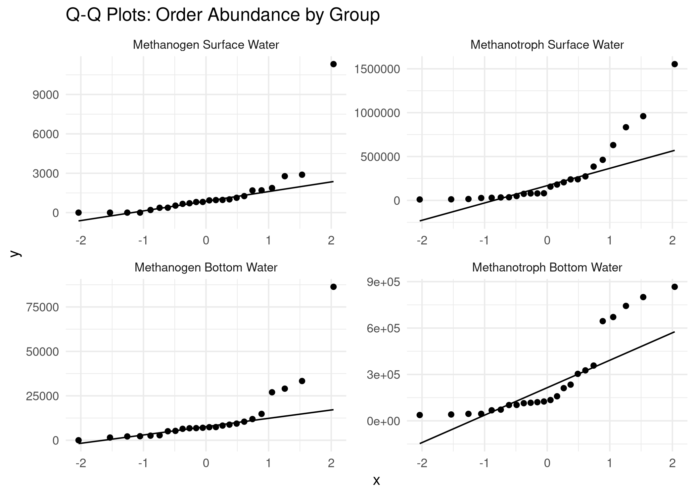<!-- -->

``` r
# lets plot density histogram by group too
ggplot(methano_water_df, aes(x = total_cells_ml, fill = group)) +
  geom_histogram(aes(y = ..density..), bins = 30, alpha = 0.5, color = "black") +
  geom_density(alpha = 0.6) +
  facet_wrap(~ group, scales = "free") +
  theme_minimal() +
  labs(title = "Histogram and Density of Order Abundance by Group",
       x = "Order Absolute Cell Abundance\n(cells per ml)",
       y = "Density") +
  theme(legend.position = "none")
```

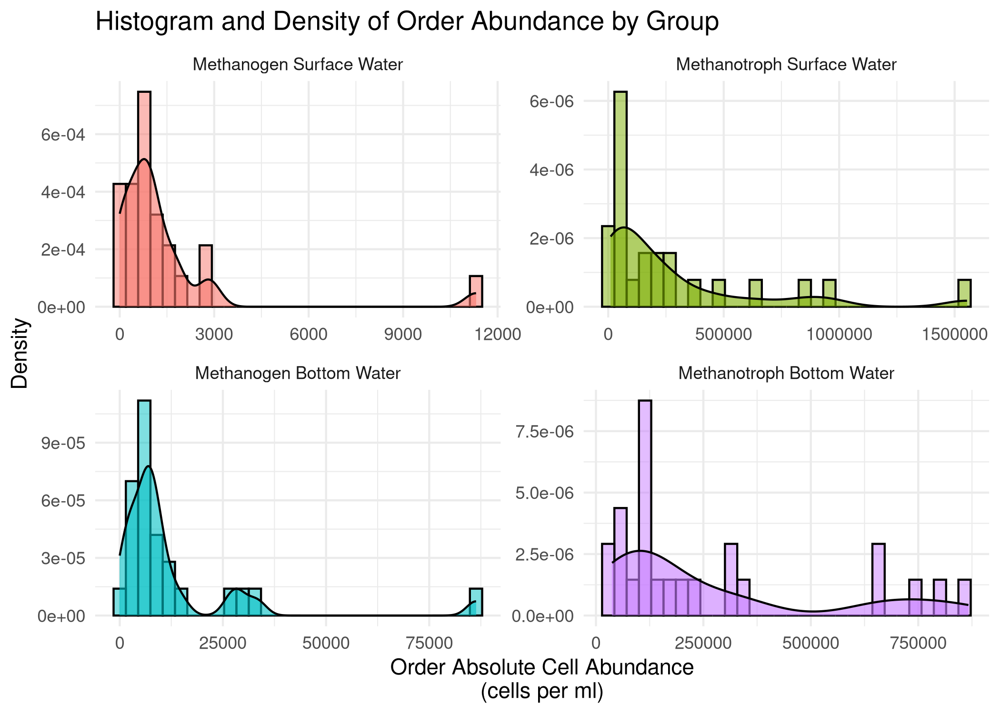<!-- -->

``` r
# now lets plot density histogram by further facetting by treatment
ggplot(methano_water_df, aes(x = total_cells_ml, fill = group)) +
  geom_histogram(aes(y = ..density..), bins = 30, alpha = 0.5, color = "black") +
  geom_density(alpha = 0.6) +
  facet_wrap(~ group + solar_progress, scales = "free") +
  theme_minimal() +
  labs(title = "Histogram and Density of Order Abundance by Group and Solar Progress",
       x = "Order Absolute Cell Abundance\n(cells per ml)",
       y = "Density") +
  theme(legend.position = "none")
```

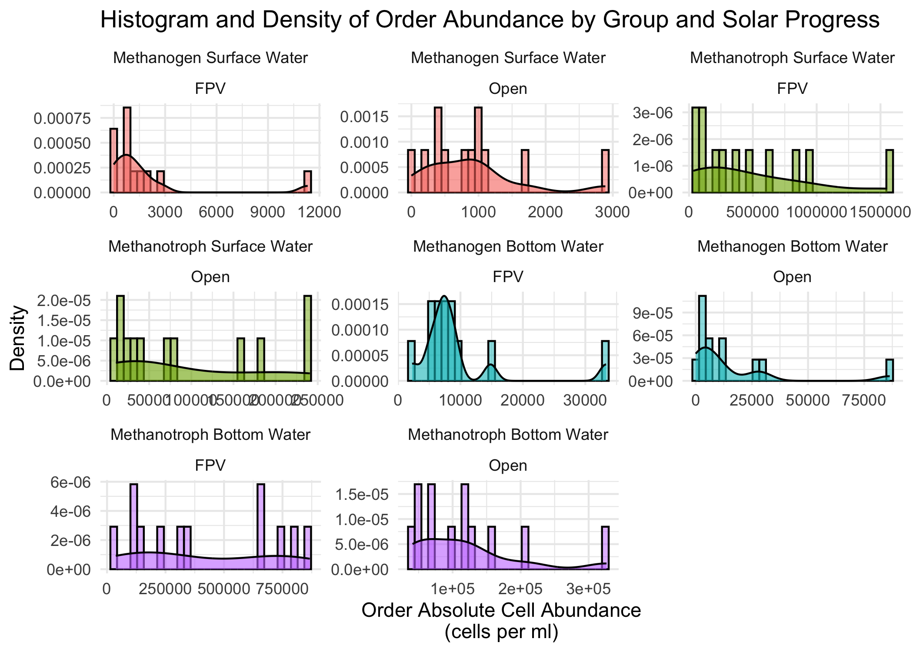<!-- -->

``` r
# shapiro test
methano_water_df %>%
  group_by(group) %>%
  summarise(
    shapiro_p = shapiro.test(total_cells_ml)$p.value,
    n = n()
  )
```

```
## # A tibble: 4 × 3
##   group                         shapiro_p     n
##   <fct>                             <dbl> <int>
## 1 Methanogen Surface Water   0.0000000754    24
## 2 Methanotroph Surface Water 0.0000159       24
## 3 Methanogen Bottom Water    0.000000408     24
## 4 Methanotroph Bottom Water  0.000135        24
```
Based on our data with the qq plots we see that the points more or less fit the line. but when we investigate further with the density histograms, it does not look like a clear unimodal distribution distribution but lets check this out further with a Shapiro-Wilk test. When we run our Shapiro-Wilk test to also test for a normal distribution if p > 0.05 the data is likely normal but if p < 0.05 then the data is not normal.

A tibble: 4 × 3
  group                         shapiro_p     n
  <fct>                             <dbl> <int>
1 Methanogen Surface Water   0.0000000754    24
2 Methanotroph Surface Water 0.0000159       24
3 Methanogen Bottom Water    0.000000408     24
4 Methanotroph Bottom Water  0.000135        24

The data is not normal 


### Sediment - Normality 
We will be running this for all 2024 time points 

``` r
# level
methano_sed_df$solar_progress <- factor(
  methano_sed_df$solar_progress,
  levels = c("FPV", "Open"))

methano_sed_df <- methano_sed_df %>%
  mutate(group = interaction(Methanotroph_Methanogen, Depth_Class, sep = " "))


# qq plot to visualize normality
ggplot(methano_sed_df, aes(sample = order_abund)) +
  stat_qq() +
  stat_qq_line() +
  facet_wrap(~ group, scales = "free") +
  theme_minimal() +
  labs(title = "Q-Q Plots: Order Abundance by Group")
```

<!-- -->

``` r
# lets plot density histogram by group too
ggplot(methano_sed_df, aes(x = order_abund, fill = group)) +
  geom_histogram(aes(y = ..density..), bins = 30, alpha = 0.5, color = "black") +
  geom_density(alpha = 0.6) +
  facet_wrap(~ group, scales = "free") +
  theme_minimal() +
  labs(title = "Histogram and Density of Order Rel Abundance by Group",
       x = "Order Abundance",
       y = "Density") +
  theme(legend.position = "none")
```

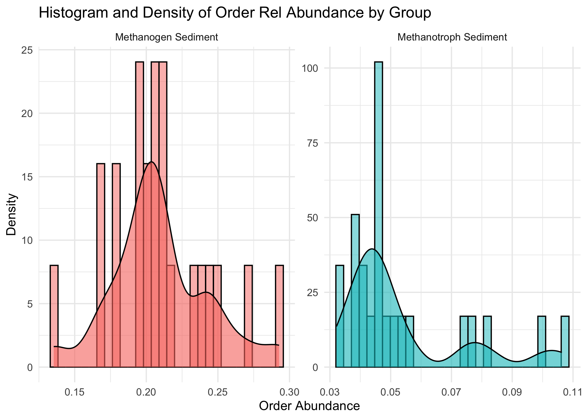<!-- -->

``` r
# now lets plot density histogram by further facetting by treatment
ggplot(methano_sed_df, aes(x = order_abund, fill = group)) +
  geom_histogram(aes(y = ..density..), bins = 30, alpha = 0.5, color = "black") +
  geom_density(alpha = 0.6) +
  facet_wrap(~ group + solar_progress, scales = "free") +
  theme_minimal() +
  labs(title = "Histogram and Density of Order Abundance by Group and Solar Progress",
       x = "Order Abundance",
       y = "Density") +
  theme(legend.position = "none")
```

<!-- -->

``` r
# shapiro test
methano_sed_df %>%
  group_by(group) %>%
  summarise(
    shapiro_p = shapiro.test(order_abund)$p.value,
    n = n()
  )
```

```
## # A tibble: 2 × 3
##   group                 shapiro_p     n
##   <fct>                     <dbl> <int>
## 1 Methanogen Sediment    0.576       23
## 2 Methanotroph Sediment  0.000296    23
```
Based on our data with the qq plots and the density histograms, data does not seem to be clearly normally distributed. Shapiro-Wilk test to also test for a normal distribution if p > 0.05 the data is likely normal but if p < 0.05 then the data is not normal.

A tibble: 2 × 3
  group                 shapiro_p     n
  <fct>                     <dbl> <int>
1 Methanogen Sediment    0.576       23
2 Methanotroph Sediment  0.000296    23

methanotrophs are not normally distributed but but methanogens are which is interesting. but will still go with two-sample Wilcoxon tests


# Generate Figures

## Main Text - Figure 4
In this plot we will calculate the absolute abundance of methane cyclers in water column and the relative abundance in sediments to see methane cyclers overtime and with a box plot to show abundance as well.

There is probably a better way to do this but I individually plotted surface, bottom, sediment depths for each methanogen and methanotroph for overtime and box plots.

For the water column cell counts we will demonstrate this by thousand cells per ml

``` r
# water over time plot 

# 1. lets plot surface water 
# surface methanogens
methanogen_surfwater24 <- methano_water_df %>%
  dplyr::filter(Depth_Class == "Surface Water",
                Methanotroph_Methanogen == "Methanogen") %>% 
  group_by(JDate, Pond, solar_progress, total_cells_ml, Methanotroph_Methanogen) %>%
  ggplot(aes(x = JDate, y = total_cells_ml/1e3, color = solar_progress))+
  geom_line(aes(group = interaction(Pond, Methanotroph_Methanogen)), 
            alpha = 0.2) +
  geom_smooth(aes(group = solar_progress), se = FALSE) +
  geom_point(aes(shape = Pond), size = 2) +
  #ggh4x::facet_grid2(~Methanotroph_Methanogen, scales = "free_y") +
  scale_color_manual(values = solar_colors) +
  scale_shape_manual(values = pond_shapes) +
  scale_x_continuous(
    breaks = seq(180, 240, by = 20), # even ticks
    limits = c(170, 260)) +
  labs(
    x = NULL,
    y = "Surface Water\n(10³ cells/ml)"
  ) +
  theme_classic() +
  theme(
    axis.title.y = element_text(size = 8),
    legend.position = "none"
  ) +
  guides(color = "none", shape = "none")
methanogen_surfwater24
```

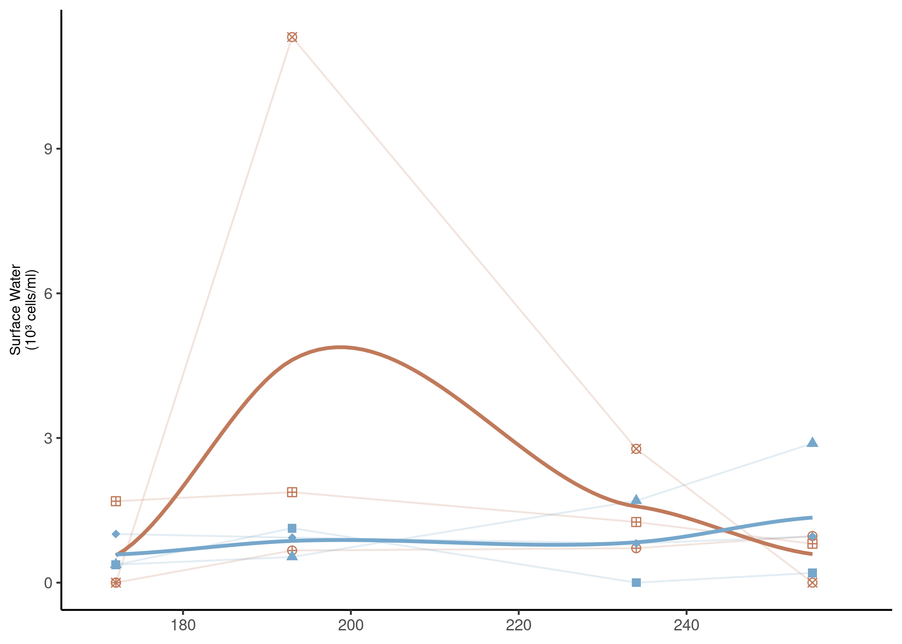<!-- -->

``` r
# surface methanotrophs
methanotrophs_surfwater24 <- methano_water_df %>%
  dplyr::filter(Depth_Class == "Surface Water",
                Methanotroph_Methanogen == "Methanotroph") %>% 
  group_by(JDate, Pond, solar_progress, total_cells_ml, Methanotroph_Methanogen) %>%
  ggplot(aes(x = JDate, y = total_cells_ml/1e3, color = solar_progress))+
  geom_line(aes(group = interaction(Pond, Methanotroph_Methanogen)), 
            alpha = 0.2) +
  geom_smooth(aes(group = solar_progress), se = FALSE) +
  geom_point(aes(shape = Pond), size = 2) +
  #ggh4x::facet_grid2(~Methanotroph_Methanogen, scales = "free_y") +
  scale_color_manual(values = solar_colors) +
  scale_shape_manual(values = pond_shapes) +
  scale_x_continuous(
    breaks = seq(180, 240, by = 20), # even ticks
    limits = c(170, 260)) +
  labs(
    x = NULL,
    y = "Surface Water\n(10³ cells/ml)"
  ) +
  theme_classic() +
  theme(
    axis.title.y = element_text(size = 8),
    legend.position = "none"
  ) +
  guides(color = "none", shape = "none")
methanotrophs_surfwater24
```

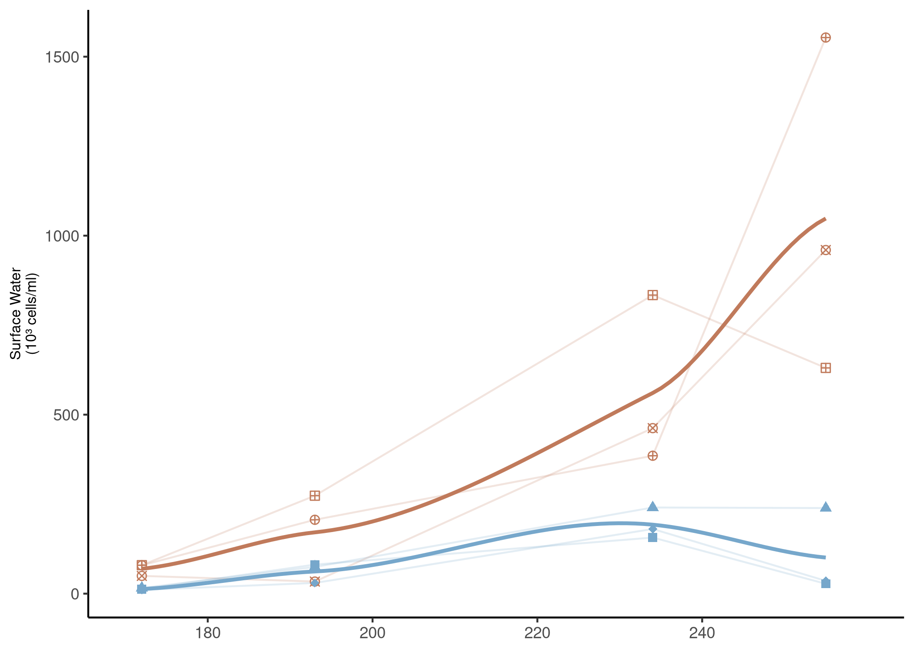<!-- -->

``` r
# now bottom water methanogens
methanogen_bot_water24 <- methano_water_df %>%
  dplyr::filter(Depth_Class == "Bottom Water", 
                Methanotroph_Methanogen == "Methanogen") %>% 
  group_by(JDate, Pond, solar_progress, total_cells_ml, Methanotroph_Methanogen) %>%
  ggplot(aes(x = JDate, y = total_cells_ml/1e3, color = solar_progress))+
  geom_line(aes(group = interaction(Pond, Methanotroph_Methanogen)), 
            alpha = 0.2) +
  geom_smooth(aes(group = solar_progress), se = FALSE) +
  geom_point(aes(shape = Pond), size = 2) +
  #ggh4x::facet_grid2(~Methanotroph_Methanogen, scales = "free_y") +
  scale_color_manual(values = solar_colors) +
  scale_shape_manual(values = pond_shapes) +
  scale_x_continuous(
    breaks = seq(180, 240, by = 20), # even ticks
    limits = c(170, 260)) +
  labs(
    x = NULL,
    y = "Bottom Water\n(10³ cells/ml)"
  ) +
  theme_classic() +
  theme(
    axis.title.y = element_text(size = 8),
    legend.position = "none"
  ) +
  guides(color = "none", shape = "none")
methanogen_bot_water24
```

<!-- -->

``` r
# bottom methanotrophs
methanotroph_bot_water24 <- methano_water_df %>%
  dplyr::filter(Depth_Class == "Bottom Water",
                Methanotroph_Methanogen == "Methanotroph") %>% 
  group_by(JDate, Pond, solar_progress, total_cells_ml, Methanotroph_Methanogen) %>%
  ggplot(aes(x = JDate, y = total_cells_ml/1e3, color = solar_progress))+
  geom_line(aes(group = interaction(Pond, Methanotroph_Methanogen)), 
            alpha = 0.2) +
  geom_smooth(aes(group = solar_progress), se = FALSE) +
  geom_point(aes(shape = Pond), size = 2) +
  #ggh4x::facet_grid2(~Methanotroph_Methanogen, scales = "free_y") +
  scale_color_manual(values = solar_colors) +
  scale_shape_manual(values = pond_shapes) +
  scale_x_continuous(
    breaks = seq(180, 240, by = 20), # even ticks
    limits = c(170, 260)) +
  labs(
    x = NULL,
    y = "Bottom Water\n(10³ cells/ml)"
  ) +
  theme_classic() +
  theme(
    axis.title.y = element_text(size = 8),
    legend.position = "none"
  ) +
  guides(color = "none", shape = "none")
methanotroph_bot_water24
```

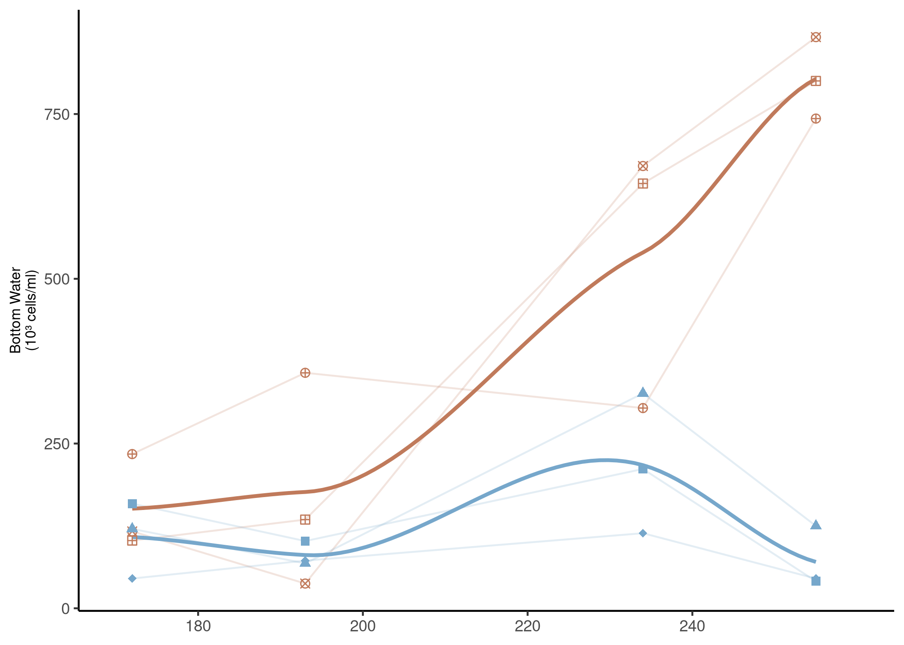<!-- -->

``` r
# sediment methanogens 
methano_sed_24 <- methano_sed_df %>%
  filter(Depth_Class == "Sediment",
         Methanotroph_Methanogen == "Methanogen") %>%
  group_by(JDate, order_abund, Pond, solar_progress, Methanotroph_Methanogen) %>%
  ggplot(aes(x = JDate, y = order_abund, color = solar_progress)) +
  geom_line(aes(group = interaction(Pond, Methanotroph_Methanogen)), 
            alpha = 0.2) +
  geom_smooth(aes(group = solar_progress), se = FALSE) +
  geom_point(aes(shape = Pond), size = 2) +
  #ggh4x::facet_grid2(.~Methanotroph_Methanogen, scales = "free_y") +
  scale_color_manual(values = solar_colors) +
  scale_shape_manual(values = pond_shapes) +
  scale_x_continuous(
    breaks = seq(180, 240, by = 20), # even ticks
    limits = c(170, 260)) +
  labs(
    x = "Day of Year",
    y = "Sediment\nRelative Abundance (%)"
  ) +
  theme_classic() +
  theme(
    axis.title.y = element_text(size = 8),
    legend.position = "none"
  ) +
  guides(color = "none", shape = "none")
methano_sed_24
```

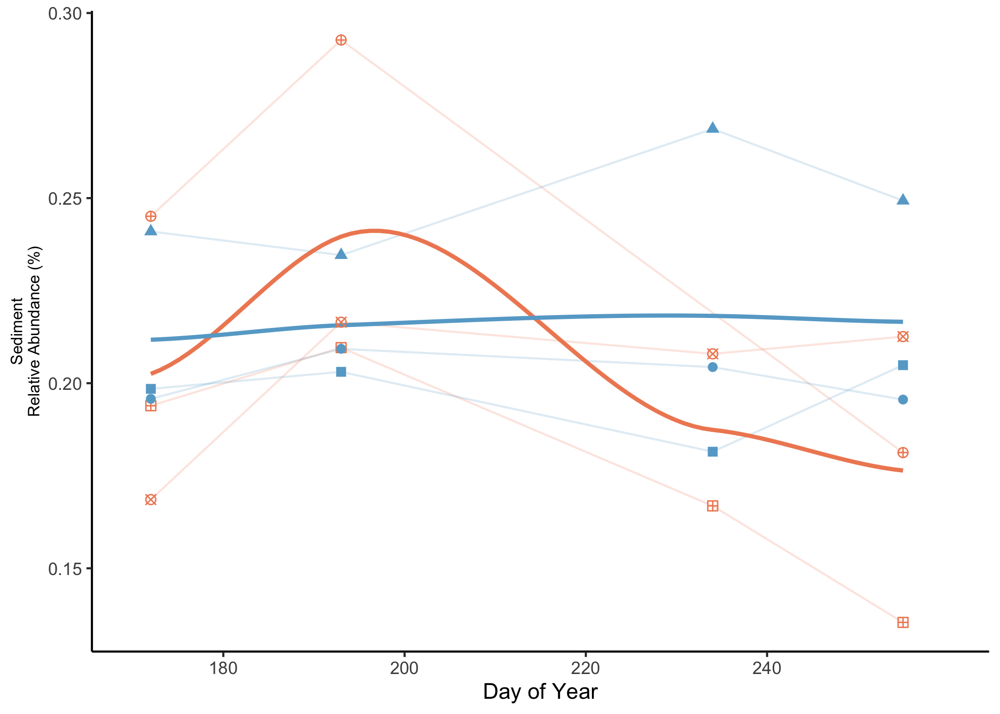<!-- -->

``` r
# sediment methanotroph 
methanotroph_sed_24 <- methano_sed_df %>%
  filter(Depth_Class == "Sediment",
         Methanotroph_Methanogen == "Methanotroph") %>%
  # group_by(JDate, order_abund, Pond, solar_progress, Methanotroph_Methanogen) %>%
  ggplot(aes(x = JDate, y = order_abund, color = solar_progress)) +
  geom_line(aes(group = interaction(Pond, Methanotroph_Methanogen)), 
            alpha = 0.2) +
  geom_smooth(aes(group = solar_progress), se = FALSE) +
  geom_point(aes(shape = Pond), size = 2) +
  #ggh4x::facet_grid2(.~Methanotroph_Methanogen, scales = "free_y") +
  scale_color_manual(values = solar_colors) +
  scale_shape_manual(values = pond_shapes) +
  scale_x_continuous(
  breaks = seq(180, 240, by = 20),
  limits = c(170, 260)
) +
  labs(
    x = "Day of Year",
    y = "Sediment\nRelative Abundance (%)"
  ) +
  theme_classic() +
  theme(
    axis.title.y = element_text(size = 8),
    legend.position = "none"
  ) +
  guides(color = "none", shape = "none")
methanotroph_sed_24
```

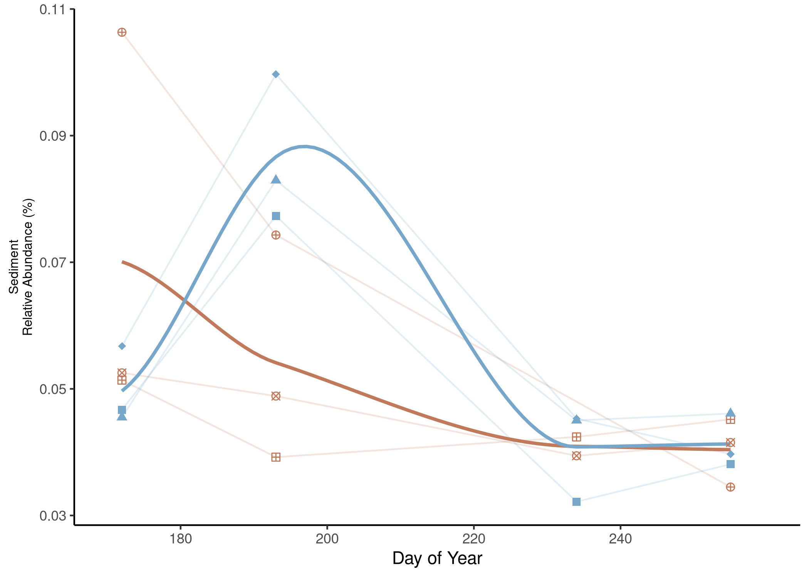<!-- -->

``` r
# quick plot methanogens
methanogen_surfwater24 / methanogen_bot_water24 / methano_sed_24
```

<!-- -->

``` r
# quick plot methanotrophs
methanotrophs_surfwater24 / methanotroph_bot_water24 / methanotroph_sed_24
```

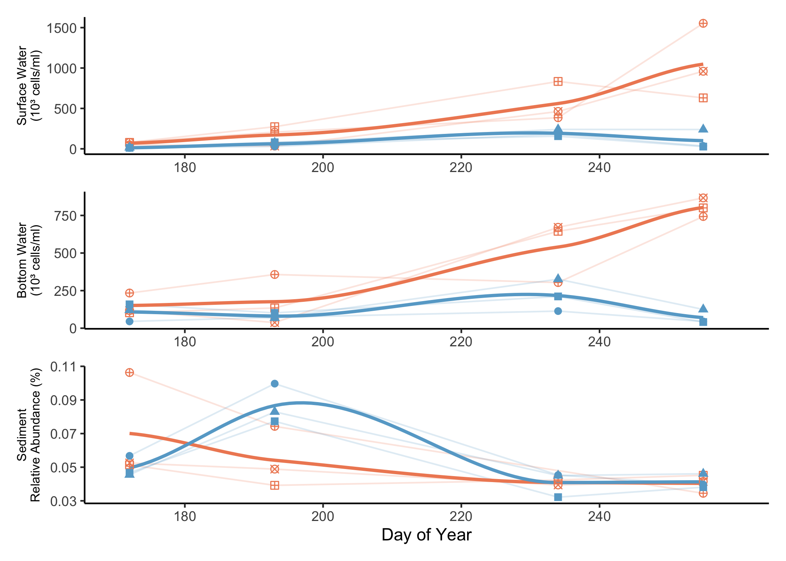<!-- -->

``` r
# box plots by depth and methane cycler

# 1. calculate pvalue for water column all together
stat.test <- methano_water_df %>% 
  group_by(Methanotroph_Methanogen, Depth_Class) %>% 
  wilcox_test(total_cells_ml ~ solar_progress, 
              p.adjust.method = "fdr",
              exact = FALSE) %>% 
  add_significance() %>% 
  mutate(
    group = interaction(Methanotroph_Methanogen, Depth_Class, sep = " "),
    y.position = 0.35,
    p.label = signif(p, digits = 2))
stat.test
```

```
## # A tibble: 4 × 13
##   Methanotroph_Methanogen Depth_Class   .y.            group1 group2    n1    n2 statistic       p p.signif group                      y.position p.label
##   <chr>                   <fct>         <chr>          <chr>  <chr>  <int> <int>     <dbl>   <dbl> <chr>    <fct>                           <dbl>   <dbl>
## 1 Methanogen              Surface Water total_cells_ml FPV    Open      12    12      78.5 0.728   ns       Methanogen Surface Water         0.35  0.73  
## 2 Methanogen              Bottom Water  total_cells_ml FPV    Open      12    12      80   0.665   ns       Methanogen Bottom Water          0.35  0.66  
## 3 Methanotroph            Surface Water total_cells_ml FPV    Open      12    12     119   0.00726 **       Methanotroph Surface Water       0.35  0.0073
## 4 Methanotroph            Bottom Water  total_cells_ml FPV    Open      12    12     116   0.012   *        Methanotroph Bottom Water        0.35  0.012
```

``` r
# A. filter for methanogen surface water
stat_gen_surf <- stat.test %>%
  filter(Methanotroph_Methanogen == "Methanogen",
         Depth_Class == "Surface Water")

# surface methanogen
box_gen_surf <- methano_water_df %>% 
  dplyr::filter(Depth_Class == "Surface Water",
                Methanotroph_Methanogen == "Methanogen") %>% 
  ggplot(aes(x = solar_progress, y = total_cells_ml/1e3, color = solar_progress)) +
  geom_boxplot(outlier.shape = NA, alpha = 0.2, color = "black", position = position_dodge(0.6)) + 
  geom_point(aes(shape = Pond),
             alpha =2,
             position = position_jitterdodge(jitter.width = .1, dodge.width = .3),
             size = 3) +
  # ggh4x::facet_nested(~ solar_progress,
  #                     scales = "free") +
  #scale_fill_manual(values = c("FPV" = "#C07A5B", "Open" = "#76A7CB")) +
  scale_color_manual(values = c("FPV" = "#C07A5B", "Open" = "#76A7CB")) +
  scale_shape_manual(values = pond_shapes) +
  # stat_pvalue_manual( # p = 0.73
  #   stat_gen_surf,
  #   label = "p.label",
  #   y.position = 9.5,
  #   tip.length = 0,
  #   bracket.size = 0,
  #   size = 3
  # ) +
  theme_classic() +
  theme(
    axis.title.x = element_blank(),
    axis.title.y = element_blank(),
    axis.line.y = element_blank(),
    axis.text.y = element_blank(),
    axis.ticks.y = element_blank(),
    legend.position = "none"
  )
box_gen_surf
```

<!-- -->

``` r
# B. filter for methanotroph surface water
stat_troph_surf <- stat.test %>%
  filter(Methanotroph_Methanogen == "Methanotroph",
         Depth_Class == "Surface Water")

# surface methanotroph
box_troph_surf <- methano_water_df %>% 
  dplyr::filter(Depth_Class == "Surface Water",
                Methanotroph_Methanogen == "Methanotroph") %>% 
  ggplot(aes(x = solar_progress, y = total_cells_ml/1e3, color = solar_progress)) +
  geom_boxplot(outlier.shape = NA, alpha = 0.2, color = "black", position = position_dodge(0.6)) +  
  geom_point(aes(shape = Pond),
             alpha = 2,
             position = position_jitterdodge(jitter.width = .1, dodge.width = .3),
             size = 3) +
  # ggh4x::facet_nested(~ solar_progress,
  #                     scales = "free") +
  #scale_fill_manual(values = c("FPV" = "#C07A5B", "Open" = "#76A7CB")) +
  scale_color_manual(values = c("FPV" = "#C07A5B", "Open" = "#76A7CB")) +
  scale_shape_manual(values = pond_shapes) +
  # stat_pvalue_manual( # p = 0.0073
  #   stat_troph_surf,
  #   label = "p.label",
  #   y.position = 1.5,  # or set a fixed numeric if you prefer
  #   tip.length = 0,
  #   bracket.size = 0,
  #   size = 2
  # ) +
  # guides(
  #   fill = "none",
  #   color = "none",
  #   shape = guide_legend(
  #     nrow = 2,
  #     byrow = TRUE,
  #     title.position = "left",
  #     override.aes = list(size = 2.5))
  # ) +
  theme_classic() +
  theme(
    axis.title.x = element_blank(),
    axis.title.y = element_blank(),
    axis.line.y = element_blank(),
    axis.text.y = element_blank(),
    axis.ticks.y = element_blank(),
    legend.position = "none"
  )
box_troph_surf
```

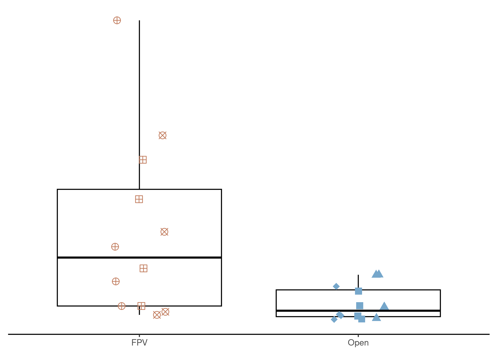<!-- -->

``` r
# B. filter for methanogen bottom water
stat_gen_bot <- stat.test %>%
  filter(Methanotroph_Methanogen == "Methanogen",
         Depth_Class == "Bottom Water")
# bottom methanogen
box_gen_bot <- methano_water_df %>% 
  dplyr::filter(Depth_Class == "Bottom Water",
                Methanotroph_Methanogen == "Methanogen") %>% 
  ggplot(aes(x = solar_progress, y = total_cells_ml/1e3, color = solar_progress)) +
  geom_boxplot(outlier.shape = NA, alpha = 0.2, color = "black", position = position_dodge(0.6)) + 
  geom_point(aes(shape = Pond),
             alpha = 2,
             position = position_jitterdodge(jitter.width = .1, dodge.width = .3),
             size = 3) +
  # ggh4x::facet_nested(~ solar_progress,
  #                     scales = "free") +
  #scale_fill_manual(values = c("FPV" = "#C07A5B", "Open" = "#76A7CB")) +
  scale_color_manual(values = c("FPV" = "#C07A5B", "Open" = "#76A7CB")) +
  scale_shape_manual(values = pond_shapes) +
  # stat_pvalue_manual( # p = 0.66
  #   stat_gen_bot,
  #   label = "p.label",
  #   tip.length = 0,
  #   y.position = .095,
  #   size = 2,
  #   bracket.size = 0,
  #   inherit.aes = FALSE
  # ) +
  # guides(
  #   fill = "none",
  #   color = "none",
  #   shape = guide_legend(
  #     nrow = 2,
  #     byrow = TRUE,
  #     title.position = "left",
  #     override.aes = list(size = 2.5))
  # ) +
  theme_classic() +
  theme(
    axis.title.x = element_blank(),
    axis.title.y = element_blank(),
    axis.line.y = element_blank(),
    axis.text.y = element_blank(),
    axis.ticks.y = element_blank(),
    legend.position = "none"
  )
box_gen_bot
```

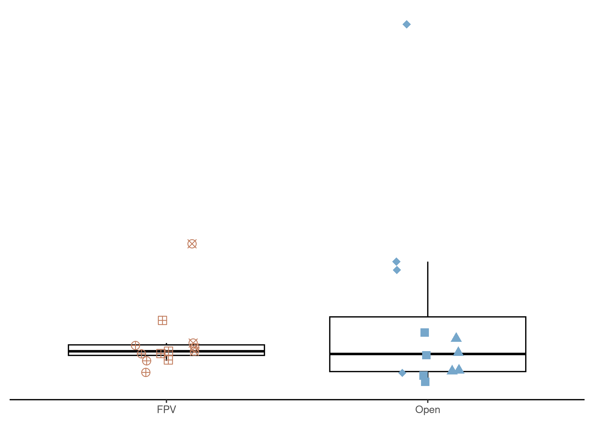<!-- -->

``` r
# C. filter for methanotroph bottom water
stat_troph_bot <- stat.test %>%
  filter(Methanotroph_Methanogen == "Methanotroph",
         Depth_Class == "Bottom Water")

# bottom methanotrophs
box_troph_bot <- methano_water_df %>% 
  dplyr::filter(Depth_Class == "Bottom Water",
                Methanotroph_Methanogen == "Methanotroph") %>% 
  ggplot(aes(x = solar_progress, y = total_cells_ml/1e3, color = solar_progress)) +
  geom_boxplot(outlier.shape = NA, alpha = 0.2, color = "black", position = position_dodge(0.6)) +  
  geom_point(aes(shape = Pond),
             alpha = 2,
             position = position_jitterdodge(jitter.width = .1, dodge.width = .3),
             size = 3) +
  # ggh4x::facet_nested(~ solar_progress,
  #                     scales = "free") +
  #scale_fill_manual(values = c("FPV" = "#C07A5B", "Open" = "#76A7CB")) +
  scale_color_manual(values = c("FPV" = "#C07A5B", "Open" = "#76A7CB")) +
  scale_shape_manual(values = pond_shapes) +
  # stat_pvalue_manual( # p = 0.012
  #   stat_troph_bot,
  #   label = "p.label",
  #   y.position = 0.75,
  #   tip.length = 0,
  #   size = 2,
  #   bracket.size = 0,
  #   inherit.aes = FALSE
  # ) +
  # guides(
  #   fill = "none",
  #   color = "none",
  #   shape = guide_legend(
  #     nrow = 2,
  #     byrow = TRUE,
  #     title.position = "left",
  #     override.aes = list(size = 2.5))
  # ) +
  theme_classic() +
  theme(
    axis.title.x = element_blank(),
    axis.title.y = element_blank(),
    axis.line.y = element_blank(),
    axis.text.y = element_blank(),
    axis.ticks.y = element_blank(),
    legend.position = "none"
  )
box_troph_bot
```

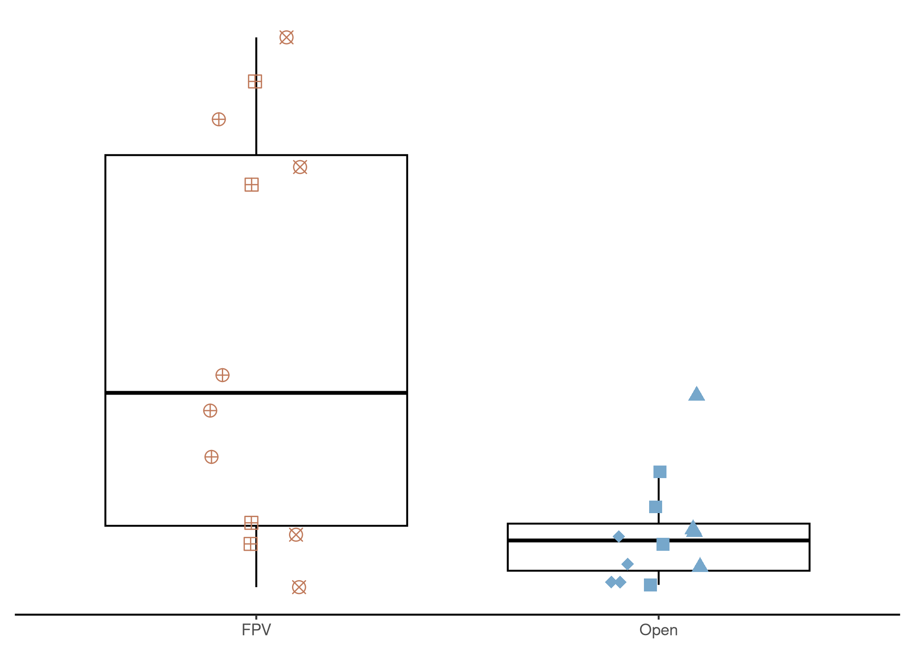<!-- -->

``` r
# 2. calculate pvalue for sediment
stat.test <- methano_sed_df %>% 
  group_by(Methanotroph_Methanogen, Depth_Class) %>% 
  wilcox_test(order_abund ~ solar_progress, 
              p.adjust.method = "fdr",
              exact = FALSE) %>% 
  add_significance() %>% 
  mutate(
    group = interaction(Methanotroph_Methanogen, Depth_Class, sep = " "),
    y.position = 0.35,
    p.label = signif(p, digits = 2))
stat.test
```

```
## # A tibble: 2 × 13
##   Depth_Class Methanotroph_Methanogen .y.         group1 group2    n1    n2 statistic     p p.signif group                 y.position p.label
##   <chr>       <chr>                   <chr>       <chr>  <chr>  <int> <int>     <dbl> <dbl> <chr>    <fct>                      <dbl>   <dbl>
## 1 Sediment    Methanogen              order_abund FPV    Open      11    12        54 0.479 ns       Methanogen Sediment         0.35    0.48
## 2 Sediment    Methanotroph            order_abund FPV    Open      11    12        60 0.735 ns       Methanotroph Sediment       0.35    0.74
```

``` r
# D. calculate stats for sediment methanogen
stat_gen_sed <- stat.test %>%
  filter(Methanotroph_Methanogen == "Methanogen",
         Depth_Class == "Sediment")

# sediment methanogen
box_gen_sed <- methano_sed_df %>% 
  dplyr::filter(Methanotroph_Methanogen == "Methanogen") %>% 
  ggplot(aes(x = solar_progress, y = order_abund, color = solar_progress)) +
  geom_boxplot(outlier.shape = NA, alpha = 0.2, color = "black", position = position_dodge(0.6)) +  
  geom_point(aes(shape = Pond),
             alpha = 2,
             position = position_jitterdodge(jitter.width = .1, dodge.width = .3),
             size = 3) +
  scale_color_manual(values = c("FPV" = "#C07A5B", "Open" = "#76A7CB")) +
  scale_shape_manual(values = pond_shapes) +
  # stat_pvalue_manual( # p = 0.48
  #   stat_gen_sed,
  #   label = "p.label",
  #   y.position = 0.3,
  #   tip.length = 0,
  #   bracket.size = 0,
  #   size = 2
  # ) +
  # guides(
  #   fill = "none",
  #   color = "none",
  #   shape = guide_legend(
  #     nrow = 2,
  #     byrow = TRUE,
  #     title.position = "left",
  #     override.aes = list(size = 2.5))
  # ) +
  theme_classic() +
  theme(
    axis.title.x = element_blank(),
    axis.title.y = element_blank(),
    axis.line.y = element_blank(),
    axis.text.y = element_blank(),
    axis.ticks.y = element_blank(),
    legend.position = "none"
  )
box_gen_sed
```

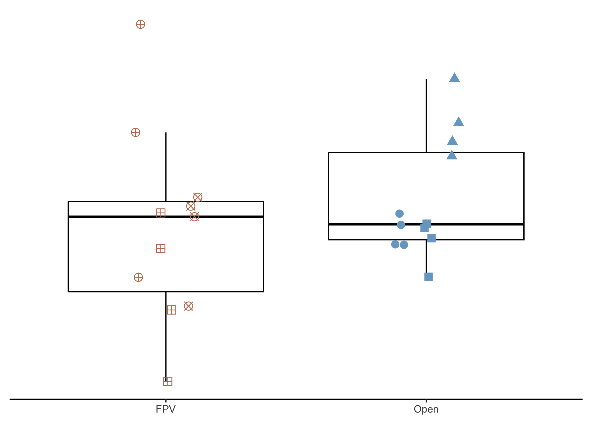<!-- -->

``` r
# E. calculate stats for sediment methanotroph
stat_troph_sed <- stat.test %>%
  filter(Methanotroph_Methanogen == "Methanotroph",
         Depth_Class == "Sediment")

# sediment trophs
box_troph_sed <- methano_sed_df %>% 
  dplyr::filter(Methanotroph_Methanogen == "Methanotroph") %>% 
  ggplot(aes(x = solar_progress, y = order_abund, color = solar_progress)) +
  geom_boxplot(outlier.shape = NA, alpha = 0.2, color = "black", position = position_dodge(0.6)) +  
  geom_point(aes(shape = Pond),
             alpha = 2,
             position = position_jitterdodge(jitter.width = .1, dodge.width = .3),
             size = 3) +
  scale_color_manual(values = c("FPV" = "#C07A5B", "Open" = "#76A7CB")) +
  scale_shape_manual(values = pond_shapes) +
  # stat_pvalue_manual( # p = 0.74
  #   stat_troph_sed,
  #   label = "p.label",
  #   y.position = .11,
  #   tip.length = 0,
  #   size = 2,
  #   bracket.size = 0,
  #   inherit.aes = FALSE
  # ) +
  # guides(
  #   fill = "none",
  #   color = "none",
  #   shape = guide_legend(
  #     nrow = 2,
  #     byrow = TRUE,
  #     title.position = "left",
  #     override.aes = list(size = 2.5))
  # ) +
  theme_classic() +
  theme(
    axis.title.x = element_blank(),
    axis.title.y = element_blank(),
    axis.line.y = element_blank(),
    axis.text.y = element_blank(),
    axis.ticks.y = element_blank(),
    legend.position = "none"
  )
box_troph_sed
```

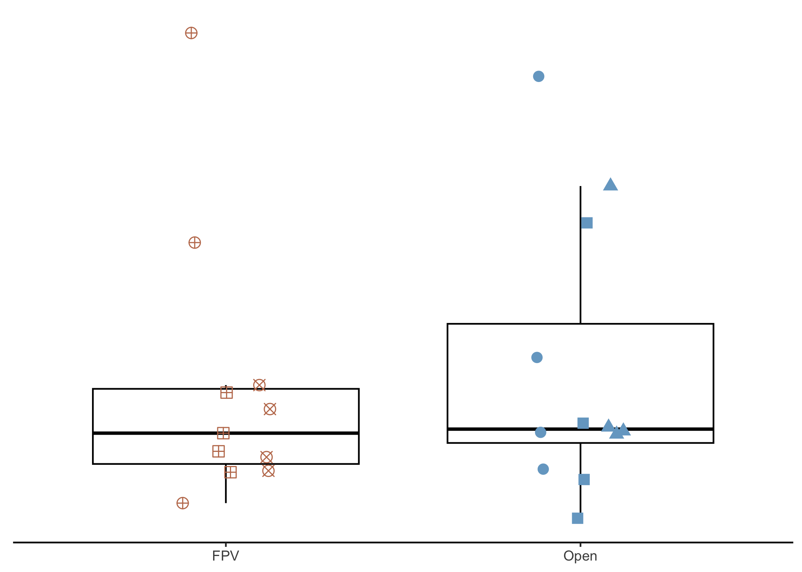<!-- -->

``` r
# extract legend 
legend_plot <- methano_sed_df %>% # dummy plot 
  dplyr::filter(Methanotroph_Methanogen == "Methanotroph") %>% 
  ggplot(aes(x = solar_progress, y = order_abund, color = solar_progress)) +
  geom_boxplot(outlier.shape = NA, alpha = 0.2, position = position_dodge(0.6)) +  
  geom_point(aes(shape = Pond),
             alpha = 2,
             position = position_jitterdodge(jitter.width = .1, dodge.width = .3),
             size = 2) +
  # ggh4x::facet_nested(~ solar_progress,
  #                     scales = "free") +
  #scale_fill_manual(values = c("FPV" = "#C07A5B", "Open" = "#76A7CB")) +
  scale_color_manual(values = c("FPV" = "#C07A5B", "Open" = "#76A7CB")) +
  scale_shape_manual(values = pond_shapes) +
  # stat_pvalue_manual(
  #   stat_troph_sed,
  #   label = "p.label",
  #   y.position = .11,
  #   tip.length = 0,
  #   size = 2,
  #   bracket.size = 0,
  #   inherit.aes = FALSE
  # ) +
  guides(
    fill = "none",
    color = "none",
    shape = guide_legend(
      nrow = 2,
      byrow = TRUE,
      title.position = "left",
      override.aes = list(size = 2.5))
  ) +
  theme_classic() +
  theme(
    legend.position = "bottom",
    legend.title = element_text(hjust = 0.5),
    legend.box = "horizontal",
    legend.justification = "center"
  )
legend_plot
```

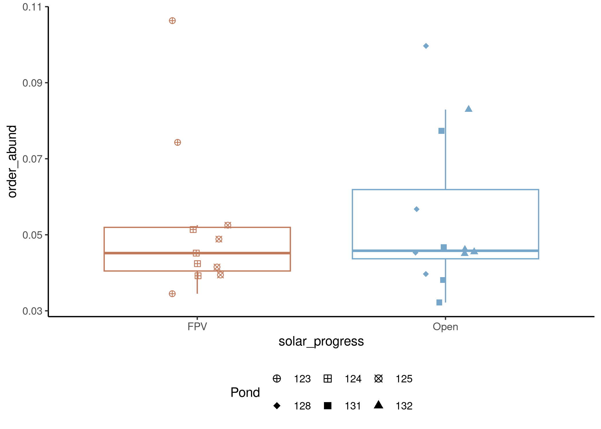<!-- -->

``` r
legend_only <- ggpubr::get_legend(legend_plot) # extract legend

# now we will need to add it to sediments to plot legend only wont plot by itself
sed_depths_leg <- ggarrange(methano_sed_24, box_gen_sed, methanotroph_sed_24, box_troph_sed,
            ncol = 2,
            nrow = 3,
            legend_only,
            align = "hv"
)

# Display
sed_depths_leg
```

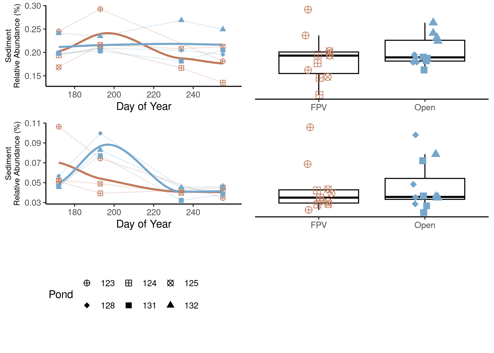<!-- -->

``` r
# or lets try two (technically 4 columns) where on the left we have methanogens and right is methanotrophs. they will still be going from surface, bottom, sediments with box plot on the right but we will have a box around methanogens and methanotrophs


# 1. plot final methanogens
methanogen_final <- 
  ggarrange(methanogen_surfwater24, box_gen_surf, 
            methanogen_bot_water24, box_gen_bot,
            methano_sed_24, box_gen_sed,
  nrow = 3, 
  ncol = 2,
  align = "hv",
  labels = c("A.", "B.", "C.", "D.", "E.", "F."),
  font.label = list(size =10),
  widths = c(1, .5))
methanogen_final
```

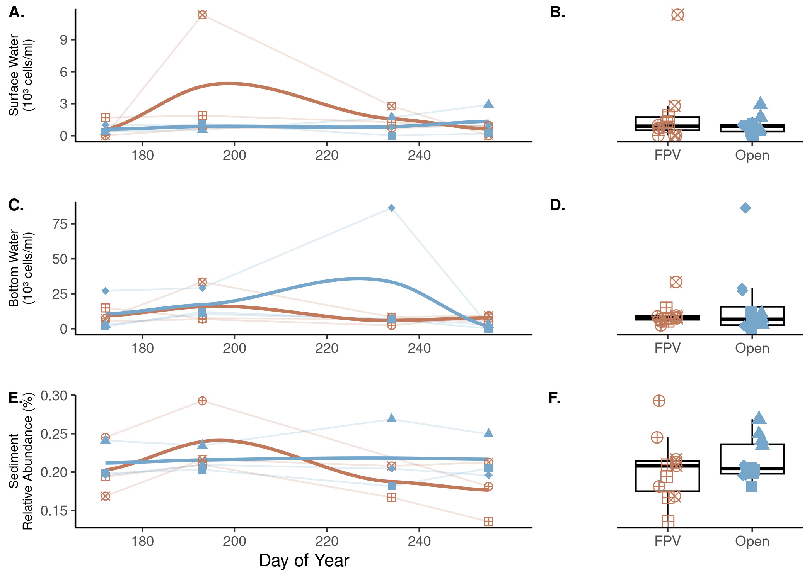<!-- -->

``` r
# want to add space for title in methanogen plot
space <- nullGrob()

# now plot with extra space
methanogen_final <- ggarrange(
  space, 
  methanogen_final, 
  ncol = 1,
  heights = c(0.1, 1)  
)

# 2. draw box around methanogens
png("figures/fig4/methanogens.png", width = 4000, height = 4000, res = 600)

grid.newpage()
grid.draw(methanogen_final)
grid.rect(gp = gpar(col = "black", fill = NA, lwd = 2))  # draw border
grid.text(label = "Methanogens", x = 0.5, y = 0.99, just = c("center", "top"),
          gp = gpar(fontface = "bold", cex = .9))

dev.off()
```

```
## png 
##   2
```

``` r
# 1. plot final methanotrophs
methanotroph_final <- 
  ggarrange(methanotrophs_surfwater24, box_troph_surf, 
            methanotroph_bot_water24, box_troph_bot,
            methanotroph_sed_24, box_troph_sed,
  nrow = 3, 
  ncol = 2,
  align = "hv",
  labels = c("G.", "H.", "I.", "J.", "K.", "L."),
  font.label = list(size =10),
  widths = c(1, .5))
methanotroph_final
```

<!-- -->

``` r
# want to add space for title in methanogen plot
space <- nullGrob()

# now plot with extra space
methanotroph_final <- ggarrange(
  space, 
  methanotroph_final, 
  ncol = 1,
  heights = c(0.09, 1)  
)
methanotroph_final
```

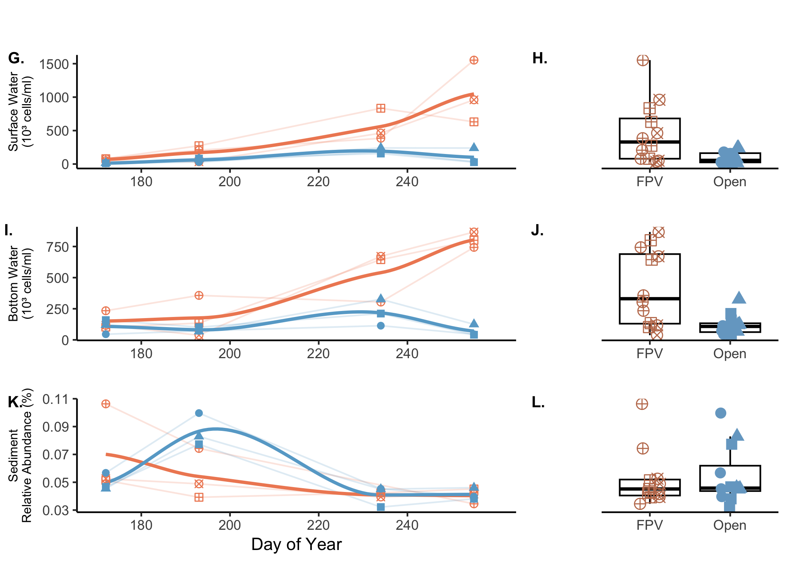<!-- -->

``` r
# 2. draw box around methanogens
png("figures/fig4/methanotrophs.png", width = 4000, height = 4000, res = 600)

grid.newpage()
grid.draw(methanotroph_final)
grid.rect(gp = gpar(col = "black", fill = NA, lwd = 2))  # draw border
grid.text(label = "Methanotrophs", x = 0.5, y = 0.99, just = c("center", "top"),
          gp = gpar(fontface = "bold", cex = .9))

dev.off()
```

```
## png 
##   2
```

``` r
# then i was planning on exporting these images and putting them together in Illustrator
```
now we have created our main text figure. the only thing is that i dont have the p values in the figure because nick has his italicized and sized a certain way and i want to make sure our plot aesthetics match.


# Supplemental Figures
Here are the supplemental figures (and bonus figures) for the manuscript. 

## Figure S1 - Water and Sediment Bray-Curtis PCoA

### S1A — Water PCoA 

``` r
# water methane cyclers

# Calculate Bray-Curtis Dissimilarity 
water_BC_pcoa <- 
  ordinate(
    physeq = water_ch4_physeq,
    method = "PCoA",
    distance = "bray", 
    binary = FALSE
  )

# PCoA of water samples color by treatment shape by pond
s1a_water_pcoa <- plot_ordination(
  physeq = water_ch4_physeq,
  ordination = water_BC_pcoa,
  color = "solar_progress",
  shape = "Pond",
  title = "Water Column Methane Cyclers") + 
  geom_point(size = 5, alpha = 0.5, aes(fill = solar_progress, color = solar_progress, shape = Pond)) + 
  scale_fill_manual(values = solar_colors) + 
  scale_color_manual(values = solar_colors) +
  scale_shape_manual(values = pond_shapes) +
  guides(color = guide_legend(nrow = 1, 
                              title = NULL,
                              override.aes = list(size = 2.7)),
         fill = "none",
         shape = guide_legend(nrow = 2, 
                              byrow = TRUE,
                              title = NULL,
                              override.aes = list(size = 2.7))) +
  theme_classic() +
  theme(
    legend.position = c(0.01, 0.01),  # inside bottom-left
    legend.justification = c(.01, .01),  
    legend.spacing = unit(0.01, "cm"),
    legend.spacing.x = unit(0.1, "cm"),
    legend.background = element_rect(color = NA, fill = NA),
    legend.key.width = unit(0.2, "cm"),
    legend.key.height = unit(0.4, "cm"),
    legend.text = element_text(size = 6),
    legend.box.just = "center",
    legend.box.background = element_rect(size = 0.2, linetype = "solid", color = "black"),
    legend.margin = margin(1, 2, 1, 1))
s1a_water_pcoa
```

<!-- -->

``` r
# ggsave(s1a_water_pcoa, width = 8, height = 7, units = "in",
#         filename = "figures/s1a/s1a_water_pcoa.png")
```

### S1B- Sediment PCoA
This is all methane cylcers in sediment communities

``` r
# plot 1 all taxa sediments 

# use physeq object for just methane cyclers 
scaled_sed_physeq <- scaled_sed_ch4_physeq

# Calculate Bray-Curtis Dissimilarity 
scaled_sed_BC_pcoa <- 
  ordinate(
    physeq = scaled_sed_physeq,
    method = "PCoA",
    distance = "bray", 
    binary = FALSE
  )


# PCoA of sediments color by treatment shaped by pond
s1b_sed_pcoa <- plot_ordination(
  physeq = scaled_sed_physeq,
  ordination = scaled_sed_BC_pcoa,
  color = "solar_progress",
  shape = "Pond",
  title = "Sediment Methane Cyclers") + 
  geom_point(size = 5, alpha = 0.5, aes(color = solar_progress, fill = solar_progress, shape = Pond)) + 
  scale_color_manual(values = solar_colors) + 
  scale_fill_manual(values = solar_colors) + 
  scale_shape_manual(values = pond_shapes) +
  guides(color = "none",
         fill = "none",
         shape = "none")+
  theme_classic() 
  # theme(
  # legend.position = c(0.82, 0.01),  # inside bottom-left
  # legend.justification = c(0, 0),  # anchor the legend's top-left corner there
  # legend.spacing = unit(0.1, "cm"),
  # legend.background = element_rect(color = NA, fill = NA),
  # legend.box.background = element_rect(size = 0.1, linetype = "solid", color = "black"),
  # legend.text = element_text(size = 6),
  # legend.margin = margin(2, 2, 2, 2))
s1b_sed_pcoa
```

<!-- -->

``` r
# ggsave(s1b_sed_pcoa, width = 8, height = 7, units = "in",
#         filename = "figures/s1b/s1b_sed_pcoa.png")
```
Sediment samples are still distinct from other and separate along first axis

### Generaate S1 Plots
Water + Sediments together

``` r
fig_s1 <- 
  ggarrange(s1a_water_pcoa, s1b_sed_pcoa,
  nrow = 1, 
  ncol = 2,
  labels = c("A.", "B."),
  font.label = list(size =12),
  align = "hv") # aligns axis 
fig_s1
```

<!-- -->

``` r
ggsave(fig_s1, width = 12.4, height = 6, dpi = 300,
        filename = "figures/s1/fig_s1.png")
```

## S1 -  Bray-Curtis PCoA PERMANOVA
PERMANOVA (Permutational Multivariate Analysis of Variance) is a non-parametric, permutation-based test used to compare groups of objects based on a distance matrix. The goal is to test the null hypothesis that the centroids and dispersion of groups are equivalent in the space defined by the dissimilarity measure. 

### Water 
Here we are performing a PERMANOVA on the water column methane cyclers throughout the entire sampling season

``` r
# set seed 
set.seed(0909199)

# calculate Bray-Curtis PERMANOVA using phyloseq distance
water_bray <- phyloseq::distance(water_ch4_physeq, method = "bray", binary = FALSE)

# pull out metadata 
metadata <- water_ch4_physeq %>%
  sample_data() %>%
  data.frame()

# Permutational Multivariate Analysis of Variance Using Distance Matrices
# aka PERMANOVA using the adonis2 function from vegan 


#1. Test the individual terms for significance
# Testing if the centroids of solar progress are different: significant p = 0.001 ***
adonis2(water_bray ~ solar_progress, data = metadata, by = "terms")
```

```
## Permutation test for adonis under reduced model
## Terms added sequentially (first to last)
## Permutation: free
## Number of permutations: 999
## 
## adonis2(formula = water_bray ~ solar_progress, data = metadata, by = "terms")
##                Df SumOfSqs      R2      F Pr(>F)    
## solar_progress  1   1.6888 0.11381 5.9075  0.001 ***
## Residual       46  13.1499 0.88619                  
## Total          47  14.8386 1.00000                  
## ---
## Signif. codes:  0 '***' 0.001 '**' 0.01 '*' 0.05 '.' 0.1 ' ' 1
```

``` r
# Now testing to see if centroids of depth_class are different: not significant p = 0.19
adonis2(water_bray ~ Depth_Class, data = metadata, by = "terms")
```

```
## Permutation test for adonis under reduced model
## Terms added sequentially (first to last)
## Permutation: free
## Number of permutations: 999
## 
## adonis2(formula = water_bray ~ Depth_Class, data = metadata, by = "terms")
##             Df SumOfSqs      R2      F Pr(>F)
## Depth_Class  1   0.3952 0.02663 1.2587   0.19
## Residual    46  14.4434 0.97337              
## Total       47  14.8386 1.00000
```

``` r
# Does pond matter? significant p = 0.001 ***
adonis2(water_bray ~ Pond, data = metadata, by = "terms")
```

```
## Permutation test for adonis under reduced model
## Terms added sequentially (first to last)
## Permutation: free
## Number of permutations: 999
## 
## adonis2(formula = water_bray ~ Pond, data = metadata, by = "terms")
##          Df SumOfSqs      R2      F Pr(>F)    
## Pond      5   3.6703 0.24735 2.7605  0.001 ***
## Residual 42  11.1684 0.75265                  
## Total    47  14.8386 1.00000                  
## ---
## Signif. codes:  0 '***' 0.001 '**' 0.01 '*' 0.05 '.' 0.1 ' ' 1
```

``` r
# Does date matter? significant p = 0.001 ***
adonis2(water_bray ~ as.factor(JDate), data = metadata, by = "terms")
```

```
## Permutation test for adonis under reduced model
## Terms added sequentially (first to last)
## Permutation: free
## Number of permutations: 999
## 
## adonis2(formula = water_bray ~ as.factor(JDate), data = metadata, by = "terms")
##                  Df SumOfSqs      R2      F Pr(>F)    
## as.factor(JDate)  3   2.4029 0.16193 2.8339  0.001 ***
## Residual         44  12.4358 0.83807                  
## Total            47  14.8386 1.00000                  
## ---
## Signif. codes:  0 '***' 0.001 '**' 0.01 '*' 0.05 '.' 0.1 ' ' 1
```

``` r
#2. Test the terms together
# Now lets see the effect of each pond by date_collected and solar progress
adonis2(water_bray ~ solar_progress * Pond * JDate, data = metadata, by = "terms")
```

```
## Permutation test for adonis under reduced model
## Terms added sequentially (first to last)
## Permutation: free
## Number of permutations: 999
## 
## adonis2(formula = water_bray ~ solar_progress * Pond * JDate, data = metadata, by = "terms")
##                      Df SumOfSqs      R2      F Pr(>F)    
## solar_progress        1   1.6888 0.11381 8.2023  0.001 ***
## Pond                  4   1.9815 0.13354 2.4061  0.001 ***
## JDate                 1   1.4244 0.09599 6.9181  0.001 ***
## solar_progress:JDate  1   1.1339 0.07641 5.5072  0.001 ***
## Pond:JDate            4   1.1982 0.08075 1.4549  0.034 *  
## Residual             36   7.4120 0.49950                  
## Total                47  14.8386 1.00000                  
## ---
## Signif. codes:  0 '***' 0.001 '**' 0.01 '*' 0.05 '.' 0.1 ' ' 1
```
With our PERMANOVA we find that treatment (solar_progress), day of year sampled (JDate - Julian date), and Pond is significant but depth class alone is not.

When we create a model with treatment, pond, and date these are all significant (p < 0.001 ***). 
- Solar progress is responsible for explaining  11.4% of variance and has a strong structuring effect on the water column community composition. This has the highest F value meaning that the between group differences are larger than within group variance (F = 8.2)

- Pond is also significant explains 12.4% of variance but is weaker than treatment (solar_progress) (F = 2.4). Even though it explains more variation than treatment, there is more variation in ponds than between ponds. 

- Date (JDate) is also strong and explains 9.6% of variance and is also weighted heavier (F = 6.9). The temporal effect is seen in the first axis as time progresses throughout the season.

- The interaction between treatment and date explains 7.6% of variance and is an important but moderate factor in its effect size for structuring community (F = 5.5)

However, the interaction of pond and date explains 8.1% of variance but is not the most important for explaining the variance in our water column methane cyclers (F = 1.5, p = 0.031 *)

Together the PERMANOVA explains only about half the variance seen with 50.05% remaining

### Sediments 
Here we are performing a PERMANOVA on the sediment methane cyclers throughout the entire sampling season

``` r
# set seed 
set.seed(0909199)

# calculate Bray-Curtis PERMANOVA using phyloseq distance
sed_bray <- phyloseq::distance(scaled_sed_physeq, method = "bray", binary = FALSE)

# pull out metadata 
metadata <- scaled_sed_physeq %>%
  sample_data() %>%
  data.frame()

# Permutational Multivariate Analysis of Variance Using Distance Matrices
# aka PERMANOVA using the adonis2 function from vegan 


#1. Test the individual terms for significance
# Testing if the centroids of solar progress are different: significant p = 0.001 ***
adonis2(sed_bray ~ solar_progress, data = metadata, by = "terms")
```

```
## Permutation test for adonis under reduced model
## Terms added sequentially (first to last)
## Permutation: free
## Number of permutations: 999
## 
## adonis2(formula = sed_bray ~ solar_progress, data = metadata, by = "terms")
##                Df SumOfSqs      R2      F Pr(>F)    
## solar_progress  1  0.33687 0.11646 5.7998  0.001 ***
## Residual       44  2.55563 0.88354                  
## Total          45  2.89250 1.00000                  
## ---
## Signif. codes:  0 '***' 0.001 '**' 0.01 '*' 0.05 '.' 0.1 ' ' 1
```

``` r
# Does pond matter? significant p = 0.001 ***
adonis2(sed_bray ~ Pond, data = metadata, by = "terms")
```

```
## Permutation test for adonis under reduced model
## Terms added sequentially (first to last)
## Permutation: free
## Number of permutations: 999
## 
## adonis2(formula = sed_bray ~ Pond, data = metadata, by = "terms")
##          Df SumOfSqs      R2      F Pr(>F)    
## Pond      5   1.1001 0.38034 4.9103  0.001 ***
## Residual 40   1.7924 0.61966                  
## Total    45   2.8925 1.00000                  
## ---
## Signif. codes:  0 '***' 0.001 '**' 0.01 '*' 0.05 '.' 0.1 ' ' 1
```

``` r
# Does date matter? significant p = 0.001 ***
adonis2(sed_bray ~ as.factor(JDate), data = metadata, by = "terms")
```

```
## Permutation test for adonis under reduced model
## Terms added sequentially (first to last)
## Permutation: free
## Number of permutations: 999
## 
## adonis2(formula = sed_bray ~ as.factor(JDate), data = metadata, by = "terms")
##                  Df SumOfSqs      R2      F Pr(>F)    
## as.factor(JDate)  3   0.6369 0.22019 3.9531  0.001 ***
## Residual         42   2.2556 0.77981                  
## Total            45   2.8925 1.00000                  
## ---
## Signif. codes:  0 '***' 0.001 '**' 0.01 '*' 0.05 '.' 0.1 ' ' 1
```

``` r
#2. Test the terms together
# Now lets see the effect of each pond by date_collected and solar progress
adonis2(sed_bray ~ solar_progress * Pond * JDate, data = metadata, by = "terms")
```

```
## Permutation test for adonis under reduced model
## Terms added sequentially (first to last)
## Permutation: free
## Number of permutations: 999
## 
## adonis2(formula = sed_bray ~ solar_progress * Pond * JDate, data = metadata, by = "terms")
##                      Df SumOfSqs      R2      F Pr(>F)    
## solar_progress        1  0.33687 0.11646 9.9941  0.001 ***
## Pond                  4  0.76327 0.26388 5.6611  0.001 ***
## JDate                 1  0.28663 0.09909 8.5036  0.001 ***
## solar_progress:JDate  1  0.07087 0.02450 2.1026  0.045 *  
## Pond:JDate            4  0.28883 0.09985 2.1422  0.002 ** 
## Residual             34  1.14603 0.39621                  
## Total                45  2.89250 1.00000                  
## ---
## Signif. codes:  0 '***' 0.001 '**' 0.01 '*' 0.05 '.' 0.1 ' ' 1
```
With our PERMANOVA we find that treatment (solar_progress), day of year sampled (JDate - Julian date), and Pond is significant factors.

When we create a model with treatment, pond, and date these are all significant (p < 0.001 ***). 
- treatment = solar_progress is important for explaining 11.6% of variation and has the largest effect on structuring the community (F = 9.99). This explains the separation along the first axis

- pond explains the most variation (26.4%) and also has a substantial effect on structuring the community (F = 5.7) 

- Date explains 9.9% of variation and also has temporal effect (F = 8.5) that shapes communities

Comparing treatment and date we see that it is not that improtant and only explains 2.5% of variance (F = 2.1, p = 0.045*). But pond and date is more important as that explains 10.0% of variance but not the strongest effect (F = 2.1, p = 0.002)

This explains 60.4% of variance with 39.6% in the residuals. 

## S1 - Betadispr
We are running betadispr to test variances/dispersions

When computing PERMANOVA, we must also perform betadispr analysis when analyzing beta diversity in microbial ecology. We must do it after PERMANOVA because we need to look into the assumption of PERMANOVA which is the homogeneity of group dispersions aka variances. If this assumption is violated then the PERMANOVA results might be driven by dispersion rather than true differences in community composition.

Always run betadisper() and permutest() after PERMANOVA to test whether the groups have similar within-group variation.

It works by first taking ina. distance matrix and calculates the centroid of each group in multivariate space (note it does not test for significane). After computing within-group distances, we will run permutest() to see whether those dispersiosn differ significantly between groups using PERMANOVA

The permutest works like this: - null hypothesis (H0): all groups have equal multivariate dispersion and a compute a new F-statistic for each permutation.

The p-value is the proportion of permutations where the F is as extreme or more extreme than the observed F.
The result from permutest() is a robust non-parametric p-value testing whether dispersion differs across groups.
If p > 0.05 (not significant), the PERMANOVA result is reliable.

If p = 0.05 (significant), be cautious—group differences may be due to dispersion, not composition! However, not all is lost as we may expect this to be biologically true.

adonis - compares centroids to see if significant difference. betadispr - compares variance/distance from centroid

### Water

``` r
# set seed 
set.seed(0909199)

# calculate Bray-Curtis PERMANOVA using phyloseq distance
water_bray <- phyloseq::distance(water_ch4_physeq, method = "bray", binary = FALSE)

# pull out metadata 
metadata <- water_ch4_physeq %>%
  sample_data() %>%
  data.frame()

# Homogeneity of Disperson test with beta dispr

## Bray-Curtis
betadispr_water_pond <- betadisper(water_bray, metadata$Pond)
betadispr_water_solar <- betadisper(water_bray, metadata$solar_progress)
betadispr_water_depth <- betadisper(water_bray, metadata$Depth_Class)
betadispr_water_JDate <- betadisper(water_bray, metadata$JDate)

# permutest() performs a non-parametric permutation test, which is robust and valid for the kind of data used in beta diversity analysis (e.g., dissimilarity matrices).
permutest(betadispr_water_pond) # not significant p = 0.269 
```

```
## 
## Permutation test for homogeneity of multivariate dispersions
## Permutation: free
## Number of permutations: 999
## 
## Response: Distances
##           Df  Sum Sq  Mean Sq      F N.Perm Pr(>F)
## Groups     5 0.09302 0.018604 1.3603    999  0.269
## Residuals 42 0.57440 0.013676
```

``` r
permutest(betadispr_water_solar) # significant p = 0.009 **
```

```
## 
## Permutation test for homogeneity of multivariate dispersions
## Permutation: free
## Number of permutations: 999
## 
## Response: Distances
##           Df  Sum Sq  Mean Sq      F N.Perm Pr(>F)   
## Groups     1 0.06996 0.069958 7.5386    999  0.009 **
## Residuals 46 0.42688 0.009280                        
## ---
## Signif. codes:  0 '***' 0.001 '**' 0.01 '*' 0.05 '.' 0.1 ' ' 1
```

``` r
permutest(betadispr_water_depth) # not significant p = 0.406 
```

```
## 
## Permutation test for homogeneity of multivariate dispersions
## Permutation: free
## Number of permutations: 999
## 
## Response: Distances
##           Df  Sum Sq  Mean Sq      F N.Perm Pr(>F)
## Groups     1 0.00721 0.007206 0.7147    999  0.406
## Residuals 46 0.46380 0.010083
```

``` r
permutest(betadispr_water_JDate) # significant p = 0.007 **
```

```
## 
## Permutation test for homogeneity of multivariate dispersions
## Permutation: free
## Number of permutations: 999
## 
## Response: Distances
##           Df  Sum Sq  Mean Sq      F N.Perm Pr(>F)   
## Groups     3 0.18515 0.061715 4.8804    999  0.006 **
## Residuals 44 0.55640 0.012645                        
## ---
## Signif. codes:  0 '***' 0.001 '**' 0.01 '*' 0.05 '.' 0.1 ' ' 1
```
With betadispr we find the PERMANOVA results are mostly valid where pond variation is consistent. The PERMANOVA and betadispr find that depth is not significant meaning that depth doesnt structure the community. This makes sense between the ponds are so shallow so they are more likely to be similar.

But treatment and date are significant meaning the differences may be due to dispersion and not composition. This could be because of temporal reasons where communities change over time with the season.

### Sediment 

``` r
# set seed 
set.seed(0909199)

# calculate Bray-Curtis PERMANOVA using phyloseq distance
sed_bray <- phyloseq::distance(scaled_sed_physeq, method = "bray", binary = FALSE)

# pull out metadata 
metadata <- scaled_sed_physeq %>%
  sample_data() %>%
  data.frame()

# Homogeneity of Disperson test with beta dispr

## Bray-Curtis
betadispr_sed_pond <- betadisper(sed_bray, metadata$Pond)
betadispr_sed_solar <- betadisper(sed_bray, metadata$solar_progress)
betadispr_sed_JDate <- betadisper(sed_bray, metadata$JDate)

# permutest() performs a non-parametric permutation test, which is robust and valid for the kind of data used in beta diversity analysis (e.g., dissimilarity matrices).
permutest(betadispr_sed_pond) # not significant p = 0.756
```

```
## 
## Permutation test for homogeneity of multivariate dispersions
## Permutation: free
## Number of permutations: 999
## 
## Response: Distances
##           Df  Sum Sq   Mean Sq      F N.Perm Pr(>F)
## Groups     5 0.02139 0.0042783 0.5284    999  0.775
## Residuals 40 0.32389 0.0080974
```

``` r
permutest(betadispr_sed_solar) # not significant p = 0.203
```

```
## 
## Permutation test for homogeneity of multivariate dispersions
## Permutation: free
## Number of permutations: 999
## 
## Response: Distances
##           Df   Sum Sq   Mean Sq     F N.Perm Pr(>F)
## Groups     1 0.006383 0.0063833 1.757    999  0.215
## Residuals 44 0.159851 0.0036330
```

``` r
permutest(betadispr_sed_JDate) # not significant p = 0.196
```

```
## 
## Permutation test for homogeneity of multivariate dispersions
## Permutation: free
## Number of permutations: 999
## 
## Response: Distances
##           Df   Sum Sq   Mean Sq      F N.Perm Pr(>F)
## Groups     3 0.010934 0.0036447 1.6225    999  0.184
## Residuals 42 0.094345 0.0022463
```
With betadispr we find the PERMANOVA results are are valid as pond, treatment, and date are not significant but significant in the PERMANOVA. Thus our PERMANOVA result is reliable and the differences between groups are due to location/centroids of groups rather than differences in variation within groups 

## S2 - Sediment Community Methane Cyclers: Methanogen and Methanotrophs
We want to see who is structuring the community within the sediments. In water column it is clear that methanotrophs are, but what about in sediment communities?

First we will plot sediment methanogens and then methanotrophs in this same chunk

``` r
# 1. methanogens

# Calculate Bray-Curtis Dissimilarity 
scaled_sed_methanogen_BC_pcoa <- 
  ordinate(
    physeq = scaled_methanogen_sed_physeq,
    method = "PCoA",
    distance = "bray", 
    binary = FALSE
  )


# PCoA of sediments color by treatment shaped by pond
s2a_sed_gen <- plot_ordination(
  physeq = scaled_methanogen_sed_physeq,
  ordination = scaled_sed_methanogen_BC_pcoa,
  color = "solar_progress",
  shape = "Pond",
  title = "Sediment Methanogens") + 
  geom_point(size = 5, alpha = 0.5, aes(color = solar_progress, fill = solar_progress, shape = Pond)) + 
  scale_color_manual(values = solar_colors) + 
  scale_fill_manual(values = solar_colors) + 
  scale_shape_manual(values = pond_shapes) +
  guides(color = guide_legend(nrow = 1, 
                              title = NULL,
                              override.aes = list(size = 2.7)),
         fill = "none",
         shape = guide_legend(nrow = 2, 
                              byrow = TRUE,
                              title = NULL,
                              override.aes = list(size = 2.7))) +
  theme_classic() +
  theme(
    legend.position = c(0.01, 0.01),  # inside bottom-left
    legend.justification = c(.01, .01),  
    legend.spacing = unit(0.01, "cm"),
    legend.spacing.x = unit(0.1, "cm"),
    legend.background = element_rect(color = NA, fill = NA),
    legend.key.width = unit(0.2, "cm"),
    legend.key.height = unit(0.4, "cm"),
    legend.text = element_text(size = 6),
    legend.box.just = "center",
    legend.box.background = element_rect(size = 0.2, linetype = "solid", color = "black"),
    legend.margin = margin(1, 2, 1, 1))
s2a_sed_gen
```

<!-- -->

``` r
# ggsave(sed_pond_solar_pcoa_gens, width = 8, height = 7, units = "in",
#         filename = "analysis/figures/Nick_Analysis_GHGs/sed_pond_solar_pcoa.png")


# 2. methanotrophs

# Calculate Bray-Curtis Dissimilarity 
scaled_sed_methanotroph_BC_pcoa <- 
  ordinate(
    physeq = scaled_methanotroph_sed_physeq,
    method = "PCoA",
    distance = "bray", 
    binary = FALSE
  )


# PCoA of sediments color by treatment shaped by pond
s2b_sed_troph <- plot_ordination(
  physeq = scaled_methanotroph_sed_physeq,
  ordination = scaled_sed_methanotroph_BC_pcoa,
  color = "solar_progress",
  shape = "Pond",
  title = "Sediment Methanotrophs") + 
  geom_point(size = 5, alpha = 0.5, aes(color = solar_progress, fill = solar_progress, shape = Pond)) + 
  scale_color_manual(values = solar_colors) + 
  scale_fill_manual(values = solar_colors) + 
  scale_shape_manual(values = pond_shapes) +
  guides(color = "none",
         fill = "none",
         shape = "none")+
  theme_classic()
s2b_sed_troph
```

<!-- -->

``` r
# ggsave(sed_pond_solar_pcoa_trophs, width = 8, height = 7, units = "in",
#         filename = "analysis/figures/Nick_Analysis_GHGs/sed_pond_solar_pcoa_trophs.png")

# plot together 
fig_s2 <- 
  ggarrange(s2a_sed_gen, s2b_sed_troph,
  nrow = 1, 
  ncol = 2,
  labels = c("A.", "B."),
  font.label = list(size =12),
  align = "hv") # aligns axis 
fig_s2
```

<!-- -->

``` r
ggsave(fig_s2, width = 12.4, height = 6, dpi = 300,
        filename = "figures/s2/fig_s2.png")
```
Sediment samples are still distinct from other and separate along first axis

## S2-  Sediment Methogens/trophs Bray-Curtis PCoA PERMANOVA
PERMANOVA (Permutational Multivariate Analysis of Variance) is a non-parametric, permutation-based test used to compare groups of objects based on a distance matrix. The goal is to test the null hypothesis that the centroids and dispersion of groups are equivalent in the space defined by the dissimilarity measure. 

Here we are performing a PERMANOVA on the sediment methanogen and methanotrophs

``` r
# set seed 
set.seed(0909199)

#1. methanogen
# calculate Bray-Curtis PERMANOVA using phyloseq distance
sed_gen_bray <- phyloseq::distance(scaled_methanogen_sed_physeq, method = "bray", binary = FALSE)

# pull out metadata 
metadata <- scaled_methanogen_sed_physeq %>%
  sample_data() %>%
  data.frame()

# Permutational Multivariate Analysis of Variance Using Distance Matrices
# aka PERMANOVA using the adonis2 function from vegan 


#1. Test the individual terms for significance
# Testing if the centroids of solar progress are different: significant p = 0.001 ***
adonis2(sed_gen_bray ~ solar_progress, data = metadata, by = "terms")
```

```
## Permutation test for adonis under reduced model
## Terms added sequentially (first to last)
## Permutation: free
## Number of permutations: 999
## 
## adonis2(formula = sed_gen_bray ~ solar_progress, data = metadata, by = "terms")
##                Df SumOfSqs      R2      F Pr(>F)    
## solar_progress  1  0.30783 0.11833 5.9052  0.001 ***
## Residual       44  2.29362 0.88167                  
## Total          45  2.60144 1.00000                  
## ---
## Signif. codes:  0 '***' 0.001 '**' 0.01 '*' 0.05 '.' 0.1 ' ' 1
```

``` r
# Does pond matter? significant p = 0.001 ***
adonis2(sed_gen_bray ~ Pond, data = metadata, by = "terms")
```

```
## Permutation test for adonis under reduced model
## Terms added sequentially (first to last)
## Permutation: free
## Number of permutations: 999
## 
## adonis2(formula = sed_gen_bray ~ Pond, data = metadata, by = "terms")
##          Df SumOfSqs      R2      F Pr(>F)    
## Pond      5   1.0401 0.39983 5.3295  0.001 ***
## Residual 40   1.5613 0.60017                  
## Total    45   2.6014 1.00000                  
## ---
## Signif. codes:  0 '***' 0.001 '**' 0.01 '*' 0.05 '.' 0.1 ' ' 1
```

``` r
# Does date matter? significant p = 0.001 ***
adonis2(sed_gen_bray ~ as.factor(JDate), data = metadata, by = "terms")
```

```
## Permutation test for adonis under reduced model
## Terms added sequentially (first to last)
## Permutation: free
## Number of permutations: 999
## 
## adonis2(formula = sed_gen_bray ~ as.factor(JDate), data = metadata, by = "terms")
##                  Df SumOfSqs      R2      F Pr(>F)    
## as.factor(JDate)  3  0.55028 0.21153 3.7559  0.001 ***
## Residual         42  2.05116 0.78847                  
## Total            45  2.60144 1.00000                  
## ---
## Signif. codes:  0 '***' 0.001 '**' 0.01 '*' 0.05 '.' 0.1 ' ' 1
```

``` r
#2. Test the terms together
# Now lets see the effect of each pond by date_collected and solar progress
adonis2(sed_gen_bray ~ solar_progress * Pond * JDate, data = metadata, by = "terms")
```

```
## Permutation test for adonis under reduced model
## Terms added sequentially (first to last)
## Permutation: free
## Number of permutations: 999
## 
## adonis2(formula = sed_gen_bray ~ solar_progress * Pond * JDate, data = metadata, by = "terms")
##                      Df SumOfSqs      R2       F Pr(>F)    
## solar_progress        1  0.30783 0.11833 10.4653  0.001 ***
## Pond                  4  0.73230 0.28150  6.2241  0.001 ***
## JDate                 1  0.23423 0.09004  7.9632  0.001 ***
## solar_progress:JDate  1  0.06602 0.02538  2.2446  0.042 *  
## Pond:JDate            4  0.26098 0.10032  2.2182  0.002 ** 
## Residual             34  1.00008 0.38443                   
## Total                45  2.60144 1.00000                   
## ---
## Signif. codes:  0 '***' 0.001 '**' 0.01 '*' 0.05 '.' 0.1 ' ' 1
```

``` r
#1. methanotrophs
# calculate Bray-Curtis PERMANOVA using phyloseq distance
sed_troph_bray <- phyloseq::distance(scaled_methanotroph_sed_physeq, method = "bray", binary = FALSE)

# pull out metadata 
metadata <- scaled_methanotroph_sed_physeq %>%
  sample_data() %>%
  data.frame()

# Permutational Multivariate Analysis of Variance Using Distance Matrices
# aka PERMANOVA using the adonis2 function from vegan 


#1. Test the individual terms for significance
# Testing if the centroids of solar progress are different: significant p = 0.002 **
adonis2(sed_troph_bray ~ solar_progress, data = metadata, by = "terms")
```

```
## Permutation test for adonis under reduced model
## Terms added sequentially (first to last)
## Permutation: free
## Number of permutations: 999
## 
## adonis2(formula = sed_troph_bray ~ solar_progress, data = metadata, by = "terms")
##                Df SumOfSqs      R2      F Pr(>F)    
## solar_progress  1   0.4234 0.10058 4.9204  0.001 ***
## Residual       44   3.7858 0.89942                  
## Total          45   4.2092 1.00000                  
## ---
## Signif. codes:  0 '***' 0.001 '**' 0.01 '*' 0.05 '.' 0.1 ' ' 1
```

``` r
# Does pond matter? significant p = 0.001 ***
adonis2(sed_troph_bray ~ Pond, data = metadata, by = "terms")
```

```
## Permutation test for adonis under reduced model
## Terms added sequentially (first to last)
## Permutation: free
## Number of permutations: 999
## 
## adonis2(formula = sed_troph_bray ~ Pond, data = metadata, by = "terms")
##          Df SumOfSqs      R2      F Pr(>F)    
## Pond      5   1.2835 0.30494 3.5097  0.001 ***
## Residual 40   2.9256 0.69506                  
## Total    45   4.2092 1.00000                  
## ---
## Signif. codes:  0 '***' 0.001 '**' 0.01 '*' 0.05 '.' 0.1 ' ' 1
```

``` r
# Does date matter? significant p = 0.001 ***
adonis2(sed_troph_bray ~ as.factor(JDate), data = metadata, by = "terms")
```

```
## Permutation test for adonis under reduced model
## Terms added sequentially (first to last)
## Permutation: free
## Number of permutations: 999
## 
## adonis2(formula = sed_troph_bray ~ as.factor(JDate), data = metadata, by = "terms")
##                  Df SumOfSqs      R2      F Pr(>F)    
## as.factor(JDate)  3   1.0430 0.24779 4.6119  0.001 ***
## Residual         42   3.1662 0.75221                  
## Total            45   4.2092 1.00000                  
## ---
## Signif. codes:  0 '***' 0.001 '**' 0.01 '*' 0.05 '.' 0.1 ' ' 1
```

``` r
#2. Test the terms together
# Now lets see the effect of each pond by date_collected and solar progress
adonis2(sed_troph_bray ~ solar_progress * Pond * JDate, data = metadata, by = "terms")
```

```
## Permutation test for adonis under reduced model
## Terms added sequentially (first to last)
## Permutation: free
## Number of permutations: 999
## 
## adonis2(formula = sed_troph_bray ~ solar_progress * Pond * JDate, data = metadata, by = "terms")
##                      Df SumOfSqs      R2       F Pr(>F)    
## solar_progress        1   0.4234 0.10058  7.6933  0.001 ***
## Pond                  4   0.8602 0.20436  3.9078  0.001 ***
## JDate                 1   0.5523 0.13122 10.0370  0.001 ***
## solar_progress:JDate  1   0.0933 0.02217  1.6955  0.109    
## Pond:JDate            4   0.4090 0.09717  1.8581  0.016 *  
## Residual             34   1.8710 0.44451                   
## Total                45   4.2092 1.00000                   
## ---
## Signif. codes:  0 '***' 0.001 '**' 0.01 '*' 0.05 '.' 0.1 ' ' 1
```
**Methanogens**
With our PERMANOVA we find that treatment (solar_progress), day of year sampled (JDate - Julian date), and Pond is significant 

Treatment explains 11.8% of the variance and has the largest effect size (F = 10.5) but pond explains the most variation, 28.2%, and contributes to the community but weaker than treatment (F = 6.22). JDate explains 9.0% of variation but is the second most important term for its weight contributing to structuring thet community. 

Solar progress and time explains 2.5% of the variation but is not a strong contributer to the community. Pond and time explais 10% of variation but has a smaller effect on community structure.

Together this explains 62% of the variation.

**Methanotrophs**
With our PERMANOVA we see that Pond explains the most variance (20.4%) but does not have a strong effect on community structure (F = 3.9). There is a temporal effect along the first axis due to time that explains 13.1% of data and is a strong factor for shaping the community (F = 10.0). Treatment is important for explaining 10.1% of variance and is teh second most important factor for shaping the community which we kinda see along the second axis (F = 7.7)

The interactions of pond and date explain 9.7% of the variance but is not an important factor for shaping our community (F = 1.9). 

The interaction of solar treatment and pond is > 0.05 (p = 0.095) indicating that their interaction is not strong and important for shaping the community. while it does answer 2.2% of variation, it has the smallest effect size (F = 1.7) 

Together these variables explain 56% of the data

## Betadispr

``` r
# set seed 
set.seed(0909199)

# 1. methanogens 
# calculate Bray-Curtis PERMANOVA using phyloseq distance
sed_gen_bray <- phyloseq::distance(scaled_methanogen_sed_physeq, method = "bray", binary = FALSE)

# pull out metadata 
metadata <- scaled_methanogen_sed_physeq %>%
  sample_data() %>%
  data.frame()

# Homogeneity of Disperson test with beta dispr

## Bray-Curtis
betadispr_sed_pond <- betadisper(sed_gen_bray, metadata$Pond)
betadispr_sed_solar <- betadisper(sed_gen_bray, metadata$solar_progress)
betadispr_sed_JDate <- betadisper(sed_gen_bray, metadata$JDate)

# permutest() performs a non-parametric permutation test, which is robust and valid for the kind of data used in beta diversity analysis (e.g., dissimilarity matrices).
permutest(betadispr_sed_pond) # not significant p = 0.659
```

```
## 
## Permutation test for homogeneity of multivariate dispersions
## Permutation: free
## Number of permutations: 999
## 
## Response: Distances
##           Df   Sum Sq   Mean Sq      F N.Perm Pr(>F)
## Groups     5 0.025322 0.0050644 0.6726    999   0.67
## Residuals 40 0.301206 0.0075301
```

``` r
permutest(betadispr_sed_solar) # not significant p = 0.067
```

```
## 
## Permutation test for homogeneity of multivariate dispersions
## Permutation: free
## Number of permutations: 999
## 
## Response: Distances
##           Df   Sum Sq   Mean Sq      F N.Perm Pr(>F)  
## Groups     1 0.012115 0.0121145 3.8732    999  0.054 .
## Residuals 44 0.137622 0.0031278                       
## ---
## Signif. codes:  0 '***' 0.001 '**' 0.01 '*' 0.05 '.' 0.1 ' ' 1
```

``` r
permutest(betadispr_sed_JDate) # not significant p = 0.44
```

```
## 
## Permutation test for homogeneity of multivariate dispersions
## Permutation: free
## Number of permutations: 999
## 
## Response: Distances
##           Df  Sum Sq   Mean Sq      F N.Perm Pr(>F)
## Groups     3 0.00639 0.0021299 0.8903    999  0.448
## Residuals 42 0.10048 0.0023924
```

``` r
# 2. methanotrophs 
# calculate Bray-Curtis PERMANOVA using phyloseq distance
sed_troph_bray <- phyloseq::distance(scaled_methanotroph_sed_physeq, method = "bray", binary = FALSE)

# pull out metadata 
metadata <- scaled_methanotroph_sed_physeq %>%
  sample_data() %>%
  data.frame()

# Homogeneity of Disperson test with beta dispr

## Bray-Curtis
betadispr_sed_pond <- betadisper(sed_troph_bray, metadata$Pond)
betadispr_sed_solar <- betadisper(sed_troph_bray, metadata$solar_progress)
betadispr_sed_JDate <- betadisper(sed_troph_bray, metadata$JDate)

# permutest() performs a non-parametric permutation test, which is robust and valid for the kind of data used in beta diversity analysis (e.g., dissimilarity matrices).
permutest(betadispr_sed_pond) # not significant p = 0.515
```

```
## 
## Permutation test for homogeneity of multivariate dispersions
## Permutation: free
## Number of permutations: 999
## 
## Response: Distances
##           Df  Sum Sq   Mean Sq      F N.Perm Pr(>F)
## Groups     5 0.04934 0.0098685 0.8364    999    0.5
## Residuals 40 0.47196 0.0117990
```

``` r
permutest(betadispr_sed_solar) # not significant p = 0.682
```

```
## 
## Permutation test for homogeneity of multivariate dispersions
## Permutation: free
## Number of permutations: 999
## 
## Response: Distances
##           Df  Sum Sq   Mean Sq     F N.Perm Pr(>F)
## Groups     1 0.00118 0.0011830 0.146    999  0.716
## Residuals 44 0.35661 0.0081048
```

``` r
permutest(betadispr_sed_JDate) # significant p = 0.007
```

```
## 
## Permutation test for homogeneity of multivariate dispersions
## Permutation: free
## Number of permutations: 999
## 
## Response: Distances
##           Df  Sum Sq   Mean Sq      F N.Perm Pr(>F)   
## Groups     3 0.03816 0.0127201 4.7482    999  0.006 **
## Residuals 42 0.11252 0.0026789                        
## ---
## Signif. codes:  0 '***' 0.001 '**' 0.01 '*' 0.05 '.' 0.1 ' ' 1
```
**Methanogens**
With betadispr we find the PERMANOVA results are are valid as pond, treatment, and date are not significant but significant in the PERMANOVA. Thus our PERMANOVA result is reliable and the differences between groups are due to location/centroids of groups rather than differences in variation within groups 

**Methanotrophs**
With betadispr we find the PERMANOVA results are are valid as pond and treatment are not significant but significant in the PERMANOVA. Thus our PERMANOVA result is reliable and the differences between groups are due to location/centroids of groups rather than differences in variation within groups 

However, date is statistically significant in PERMANOVA and in the betadispr indicating that theres variability in within the sampling dates so there are likely differences in community composition and probably heterogeneity over time. 


## Bonus fig differential abundance - ASV Level
Now we will calculate the differential abundance between our water and sediment samples. First I will try to do the original methane cyclers in water and sediments. but i may also further break it down into sediment methane cycler type.

### Water

``` r
# set seed
set.seed(09091999)

# filter out for ASVs with zero variances 
water_ch4_phy_bc <- water_ch4_physeq %>% 
  subset_samples(Year == "2024") %>% 
  filter_taxa(., function(x) {
    group_var <- sample_data(.)$solar_progress
    all(tapply(x, group_var, var, na.rm = TRUE) > 0)
  }, prune = TRUE)


# relevel solar_progress
water_ch4_phy_bc@sam_data$solar_progress <- factor(water_ch4_phy_bc@sam_data$solar_progress, levels = c("No Solar", "Solar"))

# run ancombc2 for water methane cyclers
# water_ch4_asv_output <- ancombc2(data = water_ch4_phy_bc,
#                                  tax_level = "ASV", # Test for each phylum
#                                  fix_formula = "solar_progress", # Use Comp_Group_Hier to estimate diff. abundance
#                                  p_adj_method = "holm", # Adjust with Holm-Bonferroni correction; recommended by authors
#                                  pseudo_sens = TRUE, # Run sensitivity test to make sure taxa isn't sensitive to psuedo-count choice
#                                  prv_cut = 0.1, # Prevalence filter of 10%
#                                  group = "solar_progress", # Use Comp_Group_Hier as groups when doing pairwise comparisons
#                                  struc_zero = TRUE, # Do not detect structural zeroes
#                                  alpha = 0.05, # Significance threshold of 0.05
#                                  n_cl = 5, # Use 5 threads
#                                  verbose = FALSE, # Don't print verbose output
#                                  global = TRUE, # Run a global test (sorta like an ANOVA to first find if a given ASV is sig diff)
#                                  pairwise = FALSE) # Run pairwise tests between groups (sorta like a post-hoc test like Tukey)


# save(water_ch4_asv_output, file = "data/02_diff_abund/water_ch4_asv_output.RData")

load("data/02_diff_abund/water_ch4_asv_output.RData")


# plot ASV differential abundance
water_ch4_fsp <- water_ch4_asv_output$res %>%
  select(taxon, starts_with("lfc"), starts_with("diff"), starts_with("passed_ss")) %>%
  pivot_longer(cols = !taxon, names_to = "metric", values_to = "value") %>%
  separate_wider_delim(cols = metric, delim = "_", names = c("variable", "Comparison"), too_many = "merge") %>%
  mutate(Comparison = str_remove(Comparison, "\\(Intercept\\)")) %>% 
  mutate(Comparison = str_remove(Comparison, "ss_")) %>%
  pivot_wider(id_cols = c("taxon","Comparison"), names_from = variable, values_from = value) %>%
  mutate(Comparison = str_remove(Comparison, "treatment"),
         Comparison = str_replace(Comparison, "_treatment", ";")) %>%
  separate_wider_delim(Comparison, delim = ";", names = c("Ref1", "Ref2"), too_few = "align_start") %>%
  filter(!is.na(Ref1) & Ref1 != "") %>%
  mutate(
    Ref2 = ifelse(is.na(Ref2), "No Solar", Ref2), # relevel with basegroup which is no solar 
    Comparison = paste0(Ref1, " : ", Ref2)) %>% 
  dplyr::filter(diff == 1, passed == 1, abs(lfc) > 1) %>% # play around with log fold change
  select(ASV = taxon, Comparison, lfc, passed)

# join by tax table
clean_water_ch4 <-  water_ch4_fsp %>% left_join(., as.data.frame(water_ch4_physeq@tax_table), by = "ASV")

# plot log fold changes
clean_water_ch4 %>% 
  ggplot(aes(x = ASV, y = lfc, fill = Order)) +
  geom_col() +
  #scale_fill_manual(values = phylum_colors) +
  theme_bw() +
  theme(axis.text.x = element_text(angle = 45, hjust = 1), legend.position = "bottom") + 
  ggtitle("Water Column ASV Log-fold Change in FPV Ponds") 
```

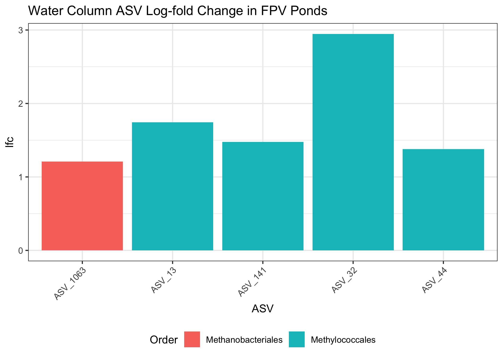<!-- -->

``` r
# plot differentially abundant ASVs overtime 

#1. tax glom at ASV level
water_ch4_asv_df <- water_ch4_physeq %>% 
  tax_glom(taxrank = "ASV") %>% 
  psmelt() %>% 
  mutate(
    Depth_Class = case_when(
      Depth_Class == "S" ~ "Surface Water",
      Depth_Class == "B" ~ "Bottom Water"),
    Depth_Class = factor(Depth_Class, levels = c("Surface Water", "Bottom Water")))

#2. plot asvs overtime 

# methanogen = ASV_1063; Methanobacteriales order
# methanotroph = ASV 13,141,32,44; Methylococcales order
# get metadata from water physeq 
metadata <- water_ch4_physeq %>%
  sample_data() %>%
  data.frame() %>% 
  mutate(
    Depth_Class = case_when(
      Depth_Class == "S" ~ "Surface Water",
      Depth_Class == "B" ~ "Bottom Water"),
    Depth_Class = factor(Depth_Class, levels = c("Surface Water", "Bottom Water")))
    
# plot Methanogen overtime
water_ch4_asv1063 <- water_ch4_asv_df %>% 
  dplyr::filter(ASV == "ASV_1063") %>%
  group_by(JDate, Pond, Depth_Class, solar_progress) %>% 
  summarize(
    total_cells_ml = sum(Abundance)) %>%
  ggplot(aes(x = as.factor(JDate), y = total_cells_ml, color = solar_progress, shape = Pond)) +
  geom_line(aes(group = interaction(Pond, Depth_Class)), 
            alpha = 0.2) +
  geom_smooth(aes(group = solar_progress), se = FALSE) +
  geom_point(aes(shape = Pond), size = 2) +
  ggh4x::facet_grid2(~Depth_Class) +
  scale_color_manual(values = solar_colors) +
  scale_shape_manual(values = pond_shapes) +
  labs(
    x = "Date Collected",
    y = "Total Cells per ml",
    title = "Methanobacteriales (ASV_1063)\nIncrease in FPV Ponds"
  ) +
  theme(axis.text.x = element_text(angle = 30, hjust = 1, vjust = 1),
        legend.position = "bottom") +
  scale_x_discrete(guide = guide_axis(angle = 60)) +
  theme_bw()
water_ch4_asv1063 
```

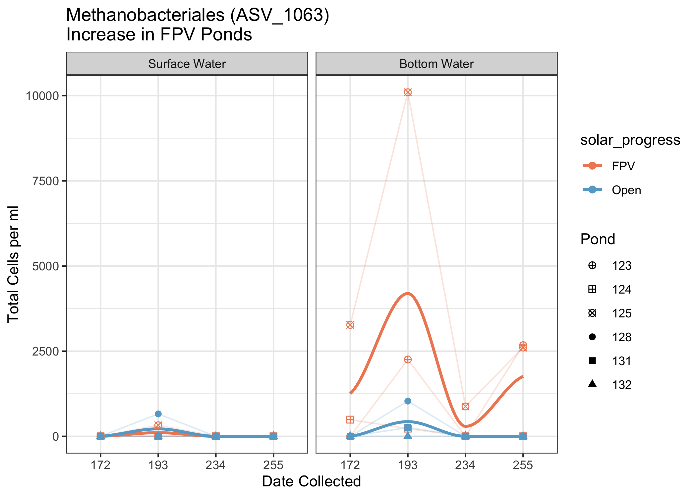<!-- -->

``` r
# methanotrophs 

# create list of methanotroph asvs 
water_ch4_methanotrophs <- c("ASV_13", "ASV_141", "ASV_32", "ASV_44")

# now plot overtime
water_ch4_trophs <- water_ch4_asv_df %>% 
  dplyr::filter(ASV %in% water_ch4_methanotrophs) %>% 
  group_by(JDate, Pond, Depth_Class, solar_progress, ASV) %>% 
  summarize(
    total_cells_ml = sum(Abundance)) %>%
  ggplot(aes(x = as.factor(JDate), y = total_cells_ml, color = solar_progress, shape = Pond)) +
  geom_line(aes(group = interaction(Pond, Depth_Class)), 
            alpha = 0.2) +
  geom_smooth(aes(group = solar_progress), se = FALSE) +
  geom_point(aes(shape = Pond), size = 2) +
  ggh4x::facet_grid2(Depth_Class~ASV) +
  scale_color_manual(values = solar_colors) +
  scale_shape_manual(values = pond_shapes) +
  labs(
    x = "Date Collected",
    y = "Total Cells per ml",
    title = "Differentially Abundant Methylococcales ASVs in FPV Ponds"
  ) +
  theme(axis.text.x = element_text(angle = 30, hjust = 1, vjust = 1),
        legend.position = "bottom") +
  scale_x_discrete(guide = guide_axis(angle = 60)) +
  theme_bw()
water_ch4_trophs
```

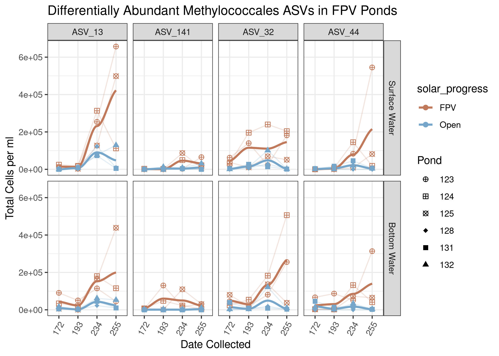<!-- -->
When we look at the water column of just our methane cyclers, we see that there are only log fold change increases. It is no suprise that Methylococcales has 4 differentially abundant ASVs, but ASV 32 is a log fold change just shy of 3! I am kinda shocked that the Methanobacteriales ASV 1063 is differentially abundant in the water column of solar ponds...

### Sediment
First we are running this analysis with all methane cyclers.

``` r
# set seed
set.seed(09091999)

# filter out for ASVs with zero variances 
scaled_sed_ch4_physeq_bc <- scaled_sed_ch4_physeq %>% 
  filter_taxa(., function(x) {
    group_var <- sample_data(.)$solar_progress
    all(tapply(x, group_var, var, na.rm = TRUE) > 0)
  }, prune = TRUE)


# relevel solar_progress 
scaled_sed_ch4_physeq_bc@sam_data$solar_progress <- factor(scaled_sed_ch4_physeq_bc@sam_data$solar_progress, levels = c("Open", "FPV"))

# run ancombc2 for all sediment methane cyclers
# sed_ch4_asv_output <- ancombc2(data = scaled_sed_ch4_physeq_bc,
#                                  tax_level = "ASV", # Test for each phylum
#                                  fix_formula = "solar_progress", # Use Comp_Group_Hier to estimate diff. abundance
#                                  p_adj_method = "holm", # Adjust with Holm-Bonferroni correction; recommended by authors
#                                  pseudo_sens = TRUE, # Run sensitivity test to make sure taxa isn't sensitive to psuedo-count choice
#                                  prv_cut = 0.1, # Prevalence filter of 10%
#                                  group = "solar_progress", # Use Comp_Group_Hier as groups when doing pairwise comparisons
#                                  struc_zero = TRUE, # Do not detect structural zeroes
#                                  alpha = 0.05, # Significance threshold of 0.05
#                                  n_cl = 5, # Use 5 threads
#                                  verbose = FALSE, # Don't print verbose output
#                                  global = TRUE, # Run a global test (sorta like an ANOVA to first find if a given ASV is sig diff)
#                                  pairwise = FALSE) # Run pairwise tests between groups (sorta like a post-hoc test like Tukey)


# save(sed_ch4_asv_output, file = "data/02_diff_abund/sed_ch4_asv_output.RData.RData")

load("data/02_diff_abund/sed_ch4_asv_output.RData")


# plot ASV differential abundance
sed_ch4_fsp <- sed_ch4_asv_output$res %>%
  select(taxon, starts_with("lfc"), starts_with("diff"), starts_with("passed_ss")) %>%
  pivot_longer(cols = !taxon, names_to = "metric", values_to = "value") %>%
  separate_wider_delim(cols = metric, delim = "_", names = c("variable", "Comparison"), too_many = "merge") %>%
  mutate(Comparison = str_remove(Comparison, "\\(Intercept\\)")) %>% 
  mutate(Comparison = str_remove(Comparison, "ss_")) %>%
  pivot_wider(id_cols = c("taxon","Comparison"), names_from = variable, values_from = value) %>%
  mutate(Comparison = str_remove(Comparison, "treatment"),
         Comparison = str_replace(Comparison, "_treatment", ";")) %>%
  separate_wider_delim(Comparison, delim = ";", names = c("Ref1", "Ref2"), too_few = "align_start") %>%
  filter(!is.na(Ref1) & Ref1 != "") %>%
  mutate(
    Ref2 = ifelse(is.na(Ref2), "Open", Ref2), # relevel with basegroup which is no solar 
    Comparison = paste0(Ref1, " : ", Ref2)) %>% 
  dplyr::filter(diff == 1, passed == 1, abs(lfc) > 1) %>% # play around with log fold change
  select(ASV = taxon, Comparison, lfc, passed)

# join by tax table
clean_sed_ch4 <-  sed_ch4_fsp %>% left_join(., as.data.frame(scaled_sed_ch4_physeq@tax_table), by = "ASV")

# plot log fold changes
clean_sed_ch4 %>% 
  ggplot(aes(x = ASV, y = lfc, fill = Order)) +
  geom_col() +
  #scale_fill_manual(values = phylum_colors) +
  theme_bw() +
  theme(axis.text.x = element_text(angle = 45, hjust = 1), legend.position = "bottom") + 
  ggtitle("Sediment CH4 Cycler ASV Log-fold Change in FPV Ponds") 
```

<!-- -->

``` r
# plot differentially abundant ASVs overtime 

#1. tax glom at ASV level, calculate abundance
# calculate relative abundance and identify methane cyclers
methano_sed_asv_df <- scaled_sed_physeq_24 %>%
  speedyseq::tax_glom(taxrank = "ASV") %>% 
  # Calculate the relative abundance
  speedyseq::transform_sample_counts(function(x) {x/sum(x)}) %>%
  psmelt() %>%
  filter(Order %in% c(methanogens, methanotrophs)) %>%
  mutate(
    Methanotroph_Methanogen = case_when(
      Order %in% methanogens ~ "Methanogen",
      Order %in% methanotrophs ~ "Methanotroph"
    ),
    solar_progress = recode(solar_progress, "Solar" = "FPV", "No Solar" = "Open"),
    Depth_Class = "Sediment")  

#2. plot asv overtime 

# methanogen = ASV_4603; Methanosarcinales_A_2632 order

# get metadata from water physeq 
metadata <- scaled_sed_ch4_physeq %>%
  sample_data() %>%
  data.frame()


# plot Methanogen overtime
sed_ch4_asv4603 <- methano_sed_asv_df %>% 
  dplyr::filter(ASV == "ASV_4603") %>%
  group_by(Pond, solar_progress, Date_Collected, ASV) %>% 
  summarize(
    asv_abund = sum(Abundance), 
    .groups = "drop") %>%
  ggplot(aes(x = as.factor(Date_Collected), y = asv_abund, color = solar_progress)) +
  geom_line(aes(group = interaction(Pond, ASV)), 
            alpha = 0.2) +
  geom_smooth(aes(group = solar_progress), se = FALSE) +
  geom_point(aes(shape = Pond), size = 2) +
  scale_color_manual(values = solar_colors) +
  scale_shape_manual(values = pond_shapes) +
  labs(
    x = "Date Collected",
    y = "Relative Abundance (%)",
    title = "Dif Abund Sed Methanosarcinales_A_2632 (ASV_4603) in FPV Ponds"
  ) +
  theme(axis.text.x = element_text(angle = 30, hjust = 1, vjust = 1),
        legend.position = "bottom") +
  scale_x_discrete(guide = guide_axis(angle = 60)) +
  theme_bw()
sed_ch4_asv4603
```

<!-- -->
There is a differentially abundant ASV Methanosarcinales_A_2632 that is increased in solar ponds! When we plot the abundance overtime this ASV is barely in the community but it is higher in solar ponds. Doesnt really feel worth it to report considering its a minor contribution to community.

## S3 - Community Composition
I am plotting water and sediment community compositions together in this chunk

``` r
# pull out metadata 
metadata <- water_ch4_physeq %>%
  sample_data() %>%
  data.frame() %>% 
  select(-Methanotroph_Methanogen)

# sediment + water methane cyclers 11 total 
methanogens <- c("Methanosarcinales_A_2632", "Methanomicrobiales", "Methanobacteriales", "Methanomassiliicoccales", "Methanofastidiosales", "Methanotrichales", "Methanocellales", "Methanomethylicales")
methanotrophs <- c("Methylococcales", "Methylacidiphilales", "Methylomirabilales")


# create df for plotting
water_ch4_order_df <- water_ch4_physeq %>% 
  tax_glom(taxrank = "ASV") %>% 
  psmelt() %>% 
  mutate(
    Methanotroph_Methanogen = case_when(
      Order %in% methanogens ~ "Methanogen",
      Order %in% methanotrophs ~ "Methanotroph",
      TRUE ~ NA_character_
    )
  ) %>% 
  select(DNA_ID, Abundance, Kingdom, Phylum, Class, Order, Family, Genus, Species, ASV, Methanotroph_Methanogen) %>% 
  left_join(metadata, by = "DNA_ID") %>% 
  mutate(
    Depth_Class = case_when(
    Depth_Class == "S"  ~ "Surface Water",
    Depth_Class == "B"  ~ "Bottom Water"),
    Depth_Class = factor(Depth_Class, levels = c("Surface Water", "Bottom Water")),
    solar_progress = recode(solar_progress, "Solar" = "FPV", "No Solar" = "Open")) %>% 
  dplyr::filter(Date_Collected.x == "2024-07-11") %>% 
  group_by(Order, JDate, Pond, Depth_Class, solar_progress, Methanotroph_Methanogen, DNA_ID) %>% 
  summarize(Abundance = sum(Abundance)) 
  

# community composition - water absolute abundances


# water color scheme for taxa
ch4_colors <- c("Methanobacteriales" = "#2E624D",
                  "Methanocellales" = "#558D7B", 
                  "Methanofastidiosales" =  "#148F77",
                  "Methanomassiliicoccales" = "#009E73",
                  "Methanomicrobiales" = "#43BA8F",
                  "Methanosarcinales_A_2632" =  "#48C9B0",
                  "Methanomethylicales" = "#90CEC0",
                  "Methanotrichales" = "#A3E4D7",
                  "Methylococcales"= "#7D3560",
                  "Methylomirabilales" = "#CC79A7",
                  "Methylacidiphilales"= "#EFB6D6"
                  )

ch4_legend_ord <- c("Methanobacteriales",
                  "Methanocellales", 
                  "Methanofastidiosales",
                  "Methanomassiliicoccales",
                  "Methanomicrobiales",
                  "Methanosarcinales_A_2632",
                  "Methanomethylicales",
                  "Methanotrichales",
                  "Methylococcales",
                  "Methylomirabilales",
                  "Methylacidiphilales"
                  )

# create absolute abundance community comp plot
waterch4_ord_cc_fpv <- water_ch4_order_df %>% 
  ggplot(aes(x = Pond, y = Abundance/1e3, fill = Order)) + 
  geom_col(width = .99) +
  facet_grid(rows = vars(Depth_Class), cols = vars(solar_progress), scales = "free_x") +
  #ggh4x::facet_nested(~solar_progress+Depth_Class,space = "free", scales = "free_x") +
  scale_fill_manual(values = ch4_colors) +
 # scale_x_continuous(expand = expansion(mult = 0),
 # labels = scales::label_comma()) +
  labs(y = "Absolute Abundance (10³ cells/ml)") + 
  scale_x_discrete(expand = c(0, 0)) +
  # theme(axis.line.x = element_blank(),
  #       axis.text.x = element_blank(),
  #       axis.ticks.y = element_blank(),
  #       axis.title.y = element_blank(),
  #       plot.margin = unit(c(0,0,0,0), "null"),
  #       axis.text.x = element_text(size = 10),
  #       axis.title.x = element_text(size = 12),
  #       legend.text = element_text(size = 8),
  #       legend.title = element_text(size = 12),
  #       legend.box.background = element_rect(linetype = "solid", color = "black")) + 
  theme_classic() +
  theme(strip.background = element_blank(),
        # axis.text.x = element_text(angle=90, vjust=0.5),
        strip.text.x.top = element_text(size = 11, face = "bold"),
        strip.text.y.right = element_text(size = 10, face = "bold"),
        axis.text.x = element_blank(),
        axis.title.y = element_text(size = 9),
        axis.title.x = element_blank(),
        axis.ticks.x = element_blank(),
        axis.line = element_blank(),
        legend.key.width=unit(0.3,"cm"),
        legend.key.height=unit(0.3,"cm"), 
        legend.position = "none", 
        legend.title=element_text(size=10),
        legend.text=element_text(size=9),
        panel.border = element_rect(color = "black", 
                            fill = NA, size = 1))+
  guides(fill = guide_legend(title.position = "left",
                             nrow=5, ncol= 3)) 
waterch4_ord_cc_fpv
```

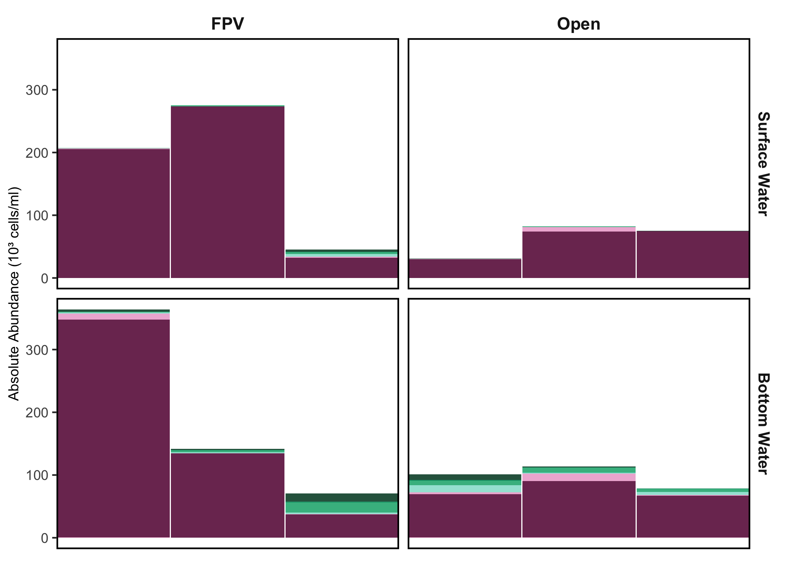<!-- -->

``` r
# relative sediment abundance

# calculate relative abundance and identify methane cyclers
methano_sed_phy <- scaled_sed_physeq_24 %>%
  speedyseq::tax_glom(taxrank = "ASV") %>% 
  # Calculate the relative abundance
  speedyseq::transform_sample_counts(function(x) {x/sum(x)}) %>%
  psmelt() %>%
  filter(Order %in% c(methanogens, methanotrophs)) %>%
  mutate(
    Methanotroph_Methanogen = case_when(
      Order %in% methanogens ~ "Methanogen",
      Order %in% methanotrophs ~ "Methanotroph"
    ),
    solar_progress = recode(solar_progress, "Solar" = "FPV", "No Solar" = "Open"),
    Depth_Class = "Sediment")  %>% 
  group_by(Order, Date_Collected, Pond, Depth_Class, solar_progress, Methanotroph_Methanogen, DNA_ID) %>% 
  summarize(Abundance = sum(Abundance)) 


# relative community plot 
sedch4_order_cc <-  methano_sed_phy %>% 
  dplyr::filter(Date_Collected == "2024-07-11") %>% 
  ggplot(aes(x = Pond, y = Abundance, fill = Order)) + 
  geom_col(width = .99) +
  facet_grid(rows = vars(Depth_Class), cols = vars(solar_progress), scales = "free_x") +
  scale_fill_manual(values = ch4_colors) +
  scale_x_discrete(expand = c(0, 0)) + 
  labs(
    y = "Relative Abundance (%)",
    x = "Pond"
  ) +
  theme_classic() +
  theme(strip.background = element_blank(),
        strip.text.x.top = element_blank(),
        strip.text.y.right = element_text(size = 10, face = "bold"),
        axis.text.x = element_text(angle=90, vjust=0.5),
        axis.title.y = element_text(size = 9),
        axis.line = element_blank(),
        legend.key.width=unit(0.3,"cm"),
        legend.key.height=unit(0.3,"cm"), 
        legend.position = "none", 
        legend.title=element_text(size=10),
        legend.text=element_text(size=9),
        panel.border = element_rect(color = "black", 
                            fill = NA, size = 1))+
  guides(fill = guide_legend(title.position = "left",
                             nrow=7, ncol= 3))
    
sedch4_order_cc
```

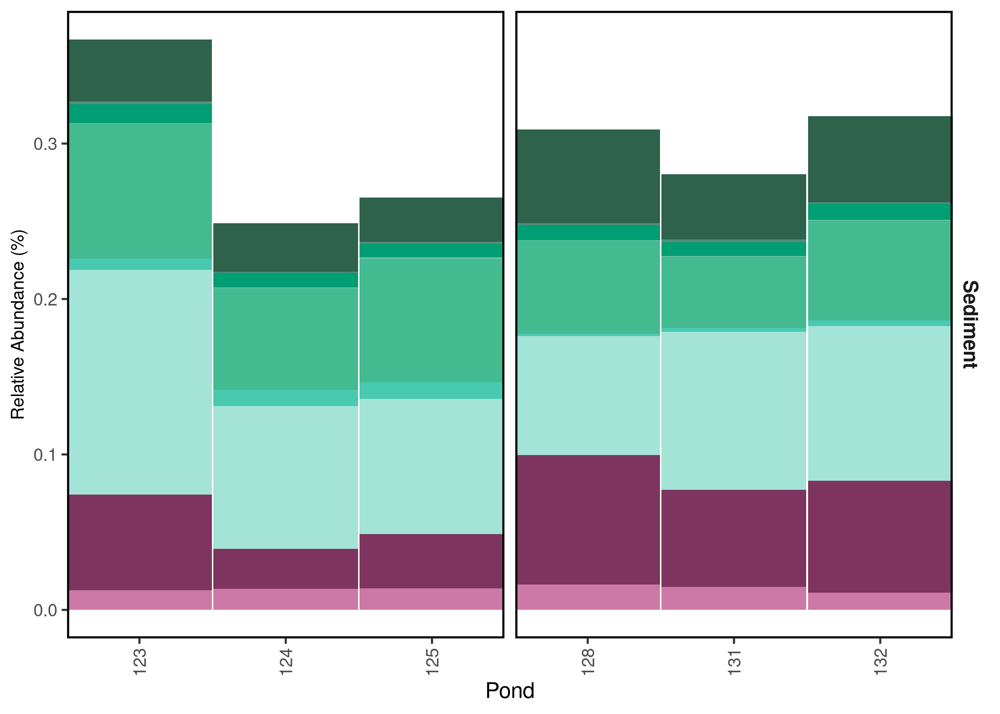<!-- -->

``` r
# plot community plots together
community <- ggarrange(waterch4_ord_cc_fpv, sedch4_order_cc,
            ncol = 1,
            nrow = 2,
            labels = c("A.", "B."),
            align = "v")
community
```

<!-- -->

``` r
# combine water and sediment df for legend to export
leg_water <- water_ch4_order_df %>% 
  select(Abundance, Order, Methanotroph_Methanogen)
leg_sed <- methano_sed_phy %>% 
  select(Abundance, Order, Methanotroph_Methanogen)

illegal_bind <- rbind(leg_water, leg_sed)


# plot illegally bound df to get legend of all 11 methane cycler species
legend_ch4 <- illegal_bind %>% 
  mutate(Order = factor(Order, levels = ch4_legend_ord)) %>%
  ggplot(aes(x = Order, y = Abundance, fill = Order)) +
  geom_col(width = .99) +
  scale_fill_manual(values = ch4_colors) +
  guides(
    fill = guide_legend(
      title = "Order",
      ncol = 3,
      byrow = FALSE
    )
  ) +
  theme(legend.key.width=unit(0.3,"cm"),
        legend.key.height=unit(0.3,"cm"),
        legend.position = "bottom",
        legend.title=element_text(size=10),
        legend.text = element_text(size = 9)) 
legend_ch4
```

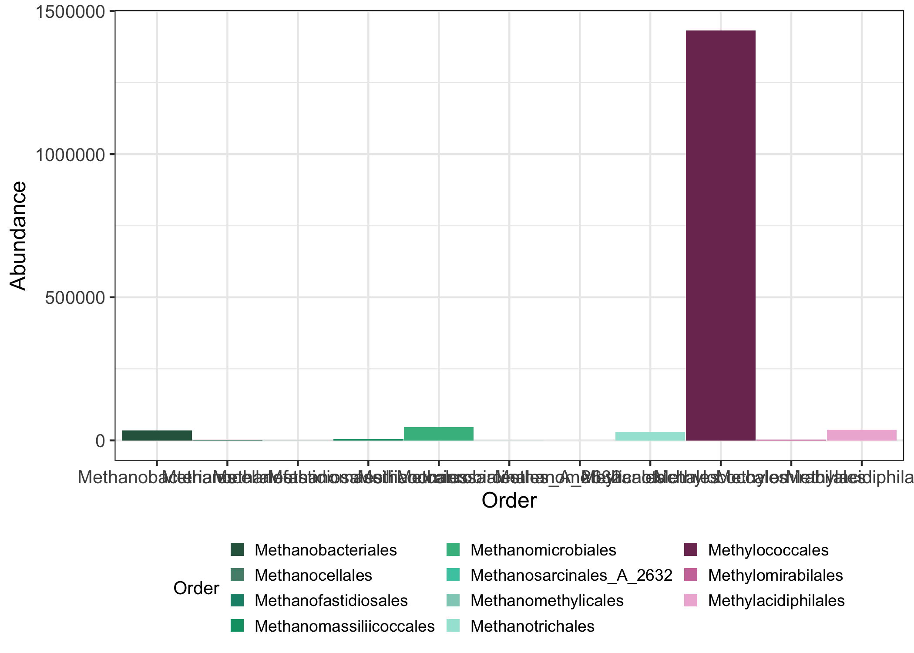<!-- -->

``` r
# get legends
legend_only <- cowplot::get_legend(legend_ch4)

# theres randomly 5 grob objects and only the 3rd one has something?
legend_list <- cowplot::get_plot_component(legend_ch4, "guide-box", return_all = TRUE)

# extract legend grob
legend_only <- legend_list[[3]]

# Side by side
combined_legends <- plot_grid(
  waterch4_ord_cc_fpv,
  sedch4_order_cc,
  legend_only, 
  ncol = 1,
  align = "v",
  axis = "l",
  labels = c("A.", "B."),
  rel_heights = c(1, 1, .5)
)
combined_legends
```

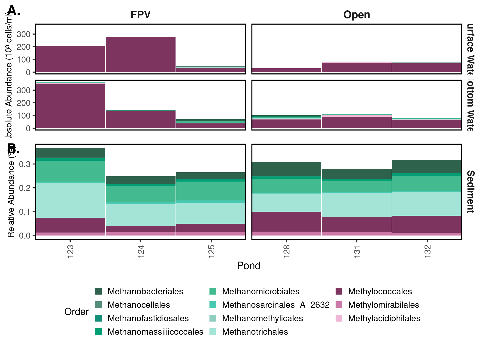<!-- -->

``` r
# now lets begin to save our image
png("figures/s3/s3_community_comp.png", width = 3900, height = 4000, res = 600)

grid.newpage()
grid.draw(combined_legends)
grid.text(label = "Methanogens", x = 0.4, y = 0.17, just = c("center", "bottom"),
          gp = gpar(fontface = "bold", cex = .9))
grid.text(label = "Methanotrophs", x = 0.81, y = 0.17, just = c("center", "bottom"),
          gp = gpar(fontface = "bold", cex = .9))

dev.off()
```

```
## png 
##   2
```


# Bonus code
### 1: relative abundances
This is code that I previously ran but I am having a hard time deleting it will not be evaluated

``` r
# calculate pvalue
stat.test <- methano_water_sed_711 %>% # methano_water_sed_711 no longer exists
  dplyr::filter(str_detect(Depth_Class, "Water")) %>% 
  group_by(Methanotroph_Methanogen, Depth_Class) %>% 
  wilcox_test(order_abund ~ solar_progress, 
              p.adjust.method = "fdr",
              exact = FALSE) %>% 
  add_significance() %>% 
  mutate(
    group = interaction(Methanotroph_Methanogen, Depth_Class, sep = " "),
    y.position = 0.35,
    p.label = signif(p, digits = 2))
stat.test

# water column absolute abundance
p7 <- methano_water_sed_711 %>% 
  dplyr::filter(str_detect(Depth_Class, "Water")) %>% 
  ggplot(aes(x = solar_progress, y = order_abund, fill = solar_progress, color = solar_progress)) +
  geom_boxplot(outlier.shape = NA, alpha = 0.2) +  
  geom_point(aes(shape = Pond),
             alpha = 2,
             position = position_jitterdodge(jitter.width = .9, dodge.width = .65),
             size = 2) +
  ggh4x::facet_nested(~ Methanotroph_Methanogen + Depth_Class,
                      scales = "free") +
  scale_fill_manual(values = c("Open" = "#B3C493", "FPV" = "#005373")) +
  scale_color_manual(values = c("Open" = "#B3C493", "FPV" = "#005373")) +
  scale_shape_manual(values = pond_shapes) +
  labs(y = "Relative Abundance (%)") +
  stat_pvalue_manual(
    stat.test,
    label = "p.label",
    group = "group",
    y.position = .08,
    tip.length = 0,
    size = 3,
    bracket.size = 0,
    inherit.aes = FALSE
  ) +
  guides(
    fill = "none",
    color = "none",
    shape = guide_legend(
      nrow = 2,
      byrow = TRUE,
      title.position = "left",
      override.aes = list(size = 2.5))
  ) +
  theme_bw() +
  theme(
    axis.title.x = element_blank(),
    axis.text.x = element_text(angle = 60, hjust = 1),
    legend.position = "bottom"
  )
p7


# sediment relative abundance
stat.test <- methano_water_sed_711 %>% 
  dplyr::filter(str_detect(Depth_Class, "Sediment")) %>% 
  group_by(Methanotroph_Methanogen, Depth_Class) %>% 
  wilcox_test(order_abund ~ solar_progress, 
              p.adjust.method = "fdr",
              exact = FALSE) %>% 
  add_significance() %>% 
  mutate(
    group = interaction(Methanotroph_Methanogen, Depth_Class, sep = " "),
    y.position = 0.35,
    p.label = signif(p, digits = 2))
stat.test

sed_ch4 <- methano_water_sed_711 %>% 
  dplyr::filter(str_detect(Depth_Class, "Sediment")) %>% 
  ggplot(aes(x = solar_progress, y = order_abund, fill = solar_progress, color = solar_progress)) +
  geom_boxplot(outlier.shape = NA, alpha = 0.2) +  
  geom_point(aes(shape = Pond),
             alpha = 2,
             position = position_jitterdodge(jitter.width = .9, dodge.width = .65),
             size = 2) +
  ggh4x::facet_nested(~ Methanotroph_Methanogen,
                      scales = "free") +
  scale_fill_manual(values = c("Open" = "#B3C493", "FPV" = "#005373")) +
  scale_color_manual(values = c("Open" = "#B3C493", "FPV" = "#005373")) +
  scale_shape_manual(values = pond_shapes) +
  labs(y = "Methanogen and Methanotroph Relative Abundance") +
  stat_pvalue_manual(
    stat.test,
    label = "p.label",
    group = "group",
    y.position = .35,
    tip.length = 0,
    size = 3,
    bracket.size = 0,
    inherit.aes = FALSE
  ) +
  guides(
    fill = "none",
    color = "none",
    shape = guide_legend(
      nrow = 2,
      byrow = TRUE,
      title.position = "left",
      override.aes = list(size = 2.5))
  ) +
  theme_bw() +
  theme(
    axis.title.x = element_blank(),
    axis.text.x = element_text(angle = 60, hjust = 1),
    legend.position = "bottom"
  )
sed_ch4

p7 + sed_ch4


# alternative plots to match nicks vision
### methanogen water
pmethanogen_water <- methano_water_sed_711 %>% 
  dplyr::filter(str_detect(Depth_Class, "Water")) %>% 
  dplyr::filter(str_detect(Methanotroph_Methanogen, "Methanogen"))
p7 <- methano_water_sed_711 %>% 
  dplyr::filter(str_detect(Depth_Class, "Water")) %>% 
  ggplot(aes(x = solar_progress, y = order_abund, fill = solar_progress, color = solar_progress)) +
  geom_boxplot(outlier.shape = NA, alpha = 0.2) +  
  geom_point(aes(shape = Pond),
             position = position_jitterdodge(jitter.width = .9, dodge.width = .65),
             size = 2) +
  ggh4x::facet_nested(~ Methanotroph_Methanogen + Depth_Class,
                      scales = "free") +
  scale_fill_manual(values = c("Open" = "#B3C493", "FPV" = "#005373")) +
  scale_color_manual(values = c("Open" = "#B3C493", "FPV" = "#005373")) +
  scale_shape_manual(values = pond_shapes) +
  labs(y = "Relative Abundance (%)") +
  stat_pvalue_manual(
    stat.test,
    label = "p.label",
    group = "group",
    y.position = .08,
    tip.length = 0,
    size = 3,
    bracket.size = 0,
    inherit.aes = FALSE
  ) +
  guides(
    fill = "none",
    color = "none",
    shape = guide_legend(
      nrow = 2,
      byrow = TRUE,
      title.position = "left",
      override.aes = list(size = 2.5))
  ) +
  theme_bw() +
  theme(
    axis.title.x = element_blank(),
    axis.text.x = element_text(angle = 60, hjust = 1),
    legend.position = "bottom"
  )
p7
```


### 2. 4 box plots 
this just had the 4 boxplots made with a function but not evaluated


### Sediment - Relative Abundance

``` r
# factor levels before we plot so FPV is on left and Open is on the right
methano_water_sed_711$solar_progress <- factor(methano_water_sed_711$solar_progress, 
                                               levels = c("FPV", "Open"))
```

```
## Error: object 'methano_water_sed_711' not found
```

``` r
# lets make function to plot methanos
make_boxplot_methano <- function(data, depth_class, methano) {
  data %>%
    filter(
      Depth_Class == depth_class,
      Methanotroph_Methanogen == methano
    ) %>%
    ggplot(aes(
      x = solar_progress,
      y = order_abund
    )) +
    geom_boxplot(outlier.shape = NA, alpha = 0.2) +
    geom_point(
      aes(shape = Pond, color = solar_progress),
      position = position_jitterdodge(jitter.width = 0.84, dodge.width = 0.65),
      size = 3
    ) +
    scale_color_manual(values = c("FPV" = "#C07A5B", "Open" = "#76A7CB")) +
    scale_y_continuous(
      limits = c(0, 0.37),  # set y-axis range
      breaks = seq(0, 0.3, by = 0.15)  # Consistent tick marks
    ) +
    labs(
      title = paste(depth_class),
      y = "Methanogen\nRelative Abundance (%)",  # Label for every y-axis
      x = NULL
    ) +
    theme_classic() +
    theme(
      legend.position = "none",
      axis.title.y = element_text(size = 8),
      plot.title = element_text(size = 10, hjust = 0.5)
    )
}

# now lets do the same but for methanotrophs
make_boxplot_trophs <- function(data, depth_class, methano) {
  data %>%
    filter(
      Depth_Class == depth_class,
      Methanotroph_Methanogen == methano
    ) %>%
    ggplot(aes(
      x = solar_progress,
      y = order_abund
      # fill = solar_progress,
    )) +
    geom_boxplot(outlier.shape = NA, alpha = 0.2, color = "black") +
    geom_point(
      aes(shape = Pond, color = solar_progress),
      position = position_jitterdodge(jitter.width = 0.84, dodge.width = 0.65),
      size = 3 
    ) +
    scale_color_manual(values = c("FPV" = "#C07A5B", "Open" = "#76A7CB")) +
    scale_y_continuous(
      limits = c(0, 0.37),  # Fixed y-axis range
      breaks = seq(0, 0.3, by = 0.15)  # tick marks
    ) +
    labs(
      title = paste(depth_class),
      y = "Methanotroph\nRelative Abundance (%)", 
      x = NULL
    ) +
    theme_classic() +
    theme(
      legend.position = "none",
      axis.title.y = element_text(size = 8),
      plot.title = element_text(size = 10, hjust = 0.5)
    )
}

# make all the plots 
p1 <- make_boxplot_methano(methano_water_sed_711, "Sediment", "Methanogen")
```

```
## Error: object 'methano_water_sed_711' not found
```

``` r
p2 <- make_boxplot_trophs(methano_water_sed_711, "Sediment", "Methanotroph")
```

```
## Error: object 'methano_water_sed_711' not found
```

``` r
# plot the final plot
final_sed <- ggarrange(
  p1, p2,
  nrow = 2, ncol = 2,
  align = "hv") # aligns axis 
```

```
## Error: object 'p1' not found
```

``` r
final_sed
```

```
## Error: object 'final_sed' not found
```

``` r
# ok lies not final plot BUT we are getting there we just need to add our legend

# extract only the legend
legend <- make_boxplot_methano(methano_water_sed_711, "Sediment", "Methanogen") +
  theme(
    legend.position = "bottom",
    legend.title = element_text(hjust = 0.5),  # 0.5 centers title
    legend.box = "horizontal",  # proper alignment
    legend.justification = "center"  # entire legend is centered
  ) +
  guides(
    color = "none", # we dont want color to be in legend
    shape = guide_legend(
      title.position = "top",  # make sure pond is above symbolx
      nrow = 2,
      byrow = TRUE, # want FPV in first row
      override.aes = list(size = 2.5)
    )
  )
```

```
## Error: object 'methano_water_sed_711' not found
```

``` r
legend
```

```
## function (x, y = NULL, legend, fill = NULL, col = par("col"), 
##     border = "black", lty, lwd, pch, angle = 45, density = NULL, 
##     bty = "o", bg = par("bg"), box.lwd = par("lwd"), box.lty = par("lty"), 
##     box.col = par("fg"), pt.bg = NA, cex = 1, pt.cex = cex, pt.lwd = lwd, 
##     xjust = 0, yjust = 1, x.intersp = 1, y.intersp = 1, adj = c(0, 
##         0.5), text.width = NULL, text.col = par("col"), text.font = NULL, 
##     merge = do.lines && has.pch, trace = FALSE, plot = TRUE, 
##     ncol = 1, horiz = FALSE, title = NULL, inset = 0, xpd, title.col = text.col[1], 
##     title.adj = 0.5, title.cex = cex[1], title.font = text.font[1], 
##     seg.len = 2) 
## {
##     if (missing(legend) && !missing(y) && (is.character(y) || 
##         is.expression(y))) {
##         legend <- y
##         y <- NULL
##     }
##     mfill <- !missing(fill) || !missing(density)
##     if (!missing(xpd)) {
##         op <- par("xpd")
##         on.exit(par(xpd = op))
##         par(xpd = xpd)
##     }
##     text.font <- if (is.null(text.font)) 
##         par("font")
##     else text.font
##     title <- as.graphicsAnnot(title)
##     if (length(title) > 1) 
##         stop("invalid 'title'")
##     legend <- as.graphicsAnnot(legend)
##     if (any(sapply(legend, is.language))) 
##         legend <- as.expression(legend)
##     n.leg <- length(legend)
##     if (n.leg == 0) 
##         stop("'legend' is of length 0")
##     auto <- if (is.character(x)) 
##         match.arg(x, c("bottomright", "bottom", "bottomleft", 
##             "left", "topleft", "top", "topright", "right", "center"))
##     else NA
##     if (is.na(auto)) {
##         xy <- xy.coords(x, y, setLab = FALSE)
##         x <- xy$x
##         y <- xy$y
##         nx <- length(x)
##         if (nx < 1 || nx > 2) 
##             stop("invalid coordinate lengths")
##     }
##     else nx <- 0
##     reverse.xaxis <- par("xaxp")[1] > par("xaxp")[2]
##     reverse.yaxis <- par("yaxp")[1] > par("yaxp")[2]
##     xlog <- par("xlog")
##     ylog <- par("ylog")
##     cex <- rep(cex, length.out = n.leg)
##     x.intersp <- rep(x.intersp, length.out = n.leg)
##     seg.len <- rep(seg.len, length.out = n.leg)
##     rect2 <- function(left, top, dx, dy, density = NULL, angle, 
##         ...) {
##         r <- left + dx
##         if (xlog) {
##             left <- 10^left
##             r <- 10^r
##         }
##         b <- top - dy
##         if (ylog) {
##             top <- 10^top
##             b <- 10^b
##         }
##         rect(left, top, r, b, angle = angle, density = density, 
##             ...)
##     }
##     segments2 <- function(x1, y1, dx, dy, ...) {
##         x2 <- x1 + dx
##         if (xlog) {
##             x1 <- 10^x1
##             x2 <- 10^x2
##         }
##         y2 <- y1 + dy
##         if (ylog) {
##             y1 <- 10^y1
##             y2 <- 10^y2
##         }
##         segments(x1, y1, x2, y2, ...)
##     }
##     points2 <- function(x, y, ...) {
##         if (xlog) 
##             x <- 10^x
##         if (ylog) 
##             y <- 10^y
##         points(x, y, ...)
##     }
##     text2 <- function(x, y, ...) {
##         if (xlog) 
##             x <- 10^x
##         if (ylog) 
##             y <- 10^y
##         text(x, y, ...)
##     }
##     colwise <- function(x, n, ncol, n.legpercol, fun, reverse = FALSE) {
##         xmat <- matrix(c(rep(x, length.out = n), rep(0L, n.legpercol * 
##             ncol - n)), ncol = ncol)
##         res <- apply(xmat, 2, fun)
##         res[res == 0L] <- max(res)
##         if (reverse) 
##             -res
##         else res
##     }
##     rowwise <- function(x, n, ncol, n.legpercol, fun, reverse = FALSE) {
##         xmat <- matrix(c(rep(x, length.out = n), rep(0L, n.legpercol * 
##             ncol - n)), ncol = ncol)
##         res <- apply(xmat, 1, fun)
##         if (reverse) 
##             -res
##         else res
##     }
##     if (trace) {
##         catn <- function(...) do.call(cat, c(lapply(list(...), 
##             formatC), "\n"))
##         fv <- function(...) paste(vapply(lapply(list(...), formatC), 
##             paste, collapse = ",", ""), collapse = ", ")
##     }
##     n.legpercol <- if (horiz) {
##         if (ncol != 1) 
##             warning(gettextf("horizontal specification overrides: Number of columns := %d", 
##                 n.leg), domain = NA)
##         ncol <- n.leg
##         1
##     }
##     else ceiling(n.leg/ncol)
##     Cex <- cex * par("cex")
##     if (is.null(text.width)) 
##         text.width <- max(abs(mapply(strwidth, legend, cex = cex, 
##             font = text.font, MoreArgs = list(units = "user"))))
##     else if ((length(text.width) > 1L && any(is.na(text.width))) || 
##         (all(!is.na(text.width)) && (!is.numeric(text.width) || 
##             any(text.width < 0)))) 
##         stop("'text.width' must be numeric, >= 0, or a scalar NA")
##     if (auto.text.width <- all(is.na(text.width))) {
##         text.width <- abs(mapply(strwidth, legend, cex = cex, 
##             font = text.font, MoreArgs = list(units = "user")))
##         ncol <- ceiling(n.leg/n.legpercol)
##     }
##     xyc <- xyinch(par("cin"), warn.log = FALSE)
##     xc <- Cex * xyc[1L]
##     yc <- Cex * xyc[2L]
##     if (any(xc < 0)) 
##         text.width <- -text.width
##     xchar <- xc
##     xextra <- 0
##     y.intersp <- rep(y.intersp, length.out = n.legpercol)
##     yextra <- rowwise(yc, n = n.leg, ncol = ncol, n.legpercol = n.legpercol, 
##         fun = function(x) max(abs(x)), reverse = reverse.yaxis) * 
##         (y.intersp - 1)
##     ymax <- sign(yc[1]) * max(abs(yc)) * max(1, mapply(strheight, 
##         legend, cex = cex, font = text.font, MoreArgs = list(units = "user"))/yc)
##     ychar <- yextra + ymax
##     ymaxtitle <- title.cex * par("cex") * xyc[2L] * max(1, strheight(title, 
##         cex = title.cex, font = title.font, units = "user")/(title.cex * 
##         par("cex") * xyc[2L]))
##     ychartitle <- yextra[1] + ymaxtitle
##     if (trace) 
##         catn("  xchar=", fv(xchar), "; (yextra, ychar)=", fv(yextra, 
##             ychar))
##     if (mfill) {
##         xbox <- xc * 0.8
##         ybox <- yc * 0.5
##         dx.fill <- max(xbox)
##     }
##     do.lines <- (!missing(lty) && (is.character(lty) || any(lty > 
##         0))) || !missing(lwd)
##     has.pch <- !missing(pch) && length(pch) > 0
##     if (do.lines) {
##         x.off <- if (merge) 
##             -0.7
##         else 0
##     }
##     else if (merge) 
##         warning("'merge = TRUE' has no effect when no line segments are drawn")
##     if (has.pch) {
##         if (is.character(pch) && !is.na(pch[1L]) && nchar(pch[1L], 
##             type = "c") > 1) {
##             if (length(pch) > 1) 
##                 warning("not using pch[2..] since pch[1L] has multiple chars")
##             np <- nchar(pch[1L], type = "c")
##             pch <- substr(rep.int(pch[1L], np), 1L:np, 1L:np)
##         }
##         if (!is.character(pch)) 
##             pch <- as.integer(pch)
##     }
##     if (is.na(auto)) {
##         if (xlog) 
##             x <- log10(x)
##         if (ylog) 
##             y <- log10(y)
##     }
##     if (nx == 2) {
##         x <- sort(x)
##         y <- sort(y)
##         left <- x[1L]
##         top <- y[2L]
##         w <- diff(x)
##         h <- diff(y)
##         w0 <- w/ncol
##         x <- mean(x)
##         y <- mean(y)
##         if (missing(xjust)) 
##             xjust <- 0.5
##         if (missing(yjust)) 
##             yjust <- 0.5
##     }
##     else {
##         yc <- rowwise(yc, n.leg, ncol, n.legpercol, fun = function(x) max(abs(x)), 
##             reverse = reverse.yaxis)
##         h <- sum(ychar) + yc[length(yc)] + (!is.null(title)) * 
##             ychartitle
##         xch1 <- colwise(xchar, n.leg, ncol, n.legpercol, fun = function(x) max(abs(x)), 
##             reverse = reverse.xaxis)
##         x.interspCol <- colwise(x.intersp, n.leg, ncol, n.legpercol, 
##             fun = max)
##         seg.lenCol <- colwise(seg.len, n.leg, ncol, n.legpercol, 
##             fun = max)
##         text.width <- colwise(text.width, n = if (auto.text.width) 
##             n.leg
##         else ncol, ncol, n.legpercol = if (auto.text.width) 
##             n.legpercol
##         else 1, fun = function(x) max(abs(x)), reverse = reverse.xaxis)
##         w0 <- text.width + (x.interspCol + 1) * xch1
##         if (mfill) 
##             w0 <- w0 + dx.fill
##         if (do.lines) 
##             w0 <- w0 + (seg.lenCol + x.off) * xch1
##         w <- sum(w0) + 0.5 * xch1[ncol]
##         if (!is.null(title) && (abs(tw <- strwidth(title, units = "user", 
##             cex = title.cex, font = title.font) + 0.5 * title.cex * 
##             par("cex") * xyc[1L])) > abs(w)) {
##             xextra <- (tw - w)/2
##             w <- tw
##         }
##         if (is.na(auto)) {
##             left <- x - xjust * w
##             top <- y + (1 - yjust) * h
##         }
##         else {
##             usr <- par("usr")
##             inset <- rep_len(inset, 2)
##             insetx <- inset[1L] * (usr[2L] - usr[1L])
##             left <- switch(auto, bottomright = , topright = , 
##                 right = usr[2L] - w - insetx, bottomleft = , 
##                 left = , topleft = usr[1L] + insetx, bottom = , 
##                 top = , center = (usr[1L] + usr[2L] - w)/2)
##             insety <- inset[2L] * (usr[4L] - usr[3L])
##             top <- switch(auto, bottomright = , bottom = , bottomleft = usr[3L] + 
##                 h + insety, topleft = , top = , topright = usr[4L] - 
##                 insety, left = , right = , center = (usr[3L] + 
##                 usr[4L] + h)/2)
##         }
##     }
##     if (plot && bty != "n") {
##         if (trace) 
##             catn("  rect2(", left, ",", top, ", w=", w, ", h=", 
##                 h, ", ...)", sep = "")
##         rect2(left, top, dx = w, dy = h, col = bg, density = NULL, 
##             lwd = box.lwd, lty = box.lty, border = box.col)
##     }
##     xt <- left + xc + xextra + rep(c(0, cumsum(w0))[1L:ncol], 
##         each = n.legpercol, length.out = n.leg)
##     topspace <- 0.5 * ymax + (!is.null(title)) * ychartitle
##     yt <- top - topspace - cumsum((c(0, ychar)/2 + c(ychar, 0)/2)[1L:n.legpercol])
##     yt <- rep(yt, length.out = n.leg)
##     if (mfill) {
##         if (plot) {
##             if (!is.null(fill)) 
##                 fill <- rep_len(fill, n.leg)
##             rect2(left = xt, top = yt + ybox/2, dx = xbox, dy = ybox, 
##                 col = fill, density = density, angle = angle, 
##                 border = border)
##         }
##         xt <- xt + dx.fill
##     }
##     if (plot && (has.pch || do.lines)) 
##         col <- rep_len(col, n.leg)
##     if (missing(lwd) || is.null(lwd)) 
##         lwd <- par("lwd")
##     if (do.lines) {
##         if (missing(lty) || is.null(lty)) 
##             lty <- 1
##         lty <- rep_len(lty, n.leg)
##         lwd <- rep_len(lwd, n.leg)
##         ok.l <- !is.na(lty) & (is.character(lty) | lty > 0) & 
##             !is.na(lwd)
##         if (trace) 
##             catn("  segments2(", xt[ok.l] + x.off * xchar[ok.l], 
##                 ",", yt[ok.l], ", dx=", (seg.len * xchar)[ok.l], 
##                 ", dy=0, ...)")
##         if (plot) 
##             segments2(xt[ok.l] + x.off * xchar[ok.l], yt[ok.l], 
##                 dx = (seg.len * xchar)[ok.l], dy = 0, lty = lty[ok.l], 
##                 lwd = lwd[ok.l], col = col[ok.l])
##         xt <- xt + (seg.len + x.off) * xchar
##     }
##     if (has.pch) {
##         pch <- rep_len(pch, n.leg)
##         pt.bg <- rep_len(pt.bg, n.leg)
##         pt.cex <- rep_len(pt.cex, n.leg)
##         pt.lwd <- rep_len(pt.lwd, n.leg)
##         ok <- !is.na(pch)
##         if (!is.character(pch)) {
##             ok <- ok & (pch >= 0 | pch <= -32)
##         }
##         else {
##             ok <- ok & nzchar(pch)
##         }
##         x1 <- (if (merge && do.lines) 
##             xt - (seg.len/2) * xchar
##         else xt)[ok]
##         y1 <- yt[ok]
##         if (trace) 
##             catn("  points2(", x1, ",", y1, ", pch=", pch[ok], 
##                 ", ...)")
##         if (plot) 
##             points2(x1, y1, pch = pch[ok], col = col[ok], cex = pt.cex[ok], 
##                 bg = pt.bg[ok], lwd = pt.lwd[ok])
##     }
##     xt <- xt + x.intersp * xc
##     if (plot) {
##         if (!is.null(title)) 
##             text2(left + w * title.adj, top - ymaxtitle, labels = title, 
##                 adj = c(title.adj, 0), cex = title.cex, col = title.col, 
##                 font = title.font)
##         text2(xt, yt, labels = legend, adj = adj, cex = cex, 
##             col = text.col, font = text.font)
##     }
##     invisible(list(rect = list(w = w, h = h, left = left, top = top), 
##         text = list(x = xt, y = yt)))
## }
## <bytecode: 0x9507d4e0>
## <environment: namespace:graphics>
```

``` r
# only get legend
shared_legend <- ggpubr::get_legend(legend)
```

```
## Error in plot$plot_env: object of type 'closure' is not subsettable
```

``` r
# make plots without legends
p1 <- make_boxplot_methano(methano_water_sed_711, "Sediment", "Methanogen")
```

```
## Error: object 'methano_water_sed_711' not found
```

``` r
p2 <- make_boxplot_trophs(methano_water_sed_711, "Sediment", "Methanotroph")
```

```
## Error: object 'methano_water_sed_711' not found
```

``` r
# now lets arrange plots 
final_sed <- ggarrange(
  ggarrange(p1, p2, 
            ncol = 2, 
            labels = c("E.", "F."),
            font.label = list(size =10)),
  nrow = 2,
  shared_legend,
  heights = c(2, 1)  # Adjust legend height (10:1 ratio)
)
```

```
## Error: object 'p1' not found
```

``` r
# Display
final_sed
```

```
## Error: object 'final_sed' not found
```

``` r
# paper worthy plot
final_plot <- final_water / final_sed
```

```
## Error: object 'final_water' not found
```

``` r
final_plot
```

```
## Error: object 'final_plot' not found
```
### Analysis Notes

**Water Samples** When we filter for our methanotrophs and methanogens
at the **Order level** (we still have Phylum and Class level
information) we see that we have:

Methanogens: Methanosarciniales, Methanomicrobiales, Methanobacteriales,
Methanomassiliicoccales, Methanofastidiosales Methanotrophs:
Methylococcales, Methylacidiphilales, Methylomirabilales

Methanogens are Archaea and start with "Methano" in the order name.
Methanotrophs are bacteria.

When identifying methanotrophs it is important to remember that all
methanotrophs are methylotrophs (consume methanole, methylamine, or
formate as energy source but **not methane**) but not all methylotophs
are methanotrophs. Methanotrophs are a subset of methylotrophs but
consume methane as their sole carbon and energy source. Methanotrophs
typically start with "Methyl" in their order name but verified through
literature review and public databases.

Putative methanogens and methanotrophs were identified based on
taxonomic classification and verified through literature review and
publically available databases (NCBI).

**Sediment Samples** Just like our water samples, we will filter for
methanogens and methanotrophs at the **Order level** which we have:

Methanogens: Methanosarciniales, Methanomicrobiales, Methanobacteriales,
Methanocellales, Methanomassiliicoccales, Methanomethyliales,
Methanofastidiosales

Methanotrophs: Methylococcales, Methylomirabilales, Methylacidiphilales


Putative methanogens and methanotrophs were identified based on
taxonomic classification and verified through literature review and
publically available databases (NCBI).

# Reproducibility

``` r
# Reproducibility
devtools::session_info()
```

```
## ─ Session info ─────────────────────────────────────────────────────────────────────────────────────────────────────────────────────────────────────────────────────────────────────────────────────────────────────────────────────────────────────────
##  setting  value
##  version  R version 4.3.3 (2024-02-29)
##  os       Rocky Linux 9.5 (Blue Onyx)
##  system   x86_64, linux-gnu
##  ui       X11
##  language (EN)
##  collate  en_US.UTF-8
##  ctype    en_US.UTF-8
##  tz       America/New_York
##  date     2025-07-14
##  pandoc   3.1.1 @ /usr/lib/rstudio-server/bin/quarto/bin/tools/ (via rmarkdown)
## 
## ─ Packages ─────────────────────────────────────────────────────────────────────────────────────────────────────────────────────────────────────────────────────────────────────────────────────────────────────────────────────────────────────────────
##  package                  * version    date (UTC) lib source
##  abind                      1.4-8      2024-09-12 [1] CRAN (R 4.3.2)
##  ade4                       1.7-23     2025-02-14 [1] CRAN (R 4.3.3)
##  ANCOMBC                  * 2.4.0      2023-10-24 [1] Bioconductor
##  ape                        5.8-1      2024-12-16 [1] CRAN (R 4.3.2)
##  backports                  1.5.0      2024-05-23 [1] CRAN (R 4.3.2)
##  base64enc                  0.1-3      2015-07-28 [2] CRAN (R 4.3.3)
##  beachmat                   2.18.1     2024-02-14 [1] Bioconductor 3.18 (R 4.3.3)
##  beeswarm                   0.4.0      2021-06-01 [1] CRAN (R 4.3.3)
##  Biobase                    2.62.0     2023-10-24 [2] Bioconductor
##  BiocGenerics               0.48.1     2023-11-01 [2] Bioconductor
##  BiocNeighbors              1.20.2     2024-01-07 [1] Bioconductor 3.18 (R 4.3.3)
##  BiocParallel               1.36.0     2023-10-24 [2] Bioconductor
##  BiocSingular               1.18.0     2023-10-24 [1] Bioconductor
##  biomformat                 1.30.0     2023-10-24 [1] Bioconductor
##  Biostrings                 2.70.3     2024-03-13 [2] Bioconductor 3.18 (R 4.3.3)
##  bit                        4.6.0      2025-03-06 [1] CRAN (R 4.3.3)
##  bit64                      4.6.0-1    2025-01-16 [1] CRAN (R 4.3.2)
##  bitops                     1.0-9      2024-10-03 [2] CRAN (R 4.3.3)
##  blob                       1.2.4      2023-03-17 [2] CRAN (R 4.3.3)
##  bluster                    1.12.0     2023-10-24 [1] Bioconductor
##  boot                       1.3-29     2024-02-19 [2] CRAN (R 4.3.3)
##  broom                      1.0.8      2025-03-28 [1] CRAN (R 4.3.3)
##  bslib                      0.9.0      2025-01-30 [1] CRAN (R 4.3.3)
##  cachem                     1.1.0      2024-05-16 [1] CRAN (R 4.3.2)
##  car                        3.1-3      2024-09-27 [1] CRAN (R 4.3.2)
##  carData                    3.0-5      2022-01-06 [1] CRAN (R 4.3.2)
##  cellranger                 1.1.0      2016-07-27 [1] CRAN (R 4.3.2)
##  checkmate                  2.3.2      2024-07-29 [1] CRAN (R 4.3.3)
##  class                      7.3-22     2023-05-03 [2] CRAN (R 4.3.3)
##  cli                        3.6.4      2025-02-13 [1] CRAN (R 4.3.3)
##  cluster                    2.1.6      2023-12-01 [2] CRAN (R 4.3.3)
##  codetools                  0.2-19     2023-02-01 [2] CRAN (R 4.3.3)
##  colorspace                 2.1-1      2024-07-26 [1] CRAN (R 4.3.2)
##  cowplot                  * 1.1.3      2024-01-22 [2] CRAN (R 4.3.3)
##  crayon                     1.5.3      2024-06-20 [1] CRAN (R 4.3.2)
##  CVXR                       1.0-15     2024-11-07 [1] CRAN (R 4.3.3)
##  data.table                 1.17.0     2025-02-22 [1] CRAN (R 4.3.3)
##  DBI                        1.2.3      2024-06-02 [2] CRAN (R 4.3.3)
##  DECIPHER                   2.30.0     2023-10-24 [1] Bioconductor
##  decontam                   1.22.0     2023-10-24 [1] Bioconductor
##  DelayedArray               0.28.0     2023-10-24 [2] Bioconductor
##  DelayedMatrixStats         1.24.0     2023-10-24 [1] Bioconductor
##  DescTools                  0.99.60    2025-03-28 [1] CRAN (R 4.3.3)
##  devtools                   2.4.5      2022-10-11 [1] CRAN (R 4.3.3)
##  digest                     0.6.37     2024-08-19 [1] CRAN (R 4.3.2)
##  DirichletMultinomial       1.44.0     2023-10-24 [1] Bioconductor
##  doParallel                 1.0.17     2022-02-07 [1] CRAN (R 4.3.3)
##  doRNG                      1.8.6.2    2025-04-02 [1] CRAN (R 4.3.3)
##  dplyr                    * 1.1.4      2023-11-17 [1] CRAN (R 4.3.2)
##  e1071                      1.7-16     2024-09-16 [1] CRAN (R 4.3.2)
##  ellipsis                   0.3.2      2021-04-29 [2] CRAN (R 4.3.3)
##  energy                     1.7-12     2024-08-24 [1] CRAN (R 4.3.3)
##  evaluate                   1.0.3      2025-01-10 [1] CRAN (R 4.3.2)
##  Exact                      3.3        2024-07-21 [1] CRAN (R 4.3.3)
##  expm                       1.0-0      2024-08-19 [1] CRAN (R 4.3.2)
##  farver                     2.1.2      2024-05-13 [2] CRAN (R 4.3.3)
##  fastmap                    1.2.0      2024-05-15 [1] CRAN (R 4.3.2)
##  forcats                  * 1.0.0      2023-01-29 [1] CRAN (R 4.3.2)
##  foreach                    1.5.2      2022-02-02 [1] CRAN (R 4.3.3)
##  foreign                    0.8-86     2023-11-28 [2] CRAN (R 4.3.3)
##  Formula                    1.2-5      2023-02-24 [1] CRAN (R 4.3.2)
##  fs                         1.6.6      2025-04-12 [1] CRAN (R 4.3.3)
##  generics                   0.1.3      2022-07-05 [2] CRAN (R 4.3.3)
##  GenomeInfoDb               1.38.8     2024-03-15 [2] Bioconductor 3.18 (R 4.3.3)
##  GenomeInfoDbData           1.2.11     2024-11-25 [2] Bioconductor
##  GenomicRanges              1.54.1     2023-10-29 [2] Bioconductor
##  ggbeeswarm                 0.7.2      2023-04-29 [1] CRAN (R 4.3.3)
##  ggh4x                    * 0.3.0      2024-12-15 [1] CRAN (R 4.3.3)
##  ggplot2                  * 3.5.1      2024-04-23 [2] CRAN (R 4.3.3)
##  ggpubr                   * 0.6.0.999  2024-05-07 [1] Github (kassambara/ggpubr@6aeb4f7)
##  ggrepel                    0.9.6      2024-09-07 [1] CRAN (R 4.3.3)
##  ggsignif                   0.6.4      2022-10-13 [1] CRAN (R 4.3.2)
##  gld                        2.6.7      2025-01-17 [1] CRAN (R 4.3.3)
##  glue                       1.8.0      2024-09-30 [1] CRAN (R 4.3.2)
##  gmp                        0.7-5      2024-08-23 [1] CRAN (R 4.3.3)
##  gridExtra                  2.3        2017-09-09 [2] CRAN (R 4.3.3)
##  gsl                        2.1-8      2023-01-24 [1] CRAN (R 4.3.3)
##  gtable                     0.3.6      2024-10-25 [2] CRAN (R 4.3.3)
##  gtools                     3.9.5      2023-11-20 [2] CRAN (R 4.3.3)
##  haven                      2.5.4      2023-11-30 [1] CRAN (R 4.3.2)
##  Hmisc                      5.2-3      2025-03-16 [1] CRAN (R 4.3.3)
##  hms                        1.1.3      2023-03-21 [1] CRAN (R 4.3.2)
##  htmlTable                  2.4.3      2024-07-21 [1] CRAN (R 4.3.3)
##  htmltools                  0.5.8.1    2024-04-04 [1] CRAN (R 4.3.2)
##  htmlwidgets                1.6.4      2023-12-06 [1] CRAN (R 4.3.2)
##  httpuv                     1.6.16     2025-04-16 [1] CRAN (R 4.3.3)
##  httr                       1.4.7      2023-08-15 [2] CRAN (R 4.3.3)
##  igraph                     2.1.3      2025-01-07 [1] CRAN (R 4.3.3)
##  IRanges                    2.36.0     2023-10-24 [2] Bioconductor
##  irlba                      2.3.5.1    2022-10-03 [2] CRAN (R 4.3.3)
##  iterators                  1.0.14     2022-02-05 [1] CRAN (R 4.3.3)
##  jquerylib                  0.1.4      2021-04-26 [2] CRAN (R 4.3.3)
##  jsonlite                   2.0.0      2025-03-27 [1] CRAN (R 4.3.3)
##  knitr                      1.50       2025-03-16 [1] CRAN (R 4.3.3)
##  labeling                   0.4.3      2023-08-29 [2] CRAN (R 4.3.3)
##  later                      1.4.2      2025-04-08 [1] CRAN (R 4.3.3)
##  lattice                  * 0.22-5     2023-10-24 [2] CRAN (R 4.3.3)
##  lazyeval                   0.2.2      2019-03-15 [2] CRAN (R 4.3.3)
##  lifecycle                  1.0.4      2023-11-07 [1] CRAN (R 4.3.2)
##  lme4                       1.1-37     2025-03-26 [1] CRAN (R 4.3.3)
##  lmerTest                   3.1-3      2020-10-23 [1] CRAN (R 4.3.3)
##  lmom                       3.2        2024-09-30 [1] CRAN (R 4.3.3)
##  lubridate                * 1.9.4      2024-12-08 [1] CRAN (R 4.3.3)
##  magrittr                   2.0.3      2022-03-30 [2] CRAN (R 4.3.3)
##  MASS                       7.3-60.0.1 2024-01-13 [2] CRAN (R 4.3.3)
##  Matrix                     1.6-5      2024-01-11 [2] CRAN (R 4.3.3)
##  MatrixGenerics             1.14.0     2023-10-24 [2] Bioconductor
##  matrixStats                1.4.1      2024-09-08 [2] CRAN (R 4.3.3)
##  memoise                    2.0.1      2021-11-26 [2] CRAN (R 4.3.3)
##  mgcv                       1.9-1      2023-12-21 [2] CRAN (R 4.3.3)
##  mia                        1.10.0     2023-10-24 [1] Bioconductor
##  mime                       0.13       2025-03-17 [1] CRAN (R 4.3.3)
##  miniUI                     0.1.1.1    2018-05-18 [2] CRAN (R 4.3.3)
##  minqa                      1.2.8      2024-08-17 [1] CRAN (R 4.3.2)
##  multcomp                   1.4-28     2025-01-29 [1] CRAN (R 4.3.3)
##  MultiAssayExperiment       1.28.0     2023-10-24 [1] Bioconductor
##  multtest                   2.58.0     2023-10-24 [1] Bioconductor
##  munsell                    0.5.1      2024-04-01 [2] CRAN (R 4.3.3)
##  mvtnorm                    1.3-3      2025-01-10 [1] CRAN (R 4.3.2)
##  nlme                       3.1-164    2023-11-27 [2] CRAN (R 4.3.3)
##  nloptr                     2.2.1      2025-03-17 [1] CRAN (R 4.3.3)
##  nnet                       7.3-19     2023-05-03 [2] CRAN (R 4.3.3)
##  numDeriv                   2016.8-1.1 2019-06-06 [1] CRAN (R 4.3.2)
##  pacman                     0.5.1      2019-03-11 [1] CRAN (R 4.3.2)
##  patchwork                * 1.3.0      2024-09-16 [1] CRAN (R 4.3.2)
##  permute                  * 0.9-7      2022-01-27 [1] CRAN (R 4.3.2)
##  phyloseq                 * 1.46.0     2023-10-24 [1] Bioconductor
##  pillar                     1.10.2     2025-04-05 [1] CRAN (R 4.3.3)
##  pkgbuild                   1.4.5      2024-10-28 [2] CRAN (R 4.3.3)
##  pkgconfig                  2.0.3      2019-09-22 [2] CRAN (R 4.3.3)
##  pkgload                    1.4.0      2024-06-28 [2] CRAN (R 4.3.3)
##  plyr                       1.8.9      2023-10-02 [2] CRAN (R 4.3.3)
##  profvis                    0.4.0      2024-09-20 [2] CRAN (R 4.3.3)
##  promises                   1.3.2      2024-11-28 [1] CRAN (R 4.3.2)
##  proxy                      0.4-27     2022-06-09 [1] CRAN (R 4.3.2)
##  purrr                    * 1.0.4      2025-02-05 [1] CRAN (R 4.3.3)
##  R6                         2.6.1      2025-02-15 [1] CRAN (R 4.3.3)
##  ragg                       1.3.3      2024-09-11 [2] CRAN (R 4.3.3)
##  rbibutils                  2.3        2024-10-04 [1] CRAN (R 4.3.2)
##  Rcpp                       1.0.14     2025-01-12 [1] CRAN (R 4.3.2)
##  RCurl                      1.98-1.16  2024-07-11 [2] CRAN (R 4.3.3)
##  Rdpack                     2.6.4      2025-04-09 [1] CRAN (R 4.3.3)
##  readr                    * 2.1.5      2024-01-10 [1] CRAN (R 4.3.2)
##  readxl                     1.4.5      2025-03-07 [1] CRAN (R 4.3.3)
##  reformulas                 0.4.0      2024-11-03 [1] CRAN (R 4.3.2)
##  remotes                    2.5.0      2024-03-17 [2] CRAN (R 4.3.3)
##  reshape2                   1.4.4      2020-04-09 [2] CRAN (R 4.3.3)
##  rhdf5                      2.46.1     2023-11-29 [1] Bioconductor 3.18 (R 4.3.2)
##  rhdf5filters               1.14.1     2023-11-06 [1] Bioconductor
##  Rhdf5lib                   1.24.2     2024-02-07 [1] Bioconductor 3.18 (R 4.3.2)
##  rlang                      1.1.6      2025-04-11 [1] CRAN (R 4.3.3)
##  rmarkdown                  2.29       2024-11-04 [1] CRAN (R 4.3.2)
##  Rmpfr                      1.0-0      2024-11-18 [1] CRAN (R 4.3.3)
##  rngtools                   1.5.2      2021-09-20 [1] CRAN (R 4.3.3)
##  rootSolve                  1.8.2.4    2023-09-21 [1] CRAN (R 4.3.3)
##  rpart                      4.1.23     2023-12-05 [2] CRAN (R 4.3.3)
##  RSQLite                    2.3.8      2024-11-17 [2] CRAN (R 4.3.3)
##  rstatix                  * 0.7.2      2023-02-01 [1] CRAN (R 4.3.2)
##  rstudioapi                 0.17.1     2024-10-22 [2] CRAN (R 4.3.3)
##  rsvd                       1.0.5      2021-04-16 [1] CRAN (R 4.3.3)
##  S4Arrays                   1.2.1      2024-03-04 [2] Bioconductor 3.18 (R 4.3.3)
##  S4Vectors                  0.40.2     2023-11-23 [2] Bioconductor 3.18 (R 4.3.3)
##  sandwich                   3.1-1      2024-09-15 [1] CRAN (R 4.3.3)
##  sass                       0.4.10     2025-04-11 [1] CRAN (R 4.3.3)
##  ScaledMatrix               1.10.0     2023-10-24 [1] Bioconductor
##  scales                     1.3.0      2023-11-28 [2] CRAN (R 4.3.3)
##  scater                     1.30.1     2023-11-16 [1] Bioconductor
##  scuttle                    1.12.0     2023-10-24 [1] Bioconductor
##  sessioninfo                1.2.2      2021-12-06 [2] CRAN (R 4.3.3)
##  shiny                      1.10.0     2024-12-14 [1] CRAN (R 4.3.2)
##  SingleCellExperiment       1.24.0     2023-10-24 [1] Bioconductor
##  SparseArray                1.2.4      2024-02-11 [2] Bioconductor 3.18 (R 4.3.3)
##  sparseMatrixStats          1.14.0     2023-10-24 [1] Bioconductor
##  speedyseq                * 0.5.3.9021 2025-02-18 [1] Github (mikemc/speedyseq@0057652)
##  stringi                    1.8.7      2025-03-27 [1] CRAN (R 4.3.3)
##  stringr                  * 1.5.1      2023-11-14 [1] CRAN (R 4.3.2)
##  SummarizedExperiment       1.32.0     2023-10-24 [2] Bioconductor
##  survival                   3.5-8      2024-02-14 [2] CRAN (R 4.3.3)
##  systemfonts                1.1.0      2024-05-15 [2] CRAN (R 4.3.3)
##  textshaping                0.4.0      2024-05-24 [2] CRAN (R 4.3.3)
##  TH.data                    1.1-3      2025-01-17 [1] CRAN (R 4.3.3)
##  tibble                   * 3.2.1      2023-03-20 [2] CRAN (R 4.3.3)
##  tidyr                    * 1.3.1      2024-01-24 [1] CRAN (R 4.3.3)
##  tidyselect                 1.2.1      2024-03-11 [1] CRAN (R 4.3.2)
##  tidytree                   0.4.6      2023-12-12 [1] CRAN (R 4.3.2)
##  tidyverse                * 2.0.0      2023-02-22 [1] CRAN (R 4.3.3)
##  timechange                 0.3.0      2024-01-18 [1] CRAN (R 4.3.2)
##  treeio                     1.26.0     2023-10-24 [1] Bioconductor
##  TreeSummarizedExperiment   2.10.0     2023-10-24 [1] Bioconductor
##  tzdb                       0.5.0      2025-03-15 [1] CRAN (R 4.3.3)
##  urlchecker                 1.0.1      2021-11-30 [2] CRAN (R 4.3.3)
##  usethis                    3.0.0      2024-07-29 [2] CRAN (R 4.3.3)
##  utf8                       1.2.4      2023-10-22 [2] CRAN (R 4.3.3)
##  vctrs                      0.6.5      2023-12-01 [1] CRAN (R 4.3.2)
##  vegan                    * 2.6-10     2025-01-29 [1] CRAN (R 4.3.3)
##  vipor                      0.4.7      2023-12-18 [1] CRAN (R 4.3.3)
##  viridis                    0.6.5      2024-01-29 [1] CRAN (R 4.3.3)
##  viridisLite                0.4.2      2023-05-02 [2] CRAN (R 4.3.3)
##  withr                      3.0.2      2024-10-28 [1] CRAN (R 4.3.2)
##  xfun                       0.52       2025-04-02 [1] CRAN (R 4.3.3)
##  xtable                     1.8-4      2019-04-21 [2] CRAN (R 4.3.3)
##  XVector                    0.42.0     2023-10-24 [2] Bioconductor
##  yaml                       2.3.10     2024-07-26 [1] CRAN (R 4.3.2)
##  yulab.utils                0.2.0      2025-01-29 [1] CRAN (R 4.3.3)
##  zlibbioc                   1.48.2     2024-03-13 [2] Bioconductor 3.18 (R 4.3.3)
##  zoo                        1.8-12     2023-04-13 [2] CRAN (R 4.3.3)
## 
##  [1] /home/sna49/R/x86_64-pc-linux-gnu-library/4.3
##  [2] /programs/R-4.3.3/lib64/R/library
## 
## ────────────────────────────────────────────────────────────────────────────────────────────────────────────────────────────────────────────────────────────────────────────────────────────────────────────────────────────────────────────────────────
```

