# Purpose

We will create a figure to show the difference in methanogens and
methanotrophs in FSP and control ponds at different depths and between
sample types. 

Additionally, I have written the methods and results in this document
which will be added to the google document.


# Load packages


``` r
# Efficiently load packages 
pacman::p_load(phyloseq, ggpubr, tidyverse, patchwork, 
               ggh4x, speedyseq, rstatix, dplyr, purrr, 
               vegan, ANCOMBC, cowplot, grid, scales,
               install = FALSE)

source("code/functions.R") # contains scale_reads
source("code/colors_and_shapes.R")

# Set our seed for reproducibility
set.seed(0909199)
```

# Load in Data

Loading in our scaled phyloseq objects for each sample type. Each sample
type (water and sediment) has been scaled down to the minimum reads
separately. We scale down to the minimum number of reads to
standardize/normalize our data to allow for more accurate comparisons
between reads to account for uneven sequencing depth across samples (may
arise to do seequencing runs or library prep efficiency, etc.)

And we will add in our metadata as well!


``` r
# water physeq with absolute abundance counts
load("data/00_load_data/full_abs_physeq.RData")

# sediment scaled physeq
load("data/00_load_data/scaled_sed_physeq.RData")

## Add JDate to the sample_data 
sample_data(scaled_sed_physeq)$JDate <-
  lubridate::yday(sample_data(scaled_sed_physeq)$Date_Collected)

# physeq with water (unincorporated cell counts) + sediment samples = 188 samples total
load("data/00_load_data/new_archaea_rooted_physeq.RData")

## Add JDate to the sample_data 
sample_data(new_archaea_rooted_physeq)$JDate <-
  lubridate::yday(sample_data(new_archaea_rooted_physeq)$Date_Collected)

# load in metadata
load("data/00_load_data/metadata.RData")
```

# Prepare Phyloseq Objects
Here we will work with our two sample types (water and sediment) for the entire July 11th, 2024 year. Microbes identified as methane cyclers were determined at the Order level on taxonomic classfication.

We incorporated total cell counts from flow cytometry for water samples (full_abs_physeq.RData)
For our sediment samples, we do not have absolute abundance measures so we will need to calculate the relative abundance and rarify our samples to the minimum read depth (20822)

### Water - All time points

``` r
# filter for all time points in 2024
water_physeq_24 <- subset_samples(full_abs_physeq, Year == "2024")

# prune taxa 
water_physeq_24 <- water_physeq_24 %>% 
  prune_taxa(taxa_sums(.) > 0,.)

# melt physeq into data frame for all taxa
water_physeq_ch4 <- water_physeq_24 %>% 
  psmelt() # melt into dataframe

# melt physeq into data frame for just methane cyclers at Order level

# pull unique methane cycler taxonomic information 
methane_cyclers_distinct <- water_physeq_24 %>% 
  psmelt() %>% # melt into dataframe 
  dplyr::filter(str_detect(Order, "^Meth")) %>% # filtering for methanogens / methanotroph
  distinct(Phylum,Class, Order)
methane_cyclers_distinct
```

```
##                      Phylum               Class                    Order
## 1            Pseudomonadota Gammaproteobacteria          Methylococcales
## 2            Halobacteriota     Methanosarcinia         Methanotrichales
## 3         Verrucomicrobiota    Verrucomicrobiae      Methylacidiphilales
## 4  Methanobacteriota_A_1229     Methanobacteria       Methanobacteriales
## 5            Halobacteriota     Methanomicrobia       Methanomicrobiales
## 6         Methylomirabilota    Methylomirabilia       Methylomirabilales
## 7          Thermoplasmatota Thermoplasmata_1773  Methanomassiliicoccales
## 8            Halobacteriota       Methanocellia          Methanocellales
## 9            Halobacteriota     Methanosarcinia Methanosarcinales_A_2632
## 10      Methanobacteriota_B         Thermococci     Methanofastidiosales
```

``` r
# create a vector of our methanogens and methanotrophs at the Order level
methanogens <- c("Methanosarcinales_A_2632", "Methanomicrobiales", "Methanobacteriales", "Methanomassiliicoccales", "Methanofastidiosales", "Methanotrichales", "Methanocellales")
methanotrophs <- c("Methylococcales", "Methylacidiphilales", "Methylomirabilales")

# filter phyloseq
methane_cyclers_filt <- water_physeq_24%>% 
  psmelt() %>% # melt into dataframe 
  dplyr::filter(Order %in% c(methanogens, methanotrophs)) %>% 
  mutate(
    Methanotroph_Methanogen = case_when(
      Order %in% methanogens ~ "Methanogen",
      Order %in% methanotrophs ~ "Methanotroph",
      TRUE ~ "Other"))

head(methane_cyclers_filt)
```

```
##      OTU  Sample Abundance  DNA_ID  input filtered denoisedF denoisedR merged nochim perc_reads_retained                   Sample_ID Concentration_ng_ul Filter_Extracted Extraction_Date Lot_Number Project_ID Location_ID Date_Collected.x Pond
## 1 ASV_13 SA_D089    656826 SA_D089 111078    77989     75718     75949  74163  72010            64.82832 AAE_EXP_20240911_123_FP_SW1                14.2              0.5        20241106       <NA>        AAE         EXP       2024-09-11  123
## 2 ASV_44 SA_D089    544978 SA_D089 111078    77989     75718     75949  74163  72010            64.82832 AAE_EXP_20240911_123_FP_SW1                14.2              0.5        20241106       <NA>        AAE         EXP       2024-09-11  123
## 3 ASV_32 SA_D092    506345 SA_D092 131341    93406     90162     90142  87423  85048            64.75358 AAE_EXP_20240911_124_FP_BW1                76.8              0.5        20241106       <NA>        AAE         EXP       2024-09-11  124
## 4 ASV_13 SA_D093    498410 SA_D093 110206    73086     70174     70485  68588  66342            60.19817 AAE_EXP_20240911_125_FP_SW1                60.4              0.5        20241104       <NA>        AAE         EXP       2024-09-11  125
## 5 ASV_13 SA_D094    438698 SA_D094 125411    90521     86788     86931  84419  80494            64.18416 AAE_EXP_20240911_125_FP_BW1                37.5              0.5        20241104       <NA>        AAE         EXP       2024-09-11  125
## 6 ASV_44 SA_D090    313642 SA_D090 124065    92691     89468     89516  87392  83715            67.47673 AAE_EXP_20240911_123_FP_BW1                60.3              0.5        20241106       <NA>        AAE         EXP       2024-09-11  123
##            Deployment_ID SD_remaining_est Freezer_Temp_NegDegrees     Date D_Number Deployment_Type Niskin_bottles Deployment_Depth_m Integrated_Depths_m Depth_Class Max_Depth Temp_at_Deployment  Deployment_Time Total_Filtration_Time_min
## 1 AAE_EXP_20240911_123_1             <NA>                      NA 20240911        1      Bottle Dip             NA                0.0                <NA>           S        NA                 NA 0-01-01 08:31:00                        NA
## 2 AAE_EXP_20240911_123_1             <NA>                      NA 20240911        1      Bottle Dip             NA                0.0                <NA>           S        NA                 NA 0-01-01 08:31:00                        NA
## 3 AAE_EXP_20240911_124_2             <NA>                      NA 20240911        2        Van Dorn             NA                1.5                <NA>           B        NA                 NA 0-01-01 08:42:00                        NA
## 4 AAE_EXP_20240911_125_1             <NA>                      NA 20240911        1      Bottle Dip             NA                0.0                <NA>           S        NA                 NA 0-01-01 08:52:00                        NA
## 5 AAE_EXP_20240911_125_2             <NA>                      NA 20240911        2        Van Dorn             NA                1.5                <NA>           B        NA                 NA 0-01-01 08:56:00                        NA
## 6 AAE_EXP_20240911_123_2             <NA>                      NA 20240911        2        Van Dorn             NA                1.5                <NA>           B        NA                 NA 0-01-01 08:31:00                        NA
##   Volume_Filtered_mL Storage_Code Fraction Replicate Upper_Size_um Lower_Size_um Notes Start_Filtration_Time End_Filtration_Time      lag water_extracted SampleType Year Sample_or_Control solar_progress JDate avg_cells_per_ml     Month
## 1               1220           FR        W        NA            20          0.22  <NA>   0000-01-01 11:10:00 0000-01-01 11:34:00 3.050000             610      Water 2024            Sample          Solar   255          6565960 September
## 2               1220           FR        W        NA            20          0.22  <NA>   0000-01-01 11:10:00 0000-01-01 11:34:00 3.050000             610      Water 2024            Sample          Solar   255          6565960 September
## 3               1200           FR        W        NA            20          0.22  <NA>   0000-01-01 11:21:00 0000-01-01 11:38:00 2.933333             600      Water 2024            Sample          Solar   255          3445667 September
## 4               1700           FR        W        NA            20          0.22  <NA>   0000-01-01 11:24:00 0000-01-01 11:42:00 2.833333             850      Water 2024            Sample          Solar   255          4262366 September
## 5                900           FR        W        NA            20          0.22  <NA>   0000-01-01 11:24:00 0000-01-01 11:42:00 2.766667             450      Water 2024            Sample          Solar   255          4555411 September
## 6                880           FR        W        NA            20          0.22  <NA>   0000-01-01 11:10:00 0000-01-01 11:34:00 3.050000             440      Water 2024            Sample          Solar   255          8411562 September
##       Treatment_Depth  Kingdom         Phylum               Class           Order            Family             Genus Species    ASV
## 1 Solar Surface Water Bacteria Pseudomonadota Gammaproteobacteria Methylococcales Methylomonadaceae              <NA>    <NA> ASV_13
## 2 Solar Surface Water Bacteria Pseudomonadota Gammaproteobacteria Methylococcales Methylomonadaceae      Methylomonas   albis ASV_44
## 3  Solar Bottom Water Bacteria Pseudomonadota Gammaproteobacteria Methylococcales  Methylococcaceae Methyloparacoccus    <NA> ASV_32
## 4 Solar Surface Water Bacteria Pseudomonadota Gammaproteobacteria Methylococcales Methylomonadaceae              <NA>    <NA> ASV_13
## 5  Solar Bottom Water Bacteria Pseudomonadota Gammaproteobacteria Methylococcales Methylomonadaceae              <NA>    <NA> ASV_13
## 6  Solar Bottom Water Bacteria Pseudomonadota Gammaproteobacteria Methylococcales Methylomonadaceae      Methylomonas   albis ASV_44
##                                                                                                                                                                                                                                                         ASVseqs
## 1 TACGGAGGGTGCAAGCGTTAATCGGAATTACTGGGCGTAAAGCGTGCGTAGGCGGCTCGTTAAGTCAGATGTGAAAGCCCTGGGCTCAACCTGGGAACGGCATTTGAAACTGGCGAGCTAGAGTTTAGGAGAGGAGAGTGGAATTTCAGGTGTAGCGGTGAAATGCGTAGAGATCTGAAGGAACACCAGTGGCGAAGGCGACTCTCTGGCCTAAAACTGACGCTGAGGTACGAAAGCGTGGGTAGCAAACAGG
## 2 TACGGAGGGTGCAAGCGTTAATCGGAATTACTGGGCGTAAAGCGTGCGTAGGCGGTTATTTAAGTCAGATGTGAAAGCCCTGGGCTTAACCTGGGAACTGCATTTGATACTGGATGACTAGAGTTGAGTAGAGGAGAGTGGAATTTCAGGTGTAGCGGTGAAATGCGTAGAGATCTGAAGGAACACCAGTGGCGAAGGCGGCTCTCTGGACTCAAACTGACGCTGAGGTACGAAAGCGTGGGTAGCAAACAGG
## 3 TACGGAGGGTGCGAGCGTTAATCGGAATTACTGGGCGTAAAGCGCGCGTAGGCGGTTGGCTAAGTTTGCTGTGAAAGCCCCGGGCTTAACCTGGGAACTGCAGTGAATACTGGTCAGCTAGAGTATGGTAGAGGGTAGTGGAATTTCCGGTGTAGCAGTGAAATGCGTAGAGATCGGAAGGAACACCAGTGGCGAAGGCGGCTATCTGGACCAATACTGACGCTGAGGTGCGAAAGCGTGGGGAGCAAACAGG
## 4 TACGGAGGGTGCAAGCGTTAATCGGAATTACTGGGCGTAAAGCGTGCGTAGGCGGCTCGTTAAGTCAGATGTGAAAGCCCTGGGCTCAACCTGGGAACGGCATTTGAAACTGGCGAGCTAGAGTTTAGGAGAGGAGAGTGGAATTTCAGGTGTAGCGGTGAAATGCGTAGAGATCTGAAGGAACACCAGTGGCGAAGGCGACTCTCTGGCCTAAAACTGACGCTGAGGTACGAAAGCGTGGGTAGCAAACAGG
## 5 TACGGAGGGTGCAAGCGTTAATCGGAATTACTGGGCGTAAAGCGTGCGTAGGCGGCTCGTTAAGTCAGATGTGAAAGCCCTGGGCTCAACCTGGGAACGGCATTTGAAACTGGCGAGCTAGAGTTTAGGAGAGGAGAGTGGAATTTCAGGTGTAGCGGTGAAATGCGTAGAGATCTGAAGGAACACCAGTGGCGAAGGCGACTCTCTGGCCTAAAACTGACGCTGAGGTACGAAAGCGTGGGTAGCAAACAGG
## 6 TACGGAGGGTGCAAGCGTTAATCGGAATTACTGGGCGTAAAGCGTGCGTAGGCGGTTATTTAAGTCAGATGTGAAAGCCCTGGGCTTAACCTGGGAACTGCATTTGATACTGGATGACTAGAGTTGAGTAGAGGAGAGTGGAATTTCAGGTGTAGCGGTGAAATGCGTAGAGATCTGAAGGAACACCAGTGGCGAAGGCGGCTCTCTGGACTCAAACTGACGCTGAGGTACGAAAGCGTGGGTAGCAAACAGG
##   Methanotroph_Methanogen
## 1            Methanotroph
## 2            Methanotroph
## 3            Methanotroph
## 4            Methanotroph
## 5            Methanotroph
## 6            Methanotroph
```

``` r
# 2. Create phyloseq for methane cyclers filtered data frame

# put into wide format for OTU table
otu_wide_ch4 <- methane_cyclers_filt %>% 
  select(ASV, Sample, Abundance) %>% 
  pivot_wider(names_from = Sample, values_from = Abundance, values_fill = 0) # pivot wider


# convert to matrix and OTU/ASV names
otu_mat_ch4 <- as.matrix(otu_wide_ch4[, -1])
rownames(otu_mat_ch4) <- otu_wide_ch4$ASV
otu_table_ch4 <- otu_table(otu_mat_ch4, taxa_are_rows = TRUE)


# create tax table
tax_ch4 <- methane_cyclers_filt %>% 
  select(OTU, Kingdom, Phylum, Class, Order, Family, Genus, Species, ASV, ASVseqs) %>% 
  distinct(ASV, .keep_all = TRUE) %>%
  column_to_rownames("OTU")

tax_ch4_mat <- as.matrix(tax_ch4)

tax_ch4_table <- tax_table(tax_ch4_mat)

# sample data
sam_data_ch4 <- methane_cyclers_filt

# Convert back to sample_data
sam_data_ch4 <- sam_data_ch4 %>% 
  select(DNA_ID, Sample, Pond, Depth_Class, solar_progress, everything()) %>%
  distinct(Sample, .keep_all = TRUE) %>%  # one row per sample
  select(-c(Abundance, OTU, Kingdom, Phylum, Class, Order, Family, Genus, Species, ASV, ASVseqs)) %>% 
  mutate(
    Depth_Class = factor(Depth_Class, levels = c("S", "B")),
    solar_progress = recode(solar_progress, "Solar" = "FPV", "No Solar" = "Open")) %>% 
  column_to_rownames("Sample") %>% 
  sample_data()

# create all time point phyloseq object
water_ch4_physeq <- phyloseq(
  otu_table(otu_table_ch4, taxa_are_rows = TRUE),
  tax_ch4_table,
  sam_data_ch4
)
water_ch4_physeq
```

```
## phyloseq-class experiment-level object
## otu_table()   OTU Table:          [ 281 taxa and 48 samples ]:
## sample_data() Sample Data:        [ 48 samples by 51 sample variables ]:
## tax_table()   Taxonomy Table:     [ 281 taxa by 9 taxonomic ranks ]:
## taxa are rows
```

``` r
# save phyloseq object
save(water_ch4_physeq, file = "data/01_phyloseq/water_ch4_physeq.RData")


# tax glom at Order level for methane cyclers phyloseq
water_physeq_ch4_order <- water_ch4_physeq %>% 
  tax_glom(taxrank = "ASV") %>% 
  psmelt() %>% 
  filter(Order %in% c(methanogens, methanotrophs)) %>% 
  mutate(
    Methanotroph_Methanogen = case_when(
      Order %in% methanogens ~ "Methanogen",
      Order %in% methanotrophs ~ "Methanotroph"
    )
  ) %>% 
  group_by(Pond, solar_progress, Depth_Class, Methanotroph_Methanogen, JDate) %>% 
  summarize(
    total_cells_ml = sum(Abundance, na.rm = TRUE),
    .groups = "drop"
  )
water_physeq_ch4_order 
```

```
## # A tibble: 96 × 6
##    Pond  solar_progress Depth_Class Methanotroph_Methanogen JDate total_cells_ml
##    <chr> <chr>          <fct>       <chr>                   <dbl>          <dbl>
##  1 123   FPV            S           Methanogen                172              0
##  2 123   FPV            S           Methanogen                193            667
##  3 123   FPV            S           Methanogen                234            714
##  4 123   FPV            S           Methanogen                255            967
##  5 123   FPV            S           Methanotroph              172          79186
##  6 123   FPV            S           Methanotroph              193         206359
##  7 123   FPV            S           Methanotroph              234         385252
##  8 123   FPV            S           Methanotroph              255        1553470
##  9 123   FPV            B           Methanogen                172           5062
## 10 123   FPV            B           Methanogen                193           6748
## # ℹ 86 more rows
```

``` r
# create df for plotting 
methano_water_df <- water_physeq_ch4_order %>% 
  select(Pond, Methanotroph_Methanogen, total_cells_ml, Depth_Class, solar_progress, JDate) %>%
  mutate(
    Depth_Class = case_when(
    Depth_Class == "S"  ~ "Surface Water",
    Depth_Class == "B"  ~ "Bottom Water"
    ),
    Depth_Class = factor(Depth_Class, levels = c("Surface Water", "Bottom Water")),
    solar_progress = recode(solar_progress, "Solar" = "FPV", "No Solar" = "Open"),
    solar_methano = paste(solar_progress, Methanotroph_Methanogen, sep = " "),
    solar_methano = factor(
      solar_methano,
      levels = c("FPV Methanogen", "Open Methanogen", "FPV Methanotroph", "Open Methanotroph")
    ))

# save methane cycler order data frame
save(water_physeq_ch4_order, file = "data/01_phyloseq/water_physeq_ch4_order.RData")

# write out to excel file for plotting main figure
write.csv(methano_water_df, "data/01_phyloseq/watercol_microbial_communities.csv")
```
We created:
1. **water_ch4_physeq** that has all 2024 time points and filtered for *only* methane cyclers

2. **water_physeq_ch4_order** ASV agglomerated with total cell counts for methane cyclers

3. **methano_water_df** data frame that will be used for plotting that includes total cell counts and reformatted names such as depth and solar treatment. This was also saved as a .csv file called "watercol_microbial_communities.csv"

### Sediment - All Time Points
We do not have absolute abundance counts for our sediment samples so we will need to rarefy to the minimum sequencing depth (20822 reads)

``` r
# filter phyloseq for only sediment samples
sed_phy <- subset_samples(new_archaea_rooted_physeq, SampleType == "Sediment")

# subset samples 
sed_physeq <- subset_samples(sed_phy, !(sample_names(sed_phy) %in% c("SA_D046", "SA_D047")))

# prune taxa 
sed_phy <- sed_phy %>% 
  prune_taxa(taxa_sums(.) > 0,.)

# Intuition check of number of sequences per sample
min(sample_sums(sed_phy)) ## min = 20822
```

```
## [1] 20822
```

``` r
# scale water_physeq to minimum number of reads
scaled_sed_physeq <- 
  sed_phy %>% 
  scale_reads(round = "matround")

# melt physeq into data frame for all time points 
scaled_sed_physeq_24 <- scaled_sed_physeq 

# pull unique methane cycler taxonomic information 
methane_cyclers_distinct <- scaled_sed_physeq_24 %>% 
  psmelt() %>% # melt into dataframe 
  dplyr::filter(str_detect(Order, "^Meth")) %>% # filtering for methanogens / methanotroph
  distinct(Phylum,Class,Order)
methane_cyclers_distinct
```

```
##                      Phylum               Class                    Order
## 1            Halobacteriota     Methanosarcinia         Methanotrichales
## 2            Halobacteriota     Methanomicrobia       Methanomicrobiales
## 3            Pseudomonadota Gammaproteobacteria          Methylococcales
## 4  Methanobacteriota_A_1229     Methanobacteria       Methanobacteriales
## 5            Halobacteriota     Methanosarcinia Methanosarcinales_A_2632
## 6         Methylomirabilota    Methylomirabilia       Methylomirabilales
## 7            Halobacteriota       Methanocellia          Methanocellales
## 8          Thermoplasmatota Thermoplasmata_1773  Methanomassiliicoccales
## 9            Thermoproteota   Methanomethylicia      Methanomethylicales
## 10        Verrucomicrobiota    Verrucomicrobiae      Methylacidiphilales
```

``` r
# create a vector of our methanogens and methanotrophs at the Order level
methanogens <- c("Methanosarcinales_A_2632", "Methanomicrobiales", "Methanobacteriales", "Methanomassiliicoccales", "Methanotrichales", "Methanocellales", "Methanomethylicales")
methanotrophs <- c("Methylococcales", "Methylacidiphilales", "Methylomirabilales")

# calculate relative abundance and identify methane cycler
methano_sed_phy <- scaled_sed_physeq_24 %>%
  speedyseq::tax_glom(taxrank = "ASV") %>% 
  # Calculate the relative abundance
  speedyseq::transform_sample_counts(function(x) {x/sum(x)}) %>%
  psmelt() %>%
  filter(Order %in% c(methanogens, methanotrophs)) %>%
  mutate(
    Methanotroph_Methanogen = case_when(
      Order %in% methanogens ~ "Methanogen",
      Order %in% methanotrophs ~ "Methanotroph"
    ),
    solar_progress = recode(solar_progress, "Solar" = "FPV", "No Solar" = "Open"),
    Depth_Class = "Sediment"
  )

# summarize order abundance of methane cycler in sediments
methano_sed_df <- methano_sed_phy %>%
  group_by(Pond, solar_progress, Depth_Class, Methanotroph_Methanogen, Date_Collected) %>%
  summarize(order_abund = sum(Abundance), .groups = "drop")

# convert time to Julian date
methano_sed_df$JDate <- lubridate::yday(methano_sed_df$Date_Collected)

# save .RData
save(methano_sed_df, file = "data/01_phyloseq/methano_sed_df.RData")


# write out to excel file 
write.csv(methano_sed_df, "data/01_phyloseq/sed_microbial_communities.csv")


# 2. Create phyloseq for methane cyclers filtered data frame

# put into wide format for OTU table
otu_wide_sed <- methano_sed_phy %>% 
  select(ASV, Sample, Abundance) %>% 
  pivot_wider(names_from = Sample, values_from = Abundance, values_fill = 0) # pivot wider


# convert to matrix and OTU/ASV names
otu_mat_sed <- as.matrix(otu_wide_sed[, -1])
rownames(otu_mat_sed) <- otu_wide_sed$ASV
otu_table_sed <- otu_table(otu_mat_sed, taxa_are_rows = TRUE)


# create tax table
tax_sed <- methano_sed_phy %>% 
  select(OTU, Kingdom, Phylum, Class, Order, Family, Genus, Species, ASV, ASVseqs, Methanotroph_Methanogen) %>% 
  distinct(OTU, .keep_all = TRUE) %>%
  column_to_rownames("OTU")

tax_sed_mat <- as.matrix(tax_sed)

tax_sed_table <- tax_table(tax_sed_mat)


# convert to sample data from melted phyloseq object - note no methanotroph_methanogen information as thats in tax_table
sam_data_sed <- methano_sed_phy %>%
  select(DNA_ID, Sample, Pond, solar_progress, Date_Collected) %>%
  distinct(Sample, .keep_all = TRUE) %>%
  mutate(
    Depth_Class = "Sediment",
    JDate = lubridate::yday(Date_Collected)
  ) %>%
  select(Sample, DNA_ID, Pond, solar_progress, Depth_Class, Date_Collected, JDate) %>%
  column_to_rownames("Sample") %>%
  sample_data()


# create all time points sediment phyloseq object
scaled_sed_ch4_physeq <- phyloseq(
  otu_table(otu_table_sed, taxa_are_rows = TRUE),
  tax_sed_table,
  sam_data_sed
)
scaled_sed_ch4_physeq
```

```
## phyloseq-class experiment-level object
## otu_table()   OTU Table:          [ 367 taxa and 46 samples ]:
## sample_data() Sample Data:        [ 46 samples by 6 sample variables ]:
## tax_table()   Taxonomy Table:     [ 367 taxa by 10 taxonomic ranks ]:
## taxa are rows
```

``` r
# save phyloseq object
save(scaled_sed_ch4_physeq, file = "data/01_phyloseq/scaled_sed_ch4_physeq.RData")
```
We created:
1. **scaled_sed_ch4_physeq** phyloseq object that was scaled down to minimum read depth (20822)

2. **methano_sed_phy** agglomerated at ASV level and also includes renaming of objects like depth class as well as methane cycler identification. 

3. **methano_sed_df** dataframe calculated with relative abundance counts

### Sediment - Methanogen + Methanotroph Phyloseqs

To see how our methanogens and methanotrophs differ in our sediment communities we will create two separate physeqs for methanogen and methanotrophs

#### Create Methanogen Phyloseq

``` r
# pull unique methane cycler taxonomic information 
methane_cyclers_distinct <- scaled_sed_physeq_24 %>% 
  psmelt() %>% # melt into dataframe 
  dplyr::filter(str_detect(Order, "^Methano")) %>% # filtering for methanogens / methanotroph
  distinct(Phylum,Class,Order)
methane_cyclers_distinct
```

```
##                     Phylum               Class                    Order
## 1           Halobacteriota     Methanosarcinia         Methanotrichales
## 2           Halobacteriota     Methanomicrobia       Methanomicrobiales
## 3 Methanobacteriota_A_1229     Methanobacteria       Methanobacteriales
## 4           Halobacteriota     Methanosarcinia Methanosarcinales_A_2632
## 5           Halobacteriota       Methanocellia          Methanocellales
## 6         Thermoplasmatota Thermoplasmata_1773  Methanomassiliicoccales
## 7           Thermoproteota   Methanomethylicia      Methanomethylicales
```

``` r
# create a vector of our methanogens and methanotrophs at the Order level
methanogens <- c("Methanosarcinales_A_2632", "Methanomicrobiales", "Methanobacteriales", "Methanomassiliicoccales", "Methanotrichales", "Methanocellales", "Methanomethylicales")

# calculate relative abundance and identify methane cycler
methanogen_sed_phy <- scaled_sed_physeq_24 %>%
  speedyseq::tax_glom(taxrank = "ASV") %>% 
  # Calculate the relative abundance
  speedyseq::transform_sample_counts(function(x) {x/sum(x)}) %>%
  psmelt() %>%
  filter(Order %in% c(methanogens)) %>% # filtering for methanogens only
  mutate(
    Methanotroph_Methanogen = case_when(
      Order %in% methanogens ~ "Methanogen",
      Order %in% methanotrophs ~ "Methanotroph"
    ),
    solar_progress = recode(solar_progress, "Solar" = "FPV", "No Solar" = "Open"),
    Depth_Class = "Sediment"
  )

# intuition check 
unique(methanogen_sed_phy$Methanotroph_Methanogen)
```

```
## [1] "Methanogen"
```

``` r
# summarize order abundance of methanogen in sediments
methanogen_sed_df <- methanogen_sed_phy %>%
  group_by(Pond, solar_progress, Methanotroph_Methanogen, Date_Collected, Depth_Class) %>%
  summarize(order_abund = sum(Abundance), .groups = "drop")

# add Julian Date
methanogen_sed_df$JDate <- lubridate::yday(methanogen_sed_df$Date_Collected)

# save .RData
save(methanogen_sed_df, file = "data/01_phyloseq/methanogen_sed_df.RData")


# create phyloseq object for methanogens 

# put into wide format for OTU table
otu_wide_sed <- methanogen_sed_phy %>% 
  select(ASV, Sample, Abundance) %>% 
  pivot_wider(names_from = Sample, values_from = Abundance, values_fill = 0) # pivot wider


# convert to matrix and OTU/ASV names
otu_mat_sed <- as.matrix(otu_wide_sed[, -1])
rownames(otu_mat_sed) <- otu_wide_sed$ASV
otu_table_sed <- otu_table(otu_mat_sed, taxa_are_rows = TRUE)


# create tax table
tax_sed <- methanogen_sed_phy %>% 
  select(OTU, Kingdom, Phylum, Class, Order, Family, Genus, Species, ASV, ASVseqs, Methanotroph_Methanogen) %>% 
  distinct(OTU, .keep_all = TRUE) %>%
  column_to_rownames("OTU")

tax_sed_mat <- as.matrix(tax_sed)

tax_sed_table <- tax_table(tax_sed_mat)


# convert to sample data from melted phyloseq object
sam_data_sed <- methanogen_sed_phy %>%
  select(DNA_ID, Sample, Pond, solar_progress, Date_Collected) %>%
  distinct(Sample, .keep_all = TRUE) %>%
  mutate(
    Depth_Class = "Sediment",
    JDate = lubridate::yday(Date_Collected)
  ) %>%
  select(Sample, DNA_ID, Pond, solar_progress, Depth_Class, Date_Collected, JDate) %>%
  column_to_rownames("Sample") %>%
  sample_data()


# create methanogen sediment phyloseq object
scaled_methanogen_sed_physeq <- phyloseq(
  otu_table(otu_table_sed, taxa_are_rows = TRUE),
  tax_sed_table,
  sam_data_sed
)
scaled_methanogen_sed_physeq
```

```
## phyloseq-class experiment-level object
## otu_table()   OTU Table:          [ 169 taxa and 46 samples ]:
## sample_data() Sample Data:        [ 46 samples by 6 sample variables ]:
## tax_table()   Taxonomy Table:     [ 169 taxa by 10 taxonomic ranks ]:
## taxa are rows
```

``` r
# save phyloseq object
save(scaled_methanogen_sed_physeq, file = "data/01_phyloseq/scaled_methanogen_sed_physeq.RData")
```

We created:
1. **scaled_methanogen_sed_physeq** which has been specifically filtered for methanogens and saved as a phyloseq object


#### Create Methanotroph Phyloseq

``` r
# pull unique methane cycler taxonomic information 
methane_cyclers_distinct <- scaled_sed_physeq_24 %>% 
  psmelt() %>% # melt into dataframe 
  dplyr::filter(str_detect(Order, "^Methyl")) %>% # filtering for methanogens / methanotroph
  distinct(Phylum,Class,Order)
methane_cyclers_distinct
```

```
##              Phylum               Class               Order
## 1    Pseudomonadota Gammaproteobacteria     Methylococcales
## 2 Methylomirabilota    Methylomirabilia  Methylomirabilales
## 3 Verrucomicrobiota    Verrucomicrobiae Methylacidiphilales
```

``` r
# create a vector of our methanogens and methanotrophs at the Order level
methanotrophs <- c("Methylococcales", "Methylacidiphilales", "Methylomirabilales")

# calculate relative abundance and identify methane cycler
methanotroph_sed_phy <- scaled_sed_physeq_24 %>%
  speedyseq::tax_glom(taxrank = "ASV") %>% 
  # Calculate the relative abundance
  transform_sample_counts(function(x) {x/sum(x)}) %>%
  psmelt() %>%
  filter(Order %in% c(methanotrophs)) %>% # filtering for only methanotrophs
  mutate(
    Methanotroph_Methanogen = case_when(
      Order %in% methanogens ~ "Methanogen",
      Order %in% methanotrophs ~ "Methanotroph" # filtering for just methanotrophs
    ),
    solar_progress = recode(solar_progress, "Solar" = "FPV", "No Solar" = "Open"),
    Depth_Class = "Sediment"
  )

# summarize order abundance of methanotrophs in sediments
methanotroph_sed_df <- methanotroph_sed_phy %>%
  group_by(Pond, solar_progress, Methanotroph_Methanogen, Date_Collected, Depth_Class) %>%
  summarize(order_abund = sum(Abundance), .groups = "drop")

# add julian date
methanotroph_sed_df$JDate <- lubridate::yday(methanotroph_sed_df$Date_Collected)

# save .RData
save(methanotroph_sed_df, file = "data/01_phyloseq/methanotroph_sed_df.RData")


# Create phyloseq for sediment methanogens

# put into wide format for OTU table
otu_wide_sed <- methanotroph_sed_phy %>% 
  select(ASV, Sample, Abundance) %>% 
  pivot_wider(names_from = Sample, values_from = Abundance, values_fill = 0) # pivot wider


# convert to matrix and OTU/ASV names
otu_mat_sed <- as.matrix(otu_wide_sed[, -1])
rownames(otu_mat_sed) <- otu_wide_sed$ASV
otu_table_sed <- otu_table(otu_mat_sed, taxa_are_rows = TRUE)


# create tax table
tax_sed <- methanotroph_sed_phy %>% 
  select(OTU, Kingdom, Phylum, Class, Order, Family, Genus, Species, ASV, ASVseqs, Methanotroph_Methanogen) %>% 
  distinct(OTU, .keep_all = TRUE) %>%
  column_to_rownames("OTU")

tax_sed_mat <- as.matrix(tax_sed)

tax_sed_table <- tax_table(tax_sed_mat)


# convert to sample data from melted phyloseq object
sam_data_sed <- methanotroph_sed_phy %>%
  select(DNA_ID, Sample, Pond, solar_progress, Date_Collected) %>%
  distinct(Sample, .keep_all = TRUE) %>%
  mutate(
    Depth_Class = "Sediment",
    JDate = lubridate::yday(Date_Collected)
  ) %>%
  select(Sample, DNA_ID, Pond, solar_progress, Depth_Class, Date_Collected, JDate) %>%
  column_to_rownames("Sample") %>%
  sample_data()


# create all taxa phyloseq object
scaled_methanotroph_sed_physeq <- phyloseq(
  otu_table(otu_table_sed, taxa_are_rows = TRUE),
  tax_sed_table,
  sam_data_sed
)
scaled_methanotroph_sed_physeq
```

```
## phyloseq-class experiment-level object
## otu_table()   OTU Table:          [ 198 taxa and 46 samples ]:
## sample_data() Sample Data:        [ 46 samples by 6 sample variables ]:
## tax_table()   Taxonomy Table:     [ 198 taxa by 10 taxonomic ranks ]:
## taxa are rows
```

``` r
# save phyloseq object
save(scaled_methanotroph_sed_physeq, file = "data/01_phyloseq/scaled_methanotroph_sed_physeq.RData")
```
We created:
1. **scaled_methanotroph_sed_physeq** which has been specifically filtered for methanotrophs and saved as a phyloseq object


# Normality of Methane Cyclers in Ponds
**Is our data normally distributed?**

Lets configure our dataframe and then check to see how our data is distributed with Q-Q plots, density histogram, and Shapiro-Wilk test.

We will split this up by sample type where we will do water first then sediments in next chunk

### Water

``` r
# factor solar progress
methano_water_df$solar_progress <- factor(
  methano_water_df$solar_progress,
  levels = c("FPV", "Open"))

# now add interaction column to our df
methano_water_df <- methano_water_df %>%
  mutate(group = interaction(Methanotroph_Methanogen, Depth_Class, sep = " "))

# qq plot to visualize normality
ggplot(methano_water_df, aes(sample = total_cells_ml)) +
  stat_qq() +
  stat_qq_line() +
  facet_wrap(~ group, scales = "free") +
  theme_minimal() +
  labs(title = "Q-Q Plots: Order Abundance by Group")
```

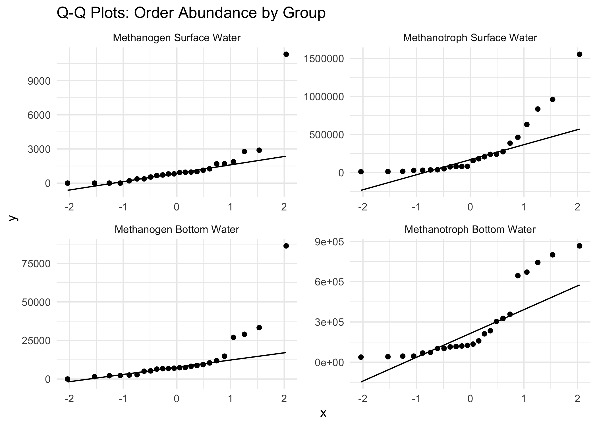<!-- -->

``` r
# lets plot density histogram by group too
ggplot(methano_water_df, aes(x = total_cells_ml, fill = group)) +
  geom_histogram(aes(y = ..density..), bins = 30, alpha = 0.5, color = "black") +
  geom_density(alpha = 0.6) +
  facet_wrap(~ group, scales = "free") +
  theme_minimal() +
  labs(title = "Histogram and Density of Order Abundance by Group",
       x = "Order Absolute Cell Abundance\n(cells per ml)",
       y = "Density") +
  theme(legend.position = "none")
```

<!-- -->

``` r
# now lets plot density histogram by further facetting by treatment
ggplot(methano_water_df, aes(x = total_cells_ml, fill = group)) +
  geom_histogram(aes(y = ..density..), bins = 30, alpha = 0.5, color = "black") +
  geom_density(alpha = 0.6) +
  facet_wrap(~ group + solar_progress, scales = "free") +
  theme_minimal() +
  labs(title = "Histogram and Density of Order Abundance by Group and Solar Progress",
       x = "Order Absolute Cell Abundance\n(cells per ml)",
       y = "Density") +
  theme(legend.position = "none")
```

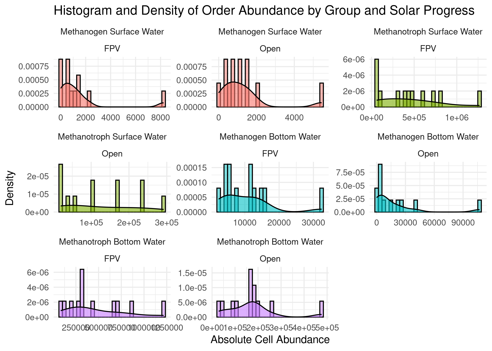<!-- -->

``` r
# shapiro test
methano_water_df %>%
  group_by(group) %>%
  summarise(
    shapiro_p = shapiro.test(total_cells_ml)$p.value,
    n = n()
  )
```

```
## # A tibble: 4 × 3
##   group                         shapiro_p     n
##   <fct>                             <dbl> <int>
## 1 Methanogen Surface Water   0.0000000754    24
## 2 Methanotroph Surface Water 0.0000159       24
## 3 Methanogen Bottom Water    0.000000408     24
## 4 Methanotroph Bottom Water  0.000135        24
```

Based on our data with the qq plots we see that the points more or less fit the line. but when we investigate further with the density histograms, the data lacks a clear unimodal distribution. Now, let's check this out further with a Shapiro-Wilk test. When we run our Shapiro-Wilk test to also test for a normal distribution if p > 0.05 the data is likely normal but if p < 0.05 then the data is not normal.

A tibble: 4 × 3
  group                         shapiro_p     n
  <fct>                             <dbl> <int>
1 Methanogen Surface Water   0.0000000754    24
2 Methanotroph Surface Water 0.0000159       24
3 Methanogen Bottom Water    0.000000408     24
4 Methanotroph Bottom Water  0.000135        24

The data is not normal! 

Therefore, we will need to use non-parametric stats to statitistically test the data. 


### Sediment - Normality 

We will be running this for all 2024 time points 

``` r
# level
methano_sed_df$solar_progress <- factor(
  methano_sed_df$solar_progress,
  levels = c("FPV", "Open"))

methano_sed_df <- methano_sed_df %>%
  mutate(group = interaction(Methanotroph_Methanogen, Depth_Class, sep = " "))


# qq plot to visualize normality
ggplot(methano_sed_df, aes(sample = order_abund)) +
  stat_qq() +
  stat_qq_line() +
  facet_wrap(~ group, scales = "free") +
  theme_minimal() +
  labs(title = "Q-Q Plots: Order Abundance by Group")
```

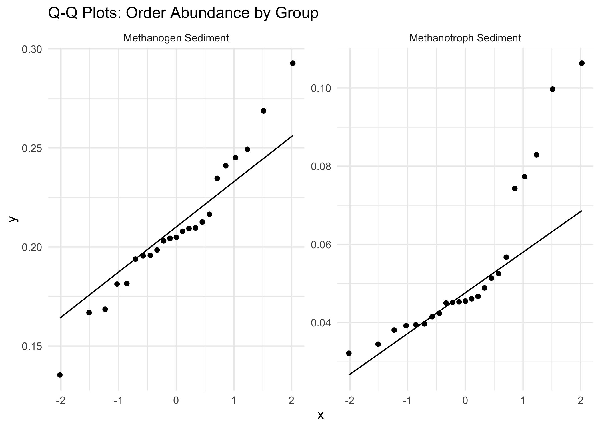<!-- -->

``` r
# lets plot density histogram by group too
ggplot(methano_sed_df, aes(x = order_abund, fill = group)) +
  geom_histogram(aes(y = ..density..), bins = 30, alpha = 0.5, color = "black") +
  geom_density(alpha = 0.6) +
  facet_wrap(~ group, scales = "free") +
  theme_minimal() +
  labs(title = "Histogram and Density of Order Rel Abundance by Group",
       x = "Order Abundance",
       y = "Density") +
  theme(legend.position = "none")
```

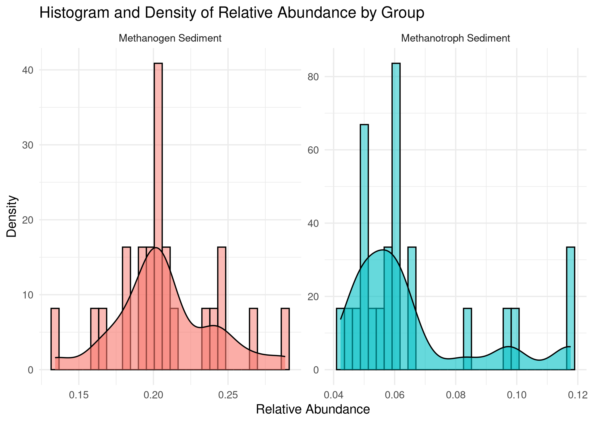<!-- -->

``` r
# now lets plot density histogram by further facetting by treatment
ggplot(methano_sed_df, aes(x = order_abund, fill = group)) +
  geom_histogram(aes(y = ..density..), bins = 30, alpha = 0.5, color = "black") +
  geom_density(alpha = 0.6) +
  facet_wrap(~ group + solar_progress, scales = "free") +
  theme_minimal() +
  labs(title = "Histogram and Density of Order Abundance by Group and Solar Progress",
       x = "Order Abundance",
       y = "Density") +
  theme(legend.position = "none")
```

<!-- -->

``` r
# shapiro test
methano_sed_df %>%
  group_by(group) %>%
  summarise(
    shapiro_p = shapiro.test(order_abund)$p.value,
    n = n()
  )
```

```
## # A tibble: 2 × 3
##   group                 shapiro_p     n
##   <fct>                     <dbl> <int>
## 1 Methanogen Sediment    0.576       23
## 2 Methanotroph Sediment  0.000296    23
```

Based on our data with the qq plots and the density histograms, data does not seem to be clearly normally distributed. Shapiro-Wilk test to also test for a normal distribution if p > 0.05 the data is likely normal but if p < 0.05 then the data is not normal.

A tibble: 2 × 3
  group                 shapiro_p     n
  <fct>                     <dbl> <int>
1 Methanogen Sediment    0.576       23
2 Methanotroph Sediment  0.000296    23

Methanotrophs are not normally distributed but but methanogens are which is interesting. but will still go with two-sample Wilcoxon tests


# Fig 2 - Abundance of Methane Cyclers

In this plot we will calculate the absolute abundance of methane cyclers in water column and the relative abundance in sediments to see methane cyclers overtime and with a box plot to show abundance as well.

There is probably a better way to do this but I individually plotted surface, bottom, sediment depths for each methanogen and methanotroph for overtime and box plots.

For the water column cell counts we will demonstrate this by thousand cells per ml

## Fig 2- Abund over Time


``` r
# water over time plot 

# 1. lets plot surface water 
# surface methanogens
methanogen_surfwater24 <- methano_water_df %>%
  dplyr::filter(Depth_Class == "Surface Water",
                Methanotroph_Methanogen == "Methanogen") %>% 
  group_by(JDate, Pond, solar_progress, total_cells_ml, Methanotroph_Methanogen) %>%
  ggplot(aes(x = JDate, y = total_cells_ml/1e3, color = solar_progress))+
  geom_line(aes(group = interaction(Pond, Methanotroph_Methanogen)), 
            alpha = 0.2) +
  geom_smooth(aes(group = solar_progress), se = FALSE) +
  geom_point(aes(shape = Pond), size = 2) +
  #ggh4x::facet_grid2(~Methanotroph_Methanogen, scales = "free_y") +
  scale_color_manual(values = solar_colors) +
  scale_shape_manual(values = pond_shapes) +
  scale_x_continuous(
    breaks = seq(180, 240, by = 20), # even ticks
    limits = c(170, 260)) +
  labs(
    x = NULL,
    y = "Surface Water\n(10³ cells/ml)"
  ) +
  theme_classic() +
  theme(
    axis.title.y = element_text(size = 8),
    legend.position = "none"
  ) +
  guides(color = "none", shape = "none")
methanogen_surfwater24
```

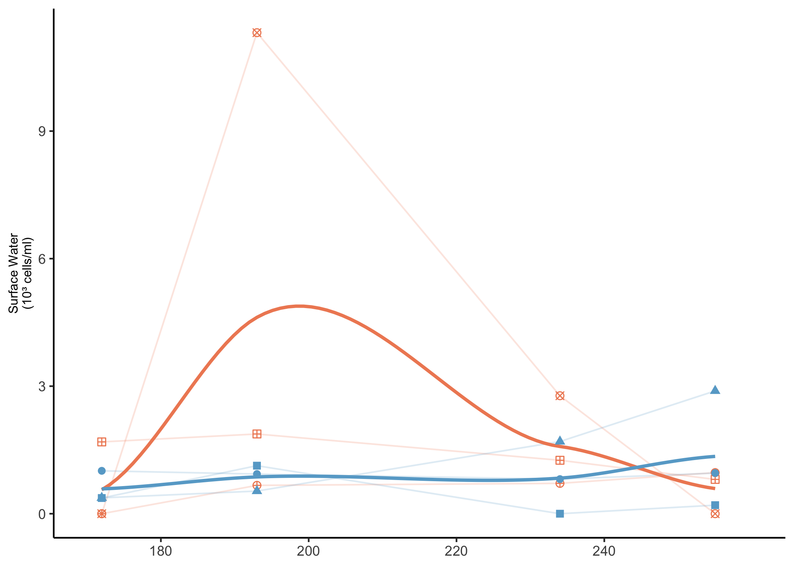<!-- -->

``` r
# surface methanotrophs
methanotrophs_surfwater24 <- methano_water_df %>%
  dplyr::filter(Depth_Class == "Surface Water",
                Methanotroph_Methanogen == "Methanotroph") %>% 
  group_by(JDate, Pond, solar_progress, total_cells_ml, Methanotroph_Methanogen) %>%
  ggplot(aes(x = JDate, y = total_cells_ml/1e3, color = solar_progress))+
  geom_line(aes(group = interaction(Pond, Methanotroph_Methanogen)), 
            alpha = 0.2) +
  geom_smooth(aes(group = solar_progress), se = FALSE) +
  geom_point(aes(shape = Pond), size = 2) +
  #ggh4x::facet_grid2(~Methanotroph_Methanogen, scales = "free_y") +
  scale_color_manual(values = solar_colors) +
  scale_shape_manual(values = pond_shapes) +
  scale_x_continuous(
    breaks = seq(180, 240, by = 20), # even ticks
    limits = c(170, 260)) +
  labs(
    x = NULL,
    y = "Surface Water\n(10³ cells/ml)"
  ) +
  theme_classic() +
  theme(
    axis.title.y = element_text(size = 8),
    legend.position = "none"
  ) +
  guides(color = "none", shape = "none")
methanotrophs_surfwater24
```

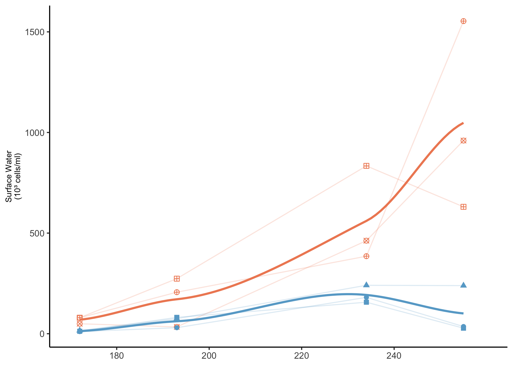<!-- -->

``` r
# now bottom water methanogens
methanogen_bot_water24 <- methano_water_df %>%
  dplyr::filter(Depth_Class == "Bottom Water", 
                Methanotroph_Methanogen == "Methanogen") %>% 
  group_by(JDate, Pond, solar_progress, total_cells_ml, Methanotroph_Methanogen) %>%
  ggplot(aes(x = JDate, y = total_cells_ml/1e3, color = solar_progress))+
  geom_line(aes(group = interaction(Pond, Methanotroph_Methanogen)), 
            alpha = 0.2) +
  geom_smooth(aes(group = solar_progress), se = FALSE) +
  geom_point(aes(shape = Pond), size = 2) +
  #ggh4x::facet_grid2(~Methanotroph_Methanogen, scales = "free_y") +
  scale_color_manual(values = solar_colors) +
  scale_shape_manual(values = pond_shapes) +
  scale_x_continuous(
    breaks = seq(180, 240, by = 20), # even ticks
    limits = c(170, 260)) +
  labs(
    x = NULL,
    y = "Bottom Water\n(10³ cells/ml)"
  ) +
  theme_classic() +
  theme(
    axis.title.y = element_text(size = 8),
    legend.position = "none"
  ) +
  guides(color = "none", shape = "none")
methanogen_bot_water24
```

<!-- -->

``` r
# bottom methanotrophs
methanotroph_bot_water24 <- methano_water_df %>%
  dplyr::filter(Depth_Class == "Bottom Water",
                Methanotroph_Methanogen == "Methanotroph") %>% 
  group_by(JDate, Pond, solar_progress, total_cells_ml, Methanotroph_Methanogen) %>%
  ggplot(aes(x = JDate, y = total_cells_ml/1e3, color = solar_progress))+
  geom_line(aes(group = interaction(Pond, Methanotroph_Methanogen)), 
            alpha = 0.2) +
  geom_smooth(aes(group = solar_progress), se = FALSE) +
  geom_point(aes(shape = Pond), size = 2) +
  #ggh4x::facet_grid2(~Methanotroph_Methanogen, scales = "free_y") +
  scale_color_manual(values = solar_colors) +
  scale_shape_manual(values = pond_shapes) +
  scale_x_continuous(
    breaks = seq(180, 240, by = 20), # even ticks
    limits = c(170, 260)) +
  labs(
    x = NULL,
    y = "Bottom Water\n(10³ cells/ml)"
  ) +
  theme_classic() +
  theme(
    axis.title.y = element_text(size = 8),
    legend.position = "none"
  ) +
  guides(color = "none", shape = "none")
methanotroph_bot_water24
```

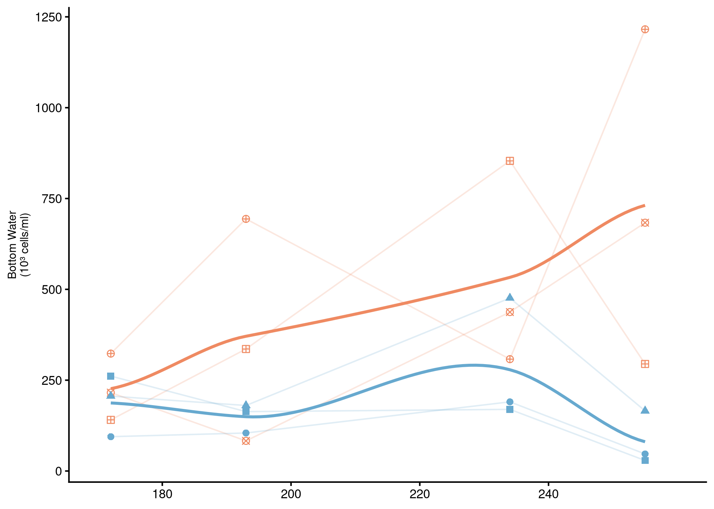<!-- -->

``` r
# sediment methanogens 
methano_sed_24 <- methano_sed_df %>%
  filter(Depth_Class == "Sediment",
         Methanotroph_Methanogen == "Methanogen") %>%
  group_by(JDate, order_abund, Pond, solar_progress, Methanotroph_Methanogen) %>%
  ggplot(aes(x = JDate, y = order_abund, color = solar_progress)) +
  geom_line(aes(group = interaction(Pond, Methanotroph_Methanogen)), 
            alpha = 0.2) +
  geom_smooth(aes(group = solar_progress), se = FALSE) +
  geom_point(aes(shape = Pond), size = 2) +
  #ggh4x::facet_grid2(.~Methanotroph_Methanogen, scales = "free_y") +
  scale_color_manual(values = solar_colors) +
  scale_shape_manual(values = pond_shapes) +
  scale_x_continuous(
    breaks = seq(180, 240, by = 20), # even ticks
    limits = c(170, 260)) +
  labs(
    x = "Day of Year",
    y = "Sediment\nRelative Abundance (%)"
  ) +
  theme_classic() +
  theme(
    axis.title.y = element_text(size = 8),
    legend.position = "none"
  ) +
  guides(color = "none", shape = "none")
methano_sed_24
```

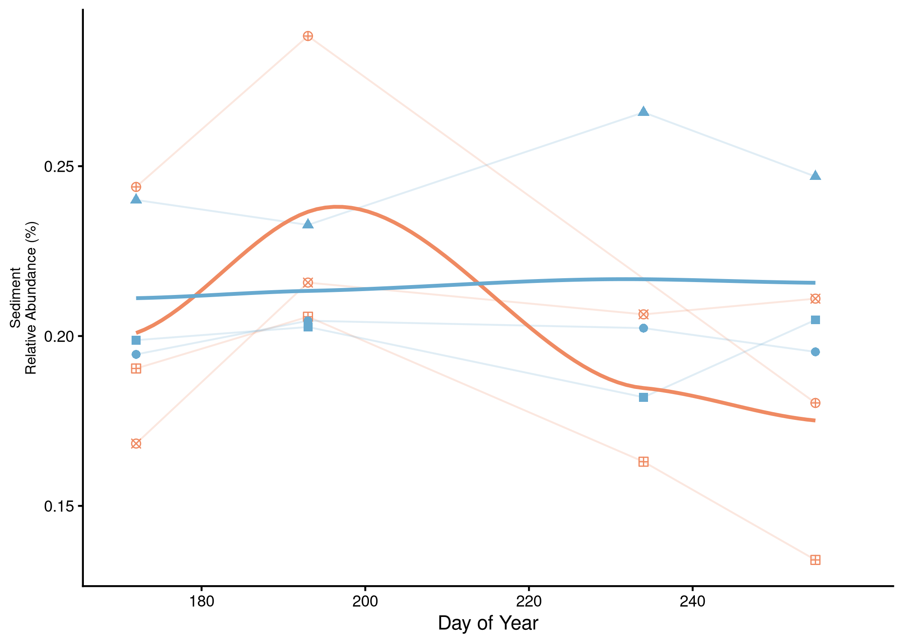<!-- -->

``` r
# sediment methanotroph 
methanotroph_sed_24 <- methano_sed_df %>%
  filter(Depth_Class == "Sediment",
         Methanotroph_Methanogen == "Methanotroph") %>%
  # group_by(JDate, order_abund, Pond, solar_progress, Methanotroph_Methanogen) %>%
  ggplot(aes(x = JDate, y = order_abund, color = solar_progress)) +
  geom_line(aes(group = interaction(Pond, Methanotroph_Methanogen)), 
            alpha = 0.2) +
  geom_smooth(aes(group = solar_progress), se = FALSE) +
  geom_point(aes(shape = Pond), size = 2) +
  #ggh4x::facet_grid2(.~Methanotroph_Methanogen, scales = "free_y") +
  scale_color_manual(values = solar_colors) +
  scale_shape_manual(values = pond_shapes) +
  scale_x_continuous(
  breaks = seq(180, 240, by = 20),
  limits = c(170, 260)
) +
  labs(
    x = "Day of Year",
    y = "Sediment\nRelative Abundance (%)"
  ) +
  theme_classic() +
  theme(
    axis.title.y = element_text(size = 8),
    legend.position = "none"
  ) +
  guides(color = "none", shape = "none")
methanotroph_sed_24
```

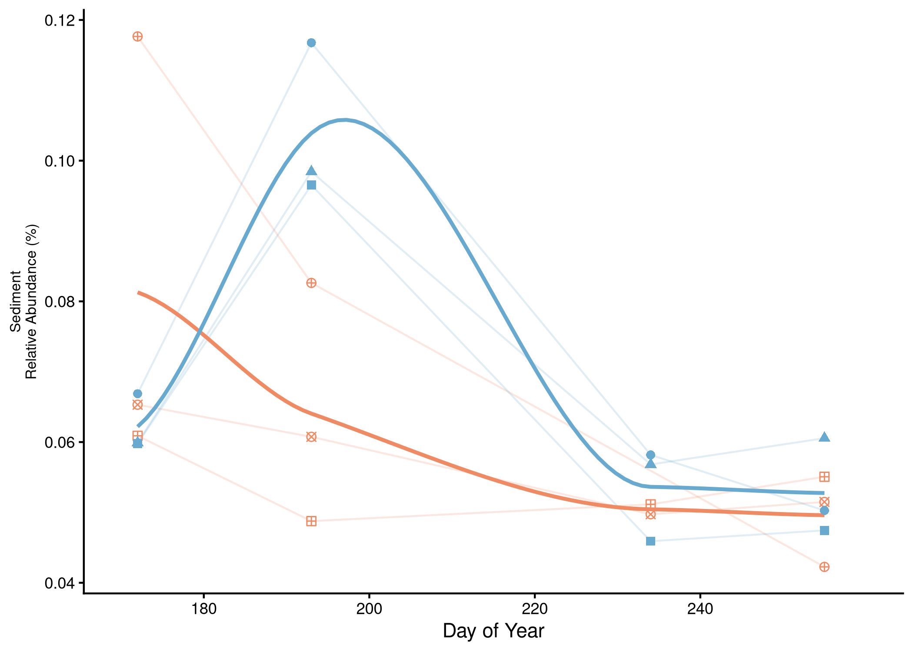<!-- -->

``` r
# quick plot methanogens
methanogen_surfwater24 / methanogen_bot_water24 / methano_sed_24
```

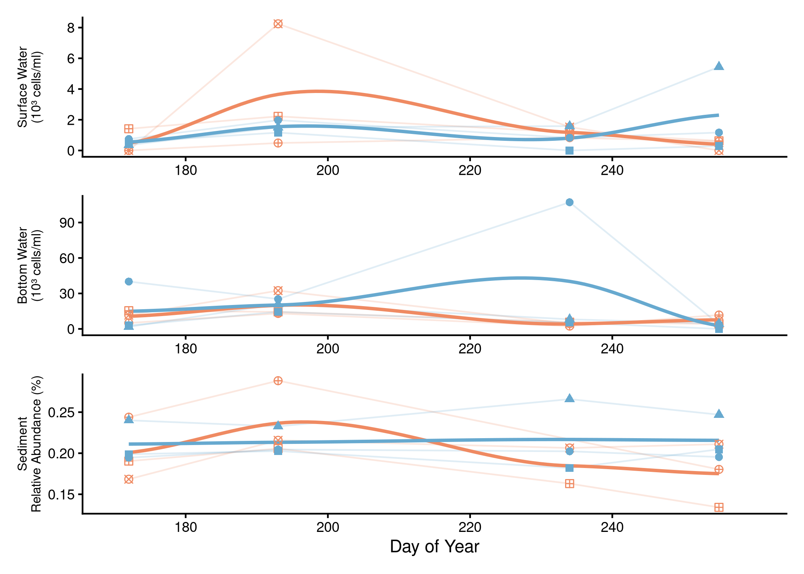<!-- -->

``` r
# quick plot methanotrophs
methanotrophs_surfwater24 / methanotroph_bot_water24 / methanotroph_sed_24
```

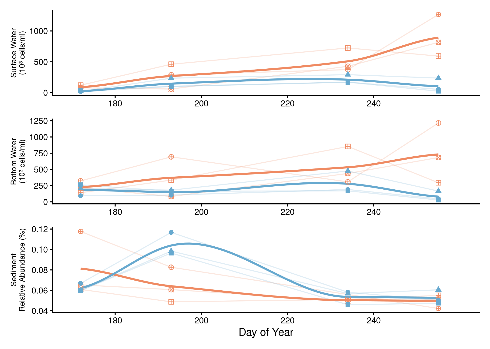<!-- -->


## Fig 2: Boxplots of Abundance


``` r
# box plots by depth and methane cycler

# 1. calculate pvalue for water column all together
stat.test <- methano_water_df %>% 
  group_by(Methanotroph_Methanogen, Depth_Class) %>% 
  wilcox_test(total_cells_ml ~ solar_progress, 
              p.adjust.method = "fdr",
              exact = FALSE) %>% 
  add_significance() %>% 
  mutate(
    group = interaction(Methanotroph_Methanogen, Depth_Class, sep = " "),
    y.position = 0.35,
    p.label = signif(p, digits = 2))
stat.test
```

```
## # A tibble: 4 × 13
##   Methanotroph_Methanogen Depth_Class   .y.            group1 group2    n1    n2 statistic       p p.signif group                      y.position p.label
##   <chr>                   <fct>         <chr>          <chr>  <chr>  <int> <int>     <dbl>   <dbl> <chr>    <fct>                           <dbl>   <dbl>
## 1 Methanogen              Surface Water total_cells_ml FPV    Open      12    12      78.5 0.728   ns       Methanogen Surface Water         0.35  0.73  
## 2 Methanogen              Bottom Water  total_cells_ml FPV    Open      12    12      80   0.665   ns       Methanogen Bottom Water          0.35  0.66  
## 3 Methanotroph            Surface Water total_cells_ml FPV    Open      12    12     119   0.00726 **       Methanotroph Surface Water       0.35  0.0073
## 4 Methanotroph            Bottom Water  total_cells_ml FPV    Open      12    12     116   0.012   *        Methanotroph Bottom Water        0.35  0.012
```

``` r
# A. filter for methanogen surface water
stat_gen_surf <- stat.test %>%
  filter(Methanotroph_Methanogen == "Methanogen",
         Depth_Class == "Surface Water")

# surface methanogen
box_gen_surf <- methano_water_df %>% 
  dplyr::filter(Depth_Class == "Surface Water",
                Methanotroph_Methanogen == "Methanogen") %>% 
  ggplot(aes(x = solar_progress, y = total_cells_ml/1e3, color = solar_progress)) +
  geom_boxplot(outlier.shape = NA, alpha = 0.2, color = "black", position = position_dodge(0.6)) + 
  geom_point(aes(shape = Pond),
             alpha =2,
             position = position_jitterdodge(jitter.width = .1, dodge.width = .3),
             size = 3) +
  # ggh4x::facet_nested(~ solar_progress,
  #                     scales = "free") +
  #scale_fill_manual(values = c("FPV" = "#C07A5B", "Open" = "#76A7CB")) +
  scale_color_manual(values = c("FPV" = "#C07A5B", "Open" = "#76A7CB")) +
  scale_shape_manual(values = pond_shapes) +
  # stat_pvalue_manual( # p = 0.73
  #   stat_gen_surf,
  #   label = "p.label",
  #   y.position = 9.5,
  #   tip.length = 0,
  #   bracket.size = 0,
  #   size = 3
  # ) +
  theme_classic() +
  theme(
    axis.title.x = element_blank(),
    axis.title.y = element_blank(),
    axis.line.y = element_blank(),
    axis.text.y = element_blank(),
    axis.ticks.y = element_blank(),
    legend.position = "none"
  )
box_gen_surf
```

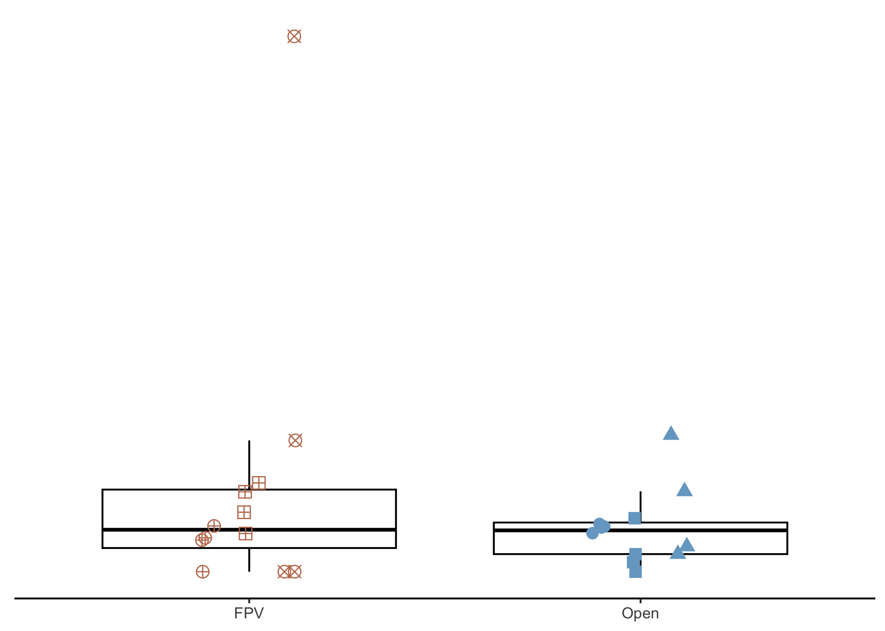<!-- -->

``` r
## What are some states of sediment methanotrophs abundance? 
methano_water_df %>% 
  dplyr::filter(Methanotroph_Methanogen == "Methanotroph") %>%
  group_by(solar_progress, Depth_Class) %>%
  summarize(avg_wat_methanotroph = mean(total_cells_ml), 
            median_wat_methanotroph = median(total_cells_ml),
            max_wat_methanotroph = max(total_cells_ml),
            min_wat_methanotroph = min(total_cells_ml))
```

```
## # A tibble: 4 × 6
## # Groups:   solar_progress [2]
##   solar_progress Depth_Class   avg_wat_methanotroph median_wat_methanotroph max_wat_methanotroph min_wat_methanotroph
##   <fct>          <fct>                        <dbl>                   <dbl>                <dbl>                <dbl>
## 1 FPV            Surface Water              462304.                 329430.              1553470                33773
## 2 FPV            Bottom Water               417710                  330585                866687                37554
## 3 Open           Surface Water               92066.                  55224                240653                10523
## 4 Open           Bottom Water               119127.                 107987                326258                41047
```

``` r
methano_water_df %>% 
  dplyr::filter(Methanotroph_Methanogen == "Methanotroph") %>%
  # Now just subset for the Sept timepoint 
  dplyr::filter(JDate == 255) %>%
  group_by(solar_progress, Depth_Class) %>%
  summarize(avg_wat_methanotroph = mean(total_cells_ml), 
            median_wat_methanotroph = median(total_cells_ml),
            max_wat_methanotroph = max(total_cells_ml),
            min_wat_methanotroph = min(total_cells_ml))
```

```
## # A tibble: 4 × 6
## # Groups:   solar_progress [2]
##   solar_progress Depth_Class   avg_wat_methanotroph median_wat_methanotroph max_wat_methanotroph min_wat_methanotroph
##   <fct>          <fct>                        <dbl>                   <dbl>                <dbl>                <dbl>
## 1 FPV            Surface Water             1047971.                  959884              1553470               630558
## 2 FPV            Bottom Water               803348.                  800227               866687               743131
## 3 Open           Surface Water              100779.                   35725               239085                27528
## 4 Open           Bottom Water                70352.                   45090               124920                41047
```

``` r
# B. filter for methanotroph surface water
stat_troph_surf <- stat.test %>%
  filter(Methanotroph_Methanogen == "Methanotroph",
         Depth_Class == "Surface Water")

# surface methanotroph
box_troph_surf <- methano_water_df %>% 
  dplyr::filter(Depth_Class == "Surface Water",
                Methanotroph_Methanogen == "Methanotroph") %>% 
  ggplot(aes(x = solar_progress, y = total_cells_ml/1e3, color = solar_progress)) +
  geom_boxplot(outlier.shape = NA, alpha = 0.2, color = "black", position = position_dodge(0.6)) +  
  geom_point(aes(shape = Pond),
             alpha = 2,
             position = position_jitterdodge(jitter.width = .1, dodge.width = .3),
             size = 3) +
  # ggh4x::facet_nested(~ solar_progress,
  #                     scales = "free") +
  #scale_fill_manual(values = c("FPV" = "#C07A5B", "Open" = "#76A7CB")) +
  scale_color_manual(values = c("FPV" = "#C07A5B", "Open" = "#76A7CB")) +
  scale_shape_manual(values = pond_shapes) +
  # stat_pvalue_manual( # p = 0.0073
  #   stat_troph_surf,
  #   label = "p.label",
  #   y.position = 1.5,  # or set a fixed numeric if you prefer
  #   tip.length = 0,
  #   bracket.size = 0,
  #   size = 2
  # ) +
  # guides(
  #   fill = "none",
  #   color = "none",
  #   shape = guide_legend(
  #     nrow = 2,
  #     byrow = TRUE,
  #     title.position = "left",
  #     override.aes = list(size = 2.5))
  # ) +
  theme_classic() +
  theme(
    axis.title.x = element_blank(),
    axis.title.y = element_blank(),
    axis.line.y = element_blank(),
    axis.text.y = element_blank(),
    axis.ticks.y = element_blank(),
    legend.position = "none"
  )
box_troph_surf
```

<!-- -->

``` r
# B. filter for methanogen bottom water
stat_gen_bot <- stat.test %>%
  filter(Methanotroph_Methanogen == "Methanogen",
         Depth_Class == "Bottom Water")
# bottom methanogen
box_gen_bot <- methano_water_df %>% 
  dplyr::filter(Depth_Class == "Bottom Water",
                Methanotroph_Methanogen == "Methanogen") %>% 
  ggplot(aes(x = solar_progress, y = total_cells_ml/1e3, color = solar_progress)) +
  geom_boxplot(outlier.shape = NA, alpha = 0.2, color = "black", position = position_dodge(0.6)) + 
  geom_point(aes(shape = Pond),
             alpha = 2,
             position = position_jitterdodge(jitter.width = .1, dodge.width = .3),
             size = 3) +
  # ggh4x::facet_nested(~ solar_progress,
  #                     scales = "free") +
  #scale_fill_manual(values = c("FPV" = "#C07A5B", "Open" = "#76A7CB")) +
  scale_color_manual(values = c("FPV" = "#C07A5B", "Open" = "#76A7CB")) +
  scale_shape_manual(values = pond_shapes) +
  # stat_pvalue_manual( # p = 0.66
  #   stat_gen_bot,
  #   label = "p.label",
  #   tip.length = 0,
  #   y.position = .095,
  #   size = 2,
  #   bracket.size = 0,
  #   inherit.aes = FALSE
  # ) +
  # guides(
  #   fill = "none",
  #   color = "none",
  #   shape = guide_legend(
  #     nrow = 2,
  #     byrow = TRUE,
  #     title.position = "left",
  #     override.aes = list(size = 2.5))
  # ) +
  theme_classic() +
  theme(
    axis.title.x = element_blank(),
    axis.title.y = element_blank(),
    axis.line.y = element_blank(),
    axis.text.y = element_blank(),
    axis.ticks.y = element_blank(),
    legend.position = "none"
  )
box_gen_bot
```

<!-- -->

``` r
# C. filter for methanotroph bottom water
stat_troph_bot <- stat.test %>%
  filter(Methanotroph_Methanogen == "Methanotroph",
         Depth_Class == "Bottom Water")

# bottom methanotrophs
box_troph_bot <- methano_water_df %>% 
  dplyr::filter(Depth_Class == "Bottom Water",
                Methanotroph_Methanogen == "Methanotroph") %>% 
  ggplot(aes(x = solar_progress, y = total_cells_ml/1e3, color = solar_progress)) +
  geom_boxplot(outlier.shape = NA, alpha = 0.2, color = "black", position = position_dodge(0.6)) +  
  geom_point(aes(shape = Pond),
             alpha = 2,
             position = position_jitterdodge(jitter.width = .1, dodge.width = .3),
             size = 3) +
  # ggh4x::facet_nested(~ solar_progress,
  #                     scales = "free") +
  #scale_fill_manual(values = c("FPV" = "#C07A5B", "Open" = "#76A7CB")) +
  scale_color_manual(values = c("FPV" = "#C07A5B", "Open" = "#76A7CB")) +
  scale_shape_manual(values = pond_shapes) +
  # stat_pvalue_manual( # p = 0.012
  #   stat_troph_bot,
  #   label = "p.label",
  #   y.position = 0.75,
  #   tip.length = 0,
  #   size = 2,
  #   bracket.size = 0,
  #   inherit.aes = FALSE
  # ) +
  # guides(
  #   fill = "none",
  #   color = "none",
  #   shape = guide_legend(
  #     nrow = 2,
  #     byrow = TRUE,
  #     title.position = "left",
  #     override.aes = list(size = 2.5))
  # ) +
  theme_classic() +
  theme(
    axis.title.x = element_blank(),
    axis.title.y = element_blank(),
    axis.line.y = element_blank(),
    axis.text.y = element_blank(),
    axis.ticks.y = element_blank(),
    legend.position = "none"
  )
box_troph_bot
```

<!-- -->

``` r
# 2. calculate pvalue for sediment
stat.test <- methano_sed_df %>% 
  group_by(Methanotroph_Methanogen, Depth_Class) %>% 
  wilcox_test(order_abund ~ solar_progress, 
              p.adjust.method = "fdr",
              exact = FALSE) %>% 
  add_significance() %>% 
  mutate(
    group = interaction(Methanotroph_Methanogen, Depth_Class, sep = " "),
    y.position = 0.35,
    p.label = signif(p, digits = 2))
stat.test
```

```
## # A tibble: 2 × 13
##   Depth_Class Methanotroph_Methanogen .y.         group1 group2    n1    n2 statistic     p p.signif group                 y.position p.label
##   <chr>       <chr>                   <chr>       <chr>  <chr>  <int> <int>     <dbl> <dbl> <chr>    <fct>                      <dbl>   <dbl>
## 1 Sediment    Methanogen              order_abund FPV    Open      11    12        54 0.479 ns       Methanogen Sediment         0.35    0.48
## 2 Sediment    Methanotroph            order_abund FPV    Open      11    12        60 0.735 ns       Methanotroph Sediment       0.35    0.74
```

``` r
# D. calculate stats for sediment methanogen
stat_gen_sed <- stat.test %>%
  filter(Methanotroph_Methanogen == "Methanogen",
         Depth_Class == "Sediment")

############# SEDIMENT METHANOGENS 
## What are some states of sediment methanogen abundance? 
methano_sed_df %>% 
  dplyr::filter(Methanotroph_Methanogen == "Methanogen") %>%
  group_by(solar_progress) %>%
  summarize(avg_sed_methanogen = mean(order_abund), 
            median_sed_methanogen = median(order_abund),
            max_sed_methanogen = max(order_abund),
            min_sed_methanogen = min(order_abund))
```

```
## # A tibble: 2 × 5
##   solar_progress avg_sed_methanogen median_sed_methanogen max_sed_methanogen min_sed_methanogen
##   <fct>                       <dbl>                 <dbl>              <dbl>              <dbl>
## 1 FPV                         0.203                 0.208              0.293              0.135
## 2 Open                        0.216                 0.205              0.269              0.181
```

``` r
# BOXPLOTS: sediment methanogen
box_gen_sed <- methano_sed_df %>% 
  dplyr::filter(Methanotroph_Methanogen == "Methanogen") %>% 
  ggplot(aes(x = solar_progress, y = order_abund, color = solar_progress)) +
  geom_boxplot(outlier.shape = NA, alpha = 0.2, color = "black", position = position_dodge(0.6)) +  
  geom_point(aes(shape = Pond),
             alpha = 2,
             position = position_jitterdodge(jitter.width = .1, dodge.width = .3),
             size = 3) +
  scale_color_manual(values = c("FPV" = "#C07A5B", "Open" = "#76A7CB")) +
  scale_shape_manual(values = pond_shapes) +
  # stat_pvalue_manual( # p = 0.48
  #   stat_gen_sed,
  #   label = "p.label",
  #   y.position = 0.3,
  #   tip.length = 0,
  #   bracket.size = 0,
  #   size = 2
  # ) +
  # guides(
  #   fill = "none",
  #   color = "none",
  #   shape = guide_legend(
  #     nrow = 2,
  #     byrow = TRUE,
  #     title.position = "left",
  #     override.aes = list(size = 2.5))
  # ) +
  theme_classic() +
  theme(
    axis.title.x = element_blank(),
    axis.title.y = element_blank(),
    axis.line.y = element_blank(),
    axis.text.y = element_blank(),
    axis.ticks.y = element_blank(),
    legend.position = "none"
  )
box_gen_sed
```

<!-- -->

``` r
# E. calculate stats for sediment methanotroph
stat_troph_sed <- stat.test %>%
  filter(Methanotroph_Methanogen == "Methanotroph",
         Depth_Class == "Sediment")

############# SEDIMENT METHANOTROPHS
## What are some states of sediment methanotrophs abundance? 
methano_sed_df %>% 
  dplyr::filter(Methanotroph_Methanogen == "Methanotroph") %>%
  group_by(solar_progress) %>%
  summarize(avg_sed_methanotroph = mean(order_abund), 
            median_sed_methanotroph = median(order_abund),
            max_sed_methanotroph = max(order_abund),
            min_sed_methanotroph = min(order_abund))
```

```
## # A tibble: 2 × 5
##   solar_progress avg_sed_methanotroph median_sed_methanotroph max_sed_methanotroph min_sed_methanotroph
##   <fct>                         <dbl>                   <dbl>                <dbl>                <dbl>
## 1 FPV                          0.0523                  0.0452               0.106                0.0345
## 2 Open                         0.0546                  0.0458               0.0997               0.0322
```

``` r
# BOXPLOTS: sediment methanotrophs
box_troph_sed <- methano_sed_df %>% 
  dplyr::filter(Methanotroph_Methanogen == "Methanotroph") %>% 
  ggplot(aes(x = solar_progress, y = order_abund, color = solar_progress)) +
  geom_boxplot(outlier.shape = NA, alpha = 0.2, color = "black", position = position_dodge(0.6)) +  
  geom_point(aes(shape = Pond),
             alpha = 2,
             position = position_jitterdodge(jitter.width = .1, dodge.width = .3),
             size = 3) +
  scale_color_manual(values = c("FPV" = "#C07A5B", "Open" = "#76A7CB")) +
  scale_shape_manual(values = pond_shapes) +
  # stat_pvalue_manual( # p = 0.74
  #   stat_troph_sed,
  #   label = "p.label",
  #   y.position = .11,
  #   tip.length = 0,
  #   size = 2,
  #   bracket.size = 0,
  #   inherit.aes = FALSE
  # ) +
  # guides(
  #   fill = "none",
  #   color = "none",
  #   shape = guide_legend(
  #     nrow = 2,
  #     byrow = TRUE,
  #     title.position = "left",
  #     override.aes = list(size = 2.5))
  # ) +
  theme_classic() +
  theme(
    axis.title.x = element_blank(),
    axis.title.y = element_blank(),
    axis.line.y = element_blank(),
    axis.text.y = element_blank(),
    axis.ticks.y = element_blank(),
    legend.position = "none"
  )
box_troph_sed
```

<!-- -->

``` r
# extract legend 
legend_plot <- methano_sed_df %>% # dummy plot 
  dplyr::filter(Methanotroph_Methanogen == "Methanotroph") %>% 
  ggplot(aes(x = solar_progress, y = order_abund, color = solar_progress)) +
  geom_boxplot(outlier.shape = NA, alpha = 0.2, position = position_dodge(0.6)) +  
  geom_point(aes(shape = Pond),
             alpha = 2,
             position = position_jitterdodge(jitter.width = .1, dodge.width = .3),
             size = 2) +
  # ggh4x::facet_nested(~ solar_progress,
  #                     scales = "free") +
  #scale_fill_manual(values = c("FPV" = "#C07A5B", "Open" = "#76A7CB")) +
  scale_color_manual(values = c("FPV" = "#C07A5B", "Open" = "#76A7CB")) +
  scale_shape_manual(values = pond_shapes) +
  # stat_pvalue_manual(
  #   stat_troph_sed,
  #   label = "p.label",
  #   y.position = .11,
  #   tip.length = 0,
  #   size = 2,
  #   bracket.size = 0,
  #   inherit.aes = FALSE
  # ) +
  guides(
    fill = "none",
    color = "none",
    shape = guide_legend(
      nrow = 2,
      byrow = TRUE,
      title.position = "left",
      override.aes = list(size = 2.5))
  ) +
  theme_classic() +
  theme(
    legend.position = "bottom",
    legend.title = element_text(hjust = 0.5),
    legend.box = "horizontal",
    legend.justification = "center"
  )
legend_plot
```

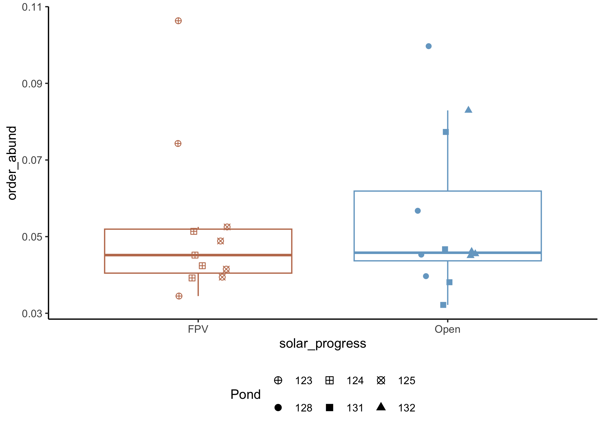<!-- -->

``` r
legend_only <- ggpubr::get_legend(legend_plot) # extract legend

# now we will need to add it to sediments to plot legend only wont plot by itself
sed_depths_leg <- ggarrange(methano_sed_24, box_gen_sed, methanotroph_sed_24, box_troph_sed,
            ncol = 2,
            nrow = 3,
            legend_only,
            align = "hv"
)

# Display
sed_depths_leg
```

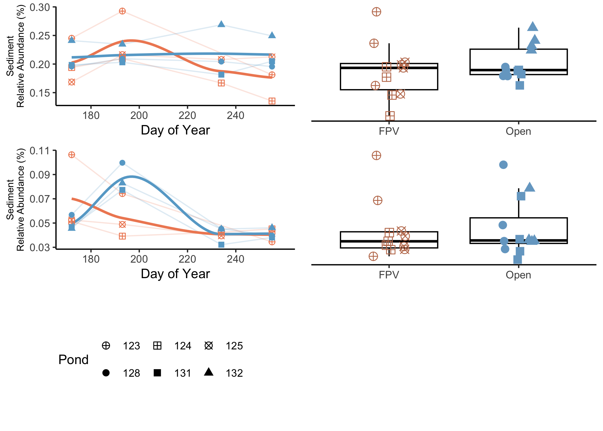<!-- -->

``` r
# or lets try two (technically 4 columns) where on the left we have methanogens and right is methanotrophs. they will still be going from surface, bottom, sediments with box plot on the right but we will have a box around methanogens and methanotrophs


# 1. plot final methanogens
methanogen_final <- 
  ggarrange(methanogen_surfwater24, box_gen_surf, 
            methanogen_bot_water24, box_gen_bot,
            methano_sed_24, box_gen_sed,
  nrow = 3, 
  ncol = 2,
  align = "hv",
  labels = c("A.", "B.", "C.", "D.", "E.", "F."),
  font.label = list(size =10),
  widths = c(1, .5))
methanogen_final
```

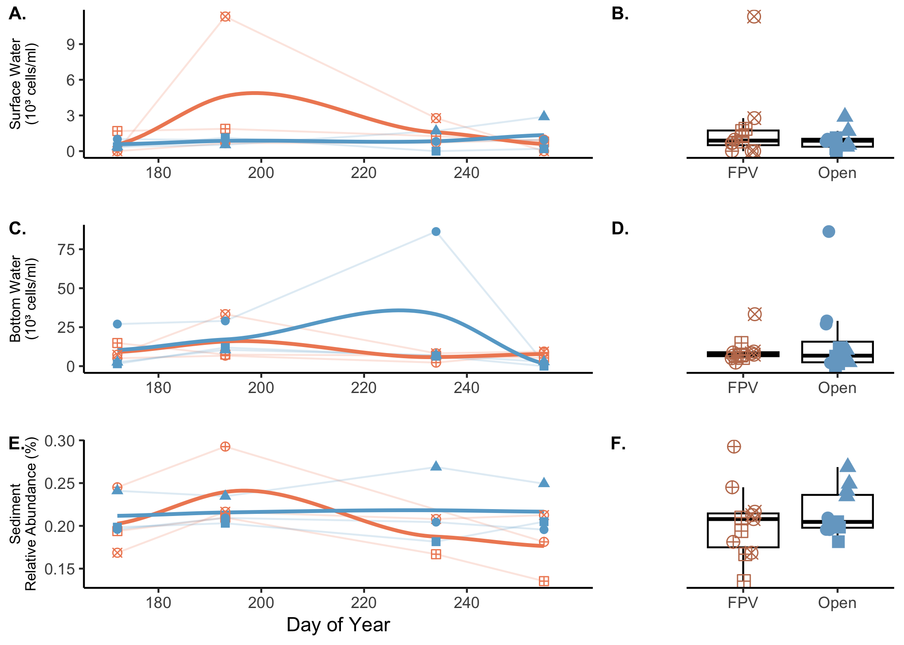<!-- -->

``` r
# want to add space for title in methanogen plot
space <- nullGrob()

# now plot with extra space
methanogen_final <- ggarrange(
  space, 
  methanogen_final, 
  ncol = 1,
  heights = c(0.1, 1)  
)

# 2. draw box around methanogens
png("figures/Fig_2/methanogens.png", width = 4000, height = 4000, res = 600)

grid.newpage()
grid.draw(methanogen_final)
grid.rect(gp = gpar(col = "black", fill = NA, lwd = 2))  # draw border
grid.text(label = "Methanogens", x = 0.5, y = 0.99, just = c("center", "top"),
          gp = gpar(fontface = "bold", cex = .9))

dev.off()
```

```
## quartz_off_screen 
##                 2
```

``` r
# 1. plot final methanotrophs
methanotroph_final <- 
  ggarrange(methanotrophs_surfwater24, box_troph_surf, 
            methanotroph_bot_water24, box_troph_bot,
            methanotroph_sed_24, box_troph_sed,
  nrow = 3, 
  ncol = 2,
  align = "hv",
  labels = c("G.", "H.", "I.", "J.", "K.", "L."),
  font.label = list(size =10),
  widths = c(1, .5))
methanotroph_final
```

<!-- -->

``` r
# want to add space for title in methanogen plot
space <- nullGrob()

# now plot with extra space
methanotroph_final <- ggarrange(
  space, 
  methanotroph_final, 
  ncol = 1,
  heights = c(0.09, 1)  
)
methanotroph_final
```

<!-- -->

``` r
# 2. draw box around methanogens
png("figures/Fig_2/methanotrophs.png", width = 4000, height = 4000, res = 600)

grid.newpage()
grid.draw(methanotroph_final)
grid.rect(gp = gpar(col = "black", fill = NA, lwd = 2))  # draw border
grid.text(label = "Methanotrophs", x = 0.5, y = 0.99, just = c("center", "top"),
          gp = gpar(fontface = "bold", cex = .9))

dev.off()
```

```
## quartz_off_screen 
##                 2
```

``` r
# then i was planning on exporting these images and putting them together in Illustrator
```
now we have created our main text figure. the only thing is that i dont have the p values in the figure because nick has his italicized and sized a certain way and i want to make sure our plot aesthetics match.


# Supplemental Figures
Here are the supplemental figures (and bonus figures) for the manuscript. 

# Figure 3

## Fig 3: PERMANOVA

PERMANOVA (Permutational Multivariate Analysis of Variance) is a non-parametric, permutation-based test used to compare groups of objects based on a distance matrix. The goal is to test the null hypothesis that the centroids and dispersion of groups are equivalent in the space defined by the dissimilarity measure. 


``` r
#### WATER COLUMN: All methane cyclers
# calculate Bray-Curtis PERMANOVA using phyloseq distance
water_bray <- 
  phyloseq::distance(water_ch4_physeq, method = "bray", binary = FALSE)

# pull out metadata 
water_metadata <- 
  water_ch4_physeq %>%
  sample_data() %>%
  data.frame()


#### SEDIMENT: All methane cyclers
# calculate Bray-Curtis PERMANOVA using phyloseq distance
sed_bray <- 
  phyloseq::distance(scaled_sed_physeq, method = "bray", binary = FALSE)

# pull out metadata 
sed_metadata <- 
  scaled_sed_physeq %>%
  sample_data() %>%
  data.frame()
```


### Water 

Here we are performing a PERMANOVA on the water column methane cyclers throughout the entire sampling season.


``` r
# Permutational Multivariate Analysis of Variance Using Distance Matrices
# aka PERMANOVA using the adonis2 function from vegan 

#1. Test the individual terms for significance
# Testing if the centroids of solar progress are different: significant p = 0.001 ***
adonis2(water_bray ~ solar_progress, data = water_metadata, by = "terms")
```

```
## Permutation test for adonis under reduced model
## Terms added sequentially (first to last)
## Permutation: free
## Number of permutations: 999
## 
## adonis2(formula = water_bray ~ solar_progress, data = water_metadata, by = "terms")
##                Df SumOfSqs      R2      F Pr(>F)    
## solar_progress  1   1.6888 0.11381 5.9075  0.001 ***
## Residual       46  13.1499 0.88619                  
## Total          47  14.8386 1.00000                  
## ---
## Signif. codes:  0 '***' 0.001 '**' 0.01 '*' 0.05 '.' 0.1 ' ' 1
```

``` r
# Now testing to see if centroids of depth_class are different: not significant p = 0.19
adonis2(water_bray ~ Depth_Class, data = water_metadata, by = "terms")
```

```
## Permutation test for adonis under reduced model
## Terms added sequentially (first to last)
## Permutation: free
## Number of permutations: 999
## 
## adonis2(formula = water_bray ~ Depth_Class, data = water_metadata, by = "terms")
##             Df SumOfSqs      R2      F Pr(>F)
## Depth_Class  1   0.3952 0.02663 1.2587   0.19
## Residual    46  14.4434 0.97337              
## Total       47  14.8386 1.00000
```

``` r
# Does pond matter? significant p = 0.001 ***
adonis2(water_bray ~ Pond, data = water_metadata, by = "terms")
```

```
## Permutation test for adonis under reduced model
## Terms added sequentially (first to last)
## Permutation: free
## Number of permutations: 999
## 
## adonis2(formula = water_bray ~ Pond, data = water_metadata, by = "terms")
##          Df SumOfSqs      R2      F Pr(>F)    
## Pond      5   3.6703 0.24735 2.7605  0.001 ***
## Residual 42  11.1684 0.75265                  
## Total    47  14.8386 1.00000                  
## ---
## Signif. codes:  0 '***' 0.001 '**' 0.01 '*' 0.05 '.' 0.1 ' ' 1
```

``` r
# Does date matter? significant p = 0.001 ***
adonis2(water_bray ~ JDate, data = water_metadata, by = "terms")
```

```
## Permutation test for adonis under reduced model
## Terms added sequentially (first to last)
## Permutation: free
## Number of permutations: 999
## 
## adonis2(formula = water_bray ~ JDate, data = water_metadata, by = "terms")
##          Df SumOfSqs      R2      F Pr(>F)    
## JDate     1   1.4244 0.09599 4.8844  0.001 ***
## Residual 46  13.4143 0.90401                  
## Total    47  14.8386 1.00000                  
## ---
## Signif. codes:  0 '***' 0.001 '**' 0.01 '*' 0.05 '.' 0.1 ' ' 1
```

``` r
#2. Test the terms together
# Now lets see the effect of each pond by date_collected and solar progress
water_permanova <- adonis2(water_bray ~ solar_progress * Pond * JDate, data = water_metadata, by = "terms"); water_permanova
```

```
## Permutation test for adonis under reduced model
## Terms added sequentially (first to last)
## Permutation: free
## Number of permutations: 999
## 
## adonis2(formula = water_bray ~ solar_progress * Pond * JDate, data = water_metadata, by = "terms")
##                      Df SumOfSqs      R2      F Pr(>F)    
## solar_progress        1   1.6888 0.11381 8.2023  0.001 ***
## Pond                  4   1.9815 0.13354 2.4061  0.001 ***
## JDate                 1   1.4244 0.09599 6.9181  0.001 ***
## solar_progress:JDate  1   1.1339 0.07641 5.5072  0.001 ***
## Pond:JDate            4   1.1982 0.08075 1.4549  0.034 *  
## Residual             36   7.4120 0.49950                  
## Total                47  14.8386 1.00000                  
## ---
## Signif. codes:  0 '***' 0.001 '**' 0.01 '*' 0.05 '.' 0.1 ' ' 1
```
With our PERMANOVA we find that treatment (solar_progress), day of year sampled (JDate - Julian date), and Pond is significant but depth class alone is not.

When we create a model with treatment, pond, and date these are all significant (p < 0.001 ***). 
- Solar progress is responsible for explaining  11.4% of variance and has a strong structuring effect on the water column community composition. This has the highest F value meaning that the between group differences are larger than within group variance (F = 8.2)

- Pond is also significant explains 12.4% of variance but is weaker than treatment (solar_progress) (F = 2.4). Even though it explains more variation than treatment, there is more variation in ponds than between ponds. 

- Date (JDate) is also strong and explains 9.6% of variance and is also weighted heavier (F = 6.9). The temporal effect is seen in the first axis as time progresses throughout the season.

- The interaction between treatment and date explains 7.6% of variance and is an important but moderate factor in its effect size for structuring community (F = 5.5)

However, the interaction of pond and date explains 8.1% of variance but is not the most important for explaining the variance in our water column methane cyclers (F = 1.5, p = 0.031 *)

Together the PERMANOVA explains only about half the variance seen with 50.05% remaining

### Sediments 
Here we are performing a PERMANOVA on the sediment methane cyclers throughout the entire sampling season

``` r
# Permutational Multivariate Analysis of Variance Using Distance Matrices
# aka PERMANOVA using the adonis2 function from vegan 

#1. Test the individual terms for significance
# Testing if the centroids of solar progress are different: significant p = 0.001 ***
adonis2(sed_bray ~ solar_progress, data = sed_metadata, by = "terms")
```

```
## Permutation test for adonis under reduced model
## Terms added sequentially (first to last)
## Permutation: free
## Number of permutations: 999
## 
## adonis2(formula = sed_bray ~ solar_progress, data = sed_metadata, by = "terms")
##                Df SumOfSqs      R2      F Pr(>F)    
## solar_progress  1   0.7413 0.11101 5.4944  0.001 ***
## Residual       44   5.9365 0.88899                  
## Total          45   6.6778 1.00000                  
## ---
## Signif. codes:  0 '***' 0.001 '**' 0.01 '*' 0.05 '.' 0.1 ' ' 1
```

``` r
# Does pond matter? significant p = 0.001 ***
adonis2(sed_bray ~ Pond, data = sed_metadata, by = "terms")
```

```
## Permutation test for adonis under reduced model
## Terms added sequentially (first to last)
## Permutation: free
## Number of permutations: 999
## 
## adonis2(formula = sed_bray ~ Pond, data = sed_metadata, by = "terms")
##          Df SumOfSqs      R2      F Pr(>F)    
## Pond      5   2.3390 0.35027 4.3129  0.001 ***
## Residual 40   4.3387 0.64973                  
## Total    45   6.6778 1.00000                  
## ---
## Signif. codes:  0 '***' 0.001 '**' 0.01 '*' 0.05 '.' 0.1 ' ' 1
```

``` r
# Does date matter? significant p = 0.001 ***
adonis2(sed_bray ~ JDate, data = sed_metadata, by = "terms")
```

```
## Permutation test for adonis under reduced model
## Terms added sequentially (first to last)
## Permutation: free
## Number of permutations: 999
## 
## adonis2(formula = sed_bray ~ JDate, data = sed_metadata, by = "terms")
##          Df SumOfSqs      R2      F Pr(>F)    
## JDate     1   0.5374 0.08048 3.8509  0.001 ***
## Residual 44   6.1404 0.91952                  
## Total    45   6.6778 1.00000                  
## ---
## Signif. codes:  0 '***' 0.001 '**' 0.01 '*' 0.05 '.' 0.1 ' ' 1
```

``` r
#2. Test the terms together
# Now lets see the effect of each pond by date_collected and solar progress
sediment_permanova <- adonis2(sed_bray ~ solar_progress * Pond * JDate, data = sed_metadata, by = "terms"); sediment_permanova
```

```
## Permutation test for adonis under reduced model
## Terms added sequentially (first to last)
## Permutation: free
## Number of permutations: 999
## 
## adonis2(formula = sed_bray ~ solar_progress * Pond * JDate, data = sed_metadata, by = "terms")
##                      Df SumOfSqs      R2      F Pr(>F)    
## solar_progress        1   0.7413 0.11101 8.4062  0.001 ***
## Pond                  4   1.5977 0.23926 4.5295  0.001 ***
## JDate                 1   0.5177 0.07753 5.8706  0.001 ***
## solar_progress:JDate  1   0.1852 0.02773 2.0998  0.017 *  
## Pond:JDate            4   0.6376 0.09548 1.8074  0.006 ** 
## Residual             34   2.9983 0.44900                  
## Total                45   6.6778 1.00000                  
## ---
## Signif. codes:  0 '***' 0.001 '**' 0.01 '*' 0.05 '.' 0.1 ' ' 1
```
With our PERMANOVA we find that treatment (solar_progress), day of year sampled (JDate - Julian date), and Pond is significant factors.

When we create a model with treatment, pond, and date these are all significant (p < 0.001 ***). 
- treatment = solar_progress is important for explaining 11.6% of variation and has the largest effect on structuring the community (F = 9.99). This explains the separation along the first axis

- pond explains the most variation (26.4%) and also has a substantial effect on structuring the community (F = 5.7) 

- Date explains 9.9% of variation and also has temporal effect (F = 8.5) that shapes communities

Comparing treatment and date we see that it is not that improtant and only explains 2.5% of variance (F = 2.1, p = 0.045*). But pond and date is more important as that explains 10.0% of variance but not the strongest effect (F = 2.1, p = 0.002)

This explains 60.4% of variance with 39.6% in the residuals. 

## Fig 3: Betadisper
We are running betadispr to test variances/dispersions

When computing PERMANOVA, we must also perform betadispr analysis when analyzing beta diversity in microbial ecology. We must do it after PERMANOVA because we need to look into the assumption of PERMANOVA which is the homogeneity of group dispersions aka variances. If this assumption is violated then the PERMANOVA results might be driven by dispersion rather than true differences in community composition.

Always run betadisper() and permutest() after PERMANOVA to test whether the groups have similar within-group variation.

It works by first taking ina. distance matrix and calculates the centroid of each group in multivariate space (note it does not test for significane). After computing within-group distances, we will run permutest() to see whether those dispersiosn differ significantly between groups using PERMANOVA

The permutest works like this: - null hypothesis (H0): all groups have equal multivariate dispersion and a compute a new F-statistic for each permutation.

The p-value is the proportion of permutations where the F is as extreme or more extreme than the observed F.
The result from permutest() is a robust non-parametric p-value testing whether dispersion differs across groups.
If p > 0.05 (not significant), the PERMANOVA result is reliable.

If p = 0.05 (significant), be cautious—group differences may be due to dispersion, not composition! However, not all is lost as we may expect this to be biologically true.

adonis - compares centroids to see if significant difference. betadispr - compares variance/distance from centroid

### Water

``` r
# Homogeneity of Disperson test with beta dispr

## Bray-Curtis
betadispr_water_pond <- betadisper(water_bray, water_metadata$Pond)
betadispr_water_solar <- betadisper(water_bray, water_metadata$solar_progress)
betadispr_water_depth <- betadisper(water_bray, water_metadata$Depth_Class)
betadispr_water_JDate <- betadisper(water_bray, water_metadata$JDate)

# permutest() performs a non-parametric permutation test, which is robust and valid for the kind of data used in beta diversity analysis (e.g., dissimilarity matrices).
permutest(betadispr_water_pond) # not significant p = 0.256 
```

```
## 
## Permutation test for homogeneity of multivariate dispersions
## Permutation: free
## Number of permutations: 999
## 
## Response: Distances
##           Df  Sum Sq  Mean Sq      F N.Perm Pr(>F)
## Groups     5 0.09302 0.018604 1.3603    999  0.252
## Residuals 42 0.57440 0.013676
```

``` r
permutest(betadispr_water_solar) # significant p = 0.011 **
```

```
## 
## Permutation test for homogeneity of multivariate dispersions
## Permutation: free
## Number of permutations: 999
## 
## Response: Distances
##           Df  Sum Sq  Mean Sq      F N.Perm Pr(>F)   
## Groups     1 0.06996 0.069958 7.5386    999  0.008 **
## Residuals 46 0.42688 0.009280                        
## ---
## Signif. codes:  0 '***' 0.001 '**' 0.01 '*' 0.05 '.' 0.1 ' ' 1
```

``` r
permutest(betadispr_water_depth) # not significant p = 0.417 
```

```
## 
## Permutation test for homogeneity of multivariate dispersions
## Permutation: free
## Number of permutations: 999
## 
## Response: Distances
##           Df  Sum Sq  Mean Sq      F N.Perm Pr(>F)
## Groups     1 0.00721 0.007206 0.7147    999  0.417
## Residuals 46 0.46380 0.010083
```

``` r
permutest(betadispr_water_JDate) # significant p = 0.006 **
```

```
## 
## Permutation test for homogeneity of multivariate dispersions
## Permutation: free
## Number of permutations: 999
## 
## Response: Distances
##           Df  Sum Sq  Mean Sq      F N.Perm Pr(>F)   
## Groups     3 0.18515 0.061715 4.8804    999  0.002 **
## Residuals 44 0.55640 0.012645                        
## ---
## Signif. codes:  0 '***' 0.001 '**' 0.01 '*' 0.05 '.' 0.1 ' ' 1
```
With betadispr we find the PERMANOVA results are mostly valid where pond variation is consistent. The PERMANOVA and betadispr find that depth is not significant meaning that depth doesnt structure the community. This makes sense between the ponds are so shallow so they are more likely to be similar.

But treatment and date are significant meaning the differences may be due to dispersion and not composition. This could be because of temporal reasons where communities change over time with the season.

### Sediment 

``` r
# Homogeneity of Disperson test with beta dispr
## Bray-Curtis
betadispr_sed_pond <- betadisper(sed_bray, sed_metadata$Pond)
betadispr_sed_solar <- betadisper(sed_bray, sed_metadata$solar_progress)
betadispr_sed_JDate <- betadisper(sed_bray, sed_metadata$JDate)

# permutest() performs a non-parametric permutation test, which is robust and valid for the kind of data used in beta diversity analysis (e.g., dissimilarity matrices).
permutest(betadispr_sed_pond) # not significant p = 0.835
```

```
## 
## Permutation test for homogeneity of multivariate dispersions
## Permutation: free
## Number of permutations: 999
## 
## Response: Distances
##           Df  Sum Sq   Mean Sq      F N.Perm Pr(>F)
## Groups     5 0.02257 0.0045145 0.3718    999  0.856
## Residuals 40 0.48568 0.0121419
```

``` r
permutest(betadispr_sed_solar) # not significant p = 0.673
```

```
## 
## Permutation test for homogeneity of multivariate dispersions
## Permutation: free
## Number of permutations: 999
## 
## Response: Distances
##           Df   Sum Sq   Mean Sq      F N.Perm Pr(>F)
## Groups     1 0.000641 0.0006411 0.1485    999  0.711
## Residuals 44 0.189940 0.0043168
```

``` r
permutest(betadispr_sed_JDate) # not significant p = 0.162
```

```
## 
## Permutation test for homogeneity of multivariate dispersions
## Permutation: free
## Number of permutations: 999
## 
## Response: Distances
##           Df   Sum Sq   Mean Sq      F N.Perm Pr(>F)
## Groups     3 0.010957 0.0036524 1.7651    999  0.176
## Residuals 42 0.086908 0.0020692
```
With betadispr we find the PERMANOVA results are are valid as pond, treatment, and date are not significant but significant in the PERMANOVA. Thus our PERMANOVA result is reliable and the differences between groups are due to location/centroids of groups rather than differences in variation within groups 


## Fig 3: PCoA

### Fig 3A: Water PCoA 

``` r
# water methane cyclers

# Calculate Bray-Curtis Dissimilarity 
water_BC_pcoa <- 
  ordinate(
    physeq = water_ch4_physeq,
    method = "PCoA",
    distance = "bray", 
    binary = FALSE
  )


#### Grab the data for the plot 
water_all_ord_df <- 
  plot_ordination(
  physeq = water_ch4_physeq,
  ordination = water_BC_pcoa,
  color = "solar_progress",
  shape = "Pond",
  justDF = TRUE)


### Now, plot Figure 3A: WATER 
fig3a_water_pcoa <- 
  ggplot(data = water_all_ord_df, 
       aes(x = Axis.1, 
           y = Axis.2,
           color = solar_progress,
           shape = Pond)) + 
  geom_point(size = 3, alpha = 0.8, stroke = 0.8) +
  scale_shape_manual(values = pond_shapes) + 
  scale_color_manual(values = solar_colors) +
  labs(color = "Treatment",
       shape = "Pond",
       x = "Axis.1 [23.7%]",
       y = "Axis.2 [11.7%]",
       title = expression("Water CH"[4]*" Cyclers")) + 
  theme_classic() +
  theme(legend.position = "bottom",
        legend.spacing = unit(0, "cm"),
        legend.box.background = element_blank())

# Show the plot
fig3a_water_pcoa
```

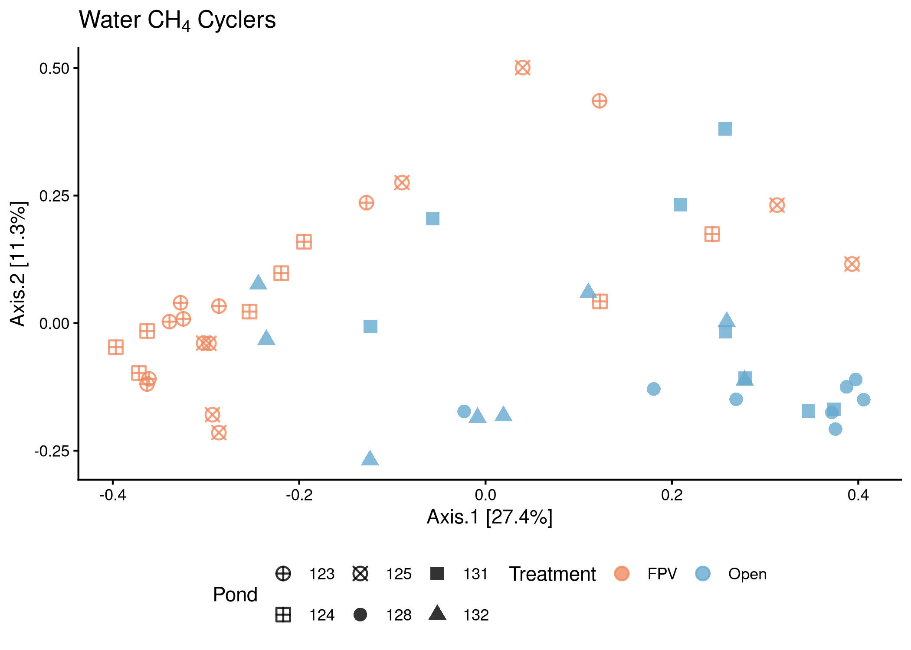<!-- -->

``` r
### Sophia's plot
# PCoA of water samples color by treatment shape by pond
s1a_water_pcoa <- plot_ordination(
  physeq = water_ch4_physeq,
  ordination = water_BC_pcoa,
  color = "solar_progress",
  shape = "Pond",
  title = "Water Column Methane Cyclers") + 
  geom_point(size = 5, alpha = 0.5, 
             aes(fill = solar_progress, color = solar_progress, shape = Pond)) + 
  scale_fill_manual(values = solar_colors) + 
  scale_color_manual(values = solar_colors) +
  scale_shape_manual(values = pond_shapes) +
  guides(color = guide_legend(nrow = 1, 
                              title = NULL,
                              override.aes = list(size = 2.7)),
         fill = "none",
         shape = guide_legend(nrow = 2, 
                              byrow = TRUE,
                              title = NULL,
                              override.aes = list(size = 2.7))) +
  theme_classic() +
  theme(
    legend.position = c(0.01, 0.01),  # inside bottom-left
    legend.justification = c(.01, .01),  
    legend.spacing = unit(0.01, "cm"),
    legend.spacing.x = unit(0.1, "cm"),
    legend.background = element_rect(color = NA, fill = NA),
    legend.key.width = unit(0.2, "cm"),
    legend.key.height = unit(0.4, "cm"),
    legend.text = element_text(size = 6),
    legend.box.just = "center",
    legend.box.background = element_rect(size = 0.2, linetype = "solid", color = "black"),
    legend.margin = margin(1, 2, 1, 1))

# Plot it 
s1a_water_pcoa
```

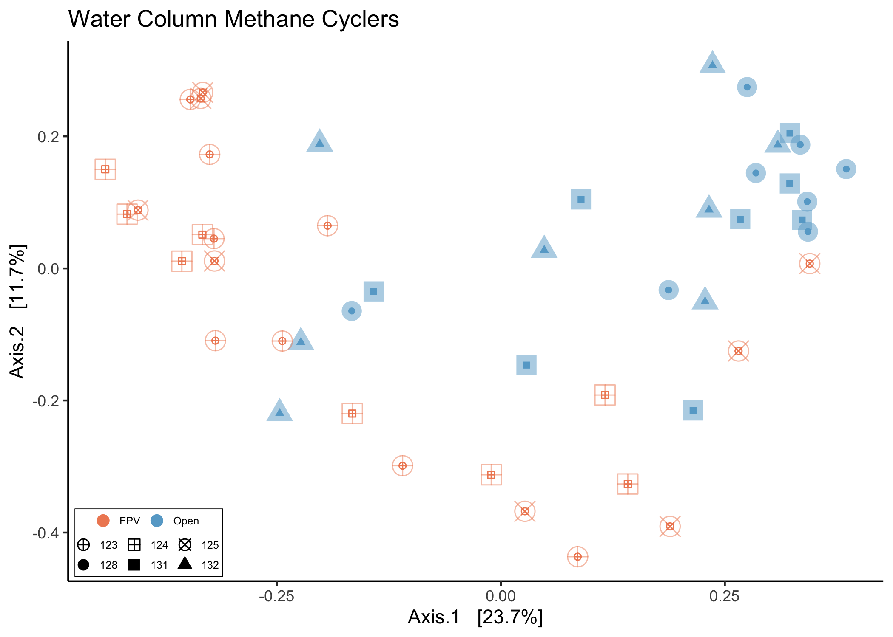<!-- -->

``` r
# ggsave(s1a_water_pcoa, width = 8, height = 7, units = "in",
#         filename = "figures/s1a/s1a_water_pcoa.png")
```

### Fig 3B: Sediment PCoA
This is all methane cylcers in sediment communities

``` r
# plot 1 all taxa sediments 

# use physeq object for just methane cyclers 
scaled_sed_physeq <- scaled_sed_ch4_physeq

# Calculate Bray-Curtis Dissimilarity 
scaled_sed_BC_pcoa <- 
  ordinate(
    physeq = scaled_sed_physeq,
    method = "PCoA",
    distance = "bray", 
    binary = FALSE
  )


#### Grab the data for the plot 
sed_all_ord_df <- 
  plot_ordination(
  physeq = scaled_sed_physeq,
  ordination = scaled_sed_BC_pcoa,
  color = "solar_progress",
  shape = "Pond",
  justDF = TRUE)


# Now plot it! 
fig3b_sed_pcoa <- 
  ggplot(data = sed_all_ord_df, 
       aes(x = Axis.1, 
           y = Axis.2,
           color = solar_progress,
           shape = Pond)) + 
  geom_point(size = 3, alpha = 0.8, stroke = 0.8) +
  scale_shape_manual(values = pond_shapes) + 
  scale_color_manual(values = solar_colors) +
  labs(color = "Treatment",
       shape = "Pond",
       x = "Axis.1 [32%]",
       y = "Axis.2 [15.5%]",
       title = expression("Sediment CH"[4]*" Cyclers")) + 
  theme_classic() +
  theme(legend.position = "bottom",
        legend.spacing = unit(0, "cm"),
        legend.box.background = element_blank())

# Show the plot
fig3b_sed_pcoa
```

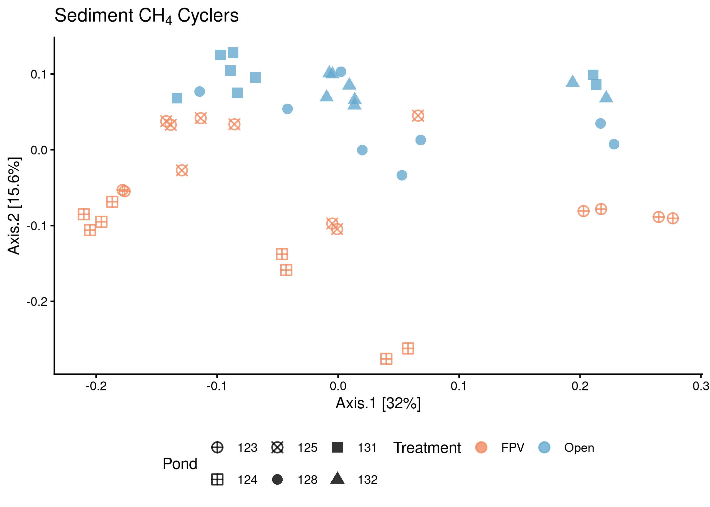<!-- -->

``` r
# Sophia's plot 
# PCoA of sediments color by treatment shaped by pond
s1b_sed_pcoa <- 
  plot_ordination(
  physeq = scaled_sed_physeq,
  ordination = scaled_sed_BC_pcoa,
  color = "solar_progress",
  shape = "Pond",
  title = "Sediment Methane Cyclers") +
  geom_point(size = 5, alpha = 0.5, 
             aes(color = solar_progress, fill = solar_progress, shape = Pond)) + 
  scale_color_manual(values = solar_colors) + 
  scale_fill_manual(values = solar_colors) + 
  scale_shape_manual(values = pond_shapes) +
  guides(color = "none",
         fill = "none",
         shape = "none") +
  theme_classic() 
  # theme(
  # legend.position = c(0.82, 0.01),  # inside bottom-left
  # legend.justification = c(0, 0),  # anchor the legend's top-left corner there
  # legend.spacing = unit(0.1, "cm"),
  # legend.background = element_rect(color = NA, fill = NA),
  # legend.box.background = element_rect(size = 0.1, linetype = "solid", color = "black"),
  # legend.text = element_text(size = 6), 
  # legend.margin = margin(2, 2, 2, 2))
s1b_sed_pcoa
```

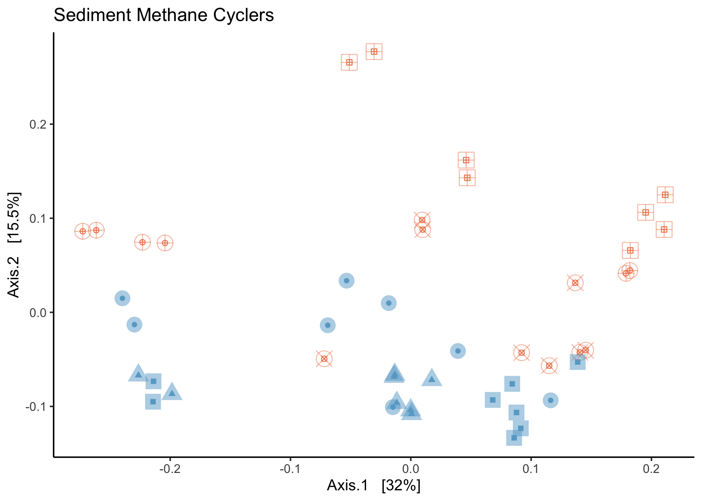<!-- -->

``` r
# ggsave(s1b_sed_pcoa, width = 8, height = 7, units = "in",
#         filename = "figures/s1b/s1b_sed_pcoa.png")
```
Sediment samples are still distinct from other and separate along first axis

### Save Figure 3
Water + Sediments together

``` r
fig_s1 <- 
  ggarrange(s1a_water_pcoa, s1b_sed_pcoa,
  nrow = 1, 
  ncol = 2,
  labels = c("A.", "B."),
  font.label = list(size =12),
  align = "hv") # aligns axis 
fig_s1
```

<!-- -->

``` r
ggsave(fig_s1, width = 12.4, height = 6, dpi = 300,
        filename = "figures/Fig_3/fig_3_old.png")

### Final Plot for Submission 
plot_fig3 <- 
  fig3a_water_pcoa + theme(plot.title = element_text(margin = margin(b = 0))) + 
  fig3b_sed_pcoa + theme(plot.title = element_text(margin = margin(b = 0))) +
  plot_annotation(tag_levels = "A") + 
    plot_layout(guides = "collect") &
  theme(
    legend.position = "bottom",
    legend.title = element_text(size = 9),
    legend.text = element_text(size = 8),
    legend.key.size = unit(0.4, "cm"),
    legend.spacing.x = unit(0.2, "cm"),
    legend.margin = margin(t = -5, unit = "pt")
  )

# Show the plot 
plot_fig3
```

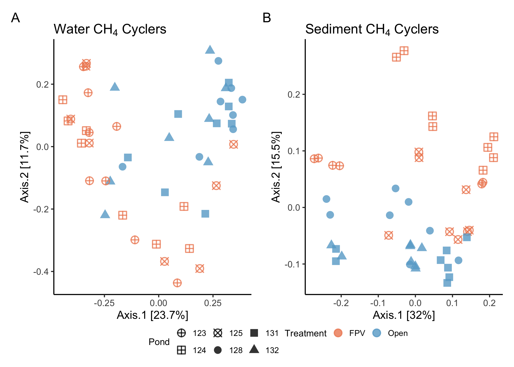<!-- -->

``` r
ggsave(plot_fig3, width = 6.3, height = 3.5, dpi = 300,
        filename = "figures/Fig_3/Fig_3.png")
```


# Figure S1

## Fig S1A: Sediment Methanogens

We want to see who is structuring the community within the sediments. In water column it is clear that methanotrophs are, but what about in sediment communities?

First we will plot sediment methanogens and then methanotrophs in this same chunk

``` r
# 1. methanogens

# Calculate Bray-Curtis Dissimilarity 
scaled_sed_methanogen_BC_pcoa <- 
  ordinate(
    physeq = scaled_methanogen_sed_physeq,
    method = "PCoA",
    distance = "bray", 
    binary = FALSE
  )

## NEW PLOT 
#### Grab the data for the plot 
sed_methanogen_ord_df <- 
  plot_ordination(
  physeq = scaled_methanogen_sed_physeq,
  ordination = scaled_sed_methanogen_BC_pcoa,
  color = "solar_progress",
  shape = "Pond",
  justDF = TRUE)


### Now, plot Figure S1A: SEDIMENT METHANOGENS 
figS1A_sed_methanogens_pcoa <- 
  ggplot(data = sed_methanogen_ord_df, 
       aes(x = Axis.1, 
           y = Axis.2,
           color = solar_progress,
           shape = Pond)) + 
  geom_point(size = 3, alpha = 0.8, stroke = 0.8) +
  scale_shape_manual(values = pond_shapes) + 
  scale_color_manual(values = solar_colors) +
  labs(color = "Treatment",
       shape = "Pond",
       x = "Axis.1 [32.9%]",
       y = "Axis.2 [17.6%]",
       title = "Sediment Methanogens") + 
  theme_classic() + 
  theme(legend.position = "bottom",
        legend.spacing = unit(0, "cm"),
        legend.box.background = element_blank())

# Show the plot
figS1A_sed_methanogens_pcoa
```

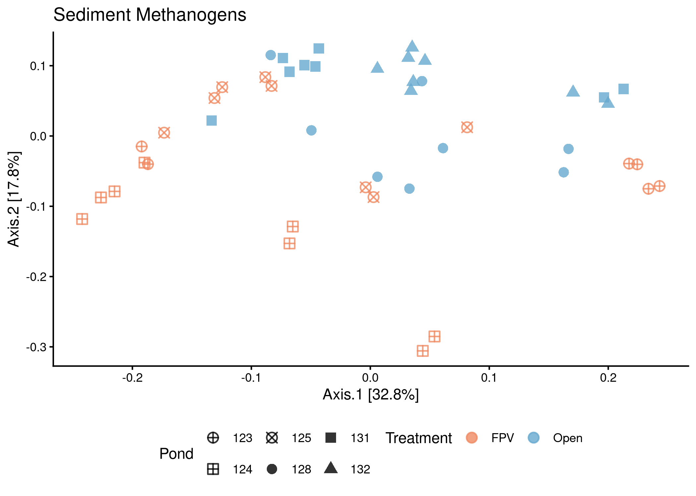<!-- -->

``` r
# PCoA of sediments color by treatment shaped by pond
s2a_sed_gen <- plot_ordination(
  physeq = scaled_methanogen_sed_physeq,
  ordination = scaled_sed_methanogen_BC_pcoa,
  color = "solar_progress",
  shape = "Pond",
  title = "Sediment Methanogens") + 
  geom_point(size = 5, alpha = 0.5, aes(color = solar_progress, fill = solar_progress, shape = Pond)) + 
  scale_color_manual(values = solar_colors) + 
  scale_fill_manual(values = solar_colors) + 
  scale_shape_manual(values = pond_shapes) +
  guides(color = guide_legend(nrow = 1, 
                              title = NULL,
                              override.aes = list(size = 2.7)),
         fill = "none",
         shape = guide_legend(nrow = 2, 
                              byrow = TRUE,
                              title = NULL,
                              override.aes = list(size = 2.7))) +
  theme_classic() +
  theme(
    legend.position = c(0.01, 0.01),  # inside bottom-left
    legend.justification = c(.01, .01),  
    legend.spacing = unit(0.01, "cm"),
    legend.spacing.x = unit(0.1, "cm"),
    legend.background = element_rect(color = NA, fill = NA),
    legend.key.width = unit(0.2, "cm"),
    legend.key.height = unit(0.4, "cm"),
    legend.text = element_text(size = 6),
    legend.box.just = "center",
    legend.box.background = element_rect(size = 0.2, linetype = "solid", color = "black"),
    legend.margin = margin(1, 2, 1, 1))
s2a_sed_gen
```

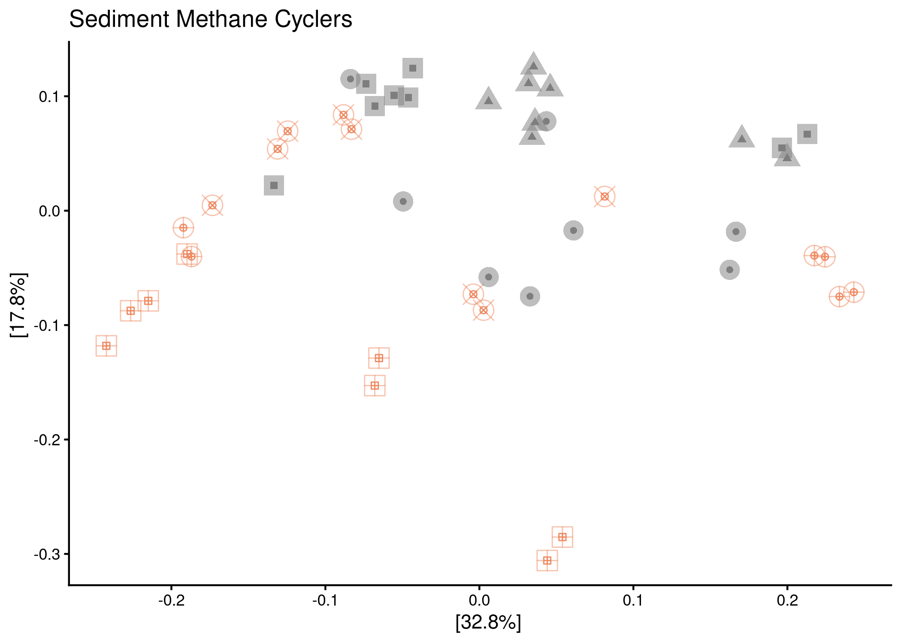<!-- -->

``` r
# ggsave(sed_pond_solar_pcoa_gens, width = 8, height = 7, units = "in",
#         filename = "analysis/figures/Nick_Analysis_GHGs/sed_pond_solar_pcoa.png")
```


## Fig S1B: Sediment Methanotrophs


``` r
# 2. methanotrophs

# Calculate Bray-Curtis Dissimilarity 
scaled_sed_methanotroph_BC_pcoa <- 
  ordinate(
    physeq = scaled_methanotroph_sed_physeq,
    method = "PCoA",
    distance = "bray", 
    binary = FALSE
  )


## NEW PLOT 
#### Grab the data for the plot 
sed_methanotroph_ord_df <- 
  plot_ordination(
  physeq = scaled_methanotroph_sed_physeq,
  ordination = scaled_sed_methanotroph_BC_pcoa,
  color = "solar_progress",
  shape = "Pond",
  justDF = TRUE)


### Now, plot Figure S1B: SEDIMENT METHANOTROPHS 
figS1B_sed_methanotroph_pcoa <- 
  ggplot(data = sed_methanotroph_ord_df, 
       aes(x = Axis.1, 
           y = Axis.2,
           color = solar_progress,
           shape = Pond)) + 
  geom_point(size = 3, alpha = 0.8, stroke = 0.8) +
  scale_shape_manual(values = pond_shapes) + 
  scale_color_manual(values = solar_colors) +
  labs(color = "Treatment",
       shape = "Pond",
       x = "Axis.1 [35.7%]",
       y = "Axis.2 [17.2%]",
       title = "Sediment Methanotrophs") + 
  theme_classic() + 
  theme(legend.position = "bottom",
        legend.spacing = unit(0, "cm"),
        legend.box.background = element_blank())

# Show the plot
figS1B_sed_methanotroph_pcoa
```

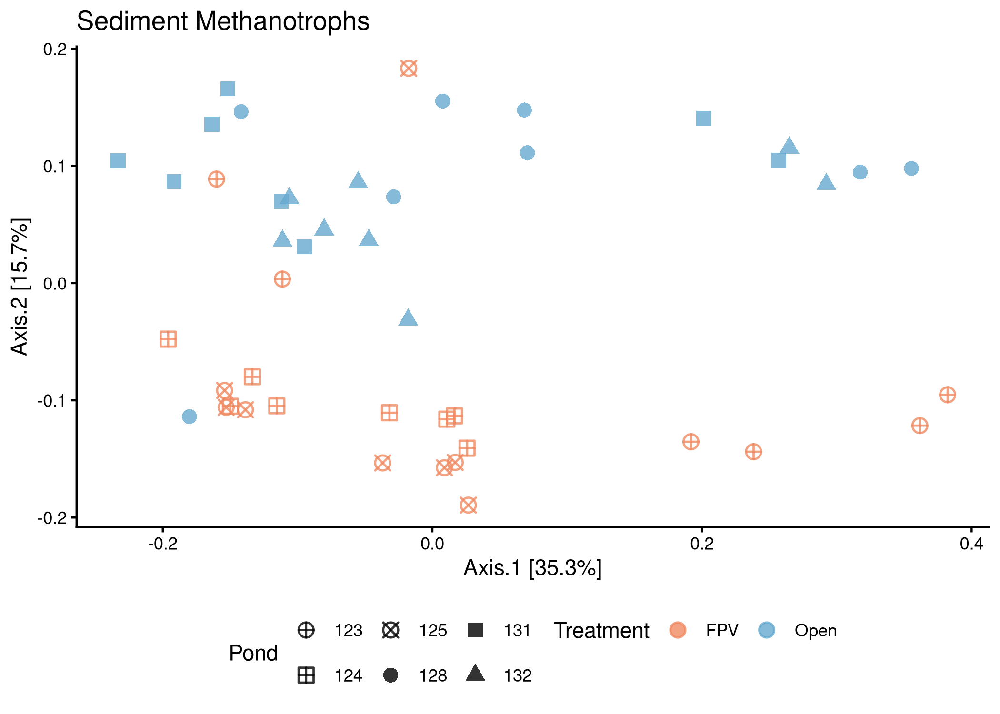<!-- -->

``` r
# PCoA of sediments color by treatment shaped by pond
s2b_sed_troph <- plot_ordination(
  physeq = scaled_methanotroph_sed_physeq,
  ordination = scaled_sed_methanotroph_BC_pcoa,
  color = "solar_progress",
  shape = "Pond",
  title = "Sediment Methanotrophs") + 
  geom_point(size = 5, alpha = 0.5, aes(color = solar_progress, fill = solar_progress, shape = Pond)) + 
  scale_color_manual(values = solar_colors) + 
  scale_fill_manual(values = solar_colors) + 
  scale_shape_manual(values = pond_shapes) +
  guides(color = "none",
         fill = "none",
         shape = "none")+
  theme_classic()
s2b_sed_troph
```

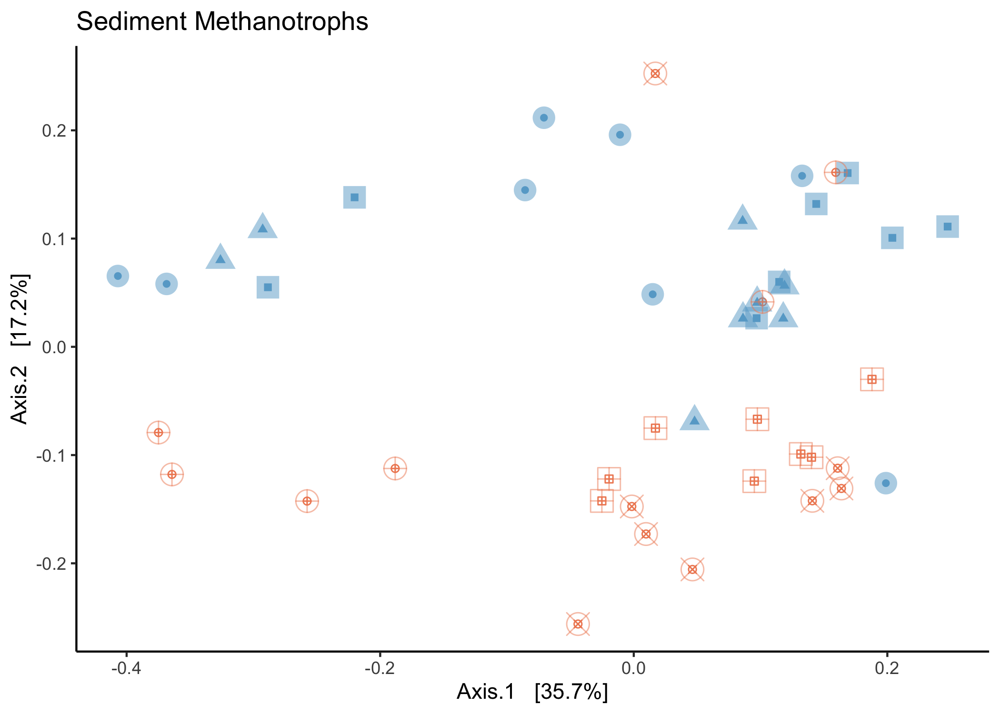<!-- -->


## Save Fig S1


``` r
# ggsave(sed_pond_solar_pcoa_trophs, width = 8, height = 7, units = "in",
#         filename = "analysis/figures/Nick_Analysis_GHGs/sed_pond_solar_pcoa_trophs.png")

# plot together 
fig_s2 <- 
  ggarrange(s2a_sed_gen, s2b_sed_troph,
  nrow = 1, 
  ncol = 2,
  labels = c("A.", "B."),
  font.label = list(size =12),
  align = "hv") # aligns axis 
fig_s2
```

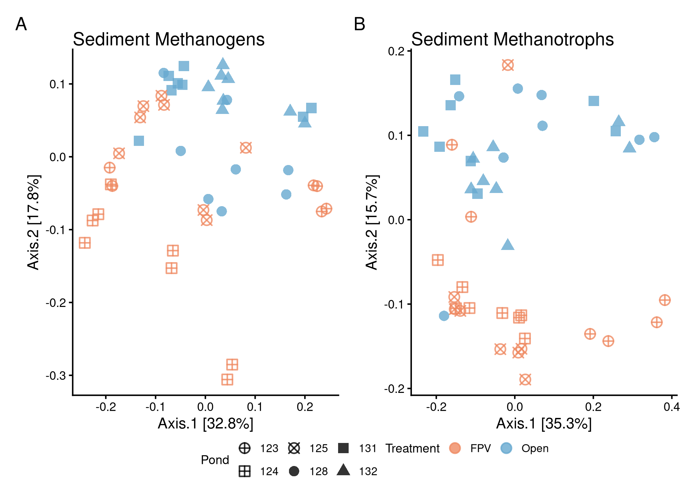<!-- -->

``` r
ggsave(fig_s2, width = 12.4, height = 6, dpi = 300,
        filename = "figures/s2/fig_s2.png")
```

```
## Error in `ggsave()`:
## ! Cannot find directory 'figures/s2'.
## ℹ Please supply an existing directory or use `create.dir = TRUE`.
```

``` r
### New plot 
plot_figS1 <- 
  figS1A_sed_methanogens_pcoa + theme(plot.title = element_text(margin = margin(b = 0))) + 
  figS1B_sed_methanotroph_pcoa + theme(plot.title = element_text(margin = margin(b = 0))) +
  plot_annotation(tag_levels = "A") + 
    plot_layout(guides = "collect") &
  theme(
    legend.position = "bottom",
    legend.title = element_text(size = 9),
    legend.text = element_text(size = 8),
    legend.key.size = unit(0.4, "cm"),
    legend.spacing.x = unit(0.2, "cm"),
    legend.margin = margin(t = -5, unit = "pt")
  )

# Show the plot
plot_figS1
```

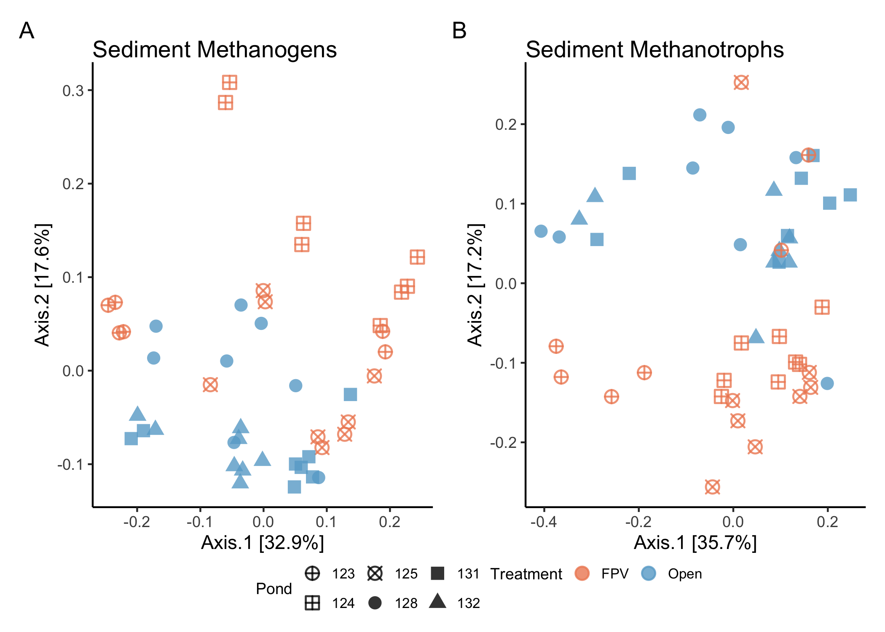<!-- -->

``` r
# Now, actually save the plot   
ggsave(plot_figS1, width = 6.3, height = 3.5, dpi = 300,
        filename = "figures/Fig_S1/Fig_S1.png")
```

Sediment samples are still distinct from other and separate along first axis

## Fig S1: PERMANOVA 

PERMANOVA (Permutational Multivariate Analysis of Variance) is a non-parametric, permutation-based test used to compare groups of objects based on a distance matrix. The goal is to test the null hypothesis that the centroids and dispersion of groups are equivalent in the space defined by the dissimilarity measure. 

### Methanogens

Here we are performing a PERMANOVA on the sediment methanogen and methanotrophs

``` r
#1. methanogen
# calculate Bray-Curtis PERMANOVA using phyloseq distance
sed_gen_bray <- 
  phyloseq::distance(scaled_methanogen_sed_physeq, 
                     method = "bray", binary = FALSE)

# pull out metadata 
sed_methanogens_metadata <- 
  scaled_methanogen_sed_physeq %>%
  sample_data() %>%
  data.frame()

# Permutational Multivariate Analysis of Variance Using Distance Matrices
# aka PERMANOVA using the adonis2 function from vegan 


#1. Test the individual terms for significance
# Testing if the centroids of solar progress are different: significant p = 0.001 ***
adonis2(sed_gen_bray ~ solar_progress, 
        data = sed_methanogens_metadata, by = "terms")
```

```
## Permutation test for adonis under reduced model
## Terms added sequentially (first to last)
## Permutation: free
## Number of permutations: 999
## 
## adonis2(formula = sed_gen_bray ~ solar_progress, data = sed_methanogens_metadata, by = "terms")
##                Df SumOfSqs      R2      F Pr(>F)    
## solar_progress  1  0.30783 0.11833 5.9052  0.001 ***
## Residual       44  2.29362 0.88167                  
## Total          45  2.60144 1.00000                  
## ---
## Signif. codes:  0 '***' 0.001 '**' 0.01 '*' 0.05 '.' 0.1 ' ' 1
```

``` r
# Does pond matter? significant p = 0.001 ***
adonis2(sed_gen_bray ~ Pond, 
        data = sed_methanogens_metadata, by = "terms")
```

```
## Permutation test for adonis under reduced model
## Terms added sequentially (first to last)
## Permutation: free
## Number of permutations: 999
## 
## adonis2(formula = sed_gen_bray ~ Pond, data = sed_methanogens_metadata, by = "terms")
##          Df SumOfSqs      R2      F Pr(>F)    
## Pond      5   1.0401 0.39983 5.3295  0.001 ***
## Residual 40   1.5613 0.60017                  
## Total    45   2.6014 1.00000                  
## ---
## Signif. codes:  0 '***' 0.001 '**' 0.01 '*' 0.05 '.' 0.1 ' ' 1
```

``` r
# Does date matter? significant p = 0.001 ***
adonis2(sed_gen_bray ~ as.factor(JDate), 
        data = sed_methanogens_metadata, by = "terms")
```

```
## Permutation test for adonis under reduced model
## Terms added sequentially (first to last)
## Permutation: free
## Number of permutations: 999
## 
## adonis2(formula = sed_gen_bray ~ as.factor(JDate), data = sed_methanogens_metadata, by = "terms")
##                  Df SumOfSqs      R2      F Pr(>F)    
## as.factor(JDate)  3  0.55028 0.21153 3.7559  0.001 ***
## Residual         42  2.05116 0.78847                  
## Total            45  2.60144 1.00000                  
## ---
## Signif. codes:  0 '***' 0.001 '**' 0.01 '*' 0.05 '.' 0.1 ' ' 1
```

``` r
#2. Test the terms together
# Now lets see the effect of each pond by date_collected and solar progress
sed_methanogens_permanova <- 
  adonis2(sed_gen_bray ~ solar_progress * Pond * JDate, 
          data = sed_methanogens_metadata, by = "terms");

# Show the results! 
sed_methanogens_permanova
```

```
## Permutation test for adonis under reduced model
## Terms added sequentially (first to last)
## Permutation: free
## Number of permutations: 999
## 
## adonis2(formula = sed_gen_bray ~ solar_progress * Pond * JDate, data = sed_methanogens_metadata, by = "terms")
##                      Df SumOfSqs      R2       F Pr(>F)    
## solar_progress        1  0.30783 0.11833 10.4653  0.001 ***
## Pond                  4  0.73230 0.28150  6.2241  0.001 ***
## JDate                 1  0.23423 0.09004  7.9632  0.001 ***
## solar_progress:JDate  1  0.06602 0.02538  2.2446  0.038 *  
## Pond:JDate            4  0.26098 0.10032  2.2182  0.002 ** 
## Residual             34  1.00008 0.38443                   
## Total                45  2.60144 1.00000                   
## ---
## Signif. codes:  0 '***' 0.001 '**' 0.01 '*' 0.05 '.' 0.1 ' ' 1
```

### Methanotrophs


``` r
#1. methanotrophs
# calculate Bray-Curtis PERMANOVA using phyloseq distance
sed_troph_bray <- 
  phyloseq::distance(scaled_methanotroph_sed_physeq, 
                     method = "bray", binary = FALSE)

# pull out metadata 
sed_methanotrophs_metadata <- 
  scaled_methanotroph_sed_physeq %>%
  sample_data() %>%
  data.frame()

# Permutational Multivariate Analysis of Variance Using Distance Matrices
# aka PERMANOVA using the adonis2 function from vegan 


#1. Test the individual terms for significance
# Testing if the centroids of solar progress are different: significant p = 0.002 **
adonis2(sed_troph_bray ~ solar_progress, 
        data = sed_methanotrophs_metadata, by = "terms")
```

```
## Permutation test for adonis under reduced model
## Terms added sequentially (first to last)
## Permutation: free
## Number of permutations: 999
## 
## adonis2(formula = sed_troph_bray ~ solar_progress, data = sed_methanotrophs_metadata, by = "terms")
##                Df SumOfSqs      R2      F Pr(>F)   
## solar_progress  1   0.4234 0.10058 4.9204  0.002 **
## Residual       44   3.7858 0.89942                 
## Total          45   4.2092 1.00000                 
## ---
## Signif. codes:  0 '***' 0.001 '**' 0.01 '*' 0.05 '.' 0.1 ' ' 1
```

``` r
# Does pond matter? significant p = 0.001 ***
adonis2(sed_troph_bray ~ Pond, 
        data = sed_methanotrophs_metadata, by = "terms")
```

```
## Permutation test for adonis under reduced model
## Terms added sequentially (first to last)
## Permutation: free
## Number of permutations: 999
## 
## adonis2(formula = sed_troph_bray ~ Pond, data = sed_methanotrophs_metadata, by = "terms")
##          Df SumOfSqs      R2      F Pr(>F)    
## Pond      5   1.2835 0.30494 3.5097  0.001 ***
## Residual 40   2.9256 0.69506                  
## Total    45   4.2092 1.00000                  
## ---
## Signif. codes:  0 '***' 0.001 '**' 0.01 '*' 0.05 '.' 0.1 ' ' 1
```

``` r
# Does date matter? significant p = 0.001 ***
adonis2(sed_troph_bray ~ as.factor(JDate), 
        data = sed_methanotrophs_metadata, by = "terms")
```

```
## Permutation test for adonis under reduced model
## Terms added sequentially (first to last)
## Permutation: free
## Number of permutations: 999
## 
## adonis2(formula = sed_troph_bray ~ as.factor(JDate), data = sed_methanotrophs_metadata, by = "terms")
##                  Df SumOfSqs      R2      F Pr(>F)    
## as.factor(JDate)  3   1.0430 0.24779 4.6119  0.001 ***
## Residual         42   3.1662 0.75221                  
## Total            45   4.2092 1.00000                  
## ---
## Signif. codes:  0 '***' 0.001 '**' 0.01 '*' 0.05 '.' 0.1 ' ' 1
```

``` r
#2. Test the terms together
# Now lets see the effect of each pond by date_collected and solar progress
sed_methanotrophs_permanova <- 
  adonis2(sed_troph_bray ~ solar_progress * Pond * JDate, 
        data = sed_methanotrophs_metadata, by = "terms")

# Show the results! 
sed_methanotrophs_permanova
```

```
## Permutation test for adonis under reduced model
## Terms added sequentially (first to last)
## Permutation: free
## Number of permutations: 999
## 
## adonis2(formula = sed_troph_bray ~ solar_progress * Pond * JDate, data = sed_methanotrophs_metadata, by = "terms")
##                      Df SumOfSqs      R2       F Pr(>F)    
## solar_progress        1   0.4234 0.10058  7.6933  0.001 ***
## Pond                  4   0.8602 0.20436  3.9078  0.001 ***
## JDate                 1   0.5523 0.13122 10.0370  0.001 ***
## solar_progress:JDate  1   0.0933 0.02217  1.6955  0.113    
## Pond:JDate            4   0.4090 0.09717  1.8581  0.015 *  
## Residual             34   1.8710 0.44451                   
## Total                45   4.2092 1.00000                   
## ---
## Signif. codes:  0 '***' 0.001 '**' 0.01 '*' 0.05 '.' 0.1 ' ' 1
```

**Methanogens**
With our PERMANOVA we find that treatment (solar_progress), day of year sampled (JDate - Julian date), and Pond is significant 

Treatment explains 11.8% of the variance and has the largest effect size (F = 10.5) but pond explains the most variation, 28.2%, and contributes to the community but weaker than treatment (F = 6.22). JDate explains 9.0% of variation but is the second most important term for its weight contributing to structuring thet community. 

Solar progress and time explains 2.5% of the variation but is not a strong contributer to the community. Pond and time explais 10% of variation but has a smaller effect on community structure.

Together this explains 62% of the variation.

**Methanotrophs**

With our PERMANOVA we see that Pond explains the most variance (20.4%) but does not have a strong effect on community structure (F = 3.9). There is a temporal effect along the first axis due to time that explains 13.1% of data and is a strong factor for shaping the community (F = 10.0). Treatment is important for explaining 10.1% of variance and is teh second most important factor for shaping the community which we kinda see along the second axis (F = 7.7)

The interactions of pond and date explain 9.7% of the variance but is not an important factor for shaping our community (F = 1.9). 

The interaction of solar treatment and pond is > 0.05 (p = 0.095) indicating that their interaction is not strong and important for shaping the community. while it does answer 2.2% of variation, it has the smallest effect size (F = 1.7) 

Together these variables explain 56% of the data

## Fig S1: Betadisper

### Methanogens 

``` r
# 1. methanogens 
# Homogeneity of Disperson test with beta dispr

## Bray-Curtis
betadispr_sed_methanogens_pond <- 
  betadisper(sed_gen_bray, sed_methanogens_metadata$Pond)

betadispr_sed_methanogens_solar <- 
  betadisper(sed_gen_bray, sed_methanogens_metadata$solar_progress)

betadispr_sed_methanogens_JDate <- 
  betadisper(sed_gen_bray, sed_methanogens_metadata$JDate)

# permutest() performs a non-parametric permutation test, which is robust and valid for the kind of data used in beta diversity analysis (e.g., dissimilarity matrices).
permutest(betadispr_sed_methanogens_pond) # not significant p = 0.659
```

```
## 
## Permutation test for homogeneity of multivariate dispersions
## Permutation: free
## Number of permutations: 999
## 
## Response: Distances
##           Df   Sum Sq   Mean Sq      F N.Perm Pr(>F)
## Groups     5 0.025322 0.0050644 0.6726    999  0.641
## Residuals 40 0.301206 0.0075301
```

``` r
permutest(betadispr_sed_methanogens_solar) # not significant p = 0.067
```

```
## 
## Permutation test for homogeneity of multivariate dispersions
## Permutation: free
## Number of permutations: 999
## 
## Response: Distances
##           Df   Sum Sq   Mean Sq      F N.Perm Pr(>F)  
## Groups     1 0.012115 0.0121145 3.8732    999  0.049 *
## Residuals 44 0.137622 0.0031278                       
## ---
## Signif. codes:  0 '***' 0.001 '**' 0.01 '*' 0.05 '.' 0.1 ' ' 1
```

``` r
permutest(betadispr_sed_methanogens_JDate) # not significant p = 0.44
```

```
## 
## Permutation test for homogeneity of multivariate dispersions
## Permutation: free
## Number of permutations: 999
## 
## Response: Distances
##           Df  Sum Sq   Mean Sq      F N.Perm Pr(>F)
## Groups     3 0.00639 0.0021299 0.8903    999  0.451
## Residuals 42 0.10048 0.0023924
```

### Methanotrophs

``` r
# 2. methanotrophs 
# Homogeneity of Disperson test with beta dispr

## Bray-Curtis
betadispr_sed_methanotrophs_pond <- 
  betadisper(sed_troph_bray, sed_methanotrophs_metadata$Pond)

betadispr_sed_methanotrophs_solar <- 
  betadisper(sed_troph_bray, sed_methanotrophs_metadata$solar_progress)

betadispr_sed_methanotrophs_JDate <-
  betadisper(sed_troph_bray, sed_methanotrophs_metadata$JDate)


# permutest() performs a non-parametric permutation test, which is robust and valid for the kind of data used in beta diversity analysis (e.g., dissimilarity matrices).
permutest(betadispr_sed_methanotrophs_pond) # not significant p = 0.515
```

```
## 
## Permutation test for homogeneity of multivariate dispersions
## Permutation: free
## Number of permutations: 999
## 
## Response: Distances
##           Df  Sum Sq   Mean Sq      F N.Perm Pr(>F)
## Groups     5 0.04934 0.0098685 0.8364    999  0.519
## Residuals 40 0.47196 0.0117990
```

``` r
permutest(betadispr_sed_methanotrophs_solar) # not significant p = 0.682
```

```
## 
## Permutation test for homogeneity of multivariate dispersions
## Permutation: free
## Number of permutations: 999
## 
## Response: Distances
##           Df  Sum Sq   Mean Sq     F N.Perm Pr(>F)
## Groups     1 0.00118 0.0011830 0.146    999   0.73
## Residuals 44 0.35661 0.0081048
```

``` r
permutest(betadispr_sed_methanotrophs_JDate) # significant p = 0.007
```

```
## 
## Permutation test for homogeneity of multivariate dispersions
## Permutation: free
## Number of permutations: 999
## 
## Response: Distances
##           Df  Sum Sq   Mean Sq      F N.Perm Pr(>F)   
## Groups     3 0.03816 0.0127201 4.7482    999  0.008 **
## Residuals 42 0.11252 0.0026789                        
## ---
## Signif. codes:  0 '***' 0.001 '**' 0.01 '*' 0.05 '.' 0.1 ' ' 1
```
**Methanogens**
With betadispr we find the PERMANOVA results are are valid as pond, treatment, and date are not significant but significant in the PERMANOVA. Thus our PERMANOVA result is reliable and the differences between groups are due to location/centroids of groups rather than differences in variation within groups 

**Methanotrophs**
With betadispr we find the PERMANOVA results are are valid as pond and treatment are not significant but significant in the PERMANOVA. Thus our PERMANOVA result is reliable and the differences between groups are due to location/centroids of groups rather than differences in variation within groups 

However, date is statistically significant in PERMANOVA and in the betadispr indicating that theres variability in within the sampling dates so there are likely differences in community composition and probably heterogeneity over time. 


# Figure 4

## Differential Abundance 

Now we will calculate the differential abundance between our water and sediment samples. First I will try to do the original methane cyclers in water and sediments. but i may also further break it down into sediment methane cycler type.

### Water

``` r
# filter out for ASVs with zero variances 
water_ch4_phy_bc <- water_ch4_physeq %>% 
  subset_samples(Year == "2024") %>% 
  filter_taxa(., function(x) {
    group_var <- sample_data(.)$solar_progress
    all(tapply(x, group_var, var, na.rm = TRUE) > 0)
  }, prune = TRUE)


# relevel solar_progress
water_ch4_phy_bc@sam_data$solar_progress <- factor(water_ch4_phy_bc@sam_data$solar_progress, levels = c("No Solar", "Solar"))

# run ancombc2 for water methane cyclers
# water_ch4_asv_output <- ancombc2(data = water_ch4_phy_bc,
#                                  tax_level = "ASV", # Test for each phylum
#                                  fix_formula = "solar_progress", # Use Comp_Group_Hier to estimate diff. abundance
#                                  p_adj_method = "holm", # Adjust with Holm-Bonferroni correction; recommended by authors
#                                  pseudo_sens = TRUE, # Run sensitivity test to make sure taxa isn't sensitive to psuedo-count choice
#                                  prv_cut = 0.1, # Prevalence filter of 10%
#                                  group = "solar_progress", # Use Comp_Group_Hier as groups when doing pairwise comparisons
#                                  struc_zero = TRUE, # Do not detect structural zeroes
#                                  alpha = 0.05, # Significance threshold of 0.05
#                                  n_cl = 5, # Use 5 threads
#                                  verbose = FALSE, # Don't print verbose output
#                                  global = TRUE, # Run a global test (sorta like an ANOVA to first find if a given ASV is sig diff)
#                                  pairwise = FALSE) # Run pairwise tests between groups (sorta like a post-hoc test like Tukey)


# save(water_ch4_asv_output, file = "data/02_diff_abund/water_ch4_asv_output.RData")

load("data/02_diff_abund/water_ch4_asv_output.RData")


# plot ASV differential abundance
water_ch4_fsp <- 
  water_ch4_asv_output$res %>%
  select(taxon, starts_with("lfc"), starts_with("diff"), starts_with("passed_ss")) %>%
  pivot_longer(cols = !taxon, names_to = "metric", values_to = "value") %>%
  separate_wider_delim(cols = metric, delim = "_", names = c("variable", "Comparison"), too_many = "merge") %>%
  mutate(Comparison = str_remove(Comparison, "\\(Intercept\\)")) %>% 
  mutate(Comparison = str_remove(Comparison, "ss_")) %>%
  pivot_wider(id_cols = c("taxon","Comparison"), names_from = variable, values_from = value) %>%
  mutate(Comparison = str_remove(Comparison, "treatment"),
         Comparison = str_replace(Comparison, "_treatment", ";")) %>%
  separate_wider_delim(Comparison, delim = ";", names = c("Ref1", "Ref2"), too_few = "align_start") %>%
  filter(!is.na(Ref1) & Ref1 != "") %>%
  mutate(
    Ref2 = ifelse(is.na(Ref2), "No Solar", Ref2), # relevel with basegroup which is no solar 
    Comparison = paste0(Ref1, " : ", Ref2)) %>% 
  dplyr::filter(diff == 1, passed == 1, abs(lfc) > 1) %>% # play around with log fold change
  select(ASV = taxon, Comparison, lfc, passed)

# join by tax table
clean_water_ch4 <-  
  water_ch4_fsp %>% 
  left_join(., as.data.frame(water_ch4_physeq@tax_table), 
            by = "ASV")

# plot log fold changes
clean_water_ch4 %>% 
  ggplot(aes(x = ASV, y = lfc, fill = Order)) +
  geom_col() +
  #scale_fill_manual(values = phylum_colors) +
  theme_bw() +
  theme(axis.text.x = element_text(angle = 45, hjust = 1), legend.position = "bottom") + 
  ggtitle("Water Column ASV Log-fold Change in FPV Ponds") 
```

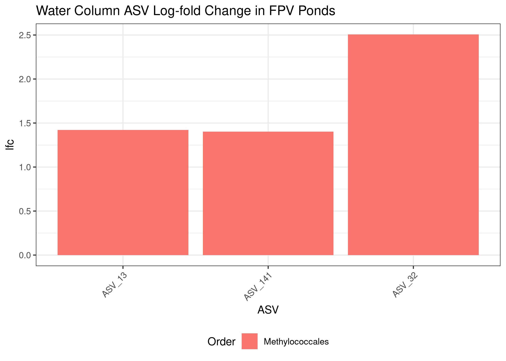<!-- -->

``` r
# plot differentially abundant ASVs overtime 

#1. tax glom at ASV level
water_ch4_asv_df <- 
  water_ch4_physeq %>% 
  tax_glom(taxrank = "ASV") %>% 
  psmelt() %>% 
  mutate(
    Depth_Class = case_when(
      Depth_Class == "S" ~ "Surface Water",
      Depth_Class == "B" ~ "Bottom Water"),
    Depth_Class = factor(Depth_Class, levels = c("Surface Water", "Bottom Water")))

#2. plot asvs overtime 

# methanogen = ASV_1063; Methanobacteriales order
# methanotroph = ASV 13,141,32,44; Methylococcales order
# get metadata from water physeq 
metadata <- 
  water_ch4_physeq %>%
  sample_data() %>%
  data.frame() %>% 
  mutate(
    Depth_Class = case_when(
      Depth_Class == "S" ~ "Surface Water",
      Depth_Class == "B" ~ "Bottom Water"),
    Depth_Class = factor(Depth_Class, levels = c("Surface Water", "Bottom Water")))
    
# plot Methanogen overtime
water_ch4_asv1063 <- 
  water_ch4_asv_df %>% 
  dplyr::filter(ASV == "ASV_1063") %>%
  group_by(JDate, Pond, Depth_Class, solar_progress) %>% 
  summarize(
    total_cells_ml = sum(Abundance)) %>%
  ggplot(aes(x = as.factor(JDate), y = total_cells_ml, color = solar_progress, shape = Pond)) +
  geom_line(aes(group = interaction(Pond, Depth_Class)), 
            alpha = 0.2) +
  geom_smooth(aes(group = solar_progress), se = FALSE) +
  geom_point(aes(shape = Pond), size = 2) +
  ggh4x::facet_grid2(~Depth_Class) +
  scale_color_manual(values = solar_colors) +
  scale_shape_manual(values = pond_shapes) +
  labs(
    x = "Date Collected",
    y = "Total Cells per ml",
    title = "Methanobacteriales (ASV_1063)\nIncrease in FPV Ponds"
  ) +
  theme(legend.position = "bottom") +
  theme_bw()

# Show the plot 
water_ch4_asv1063 
```

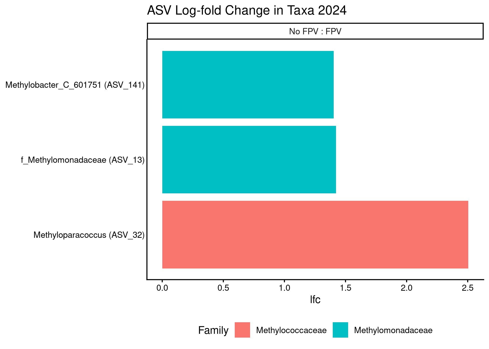<!-- -->

``` r
# methanotrophs 

# create list of methanotroph asvs 
water_ch4_methanotrophs <- c("ASV_13", "ASV_141", "ASV_32", "ASV_44")

# now plot overtime
water_ch4_trophs <- 
  water_ch4_asv_df %>% 
  dplyr::filter(ASV %in% water_ch4_methanotrophs) %>% 
  dplyr::mutate(total_cells_ml = Abundance) %>%
  ggplot(aes(x = as.factor(JDate), y = total_cells_ml, color = solar_progress, shape = Pond)) +
  geom_line(aes(group = interaction(Pond, Depth_Class)), 
            alpha = 0.2) +
  geom_smooth(aes(group = solar_progress), se = FALSE) +
  geom_point(aes(shape = Pond), size = 2) +
  ggh4x::facet_grid2(Depth_Class~ASV) +
  scale_color_manual(values = solar_colors) +
  scale_shape_manual(values = pond_shapes) +
  labs(
    x = "Date Collected",
    y = "Total Cells per ml",
    title = "Differentially Abundant Methylococcales ASVs in FPV Ponds"
  ) +
  theme(legend.position = "bottom") +
  theme_bw()

# Show the plot 
water_ch4_trophs
```

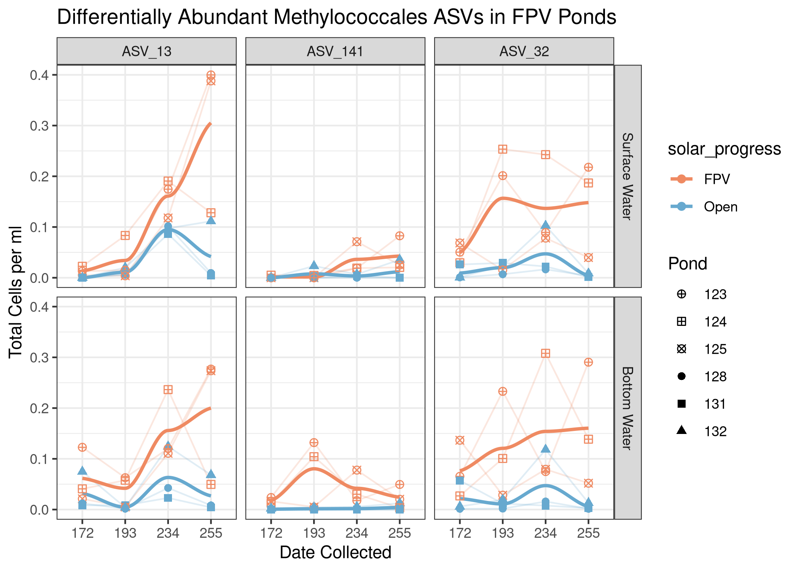<!-- -->
When we look at the water column of just our methane cyclers, we see that there are only log fold change increases. It is no suprise that Methylococcales has 4 differentially abundant ASVs, but ASV 32 is a log fold change just shy of 3! I am kinda shocked that the Methanobacteriales ASV 1063 is differentially abundant in the water column of solar ponds...


``` r
# Prepare the dataframe with only those 5 ASVs
diff_abund_df <- 
  water_ch4_asv_df %>%
  dplyr::filter(ASV %in% c("ASV_1063", "ASV_13", "ASV_141", "ASV_32", "ASV_44")) %>% 
  group_by(JDate, Pond, Depth_Class, solar_progress, 
           Methanotroph_Methanogen, 
           Order, Class, Family, Genus, Species, ASV) %>%
  summarize(total_cells_ml = sum(Abundance)) %>%
  as.data.frame() %>%
  dplyr::mutate(Genus = ifelse(ASV== "ASV_13", Order, Genus),
                Genus = if_else(Genus == "Methanobacterium_B_963", 
                                "Methanobacterium_B", Genus),
                Genus = if_else(Genus == "Methylobacter_C_601751", 
                                "Methylobacter_C", Genus))

# Method 1: Using paste() to combine labels
diff_abund_df$combined_label <- 
  paste(diff_abund_df$Genus, diff_abund_df$ASV, sep = "\n")

# shapiro test
diff_abund_df %>%
  group_by(ASV, solar_progress) %>%
  summarise(
    shapiro_p = shapiro.test(total_cells_ml)$p.value,
    n = n()
  )
```

```
## # A tibble: 10 × 4
## # Groups:   ASV [5]
##    ASV      solar_progress     shapiro_p     n
##    <chr>    <chr>                  <dbl> <int>
##  1 ASV_1063 FPV            0.0000000528     24
##  2 ASV_1063 Open           0.00000000487    24
##  3 ASV_13   FPV            0.0000738        24
##  4 ASV_13   Open           0.0000242        24
##  5 ASV_141  FPV            0.0000550        24
##  6 ASV_141  Open           0.0000000713     24
##  7 ASV_32   FPV            0.000157         24
##  8 ASV_32   Open           0.000000340      24
##  9 ASV_44   FPV            0.000000800      24
## 10 ASV_44   Open           0.0000159        24
```

``` r
# Make Boxplots of the ASVs!
diffAbund_boxplots <- 
  diff_abund_df %>%
  ggplot(aes(x = solar_progress, y = total_cells_ml,
             color = solar_progress)) + 
  geom_point(aes(shape = Pond),
             size = 2, alpha = 0.8, stroke = 0.8,
             position = position_jitterdodge(jitter.width = .5, dodge.width = .3)) +
  geom_boxplot(outlier.shape = NA, alpha = 0, color = "black", position = position_dodge(0.6)) + 
  labs(color = "Treatment",
       y = "Cells per mL") +
  facet_wrap(~combined_label, scales = "free_y", nrow = 2) + 
  scale_color_manual(values = solar_colors) +
  scale_shape_manual(values = pond_shapes) +
  scale_y_continuous(labels = label_number(scale_cut = cut_short_scale(), accuracy = 1)) +
  theme_classic() +
  ### ADD PVALUES 
  stat_compare_means(method = "wilcox.test", 
                     #comparisons = list(c("FPV", "Open")),
                     label = "p.format", # or "p.format" or "p.value"
                     group.by = "combined_label",
                     size = 3,               # ⬅️ Font size
                     label.y.npc = 0.9,
                     #label.y = c(8000, 100000, 500000, 400000, 400000),
                     label.x = c(1.75, 1.75, 1.75, 1.75, 1.75)) +    # ⬅️ Manually set y position)  +
  guides(
    color = guide_legend(ncol = 2,override.aes = list(size = 3)),
    shape = guide_legend(ncol = 2, override.aes = list(size = 3))) +
  theme(legend.position = c(0.82, 0.2),
        axis.title.x = element_blank(),
        legend.title = element_text(size = 9),
        legend.text = element_text(size = 8),
        legend.key.size = unit(0.4, "cm"),
        legend.spacing.x = unit(0.2, "cm"),
        legend.margin = margin(t = -5, unit = "pt"),
        strip.text = element_text(size = 10)); diffAbund_boxplots
```

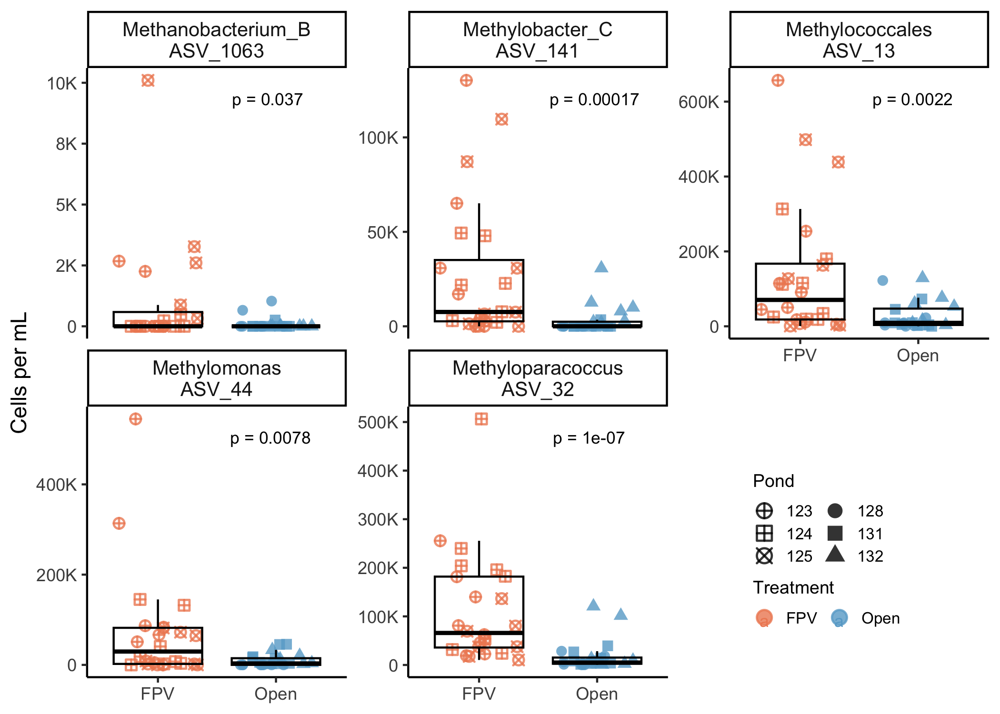<!-- -->

``` r
# Now, actually save the plot   
# NOTE THAT ASV_
ggsave(diffAbund_boxplots, width = 6, height = 4, dpi = 300,
        filename = "figures/Fig_4/Fig_4.png")
```


### Sediment
First we are running this analysis with all methane cyclers.

``` r
# filter out for ASVs with zero variances 
scaled_sed_ch4_physeq_bc <- scaled_sed_ch4_physeq %>% 
  filter_taxa(., function(x) {
    group_var <- sample_data(.)$solar_progress
    all(tapply(x, group_var, var, na.rm = TRUE) > 0)
  }, prune = TRUE)


# relevel solar_progress 
scaled_sed_ch4_physeq_bc@sam_data$solar_progress <- factor(scaled_sed_ch4_physeq_bc@sam_data$solar_progress, levels = c("Open", "FPV"))

# run ancombc2 for all sediment methane cyclers
# sed_ch4_asv_output <- ancombc2(data = scaled_sed_ch4_physeq_bc,
#                                  tax_level = "ASV", # Test for each phylum
#                                  fix_formula = "solar_progress", # Use Comp_Group_Hier to estimate diff. abundance
#                                  p_adj_method = "holm", # Adjust with Holm-Bonferroni correction; recommended by authors
#                                  pseudo_sens = TRUE, # Run sensitivity test to make sure taxa isn't sensitive to psuedo-count choice
#                                  prv_cut = 0.1, # Prevalence filter of 10%
#                                  group = "solar_progress", # Use Comp_Group_Hier as groups when doing pairwise comparisons
#                                  struc_zero = TRUE, # Do not detect structural zeroes
#                                  alpha = 0.05, # Significance threshold of 0.05
#                                  n_cl = 5, # Use 5 threads
#                                  verbose = FALSE, # Don't print verbose output
#                                  global = TRUE, # Run a global test (sorta like an ANOVA to first find if a given ASV is sig diff)
#                                  pairwise = FALSE) # Run pairwise tests between groups (sorta like a post-hoc test like Tukey)


# save(sed_ch4_asv_output, file = "data/02_diff_abund/sed_ch4_asv_output.RData.RData")

load("data/02_diff_abund/sed_ch4_asv_output.RData")


# plot ASV differential abundance
sed_ch4_fsp <- sed_ch4_asv_output$res %>%
  select(taxon, starts_with("lfc"), starts_with("diff"), starts_with("passed_ss")) %>%
  pivot_longer(cols = !taxon, names_to = "metric", values_to = "value") %>%
  separate_wider_delim(cols = metric, delim = "_", names = c("variable", "Comparison"), too_many = "merge") %>%
  mutate(Comparison = str_remove(Comparison, "\\(Intercept\\)")) %>% 
  mutate(Comparison = str_remove(Comparison, "ss_")) %>%
  pivot_wider(id_cols = c("taxon","Comparison"), names_from = variable, values_from = value) %>%
  mutate(Comparison = str_remove(Comparison, "treatment"),
         Comparison = str_replace(Comparison, "_treatment", ";")) %>%
  separate_wider_delim(Comparison, delim = ";", names = c("Ref1", "Ref2"), too_few = "align_start") %>%
  filter(!is.na(Ref1) & Ref1 != "") %>%
  mutate(
    Ref2 = ifelse(is.na(Ref2), "Open", Ref2), # relevel with basegroup which is no solar 
    Comparison = paste0(Ref1, " : ", Ref2)) %>% 
  dplyr::filter(diff == 1, passed == 1, abs(lfc) > 1) %>% # play around with log fold change
  select(ASV = taxon, Comparison, lfc, passed)

# join by tax table
clean_sed_ch4 <-  sed_ch4_fsp %>% left_join(., as.data.frame(scaled_sed_ch4_physeq@tax_table), by = "ASV")

# plot log fold changes
clean_sed_ch4 %>% 
  ggplot(aes(x = ASV, y = lfc, fill = Order)) +
  geom_col() +
  #scale_fill_manual(values = phylum_colors) +
  theme_bw() +
  theme(axis.text.x = element_text(angle = 45, hjust = 1), legend.position = "bottom") + 
  ggtitle("Sediment CH4 Cycler ASV Log-fold Change in FPV Ponds") 
```

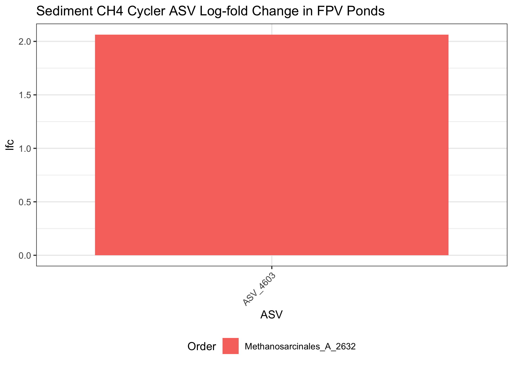<!-- -->

``` r
# plot differentially abundant ASVs overtime 

#1. tax glom at ASV level, calculate abundance
# calculate relative abundance and identify methane cyclers
methano_sed_asv_df <- scaled_sed_physeq_24 %>%
  speedyseq::tax_glom(taxrank = "ASV") %>% 
  # Calculate the relative abundance
  speedyseq::transform_sample_counts(function(x) {x/sum(x)}) %>%
  psmelt() %>%
  filter(Order %in% c(methanogens, methanotrophs)) %>%
  mutate(
    Methanotroph_Methanogen = case_when(
      Order %in% methanogens ~ "Methanogen",
      Order %in% methanotrophs ~ "Methanotroph"
    ),
    solar_progress = recode(solar_progress, "Solar" = "FPV", "No Solar" = "Open"),
    Depth_Class = "Sediment")  

#2. plot asv overtime 

# methanogen = ASV_4603; Methanosarcinales_A_2632 order

# get metadata from water physeq 
metadata <- scaled_sed_ch4_physeq %>%
  sample_data() %>%
  data.frame()


# plot Methanogen overtime
sed_ch4_asv4603 <- methano_sed_asv_df %>% 
  dplyr::filter(ASV == "ASV_4603") %>%
  group_by(Pond, solar_progress, Date_Collected, ASV) %>% 
  summarize(
    asv_abund = sum(Abundance), 
    .groups = "drop") %>%
  ggplot(aes(x = as.factor(Date_Collected), y = asv_abund, color = solar_progress)) +
  geom_line(aes(group = interaction(Pond, ASV)), 
            alpha = 0.2) +
  geom_smooth(aes(group = solar_progress), se = FALSE) +
  geom_point(aes(shape = Pond), size = 2) +
  scale_color_manual(values = solar_colors) +
  scale_shape_manual(values = pond_shapes) +
  labs(
    x = "Date Collected",
    y = "Relative Abundance (%)",
    title = "Dif Abund Sed Methanosarcinales_A_2632 (ASV_4603) in FPV Ponds"
  ) +
  theme(axis.text.x = element_text(angle = 30, hjust = 1, vjust = 1),
        legend.position = "bottom") +
  scale_x_discrete(guide = guide_axis(angle = 60)) +
  theme_bw()
sed_ch4_asv4603
```

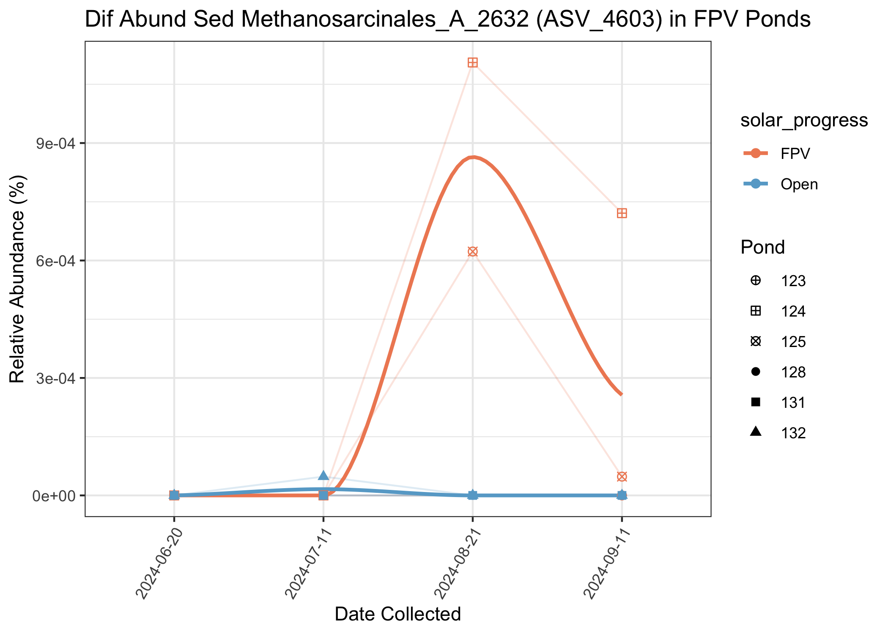<!-- -->
There is a differentially abundant ASV Methanosarcinales_A_2632 that is increased in solar ponds! When we plot the abundance overtime this ASV is barely in the community but it is higher in solar ponds. Doesnt really feel worth it to report considering its a minor contribution to community.


``` r
sed_difAbund_plot <- 
  methano_sed_asv_df %>%
  dplyr::filter(ASV == "ASV_4603") %>%
  ggplot(aes(x = solar_progress, y = Abundance,
             color = solar_progress)) + 
  geom_point(aes(shape = Pond),
             size = 2, alpha = 0.8, stroke = 0.8,
             position = position_jitterdodge(jitter.width = .5, dodge.width = .3)) +
  geom_boxplot(outlier.shape = NA, alpha = 0, color = "black", 
               position = position_dodge(0.6)) + 
  labs(color = "Treatment",
       y = "Relative Abundance",
       title = "Methanoperedens_A \nASV_4603") +
  scale_color_manual(values = solar_colors) +
  scale_shape_manual(values = pond_shapes) +
  theme_classic() +
  ### ADD PVALUES 
  stat_compare_means(method = "wilcox.test", 
                     #comparisons = list(c("FPV", "Open")),
                     label = "p.format", # or "p.format" or "p.value"
                     #group.by = "combined_label",
                     size = 3,               # ⬅️ Font size
                     label.y.npc = 0.7,
                     #label.y = c(8000, 100000, 500000, 400000, 400000),
                     label.x = 1.75) +    # ⬅️ Manually set y position)  +
  guides(
    color = guide_legend(ncol = 2,override.aes = list(size = 2)),
    shape = guide_legend(ncol = 2, override.aes = list(size = 3))) +
  theme(legend.position = "none", #c(0.75, 0.7),
        axis.title.x = element_blank(),
        legend.title = element_text(size = 8),
        legend.text = element_text(size = 7),
        legend.key.size = unit(0.4, "cm"),
        legend.spacing.x = unit(0.2, "cm"),
        legend.margin = margin(t = -5, unit = "pt"),
        strip.text = element_text(size = 10),
        plot.title = element_text(size = 10)); sed_difAbund_plot
```

<!-- -->

``` r
# Now, actually save the plot   
# NOTE THAT ASV_
ggsave(sed_difAbund_plot, width = 3, height = 2, dpi = 300,
        filename = "figures/Fig_S2/Fig_S2.png")
```


## S3 - Community Composition
I am plotting water and sediment community compositions together in this chunk

``` r
# pull out metadata 
metadata <- water_ch4_physeq %>%
  sample_data() %>%
  data.frame() %>% 
  select(-Methanotroph_Methanogen)

# sediment + water methane cyclers 11 total 
methanogens <- c("Methanosarcinales_A_2632", "Methanomicrobiales", "Methanobacteriales", "Methanomassiliicoccales", "Methanofastidiosales", "Methanotrichales", "Methanocellales", "Methanomethylicales")
methanotrophs <- c("Methylococcales", "Methylacidiphilales", "Methylomirabilales")


# create df for plotting
water_ch4_order_df <- water_ch4_physeq %>% 
  tax_glom(taxrank = "ASV") %>% 
  psmelt() %>% 
  mutate(
    Methanotroph_Methanogen = case_when(
      Order %in% methanogens ~ "Methanogen",
      Order %in% methanotrophs ~ "Methanotroph",
      TRUE ~ NA_character_
    )
  ) %>% 
  select(DNA_ID, Abundance, Kingdom, Phylum, Class, Order, Family, Genus, Species, ASV, Methanotroph_Methanogen) %>% 
  left_join(metadata, by = "DNA_ID") %>% 
  mutate(
    Depth_Class = case_when(
    Depth_Class == "S"  ~ "Surface Water",
    Depth_Class == "B"  ~ "Bottom Water"),
    Depth_Class = factor(Depth_Class, levels = c("Surface Water", "Bottom Water")),
    solar_progress = recode(solar_progress, "Solar" = "FPV", "No Solar" = "Open")) %>% 
  dplyr::filter(Date_Collected.x == "2024-07-11") %>% 
  group_by(Order, JDate, Pond, Depth_Class, solar_progress, Methanotroph_Methanogen, DNA_ID) %>% 
  summarize(Abundance = sum(Abundance)) 
  

# community composition - water absolute abundances


# order for legend 
ch4_legend_ord <- c("Methanobacteriales",
                  "Methanocellales", 
                  "Methanofastidiosales",
                  "Methanomassiliicoccales",
                  "Methanomicrobiales",
                  "Methanosarcinales_A_2632",
                  "Methanomethylicales",
                  "Methanotrichales",
                  "Methylococcales",
                  "Methylomirabilales",
                  "Methylacidiphilales"
                  )

# create absolute abundance community comp plot
waterch4_ord_cc_fpv <- water_ch4_order_df %>% 
  ggplot(aes(x = Pond, y = Abundance/1e3, fill = Order)) + 
  geom_col(width = .99) +
  facet_grid(rows = vars(Depth_Class), cols = vars(solar_progress), scales = "free_x") +
  #ggh4x::facet_nested(~solar_progress+Depth_Class,space = "free", scales = "free_x") +
  scale_fill_manual(values = ch4_colors) +
 # scale_x_continuous(expand = expansion(mult = 0),
 # labels = scales::label_comma()) +
  labs(y = "Absolute Abundance (10³ cells/ml)") + 
  scale_x_discrete(expand = c(0, 0)) +
  # theme(axis.line.x = element_blank(),
  #       axis.text.x = element_blank(),
  #       axis.ticks.y = element_blank(),
  #       axis.title.y = element_blank(),
  #       plot.margin = unit(c(0,0,0,0), "null"),
  #       axis.text.x = element_text(size = 10),
  #       axis.title.x = element_text(size = 12),
  #       legend.text = element_text(size = 8),
  #       legend.title = element_text(size = 12),
  #       legend.box.background = element_rect(linetype = "solid", color = "black")) + 
  theme_classic() +
  theme(strip.background = element_blank(),
        # axis.text.x = element_text(angle=90, vjust=0.5),
        strip.text.x.top = element_text(size = 11, face = "bold"),
        strip.text.y.right = element_text(size = 10, face = "bold"),
        axis.text.x = element_blank(),
        axis.title.y = element_text(size = 9),
        axis.title.x = element_blank(),
        axis.ticks.x = element_blank(),
        axis.line = element_blank(),
        legend.key.width=unit(0.3,"cm"),
        legend.key.height=unit(0.3,"cm"), 
        legend.position = "none", 
        legend.title=element_text(size=10),
        legend.text=element_text(size=9),
        panel.border = element_rect(color = "black", 
                            fill = NA, size = 1))+
  guides(fill = guide_legend(title.position = "left",
                             nrow=5, ncol= 3)) 
waterch4_ord_cc_fpv
```

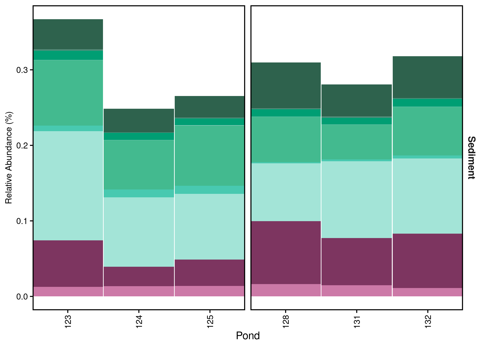<!-- -->

``` r
# relative sediment abundance

# calculate relative abundance and identify methane cyclers
methano_sed_phy <- scaled_sed_physeq_24 %>%
  speedyseq::tax_glom(taxrank = "ASV") %>% 
  # Calculate the relative abundance
  speedyseq::transform_sample_counts(function(x) {x/sum(x)}) %>%
  psmelt() %>%
  filter(Order %in% c(methanogens, methanotrophs)) %>%
  mutate(
    Methanotroph_Methanogen = case_when(
      Order %in% methanogens ~ "Methanogen",
      Order %in% methanotrophs ~ "Methanotroph"
    ),
    solar_progress = recode(solar_progress, "Solar" = "FPV", "No Solar" = "Open"),
    Depth_Class = "Sediment")  %>% 
  group_by(Order, Date_Collected, Pond, Depth_Class, solar_progress, Methanotroph_Methanogen, DNA_ID) %>% 
  summarize(Abundance = sum(Abundance)) 


# relative community plot 
sedch4_order_cc <-  methano_sed_phy %>% 
  dplyr::filter(Date_Collected == "2024-07-11") %>% 
  ggplot(aes(x = Pond, y = Abundance, fill = Order)) + 
  geom_col(width = .99) +
  facet_grid(rows = vars(Depth_Class), cols = vars(solar_progress), scales = "free_x") +
  scale_fill_manual(values = ch4_colors) +
  scale_x_discrete(expand = c(0, 0)) + 
  labs(
    y = "Relative Abundance (%)",
    x = "Pond"
  ) +
  theme_classic() +
  theme(strip.background = element_blank(),
        strip.text.x.top = element_blank(),
        strip.text.y.right = element_text(size = 10, face = "bold"),
        axis.text.x = element_text(angle=90, vjust=0.5),
        axis.title.y = element_text(size = 9),
        axis.line = element_blank(),
        legend.key.width=unit(0.3,"cm"),
        legend.key.height=unit(0.3,"cm"), 
        legend.position = "none", 
        legend.title=element_text(size=10),
        legend.text=element_text(size=9),
        panel.border = element_rect(color = "black", 
                            fill = NA, size = 1))+
  guides(fill = guide_legend(title.position = "left",
                             nrow=7, ncol= 3))
    
sedch4_order_cc
```

<!-- -->

``` r
# plot community plots together
community <- ggarrange(waterch4_ord_cc_fpv, sedch4_order_cc,
            ncol = 1,
            nrow = 2,
            labels = c("A.", "B."),
            align = "v")
community
```

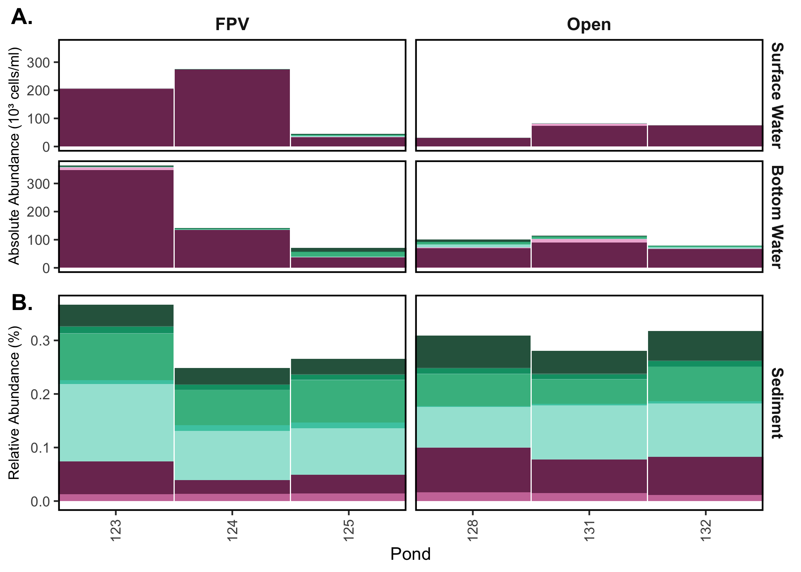<!-- -->

``` r
# combine water and sediment df for legend to export
leg_water <- water_ch4_order_df %>% 
  select(Abundance, Order, Methanotroph_Methanogen)
leg_sed <- methano_sed_phy %>% 
  select(Abundance, Order, Methanotroph_Methanogen)

illegal_bind <- rbind(leg_water, leg_sed)


# plot illegally bound df to get legend of all 11 methane cycler species
legend_ch4 <- illegal_bind %>% 
  mutate(Order = factor(Order, levels = ch4_legend_ord)) %>%
  ggplot(aes(x = Order, y = Abundance, fill = Order)) +
  geom_col(width = .99) +
  scale_fill_manual(values = ch4_colors) +
  guides(
    fill = guide_legend(
      title = "Order",
      ncol = 3,
      byrow = FALSE
    )
  ) +
  theme(legend.key.width=unit(0.3,"cm"),
        legend.key.height=unit(0.3,"cm"),
        legend.position = "bottom",
        legend.title=element_text(size=10),
        legend.text = element_text(size = 9)) 
legend_ch4
```

<!-- -->

``` r
# get legends
legend_only <- cowplot::get_legend(legend_ch4)

# theres randomly 5 grob objects and only the 3rd one has something?
legend_list <- cowplot::get_plot_component(legend_ch4, "guide-box", return_all = TRUE)

# extract legend grob
legend_only <- legend_list[[3]]

# Side by side
combined_legends <- plot_grid(
  waterch4_ord_cc_fpv,
  sedch4_order_cc,
  legend_only, 
  ncol = 1,
  align = "v",
  axis = "l",
  labels = c("A.", "B."),
  rel_heights = c(1, 1, .5)
)
combined_legends
```

<!-- -->

``` r
# now lets begin to save our image
png("figures/s3/s3_community_comp.png", width = 3900, height = 4000, res = 600)

grid.newpage()
grid.draw(combined_legends)
```

```
## Error in grid.newpage(): QuartzBitmap_Output - unable to open file 'figures/s3/s3_community_comp.png'
```

``` r
grid.text(label = "Methanogens", x = 0.4, y = 0.17, just = c("center", "bottom"),
          gp = gpar(fontface = "bold", cex = .9))
grid.text(label = "Methanotrophs", x = 0.81, y = 0.17, just = c("center", "bottom"),
          gp = gpar(fontface = "bold", cex = .9))

dev.off()
```

```
## Error in dev.off(): QuartzBitmap_Output - unable to open file 'figures/s3/s3_community_comp.png'
```


# Bonus code
### 1: relative abundances
This is code that I previously ran but I am having a hard time deleting it will not be evaluated

``` r
# calculate pvalue
stat.test <- methano_water_sed_711 %>% # methano_water_sed_711 no longer exists
  dplyr::filter(str_detect(Depth_Class, "Water")) %>% 
  group_by(Methanotroph_Methanogen, Depth_Class) %>% 
  wilcox_test(order_abund ~ solar_progress, 
              p.adjust.method = "fdr",
              exact = FALSE) %>% 
  add_significance() %>% 
  mutate(
    group = interaction(Methanotroph_Methanogen, Depth_Class, sep = " "),
    y.position = 0.35,
    p.label = signif(p, digits = 2))
stat.test

# water column absolute abundance
p7 <- methano_water_sed_711 %>% 
  dplyr::filter(str_detect(Depth_Class, "Water")) %>% 
  ggplot(aes(x = solar_progress, y = order_abund, fill = solar_progress, color = solar_progress)) +
  geom_boxplot(outlier.shape = NA, alpha = 0.2) +  
  geom_point(aes(shape = Pond),
             alpha = 2,
             position = position_jitterdodge(jitter.width = .9, dodge.width = .65),
             size = 2) +
  ggh4x::facet_nested(~ Methanotroph_Methanogen + Depth_Class,
                      scales = "free") +
  scale_fill_manual(values = c("Open" = "#B3C493", "FPV" = "#005373")) +
  scale_color_manual(values = c("Open" = "#B3C493", "FPV" = "#005373")) +
  scale_shape_manual(values = pond_shapes) +
  labs(y = "Relative Abundance (%)") +
  stat_pvalue_manual(
    stat.test,
    label = "p.label",
    group = "group",
    y.position = .08,
    tip.length = 0,
    size = 3,
    bracket.size = 0,
    inherit.aes = FALSE
  ) +
  guides(
    fill = "none",
    color = "none",
    shape = guide_legend(
      nrow = 2,
      byrow = TRUE,
      title.position = "left",
      override.aes = list(size = 2.5))
  ) +
  theme_bw() +
  theme(
    axis.title.x = element_blank(),
    axis.text.x = element_text(angle = 60, hjust = 1),
    legend.position = "bottom"
  )
p7


# sediment relative abundance
stat.test <- methano_water_sed_711 %>% 
  dplyr::filter(str_detect(Depth_Class, "Sediment")) %>% 
  group_by(Methanotroph_Methanogen, Depth_Class) %>% 
  wilcox_test(order_abund ~ solar_progress, 
              p.adjust.method = "fdr",
              exact = FALSE) %>% 
  add_significance() %>% 
  mutate(
    group = interaction(Methanotroph_Methanogen, Depth_Class, sep = " "),
    y.position = 0.35,
    p.label = signif(p, digits = 2))
stat.test

sed_ch4 <- methano_water_sed_711 %>% 
  dplyr::filter(str_detect(Depth_Class, "Sediment")) %>% 
  ggplot(aes(x = solar_progress, y = order_abund, fill = solar_progress, color = solar_progress)) +
  geom_boxplot(outlier.shape = NA, alpha = 0.2) +  
  geom_point(aes(shape = Pond),
             alpha = 2,
             position = position_jitterdodge(jitter.width = .9, dodge.width = .65),
             size = 2) +
  ggh4x::facet_nested(~ Methanotroph_Methanogen,
                      scales = "free") +
  scale_fill_manual(values = c("Open" = "#B3C493", "FPV" = "#005373")) +
  scale_color_manual(values = c("Open" = "#B3C493", "FPV" = "#005373")) +
  scale_shape_manual(values = pond_shapes) +
  labs(y = "Methanogen and Methanotroph Relative Abundance") +
  stat_pvalue_manual(
    stat.test,
    label = "p.label",
    group = "group",
    y.position = .35,
    tip.length = 0,
    size = 3,
    bracket.size = 0,
    inherit.aes = FALSE
  ) +
  guides(
    fill = "none",
    color = "none",
    shape = guide_legend(
      nrow = 2,
      byrow = TRUE,
      title.position = "left",
      override.aes = list(size = 2.5))
  ) +
  theme_bw() +
  theme(
    axis.title.x = element_blank(),
    axis.text.x = element_text(angle = 60, hjust = 1),
    legend.position = "bottom"
  )
sed_ch4

p7 + sed_ch4


# alternative plots to match nicks vision
### methanogen water
pmethanogen_water <- methano_water_sed_711 %>% 
  dplyr::filter(str_detect(Depth_Class, "Water")) %>% 
  dplyr::filter(str_detect(Methanotroph_Methanogen, "Methanogen"))
p7 <- methano_water_sed_711 %>% 
  dplyr::filter(str_detect(Depth_Class, "Water")) %>% 
  ggplot(aes(x = solar_progress, y = order_abund, fill = solar_progress, color = solar_progress)) +
  geom_boxplot(outlier.shape = NA, alpha = 0.2) +  
  geom_point(aes(shape = Pond),
             position = position_jitterdodge(jitter.width = .9, dodge.width = .65),
             size = 2) +
  ggh4x::facet_nested(~ Methanotroph_Methanogen + Depth_Class,
                      scales = "free") +
  scale_fill_manual(values = c("Open" = "#B3C493", "FPV" = "#005373")) +
  scale_color_manual(values = c("Open" = "#B3C493", "FPV" = "#005373")) +
  scale_shape_manual(values = pond_shapes) +
  labs(y = "Relative Abundance (%)") +
  stat_pvalue_manual(
    stat.test,
    label = "p.label",
    group = "group",
    y.position = .08,
    tip.length = 0,
    size = 3,
    bracket.size = 0,
    inherit.aes = FALSE
  ) +
  guides(
    fill = "none",
    color = "none",
    shape = guide_legend(
      nrow = 2,
      byrow = TRUE,
      title.position = "left",
      override.aes = list(size = 2.5))
  ) +
  theme_bw() +
  theme(
    axis.title.x = element_blank(),
    axis.text.x = element_text(angle = 60, hjust = 1),
    legend.position = "bottom"
  )
p7
```


### 2. 4 box plots 
this just had the 4 boxplots made with a function but not evaluated


### Sediment - Relative Abundance

``` r
# factor levels before we plot so FPV is on left and Open is on the right
methano_water_sed_711$solar_progress <- factor(methano_water_sed_711$solar_progress, 
                                               levels = c("FPV", "Open"))

# lets make function to plot methanos
make_boxplot_methano <- function(data, depth_class, methano) {
  data %>%
    filter(
      Depth_Class == depth_class,
      Methanotroph_Methanogen == methano
    ) %>%
    ggplot(aes(
      x = solar_progress,
      y = order_abund
    )) +
    geom_boxplot(outlier.shape = NA, alpha = 0.2) +
    geom_point(
      aes(shape = Pond, color = solar_progress),
      position = position_jitterdodge(jitter.width = 0.84, dodge.width = 0.65),
      size = 3
    ) +
    scale_color_manual(values = c("FPV" = "#C07A5B", "Open" = "#76A7CB")) +
    scale_y_continuous(
      limits = c(0, 0.37),  # set y-axis range
      breaks = seq(0, 0.3, by = 0.15)  # Consistent tick marks
    ) +
    labs(
      title = paste(depth_class),
      y = "Methanogen\nRelative Abundance (%)",  # Label for every y-axis
      x = NULL
    ) +
    theme_classic() +
    theme(
      legend.position = "none",
      axis.title.y = element_text(size = 8),
      plot.title = element_text(size = 10, hjust = 0.5)
    )
}

# now lets do the same but for methanotrophs
make_boxplot_trophs <- function(data, depth_class, methano) {
  data %>%
    filter(
      Depth_Class == depth_class,
      Methanotroph_Methanogen == methano
    ) %>%
    ggplot(aes(
      x = solar_progress,
      y = order_abund
      # fill = solar_progress,
    )) +
    geom_boxplot(outlier.shape = NA, alpha = 0.2, color = "black") +
    geom_point(
      aes(shape = Pond, color = solar_progress),
      position = position_jitterdodge(jitter.width = 0.84, dodge.width = 0.65),
      size = 3 
    ) +
    scale_color_manual(values = c("FPV" = "#C07A5B", "Open" = "#76A7CB")) +
    scale_y_continuous(
      limits = c(0, 0.37),  # Fixed y-axis range
      breaks = seq(0, 0.3, by = 0.15)  # tick marks
    ) +
    labs(
      title = paste(depth_class),
      y = "Methanotroph\nRelative Abundance (%)", 
      x = NULL
    ) +
    theme_classic() +
    theme(
      legend.position = "none",
      axis.title.y = element_text(size = 8),
      plot.title = element_text(size = 10, hjust = 0.5)
    )
}

# make all the plots 
p1 <- make_boxplot_methano(methano_water_sed_711, "Sediment", "Methanogen")
p2 <- make_boxplot_trophs(methano_water_sed_711, "Sediment", "Methanotroph")


# plot the final plot
final_sed <- ggarrange(
  p1, p2,
  nrow = 2, ncol = 2,
  align = "hv") # aligns axis 
final_sed

# ok lies not final plot BUT we are getting there we just need to add our legend

# extract only the legend
legend <- make_boxplot_methano(methano_water_sed_711, "Sediment", "Methanogen") +
  theme(
    legend.position = "bottom",
    legend.title = element_text(hjust = 0.5),  # 0.5 centers title
    legend.box = "horizontal",  # proper alignment
    legend.justification = "center"  # entire legend is centered
  ) +
  guides(
    color = "none", # we dont want color to be in legend
    shape = guide_legend(
      title.position = "top",  # make sure pond is above symbolx
      nrow = 2,
      byrow = TRUE, # want FPV in first row
      override.aes = list(size = 2.5)
    )
  )
legend

# only get legend
shared_legend <- ggpubr::get_legend(legend)

# make plots without legends
p1 <- make_boxplot_methano(methano_water_sed_711, "Sediment", "Methanogen")
p2 <- make_boxplot_trophs(methano_water_sed_711, "Sediment", "Methanotroph")

# now lets arrange plots 
final_sed <- ggarrange(
  ggarrange(p1, p2, 
            ncol = 2, 
            labels = c("E.", "F."),
            font.label = list(size =10)),
  nrow = 2,
  shared_legend,
  heights = c(2, 1)  # Adjust legend height (10:1 ratio)
)

# Display
final_sed

# paper worthy plot
final_plot <- final_water / final_sed

final_plot
```


### Analysis Notes

**Water Samples** When we filter for our methanotrophs and methanogens
at the **Order level** (we still have Phylum and Class level
information) we see that we have:

Methanogens: Methanosarciniales, Methanomicrobiales, Methanobacteriales,
Methanomassiliicoccales, Methanofastidiosales Methanotrophs:
Methylococcales, Methylacidiphilales, Methylomirabilales

Methanogens are Archaea and start with "Methano" in the order name.
Methanotrophs are bacteria.

When identifying methanotrophs it is important to remember that all
methanotrophs are methylotrophs (consume methanole, methylamine, or
formate as energy source but **not methane**) but not all methylotophs
are methanotrophs. Methanotrophs are a subset of methylotrophs but
consume methane as their sole carbon and energy source. Methanotrophs
typically start with "Methyl" in their order name but verified through
literature review and public databases.

Putative methanogens and methanotrophs were identified based on
taxonomic classification and verified through literature review and
publically available databases (NCBI).

**Sediment Samples** Just like our water samples, we will filter for
methanogens and methanotrophs at the **Order level** which we have:

Methanogens: Methanosarciniales, Methanomicrobiales, Methanobacteriales,
Methanocellales, Methanomassiliicoccales, Methanomethyliales,
Methanofastidiosales

Methanotrophs: Methylococcales, Methylomirabilales, Methylacidiphilales


Putative methanogens and methanotrophs were identified based on
taxonomic classification and verified through literature review and
publically available databases (NCBI).

# Reproducibility

``` r
# Reproducibility
devtools::session_info()
```

```
## ─ Session info ─────────────────────────────────────────────────────────────────────────────────────────────────────────────────────────────────────────────────────────────────────────────────────────────────────────────────────────────────────────
##  setting  value
##  version  R version 4.4.3 (2025-02-28)
##  os       macOS Sequoia 15.5
##  system   aarch64, darwin20
##  ui       X11
##  language (EN)
##  collate  en_US.UTF-8
##  ctype    en_US.UTF-8
##  tz       America/Detroit
##  date     2025-07-21
##  pandoc   3.2 @ /Applications/RStudio.app/Contents/Resources/app/quarto/bin/tools/aarch64/ (via rmarkdown)
##  quarto   1.5.57 @ /usr/local/bin/quarto
## 
## ─ Packages ─────────────────────────────────────────────────────────────────────────────────────────────────────────────────────────────────────────────────────────────────────────────────────────────────────────────────────────────────────────────
##  package          * version    date (UTC) lib source
##  abind              1.4-8      2024-09-12 [1] CRAN (R 4.4.1)
##  ade4               1.7-23     2025-02-14 [1] CRAN (R 4.4.1)
##  ANCOMBC          * 2.8.1      2025-01-09 [1] Bioconductor 3.20 (R 4.4.2)
##  ape                5.8-1      2024-12-16 [1] CRAN (R 4.4.1)
##  backports          1.5.0      2024-05-23 [1] CRAN (R 4.4.1)
##  base64enc          0.1-3      2015-07-28 [1] CRAN (R 4.4.1)
##  Biobase            2.66.0     2024-11-08 [1] Bioconductor 3.20 (R 4.4.1)
##  BiocGenerics       0.52.0     2024-11-08 [1] Bioconductor 3.20 (R 4.4.1)
##  biomformat         1.34.0     2024-11-08 [1] Bioconductor 3.20 (R 4.4.1)
##  Biostrings         2.74.1     2024-12-16 [1] Bioconductor 3.20 (R 4.4.2)
##  bit                4.6.0      2025-03-06 [1] CRAN (R 4.4.1)
##  bit64              4.6.0-1    2025-01-16 [1] CRAN (R 4.4.1)
##  boot               1.3-31     2024-08-28 [2] CRAN (R 4.4.3)
##  broom              1.0.8      2025-03-28 [1] CRAN (R 4.4.1)
##  bslib              0.9.0      2025-01-30 [1] CRAN (R 4.4.1)
##  cachem             1.1.0      2024-05-16 [1] CRAN (R 4.4.1)
##  car                3.1-3      2024-09-27 [1] CRAN (R 4.4.1)
##  carData            3.0-5      2022-01-06 [1] CRAN (R 4.4.1)
##  cellranger         1.1.0      2016-07-27 [1] CRAN (R 4.4.0)
##  checkmate          2.3.2      2024-07-29 [1] CRAN (R 4.4.0)
##  class              7.3-23     2025-01-01 [2] CRAN (R 4.4.3)
##  cli                3.6.5      2025-04-23 [1] CRAN (R 4.4.1)
##  cluster            2.1.8.1    2025-03-12 [2] CRAN (R 4.4.1)
##  codetools          0.2-20     2024-03-31 [2] CRAN (R 4.4.3)
##  colorspace         2.1-1      2024-07-26 [1] CRAN (R 4.4.1)
##  cowplot          * 1.1.3      2024-01-22 [1] CRAN (R 4.4.0)
##  crayon             1.5.3      2024-06-20 [1] CRAN (R 4.4.1)
##  CVXR               1.0-15     2024-11-07 [1] CRAN (R 4.4.1)
##  data.table         1.17.4     2025-05-26 [1] CRAN (R 4.4.1)
##  DescTools          0.99.60    2025-03-28 [1] CRAN (R 4.4.1)
##  devtools           2.4.5      2022-10-11 [1] CRAN (R 4.4.0)
##  digest             0.6.37     2024-08-19 [1] CRAN (R 4.4.1)
##  doParallel         1.0.17     2022-02-07 [1] CRAN (R 4.4.0)
##  doRNG              1.8.6.2    2025-04-02 [1] CRAN (R 4.4.1)
##  dplyr            * 1.1.4      2023-11-17 [1] CRAN (R 4.4.0)
##  e1071              1.7-16     2024-09-16 [1] CRAN (R 4.4.1)
##  ellipsis           0.3.2      2021-04-29 [1] CRAN (R 4.4.1)
##  energy             1.7-12     2024-08-24 [1] CRAN (R 4.4.1)
##  evaluate           1.0.3      2025-01-10 [1] CRAN (R 4.4.1)
##  Exact              3.3        2024-07-21 [1] CRAN (R 4.4.1)
##  expm               1.0-0      2024-08-19 [1] CRAN (R 4.4.1)
##  farver             2.1.2      2024-05-13 [1] CRAN (R 4.4.1)
##  fastmap            1.2.0      2024-05-15 [1] CRAN (R 4.4.1)
##  forcats          * 1.0.0      2023-01-29 [1] CRAN (R 4.4.0)
##  foreach            1.5.2      2022-02-02 [1] CRAN (R 4.4.0)
##  foreign            0.8-90     2025-03-31 [2] CRAN (R 4.4.1)
##  Formula            1.2-5      2023-02-24 [1] CRAN (R 4.4.1)
##  fs                 1.6.6      2025-04-12 [1] CRAN (R 4.4.1)
##  generics           0.1.4      2025-05-09 [1] CRAN (R 4.4.1)
##  GenomeInfoDb       1.42.3     2025-01-27 [1] Bioconductor 3.20 (R 4.4.2)
##  GenomeInfoDbData   1.2.13     2025-05-26 [1] Bioconductor
##  ggh4x            * 0.3.1      2025-05-30 [1] CRAN (R 4.4.1)
##  ggplot2          * 3.5.2      2025-04-09 [1] CRAN (R 4.4.1)
##  ggpubr           * 0.6.0      2023-02-10 [1] CRAN (R 4.4.0)
##  ggsignif           0.6.4      2022-10-13 [1] CRAN (R 4.4.0)
##  gld                2.6.7      2025-01-17 [1] CRAN (R 4.4.1)
##  glue               1.8.0      2024-09-30 [1] CRAN (R 4.4.1)
##  gmp                0.7-5      2024-08-23 [1] CRAN (R 4.4.1)
##  gridExtra          2.3        2017-09-09 [1] CRAN (R 4.4.1)
##  gsl                2.1-8      2023-01-24 [1] CRAN (R 4.4.1)
##  gtable             0.3.6      2024-10-25 [1] CRAN (R 4.4.1)
##  gtools             3.9.5      2023-11-20 [1] CRAN (R 4.4.1)
##  haven              2.5.4      2023-11-30 [1] CRAN (R 4.4.0)
##  Hmisc              5.2-3      2025-03-16 [1] CRAN (R 4.4.1)
##  hms                1.1.3      2023-03-21 [1] CRAN (R 4.4.0)
##  htmlTable          2.4.3      2024-07-21 [1] CRAN (R 4.4.0)
##  htmltools          0.5.8.1    2024-04-04 [1] CRAN (R 4.4.1)
##  htmlwidgets        1.6.4      2023-12-06 [1] CRAN (R 4.4.0)
##  httpuv             1.6.16     2025-04-16 [1] CRAN (R 4.4.1)
##  httr               1.4.7      2023-08-15 [1] CRAN (R 4.4.0)
##  igraph             2.1.4      2025-01-23 [1] CRAN (R 4.4.1)
##  IRanges            2.40.1     2024-12-05 [1] Bioconductor 3.20 (R 4.4.2)
##  iterators          1.0.14     2022-02-05 [1] CRAN (R 4.4.1)
##  jquerylib          0.1.4      2021-04-26 [1] CRAN (R 4.4.0)
##  jsonlite           2.0.0      2025-03-27 [1] CRAN (R 4.4.1)
##  knitr              1.50       2025-03-16 [1] CRAN (R 4.4.1)
##  labeling           0.4.3      2023-08-29 [1] CRAN (R 4.4.1)
##  later              1.4.2      2025-04-08 [1] CRAN (R 4.4.1)
##  lattice          * 0.22-7     2025-04-02 [2] CRAN (R 4.4.1)
##  lifecycle          1.0.4      2023-11-07 [1] CRAN (R 4.4.1)
##  lme4               1.1-37     2025-03-26 [1] CRAN (R 4.4.1)
##  lmerTest           3.1-3      2020-10-23 [1] CRAN (R 4.4.0)
##  lmom               3.2        2024-09-30 [1] CRAN (R 4.4.1)
##  lubridate        * 1.9.4      2024-12-08 [1] CRAN (R 4.4.1)
##  magrittr           2.0.3      2022-03-30 [1] CRAN (R 4.4.1)
##  MASS               7.3-65     2025-02-28 [2] CRAN (R 4.4.1)
##  Matrix             1.7-3      2025-03-11 [2] CRAN (R 4.4.1)
##  memoise            2.0.1      2021-11-26 [1] CRAN (R 4.4.0)
##  mgcv               1.9-3      2025-04-04 [2] CRAN (R 4.4.1)
##  mime               0.13       2025-03-17 [1] CRAN (R 4.4.1)
##  miniUI             0.1.2      2025-04-17 [1] CRAN (R 4.4.1)
##  minqa              1.2.8      2024-08-17 [1] CRAN (R 4.4.1)
##  multcomp           1.4-28     2025-01-29 [1] CRAN (R 4.4.1)
##  multtest           2.62.0     2024-11-08 [1] Bioconductor 3.20 (R 4.4.1)
##  mvtnorm            1.3-3      2025-01-10 [1] CRAN (R 4.4.1)
##  nlme               3.1-168    2025-03-31 [2] CRAN (R 4.4.1)
##  nloptr             2.2.1      2025-03-17 [1] CRAN (R 4.4.1)
##  nnet               7.3-20     2025-01-01 [2] CRAN (R 4.4.3)
##  numDeriv           2016.8-1.1 2019-06-06 [1] CRAN (R 4.4.1)
##  pacman             0.5.1      2019-03-11 [1] CRAN (R 4.4.0)
##  patchwork        * 1.3.1      2025-06-21 [1] CRAN (R 4.4.1)
##  permute          * 0.9-7      2022-01-27 [1] CRAN (R 4.4.1)
##  phyloseq         * 1.50.0     2024-10-29 [1] Bioconductor 3.20 (R 4.4.3)
##  pillar             1.10.2     2025-04-05 [1] CRAN (R 4.4.1)
##  pkgbuild           1.4.8      2025-05-26 [1] CRAN (R 4.4.1)
##  pkgconfig          2.0.3      2019-09-22 [1] CRAN (R 4.4.1)
##  pkgload            1.4.0      2024-06-28 [1] CRAN (R 4.4.0)
##  plyr               1.8.9      2023-10-02 [1] CRAN (R 4.4.1)
##  profvis            0.4.0      2024-09-20 [1] CRAN (R 4.4.1)
##  promises           1.3.2      2024-11-28 [1] CRAN (R 4.4.1)
##  proxy              0.4-27     2022-06-09 [1] CRAN (R 4.4.1)
##  purrr            * 1.0.4      2025-02-05 [1] CRAN (R 4.4.1)
##  R6                 2.6.1      2025-02-15 [1] CRAN (R 4.4.1)
##  ragg               1.4.0      2025-04-10 [1] CRAN (R 4.4.1)
##  rbibutils          2.3        2024-10-04 [1] CRAN (R 4.4.1)
##  RColorBrewer       1.1-3      2022-04-03 [1] CRAN (R 4.4.1)
##  Rcpp               1.0.14     2025-01-12 [1] CRAN (R 4.4.1)
##  Rdpack             2.6.4      2025-04-09 [1] CRAN (R 4.4.1)
##  readr            * 2.1.5      2024-01-10 [1] CRAN (R 4.4.0)
##  readxl             1.4.5      2025-03-07 [1] CRAN (R 4.4.1)
##  reformulas         0.4.1      2025-04-30 [1] CRAN (R 4.4.1)
##  remotes            2.5.0      2024-03-17 [1] CRAN (R 4.4.1)
##  reshape2           1.4.4      2020-04-09 [1] CRAN (R 4.4.0)
##  rhdf5              2.50.2     2025-01-09 [1] Bioconductor 3.20 (R 4.4.2)
##  rhdf5filters       1.18.1     2025-03-06 [1] Bioconductor 3.20 (R 4.4.3)
##  Rhdf5lib           1.28.0     2024-11-08 [1] Bioconductor 3.20 (R 4.4.1)
##  rlang              1.1.6      2025-04-11 [1] CRAN (R 4.4.1)
##  rmarkdown          2.29       2024-11-04 [1] CRAN (R 4.4.1)
##  Rmpfr              1.1-0      2025-05-13 [1] CRAN (R 4.4.1)
##  rngtools           1.5.2      2021-09-20 [1] CRAN (R 4.4.1)
##  rootSolve          1.8.2.4    2023-09-21 [1] CRAN (R 4.4.1)
##  rpart              4.1.24     2025-01-07 [2] CRAN (R 4.4.3)
##  rstatix          * 0.7.2      2023-02-01 [1] CRAN (R 4.4.0)
##  rstudioapi         0.17.1     2024-10-22 [1] CRAN (R 4.4.1)
##  S4Vectors          0.44.0     2024-11-08 [1] Bioconductor 3.20 (R 4.4.1)
##  sandwich           3.1-1      2024-09-15 [1] CRAN (R 4.4.1)
##  sass               0.4.10     2025-04-11 [1] CRAN (R 4.4.1)
##  scales           * 1.4.0      2025-04-24 [1] CRAN (R 4.4.1)
##  sessioninfo        1.2.3      2025-02-05 [1] CRAN (R 4.4.1)
##  shiny              1.10.0     2024-12-14 [1] CRAN (R 4.4.1)
##  speedyseq        * 0.5.3.9021 2025-07-16 [1] Github (mikemc/speedyseq@0057652)
##  stringi            1.8.7      2025-03-27 [1] CRAN (R 4.4.1)
##  stringr          * 1.5.1      2023-11-14 [1] CRAN (R 4.4.0)
##  survival           3.8-3      2024-12-17 [2] CRAN (R 4.4.3)
##  systemfonts        1.2.3      2025-04-30 [1] CRAN (R 4.4.1)
##  textshaping        1.0.1      2025-05-01 [1] CRAN (R 4.4.1)
##  TH.data            1.1-3      2025-01-17 [1] CRAN (R 4.4.1)
##  tibble           * 3.2.1      2023-03-20 [1] CRAN (R 4.4.0)
##  tidyr            * 1.3.1      2024-01-24 [1] CRAN (R 4.4.1)
##  tidyselect         1.2.1      2024-03-11 [1] CRAN (R 4.4.0)
##  tidyverse        * 2.0.0      2023-02-22 [1] CRAN (R 4.4.0)
##  timechange         0.3.0      2024-01-18 [1] CRAN (R 4.4.1)
##  tzdb               0.5.0      2025-03-15 [1] CRAN (R 4.4.1)
##  UCSC.utils         1.2.0      2024-11-08 [1] Bioconductor 3.20 (R 4.4.1)
##  urlchecker         1.0.1      2021-11-30 [1] CRAN (R 4.4.1)
##  usethis            3.1.0      2024-11-26 [1] CRAN (R 4.4.1)
##  utf8               1.2.5      2025-05-01 [1] CRAN (R 4.4.1)
##  vctrs              0.6.5      2023-12-01 [1] CRAN (R 4.4.0)
##  vegan            * 2.6-10     2025-01-29 [1] CRAN (R 4.4.1)
##  withr              3.0.2      2024-10-28 [1] CRAN (R 4.4.1)
##  xfun               0.52       2025-04-02 [1] CRAN (R 4.4.1)
##  xtable             1.8-4      2019-04-21 [1] CRAN (R 4.4.1)
##  XVector            0.46.0     2024-11-08 [1] Bioconductor 3.20 (R 4.4.1)
##  yaml               2.3.10     2024-07-26 [1] CRAN (R 4.4.1)
##  zlibbioc           1.52.0     2024-11-08 [1] Bioconductor 3.20 (R 4.4.1)
##  zoo                1.8-14     2025-04-10 [1] CRAN (R 4.4.1)
## 
##  [1] /Users/mls528/Library/R/arm64/4.4/library
##  [2] /Library/Frameworks/R.framework/Versions/4.4-arm64/Resources/library
##  * ── Packages attached to the search path.
## 
## ────────────────────────────────────────────────────────────────────────────────────────────────────────────────────────────────────────────────────────────────────────────────────────────────────────────────────────────────────────────────────────
```

