# Purpose

We will create a figure to show the difference in methanogens and
methanotrophs in FSP and control ponds at different depths and between
sample types. 

Additionally, I have written the methods and results in this document
which will be added to the google document.


# Load packages


``` r
# Efficiently load packages 
pacman::p_load(phyloseq, ggpubr, tidyverse, patchwork, ggh4x, speedyseq, rstatix, dplyr, purrr, vegan, ANCOMBC, microViz,  cowplot, grid, scales, Biostrings, stringr, install = FALSE)

source("code/functions.R") # contains scale_reads
source("code/colors_and_shapes.R")

# Set our seed for reproducibility
set.seed(09091999)
```

# Load in Data

Loading in our .RData objects.

1. Water samples have flow cytometry derived absolute abundances.

2. Sediments do not have absolute abundance measurements incorporated. Instead, it has been scaled down to the minimum reads. Note: we scale down to the minimum number of reads to standardize/normalize our data to allow for more accurate comparisons between reads to account for uneven sequencing depth across samples (may arise to do seequencing runs or library prep efficiency, etc.)

And we will add in our metadata as well!


``` r
# water physeq with absolute abundance counts, this hasnt pruned the taxa out yet
# load("data/00_load_data/full_abs_physeq.RData")

# or we can also load in water physeq that has absolute abundance as well
load("data/00_load_data/water_physeq.RData")

# sediment scaled physeq
load("data/00_load_data/scaled_sed_physeq.RData")

## Add JDate to the sample_data 
sample_data(scaled_sed_physeq)$JDate <-
  lubridate::yday(sample_data(scaled_sed_physeq)$Date_Collected)

# physeq with water (unincorporated cell counts) + sediment samples = 188 samples total
load("data/00_load_data/new_archaea_rooted_physeq.RData")

## Add JDate to the sample_data 
sample_data(new_archaea_rooted_physeq)$JDate <-
  lubridate::yday(sample_data(new_archaea_rooted_physeq)$Date_Collected)

# load in metadata
load("data/00_load_data/meta_track_23_24.RData")
metadata <- meta_track_23_24
```


# Prepare Phyloseq Objects
Here we will work with our two sample types (water and sediment) for the entire 2024 year. 

We incorporated total cell counts from flow cytometry for water samples (full_abs_physeq.RData)
For our sediment samples, we do not have absolute abundance measures so we will need to calculate the relative abundance and rarify our samples to the minimum read depth (20822)

### Water 
First we will filter out our water samples and save it as a phyloseq.


``` r
# filter for all time points in 2024
water_physeq_24 <- subset_samples(water_physeq, Year == "2024")

# prune taxa
water_physeq_24 <- water_physeq_24 %>% 
  prune_taxa(taxa_sums(.) > 0,.)

# melt physeq into data frame for all taxa
water_physeq_ch4_df <- water_physeq_24 %>%
  speedyseq::psmelt() # melt into dataframe
```

### Sediment 
Same as the water samples we will filter out our phyloseq object and save it.

We do not have absolute abundance counts for our sediment samples so we will need to rarefy to the minimum sequencing depth (20826 reads)

``` r
# filter phyloseq for only sediment samples
sed_phy <- subset_samples(new_archaea_rooted_physeq, SampleType == "Sediment")

# subset samples 
sed_physeq <- subset_samples(sed_phy, !(sample_names(sed_phy) %in% c("SA_D046", "SA_D047")))

# prune taxa 
sed_phy <- sed_phy %>% 
  prune_taxa(taxa_sums(.) > 0,.)

# Intuition check of number of sequences per sample
min(sample_sums(sed_phy)) ## min = 20826
```

```
## [1] 20826
```

``` r
# scale water_physeq to minimum number of reads
scaled_sed_physeq <- 
  sed_phy %>% 
  scale_reads(round = "matround")

# melt physeq into data frame for all time points 
scaled_sed_physeq_24 <- scaled_sed_physeq 

# pull unique methane cycler taxonomic information 
scaled_sed_24_df <- scaled_sed_physeq_24 %>% 
  speedyseq::transform_sample_counts(function(x) x/sum(x)) %>% # transform to relative abundance here
  speedyseq::psmelt()  # melt into dataframe 

# save phyloseq object
save(scaled_sed_24_df, file = "data/01_phyloseq/scaled_sed_24_df.RData")
```

# FAPROTAXv2 - Predict Metabolic Functions (CH4 Cyclers)
Now that we have saved our phyloseq objects from our water and sediment samples, we will be using FAPROTAXv2 to identify which ASVs are methanotrophs or methanogens. 

This is different from the original FAPROTAXv1 which uses taxonomic identification based on the SILVA database. Although it does understand GreenGenes2 naming, with the updated GreenGenes2 taxonomic identification, it does predict less which makes sense since it is now incorporating metagenomic names. Instead we will be using FAPROTAXv2's function to take the representative 16S rRNA sequences and place it on a phylogenetic tree using a reference tree to functionally predict ASVs. We will then take those ASVs and integrate it with our taxonomy table to see who is identified as what, preferably at the genus level.

### Water - Create FASTA File
Here we will start with a classic OTU table in TSV format but without taxonomic identities. Instead we will have 16S rRNA sequences in a fasta format to place OTUs on FAPROTAX reference tree and functionally annotate from there

``` r
# set seed
set.seed(09091999)

# 1. Create otu table 
classic_otu_table_water <- water_physeq_24 %>%
  otu_table %>%
  psmelt() %>%
  pivot_wider(names_from = Sample, values_from = Abundance) 

write_tsv(classic_otu_table_water, file = paste0("data/02A_Water_FAPROTAXv2/water_otu_table.tsv"))

# create fasta file 
otu_water_24 <- psmelt(water_physeq_24) %>%
  dplyr::select(OTU, Kingdom:ASVseqs) %>% 
    distinct(OTU, .keep_all = TRUE) %>% # i think one unique otu is fine?
  mutate(taxonomy = paste(Kingdom, Phylum, Class, Order, Family, sep=";")) %>% 
  dplyr::select(OTU,ASVseqs)


# use biostrings to create fasta file 
dna_seqs <- DNAStringSet(otu_water_24$ASVseqs)
names(dna_seqs) <- otu_water_24$OTU
writeXStringSet(dna_seqs, "data/02A_Water_FAPROTAXv2/water_16S_seqs.fasta")

# intuition check, no news is good news
# Check if OTU IDs match between the two files
otu_ids_table <- otu_water_24$OTU
otu_ids_fasta <- names(dna_seqs)

identical(sort(otu_ids_table), sort(otu_ids_fasta)) # check id table
```

```
## [1] TRUE
```

``` r
stopifnot(identical(names(dna_seqs), otu_water_24$OTU)) # check that fasta df is good, no news is good news
```
Now that we have created our .fasta file from our water samples, we can now run FAPROTAXv2 on them to functionally predict.

### Water - Run FAPROTAXv2
First we will align our sequences to the reference sequences using mafft.

``` bash
# move directory
cd data/02A_Water_FAPROTAXv2

# get mafft onto path -- make sure to copy this in terminal 
export PATH=/programs/mafft/bin:$PATH


# align our 16S rRNA fasta list to FAPROTAX2 database reference OR align through mafft GUI website if crashing
/programs/mafft/bin/mafft --auto --addfragments water_16S_seqs.fasta --thread -12 --keeplength SILVA_FOCAL_ALIGNMENTS_SANITIZED_SUBSET.fasta > water_output_alignment.fasta

# gui website code that was run
mafft --thread 12 --inputorder --keeplength --anysymbol --maxambiguous 0.0 --addfragments fragments --auto input > output

# run script to functionally annotate
# since we have already created alignment we place our aligned sequences in already and no need to add reference file

# run script to create phylogenetic tree
# first set environment to have epa-ng to create tree
export LD_LIBRARY_PATH=/usr/local/gcc-7.3.0/lib64:/usr/local/gcc-7.3.0/lib
export PATH=/programs/epa-ng-0.3.8/bin:$PATH
export LD_LIBRARY_PATH=/usr/lib64:$LD_LIBRARY_PATH # was having issues for getting Rcpp to work but this got it to go!

# run script with aligned mafft aligned fasta file and tree
# running with default for now which uses the binomial hsp algorithm
Rscript faprotax.R -i water_otu_table.tsv -a alignment_ch4water.fasta -o ch4_water_function_table_16S.tsv --out_intermediates ch4_water_intermediates2 -d /local//workdir/sna49/FS_CH4_Mech_Ray_LO_Letters/data/02A_Water_FAPROTAXv2 -r ch4_water_report.txt  --otu_names_are_in_column "OTU" --hsp_algorithm "binomial"
```

### Water - Extract Predicted FAPROTAXv2 Results
Now we will get our function table and find the predicted metabolic functions that correspond to methane cycling, methanogens or methanotrophs. It will provide the ASV as well as the predicted function.

First we will extract all functions then narrow in on CH4 cyclers. This will also be paired with taxonomic identification of known methane cyclers at the genus level.

ASVs not classified to the family or genus level were filtered out from analysis despite FAPROTAXv2 predictions

``` r
# Read the text file of faprotaxv2 report from the previous chunk!
lines <- readLines("data/02A_Water_FAPROTAXv2/ch4_water_report.txt")

# create empty vectors
function_group <- c()
asv_ids <- c()

# temporary variable to store current function name
current_function <- NA

for (line in lines) {
  line <- str_trim(line)
  
  # function group name
  if (str_detect(line, ":$")) {
    current_function <- str_extract(line, "^[^\\s(]+")  # gets function name before the space
  }
  
  # reads asv lines (i.e. ASV_8 (P = 1))
  if (str_detect(line, "^ASV_\\d+")) {
    asv_id <- str_extract(line, "ASV_\\d+")
    function_group <- c(function_group, current_function)
    asv_ids <- c(asv_ids, asv_id)
  }
}

# Combine into dataframe
asv_df <- data.frame(function_group, asv_id = asv_ids)

# View if curious!
#View(asv_df)


# now lets specifically pull out the ch4 cyclers
water_ch4_cyclers_asv_df <- asv_df %>% 
  dplyr::filter(function_group %in% c(
                "acetoclastic_methanogenesis.value",
                "hydrogenotrophic_methanogenesis.value",
                "methanogenesis_by_CO2_reduction_with_H2.value",
                "methanogenesis_by_disproportionation_of_methyl_groups.value",
                "methanogenesis_by_reduction_of_methyl_compounds_with_H2.value",
                "methanogenesis_using_formate.value",
                "methanogenesis.value",
                "methanotrophy.value")) #%>% 
  # dplyr::mutate(
  #   CH4_Cycler = dplyr::case_when(
  #     grepl("methanogenesis", function_group) ~ "Methanogen",
  #     grepl("methanotrophy", function_group) ~ "Methanotroph",
  #     TRUE ~ NA_character_))

# quick check to see if we have any duplicated asvs
duplicates <- water_ch4_cyclers_asv_df %>%
  dplyr::group_by(asv_id) %>%
  dplyr::summarise(
    n_function_groups = dplyr::n_distinct(function_group), # number of function groups
    function_groups = paste(unique(function_group), collapse = ", ") # if theres another one where asv is duplicated
  ) %>%
  dplyr::filter(n_function_groups > 1) # count
duplicates # awesome methanogenesis functions overlap
```

```
## # A tibble: 62 × 3
##    asv_id    n_function_groups function_groups                                                                                                                                                          
##    <chr>                 <int> <chr>                                                                                                                                                                    
##  1 ASV_102                   2 methanogenesis_by_CO2_reduction_with_H2.value, methanogenesis.value                                                                                                      
##  2 ASV_1063                  4 hydrogenotrophic_methanogenesis.value, methanogenesis_by_CO2_reduction_with_H2.value, methanogenesis_by_reduction_of_methyl_compounds_with_H2.value, methanogenesis.value
##  3 ASV_10909                 4 hydrogenotrophic_methanogenesis.value, methanogenesis_by_CO2_reduction_with_H2.value, methanogenesis_using_formate.value, methanogenesis.value                           
##  4 ASV_1130                  2 methanogenesis_by_CO2_reduction_with_H2.value, methanogenesis.value                                                                                                      
##  5 ASV_11495                 4 hydrogenotrophic_methanogenesis.value, methanogenesis_by_CO2_reduction_with_H2.value, methanogenesis_using_formate.value, methanogenesis.value                           
##  6 ASV_1308                  2 methanogenesis_by_CO2_reduction_with_H2.value, methanogenesis.value                                                                                                      
##  7 ASV_13661                 2 methanogenesis_by_CO2_reduction_with_H2.value, methanogenesis.value                                                                                                      
##  8 ASV_1399                  2 methanogenesis_by_disproportionation_of_methyl_groups.value, methanogenesis.value                                                                                        
##  9 ASV_14                    2 acetoclastic_methanogenesis.value, methanogenesis.value                                                                                                                  
## 10 ASV_165                   3 hydrogenotrophic_methanogenesis.value, methanogenesis_by_CO2_reduction_with_H2.value, methanogenesis.value                                                               
## # ℹ 52 more rows
```

``` r
# methanogens have multiple annotations but they are all methanogenesis, we will keep the first occurrence of each asv since the specific function subtype doesnt matter to much to me right now
water_ch4_cyclers_asv_unique <- water_ch4_cyclers_asv_df %>%
  dplyr::distinct(asv_id, .keep_all = TRUE)

# join ch4 cyclers with water_physeq_ch4_df
water_ch4_joined <- water_physeq_ch4_df %>%
  dplyr::inner_join(water_ch4_cyclers_asv_unique, 
                    by = c("ASV" = "asv_id")) # 20112 observations!

# tidy up dataframe
water_ch4_joined <- water_ch4_joined %>% 
  dplyr::select(function_group, Kingdom, Phylum, Class, Order,
                Family, Genus, Species, ASV, ASVseqs) 


# check out unqiue taxanomic levels
water_ch4_joined$Phylum %>% unique()
```

```
##  [1] "Pseudomonadota"           "Verrucomicrobiota"        "Halobacteriota"           "Methanobacteriota_A_1229" "Omnitrophota"             NA                         "Micrarchaeota"            "Nitrospirota_A_437815"    "Patescibacteria"         
## [10] "Methanobacteriota_B"
```

``` r
water_ch4_joined$Order %>% unique()
```

```
##  [1] "Methylococcales"          "Limisphaerales"           "Rhizobiales_505101"       "Methanotrichales"         "Methanomicrobiales"       "Methylacidiphilales"      NA                         "Methanobacteriales"       "Pluralincolimonadales"   
## [10] "Burkholderiales"          "Enterobacterales_737866"  "Azospirillales_507929"    "UBA8416"                  "Verrucomicrobiales"       "Chthoniobacterales"       "SLAD01"                   "Norongarragalinales"      "Methanosarcinales_A_2632"
## [19] "PWTM01"                   "Methanocellales"          "LD1-PB3_B"                "Omnitrophales"            "Methanofastidiosales"
```

``` r
water_ch4_joined$Genus %>% unique()
```

```
##  [1] "Methylomonas"            NA                        "UBA11358"                "Methyloparacoccus"       "Methylobacter_C_601751"  "Methylocystis"           "Methylococcus"           "Alsobacter"              "Methylosoma"            
## [10] "Methanothrix_B"          "UBA4132"                 "Methanoregula"           "UBA3015"                 "Methanobacterium_B_963"  "Methyloterricola"        "Methanobacterium_A"      "GAS474"                  "JAAUTS01"               
## [19] "Methylotetracoccus"      "Methylomagnum"           "UBA6215"                 "LW23"                    "Methylobacter_C_601048"  "Methanobacterium_D_1054" "WYBW01"                  "Methanospirillum"        "Derxia"                 
## [28] "Methanosphaera"          "UBA467"                  "Methanolinea_A"          "Methylosinus"            "Methyloglobulus"         "Pedosphaera"             "Methylovulum"            "Azospirillum"            "YA12-FULL-60-10"        
## [37] "Methanobrevibacter_D"    "Crenothrix"              "Methanobacterium_F_900"  "Beijerinckia"            "SXTU01"                  "UBA95"                   "Methanosarcina_2619"     "PWTM01"                  "Methanocella_A"         
## [46] "Lenti-01"                "AV2"                     "Methanofastidiosum"
```

``` r
water_ch4_joined$ASV %>% unique()
```

```
##   [1] "ASV_44"    "ASV_13"    "ASV_63"    "ASV_32"    "ASV_178"   "ASV_56"    "ASV_119"   "ASV_141"   "ASV_930"   "ASV_465"   "ASV_357"   "ASV_688"   "ASV_826"   "ASV_1510"  "ASV_498"   "ASV_177"   "ASV_294"   "ASV_1219"  "ASV_679"   "ASV_301"  
##  [21] "ASV_415"   "ASV_208"   "ASV_14"    "ASV_3420"  "ASV_493"   "ASV_559"   "ASV_1865"  "ASV_4105"  "ASV_346"   "ASV_822"   "ASV_54"    "ASV_3795"  "ASV_5160"  "ASV_1609"  "ASV_2021"  "ASV_570"   "ASV_951"   "ASV_1063"  "ASV_376"   "ASV_1396" 
##  [41] "ASV_1674"  "ASV_1115"  "ASV_976"   "ASV_1698"  "ASV_400"   "ASV_1308"  "ASV_1008"  "ASV_110"   "ASV_2686"  "ASV_4041"  "ASV_363"   "ASV_1006"  "ASV_3053"  "ASV_656"   "ASV_4723"  "ASV_2664"  "ASV_4211"  "ASV_1600"  "ASV_1051"  "ASV_971"  
##  [61] "ASV_4168"  "ASV_4099"  "ASV_4990"  "ASV_286"   "ASV_1928"  "ASV_2200"  "ASV_340"   "ASV_1479"  "ASV_1271"  "ASV_1755"  "ASV_3580"  "ASV_1252"  "ASV_1384"  "ASV_1801"  "ASV_4959"  "ASV_1357"  "ASV_9125"  "ASV_2286"  "ASV_4242"  "ASV_1233" 
##  [81] "ASV_499"   "ASV_4006"  "ASV_3539"  "ASV_6420"  "ASV_494"   "ASV_517"   "ASV_2424"  "ASV_2530"  "ASV_2527"  "ASV_2551"  "ASV_4563"  "ASV_642"   "ASV_25455" "ASV_231"   "ASV_1855"  "ASV_2432"  "ASV_3289"  "ASV_6047"  "ASV_1402"  "ASV_1663" 
## [101] "ASV_216"   "ASV_940"   "ASV_10496" "ASV_5855"  "ASV_2205"  "ASV_7080"  "ASV_1711"  "ASV_3675"  "ASV_1677"  "ASV_6300"  "ASV_3019"  "ASV_9716"  "ASV_1148"  "ASV_352"   "ASV_3513"  "ASV_4634"  "ASV_12554" "ASV_7055"  "ASV_1420"  "ASV_10495"
## [121] "ASV_7761"  "ASV_1945"  "ASV_7156"  "ASV_10548" "ASV_9485"  "ASV_434"   "ASV_8513"  "ASV_8260"  "ASV_3231"  "ASV_4861"  "ASV_5050"  "ASV_3671"  "ASV_16274" "ASV_3987"  "ASV_4270"  "ASV_10767" "ASV_4564"  "ASV_2436"  "ASV_5236"  "ASV_1693" 
## [141] "ASV_1765"  "ASV_302"   "ASV_6110"  "ASV_20489" "ASV_9712"  "ASV_8273"  "ASV_4629"  "ASV_15901" "ASV_15902" "ASV_5180"  "ASV_13661" "ASV_8851"  "ASV_3075"  "ASV_2677"  "ASV_13808" "ASV_9322"  "ASV_7017"  "ASV_568"   "ASV_6913"  "ASV_9249" 
## [161] "ASV_1100"  "ASV_16436" "ASV_9644"  "ASV_38296" "ASV_38297" "ASV_38299" "ASV_22163" "ASV_10605" "ASV_39294" "ASV_22892" "ASV_3329"  "ASV_7406"  "ASV_21570" "ASV_3305"  "ASV_15349" "ASV_2964"  "ASV_3842"  "ASV_7623"  "ASV_9569"  "ASV_7355" 
## [181] "ASV_3663"  "ASV_13255" "ASV_20600" "ASV_592"   "ASV_2028"  "ASV_6648"  "ASV_4886"  "ASV_4112"  "ASV_4541"  "ASV_6560"  "ASV_12642" "ASV_25349" "ASV_5284"  "ASV_13375" "ASV_6126"  "ASV_31783" "ASV_3467"  "ASV_1920"  "ASV_7536"  "ASV_19979"
## [201] "ASV_16387" "ASV_11915" "ASV_5124"  "ASV_10120" "ASV_20873" "ASV_3724"  "ASV_650"   "ASV_165"   "ASV_23314" "ASV_45107" "ASV_11495" "ASV_1449"  "ASV_20915" "ASV_5235"  "ASV_10712" "ASV_27640" "ASV_8748"  "ASV_11111" "ASV_12143" "ASV_15160"
## [221] "ASV_6672"  "ASV_13266" "ASV_22894" "ASV_28736" "ASV_28739" "ASV_431"   "ASV_9739"  "ASV_13810" "ASV_7149"  "ASV_10136" "ASV_19639" "ASV_14949" "ASV_8447"  "ASV_11115" "ASV_19098" "ASV_2358"  "ASV_18287" "ASV_35996" "ASV_3601"  "ASV_36017"
## [241] "ASV_4061"  "ASV_18045" "ASV_6238"  "ASV_17395" "ASV_5269"  "ASV_10914" "ASV_33829" "ASV_16385" "ASV_6164"  "ASV_4503"  "ASV_853"   "ASV_7195"  "ASV_8036"  "ASV_10606" "ASV_31812" "ASV_9559"  "ASV_8955"  "ASV_102"   "ASV_13258" "ASV_13551"
## [261] "ASV_9411"  "ASV_8271"  "ASV_11517" "ASV_11514" "ASV_7934"  "ASV_9492"  "ASV_20918" "ASV_10909" "ASV_25963" "ASV_43593" "ASV_43613" "ASV_6828"  "ASV_12500" "ASV_23067" "ASV_14649" "ASV_21586" "ASV_30308" "ASV_34225" "ASV_6701"  "ASV_27149"
## [281] "ASV_11700" "ASV_42352" "ASV_17147" "ASV_1130"  "ASV_29197" "ASV_19702" "ASV_23345" "ASV_30344" "ASV_12362" "ASV_1809"  "ASV_21338" "ASV_2861"  "ASV_6703"  "ASV_8857"  "ASV_15913" "ASV_17846" "ASV_25358" "ASV_37436" "ASV_5528"  "ASV_13894"
## [301] "ASV_23042" "ASV_9950"  "ASV_24837" "ASV_24839" "ASV_25231" "ASV_10538" "ASV_21382" "ASV_14797" "ASV_4051"  "ASV_26767" "ASV_34133" "ASV_10257" "ASV_11913" "ASV_33533" "ASV_13755" "ASV_26130" "ASV_23069" "ASV_36580" "ASV_37395" "ASV_5923" 
## [321] "ASV_13437" "ASV_42413" "ASV_32144" "ASV_11676" "ASV_13607" "ASV_29215" "ASV_4382"  "ASV_18979" "ASV_11575" "ASV_2783"  "ASV_24344" "ASV_16078" "ASV_6725"  "ASV_18629" "ASV_33153" "ASV_45711" "ASV_23074" "ASV_23076" "ASV_10277" "ASV_21559"
## [341] "ASV_29492" "ASV_20303" "ASV_46566" "ASV_32538" "ASV_39379" "ASV_6606"  "ASV_20251" "ASV_39265" "ASV_884"   "ASV_38388" "ASV_38409" "ASV_38428" "ASV_11074" "ASV_37932" "ASV_5812"  "ASV_3892"  "ASV_21347" "ASV_33875" "ASV_32507" "ASV_4087" 
## [361] "ASV_28466" "ASV_33250" "ASV_33262" "ASV_32866" "ASV_29697" "ASV_14639" "ASV_321"   "ASV_580"   "ASV_21710" "ASV_16206" "ASV_37854" "ASV_7594"  "ASV_32172" "ASV_15540" "ASV_28456" "ASV_15124" "ASV_1399"  "ASV_38864" "ASV_13674" "ASV_28359"
## [381] "ASV_43434" "ASV_6851"  "ASV_17636" "ASV_21325" "ASV_22635" "ASV_44795" "ASV_17807" "ASV_12696" "ASV_17520" "ASV_22244" "ASV_5752"  "ASV_19439" "ASV_20727" "ASV_28362" "ASV_19320" "ASV_24194" "ASV_7324"  "ASV_44669" "ASV_45940" "ASV_45941"
## [401] "ASV_33513" "ASV_33519" "ASV_36504" "ASV_44524" "ASV_10924" "ASV_45729" "ASV_45799" "ASV_8424"  "ASV_29466" "ASV_44088" "ASV_44094" "ASV_44715" "ASV_7697"  "ASV_38964" "ASV_14329" "ASV_44184" "ASV_44201" "ASV_44646" "ASV_43119"
```

``` r
# filter out NA at order level
water_ch4_joined <- water_ch4_joined %>% 
  dplyr::filter(!is.na(Family)) # 16368

# create dataframe for sipmlified distinct ASV to verify
simplified_af <- water_ch4_joined %>% 
  distinct(Genus, .keep_all = TRUE) 
simplified_af
```

```
##                                                 function_group  Kingdom                   Phylum               Class                    Order                    Family                   Genus       Species       ASV
## 1                                          methanotrophy.value Bacteria           Pseudomonadota Gammaproteobacteria          Methylococcales         Methylomonadaceae            Methylomonas         albis    ASV_44
## 2                                          methanotrophy.value Bacteria           Pseudomonadota Gammaproteobacteria          Methylococcales         Methylomonadaceae                    <NA>          <NA>    ASV_13
## 3                                          methanotrophy.value Bacteria        Verrucomicrobiota    Verrucomicrobiae           Limisphaerales                  UBA11358                UBA11358          <NA>    ASV_63
## 4                                          methanotrophy.value Bacteria           Pseudomonadota Gammaproteobacteria          Methylococcales          Methylococcaceae       Methyloparacoccus          <NA>    ASV_32
## 5                                          methanotrophy.value Bacteria           Pseudomonadota Gammaproteobacteria          Methylococcales         Methylomonadaceae  Methylobacter_C_601751          <NA>   ASV_141
## 6                                          methanotrophy.value Bacteria           Pseudomonadota Alphaproteobacteria       Rhizobiales_505101          Beijerinckiaceae           Methylocystis          <NA>   ASV_465
## 7                                          methanotrophy.value Bacteria           Pseudomonadota Gammaproteobacteria          Methylococcales          Methylococcaceae           Methylococcus    capsulatus   ASV_688
## 8                                          methanotrophy.value Bacteria           Pseudomonadota Alphaproteobacteria       Rhizobiales_505101          Beijerinckiaceae              Alsobacter          soli   ASV_826
## 9                                          methanotrophy.value Bacteria           Pseudomonadota Gammaproteobacteria          Methylococcales         Methylomonadaceae             Methylosoma          <NA>   ASV_679
## 10                           acetoclastic_methanogenesis.value  Archaea           Halobacteriota     Methanosarcinia         Methanotrichales         Methanotrichaceae          Methanothrix_B    soehngenii   ASV_415
## 11                                         methanotrophy.value Bacteria           Pseudomonadota Gammaproteobacteria          Methylococcales         Methylomonadaceae                 UBA4132   sp002134785   ASV_493
## 12               methanogenesis_by_CO2_reduction_with_H2.value  Archaea           Halobacteriota     Methanomicrobia       Methanomicrobiales  Methanospirillaceae_2121           Methanoregula   sp002502245    ASV_54
## 13                                         methanotrophy.value Bacteria        Verrucomicrobiota    Verrucomicrobiae      Methylacidiphilales                   UBA3015                 UBA3015   sp001438005  ASV_3795
## 14                       hydrogenotrophic_methanogenesis.value  Archaea Methanobacteriota_A_1229     Methanobacteria       Methanobacteriales       Methanobacteriaceae  Methanobacterium_B_963         lacus  ASV_1063
## 15                                         methanotrophy.value Bacteria           Pseudomonadota Gammaproteobacteria          Methylococcales          Methylococcaceae        Methyloterricola        oryzae  ASV_1396
## 16                       hydrogenotrophic_methanogenesis.value  Archaea Methanobacteriota_A_1229     Methanobacteria       Methanobacteriales       Methanobacteriaceae      Methanobacterium_A  petrolearium   ASV_400
## 17                                         methanotrophy.value Bacteria        Verrucomicrobiota    Verrucomicrobiae      Methylacidiphilales                    GAS474                  GAS474          <NA>  ASV_3053
## 18                                         methanotrophy.value Bacteria        Verrucomicrobiota    Verrucomicrobiae      Methylacidiphilales                  JAAUTS01                JAAUTS01   sp012031345  ASV_1600
## 19                                         methanotrophy.value Bacteria           Pseudomonadota Gammaproteobacteria          Methylococcales          Methylococcaceae      Methylotetracoccus        oryzae  ASV_1051
## 20                                         methanotrophy.value Bacteria           Pseudomonadota Gammaproteobacteria          Methylococcales          Methylococcaceae           Methylomagnum   ishizawai_A  ASV_2200
## 21                                         methanotrophy.value Bacteria             Omnitrophota              Koll11    Pluralincolimonadales    Pluralincolimonadaceae                 UBA6215          <NA>  ASV_3580
## 22                                         methanotrophy.value Bacteria        Verrucomicrobiota    Verrucomicrobiae      Methylacidiphilales                   UBA1321                    LW23          <NA>  ASV_2286
## 23                                         methanotrophy.value Bacteria           Pseudomonadota Gammaproteobacteria          Methylococcales         Methylomonadaceae  Methylobacter_C_601048 psychrophilus  ASV_1233
## 24                       hydrogenotrophic_methanogenesis.value  Archaea Methanobacteriota_A_1229     Methanobacteria       Methanobacteriales       Methanobacteriaceae Methanobacterium_D_1054   sp002505765   ASV_499
## 25                                         methanotrophy.value Bacteria        Verrucomicrobiota    Verrucomicrobiae           Limisphaerales                  UBA11358                  WYBW01   sp011525685   ASV_494
## 26                       hydrogenotrophic_methanogenesis.value  Archaea           Halobacteriota     Methanomicrobia       Methanomicrobiales  Methanospirillaceae_2125        Methanospirillum       lacunae  ASV_4563
## 27                                         methanotrophy.value Bacteria           Pseudomonadota Gammaproteobacteria          Burkholderiales Burkholderiaceae_A_595421                  Derxia     lacustris  ASV_5855
## 28                       hydrogenotrophic_methanogenesis.value  Archaea Methanobacteriota_A_1229     Methanobacteria       Methanobacteriales       Methanobacteriaceae          Methanosphaera          <NA>  ASV_6300
## 29                       hydrogenotrophic_methanogenesis.value  Archaea           Halobacteriota     Methanomicrobia       Methanomicrobiales  Methanospirillaceae_2121                  UBA467   sp002503825   ASV_352
## 30                       hydrogenotrophic_methanogenesis.value  Archaea           Halobacteriota     Methanomicrobia       Methanomicrobiales  Methanospirillaceae_2121          Methanolinea_A          <NA>   ASV_302
## 31                                         methanotrophy.value Bacteria           Pseudomonadota Alphaproteobacteria       Rhizobiales_505101          Beijerinckiaceae            Methylosinus   sp000379125 ASV_15901
## 32                                         methanotrophy.value Bacteria           Pseudomonadota Gammaproteobacteria          Methylococcales         Methylomonadaceae         Methyloglobulus          <NA>  ASV_2677
## 33                                         methanotrophy.value Bacteria        Verrucomicrobiota    Verrucomicrobiae           Limisphaerales           Pedosphaeraceae             Pedosphaera   sp000172555 ASV_22163
## 34                                         methanotrophy.value Bacteria           Pseudomonadota Gammaproteobacteria          Methylococcales         Methylomonadaceae            Methylovulum          <NA>  ASV_2028
## 35                                         methanotrophy.value Bacteria           Pseudomonadota Alphaproteobacteria    Azospirillales_507929    Azospirillaceae_507917            Azospirillum    brasilense  ASV_6560
## 36                                         methanotrophy.value Bacteria        Verrucomicrobiota     Kiritimatiellia                  UBA8416           YA12-FULL-60-10         YA12-FULL-60-10   sp001803315  ASV_5284
## 37                       hydrogenotrophic_methanogenesis.value  Archaea Methanobacteriota_A_1229     Methanobacteria       Methanobacteriales       Methanobacteriaceae    Methanobrevibacter_D      curvatus  ASV_6126
## 38                                         methanotrophy.value Bacteria           Pseudomonadota Gammaproteobacteria          Methylococcales         Methylomonadaceae              Crenothrix     polyspora ASV_19979
## 39                       hydrogenotrophic_methanogenesis.value  Archaea Methanobacteriota_A_1229     Methanobacteria       Methanobacteriales       Methanobacteriaceae  Methanobacterium_F_900       flexile   ASV_165
## 40                                         methanotrophy.value Bacteria           Pseudomonadota Alphaproteobacteria       Rhizobiales_505101          Beijerinckiaceae            Beijerinckia        indica  ASV_9492
## 41                                         methanotrophy.value Bacteria        Verrucomicrobiota    Verrucomicrobiae           Limisphaerales                    SXTU01                  SXTU01   sp009773355 ASV_20918
## 42                       hydrogenotrophic_methanogenesis.value  Archaea            Micrarchaeota        Micrarchaeia      Norongarragalinales      Norongarragalinaceae                   UBA95   sp002499405 ASV_10909
## 43 methanogenesis_by_disproportionation_of_methyl_groups.value  Archaea           Halobacteriota     Methanosarcinia Methanosarcinales_A_2632        Methanosarcinaceae     Methanosarcina_2619          <NA>  ASV_1809
## 44                                         methanotrophy.value Bacteria        Verrucomicrobiota     Kiritimatiellia                   PWTM01                    PWTM01                  PWTM01   sp003563855 ASV_13755
## 45                       hydrogenotrophic_methanogenesis.value  Archaea           Halobacteriota       Methanocellia          Methanocellales          Methanocellaceae          Methanocella_A    paludicola ASV_42413
## 46                                         methanotrophy.value Bacteria        Verrucomicrobiota     Kiritimatiellia                LD1-PB3_B                  Lenti-01                Lenti-01          <NA> ASV_18629
## 47                                         methanotrophy.value Bacteria        Verrucomicrobiota    Verrucomicrobiae           Limisphaerales                       AV2                     AV2          <NA> ASV_22635
## 48                       hydrogenotrophic_methanogenesis.value  Archaea      Methanobacteriota_B         Thermococci     Methanofastidiosales     Methanofastidiosaceae      Methanofastidiosum   sp001587715 ASV_45729
##                                                                                                                                                                                                                                                           ASVseqs
## 1   TACGGAGGGTGCAAGCGTTAATCGGAATTACTGGGCGTAAAGCGTGCGTAGGCGGTTATTTAAGTCAGATGTGAAAGCCCTGGGCTTAACCTGGGAACTGCATTTGATACTGGATGACTAGAGTTGAGTAGAGGAGAGTGGAATTTCAGGTGTAGCGGTGAAATGCGTAGAGATCTGAAGGAACACCAGTGGCGAAGGCGGCTCTCTGGACTCAAACTGACGCTGAGGTACGAAAGCGTGGGTAGCAAACAGG
## 2   TACGGAGGGTGCAAGCGTTAATCGGAATTACTGGGCGTAAAGCGTGCGTAGGCGGCTCGTTAAGTCAGATGTGAAAGCCCTGGGCTCAACCTGGGAACGGCATTTGAAACTGGCGAGCTAGAGTTTAGGAGAGGAGAGTGGAATTTCAGGTGTAGCGGTGAAATGCGTAGAGATCTGAAGGAACACCAGTGGCGAAGGCGACTCTCTGGCCTAAAACTGACGCTGAGGTACGAAAGCGTGGGTAGCAAACAGG
## 3   TACAGAGGTCCCAAGCGTTGTTCGGATTCACTGGGCGTAAAGGGTGCGTAGGCGGTGGGGTAAGTTTGAGGTGAAATCTCCGGGCTCAACCCGGAAAATGCCTTGAAGACTATCCTGCTAGAGGATCGGAGGGGAGACTGGAATTCTCGGTGTAGCAGTGAAATGCGTAGATATCGAGAGGAACACCAGTGGCGAAGGCGAGTCTCTGGACGATTCCTGACGCTGAGGCACGAAAGCCAGGGGAGCAAACGGG
## 4   TACGGAGGGTGCGAGCGTTAATCGGAATTACTGGGCGTAAAGCGCGCGTAGGCGGTTGGCTAAGTTTGCTGTGAAAGCCCCGGGCTTAACCTGGGAACTGCAGTGAATACTGGTCAGCTAGAGTATGGTAGAGGGTAGTGGAATTTCCGGTGTAGCAGTGAAATGCGTAGAGATCGGAAGGAACACCAGTGGCGAAGGCGGCTATCTGGACCAATACTGACGCTGAGGTGCGAAAGCGTGGGGAGCAAACAGG
## 5   TACGGAGGGTGCAAGCGTTAATCGGAATTACTGGGCGTAAAGCGTGCGTAGGCGGTTCGTTAAGTCAGATGTGAAAGCCCCGGGCTCAACCTGGGAACTGCATTTGAAACTGGCGAACTAGAGTTTAGTAGAGGGGAGTGGAATTTCAGGTGTAGCGGTGAAATGCGTAGATATCTGAAGGAACACCAGTGGCGAAGGCGACTCCCTGGACTAAAACTGACGCTGAGGTACGAAAGCGTGGGTAGCAAACAGG
## 6   TACGAAGGGGGCTAGCGTTGTTCGGATTTACTGGGCGTAAAGCGCACGTAGGCGGATCTTTAAGTCAGGGGTGAAATCCCGAGGCTCAACCTCGGAACTGCCTTTGATACTGGAGGTCTCGAGTCCGGGAGAGGTGAGTGGAACTGCGAGTGTAGAGGTGAAATTCGTAGATATTCGCAAGAACACCAGTGGCGAAGGCGGCTCACTGGCCCGGTACTGACGCTGAGGTGCGAAAGCGTGGGGAGCAAACAGG
## 7   TACGGAGGGTGCAAGCGTTAATCGGAATTACTGGGCGTAAAGCGTACGTAGGCGGTTTGATCAGTCTGATGTGAAAGCCCCGGGCTTAACCTGGGAATGGCATTGGATACTGTCCGACTGGAGTATGGTAGAGGGTAGTGGAATTTCCGGTGTAGCAGTGAAATGCGTAGAGATCGGAAGGAACACCAGTGGCGAAGGCGGCTACCTGGACCAATACTGACGCTGAGGTACGAAAGCGTGGGGAGCAAACAGG
## 8   TACGAAGGGGGCTAGCGTTGCTCGGAATCACTGGGCGTAAAGCGCACGTAGGCGGATCCTTAAGTCAGAGGTGAAATCCCAAGGCTCAACCTTGGAACGGCCTTTGATACTGGGGATCTCGAGTCCGGAAGAGGTTGGTGGAACTGCGAGTGTAGAGGTGAAATTCGTAGATATTCGCAAGAACACCAGTGGCGAAGGCGGCCAACTGGTCCGGCACTGACGCTGAGGTGCGAAAGCGTGGGGAGCAAACAGG
## 9   TACGGAGGGTGCGAGCGTTAATCGGAATTACTGGGCGTAAAGCGTGCGTAGGCGGCGCGCCAAGTCAGGTGTGAAAGCCCCGGGCTCAACCTGGGAACTGCATCTGAAACTGGCGCGCTAGAGTTGGGTAGAGGTAAGTGGAATTTCAGGTGTAGCGGTGAAATGCGTAGATATCTGAAGGAACACCAGTGGCGAAGGCGGCTTACTGGACCCAAACTGACGCTGAGGTACGAAAGCGTGGGTAGCAAACAGG
## 10 CACCGGCGGCTCGAGTGGTAACCGTTATTATTGGGTCTAAAGGGTCTGTAGCCGGCCGGATAAGTCTCTTGGGAAATCTGGCAGCTTAACTGTCAGGCTTTCAGGAGATACTGTCTGGCTCGAGGCCGGGAGAGGTGAGAGGTACTTCAGGGGTAGGGGTGAAATCTTGTAATCCTTGAAGGACCACCAGTGGCGAAGGCGTCTCACCAGAACGGACCTGACGGCAAGGGACGAAAGCTAGGGGCACGAACCGG
## 11  TACGGAGGGTGCAAGCGTTAATCGGAATTACTGGGCGTAAAGCGTGCGTAGGCGGCTCGTTAAGTCAGATGTGAAAGCCCTGGGCTCAACCTGGGAACTGCATTTGAAACTGGCGAGCTAGAGTTTGAGAGAGGTAAGTGGAATTTCAGGTGTAGCGGTGAAATGCGTAGAGATCTGAAGGAACACCAGTGGCGAAGGCGACTTACTGGCTTAAAACTGACGCTGAGGTACGAAAGCGTGGGTAGCAAACAGG
## 12 TACCGGCGGCTCGAGTGGTGGCCACTATTACTGGGCTTAAAGCGTTCGTAGCTGGTCTGTTAAGTCTCTGGGGAAATCTACTGGCTTAACCAATAGGCGTCTCAGGGATACTGGCAGACTAGGGACCGGGAGAGGTGAGAGGTACTCCAGGGGTAGGAGTGAAATCCTGTAATCCTTGGGGGACCACCTGTGGCGAAGGCGTCTCACCAGAACGGCTCCGACAGTGAGGGACGAAAGCTGGGGGAGCAAACCGG
## 13  TACAGAGGCCCCAAGCGTTGTTCGGATTTACTGGGCGTAAAGGGTGTGTAGGGGGTCGGGTAAGTTTGACGTGAAATCCCGTTGCTCAACAACGGAACTGCGTCGAATACTGCTCGGCTGGAGGTTCGGAGATGAGGGCGGAATTCTCGGTGTAGCGGTGAAATGCGTAGATATCGAGAGGAACGCCGATAGCGAAAGCAGCCCTCAAGACGAAATCTGACCCTGAAACACGAAGGCCAGGGGAGCAAACGGG
## 14 CACCGGCAGCTCAAGTGGTGGCCATTATTATTGGGCCTAAAGCGTTCGTAGCCGGTTTGATAAGTCTCTGGTGAAATCCCGCAGCTTAACTGTGGGACTTGCTGGAGATACTATCAGACTTGAGGTCGGGAGAGGTTAGGGGTACTCCCAGGGTAGGGGTGAAATCCTATAATCCTGGGAGGACCACCTGTGGCGAAGGCGCCTAACTGGAACGAACCTGACGGTGAGTAACGAAAGCCAGGGGCGCGAACCGG
## 15  TACGGAGGGTGCGAGCGTTAATCGGAATTACTGGGCGTAAAGCGCGCGTAGGCGGTTTGTTAAGTCTGATGTGAAAGCCCTGGGCTTAACCTGGGAACGGCATTGGAGACTGGCCAGCTAGAGTGTGGTAGAGGGGTGTGGAATTTCCGGTGTAGCAGTGAAATGCGTAGAGATCGGAAGGAACACCAGTGGCGAAGGCGGCACCCTGGACCAACACTGACGCTGAGGTGCGAAAGCGTGGGGAGCAAACAGG
## 16 CACCGGCAGCTCAAGTGGTGGCCACTTTTATTGGGCCTAAAGCGTTCGTAGCCGGCCTGATAAGTCTCTGGTGAAATCCCATAGCTTAACTGTGGGAATTGCTGGAGATACTATCAGGCTTGAGGCCGGGAGAGGCTGGAGGTACTCCCGGGGTAGGGGTGAAATCCTATAATCCCGGGAGGACCACCTGTGGCGAAGGCGTCCAGCTGGAACGGACCTGACGGTGAGTAACGAAAGCCAGGGGCGCGAACCGG
## 17  TACAGAGGTCCCGAGCGTTATTCGGATTCACTGGGCGTAAAGGGTGTGTAGGAGGTATGATAAGTCTAGCGTGAAATCCCACCGCTCAACGGTGGAACTGCGTTGGATACTATTGTGCTAGAGGACTAGAGAGGTAAGCGGAATTCTTGGTGTAGCGGTGAAATGCGTAGATATCAAGAGGAACACCAGCGGCGAAGGCGGCTTACTGGATAGCTCCTGACTCTGAAACACGAAAGCCAGGGTAGCAAACGGG
## 18  TACAGAGGTCCCAAGCGTTGTTCGGATTCACTGGGCGTAAAGGGTGCGTAGGGGGTCTGCAAAGTCGGGTGTGAAATCCCACCGCTTAACGGTGGAATGGCACTCGATACTGGCGGGCTAGAGGATCGGAGGGGAGAGCGGAATTCCTGGTGTAGCGGTGAAATGCGTAGATATCAGGAGGAACACCAACGGCGAAAGCAGCTCTCTGGAAGATACCTGACCCTGAGGCACGAAGGCCAGGGGAGCAAACGGG
## 19  TACGGAGGGTGCAAGCGTTAATCGGAATTACTGGGCGTAAAGCGCGCGTAGGCGGTTTGATCAGTCCGTCGTGAAAGCCCCGGGCTTAACCTGGGAACTGCGGTGGATACTGTCGGGCTAGAGTGTGGTAGAGGGGAGTGGAATTTCCGGTGTAGCAGTGAAATGCGTAGAGATCGGAAGGAACACCAGTGGCGAAGGCGGCTCCCTGGACCAACACTGACGCTGAGGTGCGAAAGCGTGGGGAGCAAACAGG
## 20  TACGGAGGGTGCGAGCGTTAATCGGAATTACTGGGCGTAAAGCGCGCGTAGGCGGTCCGTTAAGTCAGCCGTGAAAGCCCCGGGCTTAACCTGGGAACTGCGGATGATACTGGCGGACTAGAGTGTGGCAGAGGGTGGCGGAATTTCCGGTGTAGCAGTGAAATGCGTAGAGATCGGAAGGAACACCAGTGGCGAAGGCGGCCATCTGGGTCAACACTGACGCTGAGGTGCGAAAGCGTGGGGAGCAAACAGG
## 21  TACGGAGGTGGCAGGCGTTACTCGGATTGATTGGGTGTAAAGGGTGTGTAGGTGGTGAATTAAGTCGAATGTGAAATCCCTTGGCTTAACCAAGGAACTGCATTCGAAACTGATTCGCTTGAGCGTCAGAGAGGAAGATGGAATTCACGGTGTAACAGTGAAATGTGTAGATATCGTGAGGAACACCAGTGGCGAAGGCGATCTTCTGGCTGACTGCTGACACTGAAACACGAGAGCAAGGGGAGCAAACAGG
## 22  TACAGAGGTCCCGAGCGTTGTTCGGATTCATTGGGCGTAAAGGGTGTGTAGGAGGTTAGGTAAGTCGGGCGTGAAATCTCACCGCTTAACGGTGAAACTGCGTTCGATACTGCTTAGCTGGAGGATCGGAGGGGGTATCGGAATTCATGGTGTAGCAGTGAAATGCGTAGATATCATGAGGAACACCGGTGGCGAAAGCGGATACCTGGAAGATTCCTGACTCTGAAACACGAAAGCTAGGGGAGCAAACGGG
## 23  TACGGAGGGTGCGAGCGTTAATCGGAATTACTGGGCGTAAAGCGTGCGTAGGCGGTTCGTTAAGTCAGATGTGAAAGCCCTGGGCTCAACCTGGGAACTGCATTTGAAACTGGCGGACTAGAGTTTAGTAGAGGGGAGTGGAATTTCAGGTGTAGCGGTGAAATGCGTAGATATCTGAAGGAACACCAGTGGCGAAGGCGACTCCCTGGACTAGAACTGACGCTGAGGTACGAAAGCGTGGGTAGCAAACAGG
## 24 CACCGGCAGCTCAAGTGGTGGCCGTTTTTATTGGGCCTAAAGCGTTCGTAGCCGGCCTGATAAGTCTCTGGTGAAATCCCATAGCTTAACTGTGGGAATTGCTGGAGATACTATCAGGCTTGAGATCGGGAGAGGTTAGGGGTACTCCCAGGGTAGGGGTGAAATCCTATAATCCTGGGAGGACCACCTGTGGCGAAGGCGCCTAACTGGAACGAATCTGACGGTGAGTAACGAAAGCCAGGGGCGCGAACCGG
## 25  TACAGAGGTCCCAAGCGTTGTTCGGATTCACTGGGCGTAAAGGGTGCGTAGGCGGTCGGGTAAGTCTGACGTGAAATCTTCAAGCTCAACTTGGAAACTGCGTCGGATACTATTCGGCTAGAGGAATGGAGGGGAGACTGGAATACTTGGTGTAGCAGTGAAATGCGTAGATATCAAGTGGAACACCAGTGGCGAAGGCGAGTCTCTGGACATTTCCTGACGCTGAGGCACGAAAGCCAGGGGAGCAAACGGG
## 26 TACCGGCGGCTCGAGTGGTGGCCGCTTTTACTGGGCTTAAAGGGTCCGTAGCTGGATCCGCAAGTCCCTTGAGAAATCCATCGGCTTAACTGATGGGCGTTCAGGGGATACTGTGGTTCTAGGGACCGGGAGAGGTGAGAGGTACTGCCGGGGTAGGAGTGAAATCCTGTAATCCCGGTGGGACGACCTATGGCGAAGGCATCTCACCAGAACGGCTCCGACAGTGAGGGACGAAAGCTGGGGGAGCAAACCGG
## 27  TACGTAGGGTGCAAGCGTTAATCGGAATTACTGGGCGTAAAGCGTGCGCAGGCGGTTTTGCAAGTCAGATGTGAAATCCCCGGGCTTAACCTGGGAACTGCATTTGAAACTACAAGGCTTGAGTGTGTCAGAGGGGGGTGGAATTCCACGTGTAGCAGTGAAATGCGTAGAGATGTGGAGGAACACCGATGGCGAAGGCAGCCCCCTGGGATAACACTGACGCTCATGCACGAAAGCGTGGGGAGCAAACAGG
## 28 TACCGGCAGCTCGAGTGGTAGCTGTTTTTATTGGGCCTAAAGCGTTCGTAGCCGGTTTGATAAGTCTTTGGTGAAAGCTTGTAGCTTAACTATAAGAATTGCTGGAGATACTATCAGACTTGAAGTCGGGAGAGGTTAGAGGTACTACCGGGGTAGGGGTGAAATCCTATAATCCTGGGAGGACCACCTGTGGCGAAGGCGTCTAACTAGAACGATCTTGACGGTGAGTAACGAAAGCCAGGGGCGCGAACCGG
## 29 TACCGGCGGCTCGAGTGGTGGCCACTATTATTGGGCTTAAAGCGTCCGTAGCAGGGTTGTTAAGTCTCTTGGGAAATCTACCGGCTCAACCGATAGGCGTTCAGGGGATACTGGCAACCTAGGGACCGGAAGAGGTGAGAGGTACTCCAGGGGTAGGAGTGAAATCCTGTAATCCTTGGGGGACCACCTGTGGCGAAGGCGTCTCACCAGGACGGCTCCGACTGTGAGGGACGAAAGCTGGGGGAGCAAACCGG
## 30 TACCGGCGGCTCGAGTGGTGGCCACTATTACTGGGCTTAAAGCGTCCGTAGCTTGGTTGTTAAGTCTTCTGGGAAATCCATCGGCTTAACCGATGGGAGTTCAGGAGATACTGGCAACCTAGGGACCGGGAGAGGTGAGAGGTACTCCAGGGGTAGGAGTGAAATCCTGTAATCCTTGGGGGACCACCTGTGGCGAAGGCGTCTCACTAGAACGGCTCCGACAGTGAGGGACGAAAGCTGGGGGAGCAAACCGG
## 31  TACGAAGGGGGCTAGCGTTGTTCGGAATCACTGGGCGTAAAGCGCACGTAGGCGGATCTTTAAGTCAGGGGTGAAATCCCGAGGCTCAACCTCGGAACTGCCTTTGATACTGGGGGTCTAGAGTCCGGGAGAGGTGAGTGGAACTGCGAGTGTAGAGGTGAAATTCGTAGATATTCGCAAGAACACCAGTGGCGAAGGCGGCTCACTGGCCCGGTACTGACGCTGAGGTGCGAAAGCGTGGGGAGCAAACAGG
## 32  TACGGAGGGTGCGAGCGTTAATCGGAATTACTGGGCGTAAAGCGTGCGTAGGCGGCTAGTTAAGTCAGATGTGAAAGCCCTGGGCTCAACCTGGGAACGGCATTTGAAACTGATTGGCTAGAGTTAGGTAGAGGGGAGCGGAATTTCAGGTGTAGCGGTGAAATGCGTAGATATCTGAAGGAACACCAGTGGCGAAGGCGGCTCCCTGGACCCAAACTGACGCTGAGGTACGAAAGCGTGGGTAGCAAACAGG
## 33  TACAGAGGTCCCAAGCGTTGTTCGGATTCACTGGGCGTAAAGGGTGCGTAGGCGGTTAGGTAAGTCTGATGTGAAATCTCCGGGCTCAACCCGGAAACTGCATTGGATACTATCTAGCTAGAGGTTTGGAGGGGGGACTGGAATTCTCGGTGTAGCAGTGAAATGCGTAGATATCGAGAGGAACACCAGTGGCGAAGGCGGGTCCCTGGACAACACCTGACGCTGAGGCACGAAAGTCGGGGGAGCAAACAGG
## 34  TACGGAGGGTGCAAGCGTTAATCGGAATTACTGGGCGTAAAGCGTGCGTAGGCGGCTTGTTAAGTCAGATGTGAAAGCCCCGGGCTCAACCTGGGAACTGCATTTGAAACTGGCAAGCTAGAGTTTGGGAGAGGGGAGTGGAATTTCAGGTGTAGCGGTGAAATGCGTAGAGATCTGAAGGAACACCAGTGGCGAAGGCGACTCCCTGGCCCAAAACTGACGCTGAGGTACGAAAGCGTGGGTAGCAAACAGG
## 35  TACGAAGGGGGCTAGCGTTGTTCGGAATTACTGGGCGTAAAGGGCGCGTAGGCGGCCCGATCAGTCAGATGTGAAAGCCCCGGGCTCAACCTGGGAACTGCATTTGATACTGTCGGGCTTGAGTTCCGGAGAGGATGGTGGAATTCCCAGTGTAGAGGTGAAATTCGTAGATATTGGGAAGAACACCGGTGGCGAAGGCGGCCATCTGGACGGACACTGACGCTGAGGCGCGAAAGCGTGGGGAGCAAACAGG
## 36  TACAGAGGTGGCAAGCGTTGTTCGGATTTACTGGGCGTAAAGGGTGCGTAGGCTGTTCCGTAAGTCGGATGTGAAATCCCACTGCTCAATGGTGGAACTGCATTCGAAACTGCGGAACTAGAGTACAGAAGGGGAGAGCGGAATTCTTGGTGTAGCGGTGAAATGCGTTGATATCAAGAAGAACACCGGTGGCGAAGGCGGCTCTCTGGAATGTTACTGACGCTGAGGCACGAGAGCTGGGGGAGCAAACAGG
## 37 CACCGGCAGCTCGAGTGGTAGCCAGTTTTATTGGGCCTAAAGCGTTCGTAGCCGGTTTAATAAGTCTTTGGTGAAATCCTGCAGCTTAACTGTGGGAATTGCTGGAGATACTATTAGACTTGAGATCGGGAGAGGTTAGAGGTACTCCCAGGGTAGGGGTGAAATCCTGTAATCCTGGGAGGACCACCTGTGGCGAAGGCGTCTAACTGGAACGAATCTGACGGTGAGGGACGAAAGCCAGGGGCGCGAACCGG
## 38  TACGGAGGGTGCAAGCGTTAATCGGAATTACTGGGCGTAAAGCGTGCGTAGGTGGCTTGTTAAGTCAGATGTGAAAGCCCCGGGCTTAACCTGGGAACTGCATTTGAAACTGGCAAGCTAGAGTTGAGTAGAGGGGAGTGGAATTTCAGGTGTAGCGGTGAAATGCGTAGATATCTGAAGGAACACCAGTGGCGAAGGCGACTCCCTGGACTCAAACTGACGCTGAGGCACGAAAGCGTGGGTAGCAAACAGG
## 39 CACCGGCAGCTCTAGTGGTAGCCATTTTTATTGGGCCTAAAGCGTTCGTAGCCGGTTTGATAAGTCTCTGGTGAAATCCTATAGCTTAACTGTGGGACTTGCTGGAGATACTATTAGACTTGAGGTCGGGAGAGGTTAGCGGTACTCCCAGGGTAGGGGTGAAATCCTGTAATCCTGGGAGGACCACCTGTGGCGAAGGCGGCTAACTGGAACGAACCTGACGGTGAGGGACGAAAGCCAGGGGCGCGAACCGG
## 40  TACGAAGGGGGCTAGCGTTGTTCGGAATCACTGGGCGTAAAGCGCACGTAGGCGGATCTTTAAGTCAGAGGTGAAATCCCAAGGCTCAACCTTGGAACTGCCTTTGATACTGGGGATCTTGAGTCCGGGAGAGGTGAGTGGAACTGCGAGTGTAGAGGTGAAATTCGTAGATATTCGCAAGAACACCAGTGGCGAAGGCGGCTCACTGGCCCGGTACTGACGCTGAGGTGCGAAAGCGTGGGGAGCAAACAGG
## 41  TACAGAGGTCCCAAGCGTTGTTCGGATTTACTGGGCGTAAAGGGTGCGTAGGCGGTTAGGAAAGTCTGATGTGAAATCTCGGAGCTTAACTTCGAAACTGCATTGGAAACTATTTGACTTGAGTAGTGTAGGGGAGATTGGAATTCTCGGTGTAGCAGTGAAATGCGTAGATATCGAGAGGAACACCAGTGGCGAAGGCGAATCTCTGGACACTAACTGACGCTGAGGCACGAAAGCCAAGGGAGCAAACGGG
## 42 TACAGGTAGCACGAGTGGTGTCCACGAATACTGAGTCTAAAGCGCCCGTAGCCGGCTTATCACGTCCTCTGTGAAATCTCACGGCTTAACCGTGAGGCTTGCAGGGGATACGAGTAGGCTTGGGAGTGGGGGAGGTCAGAGGTACTGCGGGGGGAGGAGTAAAATCCTGTAATCCTCGTAGGACCCTCGGTGGCGAAAGCGTCTGACCAAAACACATCCGACGGTGAGGGACGAAGGCTAGGGGAGCGAACCGG
## 43 CACCGGCGGCCCGAGTGGTGATCGTGATTATTGGGTCTAAAGGGTCCGTAGCCGGTTTGGTCAGTCCTCCGGGAAATCTGACGGCTCAACCGTTAGGCTTTCGGGGGATACTGCCAGGCTTGGAACCGGGAGAGGTAAGAGGTACTACAGGGGTAGGAGTGAAATCTTGTAATCCCTGTGAGACCACCTGTGGCGAAGGCGTCTTACCAGAACGGGTTCGACGGTGAGGGACGAAAGCTGGGGGCACGAACCGG
## 44  TACAGAGGTGGCGAGCGTTGTTCGGATTTACTGGGCGTAAAGGGTGCGTAGGCGGTATGGTGTGTCGGATGTGAAAGCCTGTTGCTTAACAACAGAACGGCATCCGAAACTACTATTCTAGAGTGCAGGAGAGGAAGGTGGAATTCTCGGTGTAGCGGTGAAATGCGTAGATATCGAGAGGAACACCCGTGGCGAAGGCGACCTTCTGGACTGCTACTGACGCTGAGGCACGAAGGCTGGGGGAGCAAACAGG
## 45 TACCGGCGGCTCGAGTGGTGGCCGATATTATTGAGTCTAAAGGGTCCGTAGCCGGCTTTGCAAGTCCCCCGGGAAATCCAGCGGCTTAACCGTTGGGCTTTCGTGGGATACTACATTGCTTGGGACTGGGAGAGGTAGGAGGTACTCGGGGGGTAGGGGTGAAATCCTGTAATCCTCTGGGGACCACCGGTGGCGAAGGCGTCCTACCAGAACAGGTCCGACGGTGAGGGACGAAAGCTAGGGGTACGAACCGG
## 46  TACAGAGGTCTCGAGCGTTGTTCGGATTTACTGGGCGTAAAGGGAGCGTAGGCGGTTCGGTGTGTTGAATGTGAAATCCCACAACTCAACTGTGGAATGGCATTCAAAACTGCCGGGCTAGAGTACTGGAGAGGAGAGCGGAATTCTTGGTGTAGCGGTGAAATGCGTAGATATCAAGAGGAACACCGGTGGCGAAGGCGGCTCTCTGGACAGATACTGACGCTGAGGCTCTAAAGTTAGGGGAGCAAACAGG
## 47  TACAGAGGTCCCAAGCGTTGTTCGGATTCACTGGGCGTAAAGGGTGCGTAGGCGGTCGGACAAGTCTGATGTGAAAGCTTCGAGCTTAACTCGGAAATGGCATCGGAAACTGTTCAGCTAGAGGAGTGGAGGGGGGATTGGAATTCTCGGTGTAGCAGTGAAATGCGTAGATATCGAGAGGAACACCCGTGGCGAAGGCAAATCCCTGGACACCTCCTGACGCTGAGGCACGAAAGCTAGGGGAGCAAACAGG
## 48  TACCGGCAGCTCGAGTGGTAGCCGCGATTATTGGGCCTAAAGCGTTCGTAGCCGGATAAGTAAGTCTTTGGTTAAATCCTGCGACTTAACCGTGGGAAATCTAGAGATACTGCTTGTCTTGAGACCGGGAGAGGTTGGAGGTACTCCCAGGGTAGGGGTGAAATCCTGTAATCCTGGGGGGACCACCTGTGGCGAAGGCGTCCAACTGGAACGGGTCTGACGGTGAGGGACGAAACCTAGGGGAGCGAACCGG
```

``` r
# now comparing with literature who is identified as a ch4 cycler
# filtering out incorrectly identified asvs, or asvs with no literature supporting their predicted metabolic function
water_ch4_joined_clean_faprotax <- water_ch4_joined %>% 
  dplyr::filter(
    !Genus %in% c(
    "Derxia", "UBA10450", "UBA11358", "Alsobacter", "UBA3015", "GAS474", "JAAUTS01",
    "UBA6215", "LW23", "WYBW01", "Pedosphaera", "Azospirillum", "YA12-FULL-60-10",
    "Beijerinckia", "SXTU01", "AV2", "Lenti-01", "PWTM01", "UBA95"),
    !Family %in% c("J093", "UBA10450"),
    !ASV %in% c("ASV_23314", "ASV_301", "ASV_3420", "ASV_2686", "ASV_2686", "ASV_3289")) # total 10560

# notes for my exclusions:
# 1. cannot find any information for derxia being methanotroph
# 2. UBA10450 (family) is within Chthoniobacterales (order) within Verrucomicrobiota. since this is at family level its hard to say what is function is. im finding its involved in complex carbon degradation and could maybe be a methanotroph and have other pathways to break this down but with this uncertainty and especially since no genus level identification will omit for now. most are apparently aerobic/anaerobic chemoorganotrophs
  # verruco methanotrophs are within methylacidiphilaceae family https://www.mdpi.com/2076-2607/12/11/2271
# 3. UBA11358 (family and genus) within Verrucomicrobiota i cant find solid evidence for methanotrophy either but based on these MAGs seems they are involved in other h2 metabolisms and stuff; biorxiv https://www.biorxiv.org/content/10.1101/2024.07.02.601631v1
# 4. aslobacter soli is a chemo-organotroph incapable of growth on C1 substrates [https://www.microbiologyresearch.org/content/journal/ijsem/10.1099/ijsem.0.003088#R1]
# 5. Methylacidiphilales (order), UBA3015 (family), UBA3015 (genus). not methanotroph likely heterotroph invovled in plant degradation. [https://registry.seqco.de/names/48695; https://www.nature.com/articles/s41467-025-63266-9]
# 6. GAS474 lacks genes for methanotrophy likely methylotroph or complex carbon degrader [https://www.nature.com/articles/s41522-024-00583-9]
# 7. JAAUTS01 no evidence for known methanotrophy
# 8. UBA6215 within Omnitrophota are not known to be methanotrophs but have diverse metabolic capabilities like acetogenesis and potentially parasitic? [https://www.nature.com/articles/s41564-022-01319-1]
# 9. LW23 likely methylotroph [https://www.mdpi.com/2076-2607/9/12/2566?utm_source=researchgate.net&medium=article]
# 10. WYBW01 methylotroph [https://www.biorxiv.org/content/10.1101/2025.02.12.637893v3.full]
# 11. Pedosphaera no evidence for methanotrophy
# 12. Azospirillum is a methylotroph, no evidence for methanotrophy [https://www.nature.com/articles/s43247-024-01656-5]
# 13. YA12-FULL-60-10 no evidence for methanotrphy [https://www.mdpi.com/2076-2607/8/6/920?utm_source=researchgate.net&medium=article]
# 14. Beijerinckia chemoheterotroph, not capable of methylotrophic or methanotrophy. [https://journals.asm.org/doi/10.1128/jb.00656-10]
# 15. SXTU01 not known methanotroph, no literature supporting this or found
# 16. AV2, no evidence for methanotrophy
# 17. Lenti-01, no evidence for methanotrophy. specialists for degrading sulfated polysaccharides [https://pmc.ncbi.nlm.nih.gov/articles/PMC8857213/#:~:text=A%20phylogenetic%20reconstruction%20using%20conserved,also%20determined%20(Supplementary%20results).]
# 18. PWTM01 no reports of methanotrophy
# 19. UBA95 could not find support for methanogenesis, seems to have other metabolic capabilities like secondary metabolites and nitrogen cycling.
# 20. JO93 not methanotroph likely, in different order with that doesnt have known methanotrophs
# 21. removing ASVs within Beijerinckiaceae family that are NA at genus level as not all genera are capable of methanotrophy


# distinct at family level for ch4 cycler
# one NA at genus but family is all known methanotrophs
# these are just intuition checks!
water_ch4_joined_clean_faprotax$Order %>% unique()
```

```
## [1] "Methylococcales"          "Rhizobiales_505101"       "Methanotrichales"         "Methanomicrobiales"       "Methanobacteriales"       "Methanosarcinales_A_2632" "Methanocellales"          "Methanofastidiosales"
```

``` r
faprotaxv2_family <- unique(water_ch4_joined_clean_faprotax$Family)


# now lets create data frame to search in case faprotax missed a literature-based identified methanotroph 
water_24_taxonomysearch <- water_physeq_ch4_df %>%
  dplyr::select(OTU, Kingdom:ASVseqs) %>% 
  distinct(OTU, .keep_all = TRUE) %>% # one ASV per row
  dplyr::filter(!is.na(Family)) # cannot be na and family level and below


# rationale to include this above:
  #1. 2-02-FULL-66-22 contains nitrite-dependent anaerobic methane oxidizing (N-DAMO) bacteria that couple anaerobic methane oxidation to nitrite reduction.
  #2. Methanomethylophilaceae within Methanomassiliicoccales is a methanogen

# additional information from searching:
  #1. UBA12499 within Rokubacteriales in Methylomirobiota is a methylotroph, no known genes to oxidize methane.


# create dataframes for manual search 
water_24_manual <- water_24_taxonomysearch %>%
  dplyr::filter(Family %in% c("2-02-FULL-66-22", "Methanomethylophilaceae", "UBA472", 
                              "Methanomassiliicoccaceae", "Methylomonadaceae", "Methanobacteriaceae") |
                Order %in% c("Methylococcales"))# %>% 
  #dplyr::filter
  # family level to also include manually (e.g., specific N-DAMO methanotroph and methanogen
  #dplyr::distinct(ASV, .keep_all = TRUE) # one ASV per row
    

# finalize dataframe column orders before merging
water_ch4_joined_clean_faprotax_trim <- water_ch4_joined_clean_faprotax %>%
  dplyr::select(-function_group)

water_ch4_manual_trim <- water_24_manual %>% 
  dplyr::select(-OTU)


# bind rows
water_ch4_cyclers_complete_df <- dplyr::bind_rows(
  water_ch4_joined_clean_faprotax_trim,
  water_ch4_manual_trim
)

# list of all our CH4 cycler ASVs to filter phyloseq 
ch4_asv_list <- water_ch4_cyclers_complete_df$ASV

# filter phyloseq for CH4 cyclers at the ASV level
water_ch4_cyclers_physeq <- water_physeq_24 %>% 
  subset_taxa(ASV %in% ch4_asv_list)


# create list of CH4 cylcers at the family level!
water_methanogens <- c("Methanotrichaceae", "Methanospirillaceae_2121", "Methanobacteriaceae",
                 "Methanospirillaceae_2125", "Methanosarcinaceae","Methanocellaceae", 
                 "Methanomicrobiaceae", "Methanofastidiosaceae", "Methanomethylophilaceae", "UBA472", "Methanomassiliicoccaceae")
water_methanotrophs <- c("Methylomonadaceae", "Methylococcales","Beijerinckiaceae", "2-02-FULL-66-22")

# # create list of CH4 cylcers at the order level!
# water_ch4_cyclers_complete_df$Order %>% unique()
# water_methanogens_o <- c("Methanotrichaceae", "Methanospirillaceae_2121", "Methanobacteriaceae",
#                  "Methanospirillaceae_2125", "Methanosarcinaceae","Methanocellaceae", 
#                  "Methanomicrobiaceae", "Methanofastidiosaceae", "Methanomethylophilaceae", "UBA472", "Methanomassiliicoccaceae")
# water_methanotrophs_o <- c("Methylomonadaceae", "Methylococcaceae","Beijerinckiaceae", "2-02-FULL-66-22")

# add if methanogen or methanotroph to column
tax_tab <- as.data.frame(tax_table(water_ch4_cyclers_physeq))

tax_tab$CH4_Cycler <- dplyr::case_when(
  tax_tab$Family %in% water_methanogens ~ "Methanogen",
  tax_tab$Family %in% water_methanotrophs   ~ "Methanotroph",
  tax_tab$Order %in% water_methanotrophs   ~ "Methanotroph",
  TRUE ~ "NA"
)


tax_table(water_ch4_cyclers_physeq) <- tax_table(as.matrix(tax_tab))

water_ch4_cyclers_physeq # 255 total ASVs
```

```
## phyloseq-class experiment-level object
## otu_table()   OTU Table:          [ 255 taxa and 48 samples ]:
## sample_data() Sample Data:        [ 48 samples by 50 sample variables ]:
## tax_table()   Taxonomy Table:     [ 255 taxa by 10 taxonomic ranks ]:
## phy_tree()    Phylogenetic Tree:  [ 255 tips and 254 internal nodes ]:
## taxa are columns
```

``` r
# save phyloseq object
save(water_ch4_cyclers_physeq, file = "data/01_phyloseq/water_ch4_cyclers_physeq.RData")

# melt into dataframe for plotting CH4 cyclers
water_ch4_cyclers_df <- water_ch4_cyclers_physeq %>%
  speedyseq::psmelt() %>%  # melt into dataframe
  dplyr::mutate(
    solar_progress = recode(solar_progress, "FPV" = "FPV", "No FPV" = "Open"), # solar progress
    Depth_Class = recode(Depth_Class,  # depth class
      "S" = "Surface Water",
      "B" = "Bottom Water")) %>% 
  dplyr::select(DNA_ID, Abundance, Pond, solar_progress, CH4_Cycler, JDate, Date_Collected, Depth_Class,
                Phylum, Class, Order, Family, Genus, ASV, Species)

# save water CH4 cyclers df as .RData
save(water_ch4_cyclers_df, file = "data/01_phyloseq/water_ch4_cyclers_df.RData")


# write out to excel file 
write.csv(water_ch4_cyclers_df, "data/01_phyloseq/water_ch4_cyclers.csv")
```
Here we used FAPROTAXv2 along with manual identification to functionally predict methanogens and methanotrophs in the water column. 

We created:
1. **water_ch4_cylers_physeq** phyloseq object that has all 2024 time points and filtered for *only* methane cyclers

2. **water_ch4_cyclers_df** data frame that will be used for plotting that includes total cell counts and reformatted names such as depth and solar treatment. This was also saved as a .csv file called "water_ch4_cyclers.csv"

### Sediment - Create FASTA File
Here we will start with a classic OTU table in TSV format but without taxonomic identities. Instead we will have 16S rRNA sequences in a fasta format to place OTUs on FAPROTAX reference tree and functionally annotate from there

``` r
# set seed
set.seed(09091999)

# 1. Create otu table 
classic_otu_table_sed <- scaled_sed_physeq %>%
  otu_table %>%
  psmelt() %>%
  pivot_wider(names_from = Sample, values_from = Abundance) 

write_tsv(classic_otu_table_sed, file = paste0("data/02B_Sediment_FAPROTAXv2/sed_otu_table.tsv"))

# create fasta file 
otu_sed_24 <- psmelt(scaled_sed_physeq) %>%
  dplyr::select(OTU, Kingdom:ASVseqs) %>% 
    distinct(OTU, .keep_all = TRUE) %>% 
  mutate(taxonomy = paste(Kingdom, Phylum, Class, Order, Family, sep=";")) %>% 
  dplyr::select(OTU,ASVseqs)


# use biostrings to create fasta file 
dna_seqs <- DNAStringSet(otu_sed_24$ASVseqs)
names(dna_seqs) <- otu_sed_24$OTU
writeXStringSet(dna_seqs, "data/02B_Sediment_FAPROTAXv2/sed_16S_seqs.fasta")

# intuition check, no news is good news
# Check if OTU IDs match between the two files
otu_ids_table <- otu_sed_24$OTU
otu_ids_fasta <- names(dna_seqs)

identical(sort(otu_ids_table), sort(otu_ids_fasta)) # check id table
```

```
## [1] TRUE
```

``` r
stopifnot(identical(names(dna_seqs), otu_sed_24$OTU)) # check that fasta df is good, no news is good news
```
Now that we have created our .fasta file from our water samples, we can now run FAPROTAXv2 on them to functionally predict.

### Sediment - Run FAPROTAXv2
First we will align our sequences to the reference sequences using mafft.

``` bash
# move directory
cd data/02B_Sediment_FAPROTAXv2

# get mafft onto path -- make sure to copy this in terminal or nothing happens <3
export PATH=/programs/mafft/bin:$PATH


# align our 16S rRNA fasta list to FAPROTAX2 database reference OR align through mafft GUI website if crashing
/programs/mafft/bin/mafft --auto --addfragments sed_16S_seqs.fasta --thread -12 --keeplength SILVA_FOCAL_ALIGNMENTS_SANITIZED_SUBSET.fasta > sed_output_alignment.fasta

# gui website code that was run
mafft --thread 12 --inputorder --keeplength --anysymbol --maxambiguous 0.0 --addfragments fragments --auto input > output

# run script to functionally annotate
# since we have already created alignment we place our aligned sequences in already and no need to add reference file

# run script to create phylogenetic tree
# first set environment to have epa-ng to create tree
export LD_LIBRARY_PATH=/usr/local/gcc-7.3.0/lib64:/usr/local/gcc-7.3.0/lib
export PATH=/programs/epa-ng-0.3.8/bin:$PATH
export LD_LIBRARY_PATH=/usr/lib64:$LD_LIBRARY_PATH # was having issues for getting Rcpp to work but this got it to go!

# run script with aligned mafft aligned fasta file and tree
# running with default for now which uses the binomial hsp algorithm
Rscript faprotax.R -i sed_otu_table.tsv -a alignment_ch4sed.fasta -o ch4_sed_function_table_16S.tsv --out_intermediates ch4_sed_intermediates -d /local/workdir/sna49/FS_CH4_Mech_Ray_LO_Letters/data/02B_Sediment_FAPROTAXv2 -r ch4_sed_report.txt  --otu_names_are_in_column "OTU" --hsp_algorithm "binomial"
```

### Sediment - Extract Predicted FAPROTAXv2 Results
Now we will get our function table and find the predicted metabolic functions that correspond to methane cycling, methanogens or methanotrophs. It will provide the ASV as well as the predicted function.

First we will extract all functions then narrow in on CH4 cyclers. This will also be paired with taxonomic identification of known methane cyclers at the genus level.

ASVs not classified to the family or genus level were filtered out from analysis despite FAPROTAXv2 predictions

``` r
# Read the text file of faprotaxv2 report from the previous chunk!
lines <- readLines("data/02B_Sediment_FAPROTAXv2/ch4_sed_report.txt")

# create empty vectors
function_group <- c()
asv_ids <- c()

# temporary variable to store current function name
current_function <- NA

for (line in lines) {
  line <- str_trim(line)
  
  # function group name
  if (str_detect(line, ":$")) {
    current_function <- str_extract(line, "^[^\\s(]+")  # gets function name before the space
  }
  
  # reads asv lines (i.e. ASV_8 (P = 1))
  if (str_detect(line, "^ASV_\\d+")) {
    asv_id <- str_extract(line, "ASV_\\d+")
    function_group <- c(function_group, current_function)
    asv_ids <- c(asv_ids, asv_id)
  }
}

# Combine into dataframe
asv_df <- data.frame(function_group, asv_id = asv_ids)

# View if curious!
#View(asv_df)


# now lets specifically pull out the ch4 cyclers
sed_ch4_cyclers_asv_df <- asv_df %>% 
  dplyr::filter(function_group %in% c(
                "acetoclastic_methanogenesis.value",
                "hydrogenotrophic_methanogenesis.value",
                "methanogenesis_by_CO2_reduction_with_H2.value",
                "methanogenesis_by_disproportionation_of_methyl_groups.value",
                "methanogenesis_by_reduction_of_methyl_compounds_with_H2.value",
                "methanogenesis_using_formate.value",
                "methanogenesis.value",
                "methanotrophy.value")) 

# quick check to see if we have any duplicated asvs
duplicates <- sed_ch4_cyclers_asv_df %>%
  dplyr::group_by(asv_id) %>%
  dplyr::summarise(
    n_function_groups = dplyr::n_distinct(function_group), # number of function groups
    function_groups = paste(unique(function_group), collapse = ", ") # if theres another one where asv is duplicated
  ) %>%
  dplyr::filter(n_function_groups > 1) # count
duplicates # awesome methanogenesis functions overlap
```

```
## # A tibble: 144 × 3
##    asv_id    n_function_groups function_groups                                                                                                                                                          
##    <chr>                 <int> <chr>                                                                                                                                                                    
##  1 ASV_1018                  4 hydrogenotrophic_methanogenesis.value, methanogenesis_by_CO2_reduction_with_H2.value, methanogenesis_using_formate.value, methanogenesis.value                           
##  2 ASV_102                   3 methanogenesis_by_CO2_reduction_with_H2.value, methanogenesis_using_formate.value, methanogenesis.value                                                                  
##  3 ASV_10610                 4 hydrogenotrophic_methanogenesis.value, methanogenesis_by_CO2_reduction_with_H2.value, methanogenesis_using_formate.value, methanogenesis.value                           
##  4 ASV_1063                  4 hydrogenotrophic_methanogenesis.value, methanogenesis_by_CO2_reduction_with_H2.value, methanogenesis_by_reduction_of_methyl_compounds_with_H2.value, methanogenesis.value
##  5 ASV_1069                  3 methanogenesis_by_CO2_reduction_with_H2.value, methanogenesis_using_formate.value, methanogenesis.value                                                                  
##  6 ASV_10799                 3 methanogenesis_by_CO2_reduction_with_H2.value, methanogenesis_using_formate.value, methanogenesis.value                                                                  
##  7 ASV_10909                 4 hydrogenotrophic_methanogenesis.value, methanogenesis_by_CO2_reduction_with_H2.value, methanogenesis_using_formate.value, methanogenesis.value                           
##  8 ASV_11199                 2 acetoclastic_methanogenesis.value, methanogenesis.value                                                                                                                  
##  9 ASV_1130                  3 methanogenesis_by_CO2_reduction_with_H2.value, methanogenesis_using_formate.value, methanogenesis.value                                                                  
## 10 ASV_11373                 4 hydrogenotrophic_methanogenesis.value, methanogenesis_by_CO2_reduction_with_H2.value, methanogenesis_using_formate.value, methanogenesis.value                           
## # ℹ 134 more rows
```

``` r
# methanogens have multiple annotations but they are all methanogenesis, we will keep the first occurrence of each asv since the specific function subtype doesnt matter to much to me right now
sed_ch4_cyclers_asv_unique <- sed_ch4_cyclers_asv_df %>%
  dplyr::distinct(asv_id, .keep_all = TRUE)

# join ch4 cyclers with sed_physeq_ch4_df
sed_ch4_joined <- scaled_sed_24_df %>%
  dplyr::inner_join(sed_ch4_cyclers_asv_unique, 
                    by = c("ASV" = "asv_id")) # 36202 observations!

# tidy up dataframe
sed_ch4_joined <- sed_ch4_joined %>% 
  dplyr::select(function_group, Kingdom, Phylum, Class, Order,
                Family, Genus, Species, ASV, ASVseqs) 


# check out unqiue taxanomic levels
sed_ch4_joined$Phylum %>% unique()
```

```
##  [1] "Halobacteriota"           "Pseudomonadota"           "Methanobacteriota_A_1229" "Verrucomicrobiota"        NA                         "Omnitrophota"             "Micrarchaeota"            "Planctomycetota"          "Nitrospirota_A_437815"   
## [10] "Margulisbacteria"
```

``` r
sed_ch4_joined$Order %>% unique()
```

```
##  [1] "Methanotrichales"         "Methanomicrobiales"       "Methylococcales"          "Methanobacteriales"       "Rhizobiales_505101"       "Methanosarcinales_A_2632" "Methanocellales"          "Limisphaerales"           NA                        
## [10] "UBA8416"                  "Chthoniobacterales"       "Pluralincolimonadales"    "LD1-PB3_B"                "SLAD01"                   "Omnitrophales"            "PWTM01"                   "JAAZAB01"                 "Norongarragalinales"     
## [19] "Methylacidiphilales"      "Kiritimatiellales"        "Burkholderiales"          "CAIQIC01"
```

``` r
sed_ch4_joined$Genus %>% unique()
```

```
##  [1] "Methanothrix_B"          "Methanoregula"           "Methylobacter_C_601751"  "Methanobacterium_F_900"  "Methanolinea_A"          "Methyloparacoccus"       "Methanobacterium_D_1054" "Methanobacterium_B_963"  "Methylocystis"          
## [10] "Methanobacterium_A"      "UBA4132"                 "Methanosarcina_2619"     "UBA467"                  NA                        "Methanocella_A"          "WYBW01"                  "Methylobacter_C_601048"  "AV2"                    
## [19] "UBA288"                  "Methylotetracoccus"      "YA12-FULL-60-10"         "Alsobacter"              "Methyloterricola"        "Methylomonas"            "Methanobacterium_F_896"  "Methanoperedens_A"       "UBA3939"                
## [28] "UBA11358"                "Methyloglobulus"         "Pedosphaera"             "Methanospirillum"        "UBA6215"                 "Methylococcus"           "MWDV01"                  "Crenothrix"              "Lenti-01"               
## [37] "WLWN01"                  "UBA7542"                 "Beijerinckia"            "Methanolinea_B"          "Methanobacterium_C"      "Methylomagnum"           "Methanomethylovorans"    "PWTM01"                  "Methylosoma"            
## [46] "VSJD01"                  "UBA95"                   "JAAUTS01"                "SLKG01"                  "Methanobrevibacter_A"    "BOG-1460"                "GAS474"                  "Methylocaldum"           "Methanobrevibacter_D"   
## [55] "UBA3015"                 "DP16D-bin41"
```

``` r
sed_ch4_joined$ASV %>% unique()
```

```
##   [1] "ASV_14"    "ASV_54"    "ASV_102"   "ASV_110"   "ASV_262"   "ASV_165"   "ASV_592"   "ASV_216"   "ASV_683"   "ASV_231"   "ASV_184"   "ASV_434"   "ASV_568"   "ASV_615"   "ASV_203"   "ASV_431"   "ASV_363"   "ASV_286"   "ASV_517"   "ASV_409"  
##  [21] "ASV_400"   "ASV_415"   "ASV_302"   "ASV_321"   "ASV_352"   "ASV_559"   "ASV_650"   "ASV_1116"  "ASV_340"   "ASV_510"   "ASV_884"   "ASV_177"   "ASV_712"   "ASV_642"   "ASV_674"   "ASV_853"   "ASV_208"   "ASV_495"   "ASV_499"   "ASV_831"  
##  [41] "ASV_580"   "ASV_494"   "ASV_2783"  "ASV_656"   "ASV_1005"  "ASV_572"   "ASV_1957"  "ASV_1069"  "ASV_3716"  "ASV_1762"  "ASV_3502"  "ASV_1233"  "ASV_634"   "ASV_806"   "ASV_662"   "ASV_1433"  "ASV_2261"  "ASV_2551"  "ASV_1229"  "ASV_786"  
##  [61] "ASV_919"   "ASV_2179"  "ASV_2182"  "ASV_1130"  "ASV_2044"  "ASV_3329"  "ASV_2263"  "ASV_1399"  "ASV_1063"  "ASV_1626"  "ASV_1900"  "ASV_940"   "ASV_2834"  "ASV_2525"  "ASV_1018"  "ASV_2152"  "ASV_2861"  "ASV_3238"  "ASV_3463"  "ASV_1512" 
##  [81] "ASV_2717"  "ASV_2740"  "ASV_3333"  "ASV_3112"  "ASV_3078"  "ASV_5033"  "ASV_6554"  "ASV_2442"  "ASV_2228"  "ASV_1969"  "ASV_1402"  "ASV_3717"  "ASV_2021"  "ASV_2065"  "ASV_2572"  "ASV_6185"  "ASV_1809"  "ASV_2676"  "ASV_5191"  "ASV_12068"
## [101] "ASV_2331"  "ASV_5762"  "ASV_8704"  "ASV_1765"  "ASV_2539"  "ASV_3245"  "ASV_5812"  "ASV_2366"  "ASV_4270"  "ASV_4480"  "ASV_13112" "ASV_1308"  "ASV_2746"  "ASV_4832"  "ASV_4736"  "ASV_2057"  "ASV_8076"  "ASV_2691"  "ASV_5704"  "ASV_4603" 
## [121] "ASV_1855"  "ASV_3646"  "ASV_4541"  "ASV_4382"  "ASV_4385"  "ASV_10663" "ASV_10561" "ASV_7020"  "ASV_2961"  "ASV_3857"  "ASV_5490"  "ASV_3084"  "ASV_2730"  "ASV_3141"  "ASV_4071"  "ASV_4227"  "ASV_1865"  "ASV_2703"  "ASV_4868"  "ASV_2471" 
## [141] "ASV_7659"  "ASV_9646"  "ASV_5986"  "ASV_5100"  "ASV_15401" "ASV_2045"  "ASV_6333"  "ASV_4642"  "ASV_5431"  "ASV_2432"  "ASV_6703"  "ASV_6755"  "ASV_4179"  "ASV_5578"  "ASV_6331"  "ASV_15867" "ASV_5114"  "ASV_4564"  "ASV_6633"  "ASV_4272" 
## [161] "ASV_2284"  "ASV_4211"  "ASV_4390"  "ASV_9335"  "ASV_10183" "ASV_8142"  "ASV_3464"  "ASV_11418" "ASV_6715"  "ASV_8598"  "ASV_10635" "ASV_4143"  "ASV_7809"  "ASV_8516"  "ASV_5943"  "ASV_1479"  "ASV_11806" "ASV_4825"  "ASV_3184"  "ASV_4403" 
## [181] "ASV_4639"  "ASV_4696"  "ASV_5398"  "ASV_15341" "ASV_8692"  "ASV_11854" "ASV_4364"  "ASV_11223" "ASV_5014"  "ASV_5280"  "ASV_9916"  "ASV_12837" "ASV_7441"  "ASV_9250"  "ASV_6110"  "ASV_5614"  "ASV_7186"  "ASV_822"   "ASV_14113" "ASV_1801" 
## [201] "ASV_6648"  "ASV_8322"  "ASV_4057"  "ASV_2690"  "ASV_3398"  "ASV_3800"  "ASV_6182"  "ASV_2916"  "ASV_9038"  "ASV_13733" "ASV_9821"  "ASV_1357"  "ASV_2874"  "ASV_3370"  "ASV_3731"  "ASV_4416"  "ASV_5977"  "ASV_12006" "ASV_12229" "ASV_11032"
## [221] "ASV_13133" "ASV_5124"  "ASV_9267"  "ASV_12797" "ASV_6302"  "ASV_6913"  "ASV_10200" "ASV_4634"  "ASV_7707"  "ASV_7175"  "ASV_5284"  "ASV_2959"  "ASV_6306"  "ASV_7121"  "ASV_19804" "ASV_2664"  "ASV_5391"  "ASV_5923"  "ASV_8036"  "ASV_8393" 
## [241] "ASV_12926" "ASV_9846"  "ASV_14973" "ASV_8804"  "ASV_6851"  "ASV_8281"  "ASV_7899"  "ASV_8492"  "ASV_8300"  "ASV_976"   "ASV_1755"  "ASV_5258"  "ASV_7697"  "ASV_13440" "ASV_4087"  "ASV_7654"  "ASV_8304"  "ASV_9237"  "ASV_11373" "ASV_8798" 
## [261] "ASV_14184" "ASV_6812"  "ASV_6857"  "ASV_10578" "ASV_5453"  "ASV_11325" "ASV_14944" "ASV_14946" "ASV_10191" "ASV_9448"  "ASV_14976" "ASV_3467"  "ASV_44"    "ASV_10610" "ASV_6258"  "ASV_8120"  "ASV_4774"  "ASV_4069"  "ASV_6701"  "ASV_8702" 
## [281] "ASV_13089" "ASV_3959"  "ASV_6643"  "ASV_10021" "ASV_13667" "ASV_6792"  "ASV_6917"  "ASV_12785" "ASV_3522"  "ASV_1008"  "ASV_11199" "ASV_10199" "ASV_8554"  "ASV_9781"  "ASV_10276" "ASV_12048" "ASV_11336" "ASV_11788" "ASV_15736" "ASV_8886" 
## [301] "ASV_16395" "ASV_16396" "ASV_5896"  "ASV_7811"  "ASV_9756"  "ASV_16375" "ASV_10799" "ASV_16969" "ASV_468"   "ASV_10035" "ASV_5254"  "ASV_10354" "ASV_12696" "ASV_17257" "ASV_2677"  "ASV_6759"  "ASV_11575" "ASV_11777" "ASV_3190"  "ASV_7243" 
## [321] "ASV_11849" "ASV_16981" "ASV_16982" "ASV_13099" "ASV_13761" "ASV_15876" "ASV_17622" "ASV_12832" "ASV_17000" "ASV_16331" "ASV_16332" "ASV_12438" "ASV_6697"  "ASV_12509" "ASV_15794" "ASV_16287" "ASV_16825" "ASV_11017" "ASV_11957" "ASV_9492" 
## [341] "ASV_16922" "ASV_9479"  "ASV_951"   "ASV_11746" "ASV_12016" "ASV_9006"  "ASV_17274" "ASV_6530"  "ASV_9210"  "ASV_11229" "ASV_13351" "ASV_14930" "ASV_17563" "ASV_10639" "ASV_12267" "ASV_1663"  "ASV_1677"  "ASV_17006" "ASV_17473" "ASV_17616"
## [361] "ASV_4105"  "ASV_25026" "ASV_13756" "ASV_6870"  "ASV_10476" "ASV_6645"  "ASV_14757" "ASV_8460"  "ASV_9778"  "ASV_7180"  "ASV_12452" "ASV_1252"  "ASV_19448" "ASV_10611" "ASV_23510" "ASV_7032"  "ASV_16217" "ASV_17270" "ASV_11825" "ASV_16425"
## [381] "ASV_18313" "ASV_19077" "ASV_7017"  "ASV_7355"  "ASV_9139"  "ASV_9739"  "ASV_17540" "ASV_18343" "ASV_6853"  "ASV_10182" "ASV_7365"  "ASV_18862" "ASV_8789"  "ASV_11932" "ASV_10644" "ASV_16971" "ASV_11828" "ASV_9867"  "ASV_12211" "ASV_12218"
## [401] "ASV_13672" "ASV_14822" "ASV_10495" "ASV_18058" "ASV_14745" "ASV_11170" "ASV_13623" "ASV_17636" "ASV_20892" "ASV_8122"  "ASV_13375" "ASV_19109" "ASV_19962" "ASV_21000" "ASV_21009" "ASV_21011" "ASV_6704"  "ASV_13674" "ASV_27038" "ASV_15397"
## [421] "ASV_13301" "ASV_16856" "ASV_5547"  "ASV_32339" "ASV_14352" "ASV_14797" "ASV_22190" "ASV_18882" "ASV_6749"  "ASV_19573" "ASV_20517" "ASV_10136" "ASV_15192" "ASV_25193" "ASV_25194" "ASV_11412" "ASV_12736" "ASV_3580"  "ASV_14058" "ASV_3305" 
## [441] "ASV_13612" "ASV_4563"  "ASV_13637" "ASV_15913" "ASV_17573" "ASV_19917" "ASV_3075"  "ASV_9765"  "ASV_9500"  "ASV_6586"  "ASV_20720" "ASV_16289" "ASV_20635" "ASV_8213"  "ASV_9249"  "ASV_12287" "ASV_16965" "ASV_16968" "ASV_12024" "ASV_11602"
## [461] "ASV_13077" "ASV_13717" "ASV_15802" "ASV_12765" "ASV_16341" "ASV_17483" "ASV_13001" "ASV_16177" "ASV_15385" "ASV_12500" "ASV_26725" "ASV_12001" "ASV_12168" "ASV_20796" "ASV_14512" "ASV_17529" "ASV_18073" "ASV_465"   "ASV_11184" "ASV_12994"
## [481] "ASV_20831" "ASV_13980" "ASV_15210" "ASV_9853"  "ASV_13591" "ASV_13613" "ASV_21643" "ASV_12507" "ASV_18272" "ASV_18999" "ASV_25157" "ASV_25165" "ASV_12027" "ASV_16794" "ASV_18084" "ASV_12519" "ASV_12706" "ASV_14967" "ASV_15618" "ASV_1945" 
## [501] "ASV_21821" "ASV_22202" "ASV_22203" "ASV_22217" "ASV_23244" "ASV_23728" "ASV_11700" "ASV_29564" "ASV_14066" "ASV_19718" "ASV_7494"  "ASV_8468"  "ASV_17280" "ASV_36729" "ASV_29827" "ASV_10454" "ASV_12372" "ASV_13676" "ASV_13755" "ASV_14474"
## [521] "ASV_13437" "ASV_376"   "ASV_22941" "ASV_13607" "ASV_22725" "ASV_22727" "ASV_24358" "ASV_24362" "ASV_26154" "ASV_26163" "ASV_16266" "ASV_17980" "ASV_17982" "ASV_10277" "ASV_25297" "ASV_23413" "ASV_25450" "ASV_19748" "ASV_23685" "ASV_25384"
## [541] "ASV_13702" "ASV_18629" "ASV_20727" "ASV_23255" "ASV_11983" "ASV_17288" "ASV_17952" "ASV_22792" "ASV_21710" "ASV_21738" "ASV_21741" "ASV_23109" "ASV_23112" "ASV_24771" "ASV_7156"  "ASV_11349" "ASV_16416" "ASV_18949" "ASV_18720" "ASV_16206"
## [561] "ASV_24992" "ASV_25048" "ASV_27049" "ASV_29587" "ASV_29597" "ASV_10606" "ASV_12732" "ASV_22994" "ASV_11994" "ASV_1674"  "ASV_27421" "ASV_357"   "ASV_7610"  "ASV_12434" "ASV_22966" "ASV_24596" "ASV_28856" "ASV_11486" "ASV_19481" "ASV_24394"
## [581] "ASV_10909" "ASV_27205" "ASV_20572" "ASV_1367"  "ASV_14329" "ASV_17475" "ASV_21844" "ASV_27559" "ASV_30260" "ASV_30263" "ASV_37654" "ASV_37660" "ASV_37671" "ASV_38100" "ASV_15179" "ASV_38686" "ASV_119"   "ASV_34017" "ASV_4168"  "ASV_16664"
## [601] "ASV_17159" "ASV_23157" "ASV_24799" "ASV_26708" "ASV_29853" "ASV_33473" "ASV_18054" "ASV_24568" "ASV_26415" "ASV_26419" "ASV_21768" "ASV_13296" "ASV_15124" "ASV_1711"  "ASV_28507" "ASV_31529" "ASV_17520" "ASV_38217" "ASV_20738" "ASV_20764"
## [621] "ASV_27178" "ASV_20460" "ASV_493"   "ASV_12888" "ASV_1510"  "ASV_19569" "ASV_26371" "ASV_26383" "ASV_26394" "ASV_10257" "ASV_15202" "ASV_15936" "ASV_20254" "ASV_27376" "ASV_27377" "ASV_27379" "ASV_27383" "ASV_30048" "ASV_33695" "ASV_33714"
## [641] "ASV_33719" "ASV_828"   "ASV_21722" "ASV_26623" "ASV_27077" "ASV_33070" "ASV_34118" "ASV_20585" "ASV_26853" "ASV_22027" "ASV_30220" "ASV_21758" "ASV_29322" "ASV_26238" "ASV_26241" "ASV_1600"  "ASV_26652" "ASV_25332" "ASV_25341" "ASV_27449"
## [661] "ASV_24935" "ASV_26867" "ASV_22813" "ASV_24424" "ASV_36880" "ASV_8857"  "ASV_17321" "ASV_18001" "ASV_22244" "ASV_31410" "ASV_37573" "ASV_37603" "ASV_26173" "ASV_37713" "ASV_33766" "ASV_33778" "ASV_38716" "ASV_38725" "ASV_19439" "ASV_31961"
## [681] "ASV_31995" "ASV_42666" "ASV_26199" "ASV_32002" "ASV_31604" "ASV_35800" "ASV_35818" "ASV_42102" "ASV_42147" "ASV_42151" "ASV_33345" "ASV_33352" "ASV_33358" "ASV_33361" "ASV_33385" "ASV_38114" "ASV_38148" "ASV_38172" "ASV_38179" "ASV_44900"
## [701] "ASV_20394" "ASV_21535" "ASV_32085" "ASV_36438" "ASV_24956" "ASV_34029" "ASV_34046" "ASV_34087" "ASV_37120" "ASV_39119" "ASV_39164" "ASV_39181" "ASV_39194" "ASV_39209" "ASV_8274"  "ASV_44334" "ASV_29263" "ASV_37097" "ASV_43685" "ASV_33421"
## [721] "ASV_8424"  "ASV_39089" "ASV_46020" "ASV_46052" "ASV_36855" "ASV_36857" "ASV_43368" "ASV_45078" "ASV_9672"  "ASV_31921" "ASV_31925" "ASV_31933" "ASV_31935" "ASV_35698" "ASV_35726" "ASV_42044" "ASV_33301" "ASV_33314" "ASV_26299" "ASV_28661"
## [741] "ASV_28666" "ASV_31715" "ASV_31722" "ASV_35939" "ASV_6126"  "ASV_18045" "ASV_22894" "ASV_36204" "ASV_35741" "ASV_42072" "ASV_38663" "ASV_45474" "ASV_45485" "ASV_24737" "ASV_24742" "ASV_32319" "ASV_32322" "ASV_36680" "ASV_46189" "ASV_32711"
## [761] "ASV_32712" "ASV_37240" "ASV_43847" "ASV_43865" "ASV_45988" "ASV_37188" "ASV_43778" "ASV_35836" "ASV_23067" "ASV_36787" "ASV_38531" "ASV_38534" "ASV_30119" "ASV_38575" "ASV_38578" "ASV_19639" "ASV_29388" "ASV_29402" "ASV_37295" "ASV_37326"
## [781] "ASV_43905" "ASV_31674" "ASV_31675" "ASV_42262" "ASV_32800" "ASV_32802" "ASV_43972"
```

``` r
# filter out NA at order level
sed_ch4_joined <- sed_ch4_joined %>% 
  dplyr::filter(!is.na(Family)) # 25346

# create dataframe for sipmlified distinct ASV to verify
simplified_af <- sed_ch4_joined %>% 
  distinct(Family, .keep_all = TRUE) 
simplified_af
```

```
##                                   function_group  Kingdom                   Phylum               Class                    Order                   Family                  Genus      Species       ASV
## 1              acetoclastic_methanogenesis.value  Archaea           Halobacteriota     Methanosarcinia         Methanotrichales        Methanotrichaceae         Methanothrix_B   soehngenii    ASV_14
## 2  methanogenesis_by_CO2_reduction_with_H2.value  Archaea           Halobacteriota     Methanomicrobia       Methanomicrobiales Methanospirillaceae_2121          Methanoregula  sp002502245    ASV_54
## 3                            methanotrophy.value Bacteria           Pseudomonadota Gammaproteobacteria          Methylococcales        Methylomonadaceae Methylobacter_C_601751  sp002862125   ASV_110
## 4          hydrogenotrophic_methanogenesis.value  Archaea Methanobacteriota_A_1229     Methanobacteria       Methanobacteriales      Methanobacteriaceae Methanobacterium_F_900      flexile   ASV_165
## 5                            methanotrophy.value Bacteria           Pseudomonadota Gammaproteobacteria          Methylococcales         Methylococcaceae      Methyloparacoccus         <NA>   ASV_216
## 6                            methanotrophy.value Bacteria           Pseudomonadota Alphaproteobacteria       Rhizobiales_505101         Beijerinckiaceae          Methylocystis         <NA>   ASV_184
## 7              acetoclastic_methanogenesis.value  Archaea           Halobacteriota     Methanosarcinia Methanosarcinales_A_2632       Methanosarcinaceae    Methanosarcina_2619         <NA>   ASV_321
## 8          hydrogenotrophic_methanogenesis.value  Archaea           Halobacteriota       Methanocellia          Methanocellales         Methanocellaceae         Methanocella_A    arvoryzae   ASV_884
## 9          hydrogenotrophic_methanogenesis.value  Archaea           Halobacteriota     Methanomicrobia       Methanomicrobiales      Methanomicrobiaceae                   <NA>         <NA>   ASV_580
## 10                           methanotrophy.value Bacteria        Verrucomicrobiota    Verrucomicrobiae           Limisphaerales                 UBA11358                 WYBW01  sp011525685   ASV_494
## 11                           methanotrophy.value Bacteria        Verrucomicrobiota    Verrucomicrobiae           Limisphaerales                     J093                   <NA>         <NA>  ASV_2261
## 12                           methanotrophy.value Bacteria        Verrucomicrobiota    Verrucomicrobiae           Limisphaerales                      AV2                    AV2  sp003218935  ASV_3333
## 13                           methanotrophy.value Bacteria        Verrucomicrobiota     Kiritimatiellia                  UBA8416          YA12-FULL-60-10        YA12-FULL-60-10  sp001803315  ASV_6185
## 14                           methanotrophy.value Bacteria        Verrucomicrobiota    Verrucomicrobiae       Chthoniobacterales                 UBA10450                   <NA>         <NA>  ASV_4736
## 15         hydrogenotrophic_methanogenesis.value  Archaea           Halobacteriota     Methanosarcinia Methanosarcinales_A_2632      Methanoperedenaceae      Methanoperedens_A  sp002487355  ASV_4603
## 16                           methanotrophy.value Bacteria        Verrucomicrobiota    Verrucomicrobiae           Limisphaerales                  UBA3939                UBA3939         <NA>  ASV_4385
## 17                           methanotrophy.value Bacteria        Verrucomicrobiota    Verrucomicrobiae           Limisphaerales          Pedosphaeraceae            Pedosphaera         <NA>  ASV_5114
## 18         hydrogenotrophic_methanogenesis.value  Archaea           Halobacteriota     Methanomicrobia       Methanomicrobiales Methanospirillaceae_2125       Methanospirillum psychrodurum  ASV_4564
## 19                           methanotrophy.value Bacteria             Omnitrophota              Koll11    Pluralincolimonadales   Pluralincolimonadaceae                UBA6215         <NA>  ASV_8142
## 20                           methanotrophy.value Bacteria        Verrucomicrobiota    Verrucomicrobiae           Limisphaerales                   MWDV01                 MWDV01         <NA>  ASV_7707
## 21                           methanotrophy.value Bacteria        Verrucomicrobiota     Kiritimatiellia                LD1-PB3_B                 Lenti-01               Lenti-01         <NA>  ASV_8393
## 22                           methanotrophy.value Bacteria        Verrucomicrobiota     Kiritimatiellia                   SLAD01                   WLWN01                 WLWN01         <NA> ASV_16969
## 23                           methanotrophy.value Bacteria        Verrucomicrobiota     Kiritimatiellia                   PWTM01                   PWTM01                 PWTM01  sp003563855 ASV_13755
## 24                           methanotrophy.value Bacteria        Verrucomicrobiota     Kiritimatiellia                 JAAZAB01                 JAAZAB01                 VSJD01  sp008636095 ASV_22966
## 25         hydrogenotrophic_methanogenesis.value  Archaea            Micrarchaeota        Micrarchaeia      Norongarragalinales     Norongarragalinaceae                  UBA95  sp002499405 ASV_10909
## 26                           methanotrophy.value Bacteria        Verrucomicrobiota    Verrucomicrobiae      Methylacidiphilales                 JAAUTS01               JAAUTS01  sp012031345 ASV_15124
## 27                           methanotrophy.value Bacteria        Verrucomicrobiota     Kiritimatiellia                   SLAD01                   SLAD01                 SLKG01         <NA> ASV_26623
## 28                           methanotrophy.value Bacteria        Verrucomicrobiota     Kiritimatiellia        Kiritimatiellales            Pontiellaceae                   <NA>         <NA> ASV_35818
## 29                           methanotrophy.value Bacteria        Verrucomicrobiota    Verrucomicrobiae           Limisphaerales                 BOG-1460               BOG-1460  sp003159675 ASV_39209
## 30                           methanotrophy.value Bacteria        Verrucomicrobiota    Verrucomicrobiae      Methylacidiphilales                   GAS474                 GAS474         <NA>  ASV_9672
## 31                           methanotrophy.value Bacteria        Verrucomicrobiota    Verrucomicrobiae      Methylacidiphilales                  UBA3015                UBA3015         <NA> ASV_43778
## 32                           methanotrophy.value Bacteria        Verrucomicrobiota     Kiritimatiellia                 CAIQIC01                 CAIQIC01            DP16D-bin41         <NA> ASV_36787
##                                                                                                                                                                                                                                                           ASVseqs
## 1  CACCGGCGGCTCGAGTGGTAACCGTTATTATTGGGTCTAAAGGGTCTGTAGCCGGCCGGATAAGTCTCTTGGGAAATCTGGCAGCTTAACTGTCAGGCTTTCAGGGGATACTGTCTGGCTCGAGGCCGGGAGAGGTGAGAGGTACTTCAGGGGTAGGGGTGAAATCTTGTAATCCTTGAAGGACCACCAGTGGCGAAGGCGTCTCACCAGAACGGACCTGACGGCAAGGGACGAAAGCTAGGGGCACGAACCGG
## 2  TACCGGCGGCTCGAGTGGTGGCCACTATTACTGGGCTTAAAGCGTTCGTAGCTGGTCTGTTAAGTCTCTGGGGAAATCTACTGGCTTAACCAATAGGCGTCTCAGGGATACTGGCAGACTAGGGACCGGGAGAGGTGAGAGGTACTCCAGGGGTAGGAGTGAAATCCTGTAATCCTTGGGGGACCACCTGTGGCGAAGGCGTCTCACCAGAACGGCTCCGACAGTGAGGGACGAAAGCTGGGGGAGCAAACCGG
## 3   TACGGAGGGTGCAAGCGTTAATCGGAATTACTGGGCGTAAAGCGTGCGTAGGCGGTTCGTTAAGTCAGATGTGAAAGCCCCGGGCTTAACCTGGGAACTGCATTTGAAACTGGCGGACTAGAGTTGAGTAGAGGGGAGTGGAATTTCAGGTGTAGCGGTGAAATGCGTAGATATCTGAAGGAACACCAGTGGCGAAGGCGACTCCCTGGACTCAAACTGACGCTGAGGTACGAAAGCGTGGGTAGCAAACAGG
## 4  CACCGGCAGCTCTAGTGGTAGCCATTTTTATTGGGCCTAAAGCGTTCGTAGCCGGTTTGATAAGTCTCTGGTGAAATCCTATAGCTTAACTGTGGGACTTGCTGGAGATACTATTAGACTTGAGGTCGGGAGAGGTTAGCGGTACTCCCAGGGTAGGGGTGAAATCCTGTAATCCTGGGAGGACCACCTGTGGCGAAGGCGGCTAACTGGAACGAACCTGACGGTGAGGGACGAAAGCCAGGGGCGCGAACCGG
## 5   TACGGAGGGTGCGAGCGTTAATCGGAATTACTGGGCGTAAAGCGCGCGTAGGCGGTTCGTTAAGTCCGCTGTGAAAGCCCTGGGCTTAACCTGGGAACGGCAGAGGATACTGGCGAGCTAGAGTATGGTAGAGGAGAGTGGAATTTCCGGTGTAGCAGTGAAATGCATAGAGATCGGAAGGAACACCAGTGGCGAAGGCGACTCTCTGGACCAATACTGACGCTGAGGTGCGAAAGCGTGGGGAGCAAACAGG
## 6   TACGAAGGGGGCTAGCGTTGTTCGGAATCACTGGGCGTAAAGCGCACGTAGGCGGATCTTTAAGTCAGGGGTGAAATCCCGAGGCTCAACCTCGGAACTGCCTTTGATACTGGAGGTCTCGAGTCCGGGAGAGGTGAGTGGAACTGCGAGTGTAGAGGTGAAATTCGTAGATATTCGCAAGAACACCAGTGGCGAAGGCGGCTCACTGGCCCGGAACTGACGCTGAGGTGCGAAAGCGTGGGGAGCAAACAGG
## 7  CACCGGCGGCCCGAGTGGTGATCGTGATTATTGGGTCTAAAGGGTCCGTAGCCGGTTTGGTCAGTCCTCCGGGAAATCTGACAGCTCAACTGTTAGGCTTTCGGGGGATACTGCCAGACTTGGAACCGGGAGAGGTAAGAGGTACTACAGGGGTAGGAGTGAAATCTTGTAATCCCTGTGGGACCACCTGTGGCGAAGGCGTCTTACCAGAACGGGTTCGACGGTGAGGGACGAAAGCTGGGGGCACGAACCGG
## 8  TACCGGCGGCTCGAGTGGTGGCCGATATTATTGAGTCTAAAGGGTCCGTAGCCGGCTTTGCAAGTCTCTCGGGAAATCCAGCGGCTTAACCGTTGGTCGTCCGGGGGGTACTACATTGCTTGGGACTGGGAGAGGTAGGAGGTACTCAGGGGGTAGGAGTGAAATCCTGTAATCCTTTGGGGACCACCGGTGGCGAAGGCGTCCTACCAGAACAGGTCCGACGGTGAGGGACGAAAGCTAGGGGCACGAACCGG
## 9  TACCGGCGGCTCGAGTGGTGGCCACTATTACTGGGCTTAAAGCGTCCGTAGCCGGGTTGTTAAGTCTCCTGGGAAATCCAACGGCTCAACCGTTGGGCGTTCAGGGGATACTGGCAATCTAGGGATCGGGGGAGGTGAGAGGTACTCTAGGGGTAGGAGTGAAATCCTGTAATCCTTGGGGGACCACCTGTGGCGAAGGCGTCTCACCAGAACGACTCCGACGGTGAGGGACGAAAGCTGGGGGAGCAAACCGG
## 10  TACAGAGGTCCCAAGCGTTGTTCGGATTCACTGGGCGTAAAGGGTGCGTAGGCGGTCGGGTAAGTCTGACGTGAAATCTTCAAGCTCAACTTGGAAACTGCGTCGGATACTATTCGGCTAGAGGAATGGAGGGGAGACTGGAATACTTGGTGTAGCAGTGAAATGCGTAGATATCAAGTGGAACACCAGTGGCGAAGGCGAGTCTCTGGACATTTCCTGACGCTGAGGCACGAAAGCCAGGGGAGCAAACGGG
## 11  TACAGAGGTTCCAAGCGTTGTTCGGATTCACTGGGCGTAAAGGGTGCGTAGGCGGTCGGGTAAGTCTGATGTGAAAGCTCCGGGCTCAACCCGGAAATGTCATCGGATACTATCCGACTCGAGGGTTGGAGGGGGGACTGGAATTCTCGGTGTAGCAGTGAAATGCGTAGATATCGAGAGGAACACCCGTGGCGAAGGCAAGTCCCTGGAAAACTCCTGACGCTGAGGCACGAAAGCTAGGGGAGCAAACAGG
## 12  TACAGAGGTCCCAAGCGTTGTTCGGATTCACTGGGCGTAAAGGGTGCGTAGGTGGTCGGGTAAGTCTGATGTGAAATCCCGGAGCTCAACTCCGGAACGGCATTGGATACTATTCGGCTGGAGGGTTGGAGGGGGGACTGGAATTCTCGGTGTAGCAGTGAAATGCGTAGATATCGAGAGGAACACCGGTGGCGAAGGCGAGTCCCTGGACAACTCCTGACACTGAGGCACGAAAGCTAGGGGAGCAAACAGG
## 13  TACAGAGGTGGCGAGCGTTGTTCGGATTTACTGGGCGTAAAGGGTGCGTAGGTGGTTTCGTGTGTCGGATGTGAAATCCCACTGCTCAACGGTGGAACTGCATTCGAAACTGCGGAGCTCGAGTACAGGAAGGGAGAGCGGAATTCTTGGTGTAGCGGTGAAATGCGTTGATATCAAGAAGAACACCGGTGGCGAAGGCGGCTCTCTGGAATGTTACTGACACTGAGGCACGAAAGCTGGGGGAGCAAACAGG
## 14  TACAGAGACGGCAAGCGTTGCTCGGATTCATTGGGCGTAAAGGGTGCGTAGGCGGTTCGCTAAGTCGGATGTGAAATCTCACAGCCTAACTGTGATAGGTCATTCGAAACTGGCGAGCTGGAGGACTGGAGGGGAGACTGGAATAGCTGGTGTAGCGGTGAAATGCGTAGAGATCAGCTAGAACACCGGTGGCGAAGGCGGGTCTCTGGACAGTTCCTGACGCTGAGGCACGAAAGCCAGGGGAGCAAACGGG
## 15 CACCGGCGGCCCGAGTGGTAGCCGTTATTATTGGGTTTAAAGGGTCCGTAGCCGGCCTATTAAGTCTCTTGGGAAATCTGGCGACTCAATCGTCAGTCGTCCAAGAGATACTGGTAGGCTTGGGACCGGGAGAGGTGGGAGGTACTCCAGGGGTAGGGGTGAAATCTCGTAATCCTTGGGGGACCACCGATGGCGAAGGCATCCCACCAGAACGGGTCCGACGGTGAGGGACGAAAGCTGGGGGCACGAACCGG
## 16  TACAGAGGTCCCAAGCGTTGTTCGGATTCACTGGGCGTAAAGGGTGCGTAGGCGGTCGGGTAAGTCTGATGTGAAATCTCGGAGCTCAACTCCGAAACGGCATCGGATACTATTCGGCTTGAGGTGTGGAGGGGGGACTGGAATTCTCGGTGTAGCAGTGAAATGCGTAGATATCGAGAGGAACACCAGTGGCGAAGGCGAGTCCCTGGACACCACCTGACGCTGAGGCACGAAAGCTAGGGGAGCAAACAGG
## 17  TACAGAGGTCCCAAGCGTTGTTCGGATTCACTGGGCGTAAAGGGTGCGTAGGCGGTAGGGTAAGTCCGATGTGAAATCTCTGGGCTCAACTCAGAAAGGGCATCAGAAACTACTCTGCTAGAGGATTGGAGGGGGGACTGGAATTCTCGGTGTAGCAGTGAAATGCGTAGATATCGAGAGGAACACCGGTGGCGAAGGCGAGTCCCTGGACAATTCCTGACGCTGAGGCACGAAAGCTAGGGGAGCAAACAGG
## 18 TACCGGCGGCTCGAGTGGTGGCCGCTTTTACTGGGCTTAAAGGGTCCGTAGCTGGATTGACAAGTCCCTTGAGAAATCTATCGGCTTAACTGATAGGCGTTCAGGGGATACTGTTATTCTAGGGACCGGGAGAGGTGAGAGGTACTGCCGGGGTAGGAGTGAAATCCTGTAATCCCGGTGGGACGACCTATGGCGAAGGCATCTCACCAGAACGGCTCCGACAGTGAGGGACGAAAGCTGGGGGAGCAAACCGG
## 19  TACGGAGGTGGCAGGCGTTACTCGGATTGATTGGGTGTAAAGGGCGTGTAGGTGGTGAATTAAGTCGAATGTGAAATCCCTTGGCTTAACCAAGGAACTGCGTTCGAAACTGATTTGCTTGAGGGACGGAGAGGAAAGCGGAATTCCCGGTGTAACAGTGAAATGTGTAGATATCGGGAGGAACACCAGTGGCGAAGGCGGCTTTCTGGACGTCACCTGACACTGAAACGCGAGAGCATGGGGAGCAAACAGG
## 20  TACAGAGGTCCCAAGCGTTGTTCGGATTCACTGGGCGTAAAGGGTGCGTAGGCGGTTGAATAAGTCTGACGTGAAATCCTGGAGCTTAACTCCGGAACGGCGTCGGAAACTGTTCAGCTTGAGGATTGGAGAGGGGACTGGAATTCTCGGTGTAGCAGTGAAATGCGTAGATATCGAGAGGAACACCAGTGGCGAAGGCGAGTCCCTGGACAATACCTGACGCTGAGGCACGAAAGCTAGGGGAGCAAACAGG
## 21  TACAGAGGTCTCGAGCGTTGTTCGGATTTACTGGGCGTAAAGGGAGCGTAGGCGGTTCGGTGTGTTGAATGTGAAAGCCCACAACTCAACTGTGGAATGGCATTCAAAACTACCGGGCTAGAGTCCTGGAGAGGAGAGCGGAATTCTTGGTGTAGCGGTGAAATGCGTAGATATCAAGAGGAACACCGGTGGCGAAGGCGGCTCTCTGGACAGATACTGACGCTGAGGCTCTAAAGTTAGGGGAGCAAACAGG
## 22  TACAGAGGTGGCGAGCGTTGTTCGGATTTACTGGGCGTAAAGGGTGTGTAGGTGGTCTTGTGTGTCGGATGTGAAATCCCACGGCTCAACTGTGGAACTGCATCCGAAACTGCAGGACTTGAGTGCAGGATGGGAGAGCGGAATTCTCGGTGTAGCGGTGAAATGTGTTGATATCGAGAGGAACACCGGTGGCGAAGGCGGCTCTCTGGAATGCTACTGACGCTGAGACACGAAAGCTGGGGGAGCAAACAGG
## 23  TACAGAGGTGGCGAGCGTTGTTCGGATTTACTGGGCGTAAAGGGTGCGTAGGCGGTATGGTGTGTCGGATGTGAAAGCCTGTTGCTTAACAACAGAACGGCATCCGAAACTACTATTCTAGAGTGCAGGAGAGGAAGGTGGAATTCTCGGTGTAGCGGTGAAATGCGTAGATATCGAGAGGAACACCCGTGGCGAAGGCGACCTTCTGGACTGCTACTGACGCTGAGGCACGAAGGCTGGGGGAGCAAACAGG
## 24  TACAGAGGTGGCTAGCGTTGTTCGGATTTACTGGGCGTAAAGGGTGCGTAGGCGGTCATGTATGTCAGATGTGAAAGCTCACTGCTTAACGGTGAAAGTGCATTTGAAACTGCAAGACTGGAGTACCGGAAAGGGGCGTGGAATTCTTGGTGTAGCGGTGAAATGCGTAGATATCAAGAAGAACACCGGTGGCGAAGGCGACGCTCTGGACGGATACTGACGCTGAGGCACGAAAGCTAGGGGAGCAAACAGG
## 25 TACAGGTAGCACGAGTGGTGTCCACGAATACTGAGTCTAAAGCGCCCGTAGCCGGCTTATCACGTCCTCTGTGAAATCTCACGGCTTAACCGTGAGGCTTGCAGGGGATACGAGTAGGCTTGGGAGTGGGGGAGGTCAGAGGTACTGCGGGGGGAGGAGTAAAATCCTGTAATCCTCGTAGGACCCTCGGTGGCGAAAGCGTCTGACCAAAACACATCCGACGGTGAGGGACGAAGGCTAGGGGAGCGAACCGG
## 26  TACAGAGGTCCCAAGCGTTGTTCGGATTCACTGGGCGTAAAGGGTGCGTAGGAGGCCGGGAAAGTCTGATGTGAAATCCCACCGCTTAACGGTGGAATGGCATTGGATACTGCCCGGCTGGAGGACTGGAGGGGAAAGCGGAATTCCTGGTGTAGCGGTGAAATGCGTAGATATCAGGAGGAACACCAACGGCGAAGGCAGCTTTCTGGACAGTTCCTGACTCTGAGGCACGAAGGCCAGGGGAGCAAACGGG
## 27  TACAGAGGTGCCAAGCGTTGTTCGGATTTACTGGGCGTAAAGGGTGCGTAGGCGGTTCCGTATGTCGGATGTGAAATCTCCCGGCTTAACCGAGAAATGGCATCCGAAACTACGGTCCTAGAGTACTGGAGAGGAGAGCGGAATTCTCGGTGTAGCGGTGAAATGCGTAGATATCGAGAGGAACGCCGGTGGCGAAGGCGGCTCTCTGGACAGATACTGACGCTGAGGCACGAAAGCTGGGGGAGCAAACAGG
## 28  TACAGAGGTGGCGAACGTTGTTCGGATTTACTGGGCGTAAAGGGTCCGTAGGCGGTTTGGTGTGTCGGATGTGAAATCTCACAGCTCAACTGTGGAATTGCATTCGAAACTGCCGAACTAGAGTACTGGAGGGGAGAAGGGAATACTTGGTGTAGCGGTGAAATGCGTGGATATCAAGTAGAACACCGGAGGCGAAGGCGCTTCTCTGGACAGATACTGACGCTAATGGACGAAAGCCAGGGGAGCGAAAGGG
## 29  TACAGAGGTCCCAAGCGTTGTTCGGATTCACTGGGCGTAAAGGGCGCGTAGGTGGCAAAGTAAGTCTGATGTGAAATCTCGGAGCCTAACTCCGAAACTGCATCGGATACTATTTGGCTAGAGGGTTGGAGGGGGGACTGGAATTCTCGGTGTAGCAGTGAAATGCGTAGATATCGGGAGGAACACCAGTGGCGAAGGCGGCCTTCTGGGCCGTACCTGACGCTCAGACGCGAAAGCTAGGGGAGCAAACGGG
## 30  TACAGAGGTCCCAAGCGTTGTTCGGATTCACTGGGCGTAAAGGGTGTGTAGGAGGTTCGATAAGTCTGATGTGAAATCCCGTCGCTCAACGACGGAACTGCATTGGATACTGTCGAGCTAGAGGGTCTGAGGGGGAAGCGGAATTCTTGGTGTAGCGGTGAAATGCGTAGATATCAAGAGGAACACCCGTGGCTAACGCGGCTTCCTGGAAGACTCCTGACTCTGAAACACGAAAGCCAGGGTAGCGAATGGG
## 31  TACAGAGGTCTCAAGCGTTGTTCGGATTTACTGGGCGTAAAGCGTGTGTAGGGGGTCGAGAAAGTCAGATGTGAAAGTTTGCCGCTTAACGGCAAGATTGCATTTGATACTGCTCGGCTAGAGGATCGGAGAGGAGAGTGGAATTCTTGGTGTAGCGGTGAAATGCGTAGATATCAAGAGGAACGCCAACGGCGAAAGCAGCTCTCTGGAAGATTCCTGACCCTGAGACACGAAGGCTAGGGTAGCAAACGGG
## 32  TACAGAGGCGGCGAGCGTTGTTCGGATTTACTGGGCGTAAAGGGTGCGTAGGCGGTTCCGTAAGTCGGATGTGAAATCTCACTGCTCAACGGTGGAATGGCATTCGAAACTGCGGGGCTGGAGTACCGGAGAGGAAAGCGGAATTCTAGGTGTAGCGGTGAAATGCGTAGATATCTAGAGGTACACCGGTGGCGAAGGCGGCTTTCTGGACGGATACTGACGCTGAGGCACGAAAGCTGGGGGAGCAAACAGG
```

``` r
# now comparing with literature who is identified as a ch4 cycler
# filtering out incorrectly identified asvs, or asvs with no literature supporting their predicted metabolic function
sed_ch4_joined_clean_faprotax <- sed_ch4_joined %>% 
  dplyr::filter(
    !Genus %in% c("AV2", "Alsobacter", "Beijerinckia", "BOG-1460", "DP16D-bin41", "MWDV01", "SLKG01", "UBA7542", 	
                  "WLWN01", "UBA11358",  "UBA3015", "GAS474", "JAAUTS01","UBA6215", "LW23", "WYBW01", 
                  "Pedosphaera", "YA12-FULL-60-10", "UBA10450", "UBA3939", "PWTM01", "UBA95", "Lenti-01"),
    !Family %in% c("Pontiellaceae","J093", "UBA10450", "JAAZAB01", "UBA11358"),
    !ASV %in% c("ASV_3646", "ASV_468", "ASV_24935", "ASV_3646", "ASV_468")) # total 14030

# notes for my exclusions:
# 1. cannot find any information for derxia being methanotroph
# 2. UBA10450 (family) is within Chthoniobacterales (order) within Verrucomicrobiota. since this is at family level its hard to say what is function is. im finding its involved in complex carbon degradation and could maybe be a methanotroph and have other pathways to break this down but with this uncertainty and especially since no genus level identification will omit for now. most are apparently aerobic/anaerobic chemoorganotrophs
  # verruco methanotrophs are within methylacidiphilaceae family https://www.mdpi.com/2076-2607/12/11/2271
# 3. UBA11358 (family and genus) within Verrucomicrobiota i cant find solid evidence for methanotrophy either but based on these MAGs seems they are involved in other h2 metabolisms and stuff; biorxiv https://www.biorxiv.org/content/10.1101/2024.07.02.601631v1
# 4. aslobacter soli is a chemo-organotroph incapable of growth on C1 substrates [https://www.microbiologyresearch.org/content/journal/ijsem/10.1099/ijsem.0.003088#R1]
# 5. Methylacidiphilales (order), UBA3015 (family), UBA3015 (genus). not methanotroph likely heterotroph invovled in plant degradation. [https://registry.seqco.de/names/48695; https://www.nature.com/articles/s41467-025-63266-9]
# 6. GAS474 lacks genes for methanotrophy likely methylotroph or complex carbon degrader [https://www.nature.com/articles/s41522-024-00583-9]
# 7. JAAUTS01 no evidence for known methanotrophy
# 8. UBA6215 within Omnitrophota are not known to be methanotrophs but have diverse metabolic capabilities like acetogenesis and potentially parasitic? [https://www.nature.com/articles/s41564-022-01319-1]
# 9. LW23 likely methylotroph [https://www.mdpi.com/2076-2607/9/12/2566?utm_source=researchgate.net&medium=article]
# 10. WYBW01 methylotroph [https://www.biorxiv.org/content/10.1101/2025.02.12.637893v3.full]
# 11. Pedosphaera no evidence for methanotrophy
# 12. Azospirillum is a methylotroph, no evidence for methanotrophy [https://www.nature.com/articles/s43247-024-01656-5]
# 13. YA12-FULL-60-10 no evidence for methanotrphy [https://www.mdpi.com/2076-2607/8/6/920?utm_source=researchgate.net&medium=article]
# 14. Beijerinckia chemoheterotroph, not capable of methylotrophic or methanotrophy. [https://journals.asm.org/doi/10.1128/jb.00656-10]
# 15. SXTU01 not known methanotroph, no literature supporting this or found
# 16. AV2, no evidence for methanotrophy
# 17. Lenti-01, no evidence for methanotrophy. specialists for degrading sulfated polysaccharides [https://pmc.ncbi.nlm.nih.gov/articles/PMC8857213/#:~:text=A%20phylogenetic%20reconstruction%20using%20conserved,also%20determined%20(Supplementary%20results).]
# 18. PWTM01 no reports of methanotrophy
# 19. UBA95 could not find support for methanogenesis, seems to have other metabolic capabilities like secondary metabolites and nitrogen cycling.
# 20. JO93 not methanotroph likely, in different order with that doesnt have known methanotrophs
# 21. removing ASVs within Beijerinckiaceae family that are NA at genus level as not all genera are capable of methanotrophy
# 22. BOG-1460 is not known methanotroph
# 23. DP16D-bin41 not known methanotroph
# 24. VSJD01 not known methanotroph 


# distinct at family level for ch4 cycler
# one NA at genus but family is all known methanotrophs
# these are just intuition checks!
sed_ch4_joined_clean_faprotax$Family %>% unique()
```

```
##  [1] "Methanotrichaceae"        "Methanospirillaceae_2121" "Methylomonadaceae"        "Methanobacteriaceae"      "Methylococcaceae"         "Beijerinckiaceae"         "Methanosarcinaceae"       "Methanocellaceae"         "Methanomicrobiaceae"     
## [10] "Methanoperedenaceae"      "Methanospirillaceae_2125"
```

``` r
faprotaxv2_family <- unique(sed_ch4_joined_clean_faprotax$Family)


# now lets create data frame to search in case faprotax missed a literature-based identified methanotroph 
sed_24_taxonomysearch <- scaled_sed_24_df %>%
  dplyr::select(OTU, Kingdom:ASVseqs) %>% 
  distinct(OTU, .keep_all = TRUE) %>% # one ASV per row
  dplyr::filter(!is.na(Family)) # cannot be na and family level and below

# rationale to include this above:
  #1. Methanomassiliicoccales (order level) methanogens to capture family and genus level; methylotrophic methanogen
  #2. Methanomethylicaceae (family) methyltrophic methanogen
  #3. 2-02-FULL-66-22 contains nitrite-dependent anaerobic methane oxidizing (N-DAMO) bacteria that couple anaerobic methane oxidation to nitrite reduction.


# create dataframes for manual search 
sed_24_manual <- sed_24_taxonomysearch %>%
  dplyr::filter(Family %in% c("2-02-FULL-66-22", "Methanomethylophilaceae", "Methylomonadaceae", "Methanotrichaceae", "Methanomethylicaceae") |
                Order %in% c("Methanomassiliicoccales")) %>%  # family level to also include manually (e.g., specific N-DAMO methanotroph and methanogen
  dplyr::distinct(ASV, .keep_all = TRUE) # one ASV per row
    

# finalize dataframe column orders before merging
sed_ch4_joined_clean_faprotax_trim <- sed_ch4_joined_clean_faprotax %>%
  dplyr::select(-function_group)

sed_ch4_manual_trim <- sed_24_manual %>% 
  dplyr::select(-OTU)


# bind rows
sed_ch4_cyclers_complete_df <- dplyr::bind_rows(
  sed_ch4_joined_clean_faprotax_trim,
  sed_ch4_manual_trim
)

# unique asv counts
test<- sed_ch4_cyclers_complete_df$ASV %>% unique() # correclty 352
# list of all our CH4 cycler ASVs to filter phyloseq 
ch4_asv_list <- sed_ch4_cyclers_complete_df$ASV

# filter phyloseq for CH4 cyclers at the ASV level
sed_ch4_cyclers_physeq <- scaled_sed_physeq %>% 
  speedyseq::transform_sample_counts(function(x) x/sum(x)) %>%  # calc rel abundance
  subset_taxa(ASV %in% ch4_asv_list)


# create list of CH4 cylcers at the family level!
sed_methanogens <- c("Methanotrichaceae", "Methanospirillaceae_2121", "Methanobacteriaceae",
                 "Methanospirillaceae_2125", "Methanosarcinaceae","Methanocellaceae", 
                 "Methanomicrobiaceae", "UBA472", "Methanomassiliicoccaceae", "Methanomethylicaceae") # note: methanomethylicaceae is involved in methylotrophic methanogenesis; produce methane from methyl compounds
sed_methanotrophs <- c("Methylomonadaceae", "Methylococcaceae","Beijerinckiaceae", "2-02-FULL-66-22",  "Methanoperedenaceae") # note:  Methanoperedenaceae is methanotrophic archaea (AOM)

# add if methanogen or methanotroph to column
tax_tab <- as.data.frame(tax_table(sed_ch4_cyclers_physeq))

tax_tab$CH4_Cycler <- dplyr::case_when(
  tax_tab$Family %in% sed_methanogens ~ "Methanogen",
  tax_tab$Family %in% sed_methanotrophs   ~ "Methanotroph",
  TRUE ~ "NA"
)


tax_table(sed_ch4_cyclers_physeq) <- tax_table(as.matrix(tax_tab))

sed_ch4_cyclers_physeq # 352 total ASVs
```

```
## phyloseq-class experiment-level object
## otu_table()   OTU Table:          [ 352 taxa and 46 samples ]:
## sample_data() Sample Data:        [ 46 samples by 47 sample variables ]:
## tax_table()   Taxonomy Table:     [ 352 taxa by 10 taxonomic ranks ]:
## phy_tree()    Phylogenetic Tree:  [ 352 tips and 351 internal nodes ]:
## taxa are rows
```

``` r
# save phyloseq object
save(sed_ch4_cyclers_physeq, file = "data/01_phyloseq/sed_ch4_cyclers_physeq.RData")

# melt into dataframe for plotting CH4 cyclers
sed_ch4_cyclers_df <- sed_ch4_cyclers_physeq %>%
  #speedyseq::tax_glom(taxrank = "ASV") %>% 
  # Calculate the relative abundance
  #speedyseq::transform_sample_counts(function(x) {x/sum(x)}) %>%
  psmelt() %>% 
  dplyr::mutate(
    solar_progress = recode(solar_progress, "FPV" = "FPV", "No FPV" = "Open"), # solar progress
    Depth_Class = recode(Depth_Class,  # depth class
      "SD" = "Sediment")) %>% 
  dplyr::select(DNA_ID, Abundance, Pond, solar_progress, CH4_Cycler, JDate, Date_Collected, Depth_Class,
                Phylum, Class, Order, Family, Genus, ASV, Species) 

# save water CH4 cyclers df as .RData
save(sed_ch4_cyclers_df, file = "data/01_phyloseq/sed_ch4_cyclers_df.RData")


# write out to excel file 
write.csv(sed_ch4_cyclers_df, "data/01_phyloseq/sed_ch4_cyclers.csv")
```
Here we used FAPROTAXv2 along with manual identification to functionally predict methanogens and methanotrophs in the sediments. 

We created:
1. **sed_ch4_cylers_physeq** phyloseq object that has all 2024 time points and filtered for *only* methane cyclers. This was from our scaled phyloseq that was scaled down to the minimum read number 20826

2. **sed_ch4_cyclers_df** data frame that will be used for plotting that includes relative abundance and reformatted names such as depth and solar treatment. This was also saved as a .csv file called "sed_ch4_cyclers.csv"


# Normality of Methane Cyclers in Ponds
**Is our data normally distributed?**

Lets configure our dataframe and then check to see how our data is distributed with Q-Q plots, density histogram, and Shapiro-Wilk test.

We will split this up by sample type where we will do water first then sediments in next chunk

### Water

``` r
# factor solar progress
water_ch4_cyclers_df$solar_progress <- factor(
  water_ch4_cyclers_df$solar_progress,
  levels = c("FPV", "Open"))

# factor depth
water_ch4_cyclers_df$Depth_Class <- factor(
  water_ch4_cyclers_df$Depth_Class,
  levels = c("Surface Water", "Bottom Water"))

# now add interaction column to our df
water_ch4_cyclers_df <- water_ch4_cyclers_df %>%
  mutate(group = interaction(CH4_Cycler, Depth_Class, sep = " ")) %>% 
  group_by(Pond, solar_progress, Depth_Class, group, JDate, CH4_Cycler) %>%
  summarise(
    total_abundance = sum(Abundance, na.rm = TRUE), # total across all samples
    .groups = "drop"
  )


# qq plot to visualize normality
ggplot(water_ch4_cyclers_df, aes(sample = total_abundance)) +
  stat_qq() +
  stat_qq_line() +
  facet_wrap(~ group, scales = "free") +
  theme_minimal() +
  labs(title = "Q-Q Plots: Water Abundance by Group")
```

<!-- -->

``` r
# lets plot density histogram by group too
ggplot(water_ch4_cyclers_df, aes(x = total_abundance, fill = group)) +
  geom_histogram(aes(y = ..density..), bins = 30, alpha = 0.5, color = "black") +
  geom_density(alpha = 0.6) +
  facet_wrap(~ group, scales = "free") +
  theme_minimal() +
  labs(title = "Histogram and Density of Abundance by Group",
       x = "Absolute Cell Abundance",
       y = "Density") +
  theme(legend.position = "none")
```

<!-- -->

``` r
# now lets plot density histogram by further facetting by treatment
ggplot(water_ch4_cyclers_df, aes(x = total_abundance, fill = group)) +
  geom_histogram(aes(y = ..density..), bins = 30, alpha = 0.5, color = "black") +
  geom_density(alpha = 0.6) +
  facet_wrap(~ group + solar_progress, scales = "free") +
  theme_minimal() +
  labs(title = "Histogram and Density of Order Abundance by Group and Solar Progress",
       x = "Absolute Cell Abundance",
       y = "Density") +
  theme(legend.position = "none")
```

<!-- -->

``` r
# shapiro test
water_ch4_cyclers_df %>%
  group_by(group) %>%
  summarise(
    shapiro_p = shapiro.test(total_abundance)$p.value,
    n = n()
  )
```

```
## # A tibble: 4 × 3
##   group                        shapiro_p     n
##   <fct>                            <dbl> <int>
## 1 Methanogen Surface Water   0.00000185     24
## 2 Methanotroph Surface Water 0.000267       24
## 3 Methanogen Bottom Water    0.000000393    24
## 4 Methanotroph Bottom Water  0.000445       24
```

Based on our data with the qq plots we see that the points more or less fit the line. but when we investigate further with the density histograms, the data lacks a clear unimodal distribution. Now, let's check this out further with a Shapiro-Wilk test. When we run our Shapiro-Wilk test to also test for a normal distribution if p > 0.05 the data is likely normal but if p < 0.05 then the data is not normal.

# A tibble: 4 × 3
  group                        shapiro_p     n
  <fct>                            <dbl> <int>
1 Methanogen Surface Water   0.00000185     24
2 Methanotroph Surface Water 0.000267       24
3 Methanogen Bottom Water    0.000000393    24
4 Methanotroph Bottom Water  0.000445       24

The data is not normal! 

Therefore, we will need to use non-parametric stats to statitistically test the data. 


### Sediment - Normality 

We will be running this for all 2024 time points 

``` r
# level
sed_ch4_cyclers_df$solar_progress <- factor(
  sed_ch4_cyclers_df$solar_progress,
  levels = c("FPV", "Open"))

# interaction grouping and relative abundance calc
sed_ch4_cyclers_df <- sed_ch4_cyclers_df %>%
  mutate(group = interaction(CH4_Cycler, Depth_Class, sep = " ")) %>% 
  group_by(Pond, solar_progress, Depth_Class, group, JDate, CH4_Cycler) %>%
  summarise(
    rel_abundance = sum(Abundance, na.rm = TRUE), # total across all samples
    .groups = "drop"
  )


# qq plot to visualize normality
ggplot(sed_ch4_cyclers_df, aes(sample = rel_abundance)) +
  stat_qq() +
  stat_qq_line() +
  facet_wrap(~ group, scales = "free") +
  theme_minimal() +
  labs(title = "Q-Q Plots: Order Abundance by Group")
```

<!-- -->

``` r
# lets plot density histogram by group too
ggplot(sed_ch4_cyclers_df, aes(x = rel_abundance, fill = group)) +
  geom_histogram(aes(y = ..density..), bins = 30, alpha = 0.5, color = "black") +
  geom_density(alpha = 0.6) +
  facet_wrap(~ group, scales = "free") +
  theme_minimal() +
  labs(title = "Histogram and Density of Relative Abundance by Group",
       x = "Relative Abundance",
       y = "Density") +
  theme(legend.position = "none")
```

<!-- -->

``` r
# now lets plot density histogram by further facetting by treatment
ggplot(sed_ch4_cyclers_df, aes(x = rel_abundance, fill = group)) +
  geom_histogram(aes(y = ..density..), bins = 30, alpha = 0.5, color = "black") +
  geom_density(alpha = 0.6) +
  facet_wrap(~ group + solar_progress, scales = "free") +
  theme_minimal() +
  labs(title = "Histogram and Density of Relative Abundance by Group and Solar Progress",
       x = "Relative Abundance",
       y = "Density") +
  theme(legend.position = "none")
```

<!-- -->

``` r
# shapiro test
sed_ch4_cyclers_df %>%
  group_by(group) %>%
  summarise(
    shapiro_p = shapiro.test(rel_abundance)$p.value,
    n = n()
  )
```

```
## # A tibble: 2 × 3
##   group                 shapiro_p     n
##   <fct>                     <dbl> <int>
## 1 Methanogen Sediment    0.584       23
## 2 Methanotroph Sediment  0.000317    23
```

Based on our data with the qq plots and the density histograms, data does not seem to be clearly normally distributed. Shapiro-Wilk test to also test for a normal distribution if p > 0.05 the data is likely normal but if p < 0.05 then the data is not normal.

# A tibble: 2 × 3
  group                 shapiro_p     n
  <fct>                     <dbl> <int>
1 Methanogen Sediment    0.584       23
2 Methanotroph Sediment  0.000317    23

Methanotrophs are not normally distributed but but methanogens are which is interesting. but will still go with two-sample Wilcoxon tests

# Fig 2 - Abundance of Methane Cyclers

In this plot we will calculate the absolute abundance of methane cyclers in water column and the relative abundance in sediments to see methane cyclers overtime and with a box plot to show abundance as well.

There is probably a better way to do this but I individually plotted surface, bottom, sediment depths for each methanogen and methanotroph for overtime and box plots.

For the water column cell counts we will demonstrate this by thousand cells per ml

## Fig 2- Abund over Time


``` r
# water over time plot 

# 1. lets plot surface water 
# surface methanogens
methanogen_surfwater24 <- water_ch4_cyclers_df %>%
  dplyr::filter(Depth_Class == "Surface Water",
                CH4_Cycler == "Methanogen") %>% 
  group_by(JDate, Pond, solar_progress, total_abundance, CH4_Cycler) %>%
  ggplot(aes(x = JDate, y = total_abundance/1e3, color = solar_progress))+
  geom_line(aes(group = interaction(Pond, CH4_Cycler)), 
            alpha = 0.2) +
  geom_smooth(aes(group = solar_progress), se = FALSE) +
  geom_point(aes(shape = Pond), size = 2) +
  #ggh4x::facet_grid2(~Methanotroph_Methanogen, scales = "free_y") +
  scale_color_manual(values = solar_colors) +
  scale_shape_manual(values = pond_shapes) +
  scale_x_continuous(
    breaks = seq(180, 240, by = 20), # even ticks
    limits = c(170, 260)) +
  labs(
    x = NULL,
    y = "Surface Water\n(10³ cells/ml)"
  ) +
  theme_classic() +
  theme(
    axis.title.y = element_text(size = 8),
    legend.position = "none"
  ) +
  guides(color = "none", shape = "none")
methanogen_surfwater24
```

<!-- -->

``` r
# surface methanotrophs
methanotrophs_surfwater24 <- water_ch4_cyclers_df %>%
  dplyr::filter(Depth_Class == "Surface Water",
                CH4_Cycler == "Methanotroph") %>% 
  group_by(JDate, Pond, solar_progress, total_abundance, CH4_Cycler) %>%
  ggplot(aes(x = JDate, y = total_abundance/1e3, color = solar_progress))+
  geom_line(aes(group = interaction(Pond, CH4_Cycler)), 
            alpha = 0.2) +
  geom_smooth(aes(group = solar_progress), se = FALSE) +
  geom_point(aes(shape = Pond), size = 2) +
  #ggh4x::facet_grid2(~Methanotroph_Methanogen, scales = "free_y") +
  scale_color_manual(values = solar_colors) +
  scale_shape_manual(values = pond_shapes) +
  scale_x_continuous(
    breaks = seq(180, 240, by = 20), # even ticks
    limits = c(170, 260)) +
  labs(
    x = NULL,
    y = "Surface Water\n(10³ cells/ml)"
  ) +
  theme_classic() +
  theme(
    axis.title.y = element_text(size = 8),
    legend.position = "none"
  ) +
  guides(color = "none", shape = "none")
methanotrophs_surfwater24
```

<!-- -->

``` r
# now bottom water methanogens
methanogen_bot_water24 <- water_ch4_cyclers_df %>%
  dplyr::filter(Depth_Class == "Bottom Water", 
                CH4_Cycler == "Methanogen") %>% 
  group_by(JDate, Pond, solar_progress, total_abundance, CH4_Cycler) %>%
  ggplot(aes(x = JDate, y = total_abundance/1e3, color = solar_progress))+
  geom_line(aes(group = interaction(Pond, CH4_Cycler)), 
            alpha = 0.2) +
  geom_smooth(aes(group = solar_progress), se = FALSE) +
  geom_point(aes(shape = Pond), size = 2) +
  #ggh4x::facet_grid2(~Methanotroph_Methanogen, scales = "free_y") +
  scale_color_manual(values = solar_colors) +
  scale_shape_manual(values = pond_shapes) +
  scale_x_continuous(
    breaks = seq(180, 240, by = 20), # even ticks
    limits = c(170, 260)) +
  labs(
    x = NULL,
    y = "Bottom Water\n(10³ cells/ml)"
  ) +
  theme_classic() +
  theme(
    axis.title.y = element_text(size = 8),
    legend.position = "none"
  ) +
  guides(color = "none", shape = "none")
methanogen_bot_water24
```

<!-- -->

``` r
# bottom methanotrophs
methanotroph_bot_water24 <- water_ch4_cyclers_df %>%
  dplyr::filter(Depth_Class == "Bottom Water",
                CH4_Cycler == "Methanotroph") %>% 
  group_by(JDate, Pond, solar_progress, total_abundance, CH4_Cycler) %>%
  ggplot(aes(x = JDate, y = total_abundance/1e3, color = solar_progress))+
  geom_line(aes(group = interaction(Pond, CH4_Cycler)), 
            alpha = 0.2) +
  geom_smooth(aes(group = solar_progress), se = FALSE) +
  geom_point(aes(shape = Pond), size = 2) +
  #ggh4x::facet_grid2(~Methanotroph_Methanogen, scales = "free_y") +
  scale_color_manual(values = solar_colors) +
  scale_shape_manual(values = pond_shapes) +
  scale_x_continuous(
    breaks = seq(180, 240, by = 20), # even ticks
    limits = c(170, 260)) +
  labs(
    x = NULL,
    y = "Bottom Water\n(10³ cells/ml)"
  ) +
  theme_classic() +
  theme(
    axis.title.y = element_text(size = 8),
    legend.position = "none"
  ) +
  guides(color = "none", shape = "none")
methanotroph_bot_water24
```

<!-- -->

``` r
# sediment methanogens 
methano_sed_24 <- sed_ch4_cyclers_df %>%
  filter(Depth_Class == "Sediment",
         CH4_Cycler == "Methanogen") %>%
  group_by(JDate, rel_abundance, Pond, solar_progress, CH4_Cycler) %>%
  ggplot(aes(x = JDate, y = rel_abundance, color = solar_progress)) +
  geom_line(aes(group = interaction(Pond, CH4_Cycler)), 
            alpha = 0.2) +
  geom_smooth(aes(group = solar_progress), se = FALSE) +
  geom_point(aes(shape = Pond), size = 2) +
  #ggh4x::facet_grid2(.~Methanotroph_Methanogen, scales = "free_y") +
  scale_color_manual(values = solar_colors) +
  scale_shape_manual(values = pond_shapes) +
  scale_x_continuous(
    breaks = seq(180, 240, by = 20), # even ticks
    limits = c(170, 260)) +
  labs(
    x = "Day of Year",
    y = "Sediment\nRelative Abundance (%)"
  ) +
  theme_classic() +
  theme(
    axis.title.y = element_text(size = 8),
    legend.position = "none"
  ) +
  guides(color = "none", shape = "none")
methano_sed_24
```

<!-- -->

``` r
# sediment methanotroph 
methanotroph_sed_24 <- sed_ch4_cyclers_df %>%
  filter(Depth_Class == "Sediment", 
         CH4_Cycler == "Methanotroph") %>%
  group_by(JDate, rel_abundance, Pond, solar_progress, CH4_Cycler) %>%
  ggplot(aes(x = JDate, y = rel_abundance, color = solar_progress)) +
  geom_line(aes(group = interaction(Pond, CH4_Cycler)), 
            alpha = 0.2) +
  geom_smooth(aes(group = solar_progress), se = FALSE) +
  geom_point(aes(shape = Pond), size = 2) +
  #ggh4x::facet_grid2(.~Methanotroph_Methanogen, scales = "free_y") +
  scale_color_manual(values = solar_colors) +
  scale_shape_manual(values = pond_shapes) +
  scale_x_continuous(
  breaks = seq(180, 240, by = 20),
  limits = c(170, 260)
) +
  labs(
    x = "Day of Year",
    y = "Sediment\nRelative Abundance (%)"
  ) +
  theme_classic() +
  theme(
    axis.title.y = element_text(size = 8),
    legend.position = "none"
  ) +
  guides(color = "none", shape = "none")
methanotroph_sed_24
```

<!-- -->

``` r
# quick plot methanogens
methanogen_surfwater24 / methanogen_bot_water24 / methano_sed_24
```

<!-- -->

``` r
# quick plot methanotrophs
methanotrophs_surfwater24 / methanotroph_bot_water24 / methanotroph_sed_24
```

<!-- -->


## Fig 2: Boxplots of Abundance


``` r
# box plots by depth and methane cycler

# 1. calculate pvalue for water column all together
stat.test <- water_ch4_cyclers_df %>% 
  group_by(CH4_Cycler, Depth_Class) %>% 
  wilcox_test(total_abundance ~ solar_progress, 
              p.adjust.method = "fdr",
              exact = FALSE) %>% 
  add_significance() %>% 
  mutate(
    group = interaction(CH4_Cycler, Depth_Class, sep = " "),
    y.position = 0.35,
    p.label = signif(p, digits = 2))
stat.test
```

```
## # A tibble: 4 × 13
##   Depth_Class   CH4_Cycler   .y.             group1 group2    n1    n2 statistic       p p.signif group                      y.position p.label
##   <fct>         <chr>        <chr>           <chr>  <chr>  <int> <int>     <dbl>   <dbl> <chr>    <fct>                           <dbl>   <dbl>
## 1 Surface Water Methanogen   total_abundance FPV    Open      12    12      66.5 0.772   ns       Methanogen Surface Water         0.35  0.77  
## 2 Bottom Water  Methanogen   total_abundance FPV    Open      12    12      74   0.931   ns       Methanogen Bottom Water          0.35  0.93  
## 3 Surface Water Methanotroph total_abundance FPV    Open      12    12     117   0.0102  *        Methanotroph Surface Water       0.35  0.01  
## 4 Bottom Water  Methanotroph total_abundance FPV    Open      12    12     119   0.00726 **       Methanotroph Bottom Water        0.35  0.0073
```

``` r
# A. filter for methanogen surface water
stat_gen_surf <- stat.test %>%
  filter(CH4_Cycler == "Methanogen",
         Depth_Class == "Surface Water")

# surface methanogen
box_gen_surf <- water_ch4_cyclers_df %>% 
  dplyr::filter(Depth_Class == "Surface Water",
                CH4_Cycler == "Methanogen") %>% 
  ggplot(aes(x = solar_progress, y = total_abundance/1e3, color = solar_progress)) +
  geom_boxplot(outlier.shape = NA, alpha = 0.2, color = "black", position = position_dodge(0.6)) + 
  geom_point(aes(shape = Pond),
             alpha =2,
             position = position_jitterdodge(jitter.width = .1, dodge.width = .3),
             size = 3) +
  # ggh4x::facet_nested(~ solar_progress,
  #                     scales = "free") +
  #scale_fill_manual(values = c("FPV" = "#C07A5B", "Open" = "#76A7CB")) +
  scale_color_manual(values = c("FPV" = "#C07A5B", "Open" = "#76A7CB")) +
  scale_shape_manual(values = pond_shapes) +
  # stat_pvalue_manual( # p = 0.73
  #   stat_gen_surf,
  #   label = "p.label",
  #   y.position = 9.5,
  #   tip.length = 0,
  #   bracket.size = 0,
  #   size = 3
  # ) +
  theme_classic() +
  theme(
    axis.title.x = element_blank(),
    axis.title.y = element_blank(),
    axis.line.y = element_blank(),
    axis.text.y = element_blank(),
    axis.ticks.y = element_blank(),
    legend.position = "none"
  )
box_gen_surf
```

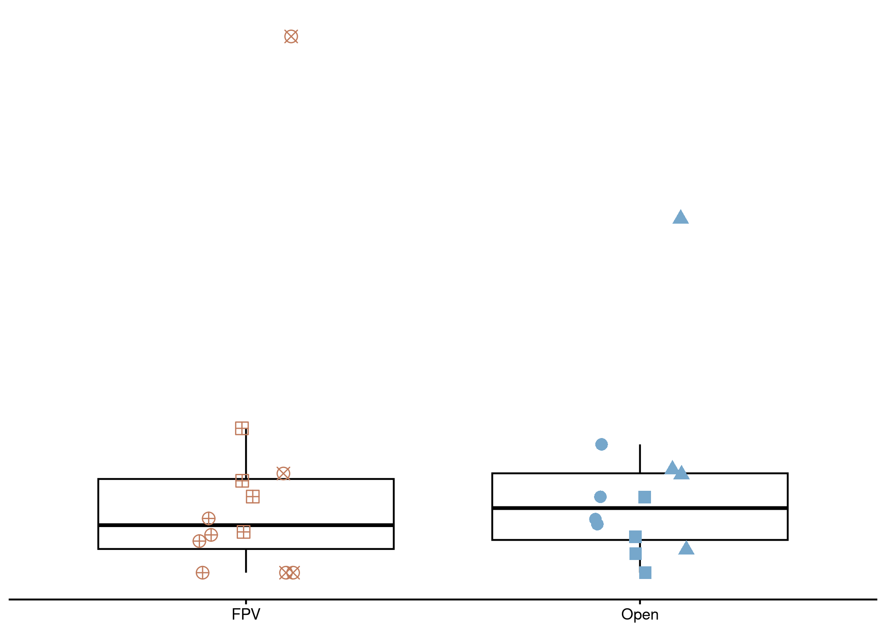<!-- -->

``` r
## What are some states of sediment methanotrophs abundance? 
water_ch4_cyclers_df %>% 
  dplyr::filter(CH4_Cycler == "Methanotroph") %>%
  group_by(solar_progress, Depth_Class) %>%
  summarize(avg_wat_methanotroph = mean(total_abundance), 
            median_wat_methanotroph = median(total_abundance),
            max_wat_methanotroph = max(total_abundance),
            min_wat_methanotroph = min(total_abundance))
```

```
## # A tibble: 4 × 6
## # Groups:   solar_progress [2]
##   solar_progress Depth_Class   avg_wat_methanotroph median_wat_methanotroph max_wat_methanotroph min_wat_methanotroph
##   <fct>          <fct>                        <dbl>                   <dbl>                <dbl>                <dbl>
## 1 FPV            Surface Water              440032.                 400522               1267346                59364
## 2 FPV            Bottom Water               465437.                 329530.              1215710                82976
## 3 Open           Surface Water              121706.                 102006                291664                19407
## 4 Open           Bottom Water               173996.                 167627                476040                28937
```

``` r
water_ch4_cyclers_df %>% 
  dplyr::filter(CH4_Cycler == "Methanotroph") %>%
  # Now just subset for the Sept timepoint 
  dplyr::filter(JDate == 255) %>%
  group_by(solar_progress, Depth_Class) %>%
  summarize(avg_wat_methanotroph = mean(total_abundance), 
            median_wat_methanotroph = median(total_abundance),
            max_wat_methanotroph = max(total_abundance),
            min_wat_methanotroph = min(total_abundance))
```

```
## # A tibble: 4 × 6
## # Groups:   solar_progress [2]
##   solar_progress Depth_Class   avg_wat_methanotroph median_wat_methanotroph max_wat_methanotroph min_wat_methanotroph
##   <fct>          <fct>                        <dbl>                   <dbl>                <dbl>                <dbl>
## 1 FPV            Surface Water              891961.                  815647              1267346               592889
## 2 FPV            Bottom Water               731272.                  683450              1215710               294655
## 3 Open           Surface Water              104584.                   53366               236323                24064
## 4 Open           Bottom Water                80469                    46917               165553                28937
```

``` r
# B. filter for methanotroph surface water
stat_troph_surf <- stat.test %>%
  filter(CH4_Cycler == "Methanotroph",
         Depth_Class == "Surface Water")

# surface methanotroph
box_troph_surf <- water_ch4_cyclers_df %>% 
  dplyr::filter(Depth_Class == "Surface Water",
                CH4_Cycler == "Methanotroph") %>% 
  ggplot(aes(x = solar_progress, y = total_abundance/1e3, color = solar_progress)) +
  geom_boxplot(outlier.shape = NA, alpha = 0.2, color = "black", position = position_dodge(0.6)) +  
  geom_point(aes(shape = Pond),
             alpha = 2,
             position = position_jitterdodge(jitter.width = .1, dodge.width = .3),
             size = 3) +
  # ggh4x::facet_nested(~ solar_progress,
  #                     scales = "free") +
  #scale_fill_manual(values = c("FPV" = "#C07A5B", "Open" = "#76A7CB")) +
  scale_color_manual(values = c("FPV" = "#C07A5B", "Open" = "#76A7CB")) +
  scale_shape_manual(values = pond_shapes) +
  # stat_pvalue_manual( # p = 0.0073
  #   stat_troph_surf,
  #   label = "p.label",
  #   y.position = 1.5,  # or set a fixed numeric if you prefer
  #   tip.length = 0,
  #   bracket.size = 0,
  #   size = 2
  # ) +
  # guides(
  #   fill = "none",
  #   color = "none",
  #   shape = guide_legend(
  #     nrow = 2,
  #     byrow = TRUE,
  #     title.position = "left",
  #     override.aes = list(size = 2.5))
  # ) +
  theme_classic() +
  theme(
    axis.title.x = element_blank(),
    axis.title.y = element_blank(),
    axis.line.y = element_blank(),
    axis.text.y = element_blank(),
    axis.ticks.y = element_blank(),
    legend.position = "none"
  )
box_troph_surf
```

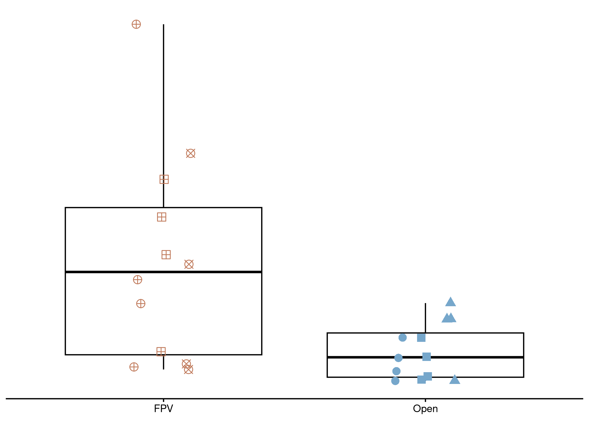<!-- -->

``` r
# B. filter for methanogen bottom water
stat_gen_bot <- stat.test %>%
  filter(CH4_Cycler == "Methanogen",
         Depth_Class == "Bottom Water")
# bottom methanogen
box_gen_bot <- water_ch4_cyclers_df %>% 
  dplyr::filter(Depth_Class == "Bottom Water",
                CH4_Cycler == "Methanogen") %>% 
  ggplot(aes(x = solar_progress, y = total_abundance/1e3, color = solar_progress)) +
  geom_boxplot(outlier.shape = NA, alpha = 0.2, color = "black", position = position_dodge(0.6)) + 
  geom_point(aes(shape = Pond),
             alpha = 2,
             position = position_jitterdodge(jitter.width = .1, dodge.width = .3),
             size = 3) +
  # ggh4x::facet_nested(~ solar_progress,
  #                     scales = "free") +
  #scale_fill_manual(values = c("FPV" = "#C07A5B", "Open" = "#76A7CB")) +
  scale_color_manual(values = c("FPV" = "#C07A5B", "Open" = "#76A7CB")) +
  scale_shape_manual(values = pond_shapes) +
  # stat_pvalue_manual( # p = 0.66
  #   stat_gen_bot,
  #   label = "p.label",
  #   tip.length = 0,
  #   y.position = .095,
  #   size = 2,
  #   bracket.size = 0,
  #   inherit.aes = FALSE
  # ) +
  # guides(
  #   fill = "none",
  #   color = "none",
  #   shape = guide_legend(
  #     nrow = 2,
  #     byrow = TRUE,
  #     title.position = "left",
  #     override.aes = list(size = 2.5))
  # ) +
  theme_classic() +
  theme(
    axis.title.x = element_blank(),
    axis.title.y = element_blank(),
    axis.line.y = element_blank(),
    axis.text.y = element_blank(),
    axis.ticks.y = element_blank(),
    legend.position = "none"
  )
box_gen_bot
```

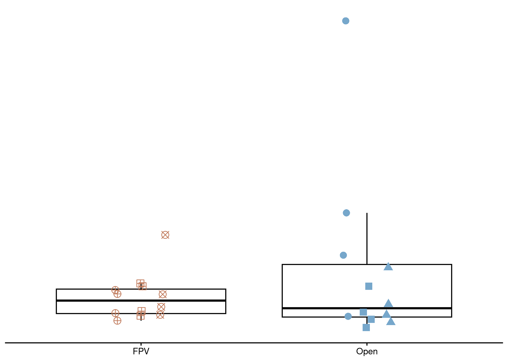<!-- -->

``` r
# C. filter for methanotroph bottom water
stat_troph_bot <- stat.test %>%
  filter(CH4_Cycler == "Methanotroph",
         Depth_Class == "Bottom Water")

# bottom methanotrophs
box_troph_bot <- water_ch4_cyclers_df %>% 
  dplyr::filter(Depth_Class == "Bottom Water",
                CH4_Cycler == "Methanotroph") %>% 
  ggplot(aes(x = solar_progress, y = total_abundance/1e3, color = solar_progress)) +
  geom_boxplot(outlier.shape = NA, alpha = 0.2, color = "black", position = position_dodge(0.6)) +  
  geom_point(aes(shape = Pond),
             alpha = 2,
             position = position_jitterdodge(jitter.width = .1, dodge.width = .3),
             size = 3) +
  # ggh4x::facet_nested(~ solar_progress,
  #                     scales = "free") +
  #scale_fill_manual(values = c("FPV" = "#C07A5B", "Open" = "#76A7CB")) +
  scale_color_manual(values = c("FPV" = "#C07A5B", "Open" = "#76A7CB")) +
  scale_shape_manual(values = pond_shapes) +
  # stat_pvalue_manual( # p = 0.012
  #   stat_troph_bot,
  #   label = "p.label",
  #   y.position = 0.75,
  #   tip.length = 0,
  #   size = 2,
  #   bracket.size = 0,
  #   inherit.aes = FALSE
  # ) +
  # guides(
  #   fill = "none",
  #   color = "none",
  #   shape = guide_legend(
  #     nrow = 2,
  #     byrow = TRUE,
  #     title.position = "left",
  #     override.aes = list(size = 2.5))
  # ) +
  theme_classic() +
  theme(
    axis.title.x = element_blank(),
    axis.title.y = element_blank(),
    axis.line.y = element_blank(),
    axis.text.y = element_blank(),
    axis.ticks.y = element_blank(),
    legend.position = "none"
  )
box_troph_bot
```

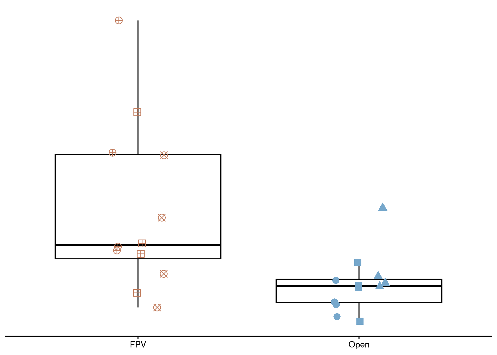<!-- -->

``` r
# 2. calculate pvalue for sediment
stat.test <- sed_ch4_cyclers_df %>% 
  group_by(CH4_Cycler, Depth_Class) %>% 
  wilcox_test(rel_abundance ~ solar_progress, 
              p.adjust.method = "fdr",
              exact = FALSE) %>% 
  add_significance() %>% 
  mutate(
    group = interaction(CH4_Cycler, Depth_Class, sep = " "),
    y.position = 0.35,
    p.label = signif(p, digits = 2))
stat.test
```

```
## # A tibble: 2 × 13
##   Depth_Class CH4_Cycler   .y.           group1 group2    n1    n2 statistic     p p.signif group                 y.position p.label
##   <chr>       <chr>        <chr>         <chr>  <chr>  <int> <int>     <dbl> <dbl> <chr>    <fct>                      <dbl>   <dbl>
## 1 Sediment    Methanogen   rel_abundance FPV    Open      11    12        55 0.518 ns       Methanogen Sediment         0.35    0.52
## 2 Sediment    Methanotroph rel_abundance FPV    Open      11    12        58 0.644 ns       Methanotroph Sediment       0.35    0.64
```

``` r
# D. calculate stats for sediment methanogen
stat_gen_sed <- stat.test %>%
  filter(CH4_Cycler == "Methanogen",
         Depth_Class == "Sediment")

############# SEDIMENT METHANOGENS 
## What are some states of sediment methanogen abundance? 
sed_ch4_cyclers_df %>% 
  dplyr::filter(CH4_Cycler == "Methanogen") %>%
  group_by(solar_progress) %>%
  summarize(avg_sed_methanogen = mean(rel_abundance), 
            median_sed_methanogen = median(rel_abundance),
            max_sed_methanogen = max(rel_abundance),
            min_sed_methanogen = min(rel_abundance))
```

```
## # A tibble: 2 × 5
##   solar_progress avg_sed_methanogen median_sed_methanogen max_sed_methanogen min_sed_methanogen
##   <fct>                       <dbl>                 <dbl>              <dbl>              <dbl>
## 1 FPV                         0.201                 0.206              0.288              0.134
## 2 Open                        0.214                 0.204              0.266              0.182
```

``` r
# BOXPLOTS: sediment methanogen
box_gen_sed <- sed_ch4_cyclers_df %>% 
  dplyr::filter(CH4_Cycler == "Methanogen") %>% 
  ggplot(aes(x = solar_progress, y = rel_abundance, color = solar_progress)) +
  geom_boxplot(outlier.shape = NA, alpha = 0.2, color = "black", position = position_dodge(0.6)) +  
  geom_point(aes(shape = Pond),
             alpha = 2,
             position = position_jitterdodge(jitter.width = .1, dodge.width = .3),
             size = 3) +
  scale_color_manual(values = c("FPV" = "#C07A5B", "Open" = "#76A7CB")) +
  scale_shape_manual(values = pond_shapes) +
  # stat_pvalue_manual( # p = 0.48
  #   stat_gen_sed,
  #   label = "p.label",
  #   y.position = 0.3,
  #   tip.length = 0,
  #   bracket.size = 0,
  #   size = 2
  # ) +
  # guides(
  #   fill = "none",
  #   color = "none",
  #   shape = guide_legend(
  #     nrow = 2,
  #     byrow = TRUE,
  #     title.position = "left",
  #     override.aes = list(size = 2.5))
  # ) +
  theme_classic() +
  theme(
    axis.title.x = element_blank(),
    axis.title.y = element_blank(),
    axis.line.y = element_blank(),
    axis.text.y = element_blank(),
    axis.ticks.y = element_blank(),
    legend.position = "none"
  )
box_gen_sed
```

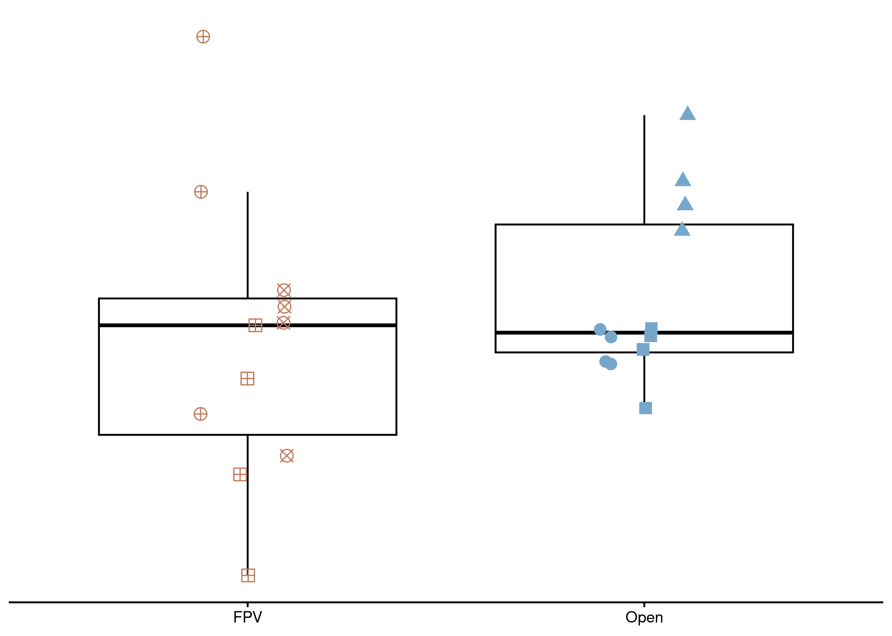<!-- -->

``` r
# E. calculate stats for sediment methanotroph
stat_troph_sed <- stat.test %>%
  filter(CH4_Cycler == "Methanotroph",
         Depth_Class == "Sediment")

############# SEDIMENT METHANOTROPHS
## What are some states of sediment methanotrophs abundance? 
sed_ch4_cyclers_df %>% 
  dplyr::filter(CH4_Cycler == "Methanotroph") %>%
  group_by(solar_progress) %>%
  summarize(avg_sed_methanotroph = mean(rel_abundance), 
            median_sed_methanotroph = median(rel_abundance),
            max_sed_methanotroph = max(rel_abundance),
            min_sed_methanotroph = min(rel_abundance))
```

```
## # A tibble: 2 × 5
##   solar_progress avg_sed_methanotroph median_sed_methanotroph max_sed_methanotroph min_sed_methanotroph
##   <fct>                         <dbl>                   <dbl>                <dbl>                <dbl>
## 1 FPV                          0.0623                  0.0551                0.118               0.0423
## 2 Open                         0.0681                  0.0598                0.117               0.0459
```

``` r
# BOXPLOTS: sediment methanotrophs
box_troph_sed <- sed_ch4_cyclers_df %>% 
  dplyr::filter(CH4_Cycler == "Methanotroph") %>% 
  ggplot(aes(x = solar_progress, y = rel_abundance, color = solar_progress)) +
  geom_boxplot(outlier.shape = NA, alpha = 0.2, color = "black", position = position_dodge(0.6)) +  
  geom_point(aes(shape = Pond),
             alpha = 2,
             position = position_jitterdodge(jitter.width = .1, dodge.width = .3),
             size = 3) +
  scale_color_manual(values = c("FPV" = "#C07A5B", "Open" = "#76A7CB")) +
  scale_shape_manual(values = pond_shapes) +
  # stat_pvalue_manual( # p = 0.74
  #   stat_troph_sed,
  #   label = "p.label",
  #   y.position = .11,
  #   tip.length = 0,
  #   size = 2,
  #   bracket.size = 0,
  #   inherit.aes = FALSE
  # ) +
  # guides(
  #   fill = "none",
  #   color = "none",
  #   shape = guide_legend(
  #     nrow = 2,
  #     byrow = TRUE,
  #     title.position = "left",
  #     override.aes = list(size = 2.5))
  # ) +
  theme_classic() +
  theme(
    axis.title.x = element_blank(),
    axis.title.y = element_blank(),
    axis.line.y = element_blank(),
    axis.text.y = element_blank(),
    axis.ticks.y = element_blank(),
    legend.position = "none"
  )
box_troph_sed
```

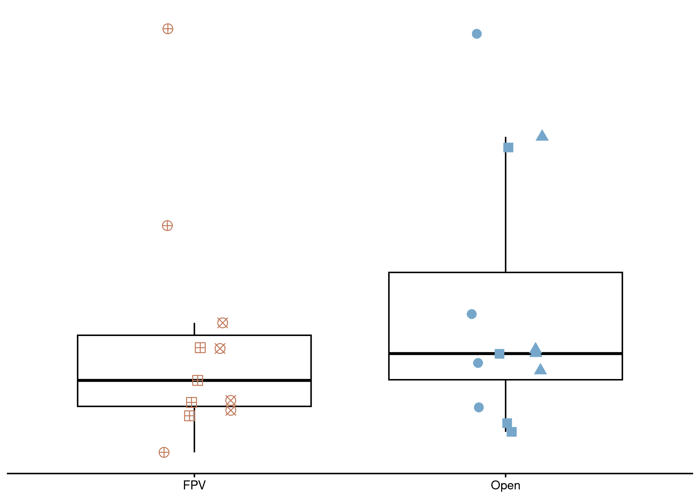<!-- -->

``` r
# extract legend 
legend_plot <- sed_ch4_cyclers_df %>% # dummy plot 
  dplyr::filter(CH4_Cycler == "Methanotroph") %>% 
  ggplot(aes(x = solar_progress, y = rel_abundance, color = solar_progress)) +
  geom_boxplot(outlier.shape = NA, alpha = 0.2, position = position_dodge(0.6)) +  
  geom_point(aes(shape = Pond),
             alpha = 2,
             position = position_jitterdodge(jitter.width = .1, dodge.width = .3),
             size = 2) +
  # ggh4x::facet_nested(~ solar_progress,
  #                     scales = "free") +
  #scale_fill_manual(values = c("FPV" = "#C07A5B", "Open" = "#76A7CB")) +
  scale_color_manual(values = c("FPV" = "#C07A5B", "Open" = "#76A7CB")) +
  scale_shape_manual(values = pond_shapes) +
  # stat_pvalue_manual(
  #   stat_troph_sed,
  #   label = "p.label",
  #   y.position = .11,
  #   tip.length = 0,
  #   size = 2,
  #   bracket.size = 0,
  #   inherit.aes = FALSE
  # ) +
  guides(
    fill = "none",
    color = "none",
    shape = guide_legend(
      nrow = 2,
      byrow = TRUE,
      title.position = "left",
      override.aes = list(size = 2.5))
  ) +
  theme_classic() +
  theme(
    legend.position = "bottom",
    legend.title = element_text(hjust = 0.5),
    legend.box = "horizontal",
    legend.justification = "center"
  )
legend_plot
```

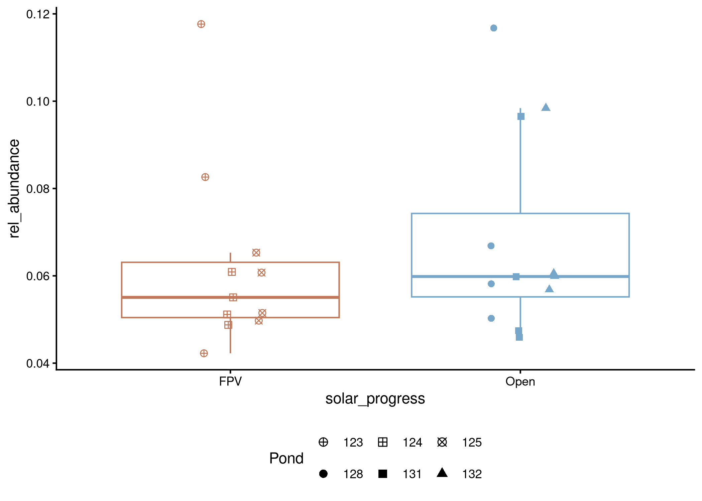<!-- -->

``` r
legend_only <- ggpubr::get_legend(legend_plot) # extract legend

# now we will need to add it to sediments to plot legend only wont plot by itself
sed_depths_leg <- ggarrange(methano_sed_24, box_gen_sed, methanotroph_sed_24, box_troph_sed,
            ncol = 2,
            nrow = 3,
            legend_only,
            align = "hv"
)

# Display
sed_depths_leg
```

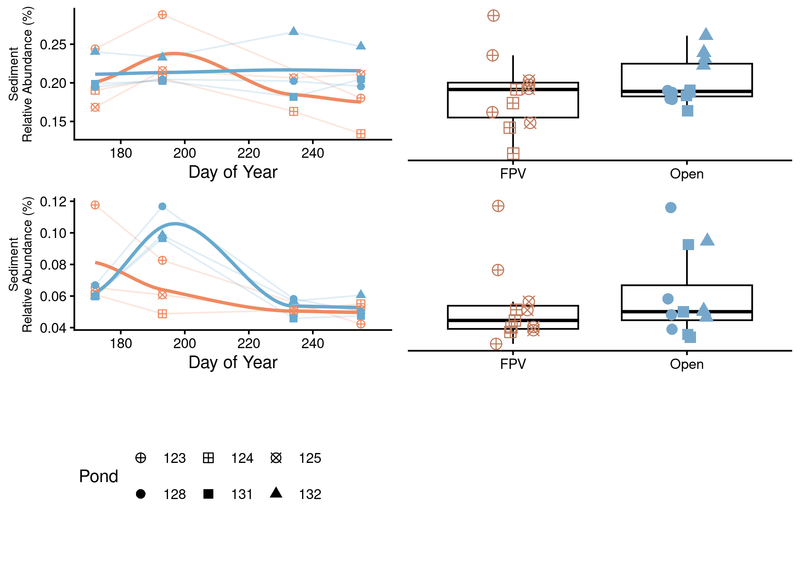<!-- -->

``` r
# or lets try two (technically 4 columns) where on the left we have methanogens and right is methanotrophs. they will still be going from surface, bottom, sediments with box plot on the right but we will have a box around methanogens and methanotrophs


# 1. plot final methanogens
methanogen_final <- 
  ggarrange(methanogen_surfwater24, box_gen_surf, 
            methanogen_bot_water24, box_gen_bot,
            methano_sed_24, box_gen_sed,
  nrow = 3, 
  ncol = 2,
  align = "hv",
  labels = c("A.", "B.", "C.", "D.", "E.", "F."),
  font.label = list(size =10),
  widths = c(1, .5))
methanogen_final
```

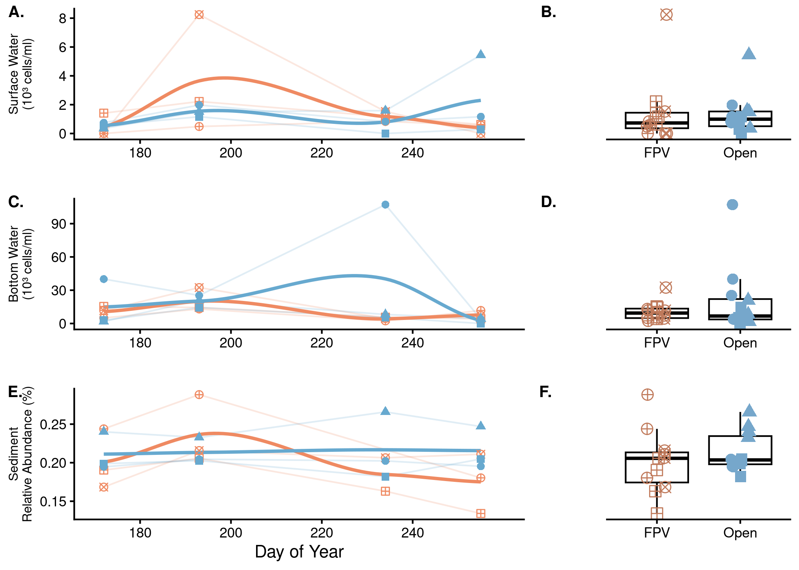<!-- -->

``` r
# want to add space for title in methanogen plot
space <- nullGrob()

# now plot with extra space
methanogen_final <- ggarrange(
  space, 
  methanogen_final, 
  ncol = 1,
  heights = c(0.1, 1)  
)

# 2. draw box around methanogens
png("figures/Fig_2/methanogens.png", width = 4000, height = 4000, res = 600)

grid.newpage()
grid.draw(methanogen_final)
grid.rect(gp = gpar(col = "black", fill = NA, lwd = 2))  # draw border
grid.text(label = "Methanogens", x = 0.5, y = 0.99, just = c("center", "top"),
          gp = gpar(fontface = "bold", cex = .9))

dev.off()
```

```
## png 
##   2
```

``` r
# 1. plot final methanotrophs
methanotroph_final <- 
  ggarrange(methanotrophs_surfwater24, box_troph_surf, 
            methanotroph_bot_water24, box_troph_bot,
            methanotroph_sed_24, box_troph_sed,
  nrow = 3, 
  ncol = 2,
  align = "hv",
  labels = c("G.", "H.", "I.", "J.", "K.", "L."),
  font.label = list(size =10),
  widths = c(1, .5))
methanotroph_final
```

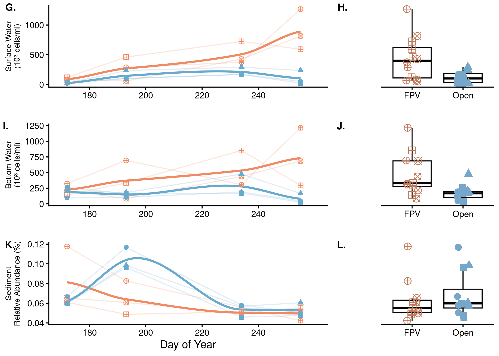<!-- -->

``` r
# want to add space for title in methanogen plot
space <- nullGrob()

# now plot with extra space
methanotroph_final <- ggarrange(
  space, 
  methanotroph_final, 
  ncol = 1,
  heights = c(0.09, 1)  
)
methanotroph_final
```

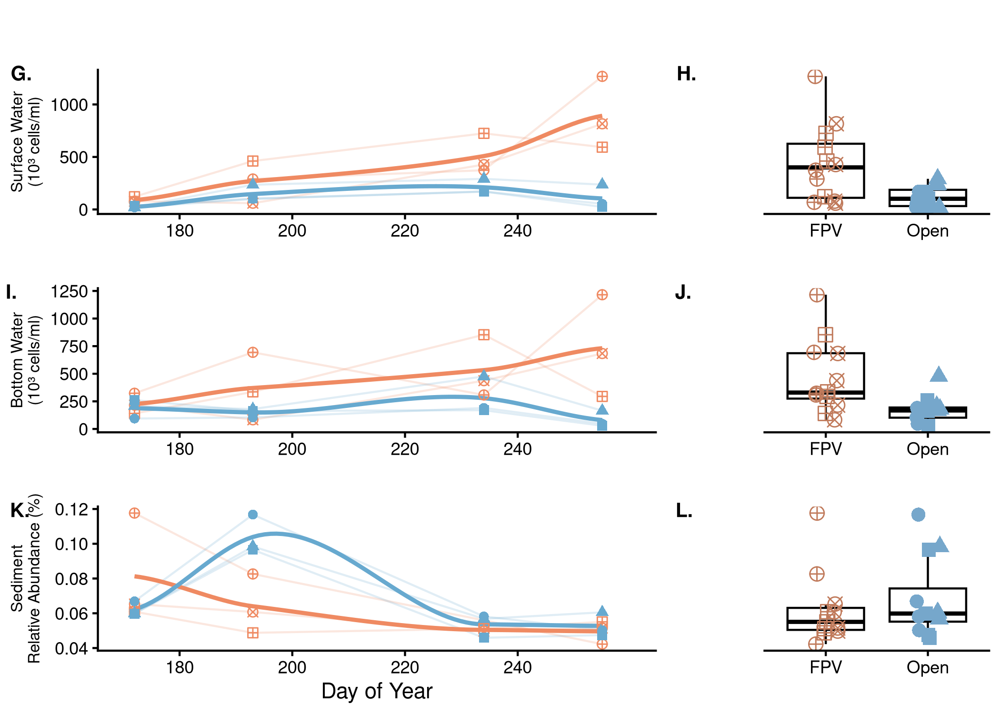<!-- -->

``` r
# 2. draw box around methanogens
png("figures/Fig_2/methanotrophs.png", width = 4000, height = 4000, res = 600)

grid.newpage()
grid.draw(methanotroph_final)
grid.rect(gp = gpar(col = "black", fill = NA, lwd = 2))  # draw border
grid.text(label = "Methanotrophs", x = 0.5, y = 0.99, just = c("center", "top"),
          gp = gpar(fontface = "bold", cex = .9))

dev.off()
```

```
## png 
##   2
```

``` r
# then i was planning on exporting these images and putting them together in Illustrator
```
now we have created our main text figure. the only thing is that i dont have the p values in the figure because nick has his italicized and sized a certain way and i want to make sure our plot aesthetics match.


# Supplemental Figures
Here are the supplemental figures (and bonus figures) for the manuscript. 

# Figure 3

## Fig S3: PERMANOVA

PERMANOVA (Permutational Multivariate Analysis of Variance) is a non-parametric, permutation-based test used to compare groups of objects based on a distance matrix. The goal is to test the null hypothesis that the centroids and dispersion of groups are equivalent in the space defined by the dissimilarity measure. 


``` r
#### WATER COLUMN: All methane cyclers
# calculate Bray-Curtis PERMANOVA using phyloseq distance
water_bray <- phyloseq::distance(water_ch4_cyclers_physeq, method = "bray", binary = FALSE)

# pull out metadata 
water_metadata <- water_ch4_cyclers_physeq %>%
  sample_data() %>%
  data.frame()


#### SEDIMENT: All methane cyclers
# calculate Bray-Curtis PERMANOVA using phyloseq distance
sed_bray <- phyloseq::distance(sed_ch4_cyclers_physeq, method = "bray", binary = FALSE)

# pull out metadata 
sed_metadata <- sed_ch4_cyclers_physeq %>%
  sample_data() %>%
  data.frame()
```


### Water 

Here we are performing a PERMANOVA on the water column methane cyclers throughout the entire sampling season.


``` r
# Permutational Multivariate Analysis of Variance Using Distance Matrices
# aka PERMANOVA using the adonis2 function from vegan 

#1. Test the individual terms for significance
# Testing if the centroids of solar progress are different: significant p = 0.001 ***
adonis2(water_bray ~ solar_progress, data = water_metadata, by = "terms")
```

```
## Permutation test for adonis under reduced model
## Terms added sequentially (first to last)
## Permutation: free
## Number of permutations: 999
## 
## adonis2(formula = water_bray ~ solar_progress, data = water_metadata, by = "terms")
##                Df SumOfSqs      R2      F Pr(>F)    
## solar_progress  1    1.701 0.12801 6.7528  0.001 ***
## Residual       46   11.587 0.87199                  
## Total          47   13.288 1.00000                  
## ---
## Signif. codes:  0 '***' 0.001 '**' 0.01 '*' 0.05 '.' 0.1 ' ' 1
```

``` r
# Now testing to see if centroids of depth_class are different: not significant p = 0.19
adonis2(water_bray ~ Depth_Class, data = water_metadata, by = "terms")
```

```
## Permutation test for adonis under reduced model
## Terms added sequentially (first to last)
## Permutation: free
## Number of permutations: 999
## 
## adonis2(formula = water_bray ~ Depth_Class, data = water_metadata, by = "terms")
##             Df SumOfSqs      R2      F Pr(>F)
## Depth_Class  1   0.3635 0.02736 1.2939  0.184
## Residual    46  12.9247 0.97264              
## Total       47  13.2883 1.00000
```

``` r
# Does pond matter? significant p = 0.001 ***
adonis2(water_bray ~ Pond, data = water_metadata, by = "terms")
```

```
## Permutation test for adonis under reduced model
## Terms added sequentially (first to last)
## Permutation: free
## Number of permutations: 999
## 
## adonis2(formula = water_bray ~ Pond, data = water_metadata, by = "terms")
##          Df SumOfSqs      R2      F Pr(>F)    
## Pond      5   3.7591 0.28289 3.3137  0.001 ***
## Residual 42   9.5291 0.71711                  
## Total    47  13.2883 1.00000                  
## ---
## Signif. codes:  0 '***' 0.001 '**' 0.01 '*' 0.05 '.' 0.1 ' ' 1
```

``` r
# Does date matter? significant p = 0.001 ***
adonis2(water_bray ~ JDate, data = water_metadata, by = "terms")
```

```
## Permutation test for adonis under reduced model
## Terms added sequentially (first to last)
## Permutation: free
## Number of permutations: 999
## 
## adonis2(formula = water_bray ~ JDate, data = water_metadata, by = "terms")
##          Df SumOfSqs      R2      F Pr(>F)    
## JDate     1   1.1474 0.08635 4.3472  0.001 ***
## Residual 46  12.1409 0.91365                  
## Total    47  13.2883 1.00000                  
## ---
## Signif. codes:  0 '***' 0.001 '**' 0.01 '*' 0.05 '.' 0.1 ' ' 1
```

``` r
#2. Test the terms together
# Now lets see the effect of each pond by date_collected and solar progress
water_permanova <- adonis2(water_bray ~ solar_progress * Pond * JDate, data = water_metadata, by = "terms"); water_permanova
```

```
## Permutation test for adonis under reduced model
## Terms added sequentially (first to last)
## Permutation: free
## Number of permutations: 999
## 
## adonis2(formula = water_bray ~ solar_progress * Pond * JDate, data = water_metadata, by = "terms")
##                      Df SumOfSqs      R2      F Pr(>F)    
## solar_progress        1   1.7010 0.12801 9.4196  0.001 ***
## Pond                  4   2.0581 0.15488 2.8493  0.001 ***
## JDate                 1   1.1474 0.08635 6.3538  0.001 ***
## solar_progress:JDate  1   0.7829 0.05892 4.3356  0.001 ***
## Pond:JDate            4   1.0979 0.08262 1.5199  0.041 *  
## Residual             36   6.5009 0.48922                  
## Total                47  13.2883 1.00000                  
## ---
## Signif. codes:  0 '***' 0.001 '**' 0.01 '*' 0.05 '.' 0.1 ' ' 1
```
With our PERMANOVA we find that treatment (solar_progress), day of year sampled (JDate - Julian date), and Pond is significant but depth class alone is not.

When we create a model with treatment, pond, and date these are all significant (p < 0.001 ***). 
- Solar progress is responsible for explaining  12.8% of variance and has a strong structuring effect on the water column community composition. This has the highest F value meaning that the between group differences are larger than within group variance (F = 9.4)

- Pond is also significant explains 15.5% of variance but is weaker than treatment (solar_progress) (F = 2.8). Even though it explains more variation than treatment, there is more variation in ponds than between ponds. 

- Date (JDate) is also strong and explains 8.6% of variance and is also weighted heavier (F = 6.3). The temporal effect is seen in the first axis as time progresses throughout the season.

- The interaction between treatment and date explains 5.9% of variance and is an important but moderate factor in its effect size for structuring community (F = 4.3)


Together the PERMANOVA explains only about half the variance seen with 48.9% remaining

### Sediments 
Here we are performing a PERMANOVA on the sediment methane cyclers throughout the entire sampling season

``` r
# Permutational Multivariate Analysis of Variance Using Distance Matrices
# aka PERMANOVA using the adonis2 function from vegan 

#1. Test the individual terms for significance
# Testing if the centroids of solar progress are different: significant p = 0.001 ***
adonis2(sed_bray ~ solar_progress, data = sed_metadata, by = "terms")
```

```
## Permutation test for adonis under reduced model
## Terms added sequentially (first to last)
## Permutation: free
## Number of permutations: 999
## 
## adonis2(formula = sed_bray ~ solar_progress, data = sed_metadata, by = "terms")
##                Df SumOfSqs      R2      F Pr(>F)    
## solar_progress  1  0.33255 0.11828 5.9027  0.001 ***
## Residual       44  2.47888 0.88172                  
## Total          45  2.81142 1.00000                  
## ---
## Signif. codes:  0 '***' 0.001 '**' 0.01 '*' 0.05 '.' 0.1 ' ' 1
```

``` r
# Does pond matter? significant p = 0.001 ***
adonis2(sed_bray ~ Pond, data = sed_metadata, by = "terms")
```

```
## Permutation test for adonis under reduced model
## Terms added sequentially (first to last)
## Permutation: free
## Number of permutations: 999
## 
## adonis2(formula = sed_bray ~ Pond, data = sed_metadata, by = "terms")
##          Df SumOfSqs     R2      F Pr(>F)    
## Pond      5   1.0619 0.3777 4.8555  0.001 ***
## Residual 40   1.7496 0.6223                  
## Total    45   2.8114 1.0000                  
## ---
## Signif. codes:  0 '***' 0.001 '**' 0.01 '*' 0.05 '.' 0.1 ' ' 1
```

``` r
# Does date matter? significant p = 0.001 ***
adonis2(sed_bray ~ JDate, data = sed_metadata, by = "terms")
```

```
## Permutation test for adonis under reduced model
## Terms added sequentially (first to last)
## Permutation: free
## Number of permutations: 999
## 
## adonis2(formula = sed_bray ~ JDate, data = sed_metadata, by = "terms")
##          Df SumOfSqs      R2     F Pr(>F)    
## JDate     1  0.30443 0.10828 5.343  0.001 ***
## Residual 44  2.50700 0.89172                 
## Total    45  2.81142 1.00000                 
## ---
## Signif. codes:  0 '***' 0.001 '**' 0.01 '*' 0.05 '.' 0.1 ' ' 1
```

``` r
#2. Test the terms together
# Now lets see the effect of each pond by date_collected and solar progress
sediment_permanova <- adonis2(sed_bray ~ solar_progress * Pond * JDate, data = sed_metadata, by = "terms"); sediment_permanova
```

```
## Permutation test for adonis under reduced model
## Terms added sequentially (first to last)
## Permutation: free
## Number of permutations: 999
## 
## adonis2(formula = sed_bray ~ solar_progress * Pond * JDate, data = sed_metadata, by = "terms")
##                      Df SumOfSqs      R2       F Pr(>F)    
## solar_progress        1  0.33255 0.11828 10.1115  0.001 ***
## Pond                  4  0.72932 0.25941  5.5440  0.001 ***
## JDate                 1  0.28606 0.10175  8.6982  0.001 ***
## solar_progress:JDate  1  0.06908 0.02457  2.1005  0.037 *  
## Pond:JDate            4  0.27622 0.09825  2.0997  0.006 ** 
## Residual             34  1.11819 0.39773                   
## Total                45  2.81142 1.00000                   
## ---
## Signif. codes:  0 '***' 0.001 '**' 0.01 '*' 0.05 '.' 0.1 ' ' 1
```
With our PERMANOVA we find that treatment (solar_progress), day of year sampled (JDate - Julian date), and Pond is significant factors.

When we create a model with treatment, pond, and date these are all significant (p < 0.001 ***). 
- treatment = solar_progress is important for explaining 11.8% of variation and has the largest effect on structuring the community (F = 10.1). This explains the separation along the first axis

- pond explains the most variation (25.9%) and also has a substantial effect on structuring the community (F = 5.5) 

- Date explains 10.1% of variation and also has temporal effect (F = 8.7) that shapes communities


This explains 60.2% of variance with 39.8% in the residuals. 

## Fig 3: Betadisper
We are running betadispr to test variances/dispersions

When computing PERMANOVA, we must also perform betadispr analysis when analyzing beta diversity in microbial ecology. We must do it after PERMANOVA because we need to look into the assumption of PERMANOVA which is the homogeneity of group dispersions aka variances. If this assumption is violated then the PERMANOVA results might be driven by dispersion rather than true differences in community composition.

Always run betadisper() and permutest() after PERMANOVA to test whether the groups have similar within-group variation.

It works by first taking ina. distance matrix and calculates the centroid of each group in multivariate space (note it does not test for significane). After computing within-group distances, we will run permutest() to see whether those dispersiosn differ significantly between groups using PERMANOVA

The permutest works like this: - null hypothesis (H0): all groups have equal multivariate dispersion and a compute a new F-statistic for each permutation.

The p-value is the proportion of permutations where the F is as extreme or more extreme than the observed F.
The result from permutest() is a robust non-parametric p-value testing whether dispersion differs across groups.
If p > 0.05 (not significant), the PERMANOVA result is reliable.

If p = 0.05 (significant), be cautious—group differences may be due to dispersion, not composition! However, not all is lost as we may expect this to be biologically true.

adonis - compares centroids to see if significant difference. betadispr - compares variance/distance from centroid

### Water

``` r
# Homogeneity of Disperson test with beta dispr

## Bray-Curtis
betadispr_water_pond <- betadisper(water_bray, water_metadata$Pond)
betadispr_water_solar <- betadisper(water_bray, water_metadata$solar_progress)
betadispr_water_depth <- betadisper(water_bray, water_metadata$Depth_Class)
betadispr_water_JDate <- betadisper(water_bray, water_metadata$JDate)

# permutest() performs a non-parametric permutation test, which is robust and valid for the kind of data used in beta diversity analysis (e.g., dissimilarity matrices).
permutest(betadispr_water_pond) # not significant p = 0.256 
```

```
## 
## Permutation test for homogeneity of multivariate dispersions
## Permutation: free
## Number of permutations: 999
## 
## Response: Distances
##           Df  Sum Sq  Mean Sq      F N.Perm Pr(>F)
## Groups     5 0.10942 0.021885 1.1958    999  0.305
## Residuals 42 0.76864 0.018301
```

``` r
permutest(betadispr_water_solar) # significant p = 0.011 **
```

```
## 
## Permutation test for homogeneity of multivariate dispersions
## Permutation: free
## Number of permutations: 999
## 
## Response: Distances
##           Df  Sum Sq  Mean Sq      F N.Perm Pr(>F)   
## Groups     1 0.13603 0.136034 10.227    999  0.002 **
## Residuals 46 0.61184 0.013301                        
## ---
## Signif. codes:  0 '***' 0.001 '**' 0.01 '*' 0.05 '.' 0.1 ' ' 1
```

``` r
permutest(betadispr_water_depth) # not significant p = 0.417 
```

```
## 
## Permutation test for homogeneity of multivariate dispersions
## Permutation: free
## Number of permutations: 999
## 
## Response: Distances
##           Df  Sum Sq   Mean Sq      F N.Perm Pr(>F)
## Groups     1 0.00863 0.0086305 0.6155    999  0.424
## Residuals 46 0.64501 0.0140220
```

``` r
permutest(betadispr_water_JDate) # significant p = 0.006 **
```

```
## 
## Permutation test for homogeneity of multivariate dispersions
## Permutation: free
## Number of permutations: 999
## 
## Response: Distances
##           Df  Sum Sq  Mean Sq      F N.Perm Pr(>F)   
## Groups     3 0.23049 0.076829 5.2557    999  0.005 **
## Residuals 44 0.64320 0.014618                        
## ---
## Signif. codes:  0 '***' 0.001 '**' 0.01 '*' 0.05 '.' 0.1 ' ' 1
```
With betadispr we find the PERMANOVA results are mostly valid where pond variation is consistent. The PERMANOVA and betadispr find that depth is not significant meaning that depth doesnt structure the community. This makes sense between the ponds are so shallow so they are more likely to be similar.

But treatment and date are significant meaning the differences may be due to dispersion and not composition. This could be because of temporal reasons where communities change over time with the season.

### Sediment 

``` r
# Homogeneity of Disperson test with beta dispr
## Bray-Curtis
betadispr_sed_pond <- betadisper(sed_bray, sed_metadata$Pond)
betadispr_sed_solar <- betadisper(sed_bray, sed_metadata$solar_progress)
betadispr_sed_JDate <- betadisper(sed_bray, sed_metadata$JDate)

# permutest() performs a non-parametric permutation test, which is robust and valid for the kind of data used in beta diversity analysis (e.g., dissimilarity matrices).
permutest(betadispr_sed_pond) # not significant p = 0.835
```

```
## 
## Permutation test for homogeneity of multivariate dispersions
## Permutation: free
## Number of permutations: 999
## 
## Response: Distances
##           Df   Sum Sq   Mean Sq      F N.Perm Pr(>F)
## Groups     5 0.020568 0.0041136 0.5284    999  0.751
## Residuals 40 0.311392 0.0077848
```

``` r
permutest(betadispr_sed_solar) # not significant p = 0.673
```

```
## 
## Permutation test for homogeneity of multivariate dispersions
## Permutation: free
## Number of permutations: 999
## 
## Response: Distances
##           Df   Sum Sq   Mean Sq      F N.Perm Pr(>F)
## Groups     1 0.006521 0.0065208 1.8364    999  0.174
## Residuals 44 0.156241 0.0035509
```

``` r
permutest(betadispr_sed_JDate) # not significant p = 0.162
```

```
## 
## Permutation test for homogeneity of multivariate dispersions
## Permutation: free
## Number of permutations: 999
## 
## Response: Distances
##           Df   Sum Sq   Mean Sq      F N.Perm Pr(>F)
## Groups     3 0.010681 0.0035603 1.6306    999  0.192
## Residuals 42 0.091706 0.0021835
```
With betadispr we find the PERMANOVA results are are valid as pond, treatment, and date are not significant but significant in the PERMANOVA. Thus our PERMANOVA result is reliable and the differences between groups are due to location/centroids of groups rather than differences in variation within groups 


## Fig 3: PCoA

### Fig 3A: Water PCoA 

``` r
# water methane cyclers

# Calculate Bray-Curtis Dissimilarity 
water_BC_pcoa <- 
  ordinate(
    physeq = water_ch4_cyclers_physeq,
    method = "PCoA",
    distance = "bray", 
    binary = FALSE
  )


#### Grab the data for the plot 
water_all_ord_df <- 
  plot_ordination(
  physeq = water_ch4_cyclers_physeq,
  ordination = water_BC_pcoa,
  color = "solar_progress",
  shape = "Pond",
  justDF = TRUE)

# now lets mutate the columns
water_all_ord_df <- water_all_ord_df %>% 
dplyr::mutate(
    solar_progress = recode(solar_progress, "FPV" = "FPV", "No FPV" = "Open"), # solar progress
    Depth_Class = recode(Depth_Class,  # depth class
      "S" = "Surface Water",
      "B" = "Bottom Water"))


### Now, plot Figure 3A: WATER 
fig3a_water_pcoa <- 
  ggplot(data = water_all_ord_df, 
       aes(x = Axis.1, 
           y = Axis.2,
           color = solar_progress,
           shape = Pond)) + 
  geom_point(size = 3, alpha = 0.8, stroke = 0.8) +
  scale_shape_manual(values = pond_shapes) + 
  scale_color_manual(values = solar_colors) +
  labs(color = "Treatment",
       shape = "Pond",
       x = "Axis.1 [27.4%]",
       y = "Axis.2 [11.3%]",
       title = expression("Water CH"[4]*" Cyclers")) + 
  theme_classic() +
  theme(legend.position = "bottom",
        legend.spacing = unit(0, "cm"),
        legend.box.background = element_blank())

# Show the plot
fig3a_water_pcoa
```

<!-- -->

``` r
### Sophia's plot
# PCoA of water samples color by treatment shape by pond
# s1a_water_pcoa <- plot_ordination(
#   physeq = water_physeq_24,
#   ordination = water_BC_pcoa,
#   color = "solar_progress",
#   shape = "Pond",
#   title = "Water Column Methane Cyclers") +
#   geom_point(size = 5, alpha = 0.5,
#              aes(fill = solar_progress, color = solar_progress, shape = Pond)) +
#   scale_fill_manual(values = solar_colors) +
#   scale_color_manual(values = solar_colors) +
#   scale_shape_manual(values = pond_shapes) +
#   guides(color = guide_legend(nrow = 1,
#                               title = NULL,
#                               override.aes = list(size = 2.7)),
#          fill = "none",
#          shape = guide_legend(nrow = 2,
#                               byrow = TRUE,
#                               title = NULL,
#                               override.aes = list(size = 2.7))) +
#   theme_classic() +
#   theme(
#     legend.position = c(0.01, 0.01),  # inside bottom-left
#     legend.justification = c(.01, .01),
#     legend.spacing = unit(0.01, "cm"),
#     legend.spacing.x = unit(0.1, "cm"),
#     legend.background = element_rect(color = NA, fill = NA),
#     legend.key.width = unit(0.2, "cm"),
#     legend.key.height = unit(0.4, "cm"),
#     legend.text = element_text(size = 6),
#     legend.box.just = "center",
#     legend.box.background = element_rect(size = 0.2, linetype = "solid", color = "black"),
#     legend.margin = margin(1, 2, 1, 1))
# 
# # Plot it
# s1a_water_pcoa

# ggsave(s1a_water_pcoa, width = 8, height = 7, units = "in",
#         filename = "figures/s1a/s1a_water_pcoa.png")
```

### Fig 3B: Sediment PCoA
This is all methane cylcers in sediment communities

``` r
# Calculate Bray-Curtis Dissimilarity 
scaled_sed_BC_pcoa <- 
  ordinate(
    physeq = sed_ch4_cyclers_physeq,
    method = "PCoA",
    distance = "bray", 
    binary = FALSE
  )


#### Grab the data for the plot 
sed_all_ord_df <- 
  plot_ordination(
  physeq = sed_ch4_cyclers_physeq,
  ordination = scaled_sed_BC_pcoa,
  color = "solar_progress",
  shape = "Pond",
  justDF = TRUE)

# update metadata for plotting 
sed_all_ord_df <- sed_all_ord_df %>% 
dplyr::mutate(
    solar_progress = recode(solar_progress, "FPV" = "FPV", "No FPV" = "Open"), # solar progress
    Depth_Class = recode(Depth_Class,  # depth class
      "S" = "Surface Water",
      "B" = "Bottom Water"))

# Now plot it! 
fig3b_sed_pcoa <- 
  ggplot(data = sed_all_ord_df, 
       aes(x = Axis.1, 
           y = Axis.2,
           color = solar_progress,
           shape = Pond)) + 
  geom_point(size = 3, alpha = 0.8, stroke = 0.8) +
  scale_shape_manual(values = pond_shapes) + 
  scale_color_manual(values = solar_colors) +
  labs(color = "Treatment",
       shape = "Pond",
       x = "Axis.1 [32%]",
       y = "Axis.2 [15.6%]",
       title = expression("Sediment CH"[4]*" Cyclers")) + 
  theme_classic() +
  theme(legend.position = "bottom",
        legend.spacing = unit(0, "cm"),
        legend.box.background = element_blank())

# Show the plot
fig3b_sed_pcoa
```

<!-- -->

``` r
# Sophia's plot 
# PCoA of sediments color by treatment shaped by pond
s1b_sed_pcoa <- 
  plot_ordination(
  physeq = sed_ch4_cyclers_physeq,
  ordination = scaled_sed_BC_pcoa,
  color = "solar_progress",
  shape = "Pond",
  title = "Sediment Methane Cyclers") +
  geom_point(size = 5, alpha = 0.5, 
             aes(color = solar_progress, fill = solar_progress, shape = Pond)) + 
  scale_color_manual(values = solar_colors) + 
  scale_fill_manual(values = solar_colors) + 
  scale_shape_manual(values = pond_shapes) +
  guides(color = "none",
         fill = "none",
         shape = "none") +
  theme_classic() 
  # theme(
  # legend.position = c(0.82, 0.01),  # inside bottom-left
  # legend.justification = c(0, 0),  # anchor the legend's top-left corner there
  # legend.spacing = unit(0.1, "cm"),
  # legend.background = element_rect(color = NA, fill = NA),
  # legend.box.background = element_rect(size = 0.1, linetype = "solid", color = "black"),
  # legend.text = element_text(size = 6), 
  # legend.margin = margin(2, 2, 2, 2))
s1b_sed_pcoa
```

<!-- -->

``` r
# ggsave(s1b_sed_pcoa, width = 8, height = 7, units = "in",
#         filename = "figures/s1b/s1b_sed_pcoa.png")
```
Sediment samples are still distinct from other and separate along first axis

### Save Figure 3
Water + Sediments together

``` r
fig_s1 <- 
  ggarrange(s1a_water_pcoa, s1b_sed_pcoa,
  nrow = 1, 
  ncol = 2,
  labels = c("A.", "B."),
  font.label = list(size =12),
  align = "hv") # aligns axis 
```

```
## Error: object 's1a_water_pcoa' not found
```

``` r
fig_s1
```

```
## Error: object 'fig_s1' not found
```

``` r
ggsave(fig_s1, width = 12.4, height = 6, dpi = 300,
        filename = "figures/Fig_3/fig_3_old.png")
```

```
## Error: object 'fig_s1' not found
```

``` r
### Final Plot for Submission 
plot_fig3 <- 
  fig3a_water_pcoa + theme(plot.title = element_text(margin = margin(b = 0))) + 
  fig3b_sed_pcoa + theme(plot.title = element_text(margin = margin(b = 0))) +
  plot_annotation(tag_levels = "A") + 
    plot_layout(guides = "collect") &
  theme(
    legend.position = "bottom",
    legend.title = element_text(size = 9),
    legend.text = element_text(size = 8),
    legend.key.size = unit(0.4, "cm"),
    legend.spacing.x = unit(0.2, "cm"),
    legend.margin = margin(t = -5, unit = "pt")
  )

# Show the plot 
plot_fig3
```

<!-- -->

``` r
ggsave(plot_fig3, width = 6.3, height = 3.5, dpi = 300,
        filename = "figures/Fig_3/Fig_3.png")
```


# Figure S1

## Fig S1A: Sediment Methanogens

We want to see who is structuring the community within the sediments. In water column it is clear that methanotrophs are, but what about in sediment communities?

``` r
# first lets filter our sed_ch4_cycler_physeq for methanogen or methanotroph
sed_methanogens_physeq <- subset_taxa(sed_ch4_cyclers_physeq, CH4_Cycler == "Methanogen") %>% 
  prune_taxa(taxa_sums(.) > 0, .) # 151 ASVs


# 1. methanogens

# Calculate Bray-Curtis Dissimilarity 
sed_methanogens_BC_pcoa <- 
  ordinate(
    physeq = sed_methanogens_physeq,
    method = "PCoA",
    distance = "bray", 
    binary = FALSE
  )

## NEW PLOT 
#### Grab the data for the plot 
sed_methanogen_ord_df <- 
  plot_ordination(
  physeq = sed_methanogens_physeq,
  ordination = sed_methanogens_BC_pcoa,
  color = "solar_progress",
  shape = "Pond",
  justDF = TRUE)

# now lets mutate the columns
sed_methanogen_ord_df <- sed_methanogen_ord_df %>% 
dplyr::mutate(
    solar_progress = recode(solar_progress, "FPV" = "FPV", "No FPV" = "Open")) # solar progress


### Now, plot Figure S1A: SEDIMENT METHANOGENS 
figS1A_sed_methanogens_pcoa <- 
  ggplot(data = sed_methanogen_ord_df, 
       aes(x = Axis.1, 
           y = Axis.2,
           color = solar_progress,
           shape = Pond)) + 
  geom_point(size = 3, alpha = 0.8, stroke = 0.8) +
  scale_shape_manual(values = pond_shapes) + 
  scale_color_manual(values = solar_colors) +
  labs(color = "Treatment",
       shape = "Pond",
       x = "Axis.1 [32.8%]",
       y = "Axis.2 [17.8%]",
       title = "Sediment Methanogens") + 
  theme_classic() + 
  theme(legend.position = "bottom",
        legend.spacing = unit(0, "cm"),
        legend.box.background = element_blank())

# Show the plot
figS1A_sed_methanogens_pcoa
```

<!-- -->

``` r
figS1A_sed_methanogens_pcoaold <-
  plot_ordination(
  physeq = sed_methanogens_physeq,
  ordination = sed_methanogens_BC_pcoa,
  color = "solar_progress",
  shape = "Pond",
  title = "Sediment Methane Cyclers") +
  geom_point(size = 5, alpha = 0.5,
             aes(color = solar_progress, fill = solar_progress, shape = Pond)) +
  scale_color_manual(values = solar_colors) +
  scale_fill_manual(values = solar_colors) +
  scale_shape_manual(values = pond_shapes) +
  guides(color = "none",
         fill = "none",
         shape = "none") +
  theme_classic()
  # theme(
  # legend.position = c(0.82, 0.01),  # inside bottom-left
  # legend.justification = c(0, 0),  # anchor the legend's top-left corner there
  # legend.spacing = unit(0.1, "cm"),
  # legend.background = element_rect(color = NA, fill = NA),
  # legend.box.background = element_rect(size = 0.1, linetype = "solid", color = "black"),
  # legend.text = element_text(size = 6),
  # legend.margin = margin(2, 2, 2, 2))
figS1A_sed_methanogens_pcoaold
```

<!-- -->

``` r
# PCoA of sediments color by treatment shaped by pond
# s2a_sed_gen <- plot_ordination(
#   physeq = sed_methanogens_physeq,
#   ordination = sed_methanogens_BC_pcoa,
#   color = "solar_progress",
#   shape = "Pond",
#   title = "Sediment Methanogens") +
#   geom_point(size = 5, alpha = 0.5, aes(color = solar_progress, fill = solar_progress, shape = Pond)) +
#   scale_color_manual(values = solar_colors) +
#   scale_fill_manual(values = solar_colors) +
#   scale_shape_manual(values = pond_shapes) +
#   guides(color = guide_legend(nrow = 1,
#                               title = NULL,
#                               override.aes = list(size = 2.7)),
#          fill = "none",
#          shape = guide_legend(nrow = 2,
#                               byrow = TRUE,
#                               title = NULL,
#                               override.aes = list(size = 2.7))) +
#   theme_classic() +
#   theme(
#     legend.position = c(0.01, 0.01),  # inside bottom-left
#     legend.justification = c(.01, .01),
#     legend.spacing = unit(0.01, "cm"),
#     legend.spacing.x = unit(0.1, "cm"),
#     legend.background = element_rect(color = NA, fill = NA),
#     legend.key.width = unit(0.2, "cm"),
#     legend.key.height = unit(0.4, "cm"),
#     legend.text = element_text(size = 6),
#     legend.box.just = "center",
#     legend.box.background = element_rect(size = 0.2, linetype = "solid", color = "black"),
#     legend.margin = margin(1, 2, 1, 1))
# s2a_sed_gen

# ggsave(sed_pond_solar_pcoa_gens, width = 8, height = 7, units = "in",
#         filename = "analysis/figures/Nick_Analysis_GHGs/sed_pond_solar_pcoa.png")
```


## Fig S1B: Sediment Methanotrophs


``` r
# first lets filter our sed_ch4_cycler_physeq for methanogen or methanotroph
sed_methanotrophs_physeq <- subset_taxa(sed_ch4_cyclers_physeq, CH4_Cycler == "Methanotroph") %>% 
  prune_taxa(taxa_sums(.) > 0, .) # 201 ASVs

# 2. methanotrophs

# Calculate Bray-Curtis Dissimilarity 
sed_methanotroph_BC_pcoa <- 
  ordinate(
    physeq = sed_methanotrophs_physeq,
    method = "PCoA",
    distance = "bray", 
    binary = FALSE
  )


## NEW PLOT 
#### Grab the data for the plot 
sed_methanotroph_ord_df <- 
  plot_ordination(
  physeq = sed_methanotrophs_physeq,
  ordination = sed_methanotroph_BC_pcoa,
  color = "solar_progress",
  shape = "Pond",
  justDF = TRUE)

# now lets mutate the columns
sed_methanotroph_ord_df <- sed_methanotroph_ord_df %>% 
dplyr::mutate(
    solar_progress = recode(solar_progress, "FPV" = "FPV", "No FPV" = "Open")) # solar progress


### Now, plot Figure S1B: SEDIMENT METHANOTROPHS 
figS1B_sed_methanotroph_pcoa <- 
  ggplot(data = sed_methanotroph_ord_df, 
       aes(x = Axis.1, 
           y = Axis.2,
           color = solar_progress,
           shape = Pond)) + 
  geom_point(size = 3, alpha = 0.8, stroke = 0.8) +
  scale_shape_manual(values = pond_shapes) + 
  scale_color_manual(values = solar_colors) +
  labs(color = "Treatment",
       shape = "Pond",
       x = "Axis.1 [35.3%]",
       y = "Axis.2 [15.7%]",
       title = "Sediment Methanotrophs") + 
  theme_classic() + 
  theme(legend.position = "bottom",
        legend.spacing = unit(0, "cm"),
        legend.box.background = element_blank())

# Show the plot
figS1B_sed_methanotroph_pcoa
```

<!-- -->

``` r
# PCoA of sediments color by treatment shaped by pond
s2b_sed_troph <- plot_ordination(
  physeq = sed_methanotrophs_physeq,
  ordination = sed_methanotroph_BC_pcoa,
  color = "solar_progress",
  shape = "Pond",
  title = "Sediment Methanotrophs") + 
  geom_point(size = 5, alpha = 0.5, aes(color = solar_progress, fill = solar_progress, shape = Pond)) + 
  scale_color_manual(values = solar_colors) + 
  scale_fill_manual(values = solar_colors) + 
  scale_shape_manual(values = pond_shapes) +
  guides(color = "none",
         fill = "none",
         shape = "none")+
  theme_classic()
s2b_sed_troph
```

<!-- -->


## Save Fig S1


``` r
# ggsave(sed_pond_solar_pcoa_trophs, width = 8, height = 7, units = "in",
#         filename = "analysis/figures/Nick_Analysis_GHGs/sed_pond_solar_pcoa_trophs.png")

# plot together 
fig_s2 <- 
  ggarrange(s2a_sed_gen, s2b_sed_troph,
  nrow = 1, 
  ncol = 2,
  labels = c("A.", "B."),
  font.label = list(size =12),
  align = "hv") # aligns axis 
```

```
## Error: object 's2a_sed_gen' not found
```

``` r
fig_s2
```

```
## Error: object 'fig_s2' not found
```

``` r
# ggsave(fig_s2, width = 12.4, height = 6, dpi = 300,
#         filename = "figures/s2/fig_s2.png")

### New plot 
plot_figS1 <- 
  figS1A_sed_methanogens_pcoa + theme(plot.title = element_text(margin = margin(b = 0))) + 
  figS1B_sed_methanotroph_pcoa + theme(plot.title = element_text(margin = margin(b = 0))) +
  plot_annotation(tag_levels = "A") + 
    plot_layout(guides = "collect") &
  theme(
    legend.position = "bottom",
    legend.title = element_text(size = 9),
    legend.text = element_text(size = 8),
    legend.key.size = unit(0.4, "cm"),
    legend.spacing.x = unit(0.2, "cm"),
    legend.margin = margin(t = -5, unit = "pt")
  )

# Show the plot
plot_figS1
```

<!-- -->

``` r
# Now, actually save the plot   
ggsave(plot_figS1, width = 6.3, height = 3.5, dpi = 300,
        filename = "figures/Fig_S1/Fig_S1.png")
```

Sediment samples are still distinct from other and separate along first axis

## Fig S1: PERMANOVA 

PERMANOVA (Permutational Multivariate Analysis of Variance) is a non-parametric, permutation-based test used to compare groups of objects based on a distance matrix. The goal is to test the null hypothesis that the centroids and dispersion of groups are equivalent in the space defined by the dissimilarity measure. 

### Methanogens

Here we are performing a PERMANOVA on the sediment methanogen and methanotrophs

``` r
#1. methanogen
# calculate Bray-Curtis PERMANOVA using phyloseq distance
sed_gen_bray <- phyloseq::distance(sed_methanogens_physeq, method = "bray", binary = FALSE)

# pull out metadata 
sed_methanogens_metadata <- sed_methanogens_physeq %>%
  sample_data() %>%
  data.frame()

# Permutational Multivariate Analysis of Variance Using Distance Matrices
# aka PERMANOVA using the adonis2 function from vegan 


#1. Test the individual terms for significance
# Testing if the centroids of solar progress are different: significant p = 0.001 ***
adonis2(sed_gen_bray ~ solar_progress, 
        data = sed_methanogens_metadata, by = "terms")
```

```
## Permutation test for adonis under reduced model
## Terms added sequentially (first to last)
## Permutation: free
## Number of permutations: 999
## 
## adonis2(formula = sed_gen_bray ~ solar_progress, data = sed_methanogens_metadata, by = "terms")
##                Df SumOfSqs      R2      F Pr(>F)    
## solar_progress  1  0.30524 0.11958 5.9761  0.001 ***
## Residual       44  2.24740 0.88042                  
## Total          45  2.55264 1.00000                  
## ---
## Signif. codes:  0 '***' 0.001 '**' 0.01 '*' 0.05 '.' 0.1 ' ' 1
```

``` r
# Does pond matter? significant p = 0.001 ***
adonis2(sed_gen_bray ~ Pond, 
        data = sed_methanogens_metadata, by = "terms")
```

```
## Permutation test for adonis under reduced model
## Terms added sequentially (first to last)
## Permutation: free
## Number of permutations: 999
## 
## adonis2(formula = sed_gen_bray ~ Pond, data = sed_methanogens_metadata, by = "terms")
##          Df SumOfSqs      R2      F Pr(>F)    
## Pond      5   1.0238 0.40108 5.3574  0.001 ***
## Residual 40   1.5288 0.59892                  
## Total    45   2.5526 1.00000                  
## ---
## Signif. codes:  0 '***' 0.001 '**' 0.01 '*' 0.05 '.' 0.1 ' ' 1
```

``` r
# Does date matter? significant p = 0.001 ***
adonis2(sed_gen_bray ~ as.factor(JDate), 
        data = sed_methanogens_metadata, by = "terms")
```

```
## Permutation test for adonis under reduced model
## Terms added sequentially (first to last)
## Permutation: free
## Number of permutations: 999
## 
## adonis2(formula = sed_gen_bray ~ as.factor(JDate), data = sed_methanogens_metadata, by = "terms")
##                  Df SumOfSqs      R2      F Pr(>F)    
## as.factor(JDate)  3  0.53891 0.21112 3.7467  0.001 ***
## Residual         42  2.01373 0.78888                  
## Total            45  2.55264 1.00000                  
## ---
## Signif. codes:  0 '***' 0.001 '**' 0.01 '*' 0.05 '.' 0.1 ' ' 1
```

``` r
#2. Test the terms together
# Now lets see the effect of each pond by date_collected and solar progress
sed_methanogens_permanova <- 
  adonis2(sed_gen_bray ~ solar_progress * Pond * JDate, 
          data = sed_methanogens_metadata, by = "terms");

# Show the results! 
sed_methanogens_permanova
```

```
## Permutation test for adonis under reduced model
## Terms added sequentially (first to last)
## Permutation: free
## Number of permutations: 999
## 
## adonis2(formula = sed_gen_bray ~ solar_progress * Pond * JDate, data = sed_methanogens_metadata, by = "terms")
##                      Df SumOfSqs      R2       F Pr(>F)    
## solar_progress        1  0.30524 0.11958 10.5749  0.001 ***
## Pond                  4  0.71857 0.28150  6.2235  0.001 ***
## JDate                 1  0.23048 0.09029  7.9848  0.001 ***
## solar_progress:JDate  1  0.06407 0.02510  2.2195  0.050 *  
## Pond:JDate            4  0.25287 0.09906  2.1901  0.003 ** 
## Residual             34  0.98141 0.38447                   
## Total                45  2.55264 1.00000                   
## ---
## Signif. codes:  0 '***' 0.001 '**' 0.01 '*' 0.05 '.' 0.1 ' ' 1
```

### Methanotrophs


``` r
#1. methanotrophs
# calculate Bray-Curtis PERMANOVA using phyloseq distance
sed_troph_bray <- phyloseq::distance(sed_methanotrophs_physeq, 
                     method = "bray", binary = FALSE)

# pull out metadata 
sed_methanotrophs_metadata <- sed_methanotrophs_physeq %>%
  sample_data() %>%
  data.frame()

# Permutational Multivariate Analysis of Variance Using Distance Matrices
# aka PERMANOVA using the adonis2 function from vegan 


#1. Test the individual terms for significance
# Testing if the centroids of solar progress are different: significant p = 0.002 **
adonis2(sed_troph_bray ~ solar_progress, 
        data = sed_methanotrophs_metadata, by = "terms")
```

```
## Permutation test for adonis under reduced model
## Terms added sequentially (first to last)
## Permutation: free
## Number of permutations: 999
## 
## adonis2(formula = sed_troph_bray ~ solar_progress, data = sed_methanotrophs_metadata, by = "terms")
##                Df SumOfSqs      R2      F Pr(>F)    
## solar_progress  1   0.4064 0.10851 5.3556  0.001 ***
## Residual       44   3.3389 0.89149                  
## Total          45   3.7453 1.00000                  
## ---
## Signif. codes:  0 '***' 0.001 '**' 0.01 '*' 0.05 '.' 0.1 ' ' 1
```

``` r
# Does pond matter? significant p = 0.001 ***
adonis2(sed_troph_bray ~ Pond, 
        data = sed_methanotrophs_metadata, by = "terms")
```

```
## Permutation test for adonis under reduced model
## Terms added sequentially (first to last)
## Permutation: free
## Number of permutations: 999
## 
## adonis2(formula = sed_troph_bray ~ Pond, data = sed_methanotrophs_metadata, by = "terms")
##          Df SumOfSqs     R2      F Pr(>F)    
## Pond      5   1.1506 0.3072 3.5474  0.001 ***
## Residual 40   2.5947 0.6928                  
## Total    45   3.7453 1.0000                  
## ---
## Signif. codes:  0 '***' 0.001 '**' 0.01 '*' 0.05 '.' 0.1 ' ' 1
```

``` r
# Does date matter? significant p = 0.001 ***
adonis2(sed_troph_bray ~ as.factor(JDate), 
        data = sed_methanotrophs_metadata, by = "terms")
```

```
## Permutation test for adonis under reduced model
## Terms added sequentially (first to last)
## Permutation: free
## Number of permutations: 999
## 
## adonis2(formula = sed_troph_bray ~ as.factor(JDate), data = sed_methanotrophs_metadata, by = "terms")
##                  Df SumOfSqs      R2     F Pr(>F)    
## as.factor(JDate)  3   0.9422 0.25158 4.706  0.001 ***
## Residual         42   2.8031 0.74842                 
## Total            45   3.7453 1.00000                 
## ---
## Signif. codes:  0 '***' 0.001 '**' 0.01 '*' 0.05 '.' 0.1 ' ' 1
```

``` r
#2. Test the terms together
# Now lets see the effect of each pond by date_collected and solar progress
sed_methanotrophs_permanova <- 
  adonis2(sed_troph_bray ~ solar_progress * Pond * JDate, 
        data = sed_methanotrophs_metadata, by = "terms")

# Show the results! 
sed_methanotrophs_permanova
```

```
## Permutation test for adonis under reduced model
## Terms added sequentially (first to last)
## Permutation: free
## Number of permutations: 999
## 
## adonis2(formula = sed_troph_bray ~ solar_progress * Pond * JDate, data = sed_methanotrophs_metadata, by = "terms")
##                      Df SumOfSqs      R2       F Pr(>F)    
## solar_progress        1   0.4064 0.10851  8.3635  0.001 ***
## Pond                  4   0.7442 0.19869  3.8285  0.001 ***
## JDate                 1   0.5049 0.13481 10.3903  0.001 ***
## solar_progress:JDate  1   0.0819 0.02187  1.6859  0.117    
## Pond:JDate            4   0.3558 0.09499  1.8304  0.008 ** 
## Residual             34   1.6521 0.44113                   
## Total                45   3.7453 1.00000                   
## ---
## Signif. codes:  0 '***' 0.001 '**' 0.01 '*' 0.05 '.' 0.1 ' ' 1
```

**Methanogens**
With our PERMANOVA we find that treatment (solar_progress), day of year sampled (JDate - Julian date), and Pond is significant 

Treatment explains 11.8% of the variance and has the largest effect size (F = 10.5) but pond explains the most variation, 28.2%, and contributes to the community but weaker than treatment (F = 6.22). JDate explains 9.0% of variation but is the second most important term for its weight contributing to structuring thet community. 

Solar progress and time explains 2.5% of the variation but is not a strong contributer to the community. Pond and time explais 10% of variation but has a smaller effect on community structure.

Together this explains 62% of the variation.

**Methanotrophs**

With our PERMANOVA we see that Pond explains the most variance (20.4%) but does not have a strong effect on community structure (F = 3.9). There is a temporal effect along the first axis due to time that explains 13.1% of data and is a strong factor for shaping the community (F = 10.0). Treatment is important for explaining 10.1% of variance and is teh second most important factor for shaping the community which we kinda see along the second axis (F = 7.7)

The interactions of pond and date explain 9.7% of the variance but is not an important factor for shaping our community (F = 1.9). 

The interaction of solar treatment and pond is > 0.05 (p = 0.095) indicating that their interaction is not strong and important for shaping the community. while it does answer 2.2% of variation, it has the smallest effect size (F = 1.7) 

Together these variables explain 56% of the data

## Fig S1: Betadisper

### Methanogens 

``` r
# 1. methanogens 
# Homogeneity of Disperson test with beta dispr

## Bray-Curtis
betadispr_sed_methanogens_pond <- 
  betadisper(sed_gen_bray, sed_methanogens_metadata$Pond)

betadispr_sed_methanogens_solar <- 
  betadisper(sed_gen_bray, sed_methanogens_metadata$solar_progress)

betadispr_sed_methanogens_JDate <- 
  betadisper(sed_gen_bray, sed_methanogens_metadata$JDate)

# permutest() performs a non-parametric permutation test, which is robust and valid for the kind of data used in beta diversity analysis (e.g., dissimilarity matrices).
permutest(betadispr_sed_methanogens_pond) # not significant p = 0.659
```

```
## 
## Permutation test for homogeneity of multivariate dispersions
## Permutation: free
## Number of permutations: 999
## 
## Response: Distances
##           Df  Sum Sq   Mean Sq      F N.Perm Pr(>F)
## Groups     5 0.02382 0.0047640 0.6395    999   0.68
## Residuals 40 0.29798 0.0074495
```

``` r
permutest(betadispr_sed_methanogens_solar) # not significant p = 0.067
```

```
## 
## Permutation test for homogeneity of multivariate dispersions
## Permutation: free
## Number of permutations: 999
## 
## Response: Distances
##           Df   Sum Sq   Mean Sq      F N.Perm Pr(>F)  
## Groups     1 0.011051 0.0110507 3.5235    999  0.069 .
## Residuals 44 0.137997 0.0031363                       
## ---
## Signif. codes:  0 '***' 0.001 '**' 0.01 '*' 0.05 '.' 0.1 ' ' 1
```

``` r
permutest(betadispr_sed_methanogens_JDate) # not significant p = 0.44
```

```
## 
## Permutation test for homogeneity of multivariate dispersions
## Permutation: free
## Number of permutations: 999
## 
## Response: Distances
##           Df   Sum Sq   Mean Sq      F N.Perm Pr(>F)
## Groups     3 0.006685 0.0022284 0.9404    999  0.435
## Residuals 42 0.099522 0.0023696
```

### Methanotrophs

``` r
# 2. methanotrophs 
# Homogeneity of Disperson test with beta dispr

## Bray-Curtis
betadispr_sed_methanotrophs_pond <- 
  betadisper(sed_troph_bray, sed_methanotrophs_metadata$Pond)

betadispr_sed_methanotrophs_solar <- 
  betadisper(sed_troph_bray, sed_methanotrophs_metadata$solar_progress)

betadispr_sed_methanotrophs_JDate <-
  betadisper(sed_troph_bray, sed_methanotrophs_metadata$JDate)


# permutest() performs a non-parametric permutation test, which is robust and valid for the kind of data used in beta diversity analysis (e.g., dissimilarity matrices).
permutest(betadispr_sed_methanotrophs_pond) # not significant p = 0.515
```

```
## 
## Permutation test for homogeneity of multivariate dispersions
## Permutation: free
## Number of permutations: 999
## 
## Response: Distances
##           Df  Sum Sq   Mean Sq      F N.Perm Pr(>F)
## Groups     5 0.03111 0.0062218 0.6398    999  0.686
## Residuals 40 0.38901 0.0097253
```

``` r
permutest(betadispr_sed_methanotrophs_solar) # not significant p = 0.682
```

```
## 
## Permutation test for homogeneity of multivariate dispersions
## Permutation: free
## Number of permutations: 999
## 
## Response: Distances
##           Df   Sum Sq   Mean Sq      F N.Perm Pr(>F)
## Groups     1 0.000091 0.0000908 0.0137    999  0.921
## Residuals 44 0.291120 0.0066164
```

``` r
permutest(betadispr_sed_methanotrophs_JDate) # significant p = 0.007
```

```
## 
## Permutation test for homogeneity of multivariate dispersions
## Permutation: free
## Number of permutations: 999
## 
## Response: Distances
##           Df   Sum Sq   Mean Sq      F N.Perm Pr(>F)  
## Groups     3 0.029854 0.0099513 4.0285    999  0.017 *
## Residuals 42 0.103748 0.0024702                       
## ---
## Signif. codes:  0 '***' 0.001 '**' 0.01 '*' 0.05 '.' 0.1 ' ' 1
```
**Methanogens**
With betadispr we find the PERMANOVA results are are valid as pond, treatment, and date are not significant but significant in the PERMANOVA. Thus our PERMANOVA result is reliable and the differences between groups are due to location/centroids of groups rather than differences in variation within groups 

**Methanotrophs**
With betadispr we find the PERMANOVA results are are valid as pond and treatment are not significant but significant in the PERMANOVA. Thus our PERMANOVA result is reliable and the differences between groups are due to location/centroids of groups rather than differences in variation within groups 

However, date is statistically significant in PERMANOVA and in the betadispr indicating that theres variability in within the sampling dates so there are likely differences in community composition and probably heterogeneity over time. 


# Figure 4

## Differential Abundance 

Now we will calculate the differential abundance between our water and sediment samples. First I will try to do the original methane cyclers in water and sediments. but i may also further break it down into sediment methane cycler type.

### Water

Note as of this step the results do change in that methanobacteriales is not differentially abundant anymore and we have a reduction in asv_1479 and 976. but all asvs belong to methylococcales order

``` r
# filter out for ASVs with zero variances 
water_ch4_phy_bc <- water_ch4_cyclers_physeq %>% 
  subset_samples(Year == "2024") %>% 
  filter_taxa(., function(x) {
    group_var <- sample_data(.)$solar_progress
    all(tapply(x, group_var, var, na.rm = TRUE) > 0)
  }, prune = TRUE)


# relevel solar_progress
water_ch4_phy_bc@sam_data$solar_progress <- factor(water_ch4_phy_bc@sam_data$solar_progress, levels = c("No FPV", "FPV"))

# run ancombc2 for water methane cyclers
# water_ch4_asv_output <- ancombc2(data = water_ch4_phy_bc,
#                                  tax_level = "ASV", # Test for each phylum
#                                  fix_formula = "solar_progress", # Use Comp_Group_Hier to estimate diff. abundance
#                                  p_adj_method = "holm", # Adjust with Holm-Bonferroni correction; recommended by authors
#                                  pseudo_sens = TRUE, # Run sensitivity test to make sure taxa isn't sensitive to psuedo-count choice
#                                  prv_cut = 0.1, # Prevalence filter of 10%
#                                  group = "solar_progress", # Use Comp_Group_Hier as groups when doing pairwise comparisons
#                                  struc_zero = FALSE, # Do not detect structural zeroes
#                                  alpha = 0.05, # Significance threshold of 0.05
#                                  n_cl = 10, # Use 10 threads
#                                  verbose = FALSE, # Don't print verbose output
#                                  global = FALSE, # Run a global test (sorta like an ANOVA to first find if a given ASV is sig diff)
#                                  pairwise = FALSE) # Run pairwise tests between groups (sorta like a post-hoc test like Tukey)


# save(water_ch4_asv_output, file = "data/03_diff_abund/water_ch4_asv_output.RData")

load("data/03_diff_abund/water_ch4_asv_output.RData")


# plot ASV differential abundance
water_ch4_fsp <- 
  water_ch4_asv_output$res %>%
  select(taxon, starts_with("lfc"), starts_with("diff"), starts_with("passed_ss")) %>%
  pivot_longer(cols = !taxon, names_to = "metric", values_to = "value") %>%
  separate_wider_delim(cols = metric, delim = "_", names = c("variable", "Comparison"), too_many = "merge") %>%
  mutate(Comparison = str_remove(Comparison, "\\(Intercept\\)")) %>% 
  mutate(Comparison = str_remove(Comparison, "ss_")) %>%
  pivot_wider(id_cols = c("taxon","Comparison"), names_from = variable, values_from = value) %>%
  mutate(Comparison = str_remove(Comparison, "solar_progress"),
         Comparison = str_replace(Comparison, "_solar_progrss", ";")) %>%
  separate_wider_delim(Comparison, delim = ";", names = c("Ref1", "Ref2"), too_few = "align_start") %>%
  dplyr::filter(!is.na(Ref1) & Ref1 != "") %>%
  mutate(
    Ref2 = ifelse(is.na(Ref2), "No FPV", Ref2), # relevel with basegroup which is no solar 
    Comparison = paste0(Ref2, " : ", Ref1)) %>% 
  dplyr::filter(diff == 1, passed == 1, abs(lfc) > 1.2) %>% # 1.2 is good cut off to see effect, below we get ASVs with super low cell counts 
  select(ASV = taxon, Comparison, lfc, passed)


# join by tax table
clean_water_ch4 <- water_ch4_fsp %>% 
  left_join(., as.data.frame(water_ch4_cyclers_physeq@tax_table), 
            by = "ASV")

# plot log fold changes
clean_water_ch4 %>% 
  ggplot(aes(x = ASV, y = lfc, fill = Order)) +
  geom_col() +
  #scale_fill_manual(values = phylum_colors) +
  theme_bw() +
  theme(axis.text.x = element_text(angle = 45, hjust = 1), legend.position = "bottom") + 
  ggtitle("Water Column ASV Log-fold Change in FPV Ponds") 
```

<!-- -->

``` r
# create column for nice plotting of taxnomic name and asv
clean_asv24 <- clean_water_ch4 %>%
   mutate(
    label_tax = coalesce(Genus, paste0("f_", Family), paste0("o_", Order)),
    polished_tax = paste0(label_tax, " (", ASV, ")")) %>% 
  arrange(desc(lfc))

clean_asv24 <- clean_asv24 %>%
  mutate(
    polished_tax = ifelse(
      !is.na(Genus) & Genus != "",
      paste0(Genus, " (", ASV, ")"),
      ifelse(
        !is.na(Family) & Family != "",
        paste0("f_", Family, " (", ASV, ")"),
        ifelse(
          !is.na(Order) & Order != "",
          paste0("o_", Order, " (", ASV, ")"),
          ifelse(
            !is.na(Class) & Class != "",
            paste0("c_", Class, " (", ASV, ")"),
            paste0("p_", Phylum, " (", ASV, ")")
          )
        )
      )
    )
  ) %>% 
  arrange(desc(lfc))

# reorder factor levels
clean_asv24$polished_tax <- factor(clean_asv24$polished_tax, levels = as.list(clean_asv24$polished_tax))


# plot log fold changes
da2 <- clean_asv24 %>% 
  ggplot(aes(x = polished_tax, y = lfc, fill = Family)) +
  geom_bar(stat = "identity") +
  #scale_fill_manual(values = class_colors) +
  facet_wrap(Comparison ~.) +
  theme_classic() +
  coord_flip()+
  theme(
    legend.position = "bottom",
    axis.title.y = element_blank(),
    axis.ticks.y = element_blank()) + 
  ggtitle("ASV Log-fold Change in Taxa 2024") 
da2
```

<!-- -->

``` r
# plot differentially abundant ASVs overtime 

#1. tax glom at ASV level
water_ch4_asv_df_glom <- water_ch4_cyclers_physeq %>% 
  tax_glom(taxrank = "ASV") %>% 
  psmelt() %>% 
  mutate(
    solar_progress = recode(solar_progress, "Solar" = "FPV", "No FPV" = "Open"),
    Depth_Class = case_when(
      Depth_Class == "S" ~ "Surface Water",
      Depth_Class == "B" ~ "Bottom Water"),
    Depth_Class = factor(Depth_Class, levels = c("Surface Water", "Bottom Water")))

# create list of differentially abundanct asvs, updated results
# water_ch4_methanotrophs <- c("ASV_13", "ASV_141", "ASV_32", "ASV_1479", "ASV_976", "ASV_1367")
water_ch4_methanotrophs <- c("ASV_13", "ASV_141", "ASV_32")

# now plot overtime
water_ch4_trophs <- water_ch4_asv_df_glom %>% 
  dplyr::filter(ASV %in% water_ch4_methanotrophs) %>% 
  dplyr::mutate(total_abundance = Abundance) %>%
  ggplot(aes(x = as.factor(JDate), y = total_abundance/1e6, color = solar_progress, shape = Pond)) +
  geom_line(aes(group = interaction(Pond, Depth_Class)), 
            alpha = 0.2) +
  geom_smooth(aes(group = solar_progress), se = FALSE) +
  geom_point(aes(shape = Pond), size = 2) +
  ggh4x::facet_grid2(Depth_Class~ASV) +
  scale_color_manual(values = solar_colors) +
  scale_shape_manual(values = pond_shapes) +
  labs(
    x = "Date Collected",
    y = "Total Cells per ml",
    title = "Differentially Abundant Methylococcales ASVs in FPV Ponds"
  ) +
  theme(legend.position = "bottom") +
  theme_bw()

# Show the plot 
water_ch4_trophs
```

<!-- -->

``` r
# #2. plot asvs overtime 
# 
# # methanogen = ASV_1063; Methanobacteriales order
# # methanotroph = ASV 13,141,32,44; Methylococcales order
# # get metadata from water physeq 
# metadata <- water_ch4_cyclers_physeq %>%
#   sample_data() %>%
#   data.frame() %>% 
#   mutate(
#     Depth_Class = case_when(
#       Depth_Class == "S" ~ "Surface Water",
#       Depth_Class == "B" ~ "Bottom Water"),
#     Depth_Class = factor(Depth_Class, levels = c("Surface Water", "Bottom Water")))
#     
# # plot Methanogen overtime
# water_ch4_asv1063 <- 
#   water_ch4_asv_df_glom %>% 
#   dplyr::filter(ASV == "ASV_1063") %>%
#   group_by(JDate, Pond, Depth_Class, solar_progress) %>% 
#   summarize(
#     total_abundance = sum(Abundance)) %>%
#   ggplot(aes(x = as.factor(JDate), y = total_abundance, color = solar_progress, shape = Pond)) +
#   geom_line(aes(group = interaction(Pond, Depth_Class)), 
#             alpha = 0.2) +
#   geom_smooth(aes(group = solar_progress), se = FALSE) +
#   geom_point(aes(shape = Pond), size = 2) +
#   ggh4x::facet_grid2(~Depth_Class) +
#   scale_color_manual(values = solar_colors) +
#   scale_shape_manual(values = pond_shapes) +
#   labs(
#     x = "Date Collected",
#     y = "Total Cells per ml",
#     title = "Methanobacteriales (ASV_1063)\nIncrease in FPV Ponds"
#   ) +
#   theme(legend.position = "bottom") +
#   theme_bw()
# 
# # Show the plot 
# water_ch4_asv1063 
# 
# # methanotrophs 
# 
# # create list of methanotroph asvs 
# water_ch4_methanotrophs <- c("ASV_13", "ASV_141", "ASV_32", "ASV_44")
# 
# # now plot overtime
# water_ch4_trophs <- water_ch4_asv_df_glom %>% 
#   dplyr::filter(ASV %in% water_ch4_methanotrophs) %>% 
#   dplyr::mutate(total_abundance = Abundance) %>%
#   ggplot(aes(x = as.factor(JDate), y = total_abundance, color = solar_progress, shape = Pond)) +
#   geom_line(aes(group = interaction(Pond, Depth_Class)), 
#             alpha = 0.2) +
#   geom_smooth(aes(group = solar_progress), se = FALSE) +
#   geom_point(aes(shape = Pond), size = 2) +
#   ggh4x::facet_grid2(Depth_Class~ASV) +
#   scale_color_manual(values = solar_colors) +
#   scale_shape_manual(values = pond_shapes) +
#   labs(
#     x = "Date Collected",
#     y = "Total Cells per ml",
#     title = "Differentially Abundant Methylococcales ASVs in FPV Ponds"
#   ) +
#   theme(legend.position = "bottom") +
#   theme_bw()
# 
# # Show the plot 
# water_ch4_trophs

########### now we can also run this between depths ########

# 1. surface water

# filter out for ASVs with zero variances 
# water_ch4_phy_bc <- water_ch4_cyclers_physeq %>% 
#   subset_samples(Year == "2024")  

# water_ch4_phy_bc_surface <- water_ch4_cyclers_physeq %>%  
# subset_samples(Depth_Class == "S") %>% # filter for surface water
#   filter_taxa(., function(x) {
#     group_var <- sample_data(.)$solar_progress
#     all(tapply(x, group_var, var, na.rm = TRUE) > 0)
#   }, prune = TRUE) # 49 taxa
# 
# 
# 
# # relevel solar_progress
# water_ch4_phy_bc_surface@sam_data$solar_progress <- factor(water_ch4_phy_bc_surface@sam_data$solar_progress, levels = c("No FPV", "FPV"))
# 
# # run ancombc2 for water methane cyclers
# # water_ch4_asv_output_surface <- ancombc2(data = water_ch4_phy_bc_surface,
# #                                  tax_level = "ASV", # Test for each phylum
# #                                  fix_formula = "solar_progress", # Use Comp_Group_Hier to estimate diff. abundance
# #                                  p_adj_method = "holm", # Adjust with Holm-Bonferroni correction; recommended by authors
# #                                  pseudo_sens = TRUE, # Run sensitivity test to make sure taxa isn't sensitive to psuedo-count choice
# #                                  prv_cut = 0.1, # Prevalence filter of 10%
# #                                  group = "solar_progress", # Use Comp_Group_Hier as groups when doing pairwise comparisons
# #                                  struc_zero = FALSE, # Do not detect structural zeroes
# #                                  alpha = 0.05, # Significance threshold of 0.05
# #                                  n_cl = 10, # Use 10 threads
# #                                  verbose = FALSE, # Don't print verbose output
# #                                  global = FALSE, # Run a global test (sorta like an ANOVA to first find if a given ASV is sig diff)
# #                                  pairwise = FALSE) # Run pairwise tests between groups (sorta like a post-hoc test like Tukey)
# # 
# 
# # save(water_ch4_asv_output_surface, file = "data/03_diff_abund/water_ch4_asv_output_surface.RData")
# 
# load("data/03_diff_abund/water_ch4_asv_output_surface.RData")
# 
# 
# # plot ASV differential abundance
# water_ch4_fsp_surface <- 
#   water_ch4_asv_output_surface$res %>%
#   select(taxon, starts_with("lfc"), starts_with("diff"), starts_with("passed_ss")) %>%
#   pivot_longer(cols = !taxon, names_to = "metric", values_to = "value") %>%
#   separate_wider_delim(cols = metric, delim = "_", names = c("variable", "Comparison"), too_many = "merge") %>%
#   mutate(Comparison = str_remove(Comparison, "\\(Intercept\\)")) %>% 
#   mutate(Comparison = str_remove(Comparison, "ss_")) %>%
#   pivot_wider(id_cols = c("taxon","Comparison"), names_from = variable, values_from = value) %>%
#   mutate(Comparison = str_remove(Comparison, "solar_progress"),
#          Comparison = str_replace(Comparison, "_solar_progrss", ";")) %>%
#   separate_wider_delim(Comparison, delim = ";", names = c("Ref1", "Ref2"), too_few = "align_start") %>%
#   dplyr::filter(!is.na(Ref1) & Ref1 != "") %>%
#   mutate(
#     Ref2 = ifelse(is.na(Ref2), "No FPV", Ref2), # relevel with basegroup which is no solar 
#     Comparison = paste0(Ref2, " : ", Ref1)) %>% 
#   dplyr::filter(diff == 1, passed == 1, abs(lfc) > 1) %>% # play around with log fold change
#   select(ASV = taxon, Comparison, lfc, passed)
# 
# 
# # join by tax table
# clean_water_ch4 <- water_ch4_fsp_surface %>% 
#   left_join(., as.data.frame(water_ch4_cyclers_physeq@tax_table), 
#             by = "ASV")
# 
# # plot log fold changes
# clean_water_ch4 %>% 
#   ggplot(aes(x = ASV, y = lfc, fill = Order)) +
#   geom_col() +
#   #scale_fill_manual(values = phylum_colors) +
#   theme_bw() +
#   theme(axis.text.x = element_text(angle = 45, hjust = 1), legend.position = "bottom") + 
#   ggtitle("Water Column ASV Log-fold Change in FPV Ponds") 
# 
# # create column for nice plotting of taxnomic name and asv
# clean_asv24 <- clean_water_ch4 %>%
#    mutate(
#     label_tax = coalesce(Genus, paste0("f_", Family), paste0("o_", Order)),
#     polished_tax = paste0(label_tax, " (", ASV, ")")) %>% 
#   arrange(desc(lfc))
# 
# clean_asv24 <- clean_asv24 %>%
#   mutate(
#     polished_tax = ifelse(
#       !is.na(Genus) & Genus != "",
#       paste0(Genus, " (", ASV, ")"),
#       ifelse(
#         !is.na(Family) & Family != "",
#         paste0("f_", Family, " (", ASV, ")"),
#         ifelse(
#           !is.na(Order) & Order != "",
#           paste0("o_", Order, " (", ASV, ")"),
#           ifelse(
#             !is.na(Class) & Class != "",
#             paste0("c_", Class, " (", ASV, ")"),
#             paste0("p_", Phylum, " (", ASV, ")")
#           )
#         )
#       )
#     )
#   ) %>% 
#   arrange(desc(lfc))
# 
# # reorder factor levels
# clean_asv24$polished_tax <- factor(clean_asv24$polished_tax, levels = as.list(clean_asv24$polished_tax))
# 
# 
# # plot log fold changes
# da2 <- clean_asv24 %>% 
#   ggplot(aes(x = polished_tax, y = lfc, fill = Class)) +
#   geom_bar(stat = "identity") +
#   #scale_fill_manual(values = class_colors) +
#   facet_wrap(Comparison ~.) +
#   theme_classic() +
#   coord_flip()+
#   theme(
#     legend.position = "bottom",
#     axis.title.y = element_blank(),
#     axis.ticks.y = element_blank()) + 
#   ggtitle("ASV Log-fold Change in Taxa 2024") 
# da2 # just asv 32
# 
# # 2. bottom water
# water_ch4_phy_bc_bottom <- water_ch4_cyclers_physeq %>%  
# subset_samples(Depth_Class == "B") %>% # filter for surface water
#   filter_taxa(., function(x) {
#     group_var <- sample_data(.)$solar_progress
#     all(tapply(x, group_var, var, na.rm = TRUE) > 0)
#   }, prune = TRUE) # 81 taxa
# 
# 
# 
# # relevel solar_progress
# water_ch4_phy_bc_bottom@sam_data$solar_progress <- factor(water_ch4_phy_bc_bottom@sam_data$solar_progress, levels = c("No FPV", "FPV"))
# 
# # run ancombc2 for water methane cyclers
# # water_ch4_asv_output_bottom <- ancombc2(data = water_ch4_phy_bc_bottom,
# #                                  tax_level = "ASV", # Test for each phylum
# #                                  fix_formula = "solar_progress", # Use Comp_Group_Hier to estimate diff. abundance
# #                                  p_adj_method = "holm", # Adjust with Holm-Bonferroni correction; recommended by authors
# #                                  pseudo_sens = TRUE, # Run sensitivity test to make sure taxa isn't sensitive to psuedo-count choice
# #                                  prv_cut = 0.1, # Prevalence filter of 10%
# #                                  group = "solar_progress", # Use Comp_Group_Hier as groups when doing pairwise comparisons
# #                                  struc_zero = FALSE, # Do not detect structural zeroes
# #                                  alpha = 0.05, # Significance threshold of 0.05
# #                                  n_cl = 10, # Use 10 threads
# #                                  verbose = FALSE, # Don't print verbose output
# #                                  global = FALSE, # Run a global test (sorta like an ANOVA to first find if a given ASV is sig diff)
# #                                  pairwise = FALSE) # Run pairwise tests between groups (sorta like a post-hoc test like Tukey)
# 
# 
# # save(water_ch4_asv_output_bottom, file = "data/03_diff_abund/water_ch4_asv_output_bottom.RData")
# 
# load("data/03_diff_abund/water_ch4_asv_output_bottom.RData")
# 
# 
# # plot ASV differential abundance
# water_ch4_fsp_bottom <- 
#   water_ch4_asv_output_bottom$res %>%
#   select(taxon, starts_with("lfc"), starts_with("diff"), starts_with("passed_ss")) %>%
#   pivot_longer(cols = !taxon, names_to = "metric", values_to = "value") %>%
#   separate_wider_delim(cols = metric, delim = "_", names = c("variable", "Comparison"), too_many = "merge") %>%
#   mutate(Comparison = str_remove(Comparison, "\\(Intercept\\)")) %>% 
#   mutate(Comparison = str_remove(Comparison, "ss_")) %>%
#   pivot_wider(id_cols = c("taxon","Comparison"), names_from = variable, values_from = value) %>%
#   mutate(Comparison = str_remove(Comparison, "solar_progress"),
#          Comparison = str_replace(Comparison, "_solar_progrss", ";")) %>%
#   separate_wider_delim(Comparison, delim = ";", names = c("Ref1", "Ref2"), too_few = "align_start") %>%
#   dplyr::filter(!is.na(Ref1) & Ref1 != "") %>%
#   mutate(
#     Ref2 = ifelse(is.na(Ref2), "No FPV", Ref2), # relevel with basegroup which is no solar 
#     Comparison = paste0(Ref2, " : ", Ref1)) %>% 
#   dplyr::filter(diff == 1, passed == 1, abs(lfc) > 1) %>% # play around with log fold change
#   select(ASV = taxon, Comparison, lfc, passed)
# 
# 
# # join by tax table
# clean_water_ch4 <- water_ch4_fsp_bottom %>% 
#   left_join(., as.data.frame(water_ch4_cyclers_physeq@tax_table), 
#             by = "ASV")
# 
# # plot log fold changes
# clean_water_ch4 %>% 
#   ggplot(aes(x = ASV, y = lfc, fill = Order)) +
#   geom_col() +
#   #scale_fill_manual(values = phylum_colors) +
#   theme_bw() +
#   theme(axis.text.x = element_text(angle = 45, hjust = 1), legend.position = "bottom") + 
#   ggtitle("Water Column ASV Log-fold Change in FPV Ponds") 
# 
# # create column for nice plotting of taxnomic name and asv
# clean_asv24 <- clean_water_ch4 %>%
#    mutate(
#     label_tax = coalesce(Genus, paste0("f_", Family), paste0("o_", Order)),
#     polished_tax = paste0(label_tax, " (", ASV, ")")) %>% 
#   arrange(desc(lfc))
# 
# clean_asv24 <- clean_asv24 %>%
#   mutate(
#     polished_tax = ifelse(
#       !is.na(Genus) & Genus != "",
#       paste0(Genus, " (", ASV, ")"),
#       ifelse(
#         !is.na(Family) & Family != "",
#         paste0("f_", Family, " (", ASV, ")"),
#         ifelse(
#           !is.na(Order) & Order != "",
#           paste0("o_", Order, " (", ASV, ")"),
#           ifelse(
#             !is.na(Class) & Class != "",
#             paste0("c_", Class, " (", ASV, ")"),
#             paste0("p_", Phylum, " (", ASV, ")")
#           )
#         )
#       )
#     )
#   ) %>% 
#   arrange(desc(lfc))
# 
# # reorder factor levels
# clean_asv24$polished_tax <- factor(clean_asv24$polished_tax, levels = as.list(clean_asv24$polished_tax))
# 
# 
# # plot log fold changes
# da2 <- clean_asv24 %>% 
#   ggplot(aes(x = polished_tax, y = lfc, fill = Class)) +
#   geom_bar(stat = "identity") +
#   #scale_fill_manual(values = class_colors) +
#   facet_wrap(Comparison ~.) +
#   theme_classic() +
#   coord_flip()+
#   theme(
#     legend.position = "bottom",
#     axis.title.y = element_blank(),
#     axis.ticks.y = element_blank()) + 
#   ggtitle("ASV Log-fold Change in Taxa 2024") 
# da2 # asv 32! but also asv 141 in fpv ponds. asv 1479 is enriched in Open/ Control/ No FPV ponds; not really that exciting and confirms what we saw previously 
```
When we look at the water column of just our methane cyclers, we see that there are only log fold change increases. It is no suprise that Methylococcales has 4 differentially abundant ASVs, but ASV 32 is a log fold change just shy of 3! I am kinda shocked that the Methanobacteriales ASV 1063 is differentially abundant in the water column of solar ponds...


``` r
# Prepare the dataframe with only those 5 ASVs
diff_abund_df <- water_ch4_asv_df_glom %>% 
  # dplyr::filter(ASV %in% c("ASV_1063", "ASV_13", "ASV_141", "ASV_32", "ASV_44")) %>% 
  dplyr::filter(ASV %in% c("ASV_13", "ASV_141", "ASV_32")) %>% 
  dplyr::group_by(
    JDate, Pond, Depth_Class, solar_progress,
    CH4_Cycler, Phylum, Class, Order, Family, Genus, ASV) %>%
  dplyr::summarise(
    total_abundance = sum(Abundance, na.rm = TRUE),
    .groups = "drop") %>%  
  # as.data.frame() %>%
  dplyr::mutate(Genus = ifelse(ASV== "ASV_13", Order, Genus),
                Genus = if_else(Genus == "Methanobacterium_B_963", 
                                "Methanobacterium_B", Genus),
                Genus = if_else(Genus == "Methylobacter_C_601751", 
                                "Methylobacter_C", Genus))

# Combine labels
diff_abund_df$combined_label <-
  paste(diff_abund_df$Genus, diff_abund_df$ASV, sep = "\n")

# italicize facet labels
# diff_abund_df <- diff_abund_df %>%
#   mutate(
#     combined_label = paste0(
#       "italic(", Genus, ")*'\n' *'", ASV, "'"
#     )
#   )

# shapiro test
diff_abund_df %>%
  group_by(ASV, solar_progress) %>%
  summarise(
    shapiro_p = shapiro.test(total_abundance)$p.value,
    n = n()
  )
```

```
## # A tibble: 6 × 4
## # Groups:   ASV [3]
##   ASV     solar_progress   shapiro_p     n
##   <chr>   <chr>                <dbl> <int>
## 1 ASV_13  FPV            0.00379        24
## 2 ASV_13  Open           0.0000864      24
## 3 ASV_141 FPV            0.000194       24
## 4 ASV_141 Open           0.000000116    24
## 5 ASV_32  FPV            0.0140         24
## 6 ASV_32  Open           0.00000226     24
```

``` r
# Make Boxplots of the ASVs!
diffAbund_boxplots <- diff_abund_df %>%
  ggplot(aes(x = solar_progress, y = total_abundance,
             color = solar_progress)) + 
  geom_point(aes(shape = Pond),
             size = 2, alpha = 0.8, stroke = 0.8,
             position = position_jitterdodge(jitter.width = .5, dodge.width = .3)) +
  geom_boxplot(outlier.shape = NA, alpha = 0, color = "black", position = position_dodge(0.6)) + 
  labs(color = "Treatment",
       y = "Water Column \n Absolute Abundance") +
  facet_wrap(~combined_label, scales = "free_y", nrow = 2) + 
  scale_color_manual(values = solar_colors) +
  scale_shape_manual(values = pond_shapes) +
  scale_y_continuous(labels = label_number(scale_cut = cut_short_scale(), accuracy = 1)) +
  theme_classic() +
  stat_compare_means(method = "wilcox.test", 
                     #comparisons = list(c("FPV", "Open")),
                     label = "p.format", 
                     #group.by = "combined_label",
                     size = 3,          
                     label.y.npc = 0.9,
                     fontface = "italic",
                     #label.y = c(8000, 100000, 500000, 400000, 400000),
                     label.x = c(1.75, 1.75, 1.75)) + 
  guides(
    color = guide_legend(ncol = 2,override.aes = list(size = 3)),
    shape = guide_legend(ncol = 2, override.aes = list(size = 3))) +
  theme(legend.position = c(0.8, 0.2),
        axis.title.x = element_blank(),
        legend.title = element_text(size = 9),
        legend.text = element_text(size = 8),
        legend.key.size = unit(0.4, "cm"),
        legend.spacing.x = unit(0.2, "cm"),
        legend.margin = margin(t = -5, unit = "pt"),
        strip.text = element_text(size = 10)); diffAbund_boxplots
```

<!-- -->

``` r
# Save the plot   
ggsave(diffAbund_boxplots, width = 6, height = 4, dpi = 300,
        filename = "figures/Fig_4/Fig_4.png")
```


### Sediment
First we are running this analysis with all methane cyclers.

``` r
# filter out for ASVs with zero variances 
scaled_sed_ch4_physeq_bc <- sed_ch4_cyclers_physeq %>% 
  filter_taxa(., function(x) {
    group_var <- sample_data(.)$solar_progress
    all(tapply(x, group_var, var, na.rm = TRUE) > 0)
  }, prune = TRUE)


# relevel solar_progress 
scaled_sed_ch4_physeq_bc@sam_data$solar_progress <- factor(scaled_sed_ch4_physeq_bc@sam_data$solar_progress, levels = c("No FPV", "FPV"))

# run ancombc2 for all sediment methane cyclers
# sed_ch4_asv_output <- ancombc2(data = scaled_sed_ch4_physeq_bc,
#                                  tax_level = "ASV", # Test for each phylum
#                                  fix_formula = "solar_progress", # Use Comp_Group_Hier to estimate diff. abundance
#                                  p_adj_method = "holm", # Adjust with Holm-Bonferroni correction; recommended by authors
#                                  pseudo_sens = TRUE, # Run sensitivity test to make sure taxa isn't sensitive to psuedo-count choice
#                                  prv_cut = 0.1, # Prevalence filter of 10%
#                                  group = "solar_progress", # Use Comp_Group_Hier as groups when doing pairwise comparisons
#                                  struc_zero = FALSE, # Do not detect structural zeroes
#                                  alpha = 0.05, # Significance threshold of 0.05
#                                  n_cl = 5, # Use 5 threads
#                                  verbose = FALSE, # Don't print verbose output
#                                  global = TRUE, # Run a global test (sorta like an ANOVA to first find if a given ASV is sig diff)
#                                  pairwise = FALSE) # Run pairwise tests between groups (sorta like a post-hoc test like Tukey)


# save(sed_ch4_asv_output, file = "data/03_diff_abund/sed_ch4_asv_output.RData")

load("data/03_diff_abund/sed_ch4_asv_output.RData")


# plot ASV differential abundance
sed_ch4_fsp <- sed_ch4_asv_output$res %>%
  select(taxon, starts_with("lfc"), starts_with("diff"), starts_with("passed_ss")) %>%
  pivot_longer(cols = !taxon, names_to = "metric", values_to = "value") %>%
  separate_wider_delim(cols = metric, delim = "_", names = c("variable", "Comparison"), too_many = "merge") %>%
  mutate(Comparison = str_remove(Comparison, "\\(Intercept\\)")) %>% 
  mutate(Comparison = str_remove(Comparison, "ss_")) %>%
  pivot_wider(id_cols = c("taxon","Comparison"), names_from = variable, values_from = value) %>%
  mutate(Comparison = str_remove(Comparison, "solar_progress"),
         Comparison = str_replace(Comparison, "_solar_progress", ";")) %>%
  separate_wider_delim(Comparison, delim = ";", names = c("Ref1", "Ref2"), too_few = "align_start") %>%
  filter(!is.na(Ref1) & Ref1 != "") %>%
  mutate(
    Ref2 = ifelse(is.na(Ref2), "Open", Ref2), # relevel with basegroup which is no solar 
    Comparison = paste0(Ref2, " : ", Ref1)) %>% 
  dplyr::filter(diff == 1, passed == 1, abs(lfc) > 1) %>% # play around with log fold change
  select(ASV = taxon, Comparison, lfc, passed)

# join by tax table
clean_sed_ch4 <-  sed_ch4_fsp %>% left_join(., as.data.frame(sed_ch4_cyclers_physeq@tax_table), by = "ASV")

# plot log fold changes
clean_sed_ch4 %>% 
  ggplot(aes(x = ASV, y = lfc, fill = Family)) +
  geom_col() +
  #scale_fill_manual(values = phylum_colors) +
  theme_bw() +
  theme(axis.text.x = element_text(angle = 45, hjust = 1), legend.position = "bottom") + 
  ggtitle("Sediment CH4 Cycler ASV Log-fold Change in FPV Ponds") 
```

<!-- -->

``` r
# plot differentially abundant ASVs overtime 


# methanogen = ASV_4603; Methanosarcinales_A_2632 order

# get metadata from water physeq 
# metadata <- scaled_sed_ch4_physeq %>%
#   sample_data() %>%
#   data.frame()

sed_ch4_asv_df_glom <- sed_ch4_cyclers_physeq %>% # this phyloseq object has been transformed to relative abundance already
  tax_glom(taxrank = "ASV") %>% 
  psmelt() %>% 
  mutate(
    solar_progress = recode(solar_progress, "Solar" = "FPV", "No FPV" = "Open"))


# plot Methanogen overtime
sed_ch4_asv4603 <- sed_ch4_asv_df_glom %>% 
  dplyr::filter(ASV == "ASV_4603") %>%
  dplyr::group_by(
    JDate, Pond, Depth_Class, solar_progress,
    CH4_Cycler, Phylum, Class, Order, Family, Genus, ASV) %>%
  dplyr::summarise(
    rel_abundance = sum(Abundance, na.rm = TRUE),
    .groups = "drop") %>%  
  ggplot(aes(x = JDate, y = rel_abundance, color = solar_progress)) +
  geom_line(aes(group = interaction(Pond, ASV)), 
            alpha = 0.2) +
  geom_smooth(aes(group = solar_progress), se = FALSE) +
  geom_point(aes(shape = Pond), size = 2) +
  scale_color_manual(values = solar_colors) +
  scale_shape_manual(values = pond_shapes) +
  labs(
    x = "Date Collected",
    y = "Relative Abundance (%)",
    title = "Dif Abund Sed Methanosarcinales_A_2632 (ASV_4603) in FPV Ponds"
  ) +
  theme(axis.text.x = element_text(angle = 30, hjust = 1, vjust = 1),
        legend.position = "bottom") +
  scale_x_discrete(guide = guide_axis(angle = 60)) +
  theme_bw()
sed_ch4_asv4603
```

<!-- -->
There is a differentially abundant ASV Methanosarcinales_A_2632 that is increased in solar ponds! When we plot the abundance overtime this ASV is barely in the community but it is higher in solar ponds. Doesnt really feel worth it to report considering its a minor contribution to community.


``` r
sed_difAbund_plot <- sed_ch4_asv_df_glom %>%
  dplyr::filter(ASV == "ASV_4603") %>%
  dplyr::group_by(
    JDate, Pond, Depth_Class, solar_progress,
    CH4_Cycler, Phylum, Class, Order, Family, Genus, ASV) %>%
  dplyr::summarise(
    rel_abundance = sum(Abundance, na.rm = TRUE),
    .groups = "drop") %>%  
  ggplot(aes(x = solar_progress, y = rel_abundance, color = solar_progress)) +
  geom_point(aes(shape = Pond),
             size = 2, alpha = 0.8, stroke = 0.8,
             position = position_jitterdodge(jitter.width = .5, dodge.width = .3)) +
  geom_boxplot(outlier.shape = NA, alpha = 0, color = "black", 
               position = position_dodge(0.6)) + 
  labs(color = "Treatment",
       y = "Relative Abundance (%)",
       title = "Methanoperedens_A \nASV_4603") +
  scale_color_manual(values = solar_colors) +
  scale_shape_manual(values = pond_shapes) +
  theme_classic() +
  ### ADD PVALUES 
  stat_compare_means(method = "wilcox.test", 
                     #comparisons = list(c("FPV", "Open")),
                     label = "p.format", # or "p.format" or "p.value"
                     #group.by = "combined_label",
                     size = 3,               # ⬅️ Font size
                     label.y.npc = 0.7,
                     #label.y = c(8000, 100000, 500000, 400000, 400000),
                     label.x = 1.75) +    # ⬅️ Manually set y position)  +
  guides(
    color = guide_legend(ncol = 2,override.aes = list(size = 2)),
    shape = guide_legend(ncol = 2, override.aes = list(size = 3))) +
  theme(legend.position = "none", #c(0.75, 0.7),
        axis.title.x = element_blank(),
        legend.title = element_text(size = 8),
        legend.text = element_text(size = 7),
        legend.key.size = unit(0.4, "cm"),
        legend.spacing.x = unit(0.2, "cm"),
        legend.margin = margin(t = -5, unit = "pt"),
        strip.text = element_text(size = 10),
        plot.title = element_text(size = 10)); sed_difAbund_plot
```

<!-- -->

``` r
# save the plot   
# ggsave(sed_difAbund_plot, width = 3, height = 2, dpi = 300,
#         filename = "figures/Fig_S2/Fig_S2.png")
```

# Table S6 - Taxonomy Table
reformat later

``` r
# make function to create taxonomy table 
make_taxonomic_summary <- function(physeq_obj) {
  
  tax_df <- phyloseq::tax_table(physeq_obj) %>%
    as.data.frame() %>%
    tibble::rownames_to_column("ASV")
  
  # Collapse genera within each higher rank
  tax_summary <- tax_df %>%
    group_by(Phylum, Class, Order, Family) %>%
    summarise(
      Genera = paste(sort(unique(Genus[!is.na(Genus)])), collapse = ", "),
      n_ASVs = n(),   # optional: number of ASVs in this grouping
      .groups = "drop"
    ) %>%
    arrange(Phylum, Class, Order, Family)
  
  return(tax_summary)
}

# water column tax table 
my_tax_table <- make_taxonomic_summary(water_ch4_cyclers_physeq)
```

```
## Error in `tibble::rownames_to_column()`:
## ! Column name `ASV` must not be duplicated.
## Caused by error in `repaired_names()`:
## ! Names must be unique.
## ✖ These names are duplicated:
##   * "ASV" at locations 8 and 11.
```

``` r
my_tax_table
```

```
## Error: object 'my_tax_table' not found
```

``` r
# water column aggregate table
water_table_s6 <- tax_agg(water_ch4_cyclers_physeq, rank = "Family")

taxonomy_table <- tax_table(water_ch4_cyclers_physeq) %>% 
  as.data.frame() %>%
  tibble::rownames_to_column("OTU")

order_genus_summary <- taxonomy_table %>%
  group_by(Kingdom, Phylum, Class, Order) %>%
  summarize(
    Genera = paste(sort(unique(Genus[!is.na(Genus)])), collapse = ", ")
  ) %>%
  arrange(Phylum, Class, Order)

# water column aggregate table

taxonomy_table <- tax_table(water_ch4_cyclers_physeq) %>% 
  as.data.frame() %>%
  tibble::rownames_to_column("OTU")

order_genus_summary <- taxonomy_table %>%
  group_by(Kingdom, Phylum, Class, Order) %>%
  summarize(
    Genera = paste(sort(unique(Genus[!is.na(Genus)])), collapse = ", ")
  ) %>%
  arrange(Phylum, Class, Order)
```


# Bonus code
### 1: relative abundances
This is code that I previously ran but I am having a hard time deleting it will not be evaluated

``` r
# calculate pvalue
stat.test <- methano_water_sed_711 %>% # methano_water_sed_711 no longer exists
  dplyr::filter(str_detect(Depth_Class, "Water")) %>% 
  group_by(CH4_Cycler, Depth_Class) %>% 
  wilcox_test(rel_abundance ~ solar_progress, 
              p.adjust.method = "fdr",
              exact = FALSE) %>% 
  add_significance() %>% 
  mutate(
    group = interaction(CH4_Cycler, Depth_Class, sep = " "),
    y.position = 0.35,
    p.label = signif(p, digits = 2))
stat.test

# water column absolute abundance
p7 <- methano_water_sed_711 %>% 
  dplyr::filter(str_detect(Depth_Class, "Water")) %>% 
  ggplot(aes(x = solar_progress, y = rel_abundance, fill = solar_progress, color = solar_progress)) +
  geom_boxplot(outlier.shape = NA, alpha = 0.2) +  
  geom_point(aes(shape = Pond),
             alpha = 2,
             position = position_jitterdodge(jitter.width = .9, dodge.width = .65),
             size = 2) +
  ggh4x::facet_nested(~ CH4_Cycler + Depth_Class,
                      scales = "free") +
  scale_fill_manual(values = c("Open" = "#B3C493", "FPV" = "#005373")) +
  scale_color_manual(values = c("Open" = "#B3C493", "FPV" = "#005373")) +
  scale_shape_manual(values = pond_shapes) +
  labs(y = "Relative Abundance (%)") +
  stat_pvalue_manual(
    stat.test,
    label = "p.label",
    group = "group",
    y.position = .08,
    tip.length = 0,
    size = 3,
    bracket.size = 0,
    inherit.aes = FALSE
  ) +
  guides(
    fill = "none",
    color = "none",
    shape = guide_legend(
      nrow = 2,
      byrow = TRUE,
      title.position = "left",
      override.aes = list(size = 2.5))
  ) +
  theme_bw() +
  theme(
    axis.title.x = element_blank(),
    axis.text.x = element_text(angle = 60, hjust = 1),
    legend.position = "bottom"
  )
p7


# sediment relative abundance
stat.test <- methano_water_sed_711 %>% 
  dplyr::filter(str_detect(Depth_Class, "Sediment")) %>% 
  group_by(CH4_Cycler, Depth_Class) %>% 
  wilcox_test(rel_abundance ~ solar_progress, 
              p.adjust.method = "fdr",
              exact = FALSE) %>% 
  add_significance() %>% 
  mutate(
    group = interaction(CH4_Cycler, Depth_Class, sep = " "),
    y.position = 0.35,
    p.label = signif(p, digits = 2))
stat.test

sed_ch4 <- methano_water_sed_711 %>% 
  dplyr::filter(str_detect(Depth_Class, "Sediment")) %>% 
  ggplot(aes(x = solar_progress, y = rel_abundance, fill = solar_progress, color = solar_progress)) +
  geom_boxplot(outlier.shape = NA, alpha = 0.2) +  
  geom_point(aes(shape = Pond),
             alpha = 2,
             position = position_jitterdodge(jitter.width = .9, dodge.width = .65),
             size = 2) +
  ggh4x::facet_nested(~ CH4_Cycler,
                      scales = "free") +
  scale_fill_manual(values = c("Open" = "#B3C493", "FPV" = "#005373")) +
  scale_color_manual(values = c("Open" = "#B3C493", "FPV" = "#005373")) +
  scale_shape_manual(values = pond_shapes) +
  labs(y = "Methanogen and Methanotroph Relative Abundance") +
  stat_pvalue_manual(
    stat.test,
    label = "p.label",
    group = "group",
    y.position = .35,
    tip.length = 0,
    size = 3,
    bracket.size = 0,
    inherit.aes = FALSE
  ) +
  guides(
    fill = "none",
    color = "none",
    shape = guide_legend(
      nrow = 2,
      byrow = TRUE,
      title.position = "left",
      override.aes = list(size = 2.5))
  ) +
  theme_bw() +
  theme(
    axis.title.x = element_blank(),
    axis.text.x = element_text(angle = 60, hjust = 1),
    legend.position = "bottom"
  )
sed_ch4

p7 + sed_ch4


# alternative plots to match nicks vision
### methanogen water
pmethanogen_water <- methano_water_sed_711 %>% 
  dplyr::filter(str_detect(Depth_Class, "Water")) %>% 
  dplyr::filter(str_detect(CH4_Cycler, "Methanogen"))
p7 <- methano_water_sed_711 %>% 
  dplyr::filter(str_detect(Depth_Class, "Water")) %>% 
  ggplot(aes(x = solar_progress, y = rel_abundance, fill = solar_progress, color = solar_progress)) +
  geom_boxplot(outlier.shape = NA, alpha = 0.2) +  
  geom_point(aes(shape = Pond),
             position = position_jitterdodge(jitter.width = .9, dodge.width = .65),
             size = 2) +
  ggh4x::facet_nested(~ CH4_Cycler + Depth_Class,
                      scales = "free") +
  scale_fill_manual(values = c("Open" = "#B3C493", "FPV" = "#005373")) +
  scale_color_manual(values = c("Open" = "#B3C493", "FPV" = "#005373")) +
  scale_shape_manual(values = pond_shapes) +
  labs(y = "Relative Abundance (%)") +
  stat_pvalue_manual(
    stat.test,
    label = "p.label",
    group = "group",
    y.position = .08,
    tip.length = 0,
    size = 3,
    bracket.size = 0,
    inherit.aes = FALSE
  ) +
  guides(
    fill = "none",
    color = "none",
    shape = guide_legend(
      nrow = 2,
      byrow = TRUE,
      title.position = "left",
      override.aes = list(size = 2.5))
  ) +
  theme_bw() +
  theme(
    axis.title.x = element_blank(),
    axis.text.x = element_text(angle = 60, hjust = 1),
    legend.position = "bottom"
  )
p7
```


### 2. 4 box plots 
this just had the 4 boxplots made with a function but not evaluated


### Sediment - Relative Abundance

``` r
# factor levels before we plot so FPV is on left and Open is on the right
methano_water_sed_711$solar_progress <- factor(methano_water_sed_711$solar_progress, 
                                               levels = c("FPV", "Open"))

# lets make function to plot methanos
make_boxplot_methano <- function(data, depth_class, methano) {
  data %>%
    filter(
      Depth_Class == depth_class,
      CH4_Cycler == methano
    ) %>%
    ggplot(aes(
      x = solar_progress,
      y = rel_abundance
    )) +
    geom_boxplot(outlier.shape = NA, alpha = 0.2) +
    geom_point(
      aes(shape = Pond, color = solar_progress),
      position = position_jitterdodge(jitter.width = 0.84, dodge.width = 0.65),
      size = 3
    ) +
    scale_color_manual(values = c("FPV" = "#C07A5B", "Open" = "#76A7CB")) +
    scale_y_continuous(
      limits = c(0, 0.37),  # set y-axis range
      breaks = seq(0, 0.3, by = 0.15)  # Consistent tick marks
    ) +
    labs(
      title = paste(depth_class),
      y = "Methanogen\nRelative Abundance (%)",  # Label for every y-axis
      x = NULL
    ) +
    theme_classic() +
    theme(
      legend.position = "none",
      axis.title.y = element_text(size = 8),
      plot.title = element_text(size = 10, hjust = 0.5)
    )
}

# now lets do the same but for methanotrophs
make_boxplot_trophs <- function(data, depth_class, methano) {
  data %>%
    filter(
      Depth_Class == depth_class,
      CH4_Cycler == methano
    ) %>%
    ggplot(aes(
      x = solar_progress,
      y = rel_abundance
      # fill = solar_progress,
    )) +
    geom_boxplot(outlier.shape = NA, alpha = 0.2, color = "black") +
    geom_point(
      aes(shape = Pond, color = solar_progress),
      position = position_jitterdodge(jitter.width = 0.84, dodge.width = 0.65),
      size = 3 
    ) +
    scale_color_manual(values = c("FPV" = "#C07A5B", "Open" = "#76A7CB")) +
    scale_y_continuous(
      limits = c(0, 0.37),  # Fixed y-axis range
      breaks = seq(0, 0.3, by = 0.15)  # tick marks
    ) +
    labs(
      title = paste(depth_class),
      y = "Methanotroph\nRelative Abundance (%)", 
      x = NULL
    ) +
    theme_classic() +
    theme(
      legend.position = "none",
      axis.title.y = element_text(size = 8),
      plot.title = element_text(size = 10, hjust = 0.5)
    )
}

# make all the plots 
p1 <- make_boxplot_methano(methano_water_sed_711, "Sediment", "Methanogen")
p2 <- make_boxplot_trophs(methano_water_sed_711, "Sediment", "Methanotroph")


# plot the final plot
final_sed <- ggarrange(
  p1, p2,
  nrow = 2, ncol = 2,
  align = "hv") # aligns axis 
final_sed

# ok lies not final plot BUT we are getting there we just need to add our legend

# extract only the legend
legend <- make_boxplot_methano(methano_water_sed_711, "Sediment", "Methanogen") +
  theme(
    legend.position = "bottom",
    legend.title = element_text(hjust = 0.5),  # 0.5 centers title
    legend.box = "horizontal",  # proper alignment
    legend.justification = "center"  # entire legend is centered
  ) +
  guides(
    color = "none", # we dont want color to be in legend
    shape = guide_legend(
      title.position = "top",  # make sure pond is above symbolx
      nrow = 2,
      byrow = TRUE, # want FPV in first row
      override.aes = list(size = 2.5)
    )
  )
legend

# only get legend
shared_legend <- ggpubr::get_legend(legend)

# make plots without legends
p1 <- make_boxplot_methano(methano_water_sed_711, "Sediment", "Methanogen")
p2 <- make_boxplot_trophs(methano_water_sed_711, "Sediment", "Methanotroph")

# now lets arrange plots 
final_sed <- ggarrange(
  ggarrange(p1, p2, 
            ncol = 2, 
            labels = c("E.", "F."),
            font.label = list(size =10)),
  nrow = 2,
  shared_legend,
  heights = c(2, 1)  # Adjust legend height (10:1 ratio)
)

# Display
final_sed

# paper worthy plot
final_plot <- final_water / final_sed

final_plot
```

## S3 - Community Composition
I am plotting water and sediment community compositions together in this chunk

``` r
# pull out metadata 
metadata <- water_ch4_cyclers_physeq %>%
  sample_data() %>%
  data.frame() %>% 
  select(-CH4_Cycler)

# sediment + water methane cyclers 11 total 
methanogens <- c("Methanosarcinales_A_2632", "Methanomicrobiales", "Methanobacteriales", "Methanomassiliicoccales", "Methanofastidiosales", "Methanotrichales", "Methanocellales", "Methanomethylicales")
methanotrophs <- c("Methylococcales", "Methylacidiphilales", "Methylomirabilales")


# create df for plotting
water_ch4_order_df <- water_ch4_physeq %>% 
  tax_glom(taxrank = "ASV") %>% 
  psmelt() %>% 
  mutate(
    CH4_Cycler = case_when(
      Order %in% methanogens ~ "Methanogen",
      Order %in% methanotrophs ~ "Methanotroph",
      TRUE ~ NA_character_
    )
  ) %>% 
  select(DNA_ID, Abundance, Kingdom, Phylum, Class, Order, Family, Genus, Species, ASV, CH4_Cycler) %>% 
  left_join(metadata, by = "DNA_ID") %>% 
  mutate(
    Depth_Class = case_when(
    Depth_Class == "S"  ~ "Surface Water",
    Depth_Class == "B"  ~ "Bottom Water"),
    Depth_Class = factor(Depth_Class, levels = c("Surface Water", "Bottom Water")),
    solar_progress = recode(solar_progress, "Solar" = "FPV", "No Solar" = "Open")) %>% 
  dplyr::filter(Date_Collected.x == "2024-07-11") %>% 
  group_by(Order, JDate, Pond, Depth_Class, solar_progress, CH4_Cycler, DNA_ID) %>% 
  summarize(Abundance = sum(Abundance)) 
  

# community composition - water absolute abundances


# order for legend 
ch4_legend_ord <- c("Methanobacteriales",
                  "Methanocellales", 
                  "Methanofastidiosales",
                  "Methanomassiliicoccales",
                  "Methanomicrobiales",
                  "Methanosarcinales_A_2632",
                  "Methanomethylicales",
                  "Methanotrichales",
                  "Methylococcales",
                  "Methylomirabilales",
                  "Methylacidiphilales"
                  )

# create absolute abundance community comp plot
waterch4_ord_cc_fpv <- water_ch4_order_df %>% 
  ggplot(aes(x = Pond, y = Abundance/1e3, fill = Order)) + 
  geom_col(width = .99) +
  facet_grid(rows = vars(Depth_Class), cols = vars(solar_progress), scales = "free_x") +
  #ggh4x::facet_nested(~solar_progress+Depth_Class,space = "free", scales = "free_x") +
  scale_fill_manual(values = ch4_colors) +
 # scale_x_continuous(expand = expansion(mult = 0),
 # labels = scales::label_comma()) +
  labs(y = "Absolute Abundance (10³ cells/ml)") + 
  scale_x_discrete(expand = c(0, 0)) +
  # theme(axis.line.x = element_blank(),
  #       axis.text.x = element_blank(),
  #       axis.ticks.y = element_blank(),
  #       axis.title.y = element_blank(),
  #       plot.margin = unit(c(0,0,0,0), "null"),
  #       axis.text.x = element_text(size = 10),
  #       axis.title.x = element_text(size = 12),
  #       legend.text = element_text(size = 8),
  #       legend.title = element_text(size = 12),
  #       legend.box.background = element_rect(linetype = "solid", color = "black")) + 
  theme_classic() +
  theme(strip.background = element_blank(),
        # axis.text.x = element_text(angle=90, vjust=0.5),
        strip.text.x.top = element_text(size = 11, face = "bold"),
        strip.text.y.right = element_text(size = 10, face = "bold"),
        axis.text.x = element_blank(),
        axis.title.y = element_text(size = 9),
        axis.title.x = element_blank(),
        axis.ticks.x = element_blank(),
        axis.line = element_blank(),
        legend.key.width=unit(0.3,"cm"),
        legend.key.height=unit(0.3,"cm"), 
        legend.position = "none", 
        legend.title=element_text(size=10),
        legend.text=element_text(size=9),
        panel.border = element_rect(color = "black", 
                            fill = NA, size = 1))+
  guides(fill = guide_legend(title.position = "left",
                             nrow=5, ncol= 3)) 
waterch4_ord_cc_fpv


# relative sediment abundance

# calculate relative abundance and identify methane cyclers
methano_sed_phy <- scaled_sed_physeq_24 %>%
  speedyseq::tax_glom(taxrank = "ASV") %>% 
  # Calculate the relative abundance
  speedyseq::transform_sample_counts(function(x) {x/sum(x)}) %>%
  psmelt() %>%
  filter(Order %in% c(methanogens, methanotrophs)) %>%
  mutate(
    CH4_Cycler = case_when(
      Order %in% methanogens ~ "Methanogen",
      Order %in% methanotrophs ~ "Methanotroph"
    ),
    solar_progress = recode(solar_progress, "Solar" = "FPV", "No Solar" = "Open"),
    Depth_Class = "Sediment")  %>% 
  group_by(Order, Date_Collected, Pond, Depth_Class, solar_progress, CH4_Cycler, DNA_ID) %>% 
  summarize(Abundance = sum(Abundance)) 


# relative community plot 
sedch4_order_cc <-  methano_sed_phy %>% 
  dplyr::filter(Date_Collected == "2024-07-11") %>% 
  ggplot(aes(x = Pond, y = Abundance, fill = Order)) + 
  geom_col(width = .99) +
  facet_grid(rows = vars(Depth_Class), cols = vars(solar_progress), scales = "free_x") +
  scale_fill_manual(values = ch4_colors) +
  scale_x_discrete(expand = c(0, 0)) + 
  labs(
    y = "Relative Abundance (%)",
    x = "Pond"
  ) +
  theme_classic() +
  theme(strip.background = element_blank(),
        strip.text.x.top = element_blank(),
        strip.text.y.right = element_text(size = 10, face = "bold"),
        axis.text.x = element_text(angle=90, vjust=0.5),
        axis.title.y = element_text(size = 9),
        axis.line = element_blank(),
        legend.key.width=unit(0.3,"cm"),
        legend.key.height=unit(0.3,"cm"), 
        legend.position = "none", 
        legend.title=element_text(size=10),
        legend.text=element_text(size=9),
        panel.border = element_rect(color = "black", 
                            fill = NA, size = 1))+
  guides(fill = guide_legend(title.position = "left",
                             nrow=7, ncol= 3))
    
sedch4_order_cc

# plot community plots together
community <- ggarrange(waterch4_ord_cc_fpv, sedch4_order_cc,
            ncol = 1,
            nrow = 2,
            labels = c("A.", "B."),
            align = "v")
community

# combine water and sediment df for legend to export
leg_water <- water_ch4_order_df %>% 
  select(Abundance, Order, CH4_Cycler)
leg_sed <- methano_sed_phy %>% 
  select(Abundance, Order, CH4_Cycler)

illegal_bind <- rbind(leg_water, leg_sed)


# plot illegally bound df to get legend of all 11 methane cycler species
legend_ch4 <- illegal_bind %>% 
  mutate(Order = factor(Order, levels = ch4_legend_ord)) %>%
  ggplot(aes(x = Order, y = Abundance, fill = Order)) +
  geom_col(width = .99) +
  scale_fill_manual(values = ch4_colors) +
  guides(
    fill = guide_legend(
      title = "Order",
      ncol = 3,
      byrow = FALSE
    )
  ) +
  theme(legend.key.width=unit(0.3,"cm"),
        legend.key.height=unit(0.3,"cm"),
        legend.position = "bottom",
        legend.title=element_text(size=10),
        legend.text = element_text(size = 9)) 
legend_ch4


# get legends
legend_only <- cowplot::get_legend(legend_ch4)

# theres randomly 5 grob objects and only the 3rd one has something?
legend_list <- cowplot::get_plot_component(legend_ch4, "guide-box", return_all = TRUE)

# extract legend grob
legend_only <- legend_list[[3]]

# Side by side
combined_legends <- plot_grid(
  waterch4_ord_cc_fpv,
  sedch4_order_cc,
  legend_only, 
  ncol = 1,
  align = "v",
  axis = "l",
  labels = c("A.", "B."),
  rel_heights = c(1, 1, .5)
)
combined_legends

# now lets begin to save our image
png("figures/s3/s3_community_comp.png", width = 3900, height = 4000, res = 600)

grid.newpage()
grid.draw(combined_legends)
grid.text(label = "Methanogens", x = 0.4, y = 0.17, just = c("center", "bottom"),
          gp = gpar(fontface = "bold", cex = .9))
grid.text(label = "Methanotrophs", x = 0.81, y = 0.17, just = c("center", "bottom"),
          gp = gpar(fontface = "bold", cex = .9))

dev.off()
```

# Papers of Note
1. in situ manipulation of methane on microbial communities. the references are also good for looking more into synthropy and resilience!
 - https://www.nature.com/articles/s43247-024-01656-5
 
2. thesis of verrucomicrobiota methanotrophy. sulfur rich and methane environments is where they can thrive which is interesting!
  - https://repository.ubn.ru.nl/bitstream/handle/2066/195209/195209.pdf?sequence=5
  
3. i forgot what this is about but 
 - https://www.nature.com/articles/s41396-023-01363-7

### Analysis Notes

**Water Samples** When we filter for our methanotrophs and methanogens
at the **Order level** (we still have Phylum and Class level
information) we see that we have:


When identifying methanotrophs it is important to remember that all
methanotrophs are methylotrophs (consume methanole, methylamine, or
formate as energy source but **not methane**) but not all methylotophs
are methanotrophs. Methanotrophs are a subset of methylotrophs but
consume methane as their sole carbon and energy source. Methanotrophs
typically start with "Methyl" in their order name but verified through
literature review and public databases.

Putative methanogens and methanotrophs were identified based on
taxonomic classification and verified through literature review and
publically available databases (NCBI).

**Sediment Samples** Just like our water samples, we will filter for
methanogens and methanotrophs at the **Order level**

Putative methanogens and methanotrophs were identified based on
taxonomic classification and verified through literature review and
publically available databases (NCBI).

# Reproducibility

``` r
# Reproducibility
devtools::session_info()
```

```
## ─ Session info ─────────────────────────────────────────────────────────────────────────────────────────────────────────────────────────────────────────────────────────────────────────────────────────────────────────────────────────────────────────
##  setting  value
##  version  R version 4.3.3 (2024-02-29)
##  os       Rocky Linux 9.5 (Blue Onyx)
##  system   x86_64, linux-gnu
##  ui       X11
##  language (EN)
##  collate  en_US.UTF-8
##  ctype    en_US.UTF-8
##  tz       America/New_York
##  date     2025-11-18
##  pandoc   3.1.1 @ /usr/lib/rstudio-server/bin/quarto/bin/tools/ (via rmarkdown)
## 
## ─ Packages ─────────────────────────────────────────────────────────────────────────────────────────────────────────────────────────────────────────────────────────────────────────────────────────────────────────────────────────────────────────────
##  package                  * version    date (UTC) lib source
##  abind                      1.4-8      2024-09-12 [1] CRAN (R 4.3.2)
##  ade4                       1.7-23     2025-02-14 [1] CRAN (R 4.3.3)
##  ANCOMBC                  * 2.4.0      2023-10-24 [1] Bioconductor
##  ape                        5.8-1      2024-12-16 [1] CRAN (R 4.3.2)
##  backports                  1.5.0      2024-05-23 [1] CRAN (R 4.3.2)
##  base64enc                  0.1-3      2015-07-28 [2] CRAN (R 4.3.3)
##  beachmat                   2.18.1     2024-02-14 [1] Bioconductor 3.18 (R 4.3.3)
##  beeswarm                   0.4.0      2021-06-01 [1] CRAN (R 4.3.3)
##  Biobase                    2.62.0     2023-10-24 [2] Bioconductor
##  BiocGenerics             * 0.48.1     2023-11-01 [2] Bioconductor
##  BiocNeighbors              1.20.2     2024-01-07 [1] Bioconductor 3.18 (R 4.3.3)
##  BiocParallel               1.36.0     2023-10-24 [2] Bioconductor
##  BiocSingular               1.18.0     2023-10-24 [1] Bioconductor
##  biomformat                 1.30.0     2023-10-24 [1] Bioconductor
##  Biostrings               * 2.70.3     2024-03-13 [2] Bioconductor 3.18 (R 4.3.3)
##  bit                        4.6.0      2025-03-06 [1] CRAN (R 4.3.3)
##  bit64                      4.6.0-1    2025-01-16 [1] CRAN (R 4.3.2)
##  bitops                     1.0-9      2024-10-03 [2] CRAN (R 4.3.3)
##  blob                       1.2.4      2023-03-17 [2] CRAN (R 4.3.3)
##  bluster                    1.12.0     2023-10-24 [1] Bioconductor
##  boot                       1.3-29     2024-02-19 [2] CRAN (R 4.3.3)
##  broom                      1.0.8      2025-03-28 [1] CRAN (R 4.3.3)
##  bslib                      0.9.0      2025-01-30 [1] CRAN (R 4.3.3)
##  cachem                     1.1.0      2024-05-16 [1] CRAN (R 4.3.2)
##  car                        3.1-3      2024-09-27 [1] CRAN (R 4.3.2)
##  carData                    3.0-5      2022-01-06 [1] CRAN (R 4.3.2)
##  cellranger                 1.1.0      2016-07-27 [1] CRAN (R 4.3.2)
##  checkmate                  2.3.2      2024-07-29 [1] CRAN (R 4.3.3)
##  class                      7.3-22     2023-05-03 [2] CRAN (R 4.3.3)
##  cli                        3.6.4      2025-02-13 [1] CRAN (R 4.3.3)
##  cluster                    2.1.6      2023-12-01 [2] CRAN (R 4.3.3)
##  codetools                  0.2-19     2023-02-01 [2] CRAN (R 4.3.3)
##  colorspace                 2.1-1      2024-07-26 [1] CRAN (R 4.3.2)
##  cowplot                  * 1.1.3      2024-01-22 [2] CRAN (R 4.3.3)
##  crayon                     1.5.3      2024-06-20 [1] CRAN (R 4.3.2)
##  CVXR                       1.0-15     2024-11-07 [1] CRAN (R 4.3.3)
##  data.table                 1.17.0     2025-02-22 [1] CRAN (R 4.3.3)
##  DBI                        1.2.3      2024-06-02 [2] CRAN (R 4.3.3)
##  DECIPHER                   2.30.0     2023-10-24 [1] Bioconductor
##  decontam                   1.22.0     2023-10-24 [1] Bioconductor
##  DelayedArray               0.28.0     2023-10-24 [2] Bioconductor
##  DelayedMatrixStats         1.24.0     2023-10-24 [1] Bioconductor
##  DescTools                  0.99.60    2025-03-28 [1] CRAN (R 4.3.3)
##  devtools                   2.4.5      2022-10-11 [1] CRAN (R 4.3.3)
##  dichromat                  2.0-0.1    2022-05-02 [1] CRAN (R 4.3.2)
##  digest                     0.6.37     2024-08-19 [1] CRAN (R 4.3.2)
##  DirichletMultinomial       1.44.0     2023-10-24 [1] Bioconductor
##  doParallel                 1.0.17     2022-02-07 [1] CRAN (R 4.3.3)
##  doRNG                      1.8.6.2    2025-04-02 [1] CRAN (R 4.3.3)
##  dplyr                    * 1.1.4      2023-11-17 [1] CRAN (R 4.3.2)
##  e1071                      1.7-16     2024-09-16 [1] CRAN (R 4.3.2)
##  ellipsis                   0.3.2      2021-04-29 [2] CRAN (R 4.3.3)
##  energy                     1.7-12     2024-08-24 [1] CRAN (R 4.3.3)
##  evaluate                   1.0.3      2025-01-10 [1] CRAN (R 4.3.2)
##  Exact                      3.3        2024-07-21 [1] CRAN (R 4.3.3)
##  expm                       1.0-0      2024-08-19 [1] CRAN (R 4.3.2)
##  farver                     2.1.2      2024-05-13 [2] CRAN (R 4.3.3)
##  fastmap                    1.2.0      2024-05-15 [1] CRAN (R 4.3.2)
##  forcats                  * 1.0.0      2023-01-29 [1] CRAN (R 4.3.2)
##  foreach                    1.5.2      2022-02-02 [1] CRAN (R 4.3.3)
##  foreign                    0.8-86     2023-11-28 [2] CRAN (R 4.3.3)
##  Formula                    1.2-5      2023-02-24 [1] CRAN (R 4.3.2)
##  fs                         1.6.6      2025-04-12 [1] CRAN (R 4.3.3)
##  generics                   0.1.3      2022-07-05 [2] CRAN (R 4.3.3)
##  GenomeInfoDb             * 1.38.8     2024-03-15 [2] Bioconductor 3.18 (R 4.3.3)
##  GenomeInfoDbData           1.2.11     2024-11-25 [2] Bioconductor
##  GenomicRanges              1.54.1     2023-10-29 [2] Bioconductor
##  ggbeeswarm                 0.7.2      2023-04-29 [1] CRAN (R 4.3.3)
##  ggh4x                    * 0.3.0      2024-12-15 [1] CRAN (R 4.3.3)
##  ggplot2                  * 4.0.0      2025-09-11 [1] CRAN (R 4.3.3)
##  ggpubr                   * 0.6.0.999  2024-05-07 [1] Github (kassambara/ggpubr@6aeb4f7)
##  ggrepel                    0.9.6      2024-09-07 [1] CRAN (R 4.3.3)
##  ggsignif                   0.6.4      2022-10-13 [1] CRAN (R 4.3.2)
##  gld                        2.6.7      2025-01-17 [1] CRAN (R 4.3.3)
##  glue                       1.8.0      2024-09-30 [1] CRAN (R 4.3.2)
##  gmp                        0.7-5      2024-08-23 [1] CRAN (R 4.3.3)
##  gridExtra                  2.3        2017-09-09 [2] CRAN (R 4.3.3)
##  gsl                        2.1-8      2023-01-24 [1] CRAN (R 4.3.3)
##  gtable                     0.3.6      2024-10-25 [2] CRAN (R 4.3.3)
##  gtools                     3.9.5      2023-11-20 [2] CRAN (R 4.3.3)
##  haven                      2.5.4      2023-11-30 [1] CRAN (R 4.3.2)
##  Hmisc                      5.2-3      2025-03-16 [1] CRAN (R 4.3.3)
##  hms                        1.1.3      2023-03-21 [1] CRAN (R 4.3.2)
##  htmlTable                  2.4.3      2024-07-21 [1] CRAN (R 4.3.3)
##  htmltools                  0.5.8.1    2024-04-04 [1] CRAN (R 4.3.2)
##  htmlwidgets                1.6.4      2023-12-06 [1] CRAN (R 4.3.2)
##  httpuv                     1.6.16     2025-04-16 [1] CRAN (R 4.3.3)
##  httr                       1.4.7      2023-08-15 [2] CRAN (R 4.3.3)
##  igraph                     2.1.3      2025-01-07 [1] CRAN (R 4.3.3)
##  IRanges                  * 2.36.0     2023-10-24 [2] Bioconductor
##  irlba                      2.3.5.1    2022-10-03 [2] CRAN (R 4.3.3)
##  iterators                  1.0.14     2022-02-05 [1] CRAN (R 4.3.3)
##  jquerylib                  0.1.4      2021-04-26 [2] CRAN (R 4.3.3)
##  jsonlite                   2.0.0      2025-03-27 [1] CRAN (R 4.3.3)
##  knitr                      1.50       2025-03-16 [1] CRAN (R 4.3.3)
##  labeling                   0.4.3      2023-08-29 [2] CRAN (R 4.3.3)
##  later                      1.4.2      2025-04-08 [1] CRAN (R 4.3.3)
##  lattice                  * 0.22-5     2023-10-24 [2] CRAN (R 4.3.3)
##  lazyeval                   0.2.2      2019-03-15 [2] CRAN (R 4.3.3)
##  lifecycle                  1.0.4      2023-11-07 [1] CRAN (R 4.3.2)
##  lme4                       1.1-37     2025-03-26 [1] CRAN (R 4.3.3)
##  lmerTest                   3.1-3      2020-10-23 [1] CRAN (R 4.3.3)
##  lmom                       3.2        2024-09-30 [1] CRAN (R 4.3.3)
##  lubridate                * 1.9.4      2024-12-08 [1] CRAN (R 4.3.3)
##  magrittr                   2.0.4      2025-09-12 [1] CRAN (R 4.3.3)
##  MASS                       7.3-60.0.1 2024-01-13 [2] CRAN (R 4.3.3)
##  Matrix                     1.6-5      2024-01-11 [2] CRAN (R 4.3.3)
##  MatrixGenerics             1.14.0     2023-10-24 [2] Bioconductor
##  matrixStats                1.4.1      2024-09-08 [2] CRAN (R 4.3.3)
##  memoise                    2.0.1      2021-11-26 [2] CRAN (R 4.3.3)
##  mgcv                       1.9-1      2023-12-21 [2] CRAN (R 4.3.3)
##  mia                        1.10.0     2023-10-24 [1] Bioconductor
##  microViz                 * 0.12.6     2025-01-30 [1] https://david-barnett.r-universe.dev (R 4.3.3)
##  mime                       0.13       2025-03-17 [1] CRAN (R 4.3.3)
##  miniUI                     0.1.1.1    2018-05-18 [2] CRAN (R 4.3.3)
##  minqa                      1.2.8      2024-08-17 [1] CRAN (R 4.3.2)
##  multcomp                   1.4-28     2025-01-29 [1] CRAN (R 4.3.3)
##  MultiAssayExperiment       1.28.0     2023-10-24 [1] Bioconductor
##  multtest                   2.58.0     2023-10-24 [1] Bioconductor
##  mvtnorm                    1.3-3      2025-01-10 [1] CRAN (R 4.3.2)
##  nlme                       3.1-164    2023-11-27 [2] CRAN (R 4.3.3)
##  nloptr                     2.2.1      2025-03-17 [1] CRAN (R 4.3.3)
##  nnet                       7.3-19     2023-05-03 [2] CRAN (R 4.3.3)
##  numDeriv                   2016.8-1.1 2019-06-06 [1] CRAN (R 4.3.2)
##  pacman                     0.5.1      2019-03-11 [1] CRAN (R 4.3.2)
##  patchwork                * 1.3.2      2025-08-25 [1] CRAN (R 4.3.3)
##  permute                  * 0.9-7      2022-01-27 [1] CRAN (R 4.3.2)
##  phyloseq                 * 1.41.1     2025-09-26 [1] Github (joey711/phyloseq@c260561)
##  pillar                     1.10.2     2025-04-05 [1] CRAN (R 4.3.3)
##  pkgbuild                   1.4.5      2024-10-28 [2] CRAN (R 4.3.3)
##  pkgconfig                  2.0.3      2019-09-22 [2] CRAN (R 4.3.3)
##  pkgload                    1.4.0      2024-06-28 [2] CRAN (R 4.3.3)
##  plyr                       1.8.9      2023-10-02 [2] CRAN (R 4.3.3)
##  profvis                    0.4.0      2024-09-20 [2] CRAN (R 4.3.3)
##  promises                   1.3.2      2024-11-28 [1] CRAN (R 4.3.2)
##  proxy                      0.4-27     2022-06-09 [1] CRAN (R 4.3.2)
##  purrr                    * 1.1.0      2025-07-10 [1] CRAN (R 4.3.3)
##  R6                         2.6.1      2025-02-15 [1] CRAN (R 4.3.3)
##  ragg                       1.3.3      2024-09-11 [2] CRAN (R 4.3.3)
##  rbibutils                  2.3        2024-10-04 [1] CRAN (R 4.3.2)
##  RColorBrewer               1.1-3      2022-04-03 [2] CRAN (R 4.3.3)
##  Rcpp                       1.1.0      2025-07-02 [1] CRAN (R 4.3.3)
##  RCurl                      1.98-1.16  2024-07-11 [2] CRAN (R 4.3.3)
##  Rdpack                     2.6.4      2025-04-09 [1] CRAN (R 4.3.3)
##  readr                    * 2.1.5      2024-01-10 [1] CRAN (R 4.3.2)
##  readxl                     1.4.5      2025-03-07 [1] CRAN (R 4.3.3)
##  reformulas                 0.4.0      2024-11-03 [1] CRAN (R 4.3.2)
##  remotes                    2.5.0      2024-03-17 [2] CRAN (R 4.3.3)
##  reshape2                   1.4.4      2020-04-09 [2] CRAN (R 4.3.3)
##  rhdf5                      2.46.1     2023-11-29 [1] Bioconductor 3.18 (R 4.3.2)
##  rhdf5filters               1.14.1     2023-11-06 [1] Bioconductor
##  Rhdf5lib                   1.24.2     2024-02-07 [1] Bioconductor 3.18 (R 4.3.2)
##  rlang                      1.1.6      2025-04-11 [1] CRAN (R 4.3.3)
##  rmarkdown                  2.29       2024-11-04 [1] CRAN (R 4.3.2)
##  Rmpfr                      1.0-0      2024-11-18 [1] CRAN (R 4.3.3)
##  rngtools                   1.5.2      2021-09-20 [1] CRAN (R 4.3.3)
##  rootSolve                  1.8.2.4    2023-09-21 [1] CRAN (R 4.3.3)
##  rpart                      4.1.23     2023-12-05 [2] CRAN (R 4.3.3)
##  RSQLite                    2.3.8      2024-11-17 [2] CRAN (R 4.3.3)
##  rstatix                  * 0.7.2      2023-02-01 [1] CRAN (R 4.3.2)
##  rstudioapi                 0.17.1     2024-10-22 [2] CRAN (R 4.3.3)
##  rsvd                       1.0.5      2021-04-16 [1] CRAN (R 4.3.3)
##  S4Arrays                   1.2.1      2024-03-04 [2] Bioconductor 3.18 (R 4.3.3)
##  S4Vectors                * 0.40.2     2023-11-23 [2] Bioconductor 3.18 (R 4.3.3)
##  S7                         0.2.0      2024-11-07 [1] CRAN (R 4.3.3)
##  sandwich                   3.1-1      2024-09-15 [1] CRAN (R 4.3.3)
##  sass                       0.4.10     2025-04-11 [1] CRAN (R 4.3.3)
##  ScaledMatrix               1.10.0     2023-10-24 [1] Bioconductor
##  scales                   * 1.4.0      2025-04-24 [1] CRAN (R 4.3.3)
##  scater                     1.30.1     2023-11-16 [1] Bioconductor
##  scuttle                    1.12.0     2023-10-24 [1] Bioconductor
##  sessioninfo                1.2.2      2021-12-06 [2] CRAN (R 4.3.3)
##  shiny                      1.10.0     2024-12-14 [1] CRAN (R 4.3.2)
##  SingleCellExperiment       1.24.0     2023-10-24 [1] Bioconductor
##  SparseArray                1.2.4      2024-02-11 [2] Bioconductor 3.18 (R 4.3.3)
##  sparseMatrixStats          1.14.0     2023-10-24 [1] Bioconductor
##  speedyseq                * 0.5.3.9021 2025-02-18 [1] Github (mikemc/speedyseq@0057652)
##  stringi                    1.8.7      2025-03-27 [1] CRAN (R 4.3.3)
##  stringr                  * 1.5.2      2025-09-08 [1] CRAN (R 4.3.3)
##  SummarizedExperiment       1.32.0     2023-10-24 [2] Bioconductor
##  survival                   3.5-8      2024-02-14 [2] CRAN (R 4.3.3)
##  systemfonts                1.3.1      2025-10-01 [1] CRAN (R 4.3.3)
##  textshaping                0.4.0      2024-05-24 [2] CRAN (R 4.3.3)
##  TH.data                    1.1-3      2025-01-17 [1] CRAN (R 4.3.3)
##  tibble                   * 3.2.1      2023-03-20 [2] CRAN (R 4.3.3)
##  tidyr                    * 1.3.1      2024-01-24 [1] CRAN (R 4.3.3)
##  tidyselect                 1.2.1      2024-03-11 [1] CRAN (R 4.3.2)
##  tidytree                   0.4.6      2023-12-12 [1] CRAN (R 4.3.2)
##  tidyverse                * 2.0.0      2023-02-22 [1] CRAN (R 4.3.3)
##  timechange                 0.3.0      2024-01-18 [1] CRAN (R 4.3.2)
##  treeio                     1.26.0     2023-10-24 [1] Bioconductor
##  TreeSummarizedExperiment   2.10.0     2023-10-24 [1] Bioconductor
##  tzdb                       0.5.0      2025-03-15 [1] CRAN (R 4.3.3)
##  urlchecker                 1.0.1      2021-11-30 [2] CRAN (R 4.3.3)
##  usethis                    3.0.0      2024-07-29 [2] CRAN (R 4.3.3)
##  utf8                       1.2.4      2023-10-22 [2] CRAN (R 4.3.3)
##  vctrs                      0.6.5      2023-12-01 [1] CRAN (R 4.3.2)
##  vegan                    * 2.6-10     2025-01-29 [1] CRAN (R 4.3.3)
##  vipor                      0.4.7      2023-12-18 [1] CRAN (R 4.3.3)
##  viridis                    0.6.5      2024-01-29 [1] CRAN (R 4.3.3)
##  viridisLite                0.4.2      2023-05-02 [2] CRAN (R 4.3.3)
##  vroom                      1.6.5      2023-12-05 [1] CRAN (R 4.3.2)
##  withr                      3.0.2      2024-10-28 [1] CRAN (R 4.3.2)
##  xfun                       0.52       2025-04-02 [1] CRAN (R 4.3.3)
##  xtable                     1.8-4      2019-04-21 [2] CRAN (R 4.3.3)
##  XVector                  * 0.42.0     2023-10-24 [2] Bioconductor
##  yaml                       2.3.10     2024-07-26 [1] CRAN (R 4.3.2)
##  yulab.utils                0.2.0      2025-01-29 [1] CRAN (R 4.3.3)
##  zlibbioc                   1.48.2     2024-03-13 [2] Bioconductor 3.18 (R 4.3.3)
##  zoo                        1.8-12     2023-04-13 [2] CRAN (R 4.3.3)
## 
##  [1] /home/sna49/R/x86_64-pc-linux-gnu-library/4.3
##  [2] /programs/R-4.3.3/lib64/R/library
## 
## ────────────────────────────────────────────────────────────────────────────────────────────────────────────────────────────────────────────────────────────────────────────────────────────────────────────────────────────────────────────────────────
```

