# Purpose

We will create a figure to show the difference in methanogens and
methanotrophs in FSP and control ponds at different depths and between
sample types. 

Additionally, I have written the methods and results in this document
which will be added to the google document.


# Load packages


``` r
# Efficiently load packages 
pacman::p_load(ggplot2, phyloseq, ggpubr, tidyverse, patchwork, ggh4x, speedyseq, rstatix, dplyr, purrr, vegan, ANCOMBC, microViz,cowplot, grid, scales, Biostrings, stringr, lmerTest, ggtext, install = FALSE)

source("code/functions.R") # contains scale_reads
source("code/colors_and_shapes.R")

# Set our seed for reproducibility
set.seed(09091999)
```

# Load in Data

Loading in our .RData objects.

1. Water samples have flow cytometry derived absolute abundances.

2. Sediments do not have absolute abundance measurements incorporated. Instead, it has been scaled down to the minimum reads. Note: we scale down to the minimum number of reads to standardize/normalize our data to allow for more accurate comparisons between reads to account for uneven sequencing depth across samples (may arise to do sequencing runs or library prep efficiency, etc.)

And we will add in our metadata as well!


``` r
# water physeq with absolute abundance counts, this hasnt pruned the taxa out yet
# load("data/00_load_data/full_abs_physeq.RData")

# or we can also load in water physeq that has absolute abundance as well
load("data/00_load_data/water_physeq.RData")

# sediment scaled physeq
load("data/00_load_data/scaled_sed_physeq.RData")

## Add JDate to the sample_data 
sample_data(scaled_sed_physeq)$JDate <-
  lubridate::yday(sample_data(scaled_sed_physeq)$Date_Collected)

# physeq with water (unincorporated cell counts) + sediment samples = 188 samples total
load("data/00_load_data/new_archaea_rooted_physeq.RData")

## Add JDate to the sample_data 
sample_data(new_archaea_rooted_physeq)$JDate <-
  lubridate::yday(sample_data(new_archaea_rooted_physeq)$Date_Collected)

# load in metadata
load("data/00_load_data/meta_track_23_24.RData")
metadata <- meta_track_23_24
```


# Prepare Phyloseq Objects
Here we will work with our two sample types (water and sediment) for the entire 2024 year. 

We incorporated total cell counts from flow cytometry for water samples (full_abs_physeq.RData)
For our sediment samples, we do not have absolute abundance measures so we will need to calculate the relative abundance and rarify our samples to the minimum read depth (20822)

### Water 
First we will filter out our water samples and save it as a phyloseq object and data frame


``` r
# filter for all time points in 2024
water_physeq_24 <- subset_samples(water_physeq, Year == "2024")

# prune taxa
water_physeq_24 <- water_physeq_24 %>% 
  prune_taxa(taxa_sums(.) > 0,.)

# melt physeq into data frame for all taxa
water_physeq_ch4_df <- water_physeq_24 %>%
  speedyseq::psmelt() # melt into dataframe
```
We have created:
1. `water_physeq_24` phyloseq object of just 2024 water samples
2. `water_physeq_ch4_df` data frame from water physeq

### Sediment 
Filter out sediment samples and save it as a phyloseq object and data frame.
Same as the water samples we will filter out our phyloseq object and save it.

We do not have absolute abundance counts for our sediment samples so we will need to rarefy to the minimum sequencing depth (20826 reads)

``` r
# filter phyloseq for only sediment samples
sed_phy <- subset_samples(new_archaea_rooted_physeq, SampleType == "Sediment")

# subset samples 
sed_physeq <- subset_samples(sed_phy, !(sample_names(sed_phy) %in% c("SA_D046", "SA_D047")))

# prune taxa 
sed_phy <- sed_physeq %>% 
  prune_taxa(taxa_sums(.) > 0,.)

# Intuition check of number of sequences per sample
min(sample_sums(sed_phy)) ## min = 20826
```

```
## [1] 20826
```

``` r
# scale water_physeq to minimum number of reads
scaled_sed_physeq <- 
  sed_phy %>% 
  scale_reads(round = "matround")

# melt physeq into data frame for all time points 
scaled_sed_physeq_24 <- scaled_sed_physeq 

# pull unique methane cycler taxonomic information 
scaled_sed_24_df <- scaled_sed_physeq_24 %>% 
  speedyseq::transform_sample_counts(function(x) x/sum(x)) %>% # transform to relative abundance here
  speedyseq::psmelt()  # melt into dataframe 

# save phyloseq object
save(scaled_sed_24_df, file = "data/01_phyloseq/scaled_sed_24_df.RData")
```
We have created:
1. `scaled_sed_physeq_24` phyloseq object of sediment samples that have been rarified to minimum sequencing depth
2. `scaled_sed_24_df` melted sediment physeq data frame that has been transformed to relative abundance

# FAPROTAXv2 - Predict Metabolic Functions (CH4 Cyclers)
Now that we have saved our phyloseq objects from our water and sediment samples, we will be using FAPROTAXv2 to identify which ASVs are methanotrophs or methanogens. 

This is different from the original FAPROTAXv1 which uses taxonomic identification based on the SILVA database. Although it does understand GreenGenes2 naming, with the updated GreenGenes2 taxonomic identification, it does predict less than if we had used SILVA which makes sense since it is now incorporating taxonomic identities to unify metagenomic and amplicon sequencing studies.

Instead we will be using FAPROTAXv2's function to take the representative 16S rRNA sequences and place it on a phylogenetic tree using a reference tree to functionally predict ASVs. We will then take those ASVs and integrate it with our taxonomy table to see who is identified as what, preferably at the genus level.

### Water - Create FASTA File
Here we will start with a classic OTU table in TSV format but without taxonomic identities. Instead we will have 16S rRNA sequences in a fasta format to place OTUs on FAPROTAX reference tree and functionally annotate from there

``` r
# set seed
set.seed(09091999)

# 1. Create otu table 
classic_otu_table_water <- water_physeq_24 %>%
  otu_table %>%
  psmelt() %>%
  pivot_wider(names_from = Sample, values_from = Abundance) 

write_tsv(classic_otu_table_water, file = paste0("data/02A_Water_FAPROTAXv2/water_otu_table.tsv"))

# create fasta file 
otu_water_24 <- psmelt(water_physeq_24) %>%
  dplyr::select(OTU, Kingdom:ASVseqs) %>% 
    distinct(OTU, .keep_all = TRUE) %>% # i think one unique otu is fine?
  mutate(taxonomy = paste(Kingdom, Phylum, Class, Order, Family, sep=";")) %>% 
  dplyr::select(OTU,ASVseqs)


# use biostrings to create fasta file 
dna_seqs <- DNAStringSet(otu_water_24$ASVseqs)
names(dna_seqs) <- otu_water_24$OTU
writeXStringSet(dna_seqs, "data/02A_Water_FAPROTAXv2/water_16S_seqs.fasta")

# intuition check, no news is good news
# Check if OTU IDs match between the two files
otu_ids_table <- otu_water_24$OTU
otu_ids_fasta <- names(dna_seqs)

identical(sort(otu_ids_table), sort(otu_ids_fasta)) # check id table
```

```
## [1] TRUE
```

``` r
stopifnot(identical(names(dna_seqs), otu_water_24$OTU)) # check that fasta df is good, no news is good news
```
Now that we have created our .fasta file from our water samples, we can now run FAPROTAXv2 on them to functionally predict.

### Water - Run FAPROTAXv2
First we will align our sequences to the reference sequences using mafft.

``` bash
# move directory
cd data/02A_Water_FAPROTAXv2

# get mafft onto path -- make sure to copy this in terminal 
export PATH=/programs/mafft/bin:$PATH


# align our 16S rRNA fasta list to FAPROTAX2 database reference OR align through mafft GUI website if crashing
/programs/mafft/bin/mafft --auto --addfragments water_16S_seqs.fasta --thread -12 --keeplength SILVA_FOCAL_ALIGNMENTS_SANITIZED_SUBSET.fasta > water_output_alignment.fasta

# gui website code that was run
mafft --thread 12 --inputorder --keeplength --anysymbol --maxambiguous 0.0 --addfragments fragments --auto input > output

# run script to functionally annotate
# since we have already created alignment we place our aligned sequences in already and no need to add reference file

# run script to create phylogenetic tree
# first set environment to have epa-ng to create tree
export LD_LIBRARY_PATH=/usr/local/gcc-7.3.0/lib64:/usr/local/gcc-7.3.0/lib
export PATH=/programs/epa-ng-0.3.8/bin:$PATH
export LD_LIBRARY_PATH=/usr/lib64:$LD_LIBRARY_PATH # was having issues for getting Rcpp to work but this got it to go!

# run script with aligned mafft aligned fasta file and tree
# running with default for now which uses the binomial hsp algorithm
Rscript faprotax.R -i water_otu_table.tsv -a alignment_ch4water.fasta -o ch4_water_function_table_16S.tsv --out_intermediates ch4_water_intermediates2 -d /local//workdir/sna49/FS_CH4_Mech_Ray_LO_Letters/data/02A_Water_FAPROTAXv2 -r ch4_water_report.txt  --otu_names_are_in_column "OTU" --hsp_algorithm "binomial"
```

### Water - Extract Predicted FAPROTAXv2 Results
Now we will get our function table and find the predicted metabolic functions that correspond to methane cycling, methanogens or methanotrophs. It will provide the ASV as well as the predicted function.

First we will extract all functions then narrow in on CH4 cyclers. This will also be paired with taxonomic identification of known methane cyclers at the genus level.

ASVs not classified to the family or genus level were filtered out from analysis despite FAPROTAXv2 predictions. 

Each ASV will be verified through literature review to ensure it is a known methanogen or methanotroph

``` r
# Read the text file of faprotaxv2 report from the previous chunk!
lines <- readLines("data/02A_Water_FAPROTAXv2/ch4_water_report.txt")

# create empty vectors
function_group <- c()
asv_ids <- c()

# temporary variable to store current function name
current_function <- NA

for (line in lines) {
  line <- str_trim(line)
  
  # function group name
  if (str_detect(line, ":$")) {
    current_function <- str_extract(line, "^[^\\s(]+")  # gets function name before the space
  }
  
  # reads asv lines (i.e. ASV_8 (P = 1))
  if (str_detect(line, "^ASV_\\d+")) {
    asv_id <- str_extract(line, "ASV_\\d+")
    function_group <- c(function_group, current_function)
    asv_ids <- c(asv_ids, asv_id)
  }
}

# Combine into dataframe
asv_df <- data.frame(function_group, asv_id = asv_ids)

# View if curious!
#View(asv_df)


# now lets specifically pull out the ch4 cyclers
water_ch4_cyclers_asv_df <- asv_df %>% 
  dplyr::filter(function_group %in% c(
                "acetoclastic_methanogenesis.value",
                "hydrogenotrophic_methanogenesis.value",
                "methanogenesis_by_CO2_reduction_with_H2.value",
                "methanogenesis_by_disproportionation_of_methyl_groups.value",
                "methanogenesis_by_reduction_of_methyl_compounds_with_H2.value",
                "methanogenesis_using_formate.value",
                "methanogenesis.value",
                "methanotrophy.value")) #%>% 
  # dplyr::mutate(
  #   CH4_Cycler = dplyr::case_when(
  #     grepl("methanogenesis", function_group) ~ "Methanogen",
  #     grepl("methanotrophy", function_group) ~ "Methanotroph",
  #     TRUE ~ NA_character_))

# quick check to see if we have any duplicated asvs
duplicates <- water_ch4_cyclers_asv_df %>%
  dplyr::group_by(asv_id) %>%
  dplyr::summarise(
    n_function_groups = dplyr::n_distinct(function_group), # number of function groups
    function_groups = paste(unique(function_group), collapse = ", ") # if theres another one where asv is duplicated
  ) %>%
  dplyr::filter(n_function_groups > 1) # count
duplicates # awesome methanogenesis functions overlap
```

```
## # A tibble: 62 × 3
##    asv_id    n_function_groups function_groups                                                                                                                                                          
##    <chr>                 <int> <chr>                                                                                                                                                                    
##  1 ASV_102                   2 methanogenesis_by_CO2_reduction_with_H2.value, methanogenesis.value                                                                                                      
##  2 ASV_1063                  4 hydrogenotrophic_methanogenesis.value, methanogenesis_by_CO2_reduction_with_H2.value, methanogenesis_by_reduction_of_methyl_compounds_with_H2.value, methanogenesis.value
##  3 ASV_10909                 4 hydrogenotrophic_methanogenesis.value, methanogenesis_by_CO2_reduction_with_H2.value, methanogenesis_using_formate.value, methanogenesis.value                           
##  4 ASV_1130                  2 methanogenesis_by_CO2_reduction_with_H2.value, methanogenesis.value                                                                                                      
##  5 ASV_11495                 4 hydrogenotrophic_methanogenesis.value, methanogenesis_by_CO2_reduction_with_H2.value, methanogenesis_using_formate.value, methanogenesis.value                           
##  6 ASV_1308                  2 methanogenesis_by_CO2_reduction_with_H2.value, methanogenesis.value                                                                                                      
##  7 ASV_13661                 2 methanogenesis_by_CO2_reduction_with_H2.value, methanogenesis.value                                                                                                      
##  8 ASV_1399                  2 methanogenesis_by_disproportionation_of_methyl_groups.value, methanogenesis.value                                                                                        
##  9 ASV_14                    2 acetoclastic_methanogenesis.value, methanogenesis.value                                                                                                                  
## 10 ASV_165                   3 hydrogenotrophic_methanogenesis.value, methanogenesis_by_CO2_reduction_with_H2.value, methanogenesis.value                                                               
## # ℹ 52 more rows
```

``` r
# methanogens have multiple annotations but they are all methanogenesis, we will keep the first occurrence of each asv since the specific function subtype doesnt matter to much to me right now
water_ch4_cyclers_asv_unique <- water_ch4_cyclers_asv_df %>%
  dplyr::distinct(asv_id, .keep_all = TRUE)

# join ch4 cyclers with water_physeq_ch4_df
water_ch4_joined <- water_physeq_ch4_df %>%
  dplyr::inner_join(water_ch4_cyclers_asv_unique, 
                    by = c("ASV" = "asv_id")) # 20112 observations!

# tidy up dataframe
water_ch4_joined <- water_ch4_joined %>% 
  dplyr::select(function_group, Kingdom, Phylum, Class, Order,
                Family, Genus, Species, ASV, ASVseqs) 


# check out unqiue taxanomic levels
water_ch4_joined$Phylum %>% unique()
```

```
##  [1] "Pseudomonadota"           "Verrucomicrobiota"        "Halobacteriota"           "Methanobacteriota_A_1229" "Omnitrophota"             NA                         "Micrarchaeota"            "Nitrospirota_A_437815"    "Patescibacteria"         
## [10] "Methanobacteriota_B"
```

``` r
water_ch4_joined$Order %>% unique()
```

```
##  [1] "Methylococcales"          "Limisphaerales"           "Rhizobiales_505101"       "Methanotrichales"         "Methanomicrobiales"       "Methylacidiphilales"      NA                         "Methanobacteriales"       "Pluralincolimonadales"   
## [10] "Burkholderiales"          "Enterobacterales_737866"  "Azospirillales_507929"    "UBA8416"                  "Verrucomicrobiales"       "Chthoniobacterales"       "SLAD01"                   "Norongarragalinales"      "Methanosarcinales_A_2632"
## [19] "PWTM01"                   "Methanocellales"          "LD1-PB3_B"                "Omnitrophales"            "Methanofastidiosales"
```

``` r
water_ch4_joined$Genus %>% unique()
```

```
##  [1] "Methylomonas"            NA                        "UBA11358"                "Methyloparacoccus"       "Methylobacter_C_601751"  "Methylocystis"           "Methylococcus"           "Alsobacter"              "Methylosoma"            
## [10] "Methanothrix_B"          "UBA4132"                 "Methanoregula"           "UBA3015"                 "Methanobacterium_B_963"  "Methyloterricola"        "Methanobacterium_A"      "GAS474"                  "JAAUTS01"               
## [19] "Methylotetracoccus"      "Methylomagnum"           "UBA6215"                 "LW23"                    "Methylobacter_C_601048"  "Methanobacterium_D_1054" "WYBW01"                  "Methanospirillum"        "Derxia"                 
## [28] "Methanosphaera"          "UBA467"                  "Methanolinea_A"          "Methylosinus"            "Methyloglobulus"         "Pedosphaera"             "Methylovulum"            "Azospirillum"            "YA12-FULL-60-10"        
## [37] "Methanobrevibacter_D"    "Crenothrix"              "Methanobacterium_F_900"  "Beijerinckia"            "SXTU01"                  "UBA95"                   "Methanosarcina_2619"     "PWTM01"                  "Methanocella_A"         
## [46] "Lenti-01"                "AV2"                     "Methanofastidiosum"
```

``` r
water_ch4_joined$ASV %>% unique()
```

```
##   [1] "ASV_44"    "ASV_13"    "ASV_63"    "ASV_32"    "ASV_178"   "ASV_56"    "ASV_119"   "ASV_141"   "ASV_930"   "ASV_465"   "ASV_357"   "ASV_688"   "ASV_826"   "ASV_1510"  "ASV_498"   "ASV_177"   "ASV_294"   "ASV_1219"  "ASV_679"   "ASV_301"  
##  [21] "ASV_415"   "ASV_208"   "ASV_14"    "ASV_3420"  "ASV_493"   "ASV_559"   "ASV_1865"  "ASV_4105"  "ASV_346"   "ASV_822"   "ASV_54"    "ASV_3795"  "ASV_5160"  "ASV_1609"  "ASV_2021"  "ASV_570"   "ASV_951"   "ASV_1063"  "ASV_376"   "ASV_1396" 
##  [41] "ASV_1674"  "ASV_1115"  "ASV_976"   "ASV_1698"  "ASV_400"   "ASV_1308"  "ASV_1008"  "ASV_110"   "ASV_2686"  "ASV_4041"  "ASV_363"   "ASV_1006"  "ASV_3053"  "ASV_656"   "ASV_4723"  "ASV_2664"  "ASV_4211"  "ASV_1600"  "ASV_1051"  "ASV_971"  
##  [61] "ASV_4168"  "ASV_4099"  "ASV_4990"  "ASV_286"   "ASV_1928"  "ASV_2200"  "ASV_340"   "ASV_1479"  "ASV_1271"  "ASV_1755"  "ASV_3580"  "ASV_1252"  "ASV_1384"  "ASV_1801"  "ASV_4959"  "ASV_1357"  "ASV_9125"  "ASV_2286"  "ASV_4242"  "ASV_1233" 
##  [81] "ASV_499"   "ASV_4006"  "ASV_3539"  "ASV_6420"  "ASV_494"   "ASV_517"   "ASV_2424"  "ASV_2530"  "ASV_2527"  "ASV_2551"  "ASV_4563"  "ASV_642"   "ASV_25455" "ASV_231"   "ASV_1855"  "ASV_2432"  "ASV_3289"  "ASV_6047"  "ASV_1402"  "ASV_1663" 
## [101] "ASV_216"   "ASV_940"   "ASV_10496" "ASV_5855"  "ASV_2205"  "ASV_7080"  "ASV_1711"  "ASV_3675"  "ASV_1677"  "ASV_6300"  "ASV_3019"  "ASV_9716"  "ASV_1148"  "ASV_352"   "ASV_3513"  "ASV_4634"  "ASV_12554" "ASV_7055"  "ASV_1420"  "ASV_10495"
## [121] "ASV_7761"  "ASV_1945"  "ASV_7156"  "ASV_10548" "ASV_9485"  "ASV_434"   "ASV_8513"  "ASV_8260"  "ASV_3231"  "ASV_4861"  "ASV_5050"  "ASV_3671"  "ASV_16274" "ASV_3987"  "ASV_4270"  "ASV_10767" "ASV_4564"  "ASV_2436"  "ASV_5236"  "ASV_1693" 
## [141] "ASV_1765"  "ASV_302"   "ASV_6110"  "ASV_20489" "ASV_9712"  "ASV_8273"  "ASV_4629"  "ASV_15901" "ASV_15902" "ASV_5180"  "ASV_13661" "ASV_8851"  "ASV_3075"  "ASV_2677"  "ASV_13808" "ASV_9322"  "ASV_7017"  "ASV_568"   "ASV_6913"  "ASV_9249" 
## [161] "ASV_1100"  "ASV_16436" "ASV_9644"  "ASV_38296" "ASV_38297" "ASV_38299" "ASV_22163" "ASV_10605" "ASV_39294" "ASV_22892" "ASV_3329"  "ASV_7406"  "ASV_21570" "ASV_3305"  "ASV_15349" "ASV_2964"  "ASV_3842"  "ASV_7623"  "ASV_9569"  "ASV_7355" 
## [181] "ASV_3663"  "ASV_13255" "ASV_20600" "ASV_592"   "ASV_2028"  "ASV_6648"  "ASV_4886"  "ASV_4112"  "ASV_4541"  "ASV_6560"  "ASV_12642" "ASV_25349" "ASV_5284"  "ASV_13375" "ASV_6126"  "ASV_31783" "ASV_3467"  "ASV_1920"  "ASV_7536"  "ASV_19979"
## [201] "ASV_16387" "ASV_11915" "ASV_5124"  "ASV_10120" "ASV_20873" "ASV_3724"  "ASV_650"   "ASV_165"   "ASV_23314" "ASV_45107" "ASV_11495" "ASV_1449"  "ASV_20915" "ASV_5235"  "ASV_10712" "ASV_27640" "ASV_8748"  "ASV_11111" "ASV_12143" "ASV_15160"
## [221] "ASV_6672"  "ASV_13266" "ASV_22894" "ASV_28736" "ASV_28739" "ASV_431"   "ASV_9739"  "ASV_13810" "ASV_7149"  "ASV_10136" "ASV_19639" "ASV_14949" "ASV_8447"  "ASV_11115" "ASV_19098" "ASV_2358"  "ASV_18287" "ASV_35996" "ASV_3601"  "ASV_36017"
## [241] "ASV_4061"  "ASV_18045" "ASV_6238"  "ASV_17395" "ASV_5269"  "ASV_10914" "ASV_33829" "ASV_16385" "ASV_6164"  "ASV_4503"  "ASV_853"   "ASV_7195"  "ASV_8036"  "ASV_10606" "ASV_31812" "ASV_9559"  "ASV_8955"  "ASV_102"   "ASV_13258" "ASV_13551"
## [261] "ASV_9411"  "ASV_8271"  "ASV_11517" "ASV_11514" "ASV_7934"  "ASV_9492"  "ASV_20918" "ASV_10909" "ASV_25963" "ASV_43593" "ASV_43613" "ASV_6828"  "ASV_12500" "ASV_23067" "ASV_14649" "ASV_21586" "ASV_30308" "ASV_34225" "ASV_6701"  "ASV_27149"
## [281] "ASV_11700" "ASV_42352" "ASV_17147" "ASV_1130"  "ASV_29197" "ASV_19702" "ASV_23345" "ASV_30344" "ASV_12362" "ASV_1809"  "ASV_21338" "ASV_2861"  "ASV_6703"  "ASV_8857"  "ASV_15913" "ASV_17846" "ASV_25358" "ASV_37436" "ASV_5528"  "ASV_13894"
## [301] "ASV_23042" "ASV_9950"  "ASV_24837" "ASV_24839" "ASV_25231" "ASV_10538" "ASV_21382" "ASV_14797" "ASV_4051"  "ASV_26767" "ASV_34133" "ASV_10257" "ASV_11913" "ASV_33533" "ASV_13755" "ASV_26130" "ASV_23069" "ASV_36580" "ASV_37395" "ASV_5923" 
## [321] "ASV_13437" "ASV_42413" "ASV_32144" "ASV_11676" "ASV_13607" "ASV_29215" "ASV_4382"  "ASV_18979" "ASV_11575" "ASV_2783"  "ASV_24344" "ASV_16078" "ASV_6725"  "ASV_18629" "ASV_33153" "ASV_45711" "ASV_23074" "ASV_23076" "ASV_10277" "ASV_21559"
## [341] "ASV_29492" "ASV_20303" "ASV_46566" "ASV_32538" "ASV_39379" "ASV_6606"  "ASV_20251" "ASV_39265" "ASV_884"   "ASV_38388" "ASV_38409" "ASV_38428" "ASV_11074" "ASV_37932" "ASV_5812"  "ASV_3892"  "ASV_21347" "ASV_33875" "ASV_32507" "ASV_4087" 
## [361] "ASV_28466" "ASV_33250" "ASV_33262" "ASV_32866" "ASV_29697" "ASV_14639" "ASV_321"   "ASV_580"   "ASV_21710" "ASV_16206" "ASV_37854" "ASV_7594"  "ASV_32172" "ASV_15540" "ASV_28456" "ASV_15124" "ASV_1399"  "ASV_38864" "ASV_13674" "ASV_28359"
## [381] "ASV_43434" "ASV_6851"  "ASV_17636" "ASV_21325" "ASV_22635" "ASV_44795" "ASV_17807" "ASV_12696" "ASV_17520" "ASV_22244" "ASV_5752"  "ASV_19439" "ASV_20727" "ASV_28362" "ASV_19320" "ASV_24194" "ASV_7324"  "ASV_44669" "ASV_45940" "ASV_45941"
## [401] "ASV_33513" "ASV_33519" "ASV_36504" "ASV_44524" "ASV_10924" "ASV_45729" "ASV_45799" "ASV_8424"  "ASV_29466" "ASV_44088" "ASV_44094" "ASV_44715" "ASV_7697"  "ASV_38964" "ASV_14329" "ASV_44184" "ASV_44201" "ASV_44646" "ASV_43119"
```

``` r
# filter out NA at order level
water_ch4_joined <- water_ch4_joined %>% 
  dplyr::filter(!is.na(Family)) # 16368

# create dataframe for sipmlified distinct ASV to verify
simplified_af <- water_ch4_joined %>% 
  distinct(Genus, .keep_all = TRUE) 
simplified_af
```

```
##                                                 function_group  Kingdom                   Phylum               Class                    Order                    Family                   Genus       Species       ASV
## 1                                          methanotrophy.value Bacteria           Pseudomonadota Gammaproteobacteria          Methylococcales         Methylomonadaceae            Methylomonas         albis    ASV_44
## 2                                          methanotrophy.value Bacteria           Pseudomonadota Gammaproteobacteria          Methylococcales         Methylomonadaceae                    <NA>          <NA>    ASV_13
## 3                                          methanotrophy.value Bacteria        Verrucomicrobiota    Verrucomicrobiae           Limisphaerales                  UBA11358                UBA11358          <NA>    ASV_63
## 4                                          methanotrophy.value Bacteria           Pseudomonadota Gammaproteobacteria          Methylococcales          Methylococcaceae       Methyloparacoccus          <NA>    ASV_32
## 5                                          methanotrophy.value Bacteria           Pseudomonadota Gammaproteobacteria          Methylococcales         Methylomonadaceae  Methylobacter_C_601751          <NA>   ASV_141
## 6                                          methanotrophy.value Bacteria           Pseudomonadota Alphaproteobacteria       Rhizobiales_505101          Beijerinckiaceae           Methylocystis          <NA>   ASV_465
## 7                                          methanotrophy.value Bacteria           Pseudomonadota Gammaproteobacteria          Methylococcales          Methylococcaceae           Methylococcus    capsulatus   ASV_688
## 8                                          methanotrophy.value Bacteria           Pseudomonadota Alphaproteobacteria       Rhizobiales_505101          Beijerinckiaceae              Alsobacter          soli   ASV_826
## 9                                          methanotrophy.value Bacteria           Pseudomonadota Gammaproteobacteria          Methylococcales         Methylomonadaceae             Methylosoma          <NA>   ASV_679
## 10                           acetoclastic_methanogenesis.value  Archaea           Halobacteriota     Methanosarcinia         Methanotrichales         Methanotrichaceae          Methanothrix_B    soehngenii   ASV_415
## 11                                         methanotrophy.value Bacteria           Pseudomonadota Gammaproteobacteria          Methylococcales         Methylomonadaceae                 UBA4132   sp002134785   ASV_493
## 12               methanogenesis_by_CO2_reduction_with_H2.value  Archaea           Halobacteriota     Methanomicrobia       Methanomicrobiales  Methanospirillaceae_2121           Methanoregula   sp002502245    ASV_54
## 13                                         methanotrophy.value Bacteria        Verrucomicrobiota    Verrucomicrobiae      Methylacidiphilales                   UBA3015                 UBA3015   sp001438005  ASV_3795
## 14                       hydrogenotrophic_methanogenesis.value  Archaea Methanobacteriota_A_1229     Methanobacteria       Methanobacteriales       Methanobacteriaceae  Methanobacterium_B_963         lacus  ASV_1063
## 15                                         methanotrophy.value Bacteria           Pseudomonadota Gammaproteobacteria          Methylococcales          Methylococcaceae        Methyloterricola        oryzae  ASV_1396
## 16                       hydrogenotrophic_methanogenesis.value  Archaea Methanobacteriota_A_1229     Methanobacteria       Methanobacteriales       Methanobacteriaceae      Methanobacterium_A  petrolearium   ASV_400
## 17                                         methanotrophy.value Bacteria        Verrucomicrobiota    Verrucomicrobiae      Methylacidiphilales                    GAS474                  GAS474          <NA>  ASV_3053
## 18                                         methanotrophy.value Bacteria        Verrucomicrobiota    Verrucomicrobiae      Methylacidiphilales                  JAAUTS01                JAAUTS01   sp012031345  ASV_1600
## 19                                         methanotrophy.value Bacteria           Pseudomonadota Gammaproteobacteria          Methylococcales          Methylococcaceae      Methylotetracoccus        oryzae  ASV_1051
## 20                                         methanotrophy.value Bacteria           Pseudomonadota Gammaproteobacteria          Methylococcales          Methylococcaceae           Methylomagnum   ishizawai_A  ASV_2200
## 21                                         methanotrophy.value Bacteria             Omnitrophota              Koll11    Pluralincolimonadales    Pluralincolimonadaceae                 UBA6215          <NA>  ASV_3580
## 22                                         methanotrophy.value Bacteria        Verrucomicrobiota    Verrucomicrobiae      Methylacidiphilales                   UBA1321                    LW23          <NA>  ASV_2286
## 23                                         methanotrophy.value Bacteria           Pseudomonadota Gammaproteobacteria          Methylococcales         Methylomonadaceae  Methylobacter_C_601048 psychrophilus  ASV_1233
## 24                       hydrogenotrophic_methanogenesis.value  Archaea Methanobacteriota_A_1229     Methanobacteria       Methanobacteriales       Methanobacteriaceae Methanobacterium_D_1054   sp002505765   ASV_499
## 25                                         methanotrophy.value Bacteria        Verrucomicrobiota    Verrucomicrobiae           Limisphaerales                  UBA11358                  WYBW01   sp011525685   ASV_494
## 26                       hydrogenotrophic_methanogenesis.value  Archaea           Halobacteriota     Methanomicrobia       Methanomicrobiales  Methanospirillaceae_2125        Methanospirillum       lacunae  ASV_4563
## 27                                         methanotrophy.value Bacteria           Pseudomonadota Gammaproteobacteria          Burkholderiales Burkholderiaceae_A_595421                  Derxia     lacustris  ASV_5855
## 28                       hydrogenotrophic_methanogenesis.value  Archaea Methanobacteriota_A_1229     Methanobacteria       Methanobacteriales       Methanobacteriaceae          Methanosphaera          <NA>  ASV_6300
## 29                       hydrogenotrophic_methanogenesis.value  Archaea           Halobacteriota     Methanomicrobia       Methanomicrobiales  Methanospirillaceae_2121                  UBA467   sp002503825   ASV_352
## 30                       hydrogenotrophic_methanogenesis.value  Archaea           Halobacteriota     Methanomicrobia       Methanomicrobiales  Methanospirillaceae_2121          Methanolinea_A          <NA>   ASV_302
## 31                                         methanotrophy.value Bacteria           Pseudomonadota Alphaproteobacteria       Rhizobiales_505101          Beijerinckiaceae            Methylosinus   sp000379125 ASV_15901
## 32                                         methanotrophy.value Bacteria           Pseudomonadota Gammaproteobacteria          Methylococcales         Methylomonadaceae         Methyloglobulus          <NA>  ASV_2677
## 33                                         methanotrophy.value Bacteria        Verrucomicrobiota    Verrucomicrobiae           Limisphaerales           Pedosphaeraceae             Pedosphaera   sp000172555 ASV_22163
## 34                                         methanotrophy.value Bacteria           Pseudomonadota Gammaproteobacteria          Methylococcales         Methylomonadaceae            Methylovulum          <NA>  ASV_2028
## 35                                         methanotrophy.value Bacteria           Pseudomonadota Alphaproteobacteria    Azospirillales_507929    Azospirillaceae_507917            Azospirillum    brasilense  ASV_6560
## 36                                         methanotrophy.value Bacteria        Verrucomicrobiota     Kiritimatiellia                  UBA8416           YA12-FULL-60-10         YA12-FULL-60-10   sp001803315  ASV_5284
## 37                       hydrogenotrophic_methanogenesis.value  Archaea Methanobacteriota_A_1229     Methanobacteria       Methanobacteriales       Methanobacteriaceae    Methanobrevibacter_D      curvatus  ASV_6126
## 38                                         methanotrophy.value Bacteria           Pseudomonadota Gammaproteobacteria          Methylococcales         Methylomonadaceae              Crenothrix     polyspora ASV_19979
## 39                       hydrogenotrophic_methanogenesis.value  Archaea Methanobacteriota_A_1229     Methanobacteria       Methanobacteriales       Methanobacteriaceae  Methanobacterium_F_900       flexile   ASV_165
## 40                                         methanotrophy.value Bacteria           Pseudomonadota Alphaproteobacteria       Rhizobiales_505101          Beijerinckiaceae            Beijerinckia        indica  ASV_9492
## 41                                         methanotrophy.value Bacteria        Verrucomicrobiota    Verrucomicrobiae           Limisphaerales                    SXTU01                  SXTU01   sp009773355 ASV_20918
## 42                       hydrogenotrophic_methanogenesis.value  Archaea            Micrarchaeota        Micrarchaeia      Norongarragalinales      Norongarragalinaceae                   UBA95   sp002499405 ASV_10909
## 43 methanogenesis_by_disproportionation_of_methyl_groups.value  Archaea           Halobacteriota     Methanosarcinia Methanosarcinales_A_2632        Methanosarcinaceae     Methanosarcina_2619          <NA>  ASV_1809
## 44                                         methanotrophy.value Bacteria        Verrucomicrobiota     Kiritimatiellia                   PWTM01                    PWTM01                  PWTM01   sp003563855 ASV_13755
## 45                       hydrogenotrophic_methanogenesis.value  Archaea           Halobacteriota       Methanocellia          Methanocellales          Methanocellaceae          Methanocella_A    paludicola ASV_42413
## 46                                         methanotrophy.value Bacteria        Verrucomicrobiota     Kiritimatiellia                LD1-PB3_B                  Lenti-01                Lenti-01          <NA> ASV_18629
## 47                                         methanotrophy.value Bacteria        Verrucomicrobiota    Verrucomicrobiae           Limisphaerales                       AV2                     AV2          <NA> ASV_22635
## 48                       hydrogenotrophic_methanogenesis.value  Archaea      Methanobacteriota_B         Thermococci     Methanofastidiosales     Methanofastidiosaceae      Methanofastidiosum   sp001587715 ASV_45729
##                                                                                                                                                                                                                                                           ASVseqs
## 1   TACGGAGGGTGCAAGCGTTAATCGGAATTACTGGGCGTAAAGCGTGCGTAGGCGGTTATTTAAGTCAGATGTGAAAGCCCTGGGCTTAACCTGGGAACTGCATTTGATACTGGATGACTAGAGTTGAGTAGAGGAGAGTGGAATTTCAGGTGTAGCGGTGAAATGCGTAGAGATCTGAAGGAACACCAGTGGCGAAGGCGGCTCTCTGGACTCAAACTGACGCTGAGGTACGAAAGCGTGGGTAGCAAACAGG
## 2   TACGGAGGGTGCAAGCGTTAATCGGAATTACTGGGCGTAAAGCGTGCGTAGGCGGCTCGTTAAGTCAGATGTGAAAGCCCTGGGCTCAACCTGGGAACGGCATTTGAAACTGGCGAGCTAGAGTTTAGGAGAGGAGAGTGGAATTTCAGGTGTAGCGGTGAAATGCGTAGAGATCTGAAGGAACACCAGTGGCGAAGGCGACTCTCTGGCCTAAAACTGACGCTGAGGTACGAAAGCGTGGGTAGCAAACAGG
## 3   TACAGAGGTCCCAAGCGTTGTTCGGATTCACTGGGCGTAAAGGGTGCGTAGGCGGTGGGGTAAGTTTGAGGTGAAATCTCCGGGCTCAACCCGGAAAATGCCTTGAAGACTATCCTGCTAGAGGATCGGAGGGGAGACTGGAATTCTCGGTGTAGCAGTGAAATGCGTAGATATCGAGAGGAACACCAGTGGCGAAGGCGAGTCTCTGGACGATTCCTGACGCTGAGGCACGAAAGCCAGGGGAGCAAACGGG
## 4   TACGGAGGGTGCGAGCGTTAATCGGAATTACTGGGCGTAAAGCGCGCGTAGGCGGTTGGCTAAGTTTGCTGTGAAAGCCCCGGGCTTAACCTGGGAACTGCAGTGAATACTGGTCAGCTAGAGTATGGTAGAGGGTAGTGGAATTTCCGGTGTAGCAGTGAAATGCGTAGAGATCGGAAGGAACACCAGTGGCGAAGGCGGCTATCTGGACCAATACTGACGCTGAGGTGCGAAAGCGTGGGGAGCAAACAGG
## 5   TACGGAGGGTGCAAGCGTTAATCGGAATTACTGGGCGTAAAGCGTGCGTAGGCGGTTCGTTAAGTCAGATGTGAAAGCCCCGGGCTCAACCTGGGAACTGCATTTGAAACTGGCGAACTAGAGTTTAGTAGAGGGGAGTGGAATTTCAGGTGTAGCGGTGAAATGCGTAGATATCTGAAGGAACACCAGTGGCGAAGGCGACTCCCTGGACTAAAACTGACGCTGAGGTACGAAAGCGTGGGTAGCAAACAGG
## 6   TACGAAGGGGGCTAGCGTTGTTCGGATTTACTGGGCGTAAAGCGCACGTAGGCGGATCTTTAAGTCAGGGGTGAAATCCCGAGGCTCAACCTCGGAACTGCCTTTGATACTGGAGGTCTCGAGTCCGGGAGAGGTGAGTGGAACTGCGAGTGTAGAGGTGAAATTCGTAGATATTCGCAAGAACACCAGTGGCGAAGGCGGCTCACTGGCCCGGTACTGACGCTGAGGTGCGAAAGCGTGGGGAGCAAACAGG
## 7   TACGGAGGGTGCAAGCGTTAATCGGAATTACTGGGCGTAAAGCGTACGTAGGCGGTTTGATCAGTCTGATGTGAAAGCCCCGGGCTTAACCTGGGAATGGCATTGGATACTGTCCGACTGGAGTATGGTAGAGGGTAGTGGAATTTCCGGTGTAGCAGTGAAATGCGTAGAGATCGGAAGGAACACCAGTGGCGAAGGCGGCTACCTGGACCAATACTGACGCTGAGGTACGAAAGCGTGGGGAGCAAACAGG
## 8   TACGAAGGGGGCTAGCGTTGCTCGGAATCACTGGGCGTAAAGCGCACGTAGGCGGATCCTTAAGTCAGAGGTGAAATCCCAAGGCTCAACCTTGGAACGGCCTTTGATACTGGGGATCTCGAGTCCGGAAGAGGTTGGTGGAACTGCGAGTGTAGAGGTGAAATTCGTAGATATTCGCAAGAACACCAGTGGCGAAGGCGGCCAACTGGTCCGGCACTGACGCTGAGGTGCGAAAGCGTGGGGAGCAAACAGG
## 9   TACGGAGGGTGCGAGCGTTAATCGGAATTACTGGGCGTAAAGCGTGCGTAGGCGGCGCGCCAAGTCAGGTGTGAAAGCCCCGGGCTCAACCTGGGAACTGCATCTGAAACTGGCGCGCTAGAGTTGGGTAGAGGTAAGTGGAATTTCAGGTGTAGCGGTGAAATGCGTAGATATCTGAAGGAACACCAGTGGCGAAGGCGGCTTACTGGACCCAAACTGACGCTGAGGTACGAAAGCGTGGGTAGCAAACAGG
## 10 CACCGGCGGCTCGAGTGGTAACCGTTATTATTGGGTCTAAAGGGTCTGTAGCCGGCCGGATAAGTCTCTTGGGAAATCTGGCAGCTTAACTGTCAGGCTTTCAGGAGATACTGTCTGGCTCGAGGCCGGGAGAGGTGAGAGGTACTTCAGGGGTAGGGGTGAAATCTTGTAATCCTTGAAGGACCACCAGTGGCGAAGGCGTCTCACCAGAACGGACCTGACGGCAAGGGACGAAAGCTAGGGGCACGAACCGG
## 11  TACGGAGGGTGCAAGCGTTAATCGGAATTACTGGGCGTAAAGCGTGCGTAGGCGGCTCGTTAAGTCAGATGTGAAAGCCCTGGGCTCAACCTGGGAACTGCATTTGAAACTGGCGAGCTAGAGTTTGAGAGAGGTAAGTGGAATTTCAGGTGTAGCGGTGAAATGCGTAGAGATCTGAAGGAACACCAGTGGCGAAGGCGACTTACTGGCTTAAAACTGACGCTGAGGTACGAAAGCGTGGGTAGCAAACAGG
## 12 TACCGGCGGCTCGAGTGGTGGCCACTATTACTGGGCTTAAAGCGTTCGTAGCTGGTCTGTTAAGTCTCTGGGGAAATCTACTGGCTTAACCAATAGGCGTCTCAGGGATACTGGCAGACTAGGGACCGGGAGAGGTGAGAGGTACTCCAGGGGTAGGAGTGAAATCCTGTAATCCTTGGGGGACCACCTGTGGCGAAGGCGTCTCACCAGAACGGCTCCGACAGTGAGGGACGAAAGCTGGGGGAGCAAACCGG
## 13  TACAGAGGCCCCAAGCGTTGTTCGGATTTACTGGGCGTAAAGGGTGTGTAGGGGGTCGGGTAAGTTTGACGTGAAATCCCGTTGCTCAACAACGGAACTGCGTCGAATACTGCTCGGCTGGAGGTTCGGAGATGAGGGCGGAATTCTCGGTGTAGCGGTGAAATGCGTAGATATCGAGAGGAACGCCGATAGCGAAAGCAGCCCTCAAGACGAAATCTGACCCTGAAACACGAAGGCCAGGGGAGCAAACGGG
## 14 CACCGGCAGCTCAAGTGGTGGCCATTATTATTGGGCCTAAAGCGTTCGTAGCCGGTTTGATAAGTCTCTGGTGAAATCCCGCAGCTTAACTGTGGGACTTGCTGGAGATACTATCAGACTTGAGGTCGGGAGAGGTTAGGGGTACTCCCAGGGTAGGGGTGAAATCCTATAATCCTGGGAGGACCACCTGTGGCGAAGGCGCCTAACTGGAACGAACCTGACGGTGAGTAACGAAAGCCAGGGGCGCGAACCGG
## 15  TACGGAGGGTGCGAGCGTTAATCGGAATTACTGGGCGTAAAGCGCGCGTAGGCGGTTTGTTAAGTCTGATGTGAAAGCCCTGGGCTTAACCTGGGAACGGCATTGGAGACTGGCCAGCTAGAGTGTGGTAGAGGGGTGTGGAATTTCCGGTGTAGCAGTGAAATGCGTAGAGATCGGAAGGAACACCAGTGGCGAAGGCGGCACCCTGGACCAACACTGACGCTGAGGTGCGAAAGCGTGGGGAGCAAACAGG
## 16 CACCGGCAGCTCAAGTGGTGGCCACTTTTATTGGGCCTAAAGCGTTCGTAGCCGGCCTGATAAGTCTCTGGTGAAATCCCATAGCTTAACTGTGGGAATTGCTGGAGATACTATCAGGCTTGAGGCCGGGAGAGGCTGGAGGTACTCCCGGGGTAGGGGTGAAATCCTATAATCCCGGGAGGACCACCTGTGGCGAAGGCGTCCAGCTGGAACGGACCTGACGGTGAGTAACGAAAGCCAGGGGCGCGAACCGG
## 17  TACAGAGGTCCCGAGCGTTATTCGGATTCACTGGGCGTAAAGGGTGTGTAGGAGGTATGATAAGTCTAGCGTGAAATCCCACCGCTCAACGGTGGAACTGCGTTGGATACTATTGTGCTAGAGGACTAGAGAGGTAAGCGGAATTCTTGGTGTAGCGGTGAAATGCGTAGATATCAAGAGGAACACCAGCGGCGAAGGCGGCTTACTGGATAGCTCCTGACTCTGAAACACGAAAGCCAGGGTAGCAAACGGG
## 18  TACAGAGGTCCCAAGCGTTGTTCGGATTCACTGGGCGTAAAGGGTGCGTAGGGGGTCTGCAAAGTCGGGTGTGAAATCCCACCGCTTAACGGTGGAATGGCACTCGATACTGGCGGGCTAGAGGATCGGAGGGGAGAGCGGAATTCCTGGTGTAGCGGTGAAATGCGTAGATATCAGGAGGAACACCAACGGCGAAAGCAGCTCTCTGGAAGATACCTGACCCTGAGGCACGAAGGCCAGGGGAGCAAACGGG
## 19  TACGGAGGGTGCAAGCGTTAATCGGAATTACTGGGCGTAAAGCGCGCGTAGGCGGTTTGATCAGTCCGTCGTGAAAGCCCCGGGCTTAACCTGGGAACTGCGGTGGATACTGTCGGGCTAGAGTGTGGTAGAGGGGAGTGGAATTTCCGGTGTAGCAGTGAAATGCGTAGAGATCGGAAGGAACACCAGTGGCGAAGGCGGCTCCCTGGACCAACACTGACGCTGAGGTGCGAAAGCGTGGGGAGCAAACAGG
## 20  TACGGAGGGTGCGAGCGTTAATCGGAATTACTGGGCGTAAAGCGCGCGTAGGCGGTCCGTTAAGTCAGCCGTGAAAGCCCCGGGCTTAACCTGGGAACTGCGGATGATACTGGCGGACTAGAGTGTGGCAGAGGGTGGCGGAATTTCCGGTGTAGCAGTGAAATGCGTAGAGATCGGAAGGAACACCAGTGGCGAAGGCGGCCATCTGGGTCAACACTGACGCTGAGGTGCGAAAGCGTGGGGAGCAAACAGG
## 21  TACGGAGGTGGCAGGCGTTACTCGGATTGATTGGGTGTAAAGGGTGTGTAGGTGGTGAATTAAGTCGAATGTGAAATCCCTTGGCTTAACCAAGGAACTGCATTCGAAACTGATTCGCTTGAGCGTCAGAGAGGAAGATGGAATTCACGGTGTAACAGTGAAATGTGTAGATATCGTGAGGAACACCAGTGGCGAAGGCGATCTTCTGGCTGACTGCTGACACTGAAACACGAGAGCAAGGGGAGCAAACAGG
## 22  TACAGAGGTCCCGAGCGTTGTTCGGATTCATTGGGCGTAAAGGGTGTGTAGGAGGTTAGGTAAGTCGGGCGTGAAATCTCACCGCTTAACGGTGAAACTGCGTTCGATACTGCTTAGCTGGAGGATCGGAGGGGGTATCGGAATTCATGGTGTAGCAGTGAAATGCGTAGATATCATGAGGAACACCGGTGGCGAAAGCGGATACCTGGAAGATTCCTGACTCTGAAACACGAAAGCTAGGGGAGCAAACGGG
## 23  TACGGAGGGTGCGAGCGTTAATCGGAATTACTGGGCGTAAAGCGTGCGTAGGCGGTTCGTTAAGTCAGATGTGAAAGCCCTGGGCTCAACCTGGGAACTGCATTTGAAACTGGCGGACTAGAGTTTAGTAGAGGGGAGTGGAATTTCAGGTGTAGCGGTGAAATGCGTAGATATCTGAAGGAACACCAGTGGCGAAGGCGACTCCCTGGACTAGAACTGACGCTGAGGTACGAAAGCGTGGGTAGCAAACAGG
## 24 CACCGGCAGCTCAAGTGGTGGCCGTTTTTATTGGGCCTAAAGCGTTCGTAGCCGGCCTGATAAGTCTCTGGTGAAATCCCATAGCTTAACTGTGGGAATTGCTGGAGATACTATCAGGCTTGAGATCGGGAGAGGTTAGGGGTACTCCCAGGGTAGGGGTGAAATCCTATAATCCTGGGAGGACCACCTGTGGCGAAGGCGCCTAACTGGAACGAATCTGACGGTGAGTAACGAAAGCCAGGGGCGCGAACCGG
## 25  TACAGAGGTCCCAAGCGTTGTTCGGATTCACTGGGCGTAAAGGGTGCGTAGGCGGTCGGGTAAGTCTGACGTGAAATCTTCAAGCTCAACTTGGAAACTGCGTCGGATACTATTCGGCTAGAGGAATGGAGGGGAGACTGGAATACTTGGTGTAGCAGTGAAATGCGTAGATATCAAGTGGAACACCAGTGGCGAAGGCGAGTCTCTGGACATTTCCTGACGCTGAGGCACGAAAGCCAGGGGAGCAAACGGG
## 26 TACCGGCGGCTCGAGTGGTGGCCGCTTTTACTGGGCTTAAAGGGTCCGTAGCTGGATCCGCAAGTCCCTTGAGAAATCCATCGGCTTAACTGATGGGCGTTCAGGGGATACTGTGGTTCTAGGGACCGGGAGAGGTGAGAGGTACTGCCGGGGTAGGAGTGAAATCCTGTAATCCCGGTGGGACGACCTATGGCGAAGGCATCTCACCAGAACGGCTCCGACAGTGAGGGACGAAAGCTGGGGGAGCAAACCGG
## 27  TACGTAGGGTGCAAGCGTTAATCGGAATTACTGGGCGTAAAGCGTGCGCAGGCGGTTTTGCAAGTCAGATGTGAAATCCCCGGGCTTAACCTGGGAACTGCATTTGAAACTACAAGGCTTGAGTGTGTCAGAGGGGGGTGGAATTCCACGTGTAGCAGTGAAATGCGTAGAGATGTGGAGGAACACCGATGGCGAAGGCAGCCCCCTGGGATAACACTGACGCTCATGCACGAAAGCGTGGGGAGCAAACAGG
## 28 TACCGGCAGCTCGAGTGGTAGCTGTTTTTATTGGGCCTAAAGCGTTCGTAGCCGGTTTGATAAGTCTTTGGTGAAAGCTTGTAGCTTAACTATAAGAATTGCTGGAGATACTATCAGACTTGAAGTCGGGAGAGGTTAGAGGTACTACCGGGGTAGGGGTGAAATCCTATAATCCTGGGAGGACCACCTGTGGCGAAGGCGTCTAACTAGAACGATCTTGACGGTGAGTAACGAAAGCCAGGGGCGCGAACCGG
## 29 TACCGGCGGCTCGAGTGGTGGCCACTATTATTGGGCTTAAAGCGTCCGTAGCAGGGTTGTTAAGTCTCTTGGGAAATCTACCGGCTCAACCGATAGGCGTTCAGGGGATACTGGCAACCTAGGGACCGGAAGAGGTGAGAGGTACTCCAGGGGTAGGAGTGAAATCCTGTAATCCTTGGGGGACCACCTGTGGCGAAGGCGTCTCACCAGGACGGCTCCGACTGTGAGGGACGAAAGCTGGGGGAGCAAACCGG
## 30 TACCGGCGGCTCGAGTGGTGGCCACTATTACTGGGCTTAAAGCGTCCGTAGCTTGGTTGTTAAGTCTTCTGGGAAATCCATCGGCTTAACCGATGGGAGTTCAGGAGATACTGGCAACCTAGGGACCGGGAGAGGTGAGAGGTACTCCAGGGGTAGGAGTGAAATCCTGTAATCCTTGGGGGACCACCTGTGGCGAAGGCGTCTCACTAGAACGGCTCCGACAGTGAGGGACGAAAGCTGGGGGAGCAAACCGG
## 31  TACGAAGGGGGCTAGCGTTGTTCGGAATCACTGGGCGTAAAGCGCACGTAGGCGGATCTTTAAGTCAGGGGTGAAATCCCGAGGCTCAACCTCGGAACTGCCTTTGATACTGGGGGTCTAGAGTCCGGGAGAGGTGAGTGGAACTGCGAGTGTAGAGGTGAAATTCGTAGATATTCGCAAGAACACCAGTGGCGAAGGCGGCTCACTGGCCCGGTACTGACGCTGAGGTGCGAAAGCGTGGGGAGCAAACAGG
## 32  TACGGAGGGTGCGAGCGTTAATCGGAATTACTGGGCGTAAAGCGTGCGTAGGCGGCTAGTTAAGTCAGATGTGAAAGCCCTGGGCTCAACCTGGGAACGGCATTTGAAACTGATTGGCTAGAGTTAGGTAGAGGGGAGCGGAATTTCAGGTGTAGCGGTGAAATGCGTAGATATCTGAAGGAACACCAGTGGCGAAGGCGGCTCCCTGGACCCAAACTGACGCTGAGGTACGAAAGCGTGGGTAGCAAACAGG
## 33  TACAGAGGTCCCAAGCGTTGTTCGGATTCACTGGGCGTAAAGGGTGCGTAGGCGGTTAGGTAAGTCTGATGTGAAATCTCCGGGCTCAACCCGGAAACTGCATTGGATACTATCTAGCTAGAGGTTTGGAGGGGGGACTGGAATTCTCGGTGTAGCAGTGAAATGCGTAGATATCGAGAGGAACACCAGTGGCGAAGGCGGGTCCCTGGACAACACCTGACGCTGAGGCACGAAAGTCGGGGGAGCAAACAGG
## 34  TACGGAGGGTGCAAGCGTTAATCGGAATTACTGGGCGTAAAGCGTGCGTAGGCGGCTTGTTAAGTCAGATGTGAAAGCCCCGGGCTCAACCTGGGAACTGCATTTGAAACTGGCAAGCTAGAGTTTGGGAGAGGGGAGTGGAATTTCAGGTGTAGCGGTGAAATGCGTAGAGATCTGAAGGAACACCAGTGGCGAAGGCGACTCCCTGGCCCAAAACTGACGCTGAGGTACGAAAGCGTGGGTAGCAAACAGG
## 35  TACGAAGGGGGCTAGCGTTGTTCGGAATTACTGGGCGTAAAGGGCGCGTAGGCGGCCCGATCAGTCAGATGTGAAAGCCCCGGGCTCAACCTGGGAACTGCATTTGATACTGTCGGGCTTGAGTTCCGGAGAGGATGGTGGAATTCCCAGTGTAGAGGTGAAATTCGTAGATATTGGGAAGAACACCGGTGGCGAAGGCGGCCATCTGGACGGACACTGACGCTGAGGCGCGAAAGCGTGGGGAGCAAACAGG
## 36  TACAGAGGTGGCAAGCGTTGTTCGGATTTACTGGGCGTAAAGGGTGCGTAGGCTGTTCCGTAAGTCGGATGTGAAATCCCACTGCTCAATGGTGGAACTGCATTCGAAACTGCGGAACTAGAGTACAGAAGGGGAGAGCGGAATTCTTGGTGTAGCGGTGAAATGCGTTGATATCAAGAAGAACACCGGTGGCGAAGGCGGCTCTCTGGAATGTTACTGACGCTGAGGCACGAGAGCTGGGGGAGCAAACAGG
## 37 CACCGGCAGCTCGAGTGGTAGCCAGTTTTATTGGGCCTAAAGCGTTCGTAGCCGGTTTAATAAGTCTTTGGTGAAATCCTGCAGCTTAACTGTGGGAATTGCTGGAGATACTATTAGACTTGAGATCGGGAGAGGTTAGAGGTACTCCCAGGGTAGGGGTGAAATCCTGTAATCCTGGGAGGACCACCTGTGGCGAAGGCGTCTAACTGGAACGAATCTGACGGTGAGGGACGAAAGCCAGGGGCGCGAACCGG
## 38  TACGGAGGGTGCAAGCGTTAATCGGAATTACTGGGCGTAAAGCGTGCGTAGGTGGCTTGTTAAGTCAGATGTGAAAGCCCCGGGCTTAACCTGGGAACTGCATTTGAAACTGGCAAGCTAGAGTTGAGTAGAGGGGAGTGGAATTTCAGGTGTAGCGGTGAAATGCGTAGATATCTGAAGGAACACCAGTGGCGAAGGCGACTCCCTGGACTCAAACTGACGCTGAGGCACGAAAGCGTGGGTAGCAAACAGG
## 39 CACCGGCAGCTCTAGTGGTAGCCATTTTTATTGGGCCTAAAGCGTTCGTAGCCGGTTTGATAAGTCTCTGGTGAAATCCTATAGCTTAACTGTGGGACTTGCTGGAGATACTATTAGACTTGAGGTCGGGAGAGGTTAGCGGTACTCCCAGGGTAGGGGTGAAATCCTGTAATCCTGGGAGGACCACCTGTGGCGAAGGCGGCTAACTGGAACGAACCTGACGGTGAGGGACGAAAGCCAGGGGCGCGAACCGG
## 40  TACGAAGGGGGCTAGCGTTGTTCGGAATCACTGGGCGTAAAGCGCACGTAGGCGGATCTTTAAGTCAGAGGTGAAATCCCAAGGCTCAACCTTGGAACTGCCTTTGATACTGGGGATCTTGAGTCCGGGAGAGGTGAGTGGAACTGCGAGTGTAGAGGTGAAATTCGTAGATATTCGCAAGAACACCAGTGGCGAAGGCGGCTCACTGGCCCGGTACTGACGCTGAGGTGCGAAAGCGTGGGGAGCAAACAGG
## 41  TACAGAGGTCCCAAGCGTTGTTCGGATTTACTGGGCGTAAAGGGTGCGTAGGCGGTTAGGAAAGTCTGATGTGAAATCTCGGAGCTTAACTTCGAAACTGCATTGGAAACTATTTGACTTGAGTAGTGTAGGGGAGATTGGAATTCTCGGTGTAGCAGTGAAATGCGTAGATATCGAGAGGAACACCAGTGGCGAAGGCGAATCTCTGGACACTAACTGACGCTGAGGCACGAAAGCCAAGGGAGCAAACGGG
## 42 TACAGGTAGCACGAGTGGTGTCCACGAATACTGAGTCTAAAGCGCCCGTAGCCGGCTTATCACGTCCTCTGTGAAATCTCACGGCTTAACCGTGAGGCTTGCAGGGGATACGAGTAGGCTTGGGAGTGGGGGAGGTCAGAGGTACTGCGGGGGGAGGAGTAAAATCCTGTAATCCTCGTAGGACCCTCGGTGGCGAAAGCGTCTGACCAAAACACATCCGACGGTGAGGGACGAAGGCTAGGGGAGCGAACCGG
## 43 CACCGGCGGCCCGAGTGGTGATCGTGATTATTGGGTCTAAAGGGTCCGTAGCCGGTTTGGTCAGTCCTCCGGGAAATCTGACGGCTCAACCGTTAGGCTTTCGGGGGATACTGCCAGGCTTGGAACCGGGAGAGGTAAGAGGTACTACAGGGGTAGGAGTGAAATCTTGTAATCCCTGTGAGACCACCTGTGGCGAAGGCGTCTTACCAGAACGGGTTCGACGGTGAGGGACGAAAGCTGGGGGCACGAACCGG
## 44  TACAGAGGTGGCGAGCGTTGTTCGGATTTACTGGGCGTAAAGGGTGCGTAGGCGGTATGGTGTGTCGGATGTGAAAGCCTGTTGCTTAACAACAGAACGGCATCCGAAACTACTATTCTAGAGTGCAGGAGAGGAAGGTGGAATTCTCGGTGTAGCGGTGAAATGCGTAGATATCGAGAGGAACACCCGTGGCGAAGGCGACCTTCTGGACTGCTACTGACGCTGAGGCACGAAGGCTGGGGGAGCAAACAGG
## 45 TACCGGCGGCTCGAGTGGTGGCCGATATTATTGAGTCTAAAGGGTCCGTAGCCGGCTTTGCAAGTCCCCCGGGAAATCCAGCGGCTTAACCGTTGGGCTTTCGTGGGATACTACATTGCTTGGGACTGGGAGAGGTAGGAGGTACTCGGGGGGTAGGGGTGAAATCCTGTAATCCTCTGGGGACCACCGGTGGCGAAGGCGTCCTACCAGAACAGGTCCGACGGTGAGGGACGAAAGCTAGGGGTACGAACCGG
## 46  TACAGAGGTCTCGAGCGTTGTTCGGATTTACTGGGCGTAAAGGGAGCGTAGGCGGTTCGGTGTGTTGAATGTGAAATCCCACAACTCAACTGTGGAATGGCATTCAAAACTGCCGGGCTAGAGTACTGGAGAGGAGAGCGGAATTCTTGGTGTAGCGGTGAAATGCGTAGATATCAAGAGGAACACCGGTGGCGAAGGCGGCTCTCTGGACAGATACTGACGCTGAGGCTCTAAAGTTAGGGGAGCAAACAGG
## 47  TACAGAGGTCCCAAGCGTTGTTCGGATTCACTGGGCGTAAAGGGTGCGTAGGCGGTCGGACAAGTCTGATGTGAAAGCTTCGAGCTTAACTCGGAAATGGCATCGGAAACTGTTCAGCTAGAGGAGTGGAGGGGGGATTGGAATTCTCGGTGTAGCAGTGAAATGCGTAGATATCGAGAGGAACACCCGTGGCGAAGGCAAATCCCTGGACACCTCCTGACGCTGAGGCACGAAAGCTAGGGGAGCAAACAGG
## 48  TACCGGCAGCTCGAGTGGTAGCCGCGATTATTGGGCCTAAAGCGTTCGTAGCCGGATAAGTAAGTCTTTGGTTAAATCCTGCGACTTAACCGTGGGAAATCTAGAGATACTGCTTGTCTTGAGACCGGGAGAGGTTGGAGGTACTCCCAGGGTAGGGGTGAAATCCTGTAATCCTGGGGGGACCACCTGTGGCGAAGGCGTCCAACTGGAACGGGTCTGACGGTGAGGGACGAAACCTAGGGGAGCGAACCGG
```

``` r
# now comparing with literature who is identified as a ch4 cycler
# filtering out incorrectly identified asvs, or asvs with no literature supporting their predicted metabolic function
water_ch4_joined_clean_faprotax <- water_ch4_joined %>% 
  dplyr::filter(
    !Genus %in% c(
    "Derxia", "UBA10450", "UBA11358", "Alsobacter", "UBA3015", "GAS474", "JAAUTS01",
    "UBA6215", "LW23", "WYBW01", "Pedosphaera", "Azospirillum", "YA12-FULL-60-10",
    "Beijerinckia", "SXTU01", "AV2", "Lenti-01", "PWTM01", "UBA95"),
    !Family %in% c("J093", "UBA10450"),
    !ASV %in% c("ASV_23314", "ASV_301", "ASV_3420", "ASV_2686", "ASV_2686", "ASV_3289")) # total 10560

# notes for my exclusions:
# 1. cannot find any information for derxia being methanotroph
# 2. UBA10450 (family) is within Chthoniobacterales (order) within Verrucomicrobiota. since this is at family level its hard to say what is function is. im finding its involved in complex carbon degradation and could maybe be a methanotroph and have other pathways to break this down but with this uncertainty and especially since no genus level identification will omit for now. most are apparently aerobic/anaerobic chemoorganotrophs
  # verruco methanotrophs are within methylacidiphilaceae family https://www.mdpi.com/2076-2607/12/11/2271
# 3. UBA11358 (family and genus) within Verrucomicrobiota i cant find solid evidence for methanotrophy either but based on these MAGs seems they are involved in other h2 metabolisms and stuff; biorxiv https://www.biorxiv.org/content/10.1101/2024.07.02.601631v1
# 4. aslobacter soli is a chemo-organotroph incapable of growth on C1 substrates [https://www.microbiologyresearch.org/content/journal/ijsem/10.1099/ijsem.0.003088#R1]
# 5. Methylacidiphilales (order), UBA3015 (family), UBA3015 (genus). not methanotroph likely heterotroph invovled in plant degradation. [https://registry.seqco.de/names/48695; https://www.nature.com/articles/s41467-025-63266-9]
# 6. GAS474 lacks genes for methanotrophy likely methylotroph or complex carbon degrader [https://www.nature.com/articles/s41522-024-00583-9]
# 7. JAAUTS01 no evidence for known methanotrophy
# 8. UBA6215 within Omnitrophota are not known to be methanotrophs but have diverse metabolic capabilities like acetogenesis and potentially parasitic? [https://www.nature.com/articles/s41564-022-01319-1]
# 9. LW23 likely methylotroph [https://www.mdpi.com/2076-2607/9/12/2566?utm_source=researchgate.net&medium=article]
# 10. WYBW01 methylotroph [https://www.biorxiv.org/content/10.1101/2025.02.12.637893v3.full]
# 11. Pedosphaera no evidence for methanotrophy
# 12. Azospirillum is a methylotroph, no evidence for methanotrophy [https://www.nature.com/articles/s43247-024-01656-5]
# 13. YA12-FULL-60-10 no evidence for methanotrphy [https://www.mdpi.com/2076-2607/8/6/920?utm_source=researchgate.net&medium=article]
# 14. Beijerinckia chemoheterotroph, not capable of methylotrophic or methanotrophy. [https://journals.asm.org/doi/10.1128/jb.00656-10]
# 15. SXTU01 not known methanotroph, no literature supporting this or found
# 16. AV2, no evidence for methanotrophy
# 17. Lenti-01, no evidence for methanotrophy. specialists for degrading sulfated polysaccharides [https://pmc.ncbi.nlm.nih.gov/articles/PMC8857213/#:~:text=A%20phylogenetic%20reconstruction%20using%20conserved,also%20determined%20(Supplementary%20results).]
# 18. PWTM01 no reports of methanotrophy
# 19. UBA95 could not find support for methanogenesis, seems to have other metabolic capabilities like secondary metabolites and nitrogen cycling.
# 20. JO93 not methanotroph likely, in different order with that doesnt have known methanotrophs
# 21. removing ASVs within Beijerinckiaceae family that are NA at genus level as not all genera are capable of methanotrophy


# distinct at family level for ch4 cycler
# one NA at genus but family is all known methanotrophs
# these are just intuition checks!
water_ch4_joined_clean_faprotax$Order %>% unique()
```

```
## [1] "Methylococcales"          "Rhizobiales_505101"       "Methanotrichales"         "Methanomicrobiales"       "Methanobacteriales"       "Methanosarcinales_A_2632" "Methanocellales"          "Methanofastidiosales"
```

``` r
faprotaxv2_family <- unique(water_ch4_joined_clean_faprotax$Family)


# now lets create data frame to search in case faprotax missed a literature-based identified methanotroph 
water_24_taxonomysearch <- water_physeq_ch4_df %>%
  dplyr::select(OTU, Kingdom:ASVseqs) %>% 
  distinct(OTU, .keep_all = TRUE) %>% # one ASV per row
  dplyr::filter(!is.na(Family)) # cannot be na and family level and below


# rationale to include this above:
  #1. 2-02-FULL-66-22 contains nitrite-dependent anaerobic methane oxidizing (N-DAMO) bacteria that couple anaerobic methane oxidation to nitrite reduction.
  #2. Methanomethylophilaceae within Methanomassiliicoccales is a methanogen

# additional information from searching:
  #1. UBA12499 within Rokubacteriales in Methylomirobiota is a methylotroph, no known genes to oxidize methane.


# create dataframes for manual search 
water_24_manual <- water_24_taxonomysearch %>%
  dplyr::filter(Family %in% c("2-02-FULL-66-22", "Methanomethylophilaceae", "UBA472", 
                              "Methanomassiliicoccaceae", "Methylomonadaceae", "Methanobacteriaceae") |
                Order %in% c("Methylococcales"))# %>% 
  #dplyr::filter
  # family level to also include manually (e.g., specific N-DAMO methanotroph and methanogen
  #dplyr::distinct(ASV, .keep_all = TRUE) # one ASV per row
    

# finalize dataframe column orders before merging
water_ch4_joined_clean_faprotax_trim <- water_ch4_joined_clean_faprotax %>%
  dplyr::select(-function_group)

water_ch4_manual_trim <- water_24_manual %>% 
  dplyr::select(-OTU)


# bind rows
water_ch4_cyclers_complete_df <- dplyr::bind_rows(
  water_ch4_joined_clean_faprotax_trim,
  water_ch4_manual_trim
)

# list of all our CH4 cycler ASVs to filter phyloseq 
ch4_asv_list <- water_ch4_cyclers_complete_df$ASV

# filter phyloseq for CH4 cyclers at the ASV level
water_ch4_cyclers_physeq <- water_physeq_24 %>% 
  subset_taxa(ASV %in% ch4_asv_list)


# create list of CH4 cylcers at the family level!
water_methanogens <- c("Methanotrichaceae", "Methanospirillaceae_2121", "Methanobacteriaceae",
                 "Methanospirillaceae_2125", "Methanosarcinaceae","Methanocellaceae", 
                 "Methanomicrobiaceae", "Methanofastidiosaceae", "Methanomethylophilaceae", "UBA472", "Methanomassiliicoccaceae")
water_methanotrophs <- c("Methylomonadaceae", "Methylococcales","Beijerinckiaceae", "2-02-FULL-66-22")

# # create list of CH4 cylcers at the order level!
# water_ch4_cyclers_complete_df$Order %>% unique()
# water_methanogens_o <- c("Methanotrichaceae", "Methanospirillaceae_2121", "Methanobacteriaceae",
#                  "Methanospirillaceae_2125", "Methanosarcinaceae","Methanocellaceae", 
#                  "Methanomicrobiaceae", "Methanofastidiosaceae", "Methanomethylophilaceae", "UBA472", "Methanomassiliicoccaceae")
# water_methanotrophs_o <- c("Methylomonadaceae", "Methylococcaceae","Beijerinckiaceae", "2-02-FULL-66-22")

# add if methanogen or methanotroph to column
tax_tab <- as.data.frame(tax_table(water_ch4_cyclers_physeq))

tax_tab$CH4_Cycler <- dplyr::case_when(
  tax_tab$Family %in% water_methanogens ~ "Methanogen",
  tax_tab$Family %in% water_methanotrophs   ~ "Methanotroph",
  tax_tab$Order %in% water_methanotrophs   ~ "Methanotroph",
  TRUE ~ "NA"
)


tax_table(water_ch4_cyclers_physeq) <- tax_table(as.matrix(tax_tab))

water_ch4_cyclers_physeq # 255 total ASVs
```

```
## phyloseq-class experiment-level object
## otu_table()   OTU Table:          [ 255 taxa and 48 samples ]:
## sample_data() Sample Data:        [ 48 samples by 50 sample variables ]:
## tax_table()   Taxonomy Table:     [ 255 taxa by 10 taxonomic ranks ]:
## phy_tree()    Phylogenetic Tree:  [ 255 tips and 254 internal nodes ]:
## taxa are columns
```

``` r
# save phyloseq object
save(water_ch4_cyclers_physeq, file = "data/01_phyloseq/water_ch4_cyclers_physeq.RData")

# melt into dataframe for plotting CH4 cyclers
water_ch4_cyclers_df <- water_ch4_cyclers_physeq %>%
  speedyseq::psmelt() %>%  # melt into dataframe
  dplyr::mutate(
    solar_progress = recode(solar_progress, "FPV" = "FPV", "No FPV" = "Open"), # solar progress
    Depth_Class = recode(Depth_Class,  # depth class
      "S" = "Surface Water",
      "B" = "Bottom Water")) %>% 
  dplyr::select(DNA_ID, Abundance, Pond, solar_progress, CH4_Cycler, JDate, Date_Collected, Depth_Class,
                Phylum, Class, Order, Family, Genus, ASV, Species)

# save water CH4 cyclers df as .RData
save(water_ch4_cyclers_df, file = "data/01_phyloseq/water_ch4_cyclers_df.RData")


# write out to excel file 
write.csv(water_ch4_cyclers_df, "data/01_phyloseq/water_ch4_cyclers.csv")
```
Here we used FAPROTAXv2 along with manual identification to functionally predict methanogens and methanotrophs in the water column. 

We created:
1. **water_ch4_cylers_physeq** phyloseq object that has all 2024 time points and filtered for *only* methane cyclers

2. **water_ch4_cyclers_df** data frame that will be used for plotting that includes total cell counts and reformatted names such as depth and solar treatment. This was also saved as a .csv file called "water_ch4_cyclers.csv"

### Sediment - Create FASTA File
Here we will start with a classic OTU table in TSV format but without taxonomic identities. Instead we will have 16S rRNA sequences in a fasta format to place OTUs on FAPROTAX reference tree and functionally annotate from there

``` r
# set seed
set.seed(09091999)

# 1. Create otu table 
classic_otu_table_sed <- scaled_sed_physeq %>%
  otu_table %>%
  psmelt() %>%
  pivot_wider(names_from = Sample, values_from = Abundance) 

write_tsv(classic_otu_table_sed, file = paste0("data/02B_Sediment_FAPROTAXv2/sed_otu_table.tsv"))

# create fasta file 
otu_sed_24 <- psmelt(scaled_sed_physeq) %>%
  dplyr::select(OTU, Kingdom:ASVseqs) %>% 
    distinct(OTU, .keep_all = TRUE) %>% 
  mutate(taxonomy = paste(Kingdom, Phylum, Class, Order, Family, sep=";")) %>% 
  dplyr::select(OTU,ASVseqs)


# use biostrings to create fasta file 
dna_seqs <- DNAStringSet(otu_sed_24$ASVseqs)
names(dna_seqs) <- otu_sed_24$OTU
writeXStringSet(dna_seqs, "data/02B_Sediment_FAPROTAXv2/sed_16S_seqs.fasta")

# intuition check, no news is good news
# Check if OTU IDs match between the two files
otu_ids_table <- otu_sed_24$OTU
otu_ids_fasta <- names(dna_seqs)

identical(sort(otu_ids_table), sort(otu_ids_fasta)) # check id table
```

```
## [1] TRUE
```

``` r
stopifnot(identical(names(dna_seqs), otu_sed_24$OTU)) # check that fasta df is good, no news is good news
```
Now that we have created our .fasta file from our water samples, we can now run FAPROTAXv2 on them to functionally predict.

### Sediment - Run FAPROTAXv2
First we will align our sequences to the reference sequences using mafft.

``` bash
# move directory
cd data/02B_Sediment_FAPROTAXv2

# get mafft onto path -- make sure to copy this in terminal or nothing happens <3
export PATH=/programs/mafft/bin:$PATH


# align our 16S rRNA fasta list to FAPROTAX2 database reference OR align through mafft GUI website if crashing
/programs/mafft/bin/mafft --auto --addfragments sed_16S_seqs.fasta --thread -12 --keeplength SILVA_FOCAL_ALIGNMENTS_SANITIZED_SUBSET.fasta > sed_output_alignment.fasta

# gui website code that was run
mafft --thread 12 --inputorder --keeplength --anysymbol --maxambiguous 0.0 --addfragments fragments --auto input > output

# run script to functionally annotate
# since we have already created alignment we place our aligned sequences in already and no need to add reference file

# run script to create phylogenetic tree
# first set environment to have epa-ng to create tree
export LD_LIBRARY_PATH=/usr/local/gcc-7.3.0/lib64:/usr/local/gcc-7.3.0/lib
export PATH=/programs/epa-ng-0.3.8/bin:$PATH
export LD_LIBRARY_PATH=/usr/lib64:$LD_LIBRARY_PATH # was having issues for getting Rcpp to work but this got it to go!

# run script with aligned mafft aligned fasta file and tree
# running with default for now which uses the binomial hsp algorithm
Rscript faprotax.R -i sed_otu_table.tsv -a alignment_ch4sed.fasta -o ch4_sed_function_table_16S.tsv --out_intermediates ch4_sed_intermediates -d /local/workdir/sna49/FS_CH4_Mech_Ray_LO_Letters/data/02B_Sediment_FAPROTAXv2 -r ch4_sed_report.txt  --otu_names_are_in_column "OTU" --hsp_algorithm "binomial"
```

### Sediment - Extract Predicted FAPROTAXv2 Results
Now we will get our function table and find the predicted metabolic functions that correspond to methane cycling, methanogens or methanotrophs. It will provide the ASV as well as the predicted function.

First we will extract all functions then narrow in on CH4 cyclers. This will also be paired with taxonomic identification of known methane cyclers at the genus level.

ASVs not classified to the family or genus level were filtered out from analysis despite FAPROTAXv2 predictions. 

Each ASV will be verified through literature review to ensure it is a known methanogen or methanotroph

``` r
# Read the text file of faprotaxv2 report from the previous chunk!
lines <- readLines("data/02B_Sediment_FAPROTAXv2/ch4_sed_report.txt")

# create empty vectors
function_group <- c()
asv_ids <- c()

# temporary variable to store current function name
current_function <- NA

for (line in lines) {
  line <- str_trim(line)
  
  # function group name
  if (str_detect(line, ":$")) {
    current_function <- str_extract(line, "^[^\\s(]+")  # gets function name before the space
  }
  
  # reads asv lines (i.e. ASV_8 (P = 1))
  if (str_detect(line, "^ASV_\\d+")) {
    asv_id <- str_extract(line, "ASV_\\d+")
    function_group <- c(function_group, current_function)
    asv_ids <- c(asv_ids, asv_id)
  }
}

# Combine into dataframe
asv_df <- data.frame(function_group, asv_id = asv_ids)

# View if curious!
#View(asv_df)


# now lets specifically pull out the ch4 cyclers
sed_ch4_cyclers_asv_df <- asv_df %>% 
  dplyr::filter(function_group %in% c(
                "acetoclastic_methanogenesis.value",
                "hydrogenotrophic_methanogenesis.value",
                "methanogenesis_by_CO2_reduction_with_H2.value",
                "methanogenesis_by_disproportionation_of_methyl_groups.value",
                "methanogenesis_by_reduction_of_methyl_compounds_with_H2.value",
                "methanogenesis_using_formate.value",
                "methanogenesis.value",
                "methanotrophy.value")) 

# quick check to see if we have any duplicated asvs
duplicates <- sed_ch4_cyclers_asv_df %>%
  dplyr::group_by(asv_id) %>%
  dplyr::summarise(
    n_function_groups = dplyr::n_distinct(function_group), # number of function groups
    function_groups = paste(unique(function_group), collapse = ", ") # if theres another one where asv is duplicated
  ) %>%
  dplyr::filter(n_function_groups > 1) # count
duplicates # awesome methanogenesis functions overlap
```

```
## # A tibble: 144 × 3
##    asv_id    n_function_groups function_groups                                                                                                                                                          
##    <chr>                 <int> <chr>                                                                                                                                                                    
##  1 ASV_1018                  4 hydrogenotrophic_methanogenesis.value, methanogenesis_by_CO2_reduction_with_H2.value, methanogenesis_using_formate.value, methanogenesis.value                           
##  2 ASV_102                   3 methanogenesis_by_CO2_reduction_with_H2.value, methanogenesis_using_formate.value, methanogenesis.value                                                                  
##  3 ASV_10610                 4 hydrogenotrophic_methanogenesis.value, methanogenesis_by_CO2_reduction_with_H2.value, methanogenesis_using_formate.value, methanogenesis.value                           
##  4 ASV_1063                  4 hydrogenotrophic_methanogenesis.value, methanogenesis_by_CO2_reduction_with_H2.value, methanogenesis_by_reduction_of_methyl_compounds_with_H2.value, methanogenesis.value
##  5 ASV_1069                  3 methanogenesis_by_CO2_reduction_with_H2.value, methanogenesis_using_formate.value, methanogenesis.value                                                                  
##  6 ASV_10799                 3 methanogenesis_by_CO2_reduction_with_H2.value, methanogenesis_using_formate.value, methanogenesis.value                                                                  
##  7 ASV_10909                 4 hydrogenotrophic_methanogenesis.value, methanogenesis_by_CO2_reduction_with_H2.value, methanogenesis_using_formate.value, methanogenesis.value                           
##  8 ASV_11199                 2 acetoclastic_methanogenesis.value, methanogenesis.value                                                                                                                  
##  9 ASV_1130                  3 methanogenesis_by_CO2_reduction_with_H2.value, methanogenesis_using_formate.value, methanogenesis.value                                                                  
## 10 ASV_11373                 4 hydrogenotrophic_methanogenesis.value, methanogenesis_by_CO2_reduction_with_H2.value, methanogenesis_using_formate.value, methanogenesis.value                           
## # ℹ 134 more rows
```

``` r
# methanogens have multiple annotations but they are all methanogenesis, we will keep the first occurrence of each asv since the specific function subtype doesnt matter to much to me right now
sed_ch4_cyclers_asv_unique <- sed_ch4_cyclers_asv_df %>%
  dplyr::distinct(asv_id, .keep_all = TRUE)

# join ch4 cyclers with sed_physeq_ch4_df
sed_ch4_joined <- scaled_sed_24_df %>%
  dplyr::inner_join(sed_ch4_cyclers_asv_unique, 
                    by = c("ASV" = "asv_id")) # 36202 observations!

# tidy up dataframe
sed_ch4_joined <- sed_ch4_joined %>% 
  dplyr::select(function_group, Kingdom, Phylum, Class, Order,
                Family, Genus, Species, ASV, ASVseqs) 


# check out unqiue taxanomic levels
sed_ch4_joined$Phylum %>% unique()
```

```
##  [1] "Halobacteriota"           "Pseudomonadota"           "Methanobacteriota_A_1229" "Verrucomicrobiota"        NA                         "Omnitrophota"             "Micrarchaeota"            "Planctomycetota"          "Nitrospirota_A_437815"   
## [10] "Margulisbacteria"
```

``` r
sed_ch4_joined$Order %>% unique()
```

```
##  [1] "Methanotrichales"         "Methanomicrobiales"       "Methylococcales"          "Methanobacteriales"       "Rhizobiales_505101"       "Methanosarcinales_A_2632" "Methanocellales"          "Limisphaerales"           NA                        
## [10] "UBA8416"                  "Chthoniobacterales"       "Pluralincolimonadales"    "LD1-PB3_B"                "SLAD01"                   "Omnitrophales"            "PWTM01"                   "JAAZAB01"                 "Norongarragalinales"     
## [19] "Methylacidiphilales"      "Kiritimatiellales"        "Burkholderiales"          "CAIQIC01"
```

``` r
sed_ch4_joined$Genus %>% unique()
```

```
##  [1] "Methanothrix_B"          "Methanoregula"           "Methylobacter_C_601751"  "Methanobacterium_F_900"  "Methanolinea_A"          "Methyloparacoccus"       "Methanobacterium_D_1054" "Methanobacterium_B_963"  "Methylocystis"          
## [10] "Methanobacterium_A"      "UBA4132"                 "Methanosarcina_2619"     "UBA467"                  NA                        "Methanocella_A"          "WYBW01"                  "Methylobacter_C_601048"  "AV2"                    
## [19] "UBA288"                  "Methylotetracoccus"      "YA12-FULL-60-10"         "Alsobacter"              "Methyloterricola"        "Methylomonas"            "Methanobacterium_F_896"  "Methanoperedens_A"       "UBA3939"                
## [28] "UBA11358"                "Methyloglobulus"         "Pedosphaera"             "Methanospirillum"        "UBA6215"                 "Methylococcus"           "MWDV01"                  "Crenothrix"              "Lenti-01"               
## [37] "WLWN01"                  "UBA7542"                 "Beijerinckia"            "Methanolinea_B"          "Methanobacterium_C"      "Methylomagnum"           "Methanomethylovorans"    "PWTM01"                  "Methylosoma"            
## [46] "VSJD01"                  "UBA95"                   "JAAUTS01"                "SLKG01"                  "Methanobrevibacter_A"    "BOG-1460"                "GAS474"                  "Methylocaldum"           "UBA3015"                
## [55] "DP16D-bin41"
```

``` r
sed_ch4_joined$ASV %>% unique()
```

```
##   [1] "ASV_14"    "ASV_54"    "ASV_102"   "ASV_110"   "ASV_262"   "ASV_165"   "ASV_592"   "ASV_216"   "ASV_683"   "ASV_231"   "ASV_184"   "ASV_434"   "ASV_568"   "ASV_615"   "ASV_203"   "ASV_431"   "ASV_363"   "ASV_286"   "ASV_409"   "ASV_400"  
##  [21] "ASV_415"   "ASV_302"   "ASV_517"   "ASV_321"   "ASV_352"   "ASV_559"   "ASV_650"   "ASV_1116"  "ASV_340"   "ASV_510"   "ASV_884"   "ASV_177"   "ASV_712"   "ASV_642"   "ASV_674"   "ASV_853"   "ASV_208"   "ASV_495"   "ASV_499"   "ASV_831"  
##  [41] "ASV_580"   "ASV_494"   "ASV_2783"  "ASV_656"   "ASV_1005"  "ASV_572"   "ASV_1957"  "ASV_1069"  "ASV_3716"  "ASV_1762"  "ASV_3502"  "ASV_1233"  "ASV_634"   "ASV_806"   "ASV_662"   "ASV_1433"  "ASV_2261"  "ASV_2551"  "ASV_1229"  "ASV_786"  
##  [61] "ASV_919"   "ASV_2179"  "ASV_2182"  "ASV_1130"  "ASV_2044"  "ASV_3329"  "ASV_2263"  "ASV_1399"  "ASV_1063"  "ASV_1626"  "ASV_1900"  "ASV_940"   "ASV_2834"  "ASV_2525"  "ASV_1018"  "ASV_2152"  "ASV_2861"  "ASV_3238"  "ASV_3463"  "ASV_1512" 
##  [81] "ASV_2717"  "ASV_2740"  "ASV_3333"  "ASV_3112"  "ASV_3078"  "ASV_5033"  "ASV_6554"  "ASV_2442"  "ASV_2228"  "ASV_1969"  "ASV_1402"  "ASV_3717"  "ASV_2021"  "ASV_2065"  "ASV_2572"  "ASV_6185"  "ASV_1809"  "ASV_2676"  "ASV_5191"  "ASV_12068"
## [101] "ASV_2331"  "ASV_5762"  "ASV_8704"  "ASV_1765"  "ASV_2539"  "ASV_3245"  "ASV_5812"  "ASV_2366"  "ASV_4270"  "ASV_4480"  "ASV_13112" "ASV_1308"  "ASV_2746"  "ASV_4832"  "ASV_4736"  "ASV_2057"  "ASV_8076"  "ASV_2691"  "ASV_5704"  "ASV_4603" 
## [121] "ASV_1855"  "ASV_3646"  "ASV_4541"  "ASV_4382"  "ASV_4385"  "ASV_10663" "ASV_10561" "ASV_7020"  "ASV_2961"  "ASV_3857"  "ASV_5490"  "ASV_3084"  "ASV_2730"  "ASV_3141"  "ASV_4071"  "ASV_1865"  "ASV_2703"  "ASV_4868"  "ASV_2471"  "ASV_7659" 
## [141] "ASV_9646"  "ASV_5986"  "ASV_5100"  "ASV_15401" "ASV_2045"  "ASV_6333"  "ASV_4642"  "ASV_5431"  "ASV_2432"  "ASV_6703"  "ASV_6755"  "ASV_4179"  "ASV_5578"  "ASV_6331"  "ASV_15867" "ASV_5114"  "ASV_4564"  "ASV_6633"  "ASV_4272"  "ASV_2284" 
## [161] "ASV_4211"  "ASV_4390"  "ASV_9335"  "ASV_10183" "ASV_8142"  "ASV_11418" "ASV_6715"  "ASV_8598"  "ASV_10635" "ASV_4143"  "ASV_7809"  "ASV_8516"  "ASV_5943"  "ASV_1479"  "ASV_11806" "ASV_4825"  "ASV_3184"  "ASV_4403"  "ASV_4639"  "ASV_4696" 
## [181] "ASV_5398"  "ASV_15341" "ASV_11854" "ASV_4364"  "ASV_11223" "ASV_5014"  "ASV_3464"  "ASV_5280"  "ASV_9916"  "ASV_12837" "ASV_7441"  "ASV_9250"  "ASV_6110"  "ASV_5614"  "ASV_7186"  "ASV_822"   "ASV_4227"  "ASV_14113" "ASV_1801"  "ASV_6648" 
## [201] "ASV_8322"  "ASV_4057"  "ASV_2690"  "ASV_3398"  "ASV_3800"  "ASV_6182"  "ASV_2916"  "ASV_9038"  "ASV_13733" "ASV_9821"  "ASV_1357"  "ASV_2874"  "ASV_3370"  "ASV_3731"  "ASV_4416"  "ASV_12006" "ASV_12229" "ASV_11032" "ASV_13133" "ASV_5124" 
## [221] "ASV_9267"  "ASV_12797" "ASV_6302"  "ASV_6913"  "ASV_10200" "ASV_4634"  "ASV_7707"  "ASV_7175"  "ASV_5284"  "ASV_2959"  "ASV_6306"  "ASV_7121"  "ASV_19804" "ASV_2664"  "ASV_5391"  "ASV_5923"  "ASV_8036"  "ASV_8393"  "ASV_12926" "ASV_9846" 
## [241] "ASV_14973" "ASV_8804"  "ASV_6851"  "ASV_8281"  "ASV_7899"  "ASV_8492"  "ASV_8300"  "ASV_976"   "ASV_1755"  "ASV_5258"  "ASV_7697"  "ASV_13440" "ASV_4087"  "ASV_7654"  "ASV_8304"  "ASV_9237"  "ASV_11373" "ASV_8798"  "ASV_14184" "ASV_6812" 
## [261] "ASV_6857"  "ASV_10578" "ASV_5453"  "ASV_11325" "ASV_14944" "ASV_14946" "ASV_10191" "ASV_9448"  "ASV_14976" "ASV_3467"  "ASV_44"    "ASV_10610" "ASV_6258"  "ASV_8120"  "ASV_4774"  "ASV_4069"  "ASV_6701"  "ASV_8702"  "ASV_13089" "ASV_3959" 
## [281] "ASV_10021" "ASV_13667" "ASV_6792"  "ASV_6917"  "ASV_12785" "ASV_3522"  "ASV_1008"  "ASV_11199" "ASV_10199" "ASV_8554"  "ASV_9781"  "ASV_10276" "ASV_12048" "ASV_5977"  "ASV_11336" "ASV_11788" "ASV_15736" "ASV_8886"  "ASV_16395" "ASV_16396"
## [301] "ASV_5896"  "ASV_9756"  "ASV_16375" "ASV_10799" "ASV_16969" "ASV_468"   "ASV_10035" "ASV_5254"  "ASV_10354" "ASV_12696" "ASV_17257" "ASV_2677"  "ASV_6759"  "ASV_11575" "ASV_11777" "ASV_3190"  "ASV_7243"  "ASV_11849" "ASV_16981" "ASV_16982"
## [321] "ASV_13099" "ASV_13761" "ASV_15876" "ASV_17622" "ASV_12832" "ASV_17000" "ASV_16331" "ASV_16332" "ASV_12438" "ASV_6697"  "ASV_12509" "ASV_15794" "ASV_16287" "ASV_16825" "ASV_11017" "ASV_11957" "ASV_9492"  "ASV_16922" "ASV_9479"  "ASV_7811" 
## [341] "ASV_951"   "ASV_11746" "ASV_12016" "ASV_9006"  "ASV_17274" "ASV_6530"  "ASV_9210"  "ASV_11229" "ASV_13351" "ASV_14930" "ASV_17563" "ASV_10639" "ASV_12267" "ASV_1663"  "ASV_1677"  "ASV_17006" "ASV_17473" "ASV_17616" "ASV_4105"  "ASV_25026"
## [361] "ASV_13756" "ASV_6870"  "ASV_10476" "ASV_6645"  "ASV_14757" "ASV_8460"  "ASV_9778"  "ASV_7180"  "ASV_12452" "ASV_1252"  "ASV_19448" "ASV_10611" "ASV_23510" "ASV_7032"  "ASV_16217" "ASV_17270" "ASV_11825" "ASV_16425" "ASV_18313" "ASV_19077"
## [381] "ASV_7017"  "ASV_7355"  "ASV_9139"  "ASV_9739"  "ASV_17540" "ASV_6643"  "ASV_18343" "ASV_6853"  "ASV_10182" "ASV_7365"  "ASV_18862" "ASV_8789"  "ASV_11932" "ASV_10644" "ASV_16971" "ASV_11828" "ASV_9867"  "ASV_12211" "ASV_12218" "ASV_13672"
## [401] "ASV_14822" "ASV_10495" "ASV_18058" "ASV_14745" "ASV_11170" "ASV_13623" "ASV_17636" "ASV_20892" "ASV_8122"  "ASV_13375" "ASV_19109" "ASV_19962" "ASV_21000" "ASV_21009" "ASV_21011" "ASV_6704"  "ASV_13674" "ASV_27038" "ASV_15397" "ASV_13301"
## [421] "ASV_16856" "ASV_5547"  "ASV_32339" "ASV_14352" "ASV_14797" "ASV_22190" "ASV_18882" "ASV_6749"  "ASV_19573" "ASV_20517" "ASV_10136" "ASV_15192" "ASV_25193" "ASV_25194" "ASV_11412" "ASV_14058" "ASV_3305"  "ASV_13612" "ASV_4563"  "ASV_13637"
## [441] "ASV_15913" "ASV_17573" "ASV_19917" "ASV_3075"  "ASV_9765"  "ASV_9500"  "ASV_6586"  "ASV_20720" "ASV_16289" "ASV_20635" "ASV_8213"  "ASV_9249"  "ASV_12287" "ASV_16965" "ASV_16968" "ASV_12024" "ASV_11602" "ASV_13077" "ASV_13717" "ASV_15802"
## [461] "ASV_12765" "ASV_16341" "ASV_17483" "ASV_13001" "ASV_16177" "ASV_15385" "ASV_12500" "ASV_26725" "ASV_12001" "ASV_12168" "ASV_20796" "ASV_12736" "ASV_14512" "ASV_17529" "ASV_18073" "ASV_465"   "ASV_11184" "ASV_12994" "ASV_20831" "ASV_13980"
## [481] "ASV_15210" "ASV_9853"  "ASV_13591" "ASV_13613" "ASV_21643" "ASV_12507" "ASV_18272" "ASV_18999" "ASV_25157" "ASV_25165" "ASV_12519" "ASV_12706" "ASV_14967" "ASV_15618" "ASV_1945"  "ASV_21821" "ASV_22202" "ASV_22203" "ASV_22217" "ASV_23244"
## [501] "ASV_23728" "ASV_11700" "ASV_29564" "ASV_14066" "ASV_19718" "ASV_7494"  "ASV_8468"  "ASV_17280" "ASV_36729" "ASV_29827" "ASV_10454" "ASV_12372" "ASV_13676" "ASV_13755" "ASV_14474" "ASV_13437" "ASV_376"   "ASV_22941" "ASV_13607" "ASV_22725"
## [521] "ASV_22727" "ASV_24358" "ASV_24362" "ASV_26154" "ASV_26163" "ASV_16266" "ASV_10277" "ASV_25297" "ASV_23413" "ASV_25450" "ASV_19748" "ASV_23685" "ASV_25384" "ASV_13702" "ASV_18629" "ASV_20727" "ASV_23255" "ASV_11983" "ASV_17288" "ASV_17952"
## [541] "ASV_22792" "ASV_21710" "ASV_21738" "ASV_21741" "ASV_23109" "ASV_23112" "ASV_24771" "ASV_7156"  "ASV_11349" "ASV_16416" "ASV_18949" "ASV_18720" "ASV_16206" "ASV_24992" "ASV_25048" "ASV_27049" "ASV_29587" "ASV_29597" "ASV_10606" "ASV_12027"
## [561] "ASV_12732" "ASV_22994" "ASV_11994" "ASV_1674"  "ASV_27421" "ASV_357"   "ASV_7610"  "ASV_12434" "ASV_22966" "ASV_24596" "ASV_28856" "ASV_11486" "ASV_19481" "ASV_24394" "ASV_10909" "ASV_27205" "ASV_1367"  "ASV_14329" "ASV_17475" "ASV_21844"
## [581] "ASV_27559" "ASV_30260" "ASV_30263" "ASV_37654" "ASV_37660" "ASV_37671" "ASV_38100" "ASV_15179" "ASV_38686" "ASV_119"   "ASV_34017" "ASV_4168"  "ASV_16664" "ASV_17159" "ASV_23157" "ASV_24799" "ASV_26708" "ASV_29853" "ASV_33473" "ASV_18054"
## [601] "ASV_24568" "ASV_26415" "ASV_26419" "ASV_21768" "ASV_13296" "ASV_15124" "ASV_1711"  "ASV_28507" "ASV_31529" "ASV_17520" "ASV_38217" "ASV_20738" "ASV_20764" "ASV_27178" "ASV_12888" "ASV_1510"  "ASV_19569" "ASV_26371" "ASV_26383" "ASV_26394"
## [621] "ASV_10257" "ASV_15202" "ASV_15936" "ASV_20254" "ASV_27376" "ASV_27377" "ASV_27379" "ASV_27383" "ASV_30048" "ASV_33695" "ASV_33714" "ASV_33719" "ASV_828"   "ASV_21722" "ASV_26623" "ASV_27077" "ASV_33070" "ASV_34118" "ASV_20585" "ASV_26853"
## [641] "ASV_22027" "ASV_30220" "ASV_21758" "ASV_29322" "ASV_26238" "ASV_26241" "ASV_1600"  "ASV_26652" "ASV_25332" "ASV_25341" "ASV_27449" "ASV_24935" "ASV_26867" "ASV_22813" "ASV_24424" "ASV_36880" "ASV_8857"  "ASV_17321" "ASV_18001" "ASV_22244"
## [661] "ASV_31410" "ASV_37573" "ASV_37603" "ASV_26173" "ASV_37713" "ASV_33766" "ASV_33778" "ASV_38716" "ASV_38725" "ASV_19439" "ASV_31961" "ASV_31995" "ASV_42666" "ASV_26199" "ASV_32002" "ASV_31604" "ASV_35800" "ASV_35818" "ASV_42102" "ASV_42147"
## [681] "ASV_42151" "ASV_33345" "ASV_33352" "ASV_33358" "ASV_33361" "ASV_33385" "ASV_38114" "ASV_38148" "ASV_38172" "ASV_38179" "ASV_44900" "ASV_24956" "ASV_34029" "ASV_34046" "ASV_34087" "ASV_37120" "ASV_39119" "ASV_39164" "ASV_39181" "ASV_39194"
## [701] "ASV_39209" "ASV_8274"  "ASV_44334" "ASV_29263" "ASV_37097" "ASV_43685" "ASV_33421" "ASV_8424"  "ASV_39089" "ASV_46020" "ASV_46052" "ASV_36855" "ASV_36857" "ASV_43368" "ASV_45078" "ASV_9672"  "ASV_31921" "ASV_31925" "ASV_31933" "ASV_31935"
## [721] "ASV_35698" "ASV_35726" "ASV_42044" "ASV_33301" "ASV_33314" "ASV_18045" "ASV_22894" "ASV_36204" "ASV_20394" "ASV_35741" "ASV_42072" "ASV_38663" "ASV_45474" "ASV_45485" "ASV_24737" "ASV_24742" "ASV_32319" "ASV_32322" "ASV_36680" "ASV_46189"
## [741] "ASV_32711" "ASV_32712" "ASV_37240" "ASV_43847" "ASV_43865" "ASV_45988" "ASV_37188" "ASV_43778" "ASV_35836" "ASV_23067" "ASV_36787" "ASV_38531" "ASV_38534" "ASV_30119" "ASV_38575" "ASV_38578" "ASV_19639" "ASV_29388" "ASV_29402" "ASV_37295"
## [761] "ASV_37326" "ASV_43905" "ASV_21535" "ASV_31674" "ASV_31675" "ASV_42262" "ASV_32800" "ASV_32802" "ASV_43972"
```

``` r
# filter out NA at order level
sed_ch4_joined <- sed_ch4_joined %>% 
  dplyr::filter(!is.na(Family)) # 23628

# create dataframe for simplified distinct ASV to verify
simplified_af <- sed_ch4_joined %>% 
  distinct(Family, .keep_all = TRUE) 
simplified_af
```

```
##                                   function_group  Kingdom                   Phylum               Class                    Order                   Family                  Genus      Species       ASV
## 1              acetoclastic_methanogenesis.value  Archaea           Halobacteriota     Methanosarcinia         Methanotrichales        Methanotrichaceae         Methanothrix_B   soehngenii    ASV_14
## 2  methanogenesis_by_CO2_reduction_with_H2.value  Archaea           Halobacteriota     Methanomicrobia       Methanomicrobiales Methanospirillaceae_2121          Methanoregula  sp002502245    ASV_54
## 3                            methanotrophy.value Bacteria           Pseudomonadota Gammaproteobacteria          Methylococcales        Methylomonadaceae Methylobacter_C_601751  sp002862125   ASV_110
## 4          hydrogenotrophic_methanogenesis.value  Archaea Methanobacteriota_A_1229     Methanobacteria       Methanobacteriales      Methanobacteriaceae Methanobacterium_F_900      flexile   ASV_165
## 5                            methanotrophy.value Bacteria           Pseudomonadota Gammaproteobacteria          Methylococcales         Methylococcaceae      Methyloparacoccus         <NA>   ASV_216
## 6                            methanotrophy.value Bacteria           Pseudomonadota Alphaproteobacteria       Rhizobiales_505101         Beijerinckiaceae          Methylocystis         <NA>   ASV_184
## 7              acetoclastic_methanogenesis.value  Archaea           Halobacteriota     Methanosarcinia Methanosarcinales_A_2632       Methanosarcinaceae    Methanosarcina_2619         <NA>   ASV_321
## 8          hydrogenotrophic_methanogenesis.value  Archaea           Halobacteriota       Methanocellia          Methanocellales         Methanocellaceae         Methanocella_A    arvoryzae   ASV_884
## 9          hydrogenotrophic_methanogenesis.value  Archaea           Halobacteriota     Methanomicrobia       Methanomicrobiales      Methanomicrobiaceae                   <NA>         <NA>   ASV_580
## 10                           methanotrophy.value Bacteria        Verrucomicrobiota    Verrucomicrobiae           Limisphaerales                 UBA11358                 WYBW01  sp011525685   ASV_494
## 11                           methanotrophy.value Bacteria        Verrucomicrobiota    Verrucomicrobiae           Limisphaerales                     J093                   <NA>         <NA>  ASV_2261
## 12                           methanotrophy.value Bacteria        Verrucomicrobiota    Verrucomicrobiae           Limisphaerales                      AV2                    AV2  sp003218935  ASV_3333
## 13                           methanotrophy.value Bacteria        Verrucomicrobiota     Kiritimatiellia                  UBA8416          YA12-FULL-60-10        YA12-FULL-60-10  sp001803315  ASV_6185
## 14                           methanotrophy.value Bacteria        Verrucomicrobiota    Verrucomicrobiae       Chthoniobacterales                 UBA10450                   <NA>         <NA>  ASV_4736
## 15         hydrogenotrophic_methanogenesis.value  Archaea           Halobacteriota     Methanosarcinia Methanosarcinales_A_2632      Methanoperedenaceae      Methanoperedens_A  sp002487355  ASV_4603
## 16                           methanotrophy.value Bacteria        Verrucomicrobiota    Verrucomicrobiae           Limisphaerales                  UBA3939                UBA3939         <NA>  ASV_4385
## 17                           methanotrophy.value Bacteria        Verrucomicrobiota    Verrucomicrobiae           Limisphaerales          Pedosphaeraceae            Pedosphaera         <NA>  ASV_5114
## 18         hydrogenotrophic_methanogenesis.value  Archaea           Halobacteriota     Methanomicrobia       Methanomicrobiales Methanospirillaceae_2125       Methanospirillum psychrodurum  ASV_4564
## 19                           methanotrophy.value Bacteria             Omnitrophota              Koll11    Pluralincolimonadales   Pluralincolimonadaceae                UBA6215         <NA>  ASV_8142
## 20                           methanotrophy.value Bacteria        Verrucomicrobiota    Verrucomicrobiae           Limisphaerales                   MWDV01                 MWDV01         <NA>  ASV_7707
## 21                           methanotrophy.value Bacteria        Verrucomicrobiota     Kiritimatiellia                LD1-PB3_B                 Lenti-01               Lenti-01         <NA>  ASV_8393
## 22                           methanotrophy.value Bacteria        Verrucomicrobiota     Kiritimatiellia                   SLAD01                   WLWN01                 WLWN01         <NA> ASV_16969
## 23                           methanotrophy.value Bacteria        Verrucomicrobiota     Kiritimatiellia                   PWTM01                   PWTM01                 PWTM01  sp003563855 ASV_13755
## 24                           methanotrophy.value Bacteria        Verrucomicrobiota     Kiritimatiellia                 JAAZAB01                 JAAZAB01                 VSJD01  sp008636095 ASV_22966
## 25         hydrogenotrophic_methanogenesis.value  Archaea            Micrarchaeota        Micrarchaeia      Norongarragalinales     Norongarragalinaceae                  UBA95  sp002499405 ASV_10909
## 26                           methanotrophy.value Bacteria        Verrucomicrobiota    Verrucomicrobiae      Methylacidiphilales                 JAAUTS01               JAAUTS01  sp012031345 ASV_15124
## 27                           methanotrophy.value Bacteria        Verrucomicrobiota     Kiritimatiellia                   SLAD01                   SLAD01                 SLKG01         <NA> ASV_26623
## 28                           methanotrophy.value Bacteria        Verrucomicrobiota     Kiritimatiellia        Kiritimatiellales            Pontiellaceae                   <NA>         <NA> ASV_35818
## 29                           methanotrophy.value Bacteria        Verrucomicrobiota    Verrucomicrobiae           Limisphaerales                 BOG-1460               BOG-1460  sp003159675 ASV_39209
## 30                           methanotrophy.value Bacteria        Verrucomicrobiota    Verrucomicrobiae      Methylacidiphilales                   GAS474                 GAS474         <NA>  ASV_9672
## 31                           methanotrophy.value Bacteria        Verrucomicrobiota    Verrucomicrobiae      Methylacidiphilales                  UBA3015                UBA3015         <NA> ASV_43778
## 32                           methanotrophy.value Bacteria        Verrucomicrobiota     Kiritimatiellia                 CAIQIC01                 CAIQIC01            DP16D-bin41         <NA> ASV_36787
##                                                                                                                                                                                                                                                           ASVseqs
## 1  CACCGGCGGCTCGAGTGGTAACCGTTATTATTGGGTCTAAAGGGTCTGTAGCCGGCCGGATAAGTCTCTTGGGAAATCTGGCAGCTTAACTGTCAGGCTTTCAGGGGATACTGTCTGGCTCGAGGCCGGGAGAGGTGAGAGGTACTTCAGGGGTAGGGGTGAAATCTTGTAATCCTTGAAGGACCACCAGTGGCGAAGGCGTCTCACCAGAACGGACCTGACGGCAAGGGACGAAAGCTAGGGGCACGAACCGG
## 2  TACCGGCGGCTCGAGTGGTGGCCACTATTACTGGGCTTAAAGCGTTCGTAGCTGGTCTGTTAAGTCTCTGGGGAAATCTACTGGCTTAACCAATAGGCGTCTCAGGGATACTGGCAGACTAGGGACCGGGAGAGGTGAGAGGTACTCCAGGGGTAGGAGTGAAATCCTGTAATCCTTGGGGGACCACCTGTGGCGAAGGCGTCTCACCAGAACGGCTCCGACAGTGAGGGACGAAAGCTGGGGGAGCAAACCGG
## 3   TACGGAGGGTGCAAGCGTTAATCGGAATTACTGGGCGTAAAGCGTGCGTAGGCGGTTCGTTAAGTCAGATGTGAAAGCCCCGGGCTTAACCTGGGAACTGCATTTGAAACTGGCGGACTAGAGTTGAGTAGAGGGGAGTGGAATTTCAGGTGTAGCGGTGAAATGCGTAGATATCTGAAGGAACACCAGTGGCGAAGGCGACTCCCTGGACTCAAACTGACGCTGAGGTACGAAAGCGTGGGTAGCAAACAGG
## 4  CACCGGCAGCTCTAGTGGTAGCCATTTTTATTGGGCCTAAAGCGTTCGTAGCCGGTTTGATAAGTCTCTGGTGAAATCCTATAGCTTAACTGTGGGACTTGCTGGAGATACTATTAGACTTGAGGTCGGGAGAGGTTAGCGGTACTCCCAGGGTAGGGGTGAAATCCTGTAATCCTGGGAGGACCACCTGTGGCGAAGGCGGCTAACTGGAACGAACCTGACGGTGAGGGACGAAAGCCAGGGGCGCGAACCGG
## 5   TACGGAGGGTGCGAGCGTTAATCGGAATTACTGGGCGTAAAGCGCGCGTAGGCGGTTCGTTAAGTCCGCTGTGAAAGCCCTGGGCTTAACCTGGGAACGGCAGAGGATACTGGCGAGCTAGAGTATGGTAGAGGAGAGTGGAATTTCCGGTGTAGCAGTGAAATGCATAGAGATCGGAAGGAACACCAGTGGCGAAGGCGACTCTCTGGACCAATACTGACGCTGAGGTGCGAAAGCGTGGGGAGCAAACAGG
## 6   TACGAAGGGGGCTAGCGTTGTTCGGAATCACTGGGCGTAAAGCGCACGTAGGCGGATCTTTAAGTCAGGGGTGAAATCCCGAGGCTCAACCTCGGAACTGCCTTTGATACTGGAGGTCTCGAGTCCGGGAGAGGTGAGTGGAACTGCGAGTGTAGAGGTGAAATTCGTAGATATTCGCAAGAACACCAGTGGCGAAGGCGGCTCACTGGCCCGGAACTGACGCTGAGGTGCGAAAGCGTGGGGAGCAAACAGG
## 7  CACCGGCGGCCCGAGTGGTGATCGTGATTATTGGGTCTAAAGGGTCCGTAGCCGGTTTGGTCAGTCCTCCGGGAAATCTGACAGCTCAACTGTTAGGCTTTCGGGGGATACTGCCAGACTTGGAACCGGGAGAGGTAAGAGGTACTACAGGGGTAGGAGTGAAATCTTGTAATCCCTGTGGGACCACCTGTGGCGAAGGCGTCTTACCAGAACGGGTTCGACGGTGAGGGACGAAAGCTGGGGGCACGAACCGG
## 8  TACCGGCGGCTCGAGTGGTGGCCGATATTATTGAGTCTAAAGGGTCCGTAGCCGGCTTTGCAAGTCTCTCGGGAAATCCAGCGGCTTAACCGTTGGTCGTCCGGGGGGTACTACATTGCTTGGGACTGGGAGAGGTAGGAGGTACTCAGGGGGTAGGAGTGAAATCCTGTAATCCTTTGGGGACCACCGGTGGCGAAGGCGTCCTACCAGAACAGGTCCGACGGTGAGGGACGAAAGCTAGGGGCACGAACCGG
## 9  TACCGGCGGCTCGAGTGGTGGCCACTATTACTGGGCTTAAAGCGTCCGTAGCCGGGTTGTTAAGTCTCCTGGGAAATCCAACGGCTCAACCGTTGGGCGTTCAGGGGATACTGGCAATCTAGGGATCGGGGGAGGTGAGAGGTACTCTAGGGGTAGGAGTGAAATCCTGTAATCCTTGGGGGACCACCTGTGGCGAAGGCGTCTCACCAGAACGACTCCGACGGTGAGGGACGAAAGCTGGGGGAGCAAACCGG
## 10  TACAGAGGTCCCAAGCGTTGTTCGGATTCACTGGGCGTAAAGGGTGCGTAGGCGGTCGGGTAAGTCTGACGTGAAATCTTCAAGCTCAACTTGGAAACTGCGTCGGATACTATTCGGCTAGAGGAATGGAGGGGAGACTGGAATACTTGGTGTAGCAGTGAAATGCGTAGATATCAAGTGGAACACCAGTGGCGAAGGCGAGTCTCTGGACATTTCCTGACGCTGAGGCACGAAAGCCAGGGGAGCAAACGGG
## 11  TACAGAGGTTCCAAGCGTTGTTCGGATTCACTGGGCGTAAAGGGTGCGTAGGCGGTCGGGTAAGTCTGATGTGAAAGCTCCGGGCTCAACCCGGAAATGTCATCGGATACTATCCGACTCGAGGGTTGGAGGGGGGACTGGAATTCTCGGTGTAGCAGTGAAATGCGTAGATATCGAGAGGAACACCCGTGGCGAAGGCAAGTCCCTGGAAAACTCCTGACGCTGAGGCACGAAAGCTAGGGGAGCAAACAGG
## 12  TACAGAGGTCCCAAGCGTTGTTCGGATTCACTGGGCGTAAAGGGTGCGTAGGTGGTCGGGTAAGTCTGATGTGAAATCCCGGAGCTCAACTCCGGAACGGCATTGGATACTATTCGGCTGGAGGGTTGGAGGGGGGACTGGAATTCTCGGTGTAGCAGTGAAATGCGTAGATATCGAGAGGAACACCGGTGGCGAAGGCGAGTCCCTGGACAACTCCTGACACTGAGGCACGAAAGCTAGGGGAGCAAACAGG
## 13  TACAGAGGTGGCGAGCGTTGTTCGGATTTACTGGGCGTAAAGGGTGCGTAGGTGGTTTCGTGTGTCGGATGTGAAATCCCACTGCTCAACGGTGGAACTGCATTCGAAACTGCGGAGCTCGAGTACAGGAAGGGAGAGCGGAATTCTTGGTGTAGCGGTGAAATGCGTTGATATCAAGAAGAACACCGGTGGCGAAGGCGGCTCTCTGGAATGTTACTGACACTGAGGCACGAAAGCTGGGGGAGCAAACAGG
## 14  TACAGAGACGGCAAGCGTTGCTCGGATTCATTGGGCGTAAAGGGTGCGTAGGCGGTTCGCTAAGTCGGATGTGAAATCTCACAGCCTAACTGTGATAGGTCATTCGAAACTGGCGAGCTGGAGGACTGGAGGGGAGACTGGAATAGCTGGTGTAGCGGTGAAATGCGTAGAGATCAGCTAGAACACCGGTGGCGAAGGCGGGTCTCTGGACAGTTCCTGACGCTGAGGCACGAAAGCCAGGGGAGCAAACGGG
## 15 CACCGGCGGCCCGAGTGGTAGCCGTTATTATTGGGTTTAAAGGGTCCGTAGCCGGCCTATTAAGTCTCTTGGGAAATCTGGCGACTCAATCGTCAGTCGTCCAAGAGATACTGGTAGGCTTGGGACCGGGAGAGGTGGGAGGTACTCCAGGGGTAGGGGTGAAATCTCGTAATCCTTGGGGGACCACCGATGGCGAAGGCATCCCACCAGAACGGGTCCGACGGTGAGGGACGAAAGCTGGGGGCACGAACCGG
## 16  TACAGAGGTCCCAAGCGTTGTTCGGATTCACTGGGCGTAAAGGGTGCGTAGGCGGTCGGGTAAGTCTGATGTGAAATCTCGGAGCTCAACTCCGAAACGGCATCGGATACTATTCGGCTTGAGGTGTGGAGGGGGGACTGGAATTCTCGGTGTAGCAGTGAAATGCGTAGATATCGAGAGGAACACCAGTGGCGAAGGCGAGTCCCTGGACACCACCTGACGCTGAGGCACGAAAGCTAGGGGAGCAAACAGG
## 17  TACAGAGGTCCCAAGCGTTGTTCGGATTCACTGGGCGTAAAGGGTGCGTAGGCGGTAGGGTAAGTCCGATGTGAAATCTCTGGGCTCAACTCAGAAAGGGCATCAGAAACTACTCTGCTAGAGGATTGGAGGGGGGACTGGAATTCTCGGTGTAGCAGTGAAATGCGTAGATATCGAGAGGAACACCGGTGGCGAAGGCGAGTCCCTGGACAATTCCTGACGCTGAGGCACGAAAGCTAGGGGAGCAAACAGG
## 18 TACCGGCGGCTCGAGTGGTGGCCGCTTTTACTGGGCTTAAAGGGTCCGTAGCTGGATTGACAAGTCCCTTGAGAAATCTATCGGCTTAACTGATAGGCGTTCAGGGGATACTGTTATTCTAGGGACCGGGAGAGGTGAGAGGTACTGCCGGGGTAGGAGTGAAATCCTGTAATCCCGGTGGGACGACCTATGGCGAAGGCATCTCACCAGAACGGCTCCGACAGTGAGGGACGAAAGCTGGGGGAGCAAACCGG
## 19  TACGGAGGTGGCAGGCGTTACTCGGATTGATTGGGTGTAAAGGGCGTGTAGGTGGTGAATTAAGTCGAATGTGAAATCCCTTGGCTTAACCAAGGAACTGCGTTCGAAACTGATTTGCTTGAGGGACGGAGAGGAAAGCGGAATTCCCGGTGTAACAGTGAAATGTGTAGATATCGGGAGGAACACCAGTGGCGAAGGCGGCTTTCTGGACGTCACCTGACACTGAAACGCGAGAGCATGGGGAGCAAACAGG
## 20  TACAGAGGTCCCAAGCGTTGTTCGGATTCACTGGGCGTAAAGGGTGCGTAGGCGGTTGAATAAGTCTGACGTGAAATCCTGGAGCTTAACTCCGGAACGGCGTCGGAAACTGTTCAGCTTGAGGATTGGAGAGGGGACTGGAATTCTCGGTGTAGCAGTGAAATGCGTAGATATCGAGAGGAACACCAGTGGCGAAGGCGAGTCCCTGGACAATACCTGACGCTGAGGCACGAAAGCTAGGGGAGCAAACAGG
## 21  TACAGAGGTCTCGAGCGTTGTTCGGATTTACTGGGCGTAAAGGGAGCGTAGGCGGTTCGGTGTGTTGAATGTGAAAGCCCACAACTCAACTGTGGAATGGCATTCAAAACTACCGGGCTAGAGTCCTGGAGAGGAGAGCGGAATTCTTGGTGTAGCGGTGAAATGCGTAGATATCAAGAGGAACACCGGTGGCGAAGGCGGCTCTCTGGACAGATACTGACGCTGAGGCTCTAAAGTTAGGGGAGCAAACAGG
## 22  TACAGAGGTGGCGAGCGTTGTTCGGATTTACTGGGCGTAAAGGGTGTGTAGGTGGTCTTGTGTGTCGGATGTGAAATCCCACGGCTCAACTGTGGAACTGCATCCGAAACTGCAGGACTTGAGTGCAGGATGGGAGAGCGGAATTCTCGGTGTAGCGGTGAAATGTGTTGATATCGAGAGGAACACCGGTGGCGAAGGCGGCTCTCTGGAATGCTACTGACGCTGAGACACGAAAGCTGGGGGAGCAAACAGG
## 23  TACAGAGGTGGCGAGCGTTGTTCGGATTTACTGGGCGTAAAGGGTGCGTAGGCGGTATGGTGTGTCGGATGTGAAAGCCTGTTGCTTAACAACAGAACGGCATCCGAAACTACTATTCTAGAGTGCAGGAGAGGAAGGTGGAATTCTCGGTGTAGCGGTGAAATGCGTAGATATCGAGAGGAACACCCGTGGCGAAGGCGACCTTCTGGACTGCTACTGACGCTGAGGCACGAAGGCTGGGGGAGCAAACAGG
## 24  TACAGAGGTGGCTAGCGTTGTTCGGATTTACTGGGCGTAAAGGGTGCGTAGGCGGTCATGTATGTCAGATGTGAAAGCTCACTGCTTAACGGTGAAAGTGCATTTGAAACTGCAAGACTGGAGTACCGGAAAGGGGCGTGGAATTCTTGGTGTAGCGGTGAAATGCGTAGATATCAAGAAGAACACCGGTGGCGAAGGCGACGCTCTGGACGGATACTGACGCTGAGGCACGAAAGCTAGGGGAGCAAACAGG
## 25 TACAGGTAGCACGAGTGGTGTCCACGAATACTGAGTCTAAAGCGCCCGTAGCCGGCTTATCACGTCCTCTGTGAAATCTCACGGCTTAACCGTGAGGCTTGCAGGGGATACGAGTAGGCTTGGGAGTGGGGGAGGTCAGAGGTACTGCGGGGGGAGGAGTAAAATCCTGTAATCCTCGTAGGACCCTCGGTGGCGAAAGCGTCTGACCAAAACACATCCGACGGTGAGGGACGAAGGCTAGGGGAGCGAACCGG
## 26  TACAGAGGTCCCAAGCGTTGTTCGGATTCACTGGGCGTAAAGGGTGCGTAGGAGGCCGGGAAAGTCTGATGTGAAATCCCACCGCTTAACGGTGGAATGGCATTGGATACTGCCCGGCTGGAGGACTGGAGGGGAAAGCGGAATTCCTGGTGTAGCGGTGAAATGCGTAGATATCAGGAGGAACACCAACGGCGAAGGCAGCTTTCTGGACAGTTCCTGACTCTGAGGCACGAAGGCCAGGGGAGCAAACGGG
## 27  TACAGAGGTGCCAAGCGTTGTTCGGATTTACTGGGCGTAAAGGGTGCGTAGGCGGTTCCGTATGTCGGATGTGAAATCTCCCGGCTTAACCGAGAAATGGCATCCGAAACTACGGTCCTAGAGTACTGGAGAGGAGAGCGGAATTCTCGGTGTAGCGGTGAAATGCGTAGATATCGAGAGGAACGCCGGTGGCGAAGGCGGCTCTCTGGACAGATACTGACGCTGAGGCACGAAAGCTGGGGGAGCAAACAGG
## 28  TACAGAGGTGGCGAACGTTGTTCGGATTTACTGGGCGTAAAGGGTCCGTAGGCGGTTTGGTGTGTCGGATGTGAAATCTCACAGCTCAACTGTGGAATTGCATTCGAAACTGCCGAACTAGAGTACTGGAGGGGAGAAGGGAATACTTGGTGTAGCGGTGAAATGCGTGGATATCAAGTAGAACACCGGAGGCGAAGGCGCTTCTCTGGACAGATACTGACGCTAATGGACGAAAGCCAGGGGAGCGAAAGGG
## 29  TACAGAGGTCCCAAGCGTTGTTCGGATTCACTGGGCGTAAAGGGCGCGTAGGTGGCAAAGTAAGTCTGATGTGAAATCTCGGAGCCTAACTCCGAAACTGCATCGGATACTATTTGGCTAGAGGGTTGGAGGGGGGACTGGAATTCTCGGTGTAGCAGTGAAATGCGTAGATATCGGGAGGAACACCAGTGGCGAAGGCGGCCTTCTGGGCCGTACCTGACGCTCAGACGCGAAAGCTAGGGGAGCAAACGGG
## 30  TACAGAGGTCCCAAGCGTTGTTCGGATTCACTGGGCGTAAAGGGTGTGTAGGAGGTTCGATAAGTCTGATGTGAAATCCCGTCGCTCAACGACGGAACTGCATTGGATACTGTCGAGCTAGAGGGTCTGAGGGGGAAGCGGAATTCTTGGTGTAGCGGTGAAATGCGTAGATATCAAGAGGAACACCCGTGGCTAACGCGGCTTCCTGGAAGACTCCTGACTCTGAAACACGAAAGCCAGGGTAGCGAATGGG
## 31  TACAGAGGTCTCAAGCGTTGTTCGGATTTACTGGGCGTAAAGCGTGTGTAGGGGGTCGAGAAAGTCAGATGTGAAAGTTTGCCGCTTAACGGCAAGATTGCATTTGATACTGCTCGGCTAGAGGATCGGAGAGGAGAGTGGAATTCTTGGTGTAGCGGTGAAATGCGTAGATATCAAGAGGAACGCCAACGGCGAAAGCAGCTCTCTGGAAGATTCCTGACCCTGAGACACGAAGGCTAGGGTAGCAAACGGG
## 32  TACAGAGGCGGCGAGCGTTGTTCGGATTTACTGGGCGTAAAGGGTGCGTAGGCGGTTCCGTAAGTCGGATGTGAAATCTCACTGCTCAACGGTGGAATGGCATTCGAAACTGCGGGGCTGGAGTACCGGAGAGGAAAGCGGAATTCTAGGTGTAGCGGTGAAATGCGTAGATATCTAGAGGTACACCGGTGGCGAAGGCGGCTTTCTGGACGGATACTGACGCTGAGGCACGAAAGCTGGGGGAGCAAACAGG
```

``` r
# now comparing with literature who is identified as a ch4 cycler
# filtering out incorrectly identified asvs, or asvs with no literature supporting their predicted metabolic function
sed_ch4_joined_clean_faprotax <- sed_ch4_joined %>% 
  dplyr::filter(
    !Genus %in% c("AV2", "Alsobacter", "Beijerinckia", "BOG-1460", "DP16D-bin41", "MWDV01", "SLKG01", "UBA7542", 	
                  "WLWN01", "UBA11358",  "UBA3015", "GAS474", "JAAUTS01","UBA6215", "LW23", "WYBW01", 
                  "Pedosphaera", "YA12-FULL-60-10", "UBA10450", "UBA3939", "PWTM01", "UBA95", "Lenti-01"),
    !Family %in% c("Pontiellaceae","J093", "UBA10450", "JAAZAB01", "UBA11358"),
    !ASV %in% c("ASV_3646", "ASV_468", "ASV_24935", "ASV_3646", "ASV_468")) # total 13200

# notes for my exclusions:
# 1. cannot find any information for derxia being methanotroph
# 2. UBA10450 (family) is within Chthoniobacterales (order) within Verrucomicrobiota. since this is at family level its hard to say what is function is. im finding its involved in complex carbon degradation and could maybe be a methanotroph and have other pathways to break this down but with this uncertainty and especially since no genus level identification will omit for now. most are apparently aerobic/anaerobic chemoorganotrophs
  # verruco methanotrophs are within methylacidiphilaceae family https://www.mdpi.com/2076-2607/12/11/2271
# 3. UBA11358 (family and genus) within Verrucomicrobiota i cant find solid evidence for methanotrophy either but based on these MAGs seems they are involved in other h2 metabolisms and stuff; biorxiv https://www.biorxiv.org/content/10.1101/2024.07.02.601631v1
# 4. aslobacter soli is a chemo-organotroph incapable of growth on C1 substrates [https://www.microbiologyresearch.org/content/journal/ijsem/10.1099/ijsem.0.003088#R1]
# 5. Methylacidiphilales (order), UBA3015 (family), UBA3015 (genus). not methanotroph likely heterotroph invovled in plant degradation. [https://registry.seqco.de/names/48695; https://www.nature.com/articles/s41467-025-63266-9]
# 6. GAS474 lacks genes for methanotrophy likely methylotroph or complex carbon degrader [https://www.nature.com/articles/s41522-024-00583-9]
# 7. JAAUTS01 no evidence for known methanotrophy
# 8. UBA6215 within Omnitrophota are not known to be methanotrophs but have diverse metabolic capabilities like acetogenesis and potentially parasitic? [https://www.nature.com/articles/s41564-022-01319-1]
# 9. LW23 likely methylotroph [https://www.mdpi.com/2076-2607/9/12/2566?utm_source=researchgate.net&medium=article]
# 10. WYBW01 methylotroph [https://www.biorxiv.org/content/10.1101/2025.02.12.637893v3.full]
# 11. Pedosphaera no evidence for methanotrophy
# 12. Azospirillum is a methylotroph, no evidence for methanotrophy [https://www.nature.com/articles/s43247-024-01656-5]
# 13. YA12-FULL-60-10 no evidence for methanotrphy [https://www.mdpi.com/2076-2607/8/6/920?utm_source=researchgate.net&medium=article]
# 14. Beijerinckia chemoheterotroph, not capable of methylotrophic or methanotrophy. [https://journals.asm.org/doi/10.1128/jb.00656-10]
# 15. SXTU01 not known methanotroph, no literature supporting this or found
# 16. AV2, no evidence for methanotrophy
# 17. Lenti-01, no evidence for methanotrophy. specialists for degrading sulfated polysaccharides [https://pmc.ncbi.nlm.nih.gov/articles/PMC8857213/#:~:text=A%20phylogenetic%20reconstruction%20using%20conserved,also%20determined%20(Supplementary%20results).]
# 18. PWTM01 no reports of methanotrophy
# 19. UBA95 could not find support for methanogenesis, seems to have other metabolic capabilities like secondary metabolites and nitrogen cycling.
# 20. JO93 not methanotroph likely, in different order with that doesnt have known methanotrophs
# 21. removing ASVs within Beijerinckiaceae family that are NA at genus level as not all genera are capable of methanotrophy
# 22. BOG-1460 is not known methanotroph
# 23. DP16D-bin41 not known methanotroph
# 24. VSJD01 not known methanotroph 


# distinct at family level for ch4 cycler
# one NA at genus but family is all known methanotrophs
# these are just intuition checks!
sed_ch4_joined_clean_faprotax$Family %>% unique()
```

```
##  [1] "Methanotrichaceae"        "Methanospirillaceae_2121" "Methylomonadaceae"        "Methanobacteriaceae"      "Methylococcaceae"         "Beijerinckiaceae"         "Methanosarcinaceae"       "Methanocellaceae"         "Methanomicrobiaceae"     
## [10] "Methanoperedenaceae"      "Methanospirillaceae_2125"
```

``` r
faprotaxv2_family <- unique(sed_ch4_joined_clean_faprotax$Family)


# now lets create data frame to search in case faprotax missed a literature-based identified methanotroph 
sed_24_taxonomysearch <- scaled_sed_24_df %>%
  dplyr::select(OTU, Kingdom:ASVseqs) %>% 
  distinct(OTU, .keep_all = TRUE) %>% # one ASV per row
  dplyr::filter(!is.na(Family)) # cannot be na and family level and below

# rationale to include this above:
  #1. Methanomassiliicoccales (order level) methanogens to capture family and genus level; methylotrophic methanogen
  #2. Methanomethylicaceae (family) methyltrophic methanogen
  #3. 2-02-FULL-66-22 contains nitrite-dependent anaerobic methane oxidizing (N-DAMO) bacteria that couple anaerobic methane oxidation to nitrite reduction.


# create dataframes for manual search 
sed_24_manual <- sed_24_taxonomysearch %>%
  dplyr::filter(Family %in% c("2-02-FULL-66-22", "Methanomethylophilaceae", "Methylomonadaceae", "Methanotrichaceae", "Methanomethylicaceae") |
                Order %in% c("Methanomassiliicoccales")) %>%  # family level to also include manually (e.g., specific N-DAMO methanotroph and methanogen
  dplyr::distinct(ASV, .keep_all = TRUE) # one ASV per row
    

# finalize dataframe column orders before merging
sed_ch4_joined_clean_faprotax_trim <- sed_ch4_joined_clean_faprotax %>%
  dplyr::select(-function_group)

sed_ch4_manual_trim <- sed_24_manual %>% 
  dplyr::select(-OTU)


# bind rows
sed_ch4_cyclers_complete_df <- dplyr::bind_rows(
  sed_ch4_joined_clean_faprotax_trim,
  sed_ch4_manual_trim
)

# unique asv counts
test<- sed_ch4_cyclers_complete_df$ASV %>% unique() # correclty 347
# list of all our CH4 cycler ASVs to filter phyloseq 
ch4_asv_list <- sed_ch4_cyclers_complete_df$ASV

# filter phyloseq for CH4 cyclers at the ASV level
sed_ch4_cyclers_physeq <- scaled_sed_physeq %>% 
  speedyseq::transform_sample_counts(function(x) x/sum(x)) %>%  # calc rel abundance
  subset_taxa(ASV %in% ch4_asv_list)


# create list of CH4 cylcers at the family level!
sed_methanogens <- c("Methanotrichaceae", "Methanospirillaceae_2121", "Methanobacteriaceae",
                 "Methanospirillaceae_2125", "Methanosarcinaceae","Methanocellaceae", 
                 "Methanomicrobiaceae", "UBA472", "Methanomassiliicoccaceae", "Methanomethylicaceae") # note: methanomethylicaceae is involved in methylotrophic methanogenesis; produce methane from methyl compounds
sed_methanotrophs <- c("Methylomonadaceae", "Methylococcaceae","Beijerinckiaceae", "2-02-FULL-66-22",  "Methanoperedenaceae") # note:  Methanoperedenaceae is methanotrophic archaea (AOM)

# add if methanogen or methanotroph to column
tax_tab <- as.data.frame(tax_table(sed_ch4_cyclers_physeq))

tax_tab$CH4_Cycler <- dplyr::case_when(
  tax_tab$Family %in% sed_methanogens ~ "Methanogen",
  tax_tab$Family %in% sed_methanotrophs   ~ "Methanotroph",
  TRUE ~ "NA"
)


tax_table(sed_ch4_cyclers_physeq) <- tax_table(as.matrix(tax_tab))

sed_ch4_cyclers_physeq # 347 total ASVs, 44 samples
```

```
## phyloseq-class experiment-level object
## otu_table()   OTU Table:          [ 347 taxa and 44 samples ]:
## sample_data() Sample Data:        [ 44 samples by 47 sample variables ]:
## tax_table()   Taxonomy Table:     [ 347 taxa by 10 taxonomic ranks ]:
## phy_tree()    Phylogenetic Tree:  [ 347 tips and 346 internal nodes ]:
## taxa are rows
```

``` r
# save phyloseq object
save(sed_ch4_cyclers_physeq, file = "data/01_phyloseq/sed_ch4_cyclers_physeq.RData")

# melt into dataframe for plotting CH4 cyclers
sed_ch4_cyclers_df <- sed_ch4_cyclers_physeq %>%
  #speedyseq::tax_glom(taxrank = "ASV") %>% 
  # Calculate the relative abundance
  #speedyseq::transform_sample_counts(function(x) {x/sum(x)}) %>%
  psmelt() %>% 
  dplyr::mutate(
    solar_progress = recode(solar_progress, "FPV" = "FPV", "No FPV" = "Open"), # solar progress
    Depth_Class = recode(Depth_Class,  # depth class
      "SD" = "Sediment")) %>% 
  dplyr::select(DNA_ID, Abundance, Pond, solar_progress, CH4_Cycler, JDate, Date_Collected, Depth_Class,
                Phylum, Class, Order, Family, Genus, ASV, Species) 

# save water CH4 cyclers df as .RData
save(sed_ch4_cyclers_df, file = "data/01_phyloseq/sed_ch4_cyclers_df.RData")


# write out to excel file 
write.csv(sed_ch4_cyclers_df, "data/01_phyloseq/sed_ch4_cyclers.csv")
```
Here we used FAPROTAXv2 along with manual identification to functionally predict methanogens and methanotrophs in the sediments. 

We created:
1. **sed_ch4_cylers_physeq** phyloseq object that has all 2024 time points and filtered for *only* methane cyclers. This was from our scaled phyloseq that was scaled down to the minimum read number 20826

2. **sed_ch4_cyclers_df** data frame that will be used for plotting that includes relative abundance and reformatted names such as depth and solar treatment. This was also saved as a .csv file called "sed_ch4_cyclers.csv"


# Normality of Methane Cyclers in Ponds
**Is our data normally distributed?**

Lets configure our dataframe and then check to see how our data is distributed with Q-Q plots, density histogram, and Shapiro-Wilk test.

We will split this up by sample type where we will do water first then sediments in next chunk

### Water - Normality

``` r
# factor solar progress
water_ch4_cyclers_df$solar_progress <- factor(
  water_ch4_cyclers_df$solar_progress,
  levels = c("FPV", "Open"))

# factor depth
water_ch4_cyclers_df$Depth_Class <- factor(
  water_ch4_cyclers_df$Depth_Class,
  levels = c("Surface Water", "Bottom Water"))

# now add interaction column to our df
water_ch4_cyclers_df <- water_ch4_cyclers_df %>%
  mutate(group = interaction(CH4_Cycler, Depth_Class, sep = " ")) %>% 
  group_by(Pond, solar_progress, Depth_Class, group, JDate, CH4_Cycler, DNA_ID) %>%
  summarise(
    total_abundance = sum(Abundance, na.rm = TRUE), # total across all samples
    .groups = "drop"
  )


# qq plot to visualize normality
ggplot(water_ch4_cyclers_df, aes(sample = total_abundance)) +
  stat_qq() +
  stat_qq_line() +
  facet_wrap(~ group, scales = "free") +
  theme_minimal() +
  labs(title = "Q-Q Plots: Water Abundance by Group")
```

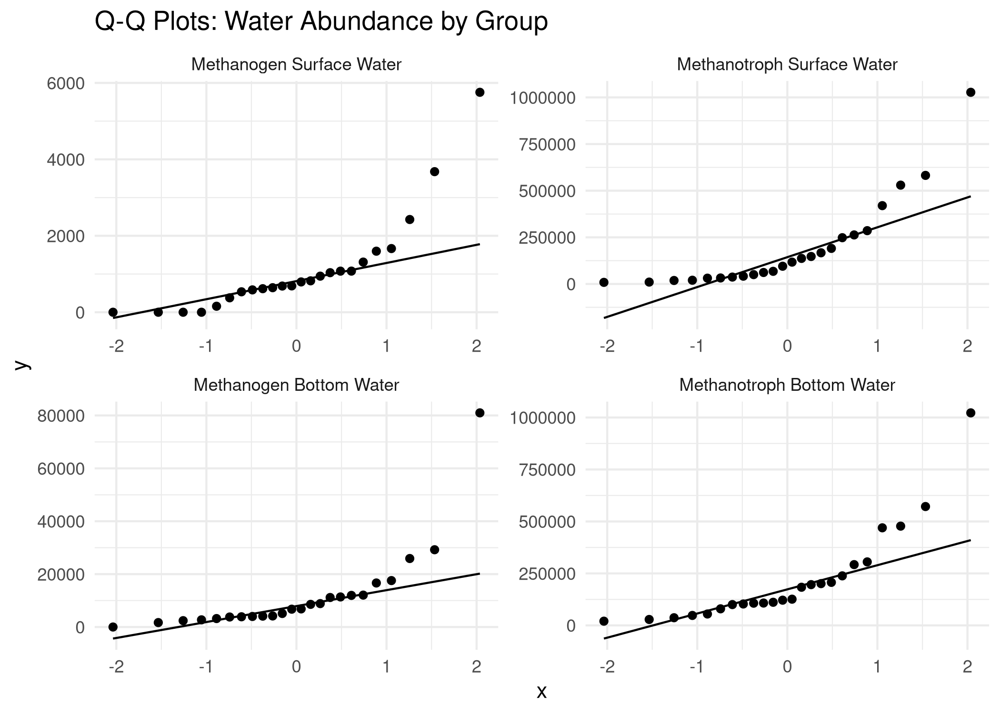<!-- -->

``` r
# lets plot density histogram by group too
ggplot(water_ch4_cyclers_df, aes(x = total_abundance, fill = group)) +
  geom_histogram(aes(y = ..density..), bins = 30, alpha = 0.5, color = "black") +
  geom_density(alpha = 0.6) +
  facet_wrap(~ group, scales = "free") +
  theme_minimal() +
  labs(title = "Histogram and Density of Abundance by Group",
       x = "Absolute Cell Abundance",
       y = "Density") +
  theme(legend.position = "none")
```

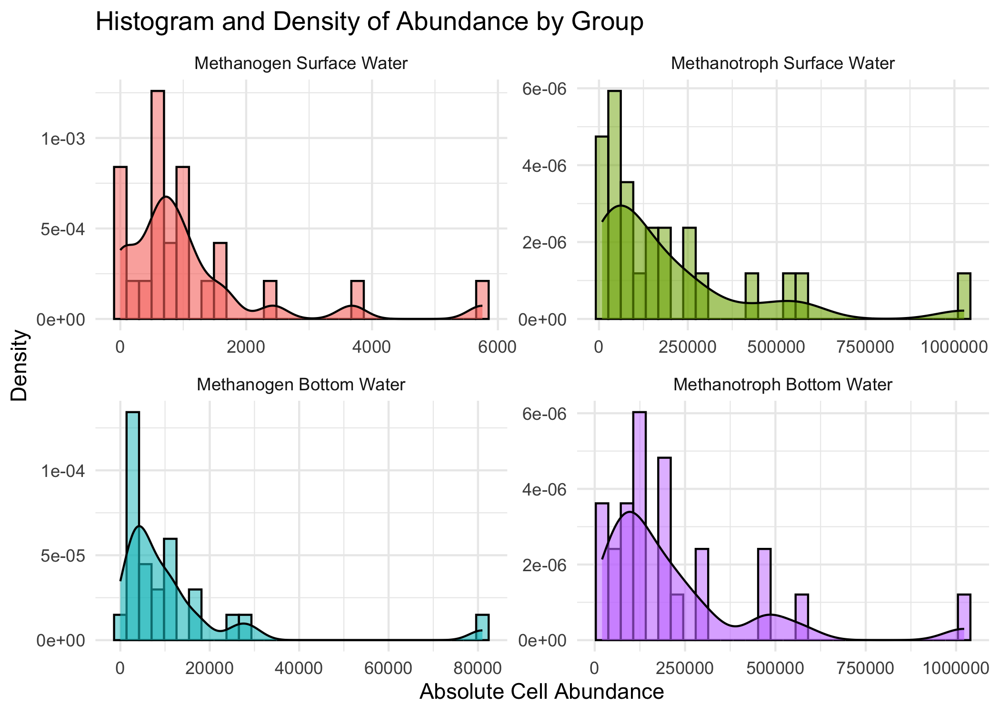<!-- -->

``` r
# now lets plot density histogram by further facetting by treatment
ggplot(water_ch4_cyclers_df, aes(x = total_abundance, fill = group)) +
  geom_histogram(aes(y = ..density..), bins = 30, alpha = 0.5, color = "black") +
  geom_density(alpha = 0.6) +
  facet_wrap(~ group + solar_progress, scales = "free") +
  theme_minimal() +
  labs(title = "Histogram and Density of Order Abundance by Group and Solar Progress",
       x = "Absolute Cell Abundance",
       y = "Density") +
  theme(legend.position = "none")
```

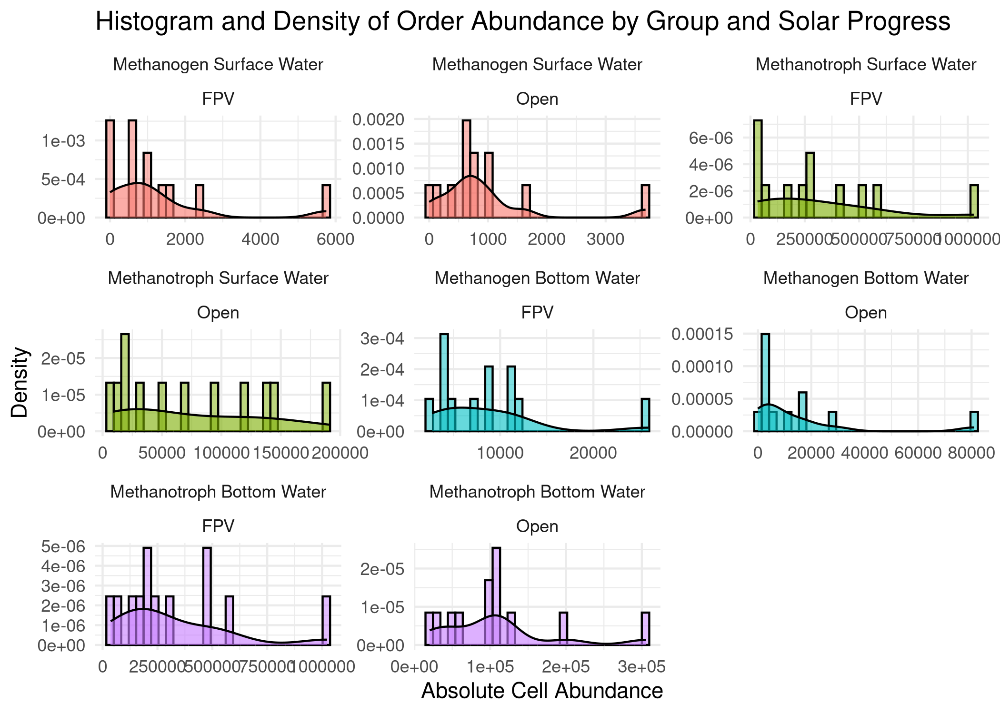<!-- -->

``` r
# shapiro test
water_ch4_cyclers_df %>%
  group_by(group) %>%
  summarise(
    shapiro_p = shapiro.test(total_abundance)$p.value,
    n = n()
  )
```

```
## # A tibble: 4 × 3
##   group                        shapiro_p     n
##   <fct>                            <dbl> <int>
## 1 Methanogen Surface Water   0.00000185     24
## 2 Methanotroph Surface Water 0.000267       24
## 3 Methanogen Bottom Water    0.000000393    24
## 4 Methanotroph Bottom Water  0.000445       24
```

Based on our data with the qq plots we see that the points more or less fit the line. but when we investigate further with the density histograms, the data lacks a clear unimodal distribution. Now, let's check this out further with a Shapiro-Wilk test. When we run our Shapiro-Wilk test to also test for a normal distribution if p > 0.05 the data is likely normal but if p < 0.05 then the data is not normal.

# A tibble: 4 × 3
  group                        shapiro_p     n
  <fct>                            <dbl> <int>
1 Methanogen Surface Water   0.00000185     24
2 Methanotroph Surface Water 0.000267       24
3 Methanogen Bottom Water    0.000000393    24
4 Methanotroph Bottom Water  0.000445       24

The data is not normal! 

Therefore, we will need to use non-parametric stats to statitistically test the data. 


### Sediment - Normality 

We will be running this for all 2024 time points 

``` r
# level
sed_ch4_cyclers_df$solar_progress <- factor(
  sed_ch4_cyclers_df$solar_progress,
  levels = c("FPV", "Open"))

# interaction grouping and relative abundance calc
sed_ch4_cyclers_df <- sed_ch4_cyclers_df %>%
  mutate(group = interaction(CH4_Cycler, Depth_Class, sep = " ")) %>% 
  group_by(Pond, solar_progress, group, JDate, CH4_Cycler) %>%
  summarise(
    rel_abundance = sum(Abundance, na.rm = TRUE), # total across all samples
    .groups = "drop"
  )


# qq plot to visualize normality
ggplot(sed_ch4_cyclers_df, aes(sample = rel_abundance)) +
  stat_qq() +
  stat_qq_line() +
  facet_wrap(~ group, scales = "free") +
  theme_minimal() +
  labs(title = "Q-Q Plots: Order Abundance by Group")
```

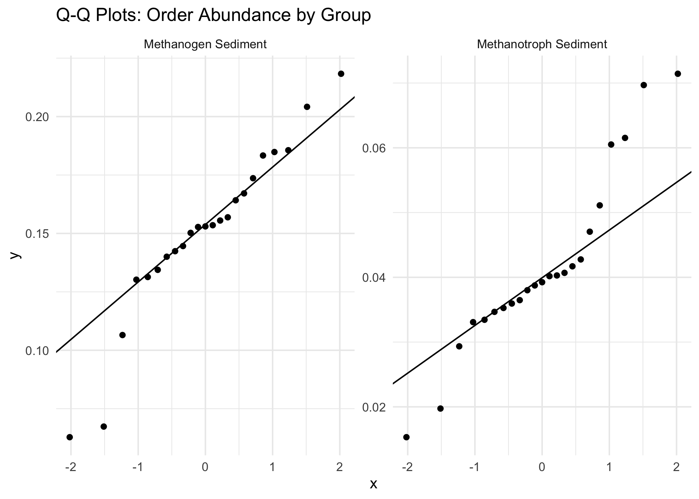<!-- -->

``` r
# lets plot density histogram by group too
ggplot(sed_ch4_cyclers_df, aes(x = rel_abundance, fill = group)) +
  geom_histogram(aes(y = ..density..), bins = 30, alpha = 0.5, color = "black") +
  geom_density(alpha = 0.6) +
  facet_wrap(~ group, scales = "free") +
  theme_minimal() +
  labs(title = "Histogram and Density of Relative Abundance by Group",
       x = "Relative Abundance",
       y = "Density") +
  theme(legend.position = "none")
```

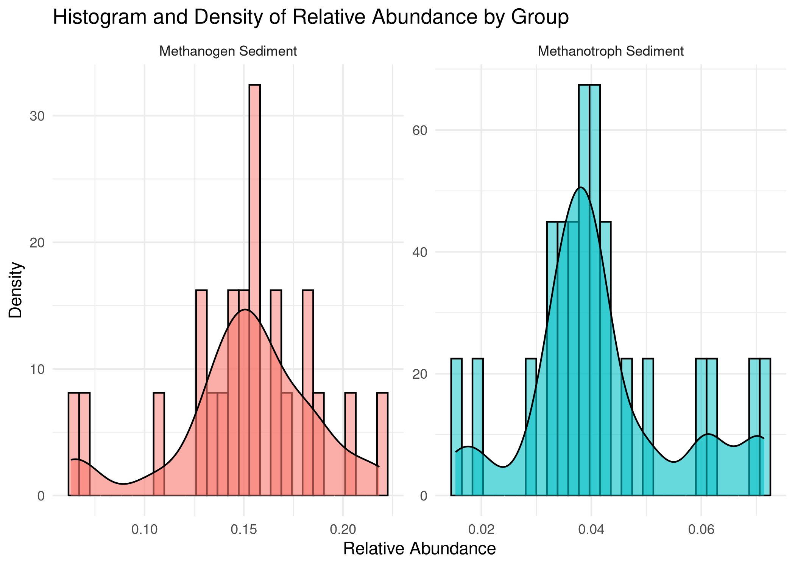<!-- -->

``` r
# now lets plot density histogram by further facetting by treatment
ggplot(sed_ch4_cyclers_df, aes(x = rel_abundance, fill = group)) +
  geom_histogram(aes(y = ..density..), bins = 30, alpha = 0.5, color = "black") +
  geom_density(alpha = 0.6) +
  facet_wrap(~ group + solar_progress, scales = "free") +
  theme_minimal() +
  labs(title = "Histogram and Density of Relative Abundance by Group and Solar Progress",
       x = "Relative Abundance",
       y = "Density") +
  theme(legend.position = "none")
```

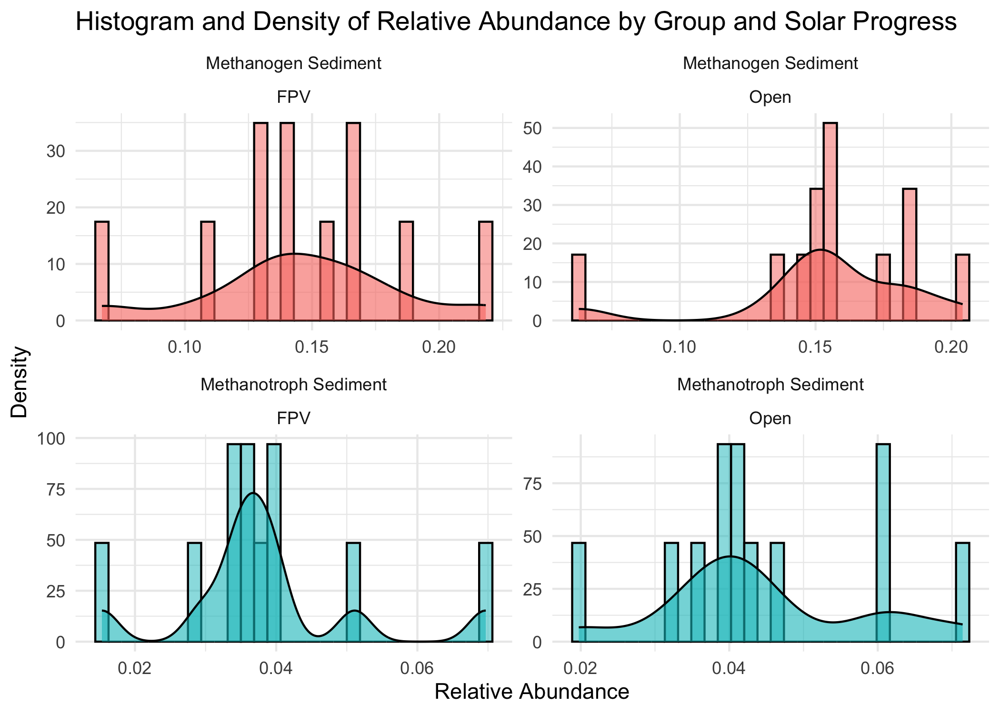<!-- -->

``` r
# shapiro test
sed_ch4_cyclers_df %>%
  group_by(group) %>%
  summarise(
    shapiro_p = shapiro.test(rel_abundance)$p.value,
    n = n()
  )
```

```
## # A tibble: 2 × 3
##   group                 shapiro_p     n
##   <fct>                     <dbl> <int>
## 1 Methanogen Sediment      0.137     23
## 2 Methanotroph Sediment    0.0184    23
```

Based on our data with the qq plots and the density histograms, data does not seem to be clearly normally distributed. Shapiro-Wilk test to also test for a normal distribution if p > 0.05 the data is likely normal but if p < 0.05 then the data is not normal.

  group                 shapiro_p     n
  <fct>                     <dbl> <int>
1 Methanogen Sediment      0.137     23
2 Methanotroph Sediment    0.0184    23

Methanotrophs are not normally distributed but but methanogens are which is interesting. but will still go with two-sample Wilcoxon tests

# Fig 2 - Abundance of Methane Cyclers

In this plot we will calculate the absolute abundance of methane cyclers in water column and the relative abundance in sediments to see methane cyclers overtime and with a box plot to show abundance as well.

``` r
# calculate total cell abundance mean and standard deviation 
wc_total_abund <- water_ch4_cyclers_df %>% 
  group_by(solar_progress, Depth_Class, CH4_Cycler) %>% 
  dplyr::summarize(ch4_water_sd = sd(total_abundance),
                   mean_ch4_water = mean(total_abundance),
                   .groups = "drop")
wc_total_abund
```

```
## # A tibble: 8 × 5
##   solar_progress Depth_Class   CH4_Cycler   ch4_water_sd mean_ch4_water
##   <fct>          <fct>         <chr>               <dbl>          <dbl>
## 1 FPV            Surface Water Methanogen          2254.          1425.
## 2 FPV            Surface Water Methanotroph      365892.        440032.
## 3 FPV            Bottom Water  Methanogen          8166.         10629 
## 4 FPV            Bottom Water  Methanotroph      332914.        465437.
## 5 Open           Surface Water Methanogen          1429.          1300.
## 6 Open           Surface Water Methanotroph       96759.        121706.
## 7 Open           Bottom Water  Methanogen         30058.         19524.
## 8 Open           Bottom Water  Methanotroph      116271.        173996.
```

``` r
##### surface methanogens #####
# 1. calculate stats
# 1a. calculate abundances
methanogen_surface_sum <- water_ch4_cyclers_df %>%
  dplyr::filter(Depth_Class == "Surface Water",
                CH4_Cycler == "Methanogen") %>% 
  group_by(solar_progress, JDate) %>% 
  dplyr::summarize(sd_meth = sd(total_abundance),
                   mean_meth = mean(total_abundance),
                   .groups = "drop")
methanogen_surface_sum
```

```
## # A tibble: 8 × 4
##   solar_progress JDate sd_meth mean_meth
##   <fct>          <dbl>   <dbl>     <dbl>
## 1 FPV              172    816.      471 
## 2 FPV              193   4073.     3651.
## 3 FPV              234    346.     1176.
## 4 FPV              255    349.      403.
## 5 Open             172    197.      551.
## 6 Open             193    406.     1548.
## 7 Open             234    793.      803 
## 8 Open             255   2756.     2300.
```

``` r
max(methanogen_surface_sum$mean_meth)
```

```
## [1] 3650.667
```

``` r
# 1b. linear mixed model
methanogen_surface_data <- water_ch4_cyclers_df %>%
  dplyr::filter(Depth_Class == "Surface Water",
                CH4_Cycler == "Methanogen") 
methanogen_surface_data$Pond <- as.factor(methanogen_surface_data$Pond)

surface_methanogen_model <- lmerTest::lmer(total_abundance ~ solar_progress + JDate + (1|Pond), data = methanogen_surface_data)
summary(surface_methanogen_model) #0.876
```

```
## Linear mixed model fit by REML. t-tests use Satterthwaite's method ['lmerModLmerTest']
## Formula: total_abundance ~ solar_progress + JDate + (1 | Pond)
##    Data: methanogen_surface_data
## 
## REML criterion at convergence: 392.5
## 
## Scaled residuals: 
##     Min      1Q  Median      3Q     Max 
## -0.7472 -0.4816 -0.2644  0.0634  3.5357 
## 
## Random effects:
##  Groups   Name        Variance Std.Dev.
##  Pond     (Intercept)       0     0    
##  Residual             3731396  1932    
## Number of obs: 24, groups:  Pond, 6
## 
## Fixed effects:
##                     Estimate Std. Error        df t value Pr(>|t|)
## (Intercept)        1331.8819  2631.8216   21.0000   0.506    0.618
## solar_progressOpen -124.7500   788.6059   21.0000  -0.158    0.876
## JDate                 0.4369    12.0472   21.0000   0.036    0.971
## 
## Correlation of Fixed Effects:
##             (Intr) slr_pO
## slr_prgrssO -0.150       
## JDate       -0.977  0.000
## optimizer (nloptwrap) convergence code: 0 (OK)
## boundary (singular) fit: see help('isSingular')
```

``` r
emmeans::emmeans(surface_methanogen_model, pairwise ~ solar_progress) # 0.8820
```

```
## $emmeans
##  solar_progress emmean  SE df lower.CL upper.CL
##  FPV              1425 558  4     -123     2973
##  Open             1300 558  4     -248     2849
## 
## Degrees-of-freedom method: kenward-roger 
## Confidence level used: 0.95 
## 
## $contrasts
##  contrast   estimate  SE df t.ratio p.value
##  FPV - Open      125 789  4   0.158  0.8820
## 
## Degrees-of-freedom method: kenward-roger
```

``` r
# 2. plot surface water methanogens overtime
methanogen_surface <- methanogen_surface_sum %>% 
  ggplot(aes(x = JDate, y = mean_meth, fill = solar_progress, color = solar_progress)) +
  geom_line()+
  geom_point()+
  theme_classic()+
  geom_errorbar(aes(x = JDate, ymin = mean_meth - sd_meth, ymax = mean_meth + sd_meth), width = 0, color = "black")+
  geom_point(size = 3, shape = 16)+
  geom_point(size = 3, shape = 1, color = "black")+
  labs(y= "Surface Methanogen<br>Abundance (Cells mL<sup>-1</sup>)", x = "Day of Year")+
  scale_y_continuous(
    limits = c(NA, 8250),
    # breaks = c(0, 2500, 5000, 7500),
    # limits = c(NA, 8e3),
    # breaks = breaks_extended(n = 4),
    breaks = c(0, 4000, 8000),
    labels = label_number(scale_cut = cut_short_scale())) +
  theme(axis.text.x =  element_text(size = 8,colour = "black"),
         axis.text.y =  element_text(size = 8,colour = "black"),
         axis.title.x = element_blank(),
        axis.title.y = element_markdown(size = 8))+
  scale_fill_manual(values = solar_colors) +
  scale_color_manual(values = solar_colors) +
  theme(legend.position = "none")#+
  #scale_x_continuous(limits = c(170,250))
methanogen_surface
```

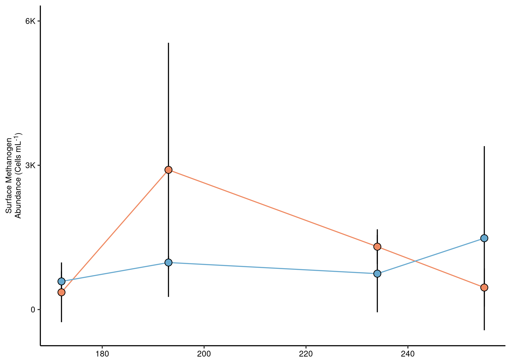<!-- -->

``` r
# 3. box plot
methanogen_surface_box <- methanogen_surface_data %>% 
  ggplot(aes(x = solar_progress, y = total_abundance, color = solar_progress)) +
  geom_boxplot(outlier.shape = NA, color = "black") +
  geom_jitter(aes(color = solar_progress, fill = solar_progress), width = 0.2, size = 2, shape = 21) +
  scale_fill_manual(values = solar_colors)+
  scale_color_manual(values = c("black", "black"))+
  scale_y_continuous(
    limits = c(NA, 8250),
    #breaks = c(0, 2500, 5000, 7500),
     breaks = c(0, 4000, 8000),
    labels = label_number(scale_cut = cut_short_scale())) +
  theme_classic()+
  theme(axis.text.x = element_text(size = 8,colour = "black"),
        axis.title.x = element_blank(),
        axis.title.y = element_blank(),
        axis.line.y = element_blank(),
        axis.text.y = element_blank(),
        axis.ticks.y = element_blank(),
        legend.position = "none") +
 annotate("text", x = 2, y = 8000, label = "p = 0.882", size = 2.822,  fontface = "italic") #.882
methanogen_surface_box
```

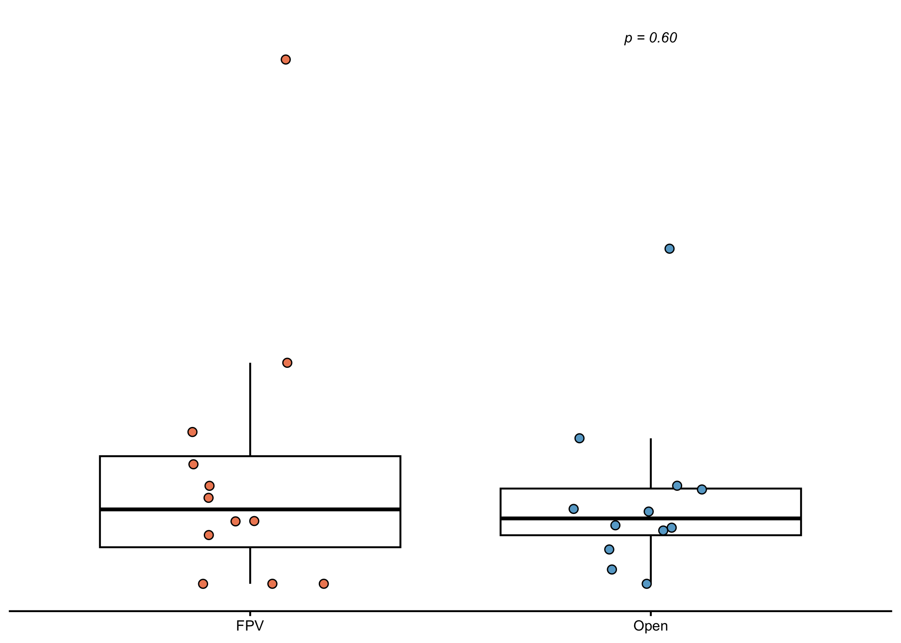<!-- -->

``` r
##### surface methanotrophs #####
# 1. calculate stats
# 1a. calculate abundances
methanotroph_surface_sum <- water_ch4_cyclers_df %>%
  dplyr::filter(Depth_Class == "Surface Water",
                CH4_Cycler == "Methanotroph") %>% 
  group_by(solar_progress, JDate) %>%
  dplyr::summarize(sd_meth = sd(total_abundance),
                   mean_meth = mean(total_abundance),
                   .groups = "drop")
methanotroph_surface_sum
```

```
## # A tibble: 8 × 4
##   solar_progress JDate sd_meth mean_meth
##   <fct>          <dbl>   <dbl>     <dbl>
## 1 FPV              172  28224.    89489.
## 2 FPV              193 201570.   270093.
## 3 FPV              234 189093.   508583 
## 4 FPV              255 343644.   891961.
## 5 Open             172   8769.    24869.
## 6 Open             193  77017.   146454.
## 7 Open             234  69930.   210918 
## 8 Open             255 115026.   104584.
```

``` r
max(methanotroph_surface_sum$mean_meth)
```

```
## [1] 891960.7
```

``` r
# calculate abundances between treatments 
methanotroph_surface_sum_text <- water_ch4_cyclers_df %>%
  dplyr::filter(Depth_Class == "Surface Water",
                CH4_Cycler == "Methanotroph") %>% 
  group_by(solar_progress) %>% 
  dplyr::summarize(sd_meth = sd(total_abundance/1e5),
                   mean_meth = mean(total_abundance/1e5),
                   .groups = "drop")
methanotroph_surface_sum_text
```

```
## # A tibble: 2 × 3
##   solar_progress sd_meth mean_meth
##   <fct>            <dbl>     <dbl>
## 1 FPV              3.66       4.40
## 2 Open             0.968      1.22
```

``` r
max(methanotroph_surface_sum_text$mean_meth)
```

```
## [1] 4.400316
```

``` r
# 1b. linear mixed model
methanotroph_surface_data <- water_ch4_cyclers_df %>%
  dplyr::filter(Depth_Class == "Surface Water",
                CH4_Cycler == "Methanotroph") 
methanotroph_surface_data$Pond <- as.factor(methanotroph_surface_data$Pond)

max(methanotroph_surface_data$total_abundance)
```

```
## [1] 1267346
```

``` r
surface_methanotroph_model <- lmer(total_abundance ~ solar_progress + JDate + (1|Pond), data = methanotroph_surface_data)
summary(surface_methanotroph_model) # 0.000217 ***
```

```
## Linear mixed model fit by REML. t-tests use Satterthwaite's method ['lmerModLmerTest']
## Formula: total_abundance ~ solar_progress + JDate + (1 | Pond)
##    Data: methanotroph_surface_data
## 
## REML criterion at convergence: 589.6
## 
## Scaled residuals: 
##     Min      1Q  Median      3Q     Max 
## -1.4464 -0.5916 -0.2391  0.5196  2.9401 
## 
## Random effects:
##  Groups   Name        Variance  Std.Dev.
##  Pond     (Intercept) 0.000e+00      0  
##  Residual             4.446e+10 210864  
## Number of obs: 24, groups:  Pond, 6
## 
## Fixed effects:
##                      Estimate Std. Error         df t value Pr(>|t|)    
## (Intercept)        -6.268e+05  2.873e+05  1.348e+37  -2.182 0.029140 *  
## solar_progressOpen -3.183e+05  8.608e+04  1.348e+37  -3.698 0.000217 ***
## JDate               4.997e+03  1.315e+03  1.348e+37   3.800 0.000145 ***
## ---
## Signif. codes:  0 '***' 0.001 '**' 0.01 '*' 0.05 '.' 0.1 ' ' 1
## 
## Correlation of Fixed Effects:
##             (Intr) slr_pO
## slr_prgrssO -0.150       
## JDate       -0.977  0.000
## optimizer (nloptwrap) convergence code: 0 (OK)
## boundary (singular) fit: see help('isSingular')
```

``` r
emmeans::emmeans(surface_methanotroph_model, pairwise ~ solar_progress) # 0.0209
```

```
## $emmeans
##  solar_progress emmean    SE df lower.CL upper.CL
##  FPV            440032 60900  4   271026   609037
##  Open           121706 60900  4   -47300   290712
## 
## Degrees-of-freedom method: kenward-roger 
## Confidence level used: 0.95 
## 
## $contrasts
##  contrast   estimate    SE df t.ratio p.value
##  FPV - Open   318325 86100  4   3.698  0.0209
## 
## Degrees-of-freedom method: kenward-roger
```

``` r
# 2. plot surface water methanotrophs
methanotroph_surface <- methanotroph_surface_sum %>% 
  ggplot(aes(x = JDate, y = mean_meth, fill = solar_progress, color = solar_progress)) +
  #geom_smooth(aes(group = solar_progress), se = FALSE) +
  geom_line()+
  geom_point()+
  theme_classic()+
  geom_errorbar(aes(x = JDate, ymin = mean_meth - sd_meth, ymax = mean_meth + sd_meth), width = 0, color = "black")+
  geom_point(size = 3, shape = 16)+
  geom_point(size = 3, shape = 1, color = "black")+
  labs(y= "Surface Methanotroph<br>Abundance (Cells mL<sup>-1</sup>)", x = "Day of Year")+
  scale_y_continuous(
    limits = c(0, 1.27e6),
    breaks = c(0, 6.25e5, 1.25e6),
    labels = c("0", "625K", "1.25M"))+
  # scale_y_continuous(
  #    limits = c(0, NA),
  #   # breaks = c(0, 7.5e5, 1.5e6),
  #   # labels = c("0", "750K", "1.5M"))+
  #   labels = label_number(scale_cut = cut_short_scale())) +
  #   #labels = label_number(scale_cut = cut_short_scale(), accuracy = 0.01)) +
  theme(axis.text.x =  element_text(size = 8,colour = "black"),
         axis.text.y =  element_text(size = 8,colour = "black"),
         axis.title.x = element_blank(),
        axis.title.y = element_markdown(size = 8))+
  scale_fill_manual(values = solar_colors)+
  scale_color_manual(values = solar_colors)+
  theme(legend.position = "none")
methanotroph_surface
```

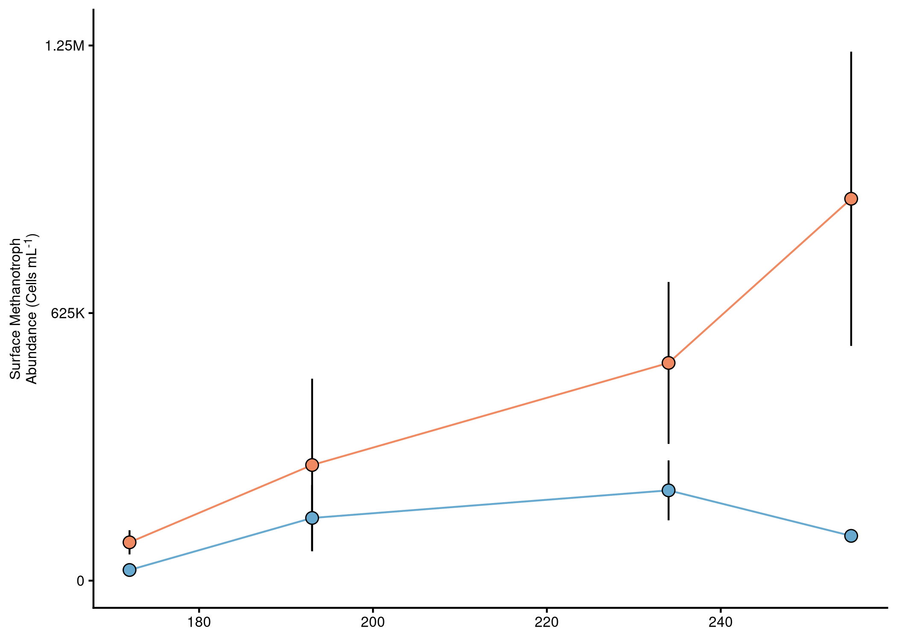<!-- -->

``` r
# 3. box plot
methanotroph_surface_box <- methanotroph_surface_data %>% 
  ggplot(aes(x = solar_progress, y = total_abundance, color = solar_progress)) +
  geom_boxplot(outlier.shape = NA, color = "black") +
  geom_jitter(aes(color = solar_progress, fill = solar_progress), width = 0.2, size = 2, shape = 21) +
  scale_fill_manual(values = solar_colors)+
  scale_color_manual(values = c("black", "black"))+
  scale_y_continuous(
    limits = c(0, 1.27e6),
    breaks = c(0, 6.25e5, 1.25e6),
    labels = c("0", "625K", "1.25M"))+
  # scale_y_continuous(
  #   limits = c(0, 1.27e6),
  #   breaks = c(0, 2.5e5, 7.5e5, 1.25e6),
  #   labels = c("0","250K", "750K", "1.25M"))+
  #   # breaks = c(0, 5e5, 1e6, 1.5e6),
  #   #labels = label_number(scale_cut = cut_short_scale())) +
  theme_classic()+
  theme(axis.text.x = element_text(size = 8,colour = "black"),
        axis.title.x = element_blank(),
        axis.title.y = element_blank(),
        axis.line.y = element_blank(),
        axis.text.y = element_blank(),
        axis.ticks.y = element_blank(),
        legend.position = "none") +
  # stat_compare_means(method = "wilcox.test",
  #                    #comparisons = list(c("FPV", "Open")),
  #                    label = "p.format",
  #                    size = 3,
  #                    label.y.npc = 0.9,
  #                    fontface = "italic")
  #label.y = c(8000, 100000, 500000, 400000, 400000), # get pvalue
 annotate("text", x = 2, y = 1.25e6, label = "p = 0.021", size = 2.822,  fontface = "italic") # add p value
methanotroph_surface_box
```

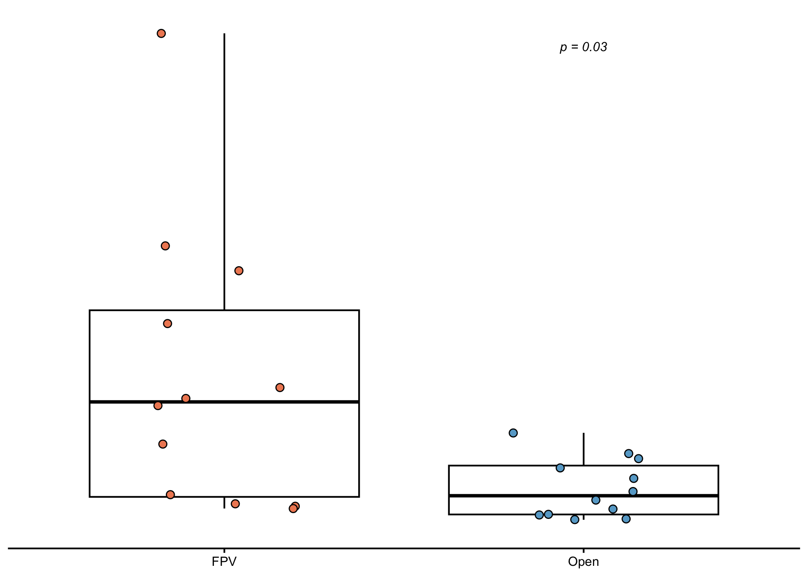<!-- -->

``` r
##### bottom methanogens #####
# 1. statistics
# 1a. abundance stats
methanogen_bottom_sum <- water_ch4_cyclers_df %>%
  dplyr::filter(Depth_Class == "Bottom Water",
                CH4_Cycler == "Methanogen") %>% 
  group_by(solar_progress, JDate) %>% 
  dplyr::summarize(sd_meth = sd(total_abundance),
                   mean_meth = mean(total_abundance))
methanogen_bottom_sum
```

```
## # A tibble: 8 × 4
## # Groups:   solar_progress [2]
##   solar_progress JDate sd_meth mean_meth
##   <fct>          <dbl>   <dbl>     <dbl>
## 1 FPV              172   5250.    10675 
## 2 FPV              193  10774.    19957.
## 3 FPV              234   1688.     4191.
## 4 FPV              255   3826.     7693 
## 5 Open             172  21787.    14914.
## 6 Open             193   5465.    20209.
## 7 Open             234  57993.    40207.
## 8 Open             255   2409.     2767.
```

``` r
max(methanogen_bottom_sum$mean_meth)
```

```
## [1] 40207.33
```

``` r
# 1b. linear mixed model
methanogen_bottom_data <- water_ch4_cyclers_df %>%
  dplyr::filter(Depth_Class == "Bottom Water",
                CH4_Cycler == "Methanogen") 
methanogen_bottom_data$Pond <- as.factor(methanogen_bottom_data$Pond)

bottom_methanogen_model <- lmer(total_abundance ~ solar_progress + JDate + (1|Pond), data = methanogen_bottom_data)
summary(bottom_methanogen_model) # 0.514
```

```
## Linear mixed model fit by REML. t-tests use Satterthwaite's method ['lmerModLmerTest']
## Formula: total_abundance ~ solar_progress + JDate + (1 | Pond)
##    Data: methanogen_bottom_data
## 
## REML criterion at convergence: 494.2
## 
## Scaled residuals: 
##     Min      1Q  Median      3Q     Max 
## -1.3395 -0.3363 -0.1738  0.1338  3.7360 
## 
## Random effects:
##  Groups   Name        Variance  Std.Dev.
##  Pond     (Intercept) 131347254 11461   
##  Residual             403215864 20080   
## Number of obs: 24, groups:  Pond, 6
## 
## Fixed effects:
##                    Estimate Std. Error       df t value Pr(>|t|)
## (Intercept)        24108.39   28147.13    19.89   0.857    0.402
## solar_progressOpen  8895.25   12440.56     4.00   0.715    0.514
## JDate                -63.13     125.23    17.00  -0.504    0.621
## 
## Correlation of Fixed Effects:
##             (Intr) slr_pO
## slr_prgrssO -0.221       
## JDate       -0.950  0.000
```

``` r
emmeans::emmeans(bottom_methanogen_model, pairwise ~ solar_progress) # 0.514
```

```
## $emmeans
##  solar_progress emmean   SE df lower.CL upper.CL
##  FPV             10629 8800  4   -13795    35053
##  Open            19524 8800  4    -4900    43948
## 
## Degrees-of-freedom method: kenward-roger 
## Confidence level used: 0.95 
## 
## $contrasts
##  contrast   estimate    SE df t.ratio p.value
##  FPV - Open    -8895 12400  4  -0.715  0.5141
## 
## Degrees-of-freedom method: kenward-roger
```

``` r
max(methanogen_bottom_data$total_abundance)
```

```
## [1] 107153
```

``` r
# 2. plot bottom water methanogens overtime 
methanogen_bottom <- methanogen_bottom_sum %>% 
  ggplot(aes(x = JDate, y = mean_meth, fill = solar_progress, color = solar_progress)) +
  geom_line()+
  geom_point()+
  theme_classic()+
  geom_errorbar(aes(x = JDate, ymin = mean_meth - sd_meth, ymax = mean_meth + sd_meth), width = 0, color = "black")+
  geom_point(size = 3, shape = 16)+
  geom_point(size = 3, shape = 1, color = "black")+
  labs(y= "Bottom Methanogen<br>Abundance (Cells mL<sup>-1</sup>)", x = "Day of Year")+
  scale_y_continuous(
    limits = c(NA, 1.1e5),
    breaks = c(0, 5e4, 1e5),
    labels = label_number(scale_cut = cut_short_scale())) +
  theme(axis.text.x =  element_text(size = 8,colour = "black"),
         axis.text.y =  element_text(size = 8,colour = "black"),
         axis.title.x = element_blank(),
        axis.title.y = element_markdown(size = 8))+
  scale_fill_manual(values = solar_colors)+
  scale_color_manual(values = solar_colors) +
  theme(legend.position = "none")#+
  #scale_y_continuous(limits = c(0,11), breaks = c(0, 5, 10))+
  #scale_x_continuous(limits = c(170,250))
methanogen_bottom
```

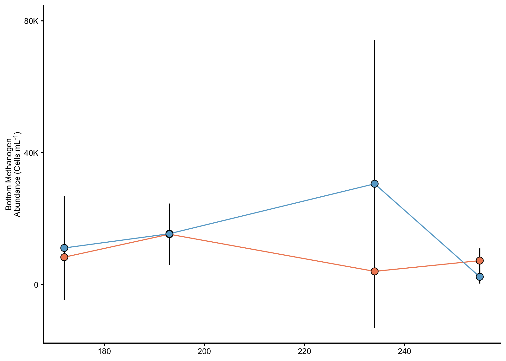<!-- -->

``` r
# 3. box plot
methanogen_bottom_box <- methanogen_bottom_data %>% 
  ggplot(aes(x = solar_progress, y = total_abundance, color = solar_progress)) +
  geom_boxplot(outlier.shape = NA, color = "black") +
  geom_jitter(aes(color = solar_progress, fill = solar_progress), width = 0.2, size = 2, shape = 21) +
  scale_fill_manual(values = solar_colors)+
  scale_color_manual(values = c("black", "black"))+
  scale_y_continuous(
    limits = c(NA, 1.1e5),
    breaks = c(0, 5e4, 1e5),
    labels = label_number(scale_cut = cut_short_scale())) +
  theme_classic()+
  theme(axis.text.x = element_text(size = 8,colour = "black"),
        axis.title.x = element_blank(),
        axis.title.y = element_blank(),
        axis.line.y = element_blank(),
        axis.text.y = element_blank(),
        axis.ticks.y = element_blank(),
        legend.position = "none") +
  # stat_compare_means(method = "wilcox.test",
  #                    #comparisons = list(c("FPV", "Open")),
  #                    label = "p.format",
  #                    size = 3,
  #                    label.y.npc = 0.9,
  #                    fontface = "italic")
                     #label.y = c(8000, 100000, 500000, 400000, 400000), # get pvalue
 annotate("text", x = 2, y = 1e5, label = "p = 0.514", size = 2.822,  fontface = "italic")
methanogen_bottom_box
```

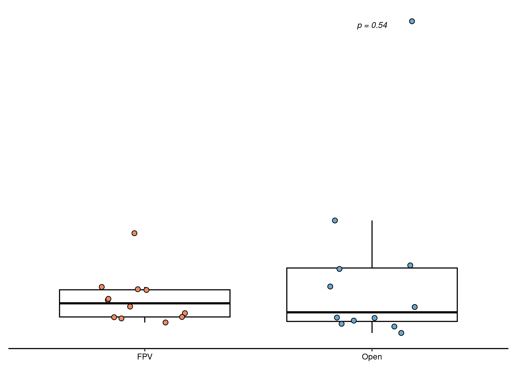<!-- -->

``` r
##### bottom water methanotrophs #####
# 1. statistics
# 1a. calculate abundance stats
methanotroph_bottom_sum <- water_ch4_cyclers_df %>%
  dplyr::filter(Depth_Class == "Bottom Water",
                CH4_Cycler == "Methanotroph") %>% 
  group_by(solar_progress, JDate) %>% 
  dplyr::summarize(sd_meth = sd(total_abundance),
                   mean_meth = mean(total_abundance))
methanotroph_bottom_sum
```

```
## # A tibble: 8 × 4
## # Groups:   solar_progress [2]
##   solar_progress JDate sd_meth mean_meth
##   <fct>          <dbl>   <dbl>     <dbl>
## 1 FPV              172  91714.   226583.
## 2 FPV              193 306960.   370899.
## 3 FPV              234 285142.   532995.
## 4 FPV              255 462386.   731272.
## 5 Open             172  84954.   187324.
## 6 Open             193  39734.   149482.
## 7 Open             234 171205.   278711 
## 8 Open             255  74231.    80469
```

``` r
max(methanotroph_bottom_sum$mean_meth)
```

```
## [1] 731271.7
```

``` r
# calculate abundances between treatments 
methanotroph_bottom_sum_text <- water_ch4_cyclers_df %>%
  dplyr::filter(Depth_Class == "Bottom Water",
                CH4_Cycler == "Methanotroph") %>% 
  group_by(solar_progress) %>% 
  dplyr::summarize(sd_meth = sd(total_abundance/1e5),
                   mean_meth = mean(total_abundance/1e5),
                   .groups = "drop")
methanotroph_bottom_sum_text
```

```
## # A tibble: 2 × 3
##   solar_progress sd_meth mean_meth
##   <fct>            <dbl>     <dbl>
## 1 FPV               3.33      4.65
## 2 Open              1.16      1.74
```

``` r
max(methanotroph_bottom_sum_text$mean_meth)
```

```
## [1] 4.654371
```

``` r
# 1b. linear mixed model 
methanotroph_bottom_data <- water_ch4_cyclers_df %>%
  dplyr::filter(Depth_Class == "Bottom Water",
                CH4_Cycler == "Methanotroph") 
methanotroph_bottom_data$Pond <- as.factor(methanotroph_bottom_data$Pond)

bottom_methanotroph_model <- lmerTest::lmer(total_abundance ~ solar_progress + JDate + (1|Pond), data = methanotroph_bottom_data)
summary(bottom_methanotroph_model) # 0.00272 **
```

```
## Linear mixed model fit by REML. t-tests use Satterthwaite's method ['lmerModLmerTest']
## Formula: total_abundance ~ solar_progress + JDate + (1 | Pond)
##    Data: methanotroph_bottom_data
## 
## REML criterion at convergence: 594.7
## 
## Scaled residuals: 
##     Min      1Q  Median      3Q     Max 
## -1.3802 -0.6653 -0.1485  0.4918  2.6934 
## 
## Random effects:
##  Groups   Name        Variance  Std.Dev.
##  Pond     (Intercept) 0.000e+00      0  
##  Residual             5.671e+10 238139  
## Number of obs: 24, groups:  Pond, 6
## 
## Fixed effects:
##                      Estimate Std. Error         df t value Pr(>|t|)   
## (Intercept)        -9.465e+04  3.245e+05  1.184e+32  -0.292  0.77049   
## solar_progressOpen -2.914e+05  9.722e+04  1.184e+32  -2.998  0.00272 **
## JDate               2.623e+03  1.485e+03  1.184e+32   1.766  0.07734 . 
## ---
## Signif. codes:  0 '***' 0.001 '**' 0.01 '*' 0.05 '.' 0.1 ' ' 1
## 
## Correlation of Fixed Effects:
##             (Intr) slr_pO
## slr_prgrssO -0.150       
## JDate       -0.977  0.000
## optimizer (nloptwrap) convergence code: 0 (OK)
## boundary (singular) fit: see help('isSingular')
```

``` r
emmeans::emmeans(bottom_methanotroph_model, pairwise ~ solar_progress) # 0.0400
```

```
## $emmeans
##  solar_progress emmean    SE df lower.CL upper.CL
##  FPV            465437 68700  4   274571   656304
##  Open           173996 68700  4   -16870   364863
## 
## Degrees-of-freedom method: kenward-roger 
## Confidence level used: 0.95 
## 
## $contrasts
##  contrast   estimate    SE df t.ratio p.value
##  FPV - Open   291441 97200  4   2.998  0.0400
## 
## Degrees-of-freedom method: kenward-roger
```

``` r
# 2. plot bottom water methanotrophs
methanotroph_bottom <- methanotroph_bottom_sum %>% 
  ggplot(aes(x = JDate, y = mean_meth, fill = solar_progress, color = solar_progress)) +
  geom_line()+
  geom_point()+
  theme_classic()+
  geom_errorbar(aes(x = JDate, ymin = mean_meth - sd_meth, ymax = mean_meth + sd_meth), width = 0, color = "black")+
  geom_point(size = 3, shape = 16)+
  geom_point(size = 3, shape = 1, color = "black")+
  labs(y= "Bottom Methanotroph<br>Abundance (Cells mL<sup>-1</sup>)", x = "Day of Year")+
  scale_y_continuous(
    breaks = c(0, 6.25e5, 1.25e6),
    labels = c("0", "625K", "1.25M"))+
  # scale_y_continuous(
  #   breaks = c(0, 2.5e5, 7.5e5, 1.25e6),
  #   labels = c("0", "250K", "750K", "1.25M"))+
  # labels = label_number(scale_cut = cut_short_scale(), accuracy = 0.01)) +
  # scale_y_continuous(
  #   
  #   limits = c(0, 1.25e6),
  #   breaks = c(0, 5e5, 1e6, 1.25e6),
  #   labels = label_number(scale_cut = cut_short_scale())) +
  theme(axis.text.x =  element_text(size = 8,colour = "black"),
         axis.text.y =  element_text(size = 8,colour = "black"),
         axis.title.x = element_blank(),
        axis.title.y = element_markdown(size = 8))+
  scale_fill_manual(values = solar_colors)+
  scale_color_manual(values = solar_colors)+
  theme(legend.position = "none")
methanotroph_bottom
```

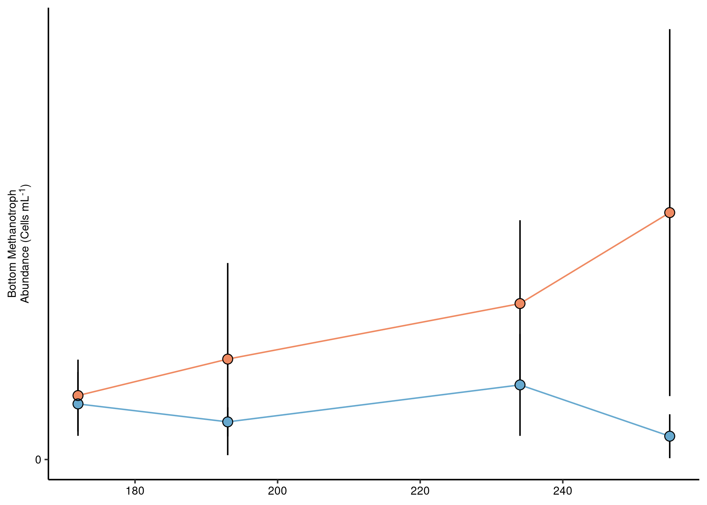<!-- -->

``` r
# 3. box plot
methanotroph_bottom_box <- methanotroph_bottom_data %>% 
  ggplot(aes(x = solar_progress, y = total_abundance, color = solar_progress)) +
  geom_boxplot(outlier.shape = NA, color = "black") +
  geom_jitter(aes(color = solar_progress, fill = solar_progress), width = 0.2, size = 2, shape = 21) +
  scale_fill_manual(values = solar_colors) +
  scale_color_manual(values = c("black", "black"))+
  scale_y_continuous(
    breaks = c(0, 6.25e5, 1.25e6),
    labels = c("0", "625K", "1.25M"))+
  # scale_y_continuous(
  #   breaks = c(0, 2.5e5, 7.5e5, 1.25e6),
  #   labels = c("0","250K", "750K", "1.25M"))+
    #labels = label_number(scale_cut = cut_short_scale())) +
  theme_classic()+
  theme(axis.text.x = element_text(size = 8,colour = "black"),
        axis.title.x = element_blank(),
        axis.title.y = element_blank(),
        axis.line.y = element_blank(),
        axis.text.y = element_blank(),
        axis.ticks.y = element_blank(),
        legend.position = "none") +#+
  # stat_compare_means(method = "wilcox.test",
  #                    #comparisons = list(c("FPV", "Open")),
  #                    label = "p.format",
  #                    size = 3,
  #                    label.y.npc = 0.9,
  #                    fontface = "italic")
  #                    #label.y = c(8000, 100000, 500000, 400000, 400000), # get pvalue
 annotate("text", x = 2, y = 1.25e6, label = "p = 0.040", size = 2.822,  fontface = "italic") # add p value
methanotroph_bottom_box
```

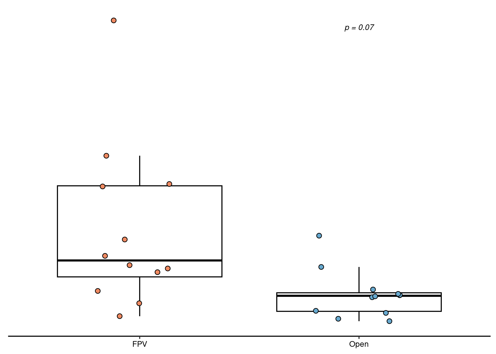<!-- -->

``` r
##### sediment methanogen #####
# calculate stats
# 1a. calcualte abundance
methanogen_sed_sum <- sed_ch4_cyclers_df %>%
  dplyr::filter(CH4_Cycler == "Methanogen") %>% 
 # group_by(solar_progress) %>% # when this is commented out then roughly 20% of community is methanogens
 # group_by(solar_progress) %>%  # when this is run then fpv has 18.9% methanogens and controls have more with 20.5%
  group_by(solar_progress, JDate) %>% 
  dplyr::summarize(sd_meth = sd(rel_abundance),
                   mean_meth = mean(rel_abundance))
methanogen_sed_sum
```

```
## # A tibble: 8 × 4
## # Groups:   solar_progress [2]
##   solar_progress JDate sd_meth mean_meth
##   <fct>          <dbl>   <dbl>     <dbl>
## 1 FPV              172  0.0388     0.201
## 2 FPV              193  0.0451     0.237
## 3 FPV              234  0.0307     0.185
## 4 FPV              255  0.0460     0.134
## 5 Open             172  0.0251     0.211
## 6 Open             193  0.0168     0.213
## 7 Open             234  0.0437     0.217
## 8 Open             255  0.0848     0.178
```

``` r
max(methanogen_sed_sum$mean_meth)
```

```
## [1] 0.2365772
```

``` r
# 1b. linear mixed model 
methanogen_sed_data <- sed_ch4_cyclers_df %>%
  dplyr::filter(CH4_Cycler == "Methanogen") 
methanogen_sed_data$Pond <- as.factor(methanogen_sed_data$Pond)

sed_methanogen_model <- lmer(rel_abundance ~ solar_progress + JDate + (1|Pond), data = methanogen_sed_data)
summary(sed_methanogen_model) # 0.6678 
```

```
## Linear mixed model fit by REML. t-tests use Satterthwaite's method ['lmerModLmerTest']
## Formula: rel_abundance ~ solar_progress + JDate + (1 | Pond)
##    Data: methanogen_sed_data
## 
## REML criterion at convergence: -54.6
## 
## Scaled residuals: 
##     Min      1Q  Median      3Q     Max 
## -1.9470 -0.4706 -0.1411  0.7823  1.5193 
## 
## Random effects:
##  Groups   Name        Variance  Std.Dev.
##  Pond     (Intercept) 0.0009758 0.03124 
##  Residual             0.0013865 0.03724 
## Number of obs: 23, groups:  Pond, 6
## 
## Fixed effects:
##                      Estimate Std. Error         df t value Pr(>|t|)    
## (Intercept)         0.3145977  0.0539666 19.7289652   5.829 1.11e-05 ***
## solar_progressOpen  0.0138530  0.0298995  3.9028301   0.463   0.6678    
## JDate              -0.0005788  0.0002347 15.9472385  -2.466   0.0254 *  
## ---
## Signif. codes:  0 '***' 0.001 '**' 0.01 '*' 0.05 '.' 0.1 ' ' 1
## 
## Correlation of Fixed Effects:
##             (Intr) slr_pO
## slr_prgrssO -0.265       
## JDate       -0.919 -0.017
```

``` r
emmeans::emmeans(sed_methanogen_model, pairwise ~ solar_progress) # 0.667
```

```
## $emmeans
##  solar_progress emmean     SE   df lower.CL upper.CL
##  FPV             0.192 0.0213 4.10    0.133    0.250
##  Open            0.205 0.0210 3.89    0.146    0.264
## 
## Degrees-of-freedom method: kenward-roger 
## Confidence level used: 0.95 
## 
## $contrasts
##  contrast   estimate     SE   df t.ratio p.value
##  FPV - Open  -0.0139 0.0299 3.99  -0.463  0.6674
## 
## Degrees-of-freedom method: kenward-roger
```

``` r
# plot sediment methanogens
methanogen_sed <- methanogen_sed_sum %>% 
  ggplot(aes(x = JDate, y = mean_meth, fill = solar_progress, color = solar_progress)) +
  geom_line()+
  geom_point()+
  theme_classic()+
  geom_errorbar(aes(x = JDate, ymin = mean_meth - sd_meth, ymax = mean_meth + sd_meth), width = 0, color = "black")+
  geom_point(size = 3, shape = 16)+
  geom_point(size = 3, shape = 1, color = "black")+
  scale_fill_manual(values = solar_colors)+
  scale_color_manual(values = solar_colors)+
  scale_y_continuous(
    limits = c(.08, .3),
    breaks = c(0.1, .2, .30),
    labels = c("0.10", "0.20", "0.30"))+
    #labels = label_number(scale_cut = cut_short_scale())) +
  labs(y= "Sediment Methanogen<br> Abundance (%)", x = "Day of Year")+
  theme(axis.text.x =  element_text(size = 8,colour = "black"),
         axis.text.y =  element_text(size = 8,colour = "black"),
         axis.title.x = element_text(size = 8,colour = "black"),
        axis.title.y = element_markdown(size = 8))+
  theme(legend.position = "none")
methanogen_sed
```

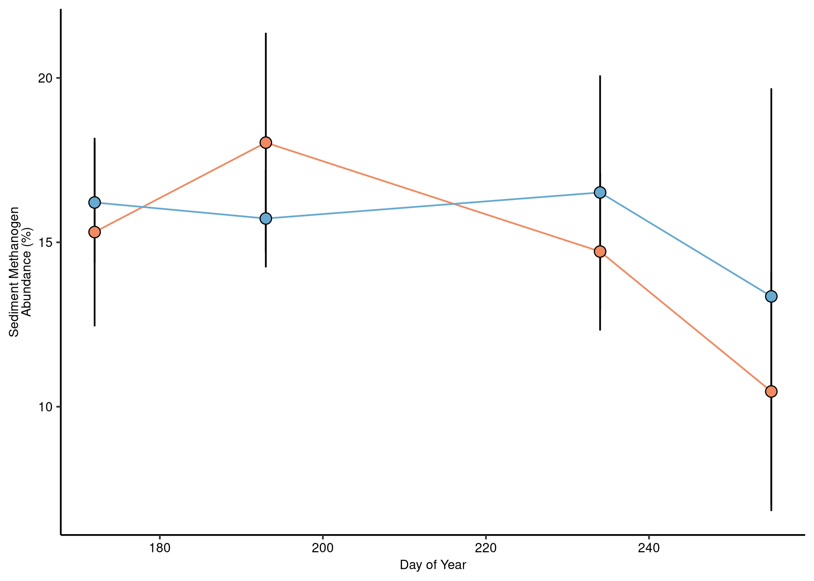<!-- -->

``` r
# 3. box plot
methanogen_sed_box <- methanogen_sed_data %>% 
  ggplot(aes(x = solar_progress, y = rel_abundance, color = solar_progress)) +
  geom_boxplot(outlier.shape = NA, color = "black") +
  geom_jitter(aes(color = solar_progress, fill = solar_progress), width = 0.2, size = 2, shape = 21) +
  scale_fill_manual(values = solar_colors)+
  scale_color_manual(values = c("black", "black"))+
  scale_y_continuous(
    limits = c(.08, .3),
    breaks = c(0.1, .2, .30),
    labels = c("0.10", "0.20", "0.30"))+
  # scale_y_continuous(
  #   #limits = c(.13, .3),
  #   breaks = breaks_extended(n = 4),
  #   #breaks = c(.15, .2, .25, .30),
  #   labels = label_number(scale_cut = cut_short_scale(), accuracy = 0.01)) +
  theme_classic()+
  theme(axis.text.x = element_text(size = 8,colour = "black"),
        axis.title.x = element_blank(),
        axis.title.y = element_blank(),
        axis.line.y = element_blank(),
        axis.text.y = element_blank(),
        axis.ticks.y = element_blank(),
        legend.position = "none") +
  # stat_compare_means(method = "wilcox.test",
  #                    #comparisons = list(c("FPV", "Open")),
  #                    label = "p.format",
  #                    size = 3,
  #                    label.y.npc = 0.9,
  #                    fontface = "italic")
  # label.y = c(8000, 100000, 500000, 400000, 400000) # get pvalue
 annotate("text", x = 2, y = .3, label = "p = 0.667", size = 2.822,  fontface = "italic")
methanogen_sed_box
```

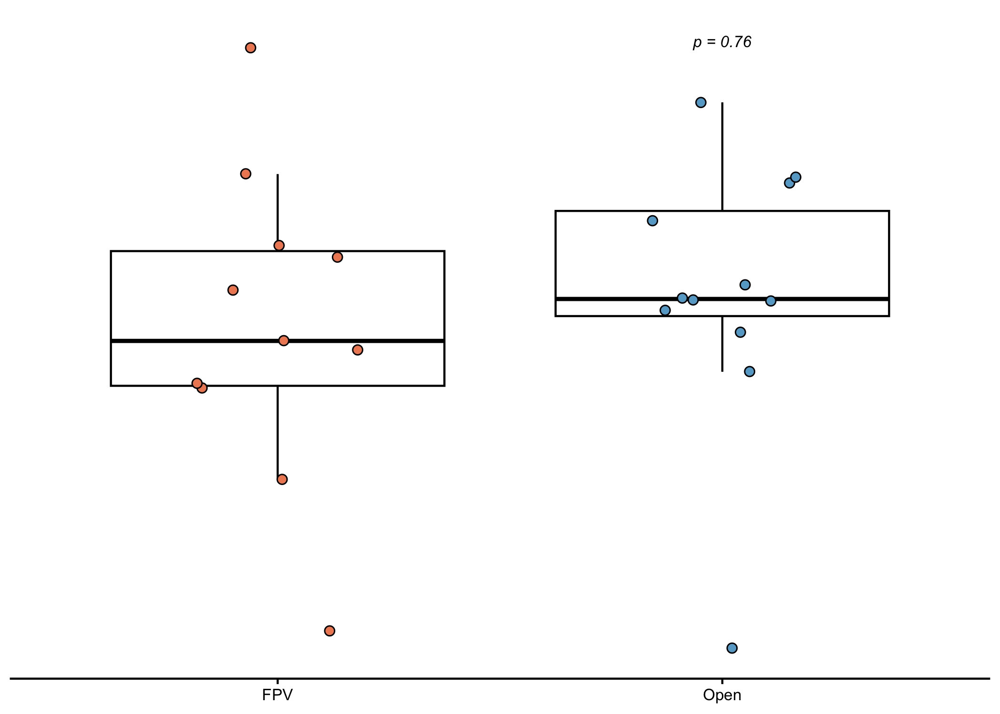<!-- -->

``` r
##### sediment methanotrophs #####
#1. calculate stats
#1a. calclate abundance
methanotroph_sed_sum <- sed_ch4_cyclers_df %>%
  dplyr::filter(CH4_Cycler == "Methanotroph") %>% 
  # group_by(solar_progress) %>% # when this is commented out then roughly 6% of community is methanotrophs
  #group_by(solar_progress) %>%  # when this is run then fpv has 6% methanotrophs and controls have more with 7% methanotrophs
  group_by(solar_progress, JDate) %>% 
  dplyr::summarize(sd_meth = sd(rel_abundance),
                   mean_meth = mean(rel_abundance))
methanotroph_sed_sum
```

```
## # A tibble: 8 × 4
## # Groups:   solar_progress [2]
##   solar_progress JDate  sd_meth mean_meth
##   <fct>          <dbl>    <dbl>     <dbl>
## 1 FPV              172 0.0316      0.0813
## 2 FPV              193 0.0172      0.0640
## 3 FPV              234 0.000996    0.0504
## 4 FPV              255 0.0157      0.0404
## 5 Open             172 0.00406     0.0622
## 6 Open             193 0.0112      0.104 
## 7 Open             234 0.00672     0.0536
## 8 Open             255 0.0165      0.0453
```

``` r
max(methanotroph_sed_sum$mean_meth)
```

```
## [1] 0.1039081
```

``` r
#1b linear mixed model
methanotroph_sed_data <- sed_ch4_cyclers_df %>%
  dplyr::filter(CH4_Cycler == "Methanotroph") 
methanotroph_sed_data$Pond <- as.factor(methanotroph_sed_data$Pond)

sed_methanotroph_model <- lmerTest::lmer(rel_abundance ~ solar_progress + JDate + (1|Pond), data = methanotroph_sed_data)
summary(sed_methanotroph_model) # 0.39913 
```

```
## Linear mixed model fit by REML. t-tests use Satterthwaite's method ['lmerModLmerTest']
## Formula: rel_abundance ~ solar_progress + JDate + (1 | Pond)
##    Data: methanotroph_sed_data
## 
## REML criterion at convergence: -84.4
## 
## Scaled residuals: 
##      Min       1Q   Median       3Q      Max 
## -1.21367 -0.82879 -0.02729  0.65345  2.06768 
## 
## Random effects:
##  Groups   Name        Variance  Std.Dev.
##  Pond     (Intercept) 0.0000000 0.00000 
##  Residual             0.0004054 0.02014 
## Number of obs: 23, groups:  Pond, 6
## 
## Fixed effects:
##                      Estimate Std. Error         df t value Pr(>|t|)    
## (Intercept)         0.1514843  0.0274953 20.0000000   5.509 2.16e-05 ***
## solar_progressOpen  0.0072444  0.0084083 20.0000000   0.862  0.39913    
## JDate              -0.0004332  0.0001267 20.0000000  -3.418  0.00272 ** 
## ---
## Signif. codes:  0 '***' 0.001 '**' 0.01 '*' 0.05 '.' 0.1 ' ' 1
## 
## Correlation of Fixed Effects:
##             (Intr) slr_pO
## slr_prgrssO -0.132       
## JDate       -0.975 -0.028
## optimizer (nloptwrap) convergence code: 0 (OK)
## boundary (singular) fit: see help('isSingular')
```

``` r
emmeans::lsmeans(sed_methanotroph_model, pairwise ~ solar_progress) #0.4401
```

```
## $lsmeans
##  solar_progress lsmean      SE   df lower.CL upper.CL
##  FPV            0.0594 0.00612 4.22   0.0427   0.0761
##  Open           0.0666 0.00581 3.67   0.0499   0.0834
## 
## Degrees-of-freedom method: kenward-roger 
## Confidence level used: 0.95 
## 
## $contrasts
##  contrast   estimate      SE   df t.ratio p.value
##  FPV - Open -0.00724 0.00845 3.94  -0.858  0.4401
## 
## Degrees-of-freedom method: kenward-roger
```

``` r
# 2. plot sed methanotrophs overtime 
methanotroph_sed<- methanotroph_sed_sum %>% 
  ggplot(aes(x = JDate, y = mean_meth, fill = solar_progress, color = solar_progress)) +
  geom_line()+
  geom_point()+
  theme_classic()+
  geom_errorbar(aes(x = JDate, ymin = mean_meth - sd_meth, ymax = mean_meth + sd_meth), width = 0, color = "black")+
  geom_point(size = 3, shape = 16)+
  geom_point(size = 3, shape = 1, color = "black")+
  labs(y= "Sediment Methanotroph<br>Abundance (%)", x = "Day of Year")+
  theme(axis.text.x =  element_text(size = 8,colour = "black"),
         axis.text.y =  element_text(size = 8,colour = "black"),
         axis.title.x = element_blank(),
        axis.title.y = element_markdown(size = 8))+
  scale_fill_manual(values = solar_colors)+
  scale_color_manual(values = solar_colors)+
  scale_y_continuous(
    limits = c(0.02, .15),
    breaks = c(0.05, 0.10, 0.15),
    labels = label_number(scale_cut = cut_short_scale())) +
  theme(legend.position = "none")
methanotroph_sed
```

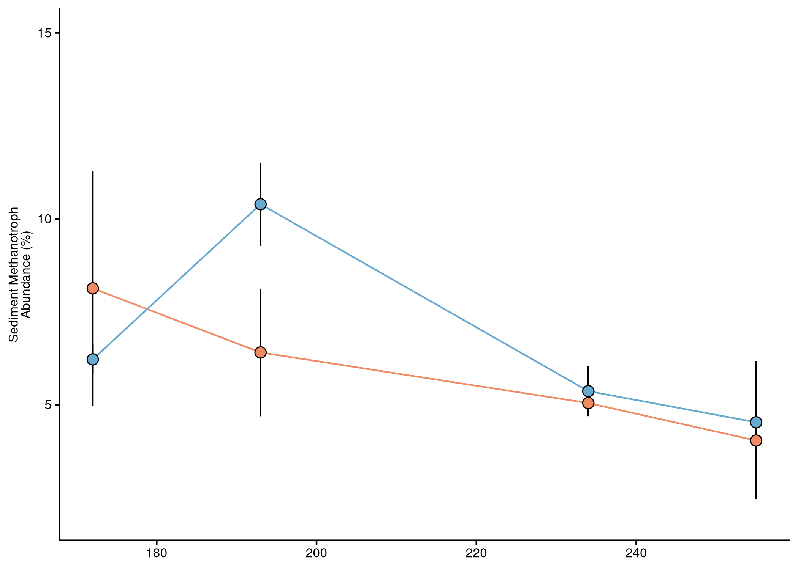<!-- -->

``` r
# box plot
methanotroph_sed_box <- methanotroph_sed_data %>% 
  ggplot(aes(x = solar_progress, y = rel_abundance, color = solar_progress)) +
  geom_boxplot(outlier.shape = NA, color = "black") +
  geom_jitter(aes(color = solar_progress, fill = solar_progress), width = 0.2, size = 2, shape = 21) +
  scale_fill_manual(values = solar_colors)+
  scale_color_manual(values = c("black", "black"))+
  scale_y_continuous(
    limits = c(0.02, .15),
    breaks = c(0.05, 0.10, 0.15),
    labels = label_number(scale_cut = cut_short_scale())) +
  theme_classic()+
  theme(axis.text.x = element_text(size = 8, colour = "black"),
        axis.title.x = element_blank(),
        axis.title.y = element_blank(),
        axis.line.y = element_blank(),
        axis.text.y = element_blank(),
        axis.ticks.y = element_blank(),
        legend.position = "none") +#+
  # stat_compare_means(method = "wilcox.test",
  #                    #comparisons = list(c("FPV", "Open")),
  #                    label = "p.format",
  #                    size = 3,
  #                    label.y.npc = 0.9,
  #                    fontface = "italic")
  #                    #label.y = c(8000, 100000, 500000, 400000, 400000), # get pvalue
 annotate("text", x = 2, y = .15, label = "p = 0.440", size = 2.822,  fontface = "italic") # add p value
methanotroph_sed_box
```

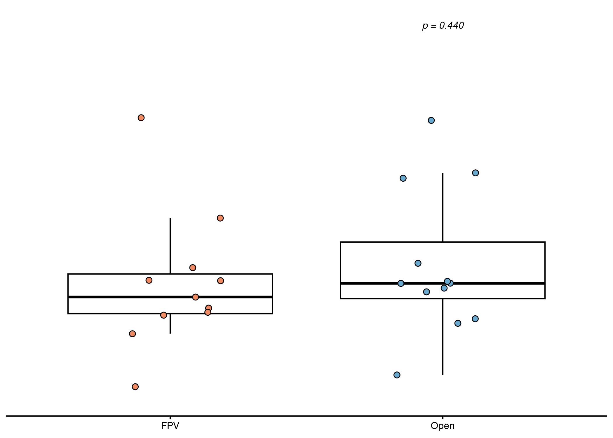<!-- -->

``` r
## plot all together
fig2 <- methanotroph_surface + methanotroph_surface_box + methanogen_surface + methanogen_surface_box +
  methanotroph_bottom + methanotroph_bottom_box + methanogen_bottom + methanogen_bottom_box +
  methanotroph_sed + methanotroph_sed_box + methanogen_sed + methanogen_sed_box +
  plot_layout(nrow = 6, ncol = 2,
              widths = c(10, 4)) +
  plot_annotation(tag_levels = "A", tag_suffix = '.') +
  theme(
    plot.tag = element_text(size = 8))
fig2
```

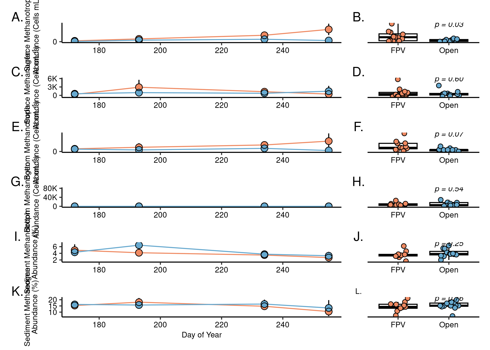<!-- -->

``` r
#export the figure
ggsave(fig2, width = 6.5, height = 8.5, units = "in", filename = "figures/Fig_2/fig2.png") # could only save at height 8.5, orignally h = 8
```
We have created main text `fig2` which shows the abundance of water column (absolute abundance) and sediment (relative abundance) methanotrophs and methanogens over time between FPV and Open ponds. 

Each row corresponds to depth (surface water, bottom water, or sediments) and methane cycler (methanotroph or methanogen). The left panel demonstrates the temporal relationships while the right panel is a box plot comparison with linear mixed effects statistical analysis between FPV and Open ponds.


# Figure 3
Now plot beta diversity with Bray-Curtis dissimilarity matrix for all methane cyclers (methanogens and methanotrophs) in water column and sediments

### Fig 3A: Water PCoA 

``` r
# water methane cyclers

# Calculate Bray-Curtis Dissimilarity 
water_BC_pcoa <- 
  ordinate(
    physeq = water_ch4_cyclers_physeq,
    method = "PCoA",
    distance = "bray", 
    binary = FALSE
  )


#### Grab the data for the plot 
water_all_ord_df <- 
  plot_ordination(
  physeq = water_ch4_cyclers_physeq,
  ordination = water_BC_pcoa,
  color = "solar_progress",
  shape = "Pond",
  justDF = TRUE)

# now lets mutate the columns
water_all_ord_df <- water_all_ord_df %>% 
dplyr::mutate(
    solar_progress = recode(solar_progress, "FPV" = "FPV", "No FPV" = "Open"), # solar progress
    Depth_Class = recode(Depth_Class,  # depth class
      "S" = "Surface Water",
      "B" = "Bottom Water"))


### Now, plot Figure 3A: WATER 
fig3a_water_pcoa <- 
  ggplot(data = water_all_ord_df, 
       aes(x = Axis.1, 
           y = Axis.2,
           color = solar_progress,
           shape = Pond)) + 
  geom_point(size = 3, alpha = 0.8, stroke = 0.8) +
  scale_shape_manual(values = pond_shapes) + 
  scale_color_manual(values = solar_colors) +
  labs(color = "Treatment",
       shape = "Pond",
       x = "Axis.1 [27.4%]",
       y = "Axis.2 [11.3%]",
       title = expression("Water CH"[4]*" Cyclers")) + 
  guides(
    color = guide_legend(
      title.position = "top",
      title.hjust = 0.5,
      override.aes = list(size = 2.5)),
    shape = guide_legend(
      nrow = 2,
      byrow = TRUE,
      title.position = "top",
      title.hjust = 0.5,
      override.aes = list(size = 2.5))
  ) +
  theme_classic() +
  theme(legend.position = "bottom",
        #legend.spacing = unit(0, "cm"),
        legend.box.background = element_blank(),
        legend.title = element_text(size = 8),
        legend.text = element_text(size = 8),
        plot.title = element_text(hjust = 0.5, size = 9, colour = "black"),
        axis.text.x = element_text(size = 8, colour = "black"),
        axis.text.y = element_text(size = 8, colour = "black"),
        axis.title.x = element_text(size = 8, colour = "black"),
        axis.title.y = element_text(size = 8, colour = "black"))

# Show the plot
fig3a_water_pcoa
```

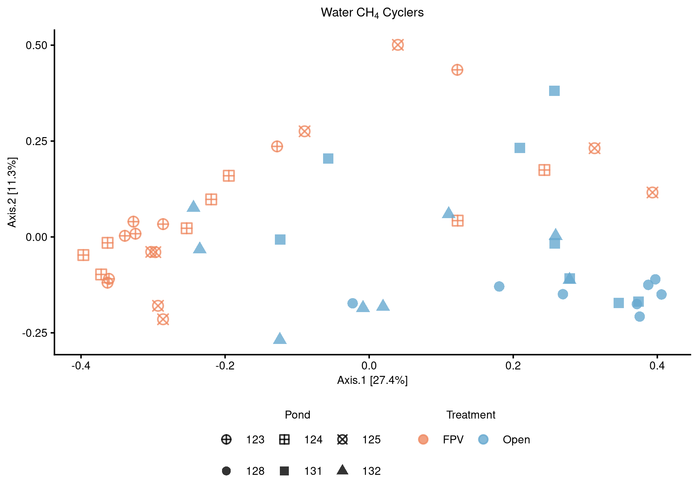<!-- -->

``` r
### Sophia's plot - for axes labels
# PCoA of water samples color by treatment shape by pond
# s1a_water_pcoa <- plot_ordination(
#   physeq = water_physeq_24,
#   ordination = water_BC_pcoa,
#   color = "solar_progress",
#   shape = "Pond",
#   title = "Water Column Methane Cyclers") +
#   geom_point(size = 5, alpha = 0.5,
#              aes(fill = solar_progress, color = solar_progress, shape = Pond)) +
#   scale_fill_manual(values = solar_colors) +
#   scale_color_manual(values = solar_colors) +
#   scale_shape_manual(values = pond_shapes) +
#   guides(color = guide_legend(nrow = 1,
#                               title = NULL,
#                               override.aes = list(size = 2.7)),
#          fill = "none",
#          shape = guide_legend(nrow = 2,
#                               byrow = TRUE,
#                               title = NULL,
#                               override.aes = list(size = 2.7))) +
#   theme_classic() +
#   theme(
#     legend.position = c(0.01, 0.01),  # inside bottom-left
#     legend.justification = c(.01, .01),
#     legend.spacing = unit(0.01, "cm"),
#     legend.spacing.x = unit(0.1, "cm"),
#     legend.background = element_rect(color = NA, fill = NA),
#     legend.key.width = unit(0.2, "cm"),
#     legend.key.height = unit(0.4, "cm"),
#     legend.text = element_text(size = 6),
#     legend.box.just = "center",
#     legend.box.background = element_rect(size = 0.2, linetype = "solid", color = "black"),
#     legend.margin = margin(1, 2, 1, 1))
#
# Plot it
# s1a_water_pcoa
```

### Fig 3B: Sediment PCoA

``` r
# Calculate Bray-Curtis Dissimilarity 
scaled_sed_BC_pcoa <- 
  ordinate(
    physeq = sed_ch4_cyclers_physeq,
    method = "PCoA",
    distance = "bray", 
    binary = FALSE
  )


#### Grab the data for the plot 
sed_all_ord_df <- 
  plot_ordination(
  physeq = sed_ch4_cyclers_physeq,
  ordination = scaled_sed_BC_pcoa,
  color = "solar_progress",
  shape = "Pond",
  justDF = TRUE)

# update metadata for plotting 
sed_all_ord_df <- sed_all_ord_df %>% 
dplyr::mutate(
    solar_progress = recode(solar_progress, "FPV" = "FPV", "No FPV" = "Open"), # solar progress
    Depth_Class = recode(Depth_Class,  # depth class
      "S" = "Surface Water",
      "B" = "Bottom Water"))

# Now plot it! 
fig3b_sed_pcoa <- 
  ggplot(data = sed_all_ord_df, 
       aes(x = Axis.1, 
           y = Axis.2,
           color = solar_progress,
           shape = Pond)) + 
  geom_point(size = 3, alpha = 0.8, stroke = 0.8) +
  scale_shape_manual(values = pond_shapes) + 
  scale_color_manual(values = solar_colors) +
  labs(color = "Treatment",
       shape = "Pond",
       x = "Axis.1 [32.5%]",
       y = "Axis.2 [15.8%]",
       title = expression("Sediment CH"[4]*" Cyclers")) + 
  guides(
    color = guide_legend(
      title.position = "top",
      title.hjust = 0.5,
      override.aes = list(size = 2.5)),
    shape = guide_legend(
      nrow = 2,
      byrow = TRUE,
      title.position = "top",
      title.hjust = 0.5,
      override.aes = list(size = 2.5))
  ) +
  theme_classic() +
  theme(legend.position = "bottom",
        #legend.spacing = unit(0, "cm"),
        legend.box.background = element_blank(),
        legend.title = element_text(size = 8),
        legend.text = element_text(size = 8),
        plot.title = element_text(hjust = 0.5, size = 9, colour = "black"),
        axis.text.x = element_text(size = 8, colour = "black"),
        axis.text.y = element_text(size = 8, colour = "black"),
        axis.title.x = element_text(size = 8, colour = "black"),
        axis.title.y = element_text(size = 8, colour = "black"))

# Show the plot
fig3b_sed_pcoa
```

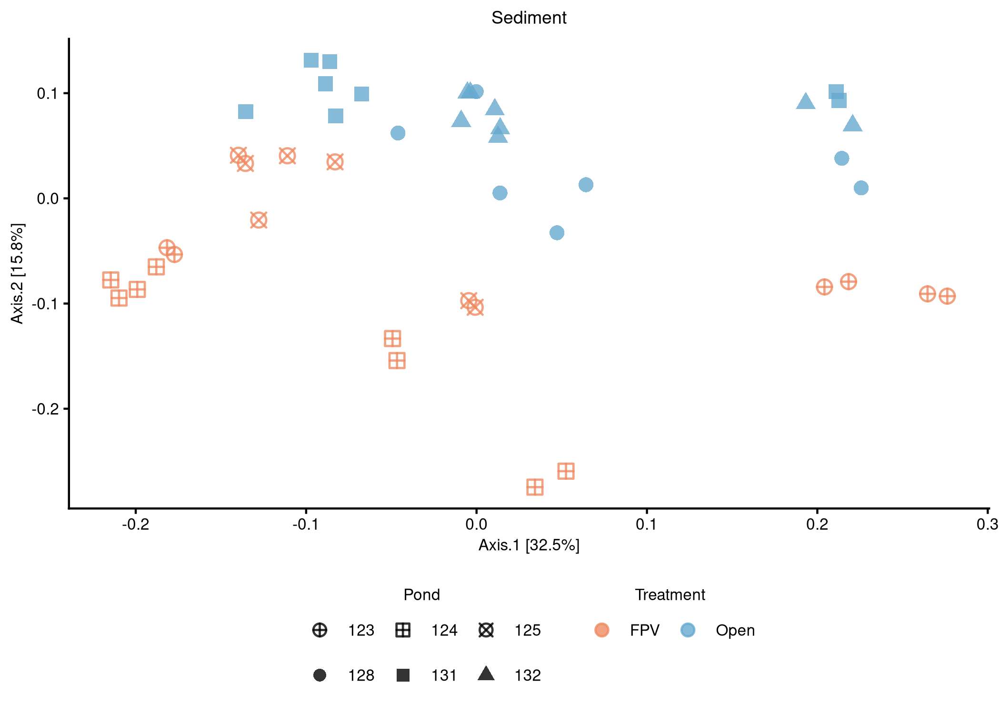<!-- -->

``` r
# Sophia's plot 
# PCoA of sediments color by treatment shaped by pond
# s1b_sed_pcoa <-
#   plot_ordination(
#   physeq = sed_ch4_cyclers_physeq,
#   ordination = scaled_sed_BC_pcoa,
#   color = "solar_progress",
#   shape = "Pond",
#   title = "Sediment Methane Cyclers") +
#   geom_point(size = 5, alpha = 0.5,
#              aes(color = solar_progress, fill = solar_progress, shape = Pond)) +
#   scale_color_manual(values = solar_colors) +
#   scale_fill_manual(values = solar_colors) +
#   scale_shape_manual(values = pond_shapes) +
#   guides(color = "none",
#          fill = "none",
#          shape = "none") +
#   theme_classic()
#   # theme(
#   # legend.position = c(0.82, 0.01),  # inside bottom-left
#   # legend.justification = c(0, 0),  # anchor the legend's top-left corner there
#   # legend.spacing = unit(0.1, "cm"),
#   # legend.background = element_rect(color = NA, fill = NA),
#   # legend.box.background = element_rect(size = 0.1, linetype = "solid", color = "black"),
#   # legend.text = element_text(size = 6),
#   # legend.margin = margin(2, 2, 2, 2))
# s1b_sed_pcoa

# ggsave(s1b_sed_pcoa, width = 8, height = 7, units = "in",
#         filename = "figures/s1b/s1b_sed_pcoa.png")
```
Sediment samples are still distinct from other and separate along first axis

### Save Figure 3

``` r
### Final Plot for Submission 
plot_fig3 <- 
  fig3a_water_pcoa + theme(plot.title = element_text(margin = margin(b = 0))) + 
  fig3b_sed_pcoa + theme(plot.title = element_text(margin = margin(b = 0))) +
  plot_annotation(tag_levels = "A", tag_suffix = ".") + 
    plot_layout(guides = "collect") &
  theme(
    plot.tag = element_text(size = 8, colour = "black"),
    legend.position = "bottom",
    # legend.title = element_text(size = 9),
    # legend.text = element_text(size = 8),
    legend.key.size = unit(0.4, "cm"),
    legend.spacing.x = unit(0.7, "cm"),
    legend.margin = margin(t = -5, unit = "pt")
  )
plot_fig3
```

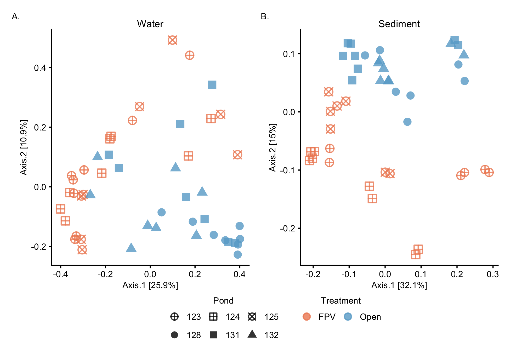<!-- -->

``` r
ggsave(plot_fig3, width = 6.5, height = 4.5, dpi = 300,
        filename = "figures/Fig_3/Fig_3.png")
```


## Fig 3: PERMANOVA

PERMANOVA (Permutational Multivariate Analysis of Variance) is a non-parametric, permutation-based test used to compare groups of objects based on a distance matrix. The goal is to test the null hypothesis that the centroids and dispersion of groups are equivalent in the space defined by the dissimilarity measure. 


``` r
#### WATER COLUMN: All methane cyclers
# calculate Bray-Curtis PERMANOVA using phyloseq distance
water_bray <- phyloseq::distance(water_ch4_cyclers_physeq, method = "bray", binary = FALSE)

# pull out metadata 
water_metadata <- water_ch4_cyclers_physeq %>%
  sample_data() %>%
  data.frame()


#### SEDIMENT: All methane cyclers
# calculate Bray-Curtis PERMANOVA using phyloseq distance
sed_bray <- phyloseq::distance(sed_ch4_cyclers_physeq, method = "bray", binary = FALSE)

# pull out metadata 
sed_metadata <- sed_ch4_cyclers_physeq %>%
  sample_data() %>%
  data.frame()
```


### Water 

Here we are performing a PERMANOVA on the water column methane cyclers throughout the entire sampling season.


``` r
# Permutational Multivariate Analysis of Variance Using Distance Matrices
# aka PERMANOVA using the adonis2 function from vegan 

#1. Test the individual terms for significance
# Testing if the centroids of solar progress are different: significant p = 0.001 ***
adonis2(water_bray ~ solar_progress, data = water_metadata, by = "terms")
```

```
## Permutation test for adonis under reduced model
## Terms added sequentially (first to last)
## Permutation: free
## Number of permutations: 999
## 
## adonis2(formula = water_bray ~ solar_progress, data = water_metadata, by = "terms")
##                Df SumOfSqs      R2      F Pr(>F)    
## solar_progress  1    1.701 0.12801 6.7528  0.001 ***
## Residual       46   11.587 0.87199                  
## Total          47   13.288 1.00000                  
## ---
## Signif. codes:  0 '***' 0.001 '**' 0.01 '*' 0.05 '.' 0.1 ' ' 1
```

``` r
# Now testing to see if centroids of depth_class are different: not significant p = 0.19
adonis2(water_bray ~ Depth_Class, data = water_metadata, by = "terms")
```

```
## Permutation test for adonis under reduced model
## Terms added sequentially (first to last)
## Permutation: free
## Number of permutations: 999
## 
## adonis2(formula = water_bray ~ Depth_Class, data = water_metadata, by = "terms")
##             Df SumOfSqs      R2      F Pr(>F)
## Depth_Class  1   0.3635 0.02736 1.2939  0.185
## Residual    46  12.9247 0.97264              
## Total       47  13.2883 1.00000
```

``` r
# Does pond matter? significant p = 0.001 ***
adonis2(water_bray ~ Pond, data = water_metadata, by = "terms")
```

```
## Permutation test for adonis under reduced model
## Terms added sequentially (first to last)
## Permutation: free
## Number of permutations: 999
## 
## adonis2(formula = water_bray ~ Pond, data = water_metadata, by = "terms")
##          Df SumOfSqs      R2      F Pr(>F)    
## Pond      5   3.7591 0.28289 3.3137  0.001 ***
## Residual 42   9.5291 0.71711                  
## Total    47  13.2883 1.00000                  
## ---
## Signif. codes:  0 '***' 0.001 '**' 0.01 '*' 0.05 '.' 0.1 ' ' 1
```

``` r
# Does date matter? significant p = 0.001 ***
adonis2(water_bray ~ JDate, data = water_metadata, by = "terms")
```

```
## Permutation test for adonis under reduced model
## Terms added sequentially (first to last)
## Permutation: free
## Number of permutations: 999
## 
## adonis2(formula = water_bray ~ JDate, data = water_metadata, by = "terms")
##          Df SumOfSqs      R2      F Pr(>F)    
## JDate     1   1.1474 0.08635 4.3472  0.001 ***
## Residual 46  12.1409 0.91365                  
## Total    47  13.2883 1.00000                  
## ---
## Signif. codes:  0 '***' 0.001 '**' 0.01 '*' 0.05 '.' 0.1 ' ' 1
```

``` r
#2. Test the terms together
# Now lets see the effect of each pond by date_collected and solar progress
water_permanova <- adonis2(water_bray ~ solar_progress * Pond * JDate, data = water_metadata, by = "terms"); water_permanova
```

```
## Permutation test for adonis under reduced model
## Terms added sequentially (first to last)
## Permutation: free
## Number of permutations: 999
## 
## adonis2(formula = water_bray ~ solar_progress * Pond * JDate, data = water_metadata, by = "terms")
##                      Df SumOfSqs      R2      F Pr(>F)    
## solar_progress        1   1.7010 0.12801 9.4196  0.001 ***
## Pond                  4   2.0581 0.15488 2.8493  0.001 ***
## JDate                 1   1.1474 0.08635 6.3538  0.001 ***
## solar_progress:JDate  1   0.7829 0.05892 4.3356  0.001 ***
## Pond:JDate            4   1.0979 0.08262 1.5199  0.041 *  
## Residual             36   6.5009 0.48922                  
## Total                47  13.2883 1.00000                  
## ---
## Signif. codes:  0 '***' 0.001 '**' 0.01 '*' 0.05 '.' 0.1 ' ' 1
```
With our PERMANOVA we find that treatment (solar_progress), day of year sampled (JDate - Julian date), and Pond is significant but depth class alone is not.

When we create a model with treatment, pond, and date these are all significant (p < 0.001 ***). 
- Solar progress is responsible for explaining  12.8% of variance and has a strong structuring effect on the water column community composition. This has the highest F value meaning that the between group differences are larger than within group variance (F = 9.4)

- Pond is also significant explains 15.5% of variance but is weaker than treatment (solar_progress) (F = 2.8). Even though it explains more variation than treatment, there is more variation in ponds than between ponds. 

- Date (JDate) is also strong and explains 8.6% of variance and is also weighted heavier (F = 6.3). The temporal effect is seen in the first axis as time progresses throughout the season.

- The interaction between treatment and date explains 5.9% of variance and is an important but moderate factor in its effect size for structuring community (F = 4.3)


Together the PERMANOVA explains only about half the variance seen with 48.9% remaining

### Sediments 
Here we are performing a PERMANOVA on the sediment methane cyclers throughout the entire sampling season

``` r
# Permutational Multivariate Analysis of Variance Using Distance Matrices
# aka PERMANOVA using the adonis2 function from vegan 

#1. Test the individual terms for significance
# Testing if the centroids of solar progress are different: significant p = 0.001 ***
adonis2(sed_bray ~ solar_progress, data = sed_metadata, by = "terms")
```

```
## Permutation test for adonis under reduced model
## Terms added sequentially (first to last)
## Permutation: free
## Number of permutations: 999
## 
## adonis2(formula = sed_bray ~ solar_progress, data = sed_metadata, by = "terms")
##                Df SumOfSqs      R2      F Pr(>F)    
## solar_progress  1  0.36873 0.13547 6.5814  0.001 ***
## Residual       42  2.35309 0.86453                  
## Total          43  2.72182 1.00000                  
## ---
## Signif. codes:  0 '***' 0.001 '**' 0.01 '*' 0.05 '.' 0.1 ' ' 1
```

``` r
# Does pond matter? significant p = 0.001 ***
adonis2(sed_bray ~ Pond, data = sed_metadata, by = "terms")
```

```
## Permutation test for adonis under reduced model
## Terms added sequentially (first to last)
## Permutation: free
## Number of permutations: 999
## 
## adonis2(formula = sed_bray ~ Pond, data = sed_metadata, by = "terms")
##          Df SumOfSqs     R2      F Pr(>F)    
## Pond      5   1.1451 0.4207 5.5194  0.001 ***
## Residual 38   1.5767 0.5793                  
## Total    43   2.7218 1.0000                  
## ---
## Signif. codes:  0 '***' 0.001 '**' 0.01 '*' 0.05 '.' 0.1 ' ' 1
```

``` r
# Does date matter? significant p = 0.001 ***
adonis2(sed_bray ~ JDate, data = sed_metadata, by = "terms")
```

```
## Permutation test for adonis under reduced model
## Terms added sequentially (first to last)
## Permutation: free
## Number of permutations: 999
## 
## adonis2(formula = sed_bray ~ JDate, data = sed_metadata, by = "terms")
##          Df SumOfSqs      R2      F Pr(>F)   
## JDate     1  0.30828 0.11326 5.3646  0.003 **
## Residual 42  2.41354 0.88674                 
## Total    43  2.72182 1.00000                 
## ---
## Signif. codes:  0 '***' 0.001 '**' 0.01 '*' 0.05 '.' 0.1 ' ' 1
```

``` r
#2. Test the terms together
# Now lets see the effect of each pond by date_collected and solar progress
sediment_permanova <- adonis2(sed_bray ~ solar_progress * Pond * JDate, data = sed_metadata, by = "terms"); sediment_permanova
```

```
## Permutation test for adonis under reduced model
## Terms added sequentially (first to last)
## Permutation: free
## Number of permutations: 999
## 
## adonis2(formula = sed_bray ~ solar_progress * Pond * JDate, data = sed_metadata, by = "terms")
##                      Df SumOfSqs      R2       F Pr(>F)    
## solar_progress        1  0.36873 0.13547 12.0145  0.001 ***
## Pond                  4  0.77635 0.28523  6.3241  0.001 ***
## JDate                 1  0.29080 0.10684  9.4751  0.001 ***
## solar_progress:JDate  1  0.08192 0.03010  2.6694  0.018 *  
## Pond:JDate            4  0.22193 0.08154  1.8078  0.011 *  
## Residual             32  0.98209 0.36082                   
## Total                43  2.72182 1.00000                   
## ---
## Signif. codes:  0 '***' 0.001 '**' 0.01 '*' 0.05 '.' 0.1 ' ' 1
```
With our PERMANOVA we find that treatment (solar_progress), day of year sampled (JDate - Julian date), and Pond is significant factors.

When we create a model with treatment, pond, and date these are all significant (p < 0.001 ***). 
- treatment = solar_progress is important for explaining 13.5% of variation and has the largest effect on structuring the community (F = 12.0). This explains the separation along the second axis

- pond explains the most variation (28.5%) and also has a substantial effect on structuring the community (F = 6.32) 

- Day of Year explains 10.7% of variation and also has strong temporal effect (F = 9.48) that shapes communities along first axis


This explains 63.9% of variance with 36.1% in the residuals. 

## Fig 3: Betadisper
We are running betadispr to test variances/dispersions

When computing PERMANOVA, we must also perform betadispr analysis when analyzing beta diversity in microbial ecology. We must do it after PERMANOVA because we need to look into the assumption of PERMANOVA which is the homogeneity of group dispersions aka variances. If this assumption is violated then the PERMANOVA results might be driven by dispersion rather than true differences in community composition.

Always run betadisper() and permutest() after PERMANOVA to test whether the groups have similar within-group variation.

It works by first taking ina. distance matrix and calculates the centroid of each group in multivariate space (note it does not test for significane). After computing within-group distances, we will run permutest() to see whether those dispersiosn differ significantly between groups using PERMANOVA

The permutest works like this: - null hypothesis (H0): all groups have equal multivariate dispersion and a compute a new F-statistic for each permutation.

The p-value is the proportion of permutations where the F is as extreme or more extreme than the observed F.
The result from permutest() is a robust non-parametric p-value testing whether dispersion differs across groups.
If p > 0.05 (not significant), the PERMANOVA result is reliable.

If p = 0.05 (significant), be cautious—group differences may be due to dispersion, not composition! However, not all is lost as we may expect this to be biologically true.

adonis - compares centroids to see if significant difference. betadispr - compares variance/distance from centroid

### Water

``` r
# Homogeneity of Disperson test with beta dispr

## Bray-Curtis
betadispr_water_pond <- betadisper(water_bray, water_metadata$Pond)
betadispr_water_solar <- betadisper(water_bray, water_metadata$solar_progress)
betadispr_water_depth <- betadisper(water_bray, water_metadata$Depth_Class)
betadispr_water_JDate <- betadisper(water_bray, water_metadata$JDate)

# permutest() performs a non-parametric permutation test, which is robust and valid for the kind of data used in beta diversity analysis (e.g., dissimilarity matrices).
permutest(betadispr_water_pond) # not significant p = 0.256 
```

```
## 
## Permutation test for homogeneity of multivariate dispersions
## Permutation: free
## Number of permutations: 999
## 
## Response: Distances
##           Df  Sum Sq  Mean Sq      F N.Perm Pr(>F)
## Groups     5 0.10942 0.021885 1.1958    999  0.323
## Residuals 42 0.76864 0.018301
```

``` r
permutest(betadispr_water_solar) # significant p = 0.011 **
```

```
## 
## Permutation test for homogeneity of multivariate dispersions
## Permutation: free
## Number of permutations: 999
## 
## Response: Distances
##           Df  Sum Sq  Mean Sq      F N.Perm Pr(>F)   
## Groups     1 0.13603 0.136034 10.227    999  0.002 **
## Residuals 46 0.61184 0.013301                        
## ---
## Signif. codes:  0 '***' 0.001 '**' 0.01 '*' 0.05 '.' 0.1 ' ' 1
```

``` r
permutest(betadispr_water_depth) # not significant p = 0.417 
```

```
## 
## Permutation test for homogeneity of multivariate dispersions
## Permutation: free
## Number of permutations: 999
## 
## Response: Distances
##           Df  Sum Sq   Mean Sq      F N.Perm Pr(>F)
## Groups     1 0.00863 0.0086305 0.6155    999  0.432
## Residuals 46 0.64501 0.0140220
```

``` r
permutest(betadispr_water_JDate) # significant p = 0.006 **
```

```
## 
## Permutation test for homogeneity of multivariate dispersions
## Permutation: free
## Number of permutations: 999
## 
## Response: Distances
##           Df  Sum Sq  Mean Sq      F N.Perm Pr(>F)   
## Groups     3 0.23049 0.076829 5.2557    999  0.006 **
## Residuals 44 0.64320 0.014618                        
## ---
## Signif. codes:  0 '***' 0.001 '**' 0.01 '*' 0.05 '.' 0.1 ' ' 1
```
With betadispr we find the PERMANOVA results are mostly valid where pond variation is consistent. The PERMANOVA and betadispr find that depth is not significant meaning that depth doesnt structure the community. This makes sense between the ponds are so shallow so they are more likely to be similar.

But treatment and date are significant meaning the differences may be due to dispersion and not composition. This could be because of temporal reasons where communities change over time with the season.

### Sediment 

``` r
# Homogeneity of Disperson test with beta dispr
## Bray-Curtis
betadispr_sed_pond <- betadisper(sed_bray, sed_metadata$Pond)
betadispr_sed_solar <- betadisper(sed_bray, sed_metadata$solar_progress)
betadispr_sed_JDate <- betadisper(sed_bray, sed_metadata$JDate)

# permutest() performs a non-parametric permutation test, which is robust and valid for the kind of data used in beta diversity analysis (e.g., dissimilarity matrices).
permutest(betadispr_sed_pond) # not significant p = 0.661
```

```
## 
## Permutation test for homogeneity of multivariate dispersions
## Permutation: free
## Number of permutations: 999
## 
## Response: Distances
##           Df   Sum Sq   Mean Sq    F N.Perm Pr(>F)
## Groups     5 0.024577 0.0049153 0.66    999   0.68
## Residuals 38 0.282986 0.0074470
```

``` r
permutest(betadispr_sed_solar) # not significant p = 0.673
```

```
## 
## Permutation test for homogeneity of multivariate dispersions
## Permutation: free
## Number of permutations: 999
## 
## Response: Distances
##           Df   Sum Sq   Mean Sq      F N.Perm Pr(>F)
## Groups     1 0.005441 0.0054409 1.5015    999  0.216
## Residuals 42 0.152191 0.0036236
```

``` r
permutest(betadispr_sed_JDate) # not significant p = 0.162
```

```
## 
## Permutation test for homogeneity of multivariate dispersions
## Permutation: free
## Number of permutations: 999
## 
## Response: Distances
##           Df   Sum Sq   Mean Sq      F N.Perm Pr(>F)
## Groups     3 0.010688 0.0035626 1.7276    999  0.172
## Residuals 40 0.082486 0.0020622
```
With betadispr we find the PERMANOVA results are are valid as pond, treatment, and date are not significant but significant in the PERMANOVA. Thus our PERMANOVA result is reliable and the differences between groups are due to location/centroids of groups rather than differences in variation within groups 

# Figure 4

## ANCOMBC-II - Differential Abundance 

Now we will calculate the differential abundance between our water and sediment samples. First I will try to do the original methane cyclers in water and sediments. but i may also further break it down into sediment methane cycler type.

### Water
Note as of this step the results do change in that methanobacteriales is not differentially abundant anymore and we have a reduction in asv_1479 and 976. but all asvs belong to methylococcales order

``` r
# filter out for ASVs with zero variances; recommended to remove them as they are sparse and lowly abundant 

# remove bad taxa 
bad_taxa <- c("ASV_1071", "ASV_11590", "ASV_642", "ASV_231", "ASV_4564", "ASV_7355", "ASV_1920", "ASV_11514", "ASV_4168", "ASV_4105", "ASV_3231", "ASV_2424", "ASV_2964", "ASV_2205", "ASV_7156", "ASV_10120", "ASV_4270", "ASV_8273", "ASV_3557", "ASV_7055", "ASV_2530", "ASV_4099", "ASV_1677", "ASV_10767", "ASV_1252")

water_ch4_phy_bc <- water_ch4_cyclers_physeq %>%
  subset_taxa(., !(ASV %in% bad_taxa)) %>% 
  prune_taxa(taxa_sums(.) > 0,.)


# relevel solar_progress
water_ch4_cyclers_physeq@sam_data$solar_progress <- factor(water_ch4_cyclers_physeq@sam_data$solar_progress, levels = c("No FPV", "FPV"))

# run ancombc2 for water all methane cyclers
# water_ch4_asv_output <- ancombc2(data = water_ch4_phy_bc,
#                                  tax_level = "ASV", # Test for each phylum
#                                  fix_formula = "solar_progress", 
#                                  p_adj_method = "fdr", 
#                                  pseudo_sens = TRUE, # Run sensitivity test to make sure taxa isn't sensitive to psuedo-count choice
#                                  prv_cut = 0.05, # Prevalence filter of 1%
#                                  group = NULL, # Use Comp_Group_Hier as groups when doing pairwise comparisons
#                                  struc_zero = FALSE, # Do not detect structural zeroes
#                                  alpha = 0.05, # Significance threshold of 0.05
#                                  n_cl = 10, # Use 10 threads
#                                  verbose = FALSE, # Don't print verbose output
#                                  s0_perc = 0.05,
#                                  global = FALSE, # Run a global test (sorta like an ANOVA to first find if a given ASV is sig diff)
#                                  pairwise = FALSE) # Run pairwise tests between groups (sorta like a post-hoc test like Tukey)


# save(water_ch4_asv_output, file = "data/03_diff_abund/water_ch4_asv_output.RData")

load("data/03_diff_abund/water_ch4_asv_output.RData")


# plot ASV differential abundance
water_ch4_fsp <- 
  water_ch4_asv_output$res %>%
  select(taxon, starts_with("lfc"), starts_with("diff"), starts_with("passed_ss")) %>%
  pivot_longer(cols = !taxon, names_to = "metric", values_to = "value") %>%
  separate_wider_delim(cols = metric, delim = "_", names = c("variable", "Comparison"), too_many = "merge") %>%
  mutate(Comparison = str_remove(Comparison, "\\(Intercept\\)")) %>% 
  mutate(Comparison = str_remove(Comparison, "ss_")) %>%
  pivot_wider(id_cols = c("taxon","Comparison"), names_from = variable, values_from = value) %>%
  mutate(Comparison = str_remove(Comparison, "solar_progress"),
         Comparison = str_replace(Comparison, "_solar_progrss", ";")) %>%
  separate_wider_delim(Comparison, delim = ";", names = c("Ref1", "Ref2"), too_few = "align_start") %>%
  dplyr::filter(!is.na(Ref1) & Ref1 != "") %>%
  mutate(
    Ref2 = ifelse(is.na(Ref2), "No FPV", Ref2), # relevel with basegroup which is no solar 
    Comparison = paste0(Ref2, " : ", Ref1)) %>% 
  dplyr::filter(diff == 1, passed == 1, abs(lfc) > 1) %>% # 1.2 is good cut off to see effect, below we get ASVs with super low cell counts 
  select(ASV = taxon, Comparison, lfc, passed)


# join by tax table
clean_water_ch4 <- water_ch4_fsp %>% 
  left_join(., as.data.frame(water_ch4_cyclers_physeq@tax_table), 
            by = "ASV")

# plot log fold changes
clean_water_ch4 %>% 
  ggplot(aes(x = ASV, y = lfc, fill = Genus)) +
  geom_col() +
  #scale_fill_manual(values = phylum_colors) +
  theme_bw() +
  theme(axis.text.x = element_text(angle = 45, hjust = 1), legend.position = "bottom") + 
  ggtitle("Water Column ASV Log-fold Change in FPV Ponds") 
```

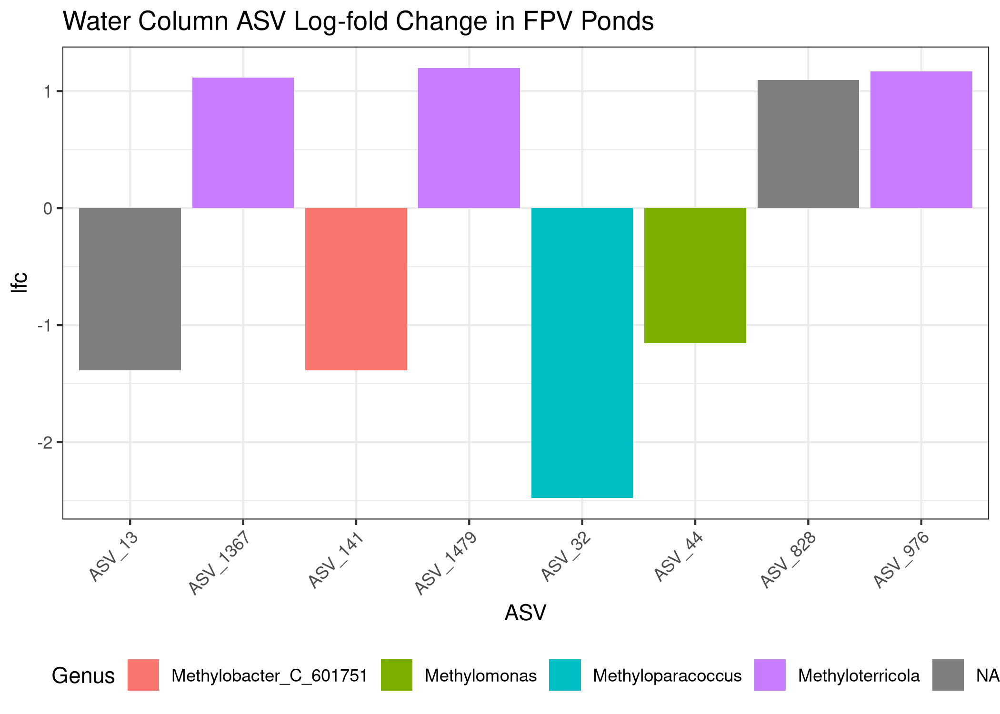<!-- -->

``` r
# create column for nice plotting of taxnomic name and asv
clean_asv24 <- clean_water_ch4 %>%
   mutate(
    label_tax = coalesce(Genus, paste0("f_", Family), paste0("o_", Order)),
    polished_tax = paste0(label_tax, " (", ASV, ")")) %>% 
  arrange(desc(lfc))

clean_asv24 <- clean_asv24 %>%
  mutate(
    polished_tax = ifelse(
      !is.na(Genus) & Genus != "",
      paste0(Genus, " (", ASV, ")"),
      ifelse(
        !is.na(Family) & Family != "",
        paste0("f_", Family, " (", ASV, ")"),
        ifelse(
          !is.na(Order) & Order != "",
          paste0("o_", Order, " (", ASV, ")"),
          ifelse(
            !is.na(Class) & Class != "",
            paste0("c_", Class, " (", ASV, ")"),
            paste0("p_", Phylum, " (", ASV, ")")
          )
        )
      )
    )
  ) %>% 
  arrange(desc(lfc))

# reorder factor levels
clean_asv24$polished_tax <- factor(clean_asv24$polished_tax, levels = as.list(clean_asv24$polished_tax))


# plot log fold changes
da2 <- clean_asv24 %>% 
  ggplot(aes(x = polished_tax, y = lfc, fill = Family)) +
  geom_bar(stat = "identity") +
  #scale_fill_manual(values = class_colors) +
  facet_wrap(Comparison ~.) +
  theme_classic() +
  coord_flip()+
  theme(
    legend.position = "bottom",
    axis.title.y = element_blank(),
    axis.ticks.y = element_blank()) + 
  ggtitle("ASV Log-fold Change in Taxa 2024") 
da2
```

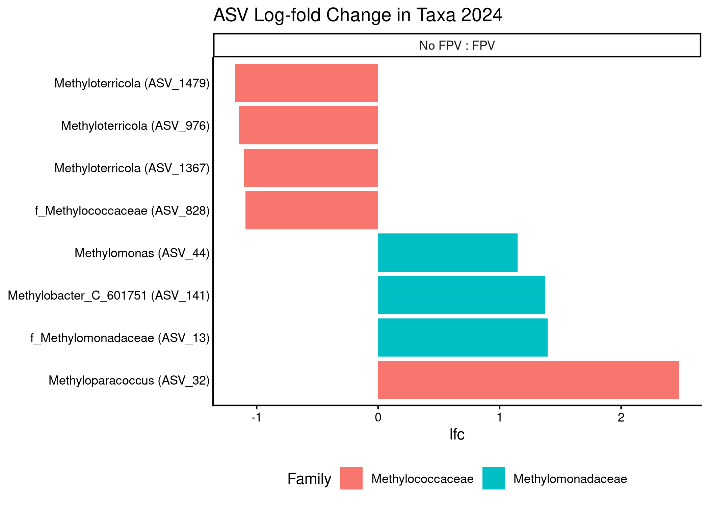<!-- -->

``` r
# plot differentially abundant ASVs overtime 

#1. tax glom at ASV level
water_ch4_asv_df_glom <- water_ch4_cyclers_physeq %>% 
  tax_glom(taxrank = "ASV") %>% 
  psmelt() %>% 
  mutate(
    solar_progress = recode(solar_progress, "Solar" = "FPV", "No FPV" = "Open"),
    Depth_Class = case_when(
      Depth_Class == "S" ~ "Surface Water",
      Depth_Class == "B" ~ "Bottom Water"),
    Depth_Class = factor(Depth_Class, levels = c("Surface Water", "Bottom Water")))

water_ch4_asv_df_glom$solar_progress <- factor(water_ch4_asv_df_glom$solar_progress,
                                               levels = c("FPV", "Open"))

# create list of differentially abundanct asvs, updated results
water_ch4_methanotrophs <- c("ASV_13", "ASV_141", "ASV_32", "ASV_44", "ASV_1479", "ASV_976", "ASV_1367", "ASV_828")
#water_ch4_methanotrophs <- c("ASV_13", "ASV_141", "ASV_32")

# now plot overtime
water_ch4_trophs <- water_ch4_asv_df_glom %>% 
  dplyr::filter(ASV %in% water_ch4_methanotrophs) %>% 
  dplyr::mutate(total_abundance = Abundance) %>%
  ggplot(aes(x = as.factor(JDate), y = total_abundance/1e6, color = solar_progress, shape = Pond)) +
  geom_line(aes(group = interaction(Pond, Depth_Class)), 
            alpha = 0.2) +
  geom_smooth(aes(group = solar_progress), se = FALSE) +
  geom_point(aes(shape = Pond), size = 2) +
  ggh4x::facet_grid2(Depth_Class~ASV) +
  scale_color_manual(values = solar_colors) +
  scale_shape_manual(values = pond_shapes) +
  labs(
    x = "Date Collected",
    y = "Total Cells per ml",
    title = "Differentially Abundant Methylococcales ASVs in FPV Ponds"
  ) +
  theme(legend.position = "bottom") +
  theme_bw()

# Show the plot 
water_ch4_trophs
```

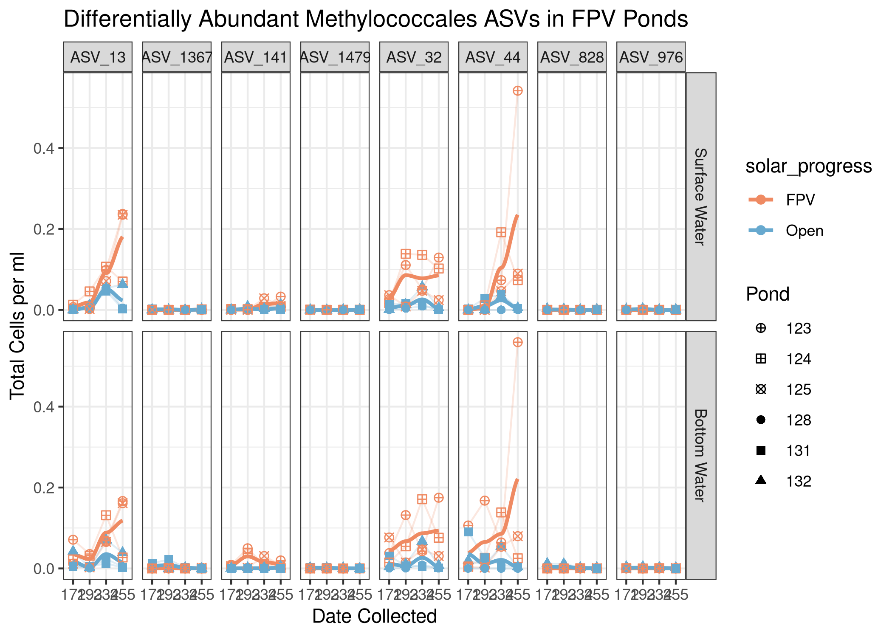<!-- -->
When we look at the water column of just our methane cyclers, we see that there are only log fold change increases. It is no suprise that Methylococcales has 4 differentially abundant ASVs, but ASV 32 is a log fold change just shy of 3! I am kinda shocked that the Methanobacteriales ASV 1063 is differentially abundant in the water column of solar ponds...


``` r
# Prepare the dataframe with only those 5 ASVs
diff_abund_df <- water_ch4_asv_df_glom %>% 
  # dplyr::filter(ASV %in% c("ASV_1063", "ASV_13", "ASV_141", "ASV_32", "ASV_44")) %>% 
  dplyr::filter(ASV %in% c("ASV_13", "ASV_141", "ASV_32", "ASV_44")) %>% 
  dplyr::group_by(
    JDate, Pond, Depth_Class, solar_progress,
    CH4_Cycler, Phylum, Class, Order, Family, Genus, ASV) %>%
  dplyr::summarise(
    total_abundance = sum(Abundance, na.rm = TRUE),
    .groups = "drop") %>%  
  # as.data.frame() %>%
  dplyr::mutate(Genus = ifelse(ASV== "ASV_13", Order, Genus),
                Genus = if_else(Genus == "Methanobacterium_B_963", 
                                "Methanobacterium_B", Genus),
                Genus = if_else(Genus == "Methylobacter_C_601751", 
                                "Methylobacter_C", Genus),
                facet_label = paste0("<i>", Genus, "</i><br>", ASV))

# Combine labels
#diff_abund_df$italicized_label <-
  #paste(diff_abund_df$italicized_label, diff_abund_df$ASV, sep = "\n")

# italicize facet labels
# diff_abund_df <- diff_abund_df %>%
#   mutate(
#     combined_label = paste0(
#       "italic(", Genus, ")*'\n' *'", ASV, "'"
#     )
#   )

# shapiro test
diff_abund_df %>%
  group_by(ASV, solar_progress) %>%
  summarise(
    shapiro_p = shapiro.test(total_abundance)$p.value,
    n = n()
  )
```

```
## # A tibble: 8 × 4
## # Groups:   ASV [4]
##   ASV     solar_progress   shapiro_p     n
##   <chr>   <fct>                <dbl> <int>
## 1 ASV_13  FPV            0.00379        24
## 2 ASV_13  Open           0.0000864      24
## 3 ASV_141 FPV            0.000194       24
## 4 ASV_141 Open           0.000000116    24
## 5 ASV_32  FPV            0.0140         24
## 6 ASV_32  Open           0.00000226     24
## 7 ASV_44  FPV            0.00000159     24
## 8 ASV_44  Open           0.00000494     24
```

``` r
# Make Boxplots of the ASVs!
diffAbund_boxplots <- diff_abund_df %>%
  ggplot(aes(x = solar_progress, y = total_abundance,
             color = solar_progress)) + 
  geom_point(aes(shape = Pond),
             size = 2, alpha = 0.8, stroke = 0.8,
             position = position_jitterdodge(jitter.width = .5, dodge.width = .3)) +
  geom_boxplot(outlier.shape = NA, alpha = 0, color = "black", position = position_dodge(0.6)) + 
  labs(color = "Treatment", y = "Water Column<br>Abundance (Cells mL<sup>-1</sup>)") +
  ggh4x::facet_wrap2(~ facet_label, scales = "free_y", nrow = 2) +
  # facet_grid2(~ facet_label, scales = "free_y",
  #             strip = strip_themed(text_x = element_markdown(size = 9, face = "plain")))+
  # facet_wrap2(~ facet_label, scales = "free_y", nrow = 2,
  #             strip = strip_themed(text_x = element_markdown(size = 10, face = "plain")))+
  #facet_wrap2(~italicized_label, scales = "free_y", nrow = 2, labeller = label_parsed) + 
  scale_color_manual(values = solar_colors) +
  scale_shape_manual(values = pond_shapes) +
  scale_y_continuous(labels = label_number(scale_cut = cut_short_scale(), accuracy = 1)) +
  theme_classic() +
  # stat_compare_means(method = "wilcox.test", 
  #                    #comparisons = list(c("FPV", "Open")),
  #                    label = "p.format", 
  #                    #group.by = "combined_label",
  #                    size = 3,          
  #                    label.y.npc = 0.9,
  #                    fontface = "italic",
  #                    #label.y = c(8000, 100000, 500000, 400000, 400000),
  #                    label.x = c(1.75, 1.75, 1.75)) + 
  guides(
    color = "none",
    # color = guide_legend(
    #   order = 1,
    #   ncol= 2,
    #   title.position = "top",
    #   title.hjust = 0.5,
    #   override.aes = list(size = 2.5)),
    shape = guide_legend(
      nrow= 2,
      byrow = TRUE,
      title.position = "top",
      title.hjust = 0.5,
      override.aes = list(size = 2.5))) +
  theme_classic() +
  theme( #legend.position = c(0.75, 0.7),
    legend.position = "bottom",
        legend.spacing = unit(0, "cm"),
        plot.title = element_text(hjust = 0.5),
        panel.background =  element_rect(color = 'black', size = 1),
        panel.grid = element_blank(),
        legend.background = element_rect(fill = "transparent", color = NA), # remove legend box
        legend.key = element_rect(fill = "transparent", color = NA),
        legend.box.background = element_rect(fill='transparent', color = "transparent"), #transparent legend panel
        legend.box.just = "center",
        #strip.background = element_rect(colour = NA, fill = 'transparent'),
        plot.background = element_rect(fill = "transparent", color="transparent"),
        legend.key.size = unit(0.2, "cm"),
        legend.spacing.x = unit(0.2, "cm"),
       legend.margin = margin(t = -5, unit = "pt"),
        strip.text = element_markdown(size = 8),
       axis.title.y = element_markdown(size = 8, colour = "black"),
       axis.title.x = element_blank(),
       axis.text.y = element_text(size = 8, colour = "black"),
       legend.title = element_text(size = 9, colour = "black"),
      legend.text = element_text(size = 8, colour = "black")); diffAbund_boxplots
```

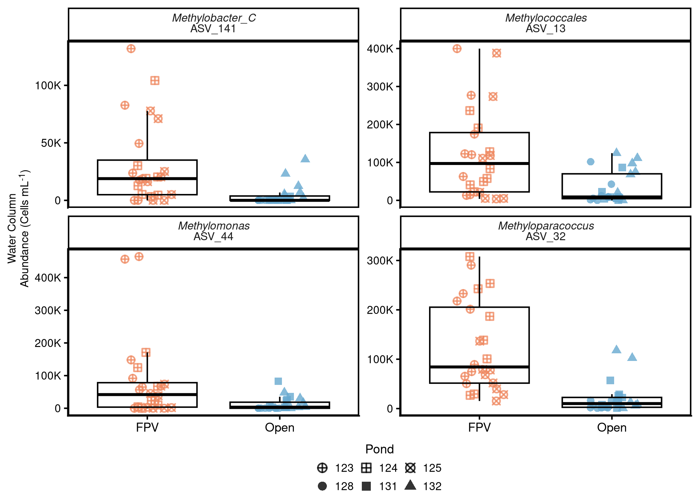<!-- -->

``` r
# # get legend
# legend <- cowplot::get_plot_component(diffAbund_boxplots, "guide-box", return_all = TRUE)
# legend_full <- legend$grobs[[2]]

  
# Save the plot   
ggsave(diffAbund_boxplots, width = 6.5, height = 4.5, dpi = 300,
        filename = "figures/Fig_4/Fig_4.png")

##### ASV_13 Methylococcales #####
#1. Run stats
# 1a. calculate abundances
asv_13_sum <- diff_abund_df %>%
  dplyr::filter(ASV == "ASV_13") %>% 
  group_by(solar_progress, JDate) %>% # 
  dplyr::summarize(sd_meth = sd(total_abundance),
                   mean_meth = mean(total_abundance),
                   .groups = "drop")
asv_13_sum
```

```
## # A tibble: 8 × 4
##   solar_progress JDate sd_meth mean_meth
##   <fct>          <dbl>   <dbl>     <dbl>
## 1 FPV              172  43367.    37551.
## 2 FPV              193  34196.    37932.
## 3 FPV              234  50486.   158445.
## 4 FPV              255 139832.   252638 
## 5 Open             172  29269.    15858.
## 6 Open             193   6470.     7814.
## 7 Open             234  38584.    79229.
## 8 Open             255  45124.    34335
```

``` r
# 1b. linear mixed model
asv_13_data <- diff_abund_df %>%
  dplyr::filter(ASV == "ASV_13")  
asv_13_data$Pond <- as.factor(asv_13_data$Pond)

asv_13_data_model <- lmerTest::lmer(total_abundance ~ solar_progress + JDate + (1|Pond), data = asv_13_data) # omitting jdate as term
summary(asv_13_data_model) #0.000119
```

```
## Linear mixed model fit by REML. t-tests use Satterthwaite's method ['lmerModLmerTest']
## Formula: total_abundance ~ solar_progress + JDate + (1 | Pond)
##    Data: asv_13_data
## 
## REML criterion at convergence: 1151.2
## 
## Scaled residuals: 
##      Min       1Q   Median       3Q      Max 
## -1.92417 -0.59736  0.01618  0.45218  2.95610 
## 
## Random effects:
##  Groups   Name        Variance  Std.Dev.
##  Pond     (Intercept) 0.000e+00     0   
##  Residual             5.151e+09 71768   
## Number of obs: 48, groups:  Pond, 6
## 
## Fixed effects:
##                     Estimate Std. Error        df t value Pr(>|t|)    
## (Intercept)        -217852.3    69141.4      45.0  -3.151 0.002893 ** 
## solar_progressOpen  -87332.6    20717.7      45.0  -4.215 0.000119 ***
## JDate                 1590.1      316.5      45.0   5.024 8.49e-06 ***
## ---
## Signif. codes:  0 '***' 0.001 '**' 0.01 '*' 0.05 '.' 0.1 ' ' 1
## 
## Correlation of Fixed Effects:
##             (Intr) slr_pO
## slr_prgrssO -0.150       
## JDate       -0.977  0.000
## optimizer (nloptwrap) convergence code: 0 (OK)
## boundary (singular) fit: see help('isSingular')
```

``` r
emmeans::emmeans(asv_13_data_model, pairwise ~ solar_progress) #0.0135
```

```
## $emmeans
##  solar_progress emmean    SE df lower.CL upper.CL
##  FPV            121642 14600  4    80968   162315
##  Open            34309 14600  4    -6365    74983
## 
## Degrees-of-freedom method: kenward-roger 
## Confidence level used: 0.95 
## 
## $contrasts
##  contrast   estimate    SE df t.ratio p.value
##  FPV - Open    87333 20700  4   4.215  0.0135
## 
## Degrees-of-freedom method: kenward-roger
```

``` r
# Make individual boxplots of the ASVs
ASV_13_methylococcales <- diff_abund_df %>%
  dplyr::filter(ASV == "ASV_13") %>% 
  ggplot(aes(x = solar_progress, y = total_abundance,
             color = solar_progress)) + 
  geom_point(aes(shape = Pond),
             size = 2, alpha = 0.8, stroke = 0.8,
             position = position_jitterdodge(jitter.width = .5, dodge.width = .3)) +
  geom_boxplot(outlier.shape = NA, alpha = 0, color = "black", position = position_dodge(0.6)) + 
  labs(color = "Treatment", y = "Water Column<br>Abundance (Cells mL<sup>-1</sup>)") +
  # facet_grid2(~ facet_label, scales = "free_y",
  #             strip = strip_themed(text_x = element_markdown(size = 9, face = "plain")))+
  # ggh4x::facet_wrap2(~ facet_label, scales = "free_y", nrow = 2,
  #                    strip = strip_vanilla(clip = "on")) +
  ggh4x::facet_grid2(. ~ facet_label) +
  #facet_wrap2(~italicized_label, scales = "free_y", nrow = 2, labeller = label_parsed) + 
  scale_color_manual(values = solar_colors) +
  scale_shape_manual(values = pond_shapes) +
  scale_y_continuous(
    breaks = c(0, 2e5, 4e5),
    labels = label_number(scale_cut = cut_short_scale(), accuracy = 1)) +
  # stat_compare_means(method = "wilcox.test", 
  #                    #comparisons = list(c("FPV", "Open")),
  #                    label = "p.format", 
  #                    #group.by = "combined_label",
  #                    size = 3,          
  #                    label.y.npc = 0.9,
  #                    fontface = "italic",
  #                    #label.y = c(8000, 100000, 500000, 400000, 400000),
  #                    label.x = c(1.75, 1.75, 1.75)) + 
  guides(
    # color = "none",
    color = guide_legend(
      #order = 1,
      ncol= 2,
      title.position = "top",
      title.hjust = 0.5,
      override.aes = list(size = 2.5)),
    shape = guide_legend(
      nrow= 2,
      byrow = TRUE,
      title.position = "top",
      title.hjust = 0.5,
      override.aes = list(size = 2.5))) +
  theme_classic() +
  theme(legend.position = "none",
        legend.spacing = unit(0, "cm"),
        plot.title = element_text(hjust = 0.5),
        panel.background =  element_rect(color = 'black', size = 1),
        panel.grid = element_blank(),
        legend.background = element_rect(fill = "transparent", color = NA), # remove legend box
        legend.key = element_rect(fill = "transparent", color = NA),
        legend.box.background = element_rect(fill='transparent', color = "transparent"), #transparent legend panel
        #legend.box.just = "center",
        #strip.background = element_rect(colour = NA, fill = 'transparent'),
        plot.background = element_rect(fill = "transparent", color="transparent"),
        legend.key.size = unit(0.4, "cm"),
        legend.spacing.x = unit(0.7, "cm"),
       legend.margin = margin(t = -5, unit = "pt"),
      strip.text = element_markdown(size = 8),
       axis.title.y = element_markdown(size = 8, colour = "black"),
       axis.title.x = element_blank(),
       axis.text.y = element_text(size = 8, colour = "black"),
       legend.title = element_text(size = 9, colour = "black"),
      legend.text = element_text(size = 8, colour = "black"))+
  annotate("text", x = 2, y = 3.9e5, label = "p = 0.014", size = 2.822,  fontface = "italic") 
ASV_13_methylococcales
```

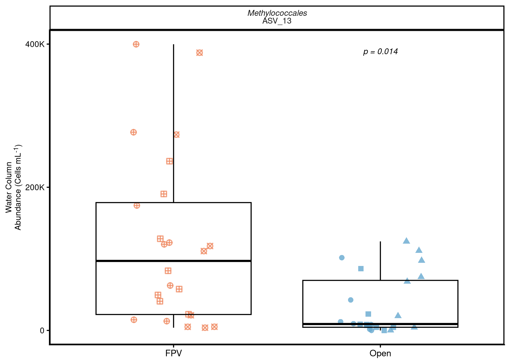<!-- -->

``` r
##### ASV_32 Methylococcales #####
#1. Run stats
# 1a. calculate abundances
asv_32_sum <- diff_abund_df %>%
  dplyr::filter(ASV == "ASV_32") %>% 
  group_by(solar_progress, JDate) %>% # 
  dplyr::summarize(sd_meth = sd(total_abundance),
                   mean_meth = mean(total_abundance),
                   .groups = "drop")
asv_32_sum
```

```
## # A tibble: 8 × 4
##   solar_progress JDate sd_meth mean_meth
##   <fct>          <dbl>   <dbl>     <dbl>
## 1 FPV              172  40085.    62903.
## 2 FPV              193 104708.   138664.
## 3 FPV              234 102865.   145374.
## 4 FPV              255  97439.   154261.
## 5 Open             172  22703.    15372.
## 6 Open             193  10444.    15458.
## 7 Open             234  49385.    47175 
## 8 Open             255   4693.     5114
```

``` r
# 1b. linear mixed model
asv_32_data <- diff_abund_df %>%
  dplyr::filter(ASV == "ASV_32")  
asv_32_data$Pond <- as.factor(asv_32_data$Pond)

asv_32_data_model <- lmerTest::lmer(total_abundance ~ solar_progress + JDate + (1|Pond), data = asv_32_data)
summary(asv_32_data_model) #0.0334
```

```
## Linear mixed model fit by REML. t-tests use Satterthwaite's method ['lmerModLmerTest']
## Formula: total_abundance ~ solar_progress + JDate + (1 | Pond)
##    Data: asv_32_data
## 
## REML criterion at convergence: 1141.6
## 
## Scaled residuals: 
##      Min       1Q   Median       3Q      Max 
## -1.69774 -0.64370 -0.08453  0.34131  2.41519 
## 
## Random effects:
##  Groups   Name        Variance  Std.Dev.
##  Pond     (Intercept) 1.150e+09 33911   
##  Residual             3.726e+09 61040   
## Number of obs: 48, groups:  Pond, 6
## 
## Fixed effects:
##                      Estimate Std. Error         df t value Pr(>|t|)  
## (Intercept)          21829.88   61978.96      43.58   0.352   0.7264  
## solar_progressOpen -104520.38   32819.27       4.00  -3.185   0.0334 *
## JDate                  484.64     269.18      41.00   1.800   0.0792 .
## ---
## Signif. codes:  0 '***' 0.001 '**' 0.01 '*' 0.05 '.' 0.1 ' ' 1
## 
## Correlation of Fixed Effects:
##             (Intr) slr_pO
## slr_prgrssO -0.265       
## JDate       -0.927  0.000
```

``` r
emmeans::emmeans(asv_32_data_model, pairwise ~ solar_progress) #0.0334
```

```
## $emmeans
##  solar_progress emmean    SE df lower.CL upper.CL
##  FPV            125300 23200  4    60868   189733
##  Open            20780 23200  4   -43652    85212
## 
## Degrees-of-freedom method: kenward-roger 
## Confidence level used: 0.95 
## 
## $contrasts
##  contrast   estimate    SE df t.ratio p.value
##  FPV - Open   104520 32800  4   3.185  0.0334
## 
## Degrees-of-freedom method: kenward-roger
```

``` r
# Make individual boxplots of the ASVs
ASV_32_methyloparacoccus <- diff_abund_df %>%
  dplyr::filter(ASV == "ASV_32") %>% 
  ggplot(aes(x = solar_progress, y = total_abundance,
             color = solar_progress)) + 
  geom_point(aes(shape = Pond),
             size = 2, alpha = 0.8, stroke = 0.8,
             position = position_jitterdodge(jitter.width = .5, dodge.width = .3)) +
  geom_boxplot(outlier.shape = NA, alpha = 0, color = "black", position = position_dodge(0.6)) + 
  labs(color = "Treatment", y = "Water Column<br>Abundance (Cells mL<sup>-1</sup>)") +
  # facet_wrap2(~ facet_label, scales = "free_y", nrow = 2,
  #             strip = strip_themed(text_x = element_markdown(size = 9, face = "plain")))+
  # ggh4x::facet_wrap2(~ facet_label, scales = "free_y", nrow = 2, 
  #                    strip = strip_vanilla(clip = "on")) +
  ggh4x::facet_grid2(. ~ facet_label) +
  #facet_wrap2(~italicized_label, scales = "free_y", nrow = 2, labeller = label_parsed) + 
  scale_color_manual(values = solar_colors) +
  scale_shape_manual(values = pond_shapes) +
  scale_y_continuous(
    breaks = c(0, 1.5e5, 3e5),
    labels = label_number(scale_cut = cut_short_scale(), accuracy = 1)) +
  theme_classic() +
  # stat_compare_means(method = "wilcox.test", 
  #                    #comparisons = list(c("FPV", "Open")),
  #                    label = "p.format", 
  #                    #group.by = "combined_label",
  #                    size = 3,          
  #                    label.y.npc = 0.9,
  #                    fontface = "italic",
  #                    #label.y = c(8000, 100000, 500000, 400000, 400000),
  #                    label.x = c(1.75, 1.75, 1.75)) + 
  guides(
    #color = "none",
    color = guide_legend(
      #order = 1,
      ncol= 2,
      title.position = "top",
      title.hjust = 0.5,
      override.aes = list(size = 2.5)),
    shape = guide_legend(
      nrow= 2,
      byrow = TRUE,
      title.position = "top",
      title.hjust = 0.5,
      override.aes = list(size = 2.5))) +
  theme(legend.position = "none",
        legend.spacing = unit(0, "cm"),
        plot.title = element_text(hjust = 0.5),
        panel.background =  element_rect(color = 'black', size = 1),
        panel.grid = element_blank(),
        legend.background = element_rect(fill = "transparent", color = NA), # remove legend box
        legend.key = element_rect(fill = "transparent", color = NA),
        legend.box.background = element_rect(fill='transparent', color = "transparent"), #transparent legend panel
        #legend.box.just = "center",
        #strip.background = element_rect(colour = NA, fill = 'transparent'),
        plot.background = element_rect(fill = "transparent", color="transparent"),
        legend.key.size = unit(0.4, "cm"),
        legend.spacing.x = unit(0.7, "cm"),
        legend.margin = margin(t = -5, unit = "pt"),
        strip.text = element_markdown(size = 8),
       #axis.title.y = element_markdown(size = 8, colour = "black"),
       axis.title.x = element_blank(),
       axis.title.y = element_blank(),
       axis.text.y = element_text(size = 8, colour = "black"),
       legend.title = element_text(size = 9, colour = "black"),
      legend.text = element_text(size = 8, colour = "black"))+
  annotate("text", x = 2, y = 3e5, label = "p = 0.033", size = 2.822,  fontface = "italic") 
ASV_32_methyloparacoccus
```

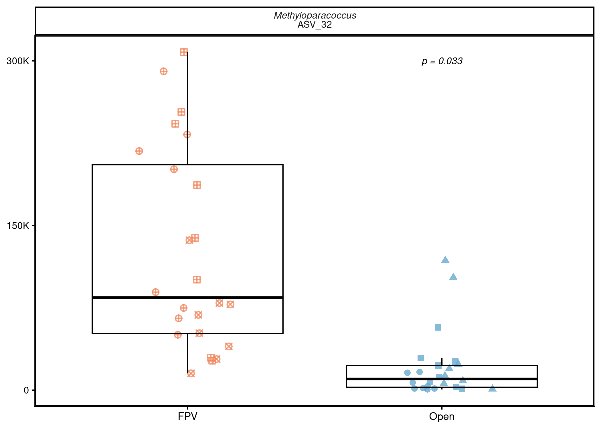<!-- -->

``` r
##### ASV_44 Methylomonas #####
#1. Run stats
# 1a. calculate abundances
asv_44_sum <- diff_abund_df %>%
  dplyr::filter(ASV == "ASV_44") %>% 
  group_by(solar_progress, JDate) %>% # 
  dplyr::summarize(sd_meth = sd(total_abundance),
                   mean_meth = mean(total_abundance),
                   .groups = "drop")
asv_44_sum
```

```
## # A tibble: 8 × 4
##   solar_progress JDate sd_meth mean_meth
##   <fct>          <dbl>   <dbl>     <dbl>
## 1 FPV              172  36846.    16535.
## 2 FPV              193  57884.    31288.
## 3 FPV              234  52765.    83462.
## 4 FPV              255 208727.   192130.
## 5 Open             172  32851.    16932.
## 6 Open             193  12375.     9755 
## 7 Open             234  20410.    20290.
## 8 Open             255   1846.     2358.
```

``` r
# 1b. linear mixed model
asv_44_data <- diff_abund_df %>%
  dplyr::filter(ASV == "ASV_44")  
asv_44_data$Pond <- as.factor(asv_44_data$Pond)

asv_44_data_model <- lmerTest::lmer(total_abundance ~ solar_progress + JDate + (1|Pond), data = asv_44_data)
summary(asv_44_data_model) #0.1708 
```

```
## Linear mixed model fit by REML. t-tests use Satterthwaite's method ['lmerModLmerTest']
## Formula: total_abundance ~ solar_progress + JDate + (1 | Pond)
##    Data: asv_44_data
## 
## REML criterion at convergence: 1164.1
## 
## Scaled residuals: 
##     Min      1Q  Median      3Q     Max 
## -1.4479 -0.4133 -0.1590  0.2722  3.6857 
## 
## Random effects:
##  Groups   Name        Variance  Std.Dev.
##  Pond     (Intercept) 1.761e+09 41967   
##  Residual             6.173e+09 78569   
## Number of obs: 48, groups:  Pond, 6
## 
## Fixed effects:
##                      Estimate Std. Error         df t value Pr(>|t|)  
## (Intercept)        -117646.45   79476.82      43.91  -1.480   0.1459  
## solar_progressOpen  -68519.46   41092.38       4.00  -1.667   0.1708  
## JDate                  929.74     346.49      41.00   2.683   0.0105 *
## ---
## Signif. codes:  0 '***' 0.001 '**' 0.01 '*' 0.05 '.' 0.1 ' ' 1
## 
## Correlation of Fixed Effects:
##             (Intr) slr_pO
## slr_prgrssO -0.259       
## JDate       -0.931  0.000
```

``` r
emmeans::emmeans(asv_44_data_model, pairwise ~ solar_progress) #0.1708
```

```
## $emmeans
##  solar_progress emmean    SE df lower.CL upper.CL
##  FPV             80853 29100  4      179   161528
##  Open            12334 29100  4   -68340    93008
## 
## Degrees-of-freedom method: kenward-roger 
## Confidence level used: 0.95 
## 
## $contrasts
##  contrast   estimate    SE df t.ratio p.value
##  FPV - Open    68519 41100  4   1.667  0.1708
## 
## Degrees-of-freedom method: kenward-roger
```

``` r
# Make individual boxplots of the ASVs
ASV_44_methylomonas <- diff_abund_df %>%
  dplyr::filter(ASV == "ASV_44") %>% 
  ggplot(aes(x = solar_progress, y = total_abundance,
             color = solar_progress)) + 
  geom_point(aes(shape = Pond),
             size = 2, alpha = 0.8, stroke = 0.8,
             position = position_jitterdodge(jitter.width = .5, dodge.width = .3)) +
  geom_boxplot(outlier.shape = NA, alpha = 0, color = "black", position = position_dodge(0.6)) + 
  labs(color = "Treatment", y = "Water Column<br>Abundance (Cells mL<sup>-1</sup>)") +
  # ggh4x::facet_wrap2(~ facet_label, scales = "free_y", nrow = 2,
  #             strip = ggh4x::strip_themed(text_x = list(
  #               ggtext::element_markdown(size = 9, face = "plain"))))+
  ggh4x::facet_wrap2(~ facet_label, scales = "free_y", nrow = 2) +
  #facet_wrap2(~italicized_label, scales = "free_y", nrow = 2, labeller = label_parsed) + 
  scale_color_manual(values = solar_colors) +
  scale_shape_manual(values = pond_shapes) +
  scale_y_continuous(
    breaks = c(0, 2e5, 4e5),
    labels = label_number(scale_cut = cut_short_scale(), accuracy = 1)) +
  theme_classic() +
  # stat_compare_means(method = "wilcox.test", 
  #                    #comparisons = list(c("FPV", "Open")),
  #                    label = "p.format", 
  #                    #group.by = "combined_label",
  #                    size = 3,          
  #                    label.y.npc = 0.9,
  #                    fontface = "italic",
  #                    #label.y = c(8000, 100000, 500000, 400000, 400000),
  #                    label.x = c(1.75, 1.75, 1.75)) + 
  guides(
    color = "none",
    color = guide_legend(
      order = 1,
      ncol= 2,
      title.position = "top",
      title.hjust = 0.5,
      override.aes = list(size = 2.5)),
    shape = guide_legend(
      nrow= 2,
      byrow = TRUE,
      title.position = "top",
      title.hjust = 0.5,
      override.aes = list(size = 2.5))) +
  theme_classic() +
  theme(legend.position = "none",
        legend.spacing = unit(0, "cm"),
        plot.title = element_text(hjust = 0.5),
        panel.background =  element_rect(color = 'black', size = 1),
        panel.grid = element_blank(),
        legend.background = element_rect(fill = "transparent", color = NA), # remove legend box
        legend.key = element_rect(fill = "transparent", color = NA),
        legend.box.background = element_rect(fill='transparent', color = "transparent"), #transparent legend panel
        legend.box.just = "center",
        #strip.background = element_rect(colour = NA, fill = 'transparent'),
        plot.background = element_rect(fill = "transparent", color="transparent"),
        legend.key.size = unit(0.4, "cm"),
        legend.spacing.x = unit(0.2, "cm"),
      # legend.margin = margin(t = -5, unit = "pt"),
        strip.text = element_markdown(size = 8),
       #axis.title.y = element_markdown(size = 8, colour = "black"),
       axis.title.x = element_blank(),
       axis.title.y = element_blank(),
       axis.text.y = element_text(size = 8, colour = "black"),
       legend.title = element_text(size = 9, colour = "black"),
      legend.text = element_text(size = 8, colour = "black"))+
  annotate("text", x = 2, y = 4.5e5, label = "p = 0.17", size = 2.822,  fontface = "italic") 
ASV_44_methylomonas
```

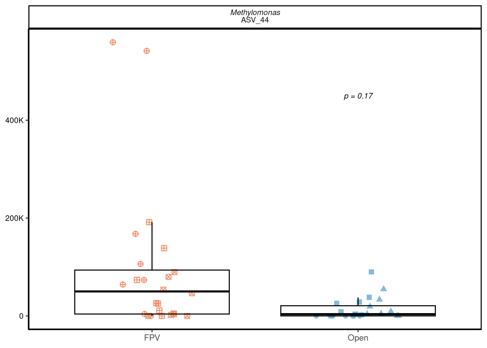<!-- -->

``` r
##### ASV_141 Methylobacter_C #####
#1. Run stats
# 1a. calculate abundances
asv_141_sum <- diff_abund_df %>%
  dplyr::filter(ASV == "ASV_141") %>% 
  group_by(solar_progress, JDate) %>% # 
  dplyr::summarize(sd_meth = sd(total_abundance),
                   mean_meth = mean(total_abundance),
                   .groups = "drop")
asv_141_sum
```

```
## # A tibble: 8 × 4
##   solar_progress JDate sd_meth mean_meth
##   <fct>          <dbl>   <dbl>     <dbl>
## 1 FPV              172   9552.     9620.
## 2 FPV              193  60415.    40953.
## 3 FPV              234  27834.    39058.
## 4 FPV              255  28316.    33530.
## 5 Open             172    903.      368.
## 6 Open             193   9254.     4572.
## 7 Open             234   3066.     2639.
## 8 Open             255  14367.     7987.
```

``` r
# 1b. linear mixed model
asv_141_data <- diff_abund_df %>%
  dplyr::filter(ASV == "ASV_141")  
asv_141_data$Pond <- as.factor(asv_141_data$Pond)

asv_141_data_model <- lmerTest::lmer(total_abundance ~ solar_progress + JDate + (1|Pond), data = asv_141_data)
summary(asv_141_data_model) #0.000914 ***
```

```
## Linear mixed model fit by REML. t-tests use Satterthwaite's method ['lmerModLmerTest']
## Formula: total_abundance ~ solar_progress + JDate + (1 | Pond)
##    Data: asv_141_data
## 
## REML criterion at convergence: 1060.7
## 
## Scaled residuals: 
##     Min      1Q  Median      3Q     Max 
## -1.2765 -0.5622 -0.1295  0.0787  3.9665 
## 
## Random effects:
##  Groups   Name        Variance  Std.Dev.
##  Pond     (Intercept)         0     0   
##  Residual             688712781 26243   
## Number of obs: 48, groups:  Pond, 6
## 
## Fixed effects:
##                    Estimate Std. Error       df t value Pr(>|t|)    
## (Intercept)           148.5    25282.8     45.0   0.006 0.995338    
## solar_progressOpen -26898.2     7575.8     45.0  -3.551 0.000914 ***
## JDate                 143.5      115.7     45.0   1.240 0.221365    
## ---
## Signif. codes:  0 '***' 0.001 '**' 0.01 '*' 0.05 '.' 0.1 ' ' 1
## 
## Correlation of Fixed Effects:
##             (Intr) slr_pO
## slr_prgrssO -0.150       
## JDate       -0.977  0.000
## optimizer (nloptwrap) convergence code: 0 (OK)
## boundary (singular) fit: see help('isSingular')
```

``` r
emmeans::emmeans(asv_141_data_model, pairwise ~ solar_progress) #0.0238
```

```
## $emmeans
##  solar_progress emmean   SE df lower.CL upper.CL
##  FPV             30790 5360  4    15917    45663
##  Open             3892 5360  4   -10981    18765
## 
## Degrees-of-freedom method: kenward-roger 
## Confidence level used: 0.95 
## 
## $contrasts
##  contrast   estimate   SE df t.ratio p.value
##  FPV - Open    26898 7580  4   3.551  0.0238
## 
## Degrees-of-freedom method: kenward-roger
```

``` r
# Make individual boxplots of the ASVs
ASV_141_methylobacterc <- diff_abund_df %>%
  dplyr::filter(ASV == "ASV_141") %>% 
  ggplot(aes(x = solar_progress, y = total_abundance,
             color = solar_progress)) + 
  geom_point(aes(shape = Pond),
             size = 2, alpha = 0.8, stroke = 0.8,
             position = position_jitterdodge(jitter.width = .5, dodge.width = .3)) +
  geom_boxplot(outlier.shape = NA, alpha = 0, color = "black", position = position_dodge(0.6)) + 
  labs(color = "Treatment", y = "Water Column<br>Abundance (Cells mL<sup>-1</sup>)") +
  # ggh4x::facet_grid2(~ facet_label, scales = "free_y", nrow = 2, 
  #                    strip = strip_vanilla(clip = "on")) +
  # facet_wrap2(~ facet_label, scales = "free_y", nrow = 2,
  #             strip = strip_themed(text_x = element_markdown(size = 9, face = "plain")))+
  #facet_wrap2(~italicized_label, scales = "free_y", nrow = 2, labeller = label_parsed) + 
  ggh4x::facet_grid2(. ~ facet_label) +
  scale_color_manual(values = solar_colors) +
  scale_shape_manual(values = pond_shapes) +
  scale_y_continuous(
    #breaks = c(0, 1.5e5, 3e5),
    labels = label_number(scale_cut = cut_short_scale(), accuracy = 1)) +
  theme_classic() +
  # stat_compare_means(method = "wilcox.test", 
  #                    #comparisons = list(c("FPV", "Open")),
  #                    label = "p.format", 
  #                    #group.by = "combined_label",
  #                    size = 3,          
  #                    label.y.npc = 0.9,
  #                    fontface = "italic",
  #                    #label.y = c(8000, 100000, 500000, 400000, 400000),
  #                    label.x = c(1.75, 1.75, 1.75)) + 
  guides(
    #color = "none",
    color = guide_legend(
      #order = 1,
      ncol= 2,
      title.position = "top",
      title.hjust = 0.5,
      override.aes = list(size = 2.5)),
    shape = guide_legend(
      nrow= 2,
      byrow = TRUE,
      title.position = "top",
      title.hjust = 0.5,
      override.aes = list(size = 2.5))) +
  theme_classic() +
  theme(legend.position = "none",
        legend.spacing = unit(0, "cm"),
        plot.title = element_text(hjust = 0.5),
        panel.background =  element_rect(color = 'black', size = 1),
        panel.grid = element_blank(),
        legend.background = element_rect(fill = "transparent", color = NA), # remove legend box
        legend.key = element_rect(fill = "transparent", color = NA),
        legend.box.background = element_rect(fill='transparent', color = "transparent"), #transparent legend panel
        #legend.box.just = "center",
        #strip.background = element_rect(colour = NA, fill = 'transparent'),
        plot.background = element_rect(fill = "transparent", color="transparent"),
        legend.key.size = unit(0.4, "cm"),
        legend.spacing.x = unit(0.7, "cm"),
       legend.margin = margin(t = -5, unit = "pt"),
        strip.text = element_markdown(size = 8),
       #axis.title.y = element_markdown(size = 8, colour = "black"),
       axis.title.x = element_blank(),
      axis.title.y = element_blank(),
       axis.text.y = element_text(size = 8, colour = "black"),
       legend.title = element_text(size = 9, colour = "black"),
      legend.text = element_text(size = 8, colour = "black"))+
    annotate("text", x = 2, y = 1.3e5, label = "p = 0.024", size = 2.822,  fontface = "italic") 
ASV_141_methylobacterc
```

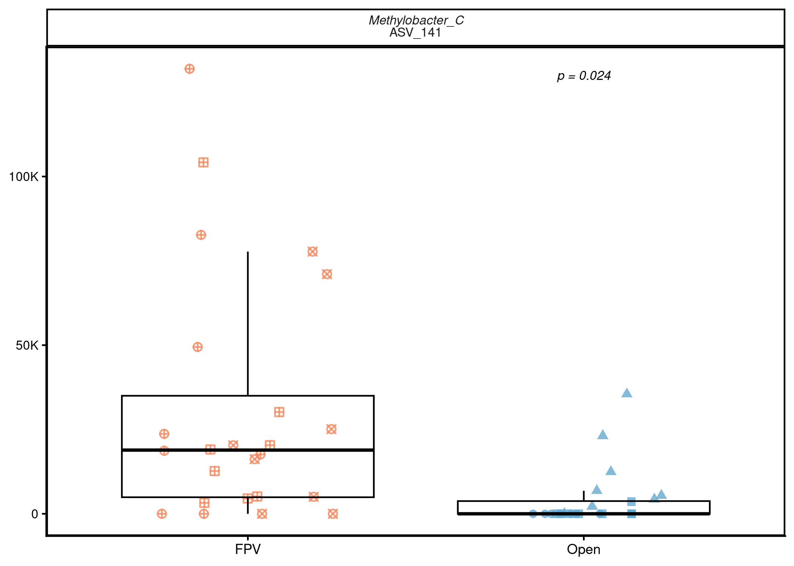<!-- -->

``` r
# # extract legend
# legend <- cowplot::get_plot_component(ASV_13_methylococcales, "guide-box", return_all = TRUE) # can also do right
# legend_only <- legend[[3]]


fig4 <-  ASV_13_methylococcales +
  ASV_32_methyloparacoccus +
  ASV_141_methylobacterc +
  #plot_spacer() +
  plot_layout(ncol = 3, guides = "collect", widths = c(1,1,1)) & 
  theme(
    legend.position = "bottom")
    #legend.justification = c(0,.2))
    #legend.box.margin = margin(2, 2, 2, 2.5))

fig4
```

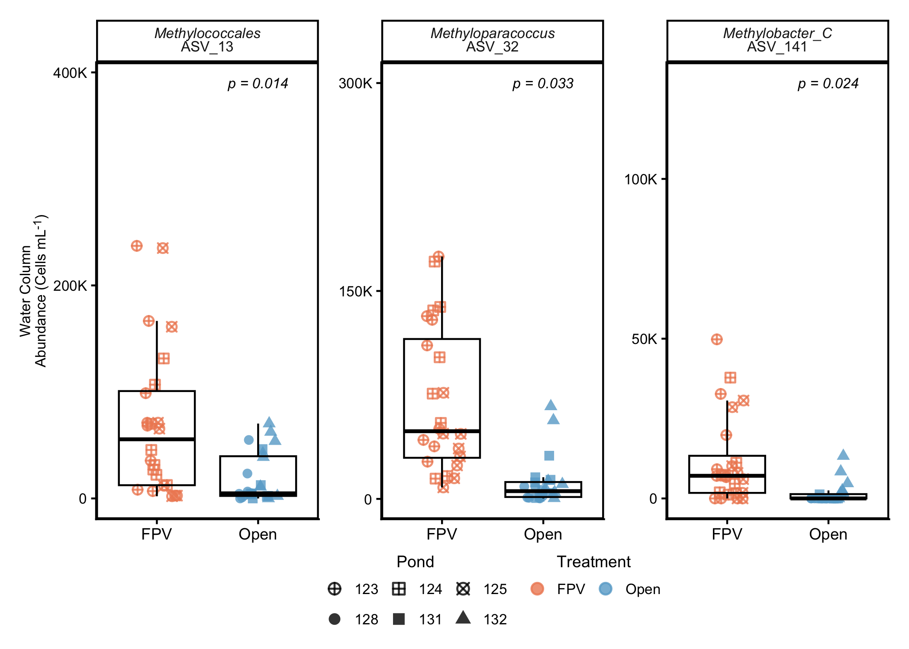<!-- -->

``` r
p13  <- ASV_13_methylococcales + theme(legend.position = "bottom")
p32  <- ASV_32_methyloparacoccus + theme(legend.position = "bottom")
p141 <- ASV_141_methylobacterc + theme(legend.position = "bottom")

fig4 <- (p13 + p32 + p141) +
  plot_layout(ncol = 3, guides = "collect") &
  theme(
    legend.position = "bottom",
    legend.box = "horizontal",
    legend.box.just = "center",
    legend.direction = "horizontal",
    legend.title.position = "top",
    legend.title.align = 0.5,
    legend.title = element_text(margin = margin(b = 0, unit = "pt")))

  # theme(legend.position = "bottom", legend.box.just = "center", legend.box = "horizontal")
fig4
```

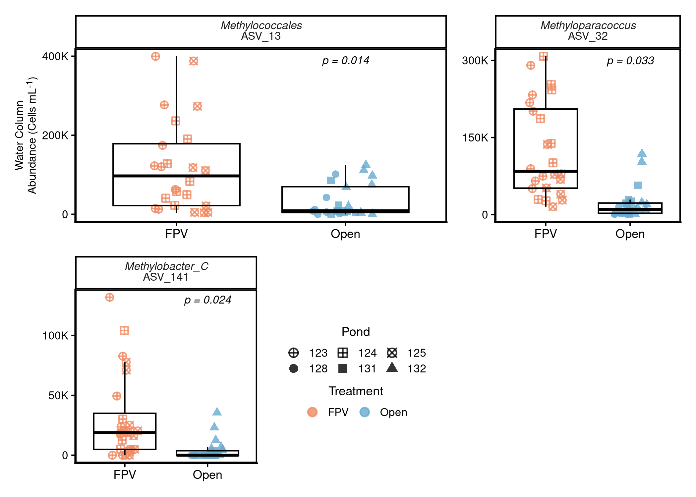<!-- -->

``` r
fig4 <- fig4 &
  theme(
    legend.key.height = unit(0.35, "cm"),
    legend.key.width  = unit(0.35, "cm"),
    legend.spacing.x  = unit(0.4, "cm")
  )
fig4 
```

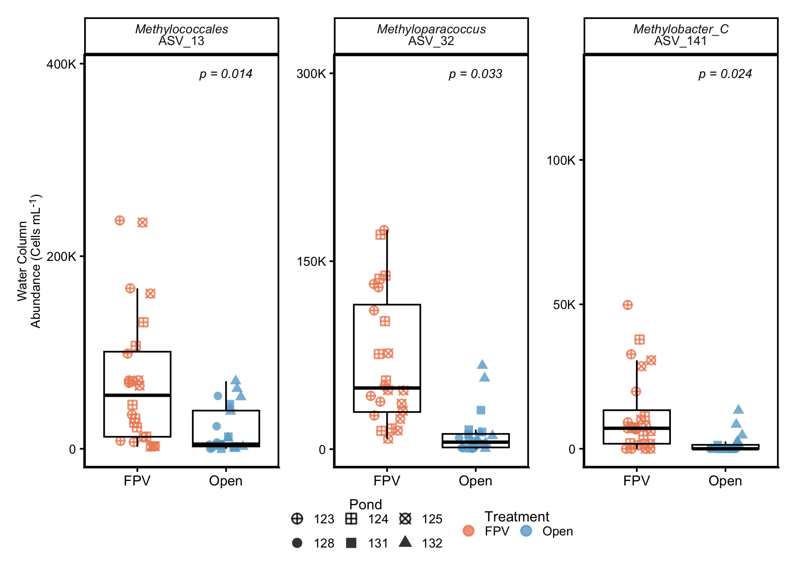<!-- -->

``` r
## plot all together
fig4 <- ASV_13_methylococcales +
  ASV_32_methyloparacoccus +
  ASV_141_methylobacterc +
  #plot_spacer() +
  plot_layout(ncol = 3, guides = "collect", widths = c(1,1,1)) &
  theme(
    legend.position = "bottom",
    legend.spacing.x = unit(1, "cm"),
    legend.margin = margin(t = 8, unit = "pt"),
   # legend.justification = c(-30,.2),
   # legend.box.just = "center",
    legend.box.margin = margin(0, 0, 0, 0))

fig4
```

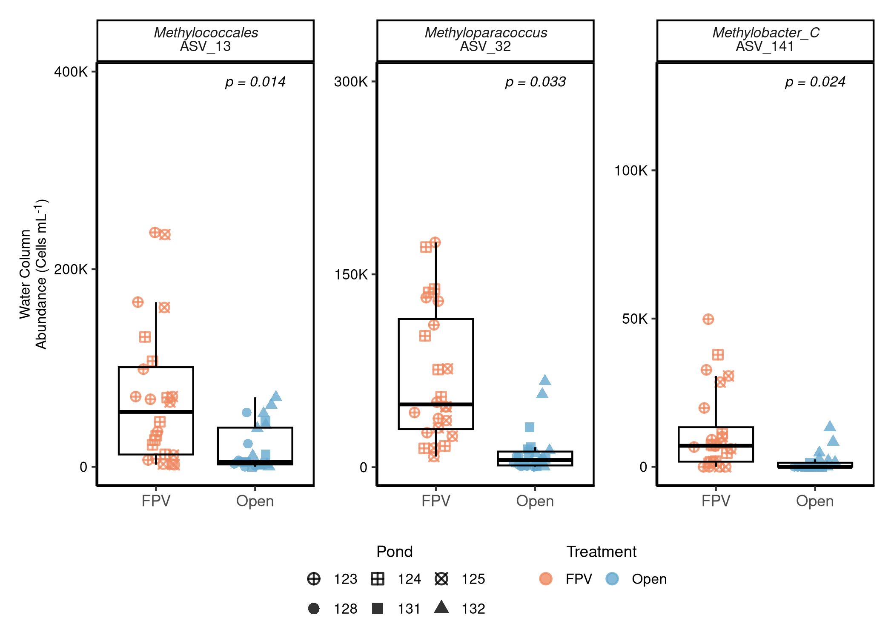<!-- -->

``` r
# Save the plot   
ggsave(fig4, width = 6.5, height = 4.5, dpi = 300,
        filename = "figures/Fig_4/Fig_4.png")


#or
library(ggplot2)
library(patchwork)

p13  <- ASV_13_methylococcales + guides(color = guide_none(), shape = guide_none())
p32  <- ASV_32_methyloparacoccus + guides(color = guide_none(), shape = guide_none())
p141 <- ASV_141_methylobacterc + guides(color = guide_none(), shape = guide_none())

fig4 <- (p13 + p32 + p141) +
  plot_layout(ncol = 3, guides = "collect") &
  theme(
    legend.position = "bottom",
    legend.box = "horizontal",
    #legend.box.just = "center",
    legend.box.margin = margin(2, 2, 2, 2),

    # make both guide boxes have identical sizing behavior
    legend.title.position = "top",
    legend.title.align = 0.5,
    legend.key.height = unit(0.35, "cm"),
    legend.key.width  = unit(0.35, "cm"),
    legend.spacing.y  = unit(0, "cm")
  ) &
  guides(
    color = guide_legend(title = "Treatment", nrow = 1, byrow = TRUE, title.position = "top", title.hjust = 0.5),
    shape = guide_legend(title = "Pond",      nrow = 2, byrow = TRUE, title.position = "top", title.hjust = 0.5)
  )

fig4
```

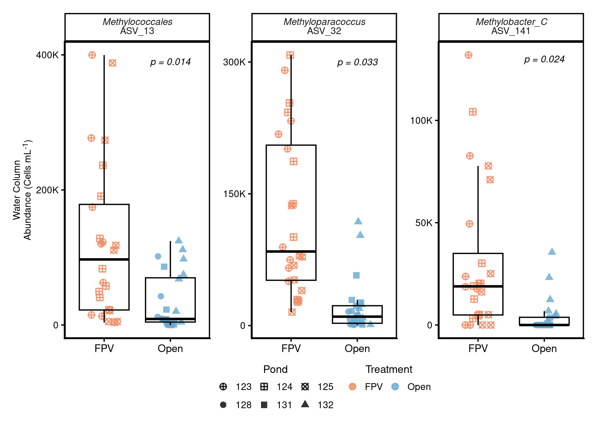<!-- -->

``` r
library(cowplot)
library(patchwork)

# 1) Make one plot that DEFINITELY contains BOTH legends (color + shape),
#    and format it how you want the legend to look.
leg_plot <- ASV_141_methylobacterc +
  theme(legend.position = "right",
        legend.spacing = unit(.4, "cm"),
        #legend.key.size = unit(0.4, "cm"),
        legend.box.just = "center",
        legend.spacing.x = unit(1, "cm"));leg_plot 
```

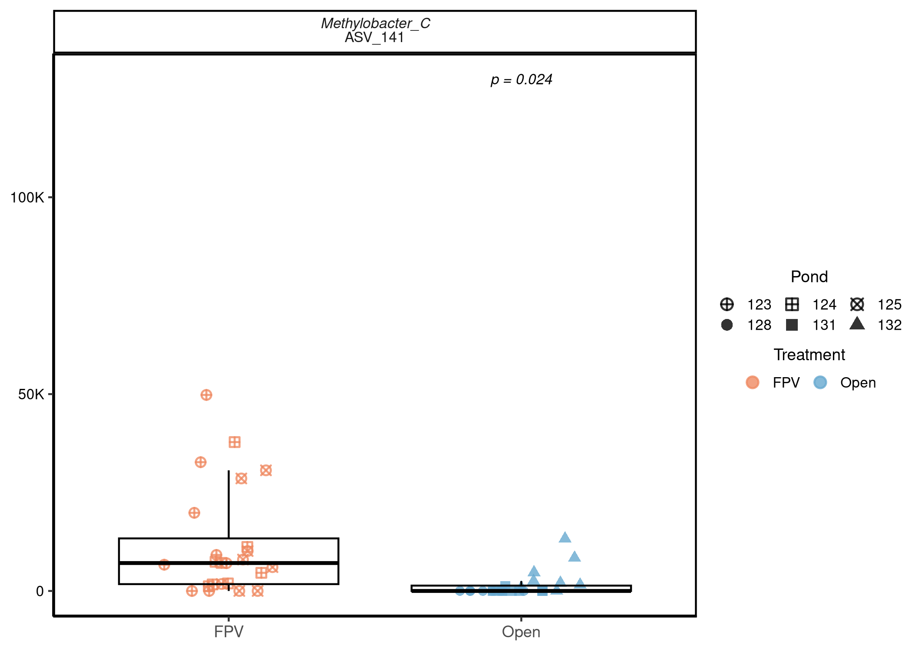<!-- -->

``` r
       #legend.margin = margin(t = -5, unit = "pt"))
#+
  # guides(
  #   color = guide_legend(title = "Treatment", nrow = 2, byrow = TRUE, title.position = "top", title.hjust = 0.5),
  #   shape = guide_legend(title = "Pond",      nrow = 2, byrow = TRUE, title.position = "top", title.hjust = 0.5)


leg <- cowplot::get_legend(leg_plot)

# 2) Remove legends from the plots that go into the 2x2 grid
p13  <- ASV_13_methylococcales     + theme(legend.position = "none")
p32  <- ASV_32_methyloparacoccus   + theme(legend.position = "none")
p141 <- ASV_141_methylobacterc     + theme(legend.position = "none")

# 3) Put the legend in the empty cell (bottom-right)
fig4 <- (p13 + p32) +
        (p141 + cowplot::ggdraw(leg)) +
  plot_layout(widths = c(1,0.5));fig4
```

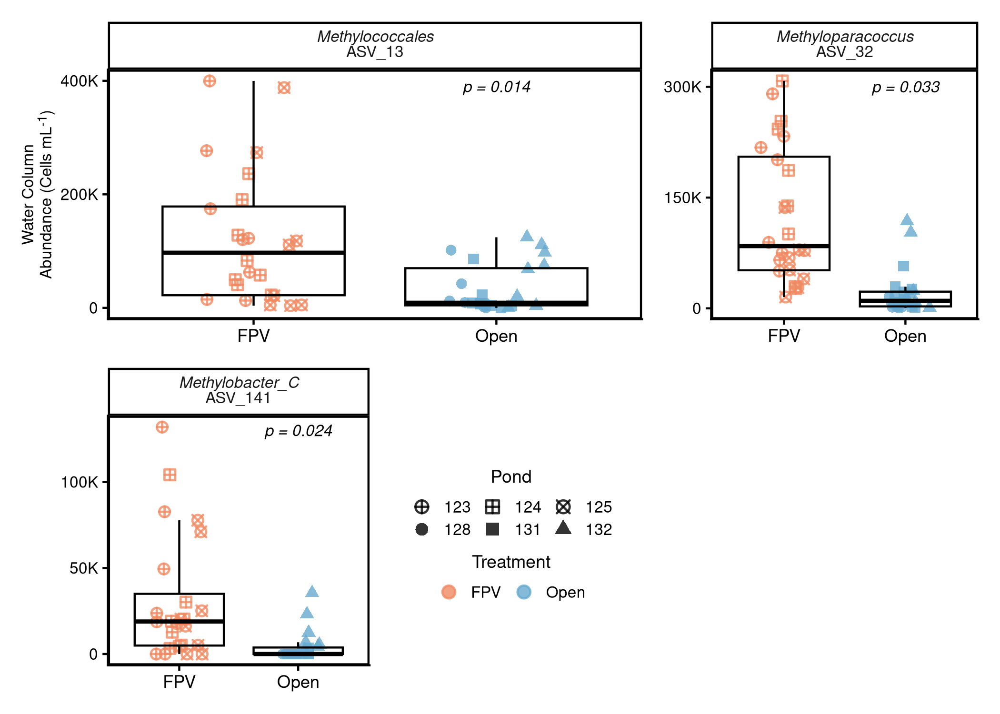<!-- -->

``` r
library(patchwork)

p13  <- ASV_13_methylococcales     + theme(legend.position = "bottom")
p32  <- ASV_32_methyloparacoccus   + theme(legend.position = "bottom")
p141 <- ASV_141_methylobacterc     + theme(legend.position = "bottom")

fig4 <- (p13 + p32) /
        (p141 + guide_area()) +
  plot_layout(guides = "collect") &
  theme(
    legend.position = "right",        # collected legend will be drawn in guide_area
    legend.box.just = "center",
    plot.margin = margin(0, 0, 0, 0)
  )

fig4
```

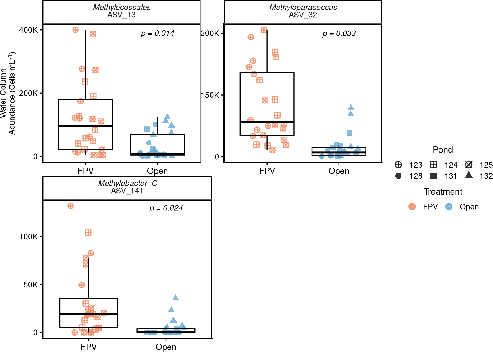<!-- -->


### Sediment
First we are running this analysis with all methane cyclers.

``` r
# filter out for ASVs with zero variances; recommended to remove them as they are sparse and lowly abundant 

# remove bad taxa 
bad_taxa <- c("ASV_3924", "ASV_4747", "ASV_6182", "ASV_2152", "ASV_5977", "ASV_11602", "ASV_568", "ASV_10610", "ASV_8789", "ASV_15179", "ASV_5923", "ASV_8468", "ASV_3463", "ASV_2539", "ASV_2756", "ASV_4541", "ASV_7355", "ASV_2182", "ASV_5033", "ASV_2551", "ASV_4211", "ASV_3467", "ASV_1479", "ASV_1677", "ASV_7654", "ASV_13612", "ASV_6715", "ASV_9006", "ASV_8702", "ASV_9210")


scaled_sed_ch4_physeq_bc <-sed_ch4_cyclers_physeq %>%
  subset_taxa(., !(ASV %in% bad_taxa)) %>% 
  prune_taxa(taxa_sums(.) > 0,.)


# relevel solar_progress 
scaled_sed_ch4_physeq_bc@sam_data$solar_progress <- factor(scaled_sed_ch4_physeq_bc@sam_data$solar_progress, levels = c("No FPV", "FPV"))

# # run ancombc2 for all sediment methane cyclers
# sed_ch4_asv_output <- ancombc2(data = scaled_sed_ch4_physeq_bc,
#                                  tax_level = "ASV", # Test for each phylum
#                                  fix_formula = "solar_progress", # Use Comp_Group_Hier to estimate diff. abundance
#                                  p_adj_method = "fdr", # Adjust with Holm-Bonferroni correction; recommended by authors
#                                  pseudo_sens = TRUE, # Run sensitivity test to make sure taxa isn't sensitive to psuedo-count choice
#                                  prv_cut = 0.05, # Prevalence filter of 10%
#                                  group = NULL, # Use Comp_Group_Hier as groups when doing pairwise comparisons
#                                  struc_zero = FALSE, # Do not detect structural zeroes
#                                  alpha = 0.05, # Significance threshold of 0.05
#                                  n_cl = 5, # Use 5 threads
#                                  s0_perc = 0.05,
#                                  verbose = FALSE, # Don't print verbose output
#                                  global = FALSE, # Run a global test (sorta like an ANOVA to first find if a given ASV is sig diff)
#                                  pairwise = FALSE) # Run pairwise tests between groups (sorta like a post-hoc test like Tukey)


# save(sed_ch4_asv_output, file = "data/03_diff_abund/sed_ch4_asv_output.RData")

load("data/03_diff_abund/sed_ch4_asv_output.RData")


# plot ASV differential abundance
sed_ch4_fsp <- sed_ch4_asv_output$res %>%
  select(taxon, starts_with("lfc"), starts_with("diff"), starts_with("passed_ss")) %>%
  pivot_longer(cols = !taxon, names_to = "metric", values_to = "value") %>%
  separate_wider_delim(cols = metric, delim = "_", names = c("variable", "Comparison"), too_many = "merge") %>%
  mutate(Comparison = str_remove(Comparison, "\\(Intercept\\)")) %>% 
  mutate(Comparison = str_remove(Comparison, "ss_")) %>%
  pivot_wider(id_cols = c("taxon","Comparison"), names_from = variable, values_from = value) %>%
  mutate(Comparison = str_remove(Comparison, "solar_progress"),
         Comparison = str_replace(Comparison, "_solar_progress", ";")) %>%
  separate_wider_delim(Comparison, delim = ";", names = c("Ref1", "Ref2"), too_few = "align_start") %>%
  filter(!is.na(Ref1) & Ref1 != "") %>%
  mutate(
    Ref2 = ifelse(is.na(Ref2), "Open", Ref2), # relevel with basegroup which is no solar 
    Comparison = paste0(Ref2, " : ", Ref1)) %>% 
  dplyr::filter(diff == 1, passed == 1, abs(lfc) > 1) %>% # play around with log fold change
  select(ASV = taxon, Comparison, lfc, passed)

# join by tax table
clean_sed_ch4 <-  sed_ch4_fsp %>% left_join(., as.data.frame(sed_ch4_cyclers_physeq@tax_table), by = "ASV")

# plot log fold changes
clean_sed_ch4 %>% 
  ggplot(aes(x = ASV, y = lfc, fill = Family)) +
  geom_col() +
  #scale_fill_manual(values = phylum_colors) +
  theme_bw() +
  theme(axis.text.x = element_text(angle = 45, hjust = 1), legend.position = "bottom") + 
  ggtitle("Sediment CH4 Cycler ASV Log-fold Change in FPV Ponds") 
```

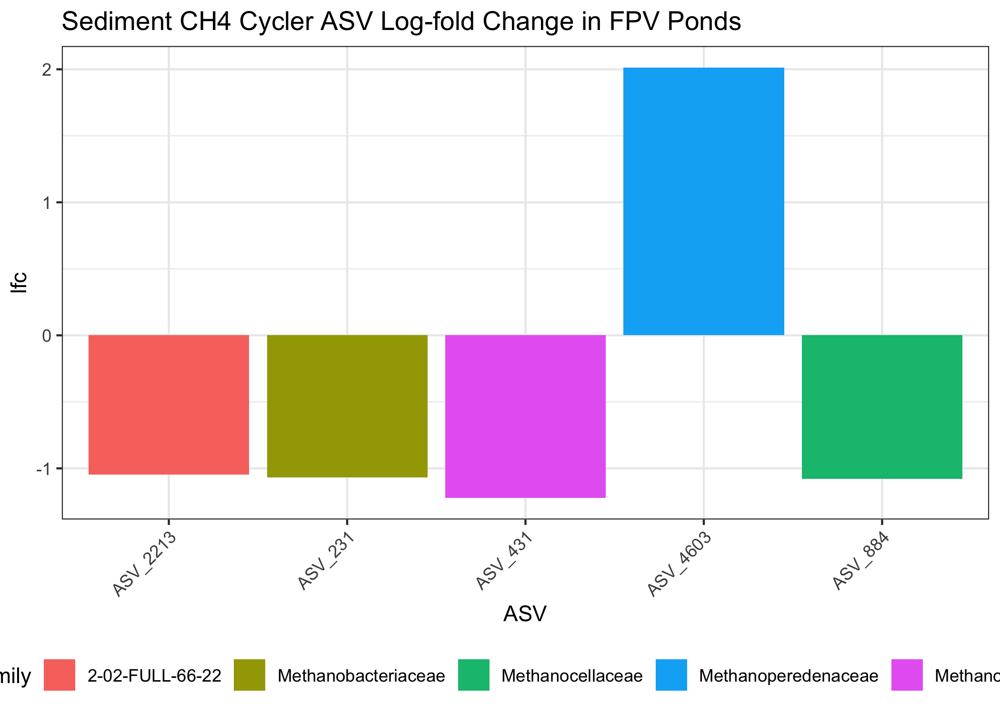<!-- -->

``` r
# plot differentially abundant ASVs overtime 


# methanogen = ASV_4603; Methanosarcinales_A_2632 order

# get metadata from water physeq 
# metadata <- scaled_sed_ch4_physeq %>%
#   sample_data() %>%
#   data.frame()

sed_ch4_asv_df_glom <- sed_ch4_cyclers_physeq %>% # this phyloseq object has been transformed to relative abundance already
  tax_glom(taxrank = "ASV") %>% 
  psmelt() %>% 
  mutate(
    solar_progress = recode(solar_progress, "Solar" = "FPV", "No FPV" = "Open"))


# plot Methanogen overtime
sed_ch4_asv4603 <- sed_ch4_asv_df_glom %>% 
  dplyr::filter(ASV == "ASV_4603") %>%
  dplyr::group_by(
    JDate, Pond, solar_progress) %>%
  dplyr::summarise(
    rel_abundance = sum(Abundance, na.rm = TRUE),
    .groups = "drop") %>%  
  ggplot(aes(x = JDate, y = rel_abundance, color = solar_progress)) +
  geom_line(aes(group = interaction(Pond)), 
            alpha = 0.2) +
  geom_smooth(aes(group = solar_progress), se = FALSE) +
  geom_point(aes(shape = Pond), size = 2) +
  scale_color_manual(values = solar_colors) +
  scale_shape_manual(values = pond_shapes) +
  labs(
    x = "Date Collected",
    y = "Relative Abundance (%)",
    title = "Dif Abund Sed Methanosarcinales_A_2632 (ASV_4603) in FPV Ponds"
  ) +
  theme(axis.text.x = element_text(angle = 30, hjust = 1, vjust = 1),
        legend.position = "bottom") +
  scale_x_discrete(guide = guide_axis(angle = 60)) +
  theme_bw()
sed_ch4_asv4603
```

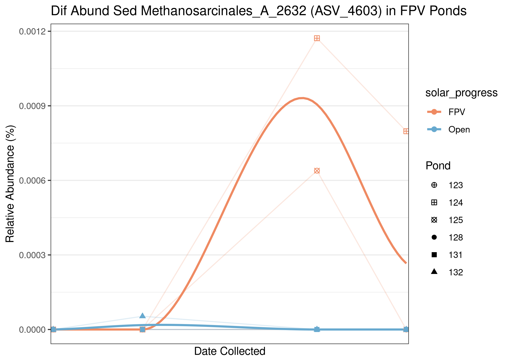<!-- -->
There is a differentially abundant ASV Methanosarcinales_A_2632 that is increased in solar ponds! When we plot the abundance overtime this ASV is barely in the community but it is higher in solar ponds. Doesnt really feel worth it to report considering its a minor contribution to community.


``` r
sed_difAbund_plot <- sed_ch4_asv_df_glom %>%
  dplyr::filter(ASV == "ASV_4603") %>%
  dplyr::group_by(
    JDate, Pond, Depth_Class, solar_progress,
    CH4_Cycler, Phylum, Class, Order, Family, Genus, ASV) %>%
  dplyr::summarise(
    rel_abundance = sum(Abundance, na.rm = TRUE),
    .groups = "drop") %>%  
  ggplot(aes(x = solar_progress, y = rel_abundance, color = solar_progress)) +
  geom_point(aes(shape = Pond),
             size = 2, alpha = 0.8, stroke = 0.8,
             position = position_jitterdodge(jitter.width = .5, dodge.width = .3)) +
  geom_boxplot(outlier.shape = NA, alpha = 0, color = "black", 
               position = position_dodge(0.6)) + 
  labs(color = "Treatment",
       y = "Relative Abundance (%)",
       title = "Methanoperedens_A \nASV_4603") +
  scale_color_manual(values = solar_colors) +
  scale_shape_manual(values = pond_shapes) +
  theme_classic() +
  ### ADD PVALUES 
  stat_compare_means(method = "wilcox.test", 
                     #comparisons = list(c("FPV", "Open")),
                     label = "p.format", # or "p.format" or "p.value"
                     #group.by = "combined_label",
                     size = 3,               # ⬅️ Font size
                     label.y.npc = 0.7,
                     #label.y = c(8000, 100000, 500000, 400000, 400000),
                     label.x = 1.75) +    # ⬅️ Manually set y position)  +
  guides(
    color = guide_legend(ncol = 2,override.aes = list(size = 2)),
    shape = guide_legend(ncol = 2, override.aes = list(size = 3))) +
  theme(legend.position = "none", #c(0.75, 0.7),
        axis.title.x = element_blank(),
        legend.title = element_text(size = 8),
        legend.text = element_text(size = 7),
        legend.key.size = unit(0.4, "cm"),
        legend.spacing.x = unit(0.2, "cm"),
        legend.margin = margin(t = -5, unit = "pt"),
        strip.text = element_text(size = 10),
        plot.title = element_text(size = 10)); sed_difAbund_plot
```

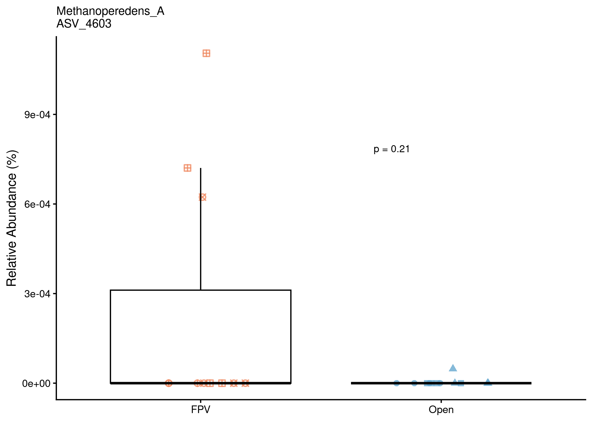<!-- -->

``` r
# save the plot   
# ggsave(sed_difAbund_plot, width = 3, height = 2, dpi = 300,
#         filename = "figures/Fig_S2/Fig_S2.png")
```

# Supplemental Figures
# Figure S3
Now we will split this up by water and sediment methane cyclers.

## Water Methanogens
Cannot run methanogens on water column, data is too sparse

``` r
# first lets filter our sed_ch4_cycler_physeq for methanogen or methanotroph
water_methanogens_physeq <- subset_taxa(water_ch4_cyclers_physeq, CH4_Cycler == "Methanogen") %>% 
  prune_taxa(taxa_sums(.) > 0, .) # 66 ASVs

# it seems that there are so few methanogen asvs that i cant even calculate a distance matrix without removing those 0s. lets see who those are
samps <- sample_sums(water_methanogens_physeq)
which(samps == 0) 

# further indication of how strongly methanotrophs shape water column 
```

## Water Methanotrophs

``` r
# first lets filter our physeq for methanotroph
water_methanotrophs_physeq <- subset_taxa(water_ch4_cyclers_physeq, CH4_Cycler == "Methanotroph") %>% 
  prune_taxa(taxa_sums(.) > 0, .) # 189 ASVs

# 2. methanotrophs

# Calculate Bray-Curtis Dissimilarity 
water_methanotroph_BC_pcoa <- 
  ordinate(
    physeq = water_methanotrophs_physeq,
    method = "PCoA",
    distance = "bray", 
    binary = FALSE
  )


## NEW PLOT 
#### Grab the data for the plot 
water_methanotroph_df <- 
  plot_ordination(
  physeq = water_methanotrophs_physeq,
  ordination = water_methanotroph_BC_pcoa,
  color = "solar_progress",
  shape = "Pond",
  justDF = TRUE)

# now lets mutate the columns
water_methanotroph_df <- water_methanotroph_df %>% 
dplyr::mutate(
    solar_progress = recode(solar_progress, "FPV" = "FPV", "No FPV" = "Open")) # solar progress


### Now, plot Figure S3B: WATER METHANOTROPHS 
figS3B_water_methanotroph_pcoa <- 
  ggplot(data = water_methanotroph_df, 
       aes(x = Axis.1, 
           y = Axis.2,
           color = solar_progress,
           shape = Pond)) + 
  geom_point(size = 3, alpha = 0.8, stroke = 0.8) +
  scale_shape_manual(values = pond_shapes) + 
  scale_color_manual(values = solar_colors) +
  labs(color = "Treatment",
       shape = "Pond",
       x = "Axis.1 [28.7%]",
       y = "Axis.2 [11.6%]",
       title = "Water Methanotrophs") + 
  guides(
    color = guide_legend(
      title.position = "top",
      title.hjust = 0.5,
      override.aes = list(size = 2.5)),
    shape = guide_legend(
      nrow = 2,
      byrow = TRUE,
      title.position = "top",
      title.hjust = 0.5,
      override.aes = list(size = 2.5))
  ) +
  theme_classic() +
  theme(legend.position = "bottom",
        #legend.spacing = unit(0, "cm"),
        legend.box.background = element_blank(),
        legend.title = element_text(size = 8),
        legend.text = element_text(size = 8),
        plot.title = element_text(hjust = 0.5, size = 9, colour = "black"),
        axis.text.x = element_text(size = 8, colour = "black"),
        axis.text.y = element_text(size = 8, colour = "black"),
        axis.title.x = element_text(size = 8, colour = "black"),
        axis.title.y = element_text(size = 8, colour = "black"))


# Show the plot
figS3B_water_methanotroph_pcoa
```

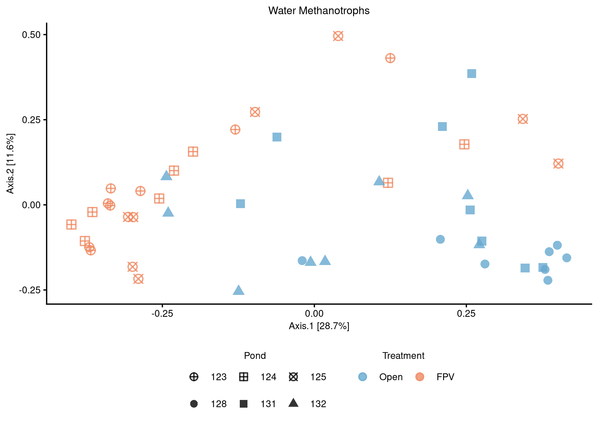<!-- -->

``` r
# PCoA of sediments color by treatment shaped by pond
s3b_water_troph <- plot_ordination(
  physeq = water_methanotrophs_physeq,
  ordination = water_methanotroph_BC_pcoa,
  color = "solar_progress",
  shape = "Pond",
  title = "Sediment Methanotrophs") +
  geom_point(size = 5, alpha = 0.5, aes(color = solar_progress, fill = solar_progress, shape = Pond)) +
  scale_color_manual(values = solar_colors) +
  scale_fill_manual(values = solar_colors) +
  scale_shape_manual(values = pond_shapes) +
  guides(color = "none",
         fill = "none",
         shape = "none")+
  theme_classic()
s3b_water_troph
```

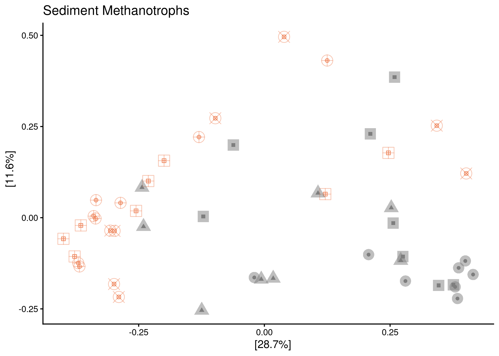<!-- -->

## Procrustes and Mantels Tests - Water Column CH4 Cyclers
When we plot our water column only methanotrophs and compare it to our main figure water column methanogens + methanotrophs, the plots are nearly identical. This indicates that methanotrophs are responsible for structuring the water column as indicated by abundances in figure 2. 

But to confirm if water column methanotrophs truly structure the water column we will perform Procrustes analysis and Mantel's test

``` r
###### Procrustes ######
# run procrustes on our water methanotroph pcoas

# we will fit our methanotroph only phyloseq onto our methanogen+methanotroph water phyloseq
mt_only_sites <- plot_ordination(
  physeq      = water_methanotrophs_physeq,
  ordination  = water_methanotroph_BC_pcoa,
  justDF      = TRUE) %>%
  dplyr::select(Axis.1, Axis.2) %>%
  tibble::rownames_to_column("SampleID")

all_sites <- plot_ordination(
  physeq      = water_ch4_cyclers_physeq,
  ordination  = water_BC_pcoa,
  justDF      = TRUE) %>%
  dplyr::select(Axis.1, Axis.2) %>%
  tibble::rownames_to_column("SampleID")

# ensure that all SampleID names match
shared_ids <- intersect(mt_only_sites$SampleID, all_sites$SampleID)

# arrange SampleID names in exact order for comparison
mt_only_sites2 <- mt_only_sites %>%
  filter(SampleID %in% shared_ids) %>%
  arrange(SampleID)

all_sites2 <- all_sites %>%
  filter(SampleID %in% shared_ids) %>%
  arrange(SampleID)

# sanity check to make sure everything looks right!
identical(mt_only_sites2$SampleID, all_sites2$SampleID)
```

```
## [1] TRUE
```

``` r
# run procrustes test
pro <- procrustes(
  X = as.matrix(all_sites2[, c("Axis.1", "Axis.2")]),  # target for fitting 
  Y = as.matrix(mt_only_sites2[, c("Axis.1", "Axis.2")]),
  symmetric = FALSE)
pro
```

```
## 
## Call:
## procrustes(X = as.matrix(all_sites2[, c("Axis.1", "Axis.2")]),      Y = as.matrix(mt_only_sites2[, c("Axis.1", "Axis.2")]), symmetric = FALSE) 
## 
## Procrustes sum of squares:
## 0.008354
```

``` r
# now plot procrustes test
fig_s4 <- plot(pro, kind = 1, main = "Procrustes Errors"); fig_s4
```

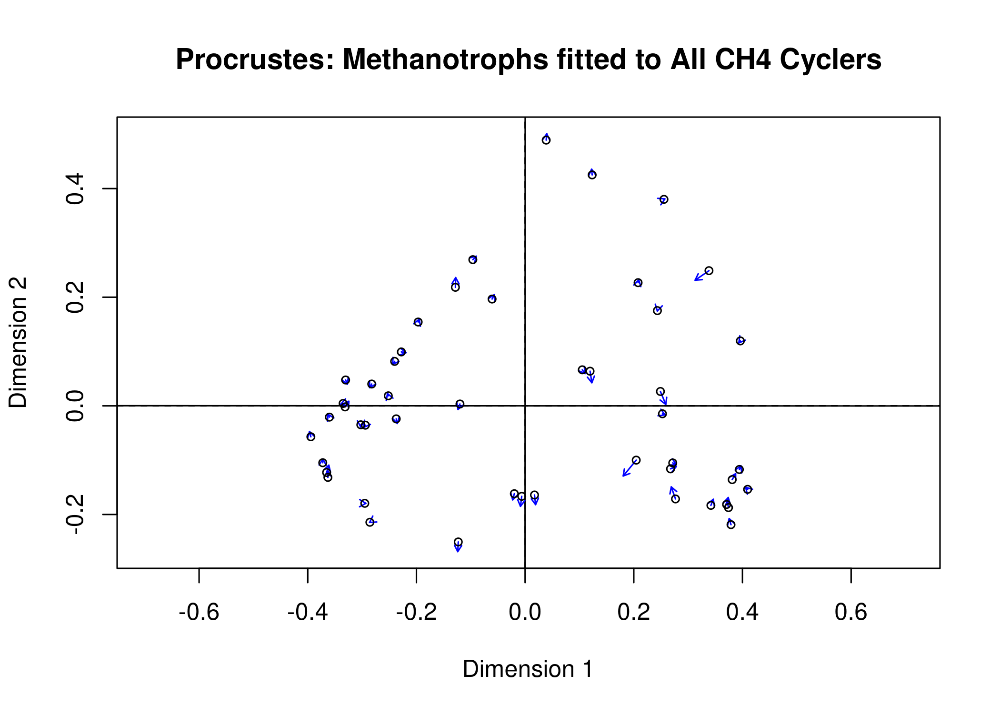<!-- -->

```
## $heads
##              Axis.1       Axis.2
## site1   0.122391284  0.435744262
## site2  -0.327246913  0.039890340
## site3   0.243268076  0.174556872
## site4   0.122842840  0.042554328
## site5   0.039865000  0.500842863
## site6  -0.089638441  0.275439376
## site7   0.387434527 -0.124913440
## site8   0.268988387 -0.149237036
## site9   0.257221689  0.380956109
## site10 -0.056750994  0.204615058
## site11  0.278123981 -0.111836731
## site12  0.019268716 -0.181910128
## site13 -0.127799959  0.236080129
## site14 -0.324383631  0.008394102
## site15 -0.253308034  0.022607439
## site16 -0.219248214  0.097914890
## site17  0.393294918  0.115928239
## site18  0.312900926  0.231311808
## site19  0.397282939 -0.110492061
## site20  0.405833829 -0.149954116
## site21  0.209150847  0.232085697
## site22  0.257702180 -0.016712684
## site23  0.110387580  0.059395530
## site24  0.258892920  0.002697917
## site25 -0.339157405  0.002949797
## site26 -0.286079637  0.033420577
## site27 -0.396765683 -0.047184235
## site28 -0.372011276 -0.097782713
## site29 -0.296809355 -0.039656782
## site30 -0.302530231 -0.038991477
## site31 -0.022927398 -0.173059412
## site32  0.180534452 -0.129129800
## site33 -0.123474118 -0.006570566
## site34  0.278460900 -0.108266657
## site35 -0.243866732  0.076125231
## site36 -0.235169549 -0.032438891
## site37 -0.363215003 -0.119262961
## site38 -0.361213080 -0.109232339
## site39 -0.363120605 -0.015325221
## site40 -0.194822312  0.159536955
## site41 -0.286136711 -0.214661494
## site42 -0.293108326 -0.179509057
## site43  0.371676047 -0.175011229
## site44  0.375540874 -0.207607553
## site45  0.346436155 -0.172036743
## site46  0.373835397 -0.168867472
## site47 -0.123996832 -0.268420079
## site48 -0.008554025 -0.184976641
## 
## $points
##                [,1]         [,2]
## site1   0.123389478  0.425185942
## site2  -0.330358025  0.047616771
## site3   0.243449114  0.175293042
## site4   0.119526201  0.063794251
## site5   0.038803391  0.489225409
## site6  -0.096191784  0.269114321
## site7   0.381131781 -0.135849633
## site8   0.276791033 -0.171407867
## site9   0.255558795  0.380174522
## site10 -0.060767716  0.196617194
## site11  0.267654226 -0.116007481
## site12  0.017286865 -0.164129370
## site13 -0.128278277  0.218240784
## site14 -0.331290420 -0.001977323
## site15 -0.251798355  0.018482280
## site16 -0.227758023  0.099246615
## site17  0.396123976  0.119560221
## site18  0.338378058  0.248869510
## site19  0.394299734 -0.117150874
## site20  0.409513317 -0.153770719
## site21  0.207926689  0.226792847
## site22  0.252782996 -0.014623504
## site23  0.105231119  0.066329033
## site24  0.249001710  0.026453825
## site25 -0.334977450  0.004386123
## site26 -0.282286608  0.040170545
## site27 -0.394314484 -0.056947231
## site28 -0.372412375 -0.104750161
## site29 -0.293946330 -0.035599311
## site30 -0.302364154 -0.034880040
## site31 -0.019836349 -0.161758732
## site32  0.204488052 -0.099953227
## site33 -0.119910013  0.003383573
## site34  0.271695343 -0.105094483
## site35 -0.240094598  0.081836834
## site36 -0.237195408 -0.023979119
## site37 -0.362938709 -0.131751036
## site38 -0.365296848 -0.122701309
## site39 -0.360219066 -0.020779239
## site40 -0.196814071  0.154315697
## site41 -0.285680342 -0.214358289
## site42 -0.295049061 -0.179464352
## site43  0.374291434 -0.187347189
## site44  0.378915334 -0.218768925
## site45  0.341926197 -0.183240399
## site46  0.370820366 -0.181616745
## site47 -0.123013565 -0.250565762
## site48 -0.006193175 -0.166617021
## 
## attr(,"class")
## [1] "ordiplot"
```

``` r
# save procrustes image 
ggsave(fig_s4, width = 6.5, height = 6.5, dpi = 300,
        filename = "figures/Fig_S4/fig_S4.png")
```

```
## Error in UseMethod("grid.draw"): no applicable method for 'grid.draw' applied to an object of class "ordiplot"
```

``` r
plot(pro, kind = 2)   # residuals; very low meaning good fit
```

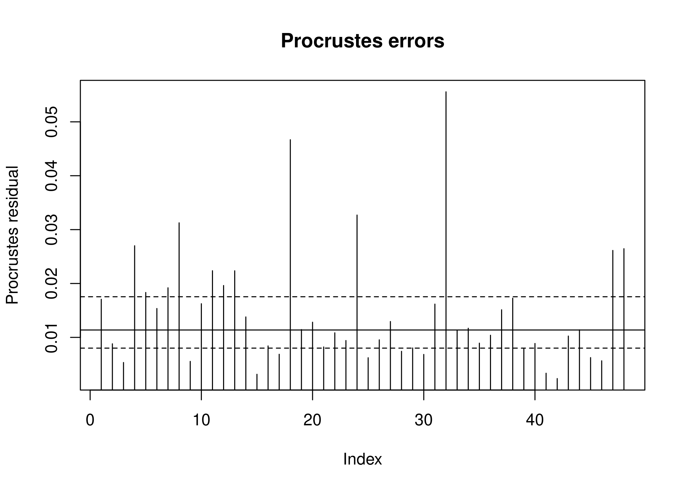<!-- -->

``` r
# Protest which is a permutational test of the significance of the procrustes result
  # based on the correlation from a symmetric Procrustes analysis
  # the order of X and Y makes no difference to the test of significance
proc_test <- protest(
  X = as.matrix(all_sites2[, c("Axis.1", "Axis.2")]),
  Y = as.matrix(mt_only_sites2[, c("Axis.1", "Axis.2")]),
  permutations = 9999)
proc_test
```

```
## 
## Call:
## protest(X = as.matrix(all_sites2[, c("Axis.1", "Axis.2")]), Y = as.matrix(mt_only_sites2[,      c("Axis.1", "Axis.2")]), permutations = 9999) 
## 
## Procrustes Sum of Squares (m12 squared):        0.001626 
## Correlation in a symmetric Procrustes rotation: 0.9992 
## Significance:  1e-04 
## 
## Permutation: free
## Number of permutations: 9999
```

``` r
# procrustest sum of squares (m12 squared): 0.001626 --> 0 is perfect overlap, points are nearly identical 
  # This statistic measures the total mismatch between the two ordinations after optimal rotation and scaling

# Correlation in a symmetric Procrustes rotation: 0.9992 --> insanely high correlation meaning water column is predominately driven by methanotrophs NOT methanogens which makes sense


###### Mantel's Test ######
# Calculate Bray–Curtis distances
dist_all <- phyloseq::distance(water_ch4_cyclers_physeq, method = "bray")

dist_mt_only <- phyloseq::distance(water_methanotrophs_physeq, method = "bray")

# Convert to matrices
dist_all_mat <- as.matrix(dist_all)
dist_mt_only_mat  <- as.matrix(dist_mt_only)

# Find shared samples
shared_ids <- intersect(rownames(dist_all_mat),
                        rownames(dist_mt_only_mat))

# Ensure all samples match and are in the same order
dist_all_mat <- dist_all_mat[shared_ids, shared_ids]
dist_mt_only_mat  <- dist_mt_only_mat[shared_ids, shared_ids]

# Intuition check to make sure everything matches
identical(rownames(dist_all_mat), rownames(dist_mt_only_mat))
```

```
## [1] TRUE
```

``` r
# Run Mantel test
mantel_res <- mantel(xdis = dist_all_mat,
                     ydis = dist_mt_only_mat,
                     method = "spearman", # try out spearman first which is recommended for ecological distances
                     permutations = 9999)

mantel_res # mantel statistic r = 0.9959 indicating perfect correspondence and is statistically significant 
```

```
## 
## Mantel statistic based on Spearman's rank correlation rho 
## 
## Call:
## mantel(xdis = dist_all_mat, ydis = dist_mt_only_mat, method = "spearman",      permutations = 9999) 
## 
## Mantel statistic r: 0.9959 
##       Significance: 1e-04 
## 
## Upper quantiles of permutations (null model):
##    90%    95%  97.5%    99% 
## 0.0888 0.1154 0.1397 0.1693 
## Permutation: free
## Number of permutations: 9999
```

``` r
# mantel statistic r (0 = no relationship; 1 = perfect correspondence)
```

## Sediment Methanogens
We want to see who is structuring the community within the sediments. In water column it is clearer that methanotrophs are, but what about in sediment communities?

``` r
# first lets filter our sed_ch4_cycler_physeq for methanogen or methanotroph
sed_methanogens_physeq <- subset_taxa(sed_ch4_cyclers_physeq, CH4_Cycler == "Methanogen") %>% 
  prune_taxa(taxa_sums(.) > 0, .) # 150 ASVs


# 1. methanogens

# Calculate Bray-Curtis Dissimilarity 
sed_methanogens_BC_pcoa <- 
  ordinate(
    physeq = sed_methanogens_physeq,
    method = "PCoA",
    distance = "bray", 
    binary = FALSE
  )

## NEW PLOT 
#### Grab the data for the plot 
sed_methanogen_ord_df <- 
  plot_ordination(
  physeq = sed_methanogens_physeq,
  ordination = sed_methanogens_BC_pcoa,
  color = "solar_progress",
  shape = "Pond",
  justDF = TRUE)

# now lets mutate the columns
sed_methanogen_ord_df <- sed_methanogen_ord_df %>% 
dplyr::mutate(
    solar_progress = recode(solar_progress, "FPV" = "FPV", "No FPV" = "Open")) # solar progress


### Now, plot Figure S3: SEDIMENT METHANOGENS 
figS3_sed_methanogens_pcoa <- 
  ggplot(data = sed_methanogen_ord_df, 
       aes(x = Axis.1, 
           y = Axis.2,
           color = solar_progress,
           shape = Pond)) + 
  geom_point(size = 3, alpha = 0.8, stroke = 0.8) +
  scale_shape_manual(values = pond_shapes) + 
  scale_color_manual(values = solar_colors) +
  labs(color = "Treatment",
       shape = "Pond",
       x = "Axis.1 [33.3%]",
       y = "Axis.2 [17.7%]",
       title = "Sediment Methanogens") + 
  guides(
    color = guide_legend(
      title.position = "top",
      title.hjust = 0.5,
      override.aes = list(size = 2.5)),
    shape = guide_legend(
      nrow = 2,
      byrow = TRUE,
      title.position = "top",
      title.hjust = 0.5,
      override.aes = list(size = 2.5))
  ) +
  theme_classic() +
  theme(legend.position = "bottom",
        #legend.spacing = unit(0, "cm"),
        legend.box.background = element_blank(),
        legend.title = element_text(size = 8),
        legend.text = element_text(size = 8),
        plot.title = element_text(hjust = 0.5, size = 9, colour = "black"),
        axis.text.x = element_text(size = 8, colour = "black"),
        axis.text.y = element_text(size = 8, colour = "black"),
        axis.title.x = element_text(size = 8, colour = "black"),
        axis.title.y = element_text(size = 8, colour = "black"))

# Show the plot
figS3_sed_methanogens_pcoa
```

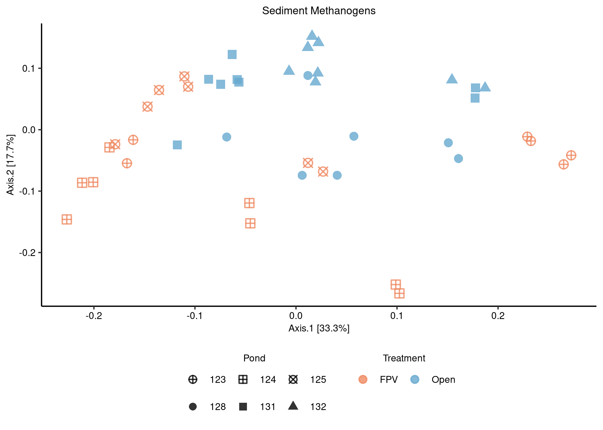<!-- -->

``` r
figS1A_sed_methanogens_pcoaold <-
  plot_ordination(
  physeq = sed_methanogens_physeq,
  ordination = sed_methanogens_BC_pcoa,
  color = "solar_progress",
  shape = "Pond",
  title = "Sediment Methane Cyclers") +
  geom_point(size = 5, alpha = 0.5,
             aes(color = solar_progress, fill = solar_progress, shape = Pond)) +
  scale_color_manual(values = solar_colors) +
  scale_fill_manual(values = solar_colors) +
  scale_shape_manual(values = pond_shapes) +
  guides(color = "none",
         fill = "none",
         shape = "none") +
  theme_classic()
  # theme(
  # legend.position = c(0.82, 0.01),  # inside bottom-left
  # legend.justification = c(0, 0),  # anchor the legend's top-left corner there
  # legend.spacing = unit(0.1, "cm"),
  # legend.background = element_rect(color = NA, fill = NA),
  # legend.box.background = element_rect(size = 0.1, linetype = "solid", color = "black"),
  # legend.text = element_text(size = 6),
  # legend.margin = margin(2, 2, 2, 2))
figS1A_sed_methanogens_pcoaold
```

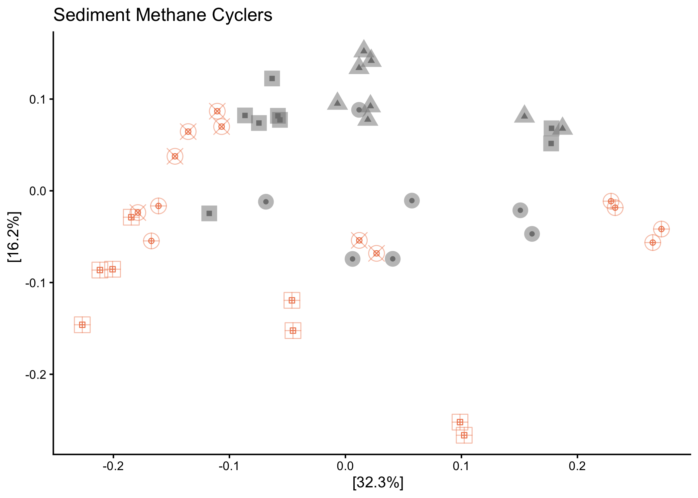<!-- -->


## Sediment Methanotrophs


``` r
# first lets filter our sed_ch4_cycler_physeq for methanogen or methanotroph
sed_methanotrophs_physeq <- subset_taxa(sed_ch4_cyclers_physeq, CH4_Cycler == "Methanotroph") %>% 
  prune_taxa(taxa_sums(.) > 0, .) # 197 ASVs

# 2. methanotrophs

# Calculate Bray-Curtis Dissimilarity 
sed_methanotroph_BC_pcoa <- 
  ordinate(
    physeq = sed_methanotrophs_physeq,
    method = "PCoA",
    distance = "bray", 
    binary = FALSE
  )


## NEW PLOT 
#### Grab the data for the plot 
sed_methanotroph_ord_df <- 
  plot_ordination(
  physeq = sed_methanotrophs_physeq,
  ordination = sed_methanotroph_BC_pcoa,
  color = "solar_progress",
  shape = "Pond",
  justDF = TRUE)

# now lets mutate the columns
sed_methanotroph_ord_df <- sed_methanotroph_ord_df %>% 
dplyr::mutate(
    solar_progress = recode(solar_progress, "FPV" = "FPV", "No FPV" = "Open")) # solar progress


### Now, plot Figure S1B: SEDIMENT METHANOTROPHS 
figS3_sed_methanotroph_pcoa <- 
  ggplot(data = sed_methanotroph_ord_df, 
       aes(x = Axis.1, 
           y = Axis.2,
           color = solar_progress,
           shape = Pond)) + 
  geom_point(size = 3, alpha = 0.8, stroke = 0.8) +
  scale_shape_manual(values = pond_shapes) + 
  scale_color_manual(values = solar_colors) +
  labs(color = "Treatment",
       shape = "Pond",
       x = "Axis.1 [36.1%]",
       y = "Axis.2 [15.4%]",
       title = "Sediment Methanotrophs") + 
  guides(
    color = guide_legend(
      title.position = "top",
      title.hjust = 0.5,
      override.aes = list(size = 2.5)),
    shape = guide_legend(
      nrow = 2,
      byrow = TRUE,
      title.position = "top",
      title.hjust = 0.5,
      override.aes = list(size = 2.5))
  ) +
  theme_classic() +
  theme(legend.position = "bottom",
        #legend.spacing = unit(0, "cm"),
        legend.box.background = element_blank(),
        legend.title = element_text(size = 8),
        legend.text = element_text(size = 8),
        plot.title = element_text(hjust = 0.5, size = 9, colour = "black"),
        axis.text.x = element_text(size = 8, colour = "black"),
        axis.text.y = element_text(size = 8, colour = "black"),
        axis.title.x = element_text(size = 8, colour = "black"),
        axis.title.y = element_text(size = 8, colour = "black"))


# Show the plot
figS3_sed_methanotroph_pcoa
```

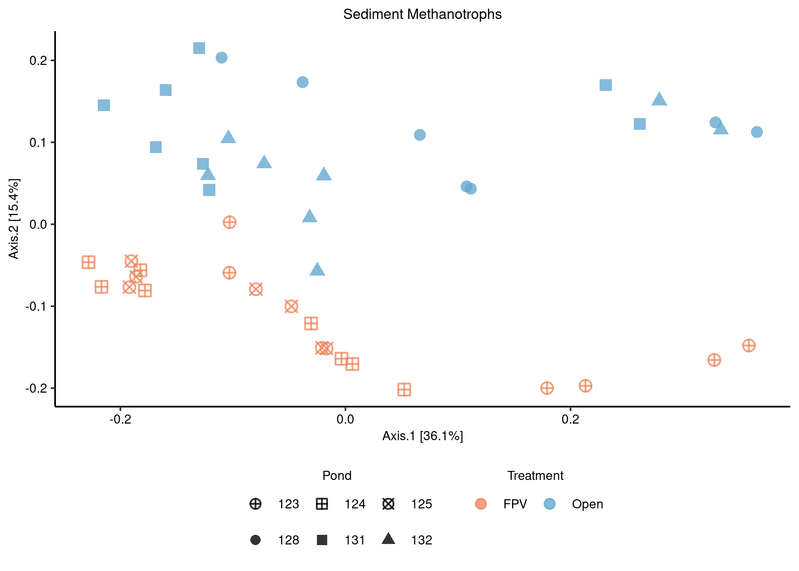<!-- -->

``` r
# PCoA of sediments color by treatment shaped by pond
s2b_sed_troph <- plot_ordination(
  physeq = sed_methanotrophs_physeq,
  ordination = sed_methanotroph_BC_pcoa,
  color = "solar_progress",
  shape = "Pond",
  title = "Sediment Methanotrophs") +
  geom_point(size = 5, alpha = 0.5, aes(color = solar_progress, fill = solar_progress, shape = Pond)) +
  scale_color_manual(values = solar_colors) +
  scale_fill_manual(values = solar_colors) +
  scale_shape_manual(values = pond_shapes) +
  guides(color = "none",
         fill = "none",
         shape = "none")+
  theme_classic()
s2b_sed_troph
```

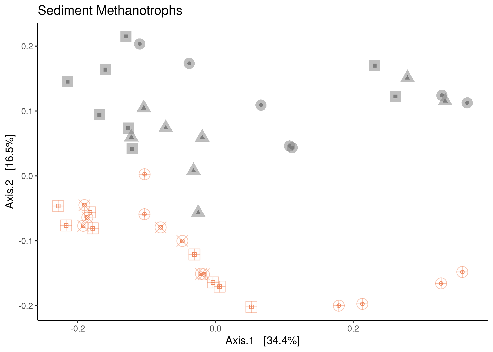<!-- -->


## Save Fig S3


``` r
# extract legend 
leg <- cowplot::get_legend(
  figS3_sed_methanogens_pcoa +
    scale_color_manual(values = solar_colors, breaks = c("FPV", "Open")) +
    guides(
      color = guide_legend(title.hjust = 0.5, nrow = 1, byrow = TRUE,override.aes = list(size = 2.5)),  # horizontal Treatment
      shape = guide_legend(title.hjust = 0.5, nrow = 2, byrow = TRUE, override.aes = list(size = 2.5))   # optional
    ) +
    theme(#legend.key.size = unit(0.4, "cm"), 
          #legend.spacing.x = unit(0.7, "cm"),
          #legend.margin = margin(t = -5, unit = "pt"),
          legend.position = "right", 
          legend.box = "vertical",
          legend.box.just = "center"))

leg_plot <- wrap_elements(leg) 


# edit individual figures
pA <- figS3B_water_methanotroph_pcoa +
  labs(tag = "A.") +
  theme(legend.position = "none",
        plot.title = element_text(margin = margin(b = 0)))

pC <- figS3_sed_methanotroph_pcoa +
  labs(tag = "B.") +
  theme(legend.position = "none",
        plot.title = element_text(margin = margin(b = 0)))

pD <- figS3_sed_methanogens_pcoa +
  labs(tag = "C.") +
  theme(legend.position = "none",
        plot.title = element_text(margin = margin(b = 0)))

# plot together
plot_figS3 <-
  (pA + leg_plot) / (pC + pD) +
  plot_layout(widths = c(1, 1)) &
  theme(
    plot.tag = element_text(size = 8, colour = "black"))
plot_figS3
```

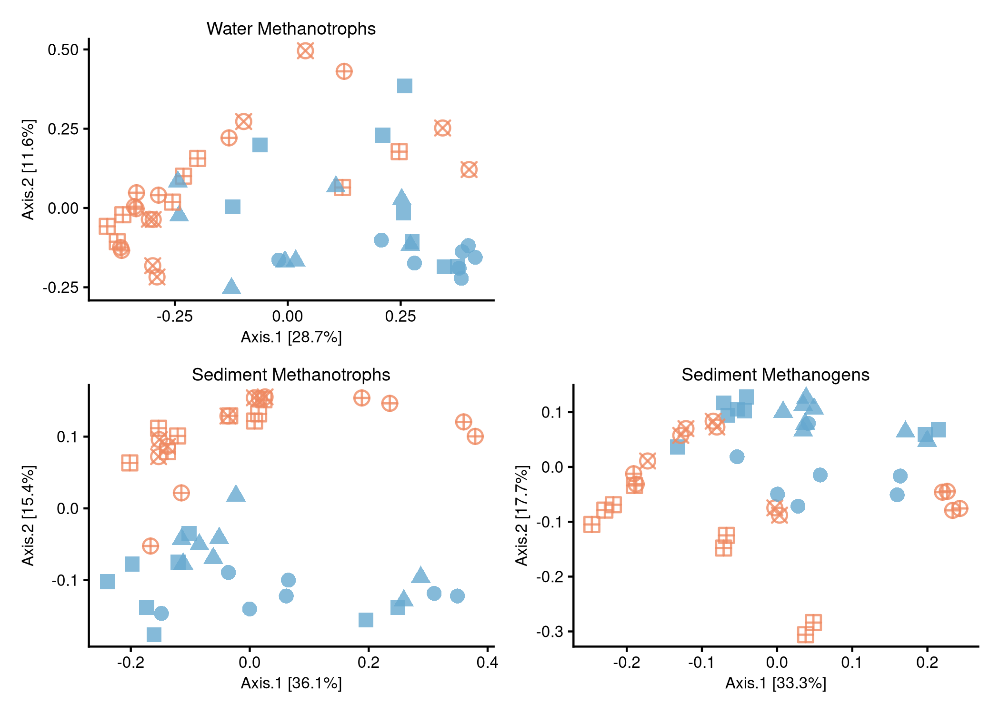<!-- -->

``` r
# Now, actually save the plot   
ggsave(plot_figS3, width = 6.5, height = 4.5, dpi = 300,
        filename = "figures/Fig_S3/Fig_S3.png")
```

Sediment samples are still distinct from other and separate along first axis

## Fig S3: PERMANOVA 

PERMANOVA (Permutational Multivariate Analysis of Variance) is a non-parametric, permutation-based test used to compare groups of objects based on a distance matrix. The goal is to test the null hypothesis that the centroids and dispersion of groups are equivalent in the space defined by the dissimilarity measure. 

### Water Methanotrophs

### Sediment Methanogens

Here we are performing a PERMANOVA on the sediment methanogen and methanotrophs

``` r
#1. methanogen
# calculate Bray-Curtis PERMANOVA using phyloseq distance
sed_gen_bray <- phyloseq::distance(sed_methanogens_physeq, method = "bray", binary = FALSE)


# pull out metadata 
sed_methanogens_metadata <- sed_methanogens_physeq %>%
  sample_data() %>%
  data.frame()

# Permutational Multivariate Analysis of Variance Using Distance Matrices
# aka PERMANOVA using the adonis2 function from vegan 


#1. Test the individual terms for significance
# Testing if the centroids of solar progress are different: significant p = 0.001 ***
adonis2(sed_gen_bray ~ solar_progress, 
        data = sed_methanogens_metadata, by = "terms")
```

```
## Permutation test for adonis under reduced model
## Terms added sequentially (first to last)
## Permutation: free
## Number of permutations: 999
## 
## adonis2(formula = sed_gen_bray ~ solar_progress, data = sed_methanogens_metadata, by = "terms")
##                Df SumOfSqs      R2      F Pr(>F)    
## solar_progress  1  0.33513 0.13516 6.5641  0.001 ***
## Residual       42  2.14430 0.86484                  
## Total          43  2.47943 1.00000                  
## ---
## Signif. codes:  0 '***' 0.001 '**' 0.01 '*' 0.05 '.' 0.1 ' ' 1
```

``` r
# Does pond matter? significant p = 0.001 ***
adonis2(sed_gen_bray ~ Pond, 
        data = sed_methanogens_metadata, by = "terms")
```

```
## Permutation test for adonis under reduced model
## Terms added sequentially (first to last)
## Permutation: free
## Number of permutations: 999
## 
## adonis2(formula = sed_gen_bray ~ Pond, data = sed_methanogens_metadata, by = "terms")
##          Df SumOfSqs      R2      F Pr(>F)    
## Pond      5   1.0921 0.44047 5.9828  0.001 ***
## Residual 38   1.3873 0.55953                  
## Total    43   2.4794 1.00000                  
## ---
## Signif. codes:  0 '***' 0.001 '**' 0.01 '*' 0.05 '.' 0.1 ' ' 1
```

``` r
# Does date matter? significant p = 0.001 ***
adonis2(sed_gen_bray ~ as.factor(JDate), 
        data = sed_methanogens_metadata, by = "terms")
```

```
## Permutation test for adonis under reduced model
## Terms added sequentially (first to last)
## Permutation: free
## Number of permutations: 999
## 
## adonis2(formula = sed_gen_bray ~ as.factor(JDate), data = sed_methanogens_metadata, by = "terms")
##                  Df SumOfSqs      R2      F Pr(>F)    
## as.factor(JDate)  3  0.55555 0.22406 3.8502  0.001 ***
## Residual         40  1.92389 0.77594                  
## Total            43  2.47943 1.00000                  
## ---
## Signif. codes:  0 '***' 0.001 '**' 0.01 '*' 0.05 '.' 0.1 ' ' 1
```

``` r
#2. Test the terms together
# Now lets see the effect of each pond by date_collected and solar progress
sed_methanogens_permanova <- 
  adonis2(sed_gen_bray ~ solar_progress * Pond * JDate, 
          data = sed_methanogens_metadata, by = "terms");

# Show the results! 
sed_methanogens_permanova
```

```
## Permutation test for adonis under reduced model
## Terms added sequentially (first to last)
## Permutation: free
## Number of permutations: 999
## 
## adonis2(formula = sed_gen_bray ~ solar_progress * Pond * JDate, data = sed_methanogens_metadata, by = "terms")
##                      Df SumOfSqs      R2       F Pr(>F)    
## solar_progress        1  0.33513 0.13516 12.4010  0.001 ***
## Pond                  4  0.75699 0.30531  7.0028  0.001 ***
## JDate                 1  0.24335 0.09815  9.0049  0.001 ***
## solar_progress:JDate  1  0.08262 0.03332  3.0574  0.012 *  
## Pond:JDate            4  0.19656 0.07928  1.8184  0.016 *  
## Residual             32  0.86478 0.34878                   
## Total                43  2.47943 1.00000                   
## ---
## Signif. codes:  0 '***' 0.001 '**' 0.01 '*' 0.05 '.' 0.1 ' ' 1
```

### Sediment Methanotrophs


``` r
#1. methanotrophs
# calculate Bray-Curtis PERMANOVA using phyloseq distance
sed_troph_bray <- phyloseq::distance(sed_methanotrophs_physeq, 
                     method = "bray", binary = FALSE)

# pull out metadata 
sed_methanotrophs_metadata <- sed_methanotrophs_physeq %>%
  sample_data() %>%
  data.frame()

# Permutational Multivariate Analysis of Variance Using Distance Matrices
# aka PERMANOVA using the adonis2 function from vegan 


#1. Test the individual terms for significance
# Testing if the centroids of solar progress are different: significant p = 0.002 **
adonis2(sed_troph_bray ~ solar_progress, 
        data = sed_methanotrophs_metadata, by = "terms")
```

```
## Permutation test for adonis under reduced model
## Terms added sequentially (first to last)
## Permutation: free
## Number of permutations: 999
## 
## adonis2(formula = sed_troph_bray ~ solar_progress, data = sed_methanotrophs_metadata, by = "terms")
##                Df SumOfSqs      R2      F Pr(>F)    
## solar_progress  1   0.4677 0.13085 6.3233  0.001 ***
## Residual       42   3.1064 0.86915                  
## Total          43   3.5741 1.00000                  
## ---
## Signif. codes:  0 '***' 0.001 '**' 0.01 '*' 0.05 '.' 0.1 ' ' 1
```

``` r
# Does pond matter? significant p = 0.001 ***
adonis2(sed_troph_bray ~ Pond, 
        data = sed_methanotrophs_metadata, by = "terms")
```

```
## Permutation test for adonis under reduced model
## Terms added sequentially (first to last)
## Permutation: free
## Number of permutations: 999
## 
## adonis2(formula = sed_troph_bray ~ Pond, data = sed_methanotrophs_metadata, by = "terms")
##          Df SumOfSqs      R2      F Pr(>F)    
## Pond      5   1.2923 0.36158 4.3044  0.001 ***
## Residual 38   2.2818 0.63842                  
## Total    43   3.5741 1.00000                  
## ---
## Signif. codes:  0 '***' 0.001 '**' 0.01 '*' 0.05 '.' 0.1 ' ' 1
```

``` r
# Does date matter? significant p = 0.001 ***
adonis2(sed_troph_bray ~ as.factor(JDate), 
        data = sed_methanotrophs_metadata, by = "terms")
```

```
## Permutation test for adonis under reduced model
## Terms added sequentially (first to last)
## Permutation: free
## Number of permutations: 999
## 
## adonis2(formula = sed_troph_bray ~ as.factor(JDate), data = sed_methanotrophs_metadata, by = "terms")
##                  Df SumOfSqs      R2      F Pr(>F)    
## as.factor(JDate)  3   0.9148 0.25596 4.5868  0.001 ***
## Residual         40   2.6593 0.74404                  
## Total            43   3.5741 1.00000                  
## ---
## Signif. codes:  0 '***' 0.001 '**' 0.01 '*' 0.05 '.' 0.1 ' ' 1
```

``` r
#2. Test the terms together
# Now lets see the effect of each pond by date_collected and solar progress
sed_methanotrophs_permanova <- 
  adonis2(sed_troph_bray ~ solar_progress * Pond * JDate, 
        data = sed_methanotrophs_metadata, by = "terms")

# Show the results! 
sed_methanotrophs_permanova
```

```
## Permutation test for adonis under reduced model
## Terms added sequentially (first to last)
## Permutation: free
## Number of permutations: 999
## 
## adonis2(formula = sed_troph_bray ~ solar_progress * Pond * JDate, data = sed_methanotrophs_metadata, by = "terms")
##                      Df SumOfSqs      R2       F Pr(>F)    
## solar_progress        1   0.4677 0.13085 10.5132  0.001 ***
## Pond                  4   0.8246 0.23072  4.6343  0.001 ***
## JDate                 1   0.4746 0.13279 10.6688  0.001 ***
## solar_progress:JDate  1   0.0707 0.01977  1.5884  0.126    
## Pond:JDate            4   0.3130 0.08757  1.7589  0.018 *  
## Residual             32   1.4235 0.39829                   
## Total                43   3.5741 1.00000                   
## ---
## Signif. codes:  0 '***' 0.001 '**' 0.01 '*' 0.05 '.' 0.1 ' ' 1
```
**Water Methanotrophs**

**Sed Methanogens**
With our PERMANOVA we find that treatment (solar_progress), day of year sampled (JDate - Julian date), and Pond is significant 

Treatment explains 11.8% of the variance and has the largest effect size (F = 10.5) but pond explains the most variation, 28.2%, and contributes to the community but weaker than treatment (F = 6.22). JDate explains 9.0% of variation but is the second most important term for its weight contributing to structuring thet community. 

Solar progress and time explains 2.5% of the variation but is not a strong contributer to the community. Pond and time explais 10% of variation but has a smaller effect on community structure.

Together this explains 62% of the variation.

**Sed Methanotrophs**

With our PERMANOVA we see that Pond explains the most variance (20.4%) but does not have a strong effect on community structure (F = 3.9). There is a temporal effect along the first axis due to time that explains 13.1% of data and is a strong factor for shaping the community (F = 10.0). Treatment is important for explaining 10.1% of variance and is teh second most important factor for shaping the community which we kinda see along the second axis (F = 7.7)

The interactions of pond and date explain 9.7% of the variance but is not an important factor for shaping our community (F = 1.9). 

The interaction of solar treatment and pond is > 0.05 (p = 0.095) indicating that their interaction is not strong and important for shaping the community. while it does answer 2.2% of variation, it has the smallest effect size (F = 1.7) 

Together these variables explain 56% of the data

## Fig S3: Betadisper

### Water Methanotrophs

### Sediment Methanogens 

``` r
# 1. methanogens 
# Homogeneity of Disperson test with beta dispr

## Bray-Curtis
betadispr_sed_methanogens_pond <- 
  betadisper(sed_gen_bray, sed_methanogens_metadata$Pond)

betadispr_sed_methanogens_solar <- 
  betadisper(sed_gen_bray, sed_methanogens_metadata$solar_progress)

betadispr_sed_methanogens_JDate <- 
  betadisper(sed_gen_bray, sed_methanogens_metadata$JDate)

# permutest() performs a non-parametric permutation test, which is robust and valid for the kind of data used in beta diversity analysis (e.g., dissimilarity matrices).
permutest(betadispr_sed_methanogens_pond) # not significant p = 0.659
```

```
## 
## Permutation test for homogeneity of multivariate dispersions
## Permutation: free
## Number of permutations: 999
## 
## Response: Distances
##           Df   Sum Sq   Mean Sq     F N.Perm Pr(>F)
## Groups     5 0.029297 0.0058594 0.809    999  0.556
## Residuals 38 0.275224 0.0072427
```

``` r
permutest(betadispr_sed_methanogens_solar) # not significant p = 0.067
```

```
## 
## Permutation test for homogeneity of multivariate dispersions
## Permutation: free
## Number of permutations: 999
## 
## Response: Distances
##           Df  Sum Sq   Mean Sq     F N.Perm Pr(>F)
## Groups     1 0.00951 0.0095101 2.917    999  0.106
## Residuals 42 0.13693 0.0032602
```

``` r
permutest(betadispr_sed_methanogens_JDate) # not significant p = 0.44
```

```
## 
## Permutation test for homogeneity of multivariate dispersions
## Permutation: free
## Number of permutations: 999
## 
## Response: Distances
##           Df   Sum Sq   Mean Sq      F N.Perm Pr(>F)
## Groups     3 0.006703 0.0022343 1.0343    999  0.414
## Residuals 40 0.086412 0.0021603
```

### Sediment Methanotrophs

``` r
# 2. methanotrophs 
# Homogeneity of Disperson test with beta dispr

## Bray-Curtis
betadispr_sed_methanotrophs_pond <- 
  betadisper(sed_troph_bray, sed_methanotrophs_metadata$Pond)

betadispr_sed_methanotrophs_solar <- 
  betadisper(sed_troph_bray, sed_methanotrophs_metadata$solar_progress)

betadispr_sed_methanotrophs_JDate <-
  betadisper(sed_troph_bray, sed_methanotrophs_metadata$JDate)


# permutest() performs a non-parametric permutation test, which is robust and valid for the kind of data used in beta diversity analysis (e.g., dissimilarity matrices).
permutest(betadispr_sed_methanotrophs_pond) # not significant p = 0.515
```

```
## 
## Permutation test for homogeneity of multivariate dispersions
## Permutation: free
## Number of permutations: 999
## 
## Response: Distances
##           Df  Sum Sq   Mean Sq      F N.Perm Pr(>F)
## Groups     5 0.03100 0.0062006 0.7229    999  0.603
## Residuals 38 0.32593 0.0085771
```

``` r
permutest(betadispr_sed_methanotrophs_solar) # not significant p = 0.682
```

```
## 
## Permutation test for homogeneity of multivariate dispersions
## Permutation: free
## Number of permutations: 999
## 
## Response: Distances
##           Df   Sum Sq   Mean Sq      F N.Perm Pr(>F)
## Groups     1 0.000028 0.0000282 0.0043    999  0.936
## Residuals 42 0.274034 0.0065246
```

``` r
permutest(betadispr_sed_methanotrophs_JDate) # significant p = 0.011 *
```

```
## 
## Permutation test for homogeneity of multivariate dispersions
## Permutation: free
## Number of permutations: 999
## 
## Response: Distances
##           Df   Sum Sq   Mean Sq      F N.Perm Pr(>F)   
## Groups     3 0.031681 0.0105604 4.1329    999  0.009 **
## Residuals 40 0.102208 0.0025552                        
## ---
## Signif. codes:  0 '***' 0.001 '**' 0.01 '*' 0.05 '.' 0.1 ' ' 1
```
**Sediment Methanogens**
With betadispr we find the PERMANOVA results are are valid as pond, treatment, and date are not significant but significant in the PERMANOVA. Thus our PERMANOVA result is reliable and the differences between groups are due to location/centroids of groups rather than differences in variation within groups 

**Sediment Methanotrophs**
With betadispr we find the PERMANOVA results are are valid as pond and treatment are not significant but significant in the PERMANOVA. Thus our PERMANOVA result is reliable and the differences between groups are due to location/centroids of groups rather than differences in variation within groups 

However, date is statistically significant in PERMANOVA and in the betadispr indicating that theres variability in within the sampling dates so there are likely differences in community composition and probably heterogeneity over time. 


# Table S6 - Taxonomy Table
reformat later

``` r
# water
taxonomy_table <- tax_table(water_ch4_cyclers_physeq) %>% 
  as.data.frame() %>%
  tibble::rownames_to_column("OTU")

order_genus_summary <- taxonomy_table %>%
  group_by(Kingdom, Phylum, Class, Order, Family) %>%
  summarize(
    Genera = paste(sort(unique(Genus[!is.na(Genus)])), collapse = ", ")
  ) %>%
  arrange(Phylum, Class, Order, Family)
order_genus_summary
```

```
## # A tibble: 15 × 6
## # Groups:   Kingdom, Phylum, Class, Order [10]
##    Kingdom  Phylum                   Class               Order                    Family                   Genera                                                                                                                             
##    <chr>    <chr>                    <chr>               <chr>                    <chr>                    <chr>                                                                                                                              
##  1 Archaea  Halobacteriota           Methanocellia       Methanocellales          Methanocellaceae         "Methanocella_A"                                                                                                                   
##  2 Archaea  Halobacteriota           Methanomicrobia     Methanomicrobiales       Methanomicrobiaceae      ""                                                                                                                                 
##  3 Archaea  Halobacteriota           Methanomicrobia     Methanomicrobiales       Methanospirillaceae_2121 "Methanolinea_A, Methanoregula, UBA467"                                                                                            
##  4 Archaea  Halobacteriota           Methanomicrobia     Methanomicrobiales       Methanospirillaceae_2125 "Methanospirillum"                                                                                                                 
##  5 Archaea  Halobacteriota           Methanosarcinia     Methanosarcinales_A_2632 Methanosarcinaceae       "Methanosarcina_2619"                                                                                                              
##  6 Archaea  Halobacteriota           Methanosarcinia     Methanotrichales         Methanotrichaceae        "Methanothrix_B"                                                                                                                   
##  7 Archaea  Methanobacteriota_A_1229 Methanobacteria     Methanobacteriales       Methanobacteriaceae      "Methanobacterium_A, Methanobacterium_B_963, Methanobacterium_D_1054, Methanobacterium_F_900, Methanobrevibacter_D, Methanosphaera"
##  8 Archaea  Methanobacteriota_B      Thermococci         Methanofastidiosales     Methanofastidiosaceae    "Methanofastidiosum"                                                                                                               
##  9 Bacteria Methylomirabilota        Methylomirabilia    Methylomirabilales       2-02-FULL-66-22          "2-02-FULL-66-22"                                                                                                                  
## 10 Bacteria Pseudomonadota           Alphaproteobacteria Rhizobiales_505101       Beijerinckiaceae         "Methylocystis, Methylosinus"                                                                                                      
## 11 Bacteria Pseudomonadota           Gammaproteobacteria Methylococcales          Methylococcaceae         "Methylococcus, Methylomagnum, Methyloparacoccus, Methyloterricola, Methylotetracoccus, UBA6136"                                   
## 12 Bacteria Pseudomonadota           Gammaproteobacteria Methylococcales          Methylomonadaceae        "Crenothrix, Methylobacter_C_601048, Methylobacter_C_601751, Methyloglobulus, Methylomonas, Methylosoma, Methylovulum, UBA4132"    
## 13 Archaea  Thermoplasmatota         Thermoplasmata_1773 Methanomassiliicoccales  Methanomassiliicoccaceae "Methanomassiliicoccus_A_1624"                                                                                                     
## 14 Archaea  Thermoplasmatota         Thermoplasmata_1773 Methanomassiliicoccales  Methanomethylophilaceae  ""                                                                                                                                 
## 15 Archaea  Thermoplasmatota         Thermoplasmata_1773 Methanomassiliicoccales  UBA472                   "FEN-33"
```

``` r
# sediment

taxonomy_table_s <- tax_table(sed_ch4_cyclers_physeq) %>% 
  as.data.frame() %>%
  tibble::rownames_to_column("OTU")

order_genus_summary_s <- taxonomy_table_s %>%
  group_by(Kingdom, Phylum, Class, Order, Family) %>%
  summarize(
    Genera = paste(sort(unique(Genus[!is.na(Genus)])), collapse = ", ")
  ) %>%
  arrange(Phylum, Class, Order, Family)
order_genus_summary_s
```

```
## # A tibble: 15 × 6
## # Groups:   Kingdom, Phylum, Class, Order [10]
##    Kingdom  Phylum                   Class               Order                    Family                   Genera                                                                                                                                         
##    <chr>    <chr>                    <chr>               <chr>                    <chr>                    <chr>                                                                                                                                          
##  1 Archaea  Halobacteriota           Methanocellia       Methanocellales          Methanocellaceae         "Methanocella_A"                                                                                                                               
##  2 Archaea  Halobacteriota           Methanomicrobia     Methanomicrobiales       Methanomicrobiaceae      ""                                                                                                                                             
##  3 Archaea  Halobacteriota           Methanomicrobia     Methanomicrobiales       Methanospirillaceae_2121 "Methanolinea_A, Methanolinea_B, Methanoregula, UBA288, UBA467"                                                                                
##  4 Archaea  Halobacteriota           Methanomicrobia     Methanomicrobiales       Methanospirillaceae_2125 "Methanospirillum"                                                                                                                             
##  5 Archaea  Halobacteriota           Methanosarcinia     Methanosarcinales_A_2632 Methanoperedenaceae      "Methanoperedens_A"                                                                                                                            
##  6 Archaea  Halobacteriota           Methanosarcinia     Methanosarcinales_A_2632 Methanosarcinaceae       "Methanomethylovorans, Methanosarcina_2619"                                                                                                    
##  7 Archaea  Halobacteriota           Methanosarcinia     Methanotrichales         Methanotrichaceae        "Methanothrix_B"                                                                                                                               
##  8 Archaea  Methanobacteriota_A_1229 Methanobacteria     Methanobacteriales       Methanobacteriaceae      "Methanobacterium_A, Methanobacterium_B_963, Methanobacterium_C, Methanobacterium_D_1054, Methanobacterium_F_896, Methanobacterium_F_900, Meth…
##  9 Bacteria Methylomirabilota        Methylomirabilia    Methylomirabilales       2-02-FULL-66-22          "2-02-FULL-66-22"                                                                                                                              
## 10 Bacteria Pseudomonadota           Alphaproteobacteria Rhizobiales_505101       Beijerinckiaceae         "Methylocystis"                                                                                                                                
## 11 Bacteria Pseudomonadota           Gammaproteobacteria Methylococcales          Methylococcaceae         "Methylocaldum, Methylococcus, Methylomagnum, Methyloparacoccus, Methyloterricola, Methylotetracoccus"                                         
## 12 Bacteria Pseudomonadota           Gammaproteobacteria Methylococcales          Methylomonadaceae        "Crenothrix, Methylobacter_C_601048, Methylobacter_C_601751, Methyloglobulus, Methylomonas, Methylosoma, UBA4132"                              
## 13 Archaea  Thermoplasmatota         Thermoplasmata_1773 Methanomassiliicoccales  Methanomassiliicoccaceae "Methanomassiliicoccus_A_1624"                                                                                                                 
## 14 Archaea  Thermoplasmatota         Thermoplasmata_1773 Methanomassiliicoccales  UBA472                   "FEN-33"                                                                                                                                       
## 15 Archaea  Thermoproteota           Methanomethylicia   Methanomethylicales      Methanomethylicaceae     "Methanomethylicus"
```


# Bonus code
# Plot DO vs Methanotroph Abundance Dynamics
1. Plot DO dynamics over 2024 sampling season.
2. Plot methanotroph abundances overtime.
  - first we will plot all methanotrophs (gammaproteobacterial and alphaproteobacterial) abundances overtime
  - filter for gammaproteobacterial and alphaproteobacterial methanotroph abundances
      - gammaproteobacterial (historically named type I methanotrophs) dominate the system but curious about alphaproteobacterial (historically type II) abundance and NC10 that are anaerobic methane oxidizers
        - note the designation type I and type II are just historical names at this point!

3. Then we will plot all water column methanotrophs against DO concentrations. Could separate this further by gamma and alphaproteobacterial methanotrophs but wont be doing that now.

``` r
# load metadata with DO concentrations, could also plot as DO % saturation
load("data/00_load_data/chem_metadata_23_24.RData")

# load in water_ch4_cycler_df data frame before we manipulated it when we calculated normality
load("data/01_phyloseq/water_ch4_cyclers_df.RData")

# set levels
water_ch4_cyclers_df$solar_progress <- factor(
  water_ch4_cyclers_df$solar_progress,
  levels = c("FPV", "Open"))

# factor depth
water_ch4_cyclers_df$Depth_Class <- factor(
  water_ch4_cyclers_df$Depth_Class,
  levels = c("Surface Water", "Bottom Water"))

# rename df to preserver abundance data whcih we will calculate below 
water_ch4_cyclers_df_dynamics <- water_ch4_cyclers_df

# now add interaction column to our df for temporal dynamics old code im not ready to delete
# water_ch4_cyclers_df_dynamics <- water_ch4_cyclers_df %>%
#   mutate(group = interaction(CH4_Cycler, Depth_Class, sep = " ")) %>% 
#   group_by(Pond, solar_progress, Depth_Class, group, JDate, CH4_Cycler, DNA_ID) %>%
#   summarise(
#     total_abundance = sum(Abundance, na.rm = TRUE), # total abundance across all samples
#     .groups = "drop"
#   )

# join with chem metadata with abundance data for temporal dynamics
do_abundance <- left_join(water_ch4_cyclers_df_dynamics, chem_metadata_23_24, by = "DNA_ID")

# 1. plot DO mg/L overtime; can alternatively plot with DO % saturation
do_mgl <- do_abundance %>% 
  group_by(JDate.x, Pond.x, solar_progress.x, Depth_Class.x) %>% 
  summarise(avg_do = mean(HDO_mg.l, na.rm = TRUE), .groups = "drop") %>% 
  ggplot(aes(x = JDate.x,
             y = avg_do,
             color = solar_progress.x,
             fill = solar_progress.x,
             group = Pond.x,
             shape = Pond.x)) +
  geom_line(alpha = 0.1) +
  geom_smooth(aes(group = solar_progress.x), se = FALSE, linewidth = 1.4) +
  geom_point(alpha = 0.7) +
  scale_shape_manual(values = pond_shapes)+
  ggh4x::facet_wrap2(~Depth_Class.x)
do_mgl
```

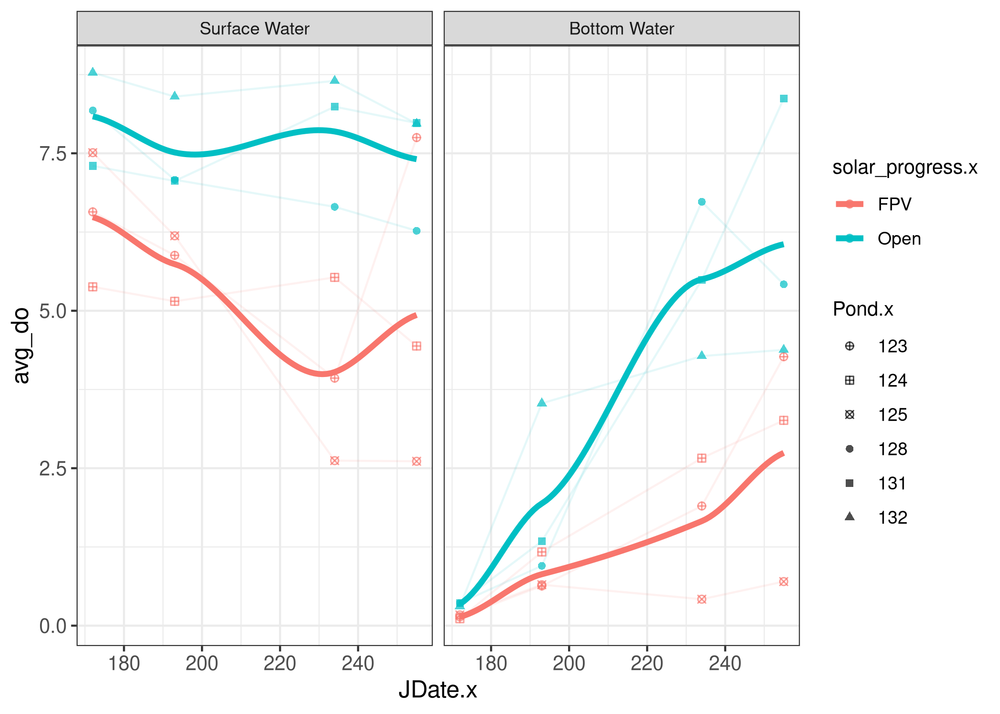<!-- -->

``` r
do_mgl_simple <- do_abundance %>% 
  group_by(JDate.x, Pond.x, solar_progress.x, Depth_Class.x) %>% 
  summarise(avg_do = mean(HDO_mg.l, na.rm = TRUE), .groups = "drop") %>% 
  ggplot(aes(x = JDate.x,
             y = avg_do,
             color = solar_progress.x,
             fill = solar_progress.x,
             group = Pond.x)) +
 # geom_line(alpha = 0.1) +
  geom_smooth(aes(group = solar_progress.x), se = FALSE, linewidth = 1.4) +
  geom_point(alpha = 0.3) +
  #scale_shape_manual(values = pond_shapes)+
  ggh4x::facet_wrap2(~Depth_Class.x) +
  labs(
    y = "Dissolved Oxygen (mg/L)",
    x = "Day of Year") +
  guides(
    color = guide_legend(title = "Treatment"),
    fill = "none") +
  theme_classic2()
do_mgl_simple
```

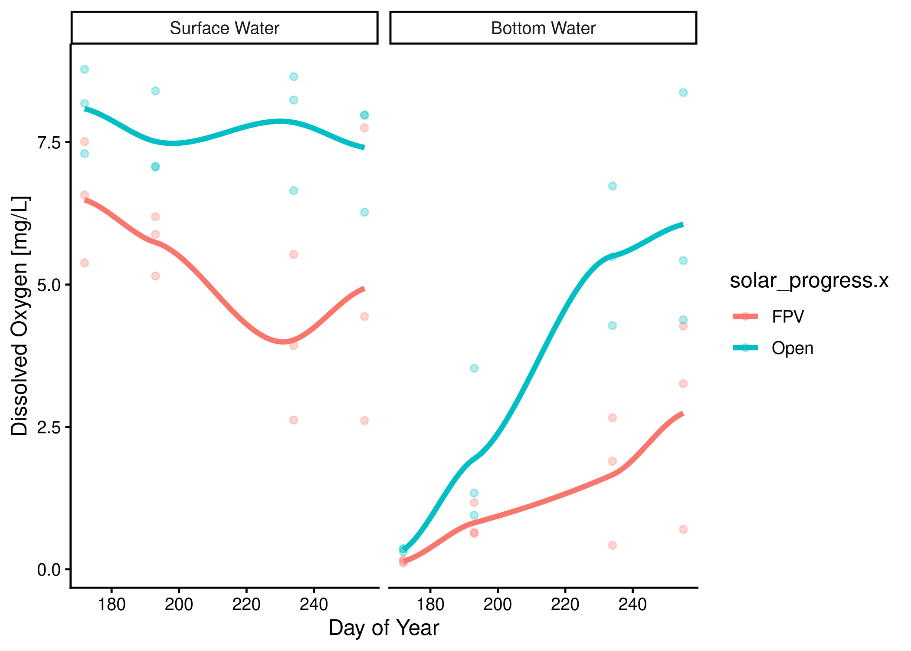<!-- -->

``` r
# 2. plot all methanotroph abundances overtime 
methanotroph_abundance <- do_abundance %>% 
  dplyr::filter(CH4_Cycler == "Methanotroph") %>% 
  group_by(JDate.x, Pond.x, solar_progress.x, Depth_Class.x, HDO_mg.l) %>% 
  summarise(
    total_abundance = sum(Abundance, na.rm = TRUE), # total across all samples
    .groups = "drop") %>% 
 # summarise(avg_do = mean(HDO_mg.l, na.rm = TRUE), .groups = "drop") %>% 
  ggplot(aes(x = JDate.x,
             y = total_abundance,
             color = solar_progress.x,
             fill = solar_progress.x)) +
  geom_line() +
  geom_point() +
  labs(title = "All Methanotrophs") +
  #geom_smooth(aes(group = solar_progress.x), se = FALSE, linewidth = 1.4) +
  ggh4x::facet_wrap2(~Depth_Class.x)
methanotroph_abundance
```

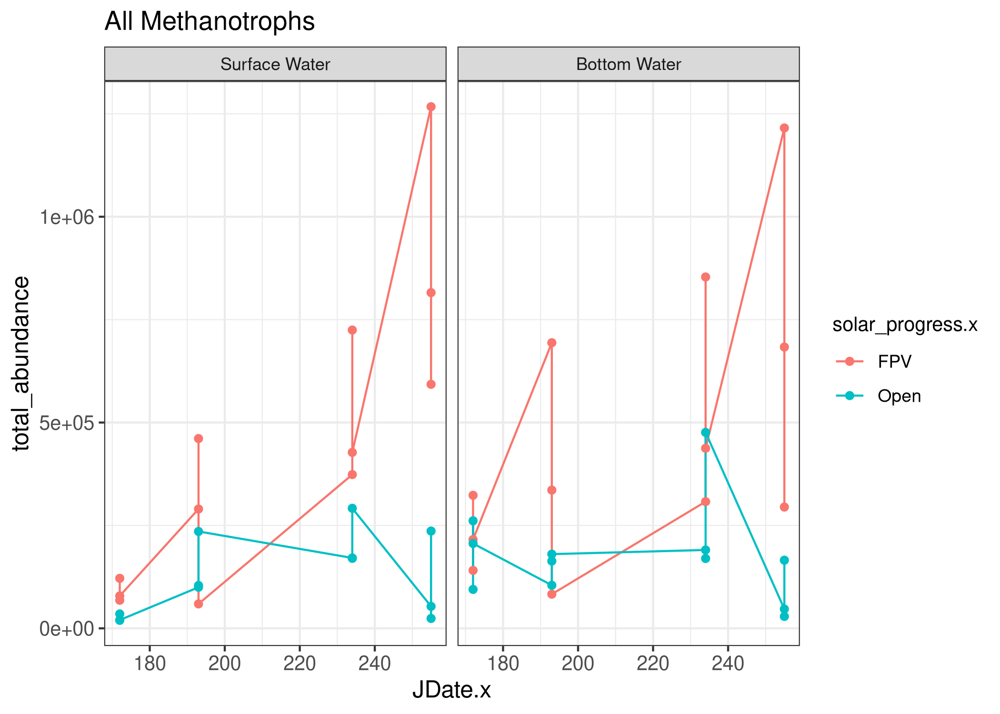<!-- -->

``` r
# 2 simple; still plot all methanotrophs, just make it simpler and not shape by pond
methanotroph_all_abund_simple <- do_abundance %>% 
  dplyr::filter(CH4_Cycler == "Methanotroph") %>% 
  group_by(JDate.x, Pond.x, solar_progress.x, Depth_Class.x) %>% 
  summarise(
    total_abundance = sum(Abundance, na.rm = TRUE), # total across all samples
    .groups = "drop") %>% 
 # summarise(avg_do = mean(HDO_mg.l, na.rm = TRUE), .groups = "drop") %>% 
  ggplot(aes(x = JDate.x,
             y = total_abundance,
             color = solar_progress.x,
             fill = solar_progress.x,
             group = Pond.x)) +
  #geom_line() +
  geom_smooth(aes(group = solar_progress.x), se = FALSE, linewidth = 1.4) +
  geom_point(alpha = 0.3) +
  labs(#title = "All Methanotroph Abundances",
       y = "Absolute Abundance (cells per ml)",
       x = "Day of Year") +
  guides(
    color = guide_legend(title = "Treatment"),
    fill = "none") +
  scale_y_continuous(labels = label_number(scale_cut = cut_short_scale(), accuracy = 1)) +
  ggh4x::facet_wrap2(~Depth_Class.x) +
  theme_classic2()
methanotroph_all_abund_simple
```

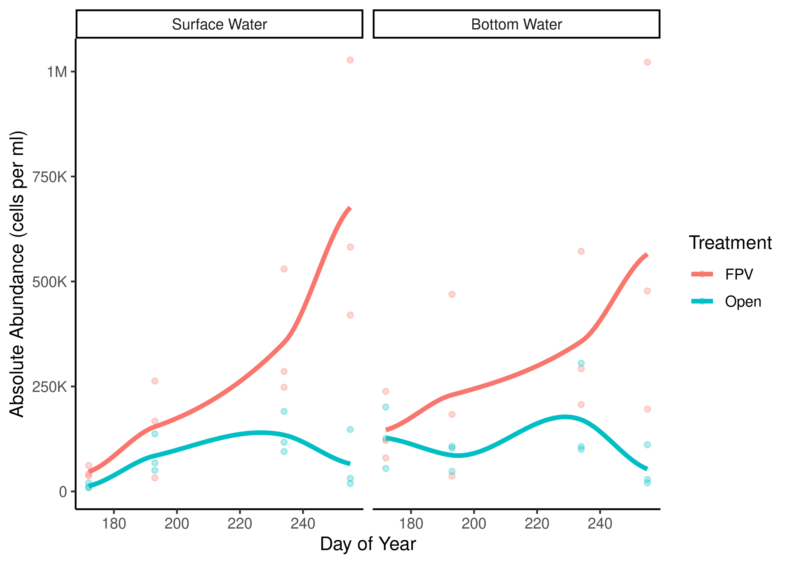<!-- -->

``` r
# 2a. plot only gammaproteobacterial methanotroph abundances overtime 
gamma_mob_abundance <- do_abundance %>% 
  dplyr::filter(CH4_Cycler == "Methanotroph" & Class == "Gammaproteobacteria") %>% 
  group_by(JDate.x, Pond.x, solar_progress.x, Depth_Class.x) %>% 
  summarise(
    total_abundance = sum(Abundance, na.rm = TRUE), # total across all samples
    .groups = "drop") %>% 
  ggplot(aes(x = JDate.x,
             y = total_abundance,
             color = solar_progress.x,
             fill = solar_progress.x,
             group = Pond.x,
             shape = Pond.x)) +
  geom_smooth(aes(group = solar_progress.x), se = FALSE, linewidth = 1.4) +
  geom_point(alpha = 0.3) +
  labs(title = "Gammaproteobacterial Methanotroph Abundances",
       y = "Absolute Abundance (cells per ml)",
       x = "Day of Year") +
  scale_y_continuous(labels = label_number(scale_cut = cut_short_scale(), accuracy = 1)) +
  ggh4x::facet_wrap2(~Depth_Class.x) +
  scale_shape_manual(values = pond_shapes) +
  theme_classic2()
gamma_mob_abundance 
```

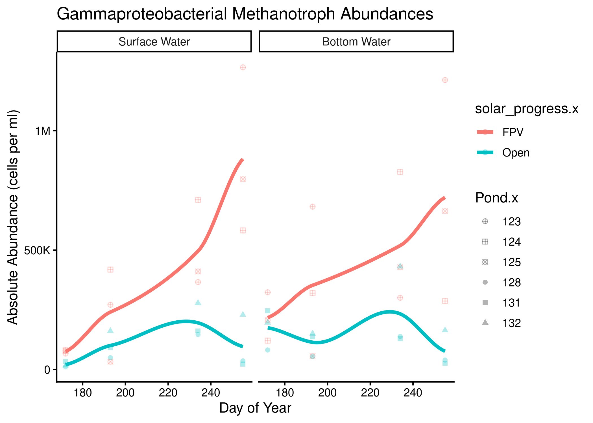<!-- -->

``` r
# 2a simple. plot only gammaproteobacterial methanotroph abundances overtime 
gamma_mob_abundance_simple <- do_abundance %>% 
  dplyr::filter(CH4_Cycler == "Methanotroph" & Class == "Gammaproteobacteria") %>% 
  group_by(JDate.x, Pond.x, solar_progress.x, Depth_Class.x) %>% 
  summarise(
    total_abundance = sum(Abundance, na.rm = TRUE), # total across all samples
    .groups = "drop") %>% 
  ggplot(aes(x = JDate.x,
             y = total_abundance,
             color = solar_progress.x,
             fill = solar_progress.x,
             group = Pond.x)) +
  geom_smooth(aes(group = solar_progress.x), se = FALSE, linewidth = 1.4) +
  geom_point(alpha = 0.3) +
  labs(title = "Gammaproteobacterial Methanotroph Abundances",
       y = "Absolute Abundance (cells per ml)",
       x = "Day of Year") +
  scale_y_continuous(labels = label_number(scale_cut = cut_short_scale(), accuracy = 1)) +
  ggh4x::facet_wrap2(~Depth_Class.x) +
  #scale_shape_manual(values = pond_shapes) +
  theme_classic2()
gamma_mob_abundance_simple
```

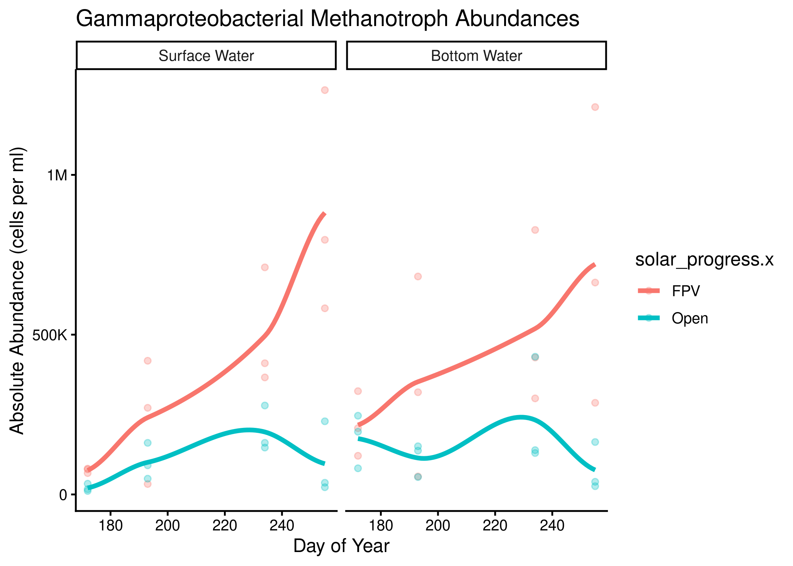<!-- -->

``` r
# 2b. plot only alphaproteobacterial methanotroph abundances overtime 
alpha_mob_abundance <- do_abundance %>% 
  dplyr::filter(CH4_Cycler == "Methanotroph" & Class == "Alphaproteobacteria") %>% 
  group_by(JDate.x, Pond.x, solar_progress.x, Depth_Class.x) %>% 
  summarise(
    total_abundance = sum(Abundance, na.rm = TRUE), # total across all samples
    .groups = "drop") %>% 
  ggplot(aes(x = JDate.x,
             y = total_abundance,
             color = solar_progress.x,
             fill = solar_progress.x,
             shape = Pond.x,
             group = Pond.x)) +
  geom_smooth(aes(group = solar_progress.x), se = FALSE, linewidth = 1.4) +
  geom_point(alpha = 0.3) +
  labs(title = "Alphaproteobacterial Methanotroph Abundances",
       y = "Absolute Abundance (cells per ml)",
       x = "Day of Year") +
  scale_y_continuous(labels = label_number(scale_cut = cut_short_scale(), accuracy = 1)) +
  scale_shape_manual(values = pond_shapes) +
  ggh4x::facet_wrap2(~Depth_Class.x) +
  theme_classic2()
alpha_mob_abundance #interesting that Open ponds have higher alphaproteobacterial methanotrophs; very little in FPV ponds; abundances are less than 80k for alphaproteo methanotrophs in Open ponds though but compared to FPV which have ~20k
```

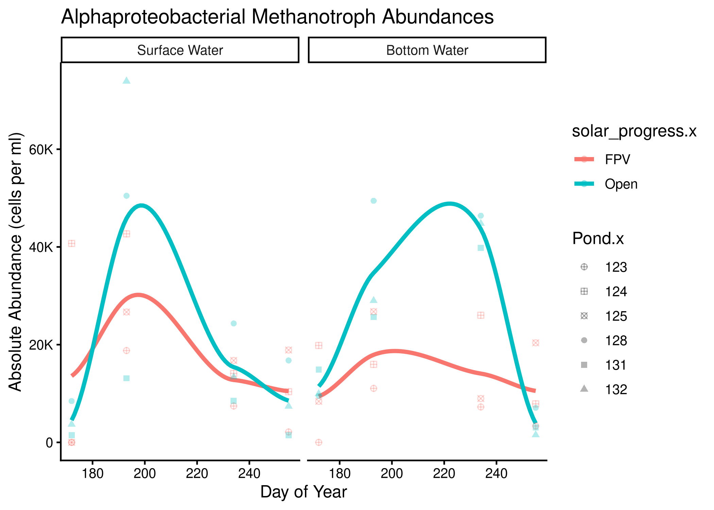<!-- -->

``` r
# 2b simple. plot only alphaproteobacterial methanotroph abundances overtime; simply and not shaped by pond
alpha_mob_abundance_simple <- do_abundance %>% 
  dplyr::filter(CH4_Cycler == "Methanotroph" & Class == "Alphaproteobacteria") %>% 
  group_by(JDate.x, Pond.x, solar_progress.x, Depth_Class.x) %>% 
  summarise(
    total_abundance = sum(Abundance, na.rm = TRUE), # total across all samples
    .groups = "drop") %>% 
  ggplot(aes(x = JDate.x,
             y = total_abundance,
             color = solar_progress.x,
             fill = solar_progress.x,
             group = Pond.x)) +
  geom_smooth(aes(group = solar_progress.x), se = FALSE, linewidth = 1.4) +
  geom_point(alpha = 0.3) +
  labs(title = "Alphaproteobacterial Methanotroph Abundances",
       y = "Absolute Abundance (cells per ml)",
       x = "Day of Year") +
  scale_y_continuous(labels = label_number(scale_cut = cut_short_scale(), accuracy = 1)) +
  ggh4x::facet_wrap2(~Depth_Class.x) +
  theme_classic2()
alpha_mob_abundance_simple
```

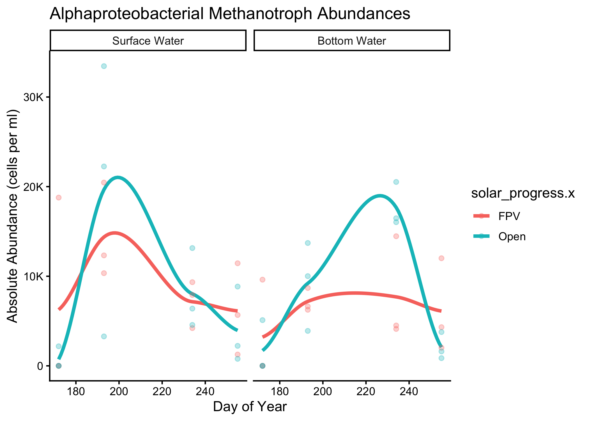<!-- -->

``` r
# 2c. plot only Methylomirabilia methanotroph abundances overtime (NC10 phylum); these are anaerobic bacterial methanotrophs that couples denitrification to methane oxidation! (AOM = anaerobic oxidation of methane)
methylomirabilia_aom_abundance <- do_abundance %>% 
  dplyr::filter(CH4_Cycler == "Methanotroph" & Class == "Methylomirabilia") %>% 
  group_by(JDate.x, Pond.x, solar_progress.x, Depth_Class.x) %>% 
  summarise(
    total_abundance = sum(Abundance, na.rm = TRUE), # total across all samples
    .groups = "drop") %>% 
  ggplot(aes(x = JDate.x,
             y = total_abundance,
             color = solar_progress.x,
             fill = solar_progress.x,
             shape = Pond.x,
             group = Pond.x)) +
  geom_smooth(aes(group = solar_progress.x), se = FALSE, linewidth = 1.4) +
  geom_point(alpha = 0.3) +
  labs(title = "Methylomirabilia (NC10 Phylum) Methanotroph Abundances",
       y = "Absolute Abundance (cells per ml)",
       x = "Day of Year") +
  scale_y_continuous(labels = label_number(scale_cut = cut_short_scale(), accuracy = 1)) +
  scale_shape_manual(values = pond_shapes) +
  ggh4x::facet_wrap2(~Depth_Class.x) +
  theme_classic2()
methylomirabilia_aom_abundance #super lowly abundant in both FPV and Open ponds. virtually nonexistent in FPV ponds at both depths. virtually nonexistent in surface for Open ponds too; lowly abundant in Open bottom waters ~2k but completely crashes by last time point
```

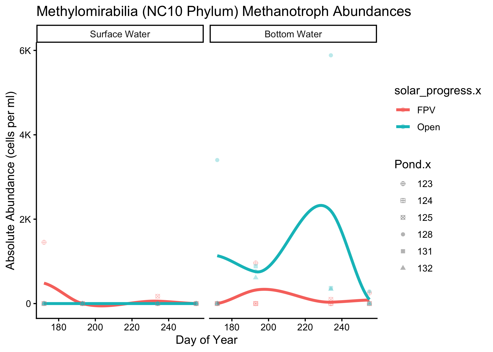<!-- -->

``` r
# 2c simple. plot only NC10 phylum (Methylomirabilia class) methanotroph abundances overtime; simply and not shaped by pond
methylomirabilia_aom_abundance_simple <- do_abundance %>% 
  dplyr::filter(CH4_Cycler == "Methanotroph" & Class == "Methylomirabilia") %>% 
  group_by(JDate.x, Pond.x, solar_progress.x, Depth_Class.x) %>% 
  summarise(
    total_abundance = sum(Abundance, na.rm = TRUE), # total across all samples
    .groups = "drop") %>% 
  ggplot(aes(x = JDate.x,
             y = total_abundance,
             color = solar_progress.x,
             fill = solar_progress.x,
             group = Pond.x)) +
  geom_smooth(aes(group = solar_progress.x), se = FALSE, linewidth = 1.4) +
  geom_point(alpha = 0.3) +
  labs(title = "Methylomirabilia (NC10 Phylum) Methanotroph Abundances",
       y = "Absolute Abundance (cells per ml)",
       x = "Day of Year") +
  scale_y_continuous(labels = label_number(scale_cut = cut_short_scale(), accuracy = 1)) +
  ggh4x::facet_wrap2(~Depth_Class.x) +
  theme_classic2()
methylomirabilia_aom_abundance_simple
```

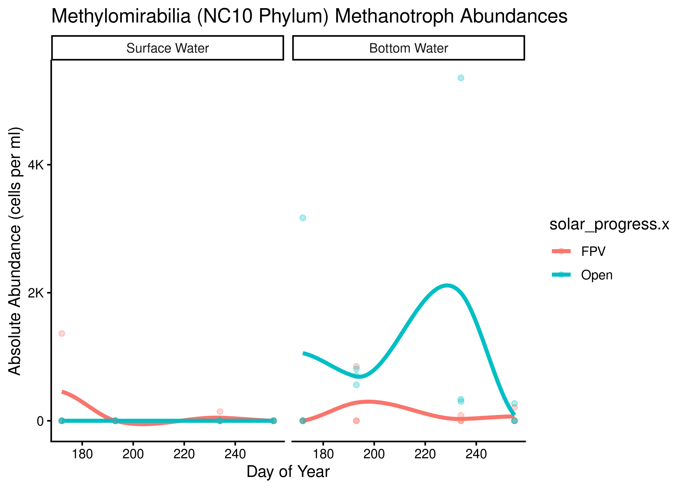<!-- -->

``` r
# plot DO vs methanotroph abundance
## note: we are plotting all methanotrophs (gammaproteobacterial and alphaproteobacterial); should the specific gammmaproteobacterial methanotrophs become an interest then we must reprocess the dataframe to filter specifically for gammaproteos/ type I methanotrophs

abundvs_do_mgl <- do_abundance %>% 
  dplyr::filter(CH4_Cycler == "Methanotroph") %>% 
  group_by(JDate.x, Pond.x, solar_progress.x, Depth_Class.x, HDO_mg.l) %>% 
  summarise(
    total_abundance = sum(Abundance, na.rm = TRUE), # total across all samples
    .groups = "drop") %>% 
 # summarise(avg_do = mean(HDO_mg.l, na.rm = TRUE), .groups = "drop") %>% 
  ggplot(aes(x = HDO_mg.l,
             y = total_abundance,
             color = solar_progress.x,
             fill = solar_progress.x,
             group = Pond.x)) +
 # geom_line() +
  geom_point(alpha = 0.3) +
  geom_smooth(aes(group = solar_progress.x), se = FALSE, linewidth = 1.4) +
  ggh4x::facet_wrap2(~Depth_Class.x)
abundvs_do_mgl
```

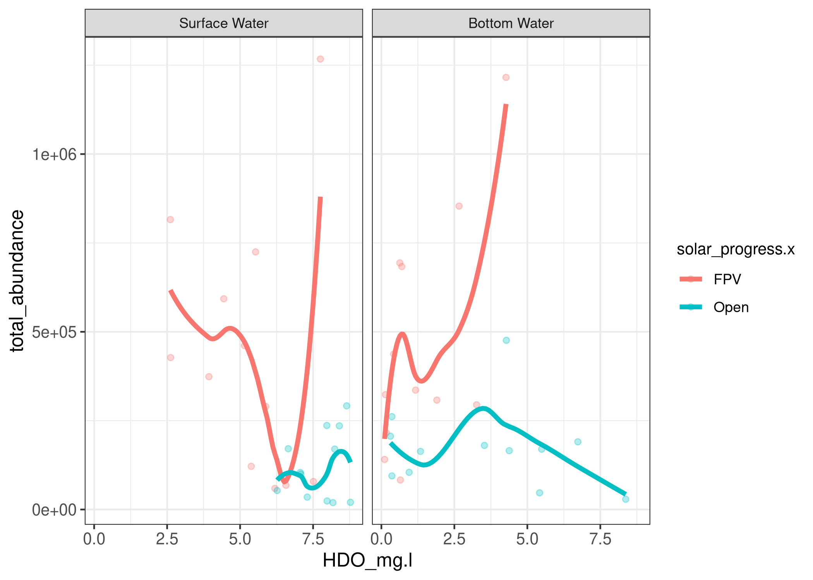<!-- -->

``` r
# lets plot methanotroph abundance with dissolved oxygen concentration overtime with a double y axis - not the best plot!

# first calculate mean abundance and DO concentration between FPV and Open ponds overtime
abund_do_mean <- do_abundance %>% 
  dplyr::filter(CH4_Cycler == "Methanotroph") %>% 
  group_by(JDate.x, solar_progress.x, Depth_Class.x) %>% 
  summarise(
    mean_abundance = mean(Abundance, na.rm = TRUE),
    mean_do        = mean(HDO_mg.l, na.rm = TRUE),
    .groups = "drop")

# then we must perform a linear transformation by rescaling our DO concentration to methanotroph abundance
scale_factor <- max(abund_do_mean$mean_abundance, na.rm = TRUE) /
                max(abund_do_mean$mean_do, na.rm = TRUE)

# now lets plot!
ggplot(abund_do_mean, aes(x = JDate.x)) +
  geom_line(aes(
    y = mean_abundance, color = solar_progress.x, group = solar_progress.x),
    linewidth = 1.2) +
  geom_point(aes(
    y = mean_abundance, color = solar_progress.x),
    size = 2) +
  geom_line(aes(
      y = mean_do * scale_factor, color = solar_progress.x,
      group = solar_progress.x, linetype = "Dissolved oxygen"), 
      linewidth = 1, alpha = 0.7) +
  scale_y_continuous(
    name = expression("Methanotroph abundance (cells mL"^-1*")"),
    sec.axis = sec_axis(~ . / scale_factor, name = "Dissolved oxygen (mg L⁻¹)")) +
  facet_grid(~Depth_Class.x, scales = "free_y") +
  labs(x = "Day of year", color = "Treatment", linetype = NULL) +
  scale_linetype_manual(values = c("Dissolved oxygen" = "dotted")) +
  guides(
    color    = guide_legend(order = 1),
    linetype = guide_legend(order = 2)
  ) +
  theme_classic2()
```

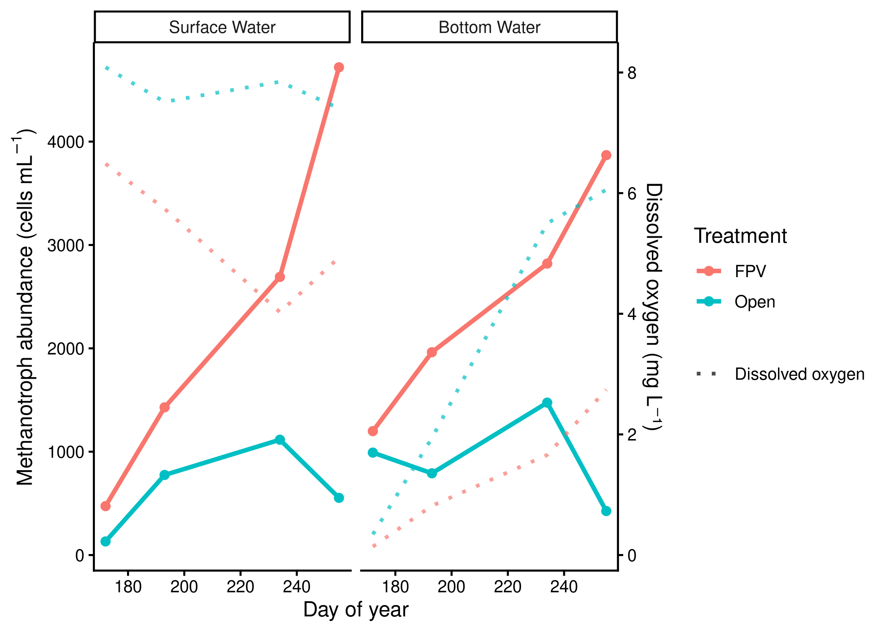<!-- -->

``` r
# dont really love this plot but it is cool to see!


# put together for revision response
do_meth_abund <- do_mgl_simple + methanotroph_all_abund_simple +
  plot_layout(nrow = 2, ncol = 1,
              guides = "collect") 
do_meth_abund
```

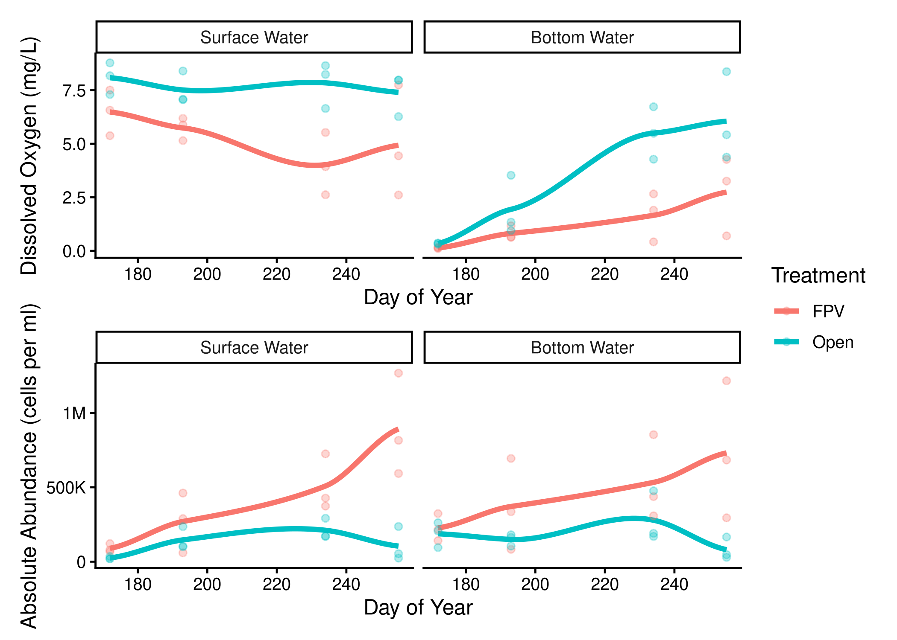<!-- -->

``` r
ggsave(do_meth_abund, width = 6.5, height = 6.5, dpi = 300,
        filename = "figures/bonus/do_meth_abund.png")
```
From our rough plots we see that gammaproteobacterial methanotrophs dominate ponds, this makes sense from our figure 2. 

When we plot only alphaproteobacterial methanotrophs, control ponds seem to have a greater abundance in both depths although much lower abundances (<80k). July has the highest surfacw water time point in one Open
although max cell densities reach over 60,000 in surface waters while bottom waters have average of 40k cells 

Open ponds also have more Methylomirabilia (NC10 phylum) in bottom waters but pretty lowly abundant (~3k cells)

## Top Sediment Methanogen ASVs Over Time 


``` r
# Create a dataframe 
sed_methanogens_df <- 
  sed_methanogens_physeq %>%
  speedyseq::psmelt() %>% # melt into dataframe
  dplyr::select(OTU, Sample, Abundance, DNA_ID, Date_Collected, Deployment_Depth_m, Pond, solar_progress, JDate, Kingdom:CH4_Cycler) %>%
  dplyr::select(-ASVseqs) %>%
  mutate(solar_progress = recode(solar_progress, "No FPV" = "Open"))

## Summary Stats of the ASVs for some perusing 
sed_methanogen_asv_stats <- 
  sed_methanogens_df %>%
  group_by(ASV) %>%
  summarize(mean = mean(Abundance), median = median(Abundance), min = min(Abundance), max = max(Abundance)) 

## Check by FPV and Open 
sed_methanogen_asv_stats_FPV <- 
  sed_methanogens_df %>%
  group_by(ASV, solar_progress) %>%
  summarize(mean = mean(Abundance), median = median(Abundance), min = min(Abundance), max = max(Abundance)) 

# Just create a vector with the ASV names 
sed_methanogen_asvs <- 
  sed_methanogen_asv_stats %>%
  dplyr::filter(mean > 1e-03) %>% # PULL ASVs with a mean of 0.0015 or 0.15% abundance or higher 
  pull(ASV) 

length(sed_methanogen_asvs) 
```

```
## [1] 21
```

``` r
# Make a new df with only these ASVs 
sed_methanogen_abund_asvs_df <- 
  sed_methanogens_df %>%
  dplyr::filter(ASV %in% sed_methanogen_asvs)

# TIME TO PLOT 
top21_sed_methanogen_ASVS_plot <- 
  sed_methanogen_abund_asvs_df %>%
  mutate(ASV_Genus = paste0(ASV, "\n", Genus)) %>%
  group_by(JDate, Pond, solar_progress, Abundance, ASV) %>%
  ggplot(aes(x = JDate, y = Abundance, color = solar_progress)) + 
  facet_wrap(~ASV_Genus, scales = "free_y") +
  geom_line(aes(group = interaction(Pond, ASV)), 
            alpha = 0.2) +
  labs(x = "Day of Year", y = "Relative Abundance", 
       title = "Top 21 Sediment Methanogen ASVs") + 
  geom_point(aes(shape = Pond), size = 2) +
  scale_color_manual(values = solar_colors) +
  scale_shape_manual(values = pond_shapes) + 
  theme(legend.position = "bottom"); top21_sed_methanogen_ASVS_plot
```

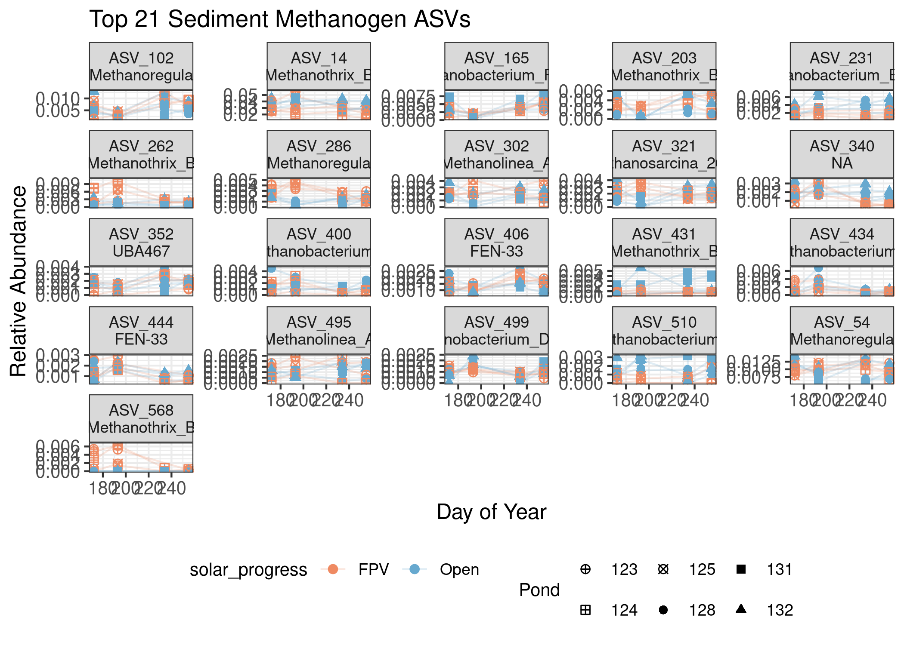<!-- -->

``` r
# Save the plot   
ggsave(top21_sed_methanogen_ASVS_plot, 
       width = 12, height = 10, dpi = 300,
       filename = "figures/bonus/sed_methogen_ASV_time.png")
```


# Reproducibility

``` r
# Reproducibility
devtools::session_info()
```

```
## ─ Session info ─────────────────────────────────────────────────────────────────────────────────────────────────────────────────────────────────────────────────────────────────────────────────────────────────────────────────────────────────────────
##  setting  value
##  version  R version 4.3.3 (2024-02-29)
##  os       Rocky Linux 9.5 (Blue Onyx)
##  system   x86_64, linux-gnu
##  ui       X11
##  language (EN)
##  collate  en_US.UTF-8
##  ctype    en_US.UTF-8
##  tz       America/New_York
##  date     2026-01-22
##  pandoc   3.1.1 @ /usr/lib/rstudio-server/bin/quarto/bin/tools/ (via rmarkdown)
##  quarto   1.3.450 @ /usr/lib/rstudio-server/bin/quarto/bin/quarto
## 
## ─ Packages ─────────────────────────────────────────────────────────────────────────────────────────────────────────────────────────────────────────────────────────────────────────────────────────────────────────────────────────────────────────────
##  package                  * version    date (UTC) lib source
##  abind                      1.4-8      2024-09-12 [1] CRAN (R 4.3.2)
##  ade4                       1.7-23     2025-02-14 [1] CRAN (R 4.3.3)
##  ANCOMBC                  * 2.4.0      2023-10-24 [1] Bioconductor
##  ape                        5.8-1      2024-12-16 [1] CRAN (R 4.3.2)
##  backports                  1.5.0      2024-05-23 [1] CRAN (R 4.3.2)
##  base64enc                  0.1-3      2015-07-28 [2] CRAN (R 4.3.3)
##  beachmat                   2.18.1     2024-02-14 [1] Bioconductor 3.18 (R 4.3.3)
##  beeswarm                   0.4.0      2021-06-01 [1] CRAN (R 4.3.3)
##  Biobase                    2.62.0     2023-10-24 [2] Bioconductor
##  BiocGenerics             * 0.48.1     2023-11-01 [2] Bioconductor
##  BiocNeighbors              1.20.2     2024-01-07 [1] Bioconductor 3.18 (R 4.3.3)
##  BiocParallel               1.36.0     2023-10-24 [2] Bioconductor
##  BiocSingular               1.18.0     2023-10-24 [1] Bioconductor
##  biomformat                 1.30.0     2023-10-24 [1] Bioconductor
##  Biostrings               * 2.70.3     2024-03-13 [2] Bioconductor 3.18 (R 4.3.3)
##  bit                        4.6.0      2025-03-06 [1] CRAN (R 4.3.3)
##  bit64                      4.6.0-1    2025-01-16 [1] CRAN (R 4.3.2)
##  bitops                     1.0-9      2024-10-03 [2] CRAN (R 4.3.3)
##  blob                       1.2.4      2023-03-17 [2] CRAN (R 4.3.3)
##  bluster                    1.12.0     2023-10-24 [1] Bioconductor
##  boot                       1.3-29     2024-02-19 [2] CRAN (R 4.3.3)
##  broom                      1.0.11     2025-12-04 [1] CRAN (R 4.3.3)
##  bslib                      0.9.0      2025-01-30 [1] CRAN (R 4.3.3)
##  cachem                     1.1.0      2024-05-16 [1] CRAN (R 4.3.2)
##  car                        3.1-3      2024-09-27 [1] CRAN (R 4.3.2)
##  carData                    3.0-5      2022-01-06 [1] CRAN (R 4.3.2)
##  cellranger                 1.1.0      2016-07-27 [1] CRAN (R 4.3.2)
##  checkmate                  2.3.3      2025-08-18 [1] CRAN (R 4.3.3)
##  class                      7.3-22     2023-05-03 [2] CRAN (R 4.3.3)
##  cli                        3.6.5      2025-04-23 [1] CRAN (R 4.3.3)
##  cluster                    2.1.6      2023-12-01 [2] CRAN (R 4.3.3)
##  coda                       0.19-4.1   2024-01-31 [1] CRAN (R 4.3.2)
##  codetools                  0.2-19     2023-02-01 [2] CRAN (R 4.3.3)
##  colorspace                 2.1-2      2025-09-22 [1] CRAN (R 4.3.3)
##  commonmark                 2.0.0      2025-07-07 [1] CRAN (R 4.3.3)
##  cowplot                  * 1.1.3      2024-01-22 [2] CRAN (R 4.3.3)
##  crayon                     1.5.3      2024-06-20 [1] CRAN (R 4.3.2)
##  CVXR                       1.0-15     2024-11-07 [1] CRAN (R 4.3.3)
##  data.table                 1.17.8     2025-07-10 [1] CRAN (R 4.3.3)
##  DBI                        1.2.3      2024-06-02 [2] CRAN (R 4.3.3)
##  DECIPHER                   2.30.0     2023-10-24 [1] Bioconductor
##  decontam                   1.22.0     2023-10-24 [1] Bioconductor
##  DelayedArray               0.28.0     2023-10-24 [2] Bioconductor
##  DelayedMatrixStats         1.24.0     2023-10-24 [1] Bioconductor
##  DescTools                  0.99.60    2025-03-28 [1] CRAN (R 4.3.3)
##  devtools                   2.4.6      2025-10-03 [1] CRAN (R 4.3.3)
##  dichromat                  2.0-0.1    2022-05-02 [1] CRAN (R 4.3.2)
##  digest                     0.6.39     2025-11-19 [1] CRAN (R 4.3.3)
##  DirichletMultinomial       1.44.0     2023-10-24 [1] Bioconductor
##  doParallel                 1.0.17     2022-02-07 [1] CRAN (R 4.3.3)
##  doRNG                      1.8.6.2    2025-04-02 [1] CRAN (R 4.3.3)
##  dplyr                    * 1.1.4      2023-11-17 [1] CRAN (R 4.3.2)
##  e1071                      1.7-16     2024-09-16 [1] CRAN (R 4.3.2)
##  ellipsis                   0.3.2      2021-04-29 [2] CRAN (R 4.3.3)
##  emmeans                    2.0.0      2025-10-29 [1] CRAN (R 4.3.3)
##  energy                     1.7-12     2024-08-24 [1] CRAN (R 4.3.3)
##  estimability               1.5.1      2024-05-12 [1] CRAN (R 4.3.3)
##  evaluate                   1.0.5      2025-08-27 [1] CRAN (R 4.3.3)
##  Exact                      3.3        2024-07-21 [1] CRAN (R 4.3.3)
##  expm                       1.0-0      2024-08-19 [1] CRAN (R 4.3.2)
##  farver                     2.1.2      2024-05-13 [2] CRAN (R 4.3.3)
##  fastmap                    1.2.0      2024-05-15 [1] CRAN (R 4.3.2)
##  forcats                  * 1.0.1      2025-09-25 [1] CRAN (R 4.3.3)
##  foreach                    1.5.2      2022-02-02 [1] CRAN (R 4.3.3)
##  foreign                    0.8-86     2023-11-28 [2] CRAN (R 4.3.3)
##  Formula                    1.2-5      2023-02-24 [1] CRAN (R 4.3.2)
##  fs                         1.6.6      2025-04-12 [1] CRAN (R 4.3.3)
##  generics                   0.1.4      2025-05-09 [1] CRAN (R 4.3.3)
##  GenomeInfoDb             * 1.38.8     2024-03-15 [2] Bioconductor 3.18 (R 4.3.3)
##  GenomeInfoDbData           1.2.11     2024-11-25 [2] Bioconductor
##  GenomicRanges              1.54.1     2023-10-29 [2] Bioconductor
##  ggbeeswarm                 0.7.3      2025-11-29 [1] CRAN (R 4.3.3)
##  ggh4x                    * 0.3.1.9000 2025-12-17 [1] Github (teunbrand/ggh4x@63c91b7)
##  ggplot2                  * 4.0.1.9000 2025-12-19 [1] Github (tidyverse/ggplot2@4ea78a4)
##  ggpubr                   * 0.6.0      2023-02-10 [1] CRAN (R 4.3.3)
##  ggrepel                    0.9.6      2024-09-07 [1] CRAN (R 4.3.3)
##  ggsignif                   0.6.4      2022-10-13 [1] CRAN (R 4.3.2)
##  ggtext                   * 0.1.2      2022-09-16 [1] CRAN (R 4.3.3)
##  gld                        2.6.8      2025-09-14 [1] CRAN (R 4.3.3)
##  glue                       1.8.0      2024-09-30 [1] CRAN (R 4.3.2)
##  gmp                        0.7-5      2024-08-23 [1] CRAN (R 4.3.3)
##  gridExtra                  2.3        2017-09-09 [2] CRAN (R 4.3.3)
##  gridtext                   0.1.5      2022-09-16 [1] CRAN (R 4.3.3)
##  gsl                        2.1-8      2023-01-24 [1] CRAN (R 4.3.3)
##  gtable                     0.3.6      2024-10-25 [2] CRAN (R 4.3.3)
##  gtools                     3.9.5      2023-11-20 [2] CRAN (R 4.3.3)
##  haven                      2.5.5      2025-05-30 [1] CRAN (R 4.3.3)
##  Hmisc                      5.2-4      2025-10-05 [1] CRAN (R 4.3.3)
##  hms                        1.1.4      2025-10-17 [1] CRAN (R 4.3.3)
##  htmlTable                  2.4.3      2024-07-21 [1] CRAN (R 4.3.3)
##  htmltools                  0.5.9      2025-12-04 [1] CRAN (R 4.3.3)
##  htmlwidgets                1.6.4      2023-12-06 [1] CRAN (R 4.3.2)
##  httr                       1.4.7      2023-08-15 [2] CRAN (R 4.3.3)
##  igraph                     2.2.1      2025-10-27 [1] CRAN (R 4.3.3)
##  IRanges                  * 2.36.0     2023-10-24 [2] Bioconductor
##  irlba                      2.3.5.1    2022-10-03 [2] CRAN (R 4.3.3)
##  iterators                  1.0.14     2022-02-05 [1] CRAN (R 4.3.3)
##  jquerylib                  0.1.4      2021-04-26 [2] CRAN (R 4.3.3)
##  jsonlite                   2.0.0      2025-03-27 [1] CRAN (R 4.3.3)
##  knitr                      1.50       2025-03-16 [1] CRAN (R 4.3.3)
##  labeling                   0.4.3      2023-08-29 [2] CRAN (R 4.3.3)
##  lattice                    0.22-5     2023-10-24 [2] CRAN (R 4.3.3)
##  lazyeval                   0.2.2      2019-03-15 [2] CRAN (R 4.3.3)
##  lifecycle                  1.0.4      2023-11-07 [1] CRAN (R 4.3.2)
##  litedown                   0.8        2025-11-02 [1] CRAN (R 4.3.3)
##  lme4                     * 1.1-38     2025-12-02 [1] CRAN (R 4.3.3)
##  lmerTest                 * 3.1-3      2020-10-23 [1] CRAN (R 4.3.3)
##  lmom                       3.2        2024-09-30 [1] CRAN (R 4.3.3)
##  lubridate                * 1.9.4      2024-12-08 [1] CRAN (R 4.3.3)
##  magrittr                   2.0.4      2025-09-12 [1] CRAN (R 4.3.3)
##  markdown                   2.0        2025-03-23 [1] CRAN (R 4.3.3)
##  MASS                       7.3-60.0.1 2024-01-13 [2] CRAN (R 4.3.3)
##  Matrix                   * 1.6-5      2024-01-11 [2] CRAN (R 4.3.3)
##  MatrixGenerics             1.14.0     2023-10-24 [2] Bioconductor
##  matrixStats                1.5.0      2025-01-07 [1] CRAN (R 4.3.3)
##  memoise                    2.0.1      2021-11-26 [2] CRAN (R 4.3.3)
##  mgcv                       1.9-1      2023-12-21 [2] CRAN (R 4.3.3)
##  mia                        1.10.0     2023-10-24 [1] Bioconductor
##  microViz                 * 0.12.6     2025-01-30 [1] https://david-barnett.r-universe.dev (R 4.3.3)
##  minqa                      1.2.8      2024-08-17 [1] CRAN (R 4.3.2)
##  multcomp                   1.4-29     2025-10-20 [1] CRAN (R 4.3.3)
##  MultiAssayExperiment       1.28.0     2023-10-24 [1] Bioconductor
##  multtest                   2.58.0     2023-10-24 [1] Bioconductor
##  mvtnorm                    1.3-3      2025-01-10 [1] CRAN (R 4.3.2)
##  nlme                       3.1-164    2023-11-27 [2] CRAN (R 4.3.3)
##  nloptr                     2.2.1      2025-03-17 [1] CRAN (R 4.3.3)
##  nnet                       7.3-19     2023-05-03 [2] CRAN (R 4.3.3)
##  numDeriv                   2016.8-1.1 2019-06-06 [1] CRAN (R 4.3.2)
##  pacman                     0.5.1      2019-03-11 [1] CRAN (R 4.3.2)
##  patchwork                * 1.3.2.9000 2025-12-19 [1] Github (thomasp85/patchwork@6b1d88c)
##  pbkrtest                   0.5.5      2025-07-18 [1] CRAN (R 4.3.3)
##  permute                  * 0.9-8      2025-06-25 [1] CRAN (R 4.3.3)
##  phyloseq                 * 1.46.0     2023-10-24 [1] Bioconductor
##  pillar                     1.11.1     2025-09-17 [1] CRAN (R 4.3.3)
##  pkgbuild                   1.4.8      2025-05-26 [1] CRAN (R 4.3.3)
##  pkgconfig                  2.0.3      2019-09-22 [2] CRAN (R 4.3.3)
##  pkgload                    1.4.1      2025-09-23 [1] CRAN (R 4.3.3)
##  plyr                       1.8.9      2023-10-02 [2] CRAN (R 4.3.3)
##  proxy                      0.4-27     2022-06-09 [1] CRAN (R 4.3.2)
##  purrr                    * 1.2.0      2025-11-04 [1] CRAN (R 4.3.3)
##  R6                         2.6.1      2025-02-15 [1] CRAN (R 4.3.3)
##  ragg                       1.5.0      2025-09-02 [1] CRAN (R 4.3.3)
##  rappdirs                   0.3.3      2021-01-31 [2] CRAN (R 4.3.3)
##  rbibutils                  2.4        2025-11-07 [1] CRAN (R 4.3.3)
##  RColorBrewer               1.1-3      2022-04-03 [2] CRAN (R 4.3.3)
##  Rcpp                       1.1.0      2025-07-02 [1] CRAN (R 4.3.3)
##  RCurl                      1.98-1.16  2024-07-11 [2] CRAN (R 4.3.3)
##  Rdpack                     2.6.4      2025-04-09 [1] CRAN (R 4.3.3)
##  readr                    * 2.1.6      2025-11-14 [1] CRAN (R 4.3.3)
##  readxl                     1.4.5      2025-03-07 [1] CRAN (R 4.3.3)
##  reformulas                 0.4.2      2025-10-28 [1] CRAN (R 4.3.3)
##  remotes                    2.5.0      2024-03-17 [1] CRAN (R 4.3.3)
##  reshape2                   1.4.4      2020-04-09 [2] CRAN (R 4.3.3)
##  rhdf5                      2.46.1     2023-11-29 [1] Bioconductor 3.18 (R 4.3.2)
##  rhdf5filters               1.14.1     2023-11-06 [1] Bioconductor
##  Rhdf5lib                   1.24.2     2024-02-07 [1] Bioconductor 3.18 (R 4.3.2)
##  rlang                      1.1.6      2025-04-11 [1] CRAN (R 4.3.3)
##  rmarkdown                  2.30       2025-09-28 [1] CRAN (R 4.3.3)
##  Rmpfr                      1.1-2      2025-10-27 [1] CRAN (R 4.3.3)
##  rngtools                   1.5.2      2021-09-20 [1] CRAN (R 4.3.3)
##  rootSolve                  1.8.2.4    2023-09-21 [1] CRAN (R 4.3.3)
##  rpart                      4.1.23     2023-12-05 [2] CRAN (R 4.3.3)
##  RSQLite                    2.3.8      2024-11-17 [2] CRAN (R 4.3.3)
##  rstatix                  * 0.7.3      2025-10-18 [1] CRAN (R 4.3.3)
##  rstudioapi                 0.17.1     2024-10-22 [2] CRAN (R 4.3.3)
##  rsvd                       1.0.5      2021-04-16 [1] CRAN (R 4.3.3)
##  S4Arrays                   1.2.1      2024-03-04 [2] Bioconductor 3.18 (R 4.3.3)
##  S4Vectors                * 0.40.2     2023-11-23 [2] Bioconductor 3.18 (R 4.3.3)
##  S7                         0.2.1      2025-11-14 [1] CRAN (R 4.3.3)
##  sandwich                   3.1-1      2024-09-15 [1] CRAN (R 4.3.3)
##  sass                       0.4.10     2025-04-11 [1] CRAN (R 4.3.3)
##  ScaledMatrix               1.10.0     2023-10-24 [1] Bioconductor
##  scales                   * 1.4.0      2025-04-24 [1] CRAN (R 4.3.3)
##  scater                     1.30.1     2023-11-16 [1] Bioconductor
##  scuttle                    1.12.0     2023-10-24 [1] Bioconductor
##  sessioninfo                1.2.3      2025-02-05 [1] CRAN (R 4.3.3)
##  SingleCellExperiment       1.24.0     2023-10-24 [1] Bioconductor
##  SparseArray                1.2.4      2024-02-11 [2] Bioconductor 3.18 (R 4.3.3)
##  sparseMatrixStats          1.14.0     2023-10-24 [1] Bioconductor
##  speedyseq                * 0.5.3.9021 2025-02-18 [1] Github (mikemc/speedyseq@0057652)
##  stringi                    1.8.7      2025-03-27 [1] CRAN (R 4.3.3)
##  stringr                  * 1.6.0      2025-11-04 [1] CRAN (R 4.3.3)
##  SummarizedExperiment       1.32.0     2023-10-24 [2] Bioconductor
##  survival                   3.5-8      2024-02-14 [2] CRAN (R 4.3.3)
##  systemfonts                1.3.1      2025-10-01 [1] CRAN (R 4.3.3)
##  textshaping                0.4.0      2024-05-24 [2] CRAN (R 4.3.3)
##  TH.data                    1.1-5      2025-11-17 [1] CRAN (R 4.3.3)
##  tibble                   * 3.3.0      2025-06-08 [1] CRAN (R 4.3.3)
##  tidyr                    * 1.3.1      2024-01-24 [1] CRAN (R 4.3.3)
##  tidyselect                 1.2.1      2024-03-11 [1] CRAN (R 4.3.2)
##  tidytree                   0.4.6      2023-12-12 [1] CRAN (R 4.3.2)
##  tidyverse                * 2.0.0      2023-02-22 [1] CRAN (R 4.3.3)
##  timechange                 0.3.0      2024-01-18 [1] CRAN (R 4.3.2)
##  treeio                     1.26.0     2023-10-24 [1] Bioconductor
##  TreeSummarizedExperiment   2.10.0     2023-10-24 [1] Bioconductor
##  tzdb                       0.5.0      2025-03-15 [1] CRAN (R 4.3.3)
##  usethis                    3.2.1      2025-09-06 [1] CRAN (R 4.3.3)
##  utf8                       1.2.6      2025-06-08 [1] CRAN (R 4.3.3)
##  vctrs                      0.6.5      2023-12-01 [1] CRAN (R 4.3.2)
##  vegan                    * 2.7-2      2025-10-08 [1] CRAN (R 4.3.3)
##  vipor                      0.4.7      2023-12-18 [1] CRAN (R 4.3.3)
##  viridis                    0.6.5      2024-01-29 [1] CRAN (R 4.3.3)
##  viridisLite                0.4.2      2023-05-02 [2] CRAN (R 4.3.3)
##  vroom                      1.6.7      2025-11-28 [1] CRAN (R 4.3.3)
##  withr                      3.0.2      2024-10-28 [1] CRAN (R 4.3.2)
##  xfun                       0.54       2025-10-30 [1] CRAN (R 4.3.3)
##  xml2                       1.5.1      2025-12-01 [1] CRAN (R 4.3.3)
##  xtable                     1.8-4      2019-04-21 [2] CRAN (R 4.3.3)
##  XVector                  * 0.42.0     2023-10-24 [2] Bioconductor
##  yaml                       2.3.12     2025-12-10 [1] CRAN (R 4.3.3)
##  yulab.utils                0.2.2      2025-12-01 [1] CRAN (R 4.3.3)
##  zlibbioc                   1.48.2     2024-03-13 [2] Bioconductor 3.18 (R 4.3.3)
##  zoo                        1.8-12     2023-04-13 [2] CRAN (R 4.3.3)
## 
##  [1] /lustre2/home/hendrylab/sna49/R/x86_64-pc-linux-gnu-library/4.3
##  [2] /programs/R-4.3.3/lib64/R/library
##  * ── Packages attached to the search path.
## 
## ────────────────────────────────────────────────────────────────────────────────────────────────────────────────────────────────────────────────────────────────────────────────────────────────────────────────────────────────────────────────────────
```

